## Keywords

1. [HIB-094 ORM vs SQL-First Strategy Decision Framework](#hib-094-orm-vs-sql-first-strategy-decision-framework)
2. [HIB-095 DDD Aggregates and Hibernate Persistence Boundaries](#hib-095-ddd-aggregates-and-hibernate-persistence-boundaries)
3. [HIB-096 Fleet-Wide Hibernate Governance and Standards](#hib-096-fleet-wide-hibernate-governance-and-standards)
4. [HIB-097 ORM-to-SQL-Builder (jOOQ/Exposed) Migration Strategy](#hib-097-orm-to-sql-builder-jooqexposed-migration-strategy)
5. [HIB-098 Hibernate 5 to 6 (Jakarta EE) Migration Path](#hib-098-hibernate-5-to-6-jakarta-ee-migration-path)
6. [HIB-099 CQRS with Hibernate - Read vs Write Model Separation](#hib-099-cqrs-with-hibernate---read-vs-write-model-separation)
7. [HIB-100 Multi-Database and Polyglot Persistence Architecture](#hib-100-multi-database-and-polyglot-persistence-architecture)
8. [HIB-101 Hibernate in Microservices vs Monolith Decision Guide](#hib-101-hibernate-in-microservices-vs-monolith-decision-guide)
9. [HIB-102 Staff-Level ORM Interview Scenarios](#hib-102-staff-level-orm-interview-scenarios)
10. [HIB-103 Teaching Hibernate - Why Juniors Struggle with ORM](#hib-103-teaching-hibernate---why-juniors-struggle-with-orm)
11. [HIB-104 ORM Data Layer - Phase 5 (Platform Strategy)](#hib-104-orm-data-layer---phase-5-platform-strategy)

---

---

# HIB-094 ORM vs SQL-First Strategy Decision Framework

**TL;DR** - Choose ORM for domain-heavy CRUD with complex object graphs. Choose SQL-first for analytics, reporting, or when SQL expertise exceeds ORM expertise.

---

### 🔥 Problem Statement

A team starts a new project. The architect must decide: Hibernate (ORM-first) or jOOQ/JDBC (SQL-first). Both can build the same application. The wrong choice costs months of rework. ORM-first excels at domain modeling, state management, and complex object graphs. SQL-first excels at query-heavy workloads, analytics, and teams with strong SQL skills. The decision framework evaluates five dimensions: domain complexity, query complexity, team expertise, write/read ratio, and operational maturity. No single answer fits all projects - the framework eliminates opinion-based arguments and replaces them with measurable criteria.

---

### 📜 Historical Context

The ORM vs SQL debate has persisted since Hibernate 2 (2003). Early ORM advocates claimed "never write SQL again." Early ORM critics claimed "ORM is an anti-pattern." Both extremes are wrong. The industry settled on context-dependent decisions by 2015, but many teams still choose based on familiarity rather than project fit. Modern projects increasingly use hybrid approaches: Hibernate for writes, jOOQ or native queries for complex reads. The decision framework formalizes what experienced architects do intuitively.

---

### 🔩 First Principles

**CORE INVARIANTS:**

1. **Domain complexity favors ORM:** Applications with rich domain models (20+ entity types, complex state transitions, aggregate boundaries) benefit from ORM's object-graph management, cascade behavior, and dirty checking.
2. **Query complexity favors SQL-first:** Applications with analytical queries (window functions, CTEs, recursive queries, complex aggregations) are easier to express and optimize in SQL directly.
3. **Write-heavy favors ORM:** Batch inserts, cascade persistence, optimistic locking, and transaction management are simpler with ORM. SQL-first requires manual implementation of these patterns.
4. **Team expertise is the tiebreaker:** When domain and query complexity are balanced, the team's existing expertise determines the lower-risk choice.

**DERIVED DESIGN:**

The framework scores five dimensions 1-5. Total > 15 favors ORM-first. Total < 10 favors SQL-first. 10-15 is the hybrid zone where both approaches have merit.

**THE TRADE-OFF:**

**Gain:** Data-driven technology decision. Eliminates opinion-based arguments. Provides a reviewable decision artifact.

**Cost:** Requires honest assessment of project characteristics. May challenge team preferences.

---

### 🧠 Mental Model

> ORM vs SQL-first is like choosing between an automatic and manual transmission. Automatic (ORM) handles gear changes for you: great for city driving (CRUD, domain logic). Manual (SQL) gives full control: great for racing (analytics, complex queries). Some cars have both (hybrid approach).

- "Automatic" -> ORM (manages SQL generation)
- "Manual" -> SQL-first (full SQL control)
- "City driving" -> CRUD, domain logic
- "Racing" -> analytics, complex queries

**Where this analogy breaks down:** Unlike transmissions, you can use both ORM and SQL-first in the same application for different use cases.

---

### 🧩 Components

**The five decision dimensions:**

- **D1 - Domain complexity (1-5):** 1 = flat tables, no relationships. 5 = rich domain with 20+ entities, polymorphism, aggregates.
- **D2 - Query complexity (1-5):** 1 = simple CRUD. 5 = analytics with window functions, CTEs, recursive queries.
- **D3 - Write/read ratio (1-5):** 1 = 90% reads. 5 = 90% writes or balanced with complex write logic.
- **D4 - Team ORM expertise (1-5):** 1 = no ORM experience. 5 = team has production ORM experience with performance tuning.
- **D5 - Operational maturity (1-5):** 1 = no monitoring, no CI query assertions. 5 = full observability stack with Hibernate Statistics, datasource-proxy.

```text
  Decision matrix:
  +----------+------+----------+-----------+
  | Dimension| Score| ORM-first| SQL-first |
  +----------+------+----------+-----------+
  | D1 Domain|  1-5 | >= 4     | <= 2      |
  | D2 Query |  1-5 | <= 2     | >= 4      |
  | D3 Write |  1-5 | >= 4     | <= 2      |
  | D4 ORM   |  1-5 | >= 3     | <= 2      |
  | D5 Ops   |  1-5 | >= 3     | <= 2      |
  +----------+------+----------+-----------+
  Total > 15: ORM-first
  Total 10-15: Hybrid
  Total < 10: SQL-first
```

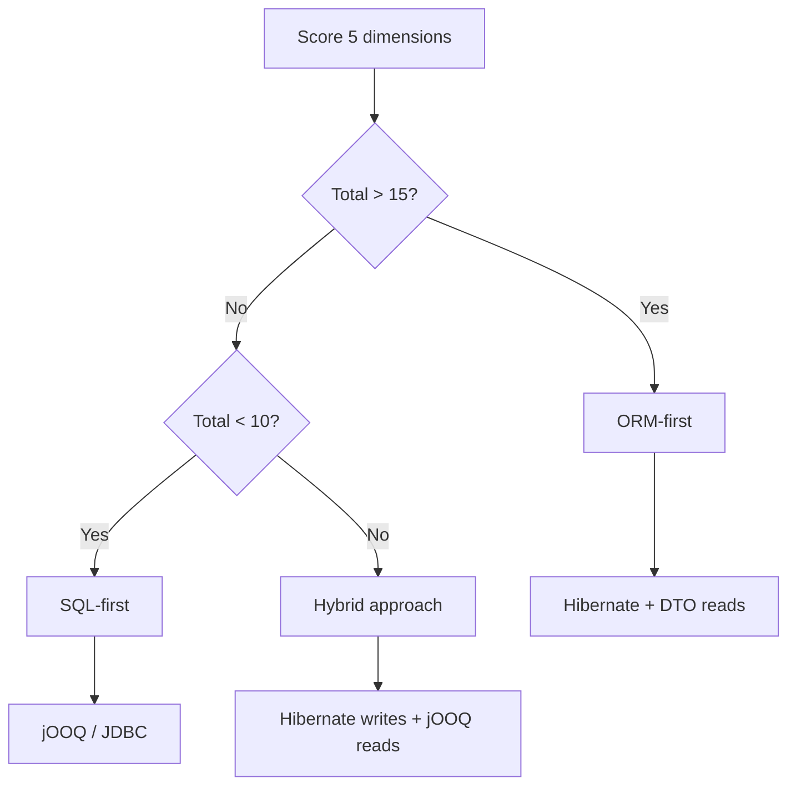

---

### 📶 Gradual Depth

**Level 1 - What it is:**

A structured framework for deciding between ORM (Hibernate) and SQL-first (jOOQ/JDBC) approaches, based on five measurable project dimensions.

**Level 2 - How to use it:**

Score each dimension 1-5. Sum the scores. >15 = ORM, <10 = SQL-first, 10-15 = hybrid. Document the scoring as a decision record for the team.

**Level 3 - How it works:**

Each dimension correlates with ORM strengths or SQL-first strengths. Domain complexity and write ratio favor ORM (object-graph management). Query complexity favors SQL-first (direct SQL expression). Team expertise and operational maturity act as risk modifiers.

**Level 4 - Production mastery:**

In practice, most enterprise applications score 12-18 (hybrid to ORM-first). Pure SQL-first is rare except for analytics platforms and data pipelines. The hybrid approach is increasingly common: Hibernate for the domain model (writes, entity lifecycle) and jOOQ or native queries for complex reads (reports, dashboards, search). Spring Data JPA supports both in the same application via `@Query(nativeQuery=true)` or separate jOOQ repositories.

---

### ⚙️ How It Works

**Phase 1 - Dimension scoring:**
Architect and tech lead independently score each dimension. Compare scores. Discuss disagreements.

**Phase 2 - Decision:**
Sum scores. Apply thresholds. If hybrid zone: identify which use cases favor ORM and which favor SQL.

**Phase 3 - Architecture:**
ORM-first: Hibernate entities, Spring Data JPA, DTO projections for reads. SQL-first: jOOQ or JDBC templates, manual SQL, result mapping. Hybrid: Hibernate for writes, jOOQ/native for complex reads.

**Phase 4 - Documentation:**
Write Architecture Decision Record (ADR). Include scores, rationale, and review criteria (re-evaluate after 6 months).

```text
  Example scoring - E-commerce platform:
  D1 Domain: 4 (Order, Product, Customer,
     Inventory, Shipping - rich domain)
  D2 Query: 3 (moderate - some reports)
  D3 Write: 4 (order processing, inventory)
  D4 ORM: 4 (team has Hibernate experience)
  D5 Ops: 3 (monitoring in place)
  Total: 18 -> ORM-first

  Example scoring - Analytics dashboard:
  D1 Domain: 2 (flat event tables)
  D2 Query: 5 (CTEs, window functions)
  D3 Write: 1 (batch ETL only)
  D4 ORM: 2 (team prefers SQL)
  D5 Ops: 1 (new project)
  Total: 11 -> SQL-first/Hybrid
```

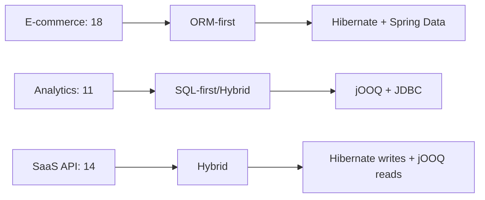

---

### 🚨 Failure Modes

**Failure 1 - ORM for analytics workload:**

**Symptom:** Team uses Hibernate for reporting dashboard. Queries require CTEs, window functions, and multi-table aggregations. JPQL cannot express them. Team writes native queries for 80% of endpoints.

**Root cause:** Domain complexity was low (D1=2) and query complexity was high (D2=5). Total score was 11 but team chose ORM based on familiarity.

**Diagnostic:**

```text
Count native queries vs JPQL queries.
If native > 50%: ORM adds overhead without
benefit. The team is fighting the framework.
```

**Fix:**

**BAD:**

```java
// Fighting Hibernate for analytics
@Query(value = "WITH monthly AS ( "
    + "SELECT date_trunc('month', ...) "
    + "...) SELECT ... FROM monthly",
    nativeQuery = true)
List<Object[]> getMonthlyReport();
// 80% of queries are native SQL anyway
```

**GOOD:**

```java
// jOOQ: SQL is the domain language
DSL.with("monthly").as(
    select(datetrunc("month", ...))
    .from(EVENTS))
    .select(...)
    .from(name("monthly"));
// Type-safe SQL, full SQL power
```

**Failure 2 - SQL-first for complex domain:**

**Symptom:** Team uses JDBC for an order management system. Manual cascade logic, manual optimistic locking, manual dirty tracking across 25 entity types. Code is fragile and bug-prone.

**Root cause:** Domain complexity was high (D1=5) but team chose SQL-first because they feared "Hibernate is slow."

**Diagnostic:**

```text
Count lines of manual persistence code
(cascade, locking, dirty tracking, mapping).
If > 30% of codebase: ORM would reduce this
to annotations + configuration.
```

**Fix:**

```text
Re-evaluate with the decision framework.
D1=5 strongly favors ORM. Hibernate handles
cascade, locking, and dirty tracking
automatically. Migration cost: 2-4 weeks.
Manual persistence maintenance cost: ongoing.
```

---

### 🔬 Production Reality

A fintech company starts with JDBC for "simplicity." After 18 months, the codebase has 15,000 lines of manual persistence code: cascade logic for 8 entity types, manual optimistic locking with version columns, hand-written SQL for 60 queries, and result-set-to-object mapping for each. A new hire introduces a bug in the cascade logic that causes orphaned records. Post-mortem: the team re-evaluates using the decision framework. Scores: D1=4, D2=2, D3=4, D4=3 (new hire knows Hibernate), D5=2. Total: 15. Decision: migrate to Hibernate. Migration takes 3 weeks. 12,000 lines of persistence code replaced by 200 lines of annotations. Cascade bug class eliminated.

---

### ⚖️ Trade-offs & Alternatives

| Aspect            | Hibernate (ORM) | jOOQ (SQL-first) | Hybrid         |
| ----------------- | --------------- | ---------------- | -------------- |
| Domain modeling   | Excellent       | Manual           | Best of both   |
| Query flexibility | JPQL limited    | Full SQL         | Full SQL reads |
| Write management  | Automatic       | Manual           | Automatic      |
| Learning curve    | Steep           | Moderate         | Steepest       |
| Team fit          | Java/DDD teams  | SQL-expert teams | Experienced    |

**Real-world patterns:**

- **Enterprise SaaS** (Salesforce-style): ORM-first. Rich domain, complex writes, moderate reads.
- **Data platforms** (analytics/BI): SQL-first. Flat tables, complex queries, batch writes.
- **Modern microservices**: Hybrid. Hibernate for domain service, jOOQ for query service.

---

### ⚡ Decision Snap

**USE ORM-FIRST WHEN:**

- Domain score (D1) >= 4. Rich entity model with state transitions and aggregates.
- Write ratio (D3) >= 3. Significant write logic benefits from automatic persistence.

**USE SQL-FIRST WHEN:**

- Query score (D2) >= 4. Complex analytics that JPQL cannot express.
- Domain score (D1) <= 2. Flat tables without domain logic.

**USE HYBRID WHEN:**

- Balanced scores. Hibernate for writes, SQL-first for complex reads.

---

### ⚠️ Top Traps

| #   | Misconception                           | Reality                                                                                                                                 |
| --- | --------------------------------------- | --------------------------------------------------------------------------------------------------------------------------------------- |
| 1   | ORM is always the right choice for Java | ORM excels at domain-rich CRUD. For analytics, data pipelines, or simple CRUD, SQL-first or JDBC is simpler.                            |
| 2   | SQL-first is always simpler             | For 5 tables, yes. For 25 entities with cascades, locking, and state transitions, manual persistence code exceeds ORM's complexity.     |
| 3   | The team can switch later easily        | Technology switch costs 2-12 weeks depending on codebase size. Decide correctly upfront using the framework.                            |
| 4   | Hybrid is too complex                   | Hybrid is increasingly standard. Spring Boot supports Hibernate + jOOQ in the same application. The boundary is clear: writes vs reads. |
| 5   | Performance determines the choice       | Both approaches achieve the same performance with correct usage. The choice is about developer productivity, not runtime speed.         |

---

### 🪜 Learning Ladder

**Prerequisites:**

- "Hibernate Is Slow" is Wrong - Misuse vs Actual ORM
  Cost - understanding that ORM vs SQL is not about speed
- Hibernate Performance Tuning at Scale - ORM-first
  requires tuning knowledge

**THIS:** HIB-094 ORM vs SQL-First Strategy Decision
Framework

**Next steps:**

- CQRS with Hibernate - Read vs Write Model Separation -
  the hybrid architecture in detail
- ORM-to-SQL-Builder (jOOQ/Exposed) Migration Strategy -
  when the decision changes mid-project

---

**The Surprising Truth:**

The decision framework most often produces a "hybrid" result (scores 10-15), not a clean ORM or SQL-first answer. The industry is converging on hybrid as the default architecture: Hibernate for domain writes, SQL-first (jOOQ, native queries, or views) for complex reads. Pure ORM and pure SQL-first are edge cases, not defaults.

**Further Reading:**

- Martin Fowler, "OrmHate" (martinfowler.com) - balanced perspective on ORM trade-offs
- Lukas Eder, "10 Reasons to Use jOOQ" (jooq.org/doc) - SQL-first perspective
- JPA 3.1 Specification, Chapter 4 - Query Language scope and limitations

**Revision Card:**

1. Score 5 dimensions (domain, query, write, expertise, ops). >15=ORM, <10=SQL, 10-15=hybrid.
2. Most projects score 10-15 (hybrid zone). Hibernate for writes, SQL-first for complex reads.
3. The decision is about developer productivity, not runtime performance. Both achieve the same speed with correct usage.

---

---

# HIB-095 DDD Aggregates and Hibernate Persistence Boundaries

**TL;DR** - DDD aggregates define consistency boundaries. Hibernate entities should align with aggregate boundaries: one repository per aggregate root, no cross-aggregate lazy traversal.

---

### 🔥 Problem Statement

A team maps 40 JPA entities with bidirectional associations everywhere. Any entity can navigate to any other. The persistence context manages all 40 entity types in a single web of relationships. Loading one Order can cascade-load Products, Categories, Suppliers, and Warehouses through lazy traversal. The result: N+1 across aggregate boundaries, flush storms checking unrelated entities, and tangled persistence that makes refactoring impossible. DDD aggregates solve this by defining explicit consistency boundaries: an Order aggregate contains only Order, LineItems, and ShippingAddress. Customer is a separate aggregate, referenced by ID, not by entity association.

---

### 📜 Historical Context

Domain-Driven Design (Eric Evans, 2003) defined aggregates as consistency boundaries, but JPA/Hibernate implementations initially ignored this concept. Early Hibernate tutorials encouraged mapping every foreign key as a bidirectional association, creating a single connected entity graph. By 2015, the DDD community (Vaughn Vernon, "Implementing Domain-Driven Design") explicitly addressed the JPA-aggregate impedance mismatch: aggregates should reference other aggregates by identity (ID), not by object reference (association). This principle reduces persistence coupling and aligns Hibernate's Session boundaries with domain boundaries.

---

### 🔩 First Principles

**CORE INVARIANTS:**

1. **Aggregate = consistency boundary:** All entities within an aggregate are loaded, validated, and persisted together. Entities in different aggregates have eventual consistency.
2. **One repository per aggregate root:** Only the aggregate root has a repository. Child entities are accessed through the root. No direct queries for child entities.
3. **Cross-aggregate reference by ID:** Order references Customer by `customerId` (Long), not by `@ManyToOne Customer`. This prevents lazy traversal across aggregate boundaries.
4. **Hibernate Session = aggregate scope:** Ideally, one Session operation loads and persists one aggregate. The persistence context contains only entities from that aggregate.

**DERIVED DESIGN:**

Aggregate boundaries limit the persistence context size (fewer entities managed), prevent cross-aggregate N+1 (no lazy traversal), and simplify the domain model (clear ownership). The trade-off: cross-aggregate queries require explicit joins or separate queries.

**THE TRADE-OFF:**

**Gain:** Clean persistence boundaries, predictable query patterns, smaller persistence contexts, aggregate-level transactional consistency.

**Cost:** Cross-aggregate queries require explicit implementation. Cannot navigate from Order to Customer via entity association. Requires discipline to maintain boundaries.

---

### 🧠 Mental Model

> Aggregates are like apartments in a building. Each apartment (aggregate) has its own door (repository), its own rooms (child entities), and its own rules (invariants). You can know your neighbor's apartment number (ID reference) but you do not walk through the wall to reach their kitchen (no cross-aggregate association). The building manager (application service) coordinates between apartments when needed.

- "Apartment" -> aggregate
- "Door" -> repository
- "Rooms" -> child entities
- "Apartment number" -> ID reference
- "Building manager" -> application service

**Where this analogy breaks down:** Unlike apartments, aggregates share the same database. Cross-aggregate queries via SQL JOINs are efficient - the "no walking through walls" is a code design constraint, not a physical one.

---

### 🧩 Components

- **Aggregate root:** The entry point entity. Has its own repository. Controls access to all child entities. Example: Order is the root; LineItem is a child.
- **Child entity:** Exists only within the aggregate. No independent repository. Lifecycle managed by the root. Cascade ALL + orphanRemoval.
- **Value object:** `@Embeddable`. No identity. Immutable. Example: Address, Money.
- **ID reference:** `@Column(name = "customer_id") private Long customerId`. References another aggregate without association.
- **Domain event:** When an aggregate change needs to notify another aggregate: publish an event. Example: OrderPlaced triggers inventory reservation.

```text
  Order aggregate:
  +---------------------------+
  | Order (root)              |
  |   @OneToMany LineItem     |
  |   @Embedded ShippingAddr  |
  |   Long customerId (ID ref)|
  |   Long productId (ID ref) |
  +---------------------------+

  Customer aggregate (separate):
  +---------------------------+
  | Customer (root)           |
  |   @Embedded Address       |
  |   @OneToMany Preference   |
  +---------------------------+

  NO @ManyToOne between Order and Customer!
```

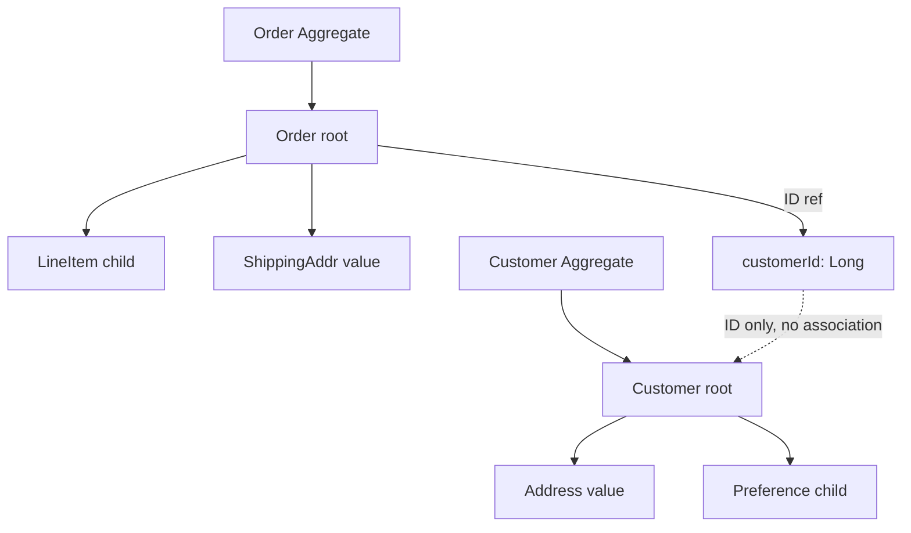

---

### 📶 Gradual Depth

**Level 1 - What it is:**

DDD aggregates define which entities belong together as a consistency unit. Hibernate entities should align with these boundaries: one repository per aggregate root, ID references between aggregates.

**Level 2 - How to use it:**

Identify aggregate roots (entities with independent lifecycle). Make child entities accessible only through the root (`cascade = ALL, orphanRemoval = true`). Replace `@ManyToOne` cross-aggregate associations with `Long foreignId` columns.

**Level 3 - How it works:**

When Order has `Long customerId` instead of `@ManyToOne Customer`, Hibernate never lazy-loads Customer when loading Order. The persistence context for an Order operation contains only Order + LineItems + ShippingAddress (the aggregate). Cross-aggregate queries use explicit joins: `SELECT o FROM Order o WHERE o.customerId = :custId`.

**Level 4 - Production mastery:**

Aggregate boundaries align with microservice boundaries. Each microservice owns one or more aggregates. The ID reference pattern (`Long customerId`) naturally supports decomposition: if Customer moves to a separate service, the Order service already references by ID. Domain events (`OrderPlaced`) replace what was previously a cascade or cross-aggregate association.

---

### ⚙️ How It Works

**Phase 1 - Identify aggregates:**
Group entities by consistency requirement. Which entities MUST be consistent within a single transaction? Those form an aggregate.

**Phase 2 - Designate roots:**
Each aggregate has one root entity. The root has a repository. Child entities have no repository.

**Phase 3 - Replace cross-aggregate associations:**
Change `@ManyToOne Customer customer` to `@Column Long customerId`. Remove bidirectional associations between aggregates.

**Phase 4 - Implement cross-aggregate queries:**
Need Order + Customer data? Either: (1) two queries and combine in service, (2) database view with native query, (3) CQRS read model.

```text
  BEFORE (no aggregate boundaries):
  Order -> @ManyToOne Customer
  Order -> @ManyToOne Product
  Product -> @ManyToOne Category
  Category -> @ManyToMany Supplier
  -> Loading Order can traverse entire graph!

  AFTER (aggregate boundaries):
  Order aggregate: Order, LineItem, Address
  Customer aggregate: Customer, Preference
  Product aggregate: Product, Specification
  -> Order has customerId, productId (Longs)
  -> Loading Order loads ONLY the aggregate
```

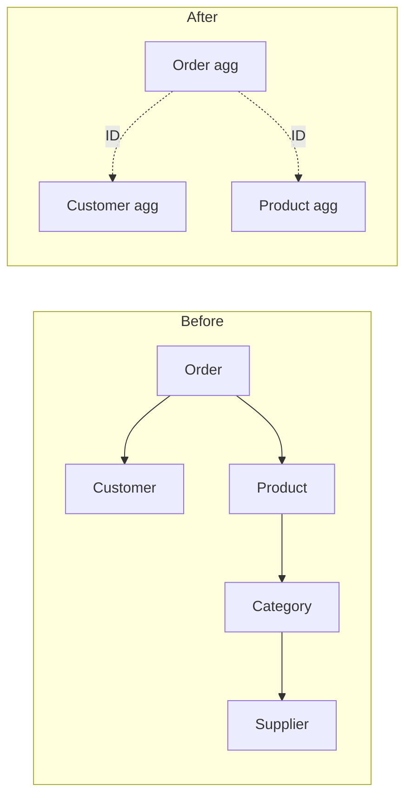

---

### 🚨 Failure Modes

**Failure 1 - Bidirectional associations across aggregates:**

**Symptom:** Loading a Customer triggers lazy loads of all their Orders, each Order triggers lazy loads of Products. Persistence context grows unbounded.

**Root cause:** `@OneToMany List<Order> orders` on Customer. No aggregate boundary. Customer can traverse to Order to Product.

**Diagnostic:**

```java
Session s = em.unwrap(Session.class);
log.info("Entities in PC: {}",
    s.getStatistics().getEntityCount());
// If loading 1 Customer results in 500+
// entities: cross-aggregate traversal
```

**Fix:**

**BAD:**

```java
@Entity
public class Customer {
    @OneToMany(mappedBy = "customer")
    private List<Order> orders; // Traversal!
}
```

**GOOD:**

```java
@Entity
public class Customer {
    // No orders collection!
    // Query orders separately:
    // orderRepo.findByCustomerId(custId)
}
```

**Failure 2 - Cross-aggregate transaction:**

**Symptom:** Order creation and inventory update in one transaction. If inventory service is slow or fails, order creation is blocked.

**Root cause:** Two aggregates (Order, Inventory) modified in one transaction. Violates aggregate consistency boundaries.

**Diagnostic:**

```text
Transaction spans multiple aggregate roots.
If either root fails, both roll back.
Tight coupling between aggregates.
```

**Fix:**

```java
// Separate transactions per aggregate
// Order aggregate: create order
orderRepo.save(order);
// Publish domain event
events.publish(new OrderPlaced(order.getId()));
// Inventory aggregate: handle event
@EventListener
void onOrderPlaced(OrderPlaced e) {
    inventoryService.reserve(e.getItems());
}
```

---

### 🔬 Production Reality

An e-commerce platform has 40 JPA entities with bidirectional associations. A single order detail page loads Order -> Customer -> Address -> Region -> Country, plus Order -> LineItems -> Product -> Category -> Supplier. Total: 15 entity types in one persistence context. After applying DDD aggregate boundaries: Order aggregate (Order, LineItem, ShippingAddress), Customer aggregate (Customer, Address), Product aggregate (Product, Specification). Cross-aggregate references by ID. The order detail page now loads only the Order aggregate (3 entity types) plus two explicit queries for Customer name and Product names. Persistence context size: 80% smaller. N+1 eliminated because no lazy traversal across boundaries.

---

### ⚖️ Trade-offs & Alternatives

| Aspect             | Full association | ID reference (DDD) | Hybrid          |
| ------------------ | ---------------- | ------------------ | --------------- |
| Navigation         | Automatic lazy   | Explicit query     | Root assoc only |
| PC size            | Unbounded        | Aggregate-scoped   | Moderate        |
| N+1 risk           | High (traversal) | Low (no traversal) | Medium          |
| Query convenience  | High             | Lower              | Medium          |
| Microservice ready | No               | Yes                | Partial         |

**Real-world patterns:**

- **DDD-strict teams** use ID references exclusively. Cross-aggregate queries via CQRS read models.
- **Pragmatic teams** use `@ManyToOne` for frequently-joined aggregates (Order -> Customer) but block the reverse (`Customer -/-> Order`). Unidirectional only.

---

### ⚡ Decision Snap

**USE DDD AGGREGATE BOUNDARIES WHEN:**

- > 15 entity types. The entity graph is complex enough to benefit from explicit boundaries.
- Microservice decomposition is planned. Aggregate boundaries map to service boundaries.

**USE FULL ASSOCIATIONS WHEN:**

- < 10 entity types. The entity graph is small and manageable without explicit boundaries.
- Monolith with no decomposition planned.

**ALWAYS DO:**

- One repository per aggregate root. Child entities via cascade, never direct repository.

---

### ⚠️ Top Traps

| #   | Misconception                      | Reality                                                                                                             |
| --- | ---------------------------------- | ------------------------------------------------------------------------------------------------------------------- |
| 1   | Every entity is an aggregate root  | Most entities are children. Only entities with independent lifecycle are roots. Order is a root; LineItem is not.   |
| 2   | ID references make queries harder  | `SELECT o FROM Order o WHERE o.customerId = :id` is equally simple. JOIN requires native query but is no harder.    |
| 3   | Aggregates must be small           | Aggregates must be consistency-sized. An Order with 100 LineItems is one aggregate because they must be consistent. |
| 4   | Aggregate boundaries prevent JOINs | SQL JOINs work regardless of JPA associations. Aggregate boundaries are code design, not database design.           |
| 5   | Domain events are overengineering  | Domain events replace cross-aggregate transactions. Without them, aggregates become coupled by shared transactions. |

---

### 🪜 Learning Ladder

**Prerequisites:**

- Entity for Every Table Anti-Pattern - why not every
  table needs an entity
- Open Session in View - The Silent Scalability Killer -
  cross-aggregate traversal is OSIV's enabler

**THIS:** HIB-095 DDD Aggregates and Hibernate Persistence
Boundaries

**Next steps:**

- CQRS with Hibernate - Read vs Write Model Separation -
  cross-aggregate query patterns
- Hibernate in Microservices vs Monolith Decision Guide -
  aggregate = service boundary

---

**The Surprising Truth:**

The hardest part of applying DDD aggregates to Hibernate is not the technical refactoring - it is convincing the team that `Long customerId` is better than `@ManyToOne Customer customer`. The association feels like "more ORM." The ID reference feels like "going backward." But the ID reference is the boundary that prevents the persistence context from becoming a global object graph that loads half the database on every request.

**Further Reading:**

- Vaughn Vernon, "Implementing Domain-Driven Design" - Chapter 10: Aggregates
- Eric Evans, "Domain-Driven Design" - Chapter 6: Aggregate pattern definition
- Spring Data documentation - DDD support and aggregate references

**Revision Card:**

1. Aggregate = consistency boundary. One repository per root. Child entities via cascade. Cross-aggregate reference by ID (Long), not association.
2. ID references prevent cross-aggregate lazy traversal, reduce PC size, and align with microservice boundaries.
3. Domain events replace cross-aggregate transactions. `OrderPlaced` event triggers inventory reservation in a separate transaction.

---

---

# HIB-096 Fleet-Wide Hibernate Governance and Standards

**TL;DR** - Fleet-wide Hibernate governance enforces consistent configuration, query patterns, and monitoring across all services via shared libraries, CI checks, and automated validation.

---

### 🔥 Problem Statement

An organization has 30 Spring Boot microservices using Hibernate. Each team configures independently: some have OSIV enabled, some use IDENTITY strategy, some have no monitoring, some use EAGER fetching. When one team discovers and fixes N+1, the other 29 teams still have the same problem. Fleet-wide governance establishes organization-level standards: shared configuration baselines, CI-enforced query count limits, standardized monitoring dashboards, and a shared library that applies best practices by default. The goal is to elevate the entire fleet to production-grade Hibernate usage, not just individual services.

---

### 📜 Historical Context

Fleet-wide governance for ORM usage emerged at scale-up companies (2015-2020) when organizations discovered that Hibernate production incidents were the most common data layer failure mode across their microservice fleet. Netflix, Uber, and similar organizations found that individual team training was insufficient - engineers rotate between teams, and knowledge does not transfer. The solution was organizational: shared libraries with hardened defaults, automated CI checks, and centralized monitoring. This pattern mirrors the infrastructure-as-code movement but applied to data layer configuration.

---

### 🔩 First Principles

**CORE INVARIANTS:**

1. **Defaults matter more than documentation:** Engineers use defaults. A shared library with OSIV=false, Statistics=true, and SEQUENCE strategy as defaults reaches more teams than a wiki page.
2. **CI enforcement > code review:** Automated checks catch violations on every PR. Code review catches violations when the reviewer remembers to check.
3. **Centralized monitoring reveals fleet-wide patterns:** If 15 of 30 services have N+1, it is an organizational training gap, not 15 independent bugs.
4. **Governance is enabling, not restricting:** Good governance makes the right thing easy (shared library) and the wrong thing visible (CI check), not impossible.

**DERIVED DESIGN:**

The governance stack has three layers: shared library (hardened defaults), CI validation (automated checks), and centralized monitoring (fleet-wide visibility). Each layer catches issues at a different stage: library at development, CI at merge, monitoring at production.

**THE TRADE-OFF:**

**Gain:** Consistent Hibernate configuration and quality across the entire fleet. Reduced production incidents. Organizational learning.

**Cost:** Shared library maintenance. CI pipeline integration. Centralized monitoring infrastructure. Team autonomy slightly reduced.

---

### 🧠 Mental Model

> Fleet-wide governance is like building codes for a city. Each building (service) can have unique architecture, but all must meet safety standards (OSIV disabled, monitoring enabled). Building inspectors (CI checks) verify compliance before occupancy (deployment). The city dashboard (centralized monitoring) shows which neighborhoods (service clusters) have issues.

- "Building codes" -> Hibernate standards
- "Safety standards" -> hardened defaults
- "Building inspectors" -> CI checks
- "City dashboard" -> centralized monitoring

**Where this analogy breaks down:** Unlike building codes which are legally enforced, Hibernate governance relies on team cooperation and shared library adoption.

---

### 🧩 Components

- **Shared starter library:** `hibernate-platform-starter`. Spring Boot starter with hardened defaults. Teams depend on it instead of configuring Hibernate directly.
- **CI validation rules:** ArchUnit or custom rules that check: no EAGER on collections, no IDENTITY strategy, OSIV disabled, Statistics enabled.
- **Centralized dashboard:** Grafana dashboard aggregating Hibernate metrics from all services. Panels: queries per request by service, P95 latency by service, cache hit rate by service.
- **Configuration baseline:** Documented and enforced settings: `open-in-view=false`, `generate_statistics=true`, `batch_size=50`, `order_inserts=true`, connection pool settings.
- **Query count budget:** Maximum queries per request per endpoint. Enforced by datasource-proxy in integration tests. Default budget: 10 queries/request.

```text
  Governance stack:
  +---+---------------------+----------+
  | # | Layer               | Stage    |
  +---+---------------------+----------+
  | 1 | Shared starter lib  | Dev time |
  | 2 | CI validation rules | PR merge |
  | 3 | Centralized monitor | Prod     |
  +---+---------------------+----------+

  Shared starter defaults:
  spring.jpa.open-in-view=false
  hibernate.generate_statistics=true
  hibernate.jdbc.batch_size=50
  hibernate.order_inserts=true
  hibernate.id.new_generator_mappings=true
  hikari.maximum-pool-size=20
  hikari.leak-detection-threshold=60000
```

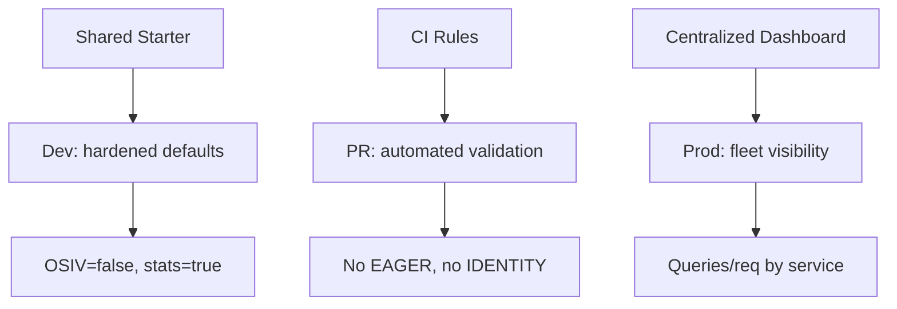

---

### 📶 Gradual Depth

**Level 1 - What it is:**

Fleet-wide Hibernate governance ensures consistent configuration, monitoring, and query quality across all services in an organization.

**Level 2 - How to use it:**

Create a shared Spring Boot starter with hardened Hibernate defaults. Add CI rules (ArchUnit) that validate entity mappings. Deploy a centralized Grafana dashboard for Hibernate metrics.

**Level 3 - How it works:**

Teams depend on the shared starter (`hibernate-platform-starter`). The starter auto-configures OSIV=false, Statistics=true, batching, and connection pool settings. CI rules scan entity classes for anti-patterns (EAGER collections, IDENTITY strategy). Micrometer metrics from all services flow to a central Prometheus/Grafana stack.

**Level 4 - Production mastery:**

Measure governance effectiveness: track the number of Hibernate production incidents per quarter. Track the percentage of services meeting the query budget (< 10 queries/request). Track the percentage of services with monitoring enabled. Goal: zero Hibernate incidents, 100% monitoring coverage, 90% of services within query budget. Run quarterly fleet-wide audits using the centralized dashboard.

---

### ⚙️ How It Works

**Phase 1 - Shared starter:**
Create `hibernate-platform-starter` Maven/Gradle artifact. Include auto-configuration for Hibernate, HikariCP, and Micrometer. Publish to internal repository.

**Phase 2 - CI rules:**
Add ArchUnit tests to the shared test library. Rules: no `@ManyToOne(fetch=EAGER)` on collections, no `@GeneratedValue(strategy=IDENTITY)` in new code, `open-in-view` property must be false.

**Phase 3 - Centralized monitoring:**
Deploy Grafana dashboard with panels per service. Key metrics: `hibernate_statements` / `http_requests_total`, `hikaricp_connections_active`, `hibernate_second_level_cache_hit_ratio`.

**Phase 4 - Adoption:**
Roll out to services incrementally. Prioritize high-traffic services first. Provide migration guide for teams switching from custom configuration.

```text
  CI rule examples (ArchUnit):
  noClasses()
    .that().areAnnotatedWith(Entity.class)
    .should().haveFieldAnnotatedWith(
      OneToMany.class, fetch=EAGER)
    .check(classes);

  noClasses()
    .that().areAnnotatedWith(Entity.class)
    .should().haveFieldAnnotatedWith(
      GeneratedValue.class,
      strategy=GenerationType.IDENTITY)
    .check(classes);
```

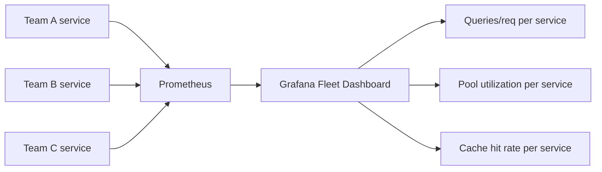

---

### 🚨 Failure Modes

**Failure 1 - Governance without adoption:**

**Symptom:** Shared starter exists but only 5 of 30 teams use it. Remaining 25 teams have custom configurations with varying quality.

**Root cause:** Shared starter was published but not marketed. No migration guide. No incentive for teams to switch.

**Diagnostic:**

```text
Count services using the shared starter.
If adoption < 50%: governance has no reach.
```

**Fix:**

**BAD:**

```text
Publish library to Artifactory.
Send email to all-engineering.
Hope teams adopt.
```

**GOOD:**

```text
Pair with high-traffic teams for adoption.
Show N+1 reduction metrics after migration.
Add starter as requirement for new services.
Provide migration script for existing.
Make adoption part of tech debt OKRs.
```

**Failure 2 - Overly restrictive governance:**

**Symptom:** Teams circumvent governance rules. Add `// NOSONAR` or `@SuppressWarnings` to bypass CI checks. Team velocity decreases.

**Root cause:** Governance rules block legitimate use cases. Example: rule forbids all native queries, but some reporting endpoints legitimately need them.

**Diagnostic:**

```text
Count suppression annotations.
If > 10 per service: rules are too strict.
Collect team feedback on false positives.
```

**Fix:**

```text
Governance should make the right thing easy,
not the wrong thing impossible. Allow
exceptions with documented justification.
@SuppressWarnings("hibernate-native-query")
// Justification: reporting endpoint with CTE
```

---

### 🔬 Production Reality

A 50-service organization has 3-4 Hibernate production incidents per month. After deploying the governance stack: shared starter (OSIV=false, Statistics=true) adopted by 40 services in 3 months. CI rules catch 120 anti-patterns in the first month (30 EAGER collections, 45 IDENTITY strategies, 45 missing monitoring). Centralized dashboard reveals 8 services with > 20 queries/request. After fixing those: Hibernate incidents drop from 4/month to 0.5/month. The dashboard becomes the primary tool for quarterly data layer health reviews.

---

### ⚖️ Trade-offs & Alternatives

| Approach            | Reach         | Effort  | Maintainability    |
| ------------------- | ------------- | ------- | ------------------ |
| Shared starter + CI | Fleet-wide    | High    | Central team       |
| Wiki documentation  | Whoever reads | Low     | Quickly stale      |
| Training sessions   | Attendees     | Medium  | Knowledge fades    |
| Code review only    | Per-PR        | Ongoing | Reviewer-dependent |

**Real-world patterns:**

- **Platform engineering teams** maintain the shared starter as a product. Internal customers = service teams.
- **Smaller organizations** (< 10 services) use shared configuration documentation + periodic audits instead of a full governance stack.

---

### ⚡ Decision Snap

**INVEST IN GOVERNANCE WHEN:**

- > 10 services using Hibernate. Configuration inconsistency is likely.
- Recurring Hibernate production incidents across teams.
- New teams frequently spinning up new services.

**LIGHTWEIGHT GOVERNANCE WHEN:**

- 5-10 services. Shared configuration documentation + quarterly audit.

**SKIP GOVERNANCE WHEN:**

- < 5 services. Direct code review is sufficient.

---

### ⚠️ Top Traps

| #   | Misconception                         | Reality                                                                                                                                                        |
| --- | ------------------------------------- | -------------------------------------------------------------------------------------------------------------------------------------------------------------- |
| 1   | Documentation is governance           | Documentation is reference. Governance is enforcement. Shared defaults + CI rules > wiki pages.                                                                |
| 2   | One-time setup, no maintenance        | Shared starter needs versioning, upgrades (Hibernate 5 -> 6), and rule updates. Assign a maintainer.                                                           |
| 3   | All teams should adopt simultaneously | Roll out incrementally. Start with high-traffic or high-incident teams. Show value before mandating.                                                           |
| 4   | Governance restricts innovation       | Good governance makes the right thing easy. Teams should still be free to use native queries, custom types, etc. Governance prevents accidental anti-patterns. |
| 5   | Centralized monitoring is optional    | Without fleet-wide visibility, governance is blind. You cannot enforce query budgets you cannot measure.                                                       |

---

### 🪜 Learning Ladder

**Prerequisites:**

- ORM Data Layer - Phase 4 (Production Hardening) -
  the individual service checklist that governance scales
- Hibernate Tooling - p6spy, datasource-proxy,
  Hypersistence - tools governance deploys fleet-wide

**THIS:** HIB-096 Fleet-Wide Hibernate Governance and
Standards

**Next steps:**

- ORM Data Layer - Phase 5 (Platform Strategy) -
  governance as part of platform engineering
- Hibernate in Microservices vs Monolith Decision Guide -
  governance applies differently per architecture

---

**The Surprising Truth:**

The most effective governance tool is not the shared library or CI rules. It is the centralized Grafana dashboard showing queries-per-request by service. When Team A sees their service at 47 queries/request while peers are at 3, the competitive instinct drives improvement faster than any mandate. The dashboard turns Hibernate quality into a visible, comparable metric.

**Further Reading:**

- Team Topologies (Skelton & Pais) - platform team patterns for shared libraries
- ArchUnit documentation - architecture rule enforcement (archunit.org)
- Spring Boot auto-configuration documentation - creating custom starters

**Revision Card:**

1. Three governance layers: shared starter (defaults), CI rules (enforcement), centralized dashboard (visibility). All three are needed.
2. Defaults > documentation > training. Engineers use defaults. Make the right configuration the default.
3. Measure governance: Hibernate incidents/quarter, monitoring coverage %, services within query budget %. Target: zero incidents, 100% coverage.

---

---

# HIB-097 ORM-to-SQL-Builder (jOOQ/Exposed) Migration Strategy

**TL;DR** - Migrate from Hibernate to jOOQ incrementally: extract read queries first (lowest risk), then migrate write operations, keeping both frameworks operational during transition.

---

### 🔥 Problem Statement

A team decides to migrate from Hibernate to jOOQ because most endpoints are read-heavy analytics queries that JPQL cannot express cleanly. But 40 entities, 60 repositories, and 200 queries cannot migrate overnight. A full rewrite risks regression bugs and months of parallel effort. The incremental strategy: migrate read queries first (they are independent, testable, and lowest risk), then migrate write operations (which require reimplementing cascade, dirty checking, and optimistic locking manually). Hibernate and jOOQ coexist during the transition, sharing the same DataSource and transaction manager.

---

### 📜 Historical Context

ORM-to-SQL-builder migrations became common after 2015 when jOOQ gained popularity as a type-safe SQL builder. Teams that had adopted Hibernate for all use cases (including analytics and reporting) found JPQL increasingly limiting. The migration pattern was pioneered by teams that recognized the hybrid approach: keep Hibernate for domain writes, use jOOQ for complex reads. Some teams completed full migrations; most settled on hybrid as the long-term architecture. Kotlin teams face a similar choice with Exposed (Kotlin SQL framework).

---

### 🔩 First Principles

**CORE INVARIANTS:**

1. **Read queries migrate first:** Read queries have no side effects. Migration is verifiable by comparing result sets. Risk is minimal.
2. **Write operations migrate last:** Writes require reimplementing cascade, optimistic locking, dirty checking, and audit trails. Risk is highest.
3. **Coexistence is required:** Both frameworks share the same DataSource and TransactionManager during migration. Spring supports this.
4. **Verification is automated:** Each migrated query has a comparison test: Hibernate result == jOOQ result. Tests prove equivalence before removing Hibernate code.

**DERIVED DESIGN:**

Migration phases: (1) add jOOQ dependency, (2) migrate complex read queries (native SQL candidates), (3) migrate simple read queries, (4) migrate write operations, (5) remove Hibernate. Most teams stop at phase 3 (hybrid).

**THE TRADE-OFF:**

**Gain:** Full SQL control for complex queries. Type-safe SQL. Better IDE support for SQL. Eliminate ORM abstractions where they add no value.

**Cost:** Lose automatic dirty checking, cascade, and optimistic locking for migrated writes. Manual SQL for CRUD that Hibernate handles automatically.

---

### 🧠 Mental Model

> Migration from Hibernate to jOOQ is like renovating a house while living in it. You cannot tear down all walls at once. Renovate one room at a time (read queries first), verify it works (comparison tests), then move to the next room (write operations). The plumbing (DataSource, transactions) stays shared throughout.

- "Rooms" -> query groups (reads, writes)
- "Renovate one room" -> migrate one query group
- "Verify" -> comparison tests
- "Shared plumbing" -> shared DataSource

**Where this analogy breaks down:** Unlike rooms, some queries have dependencies. Migrating a read query that uses Hibernate's entity model requires mapping the raw SQL result to a DTO.

---

### 🧩 Components

- **Phase 1 - Setup:** Add jOOQ dependency. Configure jOOQ's `DSLContext` with the same DataSource. Generate jOOQ code from schema.
- **Phase 2 - Read migration:** Replace `@Query(nativeQuery=true)` methods first (already SQL). Then replace complex JPQL queries. Finally, simple `findById` methods.
- **Phase 3 - Write migration:** Reimplement `save()` as `INSERT INTO ... ON CONFLICT DO UPDATE`. Reimplement cascade as explicit multi-table inserts. Reimplement optimistic locking with manual version check.
- **Phase 4 - Verification:** Comparison tests run both Hibernate and jOOQ queries. Assert identical results. Remove Hibernate query only after test passes.
- **Phase 5 - Cleanup:** Remove Hibernate entities, repositories, and dependency. Or keep hybrid.

```text
  Migration phases:
  +-------+-----------------+-------+------+
  | Phase | What            | Risk  | Time |
  +-------+-----------------+-------+------+
  | 1     | Add jOOQ, setup | None  | 1d   |
  | 2     | Read queries    | Low   | 2-4w |
  | 3     | Write operations| High  | 4-8w |
  | 4     | Remove Hibernate| Medium| 1w   |
  +-------+-----------------+-------+------+
  Most teams stop after Phase 2 (hybrid).
```

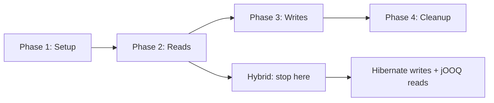

---

### 📶 Gradual Depth

**Level 1 - What it is:**

A phased strategy for migrating from Hibernate to jOOQ (or Exposed). Migrate reads first (low risk), then writes (high risk). Both frameworks coexist during migration.

**Level 2 - How to use it:**

Add jOOQ. Migrate native queries first (already SQL). Then complex JPQL. Use comparison tests. Most teams keep hybrid: Hibernate for writes, jOOQ for reads.

**Level 3 - How it works:**

jOOQ and Hibernate share the same DataSource and Spring `PlatformTransactionManager`. jOOQ uses `DSLContext` for SQL. Hibernate uses `EntityManager`. Both participate in the same `@Transactional` boundary. Comparison tests verify result equivalence.

**Level 4 - Production mastery:**

For full write migration: the hardest parts are cascade (jOOQ requires explicit multi-table inserts in dependency order), optimistic locking (manual `WHERE version = ?` check), and audit trails (Envers has no jOOQ equivalent - implement via triggers or CDC). Estimate 4-8 weeks for write migration on a 30-entity system. Most teams conclude the effort exceeds the benefit and stay hybrid.

---

### ⚙️ How It Works

**Phase 1 - Coexistence setup:**
Add jOOQ dependency. Generate jOOQ code from existing schema (jOOQ code generator). Configure `DSLContext` bean.

**Phase 2 - Read migration (per query):**
Identify candidate query. Write equivalent jOOQ query. Write comparison test. Verify. Switch endpoint to jOOQ query. Delete Hibernate query.

**Phase 3 - Write migration (per entity):**
Write jOOQ insert/update/delete. Reimplement cascade (multi-table). Reimplement version check. Write comparison test (save + verify DB state). Switch. Delete entity.

**Phase 4 - Cleanup:**
Remove unused Hibernate entities, repositories. If no Hibernate code remains: remove Hibernate dependency.

```text
  Read migration example:
  BEFORE (Hibernate):
  @Query(value = "SELECT ... complex ...",
      nativeQuery = true)
  List<Object[]> findAnalytics();

  AFTER (jOOQ):
  DSL.select(ORDERS.ID, sum(ORDERS.TOTAL))
    .from(ORDERS)
    .groupBy(ORDERS.CUSTOMER_ID)
    .fetch();

  Comparison test:
  List<AnalyticsDTO> hib = hibRepo.find();
  List<AnalyticsDTO> jooq = jooqRepo.find();
  assertThat(jooq).isEqualTo(hib);
```

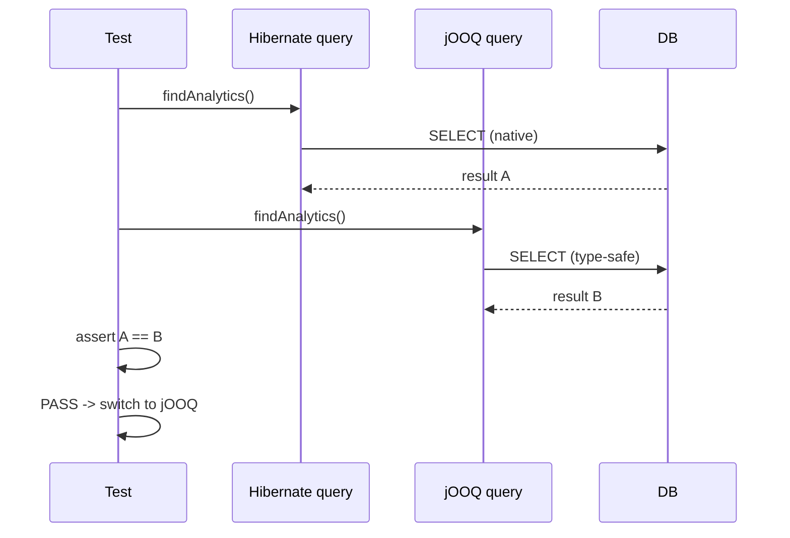

---

### 🚨 Failure Modes

**Failure 1 - Big-bang migration:**

**Symptom:** Team attempts to migrate all 200 queries at once. Project drags for 6 months. Regression bugs appear. Team abandons migration halfway.

**Root cause:** No incremental strategy. No comparison tests. No coexistence period.

**Diagnostic:**

```text
Migration plan has no phases.
Timeline > 2 months without checkpoints.
No comparison tests planned.
```

**Fix:**

**BAD:**

```text
Rewrite all 200 queries to jOOQ.
Remove Hibernate. Deploy.
```

**GOOD:**

```text
Phase 1: Setup jOOQ (1 day)
Phase 2: Migrate 10 read queries/week
  with comparison tests
Phase 3: Checkpoint after 4 weeks
  (40 queries migrated, verified)
Phase 4: Decide continue or stay hybrid
```

**Failure 2 - Losing cascade behavior:**

**Symptom:** After migrating Order write to jOOQ, LineItems are not saved. Or: deleting an Order leaves orphaned LineItems.

**Root cause:** Hibernate's `cascade=ALL, orphanRemoval=true` was silently handling multi-table operations. jOOQ requires explicit INSERT for each table.

**Diagnostic:**

```sql
-- Check for orphaned records
SELECT li.* FROM line_items li
LEFT JOIN orders o ON li.order_id = o.id
WHERE o.id IS NULL;
-- If rows exist: cascade not reimplemented
```

**Fix:**

```java
// jOOQ: explicit cascade
dsl.transaction(cfg -> {
    // Insert order first
    dsl.insertInto(ORDERS)
        .set(ORDERS.ID, order.getId())
        .set(ORDERS.TOTAL, order.getTotal())
        .execute();
    // Then insert line items
    for (LineItem li : order.getItems()) {
        dsl.insertInto(LINE_ITEMS)
            .set(LINE_ITEMS.ORDER_ID,
                order.getId())
            .set(LINE_ITEMS.PRODUCT_ID,
                li.getProductId())
            .execute();
    }
});
```

---

### 🔬 Production Reality

A data analytics SaaS migrates from Hibernate to jOOQ. 60% of queries are complex analytics (window functions, CTEs). Phase 1 (setup): 1 day. Phase 2 (read migration): 35 analytics queries migrated to jOOQ over 4 weeks. Each with comparison test. All pass. Performance improvement: 20% (jOOQ generates slightly more efficient SQL for complex queries). Phase 3 (write migration): team evaluates the effort to reimplement cascade for 15 entity types. Estimated: 6 weeks. Decision: stay hybrid. Hibernate for 25 CRUD entities (writes). jOOQ for 35 analytics queries (reads). Both coexist permanently.

---

### ⚖️ Trade-offs & Alternatives

| Aspect           | Full Hibernate | Full jOOQ    | Hybrid         |
| ---------------- | -------------- | ------------ | -------------- |
| Read queries     | JPQL limited   | Full SQL     | jOOQ for reads |
| Write management | Automatic      | Manual       | Hibernate      |
| Migration effort | None           | 3-6 months   | 2-4 weeks      |
| Long-term maint  | Single stack   | Single stack | Two frameworks |
| Risk             | None           | High         | Low            |

**Real-world patterns:**

- **Analytics teams** complete full migration to jOOQ (few writes, many complex reads).
- **Domain-heavy teams** stay hybrid permanently (Hibernate writes + jOOQ reads).

---

### ⚡ Decision Snap

**FULL MIGRATION WHEN:**

- < 10 entities with simple writes. Query complexity is the primary concern.
- Team has zero Hibernate expertise and strong SQL skills.

**HYBRID (RECOMMENDED FOR MOST) WHEN:**

- Domain model has 10+ entities with cascades and state transitions.
- Significant analytical queries that JPQL cannot express.

**DO NOT MIGRATE WHEN:**

- Hibernate is working well. No JPQL limitations. "Migrate for the sake of it" is not a valid reason.

---

### ⚠️ Top Traps

| #   | Misconception                      | Reality                                                                                                                                                     |
| --- | ---------------------------------- | ----------------------------------------------------------------------------------------------------------------------------------------------------------- |
| 1   | Migration is a weekend project     | Even read-only migration of 50 queries takes 2-4 weeks with comparison tests. Write migration adds 4-8 weeks.                                               |
| 2   | jOOQ replaces Hibernate completely | jOOQ does not provide dirty checking, cascade, optimistic locking, or L2 caching. These must be reimplemented manually.                                     |
| 3   | Hybrid is temporary                | Most teams that go hybrid stay hybrid permanently. Both frameworks coexist cleanly in Spring Boot.                                                          |
| 4   | Comparison tests are optional      | Without comparison tests, migrated queries may return subtly different results (NULL handling, ordering, date precision).                                   |
| 5   | Performance improves automatically | jOOQ generates SQL you write. If you write the same query pattern, performance is identical. Improvement comes from better query design, not the framework. |

---

### 🪜 Learning Ladder

**Prerequisites:**

- ORM vs SQL-First Strategy Decision Framework - the
  decision that triggers migration
- Hibernate Performance Tuning at Scale - ensure issues
  are not just Hibernate misuse

**THIS:** HIB-097 ORM-to-SQL-Builder (jOOQ/Exposed)
Migration Strategy

**Next steps:**

- CQRS with Hibernate - Read vs Write Model Separation -
  hybrid as a permanent architecture
- Build vs Extend vs Replace ORM Decision Guide -
  broader replacement evaluation

---

**The Surprising Truth:**

90% of ORM-to-jOOQ migrations stop at the hybrid stage. Teams migrate the painful 20% of queries (complex analytics) and keep Hibernate for the 80% where it works well. Full migration is reserved for analytics platforms with < 10 entity types. The hybrid approach is not a compromise - it is the optimal architecture for applications that have both domain logic and complex queries.

**Further Reading:**

- Lukas Eder, "jOOQ User Manual" - migration from JPA/Hibernate (jooq.org)
- Spring documentation - using multiple data access technologies
- Vlad Mihalcea, "High-Performance Java Persistence" - Hibernate and jOOQ coexistence

**Revision Card:**

1. Migrate reads first (low risk, comparison tests), then writes (high risk, cascade reimplementation), or stay hybrid.
2. Most teams stay hybrid permanently: Hibernate for writes (cascade, dirty checking), jOOQ for complex reads (full SQL).
3. Comparison tests are non-negotiable. Hibernate result == jOOQ result before switching. Without tests, subtle regressions will reach production.

---

---

# HIB-098 Hibernate 5 to 6 (Jakarta EE) Migration Path

**TL;DR** - Hibernate 6 requires Jakarta EE namespace migration (javax -> jakarta), HQL syntax updates, and type system changes. Migrate incrementally with automated tooling.

---

### 🔥 Problem Statement

Hibernate 6 (released with Spring Boot 3.0) introduces breaking changes: the JPA namespace moves from `javax.persistence` to `jakarta.persistence`, the HQL parser is rewritten (SQM), type mappings change (e.g., `@Type` annotations), and some deprecated APIs are removed. A 50-entity application cannot migrate manually without errors. Automated tools (OpenRewrite, IntelliJ migration) handle namespace changes, but semantic changes (HQL behavior, type mappings, implicit behavior differences) require manual verification. The migration path: automate what is mechanical, manually verify what is semantic.

---

### 📜 Historical Context

The Jakarta EE namespace change was the largest breaking change in Java enterprise history. In 2019, Oracle transferred Java EE to the Eclipse Foundation, which renamed it Jakarta EE. The `javax` namespace was Oracle's trademark. Jakarta EE 9 (2020) changed all `javax.*` packages to `jakarta.*`. Hibernate 6.0 (2022) adopted Jakarta EE 9+ as the baseline, dropping `javax.persistence` support. Spring Boot 3.0 (2022) required Hibernate 6 and Jakarta EE 9+. This forced every Spring Boot 2.x -> 3.x migration to also migrate Hibernate 5 -> 6.

---

### 🔩 First Principles

**CORE INVARIANTS:**

1. **Namespace is mechanical:** `javax.persistence.*` -> `jakarta.persistence.*` is a text replacement. Automated tools handle this.
2. **HQL is semantic:** Hibernate 6's SQM parser is stricter. Queries that worked in Hibernate 5 may fail with syntax errors or produce different results.
3. **Type system changed:** `@Type(type = "...")` string-based type references replaced by `@Type(value = XxxType.class)`. Custom UserTypes may need updating.
4. **Implicit behavior differs:** Default fetch behavior, ID generation, and some cascade semantics have subtle changes between versions.

**DERIVED DESIGN:**

The migration has three stages: (1) automated namespace migration, (2) compilation fixes (type changes), (3) semantic verification (HQL behavior, implicit defaults).

**THE TRADE-OFF:**

**Gain:** Access to Hibernate 6 features (improved HQL, better performance, Jakarta EE alignment, Spring Boot 3.x support).

**Cost:** Migration effort of 1-4 weeks for a medium application. Risk of subtle behavior changes in HQL queries.

---

### 🧠 Mental Model

> Migrating Hibernate 5 -> 6 is like upgrading a road system from left-hand to right-hand driving. The road signs (namespace) change mechanically - a machine can swap them. But driving habits (HQL behavior, implicit defaults) need manual adjustment. You cannot just swap signs and assume everyone will drive correctly.

- "Road signs" -> javax -> jakarta namespace
- "Driving habits" -> HQL behavior, type mappings
- "Machine swap" -> OpenRewrite automation
- "Manual adjustment" -> semantic verification

**Where this analogy breaks down:** Unlike driving, most Hibernate behavior is backward-compatible. Only edge cases and deprecated features change semantics.

---

### 🧩 Components

- **Namespace migration:** `javax.persistence.*` -> `jakarta.persistence.*`. Tools: OpenRewrite, IntelliJ migration, Eclipse Transformer.
- **HQL/SQM changes:** Hibernate 6 uses Semantic Query Model (SQM). Stricter parsing. Some implicit JOINs become explicit. `SELECT NEW` syntax enforcement.
- **Type system:** `@Type(type = "string")` -> `@Type(value = StringType.class)`. Custom UserType interface changes.
- **ID generation:** `hibernate.id.new_generator_mappings` default changed. `GenerationType.AUTO` may use different strategies.
- **Dependency updates:** Hibernate 6 requires Java 11+. Spring Boot 3.x requires Java 17+. Third-party libraries must be Jakarta-compatible.

```text
  Migration checklist:
  1. [ ] javax -> jakarta (automated)
  2. [ ] Compilation (type, API changes)
  3. [ ] HQL queries (SQM parser)
  4. [ ] Custom UserTypes (API changes)
  5. [ ] ID strategy (default changes)
  6. [ ] Integration tests (verify behavior)
  7. [ ] Third-party libs (Jakarta-compat)
```

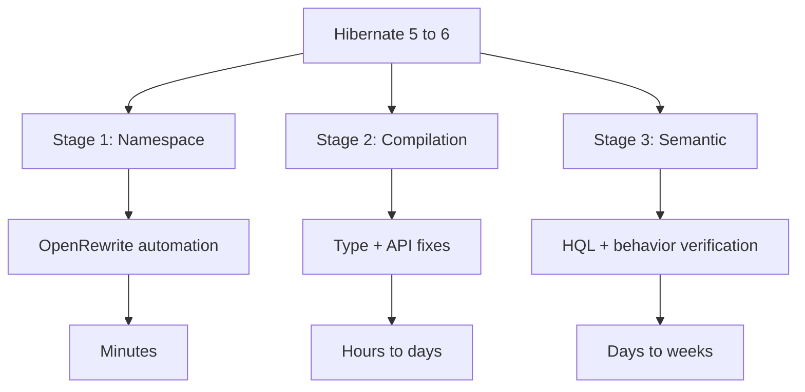

---

### 📶 Gradual Depth

**Level 1 - What it is:**

Hibernate 6 requires namespace migration (javax -> jakarta), HQL parser updates, and type system changes. Most changes are automated; some require manual verification.

**Level 2 - How to use it:**

Run OpenRewrite `javax-to-jakarta` recipe. Fix compilation errors. Run integration tests. Fix failing HQL queries. Verify implicit behavior changes.

**Level 3 - How it works:**

Stage 1: OpenRewrite replaces `javax.persistence.*` imports with `jakarta.persistence.*` across all files. Stage 2: compiler errors reveal `@Type` annotation changes, removed APIs, and incompatible third-party libraries. Stage 3: integration tests reveal HQL queries that the SQM parser rejects or that produce different results.

**Level 4 - Production mastery:**

For large applications (50+ entities, 200+ queries): create a migration branch. Run OpenRewrite. Fix compilation. Run full test suite. Identify semantic failures. Fix one by one. Production deployment with feature flags: new Hibernate behind a flag, rollback to old if issues. Monitor query execution times and result counts for the first week. Compare Hibernate 5 vs 6 query plans for critical endpoints.

---

### ⚙️ How It Works

**Phase 1 - Automated namespace (30 minutes):**
Run OpenRewrite `org.openrewrite.java.migrate.jakarta.JavaxMigrationToJakarta` recipe. All `javax.persistence.*` imports become `jakarta.persistence.*`. All `javax.validation.*` become `jakarta.validation.*`.

**Phase 2 - Compilation fixes (hours to days):**
`@Type(type = "yes_no")` -> `@Type(YesNoConverter.class)`. `@TypeDef` removed -> use `@Converter`. `BasicType` API changes. Custom UserType interface has new methods.

**Phase 3 - HQL verification (days):**
Run all integration tests. SQM parser rejects some queries: implicit JOINs, unqualified paths, non-standard syntax. Fix each query. Common: `SELECT e FROM Entity e WHERE e.association.field = :val` may require explicit JOIN.

**Phase 4 - Behavior verification (days):**
Check ID generation strategy (AUTO may now use SEQUENCE instead of IDENTITY). Check timestamp precision. Check NULL handling in comparisons. Compare query results with Hibernate 5 baseline.

```text
  Common migration fixes:
  BEFORE (Hibernate 5):
  @Type(type = "yes_no")
  private boolean active;

  AFTER (Hibernate 6):
  @Convert(converter = YesNoConverter.class)
  private boolean active;
  // Or use built-in:
  @JdbcTypeCode(Types.CHAR)
  private boolean active;
```

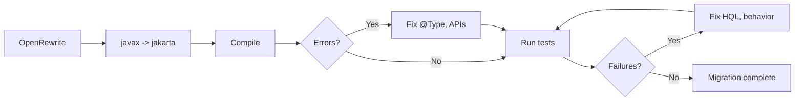

---

### 🚨 Failure Modes

**Failure 1 - HQL implicit JOIN no longer works:**

**Symptom:** `QuerySyntaxException: ... could not resolve property` on queries that worked in Hibernate 5.

**Root cause:** Hibernate 5 allowed implicit JOINs through path expressions. Hibernate 6's SQM parser requires explicit JOINs for some path navigations.

**Diagnostic:**

```text
Hibernate 5 (works):
SELECT o FROM Order o
WHERE o.customer.name = :name

Hibernate 6 (may require):
SELECT o FROM Order o
JOIN o.customer c
WHERE c.name = :name
```

**Fix:**

**BAD:**

```java
// Hibernate 5 implicit join
@Query("SELECT o FROM Order o "
    + "WHERE o.customer.name = :name")
List<Order> findByCustomerName(
    @Param("name") String name);
```

**GOOD:**

```java
// Hibernate 6 explicit join
@Query("SELECT o FROM Order o "
    + "JOIN o.customer c "
    + "WHERE c.name = :name")
List<Order> findByCustomerName(
    @Param("name") String name);
```

**Failure 2 - ID generation strategy change:**

**Symptom:** After migration, new entities get IDs from a sequence instead of auto-increment. Or: batch inserts fail because IDENTITY strategy is now used where SEQUENCE was expected.

**Root cause:** Hibernate 6 changes `GenerationType.AUTO` default behavior. In Hibernate 5, AUTO used IDENTITY for MySQL. In Hibernate 6, AUTO prefers SEQUENCE.

**Diagnostic:**

```sql
-- Check if sequence was created
SELECT * FROM information_schema.sequences
WHERE sequence_name LIKE '%hibernate%';
-- If sequence exists but table uses
-- auto_increment: mismatch
```

**Fix:**

```java
// Explicitly declare strategy
// Do not rely on AUTO
@GeneratedValue(strategy =
    GenerationType.SEQUENCE,
    generator = "order_seq")
@SequenceGenerator(name = "order_seq",
    sequenceName = "order_seq",
    allocationSize = 50)
private Long id;
```

---

### 🔬 Production Reality

A Spring Boot 2.7 application with 35 entities and 120 queries migrates to Spring Boot 3.2 (Hibernate 6.4). Stage 1 (OpenRewrite): 30 minutes, 450 import changes automated. Stage 2 (compilation): 8 hours - 12 `@Type` annotations, 3 custom UserTypes, 2 removed API calls. Stage 3 (HQL): 15 of 120 queries need fixes - 10 implicit JOIN issues, 3 `SELECT NEW` syntax issues, 2 type cast changes. Stage 4 (behavior): 1 ID generation change (AUTO -> SEQUENCE required schema migration). Total: 3 developer-days. Zero production issues post-deployment.

---

### ⚖️ Trade-offs & Alternatives

| Approach             | Effort | Risk      | Completeness |
| -------------------- | ------ | --------- | ------------ |
| OpenRewrite + manual | 1-4w   | Medium    | Full         |
| Manual migration     | 2-8w   | High      | Full         |
| Stay on Hibernate 5  | None   | Long-term | Deprecated   |
| Switch to jOOQ       | 2-6m   | Very high | Alternative  |

**Real-world patterns:**

- **Spring Boot 3.x adoption** forces Hibernate 6 migration. No alternative within the Spring ecosystem.
- **Large enterprises** stage the migration: shared libraries first, then high-priority services, then the long tail.

---

### ⚡ Decision Snap

**MIGRATE NOW WHEN:**

- Spring Boot 3.x is required (security patches, new features).
- Java 17+ is adopted. Hibernate 5 does not support newer Java features.

**DELAY WHEN:**

- Application is in maintenance mode. No new features planned.
- Critical production system with no test coverage (add tests first).

**NEVER:**

- Migrate without integration tests. HQL behavior changes are invisible without test execution.

---

### ⚠️ Top Traps

| #   | Misconception                      | Reality                                                                                                              |
| --- | ---------------------------------- | -------------------------------------------------------------------------------------------------------------------- |
| 1   | OpenRewrite handles everything     | OpenRewrite handles namespace. Type changes, HQL fixes, and behavior verification are manual.                        |
| 2   | Hibernate 6 is backward compatible | Namespace change is fully breaking. HQL parser is stricter. Some implicit behaviors change.                          |
| 3   | Migration is quick for small apps  | Even a 10-entity app may have HQL queries and custom types that need manual fixes. Budget at least 2 days.           |
| 4   | Can skip test verification         | HQL that compiles may produce different results in Hibernate 6 (NULL handling, join semantics). Tests are essential. |
| 5   | GenerationType.AUTO is safe        | AUTO's default strategy may change between Hibernate versions. Always use explicit SEQUENCE or IDENTITY.             |

---

### 🪜 Learning Ladder

**Prerequisites:**

- JPA Specification Internals and Metamodel API - JPA
  specification context for the namespace change
- Hibernate Source Code Architecture and Bootstrap
  Sequence - understanding what changes internally

**THIS:** HIB-098 Hibernate 5 to 6 (Jakarta EE) Migration
Path

**Next steps:**

- Hibernate SPI Extensions and Custom UserTypes -
  UserType API changes in Hibernate 6
- Fleet-Wide Hibernate Governance and Standards -
  coordinating migration across services

---

**The Surprising Truth:**

The namespace change (javax -> jakarta) gets all the attention, but it is the easiest part of the migration (fully automated). The real effort is HQL query fixes and behavior verification, which requires running the full test suite and manually investigating each failure. Teams that budget "1 hour for OpenRewrite" and forget about HQL are surprised when 10-20% of their queries need manual fixing.

**Further Reading:**

- Hibernate ORM 6.0 Migration Guide (hibernate.org)
- OpenRewrite Jakarta EE migration recipes (docs.openrewrite.org)
- Spring Boot 3.0 Migration Guide (spring.io)

**Revision Card:**

1. Three stages: namespace (automated, 30 min), compilation (manual, hours), semantic (manual, days). Budget 1-4 weeks total.
2. HQL is the hardest part. Hibernate 6 SQM parser is stricter. 10-20% of queries may need explicit JOINs or syntax fixes.
3. Always declare ID strategy explicitly (SEQUENCE or IDENTITY). Never rely on GenerationType.AUTO across Hibernate versions.

---

---

# HIB-099 CQRS with Hibernate - Read vs Write Model Separation

**TL;DR** - CQRS separates read and write models. Hibernate handles the write model (domain entities). SQL-first or materialized views handle the read model (DTOs, projections).

---

### 🔥 Problem Statement

A single Hibernate entity model serves both writes (Order creation, status transitions) and reads (order search, dashboard analytics, reporting). The write model needs rich domain logic (validation, state transitions, cascade). The read model needs efficient queries (denormalized data, aggregations, full-text search). Optimizing for writes (normalized entities with lazy associations) hurts reads (N+1, complex JOINs). Optimizing for reads (denormalized, eager) hurts writes (data duplication, complex updates). CQRS resolves this by maintaining separate models: Hibernate entities for writes, optimized views/DTOs for reads.

---

### 📜 Historical Context

CQRS (Command Query Responsibility Segregation) was formalized by Greg Young in 2010, building on Bertrand Meyer's CQS principle (1988). In the Hibernate world, CQRS adoption accelerated after teams realized that DTO projections (read model) and entity-based persistence (write model) naturally form two separate concerns. Spring Data JPA supports this pattern: `JpaRepository` for writes (entity-based), custom repository implementations for reads (native SQL, jOOQ, or JDBC). The pattern does not require event sourcing - simple CQRS separates read and write queries within the same database.

---

### 🔩 First Principles

**CORE INVARIANTS:**

1. **Commands modify state:** Write operations use Hibernate entities with full domain logic, validation, and cascade. They use the persistence context, dirty checking, and optimistic locking.
2. **Queries read state:** Read operations use DTO projections, native SQL, database views, or jOOQ. They bypass the persistence context entirely (no managed entities, no dirty checking).
3. **Same database (simple CQRS):** Both models read from and write to the same database. No event sourcing, no eventual consistency. The read model is just a different query strategy.
4. **Separate code paths:** Write path: Controller -> Command -> Service -> Repository.save(entity). Read path: Controller -> Query -> ReadRepository.findDTO(criteria).

**DERIVED DESIGN:**

Separating read and write paths eliminates the compromise: write entities can be fully normalized with lazy associations (optimal for domain logic). Read queries can be denormalized with JOINs and projections (optimal for display).

**THE TRADE-OFF:**

**Gain:** Optimal query patterns for both reads and writes. No N+1 on read paths (no entities). No persistence context overhead on reads.

**Cost:** Two code paths to maintain. Read model must be kept in sync with write model schema changes.

---

### 🧠 Mental Model

> CQRS is like having separate intake and outtake doors at a hospital. The intake door (write model) has full triage: medical history, insurance, diagnostics (domain logic, validation, cascade). The outtake door (read model) provides discharge summaries: pre-formatted, fast, no triage needed (DTOs, projections). Using the intake door for discharge (entity serialization) wastes everyone's time.

- "Intake door" -> write model (entities)
- "Outtake door" -> read model (DTOs)
- "Triage" -> domain logic, validation
- "Discharge summary" -> DTO projection

**Where this analogy breaks down:** Unlike a hospital, the read model queries the same data the write model modified. There is no physical separation - only code separation.

---

### 🧩 Components

- **Write model:** Hibernate entities with `@Entity`, repositories extending `JpaRepository`, `@Transactional` services. Full domain logic.
- **Read model:** DTO classes (no `@Entity`), read repositories with `@Query(nativeQuery=true)` or jOOQ `DSLContext`. No persistence context involvement.
- **Database views (optional):** Materialized views for complex read queries. Pre-joined, pre-aggregated. Read model queries the view.
- **Command/Query separation:** Commands: `CreateOrderCommand`, `UpdateStatusCommand`. Queries: `OrderSummaryQuery`, `DashboardQuery`.

```text
  Write path:
  POST /orders -> CreateOrderCommand
    -> OrderService.create(cmd)
    -> orderRepo.save(orderEntity)
    -> Hibernate: INSERT + cascade

  Read path:
  GET /orders -> OrderSummaryQuery
    -> ReadService.findSummaries(criteria)
    -> readRepo.findSummaries(criteria)
    -> Native SQL: SELECT + JOIN + aggregate
    -> List<OrderSummaryDTO> (no entities)
```

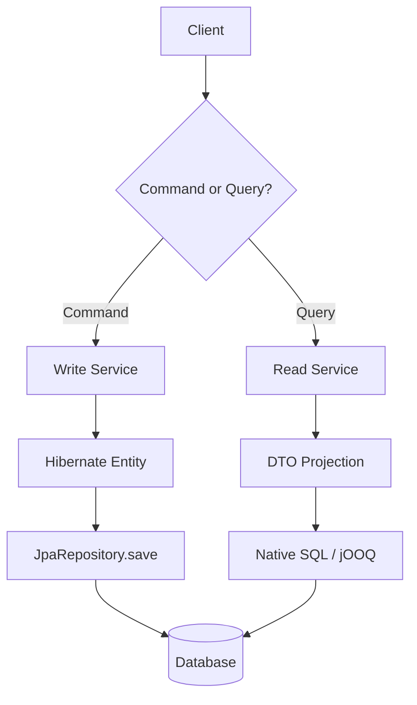

---

### 📶 Gradual Depth

**Level 1 - What it is:**

CQRS separates the code path for writing data (Hibernate entities) from the code path for reading data (DTO projections). Both use the same database.

**Level 2 - How to use it:**

Write: `orderRepository.save(entity)`. Read: `orderReadRepository.findSummaries()` returning DTOs via native SQL or jOOQ. Never return entities from read endpoints.

**Level 3 - How it works:**

Write path uses Hibernate's persistence context (managed entities, dirty checking, cascade). Read path bypasses the persistence context entirely: native SQL returns raw results mapped to DTOs. No L1 cache, no snapshots, no flush storms. Read path is stateless from Hibernate's perspective.

**Level 4 - Production mastery:**

For high-traffic read endpoints: create materialized views in the database. Read model queries the view (single table scan) instead of multi-table JOIN. Refresh the view periodically or on write events. This adds eventual consistency but provides 10-100x read performance improvement for complex aggregations. For real-time requirements: use database views (non-materialized) or direct SQL with proper indexes.

---

### ⚙️ How It Works

**Phase 1 - Identify commands vs queries:**
POST/PUT/DELETE -> commands. GET -> queries. Some GETs are simple lookups (can use entities). Complex list/search/dashboard GETs are candidates for read model.

**Phase 2 - Create read model:**
Define DTOs for each read endpoint. Create read repository with native SQL or jOOQ queries that return DTOs directly.

**Phase 3 - Separate code paths:**
Write: entity-based service + JpaRepository. Read: DTO-based service + read repository. Controller dispatches to the appropriate service.

**Phase 4 - Optimize independently:**
Write model: normalize entities, add domain validation. Read model: denormalize views, add read-optimized indexes, use materialized views for dashboards.

```text
  BEFORE (single model):
  GET /orders -> orderRepo.findAll()
    -> Load 50 Order entities
    -> Lazy load Customer per order (N+1)
    -> Jackson serializes all fields
    -> 51 queries, 200ms

  AFTER (CQRS):
  GET /orders -> readRepo.findSummaries()
    -> Native SQL JOIN + projection
    -> 50 OrderSummaryDTO (no entities)
    -> 1 query, 15ms
```

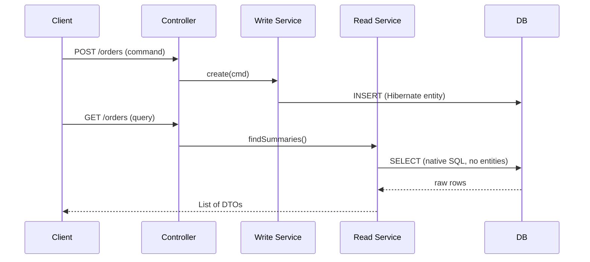

---

### 🚨 Failure Modes

**Failure 1 - Read model out of sync with schema:**

**Symptom:** Schema migration adds a column to the entity. Write model (Hibernate) adapts automatically. Read model (native SQL) still queries the old schema. Missing data in read results.

**Root cause:** Read model SQL is not updated when the write model entity changes. No coupling between the two.

**Diagnostic:**

```text
Schema migration adds column "discount"
to orders table. Entity has the field.
Read SQL: SELECT id, total, status
Does not include "discount" -> data gap.
```

**Fix:**

**BAD:**

```text
Forget to update read SQL.
Data gap in read API for months.
```

**GOOD:**

```text
Integration test for each read query
verifies all expected fields are present.
Schema migration -> test fails ->
update read SQL before deployment.
```

**Failure 2 - Using entities for read endpoints:**

**Symptom:** Team implements CQRS but the read repository still returns entities. Persistence context overhead, N+1, and flush storms persist.

**Root cause:** Read repository uses `SELECT o FROM Order o` (entity query) instead of `SELECT new DTO(...)` (DTO projection).

**Diagnostic:**

```java
// Read endpoint returns entities
// Statistics show entity load count > 0
// Flush storm on read-only endpoint
```

**Fix:**

```java
// Read endpoint must return DTOs, not entities
// NEVER return entities from read path
public interface OrderReadRepository {
    @Query(value = "SELECT o.id, o.total, "
        + "c.name as customerName "
        + "FROM orders o "
        + "JOIN customers c "
        + "ON o.customer_id = c.id",
        nativeQuery = true)
    List<OrderSummaryProjection>
        findSummaries();
}
```

---

### 🔬 Production Reality

A SaaS platform's dashboard endpoint loads 500 entities with 3 lazy associations each. Latency: 3 seconds. After CQRS: the dashboard uses a materialized view (`dashboard_summary_mv`) refreshed every 5 minutes. The read endpoint queries the view (single table scan). Latency: 15ms. The write path (order creation, status updates) continues using Hibernate entities with full domain logic. The 5-minute staleness is acceptable for dashboards. Real-time endpoints (order detail) use direct SQL JOINs with DTOs. Zero entities loaded on any read path.

---

### ⚖️ Trade-offs & Alternatives

| Approach         | Read perf   | Write perf | Complexity  | Consistency |
| ---------------- | ----------- | ---------- | ----------- | ----------- |
| Single model     | Compromised | Optimal    | Low         | Immediate   |
| Simple CQRS      | Optimal     | Optimal    | Medium      | Immediate   |
| CQRS + mat views | Best        | Optimal    | Medium-high | 5-min stale |
| Event sourcing   | Best        | Complex    | Very high   | Eventually  |

**Real-world patterns:**

- **Most Spring Boot apps** benefit from simple CQRS: entities for writes, DTO projections for list/search endpoints. Same database, immediate consistency.
- **Dashboard-heavy apps** add materialized views for aggregated read queries. Refresh frequency based on staleness tolerance.

---

### ⚡ Decision Snap

**USE CQRS WHEN:**

- Read and write patterns differ significantly. Writes are domain-rich. Reads are aggregation/search-heavy.
- N+1 on read endpoints persists despite fetch planning. DTO projections solve it.

**USE SIMPLE CQRS (SAME DB) WHEN:**

- Immediate consistency is required. Most applications.

**USE CQRS + MATERIALIZED VIEWS WHEN:**

- Dashboard or reporting queries are complex and tolerate staleness.

**SKIP CQRS WHEN:**

- < 10 endpoints. Simple CRUD. No complex read patterns.

---

### ⚠️ Top Traps

| #   | Misconception                           | Reality                                                                                                             |
| --- | --------------------------------------- | ------------------------------------------------------------------------------------------------------------------- |
| 1   | CQRS requires event sourcing            | Simple CQRS is just separating read and write code paths. Same database. No events. No eventual consistency.        |
| 2   | CQRS doubles the codebase               | Read DTOs are simple data classes. Read queries are often simpler than entity-based queries (no ORM complexity).    |
| 3   | Read model must use a separate database | Same database CQRS is sufficient for 90% of applications. Separate read database is for extreme scale only.         |
| 4   | All GET endpoints need the read model   | Simple lookups (findById) can use entities. CQRS is for complex list, search, and aggregation endpoints.            |
| 5   | Materialized views are always needed    | Materialized views are for dashboards with complex aggregations. Direct SQL with indexes handles most read queries. |

---

### 🪜 Learning Ladder

**Prerequisites:**

- ORM vs SQL-First Strategy Decision Framework - CQRS
  combines both approaches
- DDD Aggregates and Hibernate Persistence Boundaries -
  write model aligns with aggregates

**THIS:** HIB-099 CQRS with Hibernate - Read vs Write Model
Separation

**Next steps:**

- Multi-Database and Polyglot Persistence Architecture -
  CQRS with separate read stores
- ORM Data Layer - Phase 5 (Platform Strategy) - CQRS
  as a platform pattern

---

**The Surprising Truth:**

Most Spring Boot applications already implement partial CQRS without realizing it. Every `@Query("SELECT new DTO(...)")` method is a read model query. Every `repository.save(entity)` is a write model operation. Full CQRS simply formalizes this into separate code paths with clear boundaries - and once formalized, teams naturally optimize each path independently.

**Further Reading:**

- Greg Young, "CQRS Documents" (cqrs.files.wordpress.com)
- Martin Fowler, "CQRS" (martinfowler.com/bliki/CQRS.html)
- Spring Data JPA documentation - Projections and DTO mappings

**Revision Card:**

1. Simple CQRS: Hibernate entities for writes, DTO projections (native SQL or jOOQ) for reads. Same database. Immediate consistency.
2. Never return entities from read endpoints. DTOs eliminate N+1, persistence context overhead, and flush storms on reads.
3. Materialized views for dashboards with complex aggregations. Direct SQL for real-time reads. CQRS does NOT require event sourcing.

---

---

# HIB-100 Multi-Database and Polyglot Persistence Architecture

**TL;DR** - Polyglot persistence uses the best database for each use case: relational for ACID transactions, NoSQL for flexible schemas, search engines for full-text. Hibernate handles the relational portion.

---

### 🔥 Problem Statement

A growing platform stores orders (relational, ACID), product catalog (document, flexible schema), user sessions (key-value, fast expiry), and search indexes (Elasticsearch, full-text). Forcing all data into one relational database means fighting schema rigidity for catalogs, poor search performance, and overloaded session tables. Polyglot persistence assigns each data type to the optimal store. Hibernate manages the relational entities (orders, customers). Separate clients manage other stores (MongoDB for catalog, Redis for sessions, Elasticsearch for search). The challenge: data consistency across stores, query federation, and operational complexity.

---

### 📜 Historical Context

Martin Fowler and Pramod Sadalage coined "polyglot persistence" in 2011, recognizing that the one-database-fits-all era was ending. NoSQL databases (MongoDB 2009, Redis 2009, Cassandra 2008) provided specialized storage for specific workloads. By 2015, most large-scale platforms used 2-4 storage technologies. The Java ecosystem adapted: Spring Data provides a unified repository abstraction over JPA, MongoDB, Redis, Elasticsearch, and more. Hibernate remains the relational anchor in polyglot architectures.

---

### 🔩 First Principles

**CORE INVARIANTS:**

1. **Best tool per use case:** Relational databases excel at ACID transactions and relational queries. Document stores excel at schema flexibility. Key-value stores excel at fast lookups. Search engines excel at full-text search.
2. **Consistency boundary = database boundary:** ACID transactions within one database. Eventual consistency across databases. No distributed transactions (2PC) in practice.
3. **Hibernate scope = relational scope:** Hibernate manages only the relational entities. Other stores have separate clients and data models.
4. **Data flows between stores:** Product data originates in the relational DB (source of truth) and is replicated to Elasticsearch (search index). Events or CDC synchronize stores.

**DERIVED DESIGN:**

Each store has its own data model, client, and Spring Data repository. Cross-store queries aggregate results in the application layer. Cross-store consistency uses domain events or CDC (Change Data Capture).

**THE TRADE-OFF:**

**Gain:** Optimal performance for each data pattern. Schema flexibility where needed. Specialized capabilities (full-text, graph traversal, time-series).

**Cost:** Operational complexity (multiple databases to manage). Cross-store consistency is eventual. Query federation is manual.

---

### 🧠 Mental Model

> Polyglot persistence is like a hospital with specialized departments. The surgical ward (relational DB) handles procedures requiring precision and coordination (ACID transactions). The outpatient clinic (document store) handles flexible, high-volume visits (schema flexibility). The pharmacy (key-value store) handles fast dispensing (fast lookups). Each department uses specialized equipment (database), but patient records (domain events) flow between them.

- "Surgical ward" -> relational DB (ACID, transactions)
- "Outpatient clinic" -> document store (flexibility)
- "Pharmacy" -> key-value store (speed)
- "Patient records" -> domain events (synchronization)

**Where this analogy breaks down:** Unlike hospital departments that are physically separate, databases in polyglot persistence can share the same server infrastructure and are coordinated by the same application.

---

### 🧩 Components

- **Relational store (PostgreSQL + Hibernate):** Orders, customers, financial transactions. ACID guarantees. Rich queries with JOINs.
- **Document store (MongoDB):** Product catalog, user profiles. Flexible schema. Embedded documents for denormalized reads.
- **Key-value store (Redis):** Sessions, caches, rate limits. Sub-millisecond access. TTL for automatic expiry.
- **Search engine (Elasticsearch):** Product search, log aggregation. Full-text, fuzzy matching, faceted search.
- **Event/CDC synchronization:** Debezium captures changes from the relational DB and publishes to Kafka. Consumers update secondary stores.

```text
  Polyglot architecture:
  +---------------+    +-----------+
  | PostgreSQL    |    | MongoDB   |
  | (Hibernate)   |    | (catalog) |
  | Orders, Users |    | Products  |
  +------+--------+    +-----+-----+
         |                    |
    Debezium CDC         Direct write
         |                    |
  +------v--------+    +-----v-----+
  | Elasticsearch |    | Redis     |
  | (search index)|    | (sessions)|
  +---------------+    +-----------+
```

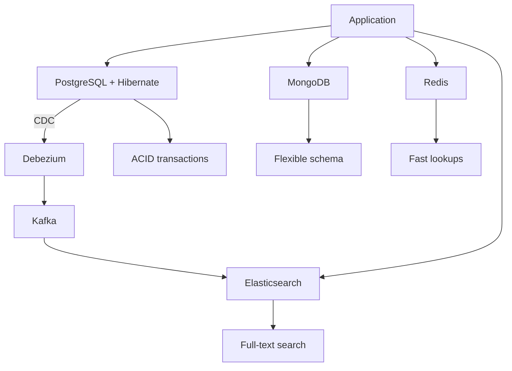

---

### 📶 Gradual Depth

**Level 1 - What it is:**

Polyglot persistence uses different databases for different data types. Hibernate manages the relational portion. Other stores handle document, key-value, and search workloads.

**Level 2 - How to use it:**

Spring Data provides unified repository abstractions. `JpaRepository` for relational. `MongoRepository` for MongoDB. `RedisTemplate` for Redis. `ElasticsearchRepository` for search. Each store has independent configuration.

**Level 3 - How it works:**

Each store has its own data model. Cross-store data flows via domain events or CDC. Application services orchestrate reads from multiple stores. Transaction boundary is per-store (no cross-store ACID). Eventual consistency between stores is managed by event consumers.

**Level 4 - Production mastery:**

Critical design decisions: (1) which store is the source of truth for each entity, (2) how to handle cross-store consistency failures (dead letter queue, retry, reconciliation), (3) how to handle cross-store queries (application-level aggregation or materialized views), (4) how to handle store failures (circuit breaker, fallback, graceful degradation).

---

### ⚙️ How It Works

**Phase 1 - Identify data patterns:**
Classify data: transactional (relational), flexible schema (document), fast access (key-value), searchable (search engine).

**Phase 2 - Design data models:**
Each store has its own model. Product in PostgreSQL (source of truth, relational fields). ProductDocument in MongoDB (catalog display, embedded variants). ProductIndex in Elasticsearch (search fields, facets).

**Phase 3 - Synchronization:**
Debezium captures INSERT/UPDATE/DELETE on PostgreSQL products table. Publishes to Kafka topic. Elasticsearch consumer updates search index. MongoDB consumer updates catalog documents.

**Phase 4 - Query routing:**
Write: always to PostgreSQL (source of truth). Search: Elasticsearch. Catalog display: MongoDB. Session: Redis. Application service routes based on operation type.

```text
  Data flow for product update:
  1. Service: productRepo.save(product)
     -> PostgreSQL INSERT (Hibernate)
  2. Debezium: captures change
     -> Kafka: product-changes topic
  3. ES consumer: update search index
  4. Mongo consumer: update catalog doc
  Latency: 100-500ms for secondary stores
```

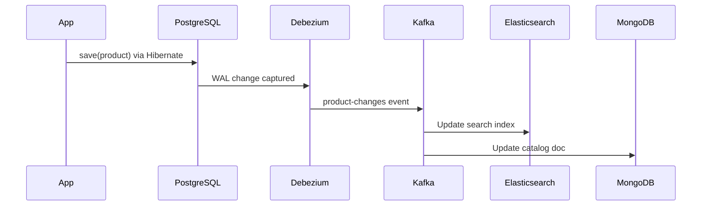

---

### 🚨 Failure Modes

**Failure 1 - Cross-store inconsistency:**

**Symptom:** Product price updated in PostgreSQL but Elasticsearch still shows old price. Users see different prices on search results vs product detail page.

**Root cause:** Debezium lag or consumer failure. Elasticsearch index not updated.

**Diagnostic:**

```bash
# Check Debezium connector status
curl -s localhost:8083/connectors/pg-source\
/status | jq '.tasks[0].state'
# Check Kafka consumer lag
kafka-consumer-groups.sh --describe \
  --group es-indexer
# If lag > 0: consumer behind
```

**Fix:**

**BAD:**

```text
Manual sync: re-index all products
when inconsistency reported.
Reactive, error-prone, slow.
```

**GOOD:**

```text
Monitor consumer lag with alerting.
Dead letter queue for failed events.
Periodic reconciliation job compares
PostgreSQL and Elasticsearch counts.
Circuit breaker on search: fallback to
PostgreSQL query if ES is stale.
```

**Failure 2 - Distributed transaction attempt:**

**Symptom:** Team tries XA transaction across PostgreSQL and MongoDB. Connection timeouts, partial commits, data corruption.

**Root cause:** Distributed transactions (2PC) across heterogeneous stores are fragile and slow. MongoDB XA support is limited.

**Diagnostic:**

```text
Application logs show XA transaction
timeout. MongoDB write succeeds but
PostgreSQL rolls back. Inconsistent state.
```

**Fix:**

```text
Never use distributed transactions across
stores. Use domain events + saga pattern:
1. Write to PostgreSQL (commit)
2. Publish event
3. Consumer writes to MongoDB
4. If MongoDB fails: retry from event
5. Compensate if retry exhausts
```

---

### 🔬 Production Reality

An e-commerce platform migrates from PostgreSQL-only to polyglot. Orders remain in PostgreSQL (Hibernate, ACID). Product catalog moves to MongoDB (flexible variant attributes: clothing has size/color, electronics has specs). Search moves to Elasticsearch (faceted search, fuzzy matching). Sessions move to Redis (sub-ms access, auto-expiry). Synchronization: Debezium CDC from PostgreSQL to Elasticsearch. Product detail page: MongoDB read (10ms). Search: Elasticsearch (15ms). Checkout: PostgreSQL transaction (30ms). Before polyglot: search was 500ms (relational LIKE queries). After: 15ms with relevance ranking.

---

### ⚖️ Trade-offs & Alternatives

| Aspect         | Single DB (PostgreSQL)   | Polyglot               |
| -------------- | ------------------------ | ---------------------- |
| Consistency    | ACID everywhere          | ACID per store         |
| Query power    | SQL everywhere           | Best per store         |
| Search         | LIKE/tsvector            | Elasticsearch          |
| Schema flex    | Rigid (JSONB workaround) | Native (MongoDB)       |
| Ops complexity | Low                      | High (multiple stores) |
| Team expertise | One DB                   | Multiple DBs           |

**Real-world patterns:**

- **Startups** start with PostgreSQL-only (with JSONB for flexibility). Add stores as specific needs emerge.
- **Scale-ups** add Elasticsearch first (search is often the first bottleneck), then Redis (sessions/caching), then document store (if needed).

---

### ⚡ Decision Snap

**ADD A SECOND STORE WHEN:**

- Specific workload exceeds the relational DB's capability (full-text search, sub-ms access, flexible schema).
- Team has operational capacity to manage a second store.

**STAY SINGLE-DB WHEN:**

- PostgreSQL JSONB covers schema flexibility. Full-text search volume is low. Session management works with JPA.

**CRITICAL REQUIREMENT:**

- Every multi-store architecture needs a synchronization strategy (CDC, events) and a consistency monitoring plan.

---

### ⚠️ Top Traps

| #   | Misconception                               | Reality                                                                                                                              |
| --- | ------------------------------------------- | ------------------------------------------------------------------------------------------------------------------------------------ |
| 1   | Polyglot means replacing the relational DB  | Polyglot means ADDING specialized stores. The relational DB (PostgreSQL) remains the source of truth for transactional data.         |
| 2   | Distributed transactions work across stores | 2PC across heterogeneous stores is fragile. Use events + eventual consistency instead.                                               |
| 3   | All data needs all stores                   | Each data type goes to ONE primary store. Secondary stores receive replicated data for specific access patterns.                     |
| 4   | Adding a store is a small change            | Each store adds operational burden: monitoring, backup, upgrades, failure modes. Add only when the benefit clearly exceeds the cost. |
| 5   | Consistency is automatic                    | Cross-store consistency requires explicit synchronization (CDC, events) and monitoring (lag alerts, reconciliation jobs).            |

---

### 🪜 Learning Ladder

**Prerequisites:**

- CQRS with Hibernate - Read vs Write Model Separation -
  read store separation is a form of polyglot
- ORM vs SQL-First Strategy Decision Framework - database
  technology selection criteria

**THIS:** HIB-100 Multi-Database and Polyglot Persistence
Architecture

**Next steps:**

- Hibernate in Microservices vs Monolith Decision Guide -
  polyglot maps to microservice boundaries
- ORM Data Layer - Phase 5 (Platform Strategy) -
  polyglot as a platform concern

---

**The Surprising Truth:**

Most teams that adopt polyglot persistence discover that PostgreSQL with JSONB, `tsvector` (full-text search), and proper indexing covers 80% of the use cases they thought required a second store. The first store to genuinely add value is almost always Elasticsearch (search experience) or Redis (session management). MongoDB is rarely needed if PostgreSQL JSONB is used effectively.

**Further Reading:**

- Martin Fowler and Pramod Sadalage, "Polyglot Persistence" (martinfowler.com)
- Debezium documentation - Change Data Capture (debezium.io)
- Spring Data documentation - multi-store repository support

**Revision Card:**

1. Polyglot = best store per use case. Relational (Hibernate) for ACID. Document for flexibility. Key-value for speed. Search for full-text.
2. No distributed transactions. Use domain events + CDC for cross-store synchronization. Eventual consistency is the norm.
3. Start with PostgreSQL. Add stores only when specific workloads exceed relational capabilities and team has operational capacity.

---

---

# HIB-101 Hibernate in Microservices vs Monolith Decision Guide

**TL;DR** - Hibernate works well in both monoliths and microservices. In microservices, each service owns its database and Hibernate instance. Cross-service queries use APIs, not JOINs.

---

### 🔥 Problem Statement

A team debates: "Should our microservices use Hibernate or is it only for monoliths?" The concern is that Hibernate's Session model, entity relationships, and transaction management are designed for a single database - incompatible with microservice per-service-database patterns. In reality, Hibernate works identically in a microservice as in a monolith. Each microservice has its own database, its own Hibernate instance, and its own entity model. The difference is at the architecture level: cross-service data access uses REST/gRPC APIs, not entity associations or database JOINs.

---

### 📜 Historical Context

The microservice movement (2014-2018) raised questions about ORM suitability. Early microservice advocates suggested lightweight alternatives (JDBC, MyBatis) for simplicity. Experience proved otherwise: microservices still need entity lifecycle management, cascade, dirty checking, and optimistic locking - the same features that make Hibernate valuable in monoliths. Spring Boot's dominance in the microservice ecosystem made Hibernate the default data layer. The key adaptation: each microservice treats its database as independent, with no shared tables or cross-service entity associations.

---

### 🔩 First Principles

**CORE INVARIANTS:**

1. **One database per service:** Each microservice owns its database exclusively. No shared tables. No cross-service JOINs.
2. **Hibernate per service:** Each service has its own SessionFactory, its own entity model, and its own persistence context. Independent configuration.
3. **Cross-service data = API calls:** Order service needs Customer name? REST call to Customer service, not entity association. `Long customerId` in Order, not `@ManyToOne Customer`.
4. **Transaction boundary = service boundary:** `@Transactional` scopes to one service's database. Cross-service consistency uses sagas or eventual consistency.

**DERIVED DESIGN:**

Hibernate in microservices is identical to Hibernate in a monolith with DDD aggregate boundaries. Each aggregate (service) has independent persistence. Cross-aggregate references use IDs. Cross-aggregate consistency uses events.

**THE TRADE-OFF:**

**Gain:** Each service independently optimizes its Hibernate configuration, schema, and entity model. Independent deployment and scaling.

**Cost:** Cross-service queries require API calls (network overhead). No cross-service JOINs. Denormalized data or API composition for cross-service reads.

---

### 🧠 Mental Model

> Microservices with Hibernate are like independent restaurants in a food court. Each restaurant (service) has its own kitchen (database), its own menu (entity model), and its own chef (Hibernate). A customer (request) ordering from multiple restaurants gets a tray (API response) - the food court does not merge all kitchens into one.

- "Restaurant" -> microservice
- "Kitchen" -> database
- "Menu" -> entity model
- "Chef" -> Hibernate instance
- "Tray" -> API composition

**Where this analogy breaks down:** Unlike restaurants that are truly independent, microservices often need coordinated data (e.g., order references customer). This coordination requires explicit design (events, saga).

---

### 🧩 Components

- **Service-per-database:** Each service has its own PostgreSQL schema or instance. Schema migrations are per-service (Flyway/Liquibase).
- **Independent Hibernate config:** Each service configures OSIV, batching, pool size, statistics independently per its workload.
- **API composition:** Cross-service reads aggregate data from multiple service APIs. Order detail = Order service + Customer service + Product service.
- **Event-driven consistency:** OrderCreated event triggers Inventory service to reserve stock. Saga pattern for multi-service transactions.
- **Shared library (optional):** Common Hibernate configuration (from fleet governance) shared across services.

```text
  Monolith:
  +-----------------------------------+
  | Single DB                         |
  | Orders | Customers | Products    |
  | All entities in ONE SessionFactory|
  +-----------------------------------+

  Microservices:
  +----------+  +----------+  +--------+
  | Order DB |  | Cust DB  |  | Prod DB|
  | Order    |  | Customer |  | Product|
  | LineItem |  | Address  |  | Spec   |
  | Hibernate|  | Hibernate|  | Hibernate|
  +----------+  +----------+  +--------+
       |              |             |
       +------- API calls ----------+
```

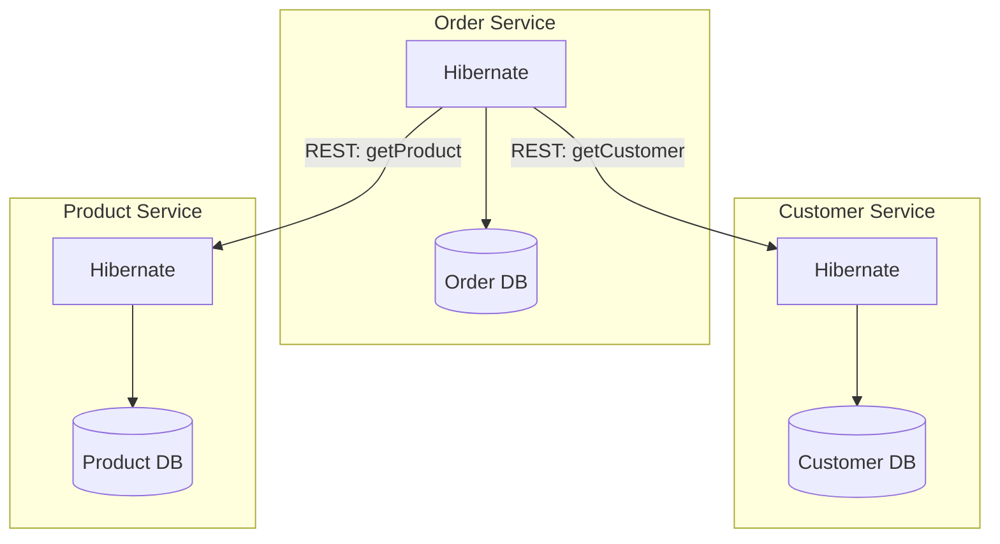

---

### 📶 Gradual Depth

**Level 1 - What it is:**

Hibernate works in microservices exactly as in monoliths. Each service has its own database and Hibernate instance. Cross-service data access uses APIs, not entity associations.

**Level 2 - How to use it:**

Each service: own `application.yml` with Hibernate settings, own entity model, own Spring Data repositories. Cross-service reference by ID (`Long customerId`). API calls for cross-service data.

**Level 3 - How it works:**

Each service's SessionFactory is independent. No entity associations span services. `@Transactional` scopes to the service's database. Cross-service consistency uses domain events (Kafka, RabbitMQ) and saga patterns for multi-step transactions.

**Level 4 - Production mastery:**

Performance considerations: API composition adds network latency (2-5ms per call). For cross-service reads, use async API calls (CompletableFuture/WebClient) to parallelize. For cross-service search, use CQRS: a read-optimized materialized view that denormalizes data from multiple services. Each service publishes changes via events; the read model consumes and aggregates.

---

### ⚙️ How It Works

**Phase 1 - Service boundary definition:**
Align service boundaries with DDD aggregates. Each aggregate root = one service with its own database.

**Phase 2 - Entity model per service:**
Order service: Order, LineItem, ShippingAddress. Customer service: Customer, Address. No shared entities.

**Phase 3 - Cross-service references:**
Order has `Long customerId` (not `@ManyToOne`). Order detail endpoint: fetch Order from local DB, fetch Customer from Customer API, merge in service layer.

**Phase 4 - Cross-service consistency:**
Order placed -> publish `OrderPlaced` event to Kafka -> Inventory service consumes and reserves stock. If reservation fails: compensating event (`ReservationFailed`) triggers order cancellation.

```text
  Order detail API composition:
  GET /orders/123
  1. OrderService: findById(123)
     -> Order{id=123, customerId=42,
        items=[...]}
  2. CustomerClient: getCustomer(42)
     -> Customer{name="Alice"}
  3. Merge: OrderDetailDTO{
       order: Order{...},
       customerName: "Alice"}
  4. Return DTO
  Total: 2 API calls, 1 DB query
```

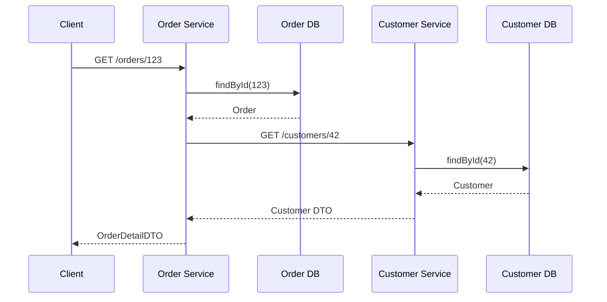

---

### 🚨 Failure Modes

**Failure 1 - Shared database between services:**

**Symptom:** Two services read/write the same table. Schema migration in one service breaks the other. Hibernate entity models conflict.

**Root cause:** Shared database violates service independence. Tight coupling at the data layer.

**Diagnostic:**

```text
Multiple services connect to same DB.
Schema change in Service A breaks Service B.
Entity models conflict.
```

**Fix:**

**BAD:**

```text
Service A and Service B both map
OrderEntity from shared "orders" table.
Service A migration adds column.
Service B does not know about it.
```

**GOOD:**

```text
Each service owns its database exclusively.
Service A: order_db.orders
Service B: customer_db.customers
No shared tables. Independent schemas.
Cross-service: API calls only.
```

**Failure 2 - Cross-service N+1:**

**Symptom:** Order list endpoint calls Customer API per order. 50 orders = 50 API calls. Latency: 2 seconds.

**Root cause:** Sequential API calls for cross-service data. Same N+1 pattern but at API level instead of SQL level.

**Diagnostic:**

```text
Order list: fetch 50 orders (1 DB query)
For each order: GET /customers/{id}
  -> 50 API calls x 40ms = 2000ms
```

**Fix:**

```java
// Batch API call
List<Long> customerIds = orders.stream()
    .map(Order::getCustomerId)
    .distinct()
    .toList();
// Single batch call
Map<Long, CustomerDTO> customers =
    customerClient.getBatch(customerIds);
// Merge locally
// 1 DB query + 1 API call = fast
```

---

### 🔬 Production Reality

A monolith with 40 Hibernate entities decomposes into 5 microservices. Each service gets 6-10 entities. The hardest part: breaking cross-entity JOINs that span service boundaries. Before: `SELECT o.*, c.name FROM orders o JOIN customers c`. After: Order service queries orders, calls Customer API for names. API composition adds 5ms latency per cross-service call. Mitigation: batch API calls, cache customer names in Order service (30-second TTL). Total overhead: 10-15ms per request (acceptable for the independence gained). Each service now deploys independently, scales independently, and has its own Hibernate tuning.

---

### ⚖️ Trade-offs & Alternatives

| Aspect       | Monolith + Hibernate | Microservices + Hibernate |
| ------------ | -------------------- | ------------------------- |
| Cross-entity | SQL JOIN             | API composition           |
| Transaction  | Single DB            | Saga / eventual           |
| Schema mgmt  | One Flyway           | One Flyway per service    |
| Deploy       | All-or-nothing       | Independent               |
| Scalability  | Vertical             | Horizontal per service    |
| Complexity   | Lower                | Higher (network, events)  |

**Real-world patterns:**

- **Monolith-first:** Start with Hibernate monolith. Decompose to microservices when team size or scale demands.
- **Microservice-from-start:** Use Hibernate per service with DDD aggregate boundaries from day one. Simplifies future service extraction.

---

### ⚡ Decision Snap

**USE HIBERNATE IN MICROSERVICES WHEN:**

- Service has domain entities with lifecycle, cascades, and state transitions.
- Team has Hibernate expertise. Spring Boot is the framework.

**USE LIGHTER ALTERNATIVE (JDBC/jOOQ) WHEN:**

- Service has < 5 entities with simple CRUD. ORM adds no value.
- Service is read-heavy with complex SQL (analytics service).

**ALWAYS DO:**

- One database per service. ID references across services. Events for cross-service consistency.

---

### ⚠️ Top Traps

| #   | Misconception                            | Reality                                                                                                                                             |
| --- | ---------------------------------------- | --------------------------------------------------------------------------------------------------------------------------------------------------- |
| 1   | Hibernate is too heavy for microservices | Hibernate in a microservice is the same as in a monolith. Per-service, it manages 5-15 entities with the same efficiency.                           |
| 2   | Microservices do not need ORM            | Microservices with domain entities need cascade, dirty checking, and optimistic locking just as much as monoliths do.                               |
| 3   | Shared database is OK for small teams    | Shared database creates coupling. Schema changes in one service break others. Split early.                                                          |
| 4   | API composition is too slow              | Batch API calls + caching add 5-15ms overhead. Acceptable for most applications. Use CQRS read models for sub-ms requirements.                      |
| 5   | Cross-service JOINs are possible         | With separate databases, JOINs are impossible. Denormalize, use events, or use API composition. This is a fundamental constraint, not a workaround. |

---

### 🪜 Learning Ladder

**Prerequisites:**

- DDD Aggregates and Hibernate Persistence Boundaries -
  aggregate = service boundary
- Fleet-Wide Hibernate Governance and Standards -
  shared configuration across services

**THIS:** HIB-101 Hibernate in Microservices vs Monolith
Decision Guide

**Next steps:**

- Multi-Database and Polyglot Persistence Architecture -
  per-service database selection
- ORM Data Layer - Phase 5 (Platform Strategy) -
  microservice ORM strategy as platform concern

---

**The Surprising Truth:**

Hibernate in a microservice is simpler than in a monolith because the entity model is smaller (5-15 entities vs 40+), the persistence context is smaller, and cross-service associations do not exist (no cross-aggregate lazy loading). The complexity people fear is not Hibernate in microservices - it is microservice architecture itself (API composition, event-driven consistency, distributed tracing). Hibernate is the easy part.

**Further Reading:**

- Sam Newman, "Building Microservices" - Chapter 4: Data
- Chris Richardson, "Microservices Patterns" - Saga pattern for data consistency
- Spring Boot documentation - Multi-datasource configuration

**Revision Card:**

1. Each microservice: own database, own Hibernate, own entity model. No shared tables. Cross-service reference by ID.
2. Cross-service data: API composition (batch calls + caching). Cross-service consistency: domain events + sagas.
3. Hibernate in microservices is simpler (fewer entities, no cross-aggregate associations). The complexity is in microservice architecture, not ORM.

---

---

# HIB-102 Staff-Level ORM Interview Scenarios

**TL;DR** - Staff-level ORM scenarios test architectural judgment: technology selection, migration strategy, cross-cutting concerns, and organizational decision-making under constraints.

---

### 🔥 Problem Statement

Staff and principal engineer interviews require scenarios that test judgment, not knowledge. "How does dirty checking work?" is an L3 question. "Should this 50-service fleet migrate from Hibernate to jOOQ? What is your decision framework?" is a staff-level question. Staff scenarios evaluate: Can you make a technology decision that affects 50 engineers? Can you design a migration strategy that does not disrupt production? Can you balance technical purity with organizational reality?

---

### 📜 Historical Context

Staff-level engineering interview practices evolved from Google's "system design" interviews into broader "architectural decision" scenarios by 2018. The realization: staff engineers spend more time deciding WHAT to build than HOW to build it. ORM-specific scenarios test this at the data layer: technology selection, migration, governance, and performance strategy at organizational scale. These scenarios have no single right answer - the evaluation is based on the quality of the reasoning process.

---

### 🔩 First Principles

**CORE INVARIANTS:**

1. **Scenarios test reasoning, not answers:** The candidate's decision-making process matters more than the specific conclusion. Good reasoning with a suboptimal answer > poor reasoning with the "right" answer.
2. **Constraints drive decisions:** Budget, timeline, team expertise, existing infrastructure. A technically perfect migration is wrong if the team cannot execute it.
3. **Trade-offs must be explicit:** Every decision has costs. Staff engineers articulate what they are trading away. "We choose hybrid because full migration costs 6 months, and our SLA requires 2-month delivery."
4. **Organizational impact:** Staff decisions affect multiple teams. Communication plan, adoption strategy, and rollback path are part of the answer.

**DERIVED DESIGN:**

Five scenarios spanning ORM decision domains: technology selection, migration strategy, performance architecture, governance design, and production crisis response. Each scenario has constraints that force trade-offs.

**THE TRADE-OFF:**

**Gain:** Scenarios that evaluate staff-level judgment: architectural thinking, organizational awareness, and decision-making under uncertainty.

**Cost:** Evaluators must themselves have staff-level experience to assess answers. Scenarios require 30-60 minutes each.

---

### 🧠 Mental Model

> Staff-level scenarios are like chess puzzles with an added rule: you must explain your reasoning to a non-chess player (VP of Engineering). Moving the right piece is not enough. You must explain WHY that move, WHAT it costs, and WHAT the rollback plan is if it fails.

- "Chess puzzle" -> architectural scenario
- "Explain to non-chess player" -> communicate to leadership
- "Right piece" -> technically sound decision
- "Why, cost, rollback" -> staff-level reasoning

**Where this analogy breaks down:** Unlike chess with fixed rules, ORM scenarios have ambiguous constraints and incomplete information. Part of the test is how the candidate handles ambiguity.

---

### 🧩 Components

**Scenario 1 - Technology Selection:**

"A new payment processing platform needs a data layer. Requirements: ACID transactions, 5000 TPS writes, complex reporting, PCI compliance, team of 8 Java engineers with moderate Hibernate experience. What is your recommendation and why?"

**Expected depth:** Score the decision framework dimensions. Recommend Hibernate for writes + jOOQ for reporting. Address PCI compliance (audit trail via Envers). Address 5000 TPS (connection pool sizing, JDBC batching). Present alternatives considered and rejected.

**Scenario 2 - Migration Strategy:**

"A 50-service fleet uses Hibernate 5. Spring Boot 3 requires Hibernate 6. Budget: 2 engineers for 3 months. How do you migrate?"

**Expected depth:** Prioritize by risk (high-traffic services first or last). Automate namespace change (OpenRewrite). Manual HQL verification per service. Shared library update first (one change, all services benefit). Rollback strategy per service.

**Scenario 3 - Performance Crisis:**

"Production is down. Connection pool exhausted across all services. P1 incident. What do you do in the next 30 minutes?"

**Expected depth:** Immediate mitigation (increase pool size temporarily). Diagnosis (OSIV? leak? external service timeout?). Communication (status page, stakeholder update). Root cause fix (disable OSIV, fix leak). Prevention (monitoring, alerting, governance).

```text
  Evaluation rubric:
  +----------+-----------------------+-------+
  | Dimension| What is evaluated     | Weight|
  +----------+-----------------------+-------+
  | Reasoning| Decision process      | 30%   |
  | Trade-off| Explicit costs/benefits| 25%  |
  | Pragmatic| Organizational reality| 20%   |
  | Technical| Correct fundamentals  | 15%   |
  | Communic.| Clear articulation    | 10%   |
  +----------+-----------------------+-------+
```

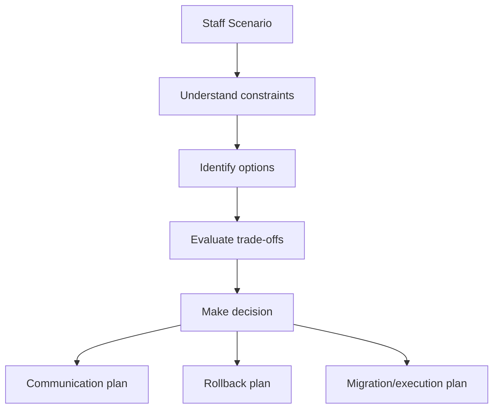

---

### 📶 Gradual Depth

**Level 1 - What it is:**

Staff-level ORM scenarios test architectural judgment: technology selection, migration, governance, and crisis response. No single right answer - reasoning quality is evaluated.

**Level 2 - How to use it:**

Present the scenario with constraints. Give the candidate 5 minutes to think. Evaluate: did they identify constraints, consider alternatives, articulate trade-offs, and propose a plan with rollback?

**Level 3 - How it works:**

Each scenario has intentional tension: limited budget vs desired outcome, technical purity vs timeline, team expertise vs optimal technology. Staff engineers navigate these tensions explicitly. They name what they are sacrificing and why.

**Level 4 - Production mastery:**

The strongest staff candidates add dimensions the interviewer did not mention: "Before deciding on Hibernate vs jOOQ, I need to understand: What is the team's SQL comfort level? What monitoring is in place? What is the deployment frequency? These factors matter more than the technology itself." This shows systems thinking beyond the immediate question.

---

### ⚙️ How It Works

**Phase 1 - Scenario delivery:**
Present the scenario. State constraints explicitly. Let the candidate ask clarifying questions (evaluates what they consider important).

**Phase 2 - Candidate response:**
Listen for: (1) constraint identification, (2) options enumeration, (3) trade-off articulation, (4) decision with reasoning, (5) execution plan, (6) rollback plan.

**Phase 3 - Probing questions:**
"What if the budget was halved?" "What if the team had zero Hibernate experience?" "What is your rollback plan?" These test adaptability and depth.

**Phase 4 - Evaluation:**
Score across five dimensions: reasoning (30%), trade-offs (25%), pragmatism (20%), technical (15%), communication (10%).

```text
  Scenario 2 example response structure:
  1. Constraints: 50 services, 2 engineers,
     3 months, Spring Boot 3 required
  2. Options:
     a. Big-bang: all services at once
     b. Incremental: priority order
     c. Automated: shared lib first
  3. Trade-offs:
     Big-bang: fastest but highest risk
     Incremental: safer but longer tail
     Automated: most efficient reuse
  4. Decision: Automated + incremental
     Update shared library (2 weeks)
     Migrate high-traffic services (4 weeks)
     Migrate remaining (6 weeks)
  5. Rollback: per-service, shared lib
     supports both Hibernate 5 and 6
```

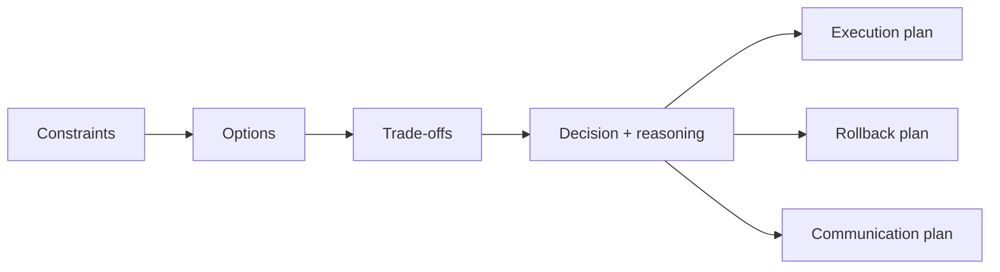

---

### 🚨 Failure Modes

**Failure 1 - Jumping to a solution:**

**Symptom:** Candidate immediately says "Use Hibernate" without exploring constraints, alternatives, or trade-offs.

**Root cause:** Not operating at staff level. Answering like a senior engineer (solve the technical problem) instead of a staff engineer (make the best decision for the organization).

**Diagnostic:**

```text
Candidate provides solution without:
- Asking clarifying questions
- Naming alternatives considered
- Articulating trade-offs
- Proposing execution plan
```

**Fix:**

**BAD:**

```text
"Use Hibernate with Spring Data JPA.
Configure OSIV=false and batching."
(Technical answer, missing staff judgment)
```

**GOOD:**

```text
"Before deciding, I need to understand
three things: team expertise, workload
split (CRUD vs analytics), and timeline.
If team has ORM experience and workload
is 70% CRUD: Hibernate with jOOQ for
reporting. If team is SQL-strong and
workload is 70% analytics: jOOQ primary.
Either way: shared config, monitoring,
CI query assertions from day one."
```

**Failure 2 - Ignoring organizational reality:**

**Symptom:** Candidate proposes a technically perfect solution that requires 6 months and 5 engineers. Budget is 2 engineers for 3 months.

**Root cause:** Technical purity over pragmatism. Not considering organizational constraints as first-class design inputs.

**Diagnostic:**

```text
Proposed plan exceeds stated constraints
(budget, timeline, team size).
No phasing or scoping to fit constraints.
```

**Fix:**

```text
"Given 2 engineers and 3 months, the full
migration is infeasible. I would scope:
Phase 1 (month 1): shared library update
Phase 2 (months 2-3): top 10 services
Phase 3 (backlog): remaining 40 services
assigned to service-owning teams in
subsequent quarters."
```

---

### 🔬 Production Reality

A staff engineer interview uses Scenario 2 (fleet migration). Candidate A proposes big-bang migration: "Run OpenRewrite on all 50 services, fix issues, deploy." No phasing, no risk assessment. Score: 2/5 (technical but not staff-level). Candidate B asks: "Which services are highest traffic? What is the rollback plan per service? Can the shared library support both Hibernate 5 and 6 during transition?" Then proposes incremental migration with dual-support library. Score: 4.5/5 (staff reasoning with organizational awareness).

---

### ⚖️ Trade-offs & Alternatives

| Scenario type        | What it tests          | Complexity | Time   |
| -------------------- | ---------------------- | ---------- | ------ |
| Technology selection | Judgment + trade-offs  | Medium     | 30 min |
| Migration strategy   | Planning + risk mgmt   | High       | 45 min |
| Performance crisis   | Diagnosis + leadership | High       | 30 min |
| Governance design    | Organizational design  | Medium     | 30 min |
| Architecture review  | Systems thinking       | High       | 45 min |

**Real-world patterns:**

- **Effective interviews** use 2 scenarios (60-90 minutes total). One planning scenario + one crisis scenario.
- **Self-assessment** uses all 5 scenarios as practice. Time yourself. Evaluate: did you address all five dimensions?

---

### ⚡ Decision Snap

**USE THESE SCENARIOS WHEN:**

- Interviewing for staff/principal engineer roles with data layer responsibility.
- Self-assessing readiness for staff-level ORM decision-making.

**KEY EVALUATION CRITERIA:**

- Reasoning > solution. Trade-offs > certainty. Pragmatism > purity.

**DO NOT USE WHEN:**

- Interviewing for senior individual contributor roles (use L4 interview questions instead).

---

### ⚠️ Top Traps

| #   | Misconception                        | Reality                                                                                                               |
| --- | ------------------------------------ | --------------------------------------------------------------------------------------------------------------------- |
| 1   | Staff scenarios have right answers   | They test reasoning quality. Two candidates can reach different conclusions and both score 5/5 if reasoning is sound. |
| 2   | Technical depth is most important    | Technical correctness is 15% of the evaluation. Reasoning, trade-offs, and pragmatism are 75%.                        |
| 3   | Candidates should answer immediately | Staff thinking requires structured analysis. 5 minutes of silent thinking is a positive signal.                       |
| 4   | One scenario is sufficient           | Different scenarios test different dimensions. Two scenarios provide a more complete picture.                         |
| 5   | These replace coding exercises       | Staff scenarios complement, not replace, system design and coding assessments. They test a different dimension.       |

---

### 🪜 Learning Ladder

**Prerequisites:**

- ORM vs SQL-First Strategy Decision Framework - decision
  framework used in Scenario 1
- Fleet-Wide Hibernate Governance and Standards -
  governance used in Scenario 4
- Hibernate Expert Mastery Verification - technical
  foundation for all scenarios

**THIS:** HIB-102 Staff-Level ORM Interview Scenarios

**Next steps:**

- ORM Data Layer - Phase 5 (Platform Strategy) -
  staff-level decisions at platform scale
- Build vs Extend vs Replace ORM Decision Guide -
  strategic technology evaluation

---

**The Surprising Truth:**

The most telling moment in a staff ORM interview is not the answer. It is the clarifying questions. A candidate who asks "What is the team's Hibernate experience level?" before recommending Hibernate shows organizational awareness. A candidate who asks "What is the rollback plan requirement?" before proposing migration shows risk thinking. The questions reveal the mental model. The answer just confirms it.

**Further Reading:**

- Will Larson, "Staff Engineer: Leadership beyond the management track" - staff decision-making patterns
- Gergely Orosz, "The Software Engineer's Guidebook" - career levels and expectations
- Martin Fowler, "Patterns of Enterprise Application Architecture" - data layer decision framework

**Revision Card:**

1. Staff scenarios test reasoning (30%), trade-offs (25%), pragmatism (20%), not just technical answers (15%).
2. Five scenario types: technology selection, migration, performance crisis, governance, architecture review. Use 2 per interview.
3. The clarifying questions the candidate asks reveal more about their judgment than the answer they give.

---

---

# HIB-103 Teaching Hibernate - Why Juniors Struggle with ORM

**TL;DR** - Juniors struggle with Hibernate because it requires understanding three invisible systems simultaneously: entity lifecycle, SQL generation, and persistence context state.

---

### 🔥 Problem Statement

A junior developer learns Spring Boot in 2 weeks but struggles with Hibernate for months. They create an entity, call `save()`, and it works. Then they modify an entity without calling `save()` and changes persist - confusion. They add `@ManyToOne` and get N+1 - frustration. They return entities from a controller and get `LazyInitializationException` - despair. The core problem: Hibernate's behavior depends on invisible state (persistence context, entity lifecycle, Session scope) that has no equivalent in their previous experience. Teaching Hibernate requires making the invisible visible.

---

### 📜 Historical Context

Hibernate was designed for experienced Java enterprise developers (2001-2005) who understood JDBC, transaction management, and relational databases. By 2015, Spring Boot made Hibernate accessible to beginners who had no database background. The abstraction that Hibernate provides (automatic SQL, transparent persistence) becomes confusing when it does something unexpected (automatic dirty checking, lazy loading). The teaching challenge intensified: more beginners using a tool designed for experts. The response: better documentation, starter guides, and diagnostic tools - but the fundamental complexity remains.

---

### 🔩 First Principles

**CORE INVARIANTS:**

1. **Three invisible systems:** Entity lifecycle (managed/detached/transient), SQL generation (when and what SQL runs), and persistence context state (what is tracked). All three interact. Understanding one without the others leads to confusion.
2. **Abstractions hide complexity:** `repository.save(entity)` hides: "persist if new, merge if detached, do nothing if already managed." This is helpful for experts, confusing for beginners.
3. **Side effects are invisible:** Modifying a managed entity's field generates an UPDATE at flush time. No explicit save call. No visible action. The side effect is invisible.
4. **Error messages are delayed:** N+1 does not throw an error. LazyInitializationException appears far from the cause. Symptoms are distant from root causes.

**DERIVED DESIGN:**

Teaching Hibernate requires: (1) make the invisible visible (show SQL, show entity states, show persistence context), (2) build mental models before APIs (understand dirty checking before using `save()`), (3) teach failure modes early (N+1 and LazyInitializationException before advanced features).

**THE TRADE-OFF:**

**Gain:** Junior developers who understand Hibernate's mental model write production-quality code from the start.

**Cost:** Slower initial learning (mental model before API). Requires experienced mentors who can explain the invisible systems.

---

### 🧠 Mental Model

> Teaching Hibernate is like teaching someone to drive a car with an invisible dashboard. The speed (SQL generation), fuel gauge (persistence context size), and engine temperature (flush time) are all hidden. The driver (junior) only sees the road (API output). When the car overheats (N+1 latency), they do not know why because the dashboard is invisible. Step one of teaching: make the dashboard visible (enable statistics, show SQL, explain entity states).

- "Invisible dashboard" -> hidden Hibernate internals
- "Speed" -> SQL generation (show_sql/p6spy)
- "Fuel gauge" -> PC size (session statistics)
- "Engine temperature" -> flush time (statistics)
- "Make visible" -> enable monitoring/logging

**Where this analogy breaks down:** Unlike a car, Hibernate's "dashboard" can be made visible immediately (enable statistics). The challenge is teaching juniors to read it.

---

### 🧩 Components

**Struggle 1 - Invisible dirty checking:**

```java
// Junior expectation: "I didn't call save()"
// -> "Changes should not persist"
@Transactional
void updateName(Long id, String name) {
    User user = userRepo.findById(id).get();
    user.setName(name);
    // No save() call! But name PERSISTS.
    // Junior: "Why?!"
    // Answer: managed entity, dirty checking
}
```

**Struggle 2 - LazyInitializationException:**

```java
// Junior: "It worked yesterday" (OSIV on)
// Today (OSIV off): exception!
User user = userService.findById(1L);
// @Transactional ended in service
user.getOrders().size(); // BOOM!
// Junior: "What changed?!"
// Answer: Session scope changed
```

**Struggle 3 - N+1:**

```java
// Junior: "I only wrote one query"
List<User> users = userRepo.findAll();
for (User u : users) {
    log.info(u.getOrders().size());
    // One SELECT per user - invisible!
}
// Junior: "Why is it slow?"
// Answer: 101 queries, not 1
```

```text
  Teaching progression:
  1. Show SQL (hibernate.show_sql=true)
     -> "See what Hibernate generates"
  2. Count queries per request
     -> "See how MANY queries run"
  3. Entity states diagram
     -> "See WHERE your entity lives"
  4. Persistence context diagram
     -> "See WHAT Hibernate tracks"
```

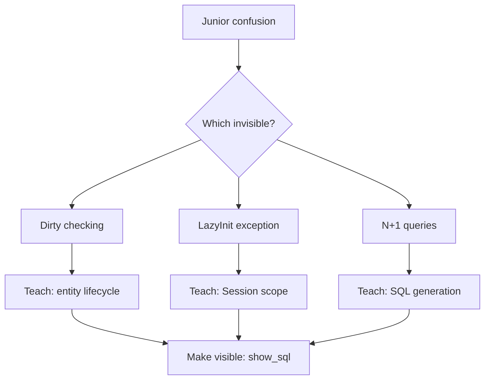

---

### 📶 Gradual Depth

**Level 1 - What it is:**

Juniors struggle with Hibernate because it has three invisible systems (entity lifecycle, SQL generation, persistence context) that interact in non-obvious ways.

**Level 2 - How to use it:**

Teach mental models before APIs. Make the invisible visible (show_sql, statistics). Teach common failure modes (N+1, LazyInitializationException) early, not as advanced topics.

**Level 3 - How it works:**

The abstraction gap: juniors think in "call method, get result" (procedural). Hibernate thinks in "manage state, generate SQL at flush" (stateful). The mental model mismatch causes every confusion.

**Level 4 - Production mastery:**

Senior engineers teaching juniors should: (1) pair on the first Hibernate feature (show the invisible), (2) require query count assertions in the junior's first PR, (3) code review for entity return from controllers (LazyInitializationException risk), (4) teach DTO projections as the default for read endpoints (avoid the problem entirely).

---

### ⚙️ How It Works

**Phase 1 - Make SQL visible (day 1):**
Enable `show_sql=true` or p6spy. Every Hibernate operation shows the generated SQL. Junior sees: "find() generates SELECT. save() generates INSERT. Modifying a managed entity generates UPDATE at flush."

**Phase 2 - Teach entity lifecycle (week 1):**
Diagram: Transient -> Managed -> Detached -> Removed. Explain: "save() makes transient -> managed. find() returns managed. After @Transactional ends: managed -> detached."

**Phase 3 - Teach failure modes (week 2):**
N+1: "Every lazy access is a separate query. Count them with statistics." LazyInitializationException: "You accessed a lazy association after the Session closed."

**Phase 4 - Teach prevention (week 3):**
JOIN FETCH for needed associations. DTO projections for list endpoints. Query count assertions in tests.

```text
  Teaching timeline:
  Day 1: enable show_sql, see SQL
  Week 1: entity lifecycle states
  Week 2: N+1 and LazyInitializationException
  Week 3: JOIN FETCH and DTO projections
  Week 4: query count assertions in tests
  Month 2: caching and performance tuning
  Month 3: production diagnostics
```

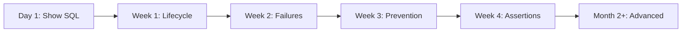

---

### 🚨 Failure Modes

**Failure 1 - Teaching APIs before mental model:**

**Symptom:** Junior knows `save()`, `findById()`, `@Entity` but cannot explain why changes persist without `save()`. Every N+1 requires senior help.

**Root cause:** Learned API surface without understanding the state machine underneath. Tutorial-driven learning.

**Diagnostic:**

```text
Ask: "What happens if you modify a managed
entity without calling save()?"
If answer is "Nothing changes": mental model
is missing. Entity lifecycle not understood.
```

**Fix:**

**BAD:**

```text
Tutorial: "To save an entity, call
repository.save(entity). To find,
call findById(). To update, call
save() again."
(Procedural teaching. Missing: why)
```

**GOOD:**

```text
Lesson 1: "Hibernate tracks entities.
A managed entity is WATCHED by Hibernate.
Any change to a managed entity is
automatically detected (dirty checking)
and written to the DB at flush time.
You do not need to call save()."
(State-based teaching. Explains WHY)
```

**Failure 2 - Not teaching query counting:**

**Symptom:** Junior writes code that works in dev (5 rows) but is slow in production (5000 rows). N+1 was never visible.

**Root cause:** No query counting in development. N+1 is invisible with small data sets.

**Diagnostic:**

```text
Junior's first PR has no query count
assertions. No statistics enabled.
Performance issue discovered in production.
```

**Fix:**

```text
Require query count assertions in
EVERY integration test from day 1.
assertThat(queryCount).isLessThanOrEqualTo(3);
Make N+1 visible before it reaches
production.
```

---

### 🔬 Production Reality

A team onboards 3 junior developers to a Hibernate codebase. Without structured teaching: each junior causes 2-3 N+1 incidents in their first 3 months (total: 7-9 incidents). With structured teaching (mental model first, query assertions required, pair programming on first feature): zero N+1 incidents from juniors in 6 months. The investment: 2 days of senior engineer time per junior for structured onboarding. ROI: 7-9 production incidents prevented.

---

### ⚖️ Trade-offs & Alternatives

| Teaching approach  | Time    | Effectiveness | Retention  |
| ------------------ | ------- | ------------- | ---------- |
| Mental model first | 2 weeks | High          | Long-term  |
| Tutorial-driven    | 3 days  | Low           | Short-term |
| Pair programming   | Ongoing | Very high     | Long-term  |
| Code review only   | Ongoing | Medium        | Medium     |
| Self-study (docs)  | Varies  | Low-medium    | Variable   |

**Real-world patterns:**

- **Effective teams** combine mental model teaching (week 1) + pair programming (weeks 2-4) + code review (ongoing).
- **Scaling teams** invest in structured Hibernate onboarding as part of their engineering bootcamp.

---

### ⚡ Decision Snap

**TEACH MENTAL MODEL FIRST WHEN:**

- Always. No exceptions. Entity lifecycle and persistence context before any API usage.

**REQUIRE QUERY ASSERTIONS WHEN:**

- From the first PR. Non-negotiable. Make N+1 visible from day 1.

**PAIR PROGRAM WHEN:**

- Junior's first Hibernate feature. Senior walks through the invisible systems in real code.

---

### ⚠️ Top Traps

| #   | Misconception                                | Reality                                                                                                                                  |
| --- | -------------------------------------------- | ---------------------------------------------------------------------------------------------------------------------------------------- |
| 1   | Juniors will learn from documentation        | Hibernate documentation explains WHAT, not WHY. Mental models require teaching by an experienced person.                                 |
| 2   | Spring Data JPA hides Hibernate complexity   | Spring Data hides the API but not the behavior. Juniors still encounter dirty checking, N+1, and LazyInitializationException.            |
| 3   | Start with simple CRUD, add complexity later | N+1 appears in the simplest CRUD: list entities + access associations. Teach prevention early, not late.                                 |
| 4   | Testing catches all issues                   | Unit tests mock the repository. Only integration tests with real databases reveal N+1 and lazy loading issues.                           |
| 5   | One training session is enough               | Hibernate understanding deepens over months of use. Revisit mental models after the junior encounters their first real production issue. |

---

### 🪜 Learning Ladder

**Prerequisites:**

- First-Level Cache (Persistence Context) Internals -
  the invisible system juniors must understand
- The LazyInitializationException Epidemic - the
  exception juniors encounter first

**THIS:** HIB-103 Teaching Hibernate - Why Juniors Struggle
with ORM

**Next steps:**

- Hibernate Deep-Dive Interview Questions - assessing
  understanding depth
- Hibernate Expert Mastery Verification - progression
  benchmarks for junior -> senior

---

**The Surprising Truth:**

The #1 reason juniors struggle with Hibernate is not complexity - it is invisibility. Every other tool they have used provides immediate, visible feedback: a REST call returns a response, a React component renders on screen, a unit test passes or fails. Hibernate operates on invisible state (persistence context, entity lifecycle) with delayed effects (SQL at flush time). Making these visible (show_sql, statistics, query count assertions) transforms Hibernate from confusing to logical.

**Further Reading:**

- Vlad Mihalcea, "High-Performance Java Persistence" - learning path recommendations
- Spring Data JPA Reference - repository abstraction documentation
- Hibernate ORM User Guide - entity lifecycle and persistence context

**Revision Card:**

1. Three invisible systems cause all junior confusion: entity lifecycle, SQL generation, persistence context state. Make them visible.
2. Teach mental model before API. Require query count assertions from the first PR. Pair program on the first Hibernate feature.
3. Investment: 2 days of senior time per junior. Return: 7-9 production incidents prevented in the first 3 months.

---

---

# HIB-104 ORM Data Layer - Phase 5 (Platform Strategy)

**TL;DR** - Phase 5 data layer treats Hibernate as a platform concern: standardized configuration, shared libraries, fleet-wide governance, automated migration, and centralized monitoring across all services.

---

### 🔥 Problem Statement

An organization grows from 5 services to 50. Each service independently configures Hibernate: different pool sizes, different OSIV settings, different batching strategies, different Spring Boot versions. When a connection pool vulnerability is discovered, 50 teams must patch independently. When a new engineer joins, they learn a different Hibernate configuration per service. Phase 5 treats the data layer as a platform: one shared configuration library, fleet-wide defaults, centralized monitoring, automated migration tooling, and governance policies enforced through CI.

---

### 📜 Historical Context

Platform engineering emerged as a discipline around 2018-2020, driven by the operational burden of managing hundreds of microservices. Before platform teams, each service was independently configured ("you build it, you run it"). The "you run it" part became unsustainable at 50+ services: inconsistent configurations, duplicated effort, and knowledge silos. Data layer platform strategy applies this to Hibernate: shared defaults, centralized monitoring, and governance - while preserving service team autonomy for domain-specific tuning.

---

### 🔩 First Principles

**CORE INVARIANTS:**

1. **Sensible defaults, override when needed:** The platform library provides defaults (OSIV=false, batch_size=25, pool_size=20). Services override only when they have a measured reason.
2. **Governance via CI, not review:** Configuration policies (no OSIV, query count limits, mandatory statistics) are enforced by CI checks, not by human code review.
3. **Centralized monitoring, decentralized ownership:** Platform team monitors fleet-wide Hibernate metrics (connection pool, query count, slow queries). Service teams own their service's performance.
4. **Automated migration:** Hibernate version upgrades, security patches, and configuration changes propagate through the shared library. One update, fleet-wide effect.

**DERIVED DESIGN:**

A shared Spring Boot starter library (`data-platform-starter`) provides Hibernate configuration, connection pool defaults, health checks, and metrics export. Services add the dependency. CI enforces governance policies.

**THE TRADE-OFF:**

**Gain:** Consistency across 50 services. One upgrade path. Centralized monitoring. Reduced onboarding time (learn once, apply everywhere).

**Cost:** Platform team dependency. Shared library versioning complexity. Service teams lose some autonomy.

---

### 🧠 Mental Model

> Phase 5 data layer is like a city building code. Each building (service) is designed by its architect (service team). But the city (platform team) sets building codes: fire safety (OSIV=false), structural requirements (connection pool sizing), and inspections (CI governance). Architects can customize interiors (domain logic) but must comply with codes (platform defaults).

- "Building code" -> platform defaults
- "Fire safety" -> OSIV=false, security patches
- "Structural requirements" -> pool sizing, batching
- "Inspections" -> CI governance checks
- "Customize interiors" -> domain-specific tuning

**Where this analogy breaks down:** Unlike building codes that are legally enforced, platform defaults can be overridden. The platform team must make compliance easier than non-compliance.

---

### 🧩 Components

- **Shared starter library:** `data-platform-starter` Spring Boot starter. Provides Hibernate defaults, connection pool configuration, metrics export, health checks.
- **Configuration hierarchy:** Platform defaults -> service `application.yml` overrides -> profile-specific overrides (dev/staging/prod).
- **CI governance checks:** Lint rules that fail builds on: OSIV=true, show_sql=true in production, missing statistics, connection pool < minimum.
- **Fleet monitoring dashboard:** Grafana dashboard showing per-service: connection pool utilization, query count per request, slow query percentile, cache hit rate.
- **Migration tooling:** Automated OpenRewrite recipes for Hibernate version upgrades. Shared library version bump triggers CI pipeline across all services.

```text
  Platform stack:
  +--------------------------------+
  | Service application.yml       |
  | (domain-specific overrides)    |
  +----------+---------------------+
             |
  +----------v---------------------+
  | data-platform-starter          |
  | OSIV=false, batch=25, pool=20  |
  | Statistics, metrics, health    |
  +----------+---------------------+
             |
  +----------v---------------------+
  | Spring Boot auto-configuration |
  | Hibernate + HikariCP           |
  +--------------------------------+
```

```mermaid
flowchart TD
    A[data-platform-starter] --> B[Hibernate defaults]
    A --> C[HikariCP defaults]
    A --> D[Metrics export]
    A --> E[Health checks]
    F[Service A] --> A
    G[Service B] --> A
    H[Service C] --> A
    I[CI Pipeline] --> J{Governance checks}
    J -->|OSIV=true| K[FAIL]
    J -->|Compliant| L[PASS]
```

---

### 📶 Gradual Depth

**Level 1 - What it is:**

Phase 5 treats Hibernate configuration as a platform concern. One shared library provides defaults across all services. CI enforces governance. Fleet monitoring provides visibility.

**Level 2 - How to use it:**

Add `data-platform-starter` to each service's `pom.xml`. Platform defaults apply. Override in `application.yml` when needed. CI checks governance compliance.

**Level 3 - How it works:**

The starter uses Spring Boot auto-configuration. `@ConditionalOnMissingBean` allows service overrides. Metrics are exported to Prometheus via Micrometer. CI governance runs custom lint rules against `application.yml`.

**Level 4 - Production mastery:**

Version strategy: the starter follows semantic versioning. Minor versions add features (backward compatible). Major versions require migration. Deprecation policy: deprecated features warn for 2 minor versions before removal. Communication: platform team publishes a quarterly "state of the data platform" report with fleet-wide metrics, common issues, and upgrade recommendations.

---

### ⚙️ How It Works

**Phase 1 - Build the starter (2-4 weeks):**
Create Spring Boot starter with auto-configuration. Define defaults for Hibernate, HikariCP, statistics, and metrics. Publish to internal Maven repository.

**Phase 2 - Adopt incrementally (4-8 weeks):**
Start with 5 pilot services. Verify defaults work. Collect feedback. Adjust. Roll out to remaining services.

**Phase 3 - Add governance (2-4 weeks):**
CI rules: no OSIV in production, mandatory statistics, connection pool minimum. Services that fail governance get automated PR with fixes.

**Phase 4 - Fleet monitoring (2-4 weeks):**
Grafana dashboards with per-service Hibernate metrics. Alerting on: pool exhaustion, high query count, slow queries. Platform team monitors fleet health.

**Phase 5 - Automated migration (ongoing):**
When Hibernate security patch is needed: update starter version. CI pipelines across services detect version bump. Automated PR with OpenRewrite migration. Service team reviews and merges.

```text
  Starter auto-configuration example:
  @Configuration
  @ConditionalOnClass(SessionFactory.class)
  public class DataPlatformAutoConfig {
    // OSIV=false (non-negotiable)
    // Batch size=25 (overridable)
    // Statistics=true (non-negotiable)
    // Pool size=20 (overridable)
    // Metrics=enabled (non-negotiable)
  }
```

```mermaid
sequenceDiagram
    participant Platform as Platform Team
    participant Starter as Shared Starter
    participant Maven as Maven Repo
    participant CI as Service CI
    participant Svc as Service Team
    Platform->>Starter: Update Hibernate version
    Starter->>Maven: Publish v2.3.0
    Maven->>CI: Dependency check detects
    CI->>Svc: Automated PR with migration
    Svc->>CI: Review and merge
    CI->>CI: Governance checks pass
```

---

### 🚨 Failure Modes

**Failure 1 - Over-constraining services:**

**Symptom:** Platform starter enforces batch_size=25 globally. An analytics service needs batch_size=100 for bulk imports. Cannot override. Service team forks the starter.

**Root cause:** Platform defaults are too rigid. No override mechanism. Services cannot adapt to their specific workload.

**Diagnostic:**

```text
Service team files request to change
platform default. Platform team says no.
Service team forks starter. Governance
divergence begins.
```

**Fix:**

**BAD:**

```text
All Hibernate properties locked in starter.
No overrides allowed. One size fits all.
```

**GOOD:**

```text
Starter categorizes properties:
NON-NEGOTIABLE (OSIV=false, statistics)
  -> cannot be overridden
RECOMMENDED (batch_size=25, pool=20)
  -> can be overridden with justification
OPTIONAL (fetch strategy, cache)
  -> fully service-controlled
```

**Failure 2 - Starter version sprawl:**

**Symptom:** 50 services use 12 different starter versions. Oldest version is 18 months behind. Security patch requires updating all 12 versions.

**Root cause:** No enforcement of starter version currency. Services never upgrade because "it works."

**Diagnostic:**

```text
Scan fleet for starter versions:
grep -r 'data-platform-starter' */pom.xml
If > 3 versions in use: version sprawl.
```

**Fix:**

```text
CI governance: starter version must be
within 2 minor versions of latest.
Automated quarterly upgrade PRs.
Security patches trigger immediate
mandatory upgrade with SLA.
```

---

### 🔬 Production Reality

A platform team supports 45 microservices. Before the starter: 45 different Hibernate configurations, 3 N+1 incidents per month, 2 connection pool incidents per quarter. After the starter (6-month rollout): unified configuration, fleet-wide monitoring dashboard, zero N+1 incidents (CI query count assertions), zero connection pool incidents (standardized sizing + monitoring). Ongoing cost: 1 platform engineer at 30% allocation for starter maintenance, governance, and upgrades. ROI: 5+ incidents per month prevented, 2-day-faster onboarding for new engineers.

---

### ⚖️ Trade-offs & Alternatives

| Approach        | Consistency | Autonomy | Cost             |
| --------------- | ----------- | -------- | ---------------- |
| No platform     | Low         | Full     | High (incidents) |
| Shared starter  | High        | High     | Medium           |
| Mandated config | Very high   | Low      | Medium           |
| Service mesh    | Medium      | Full     | High (infra)     |

**Real-world patterns:**

- **Effective platform teams** provide the shared starter as a service, not a mandate. Make compliance easier than non-compliance.
- **Platform tax:** the shared starter saves each service team 2-3 days of initial setup and prevents 1-2 incidents per year per service.

---

### ⚡ Decision Snap

**BUILD A PLATFORM STARTER WHEN:**

- 10+ services use Hibernate. Configuration inconsistency causes incidents. Onboarding takes too long.

**KEEP INDEPENDENT CONFIG WHEN:**

- < 10 services. Team has capacity to manage each independently. No recurring incidents.

**NON-NEGOTIABLE PLATFORM DEFAULTS:**

- OSIV=false. Statistics enabled. Connection pool monitoring. Query count assertions in CI.

---

### ⚠️ Top Traps

| #   | Misconception                            | Reality                                                                                                               |
| --- | ---------------------------------------- | --------------------------------------------------------------------------------------------------------------------- |
| 1   | Platform starter = lock-in               | Good starters allow overrides. Only safety-critical defaults (OSIV, statistics) are non-negotiable.                   |
| 2   | Every service should upgrade immediately | Allow 2 minor version lag. Force upgrade only for security patches. Quarterly upgrade cycle for features.             |
| 3   | Platform team owns all data layer issues | Platform owns the starter and fleet monitoring. Service teams own their service's performance. Shared responsibility. |
| 4   | One configuration fits all services      | Services have different workloads. The starter provides sensible defaults with explicit override paths.               |
| 5   | Governance replaces culture              | CI governance catches mechanical violations. Culture drives understanding. Both are needed.                           |

---

### 🪜 Learning Ladder

**Prerequisites:**

- Fleet-Wide Hibernate Governance and Standards -
  governance policies the platform enforces
- Hibernate in Microservices vs Monolith Decision
  Guide - per-service Hibernate patterns

**THIS:** HIB-104 ORM Data Layer - Phase 5 (Platform Strategy)

**Next steps:**

- Build vs Extend vs Replace ORM Decision Guide -
  platform-level technology evaluation
- Staff-Level ORM Interview Scenarios - platform
  strategy as a staff-level concern

---

**The Surprising Truth:**

The most impactful feature of a data platform starter is not the Hibernate configuration - it is the fleet monitoring dashboard. When every service exports Hibernate metrics to a central Grafana, the platform team spots issues before they become incidents. Connection pool at 80%? Alert the service team before it reaches 100%. Query count trending up? Proactive optimization. The visibility is more valuable than the configuration.

**Further Reading:**

- Team Topologies by Skelton and Pais - platform team patterns
- Spring Boot custom starter documentation (spring.io)
- Micrometer documentation - metrics for Hibernate (micrometer.io)

**Revision Card:**

1. Platform starter provides Hibernate defaults (OSIV=false, statistics, pool sizing) across all services. Override when justified.
2. Governance via CI (automated checks), not code review. Non-negotiable: OSIV, statistics, pool monitoring. Overridable: batch size, pool size.
3. Fleet monitoring dashboard is the highest-value platform investment. Visibility prevents incidents before they happen.
