## Keywords

1. [HIB-105 Build vs Extend vs Replace ORM Decision Guide](#hib-105-build-vs-extend-vs-replace-orm-decision-guide)
2. [HIB-106 JPA Specification Internals and Metamodel API](#hib-106-jpa-specification-internals-and-metamodel-api)
3. [HIB-107 Writing a Custom Hibernate Dialect](#hib-107-writing-a-custom-hibernate-dialect)
4. [HIB-108 Hibernate SPI Extensions and Custom UserTypes](#hib-108-hibernate-spi-extensions-and-custom-usertypes)
5. [HIB-109 Persistence Provider Design - How an ORM Is Built](#hib-109-persistence-provider-design---how-an-orm-is-built)
6. [HIB-110 Hibernate Source Code Architecture and Bootstrap Sequence](#hib-110-hibernate-source-code-architecture-and-bootstrap-sequence)
7. [HIB-111 Unit of Work and Identity Map - Foundational ORM Patterns](#hib-111-unit-of-work-and-identity-map---foundational-orm-patterns)
8. [HIB-112 What Database Engine Internals Teach ORM Users](#hib-112-what-database-engine-internals-teach-orm-users)
9. [HIB-113 What Compiler Pipeline Design Teaches Query Optimization](#hib-113-what-compiler-pipeline-design-teaches-query-optimization)
10. [HIB-114 Identity Map as CPU Cache - Cross-Domain Memory Hierarchy](#hib-114-identity-map-as-cpu-cache---cross-domain-memory-hierarchy)
11. [HIB-115 Impedance Mismatch as a Universal Integration Problem](#hib-115-impedance-mismatch-as-a-universal-integration-problem)

---

---

# HIB-105 Build vs Extend vs Replace ORM Decision Guide

**TL;DR** - When Hibernate does not fit, decide: build a custom data layer, extend Hibernate with SPIs, or replace with jOOQ/JDBC. Each has clear criteria based on workload, team, and constraints.

---

### 🔥 Problem Statement

A team hits Hibernate friction: complex queries, performance overhead, or architectural mismatch. Three options: (1) Build a custom data layer (JDBC + custom mapping), (2) Extend Hibernate (custom UserTypes, custom dialects, SPI hooks), (3) Replace Hibernate (jOOQ, MyBatis, or plain JDBC). The wrong choice wastes months. Building a custom layer reimplements what Hibernate already provides. Extending Hibernate adds complexity where replacement is simpler. Replacing Hibernate loses features the team depends on. The decision framework: match the solution to the specific friction point.

---

### 📜 Historical Context

The "build vs extend vs replace" framework has been applied to ORM decisions since the early 2000s, when alternatives to Hibernate first appeared (iBATIS/MyBatis 2004, jOOQ 2009). Early decisions were often emotional ("Hibernate is too complex, let us write raw JDBC"). Experience showed: raw JDBC reimplements entity management, transaction scoping, and caching - recreating ORM features badly. The mature view: identify the specific friction point, then choose the minimum intervention that resolves it.

---

### 🔩 First Principles

**CORE INVARIANTS:**

1. **Identify the friction point first:** "Hibernate is slow" is not actionable. "JPQL cannot express window functions for our analytics queries" is actionable. The friction point determines the intervention.
2. **Minimum intervention principle:** Choose the least disruptive option that resolves the friction. Extend before replace. Replace one subsystem before replacing everything.
3. **Maintenance cost > initial cost:** Building a custom layer takes 2 weeks. Maintaining it for 3 years takes 6 months. Factor ongoing maintenance into every decision.
4. **Team expertise matters:** The best technical solution is useless if the team cannot maintain it. A slightly suboptimal solution the team understands beats a perfect solution they cannot debug.

**DERIVED DESIGN:**

Decision tree: (1) Is the friction in queries? -> Extend with native SQL or jOOQ hybrid. (2) Is the friction in type mapping? -> Extend with custom UserTypes. (3) Is the friction in the ORM model itself? -> Replace for that specific workload. (4) Is the friction in everything? -> Replace entirely (rare).

**THE TRADE-OFF:**

**Gain:** A deliberate, friction-specific decision that avoids over-engineering and under-engineering.

**Cost:** Requires honest assessment of the actual friction point. Teams often misdiagnose "Hibernate is bad" when the issue is misuse.

---

### 🧠 Mental Model

> Build/extend/replace is like car repair. If the radio is broken (query friction), do not rebuild the engine (custom data layer). Fix the radio (extend with native SQL). If the engine is fundamentally wrong for the road (ORM mismatch for analytics), then replace the engine (switch to jOOQ). But never scrap the entire car (rewrite) when a part replacement suffices.

- "Radio broken" -> query friction (fix with native SQL)
- "Fix radio" -> extend Hibernate
- "Wrong engine" -> fundamental ORM mismatch
- "Replace engine" -> switch to jOOQ for that workload
- "Scrap car" -> full rewrite (almost never justified)

**Where this analogy breaks down:** Unlike cars, software components can coexist. You can have BOTH Hibernate and jOOQ in the same application (hybrid approach).

---

### 🧩 Components

**Decision criteria:**

| Friction type        | Build custom | Extend Hibernate | Replace      |
| -------------------- | ------------ | ---------------- | ------------ |
| Complex SQL queries  | No           | Native SQL       | jOOQ hybrid  |
| Custom type mapping  | No           | Custom UserType  | No           |
| Database dialect gap | No           | Custom Dialect   | No           |
| Bulk data processing | No           | StatelessSession | JDBC/jOOQ    |
| Analytics/reporting  | No           | No               | jOOQ/JDBC    |
| Full ORM mismatch    | Maybe        | No               | Full replace |
| Fun/resume-driven    | Never        | Never            | Never        |

```text
  Decision tree:
  Q: What is the friction?
  |
  +-> Query limitation?
  |   +-> Use native SQL or jOOQ hybrid
  |
  +-> Type mapping gap?
  |   +-> Write custom UserType/Converter
  |
  +-> Performance (bulk)?
  |   +-> Use StatelessSession or JDBC
  |
  +-> Fundamental mismatch?
      +-> Evaluate replacement options
      +-> Is the team's expertise aligned?
          +-> Yes: migrate incrementally
          +-> No: extend or stay
```

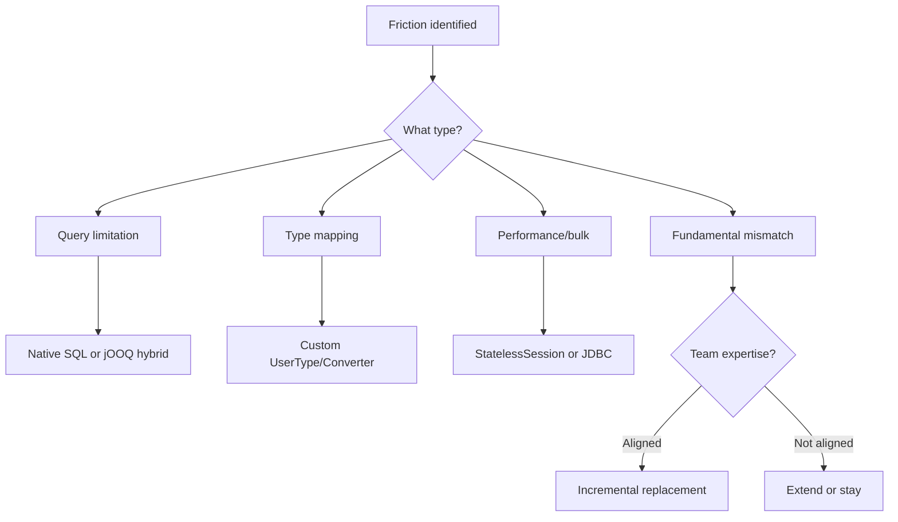

---

### 📶 Gradual Depth

**Level 1 - What it is:**

A decision framework for when Hibernate does not fit perfectly. Three options: build custom, extend Hibernate, or replace with an alternative. Choose based on the specific friction point.

**Level 2 - How to use it:**

Identify the friction point (queries, types, performance, architecture). Match to intervention: most friction is query-related (fix with native SQL or jOOQ). Type friction: custom UserType. Performance: StatelessSession. Only fundamental mismatch justifies replacement.

**Level 3 - How it works:**

Build: reimplements entity management, caching, transaction scoping. High maintenance cost. Justified only for ultra-specific workloads (custom database protocols, embedded systems). Extend: uses Hibernate SPIs (UserType, Dialect, Integrator). Maintains compatibility. Replace: switches the data layer technology. Incremental replacement uses hybrid (Hibernate + jOOQ coexistence).

**Level 4 - Production mastery:**

Most "replace Hibernate" decisions are driven by misuse, not mismatch. Before replacing: verify N+1 is fixed, OSIV is disabled, DTO projections are used for reads, and batching is configured. If performance is still insufficient after proper use: the friction is genuine and replacement is justified. Track the decision with an ADR (Architecture Decision Record).

---

### ⚙️ How It Works

**Phase 1 - Diagnose the friction:**
Name the specific problem. "JPQL cannot express window functions." "Bulk imports are slow." "Entity model does not fit event-sourced architecture."

**Phase 2 - Evaluate options:**
For each option (build/extend/replace): estimate initial effort, ongoing maintenance, risk, and team alignment.

**Phase 3 - Choose minimum intervention:**
Query friction -> native SQL or jOOQ for those specific queries. Type friction -> custom UserType. Bulk performance -> StatelessSession or JDBC batch. Fundamental mismatch -> incremental replacement.

**Phase 4 - Document the decision:**
ADR (Architecture Decision Record): problem statement, options considered, decision, consequences, review date.

```text
  ADR example:
  Title: Use jOOQ for analytics queries
  Status: Accepted
  Context: 15 analytics queries require
    window functions, CTEs, and lateral
    joins. JPQL cannot express these.
    Hibernate native SQL is verbose.
  Decision: Add jOOQ for analytics queries.
    Keep Hibernate for domain entities.
  Consequences:
    + Type-safe complex SQL
    + Better IDE support for analytics
    - Two frameworks to maintain
    - Team needs jOOQ training (2 days)
  Review: In 6 months, evaluate if hybrid
    is working or if full migration needed.
```

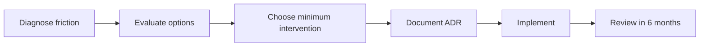

---

### 🚨 Failure Modes

**Failure 1 - Resume-driven replacement:**

**Symptom:** Team replaces Hibernate with jOOQ "because it is better." No specific friction identified. After migration, they reimplemented cascade, dirty checking, and optimistic locking manually (the features Hibernate provided for free).

**Root cause:** Decision driven by technology preference, not by diagnosed friction. No evaluation of what Hibernate provided versus what the replacement offers.

**Diagnostic:**

```text
Ask: "What specific problem are you
solving by replacing Hibernate?"
If answer is vague ("Hibernate is complex",
"jOOQ is modern"): resume-driven decision.
```

**Fix:**

**BAD:**

```text
"Hibernate is too complex. Let's use jOOQ."
(No friction diagnosis. No cost analysis.)
```

**GOOD:**

```text
"Our 15 analytics queries need window
functions. JPQL can't express them.
Two options: (1) native SQL in Hibernate,
(2) jOOQ for analytics only.
jOOQ gives type-safe SQL and IDE support.
We keep Hibernate for domain entities.
ADR documented. Review in 6 months."
```

**Failure 2 - Building what exists:**

**Symptom:** Team builds a custom "lightweight ORM" because "Hibernate is too heavy." After 6 months, the custom ORM has: entity mapping, dirty checking, caching, and connection pooling. It is Hibernate, but worse.

**Root cause:** Underestimating what Hibernate provides. The "heavyweight" perception is often wrong - Hibernate startup is 2-3 seconds; runtime overhead is minimal.

**Diagnostic:**

```text
Custom data layer has:
- Entity mapping -> Hibernate has this
- Change tracking -> Hibernate has this
- Caching -> Hibernate has this
- Connection pooling -> HikariCP has this
Total reimplemented features: 4
Total bugs in custom implementation: many
```

**Fix:**

```text
Before building custom: list every
feature the current tool provides.
For each feature: does the custom
solution need it? If yes: maintenance
cost of reimplementing.
Usually: extending Hibernate is cheaper
than building from scratch.
```

---

### 🔬 Production Reality

A team at a financial services company wants to "replace Hibernate" because "queries are slow." Diagnosis reveals: OSIV is enabled (holding connections through rendering), N+1 on 8 endpoints (no JOIN FETCH), and batch size is default (1). After fixing these three issues: query latency drops 80%. The team no longer wants to replace Hibernate. Total effort: 2 developer-days. If they had proceeded with jOOQ migration: estimated 3 months. The friction was misuse, not mismatch.

---

### ⚖️ Trade-offs & Alternatives

| Decision | Initial cost   | Maintenance | Risk      | When           |
| -------- | -------------- | ----------- | --------- | -------------- |
| Extend   | Low (days)     | Low         | Low       | Most cases     |
| Hybrid   | Medium (weeks) | Medium      | Medium    | Query friction |
| Replace  | High (months)  | Low-medium  | High      | True mismatch  |
| Build    | Very high      | Very high   | Very high | Ultra-specific |

**Real-world patterns:**

- **90% of cases:** Extend (native SQL, custom types, StatelessSession) resolves the friction.
- **9% of cases:** Hybrid (Hibernate + jOOQ) resolves query-specific friction.
- **1% of cases:** Full replacement is justified (architecture mismatch like event sourcing).

---

### ⚡ Decision Snap

**EXTEND WHEN:**

- Friction is in specific queries, types, or bulk operations. Hibernate works well for 80%+ of the workload.

**HYBRID WHEN:**

- 10-30% of queries cannot be expressed in JPQL. Team has capacity to maintain two frameworks.

**REPLACE WHEN:**

- Architecture fundamentally mismatches ORM (event sourcing, graph-first, time-series-only). Team has expertise in the replacement technology.

**BUILD WHEN:**

- Almost never. Custom data layers are justified only for proprietary database protocols or embedded systems with extreme constraints.

---

### ⚠️ Top Traps

| #   | Misconception                           | Reality                                                                                                                         |
| --- | --------------------------------------- | ------------------------------------------------------------------------------------------------------------------------------- |
| 1   | Hibernate is slow, so replace it        | 80% of "Hibernate is slow" is misuse (OSIV, N+1, no batching). Fix misuse before evaluating alternatives.                       |
| 2   | Building custom is lightweight          | Custom data layers accumulate features until they replicate what Hibernate provides, but with more bugs and less documentation. |
| 3   | jOOQ replaces everything Hibernate does | jOOQ is a SQL builder, not an ORM. It does not provide dirty checking, cascade, L2 cache, or optimistic locking.                |
| 4   | The decision is permanent               | Decisions are reversible. Start with extend. If insufficient, move to hybrid. If hybrid is insufficient (rare), then replace.   |
| 5   | Technology choice matters most          | Team expertise, maintenance capacity, and organizational context matter more than the technology itself.                        |

---

### 🪜 Learning Ladder

**Prerequisites:**

- ORM vs SQL-First Strategy Decision Framework - initial
  technology selection
- ORM-to-SQL-Builder (jOOQ/Exposed) Migration Strategy -
  migration mechanics

**THIS:** HIB-105 Build vs Extend vs Replace ORM Decision Guide

**Next steps:**

- Hibernate SPI Extensions and Custom UserTypes -
  extending Hibernate's capabilities
- Staff-Level ORM Interview Scenarios - decision
  frameworks as staff-level skill

---

**The Surprising Truth:**

Most "replace Hibernate" decisions are really "fix Hibernate misuse" decisions in disguise. In practice, 90% of teams that conduct an honest friction diagnosis discover that their problems are OSIV, N+1, missing batching, or missing DTO projections - not fundamental ORM limitations. The remaining 10% have genuine friction (complex analytics, bulk processing) that a hybrid approach resolves without full replacement.

**Further Reading:**

- Martin Fowler, "Patterns of Enterprise Application Architecture" - data mapper vs active record patterns
- Vlad Mihalcea, "High-Performance Java Persistence" - optimizing before replacing
- ThoughtWorks Technology Radar - ORM evaluation criteria

**Revision Card:**

1. Diagnose the specific friction first. "Hibernate is slow" is not a diagnosis. "JPQL cannot express window functions" is.
2. Minimum intervention: extend (90% of cases), hybrid (9%), replace (1%). Building custom is almost never justified.
3. Most replacement decisions are misuse diagnoses in disguise. Fix OSIV, N+1, batching, and projections before evaluating alternatives.

---

---

# HIB-106 JPA Specification Internals and Metamodel API

**TL;DR** - JPA is a specification (not a library). The Metamodel API provides type-safe, compile-time-checked access to entity metadata. Hibernate implements JPA but extends it significantly.

---

### 🔥 Problem Statement

A developer writes `@Entity`, `@Id`, `@Column` and assumes these are Hibernate annotations. They are not. They are JPA specification annotations (`jakarta.persistence.*`). JPA defines the contract; Hibernate implements it. Understanding the distinction matters: JPA features are portable across providers (EclipseLink, OpenJPA). Hibernate extensions (`@Cache`, `@BatchSize`, `@DynamicUpdate`) are Hibernate-specific. The Metamodel API (JPA 2.0+) provides type-safe entity metadata access, enabling compile-time-checked criteria queries instead of string-based JPQL.

---

### 📜 Historical Context

JPA 1.0 (2006) standardized ORM in Java EE, unifying Hibernate, TopLink, and JDO into one specification. JPA 2.0 (2009) added the Criteria API and the Metamodel API (type-safe entity metadata). JPA 2.1 (2013) added stored procedures, entity graphs, and CDI integration. JPA 2.2 (2017) added `Stream` support and date/time API. JPA 3.0 (2020, Jakarta EE 9) renamed `javax.persistence` to `jakarta.persistence`. JPA 3.1 (2022) added UUID generation and minor enhancements. Hibernate has always implemented JPA while providing extensive proprietary extensions.

---

### 🔩 First Principles

**CORE INVARIANTS:**

1. **JPA is a specification:** A set of interfaces and annotations that define the ORM contract. No implementation code. `EntityManager`, `@Entity`, `@Id` are JPA-defined.
2. **Hibernate implements JPA:** When you use `EntityManager`, you are using JPA's interface, implemented by Hibernate's `SessionImpl`. The implementation can be swapped (EclipseLink, OpenJPA).
3. **Metamodel provides type safety:** `EntityType<Order>`, `SingularAttribute<Order, Long>` replace string-based field references. `"customerName"` becomes `Order_.customerName`.
4. **Extensions are provider-specific:** `@Cache` (L2 cache), `@NaturalId`, `@Formula`, `@BatchSize` are Hibernate extensions, not JPA standard. Using them ties the application to Hibernate.

**DERIVED DESIGN:**

For portable code: use only `jakarta.persistence.*` annotations and JPA Criteria + Metamodel. For production Hibernate code: use Hibernate extensions where they provide clear value (L2 cache, batch sizing) and accept the provider lock-in.

**THE TRADE-OFF:**

**Gain (JPA-only):** Portable across JPA providers. Follows the specification.

**Cost (JPA-only):** Misses Hibernate-specific optimizations (batching, caching, dynamic updates).

**Gain (Hibernate extensions):** Better performance, richer features.

**Cost (Hibernate extensions):** Provider lock-in (practically irrelevant - provider switches are rare).

---

### 🧠 Mental Model

> JPA specification is like the USB standard. It defines the connector shape (interface) and data protocol (contract). Hibernate is like a specific USB device manufacturer. The device (Hibernate) follows the standard (JPA) so it works with any host (application). But the device also has proprietary features (Hibernate extensions) that only work with certain software (Hibernate-aware code).

- "USB standard" -> JPA specification
- "Connector shape" -> `@Entity`, `EntityManager`
- "Device manufacturer" -> Hibernate
- "Proprietary features" -> `@Cache`, `@BatchSize`
- "Any host" -> any JPA-aware application

**Where this analogy breaks down:** Unlike USB where standardization is critical for hardware interoperability, JPA provider portability is rarely exercised. Most applications choose Hibernate and stay with Hibernate.

---

### 🧩 Components

- **JPA annotations:** `@Entity`, `@Id`, `@Column`, `@ManyToOne`, `@OneToMany`, `@NamedQuery` - all defined in `jakarta.persistence`.
- **EntityManager:** JPA's core interface. `persist()`, `merge()`, `find()`, `remove()`, `createQuery()`. Hibernate implements it.
- **Criteria API:** Programmatic, type-safe query building. `CriteriaBuilder`, `CriteriaQuery`, `Root`, `Predicate`.
- **Metamodel API:** Type-safe entity metadata. Generated at compile time by annotation processor. `Order_`, `Customer_` classes with static fields.
- **Hibernate extensions:** `@Cache`, `@NaturalId`, `@Formula`, `@DynamicUpdate`, `@BatchSize`, `@Fetch`, `Session` (Hibernate-specific interface extending EntityManager).

```text
  JPA vs Hibernate annotations:
  +-------------------+-------------------+
  | JPA (portable)    | Hibernate-only    |
  +-------------------+-------------------+
  | @Entity           | @Cache            |
  | @Id               | @NaturalId        |
  | @Column           | @Formula          |
  | @ManyToOne        | @BatchSize        |
  | @NamedQuery       | @DynamicUpdate    |
  | @GeneratedValue   | @Fetch            |
  | @EntityGraph      | @Where (removed 6)|
  +-------------------+-------------------+
```

```mermaid
flowchart TD
    A[JPA Specification] --> B[@Entity, @Id]
    A --> C[EntityManager]
    A --> D[Criteria API]
    A --> E[Metamodel API]
    F[Hibernate] --> G[Implements JPA]
    F --> H[@Cache, @BatchSize]
    F --> I[Session extends EM]
    F --> J[Custom Dialects]
    G --> A
```

---

### 📶 Gradual Depth

**Level 1 - What it is:**

JPA is a specification defining ORM annotations and interfaces. Hibernate implements JPA. The Metamodel API provides type-safe entity metadata for compile-time-checked queries.

**Level 2 - How to use it:**

Use `jakarta.persistence.*` for core annotations. Use `CriteriaBuilder` + Metamodel (`Order_`) for type-safe queries. Use Hibernate extensions (`@Cache`, `@BatchSize`) when needed.

**Level 3 - How it works:**

The Metamodel API uses annotation processing at compile time. The JPA annotation processor generates `_` classes (e.g., `Order_`) with `SingularAttribute`, `PluralAttribute` fields. These replace string-based field names in Criteria queries, providing compile-time type checking.

**Level 4 - Production mastery:**

Criteria + Metamodel shines for dynamic queries (search filters, multi-criteria queries) where JPQL would require string concatenation. For static queries, JPQL or `@Query` remains more readable. The Metamodel also enables framework-level code: generic repositories, audit infrastructure, and entity introspection.

---

### ⚙️ How It Works

**Phase 1 - Annotation processing:**
Add `hibernate-jpamodelgen` to build dependencies. At compile time, it generates `Order_`, `Customer_` etc. in the same package.

**Phase 2 - Metamodel classes:**
`Order_` has: `public static volatile SingularAttribute<Order, Long> id`, `public static volatile SingularAttribute<Order, String> status`, etc.

**Phase 3 - Criteria query with Metamodel:**
Use `Order_.status` instead of `"status"`. Compile-time checked. Refactoring-safe.

**Phase 4 - EntityManager delegation:**
`EntityManager.persist()` delegates to `SessionImpl.persist()`. The JPA interface hides the Hibernate implementation. `EntityManager.unwrap(Session.class)` accesses Hibernate-specific features when needed.

```text
  BEFORE (string-based, not type-safe):
  cb.equal(root.get("status"), "ACTIVE");
  // "status" is a string. Typo compiles
  // but fails at runtime.

  AFTER (Metamodel, type-safe):
  cb.equal(root.get(Order_.status),
      "ACTIVE");
  // Order_.status is a typed field.
  // Typo = compile error.
```

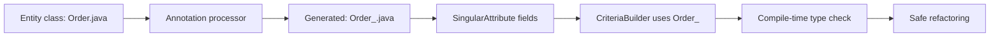

---

### 🚨 Failure Modes

**Failure 1 - String-based criteria queries:**

**Symptom:** Field renamed from `status` to `orderStatus`. All string-based criteria queries (`root.get("status")`) compile but fail at runtime with `IllegalArgumentException`.

**Root cause:** String-based field references have no compile-time checking. Renaming a field does not cause compilation errors in criteria queries.

**Diagnostic:**

```text
java.lang.IllegalArgumentException:
Unable to locate Attribute with the
given name [status] on this
ManagedType [Order]
```

**Fix:**

**BAD:**

```java
// String-based: no compile-time check
Predicate p = cb.equal(
    root.get("status"), "ACTIVE");
// Rename "status" to "orderStatus"
// -> runtime exception
```

**GOOD:**

```java
// Metamodel: compile-time checked
Predicate p = cb.equal(
    root.get(Order_.orderStatus),
    "ACTIVE");
// Rename: Order_ regenerated
// -> compile error if mismatched
```

**Failure 2 - Mixing JPA and Hibernate annotations:**

**Symptom:** Entity uses `@jakarta.persistence.Cacheable` (JPA) but L2 cache does not work. Team expected it to enable caching.

**Root cause:** JPA `@Cacheable` marks the entity as cacheable, but Hibernate needs `@org.hibernate.annotations.Cache(usage = READ_WRITE)` to configure the caching strategy. JPA annotation alone is insufficient.

**Diagnostic:**

```text
Entity has @Cacheable but:
- No Hibernate @Cache with strategy
- Or: shared-cache-mode not set in
  persistence.xml / properties
Cache statistics show 0 hits.
```

**Fix:**

```java
// Both annotations needed for Hibernate L2
@Entity
@Cacheable // JPA: mark as cacheable
@Cache(usage =
    CacheConcurrencyStrategy.READ_WRITE)
    // Hibernate: define strategy
public class Product { ... }
```

---

### 🔬 Production Reality

A team builds a dynamic search API with 12 optional filters. JPQL approach: string concatenation with 12 conditional blocks, prone to SQL injection and bugs. Criteria + Metamodel approach: type-safe predicates added conditionally. Refactoring entity fields causes compile-time failures (caught in CI), not runtime failures (caught in production). After adopting Metamodel: zero runtime query failures from field renames across 18 months. Before: 2-3 runtime failures per quarter from string-based queries.

---

### ⚖️ Trade-offs & Alternatives

| Query approach       | Type safety | Readability | Dynamic queries |
| -------------------- | ----------- | ----------- | --------------- |
| JPQL string          | None        | High        | Poor (concat)   |
| Criteria + strings   | Partial     | Low         | Good            |
| Criteria + Metamodel | Full        | Medium      | Excellent       |
| Native SQL           | None        | Medium      | Good            |
| jOOQ                 | Full        | High        | Excellent       |

**Real-world patterns:**

- **Static queries:** JPQL is more readable. Use `@Query` in Spring Data.
- **Dynamic queries:** Criteria + Metamodel is type-safe and refactoring-safe. Use for search endpoints with optional filters.

---

### ⚡ Decision Snap

**USE METAMODEL WHEN:**

- Dynamic queries with multiple optional filters. Search endpoints. Generic repository infrastructure.

**USE JPQL WHEN:**

- Static queries with known structure. Readability is the priority.

**USE HIBERNATE EXTENSIONS WHEN:**

- Specific optimization needed (L2 cache, batch sizing, dynamic updates). Accept provider lock-in.

---

### ⚠️ Top Traps

| #   | Misconception                           | Reality                                                                                                               |
| --- | --------------------------------------- | --------------------------------------------------------------------------------------------------------------------- |
| 1   | @Entity is a Hibernate annotation       | @Entity is defined in JPA (`jakarta.persistence.Entity`). Hibernate implements the JPA specification.                 |
| 2   | JPA portability matters in practice     | 99% of applications choose Hibernate and never switch. Portability is theoretically valuable, practically irrelevant. |
| 3   | Criteria API is always better than JPQL | Criteria is better for DYNAMIC queries. JPQL is more readable for static queries. Use each where it fits.             |
| 4   | Metamodel generation is automatic       | Requires annotation processor dependency (`hibernate-jpamodelgen`) and IDE configuration. Not enabled by default.     |
| 5   | JPA @Cacheable enables caching alone    | JPA @Cacheable marks the intent. Hibernate @Cache configures the strategy. Both are needed for L2 caching to work.    |

---

### 🪜 Learning Ladder

**Prerequisites:**

- Persistence Provider Design - How an ORM Is Built - how
  JPA providers implement the specification
- Hibernate Source Code Architecture and Bootstrap
  Sequence - how Hibernate boots as a JPA provider

**THIS:** HIB-106 JPA Specification Internals and Metamodel API

**Next steps:**

- Writing a Custom Hibernate Dialect - extending JPA
  with database-specific SQL generation
- Hibernate SPI Extensions and Custom UserTypes -
  extending JPA type handling

---

**The Surprising Truth:**

The most valuable feature of the JPA Metamodel API is not type safety in criteria queries - it is refactoring safety. When a field is renamed, every Metamodel-based query fails at compile time. String-based queries fail at runtime in production. For applications with 50+ queries and frequent schema evolution, the Metamodel prevents 2-3 production failures per quarter - each of which would require an emergency fix.

**Further Reading:**

- JPA 3.1 Specification (Jakarta EE) - jakarta.ee
- Hibernate ORM User Guide - JPA Metamodel Generator section
- Vlad Mihalcea, "JPA Criteria API vs JPQL" (vladmihalcea.com)

**Revision Card:**

1. JPA is a specification (interfaces + annotations). Hibernate is an implementation. `@Entity` and `EntityManager` are JPA. `@Cache` and `Session` are Hibernate.
2. Metamodel API generates `Order_` classes with typed fields. Use for dynamic queries: `root.get(Order_.status)` is compile-time checked and refactoring-safe.
3. Provider portability is rarely exercised. Use Hibernate extensions when they provide clear value. Document the extension dependency in the ADR.

---

---

# HIB-107 Writing a Custom Hibernate Dialect

**TL;DR** - A custom Hibernate Dialect teaches the ORM how a specific database generates SQL. Write one when Hibernate's built-in dialect misses a database feature or targets an unsupported database.

---

### 🔥 Problem Statement

A team uses a niche database (CockroachDB, YugabyteDB, or a legacy proprietary system) and Hibernate's built-in dialect does not support its specific SQL syntax, type mappings, or pagination strategy. Queries fail or generate suboptimal SQL. Two options: (1) use native SQL everywhere (losing Hibernate's query generation), or (2) write a custom Dialect that teaches Hibernate the database's SQL rules. A custom Dialect is a single class that maps Java types to SQL types, registers database functions, and defines pagination and locking syntax.

---

### 📜 Historical Context

Hibernate's Dialect system has existed since Hibernate 2 (2003). The original design goal: separate database-specific SQL generation from the ORM core. Hibernate ships with 40+ built-in dialects (PostgreSQL, MySQL, Oracle, SQL Server, DB2, etc.). The Dialect API has evolved significantly in Hibernate 6: the monolithic `Dialect` class was refactored into smaller components (`SqlAstTranslator`, `TypeContributor`, `FunctionContributor`). Custom dialects in Hibernate 6 extend fewer methods but use more registration-based APIs.

---

### 🔩 First Principles

**CORE INVARIANTS:**

1. **Dialect = SQL translation rules:** A Dialect tells Hibernate: how to paginate (LIMIT/OFFSET vs FETCH FIRST), how to lock (FOR UPDATE vs WITH(ROWLOCK)), how to map types (Java `boolean` -> SQL `BOOLEAN` vs `BIT` vs `CHAR(1)`).
2. **Register, do not override everything:** In Hibernate 6, most customization uses registration methods (`registerFunction`, `registerColumnType`). Override methods only for behavior the registration API cannot express.
3. **Extend the closest built-in dialect:** If targeting CockroachDB (PostgreSQL-compatible), extend `PostgreSQLDialect`. Override only what CockroachDB does differently.
4. **Test with integration tests:** A custom dialect must be tested against the actual database. Unit tests verify the generated SQL. Integration tests verify it executes correctly.

**DERIVED DESIGN:**

The custom dialect extends the closest built-in dialect and overrides specific methods or registers custom functions/types. Hibernate's `DialectResolver` auto-detects dialects, but custom dialects require explicit configuration.

**THE TRADE-OFF:**

**Gain:** Full Hibernate query generation for unsupported databases or database features. HQL/Criteria queries work without native SQL.

**Cost:** Maintenance burden: dialect must be updated when Hibernate is upgraded (internal APIs change between versions).

---

### 🧠 Mental Model

> A Hibernate Dialect is like a translator at the United Nations. The speaker (Hibernate) speaks one language (HQL/SQL AST). The translator (Dialect) converts it into the listener's language (database-specific SQL). If the UN does not have a translator for a specific language (unsupported database), you hire one (write a custom Dialect).

- "Speaker" -> Hibernate's query engine
- "One language" -> HQL / SQL AST
- "Translator" -> Dialect
- "Listener's language" -> database-specific SQL
- "Hire translator" -> write custom Dialect

**Where this analogy breaks down:** Unlike human translation, dialect translation is mechanical. The same HQL always produces the same SQL for a given dialect. There is no ambiguity.

---

### 🧩 Components

- **Type mapping:** `registerColumnType(Types.BOOLEAN, "boolean")` - how Java types map to SQL column types.
- **Function registration:** `registerFunction("json_extract", ...)` - database-specific functions available in HQL.
- **Pagination:** `getLimitHandler()` - how to add LIMIT/OFFSET or FETCH FIRST to queries.
- **Locking:** `getForUpdateString()` - how to add row-level locking (FOR UPDATE, FOR SHARE, WITH(ROWLOCK)).
- **Identity/sequence:** `getIdentityColumnSupport()`, `getSequenceSupport()` - how to generate auto-increment or sequence values.
- **SQL AST translator (Hibernate 6):** `SqlAstTranslatorFactory` - custom SQL generation from the Semantic Query Model.

```text
  Custom Dialect structure:
  +-------------------------------+
  | CustomDialect                 |
  | extends PostgreSQLDialect     |
  +-------------------------------+
  | registerColumnType()          |
  | -> boolean -> BOOL            |
  | registerFunction()            |
  | -> json_extract -> JSONB path |
  | getLimitHandler()             |
  | -> LIMIT ? OFFSET ?           |
  | getForUpdateString()          |
  | -> FOR UPDATE SKIP LOCKED     |
  +-------------------------------+
```

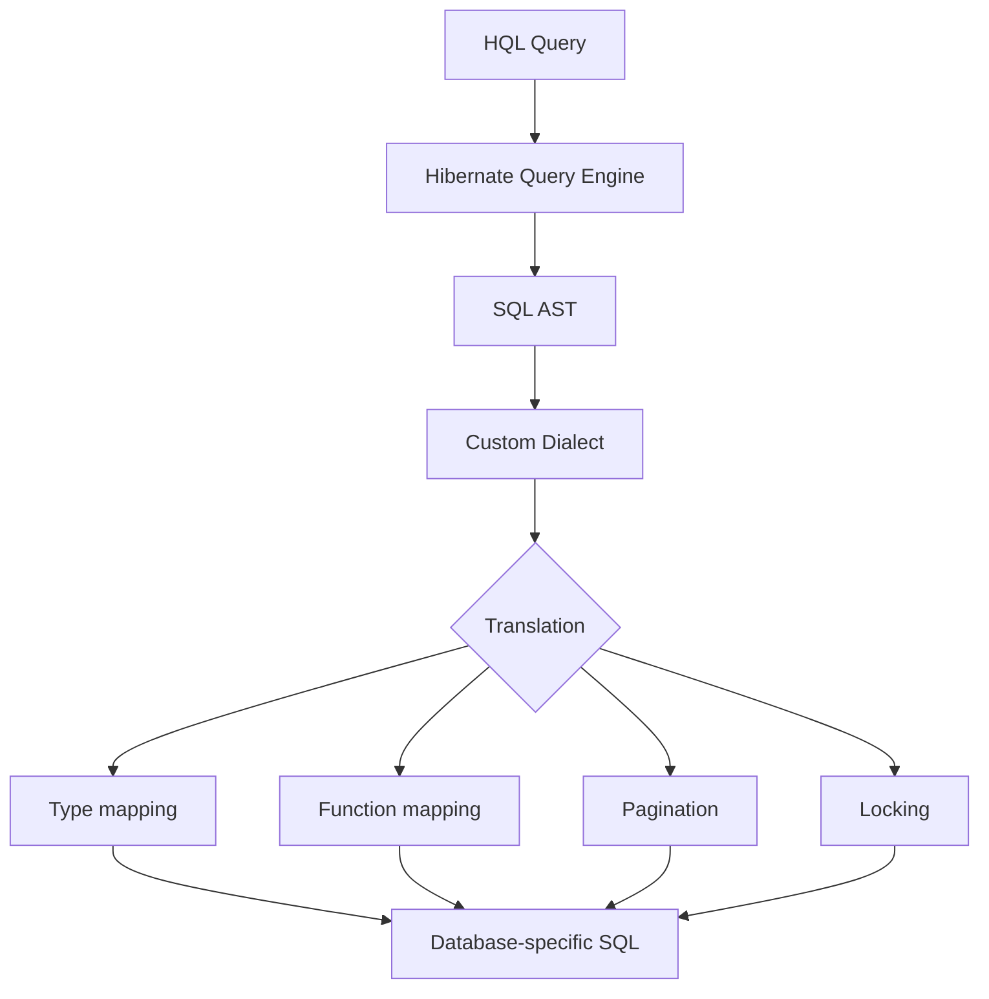

---

### 📶 Gradual Depth

**Level 1 - What it is:**

A Dialect teaches Hibernate how to generate SQL for a specific database. Custom dialects extend built-in dialects to support unsupported databases or features.

**Level 2 - How to use it:**

Extend the closest built-in dialect. Override type mappings, functions, or pagination. Configure in `application.yml`: `spring.jpa.properties.hibernate.dialect=com.example.CustomDialect`.

**Level 3 - How it works:**

Hibernate compiles HQL to a SQL AST (Abstract Syntax Tree). The Dialect's `SqlAstTranslator` converts each AST node to database-specific SQL. Type mappings determine column DDL. Function registrations make database functions available in HQL.

**Level 4 - Production mastery:**

In Hibernate 6, the Dialect API is more granular. Use `FunctionContributor` SPI to register functions without extending Dialect. Use `TypeContributor` SPI to register custom types. The `SqlAstTranslator` allows fine-grained SQL generation control. Custom dialects should be versioned with Hibernate: test against each Hibernate minor version before upgrading.

---

### ⚙️ How It Works

**Phase 1 - Identify the gap:**
What SQL does Hibernate generate incorrectly for the target database? Pagination? Type mapping? Missing function? Locking syntax?

**Phase 2 - Extend the closest dialect:**
CockroachDB is PostgreSQL-compatible. Extend `PostgreSQLDialect`. Override only what differs.

**Phase 3 - Register customizations:**

```java
public class CockroachDialect
    extends PostgreSQLDialect {

    public CockroachDialect() {
        super();
    }

    @Override
    public void
        initializeFunctionRegistry(
        FunctionContributions contrib) {
        super.initializeFunctionRegistry(
            contrib);
        // Register CockroachDB-specific
        // function
        contrib.getFunctionRegistry()
            .registerPattern(
            "crdb_internal.ranges",
            "crdb_internal.ranges(?1)",
            contrib.getTypeConfiguration()
                .getBasicTypeForJavaType(
                    String.class));
    }
}
```

**Phase 4 - Test against real database:**
Integration tests with CockroachDB verify: HQL queries compile, generated SQL executes, results are correct, pagination works, locking works.

```text
  Configuration:
  # application.yml
  spring:
    jpa:
      properties:
        hibernate:
          dialect: >-
            com.example.CockroachDialect
```

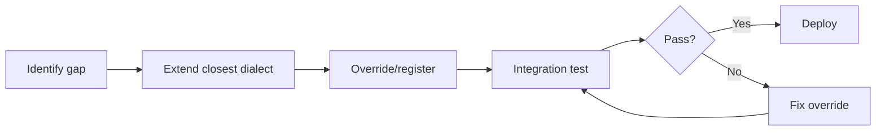

---

### 🚨 Failure Modes

**Failure 1 - Extending the wrong base dialect:**

**Symptom:** Custom dialect extends generic `Dialect` instead of `PostgreSQLDialect` for a PostgreSQL-compatible database. Must reimplement 50+ methods that PostgreSQLDialect already provides.

**Root cause:** Started from scratch instead of extending the closest match.

**Diagnostic:**

```text
Custom dialect class overrides > 10 methods.
Most overrides duplicate the behavior of
a built-in dialect.
```

**Fix:**

**BAD:**

```java
// Extending base Dialect: reimplements
// everything
public class CockroachDialect
    extends Dialect {
    // Must override: types, pagination,
    // locking, sequences, functions...
    // 50+ methods
}
```

**GOOD:**

```java
// Extending PostgreSQLDialect: inherits
// 95% of behavior
public class CockroachDialect
    extends PostgreSQLDialect {
    // Override only CockroachDB differences
    // 2-3 methods
}
```

**Failure 2 - Not testing against real database:**

**Symptom:** Custom dialect generates SQL that looks correct but fails on the actual database. Syntax differences, reserved keywords, or type behavior differences not caught.

**Root cause:** Tested only the generated SQL string, not its execution against the real database.

**Diagnostic:**

```text
Unit test: SQL string matches expected.
Integration test: SQL fails on database.
Example: CockroachDB does not support
FOR UPDATE with LIMIT. Dialect generates
invalid combination.
```

**Fix:**

```text
Every custom dialect feature MUST have
an integration test that runs against
the actual database (Testcontainers).
Test: HQL -> SQL -> execute -> verify.
```

---

### 🔬 Production Reality

A team migrates from PostgreSQL to CockroachDB for horizontal scaling. CockroachDB is PostgreSQL-compatible but differs in: (1) `FOR UPDATE` behavior with distributed transactions, (2) sequence behavior (globally unique vs per-node), (3) some function availability. Custom dialect: extends `PostgreSQLDialect`, overrides locking strategy (replaces `FOR UPDATE` with `FOR UPDATE` only on single-range queries), and adjusts sequence allocation. Total: 1 class, 3 method overrides. Effort: 2 days including integration tests. All 120 HQL queries work without modification.

---

### ⚖️ Trade-offs & Alternatives

| Approach            | Effort    | Maintenance           | Coverage |
| ------------------- | --------- | --------------------- | -------- |
| Custom Dialect      | 2-5 days  | Per Hibernate version | Full HQL |
| Native SQL only     | Per query | Low                   | No HQL   |
| Community dialect   | None      | Community             | Varies   |
| Contribute upstream | 1-2 weeks | None (merged)         | Full HQL |

**Real-world patterns:**

- **CockroachDB, YugabyteDB:** Community dialects exist but may lag behind Hibernate releases. Custom dialect gives control.
- **Legacy proprietary databases:** Custom dialect is the only option. Extend the closest SQL-standard dialect.

---

### ⚡ Decision Snap

**WRITE CUSTOM DIALECT WHEN:**

- Targeting a database without a Hibernate built-in dialect. Or: built-in dialect generates incorrect SQL for specific features.

**USE BUILT-IN DIALECT WHEN:**

- Targeting PostgreSQL, MySQL, Oracle, SQL Server, H2, or any database with a maintained Hibernate dialect.

**CONTRIBUTE UPSTREAM WHEN:**

- Custom dialect is general-purpose (not company-specific). Benefits the community. Eliminates maintenance burden.

---

### ⚠️ Top Traps

| #   | Misconception                                 | Reality                                                                                                                     |
| --- | --------------------------------------------- | --------------------------------------------------------------------------------------------------------------------------- |
| 1   | Custom dialects are complex                   | Most custom dialects are 1 class with 2-5 method overrides, extending a built-in dialect.                                   |
| 2   | Must override everything                      | Extend the closest built-in dialect. Override only what differs. Registration APIs handle most customizations.              |
| 3   | Unit tests are sufficient                     | Custom dialects MUST be integration-tested against the real database. SQL that looks correct may not execute correctly.     |
| 4   | Dialects are stable across Hibernate versions | Dialect API changes between major Hibernate versions (especially 5 to 6). Test custom dialects with each Hibernate upgrade. |
| 5   | Community dialects are always up to date      | Community dialects may lag behind Hibernate releases. Evaluate currency and activity before depending on them.              |

---

### 🪜 Learning Ladder

**Prerequisites:**

- JPA Specification Internals and Metamodel API - how
  JPA defines the provider contract
- Persistence Provider Design - How an ORM Is Built -
  how Hibernate's query engine works

**THIS:** HIB-107 Writing a Custom Hibernate Dialect

**Next steps:**

- Hibernate SPI Extensions and Custom UserTypes -
  extending type handling
- Hibernate Source Code Architecture and Bootstrap
  Sequence - how dialects are resolved at startup

---

**The Surprising Truth:**

Most custom dialects are surprisingly small. CockroachDB, YugabyteDB, and TiDB are PostgreSQL-compatible, so their custom dialects extend `PostgreSQLDialect` with 2-5 method overrides. The effort to write a custom dialect (2-5 days) is far less than the effort to rewrite all HQL queries as native SQL (weeks). The dialect system is Hibernate's most elegant extension point: one small class makes the entire query engine work for a new database.

**Further Reading:**

- Hibernate ORM User Guide - Custom Dialect section
- Hibernate source code - `org.hibernate.dialect` package
- CockroachDB documentation - PostgreSQL compatibility

**Revision Card:**

1. A Dialect teaches Hibernate SQL rules for a database: type mappings, functions, pagination, locking. Custom dialects extend the closest built-in dialect.
2. Most custom dialects: 1 class, 2-5 overrides. Extend `PostgreSQLDialect` (or closest match). Register functions and types. Override only what differs.
3. Always integration-test against the real database (Testcontainers). SQL that looks correct may not execute correctly on the target database.

---

---

# HIB-108 Hibernate SPI Extensions and Custom UserTypes

**TL;DR** - Hibernate's SPI (Service Provider Interface) lets you extend type handling, event listeners, and integrators without modifying Hibernate source code. Custom UserTypes map non-standard Java types to database columns.

---

### 🔥 Problem Statement

An application stores monetary amounts as `Money` (custom value object with amount + currency), encrypted fields as `EncryptedString`, or JSON payloads as `JsonNode`. Hibernate does not know how to persist these types. Two options: (1) convert to/from basic types in getters/setters (pollutes domain model), or (2) create a custom UserType that teaches Hibernate to persist the type directly. The UserType encapsulates conversion logic, and the domain model stays clean: `private Money price;` maps directly to database columns.

---

### 📜 Historical Context

Hibernate's `UserType` interface has existed since Hibernate 2 (2003). It was the original extension point for custom type handling. JPA 2.1 (2013) added `AttributeConverter` as a simpler, portable alternative for basic conversions. Hibernate 6 (2022) refactored the type system significantly: `UserType` remains but the preferred approach is `AttributeConverter` for simple cases and `UserType`/`JavaTypeDescriptor`/`JdbcTypeDescriptor` for complex cases. Hibernate's `Integrator` SPI (since Hibernate 4.0) provides a broader extension point for registering services, event listeners, and type contributions.

---

### 🔩 First Principles

**CORE INVARIANTS:**

1. **AttributeConverter for simple mapping:** Java type A -> DB type B (one-to-one). `AttributeConverter<Money, BigDecimal>` converts Money to BigDecimal for storage.
2. **UserType for complex mapping:** Multi-column mapping, null handling, caching integration, or custom dirty checking. `UserType` gives full control over SQL read/write.
3. **Integrator for cross-cutting:** Register event listeners (audit, soft delete), type contributors (fleet-wide custom types), and services. Loaded via `META-INF/services`.
4. **SPI = Service Provider Interface:** Hibernate discovers extensions through Java's `ServiceLoader` mechanism. Drop a JAR with `META-INF/services` entries, and Hibernate loads the extension.

**DERIVED DESIGN:**

Extension hierarchy: `AttributeConverter` (simplest, JPA-portable) -> `UserType` (Hibernate-specific, full control) -> `Integrator` (cross-cutting, service registration) -> `TypeContributor` (type registration).

**THE TRADE-OFF:**

**Gain:** Domain model uses natural types (`Money`, `EncryptedString`). Persistence logic is encapsulated. Hibernate handles conversion transparently.

**Cost:** Custom types must be maintained across Hibernate upgrades. UserType interface changed significantly in Hibernate 6.

---

### 🧠 Mental Model

> Custom UserTypes are like power adapters for international travel. Your laptop (domain model) uses one plug type (Money). The wall socket (database) uses another type (BigDecimal column). The adapter (UserType) converts between them. You plug in the adapter once; after that, your laptop works everywhere without modification.

- "Laptop plug" -> domain type (Money)
- "Wall socket" -> database column type
- "Power adapter" -> UserType/AttributeConverter
- "Plug in once" -> register the converter

**Where this analogy breaks down:** Unlike power adapters that are passive, UserTypes can transform data (encryption, compression, JSON serialization) during conversion.

---

### 🧩 Components

- **AttributeConverter:** JPA standard. `convertToDatabaseColumn()` and `convertToEntityAttribute()`. For simple A->B conversions.
- **UserType (Hibernate 6):** `nullSafeGet()`, `nullSafeSet()`, `returnedClass()`, `getSqlType()`. For complex mapping with null handling and multi-column support.
- **TypeContributor SPI:** Registers custom types globally via `META-INF/services/org.hibernate.boot.model.TypeContributor`.
- **Integrator SPI:** Registers event listeners, type contributions, and services via `META-INF/services/org.hibernate.integrator.spi.Integrator`.
- **Event listeners:** `PreInsertEventListener`, `PostUpdateEventListener`, `PreDeleteEventListener`. For audit, soft delete, validation.

```text
  Extension hierarchy:
  +----------------------------------+
  | AttributeConverter (JPA, simple) |
  | Money -> BigDecimal              |
  +----------------------------------+
             |
  +----------------------------------+
  | UserType (Hibernate, complex)    |
  | EncryptedString -> VARCHAR+AES   |
  | Multi-column, null handling      |
  +----------------------------------+
             |
  +----------------------------------+
  | Integrator (cross-cutting)       |
  | Register listeners, types        |
  | META-INF/services discovery      |
  +----------------------------------+
```

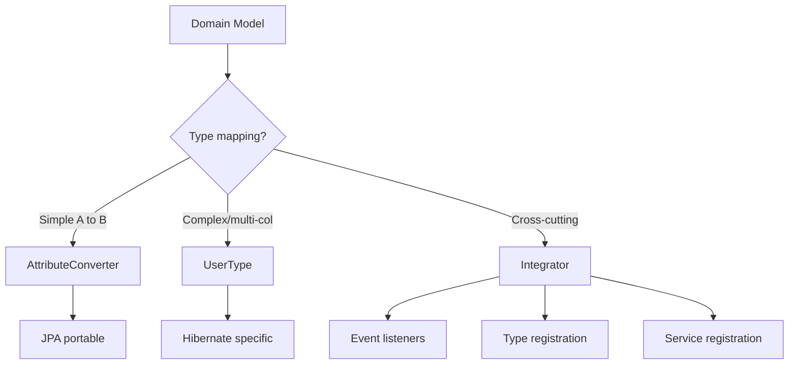

---

### 📶 Gradual Depth

**Level 1 - What it is:**

SPIs let you extend Hibernate's type handling, event system, and services. AttributeConverter maps simple types. UserType handles complex mappings. Integrator registers cross-cutting extensions.

**Level 2 - How to use it:**

`@Converter(autoApply=true)` on an `AttributeConverter` class auto-converts all fields of that type. UserType requires `@Type(value=MyType.class)` on each field. Integrator requires `META-INF/services` entry.

**Level 3 - How it works:**

When Hibernate reads a row, it calls `UserType.nullSafeGet()` to convert the JDBC `ResultSet` value to the Java type. When writing, it calls `nullSafeSet()` to convert the Java value to a JDBC `PreparedStatement` parameter. AttributeConverter is simpler: `convertToEntityAttribute()` and `convertToDatabaseColumn()`.

**Level 4 - Production mastery:**

For fleet-wide extensions: package custom types and event listeners in a shared library with `META-INF/services` entries. Any service that adds the library automatically gets the extensions. Use `TypeContributor` for type registration (no annotation needed on entities). Use `Integrator` for event listener registration (audit, soft delete).

---

### ⚙️ How It Works

**Phase 1 - AttributeConverter (simple case):**

```java
@Converter(autoApply = true)
public class MoneyConverter
    implements
    AttributeConverter<Money, BigDecimal> {

    @Override
    public BigDecimal
        convertToDatabaseColumn(Money m) {
        return m == null
            ? null : m.getAmount();
    }

    @Override
    public Money
        convertToEntityAttribute(
        BigDecimal v) {
        return v == null
            ? null : Money.of(v, "USD");
    }
}
```

**Phase 2 - UserType (complex case):**

```java
public class EncryptedStringType
    implements UserType<String> {

    @Override
    public int getSqlType() {
        return Types.VARCHAR;
    }

    @Override
    public Class<String> returnedClass() {
        return String.class;
    }

    @Override
    public String nullSafeGet(
        ResultSet rs, int pos,
        SharedSessionContractImplementor s,
        Object owner)
        throws SQLException {
        String encrypted = rs.getString(pos);
        return encrypted == null
            ? null : decrypt(encrypted);
    }

    @Override
    public void nullSafeSet(
        PreparedStatement st, String value,
        int index,
        SharedSessionContractImplementor s)
        throws SQLException {
        st.setString(index,
            value == null
                ? null : encrypt(value));
    }
    // ... equals, hashCode, deepCopy
}
```

**Phase 3 - Integrator (cross-cutting):**

```text
  META-INF/services/
    org.hibernate.integrator.spi.Integrator
  -> com.example.AuditIntegrator

  AuditIntegrator registers:
  - PreInsertEventListener (set createdAt)
  - PostUpdateEventListener (log changes)
```

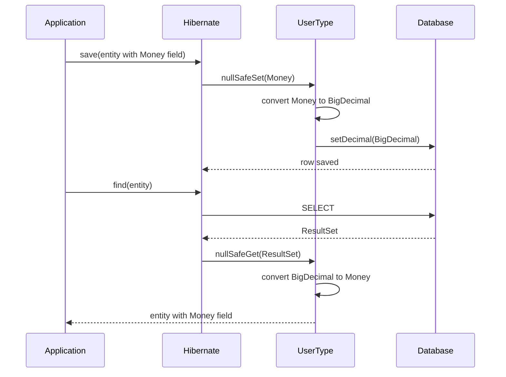

---

### 🚨 Failure Modes

**Failure 1 - Incorrect equals/hashCode in UserType:**

**Symptom:** Entity with custom UserType is always flagged as dirty. UPDATE runs on every flush, even when no field changed.

**Root cause:** `UserType.equals()` always returns false. Hibernate compares the snapshot (loaded value) with the current value. If equals returns false, Hibernate considers the field dirty.

**Diagnostic:**

```text
Hibernate statistics show UPDATE count
equals SELECT count. Every loaded entity
triggers UPDATE. Enable SQL logging:
UPDATE runs with identical values.
```

**Fix:**

**BAD:**

```java
// UserType.equals always returns false
@Override
public boolean equals(String x, String y) {
    return false;
    // Every entity always dirty!
}
```

**GOOD:**

```java
// Proper equals implementation
@Override
public boolean equals(String x, String y) {
    return Objects.equals(x, y);
}
```

**Failure 2 - Missing deepCopy in mutable UserType:**

**Symptom:** Modifying a value object's internal state does not trigger dirty checking. Changes are silently lost.

**Root cause:** `UserType.deepCopy()` returns the same reference. Hibernate's snapshot is the same object. When the object is mutated, the snapshot mutates too. `equals()` returns true (same object). No dirty detection.

**Diagnostic:**

```text
Modify Money.amount in-place.
Flush does not generate UPDATE.
Change is lost after transaction.
```

**Fix:**

```java
// deepCopy MUST return a new instance
// for mutable types
@Override
public Money deepCopy(Money value) {
    return value == null
        ? null
        : Money.of(value.getAmount(),
            value.getCurrency());
    // New instance for snapshot
}
```

---

### 🔬 Production Reality

A financial platform uses `Money` (amount + currency) and `EncryptedString` (AES-encrypted at rest). Before custom types: getters/setters convert between domain types and database types. Every entity has conversion boilerplate. One developer converts Money with `doubleValue()` instead of `BigDecimal`, introducing floating-point rounding in financial calculations. After custom types: `MoneyConverter` auto-applies to all `Money` fields across 40 entities. `EncryptedStringType` handles AES-256-GCM encryption transparently with key rotation support. Domain entities use natural types (`private Money price;`, `private String ssn;` with `@Type`). All conversion centralized. Rounding bug eliminated at the source.

The `Integrator` approach proved critical for the platform team. They packaged `AuditIntegrator` (sets `createdAt`, `updatedAt`, `modifiedBy` on every insert/update) and `SoftDeleteIntegrator` (intercepts delete events and converts to status update) in a shared library. 12 services adopted the library. Zero audit implementation bugs across the fleet. When audit requirements changed (adding IP address tracking), one library update propagated to all services.

---

### ⚖️ Trade-offs & Alternatives

| Extension point    | Complexity | Portability  | Use case           |
| ------------------ | ---------- | ------------ | ------------------ |
| AttributeConverter | Low        | JPA portable | Simple A->B        |
| UserType           | Medium     | Hibernate    | Complex, multi-col |
| TypeContributor    | Medium     | Hibernate    | Global type reg    |
| Integrator         | High       | Hibernate    | Cross-cutting      |
| @Formula           | Low        | Hibernate    | Computed fields    |

**Real-world patterns:**

- **Most projects:** Use `AttributeConverter` for 90% of custom types (Money, enums, JSON).
- **Security-critical:** Use `UserType` for encryption (field-level encryption at the ORM layer).
- **Platform teams:** Use `Integrator` to register audit listeners and custom types fleet-wide.

---

### ⚡ Decision Snap

**USE AttributeConverter WHEN:**

- Simple one-to-one type mapping. No multi-column. No custom null handling. JPA portability desired.

**USE UserType WHEN:**

- Multi-column mapping, custom null handling, custom dirty checking, or encryption/transformation during persistence.

**USE Integrator WHEN:**

- Cross-cutting concern (audit, soft delete, tenant filtering). Needs automatic registration without entity-level annotations.

---

### ⚠️ Top Traps

| #   | Misconception                               | Reality                                                                                                      |
| --- | ------------------------------------------- | ------------------------------------------------------------------------------------------------------------ |
| 1   | AttributeConverter handles everything       | AttributeConverter is single-column only. Multi-column mapping requires UserType.                            |
| 2   | UserType.equals does not matter             | Incorrect equals causes phantom dirty checking. Every flush generates unnecessary UPDATEs.                   |
| 3   | UserType.deepCopy can return same reference | For mutable types, deepCopy MUST return a new instance. Otherwise, snapshot mutation defeats dirty checking. |
| 4   | Custom types are rare                       | Most production applications have 2-5 custom type mappings (Money, enums, JSON, encrypted fields).           |
| 5   | Hibernate 5 UserType works in Hibernate 6   | UserType interface changed in Hibernate 6. Methods have different signatures. Migration required.            |

---

### 🪜 Learning Ladder

**Prerequisites:**

- JPA Specification Internals and Metamodel API - JPA's
  AttributeConverter contract
- Writing a Custom Hibernate Dialect - another SPI
  extension point

**THIS:** HIB-108 Hibernate SPI Extensions and Custom UserTypes

**Next steps:**

- Persistence Provider Design - How an ORM Is Built -
  how type systems work in ORM internals
- Hibernate Source Code Architecture and Bootstrap
  Sequence - how SPIs are loaded at boot

---

**The Surprising Truth:**

The most common bug in custom UserTypes is not in the conversion logic - it is in `equals()` and `deepCopy()`. A UserType with incorrect `equals()` causes phantom dirty checking (every flush generates UPDATE). A UserType with missing `deepCopy()` causes silent data loss (mutations not detected). These two methods are the difference between a working custom type and an insidious production bug.

**Further Reading:**

- Hibernate ORM User Guide - Custom Types section
- Vlad Mihalcea, "How to implement a custom UserType" (vladmihalcea.com)
- JPA 3.1 Specification - AttributeConverter section

**Revision Card:**

1. AttributeConverter for simple A->B mapping (JPA, portable). UserType for complex mapping (Hibernate, multi-column, encryption). Integrator for cross-cutting (audit, fleet-wide).
2. UserType.equals() and deepCopy() are critical. Wrong equals = phantom dirty checking. Missing deepCopy = silent data loss.
3. `autoApply=true` on AttributeConverter applies to all fields of that type. UserType requires `@Type` annotation per field (or global TypeContributor).

---

---

# HIB-109 Persistence Provider Design - How an ORM Is Built

**TL;DR** - An ORM is built from five core subsystems: metadata mapping, identity map, unit of work, query translation, and change tracking. Understanding these subsystems explains every ORM behavior.

---

### 🔥 Problem Statement

Developers use Hibernate for years without understanding how it works internally. When something behaves unexpectedly (automatic dirty checking, flush ordering, cascade timing), they cannot reason about the cause. Understanding how an ORM is built (its core subsystems and their interactions) transforms Hibernate from a black box into a transparent system. Every ORM - Hibernate, EclipseLink, Entity Framework, Django ORM, SQLAlchemy - implements the same five core subsystems.

---

### 📜 Historical Context

Martin Fowler documented the foundational ORM patterns in "Patterns of Enterprise Application Architecture" (2002): Identity Map, Unit of Work, Data Mapper, and Query Object. These patterns predate Hibernate (2001) but were refined through its implementation. Hibernate's creator Gavin King explicitly referenced Fowler's patterns. Every modern ORM implements these patterns, though the terminology varies: Django calls it "QuerySet" instead of "Unit of Work," and Entity Framework calls it "Change Tracker" instead of "dirty checking."

---

### 🔩 First Principles

**CORE INVARIANTS:**

1. **Metadata Mapper:** Maps Java classes to database tables. Fields to columns. Relationships to foreign keys. Reads annotations/XML and builds an internal metamodel at boot time.
2. **Identity Map:** Guarantees one Java object per database row per Session. `findById(42)` called twice returns the same object reference. Prevents duplicate representations of the same row.
3. **Unit of Work:** Tracks all changes within a transaction. At flush time, calculates INSERT/UPDATE/DELETE operations and executes them in dependency order.
4. **Query Translator:** Converts object queries (HQL/Criteria) to SQL. Uses the Dialect for database-specific syntax. Translates field names to column names.
5. **Change Tracker (Dirty Checking):** Compares entity snapshots (state at load time) with current state. Detects which fields changed. Generates minimal UPDATE statements.

**DERIVED DESIGN:**

These five subsystems interact: metadata mapper provides the schema to all others. Identity map prevents duplicates. Unit of work collects changes from dirty checking. Query translator uses metadata for field-to-column translation. Understanding one subsystem without the others is incomplete.

**THE TRADE-OFF:**

**Gain:** Automatic persistence management. Developers work with objects; the ORM handles SQL, identity, and change tracking.

**Cost:** Invisible state management. Behavior depends on Session state (managed vs detached), flush timing, and cascade configuration.

---

### 🧠 Mental Model

> An ORM is like a personal assistant for a busy executive. The assistant (ORM) maintains: (1) a contact book (metadata mapper) mapping names to phone numbers, (2) a guest list (identity map) ensuring no duplicate invitations, (3) a task list (unit of work) collecting all pending actions, (4) a translator (query translator) converting requests into phone calls, and (5) a change log (dirty checking) tracking what changed since last check-in.

- "Contact book" -> metadata mapper
- "Guest list" -> identity map
- "Task list" -> unit of work
- "Translator" -> query translator
- "Change log" -> dirty checking

**Where this analogy breaks down:** Unlike a human assistant, the ORM's five subsystems interact mechanically and predictably. The same inputs always produce the same outputs. There is no judgment or improvisation.

---

### 🧩 Components

- **Metadata Mapper (SessionFactory/EntityManagerFactory):** Built at startup. Reads `@Entity`, `@Table`, `@Column` annotations. Creates `EntityPersister` per entity type. Immutable after boot.
- **Identity Map (PersistenceContext/L1 Cache):** Per-Session map of `{EntityType, ID} -> Object`. Guarantees uniqueness. Cleared when Session closes.
- **Unit of Work (ActionQueue):** Collects pending INSERT/UPDATE/DELETE. Flush orders operations to satisfy foreign key constraints (inserts before dependent inserts, deletes after dependent deletes).
- **Query Translator (HQL Parser/SQM):** Parses HQL/JPQL to AST. Resolves entity names to table names, field names to column names using metadata. Generates SQL via Dialect.
- **Change Tracker (Dirty Checking):** At flush, compares current entity state to loaded snapshot (stored in PersistenceContext). If different, schedules UPDATE. Byte-level comparison for efficiency.

```text
  ORM subsystem interaction:
  +-----------+
  | Metadata  |<--- Boot-time: annotations
  | Mapper    |     to internal metamodel
  +-----+-----+
        |
  +-----v-----+    +-------------+
  | Identity   |<-->| Unit of Work|
  | Map (L1)   |    | (ActionQueue)|
  +-----+------+    +------+------+
        |                  |
  +-----v------+    +------v------+
  | Change     |    | Query       |
  | Tracker    |    | Translator  |
  +-----------+    +------+------+
                          |
                   +------v------+
                   | Dialect     |
                   | (SQL output)|
                   +-------------+
```

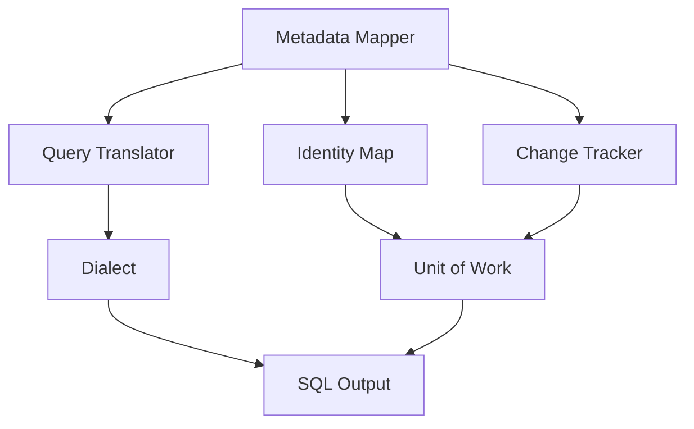

---

### 📶 Gradual Depth

**Level 1 - What it is:**

An ORM has five subsystems: metadata mapper, identity map, unit of work, query translator, and change tracker. Together, they manage the object-relational mapping automatically.

**Level 2 - How to use it:**

Understanding these subsystems explains ORM behavior: why changes persist without `save()` (unit of work + dirty checking), why `findById` returns the same reference (identity map), and why SQL appears at flush time (action queue).

**Level 3 - How it works:**

At boot: metadata mapper reads annotations, builds `EntityPersister` objects. At runtime: identity map stores loaded entities. Change tracker snapshots each entity at load time. At flush: dirty checking compares snapshots with current state. Unit of work orders operations. Query translator generates SQL via dialect.

**Level 4 - Production mastery:**

Performance implications per subsystem: identity map grows with loaded entities (memory pressure). Snapshot comparison has CPU cost (proportional to managed entities). Unit of work flush ordering can cause deadlocks (dependency cycles). Query translation has parsing cost (cache queries with query plan cache). Understanding these costs enables targeted optimization.

---

### ⚙️ How It Works

**Phase 1 - Boot (metadata mapping):**
Read annotations from all `@Entity` classes. Build `EntityPersister` for each (column mappings, relationships, cascade rules). Build `CollectionPersister` for each collection. Store in `SessionFactory` (immutable, shared).

**Phase 2 - Session open (identity map + change tracker):**
Open Session. Create empty PersistenceContext (identity map). Ready to track entities.

**Phase 3 - Entity load (identity map + snapshot):**
`findById(42)` executes SELECT. Hydrate entity from ResultSet. Store in identity map: `{Order, 42} -> orderInstance`. Store snapshot (field values at load time).

**Phase 4 - Entity modification (change tracker):**
`order.setStatus("SHIPPED")`. No SQL. No save(). Just a Java setter call.

**Phase 5 - Flush (dirty check + unit of work):**
Compare current state with snapshot. `status` changed: `PENDING -> SHIPPED`. Schedule UPDATE. Order operations: inserts first (FK dependencies), updates, deletes last.

**Phase 6 - SQL execution (query translator + dialect):**
Generate `UPDATE orders SET status = 'SHIPPED' WHERE id = 42 AND version = 1`. Dialect adapts syntax. Execute via JDBC.

```text
  Entity lifecycle through subsystems:
  1. Boot: Metadata Mapper builds schema
  2. Load: SELECT -> Identity Map + Snapshot
  3. Modify: Java setter (no SQL)
  4. Flush: Dirty Check -> Unit of Work
  5. Execute: Query Translator -> SQL
```

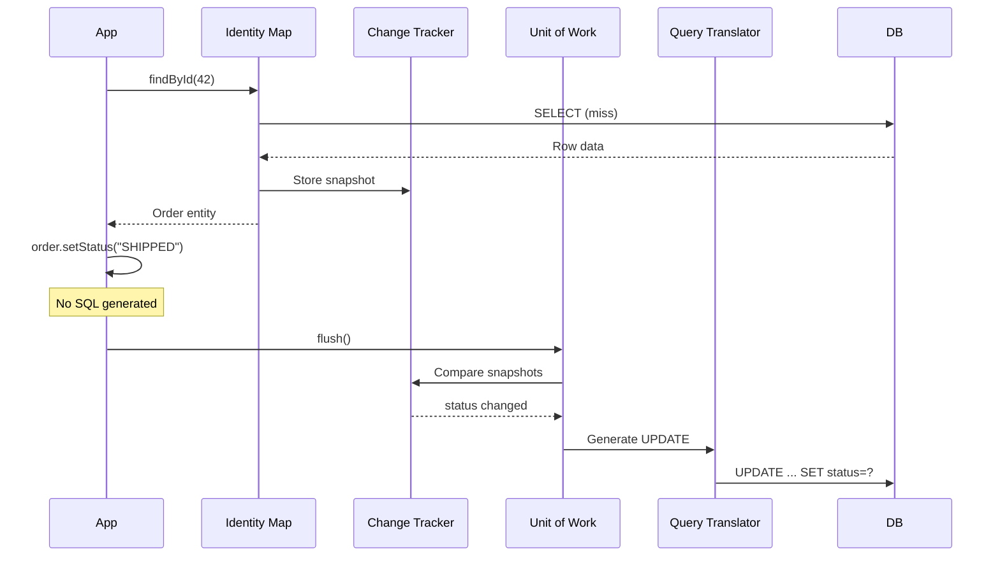

---

### 🚨 Failure Modes

**Failure 1 - Identity map memory pressure:**

**Symptom:** OutOfMemoryError during batch processing. Session loaded 100,000 entities. Each entity + snapshot stored in PersistenceContext.

**Root cause:** Identity map grows unbounded within a Session. Every loaded entity is tracked. No automatic eviction.

**Diagnostic:**

```java
// Check identity map size
Session session = entityManager
    .unwrap(Session.class);
SessionStatistics stats =
    session.getStatistics();
int count = stats.getEntityCount();
// If count > 10,000: memory risk
```

**Fix:**

**BAD:**

```java
// Load 100K entities in one Session
List<Order> orders = repo.findAll();
// 100K entities + 100K snapshots
// in memory. OOM likely.
```

**GOOD:**

```java
// Batch processing with clear
Session session = entityManager
    .unwrap(Session.class);
for (int i = 0; i < 100_000; i++) {
    Order o = loadOrder(i);
    process(o);
    if (i % 50 == 0) {
        session.flush();
        session.clear(); // Reset L1 cache
    }
}
```

**Failure 2 - Flush ordering deadlock:**

**Symptom:** Two transactions deadlock on INSERT. Transaction A inserts Parent then Child. Transaction B inserts Child then Parent. Database detects cycle.

**Root cause:** Unit of work determines flush order based on entity dependencies. If two transactions insert interdependent entities in different order, database-level deadlock occurs.

**Diagnostic:**

```text
Database: deadlock detected.
Transaction A: INSERT parent, INSERT child
Transaction B: INSERT child, INSERT parent
Lock ordering conflict.
```

**Fix:**

```text
Ensure consistent entity creation order
within each transaction. Insert parent
before child. The ORM's flush ordering
handles this within ONE transaction,
but ACROSS transactions, the application
must ensure consistent lock acquisition.
```

---

### 🔬 Production Reality

A developer debugs "why does my entity update without save()?" Understanding the five subsystems answers instantly: the entity is managed (identity map), its field changed (detected by change tracker), and the unit of work scheduled an UPDATE at flush time. No magic. No hidden behavior. Five subsystems interacting predictably. This understanding transforms debugging time from hours to minutes. Every "weird Hibernate behavior" maps to a specific subsystem interaction.

---

### ⚖️ Trade-offs & Alternatives

| ORM              | Identity Map       | Unit of Work  | Change Tracker    | Query Lang |
| ---------------- | ------------------ | ------------- | ----------------- | ---------- |
| Hibernate        | PersistenceContext | ActionQueue   | Snapshot diff     | HQL/SQM    |
| EclipseLink      | IdentityMap        | UnitOfWork    | Clone compare     | JPQL       |
| Entity Framework | ChangeTracker      | SaveChanges   | Snapshot/proxy    | LINQ       |
| Django ORM       | QuerySet cache     | save()        | Explicit save     | QuerySet   |
| SQLAlchemy       | IdentityMap        | Session.flush | Attribute history | SQL/ORM    |

**Real-world patterns:**

- **All ORMs** implement these five subsystems. Terminology and implementation differ, but the concepts are universal.
- **Understanding transfers:** Learn ORM internals once (Hibernate). Apply to any ORM.

---

### ⚡ Decision Snap

**LEARN ORM INTERNALS WHEN:**

- Always. Understanding the five subsystems is foundational for any ORM user.

**FOCUS ON IDENTITY MAP WHEN:**

- Batch processing, memory issues, or duplicate entity behavior.

**FOCUS ON UNIT OF WORK WHEN:**

- Flush ordering, cascade timing, or transaction boundary issues.

**FOCUS ON CHANGE TRACKER WHEN:**

- Phantom dirty checking, unnecessary UPDATEs, or performance overhead.

---

### ⚠️ Top Traps

| #   | Misconception                   | Reality                                                                                                                                    |
| --- | ------------------------------- | ------------------------------------------------------------------------------------------------------------------------------------------ |
| 1   | save() writes to the database   | save() makes an entity managed. The actual SQL runs at flush time. The unit of work decides when and how.                                  |
| 2   | Each ORM is unique              | All ORMs implement the same five subsystems. Learning Hibernate internals transfers to EclipseLink, Entity Framework, and Django ORM.      |
| 3   | Identity map is just a cache    | Identity map guarantees object identity: same row = same reference. This is a correctness guarantee, not just performance.                 |
| 4   | Dirty checking is expensive     | Snapshot comparison is O(n) on managed entity count. For typical request-scoped Sessions (10-50 entities), cost is negligible.             |
| 5   | Unit of work ordering is simple | Flush ordering must satisfy FK constraints, handle cycles, and respect cascade rules. It is a topological sort with constraint resolution. |

---

### 🪜 Learning Ladder

**Prerequisites:**

- Unit of Work and Identity Map - Foundational ORM
  Patterns - the design patterns behind these subsystems
- First-Level Cache (Persistence Context) Internals -
  the identity map implementation

**THIS:** HIB-109 Persistence Provider Design - How an ORM
Is Built

**Next steps:**

- Hibernate Source Code Architecture and Bootstrap
  Sequence - how Hibernate implements these subsystems
- JPA Specification Internals and Metamodel API - how
  JPA specifies the provider contract

---

**The Surprising Truth:**

Every ORM confusion maps to one of five subsystems. "Why did my entity update without save()?" - Change Tracker + Unit of Work. "Why does findById return the same object?" - Identity Map. "Why is my query slow?" - Query Translator + Dialect. "Why did the cascade not fire?" - Metadata Mapper + Unit of Work ordering. Once you name the five subsystems, Hibernate stops being magical and becomes mechanical.

**Further Reading:**

- Martin Fowler, "Patterns of Enterprise Application Architecture" - Identity Map, Unit of Work, Data Mapper patterns
- Vlad Mihalcea, "High-Performance Java Persistence" - Hibernate internals explained
- Hibernate ORM source code - `org.hibernate.engine.spi` package

**Revision Card:**

1. Five ORM subsystems: Metadata Mapper (schema), Identity Map (uniqueness), Unit of Work (change collection), Query Translator (HQL to SQL), Change Tracker (dirty checking).
2. All ORMs implement the same five subsystems. Hibernate, EclipseLink, Entity Framework, Django ORM, SQLAlchemy - different names, same concepts.
3. Every ORM confusion maps to a subsystem interaction. Name the subsystem, and the behavior becomes predictable.

---

---

# HIB-110 Hibernate Source Code Architecture and Bootstrap Sequence

**TL;DR** - Hibernate boots in two phases: build-time metadata parsing (annotations to EntityPersister) and runtime SessionFactory construction. Understanding the bootstrap sequence explains startup latency and configuration behavior.

---

### 🔥 Problem Statement

A Spring Boot application takes 8 seconds to start. 4 seconds are Hibernate bootstrap. The team cannot optimize what they do not understand. Hibernate's bootstrap sequence: (1) scan classpath for `@Entity` classes, (2) parse annotations into internal metadata (`PersistentClass`, `Property`, `Column`), (3) validate/update schema if `ddl-auto` is set, (4) build `EntityPersister` and `CollectionPersister` for each entity and collection, (5) construct `SessionFactory` (immutable, shared, expensive). Understanding this sequence reveals optimization targets: reduce entity count, skip schema validation, pre-generate metadata.

---

### 📜 Historical Context

Hibernate's bootstrap evolved from XML-centric (Hibernate 2-3, `hibernate.cfg.xml` + `*.hbm.xml`) to annotation-centric (Hibernate 4+, JPA annotations) to programmatic (Hibernate 5+, `MetadataSources` API). The JPA bootstrap (`Persistence.createEntityManagerFactory()`) delegates to Hibernate's `SessionFactoryBuilder`. Spring Boot further wraps this with auto-configuration. Despite the layers, the core sequence is unchanged: scan entities -> parse metadata -> build persisters -> construct factory.

---

### 🔩 First Principles

**CORE INVARIANTS:**

1. **SessionFactory is immutable and expensive:** Built once at startup. Contains all metadata, persisters, query caches, and type registrations. Shared across all Sessions. Never rebuilt at runtime.
2. **Metadata parsing is the bottleneck:** Each `@Entity` class is parsed into `PersistentClass` with `Property` objects. Each relationship parsed into `Collection` or `ToOne` metadata. More entities = slower boot.
3. **Schema validation adds startup time:** `ddl-auto=validate` executes `DatabaseMetaData` queries at boot. For 50 entities: 50 table existence checks + column checks. Can add 2-5 seconds.
4. **Persister construction is per-entity:** `EntityPersister` contains the SQL templates (INSERT, UPDATE, DELETE, SELECT) pre-compiled for each entity. `CollectionPersister` does the same for collections.

**DERIVED DESIGN:**

Boot time scales linearly with entity count and relationship complexity. Optimization targets: reduce entity count (aggregate boundaries), skip schema validation in production (use Flyway), and use Hibernate's metadata caching in Hibernate 6.

**THE TRADE-OFF:**

**Gain:** All metadata, SQL templates, and persisters are pre-built. Runtime queries pay zero parsing cost.

**Cost:** Startup latency. The larger the entity model, the longer the boot time.

---

### 🧠 Mental Model

> Hibernate bootstrap is like a restaurant kitchen's morning prep. Before opening (runtime), the kitchen (SessionFactory) must: inventory ingredients (scan entities), prep recipes (parse metadata), validate equipment (schema validation), and set stations (build persisters). Once prep is done, service (runtime) is fast because everything is ready. More menu items (entities) = longer prep time.

- "Inventory ingredients" -> classpath scan
- "Prep recipes" -> metadata parsing
- "Validate equipment" -> schema validation
- "Set stations" -> persister construction
- "More menu items" -> more entities = slower boot

**Where this analogy breaks down:** Unlike kitchen prep that produces perishable items, Hibernate's SessionFactory is immutable and lives for the application's entire lifetime.

---

### 🧩 Components

- **MetadataSources:** Entry point. Adds entity classes, XML mappings, packages to scan. Feeds the metadata builder.
- **MetadataBuilder:** Parses annotations into `Metadata` object. Contains `PersistentClass`, `Property`, `Collection` for every entity.
- **SchemaManagementTool:** `ddl-auto` handling. `validate`: checks schema matches entities. `update`: generates ALTER. `create-drop`: recreates schema.
- **SessionFactoryBuilder:** Takes `Metadata` and configuration. Builds `EntityPersister`, `CollectionPersister`, type registrations, query plan cache. Returns `SessionFactory`.
- **SessionFactory:** The immutable, shared product. Contains everything needed for runtime operations. Creates Sessions on demand.

```text
  Bootstrap sequence:
  1. MetadataSources.addAnnotatedClass()
     -> Scan @Entity classes
  2. MetadataBuilder.build()
     -> Parse annotations to PersistentClass
     -> Build internal metamodel
  3. SchemaManagementTool
     -> validate/update schema (optional)
  4. SessionFactoryBuilder.build()
     -> Build EntityPersisters
     -> Build CollectionPersisters
     -> Build QueryPlanCache
     -> Return SessionFactory (immutable)
  Total: 2-8 seconds for 30-50 entities
```

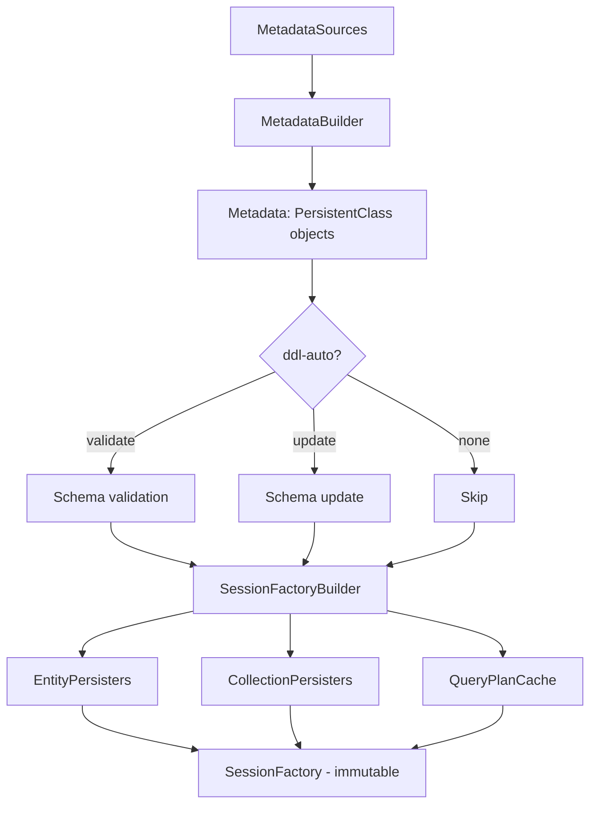

---

### 📶 Gradual Depth

**Level 1 - What it is:**

Hibernate boots by scanning entities, parsing metadata, optionally validating schema, and building the SessionFactory. This is expensive (2-8 seconds) but happens once.

**Level 2 - How to use it:**

Reduce boot time: limit entity count (aggregate boundaries), skip schema validation in production (`ddl-auto=none`), use Flyway for migrations, and use Spring Boot's lazy initialization for non-critical beans.

**Level 3 - How it works:**

Annotations are parsed into `PersistentClass` (entity metadata), `Property` (field metadata), and `Collection` (relationship metadata). `EntityPersister` pre-compiles SQL templates: INSERT (all columns), UPDATE (dirty columns), DELETE (by ID + version), SELECT (all columns with JOINs for eager associations). These templates are reused for every runtime operation.

**Level 4 - Production mastery:**

For serverless/FaaS: Hibernate bootstrap is the dominant startup cost. Strategies: GraalVM native image (pre-computes metadata at build time), Hibernate's metadata caching (serialize Metadata to disk, reload on next start), or CRaC (Coordinated Restore at Checkpoint) for JVM state snapshotting. These reduce cold start from 8 seconds to < 1 second.

---

### ⚙️ How It Works

**Phase 1 - Entity scanning:**
Spring Boot's `EntityScanPackages` identifies packages to scan. Every class with `@Entity` in those packages is registered with `MetadataSources`. For 50 entities: 50 classes loaded and inspected.

**Phase 2 - Annotation parsing:**
For each entity: read `@Table`, `@Column`, `@Id`, `@ManyToOne`, etc. Build `PersistentClass` with `Property` for each field. Resolve relationships: `@ManyToOne` creates `ManyToOne` mapping with FK column, cascade rules, and fetch strategy.

**Phase 3 - Schema management:**
If `ddl-auto=validate`: for each entity, query `DatabaseMetaData.getTables()` and `getColumns()`. Compare entity metadata with actual schema. If mismatch: throw `SchemaManagementException` at boot. If `ddl-auto=none`: skip entirely.

**Phase 4 - Persister construction:**
For each entity: build `EntityPersister`. Pre-compile SQL templates using column metadata and Dialect. For Order with 10 columns: pre-build INSERT with 10 columns, UPDATE with 10 columns, DELETE by ID, SELECT with 10 columns + JOINs.

**Phase 5 - SessionFactory seal:**
All persisters, type registrations, and query cache assembled into `SessionFactory`. Immutable. Thread-safe. Shared.

```text
  Startup breakdown (typical 40-entity app):
  Entity scanning:        200ms
  Annotation parsing:     800ms
  Schema validation:    2,000ms
  Persister construction:  500ms
  SessionFactory seal:     300ms
  Total:                3,800ms

  With ddl-auto=none:
  Total:                1,800ms (2s saved)
```

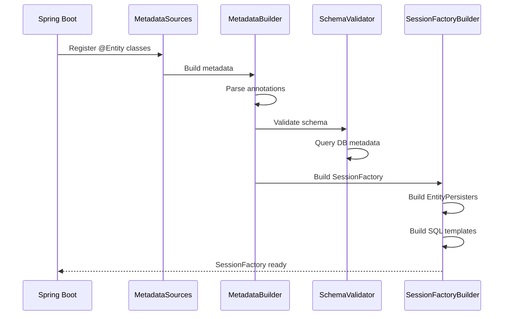

---

### 🚨 Failure Modes

**Failure 1 - Schema validation failure at boot:**

**Symptom:** Application fails to start. `SchemaManagementException: Schema-validation: missing column [discount] in table [orders]`.

**Root cause:** Entity has a field `discount` but the database table does not have the column. Schema validation catches this mismatch at boot.

**Diagnostic:**

```text
SchemaManagementException at startup.
Message names the missing column and table.
Cause: entity updated but migration not run.
```

**Fix:**

**BAD:**

```text
Set ddl-auto=update to auto-add columns.
Works in dev, dangerous in production
(may drop constraints, alter types).
```

**GOOD:**

```text
Add Flyway migration:
ALTER TABLE orders ADD COLUMN discount
  DECIMAL(10,2) DEFAULT 0;
Set ddl-auto=validate in staging/prod.
ddl-auto=none in production (fastest boot).
Flyway handles all schema changes.
```

**Failure 2 - Slow bootstrap in large entity model:**

**Symptom:** Application boot takes 15 seconds. 10 seconds are Hibernate bootstrap. 80 entities with complex relationships.

**Root cause:** Linear scaling of annotation parsing and persister construction. Schema validation adds database round trips.

**Diagnostic:**

```java
// Enable bootstrap timing
// Spring Boot: spring.jpa.properties
// .hibernate.generate_statistics=true
// Log: SessionFactory built in X ms
```

**Fix:**

```text
1. ddl-auto=none (skip schema validation)
   -> Saves 2-5 seconds
2. Reduce entity count (merge small entities
   into aggregates, use @Embeddable)
   -> Each entity removed saves ~50ms
3. For serverless: GraalVM native image
   or Hibernate metadata caching
   -> Saves 60-80% of boot time
```

---

### 🔬 Production Reality

A team profiling their Spring Boot startup finds: 3.8 seconds of 7.2 total are Hibernate bootstrap. Breakdown: entity scanning 200ms, annotation parsing 800ms, schema validation 2000ms, persister construction 500ms, factory seal 300ms. Fix: `ddl-auto=none` (Flyway manages schema). New total: 1.8 seconds. Further optimization: merge 5 small lookup entities into `@Embeddable` composites. New total: 1.5 seconds. For their serverless deployment: GraalVM native image reduces Hibernate bootstrap to 200ms.

---

### ⚖️ Trade-offs & Alternatives

| Optimization         | Savings     | Effort  | Risk   |
| -------------------- | ----------- | ------- | ------ |
| ddl-auto=none        | 2-5s        | Minutes | None   |
| Reduce entity count  | 50ms/entity | Hours   | Low    |
| GraalVM native image | 60-80%      | Days    | Medium |
| CRaC checkpoint      | 80-90%      | Days    | Medium |
| Lazy SessionFactory  | Deferred    | Hours   | Medium |

**Real-world patterns:**

- **Microservices:** `ddl-auto=none` + Flyway. Standard. No reason to validate schema at every boot.
- **Serverless/FaaS:** GraalVM native image or CRaC. Boot time is a billing concern.
- **Monolith:** Boot time matters less (infrequent restarts). Schema validation acceptable.

---

### ⚡ Decision Snap

**SET ddl-auto=none WHEN:**

- Production environment. Flyway or Liquibase manages schema. Always.

**OPTIMIZE BOOT TIME WHEN:**

- Microservice with frequent deployments. Serverless function. CI pipeline where fast feedback matters.

**INVEST IN NATIVE IMAGE WHEN:**

- Serverless deployment. Cold start SLA < 2 seconds. Team has GraalVM experience.

---

### ⚠️ Top Traps

| #   | Misconception                          | Reality                                                                                                                                  |
| --- | -------------------------------------- | ---------------------------------------------------------------------------------------------------------------------------------------- |
| 1   | SessionFactory is cheap to build       | SessionFactory is the most expensive object in Hibernate. Built once, shared forever. Never rebuild at runtime.                          |
| 2   | ddl-auto=update is safe in production  | ddl-auto=update can drop constraints, alter column types, and create indexes without control. Use Flyway/Liquibase.                      |
| 3   | Boot time does not matter              | In microservice/serverless environments, boot time directly affects deployment speed and cold start latency.                             |
| 4   | Entity count does not affect boot time | Each entity adds ~50ms (parsing + persister). 80 entities: ~4 seconds just for metadata processing.                                      |
| 5   | Schema validation catches all issues   | Schema validation checks table/column existence and types. It does not check data integrity, index existence, or constraint correctness. |

---

### 🪜 Learning Ladder

**Prerequisites:**

- Persistence Provider Design - How an ORM Is Built -
  the five subsystems that bootstrap creates
- JPA Specification Internals and Metamodel API - the
  JPA bootstrap contract

**THIS:** HIB-110 Hibernate Source Code Architecture and
Bootstrap Sequence

**Next steps:**

- Writing a Custom Hibernate Dialect - how dialects
  are resolved during bootstrap
- Hibernate SPI Extensions and Custom UserTypes - how
  SPIs are loaded during bootstrap

---

**The Surprising Truth:**

The single most effective Hibernate startup optimization requires zero code changes: set `ddl-auto=none`. Schema validation (the default in many Spring Boot configurations) adds 2-5 seconds to every boot. It queries `DatabaseMetaData` for every entity. Since production schemas are managed by Flyway or Liquibase, this validation is redundant. Removing it is free performance.

**Further Reading:**

- Hibernate ORM source code - `org.hibernate.boot` package
- Spring Boot reference - Hibernate auto-configuration
- GraalVM documentation - native image with Hibernate

**Revision Card:**

1. Bootstrap: scan entities -> parse annotations -> validate schema -> build persisters -> seal SessionFactory. Total: 2-8 seconds for a typical app.
2. `ddl-auto=none` saves 2-5 seconds. Use Flyway/Liquibase for schema management. Schema validation is redundant in production.
3. Boot time scales linearly with entity count (~50ms per entity). Reduce entities with `@Embeddable` composites. For serverless: GraalVM native image.

---

---

# HIB-111 Unit of Work and Identity Map - Foundational ORM Patterns

**TL;DR** - Unit of Work collects all changes and flushes them in dependency order. Identity Map guarantees one Java object per database row per Session. Together they define ORM behavior.

---

### 🔥 Problem Statement

A developer loads an Order, modifies its status, loads the same Order again in the same transaction, and gets the modified version (not the database version). Why? Identity Map. A developer modifies three entities in a transaction and only one SQL UPDATE runs. Why? Unit of Work with dirty checking. These two patterns explain 80% of ORM behavior that confuses developers. They are not Hibernate-specific. They are foundational to every ORM: EclipseLink, Entity Framework, Django ORM, SQLAlchemy.

---

### 📜 Historical Context

Martin Fowler documented both patterns in "Patterns of Enterprise Application Architecture" (2002). Identity Map ensures "one object per row per session," preventing inconsistent state when the same row is loaded multiple times. Unit of Work "maintains a list of objects affected by a business transaction and coordinates the writing out of changes." Fowler cited these as solutions to two fundamental ORM problems: object identity management and change accumulation. Hibernate implemented both from version 1.0 (2001). Every subsequent ORM adopted them.

---

### 🔩 First Principles

**CORE INVARIANTS:**

1. **Identity Map guarantees uniqueness:** Within one Session, loading the same row twice returns the same Java object reference. This prevents inconsistent state (two different Order objects for the same row with different field values).
2. **Identity Map is per-Session:** Each Session has its own identity map. Two Sessions loading the same row get different objects. Cross-Session identity is not guaranteed.
3. **Unit of Work accumulates changes:** All entity modifications within a transaction are collected. At flush time, the unit of work determines: which entities are new (INSERT), which are modified (UPDATE), which are removed (DELETE).
4. **Unit of Work orders operations:** Flush generates SQL in dependency order: INSERTs before dependent INSERTs (FK constraints), DELETEs after dependent DELETEs. Topological sort on entity dependencies.

**DERIVED DESIGN:**

Together: Identity Map provides "one truth per row per Session." Unit of Work provides "one coordinated flush per transaction." This combination enables transparent persistence: developers modify Java objects; the ORM handles SQL generation, ordering, and execution.

**THE TRADE-OFF:**

**Gain:** Transparent persistence. No manual SQL ordering. No duplicate object inconsistency. Automatic dirty detection and minimal SQL.

**Cost:** Memory usage (identity map stores all loaded entities + snapshots). CPU usage (dirty checking compares all managed entities at flush). Unexpected behavior for developers who do not understand these patterns.

---

### 🧠 Mental Model

> Identity Map is like a hotel front desk register. When a guest (entity) checks in (loaded), the register (identity map) records them: Room 42 -> Alice. If someone asks "Who is in Room 42?" later, the register returns Alice - the SAME Alice, not a copy. If Alice changes her hair color (field modification), anyone asking about Room 42 sees the change.

> Unit of Work is like a waiter collecting orders at a restaurant table. The waiter (unit of work) does not run to the kitchen (database) after each dish order. They collect all orders (changes), then submit them all at once (flush), in the right sequence (appetizers before mains, inserts before dependent inserts).

- "Hotel register" -> identity map
- "Same Alice" -> same object reference
- "Waiter collecting orders" -> unit of work accumulating changes
- "Submit all at once" -> flush
- "Right sequence" -> dependency ordering

**Where these analogies break down:** The identity map evicts all entries when the Session closes (check-out). The unit of work does not ask for confirmation before flushing (automatic at transaction commit).

---

### 🧩 Components

**Identity Map internals:**

- Storage: `Map<EntityKey, Object>` where `EntityKey = {EntityType, ID}`.
- Lookup: `findById()` checks identity map first. Cache hit returns existing object. Cache miss executes SELECT and stores result.
- Scope: per-Session. Cleared on `session.clear()` or Session close.

**Unit of Work internals:**

- ActionQueue: collects `EntityInsertAction`, `EntityUpdateAction`, `EntityDeleteAction`, `CollectionUpdateAction`.
- Ordering: inserts sorted by entity dependency (parent before child). Deletes in reverse order (child before parent).
- Flush triggers: explicit `flush()`, transaction commit, query execution (auto-flush before queries to ensure consistency).

```text
  Identity Map lookup:
  findById(Order, 42):
  1. Check identity map: {Order,42} ?
     -> HIT: return cached object
     -> MISS: execute SELECT
  2. If MISS: store in identity map
     {Order,42} -> orderObject
  3. Store snapshot for dirty checking

  Unit of Work flush:
  1. Collect: new entities -> INSERT
  2. Collect: dirty entities -> UPDATE
  3. Collect: removed entities -> DELETE
  4. Order: INSERT parent, INSERT child,
     UPDATE any, DELETE child, DELETE parent
  5. Execute SQL in order
```

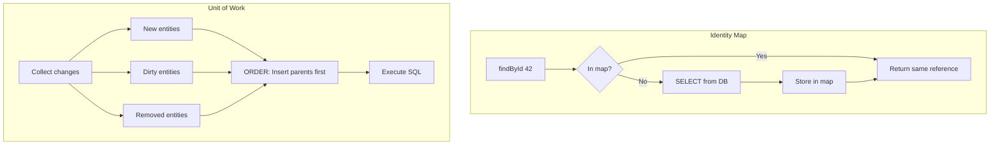

---

### 📶 Gradual Depth

**Level 1 - What it is:**

Identity Map: same row = same Java object within a Session. Unit of Work: collect all changes, flush at once in dependency order.

**Level 2 - How to use it:**

Identity Map means `findById()` is cheap after the first call (cache hit). Unit of Work means changes accumulate and flush happens at commit or explicit `flush()`. No need for immediate saves.

**Level 3 - How it works:**

Identity Map: `Map<EntityKey, Object>` keyed by entity type + ID. Snapshot stored alongside for dirty checking. Unit of Work: `ActionQueue` with ordered lists of insert/update/delete actions. Flush triggers topological sort and SQL execution.

**Level 4 - Production mastery:**

Identity Map memory pressure: each managed entity has a snapshot copy (double memory). For batch processing, clear the Session every N operations. Unit of Work flush ordering: circular dependencies between entities can cause flush ordering issues. Break cycles with nullable FK + two-phase insert (insert with null FK, then update FK).

---

### ⚙️ How It Works

**Identity Map in action:**

```java
// Same Session
Order order1 = em.find(Order.class, 42L);
// SELECT executed, stored in identity map
Order order2 = em.find(Order.class, 42L);
// No SELECT! Returns from identity map
assert order1 == order2; // SAME reference

order1.setStatus("SHIPPED");
// order2.getStatus() == "SHIPPED"
// because order1 == order2
```

**Unit of Work in action:**

```java
@Transactional
void processOrder(Long orderId) {
    Order order = em.find(
        Order.class, orderId);
    order.setStatus("SHIPPED");
    // No save()! Change accumulated.
    LineItem item = new LineItem(order);
    em.persist(item);
    // INSERT accumulated, not executed.
    // At commit: flush triggers
    // 1. INSERT line_items (new entity)
    // 2. UPDATE orders SET status=SHIPPED
}
```

**Flush ordering:**

```text
  Given: Parent -> Child -> Grandchild
  INSERT order:
    1. INSERT Parent (no FK dependency)
    2. INSERT Child (FK to Parent)
    3. INSERT Grandchild (FK to Child)
  DELETE order (reverse):
    1. DELETE Grandchild
    2. DELETE Child
    3. DELETE Parent
```

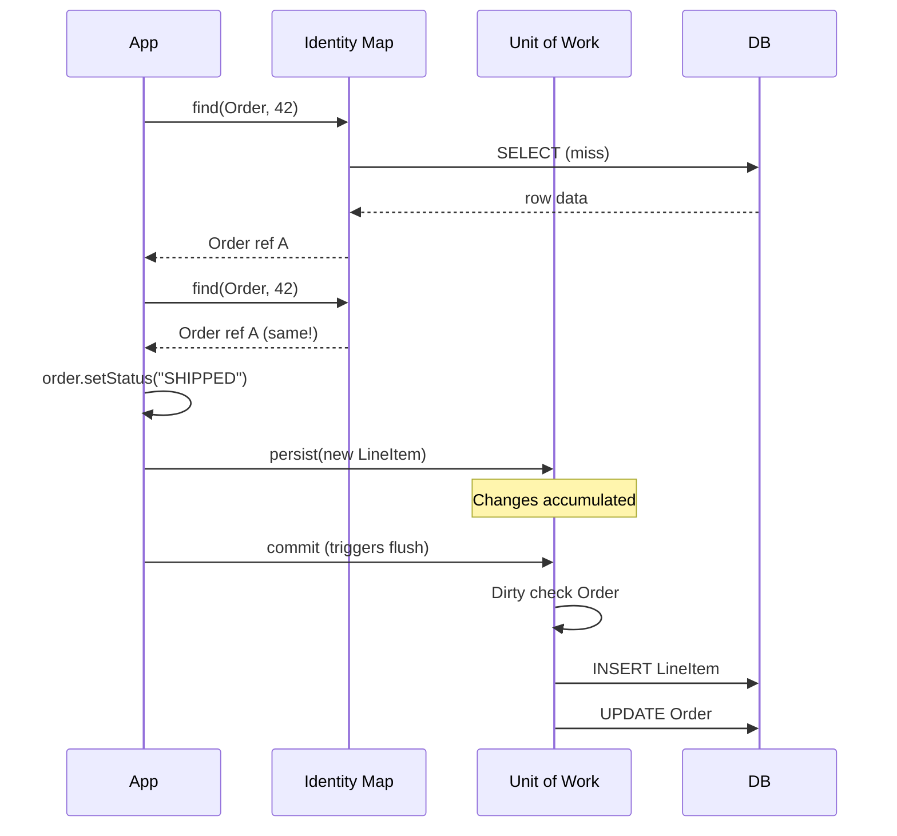

---

### 🚨 Failure Modes

**Failure 1 - Identity map returning stale data:**

**Symptom:** Another process updates Order 42's status to CANCELLED in the database. Current Session still sees ACTIVE because the identity map caches the old state.

**Root cause:** Identity map is per-Session. It does not see changes from other Sessions or processes. Within one Session, the identity map always returns the initially loaded state (or locally modified state).

**Diagnostic:**

```text
Session A: loads Order 42 (ACTIVE)
Process B: UPDATE orders SET
  status='CANCELLED' WHERE id=42
Session A: find(Order, 42)
  -> returns ACTIVE (from identity map)
  -> does NOT query DB again
```

**Fix:**

**BAD:**

```text
Assume identity map reflects current
database state. It does not. It reflects
the state at load time plus local changes.
```

**GOOD:**

```java
// Force reload from DB
em.refresh(order);
// Or: clear identity map
em.clear();
Order fresh = em.find(Order.class, 42L);
// Now reflects current DB state
```

**Failure 2 - Unit of work ordering failure:**

**Symptom:** `ConstraintViolationException` on INSERT. Parent row does not exist yet when child INSERT executes.

**Root cause:** Unit of work could not determine the correct insert order. Usually because the relationship is not mapped with `@ManyToOne` (Hibernate cannot infer the dependency).

**Diagnostic:**

```text
ConstraintViolationException:
Cannot add or update a child row:
a foreign key constraint fails.
Check: is the parent entity persisted
in the same transaction?
Is the relationship mapped?
```

**Fix:**

```java
// Ensure relationship is mapped
// so Hibernate knows the dependency
@ManyToOne
@JoinColumn(name = "order_id")
private Order order; // FK dependency clear

// Persist parent first (explicitly)
em.persist(parent);
em.persist(child); // Hibernate now knows
// parent INSERT must come first
```

---

### 🔬 Production Reality

A team debugs "phantom updates." Every request generates UPDATE for an entity that nobody modified. Root cause: identity map loads entity. A `@PostLoad` listener modifies a field (sets a transient calculation field but accidentally modifies a persistent field). Dirty checking detects the change. Unit of work schedules UPDATE. Fix: move the calculation to a `@Transient` field. Understanding the interaction between identity map (loads entity), postLoad (modifies entity), and dirty checking (detects modification) immediately identifies the bug.

---

### ⚖️ Trade-offs & Alternatives

| Pattern       | Hibernate            | Entity Framework   | Django ORM        |
| ------------- | -------------------- | ------------------ | ----------------- |
| Identity Map  | PersistenceContext   | ChangeTracker      | QuerySet cache    |
| Unit of Work  | ActionQueue + flush  | SaveChanges()      | save() per object |
| Dirty check   | Snapshot comparison  | Property tracking  | Explicit save     |
| Flush trigger | Auto at commit/query | SaveChanges() call | save() call       |

**Real-world patterns:**

- **Hibernate, EclipseLink:** Automatic dirty checking + flush at commit. Most transparent. Most surprising for newcomers.
- **Django ORM:** Explicit `save()` required. Less transparent but more predictable for beginners.
- **Trade-off:** Transparency vs predictability. Hibernate chooses transparency (less code) at the cost of predictability (more surprise).

---

### ⚡ Decision Snap

**LEVERAGE IDENTITY MAP WHEN:**

- Loading the same entity multiple times within a request. Second call is free (cache hit).

**CLEAR IDENTITY MAP WHEN:**

- Batch processing (memory). Need fresh DB state (`refresh` or `clear`).

**LEVERAGE UNIT OF WORK WHEN:**

- Multiple changes in one transaction. Rely on automatic ordering and minimal SQL.

---

### ⚠️ Top Traps

| #   | Misconception                             | Reality                                                                                                                  |
| --- | ----------------------------------------- | ------------------------------------------------------------------------------------------------------------------------ |
| 1   | findById always queries the DB            | findById checks the identity map first. If the entity is already loaded in this Session, no SQL executes.                |
| 2   | save() triggers immediate INSERT          | save() makes the entity managed. The actual INSERT executes at flush time (commit or explicit flush).                    |
| 3   | Identity map sees other sessions' changes | Identity map is per-Session. It caches the state at load time. Use refresh() to reload from the database.                |
| 4   | Flush ordering is simple                  | Flush ordering is a topological sort on entity dependencies. Circular dependencies can cause ordering failures.          |
| 5   | These patterns are Hibernate-specific     | Identity Map and Unit of Work are universal ORM patterns. Every ORM implements them, with different names and behaviors. |

---

### 🪜 Learning Ladder

**Prerequisites:**

- First-Level Cache (Persistence Context) Internals -
  Hibernate's identity map implementation
- Persistence Provider Design - How an ORM Is Built -
  these patterns as subsystems

**THIS:** HIB-111 Unit of Work and Identity Map - Foundational
ORM Patterns

**Next steps:**

- Hibernate Source Code Architecture and Bootstrap
  Sequence - where these patterns live in the code
- Identity Map as CPU Cache - Cross-Domain Memory
  Hierarchy - the universal pattern

---

**The Surprising Truth:**

The Identity Map pattern solves a problem most developers never think about: object identity. Without it, loading the same row twice in one transaction gives two different Java objects. Modifying one does not affect the other. This leads to data inconsistency within a single request. The identity map eliminates this entire class of bugs silently. It is arguably the most important pattern in ORM design, yet the least discussed.

**Further Reading:**

- Martin Fowler, "Patterns of Enterprise Application Architecture" - Identity Map and Unit of Work chapters
- Vlad Mihalcea, "How does Hibernate's dirty checking mechanism work?" (vladmihalcea.com)
- Hibernate ORM source code - `org.hibernate.engine.internal.StatefulPersistenceContext`

**Revision Card:**

1. Identity Map: `Map<{Type, ID}, Object>`. Same row = same reference within one Session. Prevents duplicate representations and inconsistency.
2. Unit of Work: accumulates INSERT/UPDATE/DELETE. Flushes at commit in dependency order (topological sort). Minimizes SQL execution.
3. These are universal ORM patterns (Fowler, PoEAA 2002). Hibernate, EclipseLink, Entity Framework, Django - all implement them with different names.

---

---

# HIB-112 What Database Engine Internals Teach ORM Users

**TL;DR** - Understanding database internals (B-tree indexes, MVCC, query planner, buffer pool) explains why ORM-generated SQL performs well or poorly. The database is not a black box.

---

### 🔥 Problem Statement

A developer writes a Hibernate query. It generates correct SQL. But the query takes 3 seconds instead of 30ms. The developer blames Hibernate. The actual cause: a missing index (B-tree not covering the predicate), a sequential scan (query planner choosing wrong plan), or lock contention (MVCC not granting read due to long transaction). Understanding database internals transforms ORM debugging from "Hibernate is slow" to "this query needs a covering index on (customer_id, status)."

---

### 📜 Historical Context

The "ORM abstraction leaks" criticism (Joel Spolsky, 2004) highlighted that ORM users must understand databases. The response in the Hibernate community: the ORM abstracts SQL syntax but does not abstract database behavior. Query performance depends on indexes, statistics, and the query planner - not on whether the SQL was handwritten or ORM-generated. The same SQL runs at the same speed regardless of its origin. The database engine does not know or care whether Hibernate or a human wrote the query.

---

### 🔩 First Principles

**CORE INVARIANTS:**

1. **The database engine does not see Hibernate:** The engine receives SQL, parses it, optimizes it, and executes it. Whether Hibernate or a developer wrote it is irrelevant to performance.
2. **Indexes determine query speed:** Without an index on the predicate column, the database scans the entire table. With a covering index, it reads only the index. This is the single largest performance factor.
3. **The query planner makes execution decisions:** Given a SQL query, the planner chooses: which indexes to use, join order, join algorithm (nested loop, hash, merge). Its decisions depend on table statistics (row count, value distribution).
4. **MVCC controls concurrency:** Multi-Version Concurrency Control allows readers and writers to operate concurrently. But long transactions hold old row versions, preventing vacuum/cleanup and causing bloat.

**DERIVED DESIGN:**

ORM-generated SQL is subject to the same database rules as handwritten SQL. Optimizing ORM queries means: (1) check the execution plan (EXPLAIN ANALYZE), (2) add indexes for predicates and JOINs, (3) update statistics (ANALYZE), (4) keep transactions short.

**THE TRADE-OFF:**

**Gain:** Understanding database internals enables precise diagnosis of ORM performance issues. No more guessing.

**Cost:** Requires database knowledge that most application developers do not have. Cross-disciplinary learning.

---

### 🧠 Mental Model

> The database engine is like a library. Hibernate writes a book request (SQL). The librarian (query planner) decides how to find the book: use the catalog index (B-tree index) or walk through every shelf (sequential scan). If no catalog exists for the requested category: sequential scan. Adding a catalog (creating an index) makes future requests instant. The library's efficiency depends on its catalogs, not on who wrote the request.

- "Book request" -> SQL query
- "Librarian" -> query planner
- "Catalog index" -> B-tree index
- "Walk every shelf" -> sequential scan
- "Who wrote the request" -> ORM vs hand-written (irrelevant)

**Where this analogy breaks down:** Unlike a library catalog that requires manual updates, database indexes are automatically maintained on INSERT/UPDATE/DELETE. But statistics (catalog freshness) require periodic ANALYZE.

---

### 🧩 Components

- **B-tree index:** Balanced tree structure. O(log N) lookup. Default index type. Covers equality and range predicates.
- **Query planner/optimizer:** Chooses execution plan. Uses table statistics (pg_stats). Decides: index scan vs sequential scan, join order, join algorithm.
- **MVCC:** Each row has xmin/xmax (transaction IDs). Readers see the version visible to their transaction. Writers create new versions. Old versions cleaned by vacuum.
- **Buffer pool:** In-memory cache of database pages. Frequently accessed pages stay in memory. Reduces disk I/O.
- **WAL (Write-Ahead Log):** Ensures durability. Changes written to WAL before data pages. Crash recovery replays WAL.

```text
  Database engine layers:
  +----------------------------+
  | SQL (from Hibernate or dev)|
  +----------------------------+
  | Parser (syntax check)      |
  +----------------------------+
  | Planner (choose exec plan) |
  |  -> Statistics (pg_stats)  |
  |  -> Cost estimation        |
  +----------------------------+
  | Executor (run the plan)    |
  |  -> Index scan or seq scan |
  |  -> Join algorithm         |
  +----------------------------+
  | Storage (B-tree, heap)     |
  |  -> Buffer pool (memory)   |
  |  -> Disk (pages)           |
  +----------------------------+
```

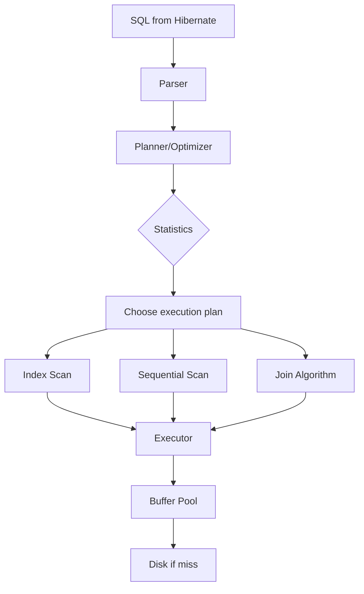

---

### 📶 Gradual Depth

**Level 1 - What it is:**

Database engines process SQL through: parse -> plan -> execute. Performance depends on indexes and statistics, not on who generated the SQL.

**Level 2 - How to use it:**

Always check the execution plan: `EXPLAIN ANALYZE` (PostgreSQL). Look for sequential scans on large tables. Add indexes for predicate columns. Run ANALYZE after bulk loads.

**Level 3 - How it works:**

The planner estimates cost for each possible plan (index scan vs seq scan, different join orders). Chooses the lowest-cost plan. Cost estimation uses statistics: row count, distinct values, histogram of value distribution. Stale statistics cause wrong plan choices.

**Level 4 - Production mastery:**

Monitor: `pg_stat_user_tables` for sequential scan frequency, `pg_stat_user_indexes` for index usage, `pg_stat_statements` for slow queries. Autovacuum settings affect MVCC performance. Large transactions block vacuum, causing table bloat. Connection pool sizing affects buffer pool efficiency (too many connections = too little memory per connection for work_mem).

---

### ⚙️ How It Works

**Phase 1 - Index importance:**

```sql
-- Without index: sequential scan
-- 1M rows, scans all rows: 500ms
EXPLAIN ANALYZE
SELECT * FROM orders
WHERE customer_id = 42;
-- "Seq Scan on orders"
-- "rows=1000000"

-- With index: index scan
-- Reads only matching rows: 2ms
CREATE INDEX idx_orders_customer
  ON orders(customer_id);
EXPLAIN ANALYZE
SELECT * FROM orders
WHERE customer_id = 42;
-- "Index Scan using idx_orders_customer"
-- "rows=15"
```

**Phase 2 - EXPLAIN ANALYZE for ORM queries:**

```text
  Hibernate generates:
  SELECT o.id, o.status, o.total
  FROM orders o
  WHERE o.customer_id = ?
  AND o.status = ?

  EXPLAIN ANALYZE shows:
  Bitmap Index Scan on idx_orders_cust
  Filter: status = 'ACTIVE'
  Rows removed by filter: 850
  -> Need composite index:
  CREATE INDEX idx_orders_cust_status
    ON orders(customer_id, status);
```

**Phase 3 - MVCC and long transactions:**

```text
  Long transaction holds old row versions:
  1. Transaction A: BEGIN (holds snapshot)
  2. 1000 UPDATEs create new versions
  3. Old versions cannot be vacuumed
     (Transaction A still references them)
  4. Table bloat: table grows without bound
  5. Fix: keep transactions short
     (seconds, not minutes)
```

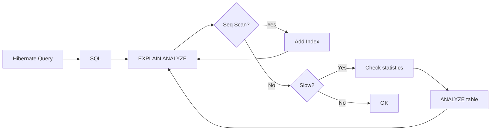

---

### 🚨 Failure Modes

**Failure 1 - Missing index on ORM-generated query:**

**Symptom:** Hibernate findByCustomerIdAndStatus() takes 3 seconds. Same query with index takes 2ms.

**Root cause:** No index on (customer_id, status). Database performs sequential scan on 1M rows.

**Diagnostic:**

```sql
-- Check if index exists
SELECT indexname FROM pg_indexes
WHERE tablename = 'orders'
AND indexdef LIKE '%customer_id%';
-- If empty: no index on customer_id

EXPLAIN ANALYZE
SELECT * FROM orders
WHERE customer_id = 42
AND status = 'ACTIVE';
-- If "Seq Scan": index missing
```

**Fix:**

**BAD:**

```text
Blame Hibernate for slow query.
Rewrite as native SQL (still slow
without index).
```

**GOOD:**

```sql
-- Add composite index
CREATE INDEX idx_orders_cust_status
  ON orders(customer_id, status);
-- Hibernate query now uses index
-- 3 seconds -> 2 milliseconds
```

**Failure 2 - Stale statistics cause wrong plan:**

**Symptom:** After bulk load of 500K rows, a query that was fast (index scan) becomes slow (sequential scan).

**Root cause:** Table statistics still reflect old row count. Planner estimates low row count, chooses sequential scan (cheaper for small tables).

**Diagnostic:**

```sql
-- Check table statistics
SELECT reltuples FROM pg_class
WHERE relname = 'orders';
-- If reltuples << actual row count:
-- statistics are stale
```

**Fix:**

```sql
-- Update statistics
ANALYZE orders;
-- Or for all tables
ANALYZE;
-- Planner now uses current statistics
-- Chooses index scan for large table
```

---

### 🔬 Production Reality

A team blames Hibernate for a "slow query." EXPLAIN ANALYZE reveals: sequential scan on 2M row table, no index on the predicate column. The Hibernate-generated SQL is identical to what a human would write. Adding a composite index reduces latency from 4 seconds to 3 milliseconds. The team learns: Hibernate generates SQL. The database engine decides how to execute it. Performance optimization happens at the database level (indexes, statistics, planner configuration), not at the ORM level.

---

### ⚖️ Trade-offs & Alternatives

| Optimization level  | Who does it    | Impact    | Effort |
| ------------------- | -------------- | --------- | ------ |
| Add index           | DBA/developer  | 100-1000x | Low    |
| Update statistics   | DBA/autovacuum | 10-100x   | Low    |
| Optimize SQL        | ORM/developer  | 2-5x      | Medium |
| Tune planner config | DBA            | 2-10x     | Medium |
| Hardware upgrade    | Ops            | 2-5x      | High   |

**Real-world patterns:**

- **First fix:** Add missing index. 90% of slow queries are missing an index.
- **Second fix:** Update statistics (ANALYZE). 5% of slow queries have stale stats.
- **Third fix:** Optimize SQL (JOIN order, projections). 5% need query restructuring.

---

### ⚡ Decision Snap

**CHECK EXPLAIN ANALYZE WHEN:**

- Any query takes longer than expected. Always. Before blaming Hibernate.

**ADD INDEX WHEN:**

- EXPLAIN shows sequential scan on a table with > 10K rows for a column used in WHERE, JOIN, or ORDER BY.

**RUN ANALYZE WHEN:**

- After bulk loads. After large deletes. When query plans change unexpectedly.

---

### ⚠️ Top Traps

| #   | Misconception                                 | Reality                                                                                                                          |
| --- | --------------------------------------------- | -------------------------------------------------------------------------------------------------------------------------------- |
| 1   | Hibernate is slow                             | Hibernate generates SQL. The database executes it. Slow execution is a database issue (indexes, statistics), not an ORM issue.   |
| 2   | ORM-generated SQL is slower than hand-written | The database engine does not know the SQL origin. Same SQL = same execution plan = same performance.                             |
| 3   | More indexes = better performance             | Each index adds overhead to INSERT/UPDATE/DELETE. Only index columns used in WHERE, JOIN, ORDER BY.                              |
| 4   | Autovacuum handles everything                 | Autovacuum may lag behind high-write workloads. Monitor vacuum stats. Long transactions block vacuum.                            |
| 5   | EXPLAIN without ANALYZE is sufficient         | EXPLAIN shows the planned execution. EXPLAIN ANALYZE shows actual execution. Planner estimates can be wrong. Always use ANALYZE. |

---

### 🪜 Learning Ladder

**Prerequisites:**

- Persistence Provider Design - How an ORM Is Built -
  how ORM generates SQL
- Hibernate Source Code Architecture and Bootstrap
  Sequence - how SQL templates are pre-compiled

**THIS:** HIB-112 What Database Engine Internals Teach ORM
Users

**Next steps:**

- What Compiler Pipeline Design Teaches Query
  Optimization - query compilation as a pipeline
- Identity Map as CPU Cache - Cross-Domain Memory
  Hierarchy - caching at every level

---

**The Surprising Truth:**

The most effective Hibernate performance optimization has nothing to do with Hibernate. It is adding a database index. A single `CREATE INDEX` statement can improve query performance by 1000x. No ORM configuration, no code change, no framework migration. Understanding database internals is the highest-leverage skill for any ORM user.

**Further Reading:**

- Markus Winand, "SQL Performance Explained" (use-the-index-luke.com)
- PostgreSQL documentation - EXPLAIN, Indexes, MVCC
- Brendan Gregg, "Systems Performance" - database performance analysis

**Revision Card:**

1. The database engine does not see Hibernate. It sees SQL. Same SQL = same plan. Slow queries are database issues (indexes, stats), not ORM issues.
2. EXPLAIN ANALYZE is the single most important diagnostic tool. Sequential scan on large table = missing index. Add index. 90% of slow queries solved.
3. Keep transactions short (MVCC). Update statistics after bulk loads (ANALYZE). Monitor autovacuum for high-write tables.

---

---

# HIB-113 What Compiler Pipeline Design Teaches Query Optimization

**TL;DR** - Query optimization follows the same pipeline as a compiler: parse (syntax tree), analyze (semantic resolution), optimize (plan selection), generate (executable code). Understanding this pipeline explains HQL behavior.

---

### 🔥 Problem Statement

A developer writes HQL: `SELECT o FROM Order o WHERE o.customer.name = :name`. Hibernate converts this to SQL. But how? The process is identical to a compiler pipeline: (1) parse HQL into an AST (Abstract Syntax Tree), (2) resolve entity names to table names and field names to column names (semantic analysis), (3) choose the best execution strategy (optimization), (4) generate database-specific SQL (code generation via Dialect). Understanding this pipeline explains error messages, performance characteristics, and optimization opportunities.

---

### 📜 Historical Context

Compiler pipeline design (lexing -> parsing -> semantic analysis -> optimization -> code generation) was formalized in the 1970s (Aho, Sethi, Ullman - "Dragon Book"). Database query compilers adopted the same pipeline. Hibernate's HQL compiler evolved from a simple string-based translator (Hibernate 2) to a full AST-based compiler (Hibernate 3-5, HQL AST) to the Semantic Query Model (SQM) in Hibernate 6. SQM is a proper compiler intermediate representation: parsed, type-resolved, optimizable, and translatable to multiple SQL dialects.

---

### 🔩 First Principles

**CORE INVARIANTS:**

1. **Parse phase produces AST:** HQL string is tokenized and parsed into a tree structure. Syntax errors are caught here. `SELECT o FROM Ordr o` fails at parse time (unknown entity).
2. **Semantic analysis resolves types:** Entity names resolve to table names. Field names resolve to column names. Relationship paths resolve to JOINs. Type mismatches are caught here.
3. **Optimization selects strategy:** The planner chooses: which indexes to suggest (implicit vs explicit JOINs), whether to use subquery or JOIN, and how to handle inheritance (SINGLE_TABLE vs JOINED).
4. **Code generation produces SQL:** The SQL AST translator uses the Dialect to produce database-specific SQL. PostgreSQL gets `LIMIT`, Oracle gets `FETCH FIRST`, MySQL gets `LIMIT`.

**DERIVED DESIGN:**

HQL -> SQM (semantic model) -> SQL AST -> SQL string. This multi-stage pipeline enables: early error detection, cross-database portability, query plan caching, and optimization.

**THE TRADE-OFF:**

**Gain:** Type-safe, cross-database query language. Errors caught at parse/analysis time rather than at database execution time.

**Cost:** Compilation overhead for each unique query (mitigated by query plan cache). Some SQL features not expressible in HQL.

---

### 🧠 Mental Model

> Hibernate's query pipeline is like a human translator working with a legal document. First, read the document and parse the sentences (lexing + parsing). Then, understand the legal terms in context (semantic analysis - resolve entity names to tables). Then, decide the best way to express each legal concept in the target language (optimization). Finally, write the translated document (SQL code generation).

- "Parse sentences" -> lexing + parsing (AST)
- "Understand legal terms" -> semantic analysis
- "Best expression" -> optimization
- "Write translation" -> SQL generation

**Where this analogy breaks down:** Unlike human translation which is subjective, the query pipeline is deterministic. Same HQL always produces the same SQL for a given Dialect.

---

### 🧩 Components

- **Lexer/Tokenizer:** Splits HQL string into tokens: `SELECT`, `FROM`, `Order`, `WHERE`, `=`.
- **Parser:** Builds AST from tokens. Validates syntax. Catches: misspelled keywords, unclosed parentheses, invalid syntax.
- **Semantic Model (SQM):** Resolves entity references. `Order` -> `orders` table. `o.customer.name` -> JOIN customers ON ... + `customers.name` column.
- **SQL AST:** Intermediate representation. Database-independent. Contains: select list, from clause (with joins), where predicates, group by, order by.
- **SQL AST Translator:** Converts SQL AST to database-specific SQL string using the Dialect. Handles: pagination, locking, type casting, function names.
- **Query Plan Cache:** Caches compiled query plans. Key: HQL string. Value: compiled SQL + parameter metadata. Avoids recompilation.

```text
  Query pipeline:
  HQL string
    |
  [Lexer] -> tokens
    |
  [Parser] -> HQL AST
    |
  [Semantic Analyzer] -> SQM
    |  (resolve entities, types, paths)
    |
  [Optimizer] -> Optimized SQM
    |
  [SQL AST Generator] -> SQL AST
    |
  [SQL Translator + Dialect] -> SQL string
    |
  [JDBC] -> execute on database
```

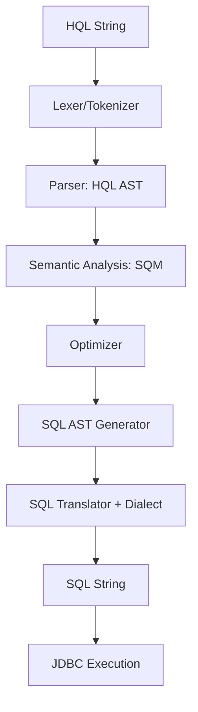

---

### 📶 Gradual Depth

**Level 1 - What it is:**

HQL compilation follows a compiler pipeline: parse -> analyze -> optimize -> generate SQL. Understanding the pipeline explains error messages and performance.

**Level 2 - How to use it:**

Parse errors ("unexpected token") = syntax issue. Semantic errors ("could not resolve property") = entity/field resolution issue. Use the query plan cache (`hibernate.query.plan_cache_max_size`) to avoid recompilation overhead.

**Level 3 - How it works:**

Hibernate 6 uses SQM (Semantic Query Model) as the intermediate representation. SQM is type-resolved, database-independent, and cacheable. The SQL AST translator converts SQM to database-specific SQL using the Dialect's rules for pagination, locking, and function mapping.

**Level 4 - Production mastery:**

Query plan cache is critical for performance. Default size: 2048 plans. If the application has more than 2048 unique queries, plans are evicted and recompiled. Monitor `QueryPlanCacheMissCount` in Hibernate statistics. For dynamic queries with many parameter combinations, use Criteria API (parameterized plans are cached, not per-value plans).

---

### ⚙️ How It Works

**Phase 1 - Parsing:**

```text
  HQL: SELECT o FROM Order o
       WHERE o.status = :status

  Tokens: [SELECT, o, FROM, Order, o,
           WHERE, o, ., status, =, :status]

  AST:
  SelectStatement
    SelectClause: [o]
    FromClause: [Order AS o]
    WhereClause:
      Equals(o.status, :status)
```

**Phase 2 - Semantic analysis (SQM):**

```text
  Resolve: Order -> orders table
  Resolve: o.status -> orders.status column
  Resolve: :status -> parameter (String type)
  Check: o.status type (String) matches
         :status type (String) -> OK
```

**Phase 3 - SQL generation:**

```text
  PostgreSQL Dialect:
  SELECT o1_0.id, o1_0.status, o1_0.total
  FROM orders o1_0
  WHERE o1_0.status = ?

  Oracle Dialect:
  SELECT o1_0.id, o1_0.status, o1_0.total
  FROM orders o1_0
  WHERE o1_0.status = ?
  -- (same for simple queries, differs for
  -- pagination, locking, functions)
```

**Phase 4 - Query plan caching:**

```text
  First execution:
  HQL -> parse -> analyze -> optimize
       -> generate -> cache
  Time: ~5ms

  Subsequent executions:
  HQL -> cache HIT -> reuse plan
  Time: ~0.1ms
```

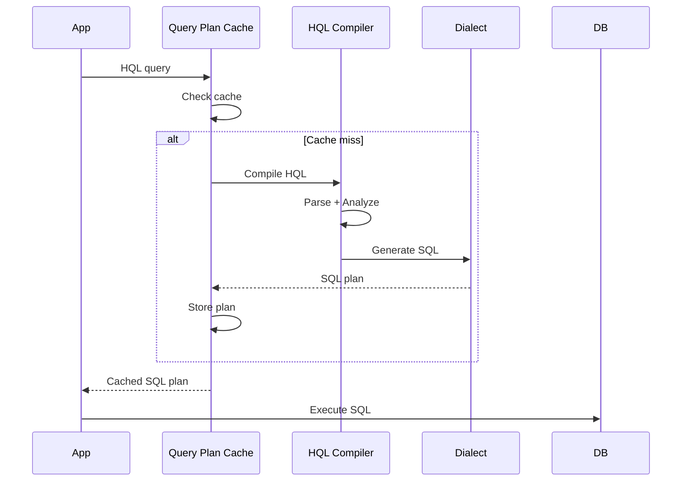

---

### 🚨 Failure Modes

**Failure 1 - Query plan cache thrashing:**

**Symptom:** High CPU usage during query compilation. `QueryPlanCacheMissCount` in Hibernate statistics is very high. Application generates SQL dynamically with IN-clause lists of varying length.

**Root cause:** `WHERE id IN (?, ?, ?)` and `WHERE id IN (?, ?, ?, ?)` are different query plans. 100 different IN-list sizes = 100 cached plans. Exceeds cache capacity.

**Diagnostic:**

```java
// Check query plan cache statistics
Statistics stats = sessionFactory
    .getStatistics();
long misses = stats
    .getQueryPlanCacheMissCount();
long hits = stats
    .getQueryPlanCacheHitCount();
// If misses/hits > 0.1: cache thrashing
```

**Fix:**

**BAD:**

```java
// Dynamic IN-list: new plan per size
query.setParameterList("ids", ids);
// 10 ids, 20 ids, 50 ids = 3 plans
```

**GOOD:**

```java
// Hibernate 6: in_clause_parameter_padding
// Pads IN-list to power of 2
// 10 ids padded to 16, 20 to 32
// Fewer unique plans cached
// Set: hibernate.query
//   .in_clause_parameter_padding=true
```

**Failure 2 - Semantic resolution failure:**

**Symptom:** `QueryException: could not resolve property: customerName of: Order`. The HQL references a property that does not exist on the entity.

**Root cause:** Field renamed in entity but HQL query string not updated. Semantic analysis catches the mismatch.

**Diagnostic:**

```text
Error at semantic analysis phase.
HQL: SELECT o FROM Order o
     WHERE o.customerName = :name
Entity Order has: customer_name (snake case)
  or customerId (different field)
Mismatch at resolution.
```

**Fix:**

**BAD:**

```java
// String-based HQL: no compile-time check
@Query("SELECT o FROM Order o "
    + "WHERE o.customerName = :name")
// Fails at runtime
```

**GOOD:**

```java
// Use Metamodel + Criteria for type safety
cb.equal(root.get(Order_.customerId), id);
// Compile-time checked
// Or: rename field in HQL to match entity
```

---

### 🔬 Production Reality

A team's Spring Boot application has 300 unique HQL queries. Query plan cache default: 2048. Cache hit rate: 99.5%. Compilation overhead: negligible. Then: a search endpoint generates dynamic IN-clause queries with varying list sizes (1 to 200 IDs). This adds 200 unique query plans. Cache pressure increases. After enabling `in_clause_parameter_padding`: IN-lists are padded to powers of 2 (1, 2, 4, 8, 16, 32, 64, 128, 256). Only 9 unique plans instead of 200. Cache hit rate: 99.9%.

---

### ⚖️ Trade-offs & Alternatives

| Query approach  | Compilation cost | Cache benefit | Type safety |
| --------------- | ---------------- | ------------- | ----------- |
| HQL (string)    | First call       | Cached        | None        |
| Criteria + Meta | First call       | Cached        | Full        |
| Native SQL      | Minimal          | Not cached    | None        |
| @NamedQuery     | At boot time     | Pre-cached    | None        |
| jOOQ            | None (build SQL) | N/A           | Full        |

**Real-world patterns:**

- **@NamedQuery:** Compiled at boot time. Errors caught at startup instead of at first request. Best for static queries.
- **Criteria API:** Compiled at first call but parameterized plans are highly cacheable. Best for dynamic queries.

---

### ⚡ Decision Snap

**ENABLE IN-CLAUSE PADDING WHEN:**

- Application uses IN-clause queries with varying list sizes. Always. Low cost, high cache benefit.

**USE @NamedQuery WHEN:**

- Static queries that should fail fast at boot if invalid. Mission-critical queries.

**MONITOR QUERY PLAN CACHE WHEN:**

- Application has > 100 unique queries. Or: CPU spikes correlated with query compilation.

---

### ⚠️ Top Traps

| #   | Misconception                                 | Reality                                                                                                                                              |
| --- | --------------------------------------------- | ---------------------------------------------------------------------------------------------------------------------------------------------------- |
| 1   | HQL compilation is expensive every time       | First compilation: ~5ms. Cached: ~0.1ms. Query plan cache eliminates recompilation for repeat queries.                                               |
| 2   | Native SQL is faster than HQL                 | HQL compiles to SQL. The resulting SQL is identical in performance. Native SQL skips compilation but does not skip database execution.               |
| 3   | Query plan cache is unlimited                 | Default size: 2048 plans. Applications with many dynamic queries can exceed this. Monitor cache miss rate.                                           |
| 4   | Parse errors and semantic errors are the same | Parse errors: syntax (misspelled keyword). Semantic errors: resolution (wrong field name). Different pipeline stages.                                |
| 5   | SQM is just a Hibernate 6 rename              | SQM is a fundamentally different intermediate representation. Proper type resolution, database-independent optimization, and cleaner SQL generation. |

---

### 🪜 Learning Ladder

**Prerequisites:**

- Persistence Provider Design - How an ORM Is Built -
  query translator as one of five subsystems
- JPA Specification Internals and Metamodel API - JPA's
  query interfaces

**THIS:** HIB-113 What Compiler Pipeline Design Teaches Query
Optimization

**Next steps:**

- What Database Engine Internals Teach ORM Users - the
  database's own query compilation pipeline
- Writing a Custom Hibernate Dialect - the code
  generation phase (SQL output)

---

**The Surprising Truth:**

Hibernate's HQL compiler is a real compiler. It has a lexer, parser, semantic analyzer, optimizer, and code generator - the same stages as javac or GCC. Understanding compiler pipeline design is not an academic exercise for ORM users. It directly explains: why error messages reference "unexpected token" (parse phase), why "could not resolve property" means a field mismatch (semantic phase), and why query plan cache tuning matters (avoiding recompilation).

**Further Reading:**

- Hibernate ORM source code - `org.hibernate.query.sqm` package (SQM compiler)
- Alfred Aho et al., "Compilers: Principles, Techniques, and Tools" (Dragon Book) - compiler pipeline
- Hibernate documentation - Query Plan Cache configuration

**Revision Card:**

1. HQL pipeline: parse (AST) -> analyze (SQM, resolve entities/fields) -> optimize -> generate SQL (via Dialect). Same as a compiler.
2. Query plan cache avoids recompilation. Default: 2048 plans. Monitor miss rate. Enable IN-clause padding for dynamic queries.
3. Parse errors = syntax (misspelled keyword). Semantic errors = resolution (wrong field). Knowing the pipeline stage tells you where to fix.

---

---

# HIB-114 Identity Map as CPU Cache - Cross-Domain Memory Hierarchy

**TL;DR** - Hibernate's identity map (L1 cache) mirrors CPU cache design: local, fast, per-session (per-core) storage that avoids expensive remote access (database/RAM). The same caching principles apply at every level.

---

### 🔥 Problem Statement

An engineer studies Hibernate's L1 cache (persistence context) and wonders: why does it work this way? Why per-Session? Why not shared? Why does it need eviction? The answer: it follows the same design principles as CPU caches. CPU L1 cache: per-core, fast, small, coherence managed. Hibernate L1 cache: per-Session, fast (no SQL), limited (memory), coherence via transaction isolation. The same principles apply at every level of the memory hierarchy: CPU -> application -> ORM -> database.

---

### 📜 Historical Context

The memory hierarchy concept was formalized by the computer architecture community in the 1960s-1970s. The key insight: "The cheaper the memory, the slower it is. The faster the memory, the smaller it is." This led to multi-level caches: CPU registers (fastest, smallest) -> L1 cache -> L2 cache -> L3 cache -> RAM -> Disk. The same hierarchy appears in ORM design: Hibernate L1 (per-Session, fastest) -> Hibernate L2 (shared, slower) -> Database buffer pool (shared, slower) -> Disk (slowest). Martin Fowler's Identity Map (2002) is the ORM instantiation of the L1 cache pattern.

---

### 🔩 First Principles

**CORE INVARIANTS:**

1. **Locality of reference:** Most requests access a small subset of data repeatedly. Caching that subset locally avoids repeated remote access. CPU: recently used memory addresses. ORM: recently loaded entities.
2. **Cache coherence vs independence:** CPU L1 caches per core require coherence protocols (MESI). ORM L1 caches per Session are independent (transaction isolation handles coherence).
3. **Cache size vs hit rate:** Larger cache = higher hit rate but more memory. CPU L1: 32KB. ORM L1: unbounded (dangerous). Both need eviction strategies.
4. **Write-back vs write-through:** CPU L1 writes back to RAM on eviction. ORM L1 writes back to database at flush (unit of work). Same principle: defer writes, batch them.

**DERIVED DESIGN:**

The universal caching pattern: local storage (avoid remote access), capacity management (eviction), coherence (consistency protocol), write-back (deferred writes). This pattern appears at every level of the computing stack.

**THE TRADE-OFF:**

**Gain:** Cross-domain understanding. Learning caching once (CPU architecture or ORM) transfers to every other domain.

**Cost:** The analogy has limits. ORM caches have different coherence models (transaction isolation vs MESI protocol).

---

### 🧠 Mental Model

> The computing stack is a series of nested Russian dolls (matryoshka), each applying the same caching principle at a different scale:

- **Innermost doll (CPU L1):** 32KB, per-core, nanosecond access. Caches memory addresses.
- **Middle doll (ORM L1):** Per-Session, microsecond access. Caches entity objects.
- **Outer doll (DB buffer pool):** Shared, millisecond access. Caches data pages.
- **Outermost doll (CDN):** Distributed, ~50ms access. Caches HTTP responses.

Each doll follows the same rules: local > remote, small + fast > large + slow, write-back > write-through.

**Where this analogy breaks down:** CPU caches have hardware-enforced coherence (MESI protocol). ORM caches rely on transaction isolation. CDN caches use TTL-based invalidation. The coherence model differs at each level.

---

### 🧩 Components

**Cross-domain mapping:**

| Concept      | CPU L1 Cache     | Hibernate L1       | DB Buffer Pool   |
| ------------ | ---------------- | ------------------ | ---------------- |
| Unit         | Cache line (64B) | Entity object      | Page (8KB)       |
| Scope        | Per-core         | Per-Session        | Per-instance     |
| Lookup       | Address tag      | EntityKey(type,id) | Page number      |
| Eviction     | LRU/pseudo-LRU   | Manual (clear)     | Clock sweep      |
| Write policy | Write-back       | Write-back (flush) | Write-back (WAL) |
| Coherence    | MESI protocol    | Tx isolation       | MVCC             |
| Miss cost    | ~100 cycles      | ~1ms (SQL query)   | ~10ms (disk I/O) |

```text
  Memory hierarchy:
  +--------+----------+---------+--------+
  | Level  | Size     | Latency | Scope  |
  +--------+----------+---------+--------+
  | CPU L1 | 32KB     | 1ns     | Core   |
  | CPU L2 | 256KB    | 5ns     | Core   |
  | CPU L3 | 8MB      | 20ns    | Socket |
  | RAM    | 32GB     | 100ns   | Server |
  | ORM L1 | ~MB      | 0us     | Session|
  | ORM L2 | ~100MB   | 0.1ms   | Shared |
  | DB Buf | ~GB      | 0.5ms   | DB     |
  | Disk   | ~TB      | 10ms    | Storage|
  +--------+----------+---------+--------+
```

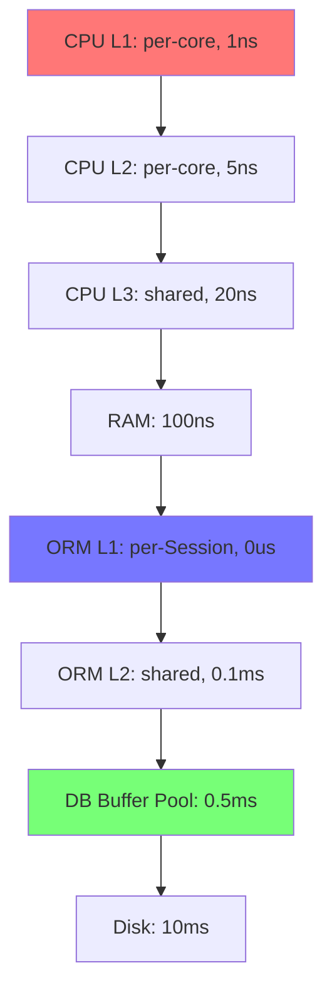

---

### 📶 Gradual Depth

**Level 1 - What it is:**

Caching follows the same pattern at every level: CPU, ORM, database, CDN. Local > remote. Small + fast > large + slow. Understanding one level teaches all levels.

**Level 2 - How to use it:**

Hibernate L1 (persistence context) is your per-Session cache. Use it: `findById` is free after first load. Clear it for batch processing. L2 (shared cache) reduces database queries across Sessions for read-heavy reference data.

**Level 3 - How it works:**

CPU L1 uses address tags and MESI coherence. ORM L1 uses EntityKey lookup and transaction isolation. Both: check local cache first, go remote on miss, store result locally. Write-back: defer writes until eviction (CPU) or flush (ORM).

**Level 4 - Production mastery:**

The cross-domain pattern enables architectural decisions: "Should we add an application-level cache (Redis) between ORM and database?" Answer using the same principles: what is the locality pattern? What is the coherence requirement? What is the miss cost vs cache maintenance cost? If read-heavy with low coherence requirement: yes (TTL-based cache). If write-heavy with strong coherence: no (cache invalidation is harder than cache miss).

---

### ⚙️ How It Works

**CPU L1 cache (hardware):**

```text
  Request: read address 0x7FFF_0042
  1. Check L1: tag match? -> HIT (1ns)
  2. If MISS: check L2, L3, RAM
  3. Load cache line (64 bytes) into L1
  4. Return value to CPU register
  Write: mark cache line dirty
  Eviction: write back to L2/RAM
```

**Hibernate L1 cache (software):**

```text
  Request: findById(Order.class, 42)
  1. Check L1: EntityKey{Order,42}?
     -> HIT (0us, return Java reference)
  2. If MISS: execute SELECT via JDBC
  3. Store entity + snapshot in L1
  4. Return entity reference
  Write: modify entity field (Java setter)
  Flush: write back to database (UPDATE)
```

**Database buffer pool (system):**

```text
  Request: read page 4217
  1. Check buffer pool: page in memory?
     -> HIT (0.5ms, return page)
  2. If MISS: read from disk (10ms)
  3. Store page in buffer pool
  4. Return page
  Write: modify page in memory
  Checkpoint: write dirty pages to disk
```

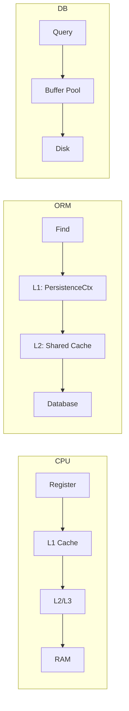

---

### 🚨 Failure Modes

**Failure 1 - Cache not evicted (ORM memory leak):**

**Symptom:** Batch processing loads 100K entities. Memory grows linearly. OOM exception.

**Root cause:** ORM L1 cache has no automatic eviction. Unlike CPU L1 (hardware-enforced LRU eviction), Hibernate L1 grows unbounded within a Session.

**Diagnostic:**

```java
Session session = em.unwrap(Session.class);
int count = session.getStatistics()
    .getEntityCount();
// If count > 10,000: L1 too large
```

**Fix:**

**BAD:**

```text
Load 100K entities in one Session.
No clear(). Memory grows to 2GB.
OOM crash.
```

**GOOD:**

```java
// Periodic eviction (like CPU LRU)
for (int i = 0; i < 100_000; i++) {
    process(loadEntity(i));
    if (i % 100 == 0) {
        em.flush();
        em.clear(); // Evict L1
    }
}
```

**Failure 2 - Stale cache (coherence failure):**

**Symptom:** ORM L2 cache returns stale data. Another application updated the database directly. L2 cache not invalidated.

**Root cause:** L2 cache coherence assumes all writes go through Hibernate. Direct database updates bypass cache invalidation. Unlike CPU MESI protocol (hardware-enforced coherence), ORM L2 has no automatic cross-process invalidation.

**Diagnostic:**

```text
L2 cache returns price=10.00
Database has price=15.00
Direct SQL update bypassed Hibernate.
L2 cache not aware of the change.
```

**Fix:**

```text
1. Never update directly if L2 is used.
   All writes through Hibernate.
2. If direct updates necessary:
   set TTL on L2 cache (max staleness).
3. Or: invalidate L2 after direct update:
   sessionFactory.getCache()
     .evict(Product.class, productId);
```

---

### 🔬 Production Reality

A team adds Redis as an application-level cache between Hibernate and the database. They apply the memory hierarchy analysis: read-to-write ratio is 50:1 (good for caching). Coherence requirement: 30-second staleness acceptable. Miss cost: 15ms (database query). Cache hit: 0.5ms (Redis). Decision: add Redis cache with 30-second TTL for product catalog. Result: 98% cache hit rate, average latency drops from 15ms to 1ms. The cross-domain caching principle (locality, coherence, miss cost) guided the decision exactly as it guides CPU cache design.

---

### ⚖️ Trade-offs & Alternatives

| Cache level    | Speed | Coherence model     | Eviction    |
| -------------- | ----- | ------------------- | ----------- |
| CPU L1         | 1ns   | MESI (hardware)     | LRU (auto)  |
| ORM L1         | 0us   | Tx isolation        | Manual      |
| ORM L2         | 0.1ms | TTL or invalidation | TTL/LRU     |
| Redis          | 0.5ms | TTL                 | TTL/LRU     |
| DB buffer pool | 0.5ms | MVCC                | Clock sweep |

**Real-world patterns:**

- **Every cache has the same design decisions:** size, eviction, coherence, write policy. Learn the framework once, apply everywhere.
- **Adding cache layers follows diminishing returns.** Each additional layer adds complexity. Only add when miss cost justifies it.

---

### ⚡ Decision Snap

**ADD A CACHE LAYER WHEN:**

- Read-to-write ratio > 10:1. Miss cost > 5ms. Staleness is acceptable for the use case.

**SKIP A CACHE LAYER WHEN:**

- Write-heavy workload. Strong consistency required. Miss cost is already low.

**APPLY CROSS-DOMAIN THINKING WHEN:**

- Designing any caching strategy. The principles are universal: locality, coherence, eviction, write-back.

---

### ⚠️ Top Traps

| #   | Misconception                          | Reality                                                                                                                 |
| --- | -------------------------------------- | ----------------------------------------------------------------------------------------------------------------------- |
| 1   | ORM L1 has automatic eviction          | ORM L1 grows unbounded within a Session. Unlike CPU L1 with hardware LRU. Manual clear() required for batch processing. |
| 2   | L2 cache invalidation is automatic     | L2 invalidation works ONLY for writes through Hibernate. Direct database updates bypass invalidation.                   |
| 3   | More cache layers = better performance | Each layer adds complexity and coherence challenges. Only add layers when the miss cost justifies it.                   |
| 4   | Caching principles differ per domain   | The same four principles apply everywhere: locality, coherence, eviction, write policy. CPU, ORM, database, CDN.        |
| 5   | Cache coherence is free                | Every coherence model has cost. CPU MESI: bus traffic. ORM L2: invalidation messages. Redis TTL: staleness window.      |

---

### 🪜 Learning Ladder

**Prerequisites:**

- Unit of Work and Identity Map - Foundational ORM
  Patterns - the L1 cache pattern in ORM
- Second-Level Cache Regions and Invalidation
  Strategies - the L2 cache in Hibernate

**THIS:** HIB-114 Identity Map as CPU Cache - Cross-Domain
Memory Hierarchy

**Next steps:**

- What Database Engine Internals Teach ORM Users -
  database buffer pool as another cache layer
- Impedance Mismatch as a Universal Integration
  Problem - another cross-domain pattern

---

**The Surprising Truth:**

The most powerful insight from cross-domain cache analysis is not technical - it is the question framework. When designing any caching strategy, ask four questions: (1) What is the locality pattern? (2) What is the coherence requirement? (3) What is the miss cost? (4) What is the eviction strategy? These four questions apply identically to CPU L1, Hibernate L1, Redis, database buffer pool, and CDN. Learn to ask the questions once; apply them everywhere.

**Further Reading:**

- John Hennessy and David Patterson, "Computer Architecture: A Quantitative Approach" - memory hierarchy design
- Martin Fowler, "Patterns of Enterprise Application Architecture" - Identity Map pattern
- Vlad Mihalcea, "High-Performance Java Persistence" - Hibernate caching architecture

**Revision Card:**

1. Same four principles at every cache level: locality (access pattern), coherence (consistency), eviction (capacity), write policy (deferred writes).
2. ORM L1 = per-Session (like CPU per-core). No auto-eviction (unlike CPU LRU). Clear manually for batch processing.
3. Four questions for any cache decision: locality pattern? coherence requirement? miss cost? eviction strategy? Works for CPU, ORM, Redis, CDN.

---

---

# HIB-115 Impedance Mismatch as a Universal Integration Problem

**TL;DR** - Object-relational impedance mismatch is one instance of a universal pattern: two systems with different models struggling to communicate. The same mismatch appears in API design, microservices, and data formats.

---

### 🔥 Problem Statement

The "object-relational impedance mismatch" describes the friction between object-oriented programming (classes, inheritance, polymorphism, identity by reference) and relational databases (tables, rows, joins, identity by primary key). But this mismatch is not unique. The SAME pattern appears between: microservice APIs (each service has a different data model), frontend and backend (JSON vs domain objects), and systems integration (XML vs objects vs messages). Understanding impedance mismatch as a universal integration pattern transforms it from an ORM-specific complaint into a fundamental engineering skill.

---

### 📜 Historical Context

The term "impedance mismatch" was borrowed from electrical engineering, where it describes the signal loss when connecting circuits with different impedance characteristics. In software, it was first applied to the object-relational gap in the early 1990s (before Hibernate). The same term was later applied to object-XML mapping (JAXB), object-JSON mapping (Jackson), and service-to-service data translation (protocol buffers, Avro). Ted Neward famously called ORM the "Vietnam of Computer Science" (2006), arguing that the impedance mismatch is fundamentally unsolvable - only manageable.

---

### 🔩 First Principles

**CORE INVARIANTS:**

1. **Impedance mismatch occurs at every integration boundary:** When two systems represent the same concept differently, translation is required. ORM translates objects to tables. Jackson translates objects to JSON. Protocol Buffers translate objects to binary.
2. **Translation has three strategies:** (a) adapt one side to the other (make objects look like tables), (b) create a translator (ORM, serializer), (c) use a shared model (both sides agree on a schema).
3. **No translation is lossless:** Object graphs have cycles; JSON does not. Tables have joins; objects have references. Every translation loses some information or adds some impedance.
4. **The mismatch is in the model, not the tool:** Hibernate does not CAUSE the object-relational mismatch. It MANAGES it. Blaming Hibernate for impedance mismatch is like blaming the translator for the language difference.

**DERIVED DESIGN:**

Recognizing impedance mismatch as a universal pattern enables a systematic approach: identify the two models, identify the differences, choose a translation strategy, and accept the residual mismatch.

**THE TRADE-OFF:**

**Gain:** Cross-domain understanding. The same mismatch analysis works for ORM, API design, microservice integration, and data format translation.

**Cost:** Accepting that perfect translation is impossible. Every integration boundary has residual friction.

---

### 🧠 Mental Model

> Impedance mismatch is like translating between languages. English has tenses that Mandarin does not. Mandarin has measure words that English does not. A translator (ORM, Jackson, protobuf) bridges the gap, but some concepts do not translate cleanly. The translator is not the problem. The language difference is the problem. And it is universal: every pair of languages has mismatches.

- "English" -> object model
- "Mandarin" -> relational model (or JSON, or protobuf)
- "Translator" -> ORM (or Jackson, or serializer)
- "Concepts that do not translate" -> identity, inheritance, cycles, nullability

**Where this analogy breaks down:** Unlike human languages where translation is subjective, software translation is deterministic. The same object always produces the same SQL/JSON/binary for a given mapping.

---

### 🧩 Components

**Object-Relational mismatch (classic):**

| OO Concept    | Relational Concept | Mismatch                                             |
| ------------- | ------------------ | ---------------------------------------------------- |
| Identity (==) | Primary key        | Reference vs value identity                          |
| Inheritance   | No equivalent      | Must simulate: SINGLE_TABLE, JOINED, TABLE_PER_CLASS |
| Polymorphism  | No equivalent      | Query must know concrete type or use discriminator   |
| Object graph  | Flat rows          | Graph traversal vs JOINs                             |
| Encapsulation | Public columns     | All data accessible in SQL                           |

**Object-JSON mismatch:**

| OO Concept        | JSON Concept   | Mismatch                     |
| ----------------- | -------------- | ---------------------------- |
| Typed fields      | Untyped values | Loss of type information     |
| Object references | Nested objects | Circular refs impossible     |
| Inheritance       | No equivalent  | Must use discriminator field |
| Date/time types   | String         | Format ambiguity             |

**Service-to-Service mismatch:**

| Service A model      | Service B model | Mismatch               |
| -------------------- | --------------- | ---------------------- |
| Order with LineItems | OrderSummary    | Detail vs summary      |
| Money(amount, curr)  | price: number   | Rich type vs primitive |
| Status enum          | status: string  | Closed vs open set     |

```text
  Universal mismatch pattern:
  +----------+                +----------+
  | System A |  <- mismatch ->| System B |
  | (objects) |                | (tables) |
  +-----+----+                +----+-----+
        |                          |
        +------+ Translator +-----+
               | (ORM/JSON/ |
               |  protobuf) |
               +------------+
  Always present at integration boundaries.
  Never perfectly solvable. Only manageable.
```

```mermaid
flowchart LR
    subgraph Mismatches
        A[Object to Relational] --> E[ORM]
        B[Object to JSON] --> F[Jackson]
        C[Object to Binary] --> G[Protobuf]
        D[Service to Service] --> H[API/DTO]
    end
    E --> I[Same pattern]
    F --> I
    G --> I
    H --> I
```

---

### 📶 Gradual Depth

**Level 1 - What it is:**

Impedance mismatch occurs when two systems represent the same concept differently. Object-relational mismatch is one instance. The same pattern appears in JSON, APIs, and microservice integration.

**Level 2 - How to use it:**

At every integration boundary, ask: What does System A model differently from System B? What cannot translate cleanly? The answer determines: where to add translation logic, what to accept as residual friction, and where DTO boundaries should be.

**Level 3 - How it works:**

Three translation strategies: (a) adapt one side (make objects match tables - Active Record pattern), (b) insert a translator (ORM, serializer - Data Mapper pattern), (c) shared schema (both sides use the same model - tight coupling). Most systems use strategy (b) with DTOs at boundaries.

**Level 4 - Production mastery:**

The deepest insight: impedance mismatch is a form of coupling. The more tightly two systems are coupled, the less mismatch (shared model) but the less independent (changes propagate). The less coupled (separate models), the more mismatch (translation needed) but the more independent. DDD Bounded Contexts formalize this: each context has its own model, with anti-corruption layers (translators) at boundaries.

---

### ⚙️ How It Works

**Object-Relational translation (Hibernate):**

```text
  Object: Order has List<LineItem>
  Relational: orders table + line_items
    table with FK order_id

  Translation:
  - Object graph -> FK relationships
  - List iteration -> JOIN query
  - Object identity (==) -> PK equality
  - Inheritance -> discriminator column
```

**Object-JSON translation (Jackson):**

```text
  Object: Order has reference to Customer
  JSON: Order has nested customer object

  Translation:
  - Object reference -> nested JSON
  - Circular ref -> @JsonIgnore or DTO
  - LocalDateTime -> "2024-01-15T10:30:00"
  - Enum -> string (or int, ambiguous)
```

**Service-to-Service translation (DTO):**

```text
  Service A: Order{id, lineItems, customer}
  Service B: OrderSummary{id, total, name}

  Translation:
  - Rich Order -> flat OrderSummary
  - Customer object -> customerName string
  - List<LineItem> -> total (aggregation)
  - Domain model -> API contract
```

```mermaid
flowchart TD
    A[Domain Object] --> B{Boundary?}
    B -->|Database| C[ORM Translation]
    B -->|API| D[DTO/JSON Translation]
    B -->|Service| E[Anti-corruption Layer]
    C --> F[SQL Row]
    D --> G[JSON Response]
    E --> H[Service B Model]
```

---

### 🚨 Failure Modes

**Failure 1 - Ignoring the mismatch:**

**Symptom:** Entity exposed directly as API response. Frontend receives Hibernate proxy objects, lazy loading metadata, and circular references. `StackOverflowError` on serialization.

**Root cause:** No translation layer at the API boundary. The object-relational model (entity) is used directly where an object-JSON model (DTO) is needed.

**Diagnostic:**

```text
Jackson serializes entity with
@ManyToOne (circular reference).
Or: LazyInitializationException during
serialization (Session closed).
Or: Hibernate proxy metadata in JSON.
```

**Fix:**

**BAD:**

```java
// Entity exposed directly as API response
@GetMapping("/orders/{id}")
public Order getOrder(@PathVariable Long id){
    return orderRepository.findById(id)
        .orElseThrow();
    // Circular refs, proxy metadata,
    // LazyInitializationException
}
```

**GOOD:**

```java
// DTO at the API boundary
@GetMapping("/orders/{id}")
public OrderDTO getOrder(
    @PathVariable Long id) {
    Order order = orderRepository
        .findById(id).orElseThrow();
    return OrderDTO.from(order);
    // Clean JSON. No proxies.
    // No circular refs.
}
```

**Failure 2 - Over-translating (DTO explosion):**

**Symptom:** 5 DTOs per entity: CreateDTO, UpdateDTO, ResponseDTO, SummaryDTO, DetailDTO. Every entity change requires updating 5 DTOs and their mappers.

**Root cause:** Too many translation layers. Every boundary gets its own DTO, even when the models are identical.

**Diagnostic:**

```text
Count DTOs per entity. If > 3: probable
over-engineering. Check: are the DTOs
actually different, or are they copies
with minor field differences?
```

**Fix:**

```text
Pragmatic DTO strategy:
1. Entity (internal): database mapping
2. RequestDTO: API input (validation)
3. ResponseDTO: API output (presentation)
Only add more DTOs when the models are
genuinely different. Not preemptively.
```

---

### 🔬 Production Reality

A microservice team struggles with data translation between 5 services. Each service has its own Order model. The Order Placed event uses a different Order schema than the Order API response. Engineers spend 30% of feature time writing translation code. The DDD solution: define explicit Bounded Contexts with anti-corruption layers. Each context owns its model. Events use a shared event schema (minimal, stable). Internal models evolve independently. Translation code consolidates in the anti-corruption layer (one place to maintain per boundary). Translation effort drops from 30% to 10% of feature time.

---

### ⚖️ Trade-offs & Alternatives

| Integration pattern   | Mismatch  | Coupling  | Maintenance     |
| --------------------- | --------- | --------- | --------------- |
| Shared model          | None      | Very high | Low (one model) |
| Translator (ORM/DTO)  | Managed   | Low       | Medium          |
| Anti-corruption layer | Managed   | Very low  | Medium-high     |
| No translation        | Unmanaged | High      | High (bugs)     |

**Real-world patterns:**

- **Monolith:** Entity internally, DTO at API boundary. Two models. One translator (mapper).
- **Microservices:** Per-service model + event schema + API DTOs. Multiple translators. Anti-corruption layers at service boundaries.

---

### ⚡ Decision Snap

**USE DTOs AT BOUNDARIES WHEN:**

- Always. API, event, and service boundaries need translation layers. Entities are internal.

**USE ANTI-CORRUPTION LAYER WHEN:**

- Integrating with external systems or services with unstable/different models.

**USE SHARED MODEL WHEN:**

- Tight coupling is acceptable (internal modules in a monolith). Rarely across services.

---

### ⚠️ Top Traps

| #   | Misconception                       | Reality                                                                                                                                                                                |
| --- | ----------------------------------- | -------------------------------------------------------------------------------------------------------------------------------------------------------------------------------------- |
| 1   | ORM solves impedance mismatch       | ORM manages the mismatch. It does not eliminate it. Object graphs and relational tables are fundamentally different.                                                                   |
| 2   | Impedance mismatch is ORM-specific  | The same mismatch appears at every integration boundary: API, events, services, file formats. It is a universal pattern.                                                               |
| 3   | DTOs are unnecessary boilerplate    | DTOs are the translation layer that prevents impedance mismatch from leaking across boundaries. Essential, not optional.                                                               |
| 4   | More DTOs = better architecture     | Too many DTOs create maintenance burden without value. Use the minimum DTOs needed for each genuinely different model.                                                                 |
| 5   | The mismatch will be solved someday | The mismatch is inherent in having different models for different purposes. It cannot be solved, only managed. This is not a deficiency - it is a fundamental property of integration. |

---

### 🪜 Learning Ladder

**Prerequisites:**

- DDD Aggregates and Hibernate Persistence Boundaries -
  bounded contexts and anti-corruption layers
- Persistence Provider Design - How an ORM Is Built -
  how ORM translates between models

**THIS:** HIB-115 Impedance Mismatch as a Universal
Integration Problem

**Next steps:**

- Identity Map as CPU Cache - Cross-Domain Memory
  Hierarchy - another universal pattern
- What Compiler Pipeline Design Teaches Query
  Optimization - another cross-domain lesson

---

**The Surprising Truth:**

The object-relational impedance mismatch is not an ORM problem. It is an integration problem. The same mismatch exists between objects and JSON, between microservice models, between frontend and backend, and between file formats. Engineers who learn to recognize and manage impedance mismatch as a universal pattern stop wasting energy on "solving" it and start managing it efficiently - with DTOs at boundaries, anti-corruption layers at integrations, and acceptance that translation is a permanent cost of connecting different systems.

**Further Reading:**

- Martin Fowler, "Patterns of Enterprise Application Architecture" - Data Mapper, Active Record, Identity Map
- Eric Evans, "Domain-Driven Design" - Bounded Context and Anti-Corruption Layer
- Ted Neward, "The Vietnam of Computer Science" (2006) - the impedance mismatch debate

**Revision Card:**

1. Impedance mismatch is universal: object-relational, object-JSON, service-to-service. Same pattern at every integration boundary.
2. Three strategies: adapt one side, insert translator (ORM/DTO/serializer), or share model (tight coupling). Most systems use translators.
3. The mismatch cannot be solved, only managed. DTOs at boundaries, anti-corruption layers at integrations, and acceptance that translation is a permanent integration cost.
