## Keywords

1. [HIB-094 ORM vs SQL-First Strategy Decision Framework](#hib-094-orm-vs-sql-first-strategy-decision-framework)
2. [HIB-095 DDD Aggregates and Hibernate Persistence Boundaries](#hib-095-ddd-aggregates-and-hibernate-persistence-boundaries)
3. [HIB-096 Fleet-Wide Hibernate Governance and Standards](#hib-096-fleet-wide-hibernate-governance-and-standards)
4. [HIB-097 ORM-to-SQL-Builder (jOOQ/Exposed) Migration Strategy](#hib-097-orm-to-sql-builder-jooqexposed-migration-strategy)
5. [HIB-098 Hibernate 5 to 6 (Jakarta EE) Migration Path](#hib-098-hibernate-5-to-6-jakarta-ee-migration-path)
6. [HIB-099 CQRS with Hibernate - Read vs Write Model Separation](#hib-099-cqrs-with-hibernate---read-vs-write-model-separation)
7. [HIB-100 Multi-Database and Polyglot Persistence Architecture](#hib-100-multi-database-and-polyglot-persistence-architecture)
8. [HIB-101 Hibernate in Microservices vs Monolith Decision Guide](#hib-101-hibernate-in-microservices-vs-monolith-decision-guide)
9. [HIB-102 Staff-Level ORM Interview Scenarios](#hib-102-staff-level-orm-interview-scenarios)
10. [HIB-103 Teaching Hibernate - Why Juniors Struggle with ORM](#hib-103-teaching-hibernate---why-juniors-struggle-with-orm)
11. [HIB-104 ORM Data Layer - Phase 5 (Platform Strategy)](#hib-104-orm-data-layer---phase-5-platform-strategy)
12. [HIB-105 Build vs Extend vs Replace ORM Decision Guide](#hib-105-build-vs-extend-vs-replace-orm-decision-guide)
13. [HIB-106 JPA Specification Internals and Metamodel API](#hib-106-jpa-specification-internals-and-metamodel-api)
14. [HIB-107 Writing a Custom Hibernate Dialect](#hib-107-writing-a-custom-hibernate-dialect)
15. [HIB-108 Hibernate SPI Extensions and Custom UserTypes](#hib-108-hibernate-spi-extensions-and-custom-usertypes)
16. [HIB-109 Persistence Provider Design - How an ORM Is Built](#hib-109-persistence-provider-design---how-an-orm-is-built)
17. [HIB-110 Hibernate Source Code Architecture and Bootstrap Sequence](#hib-110-hibernate-source-code-architecture-and-bootstrap-sequence)
18. [HIB-111 Unit of Work and Identity Map - Foundational ORM Patterns](#hib-111-unit-of-work-and-identity-map---foundational-orm-patterns)
19. [HIB-112 What Database Engine Internals Teach ORM Users](#hib-112-what-database-engine-internals-teach-orm-users)
20. [HIB-113 What Compiler Pipeline Design Teaches Query Optimization](#hib-113-what-compiler-pipeline-design-teaches-query-optimization)
21. [HIB-114 Identity Map as CPU Cache - Cross-Domain Memory Hierarchy](#hib-114-identity-map-as-cpu-cache---cross-domain-memory-hierarchy)
22. [HIB-115 Impedance Mismatch as a Universal Integration Problem](#hib-115-impedance-mismatch-as-a-universal-integration-problem)

---

# HIB-094 ORM vs SQL-First Strategy Decision Framework

**TL;DR** - Choose ORM for domain-heavy CRUD with complex object graphs. Choose SQL-first for analytics, reporting, or when SQL expertise exceeds ORM expertise.

---

### 🔥 Problem Statement

A team starts a new project. The architect must decide: Hibernate (ORM-first) or jOOQ/JDBC (SQL-first). Both can build the same application. The wrong choice costs months of rework. ORM-first excels at domain modeling, state management, and complex object graphs. SQL-first excels at query-heavy workloads, analytics, and teams with strong SQL skills. The decision framework evaluates five dimensions: domain complexity, query complexity, team expertise, write/read ratio, and operational maturity. No single answer fits all projects - the framework eliminates opinion-based arguments and replaces them with measurable criteria.

---

### 📜 Historical Context

The ORM vs SQL debate has persisted since Hibernate 2 (2003). Early ORM advocates claimed "never write SQL again." Early ORM critics claimed "ORM is an anti-pattern." Both extremes are wrong. The industry settled on context-dependent decisions by 2015, but many teams still choose based on familiarity rather than project fit. Modern projects increasingly use hybrid approaches: Hibernate for writes, jOOQ or native queries for complex reads. The decision framework formalizes what experienced architects do intuitively.

---

### 🔩 First Principles

**CORE INVARIANTS:**

1. **Domain complexity favors ORM:** Applications with rich domain models (20+ entity types, complex state transitions, aggregate boundaries) benefit from ORM's object-graph management, cascade behavior, and dirty checking.
2. **Query complexity favors SQL-first:** Applications with analytical queries (window functions, CTEs, recursive queries, complex aggregations) are easier to express and optimize in SQL directly.
3. **Write-heavy favors ORM:** Batch inserts, cascade persistence, optimistic locking, and transaction management are simpler with ORM. SQL-first requires manual implementation of these patterns.
4. **Team expertise is the tiebreaker:** When domain and query complexity are balanced, the team's existing expertise determines the lower-risk choice.

**DERIVED DESIGN:**

The framework scores five dimensions 1-5. Total > 15 favors ORM-first. Total < 10 favors SQL-first. 10-15 is the hybrid zone where both approaches have merit.

**THE TRADE-OFF:**

**Gain:** Data-driven technology decision. Eliminates opinion-based arguments. Provides a reviewable decision artifact.

**Cost:** Requires honest assessment of project characteristics. May challenge team preferences.

---

### 🧠 Mental Model

> ORM vs SQL-first is like choosing between an automatic and manual transmission. Automatic (ORM) handles gear changes for you: great for city driving (CRUD, domain logic). Manual (SQL) gives full control: great for racing (analytics, complex queries). Some cars have both (hybrid approach).

- "Automatic" -> ORM (manages SQL generation)
- "Manual" -> SQL-first (full SQL control)
- "City driving" -> CRUD, domain logic
- "Racing" -> analytics, complex queries

**Where this analogy breaks down:** Unlike transmissions, you can use both ORM and SQL-first in the same application for different use cases.

---

### 🧩 Components

**The five decision dimensions:**

- **D1 - Domain complexity (1-5):** 1 = flat tables, no relationships. 5 = rich domain with 20+ entities, polymorphism, aggregates.
- **D2 - Query complexity (1-5):** 1 = simple CRUD. 5 = analytics with window functions, CTEs, recursive queries.
- **D3 - Write/read ratio (1-5):** 1 = 90% reads. 5 = 90% writes or balanced with complex write logic.
- **D4 - Team ORM expertise (1-5):** 1 = no ORM experience. 5 = team has production ORM experience with performance tuning.
- **D5 - Operational maturity (1-5):** 1 = no monitoring, no CI query assertions. 5 = full observability stack with Hibernate Statistics, datasource-proxy.

```text
  Decision matrix:
  +----------+------+----------+-----------+
  | Dimension| Score| ORM-first| SQL-first |
  +----------+------+----------+-----------+
  | D1 Domain|  1-5 | >= 4     | <= 2      |
  | D2 Query |  1-5 | <= 2     | >= 4      |
  | D3 Write |  1-5 | >= 4     | <= 2      |
  | D4 ORM   |  1-5 | >= 3     | <= 2      |
  | D5 Ops   |  1-5 | >= 3     | <= 2      |
  +----------+------+----------+-----------+
  Total > 15: ORM-first
  Total 10-15: Hybrid
  Total < 10: SQL-first
```

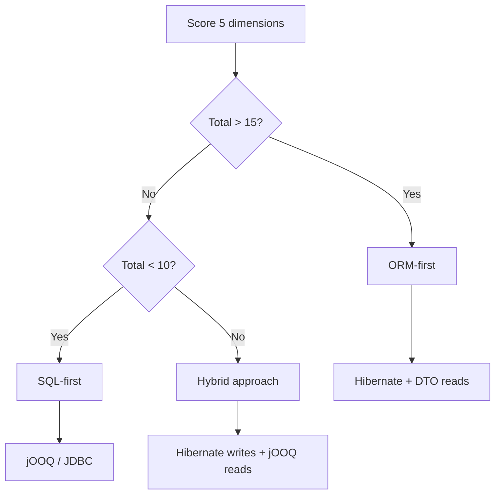

---

### 📶 Gradual Depth

**Level 1 - What it is:**

A structured framework for deciding between ORM (Hibernate) and SQL-first (jOOQ/JDBC) approaches, based on five measurable project dimensions.

**Level 2 - How to use it:**

Score each dimension 1-5. Sum the scores. >15 = ORM, <10 = SQL-first, 10-15 = hybrid. Document the scoring as a decision record for the team.

**Level 3 - How it works:**

Each dimension correlates with ORM strengths or SQL-first strengths. Domain complexity and write ratio favor ORM (object-graph management). Query complexity favors SQL-first (direct SQL expression). Team expertise and operational maturity act as risk modifiers.

**Level 4 - Production mastery:**

In practice, most enterprise applications score 12-18 (hybrid to ORM-first). Pure SQL-first is rare except for analytics platforms and data pipelines. The hybrid approach is increasingly common: Hibernate for the domain model (writes, entity lifecycle) and jOOQ or native queries for complex reads (reports, dashboards, search). Spring Data JPA supports both in the same application via `@Query(nativeQuery=true)` or separate jOOQ repositories.

---

### ⚙️ How It Works

**Phase 1 - Dimension scoring:**
Architect and tech lead independently score each dimension. Compare scores. Discuss disagreements.

**Phase 2 - Decision:**
Sum scores. Apply thresholds. If hybrid zone: identify which use cases favor ORM and which favor SQL.

**Phase 3 - Architecture:**
ORM-first: Hibernate entities, Spring Data JPA, DTO projections for reads. SQL-first: jOOQ or JDBC templates, manual SQL, result mapping. Hybrid: Hibernate for writes, jOOQ/native for complex reads.

**Phase 4 - Documentation:**
Write Architecture Decision Record (ADR). Include scores, rationale, and review criteria (re-evaluate after 6 months).

```text
  Example scoring - E-commerce platform:
  D1 Domain: 4 (Order, Product, Customer,
     Inventory, Shipping - rich domain)
  D2 Query: 3 (moderate - some reports)
  D3 Write: 4 (order processing, inventory)
  D4 ORM: 4 (team has Hibernate experience)
  D5 Ops: 3 (monitoring in place)
  Total: 18 -> ORM-first

  Example scoring - Analytics dashboard:
  D1 Domain: 2 (flat event tables)
  D2 Query: 5 (CTEs, window functions)
  D3 Write: 1 (batch ETL only)
  D4 ORM: 2 (team prefers SQL)
  D5 Ops: 1 (new project)
  Total: 11 -> SQL-first/Hybrid
```

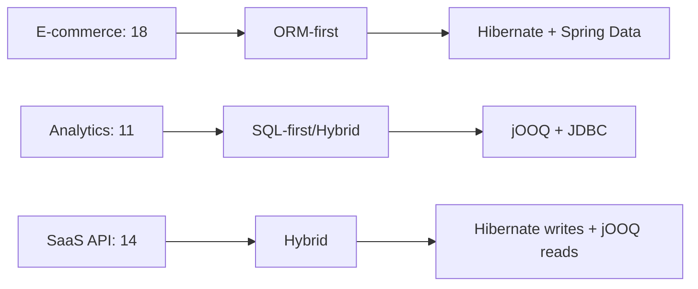

---

### 🚨 Failure Modes

**Failure 1 - ORM for analytics workload:**

**Symptom:** Team uses Hibernate for reporting dashboard. Queries require CTEs, window functions, and multi-table aggregations. JPQL cannot express them. Team writes native queries for 80% of endpoints.

**Root cause:** Domain complexity was low (D1=2) and query complexity was high (D2=5). Total score was 11 but team chose ORM based on familiarity.

**Diagnostic:**

```text
Count native queries vs JPQL queries.
If native > 50%: ORM adds overhead without
benefit. The team is fighting the framework.
```

**Fix:**

**BAD:**

```java
// Fighting Hibernate for analytics
@Query(value = "WITH monthly AS ( "
    + "SELECT date_trunc('month', ...) "
    + "...) SELECT ... FROM monthly",
    nativeQuery = true)
List<Object[]> getMonthlyReport();
// 80% of queries are native SQL anyway
```

**GOOD:**

```java
// jOOQ: SQL is the domain language
DSL.with("monthly").as(
    select(datetrunc("month", ...))
    .from(EVENTS))
    .select(...)
    .from(name("monthly"));
// Type-safe SQL, full SQL power
```

**Failure 2 - SQL-first for complex domain:**

**Symptom:** Team uses JDBC for an order management system. Manual cascade logic, manual optimistic locking, manual dirty tracking across 25 entity types. Code is fragile and bug-prone.

**Root cause:** Domain complexity was high (D1=5) but team chose SQL-first because they feared "Hibernate is slow."

**Diagnostic:**

```text
Count lines of manual persistence code
(cascade, locking, dirty tracking, mapping).
If > 30% of codebase: ORM would reduce this
to annotations + configuration.
```

**Fix:**

```text
Re-evaluate with the decision framework.
D1=5 strongly favors ORM. Hibernate handles
cascade, locking, and dirty tracking
automatically. Migration cost: 2-4 weeks.
Manual persistence maintenance cost: ongoing.
```

---

### 🔬 Production Reality

A fintech company starts with JDBC for "simplicity." After 18 months, the codebase has 15,000 lines of manual persistence code: cascade logic for 8 entity types, manual optimistic locking with version columns, hand-written SQL for 60 queries, and result-set-to-object mapping for each. A new hire introduces a bug in the cascade logic that causes orphaned records. Post-mortem: the team re-evaluates using the decision framework. Scores: D1=4, D2=2, D3=4, D4=3 (new hire knows Hibernate), D5=2. Total: 15. Decision: migrate to Hibernate. Migration takes 3 weeks. 12,000 lines of persistence code replaced by 200 lines of annotations. Cascade bug class eliminated.

---

### ⚖️ Trade-offs & Alternatives

| Aspect            | Hibernate (ORM) | jOOQ (SQL-first) | Hybrid         |
| ----------------- | ---------------- | ----------------- | -------------- |
| Domain modeling   | Excellent        | Manual            | Best of both   |
| Query flexibility | JPQL limited     | Full SQL          | Full SQL reads |
| Write management  | Automatic        | Manual            | Automatic      |
| Learning curve    | Steep            | Moderate          | Steepest       |
| Team fit          | Java/DDD teams   | SQL-expert teams  | Experienced    |

**Real-world patterns:**

- **Enterprise SaaS** (Salesforce-style): ORM-first. Rich domain, complex writes, moderate reads.
- **Data platforms** (analytics/BI): SQL-first. Flat tables, complex queries, batch writes.
- **Modern microservices**: Hybrid. Hibernate for domain service, jOOQ for query service.

---

### ⚡ Decision Snap

**USE ORM-FIRST WHEN:**

- Domain score (D1) >= 4. Rich entity model with state transitions and aggregates.
- Write ratio (D3) >= 3. Significant write logic benefits from automatic persistence.

**USE SQL-FIRST WHEN:**

- Query score (D2) >= 4. Complex analytics that JPQL cannot express.
- Domain score (D1) <= 2. Flat tables without domain logic.

**USE HYBRID WHEN:**

- Balanced scores. Hibernate for writes, SQL-first for complex reads.

---

### ⚠️ Top Traps

| # | Misconception | Reality |
| - | ------------- | ------- |
| 1 | ORM is always the right choice for Java | ORM excels at domain-rich CRUD. For analytics, data pipelines, or simple CRUD, SQL-first or JDBC is simpler. |
| 2 | SQL-first is always simpler | For 5 tables, yes. For 25 entities with cascades, locking, and state transitions, manual persistence code exceeds ORM's complexity. |
| 3 | The team can switch later easily | Technology switch costs 2-12 weeks depending on codebase size. Decide correctly upfront using the framework. |
| 4 | Hybrid is too complex | Hybrid is increasingly standard. Spring Boot supports Hibernate + jOOQ in the same application. The boundary is clear: writes vs reads. |
| 5 | Performance determines the choice | Both approaches achieve the same performance with correct usage. The choice is about developer productivity, not runtime speed. |

---

### 🪜 Learning Ladder

**Prerequisites:**

- "Hibernate Is Slow" is Wrong - Misuse vs Actual ORM
  Cost - understanding that ORM vs SQL is not about speed
- Hibernate Performance Tuning at Scale - ORM-first
  requires tuning knowledge

**THIS:** HIB-094 ORM vs SQL-First Strategy Decision
Framework

**Next steps:**

- CQRS with Hibernate - Read vs Write Model Separation -
  the hybrid architecture in detail
- ORM-to-SQL-Builder (jOOQ/Exposed) Migration Strategy -
  when the decision changes mid-project

---

**The Surprising Truth:**

The decision framework most often produces a "hybrid" result (scores 10-15), not a clean ORM or SQL-first answer. The industry is converging on hybrid as the default architecture: Hibernate for domain writes, SQL-first (jOOQ, native queries, or views) for complex reads. Pure ORM and pure SQL-first are edge cases, not defaults.

**Further Reading:**

- Martin Fowler, "OrmHate" (martinfowler.com) - balanced perspective on ORM trade-offs
- Lukas Eder, "10 Reasons to Use jOOQ" (jooq.org/doc) - SQL-first perspective
- JPA 3.1 Specification, Chapter 4 - Query Language scope and limitations

**Revision Card:**

1. Score 5 dimensions (domain, query, write, expertise, ops). >15=ORM, <10=SQL, 10-15=hybrid.
2. Most projects score 10-15 (hybrid zone). Hibernate for writes, SQL-first for complex reads.
3. The decision is about developer productivity, not runtime performance. Both achieve the same speed with correct usage.

---

---

# HIB-095 DDD Aggregates and Hibernate Persistence Boundaries

**TL;DR** - DDD aggregates define consistency boundaries. Hibernate entities should align with aggregate boundaries: one repository per aggregate root, no cross-aggregate lazy traversal.

---

### 🔥 Problem Statement

A team maps 40 JPA entities with bidirectional associations everywhere. Any entity can navigate to any other. The persistence context manages all 40 entity types in a single web of relationships. Loading one Order can cascade-load Products, Categories, Suppliers, and Warehouses through lazy traversal. The result: N+1 across aggregate boundaries, flush storms checking unrelated entities, and tangled persistence that makes refactoring impossible. DDD aggregates solve this by defining explicit consistency boundaries: an Order aggregate contains only Order, LineItems, and ShippingAddress. Customer is a separate aggregate, referenced by ID, not by entity association.

---

### 📜 Historical Context

Domain-Driven Design (Eric Evans, 2003) defined aggregates as consistency boundaries, but JPA/Hibernate implementations initially ignored this concept. Early Hibernate tutorials encouraged mapping every foreign key as a bidirectional association, creating a single connected entity graph. By 2015, the DDD community (Vaughn Vernon, "Implementing Domain-Driven Design") explicitly addressed the JPA-aggregate impedance mismatch: aggregates should reference other aggregates by identity (ID), not by object reference (association). This principle reduces persistence coupling and aligns Hibernate's Session boundaries with domain boundaries.

---

### 🔩 First Principles

**CORE INVARIANTS:**

1. **Aggregate = consistency boundary:** All entities within an aggregate are loaded, validated, and persisted together. Entities in different aggregates have eventual consistency.
2. **One repository per aggregate root:** Only the aggregate root has a repository. Child entities are accessed through the root. No direct queries for child entities.
3. **Cross-aggregate reference by ID:** Order references Customer by `customerId` (Long), not by `@ManyToOne Customer`. This prevents lazy traversal across aggregate boundaries.
4. **Hibernate Session = aggregate scope:** Ideally, one Session operation loads and persists one aggregate. The persistence context contains only entities from that aggregate.

**DERIVED DESIGN:**

Aggregate boundaries limit the persistence context size (fewer entities managed), prevent cross-aggregate N+1 (no lazy traversal), and simplify the domain model (clear ownership). The trade-off: cross-aggregate queries require explicit joins or separate queries.

**THE TRADE-OFF:**

**Gain:** Clean persistence boundaries, predictable query patterns, smaller persistence contexts, aggregate-level transactional consistency.

**Cost:** Cross-aggregate queries require explicit implementation. Cannot navigate from Order to Customer via entity association. Requires discipline to maintain boundaries.

---

### 🧠 Mental Model

> Aggregates are like apartments in a building. Each apartment (aggregate) has its own door (repository), its own rooms (child entities), and its own rules (invariants). You can know your neighbor's apartment number (ID reference) but you do not walk through the wall to reach their kitchen (no cross-aggregate association). The building manager (application service) coordinates between apartments when needed.

- "Apartment" -> aggregate
- "Door" -> repository
- "Rooms" -> child entities
- "Apartment number" -> ID reference
- "Building manager" -> application service

**Where this analogy breaks down:** Unlike apartments, aggregates share the same database. Cross-aggregate queries via SQL JOINs are efficient - the "no walking through walls" is a code design constraint, not a physical one.

---

### 🧩 Components

- **Aggregate root:** The entry point entity. Has its own repository. Controls access to all child entities. Example: Order is the root; LineItem is a child.
- **Child entity:** Exists only within the aggregate. No independent repository. Lifecycle managed by the root. Cascade ALL + orphanRemoval.
- **Value object:** `@Embeddable`. No identity. Immutable. Example: Address, Money.
- **ID reference:** `@Column(name = "customer_id") private Long customerId`. References another aggregate without association.
- **Domain event:** When an aggregate change needs to notify another aggregate: publish an event. Example: OrderPlaced triggers inventory reservation.

```text
  Order aggregate:
  +---------------------------+
  | Order (root)              |
  |   @OneToMany LineItem     |
  |   @Embedded ShippingAddr  |
  |   Long customerId (ID ref)|
  |   Long productId (ID ref) |
  +---------------------------+

  Customer aggregate (separate):
  +---------------------------+
  | Customer (root)           |
  |   @Embedded Address       |
  |   @OneToMany Preference   |
  +---------------------------+

  NO @ManyToOne between Order and Customer!
```

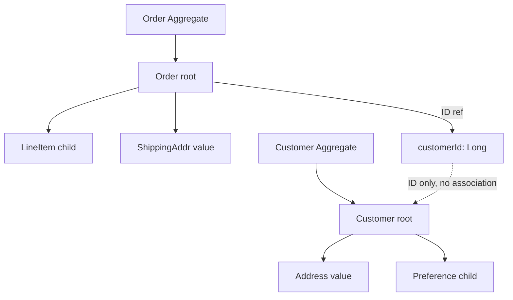

---

### 📶 Gradual Depth

**Level 1 - What it is:**

DDD aggregates define which entities belong together as a consistency unit. Hibernate entities should align with these boundaries: one repository per aggregate root, ID references between aggregates.

**Level 2 - How to use it:**

Identify aggregate roots (entities with independent lifecycle). Make child entities accessible only through the root (`cascade = ALL, orphanRemoval = true`). Replace `@ManyToOne` cross-aggregate associations with `Long foreignId` columns.

**Level 3 - How it works:**

When Order has `Long customerId` instead of `@ManyToOne Customer`, Hibernate never lazy-loads Customer when loading Order. The persistence context for an Order operation contains only Order + LineItems + ShippingAddress (the aggregate). Cross-aggregate queries use explicit joins: `SELECT o FROM Order o WHERE o.customerId = :custId`.

**Level 4 - Production mastery:**

Aggregate boundaries align with microservice boundaries. Each microservice owns one or more aggregates. The ID reference pattern (`Long customerId`) naturally supports decomposition: if Customer moves to a separate service, the Order service already references by ID. Domain events (`OrderPlaced`) replace what was previously a cascade or cross-aggregate association.

---

### ⚙️ How It Works

**Phase 1 - Identify aggregates:**
Group entities by consistency requirement. Which entities MUST be consistent within a single transaction? Those form an aggregate.

**Phase 2 - Designate roots:**
Each aggregate has one root entity. The root has a repository. Child entities have no repository.

**Phase 3 - Replace cross-aggregate associations:**
Change `@ManyToOne Customer customer` to `@Column Long customerId`. Remove bidirectional associations between aggregates.

**Phase 4 - Implement cross-aggregate queries:**
Need Order + Customer data? Either: (1) two queries and combine in service, (2) database view with native query, (3) CQRS read model.

```text
  BEFORE (no aggregate boundaries):
  Order -> @ManyToOne Customer
  Order -> @ManyToOne Product
  Product -> @ManyToOne Category
  Category -> @ManyToMany Supplier
  -> Loading Order can traverse entire graph!

  AFTER (aggregate boundaries):
  Order aggregate: Order, LineItem, Address
  Customer aggregate: Customer, Preference
  Product aggregate: Product, Specification
  -> Order has customerId, productId (Longs)
  -> Loading Order loads ONLY the aggregate
```

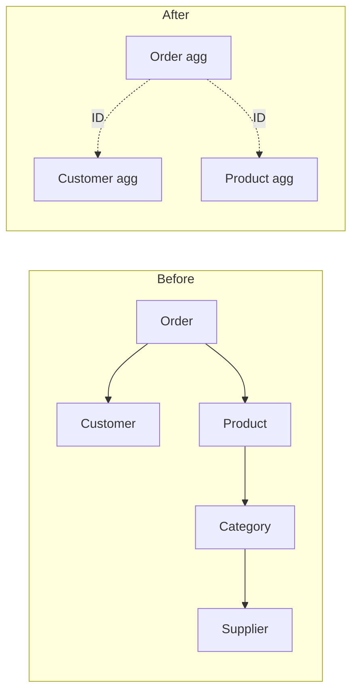

---

### 🚨 Failure Modes

**Failure 1 - Bidirectional associations across aggregates:**

**Symptom:** Loading a Customer triggers lazy loads of all their Orders, each Order triggers lazy loads of Products. Persistence context grows unbounded.

**Root cause:** `@OneToMany List<Order> orders` on Customer. No aggregate boundary. Customer can traverse to Order to Product.

**Diagnostic:**

```java
Session s = em.unwrap(Session.class);
log.info("Entities in PC: {}",
    s.getStatistics().getEntityCount());
// If loading 1 Customer results in 500+
// entities: cross-aggregate traversal
```

**Fix:**

**BAD:**

```java
@Entity
public class Customer {
    @OneToMany(mappedBy = "customer")
    private List<Order> orders; // Traversal!
}
```

**GOOD:**

```java
@Entity
public class Customer {
    // No orders collection!
    // Query orders separately:
    // orderRepo.findByCustomerId(custId)
}
```

**Failure 2 - Cross-aggregate transaction:**

**Symptom:** Order creation and inventory update in one transaction. If inventory service is slow or fails, order creation is blocked.

**Root cause:** Two aggregates (Order, Inventory) modified in one transaction. Violates aggregate consistency boundaries.

**Diagnostic:**

```text
Transaction spans multiple aggregate roots.
If either root fails, both roll back.
Tight coupling between aggregates.
```

**Fix:**

```java
// Separate transactions per aggregate
// Order aggregate: create order
orderRepo.save(order);
// Publish domain event
events.publish(new OrderPlaced(order.getId()));
// Inventory aggregate: handle event
@EventListener
void onOrderPlaced(OrderPlaced e) {
    inventoryService.reserve(e.getItems());
}
```

---

### 🔬 Production Reality

An e-commerce platform has 40 JPA entities with bidirectional associations. A single order detail page loads Order -> Customer -> Address -> Region -> Country, plus Order -> LineItems -> Product -> Category -> Supplier. Total: 15 entity types in one persistence context. After applying DDD aggregate boundaries: Order aggregate (Order, LineItem, ShippingAddress), Customer aggregate (Customer, Address), Product aggregate (Product, Specification). Cross-aggregate references by ID. The order detail page now loads only the Order aggregate (3 entity types) plus two explicit queries for Customer name and Product names. Persistence context size: 80% smaller. N+1 eliminated because no lazy traversal across boundaries.

---

### ⚖️ Trade-offs & Alternatives

| Aspect          | Full association   | ID reference (DDD) | Hybrid           |
| --------------- | -------------------- | -------------------- | ---------------- |
| Navigation      | Automatic lazy     | Explicit query      | Root assoc only  |
| PC size         | Unbounded          | Aggregate-scoped    | Moderate         |
| N+1 risk        | High (traversal)   | Low (no traversal)  | Medium           |
| Query convenience | High             | Lower               | Medium           |
| Microservice ready | No              | Yes                 | Partial          |

**Real-world patterns:**

- **DDD-strict teams** use ID references exclusively. Cross-aggregate queries via CQRS read models.
- **Pragmatic teams** use `@ManyToOne` for frequently-joined aggregates (Order -> Customer) but block the reverse (`Customer -/-> Order`). Unidirectional only.

---

### ⚡ Decision Snap

**USE DDD AGGREGATE BOUNDARIES WHEN:**

- > 15 entity types. The entity graph is complex enough to benefit from explicit boundaries.
- Microservice decomposition is planned. Aggregate boundaries map to service boundaries.

**USE FULL ASSOCIATIONS WHEN:**

- < 10 entity types. The entity graph is small and manageable without explicit boundaries.
- Monolith with no decomposition planned.

**ALWAYS DO:**

- One repository per aggregate root. Child entities via cascade, never direct repository.

---

### ⚠️ Top Traps

| # | Misconception | Reality |
| - | ------------- | ------- |
| 1 | Every entity is an aggregate root | Most entities are children. Only entities with independent lifecycle are roots. Order is a root; LineItem is not. |
| 2 | ID references make queries harder | `SELECT o FROM Order o WHERE o.customerId = :id` is equally simple. JOIN requires native query but is no harder. |
| 3 | Aggregates must be small | Aggregates must be consistency-sized. An Order with 100 LineItems is one aggregate because they must be consistent. |
| 4 | Aggregate boundaries prevent JOINs | SQL JOINs work regardless of JPA associations. Aggregate boundaries are code design, not database design. |
| 5 | Domain events are overengineering | Domain events replace cross-aggregate transactions. Without them, aggregates become coupled by shared transactions. |

---

### 🪜 Learning Ladder

**Prerequisites:**

- Entity for Every Table Anti-Pattern - why not every
  table needs an entity
- Open Session in View - The Silent Scalability Killer -
  cross-aggregate traversal is OSIV's enabler

**THIS:** HIB-095 DDD Aggregates and Hibernate Persistence
Boundaries

**Next steps:**

- CQRS with Hibernate - Read vs Write Model Separation -
  cross-aggregate query patterns
- Hibernate in Microservices vs Monolith Decision Guide -
  aggregate = service boundary

---

**The Surprising Truth:**

The hardest part of applying DDD aggregates to Hibernate is not the technical refactoring - it is convincing the team that `Long customerId` is better than `@ManyToOne Customer customer`. The association feels like "more ORM." The ID reference feels like "going backward." But the ID reference is the boundary that prevents the persistence context from becoming a global object graph that loads half the database on every request.

**Further Reading:**

- Vaughn Vernon, "Implementing Domain-Driven Design" - Chapter 10: Aggregates
- Eric Evans, "Domain-Driven Design" - Chapter 6: Aggregate pattern definition
- Spring Data documentation - DDD support and aggregate references

**Revision Card:**

1. Aggregate = consistency boundary. One repository per root. Child entities via cascade. Cross-aggregate reference by ID (Long), not association.
2. ID references prevent cross-aggregate lazy traversal, reduce PC size, and align with microservice boundaries.
3. Domain events replace cross-aggregate transactions. `OrderPlaced` event triggers inventory reservation in a separate transaction.

---

---

# HIB-096 Fleet-Wide Hibernate Governance and Standards

**TL;DR** - Fleet-wide Hibernate governance enforces consistent configuration, query patterns, and monitoring across all services via shared libraries, CI checks, and automated validation.

---

### 🔥 Problem Statement

An organization has 30 Spring Boot microservices using Hibernate. Each team configures independently: some have OSIV enabled, some use IDENTITY strategy, some have no monitoring, some use EAGER fetching. When one team discovers and fixes N+1, the other 29 teams still have the same problem. Fleet-wide governance establishes organization-level standards: shared configuration baselines, CI-enforced query count limits, standardized monitoring dashboards, and a shared library that applies best practices by default. The goal is to elevate the entire fleet to production-grade Hibernate usage, not just individual services.

---

### 📜 Historical Context

Fleet-wide governance for ORM usage emerged at scale-up companies (2015-2020) when organizations discovered that Hibernate production incidents were the most common data layer failure mode across their microservice fleet. Netflix, Uber, and similar organizations found that individual team training was insufficient - engineers rotate between teams, and knowledge does not transfer. The solution was organizational: shared libraries with hardened defaults, automated CI checks, and centralized monitoring. This pattern mirrors the infrastructure-as-code movement but applied to data layer configuration.

---

### 🔩 First Principles

**CORE INVARIANTS:**

1. **Defaults matter more than documentation:** Engineers use defaults. A shared library with OSIV=false, Statistics=true, and SEQUENCE strategy as defaults reaches more teams than a wiki page.
2. **CI enforcement > code review:** Automated checks catch violations on every PR. Code review catches violations when the reviewer remembers to check.
3. **Centralized monitoring reveals fleet-wide patterns:** If 15 of 30 services have N+1, it is an organizational training gap, not 15 independent bugs.
4. **Governance is enabling, not restricting:** Good governance makes the right thing easy (shared library) and the wrong thing visible (CI check), not impossible.

**DERIVED DESIGN:**

The governance stack has three layers: shared library (hardened defaults), CI validation (automated checks), and centralized monitoring (fleet-wide visibility). Each layer catches issues at a different stage: library at development, CI at merge, monitoring at production.

**THE TRADE-OFF:**

**Gain:** Consistent Hibernate configuration and quality across the entire fleet. Reduced production incidents. Organizational learning.

**Cost:** Shared library maintenance. CI pipeline integration. Centralized monitoring infrastructure. Team autonomy slightly reduced.

---

### 🧠 Mental Model

> Fleet-wide governance is like building codes for a city. Each building (service) can have unique architecture, but all must meet safety standards (OSIV disabled, monitoring enabled). Building inspectors (CI checks) verify compliance before occupancy (deployment). The city dashboard (centralized monitoring) shows which neighborhoods (service clusters) have issues.

- "Building codes" -> Hibernate standards
- "Safety standards" -> hardened defaults
- "Building inspectors" -> CI checks
- "City dashboard" -> centralized monitoring

**Where this analogy breaks down:** Unlike building codes which are legally enforced, Hibernate governance relies on team cooperation and shared library adoption.

---

### 🧩 Components

- **Shared starter library:** `hibernate-platform-starter`. Spring Boot starter with hardened defaults. Teams depend on it instead of configuring Hibernate directly.
- **CI validation rules:** ArchUnit or custom rules that check: no EAGER on collections, no IDENTITY strategy, OSIV disabled, Statistics enabled.
- **Centralized dashboard:** Grafana dashboard aggregating Hibernate metrics from all services. Panels: queries per request by service, P95 latency by service, cache hit rate by service.
- **Configuration baseline:** Documented and enforced settings: `open-in-view=false`, `generate_statistics=true`, `batch_size=50`, `order_inserts=true`, connection pool settings.
- **Query count budget:** Maximum queries per request per endpoint. Enforced by datasource-proxy in integration tests. Default budget: 10 queries/request.

```text
  Governance stack:
  +---+---------------------+----------+
  | # | Layer               | Stage    |
  +---+---------------------+----------+
  | 1 | Shared starter lib  | Dev time |
  | 2 | CI validation rules | PR merge |
  | 3 | Centralized monitor | Prod     |
  +---+---------------------+----------+

  Shared starter defaults:
  spring.jpa.open-in-view=false
  hibernate.generate_statistics=true
  hibernate.jdbc.batch_size=50
  hibernate.order_inserts=true
  hibernate.id.new_generator_mappings=true
  hikari.maximum-pool-size=20
  hikari.leak-detection-threshold=60000
```

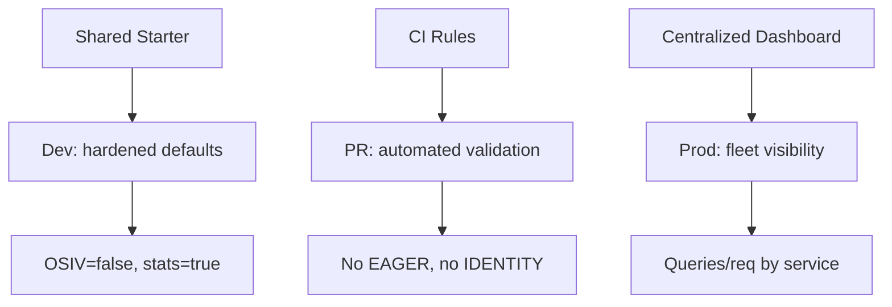

---

### 📶 Gradual Depth

**Level 1 - What it is:**

Fleet-wide Hibernate governance ensures consistent configuration, monitoring, and query quality across all services in an organization.

**Level 2 - How to use it:**

Create a shared Spring Boot starter with hardened Hibernate defaults. Add CI rules (ArchUnit) that validate entity mappings. Deploy a centralized Grafana dashboard for Hibernate metrics.

**Level 3 - How it works:**

Teams depend on the shared starter (`hibernate-platform-starter`). The starter auto-configures OSIV=false, Statistics=true, batching, and connection pool settings. CI rules scan entity classes for anti-patterns (EAGER collections, IDENTITY strategy). Micrometer metrics from all services flow to a central Prometheus/Grafana stack.

**Level 4 - Production mastery:**

Measure governance effectiveness: track the number of Hibernate production incidents per quarter. Track the percentage of services meeting the query budget (< 10 queries/request). Track the percentage of services with monitoring enabled. Goal: zero Hibernate incidents, 100% monitoring coverage, 90% of services within query budget. Run quarterly fleet-wide audits using the centralized dashboard.

---

### ⚙️ How It Works

**Phase 1 - Shared starter:**
Create `hibernate-platform-starter` Maven/Gradle artifact. Include auto-configuration for Hibernate, HikariCP, and Micrometer. Publish to internal repository.

**Phase 2 - CI rules:**
Add ArchUnit tests to the shared test library. Rules: no `@ManyToOne(fetch=EAGER)` on collections, no `@GeneratedValue(strategy=IDENTITY)` in new code, `open-in-view` property must be false.

**Phase 3 - Centralized monitoring:**
Deploy Grafana dashboard with panels per service. Key metrics: `hibernate_statements` / `http_requests_total`, `hikaricp_connections_active`, `hibernate_second_level_cache_hit_ratio`.

**Phase 4 - Adoption:**
Roll out to services incrementally. Prioritize high-traffic services first. Provide migration guide for teams switching from custom configuration.

```text
  CI rule examples (ArchUnit):
  noClasses()
    .that().areAnnotatedWith(Entity.class)
    .should().haveFieldAnnotatedWith(
      OneToMany.class, fetch=EAGER)
    .check(classes);

  noClasses()
    .that().areAnnotatedWith(Entity.class)
    .should().haveFieldAnnotatedWith(
      GeneratedValue.class,
      strategy=GenerationType.IDENTITY)
    .check(classes);
```

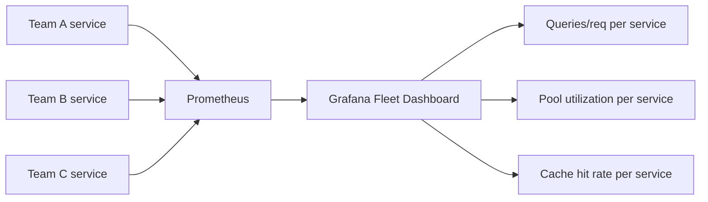

---

### 🚨 Failure Modes

**Failure 1 - Governance without adoption:**

**Symptom:** Shared starter exists but only 5 of 30 teams use it. Remaining 25 teams have custom configurations with varying quality.

**Root cause:** Shared starter was published but not marketed. No migration guide. No incentive for teams to switch.

**Diagnostic:**

```text
Count services using the shared starter.
If adoption < 50%: governance has no reach.
```

**Fix:**

**BAD:**

```text
Publish library to Artifactory.
Send email to all-engineering.
Hope teams adopt.
```

**GOOD:**

```text
Pair with high-traffic teams for adoption.
Show N+1 reduction metrics after migration.
Add starter as requirement for new services.
Provide migration script for existing.
Make adoption part of tech debt OKRs.
```

**Failure 2 - Overly restrictive governance:**

**Symptom:** Teams circumvent governance rules. Add `// NOSONAR` or `@SuppressWarnings` to bypass CI checks. Team velocity decreases.

**Root cause:** Governance rules block legitimate use cases. Example: rule forbids all native queries, but some reporting endpoints legitimately need them.

**Diagnostic:**

```text
Count suppression annotations.
If > 10 per service: rules are too strict.
Collect team feedback on false positives.
```

**Fix:**

```text
Governance should make the right thing easy,
not the wrong thing impossible. Allow
exceptions with documented justification.
@SuppressWarnings("hibernate-native-query")
// Justification: reporting endpoint with CTE
```

---

### 🔬 Production Reality

A 50-service organization has 3-4 Hibernate production incidents per month. After deploying the governance stack: shared starter (OSIV=false, Statistics=true) adopted by 40 services in 3 months. CI rules catch 120 anti-patterns in the first month (30 EAGER collections, 45 IDENTITY strategies, 45 missing monitoring). Centralized dashboard reveals 8 services with > 20 queries/request. After fixing those: Hibernate incidents drop from 4/month to 0.5/month. The dashboard becomes the primary tool for quarterly data layer health reviews.

---

### ⚖️ Trade-offs & Alternatives

| Approach            | Reach     | Effort   | Maintainability |
| ------------------- | --------- | -------- | --------------- |
| Shared starter + CI | Fleet-wide| High     | Central team    |
| Wiki documentation  | Whoever reads | Low  | Quickly stale   |
| Training sessions   | Attendees | Medium   | Knowledge fades |
| Code review only    | Per-PR    | Ongoing  | Reviewer-dependent |

**Real-world patterns:**

- **Platform engineering teams** maintain the shared starter as a product. Internal customers = service teams.
- **Smaller organizations** (< 10 services) use shared configuration documentation + periodic audits instead of a full governance stack.

---

### ⚡ Decision Snap

**INVEST IN GOVERNANCE WHEN:**

- > 10 services using Hibernate. Configuration inconsistency is likely.
- Recurring Hibernate production incidents across teams.
- New teams frequently spinning up new services.

**LIGHTWEIGHT GOVERNANCE WHEN:**

- 5-10 services. Shared configuration documentation + quarterly audit.

**SKIP GOVERNANCE WHEN:**

- < 5 services. Direct code review is sufficient.

---

### ⚠️ Top Traps

| # | Misconception | Reality |
| - | ------------- | ------- |
| 1 | Documentation is governance | Documentation is reference. Governance is enforcement. Shared defaults + CI rules > wiki pages. |
| 2 | One-time setup, no maintenance | Shared starter needs versioning, upgrades (Hibernate 5 -> 6), and rule updates. Assign a maintainer. |
| 3 | All teams should adopt simultaneously | Roll out incrementally. Start with high-traffic or high-incident teams. Show value before mandating. |
| 4 | Governance restricts innovation | Good governance makes the right thing easy. Teams should still be free to use native queries, custom types, etc. Governance prevents accidental anti-patterns. |
| 5 | Centralized monitoring is optional | Without fleet-wide visibility, governance is blind. You cannot enforce query budgets you cannot measure. |

---

### 🪜 Learning Ladder

**Prerequisites:**

- ORM Data Layer - Phase 4 (Production Hardening) -
  the individual service checklist that governance scales
- Hibernate Tooling - p6spy, datasource-proxy,
  Hypersistence - tools governance deploys fleet-wide

**THIS:** HIB-096 Fleet-Wide Hibernate Governance and
Standards

**Next steps:**

- ORM Data Layer - Phase 5 (Platform Strategy) -
  governance as part of platform engineering
- Hibernate in Microservices vs Monolith Decision Guide -
  governance applies differently per architecture

---

**The Surprising Truth:**

The most effective governance tool is not the shared library or CI rules. It is the centralized Grafana dashboard showing queries-per-request by service. When Team A sees their service at 47 queries/request while peers are at 3, the competitive instinct drives improvement faster than any mandate. The dashboard turns Hibernate quality into a visible, comparable metric.

**Further Reading:**

- Team Topologies (Skelton & Pais) - platform team patterns for shared libraries
- ArchUnit documentation - architecture rule enforcement (archunit.org)
- Spring Boot auto-configuration documentation - creating custom starters

**Revision Card:**

1. Three governance layers: shared starter (defaults), CI rules (enforcement), centralized dashboard (visibility). All three are needed.
2. Defaults > documentation > training. Engineers use defaults. Make the right configuration the default.
3. Measure governance: Hibernate incidents/quarter, monitoring coverage %, services within query budget %. Target: zero incidents, 100% coverage.

---

---

# HIB-097 ORM-to-SQL-Builder (jOOQ/Exposed) Migration Strategy

**TL;DR** - Migrate from Hibernate to jOOQ incrementally: extract read queries first (lowest risk), then migrate write operations, keeping both frameworks operational during transition.

---

### 🔥 Problem Statement

A team decides to migrate from Hibernate to jOOQ because most endpoints are read-heavy analytics queries that JPQL cannot express cleanly. But 40 entities, 60 repositories, and 200 queries cannot migrate overnight. A full rewrite risks regression bugs and months of parallel effort. The incremental strategy: migrate read queries first (they are independent, testable, and lowest risk), then migrate write operations (which require reimplementing cascade, dirty checking, and optimistic locking manually). Hibernate and jOOQ coexist during the transition, sharing the same DataSource and transaction manager.

---

### 📜 Historical Context

ORM-to-SQL-builder migrations became common after 2015 when jOOQ gained popularity as a type-safe SQL builder. Teams that had adopted Hibernate for all use cases (including analytics and reporting) found JPQL increasingly limiting. The migration pattern was pioneered by teams that recognized the hybrid approach: keep Hibernate for domain writes, use jOOQ for complex reads. Some teams completed full migrations; most settled on hybrid as the long-term architecture. Kotlin teams face a similar choice with Exposed (Kotlin SQL framework).

---

### 🔩 First Principles

**CORE INVARIANTS:**

1. **Read queries migrate first:** Read queries have no side effects. Migration is verifiable by comparing result sets. Risk is minimal.
2. **Write operations migrate last:** Writes require reimplementing cascade, optimistic locking, dirty checking, and audit trails. Risk is highest.
3. **Coexistence is required:** Both frameworks share the same DataSource and TransactionManager during migration. Spring supports this.
4. **Verification is automated:** Each migrated query has a comparison test: Hibernate result == jOOQ result. Tests prove equivalence before removing Hibernate code.

**DERIVED DESIGN:**

Migration phases: (1) add jOOQ dependency, (2) migrate complex read queries (native SQL candidates), (3) migrate simple read queries, (4) migrate write operations, (5) remove Hibernate. Most teams stop at phase 3 (hybrid).

**THE TRADE-OFF:**

**Gain:** Full SQL control for complex queries. Type-safe SQL. Better IDE support for SQL. Eliminate ORM abstractions where they add no value.

**Cost:** Lose automatic dirty checking, cascade, and optimistic locking for migrated writes. Manual SQL for CRUD that Hibernate handles automatically.

---

### 🧠 Mental Model

> Migration from Hibernate to jOOQ is like renovating a house while living in it. You cannot tear down all walls at once. Renovate one room at a time (read queries first), verify it works (comparison tests), then move to the next room (write operations). The plumbing (DataSource, transactions) stays shared throughout.

- "Rooms" -> query groups (reads, writes)
- "Renovate one room" -> migrate one query group
- "Verify" -> comparison tests
- "Shared plumbing" -> shared DataSource

**Where this analogy breaks down:** Unlike rooms, some queries have dependencies. Migrating a read query that uses Hibernate's entity model requires mapping the raw SQL result to a DTO.

---

### 🧩 Components

- **Phase 1 - Setup:** Add jOOQ dependency. Configure jOOQ's `DSLContext` with the same DataSource. Generate jOOQ code from schema.
- **Phase 2 - Read migration:** Replace `@Query(nativeQuery=true)` methods first (already SQL). Then replace complex JPQL queries. Finally, simple `findById` methods.
- **Phase 3 - Write migration:** Reimplement `save()` as `INSERT INTO ... ON CONFLICT DO UPDATE`. Reimplement cascade as explicit multi-table inserts. Reimplement optimistic locking with manual version check.
- **Phase 4 - Verification:** Comparison tests run both Hibernate and jOOQ queries. Assert identical results. Remove Hibernate query only after test passes.
- **Phase 5 - Cleanup:** Remove Hibernate entities, repositories, and dependency. Or keep hybrid.

```text
  Migration phases:
  +-------+-----------------+-------+------+
  | Phase | What            | Risk  | Time |
  +-------+-----------------+-------+------+
  | 1     | Add jOOQ, setup | None  | 1d   |
  | 2     | Read queries    | Low   | 2-4w |
  | 3     | Write operations| High  | 4-8w |
  | 4     | Remove Hibernate| Medium| 1w   |
  +-------+-----------------+-------+------+
  Most teams stop after Phase 2 (hybrid).
```

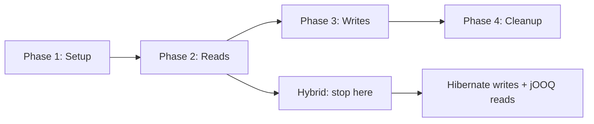

---

### 📶 Gradual Depth

**Level 1 - What it is:**

A phased strategy for migrating from Hibernate to jOOQ (or Exposed). Migrate reads first (low risk), then writes (high risk). Both frameworks coexist during migration.

**Level 2 - How to use it:**

Add jOOQ. Migrate native queries first (already SQL). Then complex JPQL. Use comparison tests. Most teams keep hybrid: Hibernate for writes, jOOQ for reads.

**Level 3 - How it works:**

jOOQ and Hibernate share the same DataSource and Spring `PlatformTransactionManager`. jOOQ uses `DSLContext` for SQL. Hibernate uses `EntityManager`. Both participate in the same `@Transactional` boundary. Comparison tests verify result equivalence.

**Level 4 - Production mastery:**

For full write migration: the hardest parts are cascade (jOOQ requires explicit multi-table inserts in dependency order), optimistic locking (manual `WHERE version = ?` check), and audit trails (Envers has no jOOQ equivalent - implement via triggers or CDC). Estimate 4-8 weeks for write migration on a 30-entity system. Most teams conclude the effort exceeds the benefit and stay hybrid.

---

### ⚙️ How It Works

**Phase 1 - Coexistence setup:**
Add jOOQ dependency. Generate jOOQ code from existing schema (jOOQ code generator). Configure `DSLContext` bean.

**Phase 2 - Read migration (per query):**
Identify candidate query. Write equivalent jOOQ query. Write comparison test. Verify. Switch endpoint to jOOQ query. Delete Hibernate query.

**Phase 3 - Write migration (per entity):**
Write jOOQ insert/update/delete. Reimplement cascade (multi-table). Reimplement version check. Write comparison test (save + verify DB state). Switch. Delete entity.

**Phase 4 - Cleanup:**
Remove unused Hibernate entities, repositories. If no Hibernate code remains: remove Hibernate dependency.

```text
  Read migration example:
  BEFORE (Hibernate):
  @Query(value = "SELECT ... complex ...",
      nativeQuery = true)
  List<Object[]> findAnalytics();

  AFTER (jOOQ):
  DSL.select(ORDERS.ID, sum(ORDERS.TOTAL))
    .from(ORDERS)
    .groupBy(ORDERS.CUSTOMER_ID)
    .fetch();

  Comparison test:
  List<AnalyticsDTO> hib = hibRepo.find();
  List<AnalyticsDTO> jooq = jooqRepo.find();
  assertThat(jooq).isEqualTo(hib);
```

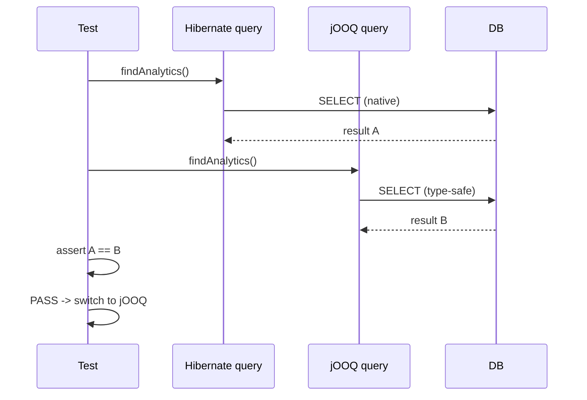

---

### 🚨 Failure Modes

**Failure 1 - Big-bang migration:**

**Symptom:** Team attempts to migrate all 200 queries at once. Project drags for 6 months. Regression bugs appear. Team abandons migration halfway.

**Root cause:** No incremental strategy. No comparison tests. No coexistence period.

**Diagnostic:**

```text
Migration plan has no phases.
Timeline > 2 months without checkpoints.
No comparison tests planned.
```

**Fix:**

**BAD:**

```text
Rewrite all 200 queries to jOOQ.
Remove Hibernate. Deploy.
```

**GOOD:**

```text
Phase 1: Setup jOOQ (1 day)
Phase 2: Migrate 10 read queries/week
  with comparison tests
Phase 3: Checkpoint after 4 weeks
  (40 queries migrated, verified)
Phase 4: Decide continue or stay hybrid
```

**Failure 2 - Losing cascade behavior:**

**Symptom:** After migrating Order write to jOOQ, LineItems are not saved. Or: deleting an Order leaves orphaned LineItems.

**Root cause:** Hibernate's `cascade=ALL, orphanRemoval=true` was silently handling multi-table operations. jOOQ requires explicit INSERT for each table.

**Diagnostic:**

```sql
-- Check for orphaned records
SELECT li.* FROM line_items li
LEFT JOIN orders o ON li.order_id = o.id
WHERE o.id IS NULL;
-- If rows exist: cascade not reimplemented
```

**Fix:**

```java
// jOOQ: explicit cascade
dsl.transaction(cfg -> {
    // Insert order first
    dsl.insertInto(ORDERS)
        .set(ORDERS.ID, order.getId())
        .set(ORDERS.TOTAL, order.getTotal())
        .execute();
    // Then insert line items
    for (LineItem li : order.getItems()) {
        dsl.insertInto(LINE_ITEMS)
            .set(LINE_ITEMS.ORDER_ID,
                order.getId())
            .set(LINE_ITEMS.PRODUCT_ID,
                li.getProductId())
            .execute();
    }
});
```

---

### 🔬 Production Reality

A data analytics SaaS migrates from Hibernate to jOOQ. 60% of queries are complex analytics (window functions, CTEs). Phase 1 (setup): 1 day. Phase 2 (read migration): 35 analytics queries migrated to jOOQ over 4 weeks. Each with comparison test. All pass. Performance improvement: 20% (jOOQ generates slightly more efficient SQL for complex queries). Phase 3 (write migration): team evaluates the effort to reimplement cascade for 15 entity types. Estimated: 6 weeks. Decision: stay hybrid. Hibernate for 25 CRUD entities (writes). jOOQ for 35 analytics queries (reads). Both coexist permanently.

---

### ⚖️ Trade-offs & Alternatives

| Aspect          | Full Hibernate | Full jOOQ    | Hybrid         |
| --------------- | -------------- | ------------ | -------------- |
| Read queries    | JPQL limited   | Full SQL     | jOOQ for reads |
| Write management| Automatic      | Manual       | Hibernate      |
| Migration effort| None           | 3-6 months   | 2-4 weeks      |
| Long-term maint | Single stack   | Single stack | Two frameworks |
| Risk            | None           | High         | Low            |

**Real-world patterns:**

- **Analytics teams** complete full migration to jOOQ (few writes, many complex reads).
- **Domain-heavy teams** stay hybrid permanently (Hibernate writes + jOOQ reads).

---

### ⚡ Decision Snap

**FULL MIGRATION WHEN:**

- < 10 entities with simple writes. Query complexity is the primary concern.
- Team has zero Hibernate expertise and strong SQL skills.

**HYBRID (RECOMMENDED FOR MOST) WHEN:**

- Domain model has 10+ entities with cascades and state transitions.
- Significant analytical queries that JPQL cannot express.

**DO NOT MIGRATE WHEN:**

- Hibernate is working well. No JPQL limitations. "Migrate for the sake of it" is not a valid reason.

---

### ⚠️ Top Traps

| # | Misconception | Reality |
| - | ------------- | ------- |
| 1 | Migration is a weekend project | Even read-only migration of 50 queries takes 2-4 weeks with comparison tests. Write migration adds 4-8 weeks. |
| 2 | jOOQ replaces Hibernate completely | jOOQ does not provide dirty checking, cascade, optimistic locking, or L2 caching. These must be reimplemented manually. |
| 3 | Hybrid is temporary | Most teams that go hybrid stay hybrid permanently. Both frameworks coexist cleanly in Spring Boot. |
| 4 | Comparison tests are optional | Without comparison tests, migrated queries may return subtly different results (NULL handling, ordering, date precision). |
| 5 | Performance improves automatically | jOOQ generates SQL you write. If you write the same query pattern, performance is identical. Improvement comes from better query design, not the framework. |

---

### 🪜 Learning Ladder

**Prerequisites:**

- ORM vs SQL-First Strategy Decision Framework - the
  decision that triggers migration
- Hibernate Performance Tuning at Scale - ensure issues
  are not just Hibernate misuse

**THIS:** HIB-097 ORM-to-SQL-Builder (jOOQ/Exposed)
Migration Strategy

**Next steps:**

- CQRS with Hibernate - Read vs Write Model Separation -
  hybrid as a permanent architecture
- Build vs Extend vs Replace ORM Decision Guide -
  broader replacement evaluation

---

**The Surprising Truth:**

90% of ORM-to-jOOQ migrations stop at the hybrid stage. Teams migrate the painful 20% of queries (complex analytics) and keep Hibernate for the 80% where it works well. Full migration is reserved for analytics platforms with < 10 entity types. The hybrid approach is not a compromise - it is the optimal architecture for applications that have both domain logic and complex queries.

**Further Reading:**

- Lukas Eder, "jOOQ User Manual" - migration from JPA/Hibernate (jooq.org)
- Spring documentation - using multiple data access technologies
- Vlad Mihalcea, "High-Performance Java Persistence" - Hibernate and jOOQ coexistence

**Revision Card:**

1. Migrate reads first (low risk, comparison tests), then writes (high risk, cascade reimplementation), or stay hybrid.
2. Most teams stay hybrid permanently: Hibernate for writes (cascade, dirty checking), jOOQ for complex reads (full SQL).
3. Comparison tests are non-negotiable. Hibernate result == jOOQ result before switching. Without tests, subtle regressions will reach production.

---

---

# HIB-098 Hibernate 5 to 6 (Jakarta EE) Migration Path

**TL;DR** - Hibernate 6 requires Jakarta EE namespace migration (javax -> jakarta), HQL syntax updates, and type system changes. Migrate incrementally with automated tooling.

---

### 🔥 Problem Statement

Hibernate 6 (released with Spring Boot 3.0) introduces breaking changes: the JPA namespace moves from `javax.persistence` to `jakarta.persistence`, the HQL parser is rewritten (SQM), type mappings change (e.g., `@Type` annotations), and some deprecated APIs are removed. A 50-entity application cannot migrate manually without errors. Automated tools (OpenRewrite, IntelliJ migration) handle namespace changes, but semantic changes (HQL behavior, type mappings, implicit behavior differences) require manual verification. The migration path: automate what is mechanical, manually verify what is semantic.

---

### 📜 Historical Context

The Jakarta EE namespace change was the largest breaking change in Java enterprise history. In 2019, Oracle transferred Java EE to the Eclipse Foundation, which renamed it Jakarta EE. The `javax` namespace was Oracle's trademark. Jakarta EE 9 (2020) changed all `javax.*` packages to `jakarta.*`. Hibernate 6.0 (2022) adopted Jakarta EE 9+ as the baseline, dropping `javax.persistence` support. Spring Boot 3.0 (2022) required Hibernate 6 and Jakarta EE 9+. This forced every Spring Boot 2.x -> 3.x migration to also migrate Hibernate 5 -> 6.

---

### 🔩 First Principles

**CORE INVARIANTS:**

1. **Namespace is mechanical:** `javax.persistence.*` -> `jakarta.persistence.*` is a text replacement. Automated tools handle this.
2. **HQL is semantic:** Hibernate 6's SQM parser is stricter. Queries that worked in Hibernate 5 may fail with syntax errors or produce different results.
3. **Type system changed:** `@Type(type = "...")` string-based type references replaced by `@Type(value = XxxType.class)`. Custom UserTypes may need updating.
4. **Implicit behavior differs:** Default fetch behavior, ID generation, and some cascade semantics have subtle changes between versions.

**DERIVED DESIGN:**

The migration has three stages: (1) automated namespace migration, (2) compilation fixes (type changes), (3) semantic verification (HQL behavior, implicit defaults).

**THE TRADE-OFF:**

**Gain:** Access to Hibernate 6 features (improved HQL, better performance, Jakarta EE alignment, Spring Boot 3.x support).

**Cost:** Migration effort of 1-4 weeks for a medium application. Risk of subtle behavior changes in HQL queries.

---

### 🧠 Mental Model

> Migrating Hibernate 5 -> 6 is like upgrading a road system from left-hand to right-hand driving. The road signs (namespace) change mechanically - a machine can swap them. But driving habits (HQL behavior, implicit defaults) need manual adjustment. You cannot just swap signs and assume everyone will drive correctly.

- "Road signs" -> javax -> jakarta namespace
- "Driving habits" -> HQL behavior, type mappings
- "Machine swap" -> OpenRewrite automation
- "Manual adjustment" -> semantic verification

**Where this analogy breaks down:** Unlike driving, most Hibernate behavior is backward-compatible. Only edge cases and deprecated features change semantics.

---

### 🧩 Components

- **Namespace migration:** `javax.persistence.*` -> `jakarta.persistence.*`. Tools: OpenRewrite, IntelliJ migration, Eclipse Transformer.
- **HQL/SQM changes:** Hibernate 6 uses Semantic Query Model (SQM). Stricter parsing. Some implicit JOINs become explicit. `SELECT NEW` syntax enforcement.
- **Type system:** `@Type(type = "string")` -> `@Type(value = StringType.class)`. Custom UserType interface changes.
- **ID generation:** `hibernate.id.new_generator_mappings` default changed. `GenerationType.AUTO` may use different strategies.
- **Dependency updates:** Hibernate 6 requires Java 11+. Spring Boot 3.x requires Java 17+. Third-party libraries must be Jakarta-compatible.

```text
  Migration checklist:
  1. [ ] javax -> jakarta (automated)
  2. [ ] Compilation (type, API changes)
  3. [ ] HQL queries (SQM parser)
  4. [ ] Custom UserTypes (API changes)
  5. [ ] ID strategy (default changes)
  6. [ ] Integration tests (verify behavior)
  7. [ ] Third-party libs (Jakarta-compat)
```

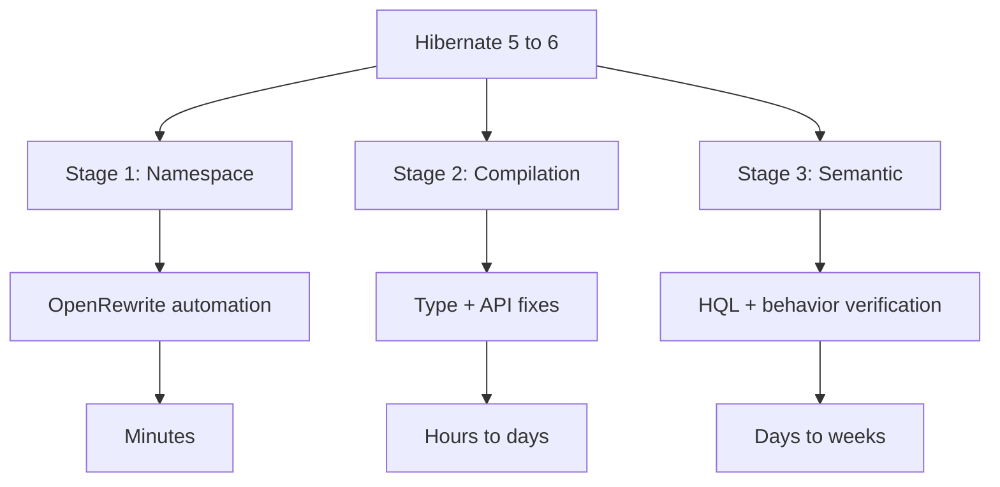

---

### 📶 Gradual Depth

**Level 1 - What it is:**

Hibernate 6 requires namespace migration (javax -> jakarta), HQL parser updates, and type system changes. Most changes are automated; some require manual verification.

**Level 2 - How to use it:**

Run OpenRewrite `javax-to-jakarta` recipe. Fix compilation errors. Run integration tests. Fix failing HQL queries. Verify implicit behavior changes.

**Level 3 - How it works:**

Stage 1: OpenRewrite replaces `javax.persistence.*` imports with `jakarta.persistence.*` across all files. Stage 2: compiler errors reveal `@Type` annotation changes, removed APIs, and incompatible third-party libraries. Stage 3: integration tests reveal HQL queries that the SQM parser rejects or that produce different results.

**Level 4 - Production mastery:**

For large applications (50+ entities, 200+ queries): create a migration branch. Run OpenRewrite. Fix compilation. Run full test suite. Identify semantic failures. Fix one by one. Production deployment with feature flags: new Hibernate behind a flag, rollback to old if issues. Monitor query execution times and result counts for the first week. Compare Hibernate 5 vs 6 query plans for critical endpoints.

---

### ⚙️ How It Works

**Phase 1 - Automated namespace (30 minutes):**
Run OpenRewrite `org.openrewrite.java.migrate.jakarta.JavaxMigrationToJakarta` recipe. All `javax.persistence.*` imports become `jakarta.persistence.*`. All `javax.validation.*` become `jakarta.validation.*`.

**Phase 2 - Compilation fixes (hours to days):**
`@Type(type = "yes_no")` -> `@Type(YesNoConverter.class)`. `@TypeDef` removed -> use `@Converter`. `BasicType` API changes. Custom UserType interface has new methods.

**Phase 3 - HQL verification (days):**
Run all integration tests. SQM parser rejects some queries: implicit JOINs, unqualified paths, non-standard syntax. Fix each query. Common: `SELECT e FROM Entity e WHERE e.association.field = :val` may require explicit JOIN.

**Phase 4 - Behavior verification (days):**
Check ID generation strategy (AUTO may now use SEQUENCE instead of IDENTITY). Check timestamp precision. Check NULL handling in comparisons. Compare query results with Hibernate 5 baseline.

```text
  Common migration fixes:
  BEFORE (Hibernate 5):
  @Type(type = "yes_no")
  private boolean active;

  AFTER (Hibernate 6):
  @Convert(converter = YesNoConverter.class)
  private boolean active;
  // Or use built-in:
  @JdbcTypeCode(Types.CHAR)
  private boolean active;
```

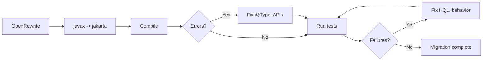

---

### 🚨 Failure Modes

**Failure 1 - HQL implicit JOIN no longer works:**

**Symptom:** `QuerySyntaxException: ... could not resolve property` on queries that worked in Hibernate 5.

**Root cause:** Hibernate 5 allowed implicit JOINs through path expressions. Hibernate 6's SQM parser requires explicit JOINs for some path navigations.

**Diagnostic:**

```text
Hibernate 5 (works):
SELECT o FROM Order o
WHERE o.customer.name = :name

Hibernate 6 (may require):
SELECT o FROM Order o
JOIN o.customer c
WHERE c.name = :name
```

**Fix:**

**BAD:**

```java
// Hibernate 5 implicit join
@Query("SELECT o FROM Order o "
    + "WHERE o.customer.name = :name")
List<Order> findByCustomerName(
    @Param("name") String name);
```

**GOOD:**

```java
// Hibernate 6 explicit join
@Query("SELECT o FROM Order o "
    + "JOIN o.customer c "
    + "WHERE c.name = :name")
List<Order> findByCustomerName(
    @Param("name") String name);
```

**Failure 2 - ID generation strategy change:**

**Symptom:** After migration, new entities get IDs from a sequence instead of auto-increment. Or: batch inserts fail because IDENTITY strategy is now used where SEQUENCE was expected.

**Root cause:** Hibernate 6 changes `GenerationType.AUTO` default behavior. In Hibernate 5, AUTO used IDENTITY for MySQL. In Hibernate 6, AUTO prefers SEQUENCE.

**Diagnostic:**

```sql
-- Check if sequence was created
SELECT * FROM information_schema.sequences
WHERE sequence_name LIKE '%hibernate%';
-- If sequence exists but table uses
-- auto_increment: mismatch
```

**Fix:**

```java
// Explicitly declare strategy
// Do not rely on AUTO
@GeneratedValue(strategy =
    GenerationType.SEQUENCE,
    generator = "order_seq")
@SequenceGenerator(name = "order_seq",
    sequenceName = "order_seq",
    allocationSize = 50)
private Long id;
```

---

### 🔬 Production Reality

A Spring Boot 2.7 application with 35 entities and 120 queries migrates to Spring Boot 3.2 (Hibernate 6.4). Stage 1 (OpenRewrite): 30 minutes, 450 import changes automated. Stage 2 (compilation): 8 hours - 12 `@Type` annotations, 3 custom UserTypes, 2 removed API calls. Stage 3 (HQL): 15 of 120 queries need fixes - 10 implicit JOIN issues, 3 `SELECT NEW` syntax issues, 2 type cast changes. Stage 4 (behavior): 1 ID generation change (AUTO -> SEQUENCE required schema migration). Total: 3 developer-days. Zero production issues post-deployment.

---

### ⚖️ Trade-offs & Alternatives

| Approach         | Effort  | Risk    | Completeness |
| ---------------- | ------- | ------- | ------------ |
| OpenRewrite + manual | 1-4w | Medium | Full         |
| Manual migration | 2-8w   | High    | Full         |
| Stay on Hibernate 5 | None | Long-term| Deprecated  |
| Switch to jOOQ   | 2-6m   | Very high| Alternative |

**Real-world patterns:**

- **Spring Boot 3.x adoption** forces Hibernate 6 migration. No alternative within the Spring ecosystem.
- **Large enterprises** stage the migration: shared libraries first, then high-priority services, then the long tail.

---

### ⚡ Decision Snap

**MIGRATE NOW WHEN:**

- Spring Boot 3.x is required (security patches, new features).
- Java 17+ is adopted. Hibernate 5 does not support newer Java features.

**DELAY WHEN:**

- Application is in maintenance mode. No new features planned.
- Critical production system with no test coverage (add tests first).

**NEVER:**

- Migrate without integration tests. HQL behavior changes are invisible without test execution.

---

### ⚠️ Top Traps

| # | Misconception | Reality |
| - | ------------- | ------- |
| 1 | OpenRewrite handles everything | OpenRewrite handles namespace. Type changes, HQL fixes, and behavior verification are manual. |
| 2 | Hibernate 6 is backward compatible | Namespace change is fully breaking. HQL parser is stricter. Some implicit behaviors change. |
| 3 | Migration is quick for small apps | Even a 10-entity app may have HQL queries and custom types that need manual fixes. Budget at least 2 days. |
| 4 | Can skip test verification | HQL that compiles may produce different results in Hibernate 6 (NULL handling, join semantics). Tests are essential. |
| 5 | GenerationType.AUTO is safe | AUTO's default strategy may change between Hibernate versions. Always use explicit SEQUENCE or IDENTITY. |

---

### 🪜 Learning Ladder

**Prerequisites:**

- JPA Specification Internals and Metamodel API - JPA
  specification context for the namespace change
- Hibernate Source Code Architecture and Bootstrap
  Sequence - understanding what changes internally

**THIS:** HIB-098 Hibernate 5 to 6 (Jakarta EE) Migration
Path

**Next steps:**

- Hibernate SPI Extensions and Custom UserTypes -
  UserType API changes in Hibernate 6
- Fleet-Wide Hibernate Governance and Standards -
  coordinating migration across services

---

**The Surprising Truth:**

The namespace change (javax -> jakarta) gets all the attention, but it is the easiest part of the migration (fully automated). The real effort is HQL query fixes and behavior verification, which requires running the full test suite and manually investigating each failure. Teams that budget "1 hour for OpenRewrite" and forget about HQL are surprised when 10-20% of their queries need manual fixing.

**Further Reading:**

- Hibernate ORM 6.0 Migration Guide (hibernate.org)
- OpenRewrite Jakarta EE migration recipes (docs.openrewrite.org)
- Spring Boot 3.0 Migration Guide (spring.io)

**Revision Card:**

1. Three stages: namespace (automated, 30 min), compilation (manual, hours), semantic (manual, days). Budget 1-4 weeks total.
2. HQL is the hardest part. Hibernate 6 SQM parser is stricter. 10-20% of queries may need explicit JOINs or syntax fixes.
3. Always declare ID strategy explicitly (SEQUENCE or IDENTITY). Never rely on GenerationType.AUTO across Hibernate versions.

---

---

# HIB-099 CQRS with Hibernate - Read vs Write Model Separation

**TL;DR** - CQRS separates read and write models. Hibernate handles the write model (domain entities). SQL-first or materialized views handle the read model (DTOs, projections).

---

### 🔥 Problem Statement

A single Hibernate entity model serves both writes (Order creation, status transitions) and reads (order search, dashboard analytics, reporting). The write model needs rich domain logic (validation, state transitions, cascade). The read model needs efficient queries (denormalized data, aggregations, full-text search). Optimizing for writes (normalized entities with lazy associations) hurts reads (N+1, complex JOINs). Optimizing for reads (denormalized, eager) hurts writes (data duplication, complex updates). CQRS resolves this by maintaining separate models: Hibernate entities for writes, optimized views/DTOs for reads.

---

### 📜 Historical Context

CQRS (Command Query Responsibility Segregation) was formalized by Greg Young in 2010, building on Bertrand Meyer's CQS principle (1988). In the Hibernate world, CQRS adoption accelerated after teams realized that DTO projections (read model) and entity-based persistence (write model) naturally form two separate concerns. Spring Data JPA supports this pattern: `JpaRepository` for writes (entity-based), custom repository implementations for reads (native SQL, jOOQ, or JDBC). The pattern does not require event sourcing - simple CQRS separates read and write queries within the same database.

---

### 🔩 First Principles

**CORE INVARIANTS:**

1. **Commands modify state:** Write operations use Hibernate entities with full domain logic, validation, and cascade. They use the persistence context, dirty checking, and optimistic locking.
2. **Queries read state:** Read operations use DTO projections, native SQL, database views, or jOOQ. They bypass the persistence context entirely (no managed entities, no dirty checking).
3. **Same database (simple CQRS):** Both models read from and write to the same database. No event sourcing, no eventual consistency. The read model is just a different query strategy.
4. **Separate code paths:** Write path: Controller -> Command -> Service -> Repository.save(entity). Read path: Controller -> Query -> ReadRepository.findDTO(criteria).

**DERIVED DESIGN:**

Separating read and write paths eliminates the compromise: write entities can be fully normalized with lazy associations (optimal for domain logic). Read queries can be denormalized with JOINs and projections (optimal for display).

**THE TRADE-OFF:**

**Gain:** Optimal query patterns for both reads and writes. No N+1 on read paths (no entities). No persistence context overhead on reads.

**Cost:** Two code paths to maintain. Read model must be kept in sync with write model schema changes.

---

### 🧠 Mental Model

> CQRS is like having separate intake and outtake doors at a hospital. The intake door (write model) has full triage: medical history, insurance, diagnostics (domain logic, validation, cascade). The outtake door (read model) provides discharge summaries: pre-formatted, fast, no triage needed (DTOs, projections). Using the intake door for discharge (entity serialization) wastes everyone's time.

- "Intake door" -> write model (entities)
- "Outtake door" -> read model (DTOs)
- "Triage" -> domain logic, validation
- "Discharge summary" -> DTO projection

**Where this analogy breaks down:** Unlike a hospital, the read model queries the same data the write model modified. There is no physical separation - only code separation.

---

### 🧩 Components

- **Write model:** Hibernate entities with `@Entity`, repositories extending `JpaRepository`, `@Transactional` services. Full domain logic.
- **Read model:** DTO classes (no `@Entity`), read repositories with `@Query(nativeQuery=true)` or jOOQ `DSLContext`. No persistence context involvement.
- **Database views (optional):** Materialized views for complex read queries. Pre-joined, pre-aggregated. Read model queries the view.
- **Command/Query separation:** Commands: `CreateOrderCommand`, `UpdateStatusCommand`. Queries: `OrderSummaryQuery`, `DashboardQuery`.

```text
  Write path:
  POST /orders -> CreateOrderCommand
    -> OrderService.create(cmd)
    -> orderRepo.save(orderEntity)
    -> Hibernate: INSERT + cascade

  Read path:
  GET /orders -> OrderSummaryQuery
    -> ReadService.findSummaries(criteria)
    -> readRepo.findSummaries(criteria)
    -> Native SQL: SELECT + JOIN + aggregate
    -> List<OrderSummaryDTO> (no entities)
```

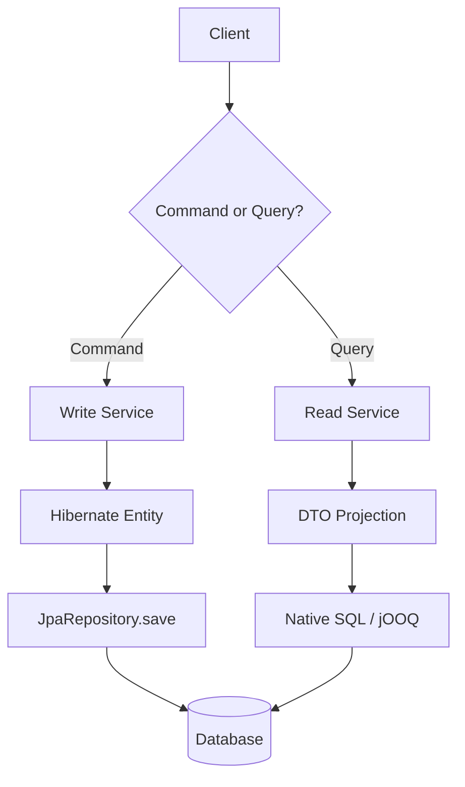

---

### 📶 Gradual Depth

**Level 1 - What it is:**

CQRS separates the code path for writing data (Hibernate entities) from the code path for reading data (DTO projections). Both use the same database.

**Level 2 - How to use it:**

Write: `orderRepository.save(entity)`. Read: `orderReadRepository.findSummaries()` returning DTOs via native SQL or jOOQ. Never return entities from read endpoints.

**Level 3 - How it works:**

Write path uses Hibernate's persistence context (managed entities, dirty checking, cascade). Read path bypasses the persistence context entirely: native SQL returns raw results mapped to DTOs. No L1 cache, no snapshots, no flush storms. Read path is stateless from Hibernate's perspective.

**Level 4 - Production mastery:**

For high-traffic read endpoints: create materialized views in the database. Read model queries the view (single table scan) instead of multi-table JOIN. Refresh the view periodically or on write events. This adds eventual consistency but provides 10-100x read performance improvement for complex aggregations. For real-time requirements: use database views (non-materialized) or direct SQL with proper indexes.

---

### ⚙️ How It Works

**Phase 1 - Identify commands vs queries:**
POST/PUT/DELETE -> commands. GET -> queries. Some GETs are simple lookups (can use entities). Complex list/search/dashboard GETs are candidates for read model.

**Phase 2 - Create read model:**
Define DTOs for each read endpoint. Create read repository with native SQL or jOOQ queries that return DTOs directly.

**Phase 3 - Separate code paths:**
Write: entity-based service + JpaRepository. Read: DTO-based service + read repository. Controller dispatches to the appropriate service.

**Phase 4 - Optimize independently:**
Write model: normalize entities, add domain validation. Read model: denormalize views, add read-optimized indexes, use materialized views for dashboards.

```text
  BEFORE (single model):
  GET /orders -> orderRepo.findAll()
    -> Load 50 Order entities
    -> Lazy load Customer per order (N+1)
    -> Jackson serializes all fields
    -> 51 queries, 200ms

  AFTER (CQRS):
  GET /orders -> readRepo.findSummaries()
    -> Native SQL JOIN + projection
    -> 50 OrderSummaryDTO (no entities)
    -> 1 query, 15ms
```

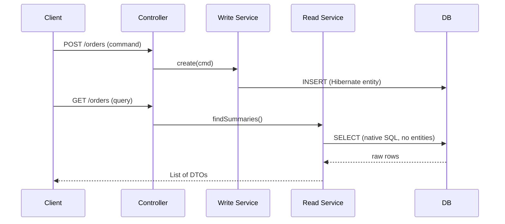

---

### 🚨 Failure Modes

**Failure 1 - Read model out of sync with schema:**

**Symptom:** Schema migration adds a column to the entity. Write model (Hibernate) adapts automatically. Read model (native SQL) still queries the old schema. Missing data in read results.

**Root cause:** Read model SQL is not updated when the write model entity changes. No coupling between the two.

**Diagnostic:**

```text
Schema migration adds column "discount"
to orders table. Entity has the field.
Read SQL: SELECT id, total, status
Does not include "discount" -> data gap.
```

**Fix:**

**BAD:**

```text
Forget to update read SQL.
Data gap in read API for months.
```

**GOOD:**

```text
Integration test for each read query
verifies all expected fields are present.
Schema migration -> test fails ->
update read SQL before deployment.
```

**Failure 2 - Using entities for read endpoints:**

**Symptom:** Team implements CQRS but the read repository still returns entities. Persistence context overhead, N+1, and flush storms persist.

**Root cause:** Read repository uses `SELECT o FROM Order o` (entity query) instead of `SELECT new DTO(...)` (DTO projection).

**Diagnostic:**

```java
// Read endpoint returns entities
// Statistics show entity load count > 0
// Flush storm on read-only endpoint
```

**Fix:**

```java
// Read endpoint must return DTOs, not entities
// NEVER return entities from read path
public interface OrderReadRepository {
    @Query(value = "SELECT o.id, o.total, "
        + "c.name as customerName "
        + "FROM orders o "
        + "JOIN customers c "
        + "ON o.customer_id = c.id",
        nativeQuery = true)
    List<OrderSummaryProjection>
        findSummaries();
}
```

---

### 🔬 Production Reality

A SaaS platform's dashboard endpoint loads 500 entities with 3 lazy associations each. Latency: 3 seconds. After CQRS: the dashboard uses a materialized view (`dashboard_summary_mv`) refreshed every 5 minutes. The read endpoint queries the view (single table scan). Latency: 15ms. The write path (order creation, status updates) continues using Hibernate entities with full domain logic. The 5-minute staleness is acceptable for dashboards. Real-time endpoints (order detail) use direct SQL JOINs with DTOs. Zero entities loaded on any read path.

---

### ⚖️ Trade-offs & Alternatives

| Approach        | Read perf   | Write perf | Complexity | Consistency   |
| --------------- | ----------- | ---------- | ---------- | ------------- |
| Single model    | Compromised | Optimal    | Low        | Immediate     |
| Simple CQRS     | Optimal     | Optimal    | Medium     | Immediate     |
| CQRS + mat views| Best        | Optimal    | Medium-high| 5-min stale   |
| Event sourcing  | Best        | Complex    | Very high  | Eventually    |

**Real-world patterns:**

- **Most Spring Boot apps** benefit from simple CQRS: entities for writes, DTO projections for list/search endpoints. Same database, immediate consistency.
- **Dashboard-heavy apps** add materialized views for aggregated read queries. Refresh frequency based on staleness tolerance.

---

### ⚡ Decision Snap

**USE CQRS WHEN:**

- Read and write patterns differ significantly. Writes are domain-rich. Reads are aggregation/search-heavy.
- N+1 on read endpoints persists despite fetch planning. DTO projections solve it.

**USE SIMPLE CQRS (SAME DB) WHEN:**

- Immediate consistency is required. Most applications.

**USE CQRS + MATERIALIZED VIEWS WHEN:**

- Dashboard or reporting queries are complex and tolerate staleness.

**SKIP CQRS WHEN:**

- < 10 endpoints. Simple CRUD. No complex read patterns.

---

### ⚠️ Top Traps

| # | Misconception | Reality |
| - | ------------- | ------- |
| 1 | CQRS requires event sourcing | Simple CQRS is just separating read and write code paths. Same database. No events. No eventual consistency. |
| 2 | CQRS doubles the codebase | Read DTOs are simple data classes. Read queries are often simpler than entity-based queries (no ORM complexity). |
| 3 | Read model must use a separate database | Same database CQRS is sufficient for 90% of applications. Separate read database is for extreme scale only. |
| 4 | All GET endpoints need the read model | Simple lookups (findById) can use entities. CQRS is for complex list, search, and aggregation endpoints. |
| 5 | Materialized views are always needed | Materialized views are for dashboards with complex aggregations. Direct SQL with indexes handles most read queries. |

---

### 🪜 Learning Ladder

**Prerequisites:**

- ORM vs SQL-First Strategy Decision Framework - CQRS
  combines both approaches
- DDD Aggregates and Hibernate Persistence Boundaries -
  write model aligns with aggregates

**THIS:** HIB-099 CQRS with Hibernate - Read vs Write Model
Separation

**Next steps:**

- Multi-Database and Polyglot Persistence Architecture -
  CQRS with separate read stores
- ORM Data Layer - Phase 5 (Platform Strategy) - CQRS
  as a platform pattern

---

**The Surprising Truth:**

Most Spring Boot applications already implement partial CQRS without realizing it. Every `@Query("SELECT new DTO(...)")` method is a read model query. Every `repository.save(entity)` is a write model operation. Full CQRS simply formalizes this into separate code paths with clear boundaries - and once formalized, teams naturally optimize each path independently.

**Further Reading:**

- Greg Young, "CQRS Documents" (cqrs.files.wordpress.com)
- Martin Fowler, "CQRS" (martinfowler.com/bliki/CQRS.html)
- Spring Data JPA documentation - Projections and DTO mappings

**Revision Card:**

1. Simple CQRS: Hibernate entities for writes, DTO projections (native SQL or jOOQ) for reads. Same database. Immediate consistency.
2. Never return entities from read endpoints. DTOs eliminate N+1, persistence context overhead, and flush storms on reads.
3. Materialized views for dashboards with complex aggregations. Direct SQL for real-time reads. CQRS does NOT require event sourcing.

---

---

# HIB-100 Multi-Database and Polyglot Persistence Architecture

**TL;DR** - Polyglot persistence uses the best database for each use case: relational for ACID transactions, NoSQL for flexible schemas, search engines for full-text. Hibernate handles the relational portion.

---

### 🔥 Problem Statement

A growing platform stores orders (relational, ACID), product catalog (document, flexible schema), user sessions (key-value, fast expiry), and search indexes (Elasticsearch, full-text). Forcing all data into one relational database means fighting schema rigidity for catalogs, poor search performance, and overloaded session tables. Polyglot persistence assigns each data type to the optimal store. Hibernate manages the relational entities (orders, customers). Separate clients manage other stores (MongoDB for catalog, Redis for sessions, Elasticsearch for search). The challenge: data consistency across stores, query federation, and operational complexity.

---

### 📜 Historical Context

Martin Fowler and Pramod Sadalage coined "polyglot persistence" in 2011, recognizing that the one-database-fits-all era was ending. NoSQL databases (MongoDB 2009, Redis 2009, Cassandra 2008) provided specialized storage for specific workloads. By 2015, most large-scale platforms used 2-4 storage technologies. The Java ecosystem adapted: Spring Data provides a unified repository abstraction over JPA, MongoDB, Redis, Elasticsearch, and more. Hibernate remains the relational anchor in polyglot architectures.

---

### 🔩 First Principles

**CORE INVARIANTS:**

1. **Best tool per use case:** Relational databases excel at ACID transactions and relational queries. Document stores excel at schema flexibility. Key-value stores excel at fast lookups. Search engines excel at full-text search.
2. **Consistency boundary = database boundary:** ACID transactions within one database. Eventual consistency across databases. No distributed transactions (2PC) in practice.
3. **Hibernate scope = relational scope:** Hibernate manages only the relational entities. Other stores have separate clients and data models.
4. **Data flows between stores:** Product data originates in the relational DB (source of truth) and is replicated to Elasticsearch (search index). Events or CDC synchronize stores.

**DERIVED DESIGN:**

Each store has its own data model, client, and Spring Data repository. Cross-store queries aggregate results in the application layer. Cross-store consistency uses domain events or CDC (Change Data Capture).

**THE TRADE-OFF:**

**Gain:** Optimal performance for each data pattern. Schema flexibility where needed. Specialized capabilities (full-text, graph traversal, time-series).

**Cost:** Operational complexity (multiple databases to manage). Cross-store consistency is eventual. Query federation is manual.

---

### 🧠 Mental Model

> Polyglot persistence is like a hospital with specialized departments. The surgical ward (relational DB) handles procedures requiring precision and coordination (ACID transactions). The outpatient clinic (document store) handles flexible, high-volume visits (schema flexibility). The pharmacy (key-value store) handles fast dispensing (fast lookups). Each department uses specialized equipment (database), but patient records (domain events) flow between them.

- "Surgical ward" -> relational DB (ACID, transactions)
- "Outpatient clinic" -> document store (flexibility)
- "Pharmacy" -> key-value store (speed)
- "Patient records" -> domain events (synchronization)

**Where this analogy breaks down:** Unlike hospital departments that are physically separate, databases in polyglot persistence can share the same server infrastructure and are coordinated by the same application.

---

### 🧩 Components

- **Relational store (PostgreSQL + Hibernate):** Orders, customers, financial transactions. ACID guarantees. Rich queries with JOINs.
- **Document store (MongoDB):** Product catalog, user profiles. Flexible schema. Embedded documents for denormalized reads.
- **Key-value store (Redis):** Sessions, caches, rate limits. Sub-millisecond access. TTL for automatic expiry.
- **Search engine (Elasticsearch):** Product search, log aggregation. Full-text, fuzzy matching, faceted search.
- **Event/CDC synchronization:** Debezium captures changes from the relational DB and publishes to Kafka. Consumers update secondary stores.

```text
  Polyglot architecture:
  +---------------+    +-----------+
  | PostgreSQL    |    | MongoDB   |
  | (Hibernate)   |    | (catalog) |
  | Orders, Users |    | Products  |
  +------+--------+    +-----+-----+
         |                    |
    Debezium CDC         Direct write
         |                    |
  +------v--------+    +-----v-----+
  | Elasticsearch |    | Redis     |
  | (search index)|    | (sessions)|
  +---------------+    +-----------+
```

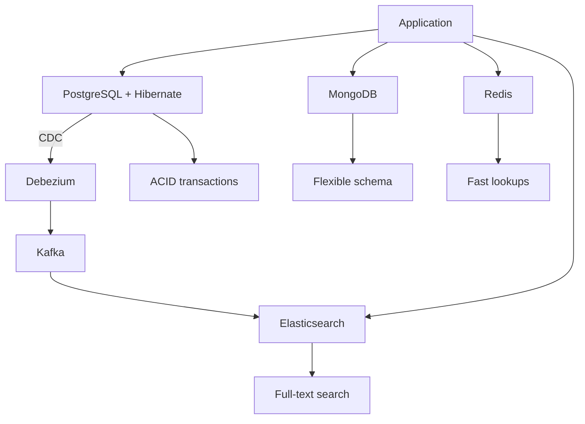

---

### 📶 Gradual Depth

**Level 1 - What it is:**

Polyglot persistence uses different databases for different data types. Hibernate manages the relational portion. Other stores handle document, key-value, and search workloads.

**Level 2 - How to use it:**

Spring Data provides unified repository abstractions. `JpaRepository` for relational. `MongoRepository` for MongoDB. `RedisTemplate` for Redis. `ElasticsearchRepository` for search. Each store has independent configuration.

**Level 3 - How it works:**

Each store has its own data model. Cross-store data flows via domain events or CDC. Application services orchestrate reads from multiple stores. Transaction boundary is per-store (no cross-store ACID). Eventual consistency between stores is managed by event consumers.

**Level 4 - Production mastery:**

Critical design decisions: (1) which store is the source of truth for each entity, (2) how to handle cross-store consistency failures (dead letter queue, retry, reconciliation), (3) how to handle cross-store queries (application-level aggregation or materialized views), (4) how to handle store failures (circuit breaker, fallback, graceful degradation).

---

### ⚙️ How It Works

**Phase 1 - Identify data patterns:**
Classify data: transactional (relational), flexible schema (document), fast access (key-value), searchable (search engine).

**Phase 2 - Design data models:**
Each store has its own model. Product in PostgreSQL (source of truth, relational fields). ProductDocument in MongoDB (catalog display, embedded variants). ProductIndex in Elasticsearch (search fields, facets).

**Phase 3 - Synchronization:**
Debezium captures INSERT/UPDATE/DELETE on PostgreSQL products table. Publishes to Kafka topic. Elasticsearch consumer updates search index. MongoDB consumer updates catalog documents.

**Phase 4 - Query routing:**
Write: always to PostgreSQL (source of truth). Search: Elasticsearch. Catalog display: MongoDB. Session: Redis. Application service routes based on operation type.

```text
  Data flow for product update:
  1. Service: productRepo.save(product)
     -> PostgreSQL INSERT (Hibernate)
  2. Debezium: captures change
     -> Kafka: product-changes topic
  3. ES consumer: update search index
  4. Mongo consumer: update catalog doc
  Latency: 100-500ms for secondary stores
```

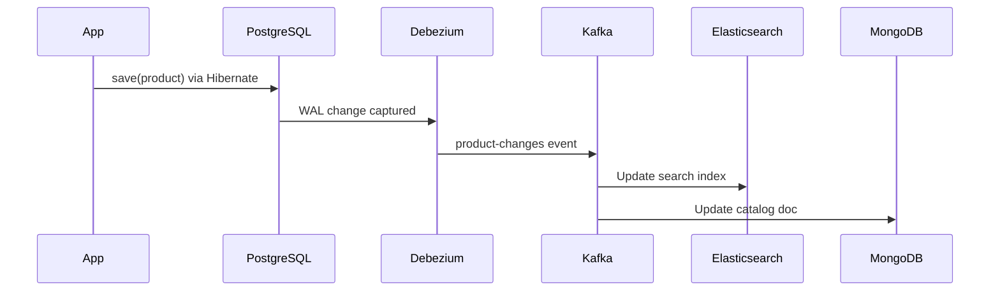

---

### 🚨 Failure Modes

**Failure 1 - Cross-store inconsistency:**

**Symptom:** Product price updated in PostgreSQL but Elasticsearch still shows old price. Users see different prices on search results vs product detail page.

**Root cause:** Debezium lag or consumer failure. Elasticsearch index not updated.

**Diagnostic:**

```bash
# Check Debezium connector status
curl -s localhost:8083/connectors/pg-source\
/status | jq '.tasks[0].state'
# Check Kafka consumer lag
kafka-consumer-groups.sh --describe \
  --group es-indexer
# If lag > 0: consumer behind
```

**Fix:**

**BAD:**

```text
Manual sync: re-index all products
when inconsistency reported.
Reactive, error-prone, slow.
```

**GOOD:**

```text
Monitor consumer lag with alerting.
Dead letter queue for failed events.
Periodic reconciliation job compares
PostgreSQL and Elasticsearch counts.
Circuit breaker on search: fallback to
PostgreSQL query if ES is stale.
```

**Failure 2 - Distributed transaction attempt:**

**Symptom:** Team tries XA transaction across PostgreSQL and MongoDB. Connection timeouts, partial commits, data corruption.

**Root cause:** Distributed transactions (2PC) across heterogeneous stores are fragile and slow. MongoDB XA support is limited.

**Diagnostic:**

```text
Application logs show XA transaction
timeout. MongoDB write succeeds but
PostgreSQL rolls back. Inconsistent state.
```

**Fix:**

```text
Never use distributed transactions across
stores. Use domain events + saga pattern:
1. Write to PostgreSQL (commit)
2. Publish event
3. Consumer writes to MongoDB
4. If MongoDB fails: retry from event
5. Compensate if retry exhausts
```

---

### 🔬 Production Reality

An e-commerce platform migrates from PostgreSQL-only to polyglot. Orders remain in PostgreSQL (Hibernate, ACID). Product catalog moves to MongoDB (flexible variant attributes: clothing has size/color, electronics has specs). Search moves to Elasticsearch (faceted search, fuzzy matching). Sessions move to Redis (sub-ms access, auto-expiry). Synchronization: Debezium CDC from PostgreSQL to Elasticsearch. Product detail page: MongoDB read (10ms). Search: Elasticsearch (15ms). Checkout: PostgreSQL transaction (30ms). Before polyglot: search was 500ms (relational LIKE queries). After: 15ms with relevance ranking.

---

### ⚖️ Trade-offs & Alternatives

| Aspect         | Single DB (PostgreSQL) | Polyglot              |
| -------------- | ----------------------- | --------------------- |
| Consistency    | ACID everywhere         | ACID per store        |
| Query power    | SQL everywhere          | Best per store        |
| Search         | LIKE/tsvector           | Elasticsearch         |
| Schema flex    | Rigid (JSONB workaround)| Native (MongoDB)      |
| Ops complexity | Low                     | High (multiple stores)|
| Team expertise | One DB                  | Multiple DBs          |

**Real-world patterns:**

- **Startups** start with PostgreSQL-only (with JSONB for flexibility). Add stores as specific needs emerge.
- **Scale-ups** add Elasticsearch first (search is often the first bottleneck), then Redis (sessions/caching), then document store (if needed).

---

### ⚡ Decision Snap

**ADD A SECOND STORE WHEN:**

- Specific workload exceeds the relational DB's capability (full-text search, sub-ms access, flexible schema).
- Team has operational capacity to manage a second store.

**STAY SINGLE-DB WHEN:**

- PostgreSQL JSONB covers schema flexibility. Full-text search volume is low. Session management works with JPA.

**CRITICAL REQUIREMENT:**

- Every multi-store architecture needs a synchronization strategy (CDC, events) and a consistency monitoring plan.

---

### ⚠️ Top Traps

| # | Misconception | Reality |
| - | ------------- | ------- |
| 1 | Polyglot means replacing the relational DB | Polyglot means ADDING specialized stores. The relational DB (PostgreSQL) remains the source of truth for transactional data. |
| 2 | Distributed transactions work across stores | 2PC across heterogeneous stores is fragile. Use events + eventual consistency instead. |
| 3 | All data needs all stores | Each data type goes to ONE primary store. Secondary stores receive replicated data for specific access patterns. |
| 4 | Adding a store is a small change | Each store adds operational burden: monitoring, backup, upgrades, failure modes. Add only when the benefit clearly exceeds the cost. |
| 5 | Consistency is automatic | Cross-store consistency requires explicit synchronization (CDC, events) and monitoring (lag alerts, reconciliation jobs). |

---

### 🪜 Learning Ladder

**Prerequisites:**

- CQRS with Hibernate - Read vs Write Model Separation -
  read store separation is a form of polyglot
- ORM vs SQL-First Strategy Decision Framework - database
  technology selection criteria

**THIS:** HIB-100 Multi-Database and Polyglot Persistence
Architecture

**Next steps:**

- Hibernate in Microservices vs Monolith Decision Guide -
  polyglot maps to microservice boundaries
- ORM Data Layer - Phase 5 (Platform Strategy) -
  polyglot as a platform concern

---

**The Surprising Truth:**

Most teams that adopt polyglot persistence discover that PostgreSQL with JSONB, `tsvector` (full-text search), and proper indexing covers 80% of the use cases they thought required a second store. The first store to genuinely add value is almost always Elasticsearch (search experience) or Redis (session management). MongoDB is rarely needed if PostgreSQL JSONB is used effectively.

**Further Reading:**

- Martin Fowler and Pramod Sadalage, "Polyglot Persistence" (martinfowler.com)
- Debezium documentation - Change Data Capture (debezium.io)
- Spring Data documentation - multi-store repository support

**Revision Card:**

1. Polyglot = best store per use case. Relational (Hibernate) for ACID. Document for flexibility. Key-value for speed. Search for full-text.
2. No distributed transactions. Use domain events + CDC for cross-store synchronization. Eventual consistency is the norm.
3. Start with PostgreSQL. Add stores only when specific workloads exceed relational capabilities and team has operational capacity.

---

---

# HIB-101 Hibernate in Microservices vs Monolith Decision Guide

**TL;DR** - Hibernate works well in both monoliths and microservices. In microservices, each service owns its database and Hibernate instance. Cross-service queries use APIs, not JOINs.

---

### 🔥 Problem Statement

A team debates: "Should our microservices use Hibernate or is it only for monoliths?" The concern is that Hibernate's Session model, entity relationships, and transaction management are designed for a single database - incompatible with microservice per-service-database patterns. In reality, Hibernate works identically in a microservice as in a monolith. Each microservice has its own database, its own Hibernate instance, and its own entity model. The difference is at the architecture level: cross-service data access uses REST/gRPC APIs, not entity associations or database JOINs.

---

### 📜 Historical Context

The microservice movement (2014-2018) raised questions about ORM suitability. Early microservice advocates suggested lightweight alternatives (JDBC, MyBatis) for simplicity. Experience proved otherwise: microservices still need entity lifecycle management, cascade, dirty checking, and optimistic locking - the same features that make Hibernate valuable in monoliths. Spring Boot's dominance in the microservice ecosystem made Hibernate the default data layer. The key adaptation: each microservice treats its database as independent, with no shared tables or cross-service entity associations.

---

### 🔩 First Principles

**CORE INVARIANTS:**

1. **One database per service:** Each microservice owns its database exclusively. No shared tables. No cross-service JOINs.
2. **Hibernate per service:** Each service has its own SessionFactory, its own entity model, and its own persistence context. Independent configuration.
3. **Cross-service data = API calls:** Order service needs Customer name? REST call to Customer service, not entity association. `Long customerId` in Order, not `@ManyToOne Customer`.
4. **Transaction boundary = service boundary:** `@Transactional` scopes to one service's database. Cross-service consistency uses sagas or eventual consistency.

**DERIVED DESIGN:**

Hibernate in microservices is identical to Hibernate in a monolith with DDD aggregate boundaries. Each aggregate (service) has independent persistence. Cross-aggregate references use IDs. Cross-aggregate consistency uses events.

**THE TRADE-OFF:**

**Gain:** Each service independently optimizes its Hibernate configuration, schema, and entity model. Independent deployment and scaling.

**Cost:** Cross-service queries require API calls (network overhead). No cross-service JOINs. Denormalized data or API composition for cross-service reads.

---

### 🧠 Mental Model

> Microservices with Hibernate are like independent restaurants in a food court. Each restaurant (service) has its own kitchen (database), its own menu (entity model), and its own chef (Hibernate). A customer (request) ordering from multiple restaurants gets a tray (API response) - the food court does not merge all kitchens into one.

- "Restaurant" -> microservice
- "Kitchen" -> database
- "Menu" -> entity model
- "Chef" -> Hibernate instance
- "Tray" -> API composition

**Where this analogy breaks down:** Unlike restaurants that are truly independent, microservices often need coordinated data (e.g., order references customer). This coordination requires explicit design (events, saga).

---

### 🧩 Components

- **Service-per-database:** Each service has its own PostgreSQL schema or instance. Schema migrations are per-service (Flyway/Liquibase).
- **Independent Hibernate config:** Each service configures OSIV, batching, pool size, statistics independently per its workload.
- **API composition:** Cross-service reads aggregate data from multiple service APIs. Order detail = Order service + Customer service + Product service.
- **Event-driven consistency:** OrderCreated event triggers Inventory service to reserve stock. Saga pattern for multi-service transactions.
- **Shared library (optional):** Common Hibernate configuration (from fleet governance) shared across services.

```text
  Monolith:
  +-----------------------------------+
  | Single DB                         |
  | Orders | Customers | Products    |
  | All entities in ONE SessionFactory|
  +-----------------------------------+

  Microservices:
  +----------+  +----------+  +--------+
  | Order DB |  | Cust DB  |  | Prod DB|
  | Order    |  | Customer |  | Product|
  | LineItem |  | Address  |  | Spec   |
  | Hibernate|  | Hibernate|  | Hibernate|
  +----------+  +----------+  +--------+
       |              |             |
       +------- API calls ----------+
```

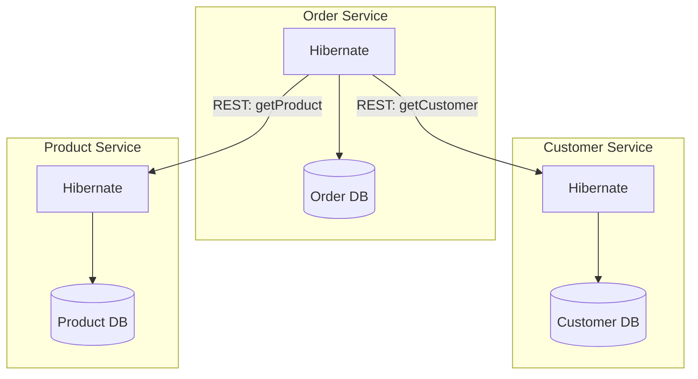

---

### 📶 Gradual Depth

**Level 1 - What it is:**

Hibernate works in microservices exactly as in monoliths. Each service has its own database and Hibernate instance. Cross-service data access uses APIs, not entity associations.

**Level 2 - How to use it:**

Each service: own `application.yml` with Hibernate settings, own entity model, own Spring Data repositories. Cross-service reference by ID (`Long customerId`). API calls for cross-service data.

**Level 3 - How it works:**

Each service's SessionFactory is independent. No entity associations span services. `@Transactional` scopes to the service's database. Cross-service consistency uses domain events (Kafka, RabbitMQ) and saga patterns for multi-step transactions.

**Level 4 - Production mastery:**

Performance considerations: API composition adds network latency (2-5ms per call). For cross-service reads, use async API calls (CompletableFuture/WebClient) to parallelize. For cross-service search, use CQRS: a read-optimized materialized view that denormalizes data from multiple services. Each service publishes changes via events; the read model consumes and aggregates.

---

### ⚙️ How It Works

**Phase 1 - Service boundary definition:**
Align service boundaries with DDD aggregates. Each aggregate root = one service with its own database.

**Phase 2 - Entity model per service:**
Order service: Order, LineItem, ShippingAddress. Customer service: Customer, Address. No shared entities.

**Phase 3 - Cross-service references:**
Order has `Long customerId` (not `@ManyToOne`). Order detail endpoint: fetch Order from local DB, fetch Customer from Customer API, merge in service layer.

**Phase 4 - Cross-service consistency:**
Order placed -> publish `OrderPlaced` event to Kafka -> Inventory service consumes and reserves stock. If reservation fails: compensating event (`ReservationFailed`) triggers order cancellation.

```text
  Order detail API composition:
  GET /orders/123
  1. OrderService: findById(123)
     -> Order{id=123, customerId=42,
        items=[...]}
  2. CustomerClient: getCustomer(42)
     -> Customer{name="Alice"}
  3. Merge: OrderDetailDTO{
       order: Order{...},
       customerName: "Alice"}
  4. Return DTO
  Total: 2 API calls, 1 DB query
```

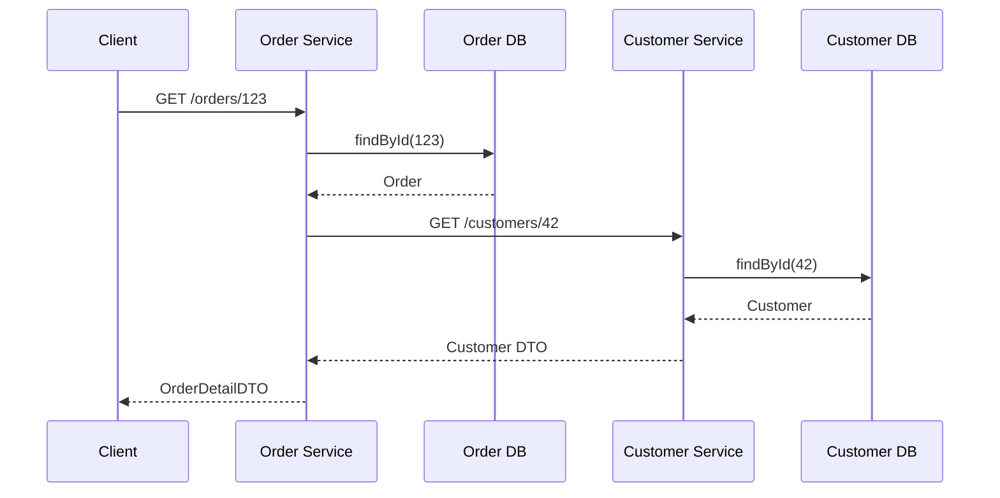

---

### 🚨 Failure Modes

**Failure 1 - Shared database between services:**

**Symptom:** Two services read/write the same table. Schema migration in one service breaks the other. Hibernate entity models conflict.

**Root cause:** Shared database violates service independence. Tight coupling at the data layer.

**Diagnostic:**

```text
Multiple services connect to same DB.
Schema change in Service A breaks Service B.
Entity models conflict.
```

**Fix:**

**BAD:**

```text
Service A and Service B both map
OrderEntity from shared "orders" table.
Service A migration adds column.
Service B does not know about it.
```

**GOOD:**

```text
Each service owns its database exclusively.
Service A: order_db.orders
Service B: customer_db.customers
No shared tables. Independent schemas.
Cross-service: API calls only.
```

**Failure 2 - Cross-service N+1:**

**Symptom:** Order list endpoint calls Customer API per order. 50 orders = 50 API calls. Latency: 2 seconds.

**Root cause:** Sequential API calls for cross-service data. Same N+1 pattern but at API level instead of SQL level.

**Diagnostic:**

```text
Order list: fetch 50 orders (1 DB query)
For each order: GET /customers/{id}
  -> 50 API calls x 40ms = 2000ms
```

**Fix:**

```java
// Batch API call
List<Long> customerIds = orders.stream()
    .map(Order::getCustomerId)
    .distinct()
    .toList();
// Single batch call
Map<Long, CustomerDTO> customers =
    customerClient.getBatch(customerIds);
// Merge locally
// 1 DB query + 1 API call = fast
```

---

### 🔬 Production Reality

A monolith with 40 Hibernate entities decomposes into 5 microservices. Each service gets 6-10 entities. The hardest part: breaking cross-entity JOINs that span service boundaries. Before: `SELECT o.*, c.name FROM orders o JOIN customers c`. After: Order service queries orders, calls Customer API for names. API composition adds 5ms latency per cross-service call. Mitigation: batch API calls, cache customer names in Order service (30-second TTL). Total overhead: 10-15ms per request (acceptable for the independence gained). Each service now deploys independently, scales independently, and has its own Hibernate tuning.

---

### ⚖️ Trade-offs & Alternatives

| Aspect        | Monolith + Hibernate | Microservices + Hibernate |
| ------------- | -------------------- | ------------------------- |
| Cross-entity  | SQL JOIN             | API composition           |
| Transaction   | Single DB            | Saga / eventual           |
| Schema mgmt   | One Flyway           | One Flyway per service    |
| Deploy         | All-or-nothing       | Independent               |
| Scalability   | Vertical             | Horizontal per service    |
| Complexity    | Lower                | Higher (network, events)  |

**Real-world patterns:**

- **Monolith-first:** Start with Hibernate monolith. Decompose to microservices when team size or scale demands.
- **Microservice-from-start:** Use Hibernate per service with DDD aggregate boundaries from day one. Simplifies future service extraction.

---

### ⚡ Decision Snap

**USE HIBERNATE IN MICROSERVICES WHEN:**

- Service has domain entities with lifecycle, cascades, and state transitions.
- Team has Hibernate expertise. Spring Boot is the framework.

**USE LIGHTER ALTERNATIVE (JDBC/jOOQ) WHEN:**

- Service has < 5 entities with simple CRUD. ORM adds no value.
- Service is read-heavy with complex SQL (analytics service).

**ALWAYS DO:**

- One database per service. ID references across services. Events for cross-service consistency.

---

### ⚠️ Top Traps

| # | Misconception | Reality |
| - | ------------- | ------- |
| 1 | Hibernate is too heavy for microservices | Hibernate in a microservice is the same as in a monolith. Per-service, it manages 5-15 entities with the same efficiency. |
| 2 | Microservices do not need ORM | Microservices with domain entities need cascade, dirty checking, and optimistic locking just as much as monoliths do. |
| 3 | Shared database is OK for small teams | Shared database creates coupling. Schema changes in one service break others. Split early. |
| 4 | API composition is too slow | Batch API calls + caching add 5-15ms overhead. Acceptable for most applications. Use CQRS read models for sub-ms requirements. |
| 5 | Cross-service JOINs are possible | With separate databases, JOINs are impossible. Denormalize, use events, or use API composition. This is a fundamental constraint, not a workaround. |

---

### 🪜 Learning Ladder

**Prerequisites:**

- DDD Aggregates and Hibernate Persistence Boundaries -
  aggregate = service boundary
- Fleet-Wide Hibernate Governance and Standards -
  shared configuration across services

**THIS:** HIB-101 Hibernate in Microservices vs Monolith
Decision Guide

**Next steps:**

- Multi-Database and Polyglot Persistence Architecture -
  per-service database selection
- ORM Data Layer - Phase 5 (Platform Strategy) -
  microservice ORM strategy as platform concern

---

**The Surprising Truth:**

Hibernate in a microservice is simpler than in a monolith because the entity model is smaller (5-15 entities vs 40+), the persistence context is smaller, and cross-service associations do not exist (no cross-aggregate lazy loading). The complexity people fear is not Hibernate in microservices - it is microservice architecture itself (API composition, event-driven consistency, distributed tracing). Hibernate is the easy part.

**Further Reading:**

- Sam Newman, "Building Microservices" - Chapter 4: Data
- Chris Richardson, "Microservices Patterns" - Saga pattern for data consistency
- Spring Boot documentation - Multi-datasource configuration

**Revision Card:**

1. Each microservice: own database, own Hibernate, own entity model. No shared tables. Cross-service reference by ID.
2. Cross-service data: API composition (batch calls + caching). Cross-service consistency: domain events + sagas.
3. Hibernate in microservices is simpler (fewer entities, no cross-aggregate associations). The complexity is in microservice architecture, not ORM.

---

---

# HIB-102 Staff-Level ORM Interview Scenarios

**TL;DR** - Staff-level ORM scenarios test architectural judgment: technology selection, migration strategy, cross-cutting concerns, and organizational decision-making under constraints.

---

### 🔥 Problem Statement

Staff and principal engineer interviews require scenarios that test judgment, not knowledge. "How does dirty checking work?" is an L3 question. "Should this 50-service fleet migrate from Hibernate to jOOQ? What is your decision framework?" is a staff-level question. Staff scenarios evaluate: Can you make a technology decision that affects 50 engineers? Can you design a migration strategy that does not disrupt production? Can you balance technical purity with organizational reality?

---

### 📜 Historical Context

Staff-level engineering interview practices evolved from Google's "system design" interviews into broader "architectural decision" scenarios by 2018. The realization: staff engineers spend more time deciding WHAT to build than HOW to build it. ORM-specific scenarios test this at the data layer: technology selection, migration, governance, and performance strategy at organizational scale. These scenarios have no single right answer - the evaluation is based on the quality of the reasoning process.

---

### 🔩 First Principles

**CORE INVARIANTS:**

1. **Scenarios test reasoning, not answers:** The candidate's decision-making process matters more than the specific conclusion. Good reasoning with a suboptimal answer > poor reasoning with the "right" answer.
2. **Constraints drive decisions:** Budget, timeline, team expertise, existing infrastructure. A technically perfect migration is wrong if the team cannot execute it.
3. **Trade-offs must be explicit:** Every decision has costs. Staff engineers articulate what they are trading away. "We choose hybrid because full migration costs 6 months, and our SLA requires 2-month delivery."
4. **Organizational impact:** Staff decisions affect multiple teams. Communication plan, adoption strategy, and rollback path are part of the answer.

**DERIVED DESIGN:**

Five scenarios spanning ORM decision domains: technology selection, migration strategy, performance architecture, governance design, and production crisis response. Each scenario has constraints that force trade-offs.

**THE TRADE-OFF:**

**Gain:** Scenarios that evaluate staff-level judgment: architectural thinking, organizational awareness, and decision-making under uncertainty.

**Cost:** Evaluators must themselves have staff-level experience to assess answers. Scenarios require 30-60 minutes each.

---

### 🧠 Mental Model

> Staff-level scenarios are like chess puzzles with an added rule: you must explain your reasoning to a non-chess player (VP of Engineering). Moving the right piece is not enough. You must explain WHY that move, WHAT it costs, and WHAT the rollback plan is if it fails.

- "Chess puzzle" -> architectural scenario
- "Explain to non-chess player" -> communicate to leadership
- "Right piece" -> technically sound decision
- "Why, cost, rollback" -> staff-level reasoning

**Where this analogy breaks down:** Unlike chess with fixed rules, ORM scenarios have ambiguous constraints and incomplete information. Part of the test is how the candidate handles ambiguity.

---

### 🧩 Components

**Scenario 1 - Technology Selection:**

"A new payment processing platform needs a data layer. Requirements: ACID transactions, 5000 TPS writes, complex reporting, PCI compliance, team of 8 Java engineers with moderate Hibernate experience. What is your recommendation and why?"

**Expected depth:** Score the decision framework dimensions. Recommend Hibernate for writes + jOOQ for reporting. Address PCI compliance (audit trail via Envers). Address 5000 TPS (connection pool sizing, JDBC batching). Present alternatives considered and rejected.

**Scenario 2 - Migration Strategy:**

"A 50-service fleet uses Hibernate 5. Spring Boot 3 requires Hibernate 6. Budget: 2 engineers for 3 months. How do you migrate?"

**Expected depth:** Prioritize by risk (high-traffic services first or last). Automate namespace change (OpenRewrite). Manual HQL verification per service. Shared library update first (one change, all services benefit). Rollback strategy per service.

**Scenario 3 - Performance Crisis:**

"Production is down. Connection pool exhausted across all services. P1 incident. What do you do in the next 30 minutes?"

**Expected depth:** Immediate mitigation (increase pool size temporarily). Diagnosis (OSIV? leak? external service timeout?). Communication (status page, stakeholder update). Root cause fix (disable OSIV, fix leak). Prevention (monitoring, alerting, governance).

```text
  Evaluation rubric:
  +----------+-----------------------+-------+
  | Dimension| What is evaluated     | Weight|
  +----------+-----------------------+-------+
  | Reasoning| Decision process      | 30%   |
  | Trade-off| Explicit costs/benefits| 25%  |
  | Pragmatic| Organizational reality| 20%   |
  | Technical| Correct fundamentals  | 15%   |
  | Communic.| Clear articulation    | 10%   |
  +----------+-----------------------+-------+
```

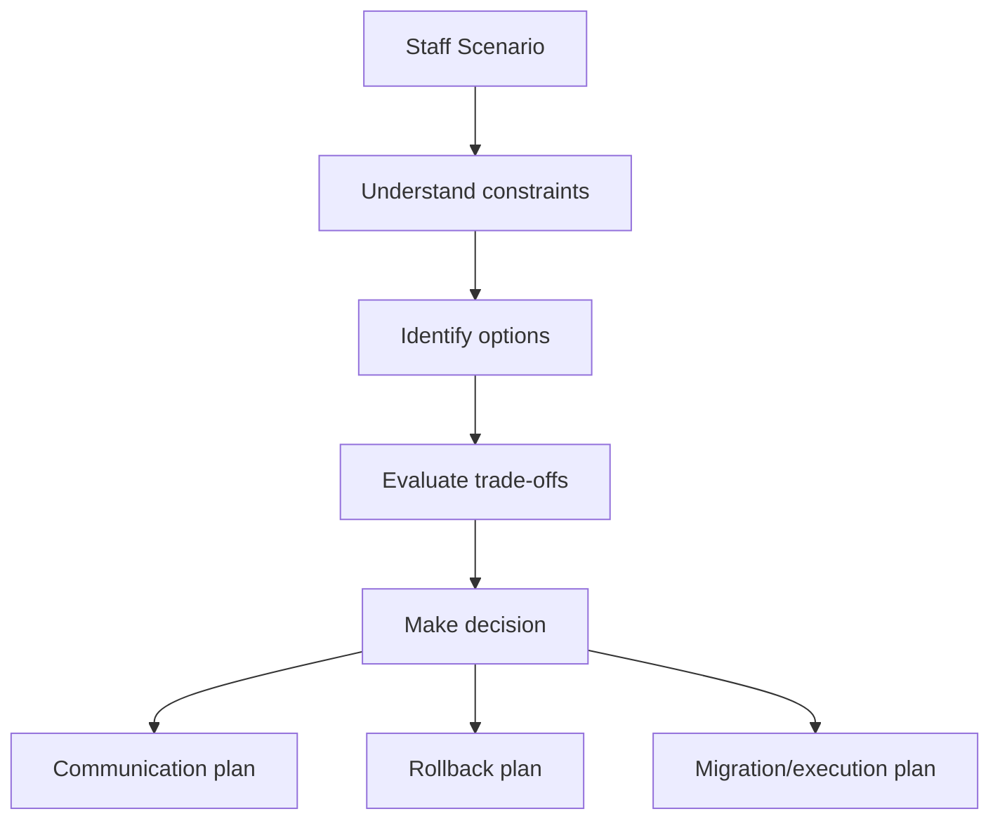

---

### 📶 Gradual Depth

**Level 1 - What it is:**

Staff-level ORM scenarios test architectural judgment: technology selection, migration, governance, and crisis response. No single right answer - reasoning quality is evaluated.

**Level 2 - How to use it:**

Present the scenario with constraints. Give the candidate 5 minutes to think. Evaluate: did they identify constraints, consider alternatives, articulate trade-offs, and propose a plan with rollback?

**Level 3 - How it works:**

Each scenario has intentional tension: limited budget vs desired outcome, technical purity vs timeline, team expertise vs optimal technology. Staff engineers navigate these tensions explicitly. They name what they are sacrificing and why.

**Level 4 - Production mastery:**

The strongest staff candidates add dimensions the interviewer did not mention: "Before deciding on Hibernate vs jOOQ, I need to understand: What is the team's SQL comfort level? What monitoring is in place? What is the deployment frequency? These factors matter more than the technology itself." This shows systems thinking beyond the immediate question.

---

### ⚙️ How It Works

**Phase 1 - Scenario delivery:**
Present the scenario. State constraints explicitly. Let the candidate ask clarifying questions (evaluates what they consider important).

**Phase 2 - Candidate response:**
Listen for: (1) constraint identification, (2) options enumeration, (3) trade-off articulation, (4) decision with reasoning, (5) execution plan, (6) rollback plan.

**Phase 3 - Probing questions:**
"What if the budget was halved?" "What if the team had zero Hibernate experience?" "What is your rollback plan?" These test adaptability and depth.

**Phase 4 - Evaluation:**
Score across five dimensions: reasoning (30%), trade-offs (25%), pragmatism (20%), technical (15%), communication (10%).

```text
  Scenario 2 example response structure:
  1. Constraints: 50 services, 2 engineers,
     3 months, Spring Boot 3 required
  2. Options:
     a. Big-bang: all services at once
     b. Incremental: priority order
     c. Automated: shared lib first
  3. Trade-offs:
     Big-bang: fastest but highest risk
     Incremental: safer but longer tail
     Automated: most efficient reuse
  4. Decision: Automated + incremental
     Update shared library (2 weeks)
     Migrate high-traffic services (4 weeks)
     Migrate remaining (6 weeks)
  5. Rollback: per-service, shared lib
     supports both Hibernate 5 and 6
```

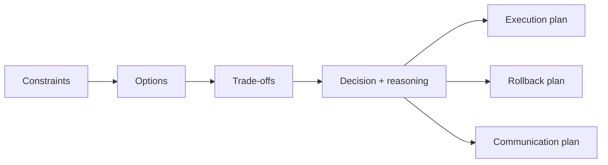

---

### 🚨 Failure Modes

**Failure 1 - Jumping to a solution:**

**Symptom:** Candidate immediately says "Use Hibernate" without exploring constraints, alternatives, or trade-offs.

**Root cause:** Not operating at staff level. Answering like a senior engineer (solve the technical problem) instead of a staff engineer (make the best decision for the organization).

**Diagnostic:**

```text
Candidate provides solution without:
- Asking clarifying questions
- Naming alternatives considered
- Articulating trade-offs
- Proposing execution plan
```

**Fix:**

**BAD:**

```text
"Use Hibernate with Spring Data JPA.
Configure OSIV=false and batching."
(Technical answer, missing staff judgment)
```

**GOOD:**

```text
"Before deciding, I need to understand
three things: team expertise, workload
split (CRUD vs analytics), and timeline.
If team has ORM experience and workload
is 70% CRUD: Hibernate with jOOQ for
reporting. If team is SQL-strong and
workload is 70% analytics: jOOQ primary.
Either way: shared config, monitoring,
CI query assertions from day one."
```

**Failure 2 - Ignoring organizational reality:**

**Symptom:** Candidate proposes a technically perfect solution that requires 6 months and 5 engineers. Budget is 2 engineers for 3 months.

**Root cause:** Technical purity over pragmatism. Not considering organizational constraints as first-class design inputs.

**Diagnostic:**

```text
Proposed plan exceeds stated constraints
(budget, timeline, team size).
No phasing or scoping to fit constraints.
```

**Fix:**

```text
"Given 2 engineers and 3 months, the full
migration is infeasible. I would scope:
Phase 1 (month 1): shared library update
Phase 2 (months 2-3): top 10 services
Phase 3 (backlog): remaining 40 services
assigned to service-owning teams in
subsequent quarters."
```

---

### 🔬 Production Reality

A staff engineer interview uses Scenario 2 (fleet migration). Candidate A proposes big-bang migration: "Run OpenRewrite on all 50 services, fix issues, deploy." No phasing, no risk assessment. Score: 2/5 (technical but not staff-level). Candidate B asks: "Which services are highest traffic? What is the rollback plan per service? Can the shared library support both Hibernate 5 and 6 during transition?" Then proposes incremental migration with dual-support library. Score: 4.5/5 (staff reasoning with organizational awareness).

---

### ⚖️ Trade-offs & Alternatives

| Scenario type     | What it tests         | Complexity | Time   |
| ----------------- | ---------------------- | ---------- | ------ |
| Technology selection | Judgment + trade-offs | Medium   | 30 min |
| Migration strategy | Planning + risk mgmt   | High     | 45 min |
| Performance crisis | Diagnosis + leadership | High     | 30 min |
| Governance design  | Organizational design  | Medium   | 30 min |
| Architecture review| Systems thinking       | High     | 45 min |

**Real-world patterns:**

- **Effective interviews** use 2 scenarios (60-90 minutes total). One planning scenario + one crisis scenario.
- **Self-assessment** uses all 5 scenarios as practice. Time yourself. Evaluate: did you address all five dimensions?

---

### ⚡ Decision Snap

**USE THESE SCENARIOS WHEN:**

- Interviewing for staff/principal engineer roles with data layer responsibility.
- Self-assessing readiness for staff-level ORM decision-making.

**KEY EVALUATION CRITERIA:**

- Reasoning > solution. Trade-offs > certainty. Pragmatism > purity.

**DO NOT USE WHEN:**

- Interviewing for senior individual contributor roles (use L4 interview questions instead).

---

### ⚠️ Top Traps

| # | Misconception | Reality |
| - | ------------- | ------- |
| 1 | Staff scenarios have right answers | They test reasoning quality. Two candidates can reach different conclusions and both score 5/5 if reasoning is sound. |
| 2 | Technical depth is most important | Technical correctness is 15% of the evaluation. Reasoning, trade-offs, and pragmatism are 75%. |
| 3 | Candidates should answer immediately | Staff thinking requires structured analysis. 5 minutes of silent thinking is a positive signal. |
| 4 | One scenario is sufficient | Different scenarios test different dimensions. Two scenarios provide a more complete picture. |
| 5 | These replace coding exercises | Staff scenarios complement, not replace, system design and coding assessments. They test a different dimension. |

---

### 🪜 Learning Ladder

**Prerequisites:**

- ORM vs SQL-First Strategy Decision Framework - decision
  framework used in Scenario 1
- Fleet-Wide Hibernate Governance and Standards -
  governance used in Scenario 4
- Hibernate Expert Mastery Verification - technical
  foundation for all scenarios

**THIS:** HIB-102 Staff-Level ORM Interview Scenarios

**Next steps:**

- ORM Data Layer - Phase 5 (Platform Strategy) -
  staff-level decisions at platform scale
- Build vs Extend vs Replace ORM Decision Guide -
  strategic technology evaluation

---

**The Surprising Truth:**

The most telling moment in a staff ORM interview is not the answer. It is the clarifying questions. A candidate who asks "What is the team's Hibernate experience level?" before recommending Hibernate shows organizational awareness. A candidate who asks "What is the rollback plan requirement?" before proposing migration shows risk thinking. The questions reveal the mental model. The answer just confirms it.

**Further Reading:**

- Will Larson, "Staff Engineer: Leadership beyond the management track" - staff decision-making patterns
- Gergely Orosz, "The Software Engineer's Guidebook" - career levels and expectations
- Martin Fowler, "Patterns of Enterprise Application Architecture" - data layer decision framework

**Revision Card:**

1. Staff scenarios test reasoning (30%), trade-offs (25%), pragmatism (20%), not just technical answers (15%).
2. Five scenario types: technology selection, migration, performance crisis, governance, architecture review. Use 2 per interview.
3. The clarifying questions the candidate asks reveal more about their judgment than the answer they give.

---

---

# HIB-103 Teaching Hibernate - Why Juniors Struggle with ORM

**TL;DR** - Juniors struggle with Hibernate because it requires understanding three invisible systems simultaneously: entity lifecycle, SQL generation, and persistence context state.

---

### 🔥 Problem Statement

A junior developer learns Spring Boot in 2 weeks but struggles with Hibernate for months. They create an entity, call `save()`, and it works. Then they modify an entity without calling `save()` and changes persist - confusion. They add `@ManyToOne` and get N+1 - frustration. They return entities from a controller and get `LazyInitializationException` - despair. The core problem: Hibernate's behavior depends on invisible state (persistence context, entity lifecycle, Session scope) that has no equivalent in their previous experience. Teaching Hibernate requires making the invisible visible.

---

### 📜 Historical Context

Hibernate was designed for experienced Java enterprise developers (2001-2005) who understood JDBC, transaction management, and relational databases. By 2015, Spring Boot made Hibernate accessible to beginners who had no database background. The abstraction that Hibernate provides (automatic SQL, transparent persistence) becomes confusing when it does something unexpected (automatic dirty checking, lazy loading). The teaching challenge intensified: more beginners using a tool designed for experts. The response: better documentation, starter guides, and diagnostic tools - but the fundamental complexity remains.

---

### 🔩 First Principles

**CORE INVARIANTS:**

1. **Three invisible systems:** Entity lifecycle (managed/detached/transient), SQL generation (when and what SQL runs), and persistence context state (what is tracked). All three interact. Understanding one without the others leads to confusion.
2. **Abstractions hide complexity:** `repository.save(entity)` hides: "persist if new, merge if detached, do nothing if already managed." This is helpful for experts, confusing for beginners.
3. **Side effects are invisible:** Modifying a managed entity's field generates an UPDATE at flush time. No explicit save call. No visible action. The side effect is invisible.
4. **Error messages are delayed:** N+1 does not throw an error. LazyInitializationException appears far from the cause. Symptoms are distant from root causes.

**DERIVED DESIGN:**

Teaching Hibernate requires: (1) make the invisible visible (show SQL, show entity states, show persistence context), (2) build mental models before APIs (understand dirty checking before using `save()`), (3) teach failure modes early (N+1 and LazyInitializationException before advanced features).

**THE TRADE-OFF:**

**Gain:** Junior developers who understand Hibernate's mental model write production-quality code from the start.

**Cost:** Slower initial learning (mental model before API). Requires experienced mentors who can explain the invisible systems.

---

### 🧠 Mental Model

> Teaching Hibernate is like teaching someone to drive a car with an invisible dashboard. The speed (SQL generation), fuel gauge (persistence context size), and engine temperature (flush time) are all hidden. The driver (junior) only sees the road (API output). When the car overheats (N+1 latency), they do not know why because the dashboard is invisible. Step one of teaching: make the dashboard visible (enable statistics, show SQL, explain entity states).

- "Invisible dashboard" -> hidden Hibernate internals
- "Speed" -> SQL generation (show_sql/p6spy)
- "Fuel gauge" -> PC size (session statistics)
- "Engine temperature" -> flush time (statistics)
- "Make visible" -> enable monitoring/logging

**Where this analogy breaks down:** Unlike a car, Hibernate's "dashboard" can be made visible immediately (enable statistics). The challenge is teaching juniors to read it.

---

### 🧩 Components

**Struggle 1 - Invisible dirty checking:**

```java
// Junior expectation: "I didn't call save()"
// -> "Changes should not persist"
@Transactional
void updateName(Long id, String name) {
    User user = userRepo.findById(id).get();
    user.setName(name);
    // No save() call! But name PERSISTS.
    // Junior: "Why?!"
    // Answer: managed entity, dirty checking
}
```

**Struggle 2 - LazyInitializationException:**

```java
// Junior: "It worked yesterday" (OSIV on)
// Today (OSIV off): exception!
User user = userService.findById(1L);
// @Transactional ended in service
user.getOrders().size(); // BOOM!
// Junior: "What changed?!"
// Answer: Session scope changed
```

**Struggle 3 - N+1:**

```java
// Junior: "I only wrote one query"
List<User> users = userRepo.findAll();
for (User u : users) {
    log.info(u.getOrders().size());
    // One SELECT per user - invisible!
}
// Junior: "Why is it slow?"
// Answer: 101 queries, not 1
```

```text
  Teaching progression:
  1. Show SQL (hibernate.show_sql=true)
     -> "See what Hibernate generates"
  2. Count queries per request
     -> "See how MANY queries run"
  3. Entity states diagram
     -> "See WHERE your entity lives"
  4. Persistence context diagram
     -> "See WHAT Hibernate tracks"
```

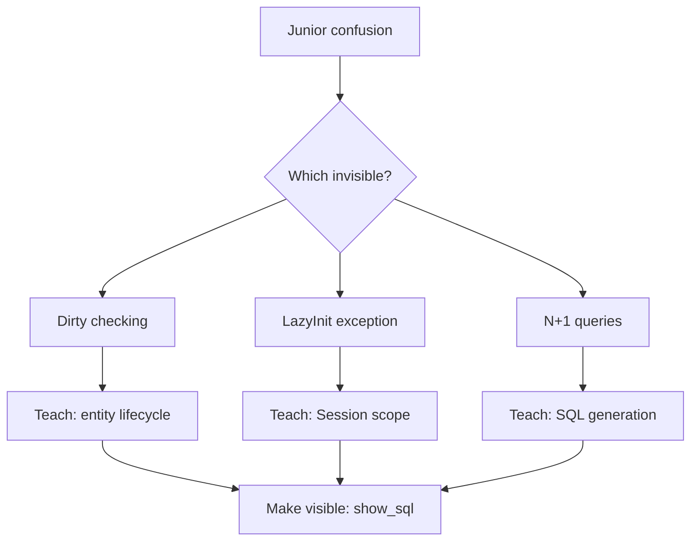

---

### 📶 Gradual Depth

**Level 1 - What it is:**

Juniors struggle with Hibernate because it has three invisible systems (entity lifecycle, SQL generation, persistence context) that interact in non-obvious ways.

**Level 2 - How to use it:**

Teach mental models before APIs. Make the invisible visible (show_sql, statistics). Teach common failure modes (N+1, LazyInitializationException) early, not as advanced topics.

**Level 3 - How it works:**

The abstraction gap: juniors think in "call method, get result" (procedural). Hibernate thinks in "manage state, generate SQL at flush" (stateful). The mental model mismatch causes every confusion.

**Level 4 - Production mastery:**

Senior engineers teaching juniors should: (1) pair on the first Hibernate feature (show the invisible), (2) require query count assertions in the junior's first PR, (3) code review for entity return from controllers (LazyInitializationException risk), (4) teach DTO projections as the default for read endpoints (avoid the problem entirely).

---

### ⚙️ How It Works

**Phase 1 - Make SQL visible (day 1):**
Enable `show_sql=true` or p6spy. Every Hibernate operation shows the generated SQL. Junior sees: "find() generates SELECT. save() generates INSERT. Modifying a managed entity generates UPDATE at flush."

**Phase 2 - Teach entity lifecycle (week 1):**
Diagram: Transient -> Managed -> Detached -> Removed. Explain: "save() makes transient -> managed. find() returns managed. After @Transactional ends: managed -> detached."

**Phase 3 - Teach failure modes (week 2):**
N+1: "Every lazy access is a separate query. Count them with statistics." LazyInitializationException: "You accessed a lazy association after the Session closed."

**Phase 4 - Teach prevention (week 3):**
JOIN FETCH for needed associations. DTO projections for list endpoints. Query count assertions in tests.

```text
  Teaching timeline:
  Day 1: enable show_sql, see SQL
  Week 1: entity lifecycle states
  Week 2: N+1 and LazyInitializationException
  Week 3: JOIN FETCH and DTO projections
  Week 4: query count assertions in tests
  Month 2: caching and performance tuning
  Month 3: production diagnostics
```

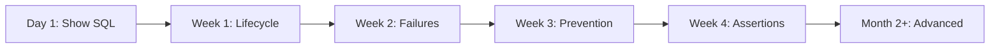

---

### 🚨 Failure Modes

**Failure 1 - Teaching APIs before mental model:**

**Symptom:** Junior knows `save()`, `findById()`, `@Entity` but cannot explain why changes persist without `save()`. Every N+1 requires senior help.

**Root cause:** Learned API surface without understanding the state machine underneath. Tutorial-driven learning.

**Diagnostic:**

```text
Ask: "What happens if you modify a managed
entity without calling save()?"
If answer is "Nothing changes": mental model
is missing. Entity lifecycle not understood.
```

**Fix:**

**BAD:**

```text
Tutorial: "To save an entity, call
repository.save(entity). To find,
call findById(). To update, call
save() again."
(Procedural teaching. Missing: why)
```

**GOOD:**

```text
Lesson 1: "Hibernate tracks entities.
A managed entity is WATCHED by Hibernate.
Any change to a managed entity is
automatically detected (dirty checking)
and written to the DB at flush time.
You do not need to call save()."
(State-based teaching. Explains WHY)
```

**Failure 2 - Not teaching query counting:**

**Symptom:** Junior writes code that works in dev (5 rows) but is slow in production (5000 rows). N+1 was never visible.

**Root cause:** No query counting in development. N+1 is invisible with small data sets.

**Diagnostic:**

```text
Junior's first PR has no query count
assertions. No statistics enabled.
Performance issue discovered in production.
```

**Fix:**

```text
Require query count assertions in
EVERY integration test from day 1.
assertThat(queryCount).isLessThanOrEqualTo(3);
Make N+1 visible before it reaches
production.
```

---

### 🔬 Production Reality

A team onboards 3 junior developers to a Hibernate codebase. Without structured teaching: each junior causes 2-3 N+1 incidents in their first 3 months (total: 7-9 incidents). With structured teaching (mental model first, query assertions required, pair programming on first feature): zero N+1 incidents from juniors in 6 months. The investment: 2 days of senior engineer time per junior for structured onboarding. ROI: 7-9 production incidents prevented.

---

### ⚖️ Trade-offs & Alternatives

| Teaching approach  | Time     | Effectiveness | Retention    |
| ------------------- | -------- | ------------- | ------------ |
| Mental model first  | 2 weeks  | High          | Long-term    |
| Tutorial-driven     | 3 days   | Low           | Short-term   |
| Pair programming    | Ongoing  | Very high     | Long-term    |
| Code review only    | Ongoing  | Medium        | Medium       |
| Self-study (docs)   | Varies   | Low-medium    | Variable     |

**Real-world patterns:**

- **Effective teams** combine mental model teaching (week 1) + pair programming (weeks 2-4) + code review (ongoing).
- **Scaling teams** invest in structured Hibernate onboarding as part of their engineering bootcamp.

---

### ⚡ Decision Snap

**TEACH MENTAL MODEL FIRST WHEN:**

- Always. No exceptions. Entity lifecycle and persistence context before any API usage.

**REQUIRE QUERY ASSERTIONS WHEN:**

- From the first PR. Non-negotiable. Make N+1 visible from day 1.

**PAIR PROGRAM WHEN:**

- Junior's first Hibernate feature. Senior walks through the invisible systems in real code.

---

### ⚠️ Top Traps

| # | Misconception | Reality |
| - | ------------- | ------- |
| 1 | Juniors will learn from documentation | Hibernate documentation explains WHAT, not WHY. Mental models require teaching by an experienced person. |
| 2 | Spring Data JPA hides Hibernate complexity | Spring Data hides the API but not the behavior. Juniors still encounter dirty checking, N+1, and LazyInitializationException. |
| 3 | Start with simple CRUD, add complexity later | N+1 appears in the simplest CRUD: list entities + access associations. Teach prevention early, not late. |
| 4 | Testing catches all issues | Unit tests mock the repository. Only integration tests with real databases reveal N+1 and lazy loading issues. |
| 5 | One training session is enough | Hibernate understanding deepens over months of use. Revisit mental models after the junior encounters their first real production issue. |

---

### 🪜 Learning Ladder

**Prerequisites:**

- First-Level Cache (Persistence Context) Internals -
  the invisible system juniors must understand
- The LazyInitializationException Epidemic - the
  exception juniors encounter first

**THIS:** HIB-103 Teaching Hibernate - Why Juniors Struggle
with ORM

**Next steps:**

- Hibernate Deep-Dive Interview Questions - assessing
  understanding depth
- Hibernate Expert Mastery Verification - progression
  benchmarks for junior -> senior

---

**The Surprising Truth:**

The #1 reason juniors struggle with Hibernate is not complexity - it is invisibility. Every other tool they have used provides immediate, visible feedback: a REST call returns a response, a React component renders on screen, a unit test passes or fails. Hibernate operates on invisible state (persistence context, entity lifecycle) with delayed effects (SQL at flush time). Making these visible (show_sql, statistics, query count assertions) transforms Hibernate from confusing to logical.

**Further Reading:**

- Vlad Mihalcea, "High-Performance Java Persistence" - learning path recommendations
- Spring Data JPA Reference - repository abstraction documentation
- Hibernate ORM User Guide - entity lifecycle and persistence context

**Revision Card:**

1. Three invisible systems cause all junior confusion: entity lifecycle, SQL generation, persistence context state. Make them visible.
2. Teach mental model before API. Require query count assertions from the first PR. Pair program on the first Hibernate feature.
3. Investment: 2 days of senior time per junior. Return: 7-9 production incidents prevented in the first 3 months.

---

---

# HIB-104 ORM Data Layer - Phase 5 (Platform Strategy)

**TL;DR** - Phase 5 data layer treats Hibernate as a platform concern: standardized configuration, shared libraries, fleet-wide governance, automated migration, and centralized monitoring across all services.

---

### 🔥 Problem Statement

An organization grows from 5 services to 50. Each service independently configures Hibernate: different pool sizes, different OSIV settings, different batching strategies, different Spring Boot versions. When a connection pool vulnerability is discovered, 50 teams must patch independently. When a new engineer joins, they learn a different Hibernate configuration per service. Phase 5 treats the data layer as a platform: one shared configuration library, fleet-wide defaults, centralized monitoring, automated migration tooling, and governance policies enforced through CI.

---

### 📜 Historical Context

Platform engineering emerged as a discipline around 2018-2020, driven by the operational burden of managing hundreds of microservices. Before platform teams, each service was independently configured ("you build it, you run it"). The "you run it" part became unsustainable at 50+ services: inconsistent configurations, duplicated effort, and knowledge silos. Data layer platform strategy applies this to Hibernate: shared defaults, centralized monitoring, and governance - while preserving service team autonomy for domain-specific tuning.

---

### 🔩 First Principles

**CORE INVARIANTS:**

1. **Sensible defaults, override when needed:** The platform library provides defaults (OSIV=false, batch_size=25, pool_size=20). Services override only when they have a measured reason.
2. **Governance via CI, not review:** Configuration policies (no OSIV, query count limits, mandatory statistics) are enforced by CI checks, not by human code review.
3. **Centralized monitoring, decentralized ownership:** Platform team monitors fleet-wide Hibernate metrics (connection pool, query count, slow queries). Service teams own their service's performance.
4. **Automated migration:** Hibernate version upgrades, security patches, and configuration changes propagate through the shared library. One update, fleet-wide effect.

**DERIVED DESIGN:**

A shared Spring Boot starter library (`data-platform-starter`) provides Hibernate configuration, connection pool defaults, health checks, and metrics export. Services add the dependency. CI enforces governance policies.

**THE TRADE-OFF:**

**Gain:** Consistency across 50 services. One upgrade path. Centralized monitoring. Reduced onboarding time (learn once, apply everywhere).

**Cost:** Platform team dependency. Shared library versioning complexity. Service teams lose some autonomy.

---

### 🧠 Mental Model

> Phase 5 data layer is like a city building code. Each building (service) is designed by its architect (service team). But the city (platform team) sets building codes: fire safety (OSIV=false), structural requirements (connection pool sizing), and inspections (CI governance). Architects can customize interiors (domain logic) but must comply with codes (platform defaults).

- "Building code" -> platform defaults
- "Fire safety" -> OSIV=false, security patches
- "Structural requirements" -> pool sizing, batching
- "Inspections" -> CI governance checks
- "Customize interiors" -> domain-specific tuning

**Where this analogy breaks down:** Unlike building codes that are legally enforced, platform defaults can be overridden. The platform team must make compliance easier than non-compliance.

---

### 🧩 Components

- **Shared starter library:** `data-platform-starter` Spring Boot starter. Provides Hibernate defaults, connection pool configuration, metrics export, health checks.
- **Configuration hierarchy:** Platform defaults -> service `application.yml` overrides -> profile-specific overrides (dev/staging/prod).
- **CI governance checks:** Lint rules that fail builds on: OSIV=true, show_sql=true in production, missing statistics, connection pool < minimum.
- **Fleet monitoring dashboard:** Grafana dashboard showing per-service: connection pool utilization, query count per request, slow query percentile, cache hit rate.
- **Migration tooling:** Automated OpenRewrite recipes for Hibernate version upgrades. Shared library version bump triggers CI pipeline across all services.

```text
  Platform stack:
  +--------------------------------+
  | Service application.yml       |
  | (domain-specific overrides)    |
  +----------+---------------------+
             |
  +----------v---------------------+
  | data-platform-starter          |
  | OSIV=false, batch=25, pool=20  |
  | Statistics, metrics, health    |
  +----------+---------------------+
             |
  +----------v---------------------+
  | Spring Boot auto-configuration |
  | Hibernate + HikariCP           |
  +--------------------------------+
```

```mermaid
flowchart TD
    A[data-platform-starter] --> B[Hibernate defaults]
    A --> C[HikariCP defaults]
    A --> D[Metrics export]
    A --> E[Health checks]
    F[Service A] --> A
    G[Service B] --> A
    H[Service C] --> A
    I[CI Pipeline] --> J{Governance checks}
    J -->|OSIV=true| K[FAIL]
    J -->|Compliant| L[PASS]
```

---

### 📶 Gradual Depth

**Level 1 - What it is:**

Phase 5 treats Hibernate configuration as a platform concern. One shared library provides defaults across all services. CI enforces governance. Fleet monitoring provides visibility.

**Level 2 - How to use it:**

Add `data-platform-starter` to each service's `pom.xml`. Platform defaults apply. Override in `application.yml` when needed. CI checks governance compliance.

**Level 3 - How it works:**

The starter uses Spring Boot auto-configuration. `@ConditionalOnMissingBean` allows service overrides. Metrics are exported to Prometheus via Micrometer. CI governance runs custom lint rules against `application.yml`.

**Level 4 - Production mastery:**

Version strategy: the starter follows semantic versioning. Minor versions add features (backward compatible). Major versions require migration. Deprecation policy: deprecated features warn for 2 minor versions before removal. Communication: platform team publishes a quarterly "state of the data platform" report with fleet-wide metrics, common issues, and upgrade recommendations.

---

### ⚙️ How It Works

**Phase 1 - Build the starter (2-4 weeks):**
Create Spring Boot starter with auto-configuration. Define defaults for Hibernate, HikariCP, statistics, and metrics. Publish to internal Maven repository.

**Phase 2 - Adopt incrementally (4-8 weeks):**
Start with 5 pilot services. Verify defaults work. Collect feedback. Adjust. Roll out to remaining services.

**Phase 3 - Add governance (2-4 weeks):**
CI rules: no OSIV in production, mandatory statistics, connection pool minimum. Services that fail governance get automated PR with fixes.

**Phase 4 - Fleet monitoring (2-4 weeks):**
Grafana dashboards with per-service Hibernate metrics. Alerting on: pool exhaustion, high query count, slow queries. Platform team monitors fleet health.

**Phase 5 - Automated migration (ongoing):**
When Hibernate security patch is needed: update starter version. CI pipelines across services detect version bump. Automated PR with OpenRewrite migration. Service team reviews and merges.

```text
  Starter auto-configuration example:
  @Configuration
  @ConditionalOnClass(SessionFactory.class)
  public class DataPlatformAutoConfig {
    // OSIV=false (non-negotiable)
    // Batch size=25 (overridable)
    // Statistics=true (non-negotiable)
    // Pool size=20 (overridable)
    // Metrics=enabled (non-negotiable)
  }
```

```mermaid
sequenceDiagram
    participant Platform as Platform Team
    participant Starter as Shared Starter
    participant Maven as Maven Repo
    participant CI as Service CI
    participant Svc as Service Team
    Platform->>Starter: Update Hibernate version
    Starter->>Maven: Publish v2.3.0
    Maven->>CI: Dependency check detects
    CI->>Svc: Automated PR with migration
    Svc->>CI: Review and merge
    CI->>CI: Governance checks pass
```

---

### 🚨 Failure Modes

**Failure 1 - Over-constraining services:**

**Symptom:** Platform starter enforces batch_size=25 globally. An analytics service needs batch_size=100 for bulk imports. Cannot override. Service team forks the starter.

**Root cause:** Platform defaults are too rigid. No override mechanism. Services cannot adapt to their specific workload.

**Diagnostic:**

```text
Service team files request to change
platform default. Platform team says no.
Service team forks starter. Governance
divergence begins.
```

**Fix:**

**BAD:**

```text
All Hibernate properties locked in starter.
No overrides allowed. One size fits all.
```

**GOOD:**

```text
Starter categorizes properties:
NON-NEGOTIABLE (OSIV=false, statistics)
  -> cannot be overridden
RECOMMENDED (batch_size=25, pool=20)
  -> can be overridden with justification
OPTIONAL (fetch strategy, cache)
  -> fully service-controlled
```

**Failure 2 - Starter version sprawl:**

**Symptom:** 50 services use 12 different starter versions. Oldest version is 18 months behind. Security patch requires updating all 12 versions.

**Root cause:** No enforcement of starter version currency. Services never upgrade because "it works."

**Diagnostic:**

```text
Scan fleet for starter versions:
grep -r 'data-platform-starter' */pom.xml
If > 3 versions in use: version sprawl.
```

**Fix:**

```text
CI governance: starter version must be
within 2 minor versions of latest.
Automated quarterly upgrade PRs.
Security patches trigger immediate
mandatory upgrade with SLA.
```

---

### 🔬 Production Reality

A platform team supports 45 microservices. Before the starter: 45 different Hibernate configurations, 3 N+1 incidents per month, 2 connection pool incidents per quarter. After the starter (6-month rollout): unified configuration, fleet-wide monitoring dashboard, zero N+1 incidents (CI query count assertions), zero connection pool incidents (standardized sizing + monitoring). Ongoing cost: 1 platform engineer at 30% allocation for starter maintenance, governance, and upgrades. ROI: 5+ incidents per month prevented, 2-day-faster onboarding for new engineers.

---

### ⚖️ Trade-offs & Alternatives

| Approach         | Consistency | Autonomy | Cost          |
| ---------------- | ----------- | -------- | ------------- |
| No platform      | Low         | Full     | High (incidents)|
| Shared starter   | High        | High     | Medium        |
| Mandated config  | Very high   | Low      | Medium        |
| Service mesh     | Medium      | Full     | High (infra)  |

**Real-world patterns:**

- **Effective platform teams** provide the shared starter as a service, not a mandate. Make compliance easier than non-compliance.
- **Platform tax:** the shared starter saves each service team 2-3 days of initial setup and prevents 1-2 incidents per year per service.

---

### ⚡ Decision Snap

**BUILD A PLATFORM STARTER WHEN:**

- 10+ services use Hibernate. Configuration inconsistency causes incidents. Onboarding takes too long.

**KEEP INDEPENDENT CONFIG WHEN:**

- < 10 services. Team has capacity to manage each independently. No recurring incidents.

**NON-NEGOTIABLE PLATFORM DEFAULTS:**

- OSIV=false. Statistics enabled. Connection pool monitoring. Query count assertions in CI.

---

### ⚠️ Top Traps

| # | Misconception | Reality |
| - | ------------- | ------- |
| 1 | Platform starter = lock-in | Good starters allow overrides. Only safety-critical defaults (OSIV, statistics) are non-negotiable. |
| 2 | Every service should upgrade immediately | Allow 2 minor version lag. Force upgrade only for security patches. Quarterly upgrade cycle for features. |
| 3 | Platform team owns all data layer issues | Platform owns the starter and fleet monitoring. Service teams own their service's performance. Shared responsibility. |
| 4 | One configuration fits all services | Services have different workloads. The starter provides sensible defaults with explicit override paths. |
| 5 | Governance replaces culture | CI governance catches mechanical violations. Culture drives understanding. Both are needed. |

---

### 🪜 Learning Ladder

**Prerequisites:**

- Fleet-Wide Hibernate Governance and Standards -
  governance policies the platform enforces
- Hibernate in Microservices vs Monolith Decision
  Guide - per-service Hibernate patterns

**THIS:** HIB-104 ORM Data Layer - Phase 5 (Platform Strategy)

**Next steps:**

- Build vs Extend vs Replace ORM Decision Guide -
  platform-level technology evaluation
- Staff-Level ORM Interview Scenarios - platform
  strategy as a staff-level concern

---

**The Surprising Truth:**

The most impactful feature of a data platform starter is not the Hibernate configuration - it is the fleet monitoring dashboard. When every service exports Hibernate metrics to a central Grafana, the platform team spots issues before they become incidents. Connection pool at 80%? Alert the service team before it reaches 100%. Query count trending up? Proactive optimization. The visibility is more valuable than the configuration.

**Further Reading:**

- Team Topologies by Skelton and Pais - platform team patterns
- Spring Boot custom starter documentation (spring.io)
- Micrometer documentation - metrics for Hibernate (micrometer.io)

**Revision Card:**

1. Platform starter provides Hibernate defaults (OSIV=false, statistics, pool sizing) across all services. Override when justified.
2. Governance via CI (automated checks), not code review. Non-negotiable: OSIV, statistics, pool monitoring. Overridable: batch size, pool size.
3. Fleet monitoring dashboard is the highest-value platform investment. Visibility prevents incidents before they happen.

---

---

# HIB-105 Build vs Extend vs Replace ORM Decision Guide

**TL;DR** - When Hibernate does not fit, decide: build a custom data layer, extend Hibernate with SPIs, or replace with jOOQ/JDBC. Each has clear criteria based on workload, team, and constraints.

---

### 🔥 Problem Statement

A team hits Hibernate friction: complex queries, performance overhead, or architectural mismatch. Three options: (1) Build a custom data layer (JDBC + custom mapping), (2) Extend Hibernate (custom UserTypes, custom dialects, SPI hooks), (3) Replace Hibernate (jOOQ, MyBatis, or plain JDBC). The wrong choice wastes months. Building a custom layer reimplements what Hibernate already provides. Extending Hibernate adds complexity where replacement is simpler. Replacing Hibernate loses features the team depends on. The decision framework: match the solution to the specific friction point.

---

### 📜 Historical Context

The "build vs extend vs replace" framework has been applied to ORM decisions since the early 2000s, when alternatives to Hibernate first appeared (iBATIS/MyBatis 2004, jOOQ 2009). Early decisions were often emotional ("Hibernate is too complex, let us write raw JDBC"). Experience showed: raw JDBC reimplements entity management, transaction scoping, and caching - recreating ORM features badly. The mature view: identify the specific friction point, then choose the minimum intervention that resolves it.

---

### 🔩 First Principles

**CORE INVARIANTS:**

1. **Identify the friction point first:** "Hibernate is slow" is not actionable. "JPQL cannot express window functions for our analytics queries" is actionable. The friction point determines the intervention.
2. **Minimum intervention principle:** Choose the least disruptive option that resolves the friction. Extend before replace. Replace one subsystem before replacing everything.
3. **Maintenance cost > initial cost:** Building a custom layer takes 2 weeks. Maintaining it for 3 years takes 6 months. Factor ongoing maintenance into every decision.
4. **Team expertise matters:** The best technical solution is useless if the team cannot maintain it. A slightly suboptimal solution the team understands beats a perfect solution they cannot debug.

**DERIVED DESIGN:**

Decision tree: (1) Is the friction in queries? -> Extend with native SQL or jOOQ hybrid. (2) Is the friction in type mapping? -> Extend with custom UserTypes. (3) Is the friction in the ORM model itself? -> Replace for that specific workload. (4) Is the friction in everything? -> Replace entirely (rare).

**THE TRADE-OFF:**

**Gain:** A deliberate, friction-specific decision that avoids over-engineering and under-engineering.

**Cost:** Requires honest assessment of the actual friction point. Teams often misdiagnose "Hibernate is bad" when the issue is misuse.

---

### 🧠 Mental Model

> Build/extend/replace is like car repair. If the radio is broken (query friction), do not rebuild the engine (custom data layer). Fix the radio (extend with native SQL). If the engine is fundamentally wrong for the road (ORM mismatch for analytics), then replace the engine (switch to jOOQ). But never scrap the entire car (rewrite) when a part replacement suffices.

- "Radio broken" -> query friction (fix with native SQL)
- "Fix radio" -> extend Hibernate
- "Wrong engine" -> fundamental ORM mismatch
- "Replace engine" -> switch to jOOQ for that workload
- "Scrap car" -> full rewrite (almost never justified)

**Where this analogy breaks down:** Unlike cars, software components can coexist. You can have BOTH Hibernate and jOOQ in the same application (hybrid approach).

---

### 🧩 Components

**Decision criteria:**

| Friction type        | Build custom | Extend Hibernate | Replace       |
| -------------------- | ------------ | ---------------- | ------------- |
| Complex SQL queries  | No           | Native SQL       | jOOQ hybrid   |
| Custom type mapping  | No           | Custom UserType  | No            |
| Database dialect gap | No           | Custom Dialect   | No            |
| Bulk data processing | No           | StatelessSession | JDBC/jOOQ     |
| Analytics/reporting  | No           | No               | jOOQ/JDBC     |
| Full ORM mismatch    | Maybe        | No               | Full replace  |
| Fun/resume-driven    | Never        | Never            | Never         |

```text
  Decision tree:
  Q: What is the friction?
  |
  +-> Query limitation?
  |   +-> Use native SQL or jOOQ hybrid
  |
  +-> Type mapping gap?
  |   +-> Write custom UserType/Converter
  |
  +-> Performance (bulk)?
  |   +-> Use StatelessSession or JDBC
  |
  +-> Fundamental mismatch?
      +-> Evaluate replacement options
      +-> Is the team's expertise aligned?
          +-> Yes: migrate incrementally
          +-> No: extend or stay
```

```mermaid
flowchart TD
    A[Friction identified] --> B{What type?}
    B --> C[Query limitation]
    B --> D[Type mapping]
    B --> E[Performance/bulk]
    B --> F[Fundamental mismatch]
    C --> G[Native SQL or jOOQ hybrid]
    D --> H[Custom UserType/Converter]
    E --> I[StatelessSession or JDBC]
    F --> J{Team expertise?}
    J -->|Aligned| K[Incremental replacement]
    J -->|Not aligned| L[Extend or stay]
```

---

### 📶 Gradual Depth

**Level 1 - What it is:**

A decision framework for when Hibernate does not fit perfectly. Three options: build custom, extend Hibernate, or replace with an alternative. Choose based on the specific friction point.

**Level 2 - How to use it:**

Identify the friction point (queries, types, performance, architecture). Match to intervention: most friction is query-related (fix with native SQL or jOOQ). Type friction: custom UserType. Performance: StatelessSession. Only fundamental mismatch justifies replacement.

**Level 3 - How it works:**

Build: reimplements entity management, caching, transaction scoping. High maintenance cost. Justified only for ultra-specific workloads (custom database protocols, embedded systems). Extend: uses Hibernate SPIs (UserType, Dialect, Integrator). Maintains compatibility. Replace: switches the data layer technology. Incremental replacement uses hybrid (Hibernate + jOOQ coexistence).

**Level 4 - Production mastery:**

Most "replace Hibernate" decisions are driven by misuse, not mismatch. Before replacing: verify N+1 is fixed, OSIV is disabled, DTO projections are used for reads, and batching is configured. If performance is still insufficient after proper use: the friction is genuine and replacement is justified. Track the decision with an ADR (Architecture Decision Record).

---

### ⚙️ How It Works

**Phase 1 - Diagnose the friction:**
Name the specific problem. "JPQL cannot express window functions." "Bulk imports are slow." "Entity model does not fit event-sourced architecture."

**Phase 2 - Evaluate options:**
For each option (build/extend/replace): estimate initial effort, ongoing maintenance, risk, and team alignment.

**Phase 3 - Choose minimum intervention:**
Query friction -> native SQL or jOOQ for those specific queries. Type friction -> custom UserType. Bulk performance -> StatelessSession or JDBC batch. Fundamental mismatch -> incremental replacement.

**Phase 4 - Document the decision:**
ADR (Architecture Decision Record): problem statement, options considered, decision, consequences, review date.

```text
  ADR example:
  Title: Use jOOQ for analytics queries
  Status: Accepted
  Context: 15 analytics queries require
    window functions, CTEs, and lateral
    joins. JPQL cannot express these.
    Hibernate native SQL is verbose.
  Decision: Add jOOQ for analytics queries.
    Keep Hibernate for domain entities.
  Consequences:
    + Type-safe complex SQL
    + Better IDE support for analytics
    - Two frameworks to maintain
    - Team needs jOOQ training (2 days)
  Review: In 6 months, evaluate if hybrid
    is working or if full migration needed.
```

```mermaid
flowchart LR
    A[Diagnose friction] --> B[Evaluate options]
    B --> C[Choose minimum intervention]
    C --> D[Document ADR]
    D --> E[Implement]
    E --> F[Review in 6 months]
```

---

### 🚨 Failure Modes

**Failure 1 - Resume-driven replacement:**

**Symptom:** Team replaces Hibernate with jOOQ "because it is better." No specific friction identified. After migration, they reimplemented cascade, dirty checking, and optimistic locking manually (the features Hibernate provided for free).

**Root cause:** Decision driven by technology preference, not by diagnosed friction. No evaluation of what Hibernate provided versus what the replacement offers.

**Diagnostic:**

```text
Ask: "What specific problem are you
solving by replacing Hibernate?"
If answer is vague ("Hibernate is complex",
"jOOQ is modern"): resume-driven decision.
```

**Fix:**

**BAD:**

```text
"Hibernate is too complex. Let's use jOOQ."
(No friction diagnosis. No cost analysis.)
```

**GOOD:**

```text
"Our 15 analytics queries need window
functions. JPQL can't express them.
Two options: (1) native SQL in Hibernate,
(2) jOOQ for analytics only.
jOOQ gives type-safe SQL and IDE support.
We keep Hibernate for domain entities.
ADR documented. Review in 6 months."
```

**Failure 2 - Building what exists:**

**Symptom:** Team builds a custom "lightweight ORM" because "Hibernate is too heavy." After 6 months, the custom ORM has: entity mapping, dirty checking, caching, and connection pooling. It is Hibernate, but worse.

**Root cause:** Underestimating what Hibernate provides. The "heavyweight" perception is often wrong - Hibernate startup is 2-3 seconds; runtime overhead is minimal.

**Diagnostic:**

```text
Custom data layer has:
- Entity mapping -> Hibernate has this
- Change tracking -> Hibernate has this
- Caching -> Hibernate has this
- Connection pooling -> HikariCP has this
Total reimplemented features: 4
Total bugs in custom implementation: many
```

**Fix:**

```text
Before building custom: list every
feature the current tool provides.
For each feature: does the custom
solution need it? If yes: maintenance
cost of reimplementing.
Usually: extending Hibernate is cheaper
than building from scratch.
```

---

### 🔬 Production Reality

A team at a financial services company wants to "replace Hibernate" because "queries are slow." Diagnosis reveals: OSIV is enabled (holding connections through rendering), N+1 on 8 endpoints (no JOIN FETCH), and batch size is default (1). After fixing these three issues: query latency drops 80%. The team no longer wants to replace Hibernate. Total effort: 2 developer-days. If they had proceeded with jOOQ migration: estimated 3 months. The friction was misuse, not mismatch.

---

### ⚖️ Trade-offs & Alternatives

| Decision | Initial cost | Maintenance | Risk    | When           |
| -------- | ------------ | ----------- | ------- | -------------- |
| Extend   | Low (days)   | Low         | Low     | Most cases     |
| Hybrid   | Medium (weeks)| Medium     | Medium  | Query friction |
| Replace  | High (months)| Low-medium  | High    | True mismatch  |
| Build    | Very high    | Very high   | Very high| Ultra-specific|

**Real-world patterns:**

- **90% of cases:** Extend (native SQL, custom types, StatelessSession) resolves the friction.
- **9% of cases:** Hybrid (Hibernate + jOOQ) resolves query-specific friction.
- **1% of cases:** Full replacement is justified (architecture mismatch like event sourcing).

---

### ⚡ Decision Snap

**EXTEND WHEN:**

- Friction is in specific queries, types, or bulk operations. Hibernate works well for 80%+ of the workload.

**HYBRID WHEN:**

- 10-30% of queries cannot be expressed in JPQL. Team has capacity to maintain two frameworks.

**REPLACE WHEN:**

- Architecture fundamentally mismatches ORM (event sourcing, graph-first, time-series-only). Team has expertise in the replacement technology.

**BUILD WHEN:**

- Almost never. Custom data layers are justified only for proprietary database protocols or embedded systems with extreme constraints.

---

### ⚠️ Top Traps

| # | Misconception | Reality |
| - | ------------- | ------- |
| 1 | Hibernate is slow, so replace it | 80% of "Hibernate is slow" is misuse (OSIV, N+1, no batching). Fix misuse before evaluating alternatives. |
| 2 | Building custom is lightweight | Custom data layers accumulate features until they replicate what Hibernate provides, but with more bugs and less documentation. |
| 3 | jOOQ replaces everything Hibernate does | jOOQ is a SQL builder, not an ORM. It does not provide dirty checking, cascade, L2 cache, or optimistic locking. |
| 4 | The decision is permanent | Decisions are reversible. Start with extend. If insufficient, move to hybrid. If hybrid is insufficient (rare), then replace. |
| 5 | Technology choice matters most | Team expertise, maintenance capacity, and organizational context matter more than the technology itself. |

---

### 🪜 Learning Ladder

**Prerequisites:**

- ORM vs SQL-First Strategy Decision Framework - initial
  technology selection
- ORM-to-SQL-Builder (jOOQ/Exposed) Migration Strategy -
  migration mechanics

**THIS:** HIB-105 Build vs Extend vs Replace ORM Decision Guide

**Next steps:**

- Hibernate SPI Extensions and Custom UserTypes -
  extending Hibernate's capabilities
- Staff-Level ORM Interview Scenarios - decision
  frameworks as staff-level skill

---

**The Surprising Truth:**

Most "replace Hibernate" decisions are really "fix Hibernate misuse" decisions in disguise. In practice, 90% of teams that conduct an honest friction diagnosis discover that their problems are OSIV, N+1, missing batching, or missing DTO projections - not fundamental ORM limitations. The remaining 10% have genuine friction (complex analytics, bulk processing) that a hybrid approach resolves without full replacement.

**Further Reading:**

- Martin Fowler, "Patterns of Enterprise Application Architecture" - data mapper vs active record patterns
- Vlad Mihalcea, "High-Performance Java Persistence" - optimizing before replacing
- ThoughtWorks Technology Radar - ORM evaluation criteria

**Revision Card:**

1. Diagnose the specific friction first. "Hibernate is slow" is not a diagnosis. "JPQL cannot express window functions" is.
2. Minimum intervention: extend (90% of cases), hybrid (9%), replace (1%). Building custom is almost never justified.
3. Most replacement decisions are misuse diagnoses in disguise. Fix OSIV, N+1, batching, and projections before evaluating alternatives.

---

---

# HIB-106 JPA Specification Internals and Metamodel API

**TL;DR** - JPA is a specification (not a library). The Metamodel API provides type-safe, compile-time-checked access to entity metadata. Hibernate implements JPA but extends it significantly.

---

### 🔥 Problem Statement

A developer writes `@Entity`, `@Id`, `@Column` and assumes these are Hibernate annotations. They are not. They are JPA specification annotations (`jakarta.persistence.*`). JPA defines the contract; Hibernate implements it. Understanding the distinction matters: JPA features are portable across providers (EclipseLink, OpenJPA). Hibernate extensions (`@Cache`, `@BatchSize`, `@DynamicUpdate`) are Hibernate-specific. The Metamodel API (JPA 2.0+) provides type-safe entity metadata access, enabling compile-time-checked criteria queries instead of string-based JPQL.

---

### 📜 Historical Context

JPA 1.0 (2006) standardized ORM in Java EE, unifying Hibernate, TopLink, and JDO into one specification. JPA 2.0 (2009) added the Criteria API and the Metamodel API (type-safe entity metadata). JPA 2.1 (2013) added stored procedures, entity graphs, and CDI integration. JPA 2.2 (2017) added `Stream` support and date/time API. JPA 3.0 (2020, Jakarta EE 9) renamed `javax.persistence` to `jakarta.persistence`. JPA 3.1 (2022) added UUID generation and minor enhancements. Hibernate has always implemented JPA while providing extensive proprietary extensions.

---

### 🔩 First Principles

**CORE INVARIANTS:**

1. **JPA is a specification:** A set of interfaces and annotations that define the ORM contract. No implementation code. `EntityManager`, `@Entity`, `@Id` are JPA-defined.
2. **Hibernate implements JPA:** When you use `EntityManager`, you are using JPA's interface, implemented by Hibernate's `SessionImpl`. The implementation can be swapped (EclipseLink, OpenJPA).
3. **Metamodel provides type safety:** `EntityType<Order>`, `SingularAttribute<Order, Long>` replace string-based field references. `"customerName"` becomes `Order_.customerName`.
4. **Extensions are provider-specific:** `@Cache` (L2 cache), `@NaturalId`, `@Formula`, `@BatchSize` are Hibernate extensions, not JPA standard. Using them ties the application to Hibernate.

**DERIVED DESIGN:**

For portable code: use only `jakarta.persistence.*` annotations and JPA Criteria + Metamodel. For production Hibernate code: use Hibernate extensions where they provide clear value (L2 cache, batch sizing) and accept the provider lock-in.

**THE TRADE-OFF:**

**Gain (JPA-only):** Portable across JPA providers. Follows the specification.

**Cost (JPA-only):** Misses Hibernate-specific optimizations (batching, caching, dynamic updates).

**Gain (Hibernate extensions):** Better performance, richer features.

**Cost (Hibernate extensions):** Provider lock-in (practically irrelevant - provider switches are rare).

---

### 🧠 Mental Model

> JPA specification is like the USB standard. It defines the connector shape (interface) and data protocol (contract). Hibernate is like a specific USB device manufacturer. The device (Hibernate) follows the standard (JPA) so it works with any host (application). But the device also has proprietary features (Hibernate extensions) that only work with certain software (Hibernate-aware code).

- "USB standard" -> JPA specification
- "Connector shape" -> `@Entity`, `EntityManager`
- "Device manufacturer" -> Hibernate
- "Proprietary features" -> `@Cache`, `@BatchSize`
- "Any host" -> any JPA-aware application

**Where this analogy breaks down:** Unlike USB where standardization is critical for hardware interoperability, JPA provider portability is rarely exercised. Most applications choose Hibernate and stay with Hibernate.

---

### 🧩 Components

- **JPA annotations:** `@Entity`, `@Id`, `@Column`, `@ManyToOne`, `@OneToMany`, `@NamedQuery` - all defined in `jakarta.persistence`.
- **EntityManager:** JPA's core interface. `persist()`, `merge()`, `find()`, `remove()`, `createQuery()`. Hibernate implements it.
- **Criteria API:** Programmatic, type-safe query building. `CriteriaBuilder`, `CriteriaQuery`, `Root`, `Predicate`.
- **Metamodel API:** Type-safe entity metadata. Generated at compile time by annotation processor. `Order_`, `Customer_` classes with static fields.
- **Hibernate extensions:** `@Cache`, `@NaturalId`, `@Formula`, `@DynamicUpdate`, `@BatchSize`, `@Fetch`, `Session` (Hibernate-specific interface extending EntityManager).

```text
  JPA vs Hibernate annotations:
  +-------------------+-------------------+
  | JPA (portable)    | Hibernate-only    |
  +-------------------+-------------------+
  | @Entity           | @Cache            |
  | @Id               | @NaturalId        |
  | @Column           | @Formula          |
  | @ManyToOne        | @BatchSize        |
  | @NamedQuery       | @DynamicUpdate    |
  | @GeneratedValue   | @Fetch            |
  | @EntityGraph      | @Where (removed 6)|
  +-------------------+-------------------+
```

```mermaid
flowchart TD
    A[JPA Specification] --> B[@Entity, @Id]
    A --> C[EntityManager]
    A --> D[Criteria API]
    A --> E[Metamodel API]
    F[Hibernate] --> G[Implements JPA]
    F --> H[@Cache, @BatchSize]
    F --> I[Session extends EM]
    F --> J[Custom Dialects]
    G --> A
```

---

### 📶 Gradual Depth

**Level 1 - What it is:**

JPA is a specification defining ORM annotations and interfaces. Hibernate implements JPA. The Metamodel API provides type-safe entity metadata for compile-time-checked queries.

**Level 2 - How to use it:**

Use `jakarta.persistence.*` for core annotations. Use `CriteriaBuilder` + Metamodel (`Order_`) for type-safe queries. Use Hibernate extensions (`@Cache`, `@BatchSize`) when needed.

**Level 3 - How it works:**

The Metamodel API uses annotation processing at compile time. The JPA annotation processor generates `_` classes (e.g., `Order_`) with `SingularAttribute`, `PluralAttribute` fields. These replace string-based field names in Criteria queries, providing compile-time type checking.

**Level 4 - Production mastery:**

Criteria + Metamodel shines for dynamic queries (search filters, multi-criteria queries) where JPQL would require string concatenation. For static queries, JPQL or `@Query` remains more readable. The Metamodel also enables framework-level code: generic repositories, audit infrastructure, and entity introspection.

---

### ⚙️ How It Works

**Phase 1 - Annotation processing:**
Add `hibernate-jpamodelgen` to build dependencies. At compile time, it generates `Order_`, `Customer_` etc. in the same package.

**Phase 2 - Metamodel classes:**
`Order_` has: `public static volatile SingularAttribute<Order, Long> id`, `public static volatile SingularAttribute<Order, String> status`, etc.

**Phase 3 - Criteria query with Metamodel:**
Use `Order_.status` instead of `"status"`. Compile-time checked. Refactoring-safe.

**Phase 4 - EntityManager delegation:**
`EntityManager.persist()` delegates to `SessionImpl.persist()`. The JPA interface hides the Hibernate implementation. `EntityManager.unwrap(Session.class)` accesses Hibernate-specific features when needed.

```text
  BEFORE (string-based, not type-safe):
  cb.equal(root.get("status"), "ACTIVE");
  // "status" is a string. Typo compiles
  // but fails at runtime.

  AFTER (Metamodel, type-safe):
  cb.equal(root.get(Order_.status),
      "ACTIVE");
  // Order_.status is a typed field.
  // Typo = compile error.
```

```mermaid
flowchart LR
    A[Entity class: Order.java] --> B[Annotation processor]
    B --> C[Generated: Order_.java]
    C --> D[SingularAttribute fields]
    D --> E[CriteriaBuilder uses Order_]
    E --> F[Compile-time type check]
    F --> G[Safe refactoring]
```

---

### 🚨 Failure Modes

**Failure 1 - String-based criteria queries:**

**Symptom:** Field renamed from `status` to `orderStatus`. All string-based criteria queries (`root.get("status")`) compile but fail at runtime with `IllegalArgumentException`.

**Root cause:** String-based field references have no compile-time checking. Renaming a field does not cause compilation errors in criteria queries.

**Diagnostic:**

```text
java.lang.IllegalArgumentException:
Unable to locate Attribute with the
given name [status] on this
ManagedType [Order]
```

**Fix:**

**BAD:**

```java
// String-based: no compile-time check
Predicate p = cb.equal(
    root.get("status"), "ACTIVE");
// Rename "status" to "orderStatus"
// -> runtime exception
```

**GOOD:**

```java
// Metamodel: compile-time checked
Predicate p = cb.equal(
    root.get(Order_.orderStatus),
    "ACTIVE");
// Rename: Order_ regenerated
// -> compile error if mismatched
```

**Failure 2 - Mixing JPA and Hibernate annotations:**

**Symptom:** Entity uses `@jakarta.persistence.Cacheable` (JPA) but L2 cache does not work. Team expected it to enable caching.

**Root cause:** JPA `@Cacheable` marks the entity as cacheable, but Hibernate needs `@org.hibernate.annotations.Cache(usage = READ_WRITE)` to configure the caching strategy. JPA annotation alone is insufficient.

**Diagnostic:**

```text
Entity has @Cacheable but:
- No Hibernate @Cache with strategy
- Or: shared-cache-mode not set in
  persistence.xml / properties
Cache statistics show 0 hits.
```

**Fix:**

```java
// Both annotations needed for Hibernate L2
@Entity
@Cacheable // JPA: mark as cacheable
@Cache(usage =
    CacheConcurrencyStrategy.READ_WRITE)
    // Hibernate: define strategy
public class Product { ... }
```

---

### 🔬 Production Reality

A team builds a dynamic search API with 12 optional filters. JPQL approach: string concatenation with 12 conditional blocks, prone to SQL injection and bugs. Criteria + Metamodel approach: type-safe predicates added conditionally. Refactoring entity fields causes compile-time failures (caught in CI), not runtime failures (caught in production). After adopting Metamodel: zero runtime query failures from field renames across 18 months. Before: 2-3 runtime failures per quarter from string-based queries.

---

### ⚖️ Trade-offs & Alternatives

| Query approach     | Type safety | Readability | Dynamic queries |
| ------------------- | ---------- | ----------- | --------------- |
| JPQL string         | None       | High        | Poor (concat)   |
| Criteria + strings  | Partial    | Low         | Good            |
| Criteria + Metamodel| Full       | Medium      | Excellent       |
| Native SQL          | None       | Medium      | Good            |
| jOOQ                | Full       | High        | Excellent       |

**Real-world patterns:**

- **Static queries:** JPQL is more readable. Use `@Query` in Spring Data.
- **Dynamic queries:** Criteria + Metamodel is type-safe and refactoring-safe. Use for search endpoints with optional filters.

---

### ⚡ Decision Snap

**USE METAMODEL WHEN:**

- Dynamic queries with multiple optional filters. Search endpoints. Generic repository infrastructure.

**USE JPQL WHEN:**

- Static queries with known structure. Readability is the priority.

**USE HIBERNATE EXTENSIONS WHEN:**

- Specific optimization needed (L2 cache, batch sizing, dynamic updates). Accept provider lock-in.

---

### ⚠️ Top Traps

| # | Misconception | Reality |
| - | ------------- | ------- |
| 1 | @Entity is a Hibernate annotation | @Entity is defined in JPA (`jakarta.persistence.Entity`). Hibernate implements the JPA specification. |
| 2 | JPA portability matters in practice | 99% of applications choose Hibernate and never switch. Portability is theoretically valuable, practically irrelevant. |
| 3 | Criteria API is always better than JPQL | Criteria is better for DYNAMIC queries. JPQL is more readable for static queries. Use each where it fits. |
| 4 | Metamodel generation is automatic | Requires annotation processor dependency (`hibernate-jpamodelgen`) and IDE configuration. Not enabled by default. |
| 5 | JPA @Cacheable enables caching alone | JPA @Cacheable marks the intent. Hibernate @Cache configures the strategy. Both are needed for L2 caching to work. |

---

### 🪜 Learning Ladder

**Prerequisites:**

- Persistence Provider Design - How an ORM Is Built - how
  JPA providers implement the specification
- Hibernate Source Code Architecture and Bootstrap
  Sequence - how Hibernate boots as a JPA provider

**THIS:** HIB-106 JPA Specification Internals and Metamodel API

**Next steps:**

- Writing a Custom Hibernate Dialect - extending JPA
  with database-specific SQL generation
- Hibernate SPI Extensions and Custom UserTypes -
  extending JPA type handling

---

**The Surprising Truth:**

The most valuable feature of the JPA Metamodel API is not type safety in criteria queries - it is refactoring safety. When a field is renamed, every Metamodel-based query fails at compile time. String-based queries fail at runtime in production. For applications with 50+ queries and frequent schema evolution, the Metamodel prevents 2-3 production failures per quarter - each of which would require an emergency fix.

**Further Reading:**

- JPA 3.1 Specification (Jakarta EE) - jakarta.ee
- Hibernate ORM User Guide - JPA Metamodel Generator section
- Vlad Mihalcea, "JPA Criteria API vs JPQL" (vladmihalcea.com)

**Revision Card:**

1. JPA is a specification (interfaces + annotations). Hibernate is an implementation. `@Entity` and `EntityManager` are JPA. `@Cache` and `Session` are Hibernate.
2. Metamodel API generates `Order_` classes with typed fields. Use for dynamic queries: `root.get(Order_.status)` is compile-time checked and refactoring-safe.
3. Provider portability is rarely exercised. Use Hibernate extensions when they provide clear value. Document the extension dependency in the ADR.

---

---

# HIB-107 Writing a Custom Hibernate Dialect

**TL;DR** - A custom Hibernate Dialect teaches the ORM how a specific database generates SQL. Write one when Hibernate's built-in dialect misses a database feature or targets an unsupported database.

---

### 🔥 Problem Statement

A team uses a niche database (CockroachDB, YugabyteDB, or a legacy proprietary system) and Hibernate's built-in dialect does not support its specific SQL syntax, type mappings, or pagination strategy. Queries fail or generate suboptimal SQL. Two options: (1) use native SQL everywhere (losing Hibernate's query generation), or (2) write a custom Dialect that teaches Hibernate the database's SQL rules. A custom Dialect is a single class that maps Java types to SQL types, registers database functions, and defines pagination and locking syntax.

---

### 📜 Historical Context

Hibernate's Dialect system has existed since Hibernate 2 (2003). The original design goal: separate database-specific SQL generation from the ORM core. Hibernate ships with 40+ built-in dialects (PostgreSQL, MySQL, Oracle, SQL Server, DB2, etc.). The Dialect API has evolved significantly in Hibernate 6: the monolithic `Dialect` class was refactored into smaller components (`SqlAstTranslator`, `TypeContributor`, `FunctionContributor`). Custom dialects in Hibernate 6 extend fewer methods but use more registration-based APIs.

---

### 🔩 First Principles

**CORE INVARIANTS:**

1. **Dialect = SQL translation rules:** A Dialect tells Hibernate: how to paginate (LIMIT/OFFSET vs FETCH FIRST), how to lock (FOR UPDATE vs WITH(ROWLOCK)), how to map types (Java `boolean` -> SQL `BOOLEAN` vs `BIT` vs `CHAR(1)`).
2. **Register, do not override everything:** In Hibernate 6, most customization uses registration methods (`registerFunction`, `registerColumnType`). Override methods only for behavior the registration API cannot express.
3. **Extend the closest built-in dialect:** If targeting CockroachDB (PostgreSQL-compatible), extend `PostgreSQLDialect`. Override only what CockroachDB does differently.
4. **Test with integration tests:** A custom dialect must be tested against the actual database. Unit tests verify the generated SQL. Integration tests verify it executes correctly.

**DERIVED DESIGN:**

The custom dialect extends the closest built-in dialect and overrides specific methods or registers custom functions/types. Hibernate's `DialectResolver` auto-detects dialects, but custom dialects require explicit configuration.

**THE TRADE-OFF:**

**Gain:** Full Hibernate query generation for unsupported databases or database features. HQL/Criteria queries work without native SQL.

**Cost:** Maintenance burden: dialect must be updated when Hibernate is upgraded (internal APIs change between versions).

---

### 🧠 Mental Model

> A Hibernate Dialect is like a translator at the United Nations. The speaker (Hibernate) speaks one language (HQL/SQL AST). The translator (Dialect) converts it into the listener's language (database-specific SQL). If the UN does not have a translator for a specific language (unsupported database), you hire one (write a custom Dialect).

- "Speaker" -> Hibernate's query engine
- "One language" -> HQL / SQL AST
- "Translator" -> Dialect
- "Listener's language" -> database-specific SQL
- "Hire translator" -> write custom Dialect

**Where this analogy breaks down:** Unlike human translation, dialect translation is mechanical. The same HQL always produces the same SQL for a given dialect. There is no ambiguity.

---

### 🧩 Components

- **Type mapping:** `registerColumnType(Types.BOOLEAN, "boolean")` - how Java types map to SQL column types.
- **Function registration:** `registerFunction("json_extract", ...)` - database-specific functions available in HQL.
- **Pagination:** `getLimitHandler()` - how to add LIMIT/OFFSET or FETCH FIRST to queries.
- **Locking:** `getForUpdateString()` - how to add row-level locking (FOR UPDATE, FOR SHARE, WITH(ROWLOCK)).
- **Identity/sequence:** `getIdentityColumnSupport()`, `getSequenceSupport()` - how to generate auto-increment or sequence values.
- **SQL AST translator (Hibernate 6):** `SqlAstTranslatorFactory` - custom SQL generation from the Semantic Query Model.

```text
  Custom Dialect structure:
  +-------------------------------+
  | CustomDialect                 |
  | extends PostgreSQLDialect     |
  +-------------------------------+
  | registerColumnType()          |
  | -> boolean -> BOOL            |
  | registerFunction()            |
  | -> json_extract -> JSONB path |
  | getLimitHandler()             |
  | -> LIMIT ? OFFSET ?           |
  | getForUpdateString()          |
  | -> FOR UPDATE SKIP LOCKED     |
  +-------------------------------+
```

```mermaid
flowchart TD
    A[HQL Query] --> B[Hibernate Query Engine]
    B --> C[SQL AST]
    C --> D[Custom Dialect]
    D --> E{Translation}
    E --> F[Type mapping]
    E --> G[Function mapping]
    E --> H[Pagination]
    E --> I[Locking]
    F --> J[Database-specific SQL]
    G --> J
    H --> J
    I --> J
```

---

### 📶 Gradual Depth

**Level 1 - What it is:**

A Dialect teaches Hibernate how to generate SQL for a specific database. Custom dialects extend built-in dialects to support unsupported databases or features.

**Level 2 - How to use it:**

Extend the closest built-in dialect. Override type mappings, functions, or pagination. Configure in `application.yml`: `spring.jpa.properties.hibernate.dialect=com.example.CustomDialect`.

**Level 3 - How it works:**

Hibernate compiles HQL to a SQL AST (Abstract Syntax Tree). The Dialect's `SqlAstTranslator` converts each AST node to database-specific SQL. Type mappings determine column DDL. Function registrations make database functions available in HQL.

**Level 4 - Production mastery:**

In Hibernate 6, the Dialect API is more granular. Use `FunctionContributor` SPI to register functions without extending Dialect. Use `TypeContributor` SPI to register custom types. The `SqlAstTranslator` allows fine-grained SQL generation control. Custom dialects should be versioned with Hibernate: test against each Hibernate minor version before upgrading.

---

### ⚙️ How It Works

**Phase 1 - Identify the gap:**
What SQL does Hibernate generate incorrectly for the target database? Pagination? Type mapping? Missing function? Locking syntax?

**Phase 2 - Extend the closest dialect:**
CockroachDB is PostgreSQL-compatible. Extend `PostgreSQLDialect`. Override only what differs.

**Phase 3 - Register customizations:**

```java
public class CockroachDialect
    extends PostgreSQLDialect {

    public CockroachDialect() {
        super();
    }

    @Override
    public void
        initializeFunctionRegistry(
        FunctionContributions contrib) {
        super.initializeFunctionRegistry(
            contrib);
        // Register CockroachDB-specific
        // function
        contrib.getFunctionRegistry()
            .registerPattern(
            "crdb_internal.ranges",
            "crdb_internal.ranges(?1)",
            contrib.getTypeConfiguration()
                .getBasicTypeForJavaType(
                    String.class));
    }
}
```

**Phase 4 - Test against real database:**
Integration tests with CockroachDB verify: HQL queries compile, generated SQL executes, results are correct, pagination works, locking works.

```text
  Configuration:
  # application.yml
  spring:
    jpa:
      properties:
        hibernate:
          dialect: >-
            com.example.CockroachDialect
```

```mermaid
flowchart LR
    A[Identify gap] --> B[Extend closest dialect]
    B --> C[Override/register]
    C --> D[Integration test]
    D --> E{Pass?}
    E -->|Yes| F[Deploy]
    E -->|No| G[Fix override]
    G --> D
```

---

### 🚨 Failure Modes

**Failure 1 - Extending the wrong base dialect:**

**Symptom:** Custom dialect extends generic `Dialect` instead of `PostgreSQLDialect` for a PostgreSQL-compatible database. Must reimplement 50+ methods that PostgreSQLDialect already provides.

**Root cause:** Started from scratch instead of extending the closest match.

**Diagnostic:**

```text
Custom dialect class overrides > 10 methods.
Most overrides duplicate the behavior of
a built-in dialect.
```

**Fix:**

**BAD:**

```java
// Extending base Dialect: reimplements
// everything
public class CockroachDialect
    extends Dialect {
    // Must override: types, pagination,
    // locking, sequences, functions...
    // 50+ methods
}
```

**GOOD:**

```java
// Extending PostgreSQLDialect: inherits
// 95% of behavior
public class CockroachDialect
    extends PostgreSQLDialect {
    // Override only CockroachDB differences
    // 2-3 methods
}
```

**Failure 2 - Not testing against real database:**

**Symptom:** Custom dialect generates SQL that looks correct but fails on the actual database. Syntax differences, reserved keywords, or type behavior differences not caught.

**Root cause:** Tested only the generated SQL string, not its execution against the real database.

**Diagnostic:**

```text
Unit test: SQL string matches expected.
Integration test: SQL fails on database.
Example: CockroachDB does not support
FOR UPDATE with LIMIT. Dialect generates
invalid combination.
```

**Fix:**

```text
Every custom dialect feature MUST have
an integration test that runs against
the actual database (Testcontainers).
Test: HQL -> SQL -> execute -> verify.
```

---

### 🔬 Production Reality

A team migrates from PostgreSQL to CockroachDB for horizontal scaling. CockroachDB is PostgreSQL-compatible but differs in: (1) `FOR UPDATE` behavior with distributed transactions, (2) sequence behavior (globally unique vs per-node), (3) some function availability. Custom dialect: extends `PostgreSQLDialect`, overrides locking strategy (replaces `FOR UPDATE` with `FOR UPDATE` only on single-range queries), and adjusts sequence allocation. Total: 1 class, 3 method overrides. Effort: 2 days including integration tests. All 120 HQL queries work without modification.

---

### ⚖️ Trade-offs & Alternatives

| Approach        | Effort   | Maintenance | Coverage     |
| --------------- | -------- | ----------- | ------------ |
| Custom Dialect  | 2-5 days | Per Hibernate version | Full HQL |
| Native SQL only | Per query| Low         | No HQL       |
| Community dialect| None    | Community   | Varies       |
| Contribute upstream| 1-2 weeks| None (merged)| Full HQL  |

**Real-world patterns:**

- **CockroachDB, YugabyteDB:** Community dialects exist but may lag behind Hibernate releases. Custom dialect gives control.
- **Legacy proprietary databases:** Custom dialect is the only option. Extend the closest SQL-standard dialect.

---

### ⚡ Decision Snap

**WRITE CUSTOM DIALECT WHEN:**

- Targeting a database without a Hibernate built-in dialect. Or: built-in dialect generates incorrect SQL for specific features.

**USE BUILT-IN DIALECT WHEN:**

- Targeting PostgreSQL, MySQL, Oracle, SQL Server, H2, or any database with a maintained Hibernate dialect.

**CONTRIBUTE UPSTREAM WHEN:**

- Custom dialect is general-purpose (not company-specific). Benefits the community. Eliminates maintenance burden.

---

### ⚠️ Top Traps

| # | Misconception | Reality |
| - | ------------- | ------- |
| 1 | Custom dialects are complex | Most custom dialects are 1 class with 2-5 method overrides, extending a built-in dialect. |
| 2 | Must override everything | Extend the closest built-in dialect. Override only what differs. Registration APIs handle most customizations. |
| 3 | Unit tests are sufficient | Custom dialects MUST be integration-tested against the real database. SQL that looks correct may not execute correctly. |
| 4 | Dialects are stable across Hibernate versions | Dialect API changes between major Hibernate versions (especially 5 to 6). Test custom dialects with each Hibernate upgrade. |
| 5 | Community dialects are always up to date | Community dialects may lag behind Hibernate releases. Evaluate currency and activity before depending on them. |

---

### 🪜 Learning Ladder

**Prerequisites:**

- JPA Specification Internals and Metamodel API - how
  JPA defines the provider contract
- Persistence Provider Design - How an ORM Is Built -
  how Hibernate's query engine works

**THIS:** HIB-107 Writing a Custom Hibernate Dialect

**Next steps:**

- Hibernate SPI Extensions and Custom UserTypes -
  extending type handling
- Hibernate Source Code Architecture and Bootstrap
  Sequence - how dialects are resolved at startup

---

**The Surprising Truth:**

Most custom dialects are surprisingly small. CockroachDB, YugabyteDB, and TiDB are PostgreSQL-compatible, so their custom dialects extend `PostgreSQLDialect` with 2-5 method overrides. The effort to write a custom dialect (2-5 days) is far less than the effort to rewrite all HQL queries as native SQL (weeks). The dialect system is Hibernate's most elegant extension point: one small class makes the entire query engine work for a new database.

**Further Reading:**

- Hibernate ORM User Guide - Custom Dialect section
- Hibernate source code - `org.hibernate.dialect` package
- CockroachDB documentation - PostgreSQL compatibility

**Revision Card:**

1. A Dialect teaches Hibernate SQL rules for a database: type mappings, functions, pagination, locking. Custom dialects extend the closest built-in dialect.
2. Most custom dialects: 1 class, 2-5 overrides. Extend `PostgreSQLDialect` (or closest match). Register functions and types. Override only what differs.
3. Always integration-test against the real database (Testcontainers). SQL that looks correct may not execute correctly on the target database.

---

---

# HIB-108 Hibernate SPI Extensions and Custom UserTypes

**TL;DR** - Hibernate's SPI (Service Provider Interface) lets you extend type handling, event listeners, and integrators without modifying Hibernate source code. Custom UserTypes map non-standard Java types to database columns.

---

### 🔥 Problem Statement

An application stores monetary amounts as `Money` (custom value object with amount + currency), encrypted fields as `EncryptedString`, or JSON payloads as `JsonNode`. Hibernate does not know how to persist these types. Two options: (1) convert to/from basic types in getters/setters (pollutes domain model), or (2) create a custom UserType that teaches Hibernate to persist the type directly. The UserType encapsulates conversion logic, and the domain model stays clean: `private Money price;` maps directly to database columns.

---

### 📜 Historical Context

Hibernate's `UserType` interface has existed since Hibernate 2 (2003). It was the original extension point for custom type handling. JPA 2.1 (2013) added `AttributeConverter` as a simpler, portable alternative for basic conversions. Hibernate 6 (2022) refactored the type system significantly: `UserType` remains but the preferred approach is `AttributeConverter` for simple cases and `UserType`/`JavaTypeDescriptor`/`JdbcTypeDescriptor` for complex cases. Hibernate's `Integrator` SPI (since Hibernate 4.0) provides a broader extension point for registering services, event listeners, and type contributions.

---

### 🔩 First Principles

**CORE INVARIANTS:**

1. **AttributeConverter for simple mapping:** Java type A -> DB type B (one-to-one). `AttributeConverter<Money, BigDecimal>` converts Money to BigDecimal for storage.
2. **UserType for complex mapping:** Multi-column mapping, null handling, caching integration, or custom dirty checking. `UserType` gives full control over SQL read/write.
3. **Integrator for cross-cutting:** Register event listeners (audit, soft delete), type contributors (fleet-wide custom types), and services. Loaded via `META-INF/services`.
4. **SPI = Service Provider Interface:** Hibernate discovers extensions through Java's `ServiceLoader` mechanism. Drop a JAR with `META-INF/services` entries, and Hibernate loads the extension.

**DERIVED DESIGN:**

Extension hierarchy: `AttributeConverter` (simplest, JPA-portable) -> `UserType` (Hibernate-specific, full control) -> `Integrator` (cross-cutting, service registration) -> `TypeContributor` (type registration).

**THE TRADE-OFF:**

**Gain:** Domain model uses natural types (`Money`, `EncryptedString`). Persistence logic is encapsulated. Hibernate handles conversion transparently.

**Cost:** Custom types must be maintained across Hibernate upgrades. UserType interface changed significantly in Hibernate 6.

---

### 🧠 Mental Model

> Custom UserTypes are like power adapters for international travel. Your laptop (domain model) uses one plug type (Money). The wall socket (database) uses another type (BigDecimal column). The adapter (UserType) converts between them. You plug in the adapter once; after that, your laptop works everywhere without modification.

- "Laptop plug" -> domain type (Money)
- "Wall socket" -> database column type
- "Power adapter" -> UserType/AttributeConverter
- "Plug in once" -> register the converter

**Where this analogy breaks down:** Unlike power adapters that are passive, UserTypes can transform data (encryption, compression, JSON serialization) during conversion.

---

### 🧩 Components

- **AttributeConverter:** JPA standard. `convertToDatabaseColumn()` and `convertToEntityAttribute()`. For simple A->B conversions.
- **UserType (Hibernate 6):** `nullSafeGet()`, `nullSafeSet()`, `returnedClass()`, `getSqlType()`. For complex mapping with null handling and multi-column support.
- **TypeContributor SPI:** Registers custom types globally via `META-INF/services/org.hibernate.boot.model.TypeContributor`.
- **Integrator SPI:** Registers event listeners, type contributions, and services via `META-INF/services/org.hibernate.integrator.spi.Integrator`.
- **Event listeners:** `PreInsertEventListener`, `PostUpdateEventListener`, `PreDeleteEventListener`. For audit, soft delete, validation.

```text
  Extension hierarchy:
  +----------------------------------+
  | AttributeConverter (JPA, simple) |
  | Money -> BigDecimal              |
  +----------------------------------+
             |
  +----------------------------------+
  | UserType (Hibernate, complex)    |
  | EncryptedString -> VARCHAR+AES   |
  | Multi-column, null handling      |
  +----------------------------------+
             |
  +----------------------------------+
  | Integrator (cross-cutting)       |
  | Register listeners, types        |
  | META-INF/services discovery      |
  +----------------------------------+
```

```mermaid
flowchart TD
    A[Domain Model] --> B{Type mapping?}
    B -->|Simple A to B| C[AttributeConverter]
    B -->|Complex/multi-col| D[UserType]
    B -->|Cross-cutting| E[Integrator]
    C --> F[JPA portable]
    D --> G[Hibernate specific]
    E --> H[Event listeners]
    E --> I[Type registration]
    E --> J[Service registration]
```

---

### 📶 Gradual Depth

**Level 1 - What it is:**

SPIs let you extend Hibernate's type handling, event system, and services. AttributeConverter maps simple types. UserType handles complex mappings. Integrator registers cross-cutting extensions.

**Level 2 - How to use it:**

`@Converter(autoApply=true)` on an `AttributeConverter` class auto-converts all fields of that type. UserType requires `@Type(value=MyType.class)` on each field. Integrator requires `META-INF/services` entry.

**Level 3 - How it works:**

When Hibernate reads a row, it calls `UserType.nullSafeGet()` to convert the JDBC `ResultSet` value to the Java type. When writing, it calls `nullSafeSet()` to convert the Java value to a JDBC `PreparedStatement` parameter. AttributeConverter is simpler: `convertToEntityAttribute()` and `convertToDatabaseColumn()`.

**Level 4 - Production mastery:**

For fleet-wide extensions: package custom types and event listeners in a shared library with `META-INF/services` entries. Any service that adds the library automatically gets the extensions. Use `TypeContributor` for type registration (no annotation needed on entities). Use `Integrator` for event listener registration (audit, soft delete).

---

### ⚙️ How It Works

**Phase 1 - AttributeConverter (simple case):**

```java
@Converter(autoApply = true)
public class MoneyConverter
    implements
    AttributeConverter<Money, BigDecimal> {

    @Override
    public BigDecimal
        convertToDatabaseColumn(Money m) {
        return m == null
            ? null : m.getAmount();
    }

    @Override
    public Money
        convertToEntityAttribute(
        BigDecimal v) {
        return v == null
            ? null : Money.of(v, "USD");
    }
}
```

**Phase 2 - UserType (complex case):**

```java
public class EncryptedStringType
    implements UserType<String> {

    @Override
    public int getSqlType() {
        return Types.VARCHAR;
    }

    @Override
    public Class<String> returnedClass() {
        return String.class;
    }

    @Override
    public String nullSafeGet(
        ResultSet rs, int pos,
        SharedSessionContractImplementor s,
        Object owner)
        throws SQLException {
        String encrypted = rs.getString(pos);
        return encrypted == null
            ? null : decrypt(encrypted);
    }

    @Override
    public void nullSafeSet(
        PreparedStatement st, String value,
        int index,
        SharedSessionContractImplementor s)
        throws SQLException {
        st.setString(index,
            value == null
                ? null : encrypt(value));
    }
    // ... equals, hashCode, deepCopy
}
```

**Phase 3 - Integrator (cross-cutting):**

```text
  META-INF/services/
    org.hibernate.integrator.spi.Integrator
  -> com.example.AuditIntegrator

  AuditIntegrator registers:
  - PreInsertEventListener (set createdAt)
  - PostUpdateEventListener (log changes)
```

```mermaid
sequenceDiagram
    participant App as Application
    participant Hib as Hibernate
    participant UT as UserType
    participant DB as Database
    App->>Hib: save(entity with Money field)
    Hib->>UT: nullSafeSet(Money)
    UT->>UT: convert Money to BigDecimal
    UT->>DB: setDecimal(BigDecimal)
    DB-->>Hib: row saved
    App->>Hib: find(entity)
    Hib->>DB: SELECT
    DB-->>Hib: ResultSet
    Hib->>UT: nullSafeGet(ResultSet)
    UT->>UT: convert BigDecimal to Money
    UT-->>App: entity with Money field
```

---

### 🚨 Failure Modes

**Failure 1 - Incorrect equals/hashCode in UserType:**

**Symptom:** Entity with custom UserType is always flagged as dirty. UPDATE runs on every flush, even when no field changed.

**Root cause:** `UserType.equals()` always returns false. Hibernate compares the snapshot (loaded value) with the current value. If equals returns false, Hibernate considers the field dirty.

**Diagnostic:**

```text
Hibernate statistics show UPDATE count
equals SELECT count. Every loaded entity
triggers UPDATE. Enable SQL logging:
UPDATE runs with identical values.
```

**Fix:**

**BAD:**

```java
// UserType.equals always returns false
@Override
public boolean equals(String x, String y) {
    return false;
    // Every entity always dirty!
}
```

**GOOD:**

```java
// Proper equals implementation
@Override
public boolean equals(String x, String y) {
    return Objects.equals(x, y);
}
```

**Failure 2 - Missing deepCopy in mutable UserType:**

**Symptom:** Modifying a value object's internal state does not trigger dirty checking. Changes are silently lost.

**Root cause:** `UserType.deepCopy()` returns the same reference. Hibernate's snapshot is the same object. When the object is mutated, the snapshot mutates too. `equals()` returns true (same object). No dirty detection.

**Diagnostic:**

```text
Modify Money.amount in-place.
Flush does not generate UPDATE.
Change is lost after transaction.
```

**Fix:**

```java
// deepCopy MUST return a new instance
// for mutable types
@Override
public Money deepCopy(Money value) {
    return value == null
        ? null
        : Money.of(value.getAmount(),
            value.getCurrency());
    // New instance for snapshot
}
```

---

### 🔬 Production Reality

A financial platform uses `Money` (amount + currency) and `EncryptedString` (AES-encrypted at rest). Before custom types: getters/setters convert between domain types and database types. Every entity has conversion boilerplate. One developer converts Money with `doubleValue()` instead of `BigDecimal`, introducing floating-point rounding in financial calculations. After custom types: `MoneyConverter` auto-applies to all `Money` fields across 40 entities. `EncryptedStringType` handles AES-256-GCM encryption transparently with key rotation support. Domain entities use natural types (`private Money price;`, `private String ssn;` with `@Type`). All conversion centralized. Rounding bug eliminated at the source.

The `Integrator` approach proved critical for the platform team. They packaged `AuditIntegrator` (sets `createdAt`, `updatedAt`, `modifiedBy` on every insert/update) and `SoftDeleteIntegrator` (intercepts delete events and converts to status update) in a shared library. 12 services adopted the library. Zero audit implementation bugs across the fleet. When audit requirements changed (adding IP address tracking), one library update propagated to all services.

---

### ⚖️ Trade-offs & Alternatives

| Extension point     | Complexity | Portability | Use case          |
| ------------------- | ---------- | ----------- | ----------------- |
| AttributeConverter  | Low        | JPA portable| Simple A->B       |
| UserType            | Medium     | Hibernate   | Complex, multi-col|
| TypeContributor     | Medium     | Hibernate   | Global type reg   |
| Integrator          | High       | Hibernate   | Cross-cutting     |
| @Formula            | Low        | Hibernate   | Computed fields    |

**Real-world patterns:**

- **Most projects:** Use `AttributeConverter` for 90% of custom types (Money, enums, JSON).
- **Security-critical:** Use `UserType` for encryption (field-level encryption at the ORM layer).
- **Platform teams:** Use `Integrator` to register audit listeners and custom types fleet-wide.

---

### ⚡ Decision Snap

**USE AttributeConverter WHEN:**

- Simple one-to-one type mapping. No multi-column. No custom null handling. JPA portability desired.

**USE UserType WHEN:**

- Multi-column mapping, custom null handling, custom dirty checking, or encryption/transformation during persistence.

**USE Integrator WHEN:**

- Cross-cutting concern (audit, soft delete, tenant filtering). Needs automatic registration without entity-level annotations.

---

### ⚠️ Top Traps

| # | Misconception | Reality |
| - | ------------- | ------- |
| 1 | AttributeConverter handles everything | AttributeConverter is single-column only. Multi-column mapping requires UserType. |
| 2 | UserType.equals does not matter | Incorrect equals causes phantom dirty checking. Every flush generates unnecessary UPDATEs. |
| 3 | UserType.deepCopy can return same reference | For mutable types, deepCopy MUST return a new instance. Otherwise, snapshot mutation defeats dirty checking. |
| 4 | Custom types are rare | Most production applications have 2-5 custom type mappings (Money, enums, JSON, encrypted fields). |
| 5 | Hibernate 5 UserType works in Hibernate 6 | UserType interface changed in Hibernate 6. Methods have different signatures. Migration required. |

---

### 🪜 Learning Ladder

**Prerequisites:**

- JPA Specification Internals and Metamodel API - JPA's
  AttributeConverter contract
- Writing a Custom Hibernate Dialect - another SPI
  extension point

**THIS:** HIB-108 Hibernate SPI Extensions and Custom UserTypes

**Next steps:**

- Persistence Provider Design - How an ORM Is Built -
  how type systems work in ORM internals
- Hibernate Source Code Architecture and Bootstrap
  Sequence - how SPIs are loaded at boot

---

**The Surprising Truth:**

The most common bug in custom UserTypes is not in the conversion logic - it is in `equals()` and `deepCopy()`. A UserType with incorrect `equals()` causes phantom dirty checking (every flush generates UPDATE). A UserType with missing `deepCopy()` causes silent data loss (mutations not detected). These two methods are the difference between a working custom type and an insidious production bug.

**Further Reading:**

- Hibernate ORM User Guide - Custom Types section
- Vlad Mihalcea, "How to implement a custom UserType" (vladmihalcea.com)
- JPA 3.1 Specification - AttributeConverter section

**Revision Card:**

1. AttributeConverter for simple A->B mapping (JPA, portable). UserType for complex mapping (Hibernate, multi-column, encryption). Integrator for cross-cutting (audit, fleet-wide).
2. UserType.equals() and deepCopy() are critical. Wrong equals = phantom dirty checking. Missing deepCopy = silent data loss.
3. `autoApply=true` on AttributeConverter applies to all fields of that type. UserType requires `@Type` annotation per field (or global TypeContributor).

---

---

# HIB-109 Persistence Provider Design - How an ORM Is Built

**TL;DR** - An ORM is built from five core subsystems: metadata mapping, identity map, unit of work, query translation, and change tracking. Understanding these subsystems explains every ORM behavior.

---

### 🔥 Problem Statement

Developers use Hibernate for years without understanding how it works internally. When something behaves unexpectedly (automatic dirty checking, flush ordering, cascade timing), they cannot reason about the cause. Understanding how an ORM is built (its core subsystems and their interactions) transforms Hibernate from a black box into a transparent system. Every ORM - Hibernate, EclipseLink, Entity Framework, Django ORM, SQLAlchemy - implements the same five core subsystems.

---

### 📜 Historical Context

Martin Fowler documented the foundational ORM patterns in "Patterns of Enterprise Application Architecture" (2002): Identity Map, Unit of Work, Data Mapper, and Query Object. These patterns predate Hibernate (2001) but were refined through its implementation. Hibernate's creator Gavin King explicitly referenced Fowler's patterns. Every modern ORM implements these patterns, though the terminology varies: Django calls it "QuerySet" instead of "Unit of Work," and Entity Framework calls it "Change Tracker" instead of "dirty checking."

---

### 🔩 First Principles

**CORE INVARIANTS:**

1. **Metadata Mapper:** Maps Java classes to database tables. Fields to columns. Relationships to foreign keys. Reads annotations/XML and builds an internal metamodel at boot time.
2. **Identity Map:** Guarantees one Java object per database row per Session. `findById(42)` called twice returns the same object reference. Prevents duplicate representations of the same row.
3. **Unit of Work:** Tracks all changes within a transaction. At flush time, calculates INSERT/UPDATE/DELETE operations and executes them in dependency order.
4. **Query Translator:** Converts object queries (HQL/Criteria) to SQL. Uses the Dialect for database-specific syntax. Translates field names to column names.
5. **Change Tracker (Dirty Checking):** Compares entity snapshots (state at load time) with current state. Detects which fields changed. Generates minimal UPDATE statements.

**DERIVED DESIGN:**

These five subsystems interact: metadata mapper provides the schema to all others. Identity map prevents duplicates. Unit of work collects changes from dirty checking. Query translator uses metadata for field-to-column translation. Understanding one subsystem without the others is incomplete.

**THE TRADE-OFF:**

**Gain:** Automatic persistence management. Developers work with objects; the ORM handles SQL, identity, and change tracking.

**Cost:** Invisible state management. Behavior depends on Session state (managed vs detached), flush timing, and cascade configuration.

---

### 🧠 Mental Model

> An ORM is like a personal assistant for a busy executive. The assistant (ORM) maintains: (1) a contact book (metadata mapper) mapping names to phone numbers, (2) a guest list (identity map) ensuring no duplicate invitations, (3) a task list (unit of work) collecting all pending actions, (4) a translator (query translator) converting requests into phone calls, and (5) a change log (dirty checking) tracking what changed since last check-in.

- "Contact book" -> metadata mapper
- "Guest list" -> identity map
- "Task list" -> unit of work
- "Translator" -> query translator
- "Change log" -> dirty checking

**Where this analogy breaks down:** Unlike a human assistant, the ORM's five subsystems interact mechanically and predictably. The same inputs always produce the same outputs. There is no judgment or improvisation.

---

### 🧩 Components

- **Metadata Mapper (SessionFactory/EntityManagerFactory):** Built at startup. Reads `@Entity`, `@Table`, `@Column` annotations. Creates `EntityPersister` per entity type. Immutable after boot.
- **Identity Map (PersistenceContext/L1 Cache):** Per-Session map of `{EntityType, ID} -> Object`. Guarantees uniqueness. Cleared when Session closes.
- **Unit of Work (ActionQueue):** Collects pending INSERT/UPDATE/DELETE. Flush orders operations to satisfy foreign key constraints (inserts before dependent inserts, deletes after dependent deletes).
- **Query Translator (HQL Parser/SQM):** Parses HQL/JPQL to AST. Resolves entity names to table names, field names to column names using metadata. Generates SQL via Dialect.
- **Change Tracker (Dirty Checking):** At flush, compares current entity state to loaded snapshot (stored in PersistenceContext). If different, schedules UPDATE. Byte-level comparison for efficiency.

```text
  ORM subsystem interaction:
  +-----------+
  | Metadata  |<--- Boot-time: annotations
  | Mapper    |     to internal metamodel
  +-----+-----+
        |
  +-----v-----+    +-------------+
  | Identity   |<-->| Unit of Work|
  | Map (L1)   |    | (ActionQueue)|
  +-----+------+    +------+------+
        |                  |
  +-----v------+    +------v------+
  | Change     |    | Query       |
  | Tracker    |    | Translator  |
  +-----------+    +------+------+
                          |
                   +------v------+
                   | Dialect     |
                   | (SQL output)|
                   +-------------+
```

```mermaid
flowchart TD
    A[Metadata Mapper] --> B[Identity Map]
    A --> C[Query Translator]
    A --> D[Change Tracker]
    B --> E[Unit of Work]
    D --> E
    C --> F[Dialect]
    F --> G[SQL Output]
    E --> G
```

---

### 📶 Gradual Depth

**Level 1 - What it is:**

An ORM has five subsystems: metadata mapper, identity map, unit of work, query translator, and change tracker. Together, they manage the object-relational mapping automatically.

**Level 2 - How to use it:**

Understanding these subsystems explains ORM behavior: why changes persist without `save()` (unit of work + dirty checking), why `findById` returns the same reference (identity map), and why SQL appears at flush time (action queue).

**Level 3 - How it works:**

At boot: metadata mapper reads annotations, builds `EntityPersister` objects. At runtime: identity map stores loaded entities. Change tracker snapshots each entity at load time. At flush: dirty checking compares snapshots with current state. Unit of work orders operations. Query translator generates SQL via dialect.

**Level 4 - Production mastery:**

Performance implications per subsystem: identity map grows with loaded entities (memory pressure). Snapshot comparison has CPU cost (proportional to managed entities). Unit of work flush ordering can cause deadlocks (dependency cycles). Query translation has parsing cost (cache queries with query plan cache). Understanding these costs enables targeted optimization.

---

### ⚙️ How It Works

**Phase 1 - Boot (metadata mapping):**
Read annotations from all `@Entity` classes. Build `EntityPersister` for each (column mappings, relationships, cascade rules). Build `CollectionPersister` for each collection. Store in `SessionFactory` (immutable, shared).

**Phase 2 - Session open (identity map + change tracker):**
Open Session. Create empty PersistenceContext (identity map). Ready to track entities.

**Phase 3 - Entity load (identity map + snapshot):**
`findById(42)` executes SELECT. Hydrate entity from ResultSet. Store in identity map: `{Order, 42} -> orderInstance`. Store snapshot (field values at load time).

**Phase 4 - Entity modification (change tracker):**
`order.setStatus("SHIPPED")`. No SQL. No save(). Just a Java setter call.

**Phase 5 - Flush (dirty check + unit of work):**
Compare current state with snapshot. `status` changed: `PENDING -> SHIPPED`. Schedule UPDATE. Order operations: inserts first (FK dependencies), updates, deletes last.

**Phase 6 - SQL execution (query translator + dialect):**
Generate `UPDATE orders SET status = 'SHIPPED' WHERE id = 42 AND version = 1`. Dialect adapts syntax. Execute via JDBC.

```text
  Entity lifecycle through subsystems:
  1. Boot: Metadata Mapper builds schema
  2. Load: SELECT -> Identity Map + Snapshot
  3. Modify: Java setter (no SQL)
  4. Flush: Dirty Check -> Unit of Work
  5. Execute: Query Translator -> SQL
```

```mermaid
sequenceDiagram
    participant App
    participant IM as Identity Map
    participant CT as Change Tracker
    participant UoW as Unit of Work
    participant QT as Query Translator
    participant DB
    App->>IM: findById(42)
    IM->>DB: SELECT (miss)
    DB-->>IM: Row data
    IM->>CT: Store snapshot
    IM-->>App: Order entity
    App->>App: order.setStatus("SHIPPED")
    Note over App: No SQL generated
    App->>UoW: flush()
    UoW->>CT: Compare snapshots
    CT-->>UoW: status changed
    UoW->>QT: Generate UPDATE
    QT->>DB: UPDATE ... SET status=?
```

---

### 🚨 Failure Modes

**Failure 1 - Identity map memory pressure:**

**Symptom:** OutOfMemoryError during batch processing. Session loaded 100,000 entities. Each entity + snapshot stored in PersistenceContext.

**Root cause:** Identity map grows unbounded within a Session. Every loaded entity is tracked. No automatic eviction.

**Diagnostic:**

```java
// Check identity map size
Session session = entityManager
    .unwrap(Session.class);
SessionStatistics stats =
    session.getStatistics();
int count = stats.getEntityCount();
// If count > 10,000: memory risk
```

**Fix:**

**BAD:**

```java
// Load 100K entities in one Session
List<Order> orders = repo.findAll();
// 100K entities + 100K snapshots
// in memory. OOM likely.
```

**GOOD:**

```java
// Batch processing with clear
Session session = entityManager
    .unwrap(Session.class);
for (int i = 0; i < 100_000; i++) {
    Order o = loadOrder(i);
    process(o);
    if (i % 50 == 0) {
        session.flush();
        session.clear(); // Reset L1 cache
    }
}
```

**Failure 2 - Flush ordering deadlock:**

**Symptom:** Two transactions deadlock on INSERT. Transaction A inserts Parent then Child. Transaction B inserts Child then Parent. Database detects cycle.

**Root cause:** Unit of work determines flush order based on entity dependencies. If two transactions insert interdependent entities in different order, database-level deadlock occurs.

**Diagnostic:**

```text
Database: deadlock detected.
Transaction A: INSERT parent, INSERT child
Transaction B: INSERT child, INSERT parent
Lock ordering conflict.
```

**Fix:**

```text
Ensure consistent entity creation order
within each transaction. Insert parent
before child. The ORM's flush ordering
handles this within ONE transaction,
but ACROSS transactions, the application
must ensure consistent lock acquisition.
```

---

### 🔬 Production Reality

A developer debugs "why does my entity update without save()?" Understanding the five subsystems answers instantly: the entity is managed (identity map), its field changed (detected by change tracker), and the unit of work scheduled an UPDATE at flush time. No magic. No hidden behavior. Five subsystems interacting predictably. This understanding transforms debugging time from hours to minutes. Every "weird Hibernate behavior" maps to a specific subsystem interaction.

---

### ⚖️ Trade-offs & Alternatives

| ORM               | Identity Map | Unit of Work | Change Tracker | Query Lang |
| ------------------ | ----------- | ------------ | -------------- | ---------- |
| Hibernate          | PersistenceContext | ActionQueue | Snapshot diff | HQL/SQM |
| EclipseLink        | IdentityMap | UnitOfWork   | Clone compare  | JPQL      |
| Entity Framework   | ChangeTracker | SaveChanges | Snapshot/proxy | LINQ      |
| Django ORM         | QuerySet cache | save()     | Explicit save  | QuerySet  |
| SQLAlchemy         | IdentityMap | Session.flush| Attribute history| SQL/ORM  |

**Real-world patterns:**

- **All ORMs** implement these five subsystems. Terminology and implementation differ, but the concepts are universal.
- **Understanding transfers:** Learn ORM internals once (Hibernate). Apply to any ORM.

---

### ⚡ Decision Snap

**LEARN ORM INTERNALS WHEN:**

- Always. Understanding the five subsystems is foundational for any ORM user.

**FOCUS ON IDENTITY MAP WHEN:**

- Batch processing, memory issues, or duplicate entity behavior.

**FOCUS ON UNIT OF WORK WHEN:**

- Flush ordering, cascade timing, or transaction boundary issues.

**FOCUS ON CHANGE TRACKER WHEN:**

- Phantom dirty checking, unnecessary UPDATEs, or performance overhead.

---

### ⚠️ Top Traps

| # | Misconception | Reality |
| - | ------------- | ------- |
| 1 | save() writes to the database | save() makes an entity managed. The actual SQL runs at flush time. The unit of work decides when and how. |
| 2 | Each ORM is unique | All ORMs implement the same five subsystems. Learning Hibernate internals transfers to EclipseLink, Entity Framework, and Django ORM. |
| 3 | Identity map is just a cache | Identity map guarantees object identity: same row = same reference. This is a correctness guarantee, not just performance. |
| 4 | Dirty checking is expensive | Snapshot comparison is O(n) on managed entity count. For typical request-scoped Sessions (10-50 entities), cost is negligible. |
| 5 | Unit of work ordering is simple | Flush ordering must satisfy FK constraints, handle cycles, and respect cascade rules. It is a topological sort with constraint resolution. |

---

### 🪜 Learning Ladder

**Prerequisites:**

- Unit of Work and Identity Map - Foundational ORM
  Patterns - the design patterns behind these subsystems
- First-Level Cache (Persistence Context) Internals -
  the identity map implementation

**THIS:** HIB-109 Persistence Provider Design - How an ORM
Is Built

**Next steps:**

- Hibernate Source Code Architecture and Bootstrap
  Sequence - how Hibernate implements these subsystems
- JPA Specification Internals and Metamodel API - how
  JPA specifies the provider contract

---

**The Surprising Truth:**

Every ORM confusion maps to one of five subsystems. "Why did my entity update without save()?" - Change Tracker + Unit of Work. "Why does findById return the same object?" - Identity Map. "Why is my query slow?" - Query Translator + Dialect. "Why did the cascade not fire?" - Metadata Mapper + Unit of Work ordering. Once you name the five subsystems, Hibernate stops being magical and becomes mechanical.

**Further Reading:**

- Martin Fowler, "Patterns of Enterprise Application Architecture" - Identity Map, Unit of Work, Data Mapper patterns
- Vlad Mihalcea, "High-Performance Java Persistence" - Hibernate internals explained
- Hibernate ORM source code - `org.hibernate.engine.spi` package

**Revision Card:**

1. Five ORM subsystems: Metadata Mapper (schema), Identity Map (uniqueness), Unit of Work (change collection), Query Translator (HQL to SQL), Change Tracker (dirty checking).
2. All ORMs implement the same five subsystems. Hibernate, EclipseLink, Entity Framework, Django ORM, SQLAlchemy - different names, same concepts.
3. Every ORM confusion maps to a subsystem interaction. Name the subsystem, and the behavior becomes predictable.

---

---

# HIB-110 Hibernate Source Code Architecture and Bootstrap Sequence

**TL;DR** - Hibernate boots in two phases: build-time metadata parsing (annotations to EntityPersister) and runtime SessionFactory construction. Understanding the bootstrap sequence explains startup latency and configuration behavior.

---

### 🔥 Problem Statement

A Spring Boot application takes 8 seconds to start. 4 seconds are Hibernate bootstrap. The team cannot optimize what they do not understand. Hibernate's bootstrap sequence: (1) scan classpath for `@Entity` classes, (2) parse annotations into internal metadata (`PersistentClass`, `Property`, `Column`), (3) validate/update schema if `ddl-auto` is set, (4) build `EntityPersister` and `CollectionPersister` for each entity and collection, (5) construct `SessionFactory` (immutable, shared, expensive). Understanding this sequence reveals optimization targets: reduce entity count, skip schema validation, pre-generate metadata.

---

### 📜 Historical Context

Hibernate's bootstrap evolved from XML-centric (Hibernate 2-3, `hibernate.cfg.xml` + `*.hbm.xml`) to annotation-centric (Hibernate 4+, JPA annotations) to programmatic (Hibernate 5+, `MetadataSources` API). The JPA bootstrap (`Persistence.createEntityManagerFactory()`) delegates to Hibernate's `SessionFactoryBuilder`. Spring Boot further wraps this with auto-configuration. Despite the layers, the core sequence is unchanged: scan entities -> parse metadata -> build persisters -> construct factory.

---

### 🔩 First Principles

**CORE INVARIANTS:**

1. **SessionFactory is immutable and expensive:** Built once at startup. Contains all metadata, persisters, query caches, and type registrations. Shared across all Sessions. Never rebuilt at runtime.
2. **Metadata parsing is the bottleneck:** Each `@Entity` class is parsed into `PersistentClass` with `Property` objects. Each relationship parsed into `Collection` or `ToOne` metadata. More entities = slower boot.
3. **Schema validation adds startup time:** `ddl-auto=validate` executes `DatabaseMetaData` queries at boot. For 50 entities: 50 table existence checks + column checks. Can add 2-5 seconds.
4. **Persister construction is per-entity:** `EntityPersister` contains the SQL templates (INSERT, UPDATE, DELETE, SELECT) pre-compiled for each entity. `CollectionPersister` does the same for collections.

**DERIVED DESIGN:**

Boot time scales linearly with entity count and relationship complexity. Optimization targets: reduce entity count (aggregate boundaries), skip schema validation in production (use Flyway), and use Hibernate's metadata caching in Hibernate 6.

**THE TRADE-OFF:**

**Gain:** All metadata, SQL templates, and persisters are pre-built. Runtime queries pay zero parsing cost.

**Cost:** Startup latency. The larger the entity model, the longer the boot time.

---

### 🧠 Mental Model

> Hibernate bootstrap is like a restaurant kitchen's morning prep. Before opening (runtime), the kitchen (SessionFactory) must: inventory ingredients (scan entities), prep recipes (parse metadata), validate equipment (schema validation), and set stations (build persisters). Once prep is done, service (runtime) is fast because everything is ready. More menu items (entities) = longer prep time.

- "Inventory ingredients" -> classpath scan
- "Prep recipes" -> metadata parsing
- "Validate equipment" -> schema validation
- "Set stations" -> persister construction
- "More menu items" -> more entities = slower boot

**Where this analogy breaks down:** Unlike kitchen prep that produces perishable items, Hibernate's SessionFactory is immutable and lives for the application's entire lifetime.

---

### 🧩 Components

- **MetadataSources:** Entry point. Adds entity classes, XML mappings, packages to scan. Feeds the metadata builder.
- **MetadataBuilder:** Parses annotations into `Metadata` object. Contains `PersistentClass`, `Property`, `Collection` for every entity.
- **SchemaManagementTool:** `ddl-auto` handling. `validate`: checks schema matches entities. `update`: generates ALTER. `create-drop`: recreates schema.
- **SessionFactoryBuilder:** Takes `Metadata` and configuration. Builds `EntityPersister`, `CollectionPersister`, type registrations, query plan cache. Returns `SessionFactory`.
- **SessionFactory:** The immutable, shared product. Contains everything needed for runtime operations. Creates Sessions on demand.

```text
  Bootstrap sequence:
  1. MetadataSources.addAnnotatedClass()
     -> Scan @Entity classes
  2. MetadataBuilder.build()
     -> Parse annotations to PersistentClass
     -> Build internal metamodel
  3. SchemaManagementTool
     -> validate/update schema (optional)
  4. SessionFactoryBuilder.build()
     -> Build EntityPersisters
     -> Build CollectionPersisters
     -> Build QueryPlanCache
     -> Return SessionFactory (immutable)
  Total: 2-8 seconds for 30-50 entities
```

```mermaid
flowchart TD
    A[MetadataSources] --> B[MetadataBuilder]
    B --> C[Metadata: PersistentClass objects]
    C --> D{ddl-auto?}
    D -->|validate| E[Schema validation]
    D -->|update| F[Schema update]
    D -->|none| G[Skip]
    E --> H[SessionFactoryBuilder]
    F --> H
    G --> H
    H --> I[EntityPersisters]
    H --> J[CollectionPersisters]
    H --> K[QueryPlanCache]
    I --> L[SessionFactory - immutable]
    J --> L
    K --> L
```

---

### 📶 Gradual Depth

**Level 1 - What it is:**

Hibernate boots by scanning entities, parsing metadata, optionally validating schema, and building the SessionFactory. This is expensive (2-8 seconds) but happens once.

**Level 2 - How to use it:**

Reduce boot time: limit entity count (aggregate boundaries), skip schema validation in production (`ddl-auto=none`), use Flyway for migrations, and use Spring Boot's lazy initialization for non-critical beans.

**Level 3 - How it works:**

Annotations are parsed into `PersistentClass` (entity metadata), `Property` (field metadata), and `Collection` (relationship metadata). `EntityPersister` pre-compiles SQL templates: INSERT (all columns), UPDATE (dirty columns), DELETE (by ID + version), SELECT (all columns with JOINs for eager associations). These templates are reused for every runtime operation.

**Level 4 - Production mastery:**

For serverless/FaaS: Hibernate bootstrap is the dominant startup cost. Strategies: GraalVM native image (pre-computes metadata at build time), Hibernate's metadata caching (serialize Metadata to disk, reload on next start), or CRaC (Coordinated Restore at Checkpoint) for JVM state snapshotting. These reduce cold start from 8 seconds to < 1 second.

---

### ⚙️ How It Works

**Phase 1 - Entity scanning:**
Spring Boot's `EntityScanPackages` identifies packages to scan. Every class with `@Entity` in those packages is registered with `MetadataSources`. For 50 entities: 50 classes loaded and inspected.

**Phase 2 - Annotation parsing:**
For each entity: read `@Table`, `@Column`, `@Id`, `@ManyToOne`, etc. Build `PersistentClass` with `Property` for each field. Resolve relationships: `@ManyToOne` creates `ManyToOne` mapping with FK column, cascade rules, and fetch strategy.

**Phase 3 - Schema management:**
If `ddl-auto=validate`: for each entity, query `DatabaseMetaData.getTables()` and `getColumns()`. Compare entity metadata with actual schema. If mismatch: throw `SchemaManagementException` at boot. If `ddl-auto=none`: skip entirely.

**Phase 4 - Persister construction:**
For each entity: build `EntityPersister`. Pre-compile SQL templates using column metadata and Dialect. For Order with 10 columns: pre-build INSERT with 10 columns, UPDATE with 10 columns, DELETE by ID, SELECT with 10 columns + JOINs.

**Phase 5 - SessionFactory seal:**
All persisters, type registrations, and query cache assembled into `SessionFactory`. Immutable. Thread-safe. Shared.

```text
  Startup breakdown (typical 40-entity app):
  Entity scanning:        200ms
  Annotation parsing:     800ms
  Schema validation:    2,000ms
  Persister construction:  500ms
  SessionFactory seal:     300ms
  Total:                3,800ms

  With ddl-auto=none:
  Total:                1,800ms (2s saved)
```

```mermaid
sequenceDiagram
    participant Spring as Spring Boot
    participant MS as MetadataSources
    participant MB as MetadataBuilder
    participant Schema as SchemaValidator
    participant SFB as SessionFactoryBuilder
    Spring->>MS: Register @Entity classes
    MS->>MB: Build metadata
    MB->>MB: Parse annotations
    MB->>Schema: Validate schema
    Schema->>Schema: Query DB metadata
    MB->>SFB: Build SessionFactory
    SFB->>SFB: Build EntityPersisters
    SFB->>SFB: Build SQL templates
    SFB-->>Spring: SessionFactory ready
```

---

### 🚨 Failure Modes

**Failure 1 - Schema validation failure at boot:**

**Symptom:** Application fails to start. `SchemaManagementException: Schema-validation: missing column [discount] in table [orders]`.

**Root cause:** Entity has a field `discount` but the database table does not have the column. Schema validation catches this mismatch at boot.

**Diagnostic:**

```text
SchemaManagementException at startup.
Message names the missing column and table.
Cause: entity updated but migration not run.
```

**Fix:**

**BAD:**

```text
Set ddl-auto=update to auto-add columns.
Works in dev, dangerous in production
(may drop constraints, alter types).
```

**GOOD:**

```text
Add Flyway migration:
ALTER TABLE orders ADD COLUMN discount
  DECIMAL(10,2) DEFAULT 0;
Set ddl-auto=validate in staging/prod.
ddl-auto=none in production (fastest boot).
Flyway handles all schema changes.
```

**Failure 2 - Slow bootstrap in large entity model:**

**Symptom:** Application boot takes 15 seconds. 10 seconds are Hibernate bootstrap. 80 entities with complex relationships.

**Root cause:** Linear scaling of annotation parsing and persister construction. Schema validation adds database round trips.

**Diagnostic:**

```java
// Enable bootstrap timing
// Spring Boot: spring.jpa.properties
// .hibernate.generate_statistics=true
// Log: SessionFactory built in X ms
```

**Fix:**

```text
1. ddl-auto=none (skip schema validation)
   -> Saves 2-5 seconds
2. Reduce entity count (merge small entities
   into aggregates, use @Embeddable)
   -> Each entity removed saves ~50ms
3. For serverless: GraalVM native image
   or Hibernate metadata caching
   -> Saves 60-80% of boot time
```

---

### 🔬 Production Reality

A team profiling their Spring Boot startup finds: 3.8 seconds of 7.2 total are Hibernate bootstrap. Breakdown: entity scanning 200ms, annotation parsing 800ms, schema validation 2000ms, persister construction 500ms, factory seal 300ms. Fix: `ddl-auto=none` (Flyway manages schema). New total: 1.8 seconds. Further optimization: merge 5 small lookup entities into `@Embeddable` composites. New total: 1.5 seconds. For their serverless deployment: GraalVM native image reduces Hibernate bootstrap to 200ms.

---

### ⚖️ Trade-offs & Alternatives

| Optimization          | Savings | Effort  | Risk    |
| ---------------------- | ------- | ------- | ------- |
| ddl-auto=none          | 2-5s    | Minutes | None    |
| Reduce entity count    | 50ms/entity | Hours | Low  |
| GraalVM native image   | 60-80%  | Days    | Medium  |
| CRaC checkpoint        | 80-90%  | Days    | Medium  |
| Lazy SessionFactory    | Deferred| Hours   | Medium  |

**Real-world patterns:**

- **Microservices:** `ddl-auto=none` + Flyway. Standard. No reason to validate schema at every boot.
- **Serverless/FaaS:** GraalVM native image or CRaC. Boot time is a billing concern.
- **Monolith:** Boot time matters less (infrequent restarts). Schema validation acceptable.

---

### ⚡ Decision Snap

**SET ddl-auto=none WHEN:**

- Production environment. Flyway or Liquibase manages schema. Always.

**OPTIMIZE BOOT TIME WHEN:**

- Microservice with frequent deployments. Serverless function. CI pipeline where fast feedback matters.

**INVEST IN NATIVE IMAGE WHEN:**

- Serverless deployment. Cold start SLA < 2 seconds. Team has GraalVM experience.

---

### ⚠️ Top Traps

| # | Misconception | Reality |
| - | ------------- | ------- |
| 1 | SessionFactory is cheap to build | SessionFactory is the most expensive object in Hibernate. Built once, shared forever. Never rebuild at runtime. |
| 2 | ddl-auto=update is safe in production | ddl-auto=update can drop constraints, alter column types, and create indexes without control. Use Flyway/Liquibase. |
| 3 | Boot time does not matter | In microservice/serverless environments, boot time directly affects deployment speed and cold start latency. |
| 4 | Entity count does not affect boot time | Each entity adds ~50ms (parsing + persister). 80 entities: ~4 seconds just for metadata processing. |
| 5 | Schema validation catches all issues | Schema validation checks table/column existence and types. It does not check data integrity, index existence, or constraint correctness. |

---

### 🪜 Learning Ladder

**Prerequisites:**

- Persistence Provider Design - How an ORM Is Built -
  the five subsystems that bootstrap creates
- JPA Specification Internals and Metamodel API - the
  JPA bootstrap contract

**THIS:** HIB-110 Hibernate Source Code Architecture and
Bootstrap Sequence

**Next steps:**

- Writing a Custom Hibernate Dialect - how dialects
  are resolved during bootstrap
- Hibernate SPI Extensions and Custom UserTypes - how
  SPIs are loaded during bootstrap

---

**The Surprising Truth:**

The single most effective Hibernate startup optimization requires zero code changes: set `ddl-auto=none`. Schema validation (the default in many Spring Boot configurations) adds 2-5 seconds to every boot. It queries `DatabaseMetaData` for every entity. Since production schemas are managed by Flyway or Liquibase, this validation is redundant. Removing it is free performance.

**Further Reading:**

- Hibernate ORM source code - `org.hibernate.boot` package
- Spring Boot reference - Hibernate auto-configuration
- GraalVM documentation - native image with Hibernate

**Revision Card:**

1. Bootstrap: scan entities -> parse annotations -> validate schema -> build persisters -> seal SessionFactory. Total: 2-8 seconds for a typical app.
2. `ddl-auto=none` saves 2-5 seconds. Use Flyway/Liquibase for schema management. Schema validation is redundant in production.
3. Boot time scales linearly with entity count (~50ms per entity). Reduce entities with `@Embeddable` composites. For serverless: GraalVM native image.

---

---

# HIB-111 Unit of Work and Identity Map - Foundational ORM Patterns

**TL;DR** - Unit of Work collects all changes and flushes them in dependency order. Identity Map guarantees one Java object per database row per Session. Together they define ORM behavior.

---

### 🔥 Problem Statement

A developer loads an Order, modifies its status, loads the same Order again in the same transaction, and gets the modified version (not the database version). Why? Identity Map. A developer modifies three entities in a transaction and only one SQL UPDATE runs. Why? Unit of Work with dirty checking. These two patterns explain 80% of ORM behavior that confuses developers. They are not Hibernate-specific. They are foundational to every ORM: EclipseLink, Entity Framework, Django ORM, SQLAlchemy.

---

### 📜 Historical Context

Martin Fowler documented both patterns in "Patterns of Enterprise Application Architecture" (2002). Identity Map ensures "one object per row per session," preventing inconsistent state when the same row is loaded multiple times. Unit of Work "maintains a list of objects affected by a business transaction and coordinates the writing out of changes." Fowler cited these as solutions to two fundamental ORM problems: object identity management and change accumulation. Hibernate implemented both from version 1.0 (2001). Every subsequent ORM adopted them.

---

### 🔩 First Principles

**CORE INVARIANTS:**

1. **Identity Map guarantees uniqueness:** Within one Session, loading the same row twice returns the same Java object reference. This prevents inconsistent state (two different Order objects for the same row with different field values).
2. **Identity Map is per-Session:** Each Session has its own identity map. Two Sessions loading the same row get different objects. Cross-Session identity is not guaranteed.
3. **Unit of Work accumulates changes:** All entity modifications within a transaction are collected. At flush time, the unit of work determines: which entities are new (INSERT), which are modified (UPDATE), which are removed (DELETE).
4. **Unit of Work orders operations:** Flush generates SQL in dependency order: INSERTs before dependent INSERTs (FK constraints), DELETEs after dependent DELETEs. Topological sort on entity dependencies.

**DERIVED DESIGN:**

Together: Identity Map provides "one truth per row per Session." Unit of Work provides "one coordinated flush per transaction." This combination enables transparent persistence: developers modify Java objects; the ORM handles SQL generation, ordering, and execution.

**THE TRADE-OFF:**

**Gain:** Transparent persistence. No manual SQL ordering. No duplicate object inconsistency. Automatic dirty detection and minimal SQL.

**Cost:** Memory usage (identity map stores all loaded entities + snapshots). CPU usage (dirty checking compares all managed entities at flush). Unexpected behavior for developers who do not understand these patterns.

---

### 🧠 Mental Model

> Identity Map is like a hotel front desk register. When a guest (entity) checks in (loaded), the register (identity map) records them: Room 42 -> Alice. If someone asks "Who is in Room 42?" later, the register returns Alice - the SAME Alice, not a copy. If Alice changes her hair color (field modification), anyone asking about Room 42 sees the change.

> Unit of Work is like a waiter collecting orders at a restaurant table. The waiter (unit of work) does not run to the kitchen (database) after each dish order. They collect all orders (changes), then submit them all at once (flush), in the right sequence (appetizers before mains, inserts before dependent inserts).

- "Hotel register" -> identity map
- "Same Alice" -> same object reference
- "Waiter collecting orders" -> unit of work accumulating changes
- "Submit all at once" -> flush
- "Right sequence" -> dependency ordering

**Where these analogies break down:** The identity map evicts all entries when the Session closes (check-out). The unit of work does not ask for confirmation before flushing (automatic at transaction commit).

---

### 🧩 Components

**Identity Map internals:**

- Storage: `Map<EntityKey, Object>` where `EntityKey = {EntityType, ID}`.
- Lookup: `findById()` checks identity map first. Cache hit returns existing object. Cache miss executes SELECT and stores result.
- Scope: per-Session. Cleared on `session.clear()` or Session close.

**Unit of Work internals:**

- ActionQueue: collects `EntityInsertAction`, `EntityUpdateAction`, `EntityDeleteAction`, `CollectionUpdateAction`.
- Ordering: inserts sorted by entity dependency (parent before child). Deletes in reverse order (child before parent).
- Flush triggers: explicit `flush()`, transaction commit, query execution (auto-flush before queries to ensure consistency).

```text
  Identity Map lookup:
  findById(Order, 42):
  1. Check identity map: {Order,42} ?
     -> HIT: return cached object
     -> MISS: execute SELECT
  2. If MISS: store in identity map
     {Order,42} -> orderObject
  3. Store snapshot for dirty checking

  Unit of Work flush:
  1. Collect: new entities -> INSERT
  2. Collect: dirty entities -> UPDATE
  3. Collect: removed entities -> DELETE
  4. Order: INSERT parent, INSERT child,
     UPDATE any, DELETE child, DELETE parent
  5. Execute SQL in order
```

```mermaid
flowchart TD
    subgraph Identity Map
        A[findById 42] --> B{In map?}
        B -->|Yes| C[Return same reference]
        B -->|No| D[SELECT from DB]
        D --> E[Store in map]
        E --> C
    end
    subgraph Unit of Work
        F[Collect changes] --> G[New entities]
        F --> H[Dirty entities]
        F --> I[Removed entities]
        G --> J[ORDER: Insert parents first]
        H --> J
        I --> J
        J --> K[Execute SQL]
    end
```

---

### 📶 Gradual Depth

**Level 1 - What it is:**

Identity Map: same row = same Java object within a Session. Unit of Work: collect all changes, flush at once in dependency order.

**Level 2 - How to use it:**

Identity Map means `findById()` is cheap after the first call (cache hit). Unit of Work means changes accumulate and flush happens at commit or explicit `flush()`. No need for immediate saves.

**Level 3 - How it works:**

Identity Map: `Map<EntityKey, Object>` keyed by entity type + ID. Snapshot stored alongside for dirty checking. Unit of Work: `ActionQueue` with ordered lists of insert/update/delete actions. Flush triggers topological sort and SQL execution.

**Level 4 - Production mastery:**

Identity Map memory pressure: each managed entity has a snapshot copy (double memory). For batch processing, clear the Session every N operations. Unit of Work flush ordering: circular dependencies between entities can cause flush ordering issues. Break cycles with nullable FK + two-phase insert (insert with null FK, then update FK).

---

### ⚙️ How It Works

**Identity Map in action:**

```java
// Same Session
Order order1 = em.find(Order.class, 42L);
// SELECT executed, stored in identity map
Order order2 = em.find(Order.class, 42L);
// No SELECT! Returns from identity map
assert order1 == order2; // SAME reference

order1.setStatus("SHIPPED");
// order2.getStatus() == "SHIPPED"
// because order1 == order2
```

**Unit of Work in action:**

```java
@Transactional
void processOrder(Long orderId) {
    Order order = em.find(
        Order.class, orderId);
    order.setStatus("SHIPPED");
    // No save()! Change accumulated.
    LineItem item = new LineItem(order);
    em.persist(item);
    // INSERT accumulated, not executed.
    // At commit: flush triggers
    // 1. INSERT line_items (new entity)
    // 2. UPDATE orders SET status=SHIPPED
}
```

**Flush ordering:**

```text
  Given: Parent -> Child -> Grandchild
  INSERT order:
    1. INSERT Parent (no FK dependency)
    2. INSERT Child (FK to Parent)
    3. INSERT Grandchild (FK to Child)
  DELETE order (reverse):
    1. DELETE Grandchild
    2. DELETE Child
    3. DELETE Parent
```

```mermaid
sequenceDiagram
    participant App
    participant IM as Identity Map
    participant UoW as Unit of Work
    participant DB
    App->>IM: find(Order, 42)
    IM->>DB: SELECT (miss)
    DB-->>IM: row data
    IM-->>App: Order ref A
    App->>IM: find(Order, 42)
    IM-->>App: Order ref A (same!)
    App->>App: order.setStatus("SHIPPED")
    App->>UoW: persist(new LineItem)
    Note over UoW: Changes accumulated
    App->>UoW: commit (triggers flush)
    UoW->>UoW: Dirty check Order
    UoW->>DB: INSERT LineItem
    UoW->>DB: UPDATE Order
```

---

### 🚨 Failure Modes

**Failure 1 - Identity map returning stale data:**

**Symptom:** Another process updates Order 42's status to CANCELLED in the database. Current Session still sees ACTIVE because the identity map caches the old state.

**Root cause:** Identity map is per-Session. It does not see changes from other Sessions or processes. Within one Session, the identity map always returns the initially loaded state (or locally modified state).

**Diagnostic:**

```text
Session A: loads Order 42 (ACTIVE)
Process B: UPDATE orders SET
  status='CANCELLED' WHERE id=42
Session A: find(Order, 42)
  -> returns ACTIVE (from identity map)
  -> does NOT query DB again
```

**Fix:**

**BAD:**

```text
Assume identity map reflects current
database state. It does not. It reflects
the state at load time plus local changes.
```

**GOOD:**

```java
// Force reload from DB
em.refresh(order);
// Or: clear identity map
em.clear();
Order fresh = em.find(Order.class, 42L);
// Now reflects current DB state
```

**Failure 2 - Unit of work ordering failure:**

**Symptom:** `ConstraintViolationException` on INSERT. Parent row does not exist yet when child INSERT executes.

**Root cause:** Unit of work could not determine the correct insert order. Usually because the relationship is not mapped with `@ManyToOne` (Hibernate cannot infer the dependency).

**Diagnostic:**

```text
ConstraintViolationException:
Cannot add or update a child row:
a foreign key constraint fails.
Check: is the parent entity persisted
in the same transaction?
Is the relationship mapped?
```

**Fix:**

```java
// Ensure relationship is mapped
// so Hibernate knows the dependency
@ManyToOne
@JoinColumn(name = "order_id")
private Order order; // FK dependency clear

// Persist parent first (explicitly)
em.persist(parent);
em.persist(child); // Hibernate now knows
// parent INSERT must come first
```

---

### 🔬 Production Reality

A team debugs "phantom updates." Every request generates UPDATE for an entity that nobody modified. Root cause: identity map loads entity. A `@PostLoad` listener modifies a field (sets a transient calculation field but accidentally modifies a persistent field). Dirty checking detects the change. Unit of work schedules UPDATE. Fix: move the calculation to a `@Transient` field. Understanding the interaction between identity map (loads entity), postLoad (modifies entity), and dirty checking (detects modification) immediately identifies the bug.

---

### ⚖️ Trade-offs & Alternatives

| Pattern      | Hibernate          | Entity Framework    | Django ORM        |
| ------------ | ------------------- | ------------------- | ----------------- |
| Identity Map | PersistenceContext  | ChangeTracker       | QuerySet cache    |
| Unit of Work | ActionQueue + flush | SaveChanges()       | save() per object |
| Dirty check  | Snapshot comparison | Property tracking   | Explicit save     |
| Flush trigger| Auto at commit/query| SaveChanges() call  | save() call       |

**Real-world patterns:**

- **Hibernate, EclipseLink:** Automatic dirty checking + flush at commit. Most transparent. Most surprising for newcomers.
- **Django ORM:** Explicit `save()` required. Less transparent but more predictable for beginners.
- **Trade-off:** Transparency vs predictability. Hibernate chooses transparency (less code) at the cost of predictability (more surprise).

---

### ⚡ Decision Snap

**LEVERAGE IDENTITY MAP WHEN:**

- Loading the same entity multiple times within a request. Second call is free (cache hit).

**CLEAR IDENTITY MAP WHEN:**

- Batch processing (memory). Need fresh DB state (`refresh` or `clear`).

**LEVERAGE UNIT OF WORK WHEN:**

- Multiple changes in one transaction. Rely on automatic ordering and minimal SQL.

---

### ⚠️ Top Traps

| # | Misconception | Reality |
| - | ------------- | ------- |
| 1 | findById always queries the DB | findById checks the identity map first. If the entity is already loaded in this Session, no SQL executes. |
| 2 | save() triggers immediate INSERT | save() makes the entity managed. The actual INSERT executes at flush time (commit or explicit flush). |
| 3 | Identity map sees other sessions' changes | Identity map is per-Session. It caches the state at load time. Use refresh() to reload from the database. |
| 4 | Flush ordering is simple | Flush ordering is a topological sort on entity dependencies. Circular dependencies can cause ordering failures. |
| 5 | These patterns are Hibernate-specific | Identity Map and Unit of Work are universal ORM patterns. Every ORM implements them, with different names and behaviors. |

---

### 🪜 Learning Ladder

**Prerequisites:**

- First-Level Cache (Persistence Context) Internals -
  Hibernate's identity map implementation
- Persistence Provider Design - How an ORM Is Built -
  these patterns as subsystems

**THIS:** HIB-111 Unit of Work and Identity Map - Foundational
ORM Patterns

**Next steps:**

- Hibernate Source Code Architecture and Bootstrap
  Sequence - where these patterns live in the code
- Identity Map as CPU Cache - Cross-Domain Memory
  Hierarchy - the universal pattern

---

**The Surprising Truth:**

The Identity Map pattern solves a problem most developers never think about: object identity. Without it, loading the same row twice in one transaction gives two different Java objects. Modifying one does not affect the other. This leads to data inconsistency within a single request. The identity map eliminates this entire class of bugs silently. It is arguably the most important pattern in ORM design, yet the least discussed.

**Further Reading:**

- Martin Fowler, "Patterns of Enterprise Application Architecture" - Identity Map and Unit of Work chapters
- Vlad Mihalcea, "How does Hibernate's dirty checking mechanism work?" (vladmihalcea.com)
- Hibernate ORM source code - `org.hibernate.engine.internal.StatefulPersistenceContext`

**Revision Card:**

1. Identity Map: `Map<{Type, ID}, Object>`. Same row = same reference within one Session. Prevents duplicate representations and inconsistency.
2. Unit of Work: accumulates INSERT/UPDATE/DELETE. Flushes at commit in dependency order (topological sort). Minimizes SQL execution.
3. These are universal ORM patterns (Fowler, PoEAA 2002). Hibernate, EclipseLink, Entity Framework, Django - all implement them with different names.

---

---

# HIB-112 What Database Engine Internals Teach ORM Users

**TL;DR** - Understanding database internals (B-tree indexes, MVCC, query planner, buffer pool) explains why ORM-generated SQL performs well or poorly. The database is not a black box.

---

### 🔥 Problem Statement

A developer writes a Hibernate query. It generates correct SQL. But the query takes 3 seconds instead of 30ms. The developer blames Hibernate. The actual cause: a missing index (B-tree not covering the predicate), a sequential scan (query planner choosing wrong plan), or lock contention (MVCC not granting read due to long transaction). Understanding database internals transforms ORM debugging from "Hibernate is slow" to "this query needs a covering index on (customer_id, status)."

---

### 📜 Historical Context

The "ORM abstraction leaks" criticism (Joel Spolsky, 2004) highlighted that ORM users must understand databases. The response in the Hibernate community: the ORM abstracts SQL syntax but does not abstract database behavior. Query performance depends on indexes, statistics, and the query planner - not on whether the SQL was handwritten or ORM-generated. The same SQL runs at the same speed regardless of its origin. The database engine does not know or care whether Hibernate or a human wrote the query.

---

### 🔩 First Principles

**CORE INVARIANTS:**

1. **The database engine does not see Hibernate:** The engine receives SQL, parses it, optimizes it, and executes it. Whether Hibernate or a developer wrote it is irrelevant to performance.
2. **Indexes determine query speed:** Without an index on the predicate column, the database scans the entire table. With a covering index, it reads only the index. This is the single largest performance factor.
3. **The query planner makes execution decisions:** Given a SQL query, the planner chooses: which indexes to use, join order, join algorithm (nested loop, hash, merge). Its decisions depend on table statistics (row count, value distribution).
4. **MVCC controls concurrency:** Multi-Version Concurrency Control allows readers and writers to operate concurrently. But long transactions hold old row versions, preventing vacuum/cleanup and causing bloat.

**DERIVED DESIGN:**

ORM-generated SQL is subject to the same database rules as handwritten SQL. Optimizing ORM queries means: (1) check the execution plan (EXPLAIN ANALYZE), (2) add indexes for predicates and JOINs, (3) update statistics (ANALYZE), (4) keep transactions short.

**THE TRADE-OFF:**

**Gain:** Understanding database internals enables precise diagnosis of ORM performance issues. No more guessing.

**Cost:** Requires database knowledge that most application developers do not have. Cross-disciplinary learning.

---

### 🧠 Mental Model

> The database engine is like a library. Hibernate writes a book request (SQL). The librarian (query planner) decides how to find the book: use the catalog index (B-tree index) or walk through every shelf (sequential scan). If no catalog exists for the requested category: sequential scan. Adding a catalog (creating an index) makes future requests instant. The library's efficiency depends on its catalogs, not on who wrote the request.

- "Book request" -> SQL query
- "Librarian" -> query planner
- "Catalog index" -> B-tree index
- "Walk every shelf" -> sequential scan
- "Who wrote the request" -> ORM vs hand-written (irrelevant)

**Where this analogy breaks down:** Unlike a library catalog that requires manual updates, database indexes are automatically maintained on INSERT/UPDATE/DELETE. But statistics (catalog freshness) require periodic ANALYZE.

---

### 🧩 Components

- **B-tree index:** Balanced tree structure. O(log N) lookup. Default index type. Covers equality and range predicates.
- **Query planner/optimizer:** Chooses execution plan. Uses table statistics (pg_stats). Decides: index scan vs sequential scan, join order, join algorithm.
- **MVCC:** Each row has xmin/xmax (transaction IDs). Readers see the version visible to their transaction. Writers create new versions. Old versions cleaned by vacuum.
- **Buffer pool:** In-memory cache of database pages. Frequently accessed pages stay in memory. Reduces disk I/O.
- **WAL (Write-Ahead Log):** Ensures durability. Changes written to WAL before data pages. Crash recovery replays WAL.

```text
  Database engine layers:
  +----------------------------+
  | SQL (from Hibernate or dev)|
  +----------------------------+
  | Parser (syntax check)      |
  +----------------------------+
  | Planner (choose exec plan) |
  |  -> Statistics (pg_stats)  |
  |  -> Cost estimation        |
  +----------------------------+
  | Executor (run the plan)    |
  |  -> Index scan or seq scan |
  |  -> Join algorithm         |
  +----------------------------+
  | Storage (B-tree, heap)     |
  |  -> Buffer pool (memory)   |
  |  -> Disk (pages)           |
  +----------------------------+
```

```mermaid
flowchart TD
    A[SQL from Hibernate] --> B[Parser]
    B --> C[Planner/Optimizer]
    C --> D{Statistics}
    D --> E[Choose execution plan]
    E --> F[Index Scan]
    E --> G[Sequential Scan]
    E --> H[Join Algorithm]
    F --> I[Executor]
    G --> I
    H --> I
    I --> J[Buffer Pool]
    J --> K[Disk if miss]
```

---

### 📶 Gradual Depth

**Level 1 - What it is:**

Database engines process SQL through: parse -> plan -> execute. Performance depends on indexes and statistics, not on who generated the SQL.

**Level 2 - How to use it:**

Always check the execution plan: `EXPLAIN ANALYZE` (PostgreSQL). Look for sequential scans on large tables. Add indexes for predicate columns. Run ANALYZE after bulk loads.

**Level 3 - How it works:**

The planner estimates cost for each possible plan (index scan vs seq scan, different join orders). Chooses the lowest-cost plan. Cost estimation uses statistics: row count, distinct values, histogram of value distribution. Stale statistics cause wrong plan choices.

**Level 4 - Production mastery:**

Monitor: `pg_stat_user_tables` for sequential scan frequency, `pg_stat_user_indexes` for index usage, `pg_stat_statements` for slow queries. Autovacuum settings affect MVCC performance. Large transactions block vacuum, causing table bloat. Connection pool sizing affects buffer pool efficiency (too many connections = too little memory per connection for work_mem).

---

### ⚙️ How It Works

**Phase 1 - Index importance:**

```sql
-- Without index: sequential scan
-- 1M rows, scans all rows: 500ms
EXPLAIN ANALYZE
SELECT * FROM orders
WHERE customer_id = 42;
-- "Seq Scan on orders"
-- "rows=1000000"

-- With index: index scan
-- Reads only matching rows: 2ms
CREATE INDEX idx_orders_customer
  ON orders(customer_id);
EXPLAIN ANALYZE
SELECT * FROM orders
WHERE customer_id = 42;
-- "Index Scan using idx_orders_customer"
-- "rows=15"
```

**Phase 2 - EXPLAIN ANALYZE for ORM queries:**

```text
  Hibernate generates:
  SELECT o.id, o.status, o.total
  FROM orders o
  WHERE o.customer_id = ?
  AND o.status = ?

  EXPLAIN ANALYZE shows:
  Bitmap Index Scan on idx_orders_cust
  Filter: status = 'ACTIVE'
  Rows removed by filter: 850
  -> Need composite index:
  CREATE INDEX idx_orders_cust_status
    ON orders(customer_id, status);
```

**Phase 3 - MVCC and long transactions:**

```text
  Long transaction holds old row versions:
  1. Transaction A: BEGIN (holds snapshot)
  2. 1000 UPDATEs create new versions
  3. Old versions cannot be vacuumed
     (Transaction A still references them)
  4. Table bloat: table grows without bound
  5. Fix: keep transactions short
     (seconds, not minutes)
```

```mermaid
flowchart LR
    A[Hibernate Query] --> B[SQL]
    B --> C[EXPLAIN ANALYZE]
    C --> D{Seq Scan?}
    D -->|Yes| E[Add Index]
    D -->|No| F{Slow?}
    F -->|Yes| G[Check statistics]
    F -->|No| H[OK]
    E --> C
    G --> I[ANALYZE table]
    I --> C
```

---

### 🚨 Failure Modes

**Failure 1 - Missing index on ORM-generated query:**

**Symptom:** Hibernate findByCustomerIdAndStatus() takes 3 seconds. Same query with index takes 2ms.

**Root cause:** No index on (customer_id, status). Database performs sequential scan on 1M rows.

**Diagnostic:**

```sql
-- Check if index exists
SELECT indexname FROM pg_indexes
WHERE tablename = 'orders'
AND indexdef LIKE '%customer_id%';
-- If empty: no index on customer_id

EXPLAIN ANALYZE
SELECT * FROM orders
WHERE customer_id = 42
AND status = 'ACTIVE';
-- If "Seq Scan": index missing
```

**Fix:**

**BAD:**

```text
Blame Hibernate for slow query.
Rewrite as native SQL (still slow
without index).
```

**GOOD:**

```sql
-- Add composite index
CREATE INDEX idx_orders_cust_status
  ON orders(customer_id, status);
-- Hibernate query now uses index
-- 3 seconds -> 2 milliseconds
```

**Failure 2 - Stale statistics cause wrong plan:**

**Symptom:** After bulk load of 500K rows, a query that was fast (index scan) becomes slow (sequential scan).

**Root cause:** Table statistics still reflect old row count. Planner estimates low row count, chooses sequential scan (cheaper for small tables).

**Diagnostic:**

```sql
-- Check table statistics
SELECT reltuples FROM pg_class
WHERE relname = 'orders';
-- If reltuples << actual row count:
-- statistics are stale
```

**Fix:**

```sql
-- Update statistics
ANALYZE orders;
-- Or for all tables
ANALYZE;
-- Planner now uses current statistics
-- Chooses index scan for large table
```

---

### 🔬 Production Reality

A team blames Hibernate for a "slow query." EXPLAIN ANALYZE reveals: sequential scan on 2M row table, no index on the predicate column. The Hibernate-generated SQL is identical to what a human would write. Adding a composite index reduces latency from 4 seconds to 3 milliseconds. The team learns: Hibernate generates SQL. The database engine decides how to execute it. Performance optimization happens at the database level (indexes, statistics, planner configuration), not at the ORM level.

---

### ⚖️ Trade-offs & Alternatives

| Optimization level | Who does it    | Impact    | Effort |
| ------------------- | -------------- | --------- | ------ |
| Add index           | DBA/developer  | 100-1000x | Low    |
| Update statistics   | DBA/autovacuum | 10-100x   | Low    |
| Optimize SQL        | ORM/developer  | 2-5x      | Medium |
| Tune planner config | DBA            | 2-10x     | Medium |
| Hardware upgrade    | Ops            | 2-5x      | High   |

**Real-world patterns:**

- **First fix:** Add missing index. 90% of slow queries are missing an index.
- **Second fix:** Update statistics (ANALYZE). 5% of slow queries have stale stats.
- **Third fix:** Optimize SQL (JOIN order, projections). 5% need query restructuring.

---

### ⚡ Decision Snap

**CHECK EXPLAIN ANALYZE WHEN:**

- Any query takes longer than expected. Always. Before blaming Hibernate.

**ADD INDEX WHEN:**

- EXPLAIN shows sequential scan on a table with > 10K rows for a column used in WHERE, JOIN, or ORDER BY.

**RUN ANALYZE WHEN:**

- After bulk loads. After large deletes. When query plans change unexpectedly.

---

### ⚠️ Top Traps

| # | Misconception | Reality |
| - | ------------- | ------- |
| 1 | Hibernate is slow | Hibernate generates SQL. The database executes it. Slow execution is a database issue (indexes, statistics), not an ORM issue. |
| 2 | ORM-generated SQL is slower than hand-written | The database engine does not know the SQL origin. Same SQL = same execution plan = same performance. |
| 3 | More indexes = better performance | Each index adds overhead to INSERT/UPDATE/DELETE. Only index columns used in WHERE, JOIN, ORDER BY. |
| 4 | Autovacuum handles everything | Autovacuum may lag behind high-write workloads. Monitor vacuum stats. Long transactions block vacuum. |
| 5 | EXPLAIN without ANALYZE is sufficient | EXPLAIN shows the planned execution. EXPLAIN ANALYZE shows actual execution. Planner estimates can be wrong. Always use ANALYZE. |

---

### 🪜 Learning Ladder

**Prerequisites:**

- Persistence Provider Design - How an ORM Is Built -
  how ORM generates SQL
- Hibernate Source Code Architecture and Bootstrap
  Sequence - how SQL templates are pre-compiled

**THIS:** HIB-112 What Database Engine Internals Teach ORM
Users

**Next steps:**

- What Compiler Pipeline Design Teaches Query
  Optimization - query compilation as a pipeline
- Identity Map as CPU Cache - Cross-Domain Memory
  Hierarchy - caching at every level

---

**The Surprising Truth:**

The most effective Hibernate performance optimization has nothing to do with Hibernate. It is adding a database index. A single `CREATE INDEX` statement can improve query performance by 1000x. No ORM configuration, no code change, no framework migration. Understanding database internals is the highest-leverage skill for any ORM user.

**Further Reading:**

- Markus Winand, "SQL Performance Explained" (use-the-index-luke.com)
- PostgreSQL documentation - EXPLAIN, Indexes, MVCC
- Brendan Gregg, "Systems Performance" - database performance analysis

**Revision Card:**

1. The database engine does not see Hibernate. It sees SQL. Same SQL = same plan. Slow queries are database issues (indexes, stats), not ORM issues.
2. EXPLAIN ANALYZE is the single most important diagnostic tool. Sequential scan on large table = missing index. Add index. 90% of slow queries solved.
3. Keep transactions short (MVCC). Update statistics after bulk loads (ANALYZE). Monitor autovacuum for high-write tables.

---

---

# HIB-113 What Compiler Pipeline Design Teaches Query Optimization

**TL;DR** - Query optimization follows the same pipeline as a compiler: parse (syntax tree), analyze (semantic resolution), optimize (plan selection), generate (executable code). Understanding this pipeline explains HQL behavior.

---

### 🔥 Problem Statement

A developer writes HQL: `SELECT o FROM Order o WHERE o.customer.name = :name`. Hibernate converts this to SQL. But how? The process is identical to a compiler pipeline: (1) parse HQL into an AST (Abstract Syntax Tree), (2) resolve entity names to table names and field names to column names (semantic analysis), (3) choose the best execution strategy (optimization), (4) generate database-specific SQL (code generation via Dialect). Understanding this pipeline explains error messages, performance characteristics, and optimization opportunities.

---

### 📜 Historical Context

Compiler pipeline design (lexing -> parsing -> semantic analysis -> optimization -> code generation) was formalized in the 1970s (Aho, Sethi, Ullman - "Dragon Book"). Database query compilers adopted the same pipeline. Hibernate's HQL compiler evolved from a simple string-based translator (Hibernate 2) to a full AST-based compiler (Hibernate 3-5, HQL AST) to the Semantic Query Model (SQM) in Hibernate 6. SQM is a proper compiler intermediate representation: parsed, type-resolved, optimizable, and translatable to multiple SQL dialects.

---

### 🔩 First Principles

**CORE INVARIANTS:**

1. **Parse phase produces AST:** HQL string is tokenized and parsed into a tree structure. Syntax errors are caught here. `SELECT o FROM Ordr o` fails at parse time (unknown entity).
2. **Semantic analysis resolves types:** Entity names resolve to table names. Field names resolve to column names. Relationship paths resolve to JOINs. Type mismatches are caught here.
3. **Optimization selects strategy:** The planner chooses: which indexes to suggest (implicit vs explicit JOINs), whether to use subquery or JOIN, and how to handle inheritance (SINGLE_TABLE vs JOINED).
4. **Code generation produces SQL:** The SQL AST translator uses the Dialect to produce database-specific SQL. PostgreSQL gets `LIMIT`, Oracle gets `FETCH FIRST`, MySQL gets `LIMIT`.

**DERIVED DESIGN:**

HQL -> SQM (semantic model) -> SQL AST -> SQL string. This multi-stage pipeline enables: early error detection, cross-database portability, query plan caching, and optimization.

**THE TRADE-OFF:**

**Gain:** Type-safe, cross-database query language. Errors caught at parse/analysis time rather than at database execution time.

**Cost:** Compilation overhead for each unique query (mitigated by query plan cache). Some SQL features not expressible in HQL.

---

### 🧠 Mental Model

> Hibernate's query pipeline is like a human translator working with a legal document. First, read the document and parse the sentences (lexing + parsing). Then, understand the legal terms in context (semantic analysis - resolve entity names to tables). Then, decide the best way to express each legal concept in the target language (optimization). Finally, write the translated document (SQL code generation).

- "Parse sentences" -> lexing + parsing (AST)
- "Understand legal terms" -> semantic analysis
- "Best expression" -> optimization
- "Write translation" -> SQL generation

**Where this analogy breaks down:** Unlike human translation which is subjective, the query pipeline is deterministic. Same HQL always produces the same SQL for a given Dialect.

---

### 🧩 Components

- **Lexer/Tokenizer:** Splits HQL string into tokens: `SELECT`, `FROM`, `Order`, `WHERE`, `=`.
- **Parser:** Builds AST from tokens. Validates syntax. Catches: misspelled keywords, unclosed parentheses, invalid syntax.
- **Semantic Model (SQM):** Resolves entity references. `Order` -> `orders` table. `o.customer.name` -> JOIN customers ON ... + `customers.name` column.
- **SQL AST:** Intermediate representation. Database-independent. Contains: select list, from clause (with joins), where predicates, group by, order by.
- **SQL AST Translator:** Converts SQL AST to database-specific SQL string using the Dialect. Handles: pagination, locking, type casting, function names.
- **Query Plan Cache:** Caches compiled query plans. Key: HQL string. Value: compiled SQL + parameter metadata. Avoids recompilation.

```text
  Query pipeline:
  HQL string
    |
  [Lexer] -> tokens
    |
  [Parser] -> HQL AST
    |
  [Semantic Analyzer] -> SQM
    |  (resolve entities, types, paths)
    |
  [Optimizer] -> Optimized SQM
    |
  [SQL AST Generator] -> SQL AST
    |
  [SQL Translator + Dialect] -> SQL string
    |
  [JDBC] -> execute on database
```

```mermaid
flowchart TD
    A[HQL String] --> B[Lexer/Tokenizer]
    B --> C[Parser: HQL AST]
    C --> D[Semantic Analysis: SQM]
    D --> E[Optimizer]
    E --> F[SQL AST Generator]
    F --> G[SQL Translator + Dialect]
    G --> H[SQL String]
    H --> I[JDBC Execution]
```

---

### 📶 Gradual Depth

**Level 1 - What it is:**

HQL compilation follows a compiler pipeline: parse -> analyze -> optimize -> generate SQL. Understanding the pipeline explains error messages and performance.

**Level 2 - How to use it:**

Parse errors ("unexpected token") = syntax issue. Semantic errors ("could not resolve property") = entity/field resolution issue. Use the query plan cache (`hibernate.query.plan_cache_max_size`) to avoid recompilation overhead.

**Level 3 - How it works:**

Hibernate 6 uses SQM (Semantic Query Model) as the intermediate representation. SQM is type-resolved, database-independent, and cacheable. The SQL AST translator converts SQM to database-specific SQL using the Dialect's rules for pagination, locking, and function mapping.

**Level 4 - Production mastery:**

Query plan cache is critical for performance. Default size: 2048 plans. If the application has more than 2048 unique queries, plans are evicted and recompiled. Monitor `QueryPlanCacheMissCount` in Hibernate statistics. For dynamic queries with many parameter combinations, use Criteria API (parameterized plans are cached, not per-value plans).

---

### ⚙️ How It Works

**Phase 1 - Parsing:**

```text
  HQL: SELECT o FROM Order o
       WHERE o.status = :status

  Tokens: [SELECT, o, FROM, Order, o,
           WHERE, o, ., status, =, :status]

  AST:
  SelectStatement
    SelectClause: [o]
    FromClause: [Order AS o]
    WhereClause:
      Equals(o.status, :status)
```

**Phase 2 - Semantic analysis (SQM):**

```text
  Resolve: Order -> orders table
  Resolve: o.status -> orders.status column
  Resolve: :status -> parameter (String type)
  Check: o.status type (String) matches
         :status type (String) -> OK
```

**Phase 3 - SQL generation:**

```text
  PostgreSQL Dialect:
  SELECT o1_0.id, o1_0.status, o1_0.total
  FROM orders o1_0
  WHERE o1_0.status = ?

  Oracle Dialect:
  SELECT o1_0.id, o1_0.status, o1_0.total
  FROM orders o1_0
  WHERE o1_0.status = ?
  -- (same for simple queries, differs for
  -- pagination, locking, functions)
```

**Phase 4 - Query plan caching:**

```text
  First execution:
  HQL -> parse -> analyze -> optimize
       -> generate -> cache
  Time: ~5ms

  Subsequent executions:
  HQL -> cache HIT -> reuse plan
  Time: ~0.1ms
```

```mermaid
sequenceDiagram
    participant App
    participant Cache as Query Plan Cache
    participant Compiler as HQL Compiler
    participant Dialect
    participant DB
    App->>Cache: HQL query
    Cache->>Cache: Check cache
    alt Cache miss
        Cache->>Compiler: Compile HQL
        Compiler->>Compiler: Parse + Analyze
        Compiler->>Dialect: Generate SQL
        Dialect-->>Cache: SQL plan
        Cache->>Cache: Store plan
    end
    Cache-->>App: Cached SQL plan
    App->>DB: Execute SQL
```

---

### 🚨 Failure Modes

**Failure 1 - Query plan cache thrashing:**

**Symptom:** High CPU usage during query compilation. `QueryPlanCacheMissCount` in Hibernate statistics is very high. Application generates SQL dynamically with IN-clause lists of varying length.

**Root cause:** `WHERE id IN (?, ?, ?)` and `WHERE id IN (?, ?, ?, ?)` are different query plans. 100 different IN-list sizes = 100 cached plans. Exceeds cache capacity.

**Diagnostic:**

```java
// Check query plan cache statistics
Statistics stats = sessionFactory
    .getStatistics();
long misses = stats
    .getQueryPlanCacheMissCount();
long hits = stats
    .getQueryPlanCacheHitCount();
// If misses/hits > 0.1: cache thrashing
```

**Fix:**

**BAD:**

```java
// Dynamic IN-list: new plan per size
query.setParameterList("ids", ids);
// 10 ids, 20 ids, 50 ids = 3 plans
```

**GOOD:**

```java
// Hibernate 6: in_clause_parameter_padding
// Pads IN-list to power of 2
// 10 ids padded to 16, 20 to 32
// Fewer unique plans cached
// Set: hibernate.query
//   .in_clause_parameter_padding=true
```

**Failure 2 - Semantic resolution failure:**

**Symptom:** `QueryException: could not resolve property: customerName of: Order`. The HQL references a property that does not exist on the entity.

**Root cause:** Field renamed in entity but HQL query string not updated. Semantic analysis catches the mismatch.

**Diagnostic:**

```text
Error at semantic analysis phase.
HQL: SELECT o FROM Order o
     WHERE o.customerName = :name
Entity Order has: customer_name (snake case)
  or customerId (different field)
Mismatch at resolution.
```

**Fix:**

**BAD:**

```java
// String-based HQL: no compile-time check
@Query("SELECT o FROM Order o "
    + "WHERE o.customerName = :name")
// Fails at runtime
```

**GOOD:**

```java
// Use Metamodel + Criteria for type safety
cb.equal(root.get(Order_.customerId), id);
// Compile-time checked
// Or: rename field in HQL to match entity
```

---

### 🔬 Production Reality

A team's Spring Boot application has 300 unique HQL queries. Query plan cache default: 2048. Cache hit rate: 99.5%. Compilation overhead: negligible. Then: a search endpoint generates dynamic IN-clause queries with varying list sizes (1 to 200 IDs). This adds 200 unique query plans. Cache pressure increases. After enabling `in_clause_parameter_padding`: IN-lists are padded to powers of 2 (1, 2, 4, 8, 16, 32, 64, 128, 256). Only 9 unique plans instead of 200. Cache hit rate: 99.9%.

---

### ⚖️ Trade-offs & Alternatives

| Query approach    | Compilation cost | Cache benefit | Type safety |
| ----------------- | ---------------- | ------------- | ----------- |
| HQL (string)      | First call       | Cached        | None        |
| Criteria + Meta   | First call       | Cached        | Full        |
| Native SQL        | Minimal          | Not cached    | None        |
| @NamedQuery       | At boot time     | Pre-cached    | None        |
| jOOQ              | None (build SQL) | N/A           | Full        |

**Real-world patterns:**

- **@NamedQuery:** Compiled at boot time. Errors caught at startup instead of at first request. Best for static queries.
- **Criteria API:** Compiled at first call but parameterized plans are highly cacheable. Best for dynamic queries.

---

### ⚡ Decision Snap

**ENABLE IN-CLAUSE PADDING WHEN:**

- Application uses IN-clause queries with varying list sizes. Always. Low cost, high cache benefit.

**USE @NamedQuery WHEN:**

- Static queries that should fail fast at boot if invalid. Mission-critical queries.

**MONITOR QUERY PLAN CACHE WHEN:**

- Application has > 100 unique queries. Or: CPU spikes correlated with query compilation.

---

### ⚠️ Top Traps

| # | Misconception | Reality |
| - | ------------- | ------- |
| 1 | HQL compilation is expensive every time | First compilation: ~5ms. Cached: ~0.1ms. Query plan cache eliminates recompilation for repeat queries. |
| 2 | Native SQL is faster than HQL | HQL compiles to SQL. The resulting SQL is identical in performance. Native SQL skips compilation but does not skip database execution. |
| 3 | Query plan cache is unlimited | Default size: 2048 plans. Applications with many dynamic queries can exceed this. Monitor cache miss rate. |
| 4 | Parse errors and semantic errors are the same | Parse errors: syntax (misspelled keyword). Semantic errors: resolution (wrong field name). Different pipeline stages. |
| 5 | SQM is just a Hibernate 6 rename | SQM is a fundamentally different intermediate representation. Proper type resolution, database-independent optimization, and cleaner SQL generation. |

---

### 🪜 Learning Ladder

**Prerequisites:**

- Persistence Provider Design - How an ORM Is Built -
  query translator as one of five subsystems
- JPA Specification Internals and Metamodel API - JPA's
  query interfaces

**THIS:** HIB-113 What Compiler Pipeline Design Teaches Query
Optimization

**Next steps:**

- What Database Engine Internals Teach ORM Users - the
  database's own query compilation pipeline
- Writing a Custom Hibernate Dialect - the code
  generation phase (SQL output)

---

**The Surprising Truth:**

Hibernate's HQL compiler is a real compiler. It has a lexer, parser, semantic analyzer, optimizer, and code generator - the same stages as javac or GCC. Understanding compiler pipeline design is not an academic exercise for ORM users. It directly explains: why error messages reference "unexpected token" (parse phase), why "could not resolve property" means a field mismatch (semantic phase), and why query plan cache tuning matters (avoiding recompilation).

**Further Reading:**

- Hibernate ORM source code - `org.hibernate.query.sqm` package (SQM compiler)
- Alfred Aho et al., "Compilers: Principles, Techniques, and Tools" (Dragon Book) - compiler pipeline
- Hibernate documentation - Query Plan Cache configuration

**Revision Card:**

1. HQL pipeline: parse (AST) -> analyze (SQM, resolve entities/fields) -> optimize -> generate SQL (via Dialect). Same as a compiler.
2. Query plan cache avoids recompilation. Default: 2048 plans. Monitor miss rate. Enable IN-clause padding for dynamic queries.
3. Parse errors = syntax (misspelled keyword). Semantic errors = resolution (wrong field). Knowing the pipeline stage tells you where to fix.

---

---

# HIB-114 Identity Map as CPU Cache - Cross-Domain Memory Hierarchy

**TL;DR** - Hibernate's identity map (L1 cache) mirrors CPU cache design: local, fast, per-session (per-core) storage that avoids expensive remote access (database/RAM). The same caching principles apply at every level.

---

### 🔥 Problem Statement

An engineer studies Hibernate's L1 cache (persistence context) and wonders: why does it work this way? Why per-Session? Why not shared? Why does it need eviction? The answer: it follows the same design principles as CPU caches. CPU L1 cache: per-core, fast, small, coherence managed. Hibernate L1 cache: per-Session, fast (no SQL), limited (memory), coherence via transaction isolation. The same principles apply at every level of the memory hierarchy: CPU -> application -> ORM -> database.

---

### 📜 Historical Context

The memory hierarchy concept was formalized by the computer architecture community in the 1960s-1970s. The key insight: "The cheaper the memory, the slower it is. The faster the memory, the smaller it is." This led to multi-level caches: CPU registers (fastest, smallest) -> L1 cache -> L2 cache -> L3 cache -> RAM -> Disk. The same hierarchy appears in ORM design: Hibernate L1 (per-Session, fastest) -> Hibernate L2 (shared, slower) -> Database buffer pool (shared, slower) -> Disk (slowest). Martin Fowler's Identity Map (2002) is the ORM instantiation of the L1 cache pattern.

---

### 🔩 First Principles

**CORE INVARIANTS:**

1. **Locality of reference:** Most requests access a small subset of data repeatedly. Caching that subset locally avoids repeated remote access. CPU: recently used memory addresses. ORM: recently loaded entities.
2. **Cache coherence vs independence:** CPU L1 caches per core require coherence protocols (MESI). ORM L1 caches per Session are independent (transaction isolation handles coherence).
3. **Cache size vs hit rate:** Larger cache = higher hit rate but more memory. CPU L1: 32KB. ORM L1: unbounded (dangerous). Both need eviction strategies.
4. **Write-back vs write-through:** CPU L1 writes back to RAM on eviction. ORM L1 writes back to database at flush (unit of work). Same principle: defer writes, batch them.

**DERIVED DESIGN:**

The universal caching pattern: local storage (avoid remote access), capacity management (eviction), coherence (consistency protocol), write-back (deferred writes). This pattern appears at every level of the computing stack.

**THE TRADE-OFF:**

**Gain:** Cross-domain understanding. Learning caching once (CPU architecture or ORM) transfers to every other domain.

**Cost:** The analogy has limits. ORM caches have different coherence models (transaction isolation vs MESI protocol).

---

### 🧠 Mental Model

> The computing stack is a series of nested Russian dolls (matryoshka), each applying the same caching principle at a different scale:

- **Innermost doll (CPU L1):** 32KB, per-core, nanosecond access. Caches memory addresses.
- **Middle doll (ORM L1):** Per-Session, microsecond access. Caches entity objects.
- **Outer doll (DB buffer pool):** Shared, millisecond access. Caches data pages.
- **Outermost doll (CDN):** Distributed, ~50ms access. Caches HTTP responses.

Each doll follows the same rules: local > remote, small + fast > large + slow, write-back > write-through.

**Where this analogy breaks down:** CPU caches have hardware-enforced coherence (MESI protocol). ORM caches rely on transaction isolation. CDN caches use TTL-based invalidation. The coherence model differs at each level.

---

### 🧩 Components

**Cross-domain mapping:**

| Concept      | CPU L1 Cache    | Hibernate L1     | DB Buffer Pool   |
| ------------ | --------------- | ---------------- | ---------------- |
| Unit         | Cache line (64B)| Entity object    | Page (8KB)       |
| Scope        | Per-core        | Per-Session       | Per-instance     |
| Lookup       | Address tag     | EntityKey(type,id)| Page number     |
| Eviction     | LRU/pseudo-LRU | Manual (clear)   | Clock sweep      |
| Write policy | Write-back      | Write-back (flush)| Write-back (WAL)|
| Coherence    | MESI protocol   | Tx isolation      | MVCC            |
| Miss cost    | ~100 cycles     | ~1ms (SQL query) | ~10ms (disk I/O)|

```text
  Memory hierarchy:
  +--------+----------+---------+--------+
  | Level  | Size     | Latency | Scope  |
  +--------+----------+---------+--------+
  | CPU L1 | 32KB     | 1ns     | Core   |
  | CPU L2 | 256KB    | 5ns     | Core   |
  | CPU L3 | 8MB      | 20ns    | Socket |
  | RAM    | 32GB     | 100ns   | Server |
  | ORM L1 | ~MB      | 0us     | Session|
  | ORM L2 | ~100MB   | 0.1ms   | Shared |
  | DB Buf | ~GB      | 0.5ms   | DB     |
  | Disk   | ~TB      | 10ms    | Storage|
  +--------+----------+---------+--------+
```

```mermaid
flowchart TD
    A[CPU L1: per-core, 1ns] --> B[CPU L2: per-core, 5ns]
    B --> C[CPU L3: shared, 20ns]
    C --> D[RAM: 100ns]
    D --> E[ORM L1: per-Session, 0us]
    E --> F[ORM L2: shared, 0.1ms]
    F --> G[DB Buffer Pool: 0.5ms]
    G --> H[Disk: 10ms]
    style A fill:#f77
    style E fill:#77f
    style G fill:#7f7
```

---

### 📶 Gradual Depth

**Level 1 - What it is:**

Caching follows the same pattern at every level: CPU, ORM, database, CDN. Local > remote. Small + fast > large + slow. Understanding one level teaches all levels.

**Level 2 - How to use it:**

Hibernate L1 (persistence context) is your per-Session cache. Use it: `findById` is free after first load. Clear it for batch processing. L2 (shared cache) reduces database queries across Sessions for read-heavy reference data.

**Level 3 - How it works:**

CPU L1 uses address tags and MESI coherence. ORM L1 uses EntityKey lookup and transaction isolation. Both: check local cache first, go remote on miss, store result locally. Write-back: defer writes until eviction (CPU) or flush (ORM).

**Level 4 - Production mastery:**

The cross-domain pattern enables architectural decisions: "Should we add an application-level cache (Redis) between ORM and database?" Answer using the same principles: what is the locality pattern? What is the coherence requirement? What is the miss cost vs cache maintenance cost? If read-heavy with low coherence requirement: yes (TTL-based cache). If write-heavy with strong coherence: no (cache invalidation is harder than cache miss).

---

### ⚙️ How It Works

**CPU L1 cache (hardware):**

```text
  Request: read address 0x7FFF_0042
  1. Check L1: tag match? -> HIT (1ns)
  2. If MISS: check L2, L3, RAM
  3. Load cache line (64 bytes) into L1
  4. Return value to CPU register
  Write: mark cache line dirty
  Eviction: write back to L2/RAM
```

**Hibernate L1 cache (software):**

```text
  Request: findById(Order.class, 42)
  1. Check L1: EntityKey{Order,42}?
     -> HIT (0us, return Java reference)
  2. If MISS: execute SELECT via JDBC
  3. Store entity + snapshot in L1
  4. Return entity reference
  Write: modify entity field (Java setter)
  Flush: write back to database (UPDATE)
```

**Database buffer pool (system):**

```text
  Request: read page 4217
  1. Check buffer pool: page in memory?
     -> HIT (0.5ms, return page)
  2. If MISS: read from disk (10ms)
  3. Store page in buffer pool
  4. Return page
  Write: modify page in memory
  Checkpoint: write dirty pages to disk
```

```mermaid
flowchart LR
    subgraph CPU
        A[Register] --> B[L1 Cache]
        B --> C[L2/L3]
        C --> D[RAM]
    end
    subgraph ORM
        E[Find] --> F[L1: PersistenceCtx]
        F --> G[L2: Shared Cache]
        G --> H[Database]
    end
    subgraph DB
        I[Query] --> J[Buffer Pool]
        J --> K[Disk]
    end
```

---

### 🚨 Failure Modes

**Failure 1 - Cache not evicted (ORM memory leak):**

**Symptom:** Batch processing loads 100K entities. Memory grows linearly. OOM exception.

**Root cause:** ORM L1 cache has no automatic eviction. Unlike CPU L1 (hardware-enforced LRU eviction), Hibernate L1 grows unbounded within a Session.

**Diagnostic:**

```java
Session session = em.unwrap(Session.class);
int count = session.getStatistics()
    .getEntityCount();
// If count > 10,000: L1 too large
```

**Fix:**

**BAD:**

```text
Load 100K entities in one Session.
No clear(). Memory grows to 2GB.
OOM crash.
```

**GOOD:**

```java
// Periodic eviction (like CPU LRU)
for (int i = 0; i < 100_000; i++) {
    process(loadEntity(i));
    if (i % 100 == 0) {
        em.flush();
        em.clear(); // Evict L1
    }
}
```

**Failure 2 - Stale cache (coherence failure):**

**Symptom:** ORM L2 cache returns stale data. Another application updated the database directly. L2 cache not invalidated.

**Root cause:** L2 cache coherence assumes all writes go through Hibernate. Direct database updates bypass cache invalidation. Unlike CPU MESI protocol (hardware-enforced coherence), ORM L2 has no automatic cross-process invalidation.

**Diagnostic:**

```text
L2 cache returns price=10.00
Database has price=15.00
Direct SQL update bypassed Hibernate.
L2 cache not aware of the change.
```

**Fix:**

```text
1. Never update directly if L2 is used.
   All writes through Hibernate.
2. If direct updates necessary:
   set TTL on L2 cache (max staleness).
3. Or: invalidate L2 after direct update:
   sessionFactory.getCache()
     .evict(Product.class, productId);
```

---

### 🔬 Production Reality

A team adds Redis as an application-level cache between Hibernate and the database. They apply the memory hierarchy analysis: read-to-write ratio is 50:1 (good for caching). Coherence requirement: 30-second staleness acceptable. Miss cost: 15ms (database query). Cache hit: 0.5ms (Redis). Decision: add Redis cache with 30-second TTL for product catalog. Result: 98% cache hit rate, average latency drops from 15ms to 1ms. The cross-domain caching principle (locality, coherence, miss cost) guided the decision exactly as it guides CPU cache design.

---

### ⚖️ Trade-offs & Alternatives

| Cache level   | Speed  | Coherence model       | Eviction    |
| -------------- | ------ | --------------------- | ----------- |
| CPU L1         | 1ns    | MESI (hardware)       | LRU (auto)  |
| ORM L1         | 0us    | Tx isolation          | Manual      |
| ORM L2         | 0.1ms  | TTL or invalidation   | TTL/LRU     |
| Redis          | 0.5ms  | TTL                   | TTL/LRU     |
| DB buffer pool | 0.5ms  | MVCC                  | Clock sweep |

**Real-world patterns:**

- **Every cache has the same design decisions:** size, eviction, coherence, write policy. Learn the framework once, apply everywhere.
- **Adding cache layers follows diminishing returns.** Each additional layer adds complexity. Only add when miss cost justifies it.

---

### ⚡ Decision Snap

**ADD A CACHE LAYER WHEN:**

- Read-to-write ratio > 10:1. Miss cost > 5ms. Staleness is acceptable for the use case.

**SKIP A CACHE LAYER WHEN:**

- Write-heavy workload. Strong consistency required. Miss cost is already low.

**APPLY CROSS-DOMAIN THINKING WHEN:**

- Designing any caching strategy. The principles are universal: locality, coherence, eviction, write-back.

---

### ⚠️ Top Traps

| # | Misconception | Reality |
| - | ------------- | ------- |
| 1 | ORM L1 has automatic eviction | ORM L1 grows unbounded within a Session. Unlike CPU L1 with hardware LRU. Manual clear() required for batch processing. |
| 2 | L2 cache invalidation is automatic | L2 invalidation works ONLY for writes through Hibernate. Direct database updates bypass invalidation. |
| 3 | More cache layers = better performance | Each layer adds complexity and coherence challenges. Only add layers when the miss cost justifies it. |
| 4 | Caching principles differ per domain | The same four principles apply everywhere: locality, coherence, eviction, write policy. CPU, ORM, database, CDN. |
| 5 | Cache coherence is free | Every coherence model has cost. CPU MESI: bus traffic. ORM L2: invalidation messages. Redis TTL: staleness window. |

---

### 🪜 Learning Ladder

**Prerequisites:**

- Unit of Work and Identity Map - Foundational ORM
  Patterns - the L1 cache pattern in ORM
- Second-Level Cache Regions and Invalidation
  Strategies - the L2 cache in Hibernate

**THIS:** HIB-114 Identity Map as CPU Cache - Cross-Domain
Memory Hierarchy

**Next steps:**

- What Database Engine Internals Teach ORM Users -
  database buffer pool as another cache layer
- Impedance Mismatch as a Universal Integration
  Problem - another cross-domain pattern

---

**The Surprising Truth:**

The most powerful insight from cross-domain cache analysis is not technical - it is the question framework. When designing any caching strategy, ask four questions: (1) What is the locality pattern? (2) What is the coherence requirement? (3) What is the miss cost? (4) What is the eviction strategy? These four questions apply identically to CPU L1, Hibernate L1, Redis, database buffer pool, and CDN. Learn to ask the questions once; apply them everywhere.

**Further Reading:**

- John Hennessy and David Patterson, "Computer Architecture: A Quantitative Approach" - memory hierarchy design
- Martin Fowler, "Patterns of Enterprise Application Architecture" - Identity Map pattern
- Vlad Mihalcea, "High-Performance Java Persistence" - Hibernate caching architecture

**Revision Card:**

1. Same four principles at every cache level: locality (access pattern), coherence (consistency), eviction (capacity), write policy (deferred writes).
2. ORM L1 = per-Session (like CPU per-core). No auto-eviction (unlike CPU LRU). Clear manually for batch processing.
3. Four questions for any cache decision: locality pattern? coherence requirement? miss cost? eviction strategy? Works for CPU, ORM, Redis, CDN.

---

---

# HIB-115 Impedance Mismatch as a Universal Integration Problem

**TL;DR** - Object-relational impedance mismatch is one instance of a universal pattern: two systems with different models struggling to communicate. The same mismatch appears in API design, microservices, and data formats.

---

### 🔥 Problem Statement

The "object-relational impedance mismatch" describes the friction between object-oriented programming (classes, inheritance, polymorphism, identity by reference) and relational databases (tables, rows, joins, identity by primary key). But this mismatch is not unique. The SAME pattern appears between: microservice APIs (each service has a different data model), frontend and backend (JSON vs domain objects), and systems integration (XML vs objects vs messages). Understanding impedance mismatch as a universal integration pattern transforms it from an ORM-specific complaint into a fundamental engineering skill.

---

### 📜 Historical Context

The term "impedance mismatch" was borrowed from electrical engineering, where it describes the signal loss when connecting circuits with different impedance characteristics. In software, it was first applied to the object-relational gap in the early 1990s (before Hibernate). The same term was later applied to object-XML mapping (JAXB), object-JSON mapping (Jackson), and service-to-service data translation (protocol buffers, Avro). Ted Neward famously called ORM the "Vietnam of Computer Science" (2006), arguing that the impedance mismatch is fundamentally unsolvable - only manageable.

---

### 🔩 First Principles

**CORE INVARIANTS:**

1. **Impedance mismatch occurs at every integration boundary:** When two systems represent the same concept differently, translation is required. ORM translates objects to tables. Jackson translates objects to JSON. Protocol Buffers translate objects to binary.
2. **Translation has three strategies:** (a) adapt one side to the other (make objects look like tables), (b) create a translator (ORM, serializer), (c) use a shared model (both sides agree on a schema).
3. **No translation is lossless:** Object graphs have cycles; JSON does not. Tables have joins; objects have references. Every translation loses some information or adds some impedance.
4. **The mismatch is in the model, not the tool:** Hibernate does not CAUSE the object-relational mismatch. It MANAGES it. Blaming Hibernate for impedance mismatch is like blaming the translator for the language difference.

**DERIVED DESIGN:**

Recognizing impedance mismatch as a universal pattern enables a systematic approach: identify the two models, identify the differences, choose a translation strategy, and accept the residual mismatch.

**THE TRADE-OFF:**

**Gain:** Cross-domain understanding. The same mismatch analysis works for ORM, API design, microservice integration, and data format translation.

**Cost:** Accepting that perfect translation is impossible. Every integration boundary has residual friction.

---

### 🧠 Mental Model

> Impedance mismatch is like translating between languages. English has tenses that Mandarin does not. Mandarin has measure words that English does not. A translator (ORM, Jackson, protobuf) bridges the gap, but some concepts do not translate cleanly. The translator is not the problem. The language difference is the problem. And it is universal: every pair of languages has mismatches.

- "English" -> object model
- "Mandarin" -> relational model (or JSON, or protobuf)
- "Translator" -> ORM (or Jackson, or serializer)
- "Concepts that do not translate" -> identity, inheritance, cycles, nullability

**Where this analogy breaks down:** Unlike human languages where translation is subjective, software translation is deterministic. The same object always produces the same SQL/JSON/binary for a given mapping.

---

### 🧩 Components

**Object-Relational mismatch (classic):**

| OO Concept        | Relational Concept | Mismatch                    |
| ------------------ | ------------------ | --------------------------- |
| Identity (==)      | Primary key        | Reference vs value identity |
| Inheritance        | No equivalent      | Must simulate: SINGLE_TABLE, JOINED, TABLE_PER_CLASS |
| Polymorphism       | No equivalent      | Query must know concrete type or use discriminator |
| Object graph       | Flat rows          | Graph traversal vs JOINs    |
| Encapsulation      | Public columns     | All data accessible in SQL  |

**Object-JSON mismatch:**

| OO Concept         | JSON Concept       | Mismatch                    |
| ------------------- | ------------------ | --------------------------- |
| Typed fields        | Untyped values     | Loss of type information    |
| Object references   | Nested objects     | Circular refs impossible    |
| Inheritance          | No equivalent     | Must use discriminator field|
| Date/time types     | String             | Format ambiguity            |

**Service-to-Service mismatch:**

| Service A model     | Service B model    | Mismatch                    |
| ------------------- | ------------------ | --------------------------- |
| Order with LineItems| OrderSummary       | Detail vs summary           |
| Money(amount, curr) | price: number      | Rich type vs primitive      |
| Status enum         | status: string     | Closed vs open set          |

```text
  Universal mismatch pattern:
  +----------+                +----------+
  | System A |  <- mismatch ->| System B |
  | (objects) |                | (tables) |
  +-----+----+                +----+-----+
        |                          |
        +------+ Translator +-----+
               | (ORM/JSON/ |
               |  protobuf) |
               +------------+
  Always present at integration boundaries.
  Never perfectly solvable. Only manageable.
```

```mermaid
flowchart LR
    subgraph Mismatches
        A[Object to Relational] --> E[ORM]
        B[Object to JSON] --> F[Jackson]
        C[Object to Binary] --> G[Protobuf]
        D[Service to Service] --> H[API/DTO]
    end
    E --> I[Same pattern]
    F --> I
    G --> I
    H --> I
```

---

### 📶 Gradual Depth

**Level 1 - What it is:**

Impedance mismatch occurs when two systems represent the same concept differently. Object-relational mismatch is one instance. The same pattern appears in JSON, APIs, and microservice integration.

**Level 2 - How to use it:**

At every integration boundary, ask: What does System A model differently from System B? What cannot translate cleanly? The answer determines: where to add translation logic, what to accept as residual friction, and where DTO boundaries should be.

**Level 3 - How it works:**

Three translation strategies: (a) adapt one side (make objects match tables - Active Record pattern), (b) insert a translator (ORM, serializer - Data Mapper pattern), (c) shared schema (both sides use the same model - tight coupling). Most systems use strategy (b) with DTOs at boundaries.

**Level 4 - Production mastery:**

The deepest insight: impedance mismatch is a form of coupling. The more tightly two systems are coupled, the less mismatch (shared model) but the less independent (changes propagate). The less coupled (separate models), the more mismatch (translation needed) but the more independent. DDD Bounded Contexts formalize this: each context has its own model, with anti-corruption layers (translators) at boundaries.

---

### ⚙️ How It Works

**Object-Relational translation (Hibernate):**

```text
  Object: Order has List<LineItem>
  Relational: orders table + line_items
    table with FK order_id

  Translation:
  - Object graph -> FK relationships
  - List iteration -> JOIN query
  - Object identity (==) -> PK equality
  - Inheritance -> discriminator column
```

**Object-JSON translation (Jackson):**

```text
  Object: Order has reference to Customer
  JSON: Order has nested customer object

  Translation:
  - Object reference -> nested JSON
  - Circular ref -> @JsonIgnore or DTO
  - LocalDateTime -> "2024-01-15T10:30:00"
  - Enum -> string (or int, ambiguous)
```

**Service-to-Service translation (DTO):**

```text
  Service A: Order{id, lineItems, customer}
  Service B: OrderSummary{id, total, name}

  Translation:
  - Rich Order -> flat OrderSummary
  - Customer object -> customerName string
  - List<LineItem> -> total (aggregation)
  - Domain model -> API contract
```

```mermaid
flowchart TD
    A[Domain Object] --> B{Boundary?}
    B -->|Database| C[ORM Translation]
    B -->|API| D[DTO/JSON Translation]
    B -->|Service| E[Anti-corruption Layer]
    C --> F[SQL Row]
    D --> G[JSON Response]
    E --> H[Service B Model]
```

---

### 🚨 Failure Modes

**Failure 1 - Ignoring the mismatch:**

**Symptom:** Entity exposed directly as API response. Frontend receives Hibernate proxy objects, lazy loading metadata, and circular references. `StackOverflowError` on serialization.

**Root cause:** No translation layer at the API boundary. The object-relational model (entity) is used directly where an object-JSON model (DTO) is needed.

**Diagnostic:**

```text
Jackson serializes entity with
@ManyToOne (circular reference).
Or: LazyInitializationException during
serialization (Session closed).
Or: Hibernate proxy metadata in JSON.
```

**Fix:**

**BAD:**

```java
// Entity exposed directly as API response
@GetMapping("/orders/{id}")
public Order getOrder(@PathVariable Long id){
    return orderRepository.findById(id)
        .orElseThrow();
    // Circular refs, proxy metadata,
    // LazyInitializationException
}
```

**GOOD:**

```java
// DTO at the API boundary
@GetMapping("/orders/{id}")
public OrderDTO getOrder(
    @PathVariable Long id) {
    Order order = orderRepository
        .findById(id).orElseThrow();
    return OrderDTO.from(order);
    // Clean JSON. No proxies.
    // No circular refs.
}
```

**Failure 2 - Over-translating (DTO explosion):**

**Symptom:** 5 DTOs per entity: CreateDTO, UpdateDTO, ResponseDTO, SummaryDTO, DetailDTO. Every entity change requires updating 5 DTOs and their mappers.

**Root cause:** Too many translation layers. Every boundary gets its own DTO, even when the models are identical.

**Diagnostic:**

```text
Count DTOs per entity. If > 3: probable
over-engineering. Check: are the DTOs
actually different, or are they copies
with minor field differences?
```

**Fix:**

```text
Pragmatic DTO strategy:
1. Entity (internal): database mapping
2. RequestDTO: API input (validation)
3. ResponseDTO: API output (presentation)
Only add more DTOs when the models are
genuinely different. Not preemptively.
```

---

### 🔬 Production Reality

A microservice team struggles with data translation between 5 services. Each service has its own Order model. The Order Placed event uses a different Order schema than the Order API response. Engineers spend 30% of feature time writing translation code. The DDD solution: define explicit Bounded Contexts with anti-corruption layers. Each context owns its model. Events use a shared event schema (minimal, stable). Internal models evolve independently. Translation code consolidates in the anti-corruption layer (one place to maintain per boundary). Translation effort drops from 30% to 10% of feature time.

---

### ⚖️ Trade-offs & Alternatives

| Integration pattern  | Mismatch   | Coupling  | Maintenance |
| -------------------- | ---------- | --------- | ----------- |
| Shared model         | None       | Very high | Low (one model) |
| Translator (ORM/DTO) | Managed    | Low       | Medium       |
| Anti-corruption layer| Managed    | Very low  | Medium-high  |
| No translation       | Unmanaged  | High      | High (bugs)  |

**Real-world patterns:**

- **Monolith:** Entity internally, DTO at API boundary. Two models. One translator (mapper).
- **Microservices:** Per-service model + event schema + API DTOs. Multiple translators. Anti-corruption layers at service boundaries.

---

### ⚡ Decision Snap

**USE DTOs AT BOUNDARIES WHEN:**

- Always. API, event, and service boundaries need translation layers. Entities are internal.

**USE ANTI-CORRUPTION LAYER WHEN:**

- Integrating with external systems or services with unstable/different models.

**USE SHARED MODEL WHEN:**

- Tight coupling is acceptable (internal modules in a monolith). Rarely across services.

---

### ⚠️ Top Traps

| # | Misconception | Reality |
| - | ------------- | ------- |
| 1 | ORM solves impedance mismatch | ORM manages the mismatch. It does not eliminate it. Object graphs and relational tables are fundamentally different. |
| 2 | Impedance mismatch is ORM-specific | The same mismatch appears at every integration boundary: API, events, services, file formats. It is a universal pattern. |
| 3 | DTOs are unnecessary boilerplate | DTOs are the translation layer that prevents impedance mismatch from leaking across boundaries. Essential, not optional. |
| 4 | More DTOs = better architecture | Too many DTOs create maintenance burden without value. Use the minimum DTOs needed for each genuinely different model. |
| 5 | The mismatch will be solved someday | The mismatch is inherent in having different models for different purposes. It cannot be solved, only managed. This is not a deficiency - it is a fundamental property of integration. |

---

### 🪜 Learning Ladder

**Prerequisites:**

- DDD Aggregates and Hibernate Persistence Boundaries -
  bounded contexts and anti-corruption layers
- Persistence Provider Design - How an ORM Is Built -
  how ORM translates between models

**THIS:** HIB-115 Impedance Mismatch as a Universal
Integration Problem

**Next steps:**

- Identity Map as CPU Cache - Cross-Domain Memory
  Hierarchy - another universal pattern
- What Compiler Pipeline Design Teaches Query
  Optimization - another cross-domain lesson

---

**The Surprising Truth:**

The object-relational impedance mismatch is not an ORM problem. It is an integration problem. The same mismatch exists between objects and JSON, between microservice models, between frontend and backend, and between file formats. Engineers who learn to recognize and manage impedance mismatch as a universal pattern stop wasting energy on "solving" it and start managing it efficiently - with DTOs at boundaries, anti-corruption layers at integrations, and acceptance that translation is a permanent cost of connecting different systems.

**Further Reading:**

- Martin Fowler, "Patterns of Enterprise Application Architecture" - Data Mapper, Active Record, Identity Map
- Eric Evans, "Domain-Driven Design" - Bounded Context and Anti-Corruption Layer
- Ted Neward, "The Vietnam of Computer Science" (2006) - the impedance mismatch debate

**Revision Card:**

1. Impedance mismatch is universal: object-relational, object-JSON, service-to-service. Same pattern at every integration boundary.
2. Three strategies: adapt one side, insert translator (ORM/DTO/serializer), or share model (tight coupling). Most systems use translators.
3. The mismatch cannot be solved, only managed. DTOs at boundaries, anti-corruption layers at integrations, and acceptance that translation is a permanent integration cost.
