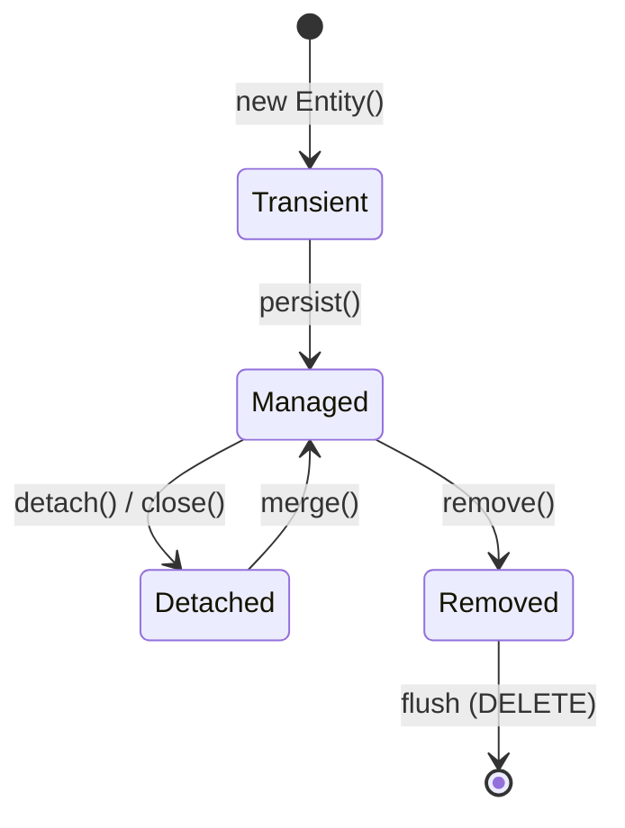

## Keywords

1. [HIB-001 The Object-Relational Impedance Mismatch](#hib-001-the-object-relational-impedance-mismatch)
2. [HIB-002 What ORM Is and Why It Exists](#hib-002-what-orm-is-and-why-it-exists)
3. [HIB-003 Where Hibernate Fits (JPA, JDBC, Spring Data)](#hib-003-where-hibernate-fits-jpa-jdbc-spring-data)
4. [HIB-004 JPA vs Hibernate - Specification vs Implementation](#hib-004-jpa-vs-hibernate---specification-vs-implementation)
5. [HIB-005 Hibernate Ecosystem Map (Core, Validator, Search)](#hib-005-hibernate-ecosystem-map-core-validator-search)
6. [HIB-006 Hand-Rolling JDBC Mapping Anti-Pattern](#hib-006-hand-rolling-jdbc-mapping-anti-pattern)
7. [HIB-007 Hibernate Quick Start (Maven/Gradle Setup)](#hib-007-hibernate-quick-start-mavengradle-setup)
8. [HIB-008 Entity and @Entity Annotation](#hib-008-entity-and-entity-annotation)
9. [HIB-009 @Id and Primary Key Generation Strategies](#hib-009-id-and-primary-key-generation-strategies)
10. [HIB-010 SessionFactory and Session (Hibernate Native API)](#hib-010-sessionfactory-and-session-hibernate-native-api)
11. [HIB-011 EntityManager and Persistence Context (JPA API)](#hib-011-entitymanager-and-persistence-context-jpa-api)
12. [HIB-012 persistence.xml and hibernate.cfg.xml](#hib-012-persistencexml-and-hibernatecfgxml)
13. [HIB-013 Basic Column Mappings (@Column, @Table, @Transient)](#hib-013-basic-column-mappings-column-table-transient)
14. [HIB-014 JPQL Fundamentals](#hib-014-jpql-fundamentals)
15. [HIB-015 Entity Lifecycle States (Transient, Managed, Detached, Removed)](#hib-015-entity-lifecycle-states-transient-managed-detached-removed)
16. [HIB-016 Basic CRUD Operations with Hibernate](#hib-016-basic-crud-operations-with-hibernate)
17. [HIB-017 Hibernate SQL Logging (show_sql, format_sql)](#hib-017-hibernate-sql-logging-showsql-formatsql)
18. [HIB-018 IDE Persistence Tooling (JPA Buddy, IntelliJ)](#hib-018-ide-persistence-tooling-jpa-buddy-intellij)
19. [HIB-019 Session-per-Operation Anti-Pattern](#hib-019-session-per-operation-anti-pattern)
20. [HIB-020 "Hibernate Writes All Your SQL" is Wrong](#hib-020-hibernate-writes-all-your-sql-is-wrong)
21. [HIB-021 Build a JPA CRUD App - Phase 1 (Basics)](#hib-021-build-a-jpa-crud-app---phase-1-basics)
22. [HIB-022 Top 10 Hibernate Interview Questions (Basics)](#hib-022-top-10-hibernate-interview-questions-basics)

---

# HIB-001 The Object-Relational Impedance Mismatch

**TL;DR** - Objects model graphs with identity and inheritance; tables model flat rows with foreign keys - the mismatch is fundamental.

---

### 🟢 What it is

The **object-relational impedance mismatch** is the set of
structural and conceptual conflicts between how object-oriented
languages represent data (graphs, inheritance, encapsulation,
identity by reference) and how relational databases store data
(flat rows, foreign keys, set-based operations, identity by
primary key).

---

### 🎯 Why it exists

You have an `Order` with a `List<LineItem>`, each `LineItem`
holding a `Product` reference. In Java, you navigate this by
calling `order.getItems().get(0).getProduct()`. In SQL, that
same traversal requires a three-table JOIN, manual result
mapping, and null handling for optional relationships. Every
place objects nest, inherit, or reference each other is a
place where tables force you into a different shape. The
mismatch shows up in five concrete areas: granularity (one
object vs multiple tables), inheritance (no SQL equivalent),
identity (`==` vs primary key), associations (references vs
foreign keys), and data navigation (object graph walking vs
declarative joins). This is exactly why the impedance mismatch
exists - and why ORM frameworks were created to bridge it.

---

### 🧠 Mental Model

> Imagine packing a three-dimensional Lego sculpture into a
> flat toolbox with labeled compartments. You have to
> disassemble the structure, label every piece with its
> connections, and later rebuild it. That disassembly and
> reassembly cost is the impedance mismatch.

**Memory hook:** Objects are 3D graphs; tables are 2D grids -
something always gets lost in translation.

---

### ⚙️ How it works

1. You design an object model with inheritance, composition,
   and bidirectional references.
2. Each object feature needs a relational equivalent:
   inheritance becomes join tables or discriminator columns,
   collections become foreign keys, identity becomes a
   primary key.
3. Reading data back requires SQL joins followed by manual
   assembly into an object graph.
4. Every schema change potentially breaks mapping code,
   and every object model change potentially requires DDL
   migration.

---

### ✏️ Minimal Example

**BAD:**

```java
// Manual mapping: every field, every join,
// every null check - by hand
ResultSet rs = stmt.executeQuery(
    "SELECT o.id, i.name, i.qty "
    + "FROM orders o "
    + "JOIN items i ON i.order_id = o.id "
    + "WHERE o.id = 42"
);
List<Item> items = new ArrayList<>();
while (rs.next()) {
    items.add(new Item(
        rs.getString("name"),
        rs.getInt("qty")
    ));
}
Order order = new Order(42, items);
```

Why it's wrong: every query needs its own mapping code, and
adding a field means editing every ResultSet reader.

**GOOD:**

```java
// ORM handles the mapping
Order order = entityManager.find(Order.class, 42L);
// order.getItems() is populated automatically
// via the @OneToMany mapping
```

Why it's right: the mapping is declared once in annotations;
the framework handles assembly for every query.

---

### ⚡ When to use / Not to use

**Use when:**

- You need to understand WHY Hibernate exists before learning
  HOW it works.
- Evaluating whether an ORM is justified for your project.

**Avoid when:**

- Your data is purely document-shaped (consider a document
  database instead of forcing relational mapping).
- Your access patterns are exclusively set-based SQL
  analytics with no object model needed.

---

### ⚠️ One Gotcha

**Misconception:** The impedance mismatch is a Hibernate
problem that a better ORM would solve.
**Reality:** The mismatch is inherent to combining OOP with
relational algebra. Every ORM (Hibernate, EclipseLink, jOOQ,
ActiveRecord) makes different trade-offs, but none eliminate
the underlying tension.

---

### 📇 Revision Card

1. Five mismatch areas: granularity, inheritance, identity,
   associations, navigation.
2. The mismatch is structural, not a framework bug - no ORM
   eliminates it, each trades one pain for another.
3. Ignoring the mismatch leads to either N+1 queries in ORM
   or boilerplate explosion in raw JDBC.

---

---

# HIB-002 What ORM Is and Why It Exists

**TL;DR** - ORM automates the mapping between objects and database rows so you declare relationships once instead of hand-coding them everywhere.

---

### 🟢 What it is

**Object-Relational Mapping (ORM)** is a programming technique
and category of framework that converts data between an
object-oriented language and a relational database, letting you
work with database rows as if they were plain objects.

---

### 🎯 Why it exists

Without ORM, every CRUD operation requires writing SQL strings,
parsing ResultSets column by column, managing connections, and
handling type mismatches between Java types and SQL types. A
typical entity with 10 fields needs 4 SQL statements (INSERT,
SELECT, UPDATE, DELETE), each with manual parameter binding and
result extraction. Multiply by 50 entities and you have
hundreds of repetitive, error-prone mapping methods. Changing
a column name means hunting through string-based SQL scattered
across your codebase. This is exactly why ORM exists - to
declare the mapping once and let a framework generate the
repetitive SQL.

---

### 🧠 Mental Model

> ORM is like a simultaneous translator at a UN conference.
> Your Java objects speak "object language" (references,
> inheritance, methods). Your database speaks "relational
> language" (rows, joins, constraints). The ORM translates
> in both directions so neither side has to learn the
> other's language.

**Memory hook:** ORM = automatic translator between objects
and tables.

---

### ⚙️ How it works

1. You annotate Java classes to describe how they map to
   tables (`@Entity`, `@Column`, `@ManyToOne`).
2. The ORM reads these annotations at startup and builds
   an internal metadata model of your schema.
3. When you call `persist(entity)`, the ORM generates
   an INSERT statement from the metadata, binds field
   values to parameters, and executes via JDBC.
4. When you call `find(Entity.class, id)`, the ORM
   generates a SELECT, maps the ResultSet columns back
   to object fields, and returns a populated instance.
5. The ORM tracks which fields changed ("dirty checking")
   and generates UPDATE statements only for modified
   columns at flush time.

---

### ✏️ Minimal Example

**BAD:**

```java
// Without ORM: manual SQL + manual mapping
String sql = "INSERT INTO users "
    + "(name, email) VALUES (?, ?)";
PreparedStatement ps = conn.prepareStatement(sql);
ps.setString(1, user.getName());
ps.setString(2, user.getEmail());
ps.executeUpdate();
```

Why it's wrong: every entity needs its own SQL strings, and
every schema change breaks hand-written queries.

**GOOD:**

```java
// With ORM: declare once, persist anywhere
@Entity
public class User {
    @Id @GeneratedValue
    private Long id;
    private String name;
    private String email;
}
// Persist:
entityManager.persist(user);
```

Why it's right: the mapping is declared once via annotations;
INSERT, UPDATE, and SELECT are generated automatically.

---

### ⚡ When to use / Not to use

**Use when:**

- You have a rich domain model with relationships, and most
  operations are entity-centric CRUD.
- You want schema-driven code generation and automatic dirty
  checking across many entity types.

**Avoid when:**

- Your workload is bulk analytics or reporting (ORM overhead
  hurts; use plain SQL or jOOQ).
- You have fewer than five entities and simple queries (the
  ORM setup cost outweighs the benefit).

---

### ⚠️ One Gotcha

**Misconception:** ORM means you never write SQL.
**Reality:** ORM generates SQL for you, but you still need
to understand the SQL it produces. Ignoring generated SQL
is the number one cause of N+1 query problems and slow
Hibernate applications.

---

### 📇 Revision Card

1. ORM maps objects to rows automatically - declare once,
   CRUD everywhere.
2. You MUST understand the SQL your ORM generates; blind
   trust leads to N+1 and performance disasters.
3. ORM shines for entity-centric CRUD; it is not a silver
   bullet for analytics or bulk operations.

---

---

# HIB-003 Where Hibernate Fits (JPA, JDBC, Spring Data)

**TL;DR** - Hibernate implements the JPA specification on top of JDBC; Spring Data JPA adds a repository layer on top of both.

---

### 🟢 What it is

**Hibernate's position in the persistence stack** is as the
JPA implementation layer: your application talks to the JPA
API, JPA delegates to Hibernate, and Hibernate talks to the
database via JDBC.

---

### 🎯 Why it exists

Java developers needed a standard persistence API so
application code would not be locked to one ORM vendor. JPA
(Jakarta Persistence API) defines the standard interfaces
(`EntityManager`, `@Entity`, JPQL). But JPA is only a
specification - it has no implementation. Hibernate is the
most widely used JPA provider, translating JPA calls into
optimized JDBC operations. Spring Data JPA adds a further
abstraction - repository interfaces that auto-generate
implementations at startup. Understanding these layers
prevents confusion about which API you are actually calling.
This is exactly why knowing where Hibernate fits matters.

---

### 🧠 Mental Model

> Think of a four-layer cake. The top layer is Spring Data
> JPA (convenience). Below it, JPA (standard contract). Below
> that, Hibernate (the engine). At the bottom, JDBC (the raw
> wire protocol to the database). Each layer hides the one
> below, but problems bubble up from the bottom.

**Memory hook:** Spring Data -> JPA -> Hibernate -> JDBC ->
Database. Problems always surface from the layer below.

---

### ⚙️ How it works

1. Your code calls `repository.save(entity)` (Spring Data).
2. Spring Data delegates to `EntityManager.persist(entity)`
   (JPA standard API).
3. Hibernate, as the JPA provider, converts the persist call
   into an SQL INSERT via its internal action queue.
4. Hibernate hands the SQL to JDBC, which sends it over the
   network to the database driver.
5. The database executes the statement and returns the
   result through the same stack in reverse.

---

### ✏️ Minimal Example

**BAD:**

```java
// Mixing layers: calling Hibernate Session
// directly inside a Spring Data project
Session session = entityManager
    .unwrap(Session.class);
session.save(entity);  // Hibernate-proprietary
```

Why it's wrong: bypasses the JPA standard; ties your code to
Hibernate and loses Spring Data's transaction management.

**GOOD:**

```java
// Clean layering: Spring Data -> JPA -> Hibernate
@Repository
public interface UserRepo
    extends JpaRepository<User, Long> {}

// Usage:
userRepo.save(user);   // Spring Data
// Internally calls EntityManager.persist() (JPA)
// Which delegates to Hibernate Session
// Which issues JDBC INSERT
```

Why it's right: your code depends only on the Spring Data
abstraction; you can swap JPA providers without changing
application code.

---

### ⚡ When to use / Not to use

**Use when:**

- Building a Spring Boot application with standard CRUD -
  use Spring Data JPA repositories backed by Hibernate.
- You want JPA portability and are willing to accept
  Hibernate's conventions.

**Avoid when:**

- You need Hibernate-specific features (filters, multi-tenancy
  SPI) that JPA does not expose - then use the Session API
  intentionally, not accidentally.
- You are writing a non-Spring application where JPA's
  `EntityManager` is sufficient without the Spring Data layer.

---

### ⚠️ One Gotcha

**Misconception:** Spring Data JPA, JPA, and Hibernate are
the same thing.
**Reality:** They are three distinct layers. Spring Data JPA
is a convenience abstraction, JPA is a specification (no
implementation), and Hibernate is one of several JPA
implementations. Confusing them leads to debugging at the
wrong layer.

---

### 📇 Revision Card

1. Stack: Spring Data JPA -> JPA (spec) -> Hibernate (impl)
   -> JDBC -> Database.
2. Code to the JPA interface; drop to Hibernate Session only
   when JPA lacks the feature you need.
3. Debugging persistence issues means understanding which
   layer the problem lives in.

---

---

# HIB-004 JPA vs Hibernate - Specification vs Implementation

**TL;DR** - JPA defines the standard interfaces; Hibernate provides the actual engine that does the work.

---

### 🟢 What it is

**JPA (Jakarta Persistence API)** is a specification - a set
of interfaces, annotations, and behavioral contracts defined in
the Jakarta EE standard. **Hibernate** is an implementation of
that specification - the code that actually executes persistence
operations.

---

### 🎯 Why it exists

In the early 2000s, Hibernate existed before any standard.
Every ORM had its own API: Hibernate had `Session`, TopLink had
`UnitOfWork`, and iBatis had `SqlMapClient`. Switching providers
meant rewriting persistence code. JPA was created (JSR 220,
later JSR 338, now Jakarta Persistence) to define a common API
so applications could swap ORM providers. Hibernate then
implemented JPA while keeping its native API as extensions. This
is exactly why the JPA-vs-Hibernate distinction matters - your
code should target the standard, falling back to
Hibernate-specific features only when necessary.

---

### 🧠 Mental Model

> JPA is like a power outlet standard (shape, voltage, pinout).
> Hibernate is one brand of power supply that fits the outlet.
> EclipseLink is another brand. Your laptop (application) only
> needs to know the outlet shape - not which brand is behind
> the wall.

**Memory hook:** JPA = the contract; Hibernate = one engine
that fulfills the contract.

---

### ⚙️ How it works

1. JPA defines interfaces: `EntityManager`, `EntityTransaction`,
   `TypedQuery`, and annotations like `@Entity`, `@Id`.
2. At deployment, the JPA bootstrap reads `persistence.xml`
   and discovers the configured provider (e.g., Hibernate).
3. Hibernate registers itself as the JPA provider and returns
   its `SessionFactory` wrapped behind `EntityManagerFactory`.
4. Every `EntityManager` call delegates to a Hibernate
   `Session` under the hood.
5. Hibernate-specific features (`@BatchSize`, `@Filter`,
   `StatelessSession`) are available only by unwrapping
   the JPA interface to the Hibernate native API.

---

### ✏️ Minimal Example

**BAD:**

```java
// Coding directly to Hibernate API in a
// JPA project - loses portability
SessionFactory sf = new Configuration()
    .configure()
    .buildSessionFactory();
Session s = sf.openSession();
s.save(entity);
```

Why it's wrong: the entire persistence layer is Hibernate-
specific; switching to EclipseLink requires a rewrite.

**GOOD:**

```java
// Coding to JPA standard - provider-agnostic
EntityManagerFactory emf =
    Persistence.createEntityManagerFactory("myPU");
EntityManager em = emf.createEntityManager();
em.getTransaction().begin();
em.persist(entity);
em.getTransaction().commit();
```

Why it's right: `EntityManager` is JPA standard; you can
change the `<provider>` in `persistence.xml` without
modifying Java code.

---

### ⚡ When to use / Not to use

**Use when:**

- You want provider portability and are coding a greenfield
  project - target JPA interfaces.
- Your team may switch to EclipseLink or another provider
  in the future.

**Avoid when:**

- You need Hibernate-specific features (multi-tenancy SPI,
  `@Filter`, bytecode enhancement options) that JPA does
  not standardize - use the native API intentionally.
- Writing framework-level code where Hibernate's internal
  SPIs are required.

---

### ⚠️ One Gotcha

**Misconception:** Using JPA annotations means your code is
automatically portable across providers.
**Reality:** JPA guarantees API portability, not behavior
portability. Flush ordering, cascade timing, and lazy-loading
proxy behavior differ between Hibernate and EclipseLink.
Always test after a provider switch.

---

### 📇 Revision Card

1. JPA = specification (interfaces, annotations). Hibernate
   = implementation (the engine).
2. Code to JPA interfaces; unwrap to Hibernate only for
   features JPA does not cover.
3. API portability is real; behavioral portability requires
   testing - flush order and proxy behavior vary by provider.

---

---

# HIB-005 Hibernate Ecosystem Map (Core, Validator, Search)

**TL;DR** - Hibernate is not one library but a family: Core (ORM), Validator (bean validation), Search (full-text), Envers (auditing), and Reactive.

---

### 🟢 What it is

The **Hibernate ecosystem** is a collection of related projects
under the Hibernate umbrella, each solving a distinct
persistence-adjacent problem: ORM, validation, full-text
search, auditing, and reactive database access.

---

### 🎯 Why it exists

Persistence is never just "save objects to tables." Real
applications also need input validation, full-text search
across entities, audit trails of every data change, and
increasingly non-blocking database access. Building each
capability from scratch is wasteful when they all share the
same entity model. Hibernate's ecosystem reuses your `@Entity`
classes and mapping metadata across all these concerns. This
is exactly why the ecosystem exists - one entity model, many
capabilities.

---

### 🧠 Mental Model

> Think of Hibernate Core as the engine of a car. Hibernate
> Validator is the dashboard gauges (checking inputs before
> they reach the engine). Hibernate Search is the GPS
> (finding things). Hibernate Envers is the dashcam
> (recording everything). Hibernate Reactive is the electric
> motor upgrade (non-blocking).

**Memory hook:** Core = ORM engine, Validator = input guard,
Search = full-text, Envers = audit log, Reactive = non-blocking.

---

### ⚙️ How it works

1. **Hibernate Core (ORM):** Maps `@Entity` classes to tables,
   manages persistence contexts, generates SQL, handles
   caching. This is what people mean by "Hibernate."
2. **Hibernate Validator:** Reference implementation of Jakarta
   Bean Validation. Annotations like `@NotNull`, `@Size`,
   `@Email` on entity fields trigger validation automatically
   before database writes.
3. **Hibernate Search:** Integrates Apache Lucene (or
   Elasticsearch/OpenSearch) with your entity model for
   full-text, faceted, and geospatial search.
4. **Hibernate Envers:** Adds audit logging to entities
   with `@Audited`, storing every INSERT/UPDATE/DELETE
   in shadow audit tables.
5. **Hibernate Reactive:** Non-blocking persistence using
   Vert.x or Mutiny, designed for reactive stacks
   (Quarkus, Vert.x).

---

### ✏️ Minimal Example

**BAD:**

```java
// Rolling your own audit logging
@PreUpdate
public void audit(Object entity) {
    // Manual: serialize old state, diff fields,
    // write to audit_log table, handle schema
    // evolution...
}
```

Why it's wrong: hand-rolled audit misses edge cases
(collections, embeddables, lazy proxies) and requires
ongoing maintenance.

**GOOD:**

```java
// Hibernate Envers: one annotation = full audit
@Entity
@Audited
public class Order {
    @Id @GeneratedValue
    private Long id;
    private BigDecimal total;
    // Envers auto-creates order_AUD table
    // and logs every revision
}
```

Why it's right: Envers handles all entity types, collection
changes, and revision metadata automatically.

---

### ⚡ When to use / Not to use

**Use when:**

- You already use Hibernate Core and need validation,
  search, or auditing - the ecosystem reuses your mappings.
- You want consistent behavior across persistence concerns
  without gluing together unrelated libraries.

**Avoid when:**

- You need a standalone search engine without entity
  mapping (use Elasticsearch directly).
- Your project uses a different ORM; Hibernate Validator
  works independently, but Search and Envers require Core.

---

### ⚠️ One Gotcha

**Misconception:** "Hibernate" means only the ORM.
**Reality:** Hibernate is an ecosystem of five-plus projects.
When someone says "add Hibernate," clarify which module. Adding
`hibernate-core` alone gives ORM; Validator, Search, and Envers
are separate dependencies.

---

### 📇 Revision Card

1. Five projects: Core (ORM), Validator (bean validation),
   Search (full-text), Envers (audit), Reactive (non-blocking).
2. All ecosystem projects reuse your `@Entity` model and
   mapping metadata.
3. "Add Hibernate" is ambiguous - always specify which module
   and dependency.

---

---

# HIB-006 Hand-Rolling JDBC Mapping Anti-Pattern

**TL;DR** - Writing manual ResultSet-to-object mapping for every query creates fragile, repetitive code that breaks on every schema change.

---

### 🟢 What it is

The **hand-rolling JDBC mapping anti-pattern** is the practice
of writing manual `ResultSet` column-to-field mapping code for
every database query, instead of using an ORM or a mapping
library to automate the conversion.

---

### 🎯 Why it exists

Before ORMs, every Java persistence layer looked the same:
`PreparedStatement` for writes, `ResultSet.getString()` for
reads, column-index or column-name references scattered across
hundreds of DAO methods. Adding a column meant updating every
query, every mapping method, and every test. A typo in a column
name compiled fine and crashed at runtime. A renamed column
required a codebase-wide search-and-replace through string
literals. Teams spent more time maintaining mapping boilerplate
than writing business logic. This is exactly why frameworks
like Hibernate were built - to eliminate hand-rolled mapping.

---

### 🧠 Mental Model

> Imagine a warehouse where every worker copies shipping
> labels by hand for every package, instead of using a label
> printer. One wrong digit and the package goes to the wrong
> address. That hand-copying is hand-rolled JDBC mapping.

**Memory hook:** Manual mapping = copying labels by hand -
slow, repetitive, error-prone.

---

### ⚙️ How it works

1. You write a SQL string to query the database.
2. You iterate the `ResultSet` row by row.
3. For each row, you call `rs.getString("name")`,
   `rs.getInt("age")`, etc., mapping every column manually.
4. You construct a domain object from those values.
5. When the schema changes, you hunt through every DAO
   method to update column names and types.

---

### ✏️ Minimal Example

**BAD:**

```java
// Hand-rolled: 10 fields = 10 manual extractions
// Add a column? Edit every query method.
User mapRow(ResultSet rs) throws SQLException {
    User u = new User();
    u.setId(rs.getLong("id"));
    u.setName(rs.getString("name"));
    u.setEmail(rs.getString("email"));
    u.setAge(rs.getInt("age"));
    // ...repeat for every field
    return u;
}
```

Why it's wrong: one mapping method per entity per query,
breaks on column rename, no compile-time safety.

**GOOD:**

```java
// ORM mapping: declared once, used everywhere
@Entity
@Table(name = "users")
public class User {
    @Id private Long id;
    private String name;
    private String email;
    private int age;
    // Hibernate maps all fields automatically
}
```

Why it's right: rename a column by updating one `@Column`
annotation; every query automatically adapts.

---

### ⚡ When to use / Not to use

**Use when:**

- Recognizing this anti-pattern in legacy code as a sign
  that introducing ORM (or at least a mapper like jOOQ or
  MyBatis) would reduce maintenance cost.
- You have more than five entities with multiple queries
  each - the boilerplate cost grows quadratically.

**Avoid when:**

- You have one or two trivial queries in a utility script -
  the ORM setup overhead is not justified.
- You are writing a performance-critical bulk ETL where
  manual JDBC with batch inserts genuinely outperforms ORM.

---

### ⚠️ One Gotcha

**Misconception:** Hand-rolled JDBC is always faster than ORM.
**Reality:** For simple CRUD, Hibernate adds microseconds of
overhead per operation. The real cost of hand-rolled JDBC is
developer time - hundreds of hours maintaining mapping
boilerplate that an ORM generates in milliseconds.

---

### 📇 Revision Card

1. Hand-rolled JDBC mapping creates O(entities x queries)
   boilerplate that breaks on every schema change.
2. The cost is developer time, not runtime performance -
   ORM overhead for CRUD is negligible.
3. Even if you reject full ORM, use at least a row mapper
   (jOOQ, MyBatis, Spring JdbcTemplate RowMapper).

---

---

# HIB-007 Hibernate Quick Start (Maven/Gradle Setup)

**TL;DR** - Add hibernate-core and a JDBC driver dependency, create persistence.xml with connection settings, and you can persist entities.

---

### 🟢 What it is

**Hibernate Quick Start** is the minimal project setup to get
Hibernate ORM running: a build dependency, a configuration
file, an entity class, and a main method that persists and
reads data.

---

### 🎯 Why it exists

Many developers first encounter Hibernate through Spring Boot,
which hides the setup behind auto-configuration. But when
something goes wrong - connection pool exhaustion, wrong
dialect, missing provider - you need to understand the raw
bootstrap. Knowing the minimal setup also helps in non-Spring
contexts (Java SE, Quarkus, Micronaut) and demystifies what
Spring Boot auto-configures. This is exactly why understanding
the bare-metal quick start matters.

---

### 🧠 Mental Model

> Setting up Hibernate is like wiring a lamp. You need a bulb
> (hibernate-core), a socket (persistence.xml with connection
> settings), a power cord (JDBC driver), and a switch
> (EntityManager). Miss any one and nothing lights up.

**Memory hook:** Four parts: dependency + config + driver +
EntityManager. Skip one, nothing works.

---

### ⚙️ How it works

1. Add `hibernate-core` (or `hibernate-community-dialects`)
   and a JDBC driver (e.g., `postgresql`) to your build.
2. Create `src/main/resources/META-INF/persistence.xml`
   with a persistence unit defining JDBC URL, user,
   password, dialect, and `hbm2ddl.auto` for schema
   generation.
3. Annotate a POJO with `@Entity` and `@Id`.
4. In your main method: create `EntityManagerFactory`, open
   `EntityManager`, begin transaction, persist entity,
   commit, close.

---

### ✏️ Minimal Example

**BAD:**

```xml
<!-- Missing the JDBC driver dependency -->
<dependencies>
  <dependency>
    <groupId>org.hibernate.orm</groupId>
    <artifactId>hibernate-core</artifactId>
    <version>6.6.13.Final</version>
  </dependency>
  <!-- No driver! ClassNotFoundException at runtime -->
</dependencies>
```

Why it's wrong: Hibernate cannot connect without a JDBC
driver; the error appears only at runtime.

**GOOD:**

```xml
<dependencies>
  <dependency>
    <groupId>org.hibernate.orm</groupId>
    <artifactId>hibernate-core</artifactId>
    <version>6.6.13.Final</version>
  </dependency>
  <dependency>
    <groupId>org.postgresql</groupId>
    <artifactId>postgresql</artifactId>
    <version>42.7.5</version>
    <scope>runtime</scope>
  </dependency>
</dependencies>
```

Why it's right: both the ORM and the JDBC driver are present;
Hibernate can discover the driver at runtime.

---

### ⚡ When to use / Not to use

**Use when:**

- Starting a new Java SE project or a framework that does
  not auto-configure Hibernate for you.
- Learning Hibernate fundamentals before Spring Boot hides
  the details.

**Avoid when:**

- Using Spring Boot - it auto-configures the
  `EntityManagerFactory`, connection pool, and dialect from
  `application.properties`.
- Using Quarkus - it similarly auto-configures Hibernate via
  `application.properties` and build-time optimization.

---

### ⚠️ One Gotcha

**Misconception:** `hbm2ddl.auto=update` is safe for
production schema management.
**Reality:** `hbm2ddl.auto` is a convenience for development.
It cannot rename columns, drop unused tables, or handle data
migration. Production schemas must be managed by Flyway or
Liquibase.

---

### 📇 Revision Card

1. Minimal Hibernate: hibernate-core + JDBC driver +
   persistence.xml + @Entity.
2. Always include the JDBC driver dependency - Hibernate
   cannot discover it from thin air.
3. Never use `hbm2ddl.auto` in production - use Flyway or
   Liquibase for schema migration.

---

---

# HIB-008 Entity and @Entity Annotation

**TL;DR** - `@Entity` tells Hibernate a Java class maps to a database table; without it, the class is invisible to persistence.

---

### 🟢 What it is

An **entity** is a lightweight Java class annotated with
`@Entity` that Hibernate maps to a database table. Each
instance represents one row. The annotation is the contract
that turns a POJO into a persistent object managed by the
persistence context.

---

### 🎯 Why it exists

Hibernate needs to know which classes to manage. Without a
marker, every class in your application would need scanning
and deciding at runtime. `@Entity` acts as an opt-in signal:
"this class has a table, these fields have columns, manage its
lifecycle." It also triggers metadata construction at startup -
Hibernate reads the annotation, inspects fields, and builds
the SQL mapping once. Without `@Entity`, calling `persist()`
or `find()` throws `IllegalArgumentException` because the class
is not part of the managed model. This is exactly why `@Entity`
exists.

---

### 🧠 Mental Model

> `@Entity` is a name badge at a conference. Without the badge,
> security (Hibernate) does not recognize you and will not let
> you into the managed area (persistence context). With the
> badge, you are tracked, monitored, and accounted for.

**Memory hook:** No `@Entity` = invisible to Hibernate. No
badge, no entry.

---

### ⚙️ How it works

1. You annotate a class with `@Entity` (from
   `jakarta.persistence`).
2. Hibernate scans for `@Entity` classes at startup (via
   `persistence.xml`, Spring component scan, or explicit
   listing).
3. It maps the class name to a table name (default:
   class name), each field to a column.
4. It requires a no-arg constructor (public or protected)
   for proxy/reflection instantiation.
5. It requires exactly one `@Id` field to serve as the
   primary key.

---

### ✏️ Minimal Example

**BAD:**

```java
// Missing @Entity - Hibernate does not know
// this class exists
public class Product {
    private Long id;
    private String name;
}
// entityManager.persist(new Product())
// -> IllegalArgumentException: Unknown entity
```

Why it's wrong: without `@Entity`, Hibernate ignores
the class entirely.

**GOOD:**

```java
@Entity
public class Product {
    @Id @GeneratedValue
    private Long id;
    private String name;

    protected Product() {} // JPA requires no-arg
    public Product(String name) {
        this.name = name;
    }
}
// entityManager.persist(new Product("Widget"))
// -> INSERT INTO product (name) VALUES ('Widget')
```

Why it's right: `@Entity` + `@Id` + no-arg constructor
fulfill the three requirements for a managed entity.

---

### ⚡ When to use / Not to use

**Use when:**

- A class represents a database table row and needs
  lifecycle management (persist, merge, remove).
- The class has a clear primary key identity.

**Avoid when:**

- The class is a value object without its own identity
  (use `@Embeddable` instead).
- The class is a DTO or projection that should not be
  persisted (no annotation needed).

---

### ⚠️ One Gotcha

**Misconception:** An `@Entity` class can have any constructor
and skip the no-arg constructor.
**Reality:** JPA requires a no-arg constructor (public or
protected). Hibernate instantiates entities via reflection
during hydration. Without it: `InstantiationException`.

---

### 📇 Revision Card

1. `@Entity` = opt-in contract that makes a POJO persistable.
2. Three requirements: `@Entity`, `@Id`, and a no-arg
   constructor.
3. Without `@Entity`, `persist()` and `find()` throw
   `IllegalArgumentException` - the class is invisible.

---

---

# HIB-009 @Id and Primary Key Generation Strategies

**TL;DR** - `@Id` marks the primary key field; `@GeneratedValue` delegates key generation to the database or a sequence.

---

### 🟢 What it is

**`@Id`** marks which entity field is the primary key.
**`@GeneratedValue`** tells Hibernate how to generate unique
key values automatically instead of requiring the application
to supply them.

---

### 🎯 Why it exists

Every relational table needs a primary key for row identity.
If applications generate keys manually, they risk collisions
in concurrent environments, duplicate logic across entities,
and vendor-specific SQL for sequences. `@GeneratedValue`
abstracts key generation behind four strategies (`AUTO`,
`IDENTITY`, `SEQUENCE`, `TABLE`) so the ORM picks the right
SQL for the target database. This is exactly why `@Id` +
`@GeneratedValue` exist - consistent, collision-free key
generation without vendor-specific code.

---

### 🧠 Mental Model

> `@Id` is the license plate on your car - unique identifier,
> always present, never null. `@GeneratedValue` is the DMV
> issuing plate numbers. You can let the DMV choose (AUTO),
> request a specific sequence (SEQUENCE), or take whatever
> the registration counter gives you (IDENTITY).

**Memory hook:** `@Id` = who you are; `@GeneratedValue` = who
assigns the name.

---

### ⚙️ How it works

1. **IDENTITY:** Database auto-increment column generates the
   key on INSERT. Hibernate must execute INSERT immediately
   to learn the generated ID, which disables JDBC batching.
2. **SEQUENCE:** Hibernate calls a database sequence (e.g.,
   `nextval('product_seq')`) to pre-fetch IDs before INSERT.
   Supports JDBC batching and allocation pooling.
3. **TABLE:** Hibernate uses a dedicated table to simulate
   sequences. Portable but slow due to row-level locking.
4. **AUTO:** Hibernate picks a strategy based on the database
   dialect (typically SEQUENCE on PostgreSQL/Oracle, IDENTITY
   on MySQL before 8.0).
5. With `@SequenceGenerator` you control sequence name,
   `allocationSize` (batch pre-fetch), and initial value.

---

### ✏️ Minimal Example

**BAD:**

```java
@Id
@GeneratedValue(strategy = GenerationType.IDENTITY)
private Long id;
// IDENTITY disables JDBC batching because
// Hibernate must INSERT immediately to get
// the generated ID
```

Why it's wrong: IDENTITY forces immediate INSERT per entity,
killing batch insert performance.

**GOOD:**

```java
@Id
@GeneratedValue(
    strategy = GenerationType.SEQUENCE,
    generator = "product_seq"
)
@SequenceGenerator(
    name = "product_seq",
    sequenceName = "product_seq",
    allocationSize = 50
)
private Long id;
// SEQUENCE pre-fetches 50 IDs at once, enabling
// JDBC batching for bulk inserts
```

Why it's right: SEQUENCE with `allocationSize=50` lets
Hibernate batch 50 inserts in one JDBC call.

---

### ⚡ When to use / Not to use

**Use when:**

- Every entity needs `@Id`. Use `@GeneratedValue(SEQUENCE)`
  as the default strategy for PostgreSQL and Oracle.
- Performance matters and you need JDBC batching for bulk
  inserts.

**Avoid when:**

- The primary key is a natural business key (e.g., ISBN,
  country code) - assign it in the constructor, skip
  `@GeneratedValue`.
- Using MySQL with InnoDB where `AUTO_INCREMENT` (IDENTITY)
  is the only practical option and batching is less critical.

---

### ⚠️ One Gotcha

**Misconception:** `GenerationType.AUTO` always picks the best
strategy.
**Reality:** AUTO's choice depends on the Hibernate version and
dialect. In Hibernate 5 it often defaulted to TABLE (slow). In
Hibernate 6 it prefers SEQUENCE. Always specify the strategy
explicitly to avoid surprises across environments.

---

### 📇 Revision Card

1. SEQUENCE is the default recommendation - it supports JDBC
   batching via allocationSize pre-fetching.
2. IDENTITY kills batching because each INSERT must execute
   immediately to retrieve the generated ID.
3. Never rely on AUTO - explicitly set SEQUENCE or IDENTITY
   based on your database.

---

---

# HIB-010 SessionFactory and Session (Hibernate Native API)

**TL;DR** - `SessionFactory` is a heavyweight, thread-safe factory created once at startup; `Session` is a lightweight, single-threaded unit of work.

---

### 🟢 What it is

**`SessionFactory`** is Hibernate's native equivalent of JPA's
`EntityManagerFactory` - an immutable, thread-safe object
created once at application startup that holds all mapping
metadata and connection pool configuration.
**`Session`** is the equivalent of JPA's `EntityManager` -
a short-lived, single-threaded object representing one unit
of work (typically one transaction).

---

### 🎯 Why it exists

Building mapping metadata and initializing connection pools
is expensive. Doing it per request would destroy performance.
`SessionFactory` pays this cost once at startup and amortizes
it across all requests. `Session` is cheap to open and close -
it holds a first-level cache (persistence context) for the
current unit of work, tracks dirty entities, and coordinates
flush and commit. Separating the heavyweight factory from the
lightweight session is the fundamental design pattern behind
Hibernate's architecture. This is exactly why both exist.

---

### 🧠 Mental Model

> `SessionFactory` is a car factory - expensive to build, runs
> for years, produces many cars. `Session` is one car off the
> production line - cheap to create, used for one trip, then
> returned. You never rebuild the factory for each trip.

**Memory hook:** One factory, many sessions. Factory = startup.
Session = per-request.

---

### ⚙️ How it works

1. At application startup, Hibernate reads configuration and
   mapping metadata to build a `SessionFactory`.
2. `SessionFactory` initializes the connection pool, caches
   metadata, and prepares query plan caches.
3. Per request (or per transaction), you call
   `sessionFactory.openSession()` to get a `Session`.
4. The `Session` tracks every entity loaded or persisted in
   its first-level cache (identity map).
5. On `session.close()`, the first-level cache is discarded,
   JDBC connection is returned to the pool, and resources
   are released.

---

### ✏️ Minimal Example

**BAD:**

```java
// Creating SessionFactory per request - kills
// performance and leaks resources
void handleRequest() {
    SessionFactory sf = new Configuration()
        .configure().buildSessionFactory();
    Session s = sf.openSession();
    // ...
    s.close();
    sf.close(); // Rebuilds pool every request!
}
```

Why it's wrong: building `SessionFactory` per request
re-parses metadata and re-creates the connection pool.

**GOOD:**

```java
// SessionFactory created once at startup
private static final SessionFactory SF =
    new Configuration()
        .configure()
        .buildSessionFactory();

void handleRequest() {
    try (Session s = SF.openSession()) {
        s.beginTransaction();
        // ... work ...
        s.getTransaction().commit();
    } // Session auto-closed, connection returned
}
```

Why it's right: factory is built once; sessions are cheap,
short-lived, and auto-closed via try-with-resources.

---

### ⚡ When to use / Not to use

**Use when:**

- Writing Hibernate-native code (non-JPA) and need direct
  access to Hibernate features like `Session.byNaturalId()`.
- You are in a Java SE environment without Spring managing
  the lifecycle for you.

**Avoid when:**

- Using JPA standard API is sufficient - prefer
  `EntityManagerFactory` and `EntityManager` for
  portability.
- Using Spring Boot - it creates and manages the
  `SessionFactory` (wrapped as `EntityManagerFactory`)
  automatically.

---

### ⚠️ One Gotcha

**Misconception:** `Session` is thread-safe and can be shared
across requests.
**Reality:** `Session` is NOT thread-safe. Sharing a `Session`
across threads causes data corruption, stale reads, and
`ConcurrentModificationException`. One session per thread,
one thread per session.

---

### 📇 Revision Card

1. `SessionFactory` = heavyweight, thread-safe, created once.
   `Session` = lightweight, single-threaded, per-request.
2. Never create `SessionFactory` per request - it re-parses
   metadata and rebuilds the connection pool.
3. `Session` is NOT thread-safe - one session per thread,
   always.

---

---

# HIB-011 EntityManager and Persistence Context (JPA API)

**TL;DR** - `EntityManager` is JPA's interface for persistence operations; the persistence context is its in-memory cache of managed entities.

---

### 🟢 What it is

**`EntityManager`** is the JPA standard interface for all
persistence operations: persist, find, merge, remove, and
query. The **persistence context** is the first-level cache
behind the `EntityManager` - an identity map that tracks every
entity loaded or persisted during the current unit of work.

---

### 🎯 Why it exists

Applications need a single gateway to the database that tracks
entity state, detects changes, and prevents duplicate
representations of the same row. Without a persistence context,
loading the same row twice would create two separate Java
objects with the same primary key - updates to one would be
invisible to the other. The persistence context guarantees
repeatable reads within a session: `find(User.class, 1L)`
always returns the same Java object instance. This is exactly
why the `EntityManager` and persistence context exist -
identity management and change tracking.

---

### 🧠 Mental Model

> The `EntityManager` is a librarian. The persistence context
> is the librarian's desk where checked-out books (entities)
> sit. While a book is on the desk, the librarian tracks every
> annotation and dog-ear (dirty field). When you check the
> book back in (flush), the librarian writes all changes to the
> catalog (database) at once.

**Memory hook:** EntityManager = librarian. Persistence context
= the desk. Flush = write changes to the catalog.

---

### ⚙️ How it works

1. `em.persist(entity)` - adds the entity to the persistence
   context and schedules an INSERT at flush time.
2. `em.find(Entity.class, id)` - checks the persistence
   context first (cache hit = no SQL). If absent, issues
   SELECT and adds the result to the context.
3. Modifying a managed entity's fields automatically marks
   it dirty - no explicit `update()` call needed.
4. `em.flush()` - dirty-checks all managed entities and
   executes pending INSERT/UPDATE/DELETE statements.
5. `em.close()` - all managed entities become detached;
   further field modifications are not tracked.

---

### ✏️ Minimal Example

**BAD:**

```java
// Ignoring the persistence context: loading the
// same entity twice creates confusion
User u1 = em.find(User.class, 1L);
User u2 = em.find(User.class, 1L);
// u1 == u2? With persistence context: yes.
// Without (detached/new EM): no. Bugs follow.
```

Why it's wrong: misunderstanding identity guarantees leads
to stale-data bugs when detached entities are compared.

**GOOD:**

```java
em.getTransaction().begin();

User user = em.find(User.class, 1L);
user.setEmail("new@example.com");
// No em.update() needed! Dirty checking detects
// the change and generates UPDATE at flush.

em.getTransaction().commit(); // flush + commit
```

Why it's right: the persistence context tracks the change
automatically; you work with plain Java objects.

---

### ⚡ When to use / Not to use

**Use when:**

- Performing standard CRUD within a transaction boundary -
  let the persistence context handle dirty checking.
- You need repeatable reads within a unit of work (same
  primary key always returns the same object).

**Avoid when:**

- Processing thousands of entities in a batch - the
  persistence context grows unbounded and causes
  `OutOfMemoryError`. Clear it periodically with
  `em.clear()`.
- Read-only reporting queries where dirty checking overhead
  is wasted.

---

### ⚠️ One Gotcha

**Misconception:** You must call `em.update(entity)` to save
changes to a managed entity.
**Reality:** JPA has no `update()` method. Modifying a managed
entity's fields is sufficient - dirty checking detects and
flushes changes at commit time. Calling `merge()` on an
already-managed entity is redundant.

---

### 📇 Revision Card

1. Persistence context = identity map + dirty tracker.
   Same PK always returns the same Java instance.
2. No `update()` needed for managed entities - just set
   fields and commit.
3. Persistence context grows unbounded in batch operations -
   call `em.clear()` periodically or use `StatelessSession`.

---

---

# HIB-012 persistence.xml and hibernate.cfg.xml

**TL;DR** - `persistence.xml` is the JPA-standard config; `hibernate.cfg.xml` is the Hibernate-native config. Use one, not both.

---

### 🟢 What it is

**`persistence.xml`** is JPA's standard configuration file
located at `META-INF/persistence.xml`. It defines persistence
units with JDBC connection properties, provider class, entity
listings, and JPA properties. **`hibernate.cfg.xml`** is
Hibernate's proprietary configuration format that predates JPA.

---

### 🎯 Why it exists

JPA needs a standard way to discover which database to connect
to, which provider to use, and which entities to manage.
`persistence.xml` fills this role. Before JPA existed,
Hibernate used `hibernate.cfg.xml` for the same purpose.
Today, `persistence.xml` is the default for JPA projects.
`hibernate.cfg.xml` remains relevant for Hibernate-native (non-
JPA) usage and legacy projects. Spring Boot replaces both with
`application.properties` / `application.yml`. Understanding
which config file applies to your stack prevents the common
mistake of configuring the wrong file. This is exactly why
knowing both formats matters.

---

### 🧠 Mental Model

> `persistence.xml` is the official form your application
> fills out to register with JPA. `hibernate.cfg.xml` is the
> older, proprietary registration form. Both get you in the
> door, but the official form works with any JPA provider.

**Memory hook:** JPA project = `persistence.xml`. Hibernate-
native = `hibernate.cfg.xml`. Spring Boot = neither (auto-
configured).

---

### ⚙️ How it works

1. JPA bootstrap scans `META-INF/persistence.xml` on the
   classpath for `<persistence-unit>` definitions.
2. Each persistence unit specifies a provider (e.g.,
   `org.hibernate.jpa.HibernatePersistenceProvider`), JDBC
   URL, credentials, and properties like dialect and DDL mode.
3. `Persistence.createEntityManagerFactory("unitName")`
   reads the matching unit and hands it to the provider.
4. Hibernate reads JPA properties and its own
   `hibernate.*` properties from the same `<properties>`
   block.
5. In Spring Boot, `spring.datasource.*` and
   `spring.jpa.hibernate.*` in `application.properties`
   generate the equivalent configuration at startup.

---

### ✏️ Minimal Example

**BAD:**

```xml
<!-- persistence.xml at wrong location -->
<!-- src/main/resources/persistence.xml -->
<!-- JPA will NOT find it here! -->
<persistence>
  <persistence-unit name="myPU">
    <!-- ... -->
  </persistence-unit>
</persistence>
```

Why it's wrong: JPA requires `persistence.xml` at exactly
`META-INF/persistence.xml` on the classpath.

**GOOD:**

```xml
<!-- src/main/resources/META-INF/persistence.xml -->
<persistence xmlns="https://jakarta.ee/xml/ns/persistence"
    version="3.1">
  <persistence-unit name="myPU">
    <provider>
      org.hibernate.jpa.HibernatePersistenceProvider
    </provider>
    <properties>
      <property name="jakarta.persistence.jdbc.url"
          value="jdbc:postgresql://localhost/mydb"/>
      <property name="jakarta.persistence.jdbc.user"
          value="app"/>
      <property name="jakarta.persistence.jdbc.password"
          value="secret"/>
      <property name="hibernate.hbm2ddl.auto"
          value="validate"/>
    </properties>
  </persistence-unit>
</persistence>
```

Why it's right: correct path, standard namespace, explicit
provider, and `validate` mode (not `update`) for safety.

---

### ⚡ When to use / Not to use

**Use when:**

- Building a Java SE or Jakarta EE application that
  bootstraps JPA directly - `persistence.xml` is required.
- Using Hibernate without Spring Boot in a standard Maven
  or Gradle project.

**Avoid when:**

- Using Spring Boot - configure via `application.properties`
  or `application.yml`; Spring creates the persistence unit
  programmatically.
- Using Quarkus - configure via `application.properties`;
  `persistence.xml` is optional and rarely needed.

---

### ⚠️ One Gotcha

**Misconception:** You need both `persistence.xml` and
`hibernate.cfg.xml` in the same project.
**Reality:** Use one or the other, never both. In a JPA
project, `persistence.xml` is the standard. Adding
`hibernate.cfg.xml` creates a confusing dual-config where
properties may conflict silently.

---

### 📇 Revision Card

1. `persistence.xml` = JPA standard, required at
   `META-INF/persistence.xml`.
2. `hibernate.cfg.xml` = Hibernate-native, for non-JPA
   projects only.
3. Spring Boot replaces both with `application.properties` -
   do not add XML config files to a Boot project.

---

---

# HIB-013 Basic Column Mappings (@Column, @Table, @Transient)

**TL;DR** - `@Table` maps a class to a specific table, `@Column` customizes field-to-column mapping, and `@Transient` excludes a field from persistence.

---

### 🟢 What it is

**Column mapping annotations** control how entity fields map
to database columns. `@Table` overrides the default table name,
`@Column` customizes column name, nullability, length, and
uniqueness. `@Transient` marks a field that should not be
persisted.

---

### 🎯 Why it exists

Hibernate's defaults map class names to table names and field
names to column names using its naming strategy. But databases
often have naming conventions (snake_case, prefixed) that
differ from Java conventions (camelCase). Columns may have
NOT NULL constraints or length limits. Some fields (computed
values, cached lookups) should exist in the object model but
not in the database. These annotations bridge the gap between
Java naming and database schema. This is exactly why explicit
column mapping annotations exist.

---

### 🧠 Mental Model

> `@Table` is the building address. `@Column` is the room
> number and size of each room. `@Transient` is a temporary
> whiteboard in the hallway - useful at runtime but not
> recorded in the building blueprints.

**Memory hook:** @Table = which table, @Column = which column

- constraints, @Transient = not persisted.

---

### ⚙️ How it works

1. `@Table(name = "orders")` overrides the default table
   name (which would be the class name).
2. `@Column(name = "full_name", nullable = false,
length = 100)` maps a field to a specific column with
   constraints.
3. Fields without `@Column` are still persisted using the
   default naming strategy.
4. `@Transient` (or Java's `transient` keyword) excludes a
   field entirely - Hibernate ignores it during SQL
   generation.
5. Hibernate's `PhysicalNamingStrategy` can globally convert
   camelCase to snake_case, reducing the need for explicit
   `@Column` annotations.

---

### ✏️ Minimal Example

**BAD:**

```java
@Entity
public class Customer {
    @Id @GeneratedValue
    private Long id;
    private String fullName;
    // Maps to column "fullName" - but the database
    // column is "full_name". Fails at runtime with
    // "Unknown column 'fullName'"
}
```

Why it's wrong: Java camelCase does not match database
snake_case unless a naming strategy is configured.

**GOOD:**

```java
@Entity
@Table(name = "customers")
public class Customer {
    @Id @GeneratedValue
    private Long id;

    @Column(name = "full_name", nullable = false,
        length = 100)
    private String fullName;

    @Transient
    private String displayLabel; // Not persisted
}
```

Why it's right: explicit column mapping matches the schema;
`@Transient` keeps the computed field out of SQL.

---

### ⚡ When to use / Not to use

**Use when:**

- Your database naming convention differs from Java's
  camelCase default.
- You need to enforce NOT NULL, length, or uniqueness
  at the mapping level (in addition to DDL constraints).

**Avoid when:**

- You have configured a global `PhysicalNamingStrategy`
  that handles camelCase-to-snake_case - then `@Column`
  is redundant for naming.
- Every field maps directly to a same-named column - the
  defaults are sufficient.

---

### ⚠️ One Gotcha

**Misconception:** `@Column(nullable = false)` enforces
validation in Java.
**Reality:** `@Column(nullable = false)` only affects DDL
generation (`hbm2ddl`) and schema validation. It does NOT
prevent null values in Java. For runtime validation, use
`@NotNull` from Jakarta Bean Validation.

---

### 📇 Revision Card

1. `@Table` = table name, `@Column` = column name +
   constraints, `@Transient` = excluded from persistence.
2. `@Column(nullable = false)` is DDL-only - use `@NotNull`
   for runtime validation.
3. Configure a `PhysicalNamingStrategy` for global
   camelCase-to-snake_case instead of annotating every field.

---

---

# HIB-014 JPQL Fundamentals

**TL;DR** - JPQL queries entities and fields using object-oriented syntax, not table and column names - Hibernate translates it to SQL.

---

### 🟢 What it is

**JPQL (Jakarta Persistence Query Language)** is an
object-oriented query language defined by the JPA specification.
You query entity classes and their fields, not database tables
and columns. Hibernate translates JPQL to the appropriate SQL
dialect at runtime.

---

### 🎯 Why it exists

Raw SQL queries reference table and column names, coupling your
code to the physical schema. If you rename a column, every SQL
string breaks. JPQL queries reference entity class names and
field names instead, so refactoring the Java model (with IDE
support) keeps queries consistent. JPQL is also database-
portable - the same JPQL query works on PostgreSQL, MySQL, and
Oracle because Hibernate generates dialect-specific SQL. This
is exactly why JPQL exists - object-level querying with
database portability.

---

### 🧠 Mental Model

> JPQL is like asking a librarian "find all books by author
> 'Bloch' published after 2000" instead of saying "scan shelf
> 3, row 7, column 2 for ISBN matching pattern X." You speak
> in domain terms; the librarian (Hibernate) translates to
> physical locations.

**Memory hook:** JPQL = SQL that speaks Java class names
instead of table names.

---

### ⚙️ How it works

1. You write a JPQL query referencing entity names and
   fields: `SELECT u FROM User u WHERE u.email = :email`.
2. Hibernate parses the JPQL against the entity metamodel.
3. It translates entity names to table names, field names
   to column names, and relationships to JOINs.
4. The resulting SQL is sent to the database via JDBC.
5. Results are hydrated into entity objects (or projections
   if using `SELECT new DTO(...)`).

---

### ✏️ Minimal Example

**BAD:**

```java
// Native SQL: tied to physical table/column names
List<Object[]> rows = em.createNativeQuery(
    "SELECT id, full_name FROM customers "
    + "WHERE active = true"
).getResultList();
// Manual mapping to objects required
```

Why it's wrong: physical column names in Java code; rename
the column and the query silently breaks at runtime.

**GOOD:**

```java
// JPQL: queries entity model, not physical schema
List<Customer> active = em.createQuery(
    "SELECT c FROM Customer c "
    + "WHERE c.active = true",
    Customer.class
).getResultList();
// Returns managed entities, no manual mapping
```

Why it's right: uses entity and field names; Hibernate
handles table/column mapping and result hydration.

---

### ⚡ When to use / Not to use

**Use when:**

- Writing queries against your entity model where
  portability across databases matters.
- You need managed entity results with automatic dirty
  checking.

**Avoid when:**

- Writing database-specific queries (window functions,
  CTEs, recursive queries) - use native SQL.
- Doing bulk analytics where you need full SQL power and
  do not need managed entities.

---

### ⚠️ One Gotcha

**Misconception:** JPQL is just SQL with class names.
**Reality:** JPQL has limitations - no INSERT (before JPA 3.2),
no UNION, limited subquery support, no database-specific
functions unless registered. Know when to fall back to native
SQL.

---

### 📇 Revision Card

1. JPQL queries entity names and fields, not table names
   and columns - Hibernate translates to SQL.
2. Use JPQL for portable entity queries; fall back to native
   SQL for database-specific features.
3. JPQL has gaps: no UNION, limited subqueries, no
   INSERT (before JPA 3.2) - know the boundaries.

---

---

# HIB-015 Entity Lifecycle States (Transient, Managed, Detached, Removed)

**TL;DR** - Entities have four lifecycle states: transient, managed, detached, removed. State determines what Hibernate does at flush.

---

### 🟢 What it is

The **entity lifecycle** defines four states an entity instance
can be in relative to the persistence context: **transient**
(new, unknown to Hibernate), **managed** (tracked in the
persistence context), **detached** (was managed, now
disconnected), and **removed** (scheduled for deletion).

---

### 🎯 Why it exists

Hibernate needs to know what to do with each entity at flush
time. A managed entity with changed fields generates an UPDATE.
A removed entity generates a DELETE. A transient entity that
was never persisted generates nothing - it is invisible. A
detached entity that you modify generates nothing unless you
explicitly `merge()` it back. Understanding lifecycle states
prevents the most common Hibernate bugs: silent data loss from
modifying detached entities, unexpected INSERTs from accidental
`persist()`, and `LazyInitializationException` from accessing
a lazy collection on a detached entity. This is exactly why
the lifecycle model exists.

---

### 🧠 Mental Model

> Think of a hotel check-in system. **Transient** = a person
> walking past the hotel (not a guest). **Managed** = a checked-
> in guest whose room activity is tracked. **Detached** = a
> guest who checked out but still has the room key (can
> re-check-in via merge). **Removed** = a guest whose
> reservation is cancelled (will be evicted at flush).

**Memory hook:** Transient = unknown. Managed = tracked.
Detached = disconnected. Removed = scheduled for DELETE.

---

### ⚙️ How it works

1. `new Entity()` -> **transient**. Hibernate knows nothing
   about it.
2. `em.persist(entity)` -> **managed**. Entity is in the
   persistence context; changes are tracked.
3. `em.close()` or `em.detach(entity)` -> **detached**.
   Entity is no longer tracked; modifications are not
   flushed.
4. `em.merge(detachedEntity)` -> returns a **managed** copy
   with the detached entity's state applied.
5. `em.remove(managedEntity)` -> **removed**. Scheduled for
   DELETE at flush time.

```text
               persist()
  Transient -----------> Managed
                           |    ^
              detach()/     |    | merge()
              close()       v    |
                         Detached
                           |
              Managed -----+
                |
         remove()
                |
                v
             Removed
```



---

### ✏️ Minimal Example

**BAD:**

```java
// Modifying a detached entity - changes are
// silently lost!
User user = em.find(User.class, 1L);
em.close(); // user is now DETACHED

user.setEmail("new@example.com");
// No persist, no merge -> change is LOST
// No error, no warning. Silent data loss.
```

Why it's wrong: modifying a detached entity without `merge()`
means Hibernate never sees the change.

**GOOD:**

```java
User user = em.find(User.class, 1L);
em.close(); // user is now DETACHED

user.setEmail("new@example.com");

EntityManager em2 = emf.createEntityManager();
em2.getTransaction().begin();
User managed = em2.merge(user); // Re-attached
em2.getTransaction().commit();
// UPDATE users SET email = 'new@example.com'
```

Why it's right: `merge()` copies the detached state into a
new managed instance, and the change is flushed on commit.

---

### ⚡ When to use / Not to use

**Use when:**

- You need to understand why your entity changes are not
  being saved - check if the entity is detached.
- Designing multi-step wizards or conversational flows
  where entities cross transaction boundaries.

**Avoid when:**

- Working entirely within a single transaction where
  entities stay managed - the lifecycle is handled
  transparently.
- Using DTOs for inter-layer transport (entities are never
  detached because they never leave the service layer).

---

### ⚠️ One Gotcha

**Misconception:** `merge()` makes the passed entity managed.
**Reality:** `merge()` returns a NEW managed instance and
copies state from the detached entity. The original detached
object remains detached. Always use the returned reference:
`User managed = em.merge(detached)`.

---

### 📇 Revision Card

1. Four states: transient (new), managed (tracked), detached
   (disconnected), removed (DELETE scheduled).
2. Modifying a detached entity without `merge()` = silent
   data loss. No error, no warning.
3. `merge()` returns a new managed copy - always use the
   returned reference, not the original.

---

---

# HIB-016 Basic CRUD Operations with Hibernate

**TL;DR** - Create with `persist()`, Read with `find()`, Update by modifying managed fields, Delete with `remove()` - all within a transaction.

---

### 🟢 What it is

**Basic CRUD** is the four fundamental persistence operations
mapped to JPA methods: `persist()` (Create), `find()` (Read),
automatic dirty checking (Update), and `remove()` (Delete).

---

### 🎯 Why it exists

Every database application revolves around Create, Read,
Update, Delete. In raw JDBC, each operation requires a
different SQL statement, manual parameter binding, and result
handling. JPA reduces CRUD to four method calls on
`EntityManager`, with Hibernate generating the correct SQL,
binding parameters, and handling type conversion. Wrapping
operations in a transaction ensures atomicity. This is exactly
why understanding the CRUD API is foundational.

---

### 🧠 Mental Model

> CRUD operations are like four basic actions in a filing
> cabinet: INSERT a new folder (persist), FIND a folder by
> label (find), EDIT a document inside a folder (modify a
> managed entity), and SHRED a folder (remove). The filing
> clerk (EntityManager) does the physical work.

**Memory hook:** persist = INSERT, find = SELECT, change field
= UPDATE, remove = DELETE. All inside a transaction.

---

### ⚙️ How it works

1. **Create:** `em.persist(entity)` schedules an INSERT. The
   entity becomes managed.
2. **Read:** `em.find(Entity.class, id)` issues a SELECT BY
   PK (or returns the cached instance from the persistence
   context).
3. **Update:** modify any field on a managed entity. At
   flush time, Hibernate dirty-checks and generates UPDATE
   only for changed columns.
4. **Delete:** `em.remove(entity)` moves the entity to the
   removed state. At flush, Hibernate generates DELETE.
5. All four operations require an active transaction.
   `commit()` flushes and commits; `rollback()` discards.

---

### ✏️ Minimal Example

**BAD:**

```java
// Forgetting the transaction - persist() silently
// does nothing without a transaction context
EntityManager em = emf.createEntityManager();
em.persist(new User("Alice"));
em.close();
// No INSERT executed! No error thrown in some
// configurations.
```

Why it's wrong: without `begin()` and `commit()`, the
persist is never flushed to the database.

**GOOD:**

```java
EntityManager em = emf.createEntityManager();
em.getTransaction().begin();

// CREATE
User user = new User("Alice");
em.persist(user);  // INSERT scheduled

// READ
User found = em.find(User.class, user.getId());

// UPDATE - just modify the managed entity
found.setEmail("alice@example.com");
// Dirty checking generates UPDATE at flush

// DELETE
em.remove(found);  // DELETE scheduled

em.getTransaction().commit(); // Flush + commit
em.close();
```

Why it's right: all operations within a transaction boundary;
commit triggers flush and executes all pending SQL.

---

### ⚡ When to use / Not to use

**Use when:**

- Performing standard entity-centric operations where
  Hibernate's dirty checking and identity management add
  value.
- Building service-layer methods that modify a small number
  of entities per transaction.

**Avoid when:**

- Doing bulk inserts/updates of thousands of rows (use
  `StatelessSession` or JDBC batch).
- Running read-only queries where you only need projections,
  not managed entities.

---

### ⚠️ One Gotcha

**Misconception:** You must call `em.flush()` after every
modification.
**Reality:** `commit()` triggers an automatic flush. Calling
`flush()` manually is needed only when you want SQL to execute
before commit (e.g., to trigger database constraints early).
Excessive `flush()` calls hurt performance.

---

### 📇 Revision Card

1. persist = INSERT, find = SELECT, modify managed field =
   UPDATE, remove = DELETE.
2. All CRUD requires a transaction - without begin/commit,
   changes may silently disappear.
3. Do not call `flush()` manually unless you need early
   constraint validation - `commit()` auto-flushes.

---

---

# HIB-017 Hibernate SQL Logging (show_sql, format_sql)

**TL;DR** - Enable `show_sql` and `format_sql` to see every SQL statement Hibernate generates - essential for detecting N+1 queries.

---

### 🟢 What it is

**Hibernate SQL logging** is the configuration that makes
Hibernate print every SQL statement it generates to the
console or log. `hibernate.show_sql=true` enables output;
`hibernate.format_sql=true` pretty-prints it;
`hibernate.use_sql_comments=true` adds JPQL-to-SQL origin
comments.

---

### 🎯 Why it exists

Hibernate generates SQL behind the scenes. Without logging, you
are flying blind - you cannot see how many queries a page load
triggers, whether your fetch strategy causes N+1 queries, or
whether Hibernate generates inefficient joins. A single service
call that looks like one operation may fire 200 SQL statements.
SQL logging is the first diagnostic tool every Hibernate
developer must enable. This is exactly why SQL logging exists -
making the invisible visible.

---

### 🧠 Mental Model

> SQL logging is like a glass-walled kitchen in a restaurant.
> Without it, you order food and it arrives - you have no idea
> what the chef is doing. With the glass wall, you see every
> step: 200 individual trips to the pantry for 200 ingredients
> (N+1 query) instead of one bulk trip (JOIN FETCH).

**Memory hook:** No SQL logging = debugging blind. Always
enable it in development.

---

### ⚙️ How it works

1. Set `hibernate.show_sql=true` in `persistence.xml` or
   `spring.jpa.show-sql=true` in Spring Boot.
2. Set `hibernate.format_sql=true` for readable multi-line
   formatting.
3. Set `hibernate.use_sql_comments=true` to see which JPQL
   query generated which SQL.
4. For production-grade logging, use `logging.level
.org.hibernate.SQL=DEBUG` (logs via SLF4J instead of
   stdout).
5. Add `org.hibernate.orm.jdbc.bind=TRACE` to see bound
   parameter values.

---

### ✏️ Minimal Example

**BAD:**

```properties
# No SQL logging - you have no idea what
# Hibernate is doing
hibernate.show_sql=false
# "Why is this endpoint slow?"
# You cannot answer without seeing the SQL.
```

Why it's wrong: you cannot diagnose performance issues
without seeing the generated SQL.

**GOOD:**

```properties
# Development logging configuration
hibernate.show_sql=true
hibernate.format_sql=true
hibernate.use_sql_comments=true
# Output example:
# /* select user */ select
#     u.id,
#     u.name,
#     u.email
# from
#     users u
# where
#     u.id=?
```

Why it's right: every generated SQL is visible, formatted,
and annotated with its JPQL origin.

---

### ⚡ When to use / Not to use

**Use when:**

- Developing locally and need to detect N+1 queries,
  unnecessary fetches, or missing indexes.
- Debugging a slow endpoint by counting the number of
  SQL statements per request.

**Avoid when:**

- In production with high throughput - `show_sql=true`
  writes to stdout synchronously. Use SLF4J/Logback
  with async appenders instead.
- You need parameter values - `show_sql` does not show
  them. Use `org.hibernate.orm.jdbc.bind=TRACE`.

---

### ⚠️ One Gotcha

**Misconception:** `show_sql=true` in production is harmless.
**Reality:** `show_sql` writes to `System.out` synchronously,
bypassing your logging framework. Under high load, this causes
thread contention on stdout. Use
`logging.level.org.hibernate.SQL=DEBUG` with async appenders
instead.

---

### 📇 Revision Card

1. `show_sql` + `format_sql` + `use_sql_comments` = the
   minimum development logging setup.
2. Never use `show_sql=true` in production - use SLF4J
   logger `org.hibernate.SQL=DEBUG` instead.
3. To see bound parameter values, add
   `org.hibernate.orm.jdbc.bind=TRACE`.

---

---

# HIB-018 IDE Persistence Tooling (JPA Buddy, IntelliJ)

**TL;DR** - IDE plugins like JPA Buddy and IntelliJ Ultimate's JPA support catch mapping errors at design time and generate boilerplate.

---

### 🟢 What it is

**IDE persistence tooling** refers to plugins and built-in
features in IDEs (IntelliJ IDEA Ultimate, JPA Buddy for
IntelliJ/Eclipse) that provide entity design, JPQL
autocompletion, mapping validation, schema diff, and code
generation for JPA/Hibernate projects.

---

### 🎯 Why it exists

JPA annotations are string-based and not checked at compile
time. A typo in `@Column(name = "ful_name")` compiles fine
and fails at runtime. JPQL queries are string literals with
no IDE validation by default. Schema changes can silently
break mappings. IDE tooling catches these errors at design
time - before you even run the application. It also generates
entity classes from existing schemas, creates Flyway/Liquibase
migrations from entity diffs, and auto-completes JPQL. This
is exactly why IDE persistence tooling exists.

---

### 🧠 Mental Model

> IDE persistence tooling is like a spell-checker for your
> entity mappings. Without it, you find typos at runtime.
> With it, red underlines appear as you type.

**Memory hook:** JPA Buddy = spell-checker for entity
mappings. Catches errors before runtime.

---

### ⚙️ How it works

1. **IntelliJ Ultimate JPA support:** Auto-completes JPQL
   queries, validates entity mappings against the data
   source, highlights errors in annotations.
2. **JPA Buddy plugin:** Generates entities from DB schema,
   creates Flyway/Liquibase diff migrations, scaffolds
   Spring Data repositories, and visualizes entity
   relationships as ER diagrams.
3. Both tools validate `@Column` names against the connected
   database schema in real time.
4. JPQL queries get syntax highlighting, entity/field
   autocompletion, and error detection.
5. Schema diff tools compare entity model vs database and
   generate ALTER statements.

---

### ✏️ Minimal Example

**BAD:**

```java
// No IDE tooling - typo compiles fine
@Column(name = "ful_name") // Missing 'l'
private String fullName;
// SchemaManagementException at runtime:
// "Column 'ful_name' not found"
```

Why it's wrong: the typo is invisible to the compiler and
discovered only when the application starts.

**GOOD:**

```java
// With JPA Buddy or IntelliJ JPA support:
// IDE underlines "ful_name" in red because
// it does not match any column in the connected
// database schema.
@Column(name = "full_name")
private String fullName;
// Error caught at design time, not runtime.
```

Why it's right: the IDE validates column names against the
database schema before you run the application.

---

### ⚡ When to use / Not to use

**Use when:**

- You have more than a handful of entities and want
  compile-time safety for mappings and JPQL.
- Generating Flyway/Liquibase migrations from entity
  changes instead of writing DDL by hand.

**Avoid when:**

- Your project is too small to justify IDE plugin setup.
- You use a dynamic language ORM where Java IDE tooling
  does not apply.

---

### ⚠️ One Gotcha

**Misconception:** IDE tooling replaces understanding of JPA.
**Reality:** IDE tooling catches typos and generates
boilerplate, but it cannot detect logical errors like wrong
fetch strategies, missing cascades, or N+1 query patterns.
You still need to understand the fundamentals.

---

### 📇 Revision Card

1. JPA Buddy and IntelliJ Ultimate catch mapping errors at
   design time - before runtime.
2. Use schema diff tools to generate Flyway/Liquibase
   migrations instead of hand-writing DDL.
3. IDE tooling catches typos, not logic errors - you still
   need to understand fetch strategies and cascades.

---

---

# HIB-019 Session-per-Operation Anti-Pattern

**TL;DR** - Opening and closing a new Session for every database call destroys performance, breaks transaction atomicity, and causes lazy-loading failures.

---

### 🟢 What it is

The **session-per-operation anti-pattern** is the practice of
opening a new `Session` (or `EntityManager`) for every single
database call instead of using one session per business
transaction (unit of work).

---

### 🎯 Why it exists

Developers who misunderstand Session lifecycle sometimes open
a new session for each `find()`, `persist()`, or query, then
immediately close it. This pattern emerges from fear that
long-lived sessions leak resources, or from copy-pasting DAO
examples that each create their own session. The result:
no first-level cache across operations (every find hits the
database), no transaction atomicity (each call auto-commits
independently), and `LazyInitializationException` on any lazy
association (the session is closed before navigation). This is
exactly why this anti-pattern must be recognized and avoided.

---

### 🧠 Mental Model

> Imagine writing a letter by opening the desk drawer for
> each word, placing one word on paper, closing the drawer,
> then reopening it for the next word. You lose context, waste
> energy, and cannot compose a coherent sentence. A session
> per operation is the same waste.

**Memory hook:** One session per transaction, not one session
per SQL statement.

---

### ⚙️ How it works

1. Developer opens a new session for `find(User.class, 1L)`.
2. Session is closed immediately after the find returns.
3. Developer opens another session for `find(Order.class, 5L)`.
4. If Order has `@ManyToOne(fetch = LAZY)` to User, accessing
   `order.getUser()` throws `LazyInitializationException`
   because the session that loaded Order is already closed.
5. If both operations should be atomic (both succeed or both
   fail), they cannot be - each runs in its own transaction.

---

### ✏️ Minimal Example

**BAD:**

```java
// Session per operation: broken atomicity,
// no caching, lazy-loading failures
User user;
try (Session s1 = sf.openSession()) {
    user = s1.find(User.class, 1L);
} // s1 closed - user is DETACHED

try (Session s2 = sf.openSession()) {
    Order order = s2.find(Order.class, 5L);
    order.setUser(user); // user is detached!
    s2.merge(user);      // Extra round-trip
}
```

Why it's wrong: two sessions, two transactions, no caching,
no atomicity, detached entity complications.

**GOOD:**

```java
// Session per transaction: one session, one
// unit of work
try (Session s = sf.openSession()) {
    s.beginTransaction();
    User user = s.find(User.class, 1L);
    Order order = s.find(Order.class, 5L);
    order.setUser(user); // Both managed
    s.getTransaction().commit();
}
```

Why it's right: one session, one transaction, one persistence
context. All entities are managed and atomic.

---

### ⚡ When to use / Not to use

**Use when:**

- Recognizing this pattern in legacy code as the root cause
  of `LazyInitializationException` and missing caching.
- Teaching new developers the session-per-request pattern
  as the correct alternative.

**Avoid when:**

- You are already using Spring `@Transactional` which
  manages the session lifecycle per transaction
  automatically.
- You intentionally want stateless, session-free operations
  (use `StatelessSession` explicitly).

---

### ⚠️ One Gotcha

**Misconception:** Opening many short sessions is safer than
one long session.
**Reality:** Short sessions per operation are worse - they lose
the first-level cache, break atomicity, and cause lazy-loading
failures. The correct pattern is one session per business
transaction, properly scoped with `@Transactional` or
try-with-resources.

---

### 📇 Revision Card

1. Session-per-operation kills caching, atomicity, and lazy
   loading.
2. Correct pattern: one session per business transaction
   (session-per-request or `@Transactional`).
3. Spring `@Transactional` handles session scoping
   automatically - do not manage sessions manually in
   Spring applications.

---

---

# HIB-020 "Hibernate Writes All Your SQL" is Wrong

**TL;DR** - Hibernate generates SQL, but you must still understand SQL, control fetch strategies, and write native queries for complex operations.

---

### 🟢 What it is

**"Hibernate writes all your SQL"** is a common misconception
that Hibernate eliminates the need to know SQL. In reality,
Hibernate generates SQL from your mappings, but understanding
and controlling that SQL is essential for performance and
correctness.

---

### 🎯 Why it exists

ORM marketing and tutorials often emphasize "never write SQL
again." Developers adopt Hibernate expecting to ignore SQL
entirely. Then production happens: N+1 queries fire hundreds
of statements, JOIN FETCH requires understanding SQL joins,
native queries are needed for window functions and CTEs, and
database indexes must be designed based on the SQL Hibernate
generates. The SQL did not disappear - it just moved behind
an abstraction. Ignoring it is the single most common cause
of Hibernate performance disasters. This is exactly why this
myth must be dispelled.

---

### 🧠 Mental Model

> Hibernate is like an automatic transmission. You do not shift
> gears manually, but you still need to understand that the
> engine is doing the work. Flooring the gas in first gear
> (bad fetch strategy) will blow the engine, regardless of how
> automatic the transmission is.

**Memory hook:** Hibernate automates SQL, not SQL knowledge.
You must read the SQL it generates.

---

### ⚙️ How it works

1. Hibernate generates SQL from `@Entity` mappings, JPQL
   queries, and Criteria API calls.
2. The generated SQL depends on fetch strategies, cascade
   settings, flush modes, and dialect configuration.
3. A single `findAll()` with default LAZY fetching can
   generate N+1 queries: 1 for the parent + N for each
   child collection.
4. Optimizing requires understanding the SQL: adding
   `JOIN FETCH`, configuring `@BatchSize`, choosing the
   right `FetchType`, and sometimes writing native SQL.
5. Complex operations (bulk updates, window functions,
   recursive CTEs) require native SQL or stored
   procedures - JPQL cannot express them.

---

### ✏️ Minimal Example

**BAD:**

```java
// "Hibernate handles the SQL, right?"
List<Order> orders = em.createQuery(
    "SELECT o FROM Order o", Order.class
).getResultList();
for (Order o : orders) {
    // Accessing lazy items collection
    System.out.println(o.getItems().size());
}
// 1 query for orders + N queries for items
// = N+1 problem. "Why is this so slow?"
```

Why it's wrong: trusting Hibernate to generate efficient SQL
without understanding fetch behavior causes N+1 queries.

**GOOD:**

```java
// Controlling the SQL via JOIN FETCH
List<Order> orders = em.createQuery(
    "SELECT o FROM Order o "
    + "JOIN FETCH o.items",
    Order.class
).getResultList();
// 1 query with JOIN - all data loaded at once
```

Why it's right: you understand the SQL Hibernate generates
and explicitly control the fetch strategy.

---

### ⚡ When to use / Not to use

**Use when:**

- Onboarding developers to Hibernate - dispel the "no SQL
  needed" myth immediately.
- Reviewing code that assumes default fetch strategies are
  sufficient without checking the SQL log.

**Avoid when:**

- This is a myth to dispel, not a pattern to apply.
  Always understand the SQL your ORM generates.

---

### ⚠️ One Gotcha

**Misconception:** If Hibernate generates bad SQL, switch to
a different ORM.
**Reality:** The SQL Hibernate generates reflects YOUR
mappings. Bad SQL usually means misconfigured fetch strategies,
missing `@BatchSize`, or wrong relationship types. Fix the
mapping, not the framework.

---

### 📇 Revision Card

1. Hibernate automates SQL generation, not SQL knowledge -
   you must read and control the generated SQL.
2. N+1 queries are the #1 consequence of ignoring Hibernate's
   SQL output.
3. Enable `show_sql=true` in development and review every
   query your endpoints generate.

---

---

# HIB-021 Build a JPA CRUD App - Phase 1 (Basics)

**TL;DR** - Build a minimal JPA application with one entity, `persistence.xml`, and all four CRUD operations in a main method.

---

### 🟢 What it is

**Phase 1** is a hands-on exercise to build the simplest
possible JPA application: one entity, one persistence unit,
and a main method that performs Create, Read, Update, and
Delete operations using `EntityManager`.

---

### 🎯 Why it exists

Reading about JPA is not learning JPA. Until you see
`persistence.xml` bootstrap, watch SQL logging reveal
INSERT/SELECT/UPDATE/DELETE, and debug a detached entity
error, the concepts remain abstract. This exercise forces you
through the complete happy path and the first failure modes.
This is exactly why a hands-on Phase 1 exists.

---

### 🧠 Mental Model

> This exercise is the "Hello, World" of JPA. But unlike
> printing a string, it wires together four moving parts
> (entity, config, manager, transaction) and produces
> observable SQL output. It is the minimum viable proof
> that your mental model is correct.

**Memory hook:** If you can CRUD one entity with raw JPA,
you understand the persistence stack end to end.

---

### ⚙️ How it works

1. Create a Maven project with `hibernate-core`, an
   H2 database driver, and SLF4J dependencies.
2. Write `META-INF/persistence.xml` with H2 in-memory URL,
   `hbm2ddl.auto=create-drop`, and SQL logging enabled.
3. Create one `@Entity` class (e.g., `Task`) with `@Id`,
   `@GeneratedValue(SEQUENCE)`, and two fields.
4. Write a `main()` that creates `EntityManagerFactory`,
   opens `EntityManager`, begins a transaction, and
   performs persist, find, field update, and remove.
5. Run and verify SQL output shows INSERT, SELECT, UPDATE,
   DELETE in the console.

---

### ✏️ Minimal Example

**BAD:**

```java
// Skipping the exercise and just reading about
// persist(), find(), remove() in docs.
// Result: you cannot debug your first real
// JPA error because you never saw one.
```

Why it's wrong: passive reading does not build the muscle
memory to diagnose real persistence errors.

**GOOD:**

```java
public class App {
    public static void main(String[] args) {
        EntityManagerFactory emf = Persistence
            .createEntityManagerFactory("demoPU");
        EntityManager em = emf.createEntityManager();
        em.getTransaction().begin();

        Task t = new Task("Learn JPA");
        em.persist(t);                // INSERT
        Task found = em.find(
            Task.class, t.getId());   // SELECT
        found.setDone(true);          // UPDATE
        em.remove(found);             // DELETE

        em.getTransaction().commit();
        em.close();
        emf.close();
    }
}
```

Why it's right: exercises all four CRUD operations with
observable SQL logging. Run it, read the SQL, understand.

---

### ⚡ When to use / Not to use

**Use when:**

- You have never built a JPA application from scratch and
  need to verify your understanding end to end.
- Onboarding a new team member to Hibernate.

**Avoid when:**

- You already have production Hibernate experience - skip
  to relationship mapping exercises (Phase 2).
- You are using Spring Boot where auto-configuration
  hides the bootstrap (do this exercise first to
  understand what Boot auto-configures).

---

### ⚠️ One Gotcha

**Misconception:** This exercise is too simple to be useful.
**Reality:** Most Hibernate debugging requires understanding
the bootstrap sequence, transaction boundaries, and entity
lifecycle. This exercise builds that foundation. Skip it and
you will struggle to diagnose `LazyInitializationException`,
`TransactionRequiredException`, and `PersistenceException`.

---

### 📇 Revision Card

1. Build the simplest JPA app: one entity, persistence.xml,
   four CRUD operations, SQL logging enabled.
2. Read the SQL output for every operation - verify your
   mental model matches reality.
3. This exercise builds the foundation for debugging every
   Hibernate error you will encounter later.

---

---

# HIB-022 Top 10 Hibernate Interview Questions (Basics)

**TL;DR** - Ten foundational questions testing whether a candidate understands JPA lifecycle and session management, not just API syntax.

---

### 🟢 What it is

**Top 10 Hibernate interview questions** at the basics level
test understanding of entity lifecycle, session vs factory,
JPA vs Hibernate distinction, impedance mismatch, and
configuration - the concepts from L0 and L1.

---

### 🎯 Why it exists

Interviewers use Hibernate questions to assess whether a
candidate understands persistence fundamentals or just
memorized API calls. The questions below test conceptual
understanding, not syntax recall. Answering them well
requires the mental models from every preceding keyword.
This is exactly why this review exists - to consolidate
and test your L0/L1 knowledge under interview conditions.

---

### 🧠 Mental Model

> Think of these questions as a diagnostic checklist. Each
> question tests one critical concept. If you can answer all
> ten without hesitation, your foundational understanding is
> solid. If any answer feels shaky, revisit that keyword.

**Memory hook:** 10 questions = 10 concepts. One shaky answer
= one gap to fill.

---

### ⚙️ How it works

1. **What is the impedance mismatch?** Five areas: granularity,
   inheritance, identity, associations, navigation.
2. **What is JPA vs Hibernate?** JPA = spec (interfaces).
   Hibernate = implementation (engine).
3. **What are the four entity lifecycle states?** Transient,
   managed, detached, removed.
4. **What does `persist()` do vs `merge()`?** Persist makes a
   transient entity managed. Merge copies detached state
   into a new managed instance.
5. **What is the persistence context?** First-level cache +
   identity map + dirty tracker, scoped to one transaction.
6. **Why is `Session` not thread-safe?** It holds a mutable
   first-level cache with no synchronization.
7. **What is the difference between `IDENTITY` and `SEQUENCE`
   generation?** IDENTITY forces immediate INSERT (no
   batching). SEQUENCE pre-fetches IDs (batching enabled).
8. **What does `show_sql=true` reveal?** Every SQL statement
   Hibernate generates, essential for detecting N+1.
9. **What is the session-per-operation anti-pattern?** Opening
   a new session for each DB call instead of one per
   transaction.
10. **When should you use native SQL over JPQL?** Window
    functions, CTEs, recursive queries, database-specific
    features, bulk operations.

---

### ✏️ Minimal Example

**BAD:**

```java
// Interview: "What does merge() return?"
// Candidate: "It updates the entity."
// Wrong: merge() returns a NEW managed instance.
// The original detached object is unchanged.
```

Why it's wrong: confusing merge with update leads to bugs
where the detached reference is used after merge.

**GOOD:**

```java
// Correct understanding:
User detached = getFromPreviousSession();
detached.setName("Updated");

em.getTransaction().begin();
User managed = em.merge(detached);
// managed != detached (different references)
// managed is tracked; detached is not
em.getTransaction().commit();
```

Why it's right: demonstrates that merge returns a new
managed copy and the original remains detached.

---

### ⚡ When to use / Not to use

**Use when:**

- Preparing for a Java backend interview that covers
  persistence.
- Self-assessing after completing L0 and L1 keywords to
  find knowledge gaps.

**Avoid when:**

- You are looking for advanced interview questions (see
  HIB-042 for L2, HIB-070 for L3, HIB-091 for L4+).
- You need framework-specific Spring Data JPA interview
  questions (see the Spring topic).

---

### ⚠️ One Gotcha

**Misconception:** Memorizing API method signatures is
sufficient for Hibernate interviews.
**Reality:** Interviewers test mental models, not syntax. "What
happens when you call persist on a detached entity?" requires
understanding lifecycle states, not just knowing persist()
exists. The answer: `EntityExistsException` or
`PersistenceException` depending on the provider.

---

### 📇 Revision Card

1. Ten questions test ten concepts - each maps to a keyword
   from L0 and L1.
2. Interviews test mental models (WHY and WHEN), not API
   syntax (WHAT method to call).
3. If any question feels shaky, revisit the corresponding
   keyword before the interview.
