## Keywords

1. [HIB-023 @ManyToOne and @OneToMany Relationships](#hib-023-manytoone-and-onetomany-relationships)
2. [HIB-024 @ManyToMany and Join Tables](#hib-024-manytomany-and-join-tables)
3. [HIB-025 @OneToOne and Shared Primary Keys](#hib-025-onetoone-and-shared-primary-keys)
4. [HIB-026 FetchType.LAZY vs FetchType.EAGER](#hib-026-fetchtypelazy-vs-fetchtypeeager)
5. [HIB-027 CascadeType and Cascade Propagation](#hib-027-cascadetype-and-cascade-propagation)
6. [HIB-028 orphanRemoval vs CascadeType.REMOVE](#hib-028-orphanremoval-vs-cascadetyperemove)
7. [HIB-029 Embeddables (@Embeddable, @Embedded)](#hib-029-embeddables-embeddable-embedded)
8. [HIB-030 Inheritance Mapping (SINGLE_TABLE, JOINED, TABLE_PER_CLASS)](#hib-030-inheritance-mapping-singletable-joined-tableperclass)
9. [HIB-031 Criteria API (JPA CriteriaBuilder)](#hib-031-criteria-api-jpa-criteriabuilder)
10. [HIB-032 Named Queries (@NamedQuery, @NamedNativeQuery)](#hib-032-named-queries-namedquery-namednativequery)
11. [HIB-033 Second-Level Cache Introduction (Ehcache, Caffeine)](#hib-033-second-level-cache-introduction-ehcache-caffeine)
12. [HIB-034 Inheritance Strategy Selection Guide](#hib-034-inheritance-strategy-selection-guide)
13. [HIB-035 Fetch Strategy Decision (LAZY vs EAGER vs JOIN FETCH)](#hib-035-fetch-strategy-decision-lazy-vs-eager-vs-join-fetch)
14. [HIB-036 Eager Fetching Everywhere Anti-Pattern](#hib-036-eager-fetching-everywhere-anti-pattern)
15. [HIB-037 Bidirectional Mapping Without Sync Methods Anti-Pattern](#hib-037-bidirectional-mapping-without-sync-methods-anti-pattern)
16. [HIB-038 Hibernate Validator (Bean Validation Integration)](#hib-038-hibernate-validator-bean-validation-integration)
17. [HIB-039 Build Relationship Mappings Exercise](#hib-039-build-relationship-mappings-exercise)
18. [HIB-040 Criteria API Query Building Exercise](#hib-040-criteria-api-query-building-exercise)
19. [HIB-041 JPA Relationships App - Phase 2 (Associations)](#hib-041-jpa-relationships-app---phase-2-associations)
20. [HIB-042 Hibernate Interview Essentials - Working Level](#hib-042-hibernate-interview-essentials---working-level)
21. [HIB-043 Hibernate Mappings Quick Recall Card](#hib-043-hibernate-mappings-quick-recall-card)

---

# HIB-023 @ManyToOne and @OneToMany Relationships

**TL;DR** - `@ManyToOne` is the owning side with the foreign key; `@OneToMany` is the inverse side that mirrors it.

---

### 🔥 The Problem in One Paragraph

Most domain models have parent-child relationships: an Order
has many LineItems, a Department has many Employees, a Post
has many Comments. In the database, the child table holds
a foreign key pointing to the parent. In Java, the parent
holds a `List<Child>` and the child holds a parent reference.
Mapping this bidirectionally requires telling Hibernate which
side owns the foreign key and which side is a read-only mirror.
Get it wrong and you get duplicate INSERTs, orphaned foreign
keys, or a phantom join table where none should exist. This
is exactly why `@ManyToOne` and `@OneToMany` were created.

---

### 📘 Textbook Definition

**`@ManyToOne`** maps the "many" side of a relationship -
the entity whose table holds the foreign key column.
**`@OneToMany`** maps the "one" side - the entity that
holds a collection of children. In a bidirectional mapping,
`@OneToMany(mappedBy = "parent")` declares the inverse side,
and `@ManyToOne` on the child declares the owning side.
The owning side controls foreign key writes.

---

### 🧠 Mental Model

> Think of a filing cabinet (parent) and folders (children).
> Each folder has a label saying which cabinet it belongs to
> (foreign key on child = `@ManyToOne`). The cabinet has a
> list of folders it contains (`@OneToMany`), but the folder
> label is the source of truth - not the cabinet's list.

- "Folder label" -> foreign key column on child table
- "Cabinet's list" -> `@OneToMany` collection on parent
- "Label is source of truth" -> owning side = `@ManyToOne`

**Where this analogy breaks down:** Unlike physical folders,
Hibernate can auto-cascade operations from the cabinet to
all its folders in a single flush.

---

### ⚙️ How It Works

1. Child entity declares `@ManyToOne` with a `@JoinColumn`
   pointing to the parent's primary key.
2. Parent entity declares `@OneToMany(mappedBy = "fieldName")`
   to mark itself as the inverse (non-owning) side.
3. Hibernate uses `mappedBy` to know the foreign key is
   managed by the child - it does NOT create a join table.
4. On persist, only the owning side (`@ManyToOne`) is checked
   for foreign key writes. Setting the parent reference on
   the child is what triggers the FK INSERT.
5. On query, Hibernate can navigate both directions if the
   mapping is bidirectional.

```text
 Parent (Order)          Child (LineItem)
 +----------+            +----------+-------+
 | id (PK)  |<---+       | id (PK)  |       |
 | ...      |    +-------| order_id | (FK)  |
 +----------+            | ...      |       |
   @OneToMany              @ManyToOne
   (mappedBy)              (owning side)
```

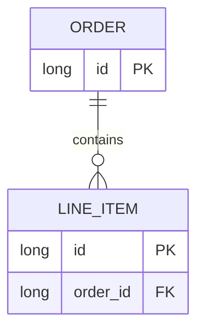

---

### 🛠️ Worked Example

**BAD:**

```java
@Entity
public class Order {
    @Id @GeneratedValue
    private Long id;

    @OneToMany  // No mappedBy!
    private List<LineItem> items;
}
// Hibernate creates a JOIN TABLE: order_line_item
// instead of using the FK on line_item.
// Extra table, extra INSERTs, terrible performance.
```

Why it's wrong: without `mappedBy`, Hibernate treats
`@OneToMany` as a unidirectional association and
creates a join table.

**GOOD:**

```java
@Entity
public class Order {
    @Id @GeneratedValue
    private Long id;

    @OneToMany(mappedBy = "order",
        cascade = CascadeType.ALL,
        orphanRemoval = true)
    private List<LineItem> items = new ArrayList<>();

    public void addItem(LineItem item) {
        items.add(item);
        item.setOrder(this); // Sync both sides!
    }
}

@Entity
public class LineItem {
    @Id @GeneratedValue
    private Long id;

    @ManyToOne(fetch = FetchType.LAZY)
    @JoinColumn(name = "order_id")
    private Order order;
}
```

Why it's right: `mappedBy` avoids the join table; sync
method keeps both sides consistent; LAZY prevents loading
the entire Order graph when reading a LineItem.

**Production config:**

```java
// Spring Data repository query
@Query("SELECT o FROM Order o "
    + "JOIN FETCH o.items "
    + "WHERE o.id = :id")
Optional<Order> findWithItems(@Param("id") Long id);
```

---

### ⚖️ Trade-offs

**Gain:** Object-graph navigation in both directions;
Hibernate manages FK writes automatically from the owning
side; cascades simplify parent-child lifecycle management.

**Cost:** Bidirectional mappings require sync methods to keep
both sides consistent; forgetting `mappedBy` silently creates
a join table; EAGER default on `@ManyToOne` can trigger
cascading loads.

| Aspect     | Bidirectional ManyToOne/OneToMany | Unidirectional ManyToOne only |
| ---------- | --------------------------------- | ----------------------------- |
| Navigation | Both directions                   | Child-to-parent only          |
| Complexity | Sync methods required             | Simpler mapping               |
| Join table | None (with mappedBy)              | None                          |
| Use case   | Parent manages children           | Child references parent       |

---

### ⚡ Decision Snap

**USE WHEN:**

- The parent entity logically owns the children (Order owns
  LineItems).
- You need to navigate from parent to children AND from
  child to parent.
- Cascade operations (persist/remove children with parent)
  are needed.

**AVOID WHEN:**

- You only need child-to-parent navigation - use
  unidirectional `@ManyToOne` alone.
- The child entity is independently managed (not a true
  composition).

**PREFER UNIDIRECTIONAL @ManyToOne WHEN:**

- The parent does not need a collection of children.
- The child has its own lifecycle independent of the parent.

---

### ⚠️ Top Traps

| #   | Misconception                                      | Reality                                                                                |
| --- | -------------------------------------------------- | -------------------------------------------------------------------------------------- |
| 1   | `@OneToMany` without `mappedBy` uses the FK column | Without `mappedBy`, Hibernate creates a separate join table with worse performance     |
| 2   | Setting only the parent-side collection is enough  | The owning side (`@ManyToOne`) must be set; only the FK-holder triggers the write      |
| 3   | `@ManyToOne` defaults to LAZY                      | `@ManyToOne` defaults to EAGER (FetchType.EAGER); always set `fetch = LAZY` explicitly |

---

### 🪜 Learning Ladder

**Prerequisites:**

- Entity and @Entity Annotation - need to understand managed
  entities before mapping relationships
- Entity Lifecycle States - need to know managed vs detached
  before cascading operations

**THIS:** HIB-023 @ManyToOne and @OneToMany Relationships

**Next steps:**

- FetchType.LAZY vs FetchType.EAGER - controlling when
  related entities load
- CascadeType and Cascade Propagation - automating
  parent-child persistence operations

---

### 💡 The Surprising Truth

Most Hibernate performance problems start with `@OneToMany`.
Not because the annotation is bad, but because developers
add it reflexively to every entity without considering whether
they actually need parent-to-child navigation. A unidirectional
`@ManyToOne` on the child side is simpler, avoids collection
management overhead, and eliminates an entire category of
N+1 query risks.

---

### 📇 Revision Card

1. `@ManyToOne` = owning side (FK holder). `@OneToMany
(mappedBy)` = inverse side (read-only mirror).
2. Without `mappedBy`, Hibernate silently creates a join
   table - always set it.
3. `@ManyToOne` defaults to EAGER - always override with
   `fetch = FetchType.LAZY`.

---

---

# HIB-024 @ManyToMany and Join Tables

**TL;DR** - `@ManyToMany` uses a join table with two FKs; prefer modeling the join table as an entity when it carries extra columns.

---

### 🔥 The Problem in One Paragraph

Some relationships are genuinely many-to-many: a Student
enrolls in many Courses, a Course has many Students. In SQL
this requires a join table (`student_course`) with two foreign
keys. In JPA, `@ManyToMany` maps this automatically, but the
moment the join table needs extra columns (enrollment date,
grade), the annotation falls apart. You cannot add columns to
a hidden join table. The most common mistake is starting with
`@ManyToMany`, discovering you need extra data, and then
painfully refactoring to an intermediate entity. This is
exactly why understanding join table mechanics matters.

---

### 📘 Textbook Definition

**`@ManyToMany`** maps a relationship where both sides can
reference multiple instances of the other. JPA creates (or
expects) a join table containing two foreign key columns -
one per side. One side declares `@JoinTable`, the other uses
`mappedBy`. The join table has no corresponding Java entity
unless you promote it to an explicit `@Entity`.

---

### 🧠 Mental Model

> A many-to-many is like a conference registration board.
> Speakers (one list) and Sessions (another list) are connected
> by registration cards pinned between them. The cards are the
> join table. If the card only records "who is in which session,"
> `@ManyToMany` suffices. If the card also records "speaker
> role" or "time slot," you need the card to be its own entity.

- "Registration card" -> join table row
- "Two pins connecting lists" -> two foreign keys
- "Extra info on the card" -> promote to intermediate entity

**Where this analogy breaks down:** In Hibernate, the join
table is invisible to your Java code unless you model it as
an entity, which means you cannot query or index it directly.

---

### ⚙️ How It Works

1. One entity declares `@ManyToMany` with `@JoinTable`
   specifying the join table name and FK columns.
2. The other entity declares `@ManyToMany(mappedBy = "field")`
   as the inverse side.
3. Hibernate generates a join table with a composite primary
   key of both foreign keys.
4. Adding an element to either collection triggers an INSERT
   into the join table at flush time.
5. Removing an element triggers a DELETE from the join table.

```text
  Student              student_course        Course
 +--------+           +------------+-------+ +--------+
 | id PK  |<--+       | student_id | FK    | | id PK  |
 +--------+   +-------| course_id  | FK  +--->+--------+
                       +------------+-------+
                       (join table - no entity)
```

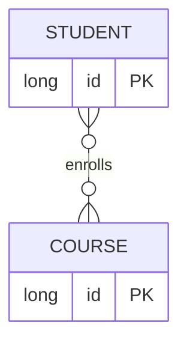

---

### 🛠️ Worked Example

**BAD:**

```java
@Entity
public class Student {
    @ManyToMany
    private Set<Course> courses;
}
@Entity
public class Course {
    @ManyToMany
    private Set<Student> students;
}
// Two @ManyToMany without mappedBy = Hibernate
// creates TWO join tables! Double inserts.
```

Why it's wrong: both sides claim ownership; Hibernate creates
two separate join tables with duplicate data.

**GOOD:**

```java
@Entity
public class Student {
    @ManyToMany
    @JoinTable(name = "enrollment",
        joinColumns = @JoinColumn(
            name = "student_id"),
        inverseJoinColumns = @JoinColumn(
            name = "course_id"))
    private Set<Course> courses = new HashSet<>();
}

@Entity
public class Course {
    @ManyToMany(mappedBy = "courses")
    private Set<Student> students = new HashSet<>();
}
```

**Production: when the join table needs columns:**

```java
@Entity
public class Enrollment {
    @EmbeddedId
    private EnrollmentId id;

    @ManyToOne(fetch = FetchType.LAZY)
    @MapsId("studentId")
    private Student student;

    @ManyToOne(fetch = FetchType.LAZY)
    @MapsId("courseId")
    private Course course;

    private LocalDate enrolledAt;
    private String grade;
}
// Now you can query, index, and extend
// the join table like any other entity.
```

---

### ⚖️ Trade-offs

**Gain:** `@ManyToMany` is concise for pure association tables
with no extra columns; Hibernate manages the join table DDL.

**Cost:** Cannot add columns to the join table; set semantics
required (List causes duplicate issues); join table is
invisible to JPQL queries.

| Aspect          | @ManyToMany             | Intermediate entity |
| --------------- | ----------------------- | ------------------- |
| Extra columns   | Not supported           | Fully supported     |
| Query join data | Not possible            | Standard JPQL       |
| Mapping effort  | Minimal (2 annotations) | More boilerplate    |
| Flexibility     | Low (pure link table)   | High (full entity)  |

---

### ⚡ Decision Snap

**USE WHEN:**

- The join table has exactly two FK columns and zero
  additional data.
- The relationship is unlikely to evolve with extra
  attributes.
- Both sides are relatively small sets (no performance
  concern with collection loading).

**AVOID WHEN:**

- The join table needs any extra column (date, role,
  status, sort order).
- You need to query the association itself (e.g., "find
  all enrollments after date X").

**PREFER INTERMEDIATE ENTITY WHEN:**

- The join table has or may gain extra columns.
- You need composite queries, indexing, or pagination on
  the association data.

---

### ⚠️ Top Traps

| #   | Misconception                               | Reality                                                                                         |
| --- | ------------------------------------------- | ----------------------------------------------------------------------------------------------- |
| 1   | Both sides can declare `@JoinTable`         | Only one side owns the join table; the other uses `mappedBy`. Two owners = two tables.          |
| 2   | `List` works fine with `@ManyToMany`        | `List` causes Hibernate to delete ALL join rows and re-insert on modification. Use `Set`.       |
| 3   | `@ManyToMany` is the default choice for M:N | Start with an intermediate entity unless you are certain the join table will never gain columns |

---

### 🪜 Learning Ladder

**Prerequisites:**

- @ManyToOne and @OneToMany Relationships - the owning-side
  and mappedBy pattern applies here too
- Entity and @Entity Annotation - entities on both sides
  must be understood

**THIS:** HIB-024 @ManyToMany and Join Tables

**Next steps:**

- Embeddables (@Embeddable, @Embedded) - modeling the
  composite key for intermediate entities
- CascadeType and Cascade Propagation - controlling
  lifecycle across many-to-many associations

---

### 💡 The Surprising Truth

In practice, most many-to-many relationships eventually need
extra columns on the join table. Experienced Hibernate
developers rarely use `@ManyToMany` - they model the join
table as an explicit entity from the start, saving the painful
refactoring that comes when requirements inevitably evolve.

---

### 📇 Revision Card

1. `@ManyToMany` creates an invisible join table; only one
   side declares `@JoinTable`, the other uses `mappedBy`.
2. Use `Set`, never `List`, for `@ManyToMany` collections -
   `List` causes delete-all-reinsert behavior.
3. If the join table needs extra columns, promote it to an
   `@Entity` with two `@ManyToOne` relationships.

---

---

# HIB-025 @OneToOne and Shared Primary Keys

**TL;DR** - `@OneToOne` maps 1:1 relationships; prefer shared primary keys (`@MapsId`) to avoid unnecessary extra columns and LAZY issues.

---

### 🔥 The Problem in One Paragraph

Some entities have a strict one-to-one relationship: a User
has one UserProfile, an Employee has one ParkingSpot. The
naive approach uses a separate FK column on one table, but this
wastes a column and forces Hibernate to issue an extra SELECT
to check if the related entity exists (because the FK can be
null). Shared primary keys let the child use the parent's PK
as both its own PK and FK, eliminating the extra column and
enabling true LAZY loading. Misunderstanding `@OneToOne`
mechanics leads to the most common performance trap in
Hibernate: every `@OneToOne` silently triggering an eager
load. This is exactly why shared primary keys matter.

---

### 📘 Textbook Definition

**`@OneToOne`** maps a relationship where each side has at
most one counterpart. The owning side holds the foreign key.
**`@MapsId`** shares the parent's primary key as the child's
primary key, eliminating the separate FK column and enabling
bytecode-enhanced LAZY loading on the parent side.

---

### 🧠 Mental Model

> Think of a passport (child) and a citizen (parent). With
> a separate FK, the passport has its own ID plus a
> `citizen_id` column. With shared primary key, the passport's
> ID IS the citizen's ID - one number identifies both. Less
> storage, cleaner joins, and Hibernate can deduce existence
> from the PK alone.

- "Passport ID = Citizen ID" -> `@MapsId` shared PK
- "Separate passport number + citizen_id" -> FK-based 1:1
- "Look up by one number" -> single PK lookup

**Where this analogy breaks down:** In a real system, the
child can exist independently with `@MapsId`, but the shared
PK implies strong lifecycle coupling.

---

### ⚙️ How It Works

1. Parent entity has `@OneToOne(mappedBy = "parent")`.
2. Child entity has `@OneToOne` + `@MapsId` + `@JoinColumn`.
3. `@MapsId` tells Hibernate: "my PK value comes from the
   parent's PK."
4. The child table has NO separate FK column - the PK column
   IS the FK.
5. For LAZY loading to work on the parent side, Hibernate
   needs bytecode enhancement or `optional = false` to avoid
   an existence-check query.

```text
  User                 UserProfile
 +----------+          +----------+
 | id (PK)  |<----+    | id (PK)  |
 | name     |     +----| = FK     |
 +----------+          | bio      |
                        +----------+
  id on UserProfile IS the FK to User.id
  (shared primary key via @MapsId)
```

```mermaid
erDiagram
    USER ||--o| USER_PROFILE : has
    USER {
        long id PK
        string name
    }
    USER_PROFILE {
        long id PK_FK
        string bio
    }
```

---

### 🛠️ Worked Example

**BAD:**

```java
@Entity
public class User {
    @Id @GeneratedValue
    private Long id;

    @OneToOne // Owns FK? Or inverse? Ambiguous.
    private UserProfile profile;
}
@Entity
public class UserProfile {
    @Id @GeneratedValue
    private Long id; // Separate PK

    @OneToOne(mappedBy = "profile")
    private User user;
    // User table gets profile_id FK column
    // Loading User ALWAYS loads UserProfile
    // (Hibernate cannot know if profile is null
    //  without querying)
}
```

Why it's wrong: separate FK means Hibernate cannot LAZY-load
the profile from the User side - it must query to check
existence.

**GOOD:**

```java
@Entity
public class User {
    @Id @GeneratedValue
    private Long id;

    @OneToOne(mappedBy = "user",
        fetch = FetchType.LAZY)
    private UserProfile profile;
}

@Entity
public class UserProfile {
    @Id
    private Long id; // Shared PK, no @GeneratedValue

    @OneToOne(fetch = FetchType.LAZY)
    @MapsId
    @JoinColumn(name = "id")
    private User user;

    private String bio;
}
```

Why it's right: `@MapsId` shares the PK; Hibernate knows the
profile exists if the PK matches; LAZY loading works with
bytecode enhancement.

**Production: fetching with JOIN FETCH:**

```java
@Query("SELECT u FROM User u "
    + "LEFT JOIN FETCH u.profile "
    + "WHERE u.id = :id")
Optional<User> findWithProfile(@Param("id") Long id);
```

---

### ⚖️ Trade-offs

**Gain:** Shared PK eliminates extra column, enables true
LAZY loading (with bytecode enhancement), and simplifies joins.

**Cost:** Child cannot exist without parent (strong coupling);
`@MapsId` requires careful lifecycle management; bytecode
enhancement is needed for parent-side LAZY.

| Aspect         | Separate FK @OneToOne | @MapsId shared PK      |
| -------------- | --------------------- | ---------------------- |
| Extra column   | Yes (FK on one table) | No (PK = FK)           |
| LAZY on parent | Broken without tricks | Works with enhancement |
| Lifecycle      | Independent           | Strongly coupled       |
| Join cost      | PK-to-FK join         | PK-to-PK join (faster) |

---

### ⚡ Decision Snap

**USE WHEN:**

- A strict 1:1 relationship where the child has no
  independent lifecycle (UserProfile, EmployeeDetail).
- You need LAZY loading to work from the parent side.
- You want to avoid a redundant FK column.

**AVOID WHEN:**

- The child can exist independently or might become 1:N
  in the future.
- You cannot enable bytecode enhancement in your build.

**PREFER @ManyToOne WITH UNIQUE CONSTRAINT WHEN:**

- You need a 1:1 relationship but want the flexibility
  of a standard FK column and simpler migration to 1:N.

---

### ⚠️ Top Traps

| #   | Misconception                                          | Reality                                                                                              |
| --- | ------------------------------------------------------ | ---------------------------------------------------------------------------------------------------- |
| 1   | `@OneToOne(fetch = LAZY)` works out of the box         | Parent-side LAZY requires bytecode enhancement or `@MapsId`; without either, Hibernate eagerly loads |
| 2   | `@OneToOne` is symmetric - either side can own the FK  | Only one side owns the FK; the non-owning side MUST use `mappedBy`                                   |
| 3   | Shared PK means the child can exist without the parent | `@MapsId` ties the child's PK to the parent's PK; the child cannot exist independently               |

---

### 🪜 Learning Ladder

**Prerequisites:**

- @ManyToOne and @OneToMany Relationships - owning side
  and mappedBy mechanics
- @Id and Primary Key Generation Strategies - shared PK
  requires understanding ID assignment

**THIS:** HIB-025 @OneToOne and Shared Primary Keys

**Next steps:**

- FetchType.LAZY vs FetchType.EAGER - understanding why
  parent-side LAZY breaks without enhancement
- Bytecode Enhancement and Proxy Generation Internals -
  how Hibernate makes LAZY work at the bytecode level

---

### 💡 The Surprising Truth

`@OneToOne` is the most deceptive JPA annotation. It looks
simple but silently forces eager loading on the parent side
in most configurations. Experienced Hibernate developers
either use `@MapsId` with bytecode enhancement, replace
`@OneToOne` with `@ManyToOne` plus a unique constraint, or
avoid the annotation entirely by embedding the data.

---

### 📇 Revision Card

1. `@MapsId` = shared PK = child's PK IS the FK to parent.
   No extra column, cleaner joins.
2. Parent-side `@OneToOne(fetch = LAZY)` is ignored without
   bytecode enhancement or `@MapsId`.
3. Consider `@ManyToOne` + unique constraint as a simpler
   alternative that avoids LAZY-loading traps.

---

---

# HIB-026 FetchType.LAZY vs FetchType.EAGER

**TL;DR** - LAZY loads related entities on first access; EAGER loads them immediately. Default to LAZY everywhere.

---

### 🔥 The Problem in One Paragraph

Loading an Order should not require loading every LineItem,
every Product for each LineItem, and every Category for each
Product. Yet with EAGER fetching, that is exactly what happens

- one `find(Order.class, id)` triggers a cascade of JOINs or
  SELECTs that pulls the entire object graph into memory. On a
  page listing 20 orders, EAGER turns one query into hundreds.
  Conversely, excessive LAZY loading without strategic fetching
  triggers N+1 queries when you iterate a collection. The
  decision between LAZY and EAGER is the single most impactful
  configuration choice in Hibernate. This is exactly why
  understanding fetch types is non-negotiable.

---

### 📘 Textbook Definition

**`FetchType.LAZY`** defers loading of a related entity or
collection until the application first accesses it. Hibernate
returns a proxy or uninitialized collection wrapper.
**`FetchType.EAGER`** loads the related entity or collection
immediately as part of the parent query, typically via a JOIN
or a secondary SELECT.

---

### 🧠 Mental Model

> LAZY is like a restaurant menu: you see the item names but
> the kitchen only cooks your dish when you order it. EAGER
> is a buffet: every dish is prepared before you walk in,
> whether you eat it or not. Buffets waste food (memory/queries)
> when you only want one dish.

- "Menu item" -> proxy / uninitialized collection
- "Order the dish" -> first access triggers SELECT
- "Buffet preparation" -> JOIN or extra SELECT at load time

**Where this analogy breaks down:** LAZY proxies throw
`LazyInitializationException` if the Session is closed before
access - the "kitchen closes" and you get nothing.

---

### ⚙️ How It Works

1. **LAZY collections:** Hibernate wraps the collection in a
   `PersistentBag/Set/List`. The SQL fires only when
   `.size()`, `.get()`, or iteration occurs.
2. **LAZY single associations:** Hibernate creates a bytecode
   proxy with only the ID populated. Accessing any non-ID
   field triggers the SELECT.
3. **EAGER associations:** Hibernate joins or sub-selects the
   related data in the same query (or immediately after).
4. JPA defaults: `@ManyToOne` and `@OneToOne` default to
   EAGER. `@OneToMany` and `@ManyToMany` default to LAZY.
5. LAZY only works while the Session is open. Once closed,
   accessing an uninitialized proxy throws
   `LazyInitializationException`.

```text
  LAZY path:
  find(Order) --> SELECT order   (1 query)
  order.getItems() --> SELECT items (1 query)
  Total: 2 queries, only when needed

  EAGER path:
  find(Order) --> SELECT order JOIN items (1 query)
  or: SELECT order + SELECT items   (2 queries)
  Total: always loaded, even if unused
```

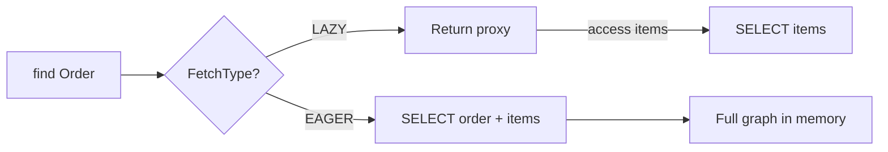

---

### 🛠️ Worked Example

**BAD:**

```java
@ManyToOne // Default: FetchType.EAGER
private Category category;

@OneToMany(fetch = FetchType.EAGER)
private List<Review> reviews;

// Loading one Product now loads its Category
// AND all Reviews AND each Review's User...
// Cascade of eager loads = "fetch storm"
```

Why it's wrong: every load of Product pulls the entire
related graph; listing 20 products fires dozens of queries.

**GOOD:**

```java
@ManyToOne(fetch = FetchType.LAZY)
private Category category;

@OneToMany(mappedBy = "product",
    fetch = FetchType.LAZY)
private List<Review> reviews;

// Load only what you need:
@Query("SELECT p FROM Product p "
    + "JOIN FETCH p.category "
    + "WHERE p.id = :id")
Product findWithCategory(@Param("id") Long id);
```

Why it's right: everything is LAZY by default; specific
queries use JOIN FETCH to load exactly what is needed.

**Production: N+1 detection:**

```java
// Enable Hibernate statistics to count queries
hibernate.generate_statistics=true
// Log shows: "Executed 201 JDBC statements"
// for 1 parent + 200 children = N+1 problem
```

---

### ⚖️ Trade-offs

**Gain:** LAZY avoids loading unused data, reducing memory
and query count for targeted access patterns.

**Cost:** LAZY requires an open Session (risks
`LazyInitializationException`); needs explicit `JOIN FETCH`
for known access patterns; proxy initialization has overhead.

| Aspect              | LAZY                        | EAGER              |
| ------------------- | --------------------------- | ------------------ |
| Default query count | 1 (+ N on access)           | 1 JOIN or 1+N      |
| Memory              | Low (loaded on demand)      | High (full graph)  |
| Risk                | LazyInitializationException | Fetch storms       |
| Control             | High (explicit fetching)    | Low (always loads) |

---

### ⚡ Decision Snap

**USE WHEN:**

- LAZY as the default for every association and collection.
- Combined with `JOIN FETCH` in specific queries where you
  know the data is needed.
- Your persistence context (Session) is open for the duration
  of the business operation.

**AVOID WHEN:**

- EAGER should be avoided on almost all associations in
  production code.
- EAGER is acceptable only for tiny reference data always
  needed (e.g., a single-row config entity).

**PREFER JOIN FETCH WHEN:**

- You know the related data is needed and want to avoid
  N+1 queries while keeping the mapping LAZY.

---

### ⚠️ Top Traps

| #   | Misconception                       | Reality                                                                                |
| --- | ----------------------------------- | -------------------------------------------------------------------------------------- |
| 1   | `@ManyToOne` defaults to LAZY       | `@ManyToOne` and `@OneToOne` default to EAGER. You MUST explicitly set `fetch = LAZY`. |
| 2   | LAZY means fewer queries always     | Without `JOIN FETCH`, LAZY triggers N+1: 1 parent query + N child queries on iteration |
| 3   | EAGER is fine for small collections | "Small" grows. EAGER on any collection multiplies with other EAGER associations        |

---

### 🪜 Learning Ladder

**Prerequisites:**

- @ManyToOne and @OneToMany Relationships - need to
  understand the associations being fetched
- EntityManager and Persistence Context - LAZY requires
  an open persistence context

**THIS:** HIB-026 FetchType.LAZY vs FetchType.EAGER

**Next steps:**

- The N+1 Select Problem - the specific failure mode of
  LAZY without strategic fetching
- Fetch Strategy Decision (LAZY vs EAGER vs JOIN FETCH) -
  the complete decision framework

---

### 💡 The Surprising Truth

The JPA spec committee chose EAGER as the default for
`@ManyToOne` and `@OneToOne`. This single design decision
has caused more performance bugs than any other JPA feature.
Every experienced Hibernate team establishes a rule: "every
`@ManyToOne` and `@OneToOne` gets `fetch = FetchType.LAZY`"
as a non-negotiable coding standard.

---

### 📇 Revision Card

1. Default to `FetchType.LAZY` on EVERY association. Override
   with `JOIN FETCH` per query, not per mapping.
2. `@ManyToOne` and `@OneToOne` default to EAGER - always
   override explicitly.
3. LAZY + no strategic fetching = N+1. EAGER = fetch storms.
   The answer is LAZY + JOIN FETCH.

---

---

# HIB-027 CascadeType and Cascade Propagation

**TL;DR** - Cascade propagates persistence operations from parent to children automatically; use `CascadeType.ALL` only for true composition.

---

### 🔥 The Problem in One Paragraph

When you persist an Order, should Hibernate automatically
persist its LineItems? When you remove an Order, should
LineItems be deleted too? Without cascade, every child entity
requires explicit `persist()`, `merge()`, or `remove()` calls.
With cascade, Hibernate propagates the parent's operation to
all children in the collection. But cascade on the wrong
relationship (e.g., cascading remove from a shared reference)
silently deletes entities that other parents still reference.
This is exactly why understanding cascade propagation is
critical.

---

### 📘 Textbook Definition

**`CascadeType`** is a JPA enum that controls which
`EntityManager` operations (PERSIST, MERGE, REMOVE, REFRESH,
DETACH) propagate from a parent entity to its related entities.
**`CascadeType.ALL`** is a shorthand for all five types plus
Hibernate's `REPLICATE` (deprecated). Cascade is declared on
the relationship annotation (`@OneToMany`, `@ManyToOne`,
`@OneToOne`, `@ManyToMany`).

---

### 🧠 Mental Model

> Cascade is like a waterfall. Water (an operation) pours from
> the top pool (parent) down to lower pools (children). `PERSIST`
> cascade means: when the top pool fills (parent is persisted),
> water flows to the lower pools (children are persisted too).
> `REMOVE` cascade means: when the top pool drains, lower
> pools drain too.

- "Top pool" -> parent entity receiving the operation
- "Waterfall flow" -> cascade propagation
- "Lower pools" -> child entities in the collection

**Where this analogy breaks down:** Cascade is directional
(parent to child only); it does not flow sideways or upstream.
Cascading from child-to-parent (`@ManyToOne cascade REMOVE`)
would delete the parent when removing one child - almost never
what you want.

---

### ⚙️ How It Works

1. You annotate a collection with
   `@OneToMany(cascade = {CascadeType.PERSIST,
CascadeType.MERGE})`.
2. When `em.persist(parent)` is called, Hibernate walks
   the cascade graph and calls `persist()` on each child.
3. When `em.merge(parent)` is called, children are also
   merged.
4. `CascadeType.REMOVE` triggers `remove()` on children
   when the parent is removed.
5. Cascade is ONLY about operation propagation. It does NOT
   affect fetch behavior or foreign key management.

```text
  em.persist(order)
       |
       v  cascade = PERSIST
  em.persist(item1)
  em.persist(item2)
  em.persist(item3)
  (Hibernate does this automatically)
```

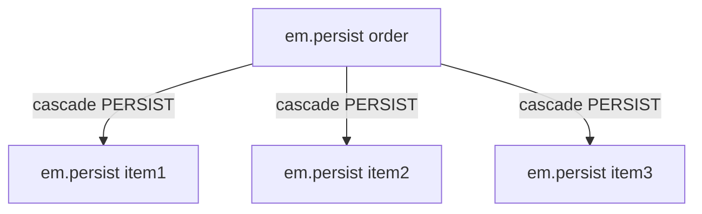

---

### 🛠️ Worked Example

**BAD:**

```java
@ManyToOne(cascade = CascadeType.ALL)
private Department department;
// Removing an Employee cascades REMOVE to
// Department, which deletes the entire
// department and all its other employees!
```

Why it's wrong: cascading REMOVE from child to parent deletes
entities that other children still reference.

**GOOD:**

```java
@Entity
public class Order {
    @OneToMany(mappedBy = "order",
        cascade = CascadeType.ALL,
        orphanRemoval = true)
    private List<LineItem> items = new ArrayList<>();
}
// Cascade goes parent -> children ONLY.
// CascadeType.ALL is safe here because
// LineItems are owned exclusively by Order.
```

Why it's right: cascade flows from parent (Order) to children
(LineItems) where Order exclusively owns the items.

**Production: selective cascade:**

```java
// Only cascade PERSIST and MERGE, not REMOVE
// Used when children may be shared or have
// independent lifecycle
@OneToMany(mappedBy = "order",
    cascade = {CascadeType.PERSIST,
               CascadeType.MERGE})
private List<Tag> tags;
```

---

### ⚖️ Trade-offs

**Gain:** Reduces boilerplate; one `persist(parent)` handles
the entire aggregate; consistent lifecycle management.

**Cost:** Implicit behavior hides operations; cascading REMOVE
on wrong relationships silently deletes shared data; debugging
cascade chains requires understanding the graph.

| Aspect      | No cascade           | Selective cascade | ALL + orphanRemoval |
| ----------- | -------------------- | ----------------- | ------------------- |
| Boilerplate | High (manual)        | Medium            | Minimal             |
| Safety      | Explicit, safe       | Controlled        | Risky if misapplied |
| Use case    | Independent entities | Mixed ownership   | True composition    |

---

### ⚡ Decision Snap

**USE WHEN:**

- Parent exclusively owns children (Order -> LineItems).
- Children have no independent lifecycle.
- You want aggregate-root-style persistence.

**AVOID WHEN:**

- Children are shared across multiple parents (Tag used by
  many Posts).
- Cascade direction is child-to-parent (`@ManyToOne`
  cascade) - almost never correct.

**PREFER SELECTIVE CASCADE WHEN:**

- You want auto-persist but NOT auto-remove (e.g., Tags
  should survive parent deletion).

---

### ⚠️ Top Traps

| #   | Misconception                         | Reality                                                                                          |
| --- | ------------------------------------- | ------------------------------------------------------------------------------------------------ |
| 1   | `CascadeType.ALL` is the safe default | ALL includes REMOVE; on shared relationships this deletes entities other parents still reference |
| 2   | Cascade affects fetch behavior        | Cascade controls operation propagation ONLY; fetching is controlled by FetchType                 |
| 3   | Cascade flows bidirectionally         | Cascade flows only in the direction declared; parent-to-child, not child-to-parent               |

---

### 🪜 Learning Ladder

**Prerequisites:**

- @ManyToOne and @OneToMany Relationships - cascades are
  declared on relationship annotations
- Entity Lifecycle States - cascade propagates lifecycle
  transitions (persist, remove, merge)

**THIS:** HIB-027 CascadeType and Cascade Propagation

**Next steps:**

- orphanRemoval vs CascadeType.REMOVE - the subtle
  difference for child deletion
- The N+1 Select Problem - cascade does not prevent N+1;
  fetching is separate

---

### 💡 The Surprising Truth

`CascadeType.ALL` on `@ManyToOne` is one of the most dangerous
lines in any JPA codebase. It means: removing one child deletes
its parent, which cascades to all siblings. A single
`em.remove(lineItem)` can wipe an entire Order and all its
other LineItems. Yet this pattern appears in countless tutorials.

---

### 📇 Revision Card

1. Cascade = operation propagation (persist, remove, merge),
   NOT fetch behavior.
2. `CascadeType.ALL` is safe ONLY for true composition where
   the parent exclusively owns children.
3. NEVER cascade REMOVE from child to parent (`@ManyToOne
cascade REMOVE`) - it deletes the parent and all siblings.

---

---

# HIB-028 orphanRemoval vs CascadeType.REMOVE

**TL;DR** - `CascadeType.REMOVE` deletes children when the parent is removed; `orphanRemoval` also deletes children removed from the collection.

---

### 🔥 The Problem in One Paragraph

You remove a LineItem from an Order's collection:
`order.getItems().remove(item)`. With `CascadeType.REMOVE`,
nothing happens to the database row - the item becomes an
orphan with a dangling FK. Only deleting the entire Order
triggers child removal. With `orphanRemoval = true`, removing
the item from the collection triggers a DELETE for that
specific item at flush time. This distinction causes silent
data integrity issues: orphan rows accumulate in the database,
FK constraints fail, and storage grows unbounded. This is
exactly why `orphanRemoval` exists as a separate concept.

---

### 📘 Textbook Definition

**`CascadeType.REMOVE`** propagates the `remove()` operation
from parent to children: when the parent entity is removed,
all cascaded children are also removed.
**`orphanRemoval = true`** additionally removes any child
entity that is disconnected from the parent's collection,
even if the parent itself is not removed.

---

### 🧠 Mental Model

> `CascadeType.REMOVE` is like demolishing a building -
> everything inside is destroyed. `orphanRemoval` is like a
> lost-and-found policy: if a child leaves the building
> (removed from collection), it is discarded. REMOVE only
> fires on demolition. orphanRemoval fires on eviction too.

- "Demolish building" -> `em.remove(parent)` with CASCADE
- "Evict a tenant" -> `collection.remove(child)` with orphan
- "Tenant discarded on eviction" -> orphan DELETE at flush

**Where this analogy breaks down:** orphanRemoval implies
the child CANNOT exist independently. Removing it from the
collection means it should not exist at all.

---

### ⚙️ How It Works

1. `CascadeType.REMOVE` only triggers when `em.remove(parent)`
   is called. It walks the cascade graph and removes children.
2. `orphanRemoval = true` monitors the parent's collection.
   At flush time, Hibernate compares the current collection
   state with the snapshot taken at load time.
3. Any entity present in the snapshot but absent from the
   current collection is treated as an orphan and scheduled
   for DELETE.
4. Setting a child's parent reference to null (de-referencing)
   or calling `collection.remove(child)` both trigger orphan
   removal.
5. `orphanRemoval = true` implies `CascadeType.REMOVE`
   semantically but also covers collection-level removals.

```text
  CascadeType.REMOVE only:
  em.remove(order) --> DELETE items WHERE order_id=X
  order.getItems().remove(item) --> NO DELETE (orphan!)

  orphanRemoval = true:
  em.remove(order) --> DELETE items WHERE order_id=X
  order.getItems().remove(item) --> DELETE item WHERE id=Y
```

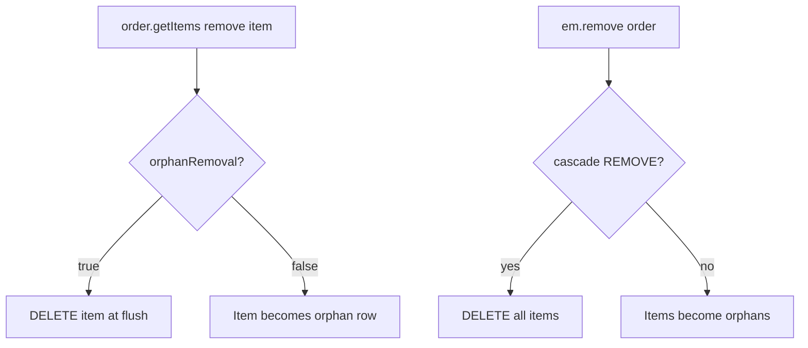

---

### 🛠️ Worked Example

**BAD:**

```java
@OneToMany(mappedBy = "order",
    cascade = CascadeType.ALL)
// Missing orphanRemoval!
private List<LineItem> items;

// Removing item from collection:
order.getItems().remove(item);
em.flush();
// The item row STILL EXISTS in the database
// with order_id pointing to the order.
// Orphan row accumulates silently.
```

Why it's wrong: without `orphanRemoval`, removing a child from
the collection does not delete it from the database.

**GOOD:**

```java
@OneToMany(mappedBy = "order",
    cascade = CascadeType.ALL,
    orphanRemoval = true)
private List<LineItem> items = new ArrayList<>();

public void removeItem(LineItem item) {
    items.remove(item);
    item.setOrder(null); // Sync both sides
}
// flush() -> DELETE FROM line_item WHERE id = ?
```

Why it's right: `orphanRemoval = true` ensures removing the
item from the collection triggers a DELETE.

**Production: replacing a collection:**

```java
// DANGEROUS with orphanRemoval:
order.setItems(newItemsList);
// ALL old items are orphaned -> ALL deleted!
// Use clear() + addAll() instead:
order.getItems().clear();
order.getItems().addAll(newItems);
```

---

### ⚖️ Trade-offs

**Gain:** Automatic cleanup of child entities removed from
collections; prevents orphan row accumulation; enforces
composition semantics.

**Cost:** Accidental collection replacement deletes all
children; cannot reassign a child to a different parent
(removal = deletion); collection.clear() deletes everything.

| Aspect                  | CascadeType.REMOVE  | orphanRemoval = true   |
| ----------------------- | ------------------- | ---------------------- |
| Trigger: parent removed | Deletes children    | Deletes children       |
| Trigger: child removed  | No effect (orphan)  | Deletes the child      |
| Child independence      | Can exist alone     | Cannot exist alone     |
| Risk                    | Orphan accumulation | Accidental mass delete |

---

### ⚡ Decision Snap

**USE WHEN:**

- Children are true components of the parent (LineItems of
  an Order) and should not exist independently.
- You need collection-level removal to trigger database
  DELETEs.
- The relationship is exclusive - a child belongs to exactly
  one parent.

**AVOID WHEN:**

- Children can be reassigned to another parent (Tags shared
  across Posts).
- You might replace the collection reference (setter) instead
  of modifying it in place.

**PREFER CascadeType.REMOVE ALONE WHEN:**

- You only need children deleted on parent removal, not on
  collection removal.

---

### ⚠️ Top Traps

| #   | Misconception                                                 | Reality                                                                                                                |
| --- | ------------------------------------------------------------- | ---------------------------------------------------------------------------------------------------------------------- |
| 1   | `orphanRemoval` and `CascadeType.REMOVE` are the same         | REMOVE triggers only on `em.remove(parent)`. orphanRemoval also triggers on `collection.remove(child)`.                |
| 2   | Replacing the collection reference is safe with orphanRemoval | `setItems(newList)` orphans ALL old items, triggering mass DELETE. Modify in place with `clear()` + `addAll()`.        |
| 3   | orphanRemoval works on `@ManyToMany`                          | orphanRemoval is only supported on `@OneToMany` and `@OneToOne`. Using it on `@ManyToMany` throws a mapping exception. |

---

### 🪜 Learning Ladder

**Prerequisites:**

- CascadeType and Cascade Propagation - orphanRemoval
  extends cascade behavior
- @ManyToOne and @OneToMany Relationships - orphanRemoval
  applies to the @OneToMany side

**THIS:** HIB-028 orphanRemoval vs CascadeType.REMOVE

**Next steps:**

- The N+1 Select Problem - cascaded operations generate
  SQL that must be understood
- Dirty Checking and First-Level Cache Internals - how
  Hibernate detects collection changes for orphan removal

---

### 💡 The Surprising Truth

The most common cause of "mysterious data disappearing" in
Hibernate applications is `orphanRemoval = true` combined with
a setter that replaces the entire collection. A single
`order.setItems(newList)` silently deletes every old item
from the database. This is why experienced teams ban collection
setters on entities with orphanRemoval and expose only `add()`
and `remove()` methods.

---

### 📇 Revision Card

1. `CascadeType.REMOVE` = delete children on parent removal.
   `orphanRemoval` = also delete on collection removal.
2. Never replace a collection reference with orphanRemoval -
   use `clear()` + `addAll()` to modify in place.
3. orphanRemoval only works on `@OneToMany` and `@OneToOne`,
   not `@ManyToMany`.

---

---

# HIB-029 Embeddables (@Embeddable, @Embedded)

**TL;DR** - Embeddables are value objects stored in the parent's table, not in their own table - no `@Id`, no identity.

---

### 🔥 The Problem in One Paragraph

An Address has street, city, zip, and country. It appears on
Order, Customer, and Warehouse entities. Creating a separate
`Address` table with its own primary key adds unnecessary
joins and lifecycle complexity for what is fundamentally a
value - two addresses with the same fields are interchangeable.
But duplicating the four fields on every entity is unmaintainable.
`@Embeddable` solves this: one reusable Java class whose columns
are inlined into the parent's table. No separate table, no
extra joins, no identity management. This is exactly why
embeddables exist.

---

### 📘 Textbook Definition

**`@Embeddable`** marks a class as a value type with no
identity of its own. **`@Embedded`** embeds an `@Embeddable`
instance into an entity, inlining its columns into the entity's
table. Embeddables have no `@Id`, no lifecycle, and are
equality-compared by field values rather than identity.

---

### 🧠 Mental Model

> An embeddable is like a stamp on an envelope. The stamp's
> data (value, country, date) is physically printed ON the
> envelope, not stored in a separate stamp database with its
> own tracking number. The stamp has no identity beyond its
> content.

- "Stamp" -> embeddable value object
- "Printed on envelope" -> columns inlined in parent table
- "No tracking number" -> no `@Id`, no separate table

**Where this analogy breaks down:** Unlike stamps, embeddables
can contain other embeddables (nesting) and can override column
names per usage with `@AttributeOverride`.

---

### ⚙️ How It Works

1. Create a class annotated with `@Embeddable` containing
   fields but no `@Id`.
2. In the entity, declare a field of that type annotated
   with `@Embedded`.
3. Hibernate maps the embeddable's fields as columns in the
   entity's table.
4. `@AttributeOverride` renames columns when the same
   embeddable is used twice (e.g., billingAddress,
   shippingAddress).
5. Embeddables can contain `@ManyToOne` associations but
   not `@OneToMany` collections (in standard JPA).

```text
  Customer table (single table):
 +----+--------+------------------+--------+
 | id | name   | address_street   | addr.. |
 +----+--------+------------------+--------+
 | 1  | Alice  | 123 Main St      | 90210  |
 +----+--------+------------------+--------+
  No separate address table. Columns inlined.
```

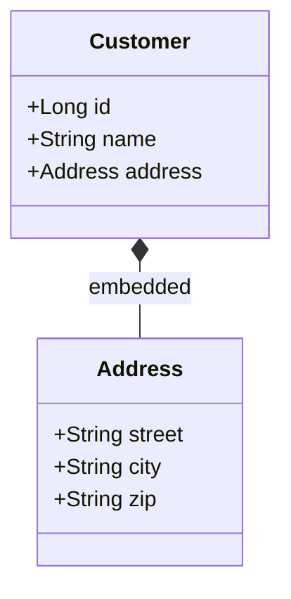

---

### 🛠️ Worked Example

**BAD:**

```java
@Entity
public class Customer {
    @Id @GeneratedValue
    private Long id;
    private String street;
    private String city;
    private String zip;
    private String country;
    // Duplicated on Order, Warehouse, etc.
    // Change zip from String to int? Edit
    // every entity.
}
```

Why it's wrong: address fields duplicated across entities;
schema change requires editing every class.

**GOOD:**

```java
@Embeddable
public class Address {
    private String street;
    private String city;
    private String zip;
    private String country;
}

@Entity
public class Customer {
    @Id @GeneratedValue
    private Long id;

    @Embedded
    private Address address;

    @Embedded
    @AttributeOverrides({
        @AttributeOverride(
            name = "street",
            column = @Column(
                name = "ship_street")),
        @AttributeOverride(
            name = "city",
            column = @Column(
                name = "ship_city"))
    })
    private Address shippingAddress;
}
```

Why it's right: address logic defined once; reused across
entities; `@AttributeOverride` resolves column name conflicts.

**Production: null embeddable handling:**

```java
// If ALL embeddable fields are null, Hibernate
// sets the embeddable reference to null (not an
// empty object). Check for null before accessing:
if (customer.getAddress() != null) {
    String city = customer.getAddress().getCity();
}
```

---

### ⚖️ Trade-offs

**Gain:** No extra table, no join overhead, reusable value
objects, DDD-aligned value type semantics.

**Cost:** All fields in parent table (wide rows); null handling
is awkward (all-null = null reference); no independent queries
on embeddable.

| Aspect   | @Embeddable       | Separate @Entity    |
| -------- | ----------------- | ------------------- |
| Table    | Inlined in parent | Own table + joins   |
| Identity | None (value type) | Has @Id             |
| Reuse    | Via @Embedded     | Via @ManyToOne      |
| Querying | Via parent        | Independent queries |

---

### ⚡ Decision Snap

**USE WHEN:**

- The concept is a value object with no independent identity
  (Address, Money, DateRange).
- You want to avoid a separate table and join overhead.
- The same group of fields appears across multiple entities.

**AVOID WHEN:**

- The concept has its own identity and lifecycle (a Customer
  is an entity, not an embeddable).
- You need to query the component independently.

**PREFER SEPARATE ENTITY WHEN:**

- The concept is shared by reference (many Orders reference
  the SAME Address instance).
- You need the component in its own table for normalization.

---

### ⚠️ Top Traps

| #   | Misconception                                              | Reality                                                                                               |
| --- | ---------------------------------------------------------- | ----------------------------------------------------------------------------------------------------- |
| 1   | An embeddable with all null fields returns an empty object | Hibernate returns null for the entire embeddable reference when all its columns are null              |
| 2   | `@Embeddable` can have an `@Id`                            | Embeddables are value types with NO identity. Adding `@Id` makes it an entity.                        |
| 3   | You can use `@OneToMany` inside an embeddable              | Standard JPA does not support collections inside embeddables; some providers allow it as an extension |

---

### 🪜 Learning Ladder

**Prerequisites:**

- Entity and @Entity Annotation - embeddables live inside
  entities
- Basic Column Mappings - `@AttributeOverride` extends
  column mapping

**THIS:** HIB-029 Embeddables (@Embeddable, @Embedded)

**Next steps:**

- Inheritance Mapping - another approach to reuse that uses
  table strategies instead of inlining
- @ManyToMany and Join Tables - composite keys for
  intermediate entities often use embeddables

---

### 💡 The Surprising Truth

Embeddables are the most under-used JPA feature. Teams create
separate tables for Address, Money, and Coordinate when
inlining them via `@Embeddable` would eliminate joins, simplify
the schema, and align the model with DDD value object semantics.
The cost of an extra join per query compounds across every
service call.

---

### 📇 Revision Card

1. `@Embeddable` = value object with no identity, columns
   inlined in parent table.
2. All-null embeddable = null reference (not empty object).
   Always null-check.
3. Use `@AttributeOverride` when embedding the same type
   twice in one entity.

---

---

# HIB-030 Inheritance Mapping (SINGLE_TABLE, JOINED, TABLE_PER_CLASS)

**TL;DR** - Three strategies map Java inheritance to tables: SINGLE_TABLE (one table, fast), JOINED (normalized, flexible), TABLE_PER_CLASS (isolated, rarely used).

---

### 🔥 The Problem in One Paragraph

Your domain has `Payment` as a base class with `CreditCard`,
`BankTransfer`, and `Crypto` subclasses. Each subclass has
shared fields (amount, date) plus unique fields (cardNumber,
IBAN, walletAddress). Relational databases have no inheritance.
You must choose how to flatten this hierarchy into tables.
Each strategy trades query performance against schema
normalization and flexibility. The wrong choice surfaces as
slow polymorphic queries, nullable columns wasting space, or
painful schema migrations when adding subclasses. This is
exactly why inheritance mapping strategy matters.

---

### 📘 Textbook Definition

**Inheritance mapping** maps a Java class hierarchy to
relational tables using one of three JPA strategies:
**SINGLE_TABLE** stores all subclasses in one table with a
discriminator column. **JOINED** creates one table per class
in the hierarchy, joined by PK. **TABLE_PER_CLASS** creates
one independent table per concrete class with all inherited
columns duplicated.

---

### 🧠 Mental Model

> Imagine filing employee records. **SINGLE_TABLE** = one
> giant filing cabinet with a "type" label on each folder
> (some folders have empty fields). **JOINED** = one cabinet
> per department, linked by employee ID (normalized but
> requires visiting multiple cabinets). **TABLE_PER_CLASS** =
> each department has its own complete copy of every record
> (isolated but redundant).

- "One cabinet, type label" -> discriminator column
- "Linked cabinets" -> PK join across tables
- "Complete copies" -> all columns duplicated per table

**Where this analogy breaks down:** SINGLE_TABLE is
significantly faster for polymorphic queries than the analogy
suggests - one table scan vs multi-table joins.

---

### ⚙️ How It Works

**SINGLE_TABLE (default):**

1. One table holds all subclass columns. Columns unique to
   a subclass are nullable.
2. A discriminator column (`DTYPE` by default) identifies
   the concrete subclass per row.
3. Polymorphic queries (`FROM Payment`) scan one table.

**JOINED:**

1. Base class gets its own table with shared columns.
2. Each subclass gets a table with only its unique columns
   plus a FK to the base table.
3. Polymorphic queries require JOINs across all subclass
   tables.

**TABLE_PER_CLASS:**

1. Each concrete class gets a complete table with ALL columns
   (shared + unique).
2. No discriminator, no joins. Each table is self-contained.
3. Polymorphic queries require UNION ALL across all tables.

```text
  SINGLE_TABLE:          JOINED:
  payment                payment     credit_card
  +------+-----+----+    +----+---+  +----+------+
  |id|type|amt |card|    |id  |amt|  |id  |card  |
  +------+-----+----+    +----+---+  +----+------+
  |1 |CC  |100 |4111|    |1   |100|  |1   |4111  |
  |2 |BT  |200 |null|    |2   |200|
  +------+-----+----+    +----+---+

  TABLE_PER_CLASS:
  credit_card_payment    bank_transfer
  +----+-----+------+    +----+-----+------+
  |id  |amt  |card  |    |id  |amt  |iban  |
  +----+-----+------+    +----+-----+------+
```

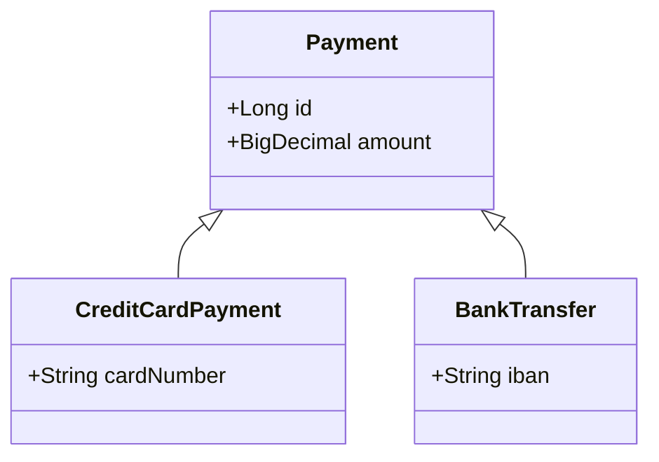

---

### 🛠️ Worked Example

**BAD:**

```java
@Entity
@Inheritance(strategy = InheritanceType.JOINED)
public abstract class Payment { ... }

// Polymorphic query on 5 subclasses:
// SELECT * FROM payment p
//   LEFT JOIN credit_card cc ON cc.id = p.id
//   LEFT JOIN bank_transfer bt ON bt.id = p.id
//   LEFT JOIN crypto c ON c.id = p.id
//   LEFT JOIN paypal pp ON pp.id = p.id
//   LEFT JOIN check ch ON ch.id = p.id
// 5-way JOIN for every polymorphic query!
```

Why it's wrong: JOINED strategy with many subclasses turns
every polymorphic query into an expensive multi-table JOIN.

**GOOD:**

```java
@Entity
@Inheritance(strategy =
    InheritanceType.SINGLE_TABLE)
@DiscriminatorColumn(name = "payment_type")
public abstract class Payment {
    @Id @GeneratedValue
    private Long id;
    private BigDecimal amount;
}

@Entity
@DiscriminatorValue("CC")
public class CreditCardPayment extends Payment {
    private String cardNumber;
}
// One table, one scan, no JOINs.
// Nullable columns are the trade-off.
```

Why it's right: SINGLE_TABLE is the best default for
hierarchies with polymorphic queries and moderate subclass
variation.

**Production: discriminator in queries:**

```java
List<Payment> all = em.createQuery(
    "SELECT p FROM Payment p "
    + "WHERE p.amount > :min", Payment.class)
    .setParameter("min", BigDecimal.TEN)
    .getResultList();
// Hibernate adds: WHERE payment_type IN ('CC','BT')
// automatically.
```

---

### ⚖️ Trade-offs

**Gain:** SINGLE_TABLE is fast and simple; JOINED is
normalized; TABLE_PER_CLASS avoids nullables.

**Cost:** SINGLE_TABLE has nullable columns; JOINED has
expensive polymorphic queries; TABLE_PER_CLASS has no shared
sequences and terrible UNION ALL performance.

| Aspect               | SINGLE_TABLE   | JOINED         | TABLE_PER_CLASS  |
| -------------------- | -------------- | -------------- | ---------------- |
| Polymorphic query    | Fast (1 table) | Slow (N JOINs) | Slow (UNION ALL) |
| Nullable columns     | Many           | None           | None             |
| Schema normalization | Low            | High           | Low (redundant)  |
| Adding subclass      | No DDL change  | New table      | New table        |

---

### ⚡ Decision Snap

**USE WHEN:**

- SINGLE_TABLE for most hierarchies, especially with
  polymorphic queries and less than 20 nullable columns.
- JOINED when subclasses have many unique columns and
  polymorphic queries are rare.
- TABLE_PER_CLASS almost never in practice.

**AVOID WHEN:**

- SINGLE_TABLE with 50+ nullable columns per subclass -
  consider JOINED or rethinking the hierarchy.
- TABLE_PER_CLASS when you need polymorphic queries or
  shared sequences.

**PREFER COMPOSITION OVER INHERITANCE WHEN:**

- The hierarchy has more than 3-4 levels deep - flatten
  with embeddables or discriminated value objects.

---

### ⚠️ Top Traps

| #   | Misconception                                                 | Reality                                                                                                |
| --- | ------------------------------------------------------------- | ------------------------------------------------------------------------------------------------------ |
| 1   | JOINED is better because it is normalized                     | JOINED normalization costs N JOINs per polymorphic query - often worse than nullable columns           |
| 2   | TABLE_PER_CLASS is clean because each class has its own table | TABLE_PER_CLASS cannot share sequences, uses UNION ALL for polymorphic queries, and duplicates columns |
| 3   | Adding NOT NULL constraints works with SINGLE_TABLE           | Subclass columns MUST be nullable in SINGLE_TABLE because rows of other subtypes leave them empty      |

---

### 🪜 Learning Ladder

**Prerequisites:**

- Entity and @Entity Annotation - inheritance builds on
  entity fundamentals
- Basic Column Mappings - discriminator and join columns
  need mapping knowledge

**THIS:** HIB-030 Inheritance Mapping (SINGLE_TABLE, JOINED,
TABLE_PER_CLASS)

**Next steps:**

- Inheritance Strategy Selection Guide - decision framework
  for choosing the right strategy
- Embeddables (@Embeddable, @Embedded) - composition
  alternative to inheritance

---

### 💡 The Surprising Truth

Despite being the "least normalized" option, SINGLE_TABLE is
the default JPA inheritance strategy and the recommended choice
for most hierarchies. The nullable column overhead is minimal
compared to the JOIN cost of JOINED strategy on every query.
Teams that reflexively choose JOINED for "cleaner design"
typically regret it when polymorphic query performance degrades.

---

### 📇 Revision Card

1. SINGLE_TABLE = one table + discriminator (fast, nullable
   columns). JOINED = N tables + JOINs (normalized, slow
   polymorphic). TABLE_PER_CLASS = duplicated columns
   (rarely used).
2. SINGLE_TABLE is the best default for most hierarchies.
3. Subclass columns in SINGLE_TABLE must be nullable - you
   cannot add NOT NULL constraints.

---

---

# HIB-031 Criteria API (JPA CriteriaBuilder)

**TL;DR** - The Criteria API builds type-safe queries in Java code, avoiding string-based JPQL but at the cost of verbose syntax.

---

### 🔥 The Problem in One Paragraph

JPQL queries are strings. Strings have no compile-time
validation: a typo in an entity name, a wrong field reference,
or a type mismatch compiles fine and fails at runtime. Dynamic
query construction (adding WHERE clauses conditionally) requires
string concatenation, which is fragile and SQL-injection-prone
when mixed with native queries. The Criteria API solves this
with a programmatic, type-safe query builder that catches errors
at compile time. The cost: significantly more verbose code.
This is exactly why the Criteria API exists.

---

### 📘 Textbook Definition

The **JPA Criteria API** (`CriteriaBuilder`, `CriteriaQuery`,
`Root`, `Predicate`) is a programmatic, type-safe alternative
to string-based JPQL. Queries are constructed as Java objects,
optionally using the JPA Metamodel (`Entity_` generated
classes) for compile-time field name safety.

---

### 🧠 Mental Model

> Criteria API is like building a query with LEGO blocks.
> Each block (Predicate, Root, Join) snaps into the next.
> You cannot attach a "string" block where an "integer" block
> is expected - the compiler stops you. JPQL is like writing
> assembly instructions on paper - no compiler checks until
> runtime.

- "LEGO blocks" -> CriteriaBuilder, Predicate, Root
- "Snap fit" -> type safety at compile time
- "Paper instructions" -> JPQL strings

**Where this analogy breaks down:** Unlike LEGO, Criteria API
syntax is significantly more verbose than the equivalent JPQL.
Simple queries become walls of code.

---

### ⚙️ How It Works

1. Obtain `CriteriaBuilder` from `EntityManager`.
2. Create `CriteriaQuery<T>` specifying the result type.
3. Define `Root<T>` as the FROM clause.
4. Build `Predicate` objects for WHERE conditions using
   `cb.equal()`, `cb.greaterThan()`, `cb.and()`, etc.
5. Execute via `em.createQuery(criteriaQuery)`.

```text
  JPQL:  SELECT u FROM User u WHERE u.age > 18
                                  AND u.active = true

  Criteria API equivalent:
  CriteriaBuilder cb = em.getCriteriaBuilder()
  CriteriaQuery<User> cq = cb.createQuery(User)
  Root<User> u = cq.from(User)
  cq.where(
    cb.and(
      cb.greaterThan(u.get("age"), 18),
      cb.equal(u.get("active"), true)
    )
  )
```

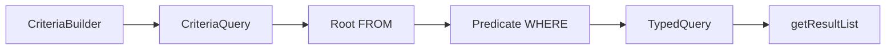

---

### 🛠️ Worked Example

**BAD:**

```java
// Dynamic JPQL via string concatenation
String jpql = "SELECT u FROM User u WHERE 1=1";
if (name != null)
    jpql += " AND u.name = '" + name + "'";
// SQL injection risk! Also: runtime parse error
// if name contains quotes.
```

Why it's wrong: string concatenation is fragile, injection-
prone, and runtime-validated only.

**GOOD:**

```java
CriteriaBuilder cb = em.getCriteriaBuilder();
CriteriaQuery<User> cq =
    cb.createQuery(User.class);
Root<User> u = cq.from(User.class);

List<Predicate> preds = new ArrayList<>();
if (name != null)
    preds.add(cb.equal(u.get("name"), name));
if (minAge != null)
    preds.add(cb.greaterThan(
        u.get("age"), minAge));

cq.where(preds.toArray(new Predicate[0]));
List<User> results = em.createQuery(cq)
    .getResultList();
```

Why it's right: type-safe, no string concatenation, no
injection risk. Dynamic predicates compose cleanly.

**Production: with JPA Metamodel:**

```java
// Generated: User_.name, User_.age
preds.add(cb.equal(u.get(User_.name), name));
// Compile-time field name safety.
// Rename 'name' to 'fullName' -> compiler error.
```

---

### ⚖️ Trade-offs

**Gain:** Compile-time type safety (with Metamodel), dynamic
query composition without string manipulation, no injection
risk.

**Cost:** Extremely verbose for simple queries; harder to
read than JPQL; Metamodel generation requires build plugin.

| Aspect          | JPQL            | Criteria API          |
| --------------- | --------------- | --------------------- |
| Readability     | High (SQL-like) | Low (verbose Java)    |
| Type safety     | None (strings)  | Full (with Metamodel) |
| Dynamic queries | String concat   | Predicate composition |
| Learning curve  | Low             | High                  |

---

### ⚡ Decision Snap

**USE WHEN:**

- Building dynamic search/filter endpoints where WHERE
  clauses vary per request.
- You need compile-time safety for field references via
  JPA Metamodel.
- Query structure changes based on runtime conditions.

**AVOID WHEN:**

- The query is static and simple - JPQL is cleaner and
  more readable.
- You prefer a fluent DSL (consider Querydsl or jOOQ as
  alternatives).

**PREFER QUERYDSL/JOOQ WHEN:**

- You want type safety with readable fluent syntax instead
  of the verbose Criteria API.

---

### ⚠️ Top Traps

| #   | Misconception                                                   | Reality                                                                                                |
| --- | --------------------------------------------------------------- | ------------------------------------------------------------------------------------------------------ |
| 1   | Criteria API is always better than JPQL because it is type-safe | For static queries, JPQL is far more readable. Use Criteria API only for dynamic queries.              |
| 2   | `u.get("name")` is type-safe                                    | String-based `get()` fails at runtime. True type safety requires JPA Metamodel (`User_.name`).         |
| 3   | Criteria API prevents all query errors                          | It prevents syntax and type errors, not logical errors (wrong joins, missing predicates, N+1 patterns) |

---

### 🪜 Learning Ladder

**Prerequisites:**

- JPQL Fundamentals - Criteria API builds the same queries
  programmatically
- Entity and @Entity Annotation - Root and Join reference
  entity metadata

**THIS:** HIB-031 Criteria API (JPA CriteriaBuilder)

**Next steps:**

- Named Queries (@NamedQuery) - compile-time validated
  JPQL as an alternative approach
- Criteria API Query Building Exercise - hands-on practice

---

### 💡 The Surprising Truth

Many teams adopt the Criteria API for type safety but never
set up the JPA Metamodel annotation processor. Without it,
`root.get("fieldName")` is still a string - you get the
verbosity of Criteria API without the type-safety benefit.
If you use Criteria API without Metamodel, you are paying
the verbosity tax for nothing.

---

### 📇 Revision Card

1. Criteria API = programmatic query builder. Use for dynamic
   queries; use JPQL for static ones.
2. Without JPA Metamodel, `root.get("field")` is still a
   string - set up the annotation processor.
3. Consider Querydsl or jOOQ for fluent type-safe queries
   without Criteria API's verbosity.

---

---

# HIB-032 Named Queries (@NamedQuery, @NamedNativeQuery)

**TL;DR** - Named queries are pre-parsed at startup, catching JPQL errors early and enabling query plan caching.

---

### 🔥 The Problem in One Paragraph

Inline JPQL strings scattered across your codebase have two
problems: errors surface only when the query is first executed
(possibly in production), and Hibernate re-parses the same
query string every time it is called. Named queries solve both:
they are defined once on the entity class and validated at
application startup. If a named JPQL query has a syntax error,
the application fails to start - not at 3 AM when a user hits
the endpoint. This is exactly why named queries were created.

---

### 📘 Textbook Definition

**`@NamedQuery`** defines a pre-compiled JPQL query associated
with an entity class. It is validated and parsed at
`EntityManagerFactory` creation time. **`@NamedNativeQuery`**
does the same for raw SQL queries. Both are referenced by
name at call sites via `em.createNamedQuery("queryName")`.

---

### 🧠 Mental Model

> Named queries are like stored procedures for JPA. You
> register them at startup (compile-time for queries), give
> them a name, and call them by that name. The "compilation"
> catches errors before any user request hits the query.

- "Registration" -> `@NamedQuery` on entity class
- "Compilation" -> JPQL parsed and validated at startup
- "Call by name" -> `em.createNamedQuery("findActiveUsers")`

**Where this analogy breaks down:** Named queries live in Java
annotations, not in the database. They are JPA-level caching,
not database-level optimization.

---

### ⚙️ How It Works

1. Annotate an entity with `@NamedQuery(name = "...",
query = "SELECT ...")`.
2. At `EntityManagerFactory` creation, Hibernate parses ALL
   named queries and validates them against the metamodel.
3. If any named query has a syntax error, startup fails with
   a descriptive error.
4. At runtime, `em.createNamedQuery("name", Result.class)`
   returns a pre-parsed `TypedQuery`.
5. Hibernate caches the query plan, avoiding repeated
   parsing.

```text
  Startup:
  @NamedQuery validated -> parse tree cached

  Runtime:
  createNamedQuery("findByEmail")
    -> cache hit -> skip parsing
    -> bind parameters -> execute
```

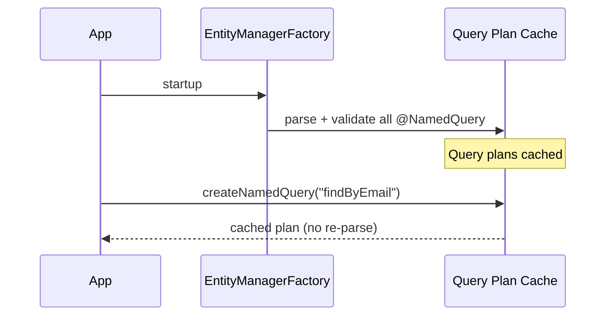

---

### 🛠️ Worked Example

**BAD:**

```java
// Inline JPQL: typo discovered in production
List<User> users = em.createQuery(
    "SELECT u FROM Uzer u WHERE u.active = true",
    User.class
).getResultList();
// "Uzer" is a typo. Error thrown only when
// this line executes in production.
```

Why it's wrong: the typo is invisible until the query runs.

**GOOD:**

```java
@Entity
@NamedQuery(name = "User.findActive",
    query = "SELECT u FROM User u "
        + "WHERE u.active = true")
public class User { ... }

// Runtime: error caught at startup, not here
List<User> users = em.createNamedQuery(
    "User.findActive", User.class)
    .getResultList();
```

Why it's right: JPQL validated at startup; typo in entity
name would prevent the application from starting.

**Production: parameterized named query:**

```java
@NamedQuery(name = "User.findByEmail",
    query = "SELECT u FROM User u "
        + "WHERE u.email = :email")
// Usage:
User user = em.createNamedQuery(
    "User.findByEmail", User.class)
    .setParameter("email", email)
    .getSingleResult();
```

---

### ⚖️ Trade-offs

**Gain:** Startup validation catches JPQL errors early; query
plan caching avoids repeated parsing; centralized query
definitions.

**Cost:** Queries are distant from usage (defined on entity,
called in repository); annotation-based definition is less
readable for complex queries; cannot build dynamic queries.

| Aspect       | Inline JPQL      | @NamedQuery        |
| ------------ | ---------------- | ------------------ |
| Validation   | Runtime only     | Startup            |
| Plan caching | Per-call parsing | Pre-cached         |
| Readability  | Close to usage   | Distant from usage |
| Dynamic      | Yes (string ops) | No (static only)   |

---

### ⚡ Decision Snap

**USE WHEN:**

- You have static queries that do not change based on
  runtime conditions.
- You want fail-fast startup behavior for JPQL validation.
- Query performance benefits from plan caching.

**AVOID WHEN:**

- Queries are dynamic with variable WHERE clauses (use
  Criteria API).
- You use Spring Data JPA (its `@Query` annotation provides
  the same startup validation).

**PREFER SPRING DATA @Query WHEN:**

- You are in a Spring project - `@Query` on repository
  methods gives startup validation plus proximity to usage.

---

### ⚠️ Top Traps

| #   | Misconception                                       | Reality                                                                                                   |
| --- | --------------------------------------------------- | --------------------------------------------------------------------------------------------------------- |
| 1   | Named queries are faster at runtime                 | The speedup is from skipping JPQL parsing; the actual SQL execution is identical                          |
| 2   | `@NamedNativeQuery` is validated like `@NamedQuery` | Native SQL cannot be validated against the JPA metamodel - only JPQL named queries get startup validation |
| 3   | Named queries must be on the entity they query      | Convention says yes (e.g., `User.findByEmail` on `User`), but JPA allows them on any entity class         |

---

### 🪜 Learning Ladder

**Prerequisites:**

- JPQL Fundamentals - named queries use JPQL syntax
- EntityManager and Persistence Context - named queries
  execute through the EntityManager API

**THIS:** HIB-032 Named Queries (@NamedQuery, @NamedNativeQuery)

**Next steps:**

- Criteria API (JPA CriteriaBuilder) - alternative for
  dynamic queries
- Hibernate Query Performance Tuning - query plan caching
  is one optimization among many

---

### 💡 The Surprising Truth

In Spring Data JPA projects, `@NamedQuery` is largely
redundant. Spring's `@Query` annotation on repository methods
provides the same startup validation, the same plan caching,
AND keeps the query adjacent to its usage. Pure JPA projects
still benefit from `@NamedQuery`, but in Spring projects it
is effectively replaced.

---

### 📇 Revision Card

1. `@NamedQuery` = JPQL validated at startup, plan cached,
   called by name.
2. `@NamedNativeQuery` is NOT validated against the
   metamodel - only JPQL gets startup checking.
3. In Spring Data JPA, `@Query` replaces `@NamedQuery` with
   better proximity to usage.

---

---

# HIB-033 Second-Level Cache Introduction (Ehcache, Caffeine)

**TL;DR** - The second-level cache stores entity data across Sessions, avoiding repeated database reads for frequently accessed entities.

---

### 🔥 The Problem in One Paragraph

The first-level cache (persistence context) dies with the
Session. Every new request opens a new Session with an empty
cache, forcing a database round-trip for every `find()` - even
for data that rarely changes (countries, currencies, product
categories). On a high-traffic application, read-heavy
reference data queries dominate database load. The second-
level cache (L2) sits between Sessions and the database,
storing entity state across requests. A cache hit returns data
without touching the database. This is exactly why the second-
level cache exists.

---

### 📘 Textbook Definition

The **second-level cache (L2)** is a `SessionFactory`-scoped
cache that stores entity data (not entity instances) across
`Session` boundaries. It is pluggable (Ehcache, Caffeine,
Infinispan, Hazelcast), opt-in per entity, and works
transparently with `find()` and navigation. The first-level
cache (persistence context) always takes precedence; L2 is
consulted only when the first-level cache misses.

---

### 🧠 Mental Model

> First-level cache is your personal notebook (exists for one
> meeting). Second-level cache is the office whiteboard
> (persists across meetings). When you need a fact: check your
> notebook first. If not there, check the whiteboard. If not
> there, go to the filing cabinet (database).

- "Personal notebook" -> first-level cache (Session-scoped)
- "Office whiteboard" -> second-level cache (factory-scoped)
- "Filing cabinet" -> database

**Where this analogy breaks down:** The whiteboard stores
dehydrated column values, not full entity objects. Hibernate
must re-hydrate them into entities on cache hit.

---

### ⚙️ How It Works

1. Enable L2 in config:
   `hibernate.cache.use_second_level_cache=true`.
2. Configure a cache provider (Ehcache, Caffeine, etc.).
3. Annotate cacheable entities with `@Cacheable` and
   `@Cache(usage = CacheConcurrencyStrategy.READ_WRITE)`.
4. On `em.find(Entity.class, id)`: check L1 (persistence
   context) -> check L2 -> if miss, query database and
   populate both L1 and L2.
5. On entity update/delete: L2 cache entry is invalidated.

```text
  em.find(User, 1L):
  L1 Cache (Session) ---miss---> L2 Cache (Factory)
       |                              |
      hit                           miss
       |                              |
    return                        Database
    entity                            |
                                   populate L2 + L1
                                      |
                                   return entity
```

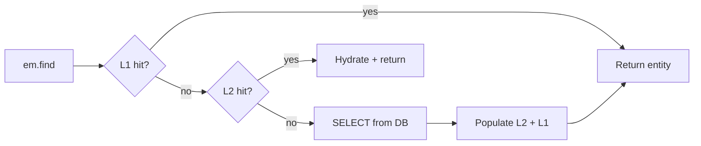

---

### 🛠️ Worked Example

**BAD:**

```java
// No L2 cache. Every request loads Country
// from the database. 1000 requests/sec =
// 1000 identical SELECT * FROM country
// queries per second for static data.
Country c = em.find(Country.class, "US");
```

Why it's wrong: reference data that changes weekly is loaded
from the database on every request.

**GOOD:**

```java
@Entity
@Cacheable
@Cache(usage =
    CacheConcurrencyStrategy.READ_WRITE)
public class Country {
    @Id
    private String code;
    private String name;
}
// First request: SELECT -> populate L2
// Subsequent requests: L2 hit, no SQL
```

Why it's right: static reference data is cached across
Sessions; database load drops to near zero for reads.

**Production: Ehcache config (ehcache.xml):**

```xml
<cache alias="com.example.Country">
  <expiry>
    <ttl unit="minutes">60</ttl>
  </expiry>
  <heap unit="entries">500</heap>
</cache>
```

---

### ⚖️ Trade-offs

**Gain:** Eliminates redundant database reads for stable data;
reduces database load; transparent to application code.

**Cost:** Stale data risk if TTL is too long; memory overhead;
cache invalidation complexity in clustered environments;
debugging cache behavior requires statistics logging.

| Aspect         | No L2 cache    | L2 cache enabled      |
| -------------- | -------------- | --------------------- |
| Read latency   | DB round-trip  | In-memory (sub-ms)    |
| Data freshness | Always current | TTL-dependent         |
| Memory         | Low            | Higher (cache heap)   |
| Complexity     | None           | Config + invalidation |

---

### ⚡ Decision Snap

**USE WHEN:**

- Entities are read-heavy and rarely updated (reference data,
  configuration, lookup tables).
- Database is a bottleneck for repetitive reads.
- You can tolerate stale data within the TTL window.

**AVOID WHEN:**

- Data changes frequently (user profiles, order status).
- Your application is write-heavy (cache invalidation
  overhead exceeds read savings).

**PREFER APPLICATION-LEVEL CACHE WHEN:**

- You need caching for DTOs, aggregates, or query results
  rather than individual entities.
- You want explicit cache control (Spring `@Cacheable`).

---

### ⚠️ Top Traps

| #   | Misconception                                       | Reality                                                                                                                   |
| --- | --------------------------------------------------- | ------------------------------------------------------------------------------------------------------------------------- |
| 1   | L2 cache stores entity objects                      | L2 stores dehydrated column values (a "disassembled state"), not Java objects. Hibernate re-hydrates on every hit.        |
| 2   | Enabling L2 cache automatically caches all entities | L2 is opt-in per entity. Only entities annotated with `@Cacheable` (and `@Cache`) are cached.                             |
| 3   | L2 cache works for JPQL query results               | Entity L2 caches `find()` by ID only. For query result caching, enable `hibernate.cache.use_query_cache=true` separately. |

---

### 🪜 Learning Ladder

**Prerequisites:**

- EntityManager and Persistence Context - L1 cache must be
  understood before L2
- Entity Lifecycle States - cache interactions depend on
  entity state

**THIS:** HIB-033 Second-Level Cache Introduction (Ehcache,
Caffeine)

**Next steps:**

- Second-Level Cache vs Application Cache Decision - when
  to use L2 vs Spring @Cacheable
- Second-Level Cache Regions and Invalidation Strategies -
  production-grade cache configuration

---

### 💡 The Surprising Truth

Enabling the query cache (in addition to entity L2 cache)
sounds appealing but often hurts performance. The query cache
is invalidated whenever ANY entity of the cached query's type
is modified - even if the modification does not affect the
cached result. In write-heavy applications, the query cache
churns constantly and wastes memory.

---

### 📇 Revision Card

1. L2 cache = SessionFactory-scoped, stores dehydrated column
   values, opt-in per entity.
2. L2 caches `find()` by ID. Query result caching is separate
   and often counter-productive.
3. Use L2 for read-heavy, rarely-updated reference data.
   Avoid for frequently-modified entities.

---

---

# HIB-034 Inheritance Strategy Selection Guide

**TL;DR** - Pick SINGLE_TABLE for polymorphic queries, JOINED when subclasses diverge heavily, and avoid TABLE_PER_CLASS.

---

### 🔥 The Problem in One Paragraph

You have decided to use JPA inheritance mapping. Three
strategies exist. Choosing wrong means either painful
polymorphic query performance (JOINED with many subclasses),
wasted nullable columns (SINGLE_TABLE with divergent
subclasses), or broken sequences and UNION ALL queries
(TABLE_PER_CLASS). The decision depends on four factors:
polymorphic query frequency, subclass column overlap, NOT
NULL constraint needs, and how often new subclasses are added.
This is exactly why a decision framework matters.

---

### 📘 Textbook Definition

The **inheritance strategy selection guide** is a decision
framework for choosing between SINGLE_TABLE, JOINED, and
TABLE_PER_CLASS based on query patterns, schema constraints,
and domain evolution expectations. There is no universally
best strategy - each trades performance for normalization.

---

### 🧠 Mental Model

> Think of choosing a closet organization system. **SINGLE_TABLE**
> = one big closet with dividers (fast to find anything, but some
> shelves are always empty). **JOINED** = separate closets per
> season, linked by an ID (organized but finding "all clothes"
> requires visiting every closet). **TABLE_PER_CLASS** = each
> season gets a complete wardrobe copy (isolated but redundant).

- "One big closet" -> SINGLE_TABLE (fast access, some waste)
- "Linked closets" -> JOINED (normalized, slower polymorphic)
- "Complete copies" -> TABLE_PER_CLASS (isolated, redundant)

**Where this analogy breaks down:** The performance difference
between strategies is not linear - it compounds with query
frequency and subclass count.

---

### ⚙️ How It Works

Decision matrix based on four axes:

1. **Polymorphic queries frequent?** Yes -> SINGLE_TABLE
   (avoid N-way JOINs). No -> JOINED acceptable.
2. **Subclasses diverge significantly?** Yes (many unique
   columns) -> JOINED (avoid nullable column explosion).
   No -> SINGLE_TABLE fine.
3. **NOT NULL constraints needed on subclass columns?**
   Yes -> JOINED (SINGLE_TABLE requires nullable).
   No -> SINGLE_TABLE fine.
4. **New subclasses added frequently?** Yes -> SINGLE_TABLE
   (no DDL change needed). No -> either.

```text
  Start
    |
    v
  Polymorphic queries common?
    |yes          |no
    v              v
  SINGLE_TABLE   Subclasses diverge heavily?
                   |yes          |no
                   v              v
                 JOINED       SINGLE_TABLE
```

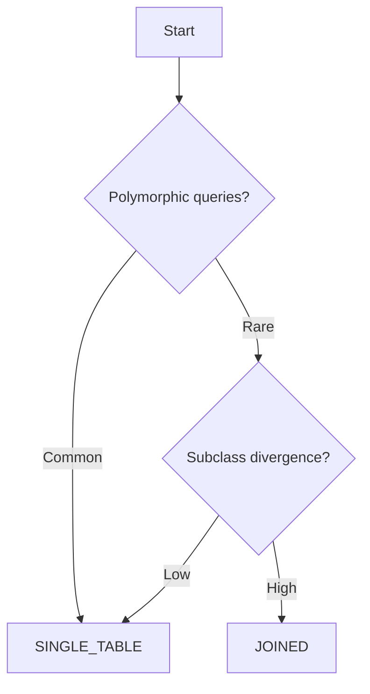

---

### 🛠️ Worked Example

**BAD:**

```java
// Reflexively choosing JOINED "for normalization"
@Inheritance(strategy = InheritanceType.JOINED)
public abstract class Notification { ... }

// 8 notification subtypes. Every "get all
// notifications" query joins 8 tables.
// Dashboard page takes 3 seconds.
```

Why it's wrong: JOINED with 8 subclasses forces an 8-way
JOIN on every polymorphic query.

**GOOD:**

```java
// SINGLE_TABLE: one scan, discriminator filter
@Inheritance(strategy =
    InheritanceType.SINGLE_TABLE)
@DiscriminatorColumn(name = "notif_type")
public abstract class Notification {
    @Id @GeneratedValue
    private Long id;
    private String message;
    private Instant createdAt;
}
// Each subtype adds 2-3 nullable columns.
// "Get all notifications" = single table scan.
```

Why it's right: polymorphic queries on a dashboard are
fast; nullable overhead is minimal for 2-3 columns per type.

**Production: mixed approach:**

```java
// Some teams use SINGLE_TABLE for the top level
// and @Embeddable for subclass-specific data:
@Entity
public class Notification {
    @Id @GeneratedValue
    private Long id;
    private String type;
    @Embedded
    private EmailDetails emailDetails; // nullable
}
```

---

### ⚖️ Trade-offs

**Gain:** Systematic decision prevents reflexive choices;
reduces query performance surprises; matches strategy to
actual access patterns.

**Cost:** Requires upfront analysis of query patterns and
subclass evolution; switching strategies later is a painful
migration.

| Decision factor          | SINGLE_TABLE | JOINED    |
| ------------------------ | ------------ | --------- |
| Polymorphic query speed  | Fast         | Slow      |
| Nullable column overhead | Yes          | None      |
| NOT NULL constraints     | No           | Yes       |
| Adding new subtypes      | No DDL       | New table |

---

### ⚡ Decision Snap

**USE WHEN:**

- Choosing an inheritance strategy for a new entity
  hierarchy.
- Refactoring a hierarchy that has polymorphic query
  performance issues.
- Reviewing a codebase where TABLE_PER_CLASS was chosen
  without justification.

**AVOID WHEN:**

- You do not actually need inheritance - consider
  composition with `@Embeddable` or a discriminator
  field without JPA inheritance.

**PREFER NO INHERITANCE WHEN:**

- The hierarchy has more than 3 levels or is likely to
  grow beyond 5-6 subclasses.
- Subtypes share very few fields (rethink the design).

---

### ⚠️ Top Traps

| #   | Misconception                                    | Reality                                                                                                                        |
| --- | ------------------------------------------------ | ------------------------------------------------------------------------------------------------------------------------------ |
| 1   | JOINED is always better because it is normalized | Normalization is a goal, not a mandate. SINGLE_TABLE is intentionally denormalized for polymorphic query performance.          |
| 2   | TABLE_PER_CLASS is clean and independent         | TABLE_PER_CLASS breaks shared sequences, requires UNION ALL for polymorphic queries, and is poorly supported by some providers |
| 3   | You can switch strategies easily later           | Switching inheritance strategy requires schema migration (table restructuring), data migration, and query rewriting            |

---

### 🪜 Learning Ladder

**Prerequisites:**

- Inheritance Mapping (SINGLE_TABLE, JOINED, TABLE_PER_CLASS) -
  the three strategies must be understood first
- JPQL Fundamentals - polymorphic query behavior drives the
  decision

**THIS:** HIB-034 Inheritance Strategy Selection Guide

**Next steps:**

- Fetch Strategy Decision - another critical mapping decision
  framework
- Hibernate Query Performance Tuning - inheritance strategy
  directly affects query cost

---

### 💡 The Surprising Truth

The majority of JPA inheritance hierarchies in production
codebases would be better modeled without inheritance at all.
A discriminator column plus `@Embeddable` for type-specific
fields achieves the same result without JPA inheritance
complexity, and is easier to query, migrate, and evolve.

---

### 📇 Revision Card

1. Default to SINGLE_TABLE unless you have a compelling
   reason for JOINED.
2. Never use TABLE_PER_CLASS unless you have zero
   polymorphic queries and zero shared sequences.
3. Consider no inheritance at all: discriminator +
   embeddable is often simpler.

---

---

# HIB-035 Fetch Strategy Decision (LAZY vs EAGER vs JOIN FETCH)

**TL;DR** - Map everything LAZY, then use JOIN FETCH per query to load exactly what each use case needs.

---

### 🔥 The Problem in One Paragraph

A Product entity has a Category, a List of Reviews, a
Manufacturer, and a List of Images. The product listing page
needs only Product + Category. The detail page needs Product +
Reviews + Images. The admin page needs everything. No single
fetch configuration works for all three. EAGER loads everything
always (wasteful for listings). LAZY loads nothing (N+1 on
detail pages). The solution is: map everything LAZY, then
use query-level `JOIN FETCH` to load exactly what each endpoint
needs. This is exactly why fetch strategy is a per-query
decision, not a per-mapping decision.

---

### 📘 Textbook Definition

A **fetch strategy** is the combination of mapping-level
`FetchType` (LAZY or EAGER) and query-level fetch directives
(`JOIN FETCH`, `@EntityGraph`, `@BatchSize`) that determines
when and how related entities are loaded. The strategy must
match the access pattern of each use case.

---

### 🧠 Mental Model

> Fetch strategy is like grocery shopping. **EAGER** = buying
> every ingredient at the store whether you need it or not.
> **LAZY** = going to the store for each ingredient one at a
> time (N+1 trips). **JOIN FETCH** = writing a shopping list
> for today's recipe and buying exactly those items in one
> trip.

- "Buying everything" -> EAGER (wasteful)
- "One trip per item" -> LAZY without optimization (N+1)
- "Shopping list" -> JOIN FETCH (targeted, one trip)

**Where this analogy breaks down:** JOIN FETCH happens at
query time, not mapping time. The "list" is written per query,
not once per entity.

---

### ⚙️ How It Works

1. Declare all associations as `FetchType.LAZY` in mappings.
2. For each use case (endpoint, service method), write a
   JPQL query with `JOIN FETCH` for the associations needed.
3. `JOIN FETCH` tells Hibernate to load the association in
   the same SQL query via a JOIN.
4. `@EntityGraph` provides a declarative alternative to
   `JOIN FETCH` for Spring Data repositories.
5. `@BatchSize` is a fallback: if you access a lazy
   collection, Hibernate loads N collections in one query
   instead of one per access.

```text
  Mapping: @ManyToOne(fetch = LAZY) everywhere

  Product listing:
  SELECT p FROM Product p JOIN FETCH p.category

  Product detail:
  SELECT p FROM Product p
    JOIN FETCH p.category
    JOIN FETCH p.reviews
    WHERE p.id = :id

  Admin view:
  SELECT p FROM Product p
    JOIN FETCH p.category
    JOIN FETCH p.reviews
    JOIN FETCH p.images
    WHERE p.id = :id
```

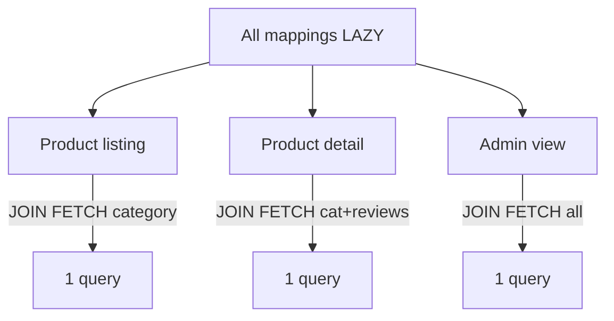

---

### 🛠️ Worked Example

**BAD:**

```java
// Mapping-level EAGER: loads everything always
@ManyToOne // Default EAGER
private Category category;

@OneToMany(fetch = FetchType.EAGER)
private List<Review> reviews;

// Product listing loads reviews it never displays.
// 20 products x N reviews = hundreds of queries.
```

Why it's wrong: EAGER at mapping level forces every use case
to pay the loading cost, even when data is not needed.

**GOOD:**

```java
// Mapping: everything LAZY
@ManyToOne(fetch = FetchType.LAZY)
private Category category;

@OneToMany(mappedBy = "product",
    fetch = FetchType.LAZY)
private List<Review> reviews;

// Per-query JOIN FETCH:
@Query("SELECT p FROM Product p "
    + "JOIN FETCH p.category")
List<Product> findAllForListing();

@Query("SELECT p FROM Product p "
    + "JOIN FETCH p.category "
    + "JOIN FETCH p.reviews "
    + "WHERE p.id = :id")
Product findDetailById(@Param("id") Long id);
```

Why it's right: each query loads exactly what the use case
needs. No wasted data, no N+1.

**Production: EntityGraph alternative:**

```java
@EntityGraph(attributePaths = {
    "category", "reviews"})
@Query("SELECT p FROM Product p "
    + "WHERE p.id = :id")
Product findDetailById(@Param("id") Long id);
```

---

### ⚖️ Trade-offs

**Gain:** Each use case gets exactly the data it needs; no
wasted queries or memory; maximum flexibility.

**Cost:** Requires writing specific queries per use case;
more repository methods; must remember to JOIN FETCH
associations before accessing them.

| Aspect      | All EAGER     | All LAZY + JOIN FETCH    |
| ----------- | ------------- | ------------------------ |
| Query count | 1 (but heavy) | 1 (targeted)             |
| Data loaded | Everything    | Only what's needed       |
| Code effort | Minimal       | One query per use case   |
| Risk        | Fetch storms  | Forgot JOIN FETCH -> N+1 |

---

### ⚡ Decision Snap

**USE WHEN:**

- Every project, always. LAZY + JOIN FETCH is the
  recommended default strategy.
- You have multiple use cases with different data needs
  for the same entity.
- You want predictable, controllable SQL.

**AVOID WHEN:**

- This is the strategy to use, not avoid. EAGER mappings
  should be the rare exception, not the default.

**PREFER @EntityGraph WHEN:**

- You want declarative fetch control on Spring Data
  repository methods without writing JPQL.

---

### ⚠️ Top Traps

| #   | Misconception                                        | Reality                                                                                                                 |
| --- | ---------------------------------------------------- | ----------------------------------------------------------------------------------------------------------------------- |
| 1   | LAZY mappings prevent all N+1                        | LAZY prevents eager loading but causes N+1 when you iterate collections without JOIN FETCH                              |
| 2   | JOIN FETCH and regular JOIN are the same             | JOIN filters results; JOIN FETCH loads the association. A JOIN without FETCH still leaves the collection uninitialized. |
| 3   | You can JOIN FETCH multiple collections in one query | Fetching multiple `List` collections causes a Cartesian product. Use `Set` or separate queries.                         |

---

### 🪜 Learning Ladder

**Prerequisites:**

- FetchType.LAZY vs FetchType.EAGER - the two fetch types
  must be understood before combining them
- @ManyToOne and @OneToMany Relationships - fetch applies
  to relationships

**THIS:** HIB-035 Fetch Strategy Decision (LAZY vs EAGER
vs JOIN FETCH)

**Next steps:**

- The N+1 Select Problem - the failure mode of LAZY without
  strategic fetching
- Entity Graphs (@EntityGraph) - declarative alternative
  to JOIN FETCH

---

### 💡 The Surprising Truth

The "correct" fetch configuration does not exist at the
mapping level. Fetch strategy is a per-query concern, not a
per-entity concern. The mapping says "how to default." The
query says "what to actually load." Teams that try to optimize
fetch behavior in mappings instead of queries always end up
with either EAGER fetch storms or LAZY N+1 problems.

---

### 📇 Revision Card

1. Map everything LAZY. Use JOIN FETCH per query to load
   what each use case needs.
2. JOIN FETCH loads the association; regular JOIN does not.
   Know the difference.
3. Avoid fetching multiple `List` collections - use `Set`
   or split into separate queries to prevent Cartesian
   products.

---

---

# HIB-036 Eager Fetching Everywhere Anti-Pattern

**TL;DR** - Setting `FetchType.EAGER` on all associations cascades loading into a "fetch storm" that loads the entire database into memory.

---

### 🔥 The Problem in One Paragraph

A developer sets `FetchType.EAGER` on Product.category,
Product.reviews, Review.user, User.orders, Order.lineItems.
Loading one Product now pulls its Category, all Reviews, each
Review's User, each User's Orders, and each Order's LineItems.
What should be a single row SELECT becomes a cascading chain
of JOINs or secondary SELECTs that can touch thousands of rows.
The application crawls, the database maxes out connections, and
nobody can figure out why loading one entity is so slow. This
is exactly why EAGER everywhere is an anti-pattern.

---

### 📘 Textbook Definition

The **eager fetching everywhere anti-pattern** occurs when
`FetchType.EAGER` is applied to multiple associations across
the entity graph, causing Hibernate to transitively load
large portions of the database whenever any entry point entity
is loaded. Also known as a "fetch storm" or "cascading eager
load."

---

### 🧠 Mental Model

> EAGER everywhere is like a chain reaction. You pull one book
> off the shelf and the bookend falls, knocking the next shelf,
> which knocks the next bookcase. Each EAGER association is a
> domino. One `find()` triggers an exponentially growing load.

- "First book" -> initial entity load
- "Falling bookend" -> EAGER association triggers load
- "Chain of bookcases" -> transitive EAGER cascading

**Where this analogy breaks down:** The chain does not
physically "fall" at once - Hibernate issues individual queries
or JOINs, so the symptom is slow response time and high query
count, not a single crash.

---

### ⚙️ How It Works

1. Entity A has `@ManyToOne(fetch = EAGER)` to entity B.
2. Entity B has `@OneToMany(fetch = EAGER)` to entity C.
3. Entity C has `@ManyToOne(fetch = EAGER)` to entity D.
4. Loading A triggers B, which triggers all C instances,
   each of which triggers D.
5. With M instances of C and N instances of D, a single
   `find(A)` can generate 1 + 1 + M + (M \* N) queries.

```text
  find(Product)
    |-- EAGER -> Category (1 query)
    |-- EAGER -> Reviews (N queries or JOIN)
         |-- each Review EAGER -> User
              |-- each User EAGER -> Orders
                   |-- each Order EAGER -> Items
  Total: potentially thousands of queries
```

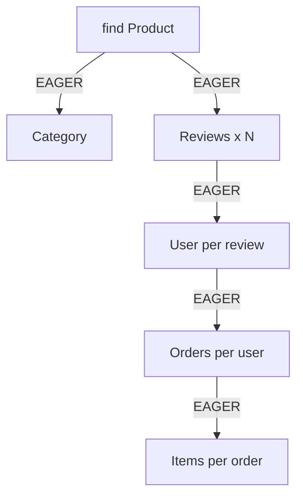

---

### 🛠️ Worked Example

**BAD:**

```java
@Entity
public class Product {
    @ManyToOne // EAGER default!
    private Category category;

    @OneToMany(fetch = FetchType.EAGER)
    private List<Review> reviews;
}
@Entity
public class Review {
    @ManyToOne // EAGER default!
    private User author;
}
// findAll() for 20 products:
// 20 products + 20 categories + 200 reviews
// + 200 users = 440+ queries
```

Why it's wrong: three levels of EAGER multiply into hundreds
of queries on a simple listing page.

**GOOD:**

```java
@Entity
public class Product {
    @ManyToOne(fetch = FetchType.LAZY)
    private Category category;

    @OneToMany(mappedBy = "product",
        fetch = FetchType.LAZY)
    private List<Review> reviews;
}
// Listing: 1 query
@Query("SELECT p FROM Product p "
    + "JOIN FETCH p.category")
List<Product> findAllForListing();
// Detail: 1 query with needed data
@Query("SELECT p FROM Product p "
    + "JOIN FETCH p.category "
    + "JOIN FETCH p.reviews "
    + "WHERE p.id = :id")
Product findDetailById(@Param("id") Long id);
```

Why it's right: LAZY everywhere + targeted JOIN FETCH gives
each use case exactly what it needs.

**Production: detecting the anti-pattern:**

```properties
# Enable statistics to count queries per request
hibernate.generate_statistics=true
# If "Executed N JDBC statements" is >> expected,
# check for EAGER associations.
```

---

### ⚖️ Trade-offs

**Gain:** Fixing EAGER everywhere reduces query count from
hundreds to single digits per request, dramatically improving
response times and reducing database load.

**Cost:** Requires writing explicit queries per use case;
developers must understand which associations each endpoint
needs; risks `LazyInitializationException` if Session closes
early.

| Aspect           | EAGER everywhere   | LAZY + JOIN FETCH      |
| ---------------- | ------------------ | ---------------------- |
| Queries per req  | 100s (cascading)   | 1-5 (targeted)         |
| Developer effort | None (bad default) | One query per use case |
| Memory per req   | High (full graph)  | Low (needed data)      |
| Debuggability    | Hard (implicit)    | Easy (explicit SQL)    |

---

### ⚡ Decision Snap

**USE WHEN:**

- Reviewing existing code for performance problems - this
  is the first thing to check.
- Onboarding developers who default to EAGER without
  understanding the consequences.
- Establishing team coding standards.

**AVOID WHEN:**

- This is an anti-pattern, not a pattern. Never apply
  EAGER globally.

**PREFER STRICT LAZY POLICY WHEN:**

- Always. Make `fetch = FetchType.LAZY` on all `@ManyToOne`
  and `@OneToOne` a non-negotiable coding standard.

---

### ⚠️ Top Traps

| #   | Misconception                                         | Reality                                                                                                                 |
| --- | ----------------------------------------------------- | ----------------------------------------------------------------------------------------------------------------------- |
| 1   | EAGER is fine for small related entities              | "Small" entities have their own EAGER associations. The chain grows exponentially regardless of individual entity size. |
| 2   | JPA defaults are production-safe                      | `@ManyToOne` and `@OneToOne` default to EAGER. These defaults are widely considered a JPA specification mistake.        |
| 3   | Fixing EAGER requires refactoring the entire codebase | Start by overriding `@ManyToOne` and `@OneToOne` to LAZY. Then add JOIN FETCH to queries that break.                    |

---

### 🪜 Learning Ladder

**Prerequisites:**

- FetchType.LAZY vs FetchType.EAGER - the two types must
  be understood
- @ManyToOne and @OneToMany Relationships - EAGER applies
  to relationship annotations

**THIS:** HIB-036 Eager Fetching Everywhere Anti-Pattern

**Next steps:**

- The N+1 Select Problem - LAZY without JOIN FETCH causes
  a different but related problem
- Fetch Strategy Decision - the correct approach

---

### 💡 The Surprising Truth

The most impactful performance fix in most Hibernate
codebases is a single regex-replace: adding
`fetch = FetchType.LAZY` to every `@ManyToOne` and
`@OneToOne` annotation. Teams regularly see 10x-100x query
count reduction from this one change alone.

---

### 📇 Revision Card

1. EAGER on one association triggers transitive loading
   across the entire connected graph.
2. `@ManyToOne` defaults to EAGER - always override to LAZY.
3. Fix: LAZY everywhere + JOIN FETCH per query = predictable,
   minimal SQL.

---

---

# HIB-037 Bidirectional Mapping Without Sync Methods Anti-Pattern

**TL;DR** - Without sync methods, only one side of a bidirectional relationship reflects changes, causing stale data and broken persistence.

---

### 🔥 The Problem in One Paragraph

In a bidirectional `@OneToMany` / `@ManyToOne` mapping,
the parent holds a collection and the child holds a parent
reference. If you add a child to the parent's collection but
forget to set the parent reference on the child, the FK column
stays null. If you set the parent reference on the child but
do not add it to the parent's collection, the in-memory parent
appears to have no children until the Session is refreshed.
The entity graph in memory becomes inconsistent with the
database. This is exactly why sync methods are required.

---

### 📘 Textbook Definition

The **bidirectional mapping without sync methods anti-pattern**
occurs when developers modify one side of a bidirectional
relationship without updating the other side, causing in-memory
inconsistency between the parent collection and the child's
back-reference. Sync (convenience) methods encapsulate updates
to both sides in a single operation.

---

### 🧠 Mental Model

> A bidirectional relationship is like a two-way friendship on
> social media. If Alice adds Bob as a friend but Bob's friend
> list does not include Alice, the data is inconsistent. A sync
> method is a "mutual friend request" that updates both sides
> atomically.

- "Alice adds Bob" -> parent.getChildren().add(child)
- "Bob's list shows Alice" -> child.setParent(parent)
- "Mutual friend request" -> sync method does both

**Where this analogy breaks down:** In Hibernate, the owning
side (child's `@ManyToOne`) is what writes the FK. Forgetting
the collection side causes in-memory inconsistency but may
still persist correctly if the owning side is set.

---

### ⚙️ How It Works

1. Parent has `@OneToMany(mappedBy = "parent")` (inverse).
2. Child has `@ManyToOne` (owning side).
3. Only the owning side (`@ManyToOne`) writes the FK.
4. Setting only the collection (inverse side) does NOT
   update the FK - Hibernate ignores inverse-side changes.
5. Setting only the owning side works for persistence but
   leaves the in-memory collection out of sync.
6. Sync methods update both sides to keep memory and
   database consistent.

```text
  Without sync:
  parent.getItems().add(child)  // In-memory only
  // child.parent still null -> FK = null on flush

  With sync:
  parent.addItem(child) {
    items.add(child);        // Update collection
    child.setParent(this);   // Update owning side
  }
  // FK is set correctly on flush
```

```mermaid
sequenceDiagram
    participant Code
    participant Parent
    participant Child
    participant DB
    Code->>Parent: addItem(child)
grand_parent: "Learn"
    Parent->>Parent: items.add(child)
grand_parent: "Learn"
    Parent->>Child: setParent(this)
    Note over Child: FK set on owning side
    Code->>DB: flush
    DB->>DB: INSERT child with FK = parent.id
```

---

### 🛠️ Worked Example

**BAD:**

```java
Order order = em.find(Order.class, 1L);
LineItem item = new LineItem("Widget", 2);

// Only updating inverse side:
order.getItems().add(item);
em.persist(item);
em.flush();
// item.order_id = NULL in database!
// Because the owning side (item.order) was
// never set.
```

Why it's wrong: adding to the collection (inverse side) does
not set the FK on the owning side.

**GOOD:**

```java
@Entity
public class Order {
    @OneToMany(mappedBy = "order",
        cascade = CascadeType.ALL,
        orphanRemoval = true)
    private List<LineItem> items = new ArrayList<>();

    public void addItem(LineItem item) {
        items.add(item);
        item.setOrder(this);
    }
    public void removeItem(LineItem item) {
        items.remove(item);
        item.setOrder(null);
    }
}
// Usage:
order.addItem(new LineItem("Widget", 2));
em.flush(); // FK correctly set
```

Why it's right: the sync method `addItem()` updates both
sides; the FK is set on the owning side.

**Production: enforcing the pattern:**

```java
// Make the collection getter return unmodifiable
public List<LineItem> getItems() {
    return Collections.unmodifiableList(items);
}
// Forces callers to use addItem/removeItem
// instead of direct collection manipulation.
```

---

### ⚖️ Trade-offs

**Gain:** In-memory consistency; FK always set correctly;
prevents null FK and stale collection bugs; encapsulates
relationship management.

**Cost:** Extra method per relationship; discipline required
to always use sync methods; mutable setters on child side
must exist.

| Aspect                | Direct collection access | Sync methods       |
| --------------------- | ------------------------ | ------------------ |
| In-memory consistency | Broken                   | Guaranteed         |
| FK correctness        | Depends on which side    | Always correct     |
| API clarity           | Error-prone              | Intent-revealing   |
| Boilerplate           | None                     | 2 methods per rel. |

---

### ⚡ Decision Snap

**USE WHEN:**

- Every bidirectional relationship needs sync methods.
  This is not optional.
- Expose sync methods as the only way to modify the
  relationship; protect the collection getter.

**AVOID WHEN:**

- You have a unidirectional relationship (only one side
  exists - no sync needed).
- The relationship is read-only (no modifications).

**PREFER UNIDIRECTIONAL @ManyToOne WHEN:**

- You can avoid bidirectional mapping entirely, eliminating
  the need for sync methods.

---

### ⚠️ Top Traps

| #   | Misconception                                    | Reality                                                                                                                   |
| --- | ------------------------------------------------ | ------------------------------------------------------------------------------------------------------------------------- |
| 1   | Adding to the collection is enough to set the FK | Only the owning side (`@ManyToOne`) writes the FK. Collection modifications on the inverse side are ignored by Hibernate. |
| 2   | Setting the owning side is enough                | It persists correctly, but the in-memory collection is stale until the Session is refreshed. Both sides must be updated.  |
| 3   | Sync methods are optional nice-to-haves          | Without sync methods, every call site must remember to update both sides. One forgotten update = data inconsistency.      |

---

### 🪜 Learning Ladder

**Prerequisites:**

- @ManyToOne and @OneToMany Relationships - the bidirectional
  mapping this pattern applies to
- Entity Lifecycle States - understanding managed state and
  dirty checking

**THIS:** HIB-037 Bidirectional Mapping Without Sync Methods
Anti-Pattern

**Next steps:**

- orphanRemoval vs CascadeType.REMOVE - sync methods pair
  with orphanRemoval for complete lifecycle management
- The N+1 Select Problem - stale collections can mask N+1
  issues

---

### 💡 The Surprising Truth

The Hibernate documentation has always recommended sync
methods, yet most tutorials skip them entirely. The result:
Stack Overflow is filled with questions about null FK values
and stale collections. The root cause is always the same -
only one side of a bidirectional relationship was updated.

---

### 📇 Revision Card

1. Sync methods update BOTH sides of a bidirectional
   relationship: collection + back-reference.
2. Only the owning side (`@ManyToOne`) writes the FK.
   Inverse-side changes are ignored by Hibernate.
3. Return `Collections.unmodifiableList()` from getters to
   force callers through sync methods.

---

---

# HIB-038 Hibernate Validator (Bean Validation Integration)

**TL;DR** - Hibernate Validator implements Jakarta Bean Validation, enforcing `@NotNull`, `@Size`, `@Email` constraints before data hits the database.

---

### 🔥 The Problem in One Paragraph

A user submits a form with an empty name and an email of "abc".
Without validation, Hibernate attempts an INSERT with null name
and invalid email. The database may reject it (if constraints
exist) with a cryptic `DataIntegrityViolationException`, or
worse, accept it and corrupt your data. Validation should happen
in Java, before the SQL is generated, with clear error messages.
Hibernate Validator integrates with JPA to automatically
validate entity state at pre-persist and pre-update lifecycle
events. This is exactly why bean validation exists.

---

### 📘 Textbook Definition

**Hibernate Validator** is the reference implementation of the
Jakarta Bean Validation specification (JSR 380 / Jakarta
Validation 3.0). It provides constraint annotations
(`@NotNull`, `@Size`, `@Pattern`, `@Email`, `@Min`, `@Max`)
that are checked automatically by JPA before `persist()` and
`update()` lifecycle callbacks. Validation happens in Java
before SQL generation.

---

### 🧠 Mental Model

> Bean Validation is like airport security before boarding.
> Passengers (entities) are checked against rules (constraints)
> before they reach the gate (database). Invalid passengers are
> rejected with clear reasons, not cryptic gate-closure errors.

- "Airport security" -> Validator pre-persist check
- "Rules" -> `@NotNull`, `@Size`, `@Pattern`
- "Rejection with reasons" -> `ConstraintViolationException`

**Where this analogy breaks down:** Validation only catches
what you annotate. Un-annotated fields pass through like
unscreened luggage.

---

### ⚙️ How It Works

1. Add `hibernate-validator` to dependencies (auto-included
   in Spring Boot).
2. Annotate entity fields: `@NotNull`, `@Size(min=1,max=100)`,
   `@Email`, `@Pattern(regexp="...")`.
3. JPA auto-detects Hibernate Validator on the classpath and
   registers lifecycle event listeners.
4. Before `persist()` and `merge()`, Hibernate Validator
   checks all constraints on the entity.
5. If any constraint fails, a `ConstraintViolationException`
   is thrown BEFORE SQL is generated - no database round-trip.

```text
  em.persist(user)
    |
    v
  Bean Validation:
  @NotNull name? -> PASS
  @Email email?  -> FAIL: "abc" is not email
    |
    v
  ConstraintViolationException thrown
  (No INSERT generated, no DB round-trip)
```

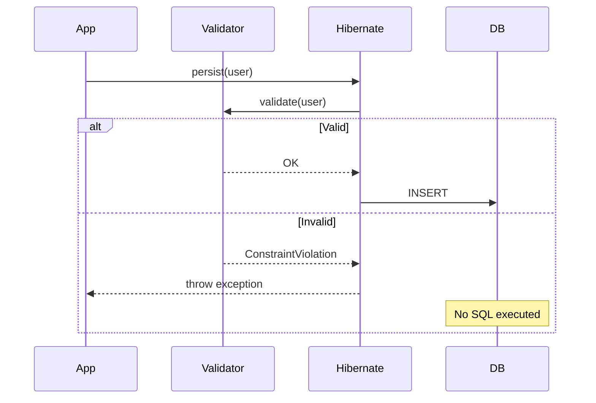

---

### 🛠️ Worked Example

**BAD:**

```java
@Entity
public class User {
    @Id @GeneratedValue
    private Long id;

    @Column(nullable = false)
    private String name; // DDL-only constraint

    private String email; // No validation
}
// em.persist(new User(null, "abc"))
// -> DataIntegrityViolationException
// Cryptic SQL error, hard to debug
```

Why it's wrong: `@Column(nullable=false)` is DDL-only; the
error comes from the database, not from Java validation.

**GOOD:**

```java
@Entity
public class User {
    @Id @GeneratedValue
    private Long id;

    @NotBlank(message = "Name is required")
    @Size(max = 100)
    private String name;

    @Email(message = "Must be a valid email")
    @NotNull
    private String email;
}
// em.persist(new User(null, "abc"))
// -> ConstraintViolationException:
//    "Name is required", "Must be a valid email"
// Clear messages, no DB round-trip
```

Why it's right: validation happens in Java with clear error
messages before any SQL is generated.

**Production: validation groups:**

```java
public interface OnCreate {}
public interface OnUpdate {}

@NotNull(groups = OnCreate.class)
private String name;

@Null(groups = OnCreate.class)
@NotNull(groups = OnUpdate.class)
private Long version;
```

---

### ⚖️ Trade-offs

**Gain:** Early validation with clear messages; no database
round-trip for invalid data; reusable constraints across
layers (controller, service, persistence).

**Cost:** Must annotate every constraint (not auto-derived
from DDL); custom constraints require implementation classes;
validation groups add complexity.

| Aspect            | DDL constraints only | Bean Validation       |
| ----------------- | -------------------- | --------------------- |
| Error clarity     | Cryptic SQL errors   | Clear Java messages   |
| Validation timing | After SQL execution  | Before SQL generation |
| Reusability       | DB-only              | Any Java layer        |
| Maintenance       | DDL + Java separate  | Annotations in entity |

---

### ⚡ Decision Snap

**USE WHEN:**

- Every entity with user-provided data should have bean
  validation annotations.
- You want clear, localized validation error messages.
- You need to validate at multiple layers (REST, service,
  persistence).

**AVOID WHEN:**

- Validation logic is complex business rules (use domain
  service methods instead of annotations).
- The entity is never created from external input.

**PREFER @Column(nullable=false) IN ADDITION WHEN:**

- You want both Java validation AND DDL constraints as
  a defense-in-depth strategy.

---

### ⚠️ Top Traps

| #   | Misconception                                 | Reality                                                                                                               |
| --- | --------------------------------------------- | --------------------------------------------------------------------------------------------------------------------- |
| 1   | `@Column(nullable = false)` validates in Java | `@Column(nullable=false)` only affects DDL generation. Use `@NotNull` for Java validation.                            |
| 2   | Hibernate Validator requires Hibernate ORM    | Hibernate Validator is a standalone library. It works with any JPA provider or even without JPA.                      |
| 3   | Validation happens automatically everywhere   | Auto-validation fires on JPA lifecycle events. In REST controllers, you must explicitly use `@Valid` or `@Validated`. |

---

### 🪜 Learning Ladder

**Prerequisites:**

- Entity and @Entity Annotation - validation applies to
  entity fields
- Basic Column Mappings - `@Column(nullable)` is DDL-only;
  need validation for Java-level checks

**THIS:** HIB-038 Hibernate Validator (Bean Validation
Integration)

**Next steps:**

- Testing Hibernate Repositories (Testcontainers) -
  testing validates that constraints work end-to-end
- Hibernate Production Diagnostics - validation errors
  in production logs

---

### 💡 The Surprising Truth

Hibernate Validator is not part of Hibernate ORM. Despite
sharing the "Hibernate" brand name, it is a completely
independent project that implements the Jakarta Bean Validation
spec. It works with EclipseLink, OpenJPA, or no JPA at all.
The naming confusion leads many developers to think they are
coupled.

---

### 📇 Revision Card

1. `@NotNull` validates in Java (before SQL). `@Column
(nullable=false)` validates in DDL (after SQL). Use both.
2. Hibernate Validator auto-integrates with JPA lifecycle
   events (pre-persist, pre-update).
3. Hibernate Validator is independent from Hibernate ORM -
   it works with any JPA provider.

---

---

# HIB-039 Build Relationship Mappings Exercise

**TL;DR** - Build a three-entity model with @ManyToOne, @OneToMany, sync methods, and cascade to verify your mapping knowledge hands-on.

---

### 🔥 The Problem in One Paragraph

Reading about `@ManyToOne`, `mappedBy`, and cascade is not
the same as debugging a null FK or a phantom join table. Until
you write a bidirectional mapping, forget the sync method, and
see the null FK in the database, the concepts remain abstract.
This exercise forces you through the complete happy path AND
the first failure modes of relationship mapping. This is
exactly why hands-on practice matters.

---

### 📘 Textbook Definition

This **relationship mappings exercise** builds a three-entity
model (e.g., Author -> Book -> Review) with bidirectional
`@OneToMany` / `@ManyToOne` relationships, sync methods,
cascade settings, and fetch strategy configuration. The goal
is to verify mapping knowledge through observable SQL output.

---

### 🧠 Mental Model

> This exercise is a flight simulator for JPA relationships.
> You will "crash" (null FK, join table, N+1) in a safe
> environment and learn to recognize the symptoms before they
> appear in production.

- "Flight simulator" -> controlled practice environment
- "Crashes" -> mapping errors with observable consequences
- "Recognition" -> spotting symptoms in SQL logs

**Where this analogy breaks down:** Unlike flight simulators,
the "crashes" here are silent (null FK, extra tables) unless
you check the SQL log and database state.

---

### ⚙️ How It Works

1. Create three entities: `Author`, `Book`, `Review`.
2. `Author` has `@OneToMany` books. `Book` has `@ManyToOne`
   author and `@OneToMany` reviews. `Review` has `@ManyToOne`
   book.
3. Add sync methods (`addBook`, `addReview`).
4. Configure cascade (ALL on Author->Books, PERSIST+MERGE
   on Book->Reviews).
5. Set all `@ManyToOne` to `LAZY`.
6. Write test scenarios: persist author with books, add
   reviews, remove a book (orphanRemoval), query with
   JOIN FETCH.

```text
  Author (1) ---> (N) Book (1) ---> (N) Review
  @OneToMany         @OneToMany
  mappedBy="author"  mappedBy="book"

  Book.author = @ManyToOne(fetch=LAZY)
  Review.book = @ManyToOne(fetch=LAZY)
```

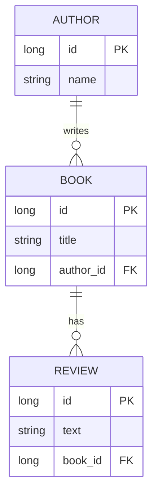

---

### 🛠️ Worked Example

**BAD:**

```java
// Step 1: Forget mappedBy - observe the join table
@Entity
public class Author {
    @OneToMany // No mappedBy!
    private List<Book> books;
}
// Run -> check DB -> unexpected author_books table
// Lesson: always set mappedBy
```

Why it's wrong: this is the intentional failure to learn from.
Observe the phantom join table in the database.

**GOOD:**

```java
@Entity
public class Author {
    @Id @GeneratedValue
    private Long id;
    private String name;

    @OneToMany(mappedBy = "author",
        cascade = CascadeType.ALL,
        orphanRemoval = true)
    private List<Book> books = new ArrayList<>();

    public void addBook(Book book) {
        books.add(book);
        book.setAuthor(this);
    }
}
@Entity
public class Book {
    @Id @GeneratedValue
    private Long id;
    private String title;

    @ManyToOne(fetch = FetchType.LAZY)
    @JoinColumn(name = "author_id")
    private Author author;
}
// persist(author) cascades to books. FK set
// correctly. No join table.
```

Why it's right: complete mapping with sync, cascade,
orphanRemoval, and LAZY fetch.

**Production: test the mapping:**

```java
// Verify with SQL logging enabled:
Author a = new Author("Bloch");
a.addBook(new Book("Effective Java"));
em.persist(a); // Observe: 1 INSERT author,
               // 1 INSERT book with FK set
```

---

### ⚖️ Trade-offs

**Gain:** Hands-on practice reveals failure modes that reading
cannot; builds muscle memory for mapping patterns; SQL log
verification builds debugging skills.

**Cost:** Time investment; requires a working project setup
(H2, persistence.xml, SQL logging).

| Aspect            | Reading only | Hands-on exercise   |
| ----------------- | ------------ | ------------------- |
| Error recognition | Theoretical  | Experiential        |
| Retention         | Low          | High                |
| Debug confidence  | None         | Built from practice |

---

### ⚡ Decision Snap

**USE WHEN:**

- You have learned the relationship annotations but never
  built a multi-entity model from scratch.
- Onboarding a new team member to Hibernate mappings.
- You want to verify your understanding before writing
  production mapping code.

**AVOID WHEN:**

- You have production experience with bidirectional mappings
  and can predict the SQL output for any mapping change.

**PREFER Phase 2 (HIB-041) WHEN:**

- You have completed this exercise and want to build on
  the model with queries, pagination, and DTOs.

---

### ⚠️ Top Traps

| #   | Misconception                           | Reality                                                                                                   |
| --- | --------------------------------------- | --------------------------------------------------------------------------------------------------------- |
| 1   | You can learn mappings by reading alone | Until you see a null FK in the database from a missing sync method, the concept is abstract               |
| 2   | The exercise works without SQL logging  | Without `show_sql=true`, you cannot verify what Hibernate generates. Logging is mandatory for learning.   |
| 3   | The first attempt should be correct     | The learning value comes from making mistakes and observing the consequences. Intentionally break things. |

---

### 🪜 Learning Ladder

**Prerequisites:**

- @ManyToOne and @OneToMany Relationships - the primary
  annotations used in this exercise
- CascadeType and Cascade Propagation - cascade settings
  are part of the exercise

**THIS:** HIB-039 Build Relationship Mappings Exercise

**Next steps:**

- JPA Relationships App - Phase 2 - extends this model with
  queries and DTOs
- Criteria API Query Building Exercise - hands-on practice
  with query construction

---

### 💡 The Surprising Truth

Most developers who "know" JPA relationships cannot predict
what SQL Hibernate generates for a given mapping. This exercise
forces prediction-then-verification, which is the fastest path
to genuine understanding.

---

### 📇 Revision Card

1. Build Author -> Book -> Review with sync methods, cascade,
   orphanRemoval, and LAZY fetch.
2. Intentionally break the mapping (no mappedBy, no sync)
   and observe the SQL consequences.
3. Enable `show_sql=true` and verify every INSERT, UPDATE,
   and JOIN matches your expectation.

---

---

# HIB-040 Criteria API Query Building Exercise

**TL;DR** - Build a dynamic search endpoint using CriteriaBuilder with optional filters to practice type-safe query construction.

---

### 🔥 The Problem in One Paragraph

A search endpoint accepts optional filters: name, minPrice,
maxPrice, category. JPQL string concatenation for dynamic
WHERE clauses is fragile and injection-prone. The Criteria API
is the correct tool, but its verbose syntax is intimidating
without practice. Until you build a multi-filter dynamic query
with CriteriaBuilder, the API feels impractical. This exercise
forces you through the verbosity to build genuine competence.
This is exactly why a Criteria API exercise exists.

---

### 📘 Textbook Definition

This **Criteria API exercise** builds a dynamic product search
using `CriteriaBuilder`, `CriteriaQuery`, `Root`, and
conditional `Predicate` construction based on nullable filter
parameters.

---

### 🧠 Mental Model

> Think of building a query with LEGO blocks. Each filter
> adds a predicate block. Null filters skip the block. The
> final query is the assembled structure. The compiler ensures
> only compatible blocks connect.

- "LEGO blocks" -> Predicate objects
- "Null = skip" -> conditional predicate addition
- "Assembled structure" -> final CriteriaQuery

**Where this analogy breaks down:** Unlike LEGO, the assembled
Criteria query is much harder to read than the equivalent JPQL
string.

---

### ⚙️ How It Works

1. Create a service method that accepts optional filter
   parameters (name, minPrice, maxPrice, categoryId).
2. Obtain `CriteriaBuilder` from `EntityManager`.
3. For each non-null parameter, build a `Predicate`.
4. Combine predicates with `cb.and()`.
5. Execute and return results.

```text
  Input: name="Widget", minPrice=10, category=null

  Predicates built:
  1. cb.like(root.get("name"), "%Widget%")
  2. cb.greaterThanOrEqualTo(root.get("price"), 10)
  (category is null -> skipped)

  Final: WHERE name LIKE '%Widget%' AND price >= 10
```

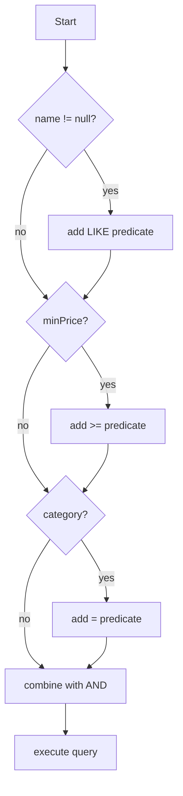

---

### 🛠️ Worked Example

**BAD:**

```java
// String concatenation for dynamic queries
String jpql = "SELECT p FROM Product p WHERE 1=1";
if (name != null)
    jpql += " AND p.name LIKE '%" + name + "%'";
// SQL injection if name = "'; DROP TABLE--"
```

Why it's wrong: string concatenation is injection-prone
and breaks with special characters.

**GOOD:**

```java
public List<Product> search(String name,
    BigDecimal minPrice, BigDecimal maxPrice,
    Long categoryId) {

    CriteriaBuilder cb = em.getCriteriaBuilder();
    CriteriaQuery<Product> cq =
        cb.createQuery(Product.class);
    Root<Product> p = cq.from(Product.class);

    List<Predicate> preds = new ArrayList<>();

    if (name != null)
        preds.add(cb.like(
            cb.lower(p.get("name")),
            "%" + name.toLowerCase() + "%"));
    if (minPrice != null)
        preds.add(cb.greaterThanOrEqualTo(
            p.get("price"), minPrice));
    if (maxPrice != null)
        preds.add(cb.lessThanOrEqualTo(
            p.get("price"), maxPrice));
    if (categoryId != null)
        preds.add(cb.equal(
            p.get("category").get("id"),
            categoryId));

    cq.where(preds.toArray(new Predicate[0]));
    return em.createQuery(cq).getResultList();
}
```

Why it's right: type-safe, no injection, dynamic predicates
compose cleanly.

**Production: with JPA Metamodel and pagination:**

```java
if (name != null)
    preds.add(cb.like(
        cb.lower(p.get(Product_.name)),
        "%" + name.toLowerCase() + "%"));

cq.orderBy(cb.asc(p.get(Product_.name)));
return em.createQuery(cq)
    .setFirstResult(offset)
    .setMaxResults(pageSize)
    .getResultList();
```

---

### ⚖️ Trade-offs

**Gain:** Practice with dynamic Criteria queries; type-safe
filter composition; no injection risk; pagination support.

**Cost:** Verbose compared to JPQL for simple cases; requires
Metamodel setup for true type safety.

| Aspect          | JPQL string    | Criteria API   | Querydsl       |
| --------------- | -------------- | -------------- | -------------- |
| Dynamic filters | Fragile concat | Predicate list | Fluent builder |
| Type safety     | None           | With Metamodel | Built-in       |
| Readability     | High           | Low            | High           |

---

### ⚡ Decision Snap

**USE WHEN:**

- You need to practice Criteria API for interviews or
  projects that mandate it.
- Building search/filter endpoints with variable parameters.
- Your project does not include Querydsl or jOOQ.

**AVOID WHEN:**

- Your project already uses Querydsl or Spring Data JPA
  Specifications (same concept, better API).

**PREFER SPRING DATA SPECIFICATIONS WHEN:**

- You are in a Spring project and want reusable, composable
  predicates without raw CriteriaBuilder code.

---

### ⚠️ Top Traps

| #   | Misconception                               | Reality                                                                                                |
| --- | ------------------------------------------- | ------------------------------------------------------------------------------------------------------ |
| 1   | Criteria API prevents all query bugs        | It prevents syntax bugs. Logic bugs (wrong join, missing filter) are still possible.                   |
| 2   | The exercise is complete without pagination | Production search endpoints always need pagination. Add `setFirstResult` and `setMaxResults`.          |
| 3   | `root.get("field")` is type-safe            | String-based field names fail at runtime. Use JPA Metamodel (`Product_.name`) for compile-time safety. |

---

### 🪜 Learning Ladder

**Prerequisites:**

- Criteria API (JPA CriteriaBuilder) - the API itself must
  be understood before this exercise
- JPQL Fundamentals - understand what the Criteria API
  replaces

**THIS:** HIB-040 Criteria API Query Building Exercise

**Next steps:**

- JPA Relationships App - Phase 2 - integrating queries
  into a full application
- Hibernate Query Performance Tuning - optimizing the
  queries you build

---

### 💡 The Surprising Truth

Most developers who complete this exercise immediately
understand why Querydsl and Spring Data Specifications exist.
The Criteria API's verbosity is intentional (it mirrors the
query AST), but for developer productivity, higher-level
abstractions are almost always worth adopting.

---

### 📇 Revision Card

1. Build dynamic search with optional filters using a
   `List<Predicate>` pattern.
2. Always add pagination (`setFirstResult`, `setMaxResults`)
   to search endpoints.
3. Set up JPA Metamodel for compile-time field name safety -
   `root.get("string")` is not truly type-safe.

---

---

# HIB-041 JPA Relationships App - Phase 2 (Associations)

**TL;DR** - Extend the Phase 1 CRUD app with bidirectional relationships, cascade, JOIN FETCH queries, and DTO projections.

---

### 🔥 The Problem in One Paragraph

Phase 1 covered single-entity CRUD. But real applications have
relationships: a Customer has Orders, an Order has LineItems,
a LineItem references a Product. Adding relationships
introduces fetch strategy decisions, cascade configuration,
sync methods, and N+1 query risks. Until you build a multi-
entity application and verify the SQL output, these concepts
remain theoretical. This is exactly why Phase 2 builds on
Phase 1 with associations.

---

### 📘 Textbook Definition

**Phase 2** extends the Phase 1 JPA application with
bidirectional `@OneToMany` / `@ManyToOne` relationships,
cascade configuration, sync methods, JOIN FETCH queries,
and DTO projections. The goal is to build a working multi-
entity application with observable, optimized SQL.

---

### 🧠 Mental Model

> Phase 1 was learning to drive in a parking lot (single
> entity). Phase 2 is driving on city streets (relationships,
> intersections, traffic rules). The vehicle (JPA) is the
> same; the environment is more complex.

- "Parking lot" -> single-entity CRUD
- "City streets" -> multi-entity relationships
- "Traffic rules" -> fetch strategy, cascade, sync

**Where this analogy breaks down:** Unlike driving, JPA
relationship errors are often silent (null FK, N+1) rather
than immediately obvious.

---

### ⚙️ How It Works

1. Extend Phase 1 entities (or start fresh) with Customer,
   Order, LineItem, Product.
2. Customer `@OneToMany` Orders (with sync, cascade, LAZY).
3. Order `@OneToMany` LineItems (with sync, cascade,
   orphanRemoval).
4. LineItem `@ManyToOne` Product (LAZY, no cascade).
5. Write repository queries: listing (JOIN FETCH category),
   detail (JOIN FETCH items), search (Criteria or JPQL).
6. Add DTO projections for API responses (avoid exposing
   entities directly).

```text
  Customer (1) --> (N) Order (1) --> (N) LineItem
                                        |
                                   (N) --> (1) Product
```

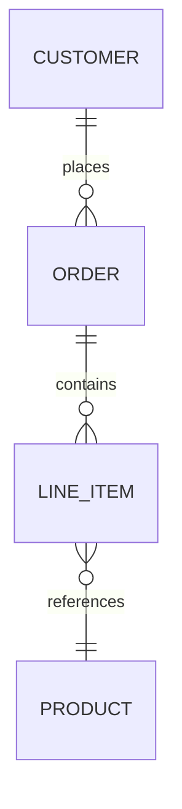

---

### 🛠️ Worked Example

**BAD:**

```java
// Returning entities directly from API
@GetMapping("/orders/{id}")
public Order getOrder(@PathVariable Long id) {
    return em.find(Order.class, id);
    // Jackson serializes lazy proxies ->
    // LazyInitializationException or infinite
    // recursion from bidirectional references
}
```

Why it's wrong: exposing entities causes serialization issues
with lazy proxies and bidirectional references.

**GOOD:**

```java
// DTO projection with JOIN FETCH
@Query("SELECT o FROM Order o "
    + "JOIN FETCH o.items i "
    + "JOIN FETCH i.product "
    + "WHERE o.id = :id")
Optional<Order> findDetailById(
    @Param("id") Long id);

// Map to DTO before returning
@GetMapping("/orders/{id}")
public OrderDTO getOrder(@PathVariable Long id) {
    Order o = orderRepo.findDetailById(id)
        .orElseThrow();
    return OrderDTO.from(o);
}
```

Why it's right: JOIN FETCH loads needed data in one query;
DTO avoids serialization issues; no N+1.

**Production: DTO projection in JPQL:**

```java
@Query("SELECT new com.example.OrderSummary("
    + "o.id, o.total, c.name) "
    + "FROM Order o JOIN o.customer c")
List<OrderSummary> findAllSummaries();
// No entity loading, no dirty checking overhead
```

---

### ⚖️ Trade-offs

**Gain:** End-to-end understanding of multi-entity JPA
applications; practice with real query patterns; DTO
discipline.

**Cost:** Significant time investment; many moving parts;
requires understanding of all preceding keywords.

| Phase        | Entities | Concepts practiced        |
| ------------ | -------- | ------------------------- |
| Phase 1      | 1        | CRUD, lifecycle, config   |
| Phase 2      | 4        | Relationships, fetch, DTO |
| Phase 3 (L3) | 4+       | Performance, N+1, locking |

---

### ⚡ Decision Snap

**USE WHEN:**

- You have completed Phase 1 and the relationship mapping
  exercise (HIB-039).
- You want to build a complete multi-entity application
  before tackling performance optimization.

**AVOID WHEN:**

- You have not yet completed single-entity CRUD (do Phase 1
  first).
- You already have production experience with multi-entity
  JPA applications.

**PREFER Phase 3 WHEN:**

- You have completed Phase 2 and want to tackle N+1
  detection, locking, and performance tuning.

---

### ⚠️ Top Traps

| #   | Misconception                                         | Reality                                                                                                   |
| --- | ----------------------------------------------------- | --------------------------------------------------------------------------------------------------------- |
| 1   | Returning entities from REST controllers is fine      | Entities have lazy proxies and bidirectional references that break JSON serialization. Always use DTOs.   |
| 2   | Phase 2 is optional if you understood the annotations | Annotations are theory. Building and debugging a multi-entity app is the practice that creates retention. |
| 3   | SQL logging is only for Phase 1                       | SQL logging is even MORE critical in Phase 2. Every JOIN FETCH and N+1 pattern must be verified.          |

---

### 🪜 Learning Ladder

**Prerequisites:**

- Build a JPA CRUD App - Phase 1 - single-entity foundation
- @ManyToOne and @OneToMany Relationships - relationship
  annotations used in this phase
- Fetch Strategy Decision - LAZY + JOIN FETCH pattern

**THIS:** HIB-041 JPA Relationships App - Phase 2 (Associations)

**Next steps:**

- The N+1 Select Problem - the performance issue you will
  encounter when you forget JOIN FETCH
- Hibernate App - Phase 3 (Performance Tuning) - optimizing
  the app built in Phase 2

---

### 💡 The Surprising Truth

The gap between "I understand JPA annotations" and "I can build
a working multi-entity application with correct SQL" is larger
than most developers expect. Phase 2 is where that gap becomes
visible - and where genuine competence begins.

---

### 📇 Revision Card

1. Extend Phase 1 with Customer -> Order -> LineItem ->
   Product relationships.
2. Never expose entities from REST controllers - always map
   to DTOs.
3. Verify every query with SQL logging. Every JOIN FETCH
   must be confirmed in the log.

---

---

# HIB-042 Hibernate Interview Essentials - Working Level

**TL;DR** - Ten L2-level questions testing relationship mapping, fetch strategy, cascade mechanics, and query optimization decisions.

---

### 🔥 The Problem in One Paragraph

L2 Hibernate interviews go beyond "what is an entity" into
relationship mechanics, fetch strategy decisions, and cascade
behavior. Candidates who memorized annotations without building
multi-entity applications struggle to answer "what SQL does
Hibernate generate for this mapping?" or "why does adding
`mappedBy` change the schema?" These questions test operational
understanding, not syntax recall. This is exactly why working-
level interview prep exists.

---

### 📘 Textbook Definition

**Working-level interview questions** for Hibernate test a
candidate's ability to reason about relationship mappings,
predict generated SQL, explain fetch strategy trade-offs, and
identify common mapping anti-patterns. They target L2 knowledge:
beyond basics, into daily working competence.

---

### 🧠 Mental Model

> These questions are diagnostic X-rays. Each one reveals
> whether the candidate has built and debugged multi-entity
> mappings or only read about them. The tell: can they predict
> the SQL that Hibernate generates?

- "X-ray" -> interview question
- "Bone structure" -> actual understanding
- "Predict the SQL" -> the ultimate test of mapping knowledge

**Where this analogy breaks down:** Interviews also test
communication skills and the ability to explain trade-offs,
not just technical knowledge.

---

### ⚙️ How It Works

Ten diagnostic questions, each targeting a different L2
concept. For each: the question, expected answer, and the
tell that separates memorization from understanding.

```text
  10 Questions -> 10 L2 Concepts:
  Q1  mappedBy         Q6  Inheritance
  Q2  LAZY default     Q7  @Embeddable
  Q3  CASCADE/orphan   Q8  L2 Cache
  Q4  M:N strategy     Q9  Criteria API
  Q5  Sync methods     Q10 Native SQL
```

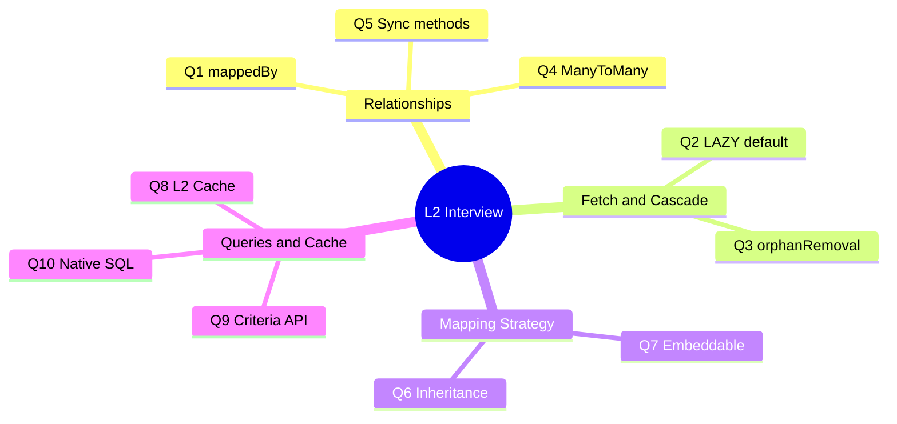

1. **What does `mappedBy` do?** Declares the inverse side;
   tells Hibernate the FK is managed by the other entity.
   Without it: phantom join table.
2. **Why default `@ManyToOne` to LAZY?** `@ManyToOne` defaults
   to EAGER, causing fetch storms. LAZY + JOIN FETCH is the
   correct pattern.
3. **What is the difference between `CascadeType.REMOVE` and
   `orphanRemoval`?** REMOVE fires on parent deletion.
   orphanRemoval also fires on collection removal.
4. **When would you use `@ManyToMany` vs an intermediate
   entity?** `@ManyToMany` only when the join table has zero
   extra columns. Otherwise: intermediate entity.
5. **What happens if you forget the sync method?** The owning
   side's FK may be null; the in-memory collection is stale.
6. **SINGLE_TABLE vs JOINED inheritance?** SINGLE_TABLE for
   polymorphic queries (one scan). JOINED for heavily
   divergent subclasses.
7. **What does `@Embeddable` give you that a separate entity
   does not?** No identity, no separate table, no joins.
   Value semantics.
8. **How does the second-level cache differ from the
   persistence context?** L1 is Session-scoped (per request).
   L2 is SessionFactory-scoped (across requests).
9. **What is the Criteria API's advantage over JPQL?** Type
   safety with Metamodel; dynamic query composition without
   string concatenation.
10. **When should you use native SQL over JPQL?** Window
    functions, CTEs, recursive queries, database-specific
    features.

---

### 🛠️ Worked Example

**BAD:**

```java
// Interview: "What SQL does this generate?"
@OneToMany
private List<Item> items;
// Candidate: "A foreign key on item table."
// Wrong: without mappedBy, Hibernate creates a
// JOIN TABLE, not a FK column.
```

Why it's wrong: the candidate cannot predict the SQL.

**GOOD:**

```java
// Correct prediction:
@OneToMany // No mappedBy
private List<Item> items;
// -> CREATE TABLE entity_item (
//      entity_id bigint,
//      item_id bigint
//    )
// JOIN TABLE created because Hibernate treats
// this as a unidirectional @OneToMany.
```

Why it's right: the candidate understands the default behavior
and can predict the schema.

**Production: explaining the fix:**

```java
// "How do you fix it?"
@OneToMany(mappedBy = "entity")
private List<Item> items;
// -> No join table. FK on item table.
// "Why?" Because mappedBy tells Hibernate
// the FK is on the owning (Item) side.
```

---

### ⚖️ Trade-offs

**Gain:** Interview readiness for L2 Hibernate positions;
ability to articulate trade-offs; confidence in mapping
decisions.

**Cost:** Time to prepare; requires hands-on experience for
genuine understanding (not just memorization).

| Preparation style   | Retention | Interview success |
| ------------------- | --------- | ----------------- |
| Memorize answers    | Low       | Fragile           |
| Build + predict SQL | High      | Robust            |

---

### ⚡ Decision Snap

**USE WHEN:**

- Preparing for a mid-level Java backend interview.
- Self-assessing after completing L2 keywords.
- Reviewing with a study partner.

**AVOID WHEN:**

- Looking for L4+ deep-dive questions (see HIB-091).
- You need Spring-specific interview questions.

**PREFER PRACTICE OVER MEMORIZATION WHEN:**

- Always. Build the model, predict the SQL, verify. That is
  interview prep.

---

### ⚠️ Top Traps

| #   | Misconception                                      | Reality                                                                                                        |
| --- | -------------------------------------------------- | -------------------------------------------------------------------------------------------------------------- |
| 1   | Memorizing annotation names is sufficient          | Interviewers test "what SQL does this generate" and "what happens if you change X." Prediction > memorization. |
| 2   | Fetch strategy is a minor topic                    | Fetch strategy (LAZY/EAGER/JOIN FETCH) is the #1 Hibernate interview topic at every level                      |
| 3   | You only need to know JPA, not Hibernate specifics | Most interviews ask about Hibernate-specific features: `@BatchSize`, `@Filter`, `StatelessSession`, `show_sql` |

---

### 🪜 Learning Ladder

**Prerequisites:**

- All L2 keywords (HIB-023 through HIB-038) - these
  questions test L2 knowledge
- Build Relationship Mappings Exercise - hands-on practice
  enables prediction

**THIS:** HIB-042 Hibernate Interview Essentials - Working Level

**Next steps:**

- Hibernate Design Interview Patterns (L3) - intermediate
  interview questions
- Hibernate Deep-Dive Interview Questions (L4) - expert
  level

---

### 💡 The Surprising Truth

The single most differentiating skill in Hibernate interviews
is the ability to predict the SQL that Hibernate generates for
a given mapping. Candidates who can draw the table schema from
annotations and predict the query plan are rare - and
immediately identified as experienced practitioners.

---

### 📇 Revision Card

1. Ten questions test ten L2 concepts. Each answer should
   include the generated SQL, not just the annotation name.
2. "What SQL does this generate?" is the ultimate Hibernate
   interview question. Practice predicting before verifying.
3. Fetch strategy is the #1 Hibernate interview topic -
   master LAZY + JOIN FETCH before anything else.

---

---

# HIB-043 Hibernate Mappings Quick Recall Card

**TL;DR** - A compressed recall card covering all L2 mapping annotations, fetch defaults, cascade rules, and inheritance strategies.

---

### 🔥 The Problem in One Paragraph

After studying 21 L2 keywords, the details blur together.
Which annotation defaults to EAGER? Does `orphanRemoval` work
on `@ManyToMany`? What does `mappedBy` prevent? A quick recall
card compresses the essential facts into a scannable reference
for pre-interview review, code review checks, and daily
development. This is exactly why a recall card exists.

---

### 📘 Textbook Definition

A **quick recall card** is a compressed reference of essential
facts, defaults, and decision rules for Hibernate L2 mapping
concepts, organized for rapid scanning rather than deep
learning.

---

### 🧠 Mental Model

> This card is a cheat sheet for an open-book exam. It does
> not teach - it reminds. Every fact on it should already be
> in your memory from the preceding keywords. If any fact
> surprises you, go back and re-read that keyword.

- "Cheat sheet" -> compressed reference
- "Open-book exam" -> code review or development
- "Surprises = gaps" -> revisit the keyword

**Where this analogy breaks down:** Unlike an exam cheat
sheet, this card is meant to be internalized, not relied upon.
The goal is to not need it.

---

### ⚙️ How It Works

**Relationship defaults:**

| Annotation    | Default Fetch | FK side  | Owns FK?  |
| ------------- | ------------- | -------- | --------- |
| `@ManyToOne`  | EAGER         | This     | Yes       |
| `@OneToMany`  | LAZY          | Other    | No (inv.) |
| `@OneToOne`   | EAGER         | Declared | Depends   |
| `@ManyToMany` | LAZY          | Join tbl | Declared  |

**Cascade rules:**

- `CascadeType.ALL` = PERSIST + MERGE + REMOVE + REFRESH + DETACH
- `orphanRemoval` = collection removal triggers DELETE
- orphanRemoval only on `@OneToMany` and `@OneToOne`
- Never cascade REMOVE from `@ManyToOne` (child to parent)

**Inheritance strategies:**

| Strategy        | Tables | Polymorphic Q | Nullables |
| --------------- | ------ | ------------- | --------- |
| SINGLE_TABLE    | 1      | Fast          | Many      |
| JOINED          | N      | Slow (JOINs)  | None      |
| TABLE_PER_CLASS | N      | Slow (UNION)  | None      |

**Must-do for every mapping:**

- `@ManyToOne(fetch = FetchType.LAZY)` - override default
- `@OneToMany(mappedBy = "field")` - prevent join table
- Sync methods on all bidirectional relationships
- `@SequenceGenerator(allocationSize = 50)` for batching

```text
  Quick Decision:
  Fetch?    -> LAZY always, JOIN FETCH per query
  Cascade?  -> ALL only for composition
  Inherit?  -> SINGLE_TABLE unless strong reason
  M:N?      -> Intermediate entity > @ManyToMany
  Value obj?-> @Embeddable, not separate entity
```

```mermaid
mindmap
  root((Hibernate L2))
    Relationships
      ManyToOne LAZY
      OneToMany mappedBy
      Sync methods
      ManyToMany use Set
    Fetch
      LAZY everywhere
      JOIN FETCH per query
      EntityGraph alternative
    Cascade
      ALL for composition
      Never ManyToOne REMOVE
      orphanRemoval for collections
    Inheritance
      SINGLE_TABLE default
      JOINED for divergence
      Consider no inheritance
```

---

### 🛠️ Worked Example

**BAD:**

```java
// Common defaults that are WRONG for production:
@ManyToOne              // EAGER by default!
@OneToMany              // Missing mappedBy!
cascade = ALL           // On @ManyToOne!
@GeneratedValue(AUTO)   // Unpredictable strategy!
```

Why it's wrong: every line uses a problematic default.

**GOOD:**

```java
// Production checklist applied:
@ManyToOne(fetch = FetchType.LAZY)
@OneToMany(mappedBy = "parent",
    cascade = CascadeType.ALL,
    orphanRemoval = true)
@GeneratedValue(strategy = SEQUENCE,
    generator = "my_seq")
// Explicit, predictable, correct.
```

Why it's right: every default overridden to the production-
correct value.

**Production: code review checklist:**

```text
Review every @ManyToOne:
  [ ] fetch = LAZY?
Review every @OneToMany:
  [ ] mappedBy set?
  [ ] sync methods exist?
Review every @GeneratedValue:
  [ ] SEQUENCE with allocationSize?
```

---

### ⚖️ Trade-offs

**Gain:** Fast recall of defaults, decisions, and rules;
useful during code reviews and pre-interview prep.

**Cost:** Compression sacrifices explanation depth; should not
replace understanding of the underlying keywords.

| Usage           | Value        | Risk                   |
| --------------- | ------------ | ---------------------- |
| Pre-interview   | High recall  | Shallow if only source |
| Code review     | Fast checks  | Misses context         |
| Daily reference | Quick lookup | Dependency risk        |

---

### ⚡ Decision Snap

**USE WHEN:**

- Quick pre-interview refresh of L2 mapping facts.
- Code review checklist for Hibernate annotations.
- Daily reference when you cannot remember a default.

**AVOID WHEN:**

- Learning the concepts for the first time (read the full
  keywords instead).
- You need to understand WHY a rule exists (this card only
  states WHAT).

**PREFER FULL KEYWORDS WHEN:**

- Any fact on this card surprises you - go back and read
  the source keyword.

---

### ⚠️ Top Traps

| #   | Misconception                            | Reality                                                                                                              |
| --- | ---------------------------------------- | -------------------------------------------------------------------------------------------------------------------- |
| 1   | This card replaces studying the keywords | It is a recall aid, not a learning tool. If you rely on it without understanding, interviews will expose the gaps.   |
| 2   | All facts here are version-independent   | Some defaults changed between Hibernate 5 and 6 (e.g., `GenerationType.AUTO` behavior). Verify against your version. |
| 3   | The card covers everything               | This covers L2 mapping essentials only. L3 (performance) and L4 (internals) have their own patterns.                 |

---

### 🪜 Learning Ladder

**Prerequisites:**

- All L2 keywords (HIB-023 through HIB-041) - this card
  compresses that knowledge
- Hibernate Interview Essentials - this card is the
  companion reference

**THIS:** HIB-043 Hibernate Mappings Quick Recall Card

**Next steps:**

- The N+1 Select Problem (L3) - the performance topic
  that builds on L2 fetch strategy knowledge
- Hibernate L3 Knowledge Self-Assessment - the next
  level's recall card

---

### 💡 The Surprising Truth

The four most impactful Hibernate rules fit on one line each:
LAZY everywhere. mappedBy always. Sync methods mandatory.
SEQUENCE for generation. Teams that enforce these four rules
as non-negotiable coding standards eliminate 80% of Hibernate
performance and correctness issues.

---

### 📇 Revision Card

1. Four rules: LAZY everywhere, mappedBy always, sync
   methods mandatory, SEQUENCE for ID generation.
2. `@ManyToOne` defaults to EAGER. `@OneToMany` without
   `mappedBy` creates a join table. Know your defaults.
3. If any fact on this card surprises you, re-read the
   corresponding keyword before your interview.
