## Keywords

1. [HIB-044 The N+1 Select Problem](#hib-044-the-n1-select-problem)
2. [HIB-045 Batch Fetching and @BatchSize](#hib-045-batch-fetching-and-batchsize)
3. [HIB-046 Entity Graphs (@EntityGraph, @NamedEntityGraph)](#hib-046-entity-graphs-entitygraph-namedentitygraph)
4. [HIB-047 JOIN FETCH in JPQL and HQL](#hib-047-join-fetch-in-jpql-and-hql)
5. [HIB-048 N+1 Queries in Production Anti-Pattern](#hib-048-n1-queries-in-production-anti-pattern)
6. [HIB-049 Hibernate Query Performance Tuning](#hib-049-hibernate-query-performance-tuning)
7. [HIB-050 HQL Advanced (Subqueries, Projections, Query Hints)](#hib-050-hql-advanced-subqueries-projections-query-hints)
8. [HIB-051 Dirty Checking and First-Level Cache Internals](#hib-051-dirty-checking-and-first-level-cache-internals)
9. [HIB-052 Flush Modes (AUTO, COMMIT, ALWAYS, MANUAL)](#hib-052-flush-modes-auto-commit-always-manual)
10. [HIB-053 Detached Entity Merge vs Reattach](#hib-053-detached-entity-merge-vs-reattach)
11. [HIB-054 Explain Persistence Context at Every Level](#hib-054-explain-persistence-context-at-every-level)
12. [HIB-055 Optimistic Locking (@Version)](#hib-055-optimistic-locking-version)
13. [HIB-056 Pessimistic Locking (LockModeType)](#hib-056-pessimistic-locking-lockmodetype)
14. [HIB-057 Optimistic vs Pessimistic Locking Decision Guide](#hib-057-optimistic-vs-pessimistic-locking-decision-guide)
15. [HIB-058 Missing @Version on Concurrent Entities Anti-Pattern](#hib-058-missing-version-on-concurrent-entities-anti-pattern)
16. [HIB-059 hibernate.hbm2ddl.auto and Schema Generation](#hib-059-hibernatehbm2ddlauto-and-schema-generation)
17. [HIB-060 JPA vs Hibernate-Proprietary Annotations](#hib-060-jpa-vs-hibernate-proprietary-annotations)
18. [HIB-061 Hibernate 5 to 6 Migration Essentials](#hib-061-hibernate-5-to-6-migration-essentials)
19. [HIB-062 JPA Specification Compliance and Portability](#hib-062-jpa-specification-compliance-and-portability)
20. [HIB-063 Hibernate Statistics API and p6spy](#hib-063-hibernate-statistics-api-and-p6spy)
21. [HIB-064 Second-Level Cache vs Application Cache Decision](#hib-064-second-level-cache-vs-application-cache-decision)
22. [HIB-065 Testing Hibernate Repositories (Testcontainers)](#hib-065-testing-hibernate-repositories-testcontainers)
23. [HIB-066 Monitoring Hibernate in Production](#hib-066-monitoring-hibernate-in-production)
24. [HIB-067 N+1 Detection and Fix Kata](#hib-067-n1-detection-and-fix-kata)
25. [HIB-068 Locking Strategy Exercise](#hib-068-locking-strategy-exercise)
26. [HIB-069 Hibernate App - Phase 3 (Performance Tuning)](#hib-069-hibernate-app---phase-3-performance-tuning)
27. [HIB-070 Hibernate Design Interview Patterns](#hib-070-hibernate-design-interview-patterns)
28. [HIB-071 Hibernate L3 Knowledge Self-Assessment](#hib-071-hibernate-l3-knowledge-self-assessment)

---

# HIB-044 The N+1 Select Problem

**TL;DR** - N+1 occurs when loading N entities triggers N additional queries for their associations instead of one batched query.

---

### 🔥 The Problem in One Paragraph

You load 20 Orders. Each Order has a Customer. You iterate and
call `order.getCustomer().getName()`. Hibernate fires one query
for the 20 Orders, then 20 individual queries - one per
Customer. That is 1 + 20 = 21 queries where 1 would suffice.
With 1,000 Orders, you get 1,001 queries. Each query has
network overhead, connection pool checkout, and parse cost.
Response time balloons from milliseconds to seconds. The
database connection pool saturates. Other requests queue. This
is the single most common Hibernate performance killer, and it
is invisible unless you count the SQL statements.

---

### 📘 Textbook Definition

The **N+1 select problem** occurs when a query returns N
parent entities (1 query), and accessing a lazy-loaded
association on each entity triggers a separate query per entity
(N queries), for a total of N+1 queries. The correct
alternative is a single query that fetches both the parent and
the association (using JOIN FETCH, EntityGraph, or @BatchSize).

---

### 🧠 Mental Model

> Imagine ordering at a restaurant. N+1 is asking the waiter
> to bring one plate at a time: "Bring plate 1. Now plate 2.
> Now plate 3..." A JOIN FETCH is ordering all plates at once:
> "Bring all 20 plates together."

- "One plate at a time" -> one SELECT per association
- "All plates together" -> one JOIN FETCH query
- "Waiter trips" -> database round-trips

**Where this analogy breaks down:** Unlike restaurant plates,
each database round-trip has fixed overhead (network, parse,
connection checkout) that dominates the actual data transfer.

---

### ⚙️ How It Works

1. JPQL `SELECT o FROM Order o` returns N Order entities.
2. Each Order has `@ManyToOne(fetch=LAZY) Customer customer`.
3. First access to `order.getCustomer()` triggers a proxy
   initialization SELECT for THAT customer.
4. Iterating N orders triggers N separate SELECTs.
5. Total: 1 (orders) + N (customers) = N+1 queries.

```text
  Query 1: SELECT * FROM orders        -> 20 rows
  Query 2: SELECT * FROM customer WHERE id=1
  Query 3: SELECT * FROM customer WHERE id=2
  ...
  Query 21: SELECT * FROM customer WHERE id=20
  Total: 21 queries instead of 1
```

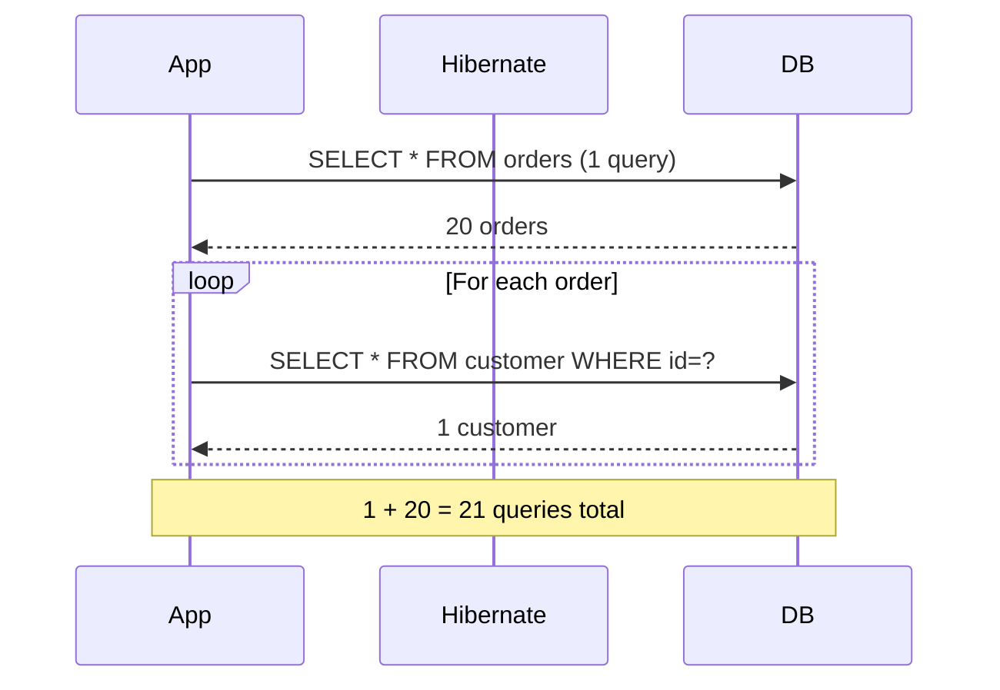

---

### 🛠️ Worked Example

**BAD:**

```java
List<Order> orders = em.createQuery(
    "SELECT o FROM Order o", Order.class)
    .getResultList();
for (Order o : orders) {
    // Each call triggers a lazy-load SELECT
    log.info("{}: {}", o.getId(),
        o.getCustomer().getName());
}
// 1 query for orders + N queries for customers
```

Why it's wrong: each `getCustomer()` triggers a separate
SELECT because Customer is lazy-loaded one at a time.

**GOOD:**

```java
List<Order> orders = em.createQuery(
    "SELECT o FROM Order o "
    + "JOIN FETCH o.customer", Order.class)
    .getResultList();
for (Order o : orders) {
    // Already loaded - no additional query
    log.info("{}: {}", o.getId(),
        o.getCustomer().getName());
}
// 1 query total: JOIN loads customers inline
```

Why it's right: JOIN FETCH loads customers in the same SQL
query. Zero additional SELECTs.

**Production: detecting N+1:**

```properties
# Enable statistics to count JDBC statements
hibernate.generate_statistics=true
# Log: "Executed 21 JDBC statements"
# Expected: 1. Actual: 21. -> N+1 detected.
```

---

### ⚖️ Trade-offs

**Gain:** Fixing N+1 reduces query count from N+1 to 1,
cutting response time by 90%+ on large result sets.

**Cost:** JOIN FETCH loads data eagerly for that query,
increasing memory per request. Multiple collection fetches
cause Cartesian products (use Set or subselect).

| Approach     | Queries | Memory     | Complexity  |
| ------------ | ------- | ---------- | ----------- |
| N+1 (broken) | N+1     | Low (lazy) | None        |
| JOIN FETCH   | 1       | Higher     | Per query   |
| @BatchSize   | 1+N/B   | Moderate   | Annotation  |
| EntityGraph  | 1       | Higher     | Declarative |

---

### ⚡ Decision Snap

**USE JOIN FETCH WHEN:**

- You know at query time which associations are needed.
- The association is `@ManyToOne` or a single-valued path.

**USE @BatchSize WHEN:**

- You access collections unpredictably and cannot write
  targeted queries for every use case.

**USE EntityGraph WHEN:**

- You want declarative fetch control on Spring Data
  repository methods.

---

### ⚠️ Top Traps

| #   | Misconception                | Reality                                                                                             |
| --- | ---------------------------- | --------------------------------------------------------------------------------------------------- |
| 1   | LAZY mapping prevents N+1    | LAZY causes N+1 when you access the association in a loop. LAZY is the trigger, not the prevention. |
| 2   | N+1 only matters for large N | Even N=10 means 11 queries. At 100 requests/sec, that is 1,100 queries/sec instead of 100.          |
| 3   | EAGER mapping fixes N+1      | EAGER loads everything always, which is worse. JOIN FETCH is the targeted fix.                      |

---

### 🪜 Learning Ladder

**Prerequisites:**

- FetchType.LAZY vs FetchType.EAGER - N+1 is a consequence
  of LAZY loading without strategic fetching
- @ManyToOne and @OneToMany Relationships - N+1 occurs on
  relationship traversal

**THIS:** HIB-044 The N+1 Select Problem

**Next steps:**

- Batch Fetching and @BatchSize - mitigation strategy
- JOIN FETCH in JPQL and HQL - the primary fix
- Entity Graphs - declarative alternative

---

### 💡 The Surprising Truth

N+1 is not a bug in Hibernate. It is the correct behavior of
lazy loading: load on demand, one at a time. The "bug" is the
developer's assumption that iterating 20 entities and accessing
their associations should somehow batch automatically. It does
not. Batching is always explicit: JOIN FETCH, @BatchSize, or
EntityGraph.

---

### 📇 Revision Card

1. N+1 = 1 query for parents + N queries for associations.
   Fix: JOIN FETCH, @BatchSize, or EntityGraph.
2. LAZY causes N+1 when you access associations in a loop.
   EAGER is not the fix (it is worse).
3. Count SQL statements (`generate_statistics=true`). If
   actual >> expected, you have N+1.

---

---

# HIB-045 Batch Fetching and @BatchSize

**TL;DR** - `@BatchSize` loads N lazy proxies in one IN query instead of N individual queries, reducing N+1 to 1+ceil(N/batchSize).

---

### 🔥 The Problem in One Paragraph

You cannot always write JOIN FETCH for every association.
Sometimes lazy loading is triggered from generic code, from
templates, or from utility methods that do not control the
query. In those cases, N+1 still happens. `@BatchSize` is the
safety net: when Hibernate initializes one lazy proxy, it looks
ahead and initializes up to `batchSize` proxies of the same
type in a single `WHERE id IN (?, ?, ...)` query. With
`@BatchSize(size=25)`, 100 lazy loads become 4 queries instead
of 100. This is exactly why @BatchSize exists.

---

### 📘 Textbook Definition

**`@BatchSize`** is a Hibernate-specific annotation that
configures batch initialization of lazy-loaded entities or
collections. When one proxy is initialized, Hibernate
initializes up to `batchSize` uninitialized proxies of the
same type in a single `SELECT ... WHERE id IN (...)` query.
The default batch algorithm selects power-of-two subsets to
cover the remaining uninitialized count efficiently.

---

### 🧠 Mental Model

> @BatchSize is like a vending machine that dispenses drinks
> in groups. Instead of pressing the button 25 times (one per
> drink), you press once and get a batch of 25. Fewer button
> presses = fewer round-trips.

- "Button press" -> database query
- "Batch of 25" -> `WHERE id IN (25 values)`
- "Fewer presses" -> fewer round-trips

**Where this analogy breaks down:** Hibernate uses a
power-of-two algorithm for batch sizes, not always the full
configured size. With 13 remaining proxies and
`@BatchSize(size=25)`, it might use batches of 8+4+1.

---

### ⚙️ How It Works

1. Entity or collection annotated with
   `@BatchSize(size=N)`.
2. When one lazy proxy is accessed, Hibernate scans the
   persistence context for other uninitialized proxies of
   the same type.
3. Hibernate batches up to N of them into a single
   `SELECT ... WHERE id IN (?, ?, ..., ?)`.
4. The batch fetch algorithm uses power-of-two subsets
   (1, 2, 4, 8, 16...) to cover the remaining count.
5. Global default: `hibernate.default_batch_fetch_size`
   applies to all entities without per-entity annotation.

```text
  Without @BatchSize (N=100):
  100 individual SELECTs

  With @BatchSize(size=25):
  SELECT ... WHERE id IN (25 ids)  -- batch 1
  SELECT ... WHERE id IN (25 ids)  -- batch 2
  SELECT ... WHERE id IN (25 ids)  -- batch 3
  SELECT ... WHERE id IN (25 ids)  -- batch 4
  Total: 4 queries instead of 100
```

```mermaid
flowchart LR
    A[Access proxy #1] --> B{@BatchSize?}
    B -->|No| C[1 SELECT per proxy]
    B -->|Yes size=25| D[Find uninitialized]
    D --> E["SELECT WHERE IN (25 ids)"]
    E --> F[25 proxies initialized]
```

---

### 🛠️ Worked Example

**BAD:**

```java
@Entity
public class Order {
    @ManyToOne(fetch = FetchType.LAZY)
    private Customer customer;
    // No @BatchSize. Each order.getCustomer()
    // in a loop fires a separate SELECT.
}
```

Why it's wrong: without @BatchSize, 100 orders = 100
individual customer SELECTs.

**GOOD:**

```java
@Entity
@BatchSize(size = 25)
public class Customer {
    // When any Customer proxy initializes,
    // Hibernate loads up to 25 at once.
}

// Or globally in persistence.xml:
// hibernate.default_batch_fetch_size=16
```

Why it's right: 100 customer loads become ~4-7 queries
instead of 100.

**Production: collection batch loading:**

```java
@Entity
public class Order {
    @OneToMany(mappedBy = "order")
    @BatchSize(size = 16)
    private List<LineItem> items;
    // When items of one Order are accessed,
    // Hibernate loads items for up to 16
    // Orders at once.
}
```

---

### ⚖️ Trade-offs

**Gain:** Reduces N+1 without rewriting queries; works as a
safety net for unpredictable lazy access patterns; simple
annotation-based configuration.

**Cost:** Still more queries than JOIN FETCH (batches vs 1);
batch size tuning is empirical; does not help when only one
proxy is accessed.

| Approach       | Queries (100 entities) | Control     |
| -------------- | ---------------------- | ----------- |
| No batching    | 100                    | None needed |
| @BatchSize(25) | ~4-7                   | Annotation  |
| JOIN FETCH     | 1                      | Per query   |

---

### ⚡ Decision Snap

**USE WHEN:**

- Lazy associations are accessed from generic code you do
  not control (templates, serializers, utilities).
- As a global safety net: set
  `hibernate.default_batch_fetch_size=16`.
- When JOIN FETCH is not feasible (multiple collections,
  dynamic access patterns).

**AVOID WHEN:**

- You can write targeted JOIN FETCH queries (prefer those).
- The batch size is set too high, causing oversized IN
  clauses that hit database limits.

**PREFER JOIN FETCH WHEN:**

- You know at query time exactly which associations are
  needed.

---

### ⚠️ Top Traps

| #   | Misconception                        | Reality                                                                                                         |
| --- | ------------------------------------ | --------------------------------------------------------------------------------------------------------------- |
| 1   | @BatchSize eliminates N+1 completely | It reduces N+1 from N queries to ceil(N/batchSize) queries. JOIN FETCH gives 1 query.                           |
| 2   | @BatchSize goes on the field         | For entity proxies, annotate the TARGET entity class. For collections, annotate the collection field.           |
| 3   | Bigger batch size is always better   | Very large IN clauses can exceed database limits (Oracle 1000, some drivers have lower caps). 16-32 is typical. |

---

### 🪜 Learning Ladder

**Prerequisites:**

- The N+1 Select Problem - @BatchSize solves N+1
- FetchType.LAZY vs FetchType.EAGER - @BatchSize applies
  to lazy associations

**THIS:** HIB-045 Batch Fetching and @BatchSize

**Next steps:**

- Entity Graphs (@EntityGraph) - declarative fetch
  alternative
- Hibernate Query Performance Tuning - @BatchSize is one
  tool in the performance toolkit

---

### 💡 The Surprising Truth

Setting `hibernate.default_batch_fetch_size=16` globally is
the single highest-ROI Hibernate configuration change. It
requires zero code changes and reduces N+1 impact across the
entire application. Many production applications see 5-10x
query count reduction from this one property alone.

---

### 📇 Revision Card

1. `@BatchSize(size=N)` loads N proxies at once via
   `WHERE IN(...)`. 100 lazy loads become ~4-7 queries.
2. Set `hibernate.default_batch_fetch_size=16` globally
   as a safety net. Zero code changes required.
3. For entity proxies: annotate the entity class. For
   collections: annotate the collection field.

---

---

# HIB-046 Entity Graphs (@EntityGraph, @NamedEntityGraph)

**TL;DR** - Entity graphs declaratively specify which associations to fetch, overriding LAZY mappings per query without JPQL changes.

---

### 🔥 The Problem in One Paragraph

JOIN FETCH is powerful but requires writing JPQL. In Spring
Data JPA, many queries are derived from method names
(`findByStatus`, `findAll`). You cannot add JOIN FETCH to a
derived query method. Entity graphs solve this: you declare
which associations to load, and Hibernate overrides the LAZY
mapping for that specific query. The entity graph is applied
declaratively via `@EntityGraph` on the repository method or
programmatically via `em.createEntityGraph()`. This is exactly
why entity graphs exist.

---

### 📘 Textbook Definition

A **JPA Entity Graph** (`@NamedEntityGraph`,
`EntityGraph<T>`) defines a template of attributes to fetch
for a specific query execution. A **fetch graph** loads
specified attributes eagerly and all others lazily. A **load
graph** loads specified attributes eagerly and all others per
their mapping default. Spring Data's `@EntityGraph` annotation
applies a graph to a repository method.

---

### 🧠 Mental Model

> An entity graph is like a packing list for a trip. Each
> destination (query) gets its own list (graph) of what to
> pack (associations to load). LAZY mappings are the "default
> unpacked" state. The packing list overrides defaults for
> that specific trip only.

- "Packing list" -> entity graph
- "Trip" -> specific query execution
- "Override defaults" -> LAZY -> EAGER for listed attributes

**Where this analogy breaks down:** Fetch graph vs load graph
have different behaviors for unlisted attributes. A fetch graph
makes unlisted attributes LAZY regardless of mapping. A load
graph uses mapping defaults for unlisted attributes.

---

### ⚙️ How It Works

1. Define a named entity graph on the entity with
   `@NamedEntityGraph` or build one programmatically.
2. Apply it to a query via `em.setHint("jakarta.persistence
.fetchgraph", graph)` or Spring's `@EntityGraph`.
3. Hibernate generates a JOIN for each listed attribute
   in the same SQL query.
4. Fetch graph: listed = EAGER, unlisted = LAZY.
5. Load graph: listed = EAGER, unlisted = mapping default.

```text
  Entity graph: [customer, items]

  Generated SQL:
  SELECT o.*, c.*, i.*
  FROM orders o
  JOIN customer c ON c.id = o.customer_id
  JOIN line_item i ON i.order_id = o.id
  WHERE o.status = 'ACTIVE'
```

```mermaid
flowchart TD
    A[Repository method] --> B[@EntityGraph]
    B --> C{Graph type?}
    C -->|FETCH| D[Listed=EAGER, rest=LAZY]
    C -->|LOAD| E[Listed=EAGER, rest=mapping]
    D --> F[Generated JOIN SQL]
    E --> F
```

---

### 🛠️ Worked Example

**BAD:**

```java
// Derived query with no fetch control
List<Order> findByStatus(String status);
// N+1: each order.getCustomer() fires a SELECT
```

Why it's wrong: derived queries cannot include JOIN FETCH;
lazy associations trigger N+1.

**GOOD:**

```java
// Spring Data with @EntityGraph
@EntityGraph(attributePaths = {
    "customer", "items"})
List<Order> findByStatus(String status);
// One query with JOINs for customer and items

// Alternative: @NamedEntityGraph
@Entity
@NamedEntityGraph(name = "Order.detail",
    attributeNodes = {
        @NamedAttributeNode("customer"),
        @NamedAttributeNode("items")
    })
public class Order { ... }

@EntityGraph("Order.detail")
List<Order> findByStatus(String status);
```

Why it's right: associations loaded in one query via JOIN;
no N+1; declarative and reusable.

**Production: subgraph for nested associations:**

```java
@NamedEntityGraph(name = "Order.full",
    attributeNodes = {
        @NamedAttributeNode("customer"),
        @NamedAttributeNode(value = "items",
            subgraph = "items.product")
    },
    subgraphs = @NamedSubgraph(
        name = "items.product",
        attributeNodes =
            @NamedAttributeNode("product")))
// Fetches: Order -> customer, items -> product
```

---

### ⚖️ Trade-offs

**Gain:** Declarative fetch control; works with derived queries
and Spring Data methods; reusable named graphs for common
patterns.

**Cost:** Verbose annotation syntax for nested graphs; fetch
graph vs load graph confusion; Cartesian product risk with
multiple collections (same as JOIN FETCH).

| Approach     | Syntax       | Spring Data | Reusable |
| ------------ | ------------ | ----------- | -------- |
| JOIN FETCH   | JPQL string  | @Query only | No       |
| @EntityGraph | Annotation   | Yes         | Yes      |
| @BatchSize   | Entity-level | Automatic   | Global   |

---

### ⚡ Decision Snap

**USE WHEN:**

- Spring Data derived queries need fetch optimization.
- Multiple endpoints need the same fetch configuration
  (reusable named graphs).
- You want declarative fetch control without JPQL.

**AVOID WHEN:**

- The query is already JPQL with JOIN FETCH (redundant).
- You need to fetch multiple `List` collections (Cartesian
  product risk).

**PREFER JOIN FETCH WHEN:**

- You are writing JPQL anyway and want inline fetch control.

---

### ⚠️ Top Traps

| #   | Misconception                                      | Reality                                                                                                                            |
| --- | -------------------------------------------------- | ---------------------------------------------------------------------------------------------------------------------------------- |
| 1   | @EntityGraph and JOIN FETCH can be combined safely | Combining them can produce unexpected duplicate JOINs. Use one or the other, not both.                                             |
| 2   | Fetch graph and load graph are the same            | Fetch graph forces unlisted attributes to LAZY. Load graph keeps their mapping default.                                            |
| 3   | @EntityGraph works with pagination                 | Entity graphs with collections and pagination cause the "HHH90003004" warning: Hibernate fetches all rows and paginates in memory. |

---

### 🪜 Learning Ladder

**Prerequisites:**

- The N+1 Select Problem - entity graphs solve N+1
- JOIN FETCH in JPQL and HQL - the JPQL-based alternative

**THIS:** HIB-046 Entity Graphs (@EntityGraph,
@NamedEntityGraph)

**Next steps:**

- Hibernate Query Performance Tuning - entity graphs are
  one tuning tool among many
- Second-Level Cache vs Application Cache - caching vs
  fetching trade-off

---

### 💡 The Surprising Truth

Entity graphs with `@OneToMany` collections and Spring Data
pagination (`Pageable`) silently disable SQL-level pagination.
Hibernate logs a warning and fetches ALL rows, then paginates
in Java memory. This is a common production performance trap
that is invisible without checking the logs.

---

### 📇 Revision Card

1. `@EntityGraph(attributePaths={"a","b"})` overrides LAZY
   per query. Works on Spring Data derived methods.
2. Fetch graph = listed EAGER, rest LAZY. Load graph =
   listed EAGER, rest per mapping.
3. Entity graphs + pagination + collections = in-memory
   pagination. Check for HHH90003004 warning.

---

---

# HIB-047 JOIN FETCH in JPQL and HQL

**TL;DR** - `JOIN FETCH` loads an association in the same SQL query, eliminating N+1 for that specific query execution.

---

### 🔥 The Problem in One Paragraph

A regular `JOIN` in JPQL filters results by the joined entity
but does NOT initialize the association. After the query, the
association is still a lazy proxy. `JOIN FETCH` does both: it
includes the joined entity in the SQL and initializes the
association in the persistence context. Confusing JOIN with
JOIN FETCH is the single most common cause of "I added a JOIN
but still get N+1" complaints. This is exactly why the
distinction matters.

---

### 📘 Textbook Definition

**`JOIN FETCH`** is a JPQL/HQL clause that directs Hibernate
to load a lazy association in the same SQL SELECT via an inner
or left join. Unlike a regular `JOIN`, which only filters the
result set, `JOIN FETCH` initializes the association in the
persistence context, preventing subsequent lazy-load SELECTs.

---

### 🧠 Mental Model

> Regular JOIN is looking through a window: you can see who
> is in the next room (filter), but the door is still locked
> (association uninitialized). JOIN FETCH opens the door: you
> see AND bring the person into your room (association
> initialized).

- "Looking through window" -> JOIN (filter only)
- "Opening the door" -> JOIN FETCH (load)
- "Person in your room" -> association in persistence context

**Where this analogy breaks down:** JOIN FETCH physically
changes the SQL by adding columns to the SELECT list, not just
the JOIN condition.

---

### ⚙️ How It Works

1. `JOIN FETCH p.customer` adds customer columns to the
   SELECT list and the JOIN clause.
2. Hibernate maps the result set rows back to entities AND
   initializes the fetched association.
3. `LEFT JOIN FETCH` includes parent entities even when the
   association is null.
4. The fetched association is fully initialized in the
   persistence context; subsequent access triggers no query.
5. Cannot use `JOIN FETCH` with pagination on collections
   (Hibernate paginates in memory).

```text
  Regular JOIN (filter only):
  SELECT o FROM Order o JOIN o.customer c
    WHERE c.vip = true
  -> Orders filtered by VIP customer
  -> o.customer is still a lazy proxy!

  JOIN FETCH (filter + load):
  SELECT o FROM Order o JOIN FETCH o.customer c
    WHERE c.vip = true
  -> Orders filtered by VIP customer
  -> o.customer is fully initialized
```

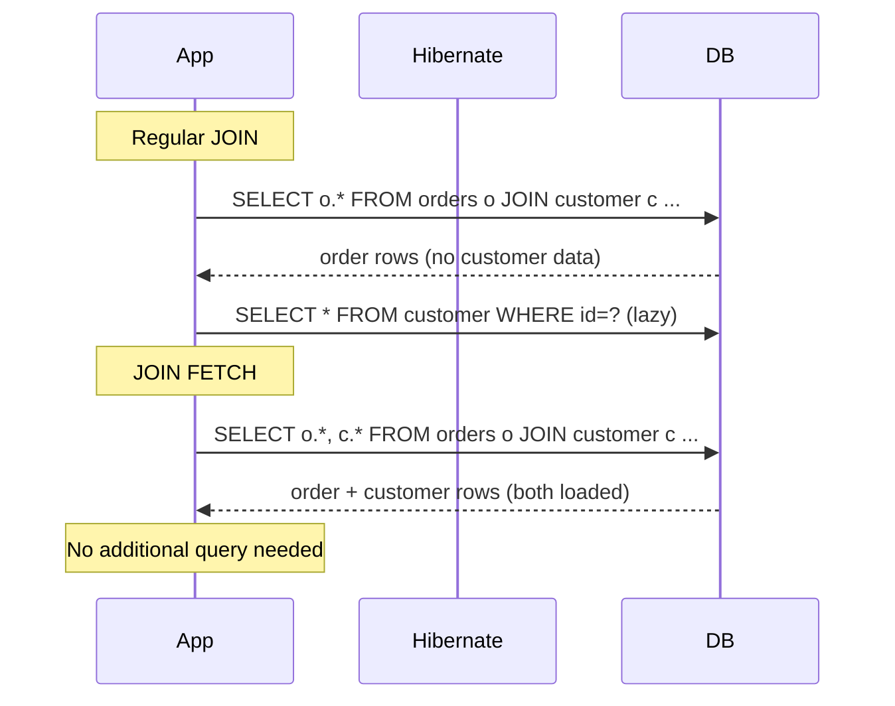

---

### 🛠️ Worked Example

**BAD:**

```java
// Regular JOIN: filters but does NOT load
List<Order> orders = em.createQuery(
    "SELECT o FROM Order o "
    + "JOIN o.customer c "
    + "WHERE c.vip = true", Order.class)
    .getResultList();
for (Order o : orders) {
    // Still triggers lazy SELECT!
    o.getCustomer().getName();
}
```

Why it's wrong: JOIN filters results but the customer
association remains an uninitialized proxy.

**GOOD:**

```java
// JOIN FETCH: filters AND loads
List<Order> orders = em.createQuery(
    "SELECT o FROM Order o "
    + "JOIN FETCH o.customer c "
    + "WHERE c.vip = true", Order.class)
    .getResultList();
for (Order o : orders) {
    // Already loaded - zero queries
    o.getCustomer().getName();
}
```

Why it's right: JOIN FETCH adds customer columns to the
SELECT list and initializes the association.

**Production: LEFT JOIN FETCH for optional:**

```java
// Use LEFT JOIN FETCH when the association may
// be null (otherwise parent rows are excluded)
"SELECT o FROM Order o "
+ "LEFT JOIN FETCH o.coupon"
// Orders without coupons are still included
```

---

### ⚖️ Trade-offs

**Gain:** Eliminates N+1 for the targeted association; single
SQL query; explicit and readable.

**Cost:** Cannot fetch multiple `List` collections (Cartesian
product); pagination with collections is done in memory;
query must be JPQL/HQL (not available for derived methods).

| Aspect         | JOIN            | JOIN FETCH           |
| -------------- | --------------- | -------------------- |
| SQL JOIN       | Yes             | Yes                  |
| Loads assoc.   | No (still lazy) | Yes (initialized)    |
| Result filter  | Yes             | Yes                  |
| SELECT columns | Parent only     | Parent + association |

---

### ⚡ Decision Snap

**USE WHEN:**

- You are writing JPQL and know which associations the
  caller needs.
- The association is `@ManyToOne` or a single `@OneToMany`.
- You want explicit, visible fetch control in the query.

**AVOID WHEN:**

- Fetching multiple `List` collections in one query (use
  Set or separate queries).
- You need SQL pagination with a fetched collection
  (Hibernate paginates in memory).

**USE LEFT JOIN FETCH WHEN:**

- The association is optional (nullable FK) and you want
  parent rows even when the association is null.

---

### ⚠️ Top Traps

| #   | Misconception                                   | Reality                                                                                                   |
| --- | ----------------------------------------------- | --------------------------------------------------------------------------------------------------------- |
| 1   | JOIN and JOIN FETCH produce the same SQL        | JOIN FETCH adds the joined entity's columns to the SELECT list. Regular JOIN does not.                    |
| 2   | You can paginate with JOIN FETCH on collections | Hibernate warns "HHH90003004" and paginates in memory. All rows are fetched first.                        |
| 3   | You can JOIN FETCH multiple List collections    | This creates a Cartesian product (rows = A x B). Use Set instead of List, or split into separate queries. |

---

### 🪜 Learning Ladder

**Prerequisites:**

- JPQL Fundamentals - JOIN FETCH is JPQL syntax
- The N+1 Select Problem - JOIN FETCH is the primary N+1
  fix

**THIS:** HIB-047 JOIN FETCH in JPQL and HQL

**Next steps:**

- Entity Graphs (@EntityGraph) - declarative alternative
  to JOIN FETCH
- HQL Advanced - subqueries, projections, and hints build
  on JOIN FETCH knowledge

---

### 💡 The Surprising Truth

The most dangerous line in Hibernate code is
`SELECT o FROM Order o JOIN o.customer`. It looks correct and
compiles. It even filters correctly. But the association is
still lazy. Developers assume JOIN loads the data because
that is how SQL works. In JPQL, JOIN only filters; JOIN FETCH
loads.

---

### 📇 Revision Card

1. JOIN filters but does NOT load the association. JOIN
   FETCH filters AND loads.
2. JOIN FETCH adds columns to the SELECT. Regular JOIN does
   not.
3. Multiple `List` fetches = Cartesian product. Use `Set`
   or separate queries.

---

---

# HIB-048 N+1 Queries in Production Anti-Pattern

**TL;DR** - N+1 is invisible in development with small data but devastating in production with thousands of rows and concurrent users.

---

### 🔥 The Problem in One Paragraph

In development, you have 5 orders. N+1 means 6 queries. Each
takes 1ms locally. Total: 6ms. You never notice. In production,
you have 5,000 orders. N+1 means 5,001 queries. Each takes
5-15ms over the network. Total: 25-75 seconds. The connection
pool (10 connections) saturates. Other requests queue. Timeouts
cascade. The endpoint goes down. The root cause: the same code
that was "fast enough" in development. This is the most common
Hibernate production incident pattern.

---

### 📘 Textbook Definition

The **N+1 in production anti-pattern** occurs when N+1 query
patterns survive development testing (small data, local
database, single user) and manifest as severe performance
degradation in production (large data, network latency,
concurrent users). The anti-pattern is not the N+1 itself but
the failure to detect it before production.

---

### 🧠 Mental Model

> N+1 in development is like a small leak in a water pipe.
> At low pressure (5 rows), you barely notice. At high
> pressure (5,000 rows, 100 concurrent users), the pipe
> bursts. The leak was always there. Production pressure just
> exposed it.

- "Low pressure" -> small dev dataset, single user
- "High pressure" -> production load
- "Pipe burst" -> connection pool exhaustion, timeouts

**Where this analogy breaks down:** Unlike a physical leak,
N+1 is entirely fixable with a one-line query change (JOIN
FETCH). The fix is simple. The detection is the hard part.

---

### ⚙️ How It Works

1. Developer writes `findAll()` + iterates lazy associations.
2. Tests pass with 5 rows (6 queries, 6ms).
3. Code review does not catch it (no SQL log review).
4. Production has 5,000 rows. Response time: 50+ seconds.
5. Connection pool exhausted. Other endpoints affected.
6. On-call engineer sees high DB query count in metrics.
7. Root cause: N+1 pattern in code shipped months ago.

```text
  Development:  5 rows -> 6 queries -> 6ms   OK
  Production: 5000 rows -> 5001 queries -> 50s FAIL

  Connection pool (10):
  [busy][busy][busy]...[busy] <- all 10 taken
  [queue][queue][queue]...    <- requests waiting
  [timeout][timeout]...       <- cascading failure
```

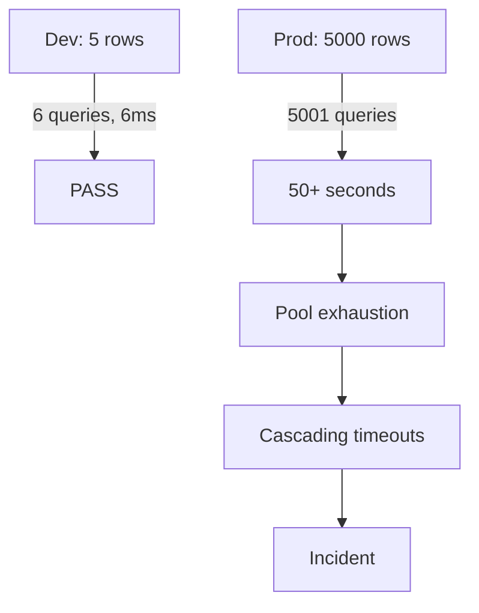

---

### 🛠️ Worked Example

**BAD:**

```java
// "Works fine in dev" - classic N+1 trap
@GetMapping("/orders")
public List<OrderDTO> list() {
    return orderRepo.findAll().stream()
        .map(o -> new OrderDTO(
            o.getId(),
            o.getCustomer().getName(), // N+1!
            o.getItems().size()))       // N+1!
        .toList();
}
// Dev: 5 orders -> 11 queries -> fast
// Prod: 5000 orders -> 10,001 queries -> down
```

Why it's wrong: every `.getCustomer()` and `.getItems()` on
every order fires a separate SELECT.

**GOOD:**

```java
// JOIN FETCH + DTO projection
@Query("SELECT o FROM Order o "
    + "JOIN FETCH o.customer "
    + "JOIN FETCH o.items")
List<Order> findAllWithDetails();

@GetMapping("/orders")
public List<OrderDTO> list() {
    return orderRepo.findAllWithDetails().stream()
        .map(OrderDTO::from)
        .toList();
}
// Dev and prod: 1 query -> always fast
```

Why it's right: single query loads everything. Performance is
constant regardless of row count.

**Production: automated N+1 detection:**

```java
// In test suite: assert query count
@Test
void listOrders_noNPlus1() {
    // Insert 50 test orders with customers
    var stats = sessionFactory.getStatistics();
    stats.clear();
    controller.list();
    assertThat(stats.getPrepareStatementCount())
        .isLessThanOrEqualTo(3);
}
```

---

### ⚖️ Trade-offs

**Gain:** Preventing N+1 in production avoids outages,
connection pool exhaustion, and cascading failures.

**Cost:** Requires CI/CD assertion infrastructure, query count
tests, and SQL log review discipline.

| Detection method       | Dev cost | Catch rate  |
| ---------------------- | -------- | ----------- |
| Code review (SQL logs) | Low      | Medium      |
| Query count assertions | Medium   | High        |
| Production monitoring  | Low      | Post-damage |
| Hibernate statistics   | Low      | High        |

---

### ⚡ Decision Snap

**USE WHEN:**

- Every project should have N+1 detection. This is not
  optional. Choose at least one detection method.
- Minimum viable: `hibernate.generate_statistics=true` in
  development.
- Better: query count assertions in integration tests.

**AVOID WHEN:**

- This is a prevention strategy, not something to avoid.

**PREFER QUERY COUNT TESTS WHEN:**

- You want automated, CI-enforced N+1 prevention that
  catches issues before code review.

---

### ⚠️ Top Traps

| #   | Misconception                                  | Reality                                                                                                          |
| --- | ---------------------------------------------- | ---------------------------------------------------------------------------------------------------------------- |
| 1   | If it is fast in dev, it is fast in production | N+1 performance is O(N) where N is the row count. 5 rows hides the problem. 5000 exposes it.                     |
| 2   | Code review catches N+1                        | N+1 is invisible in code. You need SQL log output or query count metrics to detect it.                           |
| 3   | APM tools catch N+1 before damage              | APM tools report after the problem occurs. Prevention requires dev-time detection (statistics, test assertions). |

---

### 🪜 Learning Ladder

**Prerequisites:**

- The N+1 Select Problem - must understand the pattern
  before preventing it
- JOIN FETCH in JPQL and HQL - the primary fix

**THIS:** HIB-048 N+1 Queries in Production Anti-Pattern

**Next steps:**

- Hibernate Statistics API and p6spy - monitoring tools
  for detection
- N+1 Detection and Fix Kata - hands-on practice
- Monitoring Hibernate in Production - comprehensive
  monitoring beyond N+1

---

### 💡 The Surprising Truth

Most Hibernate production incidents are not caused by complex
misconfiguration. They are caused by the simplest possible
pattern: `findAll()` + iterate + access lazy association. The
code looks correct, passes tests, and survives code review.
It only fails under production data volume.

---

### 📇 Revision Card

1. N+1 is invisible at 5 rows but catastrophic at 5,000.
   Always test with production-scale data volume.
2. Minimum detection: `generate_statistics=true` in dev
   and check "Executed N JDBC statements" log.
3. Best detection: query count assertions in integration
   tests that fail CI when N+1 is introduced.

---

---

# HIB-049 Hibernate Query Performance Tuning

**TL;DR** - Tune Hibernate queries by fixing N+1 first, then optimizing projections, pagination, and query plan caching.

---

### 🔥 The Problem in One Paragraph

After fixing N+1, your queries are down to 1-3 per endpoint.
But each query still returns full entities with 40 columns when
the view needs 3 fields. Pagination fetches all matching rows
then discards most. The query plan cache misses constantly
because of dynamic JPQL strings. Each of these wastes memory,
bandwidth, and CPU. Query performance tuning addresses the
remaining bottlenecks after N+1 is solved. This is exactly
why tuning goes beyond fetch strategy.

---

### 📘 Textbook Definition

**Hibernate query performance tuning** is the systematic
optimization of JPQL/HQL/SQL queries beyond fetch strategy,
including: DTO projections (select only needed columns),
pagination (LIMIT/OFFSET at SQL level), query plan caching
(reuse parsed query plans), read-only queries (skip dirty
checking), and StatelessSession (skip persistence context
entirely).

---

### 🧠 Mental Model

> Think of query tuning as diet optimization. Fixing N+1 is
> eliminating junk food (the biggest win). Projections are
> portion control (select only what you need). Pagination is
> eating at scheduled meals (not loading the entire fridge).
> Read-only mode is skipping the food journal (no dirty
> checking overhead).

- "Junk food" -> N+1 (fix first)
- "Portion control" -> DTO projections
- "Scheduled meals" -> pagination
- "Skip food journal" -> read-only, no dirty checking

**Where this analogy breaks down:** Unlike diet, query tuning
effects are immediately measurable with statistics.

---

### ⚙️ How It Works

1. **DTO projection:** `SELECT new DTO(e.a, e.b)` fetches
   only needed columns. No entity management overhead.
2. **Pagination:** `setFirstResult(offset)` +
   `setMaxResults(pageSize)` generates SQL LIMIT/OFFSET.
3. **Query plan cache:** Use parameterized queries (not
   string concatenation) so plans are reused.
4. **Read-only:** `query.setHint("org.hibernate.readOnly",
true)` skips dirty checking snapshot.
5. **StatelessSession:** No persistence context, no dirty
   checking, no caching. For bulk operations.

```text
  Tuning ladder (fix in this order):
  1. Fix N+1           (10x-100x improvement)
  2. DTO projections   (2x-5x less memory)
  3. Pagination         (constant response time)
  4. Read-only mode     (15-30% less CPU)
  5. StatelessSession   (bulk operations only)
```

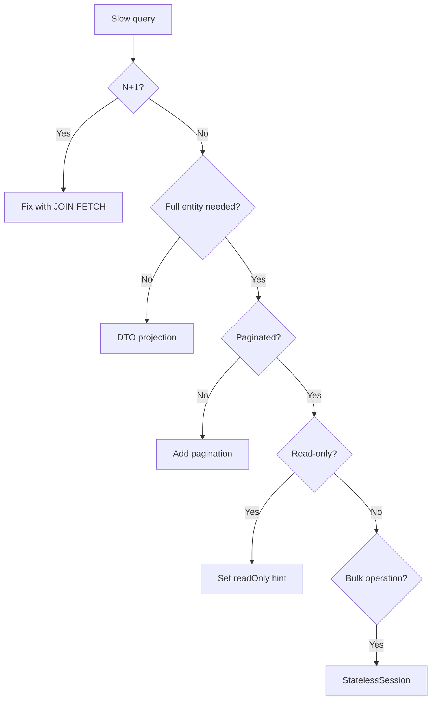

---

### 🛠️ Worked Example

**BAD:**

```java
// Full entity load for a list endpoint
List<Order> orders = em.createQuery(
    "SELECT o FROM Order o "
    + "JOIN FETCH o.customer", Order.class)
    .getResultList();
// Returns ALL orders with ALL 40 columns.
// View only needs id, total, customerName.
```

Why it's wrong: loads full entities (40 columns, dirty
checking snapshots) when 3 fields suffice.

**GOOD:**

```java
// DTO projection: 3 columns, no entity overhead
@Query("SELECT new com.ex.OrderSummary("
    + "o.id, o.total, c.name) "
    + "FROM Order o JOIN o.customer c")
Page<OrderSummary> findSummaries(Pageable p);
// SQL: SELECT o.id, o.total, c.name
//      FROM orders o JOIN customer c ...
//      LIMIT 20 OFFSET 0
```

Why it's right: loads only needed columns; pagination at SQL
level; no dirty checking overhead.

**Production: read-only for reports:**

```java
@Transactional(readOnly = true)
public List<ReportDTO> generateReport() {
    return em.createQuery(reportJpql, DTO.class)
        .setHint("org.hibernate.readOnly", true)
        .getResultList();
}
// No dirty checking snapshot = 15-30% less mem
```

---

### ⚖️ Trade-offs

**Gain:** DTO projections reduce memory and bandwidth;
pagination prevents full table loads; read-only skips dirty
checking; StatelessSession eliminates persistence context.

**Cost:** DTO projections require mapping classes; pagination
with OFFSET degrades at deep pages; read-only disables entity
modification; StatelessSession loses all ORM features.

| Technique        | Improvement         | Trade-off              |
| ---------------- | ------------------- | ---------------------- |
| DTO projection   | 2-5x less memory    | Extra mapping classes  |
| Pagination       | Constant latency    | Deep page degradation  |
| Read-only        | 15-30% less CPU     | Cannot modify entities |
| StatelessSession | No context overhead | Loses ORM features     |

---

### ⚡ Decision Snap

**USE WHEN:**

- After fixing N+1, performance is still not meeting SLAs.
- List endpoints return more columns than the UI needs.
- Report queries run in read-only transactions.
- Bulk operations process thousands of rows.

**AVOID WHEN:**

- You have not fixed N+1 yet (fix the big wins first).
- The endpoint needs full entity modification (do not use
  read-only or StatelessSession).

**PREFER DTO PROJECTIONS WHEN:**

- The caller needs a subset of fields. This should be the
  default for all list/search endpoints.

---

### ⚠️ Top Traps

| #   | Misconception                                      | Reality                                                                                                                         |
| --- | -------------------------------------------------- | ------------------------------------------------------------------------------------------------------------------------------- |
| 1   | DTO projections and entity loads perform similarly | DTO projections skip entity management, dirty checking snapshots, and L1 cache population. The difference grows with row count. |
| 2   | OFFSET pagination is always fine                   | At OFFSET 100,000, the database still scans and discards 100K rows. Use keyset pagination for deep pages.                       |
| 3   | StatelessSession is a faster EntityManager         | StatelessSession has no cache, no dirty checking, no cascading, and no lazy loading. It is for bulk ops only.                   |

---

### 🪜 Learning Ladder

**Prerequisites:**

- The N+1 Select Problem - fix N+1 before other tuning
- JOIN FETCH in JPQL and HQL - the primary fetch optimization

**THIS:** HIB-049 Hibernate Query Performance Tuning

**Next steps:**

- HQL Advanced (Subqueries, Projections, Query Hints) -
  advanced query techniques
- Hibernate Statistics API and p6spy - measuring the
  impact of tuning changes

---

### 💡 The Surprising Truth

Most Hibernate performance problems are solved by three
changes: JOIN FETCH (fix N+1), DTO projections (stop loading
full entities for lists), and `@Transactional(readOnly=true)`
(skip dirty checking for reads). These three cover 90% of
performance issues. The remaining 10% involve batching, caching,
and schema optimization.

---

### 📇 Revision Card

1. Fix N+1 first (biggest win), then DTO projections, then
   pagination, then read-only.
2. `SELECT new DTO(...)` loads only needed columns with zero
   entity management overhead.
3. `@Transactional(readOnly=true)` + readOnly hint skips
   dirty checking snapshots (15-30% less memory).

---

---

# HIB-050 HQL Advanced (Subqueries, Projections, Query Hints)

**TL;DR** - HQL supports subqueries, constructor projections, query hints, and bulk updates beyond basic SELECT/WHERE.

---

### 🔥 The Problem in One Paragraph

Basic JPQL handles 80% of queries. The remaining 20% need
correlated subqueries ("orders above the average"), tuple
projections ("select three fields into a DTO"), query hints
("read-only mode, fetch size, timeout"), and bulk DML ("update
all inactive users without loading entities"). Developers who
reach these requirements often drop to native SQL unnecessarily.
HQL handles all of these without leaving the JPA world. This
is exactly why advanced HQL matters.

---

### 📘 Textbook Definition

**HQL (Hibernate Query Language)** is a superset of JPQL with
extensions including: correlated and uncorrelated subqueries in
WHERE, SELECT, and HAVING clauses; constructor-based DTO
projections; query hints (fetch size, timeout, read-only,
comment); and bulk UPDATE/DELETE statements that bypass the
persistence context.

---

### 🧠 Mental Model

> Basic JPQL is a bicycle: fine for most trips. Advanced HQL
> is a car: same roads (entity model), more power (subqueries,
> hints, bulk). Native SQL is a helicopter: maximum power but
> you leave the road (entity model) entirely.

- "Bicycle" -> basic JPQL (SELECT, WHERE, JOIN)
- "Car" -> advanced HQL (subqueries, hints, bulk)
- "Helicopter" -> native SQL (leaves entity model)

**Where this analogy breaks down:** HQL and JPQL share the
same syntax for 90% of features. The "upgrade" from JPQL to
HQL is mostly about knowing the extensions exist.

---

### ⚙️ How It Works

1. **Subqueries:** Use in WHERE or HAVING:
   `WHERE o.total > (SELECT AVG(o2.total) FROM Order o2)`.
2. **Constructor projection:** `SELECT new com.ex.DTO(...)`.
3. **Query hints:** `query.setHint("org.hibernate.fetchSize",
50)` controls JDBC fetch size.
4. **Bulk UPDATE/DELETE:** `UPDATE User u SET u.active = false
WHERE u.lastLogin < :cutoff`. Bypasses persistence context.
5. **Fetch profiles:** `@FetchProfile` + `session.
enableFetchProfile("withItems")` for profile-based fetching.

```text
  Subquery:
  SELECT o FROM Order o
  WHERE o.total > (
    SELECT AVG(o2.total) FROM Order o2
  )

  Constructor projection:
  SELECT new OrderDTO(o.id, o.total, c.name)
  FROM Order o JOIN o.customer c

  Bulk update:
  UPDATE User u SET u.active = false
  WHERE u.lastLogin < :cutoff
  -> Executes directly, no entity loading
```

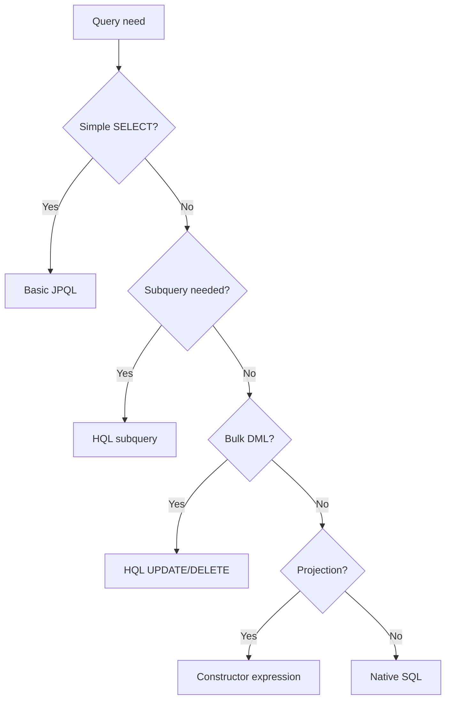

---

### 🛠️ Worked Example

**BAD:**

```java
// Loading ALL entities to find above-average
List<Order> all = em.createQuery(
    "SELECT o FROM Order o", Order.class)
    .getResultList();
double avg = all.stream()
    .mapToDouble(o -> o.getTotal().doubleValue())
    .average().orElse(0);
List<Order> above = all.stream()
    .filter(o -> o.getTotal().doubleValue() > avg)
    .toList();
// Loaded ALL orders into memory just to filter!
```

Why it's wrong: loads every order into Java to compute an
average the database can compute natively.

**GOOD:**

```java
// Subquery: database computes the average
List<Order> above = em.createQuery(
    "SELECT o FROM Order o "
    + "WHERE o.total > ("
    +   "SELECT AVG(o2.total) FROM Order o2"
    + ")", Order.class)
    .getResultList();
// One query. Database does the math.
```

Why it's right: database computes the average and filters in
one query. Zero unnecessary entity loading.

**Production: bulk update with cache eviction:**

```java
int updated = em.createQuery(
    "UPDATE User u SET u.active = false "
    + "WHERE u.lastLogin < :cutoff")
    .setParameter("cutoff",
        LocalDate.now().minusMonths(6))
    .executeUpdate();
// Bypasses persistence context!
// Evict L2 cache if enabled:
sessionFactory.getCache()
    .evictEntityData(User.class);
```

---

### ⚖️ Trade-offs

**Gain:** Subqueries push computation to the database;
constructor projections reduce memory; bulk DML avoids loading
entities; query hints control JDBC behavior.

**Cost:** Bulk DML bypasses persistence context (stale L1/L2
cache); complex subqueries may be slower than native SQL
equivalents; constructor projections require DTO classes.

| Feature           | Gain                | Risk              |
| ----------------- | ------------------- | ----------------- |
| Subquery          | DB-side computation | Complex plans     |
| Constructor proj. | Less memory         | Extra DTO classes |
| Bulk UPDATE       | No entity loading   | Stale cache       |
| Query hints       | JDBC tuning         | Provider-specific |

---

### ⚡ Decision Snap

**USE WHEN:**

- You need database-side aggregation or comparison (AVG,
  COUNT, EXISTS subqueries).
- List endpoints should always use constructor projections.
- Batch operations affect thousands of rows (bulk DML).
- You need JDBC fetch size or timeout control.

**AVOID WHEN:**

- The query needs CTEs, window functions, or recursive
  queries (use native SQL).
- Bulk DML without cache eviction in a cached environment.

**PREFER NATIVE SQL WHEN:**

- HQL cannot express the query (window functions, CTEs,
  database-specific syntax).

---

### ⚠️ Top Traps

| #   | Misconception                                                  | Reality                                                                                                                |
| --- | -------------------------------------------------------------- | ---------------------------------------------------------------------------------------------------------------------- |
| 1   | Bulk UPDATE/DELETE updates entities in the persistence context | Bulk DML goes directly to the database. Managed entities in memory are STALE. Clear the context after bulk operations. |
| 2   | HQL subqueries are as powerful as SQL subqueries               | HQL subqueries cannot appear in the FROM clause (derived tables). Use native SQL for that.                             |
| 3   | Query hints are standardized across JPA providers              | Most query hints are provider-specific (`org.hibernate.*`). Only a few are standard JPA.                               |

---

### 🪜 Learning Ladder

**Prerequisites:**

- JPQL Fundamentals - HQL extends JPQL syntax
- Hibernate Query Performance Tuning - advanced HQL is a
  tuning technique

**THIS:** HIB-050 HQL Advanced (Subqueries, Projections,
Query Hints)

**Next steps:**

- Dirty Checking and First-Level Cache Internals - bulk DML
  bypasses dirty checking
- Hibernate Statistics API and p6spy - measuring query
  performance after applying hints

---

### 💡 The Surprising Truth

The most underused HQL feature is constructor-based projection.
Teams routinely load full entities (40 columns, dirty checking
snapshot, L1 cache entry) for list endpoints that display 3
fields. `SELECT new DTO(o.id, o.total, c.name)` eliminates
all entity overhead and typically halves memory consumption
for list queries.

---

### 📇 Revision Card

1. HQL subqueries push computation to the database. Use for
   AVG, COUNT, EXISTS comparisons.
2. `SELECT new DTO(...)` = constructor projection. No entity
   overhead. Default for list endpoints.
3. Bulk UPDATE/DELETE bypasses persistence context. Always
   clear/evict cache after bulk operations.

---

---

# HIB-051 Dirty Checking and First-Level Cache Internals

**TL;DR** - Hibernate snapshots every managed entity at load time and compares field-by-field at flush to generate UPDATE only for changed entities.

---

### 🔥 The Problem in One Paragraph

You load a User entity, change nothing, and Hibernate issues
no UPDATE. You change one field and Hibernate UPDATEs only that
entity. How? At load time, Hibernate copies every field value
into a "hydrated state snapshot." At flush time, it compares
the current entity state against the snapshot field by field.
If any field differs, it generates an UPDATE. If nothing
changed, it skips. This is dirty checking. The cost: every
managed entity consumes double memory (entity + snapshot).
With 10,000 managed entities, that is 10,000 snapshots in the
persistence context, consuming significant heap.

---

### 📘 Textbook Definition

**Dirty checking** is Hibernate's mechanism for detecting
entity state changes. When an entity enters the managed state,
Hibernate stores a snapshot of its field values. At flush time,
it performs a field-by-field comparison between current state
and snapshot. Changed entities generate UPDATE statements.
The **first-level cache (L1)** is the persistence context's
identity map: one entity instance per database row per Session.

---

### 🧠 Mental Model

> Dirty checking is like a "before" photo. Hibernate takes a
> snapshot (before photo) when it loads the entity. At flush
> time, it compares the current state (now) to the snapshot.
> If anything changed, it generates an UPDATE. If identical,
> it does nothing.

- "Before photo" -> hydrated state snapshot at load
- "Compare now vs before" -> field-by-field diff at flush
- "Generate UPDATE" -> only for changed fields/entities

**Where this analogy breaks down:** The snapshot is not a
second entity object but a raw `Object[]` of column values.
It lives in the persistence context's internal data structures.

---

### ⚙️ How It Works

1. `em.find()` or query loads an entity.
2. Hibernate stores the entity in the L1 cache (identity map)
   keyed by type + ID.
3. Hibernate also stores a `Object[]` snapshot of all
   column values.
4. At flush: for each managed entity, Hibernate compares
   current field values to the snapshot array.
5. If ANY field differs: generate UPDATE SQL.
6. If all fields match: skip (no SQL generated).
7. L1 cache guarantees: same ID in same Session = same
   Java object (identity).

```text
  Load:
  User(1, "Alice", 30) -> managed + snapshot[1,"Alice",30]

  Modify:
  user.setAge(31);

  Flush:
  Current: [1, "Alice", 31]
  Snapshot: [1, "Alice", 30]
  Diff at index 2 -> generate UPDATE users SET age=31
                     WHERE id=1
```

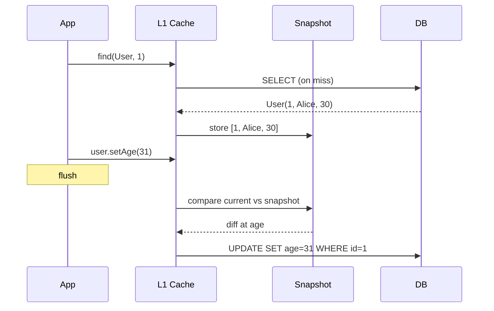

---

### 🛠️ Worked Example

**BAD:**

```java
// Loading 10,000 entities for a read-only report
List<User> all = em.createQuery(
    "SELECT u FROM User u", User.class)
    .getResultList();
// 10,000 entities + 10,000 snapshots in memory
// Dirty checking at flush compares all 10,000
// even though nothing was modified.
```

Why it's wrong: 10,000 snapshots waste memory; dirty checking
runs on all 10,000 entities at flush for zero benefit.

**GOOD:**

```java
// Read-only: skip snapshots and dirty checking
List<User> all = em.createQuery(
    "SELECT u FROM User u", User.class)
    .setHint("org.hibernate.readOnly", true)
    .getResultList();
// No snapshots stored. Flush skips these entities.
// ~50% less memory for this query.
```

Why it's right: read-only hint tells Hibernate to skip
snapshot creation and dirty checking.

**Production: clear context for batch processing:**

```java
for (int i = 0; i < users.size(); i++) {
    processUser(users.get(i));
    if (i % 50 == 0) {
        em.flush();
        em.clear(); // Release snapshots + cache
    }
}
// Prevents OOM on large batch operations
```

---

### ⚖️ Trade-offs

**Gain:** Automatic change detection; no manual "save" calls
needed; only changed entities generate SQL.

**Cost:** Double memory per managed entity (entity + snapshot);
flush-time comparison scales O(N) with managed entity count;
read-only queries pay the snapshot cost unnecessarily unless
hinted.

| Scenario         | Managed | Snapshots | Flush cost  |
| ---------------- | ------- | --------- | ----------- |
| 10 entities      | Low     | Low       | Negligible  |
| 1,000 entities   | Medium  | Medium    | Noticeable  |
| 10,000+ entities | High    | High      | Significant |
| Read-only hinted | Normal  | NONE      | Zero        |

---

### ⚡ Decision Snap

**USE WHEN:**

- You modify entities and want automatic UPDATE generation
  (the default and correct behavior for writes).
- You need identity guarantee (same ID = same object).

**AVOID SNAPSHOT COST WHEN:**

- Read-only operations: use `readOnly=true` hint or
  `@Transactional(readOnly=true)`.
- Bulk processing: `em.clear()` periodically to release
  snapshots.
- Large result sets: use DTO projections instead of entity
  loading.

**PREFER STATELESS SESSION WHEN:**

- Batch operations that process thousands of rows without
  needing change detection.

---

### ⚠️ Top Traps

| #   | Misconception                                                   | Reality                                                                                                                                       |
| --- | --------------------------------------------------------------- | --------------------------------------------------------------------------------------------------------------------------------------------- |
| 1   | Dirty checking only runs when you call `persist()` or `merge()` | Dirty checking runs at flush for ALL managed entities, regardless of how they entered the context.                                            |
| 2   | Hibernate tracks which setter was called                        | Hibernate does not intercept setters. It compares the full snapshot at flush time. Calling a setter with the same value = no change detected. |
| 3   | `@DynamicUpdate` makes dirty checking faster                    | `@DynamicUpdate` changes the generated SQL (only changed columns) but the comparison cost is the same.                                        |

---

### 🪜 Learning Ladder

**Prerequisites:**

- EntityManager and Persistence Context - L1 cache is the
  persistence context
- Entity Lifecycle States - dirty checking applies to
  managed entities

**THIS:** HIB-051 Dirty Checking and First-Level Cache
Internals

**Next steps:**

- Flush Modes (AUTO, COMMIT, ALWAYS, MANUAL) - controls
  WHEN dirty checking runs
- Detached Entity Merge vs Reattach - what happens when
  entities leave the persistence context

---

### 💡 The Surprising Truth

The most expensive Hibernate operation in read-heavy
applications is not query execution - it is dirty checking at
flush time for entities that were never modified. A read-only
transaction that loads 5,000 entities still creates 5,000
snapshots and compares all of them at flush. The
`@Transactional(readOnly=true)` annotation eliminates this
entirely.

---

### 📇 Revision Card

1. Dirty checking = field-by-field comparison of current
   state vs load-time snapshot at flush.
2. Every managed entity costs double memory (entity +
   snapshot). Use readOnly hint for reads.
3. `em.clear()` releases ALL snapshots and cache entries.
   Use in batch loops to prevent OOM.

---

---

# HIB-052 Flush Modes (AUTO, COMMIT, ALWAYS, MANUAL)

**TL;DR** - Flush mode controls WHEN Hibernate synchronizes in-memory changes to the database: before queries (AUTO), at commit (COMMIT), or never (MANUAL).

---

### 🔥 The Problem in One Paragraph

You persist a new Order, then immediately query
`SELECT count(*) FROM Order`. Does the new Order appear in the
count? That depends on the flush mode. In AUTO mode, Hibernate
flushes before the query to ensure consistency. In COMMIT mode,
it does not flush until transaction commit, so the query may
miss the new Order. In MANUAL mode, it never flushes
automatically. Understanding flush modes is essential for
predicting when your in-memory changes become visible to
queries and when SQL is actually executed.

---

### 📘 Textbook Definition

**Flush mode** determines when Hibernate synchronizes the
persistence context's dirty state to the database.
**AUTO** (default): flushes before queries that would be
affected by pending changes. **COMMIT**: flushes only at
transaction commit. **ALWAYS**: flushes before every query.
**MANUAL**: never flushes automatically; the application must
call `em.flush()` explicitly.

---

### 🧠 Mental Model

> Flush mode is like a writer's save behavior. **AUTO** =
> auto-save before you switch tabs (ensures consistency).
> **COMMIT** = save only when you close the document (batches
> writes). **MANUAL** = never auto-save; you press Ctrl+S
> explicitly. **ALWAYS** = save before every keystroke
> (paranoid but correct).

- "Switch tabs" -> execute a query
- "Close document" -> commit transaction
- "Ctrl+S" -> explicit `em.flush()`

**Where this analogy breaks down:** AUTO mode does not flush
before EVERY query - only before queries whose results would
be affected by pending changes. Hibernate checks the query's
entity spaces to decide.

---

### ⚙️ How It Works

1. **AUTO:** Before a query, Hibernate checks if the query's
   "query spaces" (tables) overlap with pending dirty entity
   types. If yes: flush. If no: skip.
2. **COMMIT:** Never flushes before queries. Flushes at
   `transaction.commit()` only.
3. **ALWAYS:** Flushes before every query unconditionally.
4. **MANUAL:** Never flushes. Application must call
   `em.flush()` explicitly.
5. Flush = dirty checking + SQL generation + JDBC execution.
   The transaction is NOT committed by flush.

```text
  persist(Order) -> in-memory only

  AUTO mode:
  query("SELECT FROM Order") -> flush first -> query
  query("SELECT FROM Product") -> NO flush (diff table)

  COMMIT mode:
  query("SELECT FROM Order") -> NO flush -> miss Order
  commit() -> flush -> commit

  MANUAL mode:
  query("SELECT FROM Order") -> NO flush -> misses Order
  em.flush() -> explicit flush
  commit() -> commit (no extra flush)
```

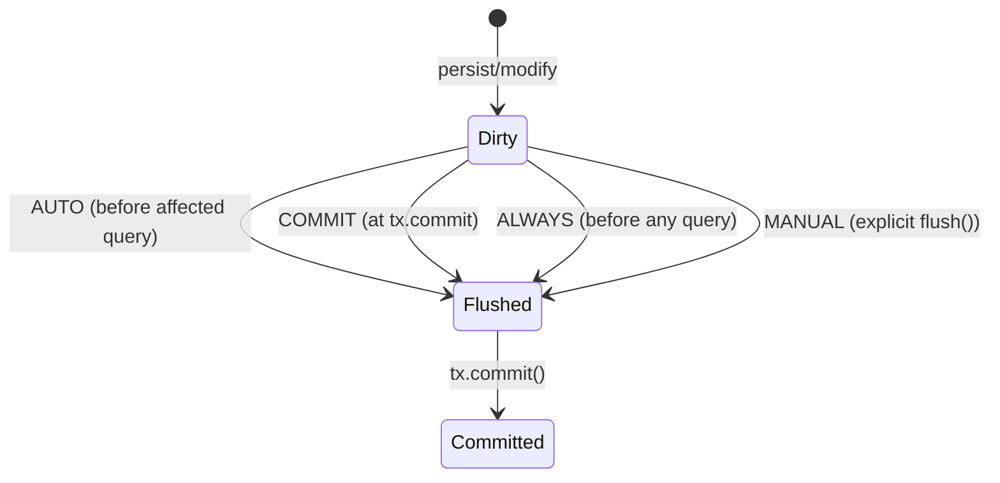

---

### 🛠️ Worked Example

**BAD:**

```java
// COMMIT mode: query misses pending insert
em.setFlushMode(FlushModeType.COMMIT);
Order o = new Order(100);
em.persist(o); // In-memory only
long count = em.createQuery(
    "SELECT count(o) FROM Order o", Long.class)
    .getSingleResult();
// count does NOT include the new Order!
// Because COMMIT mode skips pre-query flush.
```

Why it's wrong: COMMIT mode defers flush until transaction
commit. The query sees stale database state.

**GOOD:**

```java
// AUTO mode (default): consistent reads
// em.setFlushMode(FlushModeType.AUTO); // default
Order o = new Order(100);
em.persist(o);
long count = em.createQuery(
    "SELECT count(o) FROM Order o", Long.class)
    .getSingleResult();
// count INCLUDES the new Order because AUTO
// flushes before querying the Order table.
```

Why it's right: AUTO mode flushes pending Order changes before
an Order query, ensuring consistency.

**Production: MANUAL for read-only optimization:**

```java
// Read-only endpoint: skip all auto-flushing
Session session = em.unwrap(Session.class);
session.setHibernateFlushMode(FlushMode.MANUAL);
// No dirty checking, no SQL until explicit flush
// Useful for read-only operations where you want
// maximum performance.
```

---

### ⚖️ Trade-offs

**Gain:** AUTO ensures query consistency (default, safest).
COMMIT reduces flush frequency (fewer SQL round-trips).
MANUAL gives full control for advanced optimization.

**Cost:** COMMIT risks stale query results. MANUAL risks
data loss if you forget `flush()`. ALWAYS has unnecessary
flush overhead.

| Mode   | Flush timing      | Consistency | Performance     |
| ------ | ----------------- | ----------- | --------------- |
| AUTO   | Before affected Q | High        | Good            |
| COMMIT | At tx.commit only | Risky       | Better          |
| ALWAYS | Before every Q    | Highest     | Worst           |
| MANUAL | Explicit only     | Developer   | Best (if right) |

---

### ⚡ Decision Snap

**USE AUTO WHEN:**

- Default. Most applications should use AUTO and never
  change it. It is correct and fast enough.

**USE COMMIT WHEN:**

- You are certain queries do not depend on pending changes
  AND you want fewer flush operations.

**USE MANUAL WHEN:**

- Read-only operations where you want to eliminate all
  flush overhead.
- Advanced batch processing with explicit flush control.

---

### ⚠️ Top Traps

| #   | Misconception                   | Reality                                                                                                                     |
| --- | ------------------------------- | --------------------------------------------------------------------------------------------------------------------------- |
| 1   | Flush = commit                  | Flush sends SQL to the database but does NOT commit the transaction. Rollback after flush undoes the changes.               |
| 2   | AUTO flushes before every query | AUTO only flushes before queries whose "query spaces" overlap with dirty entity types. Unrelated queries skip flush.        |
| 3   | MANUAL mode is always faster    | MANUAL mode is faster only if you know when to flush. Forgetting to flush means changes are lost at rollback or never sent. |

---

### 🪜 Learning Ladder

**Prerequisites:**

- Dirty Checking and First-Level Cache Internals - flush
  triggers dirty checking
- Entity Lifecycle States - flush transitions pending changes
  to SQL

**THIS:** HIB-052 Flush Modes (AUTO, COMMIT, ALWAYS, MANUAL)

**Next steps:**

- Detached Entity Merge vs Reattach - detachment interacts
  with flush behavior
- Hibernate Query Performance Tuning - flush mode is a
  tuning lever

---

### 💡 The Surprising Truth

Many developers confuse flush with commit. They call
`em.flush()` and assume the data is permanently stored. It is
not. `flush()` sends SQL to the database within the current
transaction. If the transaction rolls back, all flushed changes
are undone. Flush is about visibility to queries, not
durability.

---

### 📇 Revision Card

1. AUTO = flush before affected queries (default, safest).
   COMMIT = flush at commit only. MANUAL = never auto-flush.
2. Flush sends SQL but does NOT commit. Rollback undoes
   flushed changes.
3. AUTO does not flush before EVERY query - only before
   queries touching dirty entity tables.

---

---

# HIB-053 Detached Entity Merge vs Reattach

**TL;DR** - `merge()` copies detached state into a NEW managed instance. `update()` (Hibernate-only) reattaches the SAME instance. JPA standard is `merge()`.

---

### 🔥 The Problem in One Paragraph

A user edits a form. The browser sends a DTO. You convert it
to an entity. But the entity is detached - it was loaded in a
previous Session that is now closed. You need to save the
changes. `merge()` copies the detached state into a new managed
entity and returns it. `update()` (Hibernate-specific,
deprecated in 6.x) reattaches the original instance. The trap:
`merge()` returns a DIFFERENT object. If you continue using the
original detached instance, your changes are lost. This is
exactly why the merge vs reattach distinction matters.

---

### 📘 Textbook Definition

**`merge(entity)`** is a JPA operation that copies the state
of a detached (or new) entity into a managed entity. If an
entity with the same ID exists in the persistence context,
the state is copied into it. If not, a new managed copy is
created. The original instance remains detached.
**`update(entity)`** (Hibernate-specific, deprecated in 6.x)
reattaches the original detached instance to the current
Session, making it managed without copying.

---

### 🧠 Mental Model

> `merge()` is like faxing a document. The original stays on
> your desk (detached). A copy appears in the recipient's
> office (new managed instance). If you edit the original
> after faxing, the changes do not appear in the copy.
> `update()` is like physically mailing the document: the
> original moves to the recipient's office.

- "Fax = copy" -> merge() returns a new managed instance
- "Original stays" -> detached instance unchanged
- "Physical mail" -> update() reattaches the same instance

**Where this analogy breaks down:** `merge()` also handles
new (transient) entities by persisting them. `update()` throws
if the ID already exists in the Session.

---

### ⚙️ How It Works

**merge():**

1. Check if persistence context has a managed entity with
   the same ID. If yes: copy state into it.
2. If no: load from database (or L2 cache). Copy state.
3. Return the managed copy.
4. Original instance remains detached.

**update() [deprecated]:**

1. Reattach the detached instance directly to the Session.
2. The instance itself becomes managed.
3. If Session already has an entity with the same ID:
   throw `NonUniqueObjectException`.

```text
  merge():
  Detached A(1, "old") --> merge(A)
    --> Managed B(1, "old")  // NEW object
    --> A is still detached
    --> Use B going forward

  update() [deprecated]:
  Detached A(1, "old") --> update(A)
    --> A itself is now managed
    --> Same object, same reference
```

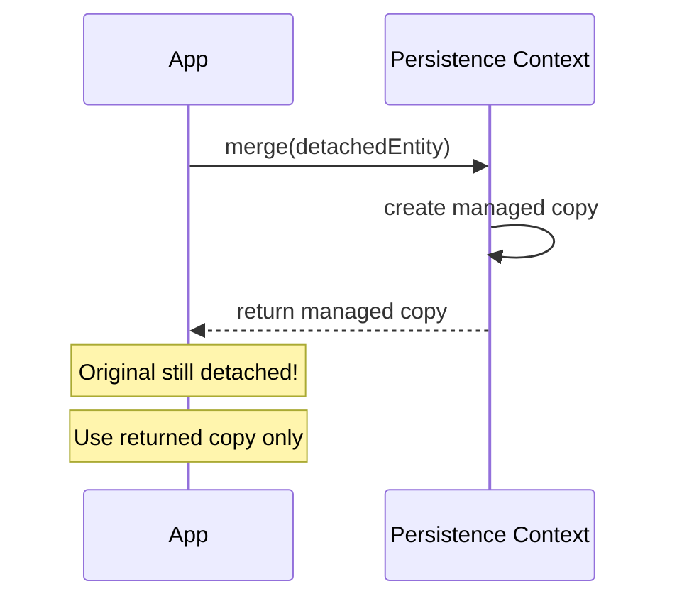

---

### 🛠️ Worked Example

**BAD:**

```java
// Ignoring the merge() return value
User detached = loadFromSession();
// ... session closed ...
detached.setName("Updated");
em.merge(detached);
// Continue using 'detached' instance:
log.info(detached.getName()); // "Updated" but
// detached is NOT managed. Changes to it
// after merge() are NOT tracked.
detached.setAge(31); // This change is LOST!
```

Why it's wrong: `merge()` returns a new managed copy. The
original `detached` instance is still detached.

**GOOD:**

```java
User detached = loadFromSession();
detached.setName("Updated");
User managed = em.merge(detached);
// Use 'managed' from here on:
managed.setAge(31); // This IS tracked
em.flush(); // UPDATE with name + age
```

Why it's right: the returned `managed` instance is tracked by
the persistence context. All subsequent changes are detected.

**Production: merge in a service layer:**

```java
@Transactional
public UserDTO updateUser(UserDTO dto) {
    User managed = em.merge(
        userMapper.toEntity(dto));
    // managed is tracked; flush at commit
    return userMapper.toDTO(managed);
}
```

---

### ⚖️ Trade-offs

**Gain:** `merge()` is JPA standard and handles both new and
detached entities. Works even if the Session already has the
same ID loaded.

**Cost:** Returns a different object (easy to miss); triggers
a SELECT if the entity is not in the persistence context;
creates a snapshot for dirty checking.

| Aspect        | merge()          | update() [deprecated] |
| ------------- | ---------------- | --------------------- |
| Standard      | JPA              | Hibernate-only        |
| Return value  | New managed copy | void (same instance)  |
| Same ID in PC | Works (copies)   | Throws exception      |
| Status in H6  | Active           | Deprecated/removed    |

---

### ⚡ Decision Snap

**USE WHEN:**

- Always use `merge()` for reattaching detached entities.
  It is the JPA standard.
- Converting DTOs to entities in service layer update
  methods.

**AVOID WHEN:**

- Do not use `update()` - it is deprecated in Hibernate 6
  and removed in later versions.

**PREFER FIND + SET WHEN:**

- Load the entity by ID, apply changes to the managed
  instance directly. Avoids merge overhead and SELECT.

---

### ⚠️ Top Traps

| #   | Misconception                                       | Reality                                                                                                              |
| --- | --------------------------------------------------- | -------------------------------------------------------------------------------------------------------------------- |
| 1   | `merge()` makes the passed instance managed         | `merge()` returns a NEW managed instance. The original remains detached.                                             |
| 2   | `merge()` always triggers a SELECT                  | If the entity is already in the persistence context, merge copies state without a SELECT.                            |
| 3   | `update()` is the Hibernate equivalent of `merge()` | `update()` reattaches the same instance. `merge()` copies to a new instance. Different behavior, different pitfalls. |

---

### 🪜 Learning Ladder

**Prerequisites:**

- Entity Lifecycle States - detached state must be
  understood
- EntityManager and Persistence Context - merge operates
  on the persistence context

**THIS:** HIB-053 Detached Entity Merge vs Reattach

**Next steps:**

- Explain Persistence Context at Every Level - comprehensive
  PC understanding
- Optimistic Locking (@Version) - merge + version check
  for concurrent updates

---

### 💡 The Surprising Truth

The safest pattern for updating entities is not `merge()` at
all - it is `find()` + apply changes. Load the managed entity
by ID, set the new values on the managed instance, and let
dirty checking generate the UPDATE. This avoids the merge
SELECT, avoids the "wrong instance" trap, and is idiomatic
JPA.

---

### 📇 Revision Card

1. `merge()` returns a NEW managed copy. Always use the
   returned instance, not the original.
2. `update()` is deprecated in Hibernate 6. Use `merge()`
   or find + set pattern.
3. Safest update pattern: `find(id)` then `setField()` on
   the managed instance. Dirty checking handles the UPDATE.

---

---

# HIB-054 Explain Persistence Context at Every Level

**TL;DR** - The persistence context is an identity map, a write-behind cache, and a unit of work that tracks all managed entities within a Session.

---

### 🔥 The Problem in One Paragraph

Developers use `em.find()`, `em.persist()`, `em.merge()`
without understanding that all three operate on the same
hidden data structure: the persistence context. It is
simultaneously an identity map (same ID = same Java object),
a first-level cache (repeat `find()` returns cached instance),
and a write-behind queue (changes are batched until flush).
Misunderstanding any of these roles causes bugs: duplicate
object exceptions, stale data, unexpected SELECTs, or changes
that silently disappear. This is exactly why a comprehensive
mental model of the persistence context matters.

---

### 📘 Textbook Definition

The **persistence context (PC)** is a set of managed entity
instances in which for any persistent entity identity there is
a unique entity instance. It is associated with a JPA
`EntityManager` (or Hibernate `Session`). The PC serves three
roles: **identity map** (one instance per ID per Session),
**first-level cache** (avoids redundant SELECTs), and
**unit of work** (tracks changes and generates SQL at flush).

---

### 🧠 Mental Model

> The persistence context is a whiteboard in a war room.
> Every entity is a sticky note on the whiteboard, placed by
> ID. If you ask for entity #5, the whiteboard returns the
> existing sticky note (identity map). Changes to sticky notes
> are tracked (dirty checking). At flush time, all changes are
> broadcast as a batch (write-behind). At commit, the
> whiteboard is archived. At clear, all sticky notes are
> removed.

- "Whiteboard" -> persistence context
- "Sticky note by ID" -> identity map
- "Track changes" -> dirty checking
- "Broadcast batch" -> flush (write-behind)

**Where this analogy breaks down:** The whiteboard is
invisible. You never see it directly. You interact with it
only through EntityManager methods.

---

### ⚙️ How It Works

**Level 1 - Identity Map:**

- One Java instance per entity type + ID per Session.
- `find(User, 1L)` twice returns the SAME object (==).
- Prevents two different objects representing the same row.

**Level 2 - First-Level Cache:**

- `find()` checks the PC before hitting the database.
- Cache hit = no SQL.
- Scope: Session (request). Not shared across requests.

**Level 3 - Unit of Work:**

- Tracks new (persisted), modified (dirty), and removed
  entities.
- At flush: generates INSERT, UPDATE, DELETE in the correct
  order.
- At commit: transaction committed. At rollback: changes
  discarded.

```text
  Session opens:  PC = empty
  find(User,1):   PC = {User#1} + SELECT
  find(User,1):   PC = {User#1} (cache hit, no SQL)
  find(User,2):   PC = {User#1, User#2} + SELECT
  user1.setAge(31): PC tracks dirty state
  persist(user3): PC = {User#1, User#2, User#3}
  flush:          -> UPDATE User#1, INSERT User#3
  commit:         -> transaction committed
  close:          PC = empty (all detached)
```

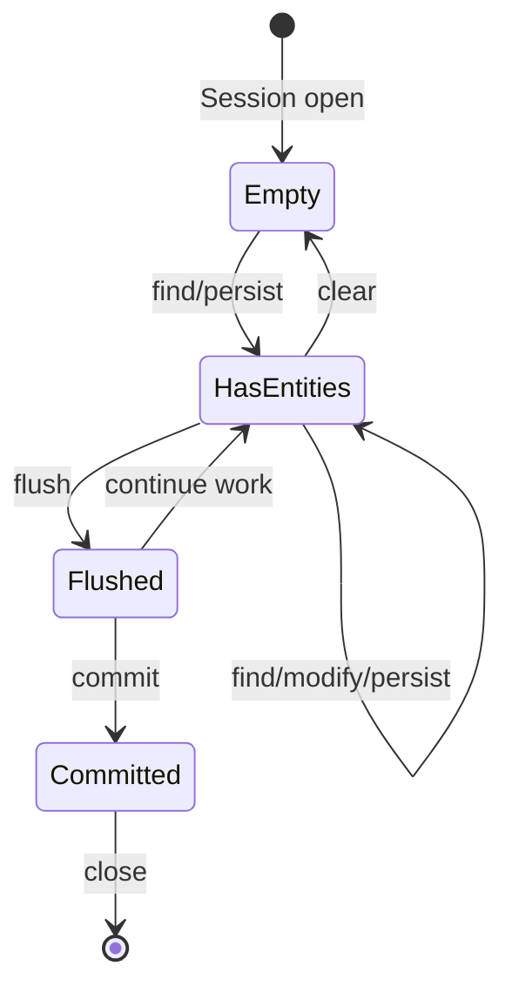

---

### 🛠️ Worked Example

**BAD:**

```java
// Two different objects for the same row
User u1 = em.find(User.class, 1L);
User u2 = new User(); u2.setId(1L);
em.merge(u2);
// u1 and the managed copy from merge are
// DIFFERENT objects. Which one is "real"?
// Confusion and bugs follow.
```

Why it's wrong: creating a new instance with the same ID
and merging it creates confusion about which reference is
managed.

**GOOD:**

```java
// Identity map guarantees: same ID = same object
User u1 = em.find(User.class, 1L);
User u2 = em.find(User.class, 1L);
assert u1 == u2; // true! Same Java object.
u1.setName("Updated");
// u2.getName() == "Updated" (same object)
// At flush: one UPDATE generated.
```

Why it's right: the persistence context identity map
guarantees one instance per ID. All references see the
same state.

**Production: PC lifecycle in Spring:**

```java
@Transactional
public void process(Long id) {
    // PC created at @Transactional start
    User u = userRepo.findById(id).get();
    u.setActive(false);
    // No explicit save needed!
    // Dirty checking at commit generates UPDATE.
}
// PC closed at @Transactional end
```

---

### ⚖️ Trade-offs

**Gain:** Automatic change detection; identity consistency;
repeat-read guarantee within a Session; write batching.

**Cost:** Memory proportional to managed entity count; dirty
checking cost at flush; long-lived Sessions accumulate memory;
detachment rules require understanding.

| Role         | Benefit               | Cost                  |
| ------------ | --------------------- | --------------------- |
| Identity map | One instance per ID   | Must understand scope |
| L1 cache     | No redundant SELECTs  | Memory per entity     |
| Unit of work | Automatic change det. | Flush cost at scale   |

---

### ⚡ Decision Snap

**USE WHEN:**

- Always. The persistence context is inherent to JPA.
  Understanding it is not optional.

**WATCH OUT FOR:**

- Large result sets: clear the PC periodically (`em.clear()`
  or chunk processing).
- Long transactions: PC grows with every loaded entity.
- Detached entities: accessing associations after Session
  close throws `LazyInitializationException`.

**PREFER CLEAR/STATELESS WHEN:**

- Batch processing thousands of entities where PC memory
  becomes a problem.

---

### ⚠️ Top Traps

| #   | Misconception                                                  | Reality                                                                                                                        |
| --- | -------------------------------------------------------------- | ------------------------------------------------------------------------------------------------------------------------------ |
| 1   | `em.persist()` immediately inserts into the database           | `persist()` adds the entity to the PC (managed state). SQL is generated at flush time, not at persist time.                    |
| 2   | Calling `save()` is always necessary after modifying an entity | Managed entities are automatically dirty-checked at flush. No explicit save needed for entities already in the PC.             |
| 3   | The PC is shared across requests                               | The PC is Session-scoped (one per request in typical web apps). Two requests have separate PCs with separate entity instances. |

---

### 🪜 Learning Ladder

**Prerequisites:**

- EntityManager and Persistence Context - foundational
  concept
- Entity Lifecycle States - the PC tracks state transitions

**THIS:** HIB-054 Explain Persistence Context at Every Level

**Next steps:**

- Dirty Checking and First-Level Cache Internals - how the
  PC detects changes
- Flush Modes - when the PC synchronizes with the database
- Second-Level Cache vs Application Cache - L1 vs L2 vs
  application cache

---

### 💡 The Surprising Truth

In Spring Data JPA, `repository.save(entity)` on an existing
entity is redundant. If the entity is managed (loaded within
the same `@Transactional` method), dirty checking automatically
generates the UPDATE at commit. The `save()` call internally
calls `merge()`, which is unnecessary for already-managed
entities and wastes a SELECT.

---

### 📇 Revision Card

1. PC = identity map (one instance per ID) + L1 cache (no
   redundant SELECTs) + unit of work (batched writes).
2. `persist()` does not INSERT immediately. `flush()` does.
   `commit()` makes it durable.
3. Managed entities do not need explicit `save()`. Dirty
   checking handles updates automatically.

---

---

# HIB-055 Optimistic Locking (@Version)

**TL;DR** - `@Version` adds a version column that Hibernate checks on UPDATE; if the version changed since load, it throws `OptimisticLockException`.

---

### 🔥 The Problem in One Paragraph

Two users load the same Order (version 1). User A changes the
status to "shipped" and saves (version becomes 2). User B
changes the total to 500 and saves. Without concurrency
control, User B's save overwrites User A's status change - the
classic "lost update" problem. `@Version` prevents this:
Hibernate adds `WHERE version = 1` to User B's UPDATE. Since
User A already changed version to 2, the WHERE clause matches
zero rows, and Hibernate throws `OptimisticLockException`.
User B must reload and retry. This is exactly why optimistic
locking exists.

---

### 📘 Textbook Definition

**Optimistic locking** is a concurrency control strategy that
allows multiple transactions to read the same data
simultaneously, checking for conflicts only at write time.
JPA implements it via `@Version`: a numeric or timestamp field
that Hibernate includes in the UPDATE's WHERE clause. If the
version in the database differs from the loaded version, the
UPDATE affects zero rows and Hibernate throws
`OptimisticLockException`.

---

### 🧠 Mental Model

> `@Version` is like a "last modified" timestamp on a shared
> Google Doc. When you save, Google checks: "Has anyone else
> saved since you opened it?" If yes: conflict. If no: save
> succeeds. The version number IS that timestamp.

- "Last modified" -> @Version field
- "Check on save" -> WHERE version = ? in UPDATE
- "Conflict" -> OptimisticLockException

**Where this analogy breaks down:** Google Docs resolves
conflicts by merging. Optimistic locking rejects the entire
update. The application must handle retry logic.

---

### ⚙️ How It Works

1. Entity has `@Version private int version;` field.
2. On INSERT, Hibernate sets version = 0 (or 1, configurable).
3. On UPDATE, Hibernate generates:
   `UPDATE order SET total=500, version=2 WHERE id=1 AND version=1`.
4. If matched rows == 1: success, version incremented.
5. If matched rows == 0: another transaction changed the
   version. Hibernate throws `OptimisticLockException`.
6. The application catches the exception and retries or
   reports the conflict.

```text
  User A: load Order(1, v=1)
  User B: load Order(1, v=1)

  User A: UPDATE SET status='shipped', version=2
          WHERE id=1 AND version=1 -> 1 row matched

  User B: UPDATE SET total=500, version=2
          WHERE id=1 AND version=1 -> 0 rows matched!
          -> OptimisticLockException
```

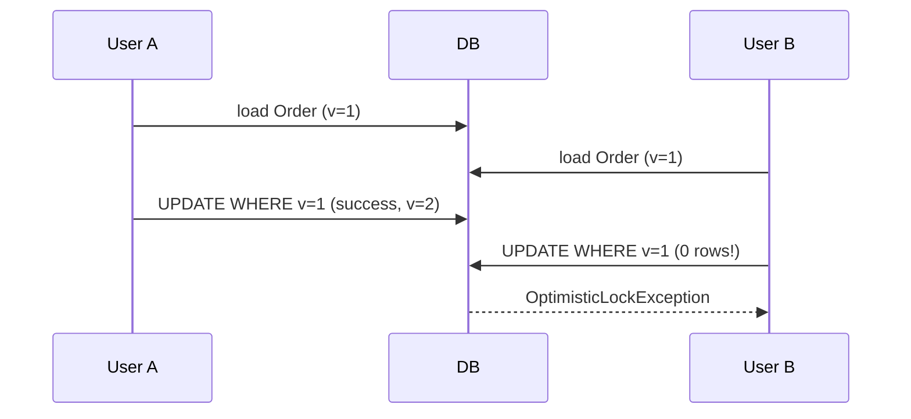

---

### 🛠️ Worked Example

**BAD:**

```java
@Entity
public class Order {
    @Id @GeneratedValue
    private Long id;
    private String status;
    private BigDecimal total;
    // No @Version - lost updates possible!
}
// Two concurrent updates: last write wins
// silently. No conflict detection.
```

Why it's wrong: without `@Version`, the last UPDATE
overwrites all previous changes without detection.

**GOOD:**

```java
@Entity
public class Order {
    @Id @GeneratedValue
    private Long id;
    @Version
    private int version;
    private String status;
    private BigDecimal total;
}
// Hibernate generates:
// UPDATE orders SET status=?, total=?,
//   version=? WHERE id=? AND version=?
// 0 rows matched -> OptimisticLockException
```

Why it's right: concurrent modifications are detected and
rejected. No silent data loss.

**Production: handling the exception:**

```java
@Transactional
public OrderDTO updateOrder(OrderDTO dto) {
    try {
        Order managed = em.merge(
            mapper.toEntity(dto));
        em.flush();
        return mapper.toDTO(managed);
    } catch (OptimisticLockException e) {
        throw new ConflictException(
            "Order was modified by another user. "
            + "Please reload and retry.");
    }
}
```

---

### ⚖️ Trade-offs

**Gain:** No database locks held during read; high throughput
for read-heavy, low-contention workloads; simple annotation.

**Cost:** Application must handle retry logic; high contention
causes frequent exceptions; does not prevent dirty reads (only
lost updates).

| Aspect          | Optimistic (@Version) | Pessimistic (lock) |
| --------------- | --------------------- | ------------------ |
| Lock held       | None                  | DB row lock        |
| Conflict detect | At write time         | At lock time       |
| Throughput      | High (no blocking)    | Lower (blocking)   |
| Contention cost | Exception + retry     | Wait time          |

---

### ⚡ Decision Snap

**USE WHEN:**

- Most web applications: read-heavy, low-to-moderate write
  contention.
- Users editing forms that may overlap (CMS, admin panels,
  CRM).
- APIs with PATCH/PUT endpoints for the same resource.

**AVOID WHEN:**

- Critical financial transactions where you need guaranteed
  serialization (use pessimistic locking).
- Extremely high contention where retry storms would occur.

**PREFER PESSIMISTIC WHEN:**

- Two transactions frequently modify the same row and
  retry cost is unacceptable.

---

### ⚠️ Top Traps

| #   | Misconception                                        | Reality                                                                                                                           |
| --- | ---------------------------------------------------- | --------------------------------------------------------------------------------------------------------------------------------- |
| 1   | @Version prevents all concurrent modification issues | @Version prevents lost updates only. It does not prevent dirty reads or phantom reads (those are transaction isolation concerns). |
| 2   | The version field must be a timestamp                | Integer versions are preferred. Timestamps have precision issues (two updates in the same millisecond).                           |
| 3   | OptimisticLockException is automatically retried     | The application must catch the exception and implement retry logic. Hibernate does not retry automatically.                       |

---

### 🪜 Learning Ladder

**Prerequisites:**

- Entity Lifecycle States - optimistic locking applies to
  managed entities on flush
- Dirty Checking and First-Level Cache Internals - version
  check happens alongside dirty checking

**THIS:** HIB-055 Optimistic Locking (@Version)

**Next steps:**

- Pessimistic Locking (LockModeType) - the alternative
  strategy
- Optimistic vs Pessimistic Locking Decision Guide -
  choosing between them

---

### 💡 The Surprising Truth

The `@Version` annotation has near-zero performance cost. It
adds one integer column and one extra WHERE condition on UPDATE.
The cost of NOT having it (silent lost updates, data corruption,
customer complaints) is orders of magnitude higher. Every
entity that is concurrently modified should have `@Version`.

---

### 📇 Revision Card

1. `@Version` adds `WHERE version=?` to UPDATE. Mismatch
   = `OptimisticLockException`. No database locks held.
2. Use integer version, not timestamp (precision issues).
3. Application must handle retry logic. Hibernate does not
   auto-retry.

---

---

# HIB-056 Pessimistic Locking (LockModeType)

**TL;DR** - Pessimistic locking acquires a database row lock immediately, blocking other transactions until the lock is released at commit.

---

### 🔥 The Problem in One Paragraph

An e-commerce system has 5 remaining units of a product. Two
concurrent requests each read "5 units available" and both
proceed to decrement. Result: quantity goes to 4 instead of 3.
Optimistic locking would detect this only at commit time -
after the customer has already seen a confirmation page. For
inventory, you need to block the second transaction immediately
when it tries to read the quantity. `SELECT ... FOR UPDATE`
acquires a row lock that blocks until the first transaction
commits. This is exactly why pessimistic locking exists.

---

### 📘 Textbook Definition

**Pessimistic locking** acquires a database-level lock on a
row when the entity is loaded. Other transactions attempting
to lock or modify the same row are blocked until the lock is
released (at transaction commit or rollback). JPA exposes this
via `LockModeType.PESSIMISTIC_READ` (shared lock) and
`LockModeType.PESSIMISTIC_WRITE` (exclusive lock, maps to
`SELECT ... FOR UPDATE`).

---

### 🧠 Mental Model

> Pessimistic locking is like reserving a conference room with
> a physical door lock. When you enter (lock), others must wait
> outside until you leave (commit). Optimistic locking is like
> booking by calendar - if someone double-books, the conflict
> is discovered when they arrive.

- "Door lock" -> database row lock
- "Wait outside" -> blocked transaction
- "Leave = unlock" -> commit/rollback

**Where this analogy breaks down:** Database locks have
timeouts. If you hold the lock too long, the database may
terminate your transaction.

---

### ⚙️ How It Works

1. `em.find(Product.class, id, LockModeType
.PESSIMISTIC_WRITE)` generates
   `SELECT ... FROM product WHERE id=? FOR UPDATE`.
2. The database acquires an exclusive row lock.
3. Other transactions trying to lock the same row BLOCK
   until this transaction commits or rolls back.
4. `PESSIMISTIC_READ` acquires a shared lock (concurrent
   reads allowed, writes blocked).
5. Lock scope is the transaction. Lock released at commit
   or rollback.

```text
  TX1: SELECT * FROM product WHERE id=1 FOR UPDATE
       -> row locked by TX1

  TX2: SELECT * FROM product WHERE id=1 FOR UPDATE
       -> BLOCKED (waiting for TX1)

  TX1: UPDATE SET quantity=4; COMMIT;
       -> lock released

  TX2: -> unblocked, reads quantity=4
       -> proceeds with correct data
```

```mermaid
sequenceDiagram
    participant TX1
    participant DB
    participant TX2
    TX1->>DB: SELECT FOR UPDATE (id=1)
    DB-->>TX1: locked, quantity=5
    TX2->>DB: SELECT FOR UPDATE (id=1)
    Note over TX2,DB: BLOCKED
    TX1->>DB: UPDATE quantity=4; COMMIT
    DB-->>TX2: unblocked, quantity=4
    TX2->>DB: UPDATE quantity=3; COMMIT
```

---

### 🛠️ Worked Example

**BAD:**

```java
// No locking: race condition
Product p = em.find(Product.class, id);
if (p.getQuantity() > 0) {
    p.setQuantity(p.getQuantity() - 1);
}
// Two concurrent requests both read quantity=5,
// both decrement to 4 instead of 4 then 3.
```

Why it's wrong: the read-check-write is not atomic. Two
transactions read the same value before either writes.

**GOOD:**

```java
// Pessimistic lock: serialize access
Product p = em.find(Product.class, id,
    LockModeType.PESSIMISTIC_WRITE);
// Row locked. Other transactions block here.
if (p.getQuantity() > 0) {
    p.setQuantity(p.getQuantity() - 1);
}
// Commit releases the lock.
// Next transaction reads the updated quantity.
```

Why it's right: `SELECT ... FOR UPDATE` ensures the read
and write are atomic. No lost updates possible.

**Production: lock with timeout:**

```java
Map<String, Object> hints = new HashMap<>();
hints.put("jakarta.persistence.lock.timeout",
    3000); // 3 seconds
Product p = em.find(Product.class, id,
    LockModeType.PESSIMISTIC_WRITE, hints);
// Throws LockTimeoutException after 3 seconds
// instead of blocking indefinitely.
```

---

### ⚖️ Trade-offs

**Gain:** Prevents lost updates at read time; serializes
access to contested rows; no retry logic needed.

**Cost:** Reduces concurrency (transactions block); deadlock
risk if multiple rows are locked in different orders; database
connection held longer.

| Aspect        | Pessimistic        | Optimistic          |
| ------------- | ------------------ | ------------------- |
| Lock timing   | At read            | At write            |
| Blocking      | Yes (waits)        | No (exception)      |
| Deadlock risk | Yes                | No                  |
| Throughput    | Lower (serialized) | Higher (concurrent) |
| Retry needed  | No (waits)         | Yes (on conflict)   |

---

### ⚡ Decision Snap

**USE WHEN:**

- Inventory/counter decrements where read-check-write must
  be atomic.
- Financial transactions requiring serialized access.
- High-contention rows where optimistic retry storms are
  unacceptable.

**AVOID WHEN:**

- Read-heavy, low-contention workloads (optimistic is
  sufficient and higher throughput).
- Locking many rows (reduces concurrency severely).
- Long transactions (locks held for the entire duration).

**PREFER OPTIMISTIC WHEN:**

- Most web application use cases with moderate contention.

---

### ⚠️ Top Traps

| #   | Misconception                                       | Reality                                                                                                                                 |
| --- | --------------------------------------------------- | --------------------------------------------------------------------------------------------------------------------------------------- |
| 1   | Pessimistic lock prevents all concurrency issues    | It prevents lost updates on the locked row. Deadlocks between transactions locking multiple rows in different order are still possible. |
| 2   | PESSIMISTIC_READ and PESSIMISTIC_WRITE are the same | READ = shared lock (other reads OK). WRITE = exclusive lock (all others blocked). Most use cases need WRITE.                            |
| 3   | Lock timeout is infinite by default                 | Database-dependent. Some databases default to infinite wait; others have configurable defaults. Always set an explicit timeout.         |

---

### 🪜 Learning Ladder

**Prerequisites:**

- Optimistic Locking (@Version) - the alternative strategy
- Entity Lifecycle States - locking applies to managed
  entities

**THIS:** HIB-056 Pessimistic Locking (LockModeType)

**Next steps:**

- Optimistic vs Pessimistic Locking Decision Guide -
  framework for choosing
- Locking Strategy Exercise - hands-on practice

---

### 💡 The Surprising Truth

The most common pessimistic locking mistake is locking too
broadly. Developers lock an Order entity when they only need
to lock the inventory Product row. Locking the Order blocks
all concurrent order operations. Locking the specific Product
row blocks only inventory updates for that product. Scope
your locks to the smallest unit of contention.

---

### 📇 Revision Card

1. `PESSIMISTIC_WRITE` = `SELECT FOR UPDATE`. Row locked
   until commit/rollback. Other transactions block.
2. Always set a lock timeout to prevent indefinite blocking.
3. Scope locks to the smallest unit of contention, not the
   entire aggregate.

---

---

# HIB-057 Optimistic vs Pessimistic Locking Decision Guide

**TL;DR** - Use optimistic for most web apps (low contention). Use pessimistic for inventory/financial operations (high contention, read-check-write).

---

### 🔥 The Problem in One Paragraph

A developer is building an API that allows concurrent updates
to the same entity. Should they use `@Version` (optimistic) or
`PESSIMISTIC_WRITE` (pessimistic)? The wrong choice means
either unnecessary blocking (pessimistic on a low-contention
CMS) or silent data loss (no locking on inventory). The
decision depends on contention level, cost of retry vs wait,
and whether the read-check-write pattern needs atomicity. This
is exactly why a decision framework matters.

---

### 📘 Textbook Definition

The **optimistic vs pessimistic locking decision guide** is a
framework for choosing concurrency control based on: contention
level (how often do two transactions modify the same row),
failure cost (is a retry acceptable or must operations be
serialized), and atomicity requirements (does the read-check-
write sequence need to be atomic).

---

### 🧠 Mental Model

> Think of a parking lot. **Optimistic** = you drive in
> assuming a spot is open. If someone took it, you circle back
> (retry). Works great at 2 AM (low contention). Terrible at
> rush hour (high contention). **Pessimistic** = you reserve a
> spot before driving in. No circling back, but others must
> wait for your spot.

- "Drive in and hope" -> optimistic (retry on conflict)
- "Reserve first" -> pessimistic (block others)
- "Rush hour" -> high contention (pessimistic wins)
- "2 AM" -> low contention (optimistic wins)

**Where this analogy breaks down:** Optimistic locking does
not "circle back" automatically. The application must
implement retry logic.

---

### ⚙️ How It Works

Decision tree:

1. **Does the operation read then conditionally write?**
   (Inventory check, balance check) -> Pessimistic.
   The read and write must be atomic.
2. **Is contention high?** (Same row modified >10% of
   transactions) -> Pessimistic. Retry storms with
   optimistic are worse than blocking.
3. **Is the cost of conflict high?** (User already saw
   confirmation page) -> Pessimistic. Do not show a
   confirmation then fail.
4. **Otherwise** -> Optimistic. Higher throughput, simpler
   code.

```text
  Decision flow:
  Read-check-write atomic? --yes--> Pessimistic
                           --no---> High contention?
                                    --yes--> Pessimistic
                                    --no---> Optimistic
```

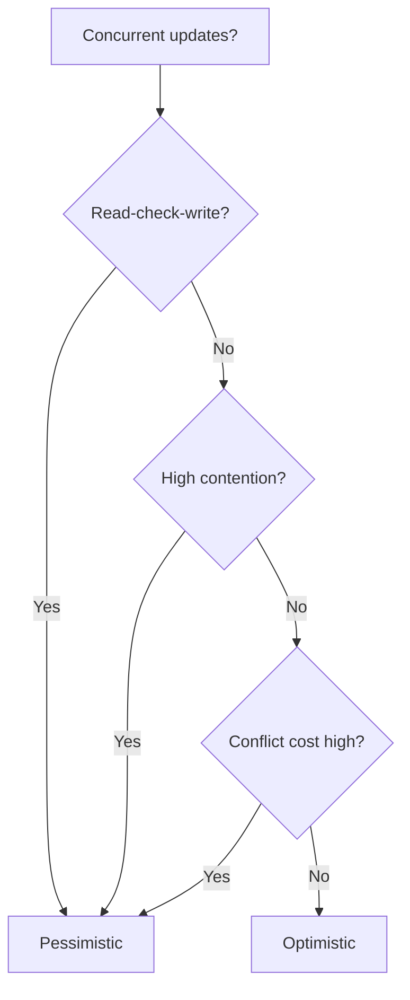

---

### 🛠️ Worked Example

**BAD:**

```java
// Pessimistic lock on a CMS article edit
// Low contention: maybe 1 conflict per 10,000
Article a = em.find(Article.class, id,
    LockModeType.PESSIMISTIC_WRITE);
a.setContent(newContent);
// Every editor blocks every other editor.
// Unnecessary for low-contention CMS.
```

Why it's wrong: pessimistic locking on a low-contention entity
serializes access unnecessarily.

**GOOD:**

```java
// CMS: optimistic locking (low contention)
@Entity
public class Article {
    @Version private int version;
}

// Inventory: pessimistic locking (read-check-write)
@Transactional
public void purchase(Long productId, int qty) {
    Product p = em.find(Product.class, productId,
        LockModeType.PESSIMISTIC_WRITE);
    if (p.getQuantity() < qty)
        throw new OutOfStockException();
    p.setQuantity(p.getQuantity() - qty);
}
```

Why it's right: locking strategy matches the contention
profile. CMS gets throughput. Inventory gets correctness.

**Production: combined strategy:**

```java
// Both on the same entity: @Version for general
// updates + pessimistic for critical operations
@Entity
public class Product {
    @Version private int version;
    private int quantity;
}
// General update: optimistic (version check)
// Inventory decrement: pessimistic (FOR UPDATE)
```

---

### ⚖️ Trade-offs

**Gain:** Correct locking strategy prevents both unnecessary
blocking and silent data loss. Matching strategy to contention
profile optimizes throughput AND correctness.

**Cost:** Requires analysis of contention patterns; some
entities need both strategies for different operations.

| Scenario            | Strategy    | Reason            |
| ------------------- | ----------- | ----------------- |
| CMS article edit    | Optimistic  | Low contention    |
| Inventory decrement | Pessimistic | Read-check-write  |
| User profile update | Optimistic  | Low contention    |
| Bank transfer       | Pessimistic | High correctness  |
| Config setting      | Optimistic  | Rarely concurrent |

---

### ⚡ Decision Snap

**USE WHEN:**

- Designing any entity that is concurrently modified.
- Reviewing existing code for concurrency correctness.
- Choosing between `@Version` and `LockModeType` for a
  new feature.

**AVOID WHEN:**

- The entity is never concurrently modified (no locking
  needed).
- The operation is read-only (no update, no conflict).

**PREFER BOTH WHEN:**

- An entity has both low-contention updates (optimistic)
  and high-contention operations (pessimistic) on different
  fields or use cases.

---

### ⚠️ Top Traps

| #   | Misconception                                                 | Reality                                                                                                                    |
| --- | ------------------------------------------------------------- | -------------------------------------------------------------------------------------------------------------------------- |
| 1   | You must choose one strategy per entity                       | An entity can have @Version (optimistic for general updates) AND use pessimistic locking for specific critical operations. |
| 2   | Optimistic locking is always better because it does not block | Under high contention, optimistic causes retry storms. Pessimistic is more efficient when contention exceeds ~10%.         |
| 3   | Pessimistic locking prevents deadlocks                        | Pessimistic locking can CAUSE deadlocks when two transactions lock multiple rows in different orders.                      |

---

### 🪜 Learning Ladder

**Prerequisites:**

- Optimistic Locking (@Version) - one option
- Pessimistic Locking (LockModeType) - the other option

**THIS:** HIB-057 Optimistic vs Pessimistic Locking Decision
Guide

**Next steps:**

- Missing @Version on Concurrent Entities Anti-Pattern -
  what happens when you use neither
- Locking Strategy Exercise - hands-on practice with both

---

### 💡 The Surprising Truth

The correct answer is often "both." A Product entity can use
`@Version` for general attribute updates (name, description,
price) and `PESSIMISTIC_WRITE` specifically for inventory
decrements. The two strategies are not mutually exclusive -
they address different operations on the same entity.

---

### 📇 Revision Card

1. Optimistic for low contention (CMS, profiles). Pessimistic
   for read-check-write (inventory, balances).
2. Both can coexist on the same entity for different
   operations.
3. If contention > ~10%: pessimistic wins. Below: optimistic
   wins.

---

---

# HIB-058 Missing @Version on Concurrent Entities Anti-Pattern

**TL;DR** - Entities without `@Version` that are concurrently modified suffer silent "last write wins" data corruption.

---

### 🔥 The Problem in One Paragraph

Two support agents open the same ticket simultaneously. Agent A
changes the priority to "high." Agent B changes the assignee to
"Carol." Agent A saves. Agent B saves. Agent B's UPDATE
overwrites Agent A's priority change because the UPDATE sets
ALL columns. No error. No warning. No conflict detection. The
priority silently reverts. This is the "last write wins"
problem, and it happens on every entity without `@Version` that
is concurrently modified. This is exactly why missing `@Version`
is an anti-pattern.

---

### 📘 Textbook Definition

The **missing @Version anti-pattern** occurs when entities
that are concurrently modified by multiple users or threads do
not have a `@Version` field. Without version checking,
Hibernate's UPDATE overwrites all columns with the last
transaction's values, silently discarding changes from other
transactions. This is "last write wins" behavior.

---

### 🧠 Mental Model

> Missing @Version is like editing a shared document without
> track changes. Two people edit. The last person to save
> overwrites the first person's changes. Neither knows it
> happened. @Version is "track changes" - it detects the
> conflict.

- "No track changes" -> no @Version
- "Last save wins" -> last UPDATE overwrites
- "Neither knows" -> silent data loss

**Where this analogy breaks down:** Document editing tools
often auto-merge. Hibernate does not merge - it either
succeeds or fails with `OptimisticLockException`.

---

### ⚙️ How It Works

1. Entity has no `@Version` field.
2. User A loads entity (priority=low, assignee=Bob).
3. User B loads entity (priority=low, assignee=Bob).
4. User A sets priority=high, saves.
   `UPDATE SET priority='high', assignee='Bob' WHERE id=1`.
5. User B sets assignee=Carol, saves.
   `UPDATE SET priority='low', assignee='Carol' WHERE id=1`.
6. User B's UPDATE overwrites priority back to 'low'.
7. No error. No exception. Silent data corruption.

```text
  Without @Version:
  A loads: (low, Bob)     B loads: (low, Bob)
  A saves: (high, Bob)    -> OK
  B saves: (low, Carol)   -> OK (overwrites A!)
  DB:      (low, Carol)   <- A's change LOST

  With @Version:
  A loads: (low, Bob, v=1)  B loads: (low, Bob, v=1)
  A saves: WHERE v=1 -> OK (v=2)
  B saves: WHERE v=1 -> 0 rows -> Exception!
```

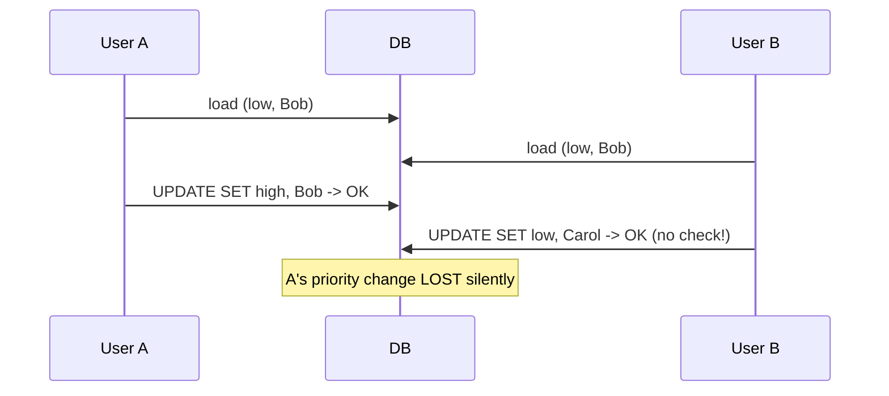

---

### 🛠️ Worked Example

**BAD:**

```java
@Entity
public class Ticket {
    @Id @GeneratedValue
    private Long id;
    private String priority;
    private String assignee;
    // No @Version. Last write wins silently.
}
```

Why it's wrong: concurrent updates overwrite each other
without detection.

**GOOD:**

```java
@Entity
public class Ticket {
    @Id @GeneratedValue
    private Long id;
    @Version
    private int version;
    private String priority;
    private String assignee;
}
// User B's save:
// UPDATE SET priority='low', assignee='Carol',
//   version=2 WHERE id=1 AND version=1
// -> 0 rows (A already set version=2)
// -> OptimisticLockException thrown
```

Why it's right: concurrent modification detected. User B must
reload and re-apply changes.

**Production: audit trail of conflicts:**

```java
try {
    em.merge(ticket);
    em.flush();
} catch (OptimisticLockException e) {
    log.warn("Concurrent edit on ticket {}",
        ticket.getId());
    throw new ConflictException(
        "Ticket modified. Please reload.");
}
```

---

### ⚖️ Trade-offs

**Gain:** Adding `@Version` prevents silent data loss with
zero runtime cost (one extra int column, one WHERE condition).

**Cost:** Application must handle `OptimisticLockException`
(retry or conflict notification). Users may need to re-enter
changes.

| Aspect             | Without @Version  | With @Version         |
| ------------------ | ----------------- | --------------------- |
| Conflict detection | None              | Automatic             |
| Data integrity     | Silent corruption | Protected             |
| Runtime cost       | None              | Negligible (+1 col)   |
| User experience    | Silently wrong    | Conflict notification |

---

### ⚡ Decision Snap

**USE WHEN:**

- Every entity that is modified by more than one user or
  thread should have `@Version`.
- This is a non-negotiable coding standard, not an
  optimization.

**AVOID WHEN:**

- Truly read-only entities (reference data, config).
- Entities modified by a single thread only (batch jobs).

**PREFER CODE REVIEW ENFORCEMENT WHEN:**

- Add a code review checklist item: "Does every mutable
  entity have `@Version`?"

---

### ⚠️ Top Traps

| #   | Misconception                              | Reality                                                                                                                             |
| --- | ------------------------------------------ | ----------------------------------------------------------------------------------------------------------------------------------- |
| 1   | Lost updates are rare in practice          | Any entity editable by two users can suffer lost updates. Support tickets, orders, user profiles - it happens constantly.           |
| 2   | Database transactions prevent lost updates | Default READ_COMMITTED isolation allows both transactions to read the same value. Transactions do not prevent last-write-wins.      |
| 3   | @DynamicUpdate prevents lost updates       | @DynamicUpdate only updates changed columns from ONE transaction's perspective. It does not detect changes from OTHER transactions. |

---

### 🪜 Learning Ladder

**Prerequisites:**

- Optimistic Locking (@Version) - the fix for this
  anti-pattern
- Dirty Checking and First-Level Cache Internals - UPDATE
  generation mechanics

**THIS:** HIB-058 Missing @Version on Concurrent Entities
Anti-Pattern

**Next steps:**

- Optimistic vs Pessimistic Locking Decision Guide - when
  @Version is not enough
- Locking Strategy Exercise - practice detecting and fixing
  this pattern

---

### 💡 The Surprising Truth

Silent lost updates are one of the most common data integrity
bugs in production systems. They are rarely reported because
users do not realize their changes were overwritten. The bug
manifests as "I updated the ticket but it went back to the old
value" - a support ticket about a ghost problem that no one
can reproduce because it depends on concurrent timing.

---

### 📇 Revision Card

1. No `@Version` on a concurrently modified entity =
   silent "last write wins" data corruption.
2. `@Version` costs one integer column and zero runtime
   overhead. There is no reason to skip it.
3. Coding standard: every mutable entity gets `@Version`.
   Enforce in code review.

---

---

# HIB-059 hibernate.hbm2ddl.auto and Schema Generation

**TL;DR** - `hbm2ddl.auto` controls whether Hibernate creates, updates, or validates the database schema at startup. Never use `create` or `update` in production.

---

### 🔥 The Problem in One Paragraph

A developer uses `hbm2ddl.auto=update` during development.
Hibernate auto-adds columns when entity fields change. Great
for rapid iteration. The same setting leaks to production.
Hibernate attempts ALTER TABLE on a 200-million-row table at
application startup. The ALTER locks the table for minutes.
The application hangs. All requests timeout. The deployment is
rolled back. Alternatively, `hbm2ddl.auto=create` drops and
recreates all tables, destroying production data. This is
exactly why schema generation must be disabled in production.

---

### 📘 Textbook Definition

**`hibernate.hbm2ddl.auto`** (JPA:
`jakarta.persistence.schema-generation.database.action`)
controls automatic schema management at `SessionFactory`
startup. Values: **`none`** (do nothing), **`validate`**
(verify schema matches entities), **`update`** (add missing
columns/tables), **`create`** (drop + create), **`create-drop`**
(create on start, drop on close).

---

### 🧠 Mental Model

> `hbm2ddl.auto` is like an auto-pilot for your database
> schema. **create** = tear down and rebuild the runway every
> flight (destroys everything). **update** = extend the runway
> while planes are landing (risky). **validate** = check the
> runway before takeoff (safe). **none** = you manage the
> runway yourself (production standard).

- "Tear down runway" -> create (drops tables)
- "Extend while landing" -> update (ALTER TABLE)
- "Pre-flight check" -> validate (read-only check)
- "You manage" -> none + migration tool

**Where this analogy breaks down:** `update` cannot remove
columns, rename columns, or handle complex migrations. It only
adds. The runway analogy undersells how limited `update` is.

---

### ⚙️ How It Works

| Value       | Behavior at startup                          | Safe for prod? |
| ----------- | -------------------------------------------- | -------------- |
| none        | Do nothing                                   | Yes            |
| validate    | Compare schema vs entities; fail if mismatch | Yes            |
| update      | ALTER TABLE to add missing cols/tables       | No             |
| create      | DROP ALL then CREATE                         | No             |
| create-drop | CREATE on start, DROP on close               | No             |

```text
  Development flow:
  hbm2ddl.auto=update -> quick iteration

  Test flow:
  hbm2ddl.auto=create-drop -> clean DB per test

  Production flow:
  hbm2ddl.auto=validate -> fail-fast on mismatch
  Schema changes via: Flyway or Liquibase
```

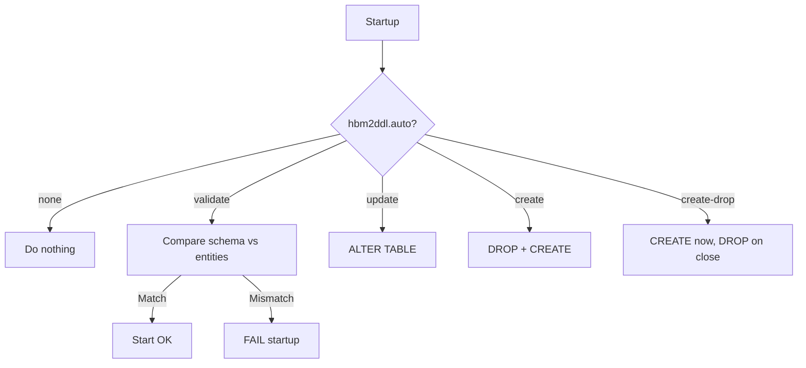

---

### 🛠️ Worked Example

**BAD:**

```java
// production application.properties
spring.jpa.hibernate.ddl-auto=update
// Hibernate attempts ALTER TABLE on a 200M-row
// table at startup. Table locked for minutes.
// Application startup blocked. Requests timeout.
```

Why it's wrong: `update` in production causes unpredictable
ALTER TABLE operations that can lock large tables.

**GOOD:**

```java
// production application.properties
spring.jpa.hibernate.ddl-auto=validate
// Hibernate checks schema matches entities.
// If mismatch: startup fails immediately.
// No DDL executed. Safe.

// Schema changes managed by:
// src/main/resources/db/migration/V1__init.sql
// src/main/resources/db/migration/V2__add_col.sql
// (Flyway or Liquibase)
```

Why it's right: `validate` fails fast on schema mismatch.
Schema changes are managed by a versioned migration tool.

**Production: per-environment configuration:**

```properties
# application-dev.properties
spring.jpa.hibernate.ddl-auto=update

# application-test.properties
spring.jpa.hibernate.ddl-auto=create-drop

# application-prod.properties
spring.jpa.hibernate.ddl-auto=validate
```

---

### ⚖️ Trade-offs

**Gain:** `update` enables rapid development iteration.
`validate` provides fail-fast schema verification. `none` is
the safest for production.

**Cost:** `update` cannot handle renames, drops, or data
migrations. `create` destroys data. `validate` requires
separate migration management.

| Environment | Recommended   | Reason              |
| ----------- | ------------- | ------------------- |
| Development | update        | Quick iteration     |
| Test/CI     | create-drop   | Clean state per run |
| Staging     | validate      | Match production    |
| Production  | validate/none | Safety first        |

---

### ⚡ Decision Snap

**USE WHEN:**

- `validate` or `none` in production. Always.
- `update` only in local development with throwaway data.
- `create-drop` in integration tests for clean state.

**AVOID WHEN:**

- Never use `create` or `update` in production.
- Never use `create-drop` outside of tests.

**PREFER FLYWAY/LIQUIBASE WHEN:**

- Always in production. Schema changes must be versioned,
  reviewed, and reversible. Hibernate DDL generation is not
  a migration tool.

---

### ⚠️ Top Traps

| #   | Misconception                         | Reality                                                                                                                      |
| --- | ------------------------------------- | ---------------------------------------------------------------------------------------------------------------------------- |
| 1   | `update` is safe because it only adds | `update` adds columns as nullable, cannot remove columns, cannot rename columns, and may lock large tables during ALTER.     |
| 2   | `validate` modifies the schema        | `validate` is read-only. It compares and fails on mismatch. Zero DDL executed.                                               |
| 3   | hbm2ddl.auto is a migration tool      | It is a convenience for development. Production migrations require Flyway or Liquibase for versioning, rollback, and review. |

---

### 🪜 Learning Ladder

**Prerequisites:**

- Entity and @Entity Annotation - entities define the schema
  that hbm2ddl manages
- Basic Column Mappings - column definitions drive DDL
  generation

**THIS:** HIB-059 hibernate.hbm2ddl.auto and Schema Generation

**Next steps:**

- JPA vs Hibernate-Proprietary Annotations - hbm2ddl is
  Hibernate-specific
- Hibernate 5 to 6 Migration Essentials - schema generation
  behavior changes between versions

---

### 💡 The Surprising Truth

`hbm2ddl.auto=update` never removes anything. If you rename
a field from `email` to `emailAddress`, Hibernate adds a NEW
`email_address` column and leaves the OLD `email` column in
place. After months of renames and refactors, the schema
accumulates ghost columns that no entity maps to. This is
why `update` is unsuitable for anything beyond throwaway
development databases.

---

### 📇 Revision Card

1. Production: `validate` or `none`. Development: `update`.
   Tests: `create-drop`. Never `create` in production.
2. `update` only adds. It cannot rename, remove, or migrate
   data. It is not a migration tool.
3. Use Flyway or Liquibase for production schema management.
   Version, review, and test every migration.

---

---

# HIB-060 JPA vs Hibernate-Proprietary Annotations

**TL;DR** - Use JPA standard annotations for portability. Use Hibernate-specific annotations only when JPA lacks the feature.

---

### 🔥 The Problem in One Paragraph

A codebase imports `org.hibernate.annotations.Entity` instead
of `jakarta.persistence.Entity`. It uses `@Cascade` instead of
`cascade` on the JPA annotation. It uses `@Type` for custom
type mappings. The code is now coupled to Hibernate as a
provider. Switching to EclipseLink (or even upgrading Hibernate
major versions) requires rewriting annotations throughout. The
rule is simple: prefer `jakarta.persistence.*` for everything
JPA defines. Use `org.hibernate.annotations.*` only for
features JPA lacks (e.g., `@BatchSize`, `@Formula`,
`@DynamicUpdate`). This is exactly why the distinction matters.

---

### 📘 Textbook Definition

**JPA annotations** (`jakarta.persistence.*`) are defined by
the Jakarta Persistence specification and are portable across
JPA providers (Hibernate, EclipseLink, OpenJPA). **Hibernate-
proprietary annotations** (`org.hibernate.annotations.*`) are
extensions specific to Hibernate that provide features beyond
the JPA specification. Using proprietary annotations couples
the code to Hibernate.

---

### 🧠 Mental Model

> JPA annotations are like USB cables: they work with any
> device (provider). Hibernate annotations are proprietary
> charger cables: they work great with their device but are
> incompatible with others.

- "USB" -> JPA standard (portable)
- "Proprietary charger" -> Hibernate-specific (locked in)
- "Any device" -> any JPA provider

**Where this analogy breaks down:** In practice, most Java
projects use Hibernate exclusively and never switch providers.
The portability benefit is more about upgrade safety than
provider switching.

---

### ⚙️ How It Works

**JPA standard annotations (always prefer):**
`@Entity`, `@Table`, `@Column`, `@Id`,
`@GeneratedValue`, `@ManyToOne`, `@OneToMany`,
`@NamedQuery`, `@Cacheable`, `@Version`

**Hibernate-specific (use when JPA lacks the feature):**
`@BatchSize`, `@Formula`, `@DynamicUpdate`,
`@DynamicInsert`, `@Where`, `@Filter`,
`@NaturalId`, `@Immutable`, `@SQLDelete`

**Avoid (Hibernate duplicates of JPA features):**
`org.hibernate.annotations.Entity` (use `jakarta.persistence.Entity`),
`@Cascade` (use JPA `cascade` attribute),
`@Type` (use JPA `@Convert` or `AttributeConverter`)

```text
  JPA standard         Hibernate-only
  @Entity              @BatchSize
  @Table               @Formula
  @Column              @DynamicUpdate
  @ManyToOne           @NaturalId
  @Cacheable           @Immutable
  @Version             @Filter

  Avoid: org.hibernate versions of JPA annotations
```

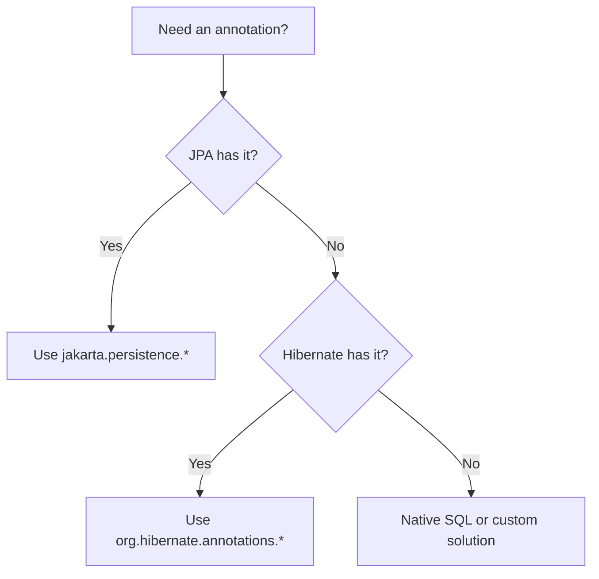

---

### 🛠️ Worked Example

**BAD:**

```java
import org.hibernate.annotations.Entity;
import org.hibernate.annotations.Cascade;
import org.hibernate.annotations.CascadeType;

@Entity // Wrong import!
public class Order {
    @Cascade(CascadeType.ALL) // Hibernate-specific
    @OneToMany
    private List<Item> items;
}
```

Why it's wrong: uses Hibernate-specific imports where JPA
standard equivalents exist.

**GOOD:**

```java
import jakarta.persistence.Entity;
import jakarta.persistence.CascadeType;

@Entity // JPA standard
public class Order {
    @OneToMany(cascade = CascadeType.ALL) // JPA
    private List<Item> items;

    @BatchSize(size = 16) // Hibernate-specific
    // No JPA equivalent for batch fetching
    private List<LineItem> lineItems;
}
```

Why it's right: JPA annotations for all standard features;
Hibernate annotation only for `@BatchSize` which has no JPA
equivalent.

**Production: import audit:**

```bash
# Find Hibernate-specific imports that have JPA equivalents
grep -rn "org.hibernate.annotations.Entity" src/
grep -rn "org.hibernate.annotations.Cascade" src/
# Replace with jakarta.persistence equivalents
```

---

### ⚖️ Trade-offs

**Gain:** JPA annotations ensure portability, easier Hibernate
major version upgrades, and clearer separation of standard vs
extension features.

**Cost:** Some Hibernate features have no JPA equivalent
(must use proprietary). Strict JPA compliance may miss useful
Hibernate optimizations.

| Annotation type | Portability | Feature coverage |
| --------------- | ----------- | ---------------- |
| JPA only        | Full        | 80% of needs     |
| JPA + Hibernate | Partial     | 99% of needs     |
| Hibernate only  | None        | 100%             |

---

### ⚡ Decision Snap

**USE WHEN:**

- Starting a new entity class: default to JPA annotations.
- Reviewing existing code: flag Hibernate imports that have
  JPA equivalents.
- Preparing for Hibernate version upgrades: proprietary
  annotations are more likely to change.

**AVOID WHEN:**

- Do not use JPA-only if you genuinely need `@BatchSize`,
  `@Formula`, or `@DynamicUpdate`. Those have no JPA
  equivalent.

**PREFER JPA STANDARD WHEN:**

- Always, unless the JPA annotation cannot express the
  needed behavior.

---

### ⚠️ Top Traps

| #   | Misconception                                       | Reality                                                                                                                                           |
| --- | --------------------------------------------------- | ------------------------------------------------------------------------------------------------------------------------------------------------- |
| 1   | JPA and Hibernate annotations are interchangeable   | Some Hibernate annotations DUPLICATE JPA features (e.g., `@Cascade` vs JPA `cascade`). Using the Hibernate version adds coupling for no benefit.  |
| 2   | Hibernate-specific annotations break JPA compliance | Hibernate-specific annotations are additive. JPA providers ignore unknown annotations. But your code only works with Hibernate.                   |
| 3   | Provider portability does not matter                | Even if you never switch providers, Hibernate major version upgrades can change proprietary annotation behavior. JPA annotations are more stable. |

---

### 🪜 Learning Ladder

**Prerequisites:**

- Entity and @Entity Annotation - the most fundamental
  annotation choice
- Basic Column Mappings - JPA vs Hibernate column options

**THIS:** HIB-060 JPA vs Hibernate-Proprietary Annotations

**Next steps:**

- Hibernate 5 to 6 Migration Essentials - proprietary
  annotation changes between versions
- JPA Specification Compliance and Portability - deeper
  portability analysis

---

### 💡 The Surprising Truth

`org.hibernate.annotations.Entity` was deprecated in
Hibernate 6 and removed. Codebases that imported it instead of
`jakarta.persistence.Entity` had to update every entity class
during migration. Codebases that used the JPA standard import
from the beginning required zero changes.

---

### 📇 Revision Card

1. Default to `jakarta.persistence.*` for all standard
   features. Use `org.hibernate.annotations.*` only for
   features JPA lacks.
2. Hibernate-only worth using: `@BatchSize`, `@Formula`,
   `@DynamicUpdate`, `@NaturalId`, `@Immutable`, `@Filter`.
3. Avoid: `org.hibernate.annotations.Entity`,
   `@Cascade` - use their JPA equivalents.

---

---

# HIB-061 Hibernate 5 to 6 Migration Essentials

**TL;DR** - Hibernate 6 changes the package namespace (javax to jakarta), ID generation defaults, and query semantics. Plan migrations carefully.

---

### 🔥 The Problem in One Paragraph

You upgrade from Spring Boot 2 (Hibernate 5) to Spring Boot 3
(Hibernate 6). The application fails to compile: every
`javax.persistence` import is now `jakarta.persistence`. After
fixing imports, queries behave differently: `GenerationType.
AUTO` now defaults to SEQUENCE instead of IDENTITY on some
databases. Integer division in HQL changed from truncating to
real division. Named parameter handling changed. What was a
dependency version bump becomes a multi-day migration. This is
exactly why migration essentials must be understood upfront.

---

### 📘 Textbook Definition

**Hibernate 5 to 6 migration** involves three categories of
breaking changes: (1) namespace change from `javax.persistence`
to `jakarta.persistence` (Jakarta EE 9+), (2) behavioral
changes in ID generation, query semantics, and type system,
and (3) removed APIs (Session.load(), Session.update(),
Criteria API changes).

---

### 🧠 Mental Model

> Migrating Hibernate 5 to 6 is like moving to a new house.
> The address changed (javax to jakarta). Some furniture does
> not fit (removed APIs). Some rooms have different layouts
> (behavioral changes). You need a moving checklist, not
> trial-and-error.

- "New address" -> javax -> jakarta namespace
- "Furniture does not fit" -> removed APIs
- "Room layout changes" -> behavioral differences

**Where this analogy breaks down:** Unlike a house move,
Hibernate migration can be partially automated. Tools like
OpenRewrite can handle the namespace change automatically.

---

### ⚙️ How It Works

**Phase 1: Namespace (javax -> jakarta):**

- Replace all `javax.persistence.*` with
  `jakarta.persistence.*`.
- Replace all `javax.validation.*` with
  `jakarta.validation.*`.
- Tools: OpenRewrite, IntelliJ migration assistant.

**Phase 2: ID generation:**

- `GenerationType.AUTO` in H5 = IDENTITY on MySQL.
  In H6 = SEQUENCE (with sequence emulation if needed).
- Existing data with IDENTITY sequences may conflict.
- Fix: explicitly set `GenerationType.IDENTITY` if that
  is what you need.

**Phase 3: Query changes:**

- Integer division: `5/2` was `2` in H5, is `2.5` in H6.
- Implicit joins in multi-valued paths changed behavior.
- Some HQL functions renamed or removed.

```text
  H5 -> H6 Migration Checklist:
  1. javax.* -> jakarta.* (automated)
  2. GenerationType.AUTO -> explicit SEQUENCE/IDENTITY
  3. Integer division semantics in HQL
  4. Removed: Session.load(), Session.update()
  5. Type system: BasicType -> JdbcType changes
  6. Criteria API: minor incompatibilities
```

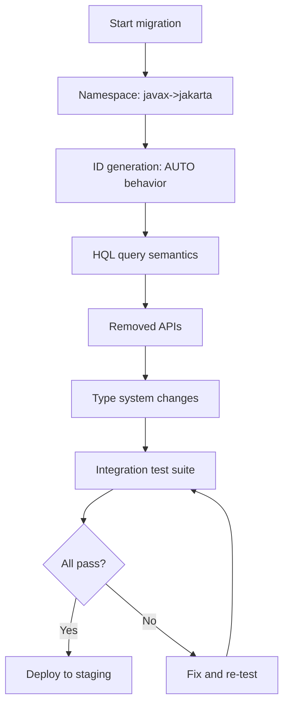

---

### 🛠️ Worked Example

**BAD:**

```java
// Blindly upgrading without fixing:
import javax.persistence.Entity; // Compile error!
@GeneratedValue(strategy = GenerationType.AUTO)
// Behavior changed: was IDENTITY, now SEQUENCE
// New sequences created, conflicting with
// existing IDENTITY-generated IDs.
```

Why it's wrong: namespace fails at compile time; generation
strategy change causes runtime ID conflicts.

**GOOD:**

```java
import jakarta.persistence.Entity;
import jakarta.persistence.GeneratedValue;
import jakarta.persistence.GenerationType;

@Entity
public class Order {
    @Id
    @GeneratedValue(strategy =
        GenerationType.IDENTITY) // Explicit!
    private Long id;
}
// Explicit strategy: no behavior change on upgrade.
// Namespace: jakarta (H6 compatible).
```

Why it's right: explicit generation strategy is unaffected by
the AUTO behavior change; jakarta namespace is correct.

**Production: automated namespace migration:**

```xml
<!-- OpenRewrite in pom.xml -->
<plugin>
  <groupId>org.openrewrite.maven</groupId>
  <artifactId>rewrite-maven-plugin</artifactId>
  <configuration>
    <activeRecipes>
      <recipe>org.openrewrite.java.migrate
        .jakarta.JavaxMigrationToJakarta</recipe>
    </activeRecipes>
  </configuration>
</plugin>
<!-- mvn rewrite:run -> automated replacement -->
```

---

### ⚖️ Trade-offs

**Gain:** Hibernate 6 brings performance improvements, better
type safety, modernized query parser, and Jakarta EE alignment.

**Cost:** Migration effort (namespace, behavioral changes,
removed APIs); testing overhead; potential ID generation
conflicts.

| Change category   | Effort  | Automation available |
| ----------------- | ------- | -------------------- |
| Namespace (javax) | Low     | OpenRewrite          |
| ID generation     | Medium  | Manual review        |
| HQL semantics     | Medium  | Integration tests    |
| Removed APIs      | Low-Med | Compiler errors      |

---

### ⚡ Decision Snap

**USE WHEN:**

- Planning a Spring Boot 2 to 3 upgrade (which forces
  Hibernate 5 to 6).
- Starting a new project (use Hibernate 6 / Jakarta EE).
- Evaluating the effort for a migration project.

**AVOID WHEN:**

- Do not migrate mid-sprint. Plan it as a dedicated
  migration sprint with full regression testing.

**PREFER INCREMENTAL MIGRATION WHEN:**

- Fix namespace first (automated), then generation
  strategy, then HQL changes. Test at each step.

---

### ⚠️ Top Traps

| #   | Misconception                                            | Reality                                                                                                                             |
| --- | -------------------------------------------------------- | ----------------------------------------------------------------------------------------------------------------------------------- |
| 1   | The migration is just a find-replace of javax to jakarta | Namespace is the easy part. Behavioral changes in ID generation, HQL semantics, and removed APIs require manual review.             |
| 2   | GenerationType.AUTO is the same in H5 and H6             | AUTO mapped to IDENTITY (MySQL) in H5. In H6, AUTO maps to SEQUENCE (with emulation). Existing IDENTITY tables may conflict.        |
| 3   | Integration tests cover all changes                      | HQL semantic changes (integer division, implicit joins) may produce different results without runtime errors. Verify query outputs. |

---

### 🪜 Learning Ladder

**Prerequisites:**

- JPA vs Hibernate-Proprietary Annotations - understanding
  which annotations are affected
- hibernate.hbm2ddl.auto and Schema Generation - generation
  strategy interacts with schema management

**THIS:** HIB-061 Hibernate 5 to 6 Migration Essentials

**Next steps:**

- JPA Specification Compliance and Portability - why
  standard annotations minimize migration pain
- Monitoring Hibernate in Production - verify behavior
  after migration

---

### 💡 The Surprising Truth

The most dangerous Hibernate 6 migration change is not the
namespace rename (which is obvious and caught by the compiler).
It is the silent `GenerationType.AUTO` behavior change. Tables
that used IDENTITY generation now get SEQUENCE, creating new
sequences that start at 1 while existing IDENTITY-generated
IDs may already be in the thousands. The result: duplicate key
exceptions on INSERT.

---

### 📇 Revision Card

1. H5 to H6: javax->jakarta (automated), AUTO->SEQUENCE
   (silent!), HQL integer division changes.
2. Always use explicit `GenerationType.IDENTITY` or
   `GenerationType.SEQUENCE`. Never rely on AUTO.
3. Run full integration test suite after migration.
   Watch for changed query results, not just errors.

---

---

# HIB-062 JPA Specification Compliance and Portability

**TL;DR** - Sticking to JPA standard APIs maximizes portability across providers and minimizes Hibernate version upgrade risk.

---

### 🔥 The Problem in One Paragraph

A team uses Hibernate-specific `Session` API, `@Type`
annotations, and `StatelessSession` throughout their codebase.
When they evaluate EclipseLink for a microservice with
different performance characteristics, nothing works. When
Hibernate 6 removes `Session.update()`, they must refactor
hundreds of call sites. Sticking to JPA standard APIs would
have prevented both problems. Portability is not about actually
switching providers - it is about reducing the surface area of
breaking changes on every upgrade. This is exactly why JPA
compliance matters.

---

### 📘 Textbook Definition

**JPA specification compliance** means using only APIs defined
in the Jakarta Persistence specification (`EntityManager`,
`TypedQuery`, `CriteriaBuilder`, standard annotations). Code
that uses only standard JPA APIs is portable across any
compliant JPA provider. Code that uses provider-specific
extensions is coupled to that provider's version and API
stability.

---

### 🧠 Mental Model

> JPA compliance is like building with standard bricks (LEGO).
> Any LEGO set (provider) works. Hibernate-specific APIs are
> like custom 3D-printed pieces: they fit your current set
> perfectly but break when you switch sets or the printer
> (version) changes.

- "Standard bricks" -> JPA APIs
- "Any set" -> any JPA provider
- "Custom pieces" -> Hibernate extensions

**Where this analogy breaks down:** Hibernate extensions often
provide genuinely useful features (batch fetching, natural ID,
formula columns) that JPA lacks. Full JPA compliance sometimes
means missing useful optimizations.

---

### ⚙️ How It Works

**JPA standard (portable):**

- `EntityManager`, `EntityManagerFactory`
- `TypedQuery`, `CriteriaQuery`
- JPA annotations (`@Entity`, `@Column`, `@Version`, etc.)
- `Persistence.createEntityManagerFactory("unit")`

**Hibernate-specific (not portable):**

- `Session`, `SessionFactory` (unwrapped from EM)
- `StatelessSession` (no JPA equivalent)
- `@BatchSize`, `@Formula`, `@NaturalId`
- `session.createNativeQuery().addScalar()`

**JPA has but Hibernate extends:**

- `CriteriaBuilder` (Hibernate adds `HibernateCriteriaBuilder`)
- Fetch profiles (JPA has `EntityGraph`, Hibernate adds
  `@FetchProfile`)

```text
  Portability spectrum:
  JPA only -> works with any provider, any version
  JPA + Hibernate annotations -> Hibernate only
  Hibernate Session API -> specific Hibernate version
```

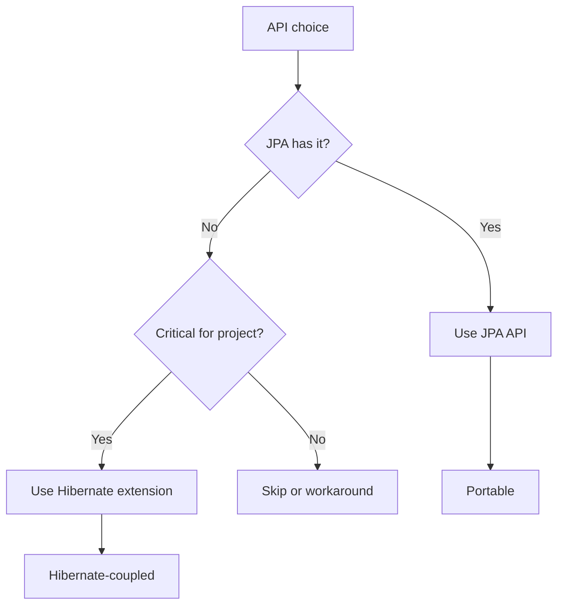

---

### 🛠️ Worked Example

**BAD:**

```java
// Hibernate Session API throughout
Session session = entityManager
    .unwrap(Session.class);
session.update(entity); // Deprecated in H6!
session.load(User.class, id); // Deprecated!
session.createCriteria(User.class); // Removed!
```

Why it's wrong: Session-specific methods are deprecated or
removed across Hibernate versions.

**GOOD:**

```java
// JPA standard API
User managed = em.merge(entity);
User ref = em.getReference(User.class, id);
CriteriaQuery<User> cq = cb.createQuery(
    User.class);
// Works with Hibernate 5, 6, or EclipseLink.
```

Why it's right: JPA standard methods are stable across
providers and versions.

**Production: selective use of Hibernate extensions:**

```java
// JPA for everything standard:
@Entity
@Version private int version;

// Hibernate only where JPA lacks the feature:
@BatchSize(size = 16) // No JPA equivalent
@NaturalId            // No JPA equivalent
@Formula("(SELECT count(*) FROM items i "
    + "WHERE i.order_id = id)")
private int itemCount; // No JPA equivalent
```

---

### ⚖️ Trade-offs

**Gain:** Portability across providers; easier major version
upgrades; smaller surface area of breaking changes; clearer
code intent.

**Cost:** JPA lacks some useful Hibernate features; strict
compliance may miss optimizations; unwrapping to Session is
sometimes necessary.

| Approach        | Portability | Feature access | Upgrade risk |
| --------------- | ----------- | -------------- | ------------ |
| JPA only        | Full        | 80%            | Low          |
| JPA + H. annot. | Partial     | 95%            | Medium       |
| Session API     | None        | 100%           | High         |

---

### ⚡ Decision Snap

**USE WHEN:**

- Starting a new project: default to JPA standard API.
- Code review: flag unnecessary Hibernate-specific imports.
- Pre-migration audit: identify Hibernate-specific surface
  area before upgrading.

**AVOID WHEN:**

- Do not sacrifice needed functionality for portability.
  If `@BatchSize` solves your N+1, use it.

**PREFER PRAGMATIC COMPLIANCE WHEN:**

- JPA for everything it supports + Hibernate for specific
  features JPA lacks. Document every Hibernate dependency.

---

### ⚠️ Top Traps

| #   | Misconception                                              | Reality                                                                                                                                                        |
| --- | ---------------------------------------------------------- | -------------------------------------------------------------------------------------------------------------------------------------------------------------- |
| 1   | Portability means you will switch JPA providers            | Portability also means smoother Hibernate version upgrades. Provider switching is rare; version upgrades are inevitable.                                       |
| 2   | JPA standard is always sufficient                          | JPA lacks batch fetching, formula columns, natural IDs, dynamic update, and many other useful features. Hibernate extensions fill real gaps.                   |
| 3   | Using any Hibernate annotation makes the code non-portable | JPA providers ignore unknown annotations. Hibernate annotations do not break EclipseLink - they just have no effect. The risk is behavioral, not compile-time. |

---

### 🪜 Learning Ladder

**Prerequisites:**

- JPA vs Hibernate-Proprietary Annotations - specific
  annotation choices
- Hibernate 5 to 6 Migration Essentials - practical impact
  of coupling

**THIS:** HIB-062 JPA Specification Compliance and Portability

**Next steps:**

- Monitoring Hibernate in Production - JPA standard
  statistics vs Hibernate-specific
- Hibernate Source Code Architecture and Bootstrap
  Sequence (L5) - JPA vs Hibernate at architecture level

---

### 💡 The Surprising Truth

The biggest portability benefit is not provider switching
(which almost never happens). It is version upgrade safety.
JPA standard APIs change once per specification revision
(years apart). Hibernate-specific APIs can change on any major
version release. Teams that use JPA standard consistently
spend days on major upgrades. Teams with heavy Hibernate API
usage spend weeks.

---

### 📇 Revision Card

1. JPA for everything it supports. Hibernate for features
   JPA lacks. Document every Hibernate dependency.
2. Portability = upgrade safety, not provider switching.
   JPA APIs are more stable across versions.
3. `EntityManager` = JPA standard. `Session` = Hibernate.
   Prefer `EntityManager` unless `Session` is required.

---

---

# HIB-063 Hibernate Statistics API and p6spy

**TL;DR** - `hibernate.generate_statistics=true` counts queries per Session. p6spy logs actual SQL with bind parameters and execution time.

---

### 🔥 The Problem in One Paragraph

`show_sql=true` dumps SQL to the console but without bind
parameter values, timing, or per-request aggregation. You see
hundreds of SELECT statements but cannot tell which request
generated them, how long each took, or what parameters were
passed. The Hibernate Statistics API provides per-Session
counters (query count, fetch count, flush count). p6spy
intercepts JDBC and logs complete SQL with bind values and
execution time. Together, they answer: "How many queries did
this request execute and how long did each take?" This is
exactly why statistics and p6spy exist.

---

### 📘 Textbook Definition

The **Hibernate Statistics API** (`SessionFactory.
getStatistics()`) provides counters for JDBC statements,
entity loads, cache hits/misses, and flush operations.
**p6spy** is a JDBC proxy driver that intercepts all SQL
statements, logs them with bind parameter values, and records
execution time. Together they provide comprehensive query
observability.

---

### 🧠 Mental Model

> Statistics API is a dashboard: "This Session executed 47
> queries and 3 flushes." p6spy is a flight recorder: every
> SQL statement, parameters, and timing logged. Dashboard
> for overview; recorder for detail.

- "Dashboard" -> Statistics API (counters)
- "Flight recorder" -> p6spy (full SQL + timing)
- "Overview" -> how many queries per request
- "Detail" -> exactly which SQL with which parameters

**Where this analogy breaks down:** p6spy has overhead. In
high-throughput production, logging every SQL statement
generates enormous log volume. Use sampling or structured
logging.

---

### ⚙️ How It Works

**Hibernate Statistics:**

1. Enable: `hibernate.generate_statistics=true`.
2. Access: `sessionFactory.getStatistics()`.
3. Counters: `getPrepareStatementCount()`,
   `getEntityLoadCount()`, `getSecondLevelCacheHitCount()`,
   `getFlushCount()`, `getQueryExecutionCount()`.
4. Reset per request: `statistics.clear()`.

**p6spy:**

1. Add p6spy dependency.
2. Change JDBC URL: `jdbc:p6spy:postgresql://...`.
3. Change driver: `com.p6spy.engine.spy.P6SpyDriver`.
4. Configure `spy.properties` for log format.
5. Every SQL statement logged with parameters and time.

```text
  Hibernate Statistics:
  QueryExecutionCount: 47
  EntityLoadCount: 120
  PrepareStatementCount: 47
  SecondLevelCacheHitCount: 30

  p6spy log:
  1684000001|3ms|SELECT * FROM orders WHERE id=?
  |1684000001|[1]
  1684000002|15ms|SELECT * FROM customer WHERE id=?
  |1684000002|[42]
```

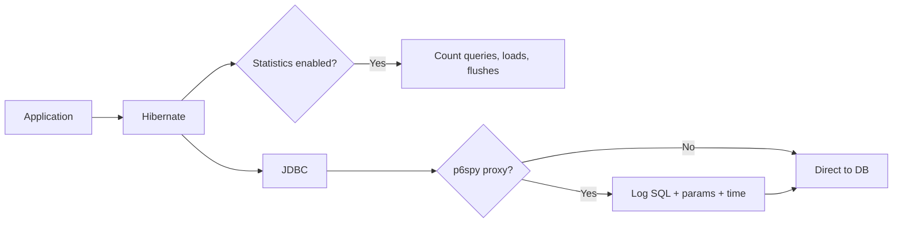

---

### 🛠️ Worked Example

**BAD:**

```properties
# show_sql only: no timing, no params, no counts
hibernate.show_sql=true
# Output: SELECT * FROM orders WHERE id=?
# No bind values. No timing. No context.
```

Why it's wrong: `show_sql` is insufficient for performance
analysis. No timing, no parameters, no request context.

**GOOD:**

```properties
# Statistics for per-request query counting
hibernate.generate_statistics=true

# p6spy for detailed SQL logging
spring.datasource.url=jdbc:p6spy:postgresql://...
spring.datasource.driver-class-name=\
  com.p6spy.engine.spy.P6SpyDriver
```

Why it's right: Statistics gives the overview (query count
per request). p6spy gives the detail (actual SQL + timing).

**Production: query count assertion in tests:**

```java
@Test
void listOrders_queryCount() {
    var stats = sessionFactory.getStatistics();
    stats.clear();
    orderService.listOrders();
    assertThat(
        stats.getPrepareStatementCount())
        .as("Expected 1-2 queries, not N+1")
        .isLessThanOrEqualTo(2);
}
```

---

### ⚖️ Trade-offs

**Gain:** Statistics API is zero-dependency and low overhead.
p6spy provides complete SQL visibility with bind values.
Combined: full query observability.

**Cost:** Statistics API does not show individual queries.
p6spy adds latency (microseconds per statement) and log
volume.

| Tool       | Shows what           | Overhead   | Production safe |
| ---------- | -------------------- | ---------- | --------------- |
| show_sql   | SQL without params   | Low        | No (noisy)      |
| Statistics | Counters per Session | Very low   | Yes             |
| p6spy      | SQL + params + time  | Low-Medium | With sampling   |

---

### ⚡ Decision Snap

**USE WHEN:**

- Development: both Statistics + p6spy for full visibility.
- Integration tests: Statistics for query count assertions.
- Production: Statistics (always), p6spy (with sampling or
  on demand).

**AVOID WHEN:**

- p6spy in high-throughput production without log volume
  management (use structured logging + sampling).
- `show_sql=true` in production (unstructured, no context).

**PREFER STATISTICS API WHEN:**

- You need query count per request for N+1 detection.
  Lower overhead than p6spy.

---

### ⚠️ Top Traps

| #   | Misconception                               | Reality                                                                                                                           |
| --- | ------------------------------------------- | --------------------------------------------------------------------------------------------------------------------------------- |
| 1   | `show_sql=true` shows bind parameter values | `show_sql` shows `?` placeholders. Use p6spy or `logging.level.org.hibernate.orm.jdbc.bind=trace` for actual values.              |
| 2   | Statistics API logs individual queries      | Statistics only provides counters (total queries, loads, etc.). For individual query logging, use p6spy or Hibernate SQL logging. |
| 3   | p6spy is for development only               | p6spy can run in production with structured logging and sampling. Many teams use it for slow query detection.                     |

---

### 🪜 Learning Ladder

**Prerequisites:**

- The N+1 Select Problem - Statistics API is the primary
  N+1 detection tool
- Hibernate Query Performance Tuning - measuring the impact
  of tuning changes

**THIS:** HIB-063 Hibernate Statistics API and p6spy

**Next steps:**

- Monitoring Hibernate in Production - comprehensive
  monitoring beyond query counting
- N+1 Detection and Fix Kata - hands-on practice using
  statistics to detect N+1

---

### 💡 The Surprising Truth

The single most valuable Hibernate configuration for any
project is `hibernate.generate_statistics=true` in development
and test environments. Combined with a CI assertion on
`getPrepareStatementCount()`, it catches N+1 regressions
automatically on every pull request - before code review,
before staging, before production.

---

### 📇 Revision Card

1. `generate_statistics=true` for query counting.
   p6spy for SQL + params + timing. Both in development.
2. Assert query count in integration tests:
   `stats.getPrepareStatementCount() <= expected`.
3. Never use `show_sql=true` for performance analysis. It
   lacks params, timing, and request context.

---

---

# HIB-064 Second-Level Cache vs Application Cache Decision

**TL;DR** - L2 cache caches entities by ID transparently. Application cache (Spring @Cacheable) caches DTOs, aggregates, and query results with explicit control.

---

### 🔥 The Problem in One Paragraph

You need caching. The database is a bottleneck for read-heavy
reference data. Two options: Hibernate's second-level cache
(L2) and application-level caching (Spring `@Cacheable`,
Caffeine, Redis). L2 caches individual entities by ID and
integrates transparently with `find()`. Application cache
caches any object (DTOs, aggregates, lists) at the service
layer with explicit control. Choosing wrong means either
invisible stale data (L2 with aggressive TTL) or unnecessary
entity overhead (loading entities to populate an app cache
that only needs 3 fields). This is exactly why the decision
framework matters.

---

### 📘 Textbook Definition

The **Hibernate second-level cache** is a `SessionFactory`-
scoped cache that stores dehydrated entity state, consulted
transparently on `find()` by ID. An **application cache**
(Spring `@Cacheable`, Caffeine, Redis) is a service-layer
cache that stores any serializable object with explicit
put/get/evict semantics. The two address different caching
needs and can coexist.

---

### 🧠 Mental Model

> L2 cache is a refrigerator built into the kitchen counter
> (integrated, automatic, entity-shaped). Application cache is
> a separate freezer in the garage (explicit, any shape,
> manual management). Use the fridge for frequently needed
> ingredients. Use the freezer for meal-prepped containers.

- "Built-in fridge" -> L2 cache (automatic, entity-scoped)
- "Garage freezer" -> application cache (explicit, any shape)
- "Ingredients" -> individual entities
- "Meal-prep containers" -> DTOs, aggregates

**Where this analogy breaks down:** Both caches live in
application memory (or distributed). The "distance" between
them is not physical but conceptual.

---

### ⚙️ How It Works

**L2 Cache:**

- Caches entities by type + ID.
- Consulted on `em.find(Entity.class, id)`.
- Stores dehydrated column values, not Java objects.
- Invalidated automatically on entity update/delete.
- Does NOT cache query results (separate query cache).

**Application Cache:**

- Caches any object at the service method level.
- `@Cacheable("products")` on a service method.
- Stores the method's return value (DTO, list, aggregate).
- Invalidated explicitly via `@CacheEvict`.
- Full control over TTL, eviction, and cache key.

```text
  L2 Cache:
  find(Product, 1) -> L2 hit -> return entity
  find(Product, 1) -> L2 miss -> DB + populate L2

  Application Cache:
  getProductSummary(1) -> cache hit -> return DTO
  getProductSummary(1) -> cache miss -> load + map
                                      + populate cache
```

```mermaid
flowchart TD
    A[Request] --> B{Which cache?}
    B -->|Entity by ID| C[L2 Cache]
    B -->|DTO/aggregate| D[App Cache]
    C --> E{Hit?}
    E -->|Yes| F[Return entity]
    E -->|No| G[DB -> entity -> populate L2]
    D --> H{Hit?}
    H -->|Yes| I[Return cached DTO]
    H -->|No| J[Service -> DTO -> populate cache]
```

---

### 🛠️ Worked Example

**BAD:**

```java
// Using L2 cache for a list endpoint
// L2 caches entities by ID, not query results.
// A list of 100 products = 100 individual L2
// lookups (if query cache is off) or a full
// entity load per item.
```

Why it's wrong: L2 cache is not designed for list/query
caching. It caches individual entities by ID.

**GOOD:**

```java
// L2 for entity-by-ID (reference data)
@Entity
@Cacheable
@Cache(usage = READ_WRITE)
public class Country { ... }
// find(Country, "US") -> L2 hit

// Application cache for list/DTO endpoints
@Cacheable("product-summaries")
public List<ProductDTO> getTopProducts() {
    return productRepo.findTopSummaries();
}
// Caches the entire DTO list. One cache entry.
```

Why it's right: L2 for individual entity lookups. Application
cache for aggregated results and DTOs.

**Production: cache eviction strategy:**

```java
// L2: automatic on entity modification
// App cache: explicit eviction
@CacheEvict(value = "product-summaries",
    allEntries = true)
@Transactional
public void updateProduct(ProductDTO dto) {
    // Evict the cached list on any product change
}
```

---

### ⚖️ Trade-offs

**Gain:** L2 is transparent and automatic for entity lookups.
Application cache is flexible and caches any shape of data.

**Cost:** L2 stores dehydrated state (re-hydration cost on
hit). Application cache requires explicit eviction management.

| Aspect        | L2 Cache       | Application Cache    |
| ------------- | -------------- | -------------------- |
| Cached object | Entity by ID   | Any (DTO, list)      |
| Integration   | Transparent    | Explicit             |
| Eviction      | Automatic      | Manual (@CacheEvict) |
| Best for      | Reference data | Aggregates, lists    |

---

### ⚡ Decision Snap

**USE L2 WHEN:**

- Entities are loaded by ID frequently (reference data,
  lookups, navigation properties).
- Data changes infrequently and can tolerate short staleness.

**USE APPLICATION CACHE WHEN:**

- Caching DTOs, aggregates, or query results.
- You need explicit cache control (TTL, eviction rules).
- The cached shape differs from the entity shape.

**USE BOTH WHEN:**

- Reference entities via L2, aggregated endpoints via
  application cache. They are complementary, not competing.

---

### ⚠️ Top Traps

| #   | Misconception                       | Reality                                                                                                                                 |
| --- | ----------------------------------- | --------------------------------------------------------------------------------------------------------------------------------------- |
| 1   | L2 cache caches query results       | L2 entity cache caches by ID only. The query cache is a separate feature (and often counter-productive).                                |
| 2   | Application cache replaces L2       | They serve different purposes. L2 is transparent for entity lookups. Application cache is explicit for service-layer results.           |
| 3   | Enabling both causes double caching | L2 caches entities; application cache caches DTOs/results. Unless you cache entities at the application layer too, there is no overlap. |

---

### 🪜 Learning Ladder

**Prerequisites:**

- Second-Level Cache Introduction - L2 mechanics
- Hibernate Query Performance Tuning - caching is a tuning
  technique

**THIS:** HIB-064 Second-Level Cache vs Application Cache
Decision

**Next steps:**

- Second-Level Cache Regions and Invalidation Strategies
  (L4) - advanced L2 configuration
- Monitoring Hibernate in Production - cache hit rate
  monitoring

---

### 💡 The Surprising Truth

Most teams should start with application-level caching (Spring
`@Cacheable`) and add L2 caching only for specific entities
where `find()` by ID is a measured bottleneck. Application
cache is simpler to reason about, debug, and control. L2 cache
is powerful but its transparency makes it harder to debug
stale data issues.

---

### 📇 Revision Card

1. L2 = entity by ID (transparent, automatic eviction).
   App cache = any object (explicit, manual eviction).
2. L2 for reference data loaded by ID. App cache for DTOs,
   lists, and aggregates.
3. Start with app cache. Add L2 for measured entity-by-ID
   bottlenecks.

---

---

# HIB-065 Testing Hibernate Repositories (Testcontainers)

**TL;DR** - Test Hibernate repositories against a real database using Testcontainers, not H2, to catch SQL dialect and DDL differences.

---

### 🔥 The Problem in One Paragraph

Your tests pass on H2. Production uses PostgreSQL. H2 does not
support `ARRAY` types, partial indexes, `ON CONFLICT`,
`GENERATED ALWAYS AS`, or many PostgreSQL-specific functions.
A native query that works on H2 fails on PostgreSQL. DDL
generated by `hbm2ddl.auto=create` differs between dialects.
Testcontainers spins up a real PostgreSQL instance in Docker
for each test run, ensuring your tests exercise the same
database engine as production. This is exactly why
Testcontainers replaced H2 as the testing standard.

---

### 📘 Textbook Definition

**Testcontainers** is a Java library that manages Docker
containers for integration tests. For Hibernate testing, it
provides a real database instance (PostgreSQL, MySQL, etc.)
that matches production. Tests run against the actual SQL
dialect, DDL, and database behavior instead of an in-memory
substitute.

---

### 🧠 Mental Model

> H2 testing is like rehearsing a concert in a different
> venue. The acoustics are wrong, the stage is different,
> and what sounds fine in rehearsal fails live. Testcontainers
> is rehearsing in the actual concert hall: same stage, same
> acoustics.

- "Different venue" -> H2 (different dialect, different DDL)
- "Actual concert hall" -> Testcontainers (real PostgreSQL)
- "Fails live" -> production SQL errors

**Where this analogy breaks down:** Testcontainers starts a
real database in Docker, so tests are slower than H2 (seconds
vs milliseconds for startup).

---

### ⚙️ How It Works

1. Add Testcontainers dependency + database module
   (e.g., `testcontainers-postgresql`).
2. Use `@Testcontainers` + `@Container` to declare a
   PostgreSQL container.
3. Configure `spring.datasource.url` dynamically from the
   container's JDBC URL.
4. Hibernate connects to the real PostgreSQL instance.
5. Container starts before tests, stops after.
6. Each test class gets a fresh or shared container.

```text
  Test startup:
  Docker -> PostgreSQL container (real DB)
  Spring -> connects to container
  Hibernate -> DDL + test data -> real PostgreSQL

  Test execution:
  Repository methods -> real SQL dialect
  Native queries -> real PostgreSQL syntax

  Test cleanup:
  Container stopped -> data gone
```

```mermaid
sequenceDiagram
    participant Test
    participant Docker
    participant PG as PostgreSQL
    participant Spring
    Test->>Docker: Start PostgreSQL container
    Docker-->>Test: Container ready (port 5432)
    Test->>Spring: Configure datasource URL
    Spring->>PG: Connect + DDL
    Test->>PG: Execute repository tests
    PG-->>Test: Results
    Test->>Docker: Stop container
```

---

### 🛠️ Worked Example

**BAD:**

```properties
# Test with H2 (different dialect)
spring.datasource.url=jdbc:h2:mem:test
# Native query: SELECT * FROM orders
#   WHERE data::jsonb @> '{"status":"active"}'
# Works on PostgreSQL. Fails on H2.
```

Why it's wrong: H2 does not support PostgreSQL-specific
syntax. Tests pass but production fails.

**GOOD:**

```java
@Testcontainers
@SpringBootTest
class OrderRepositoryTest {

    @Container
    static PostgreSQLContainer<?> pg =
        new PostgreSQLContainer<>(
            "postgres:16-alpine");

    @DynamicPropertySource
    static void props(
            DynamicPropertyRegistration r) {
        r.add("spring.datasource.url",
            pg::getJdbcUrl);
        r.add("spring.datasource.username",
            pg::getUsername);
        r.add("spring.datasource.password",
            pg::getPassword);
    }

    @Autowired OrderRepository repo;

    @Test
    void findByStatus_nativePg() {
        // Tests against real PostgreSQL
        assertThat(repo.findActive())
            .isNotEmpty();
    }
}
```

Why it's right: tests run against real PostgreSQL. Native
queries, DDL, and dialect-specific features are all tested.

**Production: shared container for speed:**

```java
// Reuse container across test classes
@Testcontainers(disabledWithoutDocker = true)
abstract class BaseIntegrationTest {
    @Container
    static final PostgreSQLContainer<?> pg =
        new PostgreSQLContainer<>(
            "postgres:16-alpine")
            .withReuse(true);
}
```

---

### ⚖️ Trade-offs

**Gain:** Tests exercise the real database dialect, DDL, and
native queries. Catches production-specific bugs that H2 would
miss.

**Cost:** Requires Docker on CI and dev machines. Slower
startup than H2 (2-5 seconds for container).

| Aspect          | H2         | Testcontainers |
| --------------- | ---------- | -------------- |
| Dialect match   | No         | Yes (real DB)  |
| Native queries  | Often fail | Work correctly |
| Startup time    | ~100ms     | 2-5 seconds    |
| Docker required | No         | Yes            |

---

### ⚡ Decision Snap

**USE WHEN:**

- Any project with native SQL queries or PostgreSQL-specific
  features.
- As the default for integration tests in new projects.
- When H2 tests pass but production fails.

**AVOID WHEN:**

- Docker is unavailable (CI environments without Docker).
- Unit tests that do not touch the database (use mocks).

**PREFER TESTCONTAINERS WHEN:**

- Always for repository integration tests. H2 is no longer
  the recommended default.

---

### ⚠️ Top Traps

| #   | Misconception                                      | Reality                                                                                                                            |
| --- | -------------------------------------------------- | ---------------------------------------------------------------------------------------------------------------------------------- |
| 1   | H2 compatibility mode matches PostgreSQL perfectly | H2's PostgreSQL mode covers basic syntax but misses array types, partial indexes, jsonb operators, and many functions.             |
| 2   | Testcontainers tests are slow                      | Container reuse (`withReuse(true)`) keeps the container running across test runs. Startup cost is paid once.                       |
| 3   | Testcontainers replaces all H2 usage               | For simple JPQL-only tests without native queries, H2 is still viable. Testcontainers is essential for native SQL and DDL testing. |

---

### 🪜 Learning Ladder

**Prerequisites:**

- hibernate.hbm2ddl.auto and Schema Generation - schema
  generation behavior differs per database
- JPA Specification Compliance and Portability - dialect
  portability issues

**THIS:** HIB-065 Testing Hibernate Repositories
(Testcontainers)

**Next steps:**

- N+1 Detection and Fix Kata - testing N+1 with query
  count assertions against a real database
- Monitoring Hibernate in Production - production database
  monitoring complements test verification

---

### 💡 The Surprising Truth

Teams that switch from H2 to Testcontainers typically discover
3-5 SQL incompatibilities that were silently passing in H2 but
would have failed in production. The most common: native
queries using database-specific functions, DDL constraints that
H2 ignores, and timestamp precision differences.

---

### 📇 Revision Card

1. Testcontainers = real database in Docker for tests.
   Catches dialect-specific bugs that H2 would miss.
2. Use `withReuse(true)` for container sharing across test
   runs (startup cost paid once).
3. Testcontainers is the default for repository integration
   tests. Reserve H2 for JPQL-only simple tests.

---

---

# HIB-066 Monitoring Hibernate in Production

**TL;DR** - Monitor Hibernate in production via Micrometer metrics (query count, cache hit rate, slow queries) exposed to Prometheus/Grafana.

---

### 🔥 The Problem in One Paragraph

Your application is slow but the dashboard shows normal CPU
and memory. The database has high connection wait times. You
suspect Hibernate but have no visibility. Without metrics, you
cannot answer: "How many queries per request? What is the L2
cache hit rate? How many entities are loaded per second? Which
queries are slow?" Production Hibernate monitoring via
Micrometer provides these answers as real-time metrics,
enabling alerts on N+1 regressions, cache degradation, and
slow queries. This is exactly why Hibernate monitoring matters.

---

### 📘 Textbook Definition

**Hibernate production monitoring** uses the Statistics API
combined with Micrometer metrics export to provide real-time
observability of Hibernate behavior: JDBC statement count,
entity load/store/delete counts, L2 cache hit/miss rates,
query execution counts and times, and connection pool usage.
Metrics are typically exported to Prometheus and visualized in
Grafana.

---

### 🧠 Mental Model

> Monitoring Hibernate is like adding a speedometer, fuel
> gauge, and engine temperature to a car. Without them, you
> drive blind. With them, you see the problem before it
> becomes an incident.

- "Speedometer" -> query count per second
- "Fuel gauge" -> connection pool usage
- "Engine temperature" -> slow query detection
- "Dashboard" -> Grafana

**Where this analogy breaks down:** Unlike a car dashboard,
Hibernate metrics are only useful in aggregate (per-request
averages, percentiles) rather than instantaneous readings.

---

### ⚙️ How It Works

1. Enable Hibernate statistics:
   `hibernate.generate_statistics=true`.
2. Add Micrometer Hibernate integration (auto-configured
   in Spring Boot with `spring-boot-starter-actuator`).
3. Micrometer publishes metrics:
   `hibernate.sessions.open`, `hibernate.statements`,
   `hibernate.entities.loads`, `hibernate.cache.hits`.
4. Prometheus scrapes `/actuator/prometheus`.
5. Grafana dashboards visualize trends and alerts.

```text
  Metrics exposed:
  hibernate_statements_total        (query count)
  hibernate_entities_loads_total    (entity loads)
  hibernate_second_level_cache_hits (L2 hits)
  hibernate_second_level_cache_misses (L2 misses)
  hibernate_query_execution_max_seconds (slow query)

  Alert rules:
  query count per request > 10 -> N+1 warning
  L2 cache hit rate < 50% -> cache misconfiguration
  slow query > 1s -> query tuning needed
```

```mermaid
flowchart LR
    A[Hibernate] --> B[Statistics API]
    B --> C[Micrometer]
    C --> D[Prometheus]
    D --> E[Grafana]
    E --> F[Alerts]
```

---

### 🛠️ Worked Example

**BAD:**

```properties
# No monitoring. Performance issues discovered
# via user complaints or P1 incidents.
# "The app is slow" -> no data to diagnose.
```

Why it's wrong: reactive debugging instead of proactive
monitoring. Root cause analysis takes hours without metrics.

**GOOD:**

```yaml
# application.yml (Spring Boot)
spring:
  jpa:
    properties:
      hibernate:
        generate_statistics: true
management:
  endpoints:
    web:
      exposure:
        include: prometheus,health
  metrics:
    tags:
      application: order-service
```

Why it's right: Hibernate metrics auto-published to
Prometheus. Grafana dashboard shows queries per second,
entity loads, and cache performance.

**Production: Grafana alert rule:**

```yaml
# Alert when query count per request exceeds 10
# (potential N+1 regression)
- alert: HibernateNPlus1
  expr: |
    rate(hibernate_statements_total[5m])
    / rate(http_requests_total[5m]) > 10
  for: 5m
  labels:
    severity: warning
  annotations:
    summary: "Possible N+1: >10 queries/request"
```

---

### ⚖️ Trade-offs

**Gain:** Real-time visibility into Hibernate behavior;
proactive N+1 detection; cache performance monitoring; slow
query alerting.

**Cost:** Statistics API has slight overhead (microseconds per
operation); metrics storage and dashboarding infrastructure
required.

| Metric               | What it reveals     |
| -------------------- | ------------------- |
| Statements per req   | N+1 regressions     |
| Entity loads per sec | Workload profile    |
| L2 cache hit rate    | Cache effectiveness |
| Slow query time      | Unoptimized queries |
| Connection wait time | Pool sizing issues  |

---

### ⚡ Decision Snap

**USE WHEN:**

- Every production Hibernate application should have
  monitoring. This is not optional.
- Minimum viable: Hibernate statistics + Micrometer +
  Prometheus/Grafana.

**AVOID WHEN:**

- This is a must-have, not a nice-to-have.

**PREFER LOG-BASED MONITORING WHEN:**

- You do not have Prometheus/Grafana but have structured
  logging (ELK stack). Log statistics per request.

---

### ⚠️ Top Traps

| #   | Misconception                                       | Reality                                                                                                                              |
| --- | --------------------------------------------------- | ------------------------------------------------------------------------------------------------------------------------------------ |
| 1   | `generate_statistics=true` has significant overhead | The overhead is microseconds per operation. The observability it provides is worth orders of magnitude more.                         |
| 2   | APM tools replace Hibernate-specific monitoring     | APM shows request latency but not Hibernate internals (cache hit rate, entity loads, flush count). Hibernate metrics complement APM. |
| 3   | Monitoring is only for debugging                    | Monitoring is for trend detection, capacity planning, and regression prevention - not just post-incident debugging.                  |

---

### 🪜 Learning Ladder

**Prerequisites:**

- Hibernate Statistics API and p6spy - the data source for
  monitoring
- Hibernate Query Performance Tuning - metrics reveal
  tuning opportunities

**THIS:** HIB-066 Monitoring Hibernate in Production

**Next steps:**

- Connection Pool Tuning (HikariCP) (L4) - pool metrics
  from monitoring drive tuning
- Hibernate Production Diagnostics (L4) - using metrics
  for incident diagnosis

---

### 💡 The Surprising Truth

Most Hibernate production incidents could have been prevented
by a single Grafana alert: "statements per request > 10."
This one metric catches N+1 regressions, accidental EAGER
fetching, and missing JOIN FETCH queries - the top three
Hibernate performance issues - before they reach users.

---

### 📇 Revision Card

1. `generate_statistics=true` + Micrometer + Prometheus =
   real-time Hibernate monitoring.
2. Key alert: statements per request > 10 = possible N+1.
3. Monitoring is prevention, not debugging. Set up before
   the first incident, not after.

---

---

# HIB-067 N+1 Detection and Fix Kata

**TL;DR** - Practice detecting N+1 via Hibernate statistics, then fixing it with JOIN FETCH, @BatchSize, and EntityGraph in a controlled exercise.

---

### 🔥 The Problem in One Paragraph

Reading about N+1 is not the same as detecting it in a running
application. The symptoms are invisible without statistics or
SQL logging. This kata forces you to: (1) build code with an
intentional N+1, (2) prove it exists using statistics, (3) fix
it three different ways (JOIN FETCH, @BatchSize, EntityGraph),
and (4) verify each fix reduces the query count. The cycle of
detect-fix-verify builds the muscle memory needed to spot N+1
in production code. This is exactly why hands-on practice
matters.

---

### 📘 Textbook Definition

An **N+1 detection and fix kata** is a structured exercise
that practices the full N+1 lifecycle: introduce the pattern,
detect it via Hibernate Statistics or p6spy, apply multiple fix
strategies (JOIN FETCH, @BatchSize, EntityGraph), and verify
the fix via query count assertion. Repetition builds pattern
recognition.

---

### 🧠 Mental Model

> This kata is a fire drill. You start the fire (N+1), detect
> the smoke (statistics), extinguish it (fix), and verify the
> fire is out (assertion). Repeating the drill builds automatic
> response in real incidents.

- "Start fire" -> write N+1 code intentionally
- "Detect smoke" -> statistics.getPrepareStatementCount()
- "Extinguish" -> JOIN FETCH or @BatchSize or EntityGraph
- "Verify" -> assert query count <= expected

**Where this analogy breaks down:** Unlike a fire drill, each
fix strategy has different trade-offs. The goal is to learn
all three, not just one.

---

### ⚙️ How It Works

**Step 1 - Introduce N+1:**
Write a service that loads Orders and iterates
`order.getCustomer().getName()`.

**Step 2 - Detect:**
Enable `generate_statistics=true`. Assert
`getPrepareStatementCount()` and observe it is N+1.

**Step 3 - Fix A (JOIN FETCH):**
Rewrite query with `JOIN FETCH o.customer`.
Assert count == 1.

**Step 4 - Fix B (@BatchSize):**
Remove JOIN FETCH. Add `@BatchSize(size=10)` on Customer.
Assert count <= 1 + ceil(N/10).

**Step 5 - Fix C (EntityGraph):**
Remove @BatchSize. Add `@EntityGraph(attributePaths=
{"customer"})` on the repository method.
Assert count == 1.

```text
  Kata flow:
  Write N+1 -> Detect (stats) -> Fix A -> Verify
                                -> Fix B -> Verify
                                -> Fix C -> Verify

  Expected query counts:
  N+1 broken:     11 (10 orders + 1 + 10 customers)
  JOIN FETCH:     1
  @BatchSize(10): 2  (1 orders + 1 batch of customers)
  EntityGraph:    1
```

```mermaid
flowchart TD
    A[Write N+1 code] --> B[Detect via stats]
    B --> C[Fix A: JOIN FETCH]
    C --> D[Assert count == 1]
    B --> E[Fix B: @BatchSize]
    E --> F[Assert count <= 3]
    B --> G[Fix C: EntityGraph]
    G --> H[Assert count == 1]
```

---

### 🛠️ Worked Example

**BAD:**

```java
// Step 1: intentional N+1
List<Order> orders = orderRepo.findAll();
orders.forEach(o ->
    log.info(o.getCustomer().getName()));
// Stats: prepareStatementCount == 11
// (1 orders + 10 customers)
```

Why it's wrong: this is the intentional N+1 for the exercise.

**GOOD:**

```java
// Step 3: Fix A - JOIN FETCH
@Query("SELECT o FROM Order o "
    + "JOIN FETCH o.customer")
List<Order> findAllWithCustomer();

// Test assertion:
@Test
void fixA_joinFetch() {
    stats.clear();
    orderService.listWithCustomer();
    assertThat(stats.getPrepareStatementCount())
        .isEqualTo(1); // 1 query total
}
```

Why it's right: JOIN FETCH eliminates all N additional queries.
The assertion proves it.

**Production: comparing all three fixes:**

```java
@Test
void compareFixStrategies() {
    stats.clear();
    // Fix A: JOIN FETCH
    var a = orderRepo.findAllWithCustomer();
    long countA = stats.getPrepareStatementCount();

    stats.clear();
    // Fix B: @BatchSize
    var b = orderRepo.findAll();
    b.forEach(o -> o.getCustomer().getName());
    long countB = stats.getPrepareStatementCount();

    stats.clear();
    // Fix C: EntityGraph
    var c = orderRepo.findAllWithGraph();
    long countC = stats.getPrepareStatementCount();

    log.info("JOIN FETCH: {}, @BatchSize: {}, "
        + "EntityGraph: {}", countA, countB, countC);
}
```

---

### ⚖️ Trade-offs

**Gain:** Hands-on detection-fix-verify cycle builds
permanent pattern recognition for N+1.

**Cost:** Time investment; requires a working project with
Hibernate statistics enabled and test data.

| Fix strategy | Query count | Code change    | Reusable  |
| ------------ | ----------- | -------------- | --------- |
| JOIN FETCH   | 1           | New JPQL query | Per query |
| @BatchSize   | 1 + N/B     | Annotation     | Global    |
| EntityGraph  | 1           | Annotation     | Reusable  |

---

### ⚡ Decision Snap

**USE WHEN:**

- Learning N+1 for the first time or training a team.
- Onboarding new developers to Hibernate performance.
- Practicing for interviews (N+1 is the #1 question).

**AVOID WHEN:**

- You can already detect and fix N+1 from query stats
  alone without thinking.

**PREFER FULL KATA WHEN:**

- Always do all three fix strategies. Understanding the
  trade-offs between them is the real learning.

---

### ⚠️ Top Traps

| #   | Misconception                             | Reality                                                                                               |
| --- | ----------------------------------------- | ----------------------------------------------------------------------------------------------------- |
| 1   | Running the kata once is enough           | Repeat until you can predict the query count BEFORE running the test. Prediction is the skill.        |
| 2   | Only one fix strategy matters             | Each strategy has different trade-offs. Production code uses all three depending on context.          |
| 3   | The kata works without statistics enabled | Without `generate_statistics=true`, you cannot count queries. Statistics are the detection mechanism. |

---

### 🪜 Learning Ladder

**Prerequisites:**

- The N+1 Select Problem - the pattern being practiced
- JOIN FETCH in JPQL and HQL - Fix A
- Batch Fetching and @BatchSize - Fix B
- Entity Graphs - Fix C

**THIS:** HIB-067 N+1 Detection and Fix Kata

**Next steps:**

- Hibernate App - Phase 3 (Performance Tuning) - applying
  N+1 fixes in a complete application
- Monitoring Hibernate in Production - N+1 detection at
  production scale

---

### 💡 The Surprising Truth

The hardest part of N+1 is not the fix (one line of JPQL).
It is the detection. N+1 is invisible in code, invisible in
logs (unless you count), and invisible in response time with
small data. This kata builds the habit of ALWAYS checking
`getPrepareStatementCount()` after every service method.

---

### 📇 Revision Card

1. Kata cycle: write N+1 -> detect (stats) -> fix (three
   ways) -> verify (assert count).
2. Three fixes: JOIN FETCH (1 query), @BatchSize (fewer
   queries), EntityGraph (1 query, declarative).
3. The skill is prediction: know the query count before
   running. If surprised: repeat.

---

---

# HIB-068 Locking Strategy Exercise

**TL;DR** - Practice both optimistic and pessimistic locking by simulating concurrent updates and observing conflict detection and blocking behavior.

---

### 🔥 The Problem in One Paragraph

Locking concepts are abstract until you see
`OptimisticLockException` thrown in your code and observe
`SELECT FOR UPDATE` blocking a second thread. This exercise
uses two concurrent transactions to demonstrate: (1) lost
updates without locking, (2) `OptimisticLockException` with
`@Version`, and (3) thread blocking with
`PESSIMISTIC_WRITE`. Seeing the behavior builds intuition for
choosing the right strategy. This is exactly why hands-on
locking practice matters.

---

### 📘 Textbook Definition

A **locking strategy exercise** simulates concurrent entity
modification to demonstrate: lost updates (no locking),
optimistic conflict detection (`@Version` +
`OptimisticLockException`), and pessimistic serialization
(`PESSIMISTIC_WRITE` + blocking). The goal is to observe
each behavior directly.

---

### 🧠 Mental Model

> This exercise is a collision test for data. You
> deliberately crash two transactions into each other to see
> what happens: (1) no airbags (no locking) = silent damage,
> (2) airbags deploy (optimistic) = you know the crash
> happened, (3) traffic light (pessimistic) = crash prevented.

- "No airbags" -> last write wins (silent)
- "Airbags" -> OptimisticLockException
- "Traffic light" -> PESSIMISTIC_WRITE (blocked)

**Where this analogy breaks down:** Pessimistic locking does
not prevent the collision forever - it serializes access. The
second transaction eventually proceeds.

---

### ⚙️ How It Works

**Scenario 1: No locking**

1. TX1 loads Product(quantity=10).
2. TX2 loads Product(quantity=10).
3. TX1 sets quantity=9, commits.
4. TX2 sets quantity=9, commits.
5. Result: quantity=9 (should be 8). Lost update.

**Scenario 2: Optimistic (@Version)**

1. TX1 loads Product(quantity=10, version=1).
2. TX2 loads Product(quantity=10, version=1).
3. TX1 sets quantity=9, commits (version=2).
4. TX2 sets quantity=9, commits -> `WHERE version=1`
   matches 0 rows -> OptimisticLockException.

**Scenario 3: Pessimistic**

1. TX1 loads Product with `PESSIMISTIC_WRITE` (locked).
2. TX2 attempts to load with `PESSIMISTIC_WRITE` -> BLOCKED.
3. TX1 sets quantity=9, commits (lock released).
4. TX2 unblocked, reads quantity=9, sets to 8, commits.
5. Result: quantity=8 (correct).

```text
  No locking:   TX1(10->9) TX2(10->9) = 9  WRONG
  Optimistic:   TX1(10->9) TX2 -> EXCEPTION  OK
  Pessimistic:  TX1(10->9) TX2 waits(9->8) = 8 OK
```

```mermaid
sequenceDiagram
    participant TX1
    participant DB
    participant TX2
    Note over TX1,TX2: Pessimistic scenario
    TX1->>DB: SELECT FOR UPDATE (qty=10)
    TX2->>DB: SELECT FOR UPDATE (BLOCKED)
    TX1->>DB: UPDATE qty=9; COMMIT
    DB-->>TX2: Unblocked (qty=9)
    TX2->>DB: UPDATE qty=8; COMMIT
    Note over DB: qty=8 (correct)
```

---

### 🛠️ Worked Example

**BAD:**

```java
// No locking: simulate with two threads
@Test
void lostUpdate_noLocking() throws Exception {
    // Insert Product(id=1, quantity=10)
    var latch = new CountDownLatch(1);
    var t1 = new Thread(() -> {
        txTemplate.execute(s -> {
            Product p = em.find(Product.class, 1L);
            latch.countDown(); // Signal TX2 to start
            sleep(100); // Simulate delay
            p.setQuantity(p.getQuantity() - 1);
            return null;
        });
    });
    t1.start();
    latch.await();
    txTemplate.execute(s -> {
        Product p = em.find(Product.class, 1L);
        p.setQuantity(p.getQuantity() - 1);
        return null;
    });
    t1.join();
    // quantity is 9, not 8. Lost update!
}
```

Why it's wrong: demonstrates the lost update problem without
any locking.

**GOOD:**

```java
// Pessimistic locking: correct result
@Test
void noLostUpdate_pessimistic() {
    txTemplate.execute(s -> {
        Product p = em.find(Product.class, 1L,
            LockModeType.PESSIMISTIC_WRITE);
        // TX2 would block here
        p.setQuantity(p.getQuantity() - 1);
        return null;
    });
    // quantity is correctly decremented
}
```

Why it's right: PESSIMISTIC_WRITE serializes access. No lost
updates possible.

**Production: optimistic locking test:**

```java
@Test
void optimisticLock_detectsConflict() {
    Product p1 = em.find(Product.class, 1L);
    // Simulate another TX changing the entity:
    txTemplate.execute(s -> {
        Product p2 = em.find(Product.class, 1L);
        p2.setQuantity(p2.getQuantity() - 1);
        return null;
    });
    // Now p1's version is stale
    p1.setQuantity(p1.getQuantity() - 1);
    assertThrows(OptimisticLockException.class,
        () -> em.flush());
}
```

---

### ⚖️ Trade-offs

**Gain:** Hands-on observation of locking behavior builds
intuition; testing concurrent scenarios catches bugs before
production.

**Cost:** Multi-threaded tests are complex; timing-sensitive;
requires TransactionTemplate or manual TX management.

| Scenario    | Complexity | Learning value    |
| ----------- | ---------- | ----------------- |
| No locking  | Low        | See the problem   |
| Optimistic  | Medium     | See the detection |
| Pessimistic | High       | See the blocking  |

---

### ⚡ Decision Snap

**USE WHEN:**

- Learning locking strategies for the first time.
- Verifying locking behavior in a new codebase.
- Practicing for interviews (locking is a common topic).

**AVOID WHEN:**

- You have production experience with both strategies and
  can predict the behavior.

**PREFER ALL THREE SCENARIOS WHEN:**

- Always. Seeing no-locking, optimistic, and pessimistic
  side-by-side is the learning value.

---

### ⚠️ Top Traps

| #   | Misconception                       | Reality                                                                                                                              |
| --- | ----------------------------------- | ------------------------------------------------------------------------------------------------------------------------------------ |
| 1   | Multi-threaded tests are unreliable | Use CountDownLatch and explicit synchronization to control timing. Flaky tests indicate incorrect synchronization, not locking bugs. |
| 2   | The exercise works with H2          | H2's locking behavior differs from PostgreSQL. Use Testcontainers for realistic locking tests.                                       |
| 3   | One scenario is enough              | All three scenarios (no lock, optimistic, pessimistic) must be experienced to build complete intuition.                              |

---

### 🪜 Learning Ladder

**Prerequisites:**

- Optimistic Locking (@Version) - optimistic scenario
- Pessimistic Locking (LockModeType) - pessimistic scenario
- Testing Hibernate Repositories (Testcontainers) - real
  database for realistic locking behavior

**THIS:** HIB-068 Locking Strategy Exercise

**Next steps:**

- Hibernate App - Phase 3 (Performance Tuning) - applying
  locking in a complete application
- Hibernate Design Interview Patterns - explaining locking
  trade-offs in interviews

---

### 💡 The Surprising Truth

Most developers have never seen `OptimisticLockException`
thrown in their code. They add `@Version` because they were
told to, but never test the conflict path. The first time you
see the exception in a controlled exercise, you understand why
handling it properly matters.

---

### 📇 Revision Card

1. Three scenarios: no lock (lost update), optimistic
   (exception), pessimistic (blocking). Try all three.
2. Use CountDownLatch for reliable multi-threaded test
   synchronization.
3. Use Testcontainers for realistic locking behavior (H2
   differs from PostgreSQL).

---

---

# HIB-069 Hibernate App - Phase 3 (Performance Tuning)

**TL;DR** - Extend the Phase 2 app with N+1 detection, query optimization, locking, and monitoring to build production-ready Hibernate skills.

---

### 🔥 The Problem in One Paragraph

Phase 2 built a working multi-entity application. Phase 3 adds
the production skills: detecting and fixing N+1, optimizing
queries with DTO projections, implementing locking for
concurrent operations, and adding Hibernate monitoring. Without
Phase 3, the application "works" but performs poorly under load,
loses updates under concurrency, and provides no visibility
into Hibernate behavior. This is exactly why Phase 3 bridges
the gap between working code and production-ready code.

---

### 📘 Textbook Definition

**Phase 3** extends the Phase 2 JPA application with
performance optimization and production readiness: N+1
detection and fix (statistics + JOIN FETCH), DTO projections
for list endpoints, optimistic locking on concurrent entities,
pessimistic locking on inventory, query count assertions in
tests, and Hibernate statistics monitoring.

---

### 🧠 Mental Model

> Phase 1 was learning to drive. Phase 2 was driving in
> traffic. Phase 3 is learning to drive fast AND safely:
> performance (N+1, projections), safety (locking), and
> visibility (monitoring).

- "Drive fast" -> performance tuning
- "Drive safely" -> locking
- "Dashboard" -> monitoring
- "All three" -> production readiness

**Where this analogy breaks down:** Unlike driving, Phase 3
skills can be added incrementally. You do not need to implement
all three simultaneously.

---

### ⚙️ How It Works

**Step 1 - N+1 Detection:**
Enable statistics. Run existing endpoints. Assert query
count. Find and fix N+1 patterns.

**Step 2 - DTO Projections:**
Replace entity-returning list endpoints with
`SELECT new DTO(...)` projections. Measure memory reduction.

**Step 3 - Locking:**
Add `@Version` to Order and Product entities. Implement
`PESSIMISTIC_WRITE` for inventory decrements.

**Step 4 - Monitoring:**
Add Micrometer metrics. Create assertions for query count
per endpoint.

```text
  Phase 3 checklist:
  [ ] N+1 detected and fixed (query count tests)
  [ ] List endpoints use DTO projections
  [ ] @Version on Order, Product
  [ ] PESSIMISTIC_WRITE on inventory
  [ ] Hibernate statistics in tests
  [ ] Micrometer metrics configured
```

```mermaid
flowchart TD
    A[Phase 2 App] --> B[Add statistics]
    B --> C[Detect N+1]
    C --> D[Fix with JOIN FETCH]
    D --> E[DTO projections]
    E --> F[Add @Version]
    F --> G[Pessimistic locking]
    G --> H[Query count tests]
    H --> I[Micrometer metrics]
    I --> J[Phase 3 complete]
```

---

### 🛠️ Worked Example

**BAD:**

```java
// Phase 2 code: functional but not optimized
@GetMapping("/orders")
public List<Order> list() {
    return orderRepo.findAll(); // N+1!
    // Returns entities (40 columns)
    // No locking. No monitoring.
}
```

Why it's wrong: N+1, full entity loading, no locking, no
monitoring. Works in dev, fails in production.

**GOOD:**

```java
// Phase 3 code: production-ready
@GetMapping("/orders")
public Page<OrderSummaryDTO> list(Pageable p) {
    return orderRepo.findSummaries(p);
    // DTO projection, paginated, 1 query
}

@PutMapping("/orders/{id}")
@Transactional
public OrderDTO update(@PathVariable Long id,
        @RequestBody OrderDTO dto) {
    Order o = orderRepo.findById(id)
        .orElseThrow(); // @Version checked on flush
    mapper.updateEntity(dto, o);
    return mapper.toDTO(o);
}
```

Why it's right: DTO projection for lists, @Version for
updates, pagination for scalability.

**Production: query count regression test:**

```java
@Test
void listOrders_noNPlus1() {
    insertTestOrders(50);
    stats.clear();
    controller.list(PageRequest.of(0, 20));
    assertThat(stats.getPrepareStatementCount())
        .as("List should be 1-2 queries max")
        .isLessThanOrEqualTo(2);
}
```

---

### ⚖️ Trade-offs

**Gain:** Production-ready Hibernate application with
optimized queries, concurrency safety, and monitoring.

**Cost:** Significant development time; requires understanding
of all preceding L3 keywords; more complex codebase.

| Phase | Focus         | Production readiness |
| ----- | ------------- | -------------------- |
| 1     | CRUD          | Not ready            |
| 2     | Relationships | Partially ready      |
| 3     | Performance   | Production ready     |

---

### ⚡ Decision Snap

**USE WHEN:**

- You have completed Phase 2 and want production-ready
  Hibernate skills.
- Preparing for a production deployment of a Hibernate
  application.

**AVOID WHEN:**

- You have not completed Phase 2 (relationships must be
  understood first).
- You already have production experience with Hibernate
  performance tuning.

**PREFER INCREMENTAL APPROACH WHEN:**

- Add one Phase 3 capability at a time: N+1 fix first,
  then projections, then locking, then monitoring.

---

### ⚠️ Top Traps

| #   | Misconception              | Reality                                                                                                                   |
| --- | -------------------------- | ------------------------------------------------------------------------------------------------------------------------- |
| 1   | Phase 3 is optional        | Phase 2 code without Phase 3 optimization will have N+1, no locking, and no monitoring in production. It is not optional. |
| 2   | You can skip to Phase 3    | Phase 3 builds on Phase 2 relationships. You need multi-entity mappings before optimizing them.                           |
| 3   | One optimization is enough | N+1 fix, projections, locking, and monitoring are all needed. Each addresses a different production concern.              |

---

### 🪜 Learning Ladder

**Prerequisites:**

- JPA Relationships App - Phase 2 - the application being
  extended
- The N+1 Select Problem - the primary performance issue
- Optimistic Locking (@Version) - concurrency control

**THIS:** HIB-069 Hibernate App - Phase 3 (Performance Tuning)

**Next steps:**

- Hibernate Production Diagnostics (L4) - advanced
  production debugging
- Connection Pool Tuning (HikariCP) (L4) - infrastructure-
  level optimization

---

### 💡 The Surprising Truth

Phase 3 transformations typically reduce query count by 90%,
memory usage by 50%, and add concurrency safety - all on the
same Phase 2 codebase. The code structure barely changes.
The difference between "works in dev" and "production ready"
is four specific additions: JOIN FETCH, DTO projections,
@Version, and statistics assertions.

---

### 📇 Revision Card

1. Phase 3 = N+1 fix + DTO projections + locking +
   monitoring. All four are required.
2. Add query count assertions to CI. Catch N+1 regressions
   before code review.
3. The gap between Phase 2 and Phase 3 is the gap between
   "works" and "production ready."

---

---

# HIB-070 Hibernate Design Interview Patterns

**TL;DR** - Ten L3-level interview questions testing N+1 diagnosis, locking trade-offs, flush behavior, and query optimization decisions.

---

### 🔥 The Problem in One Paragraph

L3 Hibernate interviews go beyond relationship mappings into
performance diagnosis and design trade-offs. Interviewers ask:
"How would you detect and fix N+1 in production?", "When would
you choose pessimistic over optimistic locking?", "What happens
if you call merge() on a detached entity?" These questions test
whether the candidate has debugged real Hibernate performance
issues or only studied the API documentation. This is exactly
why L3 interview preparation exists.

---

### 📘 Textbook Definition

**Hibernate design interview patterns** are L3-level questions
that test a candidate's ability to diagnose performance issues,
choose locking strategies, explain persistence context
behavior, and make query optimization decisions. They target
operational understanding, not annotation memorization.

---

### 🧠 Mental Model

> L3 interview questions are diagnostic scenarios. Each one
> describes a symptom ("the endpoint is slow", "users report
> stale data") and expects the candidate to diagnose the root
> cause, propose a fix, and explain the trade-offs.

- "Symptom" -> slow endpoint, lost updates, OOM
- "Diagnosis" -> N+1, missing @Version, PC bloat
- "Fix + trade-offs" -> the complete answer

**Where this analogy breaks down:** Interviews also test
communication. A correct but poorly explained answer scores
lower than a well-structured explanation.

---

### ⚙️ How It Works

Ten L3 design questions with expected answer depth:

1. **How do you detect N+1 in production?**
   Hibernate statistics, p6spy, query count assertions.
   Not: "use JOIN FETCH" (that is the fix, not detection).

2. **A list endpoint is slow. Walk me through diagnosis.**
   Check query count (statistics), check if full entities
   are loaded (should be DTOs), check pagination, check
   missing indexes.

3. **merge() vs find() + set. When which?**
   merge() for detached entities from outside the Session.
   find() + set for in-Session modifications (avoids
   merge's extra SELECT).

4. **Flush vs commit. What is the difference?**
   Flush sends SQL. Commit makes it durable. Rollback after
   flush undoes the SQL.

5. **When would you use pessimistic over optimistic?**
   Read-check-write atomicity (inventory), high contention,
   or when retry cost is unacceptable.

6. **What is dirty checking overhead and how to avoid it?**
   Snapshot comparison at flush. Avoid: read-only hint,
   DTO projections, StatelessSession.

7. **How does @BatchSize differ from JOIN FETCH?**
   @BatchSize is a safety net (annotation, global).
   JOIN FETCH is targeted (per query, optimal).

8. **What happens if you load 100K entities in one Session?**
   100K snapshots, OOM risk, slow flush. Fix: chunking with
   `clear()`, or StatelessSession.

9. **How do you test Hibernate repositories correctly?**
   Testcontainers (real DB), query count assertions, avoid H2
   for native queries.

10. **What monitoring would you set up for Hibernate?**
    Statistics + Micrometer + Prometheus. Alert on queries per
    request > 10, L2 cache hit rate, slow queries.

```text
  L3 Interview answer structure:
  1. Name the mechanism
  2. Explain how it works (briefly)
  3. Give the production trade-off
  4. Show diagnostic command or metric
```

```mermaid
mindmap
  root((L3 Interview))
    Performance
      N+1 detection
      Query optimization
      DTO projections
    Internals
      Dirty checking
      Flush vs commit
      Merge vs find+set
    Locking
      Optimistic vs pessimistic
      Decision criteria
    Production
      Monitoring setup
      Testing strategy
      Large result set handling
```

---

### 🛠️ Worked Example

**BAD:**

```java
// Interview: "How do you detect N+1?"
// Candidate: "Use JOIN FETCH."
// Wrong: that is the FIX, not the detection.
// Detection = statistics, p6spy, query count.
```

Why it's wrong: confusing fix with detection shows lack of
production debugging experience.

**GOOD:**

```java
// Correct answer:
// "I enable hibernate.generate_statistics=true
//  and check getPrepareStatementCount() after the
//  endpoint. If the count is N+1 where N is the
//  row count, I have N+1. I fix with JOIN FETCH
//  for targeted queries, @BatchSize as a safety
//  net, or EntityGraph for Spring Data methods.
//  I verify the fix with a query count assertion
//  in the integration test."
```

Why it's right: shows the full detect-fix-verify cycle with
specific tools and metrics.

**Production: structured answer framework:**

```text
For any Hibernate interview question:
1. What is the symptom?
2. How do I detect/diagnose it?
3. What is the root cause mechanism?
4. What is the fix (and alternatives)?
5. What are the trade-offs of each fix?
```

---

### ⚖️ Trade-offs

**Gain:** Interview readiness for L3 Hibernate positions;
ability to articulate performance trade-offs; diagnostic
thinking.

**Cost:** Requires hands-on experience with N+1, locking, and
monitoring to answer authentically.

| Answer depth    | Impression        | Demonstrates         |
| --------------- | ----------------- | -------------------- |
| Naming only     | Surface knowledge | Read the docs        |
| Mechanism       | Understanding     | Studied deeply       |
| Trade-off + fix | Production skill  | Debugged real issues |

---

### ⚡ Decision Snap

**USE WHEN:**

- Preparing for mid-to-senior Java backend interviews.
- Self-assessing after completing L3 keywords.
- Reviewing with a study partner.

**AVOID WHEN:**

- You need L2 basics (see HIB-042 first).
- You need L4+ deep-dive questions (see Production file).

**PREFER PRACTICE OVER MEMORIZATION WHEN:**

- Always. Build Phase 3, run the N+1 kata, implement
  locking. Then answer from experience.

---

### ⚠️ Top Traps

| #   | Misconception                                   | Reality                                                                                                    |
| --- | ----------------------------------------------- | ---------------------------------------------------------------------------------------------------------- |
| 1   | Knowing annotations is enough for L3 interviews | L3 expects you to diagnose production scenarios, not just name annotations.                                |
| 2   | Performance questions have one right answer     | Every performance fix has trade-offs. The best answers compare alternatives and explain when each applies. |
| 3   | Locking is a minor interview topic              | Locking trade-offs (optimistic vs pessimistic) are asked in every senior Hibernate interview.              |

---

### 🪜 Learning Ladder

**Prerequisites:**

- All L3 keywords (HIB-044 through HIB-066) - these
  questions test L3 knowledge
- N+1 Detection and Fix Kata - hands-on experience
- Locking Strategy Exercise - locking experience

**THIS:** HIB-070 Hibernate Design Interview Patterns

**Next steps:**

- Hibernate Deep-Dive Interview Questions (L4) -
  expert-level interview preparation
- Hibernate Source Code Architecture and Bootstrap
  Sequence (L5) - foundational for staff interviews

---

### 💡 The Surprising Truth

The single most impactful interview skill for Hibernate is not
knowing the API - it is the ability to reason about the SQL
that Hibernate generates. Candidates who can draw the SQL on a
whiteboard for any given entity graph and query are immediately
identified as experienced practitioners.

---

### 📇 Revision Card

1. L3 interviews test diagnosis and trade-offs, not
   annotation names. Answer: mechanism + fix + trade-off.
2. Answer structure: symptom -> detection -> root cause ->
   fix -> alternatives -> trade-offs.
3. Practice: N+1 kata + locking exercise + Phase 3 app.
   Then answer from experience, not memorization.

---

---

# HIB-071 Hibernate L3 Knowledge Self-Assessment

**TL;DR** - A compressed recall card covering N+1 diagnosis, locking decisions, flush semantics, query optimization, and monitoring setup.

---

### 🔥 The Problem in One Paragraph

After studying 28 L3 keywords, the details overlap. When
should you use @BatchSize vs JOIN FETCH? What is the difference
between flush and commit? When does pessimistic locking make
sense? A self-assessment card compresses the essential
decisions, defaults, and diagnostic commands into a scannable
reference for pre-interview review and production debugging.
This is exactly why a self-assessment exists.

---

### 📘 Textbook Definition

A **knowledge self-assessment** is a compressed reference of
essential decisions, defaults, diagnostic commands, and rules
for Hibernate L3 concepts, organized for rapid scanning and
gap identification.

---

### 🧠 Mental Model

> This card is a pre-flight checklist. Before takeoff
> (production deployment or interview), verify every item.
> Any unchecked item is a gap to address.

- "Pre-flight checklist" -> self-assessment
- "Unchecked item" -> knowledge gap
- "Before takeoff" -> before production or interview

**Where this analogy breaks down:** Unlike a fixed checklist,
knowledge gaps require going back to the source keyword for
deep understanding, not just checking a box.

---

### ⚙️ How It Works

**N+1 and Fetch Optimization:**

| Situation            | Fix                    |
| -------------------- | ---------------------- |
| Known associations   | JOIN FETCH per query   |
| Unpredictable access | @BatchSize (global)    |
| Spring Data derived  | @EntityGraph           |
| Multiple Lists       | Use Set or split query |

**Locking Decision:**

| Contention   | Strategy    | Mechanism             |
| ------------ | ----------- | --------------------- |
| Low          | Optimistic  | @Version + retry      |
| High/atomic  | Pessimistic | PESSIMISTIC_WRITE     |
| Both on same | Combined    | @Version + FOR UPDATE |

**Persistence Context:**

| Operation | Effect                     |
| --------- | -------------------------- |
| persist() | Adds to PC (no INSERT yet) |
| flush()   | Sends SQL (not committed)  |
| commit()  | Makes durable              |
| clear()   | Releases all entities      |
| merge()   | Returns NEW managed copy   |

**Query Optimization Ladder:**

1. Fix N+1 (biggest win)
2. DTO projections (reduce memory)
3. Pagination (constant response time)
4. Read-only hint (skip dirty checking)
5. StatelessSession (bulk only)

**Diagnostic Commands:**

```text
  N+1 detection:
  statistics.getPrepareStatementCount()

  Query logging:
  hibernate.generate_statistics=true
  p6spy for full SQL + params

  Cache monitoring:
  statistics.getSecondLevelCacheHitCount()

  Version check:
  hibernate_version property in logs
```

```mermaid
mindmap
  root((Hibernate L3))
    N+1
      JOIN FETCH
      @BatchSize
      EntityGraph
      Stats detection
    Locking
      @Version optimistic
      PESSIMISTIC_WRITE
      Decision by contention
    Internals
      Dirty checking + snapshot
      Flush != commit
      merge returns new copy
    Production
      DTO projections
      Testcontainers
      Micrometer monitoring
      Query count assertions
```

---

### 🛠️ Worked Example

**BAD:**

```java
// Common L3 mistakes:
findAll() + iterate lazy assoc  // N+1
No @Version on mutable entity   // Lost updates
show_sql=true in prod           // No context
Full entity on list endpoint    // Waste
merge() then use original ref   // Stale
```

Why it's wrong: every line represents a common L3-level
mistake.

**GOOD:**

```java
// L3 production checklist:
JOIN FETCH per query            // Fix N+1
@Version on every mutable       // Locking
generate_statistics + Micrometer // Monitor
SELECT new DTO() for lists       // Project
merge() -> use RETURNED instance // Correct
```

Why it's right: every line applies a key L3 lesson.

**Production: deployment checklist:**

```text
Pre-deploy verification:
[ ] All query count tests pass
[ ] @Version on all mutable entities
[ ] hbm2ddl.auto=validate (not update!)
[ ] Micrometer Hibernate metrics configured
[ ] No show_sql=true in production config
[ ] DTO projections for list endpoints
```

---

### ⚖️ Trade-offs

**Gain:** Fast gap identification; pre-interview refresh;
production deployment checklist.

**Cost:** Compression sacrifices depth. Any surprising item
requires re-reading the full keyword.

| Usage         | Value           | Risk                        |
| ------------- | --------------- | --------------------------- |
| Pre-interview | Quick refresh   | Shallow without study       |
| Pre-deploy    | Safety check    | Checklist is not exhaustive |
| Gap detection | Find weak areas | Must follow up              |

---

### ⚡ Decision Snap

**USE WHEN:**

- Quick pre-interview refresh of L3 concepts.
- Pre-deployment verification checklist.
- Self-assessment after completing L3 keywords.

**AVOID WHEN:**

- Learning L3 concepts for the first time (read the full
  keywords).
- Debugging a specific production issue (use the specific
  keyword, not the summary).

**PREFER FULL KEYWORDS WHEN:**

- Any item on this card surprises you.

---

### ⚠️ Top Traps

| #   | Misconception                           | Reality                                                                                     |
| --- | --------------------------------------- | ------------------------------------------------------------------------------------------- |
| 1   | This card replaces studying L3 keywords | It is a recall aid and gap detector, not a learning tool.                                   |
| 2   | All items here are equally important    | N+1 fix, @Version, and DTO projections are the three highest-impact items. Prioritize them. |
| 3   | The checklist is complete               | This covers L3 essentials. L4 (production diagnostics) and L5 (architecture) add more.      |

---

### 🪜 Learning Ladder

**Prerequisites:**

- All L3 keywords (HIB-044 through HIB-069) - this card
  compresses that knowledge
- Hibernate Design Interview Patterns - companion
  interview reference

**THIS:** HIB-071 Hibernate L3 Knowledge Self-Assessment

**Next steps:**

- Hibernate Production Diagnostics (L4) - deep production
  debugging skills
- Connection Pool Tuning (HikariCP) (L4) - infrastructure
  optimization
- Hibernate Source Code Architecture and Bootstrap
  Sequence (L5) - architectural understanding

---

### 💡 The Surprising Truth

The three highest-impact Hibernate skills at L3 are: (1) N+1
detection and fix (JOIN FETCH), (2) @Version on every mutable
entity, and (3) DTO projections for list endpoints. These
three alone prevent the majority of Hibernate production
incidents. Everything else in L3 is refinement.

---

### 📇 Revision Card

1. Three highest-impact skills: fix N+1, add @Version, use
   DTO projections. Master these first.
2. Flush sends SQL. Commit makes it durable. merge() returns
   a NEW copy. Three facts that prevent three bug categories.
3. If any item on this card surprises you, go back and
   re-read that keyword before production or interview.
