## Keywords

1. [HIB-072 First-Level Cache (Persistence Context) Internals](#hib-072-first-level-cache-persistence-context-internals)
2. [HIB-073 Second-Level Cache Regions and Invalidation Strategies](#hib-073-second-level-cache-regions-and-invalidation-strategies)
3. [HIB-074 Bytecode Enhancement and Proxy Generation Internals](#hib-074-bytecode-enhancement-and-proxy-generation-internals)
4. [HIB-075 StatelessSession for Bulk and Streaming Operations](#hib-075-statelesssession-for-bulk-and-streaming-operations)
5. [HIB-076 Batch DML and JDBC Batching Internals](#hib-076-batch-dml-and-jdbc-batching-internals)
6. [HIB-077 Multi-Tenancy SPI and Tenant Resolution Strategies](#hib-077-multi-tenancy-spi-and-tenant-resolution-strategies)
7. [HIB-078 Hibernate Search - Full-Text Indexing Integration](#hib-078-hibernate-search---full-text-indexing-integration)
8. [HIB-079 Interceptors and EventListener SPI](#hib-079-interceptors-and-eventlistener-spi)
9. [HIB-080 Connection Management and Release Modes](#hib-080-connection-management-and-release-modes)
10. [HIB-081 Envers - Audit Logging and Entity Versioning](#hib-081-envers---audit-logging-and-entity-versioning)
11. [HIB-082 Hibernate Production Diagnostics - Slow Query and Flush Storms](#hib-082-hibernate-production-diagnostics---slow-query-and-flush-storms)

---

---

# HIB-072 First-Level Cache (Persistence Context) Internals

**TL;DR** - The L1 cache is a per-Session identity map that stores entity snapshots for dirty checking. It grows unbounded, causing OOM on large result sets.

---

### 🔥 Problem Statement

A batch job loads 500,000 entities through a single Session. Heap usage climbs from 2GB to 8GB. The flush takes 45 seconds because Hibernate compares every entity against its original snapshot. The job runs out of memory and crashes. The persistence context was designed for short-lived request-scoped transactions holding tens of entities. When used for bulk processing, the identity map and snapshot arrays grow linearly with entity count, turning the L1 cache from an optimization into a liability. Understanding L1 internals is the prerequisite for diagnosing persistence context bloat, slow flushes, and memory-related production incidents.

---

### 📜 Historical Context

JPA's EntityManager (Hibernate's Session) implements the Unit of Work pattern described by Martin Fowler in Patterns of Enterprise Application Architecture (2002). The identity map guarantees that `em.find(Product.class, 1L)` always returns the same Java object within a persistence context - preventing phantom differences. Hibernate stores a "hydrated state" snapshot of every managed entity at load time, comparing it field-by-field during flush to detect dirty fields. This approach predates change-tracking proxies and was chosen for simplicity: it works with any POJO without instrumentation. The cost was paid in memory: one snapshot array per entity, retained for the entire Session lifetime.

---

### 🔩 First Principles

**CORE INVARIANTS:**

1. **Identity guarantee:** Within a persistence context, one and only one Java object represents a given database row. `find(X, id) == find(X, id)` by reference.
2. **Snapshot-on-load:** Every entity's hydrated state (column values as an Object array) is captured at load time and retained until the Session closes.
3. **Dirty detection by diff:** At flush time, current entity state is compared field-by-field against the snapshot. Changed fields generate UPDATE SQL.
4. **Unbounded growth:** No eviction. No TTL. Every entity loaded or persisted stays in the identity map until `clear()` or Session close.

**DERIVED DESIGN:**

The identity guarantee forces a map lookup on every `find()`. The snapshot-on-load forces O(N) memory where N is entity count. The dirty-detection-by-diff forces O(N \* M) flush time where M is fields per entity. These three invariants together explain why the L1 cache is both essential (correctness) and dangerous (memory/performance at scale).

**THE TRADE-OFF:**

**Gain:** Repeatable reads within a transaction. Automatic dirty detection without manual tracking. Write-behind optimization (only changed fields generate SQL).

**Cost:** Memory proportional to loaded entities. Flush time proportional to entity count. No size limit, no eviction, no LRU.

---

### 🧠 Mental Model

> The L1 cache is a photographer who takes a snapshot of every guest entering a room. At the end of the event (flush), the photographer compares each guest's current appearance to their snapshot to find changes. With 50 guests, this is trivial. With 500,000 guests, the photographer runs out of film (memory), and the comparison takes hours (slow flush).

- "Photographer" -> persistence context
- "Snapshot at entry" -> hydrated state copied on load
- "End-of-event comparison" -> flush dirty checking
- "50 vs 500,000 guests" -> request scope vs batch scope

**Where this analogy breaks down:** Unlike a photographer who can throw away old photos, the L1 cache CANNOT evict entries. The only escape is `clear()` or closing the Session.

---

### 🧩 Components

- **IdentityMap (StatefulPersistenceContext):** Maps `EntityKey(type, id)` to the managed entity instance. Guarantees reference identity.
- **EntityEntry:** Metadata per entity: status (MANAGED, DELETED, GONE), lock mode, loaded state snapshot, current state.
- **Hydrated state array:** `Object[]` per entity capturing column values at load time. One array element per persistent field.
- **ActionQueue:** Queued INSERT/UPDATE/DELETE actions awaiting flush. Ordered by entity hierarchy to satisfy FK constraints.
- **FlushEventListener:** Walks the IdentityMap on flush, performing snapshot comparison for each managed entity.

```text
  Session (Persistence Context)
  +-------------------------------+
  | IdentityMap                   |
  | EntityKey -> Entity reference |
  | EntityKey -> EntityEntry      |
  |   +-- loadedState: Object[]  |
  |   +-- status: MANAGED        |
  +-------------------------------+
  | ActionQueue                   |
  | [INSERT, UPDATE, DELETE]      |
  +-------------------------------+
         |
         v flush()
  SQL generation from dirty fields
```

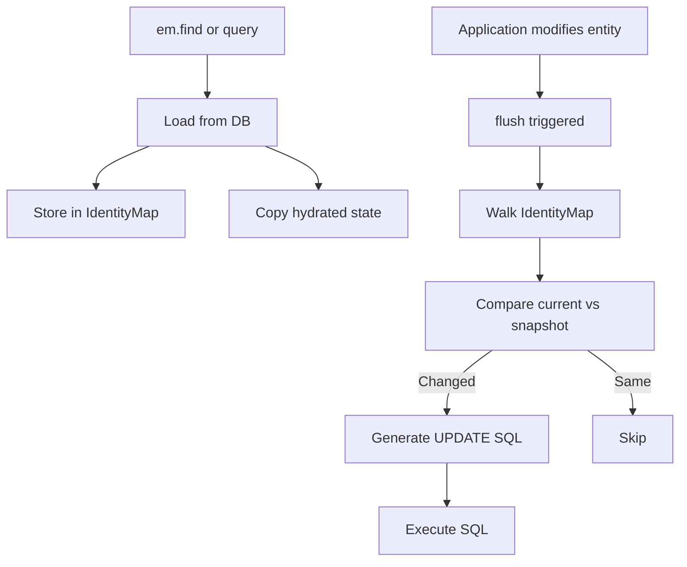
```mermaid
flowchart TD
    A[em.find or query] --> B[Load from DB]
    B --> C[Store in IdentityMap]
    B --> D[Copy hydrated state]
    E[Application modifies entity] --> F[flush triggered]
    F --> G[Walk IdentityMap]
    G --> H[Compare current vs snapshot]
    H -->|Changed| I[Generate UPDATE SQL]
    H -->|Same| J[Skip]
    I --> K[Execute SQL]
```

---

### 📶 Gradual Depth

**Level 1 - What it is:**

The first-level cache is the in-memory map inside every Hibernate Session that tracks all loaded entities. It ensures that loading the same entity twice returns the same Java object. It exists for the lifetime of the Session.

**Level 2 - How to use it:**

You do not interact with the L1 cache directly - it operates transparently. `em.find()` checks the L1 cache before hitting the database. Modifications to managed entities are automatically detected at flush time. Use `em.clear()` to empty the cache in batch scenarios. Use `em.detach(entity)` to remove a single entity.

**Level 3 - How it works:**

On load, Hibernate copies each entity's column values into an `Object[]` (the hydrated state). At flush, `DefaultFlushEntityEventListener` iterates every managed entity, calling `dirtyCheck()` which compares current field values against the snapshot using `==` and `.equals()`. Changed fields are recorded and passed to the SQL generator. The identity map uses `EntityKey(entityType, id)` as the key, ensuring one instance per row per Session.

**Level 4 - Production mastery:**

In production, L1 cache problems manifest as: (1) OOM from large queries without pagination or `clear()`, (2) slow flushes from thousands of managed entities (even if unchanged), (3) unexpected SELECTs from `merge()` triggering snapshot creation for detached entities. Monitor via `SessionMetrics` or Hibernate statistics `getEntityLoadCount()`. For bulk operations, use `StatelessSession` which bypasses the L1 cache entirely. For read-heavy operations, use `em.setHint("org.hibernate.readOnly", true)` to skip snapshot creation.

---

### ⚙️ How It Works

**Phase 1 - Entity load:**
`em.find(Product.class, 1L)` -> check IdentityMap -> miss -> execute SELECT -> instantiate entity -> store in IdentityMap -> copy column values to `Object[]` snapshot.

**Phase 2 - Application modification:**
`product.setPrice(29.99)` -> the entity is still the same managed object. No Hibernate code runs. The field changes in the Java object.

**Phase 3 - Flush (AUTO or explicit):**
Walk every entity in the IdentityMap. For each: compare current field values against the snapshot array. If `price` changed: generate `UPDATE product SET price=? WHERE id=? AND version=?`.

**Phase 4 - Commit:**
JDBC commit. Snapshots retained (still managed). The L1 cache is not cleared on commit in JTA-managed transactions until the Session closes.

```text
  find(P, 1) -> IdentityMap miss -> SELECT
       -> store entity + snapshot(Object[])
  setPrice(29.99)  -> Java field change only
  flush() -> for each entity in IdentityMap:
       -> compare current vs snapshot
       -> price changed: UPDATE SQL
  commit() -> JDBC commit
  close()  -> IdentityMap + snapshots released
```

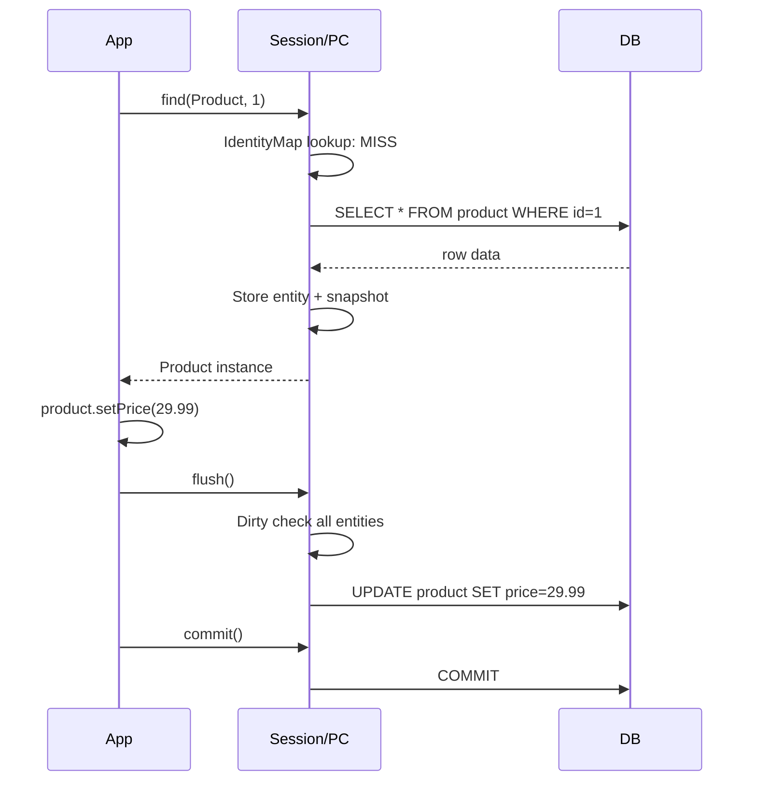
```mermaid
sequenceDiagram
    participant App
    participant Session as Session/PC
    participant DB
    App->>Session: find(Product, 1)
    Session->>Session: IdentityMap lookup: MISS
    Session->>DB: SELECT * FROM product WHERE id=1
    DB-->>Session: row data
    Session->>Session: Store entity + snapshot
    Session-->>App: Product instance
    App->>App: product.setPrice(29.99)
    App->>Session: flush()
    Session->>Session: Dirty check all entities
    Session->>DB: UPDATE product SET price=29.99
    App->>Session: commit()
    Session->>DB: COMMIT
```

---

### 🚨 Failure Modes

**Failure 1 - Persistence Context OOM:**

**Symptom:** `OutOfMemoryError: Java heap space` during batch processing or large queries. Heap dump shows millions of `Object[]` arrays in `StatefulPersistenceContext`.

**Root cause:** Every loaded entity retains a snapshot array. Loading 500K entities stores 500K snapshot arrays + 500K entity instances, doubling effective memory per entity.

**Diagnostic:**

```bash
# Heap dump analysis
jmap -dump:format=b,file=heap.hprof <pid>
# In MAT: find instances of
# StatefulPersistenceContext
# Count EntityEntry instances
```

**Fix:**

**BAD:**

```java
List<Product> all = em.createQuery(
    "FROM Product", Product.class)
    .getResultList(); // 500K entities in L1!
```

**GOOD:**

```java
int batch = 100;
for (int i = 0; ; i += batch) {
    List<Product> chunk = em.createQuery(
        "FROM Product", Product.class)
        .setFirstResult(i).setMaxResults(batch)
        .getResultList();
    if (chunk.isEmpty()) break;
    chunk.forEach(this::process);
    em.flush();
    em.clear(); // Release L1 cache
}
```

**Failure 2 - Slow flush storm:**

**Symptom:** Request latency spikes during flush. Thread dump shows threads blocked in `DefaultFlushEntityEventListener.dirtyCheck()`. Hibernate statistics show high `getFlushCount()` with long flush times.

**Root cause:** Thousands of managed entities in the persistence context. Even unchanged entities are checked during dirty detection (full scan of IdentityMap).

**Diagnostic:**

```bash
# Hibernate statistics
stats.getEntityLoadCount()   # How many loaded
stats.getFlushCount()        # How many flushes
# p6spy: check flush-triggered SQL count
# Thread dump: stuck in dirtyCheck()
```

**Fix:**

```java
// BAD: load 5000 entities, modify 3, flush all
// Dirty check iterates 5000 entities

// GOOD: use read-only hint for non-modified
em.createQuery("FROM Product", Product.class)
    .setHint("org.hibernate.readOnly", true)
    .getResultList();
// Read-only entities skip dirty checking
```

---

### 🔬 Production Reality

A reporting service loads 50,000 order entities per report generation. Each Order has 15 fields. At load time, Hibernate stores 50,000 entity instances + 50,000 `Object[15]` snapshot arrays. The report generation reads but never modifies entities. At transaction commit, Hibernate iterates all 50,000 entities for dirty checking - finding nothing to update but consuming 3 seconds of CPU time. Memory usage: entity instances consume approximately 200MB; snapshot arrays consume another 200MB. The fix: switching to a DTO projection (`SELECT new OrderReportDTO(o.id, o.total, o.date) FROM Order o`) eliminated the L1 cache entirely for this use case, reducing memory from 400MB to 20MB and eliminating the 3-second dirty-check overhead.

---

### ⚖️ Trade-offs & Alternatives

| Aspect            | L1 Cache (Session)   | StatelessSession | DTO Projection    |
| ----------------- | -------------------- | ---------------- | ----------------- |
| Identity map      | Yes                  | No               | No                |
| Dirty checking    | Automatic            | None             | N/A               |
| Memory per entity | Entity + snapshot    | Entity only      | DTO only          |
| Batch safe        | No (grows unbounded) | Yes              | Yes               |
| Lazy loading      | Yes                  | No               | N/A               |
| Best for          | OLTP (short TX)      | Bulk ETL         | Read-only reports |

**Real-world patterns:**

- **Spring Data JPA** defaults to Session-per-request (OSIV). L1 cache lives for the entire HTTP request. Safe for typical CRUD but dangerous for batch endpoints.
- **ETL pipelines** at data-heavy organizations use StatelessSession exclusively, bypassing L1 cache to process millions of rows without OOM.

---

### ⚡ Decision Snap

**USE L1 CACHE (DEFAULT) WHEN:**

- Short-lived request-scoped transactions with < 1000 entities.
- You need identity guarantee and automatic dirty detection.
- Standard OLTP CRUD operations.

**AVOID (USE ALTERNATIVES) WHEN:**

- Batch processing > 1000 entities: use `clear()` + chunking or StatelessSession.
- Read-only reporting: use DTO projections (no L1 overhead).
- Streaming large result sets: use `ScrollableResults` + `clear()`.

**PREFER STATELESS SESSION WHEN:**

- Bulk INSERT/UPDATE/DELETE with no need for cascading, lazy loading, or dirty checking.

---

### ⚠️ Top Traps

| #   | Misconception                            | Reality                                                                                                                                             |
| --- | ---------------------------------------- | --------------------------------------------------------------------------------------------------------------------------------------------------- |
| 1   | L1 cache has a size limit                | No limit. No eviction. No TTL. It grows until the Session closes or `clear()` is called.                                                            |
| 2   | Read-only operations are cheap in L1     | Even unchanged entities consume a snapshot array and are iterated during dirty checking at flush time.                                              |
| 3   | `em.clear()` is dangerous                | `clear()` is necessary for batch processing. The danger is calling it with unflushed changes - always `flush()` before `clear()`.                   |
| 4   | L2 cache replaces L1 cache               | L2 is a SessionFactory-scoped cache. L1 is a Session-scoped identity map. They serve different purposes and both exist simultaneously.              |
| 5   | Detaching an entity removes its snapshot | `detach()` removes the entity from the identity map AND its snapshot, freeing memory for that entity. This is correct behavior but often forgotten. |

---

### 🪜 Learning Ladder

**Prerequisites:**

- Explain Persistence Context at Every Level (L3) - conceptual
  understanding of PC behavior
- Dirty Checking and First-Level Cache Internals (L3) - dirty
  checking overview

**THIS:** HIB-072 First-Level Cache (Persistence Context)
Internals

**Next steps:**

- Second-Level Cache Regions and Invalidation Strategies -
  L2 cache complements L1
- StatelessSession for Bulk and Streaming Operations -
  bypassing L1 entirely
- Bytecode Enhancement and Proxy Generation Internals -
  how proxies interact with L1

---

**The Surprising Truth:**

The L1 cache's snapshot comparison is not based on `.equals()` in most cases. Hibernate uses a type-specific comparator (`JavaType.areEqual()`) that for primitive wrappers uses `==` (identity), not `.equals()`. Custom `equals()` implementations on entity fields do not affect dirty checking. This means changing an entity's `equals()` method never changes what Hibernate considers "dirty."

**Further Reading:**

- Martin Fowler, "Patterns of Enterprise Application Architecture" (2002) - Identity Map and Unit of Work patterns
- JPA 3.1 Specification (Jakarta EE 10) Section 3.1 - EntityManager and Persistence Context
- Hibernate ORM 6 User Guide, Chapter 6 - Persistence Context

**Revision Card:**

1. L1 cache = identity map + snapshot per entity. No eviction. No limit. Grows until Session closes.
2. Flush iterates ALL managed entities for dirty checking. 50,000 entities = 50,000 comparisons even if nothing changed.
3. For batch: `flush()` + `clear()` every N rows. For read-only: DTO projections or read-only hint to skip snapshots.

---

---

# HIB-073 Second-Level Cache Regions and Invalidation Strategies

**TL;DR** - L2 cache stores dehydrated entity state in named regions with configurable TTL, concurrency strategies, and invalidation that must match your consistency requirements.

---

### 🔥 Problem Statement

A reference data table (countries, currencies) is queried thousands of times per second. Every query hits the database. Adding `@Cacheable` with Hibernate L2 cache reduces database load by 99%. But the configuration is wrong: no region isolation, no TTL, and NONSTRICT_READ_WRITE concurrency on data that gets updated. Stale reads appear. One service sees the old country name for hours. Understanding L2 cache regions, concurrency strategies, and invalidation is the difference between a cache that helps and one that creates consistency bugs.

---

### 📜 Historical Context

Hibernate introduced the second-level cache in Hibernate 2.x (early 2000s) as an optional `SessionFactory`-scoped cache. JPA formalized caching with the `@Cacheable` annotation in JPA 2.0 (2009). Hibernate delegates actual cache storage to pluggable providers: EHCache, Infinispan, Caffeine, Hazelcast, Redis. Each provider has its own region management, eviction policies, and clustering capabilities. The cache stores "dehydrated" state (column values as arrays) rather than entity objects, avoiding classloader and serialization issues. Cache regions allow per-entity configuration - one entity might have 5-minute TTL while another is cached indefinitely.

---

### 🔩 First Principles

**CORE INVARIANTS:**

1. **Dehydrated storage:** L2 cache stores `Object[]` column-value arrays, not Java objects. Each cache hit requires re-hydration (constructing the entity from the array).
2. **Region isolation:** Each entity type maps to a named cache region. Regions can have independent TTL, max size, and eviction policies.
3. **Concurrency strategy determines consistency:** READ_ONLY (immutable), NONSTRICT_READ_WRITE (eventual consistency), READ_WRITE (soft locks), TRANSACTIONAL (XA).
4. **Invalidation on write:** When an entity is updated or deleted, its L2 cache entry is invalidated. The invalidation scope depends on the concurrency strategy.

**DERIVED DESIGN:**

Dehydrated storage means cache hits are cheaper in memory than holding entity objects but require CPU for re-hydration. Region isolation means misconfiguring one entity's region does not affect others. The concurrency strategy choice is the critical decision: too weak (NONSTRICT) and you get stale reads; too strong (TRANSACTIONAL) and you lose most of the performance benefit.

**THE TRADE-OFF:**

**Gain:** Database load reduction proportional to cache hit rate. Sub-millisecond entity-by-ID lookups.

**Cost:** Memory for cached state. Staleness window (except TRANSACTIONAL). Complexity of invalidation. Cache warmup time after restart.

---

### 🧠 Mental Model

> L2 cache regions are like labeled shelves in a warehouse. Each shelf (region) has its own expiry rules. The "Countries" shelf keeps items forever. The "Prices" shelf rotates items every 5 minutes. The concurrency strategy is the lock on the shelf: no lock (NONSTRICT) = fastest but someone might read while you're swapping items; padlock (READ_WRITE) = slower but consistent; vault (TRANSACTIONAL) = slowest but guaranteed.

- "Labeled shelf" -> named cache region
- "Expiry rules" -> TTL per region
- "Lock type" -> concurrency strategy
- "Warehouse" -> SessionFactory-scoped L2 cache

**Where this analogy breaks down:** Unlike physical shelves, cache regions can overlap in memory. And "re-hydration" has no warehouse equivalent - it is the CPU cost of converting cached arrays back to Java objects.

---

### 🧩 Components

- **CacheRegion:** Named partition in the cache provider. One region per entity type (default) or custom-named via `@Cache(region="...")`.
- **ConcurrencyStrategy:** READ_ONLY, NONSTRICT_READ_WRITE, READ_WRITE, TRANSACTIONAL. Controls lock behavior on read/write.
- **CacheKey:** `EntityKey(type, id, tenantId)` used to look up cached state.
- **CacheEntry:** Dehydrated `Object[]` of column values plus version and subclass discriminator.
- **QueryCache:** Separate from entity cache. Stores query result IDs (not entities). Each ID then resolves from entity L2 cache.

```text
  SessionFactory L2 Cache
  +------------------------------------------+
  | Region: "com.app.Country" [READ_ONLY]    |
  |   Key(Country,1) -> [1,"US","United..."] |
  |   Key(Country,2) -> [2,"UK","United..."] |
  +------------------------------------------+
  | Region: "com.app.Product" [READ_WRITE]   |
  |   Key(Product,10) -> [10,"Widget",29.99] |
  +------------------------------------------+
  | Region: "query-cache" [NONSTRICT]        |
  |   QueryKey -> [10, 11, 12] (IDs only)    |
  +------------------------------------------+
```

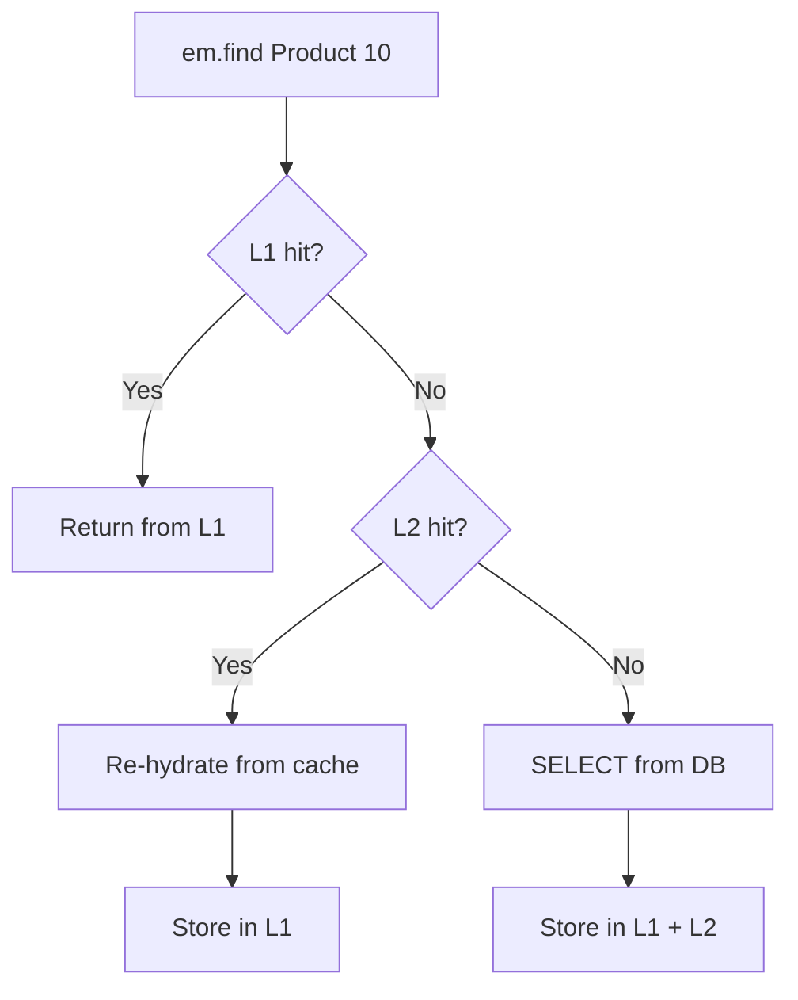
```mermaid
flowchart TD
    A[em.find Product 10] --> B{L1 hit?}
    B -->|Yes| C[Return from L1]
    B -->|No| D{L2 hit?}
    D -->|Yes| E[Re-hydrate from cache]
    D -->|No| F[SELECT from DB]
    F --> G[Store in L1 + L2]
    E --> H[Store in L1]
```

---

### 📶 Gradual Depth

**Level 1 - What it is:**

The second-level cache is a SessionFactory-scoped cache that stores entity data across Sessions. Unlike the L1 cache (per-Session), the L2 cache is shared. It reduces database queries for frequently accessed entities.

**Level 2 - How to use it:**

Enable with `hibernate.cache.use_second_level_cache=true`. Add a cache provider (EHCache, Caffeine). Annotate entities with `@Cacheable` and `@Cache(usage = CacheConcurrencyStrategy.READ_WRITE)`. Configure regions in the provider's config file (ehcache.xml) with TTL and max entries.

**Level 3 - How it works:**

On `em.find()`, Hibernate checks L1 first, then L2. On L2 hit, the dehydrated `Object[]` is re-hydrated into an entity instance and placed in L1. On entity UPDATE/DELETE, the L2 entry is invalidated (READ_WRITE) or softly locked then updated (TRANSACTIONAL). The query cache stores only entity IDs; each ID resolution triggers an L2 lookup, making query cache effectiveness dependent on L2 hit rate.

**Level 4 - Production mastery:**

Monitor L2 hit rate via `statistics.getSecondLevelCacheHitCount()` vs `getMissCount()`. A hit rate below 80% suggests wrong entities are cached. Region-level metrics reveal which entities benefit vs waste memory. NONSTRICT_READ_WRITE is often chosen for simplicity but allows a staleness window between write and invalidation. In clustered environments, use Infinispan or Hazelcast with distributed invalidation. The query cache is rarely beneficial - it is invalidated on ANY update to the cached entity type, causing frequent misses.

---

### ⚙️ How It Works

**Phase 1 - Cache miss (first load):**
`find(Product, 10)` -> L1 miss -> L2 miss -> SELECT from DB -> store entity in L1 -> dehydrate to `Object[]` -> store in L2 region.

**Phase 2 - Cache hit (subsequent load, different Session):**
`find(Product, 10)` -> L1 miss (new Session) -> L2 hit -> re-hydrate `Object[]` to entity -> store in L1.

**Phase 3 - Invalidation on write:**
UPDATE Product SET price=39.99 WHERE id=10 -> flush -> UPDATE SQL -> L2 region invalidation for Key(Product,10) -> next read will miss L2 -> reload from DB.

**Phase 4 - Concurrency handling (READ_WRITE):**
TX1 reads Product 10 (cached). TX2 updates Product 10. TX2 places a soft-lock in L2. TX1 completes. TX2 commits -> soft-lock replaced with new value. During soft-lock period, all reads go to DB (cache miss).

```text
  Session A: find(P,10) -> L2 miss -> DB -> L2 put
  Session B: find(P,10) -> L2 hit  -> re-hydrate
  Session C: update P(10) -> L2 invalidate
  Session D: find(P,10) -> L2 miss -> DB -> L2 put
```

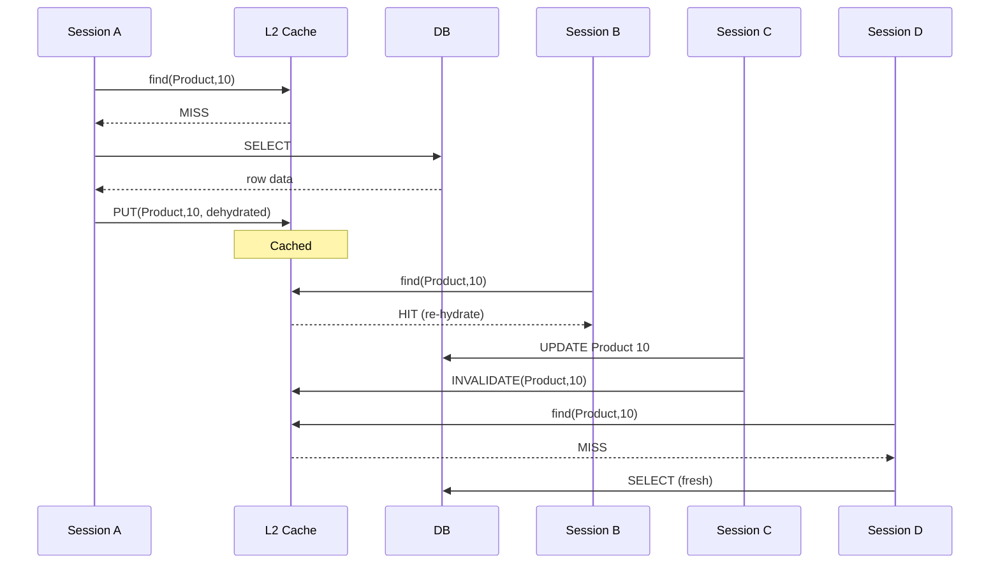
```mermaid
sequenceDiagram
    participant S1 as Session A
    participant L2 as L2 Cache
    participant DB
    S1->>L2: find(Product,10)
    L2-->>S1: MISS
    S1->>DB: SELECT
    DB-->>S1: row data
    S1->>L2: PUT(Product,10, dehydrated)
    Note over L2: Cached
    participant S2 as Session B
    S2->>L2: find(Product,10)
    L2-->>S2: HIT (re-hydrate)
    participant S3 as Session C
    S3->>DB: UPDATE Product 10
    S3->>L2: INVALIDATE(Product,10)
    participant S4 as Session D
    S4->>L2: find(Product,10)
    L2-->>S4: MISS
    S4->>DB: SELECT (fresh)
```

---

### 🚨 Failure Modes

**Failure 1 - Stale reads with NONSTRICT_READ_WRITE:**

**Symptom:** Users see outdated data for seconds to minutes after another user updates a record. No error. No exception. Just wrong data.

**Root cause:** NONSTRICT_READ_WRITE invalidates the cache entry AFTER the transaction commits. Between the database write and cache invalidation, other Sessions read stale cached data.

**Diagnostic:**

```bash
# Compare cache hit vs DB state
# Enable statistics:
stats.getSecondLevelCacheHitCount()
stats.getSecondLevelCacheMissCount()
# If hits are high but data appears stale:
# Concurrency strategy is too weak
```

**Fix:**

**BAD:**

```java
@Cache(usage = NONSTRICT_READ_WRITE)
// Stale window between write and invalidation
```

**GOOD:**

```java
@Cache(usage = READ_WRITE)
// Soft-lock prevents stale reads during update
```

**Failure 2 - Query cache thrashing:**

**Symptom:** Query cache hit rate near 0%. Cache operations add overhead without benefit. L2 cache memory grows but hit rate stays low.

**Root cause:** The query cache is invalidated on ANY update to entities of the cached query's type. If Products are updated frequently, every Product query cache entry is invalidated, causing constant miss-reload-invalidate cycles.

**Diagnostic:**

```bash
# Hibernate statistics
stats.getQueryCacheHitCount()
stats.getQueryCacheMissCount()
stats.getQueryCachePutCount()
# If miss >> hit: query cache is counter-productive
```

**Fix:**

```properties
# Disable query cache for frequently updated entities
hibernate.cache.use_query_cache=false
# Use application-level caching (@Cacheable)
# for query results instead
```

---

### 🔬 Production Reality

A multi-service platform caches `Currency` entities (200 rows, updated monthly) and `Price` entities (50,000 rows, updated every minute). Both use `@Cache(usage = NONSTRICT_READ_WRITE)` with the same 60-minute TTL. Currency caching works perfectly: 99.9% hit rate, data staleness irrelevant (monthly updates). Price caching is counter-productive: constant invalidation from frequent updates means hit rate is 15%, the cache consumes 200MB of heap, and the staleness window causes pricing errors. The fix: keep L2 cache for Currency with READ_ONLY (immutable in practice), remove L2 cache for Price entirely, and use application-level caching with 30-second TTL for Price aggregates.

---

### ⚖️ Trade-offs & Alternatives

| Aspect       | L2 Entity Cache  | Application Cache  | Query Cache      |
| ------------ | ---------------- | ------------------ | ---------------- |
| Cached shape | Entity by ID     | Any (DTO, list)    | Query result IDs |
| Invalidation | Auto on write    | Manual @CacheEvict | Auto (per type!) |
| Granularity  | Per entity       | Per method/key     | Per query        |
| Overhead     | Re-hydration CPU | Serialization      | ID resolution    |
| Best for     | Reference data   | Aggregates, DTOs   | Rarely useful    |

**Real-world patterns:**

- **Netflix / Uber** typically use application-level caching (EVCache, Redis) rather than L2 cache because they need caching at the service boundary, not the ORM layer.
- **Monolithic enterprise apps** benefit most from L2 cache because entity-by-ID lookups are frequent and the persistence layer is the primary data path.

---

### ⚡ Decision Snap

**USE L2 CACHE WHEN:**

- Reference data queried by ID frequently (countries, currencies, configurations).
- Entities change rarely (daily or less).
- READ_ONLY or READ_WRITE concurrency is acceptable.

**AVOID WHEN:**

- Entities change frequently (prices, inventory, events).
- You need to cache query results or aggregates (use application cache).
- Distributed caching across services is needed (use Redis/Memcached directly).

**PREFER APPLICATION CACHE WHEN:**

- Caching DTOs, aggregates, or query results at the service layer.

---

### ⚠️ Top Traps

| #   | Misconception                                          | Reality                                                                                                                                                 |
| --- | ------------------------------------------------------ | ------------------------------------------------------------------------------------------------------------------------------------------------------- |
| 1   | L2 cache caches query results                          | Entity L2 cache caches entities by ID. The query cache is separate, stores only IDs, and is rarely beneficial.                                          |
| 2   | NONSTRICT_READ_WRITE is safe for mutable data          | There is a staleness window between write and invalidation. Use READ_WRITE for mutable data that must be consistent.                                    |
| 3   | Enabling L2 cache on all entities improves performance | Caching frequently updated entities wastes memory and adds overhead from constant invalidation. Cache selectively.                                      |
| 4   | L2 cache stores Java objects                           | L2 stores dehydrated `Object[]` arrays. Each hit requires re-hydration (CPU cost). This is by design for memory efficiency.                             |
| 5   | Clustered L2 cache is automatic                        | Distributed invalidation requires a clustered cache provider (Infinispan, Hazelcast) and network configuration. EHCache standalone does not distribute. |

---

### 🪜 Learning Ladder

**Prerequisites:**

- Second-Level Cache Introduction (L2) - basic L2 concepts
- Second-Level Cache vs Application Cache Decision (L3) -
  when to use which
- First-Level Cache (Persistence Context) Internals -
  L1 vs L2 relationship

**THIS:** HIB-073 Second-Level Cache Regions and Invalidation
Strategies

**Next steps:**

- Hibernate Performance Tuning at Scale - L2 cache as part
  of a comprehensive tuning strategy
- Connection Management and Release Modes - infrastructure
  complementing caching

---

**The Surprising Truth:**

The Hibernate query cache is one of the most enabled and least useful features. It stores only entity IDs, so every query cache "hit" triggers N individual L2 cache lookups. Worse, it is invalidated on ANY update to the entity type - not just the cached query's results. A single `UPDATE Product SET price=? WHERE id=1` invalidates ALL cached Product queries, even those that would not have included that product.

**Further Reading:**

- JPA 3.1 Specification, Section 3.7 - Second-Level Cache
- Hibernate ORM 6 User Guide, Chapter 7 - Caching
- Vlad Mihalcea, "High-Performance Java Persistence" (2016) - Chapter 14: Caching

**Revision Card:**

1. L2 stores dehydrated `Object[]`, not Java objects. Cache hits require re-hydration (CPU). Cache SELECTIVELY - only reference data.
2. Concurrency strategy is the critical decision: READ_ONLY for immutable, READ_WRITE for mutable, NONSTRICT only if staleness is acceptable.
3. The query cache is almost never worth enabling. It invalidates on ANY write to the entity type and adds overhead without proportional benefit.

---

---

# HIB-074 Bytecode Enhancement and Proxy Generation Internals

**TL;DR** - Hibernate uses CGLIB/ByteBuddy proxies for lazy loading and optional bytecode enhancement for dirty tracking, field-level lazy, and no-proxy associations.

---

### 🔥 Problem Statement

An entity has a `@ManyToOne(fetch = LAZY)` association. In the debugger, the object is not a `Customer` but a `Customer$HibernateProxy$abc123`. Calling `.getClass()` returns the proxy class, not `Customer.class`. `instanceof` behaves unexpectedly. `equals()` comparisons between a proxy and a real entity fail if not implemented carefully. Proxy generation is the mechanism that enables lazy loading, but it introduces subtle behavioral differences that cause production bugs. Understanding the proxy generation mechanism - and the newer bytecode enhancement alternative - is critical for debugging proxy-related issues.

---

### 📜 Historical Context

Hibernate originally used CGLIB (Code Generation Library) to generate subclass proxies at runtime. When you declared `@ManyToOne(fetch=LAZY)`, Hibernate returned a CGLIB proxy subclass instead of the real entity. Hibernate 5.0 switched the default to ByteBuddy (2015), a more actively maintained bytecode generation library. Separately, Hibernate has long supported build-time bytecode enhancement (since Hibernate 3) that instruments the actual entity class rather than creating proxy subclasses. Enhancement was rarely used until Hibernate 5.3+ improved its reliability. In Hibernate 6, bytecode enhancement is the recommended approach for advanced scenarios like field-level laziness and no-proxy `@ManyToOne`.

---

### 🔩 First Principles

**CORE INVARIANTS:**

1. **Lazy loading requires interception:** Accessing an unloaded association must trigger a database query. This requires either a proxy object (interception at the object level) or enhanced bytecode (interception at the field level).
2. **Proxy = subclass:** A proxy is a generated subclass that overrides all non-final methods. The proxy's method implementations trigger lazy loading on first access.
3. **Enhancement = instrumentation:** Bytecode enhancement modifies the entity class itself (at build time or class load time) to add interceptor hooks in field accessors.
4. **Proxies break identity for class checks:** `proxy.getClass() != Entity.class`. `proxy instanceof Entity` returns true, but `entity instanceof proxyClass` varies.

**DERIVED DESIGN:**

Lazy-by-proxy is simple (no build tool changes) but limited: only works for associations (not basic fields), requires non-final classes/methods, and breaks `getClass()` comparisons. Enhancement is more powerful (field-level lazy, no-proxy associations, dirty tracking without snapshots) but requires build-time instrumentation (Maven/Gradle plugin).

**THE TRADE-OFF:**

**Gain:** Lazy loading via proxies requires zero configuration beyond `LAZY` fetch type. Bytecode enhancement enables field-level lazy loading and faster dirty checking.

**Cost:** Proxies break `getClass()`, complicate `equals()`/`hashCode()`, and cannot proxy final classes. Enhancement requires build tool integration and increases class file size.

---

### 🧠 Mental Model

> A proxy is a stunt double: it looks like the actor (same interface), stands in the same spot (same association reference), but is not the real actor. When you talk to it (call a method), it brings the real actor on set (lazy load). Bytecode enhancement is surgery on the real actor: implants that report when touched (field access interception).

- "Stunt double" -> proxy subclass
- "Real actor" -> actual entity instance
- "Bring actor on set" -> lazy initialization trigger
- "Surgery with implants" -> bytecode enhancement

**Where this analogy breaks down:** Unlike a stunt double, once the proxy initializes, it delegates ALL calls to the real entity. It is a permanent wrapper, not a temporary stand-in.

---

### 🧩 Components

- **ByteBuddy ProxyFactory:** Generates subclass proxies at SessionFactory build time. One proxy class per entity type.
- **LazyInitializer:** Attached to each proxy instance. Holds the Session reference, entity ID, and initialization state. Triggers SELECT on first method call.
- **HibernateProxy interface:** Marker interface on all proxies. Provides `getHibernateLazyInitializer()` for programmatic access.
- **EnhancementContext:** Build-time configuration for bytecode enhancement. Controls which features are enabled (dirty tracking, lazy, association management).
- **ManagedEntity interface:** Added to enhanced entities by the enhancer. Enables direct dirty tracking without snapshot comparison.

```text
  Proxy approach:
  Customer$HibernateProxy
    extends Customer
    implements HibernateProxy
    +-- LazyInitializer
          +-- session reference
          +-- entityId
          +-- initialized: boolean
          +-- target: Customer (actual)

  Enhancement approach:
  Customer (enhanced at build time)
    implements ManagedEntity
    +-- $$_hibernate_interceptor
    +-- $$_hibernate_tracker (dirty)
```

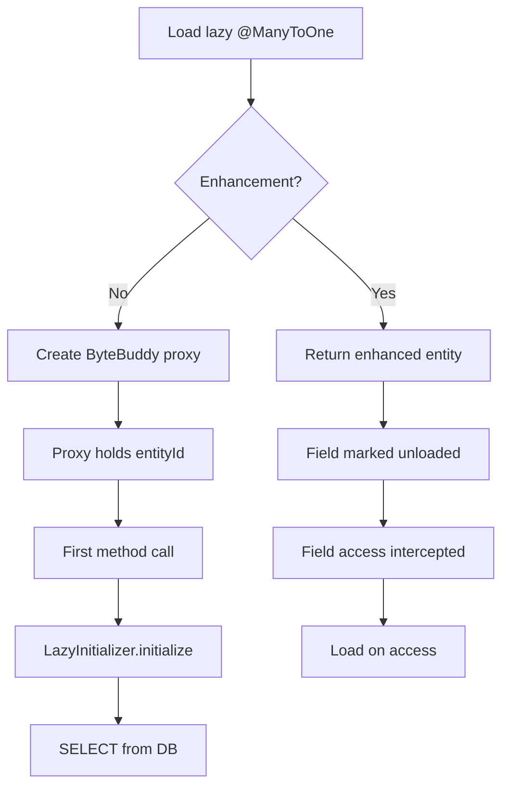
```mermaid
flowchart TD
    A[Load lazy @ManyToOne] --> B{Enhancement?}
    B -->|No| C[Create ByteBuddy proxy]
    C --> D[Proxy holds entityId]
    D --> E[First method call]
    E --> F[LazyInitializer.initialize]
    F --> G[SELECT from DB]
    B -->|Yes| H[Return enhanced entity]
    H --> I[Field marked unloaded]
    I --> J[Field access intercepted]
    J --> K[Load on access]
```

---

### 📶 Gradual Depth

**Level 1 - What it is:**

When you mark an association as `LAZY`, Hibernate does not load it immediately. Instead, it creates a proxy object (a generated subclass) that stands in for the real entity. When you first access a method on the proxy, Hibernate loads the real entity from the database.

**Level 2 - How to use it:**

Proxies are automatic with `@ManyToOne(fetch = LAZY)`. No configuration needed. For bytecode enhancement, add the Hibernate enhance Maven/Gradle plugin. Configure `enableDirtyTracking`, `enableLazyInitialization`, and `enableAssociationManagement` in the plugin configuration.

**Level 3 - How it works:**

ByteBuddy generates a subclass at SessionFactory startup. The proxy overrides every non-final method. Each overridden method checks `LazyInitializer.isUninitialized()`. On first access, `initialize()` uses the Session to load the entity by ID. After initialization, all calls delegate to the loaded entity. For bytecode enhancement, the Hibernate enhance plugin adds `$$_hibernate_interceptor` fields and wraps field accessors with interception logic at build time.

**Level 4 - Production mastery:**

Proxy pitfalls in production: (1) `getClass()` returns the proxy class, breaking switch-on-class patterns, (2) `equals()` must use `instanceof` not `getClass()` comparison, (3) `Hibernate.unproxy(entity)` extracts the real entity from a proxy, (4) `LazyInitializationException` when accessing a proxy after the Session closes. Enhancement avoids most proxy pitfalls but requires build tool integration and increases class file size by 10-30%.

---

### ⚙️ How It Works

**Phase 1 - Proxy class generation (startup):**
SessionFactory scans entity classes. ByteBuddy generates a proxy subclass for each entity: `Customer$HibernateProxy$abc`. The proxy class is cached.

**Phase 2 - Proxy instance creation (query time):**
Query returns an Order with a LAZY `customer` association. Hibernate creates a proxy instance with `LazyInitializer(session, customerId, false)`. The proxy is placed in the L1 cache.

**Phase 3 - Proxy initialization (access time):**
`order.getCustomer().getName()` -> proxy method intercepted -> `LazyInitializer.initialize()` -> `session.immediateLoad(Customer.class, customerId)` -> SELECT -> proxy's target set to loaded entity -> `getName()` delegated to target.

**Phase 4 - Unproxy (explicit):**
`Customer real = Hibernate.unproxy(proxy)` returns the underlying entity. Required for serialization, JSON, or class-sensitive operations.

```text
  Startup: ByteBuddy generates proxy class
  Query:   SELECT o FROM Order o
           o.customer = Proxy(id=42, uninit)
  Access:  o.getCustomer().getName()
           -> Proxy intercepts getName()
           -> LazyInitializer.initialize()
           -> SELECT FROM customer WHERE id=42
           -> proxy.target = loaded Customer
           -> delegate getName() to target
```

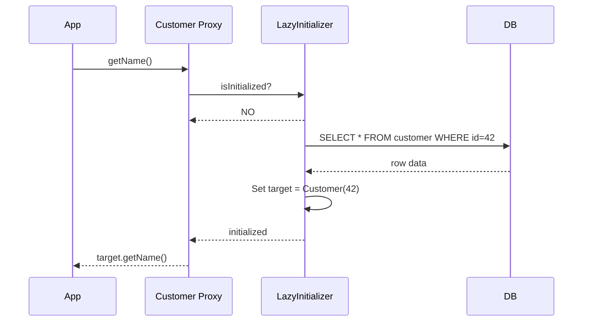
```mermaid
sequenceDiagram
    participant App
    participant Proxy as Customer Proxy
    participant LI as LazyInitializer
    participant DB
    App->>Proxy: getName()
    Proxy->>LI: isInitialized?
    LI-->>Proxy: NO
    LI->>DB: SELECT * FROM customer WHERE id=42
    DB-->>LI: row data
    LI->>LI: Set target = Customer(42)
    LI-->>Proxy: initialized
    Proxy-->>App: target.getName()
```

---

### 🚨 Failure Modes

**Failure 1 - Broken equals()/getClass():**

**Symptom:** Two objects representing the same row return `false` for `equals()`. A `Set<Customer>` contains duplicates. Type checks fail.

**Root cause:** `proxy.getClass()` returns `Customer$HibernateProxy$abc`, not `Customer.class`. If `equals()` uses `getClass()` comparison, proxy != real entity.

**Diagnostic:**

```java
// Identify the issue
entity.getClass()
// Returns: Customer$HibernateProxy$abc
Hibernate.getClass(entity)
// Returns: Customer.class (the real class)
```

**Fix:**

**BAD:**

```java
public boolean equals(Object o) {
    if (o == null
            || getClass() != o.getClass())
        return false; // Proxy FAILS here!
}
```

**GOOD:**

```java
public boolean equals(Object o) {
    if (!(o instanceof Customer))
        return false;
    Customer other = (Customer) o;
    return id != null
        && id.equals(other.getId());
}
```

**Failure 2 - LazyInitializationException after Session close:**

**Symptom:** `org.hibernate.LazyInitializationException: could not initialize proxy - no Session`. Occurs when accessing a lazy association outside an active Session/transaction.

**Root cause:** The proxy's `LazyInitializer` holds a Session reference. After Session close, the reference is null. Proxy initialization requires an active Session to execute the SELECT.

**Diagnostic:**

```java
// Check if proxy is initialized
Hibernate.isInitialized(entity.getAssociation())
// Returns false if still a proxy
// Check Session state
entityManager.isOpen()
// Returns false if closed
```

**Fix:**

```java
// BAD: access lazy assoc outside transaction
Order o = orderRepo.findById(1L).orElseThrow();
// Transaction ends (Session closes)
o.getCustomer().getName();
// LazyInitializationException!

// GOOD: eager fetch in the query
@Query("SELECT o FROM Order o "
    + "JOIN FETCH o.customer WHERE o.id = :id")
Order findWithCustomer(@Param("id") Long id);
```

---

### 🔬 Production Reality

A REST API serializes Order entities to JSON via Jackson. The serializer calls `getCustomer()` on each Order. With Open Session in View (OSIV) enabled, the proxy initializes and the serializer works - but triggers N+1 queries. When OSIV is disabled for performance, every `getCustomer()` throws `LazyInitializationException`. The fix required three changes: (1) use JOIN FETCH in the query, (2) use DTO projections for list endpoints (avoiding proxies entirely), (3) add `Hibernate.initialize()` in the service layer for single-entity endpoints where the association is needed. This pattern - proxies interacting with serialization frameworks - is the #1 source of `LazyInitializationException` in Spring Boot applications.

---

### ⚖️ Trade-offs & Alternatives

| Aspect            | Proxy (ByteBuddy) | Bytecode Enhance | Eager fetch |
| ----------------- | ----------------- | ---------------- | ----------- |
| Build tool needed | No                | Yes (plugin)     | No          |
| Lazy basic fields | No                | Yes              | N/A         |
| getClass() safe   | No                | Yes              | Yes         |
| Dirty tracking    | Snapshot compare  | Inline tracking  | Snapshot    |
| Session required  | Yes (for init)    | Yes (for init)   | No          |
| Production risk   | LazyInit, equals  | Build complexity | N+1, memory |

**Real-world patterns:**

- **Spring Boot defaults:** Proxy-based lazy loading with OSIV enabled. Simple but hides N+1.
- **High-performance systems:** Bytecode enhancement with dirty tracking eliminates snapshot comparison overhead. Adopted by performance-critical Hibernate users.

---

### ⚡ Decision Snap

**USE PROXIES (DEFAULT) WHEN:**

- Standard OLTP applications with few lazy associations.
- You can control query-time fetching with JOIN FETCH.
- Build tool simplicity matters more than edge-case correctness.

**USE BYTECODE ENHANCEMENT WHEN:**

- Field-level lazy loading is needed (e.g., BLOB/CLOB columns).
- Dirty tracking overhead is a measured bottleneck.
- No-proxy `@ManyToOne` associations are needed (Hibernate 6+).

**AVOID WHEN:**

- Never use EAGER fetch as the default. It is worse than both proxy and enhancement approaches.

---

### ⚠️ Top Traps

| #   | Misconception                                  | Reality                                                                                                                                               |
| --- | ---------------------------------------------- | ----------------------------------------------------------------------------------------------------------------------------------------------------- |
| 1   | Proxy and real entity are interchangeable      | `getClass()` differs. `equals()` must use `instanceof`. JSON serializers may fail without `Hibernate.unproxy()`.                                      |
| 2   | Bytecode enhancement replaces proxies entirely | Enhancement replaces proxies for `@ManyToOne` associations (no-proxy mode). Collection proxies (`PersistentBag`, `PersistentSet`) still exist.        |
| 3   | `Hibernate.initialize()` is an anti-pattern    | It is legitimate when used in the service layer to prepare data for the controller. It is an anti-pattern when used to paper over missing JOIN FETCH. |
| 4   | Proxies work with final classes                | ByteBuddy cannot subclass `final` classes. Final entity classes require bytecode enhancement or will be loaded eagerly.                               |
| 5   | OSIV solves all proxy problems                 | OSIV keeps the Session open during rendering, avoiding LazyInitializationException. But it HIDES N+1 problems and holds database connections longer.  |

---

### 🪜 Learning Ladder

**Prerequisites:**

- FetchType.LAZY vs FetchType.EAGER (L1) - why lazy loading exists
- First-Level Cache (Persistence Context) Internals -
  proxies live in the L1 cache
- LazyInitializationException Epidemic - the most common
  proxy failure

**THIS:** HIB-074 Bytecode Enhancement and Proxy Generation
Internals

**Next steps:**

- Open Session in View - The Silent Scalability Killer -
  OSIV interacts with proxy initialization
- Hibernate Performance Tuning at Scale - enhancement as
  a performance optimization
- StatelessSession for Bulk and Streaming Operations -
  no proxies in StatelessSession

---

**The Surprising Truth:**

When you call `toString()` on an uninitialized proxy that overrides `toString()`, it triggers lazy initialization - executing a database query inside a debug statement or log call. Many production N+1 issues are caused by `log.debug("Processing: {}", order.getCustomer())` where the `Customer` toString triggers a lazy load per order.

**Further Reading:**

- ByteBuddy project documentation (Rafael Winterhalter) - runtime code generation
- JPA 3.1 Specification, Section 3.2.9 - Entity Access Type and lazy fetching
- Hibernate ORM 6 User Guide, Chapter 25 - Bytecode Enhancement

**Revision Card:**

1. Proxy = ByteBuddy subclass. `getClass()` returns the proxy class. Always use `instanceof`, never `getClass()` comparison in `equals()`.
2. Bytecode enhancement = build-time instrumentation. Enables field-level lazy, no-proxy associations, and inline dirty tracking. Requires Maven/Gradle plugin.
3. Most `LazyInitializationException` occurs from serialization (Jackson) accessing lazy proxies after Session close. Fix: JOIN FETCH or DTO projection.

---

---

# HIB-075 StatelessSession for Bulk and Streaming Operations

**TL;DR** - StatelessSession bypasses the persistence context entirely - no L1 cache, no dirty checking, no cascades - making it ideal for bulk ETL but dangerous for normal CRUD.

---

### 🔥 Problem Statement

A nightly ETL job imports 2 million product records. Using a standard Session, the persistence context accumulates 2 million entity snapshots. Memory climbs to 16GB. Flush time grows quadratically because dirty checking iterates all managed entities. The job OOMs or takes hours. Chunking with `clear()` helps but adds complexity and still creates/destroys snapshots repeatedly. StatelessSession eliminates the problem at the root: no identity map, no snapshots, no dirty checking. Each entity is immediately persisted, updated, or deleted via direct JDBC. The trade-off: no cascading, no lazy loading, no automatic relationship management.

---

### 📜 Historical Context

StatelessSession was introduced in Hibernate 3.1 (2005) as a low-level API for bulk operations. It was designed after Hibernate users reported OOM issues with large batch jobs that loaded hundreds of thousands of entities into a single Session. The API mirrors Session's basic CRUD methods (`get`, `insert`, `update`, `delete`) but operates without a persistence context. It was inspired by the realization that the Unit of Work pattern (identity map + dirty checking) is optimized for OLTP (tens of entities per transaction) but pathological for ETL (millions of entities per job).

---

### 🔩 First Principles

**CORE INVARIANTS:**

1. **No persistence context:** No identity map. No snapshot arrays. No managed entity tracking. Memory usage is constant regardless of entity count.
2. **Immediate SQL execution:** `insert()` executes INSERT immediately. `update()` executes UPDATE immediately. No write-behind, no flush buffering.
3. **No cascading:** Operations on associations are not propagated. If you insert an Order, its LineItems are NOT automatically inserted.
4. **No lazy loading:** Associations are not proxy-wrapped. Accessing an unloaded association returns null, not a proxy.

**DERIVED DESIGN:**

No persistence context means constant memory. Immediate SQL means no flush storms. No cascading means manual relationship management. No lazy loading means all data must be fetched in the query. These constraints make StatelessSession ideal for batch processing and dangerous for normal application logic.

**THE TRADE-OFF:**

**Gain:** Constant O(1) memory regardless of entity count. No flush overhead. No dirty checking. Predictable performance for bulk operations.

**Cost:** No cascading, no lazy loading, no automatic dirty detection, no identity map (same row loaded twice = two different Java objects). Developer must manage everything manually.

---

### 🧠 Mental Model

> Session is a full-service restaurant: the waiter (persistence context) tracks your order, remembers your preferences (identity map), notices if you changed your mind (dirty checking), and brings related courses (cascading). StatelessSession is a food truck: you order directly, get your food immediately, no table tracking, no courses, no memory of your last visit.

- "Full-service restaurant" -> Session with PC
- "Food truck" -> StatelessSession (no state)
- "Direct order" -> immediate SQL execution
- "No memory of last visit" -> no identity map

**Where this analogy breaks down:** A food truck still tracks your current order. StatelessSession literally remembers nothing - not even within the same operation sequence.

---

### 🧩 Components

- **StatelessSession:** Interface obtained via `sessionFactory.openStatelessSession()`. Provides `get()`, `insert()`, `update()`, `delete()`.
- **No ActionQueue:** SQL executes immediately. No buffering, no ordering, no batch grouping (unless JDBC batching is configured separately).
- **ScrollableResults:** StatelessSession supports `scroll()` for forward-only iteration over large result sets without loading all rows into memory.
- **No ProxyFactory interaction:** Associations are not proxied. Lazy associations return the default value (null for objects, empty for collections).

```text
  Session (stateful):
  +--------------------------+
  | IdentityMap + Snapshots  |
  | ActionQueue (buffered)   |
  | Proxy generation         |
  | Cascade management       |
  +--------------------------+

  StatelessSession:
  +--------------------------+
  | JDBC connection          |
  | Direct SQL execution     |
  | (nothing else)           |
  +--------------------------+
```

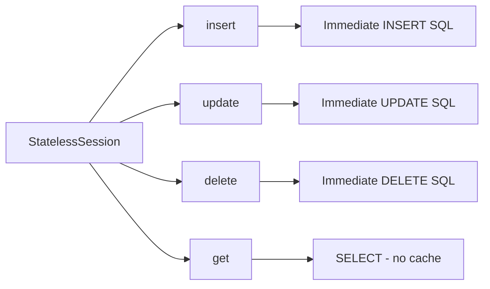
```mermaid
flowchart LR
    A[StatelessSession] --> B[insert]
    A --> C[update]
    A --> D[delete]
    A --> E[get]
    B --> F[Immediate INSERT SQL]
    C --> G[Immediate UPDATE SQL]
    D --> H[Immediate DELETE SQL]
    E --> I[SELECT - no cache]
```

---

### 📶 Gradual Depth

**Level 1 - What it is:**

StatelessSession is a lightweight Hibernate API that executes SQL immediately without maintaining a persistence context. It has no identity map, no dirty checking, and no cascading. It is designed for bulk data operations.

**Level 2 - How to use it:**

Open via `sessionFactory.openStatelessSession()`. Use `insert(entity)` for INSERT, `update(entity)` for UPDATE, `delete(entity)` for DELETE, `get(Entity.class, id)` for SELECT. Always close the StatelessSession when done. Manage transactions explicitly.

**Level 3 - How it works:**

Each CRUD method maps directly to a JDBC PreparedStatement execution. No entity state is retained after the method returns. `insert()` generates and executes INSERT SQL, returns the generated ID, then forgets the entity. `get()` executes a SELECT and returns a detached entity (not managed, since there is no persistence context to manage it).

**Level 4 - Production mastery:**

Combine StatelessSession with JDBC batching (`hibernate.jdbc.batch_size`) for bulk inserts. Use `ScrollableResults` from StatelessSession queries for streaming large result sets. Monitor via `hibernate.generate_statistics` - StatelessSession operations still appear in statistics counters. For Spring integration, unwrap the SessionFactory and open StatelessSession manually (Spring Data does not natively support StatelessSession).

---

### ⚙️ How It Works

**Phase 1 - Open StatelessSession:**
`sessionFactory.openStatelessSession()` obtains a JDBC connection. No persistence context created. No identity map allocated.

**Phase 2 - Bulk insert:**
Loop: create entity -> `statelessSession.insert(entity)` -> INSERT SQL executes immediately -> entity forgotten. Memory: constant.

**Phase 3 - Bulk update with scroll:**
`statelessSession.createQuery("FROM Product").scroll(FORWARD_ONLY)` -> iterate -> modify entity -> `statelessSession.update(entity)` -> UPDATE SQL -> entity forgotten. Memory: one entity at a time.

**Phase 4 - Close:**
`statelessSession.close()` releases the JDBC connection. No flush needed (all SQL already executed).

```text
  Open -> no PC, just JDBC connection
  Loop: insert(e) -> INSERT SQL -> forget e
  Loop: scroll -> get e -> modify -> update(e)
                -> UPDATE SQL -> forget e
  Close -> release connection (no flush)
```

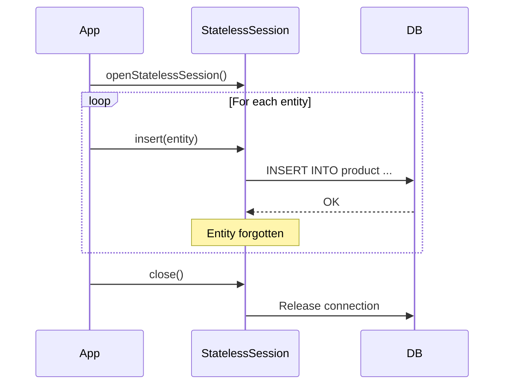
```mermaid
sequenceDiagram
    participant App
    participant SS as StatelessSession
    participant DB
    App->>SS: openStatelessSession()
    loop For each entity
        App->>SS: insert(entity)
        SS->>DB: INSERT INTO product ...
        DB-->>SS: OK
        Note over SS: Entity forgotten
    end
    App->>SS: close()
    SS->>DB: Release connection
```

---

### 🚨 Failure Modes

**Failure 1 - Missing cascaded inserts:**

**Symptom:** `ConstraintViolationException: cannot insert NULL into FOREIGN KEY column`. Parent entity inserted but child entities not inserted.

**Root cause:** StatelessSession does not cascade. Inserting an Order does not insert its LineItems. FK references to non-existent parent/child rows fail.

**Diagnostic:**

```sql
-- Check for orphaned FK references
SELECT * FROM line_items
WHERE order_id NOT IN (SELECT id FROM orders);
```

**Fix:**

**BAD:**

```java
statelessSession.insert(order);
// LineItems NOT inserted! FK violation.
```

**GOOD:**

```java
statelessSession.insert(order);
for (LineItem item : order.getItems()) {
    item.setOrder(order);
    statelessSession.insert(item);
}
```

**Failure 2 - Duplicate objects for same row:**

**Symptom:** Logic that depends on object identity fails. Two `get()` calls for the same ID return different Java objects. `a == b` is false even though both represent the same row.

**Root cause:** No identity map. Each `get()` creates a new Java object from the database row.

**Diagnostic:**

```java
Product a = ss.get(Product.class, 1L);
Product b = ss.get(Product.class, 1L);
assert a != b; // TRUE! Different objects!
```

**Fix:**

```java
// If identity matters, use Session (not
// StatelessSession) or maintain your own
// Map<Long, Entity> for deduplication.
```

---

### 🔬 Production Reality

An e-commerce platform runs a nightly price update job affecting 500,000 products. The original implementation used a standard Session with `clear()` every 500 entities. Processing time: 45 minutes. Memory: 4GB spikes during flush. Switching to StatelessSession with JDBC batch size 50: processing time dropped to 8 minutes. Memory: flat at 512MB. The key change was explicit child entity management (prices had associated `PriceHistory` records that previously relied on cascading). The migration required adding 20 lines of explicit child insert/update code but eliminated all memory and performance issues.

---

### ⚖️ Trade-offs & Alternatives

| Aspect           | Session + clear() | StatelessSession | Spring Batch      |
| ---------------- | ----------------- | ---------------- | ----------------- |
| Memory           | Periodic spikes   | Constant O(1)    | Chunk-based       |
| Cascading        | Yes               | No               | Configurable      |
| Lazy loading     | Yes               | No               | Depends on reader |
| Dirty checking   | Yes (per chunk)   | No               | No                |
| Transaction mgmt | Automatic         | Manual           | Managed by SB     |
| Best for         | Moderate batch    | Raw bulk ETL     | Complex pipelines |

**Real-world patterns:**

- **ETL pipelines** in data-heavy systems use StatelessSession for import/export of millions of rows where entity relationships are pre-resolved.
- **Spring Batch** chunk-oriented processing typically uses standard Session with `clear()` because it needs Spring's transaction management and cascading.

---

### ⚡ Decision Snap

**USE WHEN:**

- Bulk INSERT/UPDATE/DELETE of > 10,000 entities.
- Memory must be constant regardless of batch size.
- No cascading or lazy loading is needed.
- Data is pre-resolved (FKs known, no relationship traversal).

**AVOID WHEN:**

- Normal OLTP request handling (use Session).
- Complex entity graphs with cascading requirements.
- Lazy associations must be traversed.
- You need repeatable reads (identity map guarantee).

**PREFER SESSION + CLEAR() WHEN:**

- Moderate batch size (1000-10000) and you need cascading or lazy loading within each chunk.

---

### ⚠️ Top Traps

| #   | Misconception                                              | Reality                                                                                                                                                                |
| --- | ---------------------------------------------------------- | ---------------------------------------------------------------------------------------------------------------------------------------------------------------------- |
| 1   | StatelessSession is faster than Session for all operations | For single-entity CRUD, the difference is negligible. The benefit appears at > 1000 entities where L1 cache overhead dominates.                                        |
| 2   | StatelessSession supports cascading                        | NO cascading. Every related entity must be explicitly inserted/updated/deleted. FK violations if forgotten.                                                            |
| 3   | Spring Data repositories work with StatelessSession        | Spring Data JPA uses EntityManager (Session). StatelessSession requires manual SessionFactory unwrap and explicit transaction management.                              |
| 4   | StatelessSession has no JDBC batching                      | JDBC batching still works with `hibernate.jdbc.batch_size`. The difference is that batching groups statements at the JDBC level, not at the persistence context level. |
| 5   | Lazy associations throw LazyInitializationException        | With StatelessSession, lazy associations are not proxied. They return null (for @ManyToOne) or empty collections. No exception, but no data either.                    |

---

### 🪜 Learning Ladder

**Prerequisites:**

- First-Level Cache (Persistence Context) Internals -
  understanding what StatelessSession bypasses
- Batch DML and JDBC Batching Internals - batching with
  StatelessSession

**THIS:** HIB-075 StatelessSession for Bulk and Streaming
Operations

**Next steps:**

- Hibernate Performance Tuning at Scale - StatelessSession
  as part of a tuning toolkit
- Connection Management and Release Modes - connection
  lifecycle with StatelessSession

---

**The Surprising Truth:**

StatelessSession's `insert()` method returns the generated ID, which means you can use it for parent-child inserts without an extra SELECT. With Session, `persist()` on an `@GeneratedValue(IDENTITY)` entity triggers an immediate INSERT to get the ID. With StatelessSession, `insert()` does the same INSERT but without creating a persistence context entry - making it both simpler and lighter.

**Further Reading:**

- Hibernate ORM 6 User Guide, Chapter 14 - Batching and StatelessSession
- Martin Fowler, "Patterns of Enterprise Application Architecture" - Unit of Work pattern (what StatelessSession deliberately omits)
- Vlad Mihalcea, "High-Performance Java Persistence" - Chapter 13: Batching

**Revision Card:**

1. StatelessSession = no PC, no identity map, no dirty checking, no cascading, no lazy loading. Constant O(1) memory.
2. Use for bulk ETL > 10K entities. Combine with `hibernate.jdbc.batch_size` for throughput.
3. Must explicitly manage all relationships. `insert(parent)` does NOT insert children. FK violations if forgotten.

---

---

# HIB-076 Batch DML and JDBC Batching Internals

**TL;DR** - JDBC batching groups multiple SQL statements into a single network round-trip. Hibernate batching groups INSERT/UPDATE by entity type and requires careful ordering and ID strategy.

---

### 🔥 Problem Statement

Inserting 10,000 products one at a time generates 10,000 individual INSERT statements, each requiring a network round-trip to the database. At 0.5ms per round-trip, that is 5 seconds of pure network latency. JDBC batching groups these into batches of N (e.g., 50), reducing round-trips from 10,000 to 200. But Hibernate's batching has preconditions: `GenerationType.IDENTITY` disables INSERT batching because Hibernate must execute each INSERT individually to retrieve the generated ID. Entity ordering matters because mixed INSERT/UPDATE statements break batch grouping. Understanding these internals is the difference between batching that works and batching that silently does nothing.

---

### 📜 Historical Context

JDBC batching (`addBatch()` / `executeBatch()`) has been available since JDBC 2.0 (1999). Hibernate added ORM-level batching support to automatically group entity INSERT/UPDATE/DELETE operations into JDBC batches. The key innovation was the `ActionQueue` which sorts pending operations by entity type to maximize batch grouping. Hibernate 5 added `hibernate.order_inserts=true` and `hibernate.order_updates=true` to explicitly enable this sorting. The interaction with `GenerationType.IDENTITY` (which requires immediate INSERT execution to retrieve the auto-increment ID) remains the most common reason batching silently fails.

---

### 🔩 First Principles

**CORE INVARIANTS:**

1. **JDBC batch = one round-trip for N statements:** `PreparedStatement.addBatch()` queues a statement. `executeBatch()` sends all queued statements in a single network round-trip.
2. **Hibernate groups by entity type:** Batching only works when consecutive SQL statements target the same table with the same PreparedStatement. Interleaving INSERT Product / INSERT Order breaks batching.
3. **IDENTITY disables INSERT batching:** `GenerationType.IDENTITY` requires Hibernate to execute INSERT immediately to retrieve the generated ID (via JDBC `getGeneratedKeys()`). This prevents batch grouping.
4. **Batch size is a JDBC-level setting:** `hibernate.jdbc.batch_size=50` sets the maximum statements per JDBC batch. The database driver manages the actual grouping.

**DERIVED DESIGN:**

The entity-type grouping requirement forces INSERT/UPDATE sorting. The IDENTITY incompatibility forces SEQUENCE or TABLE generation strategy for batched inserts. The JDBC-level setting means the database driver determines optimal batch execution (some drivers use multi-row INSERT, others use individual statements with reduced round-trips).

**THE TRADE-OFF:**

**Gain:** 5-10x throughput improvement for bulk operations. Network latency amortized across N statements.

**Cost:** Increased memory (N statements buffered). IDENTITY strategy incompatibility. Ordering requirements add complexity. Batch failures are harder to diagnose (which row failed?).

---

### 🧠 Mental Model

> JDBC batching is like loading a shipping truck. Sending one package at a time (one INSERT per round-trip) is inefficient. Loading 50 packages (batch size 50) into one truck (one round-trip) is 50x fewer trips. But packages must be sorted by destination (entity type) or the truck cannot be loaded efficiently. And if each package needs an immediate receipt (IDENTITY), you cannot batch - each must be sent individually.

- "One package at a time" -> unbatched INSERT
- "50 packages per truck" -> batch_size=50
- "Sorted by destination" -> order_inserts=true
- "Immediate receipt" -> IDENTITY (blocks batching)

**Where this analogy breaks down:** Unlike physical shipping, JDBC batching does not physically group data. The driver may implement batching as a multi-row INSERT or as pipelined individual statements - the API is the same.

---

### 🧩 Components

- **ActionQueue:** Hibernate's internal queue of pending INSERT/UPDATE/DELETE actions. Sorted by entity type when `order_inserts`/`order_updates` is enabled.
- **BatchingBatch:** Hibernate's JDBC batch abstraction. Groups statements up to `hibernate.jdbc.batch_size` and calls `executeBatch()`.
- **PreparedStatement pooling:** One PreparedStatement per entity type per batch. Reused across batch groups.
- **hibernate.jdbc.batch_size:** Maximum statements per JDBC batch.
- **hibernate.order_inserts / order_updates:** Enable sorting of INSERT/UPDATE by entity type for optimal batching.
- **hibernate.jdbc.batch_versioned_data:** Enable batching for versioned entities (UPDATE with version check).

```text
  Without ordering:
  INSERT Product -> INSERT Order -> INSERT Product
  Batch breaks: 3 batches of 1

  With order_inserts=true:
  INSERT Product -> INSERT Product -> INSERT Order
  Batch groups: 1 batch of 2 Products + 1 Order

  With IDENTITY:
  INSERT Product -> getGeneratedKeys() -> ID
  INSERT Product -> getGeneratedKeys() -> ID
  No batching possible (each needs immediate ID)
```

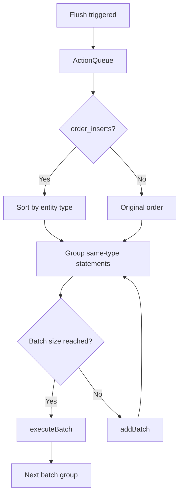
```mermaid
flowchart TD
    A[Flush triggered] --> B[ActionQueue]
    B --> C{order_inserts?}
    C -->|Yes| D[Sort by entity type]
    C -->|No| E[Original order]
    D --> F[Group same-type statements]
    E --> F
    F --> G{Batch size reached?}
    G -->|Yes| H[executeBatch]
    G -->|No| I[addBatch]
    I --> F
    H --> J[Next batch group]
```

---

### 📶 Gradual Depth

**Level 1 - What it is:**

JDBC batching sends multiple SQL statements to the database in a single network round-trip instead of one at a time. Hibernate can automatically batch INSERT, UPDATE, and DELETE operations when configured.

**Level 2 - How to use it:**

Set `hibernate.jdbc.batch_size=50` (or `spring.jpa.properties.hibernate.jdbc.batch_size=50`). Enable ordering: `hibernate.order_inserts=true`, `hibernate.order_updates=true`. Use `SEQUENCE` generation strategy, not `IDENTITY`. Flush and clear periodically in batch jobs.

**Level 3 - How it works:**

At flush time, the ActionQueue sorts pending operations by entity type (if ordering enabled). Hibernate iterates the sorted actions, adding each to a JDBC batch via `addBatch()`. When the batch reaches `batch_size` or the entity type changes, `executeBatch()` sends the batch. The database driver determines the actual execution strategy (multi-row INSERT for PostgreSQL, pipelined statements for MySQL).

**Level 4 - Production mastery:**

Verify batching is actually working via p6spy or Hibernate statistics. Common failures: (1) IDENTITY silently disables batching, (2) `order_inserts` not enabled causes unnecessary batch breaks, (3) versioned entities need `batch_versioned_data=true`. Monitor `statistics.getPrepareStatementCount()` - it should be total_entities / batch_size, not total_entities. For PostgreSQL, use `reWriteBatchedInserts=true` in the JDBC URL to convert addBatch/executeBatch into multi-row INSERT syntax.

---

### ⚙️ How It Works

**Phase 1 - Accumulate actions:**
Application persists 1000 Product entities. Hibernate's ActionQueue stores 1000 InsertAction entries. No SQL executed yet.

**Phase 2 - Flush sort:**
`order_inserts=true` sorts all InsertActions by entity type. All 1000 Product inserts are consecutive.

**Phase 3 - Batch execution:**
Hibernate iterates the sorted actions. Every 50 (batch_size): `ps.addBatch()` x 50, then `ps.executeBatch()`. Result: 20 batch executions instead of 1000 individual statements.

**Phase 4 - ID retrieval (SEQUENCE only):**
With SEQUENCE, Hibernate pre-allocates IDs via `allocationSize` (e.g., 50). One sequence call returns 50 IDs. IDs are assigned before INSERT, enabling batching.

```text
  persist(p1..p1000) -> ActionQueue[1000]
  flush() + order_inserts:
    sort: [P1,P2,...,P1000] (all Products)
  batch execution:
    addBatch x50 -> executeBatch -> 1 round-trip
    addBatch x50 -> executeBatch -> 1 round-trip
    ... (20 batches)
  Total: 20 round-trips (not 1000)
```

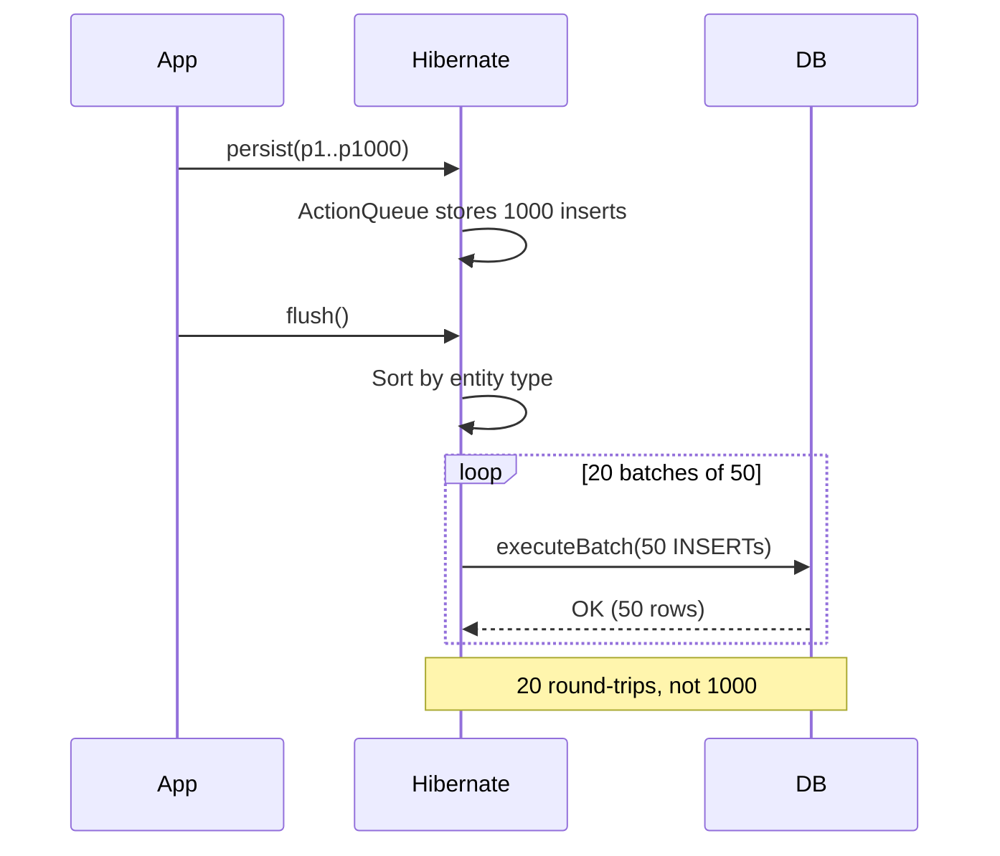
```mermaid
sequenceDiagram
    participant App
    participant Hib as Hibernate
    participant DB
    App->>Hib: persist(p1..p1000)
    Hib->>Hib: ActionQueue stores 1000 inserts
    App->>Hib: flush()
    Hib->>Hib: Sort by entity type
    loop 20 batches of 50
        Hib->>DB: executeBatch(50 INSERTs)
        DB-->>Hib: OK (50 rows)
    end
    Note over Hib,DB: 20 round-trips, not 1000
```

---

### 🚨 Failure Modes

**Failure 1 - IDENTITY silently disables batching:**

**Symptom:** `hibernate.jdbc.batch_size=50` is set but `statistics.getPrepareStatementCount()` equals the entity count (no batching). p6spy shows individual INSERT statements.

**Root cause:** `@GeneratedValue(strategy = GenerationType.IDENTITY)` requires Hibernate to execute each INSERT individually to call `getGeneratedKeys()` and retrieve the auto-increment ID.

**Diagnostic:**

```java
// Check generation strategy
// In entity: @GeneratedValue(strategy = ?)
// In stats:
long stmts = stats.getPrepareStatementCount();
// If stmts == entityCount: no batching
```

**Fix:**

**BAD:**

```java
@GeneratedValue(
    strategy = GenerationType.IDENTITY)
// Each INSERT executes individually
```

**GOOD:**

```java
@GeneratedValue(
    strategy = GenerationType.SEQUENCE,
    generator = "product_seq")
@SequenceGenerator(name = "product_seq",
    sequenceName = "product_id_seq",
    allocationSize = 50)
```

**Failure 2 - Batch break from interleaved entity types:**

**Symptom:** Batch count is much higher than expected. p6spy shows alternating entity types in INSERT statements.

**Root cause:** `order_inserts=false` (default). Hibernate inserts entities in persist order. If you persist Order, LineItem, Order, LineItem..., each type change breaks the batch.

**Diagnostic:**

```properties
# p6spy log shows:
# INSERT INTO orders ...
# INSERT INTO line_items ...
# INSERT INTO orders ...  <- batch break!
```

**Fix:**

```properties
# Enable insert ordering
hibernate.order_inserts=true
hibernate.order_updates=true
# Now: all orders first, then all line_items
```

---

### 🔬 Production Reality

A SaaS platform migrates 5 million user records from a legacy system. Initial implementation: standard Session, IDENTITY generation, no ordering. Processing time: 4 hours. After switching to SEQUENCE generation with `allocationSize=100`, enabling `batch_size=100` and `order_inserts=true`, and using PostgreSQL `reWriteBatchedInserts=true`: processing time dropped to 12 minutes. The key insight: 90% of the original time was network round-trip latency (5M individual INSERTs at 0.3ms each = 25 minutes of pure latency). Batching reduced round-trips by 100x.

---

### ⚖️ Trade-offs & Alternatives

| Aspect         | Hibernate Batching | Native JDBC Batch | COPY (PostgreSQL) |
| -------------- | ------------------ | ----------------- | ----------------- |
| Entity mapping | Automatic          | Manual            | File-based        |
| Throughput     | Good (5-10x)       | Good (5-10x)      | Excellent (50x)   |
| Cascading      | Yes (Session)      | No                | No                |
| Portability    | All databases      | All databases     | PostgreSQL only   |
| Complexity     | Low (config only)  | Medium            | High              |

**Real-world patterns:**

- **Spring Boot** applications typically use Hibernate batching with SEQUENCE. Default batch_size is often not set (effectively 1).
- **Data pipeline** systems needing maximum throughput use PostgreSQL COPY or MySQL LOAD DATA, bypassing Hibernate entirely for initial bulk loads.

---

### ⚡ Decision Snap

**USE HIBERNATE BATCHING WHEN:**

- Bulk operations on mapped entities where you want ORM benefits (validation, callbacks, auditing).
- Moderate batch sizes (1K-1M entities).
- Application portability across databases matters.

**AVOID WHEN:**

- Using `GenerationType.IDENTITY` (switch to SEQUENCE).
- Extreme throughput needed (> 10M rows): use native COPY or LOAD DATA.
- Single-entity CRUD operations (batching has no benefit).

**PREFER NATIVE BULK LOAD WHEN:**

- Initial data migration or ETL with millions of rows and no entity-level logic needed.

---

### ⚠️ Top Traps

| #   | Misconception                                   | Reality                                                                                                                                                                             |
| --- | ----------------------------------------------- | ----------------------------------------------------------------------------------------------------------------------------------------------------------------------------------- |
| 1   | Setting batch_size enables batching             | batch_size is necessary but not sufficient. IDENTITY generation, unordered inserts, or versioned data without `batch_versioned_data` can all silently disable batching.             |
| 2   | Larger batch_size is always better              | Diminishing returns beyond 50-100. Very large batches increase memory and can cause database-side issues (lock escalation, redo log pressure).                                      |
| 3   | Hibernate batching uses multi-row INSERT        | By default, Hibernate uses JDBC addBatch/executeBatch, which the driver may implement as individual statements. PostgreSQL needs `reWriteBatchedInserts=true` for multi-row INSERT. |
| 4   | Batching works with StatelessSession by default | StatelessSession executes SQL immediately. JDBC batching still works at the driver level, but Hibernate's ActionQueue ordering does not apply.                                      |
| 5   | Batch failures identify the failing row         | When one row in a batch fails, the database typically rejects the entire batch. Identifying the failing row requires reducing batch size or trying individual inserts.              |

---

### 🪜 Learning Ladder

**Prerequisites:**

- Persistence Context at Every Level (L3) - flush mechanics
  that trigger batching
- Flush Modes (L3) - flush timing affects batch grouping
- StatelessSession for Bulk and Streaming Operations -
  alternative for bulk processing

**THIS:** HIB-076 Batch DML and JDBC Batching Internals

**Next steps:**

- Hibernate Performance Tuning at Scale - batching as part
  of comprehensive tuning
- Connection Management and Release Modes - connection
  lifetime during batch operations

---

**The Surprising Truth:**

PostgreSQL's `reWriteBatchedInserts=true` JDBC parameter transforms Hibernate's `addBatch/executeBatch` calls into actual multi-row INSERT statements (`INSERT INTO t VALUES (...), (...), (...)`). This single JDBC URL parameter can improve bulk insert throughput by 2-5x on top of Hibernate's batching, because multi-row INSERT has lower per-statement overhead than pipelined individual statements.

**Further Reading:**

- JDBC 4.3 Specification, Section 14.1 - Batch Updates
- PostgreSQL JDBC Driver documentation - reWriteBatchedInserts parameter
- Vlad Mihalcea, "High-Performance Java Persistence" - Chapter 13: JDBC Batching

**Revision Card:**

1. Enable: `batch_size=50` + `order_inserts=true` + `order_updates=true` + SEQUENCE generation. All four are required.
2. IDENTITY disables INSERT batching silently. Verify with stats: if `prepareStatementCount == entityCount`, batching is not working.
3. PostgreSQL: add `reWriteBatchedInserts=true` to JDBC URL for 2-5x additional throughput on top of standard batching.

---

---

# HIB-077 Multi-Tenancy SPI and Tenant Resolution Strategies

**TL;DR** - Hibernate supports three multi-tenancy strategies (separate database, separate schema, discriminator column) via its tenant resolution SPI. Choose based on isolation requirements vs operational cost.

---

### 🔥 Problem Statement

A SaaS platform serves 500 tenants. Each tenant's data must be isolated. Three architectural options: one database per tenant (maximum isolation, 500 databases to manage), one schema per tenant (moderate isolation, 500 schemas, one database), or one shared schema with a `tenant_id` discriminator column (minimum isolation, one schema, simplest operations). Hibernate's multi-tenancy SPI provides built-in support for all three. The choice affects security (data leakage risk), operations (backup, migration), performance (connection pooling), and development complexity (query filters). Getting this wrong means either over-provisioning infrastructure or accidentally leaking tenant data.

---

### 📜 Historical Context

Hibernate introduced multi-tenancy support in Hibernate 4.0 (2011) with the `MultiTenantConnectionProvider` SPI for database and schema strategies. JPA did not standardize multi-tenancy until much later - it remains outside the JPA specification. Hibernate 5 added `@TenantId` annotation support, and Hibernate 6 formalized the discriminator-based approach with `@TenantId` as a first-class entity annotation. Before Hibernate's SPI, developers implemented multi-tenancy manually via Spring's `AbstractRoutingDataSource` or custom `Interceptor` implementations that appended `WHERE tenant_id=?` to every query.

---

### 🔩 First Principles

**CORE INVARIANTS:**

1. **Tenant isolation is non-negotiable:** A tenant must never see another tenant's data. The isolation mechanism determines the blast radius of a bug.
2. **Tenant resolution happens per-request:** Every incoming request must resolve to a tenant identifier before the first database operation.
3. **The SPI is pluggable:** `CurrentTenantIdentifierResolver` resolves the tenant. `MultiTenantConnectionProvider` provides the connection (or schema switch).
4. **Discriminator strategy requires query-level filtering:** Every query MUST include `WHERE tenant_id=?`. If ANY query misses the filter, data leaks.

**DERIVED DESIGN:**

Separate-database gives physical isolation (one compromised database affects one tenant). Separate-schema gives logical isolation (one schema per tenant, shared database engine). Discriminator gives no structural isolation (a missing WHERE clause leaks data). The trade-off is isolation strength vs operational simplicity.

**THE TRADE-OFF:**

**Gain:** Multi-tenancy enables SaaS scalability. One application serves N tenants.

**Cost:** Complexity of tenant resolution, connection routing, migration management, and data isolation verification.

---

### 🧠 Mental Model

> Separate-database = separate apartment buildings. Each tenant has their own building (database). Maximum isolation but expensive to manage 500 buildings. Separate-schema = apartments in one building with locked floors. Each tenant has their own floor (schema). Shared infrastructure, locked access. Discriminator = open-plan office with labeled desks. Everyone shares the same space; only labels (tenant_id) separate data. One missing label = data leak.

- "Separate buildings" -> database-per-tenant
- "Locked floors" -> schema-per-tenant
- "Labeled desks" -> discriminator column
- "Missing label" -> data leak risk

**Where this analogy breaks down:** In practice, the "labeled desks" (discriminator) approach can be made safe with Hibernate's `@TenantId` annotation which automatically adds the filter. The risk is from custom queries that bypass the annotation.

---

### 🧩 Components

- **CurrentTenantIdentifierResolver:** SPI interface. Resolves the current tenant from the request context (HTTP header, JWT claim, thread-local).
- **MultiTenantConnectionProvider:** SPI interface. Returns a JDBC connection for the resolved tenant (either from a tenant-specific DataSource or by switching schema via `SET search_path`).
- **@TenantId:** Hibernate 6 annotation on an entity field. Hibernate automatically adds `WHERE tenant_id=?` to all queries and sets the field on INSERT.
- **TenantIdentifierMismatchException:** Thrown when an entity's `@TenantId` value does not match the current tenant identifier.
- **Schema migration tooling:** Flyway/Liquibase must run migrations against every schema (schema strategy) or manage discriminator changes.

```text
  Tenant resolution flow:
  HTTP request -> extract tenant from JWT
       -> CurrentTenantIdentifierResolver
       -> MultiTenantConnectionProvider
       -> JDBC connection (tenant-specific)
       -> Hibernate Session (tenant-scoped)
       -> All queries filtered by tenant
```

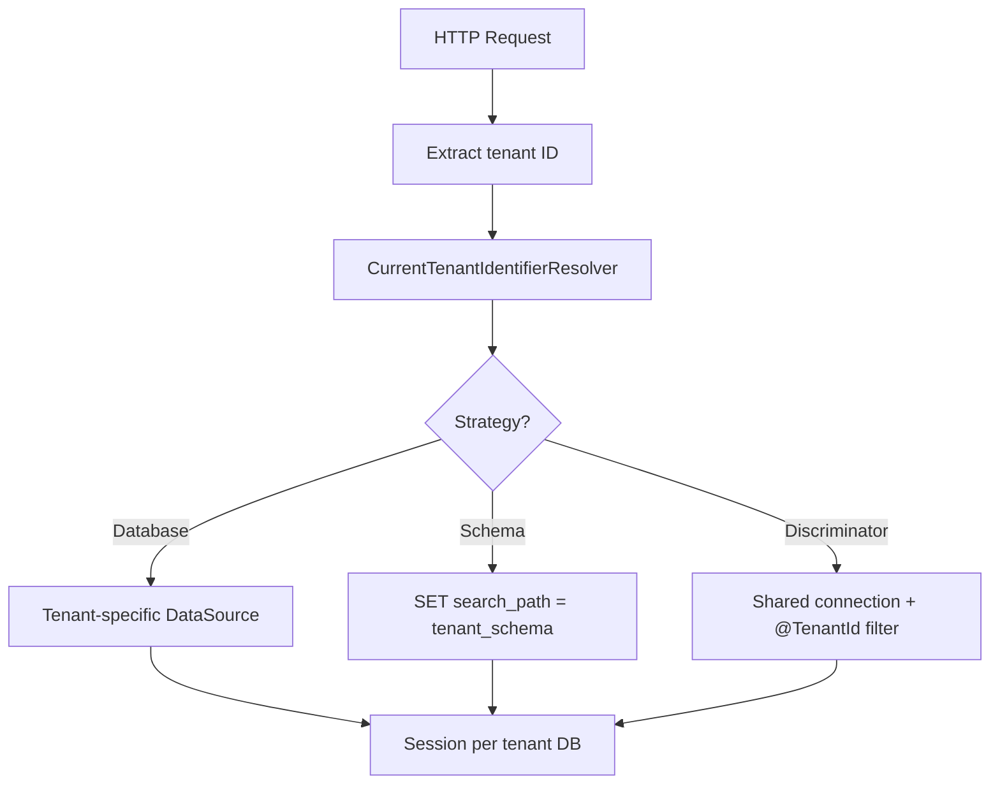
```mermaid
flowchart TD
    A[HTTP Request] --> B[Extract tenant ID]
    B --> C[CurrentTenantIdentifierResolver]
    C --> D{Strategy?}
    D -->|Database| E[Tenant-specific DataSource]
    D -->|Schema| F[SET search_path = tenant_schema]
    D -->|Discriminator| G[Shared connection + @TenantId filter]
    E --> H[Session per tenant DB]
    F --> H
    G --> H
```

---

### 📶 Gradual Depth

**Level 1 - What it is:**

Multi-tenancy means one application serves multiple isolated customers (tenants). Hibernate provides built-in support for three isolation strategies: separate database, separate schema, and discriminator column. The tenant is resolved per-request and all database operations are scoped to that tenant.

**Level 2 - How to use it:**

Implement `CurrentTenantIdentifierResolver` to return the tenant ID from the request context. Implement `MultiTenantConnectionProvider` to provide the correct connection. Annotate a field with `@TenantId` for discriminator strategy. Configure `hibernate.multiTenancy` to DATABASE, SCHEMA, or DISCRIMINATOR.

**Level 3 - How it works:**

For DATABASE strategy, the provider returns a different DataSource per tenant. For SCHEMA, the provider switches the database schema (`SET search_path` for PostgreSQL, `USE schema` for MySQL). For DISCRIMINATOR, Hibernate adds `@TenantId`-based filters to every query and validates tenant ID on every entity operation. The Session is always bound to one tenant.

**Level 4 - Production mastery:**

Connection pooling differs by strategy: DATABASE needs one pool per tenant (expensive at 500 tenants), SCHEMA can share one pool (schema switch per connection), DISCRIMINATOR uses one pool. Migration tooling (Flyway) needs per-tenant execution for DATABASE/SCHEMA. Monitor for cross-tenant data leakage via integration tests that assert query results belong to the test tenant. Use `@Filter` for legacy entities that lack `@TenantId`.

---

### ⚙️ How It Works

**Phase 1 - Tenant resolution:**
HTTP request arrives. Middleware extracts tenant ID from JWT `org_id` claim. Stores in `TenantContext` (ThreadLocal or request-scoped bean).

**Phase 2 - Connection acquisition:**
`CurrentTenantIdentifierResolver.resolveCurrentTenantIdentifier()` returns the tenant ID. `MultiTenantConnectionProvider.getConnection(tenantId)` returns the appropriate connection.

**Phase 3 - Query execution:**
All JPQL/HQL/Criteria queries automatically filtered by tenant. For discriminator: `WHERE ... AND tenant_id = :tenantId` appended. For schema: queries target the tenant's schema.

**Phase 4 - Entity validation:**
On persist/merge: `@TenantId` field set to current tenant. If entity's `@TenantId` mismatches current tenant, `TenantIdentifierMismatchException` is thrown.

```text
  Request -> JWT: {org_id: "acme"} -> resolve
  Connection: getConnection("acme")
    DB strategy: DataSource("acme_db")
    Schema: SET search_path TO acme_schema
    Discriminator: shared + filter
  Query: SELECT * FROM orders
    -> WHERE tenant_id='acme' (auto-added)
```

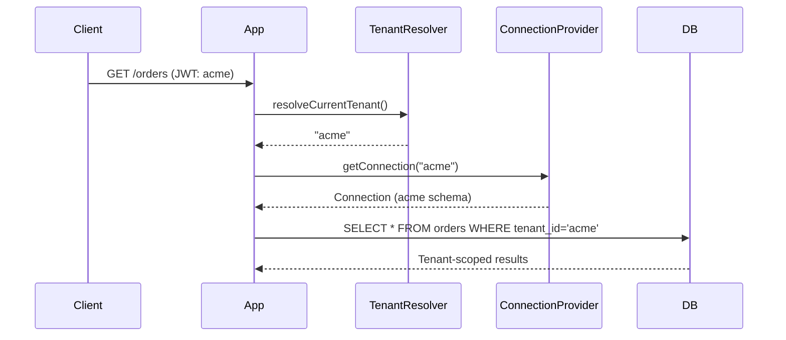
```mermaid
sequenceDiagram
    participant Client
    participant App
    participant Resolver as TenantResolver
    participant Provider as ConnectionProvider
    participant DB
    Client->>App: GET /orders (JWT: acme)
    App->>Resolver: resolveCurrentTenant()
    Resolver-->>App: "acme"
    App->>Provider: getConnection("acme")
    Provider-->>App: Connection (acme schema)
    App->>DB: SELECT * FROM orders WHERE tenant_id='acme'
    DB-->>App: Tenant-scoped results
```

---

### 🚨 Failure Modes

**Failure 1 - Cross-tenant data leakage:**

**Symptom:** Tenant A sees Tenant B's data. Security incident. Usually discovered during testing or, worse, by a customer.

**Root cause:** Native SQL query or custom JDBC code that does not include `WHERE tenant_id=?`. Hibernate's automatic filtering only applies to managed queries.

**Diagnostic:**

```sql
-- Find queries without tenant filter
-- Review all native SQL queries in codebase:
grep -rn "createNativeQuery\|nativeQuery" src/
-- Each must include tenant_id filter
```

**Fix:**

**BAD:**

```java
em.createNativeQuery(
    "SELECT * FROM orders "
    + "WHERE status='active'");
// Missing tenant_id filter! Cross-tenant leak!
```

**GOOD:**

```java
em.createNativeQuery(
    "SELECT * FROM orders "
    + "WHERE status='active' "
    + "AND tenant_id=:tid")
    .setParameter("tid", currentTenant());
```

**Failure 2 - Connection pool exhaustion (DATABASE strategy):**

**Symptom:** `HikariPool - Connection is not available` errors. Tenants experience timeouts during peak hours.

**Root cause:** DATABASE strategy with one HikariCP pool per tenant. 500 tenants x 10 connections = 5000 connections. Database max_connections exceeded.

**Diagnostic:**

```bash
# Check total connection count
SELECT count(*) FROM pg_stat_activity;
# Check per-tenant pool metrics
hikari_pool_active_connections{tenant="acme"}
```

**Fix:**

```text
Switch to SCHEMA strategy (one pool, schema switch)
or use a shared pool with schema-per-connection
routing. Reduces 5000 connections to 50.
```

---

### 🔬 Production Reality

A B2B SaaS platform started with DATABASE-per-tenant (50 tenants, manageable). At 300 tenants, migration time became critical: each Flyway migration ran against 300 databases sequentially. A single migration took 45 minutes. Connection pool memory: 300 pools x 10 connections x 2MB overhead = 6GB just for pools. The team migrated to SCHEMA strategy: one database, 300 schemas, one connection pool with per-connection `SET search_path`. Migration time dropped to 3 minutes (parallel schema migrations). Connection overhead dropped to 200MB. The trade-off: slightly weaker isolation (shared database engine, shared pg_catalog).

---

### ⚖️ Trade-offs & Alternatives

| Aspect         | Database-per-tenant | Schema-per-tenant   | Discriminator      |
| -------------- | ------------------- | ------------------- | ------------------ |
| Isolation      | Physical            | Logical (schema)    | Application-level  |
| Data leak risk | Minimal             | Low                 | Higher (code-dep.) |
| Conn. pools    | One per tenant      | One shared          | One shared         |
| Migration cost | Per-database        | Per-schema          | One migration      |
| Backup/restore | Per-tenant possible | Per-schema possible | Entire DB only     |
| Max tenants    | ~100                | ~1000               | Unlimited          |

**Real-world patterns:**

- **Salesforce** uses a discriminator (shared schema) approach with strict query filtering at the platform level for thousands of tenants.
- **AWS SaaS Reference Architecture** recommends schema-per-tenant for moderate tenant counts and discriminator for high tenant counts.

---

### ⚡ Decision Snap

**USE DATABASE-PER-TENANT WHEN:**

- Regulatory requirement for physical data isolation.
- < 100 tenants. Per-tenant backup/restore needed.
- Each tenant's data volume justifies separate infrastructure.

**USE SCHEMA-PER-TENANT WHEN:**

- 100-1000 tenants. Need logical isolation without connection pool explosion.
- Per-tenant DDL customization is needed.

**USE DISCRIMINATOR WHEN:**

- > 1000 tenants. Operational simplicity is paramount.
- Tenant data volume is small. Cross-tenant analytics needed.

---

### ⚠️ Top Traps

| #   | Misconception                                     | Reality                                                                                                                                                      |
| --- | ------------------------------------------------- | ------------------------------------------------------------------------------------------------------------------------------------------------------------ |
| 1   | Discriminator is as safe as database isolation    | Discriminator relies on every query including `tenant_id`. One native query without the filter leaks data.                                                   |
| 2   | Hibernate handles all multi-tenancy automatically | Hibernate handles JPQL/HQL filtering. Native queries, stored procedures, and direct JDBC need manual tenant filtering.                                       |
| 3   | Schema-per-tenant has no limits                   | Some databases limit schemas (connection overhead, catalog bloat). PostgreSQL handles thousands of schemas; MySQL/MariaDB may struggle past several hundred. |
| 4   | One connection pool per tenant is fine            | At 500 tenants x 10 connections, that is 5000 database connections. Most databases cap at 500-2000 connections.                                              |
| 5   | @TenantId replaces application-level security     | @TenantId prevents Hibernate-level leakage. API-level authorization (can this user access this tenant?) is still required.                                   |

---

### 🪜 Learning Ladder

**Prerequisites:**

- Connection Management and Release Modes - connection
  pooling fundamentals
- Hibernate Performance Tuning at Scale - multi-tenancy
  performance implications

**THIS:** HIB-077 Multi-Tenancy SPI and Tenant Resolution
Strategies

**Next steps:**

- ORM Data Layer - Phase 4 (Production Hardening) - multi-
  tenancy as a production concern
- Hibernate Source Code Architecture and Bootstrap Sequence
  (L5) - SPI extension points including tenancy

---

**The Surprising Truth:**

The discriminator approach with `@TenantId` in Hibernate 6 is remarkably safe when used exclusively with JPQL/HQL and Spring Data derived queries - Hibernate automatically appends the tenant filter to every generated query. The data leakage risk comes almost exclusively from native SQL queries and direct JDBC operations that bypass Hibernate's query translation layer. A codebase audit of native queries is the most impactful security review for discriminator-based multi-tenancy.

**Further Reading:**

- Hibernate ORM 6 User Guide, Chapter 17 - Multi-Tenancy
- AWS SaaS Factory - SaaS Tenant Isolation Strategies whitepaper
- OWASP - Multi-Tenancy Security Testing Guide

**Revision Card:**

1. Three strategies: database (physical isolation, <100 tenants), schema (logical, 100-1000), discriminator (application-level, >1000). Choose by isolation requirement vs operational cost.
2. `@TenantId` auto-filters JPQL/HQL. Native queries MUST manually include tenant_id. Audit all native queries for data leakage.
3. Schema strategy is the sweet spot: one connection pool, per-tenant isolation, manageable operations. Recommended default for most SaaS.

---

---

# HIB-078 Hibernate Search - Full-Text Indexing Integration

**TL;DR** - Hibernate Search integrates Lucene/Elasticsearch with Hibernate ORM, automatically indexing entity changes and providing full-text search without manual index synchronization.

---

### 🔥 Problem Statement

Your application needs full-text search: search products by description with typo tolerance, relevance ranking, and faceted filtering. SQL `LIKE '%keyword%'` cannot use indexes, ignores relevance, and does not handle typos. You integrate Elasticsearch directly. Now you maintain two data stores: the database (source of truth) and Elasticsearch (search index). Every entity change must be propagated to the index. Missed propagation means stale search results. Hibernate Search solves this by automatically indexing entity changes when Hibernate flushes, keeping the search index synchronized with the database without manual event handling.

---

### 📜 Historical Context

Hibernate Search was created in 2006 as a bridge between Hibernate ORM and Apache Lucene. The original goal was to add full-text search to JPA entities without leaving the Hibernate ecosystem. Version 5 added Elasticsearch backend support (2016), allowing distributed search without embedded Lucene. Version 6 (2020) was a complete rewrite with a new API, support for both Lucene and Elasticsearch/OpenSearch backends, and improved automatic indexing via Hibernate ORM event integration. The key design insight was that Hibernate already knows when entities change (via flush/commit events), making it the ideal point to trigger index updates.

---

### 🔩 First Principles

**CORE INVARIANTS:**

1. **Automatic indexing on flush:** When Hibernate flushes entity changes, Hibernate Search intercepts the events and sends index update requests to the backend (Lucene or Elasticsearch).
2. **Entity-to-document mapping:** Each `@Indexed` entity maps to a search document. Fields annotated with `@FullTextField`, `@KeywordField`, `@GenericField` define what is indexed.
3. **Backend abstraction:** The same mapping annotations work with embedded Lucene (single-node) or Elasticsearch/OpenSearch (distributed). Switch backends by changing configuration, not code.
4. **Eventual consistency:** Index updates are asynchronous by default. There is a latency window between database commit and index refresh.

**DERIVED DESIGN:**

Automatic indexing eliminates manual synchronization but means index updates fail silently if the backend is down. Entity-to-document mapping means search schema changes require re-indexing. Backend abstraction enables starting with Lucene (zero dependencies) and scaling to Elasticsearch (distributed) without code changes.

**THE TRADE-OFF:**

**Gain:** Full-text search with relevance scoring, typo tolerance, and faceting - automatically synchronized with entity changes. Zero manual index management.

**Cost:** Additional dependency (Lucene or Elasticsearch). Index storage (typically 20-50% of database size). Re-indexing time for schema changes. Eventual consistency gap.

---

### 🧠 Mental Model

> Hibernate Search is a court reporter who transcribes everything said in court (entity changes at flush) into a searchable archive (Lucene/Elasticsearch). The reporter works in real-time, so the archive is always nearly up-to-date. You search the archive (full-text query) instead of re-reading all court transcripts (SQL LIKE).

- "Court reporter" -> Hibernate Search indexing
- "Court proceedings" -> entity changes
- "Searchable archive" -> Lucene/Elasticsearch index
- "Search the archive" -> full-text query

**Where this analogy breaks down:** The court reporter (indexer) can fall behind or fail, creating a gap between the database and the index. The archive (index) needs periodic full rebuild for schema changes.

---

### 🧩 Components

- **@Indexed:** Marks an entity for search indexing. Creates a search document per entity instance.
- **@FullTextField:** Indexes a string field with analyzer (tokenization, stemming, lowercasing). Enables full-text search.
- **@KeywordField:** Indexes a string field as a single token (exact match, sorting, faceting).
- **@GenericField:** Indexes non-string fields (numbers, dates, booleans).
- **SearchSession:** The search API entry point. Obtained via `Search.session(entityManager)`.
- **MassIndexer:** Bulk indexing tool for initial population or re-indexing after schema changes.
- **AutomaticIndexingSynchronizationStrategy:** Controls when index updates become visible (sync/async/write-sync).

```text
  Entity:
  @Indexed
  @Entity
  class Product {
      @FullTextField(analyzer = "english")
      String description;
      @KeywordField
      String category;
      @GenericField
      BigDecimal price;
  }

  Flow:
  persist(product) -> flush -> Hibernate event
       -> Hibernate Search intercepts
       -> Send to Lucene/Elasticsearch
       -> Index updated
```

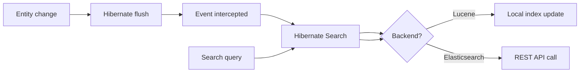
```mermaid
flowchart LR
    A[Entity change] --> B[Hibernate flush]
    B --> C[Event intercepted]
    C --> D[Hibernate Search]
    D --> E{Backend?}
    E -->|Lucene| F[Local index update]
    E -->|Elasticsearch| G[REST API call]
    H[Search query] --> D
    D --> E
```

---

### 📶 Gradual Depth

**Level 1 - What it is:**

Hibernate Search adds full-text search to JPA entities. Annotate entity fields with `@FullTextField`, and Hibernate Search automatically indexes them in Lucene or Elasticsearch. Search queries return entities ranked by relevance.

**Level 2 - How to use it:**

Add `hibernate-search-mapper-orm` and a backend dependency (Lucene or Elasticsearch). Annotate entities with `@Indexed` and fields with `@FullTextField`. Search via `Search.session(em).search(Product.class).where(f -> f.match().field("description").matching("wireless")).fetchHits(20)`.

**Level 3 - How it works:**

Hibernate Search registers as a Hibernate ORM `EventListener`. On flush, it intercepts `PostInsertEvent`, `PostUpdateEvent`, `PostDeleteEvent`. For each affected `@Indexed` entity, it creates an index update work unit. The work units are sent to the backend (Lucene writes to local directory, Elasticsearch sends REST API bulk requests). Query translation converts Search DSL predicates to Lucene queries or Elasticsearch JSON.

**Level 4 - Production mastery:**

MassIndexer runs initial or full re-indexing with configurable thread count and batch size. Monitor index lag with `hibernate.search.automatic_indexing.synchronization.strategy=sync` (wait for index refresh) in tests, `async` in production. For Elasticsearch backend, configure connection pool, timeouts, and index aliases for zero-downtime re-indexing. Schema evolution requires re-indexing when analyzers or field mappings change.

---

### ⚙️ How It Works

**Phase 1 - Mapping at startup:**
SessionFactory build scans `@Indexed` entities. Creates mapping from entity fields to index fields. For Elasticsearch: creates index mappings via REST API. For Lucene: initializes local directory.

**Phase 2 - Automatic indexing (runtime):**
Entity persisted/updated/deleted -> Hibernate flush -> ORM event fired -> Search intercepts -> index work unit created -> sent to backend.

**Phase 3 - Search query:**
Application calls Search DSL -> predicate built -> translated to backend query (Lucene Query or Elasticsearch JSON) -> executed -> entity IDs returned -> entities loaded from database.

**Phase 4 - Mass re-indexing:**
`massIndexer.startAndWait()` -> scroll all `@Indexed` entities from database -> batch index into backend -> progress reported. Used after mapping changes or initial deployment.

```text
  Startup: scan @Indexed -> create index mappings
  Runtime: persist(p) -> flush -> event
       -> Search indexer -> backend update
  Query:  search("wireless") -> backend query
       -> IDs returned -> em.find(ids) -> entities
  Reindex: massIndexer -> scroll DB -> bulk index
```

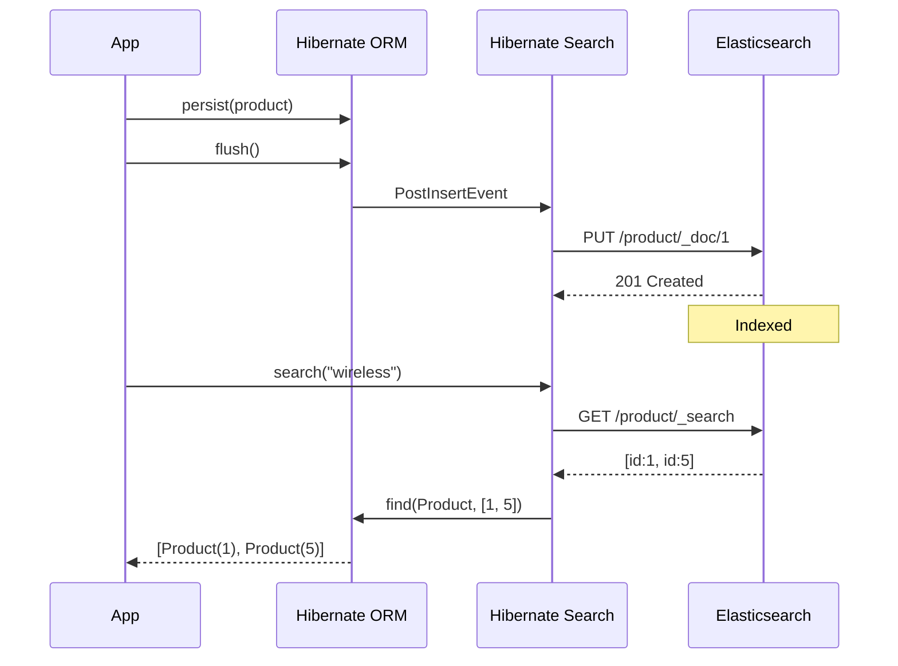
```mermaid
sequenceDiagram
    participant App
    participant Hib as Hibernate ORM
    participant HS as Hibernate Search
    participant ES as Elasticsearch
    App->>Hib: persist(product)
    App->>Hib: flush()
    Hib->>HS: PostInsertEvent
    HS->>ES: PUT /product/_doc/1
    ES-->>HS: 201 Created
    Note over ES: Indexed
    App->>HS: search("wireless")
    HS->>ES: GET /product/_search
    ES-->>HS: [id:1, id:5]
    HS->>Hib: find(Product, [1, 5])
    Hib-->>App: [Product(1), Product(5)]
```

---

### 🚨 Failure Modes

**Failure 1 - Index out of sync with database:**

**Symptom:** Search returns entities that no longer exist (deleted in DB but still in index) or misses recently created entities.

**Root cause:** Elasticsearch backend was temporarily down during flush events. Index updates were lost. Or: direct SQL update bypassed Hibernate (no flush event fired).

**Diagnostic:**

```bash
# Compare counts
SELECT count(*) FROM product;  -- DB count
curl localhost:9200/product/_count  -- Index count
# If different: index is stale
```

**Fix:**

**BAD:**

```java
// Direct SQL bypasses Hibernate Search
jdbcTemplate.update(
    "UPDATE product SET name=? WHERE id=?",
    newName, id);
// Index not updated! Search stale.
```

**GOOD:**

```java
// Go through Hibernate for index sync
Product p = em.find(Product.class, id);
p.setName(newName);
// Flush fires index update event
```

**Failure 2 - MassIndexer OOM:**

**Symptom:** `OutOfMemoryError` during mass re-indexing of large entity tables.

**Root cause:** MassIndexer loads entities in batches but default batch size and thread count may exceed heap capacity for entities with large associations.

**Diagnostic:**

```bash
# Monitor heap during re-indexing
jstat -gcutil <pid> 1000
# Check mass indexer thread count and batch size
```

**Fix:**

```java
// Tune mass indexer parameters
Search.session(em).massIndexer()
    .batchSizeToLoadObjects(100)
    .threadsToLoadObjects(2)
    .startAndWait();
// Reduce batch size and thread count for
// memory-constrained environments
```

---

### 🔬 Production Reality

An e-commerce platform with 2 million products uses Hibernate Search with Elasticsearch backend. Initial deployment: MassIndexer run takes 45 minutes. Daily operations: automatic indexing adds latency (50ms per flush for Elasticsearch REST call in sync mode). Switch to async mode reduces flush latency to 2ms but creates a 1-2 second visibility lag. The team uses `write-sync` strategy (wait for write acknowledgment but not refresh), balancing latency and consistency. A monitoring dashboard tracks index lag by comparing database `updated_at` timestamps with Elasticsearch `_source.updated_at` values.

---

### ⚖️ Trade-offs & Alternatives

| Aspect           | Hibernate Search  | Direct Elasticsearch | PostgreSQL FTS |
| ---------------- | ----------------- | -------------------- | -------------- |
| Sync with DB     | Automatic         | Manual               | Built-in       |
| Relevance        | Full (Lucene/ES)  | Full                 | Basic          |
| Scalability      | ES backend: high  | High                 | Moderate       |
| Setup complexity | Low (annotations) | High (manual sync)   | Low (tsvector) |
| Typo tolerance   | Yes (analyzers)   | Yes                  | Limited        |

**Real-world patterns:**

- **Spring Boot + Hibernate Search** is the standard for JPA applications needing full-text search without managing synchronization manually.
- **Large-scale platforms** (100M+ documents) typically use direct Elasticsearch integration with event-driven synchronization (Kafka/CDC) for more control.

---

### ⚡ Decision Snap

**USE WHEN:**

- JPA application needs full-text search with relevance.
- Entity-driven data model where search maps naturally to entities.
- Automatic synchronization is more valuable than manual control.

**AVOID WHEN:**

- Search data comes from multiple sources (not just JPA entities).
- Sub-second index freshness is required (eventual consistency is unacceptable).
- Search infrastructure is already managed separately.

**PREFER DIRECT ELASTICSEARCH WHEN:**

- Complex search requirements (nested aggregations, ML ranking).
- Non-JPA data sources contributing to the search index.
- Team has dedicated search engineering expertise.

---

### ⚠️ Top Traps

| #   | Misconception                                     | Reality                                                                                                                                                   |
| --- | ------------------------------------------------- | --------------------------------------------------------------------------------------------------------------------------------------------------------- |
| 1   | Hibernate Search replaces Elasticsearch knowledge | You still need to understand analyzers, mappings, and query tuning. Hibernate Search abstracts the API, not the concepts.                                 |
| 2   | Automatic indexing means real-time search         | Default async indexing has 1-2 second lag. Sync mode adds latency to every flush.                                                                         |
| 3   | Schema changes are automatic                      | Changing `@FullTextField` analyzer requires re-indexing. Hibernate Search creates the new mapping but does not re-index existing documents automatically. |
| 4   | Direct SQL updates are indexed                    | Hibernate Search only intercepts ORM events. Direct SQL, stored procedures, or other applications modifying the same tables will NOT trigger indexing.    |
| 5   | MassIndexer is only for initial load              | MassIndexer is needed after analyzer changes, mapping changes, data fixes via SQL, or suspected index corruption.                                         |

---

### 🪜 Learning Ladder

**Prerequisites:**

- Hibernate Query Performance Tuning (L3) - when SQL
  search is insufficient
- Interceptors and EventListener SPI - the event mechanism
  Hibernate Search uses

**THIS:** HIB-078 Hibernate Search - Full-Text Indexing
Integration

**Next steps:**

- ORM Data Layer - Phase 4 (Production Hardening) - search
  as a production concern
- Hibernate Source Code Architecture and Bootstrap Sequence
  (L5) - SPI extension points

---

**The Surprising Truth:**

Hibernate Search queries do NOT return entities directly from the index. They return entity IDs from the search backend, then load the entities from the database via `em.find()`. This means every search hit triggers a database lookup. For search-heavy read endpoints, this can be optimized by storing projected fields in the index and fetching projections directly without database access - a feature supported since Hibernate Search 6.

**Further Reading:**

- Hibernate Search 6 Reference Documentation (hibernate.org)
- Apache Lucene documentation - core search concepts
- Elasticsearch Reference - analyzers and mappings

**Revision Card:**

1. `@Indexed` + `@FullTextField` = automatic full-text search. Hibernate events trigger index updates on flush.
2. Search returns IDs, then loads entities from DB. Use projections for read-heavy search endpoints.
3. Direct SQL bypasses indexing. MassIndexer for re-sync. Monitor index lag in production.

---

---

# HIB-079 Interceptors and EventListener SPI

**TL;DR** - Hibernate's Interceptor and EventListener SPIs allow you to hook into entity lifecycle events (load, save, delete, flush) for auditing, validation, and cross-cutting concerns without modifying entity code.

---

### 🔥 Problem Statement

You need audit logging: who changed what, when, on every entity. You need soft-delete: `DELETE` should set `deleted=true` instead of removing the row. You need tenant-id injection: every INSERT should automatically set `tenant_id`. These are cross-cutting concerns that do not belong in entity business logic. Implementing them in every repository method is error-prone and violates DRY. Hibernate's Interceptor and EventListener SPIs provide hooks into the entity lifecycle, executing custom logic at load, save, delete, and flush events. Understanding these SPIs is essential for implementing cross-cutting persistence concerns correctly.

---

### 📜 Historical Context

Hibernate's `Interceptor` interface has existed since Hibernate 2 (2003). It was the original extension point for intercepting entity operations. The `EventListener` system was introduced in Hibernate 3 (2005) as a more granular replacement, providing separate listener interfaces for each event type (PreInsertEvent, PostUpdateEvent, etc.). JPA standardized a subset of this functionality with `@PrePersist`, `@PostLoad`, etc. (entity callbacks) and `EntityListener` classes. Hibernate's native event system remains more powerful than JPA callbacks, supporting operations like modifying SQL generation, vetoing operations, and accessing Session internals.

---

### 🔩 First Principles

**CORE INVARIANTS:**

1. **Events are fired by the Session:** Every persistence operation (persist, merge, remove, flush, load) fires events through the `EventListenerRegistry`.
2. **Interceptor is Session-scoped:** One Interceptor per Session (or shared). It intercepts entity state before and after operations.
3. **EventListeners are per-event-type:** Each event type (PreInsert, PostUpdate, etc.) has its own listener chain. Multiple listeners per event are supported.
4. **JPA callbacks are entity-scoped:** `@PrePersist`, `@PostLoad` callbacks are defined on the entity class itself. Limited to lifecycle notification (no access to Session or SQL).

**DERIVED DESIGN:**

EventListeners are more granular and powerful than Interceptors (which combine all events in one interface). JPA callbacks are the simplest but least powerful. The choice depends on the use case: JPA callbacks for simple timestamps, EventListeners for auditing and cross-cutting logic, Interceptors for SQL modification.

**THE TRADE-OFF:**

**Gain:** Cross-cutting persistence logic without modifying entity code. Centralized auditing, validation, and tenant injection.

**Cost:** Hidden behavior (events fire implicitly). Debugging complexity (stack traces include event chains). Performance overhead if listeners are expensive.

---

### 🧠 Mental Model

> JPA callbacks are Post-it notes on an entity: "remind me to do X when saved." EventListeners are security cameras in the persistence context: they record every operation without the entity knowing. Interceptors are border guards: they inspect every entity entering or leaving the Session and can modify passports (entity state) or deny entry.

- "Post-it notes" -> JPA callbacks (@PrePersist)
- "Security cameras" -> EventListeners (observe all)
- "Border guards" -> Interceptors (can modify/veto)

**Where this analogy breaks down:** EventListeners can also modify entity state (not just observe). The distinction between Interceptor and EventListener is more about API style than capability.

---

### 🧩 Components

- **Interceptor:** `org.hibernate.Interceptor`. Methods: `onSave()`, `onFlushDirty()`, `onDelete()`, `onLoad()`, `beforeTransactionCompletion()`.
- **EventListener interfaces:** `PreInsertEventListener`, `PostUpdateEventListener`, `PreDeleteEventListener`, `PostLoadEventListener`, etc. Registered in `EventListenerRegistry`.
- **JPA callbacks:** `@PrePersist`, `@PostPersist`, `@PreUpdate`, `@PostUpdate`, `@PreRemove`, `@PostRemove`, `@PostLoad`. On entity or `@EntityListener` class.
- **EventListenerRegistry:** SessionFactory-level registry. Allows adding/replacing listeners per event type.
- **Integrator SPI:** `org.hibernate.integrator.spi.Integrator`. Used to register custom EventListeners at SessionFactory build time.

```text
  Event flow:
  em.persist(entity)
    -> PreInsertEvent
      -> JPA @PrePersist callback
      -> Custom PreInsertEventListener
      -> Interceptor.onSave()
    -> INSERT SQL
    -> PostInsertEvent
      -> JPA @PostPersist callback
      -> Custom PostInsertEventListener
```

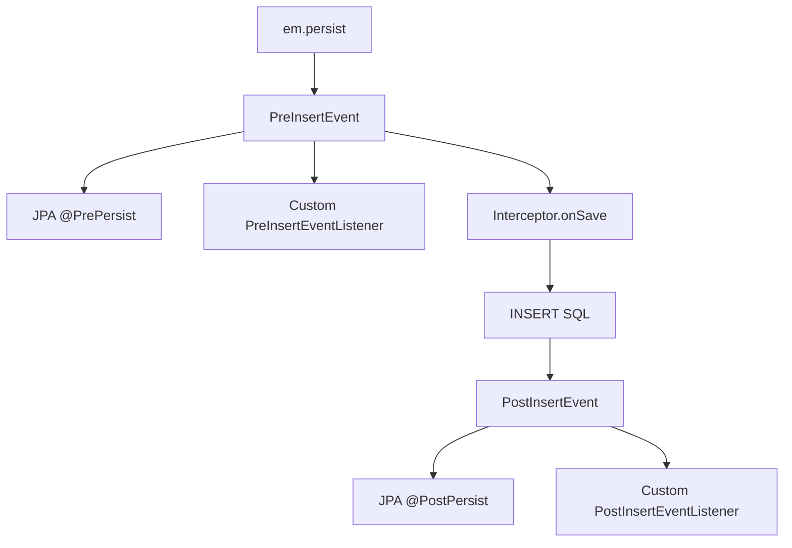
```mermaid
flowchart TD
    A[em.persist] --> B[PreInsertEvent]
    B --> C[JPA @PrePersist]
    B --> D[Custom PreInsertEventListener]
    B --> E[Interceptor.onSave]
    E --> F[INSERT SQL]
    F --> G[PostInsertEvent]
    G --> H[JPA @PostPersist]
    G --> I[Custom PostInsertEventListener]
```

---

### 📶 Gradual Depth

**Level 1 - What it is:**

Hibernate fires events at every stage of entity lifecycle: load, insert, update, delete, flush. You can register listeners to execute custom logic at these stages. Common uses: audit logging, timestamp management, soft-delete implementation.

**Level 2 - How to use it:**

For simple cases: use JPA `@PrePersist` / `@PreUpdate` on the entity for `createdAt` / `updatedAt` timestamps. For cross-cutting concerns: implement `PreInsertEventListener` and register via Spring's `HibernatePropertiesCustomizer` or a Hibernate `Integrator`.

**Level 3 - How it works:**

The `EventListenerRegistry` maintains a list of listeners per event type. When a persistence operation occurs, the corresponding event is created and dispatched to all registered listeners in order. Listeners can inspect entity state, modify values, log changes, or even veto operations (returning `true` from `onPreInsert` vetoes the INSERT). The `Interceptor` is called separately and has access to raw entity state arrays.

**Level 4 - Production mastery:**

Performance considerations: listeners execute synchronously in the persistence operation's thread. Heavy operations (HTTP calls, complex queries) in listeners block the transaction. For audit logging, prefer writing to a separate audit table in the same transaction rather than external services. For Envers integration, Hibernate Envers is implemented as a set of EventListeners. Custom listeners must be ordered carefully to avoid conflicts with Envers or Hibernate Search listeners.

---

### ⚙️ How It Works

**Phase 1 - Registration:**
At SessionFactory build time, custom listeners are registered via `Integrator.integrate()` or Spring configuration. Listeners are added to the `EventListenerRegistry` for specific event types.

**Phase 2 - Event dispatch:**
`em.persist(entity)` -> `PersistEventListener` processes the persist -> fires `PreInsertEvent` -> dispatches to all registered `PreInsertEventListener` instances -> fires JPA `@PrePersist` callback -> INSERT SQL.

**Phase 3 - State modification in listener:**
A `PreInsertEventListener` can modify the entity state: `event.getState()[indexOfField] = newValue`. This modifies the values that will be included in the INSERT SQL.

**Phase 4 - Post-operation dispatch:**
After INSERT SQL: `PostInsertEvent` -> dispatches to `PostInsertEventListener` instances -> fires JPA `@PostPersist` callback.

```text
  Register: Integrator -> EventListenerRegistry
       -> add listener for PreInsertEvent
  Persist: em.persist(entity)
       -> PreInsertEvent fired
       -> Listener: set createdBy, createdAt
       -> INSERT SQL with modified state
       -> PostInsertEvent fired
       -> Listener: log to audit table
```

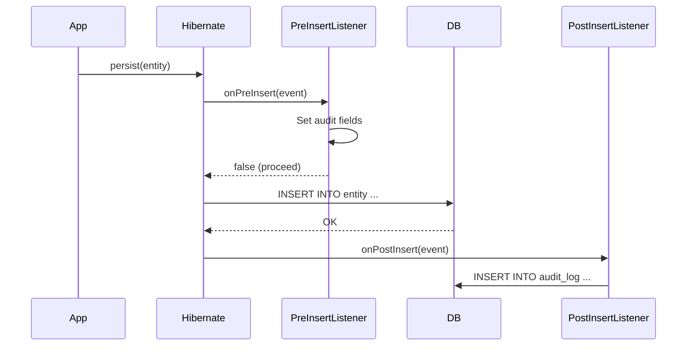
```mermaid
sequenceDiagram
    participant App
    participant Hib as Hibernate
    participant Pre as PreInsertListener
    participant DB
    participant Post as PostInsertListener
    App->>Hib: persist(entity)
    Hib->>Pre: onPreInsert(event)
    Pre->>Pre: Set audit fields
    Pre-->>Hib: false (proceed)
    Hib->>DB: INSERT INTO entity ...
    DB-->>Hib: OK
    Hib->>Post: onPostInsert(event)
    Post->>DB: INSERT INTO audit_log ...
```

---

### 🚨 Failure Modes

**Failure 1 - State modification not reflected in SQL:**

**Symptom:** `PreInsertEventListener` sets a field value but the INSERT SQL does not include the new value. The database column is NULL.

**Root cause:** Modifying the entity's Java object field is not enough. The listener must also modify `event.getState()` array, which is the actual source for SQL generation.

**Diagnostic:**

```java
// Debug: log the state array
Arrays.stream(event.getState())
    .forEach(s -> log.debug("State: {}", s));
// If the modified field shows null in state:
// entity field was set but state[] was not
```

**Fix:**

**BAD:**

```java
entity.setCreatedAt(Instant.now());
// State array still has null for createdAt!
```

**GOOD:**

```java
entity.setCreatedAt(Instant.now());
int idx = getPropertyIndex(
    event, "createdAt");
event.getState()[idx] =
    entity.getCreatedAt();
```

**Failure 2 - Transaction timeout from slow listener:**

**Symptom:** Transactions timeout intermittently. Thread dumps show blocked threads in event listener code.

**Root cause:** Event listener makes synchronous HTTP call or expensive query inside the persistence operation's transaction.

**Diagnostic:**

```bash
# Thread dump showing listener in stack trace
jstack <pid> | grep -A 5 "EventListener"
# Look for HTTP client or external service calls
```

**Fix:**

```java
// BAD: synchronous HTTP in listener
public void onPostInsert(PostInsertEvent e) {
    httpClient.post("/audit", toJson(e));
    // Blocks transaction until HTTP completes!
}

// GOOD: async audit or same-TX audit table
public void onPostInsert(PostInsertEvent e) {
    auditQueue.enqueue(toAuditEntry(e));
    // Non-blocking. Processed async.
}
```

---

### 🔬 Production Reality

A financial services application implements audit logging via `PostInsertEventListener` and `PostUpdateEventListener`. Every entity change writes an audit record to an `audit_log` table in the same transaction. At scale (10,000 transactions/second), the audit table becomes a write bottleneck - every transaction now writes at least two rows (entity + audit). The fix: switch from synchronous audit table writes to an async audit event queue (Kafka). The listener publishes a lightweight event message instead of inserting a row. A separate audit consumer processes events and writes to the audit store. Transaction latency dropped 40%.

---

### ⚖️ Trade-offs & Alternatives

| Aspect       | JPA Callbacks | EventListeners       | Interceptor         |
| ------------ | ------------- | -------------------- | ------------------- |
| Granularity  | Per entity    | Per event type       | All events combined |
| Portability  | JPA standard  | Hibernate-specific   | Hibernate-specific  |
| State access | Entity object | Entity + state array | Raw state arrays    |
| Veto ability | No            | Yes (return true)    | No (but can throw)  |
| Registration | Annotation    | Integrator/Spring    | SessionFactory cfg  |
| Best for     | Timestamps    | Cross-cutting logic  | SQL modification    |

**Real-world patterns:**

- **Spring Data JPA Auditing** (`@CreatedBy`, `@LastModifiedDate`) is implemented via JPA entity callbacks under the hood.
- **Hibernate Envers** is implemented entirely as EventListeners, demonstrating the SPI's power for complex cross-cutting concerns.

---

### ⚡ Decision Snap

**USE JPA CALLBACKS WHEN:**

- Simple timestamp management (`createdAt`, `updatedAt`).
- Entity-scoped logic that does not need Session access.
- Portability across JPA providers matters.

**USE EVENT LISTENERS WHEN:**

- Cross-cutting concerns (auditing, soft-delete, tenant injection).
- Need to modify entity state array for SQL generation.
- Need to veto operations conditionally.

**USE INTERCEPTOR WHEN:**

- Legacy codebases already using Interceptor.
- Need to modify generated SQL (rare).

---

### ⚠️ Top Traps

| #   | Misconception                                             | Reality                                                                                                                                                     |
| --- | --------------------------------------------------------- | ----------------------------------------------------------------------------------------------------------------------------------------------------------- |
| 1   | Setting entity fields in PreInsertEventListener is enough | You must also modify `event.getState()[]`. The state array is what Hibernate uses for SQL generation, not the entity object.                                |
| 2   | Listeners are called outside the transaction              | Listeners execute within the persistence operation's transaction. Heavy operations block the transaction.                                                   |
| 3   | JPA callbacks can access the EntityManager                | JPA spec prohibits EntityManager operations in callbacks (except `@PostPersist`/`@PostUpdate` for reads). Violations cause undefined behavior.              |
| 4   | EventListeners replace JPA callbacks                      | They coexist. JPA callbacks fire alongside EventListeners. Both can be used in the same entity.                                                             |
| 5   | Listener ordering is guaranteed                           | Default ordering is registration order. Use `@Order` or explicit priority to control execution sequence. Conflicts with Envers/Search listeners are common. |

---

### 🪜 Learning Ladder

**Prerequisites:**

- Explain Persistence Context at Every Level (L3) - entity
  lifecycle stages
- Dirty Checking and First-Level Cache Internals (L3) -
  flush triggers event dispatch

**THIS:** HIB-079 Interceptors and EventListener SPI

**Next steps:**

- Envers - Audit Logging and Entity Versioning - major
  EventListener-based extension
- Hibernate Search - Full-Text Indexing Integration -
  another EventListener-based extension
- Hibernate Source Code Architecture and Bootstrap Sequence
  (L5) - SPI design

---

**The Surprising Truth:**

Hibernate Envers, one of the most widely used JPA extensions, is implemented entirely as five EventListeners (`EnversPostInsertEventListenerImpl`, etc.). It demonstrates that the EventListener SPI is powerful enough to build an entire audit-versioning system without modifying a single line of Hibernate core code or entity business logic.

**Further Reading:**

- Hibernate ORM 6 User Guide, Chapter 15 - Interceptors and Events
- JPA 3.1 Specification, Section 3.5 - Entity Listeners and Callbacks
- Adam Bien, "Real World Java EE Patterns" - Interceptor patterns

**Revision Card:**

1. JPA callbacks for simple (timestamps). EventListeners for cross-cutting (audit, soft-delete). Interceptor for SQL modification (rare).
2. In PreInsertEventListener: modify BOTH the entity AND `event.getState()[]`. State array drives SQL generation.
3. Listeners are synchronous in the transaction. Heavy operations (HTTP, external calls) must be made async to avoid transaction timeouts.

---

---

# HIB-080 Connection Management and Release Modes

**TL;DR** - Hibernate's connection release mode controls when JDBC connections are acquired and returned to the pool. The wrong mode either wastes connections or breaks transaction semantics.

---

### 🔥 Problem Statement

A Spring Boot application with HikariCP has 10 connections in the pool. Under load, `HikariPool - Connection is not available` errors appear even though most transactions complete in under 50ms. The problem: Hibernate acquires a connection at the start of each Session and holds it until the Session closes. With Open Session in View (OSIV), the Session spans the entire HTTP request (including view rendering, JSON serialization). A 200ms request holds a connection for 200ms, but the actual database work is 20ms. The connection is idle for 180ms. Understanding connection release modes is essential for connection pool sizing and throughput optimization.

---

### 📜 Historical Context

In Hibernate 3, the default connection release mode was `ON_CLOSE` - hold the connection for the entire Session lifetime. This was safe but wasteful. Hibernate 3.1 introduced `AFTER_TRANSACTION` (release after each transaction) and `AFTER_STATEMENT` (release after each JDBC statement). JPA's `@PersistenceContext` with `PersistenceContextType.TRANSACTION` implies `AFTER_TRANSACTION` semantics. Spring Boot defaults to `ON_CLOSE` when OSIV is enabled (the Session spans the request). Understanding these modes requires understanding the interaction between HikariCP connection pooling, Hibernate Session lifecycle, and Spring transaction management.

---

### 🔩 First Principles

**CORE INVARIANTS:**

1. **Connection is a scarce resource:** Database connections are limited (typically 100-500 per database). Each connection consumes memory on both the application and database side.
2. **Transactions require a connection:** Every JDBC statement requires a connection. The question is how long the connection is held between statements.
3. **Release mode determines hold duration:** `ON_CLOSE` = entire Session. `AFTER_TRANSACTION` = until transaction commits/rolls back. `AFTER_STATEMENT` = after each statement (rare, requires auto-commit).
4. **HikariCP mediates acquisition:** HikariCP's `getConnection()` retrieves from pool (fast) or waits (blocked). `close()` returns to pool (not physical close).

**DERIVED DESIGN:**

ON_CLOSE is safest (one connection per Session) but holds connections during non-DB work (rendering, serialization). AFTER_TRANSACTION releases between transactions but requires re-acquisition for each new transaction. AFTER_STATEMENT is rarely used because most applications use transactions. The optimal mode depends on OSIV configuration and transaction granularity.

**THE TRADE-OFF:**

**Gain:** AFTER_TRANSACTION reduces connection hold time, enabling more concurrent Sessions per pool.

**Cost:** Connection re-acquisition overhead (typically < 1ms from pool). Potential for OSIV-related `LazyInitializationException` if connection released before lazy access.

---

### 🧠 Mental Model

> A database connection is a rental car. ON_CLOSE = rent for the entire trip (airport to airport), even if the car sits parked at the hotel. AFTER_TRANSACTION = rent only when driving (return between destinations). AFTER_STATEMENT = rent per errand (maximum sharing but constant pickup overhead).

- "Entire trip" -> ON_CLOSE (Session lifetime)
- "Only when driving" -> AFTER_TRANSACTION
- "Per errand" -> AFTER_STATEMENT (rare)
- "Rental car lot" -> connection pool

**Where this analogy breaks down:** Connection re-acquisition from a pool is microseconds (unlike car rental). The overhead of AFTER_TRANSACTION is negligible compared to the connection waste of ON_CLOSE.

---

### 🧩 Components

- **ConnectionProvider:** Hibernate's abstraction over JDBC DataSource. Delegates to HikariCP/Tomcat/DBCP.
- **PhysicalConnectionHandlingMode:** Enum: `DELAYED_ACQUISITION_AND_HOLD`, `DELAYED_ACQUISITION_AND_RELEASE_AFTER_EACH_STATEMENT`, `DELAYED_ACQUISITION_AND_RELEASE_AFTER_TRANSACTION`.
- **HikariDataSource:** Connection pool. Configurable: `maximumPoolSize`, `minimumIdle`, `connectionTimeout`, `maxLifetime`.
- **OSIV filter:** Spring's `OpenSessionInViewFilter` / `OpenEntityManagerInViewInterceptor`. Keeps Session open during view rendering, changing effective connection release behavior.
- **@Transactional:** Spring's transaction boundary. Connection acquired at start, released at end (AFTER_TRANSACTION mode).

```text
  ON_CLOSE:
  Request start -> Session open -> Connection acquired
  -> TX1 -> TX2 -> View rendering (no DB)
  -> Response sent -> Session close -> Connection released

  AFTER_TRANSACTION:
  Request start -> Session open (no connection)
  -> TX1 start -> Connection acquired
  -> TX1 commit -> Connection released
  -> View rendering (no connection)
  -> Session close
```

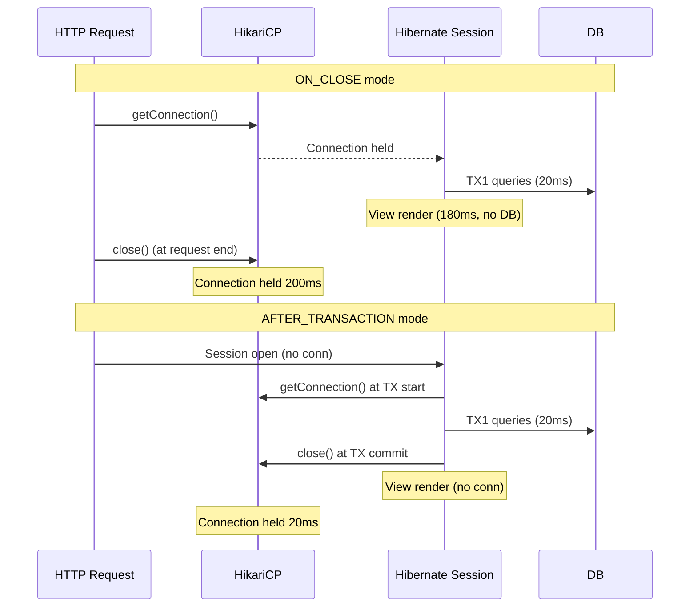
```mermaid
sequenceDiagram
    participant Req as HTTP Request
    participant Pool as HikariCP
    participant Sess as Hibernate Session
    participant DB
    Note over Req,DB: ON_CLOSE mode
    Req->>Pool: getConnection()
    Pool-->>Sess: Connection held
    Sess->>DB: TX1 queries (20ms)
    Note over Sess: View render (180ms, no DB)
    Req->>Pool: close() (at request end)
    Note over Pool: Connection held 200ms
    Note over Req,DB: AFTER_TRANSACTION mode
    Req->>Sess: Session open (no conn)
    Sess->>Pool: getConnection() at TX start
    Sess->>DB: TX1 queries (20ms)
    Sess->>Pool: close() at TX commit
    Note over Sess: View render (no conn)
    Note over Pool: Connection held 20ms
```

---

### 📶 Gradual Depth

**Level 1 - What it is:**

Connection release mode controls when Hibernate acquires and returns database connections to the pool. Releasing connections sooner means more concurrent Sessions can share fewer connections.

**Level 2 - How to use it:**

In Spring Boot: disable OSIV (`spring.jpa.open-in-view=false`) to enable `AFTER_TRANSACTION` behavior. Set HikariCP pool size: `spring.datasource.hikari.maximum-pool-size=20`. Ensure all database access happens within `@Transactional` methods.

**Level 3 - How it works:**

With OSIV disabled, Spring creates a Session at the start of each `@Transactional` method. Connection is acquired from HikariCP when the first JDBC statement executes (`DELAYED_ACQUISITION`). At transaction commit/rollback, the connection is returned to the pool. If another `@Transactional` method runs in the same request, a new connection is acquired. With OSIV enabled, the Session spans the entire request and the connection is held from first SQL to request completion.

**Level 4 - Production mastery:**

Size the connection pool using: `pool_size = (core_count * 2) + disk_spindles` (HikariCP recommendation). Monitor via HikariCP metrics: `hikaricp_connections_active`, `hikaricp_connections_pending`, `hikaricp_connections_timeout_total`. If `pending > 0` sustained, the pool is too small or connections are held too long. Common fix: disable OSIV (releases connections at transaction boundary instead of request boundary). For connection leak detection: `spring.datasource.hikari.leak-detection-threshold=30000` (30s).

---

### ⚙️ How It Works

**Phase 1 - Connection acquisition:**
`@Transactional` method starts. Spring creates a Session. First JDBC statement triggers `ConnectionProvider.getConnection()` -> HikariCP returns a pooled connection.

**Phase 2 - Statement execution:**
SQL statements execute on the acquired connection. Multiple statements in the same transaction reuse the same connection.

**Phase 3 - Transaction completion:**
`@Transactional` method completes. Spring commits the transaction. Connection returned to HikariCP via `connection.close()` (pool return, not physical close).

**Phase 4 - Pool management:**
HikariCP maintains idle connections. New requests acquire from pool (< 1ms). If pool exhausted, requests wait up to `connectionTimeout` (default 30s). On timeout: `SQLTransientConnectionException`.

```text
  Pool: [conn1, conn2, ..., conn20] (idle)
  Request A: @Transactional -> acquire conn1
       -> SQL -> SQL -> commit -> return conn1
  Request B: @Transactional -> acquire conn1 (reuse)
       -> SQL -> commit -> return conn1
  Pool exhausted: wait -> timeout -> exception
```

```mermaid
flowchart TD
    A[@Transactional start] --> B[First SQL statement]
    B --> C[Acquire from HikariCP]
    C --> D{Pool has idle?}
    D -->|Yes| E[Return connection < 1ms]
    D -->|No| F{Wait < timeout?}
    F -->|Yes| G[Wait for release]
    F -->|No| H[Connection timeout exception]
    E --> I[Execute SQL statements]
    I --> J[@Transactional commit]
    J --> K[Return to HikariCP]
```

---

### 🚨 Failure Modes

**Failure 1 - Connection pool exhaustion:**

**Symptom:** `HikariPool-1 - Connection is not available, request timed out after 30000ms`. Application stops serving requests.

**Root cause:** Connections held too long (OSIV, long transactions, or connection leaks). Pool is exhausted before connections are returned.

**Diagnostic:**

```bash
# HikariCP metrics (via actuator)
curl localhost:8080/actuator/metrics/hikaricp.connections.active
curl localhost:8080/actuator/metrics/hikaricp.connections.pending
# If active == max and pending > 0: exhausted
```

**Fix:**

```properties
# 1. Disable OSIV
spring.jpa.open-in-view=false
# 2. Increase pool size (carefully)
spring.datasource.hikari.maximum-pool-size=20
# 3. Enable leak detection
spring.datasource.hikari.leak-detection-threshold=30000
```

**Failure 2 - Connection leak:**

**Symptom:** Over hours, active connections climb but never return to idle. Eventually pool exhaustion. Application restart temporarily fixes it.

**Root cause:** Code path that acquires a connection (opens a Session or JDBC connection) but does not close it in a finally block. Transaction manager does not release.

**Diagnostic:**

```bash
# Enable leak detection
spring.datasource.hikari.leak-detection-threshold=10000
# Check logs for:
# "Connection leak detection triggered"
# Stack trace shows where connection was acquired
```

**Fix:**

**BAD:**

```java
Session s = sessionFactory.openSession();
s.get(Product.class, 1L);
// Session never closed! Connection leaked!
```

**GOOD:**

```java
try (Session s =
        sessionFactory.openSession()) {
    s.get(Product.class, 1L);
} // Auto-closed, connection returned
```

---

### 🔬 Production Reality

A Spring Boot application with `spring.jpa.open-in-view=true` (default) and `maximum-pool-size=10` serves 200 concurrent users. Average request time: 150ms. Average database time per request: 15ms. With OSIV, each request holds a connection for 150ms. Maximum throughput: 10 connections / 0.15s = 66 requests/second. After disabling OSIV, each request holds a connection for 15ms. Maximum throughput: 10 connections / 0.015s = 666 requests/second. A 10x throughput improvement from a single configuration change. The trade-off: lazy associations in the controller/view layer now throw `LazyInitializationException`, requiring explicit JOIN FETCH or DTO projections.

---

### ⚖️ Trade-offs & Alternatives

| Aspect          | ON_CLOSE (OSIV)  | AFTER_TRANSACTION   | AFTER_STATEMENT      |
| --------------- | ---------------- | ------------------- | -------------------- |
| Hold duration   | Entire request   | Transaction only    | Per statement        |
| Pool efficiency | Low              | High                | Maximum              |
| Lazy safety     | No LazyInitEx    | LazyInitEx possible | Requires auto-commit |
| Throughput      | Low (conn-bound) | High                | Highest (rare)       |
| Complexity      | Simple           | Moderate (DTOs)     | Complex              |

**Real-world patterns:**

- **Spring Boot default:** OSIV enabled (ON_CLOSE). Safe for simple apps but limits throughput at scale.
- **High-throughput services:** OSIV disabled, AFTER_TRANSACTION. Requires explicit fetch planning but enables 5-10x more concurrent requests per pool.

---

### ⚡ Decision Snap

**USE AFTER_TRANSACTION (OSIV disabled) WHEN:**

- High-throughput services with > 100 concurrent requests.
- Connection pool is a bottleneck.
- You have explicit fetch planning (JOIN FETCH, DTOs).

**USE ON_CLOSE (OSIV enabled) WHEN:**

- Simple CRUD applications with few concurrent users.
- Rapid prototyping where lazy access in views is convenient.
- Team is learning Hibernate (reduces LazyInitializationException).

**AVOID AFTER_STATEMENT:**

- Almost never needed. Only relevant for auto-commit mode (no transactions), which is rarely used with Hibernate.

---

### ⚠️ Top Traps

| #   | Misconception                                 | Reality                                                                                                                                                                                                         |
| --- | --------------------------------------------- | --------------------------------------------------------------------------------------------------------------------------------------------------------------------------------------------------------------- |
| 1   | OSIV is harmless for small apps               | OSIV holds connections during view rendering. Even "small" apps can exhaust a 10-connection pool under moderate load.                                                                                           |
| 2   | Larger pool size fixes exhaustion             | If connections are held too long (OSIV), increasing pool size delays the problem. Fix hold duration first, then size the pool.                                                                                  |
| 3   | HikariCP default pool size is optimal         | HikariCP defaults to `maximumPoolSize=10`. This is rarely optimal. Size based on: `(cpu_cores * 2) + disk_spindles`.                                                                                            |
| 4   | Connection acquisition from pool is expensive | Pool acquisition is < 1ms. The overhead of AFTER_TRANSACTION (re-acquisition per TX) is negligible compared to the saved hold time.                                                                             |
| 5   | Disabling OSIV only affects lazy loading      | Disabling OSIV changes connection release behavior (AFTER_TRANSACTION instead of ON_CLOSE). The throughput improvement is the primary benefit; avoiding LazyInitializationException is the secondary challenge. |

---

### 🪜 Learning Ladder

**Prerequisites:**

- Open Session in View - The Silent Scalability Killer -
  OSIV's connection impact
- First-Level Cache (Persistence Context) Internals -
  Session lifecycle

**THIS:** HIB-080 Connection Management and Release Modes

**Next steps:**

- Hibernate Performance Tuning at Scale - connection
  management as part of tuning
- ORM Data Layer - Phase 4 (Production Hardening) - pool
  sizing in production

---

**The Surprising Truth:**

The single most impactful Spring Boot configuration change for Hibernate throughput is `spring.jpa.open-in-view=false`. It does not change any code, does not require any dependency, and typically improves connection pool throughput by 5-10x. Spring Boot logs a warning about OSIV at startup (`spring.jpa.open-in-view is enabled by default`), but most teams ignore it until connection pool exhaustion hits production.

**Further Reading:**

- HikariCP wiki - "About Pool Sizing" (github.com/brettwooldridge/HikariCP)
- Vlad Mihalcea, "The Open Session in View Anti-Pattern" (blog post)
- Hibernate ORM 6 User Guide, Chapter 8 - Database Access

**Revision Card:**

1. Disable OSIV (`spring.jpa.open-in-view=false`) for production. Connections released at transaction boundary instead of request boundary. 5-10x throughput improvement.
2. Pool size formula: `(cpu_cores * 2) + disk_spindles`. Monitor `hikaricp_connections_pending` - if > 0 sustained, pool is too small or connections held too long.
3. Enable leak detection: `leak-detection-threshold=30000`. Connection leaks are silent and cumulative - only visible as gradual pool exhaustion.

---

---

# HIB-081 Envers - Audit Logging and Entity Versioning

**TL;DR** - Hibernate Envers automatically creates audit tables and records every entity change (insert/update/delete) with revision metadata, enabling point-in-time queries.

---

### 🔥 Problem Statement

Regulatory compliance requires a complete change history for financial entities: who changed what field, when, and the before/after values. Manual audit logging means writing event listeners, maintaining shadow tables, and handling every entity type. One missed entity or field means a compliance gap. Envers solves this by automatically creating audit tables (`_AUD`) for every `@Audited` entity and recording the complete entity state at each revision. Point-in-time queries let you retrieve any entity's state at any historical revision.

---

### 📜 Historical Context

Hibernate Envers (Entity Versioning System) was created by Adam Warski in 2008 and integrated into Hibernate 3.5 as a core module. It was designed after observing that most enterprise applications need some form of audit trail but implement it ad-hoc with inconsistent coverage. Envers leverages the EventListener SPI to intercept all entity lifecycle events transparently. The audit table design was inspired by temporal database patterns: each change creates a new row in the audit table with a revision number and operation type (ADD/MOD/DEL).

---

### 🔩 First Principles

**CORE INVARIANTS:**

1. **Revision = snapshot:** Each transaction that modifies an `@Audited` entity creates a revision. The revision captures the complete entity state at that point.
2. **Audit table mirrors entity table:** For entity table `orders`, Envers creates `orders_AUD` with all columns plus `REV` (revision number) and `REVTYPE` (0=ADD, 1=MOD, 2=DEL).
3. **Event-driven:** Envers registers as a PostInsert/PostUpdate/PostDelete EventListener. No polling, no triggers. Changes captured at the Hibernate level.
4. **Point-in-time query:** `AuditReader.find(Entity.class, id, revisionNumber)` returns the entity state at any historical revision.

**DERIVED DESIGN:**

The revision-per-transaction model means multiple entity changes in one transaction share one revision. Audit tables grow proportionally to change frequency. Point-in-time queries are efficient because each revision stores complete state (not deltas).

**THE TRADE-OFF:**

**Gain:** Automatic, complete audit trail for every `@Audited` entity. Zero manual audit code. Point-in-time queries for compliance and debugging.

**Cost:** Audit tables consume storage (typically 2-5x entity table size over time). Every INSERT/UPDATE/DELETE generates an additional INSERT into the audit table. Schema migration complexity (audit tables must be migrated alongside entity tables).

---

### 🧠 Mental Model

> Envers is a security camera for your database. Every change to a monitored entity (audit annotation) is recorded with a timestamp (revision). You can rewind the tape (point-in-time query) to see exactly what the data looked like at any moment. The camera runs automatically once installed - no manual operation needed.

- "Security camera" -> Envers EventListeners
- "Monitored entity" -> @Audited annotation
- "Timestamp" -> revision number + timestamp
- "Rewind the tape" -> AuditReader point-in-time query

**Where this analogy breaks down:** Unlike a camera that records continuously, Envers only captures snapshots at transaction boundaries. Changes within a transaction are not individually recorded.

---

### 🧩 Components

- **@Audited:** Annotation on entity class or individual fields. Marks what Envers tracks.
- **RevisionEntity (REVINFO table):** Stores revision metadata: revision number, timestamp. Customizable to include user, IP, etc.
- **AUD tables:** Auto-generated audit tables. Entity table `orders` -> `orders_AUD` with REV, REVTYPE columns.
- **AuditReader:** Query API. `AuditReaderFactory.get(em)`. Methods: `find()`, `getRevisions()`, `createQuery()`.
- **RevisionType:** Enum: ADD (0), MOD (1), DEL (2).

```text
  Entity table: orders
  +----+--------+-------+
  | id | status | total |
  +----+--------+-------+
  |  1 | ACTIVE | 99.00 |
  +----+--------+-------+

  Audit table: orders_AUD
  +----+--------+-------+-----+---------+
  | id | status | total | REV | REVTYPE |
  +----+--------+-------+-----+---------+
  |  1 | NEW    | 50.00 |   1 | 0 (ADD) |
  |  1 | ACTIVE | 99.00 |   2 | 1 (MOD) |
  +----+--------+-------+-----+---------+

  REVINFO:
  +-----+---------------------+
  | REV | REVTSTMP            |
  +-----+---------------------+
  |   1 | 2024-01-15 10:30:00 |
  |   2 | 2024-01-15 14:22:00 |
  +-----+---------------------+
```

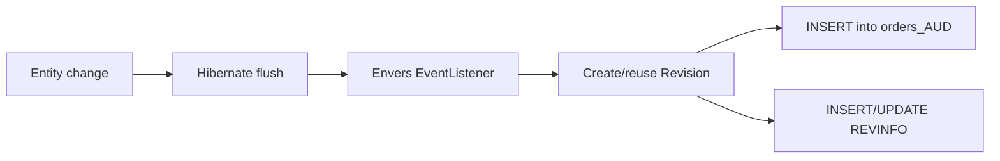
```mermaid
flowchart LR
    A[Entity change] --> B[Hibernate flush]
    B --> C[Envers EventListener]
    C --> D[Create/reuse Revision]
    D --> E[INSERT into orders_AUD]
    D --> F[INSERT/UPDATE REVINFO]
```

---

### 📶 Gradual Depth

**Level 1 - What it is:**

Envers automatically records a history of every change to `@Audited` entities. Each change creates a revision with the complete entity state. You can query any entity's state at any point in time.

**Level 2 - How to use it:**

Add `hibernate-envers` dependency. Annotate entities with `@Audited`. Envers creates audit tables automatically. Query history via `AuditReaderFactory.get(em).find(Order.class, orderId, revisionNumber)`.

**Level 3 - How it works:**

Envers registers five EventListeners at SessionFactory startup. On PostInsert/PostUpdate/PostDelete, it captures the entity state and revision type. At transaction commit, it writes audit rows to the `_AUD` table and revision metadata to `REVINFO`. The `AuditReader` translates point-in-time queries into SQL joins against `_AUD` tables.

**Level 4 - Production mastery:**

Customize the revision entity to capture `@RevisionEntity` metadata (username, IP address). Use `@NotAudited` on fields that should not be tracked (e.g., computed caches). Monitor audit table growth - consider partitioning by REV range. For high-write systems, audit table INSERTs add 30-50% write overhead. Consider async audit (Debezium CDC) for extreme throughput.

---

### ⚙️ How It Works

**Phase 1 - Schema generation:**
At startup, Envers scans `@Audited` entities and creates `_AUD` table DDL mirroring each entity table plus REV and REVTYPE columns.

**Phase 2 - Change capture:**
Transaction modifies an Order (INSERT or UPDATE). At flush, PostInsertEvent or PostUpdateEvent fires. Envers listener captures entity state as `Object[]`.

**Phase 3 - Audit write:**
At transaction commit, Envers creates a revision (REVINFO row), then inserts audit rows (`orders_AUD`) with the captured state, REV, and REVTYPE.

**Phase 4 - Historical query:**
`auditReader.find(Order.class, 1, 5)` -> SQL: `SELECT * FROM orders_AUD WHERE id=1 AND REV <= 5 ORDER BY REV DESC LIMIT 1`.

```text
  TX: update order SET status='ACTIVE' WHERE id=1
  Flush -> PostUpdateEvent -> Envers captures
  Commit -> REVINFO INSERT (rev=2, timestamp)
         -> orders_AUD INSERT (id=1, status=ACTIVE,
            total=99.00, REV=2, REVTYPE=1)
  Query: find(Order, 1, rev=2)
       -> SELECT FROM orders_AUD WHERE id=1
          AND REV <= 2 ORDER BY REV DESC LIMIT 1
```

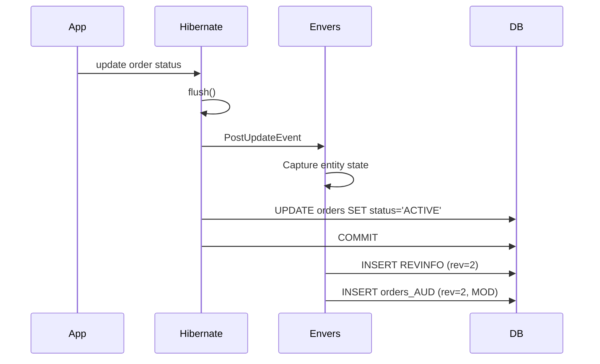
```mermaid
sequenceDiagram
    participant App
    participant Hib as Hibernate
    participant Env as Envers
    participant DB
    App->>Hib: update order status
    Hib->>Hib: flush()
    Hib->>Env: PostUpdateEvent
    Env->>Env: Capture entity state
    Hib->>DB: UPDATE orders SET status='ACTIVE'
    Hib->>DB: COMMIT
    Env->>DB: INSERT REVINFO (rev=2)
    Env->>DB: INSERT orders_AUD (rev=2, MOD)
```

---

### 🚨 Failure Modes

**Failure 1 - Audit table bloat:**

**Symptom:** Database disk usage growing rapidly. Audit tables are 10x larger than entity tables. Query performance degrades.

**Root cause:** High-frequency updates on audited entities. Each update creates a full snapshot row in the AUD table.

**Diagnostic:**

```sql
-- Compare entity vs audit table sizes
SELECT pg_total_relation_size('orders')
    AS entity_size,
    pg_total_relation_size('orders_aud')
    AS audit_size;
```

**Fix:**

```sql
-- Partition audit tables by revision range
-- Archive old revisions to cold storage
-- Use @NotAudited on frequently-changing
-- non-critical fields (e.g., lastAccessTime)
```

**Failure 2 - Missing audit for related entities:**

**Symptom:** Parent entity changes are audited but child entity changes are missing from the audit trail.

**Root cause:** `@Audited` on parent but not on child entity. Or: cascade operations update children but Envers only audits explicitly `@Audited` entities.

**Diagnostic:**

```java
// Check: is the child entity @Audited?
// Check: does the child AUD table exist?
// SELECT * FROM line_items_aud WHERE order_id=1
```

**Fix:**

**BAD:**

```java
@Audited
@Entity
public class Order { ... }

@Entity // Missing @Audited!
public class LineItem { ... }
```

**GOOD:**

```java
@Audited
@Entity
public class Order { ... }

@Audited // Must be on BOTH
@Entity
public class LineItem { ... }
```

---

### 🔬 Production Reality

A healthcare SaaS platform audits all patient record changes for HIPAA compliance. With 50,000 patient records updated 10 times/day average, the audit tables accumulate 500,000 rows/day (182M rows/year). After 2 years, audit queries become slow. The fix: partition `_AUD` tables by `REV` range (quarterly partitions), add a covering index on `(id, REV DESC)`, and archive partitions older than 7 years to cold storage (S3 + Athena for compliance queries). Audit INSERT overhead: 35% additional write latency per transaction, acceptable for the compliance guarantee.

---

### ⚖️ Trade-offs & Alternatives

| Aspect           | Hibernate Envers | CDC (Debezium)        | Manual audit tables    |
| ---------------- | ---------------- | --------------------- | ---------------------- |
| Setup complexity | Low (annotation) | High (Kafka infra)    | High (code per entity) |
| Sync guarantee   | Same transaction | Eventually consistent | Same transaction       |
| Schema coupling  | Mirrors entity   | Captures DB changes   | Manual design          |
| Query API        | AuditReader      | Custom consumer       | Custom SQL             |
| Write overhead   | 30-50%           | Near-zero (async)     | 30-50%                 |

**Real-world patterns:**

- **Regulated industries** (finance, healthcare) use Envers for guaranteed same-transaction audit capture with point-in-time compliance queries.
- **High-throughput systems** use Debezium CDC for async audit capture without write overhead, accepting eventual consistency.

---

### ⚡ Decision Snap

**USE ENVERS WHEN:**

- Compliance requires same-transaction audit guarantee.
- Point-in-time entity state queries are needed.
- Moderate write frequency (< 1000 writes/second).

**AVOID WHEN:**

- Extreme write throughput where 30-50% overhead is unacceptable.
- Only need change events (not full state snapshots) - use CDC.
- Non-JPA data sources need auditing.

**PREFER CDC (DEBEZIUM) WHEN:**

- Async audit is acceptable. Near-zero write overhead needed. Multi-source audit aggregation required.

---

### ⚠️ Top Traps

| #   | Misconception                       | Reality                                                                                                                   |
| --- | ----------------------------------- | ------------------------------------------------------------------------------------------------------------------------- |
| 1   | Envers captures field-level changes | Envers stores complete entity snapshots, not field-level deltas. Diff computation is done at query time.                  |
| 2   | Audit tables need no maintenance    | AUD tables grow unbounded. Without partitioning and archiving, they become the largest tables in the database.            |
| 3   | @Audited on parent covers children  | Each entity must be independently `@Audited`. Child entities are not automatically included.                              |
| 4   | Envers works with StatelessSession  | Envers relies on Session events. StatelessSession does not fire PostInsert/PostUpdate events, so changes are NOT audited. |
| 5   | REVINFO only stores timestamp       | REVINFO is customizable. Extend `DefaultRevisionEntity` to capture username, IP, request ID for compliance.               |

---

### 🪜 Learning Ladder

**Prerequisites:**

- Interceptors and EventListener SPI - Envers is built
  on EventListeners
- First-Level Cache (Persistence Context) Internals -
  flush events trigger audit capture

**THIS:** HIB-081 Envers - Audit Logging and Entity Versioning

**Next steps:**

- Hibernate Production Diagnostics - Slow Query and Flush
  Storms - audit write overhead diagnosis
- ORM Data Layer - Phase 4 (Production Hardening) - audit
  as a production concern

---

**The Surprising Truth:**

Envers stores the complete entity state at each revision, not just the changed fields. This means querying "what was the order total on January 15?" is a simple lookup: `auditReader.find(Order.class, id, revAtDate)`. But it also means storage grows proportionally to entity size times change frequency. A 50-column entity updated 10 times stores 500 column values in audit, even if only 1 column changed each time.

**Further Reading:**

- Hibernate Envers Reference Documentation (hibernate.org)
- Adam Warski, "Hibernate Envers - Easy Entity Auditing" (original design blog post)
- JPA 3.1 Specification, Section 3.5.3 - EntityListener callbacks (the foundation Envers extends)

**Revision Card:**

1. `@Audited` on entity -> automatic `_AUD` table with full state snapshots per revision. Zero audit code needed.
2. AUD tables grow proportionally to change frequency. Partition by REV range. Archive old partitions.
3. Envers requires Session events. StatelessSession, direct SQL, and non-Hibernate changes are NOT captured.

---

---

# HIB-082 Hibernate Production Diagnostics - Slow Query and Flush Storms

**TL;DR** - Production Hibernate problems fall into three categories: slow queries (missing indexes, N+1), flush storms (dirty checking thousands of entities), and connection starvation (OSIV, leaks).

---

### 🔥 Problem Statement

The application is slow in production. APM shows high database latency. But which queries? Is it Hibernate generating bad SQL, missing indexes, N+1 patterns, flush storms from thousands of managed entities, or connection pool exhaustion? Without systematic diagnostic methodology, teams spend hours guessing. This keyword provides the diagnostic playbook: instrument, identify the category (query, flush, connection), apply the targeted fix.

---

### 📜 Historical Context

Hibernate production diagnostics evolved from ad-hoc `show_sql` debugging to a mature observability stack. Early Hibernate users had no choice but to read console SQL output. Hibernate 3 introduced the Statistics API. p6spy (2002) added JDBC-level interception with timing. The modern stack combines Hibernate Statistics + Micrometer + p6spy + APM (New Relic, Datadog) for comprehensive visibility. The key evolution was recognizing that Hibernate performance problems are rarely about Hibernate itself - they are about how the application uses Hibernate.

---

### 🔩 First Principles

**CORE INVARIANTS:**

1. **Three problem categories:** Every Hibernate production issue falls into: slow queries (what SQL is generated), flush storms (how many entities are dirty-checked), or connection problems (how long connections are held).
2. **Observability precedes optimization:** You cannot fix what you cannot measure. Enable statistics and SQL logging before attempting any optimization.
3. **The ORM amplifies mistakes:** Hibernate does exactly what you tell it. N+1 is not a Hibernate bug - it is a missing JOIN FETCH. Slow flush is not a Hibernate bug - it is too many managed entities.
4. **Diagnosis is systematic:** Category identification -> metric collection -> root cause -> targeted fix.

**DERIVED DESIGN:**

Slow queries require SQL-level analysis (EXPLAIN, index review). Flush storms require persistence context analysis (entity count, dirty checking overhead). Connection problems require pool metrics (active, pending, timeout). Each category has a different diagnostic tool and fix.

**THE TRADE-OFF:**

**Gain:** Systematic diagnosis reduces mean-time-to-resolution from hours to minutes.

**Cost:** Instrumentation overhead (Statistics API, p6spy). Expertise required to interpret metrics.

---

### 🧠 Mental Model

> Diagnosing Hibernate production issues is like diagnosing car problems. Three categories: engine (slow queries - the SQL is bad), transmission (flush storms - too many gears grinding), fuel system (connection starvation - not enough fuel). You do not replace the engine when the fuel line is blocked. Identify the category first, then apply the targeted fix.

- "Engine" -> slow queries (SQL/index level)
- "Transmission" -> flush storms (PC level)
- "Fuel system" -> connection starvation (pool level)

**Where this analogy breaks down:** Unlike a car, Hibernate problems often cascade. A flush storm can cause slow queries (flushing triggers SQL), and both can cause connection starvation (connections held longer).

---

### 🧩 Components

- **Hibernate Statistics API:** Query count, entity load/store, flush count, cache hit/miss. Per-SessionFactory counters.
- **p6spy / datasource-proxy:** JDBC interceptors that log every SQL statement with bind parameters, execution time, and calling stack trace.
- **Micrometer + Prometheus:** Publishes Hibernate metrics as Prometheus counters/gauges. Enables alerting and dashboards.
- **Slow query log (database):** PostgreSQL `log_min_duration_statement`, MySQL `slow_query_log`. Captures queries exceeding a threshold.
- **EXPLAIN ANALYZE:** Database query plan analysis. Identifies missing indexes, sequential scans, and join inefficiencies.

```text
  Diagnostic stack:
  Layer 1: Hibernate Statistics (overview)
    -> query count, entity count, flush count
  Layer 2: p6spy (detail)
    -> individual SQL + params + timing
  Layer 3: Database slow query log
    -> queries exceeding threshold
  Layer 4: EXPLAIN ANALYZE
    -> execution plan for specific queries
```

```mermaid
flowchart TD
    A[Performance issue] --> B{Which category?}
    B -->|High query count| C[N+1: Statistics API]
    B -->|Slow flush| D[Flush storm: entity count]
    B -->|Connection timeout| E[Pool: HikariCP metrics]
    C --> F[Fix: JOIN FETCH]
    D --> G[Fix: clear/DTO/readOnly]
    E --> H[Fix: OSIV/pool size]
```

---

### 📶 Gradual Depth

**Level 1 - What it is:**

Hibernate production diagnostics is a systematic approach to identifying and fixing performance issues in Hibernate-based applications. Problems fall into three categories: slow queries, flush storms, and connection starvation.

**Level 2 - How to use it:**

Enable `hibernate.generate_statistics=true`. Add p6spy for SQL logging in development. Set up Micrometer metrics for production dashboards. Create Grafana alerts for query count per request > 10 and connection pool pending > 0.

**Level 3 - How it works:**

Statistics API counts operations per SessionFactory. Micrometer exports these as Prometheus counters. p6spy intercepts at the JDBC level, capturing the actual SQL sent to the database. Combining all three gives a complete picture: Statistics for overview, p6spy for detail, database logs for execution plans.

**Level 4 - Production mastery:**

Build a diagnostic runbook: (1) check query count per request (Statistics/Micrometer), (2) if high: check for N+1 (p6spy), (3) check flush time (Statistics flush count + duration), (4) if high: check entity count in PC, (5) check connection pool (HikariCP metrics), (6) if exhausted: check OSIV, check leak detection. Each step has a clear metric, threshold, and fix.

---

### ⚙️ How It Works

**Phase 1 - Instrument:**
Enable Statistics, add Micrometer, configure p6spy. Set up Grafana dashboard with key metrics.

**Phase 2 - Identify category:**

- Query count per request > 10: N+1 or excessive querying.
- Flush time > 100ms: flush storm (too many entities).
- Connection pending > 0: pool exhaustion.

**Phase 3 - Drill down:**

- N+1: p6spy shows repeated SELECT for same table. Fix: JOIN FETCH or @BatchSize.
- Flush storm: Statistics show high entity load count. Fix: DTO projections, read-only hint, or clear().
- Pool exhaustion: HikariCP shows all active, none idle. Fix: disable OSIV, increase pool, fix leaks.

**Phase 4 - Verify fix:**
After fix: re-check metrics. Query count should drop. Flush time should decrease. Connection pending should reach 0.

```text
  Diagnostic runbook:
  1. metrics.query_count_per_request > 10?
     -> YES: N+1. Use p6spy to identify.
     -> Fix: JOIN FETCH or @BatchSize
  2. metrics.flush_time_ms > 100?
     -> YES: Flush storm. Check entity count.
     -> Fix: DTO, read-only, clear()
  3. hikari.connections.pending > 0?
     -> YES: Pool exhaustion.
     -> Fix: disable OSIV, increase pool
```

```mermaid
flowchart TD
    A[Slow endpoint] --> B[Check stats]
    B --> C{Query count > 10?}
    C -->|Yes| D[N+1 analysis via p6spy]
    C -->|No| E{Flush time > 100ms?}
    E -->|Yes| F[Entity count analysis]
    E -->|No| G{Conn pending > 0?}
    G -->|Yes| H[Pool/OSIV analysis]
    G -->|No| I[External cause]
    D --> J[JOIN FETCH fix]
    F --> K[DTO/clear fix]
    H --> L[OSIV/pool fix]
```

---

### 🚨 Failure Modes

**Failure 1 - N+1 in production (undetected):**

**Symptom:** Endpoint latency linearly increases with data volume. 10 orders: 50ms. 100 orders: 500ms. 1000 orders: 5000ms.

**Root cause:** Lazy association traversal without JOIN FETCH. Each entity triggers an additional SELECT.

**Diagnostic:**

```bash
# Hibernate statistics
stats.getPrepareStatementCount()
# If count == N+1 where N is result set size:
# confirmed N+1
# p6spy: look for repeated SELECT on same table
```

**Fix:**

**BAD:**

```java
@Query("SELECT o FROM Order o")
List<Order> findAll();
// Each order.getCustomer() = extra SELECT
```

**GOOD:**

```java
@Query("SELECT o FROM Order o "
    + "JOIN FETCH o.customer "
    + "JOIN FETCH o.lineItems")
List<Order> findAllWithDetails();
```

**Failure 2 - Flush storm from reporting endpoint:**

**Symptom:** Specific endpoint has 3-5 second latency. Thread dump shows `DefaultFlushEntityEventListener.dirtyCheck()`. No slow queries in database logs.

**Root cause:** Endpoint loads 10,000 entities for report generation. At flush, Hibernate dirty-checks all 10,000 even though none are modified.

**Diagnostic:**

```java
// Check entity count in persistence context
Session s = em.unwrap(Session.class);
SessionStatistics ss = s.getStatistics();
log.info("Entities in PC: {}",
    ss.getEntityCount());
// If count is thousands: flush storm
```

**Fix:**

```java
// Use DTO projection (no entities in PC)
@Query("SELECT new ReportDTO(o.id, o.total) "
    + "FROM Order o")
List<ReportDTO> findReportData();
// Or: read-only hint
em.createQuery("FROM Order", Order.class)
    .setHint("org.hibernate.readOnly", true);
```

---

### 🔬 Production Reality

A fintech platform's order search endpoint degrades from 200ms to 8 seconds over three months. Investigation: (1) Statistics show 47 queries per request (N+1 on customer and product associations). (2) p6spy reveals the same `SELECT FROM customer WHERE id=?` repeated per order. (3) After JOIN FETCH fix: 2 queries per request, latency drops to 150ms. One week later: another endpoint degrades. Investigation: (4) Statistics show only 3 queries but flush time is 2 seconds. (5) Session statistics: 15,000 entities in persistence context. (6) Fix: DTO projection for the reporting endpoint. Flush time drops to 0ms (no entities to check).

---

### ⚖️ Trade-offs & Alternatives

| Diagnostic tool   | What it reveals           | Overhead       | Production safe |
| ----------------- | ------------------------- | -------------- | --------------- |
| Statistics API    | Query/entity/flush counts | Microseconds   | Yes             |
| p6spy             | SQL + params + timing     | Low-moderate   | With sampling   |
| DB slow query log | Queries > threshold       | None (DB-side) | Yes             |
| EXPLAIN ANALYZE   | Query execution plan      | Per query      | Yes (read-only) |
| APM (Datadog)     | Request-level traces      | 1-3%           | Yes             |

**Real-world patterns:**

- **Mature teams** layer all five tools: Statistics (always-on), Micrometer (dashboards), p6spy (development), DB slow log (production), APM (request tracing).
- **Incident response** follows the runbook: category identification (30 seconds), metric drill-down (5 minutes), fix identification (10 minutes).

---

### ⚡ Decision Snap

**USE THIS DIAGNOSTIC APPROACH WHEN:**

- Any Hibernate production performance issue. Follow the three-category classification.
- Setting up a new project. Instrument from day one.
- Post-deployment verification. Check metrics after every release.

**AVOID WHEN:**

- The problem is clearly not Hibernate (e.g., network latency, external service timeout).

**PREFER STATISTICS + MICROMETER WHEN:**

- Always as the minimum. p6spy and APM add detail when needed.

---

### ⚠️ Top Traps

| #   | Misconception                              | Reality                                                                                                                                |
| --- | ------------------------------------------ | -------------------------------------------------------------------------------------------------------------------------------------- |
| 1   | Hibernate is the problem                   | Hibernate is almost never the root cause. The application's USE of Hibernate (N+1, no DTOs, OSIV) is the problem.                      |
| 2   | Adding indexes fixes everything            | Indexes fix slow individual queries. N+1 is a query COUNT problem, not a speed problem. 1000 fast queries are still slow in aggregate. |
| 3   | Profiling in dev catches production issues | N+1 with 5 test rows is invisible (25ms). With 500 production rows, it is 2.5 seconds. Test with production-scale data.                |
| 4   | show_sql is sufficient for diagnosis       | show_sql lacks timing, bind parameters, and request context. Use p6spy or Hibernate SQL logging with parameter logging.                |
| 5   | One fix is enough                          | Production Hibernate issues often layer: N+1 causing slow queries causing connection exhaustion. Fix root cause (N+1) first.           |

---

### 🪜 Learning Ladder

**Prerequisites:**

- Hibernate Statistics API and p6spy (L3) - primary
  diagnostic tools
- The N+1 Select Problem (L3) - most common issue
- Monitoring Hibernate in Production (L3) - metrics setup

**THIS:** HIB-082 Hibernate Production Diagnostics - Slow
Query and Flush Storms

**Next steps:**

- Hibernate Statistics and SessionMetrics Observability -
  deeper metrics analysis
- Hibernate Performance Tuning at Scale - systematic
  optimization after diagnosis
- Open Session in View - The Silent Scalability Killer -
  connection category diagnosis

---

**The Surprising Truth:**

In most production Hibernate incidents, the database is not slow. The queries are fast individually. The problem is QUANTITY: 47 queries per request, each taking 1ms, totals 47ms of database time but 200ms of network overhead (47 round-trips). The database never appears in the slow query log because no individual query exceeds the threshold. Only Hibernate-level statistics reveal the query count problem.

**Further Reading:**

- Vlad Mihalcea, "High-Performance Java Persistence" - Chapter 17: Monitoring
- Brendan Gregg, "Systems Performance" - diagnostic methodology applicable to ORM layer
- HikariCP wiki - "Pool Sizing" and "Leak Detection" (github.com/brettwooldridge/HikariCP)

**Revision Card:**

1. Three categories: slow queries (N+1), flush storms (entity count), connection starvation (OSIV/leaks). Identify category first.
2. Minimum stack: `generate_statistics=true` + Micrometer + Grafana. Alert on query count per request > 10.
3. Hibernate is not slow. Your USE of Hibernate is slow. Fix: JOIN FETCH (N+1), DTO (flush), disable OSIV (connections).
