## Keywords

1. [HIB-083 Hibernate Statistics and SessionMetrics Observability](#hib-083-hibernate-statistics-and-sessionmetrics-observability)
2. [HIB-084 Hibernate Performance Tuning at Scale](#hib-084-hibernate-performance-tuning-at-scale)
3. [HIB-085 The LazyInitializationException Epidemic](#hib-085-the-lazyinitializationexception-epidemic)
4. [HIB-086 Open Session in View - The Silent Scalability Killer](#hib-086-open-session-in-view---the-silent-scalability-killer)
5. [HIB-087 "Hibernate Is Slow" is Wrong - Misuse vs Actual ORM Cost](#hib-087-hibernate-is-slow-is-wrong---misuse-vs-actual-orm-cost)
6. [HIB-088 Entity for Every Table Anti-Pattern](#hib-088-entity-for-every-table-anti-pattern)
7. [HIB-089 Hibernate Tooling - p6spy, datasource-proxy, Hypersistence](#hib-089-hibernate-tooling---p6spy-datasource-proxy-hypersistence)
8. [HIB-090 Diagnose and Fix N+1 in a Legacy Codebase (Exercise)](#hib-090-diagnose-and-fix-n1-in-a-legacy-codebase-exercise)
9. [HIB-091 Hibernate Deep-Dive Interview Questions](#hib-091-hibernate-deep-dive-interview-questions)
10. [HIB-092 Hibernate Expert Mastery Verification](#hib-092-hibernate-expert-mastery-verification)
11. [HIB-093 ORM Data Layer - Phase 4 (Production Hardening)](#hib-093-orm-data-layer---phase-4-production-hardening)

---

---

# HIB-083 Hibernate Statistics and SessionMetrics Observability

**TL;DR** - Hibernate Statistics provide SessionFactory-level counters (queries, loads, cache). SessionMetrics provide per-Session granularity for request-level diagnosis.

---

### 🔥 Problem Statement

Hibernate Statistics aggregate counts across the entire SessionFactory: total queries, total entity loads, total cache hits. This is useful for trends but insufficient for per-request diagnosis. Which specific request caused the query spike? SessionMetrics (Hibernate 5.4+) provide per-Session counters: how many queries did THIS Session execute? Combined with request-scoped logging, they enable the critical question: "This specific request executed 47 queries - here is why." Understanding both levels of observability is essential for production Hibernate monitoring.

---

### 📜 Historical Context

Hibernate's `Statistics` interface has existed since Hibernate 3 (2005), providing SessionFactory-level counters for JDBC statements, entity operations, and cache performance. The counters were global aggregates with no per-Session breakdown. Hibernate 5.4 (2019) introduced `SessionEventListener` and per-Session metrics capabilities. Spring Boot's Micrometer integration (2.0+) auto-publishes Hibernate statistics as Prometheus metrics. The evolution from global counters to per-Session metrics reflects the industry shift from aggregate monitoring to distributed tracing.

---

### 🔩 First Principles

**CORE INVARIANTS:**

1. **Statistics = SessionFactory scope:** Global counters aggregated across all Sessions since last reset. Good for trends, dashboards, and alerting.
2. **SessionMetrics = Session scope:** Per-Session counters for the lifetime of one Session. Good for per-request diagnosis.
3. **Both are passive:** They count operations without affecting behavior. Overhead is microseconds per operation (atomic counter increments).
4. **Reset semantics:** Statistics can be reset (`statistics.clear()`). SessionMetrics are naturally scoped - they die with the Session.

**DERIVED DESIGN:**

Global statistics answer "how many queries per second across the application?" Per-Session metrics answer "how many queries did this request execute?" Both are needed: statistics for dashboards, SessionMetrics for per-request assertions and debugging.

**THE TRADE-OFF:**

**Gain:** Comprehensive Hibernate observability at both aggregate and per-request levels. Near-zero overhead.

**Cost:** Global statistics require metric storage and dashboarding infrastructure. Per-Session metrics require integration with request tracing.

---

### 🧠 Mental Model

> Statistics is the odometer in a taxi fleet dashboard: total miles driven by all taxis. SessionMetrics is the trip meter in each taxi: miles driven on THIS trip. The fleet manager uses the odometer for planning. The driver uses the trip meter to explain this fare.

- "Fleet odometer" -> global Statistics
- "Trip meter" -> per-Session metrics
- "Planning" -> dashboards, capacity
- "This fare" -> per-request diagnosis

**Where this analogy breaks down:** Unlike an odometer that only counts miles, Hibernate Statistics count multiple dimensions (queries, loads, cache hits, flushes).

---

### 🧩 Components

- **Statistics interface:** `sessionFactory.getStatistics()`. Counters: `getPrepareStatementCount()`, `getEntityLoadCount()`, `getQueryExecutionCount()`, `getSecondLevelCacheHitCount()`.
- **SessionStatistics:** `session.getStatistics()`. Current state: `getEntityCount()`, `getCollectionCount()`. Not historical counters.
- **SessionEventListener:** Hibernate SPI for per-Session event counting. Custom implementations can track query count per Session.
- **Micrometer HibernateMetrics:** Auto-registers with Spring Boot. Publishes `hibernate.sessions.open`, `hibernate.statements`, `hibernate.entities.loads` to Prometheus.
- **StatisticsImplementor:** Internal implementation that performs atomic counter increments on every operation.

```text
  SessionFactory Statistics (global):
  prepareStatementCount: 145,230
  entityLoadCount: 89,100
  queryExecutionMaxTime: 1,250ms
  secondLevelCacheHitCount: 23,400

  Session Statistics (current state):
  entityCount: 47 (currently managed)
  collectionCount: 12

  Per-request (custom SessionEventListener):
  queryCount: 3
  fetchCount: 1
  flushCount: 1
```

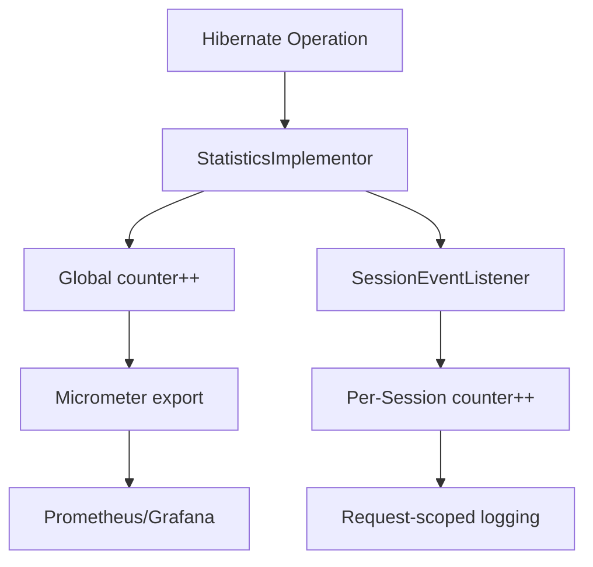

---

### 📶 Gradual Depth

**Level 1 - What it is:**

Hibernate Statistics count every operation (queries, loads, cache hits) at the SessionFactory level. SessionMetrics provide the same counters scoped to a single Session (request). Together they enable both trend monitoring and per-request diagnosis.

**Level 2 - How to use it:**

Enable: `hibernate.generate_statistics=true`. Access: `sessionFactory.getStatistics()`. Spring Boot auto-publishes to Micrometer. For per-request: use `session.getStatistics().getEntityCount()` or implement a custom `SessionEventListener`.

**Level 3 - How it works:**

Every Hibernate operation (prepare statement, load entity, cache hit/miss, flush) increments an atomic counter in `StatisticsImplementor`. Micrometer's `HibernateMetrics` reads these counters periodically and exports as gauge/counter metrics. Per-Session `SessionStatistics` reports current state (how many entities are currently managed), not historical operation counts.

**Level 4 - Production mastery:**

Key dashboard panels: (1) `hibernate_statements_total / http_requests_total` = queries per request (alert > 10), (2) `hibernate_second_level_cache_hit / (hit+miss)` = L2 cache effectiveness (alert < 80%), (3) `hibernate_query_execution_max_seconds` = slowest query (alert > 1s). For per-request diagnosis: log query count at the end of each request via a servlet filter that reads `statistics.getPrepareStatementCount()` delta.

---

### ⚙️ How It Works

**Phase 1 - Counter initialization:**
SessionFactory builds `StatisticsImplementor` with atomic long counters for each metric category (statements, loads, stores, cache operations). Internally, `StatisticsImplementor` uses `java.util.concurrent.atomic.LongAdder` (Hibernate 6) or `AtomicLong` (Hibernate 5) for thread-safe increments without lock contention. Query-level statistics are stored in a `ConcurrentHashMap<String, QueryStatisticsImpl>` keyed by HQL/JPQL string, tracking per-query execution count, max time, and row counts.

**Phase 2 - Counter increment:**
Every `Session.find()` increments `entityLoadCount`. Every `PreparedStatement.execute()` increments `prepareStatementCount`. Every L2 cache lookup increments `cacheHitCount` or `cacheMissCount`. The `StatisticsImplementor` also records `queryExecutionMaxTime` and the corresponding `queryExecutionMaxTimeQueryString` - the slowest query seen since the last reset. This is critical: it tells you not just HOW MANY queries ran, but WHICH query was the slowest.

**Phase 3 - Metric export:**
Micrometer's `HibernateMetrics` binder registers gauge and counter metrics from the `Statistics` interface. Key Prometheus metric names: `hibernate_sessions_open_total` (sessions opened), `hibernate_statements_total` (JDBC statements prepared), `hibernate_entities_loads_total` (entities loaded), `hibernate_second_level_cache_requests_total` (with `result=hit|miss` tag). Prometheus scrapes `/actuator/prometheus`. Grafana visualizes. The binder reads counters on each scrape, so metric resolution depends on your Prometheus scrape interval (typically 15-30s).

**Phase 4 - Per-request analysis:**
Custom filter snapshots `prepareStatementCount` before and after the request. Delta = queries for this request. Log if delta > threshold.

```text
  Request start:
  stats.snapshot() -> prepareStatementCount: 10000
  Request processing:
  find() -> counter: 10001
  query() -> counter: 10002
  query() -> counter: 10003
  Request end:
  stats.snapshot() -> prepareStatementCount: 10003
  Delta: 3 queries for this request
```

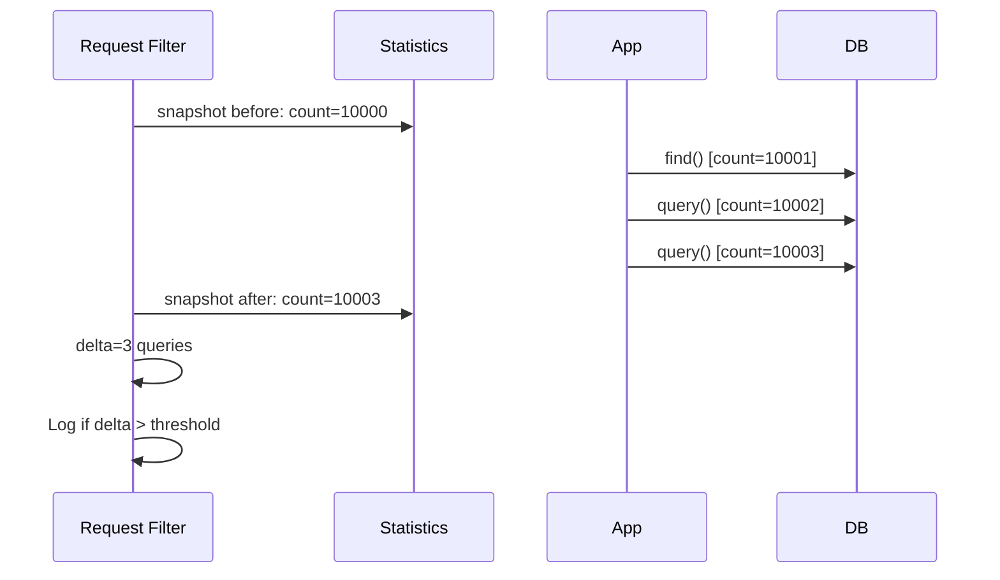

---

### 🚨 Failure Modes

**Failure 1 - Statistics disabled in production:**

**Symptom:** No Hibernate metrics in Grafana. Dashboard panels show "No data". Blind to N+1, cache issues, and query count.

**Root cause:** `hibernate.generate_statistics=false` (default). Statistics never collected.

**Diagnostic:**

```java
sessionFactory.getStatistics().isStatisticsEnabled()
// Returns false -> statistics not collecting
```

**Fix:**

**BAD:**

```properties
# Default: statistics disabled (blind)
hibernate.generate_statistics=false
```

**GOOD:**

```properties
# Near-zero overhead, full visibility
hibernate.generate_statistics=true
```

**Failure 2 - Global statistics hide per-request problems:**

**Symptom:** Average queries per second looks normal. But one specific endpoint has N+1 (47 queries per request) while others have 1-2. The average masks the outlier.

**Root cause:** Global statistics average across all requests. Per-request breakdown not available.

**Diagnostic:**

```java
// Add per-request query counting
@Component
public class QueryCountFilter
        implements Filter {
    @Override
    public void doFilter(
            ServletRequest req, ...) {
        long before =
            stats.getPrepareStatementCount();
        chain.doFilter(req, res);
        long after =
            stats.getPrepareStatementCount();
        long delta = after - before;
        if (delta > 10) {
            log.warn("N+1? {} queries for {}",
                delta, ((HttpServletRequest)req)
                    .getRequestURI());
        }
    }
}
```

**Fix:**

```text
Add per-request query count logging (filter above).
Alert on requests with > 10 queries.
Use request URI to identify the problematic endpoint.
```

**Failure 3 - Micrometer metrics missing cache region breakdown:**

**Symptom:** Grafana shows total L2 cache hit/miss counts but cannot distinguish which cache region is performing poorly. One region has 95% hit rate, another has 20%, and the aggregate masks the problem.

**Root cause:** Default `HibernateMetrics` binder publishes aggregate cache counters. Per-region metrics require explicit configuration or a custom `MeterBinder` that iterates `statistics.getSecondLevelCacheRegionNames()` and publishes per-region hit/miss gauges.

**Diagnostic:**

```java
String[] regions =
    stats.getSecondLevelCacheRegionNames();
for (String region : regions) {
    CacheRegionStatistics crs =
        stats.getCacheRegionStatistics(region);
    log.info("{}: hits={} misses={}",
        region, crs.getHitCount(),
        crs.getMissCount());
}
```

**Fix:** Register per-region metrics explicitly:

```java
for (String region : regions) {
    Gauge.builder(
        "hibernate.cache.region.hits",
        stats,
        s -> s.getCacheRegionStatistics(region)
            .getHitCount())
        .tag("region", region)
        .register(meterRegistry);
}
```

---

### 🔬 Production Reality

A team enables Hibernate statistics and discovers their application averages 4.2 queries per request - healthy. But percentile analysis reveals the 99th percentile is 67 queries per request. One endpoint (`/api/orders/search`) loads orders and lazily accesses customer, product, and shipping associations. The global average hides this because the endpoint is called infrequently (2% of traffic). Per-request query count logging immediately identifies the outlier. Fix: JOIN FETCH for the three associations. P99 query count drops from 67 to 3.

**Prometheus/Grafana dashboard essentials:** Three panels every Hibernate dashboard needs: (1) Queries-per-request ratio: `rate(hibernate_statements_total[5m]) / rate(http_server_requests_seconds_count[5m])` - alert when this exceeds 10. (2) L2 cache hit ratio: `rate(hibernate_second_level_cache_requests_total{result="hit"}[5m]) / rate(hibernate_second_level_cache_requests_total[5m])` - alert when this drops below 0.8. (3) Session open rate: `rate(hibernate_sessions_open_total[5m])` - correlate with request rate to detect session leaks (sessions growing faster than requests indicates sessions not being closed). Entity load count per request is another key signal: a sudden spike in `hibernate_entities_loads_total` relative to request count typically means a new code path introduced eager fetching or a lazy collection is being touched in a loop.

---

### ⚖️ Trade-offs & Alternatives

| Aspect          | Hibernate Statistics | Per-Request Filter | APM (Datadog)     |
| --------------- | -------------------- | ------------------ | ----------------- |
| Scope           | Global               | Per-request        | Per-request       |
| Setup           | Config property      | Custom code        | Agent install     |
| Cost            | Free                 | Free               | Paid service      |
| SQL visibility  | Counts only          | Counts only        | Full SQL + timing |
| Production safe | Yes                  | Yes                | Yes               |

**Real-world patterns:**

- **Budget-conscious teams** use Statistics + custom filter + Grafana for free Hibernate observability.
- **Enterprise teams** combine Statistics with APM (Datadog/New Relic) for request-level SQL tracing with minimal custom code.

---

### ⚡ Decision Snap

**USE STATISTICS (ALWAYS) WHEN:**

- Every Hibernate application. There is no valid reason to disable Statistics in production.

**ADD PER-REQUEST FILTER WHEN:**

- You need per-request query count without APM.
- N+1 detection is critical but you cannot instrument every endpoint.

**ADD APM WHEN:**

- Full request-level SQL tracing is needed.
- Budget allows paid APM service.

---

### ⚠️ Top Traps

| #   | Misconception                                | Reality                                                                                                                                                             |
| --- | -------------------------------------------- | ------------------------------------------------------------------------------------------------------------------------------------------------------------------- |
| 1   | Statistics have significant overhead         | Overhead is atomic counter increments: nanoseconds per operation. The observability value is orders of magnitude greater.                                           |
| 2   | SessionStatistics counts queries             | `session.getStatistics()` reports CURRENT state (entity count, collection count), not historical operation counts. For query counts, use SessionFactory Statistics. |
| 3   | Micrometer auto-captures per-request metrics | Micrometer publishes global counters. Per-request breakdown requires custom filter or APM integration.                                                              |
| 4   | Statistics replace p6spy                     | Statistics provide counts. p6spy provides the actual SQL with bind parameters. Both are needed: Statistics for overview, p6spy for detail.                          |
| 5   | Resetting statistics is safe                 | `statistics.clear()` resets ALL counters. In production with dashboards, this creates metric discontinuities. Prefer per-request delta calculation instead.         |

---

### 🪜 Learning Ladder

**Prerequisites:**

- Hibernate Statistics API and p6spy (L3) - foundational
  statistics knowledge
- Monitoring Hibernate in Production (L3) - metrics
  infrastructure setup

**THIS:** HIB-083 Hibernate Statistics and SessionMetrics
Observability

**Next steps:**

- Hibernate Production Diagnostics - Slow Query and Flush
  Storms - using metrics for diagnosis
- Hibernate Performance Tuning at Scale - metrics-driven
  optimization

---

**The Surprising Truth:**

The single most impactful Hibernate monitoring addition is not a Grafana dashboard or APM integration. It is a 20-line servlet filter that logs a warning when any request exceeds 10 queries. This catches N+1 regressions on every deployment, in every environment, with zero infrastructure cost. Most teams discover their first N+1 within hours of deploying this filter.

**Further Reading:**

- Hibernate ORM 6 User Guide, Chapter 7 - Statistics
- Spring Boot Actuator documentation - Micrometer Hibernate metrics
- Micrometer documentation - HibernateMetrics binder

**Revision Card:**

1. `generate_statistics=true` is mandatory for every Hibernate application. Near-zero overhead. Enormous observability value.
2. Global statistics for dashboards. Per-request filter for N+1 detection. Both are needed.
3. Key alert: queries per request > 10. One filter, 20 lines, catches most Hibernate performance regressions.

---

---

# HIB-084 Hibernate Performance Tuning at Scale

**TL;DR** - Systematic Hibernate tuning follows a priority ladder: fix N+1 first, then DTO projections, then batching, then caching, then connection pool sizing. Each step has diminishing returns.

---

### 🔥 Problem Statement

A Hibernate application handles 1000 requests/second in dev. At 10,000 requests/second in production, latency spikes, connections exhaust, and the database becomes the bottleneck. Random optimization (adding caches, increasing pool size, enabling batching) produces marginal improvement because the root cause is N+1 queries generating 50x more SQL than necessary. Systematic tuning requires prioritized steps: fix the highest-impact problem first (N+1), then address secondary concerns (projections, batching, caching, connections). Understanding the priority ladder prevents wasting time on low-impact optimizations.

---

### 📜 Historical Context

Hibernate performance tuning evolved from "add indexes and increase pool size" to systematic query-level optimization. The realization that N+1 is the single largest Hibernate performance issue (responsible for an estimated 70-80% of reported performance problems) shifted the tuning paradigm. Modern tuning combines Hibernate-level optimization (fetch planning, projections, batching) with infrastructure tuning (connection pooling, database configuration). The key insight: Hibernate generates the SQL your code requests. Tuning Hibernate means tuning how your code requests data.

---

### 🔩 First Principles

**CORE INVARIANTS:**

1. **Tuning priority ladder:** N+1 fix (10-100x impact) > DTO projections (2-5x) > batching (2-10x for writes) > L2 caching (2-10x for reads) > connection pool sizing (throughput ceiling).
2. **Measure before optimizing:** Every optimization must be preceded by measurement. Optimizing without data is guessing.
3. **Diminishing returns:** Each step in the ladder has lower impact than the previous. Stop when metrics meet requirements.
4. **Database is not the bottleneck (usually):** In most Hibernate applications, the bottleneck is query count (N+1) or connection hold time (OSIV), not database query execution speed.

**DERIVED DESIGN:**

The priority ladder exists because N+1 generates multiplicative overhead (N extra queries). DTO projections reduce per-query overhead (fewer columns, no snapshots). Batching reduces per-statement network overhead (fewer round-trips). Caching reduces database load (fewer queries). Pool sizing increases concurrent capacity (more connections).

**THE TRADE-OFF:**

**Gain:** Systematic tuning achieves maximum improvement with minimum effort.

**Cost:** Each step adds code complexity (JOIN FETCH, DTO classes, batch configuration, cache annotations). Diminishing returns mean knowing when to stop.

---

### 🧠 Mental Model

> Hibernate tuning is like optimizing a delivery fleet. Step 1: stop making 50 trips when 1 suffices (fix N+1). Step 2: send smaller packages (DTO projections). Step 3: load the truck full before sending (batching). Step 4: keep frequently delivered items pre-staged (caching). Step 5: add more trucks only after each truck is fully utilized (pool sizing).

- "50 trips -> 1" -> fix N+1
- "Smaller packages" -> DTO projections
- "Full truck" -> batching
- "Pre-staged items" -> caching
- "More trucks" -> pool sizing

**Where this analogy breaks down:** Unlike trucks, database connections do not have a linear cost. A 10-connection pool can serve thousands of short requests.

---

### 🧩 Components

- **Step 1 - N+1 Fix:** JOIN FETCH, @BatchSize, EntityGraph. Reduces query count from O(N) to O(1).
- **Step 2 - DTO Projections:** `SELECT new DTO(...)` for list endpoints. Eliminates entity overhead (snapshots, dirty checking).
- **Step 3 - JDBC Batching:** `batch_size=50`, `order_inserts=true`, SEQUENCE generation. Reduces write round-trips.
- **Step 4 - L2 Caching:** `@Cacheable` on reference data entities. Reduces database reads for stable data.
- **Step 5 - Connection Pool:** HikariCP sizing, OSIV disable, leak detection. Increases concurrent throughput.

```text
  Priority Ladder:
  Step 1: Fix N+1        -> 10-100x improvement
  Step 2: DTO projections -> 2-5x improvement
  Step 3: JDBC batching   -> 2-10x write speedup
  Step 4: L2 caching      -> 2-10x read reduction
  Step 5: Pool sizing     -> throughput ceiling
```

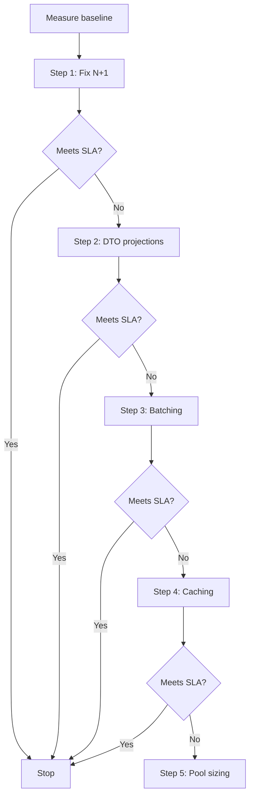

---

### 📶 Gradual Depth

**Level 1 - What it is:**

Hibernate performance tuning is a systematic process of optimizing how an application interacts with Hibernate. The priority ladder ensures you fix the highest-impact issues first.

**Level 2 - How to use it:**

Measure baseline with Statistics (queries per request, flush time, connection usage). Fix N+1 first (JOIN FETCH). Add DTO projections for list endpoints. Enable batching for write operations. Cache reference data. Size the connection pool last.

**Level 3 - How it works:**

Each step in the ladder addresses a different bottleneck: Step 1 reduces SQL generation (query count), Step 2 reduces per-query memory (entity overhead), Step 3 reduces per-statement network cost (round-trips), Step 4 eliminates queries entirely (cache hits), Step 5 increases concurrent capacity (connection count).

**Level 4 - Production mastery:**

At scale (>10K req/s), all five steps are typically needed. Monitor after each step: query count per request, P95 latency, connection pool utilization, cache hit rate. Set SLAs for each metric. Stop tuning when SLAs are met. Over-tuning introduces complexity with no measurable benefit. For extreme scale (>100K req/s), consider CQRS: separate read/write paths, materialized views for reads, Hibernate for writes only.

---

### ⚙️ How It Works

**Phase 1 - Baseline measurement:**
Enable Statistics. Measure: queries per request, P95 latency, connection pool active count, entity load count.

**Phase 2 - Fix N+1 (highest impact):**
Identify endpoints with query count > 10. Add JOIN FETCH. Verify query count drops to 1-3 per request.

**Phase 3 - DTO projections:**
List endpoints returning full entities: switch to `SELECT new DTO(...)`. Verify entity load count drops. Memory usage decreases.

**Phase 4 - Batching:**
Bulk write endpoints: enable `batch_size=50`, `order_inserts=true`. Verify statement count drops (total / batch_size).

**Phase 5 - Caching:**
Reference data entities (Country, Currency, Config): add `@Cacheable`, `@Cache(usage=READ_ONLY)`. Verify L2 cache hit rate > 90%.

```text
  Baseline: 47 queries/req, P95=800ms
  Step 1: Fix N+1
    -> 3 queries/req, P95=120ms
  Step 2: DTO projections for list endpoints
    -> 2 queries/req, P95=80ms, -40% memory
  Step 3: Batching for bulk writes
    -> Write throughput 5x, write latency -80%
  Step 4: L2 cache for reference data
    -> 1.5 queries/req, cache hit 95%
  Step 5: Pool sizing (OSIV off)
    -> Max throughput 10x
```

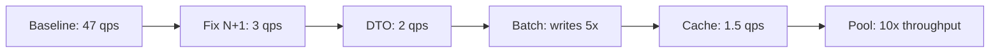

---

### 🚨 Failure Modes

**Failure 1 - Optimizing the wrong step first:**

**Symptom:** Team adds L2 caching (Step 4) before fixing N+1 (Step 1). Marginal improvement. Each request still executes 47 queries - some hit cache but 30+ still go to database.

**Root cause:** Skipped the priority ladder. Caching reduces individual query frequency but does not reduce query count for relationships not cached.

**Diagnostic:**

```bash
# Statistics still show high query count
stats.getPrepareStatementCount() / requestCount
# If > 10 after caching: N+1 not fixed
```

**Fix:**

**BAD:**

```java
// Skip to Step 4: add cache before N+1 fix
@Cache(usage = READ_WRITE)
@Entity
public class Customer { ... }
// Still 47 queries/request (N+1 unfixed)
```

**GOOD:**

```java
// Step 1 first: fix N+1
@Query("SELECT o FROM Order o "
    + "JOIN FETCH o.customer")
List<Order> findAll();
// 1 query/request. Cache later if needed.
```

**Failure 2 - Over-tuning:**

**Symptom:** Team spends weeks adding L2 cache, query cache, and custom batch strategies. Total improvement: 5%. SLA was already met after Step 1.

**Root cause:** No SLA defined. No "stop" criterion. Tuning continued past the point of diminishing returns.

**Diagnostic:**

```text
Compare current metrics vs SLA requirements.
If SLA is met: stop tuning. Additional
complexity is not justified.
```

**Fix:**

```text
Define SLAs before tuning:
- Query count per request: <= 5
- P95 latency: <= 200ms
- Connection pool pending: 0
Stop when all SLAs are met.
```

---

### 🔬 Production Reality

An e-commerce platform processes 5000 orders/hour. Initial P95 latency: 2.5 seconds. Step 1 (fix N+1 on 3 endpoints): P95 dropped to 400ms (6x improvement). Step 2 (DTO projections on list endpoints): P95 dropped to 200ms (2x improvement). Step 3 (JDBC batching for order creation): write latency dropped from 300ms to 50ms. Steps 1 and 2 addressed 90% of the problem. Steps 3-5 provided incremental improvement. Total effort: 3 developer-days for 12x improvement, with 80% of the gain from Step 1 alone.

---

### ⚖️ Trade-offs & Alternatives

| Step           | Impact      | Effort | Complexity | Risk        |
| -------------- | ----------- | ------ | ---------- | ----------- |
| Fix N+1        | 10-100x     | Low    | Low        | Minimal     |
| DTO projection | 2-5x        | Medium | Low        | None        |
| JDBC batching  | 2-10x write | Low    | Low        | ID strategy |
| L2 caching     | 2-10x read  | Medium | Medium     | Staleness   |
| Pool sizing    | Throughput  | Low    | Low        | None        |

**Real-world patterns:**

- **Netflix-scale:** Primarily Steps 1+2 (query reduction and projections). Caching at the service layer, not ORM layer.
- **Enterprise CRUD:** Steps 1+2+5 (N+1, DTOs, OSIV disable). Batching and caching only when measured need.

---

### ⚡ Decision Snap

**ALWAYS START WITH:**

- Measurement (Statistics, Micrometer). Define SLAs.
- Step 1: Fix N+1. This alone typically solves 70% of performance problems.

**CONTINUE TO STEP 2+ WHEN:**

- SLA not met after Step 1. Each subsequent step has lower impact.

**STOP WHEN:**

- All SLAs met. Additional complexity is not justified by marginal improvement.

---

### ⚠️ Top Traps

| #   | Misconception                             | Reality                                                                                                                                            |
| --- | ----------------------------------------- | -------------------------------------------------------------------------------------------------------------------------------------------------- |
| 1   | Caching is the first optimization         | Caching is Step 4. Fixing N+1 (Step 1) typically provides 10-100x more impact with less complexity.                                                |
| 2   | More connections = more throughput        | Connection pool sizing is Step 5. If each request holds a connection for 200ms (OSIV), more connections delay the problem, they do not solve it.   |
| 3   | Hibernate is inherently slow at scale     | Hibernate generates the SQL your code requests. At scale, the bottleneck is almost always how the application uses Hibernate (N+1, no DTOs, OSIV). |
| 4   | All five steps are always needed          | Most applications reach SLA after Steps 1-2. Steps 3-5 are for high-throughput or specialized workloads.                                           |
| 5   | Performance tuning is a one-time activity | New features add new queries. Continuous monitoring (Statistics + alerts) catches regressions. Make query count assertions part of CI.             |

---

### 🪜 Learning Ladder

**Prerequisites:**

- Hibernate Production Diagnostics - Slow Query and Flush
  Storms - diagnostic methodology
- The N+1 Select Problem (L3) - Step 1 knowledge
- Hibernate Statistics API and p6spy (L3) - measurement

**THIS:** HIB-084 Hibernate Performance Tuning at Scale

**Next steps:**

- Hibernate Tooling - p6spy, datasource-proxy,
  Hypersistence - tooling for each step
- ORM Data Layer - Phase 4 (Production Hardening) -
  applying tuning in practice

---

**The Surprising Truth:**

80% of Hibernate performance tuning is Step 1: fixing N+1. A senior engineer who knows only JOIN FETCH, @BatchSize, and EntityGraph - and applies them systematically via query count assertions - outperforms a team of junior engineers who have memorized every caching strategy, batching option, and pool setting but do not check query count.

**Further Reading:**

- Vlad Mihalcea, "High-Performance Java Persistence" - comprehensive tuning guide
- HikariCP wiki - "About Pool Sizing" (github.com/brettwooldridge/HikariCP)
- Spring Boot documentation - JPA performance tuning

**Revision Card:**

1. Priority ladder: Fix N+1 (10-100x) > DTOs (2-5x) > Batching (writes) > Caching (reads) > Pool sizing (throughput).
2. Measure before optimizing. Define SLAs. Stop when SLAs are met.
3. 80% of Hibernate performance is fixing N+1. Master JOIN FETCH, @BatchSize, EntityGraph before anything else.

---

---

# HIB-085 The LazyInitializationException Epidemic

**TL;DR** - LazyInitializationException occurs when accessing a lazy association after the Session closes. The fix is fetch planning, not OSIV.

---

### 🔥 Problem Statement

`org.hibernate.LazyInitializationException: could not initialize proxy - no Session`. This is the most common Hibernate exception in Spring Boot applications. It occurs when controller or serialization code accesses a lazy association after the `@Transactional` method returns and the Session closes. The temptation is to enable Open Session in View (OSIV) or switch to EAGER fetching. Both are anti-patterns that trade a small fix for a large performance problem. The correct fix is explicit fetch planning: load what you need within the transaction boundary.

---

### 📜 Historical Context

LazyInitializationException has existed since Hibernate 2 (2003). It was originally rare because applications used Session-per-operation patterns. The problem became epidemic with the rise of Spring MVC + JPA: Service layer opens a Session in `@Transactional`, loads entities with lazy associations, returns entities to the Controller, Controller accesses lazy associations outside the transaction -> exception. Spring Boot's default OSIV (enabled since Spring Boot 1.0) was introduced specifically to suppress this exception by keeping the Session open during view rendering. The debate between OSIV convenience and performance correctness continues in every Spring Boot project.

---

### 🔩 First Principles

**CORE INVARIANTS:**

1. **Lazy proxy requires an active Session:** A proxy's `LazyInitializer` holds a Session reference. When the Session is closed, the reference is null. Any method call on the proxy triggers initialization, which requires a Session.
2. **@Transactional defines the Session boundary:** The Session opens when the `@Transactional` method starts and closes when it returns (AFTER_TRANSACTION connection release).
3. **Serialization triggers lazy loading:** Jackson, Gson, and other serializers call getters on all fields, including lazy associations. If the Session is closed, LazyInitializationException occurs.
4. **OSIV extends the Session boundary:** With OSIV, the Session spans the entire HTTP request, including controller and view rendering. Lazy loading works outside `@Transactional` but holds the database connection longer.

**DERIVED DESIGN:**

The correct fix addresses the root cause (accessing data outside the transaction) by loading the data inside the transaction (JOIN FETCH, DTO projection, `Hibernate.initialize()`). OSIV and EAGER fetching address the symptom (keeping the Session open or pre-loading everything) but create worse problems.

**THE TRADE-OFF:**

**Gain:** Proper fetch planning eliminates LazyInitializationException AND optimizes query performance.

**Cost:** Requires explicit query design per use case. More code than OSIV (which "just works").

---

### 🧠 Mental Model

> LazyInitializationException is like trying to open a bank vault after the bank closes. The vault (lazy association) requires a key (active Session). After closing time (@Transactional ends), the key does not work. OSIV is like keeping the bank open 24/7 - it works but costs electricity (database connections). The proper solution is to withdraw everything you need (JOIN FETCH) during banking hours (@Transactional).

- "Bank closes" -> Session closes
- "Open vault" -> access lazy association
- "Key does not work" -> LazyInitializationException
- "Withdraw during hours" -> JOIN FETCH

**Where this analogy breaks down:** Unlike a bank that has fixed hours, the `@Transactional` boundary is flexible. You can expand it or restructure queries to load what is needed.

---

### 🧩 Components

- **LazyInitializer:** Attached to every proxy. Holds Session reference. Triggers `initialize()` on first method call.
- **PersistentBag/PersistentSet:** Collection wrappers for lazy `@OneToMany`/`@ManyToMany`. Also require an active Session for initialization.
- **@Transactional boundary:** Spring's transaction management. Defines when the Session opens and closes.
- **OSIV (OpenSessionInViewFilter):** Extends Session lifetime to the entire HTTP request. Prevents LazyInitializationException but holds connections.
- **Jackson Hibernate Module:** `jackson-datatype-hibernate5-jakarta` handles uninitialized proxies during serialization (returns null instead of throwing).

```text
  Without OSIV:
  @Transactional -> Session open
    find(Order) -> load Order (customer=PROXY)
  <- Session closes
  controller: order.getCustomer().getName()
    -> PROXY.initialize() -> no Session!
    -> LazyInitializationException!

  With fetch planning:
  @Transactional -> Session open
    "SELECT o FROM Order o JOIN FETCH o.customer"
    -> load Order + Customer (no proxy)
  <- Session closes
  controller: order.getCustomer().getName()
    -> Customer already loaded. Works!
```

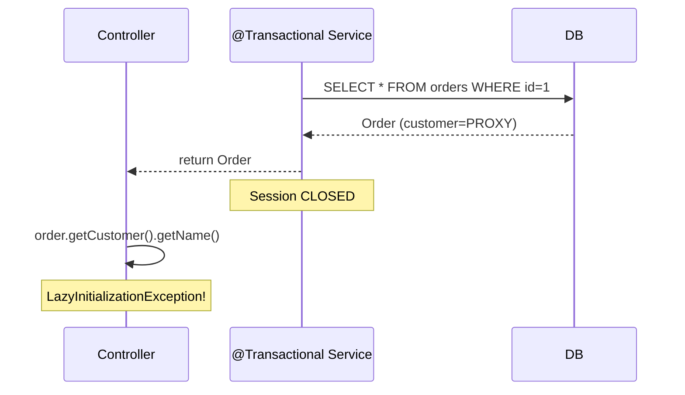

---

### 📶 Gradual Depth

**Level 1 - What it is:**

LazyInitializationException occurs when you access a lazy association after the Session (database connection) closes. The Session closes when the `@Transactional` method returns.

**Level 2 - How to use it:**

Fix by loading associations within the transaction: (1) JOIN FETCH in JPQL, (2) `@EntityGraph` on repository method, (3) `Hibernate.initialize(entity.getAssociation())` in the service method, (4) DTO projection (no lazy associations to access).

**Level 3 - How it works:**

A lazy association returns a ByteBuddy proxy (for `@ManyToOne`) or a `PersistentBag` (for `@OneToMany`). These wrappers hold a reference to the Session. When a method is called on the proxy, it checks `LazyInitializer.session`. If null (Session closed): throw `LazyInitializationException`. If not null: execute SELECT to load the data.

**Level 4 - Production mastery:**

The epidemic pattern: Service returns an entity with 3 lazy associations. Controller serializes to JSON. Jackson calls all getters. Three lazy loads execute (if OSIV is on) or three LazyInitializationExceptions throw (if OSIV is off). The production fix: per-use-case query methods. `/api/orders/{id}` uses `findByIdWithCustomer()` (JOIN FETCH customer). `/api/orders` uses `findSummaries()` (DTO projection). Each endpoint loads exactly what it needs.

---

### ⚙️ How It Works

**Phase 1 - Entity load with lazy proxy:**
`orderRepo.findById(1)` loads Order. Customer association is LAZY -> returns `Customer$Proxy(id=42, uninitialized)`.

**Phase 2 - Transaction completion:**
`@Transactional` method returns. Spring closes the Session. Connection returned to pool.

**Phase 3 - Access outside transaction:**
Controller calls `order.getCustomer().getName()`. Proxy's `LazyInitializer.initialize()` checks for Session -> null -> `LazyInitializationException`.

**Phase 4 - Fix with JOIN FETCH:**
Replace `findById(1)` with `findByIdWithCustomer(1)` using `JOIN FETCH o.customer`. Customer loaded eagerly in the same query. No proxy. No lazy loading needed outside transaction.

```text
  BROKEN:
  findById(1) -> Order(customer=PROXY)
  @Transactional ends -> Session closed
  order.getCustomer() -> Exception!

  FIXED:
  findByIdWithCustomer(1)
    -> "SELECT o FROM Order o
        JOIN FETCH o.customer WHERE o.id=1"
    -> Order(customer=Customer(loaded))
  @Transactional ends -> Session closed
  order.getCustomer() -> Customer(loaded). OK!
```

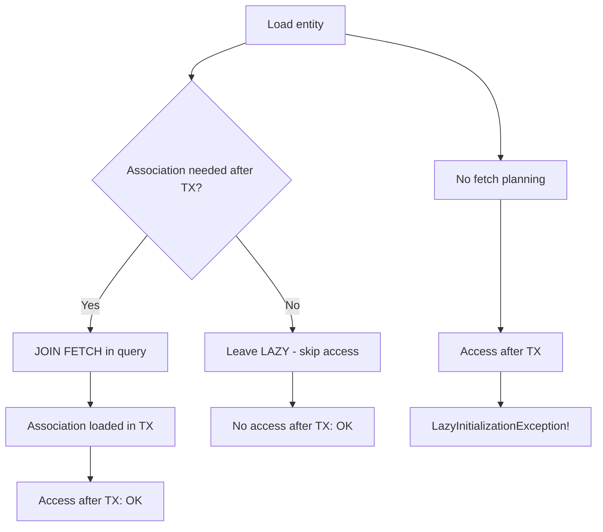

---

### 🚨 Failure Modes

**Failure 1 - Serialization-triggered LazyInitializationException:**

**Symptom:** `LazyInitializationException` during JSON serialization in the Controller. Stack trace shows Jackson calling `getCustomer()` on the entity.

**Root cause:** Entity returned to Controller with uninitialized lazy associations. Jackson serializer calls all getters.

**Diagnostic:**

```java
// Stack trace shows:
// at Jackson...BeanSerializer.serialize()
// at ...HibernateProxy.intercept()
// at LazyInitializer.initialize()
// -> Session is null
```

**Fix:**

**BAD:**

```java
// EAGER causes N+1 on every query
@ManyToOne(fetch = FetchType.EAGER)
private Customer customer;
```

**GOOD:**

```java
// LAZY + JOIN FETCH where needed
@ManyToOne(fetch = FetchType.LAZY)
private Customer customer;

// In repository:
@Query("SELECT o FROM Order o "
    + "JOIN FETCH o.customer "
    + "WHERE o.id = :id")
Order findWithCustomer(
    @Param("id") Long id);
```

**Failure 2 - OSIV masking N+1:**

**Symptom:** No LazyInitializationException (OSIV enabled). But endpoint is slow. Statistics show 47 queries per request.

**Root cause:** OSIV keeps the Session open. Lazy associations initialize successfully but each triggers a separate SELECT (N+1 pattern hidden by OSIV).

**Diagnostic:**

```properties
# Statistics reveal hidden N+1
stats.getPrepareStatementCount() per request > 10
# p6spy shows repeated SELECT for same table
```

**Fix:**

```properties
# Disable OSIV
spring.jpa.open-in-view=false
# Now LazyInitializationException reveals
# unplanned lazy loading. Fix each with
# JOIN FETCH or DTO projection.
```

---

### 🔬 Production Reality

A Spring Boot API has OSIV enabled (default). All endpoints work. Performance testing reveals `/api/orders` takes 2.5 seconds for 50 orders. Investigation: each Order has lazy `customer`, `product`, and `shipping` associations. Jackson serializes all three, triggering 150 lazy loads (50 orders x 3 associations). OSIV prevents the exception but enables the N+1. Disabling OSIV immediately reveals 15 `LazyInitializationException` across 8 endpoints. Fixing each with JOIN FETCH or DTO projections takes 2 days. Result: `/api/orders` drops from 2.5 seconds to 80ms. The exceptions were features, not bugs - they exposed unplanned data access.

---

### ⚖️ Trade-offs & Alternatives

| Fix strategy             | Complexity | Performance | Correct    |
| ------------------------ | ---------- | ----------- | ---------- |
| JOIN FETCH               | Low        | Optimal     | Yes        |
| DTO projection           | Medium     | Best        | Yes        |
| Hibernate.initialize()   | Low        | OK          | Acceptable |
| EAGER fetching           | None       | Worst       | No         |
| OSIV enabled             | None       | Poor        | No         |
| Jackson Hibernate Module | Low        | N/A         | Workaround |

**Real-world patterns:**

- **OSIV-free teams** use DTO projections for list endpoints and JOIN FETCH for detail endpoints. LazyInitializationException is a test-time signal, not a production error.
- **Legacy migration** uses Jackson Hibernate Module (`jackson-datatype-hibernate5-jakarta`) as a temporary workaround that serializes uninitialized proxies as null.

---

### ⚡ Decision Snap

**FIX WITH JOIN FETCH WHEN:**

- Association is needed in the response. Single query. Optimal for detail endpoints.

**FIX WITH DTO PROJECTION WHEN:**

- List endpoints. Only a subset of fields needed. Best performance and cleanest API.

**FIX WITH HIBERNATE.INITIALIZE() WHEN:**

- Conditional loading. Association needed only in some cases.

**NEVER FIX WITH:**

- EAGER fetching (always loads, N+1 for collections).
- OSIV (hides the problem, holds connections).

---

### ⚠️ Top Traps

| #   | Misconception                                       | Reality                                                                                                                                                      |
| --- | --------------------------------------------------- | ------------------------------------------------------------------------------------------------------------------------------------------------------------ |
| 1   | OSIV fixes LazyInitializationException              | OSIV hides it. The lazy loads still execute - as N+1 queries. You traded an exception for a performance problem.                                             |
| 2   | EAGER fetching prevents LazyInitializationException | EAGER on `@ManyToOne` loads always (even when not needed). EAGER on `@OneToMany` causes N+1 (separate SELECT per collection).                                |
| 3   | LazyInitializationException is a bug                | It is a signal. It tells you: "You are accessing data outside the transaction without fetch planning." The fix is fetch planning, not suppression.           |
| 4   | One fetch strategy works for all endpoints          | Different endpoints need different data. `/orders` needs only order summary (DTO). `/orders/{id}` needs order + customer (JOIN FETCH). Per-use-case queries. |
| 5   | Jackson Hibernate Module is the solution            | It serializes uninitialized proxies as null. This prevents the exception but returns incomplete data. It is a workaround, not a solution.                    |

---

### 🪜 Learning Ladder

**Prerequisites:**

- FetchType.LAZY vs FetchType.EAGER (L1) - why lazy exists
- JOIN FETCH in JPQL and HQL (L3) - the primary fix
- Bytecode Enhancement and Proxy Generation Internals -
  how proxies trigger the exception

**THIS:** HIB-085 The LazyInitializationException Epidemic

**Next steps:**

- Open Session in View - The Silent Scalability Killer -
  why OSIV is not the answer
- Hibernate Performance Tuning at Scale - fetch planning
  as Step 1

---

**The Surprising Truth:**

Disabling OSIV in a typical Spring Boot application immediately reveals 5-20 `LazyInitializationException` instances. Each one is a hidden N+1 query that was silently executing under OSIV. Fixing each exception with JOIN FETCH or DTO projections typically reduces total query count by 60-80% and request latency by 50-70%. LazyInitializationException is not a problem to solve - it is a diagnostic tool to embrace.

**Further Reading:**

- Vlad Mihalcea, "The Open Session in View Anti-Pattern" (blog post)
- Spring Boot documentation - spring.jpa.open-in-view property
- JPA 3.1 Specification, Section 3.2 - Entity Instance's Life Cycle

**Revision Card:**

1. LazyInitializationException = "You accessed data outside the transaction without fetch planning." Fix: JOIN FETCH or DTO projection.
2. OSIV hides the exception but enables N+1. Disable OSIV. Treat each exception as a N+1 detection signal.
3. Per-use-case queries: `/orders` -> DTO projection. `/orders/{id}` -> JOIN FETCH. No single fetch strategy fits all endpoints.

---

---

# HIB-086 Open Session in View - The Silent Scalability Killer

**TL;DR** - OSIV keeps the Session and database connection open for the entire HTTP request, including view rendering. It prevents LazyInitializationException but wastes connections and hides N+1.

---

### 🔥 Problem Statement

Spring Boot enables OSIV by default (`spring.jpa.open-in-view=true`). The Session opens when the HTTP request enters the filter chain and closes when the response is sent. This means lazy associations work in controllers and view templates without `LazyInitializationException`. The hidden cost: the database connection is held for the entire request duration - not just the database work. A 200ms request that does 15ms of database work holds a connection for 200ms. With 10 connections and 200ms hold time, maximum throughput is 50 requests/second. Disabling OSIV releases connections at the transaction boundary (15ms), increasing throughput to 666 requests/second.

---

### 📜 Historical Context

Open Session in View originated in the Hibernate community (2004) as a Servlet Filter that opened a Session at request start and closed it at request end. Spring adopted this pattern as `OpenSessionInViewFilter` (Hibernate) and `OpenEntityManagerInViewInterceptor` (JPA). Spring Boot 1.0 (2014) enabled OSIV by default for developer convenience. In Spring Boot 2.0 (2018), a startup warning was added: `spring.jpa.open-in-view is enabled by default. Therefore, database queries may be performed during view rendering.` This warning is widely ignored until connection pool exhaustion occurs in production.

---

### 🔩 First Principles

**CORE INVARIANTS:**

1. **OSIV extends Session to request scope:** The Session (and its L1 cache) lives from request start to response completion, including controller logic, view rendering, and response serialization.
2. **Connection held for request duration:** The database connection acquired for the first SQL statement is held until the Session closes (request end). Non-database work (JSON serialization, template rendering) holds the connection idle.
3. **Lazy loading works outside @Transactional:** With OSIV, lazy proxies can initialize in the controller because the Session is still open. Without OSIV, this throws LazyInitializationException.
4. **N+1 becomes invisible:** Each lazy access in the controller executes a separate query. No exception warns about the extra queries. N+1 patterns are hidden.

**DERIVED DESIGN:**

OSIV trades connection efficiency for developer convenience. In low-traffic applications, this trade-off is acceptable. In high-traffic applications, connection waste limits throughput. The core issue is not OSIV itself but the design decisions it enables: returning entities to controllers and accessing lazy associations during serialization.

**THE TRADE-OFF:**

**Gain:** Developer convenience. No LazyInitializationException. Lazy associations work transparently everywhere.

**Cost:** Database connections held 5-20x longer than necessary. N+1 hidden from developers. Connection pool exhaustion under load.

---

### 🧠 Mental Model

> OSIV is like leaving the car engine running while you shop. The engine (database connection) stays on from parking (request start) to leaving (response sent). You only needed the engine for driving (database queries), but it idles during shopping (view rendering). With 10 parking spots (connections), you can only serve customers as fast as they shop. Turn off the engine when you park (AFTER_TRANSACTION): more customers can use the same spots.

- "Engine running" -> connection held
- "Shopping" -> view rendering (no DB work)
- "Parking spots" -> connection pool
- "Turn off engine" -> release at TX boundary

**Where this analogy breaks down:** Starting the engine (acquiring from pool) is nearly instantaneous (< 1ms). The "restart cost" is negligible, making the case for turning it off even stronger.

---

### 🧩 Components

- **OpenEntityManagerInViewInterceptor:** Spring's OSIV implementation for JPA. Registers as a Spring MVC interceptor.
- **EntityManager (Session):** Opened at request start by the interceptor. Closed at request end.
- **Database connection:** Acquired on first SQL statement. Held until Session closes (request end with OSIV).
- **@Transactional boundary:** With OSIV, defines the write transaction boundary. Reads can happen outside in the controller.
- **spring.jpa.open-in-view:** Boolean property. Default: `true` in Spring Boot.

```text
  OSIV enabled (default):
  +-- Request start --+
  | Session opens      |
  | @Transactional     |
  |   SQL queries      |
  |   Connection held  |
  | @Transactional ends|
  | Controller         |
  |   Lazy load (SQL!) |
  |   Connection STILL |
  |   held             |
  | JSON serialization |
  |   Lazy load (SQL!) |
  |   Connection STILL |
  |   held             |
  +-- Request end -----+
  Session closes
  Connection returned

  OSIV disabled:
  +-- Request start --+
  | @Transactional     |
  |   Session opens    |
  |   SQL queries      |
  | @Transactional ends|
  |   Session closes   |
  |   Connection back  |
  | Controller         |
  |   No lazy access!  |
  | JSON serialization |
  |   Uses DTOs        |
  +-- Request end -----+
```

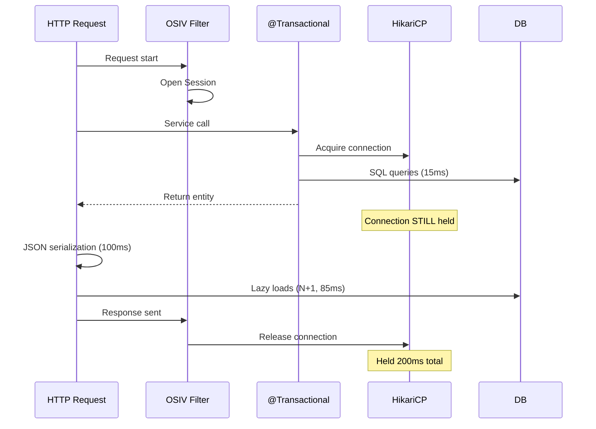

---

### 📶 Gradual Depth

**Level 1 - What it is:**

OSIV keeps the Hibernate Session open for the entire HTTP request. This prevents LazyInitializationException but holds the database connection longer than necessary.

**Level 2 - How to use it:**

Disable in Spring Boot: `spring.jpa.open-in-view=false`. Fix resulting LazyInitializationExceptions with JOIN FETCH or DTO projections in service layer queries.

**Level 3 - How it works:**

`OpenEntityManagerInViewInterceptor` opens an EntityManager at request start and registers it as a thread-local. When `@Transactional` methods access the EntityManager, they join the OSIV-managed Session. The connection, acquired at first SQL, is held until the interceptor closes the EntityManager at request end.

**Level 4 - Production mastery:**

OSIV impact calculation: `max_throughput = pool_size / avg_request_duration`. With OSIV: `10 / 0.2s = 50 req/s`. Without OSIV: `10 / 0.015s = 666 req/s`. Disabling OSIV is the single largest throughput improvement in most Spring Boot applications. Monitor: `hikaricp_connections_active` should drop significantly after OSIV disable. The trade-off: every LazyInitializationException must be fixed with explicit fetch planning.

---

### ⚙️ How It Works

**Phase 1 - Request entry:**
OSIV interceptor opens an EntityManager. Binds it to the current thread via `TransactionSynchronizationManager`.

**Phase 2 - Service layer:**
`@Transactional` methods find the OSIV EntityManager and join it. SQL executes. Connection acquired from pool. Transaction commits but connection is NOT released (OSIV keeps the EM open).

**Phase 3 - Controller/serialization:**
Entity returned to controller. Jackson serializes. Calls `getCustomer()` -> lazy proxy initializes -> SQL executes (connection still held). Calls `getItems()` -> another SQL.

**Phase 4 - Request completion:**
OSIV interceptor closes the EntityManager. Connection finally returned to pool. Total hold time: entire request duration.

```text
  Timeline (200ms request, 15ms DB work):
  0ms: Request start -> OSIV opens EM
  5ms: @Transactional -> Connection acquired
  5-20ms: SQL queries (15ms DB work)
  20ms: @Transactional ends (conn NOT released)
  20-180ms: Controller + JSON (conn IDLE)
  180-195ms: Lazy loads in Jackson (N+1)
  200ms: Response sent -> OSIV closes EM
  200ms: Connection returned to pool
  Connection held: 195ms (idle for 160ms)
```

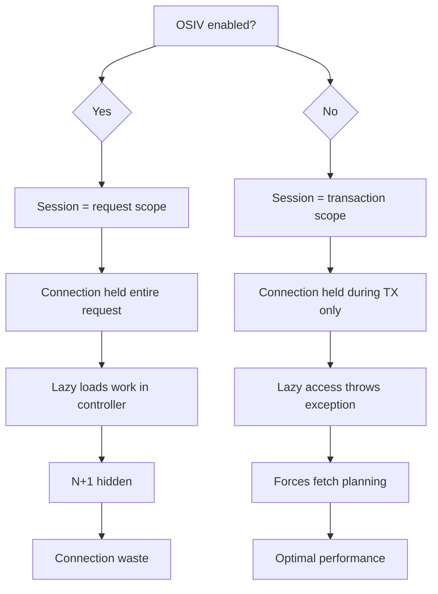

---

### 🚨 Failure Modes

**Failure 1 - Connection pool exhaustion under load:**

**Symptom:** `HikariPool - Connection is not available, request timed out after 30000ms` during peak traffic.

**Root cause:** OSIV holds connections for entire request duration. Under load, all connections are held by in-progress requests. New requests queue.

**Diagnostic:**

```bash
# HikariCP metrics
hikaricp_connections_active == maximum_pool_size
hikaricp_connections_pending > 0
# Sustained pending = exhaustion
```

**Fix:**

**BAD:**

```properties
# OSIV on: connection held 150ms (full request)
spring.jpa.open-in-view=true
```

**GOOD:**

```properties
# OSIV off: connection held 15ms (TX only)
spring.jpa.open-in-view=false
```

**Failure 2 - Hidden N+1 in production:**

**Symptom:** Endpoint latency scales linearly with result count. No exceptions. Statistics show high query count per request.

**Root cause:** OSIV enables lazy loading in controller/serializer. Each lazy access is a separate query. No exception warns about the extra queries.

**Diagnostic:**

```bash
# Statistics
stats.getPrepareStatementCount() per request
# If > 10: likely N+1 hidden by OSIV
# p6spy: look for repeated SELECT patterns
```

**Fix:**

```java
// Disable OSIV to expose lazy access
// Fix each LazyInitializationException:
@Query("SELECT o FROM Order o "
    + "JOIN FETCH o.customer "
    + "WHERE o.id = :id")
Order findWithCustomer(@Param("id") Long id);
```

---

### 🔬 Production Reality

A Spring Boot SaaS application with OSIV enabled (default) serves 500 concurrent users. HikariCP pool: 20 connections. Average request: 250ms. Average DB time: 30ms. With OSIV: max throughput = 20 / 0.25 = 80 req/s. At 500 users with 2 req/s each = 1000 req/s needed. Pool exhaustion. The team increases pool to 100. Database server now manages 100 connections (significant memory). Still insufficient at peak. The actual fix: `spring.jpa.open-in-view=false`. Connection hold time drops to 30ms. Max throughput = 20 / 0.03 = 666 req/s. Problem solved without increasing pool size. 12 LazyInitializationExceptions fixed with JOIN FETCH in 1 day.

---

### ⚖️ Trade-offs & Alternatives

| Aspect                | OSIV enabled            | OSIV disabled       |
| --------------------- | ----------------------- | ------------------- |
| Developer convenience | High                    | Medium (need DTOs)  |
| Connection efficiency | Low (held idle)         | High (TX only)      |
| Max throughput        | pool/request_time       | pool/tx_time        |
| N+1 visibility        | Hidden                  | Exposed (exception) |
| Lazy loading          | Works everywhere        | TX scope only       |
| Best for              | Prototyping, < 50 users | Production          |

**Real-world patterns:**

- **Spring Boot default:** OSIV enabled. Convenient for prototyping. Dangerous at scale.
- **Production Spring Boot:** OSIV disabled. Every team that hits connection exhaustion disables OSIV. The question is whether they do it proactively or reactively.

---

### ⚡ Decision Snap

**DISABLE OSIV (RECOMMENDED) WHEN:**

- Production applications. Any application expecting > 50 concurrent users. Any application where connection pool size matters.

**KEEP OSIV WHEN:**

- Prototyping with < 50 users and no performance requirements. Learning Hibernate (fewer exceptions during development).

**AFTER DISABLING OSIV:**

- Fix every `LazyInitializationException` with JOIN FETCH or DTO projection. Do not switch to EAGER fetching.

---

### ⚠️ Top Traps

| #   | Misconception                          | Reality                                                                                                                              |
| --- | -------------------------------------- | ------------------------------------------------------------------------------------------------------------------------------------ |
| 1   | OSIV is just about lazy loading        | OSIV's primary impact is connection hold time. Lazy loading convenience is the secondary effect.                                     |
| 2   | Increasing pool size fixes OSIV issues | Larger pool delays exhaustion. It does not solve the connection waste. Fix hold time (disable OSIV), then size pool.                 |
| 3   | OSIV is safe for low-traffic apps      | Even 50 concurrent users with 200ms requests and 10 connections can exhaust the pool with OSIV.                                      |
| 4   | Disabling OSIV breaks everything       | Typically 5-20 LazyInitializationExceptions to fix. Each fix improves performance (fewer queries). 1-2 days of work.                 |
| 5   | Spring Boot team recommends OSIV       | Spring Boot logs a startup WARNING about OSIV being enabled. The default exists for backward compatibility, not as a recommendation. |

---

### 🪜 Learning Ladder

**Prerequisites:**

- The LazyInitializationException Epidemic - the exception
  OSIV suppresses
- Connection Management and Release Modes - connection
  lifecycle with/without OSIV

**THIS:** HIB-086 Open Session in View - The Silent
Scalability Killer

**Next steps:**

- Hibernate Performance Tuning at Scale - OSIV disable as
  Step 5 in the tuning ladder
- "Hibernate Is Slow" is Wrong - Misuse vs Actual ORM
  Cost - OSIV as misuse, not Hibernate's fault

---

**The Surprising Truth:**

Spring Boot's OSIV warning at startup (`spring.jpa.open-in-view is enabled by default`) has been present since Spring Boot 2.0 (2018). It is the most ignored warning in the Spring Boot ecosystem. Every production Hibernate performance incident involving connection pool exhaustion ends with the same fix: `spring.jpa.open-in-view=false`.

**Further Reading:**

- Vlad Mihalcea, "The Open Session in View Anti-Pattern" (vladmihalcea.com)
- Spring Boot documentation - spring.jpa.open-in-view property
- HikariCP wiki - "About Pool Sizing" (github.com/brettwooldridge/HikariCP)

**Revision Card:**

1. `spring.jpa.open-in-view=false` for production. Connection held only during @Transactional, not entire request. 5-10x throughput improvement.
2. OSIV hides N+1. Disabling OSIV exposes lazy access as LazyInitializationException. Each exception = one N+1 to fix.
3. Max throughput formula: `pool_size / hold_time`. OSIV: hold_time = request_time. Without OSIV: hold_time = transaction_time.

---

---

# HIB-087 "Hibernate Is Slow" is Wrong - Misuse vs Actual ORM Cost

**TL;DR** - Hibernate's actual overhead is microseconds per operation. Perceived slowness is caused by N+1 queries, missing projections, OSIV, and flush storms, which are all application-level misuse.

---

### 🔥 Problem Statement

"We switched to JDBC because Hibernate was too slow." This statement reveals a misdiagnosis. The team measured request latency, saw high numbers, blamed Hibernate. But Hibernate's ORM overhead - proxy creation, dirty checking, snapshot comparison - is microseconds per entity. The real cost was 47 N+1 queries (application misuse), not ORM processing. Replacing Hibernate with JDBC removes the ORM overhead (microseconds) but does not fix the N+1 (if the same query pattern is reimplemented manually). Understanding the distinction between actual ORM cost and application misuse prevents expensive framework migrations that solve nothing.

---

### 📜 Historical Context

The "Hibernate is slow" narrative emerged in 2005-2008 when developers migrated from hand-written SQL to Hibernate without understanding lazy loading semantics. Blog posts titled "Hibernate Performance Problems" proliferated, each describing N+1, excessive flushing, or OSIV connection waste - all application-level issues. The Hibernate team responded by adding features: batch fetching, Statistics API, query hints. The MyBatis/jOOQ communities leveraged the narrative to position their tools as "faster." In reality, benchmarks show Hibernate's per-operation overhead at single-digit microseconds, comparable to any ORM. The performance difference lies in usage patterns, not framework overhead.

---

### 🔩 First Principles

**CORE INVARIANTS:**

1. **ORM overhead is microseconds:** Proxy creation (~1us), dirty checking (~5us per entity field comparison), snapshot storage (~50 bytes per entity). For 100 entities: ~500us total ORM overhead.
2. **SQL execution is milliseconds:** A single database round-trip is 0.5-5ms (network + query execution). 47 N+1 queries = 23-235ms. ORM overhead for 47 queries = ~47us. The database round-trips dominate by 500-5000x.
3. **Misuse categories are finite:** N+1 (query count), OSIV (connection hold), missing DTOs (entity overhead), flush storms (dirty checking thousands), wrong ID strategy (IDENTITY prevents batching). Five patterns explain 95% of "Hibernate is slow."
4. **Framework migration does not fix patterns:** Reimplementing N+1 in JDBC is still N+1. The pattern is in the application, not the ORM.

**DERIVED DESIGN:**

When someone says "Hibernate is slow," translate to: "Our application generates too many queries, holds connections too long, or loads too many entities." Then diagnose which of the five patterns is present.

**THE TRADE-OFF:**

**Gain:** Understanding true ORM cost prevents unnecessary framework migrations and focuses optimization on actual bottlenecks.

**Cost:** Requires developers to learn Hibernate's fetch planning, which is more complex than hand-written SQL queries.

---

### 🧠 Mental Model

> Blaming Hibernate for slow performance is like blaming the car's steering wheel for slow driving. The steering wheel adds 0.5kg to the car (ORM overhead: microseconds). The slow driving is caused by taking 47 detours (N+1 queries). Removing the steering wheel (switching to JDBC) saves 0.5kg but you still take the detours - and now you have to steer manually.

- "Steering wheel weight" -> ORM overhead
- "47 detours" -> N+1 queries
- "Remove steering wheel" -> switch to JDBC
- "Steer manually" -> hand-write SQL

**Where this analogy breaks down:** Unlike a steering wheel, Hibernate adds compile-time complexity (mappings, annotations, session lifecycle) that JDBC does not. The mental overhead is real even if the runtime overhead is not.

---

### 🧩 Components

The five misuse patterns and their actual cost:

- **N+1 Queries:** O(N) additional SQL statements. Cost: N \* round-trip_time. ORM overhead: negligible.
- **OSIV Connection Waste:** Connection held 5-20x longer than needed. Cost: reduced throughput. ORM overhead: zero.
- **Missing DTO Projections:** Loading full entities when 3 columns needed. Cost: extra memory, dirty checking. ORM overhead: ~5us per entity.
- **Flush Storms:** Dirty checking thousands of entities. Cost: O(entities \* fields) comparisons. ORM overhead: real but fixable (read-only mode).
- **IDENTITY ID Strategy:** Prevents JDBC batching. Cost: N round-trips for N inserts instead of 1 batch. ORM overhead: zero.

```text
  Cost breakdown for 100-entity endpoint:
  +--------------------+---------+---------+
  | Component          | Misuse  | Actual  |
  +--------------------+---------+---------+
  | SQL round-trips    | 100ms   | 2ms     |
  | (N+1 vs JOIN)      | (101)   | (1)     |
  | Connection hold    | 200ms   | 30ms    |
  | (OSIV vs TX-scope) |         |         |
  | Entity overhead    | 5ms     | 0.5ms   |
  | (full vs DTO)      |         |         |
  | Dirty checking     | 2ms     | 0ms     |
  | (flush vs readOnly)|         |         |
  | ORM framework cost | 0.1ms   | 0.1ms   |
  +--------------------+---------+---------+
  | TOTAL              | 307ms   | 32.6ms  |
  +--------------------+---------+---------+
  ORM framework = 0.03% of misuse cost
```

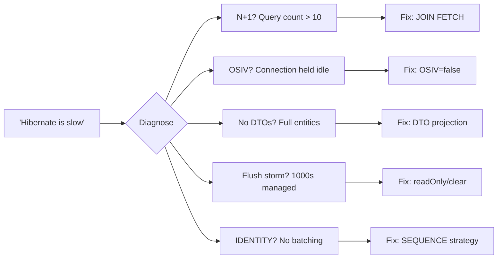

---

### 📶 Gradual Depth

**Level 1 - What it is:**

"Hibernate is slow" is almost always wrong. Hibernate's ORM overhead (proxy creation, dirty checking) is microseconds. The real slowness comes from how the application uses Hibernate: N+1 queries, OSIV, missing projections.

**Level 2 - How to use it:**

When facing "Hibernate is slow," measure first. Enable Statistics. Count queries per request. Check connection hold time. Check entity count in the persistence context. The metrics identify the misuse pattern. Fix the pattern, not the framework.

**Level 3 - How it works:**

Hibernate's per-entity overhead: ~1us proxy creation, ~5us dirty checking (field-by-field `Objects.equals`), ~50 bytes snapshot memory. For a 100-entity request with proper fetch planning (1-2 queries, DTO projection, OSIV disabled): total ORM overhead ~100us, total request time 30-50ms. ORM cost = 0.2-0.3% of request time.

**Level 4 - Production mastery:**

Build a "Hibernate blame test": measure the same endpoint with Hibernate (proper usage) vs raw JDBC. The difference is typically 1-5% (ORM overhead). If the Hibernate version is 10x slower, the problem is not ORM overhead - it is a misuse pattern. Use this test to justify keeping Hibernate vs the political pressure to "just use JDBC."

---

### ⚙️ How It Works

**Phase 1 - Misconception forms:**
Developer writes `findAll()`, iterates entities, accesses lazy associations. Latency is 2 seconds. "Hibernate is slow."

**Phase 2 - Misdiagnosis:**
Team considers: switch to MyBatis, switch to JDBC, add cache. No measurement. No query count check.

**Phase 3 - Correct diagnosis:**
Enable Statistics. Query count: 501 (1 + 500 lazy loads). The 500 round-trips at 2ms each = 1000ms. ORM overhead for 500 entities: ~2.5ms.

**Phase 4 - Correct fix:**
Add JOIN FETCH. Query count: 1. Latency: 15ms. ORM overhead: ~2.5ms. The fix reduced round-trips, not ORM overhead. Hibernate was never the bottleneck.

```text
  BEFORE (misuse):
  SELECT FROM orders              -> 1 query
  For each order:
    SELECT FROM customer WHERE..  -> 500 queries
  Total: 501 queries, 1000ms DB, 2.5ms ORM

  AFTER (correct usage):
  SELECT FROM orders
    JOIN FETCH customer           -> 1 query
  Total: 1 query, 5ms DB, 2.5ms ORM

  ORM overhead unchanged (2.5ms both cases).
  Latency reduction: 995ms. All from SQL, not ORM.
```

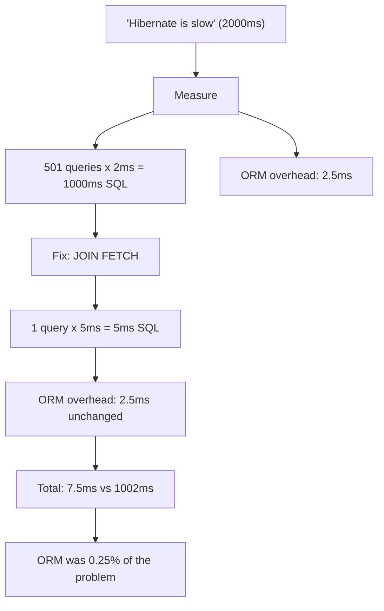

---

### 🚨 Failure Modes

**Failure 1 - Framework migration without diagnosis:**

**Symptom:** Team migrates from Hibernate to JDBC/MyBatis. Performance does not improve (or improves marginally).

**Root cause:** The N+1 pattern was reimplemented in JDBC. The loop that loaded entities and accessed associations now manually executes the same queries.

**Diagnostic:**

```sql
-- Count queries per request in new JDBC code
-- If still O(N): same pattern, different syntax
-- SELECT FROM orders: 1 query
-- For each order:
--   SELECT FROM customer: 500 queries
-- Total: 501 queries (same as Hibernate)
```

**Fix:**

**BAD:**

```sql
-- N+1 loop (same in Hibernate or JDBC)
SELECT * FROM orders;
-- then for EACH order:
SELECT * FROM customers WHERE id = ?;
```

**GOOD:**

```sql
-- Fix the PATTERN, not the framework
SELECT o.*, c.name
FROM orders o
JOIN customers c ON o.customer_id = c.id
-- 1 query regardless of framework
```

**Failure 2 - Adding cache to fix N+1:**

**Symptom:** Team adds L2 cache to customer entity. Latency improves from 2s to 0.5s but still 10x worse than optimal.

**Root cause:** Cache hits replace database round-trips but do not eliminate the N+1 loop. 500 cache lookups are faster than 500 DB queries but slower than 1 JOIN FETCH.

**Diagnostic:**

```text
Statistics after caching:
  L2 cache hit count: 500/request
  Query count: 1/request
  Total time: 500ms (cache lookup overhead)
  vs JOIN FETCH: 1 query, 5ms
```

**Fix:**

```text
Fix N+1 first (JOIN FETCH). Then add cache
for entities accessed across multiple requests
(reference data), not as a workaround for N+1.
```

---

### 🔬 Production Reality

A team migrates one microservice from Hibernate to jOOQ because "Hibernate was too slow" (P95 latency 3 seconds). Migration takes 6 weeks. After migration: P95 latency 2.7 seconds. The jOOQ code reimplements the same query pattern: load orders, loop, load customer per order. A second team member adds a single JOIN to the jOOQ query. P95 drops to 50ms. The same JOIN FETCH in Hibernate would have achieved 50ms in 5 minutes of work. The 6-week migration saved 300ms (ORM overhead). The 5-minute JOIN saved 2,650ms.

---

### ⚖️ Trade-offs & Alternatives

| Aspect         | Hibernate (proper) | Hibernate (misuse) | Raw JDBC          |
| -------------- | ------------------ | ------------------ | ----------------- |
| ORM overhead   | ~0.1ms per 100 ent | ~0.1ms per 100 ent | 0ms               |
| Query pattern  | Developer decides  | Developer decides  | Developer decides |
| N+1 risk       | JOIN FETCH fixes   | Left unfixed       | Same risk exists  |
| Developer time | Low (mappings)     | Low (but slow app) | High (manual SQL) |
| Performance    | 30-50ms typical    | 500-3000ms typical | 30-50ms typical   |

**Real-world patterns:**

- **Hibernate done right** (proper fetch planning, DTOs, OSIV off) matches JDBC performance within 1-5%.
- **Framework migration** typically takes 4-12 weeks and does not fix the underlying query patterns.

---

### ⚡ Decision Snap

**KEEP HIBERNATE AND FIX USAGE WHEN:**

- Performance issue is query count (N+1), not ORM overhead. Check with Statistics first.
- Team knows Hibernate well. Fix is JOIN FETCH or DTO projections.

**CONSIDER ALTERNATIVE WHEN:**

- Workload is 95% complex reporting SQL where entity mapping adds no value.
- Team has zero Hibernate expertise and learning curve is prohibitive.
- Workload requires SQL features Hibernate does not support (window functions, CTEs, recursive queries).

**NEVER DO:**

- Migrate framework without first measuring and diagnosing the current Hibernate usage.

---

### ⚠️ Top Traps

| #   | Misconception                               | Reality                                                                                                                                                                          |
| --- | ------------------------------------------- | -------------------------------------------------------------------------------------------------------------------------------------------------------------------------------- |
| 1   | Hibernate adds significant overhead         | ORM overhead is microseconds per operation. The overhead that matters is SQL round-trips from misuse patterns.                                                                   |
| 2   | Switching to JDBC/MyBatis fixes performance | If the same query patterns are reimplemented, performance is identical. Fix the pattern, not the framework.                                                                      |
| 3   | Hibernate generates inefficient SQL         | Hibernate generates the SQL your mappings and queries request. Bad SQL comes from bad mappings or missing fetch planning.                                                        |
| 4   | Caching compensates for N+1                 | Caching replaces DB round-trips with cache lookups. 500 cache hits are faster than 500 DB hits but slower than 1 JOIN. Fix N+1 first.                                            |
| 5   | Micro-benchmarks prove Hibernate is slow    | Micro-benchmarks that measure `em.find()` vs `PreparedStatement.executeQuery()` show microsecond differences. Real bottleneck is query patterns at scale, not per-call overhead. |

---

### 🪜 Learning Ladder

**Prerequisites:**

- Hibernate Production Diagnostics - Slow Query and Flush
  Storms - diagnosing the real cause
- The N+1 Select Problem (L3) - the primary misuse pattern
- Hibernate Performance Tuning at Scale - systematic fix

**THIS:** HIB-087 "Hibernate Is Slow" is Wrong - Misuse vs
Actual ORM Cost

**Next steps:**

- Entity for Every Table Anti-Pattern - another misuse
  pattern disguised as Hibernate's fault
- Hibernate Tooling - p6spy, datasource-proxy,
  Hypersistence - proving misuse with data

---

**The Surprising Truth:**

Hibernate's dirty checking - often cited as "expensive" - compares entity fields using `Objects.equals()` at flush time. For a 20-field entity, this is approximately 20 comparisons taking ~5 microseconds total. The cost of one database round-trip (0.5-5ms) is 100-1000x more than dirty checking an entity. Dirty checking 1000 entities (5ms) costs less than 3 unnecessary database round-trips. The "expensive dirty checking" narrative is 1000x wrong.

**Further Reading:**

- Vlad Mihalcea, "High-Performance Java Persistence" - Chapter 15: ORM overhead analysis
- Hibernate ORM User Guide - Performance tuning recommendations
- TechEmpower Framework Benchmarks - Hibernate vs JDBC comparison data

**Revision Card:**

1. Hibernate ORM overhead: microseconds. N+1 misuse cost: milliseconds to seconds. ORM is 0.1-1% of actual latency in misuse cases.
2. "Hibernate is slow" always translates to N+1, OSIV, missing DTOs, flush storms, or IDENTITY strategy. Diagnose the pattern.
3. Framework migration without diagnosis wastes weeks and does not fix the query pattern. Measure -> diagnose -> fix pattern -> re-measure.

---

---

# HIB-088 Entity for Every Table Anti-Pattern

**TL;DR** - Mapping every database table to a JPA entity creates unnecessary complexity. Lookup tables, junction tables, and read-only views should use alternatives: enums, DTO projections, or native queries.

---

### 🔥 Problem Statement

A database has 120 tables. The team maps all 120 to JPA entities: lookup tables (country, currency, status), junction tables (order_product), audit tables (\_AUD), materialized views, reporting tables. The result: 120 entity classes, 120 repositories, cascading lazy associations, flush checking all managed entities. The persistence context manages entities that should not be entities. Lookup tables with 5 static rows do not need lifecycle management. Junction tables with no business logic do not need a dedicated class. The anti-pattern is treating every table as a domain object when many tables are implementation details.

---

### 📜 Historical Context

Early JPA tutorials taught "one entity per table" as the starting point. Code generators (Hibernate Tools, JPA Buddy) reinforced this by generating entity classes from schema. The practice became default: import schema -> generate entities -> write repositories. The distinction between domain entities (Order, Customer) and infrastructure tables (lookup, junction, audit) was lost. Modern DDD (Domain-Driven Design) thinking separates the domain model from the persistence model: not every table is an aggregate, and not every aggregate needs a JPA entity.

---

### 🔩 First Principles

**CORE INVARIANTS:**

1. **Entities have lifecycle:** JPA entities are managed, tracked, dirty-checked, and flushed. This lifecycle makes sense for domain objects with state transitions (Order: CREATED -> PAID -> SHIPPED).
2. **Lookup data is static:** Country codes, currencies, and status values change rarely. They do not benefit from lifecycle management. Java enums serve better.
3. **Junction tables are relationships:** `order_product` is a relationship between Order and Product, not an independent domain concept. Map it as `@ManyToMany` or use a native query.
4. **The persistence context cost is per-entity:** Every managed entity occupies memory (snapshot), gets dirty-checked at flush, and adds to the L1 cache. More entities = more overhead.

**DERIVED DESIGN:**

Map domain objects (aggregates with business logic and state transitions) as entities. Map everything else using the lightest appropriate mechanism: enum for lookups, embedded for value objects, native query for reporting, DTO for reads.

**THE TRADE-OFF:**

**Gain:** Fewer entities reduce persistence context size, flush overhead, and codebase complexity.

**Cost:** Requires design thinking about what is a domain entity vs. an infrastructure concern. Not as "automatic" as mapping everything.

---

### 🧠 Mental Model

> Mapping every table to an entity is like giving every item in a warehouse a full employee file: name badge, health insurance, performance reviews. Boxes (domain entities) need tracking. Shelf labels (lookup tables) do not. Packing tape (junction tables) does not need its own HR record.

- "Employee file" -> JPA entity (lifecycle, dirty checking)
- "Boxes" -> domain entities (Order, Customer)
- "Shelf labels" -> lookup tables (enum)
- "Packing tape" -> junction tables (@ManyToMany)

**Where this analogy breaks down:** Unlike HR files, JPA entity overhead is small per-entity. The problem emerges at scale with hundreds of entities and thousands of managed instances.

---

### 🧩 Components

Categories of tables and their optimal mapping:

- **Domain entities:** Order, Customer, Product. Full JPA entity with lifecycle. Has business logic and state transitions.
- **Lookup tables:** Country, Currency, OrderStatus. Map as Java enum with `@Enumerated`. Or: `@Immutable` entity with L2 cache if DB-driven.
- **Junction tables:** order_product. Map via `@ManyToMany` on the owning entity. No separate entity class.
- **Audit tables:** \_AUD (Envers). Managed by Envers. No manual entity mapping.
- **Reporting views:** sales_summary_view. Use native query with DTO projection. No entity.
- **Value objects:** Address, Money. Map as `@Embeddable`, not as separate entity.

```text
  120 tables -> classify:
  40 Domain entities -> JPA @Entity
  30 Lookup tables   -> Java enum
  15 Junction tables -> @ManyToMany
  10 Audit tables    -> Envers (automatic)
  15 Reporting views -> Native SQL + DTO
  10 Value types     -> @Embeddable

  Result: 40 entities instead of 120
  Persistence context: 3x smaller
  Codebase: 80 fewer entity classes
```

```mermaid
flowchart TD
    A[Database table] --> B{Has business logic?}
    B -->|Yes| C[JPA @Entity]
    B -->|No| D{Static data?}
    D -->|Yes| E[Java enum]
    D -->|No| F{Junction table?}
    F -->|Yes| G[@ManyToMany]
    F -->|No| H{Reporting/view?}
    H -->|Yes| I[Native SQL + DTO]
    H -->|No| J{Value object?}
    J -->|Yes| K[@Embeddable]
```

---

### 📶 Gradual Depth

**Level 1 - What it is:**

Not every database table should be a JPA entity. Entities have lifecycle management overhead (tracking, dirty checking). Lookup tables, junction tables, and views are better served by enums, relationship mappings, or native queries.

**Level 2 - How to use it:**

Classify tables: domain entities (has business logic) -> `@Entity`. Lookup (static data) -> Java enum. Junction (relationship) -> `@ManyToMany`. Reporting view -> native query + DTO. Value object -> `@Embeddable`.

**Level 3 - How it works:**

Every `@Entity` instance loaded into the persistence context: (1) consumes memory for the entity and its snapshot, (2) gets dirty-checked at flush time, (3) participates in L1 cache, (4) requires a repository interface. Reducing entity count reduces all four costs. Java enums are constants - zero persistence overhead. `@Embeddable` is stored in the parent's table - no join.

**Level 4 - Production mastery:**

Audit your entity count. If entity-to-table ratio is 1:1, you likely have unnecessary entities. Target 30-50% of tables as entities. Use code review to enforce: "Does this table need lifecycle management?" For legacy codebases with 100+ entities: identify lookup entities and migrate to enums first (lowest risk). Then junction entities to `@ManyToMany`. Then reporting entities to native queries.

---

### ⚙️ How It Works

**Phase 1 - Table classification:**
Review each table. Ask: "Does this table represent a domain concept with state transitions and business logic?"

**Phase 2 - Migration for lookup tables:**
Replace `CountryEntity` with `Country` enum. Replace `countryRepository.findById()` with `Country.valueOf()`. Remove entity class and repository.

**Phase 3 - Migration for junction tables:**
Replace `OrderProductEntity` with `@ManyToMany` on Order and Product. The junction table still exists in the database but is managed by Hibernate automatically.

**Phase 4 - Measurement:**
After migration: entity count drops. Persistence context is smaller. Flush time decreases. Codebase has fewer classes.

```text
  BEFORE: 120 entities, flush checks 120 types

  Migration:
  1. CountryEntity -> Country enum
     DELETE CountryEntity.java
     DELETE CountryRepository.java
  2. OrderProductEntity -> @ManyToMany
     DELETE OrderProductEntity.java
     ADD @ManyToMany on Order.products
  3. SalesViewEntity -> native query
     DELETE SalesViewEntity.java
     ADD @Query(nativeQuery=true) on repo

  AFTER: 40 entities, flush checks 40 types
```

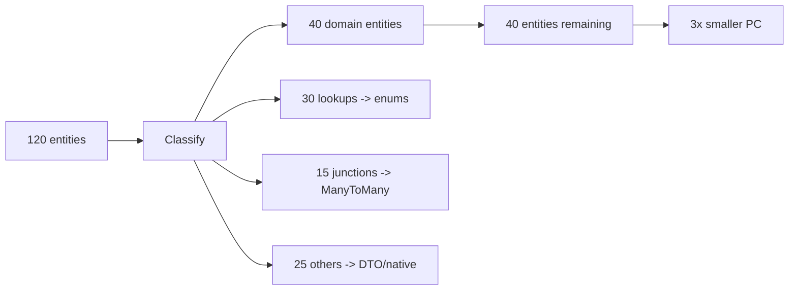

---

### 🚨 Failure Modes

**Failure 1 - Lookup entity causing unnecessary joins:**

**Symptom:** Every query that references `status` field joins the `order_status` table. Query plans show unnecessary hash joins.

**Root cause:** Status is mapped as `@ManyToOne OrderStatusEntity` instead of `@Enumerated OrderStatus`.

**Diagnostic:**

```sql
-- Generated SQL shows unnecessary join:
SELECT o.*, os.name
FROM orders o
JOIN order_status os ON o.status_id = os.id
-- vs. simple enum column:
SELECT o.* FROM orders o
-- (status stored as VARCHAR 'ACTIVE')
```

**Fix:**

**BAD:**

```java
// Lookup entity causes unnecessary joins
@ManyToOne
private OrderStatusEntity status;
```

**GOOD:**

```java
// Enum eliminates join entirely
@Enumerated(EnumType.STRING)
@Column(name = "status")
private OrderStatus status;
```

**Failure 2 - Flush storm from unnecessary entities:**

**Symptom:** Flush time high even for read-only operations. Statistics show many entities loaded but few modified.

**Root cause:** Reporting endpoint loads entities from 15 tables including lookup and junction entities. All are managed and dirty-checked at flush.

**Diagnostic:**

```java
Session s = em.unwrap(Session.class);
log.info("Entities: {}",
    s.getStatistics().getEntityCount());
// If hundreds for a read-only endpoint:
// unnecessary entities
```

**Fix:**

```java
// Use DTO projection for reporting
@Query(value = "SELECT o.id, o.total, "
    + "c.name FROM orders o "
    + "JOIN customers c "
    + "ON o.customer_id = c.id",
    nativeQuery = true)
List<Object[]> findReport();
// Zero entities in PC for this query
```

---

### 🔬 Production Reality

A banking application has 200 entity classes generated from 200 database tables. A transaction summary page loads Orders with Customer, Account, Currency, Country, TransactionType, AccountType, and BranchLocation entities - 8 entity types. Currency, Country, TransactionType, AccountType, and BranchLocation are static lookup tables with 5-50 rows each. After converting to enums and `@Embeddable`: entity count per request drops from 150 to 40. Flush time drops by 60%. The lookup joins are eliminated, simplifying queries.

---

### ⚖️ Trade-offs & Alternatives

| Table type          | JPA Entity     | Alternative        | Recommendation |
| ------------------- | -------------- | ------------------ | -------------- |
| Domain object       | Full lifecycle | N/A                | Entity         |
| Lookup (static)     | Unnecessary    | Java enum          | Enum           |
| Lookup (DB-managed) | Overhead       | @Immutable + cache | Entity + cache |
| Junction            | Extra class    | @ManyToMany        | Relationship   |
| Reporting view      | Overhead       | Native SQL + DTO   | DTO            |
| Value object        | Extra table    | @Embeddable        | Embedded       |

**Real-world patterns:**

- **DDD-informed teams** map aggregates (2-5 entities per aggregate) and use DTOs/enums for everything else. 30-50 entities for a 200-table database.
- **Legacy codebases** often have 1:1 table-to-entity mapping from code generation. Gradual migration to enums provides the easiest quick wins.

---

### ⚡ Decision Snap

**MAP AS ENTITY WHEN:**

- Table represents a domain concept with state transitions.
- Table has business logic (validation, computed fields).
- Table is part of an aggregate with other entities.

**MAP AS ENUM WHEN:**

- Static lookup data. Changes via deployment, not runtime.
- Small set (< 100 values). Has no business logic.

**MAP AS @EMBEDDABLE WHEN:**

- Value object (Address, Money). Stored in parent's table.

**MAP AS DTO/NATIVE QUERY WHEN:**

- Reporting, analytics, or read-only views. No write operations needed.

---

### ⚠️ Top Traps

| #   | Misconception                            | Reality                                                                                                                                      |
| --- | ---------------------------------------- | -------------------------------------------------------------------------------------------------------------------------------------------- |
| 1   | Every table needs a JPA entity           | Only domain objects with lifecycle and business logic need entity mapping.                                                                   |
| 2   | Code generators produce optimal mappings | Code generators map 1:1 table-to-entity. This is a starting point, not a final architecture. Prune unnecessary entities.                     |
| 3   | @Enumerated is limited                   | `@Enumerated(EnumType.STRING)` handles most lookup cases. For complex lookups (descriptions, i18n), use `@Converter` or `@Immutable` entity. |
| 4   | More entities means more flexibility     | More entities means more persistence context overhead, more dirty checking, more repositories, more maintenance.                             |
| 5   | Junction tables always need an entity    | Junction tables need an entity ONLY when the relationship itself has attributes (e.g., quantity in order_product). Otherwise: `@ManyToMany`. |

---

### 🪜 Learning Ladder

**Prerequisites:**

- Hibernate Performance Tuning at Scale - why fewer entities
  matters for performance
- "Hibernate Is Slow" is Wrong - Misuse vs Actual ORM
  Cost - entity overhead in context

**THIS:** HIB-088 Entity for Every Table Anti-Pattern

**Next steps:**

- Hibernate Tooling - p6spy, datasource-proxy,
  Hypersistence - validating entity reduction impact
- ORM Data Layer - Phase 4 (Production Hardening) -
  entity design as production concern

---

**The Surprising Truth:**

The most common source of unnecessary entities is code generators. Running "generate entities from schema" on a 200-table database produces 200 entity classes, 200 repositories, and the implicit assumption that all 200 need lifecycle management. A 30-minute classification exercise (domain vs. lookup vs. junction vs. reporting) typically reveals that 40-60% of those entities should be enums, embeddables, or native queries.

**Further Reading:**

- Eric Evans, "Domain-Driven Design" - aggregates and entity boundaries
- Vlad Mihalcea, "The best way to map a many-to-many association with JPA and Hibernate" (blog post)
- JPA 3.1 Specification, Section 2.7 - Embeddable Classes

**Revision Card:**

1. Classify every table: domain entity (lifecycle needed) vs. lookup (enum) vs. junction (@ManyToMany) vs. reporting (DTO/native).
2. Target 30-50% of tables as entities. The rest are enums, embeddables, or DTO projections.
3. Junction tables need an entity ONLY when the relationship has its own attributes. Otherwise use @ManyToMany.

---

---

# HIB-089 Hibernate Tooling - p6spy, datasource-proxy, Hypersistence

**TL;DR** - p6spy intercepts JDBC for SQL logging with timing, datasource-proxy enables query count assertions, and Hypersistence Optimizer validates mappings against best practices.

---

### 🔥 Problem Statement

Hibernate's built-in `show_sql` logs SQL without parameters, without timing, without calling code context. It is unusable for production diagnosis. The Hibernate ecosystem has three essential tools that fill this gap: p6spy (SQL interception with timing and parameters), datasource-proxy (programmable assertions on query counts), and Hypersistence Optimizer (mapping validation against best practices). Each tool addresses a different need: p6spy for debugging, datasource-proxy for testing, Hypersistence for design validation. Understanding when to use each prevents using the wrong tool for the job.

---

### 📜 Historical Context

p6spy (2002) was the original JDBC proxy: wrap the DataSource, intercept all SQL, log with parameters and timing. It predates Hibernate Statistics. datasource-proxy (2012) by Tadaya Tsuyukubo took a different approach: programmable query interception for automated testing (assert query count per test). Hypersistence Optimizer (2019) by Vlad Mihalcea addresses the gap between "Hibernate works" and "Hibernate is used correctly": it scans entity mappings and flags anti-patterns (N+1 risks, wrong ID strategy, missing fetch plans). Together, these three tools form the Hibernate developer toolchain.

---

### 🔩 First Principles

**CORE INVARIANTS:**

1. **p6spy = visibility:** See every SQL statement with bind parameters, execution time, and stack trace. Answers: "What SQL is Hibernate generating?"
2. **datasource-proxy = enforcement:** Assert that a code path executes exactly N queries. Catches N+1 regressions in automated tests. Answers: "Did this change increase query count?"
3. **Hypersistence Optimizer = prevention:** Scans mappings at startup and flags anti-patterns before they reach production. Answers: "Are our mappings following best practices?"
4. **Each tool has a primary environment:** p6spy for development/debugging, datasource-proxy for testing/CI, Hypersistence Optimizer for development/startup.

**DERIVED DESIGN:**

Use all three together: Hypersistence catches mapping issues at design time, datasource-proxy prevents query count regressions in CI, and p6spy diagnoses specific SQL issues during development.

**THE TRADE-OFF:**

**Gain:** Complete Hibernate observability from design (Hypersistence) through testing (datasource-proxy) to debugging (p6spy).

**Cost:** Additional dependencies. p6spy has moderate overhead (not recommended for production without sampling). Hypersistence Optimizer is a commercial product for full features.

---

### 🧠 Mental Model

> These three tools are like quality control in a factory. Hypersistence Optimizer is the design review (catches blueprint errors before building). datasource-proxy is the assembly line inspector (checks every unit as it is built). p6spy is the diagnostic camera (records exactly what happened when something goes wrong).

- "Design review" -> Hypersistence Optimizer
- "Assembly inspector" -> datasource-proxy
- "Diagnostic camera" -> p6spy

**Where this analogy breaks down:** Unlike a factory where tools are used by different people, a single developer uses all three tools at different stages of the development lifecycle.

---

### 🧩 Components

- **p6spy:** Wraps the JDBC DataSource. Intercepts `PreparedStatement.execute*()`. Logs SQL with bind params, timing, category. Configured via `spy.properties`.
- **datasource-proxy:** Wraps the DataSource similarly. Provides `QueryCountHolder` for per-thread query counts. Integrates with JUnit for query count assertions.
- **Hypersistence Optimizer:** Scans entity mappings at SessionFactory startup. Reports warnings/errors for common anti-patterns: IDENTITY strategy, missing @NaturalId, eager collections.
- **Hibernate Statistics:** Built-in. Aggregated counters. Lower granularity than p6spy but zero additional dependency.
- **show_sql + format_sql:** Built-in logging. No parameters, no timing. Useful only for basic debugging.

```text
  Tool comparison:
  +-----------------+----------+----------+---------+
  | Feature         | p6spy    | ds-proxy | Hyper   |
  +-----------------+----------+----------+---------+
  | SQL logging     | Yes      | Yes      | No      |
  | Bind params     | Yes      | Yes      | No      |
  | Execution time  | Yes      | Yes      | No      |
  | Query counting  | Manual   | Built-in | No      |
  | Query assertions| No       | Yes      | No      |
  | Mapping review  | No       | No       | Yes     |
  | Best practices  | No       | No       | Yes     |
  | Stack traces    | Yes      | No       | No      |
  +-----------------+----------+----------+---------+
```

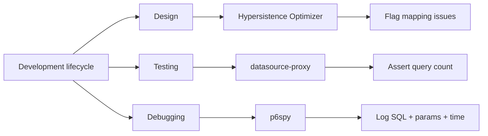

---

### 📶 Gradual Depth

**Level 1 - What it is:**

Three essential Hibernate tools: p6spy (see all SQL), datasource-proxy (assert query counts in tests), Hypersistence Optimizer (validate mappings). Each serves a different purpose.

**Level 2 - How to use it:**

p6spy: add dependency, configure `spy.properties`, use `p6spy` JDBC driver. datasource-proxy: wrap DataSource, use `QueryCountHolder.get()` in tests. Hypersistence: add dependency, mappings scanned at startup automatically.

**Level 3 - How it works:**

All three wrap or intercept the JDBC layer. p6spy proxies the DataSource and intercepts `execute()` calls. datasource-proxy does the same but exposes programmable hooks. Hypersistence Optimizer uses Hibernate's `MetadataImplementor` at startup to analyze entity mappings.

**Level 4 - Production mastery:**

CI pipeline integration: datasource-proxy in integration tests asserts query count per test. Every PR that increases query count fails CI. Hypersistence Optimizer in local dev flags mapping anti-patterns before code review. p6spy in staging captures SQL for performance analysis. In production: use Hibernate Statistics + Micrometer (lower overhead than p6spy).

---

### ⚙️ How It Works

**Phase 1 - p6spy SQL interception:**
Application uses `jdbc:p6spy:postgresql://...` instead of `jdbc:postgresql://...`. p6spy wraps the real driver. Every SQL statement is logged with parameters, timing, and optionally the calling stack trace.

**Phase 2 - datasource-proxy query assertions:**
Test wraps the DataSource. Before test: `QueryCountHolder.clear()`. Execute operation. After test: `assertThat(QueryCountHolder.getGrandTotal().getSelect()).isEqualTo(1)`. If N+1 introduced: assertion fails.

**Phase 3 - Hypersistence Optimizer mapping scan:**
At SessionFactory startup, Hypersistence scans all entity mappings. For each mapping, it checks rules: "Is this using IDENTITY strategy?" -> warning. "Is this @ManyToMany missing a Set?" -> warning. Report printed to logs.

**Phase 4 - Combined workflow:**
Developer writes entity -> Hypersistence flags IDENTITY strategy -> fixes to SEQUENCE. Writes integration test -> datasource-proxy asserts 2 queries -> test passes. Debugging slow test -> p6spy shows actual SQL with timing.

```text
  p6spy output:
  1706000001|12|statement|
  SELECT o.id, o.total FROM orders o
  WHERE o.customer_id = ?|
  connection 5|
  params: [(INTEGER)42]

  datasource-proxy assertion:
  assertThat(QueryCountHolder
    .getGrandTotal()
    .getSelect())
    .isEqualTo(1);  // Fails if N+1

  Hypersistence output:
  [WARN] Entity "Order" uses IDENTITY.
  Consider SEQUENCE for batch inserts.
```

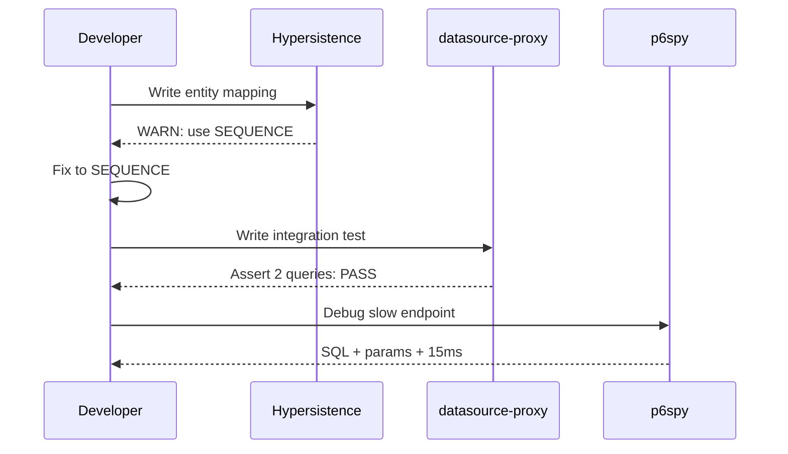

---

### 🚨 Failure Modes

**Failure 1 - N+1 regression undetected:**

**Symptom:** New feature adds lazy association access. No test catches the additional queries. Performance degrades in production.

**Root cause:** No query count assertions in integration tests. datasource-proxy not configured.

**Diagnostic:**

```java
// Add datasource-proxy to test config
@Test
void orderLoadShouldExecute2Queries() {
    QueryCountHolder.clear();
    orderService.findWithCustomer(1L);
    // Fails if N+1 added
    assertThat(QueryCountHolder
        .getGrandTotal()
        .getSelect())
        .isEqualTo(2);
}
```

**Fix:**

```java
// Add datasource-proxy dependency
// Wrap test DataSource
@Bean
public DataSource dataSource(
        DataSource original) {
    return ProxyDataSourceBuilder
        .create(original)
        .countQuery()
        .build();
}
// Add query count assertions to key tests
```

**Failure 2 - Using show_sql for diagnosis:**

**Symptom:** Developer enables `show_sql=true`. Console floods with SQL but no bind parameters, no timing. Cannot identify which query is slow or what parameters cause the issue.

**Root cause:** `show_sql` provides SQL text only. No parameters (`?` placeholders remain), no execution time, no request context.

**Diagnostic:**

```text
show_sql output:
select order0_.id from orders order0_
    where order0_.customer_id=?
-- What is "?"? How long did it take?
-- Which request triggered this?
```

**Fix:**

**BAD:**

```properties
# show_sql: no params, no timing
hibernate.show_sql=true
# Output: SELECT ... WHERE id=? (useless)
```

**GOOD:**

```properties
# p6spy: full SQL, params, and timing
spring.datasource.url=\
jdbc:p6spy:postgresql://localhost/db
spring.datasource.driver-class-name=\
com.p6spy.engine.spy.P6SpyDriver
```

---

### 🔬 Production Reality

A team adds datasource-proxy query count assertions to their 200 most critical integration tests. In the first month, the assertions catch 7 N+1 regressions across 4 PRs. Each would have reached production as a performance degradation. One regression: adding `@ManyToOne(fetch=EAGER)` to a new field on Order entity causes every Order list query to execute an additional SELECT per row. datasource-proxy assertion: expected 1 SELECT, actual 51. PR rejected. Developer fixes with `@ManyToOne(fetch=LAZY)` + JOIN FETCH in the specific query that needs it. Zero production incidents from N+1 in the following quarter.

---

### ⚖️ Trade-offs & Alternatives

| Aspect       | p6spy            | datasource-proxy | Hypersistence  |
| ------------ | ---------------- | ---------------- | -------------- |
| Purpose      | SQL debugging    | Test assertions  | Mapping review |
| Environment  | Dev/staging      | Test/CI          | Dev/startup    |
| Overhead     | Moderate         | Low              | Startup only   |
| Cost         | Free (OSS)       | Free (OSS)       | Commercial     |
| Setup effort | Low              | Medium           | Low            |
| Value        | Reactive (debug) | Preventive (CI)  | Preventive     |

**Real-world patterns:**

- **Mature teams** use all three: Hypersistence for mapping hygiene, datasource-proxy for CI regression prevention, p6spy for development debugging.
- **Budget-constrained teams** use datasource-proxy (free, highest ROI) + p6spy (free, debugging). Hypersistence Optimizer's free tier covers basic checks.

---

### ⚡ Decision Snap

**USE p6spy WHEN:**

- Debugging SQL in development. Need to see actual parameters and timing.

**USE datasource-proxy WHEN:**

- Preventing N+1 regressions in CI. Every critical path needs query count assertions.

**USE HYPERSISTENCE OPTIMIZER WHEN:**

- Starting a new project. Want to catch mapping anti-patterns early.

**USE ALL THREE WHEN:**

- Building a production-grade application that needs complete Hibernate quality control.

---

### ⚠️ Top Traps

| #   | Misconception                        | Reality                                                                                                                                                         |
| --- | ------------------------------------ | --------------------------------------------------------------------------------------------------------------------------------------------------------------- |
| 1   | show_sql is sufficient for debugging | show_sql shows SQL without parameters, timing, or context. p6spy shows all three. Use p6spy for real debugging.                                                 |
| 2   | p6spy is safe for production         | p6spy adds overhead per SQL statement. Use in staging with sampling. In production, use Hibernate Statistics + Micrometer.                                      |
| 3   | datasource-proxy is only for testing | datasource-proxy can also be used for query logging. But its unique value is programmable assertions - that is the testing use case.                            |
| 4   | Hypersistence catches all issues     | Hypersistence catches MAPPING issues (wrong strategy, eager collections). It does not catch RUNTIME issues (N+1 at query time). datasource-proxy catches those. |
| 5   | One tool is enough                   | Each tool addresses a different concern (debugging/testing/design). Use all three for complete coverage.                                                        |

---

### 🪜 Learning Ladder

**Prerequisites:**

- Hibernate Production Diagnostics - Slow Query and Flush
  Storms - the diagnostic methodology these tools enable
- Hibernate Statistics and SessionMetrics
  Observability - built-in alternative

**THIS:** HIB-089 Hibernate Tooling - p6spy,
datasource-proxy, Hypersistence

**Next steps:**

- Diagnose and Fix N+1 in a Legacy Codebase (Exercise) -
  applying these tools in practice
- Hibernate Performance Tuning at Scale - using tool
  output to guide tuning

---

**The Surprising Truth:**

The highest-ROI Hibernate tool is not p6spy (most well-known) or Hypersistence (most comprehensive). It is datasource-proxy with query count assertions in CI. A 5-line assertion (`assertThat(queryCount).isEqualTo(2)`) catches every N+1 regression before it reaches production. Teams that adopt this practice report 60-90% reduction in Hibernate performance incidents.

**Further Reading:**

- p6spy documentation (github.com/p6spy/p6spy)
- datasource-proxy documentation (github.com/ttddyy/datasource-proxy)
- Hypersistence Optimizer documentation (hypersistence.io)

**Revision Card:**

1. p6spy for debugging (SQL + params + timing), datasource-proxy for testing (query count assertions), Hypersistence for design (mapping validation).
2. datasource-proxy query count assertions in CI: highest ROI Hibernate tool. Catches N+1 before production.
3. show_sql is useless for real diagnosis. Always use p6spy or Hibernate Statistics instead.

---

---

# HIB-090 Diagnose and Fix N+1 in a Legacy Codebase (Exercise)

**TL;DR** - Systematic N+1 remediation: instrument with datasource-proxy, identify hot paths via query count assertions, fix with JOIN FETCH or DTO projections, validate with CI assertions.

---

### 🔥 Problem Statement

A legacy Spring Boot application has 50 endpoints, no query count monitoring, and "it is slow" complaints. The team suspects N+1 but does not know which endpoints are affected, how severe each case is, or the safest order to fix. This exercise provides a repeatable methodology: instrument first (datasource-proxy), audit endpoints by query count, prioritize by traffic and severity, fix with JOIN FETCH or DTO projections, and lock improvements with CI assertions. The goal is not to fix one N+1 but to systematically eliminate the entire class of problem from the codebase.

---

### 📜 Historical Context

N+1 remediation in legacy codebases has historically been reactive: one endpoint gets a complaint, one developer fixes it, no systemic improvement occurs. The modern approach uses datasource-proxy to establish a baseline (query counts per endpoint), prioritize by impact (traffic x query count), and prevent regression (CI assertions). This transforms N+1 from a recurring production issue into a one-time engineering project with lasting results. The methodology was refined by teams adopting Vlad Mihalcea's "High-Performance Java Persistence" practices.

---

### 🔩 First Principles

**CORE INVARIANTS:**

1. **Audit before fix:** Instrument all endpoints. Build the complete map of query counts. Prioritize by traffic x severity.
2. **Fix by pattern, not by endpoint:** Most N+1 instances share a common pattern (lazy `@ManyToOne` or `@OneToMany` traversal). Fixing the entity's fetch strategy fixes multiple endpoints.
3. **Lock with assertions:** After fixing an endpoint, add a datasource-proxy assertion in integration tests. Future regressions break CI immediately.
4. **Safe migration order:** Fix high-traffic endpoints first. Test each fix with existing integration tests. Deploy incrementally.

**DERIVED DESIGN:**

The audit reveals the full scope. Pattern analysis groups fixes (one JOIN FETCH may fix 5 endpoints). CI assertions prevent regression. The result is systematic, not ad-hoc.

**THE TRADE-OFF:**

**Gain:** Systematic elimination of N+1 across the entire codebase. CI assertions prevent recurrence. Measurable performance improvement.

**Cost:** Initial instrumentation effort (1-2 days). Each fix requires testing. Total project: 1-4 weeks for a large codebase.

---

### 🧠 Mental Model

> Fixing N+1 in a legacy codebase is like fixing leaks in an old building. Step 1: install water meters on every pipe (datasource-proxy on every endpoint). Step 2: identify which pipes leak most (query count audit). Step 3: fix the biggest leaks first (high-traffic endpoints). Step 4: install leak detectors that sound alarms (CI assertions). You do not fix leaks by guessing which pipes are bad.

- "Water meters" -> datasource-proxy
- "Identify leaks" -> query count audit
- "Fix biggest" -> prioritize by impact
- "Leak detectors" -> CI assertions

**Where this analogy breaks down:** Unlike plumbing, fixing one entity's fetch strategy can fix multiple endpoints simultaneously.

---

### 🧩 Components

- **Phase 1 - Instrumentation:** Add datasource-proxy to the test and staging DataSource. Enable per-request query count logging.
- **Phase 2 - Audit:** Run integration tests or API test suite. Capture query count per endpoint. Build the priority matrix.
- **Phase 3 - Pattern analysis:** Group N+1 instances by root entity. Identify shared fixes (JOIN FETCH on Order.customer fixes 5 endpoints).
- **Phase 4 - Fix:** Add JOIN FETCH or DTO projections. Run existing tests. Verify query count drops.
- **Phase 5 - Lock:** Add datasource-proxy assertions to integration tests for each fixed endpoint.

```text
  Audit result (example):
  +------------------------+-------+--------+
  | Endpoint               | QPS   | Queries|
  +------------------------+-------+--------+
  | GET /api/orders        | 500   | 47     |
  | GET /api/orders/{id}   | 300   | 12     |
  | POST /api/orders       | 100   | 3      |
  | GET /api/products      | 200   | 23     |
  | GET /api/customers     | 150   | 31     |
  +------------------------+-------+--------+

  Priority = QPS x Queries:
  1. GET /orders:    500 x 47 = 23,500
  2. GET /customers: 150 x 31 = 4,650
  3. GET /products:  200 x 23 = 4,600
  4. GET /orders/id: 300 x 12 = 3,600
  5. POST /orders:   100 x  3 = 300
```

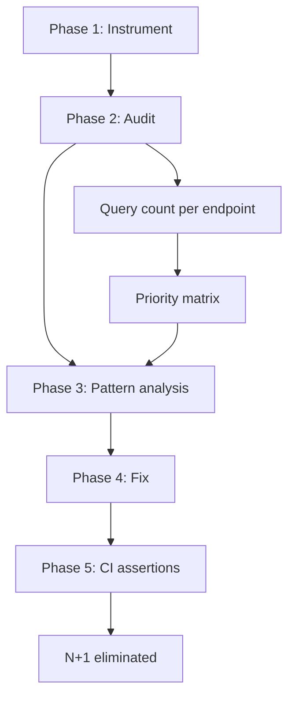

---

### 📶 Gradual Depth

**Level 1 - What it is:**

A systematic methodology for finding and fixing all N+1 queries in a legacy Hibernate application, then preventing them from recurring with automated tests.

**Level 2 - How to use it:**

Add datasource-proxy. Audit query counts. Prioritize by traffic x severity. Fix with JOIN FETCH or DTO. Add query count assertions. Deploy incrementally.

**Level 3 - How it works:**

datasource-proxy wraps the DataSource and counts queries per thread. Integration tests capture the baseline query count. After JOIN FETCH fix: re-run tests, verify count dropped, add assertion at new count. The assertion becomes a regression gate.

**Level 4 - Production mastery:**

For a 50-endpoint application: audit takes 1 day (automated test suite with query logging). Pattern analysis takes 1 day (group by root entity, identify shared fixes). Fixes take 3-5 days (high-priority endpoints first). CI assertion setup: 1 day. Total: 1-2 weeks. Result: 60-80% reduction in total query count. P95 latency improvement: 40-70%. Zero N+1 regressions after CI assertions are in place.

---

### ⚙️ How It Works

**Phase 1 - Instrument (Day 1):**
Add datasource-proxy to test configuration. Create a request filter that logs endpoint + query count for every request.

**Phase 2 - Audit (Day 2):**
Run full integration test suite. Capture logs. Parse into endpoint -> query count map. Sort by impact (traffic x query count).

**Phase 3 - Fix (Days 3-7):**
For each high-priority endpoint: identify the N+1 root (p6spy shows repeated SELECT on which table). Add JOIN FETCH to the repository query. Verify query count drops. If endpoint returns lists: consider DTO projection.

**Phase 4 - Lock (Day 8):**
For each fixed endpoint: add `assertThat(queryCount.getSelect()).isEqualTo(expectedCount)` in integration test. Commit. CI now catches regressions.

```text
  Example fix for GET /api/orders (47 -> 2):

  BEFORE:
  @Query("SELECT o FROM Order o")
  List<Order> findAll();
  // Controller: order.getCustomer().getName()
  // -> 1 + N lazy loads = 47 queries

  AFTER:
  @Query("SELECT o FROM Order o "
      + "JOIN FETCH o.customer")
  List<Order> findAllWithCustomer();
  // Customer pre-loaded. 1 query.
  // + 1 count query for pagination = 2

  ASSERTION:
  @Test
  void findAllOrders_executesMaxQueries() {
    QueryCountHolder.clear();
    orderService.findAll(pageable);
    assertThat(QueryCountHolder
      .getGrandTotal().getSelect())
      .isLessThanOrEqualTo(2);
  }
```

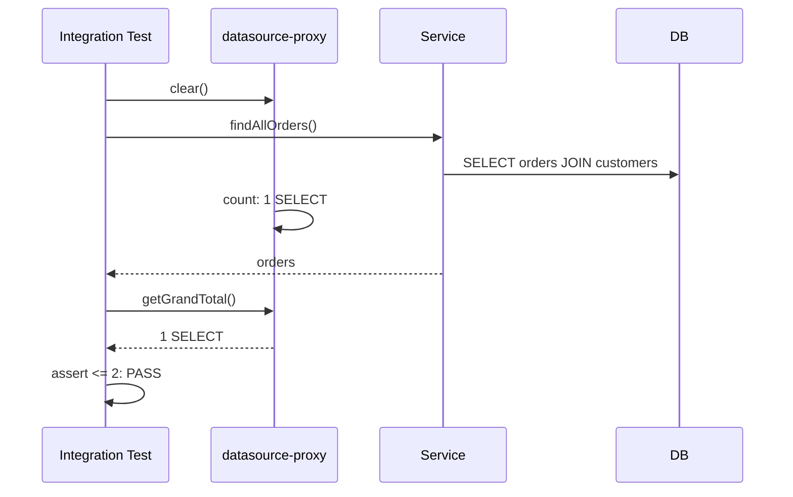

---

### 🚨 Failure Modes

**Failure 1 - Fixing low-impact endpoints first:**

**Symptom:** Team spends a week fixing 10 low-traffic endpoints. Total application improvement: 2%. High-traffic N+1 endpoints remain unfixed.

**Root cause:** No priority matrix. Fixed endpoints in source file order instead of impact order.

**Diagnostic:**

```text
Priority matrix missing. Build it:
endpoint_impact = requests_per_min * queries
Sort descending. Fix top 5 first.
Top 5 typically account for 80% of total
excess queries.
```

**Fix:**

```text
Build the priority matrix:
1. Log query count per endpoint (2 hours)
2. Combine with request traffic data
3. Sort by impact (traffic x query count)
4. Fix top 5 endpoints first
```

**Failure 2 - JOIN FETCH changing result semantics:**

**Symptom:** After adding JOIN FETCH on a collection (`@OneToMany`), query returns duplicate parent entities. Pagination breaks.

**Root cause:** JOIN FETCH on a collection creates a SQL JOIN that produces one row per child. Parent entities appear multiple times. Pagination applies to the joined result set (rows), not to parent entities.

**Diagnostic:**

```java
// Before fix: 50 orders returned
// After JOIN FETCH o.lineItems:
// 200 rows returned (50 orders x 4 items avg)
// Page size 50 now returns 12-13 orders
```

**Fix:**

**BAD:**

```java
// JOIN FETCH on collection: duplicates
@Query("SELECT o FROM Order o "
    + "JOIN FETCH o.lineItems")
List<Order> findAll();
// 50 orders x 4 items = 200 rows returned
```

**GOOD:**

```java
// @BatchSize avoids duplicates
@BatchSize(size = 50)
@OneToMany(mappedBy = "order")
private List<LineItem> lineItems;
// Fetches items in batches of 50 IDs
```

---

### 🔬 Production Reality

A legacy e-commerce application with 60 endpoints averages 23 queries per request across all endpoints. After audit: 8 endpoints have query counts > 30 (N+1 on customer, product, and category associations). Pattern analysis: all 8 endpoints load Order entities and access lazy associations. One shared fix: add `findAllWithDetails()` repository method with JOIN FETCH for customer and product. 6 of 8 endpoints now use this method. Query count drops from 47 to 3 for each. Overall average: 23 queries/request drops to 6. P95 latency: 800ms drops to 150ms. 8 CI assertions prevent regression.

---

### ⚖️ Trade-offs & Alternatives

| Approach         | Impact        | Effort     | Risk      | Regression |
| ---------------- | ------------- | ---------- | --------- | ---------- |
| Systematic audit | Comprehensive | 1-2 weeks  | Low       | Prevented  |
| Ad-hoc fixing    | Partial       | Ongoing    | Medium    | Recurring  |
| OSIV enable      | Masks N+1     | 5 minutes  | High      | N+1 hidden |
| EAGER fetching   | Partial       | 1 hour     | Very high | New N+1    |
| Rewrite to JDBC  | Potential     | 3-6 months | Very high | Uncertain  |

**Real-world patterns:**

- **Teams that audit first** fix 80% of N+1 in 1-2 weeks with measurable results and CI protection.
- **Teams that fix ad-hoc** spend months fixing individual complaints with no systemic improvement and recurring regressions.

---

### ⚡ Decision Snap

**START THIS EXERCISE WHEN:**

- Multiple complaints about endpoint latency. No query count monitoring. Suspected N+1 across many endpoints.

**THE SEQUENCE IS NON-NEGOTIABLE:**

- Instrument -> Audit -> Prioritize -> Fix -> Assert. Skipping any step reduces effectiveness.

**TIMEBOX:**

- Audit: 2 days. Fixes: 1 week. Assertions: 1 day. Diminishing returns after top 10 endpoints.

---

### ⚠️ Top Traps

| #   | Misconception                  | Reality                                                                                                                                |
| --- | ------------------------------ | -------------------------------------------------------------------------------------------------------------------------------------- |
| 1   | Fix all N+1 at once            | Fix by priority. Top 5 endpoints typically account for 80% of excess queries. Diminishing returns after top 10.                        |
| 2   | JOIN FETCH works for all cases | JOIN FETCH on collections causes duplicates and breaks pagination. Use @BatchSize or two-query approach for collections.               |
| 3   | Audit is optional              | Without audit, you are guessing which endpoints have N+1. Some "obvious" endpoints may be fine. Some "simple" endpoints may be severe. |
| 4   | One-time effort is sufficient  | N+1 recurs with new features. CI assertions are essential. Without assertions, the audit needs to be repeated every quarter.           |
| 5   | Unit tests catch N+1           | Unit tests mock the repository. Only integration tests with a real database and datasource-proxy catch N+1 at the query level.         |

---

### 🪜 Learning Ladder

**Prerequisites:**

- The N+1 Select Problem (L3) - understanding the pattern
- Hibernate Tooling - p6spy, datasource-proxy,
  Hypersistence - instrumentation tools
- Hibernate Production Diagnostics - Slow Query and Flush
  Storms - diagnostic methodology

**THIS:** HIB-090 Diagnose and Fix N+1 in a Legacy Codebase
(Exercise)

**Next steps:**

- Hibernate Performance Tuning at Scale - broader
  optimization beyond N+1
- Hibernate Deep-Dive Interview Questions - testing
  understanding of these patterns

---

**The Surprising Truth:**

The most common mistake in N+1 remediation is not the fix itself but the order of operations. Teams that skip the audit phase and fix "obvious" N+1 instances often miss the highest-impact endpoints. In one case, the team fixed 15 low-traffic endpoints (2 weeks of work) while the single highest-impact endpoint (accounting for 60% of total excess queries) remained unfixed because it "looked simple."

**Further Reading:**

- Vlad Mihalcea, "High-Performance Java Persistence" - N+1 remediation strategies
- datasource-proxy documentation - query count assertions (github.com/ttddyy/datasource-proxy)
- Spring Data JPA Reference - EntityGraph and fetch planning

**Revision Card:**

1. Methodology: Instrument (datasource-proxy) -> Audit (query count per endpoint) -> Prioritize (traffic x count) -> Fix (JOIN FETCH/DTO) -> Assert (CI).
2. Priority matrix: top 5 endpoints typically account for 80% of excess queries. Fix those first.
3. CI assertions: `assertThat(queryCount).isLessThanOrEqualTo(N)` after every fix. Without assertions, N+1 will recur with the next feature.

---

---

# HIB-091 Hibernate Deep-Dive Interview Questions

**TL;DR** - Deep-dive questions that test understanding of Hibernate internals, not API memorization. Each question has a trap answer that reveals surface-level knowledge vs genuine understanding.

---

### 🔥 Problem Statement

Most Hibernate interview questions test API knowledge: "What is the difference between `get()` and `load()`?" This reveals nothing about production competence. A developer who can recite the API may still cause N+1, enable OSIV, or use IDENTITY strategy for batch inserts. Deep-dive questions test whether a candidate understands WHY Hibernate works the way it does, can diagnose production issues, and makes correct architectural decisions. These questions also serve as self-assessment checkpoints for engineers learning Hibernate.

---

### 📜 Historical Context

Interview questions for ORM frameworks have traditionally focused on annotations, configuration, and entity lifecycle states. These questions were relevant when Hibernate was new and API familiarity indicated expertise. Modern Hibernate usage requires understanding fetch planning, persistence context behavior, cache invalidation, and production diagnostics. The interview questions here are calibrated to distinguish between developers who have used Hibernate and developers who understand Hibernate.

---

### 🔩 First Principles

**CORE INVARIANTS:**

1. **Questions test principles, not API:** Each question has a "textbook answer" (surface) and a "production answer" (deep). The production answer reveals whether the candidate has debugged real Hibernate issues.
2. **Trap answers reveal misunderstanding:** Common wrong answers (e.g., "use EAGER to fix LazyInitializationException") reveal patterns that cause production problems.
3. **Diagnosis questions > knowledge questions:** "How would you diagnose this symptom?" is more revealing than "What does this annotation do?"
4. **Architecture questions test judgment:** "When would you NOT use Hibernate?" tests whether the candidate can evaluate trade-offs.

**DERIVED DESIGN:**

The question set covers five domains: persistence context behavior, fetching and N+1, caching internals, production diagnostics, and architecture decisions. Each domain has 2-3 questions with expected depth levels.

**THE TRADE-OFF:**

**Gain:** Questions that distinguish API users from production-capable engineers.

**Cost:** Requires the interviewer to also understand deep Hibernate internals to evaluate answers.

---

### 🧠 Mental Model

> These questions are like a pilot's instrument check, not a written exam. A written exam asks "What is an altimeter?" (API knowledge). An instrument check asks "Your altimeter reads 3000ft but the terrain warning fires - what do you do?" (production diagnosis). The pilot who can only recite instrument names will crash.

- "Written exam" -> API-level questions
- "Instrument check" -> production scenario questions
- "Recite names" -> memorized Hibernate annotations
- "Diagnose and react" -> real understanding

**Where this analogy breaks down:** Unlike aviation, wrong Hibernate answers do not cause physical harm - but they cause production outages.

---

### 🧩 Components

**Domain 1 - Persistence Context:**

- Q1: "An entity is loaded, modified, but `em.persist()` is not called. Will the change be saved? Why?"
  - Surface answer: "No, you need to call persist or merge."
  - Deep answer: "Yes, if the entity is managed (loaded via find/query within a transaction). Dirty checking at flush compares current state against the load-time snapshot and generates UPDATE automatically."
  - Trap: Candidates who say persist/merge is required do not understand automatic dirty checking.

- Q2: "What happens if you load 50,000 entities in a single Session?"
  - Deep answer: "50,000 snapshots stored for dirty checking. Flush time becomes O(50,000 x fields). Memory usage doubles (entity + snapshot). Fix: DTO projection, StatelessSession, or periodic clear()."

**Domain 2 - Fetching and N+1:**

- Q3: "You have 100 Orders, each with a lazy Customer. You iterate and call getCustomer().getName(). How many queries execute?"
  - Surface: "100 additional queries (N+1)."
  - Deep: "101 total: 1 for orders + 100 for customers. Fix: JOIN FETCH, @BatchSize (reduces to ceil(100/batchSize)), or EntityGraph."

- Q4: "Why can JOIN FETCH and pagination conflict?"
  - Deep: "JOIN FETCH on a collection produces N_parent x N_child rows. LIMIT/OFFSET applies to rows, not parents. Hibernate warns and fetches all results into memory for in-memory pagination."

**Domain 3 - Caching:**

- Q5: "What is the difference between L1 and L2 cache?"
  - Deep: "L1 = Session-scoped, guarantees identity (same instance for same PK within Session), always on. L2 = SessionFactory-scoped, stores dehydrated state (not entity instances), requires explicit opt-in, invalidated on write."

**Domain 4 - Production Diagnostics:**

- Q6: "An endpoint is slow (3 seconds). Database slow query log shows no slow queries. Where is the time?"
  - Deep: "Query COUNT, not query speed. N+1: 100 fast queries (1ms each) = 100ms DB + 500ms round-trip overhead. Or flush storm: dirty checking 10,000 entities. Check Statistics for query count and entity count."

**Domain 5 - Architecture:**

- Q7: "When would you NOT use Hibernate?"
  - Deep: "Complex reporting (CTEs, window functions), bulk ETL (millions of rows), schema-less or NoSQL workloads, extreme low-latency requirements where ORM microseconds matter."

```text
  Evaluation rubric:
  +----------+-------------------+---------+
  | Level    | Answer pattern    | Score   |
  +----------+-------------------+---------+
  | Surface  | Recites API       | 1-2 / 5 |
  | Working  | Explains behavior | 3 / 5   |
  | Deep     | Explains WHY      | 4 / 5   |
  | Expert   | Adds trade-offs   | 5 / 5   |
  +----------+-------------------+---------+
```

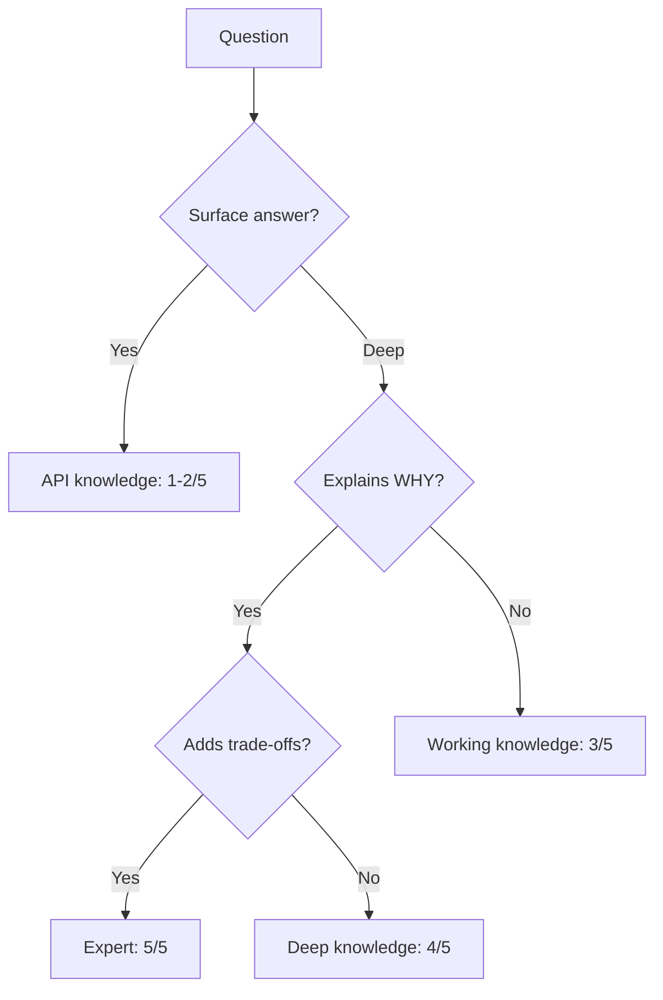

---

### 📶 Gradual Depth

**Level 1 - What it is:**

A collection of interview questions that test deep understanding of Hibernate, not API memorization. Each question has surface and deep answer levels.

**Level 2 - How to use it:**

Use as interview questions for Hibernate developer roles. Or as self-assessment: can you answer at the "deep" level for all seven questions? The deep level requires production experience.

**Level 3 - How it works:**

Questions are designed with traps. The textbook answer (e.g., "call persist to save") reveals surface knowledge. The production answer (e.g., "dirty checking auto-saves managed entities") reveals understanding. Trap answers (e.g., "use EAGER to fix LazyInitializationException") reveal misconceptions that cause production problems.

**Level 4 - Production mastery:**

Expert-level answers include trade-offs, failure modes, and alternatives. "Dirty checking auto-saves managed entities" (deep) vs. "Dirty checking auto-saves, which is usually what you want, but can cause unexpected writes if you modify an entity for computation without intending to persist the change - use `em.detach()` or read-only hint to prevent this" (expert).

---

### ⚙️ How It Works

**Phase 1 - Question delivery:**
Present the scenario. Do not hint at the expected depth. Let the candidate choose their answer level.

**Phase 2 - Depth probing:**
If the candidate gives a surface answer, follow up: "What happens internally?" or "Why does that work that way?"

**Phase 3 - Trade-off testing:**
After the candidate explains behavior, ask: "What are the downsides?" or "When would you choose differently?"

**Phase 4 - Evaluation:**
Score 1-5 per question. Surface = 1-2, Working = 3, Deep = 4, Expert (with trade-offs) = 5.

```text
  Q1: "Will a modified managed entity save?"
  Surface: "No, call persist()"     -> 1/5
  Working: "Yes, dirty checking"    -> 3/5
  Deep: "Yes, snapshot comparison
         at flush time"             -> 4/5
  Expert: "Yes, but detach() if
         you modify for computation
         only; or readOnly hint to
         skip dirty checking"       -> 5/5
```

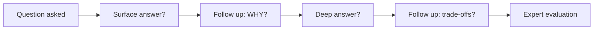

---

### 🚨 Failure Modes

**Failure 1 - Candidate uses EAGER as the LazyInit fix:**

**Symptom:** Candidate answers: "To fix LazyInitializationException, change `@ManyToOne(fetch=EAGER)`."

**Root cause:** Surface understanding. Does not grasp that EAGER on `@OneToMany` causes N+1 (separate SELECT per collection) and EAGER on `@ManyToOne` always loads even when not needed.

**Diagnostic:**

```text
Follow-up questions:
1. "What happens to query count with
   EAGER on @OneToMany?"
2. "What if most endpoints don't need
   this association?"
Expected: candidate recognizes the trade-off.
```

**Fix:**

**BAD:**

```java
// EAGER causes N+1 on all queries
@ManyToOne(fetch = FetchType.EAGER)
private Customer customer;
```

**GOOD:**

```java
// LAZY + JOIN FETCH where needed
@ManyToOne(fetch = FetchType.LAZY)
private Customer customer;
```

**Failure 2 - Candidate does not know Statistics API:**

**Symptom:** "How would you diagnose a slow Hibernate endpoint?" Answer: "Enable show_sql and read the logs."

**Root cause:** No exposure to production Hibernate diagnostics. Does not know Statistics, Micrometer, or p6spy.

**Diagnostic:**

```text
Follow-up: "show_sql shows no slow queries.
The endpoint takes 3 seconds. What next?"
Expected: "Check query COUNT, not query
speed. Enable Statistics to see
getPrepareStatementCount()."
```

**Fix:**

```text
Correct answer: "Enable Statistics. Check
query count per request. Check entity count
in persistence context. Use p6spy for SQL
details with timing."
```

---

### 🔬 Production Reality

An interview using these questions evaluates a senior Java developer candidate. The candidate correctly explains entity lifecycle, dirty checking, and L1 cache (domains 1, 3). On N+1 (domain 2), the candidate says "use @BatchSize" but cannot explain why JOIN FETCH might conflict with pagination. On diagnostics (domain 4), the candidate suggests "enable show_sql" but does not mention Statistics or query count analysis. Score: 3/5 average. Assessment: strong API knowledge, limited production debugging experience. Hire with mentoring plan for production diagnostics.

---

### ⚖️ Trade-offs & Alternatives

| Question type      | What it tests        | Signal quality |
| ------------------ | -------------------- | -------------- |
| API knowledge      | Memorization         | Low            |
| Behavior           | Understanding        | Medium         |
| Scenario/diagnosis | Production readiness | High           |
| Architecture       | Judgment             | High           |
| Trade-off          | Experience           | Very high      |

**Real-world patterns:**

- **Effective interviews** mix scenario questions (60%) with architecture questions (20%) and behavior questions (20%). Zero API-only questions.
- **Self-assessment** uses the 7 questions as a benchmark. Deep answers on all 7 = ready for production Hibernate work.

---

### ⚡ Decision Snap

**USE THESE QUESTIONS WHEN:**

- Interviewing for roles that require production Hibernate expertise.
- Self-assessing Hibernate knowledge depth.
- Training junior developers (work through questions together).

**SUPPLEMENT WITH:**

- Live coding exercise: "Fix this N+1 with datasource-proxy assertion."
- Architecture discussion: "Design the data layer for this domain."

**DO NOT USE WHEN:**

- The role uses MyBatis/jOOQ (Hibernate-specific questions are not relevant).

---

### ⚠️ Top Traps

| #   | Misconception                                         | Reality                                                                                                                                     |
| --- | ----------------------------------------------------- | ------------------------------------------------------------------------------------------------------------------------------------------- |
| 1   | API knowledge = production competence                 | A developer who recites annotations but enables OSIV, uses EAGER, and ignores N+1 will cause production issues.                             |
| 2   | "What does X annotation do?" is a good question       | It tests reading comprehension. "Why would you use X?" tests understanding. "When would you NOT use X?" tests judgment.                     |
| 3   | One right answer per question                         | Expert answers include trade-offs. "Dirty checking auto-saves" is correct. "But detach if modifying for computation only" is expert.        |
| 4   | These questions are only for interviews               | They are equally valuable as self-assessment checkpoints and training exercises for the team.                                               |
| 5   | Failing a question means the candidate is unqualified | These questions test expert-level knowledge. A candidate who answers 3/5 average has solid working knowledge. Look for learning trajectory. |

---

### 🪜 Learning Ladder

**Prerequisites:**

- First-Level Cache (Persistence Context) Internals -
  Q1, Q2 require this
- The N+1 Select Problem (L3) - Q3, Q4 require this
- Hibernate Production Diagnostics - Slow Query and
  Flush Storms - Q6 requires this

**THIS:** HIB-091 Hibernate Deep-Dive Interview Questions

**Next steps:**

- Hibernate Expert Mastery Verification - comprehensive
  self-assessment
- ORM Data Layer - Phase 4 (Production Hardening) -
  applying knowledge in practice

---

**The Surprising Truth:**

The single most revealing Hibernate interview question is not about Hibernate at all. It is: "Your endpoint takes 3 seconds. The database shows no slow queries. What is happening?" The candidate who immediately says "check query count - it is probably N+1 with many fast queries" has production experience. The candidate who says "add caching" or "increase thread pool" has not debugged a real Hibernate performance issue.

**Further Reading:**

- Vlad Mihalcea, "High-Performance Java Persistence" - the definitive reference for all question domains
- Hibernate ORM User Guide - official reference for architecture and behavior
- JPA 3.1 Specification - entity lifecycle and persistence context semantics

**Revision Card:**

1. Deep questions test WHY and TRADE-OFFS, not API. "Will a modified managed entity save?" tests dirty checking understanding.
2. Trap answers reveal misconceptions: "use EAGER to fix LazyInitializationException" = N+1 in production.
3. Most revealing question: "Endpoint is slow, no slow queries in DB." Answer: "Query COUNT, not speed. Check Statistics for N+1."

---

---

# HIB-092 Hibernate Expert Mastery Verification

**TL;DR** - A comprehensive self-assessment checklist covering all Hibernate domains: persistence context, fetching, caching, production diagnostics, and architecture decisions.

---

### 🔥 Problem Statement

After studying Hibernate topics L0 through L4, how does an engineer verify they have genuinely mastered the material? Reading content provides knowledge. Answering questions tests recall. But mastery requires the ability to diagnose unfamiliar scenarios, make correct architectural decisions under constraints, and teach others. This verification framework tests all three abilities across every Hibernate domain covered in the learning ladder.

---

### 📜 Historical Context

Mastery verification in software engineering has evolved from certification exams (multiple choice on API) to practical assessments (build something, debug something, explain something). The Dreyfus model of skill acquisition describes five levels: novice, advanced beginner, competent, proficient, expert. This verification targets proficient-to-expert transition: can you diagnose novel problems, not just recognize familiar ones? The checklist is structured as progressive challenges, not pass/fail questions.

---

### 🔩 First Principles

**CORE INVARIANTS:**

1. **Three dimensions of mastery:** Knowledge (explain concepts), Diagnosis (debug unfamiliar problems), Judgment (make correct decisions under constraints).
2. **Progressive challenge:** Each domain starts with "explain" (knowledge), then "diagnose" (novel scenario), then "decide" (architecture under trade-offs).
3. **Self-honesty required:** If you cannot answer without referencing notes, you have knowledge but not mastery. Mastery means the pattern is internalized.
4. **Teaching as verification:** If you cannot teach a concept to a junior engineer and answer their follow-up questions, you do not truly understand it.

**DERIVED DESIGN:**

The verification is organized by domain (matching the learning ladder) with three levels per domain. Completing all three levels across all domains constitutes expert mastery.

**THE TRADE-OFF:**

**Gain:** Concrete evidence of mastery level. Identifies specific gaps for further study.

**Cost:** Honest self-assessment is difficult. External validation (code review, pairing) is more reliable but less scalable.

---

### 🧠 Mental Model

> Expert mastery verification is like a flight simulator check. Phase 1: demonstrate normal procedures (explain concepts). Phase 2: handle unexpected situations (diagnose unfamiliar problems). Phase 3: make command decisions under pressure (architecture under constraints). Passing Phase 1 is competent. Passing Phase 2 is proficient. Passing Phase 3 is expert.

- "Normal procedures" -> explain concepts
- "Unexpected situations" -> diagnose novel problems
- "Command decisions" -> architecture under constraints

**Where this analogy breaks down:** Unlike aviation, Hibernate mastery does not require split-second decisions. You can research and verify. The value is knowing where to look and what to look for.

---

### 🧩 Components

**Domain 1 - Persistence Context Mastery:**

- Level A (Knowledge): Explain the four entity states. Explain snapshot comparison in dirty checking. Explain why `em.find()` returns the same instance within a Session.
- Level B (Diagnosis): Given a scenario where `em.merge()` behaves unexpectedly, diagnose the state transition that caused it. Given high flush time, identify the root cause.
- Level C (Decision): Design a batch processing pipeline that manages 100K entities without OOM. Explain when to use Session vs. StatelessSession.

**Domain 2 - Fetching Mastery:**

- Level A: Explain N+1 root cause. Explain JOIN FETCH vs. EntityGraph vs. @BatchSize trade-offs.
- Level B: Given a Grafana dashboard showing query count spikes at 3 PM, diagnose the cause. Given a JOIN FETCH + pagination conflict, design the fix.
- Level C: Design the fetch strategy for an API with 5 endpoints, each needing different data subsets from the same entity graph.

**Domain 3 - Caching Mastery:**

- Level A: Explain L1 vs L2 cache. Explain cache regions and invalidation. Explain query cache consistency requirements.
- Level B: Given L2 cache hit rate at 30% (expected 90%), diagnose why. Given stale data in a clustered environment, trace the cache invalidation failure.
- Level C: Design the caching strategy for a reference data system with 50K entries and 5-minute staleness tolerance.

**Domain 4 - Production Mastery:**

- Level A: Explain the diagnostic runbook. Explain Statistics API key metrics. Explain OSIV impact.
- Level B: Given "HikariPool timeout" errors at 2 AM, diagnose. Given a JFR recording showing 80% time in `dirtyCheck()`, diagnose.
- Level C: Design the monitoring stack for a new Hibernate application. Define SLAs and alerting thresholds.

**Domain 5 - Architecture Mastery:**

- Level A: Explain when to use Hibernate vs. alternatives. Explain the entity-for-every-table anti-pattern.
- Level B: Given a legacy codebase with 200 entities, propose a migration plan to reduce entity count. Given a CQRS requirement, design the read/write separation.
- Level C: Design the data layer for a multi-tenant SaaS with 1000 tenants, each with 10M rows.

```text
  Mastery verification matrix:
  +------------------+------+------+------+
  | Domain           | A    | B    | C    |
  |                  | Know | Diag | Arch |
  +------------------+------+------+------+
  | Persistence Ctx  | [ ]  | [ ]  | [ ]  |
  | Fetching         | [ ]  | [ ]  | [ ]  |
  | Caching          | [ ]  | [ ]  | [ ]  |
  | Production       | [ ]  | [ ]  | [ ]  |
  | Architecture     | [ ]  | [ ]  | [ ]  |
  +------------------+------+------+------+
  All A = Competent (L3)
  All A+B = Proficient (L4)
  All A+B+C = Expert (L5+)
```

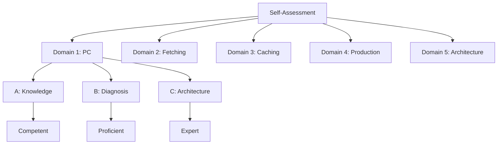

---

### 📶 Gradual Depth

**Level 1 - What it is:**

A self-assessment framework that tests Hibernate mastery across five domains (persistence context, fetching, caching, production, architecture) at three depth levels (knowledge, diagnosis, architecture).

**Level 2 - How to use it:**

Work through each domain sequentially. For each level (A, B, C), attempt to answer without references. Mark completed levels. Gaps indicate areas for focused study.

**Level 3 - How it works:**

Level A tests whether you can explain concepts (knowledge recall). Level B tests whether you can diagnose novel scenarios (pattern recognition + reasoning). Level C tests whether you can make architectural decisions under constraints (judgment + trade-off evaluation).

**Level 4 - Production mastery:**

Complete mastery means you can teach each domain to a junior engineer, handle their follow-up questions, and design solutions for novel problems. The ultimate verification: pair with a junior engineer on a production Hibernate issue and guide them through diagnosis without taking over.

---

### ⚙️ How It Works

**Phase 1 - Self-assessment:**
Attempt all 15 challenges (5 domains x 3 levels) without references. Record which ones you can answer confidently.

**Phase 2 - Gap identification:**
Domains where Level A is incomplete: need study. Domains where Level A passes but Level B fails: need practice with real scenarios.

**Phase 3 - Targeted study:**
For each gap, refer to the corresponding learning ladder keyword. Work through the content. Attempt the challenge again.

**Phase 4 - Validation:**
Pair with a peer. Present your answers. Have them challenge with follow-up questions. If you can answer confidently: mastery confirmed.

```text
  Assessment workflow:
  1. Attempt all 15 challenges (2-3 hours)
  2. Score: 0 (cannot answer),
     1 (partial), 2 (confident)
  3. Identify gaps:
     Score 0-1 on Level A: study needed
     Score 0-1 on Level B: practice needed
     Score 0-1 on Level C: experience needed
  4. Study gaps via learning ladder
  5. Re-assess after 2 weeks
```

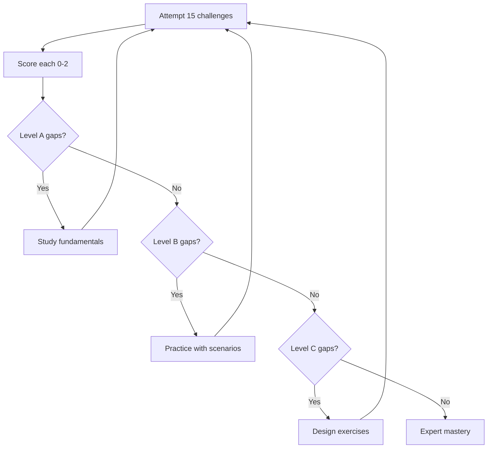

---

### 🚨 Failure Modes

**Failure 1 - Confusing familiarity with mastery:**

**Symptom:** Engineer answers "yes I know that" for every domain but cannot diagnose a novel problem when paired on a production issue.

**Root cause:** Recognition is not recall. Reading about dirty checking is not the same as debugging a flush storm.

**Diagnostic:**

```text
Test: Present a scenario not covered in
the learning material. Can you reason
from first principles to a diagnosis?
Example: "Entity modified in a scheduled
job but changes not saved. Why?"
Mastery answer: "Is the method
@Transactional? Is the entity managed?"
```

**Fix:**

**BAD:**

```java
// Scheduled job: no @Transactional
@Scheduled(fixedRate = 60000)
public void updatePrices() {
    Product p = repo.findById(1L).get();
    p.setPrice(29.99);
    // Changes lost! No managed context.
}
```

**GOOD:**

```java
@Scheduled(fixedRate = 60000)
@Transactional
public void updatePrices() {
    Product p = repo.findById(1L).get();
    p.setPrice(29.99);
    // Dirty check at flush -> UPDATE SQL
}
```

**Failure 2 - Skipping Level A fundamentals:**

**Symptom:** Engineer tries Level C (architecture) without solid Level A (knowledge). Designs are based on misconceptions.

**Root cause:** Jumped to advanced topics without foundational understanding.

**Diagnostic:**

```text
Test: "Explain the four entity states."
If the answer is uncertain or wrong,
Level B and C answers will be unreliable.
Foundation first.
```

**Fix:**

```text
Complete Level A for ALL five domains
before attempting Level B.
Level B requires Level A as foundation.
Level C requires Level B.
```

---

### 🔬 Production Reality

A team uses this verification framework before a critical data layer migration. Three senior developers self-assess. Developer A: all Level A, most Level B, gaps in caching Level C. Developer B: all Level A, gaps in production diagnostics Level B and C. Developer C: gaps in fetching Level A (cannot explain JOIN FETCH vs EntityGraph trade-offs). Assessment reveals: Developer C needs 1 week of focused study before contributing to the migration. Developer B needs practice with production scenarios. Developer A leads the caching design with mentoring on cache invalidation at scale. The assessment prevents assigning tasks to engineers who have not yet mastered the relevant domain.

---

### ⚖️ Trade-offs & Alternatives

| Assessment method  | Accuracy  | Effort | Scalability |
| ------------------ | --------- | ------ | ----------- |
| Self-assessment    | Medium    | Low    | High        |
| Peer verification  | High      | Medium | Medium      |
| Production pairing | Very high | High   | Low         |
| Certification exam | Low       | Low    | High        |
| Code review        | High      | Medium | Medium      |

**Real-world patterns:**

- **Self-assessment + peer verification** provides the best accuracy/effort ratio. Self-assess first, then pair with a peer for challenges you scored 2 (confident) to verify.
- **Production pairing** is the gold standard but only scalable for small teams.

---

### ⚡ Decision Snap

**USE THIS FRAMEWORK WHEN:**

- Before a major data layer project (migration, optimization, redesign).
- Onboarding a new team member to production Hibernate work.
- Self-assessing after completing the Hibernate learning ladder.

**THE SEQUENCE MATTERS:**

- Level A (all domains) -> Level B (all domains) -> Level C (all domains). Do not skip levels.

**REVISIT WHEN:**

- After 6 months to verify retention. After a major Hibernate version upgrade to verify updated knowledge.

---

### ⚠️ Top Traps

| #   | Misconception                                | Reality                                                                                                                                      |
| --- | -------------------------------------------- | -------------------------------------------------------------------------------------------------------------------------------------------- |
| 1   | Passing Level A means mastery                | Level A is competent. Mastery requires Level B (diagnosis) and Level C (architecture). Most production value comes from Level B.             |
| 2   | All five domains are equally important       | Fetching (Domain 2) and Production (Domain 4) are highest-impact. Prioritize these if time is limited.                                       |
| 3   | One assessment is sufficient                 | Knowledge decays. Re-assess every 6 months. Hibernate knowledge gained through reading fades faster than knowledge gained through debugging. |
| 4   | Solo assessment is reliable                  | Self-assessment overestimates competence. Pair verification corrects this. Have a peer challenge your "confident" answers.                   |
| 5   | Expert mastery is required for all engineers | Level A+B (proficient) is sufficient for most production work. Level C (expert) is needed for architecture and design roles.                 |

---

### 🪜 Learning Ladder

**Prerequisites:**

- All Hibernate L0-L4 keywords - foundational knowledge
  for Level A
- Hibernate Deep-Dive Interview Questions - similar
  depth testing

**THIS:** HIB-092 Hibernate Expert Mastery Verification

**Next steps:**

- ORM Data Layer - Phase 4 (Production Hardening) -
  applying mastery in practice
- Hibernate topic architecture keywords (L5+) - deeper
  study for Level C gaps

---

**The Surprising Truth:**

The most reliable predictor of Hibernate mastery is not how many questions you can answer correctly - it is how quickly you can diagnose an unfamiliar problem. An engineer who takes 5 minutes to diagnose "high flush time + 10K entities + read-only endpoint = missing DTO projection or readOnly hint" has deeper mastery than an engineer who can recite all four entity states but takes 2 hours to connect the same dots.

**Further Reading:**

- Dreyfus and Dreyfus, "A Five-Stage Model of the Mental Activities Involved in Directed Skill Acquisition" (1980)
- Vlad Mihalcea, "High-Performance Java Persistence" - comprehensive reference for all domains
- Hibernate ORM User Guide - official reference for architecture and behavior

**Revision Card:**

1. Five domains: Persistence Context, Fetching, Caching, Production, Architecture. Three levels each: Knowledge (A), Diagnosis (B), Architecture (C).
2. Level A = competent, A+B = proficient, A+B+C = expert. Most production value at Level B (diagnosis).
3. Self-assessment overestimates. Pair with a peer. True mastery = diagnose unfamiliar problems from first principles.

---

---

# HIB-093 ORM Data Layer - Phase 4 (Production Hardening)

**TL;DR** - Production hardening applies all Hibernate best practices as a checklist: disable OSIV, add query count assertions, configure connection pool, enable statistics, monitor cache, and enforce DTO projections for read endpoints.

---

### 🔥 Problem Statement

A Hibernate application works in development. Tests pass. The team deploys to production. Under real traffic, N+1 queries surface, connection pools exhaust, flush storms cause latency spikes, and cache hit rates are 10% instead of 90%. The gap between "works in dev" and "works in production" is the production hardening gap. This keyword provides the comprehensive checklist: every configuration, monitoring, and code practice that must be in place before production traffic arrives. It is the final integration of all Hibernate knowledge applied as an engineering discipline.

---

### 📜 Historical Context

Production hardening for ORM layers was historically ad-hoc: teams learned from production incidents and gradually added configurations. The modern approach applies all known best practices proactively. The checklist evolved from post-mortems at scale-up companies where Hibernate production incidents were the most common data layer failure mode. The key realization: every Hibernate production incident maps to one of 10 known patterns, each with a known prevention measure.

---

### 🔩 First Principles

**CORE INVARIANTS:**

1. **Prevention > diagnosis > fix:** Apply all known best practices before production. Diagnose with statistics. Fix only residual issues.
2. **Ten hardening pillars:** OSIV, fetch planning, DTO projections, connection pool, JDBC batching, L2 caching, statistics/monitoring, query count assertions, ID strategy, entity design.
3. **Each pillar is independently verifiable:** Every hardening measure has a metric or assertion that proves it is correctly applied.
4. **Hardening is non-negotiable for production:** These are not optional optimizations. They are required configurations for production-grade Hibernate applications.

**DERIVED DESIGN:**

The checklist is ordered by impact and effort. High-impact, low-effort items first (OSIV disable, statistics enable). Lower-impact or higher-effort items later (L2 caching, entity design review). Each item has a verification step.

**THE TRADE-OFF:**

**Gain:** Production-ready Hibernate application that handles real traffic without performance incidents.

**Cost:** 2-5 days of engineering effort to apply and verify the checklist. Ongoing monitoring effort.

---

### 🧠 Mental Model

> Production hardening is a pre-flight checklist for an aircraft. The plane can fly without it (works in dev). But commercial flight (production) requires every checklist item verified: fuel levels (connection pool), instrument calibration (statistics), flight controls (fetch planning), emergency procedures (monitoring alerts). Skipping the checklist invites the incident you could have prevented.

- "Pre-flight checklist" -> hardening checklist
- "Fuel levels" -> connection pool sizing
- "Instrument calibration" -> statistics/monitoring
- "Flight controls" -> fetch planning/OSIV
- "Emergency procedures" -> alerting

**Where this analogy breaks down:** Unlike aviation, Hibernate hardening can be applied incrementally. You do not need all items before first flight - but you do need them before peak traffic.

---

### 🧩 Components

**The ten hardening pillars:**

1. **OSIV disable:** `spring.jpa.open-in-view=false`
2. **Fetch planning:** JOIN FETCH or EntityGraph for every query that returns entities
3. **DTO projections:** `SELECT new DTO(...)` for all list/search endpoints
4. **Connection pool:** HikariCP configured with leak detection, appropriate size
5. **JDBC batching:** `batch_size=50`, `order_inserts=true`, SEQUENCE strategy
6. **L2 caching:** `@Cacheable` on reference data entities
7. **Statistics/monitoring:** `generate_statistics=true`, Micrometer, Grafana dashboard
8. **Query count assertions:** datasource-proxy in integration tests
9. **ID strategy:** SEQUENCE (not IDENTITY) for batch-capable entities
10. **Entity design:** Only domain objects as entities. Enums, embeddables, DTOs for the rest.

```text
  Hardening checklist:
  +---+------------------+----------+--------+
  | # | Pillar           | Impact   | Effort |
  +---+------------------+----------+--------+
  | 1 | OSIV=false       | Critical | 1 day  |
  | 2 | Fetch planning   | Critical | 2 days |
  | 3 | DTO projections  | High     | 2 days |
  | 4 | Connection pool  | High     | 2 hrs  |
  | 5 | JDBC batching    | Medium   | 2 hrs  |
  | 6 | L2 caching       | Medium   | 1 day  |
  | 7 | Statistics/mon   | Critical | 4 hrs  |
  | 8 | Query assertions | High     | 1 day  |
  | 9 | ID strategy      | Medium   | 2 hrs  |
  |10 | Entity design    | Medium   | 1 day  |
  +---+------------------+----------+--------+
  Total: 3-5 days for a typical application
```

```mermaid
flowchart TD
    A[Production Hardening] --> B[Pillar 1: OSIV=false]
    A --> C[Pillar 2: Fetch planning]
    A --> D[Pillar 3: DTOs]
    A --> E[Pillar 4: Pool config]
    A --> F[Pillar 5: Batching]
    A --> G[Pillar 6: L2 Cache]
    A --> H[Pillar 7: Monitoring]
    A --> I[Pillar 8: Query assertions]
    A --> J[Pillar 9: ID strategy]
    A --> K[Pillar 10: Entity design]
```

---

### 📶 Gradual Depth

**Level 1 - What it is:**

A comprehensive checklist of ten hardening measures that ensure a Hibernate application is production-ready. Each measure prevents a known class of production incident.

**Level 2 - How to use it:**

Apply the checklist sequentially. Each pillar has a configuration, code change, and verification step. Start with critical pillars (OSIV, fetch planning, monitoring). Proceed to high and medium impact pillars.

**Level 3 - How it works:**

Each pillar addresses a specific failure mode: OSIV prevents connection waste, fetch planning prevents N+1, DTOs prevent flush storms, connection pool prevents exhaustion, batching prevents write bottlenecks, caching prevents read bottlenecks, monitoring prevents blind spots, assertions prevent regressions, ID strategy enables batching, entity design reduces complexity.

**Level 4 - Production mastery:**

The checklist is a one-time application per project, but verification is ongoing. Create a Grafana dashboard with key metrics from Pillar 7. Set alerting thresholds. Review metrics weekly for the first month, then monthly. After major features: re-run query count assertions to catch regressions. Quarterly: review entity design for new entities that should be enums/embeddables.

---

### ⚙️ How It Works

**Phase 1 - Foundation (Day 1):**

```properties
# Pillar 1: OSIV
spring.jpa.open-in-view=false
# Pillar 7: Statistics
spring.jpa.properties\
.hibernate.generate_statistics=true
# Pillar 9: ID strategy (verify)
# All entities use @GeneratedValue(SEQUENCE)
```

**Phase 2 - Query optimization (Days 2-3):**

Fix all LazyInitializationExceptions exposed by OSIV disable (Pillar 2). Convert list endpoints to DTO projections (Pillar 3). Add query count assertions (Pillar 8).

**Phase 3 - Infrastructure (Day 4):**

```properties
# Pillar 4: Connection pool
spring.datasource.hikari.maximum-pool-size=20
spring.datasource.hikari\
.leak-detection-threshold=60000
# Pillar 5: Batching
spring.jpa.properties\
.hibernate.jdbc.batch_size=50
spring.jpa.properties\
.hibernate.order_inserts=true
spring.jpa.properties\
.hibernate.order_updates=true
```

**Phase 4 - Caching and monitoring (Day 5):**

Add `@Cacheable` to reference data entities (Pillar 6). Set up Grafana dashboard with Micrometer metrics (Pillar 7). Review entity design (Pillar 10).

```text
  Verification checklist:
  [ ] OSIV: no startup warning
  [ ] Fetch: 0 LazyInitializationExceptions
  [ ] DTOs: list endpoints load 0 entities
  [ ] Pool: hikari.pending == 0 under load
  [ ] Batch: bulk inserts use batch SQL
  [ ] Cache: L2 hit rate > 80% for ref data
  [ ] Stats: Grafana dashboard with alerts
  [ ] Asserts: CI passes with query counts
  [ ] ID: all entities use SEQUENCE
  [ ] Entities: no unnecessary entity classes
```

```mermaid
flowchart LR
    A[Day 1: Foundation] --> B[Day 2-3: Queries]
    B --> C[Day 4: Infrastructure]
    C --> D[Day 5: Cache/Monitor]
    D --> E[Production ready]
    A --> F[OSIV + Stats + ID]
    B --> G[Fetch + DTO + Assert]
    C --> H[Pool + Batch]
    D --> I[Cache + Monitor + Design]
```

---

### 🚨 Failure Modes

**Failure 1 - Incomplete hardening:**

**Symptom:** OSIV disabled and fetch planning done, but no monitoring (Pillar 7). New feature introduces N+1. No alert. Production degrades gradually over weeks.

**Root cause:** Hardening was partial. Without monitoring and CI assertions, regressions go undetected.

**Diagnostic:**

```text
Check: Is generate_statistics=true?
Check: Is Micrometer exporting metrics?
Check: Are query count assertions in CI?
Missing any of these = incomplete hardening.
```

**Fix:**

**BAD:**

```properties
# Partial: no monitoring or assertions
spring.jpa.open-in-view=false
# No way to detect future N+1 regressions
```

**GOOD:**

```properties
# Full: OSIV off + monitoring + CI guard
spring.jpa.open-in-view=false
hibernate.generate_statistics=true
# Add datasource-proxy assertions in CI
```

**Failure 2 - Hardening without measurement:**

**Symptom:** Team applies all configurations but cannot verify improvement. "We think it is faster" but no metrics to prove it.

**Root cause:** No baseline measurement before hardening. No post-hardening metrics comparison.

**Diagnostic:**

```text
Measure BEFORE hardening:
- Queries per request (Statistics)
- P95 latency (APM/logs)
- Connection pool utilization
Measure AFTER each pillar:
- Same metrics
- Compare: improvement quantified
```

**Fix:**

```text
Record baseline metrics. Apply each pillar.
Record metrics after each pillar.
Report: "Pillar 1 (OSIV): P95 -40%,
connection utilization -60%."
```

---

### 🔬 Production Reality

A SaaS platform applies the full hardening checklist before a 5x traffic growth event (product launch). Pre-hardening metrics: 12 queries/request average, P95 250ms, pool utilization 80%. Post-hardening: 3 queries/request, P95 60ms, pool utilization 25%. During the 5x traffic event: P95 reaches 90ms (under SLA of 200ms), pool utilization peaks at 70%. Without hardening at the pre-launch baseline: projected P95 at 5x would have been 1.25 seconds with pool exhaustion at 3x traffic.

---

### ⚖️ Trade-offs & Alternatives

| Approach                       | Risk      | Effort   | Result                   |
| ------------------------------ | --------- | -------- | ------------------------ |
| Full hardening checklist       | Low       | 3-5 days | Production ready         |
| Partial (OSIV + fetch only)    | Medium    | 2 days   | Vulnerable to regression |
| Reactive (fix after incidents) | High      | Ongoing  | Recurring incidents      |
| Replace Hibernate              | Very high | Months   | Often same issues        |

**Real-world patterns:**

- **Proactive teams** apply the full checklist before first production deployment. Total effort: 3-5 days. Zero Hibernate incidents.
- **Reactive teams** spend 1-2 days per incident, recurring monthly, totaling 12-24 days/year on Hibernate problems.

---

### ⚡ Decision Snap

**APPLY THE FULL CHECKLIST WHEN:**

- Before any production deployment of a Hibernate application. Non-negotiable.

**MINIMUM VIABLE HARDENING (if time-constrained):**

- Pillar 1 (OSIV=false), Pillar 2 (fetch planning), Pillar 7 (statistics). These three prevent 70% of incidents.

**COMPLETE ALL TEN WHEN:**

- Application handles > 100 concurrent users. Application has > 10 entities. Application writes data (not read-only).

---

### ⚠️ Top Traps

| #   | Misconception                         | Reality                                                                                                                                 |
| --- | ------------------------------------- | --------------------------------------------------------------------------------------------------------------------------------------- |
| 1   | Hardening is optional optimization    | Hardening prevents known failure modes. It is not optimization - it is engineering discipline, like testing.                            |
| 2   | Configuration changes are enough      | Pillars 2, 3, 8, 10 require code changes (fetch planning, DTOs, assertions, entity design). Configuration alone covers 4 of 10 pillars. |
| 3   | One-time effort, never revisit        | New features add new queries and entities. Without Pillar 7 (monitoring) and Pillar 8 (assertions), hardening decays.                   |
| 4   | All ten pillars are equally important | Pillars 1 (OSIV), 2 (fetch), 7 (monitoring) are critical. Apply these first. Others are high or medium impact.                          |
| 5   | Hardening takes weeks                 | A typical application: 3-5 days for full checklist. The highest-impact items (Pillars 1, 7, 9) take hours, not days.                    |

---

### 🪜 Learning Ladder

**Prerequisites:**

- Hibernate Performance Tuning at Scale - the tuning
  methodology applied here
- Open Session in View - The Silent Scalability Killer -
  Pillar 1 rationale
- Hibernate Tooling - p6spy, datasource-proxy,
  Hypersistence - Pillar 8 implementation

**THIS:** HIB-093 ORM Data Layer - Phase 4 (Production
Hardening)

**Next steps:**

- Hibernate Architecture keywords (L5+) - deeper
  internals for advanced optimization
- Hibernate Expert Mastery Verification - verify
  production readiness

---

**The Surprising Truth:**

The most impactful hardening pillar is not a code change or configuration. It is Pillar 7: monitoring. An application with all nine other pillars applied but no monitoring will eventually regress. An application with imperfect pillar coverage but excellent monitoring will catch and fix issues before they become incidents. The monitoring dashboard is the single most important production artifact for a Hibernate application.

**Further Reading:**

- Vlad Mihalcea, "High-Performance Java Persistence" - comprehensive production Hibernate guide
- Spring Boot documentation - JPA and HikariCP configuration properties
- HikariCP wiki - production configuration recommendations

**Revision Card:**

1. Ten pillars: OSIV, fetch, DTO, pool, batch, cache, monitoring, assertions, ID, entity design. 3-5 days total for a typical application.
2. Minimum viable hardening: OSIV=false + fetch planning + statistics/monitoring. These three prevent 70% of production Hibernate incidents.
3. Hardening without monitoring decays. Pillar 7 (Statistics + Micrometer + Grafana + alerts) is the most important pillar long-term.
