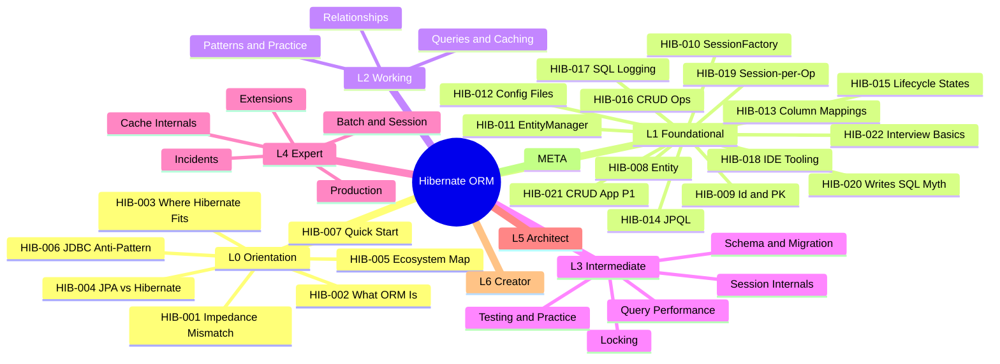

# Hibernate ORM

```text
═══════════════════════════════════════════════════════
CATEGORY:        Hibernate ORM
CODE:            HIB
ARCHETYPE:       FRAMEWORK
MODE:            MODE_NEW
PROVENANCE:      user request via /learn: "hibernate"
TIER:            tier-2-data
FOLDER:          learn/hibernate/
LEVELS:          L0 + L1 + L2 + L3 + L4 + L5 + L6 + META
TOTAL:           115 keywords across 5 sub-topic files
GENERATED_FROM:  LEARN_KEYWORD_GENERATOR.md v1.0
═══════════════════════════════════════════════════════
```

Scope: Hibernate ORM and JPA - from entity mapping basics
to second-level cache internals, bytecode enhancement, and
persistence provider design. Covers JPA specification
compliance with Hibernate-specific extensions. The SQL
language itself is covered in `learn/sql/`. Spring Data JPA
integration is covered in `learn/spring/`. Java language
features are covered in `learn/java/`. Cross-references
appear in Learning Ladder sections.

## Status

Stubs only. Each sub-topic file lists its keywords in YAML
frontmatter. Use `@learn-generate-entries` to fill content
per `LEARN_PROMPT.md` v1.0 (tri-template auto-routing).

## Sub-topic files

| File                                                                                        | Keywords | Levels         | Status |
| ------------------------------------------------------------------------------------------- | -------- | -------------- | ------ |
| [Hibernate - Foundations](Hibernate%20-%20Foundations.md)                                    | 22       | L0 + L1        | stub   |
| [Hibernate - Mappings and Queries](Hibernate%20-%20Mappings%20and%20Queries.md)              | 21       | L2             | stub   |
| [Hibernate - Performance and Internals](Hibernate%20-%20Performance%20and%20Internals.md)    | 28       | L3             | stub   |
| [Hibernate - Production and Diagnostics](Hibernate%20-%20Production%20and%20Diagnostics.md)  | 22       | L4             | stub   |
| [Hibernate - Architecture and META](Hibernate%20-%20Architecture%20and%20META.md)            | 22       | L5 + L6 + META | stub   |

## Keyword table

────────────────────────────────────────────────────
LEVEL 0 - ORIENTATION 🌱 (7 keywords)
────────────────────────────────────────────────────

| ID      | Keyword                                           | Lv | Diff | template | Tags              |
| ------- | ------------------------------------------------- | -- | ---- | -------- | ----------------- |
| HIB-001 | The Object-Relational Impedance Mismatch          | L0 | 🌱   | SIMPLE   | 🎯               |
| HIB-002 | What ORM Is and Why It Exists                     | L0 | 🌱   | SIMPLE   |                   |
| HIB-003 | Where Hibernate Fits (JPA, JDBC, Spring Data)     | L0 | 🌱   | SIMPLE   |                   |
| HIB-004 | JPA vs Hibernate - Specification vs Implementation | L0 | 🌱   | SIMPLE   | 🎯               |
| HIB-005 | Hibernate Ecosystem Map (Core, Validator, Search) | L0 | 🌱   | SIMPLE   |                   |
| HIB-006 | Hand-Rolling JDBC Mapping Anti-Pattern            | L0 | 🌱   | SIMPLE   | ⚠️ anti-minor    |
| HIB-007 | Hibernate Quick Start (Maven/Gradle Setup)        | L0 | 🌱   | SIMPLE   | 🔧 🏋️            |

────────────────────────────────────────────────────
LEVEL 1 - FOUNDATIONAL ★☆☆ (15 keywords)
────────────────────────────────────────────────────

| ID      | Keyword                                                         | Lv | Diff | template | Tags              |
| ------- | --------------------------------------------------------------- | -- | ---- | -------- | ----------------- |
| HIB-008 | Entity and @Entity Annotation                                  | L1 | ★☆☆  | SIMPLE   | 🎯               |
| HIB-009 | @Id and Primary Key Generation Strategies                      | L1 | ★☆☆  | SIMPLE   | 🎯               |
| HIB-010 | SessionFactory and Session (Hibernate Native API)              | L1 | ★☆☆  | SIMPLE   |                   |
| HIB-011 | EntityManager and Persistence Context (JPA API)                | L1 | ★☆☆  | SIMPLE   | 🎯               |
| HIB-012 | persistence.xml and hibernate.cfg.xml                          | L1 | ★☆☆  | SIMPLE   |                   |
| HIB-013 | Basic Column Mappings (@Column, @Table, @Transient)            | L1 | ★☆☆  | SIMPLE   |                   |
| HIB-014 | JPQL Fundamentals                                              | L1 | ★☆☆  | SIMPLE   |                   |
| HIB-015 | Entity Lifecycle States (Transient, Managed, Detached, Removed) | L1 | ★☆☆  | SIMPLE   | 🎯               |
| HIB-016 | Basic CRUD Operations with Hibernate                           | L1 | ★☆☆  | SIMPLE   |                   |
| HIB-017 | Hibernate SQL Logging (show_sql, format_sql)                   | L1 | ★☆☆  | SIMPLE   | 🔧               |
| HIB-018 | IDE Persistence Tooling (JPA Buddy, IntelliJ)                  | L1 | ★☆☆  | SIMPLE   | 🔧               |
| HIB-019 | Session-per-Operation Anti-Pattern                             | L1 | ★☆☆  | SIMPLE   | ⚠️ anti-major    |
| HIB-020 | "Hibernate Writes All Your SQL" is Wrong                       | L1 | ★☆☆  | SIMPLE   | 💥               |
| HIB-021 | Build a JPA CRUD App - Phase 1 (Basics)                        | L1 | ★☆☆  | SIMPLE   | 🏋️ 🔨            |
| HIB-022 | Top 10 Hibernate Interview Questions (Basics)                  | L1 | ★☆☆  | SIMPLE   | 🎯               |

────────────────────────────────────────────────────
LEVEL 2 - WORKING ★★☆ (21 keywords)
────────────────────────────────────────────────────

| ID      | Keyword                                                 | Lv | Diff | template     | Tags              |
| ------- | ------------------------------------------------------- | -- | ---- | ------------ | ----------------- |
| HIB-023 | @ManyToOne and @OneToMany Relationships                 | L2 | ★★☆  | INTERMEDIATE | 🎯               |
| HIB-024 | @ManyToMany and Join Tables                             | L2 | ★★☆  | INTERMEDIATE |                   |
| HIB-025 | @OneToOne and Shared Primary Keys                       | L2 | ★★☆  | INTERMEDIATE |                   |
| HIB-026 | FetchType.LAZY vs FetchType.EAGER                       | L2 | ★★☆  | INTERMEDIATE | 🎯               |
| HIB-027 | CascadeType and Cascade Propagation                     | L2 | ★★☆  | INTERMEDIATE |                   |
| HIB-028 | orphanRemoval vs CascadeType.REMOVE                     | L2 | ★★☆  | INTERMEDIATE |                   |
| HIB-029 | Embeddables (@Embeddable, @Embedded)                    | L2 | ★★☆  | INTERMEDIATE |                   |
| HIB-030 | Inheritance Mapping (SINGLE_TABLE, JOINED, TABLE_PER_CLASS) | L2 | ★★☆ | INTERMEDIATE | 🎯               |
| HIB-031 | Criteria API (JPA CriteriaBuilder)                      | L2 | ★★☆  | INTERMEDIATE |                   |
| HIB-032 | Named Queries (@NamedQuery, @NamedNativeQuery)          | L2 | ★★☆  | INTERMEDIATE |                   |
| HIB-033 | Second-Level Cache Introduction (Ehcache, Caffeine)     | L2 | ★★☆  | INTERMEDIATE |                   |
| HIB-034 | Inheritance Strategy Selection Guide                    | L2 | ★★☆  | INTERMEDIATE | 🧭               |
| HIB-035 | Fetch Strategy Decision (LAZY vs EAGER vs JOIN FETCH)   | L2 | ★★☆  | INTERMEDIATE | 🧭               |
| HIB-036 | Eager Fetching Everywhere Anti-Pattern                  | L2 | ★★☆  | INTERMEDIATE | ⚠️ anti-major    |
| HIB-037 | Bidirectional Mapping Without Sync Methods Anti-Pattern | L2 | ★★☆  | INTERMEDIATE | ⚠️ anti-minor    |
| HIB-038 | Hibernate Validator (Bean Validation Integration)       | L2 | ★★☆  | INTERMEDIATE | 🔧               |
| HIB-039 | Build Relationship Mappings Exercise                    | L2 | ★★☆  | INTERMEDIATE | 🏋️               |
| HIB-040 | Criteria API Query Building Exercise                    | L2 | ★★☆  | INTERMEDIATE | 🏋️               |
| HIB-041 | JPA Relationships App - Phase 2 (Associations)          | L2 | ★★☆  | INTERMEDIATE | 🔨               |
| HIB-042 | Hibernate Interview Essentials - Working Level          | L2 | ★★☆  | INTERMEDIATE | 🎯               |
| HIB-043 | Hibernate Mappings Quick Recall Card                    | L2 | ★★☆  | INTERMEDIATE | 🔁               |

────────────────────────────────────────────────────
LEVEL 3 - INTERMEDIATE ★★☆+ (28 keywords)
────────────────────────────────────────────────────

| ID      | Keyword                                                  | Lv | Diff | template     | Tags              |
| ------- | -------------------------------------------------------- | -- | ---- | ------------ | ----------------- |
| HIB-044 | The N+1 Select Problem                                   | L3 | ★★☆  | INTERMEDIATE | 🎯               |
| HIB-045 | Batch Fetching and @BatchSize                            | L3 | ★★☆  | INTERMEDIATE |                   |
| HIB-046 | Entity Graphs (@EntityGraph, @NamedEntityGraph)          | L3 | ★★☆  | INTERMEDIATE |                   |
| HIB-047 | JOIN FETCH in JPQL and HQL                               | L3 | ★★☆  | INTERMEDIATE |                   |
| HIB-048 | N+1 Queries in Production Anti-Pattern                   | L3 | ★★☆  | INTERMEDIATE | ⚠️ anti-critical |
| HIB-049 | Hibernate Query Performance Tuning                       | L3 | ★★☆  | INTERMEDIATE | ⚡               |
| HIB-050 | HQL Advanced (Subqueries, Projections, Query Hints)      | L3 | ★★☆  | INTERMEDIATE |                   |
| HIB-051 | Dirty Checking and First-Level Cache Internals           | L3 | ★★☆  | INTERMEDIATE | 🎯               |
| HIB-052 | Flush Modes (AUTO, COMMIT, ALWAYS, MANUAL)               | L3 | ★★☆  | INTERMEDIATE |                   |
| HIB-053 | Detached Entity Merge vs Reattach                        | L3 | ★★☆  | INTERMEDIATE |                   |
| HIB-054 | Explain Persistence Context at Every Level               | L3 | ★★☆  | INTERMEDIATE | 🎓               |
| HIB-055 | Optimistic Locking (@Version)                            | L3 | ★★☆  | INTERMEDIATE | 🎯               |
| HIB-056 | Pessimistic Locking (LockModeType)                       | L3 | ★★☆  | INTERMEDIATE |                   |
| HIB-057 | Optimistic vs Pessimistic Locking Decision Guide         | L3 | ★★☆  | INTERMEDIATE | 🧭               |
| HIB-058 | Missing @Version on Concurrent Entities Anti-Pattern     | L3 | ★★☆  | INTERMEDIATE | ⚠️ anti-major    |
| HIB-059 | hibernate.hbm2ddl.auto and Schema Generation            | L3 | ★★☆  | INTERMEDIATE |                   |
| HIB-060 | JPA vs Hibernate-Proprietary Annotations                 | L3 | ★★☆  | INTERMEDIATE | 🔄               |
| HIB-061 | Hibernate 5 to 6 Migration Essentials                    | L3 | ★★☆  | INTERMEDIATE | 🔄               |
| HIB-062 | JPA Specification Compliance and Portability             | L3 | ★★☆  | INTERMEDIATE | 📋               |
| HIB-063 | Hibernate Statistics API and p6spy                       | L3 | ★★☆  | INTERMEDIATE | 🔧               |
| HIB-064 | Second-Level Cache vs Application Cache Decision         | L3 | ★★☆  | INTERMEDIATE | 🧭               |
| HIB-065 | Testing Hibernate Repositories (Testcontainers)          | L3 | ★★☆  | INTERMEDIATE | 🧪               |
| HIB-066 | Monitoring Hibernate in Production                       | L3 | ★★☆  | INTERMEDIATE | 📊               |
| HIB-067 | N+1 Detection and Fix Kata                               | L3 | ★★☆  | INTERMEDIATE | 🏋️               |
| HIB-068 | Locking Strategy Exercise                                | L3 | ★★☆  | INTERMEDIATE | 🏋️               |
| HIB-069 | Hibernate App - Phase 3 (Performance Tuning)             | L3 | ★★☆  | INTERMEDIATE | 🔨               |
| HIB-070 | Hibernate Design Interview Patterns                      | L3 | ★★☆  | INTERMEDIATE | 🎯               |
| HIB-071 | Hibernate L3 Knowledge Self-Assessment                   | L3 | ★★☆  | INTERMEDIATE | 🔁               |

────────────────────────────────────────────────────
LEVEL 4 - EXPERT ★★★ (22 keywords)
────────────────────────────────────────────────────

| ID      | Keyword                                                        | Lv | Diff | template | Tags              |
| ------- | -------------------------------------------------------------- | -- | ---- | -------- | ----------------- |
| HIB-072 | First-Level Cache (Persistence Context) Internals              | L4 | ★★★  | COMPLEX  |                   |
| HIB-073 | Second-Level Cache Regions and Invalidation Strategies         | L4 | ★★★  | COMPLEX  |                   |
| HIB-074 | Bytecode Enhancement and Proxy Generation Internals            | L4 | ★★★  | COMPLEX  |                   |
| HIB-075 | StatelessSession for Bulk and Streaming Operations             | L4 | ★★★  | COMPLEX  |                   |
| HIB-076 | Batch DML and JDBC Batching Internals                          | L4 | ★★★  | COMPLEX  | ⚡               |
| HIB-077 | Multi-Tenancy SPI and Tenant Resolution Strategies             | L4 | ★★★  | COMPLEX  |                   |
| HIB-078 | Hibernate Search - Full-Text Indexing Integration              | L4 | ★★★  | COMPLEX  |                   |
| HIB-079 | Interceptors and EventListener SPI                             | L4 | ★★★  | COMPLEX  |                   |
| HIB-080 | Connection Management and Release Modes                        | L4 | ★★★  | COMPLEX  |                   |
| HIB-081 | Envers - Audit Logging and Entity Versioning                   | L4 | ★★★  | COMPLEX  |                   |
| HIB-082 | Hibernate Production Diagnostics - Slow Query and Flush Storms | L4 | ★★★  | COMPLEX  | 📊               |
| HIB-083 | Hibernate Statistics and SessionMetrics Observability           | L4 | ★★★  | COMPLEX  | 📊               |
| HIB-084 | Hibernate Performance Tuning at Scale                          | L4 | ★★★  | COMPLEX  | ⚡               |
| HIB-085 | The LazyInitializationException Epidemic                       | L4 | ★★★  | COMPLEX  | 🔴               |
| HIB-086 | Open Session in View - The Silent Scalability Killer           | L4 | ★★★  | COMPLEX  | 🔴               |
| HIB-087 | "Hibernate Is Slow" is Wrong - Misuse vs Actual ORM Cost      | L4 | ★★★  | COMPLEX  | 💥               |
| HIB-088 | Entity for Every Table Anti-Pattern                            | L4 | ★★★  | COMPLEX  | ⚠️ anti-major    |
| HIB-089 | Hibernate Tooling - p6spy, datasource-proxy, Hypersistence    | L4 | ★★★  | COMPLEX  | 🔧               |
| HIB-090 | Diagnose and Fix N+1 in a Legacy Codebase (Exercise)          | L4 | ★★★  | COMPLEX  | 🏋️               |
| HIB-091 | Hibernate Deep-Dive Interview Questions                        | L4 | ★★★  | COMPLEX  | 🎯               |
| HIB-092 | Hibernate Expert Mastery Verification                          | L4 | ★★★  | COMPLEX  | 🔁               |
| HIB-093 | ORM Data Layer - Phase 4 (Production Hardening)               | L4 | ★★★  | COMPLEX  | 🔨               |

────────────────────────────────────────────────────
LEVEL 5 - ARCHITECT 🔥 (12 keywords)
────────────────────────────────────────────────────

| ID      | Keyword                                                  | Lv | Diff | template | Tags |
| ------- | -------------------------------------------------------- | -- | ---- | -------- | ---- |
| HIB-094 | ORM vs SQL-First Strategy Decision Framework             | L5 | 🔥   | COMPLEX  | 🧭   |
| HIB-095 | DDD Aggregates and Hibernate Persistence Boundaries      | L5 | 🔥   | COMPLEX  |      |
| HIB-096 | Fleet-Wide Hibernate Governance and Standards            | L5 | 🔥   | COMPLEX  |      |
| HIB-097 | ORM-to-SQL-Builder (jOOQ/Exposed) Migration Strategy    | L5 | 🔥   | COMPLEX  | 🔄   |
| HIB-098 | Hibernate 5 to 6 (Jakarta EE) Migration Path            | L5 | 🔥   | COMPLEX  | 🔄   |
| HIB-099 | CQRS with Hibernate - Read vs Write Model Separation    | L5 | 🔥   | COMPLEX  |      |
| HIB-100 | Multi-Database and Polyglot Persistence Architecture    | L5 | 🔥   | COMPLEX  |      |
| HIB-101 | Hibernate in Microservices vs Monolith Decision Guide   | L5 | 🔥   | COMPLEX  | 🧭   |
| HIB-102 | Staff-Level ORM Interview Scenarios                      | L5 | 🔥   | COMPLEX  | 🎯   |
| HIB-103 | Teaching Hibernate - Why Juniors Struggle with ORM      | L5 | 🔥   | COMPLEX  | 🎓   |
| HIB-104 | ORM Data Layer - Phase 5 (Platform Strategy)            | L5 | 🔥   | COMPLEX  | 🔨   |
| HIB-105 | Build vs Extend vs Replace ORM Decision Guide           | L5 | 🔥   | COMPLEX  | 🧭   |

────────────────────────────────────────────────────
LEVEL 6 - CREATOR 🔬 (6 keywords)
────────────────────────────────────────────────────

| ID      | Keyword                                                  | Lv | Diff | template | Tags |
| ------- | -------------------------------------------------------- | -- | ---- | -------- | ---- |
| HIB-106 | JPA Specification Internals and Metamodel API            | L6 | 🔬   | COMPLEX  |      |
| HIB-107 | Writing a Custom Hibernate Dialect                        | L6 | 🔬   | COMPLEX  |      |
| HIB-108 | Hibernate SPI Extensions and Custom UserTypes             | L6 | 🔬   | COMPLEX  |      |
| HIB-109 | Persistence Provider Design - How an ORM Is Built        | L6 | 🔬   | COMPLEX  |      |
| HIB-110 | Hibernate Source Code Architecture and Bootstrap Sequence | L6 | 🔬   | COMPLEX  |      |
| HIB-111 | Unit of Work and Identity Map - Foundational ORM Patterns | L6 | 🔬   | COMPLEX  |      |

────────────────────────────────────────────────────
META - META-SKILLS 🧠 (4 keywords)
────────────────────────────────────────────────────

| ID      | Keyword                                                    | Lv   | Diff | template | Tags |
| ------- | ---------------------------------------------------------- | ---- | ---- | -------- | ---- |
| HIB-112 | What Database Engine Internals Teach ORM Users             | META | 🧠   | COMPLEX  |      |
| HIB-113 | What Compiler Pipeline Design Teaches Query Optimization   | META | 🧠   | COMPLEX  |      |
| HIB-114 | Identity Map as CPU Cache - Cross-Domain Memory Hierarchy  | META | 🧠   | COMPLEX  |      |
| HIB-115 | Impedance Mismatch as a Universal Integration Problem      | META | 🧠   | COMPLEX  |      |

<!-- ROADMAP-TREE:START -->

## Roadmap

```text
ROADMAP TREE - Hibernate ORM
===========================================================
L0 Orientation
 +-- HIB-001 Impedance Mismatch
 +-- HIB-002 What ORM Is
 +-- HIB-003 Where Hibernate Fits
 +-- HIB-004 JPA vs Hibernate
 +-- HIB-005 Ecosystem Map
 +-- HIB-006 Hand-Rolling JDBC Anti
 +-- HIB-007 Quick Start
L1 Foundational
 +-- HIB-008 @Entity
 +-- HIB-009 @Id and PK Strategies
 +-- HIB-010 SessionFactory/Session
 +-- HIB-011 EntityManager
 +-- HIB-012 persistence.xml
 +-- HIB-013 Column Mappings
 +-- HIB-014 JPQL Fundamentals
 +-- HIB-015 Lifecycle States
 +-- HIB-016 CRUD Operations
 +-- HIB-017 SQL Logging
 +-- HIB-018 IDE Tooling
 +-- HIB-019 Session-per-Op Anti
 +-- HIB-020 Hibernate Writes SQL
 +-- HIB-021 JPA CRUD App Phase 1
 +-- HIB-022 Interview Basics
L2 Working
 +-- HIB-023..043 (21 keywords)
L3 Intermediate
 +-- HIB-044..071 (28 keywords)
L4 Expert
 +-- HIB-072..093 (22 keywords)
L5 Architect
 +-- HIB-094..105 (12 keywords)
L6 Creator
 +-- HIB-106..111 (6 keywords)
META
 +-- HIB-112..115 (4 keywords)
```



<!-- ROADMAP-TREE:END -->
