## Keywords

1. [Concurrency Architecture Workshop](#concurrency-architecture-workshop)
2. [Java Concurrency Staff-Level Interview Scenarios](#java-concurrency-staff-level-interview-scenarios)
3. [JMM Formal Semantics (Manson, Pugh, Adve 2005)](#jmm-formal-semantics-manson-pugh-adve-2005)
4. [Project Loom Design Rationale](#project-loom-design-rationale)
5. [Designing a Scheduler from First Principles](#designing-a-scheduler-from-first-principles)
6. [The ABA Problem and Solutions](#the-aba-problem-and-solutions)

---

---

# Concurrency Architecture Workshop

**TL;DR** - A structured exercise where teams design concurrent systems from requirements, evaluating thread models, synchronization strategies, failure modes, and observability - building architectural reasoning rather than API knowledge.

### 🔥 Problem Statement

Engineers know individual concurrency APIs (locks, pools, futures) but cannot compose them into a coherent architecture. Given a requirement ("build a rate limiter handling 100K req/s across 20 instances"), they reach for familiar tools without evaluating alternatives, identifying failure modes, or planning observability. Architecture workshops bridge the gap between knowing APIs and designing systems that survive production.

### 📜 Historical Context

Kata-style exercises (coding dojos, 2000s) focused on algorithmic skill. Architecture katas (Neal Ford, 2010s) introduced design-level exercises. Concurrency-specific workshops emerged from incident retrospectives: teams realized production failures came from design mistakes (wrong synchronization model, missing backpressure) rather than implementation bugs. The workshop format forces design decisions before code, preventing "code first, debug forever."

### 🔩 First Principles

**CORE INVARIANTS:**

1. Every concurrent system must answer: what is shared? what is mutable? what is the contention pattern?
2. Architecture decisions (thread model, sync strategy) are expensive to change after implementation - they must be evaluated upfront.
3. Every synchronization choice creates a failure mode. The architecture must identify failure modes before they occur in production.

**DERIVED DESIGN:**
Invariant 1 drives the workshop's first step (identify shared mutable state). Invariant 2 forces written evaluation of alternatives before coding. Invariant 3 requires failure mode analysis as a workshop output.

**THE TRADE-OFF:**
**Gain:** Reduced production incidents, shared team vocabulary, architectural reasoning skill.
**Cost:** Time investment (2-4 hours per session). Requires experienced facilitator. Findings are context-specific.

### 🧠 Mental Model

> A concurrency architecture workshop is a flight simulator for distributed systems. Pilots train for emergencies in simulators (not real aircraft) because real failures are expensive. Engineers train for concurrency failures in workshops (not production) because real incidents are expensive.

- "Flight simulator" -> workshop (safe environment)
- "Emergency scenarios" -> failure mode analysis
- "Pilot training" -> architectural decision-making under constraints
- "Real aircraft" -> production system

**Where this analogy breaks down:** workshops are collaborative (team), simulators are individual. Workshop outputs are documents, not reflexive skills.

### 🧩 Components

- **Problem statement** - Real-world scenario with constraints: throughput, latency SLA, instance count, failure tolerance.
- **Shared state analysis** - Identify what is shared, what is mutable, what the access pattern is (read-heavy, write-heavy, mixed).
- **Thread model selection** - Platform threads + pool, virtual threads, reactive, actor model - with justification.
- **Synchronization strategy** - Locking strategy, concurrent data structures, message passing, immutability - matched to contention pattern.
- **Failure mode catalog** - Named failures with symptoms, causes, detection, mitigation.
- **Observability plan** - What metrics/events surface each failure mode.

```text
Workshop Structure (3 hours):

[30m] Problem Brief + Constraints
  |
[45m] Individual/Pair Design (diverge)
  |
[30m] Present Designs (3-4 teams)
  |
[45m] Failure Mode Analysis (converge)
  |
[30m] Observability + Decision Record
```

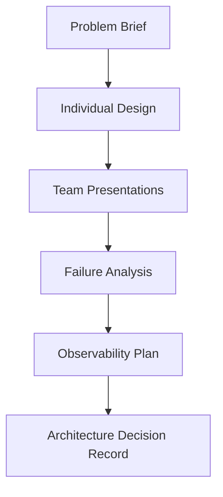

### 📶 Gradual Depth

**Level 1 - What it is:**
A team exercise where engineers design concurrent systems on paper before coding, identifying threading models, sync strategies, and failure modes.

**Level 2 - How to use it:**
Pick a real problem (rate limiter, cache, event processor). Set constraints (throughput, latency, instances). Teams design independently (45m), present alternatives, then collectively analyze failure modes. Output: Architecture Decision Record (ADR).

**Level 3 - How it works:**
The facilitator provides progressively harder constraints (what if latency doubles? what if one instance fails? what if load 10x?). Each constraint forces re-evaluation of the design. Teams discover failure modes they would not have found through implementation alone. The comparison of different team solutions reveals trade-offs that no single design exposes.

**Level 4 - Production mastery:**
Use real incidents as workshop inputs ("last quarter's OOM was caused by unbounded queues - redesign the system"). Track workshop-identified risks against actual incidents (how many predicted vs. surprised?). Build a failure mode library from workshop outputs. Run quarterly with increasing complexity. Measure: time-to-diagnosis decreases, incident count decreases.

### ⚙️ How It Works

**Phase 1 - Problem Framing:** Facilitator presents scenario. Example: "Design a distributed rate limiter: 100K req/s global, 20 instances, 50ms P99 for rate-check, must survive instance failure."

**Phase 2 - Design Divergence:** Pairs/individuals sketch architecture: thread model, data structure, sync mechanism, cross-instance communication.

**Phase 3 - Design Convergence:** Teams present. Facilitator probes: "What happens if Redis is partitioned?" "What if GC pauses 2s on one instance?" "What if load goes to 1M req/s?"

**Phase 4 - Failure Catalog:** Collectively enumerate failure modes for each design. Rank by severity x probability.

**Phase 5 - Decision Record:** Write ADR: chosen approach, rejected alternatives with reasons, identified risks with mitigations.

**BAD:**

```java
// Workshop output: API-level answer only
// "Use ConcurrentHashMap for the rate limiter"
// No justification, no failure modes, no alternatives
class RateLimiter {
    ConcurrentHashMap<String, AtomicInteger> counts;
    boolean allow(String key) {
        return counts.computeIfAbsent(key,
            k -> new AtomicInteger(0))
            .incrementAndGet() < limit;
    }
}
```

Why it's wrong: no thread model reasoning, no failure analysis, no scale consideration. This is code, not architecture.

**GOOD:**

```java
// Workshop output: architecture decision
// Thread model: Virtual threads (I/O-bound checks)
// Sync: Local sliding window + async Redis sync
// Failure: Redis partition -> local-only (over-admit
//   bounded by sync interval * local rate)
// Scale: shard by key prefix at >500K req/s
class RateLimiter {
    // Local check: O(1), no network
    SlidingWindow local;
    // Async sync: bounded staleness
    ScheduledExecutorService syncer;
}
```

Why it's right: documents WHY (thread model), WHAT FAILS (partition), and WHEN TO CHANGE (scale threshold).

```text
Example Designs Compared:

Design A: Local token bucket + Redis sync
  + Low latency (local check)
  - Inconsistent (stale sync)
  Failure: Redis partition -> over-admit

Design B: Central Redis INCR per window
  + Consistent (single source)
  - Redis latency per request
  Failure: Redis down -> fail-open or fail-closed?

Design C: Sliding window in ConcurrentHashMap
  + Zero external dependency
  - Per-instance only (not global)
  Failure: Instance restart -> window lost
```

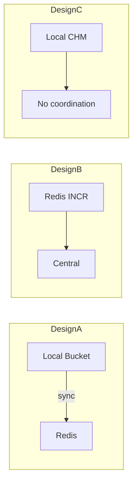

### 🚨 Failure Modes

**Failure 1 - Workshop Produces API-Level Not Architecture-Level Output:**
**Symptom:** Output is "use ConcurrentHashMap + ReentrantLock" without justification or failure analysis.
**Root cause:** Problem statement too narrow or participants lack architectural framing skills.
**Diagnostic:**

```
# Review output: does it contain?
# 1. Thread model justification (WHY this model)
# 2. Failure modes (WHAT breaks)
# 3. Alternatives considered (WHAT was rejected)
# If missing -> facilitation issue
```

**Fix:** Require structured output template. Force "alternatives rejected + reason" section. Add explicit "what fails?" round after each design presentation.

**Failure 2 - Group Convergence Bias:**
**Symptom:** All teams produce nearly identical designs. No alternatives explored.
**Root cause:** Senior engineer spoke first; others anchored to their design.
**Diagnostic:**

```
# Count distinct approaches across teams.
# If <= 1 unique approach with >3 teams -> bias.
```

**Fix:** Silent individual design phase (no discussion) before any sharing. Present in random order. Facilitator explicitly plays devil's advocate against the dominant design.

### 🔬 Production Reality

**Incident pattern: workshop-identified vs. production-discovered failures.**

A payments team ran a concurrency workshop designing a deduplication service. Workshop identified: "if Redis failover occurs during dedup check, duplicate payments process." Team added DB-level unique constraint as fallback. Three months later: Redis failover in production. Dedup missed 12 requests. DB constraint caught all 12. Zero duplicate payments. Without the workshop insight, the DB constraint would not have existed. Cost of workshop: 3 hours. Cost of prevented incident: estimated $50K in duplicate refunds.

### ⚖️ Trade-offs & Alternatives

| Aspect            | Architecture Workshop | Code Review Only  | Incident Retrospective | Design Doc Review |
| ----------------- | --------------------- | ----------------- | ---------------------- | ----------------- |
| Timing            | Before implementation | After code        | After incident         | Before code       |
| Failure discovery | Proactive             | Limited           | Reactive               | Moderate          |
| Team learning     | High (collaborative)  | Low (individual)  | High (post-mortem)     | Medium            |
| Time investment   | 3-4 hours             | 30-60 min         | 2-3 hours              | 1-2 hours         |
| Coverage          | Broad (alternatives)  | Narrow (one impl) | Narrow (one failure)   | Medium            |

### ⚡ Decision Snap

**USE workshops WHEN:**

- Building new concurrent infrastructure (rate limiters, caches, event processors).
- Team has experienced one or more concurrency-related incidents.
- Multiple viable architectures exist (workshop reveals trade-offs).

**AVOID WHEN:**

- Problem is well-solved with standard patterns (no design ambiguity).
- Team is too small for multiple design perspectives (<3 engineers).

**PREFER design doc review WHEN:**

- Time-constrained and architecture is mostly predetermined.
- Need written artifact for compliance/audit.

### ⚠️ Top Traps

| #   | Misconception                            | Reality                                                                                     |
| --- | ---------------------------------------- | ------------------------------------------------------------------------------------------- |
| 1   | "Workshops are theoretical exercises"    | Use REAL problems. Outputs become ADRs that guide implementation.                           |
| 2   | "Senior engineers do not need workshops" | Senior engineers benefit most: they reveal blind spots in each other's designs.             |
| 3   | "One workshop is enough"                 | Run quarterly with escalating complexity. Skills atrophy. New team members need onboarding. |
| 4   | "The best design always wins"            | Best design FOR CONTEXT wins. Constraints change the optimal answer.                        |
| 5   | "Workshop output is the architecture"    | Output is a STARTING POINT. Production reality will require adaptation.                     |

### 🪜 Learning Ladder

**Prerequisites:**

- Concurrency Strategy - Reactive vs Loom vs Pool - alternative models
- Fleet Thread Pool Standardization - fleet constraints
- Concurrency Utilities Selection Framework - API-level choices

**THIS:** Concurrency Architecture Workshop

**Next steps:**

- Concurrency Specification Writing - formalizing workshop outputs
- Concurrency Observability Platform Design - monitoring the architecture
- Back-Pressure Architecture Patterns - common workshop topic

### 💡 Surprising Truth

**The Surprising Truth:**
The most valuable workshop output is NOT the chosen architecture - it is the REJECTED alternatives with documented reasons. When requirements change 6 months later, teams can revisit rejected designs without re-deriving from scratch. Organizations that archive workshop alternatives resolve "should we redesign?" questions in hours instead of weeks.

**Further Reading:**

- Neal Ford, "Architectural Katas" (fundamentalsofsoftwarearchitecture.com)
- Michael Nygard, "Release It!" (pragmatic architecture patterns)
- ADR (Architecture Decision Records) format specification (adr.github.io)

**Revision Card:**

1. Workshop value: proactive failure discovery, shared vocabulary, alternatives documented.
2. Output must include: thread model justification, failure catalog, rejected alternatives with reasons.
3. The rejected designs are the most valuable artifact - they save weeks when requirements change.

---

---

# Java Concurrency Staff-Level Interview Scenarios

**TL;DR** - Staff-level concurrency interviews test architectural reasoning, failure mode analysis, and trade-off navigation under constraints - not API memorization or puzzle solving.

### 🔥 Problem Statement

A senior engineer interviewing for staff-level fails despite deep API knowledge. They can implement a concurrent queue from scratch but cannot answer: "Your service's P99 jumped 5x. Thread dumps show 80% of threads WAITING on a single lock. Walk me through diagnosis and three architectural solutions ranked by effort and impact." Staff interviews assess system thinking, not implementation skill. Without structured preparation, even experienced engineers under-perform.

### 📜 Historical Context

Early concurrency interviews (2000s): "implement a thread-safe singleton" or "what's the difference between wait and sleep?" These tested knowledge, not engineering judgment. FAANG interviews evolved (2015+) toward system design with concurrency constraints. Staff-level interviews (2020+) specifically probe: architectural trade-offs, failure mode reasoning, migration strategies, and observability design. The shift reflects that staff engineers rarely implement locks but frequently choose threading architectures.

### 🔩 First Principles

**CORE INVARIANTS:**

1. Staff-level answers demonstrate REASONING (why this choice over alternatives) not just knowledge (what this API does).
2. Every architectural proposal must include failure modes and mitigations - unqualified proposals signal senior, not staff, thinking.
3. Scale awareness is mandatory: answers must address what changes at 10x, 100x, 1000x the current load.

**DERIVED DESIGN:**
Invariant 1 forces: structured answers with "considered alternatives" and "rejected because." Invariant 2 forces: "failure mode" section in every proposal. Invariant 3 forces: explicit "at scale" discussion showing awareness of non-linear effects.

**THE TRADE-OFF:**
**Gain:** Demonstrates architectural maturity, earns staff-level credibility, shows production experience.
**Cost:** Requires broader knowledge than implementation interviews. Preparation spans systems design, not just concurrency APIs.

### 🧠 Mental Model

> A staff-level interview is an architecture review, not a coding exam. The interviewer is your VP of Engineering asking: "Should we migrate to virtual threads? What are the risks? What is the rollout plan? How do we know it is working?" Your answer must satisfy someone who allocates engineering quarters based on your recommendation.

- "VP asking" -> interviewer evaluating architectural judgment
- "Allocating quarters" -> the weight of staff-level decisions
- "Risks + rollout + validation" -> failure modes + migration + observability

**Where this analogy breaks down:** interviews are time-bounded (45m); real architecture reviews span weeks.

### 🧩 Components

- **Scenario framing** - Open-ended problem with constraints: scale, SLA, team size, timeline.
- **Architecture proposal** - Thread model, sync strategy, data flow. Justified with trade-offs.
- **Failure mode analysis** - Named failures for the proposed architecture. Detection and mitigation for each.
- **Scale reasoning** - Explicit: "at 10x load, this changes because..." and "at 100x, we would need..."
- **Alternatives considered** - At least 2 rejected approaches with reasons. Shows breadth.
- **Migration/rollout plan** - Not "deploy and pray" but phased, measured, reversible.

```text
Staff Answer Structure:

1. Restate/clarify constraints (30s)
2. Propose architecture (2-3 min)
3. Walk through failure modes (2-3 min)
4. Discuss scale (1-2 min)
5. Name alternatives and why rejected (1-2 min)
6. Describe rollout/measurement (1-2 min)
```

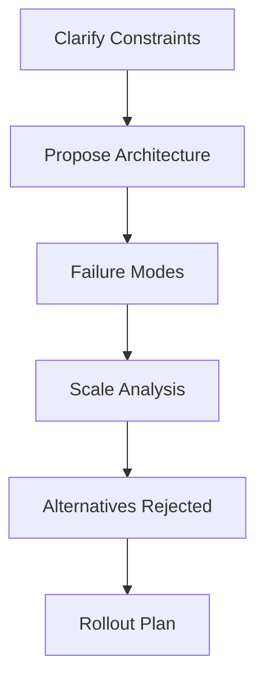

### 📶 Gradual Depth

**Level 1 - What it is:**
Interview scenarios that test whether you can architect concurrent systems under real-world constraints, not just implement concurrency primitives.

**Level 2 - How to use it:**
Practice scenario-based questions: "Design a rate limiter for 100K req/s across 20 instances." Structure answers as: propose -> fail -> scale -> alternatives -> rollout. Time yourself (10 min per scenario).

**Level 3 - How it works:**
Interviewers evaluate: (a) Do you identify the key concurrency challenges? (b) Do you choose appropriate thread models? (c) Do you proactively surface failure modes? (d) Do you reason about scale transitions? (e) Do you show awareness of alternatives? Each dimension maps to staff-level expectations.

**Level 4 - Production mastery:**
Build a personal catalog of 5-7 "war stories" where you made concurrency architecture decisions. Each story: context, decision, alternatives rejected, outcome, what you would do differently. Stories demonstrate experience more powerfully than hypothetical answers. Reference real technologies, real failure modes, real metrics.

### ⚙️ How It Works

**Phase 1 - Problem Received:** "Your payment service handles 10K TPS. Downstream fraud check adds 500ms latency. Timeouts cascade. Thread pool saturates. Design the fix."

**Phase 2 - Constraint Clarification:** "Current pool size? SLA for payment response? Can we drop fraud check on overload? Is fraud check idempotent?"

**Phase 3 - Architecture Proposal:** "Circuit breaker with fallback. Dedicated pool for fraud checks (isolated from payment flow). Async fraud check with CompletableFuture. Timeout: 200ms. Fallback: allow payment, queue for async fraud review."

**Phase 4 - Failure Analysis:** "If fraud-check pool saturates: queue fills, rejects. Rejection policy: CallerRunsPolicy slows the caller (backpressure). If circuit opens: all payments proceed without fraud check (business risk). Mitigation: alert on circuit-open rate. Auto-close after 30s."

**Phase 5 - Scale Discussion:** "At 100K TPS: single fraud service is bottleneck. Solution: partition by merchant-id, multiple fraud instances. Pool per partition. At 1M TPS: move to event-driven (Kafka) for fraud check - decouple entirely."

```text
Evaluation Matrix (what interviewers score):

  [x] Identified concurrency bottleneck?
  [x] Proposed bounded solution (not "add threads")?
  [x] Named failure modes proactively?
  [x] Discussed scale transitions?
  [x] Mentioned alternatives and trade-offs?
  [x] Proposed measurement/observability?
  [ ] Mentioned rollout strategy?

Score: 6/7 = strong staff signal
```

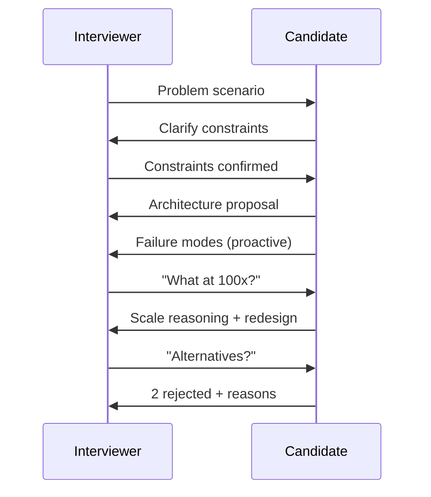

### 🚨 Failure Modes

**Failure 1 - API-Level Answer to Architecture Question:**
**Symptom:** Candidate answers "use ConcurrentHashMap" when asked "design a distributed cache with consistency guarantees."
**Root cause:** Preparation focused on API knowledge, not architectural reasoning.
**Diagnostic:**

```
# Self-check: does my answer include:
# 1. WHY this choice (not just WHAT)
# 2. What FAILS with this approach
# 3. What ALTERNATIVES were rejected
# If <2 of 3: answer is too implementation-level
```

**Fix:**

**BAD:**

```text
Q: "Handle 100K concurrent requests"
A: "Use Executors.newFixedThreadPool(200)"
   (API-level, no reasoning)
```

**GOOD:**

```text
Q: "Handle 100K concurrent requests"
A: "Virtual threads for I/O-bound (JDK 21+). If
    CPU-bound: ForkJoinPool sized to cores. If
    mixed: separate pools (bulkhead). Backpressure
    via bounded queue + CallerRunsPolicy.
    At 100K: monitor carrier-thread utilization.
    Failure: pinning if libraries use synchronized.
    Mitigation: JFR VirtualThreadPinned events."
```

**Failure 2 - Missing Scale Transitions:**
**Symptom:** Candidate proposes design that works at current scale but breaks at 10x. Interviewer probes "what at 10x?" - candidate has no answer.
**Root cause:** Did not practice reasoning about non-linear scaling effects.
**Diagnostic:**

```
# For every proposal, ask yourself:
# At 10x: does the bottleneck change?
# At 100x: does the architecture change?
# At 1000x: does the entire model change?
```

**Fix:** Explicitly state: "This design works to ~50K TPS. At 100K: we would need to partition. At 1M: event-driven architecture replaces request-response."

### 🔬 Production Reality

**Incident pattern: interview question derived from real production failure.**

Scenario given in interview: "Payments P99 latency spiked from 50ms to 2s. What is your diagnosis process?" Strong staff answer: "1. Check thread pool utilization (are threads saturated?). 2. Check downstream latency (did a dependency slow down?). 3. Cross-reference with GC logs (long pause?). 4. Check lock contention (JFR). In my experience at [previous company], similar symptom was downstream timeout + unbounded queue. Pool saturated, queue grew unbounded, latency = queue_depth \* service_time. Fix: bounded queue + circuit breaker." This answer demonstrates diagnostic reasoning, production experience, and systematic approach.

### ⚖️ Trade-offs & Alternatives

| Aspect            | Staff Scenario Interview | Coding Interview      | System Design Interview | Take-Home Project   |
| ----------------- | ------------------------ | --------------------- | ----------------------- | ------------------- |
| Tests             | Reasoning + trade-offs   | Implementation        | Breadth                 | Code quality        |
| Time              | 45-60 min                | 45-60 min             | 45-60 min               | 4-8 hours           |
| Concurrency depth | Deep (failure modes)     | Surface (correctness) | Medium (architecture)   | Variable            |
| False negative    | Quiet engineers          | Whiteboard anxiety    | Poor communicators      | Time-constrained    |
| Signal quality    | High for staff           | High for SDE2         | High for design skill   | High for code craft |

### ⚡ Decision Snap

**USE scenario prep WHEN:**

- Interviewing for staff/principal roles.
- Expected to make architecture decisions, not just implement.
- Organization values production experience and failure reasoning.

**AVOID WHEN:**

- Interviewing for implementation-focused roles (SDE1/SDE2).
- Interview format is purely algorithmic.

**PREFER coding prep WHEN:**

- Interview explicitly tests implementation (build a thread pool).
- You need to demonstrate code correctness under time pressure.

### ⚠️ Top Traps

| #   | Misconception                          | Reality                                                                                          |
| --- | -------------------------------------- | ------------------------------------------------------------------------------------------------ |
| 1   | "Deep API knowledge = staff readiness" | Staff interviews test judgment, not knowledge. Know WHY, not just WHAT.                          |
| 2   | "One perfect answer exists"            | Multiple valid architectures exist. Show you EVALUATED alternatives, not that you memorized one. |
| 3   | "Mention every technology you know"    | Depth > breadth. One well-reasoned proposal > five name-drops.                                   |
| 4   | "Failure modes are a negative signal"  | PROACTIVELY naming failures shows maturity. Interviewers WANT to hear failure analysis.          |
| 5   | "Production stories are bragging"      | Stories demonstrate experience. "In my experience..." is the most powerful staff phrase.         |

### 🪜 Learning Ladder

**Prerequisites:**

- Concurrency Strategy - Reactive vs Loom vs Pool - architecture options
- Concurrency Observability Platform Design - monitoring expertise
- Fleet Thread Pool Standardization - fleet-level thinking

**THIS:** Java Concurrency Staff-Level Interview Scenarios

**Next steps:**

- Concurrency Architecture Workshop - practice format
- Concurrency Specification Writing - formalizing decisions
- Back-Pressure Architecture Patterns - common interview topic

### 💡 Surprising Truth

**The Surprising Truth:**
The strongest staff-level signal in concurrency interviews is not the proposed solution - it is the candidate proactively naming a failure mode that the interviewer had not considered. This demonstrates that the candidate thinks beyond the happy path at a level the interviewer respects. Interviewers frequently report that "they taught me something" is their strongest hire signal for staff.

**Further Reading:**

- Will Larson, "Staff Engineer: Leadership beyond the management track" (2021)
- Tanya Reilly, "The Staff Engineer's Path" (2022)
- Gergely Orosz, "The Pragmatic Engineer: Interviewing" (newsletter series)

**Revision Card:**

1. Structure: propose -> fail -> scale -> alternatives -> rollout. Not: "use X."
2. Proactively surface failure modes. This is the strongest staff signal.
3. Build 5-7 personal war stories with: context, decision, alternatives, outcome, what you'd change.

---

---

# JMM Formal Semantics (Manson, Pugh, Adve 2005)

**TL;DR** - JSR 133 formalizes happens-before rules governing cross-thread write visibility, making concurrent Java portable across hardware memory models.

### 🔥 Problem Statement

A program writes a field on thread A and reads it on thread B. On x86 (strong memory model): the read always sees the write. On ARM/POWER (weak model): the read may see stale data. Without formal semantics, the same Java program behaves differently on different hardware. Developers cannot reason about correctness portably. The JMM formalizes which optimizations compilers and hardware may perform, giving developers a contract they can rely on regardless of platform.

### 📜 Historical Context

Original JMM (JDK 1.0, 1995): overly strict, prohibited optimizations compilers needed. Also had bugs (final fields could be seen uninitialized). JSR 133 (initiated 2001, incorporated JDK 5, 2004): complete redesign by Jeremy Manson, Bill Pugh, and Sarita Adve. Published as "The Java Memory Model" (POPL 2005). Goals: (1) provide safety guarantees for correctly synchronized programs, (2) provide minimal guarantees for incorrectly synchronized programs (no out-of-thin-air values), (3) allow aggressive optimization. The paper proved DRF (Data Race Freedom) guarantee: if a program has no data races, it behaves sequentially consistent.

### 🔩 First Principles

**CORE INVARIANTS:**

1. The happens-before relation defines visibility: if action A happens-before action B, then A's effects are visible to B.
2. A data race exists when two threads access the same variable, at least one is a write, and there is no happens-before between them.
3. Data-race-free programs are guaranteed sequential consistency (DRF guarantee). Programs with races have weaker (but defined) guarantees.

**DERIVED DESIGN:**
Invariant 1 means: programmers need only reason about happens-before edges (not hardware-specific reorderings). Invariant 2 gives a precise definition of "thread-safe." Invariant 3 provides the fundamental contract: synchronize correctly, and the JMM guarantees sequential consistency. Synchronize incorrectly, and only minimal guarantees hold (no out-of-thin-air, type safety preserved).

**THE TRADE-OFF:**
**Gain:** Portable concurrent programs. Developers reason about happens-before, not hardware. Compilers/hardware optimize freely within the model.
**Cost:** Formal model is complex (causality requirements, commit sequences). Reasoning about data races is non-trivial. Model has known imperfections (causality cycles debate).

### 🧠 Mental Model

> The JMM is a contract between the programmer and the JVM. The programmer promises: "I will synchronize all shared mutable accesses with happens-before edges." The JVM promises: "If you keep your promise, I guarantee your program behaves as if all operations happen in a single, sequential order (sequential consistency)." If the programmer breaks the promise (data race): the JVM provides weaker guarantees (no crashes, no security holes, but possibly surprising values).

- "Contract" -> JMM specification
- "Programmer's promise" -> data race freedom
- "JVM's guarantee" -> sequential consistency
- "Broken promise" -> data race, weaker semantics

**Where this analogy breaks down:** contracts are binary (broken/kept); real programs may have races in non-critical paths that are acceptable.

### 🧩 Components

- **Happens-before relation** - Partial order over actions. Key edges: program order (within thread), monitor lock/unlock, volatile write/read, thread start/join, final field freeze.
- **Synchronization actions** - lock, unlock, volatile read, volatile write, thread start, thread join. These CREATE happens-before edges.
- **Data race** - Two conflicting accesses (same variable, at least one write) not ordered by happens-before.
- **Sequential consistency** - Execution appears as if all actions occur in a single total order consistent with program order.
- **Causality requirements** - Rules preventing "out-of-thin-air" values. Actions must be justifiable by a causal chain of committed actions.
- **Final field semantics** - Guarantee that correctly constructed objects have their final fields visible to all threads without synchronization.

```text
Happens-Before Edges (key rules):

  Thread A              Thread B
  --------              --------
  x = 42;
  lock(m);
  unlock(m);
                     lock(m);    <- HB edge
                     read x;     <- sees 42
                     unlock(m);

  volatile_write(v);
                     volatile_read(v); <- HB edge
                     read x;       <- sees all writes
                                      before vol_write
```

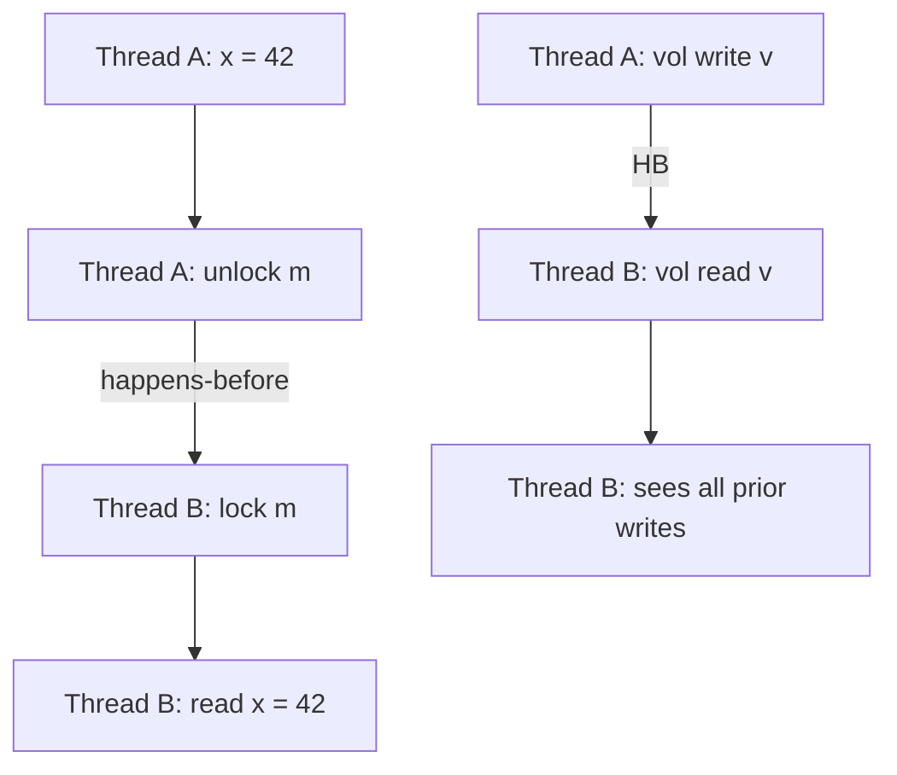

### 📶 Gradual Depth

**Level 1 - What it is:**
The formal rules defining when one thread's write becomes visible to another thread's read. Based on the happens-before partial order.

**Level 2 - How to use it:**
Ensure every shared mutable access has a happens-before edge: use synchronized blocks (lock/unlock creates edge), volatile fields (write/read creates edge), or java.util.concurrent utilities (which provide happens-before internally). If you cannot identify the happens-before edge: you have a data race.

**Level 3 - How it works:**
The JMM defines a happens-before partial order. Key rules: (1) Actions within a thread are ordered by program order. (2) Unlock of monitor m happens-before subsequent lock of m. (3) Write to volatile v happens-before subsequent read of v. (4) Transitivity: if A HB B and B HB C, then A HB C. The JVM emits memory barriers (hardware fences) where needed to enforce these edges on weakly-ordered hardware (ARM, POWER).

**Level 4 - Production mastery:**
Understand the distinction between happens-before (visibility guarantee) and synchronization order (total order on sync actions). Know that happens-before does NOT imply temporal ordering - it implies visibility. A correctly synchronized program sees sequential consistency regardless of hardware. For lock-free code: volatile provides ordering (publication idiom). For final fields: the freeze action at constructor end publishes all final values. Know that the JMM intentionally permits reordering within happens-before constraints to enable JIT optimization.

### ⚙️ How It Works

**Phase 1 - Source Code:** Programmer writes shared accesses with synchronization (locks, volatiles).

**Phase 2 - Compiler:** JIT reorders instructions within happens-before constraints. Inserts memory barriers where edges require hardware enforcement.

**Phase 3 - Hardware:** CPU may reorder loads/stores. Memory barriers from Phase 2 prevent reorderings that would violate happens-before.

**Phase 4 - Execution:** The execution satisfies all happens-before edges: reads see the most recent write that happens-before them. Data-race-free code behaves sequentially consistently.

**Phase 5 - Validation:** The formal model validates: (a) Is the execution well-formed? (b) Does it satisfy happens-before? (c) Does it satisfy causality requirements (no out-of-thin-air values)?

```text
Source:           Compiled:         Hardware:
x = 42;          mov [x], 42       store x, 42
vol_write(v);    mfence             dmb (ARM)
                 mov [v], 1         store v, 1

                 --- HB edge ---

vol_read(v);     mov r1, [v]       load v -> r1
y = x;           mov r2, [x]       load x -> r2
                                    (sees 42, guaranteed)
```

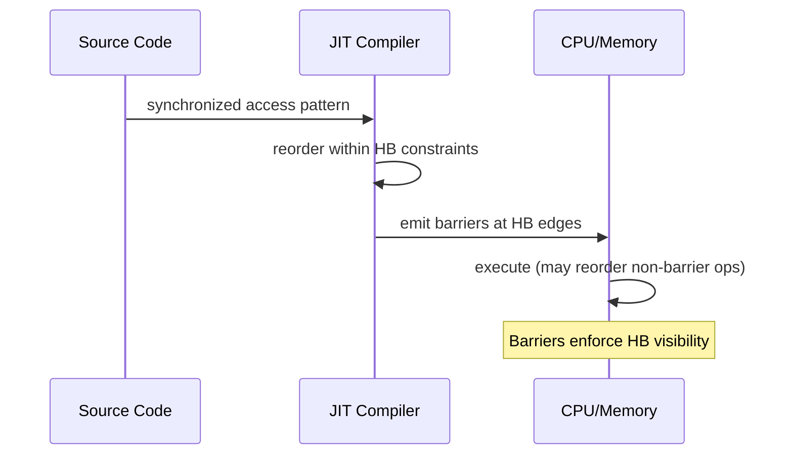

### 🚨 Failure Modes

**Failure 1 - Missing Happens-Before (Stale Read):**
**Symptom:** Thread B reads stale value of field written by Thread A. Works on x86, fails on ARM.
**Root cause:** No happens-before edge between write and read. x86's stronger model masks the bug.
**Diagnostic:**

```
# jcstress test: run on weak-memory hardware (ARM)
# or use -XX:-TieredCompilation to expose reorderings
@JCStressTest
@State
public class VisibilityTest {
    int x; boolean ready;
    @Actor void writer() { x = 42; ready = true; }
    @Actor void reader(II_Result r) {
        r.r1 = ready ? 1 : 0; r.r2 = x;
    }
    // Possible: r1=1, r2=0 (stale read!)
}
```

**Fix:**

**BAD:**

```java
// No happens-before: data race
int x; boolean ready;
void writer() { x = 42; ready = true; }
void reader() {
    if (ready) use(x); // may see x=0!
}
```

**GOOD:**

```java
// volatile provides happens-before edge
int x; volatile boolean ready;
void writer() { x = 42; ready = true; }
void reader() {
    if (ready) use(x); // guaranteed x=42
}
```

**Failure 2 - Reordering (Publication Without Fence):**
**Symptom:** Object reference published before construction completes. Other thread sees partially-constructed object.
**Root cause:** Compiler reorders store of reference before stores to object fields. No happens-before edge for the reference publication.
**Diagnostic:**

```
# Classic: double-checked locking without volatile
# Thread sees non-null reference but uninitialized fields
# Manifests under high contention + JIT optimization
```

**Fix:** Make the reference `volatile` (prevents reordering past volatile store), or use final fields (freeze action guarantees visibility at construction end), or use proper synchronization.

### 🔬 Production Reality

**Incident pattern: ARM deployment exposes x86-masked race.**

A service ran correctly on x86 servers for 3 years. Migration to ARM-based instances (AWS Graviton) exposed intermittent data corruption. A shared configuration object was published without volatile: `config = new Config(values)`. On x86 (TSO model): stores rarely reorder, so the reference and field stores appear ordered. On ARM (weak model): reader thread sees non-null config reference but uninitialized fields (zeros/nulls). Fix: declare config field volatile. The race existed for 3 years, masked by x86 hardware.

### ⚖️ Trade-offs & Alternatives

| Aspect                  | JMM (happens-before)          | C++ Memory Model                         | Go Memory Model            |
| ----------------------- | ----------------------------- | ---------------------------------------- | -------------------------- |
| Guarantee for race-free | Sequential consistency        | Sequential consistency                   | Sequential consistency     |
| Guarantee for racy code | No out-of-thin-air, type safe | Undefined behavior                       | Limited (some races OK)    |
| Complexity              | High (causality)              | Very high (relaxed atomics)              | Low (simple rules)         |
| Developer control       | Medium (volatile, sync)       | Fine-grained (acquire, release, relaxed) | Coarse (channels, mutexes) |
| Primary mechanism       | Happens-before edges          | Acquire/release fences                   | Channel synchronization    |

### ⚡ Decision Snap

**USE formal JMM reasoning WHEN:**

- Writing lock-free algorithms (need exact visibility guarantees).
- Debugging race conditions that only manifest on weak-memory hardware.
- Reviewing concurrent code for correctness.

**AVOID formal reasoning WHEN:**

- Using high-level java.util.concurrent utilities (they handle JMM internally).
- All shared state is immutable (no races possible).

**PREFER high-level utilities WHEN:**

- Not building infrastructure-level concurrent code.
- Team does not have JMM expertise (utilities are safer than raw volatile/synchronized).

### ⚠️ Top Traps

| #   | Misconception                                 | Reality                                                                                                                |
| --- | --------------------------------------------- | ---------------------------------------------------------------------------------------------------------------------- |
| 1   | "Volatile means atomic"                       | Volatile guarantees visibility + ordering. Not atomicity of compound operations (i++ is not atomic).                   |
| 2   | "If it works on x86, it's correct"            | x86 TSO masks many races. ARM/POWER expose them. JMM is the contract, not hardware behavior.                           |
| 3   | "synchronized is just mutual exclusion"       | synchronized provides: mutual exclusion + happens-before (visibility of all prior writes).                             |
| 4   | "Final fields need no synchronization"        | True ONLY if object is safely published (reference assigned after construction completes).                             |
| 5   | "Happens-before means happens before in time" | HB is a visibility guarantee, not a temporal ordering. Unrelated HB-ordered actions may execute in any temporal order. |

### 🪜 Learning Ladder

**Prerequisites:**

- Happens-Before Relationship - working-level understanding
- Java Memory Model - Working Rules - practical rules
- Atomicity, Visibility, Ordering - the three properties

**THIS:** JMM Formal Semantics (Manson, Pugh, Adve 2005)

**Next steps:**

- VarHandle and Memory Fences - fine-grained control
- Hardware Memory Models Teach Software Ordering - hardware perspective
- JSR 133 - Java Memory Model Specification - spec document details

### 💡 Surprising Truth

**The Surprising Truth:**
The JMM's most controversial feature - causality requirements (preventing out-of-thin-air values) - has never been formally proven sound. The 2005 paper acknowledged this limitation. Subsequent work (Manson's dissertation, Lochbihler 2012) identified scenarios where the causality requirements are either too strong (preventing valid optimizations) or too weak (allowing surprising behaviors). Java's memory model remains an active research area 20 years after publication.

**Further Reading:**

- Manson, Pugh, Adve, "The Java Memory Model" (POPL 2005)
- JSR 133: Java Memory Model and Thread Specification (JCP)
- Shipilev, "Close Encounters of The Java Memory Model Kind" (2014, talk)

**Revision Card:**

1. DRF guarantee: no data races = sequential consistency. The fundamental JMM contract.
2. Happens-before is about VISIBILITY, not temporal ordering. x86 masks races; ARM exposes them.
3. The model has known imperfections (causality). Use high-level utilities unless building lock-free infrastructure.

---

---

# Project Loom Design Rationale

**TL;DR** - Loom chose JVM-level continuations on ForkJoinPool carriers, preserving Thread API compatibility for million-thread concurrency without colored functions.

### 🔥 Problem Statement

Java's 1:1 thread model (one Java thread = one OS thread) limits concurrency to thousands of threads. Reactive frameworks (RxJava, Project Reactor) solve scalability but fragment the ecosystem: callback chains, colored functions (async vs sync), debugging complexity, and library incompatibility. Go solved this with goroutines (M:N scheduling, cheap green threads). Java needed equivalent scalability WITHOUT breaking the existing ecosystem of blocking libraries, debuggers, and profilers.

### 📜 Historical Context

Green threads in Java 1.0-1.1 (M:N, removed in 1.2 because they could not exploit SMP). Quasar fibers (library-level, 2013) proved the concept but required bytecode instrumentation. Kotlin coroutines (2018) took the colored-function approach. Project Loom began 2017 (Ron Pressler, Oracle). Key design documents: "State of Loom" (2018-2023 iterations). Preview in JDK 19 (2022). Final in JDK 21 (2023). The critical design decision: continuations at the JVM level (not bytecode transformation), preserving the Thread identity.

### 🔩 First Principles

**CORE INVARIANTS:**

1. Virtual threads MUST be java.lang.Thread instances (same API, same identity, same debugging, same profiling). No colored functions.
2. Blocking operations (I/O, sleep, lock) MUST trigger continuation yield (unmount from carrier) - not carrier thread blocking.
3. Existing blocking code MUST work unchanged on virtual threads (library compatibility without modification).

**DERIVED DESIGN:**
Invariant 1 rejects: new async APIs, CompletableFuture-everywhere, colored function split. Invariant 2 requires: JVM-level continuation support (cannot be done at library level without bytecode hacks). Invariant 3 requires: JDK internal blocking points (Socket.read, Thread.sleep, Lock.lock) modified to yield the continuation.

**THE TRADE-OFF:**
**Gain:** Blocking-style code at reactive scale. No ecosystem fragmentation. Existing code works.
**Cost:** JVM complexity (continuation implementation). Pinning problem (synchronized cannot yield). Cannot help CPU-bound workloads.

### 🧠 Mental Model

> Project Loom's design is like adding an elevator to a building while keeping all existing doors, hallways, and offices unchanged. Goroutines (Go) designed a new building from scratch. Kotlin coroutines added a new type of door (suspend functions) alongside old doors. Loom keeps the same doors (Thread API) and adds invisible infrastructure (continuations) underneath.

- "Existing doors" -> Thread API (unchanged)
- "Invisible elevator" -> continuations (hidden from user code)
- "New building" -> Go's goroutines (clean-slate design)
- "New door type" -> Kotlin's suspend functions (colored)

**Where this analogy breaks down:** elevators are visible infrastructure; continuations are truly invisible to application code.

### 🧩 Components

- **Continuation** - JVM-level coroutine. Can be yielded (stack saved to heap) and resumed (stack restored). Not exposed in public API.
- **Virtual thread** - Thread subclass that runs on a continuation. Mounts/unmounts from carrier threads.
- **Carrier thread** - Platform thread in a ForkJoinPool that executes virtual thread continuations.
- **Scheduler** - ForkJoinPool with work-stealing. Carriers pick up runnable virtual threads. Default pool size = available processors.
- **Parking/unparking** - When VT blocks: continuation yields, carrier is freed. When I/O completes: VT is unparked (re-scheduled on a carrier).
- **Pinning** - When VT cannot yield (inside synchronized + blocking): carrier is blocked. Reduces effective parallelism.

```text
Design Decision Tree:

Goal: M:N threading for Java
  |
  +-- Option A: New async API (rejected)
  |   Reason: fragments ecosystem, colored functions
  |
  +-- Option B: Bytecode transform (rejected)
  |   Reason: fragile, tool-incompatible, Quasar proved
  |           issues at scale
  |
  +-- Option C: JVM continuations (chosen)
      Reason: invisible to user code, preserves Thread API,
              works with existing debuggers/profilers
      |
      +-- Carrier pool: ForkJoinPool (work-stealing)
      +-- Yield points: all JDK blocking ops
      +-- Limitation: synchronized cannot yield (pinning)
```

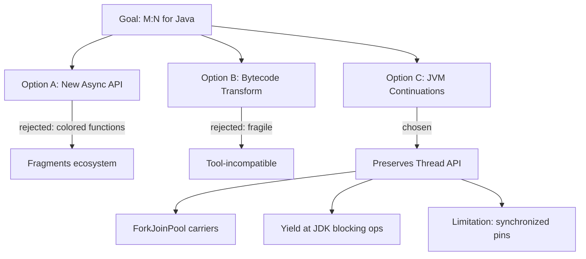

### 📶 Gradual Depth

**Level 1 - What it is:**
The design philosophy behind Java's virtual threads: cheap threads via JVM continuations, preserving the existing Thread API and blocking code style.

**Level 2 - How to use it:**
Use virtual threads as you would platform threads: `Thread.startVirtualThread(() -> blockingWork())`. No new APIs to learn. Blocking code works unchanged. Create thousands/millions without pool sizing.

**Level 3 - How it works:**
When a virtual thread calls a blocking operation (e.g., `Socket.read()`), the JDK internally yields the continuation: saves the VT's stack frames to heap, frees the carrier thread. When data arrives (epoll notification), the scheduler re-mounts the VT on an available carrier and resumes execution. The application sees a normal blocking call. The JVM sees a yield/resume of a lightweight continuation.

**Level 4 - Production mastery:**
Understand why synchronized pins: the JVM cannot yield a continuation while an OS-level monitor is held (monitor ownership is per-OS-thread). ReentrantLock uses parking (yieldable) instead of OS monitors. The ForkJoinPool scheduler uses work-stealing: if one carrier's queue empties, it steals from another carrier's queue. This balances load across carriers automatically. The default carrier count equals available processors (configurable via `jdk.virtualThreadScheduler.parallelism`).

### ⚙️ How It Works

**Phase 1 - Creation:** `Thread.ofVirtual().start(task)` creates a VT. The VT is a Continuation + Thread shell. Enqueued in scheduler.

**Phase 2 - Mounting:** Scheduler assigns VT to a carrier (ForkJoinPool worker). Carrier calls `continuation.run()`. VT executes on carrier's OS thread.

**Phase 3 - Blocking:** VT calls `Socket.read()`. JDK detects: this is a virtual thread. Instead of blocking the carrier: yield the continuation. Save stack to heap. Release carrier.

**Phase 4 - Waiting:** VT is parked (waiting for I/O). Carrier picks up another runnable VT. No OS thread consumed during wait.

**Phase 5 - Resuming:** I/O completes (epoll/kqueue notification). VT is unparked. Re-enqueued in scheduler. Eventually mounted on a carrier (possibly different from original). Execution resumes where it left off.

```text
Virtual Thread lifecycle:

  Created -> Runnable -> [Carrier mounts]
     -> Running -> [blocks] -> Yielded (parked)
     -> [I/O complete] -> Runnable
     -> [Carrier mounts] -> Running -> Terminated

  Carrier perspective:
    run(VT-1) -> VT-1 yields -> run(VT-2) -> VT-2 yields
    -> run(VT-3) -> ... (work-stealing between carriers)
```

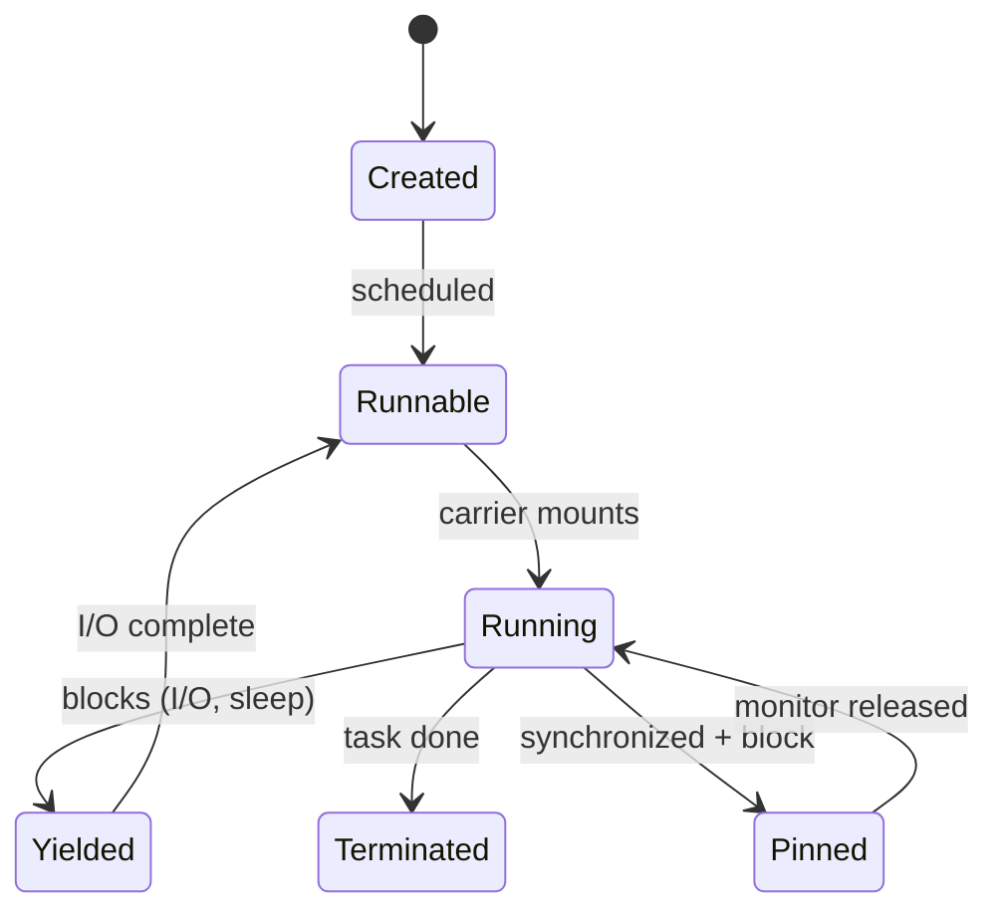

### 🚨 Failure Modes

**Failure 1 - Carrier Exhaustion via Pinning:**
**Symptom:** All carriers pinned. No VTs can make progress. System appears deadlocked.
**Root cause:** Many VTs enter synchronized blocks that perform blocking I/O simultaneously. Each pins a carrier.
**Diagnostic:**

```bash
# JFR: jdk.VirtualThreadPinned events
# Count: if pinned count >= carrier count -> exhaustion
jfr print --events jdk.VirtualThreadPinned rec.jfr
# Runtime: -Djdk.tracePinnedThreads=full
```

**Fix:**

**BAD:**

```java
// synchronized pins the carrier during I/O
synchronized (this) {
    result = httpClient.send(request); // pins!
}
```

**GOOD:**

```java
// ReentrantLock: VT yields while waiting for lock
private final ReentrantLock lock = new ReentrantLock();
lock.lock();
try {
    result = httpClient.send(request); // yields OK
} finally {
    lock.unlock();
}
```

**Failure 2 - Misapplying VTs to CPU-Bound Work:**
**Symptom:** No throughput improvement from virtual threads. Same performance as platform thread pool.
**Root cause:** Tasks are CPU-bound. VTs only help when threads block (freeing carriers for others). CPU-bound tasks never yield - they occupy carriers continuously.
**Diagnostic:**

```bash
# async-profiler: check if threads are mostly ON-CPU
# If CPU usage = carrier count * 100% and no I/O waits:
# VTs provide zero benefit over platform threads
asprof -e cpu -d 30 <pid>
```

**Fix:** For CPU-bound: use ForkJoinPool or fixed-size platform thread pool sized to CPU cores. VTs are for I/O-bound concurrency.

### 🔬 Production Reality

**Incident pattern: the colored-function trap Loom avoids.**

A team maintained a service with both sync (JDBC) and async (WebClient) code paths. The async path required: `Mono<User>` return types, reactive operators throughout the call chain, separate reactive JDBC driver (R2DBC), and custom context propagation (ReactorContext instead of ThreadLocal). When a bug appeared in the async path, debugging required understanding operator fusion, subscription backpressure, and scheduler hops. With virtual threads: the SAME logic uses blocking JDBC, ThreadLocal (or ScopedValue), normal try/catch, and standard stack traces. The reactive infrastructure (thousands of lines) becomes unnecessary.

### ⚖️ Trade-offs & Alternatives

| Aspect              | Loom (Virtual Threads) | Go (Goroutines)    | Kotlin (Coroutines)     | Reactive (Reactor)    |
| ------------------- | ---------------------- | ------------------ | ----------------------- | --------------------- |
| API compatibility   | Full (Thread API)      | Clean-slate        | New suspend keyword     | New types (Mono/Flux) |
| Colored functions   | No                     | No                 | Yes (suspend)           | Yes (Mono/Flux)       |
| Existing code works | Yes (blocking)         | N/A (new language) | No (must be suspend)    | No (must be reactive) |
| Debugging           | Normal stack traces    | Normal             | Partially reconstructed | Complex               |
| Pinning risk        | Yes (synchronized)     | No                 | No                      | N/A (non-blocking)    |
| Maturity (2024)     | Production (JDK 21)    | 15+ years          | 6+ years                | 8+ years              |

### ⚡ Decision Snap

**USE Loom design knowledge WHEN:**

- Evaluating virtual threads for adoption (understand guarantees and limits).
- Debugging VT-specific issues (pinning, carrier scheduling).
- Choosing between reactive and VT approaches (understand why Loom chose this path).

**AVOID deep Loom internals WHEN:**

- Writing application-level code (just use the Thread API).
- Libraries already handle VT-specific concerns.

**PREFER reactive WHEN:**

- Backpressure is a hard requirement (streaming data).
- Already invested in reactive ecosystem with no migration pressure.

### ⚠️ Top Traps

| #   | Misconception                               | Reality                                                                                           |
| --- | ------------------------------------------- | ------------------------------------------------------------------------------------------------- |
| 1   | "Loom is just green threads again"          | Green threads (Java 1.0) could not use multiple CPUs. Loom uses ForkJoinPool across all cores.    |
| 2   | "Virtual threads replace thread pools"      | For I/O-bound: yes. For CPU-bound: you still need sized pools (VTs do not add CPUs).              |
| 3   | "No new APIs needed"                        | Thread.ofVirtual() is new. But the programming MODEL is unchanged (blocking style).               |
| 4   | "Kotlin coroutines and Loom are equivalent" | Kotlin requires suspend/colored functions. Loom is invisible to application code.                 |
| 5   | "Pinning will be fixed in a future JDK"     | Partial: JEP draft exists to allow yield during monitors. But synchronized + native = still pins. |

### 🪜 Learning Ladder

**Prerequisites:**

- Virtual Threads Internals (Project Loom) - implementation details
- ForkJoinPool and Work-Stealing - the carrier scheduler
- CompletableFuture Composition - the problem Loom eliminates

**THIS:** Project Loom Design Rationale

**Next steps:**

- Structured Concurrency (JEP 453) - next Loom component
- Reactive Streams vs Virtual Threads Decision - comparing approaches
- Designing a Scheduler from First Principles - scheduler theory

### 💡 Surprising Truth

**The Surprising Truth:**
The hardest engineering challenge in Loom was NOT implementing continuations - it was modifying every blocking point in the JDK (Socket, FileChannel, Lock, Thread.sleep, etc.) to yield instead of blocking. This required touching hundreds of JDK internal classes. The continuation itself is ~5000 lines. The JDK modifications span tens of thousands of lines across networking, I/O, and locking subsystems.

**Further Reading:**

- Ron Pressler, "State of Loom" (multiple revisions, 2018-2023, inside.java)
- JEP 444: Virtual Threads (openjdk.org)
- Ron Pressler, "Loom: Bringing Lightweight Threads to Java" (JVM Language Summit 2019)

**Revision Card:**

1. Key design choice: JVM continuations (not bytecode transforms, not colored functions). Preserves Thread API.
2. Existing blocking code works unchanged. The JDK internally yields at every blocking point.
3. Pinning (synchronized + blocking) is the fundamental limitation. Use ReentrantLock for VT-compatible locking.

---

---

# Designing a Scheduler from First Principles

**TL;DR** - A thread scheduler decides which runnable task executes next on which processor, balancing fairness, throughput, latency, and locality - with every design choice creating a trade-off between these competing goals.

### 🔥 Problem Statement

A system has 1000 runnable tasks and 16 CPUs. Which task runs next? FIFO is fair but ignores locality (cache cold on new CPU). Priority scheduling favors important tasks but starves low-priority ones. Work-stealing balances load but adds synchronization overhead. Every scheduler design is a set of trade-offs. Understanding these trade-offs from first principles enables evaluating JVM schedulers (ForkJoinPool), OS schedulers (CFS), and application-level schedulers (Netty event loop) as instances of a common design space.

### 📜 Historical Context

Earliest schedulers: round-robin (1960s mainframes, fair time-sharing). Unix: priority + nice levels. Linux 2.6: O(1) scheduler (per-CPU runqueues, O(1) selection). Linux 2.6.23 (2007): CFS (Completely Fair Scheduler, red-black tree, virtual runtime). Java ForkJoinPool (JDK 7, Doug Lea): work-stealing for recursive parallelism. Project Loom scheduler (JDK 21): ForkJoinPool adapted for virtual threads (M:N scheduling, continuation-based yield).

### 🔩 First Principles

**CORE INVARIANTS:**

1. A scheduler must ensure PROGRESS: every runnable task eventually executes (no starvation).
2. A scheduler must be EFFICIENT: scheduling overhead must be small relative to task execution time.
3. A scheduler must handle BLOCKING: when a task blocks, its CPU must be given to another runnable task without delay.

**DERIVED DESIGN:**
Invariant 1 requires: fairness mechanism (time slices, aging, or yield points). Invariant 2 requires: O(1) or O(log n) task selection (not O(n) scan). Invariant 3 requires: runqueue per CPU (avoid global lock) + fast re-dispatch on block.

**THE TRADE-OFF:**
**Gain:** Maximized CPU utilization, fair task progression, responsive system.
**Cost:** Complexity (load balancing, priority, affinity). Overhead per scheduling decision. Perfect fairness conflicts with perfect throughput.

### 🧠 Mental Model

> A scheduler is an air traffic controller (ATC) managing a runway (CPU). Planes (tasks) queue for takeoff. ATC decides: who goes next? Priority (emergency plane first)? Fairness (longest waiting)? Locality (plane already on taxiway is faster)? With multiple runways (CPUs): ATC must balance across runways (load balancing) while respecting that moving a plane between runways costs time (cache migration).

- "Runway" -> CPU core
- "Planes queuing" -> runnable tasks in runqueue
- "ATC deciding next" -> scheduler algorithm
- "Moving between runways" -> task migration (cache-cold penalty)

**Where this analogy breaks down:** planes cannot be preempted mid-flight; tasks can be preempted mid-execution.

### 🧩 Components

- **Runqueue** - Per-CPU list of runnable tasks. Avoids global contention.
- **Task selection policy** - FIFO, priority, virtual runtime (CFS), or deque (work-stealing).
- **Load balancer** - Moves tasks from overloaded CPUs to idle CPUs. Periodic or on-demand.
- **Work stealing** - Idle CPU steals from busy CPU's queue tail. Avoids central coordinator.
- **Preemption** - Timer interrupt forces yield after time slice. Ensures fairness for CPU-bound tasks.
- **Affinity** - Preference to keep task on same CPU (cache warmth). Conflicts with load balance.

```text
Per-CPU Runqueue Design:

  CPU-0 queue: [T1, T4, T7]   (3 runnable)
  CPU-1 queue: [T2]           (1 runnable)
  CPU-2 queue: [T3, T5, T6, T8, T9] (5 runnable)
  CPU-3 queue: []             (idle!)

  Load balancer: moves T9 from CPU-2 to CPU-3
  Work stealing: CPU-3 steals T8 from CPU-2's tail

  Selection: CPU-0 picks T1 (head of queue, FIFO)
  Preemption: T1 runs 10ms, timer fires, T1 back to tail
```

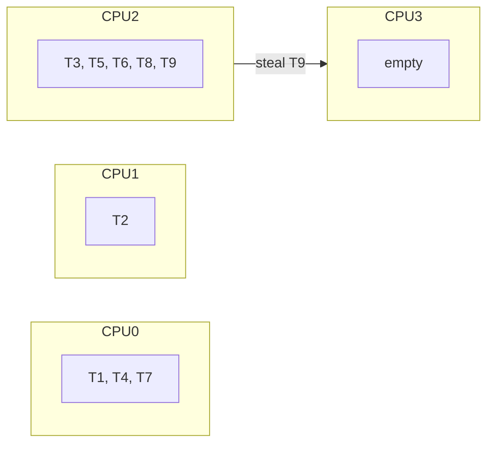

### 📶 Gradual Depth

**Level 1 - What it is:**
A scheduler picks which task runs next on which CPU. It balances fairness (everyone gets a turn) with efficiency (minimize overhead and maximize throughput).

**Level 2 - How to use it:**
In Java: ForkJoinPool is work-stealing (recursive tasks, virtual threads). ThreadPoolExecutor is FIFO (bounded pool). Netty EventLoop is affinity-based (one thread per channel). Choose based on workload: parallel computation (ForkJoinPool), bounded I/O (ThreadPoolExecutor), connection-per-thread (EventLoop).

**Level 3 - How it works:**
ForkJoinPool: each worker has a deque. Tasks forked by a worker go to its own deque (locality). Idle workers steal from other workers' deques (tail-end, LIFO for thief). This balances load without a central coordinator. Virtual threads: scheduled like any task in the ForkJoinPool. Yield/park removes VT from deque. Unpark re-enqueues.

**Level 4 - Production mastery:**
Scheduler tuning: `jdk.virtualThreadScheduler.parallelism` sets carrier count. Too few carriers: tasks queue excessively. Too many: context-switch overhead increases. Monitor: `ForkJoinPool.getQueuedSubmissionCount()` shows backlog. Work-stealing granularity matters: very small tasks = high stealing overhead (consider batching). Very large tasks = poor load balance (consider splitting).

### ⚙️ How It Works

**Phase 1 - Task Submission:** Task enters the system. Assigned to a runqueue (local if submitted by a worker, global otherwise).

**Phase 2 - Selection:** Worker thread picks next task. Policy: own deque first (LIFO for locality), then steal from others (FIFO from victim's tail).

**Phase 3 - Execution:** Worker runs task. If task blocks: continuation yields (VT) or thread parks (platform). Worker moves to next task.

**Phase 4 - Completion/Fork:** Task completes or forks sub-tasks. Forked tasks go to worker's own deque (locality).

**Phase 5 - Rebalancing:** If one worker's deque is empty: steal from busiest worker's deque tail. Balances load without central coordination.

```text
Work-Stealing Deque Operations:

  Worker-0 deque (double-ended):
    push (own work) -> [front]
    pop (own work)  <- [front]  (LIFO - cache-warm)
    steal (others)  <- [tail]   (FIFO - oldest work)

  Why LIFO for self, FIFO for steal:
  - LIFO self: most recently pushed = smallest sub-task
    = cache-warm = fast to execute
  - FIFO steal: oldest task = largest sub-task
    = most parallelism available (worth the steal cost)
```

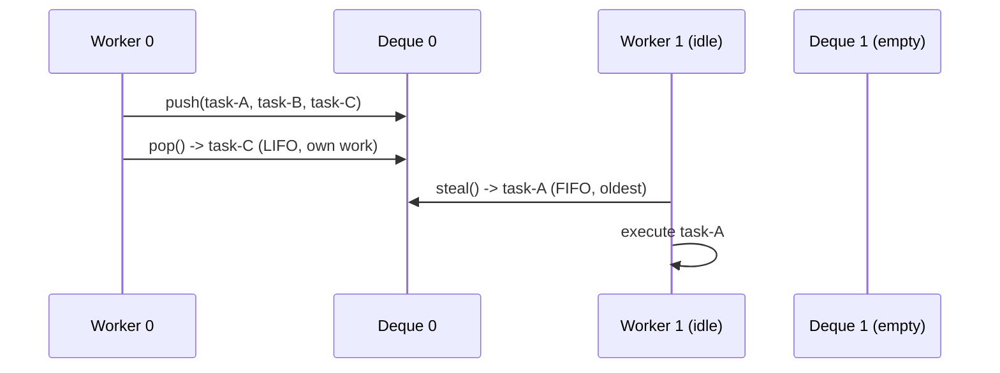

### 🚨 Failure Modes

**Failure 1 - Head-of-Line Blocking:**
**Symptom:** Short tasks starved behind long-running task. Latency bimodal (fast or very slow).
**Root cause:** FIFO queue with no preemption. One long task blocks all subsequent tasks on that CPU.
**Diagnostic:**

```bash
# Detect: measure per-task wait time distribution
# If bimodal (cluster at 0ms and cluster at Nms):
# head-of-line blocking
# ForkJoinPool: getQueuedTaskCount() high on one worker
jcmd <pid> Thread.print | grep "ForkJoin"
```

**Fix:**

**BAD:**

```java
// Submit long + short tasks to same FIFO pool
pool.submit(longRunningTask); // 10s
pool.submit(shortTask);       // waits 10s!
```

**GOOD:**

```java
// Separate pools or use ForkJoinPool (work-stealing)
// Work-stealing: idle workers steal short tasks
var fjp = new ForkJoinPool(16);
fjp.submit(longTask);  // one worker
fjp.submit(shortTask); // stolen by idle worker
```

**Failure 2 - Excessive Work Stealing Overhead:**
**Symptom:** High CPU utilization but low throughput. Many CAS failures in steal attempts.
**Root cause:** Tasks are too small (microseconds). Stealing overhead dominates execution time.
**Diagnostic:**

```bash
# async-profiler: check if significant time in
# ForkJoinPool.scan() or WorkQueue.poll()
asprof -e cpu -d 30 <pid>
# If >20% time in scheduler code: tasks too small
```

**Fix:** Batch small tasks. Use sequential cutoff in recursive algorithms (stop forking below threshold). Increase task granularity.

### 🔬 Production Reality

**Incident pattern: ForkJoinPool.commonPool contention.**

A service used parallel streams (which use commonPool) alongside CompletableFuture.supplyAsync (which also defaults to commonPool). Under load: parallel stream tasks (CPU-bound, long) occupied all commonPool workers. CompletableFuture tasks (I/O-bound, short) queued behind them. Result: async HTTP calls stalled for seconds waiting for commonPool workers. Fix: dedicated ForkJoinPool for async I/O work (separate from commonPool). Lesson: shared schedulers with mixed workloads create priority inversion.

### ⚖️ Trade-offs & Alternatives

| Aspect       | Work-Stealing (FJP) | FIFO (ThreadPoolExecutor) | CFS (Linux)        | Event Loop (Netty) |
| ------------ | ------------------- | ------------------------- | ------------------ | ------------------ |
| Load balance | Automatic (steal)   | None (fixed assignment)   | Periodic migration | None (affinity)    |
| Fairness     | Approximate         | FIFO order                | Virtual runtime    | Per-channel        |
| Overhead     | CAS per steal       | Lock per submit           | Timer + tree ops   | Minimal (no yield) |
| Best for     | Recursive/parallel  | Bounded I/O pools         | General OS         | Network I/O        |
| Worst for    | Tiny tasks          | Imbalanced loads          | Real-time          | CPU-bound tasks    |

### ⚡ Decision Snap

**USE work-stealing (ForkJoinPool) WHEN:**

- Recursive parallel algorithms (divide and conquer).
- Virtual threads (default Loom scheduler).
- Heterogeneous task sizes (stealing balances automatically).

**AVOID work-stealing WHEN:**

- All tasks are identical duration (stealing adds overhead without benefit).
- Need strict FIFO ordering (work-stealing reorders).

**PREFER ThreadPoolExecutor WHEN:**

- Need explicit queue control (bounded, rejection policy).
- Task submission rate must be bounded (backpressure).
- Need predictable ordering.

### ⚠️ Top Traps

| #   | Misconception                               | Reality                                                                                          |
| --- | ------------------------------------------- | ------------------------------------------------------------------------------------------------ |
| 1   | "More threads = more throughput"            | Beyond CPU count: context-switch overhead increases. Optimal pool size depends on workload type. |
| 2   | "Work-stealing is always better than FIFO"  | For uniform tasks: FIFO with sized pool is simpler and equivalent. Stealing adds overhead.       |
| 3   | "ForkJoinPool.commonPool is for everything" | Shared pool = contention between parallel streams, async, and VTs. Use dedicated pools.          |
| 4   | "Scheduler fairness means equal CPU time"   | Fairness means progress guarantee (no starvation). Not equal time per time slice.                |
| 5   | "Task affinity (same CPU) is always good"   | Affinity helps cache. But if one CPU is overloaded: migration to idle CPU is faster overall.     |

### 🪜 Learning Ladder

**Prerequisites:**

- ForkJoinPool and Work-Stealing - Java's work-stealing implementation
- Executor Framework and ExecutorService - Java's executor abstraction
- Processes vs Threads - The OS View - OS scheduling basics

**THIS:** Designing a Scheduler from First Principles

**Next steps:**

- Project Loom Design Rationale - how Loom uses FJP as VT scheduler
- ForkJoinPool.commonPool Saturation - production scheduler failure
- Thread Starvation and Priority Inversion - scheduler failure modes

### 💡 Surprising Truth

**The Surprising Truth:**
The ForkJoinPool work-stealing algorithm uses a counterintuitive dual-ended deque: workers push/pop from the FRONT (LIFO - cache-warm, small tasks) but thieves steal from the BACK (FIFO - oldest, largest tasks). This asymmetry is critical: LIFO for self maximizes cache locality; FIFO for thieves maximizes the parallelism extracted per steal (large tasks split into more sub-tasks). Reversing either policy degrades performance significantly.

**Further Reading:**

- Doug Lea, "A Java Fork/Join Framework" (2000, JAVA Grande)
- Blumofe & Leiserson, "Scheduling Multithreaded Computations by Work Stealing" (1999, JACM)
- Linux CFS documentation (kernel.org)

**Revision Card:**

1. Every scheduler trades off: fairness vs throughput vs latency vs locality. No free lunch.
2. Work-stealing: LIFO self (locality) + FIFO steal (parallelism). Per-CPU deques avoid global lock.
3. Shared schedulers (commonPool) with mixed workloads create priority inversion. Isolate workloads.

---

---

# The ABA Problem and Solutions

**TL;DR** - ABA: CAS succeeds because the value looks unchanged (A), but was modified to B and restored to A, masking state changes that corrupt lock-free structures.

### 🔥 Problem Statement

A lock-free stack uses CAS to pop: read top node (A), read next (B), CAS(top, A, B). Between read and CAS: another thread pops A, pops B, pushes C, pushes A back. CAS succeeds (top is still A) but next is now wrong (C, not B). The stack is corrupted. CAS only compares VALUES - it cannot detect that the location was modified and restored. Without ABA mitigation, lock-free data structures that reuse nodes suffer silent data corruption.

### 📜 Historical Context

The ABA problem was identified in early lock-free algorithm research (1980s-1990s). IBM System/370 provided double-word CAS (DCAS) as a hardware mitigation. Maged Michael and Michael Scott's lock-free queue (1996) addressed ABA via hazard pointers. Java's AtomicStampedReference (JDK 5, Doug Lea) provides software-level ABA prevention via version stamps. The problem is fundamental to any CAS-based algorithm that reuses memory/nodes.

### 🔩 First Principles

**CORE INVARIANTS:**

1. CAS compares the CURRENT VALUE to an EXPECTED VALUE. If equal: swap succeeds. CAS cannot detect intermediate changes.
2. ABA requires three conditions: (a) CAS-based algorithm, (b) value returns to original between read and CAS, (c) algorithm assumes "same value = same state."
3. ABA is only a problem when NODE REUSE occurs. If values are unique (never recycled), ABA cannot happen.

**DERIVED DESIGN:**
Invariant 1 means: CAS alone is insufficient for correctness when values can recur. Invariant 2 means: preventing any one of the three conditions prevents ABA. Invariant 3 means: garbage collection (no manual memory reuse) largely eliminates ABA in Java.

**THE TRADE-OFF:**
**Gain (ABA prevention):** Correct lock-free algorithms even with node reuse.
**Cost:** Extra storage (version stamps), reduced CAS throughput (wider compare), or deferred memory reclamation (hazard pointers).

### 🧠 Mental Model

> ABA is a "replaced luggage" problem at an airport. You check your bag (value A). At the carousel, you identify it by color and size. But someone swapped its contents (B), then returned a bag identical in color/size (A again). You grab it (CAS succeeds) believing it is unchanged. The contents are wrong.

- "Identifying by color/size" -> CAS comparing value only
- "Swapped contents" -> intermediate B state
- "Identical replacement" -> A restored (different logical state)
- "Wrong contents" -> corrupted data structure

**Where this analogy breaks down:** CAS is atomic; luggage inspection takes time. The analogy captures the logical problem but not the timing precision.

### 🧩 Components

- **CAS operation** - Hardware atomic compare-and-swap. Compares current value to expected; swaps if equal.
- **Version stamp** - Counter incremented on every modification. CAS checks value + version (AtomicStampedReference).
- **Hazard pointers** - Threads publish "I am reading this node." Reclamation deferred until no thread holds hazard pointer.
- **Epoch-based reclamation** - Nodes retired in current epoch. Freed only after all threads advance past that epoch.
- **Tagged pointers** - Pack version bits into pointer unused bits (64-bit systems have spare bits in addresses).
- **GC protection** - Java's garbage collector prevents node reuse while references exist. Largely eliminates ABA for object references.

```text
ABA Problem Illustration:

Thread 1:                Thread 2:
  read top = A
  read A.next = B
                           pop A (top = B)
                           pop B (top = C)
                           push A back (top = A)
  CAS(top, A, B)
  SUCCESS! (top was A)
  But A.next is now C, not B!
  top = B... but B was already popped!
  CORRUPTED STACK.
```

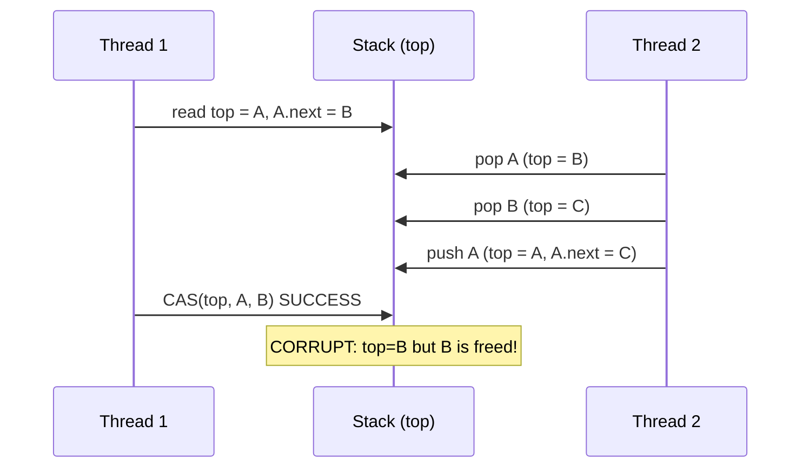

### 📶 Gradual Depth

**Level 1 - What it is:**
A bug in CAS-based algorithms where a value changes from A to B to A, making CAS think nothing changed when the underlying state is different.

**Level 2 - How to use it:**
In Java: use AtomicStampedReference when building lock-free structures that reuse objects. The stamp (version counter) prevents ABA by making each state unique (value + stamp). For most Java code: GC prevents ABA because objects are not reused while referenced.

**Level 3 - How it works:**
AtomicStampedReference stores [reference, int stamp] atomically. CAS compares BOTH reference AND stamp. Even if reference returns to A, the stamp is different (incremented on every modification). CAS fails because stamp mismatches. Hazard pointers: thread announces "I'm reading node X." Reclamation thread skips X until announcement is cleared. This prevents X from being reused (recycled to pool) while another thread might CAS against it.

**Level 4 - Production mastery:**
In Java, ABA is primarily a concern for: (1) lock-free algorithms using object pools (pooled nodes recycled), (2) native/off-heap data structures via Unsafe/VarHandle, (3) AtomicInteger/AtomicLong where integer values naturally recur. For object references without pooling: GC prevents ABA (object not reused while any thread holds a reference). AtomicStampedReference has higher overhead than AtomicReference (wider CAS). Use only when ABA is actually possible.

### ⚙️ How It Works

**Phase 1 - Read:** Thread reads current value (A) and derives next action based on A's state (e.g., A.next for stack pop).

**Phase 2 - Prepare:** Thread prepares new value to swap in (e.g., A.next as new top).

**Phase 3 - Intervene:** Between read and CAS, other threads modify the location: A -> B -> A. The derived state (A.next) is now stale.

**Phase 4 - CAS:** Thread performs CAS(expected=A, new=B). Current value IS A (same reference). CAS succeeds.

**Phase 5 - Corruption:** The swap used stale derived state (A.next from Phase 1, which is no longer valid). Data structure is corrupted silently.

```text
Fix with AtomicStampedReference:

Thread 1:                Thread 2:
  read (A, stamp=1)
  derive A.next = B
                           pop A: stamp=2, top=(B,2)
                           pop B: stamp=3, top=(C,3)
                           push A: stamp=4, top=(A,4)
  CAS(expected=(A,1), new=(B,2))
  FAILS! stamp is 4, not 1.
  Thread 1 retries with fresh read.
  CORRECTNESS PRESERVED.
```

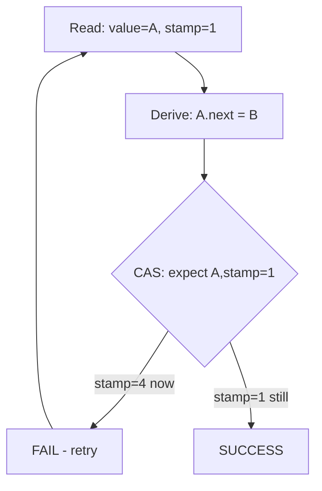

### 🚨 Failure Modes

**Failure 1 - ABA in Object Pool with CAS:**
**Symptom:** Silent data corruption in lock-free structure. Difficult to reproduce. Manifests under high contention.
**Root cause:** Pooled objects recycled. CAS sees "same object" but object's internal state has changed between read and CAS.
**Diagnostic:**

```java
// Reproduce with jcstress:
@JCStressTest
@State
public class ABATest {
    AtomicReference<Node> top = new AtomicReference<>(nodeA);
    // Actor 1: tries to pop (read top, read next, CAS)
    // Actor 2: pop nodeA, pop nodeB, push nodeA back
    // Check: does Actor 1's CAS corrupt the stack?
}
```

**Fix:**

**BAD:**

```java
// AtomicReference alone: vulnerable to ABA
AtomicReference<Node> top = new AtomicReference<>(head);
Node oldTop = top.get();
Node newTop = oldTop.next; // stale if ABA!
top.compareAndSet(oldTop, newTop);
```

**GOOD:**

```java
// AtomicStampedReference: prevents ABA
AtomicStampedReference<Node> top =
    new AtomicStampedReference<>(head, 0);
int[] stamp = new int[1];
Node oldTop = top.get(stamp);
Node newTop = oldTop.next;
top.compareAndSet(oldTop, newTop,
    stamp[0], stamp[0] + 1);
// Fails if stamp changed (ABA detected)
```

**Failure 2 - False ABA Concern (Over-Engineering):**
**Symptom:** AtomicStampedReference used everywhere, adding overhead, when GC already prevents ABA.
**Root cause:** Misunderstanding that GC-managed objects cannot be ABA'd (they cannot be reused while referenced).
**Diagnostic:**

```
# Review: is the AtomicReference pointing to GC-managed
# objects? If yes AND no object pooling: ABA is impossible.
# AtomicStampedReference adds unnecessary overhead.
```

**Fix:** For GC-managed objects without pooling: use plain AtomicReference. Reserve AtomicStampedReference for: pooled objects, integer values, off-heap structures.

### 🔬 Production Reality

**Incident pattern: ABA in a custom lock-free connection pool.**

A team built a lock-free connection pool using AtomicReference<Connection> for the free-list head. Connections were returned to the pool (reused). Under high contention: Thread A reads head=conn1 (conn1.next=conn2). Thread B takes conn1, takes conn2, returns conn1. Thread A CAS succeeds (head was conn1). New head = conn2... but conn2 was already taken! Dual-allocation of same connection. Fix: switched to AtomicStampedReference. Each push/pop increments stamp. CAS detects intervening modifications regardless of value.

### ⚖️ Trade-offs & Alternatives

| Aspect             | AtomicStampedReference | Hazard Pointers      | Epoch-Based Reclamation | GC (no action)      |
| ------------------ | ---------------------- | -------------------- | ----------------------- | ------------------- |
| ABA prevention     | Yes (stamp)            | Yes (deferred reuse) | Yes (deferred reuse)    | Yes (no reuse)      |
| Overhead           | Wider CAS (128-bit)    | Per-read publish     | Per-epoch check         | GC pause            |
| Complexity         | Low (Java API)         | High (manual)        | Medium                  | Zero                |
| Applicable in Java | Yes                    | Rarely (Unsafe)      | Rarely (Unsafe)         | Default behavior    |
| Use case           | Object pools, integers | Off-heap/native      | Off-heap/native         | Normal Java objects |

### ⚡ Decision Snap

**USE AtomicStampedReference WHEN:**

- Building lock-free structures with object pooling (nodes recycled).
- CAS on integer values that naturally recur (counters wrapping).
- Need ABA prevention without GC reliance (native interop).

**AVOID WHEN:**

- Objects are GC-managed and not pooled (ABA impossible).
- Performance-critical path where wider CAS is too expensive.

**PREFER plain AtomicReference WHEN:**

- Object references are unique (GC ensures no reuse while referenced).
- Lock-free code verified with jcstress (no ABA possible in the design).

### ⚠️ Top Traps

| #   | Misconception                                  | Reality                                                                                        |
| --- | ---------------------------------------------- | ---------------------------------------------------------------------------------------------- |
| 1   | "ABA affects all CAS code"                     | Only when values can recur. GC-managed unique objects: no ABA. Integers/pooled nodes: yes ABA. |
| 2   | "Java's GC makes ABA impossible"               | True for object references (no reuse while referenced). False for primitive AtomicInteger.     |
| 3   | "AtomicStampedReference should always be used" | Overhead is real (128-bit CAS). Use only when ABA is possible.                                 |
| 4   | "ABA is a theoretical concern"                 | Reproducible under contention with pooled objects. jcstress can trigger it reliably.           |
| 5   | "Double-word CAS (DWCAS) solves everything"    | Not all hardware supports it. AtomicStampedReference emulates via indirection (allocation).    |

### 🪜 Learning Ladder

**Prerequisites:**

- Lock-Free Algorithms (CAS) - CAS fundamentals
- AtomicInteger and Atomic Classes - Java atomic API
- Race Condition - understanding concurrent correctness

**THIS:** The ABA Problem and Solutions

**Next steps:**

- VarHandle and Memory Fences - low-level atomic access
- Designing a Scheduler from First Principles - lock-free scheduling internals
- Testing Concurrent Code (jcstress) - verifying lock-free correctness

### 💡 Surprising Truth

**The Surprising Truth:**
In standard Java application code, ABA is almost never a real concern because the garbage collector prevents object reference reuse while any thread holds a reference. ABA only matters in Java when: (1) you pool/recycle objects in lock-free structures, (2) you use AtomicInteger/AtomicLong where numeric values naturally recur, or (3) you work with off-heap memory via Unsafe/Foreign Memory. The vast majority of Java developers will never encounter a real ABA bug.

**Further Reading:**

- Michael & Scott, "Simple, Fast, and Practical Non-Blocking and Blocking Concurrent Queue Algorithms" (1996, PODC)
- Doug Lea, java.util.concurrent.atomic package documentation (JDK)
- Herlihy & Shavit, "The Art of Multiprocessor Programming" (2008), Chapter 10

**Revision Card:**

1. ABA: CAS succeeds but value was changed and restored. Only matters with value reuse (pools, integers).
2. Java fix: AtomicStampedReference (stamp makes each state unique). GC prevents ABA for non-pooled object references.
3. Do NOT over-engineer: if objects are GC-managed without pooling, plain AtomicReference is correct and faster.
