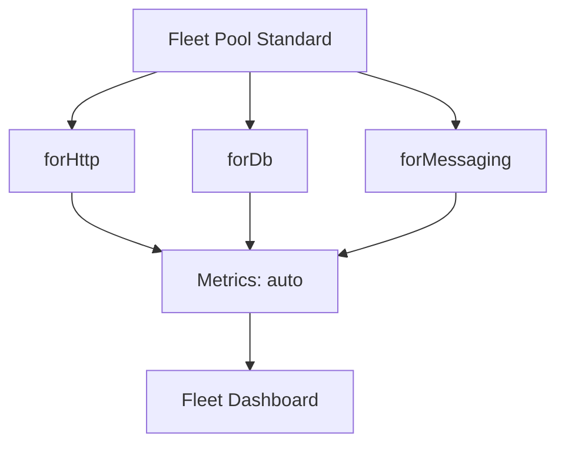
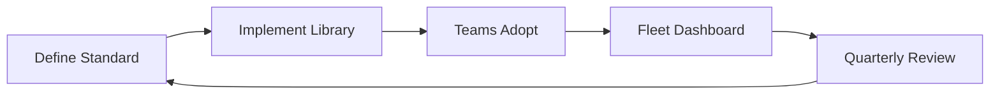
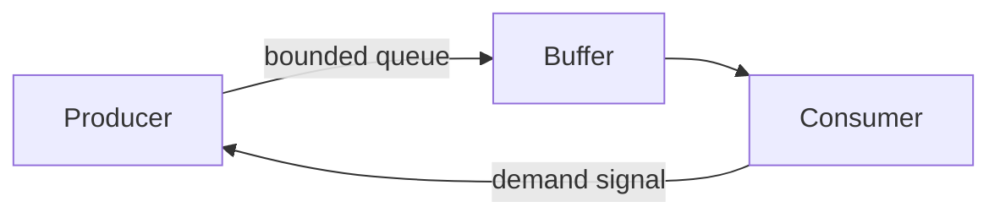
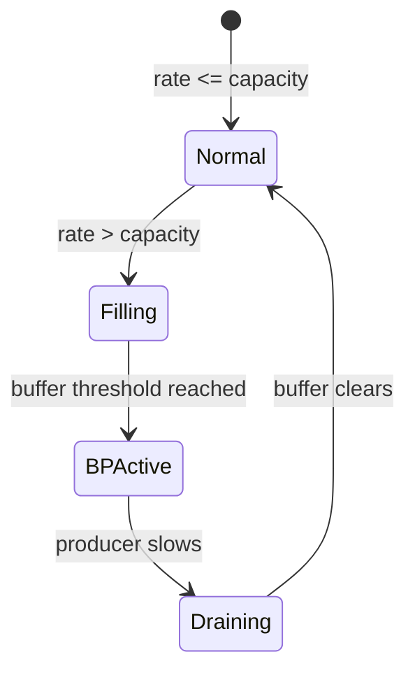
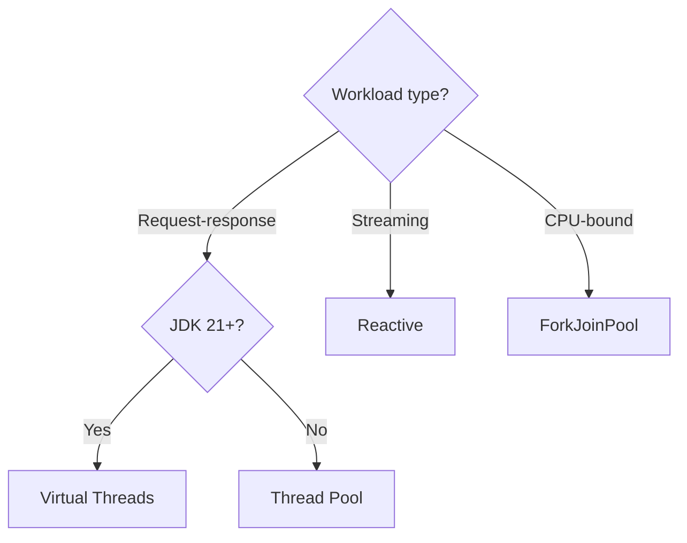
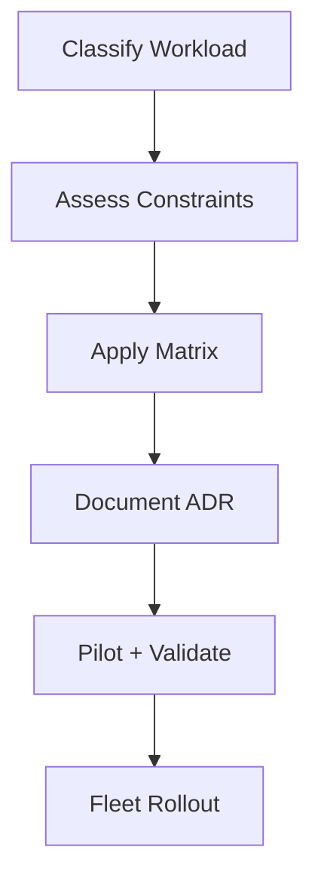
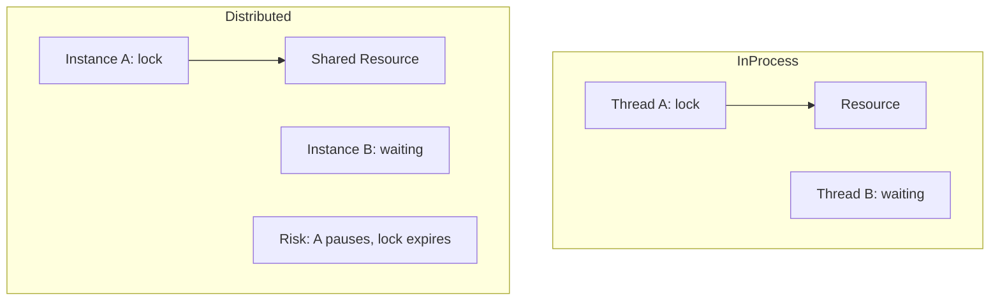
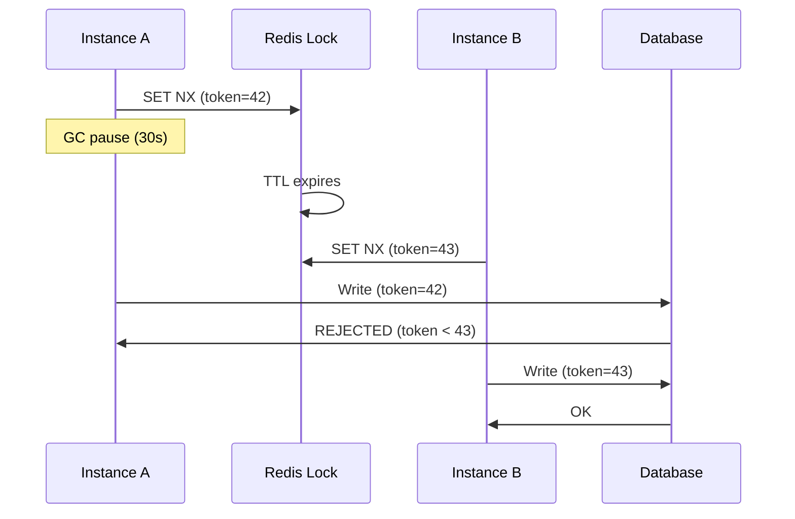

## Keywords

1. [Fleet Thread Pool Standardization](#fleet-thread-pool-standardization)
2. [Back-Pressure Architecture Patterns](#back-pressure-architecture-patterns)
3. [Concurrency Strategy - Reactive vs Loom vs Pool](#concurrency-strategy---reactive-vs-loom-vs-pool)
4. [Distributed Locking vs In-Process Locking](#distributed-locking-vs-in-process-locking)
5. [Concurrency Observability Platform Design](#concurrency-observability-platform-design)
6. [Java 19 to 25 Virtual Threads Migration Strategy](#java-19-to-25-virtual-threads-migration-strategy)
7. [Concurrency Architecture Workshop](#concurrency-architecture-workshop)
8. [Java Concurrency Staff-Level Interview Scenarios](#java-concurrency-staff-level-interview-scenarios)
9. [JMM Formal Semantics (Manson, Pugh, Adve 2005)](#jmm-formal-semantics-manson-pugh-adve-2005)
10. [Project Loom Design Rationale](#project-loom-design-rationale)
11. [Designing a Scheduler from First Principles](#designing-a-scheduler-from-first-principles)
12. [The ABA Problem and Solutions](#the-aba-problem-and-solutions)
13. [Concurrency Specification Writing](#concurrency-specification-writing)
14. [What Erlang Actors Teach Java Concurrency](#what-erlang-actors-teach-java-concurrency)
15. [Hardware Memory Models Teach Software Ordering](#hardware-memory-models-teach-software-ordering)
16. [Transferable Pattern - Back-Pressure Across Systems](#transferable-pattern---back-pressure-across-systems)
17. [Database MVCC and Java STM - Shared Isolation Idea](#database-mvcc-and-java-stm---shared-isolation-idea)

---

---

# Fleet Thread Pool Standardization

**TL;DR** - Standardizing thread pool configurations across a fleet of microservices prevents inconsistent sizing, enables fleet-wide tuning, and eliminates per-service "guess and pray" pool configurations.

### 🔥 Problem Statement

An organization runs 200 microservices. Each team independently configures thread pools: Tomcat maxThreads varies from 50 to 2000. Some use unbounded queues (OOM risk). Some have no timeouts. Pool naming is inconsistent (monitoring is impossible). When downstream latency spikes, services with oversized pools cascade-fail while correctly-sized services survive. No fleet-wide visibility. No standard. Every incident reveals another misconfigured pool.

### 📜 Historical Context

Early microservice architectures (2012-2015) treated each service as independent. Teams chose pool sizes ad-hoc. Netflix's Hystrix (2012) introduced thread pool isolation per dependency but left sizing to developers. Kubernetes resource limits (2015+) added CPU/memory bounds but not thread-level governance. The "platform engineering" movement (2020+) recognized: shared standards for cross-cutting concerns (including thread pools) reduce fleet-wide incidents.

### 🔩 First Principles

**CORE INVARIANTS:**

1. Thread pool size must be derived from Little's Law (threads = throughput x latency), not guessed.
2. Every pool must be monitored with consistent metric names (active, queued, rejected, completed).
3. Queue strategy must match the service's SLA: bounded for latency-sensitive, bounded with backpressure for throughput-oriented.

**DERIVED DESIGN:**
Invariant 1 enables mathematical sizing. Invariant 2 enables fleet-wide dashboards and alerts. Invariant 3 prevents unbounded queue OOM while respecting different service profiles. A fleet standard codifies all three into a shared library/configuration spec.

**THE TRADE-OFF:**
**Gain:** Consistent observability. Predictable failure modes. Fleet-wide tuning. Reduced incidents from misconfiguration.
**Cost:** Less team autonomy. Overhead of maintaining the standard. May not fit unusual workloads (escape hatch needed).

### 🧠 Mental Model

> A fleet standard is like a building code for a city. Each building (service) is different, but ALL must have: fire exits (circuit breakers), load-bearing calculations (Little's Law sizing), and building inspectors (monitoring). Without code: each building is independently dangerous.

- "Building code" -> fleet thread pool standard
- "Fire exits" -> circuit breakers, rejection policies
- "Load-bearing calculations" -> Little's Law sizing
- "Building inspectors" -> monitoring/alerting

**Where this analogy breaks down:** unlike buildings, services change behavior at deploy time. The "building code" must be dynamic (reconfigurable without restart) and version-controlled.

### 🧩 Components

- **Pool template** - shared library providing pre-configured pools: `FleetPool.forHttp()`, `FleetPool.forDb()`, `FleetPool.forMessaging()`.
- **Naming convention** - `{service}.{dependency}.{type}` (e.g., `orders.payment-api.http`).
- **Metric registry** - auto-exports pool metrics (Micrometer gauges) under standard names.
- **Configuration spec** - YAML schema: pool size, queue capacity, rejection policy, timeout, circuit breaker thresholds.
- **Escape hatch** - override mechanism for teams with justified non-standard needs (requires review).
- **Fleet dashboard** - Grafana/Datadog dashboard showing all pools across all services with consistent dimensions.

```text
Fleet pool standard:

  +--------------------------+
  | FleetPool.forHttp()      |
  |  core: 2*CPU             |
  |  max: via Little's Law   |
  |  queue: bounded(1000)    |
  |  rejection: CallerRuns   |
  |  timeout: 30s            |
  |  metrics: auto-registered|
  +--------------------------+

  +--------------------------+
  | FleetPool.forDb()        |
  |  core: connections       |
  |  max: connections        |
  |  queue: bounded(100)     |
  |  rejection: Abort+alert  |
  |  timeout: 5s             |
  +--------------------------+
```



### 📶 Gradual Depth

**Level 1 - What it is:**
A shared set of rules and libraries ensuring every microservice in the organization configures thread pools consistently, with proper sizing, monitoring, and failure handling.

**Level 2 - How to use it:**
Teams replace custom ExecutorService creation with fleet library calls. Configuration via YAML. Metrics appear in fleet dashboard automatically. Alert rules fire on fleet-wide thresholds.

**Level 3 - How it works:**
The fleet library wraps ThreadPoolExecutor (or VT executor for JDK 21+) with: automatic Micrometer metric registration, bounded queue with configurable rejection, health-check integration, and dynamic resizing via configuration refresh. Pool names follow convention for fleet-wide aggregation.

**Level 4 - Production mastery:**
Implement A/B testing of pool configurations (canary sizing). Auto-scaling pool size based on observed latency (feedback loop). Integration with deployment pipelines: reject deploys with non-standard pool configuration (unless escape-hatch approved). Fleet-wide anomaly detection: alert when one service's pool behavior deviates from fleet baseline.

### ⚙️ How It Works

**Phase 1 - Define standard:** Engineering platform team defines pool profiles (HTTP, DB, messaging, compute) with sizing formulas.

**Phase 2 - Implement library:** Shared Maven/Gradle dependency. Factory methods produce pre-configured pools. Metrics auto-registered.

**Phase 3 - Adopt:** Teams replace custom pools with fleet library. Migration PR per service.

**Phase 4 - Monitor:** Fleet dashboard shows all pools. Alert rules: utilization > 80%, rejected > 0, queue > 50%.

**Phase 5 - Evolve:** Quarterly review of fleet pool metrics. Adjust standard based on observed patterns.

```text
Adoption flow:

  Team code before:
    new ThreadPoolExecutor(50, 200, ...);
    // No metrics. No naming. No dashboard.

  Team code after:
    FleetPool.forHttp("payment-api")
      .withLatencyTarget(Duration.ofMillis(100))
      .withThroughputTarget(500)
      .build();
    // Auto: sized, named, metered, alerted.
```



### 🚨 Failure Modes

**Failure 1 - Standard Too Rigid:**
**Symptom:** Teams bypass standard (copy-paste custom pools). Adoption drops below 50%.
**Root cause:** Standard does not accommodate legitimate variations. No escape hatch. Too prescriptive.
**Diagnostic:**

```
# Grep codebase for raw ThreadPoolExecutor usage
# vs FleetPool usage. Measure adoption %.
grep -rn "ThreadPoolExecutor" --include="*.java" | wc -l
grep -rn "FleetPool" --include="*.java" | wc -l
```

**Fix:**

**BAD:**

```java
// No escape hatch - teams bypass entirely:
// "Standard doesn't fit my use case, I'll DIY"
new ThreadPoolExecutor(100, 100, 0, SECONDS,
    new LinkedBlockingQueue<>()); // back to chaos
```

**GOOD:**

```java
// Escape hatch with audit trail:
FleetPool.custom("special-case")
    .withJustification("Batch processing: 10min tasks")
    .withReviewTicket("PLAT-1234")
    .coreSize(4).maxSize(4)
    .build(); // still gets metrics + monitoring
```

**Failure 2 - Incorrect Sizing Formula:**
**Symptom:** Standard pools sized too small for actual workload. Rejections across fleet.
**Root cause:** Little's Law inputs (throughput, latency) estimated incorrectly. Didn't account for P99.
**Diagnostic:**

```
# Fleet dashboard: rejection rate by service
# Correlate with actual latency vs estimated
```

**Fix:** Use OBSERVED P99 latency (not P50) in Little's Law. Add 50% headroom. Make sizing dynamic (reconfigurable without deploy).

### 🔬 Production Reality

**Incident pattern: fleet-wide cascade during cloud provider latency spike.**

Cloud provider's API gateway adds 2s latency fleet-wide. Before standardization: each service had different pool sizes and timeouts. 30% of services exhausted pools and cascaded. After standardization: all services have consistent 3s timeout + circuit breaker. Cloud spike triggers CB fleet-wide: fast-fail, graceful degradation, no cascade. Fleet recovers in 30s (CB half-open test). Dashboard shows exactly which services tripped and when.

### ⚖️ Trade-offs & Alternatives

| Approach                 | Consistency    | Autonomy | Overhead                     |
| ------------------------ | -------------- | -------- | ---------------------------- |
| Fleet standard (library) | High           | Low      | Medium (library maintenance) |
| Guidelines only (wiki)   | Low            | High     | Low                          |
| Service mesh (Envoy)     | High (L7 only) | Medium   | High (infra)                 |
| Platform runtime (Dapr)  | High           | Low      | High                         |
| No standard              | None           | Full     | Zero                         |

### ⚡ Decision Snap

**IMPLEMENT fleet standard WHEN:**

- 10+ microservices with shared downstream dependencies.
- Recurring incidents from pool misconfiguration.
- Platform engineering team exists to maintain.

**USE guidelines-only WHEN:**

- Small team (< 5 services). Low blast radius.
- High-trust environment where teams self-govern.

**ADD dynamic sizing WHEN:**

- Traffic patterns vary significantly (seasonal, burst).
- Manual sizing cannot keep up with change rate.

### ⚠️ Top Traps

| #   | Misconception                              | Reality                                                                                                            |
| --- | ------------------------------------------ | ------------------------------------------------------------------------------------------------------------------ |
| 1   | "One size fits all services"               | CPU-bound, I/O-bound, and mixed need different profiles. Provide 3-4 templates, not one.                           |
| 2   | "Library = fire and forget"                | Must evolve with fleet (JDK versions, VTs, new patterns). Needs dedicated ownership.                               |
| 3   | "Monitoring is optional"                   | Monitoring IS the standard. Without metrics: cannot prove compliance or detect drift.                              |
| 4   | "Teams will adopt voluntarily"             | Need incentive: auto-alerting, faster incident resolution, reduced on-call burden.                                 |
| 5   | "Virtual threads eliminate pool standards" | VTs eliminate SIZING concerns but introduce new standards: Semaphore limits, pinning detection, ScopedValue usage. |

### 🪜 Learning Ladder

**Prerequisites:**

- ThreadPoolExecutor Configuration - individual pool knowledge
- Platform Thread Exhaustion Failure - what standardization prevents
- Monitoring Thread Pools in Production - observability foundation

**THIS:** Fleet Thread Pool Standardization

**Next steps:**

- Concurrency Observability Platform Design - monitoring architecture
- Back-Pressure Architecture Patterns - fleet-level resilience
- Java 19 to 25 Virtual Threads Migration Strategy - fleet migration

### 💡 Surprising Truth

**The Surprising Truth:**
The most effective fleet pool standard is NOT the one with the best technical defaults - it is the one with the best developer experience. If the library requires 3 lines to use (vs 15 for raw TPE) and auto-generates dashboards: adoption reaches 95%+. If it requires 20 lines of configuration: teams bypass it regardless of technical superiority.

**Further Reading:**

- Netflix, "Hystrix Thread Pool Isolation" (wiki, archived)
- Kelsey Hightower, "Platform Engineering" (KubeCon talks)
- Google SRE Book, Chapter 21: "Handling Overload"

**Revision Card:**

1. Fleet standard = Little's Law sizing + consistent metrics + bounded queues + circuit breakers. Applied uniformly.
2. Gain: fleet-wide visibility, consistent failure modes. Cost: autonomy, maintenance overhead.
3. Success factor: developer experience > technical perfection. Easy adoption > correct defaults.

---

---

# Back-Pressure Architecture Patterns

**TL;DR** - Back-pressure prevents fast producers from overwhelming slow consumers by propagating demand signals upstream, transforming uncontrolled overload into controlled degradation.

### 🔥 Problem Statement

An event ingestion pipeline processes 100K events/sec. Consumer (DB writer) handles 50K/sec. Without back-pressure: internal queue grows unbounded (OOM in minutes). With bounded queue but no signal: producer blindly fills queue then gets rejected (data loss). With back-pressure: consumer signals "slow down" to producer, producer adapts rate. No data loss, no OOM, graceful degradation. At fleet scale: back-pressure must propagate across service boundaries (HTTP, messaging, streaming).

### 📜 Historical Context

Back-pressure concept originates from fluid dynamics (pressure opposing flow). Applied to computing by reactive systems (Reactive Manifesto, 2013). Reactive Streams spec (2015) formalized subscriber-driven demand. TCP has implicit back-pressure (receive window). Kafka has consumer-driven polling (implicit). HTTP has 429/503 status codes. gRPC has flow control. Each protocol implements back-pressure differently, but the principle is universal.

### 🔩 First Principles

**CORE INVARIANTS:**

1. If producer rate > consumer rate sustained: buffers overflow (OOM or data loss). Always.
2. Back-pressure = mechanism for consumer to signal "reduce rate" to producer.
3. Back-pressure MUST propagate end-to-end. One missing link in the chain = overflow at that point.

**DERIVED DESIGN:**
Invariant 1: without BP, every speed mismatch eventually fails. Invariant 2: the signal can be explicit (Reactive Streams request(N)) or implicit (bounded queue blocks, TCP window, HTTP 429). Invariant 3: if service A backs-pressures B but B does not back-pressure C: B overflows. Chain must be complete.

**THE TRADE-OFF:**
**Gain:** No OOM. No data loss. Graceful degradation. Self-regulating system.
**Cost:** Reduced throughput during overload (by design). Complexity of propagating signals across boundaries. Potential for head-of-line blocking.

### 🧠 Mental Model

> Back-pressure is a highway on-ramp meter (traffic signal controlling entry). When highway (consumer) is congested, the meter turns red: fewer cars enter (producer slows). Without metering: highway jams (OOM). With metering: highway flows at capacity and cars wait at ramp (bounded buffer).

- "Highway" -> consumer capacity
- "On-ramp meter" -> back-pressure signal
- "Cars waiting at ramp" -> bounded buffer
- "Fewer cars enter" -> producer rate reduced

**Where this analogy breaks down:** in software, back-pressure can propagate BACKWARD through many stages (not just one ramp). Also, software systems can drop messages (load shedding) which highways cannot.

### 🧩 Components

- **Bounded buffer** - fixed-size queue between producer and consumer. Simplest BP mechanism (blocks when full).
- **Demand signal** - explicit message from consumer to producer: "send me N more items" (Reactive Streams).
- **Rate limiter** - producer-side throttle limiting emission rate regardless of consumer demand.
- **Load shedding** - dropping excess messages when BP is insufficient (last resort).
- **Credit-based flow** - consumer grants "credits" (capacity). Producer sends up to credit limit.
- **TCP receive window** - implicit BP: receiver advertises buffer space, sender limits in-flight data.

```text
Back-pressure patterns (layered):

  Layer 1: Bounded Queue (simplest)
    Producer -> [Queue: max 1000] -> Consumer
    Queue full: producer blocks or rejects.

  Layer 2: Demand Signal (reactive)
    Consumer -> request(100) -> Producer
    Producer sends exactly 100 items.

  Layer 3: Rate Limit (admission control)
    [Rate Limiter: 50K/s] -> Pipeline
    Excess rejected at entry point.

  Layer 4: Load Shedding (last resort)
    [Drop oldest/random] when all else fails.
```



### 📶 Gradual Depth

**Level 1 - What it is:**
A way for a slow consumer to tell a fast producer "slow down" - preventing overflow, OOM, and data loss.

**Level 2 - How to use it:**
Use bounded queues (ArrayBlockingQueue). If using reactive: Flux with limitRate(). HTTP: return 429 when overloaded. Kafka: consumer-driven polling naturally back-pressures.

**Level 3 - How it works:**
Bounded queue: producer calls put() which blocks when full - physically preventing overproduction. Reactive Streams: Subscriber.request(N) tells Publisher to emit at most N items. Publisher respects demand. If demand = 0: publisher stops. TCP: receiver advertises window. Sender tracks in-flight bytes. Window full = stop sending.

**Level 4 - Production mastery:**
Design BP end-to-end: HTTP gateway -> service -> DB. Each boundary needs its own BP mechanism. Gateway: rate limiting (token bucket). Service: bounded work queue + 503 when full. DB: connection pool limit (Semaphore). Monitor: queue depth at each boundary. Alert on sustained > 80% capacity. Test BP explicitly: chaos engineering (slow downstream, verify upstream adapts).

### ⚙️ How It Works

**Phase 1 - Normal flow:** Producer rate <= consumer rate. Buffers empty. No BP needed.

**Phase 2 - Overload begins:** Producer rate > consumer rate. Buffer starts filling.

**Phase 3 - BP triggers:** Buffer reaches threshold (or queue full). Signal sent to producer.

**Phase 4 - Rate reduction:** Producer reduces rate. Buffer drains. System stabilizes at consumer capacity.

**Phase 5 - Recovery:** Consumer capacity restored. BP signal relaxes. Producer resumes normal rate.

```text
Without BP:
  Producer: 100K/s -> [Queue: unbounded] -> Consumer: 50K/s
  Queue grows 50K/s. OOM in minutes.

With BP (bounded queue, size=10K):
  Producer: 100K/s -> [Queue: 10K MAX] -> Consumer: 50K/s
  Queue fills in 0.2s.
  Producer blocks. Effective rate = 50K/s.
  System stable at consumer capacity.
```



### 🚨 Failure Modes

**Failure 1 - Incomplete BP Chain:**
**Symptom:** Service B OOMs despite Service A having BP. Service C (downstream of B) is slow.
**Root cause:** A back-pressures to B (bounded queue). But B does NOT back-pressure to A: B buffers unboundedly between its consumer and C.
**Diagnostic:**

```
# Monitor queue depth at EACH service boundary
# Find the one growing unbounded
```

**Fix:**

**BAD:**

```java
// BP at entry but not internally:
BlockingQueue<Event> inbound = new ABQ<>(1000); // BP
List<Event> outbound = new ArrayList<>(); // UNBOUNDED!
```

**GOOD:**

```java
// BP at every boundary:
BlockingQueue<Event> inbound = new ABQ<>(1000);
BlockingQueue<Event> outbound = new ABQ<>(500);
// Both bounded. BP propagates end-to-end.
```

**Failure 2 - Head-of-Line Blocking:**
**Symptom:** One slow consumer blocks ALL producers, even those targeting fast consumers.
**Root cause:** Single shared queue for multiple consumer types. Slow consumer causes queue-full for everyone.
**Diagnostic:**

```
# Multiple producers blocked. Only one consumer slow.
# Check: is there a shared queue?
```

**Fix:** Per-consumer (or per-partition) queues. Slow consumer only back-pressures its own producers.

### 🔬 Production Reality

**Incident pattern: Kafka consumer lag without BP propagation.**

Kafka consumer reads at 100K msg/s. Downstream DB writes at 20K/s. Consumer does not back-pressure Kafka (always calls poll()). Internal buffer between consumer and DB writer grows. OOM. Fix: implement DB-writer-driven consumption. DB writer controls poll rate via Semaphore(maxInflight). When inflight = maxInflight: stop polling. Kafka consumer group rebalance timer extends (max.poll.interval.ms). System stabilizes at DB capacity. No data loss (Kafka retains messages). Lesson: consumer-side BP must propagate to the polling loop.

### ⚖️ Trade-offs & Alternatives

| Pattern               | Mechanism      | Complexity | Data Loss         |
| --------------------- | -------------- | ---------- | ----------------- |
| Bounded queue (block) | Physical block | Low        | None              |
| Reactive demand       | request(N)     | Medium     | None              |
| Rate limiting         | Token bucket   | Low        | Rejected excess   |
| Load shedding         | Drop policy    | Low        | YES (intentional) |
| TCP flow control      | Receive window | Built-in   | None              |
| HTTP 429              | Response code  | Low        | Client retries    |

### ⚡ Decision Snap

**USE bounded queue WHEN:**

- Single-process producer-consumer. Simplest.
- Blocking producer acceptable.

**USE reactive demand WHEN:**

- Complex pipelines with multiple stages.
- Need precise demand propagation.

**USE rate limiting WHEN:**

- At API gateway / system entry point.
- Need admission control independent of consumer.

**USE load shedding WHEN:**

- All other BP insufficient. Last resort.
- Prefer dropping old/low-priority over OOM.

### ⚠️ Top Traps

| #   | Misconception                       | Reality                                                                                                                |
| --- | ----------------------------------- | ---------------------------------------------------------------------------------------------------------------------- |
| 1   | "Bounded queue = back-pressure"     | Only if producer BLOCKS. If producer discards on full: that is load shedding, not BP.                                  |
| 2   | "Kafka has built-in back-pressure"  | Only consumer-driven polling is implicit BP. If consumer processes faster than downstream: internal overflow possible. |
| 3   | "One BP mechanism per system"       | Need BP at EVERY boundary. One missing link = overflow point.                                                          |
| 4   | "BP reduces throughput"             | BP caps throughput at CONSUMER capacity. Without BP: same effective throughput + OOM crash.                            |
| 5   | "Virtual threads eliminate BP need" | VTs eliminate thread exhaustion. But resource exhaustion (DB, memory) still requires BP.                               |

### 🪜 Learning Ladder

**Prerequisites:**

- Platform Thread Exhaustion Failure - what BP prevents
- BlockingQueue Implementations - simplest BP mechanism
- Reactive Streams vs Virtual Threads Decision - where reactive BP matters

**THIS:** Back-Pressure Architecture Patterns

**Next steps:**

- Transferable Pattern - Back-Pressure Across Systems - cross-domain
- Fleet Thread Pool Standardization - fleet-level BP
- Concurrency Observability Platform Design - monitoring BP

### 💡 Surprising Truth

**The Surprising Truth:**
TCP has implemented back-pressure since 1981 (RFC 793 receive window). Every HTTP request you make uses back-pressure transparently. The "modern" reactive back-pressure movement (2013) reinvented what TCP had done for decades - but at the APPLICATION layer. The insight: what works at the transport layer (flow control based on receiver capacity) works identically at the application layer.

**Further Reading:**

- Reactive Streams Specification 1.0.4 (reactive-streams.org)
- Reactive Manifesto (2014, reactivemanifesto.org)
- Jay Kreps, "Kafka: a Distributed Messaging System" (original design)

**Revision Card:**

1. BP = consumer signals producer to slow down. Without it: OOM or data loss. Always.
2. Must propagate end-to-end. One missing link = overflow at that point.
3. Patterns (simplest to complex): bounded queue > rate limit > reactive demand > load shedding.

---

---

# Concurrency Strategy - Reactive vs Loom vs Pool

**TL;DR** - Choose concurrency strategy (reactive, virtual threads, or thread pools) based on workload shape, team capability, ecosystem constraints, and JDK version - not ideology.

### 🔥 Problem Statement

A platform team must standardize concurrency strategy for 50 microservices. Some teams advocate reactive (already using WebFlux). Some push virtual threads (JDK 21 migration). Others prefer traditional pools (proven, understood). Each choice has merit. Without a decision framework: inconsistent architecture, cross-team debugging nightmares, and conflicting library dependencies. The choice is organizational, not just technical.

### 📜 Historical Context

Java concurrency evolution: thread-per-request (1997-2010), async/NIO (2002-2015), reactive (2013-present), virtual threads (2023-present). Each era addressed the previous era's limitation. Thread pools hit connection limits. Reactive solved scalability but added complexity. Virtual threads offer simplicity at scale. In 2024+: all three coexist. The strategy decision is "which WHERE" not "which ONE."

### 🔩 First Principles

**CORE INVARIANTS:**

1. All three approaches achieve comparable throughput for I/O-bound workloads. Performance is NOT the primary differentiator.
2. Code complexity, debuggability, and team expertise ARE the primary differentiators for request-response.
3. Back-pressure architecture is the primary differentiator for streaming/event workloads.

**DERIVED DESIGN:**
Invariant 1: do not choose based on benchmarks (they are equivalent). Invariant 2: for most request-response services, virtual threads win (simplest correct model). Invariant 3: for event pipelines with variable consumer speed, reactive wins (built-in demand).

**THE TRADE-OFF:**
**Reactive:** Highest capability (backpressure + composition). Highest complexity. Hardest debugging.
**Virtual threads:** Simplest code. Easy debugging. Manual backpressure. JDK 21+ required.
**Thread pools:** Universally understood. Limited scalability. Implicit backpressure (pool exhaustion).

### 🧠 Mental Model

> Choosing a concurrency strategy is like choosing a vehicle for a commute. Pool = sedan (reliable, known, limited passengers). Reactive = Formula 1 car (fast, complex, needs expert driver). VTs = electric bus (simple to drive, carries many passengers, needs new infrastructure).

- "Sedan" -> thread pool (reliable, limited scale)
- "Formula 1" -> reactive (fast, expert-only)
- "Electric bus" -> virtual threads (simple, scalable, needs JDK 21)
- "Commute" -> the actual workload

**Where this analogy breaks down:** you can use ALL THREE in the same system. Different "vehicles" for different routes (subsystems).

### 🧩 Components

- **Decision matrix** - workload shape x team expertise x JDK version -> strategy.
- **Workload classification** - request-response, streaming, batch, hybrid.
- **Team assessment** - reactive experience, JDK version readiness, debugging capability.
- **Migration path** - incremental strategy (pools -> VTs for request-response, keep reactive for streaming).
- **Escape hatch** - justified deviation process (documented, reviewed).

```text
Decision matrix:

  Workload         | JDK < 21    | JDK 21+
  -----------------+-------------+---------
  Request-response | Thread pool | VTs
  Streaming/events | Reactive    | Reactive
  CPU-bound compute| ForkJoinPool| ForkJoinPool
  Mixed (HTTP+Kafka)| Pool+Reactive| VTs+Reactive
  Legacy (sync libs)| Thread pool| VTs

  Team expertise:
    Reactive-fluent -> keep reactive where already
    Reactive-naive  -> VTs preferred (simpler)
```



### 📶 Gradual Depth

**Level 1 - What it is:**
A framework for deciding which concurrency approach (reactive, virtual threads, or thread pools) to use for each service/subsystem in your architecture.

**Level 2 - How to use it:**
Classify each service's workload. Check JDK version constraint. Assess team expertise. Apply decision matrix. Document choice with justification.

**Level 3 - How it works:**
The strategy recognizes that different subsystems have different needs. HTTP request handling (request-response) benefits most from VTs (simple blocking, scalable). Kafka/event processing benefits from reactive (backpressure). CPU-bound analytics benefits from ForkJoinPool (work-stealing). A single application may use all three.

**Level 4 - Production mastery:**
Implement strategy as architectural decision record (ADR). Provide migration playbooks for each path (pool->VTs, pool->reactive). Track fleet-wide strategy adoption via dependency analysis (which services use which framework). Quarterly review: as JDK versions advance and team expertise grows, strategy may evolve.

### ⚙️ How It Works

**Phase 1 - Classify workloads:**

- Request-response (HTTP, gRPC, DB queries)
- Streaming (Kafka, WebSocket, SSE)
- CPU-bound (analytics, ML inference)
- Hybrid (multiple patterns in one service)

**Phase 2 - Assess constraints:**

- JDK version (21+ required for VTs)
- Existing codebase (reactive migration cost)
- Team expertise (reactive learning curve)
- Library ecosystem (blocking vs reactive drivers)

**Phase 3 - Apply matrix:**
Map workload x constraints to strategy.

**Phase 4 - Document:**
ADR per service or service category. Justification. Migration path.

**Phase 5 - Execute incrementally:**
Pilot one service per strategy. Validate. Roll out to category.

```text
Example: e-commerce platform

  API Gateway:    VTs (request-response, JDK 21)
  Order Service:  VTs (CRUD, JDBC, simple)
  Payment:        VTs + timeout/CB (critical path)
  Notifications:  Reactive (Kafka consumer, BP)
  Analytics:      ForkJoinPool (CPU-bound agg)
  Search:         VTs (Elasticsearch client, I/O)
```



### 🚨 Failure Modes

**Failure 1 - One Strategy Everywhere:**
**Symptom:** Reactive forced on CRUD services. Team velocity drops 50%. Debug time 3x.
**Root cause:** "We chose reactive" applied uniformly without workload analysis.
**Diagnostic:**

```
# Measure: time-to-debug, time-to-implement
# Compare reactive vs blocking services
# If reactive services take 3x: wrong fit
```

**Fix:**

**BAD:**

```java
// Reactive for simple CRUD (over-engineering):
Mono.fromCallable(() -> repo.findById(id))
    .subscribeOn(Schedulers.boundedElastic())
    .map(entity -> toDto(entity));
// 4 lines for what should be 1 line.
```

**GOOD:**

```java
// VT for simple CRUD (direct, simple):
var entity = repo.findById(id); // blocks, VT unmounts
return toDto(entity);
// 2 lines. Same throughput. 10x easier to debug.
```

**Failure 2 - VTs Without BP on Streaming:**
**Symptom:** Kafka consumer with VTs overwhelms downstream DB. OOM on internal buffer.
**Root cause:** VTs have no built-in demand signal. Consumer pulls at max rate.
**Diagnostic:**

```
# Monitor: internal queue depth between consumer and writer
# If growing unbounded: missing backpressure
```

**Fix:** Keep reactive (or reactive-style consumption) for streaming workloads where backpressure is essential. VTs for request-response only.

### 🔬 Production Reality

**Incident pattern: mixed-strategy success at scale.**

A fintech with 80 services adopted hybrid strategy. Request-response services (60): migrated from WebFlux to virtual threads. Event services (15): kept reactive (Kafka backpressure critical). Batch services (5): kept thread pools (proven, no change needed). Results after 6 months: 40% reduction in time-to-diagnose (simpler stack traces). Zero throughput regression (performance equivalent). 25% faster feature delivery (VT code simpler). Reactive expertise concentrated in event-processing team (specialization).

### ⚖️ Trade-offs & Alternatives

| Criterion       | Thread Pool          | Virtual Threads    | Reactive          |
| --------------- | -------------------- | ------------------ | ----------------- |
| Code simplicity | High                 | High               | Low               |
| Scalability     | Limited (pool size)  | High (millions)    | High (event loop) |
| Debugging       | Easy                 | Easy               | Hard              |
| Backpressure    | Implicit (pool full) | Manual (Semaphore) | Built-in          |
| Learning curve  | None                 | Low                | High              |
| Ecosystem       | Universal            | JDK 21+            | Reactive drivers  |
| Best for        | Legacy, simple       | Request-response   | Streaming         |

### ⚡ Decision Snap

**DEFAULT to virtual threads WHEN:**

- JDK 21+. Request-response. Team not reactive-expert.

**DEFAULT to reactive WHEN:**

- Streaming workload. Backpressure essential. Already reactive.

**KEEP thread pools WHEN:**

- JDK < 21. Working. No scaling issues. If it works, do not fix it.

**HYBRID (recommended for most orgs):**

- VTs for HTTP/RPC. Reactive for messaging/streaming. FJP for compute.

### ⚠️ Top Traps

| #   | Misconception                    | Reality                                                                              |
| --- | -------------------------------- | ------------------------------------------------------------------------------------ |
| 1   | "Must choose ONE for entire org" | Different subsystems need different strategies. Hybrid is correct.                   |
| 2   | "Reactive is dead"               | Repositioned: streaming/events. Not for mere concurrency anymore.                    |
| 3   | "VTs are always simpler"         | VTs need: pinning awareness, Semaphore for BP, ThreadLocal care. Not zero-knowledge. |
| 4   | "Performance decides"            | Performance is EQUIVALENT for I/O. Decide on complexity and fit.                     |
| 5   | "Migration is all-or-nothing"    | Incremental: one service at a time. Coexistence is normal and healthy.               |

### 🪜 Learning Ladder

**Prerequisites:**

- Reactive Streams vs Virtual Threads Decision - individual decision
- Virtual Threads Internals (Project Loom) - VT mechanics
- Platform Thread Exhaustion Failure - pool limitations
- Fleet Thread Pool Standardization - fleet context

**THIS:** Concurrency Strategy - Reactive vs Loom vs Pool

**Next steps:**

- Back-Pressure Architecture Patterns - for streaming decisions
- Java 19 to 25 Virtual Threads Migration Strategy - execution
- Concurrency Observability Platform Design - monitoring all strategies

### 💡 Surprising Truth

**The Surprising Truth:**
The majority of "reactive" microservices in production (2024 data from Spring surveys) could be rewritten as blocking code on virtual threads with ZERO throughput loss and 50% less code. Reactive was adopted for scalability - but virtual threads provide equivalent scalability with blocking code. The remaining value of reactive is BACKPRESSURE for streaming - which is 10-20% of typical microservice workloads.

**Further Reading:**

- Brian Goetz, "Virtual Threads: Coming to a Server Near You" (2023)
- Spring State of the Ecosystem Report (2024)
- Reactive Manifesto (2014) - original motivations

**Revision Card:**

1. Performance equivalent for I/O. Decide on: code complexity + backpressure need + team expertise.
2. Hybrid strategy: VTs for request-response, reactive for streaming, pools for legacy/compute.
3. Strategy evolves: as JDK versions advance and teams grow, reassess quarterly.

---

---

# Distributed Locking vs In-Process Locking

**TL;DR** - In-process locks (synchronized, ReentrantLock) protect shared state within one JVM; distributed locks (Redis, ZooKeeper) protect shared state across JVMs - with fundamentally different failure modes and guarantees.

### 🔥 Problem Statement

An application scales from 1 instance to 10 instances. ReentrantLock protected inventory deductions on a single JVM. Now 10 JVMs can simultaneously deduct from the same inventory: overselling. The in-process lock is invisible to other JVMs. Options: distributed lock (Redis SETNX, ZooKeeper ephemeral node), database lock (SELECT FOR UPDATE), or redesign to eliminate shared state. Each has different guarantees, failure modes, and performance characteristics.

### 📜 Historical Context

In-process locking: Java monitors since JDK 1.0, ReentrantLock since JDK 5. Well-understood, millisecond acquisition. Distributed locking: emerged with distributed databases (Chubby at Google, 2006). ZooKeeper (2010). Redis-based (Redlock, 2016). Martin Kleppmann's critique of Redlock (2016) exposed fundamental impossibility theorems. The debate continues: distributed locks have inherent limitations due to asynchronous networks (FLP impossibility).

### 🔩 First Principles

**CORE INVARIANTS:**

1. In-process locks provide MUTUAL EXCLUSION within one JVM. Guaranteed by hardware (CAS, monitors).
2. Distributed locks provide BEST-EFFORT mutual exclusion across JVMs. Cannot be guaranteed (network partitions, GC pauses, clock skew).
3. Distributed lock failure modes are SILENT: process holding lock can be paused (GC) while lock expires, allowing another process to acquire it. Both believe they hold the lock.

**DERIVED DESIGN:**
Invariant 2+3: distributed locks alone CANNOT prevent all concurrent access. Need fencing tokens (monotonically increasing IDs verified by the resource). Invariant 1: in-process locks are reliable but scope-limited to one JVM.

**THE TRADE-OFF:**
**Gain (distributed lock):** Coordination across JVMs/instances. Prevents duplicate processing at fleet scale.
**Cost:** Network latency per acquisition. Unreliable (GC pauses, network partitions). Complexity (TTL, renewal, fencing).

### 🧠 Mental Model

> In-process lock = physical key to a room. If you hold it, nobody else can enter. Guaranteed by physics. Distributed lock = verbal agreement ("I'm using the room"). If you become unconscious (GC pause), someone else enters believing you left. No physical barrier.

- "Physical key" -> in-process lock (hardware-guaranteed)
- "Verbal agreement" -> distributed lock (best-effort)
- "Unconscious" -> GC pause / network partition
- "Someone enters" -> lock appears expired, other acquires

**Where this analogy breaks down:** distributed locks have TTL (auto-expire). It is not just "verbal" - there is enforcement. But enforcement is time-based, and clocks/networks are unreliable.

### 🧩 Components

- **In-process lock** - ReentrantLock, synchronized. Single JVM. Hardware-guaranteed mutual exclusion.
- **Redis lock** - SETNX with TTL. Single Redis instance (no Redlock) is common. Fast but loses lock on Redis failure.
- **ZooKeeper lock** - ephemeral sequential node. Session-based expiry. Stronger ordering guarantees.
- **Database lock** - SELECT FOR UPDATE or advisory locks. Already consistent (ACID). Slower.
- **Fencing token** - monotonic ID attached to lock grant. Resource (DB) rejects operations with old tokens.
- **Lock renewal** - background thread extends TTL while holder is active. Fails if holder is GC-paused.

```text
In-process (ReentrantLock):
  Thread A: lock.lock() -> guaranteed exclusive
  Thread B: lock.lock() -> waits (guaranteed)
  No network. No TTL. No failure modes.

Distributed (Redis):
  Instance A: SET key val NX EX 30 -> OK (acquired)
  Instance B: SET key val NX EX 30 -> nil (denied)
  BUT: if A pauses for 31s (GC):
    Lock expires! B acquires! A resumes!
    BOTH think they hold the lock!
```



### 📶 Gradual Depth

**Level 1 - What it is:**
In-process locks work within one JVM (guaranteed). Distributed locks work across JVMs (best-effort, can fail in subtle ways).

**Level 2 - How to use it:**
Single instance: ReentrantLock (always correct). Multiple instances: Redis lock for efficiency workloads (idempotent operations, deduplication). DB lock for correctness-critical (inventory, financial). Always add fencing tokens.

**Level 3 - How it works:**
Redis lock: atomic SET NX EX (set-if-not-exists with TTL). If acquired: do work, then DELETE. If TTL expires before delete: lock auto-released (potentially premature). ZooKeeper: create ephemeral sequential node. Lowest sequence number holds lock. Session death deletes node. Fencing: lock grant includes monotonic token. Resource rejects writes with token < last seen.

**Level 4 - Production mastery:**
Use Redis lock for: rate limiting, cache warming, non-critical deduplication. Use DB lock for: financial transactions, inventory (ACID consistency). NEVER rely on distributed lock alone for safety-critical mutual exclusion. Always design for: what happens if two processes BOTH execute the critical section? (Answer: fencing token at storage layer rejects stale writes).

### ⚙️ How It Works

**Phase 1 - Acquire:** Client sends lock request to coordinator (Redis SET NX, ZK create).

**Phase 2 - Hold:** Client executes critical section. TTL countdown begins.

**Phase 3 - Renew (optional):** Background thread extends TTL (heartbeat). Fails if client paused.

**Phase 4 - Release:** Client explicitly deletes lock. Or: TTL expires (implicit release).

**Phase 5 - Failure scenario:** Client pauses (GC, network). TTL expires. Another client acquires. First client resumes - BOTH in critical section.

```text
Failure timeline:

  t=0:  A acquires lock (TTL=30s)
  t=5:  A starts GC pause (15s!)
  t=20: A still paused. Lock expires at t=30.
  t=30: Lock expires. B acquires.
  t=20: A resumes from GC. Believes it has lock.
  t=20-30: BOTH A and B in critical section!

  Fix: fencing token.
  A's token: 42. B's token: 43.
  Storage: rejects writes with token < 43.
  A's write (token 42) rejected. Safety preserved.
```



### 🚨 Failure Modes

**Failure 1 - Lock Expiry During GC:**
**Symptom:** Two processes execute "exclusive" section simultaneously. Data corruption.
**Root cause:** Lock holder GC-paused beyond TTL. Lock auto-expired. New holder acquired.
**Diagnostic:**

```
# GC logs: long pause > lock TTL
# Redis: multiple clients acquired same logical lock
# within TTL window (monitor via keyspace notifications)
```

**Fix:**

**BAD:**

```java
// Trust lock alone for mutual exclusion:
if (redisLock.acquire("inventory", 30_000)) {
    inventory -= quantity; // UNSAFE if lock expired!
    redisLock.release("inventory");
}
```

**GOOD:**

```java
// Fencing token verified by storage:
var token = redisLock.acquireWithToken("inv", 30_000);
db.execute("UPDATE inventory SET qty = qty - ? " +
    "WHERE id = ? AND fence_token < ?",
    quantity, itemId, token);
// DB rejects if stale token. Safety preserved.
```

**Failure 2 - Redis Single Point of Failure:**
**Symptom:** Redis restart -> all locks lost simultaneously. Multiple instances enter critical sections.
**Root cause:** Single Redis instance. Restart clears all keys. No persistence of lock state.
**Diagnostic:**

```
# Redis: KEYS lock:* returns empty after restart
# Multiple services log "lock acquired" simultaneously
```

**Fix:** For safety-critical: use ZooKeeper (persisted) or DB advisory locks. Redlock (multi-instance) partially mitigates but has its own issues (Kleppmann critique).

### 🔬 Production Reality

**Incident pattern: distributed lock as false safety guarantee.**

E-commerce: Redis lock guards inventory deduction. Black Friday: GC pauses increase under load. Lock TTL = 10s. GC pause = 12s. Result: overselling 200 items in 30 minutes. All "protected" by the distributed lock. Fix: add DB-level fence column. `UPDATE stock SET qty = qty - 1, fence = ? WHERE id = ? AND fence < ?`. If two processes both deduct: only the later-token write succeeds. Earlier token's UPDATE affects 0 rows (detected by checking rows affected).

### ⚖️ Trade-offs & Alternatives

| Lock Type                    | Guarantee             | Latency        | Failure Mode                        |
| ---------------------------- | --------------------- | -------------- | ----------------------------------- |
| In-process (ReentrantLock)   | Absolute (single JVM) | Nanoseconds    | None (hardware)                     |
| Redis (single)               | Best-effort           | 1-5ms          | Redis crash, GC expiry              |
| Redis (Redlock)              | Better-effort         | 5-20ms         | Clock skew, Kleppmann critique      |
| ZooKeeper                    | Session-based         | 10-50ms        | Session timeout, ZK cluster failure |
| Database (SELECT FOR UPDATE) | ACID-guaranteed       | 5-50ms         | DB failure, deadlock                |
| Fencing token                | Safety guarantee      | +1 write check | Requires storage cooperation        |

### ⚡ Decision Snap

**USE in-process lock WHEN:**

- Single JVM instance (or state is JVM-local).
- Maximum performance needed (nanoseconds).

**USE Redis lock WHEN:**

- Efficiency optimization (deduplication, rate limiting).
- Concurrent execution is WASTEFUL but not DANGEROUS.
- Operations are idempotent (safe if both execute).

**USE DB lock WHEN:**

- Correctness-critical (money, inventory).
- Already using DB for the protected resource.
- Need ACID consistency (not just mutual exclusion).

**ALWAYS add fencing token WHEN:**

- Two processes executing simultaneously would corrupt data.

### ⚠️ Top Traps

| #   | Misconception                         | Reality                                                                                              |
| --- | ------------------------------------- | ---------------------------------------------------------------------------------------------------- |
| 1   | "Distributed lock = mutual exclusion" | Best-effort only. GC pauses, network partitions can violate exclusion.                               |
| 2   | "Redis is reliable enough"            | Single Redis: SPOF. Restart = all locks lost. Redlock: still debated (Kleppmann).                    |
| 3   | "Fencing tokens are optional"         | Without fencing: two holders = corruption. With: safety preserved. Always add.                       |
| 4   | "ZooKeeper solves everything"         | ZK provides ordering guarantees but: session timeouts still allow dual-holder. Fencing still needed. |
| 5   | "TTL long enough prevents expiry"     | Long TTL = long recovery when holder actually crashes. Short TTL = expiry during GC. No perfect TTL. |

### 🪜 Learning Ladder

**Prerequisites:**

- ReentrantLock vs synchronized - in-process mechanics
- Platform Thread Exhaustion Failure - why we scale horizontally
- Happens-Before Relationship - memory visibility (in-process only)

**THIS:** Distributed Locking vs In-Process Locking

**Next steps:**

- Back-Pressure Architecture Patterns - related fleet concern
- Concurrency Observability Platform Design - monitoring locks
- Fleet Thread Pool Standardization - fleet coordination

### 💡 Surprising Truth

**The Surprising Truth:**
Martin Kleppmann proved (2016) that NO distributed lock algorithm based on timing assumptions (TTL, lease) can provide safety in an asynchronous system with GC pauses. The ONLY safe approach is fencing tokens verified by the storage layer. This means: the "lock" is not providing safety - the STORAGE is. The lock is merely an optimization to reduce conflicts, not a safety mechanism.

**Further Reading:**

- Martin Kleppmann, "How to do distributed locking" (2016, blog post)
- Salvatore Sanfilippo, "Is Redlock safe?" (2016, response)
- Mike Burrows, "The Chubby Lock Service" (Google, 2006, OSDI)

**Revision Card:**

1. In-process: guaranteed (hardware). Distributed: best-effort (network/GC can violate).
2. ALWAYS use fencing tokens for safety-critical distributed coordination. Lock alone is insufficient.
3. The lock is an OPTIMIZATION (reduces conflicts). The STORAGE provides safety (rejects stale tokens).
