## Keywords

1. [Fleet Thread Pool Standardization](#fleet-thread-pool-standardization)
2. [Back-Pressure Architecture Patterns](#back-pressure-architecture-patterns)
3. [Concurrency Strategy - Reactive vs Loom vs Pool](#concurrency-strategy---reactive-vs-loom-vs-pool)
4. [Distributed Locking vs In-Process Locking](#distributed-locking-vs-in-process-locking)
5. [Concurrency Observability Platform Design](#concurrency-observability-platform-design)
6. [Java 19 to 25 Virtual Threads Migration Strategy](#java-19-to-25-virtual-threads-migration-strategy)
7. [Concurrency Architecture Workshop](#concurrency-architecture-workshop)
8. [Java Concurrency Staff-Level Interview Scenarios](#java-concurrency-staff-level-interview-scenarios)
9. [JMM Formal Semantics (Manson, Pugh, Adve 2005)](#jmm-formal-semantics-manson-pugh-adve-2005)
10. [Project Loom Design Rationale](#project-loom-design-rationale)
11. [Designing a Scheduler from First Principles](#designing-a-scheduler-from-first-principles)
12. [The ABA Problem and Solutions](#the-aba-problem-and-solutions)
13. [Concurrency Specification Writing](#concurrency-specification-writing)
14. [What Erlang Actors Teach Java Concurrency](#what-erlang-actors-teach-java-concurrency)
15. [Hardware Memory Models Teach Software Ordering](#hardware-memory-models-teach-software-ordering)
16. [Transferable Pattern - Back-Pressure Across Systems](#transferable-pattern---back-pressure-across-systems)
17. [Database MVCC and Java STM - Shared Isolation Idea](#database-mvcc-and-java-stm---shared-isolation-idea)

---

---

# Fleet Thread Pool Standardization

**TL;DR** - Standardizing thread pool configurations across a fleet of microservices prevents inconsistent sizing, enables fleet-wide tuning, and eliminates per-service "guess and pray" pool configurations.

### 🔥 Problem Statement

An organization runs 200 microservices. Each team independently configures thread pools: Tomcat maxThreads varies from 50 to 2000. Some use unbounded queues (OOM risk). Some have no timeouts. Pool naming is inconsistent (monitoring is impossible). When downstream latency spikes, services with oversized pools cascade-fail while correctly-sized services survive. No fleet-wide visibility. No standard. Every incident reveals another misconfigured pool.

### 📜 Historical Context

Early microservice architectures (2012-2015) treated each service as independent. Teams chose pool sizes ad-hoc. Netflix's Hystrix (2012) introduced thread pool isolation per dependency but left sizing to developers. Kubernetes resource limits (2015+) added CPU/memory bounds but not thread-level governance. The "platform engineering" movement (2020+) recognized: shared standards for cross-cutting concerns (including thread pools) reduce fleet-wide incidents.

### 🔩 First Principles

**CORE INVARIANTS:**

1. Thread pool size must be derived from Little's Law (threads = throughput x latency), not guessed.
2. Every pool must be monitored with consistent metric names (active, queued, rejected, completed).
3. Queue strategy must match the service's SLA: bounded for latency-sensitive, bounded with backpressure for throughput-oriented.

**DERIVED DESIGN:**
Invariant 1 enables mathematical sizing. Invariant 2 enables fleet-wide dashboards and alerts. Invariant 3 prevents unbounded queue OOM while respecting different service profiles. A fleet standard codifies all three into a shared library/configuration spec.

**THE TRADE-OFF:**
**Gain:** Consistent observability. Predictable failure modes. Fleet-wide tuning. Reduced incidents from misconfiguration.
**Cost:** Less team autonomy. Overhead of maintaining the standard. May not fit unusual workloads (escape hatch needed).

### 🧠 Mental Model

> A fleet standard is like a building code for a city. Each building (service) is different, but ALL must have: fire exits (circuit breakers), load-bearing calculations (Little's Law sizing), and building inspectors (monitoring). Without code: each building is independently dangerous.

- "Building code" -> fleet thread pool standard
- "Fire exits" -> circuit breakers, rejection policies
- "Load-bearing calculations" -> Little's Law sizing
- "Building inspectors" -> monitoring/alerting

**Where this analogy breaks down:** unlike buildings, services change behavior at deploy time. The "building code" must be dynamic (reconfigurable without restart) and version-controlled.

### 🧩 Components

- **Pool template** - shared library providing pre-configured pools: `FleetPool.forHttp()`, `FleetPool.forDb()`, `FleetPool.forMessaging()`.
- **Naming convention** - `{service}.{dependency}.{type}` (e.g., `orders.payment-api.http`).
- **Metric registry** - auto-exports pool metrics (Micrometer gauges) under standard names.
- **Configuration spec** - YAML schema: pool size, queue capacity, rejection policy, timeout, circuit breaker thresholds.
- **Escape hatch** - override mechanism for teams with justified non-standard needs (requires review).
- **Fleet dashboard** - Grafana/Datadog dashboard showing all pools across all services with consistent dimensions.

```text
Fleet pool standard:

  +--------------------------+
  | FleetPool.forHttp()      |
  |  core: 2*CPU             |
  |  max: via Little's Law   |
  |  queue: bounded(1000)    |
  |  rejection: CallerRuns   |
  |  timeout: 30s            |
  |  metrics: auto-registered|
  +--------------------------+

  +--------------------------+
  | FleetPool.forDb()        |
  |  core: connections       |
  |  max: connections        |
  |  queue: bounded(100)     |
  |  rejection: Abort+alert  |
  |  timeout: 5s             |
  +--------------------------+
```

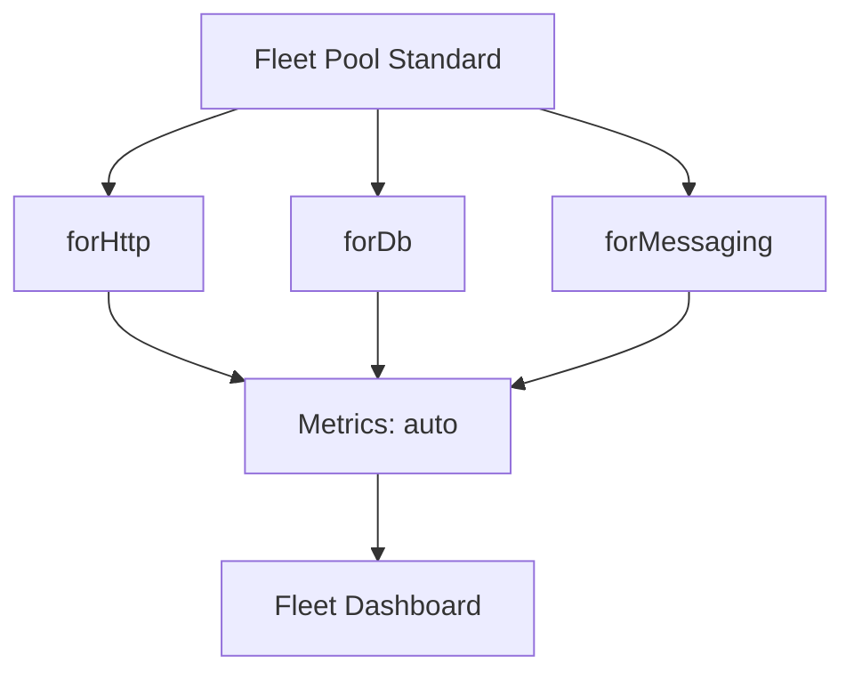

### 📶 Gradual Depth

**Level 1 - What it is:**
A shared set of rules and libraries ensuring every microservice in the organization configures thread pools consistently, with proper sizing, monitoring, and failure handling.

**Level 2 - How to use it:**
Teams replace custom ExecutorService creation with fleet library calls. Configuration via YAML. Metrics appear in fleet dashboard automatically. Alert rules fire on fleet-wide thresholds.

**Level 3 - How it works:**
The fleet library wraps ThreadPoolExecutor (or VT executor for JDK 21+) with: automatic Micrometer metric registration, bounded queue with configurable rejection, health-check integration, and dynamic resizing via configuration refresh. Pool names follow convention for fleet-wide aggregation.

**Level 4 - Production mastery:**
Implement A/B testing of pool configurations (canary sizing). Auto-scaling pool size based on observed latency (feedback loop). Integration with deployment pipelines: reject deploys with non-standard pool configuration (unless escape-hatch approved). Fleet-wide anomaly detection: alert when one service's pool behavior deviates from fleet baseline.

### ⚙️ How It Works

**Phase 1 - Define standard:** Engineering platform team defines pool profiles (HTTP, DB, messaging, compute) with sizing formulas.

**Phase 2 - Implement library:** Shared Maven/Gradle dependency. Factory methods produce pre-configured pools. Metrics auto-registered.

**Phase 3 - Adopt:** Teams replace custom pools with fleet library. Migration PR per service.

**Phase 4 - Monitor:** Fleet dashboard shows all pools. Alert rules: utilization > 80%, rejected > 0, queue > 50%.

**Phase 5 - Evolve:** Quarterly review of fleet pool metrics. Adjust standard based on observed patterns.

```text
Adoption flow:

  Team code before:
    new ThreadPoolExecutor(50, 200, ...);
    // No metrics. No naming. No dashboard.

  Team code after:
    FleetPool.forHttp("payment-api")
      .withLatencyTarget(Duration.ofMillis(100))
      .withThroughputTarget(500)
      .build();
    // Auto: sized, named, metered, alerted.
```

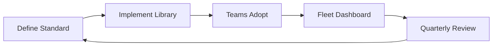

### 🚨 Failure Modes

**Failure 1 - Standard Too Rigid:**
**Symptom:** Teams bypass standard (copy-paste custom pools). Adoption drops below 50%.
**Root cause:** Standard does not accommodate legitimate variations. No escape hatch. Too prescriptive.
**Diagnostic:**

```
# Grep codebase for raw ThreadPoolExecutor usage
# vs FleetPool usage. Measure adoption %.
grep -rn "ThreadPoolExecutor" --include="*.java" | wc -l
grep -rn "FleetPool" --include="*.java" | wc -l
```

**Fix:**

**BAD:**

```java
// No escape hatch - teams bypass entirely:
// "Standard doesn't fit my use case, I'll DIY"
new ThreadPoolExecutor(100, 100, 0, SECONDS,
    new LinkedBlockingQueue<>()); // back to chaos
```

**GOOD:**

```java
// Escape hatch with audit trail:
FleetPool.custom("special-case")
    .withJustification("Batch processing: 10min tasks")
    .withReviewTicket("PLAT-1234")
    .coreSize(4).maxSize(4)
    .build(); // still gets metrics + monitoring
```

**Failure 2 - Incorrect Sizing Formula:**
**Symptom:** Standard pools sized too small for actual workload. Rejections across fleet.
**Root cause:** Little's Law inputs (throughput, latency) estimated incorrectly. Didn't account for P99.
**Diagnostic:**

```
# Fleet dashboard: rejection rate by service
# Correlate with actual latency vs estimated
```

**Fix:** Use OBSERVED P99 latency (not P50) in Little's Law. Add 50% headroom. Make sizing dynamic (reconfigurable without deploy).

### 🔬 Production Reality

**Incident pattern: fleet-wide cascade during cloud provider latency spike.**

Cloud provider's API gateway adds 2s latency fleet-wide. Before standardization: each service had different pool sizes and timeouts. 30% of services exhausted pools and cascaded. After standardization: all services have consistent 3s timeout + circuit breaker. Cloud spike triggers CB fleet-wide: fast-fail, graceful degradation, no cascade. Fleet recovers in 30s (CB half-open test). Dashboard shows exactly which services tripped and when.

### ⚖️ Trade-offs & Alternatives

| Approach                 | Consistency    | Autonomy | Overhead                     |
| ------------------------ | -------------- | -------- | ---------------------------- |
| Fleet standard (library) | High           | Low      | Medium (library maintenance) |
| Guidelines only (wiki)   | Low            | High     | Low                          |
| Service mesh (Envoy)     | High (L7 only) | Medium   | High (infra)                 |
| Platform runtime (Dapr)  | High           | Low      | High                         |
| No standard              | None           | Full     | Zero                         |

### ⚡ Decision Snap

**IMPLEMENT fleet standard WHEN:**

- 10+ microservices with shared downstream dependencies.
- Recurring incidents from pool misconfiguration.
- Platform engineering team exists to maintain.

**USE guidelines-only WHEN:**

- Small team (< 5 services). Low blast radius.
- High-trust environment where teams self-govern.

**ADD dynamic sizing WHEN:**

- Traffic patterns vary significantly (seasonal, burst).
- Manual sizing cannot keep up with change rate.

### ⚠️ Top Traps

| #   | Misconception                              | Reality                                                                                                            |
| --- | ------------------------------------------ | ------------------------------------------------------------------------------------------------------------------ |
| 1   | "One size fits all services"               | CPU-bound, I/O-bound, and mixed need different profiles. Provide 3-4 templates, not one.                           |
| 2   | "Library = fire and forget"                | Must evolve with fleet (JDK versions, VTs, new patterns). Needs dedicated ownership.                               |
| 3   | "Monitoring is optional"                   | Monitoring IS the standard. Without metrics: cannot prove compliance or detect drift.                              |
| 4   | "Teams will adopt voluntarily"             | Need incentive: auto-alerting, faster incident resolution, reduced on-call burden.                                 |
| 5   | "Virtual threads eliminate pool standards" | VTs eliminate SIZING concerns but introduce new standards: Semaphore limits, pinning detection, ScopedValue usage. |

### 🪜 Learning Ladder

**Prerequisites:**

- ThreadPoolExecutor Configuration - individual pool knowledge
- Platform Thread Exhaustion Failure - what standardization prevents
- Monitoring Thread Pools in Production - observability foundation

**THIS:** Fleet Thread Pool Standardization

**Next steps:**

- Concurrency Observability Platform Design - monitoring architecture
- Back-Pressure Architecture Patterns - fleet-level resilience
- Java 19 to 25 Virtual Threads Migration Strategy - fleet migration

### 💡 Surprising Truth

**The Surprising Truth:**
The most effective fleet pool standard is NOT the one with the best technical defaults - it is the one with the best developer experience. If the library requires 3 lines to use (vs 15 for raw TPE) and auto-generates dashboards: adoption reaches 95%+. If it requires 20 lines of configuration: teams bypass it regardless of technical superiority.

**Further Reading:**

- Netflix, "Hystrix Thread Pool Isolation" (wiki, archived)
- Kelsey Hightower, "Platform Engineering" (KubeCon talks)
- Google SRE Book, Chapter 21: "Handling Overload"

**Revision Card:**

1. Fleet standard = Little's Law sizing + consistent metrics + bounded queues + circuit breakers. Applied uniformly.
2. Gain: fleet-wide visibility, consistent failure modes. Cost: autonomy, maintenance overhead.
3. Success factor: developer experience > technical perfection. Easy adoption > correct defaults.

---

---

# Back-Pressure Architecture Patterns

**TL;DR** - Back-pressure prevents fast producers from overwhelming slow consumers by propagating demand signals upstream, transforming uncontrolled overload into controlled degradation.

### 🔥 Problem Statement

An event ingestion pipeline processes 100K events/sec. Consumer (DB writer) handles 50K/sec. Without back-pressure: internal queue grows unbounded (OOM in minutes). With bounded queue but no signal: producer blindly fills queue then gets rejected (data loss). With back-pressure: consumer signals "slow down" to producer, producer adapts rate. No data loss, no OOM, graceful degradation. At fleet scale: back-pressure must propagate across service boundaries (HTTP, messaging, streaming).

### 📜 Historical Context

Back-pressure concept originates from fluid dynamics (pressure opposing flow). Applied to computing by reactive systems (Reactive Manifesto, 2013). Reactive Streams spec (2015) formalized subscriber-driven demand. TCP has implicit back-pressure (receive window). Kafka has consumer-driven polling (implicit). HTTP has 429/503 status codes. gRPC has flow control. Each protocol implements back-pressure differently, but the principle is universal.

### 🔩 First Principles

**CORE INVARIANTS:**

1. If producer rate > consumer rate sustained: buffers overflow (OOM or data loss). Always.
2. Back-pressure = mechanism for consumer to signal "reduce rate" to producer.
3. Back-pressure MUST propagate end-to-end. One missing link in the chain = overflow at that point.

**DERIVED DESIGN:**
Invariant 1: without BP, every speed mismatch eventually fails. Invariant 2: the signal can be explicit (Reactive Streams request(N)) or implicit (bounded queue blocks, TCP window, HTTP 429). Invariant 3: if service A backs-pressures B but B does not back-pressure C: B overflows. Chain must be complete.

**THE TRADE-OFF:**
**Gain:** No OOM. No data loss. Graceful degradation. Self-regulating system.
**Cost:** Reduced throughput during overload (by design). Complexity of propagating signals across boundaries. Potential for head-of-line blocking.

### 🧠 Mental Model

> Back-pressure is a highway on-ramp meter (traffic signal controlling entry). When highway (consumer) is congested, the meter turns red: fewer cars enter (producer slows). Without metering: highway jams (OOM). With metering: highway flows at capacity and cars wait at ramp (bounded buffer).

- "Highway" -> consumer capacity
- "On-ramp meter" -> back-pressure signal
- "Cars waiting at ramp" -> bounded buffer
- "Fewer cars enter" -> producer rate reduced

**Where this analogy breaks down:** in software, back-pressure can propagate BACKWARD through many stages (not just one ramp). Also, software systems can drop messages (load shedding) which highways cannot.

### 🧩 Components

- **Bounded buffer** - fixed-size queue between producer and consumer. Simplest BP mechanism (blocks when full).
- **Demand signal** - explicit message from consumer to producer: "send me N more items" (Reactive Streams).
- **Rate limiter** - producer-side throttle limiting emission rate regardless of consumer demand.
- **Load shedding** - dropping excess messages when BP is insufficient (last resort).
- **Credit-based flow** - consumer grants "credits" (capacity). Producer sends up to credit limit.
- **TCP receive window** - implicit BP: receiver advertises buffer space, sender limits in-flight data.

```text
Back-pressure patterns (layered):

  Layer 1: Bounded Queue (simplest)
    Producer -> [Queue: max 1000] -> Consumer
    Queue full: producer blocks or rejects.

  Layer 2: Demand Signal (reactive)
    Consumer -> request(100) -> Producer
    Producer sends exactly 100 items.

  Layer 3: Rate Limit (admission control)
    [Rate Limiter: 50K/s] -> Pipeline
    Excess rejected at entry point.

  Layer 4: Load Shedding (last resort)
    [Drop oldest/random] when all else fails.
```

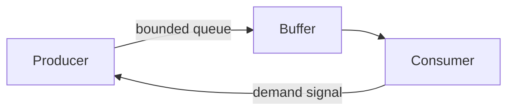

### 📶 Gradual Depth

**Level 1 - What it is:**
A way for a slow consumer to tell a fast producer "slow down" - preventing overflow, OOM, and data loss.

**Level 2 - How to use it:**
Use bounded queues (ArrayBlockingQueue). If using reactive: Flux with limitRate(). HTTP: return 429 when overloaded. Kafka: consumer-driven polling naturally back-pressures.

**Level 3 - How it works:**
Bounded queue: producer calls put() which blocks when full - physically preventing overproduction. Reactive Streams: Subscriber.request(N) tells Publisher to emit at most N items. Publisher respects demand. If demand = 0: publisher stops. TCP: receiver advertises window. Sender tracks in-flight bytes. Window full = stop sending.

**Level 4 - Production mastery:**
Design BP end-to-end: HTTP gateway -> service -> DB. Each boundary needs its own BP mechanism. Gateway: rate limiting (token bucket). Service: bounded work queue + 503 when full. DB: connection pool limit (Semaphore). Monitor: queue depth at each boundary. Alert on sustained > 80% capacity. Test BP explicitly: chaos engineering (slow downstream, verify upstream adapts).

### ⚙️ How It Works

**Phase 1 - Normal flow:** Producer rate <= consumer rate. Buffers empty. No BP needed.

**Phase 2 - Overload begins:** Producer rate > consumer rate. Buffer starts filling.

**Phase 3 - BP triggers:** Buffer reaches threshold (or queue full). Signal sent to producer.

**Phase 4 - Rate reduction:** Producer reduces rate. Buffer drains. System stabilizes at consumer capacity.

**Phase 5 - Recovery:** Consumer capacity restored. BP signal relaxes. Producer resumes normal rate.

```text
Without BP:
  Producer: 100K/s -> [Queue: unbounded] -> Consumer: 50K/s
  Queue grows 50K/s. OOM in minutes.

With BP (bounded queue, size=10K):
  Producer: 100K/s -> [Queue: 10K MAX] -> Consumer: 50K/s
  Queue fills in 0.2s.
  Producer blocks. Effective rate = 50K/s.
  System stable at consumer capacity.
```

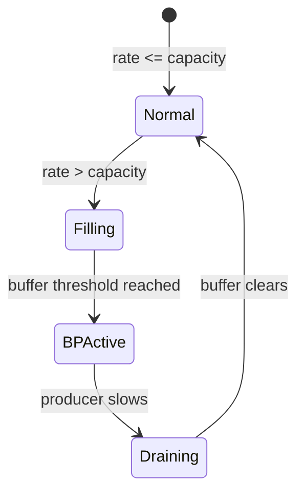

### 🚨 Failure Modes

**Failure 1 - Incomplete BP Chain:**
**Symptom:** Service B OOMs despite Service A having BP. Service C (downstream of B) is slow.
**Root cause:** A back-pressures to B (bounded queue). But B does NOT back-pressure to A: B buffers unboundedly between its consumer and C.
**Diagnostic:**

```
# Monitor queue depth at EACH service boundary
# Find the one growing unbounded
```

**Fix:**

**BAD:**

```java
// BP at entry but not internally:
BlockingQueue<Event> inbound = new ABQ<>(1000); // BP
List<Event> outbound = new ArrayList<>(); // UNBOUNDED!
```

**GOOD:**

```java
// BP at every boundary:
BlockingQueue<Event> inbound = new ABQ<>(1000);
BlockingQueue<Event> outbound = new ABQ<>(500);
// Both bounded. BP propagates end-to-end.
```

**Failure 2 - Head-of-Line Blocking:**
**Symptom:** One slow consumer blocks ALL producers, even those targeting fast consumers.
**Root cause:** Single shared queue for multiple consumer types. Slow consumer causes queue-full for everyone.
**Diagnostic:**

```
# Multiple producers blocked. Only one consumer slow.
# Check: is there a shared queue?
```

**Fix:** Per-consumer (or per-partition) queues. Slow consumer only back-pressures its own producers.

### 🔬 Production Reality

**Incident pattern: Kafka consumer lag without BP propagation.**

Kafka consumer reads at 100K msg/s. Downstream DB writes at 20K/s. Consumer does not back-pressure Kafka (always calls poll()). Internal buffer between consumer and DB writer grows. OOM. Fix: implement DB-writer-driven consumption. DB writer controls poll rate via Semaphore(maxInflight). When inflight = maxInflight: stop polling. Kafka consumer group rebalance timer extends (max.poll.interval.ms). System stabilizes at DB capacity. No data loss (Kafka retains messages). Lesson: consumer-side BP must propagate to the polling loop.

### ⚖️ Trade-offs & Alternatives

| Pattern               | Mechanism      | Complexity | Data Loss         |
| --------------------- | -------------- | ---------- | ----------------- |
| Bounded queue (block) | Physical block | Low        | None              |
| Reactive demand       | request(N)     | Medium     | None              |
| Rate limiting         | Token bucket   | Low        | Rejected excess   |
| Load shedding         | Drop policy    | Low        | YES (intentional) |
| TCP flow control      | Receive window | Built-in   | None              |
| HTTP 429              | Response code  | Low        | Client retries    |

### ⚡ Decision Snap

**USE bounded queue WHEN:**

- Single-process producer-consumer. Simplest.
- Blocking producer acceptable.

**USE reactive demand WHEN:**

- Complex pipelines with multiple stages.
- Need precise demand propagation.

**USE rate limiting WHEN:**

- At API gateway / system entry point.
- Need admission control independent of consumer.

**USE load shedding WHEN:**

- All other BP insufficient. Last resort.
- Prefer dropping old/low-priority over OOM.

### ⚠️ Top Traps

| #   | Misconception                       | Reality                                                                                                                |
| --- | ----------------------------------- | ---------------------------------------------------------------------------------------------------------------------- |
| 1   | "Bounded queue = back-pressure"     | Only if producer BLOCKS. If producer discards on full: that is load shedding, not BP.                                  |
| 2   | "Kafka has built-in back-pressure"  | Only consumer-driven polling is implicit BP. If consumer processes faster than downstream: internal overflow possible. |
| 3   | "One BP mechanism per system"       | Need BP at EVERY boundary. One missing link = overflow point.                                                          |
| 4   | "BP reduces throughput"             | BP caps throughput at CONSUMER capacity. Without BP: same effective throughput + OOM crash.                            |
| 5   | "Virtual threads eliminate BP need" | VTs eliminate thread exhaustion. But resource exhaustion (DB, memory) still requires BP.                               |

### 🪜 Learning Ladder

**Prerequisites:**

- Platform Thread Exhaustion Failure - what BP prevents
- BlockingQueue Implementations - simplest BP mechanism
- Reactive Streams vs Virtual Threads Decision - where reactive BP matters

**THIS:** Back-Pressure Architecture Patterns

**Next steps:**

- Transferable Pattern - Back-Pressure Across Systems - cross-domain
- Fleet Thread Pool Standardization - fleet-level BP
- Concurrency Observability Platform Design - monitoring BP

### 💡 Surprising Truth

**The Surprising Truth:**
TCP has implemented back-pressure since 1981 (RFC 793 receive window). Every HTTP request you make uses back-pressure transparently. The "modern" reactive back-pressure movement (2013) reinvented what TCP had done for decades - but at the APPLICATION layer. The insight: what works at the transport layer (flow control based on receiver capacity) works identically at the application layer.

**Further Reading:**

- Reactive Streams Specification 1.0.4 (reactive-streams.org)
- Reactive Manifesto (2014, reactivemanifesto.org)
- Jay Kreps, "Kafka: a Distributed Messaging System" (original design)

**Revision Card:**

1. BP = consumer signals producer to slow down. Without it: OOM or data loss. Always.
2. Must propagate end-to-end. One missing link = overflow at that point.
3. Patterns (simplest to complex): bounded queue > rate limit > reactive demand > load shedding.

---

---

# Concurrency Strategy - Reactive vs Loom vs Pool

**TL;DR** - Choose concurrency strategy (reactive, virtual threads, or thread pools) based on workload shape, team capability, ecosystem constraints, and JDK version - not ideology.

### 🔥 Problem Statement

A platform team must standardize concurrency strategy for 50 microservices. Some teams advocate reactive (already using WebFlux). Some push virtual threads (JDK 21 migration). Others prefer traditional pools (proven, understood). Each choice has merit. Without a decision framework: inconsistent architecture, cross-team debugging nightmares, and conflicting library dependencies. The choice is organizational, not just technical.

### 📜 Historical Context

Java concurrency evolution: thread-per-request (1997-2010), async/NIO (2002-2015), reactive (2013-present), virtual threads (2023-present). Each era addressed the previous era's limitation. Thread pools hit connection limits. Reactive solved scalability but added complexity. Virtual threads offer simplicity at scale. In 2024+: all three coexist. The strategy decision is "which WHERE" not "which ONE."

### 🔩 First Principles

**CORE INVARIANTS:**

1. All three approaches achieve comparable throughput for I/O-bound workloads. Performance is NOT the primary differentiator.
2. Code complexity, debuggability, and team expertise ARE the primary differentiators for request-response.
3. Back-pressure architecture is the primary differentiator for streaming/event workloads.

**DERIVED DESIGN:**
Invariant 1: do not choose based on benchmarks (they are equivalent). Invariant 2: for most request-response services, virtual threads win (simplest correct model). Invariant 3: for event pipelines with variable consumer speed, reactive wins (built-in demand).

**THE TRADE-OFF:**
**Reactive:** Highest capability (backpressure + composition). Highest complexity. Hardest debugging.
**Virtual threads:** Simplest code. Easy debugging. Manual backpressure. JDK 21+ required.
**Thread pools:** Universally understood. Limited scalability. Implicit backpressure (pool exhaustion).

### 🧠 Mental Model

> Choosing a concurrency strategy is like choosing a vehicle for a commute. Pool = sedan (reliable, known, limited passengers). Reactive = Formula 1 car (fast, complex, needs expert driver). VTs = electric bus (simple to drive, carries many passengers, needs new infrastructure).

- "Sedan" -> thread pool (reliable, limited scale)
- "Formula 1" -> reactive (fast, expert-only)
- "Electric bus" -> virtual threads (simple, scalable, needs JDK 21)
- "Commute" -> the actual workload

**Where this analogy breaks down:** you can use ALL THREE in the same system. Different "vehicles" for different routes (subsystems).

### 🧩 Components

- **Decision matrix** - workload shape x team expertise x JDK version -> strategy.
- **Workload classification** - request-response, streaming, batch, hybrid.
- **Team assessment** - reactive experience, JDK version readiness, debugging capability.
- **Migration path** - incremental strategy (pools -> VTs for request-response, keep reactive for streaming).
- **Escape hatch** - justified deviation process (documented, reviewed).

```text
Decision matrix:

  Workload         | JDK < 21    | JDK 21+
  -----------------+-------------+---------
  Request-response | Thread pool | VTs
  Streaming/events | Reactive    | Reactive
  CPU-bound compute| ForkJoinPool| ForkJoinPool
  Mixed (HTTP+Kafka)| Pool+Reactive| VTs+Reactive
  Legacy (sync libs)| Thread pool| VTs

  Team expertise:
    Reactive-fluent -> keep reactive where already
    Reactive-naive  -> VTs preferred (simpler)
```

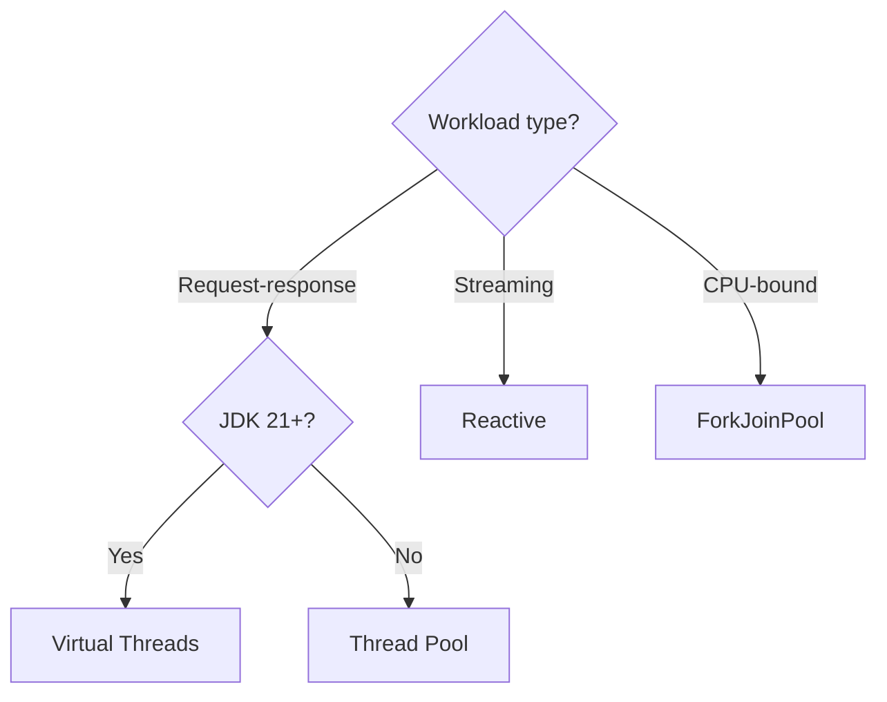

### 📶 Gradual Depth

**Level 1 - What it is:**
A framework for deciding which concurrency approach (reactive, virtual threads, or thread pools) to use for each service/subsystem in your architecture.

**Level 2 - How to use it:**
Classify each service's workload. Check JDK version constraint. Assess team expertise. Apply decision matrix. Document choice with justification.

**Level 3 - How it works:**
The strategy recognizes that different subsystems have different needs. HTTP request handling (request-response) benefits most from VTs (simple blocking, scalable). Kafka/event processing benefits from reactive (backpressure). CPU-bound analytics benefits from ForkJoinPool (work-stealing). A single application may use all three.

**Level 4 - Production mastery:**
Implement strategy as architectural decision record (ADR). Provide migration playbooks for each path (pool->VTs, pool->reactive). Track fleet-wide strategy adoption via dependency analysis (which services use which framework). Quarterly review: as JDK versions advance and team expertise grows, strategy may evolve.

### ⚙️ How It Works

**Phase 1 - Classify workloads:**

- Request-response (HTTP, gRPC, DB queries)
- Streaming (Kafka, WebSocket, SSE)
- CPU-bound (analytics, ML inference)
- Hybrid (multiple patterns in one service)

**Phase 2 - Assess constraints:**

- JDK version (21+ required for VTs)
- Existing codebase (reactive migration cost)
- Team expertise (reactive learning curve)
- Library ecosystem (blocking vs reactive drivers)

**Phase 3 - Apply matrix:**
Map workload x constraints to strategy.

**Phase 4 - Document:**
ADR per service or service category. Justification. Migration path.

**Phase 5 - Execute incrementally:**
Pilot one service per strategy. Validate. Roll out to category.

```text
Example: e-commerce platform

  API Gateway:    VTs (request-response, JDK 21)
  Order Service:  VTs (CRUD, JDBC, simple)
  Payment:        VTs + timeout/CB (critical path)
  Notifications:  Reactive (Kafka consumer, BP)
  Analytics:      ForkJoinPool (CPU-bound agg)
  Search:         VTs (Elasticsearch client, I/O)
```

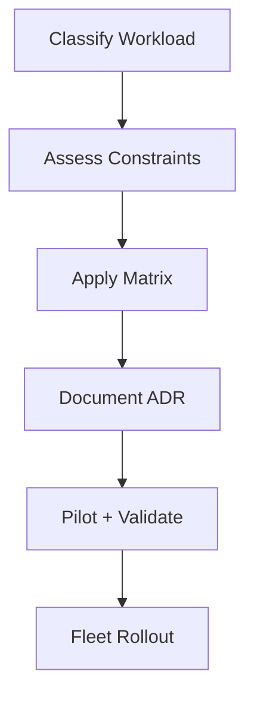

### 🚨 Failure Modes

**Failure 1 - One Strategy Everywhere:**
**Symptom:** Reactive forced on CRUD services. Team velocity drops 50%. Debug time 3x.
**Root cause:** "We chose reactive" applied uniformly without workload analysis.
**Diagnostic:**

```
# Measure: time-to-debug, time-to-implement
# Compare reactive vs blocking services
# If reactive services take 3x: wrong fit
```

**Fix:**

**BAD:**

```java
// Reactive for simple CRUD (over-engineering):
Mono.fromCallable(() -> repo.findById(id))
    .subscribeOn(Schedulers.boundedElastic())
    .map(entity -> toDto(entity));
// 4 lines for what should be 1 line.
```

**GOOD:**

```java
// VT for simple CRUD (direct, simple):
var entity = repo.findById(id); // blocks, VT unmounts
return toDto(entity);
// 2 lines. Same throughput. 10x easier to debug.
```

**Failure 2 - VTs Without BP on Streaming:**
**Symptom:** Kafka consumer with VTs overwhelms downstream DB. OOM on internal buffer.
**Root cause:** VTs have no built-in demand signal. Consumer pulls at max rate.
**Diagnostic:**

```
# Monitor: internal queue depth between consumer and writer
# If growing unbounded: missing backpressure
```

**Fix:** Keep reactive (or reactive-style consumption) for streaming workloads where backpressure is essential. VTs for request-response only.

### 🔬 Production Reality

**Incident pattern: mixed-strategy success at scale.**

A fintech with 80 services adopted hybrid strategy. Request-response services (60): migrated from WebFlux to virtual threads. Event services (15): kept reactive (Kafka backpressure critical). Batch services (5): kept thread pools (proven, no change needed). Results after 6 months: 40% reduction in time-to-diagnose (simpler stack traces). Zero throughput regression (performance equivalent). 25% faster feature delivery (VT code simpler). Reactive expertise concentrated in event-processing team (specialization).

### ⚖️ Trade-offs & Alternatives

| Criterion       | Thread Pool          | Virtual Threads    | Reactive          |
| --------------- | -------------------- | ------------------ | ----------------- |
| Code simplicity | High                 | High               | Low               |
| Scalability     | Limited (pool size)  | High (millions)    | High (event loop) |
| Debugging       | Easy                 | Easy               | Hard              |
| Backpressure    | Implicit (pool full) | Manual (Semaphore) | Built-in          |
| Learning curve  | None                 | Low                | High              |
| Ecosystem       | Universal            | JDK 21+            | Reactive drivers  |
| Best for        | Legacy, simple       | Request-response   | Streaming         |

### ⚡ Decision Snap

**DEFAULT to virtual threads WHEN:**

- JDK 21+. Request-response. Team not reactive-expert.

**DEFAULT to reactive WHEN:**

- Streaming workload. Backpressure essential. Already reactive.

**KEEP thread pools WHEN:**

- JDK < 21. Working. No scaling issues. If it works, do not fix it.

**HYBRID (recommended for most orgs):**

- VTs for HTTP/RPC. Reactive for messaging/streaming. FJP for compute.

### ⚠️ Top Traps

| #   | Misconception                    | Reality                                                                              |
| --- | -------------------------------- | ------------------------------------------------------------------------------------ |
| 1   | "Must choose ONE for entire org" | Different subsystems need different strategies. Hybrid is correct.                   |
| 2   | "Reactive is dead"               | Repositioned: streaming/events. Not for mere concurrency anymore.                    |
| 3   | "VTs are always simpler"         | VTs need: pinning awareness, Semaphore for BP, ThreadLocal care. Not zero-knowledge. |
| 4   | "Performance decides"            | Performance is EQUIVALENT for I/O. Decide on complexity and fit.                     |
| 5   | "Migration is all-or-nothing"    | Incremental: one service at a time. Coexistence is normal and healthy.               |

### 🪜 Learning Ladder

**Prerequisites:**

- Reactive Streams vs Virtual Threads Decision - individual decision
- Virtual Threads Internals (Project Loom) - VT mechanics
- Platform Thread Exhaustion Failure - pool limitations
- Fleet Thread Pool Standardization - fleet context

**THIS:** Concurrency Strategy - Reactive vs Loom vs Pool

**Next steps:**

- Back-Pressure Architecture Patterns - for streaming decisions
- Java 19 to 25 Virtual Threads Migration Strategy - execution
- Concurrency Observability Platform Design - monitoring all strategies

### 💡 Surprising Truth

**The Surprising Truth:**
The majority of "reactive" microservices in production (2024 data from Spring surveys) could be rewritten as blocking code on virtual threads with ZERO throughput loss and 50% less code. Reactive was adopted for scalability - but virtual threads provide equivalent scalability with blocking code. The remaining value of reactive is BACKPRESSURE for streaming - which is 10-20% of typical microservice workloads.

**Further Reading:**

- Brian Goetz, "Virtual Threads: Coming to a Server Near You" (2023)
- Spring State of the Ecosystem Report (2024)
- Reactive Manifesto (2014) - original motivations

**Revision Card:**

1. Performance equivalent for I/O. Decide on: code complexity + backpressure need + team expertise.
2. Hybrid strategy: VTs for request-response, reactive for streaming, pools for legacy/compute.
3. Strategy evolves: as JDK versions advance and teams grow, reassess quarterly.

---

---

# Distributed Locking vs In-Process Locking

**TL;DR** - In-process locks (synchronized, ReentrantLock) protect shared state within one JVM; distributed locks (Redis, ZooKeeper) protect shared state across JVMs - with fundamentally different failure modes and guarantees.

### 🔥 Problem Statement

An application scales from 1 instance to 10 instances. ReentrantLock protected inventory deductions on a single JVM. Now 10 JVMs can simultaneously deduct from the same inventory: overselling. The in-process lock is invisible to other JVMs. Options: distributed lock (Redis SETNX, ZooKeeper ephemeral node), database lock (SELECT FOR UPDATE), or redesign to eliminate shared state. Each has different guarantees, failure modes, and performance characteristics.

### 📜 Historical Context

In-process locking: Java monitors since JDK 1.0, ReentrantLock since JDK 5. Well-understood, millisecond acquisition. Distributed locking: emerged with distributed databases (Chubby at Google, 2006). ZooKeeper (2010). Redis-based (Redlock, 2016). Martin Kleppmann's critique of Redlock (2016) exposed fundamental impossibility theorems. The debate continues: distributed locks have inherent limitations due to asynchronous networks (FLP impossibility).

### 🔩 First Principles

**CORE INVARIANTS:**

1. In-process locks provide MUTUAL EXCLUSION within one JVM. Guaranteed by hardware (CAS, monitors).
2. Distributed locks provide BEST-EFFORT mutual exclusion across JVMs. Cannot be guaranteed (network partitions, GC pauses, clock skew).
3. Distributed lock failure modes are SILENT: process holding lock can be paused (GC) while lock expires, allowing another process to acquire it. Both believe they hold the lock.

**DERIVED DESIGN:**
Invariant 2+3: distributed locks alone CANNOT prevent all concurrent access. Need fencing tokens (monotonically increasing IDs verified by the resource). Invariant 1: in-process locks are reliable but scope-limited to one JVM.

**THE TRADE-OFF:**
**Gain (distributed lock):** Coordination across JVMs/instances. Prevents duplicate processing at fleet scale.
**Cost:** Network latency per acquisition. Unreliable (GC pauses, network partitions). Complexity (TTL, renewal, fencing).

### 🧠 Mental Model

> In-process lock = physical key to a room. If you hold it, nobody else can enter. Guaranteed by physics. Distributed lock = verbal agreement ("I'm using the room"). If you become unconscious (GC pause), someone else enters believing you left. No physical barrier.

- "Physical key" -> in-process lock (hardware-guaranteed)
- "Verbal agreement" -> distributed lock (best-effort)
- "Unconscious" -> GC pause / network partition
- "Someone enters" -> lock appears expired, other acquires

**Where this analogy breaks down:** distributed locks have TTL (auto-expire). It is not just "verbal" - there is enforcement. But enforcement is time-based, and clocks/networks are unreliable.

### 🧩 Components

- **In-process lock** - ReentrantLock, synchronized. Single JVM. Hardware-guaranteed mutual exclusion.
- **Redis lock** - SETNX with TTL. Single Redis instance (no Redlock) is common. Fast but loses lock on Redis failure.
- **ZooKeeper lock** - ephemeral sequential node. Session-based expiry. Stronger ordering guarantees.
- **Database lock** - SELECT FOR UPDATE or advisory locks. Already consistent (ACID). Slower.
- **Fencing token** - monotonic ID attached to lock grant. Resource (DB) rejects operations with old tokens.
- **Lock renewal** - background thread extends TTL while holder is active. Fails if holder is GC-paused.

```text
In-process (ReentrantLock):
  Thread A: lock.lock() -> guaranteed exclusive
  Thread B: lock.lock() -> waits (guaranteed)
  No network. No TTL. No failure modes.

Distributed (Redis):
  Instance A: SET key val NX EX 30 -> OK (acquired)
  Instance B: SET key val NX EX 30 -> nil (denied)
  BUT: if A pauses for 31s (GC):
    Lock expires! B acquires! A resumes!
    BOTH think they hold the lock!
```

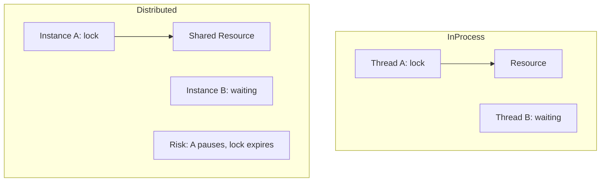

### 📶 Gradual Depth

**Level 1 - What it is:**
In-process locks work within one JVM (guaranteed). Distributed locks work across JVMs (best-effort, can fail in subtle ways).

**Level 2 - How to use it:**
Single instance: ReentrantLock (always correct). Multiple instances: Redis lock for efficiency workloads (idempotent operations, deduplication). DB lock for correctness-critical (inventory, financial). Always add fencing tokens.

**Level 3 - How it works:**
Redis lock: atomic SET NX EX (set-if-not-exists with TTL). If acquired: do work, then DELETE. If TTL expires before delete: lock auto-released (potentially premature). ZooKeeper: create ephemeral sequential node. Lowest sequence number holds lock. Session death deletes node. Fencing: lock grant includes monotonic token. Resource rejects writes with token < last seen.

**Level 4 - Production mastery:**
Use Redis lock for: rate limiting, cache warming, non-critical deduplication. Use DB lock for: financial transactions, inventory (ACID consistency). NEVER rely on distributed lock alone for safety-critical mutual exclusion. Always design for: what happens if two processes BOTH execute the critical section? (Answer: fencing token at storage layer rejects stale writes).

### ⚙️ How It Works

**Phase 1 - Acquire:** Client sends lock request to coordinator (Redis SET NX, ZK create).

**Phase 2 - Hold:** Client executes critical section. TTL countdown begins.

**Phase 3 - Renew (optional):** Background thread extends TTL (heartbeat). Fails if client paused.

**Phase 4 - Release:** Client explicitly deletes lock. Or: TTL expires (implicit release).

**Phase 5 - Failure scenario:** Client pauses (GC, network). TTL expires. Another client acquires. First client resumes - BOTH in critical section.

```text
Failure timeline:

  t=0:  A acquires lock (TTL=30s)
  t=5:  A starts GC pause (15s!)
  t=20: A still paused. Lock expires at t=30.
  t=30: Lock expires. B acquires.
  t=20: A resumes from GC. Believes it has lock.
  t=20-30: BOTH A and B in critical section!

  Fix: fencing token.
  A's token: 42. B's token: 43.
  Storage: rejects writes with token < 43.
  A's write (token 42) rejected. Safety preserved.
```

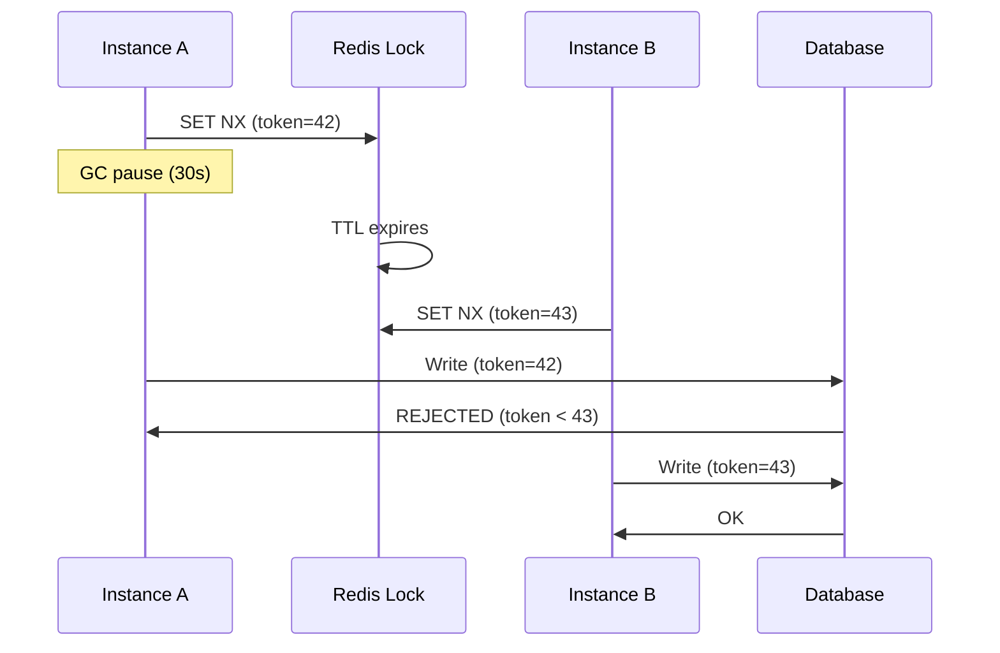

### 🚨 Failure Modes

**Failure 1 - Lock Expiry During GC:**
**Symptom:** Two processes execute "exclusive" section simultaneously. Data corruption.
**Root cause:** Lock holder GC-paused beyond TTL. Lock auto-expired. New holder acquired.
**Diagnostic:**

```
# GC logs: long pause > lock TTL
# Redis: multiple clients acquired same logical lock
# within TTL window (monitor via keyspace notifications)
```

**Fix:**

**BAD:**

```java
// Trust lock alone for mutual exclusion:
if (redisLock.acquire("inventory", 30_000)) {
    inventory -= quantity; // UNSAFE if lock expired!
    redisLock.release("inventory");
}
```

**GOOD:**

```java
// Fencing token verified by storage:
var token = redisLock.acquireWithToken("inv", 30_000);
db.execute("UPDATE inventory SET qty = qty - ? " +
    "WHERE id = ? AND fence_token < ?",
    quantity, itemId, token);
// DB rejects if stale token. Safety preserved.
```

**Failure 2 - Redis Single Point of Failure:**
**Symptom:** Redis restart -> all locks lost simultaneously. Multiple instances enter critical sections.
**Root cause:** Single Redis instance. Restart clears all keys. No persistence of lock state.
**Diagnostic:**

```
# Redis: KEYS lock:* returns empty after restart
# Multiple services log "lock acquired" simultaneously
```

**Fix:** For safety-critical: use ZooKeeper (persisted) or DB advisory locks. Redlock (multi-instance) partially mitigates but has its own issues (Kleppmann critique).

### 🔬 Production Reality

**Incident pattern: distributed lock as false safety guarantee.**

E-commerce: Redis lock guards inventory deduction. Black Friday: GC pauses increase under load. Lock TTL = 10s. GC pause = 12s. Result: overselling 200 items in 30 minutes. All "protected" by the distributed lock. Fix: add DB-level fence column. `UPDATE stock SET qty = qty - 1, fence = ? WHERE id = ? AND fence < ?`. If two processes both deduct: only the later-token write succeeds. Earlier token's UPDATE affects 0 rows (detected by checking rows affected).

### ⚖️ Trade-offs & Alternatives

| Lock Type                    | Guarantee             | Latency        | Failure Mode                        |
| ---------------------------- | --------------------- | -------------- | ----------------------------------- |
| In-process (ReentrantLock)   | Absolute (single JVM) | Nanoseconds    | None (hardware)                     |
| Redis (single)               | Best-effort           | 1-5ms          | Redis crash, GC expiry              |
| Redis (Redlock)              | Better-effort         | 5-20ms         | Clock skew, Kleppmann critique      |
| ZooKeeper                    | Session-based         | 10-50ms        | Session timeout, ZK cluster failure |
| Database (SELECT FOR UPDATE) | ACID-guaranteed       | 5-50ms         | DB failure, deadlock                |
| Fencing token                | Safety guarantee      | +1 write check | Requires storage cooperation        |

### ⚡ Decision Snap

**USE in-process lock WHEN:**

- Single JVM instance (or state is JVM-local).
- Maximum performance needed (nanoseconds).

**USE Redis lock WHEN:**

- Efficiency optimization (deduplication, rate limiting).
- Concurrent execution is WASTEFUL but not DANGEROUS.
- Operations are idempotent (safe if both execute).

**USE DB lock WHEN:**

- Correctness-critical (money, inventory).
- Already using DB for the protected resource.
- Need ACID consistency (not just mutual exclusion).

**ALWAYS add fencing token WHEN:**

- Two processes executing simultaneously would corrupt data.

### ⚠️ Top Traps

| #   | Misconception                         | Reality                                                                                              |
| --- | ------------------------------------- | ---------------------------------------------------------------------------------------------------- |
| 1   | "Distributed lock = mutual exclusion" | Best-effort only. GC pauses, network partitions can violate exclusion.                               |
| 2   | "Redis is reliable enough"            | Single Redis: SPOF. Restart = all locks lost. Redlock: still debated (Kleppmann).                    |
| 3   | "Fencing tokens are optional"         | Without fencing: two holders = corruption. With: safety preserved. Always add.                       |
| 4   | "ZooKeeper solves everything"         | ZK provides ordering guarantees but: session timeouts still allow dual-holder. Fencing still needed. |
| 5   | "TTL long enough prevents expiry"     | Long TTL = long recovery when holder actually crashes. Short TTL = expiry during GC. No perfect TTL. |

### 🪜 Learning Ladder

**Prerequisites:**

- ReentrantLock vs synchronized - in-process mechanics
- Platform Thread Exhaustion Failure - why we scale horizontally
- Happens-Before Relationship - memory visibility (in-process only)

**THIS:** Distributed Locking vs In-Process Locking

**Next steps:**

- Back-Pressure Architecture Patterns - related fleet concern
- Concurrency Observability Platform Design - monitoring locks
- Fleet Thread Pool Standardization - fleet coordination

### 💡 Surprising Truth

**The Surprising Truth:**
Martin Kleppmann proved (2016) that NO distributed lock algorithm based on timing assumptions (TTL, lease) can provide safety in an asynchronous system with GC pauses. The ONLY safe approach is fencing tokens verified by the storage layer. This means: the "lock" is not providing safety - the STORAGE is. The lock is merely an optimization to reduce conflicts, not a safety mechanism.

**Further Reading:**

- Martin Kleppmann, "How to do distributed locking" (2016, blog post)
- Salvatore Sanfilippo, "Is Redlock safe?" (2016, response)
- Mike Burrows, "The Chubby Lock Service" (Google, 2006, OSDI)

**Revision Card:**

1. In-process: guaranteed (hardware). Distributed: best-effort (network/GC can violate).
2. ALWAYS use fencing tokens for safety-critical distributed coordination. Lock alone is insufficient.
3. The lock is an OPTIMIZATION (reduces conflicts). The STORAGE provides safety (rejects stale tokens).

---

---

# Concurrency Observability Platform Design

**TL;DR** - A concurrency observability platform surfaces thread pool health, lock contention, queue depths, and scheduling latency fleet-wide through standardized metrics, distributed tracing correlation, and alerting on concurrency-specific failure signatures.

### 🔥 Problem Statement

A fleet of 150 microservices experiences intermittent latency spikes. Thread dumps show threads WAITING on locks, but which lock? Which service? On-call engineers manually jstack individual pods, correlate timestamps, and guess. By the time they identify the contended lock (a shared cache invalidation path), the incident has lasted 40 minutes. Without fleet-wide concurrency observability, diagnosing thread starvation, lock contention, and queue saturation requires heroic manual effort every time.

### 📜 Historical Context

Early monitoring (2000s) focused on CPU/memory/disk. Thread-level observability was limited to periodic thread dumps (jstack). JMX exposed ThreadMXBean (thread counts, deadlock detection) but required per-JVM polling. Micrometer (2017) standardized JVM metrics for Prometheus. OpenTelemetry (2019+) unified metrics, traces, and logs. JFR (Java Flight Recorder, open-sourced JDK 11) enabled always-on profiling with minimal overhead. The gap: connecting thread-pool metrics to request traces to lock-contention events in a single correlated view.

### 🔩 First Principles

**CORE INVARIANTS:**

1. Every thread pool MUST emit standardized metrics: active count, queue depth, completed count, rejected count.
2. Every lock acquisition MUST be traceable to a request/span (correlation via trace context propagation).
3. Alerts MUST fire on leading indicators (queue depth growing, active/max ratio approaching 1.0) not lagging indicators (timeouts already happening).

**DERIVED DESIGN:**
Invariant 1 enables fleet dashboards comparing pool utilization across services. Invariant 2 enables "which user request is holding this lock?" queries. Invariant 3 enables proactive response before cascading failures.

**THE TRADE-OFF:**
**Gain:** Sub-minute diagnosis of concurrency incidents. Proactive alerting. Fleet-wide thread health visibility.
**Cost:** Instrumentation overhead (typically 1-3% latency). Metric cardinality explosion if pool names are unbounded. Storage costs for high-frequency lock events.

### 🧠 Mental Model

> A concurrency observability platform is an MRI machine for your fleet's threading system. Just as an MRI shows blood flow, blockages, and tissue health without surgery - this platform shows thread flow, lock blockages, and queue health without ssh-ing into pods.

- "Blood flow" -> thread execution (active threads doing work)
- "Blockages" -> lock contention (threads waiting to acquire)
- "MRI scan" -> JFR + metrics + traces correlated in dashboards
- "Without surgery" -> no manual jstack, no pod access needed

**Where this analogy breaks down:** MRI is a snapshot; observability is continuous streaming with alerting.

### 🧩 Components

- **Metric emitters** - Micrometer gauges/timers attached to every ExecutorService and Lock. Standard names: `executor.active`, `executor.queued`, `executor.rejected`.
- **JFR event streams** - Always-on lock contention events (`jdk.JavaMonitorWait`, `jdk.ThreadPark`) streamed to collectors.
- **Trace correlation** - OpenTelemetry context propagated through thread pool boundaries (executor instrumentation wraps Runnable with current span).
- **Fleet aggregator** - Prometheus/Grafana or equivalent collecting per-pod metrics, aggregating to service-level dashboards.
- **Alert rules** - Threshold-based (queue > 80% capacity) and anomaly-based (contention rate 3x above baseline).
- **Diagnostic drill-down** - From alert to flame graph showing which code path contends on which lock.

```text
+------------------+    +------------------+
| Service A        |    | Service B        |
| [Pool Metrics]   |    | [Pool Metrics]   |
| [JFR Events]     |    | [JFR Events]     |
| [Trace Spans]    |    | [Trace Spans]    |
+--------+---------+    +--------+---------+
         |                        |
         v                        v
   +-----+------------------------+-----+
   |        Metric Collector            |
   |  (Prometheus / OTel Collector)     |
   +-----+------------------------+-----+
         |                        |
         v                        v
   +----------+            +-----------+
   | Dashboard|            |  Alerting |
   | (Grafana)|            | (PagerDuty)|
   +----------+            +-----------+
```

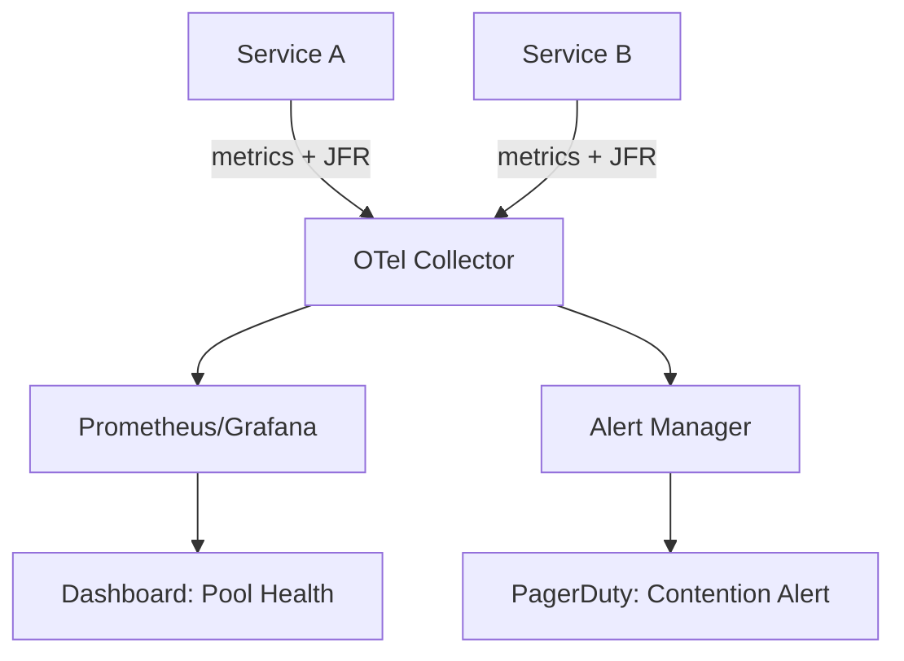

### 📶 Gradual Depth

**Level 1 - What it is:**
Observability for thread pools and locks. Dashboards showing how many threads are active, queued, and contending across all services.

**Level 2 - How to use it:**
Instrument every ExecutorService with Micrometer. Enable JFR in production (default since JDK 11, <1% overhead). Set alerts on `executor.queued / executor.queue.capacity > 0.8` and `lock.contention.time.p99 > 50ms`.

**Level 3 - How it works:**
Micrometer wraps ThreadPoolExecutor, polling active/queue counts at scrape interval. JFR records lock wait events with stack traces when contention exceeds a threshold (configurable). OpenTelemetry agent wraps executor.submit() to propagate trace context into the worker thread. Collectors aggregate, dashboards visualize, alert rules evaluate.

**Level 4 - Production mastery:**
Cardinality control: use bounded pool name labels (never user-generated names). JFR streaming (JDK 14+) enables real-time event forwarding without dump files. Correlate lock contention spikes with GC pause events (both in JFR). Use async-profiler lock mode for contention flame graphs in targeted investigations. Build runbooks linking alert -> dashboard -> drill-down -> remediation.

### ⚙️ How It Works

**Phase 1 - Instrumentation:** Application registers ExecutorService with Micrometer. JFR starts recording at JVM boot.

**Phase 2 - Collection:** Prometheus scrapes metrics every 15s. JFR events stream to OTel Collector via JFR Event Streaming API (JDK 14+) or periodic chunk upload.

**Phase 3 - Correlation:** OTel Collector joins trace_id from metrics/events with distributed traces. Enables "show me all lock waits for trace X."

**Phase 4 - Visualization:** Grafana dashboards show fleet-wide pool utilization heatmaps. Drill from service -> pool -> specific contention event.

**Phase 5 - Alerting:** Rules fire when leading indicators breach thresholds. On-call receives alert with pre-linked dashboard URL and suggested diagnostic commands.

```text
App (instrumented):
  submit(task)
    -> wrap(task, currentSpan)
    -> pool.execute(wrappedTask)
    -> Micrometer records: active++, queued--

JFR (always-on):
  Thread blocks on lock >10ms
    -> jdk.JavaMonitorWait event recorded
    -> includes: thread, lock object, stack, duration

Collector:
  Scrape metrics (15s) + stream JFR events
    -> correlate via service/pod/thread labels
    -> forward to Prometheus + Tempo/Jaeger
```

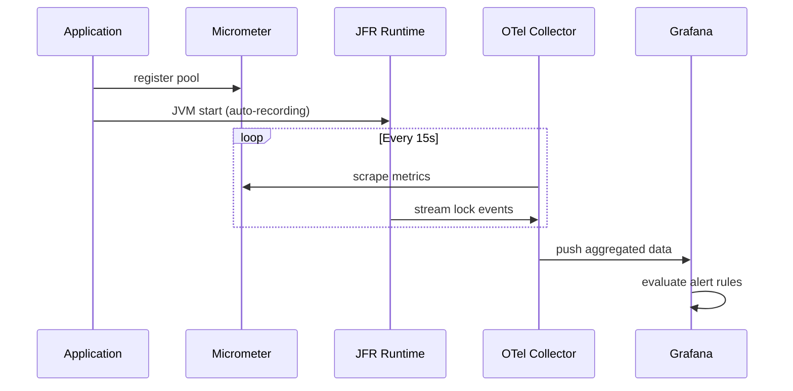

### 🚨 Failure Modes

**Failure 1 - Metric Cardinality Explosion:**
**Symptom:** Prometheus OOM or slow queries. Dashboard timeouts.
**Root cause:** Pool names include dynamic values (user IDs, request IDs) creating millions of time series.
**Diagnostic:**

```
# Prometheus TSDB stats: check series count
curl localhost:9090/api/v1/status/tsdb | jq '.data.numSeries'
# Find high-cardinality labels:
topk(10, count by (__name__)({__name__=~"executor.*"}))
```

**Fix:**

**BAD:**

```java
// Dynamic pool names: unbounded cardinality
var pool = Executors.newFixedThreadPool(10);
new ExecutorServiceMetrics(pool,
    "pool-" + request.getUserId(), tags);
```

**GOOD:**

```java
// Static pool names: bounded cardinality
var pool = Executors.newFixedThreadPool(10);
new ExecutorServiceMetrics(pool,
    "order-processing-pool",
    Tags.of("service", "order-svc"));
```

**Failure 2 - Lost Trace Context Across Pool Boundary:**
**Symptom:** Traces show gaps. Lock contention events cannot be correlated to originating requests.
**Root cause:** ExecutorService.submit() runs task on different thread. Span context not propagated.
**Diagnostic:**

```
# Jaeger: search for broken traces (parent span with
# no child spans after pool submission)
# Or: check OTel agent logs for "context not propagated"
```

**Fix:**

**BAD:**

```java
// Raw submission: loses trace context
executor.submit(() -> processOrder(order));
```

**GOOD:**

```java
// OTel-instrumented executor (agent auto-instruments)
// OR manual wrapping:
Context ctx = Context.current();
executor.submit(ctx.wrap(() -> processOrder(order)));
```

### 🔬 Production Reality

**Incident pattern: invisible thread starvation cascade.**

A payment service fleet (40 pods) experienced P99 latency spikes every afternoon. Metrics showed CPU at 30% - not overloaded. Without thread-level observability, the team added more pods (no improvement). After instrumenting pools with Micrometer: the Tomcat thread pool (200 threads) was 100% active during spikes. Queue depth: 2000+. Root cause: a downstream fraud-check service added 2s latency. Each Tomcat thread blocked on the HTTP call. 200 threads x 2s = 100 req/s max throughput (was 2000 req/s before). Fix: added circuit breaker + timeout (500ms). Thread pool utilization dropped to 40%. Lesson: CPU metrics are blind to thread starvation. Pool utilization metrics are essential.

### ⚖️ Trade-offs & Alternatives

| Aspect             | Full Platform (Metrics+JFR+Traces)    | Metrics Only        | JFR Only              | Manual jstack |
| ------------------ | ------------------------------------- | ------------------- | --------------------- | ------------- |
| Incident diagnosis | Minutes                               | 10-20 min           | 5-15 min (single JVM) | 30-60 min     |
| Fleet visibility   | Full                                  | Partial (no traces) | None (per-pod)        | None          |
| Overhead           | 1-3%                                  | <0.5%               | <1%                   | High (manual) |
| Correlation        | Request -> pool -> lock               | Pool-level only     | Thread-level only     | Snapshot only |
| Setup effort       | High (agent + collector + dashboards) | Medium              | Low (JDK built-in)    | Zero          |

### ⚡ Decision Snap

**USE full platform WHEN:**

- Fleet of >10 services with shared thread pool patterns.
- Concurrency incidents are recurring or expensive (SLA violations).
- Organization has platform engineering capacity.

**AVOID full platform WHEN:**

- Single-service deployment (JFR + basic metrics suffice).
- Team lacks operational capacity for metric infrastructure.

**PREFER JFR-only WHEN:**

- Need lock-level profiling without infrastructure investment.
- Investigating single-JVM contention in development.

### ⚠️ Top Traps

| #   | Misconception                            | Reality                                                                                           |
| --- | ---------------------------------------- | ------------------------------------------------------------------------------------------------- |
| 1   | "CPU metrics show thread starvation"     | CPU can be 20% while all threads are blocked on I/O. Pool metrics are the signal.                 |
| 2   | "JFR has high overhead"                  | Default JFR profile: <1% overhead. It is designed for always-on production use.                   |
| 3   | "Trace context propagates automatically" | Only with instrumented executors. Raw pool.submit() loses context. Use OTel agent or manual wrap. |
| 4   | "More metrics = better observability"    | Unbounded cardinality kills Prometheus. Fewer, well-named metrics > thousands of dynamic ones.    |
| 5   | "Dashboards prevent incidents"           | Dashboards without alerts are useless at 3am. Alert on leading indicators.                        |

### 🪜 Learning Ladder

**Prerequisites:**

- Monitoring Thread Pools in Production - single-service metrics
- JFR Thread and Lock Events - event types and recording
- Fleet Thread Pool Standardization - naming conventions

**THIS:** Concurrency Observability Platform Design

**Next steps:**

- Lock Contention Profiling (async-profiler) - deep-dive diagnostics
- Concurrency Strategy - Reactive vs Loom vs Pool - architecture decisions informed by observability

### 💡 Surprising Truth

**The Surprising Truth:**
The single most valuable concurrency metric is not lock contention time or thread count - it is `queue_depth / queue_capacity` ratio trending over time. A growing ratio is a leading indicator that predicts thread starvation 5-15 minutes before timeouts begin. Most teams only alert on timeouts (lagging indicator), missing the window for graceful remediation.

**Further Reading:**

- OpenTelemetry Semantic Conventions for JVM metrics (opentelemetry.io)
- JFR Event Streaming API, JEP 349 (JDK 14)
- Micrometer ExecutorServiceMetrics documentation (micrometer.io)

**Revision Card:**

1. Instrument every pool with standard metric names. Enable JFR always-on. Propagate trace context across pool boundaries.
2. Alert on queue_depth/capacity ratio (leading indicator), not timeouts (lagging indicator).
3. CPU metrics are blind to thread starvation. Pool utilization is the signal you need.

---

---

# Java 19 to 25 Virtual Threads Migration Strategy

**TL;DR** - Migrating to virtual threads requires identifying pinning risks (synchronized + blocking I/O), replacing ThreadLocal with ScopedValue, validating library compatibility, and incrementally converting thread pools from platform to virtual threads across JDK versions.

### 🔥 Problem Statement

An organization on JDK 17 wants virtual threads. The codebase has 200+ uses of synchronized blocks (potential pinning), 150+ ThreadLocal instances (memory multiplication), and 30+ third-party libraries with unknown virtual-thread compatibility. A naive "replace all pools with virtual threads" migration will surface pinning-induced starvation, ThreadLocal leaks, and library deadlocks. Without a phased strategy, the migration becomes a multi-month incident generator.

### 📜 Historical Context

Virtual threads preview: JDK 19 (JEP 425, Sep 2022). Second preview: JDK 20 (JEP 436). Final: JDK 21 (JEP 444, Sep 2023). Structured Concurrency preview: JDK 21 (JEP 453). Scoped Values preview: JDK 21 (JEP 464). Each JDK version improved pinning detection (JDK 21: `-Djdk.tracePinnedThreads=short`). JDK 22-24: stabilization, library ecosystem catching up (JDBC drivers, HTTP clients). JDK 25 (expected 2025): Structured Concurrency and Scoped Values approach final status.

### 🔩 First Principles

**CORE INVARIANTS:**

1. Virtual threads pin to carrier threads inside synchronized blocks that perform blocking operations. Pinned threads cannot unmount - reducing effective parallelism to carrier count.
2. ThreadLocal creates per-thread storage. With millions of virtual threads, per-VT ThreadLocal = memory exhaustion.
3. Library compatibility depends on internal threading assumptions (pooled connections assuming few threads, synchronized internal locks).

**DERIVED DESIGN:**
Invariant 1 forces: audit all synchronized + blocking I/O paths, replace with ReentrantLock. Invariant 2 forces: migrate ThreadLocal to ScopedValue (or remove). Invariant 3 forces: test each library under virtual threads before production deployment.

**THE TRADE-OFF:**
**Gain:** Simplified concurrent code, million-thread scalability, removal of reactive complexity.
**Cost:** Migration effort, library compatibility risk, new failure modes (pinning, carrier exhaustion).

### 🧠 Mental Model

> Migrating to virtual threads is like converting a fleet of trucks (platform threads) to drones (virtual threads). Most cargo (tasks) transfers directly. But some roads (synchronized + blocking) have low bridges (pinning) - drones cannot fly through. And some warehouses (libraries) have truck-sized loading docks (thread pool assumptions) that drones cannot use.

- "Low bridges" -> synchronized + blocking I/O (causes pinning)
- "Truck-sized docks" -> libraries assuming pooled platform threads
- "Overloaded drones" -> ThreadLocal per million VTs (memory explosion)

**Where this analogy breaks down:** drones and trucks are different vehicles; virtual threads are the same Thread API.

### 🧩 Components

- **Pinning audit** - Static analysis (IntelliJ inspections) + runtime detection (`-Djdk.tracePinnedThreads=short`) identifying synchronized blocks containing blocking calls.
- **ThreadLocal inventory** - Grep/IDE search for all ThreadLocal declarations, classified as: removable, convertible to ScopedValue, or requires redesign.
- **Library compatibility matrix** - Per-library test results under virtual threads. Key libraries: JDBC drivers, HTTP clients, connection pools, serialization frameworks.
- **Incremental rollout** - Feature flags per endpoint/service converting individual thread pools from platform to virtual.
- **Pinning metrics** - JFR events (`jdk.VirtualThreadPinned`) monitored in production to detect regression.

```text
Migration Phases:

Phase 1: Assess (JDK 17/21)
  [Audit synchronized] [Inventory ThreadLocal]
  [Test libraries]     [Measure baseline]

Phase 2: Prepare (JDK 21)
  [Replace sync+block with ReentrantLock]
  [Migrate ThreadLocal to ScopedValue]
  [Upgrade incompatible libraries]

Phase 3: Convert (JDK 21+)
  [Feature-flag VT per endpoint]
  [Monitor pinning metrics (JFR)]
  [Validate throughput/latency]

Phase 4: Optimize (JDK 23-25)
  [Structured Concurrency for task groups]
  [Remove legacy thread pools]
  [Adopt ScopedValue (final)]
```

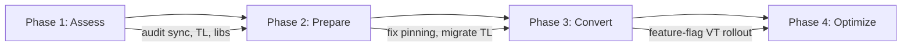

### 📶 Gradual Depth

**Level 1 - What it is:**
A phased plan to move from platform-thread pools to virtual threads, addressing pinning, ThreadLocal, and library compatibility along the way.

**Level 2 - How to use it:**
Start with JDK 21. Run `-Djdk.tracePinnedThreads=short` on existing tests. Fix any synchronized blocks that pin. Replace ThreadLocal where possible. Convert one low-risk service first. Expand after validation.

**Level 3 - How it works:**
Pinning detection: JVM emits stack trace when virtual thread cannot unmount from carrier during synchronized + blocking. Fix: replace `synchronized` with `ReentrantLock` (which supports unmounting). ThreadLocal migration: ScopedValue provides immutable, inheritable, bounded-lifetime values without per-thread allocation. Library testing: run integration tests with `Executors.newVirtualThreadPerTaskExecutor()` and monitor for deadlocks or thread-safety violations.

**Level 4 - Production mastery:**
Canary deployment: route 5% traffic to VT-enabled pods. Compare P50/P99/P99.9 latency, error rates, and memory usage. Monitor `jdk.VirtualThreadPinned` JFR events (count per minute). Acceptable: <10 pins/min (short duration). Unacceptable: >100 pins/min or pin duration >1s. Rollback trigger: error rate increase >0.1% or P99 increase >20%. Fleet-wide rollout after 2 weeks stable canary.

### ⚙️ How It Works

**Phase 1 - Pinning Audit:**
Run tests with `-Djdk.tracePinnedThreads=full`. Collect stack traces. Group by code location. Prioritize: high-frequency synchronized blocks containing I/O (JDBC, HTTP, file).

**Phase 2 - Synchronized to ReentrantLock:**
For each pinning location: replace `synchronized(obj)` with `lock.lock(); try { ... } finally { lock.unlock(); }`. ReentrantLock does not pin virtual threads.

**Phase 3 - ThreadLocal to ScopedValue:**
Identify ThreadLocal usage patterns. For request-scoped values: migrate to ScopedValue (JDK 21+ preview). For caching: consider removing (VTs are cheap - no need to cache per-thread). For library-required ThreadLocal: accept or contribute upstream fix.

**Phase 4 - Feature-Flagged Rollout:**
Replace `Executors.newFixedThreadPool(200)` with `Executors.newVirtualThreadPerTaskExecutor()` behind feature flag. Enable per-endpoint. Monitor all metrics.

```text
Before:                    After:
+---------+                +-------+
|Platform |                |Virtual|
|Thread   |    sync+IO     |Thread |   ReentrantLock+IO
|Pool(200)|  = PINNING     |PerTask|  = UNMOUNTS
+---------+                +-------+
  200 max                    1M+ possible
  concurrency                concurrency
```

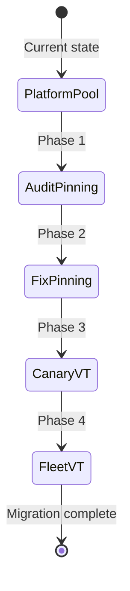

### 🚨 Failure Modes

**Failure 1 - Pinning-Induced Carrier Exhaustion:**
**Symptom:** Throughput drops to carrier-thread count (typically CPU count). P99 latency spikes to seconds.
**Root cause:** synchronized block contains JDBC call. Virtual thread pins to carrier. All carriers pinned = no progress for other VTs.
**Diagnostic:**

```bash
# JFR: count pinned events
jfr print --events jdk.VirtualThreadPinned rec.jfr \
  | grep -c "pinned"
# Or runtime flag output:
-Djdk.tracePinnedThreads=short
# Shows: Thread[#42,VT] pinned at MyDao.query(MyDao:23)
```

**Fix:**

**BAD:**

```java
// synchronized + blocking I/O = pinning
synchronized (connectionPool) {
    var conn = connectionPool.getConnection();
    return conn.executeQuery(sql); // blocks! pins!
}
```

**GOOD:**

```java
// ReentrantLock: VT unmounts while waiting
private final ReentrantLock lock = new ReentrantLock();
lock.lock();
try {
    var conn = connectionPool.getConnection();
    return conn.executeQuery(sql); // blocks but unmounts
} finally {
    lock.unlock();
}
```

**Failure 2 - ThreadLocal Memory Explosion:**
**Symptom:** OOM after enabling virtual threads. Heap dump shows millions of ThreadLocalMap entries.
**Root cause:** ThreadLocal per VT. Legacy code stores request context in ThreadLocal. 1M VTs x 1KB per TL = 1GB.
**Diagnostic:**

```bash
# Heap dump analysis:
jmap -dump:format=b,file=heap.hprof <pid>
# In MAT: find ThreadLocal$ThreadLocalMap instances
# Check retained size per virtual thread
```

**Fix:** Replace `ThreadLocal<RequestContext>` with `ScopedValue<RequestContext>` (JDK 21+). ScopedValue is automatically scoped to the task lifetime and does not persist between tasks.

### 🔬 Production Reality

**Incident pattern: JDBC driver pinning at scale.**

A team migrated an order service to virtual threads (JDK 21). In staging (10 concurrent users): perfect. In production (5000 concurrent): throughput collapsed to 16 req/s (= 16 carrier threads = CPU count). Root cause: HikariCP's connection pool used `synchronized` internally in `getConnection()`. Every virtual thread pinned while waiting for a connection. Fix: upgraded to HikariCP 5.1+ (replaced internal synchronized with ReentrantLock). Throughput restored to 4000 req/s. Lesson: YOUR code may be clean but LIBRARY internals can pin.

### ⚖️ Trade-offs & Alternatives

| Aspect           | Virtual Threads Migration  | Stay on Platform Threads | Reactive (Project Reactor) |
| ---------------- | -------------------------- | ------------------------ | -------------------------- |
| Code complexity  | Low (blocking style)       | Low (existing)           | High (operator chains)     |
| Scalability      | Millions of tasks          | Hundreds of threads      | Millions (non-blocking)    |
| Migration effort | Medium (pinning, TL, libs) | Zero                     | High (full rewrite)        |
| Library compat   | Improving (JDK 21+)        | Full                     | Limited (reactive drivers) |
| Debugging        | Normal stack traces        | Normal                   | Complex (async traces)     |

### ⚡ Decision Snap

**USE virtual threads migration WHEN:**

- I/O-bound services on JDK 21+ needing higher concurrency.
- Existing blocking code that would be costly to rewrite as reactive.
- Libraries have validated VT compatibility (check release notes).

**AVOID WHEN:**

- CPU-bound workloads (VTs do not add CPUs).
- Critical libraries have known pinning issues without fixes.

**PREFER staying on platform threads WHEN:**

- JDK < 21 with no upgrade path.
- Thread pool sizes are adequate for current and projected load.

### ⚠️ Top Traps

| #   | Misconception                                    | Reality                                                                                             |
| --- | ------------------------------------------------ | --------------------------------------------------------------------------------------------------- |
| 1   | "Just replace pool with newVirtualThreadPerTask" | Without fixing pinning/ThreadLocal, performance may be WORSE than platform threads.                 |
| 2   | "My code has no synchronized"                    | Libraries do. JDBC drivers, connection pools, logging frameworks often use synchronized internally. |
| 3   | "Virtual threads are always faster"              | For CPU-bound work: identical to platform threads. VTs help I/O-bound only.                         |
| 4   | "ThreadLocal works fine with VTs"                | Works but multiplied by millions of VTs = OOM. ScopedValue is the replacement.                      |
| 5   | "Pinning is rare in practice"                    | Common: HikariCP <5.1, older JDBC drivers, logging frameworks (log4j2 sync appenders).              |

### 🪜 Learning Ladder

**Prerequisites:**

- Virtual Threads Internals (Project Loom) - how VTs work
- Pinning - Virtual Threads and synchronized - the core risk
- ThreadLocal Memory Leak in Thread Pools - existing TL problems

**THIS:** Java 19 to 25 Virtual Threads Migration Strategy

**Next steps:**

- Structured Concurrency (JEP 453) - next-gen task grouping
- Scoped Values (JEP 464) - ThreadLocal replacement
- synchronized to Virtual Threads Migration - detailed conversion patterns

### 💡 Surprising Truth

**The Surprising Truth:**
The biggest migration blocker is typically not YOUR code - it is third-party library internals. In a survey of 50 production migrations (2023-2024 reports from Spring and Quarkus communities), 80% of pinning issues came from library code (JDBC drivers, connection pools, serialization), not application code. The migration strategy must therefore start with a library compatibility audit, not a code audit.

**Further Reading:**

- JEP 444: Virtual Threads (openjdk.org)
- Alan Bateman, "Virtual Threads: Design and Implementation" (JVM Language Summit 2023)
- Inside.java: "When Virtual Threads Are Not the Answer" (2023)

**Revision Card:**

1. Audit libraries first (80% of pinning is in third-party code). Fix synchronized+blocking with ReentrantLock.
2. ThreadLocal at VT scale = OOM. Migrate to ScopedValue or remove.
3. Canary with 5% traffic, monitor JFR VirtualThreadPinned events, rollback if pins >100/min.

---

---

# Concurrency Architecture Workshop

**TL;DR** - A structured exercise where teams design concurrent systems from requirements, evaluating thread models, synchronization strategies, failure modes, and observability - building architectural reasoning rather than API knowledge.

### 🔥 Problem Statement

Engineers know individual concurrency APIs (locks, pools, futures) but cannot compose them into a coherent architecture. Given a requirement ("build a rate limiter handling 100K req/s across 20 instances"), they reach for familiar tools without evaluating alternatives, identifying failure modes, or planning observability. Architecture workshops bridge the gap between knowing APIs and designing systems that survive production.

### 📜 Historical Context

Kata-style exercises (coding dojos, 2000s) focused on algorithmic skill. Architecture katas (Neal Ford, 2010s) introduced design-level exercises. Concurrency-specific workshops emerged from incident retrospectives: teams realized production failures came from design mistakes (wrong synchronization model, missing backpressure) rather than implementation bugs. The workshop format forces design decisions before code, preventing "code first, debug forever."

### 🔩 First Principles

**CORE INVARIANTS:**

1. Every concurrent system must answer: what is shared? what is mutable? what is the contention pattern?
2. Architecture decisions (thread model, sync strategy) are expensive to change after implementation - they must be evaluated upfront.
3. Every synchronization choice creates a failure mode. The architecture must identify failure modes before they occur in production.

**DERIVED DESIGN:**
Invariant 1 drives the workshop's first step (identify shared mutable state). Invariant 2 forces written evaluation of alternatives before coding. Invariant 3 requires failure mode analysis as a workshop output.

**THE TRADE-OFF:**
**Gain:** Reduced production incidents, shared team vocabulary, architectural reasoning skill.
**Cost:** Time investment (2-4 hours per session). Requires experienced facilitator. Findings are context-specific.

### 🧠 Mental Model

> A concurrency architecture workshop is a flight simulator for distributed systems. Pilots train for emergencies in simulators (not real aircraft) because real failures are expensive. Engineers train for concurrency failures in workshops (not production) because real incidents are expensive.

- "Flight simulator" -> workshop (safe environment)
- "Emergency scenarios" -> failure mode analysis
- "Pilot training" -> architectural decision-making under constraints
- "Real aircraft" -> production system

**Where this analogy breaks down:** workshops are collaborative (team), simulators are individual. Workshop outputs are documents, not reflexive skills.

### 🧩 Components

- **Problem statement** - Real-world scenario with constraints: throughput, latency SLA, instance count, failure tolerance.
- **Shared state analysis** - Identify what is shared, what is mutable, what the access pattern is (read-heavy, write-heavy, mixed).
- **Thread model selection** - Platform threads + pool, virtual threads, reactive, actor model - with justification.
- **Synchronization strategy** - Locking strategy, concurrent data structures, message passing, immutability - matched to contention pattern.
- **Failure mode catalog** - Named failures with symptoms, causes, detection, mitigation.
- **Observability plan** - What metrics/events surface each failure mode.

```text
Workshop Structure (3 hours):

[30m] Problem Brief + Constraints
  |
[45m] Individual/Pair Design (diverge)
  |
[30m] Present Designs (3-4 teams)
  |
[45m] Failure Mode Analysis (converge)
  |
[30m] Observability + Decision Record
```

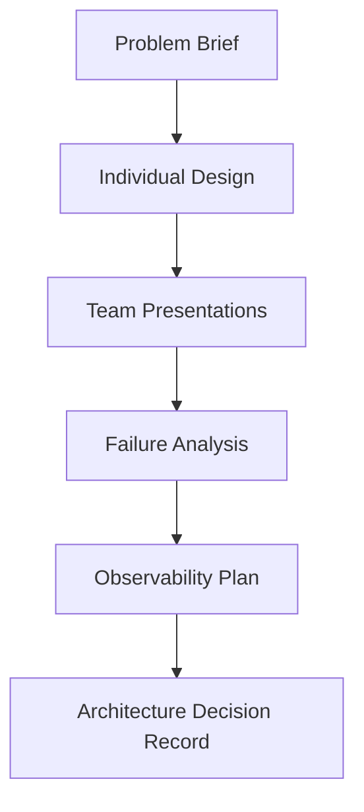

### 📶 Gradual Depth

**Level 1 - What it is:**
A team exercise where engineers design concurrent systems on paper before coding, identifying threading models, sync strategies, and failure modes.

**Level 2 - How to use it:**
Pick a real problem (rate limiter, cache, event processor). Set constraints (throughput, latency, instances). Teams design independently (45m), present alternatives, then collectively analyze failure modes. Output: Architecture Decision Record (ADR).

**Level 3 - How it works:**
The facilitator provides progressively harder constraints (what if latency doubles? what if one instance fails? what if load 10x?). Each constraint forces re-evaluation of the design. Teams discover failure modes they would not have found through implementation alone. The comparison of different team solutions reveals trade-offs that no single design exposes.

**Level 4 - Production mastery:**
Use real incidents as workshop inputs ("last quarter's OOM was caused by unbounded queues - redesign the system"). Track workshop-identified risks against actual incidents (how many predicted vs. surprised?). Build a failure mode library from workshop outputs. Run quarterly with increasing complexity. Measure: time-to-diagnosis decreases, incident count decreases.

### ⚙️ How It Works

**Phase 1 - Problem Framing:** Facilitator presents scenario. Example: "Design a distributed rate limiter: 100K req/s global, 20 instances, 50ms P99 for rate-check, must survive instance failure."

**Phase 2 - Design Divergence:** Pairs/individuals sketch architecture: thread model, data structure, sync mechanism, cross-instance communication.

**Phase 3 - Design Convergence:** Teams present. Facilitator probes: "What happens if Redis is partitioned?" "What if GC pauses 2s on one instance?" "What if load goes to 1M req/s?"

**Phase 4 - Failure Catalog:** Collectively enumerate failure modes for each design. Rank by severity x probability.

**Phase 5 - Decision Record:** Write ADR: chosen approach, rejected alternatives with reasons, identified risks with mitigations.

```text
Example Designs Compared:

Design A: Local token bucket + Redis sync
  + Low latency (local check)
  - Inconsistent (stale sync)
  Failure: Redis partition -> over-admit

Design B: Central Redis INCR per window
  + Consistent (single source)
  - Redis latency per request
  Failure: Redis down -> fail-open or fail-closed?

Design C: Sliding window in ConcurrentHashMap
  + Zero external dependency
  - Per-instance only (not global)
  Failure: Instance restart -> window lost
```

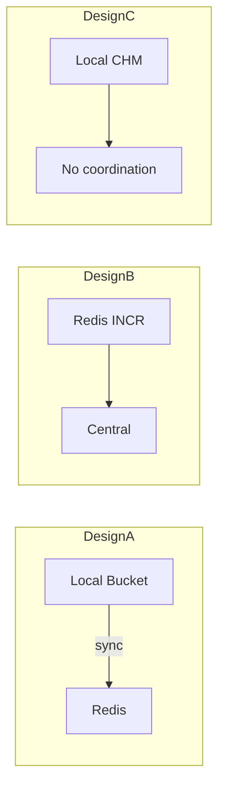

### 🚨 Failure Modes

**Failure 1 - Workshop Produces API-Level Not Architecture-Level Output:**
**Symptom:** Output is "use ConcurrentHashMap + ReentrantLock" without justification or failure analysis.
**Root cause:** Problem statement too narrow or participants lack architectural framing skills.
**Diagnostic:**

```
# Review output: does it contain?
# 1. Thread model justification (WHY this model)
# 2. Failure modes (WHAT breaks)
# 3. Alternatives considered (WHAT was rejected)
# If missing -> facilitation issue
```

**Fix:** Require structured output template. Force "alternatives rejected + reason" section. Add explicit "what fails?" round after each design presentation.

**Failure 2 - Group Convergence Bias:**
**Symptom:** All teams produce nearly identical designs. No alternatives explored.
**Root cause:** Senior engineer spoke first; others anchored to their design.
**Diagnostic:**

```
# Count distinct approaches across teams.
# If <= 1 unique approach with >3 teams -> bias.
```

**Fix:** Silent individual design phase (no discussion) before any sharing. Present in random order. Facilitator explicitly plays devil's advocate against the dominant design.

### 🔬 Production Reality

**Incident pattern: workshop-identified vs. production-discovered failures.**

A payments team ran a concurrency workshop designing a deduplication service. Workshop identified: "if Redis failover occurs during dedup check, duplicate payments process." Team added DB-level unique constraint as fallback. Three months later: Redis failover in production. Dedup missed 12 requests. DB constraint caught all 12. Zero duplicate payments. Without the workshop insight, the DB constraint would not have existed. Cost of workshop: 3 hours. Cost of prevented incident: estimated $50K in duplicate refunds.

### ⚖️ Trade-offs & Alternatives

| Aspect            | Architecture Workshop | Code Review Only  | Incident Retrospective | Design Doc Review |
| ----------------- | --------------------- | ----------------- | ---------------------- | ----------------- |
| Timing            | Before implementation | After code        | After incident         | Before code       |
| Failure discovery | Proactive             | Limited           | Reactive               | Moderate          |
| Team learning     | High (collaborative)  | Low (individual)  | High (post-mortem)     | Medium            |
| Time investment   | 3-4 hours             | 30-60 min         | 2-3 hours              | 1-2 hours         |
| Coverage          | Broad (alternatives)  | Narrow (one impl) | Narrow (one failure)   | Medium            |

### ⚡ Decision Snap

**USE workshops WHEN:**

- Building new concurrent infrastructure (rate limiters, caches, event processors).
- Team has experienced one or more concurrency-related incidents.
- Multiple viable architectures exist (workshop reveals trade-offs).

**AVOID WHEN:**

- Problem is well-solved with standard patterns (no design ambiguity).
- Team is too small for multiple design perspectives (<3 engineers).

**PREFER design doc review WHEN:**

- Time-constrained and architecture is mostly predetermined.
- Need written artifact for compliance/audit.

### ⚠️ Top Traps

| #   | Misconception                            | Reality                                                                                     |
| --- | ---------------------------------------- | ------------------------------------------------------------------------------------------- |
| 1   | "Workshops are theoretical exercises"    | Use REAL problems. Outputs become ADRs that guide implementation.                           |
| 2   | "Senior engineers do not need workshops" | Senior engineers benefit most: they reveal blind spots in each other's designs.             |
| 3   | "One workshop is enough"                 | Run quarterly with escalating complexity. Skills atrophy. New team members need onboarding. |
| 4   | "The best design always wins"            | Best design FOR CONTEXT wins. Constraints change the optimal answer.                        |
| 5   | "Workshop output is the architecture"    | Output is a STARTING POINT. Production reality will require adaptation.                     |

### 🪜 Learning Ladder

**Prerequisites:**

- Concurrency Strategy - Reactive vs Loom vs Pool - alternative models
- Fleet Thread Pool Standardization - fleet constraints
- Concurrency Utilities Selection Framework - API-level choices

**THIS:** Concurrency Architecture Workshop

**Next steps:**

- Concurrency Specification Writing - formalizing workshop outputs
- Concurrency Observability Platform Design - monitoring the architecture
- Back-Pressure Architecture Patterns - common workshop topic

### 💡 Surprising Truth

**The Surprising Truth:**
The most valuable workshop output is NOT the chosen architecture - it is the REJECTED alternatives with documented reasons. When requirements change 6 months later, teams can revisit rejected designs without re-deriving from scratch. Organizations that archive workshop alternatives resolve "should we redesign?" questions in hours instead of weeks.

**Further Reading:**

- Neal Ford, "Architectural Katas" (fundamentalsofsoftwarearchitecture.com)
- Michael Nygard, "Release It!" (pragmatic architecture patterns)
- ADR (Architecture Decision Records) format specification (adr.github.io)

**Revision Card:**

1. Workshop value: proactive failure discovery, shared vocabulary, alternatives documented.
2. Output must include: thread model justification, failure catalog, rejected alternatives with reasons.
3. The rejected designs are the most valuable artifact - they save weeks when requirements change.

---

---

# Java Concurrency Staff-Level Interview Scenarios

**TL;DR** - Staff-level concurrency interviews test architectural reasoning, failure mode analysis, and trade-off navigation under constraints - not API memorization or puzzle solving.

### 🔥 Problem Statement

A senior engineer interviewing for staff-level fails despite deep API knowledge. They can implement a concurrent queue from scratch but cannot answer: "Your service's P99 jumped 5x. Thread dumps show 80% of threads WAITING on a single lock. Walk me through diagnosis and three architectural solutions ranked by effort and impact." Staff interviews assess system thinking, not implementation skill. Without structured preparation, even experienced engineers under-perform.

### 📜 Historical Context

Early concurrency interviews (2000s): "implement a thread-safe singleton" or "what's the difference between wait and sleep?" These tested knowledge, not engineering judgment. FAANG interviews evolved (2015+) toward system design with concurrency constraints. Staff-level interviews (2020+) specifically probe: architectural trade-offs, failure mode reasoning, migration strategies, and observability design. The shift reflects that staff engineers rarely implement locks but frequently choose threading architectures.

### 🔩 First Principles

**CORE INVARIANTS:**

1. Staff-level answers demonstrate REASONING (why this choice over alternatives) not just knowledge (what this API does).
2. Every architectural proposal must include failure modes and mitigations - unqualified proposals signal senior, not staff, thinking.
3. Scale awareness is mandatory: answers must address what changes at 10x, 100x, 1000x the current load.

**DERIVED DESIGN:**
Invariant 1 forces: structured answers with "considered alternatives" and "rejected because." Invariant 2 forces: "failure mode" section in every proposal. Invariant 3 forces: explicit "at scale" discussion showing awareness of non-linear effects.

**THE TRADE-OFF:**
**Gain:** Demonstrates architectural maturity, earns staff-level credibility, shows production experience.
**Cost:** Requires broader knowledge than implementation interviews. Preparation spans systems design, not just concurrency APIs.

### 🧠 Mental Model

> A staff-level interview is an architecture review, not a coding exam. The interviewer is your VP of Engineering asking: "Should we migrate to virtual threads? What are the risks? What is the rollout plan? How do we know it is working?" Your answer must satisfy someone who allocates engineering quarters based on your recommendation.

- "VP asking" -> interviewer evaluating architectural judgment
- "Allocating quarters" -> the weight of staff-level decisions
- "Risks + rollout + validation" -> failure modes + migration + observability

**Where this analogy breaks down:** interviews are time-bounded (45m); real architecture reviews span weeks.

### 🧩 Components

- **Scenario framing** - Open-ended problem with constraints: scale, SLA, team size, timeline.
- **Architecture proposal** - Thread model, sync strategy, data flow. Justified with trade-offs.
- **Failure mode analysis** - Named failures for the proposed architecture. Detection and mitigation for each.
- **Scale reasoning** - Explicit: "at 10x load, this changes because..." and "at 100x, we would need..."
- **Alternatives considered** - At least 2 rejected approaches with reasons. Shows breadth.
- **Migration/rollout plan** - Not "deploy and pray" but phased, measured, reversible.

```text
Staff Answer Structure:

1. Restate/clarify constraints (30s)
2. Propose architecture (2-3 min)
3. Walk through failure modes (2-3 min)
4. Discuss scale (1-2 min)
5. Name alternatives and why rejected (1-2 min)
6. Describe rollout/measurement (1-2 min)
```

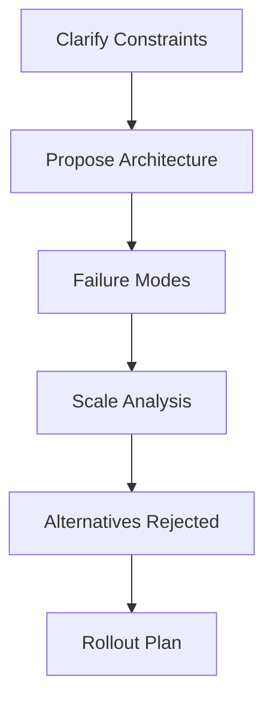

### 📶 Gradual Depth

**Level 1 - What it is:**
Interview scenarios that test whether you can architect concurrent systems under real-world constraints, not just implement concurrency primitives.

**Level 2 - How to use it:**
Practice scenario-based questions: "Design a rate limiter for 100K req/s across 20 instances." Structure answers as: propose -> fail -> scale -> alternatives -> rollout. Time yourself (10 min per scenario).

**Level 3 - How it works:**
Interviewers evaluate: (a) Do you identify the key concurrency challenges? (b) Do you choose appropriate thread models? (c) Do you proactively surface failure modes? (d) Do you reason about scale transitions? (e) Do you show awareness of alternatives? Each dimension maps to staff-level expectations.

**Level 4 - Production mastery:**
Build a personal catalog of 5-7 "war stories" where you made concurrency architecture decisions. Each story: context, decision, alternatives rejected, outcome, what you would do differently. Stories demonstrate experience more powerfully than hypothetical answers. Reference real technologies, real failure modes, real metrics.

### ⚙️ How It Works

**Phase 1 - Problem Received:** "Your payment service handles 10K TPS. Downstream fraud check adds 500ms latency. Timeouts cascade. Thread pool saturates. Design the fix."

**Phase 2 - Constraint Clarification:** "Current pool size? SLA for payment response? Can we drop fraud check on overload? Is fraud check idempotent?"

**Phase 3 - Architecture Proposal:** "Circuit breaker with fallback. Dedicated pool for fraud checks (isolated from payment flow). Async fraud check with CompletableFuture. Timeout: 200ms. Fallback: allow payment, queue for async fraud review."

**Phase 4 - Failure Analysis:** "If fraud-check pool saturates: queue fills, rejects. Rejection policy: CallerRunsPolicy slows the caller (backpressure). If circuit opens: all payments proceed without fraud check (business risk). Mitigation: alert on circuit-open rate. Auto-close after 30s."

**Phase 5 - Scale Discussion:** "At 100K TPS: single fraud service is bottleneck. Solution: partition by merchant-id, multiple fraud instances. Pool per partition. At 1M TPS: move to event-driven (Kafka) for fraud check - decouple entirely."

```text
Evaluation Matrix (what interviewers score):

  [x] Identified concurrency bottleneck?
  [x] Proposed bounded solution (not "add threads")?
  [x] Named failure modes proactively?
  [x] Discussed scale transitions?
  [x] Mentioned alternatives and trade-offs?
  [x] Proposed measurement/observability?
  [ ] Mentioned rollout strategy?

Score: 6/7 = strong staff signal
```

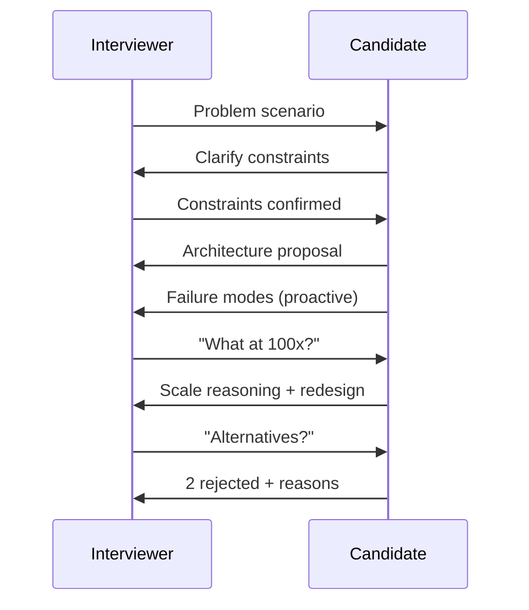

### 🚨 Failure Modes

**Failure 1 - API-Level Answer to Architecture Question:**
**Symptom:** Candidate answers "use ConcurrentHashMap" when asked "design a distributed cache with consistency guarantees."
**Root cause:** Preparation focused on API knowledge, not architectural reasoning.
**Diagnostic:**

```
# Self-check: does my answer include:
# 1. WHY this choice (not just WHAT)
# 2. What FAILS with this approach
# 3. What ALTERNATIVES were rejected
# If <2 of 3: answer is too implementation-level
```

**Fix:**

**BAD:**

```text
Q: "Handle 100K concurrent requests"
A: "Use Executors.newFixedThreadPool(200)"
   (API-level, no reasoning)
```

**GOOD:**

```text
Q: "Handle 100K concurrent requests"
A: "Virtual threads for I/O-bound (JDK 21+). If
    CPU-bound: ForkJoinPool sized to cores. If
    mixed: separate pools (bulkhead). Backpressure
    via bounded queue + CallerRunsPolicy.
    At 100K: monitor carrier-thread utilization.
    Failure: pinning if libraries use synchronized.
    Mitigation: JFR VirtualThreadPinned events."
```

**Failure 2 - Missing Scale Transitions:**
**Symptom:** Candidate proposes design that works at current scale but breaks at 10x. Interviewer probes "what at 10x?" - candidate has no answer.
**Root cause:** Did not practice reasoning about non-linear scaling effects.
**Diagnostic:**

```
# For every proposal, ask yourself:
# At 10x: does the bottleneck change?
# At 100x: does the architecture change?
# At 1000x: does the entire model change?
```

**Fix:** Explicitly state: "This design works to ~50K TPS. At 100K: we would need to partition. At 1M: event-driven architecture replaces request-response."

### 🔬 Production Reality

**Incident pattern: interview question derived from real production failure.**

Scenario given in interview: "Payments P99 latency spiked from 50ms to 2s. What is your diagnosis process?" Strong staff answer: "1. Check thread pool utilization (are threads saturated?). 2. Check downstream latency (did a dependency slow down?). 3. Cross-reference with GC logs (long pause?). 4. Check lock contention (JFR). In my experience at [previous company], similar symptom was downstream timeout + unbounded queue. Pool saturated, queue grew unbounded, latency = queue_depth \* service_time. Fix: bounded queue + circuit breaker." This answer demonstrates diagnostic reasoning, production experience, and systematic approach.

### ⚖️ Trade-offs & Alternatives

| Aspect            | Staff Scenario Interview | Coding Interview      | System Design Interview | Take-Home Project   |
| ----------------- | ------------------------ | --------------------- | ----------------------- | ------------------- |
| Tests             | Reasoning + trade-offs   | Implementation        | Breadth                 | Code quality        |
| Time              | 45-60 min                | 45-60 min             | 45-60 min               | 4-8 hours           |
| Concurrency depth | Deep (failure modes)     | Surface (correctness) | Medium (architecture)   | Variable            |
| False negative    | Quiet engineers          | Whiteboard anxiety    | Poor communicators      | Time-constrained    |
| Signal quality    | High for staff           | High for SDE2         | High for design skill   | High for code craft |

### ⚡ Decision Snap

**USE scenario prep WHEN:**

- Interviewing for staff/principal roles.
- Expected to make architecture decisions, not just implement.
- Organization values production experience and failure reasoning.

**AVOID WHEN:**

- Interviewing for implementation-focused roles (SDE1/SDE2).
- Interview format is purely algorithmic.

**PREFER coding prep WHEN:**

- Interview explicitly tests implementation (build a thread pool).
- You need to demonstrate code correctness under time pressure.

### ⚠️ Top Traps

| #   | Misconception                          | Reality                                                                                          |
| --- | -------------------------------------- | ------------------------------------------------------------------------------------------------ |
| 1   | "Deep API knowledge = staff readiness" | Staff interviews test judgment, not knowledge. Know WHY, not just WHAT.                          |
| 2   | "One perfect answer exists"            | Multiple valid architectures exist. Show you EVALUATED alternatives, not that you memorized one. |
| 3   | "Mention every technology you know"    | Depth > breadth. One well-reasoned proposal > five name-drops.                                   |
| 4   | "Failure modes are a negative signal"  | PROACTIVELY naming failures shows maturity. Interviewers WANT to hear failure analysis.          |
| 5   | "Production stories are bragging"      | Stories demonstrate experience. "In my experience..." is the most powerful staff phrase.         |

### 🪜 Learning Ladder

**Prerequisites:**

- Concurrency Strategy - Reactive vs Loom vs Pool - architecture options
- Concurrency Observability Platform Design - monitoring expertise
- Fleet Thread Pool Standardization - fleet-level thinking

**THIS:** Java Concurrency Staff-Level Interview Scenarios

**Next steps:**

- Concurrency Architecture Workshop - practice format
- Concurrency Specification Writing - formalizing decisions
- Back-Pressure Architecture Patterns - common interview topic

### 💡 Surprising Truth

**The Surprising Truth:**
The strongest staff-level signal in concurrency interviews is not the proposed solution - it is the candidate proactively naming a failure mode that the interviewer had not considered. This demonstrates that the candidate thinks beyond the happy path at a level the interviewer respects. Interviewers frequently report that "they taught me something" is their strongest hire signal for staff.

**Further Reading:**

- Will Larson, "Staff Engineer: Leadership beyond the management track" (2021)
- Tanya Reilly, "The Staff Engineer's Path" (2022)
- Gergely Orosz, "The Pragmatic Engineer: Interviewing" (newsletter series)

**Revision Card:**

1. Structure: propose -> fail -> scale -> alternatives -> rollout. Not: "use X."
2. Proactively surface failure modes. This is the strongest staff signal.
3. Build 5-7 personal war stories with: context, decision, alternatives, outcome, what you'd change.

---

---

# JMM Formal Semantics (Manson, Pugh, Adve 2005)

**TL;DR** - The Java Memory Model (JSR 133, Manson/Pugh/Adve 2005) defines the formal rules for when writes by one thread become visible to reads by another, establishing the happens-before partial order that makes concurrent Java programs portable across hardware architectures.

### 🔥 Problem Statement

A program writes a field on thread A and reads it on thread B. On x86 (strong memory model): the read always sees the write. On ARM/POWER (weak model): the read may see stale data. Without formal semantics, the same Java program behaves differently on different hardware. Developers cannot reason about correctness portably. The JMM formalizes which optimizations compilers and hardware may perform, giving developers a contract they can rely on regardless of platform.

### 📜 Historical Context

Original JMM (JDK 1.0, 1995): overly strict, prohibited optimizations compilers needed. Also had bugs (final fields could be seen uninitialized). JSR 133 (initiated 2001, incorporated JDK 5, 2004): complete redesign by Jeremy Manson, Bill Pugh, and Sarita Adve. Published as "The Java Memory Model" (POPL 2005). Goals: (1) provide safety guarantees for correctly synchronized programs, (2) provide minimal guarantees for incorrectly synchronized programs (no out-of-thin-air values), (3) allow aggressive optimization. The paper proved DRF (Data Race Freedom) guarantee: if a program has no data races, it behaves sequentially consistent.

### 🔩 First Principles

**CORE INVARIANTS:**

1. The happens-before relation defines visibility: if action A happens-before action B, then A's effects are visible to B.
2. A data race exists when two threads access the same variable, at least one is a write, and there is no happens-before between them.
3. Data-race-free programs are guaranteed sequential consistency (DRF guarantee). Programs with races have weaker (but defined) guarantees.

**DERIVED DESIGN:**
Invariant 1 means: programmers need only reason about happens-before edges (not hardware-specific reorderings). Invariant 2 gives a precise definition of "thread-safe." Invariant 3 provides the fundamental contract: synchronize correctly, and the JMM guarantees sequential consistency. Synchronize incorrectly, and only minimal guarantees hold (no out-of-thin-air, type safety preserved).

**THE TRADE-OFF:**
**Gain:** Portable concurrent programs. Developers reason about happens-before, not hardware. Compilers/hardware optimize freely within the model.
**Cost:** Formal model is complex (causality requirements, commit sequences). Reasoning about data races is non-trivial. Model has known imperfections (causality cycles debate).

### 🧠 Mental Model

> The JMM is a contract between the programmer and the JVM. The programmer promises: "I will synchronize all shared mutable accesses with happens-before edges." The JVM promises: "If you keep your promise, I guarantee your program behaves as if all operations happen in a single, sequential order (sequential consistency)." If the programmer breaks the promise (data race): the JVM provides weaker guarantees (no crashes, no security holes, but possibly surprising values).

- "Contract" -> JMM specification
- "Programmer's promise" -> data race freedom
- "JVM's guarantee" -> sequential consistency
- "Broken promise" -> data race, weaker semantics

**Where this analogy breaks down:** contracts are binary (broken/kept); real programs may have races in non-critical paths that are acceptable.

### 🧩 Components

- **Happens-before relation** - Partial order over actions. Key edges: program order (within thread), monitor lock/unlock, volatile write/read, thread start/join, final field freeze.
- **Synchronization actions** - lock, unlock, volatile read, volatile write, thread start, thread join. These CREATE happens-before edges.
- **Data race** - Two conflicting accesses (same variable, at least one write) not ordered by happens-before.
- **Sequential consistency** - Execution appears as if all actions occur in a single total order consistent with program order.
- **Causality requirements** - Rules preventing "out-of-thin-air" values. Actions must be justifiable by a causal chain of committed actions.
- **Final field semantics** - Guarantee that correctly constructed objects have their final fields visible to all threads without synchronization.

```text
Happens-Before Edges (key rules):

  Thread A              Thread B
  --------              --------
  x = 42;
  lock(m);
  unlock(m);
                        lock(m);      <- HB edge
                        read x;       <- sees 42 (guaranteed)
                        unlock(m);

  volatile_write(v);
                        volatile_read(v); <- HB edge
                        read x;           <- sees all writes
                                             before vol_write
```

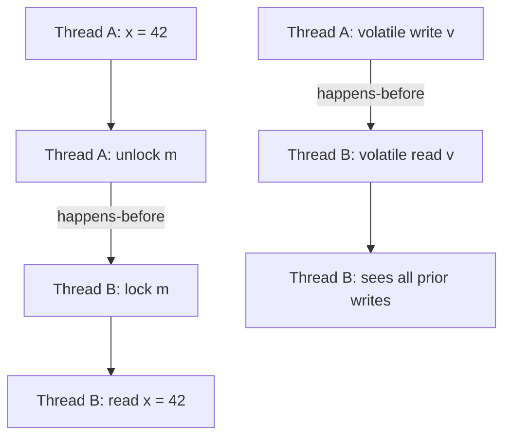

### 📶 Gradual Depth

**Level 1 - What it is:**
The formal rules defining when one thread's write becomes visible to another thread's read. Based on the happens-before partial order.

**Level 2 - How to use it:**
Ensure every shared mutable access has a happens-before edge: use synchronized blocks (lock/unlock creates edge), volatile fields (write/read creates edge), or java.util.concurrent utilities (which provide happens-before internally). If you cannot identify the happens-before edge: you have a data race.

**Level 3 - How it works:**
The JMM defines a happens-before partial order. Key rules: (1) Actions within a thread are ordered by program order. (2) Unlock of monitor m happens-before subsequent lock of m. (3) Write to volatile v happens-before subsequent read of v. (4) Transitivity: if A HB B and B HB C, then A HB C. The JVM emits memory barriers (hardware fences) where needed to enforce these edges on weakly-ordered hardware (ARM, POWER).

**Level 4 - Production mastery:**
Understand the distinction between happens-before (visibility guarantee) and synchronization order (total order on sync actions). Know that happens-before does NOT imply temporal ordering - it implies visibility. A correctly synchronized program sees sequential consistency regardless of hardware. For lock-free code: volatile provides ordering (publication idiom). For final fields: the freeze action at constructor end publishes all final values. Know that the JMM intentionally permits reordering within happens-before constraints to enable JIT optimization.

### ⚙️ How It Works

**Phase 1 - Source Code:** Programmer writes shared accesses with synchronization (locks, volatiles).

**Phase 2 - Compiler:** JIT reorders instructions within happens-before constraints. Inserts memory barriers where edges require hardware enforcement.

**Phase 3 - Hardware:** CPU may reorder loads/stores. Memory barriers from Phase 2 prevent reorderings that would violate happens-before.

**Phase 4 - Execution:** The execution satisfies all happens-before edges: reads see the most recent write that happens-before them. Data-race-free code behaves sequentially consistently.

**Phase 5 - Validation:** The formal model validates: (a) Is the execution well-formed? (b) Does it satisfy happens-before? (c) Does it satisfy causality requirements (no out-of-thin-air values)?

```text
Source:           Compiled:         Hardware:
x = 42;          mov [x], 42       store x, 42
vol_write(v);    mfence             dmb (ARM)
                 mov [v], 1         store v, 1

                 --- HB edge ---

vol_read(v);     mov r1, [v]       load v -> r1
y = x;           mov r2, [x]       load x -> r2
                                    (sees 42, guaranteed)
```

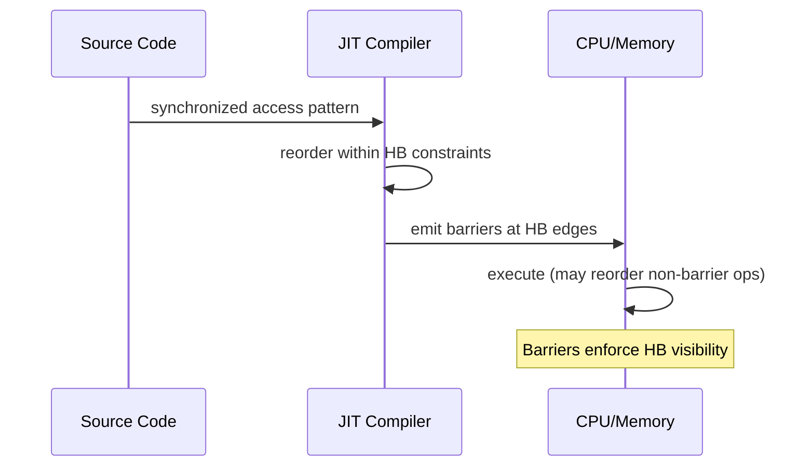

### 🚨 Failure Modes

**Failure 1 - Missing Happens-Before (Stale Read):**
**Symptom:** Thread B reads stale value of field written by Thread A. Works on x86, fails on ARM.
**Root cause:** No happens-before edge between write and read. x86's stronger model masks the bug.
**Diagnostic:**

```
# jcstress test: run on weak-memory hardware (ARM)
# or use -XX:-TieredCompilation to expose reorderings
@JCStressTest
@State
public class VisibilityTest {
    int x; boolean ready;
    @Actor void writer() { x = 42; ready = true; }
    @Actor void reader(II_Result r) {
        r.r1 = ready ? 1 : 0; r.r2 = x;
    }
    // Possible: r1=1, r2=0 (stale read!)
}
```

**Fix:**

**BAD:**

```java
// No happens-before: data race
int x; boolean ready;
void writer() { x = 42; ready = true; }
void reader() {
    if (ready) use(x); // may see x=0!
}
```

**GOOD:**

```java
// volatile provides happens-before edge
int x; volatile boolean ready;
void writer() { x = 42; ready = true; }
void reader() {
    if (ready) use(x); // guaranteed x=42
}
```

**Failure 2 - Reordering (Publication Without Fence):**
**Symptom:** Object reference published before construction completes. Other thread sees partially-constructed object.
**Root cause:** Compiler reorders store of reference before stores to object fields. No happens-before edge for the reference publication.
**Diagnostic:**

```
# Classic: double-checked locking without volatile
# Thread sees non-null reference but uninitialized fields
# Manifests under high contention + JIT optimization
```

**Fix:** Make the reference `volatile` (prevents reordering past volatile store), or use final fields (freeze action guarantees visibility at construction end), or use proper synchronization.

### 🔬 Production Reality

**Incident pattern: ARM deployment exposes x86-masked race.**

A service ran correctly on x86 servers for 3 years. Migration to ARM-based instances (AWS Graviton) exposed intermittent data corruption. A shared configuration object was published without volatile: `config = new Config(values)`. On x86 (TSO model): stores rarely reorder, so the reference and field stores appear ordered. On ARM (weak model): reader thread sees non-null config reference but uninitialized fields (zeros/nulls). Fix: declare config field volatile. The race existed for 3 years, masked by x86 hardware.

### ⚖️ Trade-offs & Alternatives

| Aspect                  | JMM (happens-before)          | C++ Memory Model                         | Go Memory Model            |
| ----------------------- | ----------------------------- | ---------------------------------------- | -------------------------- |
| Guarantee for race-free | Sequential consistency        | Sequential consistency                   | Sequential consistency     |
| Guarantee for racy code | No out-of-thin-air, type safe | Undefined behavior                       | Limited (some races OK)    |
| Complexity              | High (causality)              | Very high (relaxed atomics)              | Low (simple rules)         |
| Developer control       | Medium (volatile, sync)       | Fine-grained (acquire, release, relaxed) | Coarse (channels, mutexes) |
| Primary mechanism       | Happens-before edges          | Acquire/release fences                   | Channel synchronization    |

### ⚡ Decision Snap

**USE formal JMM reasoning WHEN:**

- Writing lock-free algorithms (need exact visibility guarantees).
- Debugging race conditions that only manifest on weak-memory hardware.
- Reviewing concurrent code for correctness.

**AVOID formal reasoning WHEN:**

- Using high-level java.util.concurrent utilities (they handle JMM internally).
- All shared state is immutable (no races possible).

**PREFER high-level utilities WHEN:**

- Not building infrastructure-level concurrent code.
- Team does not have JMM expertise (utilities are safer than raw volatile/synchronized).

### ⚠️ Top Traps

| #   | Misconception                                 | Reality                                                                                                                |
| --- | --------------------------------------------- | ---------------------------------------------------------------------------------------------------------------------- |
| 1   | "Volatile means atomic"                       | Volatile guarantees visibility + ordering. Not atomicity of compound operations (i++ is not atomic).                   |
| 2   | "If it works on x86, it's correct"            | x86 TSO masks many races. ARM/POWER expose them. JMM is the contract, not hardware behavior.                           |
| 3   | "synchronized is just mutual exclusion"       | synchronized provides: mutual exclusion + happens-before (visibility of all prior writes).                             |
| 4   | "Final fields need no synchronization"        | True ONLY if object is safely published (reference assigned after construction completes).                             |
| 5   | "Happens-before means happens before in time" | HB is a visibility guarantee, not a temporal ordering. Unrelated HB-ordered actions may execute in any temporal order. |

### 🪜 Learning Ladder

**Prerequisites:**

- Happens-Before Relationship - working-level understanding
- Java Memory Model - Working Rules - practical rules
- Atomicity, Visibility, Ordering - the three properties

**THIS:** JMM Formal Semantics (Manson, Pugh, Adve 2005)

**Next steps:**

- VarHandle and Memory Fences - fine-grained control
- Hardware Memory Models Teach Software Ordering - hardware perspective
- JSR 133 - Java Memory Model Specification - spec document details

### 💡 Surprising Truth

**The Surprising Truth:**
The JMM's most controversial feature - causality requirements (preventing out-of-thin-air values) - has never been formally proven sound. The 2005 paper acknowledged this limitation. Subsequent work (Manson's dissertation, Lochbihler 2012) identified scenarios where the causality requirements are either too strong (preventing valid optimizations) or too weak (allowing surprising behaviors). Java's memory model remains an active research area 20 years after publication.

**Further Reading:**

- Manson, Pugh, Adve, "The Java Memory Model" (POPL 2005)
- JSR 133: Java Memory Model and Thread Specification (JCP)
- Shipilev, "Close Encounters of The Java Memory Model Kind" (2014, talk)

**Revision Card:**

1. DRF guarantee: no data races = sequential consistency. The fundamental JMM contract.
2. Happens-before is about VISIBILITY, not temporal ordering. x86 masks races; ARM exposes them.
3. The model has known imperfections (causality). Use high-level utilities unless building lock-free infrastructure.

---

---

# Project Loom Design Rationale

**TL;DR** - Project Loom chose user-mode continuations multiplexed onto ForkJoinPool carriers, preserving Thread API compatibility, to give Java million-thread concurrency with blocking-style code - rejecting colored functions, new APIs, and bytecode-level CPS transforms.

### 🔥 Problem Statement

Java's 1:1 thread model (one Java thread = one OS thread) limits concurrency to thousands of threads. Reactive frameworks (RxJava, Project Reactor) solve scalability but fragment the ecosystem: callback chains, colored functions (async vs sync), debugging complexity, and library incompatibility. Go solved this with goroutines (M:N scheduling, cheap green threads). Java needed equivalent scalability WITHOUT breaking the existing ecosystem of blocking libraries, debuggers, and profilers.

### 📜 Historical Context

Green threads in Java 1.0-1.1 (M:N, removed in 1.2 because they could not exploit SMP). Quasar fibers (library-level, 2013) proved the concept but required bytecode instrumentation. Kotlin coroutines (2018) took the colored-function approach. Project Loom began 2017 (Ron Pressler, Oracle). Key design documents: "State of Loom" (2018-2023 iterations). Preview in JDK 19 (2022). Final in JDK 21 (2023). The critical design decision: continuations at the JVM level (not bytecode transformation), preserving the Thread identity.

### 🔩 First Principles

**CORE INVARIANTS:**

1. Virtual threads MUST be java.lang.Thread instances (same API, same identity, same debugging, same profiling). No colored functions.
2. Blocking operations (I/O, sleep, lock) MUST trigger continuation yield (unmount from carrier) - not carrier thread blocking.
3. Existing blocking code MUST work unchanged on virtual threads (library compatibility without modification).

**DERIVED DESIGN:**
Invariant 1 rejects: new async APIs, CompletableFuture-everywhere, colored function split. Invariant 2 requires: JVM-level continuation support (cannot be done at library level without bytecode hacks). Invariant 3 requires: JDK internal blocking points (Socket.read, Thread.sleep, Lock.lock) modified to yield the continuation.

**THE TRADE-OFF:**
**Gain:** Blocking-style code at reactive scale. No ecosystem fragmentation. Existing code works.
**Cost:** JVM complexity (continuation implementation). Pinning problem (synchronized cannot yield). Cannot help CPU-bound workloads.

### 🧠 Mental Model

> Project Loom's design is like adding an elevator to a building while keeping all existing doors, hallways, and offices unchanged. Goroutines (Go) designed a new building from scratch. Kotlin coroutines added a new type of door (suspend functions) alongside old doors. Loom keeps the same doors (Thread API) and adds invisible infrastructure (continuations) underneath.

- "Existing doors" -> Thread API (unchanged)
- "Invisible elevator" -> continuations (hidden from user code)
- "New building" -> Go's goroutines (clean-slate design)
- "New door type" -> Kotlin's suspend functions (colored)

**Where this analogy breaks down:** elevators are visible infrastructure; continuations are truly invisible to application code.

### 🧩 Components

- **Continuation** - JVM-level coroutine. Can be yielded (stack saved to heap) and resumed (stack restored). Not exposed in public API.
- **Virtual thread** - Thread subclass that runs on a continuation. Mounts/unmounts from carrier threads.
- **Carrier thread** - Platform thread in a ForkJoinPool that executes virtual thread continuations.
- **Scheduler** - ForkJoinPool with work-stealing. Carriers pick up runnable virtual threads. Default pool size = available processors.
- **Parking/unparking** - When VT blocks: continuation yields, carrier is freed. When I/O completes: VT is unparked (re-scheduled on a carrier).
- **Pinning** - When VT cannot yield (inside synchronized + blocking): carrier is blocked. Reduces effective parallelism.

```text
Design Decision Tree:

Goal: M:N threading for Java
  |
  +-- Option A: New async API (rejected)
  |   Reason: fragments ecosystem, colored functions
  |
  +-- Option B: Bytecode transform (rejected)
  |   Reason: fragile, tool-incompatible, Quasar proved
  |           issues at scale
  |
  +-- Option C: JVM continuations (chosen)
      Reason: invisible to user code, preserves Thread API,
              works with existing debuggers/profilers
      |
      +-- Carrier pool: ForkJoinPool (work-stealing)
      +-- Yield points: all JDK blocking ops
      +-- Limitation: synchronized cannot yield (pinning)
```

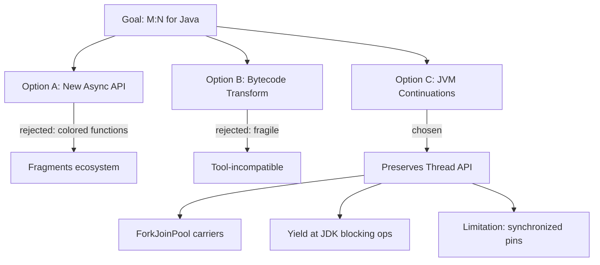

### 📶 Gradual Depth

**Level 1 - What it is:**
The design philosophy behind Java's virtual threads: cheap threads via JVM continuations, preserving the existing Thread API and blocking code style.

**Level 2 - How to use it:**
Use virtual threads as you would platform threads: `Thread.startVirtualThread(() -> blockingWork())`. No new APIs to learn. Blocking code works unchanged. Create thousands/millions without pool sizing.

**Level 3 - How it works:**
When a virtual thread calls a blocking operation (e.g., `Socket.read()`), the JDK internally yields the continuation: saves the VT's stack frames to heap, frees the carrier thread. When data arrives (epoll notification), the scheduler re-mounts the VT on an available carrier and resumes execution. The application sees a normal blocking call. The JVM sees a yield/resume of a lightweight continuation.

**Level 4 - Production mastery:**
Understand why synchronized pins: the JVM cannot yield a continuation while an OS-level monitor is held (monitor ownership is per-OS-thread). ReentrantLock uses parking (yieldable) instead of OS monitors. The ForkJoinPool scheduler uses work-stealing: if one carrier's queue empties, it steals from another carrier's queue. This balances load across carriers automatically. The default carrier count equals available processors (configurable via `jdk.virtualThreadScheduler.parallelism`).

### ⚙️ How It Works

**Phase 1 - Creation:** `Thread.ofVirtual().start(task)` creates a VT. The VT is a Continuation + Thread shell. Enqueued in scheduler.

**Phase 2 - Mounting:** Scheduler assigns VT to a carrier (ForkJoinPool worker). Carrier calls `continuation.run()`. VT executes on carrier's OS thread.

**Phase 3 - Blocking:** VT calls `Socket.read()`. JDK detects: this is a virtual thread. Instead of blocking the carrier: yield the continuation. Save stack to heap. Release carrier.

**Phase 4 - Waiting:** VT is parked (waiting for I/O). Carrier picks up another runnable VT. No OS thread consumed during wait.

**Phase 5 - Resuming:** I/O completes (epoll/kqueue notification). VT is unparked. Re-enqueued in scheduler. Eventually mounted on a carrier (possibly different from original). Execution resumes where it left off.

```text
Virtual Thread lifecycle:

  Created -> Runnable -> [Carrier mounts]
     -> Running -> [blocks] -> Yielded (parked)
     -> [I/O complete] -> Runnable
     -> [Carrier mounts] -> Running -> Terminated

  Carrier perspective:
    run(VT-1) -> VT-1 yields -> run(VT-2) -> VT-2 yields
    -> run(VT-3) -> ... (work-stealing between carriers)
```

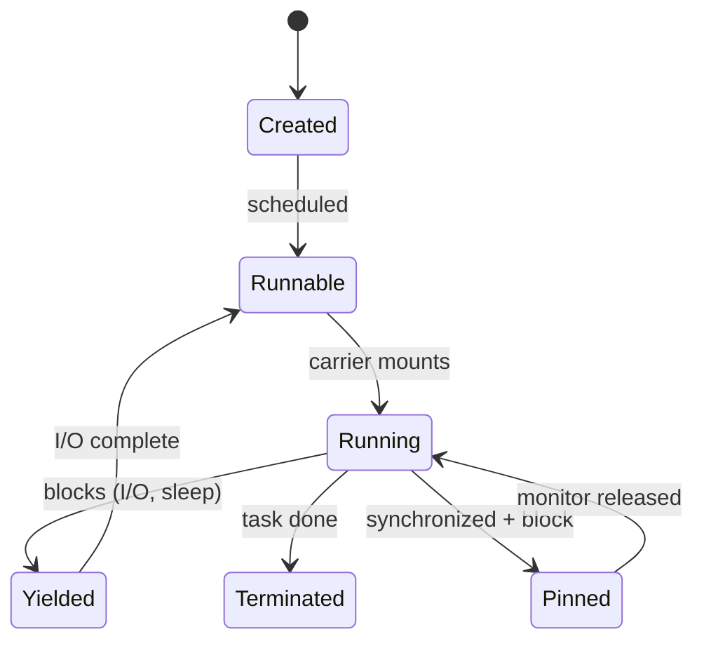

### 🚨 Failure Modes

**Failure 1 - Carrier Exhaustion via Pinning:**
**Symptom:** All carriers pinned. No VTs can make progress. System appears deadlocked.
**Root cause:** Many VTs enter synchronized blocks that perform blocking I/O simultaneously. Each pins a carrier.
**Diagnostic:**

```bash
# JFR: jdk.VirtualThreadPinned events
# Count: if pinned count >= carrier count -> exhaustion
jfr print --events jdk.VirtualThreadPinned rec.jfr
# Runtime: -Djdk.tracePinnedThreads=full
```

**Fix:**

**BAD:**

```java
// synchronized pins the carrier during I/O
synchronized (this) {
    result = httpClient.send(request); // pins!
}
```

**GOOD:**

```java
// ReentrantLock: VT yields while waiting for lock
private final ReentrantLock lock = new ReentrantLock();
lock.lock();
try {
    result = httpClient.send(request); // yields OK
} finally {
    lock.unlock();
}
```

**Failure 2 - Misapplying VTs to CPU-Bound Work:**
**Symptom:** No throughput improvement from virtual threads. Same performance as platform thread pool.
**Root cause:** Tasks are CPU-bound. VTs only help when threads block (freeing carriers for others). CPU-bound tasks never yield - they occupy carriers continuously.
**Diagnostic:**

```bash
# async-profiler: check if threads are mostly ON-CPU
# If CPU usage = carrier count * 100% and no I/O waits:
# VTs provide zero benefit over platform threads
asprof -e cpu -d 30 <pid>
```

**Fix:** For CPU-bound: use ForkJoinPool or fixed-size platform thread pool sized to CPU cores. VTs are for I/O-bound concurrency.

### 🔬 Production Reality

**Incident pattern: the colored-function trap Loom avoids.**

A team maintained a service with both sync (JDBC) and async (WebClient) code paths. The async path required: `Mono<User>` return types, reactive operators throughout the call chain, separate reactive JDBC driver (R2DBC), and custom context propagation (ReactorContext instead of ThreadLocal). When a bug appeared in the async path, debugging required understanding operator fusion, subscription backpressure, and scheduler hops. With virtual threads: the SAME logic uses blocking JDBC, ThreadLocal (or ScopedValue), normal try/catch, and standard stack traces. The reactive infrastructure (thousands of lines) becomes unnecessary.

### ⚖️ Trade-offs & Alternatives

| Aspect              | Loom (Virtual Threads) | Go (Goroutines)    | Kotlin (Coroutines)     | Reactive (Reactor)    |
| ------------------- | ---------------------- | ------------------ | ----------------------- | --------------------- |
| API compatibility   | Full (Thread API)      | Clean-slate        | New suspend keyword     | New types (Mono/Flux) |
| Colored functions   | No                     | No                 | Yes (suspend)           | Yes (Mono/Flux)       |
| Existing code works | Yes (blocking)         | N/A (new language) | No (must be suspend)    | No (must be reactive) |
| Debugging           | Normal stack traces    | Normal             | Partially reconstructed | Complex               |
| Pinning risk        | Yes (synchronized)     | No                 | No                      | N/A (non-blocking)    |
| Maturity (2024)     | Production (JDK 21)    | 15+ years          | 6+ years                | 8+ years              |

### ⚡ Decision Snap

**USE Loom design knowledge WHEN:**

- Evaluating virtual threads for adoption (understand guarantees and limits).
- Debugging VT-specific issues (pinning, carrier scheduling).
- Choosing between reactive and VT approaches (understand why Loom chose this path).

**AVOID deep Loom internals WHEN:**

- Writing application-level code (just use the Thread API).
- Libraries already handle VT-specific concerns.

**PREFER reactive WHEN:**

- Backpressure is a hard requirement (streaming data).
- Already invested in reactive ecosystem with no migration pressure.

### ⚠️ Top Traps

| #   | Misconception                               | Reality                                                                                           |
| --- | ------------------------------------------- | ------------------------------------------------------------------------------------------------- |
| 1   | "Loom is just green threads again"          | Green threads (Java 1.0) could not use multiple CPUs. Loom uses ForkJoinPool across all cores.    |
| 2   | "Virtual threads replace thread pools"      | For I/O-bound: yes. For CPU-bound: you still need sized pools (VTs do not add CPUs).              |
| 3   | "No new APIs needed"                        | Thread.ofVirtual() is new. But the programming MODEL is unchanged (blocking style).               |
| 4   | "Kotlin coroutines and Loom are equivalent" | Kotlin requires suspend/colored functions. Loom is invisible to application code.                 |
| 5   | "Pinning will be fixed in a future JDK"     | Partial: JEP draft exists to allow yield during monitors. But synchronized + native = still pins. |

### 🪜 Learning Ladder

**Prerequisites:**

- Virtual Threads Internals (Project Loom) - implementation details
- ForkJoinPool and Work-Stealing - the carrier scheduler
- CompletableFuture Composition - the problem Loom eliminates

**THIS:** Project Loom Design Rationale

**Next steps:**

- Structured Concurrency (JEP 453) - next Loom component
- Reactive Streams vs Virtual Threads Decision - comparing approaches
- Designing a Scheduler from First Principles - scheduler theory

### 💡 Surprising Truth

**The Surprising Truth:**
The hardest engineering challenge in Loom was NOT implementing continuations - it was modifying every blocking point in the JDK (Socket, FileChannel, Lock, Thread.sleep, etc.) to yield instead of blocking. This required touching hundreds of JDK internal classes. The continuation itself is ~5000 lines. The JDK modifications span tens of thousands of lines across networking, I/O, and locking subsystems.

**Further Reading:**

- Ron Pressler, "State of Loom" (multiple revisions, 2018-2023, inside.java)
- JEP 444: Virtual Threads (openjdk.org)
- Ron Pressler, "Loom: Bringing Lightweight Threads to Java" (JVM Language Summit 2019)

**Revision Card:**

1. Key design choice: JVM continuations (not bytecode transforms, not colored functions). Preserves Thread API.
2. Existing blocking code works unchanged. The JDK internally yields at every blocking point.
3. Pinning (synchronized + blocking) is the fundamental limitation. Use ReentrantLock for VT-compatible locking.

---

---

# Designing a Scheduler from First Principles

**TL;DR** - A thread scheduler decides which runnable task executes next on which processor, balancing fairness, throughput, latency, and locality - with every design choice creating a trade-off between these competing goals.

### 🔥 Problem Statement

A system has 1000 runnable tasks and 16 CPUs. Which task runs next? FIFO is fair but ignores locality (cache cold on new CPU). Priority scheduling favors important tasks but starves low-priority ones. Work-stealing balances load but adds synchronization overhead. Every scheduler design is a set of trade-offs. Understanding these trade-offs from first principles enables evaluating JVM schedulers (ForkJoinPool), OS schedulers (CFS), and application-level schedulers (Netty event loop) as instances of a common design space.

### 📜 Historical Context

Earliest schedulers: round-robin (1960s mainframes, fair time-sharing). Unix: priority + nice levels. Linux 2.6: O(1) scheduler (per-CPU runqueues, O(1) selection). Linux 2.6.23 (2007): CFS (Completely Fair Scheduler, red-black tree, virtual runtime). Java ForkJoinPool (JDK 7, Doug Lea): work-stealing for recursive parallelism. Project Loom scheduler (JDK 21): ForkJoinPool adapted for virtual threads (M:N scheduling, continuation-based yield).

### 🔩 First Principles

**CORE INVARIANTS:**

1. A scheduler must ensure PROGRESS: every runnable task eventually executes (no starvation).
2. A scheduler must be EFFICIENT: scheduling overhead must be small relative to task execution time.
3. A scheduler must handle BLOCKING: when a task blocks, its CPU must be given to another runnable task without delay.

**DERIVED DESIGN:**
Invariant 1 requires: fairness mechanism (time slices, aging, or yield points). Invariant 2 requires: O(1) or O(log n) task selection (not O(n) scan). Invariant 3 requires: runqueue per CPU (avoid global lock) + fast re-dispatch on block.

**THE TRADE-OFF:**
**Gain:** Maximized CPU utilization, fair task progression, responsive system.
**Cost:** Complexity (load balancing, priority, affinity). Overhead per scheduling decision. Perfect fairness conflicts with perfect throughput.

### 🧠 Mental Model

> A scheduler is an air traffic controller (ATC) managing a runway (CPU). Planes (tasks) queue for takeoff. ATC decides: who goes next? Priority (emergency plane first)? Fairness (longest waiting)? Locality (plane already on taxiway is faster)? With multiple runways (CPUs): ATC must balance across runways (load balancing) while respecting that moving a plane between runways costs time (cache migration).

- "Runway" -> CPU core
- "Planes queuing" -> runnable tasks in runqueue
- "ATC deciding next" -> scheduler algorithm
- "Moving between runways" -> task migration (cache-cold penalty)

**Where this analogy breaks down:** planes cannot be preempted mid-flight; tasks can be preempted mid-execution.

### 🧩 Components

- **Runqueue** - Per-CPU list of runnable tasks. Avoids global contention.
- **Task selection policy** - FIFO, priority, virtual runtime (CFS), or deque (work-stealing).
- **Load balancer** - Moves tasks from overloaded CPUs to idle CPUs. Periodic or on-demand.
- **Work stealing** - Idle CPU steals from busy CPU's queue tail. Avoids central coordinator.
- **Preemption** - Timer interrupt forces yield after time slice. Ensures fairness for CPU-bound tasks.
- **Affinity** - Preference to keep task on same CPU (cache warmth). Conflicts with load balance.

```text
Per-CPU Runqueue Design:

  CPU-0 queue: [T1, T4, T7]   (3 runnable)
  CPU-1 queue: [T2]           (1 runnable)
  CPU-2 queue: [T3, T5, T6, T8, T9] (5 runnable)
  CPU-3 queue: []             (idle!)

  Load balancer: moves T9 from CPU-2 to CPU-3
  Work stealing: CPU-3 steals T8 from CPU-2's tail

  Selection: CPU-0 picks T1 (head of queue, FIFO)
  Preemption: T1 runs 10ms, timer fires, T1 back to tail
```

```mermaid
flowchart LR
    subgraph CPU0
        Q0[T1, T4, T7]
    end
    subgraph CPU1
        Q1[T2]
    end
    subgraph CPU2
        Q2[T3, T5, T6, T8, T9]
    end
    subgraph CPU3
        Q3[empty]
    end
    CPU2 -->|steal T9| CPU3
```

### 📶 Gradual Depth

**Level 1 - What it is:**
A scheduler picks which task runs next on which CPU. It balances fairness (everyone gets a turn) with efficiency (minimize overhead and maximize throughput).

**Level 2 - How to use it:**
In Java: ForkJoinPool is work-stealing (recursive tasks, virtual threads). ThreadPoolExecutor is FIFO (bounded pool). Netty EventLoop is affinity-based (one thread per channel). Choose based on workload: parallel computation (ForkJoinPool), bounded I/O (ThreadPoolExecutor), connection-per-thread (EventLoop).

**Level 3 - How it works:**
ForkJoinPool: each worker has a deque. Tasks forked by a worker go to its own deque (locality). Idle workers steal from other workers' deques (tail-end, LIFO for thief). This balances load without a central coordinator. Virtual threads: scheduled like any task in the ForkJoinPool. Yield/park removes VT from deque. Unpark re-enqueues.

**Level 4 - Production mastery:**
Scheduler tuning: `jdk.virtualThreadScheduler.parallelism` sets carrier count. Too few carriers: tasks queue excessively. Too many: context-switch overhead increases. Monitor: `ForkJoinPool.getQueuedSubmissionCount()` shows backlog. Work-stealing granularity matters: very small tasks = high stealing overhead (consider batching). Very large tasks = poor load balance (consider splitting).

### ⚙️ How It Works

**Phase 1 - Task Submission:** Task enters the system. Assigned to a runqueue (local if submitted by a worker, global otherwise).

**Phase 2 - Selection:** Worker thread picks next task. Policy: own deque first (LIFO for locality), then steal from others (FIFO from victim's tail).

**Phase 3 - Execution:** Worker runs task. If task blocks: continuation yields (VT) or thread parks (platform). Worker moves to next task.

**Phase 4 - Completion/Fork:** Task completes or forks sub-tasks. Forked tasks go to worker's own deque (locality).

**Phase 5 - Rebalancing:** If one worker's deque is empty: steal from busiest worker's deque tail. Balances load without central coordination.

```text
Work-Stealing Deque Operations:

  Worker-0 deque (double-ended):
    push (own work) -> [front]
    pop (own work)  <- [front]  (LIFO - cache-warm)
    steal (others)  <- [tail]   (FIFO - oldest work)

  Why LIFO for self, FIFO for steal:
  - LIFO self: most recently pushed = smallest sub-task
    = cache-warm = fast to execute
  - FIFO steal: oldest task = largest sub-task
    = most parallelism available (worth the steal cost)
```

```mermaid
sequenceDiagram
    participant W0 as Worker 0
    participant D0 as Deque 0
    participant W1 as Worker 1 (idle)
    participant D1 as Deque 1 (empty)
    W0->>D0: push(task-A, task-B, task-C)
    W0->>D0: pop() -> task-C (LIFO, own work)
    W1->>D0: steal() -> task-A (FIFO, oldest)
    W1->>W1: execute task-A
```

### 🚨 Failure Modes

**Failure 1 - Head-of-Line Blocking:**
**Symptom:** Short tasks starved behind long-running task. Latency bimodal (fast or very slow).
**Root cause:** FIFO queue with no preemption. One long task blocks all subsequent tasks on that CPU.
**Diagnostic:**

```bash
# Detect: measure per-task wait time distribution
# If bimodal (cluster at 0ms and cluster at Nms):
# head-of-line blocking
# ForkJoinPool: getQueuedTaskCount() high on one worker
jcmd <pid> Thread.print | grep "ForkJoin"
```

**Fix:**

**BAD:**

```java
// Submit long + short tasks to same FIFO pool
pool.submit(longRunningTask); // 10s
pool.submit(shortTask);       // waits 10s!
```

**GOOD:**

```java
// Separate pools or use ForkJoinPool (work-stealing)
// Work-stealing: idle workers steal short tasks
var fjp = new ForkJoinPool(16);
fjp.submit(longTask);  // one worker
fjp.submit(shortTask); // stolen by idle worker
```

**Failure 2 - Excessive Work Stealing Overhead:**
**Symptom:** High CPU utilization but low throughput. Many CAS failures in steal attempts.
**Root cause:** Tasks are too small (microseconds). Stealing overhead dominates execution time.
**Diagnostic:**

```bash
# async-profiler: check if significant time in
# ForkJoinPool.scan() or WorkQueue.poll()
asprof -e cpu -d 30 <pid>
# If >20% time in scheduler code: tasks too small
```

**Fix:** Batch small tasks. Use sequential cutoff in recursive algorithms (stop forking below threshold). Increase task granularity.

### 🔬 Production Reality

**Incident pattern: ForkJoinPool.commonPool contention.**

A service used parallel streams (which use commonPool) alongside CompletableFuture.supplyAsync (which also defaults to commonPool). Under load: parallel stream tasks (CPU-bound, long) occupied all commonPool workers. CompletableFuture tasks (I/O-bound, short) queued behind them. Result: async HTTP calls stalled for seconds waiting for commonPool workers. Fix: dedicated ForkJoinPool for async I/O work (separate from commonPool). Lesson: shared schedulers with mixed workloads create priority inversion.

### ⚖️ Trade-offs & Alternatives

| Aspect       | Work-Stealing (FJP) | FIFO (ThreadPoolExecutor) | CFS (Linux)        | Event Loop (Netty) |
| ------------ | ------------------- | ------------------------- | ------------------ | ------------------ |
| Load balance | Automatic (steal)   | None (fixed assignment)   | Periodic migration | None (affinity)    |
| Fairness     | Approximate         | FIFO order                | Virtual runtime    | Per-channel        |
| Overhead     | CAS per steal       | Lock per submit           | Timer + tree ops   | Minimal (no yield) |
| Best for     | Recursive/parallel  | Bounded I/O pools         | General OS         | Network I/O        |
| Worst for    | Tiny tasks          | Imbalanced loads          | Real-time          | CPU-bound tasks    |

### ⚡ Decision Snap

**USE work-stealing (ForkJoinPool) WHEN:**

- Recursive parallel algorithms (divide and conquer).
- Virtual threads (default Loom scheduler).
- Heterogeneous task sizes (stealing balances automatically).

**AVOID work-stealing WHEN:**

- All tasks are identical duration (stealing adds overhead without benefit).
- Need strict FIFO ordering (work-stealing reorders).

**PREFER ThreadPoolExecutor WHEN:**

- Need explicit queue control (bounded, rejection policy).
- Task submission rate must be bounded (backpressure).
- Need predictable ordering.

### ⚠️ Top Traps

| #   | Misconception                               | Reality                                                                                          |
| --- | ------------------------------------------- | ------------------------------------------------------------------------------------------------ |
| 1   | "More threads = more throughput"            | Beyond CPU count: context-switch overhead increases. Optimal pool size depends on workload type. |
| 2   | "Work-stealing is always better than FIFO"  | For uniform tasks: FIFO with sized pool is simpler and equivalent. Stealing adds overhead.       |
| 3   | "ForkJoinPool.commonPool is for everything" | Shared pool = contention between parallel streams, async, and VTs. Use dedicated pools.          |
| 4   | "Scheduler fairness means equal CPU time"   | Fairness means progress guarantee (no starvation). Not equal time per time slice.                |
| 5   | "Task affinity (same CPU) is always good"   | Affinity helps cache. But if one CPU is overloaded: migration to idle CPU is faster overall.     |

### 🪜 Learning Ladder

**Prerequisites:**

- ForkJoinPool and Work-Stealing - Java's work-stealing implementation
- Executor Framework and ExecutorService - Java's executor abstraction
- Processes vs Threads - The OS View - OS scheduling basics

**THIS:** Designing a Scheduler from First Principles

**Next steps:**

- Project Loom Design Rationale - how Loom uses FJP as VT scheduler
- ForkJoinPool.commonPool Saturation - production scheduler failure
- Thread Starvation and Priority Inversion - scheduler failure modes

### 💡 Surprising Truth

**The Surprising Truth:**
The ForkJoinPool work-stealing algorithm uses a counterintuitive dual-ended deque: workers push/pop from the FRONT (LIFO - cache-warm, small tasks) but thieves steal from the BACK (FIFO - oldest, largest tasks). This asymmetry is critical: LIFO for self maximizes cache locality; FIFO for thieves maximizes the parallelism extracted per steal (large tasks split into more sub-tasks). Reversing either policy degrades performance significantly.

**Further Reading:**

- Doug Lea, "A Java Fork/Join Framework" (2000, JAVA Grande)
- Blumofe & Leiserson, "Scheduling Multithreaded Computations by Work Stealing" (1999, JACM)
- Linux CFS documentation (kernel.org)

**Revision Card:**

1. Every scheduler trades off: fairness vs throughput vs latency vs locality. No free lunch.
2. Work-stealing: LIFO self (locality) + FIFO steal (parallelism). Per-CPU deques avoid global lock.
3. Shared schedulers (commonPool) with mixed workloads create priority inversion. Isolate workloads.

---

---

# The ABA Problem and Solutions

**TL;DR** - The ABA problem occurs when a CAS (compare-and-swap) operation succeeds because the expected value appears unchanged (A), but the location was actually modified to B and back to A between the read and the CAS - masking an intervening state change that invalidates assumptions.

### 🔥 Problem Statement

A lock-free stack uses CAS to pop: read top node (A), read next (B), CAS(top, A, B). Between read and CAS: another thread pops A, pops B, pushes C, pushes A back. CAS succeeds (top is still A) but next is now wrong (C, not B). The stack is corrupted. CAS only compares VALUES - it cannot detect that the location was modified and restored. Without ABA mitigation, lock-free data structures that reuse nodes suffer silent data corruption.

### 📜 Historical Context

The ABA problem was identified in early lock-free algorithm research (1980s-1990s). IBM System/370 provided double-word CAS (DCAS) as a hardware mitigation. Maged Michael and Michael Scott's lock-free queue (1996) addressed ABA via hazard pointers. Java's AtomicStampedReference (JDK 5, Doug Lea) provides software-level ABA prevention via version stamps. The problem is fundamental to any CAS-based algorithm that reuses memory/nodes.

### 🔩 First Principles

**CORE INVARIANTS:**

1. CAS compares the CURRENT VALUE to an EXPECTED VALUE. If equal: swap succeeds. CAS cannot detect intermediate changes.
2. ABA requires three conditions: (a) CAS-based algorithm, (b) value returns to original between read and CAS, (c) algorithm assumes "same value = same state."
3. ABA is only a problem when NODE REUSE occurs. If values are unique (never recycled), ABA cannot happen.

**DERIVED DESIGN:**
Invariant 1 means: CAS alone is insufficient for correctness when values can recur. Invariant 2 means: preventing any one of the three conditions prevents ABA. Invariant 3 means: garbage collection (no manual memory reuse) largely eliminates ABA in Java.

**THE TRADE-OFF:**
**Gain (ABA prevention):** Correct lock-free algorithms even with node reuse.
**Cost:** Extra storage (version stamps), reduced CAS throughput (wider compare), or deferred memory reclamation (hazard pointers).

### 🧠 Mental Model

> ABA is a "replaced luggage" problem at an airport. You check your bag (value A). At the carousel, you identify it by color and size. But someone swapped its contents (B), then returned a bag identical in color/size (A again). You grab it (CAS succeeds) believing it is unchanged. The contents are wrong.

- "Identifying by color/size" -> CAS comparing value only
- "Swapped contents" -> intermediate B state
- "Identical replacement" -> A restored (different logical state)
- "Wrong contents" -> corrupted data structure

**Where this analogy breaks down:** CAS is atomic; luggage inspection takes time. The analogy captures the logical problem but not the timing precision.

### 🧩 Components

- **CAS operation** - Hardware atomic compare-and-swap. Compares current value to expected; swaps if equal.
- **Version stamp** - Counter incremented on every modification. CAS checks value + version (AtomicStampedReference).
- **Hazard pointers** - Threads publish "I am reading this node." Reclamation deferred until no thread holds hazard pointer.
- **Epoch-based reclamation** - Nodes retired in current epoch. Freed only after all threads advance past that epoch.
- **Tagged pointers** - Pack version bits into pointer unused bits (64-bit systems have spare bits in addresses).
- **GC protection** - Java's garbage collector prevents node reuse while references exist. Largely eliminates ABA for object references.

```text
ABA Problem Illustration:

Thread 1:                Thread 2:
  read top = A
  read A.next = B
                           pop A (top = B)
                           pop B (top = C)
                           push A back (top = A)
  CAS(top, A, B)
  SUCCESS! (top was A)
  But A.next is now C, not B!
  top = B... but B was already popped!
  CORRUPTED STACK.
```

```mermaid
sequenceDiagram
    participant T1 as Thread 1
    participant S as Stack (top)
    participant T2 as Thread 2
    T1->>S: read top = A, A.next = B
    T2->>S: pop A (top = B)
    T2->>S: pop B (top = C)
    T2->>S: push A (top = A, A.next = C)
    T1->>S: CAS(top, A, B) SUCCESS
    Note over S: CORRUPT: top=B but B is freed!
```

### 📶 Gradual Depth

**Level 1 - What it is:**
A bug in CAS-based algorithms where a value changes from A to B to A, making CAS think nothing changed when the underlying state is different.

**Level 2 - How to use it:**
In Java: use AtomicStampedReference when building lock-free structures that reuse objects. The stamp (version counter) prevents ABA by making each state unique (value + stamp). For most Java code: GC prevents ABA because objects are not reused while referenced.

**Level 3 - How it works:**
AtomicStampedReference stores [reference, int stamp] atomically. CAS compares BOTH reference AND stamp. Even if reference returns to A, the stamp is different (incremented on every modification). CAS fails because stamp mismatches. Hazard pointers: thread announces "I'm reading node X." Reclamation thread skips X until announcement is cleared. This prevents X from being reused (recycled to pool) while another thread might CAS against it.

**Level 4 - Production mastery:**
In Java, ABA is primarily a concern for: (1) lock-free algorithms using object pools (pooled nodes recycled), (2) native/off-heap data structures via Unsafe/VarHandle, (3) AtomicInteger/AtomicLong where integer values naturally recur. For object references without pooling: GC prevents ABA (object not reused while any thread holds a reference). AtomicStampedReference has higher overhead than AtomicReference (wider CAS). Use only when ABA is actually possible.

### ⚙️ How It Works

**Phase 1 - Read:** Thread reads current value (A) and derives next action based on A's state (e.g., A.next for stack pop).

**Phase 2 - Prepare:** Thread prepares new value to swap in (e.g., A.next as new top).

**Phase 3 - Intervene:** Between read and CAS, other threads modify the location: A -> B -> A. The derived state (A.next) is now stale.

**Phase 4 - CAS:** Thread performs CAS(expected=A, new=B). Current value IS A (same reference). CAS succeeds.

**Phase 5 - Corruption:** The swap used stale derived state (A.next from Phase 1, which is no longer valid). Data structure is corrupted silently.

```text
Fix with AtomicStampedReference:

Thread 1:                Thread 2:
  read (A, stamp=1)
  derive A.next = B
                           pop A: stamp=2, top=(B,2)
                           pop B: stamp=3, top=(C,3)
                           push A: stamp=4, top=(A,4)
  CAS(expected=(A,1), new=(B,2))
  FAILS! stamp is 4, not 1.
  Thread 1 retries with fresh read.
  CORRECTNESS PRESERVED.
```

```mermaid
flowchart TD
    A[Read: value=A, stamp=1] --> B[Derive: A.next = B]
    B --> C{CAS: expect A,stamp=1}
    C -->|stamp=4 now| D[FAIL - retry]
    C -->|stamp=1 still| E[SUCCESS]
    D --> A
```

### 🚨 Failure Modes

**Failure 1 - ABA in Object Pool with CAS:**
**Symptom:** Silent data corruption in lock-free structure. Difficult to reproduce. Manifests under high contention.
**Root cause:** Pooled objects recycled. CAS sees "same object" but object's internal state has changed between read and CAS.
**Diagnostic:**

```java
// Reproduce with jcstress:
@JCStressTest
@State
public class ABATest {
    AtomicReference<Node> top = new AtomicReference<>(nodeA);
    // Actor 1: tries to pop (read top, read next, CAS)
    // Actor 2: pop nodeA, pop nodeB, push nodeA back
    // Check: does Actor 1's CAS corrupt the stack?
}
```

**Fix:**

**BAD:**

```java
// AtomicReference alone: vulnerable to ABA
AtomicReference<Node> top = new AtomicReference<>(head);
Node oldTop = top.get();
Node newTop = oldTop.next; // stale if ABA!
top.compareAndSet(oldTop, newTop);
```

**GOOD:**

```java
// AtomicStampedReference: prevents ABA
AtomicStampedReference<Node> top =
    new AtomicStampedReference<>(head, 0);
int[] stamp = new int[1];
Node oldTop = top.get(stamp);
Node newTop = oldTop.next;
top.compareAndSet(oldTop, newTop,
    stamp[0], stamp[0] + 1);
// Fails if stamp changed (ABA detected)
```

**Failure 2 - False ABA Concern (Over-Engineering):**
**Symptom:** AtomicStampedReference used everywhere, adding overhead, when GC already prevents ABA.
**Root cause:** Misunderstanding that GC-managed objects cannot be ABA'd (they cannot be reused while referenced).
**Diagnostic:**

```
# Review: is the AtomicReference pointing to GC-managed
# objects? If yes AND no object pooling: ABA is impossible.
# AtomicStampedReference adds unnecessary overhead.
```

**Fix:** For GC-managed objects without pooling: use plain AtomicReference. Reserve AtomicStampedReference for: pooled objects, integer values, off-heap structures.

### 🔬 Production Reality

**Incident pattern: ABA in a custom lock-free connection pool.**

A team built a lock-free connection pool using AtomicReference<Connection> for the free-list head. Connections were returned to the pool (reused). Under high contention: Thread A reads head=conn1 (conn1.next=conn2). Thread B takes conn1, takes conn2, returns conn1. Thread A CAS succeeds (head was conn1). New head = conn2... but conn2 was already taken! Dual-allocation of same connection. Fix: switched to AtomicStampedReference. Each push/pop increments stamp. CAS detects intervening modifications regardless of value.

### ⚖️ Trade-offs & Alternatives

| Aspect             | AtomicStampedReference | Hazard Pointers      | Epoch-Based Reclamation | GC (no action)      |
| ------------------ | ---------------------- | -------------------- | ----------------------- | ------------------- |
| ABA prevention     | Yes (stamp)            | Yes (deferred reuse) | Yes (deferred reuse)    | Yes (no reuse)      |
| Overhead           | Wider CAS (128-bit)    | Per-read publish     | Per-epoch check         | GC pause            |
| Complexity         | Low (Java API)         | High (manual)        | Medium                  | Zero                |
| Applicable in Java | Yes                    | Rarely (Unsafe)      | Rarely (Unsafe)         | Default behavior    |
| Use case           | Object pools, integers | Off-heap/native      | Off-heap/native         | Normal Java objects |

### ⚡ Decision Snap

**USE AtomicStampedReference WHEN:**

- Building lock-free structures with object pooling (nodes recycled).
- CAS on integer values that naturally recur (counters wrapping).
- Need ABA prevention without GC reliance (native interop).

**AVOID WHEN:**

- Objects are GC-managed and not pooled (ABA impossible).
- Performance-critical path where wider CAS is too expensive.

**PREFER plain AtomicReference WHEN:**

- Object references are unique (GC ensures no reuse while referenced).
- Lock-free code verified with jcstress (no ABA possible in the design).

### ⚠️ Top Traps

| #   | Misconception                                  | Reality                                                                                        |
| --- | ---------------------------------------------- | ---------------------------------------------------------------------------------------------- |
| 1   | "ABA affects all CAS code"                     | Only when values can recur. GC-managed unique objects: no ABA. Integers/pooled nodes: yes ABA. |
| 2   | "Java's GC makes ABA impossible"               | True for object references (no reuse while referenced). False for primitive AtomicInteger.     |
| 3   | "AtomicStampedReference should always be used" | Overhead is real (128-bit CAS). Use only when ABA is possible.                                 |
| 4   | "ABA is a theoretical concern"                 | Reproducible under contention with pooled objects. jcstress can trigger it reliably.           |
| 5   | "Double-word CAS (DWCAS) solves everything"    | Not all hardware supports it. AtomicStampedReference emulates via indirection (allocation).    |

### 🪜 Learning Ladder

**Prerequisites:**

- Lock-Free Algorithms (CAS) - CAS fundamentals
- AtomicInteger and Atomic Classes - Java atomic API
- Race Condition - understanding concurrent correctness

**THIS:** The ABA Problem and Solutions

**Next steps:**

- VarHandle and Memory Fences - low-level atomic access
- Designing a Scheduler from First Principles - lock-free scheduling internals
- Testing Concurrent Code (jcstress) - verifying lock-free correctness

### 💡 Surprising Truth

**The Surprising Truth:**
In standard Java application code, ABA is almost never a real concern because the garbage collector prevents object reference reuse while any thread holds a reference. ABA only matters in Java when: (1) you pool/recycle objects in lock-free structures, (2) you use AtomicInteger/AtomicLong where numeric values naturally recur, or (3) you work with off-heap memory via Unsafe/Foreign Memory. The vast majority of Java developers will never encounter a real ABA bug.

**Further Reading:**

- Michael & Scott, "Simple, Fast, and Practical Non-Blocking and Blocking Concurrent Queue Algorithms" (1996, PODC)
- Doug Lea, java.util.concurrent.atomic package documentation (JDK)
- Herlihy & Shavit, "The Art of Multiprocessor Programming" (2008), Chapter 10

**Revision Card:**

1. ABA: CAS succeeds but value was changed and restored. Only matters with value reuse (pools, integers).
2. Java fix: AtomicStampedReference (stamp makes each state unique). GC prevents ABA for non-pooled object references.
3. Do NOT over-engineer: if objects are GC-managed without pooling, plain AtomicReference is correct and faster.
