## Keywords

1. [CompletableFuture Composition](#completablefuture-composition)
2. [ForkJoinPool and Work-Stealing](#forkjoinpool-and-work-stealing)
3. [StampedLock](#stampedlock)
4. [Happens-Before Relationship](#happens-before-relationship)
5. [Java Memory Model - Working Rules](#java-memory-model---working-rules)
6. [Double-Checked Locking Anti-Pattern](#double-checked-locking-anti-pattern)
7. [Thread Starvation and Priority Inversion](#thread-starvation-and-priority-inversion)
8. [Lock-Free Algorithms (CAS)](#lock-free-algorithms-cas)
9. [VarHandle and Memory Fences](#varhandle-and-memory-fences)
10. [Testing Concurrent Code (jcstress)](#testing-concurrent-code-jcstress)
11. [Monitoring Thread Pools in Production](#monitoring-thread-pools-in-production)
12. [Synchronized vs Concurrent Collections Decision](#synchronized-vs-concurrent-collections-decision)
13. [Concurrency Utilities Selection Framework](#concurrency-utilities-selection-framework)
14. [Thread Confinement as Design Pattern](#thread-confinement-as-design-pattern)
15. [Immutability as Concurrency Strategy](#immutability-as-concurrency-strategy)
16. [JSR 133 - Java Memory Model Specification](#jsr-133---java-memory-model-specification)
17. [Explain Happens-Before at Every Level](#explain-happens-before-at-every-level)
18. [Build a Thread Pool from Scratch Exercise](#build-a-thread-pool-from-scratch-exercise)
19. [Concurrent Chat - Phase 3 (CompletableFuture)](#concurrent-chat---phase-3-completablefuture)
20. [Concurrency Self-Assessment](#concurrency-self-assessment)

---

---

# CompletableFuture Composition

**TL;DR** - CompletableFuture enables non-blocking async pipelines by chaining transformations, combinations, and error handlers without blocking threads.

### 🔥 The Problem in One Paragraph

Future.get() blocks the calling thread until a result arrives. With 10 sequential async calls (each taking 100ms), you block for 1 second even though the calls could overlap. Worse: composing results (call B depends on A's result, then merge with C) requires nested get() calls, consuming threads while waiting. You need a way to express "when A completes, then do B, then combine with C" without blocking any thread. This is exactly why CompletableFuture was created.

### 📘 Textbook Definition

**CompletableFuture<T>** (JDK 8) is a Future that can be explicitly completed, composed via callback chains (thenApply, thenCompose, thenCombine), and handles exceptions inline (exceptionally, handle) - all without blocking threads.

### 🧠 Mental Model

> CompletableFuture is a promise chain like JavaScript Promises. Each `.then*()` attaches a next step that runs ONLY when the previous step completes. No thread sits waiting - the thread is freed and the callback fires on a pool thread when the result arrives.

- "thenApply" -> map (transform result)
- "thenCompose" -> flatMap (chain async calls)
- "thenCombine" -> zip (merge two results)
- "exceptionally" -> catch (handle errors)

**Where this analogy breaks down:** CompletableFuture runs callbacks on ForkJoinPool.commonPool() by default. If callbacks are blocking (I/O), they can starve the common pool - use *Async variants with a dedicated executor.

### ⚙️ How It Works

```text
supplyAsync(() -> fetchUser(id))
  |
  thenApply(user -> user.getName())
  |
  thenCompose(name -> fetchProfile(name))
  |
  thenCombine(otherFuture, (a, b) -> merge)
  |
  exceptionally(ex -> fallback)
  |
  thenAccept(result -> send(result))
```

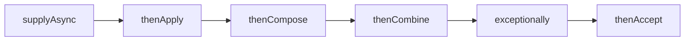

Key methods:
- `thenApply(fn)` - sync transform (like map)
- `thenCompose(fn)` - async chain (like flatMap)
- `thenCombine(other, fn)` - merge two futures
- `allOf(cf1, cf2, ...)` - wait for all
- `anyOf(cf1, cf2, ...)` - first to complete
- `exceptionally(fn)` - recover from error
- `handle(fn)` - access result OR exception

### 🛠️ Worked Example

**BAD:**

```java
// Sequential blocking (wastes threads):
Future<User> fu = pool.submit(() -> fetchUser(id));
User u = fu.get(); // BLOCKS
Future<Profile> fp = pool.submit(() -> fetchProfile(u));
Profile p = fp.get(); // BLOCKS again
return merge(u, p);
// Total: fetchUser + fetchProfile (sequential)
```

Why it's wrong: each get() blocks a thread; calls are sequential not overlapping.

**GOOD:**

```java
CompletableFuture<String> result =
    CompletableFuture.supplyAsync(
        () -> fetchUser(id), ioPool)
    .thenCompose(user ->
        CompletableFuture.supplyAsync(
            () -> fetchProfile(user), ioPool))
    .thenApply(profile -> profile.summary())
    .exceptionally(ex -> "fallback: " + ex.getMessage());
// No blocking. Thread freed between stages.
```

Why it's right: non-blocking pipeline; thread not consumed while waiting.

**Production pattern (fan-out/fan-in):**

```java
List<CompletableFuture<Price>> futures = vendors
    .stream()
    .map(v -> CompletableFuture.supplyAsync(
        () -> v.getPrice(item), ioPool))
    .toList();
CompletableFuture.allOf(futures.toArray(new CF[0]))
    .thenApply(v -> futures.stream()
        .map(CompletableFuture::join)
        .min(comparing(Price::amount))
        .orElseThrow());
```

### ⚖️ Trade-offs

**Gain:** non-blocking composition; no threads wasted waiting; expressive pipeline DSL.

**Cost:** harder to debug (stack traces are pool threads, not business context); exception handling is complex (wrapped in CompletionException); common pool starvation risk.

| Aspect | Future.get() | CompletableFuture | Reactive (Mono) |
| ------ | ------------ | ----------------- | --------------- |
| Blocking | Yes | No (callbacks) | No |
| Composition | None | Rich (then*) | Rich (map/flat) |
| Backpressure | N/A | None built-in | Full |
| Debugging | Simple stacks | Complex | Very complex |

### ⚡ Decision Snap

**USE WHEN:**
- Chaining async operations (A then B then C).
- Fan-out/fan-in (call 5 services, merge results).
- Need non-blocking composition on JDK 8+.

**AVOID WHEN:**
- Simple single async task (Future is simpler).
- Need backpressure (use Reactive Streams or virtual threads).

**PREFER Virtual Threads WHEN:**
- JDK 21+ with I/O-bound work (simpler imperative style).
- Team finds callback chains hard to read/debug.

### ⚠️ Top Traps

| # | Misconception | Reality |
| - | ------------- | ------- |
| 1 | "thenApply is async" | thenApply runs on the completing thread (sync). Use thenApplyAsync for dedicated pool thread. |
| 2 | "Common pool is fine for I/O" | ForkJoinPool.commonPool has CPU-count threads. I/O callbacks that block can starve it. Always pass ioPool for I/O. |
| 3 | "Exceptions propagate normally" | Exceptions wrap in CompletionException. Use handle() or exceptionally() to unwrap. Unchecked exceptions in callbacks are swallowed if not observed. |

### 🪜 Learning Ladder

**Prerequisites:**
- Future and Callable - the blocking version this replaces
- Executor Framework - pools that execute the stages

**THIS:** CompletableFuture Composition

**Next steps:**
- ForkJoinPool and Work-Stealing - the default pool behind CompletableFuture
- Concurrent Chat Phase 3 - apply CompletableFuture to real application

### 💡 The Surprising Truth

`thenApply()` (without Async suffix) runs the callback on WHATEVER thread completes the previous stage. If the previous stage completes before you attach the callback: the CALLING thread (your current thread) runs the callback synchronously. If it completes after: the pool thread runs it. This non-determinism means the same code can run on different threads depending on timing - a source of subtle bugs when callbacks access thread-local state.

### 📇 Revision Card

1. thenApply=map, thenCompose=flatMap, thenCombine=zip. No blocking anywhere.
2. Always pass a dedicated ioPool for I/O operations. Never use common pool for blocking work.
3. Exceptions wrap in CompletionException. Use handle()/exceptionally() to recover.

---

---

# ForkJoinPool and Work-Stealing

**TL;DR** - ForkJoinPool efficiently executes divide-and-conquer tasks using per-thread deques and work-stealing to balance load automatically.

### 🔥 The Problem in One Paragraph

A merge-sort of 10 million elements forks into subtasks recursively. A standard ThreadPoolExecutor with a shared queue creates contention: all threads compete for the single work queue on every fork/join. With thousands of recursive subtasks, queue contention dominates execution time. You need a pool where each thread has its own deque and idle threads steal work from busy ones - eliminating central queue contention. This is exactly why ForkJoinPool was created.

### 📘 Textbook Definition

**ForkJoinPool** (JDK 7) is a work-stealing thread pool optimized for fork/join parallelism. Each worker thread has a local deque (double-ended queue). Tasks are pushed/popped from the local deque (LIFO); idle threads steal from other threads' deques (FIFO) to balance load.

### 🧠 Mental Model

> ForkJoinPool is a group of chefs each with their own prep station (deque). When a chef finishes their work, they look at neighboring stations and STEAL tasks from the bottom of the pile. No central dispatcher needed - work naturally flows to idle hands.

- "Prep station" -> per-thread work deque
- "Chef's own tasks" -> LIFO (pop from top, locality)
- "Stealing" -> FIFO from another thread's bottom
- "No dispatcher" -> decentralized scheduling

**Where this analogy breaks down:** work-stealing only helps when tasks are uneven. If all subtasks take exactly equal time, stealing adds overhead with no benefit.

### ⚙️ How It Works

```text
Thread A deque:    Thread B deque:
  [task4] <-top     [empty]
  [task3]              |
  [task2]              | steal from bottom
  [task1] <-bottom ---|

Thread A: pop task4 (LIFO - cache locality)
Thread B: steal task1 from A (FIFO - large tasks)
```

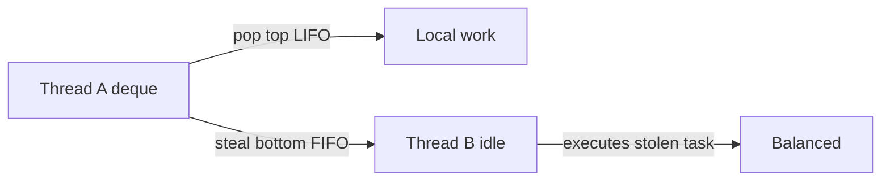

Fork/Join pattern:
1. Task splits into subtasks (fork)
2. Subtasks pushed to local deque
3. Worker processes subtasks (pop from top)
4. Idle workers steal from other deques (bottom)
5. Results combined (join)

### 🛠️ Worked Example

**BAD:**

```java
// ThreadPoolExecutor for recursive tasks:
// All subtasks go to ONE shared queue -> contention
ExecutorService pool = Executors.newFixedThreadPool(8);
// 10K recursive subtasks fighting for one queue lock
```

Why it's wrong: shared queue becomes bottleneck for recursive workloads.

**GOOD:**

```java
ForkJoinPool fjp = new ForkJoinPool(8);
fjp.invoke(new RecursiveTask<Long>() {
    protected Long compute() {
        if (array.length < THRESHOLD)
            return sequentialSum(array);
        int mid = array.length / 2;
        var left = new SumTask(array, 0, mid);
        var right = new SumTask(array, mid, end);
        left.fork();  // push to local deque
        Long r = right.compute(); // compute inline
        Long l = left.join(); // get forked result
        return l + r;
    }
});
```

Why it's right: per-thread deques eliminate contention; work-stealing balances uneven splits.

**Production pattern:**

```java
// Parallel streams use ForkJoinPool.commonPool():
long sum = list.parallelStream()
    .mapToLong(Item::value)
    .sum();
// Common pool = CPU count threads. Fine for CPU work.
// NOT fine for blocking I/O in parallel streams!
```

### ⚖️ Trade-offs

**Gain:** efficient for recursive/divide-and-conquer; automatic load balancing; less contention than shared queue.

**Cost:** overhead for non-recursive tasks; commonPool shared across all parallel streams (starvation risk); join() can block.

| Aspect | ForkJoinPool | ThreadPoolExecutor |
| ------ | ------------ | ------------------ |
| Best for | Recursive/divide-and-conquer | Independent tasks |
| Queue | Per-thread deque | Shared single queue |
| Load balance | Work-stealing (auto) | None (FIFO only) |
| Parallel Streams | Default pool | Not used |

### ⚡ Decision Snap

**USE WHEN:**
- Divide-and-conquer algorithms (sort, search, tree traversal).
- CPU-bound parallel computation.
- Parallel streams (uses commonPool automatically).

**AVOID WHEN:**
- I/O-bound tasks (blocking tasks starve the pool).
- Independent tasks with no recursive structure (use ThreadPoolExecutor).

**PREFER ThreadPoolExecutor WHEN:**
- Tasks are independent (no fork/join hierarchy).
- Need explicit queue sizing and rejection policies.
- I/O-bound workload with blocking operations.

### ⚠️ Top Traps

| # | Misconception | Reality |
| - | ------------- | ------- |
| 1 | "commonPool is unlimited" | It has Runtime.availableProcessors()-1 threads. Blocking I/O starves all parallel streams in the JVM. |
| 2 | "fork() both subtasks" | Fork one, compute the other inline. Forking both wastes the current thread (it just waits). |
| 3 | "ForkJoinPool is always faster" | Only for recursive uneven workloads. For flat independent tasks, ThreadPoolExecutor has less overhead. |

### 🪜 Learning Ladder

**Prerequisites:**
- Executor Framework - the general pool abstraction
- CompletableFuture Composition - uses ForkJoinPool.commonPool by default

**THIS:** ForkJoinPool and Work-Stealing

**Next steps:**
- ForkJoinPool.commonPool Saturation - the production failure mode
- Lock-Free Algorithms (CAS) - internal deque uses CAS

### 💡 The Surprising Truth

The work-stealing deque uses LIFO for the owning thread (pop from top) and FIFO for stealers (take from bottom). This is not arbitrary: LIFO gives the owner cache locality (recently forked = still in L1/L2 cache). FIFO gives stealers the LARGEST subtasks (forked earliest = least subdivided), maximizing the value of each steal and minimizing steal frequency.

### 📇 Revision Card

1. Fork one subtask, compute the other inline. Never fork both (wastes current thread).
2. commonPool = CPU-count threads. NEVER put blocking I/O in parallel streams.
3. Work-stealing: owner=LIFO (cache locality), stealer=FIFO (largest tasks). Automatic balancing.

---

---

# StampedLock

**TL;DR** - StampedLock provides optimistic reads that avoid lock acquisition entirely, offering higher throughput than ReadWriteLock for read-dominated workloads.

### 🔥 The Problem in One Paragraph

ReadWriteLock still acquires a lock for every read. Under extreme read contention (thousands of threads reading), even the shared read lock creates cache-line bouncing as threads atomically increment the reader count. You need a way for readers to proceed WITHOUT acquiring any lock at all - just validate afterward that no writer interfered. If validation fails, fall back to a real lock. This is exactly why StampedLock was created.

### 📘 Textbook Definition

**StampedLock** (JDK 8) provides three access modes: write lock (exclusive), read lock (shared), and optimistic read (lock-free validation-based). The optimistic read returns a stamp; after reading, `validate(stamp)` checks if a writer intervened. If valid: proceed (no lock was ever acquired). If invalid: retry or upgrade to read lock.

### 🧠 Mental Model

> StampedLock is like reading a museum exhibit through glass. You look (optimistic read) and note the display version (stamp). After reading, you check: "did the curator change anything?" (validate). If not: done, no lock needed. If yes: go ask for proper access (upgrade to read lock).

- "Look through glass" -> optimistic read (no lock)
- "Display version" -> stamp (version number)
- "Did curator change?" -> validate(stamp)
- "Ask for proper access" -> upgrade to readLock

**Where this analogy breaks down:** StampedLock is NOT reentrant. If you already hold a write lock and try to acquire it again: deadlock. Unlike ReentrantLock/ReadWriteLock.

### ⚙️ How It Works

```text
Optimistic read pattern:
  1. stamp = lock.tryOptimisticRead()
  2. Read shared variables (no lock held!)
  3. if (lock.validate(stamp)) -> use values
  4. else -> acquire readLock and re-read

Write:
  1. stamp = lock.writeLock() (exclusive)
  2. Modify shared variables
  3. lock.unlockWrite(stamp)
```

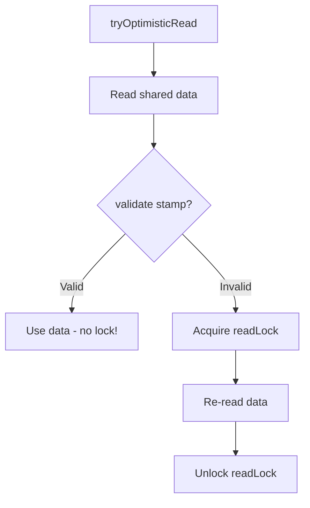

### 🛠️ Worked Example

**BAD:**

```java
// ReadWriteLock: every read acquires lock
rwLock.readLock().lock();
try {
    return new Point(x, y); // lock overhead per read
} finally {
    rwLock.readLock().unlock();
}
// 10K threads: reader-count CAS causes cache bouncing
```

Why it's wrong: read lock still has atomic overhead under extreme reader contention.

**GOOD:**

```java
StampedLock sl = new StampedLock();
double[] readPoint() {
    long stamp = sl.tryOptimisticRead();
    double cx = x, cy = y; // read WITHOUT lock
    if (!sl.validate(stamp)) { // writer interfered?
        stamp = sl.readLock(); // fallback to real lock
        try { cx = x; cy = y; }
        finally { sl.unlockRead(stamp); }
    }
    return new double[]{cx, cy};
}
// Happy path: NO lock acquired. Just validate.
```

Why it's right: optimistic path has zero lock overhead. Only falls back on writer contention.

**Production pattern (write):**

```java
void movePoint(double dx, double dy) {
    long stamp = sl.writeLock();
    try {
        x += dx;
        y += dy;
    } finally {
        sl.unlockWrite(stamp);
    }
}
```

### ⚖️ Trade-offs

**Gain:** optimistic reads have zero lock overhead (no atomics, no cache bouncing). Highest read throughput possible.

**Cost:** NOT reentrant (deadlock if re-acquired). Complex API (stamps must be tracked). Optimistic reads require re-reading on validation failure.

| Aspect | synchronized | ReadWriteLock | StampedLock |
| ------ | ------------ | ------------- | ----------- |
| Read overhead | Full lock | Shared atomic | Zero (optimistic) |
| Reentrant | Yes | Yes | NO |
| Complexity | Low | Medium | High |
| Best for | Simple | Read-heavy | Extreme read-heavy |

### ⚡ Decision Snap

**USE WHEN:**
- Extreme read contention (>100 concurrent readers).
- Reads are short and can be retried on validation failure.
- Need maximum read throughput (lock-free happy path).

**AVOID WHEN:**
- Need reentrancy (StampedLock deadlocks on re-acquire).
- Reads are expensive (retry on validation failure doubles cost).

**PREFER ReadWriteLock WHEN:**
- Moderate read contention (ReadWriteLock is simpler and reentrant).
- Reads are expensive (cannot afford retry).

### ⚠️ Top Traps

| # | Misconception | Reality |
| - | ------------- | ------- |
| 1 | "StampedLock replaces ReadWriteLock" | Only for extreme read-heavy cases. It is NOT reentrant, harder to use correctly, and overkill for most workloads. |
| 2 | "Optimistic read is always valid" | Under write contention, validation frequently fails. You MUST have the fallback path. |
| 3 | "I can use StampedLock in recursive code" | No. Any re-entrant lock acquisition = instant deadlock. |

### 🪜 Learning Ladder

**Prerequisites:**
- ReadWriteLock - the simpler read/write separation
- Atomicity, Visibility, Ordering - optimistic read relies on memory visibility

**THIS:** StampedLock

**Next steps:**
- Lock-Free Algorithms (CAS) - similar optimistic retry philosophy
- False Sharing and Cache Lines - why read lock atomics cause cache bouncing

### 💡 The Surprising Truth

StampedLock's optimistic read does not actually acquire ANY lock or modify ANY shared state. `tryOptimisticRead()` just reads a version counter (volatile read). `validate(stamp)` checks the counter has not changed. The entire "lock" operation is two volatile reads with no writes. This is why it scales perfectly under read contention - there is NOTHING for readers to contend on. The version counter only changes when a writer acquires the write lock.

### 📇 Revision Card

1. Optimistic read = two volatile reads, zero lock acquisition. Highest read throughput possible.
2. NOT reentrant. Never use in recursive code. Deadlocks immediately.
3. Always have a fallback path: if (!validate) -> acquire readLock -> re-read.

---

---

# Happens-Before Relationship

**TL;DR** - Happens-before defines which writes are guaranteed visible to subsequent reads across threads - the foundation of Java's memory model.

### 🔥 The Problem in One Paragraph

Thread A writes `x = 42` then sets `ready = true`. Thread B reads `ready == true` then reads `x`. On x86, B might see `x == 0` despite ready being true. Why? The CPU and compiler reorder instructions for performance. Without a formal rule saying "write to ready MUST be visible to B after A publishes it," there is no guarantee. You need a specification of WHICH ordering guarantees the JVM provides. This is exactly why the happens-before relationship was defined.

### 📘 Textbook Definition

The **happens-before** relationship (JMM, JSR 133) is a partial ordering on actions (reads, writes, locks, unlocks) such that if action A happens-before action B, then A's effects are guaranteed visible to B. It is NOT about time - it is about visibility guarantees between threads.

### 🧠 Mental Model

> Happens-before is a "contract of visibility." If you can draw a happens-before arrow from write W to read R, then R is GUARANTEED to see W's value. No arrow = no guarantee (even if W occurred "earlier" in wall-clock time).

- "Arrow from W to R" -> happens-before relationship
- "Guaranteed to see" -> visibility guarantee
- "No arrow" -> no guarantee (may see stale value)
- "Not about time" -> about JVM's ordering contract

**Where this analogy breaks down:** happens-before is transitive (A->B, B->C implies A->C). Time is also transitive, but the key difference is that happens-before is ONLY established by specific actions (synchronize, volatile, etc.) - not by mere time ordering.

### ⚙️ How It Works

```text
Happens-before rules (key ones):

1. Program order: within one thread,
   earlier -> later (trivial)

2. Monitor lock: unlock(m) -> lock(m)
   (next acquirer sees all changes before unlock)

3. Volatile: write(v) -> read(v)
   (reader sees writer's value + all prior writes)

4. Thread start: A calls t.start() ->
   first action in t (t sees A's state)

5. Thread join: last action in t ->
   A returns from t.join()

6. Transitivity: if A->B and B->C then A->C
```

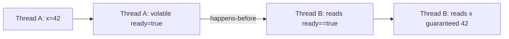

### 🛠️ Worked Example

**BAD:**

```java
int x = 0;
boolean ready = false; // NOT volatile
// Thread A:
x = 42;
ready = true;
// Thread B:
if (ready) { // may see true
    print(x); // may print 0! No happens-before.
}
// No happens-before between A's write and B's read.
```

Why it's wrong: without volatile/synchronized, no visibility guarantee exists.

**GOOD:**

```java
int x = 0;
volatile boolean ready = false; // VOLATILE
// Thread A:
x = 42;
ready = true; // volatile write
// Thread B:
if (ready) { // volatile read -> happens-before!
    print(x); // GUARANTEED 42. Visibility ensured.
}
// volatile write -> volatile read = happens-before.
// All writes BEFORE volatile write visible AFTER
// volatile read.
```

Why it's right: volatile establishes happens-before; x=42 visible to B.

**Production pattern:**

```java
// Double-checked locking (correct with volatile):
volatile Singleton instance;
if (instance == null) {
    synchronized(lock) {
        if (instance == null) {
            instance = new Singleton();
            // volatile write happens-before any read
        }
    }
}
// Without volatile: other threads may see partially
// constructed object (constructor reordered after ref write)
```

### ⚖️ Trade-offs

**Gain:** formal reasoning about multi-threaded correctness. Compiler/CPU free to optimize where no happens-before constrains them.

**Cost:** abstract model (not intuitive). Easy to THINK code is correct based on timing rather than formal happens-before.

| Mechanism | Happens-before established by |
| --------- | ----------------------------- |
| synchronized | unlock -> next lock |
| volatile | write -> subsequent read |
| Thread.start() | caller -> new thread |
| Thread.join() | thread end -> caller returns |
| final fields | constructor end -> reader |

### ⚡ Decision Snap

**USE WHEN:**
- Reasoning about multi-threaded correctness.
- Choosing between volatile, synchronized, or atomics.
- Reviewing code for potential visibility bugs.

**AVOID REASONING WITHOUT HB WHEN:**
- Never rely on "it worked in testing" for concurrent code.
- Never rely on timing ("A runs first so B sees it").

**ESTABLISH HB VIA:**
- synchronized blocks (most common, easiest)
- volatile fields (lightweight single-variable visibility)
- java.util.concurrent classes (internally establish HB)

### ⚠️ Top Traps

| # | Misconception | Reality |
| - | ------------- | ------- |
| 1 | "If A runs before B in time, B sees A's writes" | NO. Time ordering != happens-before. Only specific actions (lock, volatile, etc.) create HB. |
| 2 | "volatile makes the variable atomic" | volatile only gives visibility + ordering. A non-atomic read-modify-write (i++) on volatile is STILL a race. |
| 3 | "I only need volatile on the flag variable" | volatile write makes ALL prior writes visible. But the flag itself must be the synchronization point. |

### 🪜 Learning Ladder

**Prerequisites:**
- Atomicity, Visibility, Ordering - the three concerns HB addresses
- volatile Keyword - one mechanism for establishing HB

**THIS:** Happens-Before Relationship

**Next steps:**
- Java Memory Model Working Rules - practical HB application
- JSR 133 - the formal specification

### 💡 The Surprising Truth

The happens-before ordering for `final` fields is special: if an object is properly constructed (no `this` escapes), then ALL threads reading a reference to that object are guaranteed to see the correct values of its final fields - WITHOUT any synchronization. This is why immutable objects (all fields final) are inherently thread-safe: construction completion happens-before any read via a properly published reference.

### 📇 Revision Card

1. Happens-before != time-before. Only specific actions (lock/volatile/start/join) establish HB.
2. volatile write makes ALL prior writes visible to any thread that reads the volatile.
3. No happens-before = no visibility guarantee. Even if "obviously runs first" in your mind.

---

---

# Java Memory Model - Working Rules

**TL;DR** - The JMM allows CPUs and compilers to reorder and cache aggressively; your code must use synchronization to force visibility and ordering.

### 🔥 The Problem in One Paragraph

A developer writes straightforward code: write A, write B, read B, read A. On their laptop it always works. In production (different CPU architecture, different JIT optimizations, different load), reads see stale values. The developer's mental model assumes sequential consistency (every thread sees all writes in program order). The JMM does NOT guarantee this without synchronization. Understanding the working rules prevents "works on my machine" concurrency bugs. This is exactly why JMM working rules exist.

### 📘 Textbook Definition

The **Java Memory Model** (JLS Chapter 17) specifies when a thread is guaranteed to see a value written by another thread. Without explicit synchronization, the JVM is free to: reorder instructions, cache variables in registers, and delay writes to main memory - for performance.

### 🧠 Mental Model

> Each thread has an "invisible notebook" (local cache/registers). Writes go to the notebook first. Other threads cannot see your notebook. ONLY when you use a synchronization mechanism (synchronized, volatile, etc.) do you "publish" your notebook to the shared whiteboard (main memory) - and force others to "refresh" from the whiteboard.

- "Invisible notebook" -> CPU registers, store buffers, L1/L2 cache
- "Shared whiteboard" -> main memory (heap)
- "Publish" -> memory barrier on write (flush to memory)
- "Refresh" -> memory barrier on read (reload from memory)

**Where this analogy breaks down:** in reality, there is no single "main memory" moment. Cache coherence protocols (MESI) handle visibility, but the JMM abstracts this into happens-before rules rather than hardware details.

### ⚙️ How It Works

```text
JMM Working Rules (practical):

Rule 1: Within one thread, program order holds.
         (You always see your own writes.)

Rule 2: Between threads, NOTHING is guaranteed
         unless happens-before exists.

Rule 3: To make write W visible to read R
         across threads, establish HB:
         - synchronized(same monitor)
         - volatile same field
         - Thread.start() / join()
         - j.u.c utilities (internally use HB)

Rule 4: Reordering is allowed unless it violates
         happens-before for the observing thread.

Rule 5: final fields visible after construction
         (no sync needed for properly published
         immutable objects).
```

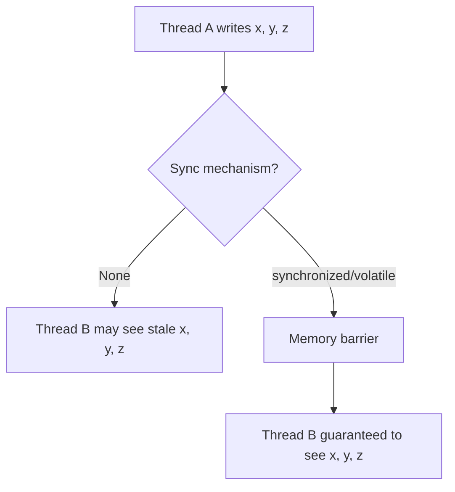

### 🛠️ Worked Example

**BAD:**

```java
// No sync - JMM allows reordering:
boolean stop = false;
// Thread A:
stop = true;
// Thread B (may loop forever!):
while (!stop) { /* spin */ }
// JIT may hoist stop read out of loop (never re-reads)
// because no happens-before forces visibility.
```

Why it's wrong: without volatile, JIT can optimize the read away (treat stop as constant false within the loop).

**GOOD:**

```java
volatile boolean stop = false;
// Thread A:
stop = true; // volatile write -> memory barrier
// Thread B:
while (!stop) { /* spin */ }
// volatile read every iteration -> sees write
// JIT cannot hoist volatile read out of loop.
```

Why it's right: volatile forces re-read from memory each iteration; JIT cannot optimize away.

**Production pattern (piggybacking):**

```java
// All writes BEFORE a volatile write are visible
// to any thread AFTER a volatile read of that field.
int data1, data2, data3;
volatile boolean published;
// Writer:
data1 = 1; data2 = 2; data3 = 3;
published = true; // volatile write: flushes ALL above
// Reader:
if (published) { // volatile read: refreshes ALL
    // data1, data2, data3 guaranteed visible here
}
```

### ⚖️ Trade-offs

**Gain:** allows aggressive CPU/compiler optimization (massive performance win on modern hardware); explicit model for reasoning about correctness.

**Cost:** developer must actively think about visibility; "working on my machine" is meaningless for concurrency correctness.

| Hardware | Reordering freedom |
| -------- | ------------------ |
| x86/x64 | Weak (store-load only) |
| ARM/RISC-V | Strong (all reorderings possible) |
| JMM | Platform-independent guarantees |

### ⚡ Decision Snap

**USE THESE RULES WHEN:**
- Writing any multi-threaded code without j.u.c abstractions.
- Debugging "works on my machine, fails in prod."
- Reviewing concurrent code for correctness.

**SAFE DEFAULTS:**
- Share data via j.u.c classes (they handle memory barriers internally).
- Use volatile for simple flags / status indicators.
- Use synchronized for multi-variable consistency.

**DANGER ZONE:**
- Sharing non-volatile, non-synchronized fields between threads.
- Assuming "Thread A runs first therefore B sees it."

### ⚠️ Top Traps

| # | Misconception | Reality |
| - | ------------- | ------- |
| 1 | "x86 is strongly ordered so my code is safe" | ARM/RISC-V reorder more aggressively. Code must be correct per JMM, not per x86. JDK runs on ARM too. |
| 2 | "I see the bug in testing = code is broken" | NOT seeing the bug in testing != code is correct. JMM bugs are probabilistic - may only manifest under specific timing/load/architecture. |
| 3 | "Adding volatile everywhere fixes everything" | volatile is for single-variable visibility. Compound operations (check-then-act) still need synchronized. |

### 🪜 Learning Ladder

**Prerequisites:**
- Happens-Before Relationship - the formal ordering rules
- volatile Keyword - one mechanism for memory barriers

**THIS:** Java Memory Model - Working Rules

**Next steps:**
- Double-Checked Locking Anti-Pattern - classic JMM bug
- JSR 133 - Java Memory Model Specification - the formal document

### 💡 The Surprising Truth

The JIT compiler is the most aggressive "reorderer" in practice - more than CPUs. The JIT can eliminate reads entirely (treating a field as a constant if it sees no writes in the method), hoist reads out of loops, and merge writes. A field that is "obviously" changing in another thread can appear constant to the JIT within a hot loop because the JIT optimizes based on single-thread semantics. Only volatile/synchronized prevents this optimization.

### 📇 Revision Card

1. Between threads: NOTHING visible without happens-before. Not even "obvious" writes.
2. JIT is the biggest reorderer - can hoist reads, eliminate "unnecessary" loads, merge writes.
3. Safe defaults: j.u.c classes for data structures, volatile for flags, synchronized for compound operations.

---

---

# Double-Checked Locking Anti-Pattern

**TL;DR** - Double-checked locking without volatile is broken because object publication can be reordered, exposing a partially constructed instance.

### 🔥 The Problem in One Paragraph

Lazy singleton initialization: you check if instance is null, synchronize, check again, then create. Without volatile, the JMM allows the reference assignment to be reordered BEFORE the constructor completes. Thread B sees a non-null reference but accesses an object whose fields are still default (zero/null). The instance appears "created" but is actually half-constructed. This caused real production bugs in Java for years before JDK 5 fixed the memory model (JSR 133). This is exactly why double-checked locking is an anti-pattern without volatile.

### 📘 Textbook Definition

**Double-Checked Locking (DCL)** is a pattern to reduce synchronization overhead for lazy initialization by checking the condition before AND after acquiring the lock. Without `volatile` on the instance field, it is broken in Java due to potential reordering of object construction and reference publication.

### 🧠 Mental Model

> Object creation has three steps: (1) allocate memory, (2) run constructor (initialize fields), (3) assign reference. The CPU/compiler can reorder to: (1) allocate, (3) assign reference, (2) run constructor. Another thread sees the reference (non-null) but the object is empty.

- "Allocate" -> memory reserved
- "Assign reference" -> pointer becomes non-null
- "Run constructor" -> fields get values
- "Reorder 3 before 2" -> reference visible before construction completes

**Where this analogy breaks down:** on x86, this reordering rarely manifests (strong memory ordering). On ARM or under JIT optimization, it manifests regularly. The JMM says it CAN happen, regardless of hardware.

### ⚙️ How It Works

```text
Broken DCL timeline:

Thread A                      Thread B
  |                             |
  check instance==null (true)   |
  acquire lock                  |
  check instance==null (true)   |
  instance = new Singleton()    |
    -> allocate memory          |
    -> assign ref (reordered!)  |
    [constructor NOT done yet]  |
  release lock                  |
                                check instance != null
                                use instance.field -> NULL!
                                [fields not initialized]
```

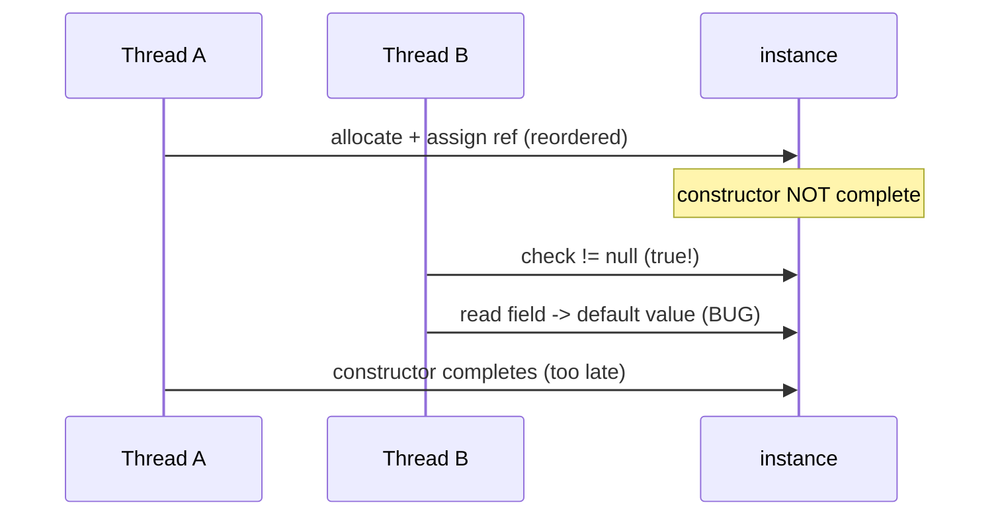

### 🛠️ Worked Example

**BAD:**

```java
// BROKEN: no volatile
private static Singleton instance;
public static Singleton get() {
    if (instance == null) {         // 1st check
        synchronized (Singleton.class) {
            if (instance == null) { // 2nd check
                instance = new Singleton(); // reorder!
            }
        }
    }
    return instance; // may return half-constructed!
}
```

Why it's wrong: reference assignment can be reordered before constructor. Thread B sees non-null but uninitialized.

**GOOD:**

```java
// FIXED: volatile prevents reordering
private static volatile Singleton instance;
public static Singleton get() {
    if (instance == null) {
        synchronized (Singleton.class) {
            if (instance == null) {
                instance = new Singleton();
                // volatile write: constructor MUST complete
                // before reference is visible to others
            }
        }
    }
    return instance; // guaranteed fully constructed
}
```

Why it's right: volatile write happens-after constructor; readers guaranteed to see complete object.

**Production pattern (simplest alternative):**

```java
// Lazy holder idiom - no volatile, no synchronized:
private static class Holder {
    static final Singleton INSTANCE = new Singleton();
}
public static Singleton get() {
    return Holder.INSTANCE;
    // Class loading guarantees thread safety
    // Loaded lazily on first access to Holder
}
```

### ⚖️ Trade-offs

**Gain (correct DCL):** lazy initialization with minimal synchronization (only first call synchronizes).

**Cost:** volatile read on EVERY access (slight overhead); complexity; easy to get wrong.

| Approach | Thread-safe | Lazy | Overhead |
| -------- | ----------- | ---- | -------- |
| DCL + volatile | Yes | Yes | volatile read per access |
| Lazy holder | Yes | Yes | None after init |
| enum singleton | Yes | No (eager) | None |
| synchronized | Yes | Yes | Lock per access |

### ⚡ Decision Snap

**USE WHEN:**
- Lazy singleton that cannot use holder idiom (needs constructor args).
- Instance field (not static) requiring lazy init.

**AVOID WHEN:**
- Static singleton (use lazy holder idiom - simpler, zero overhead).
- Enum can represent the singleton (simplest, serialization-safe).

**PREFER Lazy Holder Idiom WHEN:**
- No-arg static singleton (most cases).
- Want zero-overhead after initialization.

### ⚠️ Top Traps

| # | Misconception | Reality |
| - | ------------- | ------- |
| 1 | "DCL works without volatile on x86" | It may APPEAR to work on x86 (strong ordering) but is still broken per JMM. Fails on ARM, under JIT, or under load. |
| 2 | "synchronized alone fixes it" | The first null check is OUTSIDE synchronized. Without volatile, the reader bypasses synchronization entirely. |
| 3 | "This bug is theoretical" | Real production bugs from DCL were reported in multiple frameworks pre-JDK5. Spring Framework fixed their singleton factories specifically for this. |

### 🪜 Learning Ladder

**Prerequisites:**
- Happens-Before Relationship - why volatile fixes DCL
- Java Memory Model Working Rules - reordering freedom

**THIS:** Double-Checked Locking Anti-Pattern

**Next steps:**
- Immutability as Concurrency Strategy - avoid the problem entirely
- Thread Confinement as Design Pattern - another avoidance strategy

### 💡 The Surprising Truth

The lazy holder idiom exploits a JVM guarantee: class initialization is thread-safe (the JVM holds a lock per class during `<clinit>`). The inner static class is only loaded when first referenced. This gives you lazy initialization with thread safety and ZERO runtime overhead after initialization - no volatile read, no synchronization check. It is strictly superior to DCL for static singletons.

### 📇 Revision Card

1. DCL without volatile is BROKEN. Reference can be published before constructor completes.
2. Fix: `private static volatile Singleton instance;` - volatile prevents reordering.
3. Better: use lazy holder idiom (zero overhead) or enum (serialization-safe) for singletons.

---

---

# Thread Starvation and Priority Inversion

**TL;DR** - Thread starvation occurs when threads cannot access CPU or locks due to unfair scheduling; priority inversion occurs when a low-priority thread blocks a high-priority one.

### 🔥 The Problem in One Paragraph

A high-priority monitoring thread needs a lock held by a low-priority batch-processing thread. A medium-priority thread preempts the low-priority thread (it does not need the lock). The high-priority thread waits for the low-priority thread, which cannot run because the medium-priority thread preempts it. Result: high-priority thread is blocked by medium-priority thread that has nothing to do with the resource. Mars Pathfinder experienced this bug in 1997. This is exactly why priority inversion awareness is critical.

### 📘 Textbook Definition

**Thread starvation** is a liveness failure where a thread is perpetually denied access to resources (CPU time, locks) it needs. **Priority inversion** is a specific form where a high-priority thread is transitively blocked by a lower-priority thread due to lock dependencies and preemptive scheduling.

### 🧠 Mental Model

> Priority inversion is like an emergency vehicle (high-priority) stuck behind a bicycle (low-priority) on a single-lane road, while cars (medium-priority) fill the other lane preventing the bicycle from pulling over. The emergency vehicle is effectively blocked by cars that do not even use that road.

- "Emergency vehicle" -> high-priority thread
- "Bicycle" -> low-priority thread holding a lock
- "Cars filling other lane" -> medium-priority threads preempting low-priority
- "Single-lane road" -> the shared lock

**Where this analogy breaks down:** in Java, you cannot directly observe priority inversion because the JVM does not guarantee that thread priorities map to OS scheduling priorities (implementation-dependent).

### ⚙️ How It Works

```text
Priority Inversion:

  Thread H (high): needs Lock X -> BLOCKED
  Thread M (medium): no lock needed -> RUNNING
  Thread L (low): holds Lock X -> PREEMPTED by M

  Chain: H waits for L, L preempted by M
  Result: H effectively blocked by M

Solution: Priority Inheritance
  When H blocks on L's lock:
    Temporarily boost L to H's priority
    L runs (no longer preempted by M)
    L releases lock -> H proceeds
    L reverts to original priority
```

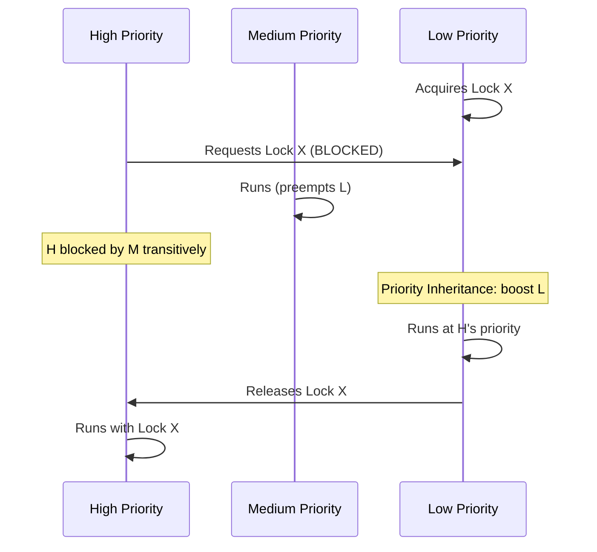

### 🛠️ Worked Example

**BAD:**

```java
// ReentrantLock without fairness:
ReentrantLock lock = new ReentrantLock(); // unfair
// Under contention: the lock may repeatedly go to
// the same thread (due to cache locality/timing).
// Other threads STARVE.
```

Why it's wrong: unfair locks can cause indefinite starvation under heavy contention.

**GOOD:**

```java
// Fair lock prevents starvation (FIFO ordering):
ReentrantLock lock = new ReentrantLock(true);
// Threads acquire in FIFO order. No starvation.
// Trade-off: ~2x lower throughput than unfair.
// Use only when starvation is observed/proven.
```

Why it's right: fair lock guarantees bounded waiting; no thread waits forever.

**Production pattern (avoiding inversion):**

```java
// Strategy 1: minimize lock hold time
lock.lock();
try {
    result = cache.get(key); // ONLY cache access
} finally {
    lock.unlock();
}
// Process result OUTSIDE lock. Low-priority thread
// holds lock briefly -> less chance of inversion.

// Strategy 2: use timeouts
if (!lock.tryLock(100, MILLISECONDS)) {
    // Possible starvation detected. Log + fallback.
    metrics.increment("lock.timeout");
    return fallback();
}
```

### ⚖️ Trade-offs

**Gain (fairness):** guaranteed progress for all threads; no starvation.

**Cost (fairness):** significantly lower throughput (FIFO ordering prevents locality optimization); priority inversion still possible at OS level even with fair Java locks.

| Strategy | Prevents starvation | Performance cost |
| -------- | ------------------- | ---------------- |
| Fair lock | Yes | ~2x slower |
| Lock timeout | Detect (not prevent) | Minimal |
| Minimize lock time | Reduces probability | None |
| Lock-free (CAS) | Yes (no lock = no starvation) | Spinning cost |

### ⚡ Decision Snap

**USE FAIR LOCK WHEN:**
- Starvation is observed in production (metrics show threads waiting indefinitely).
- Contractual requirement for bounded waiting time.

**AVOID FAIR LOCK WHEN:**
- No starvation observed (default unfair is faster).
- Performance-critical path where 2x slowdown is unacceptable.

**PREFER lock-free (Atomic/CAS) WHEN:**
- Single-variable operations where starvation from locks is a concern.
- Need guaranteed progress without fairness overhead.

### ⚠️ Top Traps

| # | Misconception | Reality |
| - | ------------- | ------- |
| 1 | "Java thread priorities prevent starvation" | Thread.setPriority() is a HINT. Most JVMs on Linux ignore it entirely. Do not rely on priorities for correctness. |
| 2 | "Priority inversion cannot happen in Java" | It can if the OS schedules threads with priorities (Windows does map Java priorities to OS priorities). |
| 3 | "Starvation only affects low-priority threads" | Any thread can starve under unfair locking - even high-priority ones (if others continuously acquire the lock first). |

### 🪜 Learning Ladder

**Prerequisites:**
- ReentrantLock vs synchronized - fairness option
- Thread Lifecycle and States - BLOCKED vs WAITING

**THIS:** Thread Starvation and Priority Inversion

**Next steps:**
- Lock Contention Profiling - detect starvation in production
- ForkJoinPool.commonPool Saturation - a form of starvation

### 💡 The Surprising Truth

On Linux, Java thread priorities (1-10) map to nice values but the CFS (Completely Fair Scheduler) largely ignores them for normal processes (SCHED_OTHER). The priorities become meaningful ONLY with real-time scheduling policies (SCHED_FIFO/SCHED_RR), which require root privileges. In practice, Thread.setPriority() is nearly meaningless on Linux - making priority inversion a non-issue on that platform but very real on Windows.

### 📇 Revision Card

1. Priority inversion: H blocked by L, L preempted by M -> H transitively blocked by M.
2. Java thread priorities are hints, not guarantees. Never rely on them for correctness.
3. Prevention: minimize lock hold time, use timeouts, use fair locks only when starvation is proven.

---

---

# Lock-Free Algorithms (CAS)

**TL;DR** - Lock-free algorithms use Compare-And-Swap retry loops to achieve thread safety without locks, guaranteeing system-wide progress.

### 🔥 The Problem in One Paragraph

A lock-based concurrent stack blocks all pushers while one thread holds the lock. If that thread is preempted by the OS for 10ms (context switch), ALL other threads are blocked for 10ms - regardless of their priority or urgency. One slow thread can stall the entire system. You need a data structure where individual thread stalls do NOT block other threads' progress. This is exactly why lock-free algorithms were created.

### 📘 Textbook Definition

A **lock-free algorithm** guarantees system-wide progress: at least one thread makes progress in a finite number of steps, regardless of other threads' scheduling. Typically implemented using atomic Compare-And-Swap (CAS) operations in retry loops, eliminating locks and their associated blocking.

### 🧠 Mental Model

> A lock-free algorithm is like a group of people editing a shared whiteboard. Each person reads the board, prepares their edit on paper, then attempts to write it ONLY if the board has not changed since they read it. If someone else edited first: they re-read and retry. Nobody blocks anyone else - worst case, you retry.

- "Read board" -> read current state
- "Prepare edit on paper" -> compute new state locally
- "Write only if unchanged" -> CAS(expected, new)
- "Someone edited first" -> CAS failure, retry
- "Nobody blocks anyone" -> lock-free progress guarantee

**Where this analogy breaks down:** under extreme contention, many retries waste CPU (called "spinning"). Lock-free does NOT mean "fast" - it means "no thread can block another."

### ⚙️ How It Works

```text
Lock-free stack push (Treiber Stack):

  1. Read current top: expected = top
  2. Create new node: node.next = expected
  3. CAS(top, expected, node)
     - Success: push complete
     - Failure: another thread pushed -> goto 1

  Guarantee: if CAS fails, SOME thread succeeded
  (system-wide progress).
```

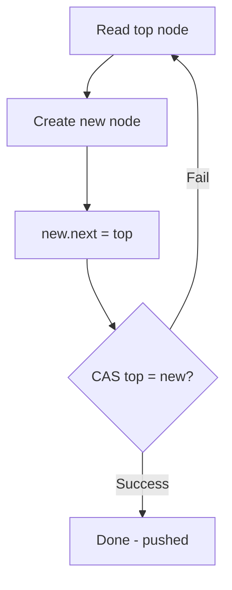

### 🛠️ Worked Example

**BAD:**

```java
// Lock-based stack (blocking):
synchronized void push(T item) {
    Node<T> n = new Node<>(item, top);
    top = n; // simple, but lock blocks ALL threads
}
// If this thread is preempted: all pushers wait.
```

Why it's wrong: one preempted thread blocks all others - no progress guarantee.

**GOOD:**

```java
// Lock-free stack (Treiber Stack):
private final AtomicReference<Node<T>> top =
    new AtomicReference<>();
void push(T item) {
    Node<T> newNode = new Node<>(item);
    Node<T> expected;
    do {
        expected = top.get();
        newNode.next = expected;
    } while (!top.compareAndSet(expected, newNode));
    // No lock. If CAS fails: retry with fresh state.
}
```

Why it's right: no thread blocks another. CAS failure means SOMEONE ELSE succeeded (progress).

**Production pattern (AtomicReference state machine):**

```java
// Lock-free state transition:
AtomicReference<State> state = new AtomicReference<>(IDLE);
boolean start() {
    return state.compareAndSet(IDLE, RUNNING);
    // Exactly ONE thread succeeds. Others get false.
    // No lock. No blocking. Instant.
}
```

### ⚖️ Trade-offs

**Gain:** no blocking (preempted threads do not stall others); better worst-case latency; progress guarantee.

**Cost:** higher CPU usage under contention (spinning); complex to implement correctly; ABA problem; harder to debug.

| Aspect | Lock-based | Lock-free (CAS) | Wait-free |
| ------ | ---------- | --------------- | --------- |
| Progress | Blocking | System-wide | Per-thread |
| Contention cost | Thread parking | CPU spinning | None |
| Complexity | Low | High | Very high |
| ABA problem | N/A | Yes (need stamps) | Yes |

### ⚡ Decision Snap

**USE WHEN:**
- Need guaranteed progress (one slow thread must not stall system).
- Low-latency systems where lock blocking is unacceptable.
- Simple single-pointer structures (stack, queue head/tail).

**AVOID WHEN:**
- Complex multi-variable invariants (CAS works on one word).
- Team cannot verify correctness (lock-free bugs are subtle).

**PREFER locks WHEN:**
- Simpler code is more important than lock-free guarantees.
- Contention is low (locks are equally fast uncontended).

### ⚠️ Top Traps

| # | Misconception | Reality |
| - | ------------- | ------- |
| 1 | "Lock-free = faster" | Under low contention, locks are equally fast. Lock-free shines under contention/preemption scenarios. |
| 2 | "CAS is one instruction = safe" | The ALGORITHM around CAS must be correct. A wrong retry loop = data corruption. |
| 3 | "I should write my own lock-free structures" | Almost never. Use j.u.c (ConcurrentLinkedQueue, etc.). Lock-free code is extremely hard to verify. |

### 🪜 Learning Ladder

**Prerequisites:**
- AtomicInteger and Atomic Classes - CAS at the single-variable level
- Happens-Before Relationship - CAS establishes happens-before

**THIS:** Lock-Free Algorithms (CAS)

**Next steps:**
- The ABA Problem and Solutions - subtle CAS failure mode
- VarHandle and Memory Fences - low-level CAS access in modern Java

### 💡 The Surprising Truth

java.util.concurrent.ConcurrentLinkedQueue is a fully lock-free FIFO queue (Michael-Scott algorithm). It uses TWO atomic pointers (head and tail) with CAS and a "helping" mechanism: if a thread observes that tail is behind, it helps advance tail before its own operation. This cooperative "helping" is what makes lock-free algorithms work at scale - threads fix each other's incomplete operations rather than waiting.

### 📇 Revision Card

1. Lock-free = system-wide progress guaranteed. At least one thread advances regardless of others.
2. CAS retry loop: read -> compute -> CAS -> retry on fail. Simple pattern, hard to get right.
3. Use j.u.c lock-free structures. Do NOT write your own unless you can formally prove correctness.

---

---

# VarHandle and Memory Fences

**TL;DR** - VarHandle (JDK 9+) provides fine-grained memory access modes (plain, opaque, acquire/release, volatile) replacing sun.misc.Unsafe for safe low-level concurrency.

### 🔥 The Problem in One Paragraph

Before JDK 9, performance-critical code needing fine-grained memory ordering (weaker than volatile but stronger than plain) relied on sun.misc.Unsafe - an internal, unsupported API. Library authors (Netty, LMAX Disruptor) used Unsafe for CAS on arbitrary fields and relaxed memory ordering. JDK 9 encapsulated Unsafe and provided VarHandle as the supported replacement with well-defined memory access modes. This is exactly why VarHandle was created.

### 📘 Textbook Definition

**VarHandle** (java.lang.invoke, JDK 9) is a dynamically typed reference to a variable (field, array element, or memory segment) supporting typed read/write access with configurable memory ordering modes: plain, opaque, acquire/release (acquire on read, release on write), and volatile (full fence).

### 🧠 Mental Model

> VarHandle is a "tunable dial" for memory ordering. volatile is the maximum setting (full barrier, maximum safety, maximum cost). Plain access is the minimum (no barrier, no safety, no cost). VarHandle lets you pick intermediate settings:

- **Plain** -> no guarantees (fastest, same as normal field access)
- **Opaque** -> no reordering of same-variable accesses (but no cross-variable ordering)
- **Acquire/Release** -> one-directional fence (acquire: nothing moves before; release: nothing moves after)
- **Volatile** -> full fence (bidirectional, most expensive)

**Where this analogy breaks down:** the intermediate modes are rarely needed outside library/framework code. Application developers almost never need weaker-than-volatile guarantees.

### ⚙️ How It Works

```text
Memory ordering spectrum (weakest to strongest):

  Plain < Opaque < Acquire/Release < Volatile

VarHandle methods:
  get()/set()                 -> plain (no ordering)
  getOpaque()/setOpaque()     -> opaque
  getAcquire()/setRelease()   -> acquire/release
  getVolatile()/setVolatile() -> full volatile
  compareAndSet()             -> volatile CAS
  weakCompareAndSet*()  -> relaxed CAS (spurious fail)
```

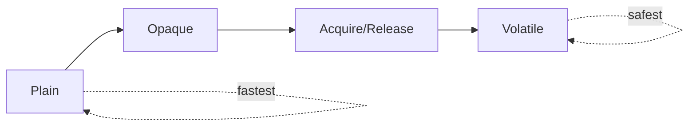

### 🛠️ Worked Example

**BAD:**

```java
// sun.misc.Unsafe (unsupported, removed in JDK 17+):
Unsafe u = Unsafe.getUnsafe();
long offset = u.objectFieldOffset(
    MyClass.class.getDeclaredField("counter"));
u.compareAndSwapInt(this, offset, expected, newVal);
// Unsafe: no compile-time type safety, may break
```

Why it's wrong: Unsafe is internal, unsupported, and will be removed.

**GOOD:**

```java
// VarHandle (supported since JDK 9):
private static final VarHandle COUNTER;
static {
    COUNTER = MethodHandles.lookup().findVarHandle(
        MyClass.class, "counter", int.class);
}
private int counter;
void increment() {
    int prev;
    do {
        prev = (int) COUNTER.getVolatile(this);
    } while (!COUNTER.compareAndSet(
        this, prev, prev + 1));
}
```

Why it's right: type-safe, supported API with well-defined memory ordering.

**Production pattern (release/acquire for flags):**

```java
// Cheaper than volatile for publish/consume pattern:
READY.setRelease(this, true); // writer: release fence
// ... in reader thread:
if ((boolean) READY.getAcquire(this)) {
    // All writes before setRelease are visible here
    // Cheaper than volatile on ARM (one-directional)
}
```

### ⚖️ Trade-offs

**Gain:** portable replacement for Unsafe; fine-grained ordering control; compiler-checked type safety.

**Cost:** verbose API; complex mental model (4 ordering modes); rarely needed outside libraries.

| Aspect | volatile field | VarHandle volatile | VarHandle acquire/release |
| ------ | -------------- | ------------------ | ------------------------- |
| Ordering | Full fence | Full fence | One-directional |
| Performance | Baseline | Same | Slightly better (ARM) |
| Flexibility | None | Full API (CAS, etc.) | Full API |
| Use case | Application code | Library code | Extreme optimization |

### ⚡ Decision Snap

**USE WHEN:**
- Need CAS on non-atomic fields (library/framework code).
- Need weaker-than-volatile ordering for performance (rare, measure first).
- Migrating from sun.misc.Unsafe.

**AVOID WHEN:**
- Application code (use AtomicInteger or volatile - simpler).
- You cannot articulate WHY you need weaker ordering.

**PREFER AtomicInteger/volatile WHEN:**
- Standard atomic operations suffice (most code).
- Team maintainability is more important than marginal performance.

### ⚠️ Top Traps

| # | Misconception | Reality |
| - | ------------- | ------- |
| 1 | "VarHandle is faster than AtomicInteger" | Same underlying operations. VarHandle gives MORE options (relaxed modes) but the volatile mode is equally costly. |
| 2 | "I should use acquire/release everywhere for speed" | On x86, acquire/release has SAME cost as volatile (x86 provides acquire/release for free). Only benefits ARM/RISC-V. |
| 3 | "weakCompareAndSet is just CAS" | It can SPURIOUSLY FAIL (return false even if expected matches). Must always be in a retry loop. |

### 🪜 Learning Ladder

**Prerequisites:**
- AtomicInteger and Atomic Classes - CAS without VarHandle
- Happens-Before Relationship - what the ordering modes enforce

**THIS:** VarHandle and Memory Fences

**Next steps:**
- False Sharing and Cache Lines - why memory layout matters with VarHandle
- Hardware Memory Models - the hardware VarHandle abstracts

### 💡 The Surprising Truth

On x86/x64 (the dominant server architecture), acquire/release semantics are essentially free - the hardware provides them automatically due to its strong memory model (Total Store Order). The only expensive barrier is StoreLoad (full fence). This means VarHandle's acquire/release mode provides NO performance benefit on x86 - only on ARM/RISC-V. Before using weaker ordering modes: verify your target architecture actually benefits.

### 📇 Revision Card

1. VarHandle replaces Unsafe. Supported API with type safety and defined memory ordering.
2. Four modes: plain < opaque < acquire/release < volatile. Use the weakest that is correct.
3. For application code: just use volatile or AtomicInteger. VarHandle is for library authors.

---

---

# Testing Concurrent Code (jcstress)

**TL;DR** - jcstress is the JVM concurrency stress-testing framework that detects memory model violations invisible to normal tests.

### 🔥 The Problem in One Paragraph

You write a concurrent data structure and test it with JUnit: pass. You run it 1000 times in a loop: pass. You deploy to production on a 64-core ARM server: corruption after 3 days. Why? Concurrency bugs are probabilistic - they depend on thread interleaving, CPU cache state, JIT compilation tier, and memory ordering. Normal tests cannot trigger the specific microsecond timing needed. You need a tool that systematically explores dangerous interleavings. This is exactly why jcstress was created.

### 📘 Textbook Definition

**jcstress** (Java Concurrency Stress tests) is an OpenJDK tool for testing concurrent algorithms by running millions of iterations across multiple threads, collecting all observed outcomes, and classifying them as acceptable or forbidden according to the JMM.

### 🧠 Mental Model

> jcstress is a "concurrency fuzzer." Normal tests run your code the "happy path" way. jcstress hammers your code from every angle (different thread counts, timing variations, JIT warmup states) and records EVERY outcome that actually occurs. If a "forbidden" outcome appears even once in 100 million iterations: your code is broken.

- "Fuzzer" -> systematic exploration of interleavings
- "Every outcome" -> all possible (value1, value2) pairs
- "Forbidden" -> outcome that should be impossible if code is correct
- "Even once" -> one occurrence = JMM violation proven

**Where this analogy breaks down:** jcstress does not enumerate all interleavings (that is model checking). It uses statistical stress testing - running enough iterations that rare interleavings manifest probabilistically.

### ⚙️ How It Works

```text
jcstress test structure:

@JCStressTest
@Outcome(id="1, 1", expect=ACCEPTABLE)
@Outcome(id="0, 0", expect=ACCEPTABLE)
@Outcome(id="1, 0", expect=ACCEPTABLE)
@Outcome(id="0, 1", expect=FORBIDDEN) // reorder!
@State
public class ReorderingTest {
    int x; boolean ready;

    @Actor void writer() { x=1; ready=true; }
    @Actor void reader(II_Result r) {
        r.r1 = ready ? 1:0;
        r.r2 = x;
    }
}

jcstress runs millions of iterations.
If (0, 1) appears: FORBIDDEN outcome detected!
= ready visible but x not = reordering proven.
```

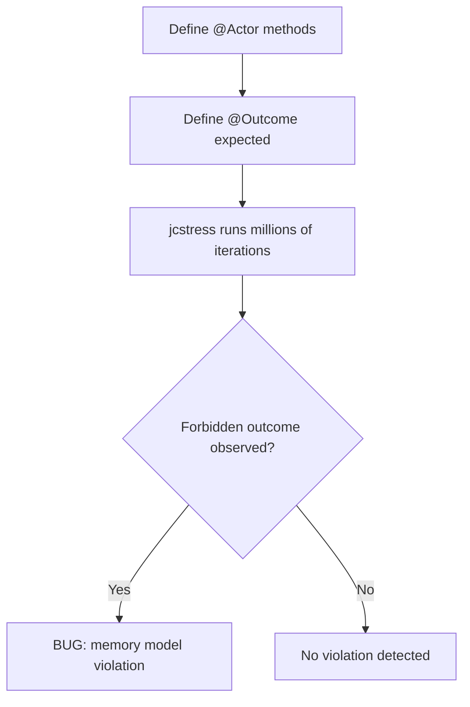

### 🛠️ Worked Example

**BAD:**

```java
// "Testing" concurrency with Thread.sleep:
@Test void testCounter() {
    Counter c = new Counter();
    Thread t1 = new Thread(() -> {
        for (int i = 0; i < 1000; i++) c.inc();
    });
    Thread t2 = new Thread(() -> {
        for (int i = 0; i < 1000; i++) c.inc();
    });
    t1.start(); t2.start();
    t1.join(); t2.join();
    assertEquals(2000, c.get()); // PASSES 99.9% of time!
}
// Race exists but test passes because timing rarely triggers it.
```

Why it's wrong: not enough iterations, not enough thread pressure, false confidence.

**GOOD:**

```java
@JCStressTest
@Outcome(id = "2", expect = ACCEPTABLE,
    desc = "Both increments visible")
@Outcome(expect = ACCEPTABLE_INTERESTING,
    desc = "Race: lost update")
@State
public class CounterTest {
    int counter;
    @Actor void actor1() { counter++; }
    @Actor void actor2() { counter++; }
    @Arbiter void check(I_Result r) {
        r.r1 = counter;
    }
}
// jcstress WILL find counter==1 (lost update).
// Proves the race condition definitively.
```

Why it's right: jcstress explores enough interleavings to trigger the race reliably.

**Production pattern (CI integration):**

```bash
# Run jcstress in CI pipeline:
mvn clean install -pl jcstress-tests
java -jar target/jcstress.jar -t ".*MyTest.*"
# Fails build if FORBIDDEN outcome detected.
```

### ⚖️ Trade-offs

**Gain:** definitively proves/disproves JMM compliance; detects bugs invisible to normal tests; standard OpenJDK tool.

**Cost:** slow (millions of iterations); requires specific test structure (@Actor/@Arbiter); cannot test application-level logic (only low-level primitives).

| Aspect | JUnit + loops | jcstress | TLA+/model checking |
| ------ | ------------- | -------- | ------------------- |
| Coverage | Low (timing-dependent) | High (statistical) | Complete (exhaustive) |
| Speed | Fast | Slow (minutes) | Very slow |
| Scope | Any test | JMM-level | Algorithm design |
| False confidence | High | Low | None |

### ⚡ Decision Snap

**USE WHEN:**
- Building custom lock-free data structures.
- Verifying memory ordering assumptions.
- Proving a race condition exists (to justify fix).

**AVOID WHEN:**
- Testing application business logic (use normal tests).
- Testing thread-safe j.u.c classes (already tested).

**PREFER WHEN:**
- Writing library-level concurrency primitives.
- Migrating from Unsafe to VarHandle (verify equivalence).

### ⚠️ Top Traps

| # | Misconception | Reality |
| - | ------------- | ------- |
| 1 | "If jcstress passes, my code is correct" | jcstress is probabilistic. It may miss extremely rare interleavings. For formal proofs: use model checking (TLA+). |
| 2 | "I can test my whole application with jcstress" | jcstress tests SMALL units (2-3 actor methods). It is for primitive/algorithm verification, not integration testing. |
| 3 | "Running on x86 is enough" | x86 has strong ordering. Run on ARM (or use `-XX:-TieredCompilation` to vary JIT) for broader coverage. |

### 🪜 Learning Ladder

**Prerequisites:**
- Java Memory Model Working Rules - what jcstress tests
- Happens-Before Relationship - what FORBIDDEN outcomes violate

**THIS:** Testing Concurrent Code (jcstress)

**Next steps:**
- Lock-Free Algorithms (CAS) - primary target for jcstress testing
- JFR Thread and Lock Events - production observability

### 💡 The Surprising Truth

jcstress found bugs in OpenJDK itself. When testing the JDK's own concurrent utilities with jcstress, researchers discovered ordering violations in certain String operations and AtomicReference edge cases. If the JDK team needs jcstress to verify their own code, application developers writing custom lock-free algorithms absolutely need it too. "It works on my machine" is never proof for concurrent code.

### 📇 Revision Card

1. jcstress = millions of iterations to find forbidden outcomes. One occurrence = bug proven.
2. Use @Actor for concurrent threads, @Arbiter for post-condition check, @Outcome for expected results.
3. Normal tests CANNOT reliably find concurrency bugs. jcstress is the only reliable method for JMM verification.

---

---

# Monitoring Thread Pools in Production

**TL;DR** - Expose pool size, active count, queue depth, and rejection count as metrics to detect saturation before it causes outages.

### 🔥 The Problem in One Paragraph

A service uses a ThreadPoolExecutor with 50 threads and a queue of 500. Under a traffic spike, all 50 threads are busy and the queue fills to 500. The next request is rejected (CallerRunsPolicy). Latency spikes. But nobody knows because no metrics are exposed. The team discovers the saturation 30 minutes later when customers complain. If they had a dashboard showing queue depth hitting 80%, they could have scaled proactively. This is exactly why thread pool monitoring was created.

### 📘 Textbook Definition

**Thread pool monitoring** is the practice of exposing internal pool state (active threads, queue depth, completed tasks, rejection count) as observable metrics, enabling alerting on saturation, capacity planning, and root-cause analysis during incidents.

### 🧠 Mental Model

> A thread pool without monitoring is a car without a dashboard. You cannot see the engine temperature (active threads), fuel level (queue capacity remaining), or speed (throughput). When the engine overheats, you only know when smoke appears (customer complaints).

- "Engine temperature" -> active thread count
- "Fuel level" -> queue remaining capacity
- "Speed" -> completed tasks per second
- "Smoke" -> rejections or timeouts (too late)

**Where this analogy breaks down:** unlike a car, thread pool metrics must be sampled (polled or scraped) at intervals. Between samples, saturation can spike and recover without being observed (use histograms, not just point-in-time gauges).

### ⚙️ How It Works

```text
Key metrics to expose:

  pool.active      = tpe.getActiveCount()
  pool.size        = tpe.getPoolSize()
  pool.queue.size  = tpe.getQueue().size()
  pool.queue.remaining = tpe.getQueue()
                         .remainingCapacity()
  pool.completed   = tpe.getCompletedTaskCount()
  pool.rejected    = custom counter (in handler)
  pool.largest     = tpe.getLargestPoolSize()

Alert thresholds:
  queue.size > 80% capacity -> WARN
  active == maxPoolSize for 5min -> CRITICAL
  rejected > 0 -> PAGE
```

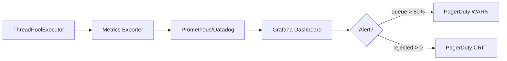

### 🛠️ Worked Example

**BAD:**

```java
// Pool exists but is a black box:
ExecutorService pool = Executors.newFixedThreadPool(50);
pool.submit(task); // hope for the best
// No visibility into pool state. Discover issues via OOM.
```

Why it's wrong: no observability. Saturation invisible until catastrophic failure.

**GOOD:**

```java
ThreadPoolExecutor tpe = new ThreadPoolExecutor(
    10, 50, 60, SECONDS,
    new ArrayBlockingQueue<>(500),
    new CountingRejectionHandler());
// Expose metrics (Micrometer example):
Gauge.builder("pool.active", tpe::getActiveCount)
    .register(registry);
Gauge.builder("pool.queue.size",
    () -> tpe.getQueue().size())
    .register(registry);
Counter rejections = Counter.builder("pool.rejected")
    .register(registry);
// In rejection handler:
class CountingRejectionHandler
    implements RejectedExecutionHandler {
    public void rejectedExecution(Runnable r,
        ThreadPoolExecutor e) {
        rejections.increment();
        new CallerRunsPolicy()
            .rejectedExecution(r, e);
    }
}
```

Why it's right: all key metrics exposed; alerting on queue saturation and rejections.

**Production pattern (Spring Boot Actuator):**

```java
// Spring Boot auto-exposes Executor metrics
// if you register the pool as a bean:
@Bean
TaskExecutor taskExecutor(MeterRegistry registry) {
    ThreadPoolTaskExecutor exec =
        new ThreadPoolTaskExecutor();
    exec.setCorePoolSize(10);
    exec.setMaxPoolSize(50);
    exec.setQueueCapacity(500);
    exec.initialize();
    // Actuator auto-discovers and exposes metrics
    return exec;
}
```

### ⚖️ Trade-offs

**Gain:** early detection of saturation, capacity planning data, faster incident resolution.

**Cost:** metric collection overhead (negligible for gauges); dashboard/alerting setup effort; metric cardinality if many pools.

| Metric | Purpose | Alert threshold |
| ------ | ------- | --------------- |
| queue.size | Saturation signal | > 80% capacity |
| active/max | Thread exhaustion | == max for 5min |
| rejected | Overload proven | > 0 |
| completed/s | Throughput baseline | < 50% of normal |

### ⚡ Decision Snap

**ALWAYS MONITOR WHEN:**
- Any thread pool in production. No exceptions.
- Pools handling user-facing requests.
- Pools processing background work (failed silently = invisible).

**ALERT ON:**
- Queue depth approaching capacity (80%).
- Any rejection (indicates pool at maximum + queue full).
- Active == max sustained (all threads busy, no spare capacity).

**OPTIONAL:**
- Task execution time histograms (detect slow tasks blocking pool).
- Thread state breakdown (RUNNABLE vs WAITING vs BLOCKED).

### ⚠️ Top Traps

| # | Misconception | Reality |
| - | ------------- | ------- |
| 1 | "Monitoring adds overhead" | Gauge reads (getActiveCount, getQueue().size()) are O(1) volatile reads. Negligible overhead. |
| 2 | "I will check logs when there's a problem" | By the time you check logs, the pool recovered or crashed. Metrics + alerts give REAL-TIME visibility. |
| 3 | "One dashboard for all pools" | Each pool has different SLOs. A batch-processing pool at 90% queue is fine; a request-handling pool at 90% is critical. |

### 🪜 Learning Ladder

**Prerequisites:**
- ThreadPoolExecutor Configuration - what the pool parameters mean
- Unbounded Queue Anti-Pattern - why monitoring queue depth matters

**THIS:** Monitoring Thread Pools in Production

**Next steps:**
- Lock Contention Profiling - deeper diagnostics when pool is slow
- JFR Thread and Lock Events - JVM-level thread observability

### 💡 The Surprising Truth

ThreadPoolExecutor.getActiveCount() is an ESTIMATE - it iterates workers and checks their lock state. Under very high contention, it can be inaccurate. For precise active-task counting, instrument the task wrapper itself (increment counter before execute, decrement in finally). The same applies to getCompletedTaskCount() - it aggregates per-worker counts without a global lock, so it can lag slightly during concurrent execution.

### 📇 Revision Card

1. Always expose: active threads, queue depth, rejections, completed/s. Minimum viable pool observability.
2. Alert on: queue > 80% (warning), rejected > 0 (critical), active == max sustained (critical).
3. Use Micrometer/Actuator in Spring Boot for automatic pool metric exposure.

---

---

# Synchronized vs Concurrent Collections Decision

**TL;DR** - Use synchronized collections for simplicity with low contention; use concurrent collections when throughput under contention matters.

### 🔥 The Problem in One Paragraph

An engineer replaces all `Collections.synchronizedMap()` calls with `ConcurrentHashMap` "because it is faster." But some maps are accessed by only 2 threads with minimal contention - the switch adds API differences (no null keys, weakly consistent iterators) with zero performance benefit. Conversely, another engineer keeps synchronizedList on a hot path with 100 concurrent readers, destroying throughput. The decision is not "always use concurrent" - it depends on contention level, operation patterns, and consistency requirements. This is exactly why a decision framework exists.

### 📘 Textbook Definition

**Synchronized collections** (Collections.synchronizedXxx) wrap a standard collection with a single lock around every method. **Concurrent collections** (ConcurrentHashMap, CopyOnWriteArrayList, ConcurrentLinkedQueue) use fine-grained locking, lock-free algorithms, or copy-on-write to enable higher concurrency.

### 🧠 Mental Model

> Synchronized collections are a one-door building (everyone queues at one entrance). Concurrent collections are a multi-door building (many entrances, many people enter simultaneously). If only 2 people visit per hour: one door is fine. If 1000 per second: you need many doors.

- "One door" -> global lock (synchronizedMap)
- "Many doors" -> lock striping/CAS (ConcurrentHashMap)
- "2 visitors/hour" -> low contention (synchronized is fine)
- "1000/second" -> high contention (concurrent needed)

**Where this analogy breaks down:** concurrent collections change semantics (weakly consistent iterators, no nulls in CHM). The "multi-door building" has different rules.

### ⚙️ How It Works

```text
Decision flow:

  1. Threads accessing concurrently?
     -> 1-2: synchronized or plain
     -> 3+: consider concurrent collection

  2. Read:write ratio?
     -> Read-heavy: CHM or CopyOnWriteList
     -> Write-heavy: CHM (never COWAL)
     -> Balanced: CHM

  3. Need atomic compound operations?
     -> Yes: CHM.computeIfAbsent
     -> iterate+modify: synchronizedXxx + lock

  4. Need nulls?
     -> Yes: synchronizedMap
     -> No: ConcurrentHashMap

  5. Iterator consistency?
     -> Snapshot: CopyOnWriteArrayList
     -> Weakly consistent OK: CHM
```

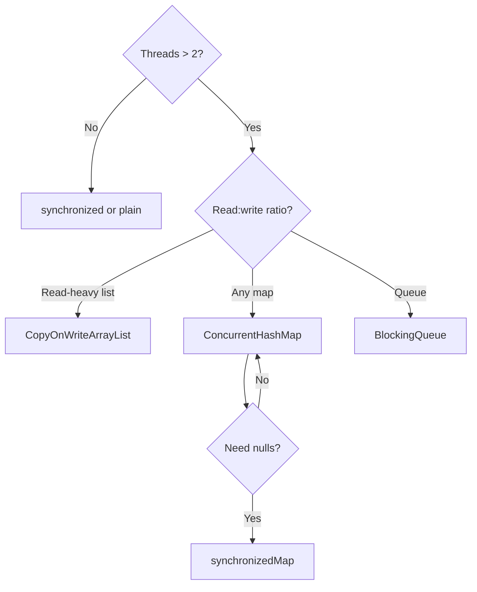

### 🛠️ Worked Example

**BAD:**

```java
// ConcurrentHashMap where synchronized suffices:
// Only 2 threads, accessed once per second:
ConcurrentHashMap<String, Config> cfg = new CHM<>();
// Overkill. No null support. Weakly consistent.
// synchronizedMap simpler and equivalent here.
```

Why it's wrong: no contention = no benefit from concurrent collection; adds semantic restrictions.

**GOOD:**

```java
// Decision: 100 threads, read-heavy, map -> CHM
ConcurrentHashMap<String, Session> sessions = new CHM<>();
sessions.computeIfAbsent(id, k -> createSession());
// Atomic compound op. High read concurrency. Correct.

// Decision: 2 threads, need nulls, low contention
Map<String, String> cache =
    Collections.synchronizedMap(new HashMap<>());
// Simple. Supports null. Adequate for 2 threads.
```

Why it's right: matched collection type to actual access pattern.

**Production pattern:**

```java
// CopyOnWriteArrayList: iterate often, modify rarely
CopyOnWriteArrayList<Listener> listeners = new COWAL<>();
// add() at startup. Iteration lock-free always.

// BlockingQueue: producer-consumer pipeline
BlockingQueue<Event> q = new ArrayBlockingQueue<>(1000);
// Bounded, blocking put/take, thread-safe.
```

### ⚖️ Trade-offs

| Collection | Locking | Best for | Avoid when |
| ---------- | ------- | -------- | ---------- |
| synchronizedMap | Global | Low contention | High contention |
| ConcurrentHashMap | Per-bin | High concurrency | Need nulls |
| CopyOnWriteArrayList | Copy | Read-heavy lists | Write-heavy |
| synchronizedList | Global | Low contention | High reads |
| ConcurrentLinkedQueue | Lock-free | Non-blocking | Need blocking |
| ArrayBlockingQueue | Two-lock | Producer-consumer | Unbounded |

### ⚡ Decision Snap

**USE synchronized collections WHEN:**
- 1-3 threads with low contention.
- Need null keys/values.
- Need fail-fast iterators.
- Simplicity over throughput.

**USE concurrent collections WHEN:**
- 4+ threads with meaningful contention.
- Need atomic compound operations (computeIfAbsent).
- Read throughput critical.

**MEASURE FIRST WHEN:**
- Unsure about contention level. Profile before switching.

### ⚠️ Top Traps

| # | Misconception | Reality |
| - | ------------- | ------- |
| 1 | "Always use ConcurrentHashMap" | For 2-thread low-contention: synchronizedMap is equivalent and simpler (supports nulls). |
| 2 | "synchronizedList iteration is safe" | Iterator itself is NOT synchronized. Must externally lock during iteration. |
| 3 | "ConcurrentHashMap.size() is exact" | It is an estimate under concurrent modification. |

### 🪜 Learning Ladder

**Prerequisites:**
- ConcurrentHashMap - how concurrent map works
- CopyOnWriteArrayList - how copy-on-write works

**THIS:** Synchronized vs Concurrent Collections Decision

**Next steps:**
- Concurrency Utilities Selection Framework - broader selection
- Monitoring Thread Pools in Production - observe contention

### 💡 The Surprising Truth

Collections.synchronizedMap uses a single mutex for ALL operations - but that mutex is the wrapper object itself. Two different synchronizedMap instances use different locks. If you need to atomically operate across TWO synchronized maps, you must manually synchronize on both wrappers (risk of deadlock). ConcurrentHashMap has the same limitation - no built-in way to atomically update two maps.

### 📇 Revision Card

1. Decision factors: thread count, read:write ratio, null requirement, compound operations.
2. Low contention (1-3 threads): synchronizedXxx. High contention: ConcurrentHashMap.
3. CopyOnWriteArrayList: iterate-heavy only. NEVER for write-heavy workloads.

---

---

# Concurrency Utilities Selection Framework

**TL;DR** - A systematic decision process for selecting the right j.u.c primitive based on problem category, contention level, and progress guarantees.

### 🔥 The Problem in One Paragraph

Java offers 50+ concurrency utilities. An engineer faces: "multiple threads need to access shared state." Do they use synchronized, ReentrantLock, ReadWriteLock, StampedLock, AtomicReference, ConcurrentHashMap, or ThreadLocal/immutability/message passing? Without a framework, they guess. Wrong choices lead to contention, complexity, or subtle bugs. This is exactly why a selection framework exists.

### 📘 Textbook Definition

The **Concurrency Utilities Selection Framework** categorizes concurrency problems into types (mutual exclusion, coordination, data sharing, task execution) and maps each to the appropriate primitive based on contention level, progress guarantees, and operational requirements.

### 🧠 Mental Model

> Four entry points: "Am I protecting state? Coordinating threads? Sharing data? Executing tasks?" Each branch narrows to 2-3 correct choices.

- Branch 1: **Protect state** -> lock selection
- Branch 2: **Coordinate threads** -> barrier selection
- Branch 3: **Share data** -> collection selection
- Branch 4: **Execute tasks** -> pool selection

**Where this analogy breaks down:** real problems often span multiple categories. The framework provides starting points.

### ⚙️ How It Works

```text
SELECTION FRAMEWORK:

Category 1: MUTUAL EXCLUSION
  Simple section     -> synchronized
  Timeout/tryLock    -> ReentrantLock
  Read-heavy (>10:1) -> ReadWriteLock
  Extreme read-heavy -> StampedLock
  Single variable    -> Atomic*/VarHandle
  Eliminate sharing  -> ThreadLocal/immutable

Category 2: COORDINATION
  Wait for N events  -> CountDownLatch
  All meet + reset   -> CyclicBarrier
  Dynamic parties    -> Phaser
  Limit N access     -> Semaphore
  Async result       -> CompletableFuture

Category 3: DATA SHARING
  Map, concurrent    -> ConcurrentHashMap
  List, read-heavy   -> CopyOnWriteArrayList
  Queue, blocking    -> BlockingQueue
  Queue, non-block   -> ConcurrentLinkedQueue

Category 4: TASK EXECUTION
  Independent tasks  -> ThreadPoolExecutor
  Divide-conquer     -> ForkJoinPool
  I/O (JDK 21+)     -> Virtual Threads
  Periodic           -> ScheduledExecutorService
```

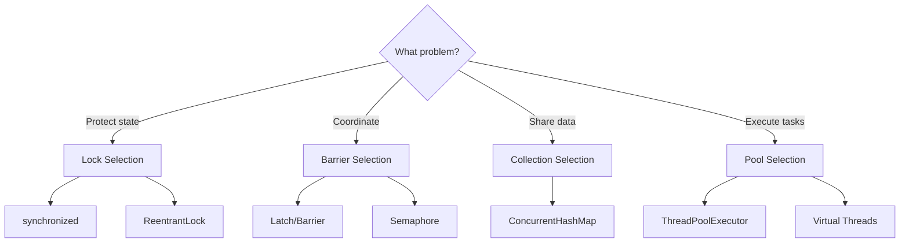

### 🛠️ Worked Example

**BAD:**

```java
// Wrong category: lock for what should be a queue
synchronized(requests) {
    while (requests.isEmpty()) requests.wait();
    Request r = requests.remove(0);
    requests.notifyAll();
}
// Reimplementing BlockingQueue with raw primitives!
```

Why it's wrong: using low-level primitives when BlockingQueue exists.

**GOOD:**

```java
// Identify category: producer-consumer -> BlockingQueue
BlockingQueue<Request> requests =
    new ArrayBlockingQueue<>(1000);
requests.put(newRequest); // blocks if full
Request r = requests.take(); // blocks if empty
// No manual lock/wait/notify needed.
```

Why it's right: identified CATEGORY and selected right abstraction.

**Production pattern (combining categories):**

```java
// Bounded-concurrent HTTP calls:
// Category 1: limit -> Semaphore
// Category 4: execute -> ThreadPoolExecutor
// Category 2: wait all -> CompletableFuture.allOf
Semaphore permits = new Semaphore(10);
List<CompletableFuture<Response>> futures = urls.stream()
    .map(url -> CompletableFuture.supplyAsync(() -> {
        permits.acquireUninterruptibly();
        try { return httpClient.get(url); }
        finally { permits.release(); }
    }, ioPool))
    .toList();
CompletableFuture.allOf(futures.toArray(new CF[0]))
    .join();
```

### ⚖️ Trade-offs

**Gain:** systematic selection reduces wrong-primitive bugs; faster design decisions.

**Cost:** real problems often need combining primitives; framework is a starting point.

| Selection Error | Consequence |
| --------------- | ----------- |
| Lock when should be queue | Reinventing, complex, buggy |
| Atomic for multi-var | Race conditions |
| CyclicBarrier when need Latch | Cannot reuse Latch |
| TPE for I/O JDK21+ | Unnecessary vs virtual threads |

### ⚡ Decision Snap

**STEP 1:** Identify CATEGORY (protect, coordinate, share, execute).
**STEP 2:** Identify CONSTRAINTS (contention, reusability, progress).
**STEP 3:** Select SIMPLEST correct primitive.
**STEP 4:** If combining categories: compose primitives.

### ⚠️ Top Traps

| # | Misconception | Reality |
| - | ------------- | ------- |
| 1 | "More advanced = better" | Simplest correct choice wins. synchronized beats StampedLock unless you NEED optimistic reads. |
| 2 | "One primitive per problem" | Real systems combine 2-3 primitives. Design by composition. |
| 3 | "Framework covers everything" | Edge cases exist. Covers 95% of cases. |

### 🪜 Learning Ladder

**Prerequisites:**
- All keywords in Locks and Coordination - know individual primitives
- Java Concurrency Quick Recall Card - quick reference

**THIS:** Concurrency Utilities Selection Framework

**Next steps:**
- Concurrency Strategy (Reactive vs Loom vs Pool) - architecture-level
- Back-Pressure Architecture Patterns - system-level

### 💡 The Surprising Truth

The most common "concurrency problem" in production is solved by ELIMINATING shared state entirely. Stateless request handlers, immutable objects, and thread confinement avoid bugs at the design level. The best concurrency primitive is no concurrency primitive.

### 📇 Revision Card

1. Four categories: protect state, coordinate, share data, execute tasks. Start by identifying category.
2. Simplest correct primitive wins. Do not over-engineer.
3. Best solution is often no shared state: immutable objects, stateless handlers, confinement.

---

---

# Thread Confinement as Design Pattern

**TL;DR** - Thread confinement eliminates synchronization by ensuring data is accessed by only one thread at a time - the simplest concurrency strategy.

### 🔥 The Problem in One Paragraph

Every synchronization primitive adds complexity, deadlock potential, and overhead. The simplest thread safety is not sharing data at all. If each thread has its own data (or data is handed off exclusively), no synchronization is needed. GUI frameworks (Swing), Netty's channel model, and Actor systems all use this. This is exactly why thread confinement exists.

### 📘 Textbook Definition

**Thread confinement** is a design pattern where an object is accessible from only one thread at a time, eliminating synchronization. Variants: stack confinement (local variables), ThreadLocal confinement, ad-hoc confinement (convention), and single-threaded event loops.

### 🧠 Mental Model

> Give each chef their own kitchen. No shared ingredients, no shared counters, no locks. Each chef works independently - fastest "synchronization" is no synchronization.

- "Own kitchen" -> confined data
- "No sharing" -> no locks needed
- "Independent" -> parallel without coordination
- "Hand off a dish" -> ownership transfer

**Where this analogy breaks down:** confinement only works when threads do not need the same data simultaneously. If they must share: you need synchronization.

### ⚙️ How It Works

```text
Confinement variants:

1. Stack confinement:
   Local variables never escape -> always safe

2. ThreadLocal confinement:
   Each thread has own copy. No sharing.

3. Single-thread event loop:
   All state on ONE thread (event loop)
   Messages queued from other threads
   Handler runs exclusively on loop thread

4. Ownership transfer:
   Object created by thread A
   Published to thread B via queue/volatile
   A no longer accesses it. B is sole owner.
```

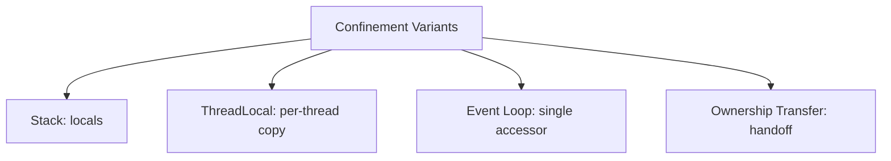

### 🛠️ Worked Example

**BAD:**

```java
// Shared mutable state needing synchronization:
class UserService {
    private final Map<String, User> cache = new HashMap<>();
    synchronized User get(String id) {
        return cache.computeIfAbsent(id, this::load);
    }
}
// Every request contends on the same lock.
```

Why it's wrong: shared map requires synchronization, creating contention.

**GOOD:**

```java
// Event loop confinement (Netty style):
class UserHandler extends ChannelInboundHandlerAdapter {
    // Runs ONLY on assigned event loop thread
    private final Map<String, User> cache = new HashMap<>();
    @Override
    public void channelRead(Ctx ctx, Object msg) {
        cache.computeIfAbsent(key, this::load);
        // Safe: only this event loop thread accesses cache
    }
}
```

Why it's right: single-thread guarantee = plain HashMap is safe.

**Production pattern (ownership transfer):**

```java
BlockingQueue<Request> queue = new ArrayBlockingQueue<>(100);
// Producer:
Request req = new Request(data);
queue.put(req); // transfer ownership
// NEVER touch req again
// Consumer:
Request r = queue.take(); // sole owner
r.process(); // safe: confined to consumer thread
```

### ⚖️ Trade-offs

**Gain:** zero sync overhead; impossible to race; simplest model.

**Cost:** data duplication; limited to non-shared data; discipline needed.

| Approach | Synchronization | Performance | Complexity |
| -------- | --------------- | ----------- | ---------- |
| Confinement | None | Maximum | Design effort |
| Immutability | None | Maximum | Limited mutability |
| Lock-based | Explicit | Contention | Medium |
| Lock-free | CAS | Retry cost | High |

### ⚡ Decision Snap

**USE WHEN:**
- Data can be partitioned per-thread.
- Event-loop architectures (Netty, Vert.x, Swing).
- Ownership transferred cleanly via queues.

**AVOID WHEN:**
- Multiple threads MUST access same data simultaneously.
- Data too large to duplicate per thread.

**PREFER ALWAYS:**
- Prefer confinement over synchronization when architecturally feasible.

### ⚠️ Top Traps

| # | Misconception | Reality |
| - | ------------- | ------- |
| 1 | "Confinement = no communication" | Threads communicate via queues. Confinement = no SHARED MUTABLE STATE. |
| 2 | "Local variables always confined" | If a local holds a reference that escapes (passed to another thread), the object is NOT confined. |
| 3 | "Ad-hoc confinement is safe" | Convention is not compiler-enforced. Breaks silently. Prefer structural (event loop, ThreadLocal). |

### 🪜 Learning Ladder

**Prerequisites:**
- The Shared Mutable State Problem - what confinement avoids
- ThreadLocal - one implementation of confinement

**THIS:** Thread Confinement as Design Pattern

**Next steps:**
- Immutability as Concurrency Strategy - complementary
- Concurrent Chat Phase 3 - applies event-loop model

### 💡 The Surprising Truth

Netty handles millions of connections with plain HashMap and ArrayList - non-synchronized collections - because each Channel is pinned to exactly one EventLoop thread. The entire framework's thread safety relies on confinement, not locks. This is why Netty outperforms synchronized server frameworks: zero lock overhead by design.

### 📇 Revision Card

1. Confinement = one thread accesses data = no sync needed. Fastest.
2. Variants: stack local, ThreadLocal, event loop, ownership transfer.
3. Prefer structural confinement (event loops) over convention (breaks silently).

---

---

# Immutability as Concurrency Strategy

**TL;DR** - Immutable objects are inherently thread-safe because state cannot change after construction - no synchronization needed.

### 🔥 The Problem in One Paragraph

A Date object is shared between threads. One reads while another modifies: race condition. Making it synchronized adds contention. Making it ThreadLocal duplicates memory. Simplest solution: make it immutable (java.time.LocalDate). If state cannot change, any number of threads can read safely - no locks, no copies, no races. This is exactly why immutability is a concurrency strategy.

### 📘 Textbook Definition

An **immutable object** cannot be modified after construction. Requirements: all fields final, no setters, no mutable state escapes (defensive copies), properly constructed (no `this` escape).

### 🧠 Mental Model

> An immutable object is a photograph. Once taken, it never changes. A thousand people can look simultaneously without coordination. A mutable object is a whiteboard - needs synchronization.

- "Photograph" -> immutable (share freely)
- "Whiteboard" -> mutable (needs sync)
- "Thousand viewers" -> unlimited concurrent reads
- "No coordination" -> no synchronization needed

**Where this analogy breaks down:** creating a new "photograph" per change has allocation/GC cost. For frequently-changing large state, immutability can cause GC pressure.

### ⚙️ How It Works

```text
Immutable object requirements:

1. All fields final
2. No setter/mutator methods
3. Class final (or private ctor + factory)
4. Mutable fields defensively copied
5. this does not escape during construction

JMM guarantee (JSR 133):
  Final field semantics: properly constructed
  object's final fields visible to ALL threads
  without synchronization.
```

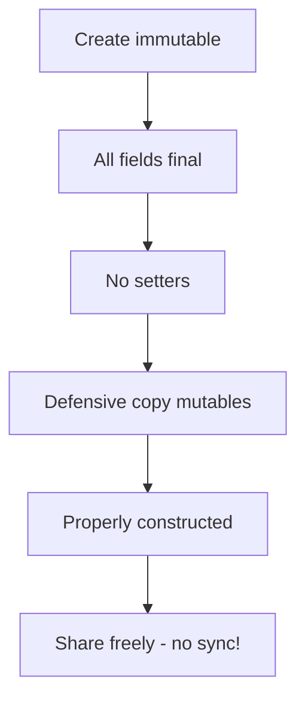

### 🛠️ Worked Example

**BAD:**

```java
// Mutable shared object - needs synchronization:
class Config {
    private String host;
    void setHost(String h) { host = h; } // MUTABLE!
}
// Thread A sets, B reads -> race condition
```

Why it's wrong: mutable fields require synchronization.

**GOOD:**

```java
// Immutable - share freely:
record Config(String host, int port) {}
// All fields final. No setters. Thread-safe by definition.
// To "update": create new instance:
Config updated = new Config("new-host", config.port());
```

Why it's right: immutable by construction. Zero sync needed.

**Production pattern (atomic version publish):**

```java
private volatile Config config; // volatile reference
// Update:
config = new Config("new-host", 8080);
// Readers see consistent immutable snapshot.
// volatile ensures reference visibility.
```

### ⚖️ Trade-offs

**Gain:** inherently thread-safe; no locks/races/deadlocks; cache-friendly.

**Cost:** allocation per update; not for large frequently-changing state.

| Strategy | Synchronization | Allocation | Simplicity |
| -------- | --------------- | ---------- | ---------- |
| Immutable | None | Per update | High |
| ThreadLocal | None | Per thread | Medium |
| synchronized | Lock/access | None | Medium |
| Atomic | CAS/access | None | Medium |

### ⚡ Decision Snap

**USE WHEN:**
- State read far more than written.
- Small objects (config, DTOs, value objects).
- Want simplest thread safety.

**AVOID WHEN:**
- Large state changed frequently (100MB+ arrays).
- Need in-place mutation for performance.

**PREFER records WHEN:**
- JDK 16+ for automatic immutable value objects.

### ⚠️ Top Traps

| # | Misconception | Reality |
| - | ------------- | ------- |
| 1 | "Final field = immutable object" | If final field holds a mutable List, contents can be mutated. Defensive copy required. |
| 2 | "Immutability is expensive" | Modern JVMs optimize short-lived objects (escape analysis, young-gen GC). Often cheaper than synchronization. |
| 3 | "String field makes class immutable" | YOUR class must also be immutable. One mutable field breaks everything. |

### 🪜 Learning Ladder

**Prerequisites:**
- The Shared Mutable State Problem - what immutability eliminates
- volatile Keyword - for publishing immutable references

**THIS:** Immutability as Concurrency Strategy

**Next steps:**
- Thread Confinement as Design Pattern - complementary
- Double-Checked Locking - why final fields matter

### 💡 The Surprising Truth

The JMM guarantees final field visibility after construction WITHOUT synchronization. Removing a single `final` keyword can introduce a visibility bug. This is the formal underpinning of "immutable objects are thread-safe" - and why Java records (all fields final by definition) are inherently thread-safe value carriers.

### 📇 Revision Card

1. Immutable = all final + no setters + defensive copies. Thread-safe by definition.
2. JMM guarantees final field visibility after proper construction. No sync needed.
3. Update pattern: create new instance + publish via volatile/AtomicReference.

---

---

# JSR 133 - Java Memory Model Specification

**TL;DR** - JSR 133 (JDK 5) fixed the broken original JMM by formalizing happens-before, final field semantics, and volatile ordering.

### 🔥 The Problem in One Paragraph

Before JDK 5, the Java Memory Model was broken. Double-checked locking could not be made correct. Final fields were not guaranteed visible. Volatile did not prevent reordering of surrounding instructions. JSR 133 rewrote the memory model entirely. This is exactly why JSR 133 exists.

### 📘 Textbook Definition

**JSR 133** (JDK 5) is the revised Java Memory Model that defines happens-before ordering, fixes volatile semantics (preventing reordering around volatile accesses), establishes final field guarantees, and enables correct double-checked locking with volatile.

### 🧠 Mental Model

> The original JMM was a building code written before anyone understood earthquakes (modern CPUs). JSR 133 is the revised code that accounts for earthquakes (reordering, caches) - specifying which walls (barriers) are needed and where.

- "Original code" -> JMM pre-2004
- "Earthquakes" -> CPU reordering, store buffers
- "Revised code" -> JSR 133 (happens-before model)
- "Walls" -> memory barriers at sync points

**Where this analogy breaks down:** JSR 133 is a SPECIFICATION, not implementation. How barriers are achieved varies by hardware.

### ⚙️ How It Works

```text
JSR 133 key fixes:

1. VOLATILE: full happens-before (not just atomicity)
   Old: volatile = read/write from memory
   New: volatile write prevents reordering of
        ALL prior writes

2. FINAL FIELDS: guaranteed visible after ctor
   Old: no guarantee
   New: properly constructed -> all threads see finals

3. HAPPENS-BEFORE: formal partial ordering
   Old: vague "main memory" model
   New: precise actions establish HB edges

4. DCL: works with volatile (post JDK 5)
   Old: BROKEN (even with volatile)
   New: volatile prevents ctor reordering
```

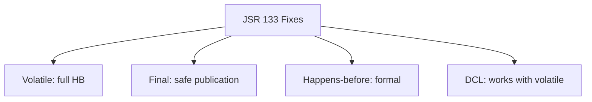

### 🛠️ Worked Example

**BAD:**

```java
// Before JDK 5: BROKEN even with volatile
private volatile static Singleton instance;
// volatile only meant "read from memory" but did NOT
// prevent constructor reordering!
// Thread B could see ref but uninitialized fields.
```

Why it's wrong: pre-JSR 133 volatile too weak.

**GOOD:**

```java
// JDK 5+: volatile prevents reordering
private volatile static Singleton instance;
// Constructor MUST complete before ref visible.
// DCL is now SAFE with volatile.
```

Why it's right: JSR 133 volatile semantics prevent publication before construction.

**Production pattern (final field guarantee):**

```java
class ImmutableConfig {
    final String host; // guaranteed visible
    final int port;    // guaranteed visible
    ImmutableConfig(String h, int p) {
        this.host = h; this.port = p;
        // JSR 133: after ctor, ANY thread sees these.
        // No volatile/synchronized needed.
    }
}
```

### ⚖️ Trade-offs

| Aspect | Pre-JSR 133 | Post-JSR 133 |
| ------ | ----------- | ------------ |
| DCL | Broken | Works (volatile) |
| Final fields | No guarantee | Guaranteed |
| Volatile | Atomicity only | Full HB ordering |
| Formal model | Vague | Precise HB |

### ⚡ Decision Snap

**KNOW JSR 133 WHEN:**
- Writing lock-free code or using volatile.
- Reasoning about safe publication.
- Understanding why old patterns are broken.

**RELY ON (without internals) WHEN:**
- Using j.u.c classes (correct internally).
- Using immutable objects with final fields.

**READ THE SPEC WHEN:**
- Building concurrency libraries.
- Debugging subtle visibility issues.

### ⚠️ Top Traps

| # | Misconception | Reality |
| - | ------------- | ------- |
| 1 | "JSR 133 is only for old code" | It IS the current memory model. All modern Java runs under JSR 133 rules. |
| 2 | "I don't need JMM if I use j.u.c" | Correct for most code. But volatile/manual sync requires JMM knowledge. |
| 3 | "JMM prevents all reordering" | No. JMM ALLOWS maximum reordering unless HB constrains it. Permissive by default. |

### 🪜 Learning Ladder

**Prerequisites:**
- Happens-Before Relationship - central JSR 133 concept
- Java Memory Model Working Rules - practical application

**THIS:** JSR 133 - Java Memory Model Specification

**Next steps:**
- JMM Formal Semantics (Manson Pugh Adve 2005) - academic paper
- Hardware Memory Models - what JSR 133 abstracts

### 💡 The Surprising Truth

JSR 133 was co-authored by William Pugh, Sarita Adve, and Jeremy Manson. Their key insight: the original JMM specified behavior in terms of "main memory" and "working memory" (mimicking hardware), which was both too restrictive AND too permissive. The happens-before model is hardware-INDEPENDENT - specifying guarantees without constraining implementation.

### 📇 Revision Card

1. JSR 133 = JDK 5 fix. Volatile prevents reordering. Final fields visible after construction.
2. Happens-before is the core formalism. No HB = no guarantee.
3. Pre-JDK 5 patterns (DCL without volatile) are BROKEN. Post-JDK 5: volatile DCL works.

---

---

# Explain Happens-Before at Every Level

**TL;DR** - Happens-before explained progressively: intuitive metaphor, practical rules, formal model, and hardware implementation.

### 🔥 The Problem in One Paragraph

"Happens-before" is explained differently everywhere: analogies (too vague), formal math (too abstract), hardware (too low-level). You need a progressive explanation bridging all levels. This is exactly why a multi-level explanation exists.

### 📘 Textbook Definition

The **happens-before** relationship is a partial ordering where if A happens-before B, then A's effects are guaranteed visible to B. It abstracts hardware into a platform-independent correctness criterion.

### 🧠 Mental Model

> Happens-before is a four-level concept. At each level it becomes more precise but less intuitive. Think of it as zooming in on a map: city overview, street view, building blueprint, wiring diagram.

- "City overview" -> Level 1 intuition (bell-ringing rule)
- "Street view" -> Level 2 practical rules (unlock HB lock)
- "Blueprint" -> Level 3 formal model (transitive closure)
- "Wiring diagram" -> Level 4 hardware (memory barriers)

**Where this analogy breaks down:** unlike a map where all levels describe the same thing, each HB level describes different ASPECTS - guarantees (L2), proofs (L3), and costs (L4).

### ⚙️ How It Works

```text
Level 2 - Practical Rules:
  unlock(m) HB lock(m)     [same monitor]
  volatile write HB read   [same variable]
  start() HB first action  [new thread]
  last action HB join()    [terminated thread]

Level 4 - Hardware mapping:
  volatile write -> StoreStore + StoreLoad
  volatile read  -> LoadLoad + LoadStore
  synchronized entry -> LoadLoad + LoadStore
  synchronized exit  -> StoreStore + StoreLoad
```

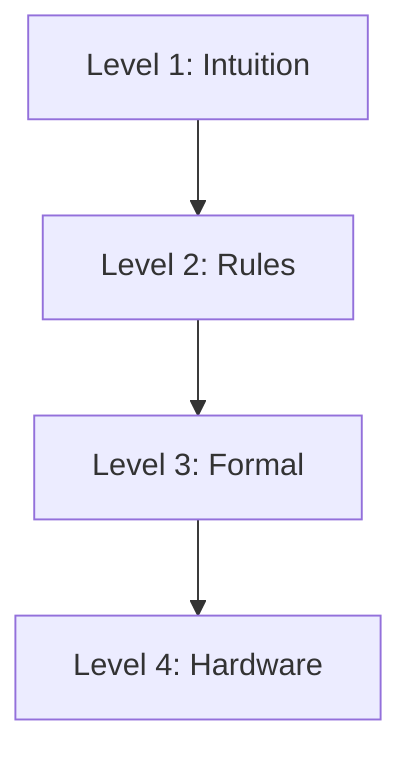

### 🛠️ Worked Example

**BAD:**

```java
// Explaining with only hardware details:
// "volatile causes MFENCE..." -> wrong level
// Architecture-specific, not the specification.
```

Why it's wrong: hardware details vary; JMM is the spec.

**GOOD:**

```java
volatile boolean ready = false;
int x = 0;
// Thread A:
x = 42;          // (1)
ready = true;    // (2) volatile write
// Thread B:
if (ready) {     // (3) volatile read
    assert x == 42; // (4) GUARANTEED
}
// HB: (1)->(2) [program order]
//     (2)->(3) [volatile write HB read]
//     (3)->(4) [program order]
// Transitivity: (1)->(4). x=42 visible. QED.
```

Why it's right: Level 2 rules + Level 3 transitivity prove correctness.

**Production pattern (piggyback on j.u.c):**

```java
// j.u.c classes establish HB internally:
ConcurrentHashMap<String, Data> map = new CHM<>();
// Thread A:
data.field = "important";
map.put("key", data); // internal volatile/CAS
// Thread B:
Data d = map.get("key"); // happens-after put
// d.field == "important" GUARANTEED.
```

### ⚖️ Trade-offs

| Level | Audience | Strength | Weakness |
| ----- | -------- | -------- | -------- |
| 1 | Beginners | Accessible | Imprecise |
| 2 | Engineers | Actionable | Incomplete |
| 3 | Library authors | Rigorous | Abstract |
| 4 | Perf engineers | Concrete | Platform-specific |

### ⚡ Decision Snap

**Level 1:** Teaching beginners.
**Level 2:** Writing/reviewing concurrent code.
**Level 3:** Proving lock-free algorithm correctness.
**Level 4:** Diagnosing performance / ARM vs x86 differences.

### ⚠️ Top Traps

| # | Misconception | Reality |
| - | ------------- | ------- |
| 1 | "Happens-before = happens-before in time" | NO. It is a VISIBILITY guarantee, not temporal ordering. |
| 2 | "I only need one level" | Write at L2. Debug at L3. Optimize at L4. All needed eventually. |
| 3 | "x86 needs no barriers" | x86 still needs StoreLoad (volatile write). Only stronger for LL/SS. |

### 🪜 Learning Ladder

**Prerequisites:**
- Happens-Before Relationship - single-level explanation
- volatile Keyword - mechanism for establishing HB

**THIS:** Explain Happens-Before at Every Level

**Next steps:**
- JMM Formal Semantics (Manson Pugh Adve 2005) - deepest treatment
- Hardware Memory Models - Level 4 in depth

### 💡 The Surprising Truth

"Happens-before" was borrowed from Leslie Lamport's 1978 paper on distributed systems. The same framework that reasons about distributed consensus (Paxos, Raft) reasons about Java thread visibility - the problems are mathematically identical.

### 📇 Revision Card

1. L1: bell-ringing rule. L2: unlock-HB-lock, volatile-write-HB-read. L3: transitive closure. L4: memory barriers.
2. HB is about VISIBILITY, not time. Simultaneous actions can have HB relationship.
3. j.u.c classes establish HB internally - piggyback without extra sync.

---

---

# Build a Thread Pool from Scratch Exercise

**TL;DR** - Building a thread pool teaches worker-thread lifecycle, task queuing, shutdown coordination, and why ThreadPoolExecutor exists.

### 🔥 The Problem in One Paragraph

Engineers use ThreadPoolExecutor daily but cannot explain HOW it works. Building from scratch forces understanding of: BlockingQueue for task delivery, worker-thread run loops, interrupt handling for shutdown. This justifies the JDK implementation's complexity. This is exactly why this exercise exists.

### 📘 Textbook Definition

A **thread pool** is a collection of pre-created worker threads that repeatedly dequeue tasks from a shared work queue, amortizing creation cost and bounding concurrent execution.

### 🧠 Mental Model

> Restaurant kitchen with N permanent chefs. Orders (tasks) arrive on a ticket rail (queue). Each chef takes next ticket when free. No tickets: chef waits. Closing time: finish current order, leave.

- "Permanent chefs" -> worker threads
- "Ticket rail" -> BlockingQueue<Runnable>
- "Take next ticket" -> queue.take()
- "Closing time" -> shutdown flag + interrupt

**Where this analogy breaks down:** real chefs cannot be interrupted mid-recipe. Threads CAN be interrupted but must cooperate (check interrupted flag).

### ⚙️ How It Works

```text
Minimal thread pool:

1. BlockingQueue<Runnable> workQueue
2. Worker[] workers (thread array)
   Each worker's run loop:
     while (!shutdown) {
       task = workQueue.take();
       task.run();
     }
3. submit(task): workQueue.put(task)
4. shutdown(): set flag + interrupt all
```

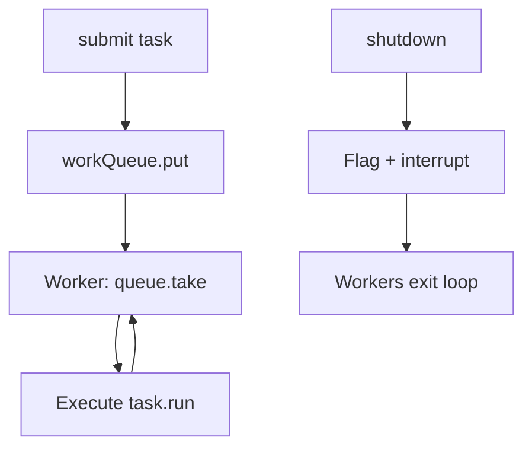

### 🛠️ Worked Example

**BAD:**

```java
// Not a pool - new thread per task:
void submit(Runnable r) {
    new Thread(r).start(); // no reuse!
}
```

Why it's wrong: no reuse, no bounding, no pool.

**GOOD:**

```java
class SimpleThreadPool {
    private final BlockingQueue<Runnable> queue;
    private final Thread[] workers;
    private volatile boolean shutdown = false;

    SimpleThreadPool(int size, int queueCap) {
        queue = new ArrayBlockingQueue<>(queueCap);
        workers = new Thread[size];
        for (int i = 0; i < size; i++) {
            workers[i] = new Thread(this::loop);
            workers[i].start();
        }
    }
    private void loop() {
        while (!shutdown) {
            try {
                Runnable task = queue.take();
                task.run();
            } catch (InterruptedException e) {
                Thread.currentThread().interrupt();
                break;
            }
        }
    }
    void submit(Runnable task)
        throws InterruptedException {
        if (shutdown) throw new IllegalStateException();
        queue.put(task);
    }
    void shutdown() {
        shutdown = true;
        for (Thread w : workers) w.interrupt();
    }
}
```

Why it's right: reuse, bounded queue, blocking take, shutdown via interrupt.

**Production enhancements (what TPE adds):**

```java
// ThreadPoolExecutor additionally has:
// - Dynamic sizing (core/max/keepAlive)
// - RejectedExecutionHandler
// - Future return from submit
// - ThreadFactory (naming, daemon)
// - afterExecute() hook
// - awaitTermination
```

### ⚖️ Trade-offs

| Aspect | Custom SimplePool | ThreadPoolExecutor |
| ------ | ----------------- | ------------------ |
| Dynamic sizing | No | Yes |
| Future support | No | Yes |
| Rejection | No (blocks) | Configurable |
| Monitoring | No | getActiveCount() |
| Production-ready | No | Yes |

### ⚡ Decision Snap

**BUILD FROM SCRATCH WHEN:**
- Learning pool internals.
- Teaching concurrency.
- Understanding TPE parameters.

**NEVER IN PRODUCTION:**
- Always use ThreadPoolExecutor or virtual threads.
- Missing features are critical for production.

### ⚠️ Top Traps

| # | Misconception | Reality |
| - | ------------- | ------- |
| 1 | "My simple pool is production-ready" | Missing: Future, monitoring, sizing, rejection. Use TPE. |
| 2 | "Interrupt = task stops" | Interrupt sets a FLAG. Task must check or catch. Blocking I/O may not respond. |
| 3 | "shutdown = kill immediately" | Graceful: stop accepting, finish in-flight, then interrupt. |

### 🪜 Learning Ladder

**Prerequisites:**
- BlockingQueue Implementations - the queue workers take from
- Thread Lifecycle and States - WAITING at take()

**THIS:** Build a Thread Pool from Scratch Exercise

**Next steps:**
- ThreadPoolExecutor Configuration - production pool
- Monitoring Thread Pools in Production - observe behavior

### 💡 The Surprising Truth

ThreadPoolExecutor's source is ~2000 lines. The core concept (take from queue, execute) requires: state machine (5 states), worker-count bit-packing in one AtomicInteger, interrupt choreography, and per-worker locks. The simple 2-line concept needs massive engineering for production robustness.

### 📇 Revision Card

1. Core: while(!shutdown) { task = queue.take(); task.run(); } - entire concept in two lines.
2. Shutdown = set flag + interrupt + await. Three steps, order matters.
3. NEVER use custom pools in production. Build to learn, use TPE to ship.

---

---

# Concurrent Chat - Phase 3 (CompletableFuture)

**TL;DR** - Refactor executor-based chat to async CompletableFuture pipelines, handling thousands of connections with few threads.

### 🔥 The Problem in One Paragraph

Phase 2 blocks one thread per client on socket.read(). With 50 threads: max 50 active readers. But chat clients are 99.9% idle. Those threads waste resources doing nothing. CompletableFuture + async I/O reacts to events instead of blocking. This is exactly why Phase 3 exists.

### 📘 Textbook Definition

**Phase 3** refactors blocking-executor chat to async I/O via CompletableFuture: event-driven, non-blocking pipelines, few threads handle many connections.

### 🧠 Mental Model

> Phase 2: switchboard operator holds the line per caller (blocks). Phase 3: receptionist takes callbacks ("call you back when message arrives"). One receptionist handles hundreds.

- "Hold the line" -> thread blocks on read
- "Call you back" -> CompletableFuture callback
- "One receptionist" -> few threads, many connections

**Where this analogy breaks down:** Java still uses threads for callbacks - just fewer of them. Not literally one thread.

### ⚙️ How It Works

```text
  channel.read(buffer) -> CompletableFuture
    .thenApply(bytes -> decode(buffer))
    .thenAccept(msg -> broadcast(msg))
    .thenCompose(v -> readNext(channel))
  [recursive: re-registers read]

  No thread blocked during read wait.
  Thread used only when data arrives.
```

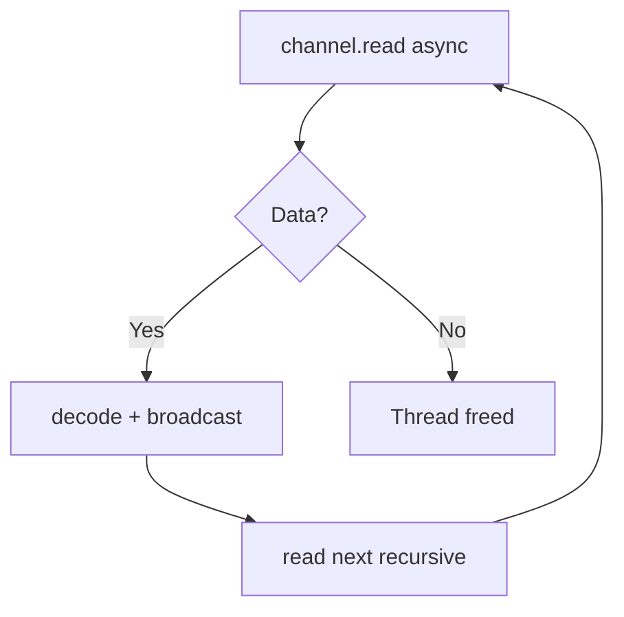

### 🛠️ Worked Example

**BAD:**

```java
// Phase 2: thread blocks per client
pool.submit(() -> {
    while (true) {
        String msg = reader.readLine(); // BLOCKS!
        broadcast(msg);
    }
});
// 50 threads = 50 max concurrent readers
```

Why it's wrong: thread consumed even while idle.

**GOOD:**

```java
CompletableFuture<Void> readLoop(
    AsynchronousSocketChannel ch, ByteBuffer buf) {
    return readAsync(ch, buf)
        .thenApply(n -> decode(buf, n))
        .thenAccept(msg -> broadcast(msg))
        .thenCompose(v -> readLoop(ch, buf));
}
// No thread blocked. Callback only on data arrival.
// 4 threads handle 10K idle connections.
```

Why it's right: threads freed during idle; callbacks trigger only on data.

**Production pattern:**

```java
readLoop(channel, buffer)
    .exceptionally(ex -> {
        if (ex.getCause() instanceof EOFException)
            removeClient(channel);
        else closeChannel(channel);
        return null;
    });
```

### ⚖️ Trade-offs

| Aspect | Phase 2 (blocking) | Phase 3 (async) | Phase 4 (virtual) |
| ------ | ------------------ | --------------- | ------------------ |
| Threads/client | 1 (blocked) | Shared | 1 (lightweight) |
| Code style | Imperative | Callbacks | Imperative |
| Max connections | Pool size | 10K-100K | 1M+ |
| Debugging | Easy | Hard | Easy |

### ⚡ Decision Snap

**USE WHEN:**
- Need high connections with few threads (pre-JDK 21).
- Event-driven architecture required.
- Team comfortable with callbacks.

**AVOID WHEN:**
- JDK 21+ (virtual threads simpler + equally efficient).
- Team finds chains unreadable.

**PREFER Virtual Threads WHEN:**
- JDK 21+ (imperative + lightweight = best of both).

### ⚠️ Top Traps

| # | Misconception | Reality |
| - | ------------- | ------- |
| 1 | "Async = always faster" | Async has overhead. For low connections: blocking is simpler and equal speed. |
| 2 | "CF handles backpressure" | No built-in backpressure. Must add manual limits. |
| 3 | "Recursive thenCompose overflows stack" | No - heap-allocated futures, not stack frames. But creates GC pressure. |

### 🪜 Learning Ladder

**Prerequisites:**
- CompletableFuture Composition - the tool used
- Concurrent Chat Phase 2 - blocking version

**THIS:** Concurrent Chat - Phase 3 (CompletableFuture)

**Next steps:**
- Concurrent Chat Phase 4 (Virtual Threads) - simplest scalability
- Reactive Streams vs Virtual Threads Decision

### 💡 The Surprising Truth

Phase 3 is conceptually identical to Node.js (event loop + callbacks). The difference: Java uses a thread POOL for callbacks while Node.js uses one event loop thread. Java async can utilize multiple CPUs for CPU-bound callbacks; Node.js cannot without worker threads.

### 📇 Revision Card

1. Async read: no thread during wait. Callback only on data. Few threads handle thousands.
2. thenCompose for recursive async loops. No stack overflow (heap-allocated).
3. JDK 21+: prefer virtual threads (simpler, same scalability, better debugging).

---

---

# Concurrency Self-Assessment

**TL;DR** - A diagnostic checklist verifying Java concurrency understanding across all levels before tackling advanced topics.

### 🔥 The Problem in One Paragraph

Engineers jump to advanced topics without solid foundations. They cannot explain why volatile does not make i++ atomic, or when CHM.size() lies, or why shutdownNow() does not guarantee termination. Gaps cause production bugs that advanced knowledge cannot prevent. This assessment identifies gaps. This is exactly why it exists.

### 📘 Textbook Definition

The **Concurrency Self-Assessment** contains questions at escalating difficulty testing fundamental, intermediate, and advanced understanding - revealing gaps before they become incidents.

### 🧠 Mental Model

> Flight pre-check before takeoff. Verify each system works. Skipping because "I have flown before" eventually causes a crash.

- "Pre-check" -> self-assessment
- "Each system" -> each concurrency concept
- "Works" -> can explain + apply correctly
- "Crash" -> production concurrency bug

**Where this analogy breaks down:** concurrency understanding is a spectrum. Partial understanding is dangerous (enough to write code, not enough to verify correctness).

### ⚙️ How It Works

```text
FOUNDATIONS (answer without hesitation):
  F1: Why is i++ not atomic on volatile int?
  F2: volatile guarantees? does NOT guarantee?
  F3: Can BLOCKED thread respond to interrupt?
  F4: Thread.run() vs Thread.start()?
  F5: Why no try-finally for synchronized?

INTERMEDIATE (answer confidently):
  I1: Why Executors.newFixedThreadPool unbounded?
  I2: When does CHM.size() lie?
  I3: shutdown() vs shutdownNow()?
  I4: Why no read-to-write lock upgrade?
  I5: When is CopyOnWriteArrayList appropriate?

ADVANCED (answer with precision):
  A1: happens-before != time (explain why)
  A2: Why DCL needs volatile specifically?
  A3: When is lock-free slower than locks?
  A4: What is the ABA problem?
  A5: How does work-stealing balance load?
```

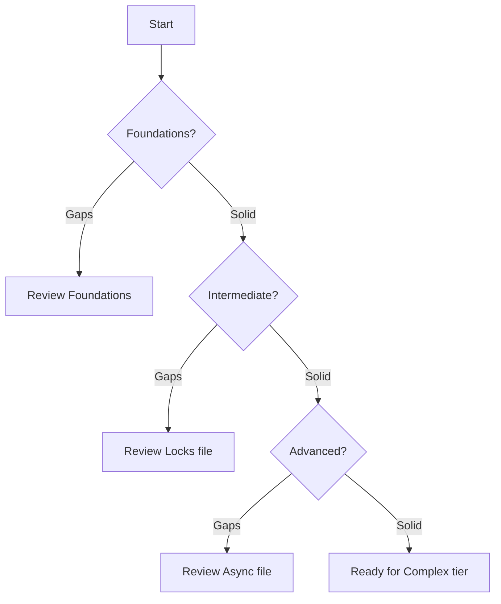

### 🛠️ Worked Example

**BAD:**

```java
// Thinking volatile makes compound ops safe:
volatile int counter = 0;
counter++; // STILL A RACE!
// volatile = visibility only. i++ = 3 ops (RMW).
// Two threads: both read 5, both write 6. Lost update.
```

Why it's wrong: volatile does not make RMW atomic.

**GOOD:**

```java
// Correct:
AtomicInteger counter = new AtomicInteger(0);
counter.incrementAndGet(); // atomic CAS
// OR for simple flag:
volatile boolean stop = false;
stop = true; // single write: atomic + visible
```

Why it's right: AtomicInteger for RMW; volatile only for single writes.

**Code review checklist (from assessment):**

```java
// Red flags in concurrent code:
// 1. Shared field without sync/volatile/atomic
// 2. containsKey + put (use computeIfAbsent)
// 3. synchronizedList iteration without lock
// 4. Executors.newFixedThreadPool (unbounded!)
// 5. catch(InterruptedException) { /* empty */ }
// 6. ThreadLocal without remove() in pool
// 7. DCL without volatile
```

### ⚖️ Trade-offs

| Score | Interpretation | Action |
| ----- | -------------- | ------ |
| F shaky | Foundations incomplete | Study Foundations |
| I shaky | Intermediate gaps | Study Locks file |
| A shaky | Advanced gaps | Study Async file |
| All solid | Ready | Proceed to Complex |

### ⚡ Decision Snap

**TAKE WHEN:**
- Before advanced topics.
- After each study file (verify retention).
- Before concurrency interviews.

**RETAKE WHEN:**
- 30 days later (test retention).
- After a production concurrency bug.
- When JDK adds new concurrency features.

### ⚠️ Top Traps

| # | Misconception | Reality |
| - | ------------- | ------- |
| 1 | "I use j.u.c so I can skip foundations" | Misusing j.u.c = bugs. Must understand underlying model. |
| 2 | "Passing once = permanent knowledge" | Reassess quarterly. Intuition degrades without practice. |
| 3 | "100% correct = production-ready" | Assessment tests understanding. Production requires applying under pressure. |

### 🪜 Learning Ladder

**Prerequisites:**
- All Foundations keywords - tested by F1-F5
- All Locks and Coordination keywords - tested by I1-I5
- All Async and Patterns keywords - tested by A1-A5

**THIS:** Concurrency Self-Assessment

**Next steps:**
- Virtual Threads and Diagnostics - only if assessment passes
- Architecture and META - only if assessment passes

### 💡 The Surprising Truth

"Can a BLOCKED thread respond to interrupt?" Answer: NO. BLOCKED state (waiting for monitor) does NOT respond to interrupt. Only WAITING/TIMED_WAITING (Object.wait, sleep, take) throw InterruptedException. A thread blocked on `synchronized` entry CANNOT be interrupted - this is why ReentrantLock.lockInterruptibly() exists.

### 📇 Revision Card

1. volatile != atomic for RMW. i++ on volatile is still a race.
2. Unbounded queues in Executors factories = production OOM.
3. happens-before != time-before. VISIBILITY guarantee, not temporal.
