## Keywords

1. [Executor Framework and ExecutorService](#executor-framework-and-executorservice)
2. [ThreadPoolExecutor Configuration](#threadpoolexecutor-configuration)
3. [ScheduledExecutorService](#scheduledexecutorservice)
4. [Future and Callable](#future-and-callable)
5. [ReentrantLock vs synchronized](#reentrantlock-vs-synchronized)
6. [ReadWriteLock](#readwritelock)
7. [CountDownLatch](#countdownlatch)
8. [CyclicBarrier and Phaser](#cyclicbarrier-and-phaser)
9. [Semaphore](#semaphore)
10. [ConcurrentHashMap](#concurrenthashmap)
11. [CopyOnWriteArrayList](#copyonwritearraylist)
12. [BlockingQueue Implementations](#blockingqueue-implementations)
13. [AtomicInteger and Atomic Classes](#atomicinteger-and-atomic-classes)
14. [ThreadLocal](#threadlocal)
15. [Unbounded Queue Anti-Pattern](#unbounded-queue-anti-pattern)
16. [Build a Producer-Consumer Exercise](#build-a-producer-consumer-exercise)
17. [Concurrent Chat - Phase 2 (Executors)](#concurrent-chat---phase-2-executors)
18. [Java Concurrency Quick Recall Card](#java-concurrency-quick-recall-card)

---

---

# Executor Framework and ExecutorService

**TL;DR** - ExecutorService decouples task submission from thread management, preventing resource leaks and enabling bounded concurrency.

### 🔥 The Problem in One Paragraph

Creating a raw `new Thread()` per task is a resource leak waiting to happen: each thread costs ~1MB stack, OS-level context switches compound, and you have no backpressure when tasks flood in. A service handling 10,000 concurrent requests spawning 10,000 threads will exhaust memory, thrash the scheduler, and crash. You need a way to bound the number of live threads while still accepting work. This is exactly why the Executor Framework was created.

### 📘 Textbook Definition

The **Executor Framework** (java.util.concurrent, JDK 5) is an abstraction that decouples task submission (what to run) from task execution mechanics (thread creation, pooling, scheduling). `ExecutorService` extends `Executor` with lifecycle management (shutdown), `Future` result retrieval, and bulk submission methods.

### 🧠 Mental Model

> An ExecutorService is a restaurant kitchen with a fixed number of chefs (threads) and an order queue. Customers (tasks) place orders on the queue. Chefs pick orders when free. If the queue fills up, new customers wait or are rejected - you never hire infinite chefs.

- "Chefs" -> pooled threads (bounded by corePoolSize/maxPoolSize)
- "Order queue" -> internal work queue (BlockingQueue)
- "Customer placing order" -> executor.submit(task)
- "Rejection" -> RejectedExecutionHandler (when queue is full)

**Where this analogy breaks down:** real kitchens have variable recipe complexity; thread pools treat all tasks as equally schedulable (no priority by default).

### ⚙️ How It Works

```text
submit(task)
    |
    v
[Work Queue] -- thread available --> [Worker Thread]
    |                                      |
    v (queue full)                          v
[Rejection Policy]              execute task.run()
                                       |
                                       v
                                return result via Future
```

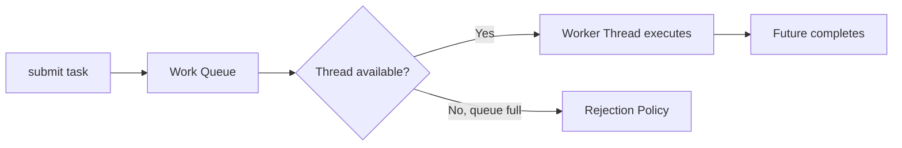

1. Client calls `executor.submit(callable)` - returns a Future immediately.
2. Task enters the internal BlockingQueue.
3. An idle worker thread dequeues the task and calls `run()`.
4. Result stored in the Future; client retrieves via `future.get()`.
5. If all threads busy AND queue full: RejectedExecutionHandler fires.

### 🛠️ Worked Example

**BAD:**

```java
// Thread-per-request: unbounded thread creation
for (Request req : requests) {
    new Thread(() -> handle(req)).start();
}
// 10,000 requests = 10,000 threads = OOM / scheduler thrash
```

Why it's wrong: no bound on concurrency; memory exhaustion under load.

**GOOD:**

```java
ExecutorService pool = new ThreadPoolExecutor(
    10, 50,         // core 10, max 50 threads
    60L, TimeUnit.SECONDS, // idle timeout
    new LinkedBlockingQueue<>(1000), // bounded queue
    new ThreadPoolExecutor.CallerRunsPolicy()
);
for (Request req : requests) {
    pool.submit(() -> handle(req));
}
pool.shutdown();
pool.awaitTermination(30, TimeUnit.SECONDS);
```

Why it's right: bounded threads + bounded queue + backpressure via CallerRunsPolicy.

**Production pattern:**

```java
// Graceful shutdown in Spring Boot:
@PreDestroy
void cleanup() {
    pool.shutdown();
    if (!pool.awaitTermination(10, SECONDS)) {
        pool.shutdownNow();
    }
}
```

### ⚖️ Trade-offs

**Gain:** bounded resource usage, task reuse, lifecycle management, Future-based results.

**Cost:** configuration complexity (core/max/queue/policy), hidden queue memory, harder to reason about per-task thread identity.

| Aspect         | ExecutorService    | Raw Thread    | Virtual Threads |
| -------------- | ------------------ | ------------- | --------------- |
| Resource bound | Yes (configurable) | No            | JVM-managed     |
| Lifecycle      | Managed (shutdown) | Manual (join) | Automatic       |
| Overhead       | Pool overhead      | 1MB/thread    | ~few KB/thread  |
| Backpressure   | Queue + policy     | None          | None built-in   |

### ⚡ Decision Snap

**USE WHEN:**

- You need bounded concurrency for CPU-bound or mixed workloads.
- JDK < 21 and need thread management.
- You require explicit queue sizing and rejection policies.

**AVOID WHEN:**

- JDK 21+ with I/O-bound work (virtual threads are simpler).
- Single background task (overkill - just use a single thread).

**PREFER Virtual Threads WHEN:**

- I/O-bound work on JDK 21+ (no pool sizing needed).
- You want thread-per-task simplicity without resource exhaustion.

### ⚠️ Top Traps

| #   | Misconception                                            | Reality                                                                                      |
| --- | -------------------------------------------------------- | -------------------------------------------------------------------------------------------- |
| 1   | "Executors.newCachedThreadPool() is safe for production" | It creates unlimited threads under load - same as raw threads. Always use bounded pools.     |
| 2   | "shutdown() stops running tasks"                         | shutdown() stops accepting NEW tasks. Running tasks continue. shutdownNow() interrupts them. |
| 3   | "The pool size should equal the number of CPUs"          | Only for CPU-bound work. I/O-bound work needs larger pools (threads mostly wait).            |

### 🪜 Learning Ladder

**Prerequisites:**

- Thread and Runnable - understand what the pool executes
- The Shared Mutable State Problem - why pooled threads still need synchronization

**THIS:** Executor Framework and ExecutorService

**Next steps:**

- ThreadPoolExecutor Configuration - tune core/max/queue/policy
- Future and Callable - retrieve results from submitted tasks

### 💡 The Surprising Truth

`Executors.newFixedThreadPool(N)` uses an UNBOUNDED LinkedBlockingQueue internally. This means it will NEVER reject a task - instead the queue grows without limit, consuming heap until OOM. The "fixed" refers only to thread count, not memory safety. Always construct ThreadPoolExecutor directly with a bounded queue for production.

### 📇 Revision Card

1. ExecutorService = bounded thread pool + work queue + lifecycle management.
2. Always use bounded queues in production - unbounded queues = hidden OOM.
3. shutdown() stops new submissions; shutdownNow() interrupts running tasks.

---

---

# ThreadPoolExecutor Configuration

**TL;DR** - ThreadPoolExecutor has five tuning knobs (core, max, queue, keepAlive, rejectionPolicy) that interact non-intuitively.

### 🔥 The Problem in One Paragraph

An engineer sets `corePoolSize=10, maxPoolSize=100, queue=LinkedBlockingQueue(1000)`. They expect the pool to grow to 100 threads under load. Instead it stays at 10 threads with 1000 tasks queued. Why? Because ThreadPoolExecutor only creates threads beyond core when the QUEUE IS FULL - not when tasks are waiting. This counterintuitive interaction between queue size and max threads is the #1 misconfiguration in production Java. This is exactly why ThreadPoolExecutor Configuration was created.

### 📘 Textbook Definition

**ThreadPoolExecutor** is the configurable implementation of ExecutorService with five parameters: `corePoolSize` (minimum live threads), `maximumPoolSize` (ceiling), `keepAliveTime` (how long idle threads above core survive), `workQueue` (where tasks wait), and `RejectedExecutionHandler` (what happens when both queue and threads are maxed).

### 🧠 Mental Model

> ThreadPoolExecutor is a call center: core agents (corePoolSize) always staffed. Overflow calls go to a hold queue (workQueue). ONLY when the hold queue is FULL do you hire temp agents (up to maxPoolSize). If even temp agents are full: reject the call (RejectedExecutionHandler).

- "Core agents" -> corePoolSize threads (always alive)
- "Hold queue" -> workQueue (tasks wait here)
- "Temp agents" -> threads between core and max (created only when queue full)
- "Reject call" -> RejectedExecutionHandler

**Where this analogy breaks down:** in real call centers, you hire temps before the queue overflows. In ThreadPoolExecutor, the queue MUST be full before creating threads beyond core. This is the #1 surprise.

### ⚙️ How It Works

```text
submit(task)
    |
    v
threads < corePoolSize? --YES--> create new thread
    |
    NO
    v
queue.offer(task) succeeds? --YES--> task queued
    |
    NO (queue full)
    v
threads < maxPoolSize? --YES--> create new thread
    |
    NO
    v
RejectedExecutionHandler.rejectedExecution()
```

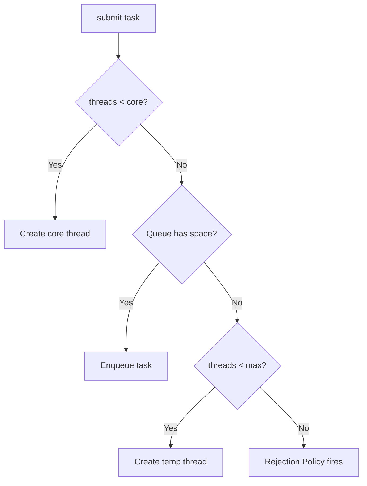

Key insight: tasks queue BEFORE new threads are created (between core and max). An unbounded queue means maxPoolSize is IRRELEVANT (queue never fills, temp threads never created).

### 🛠️ Worked Example

**BAD:**

```java
// "I want up to 100 threads" - but this NEVER scales past 10:
new ThreadPoolExecutor(
    10, 100, 60, SECONDS,
    new LinkedBlockingQueue<>() // UNBOUNDED queue!
);
// Queue absorbs all tasks. Never full. Max=100 never reached.
```

Why it's wrong: unbounded queue makes maxPoolSize meaningless.

**GOOD:**

```java
// Correct: bounded queue forces thread scaling
new ThreadPoolExecutor(
    10, 100, 60, SECONDS,
    new ArrayBlockingQueue<>(50), // small bounded queue
    new ThreadPoolExecutor.CallerRunsPolicy()
);
// 10 core threads. Queue fills at 50. THEN scales to 100.
// At 100 threads + 50 queued: caller's thread runs the task.
```

Why it's right: small bounded queue triggers thread creation; CallerRunsPolicy provides backpressure.

**Production pattern (I/O-bound service):**

```java
int cpus = Runtime.getRuntime().availableProcessors();
// I/O-bound: threads spend 80% waiting
// Optimal: cpus * (1 + waitTime/computeTime) = cpus * 5
new ThreadPoolExecutor(
    cpus, cpus * 5, 30, SECONDS,
    new ArrayBlockingQueue<>(cpus * 10),
    new CallerRunsPolicy()
);
```

### ⚖️ Trade-offs

**Gain:** precise control over thread count, memory, and behavior under saturation.

**Cost:** complex parameter interaction; easy to misconfigure; requires load testing to validate.

| Aspect         | Small queue + high max | Large queue + low max     | Unbounded queue |
| -------------- | ---------------------- | ------------------------- | --------------- |
| Thread scaling | Aggressive             | Conservative              | Never scales    |
| Memory         | Thread stacks          | Queue entries             | Unbounded heap  |
| Latency        | Lower (more threads)   | Higher (queued)           | Grows unbounded |
| Backpressure   | Via rejection          | Late (queue fills slowly) | None (OOM)      |

### ⚡ Decision Snap

**USE WHEN:**

- You need predictable resource bounds in production.
- Workload characteristics are known (I/O ratio, burst size).
- You need explicit rejection handling.

**AVOID WHEN:**

- JDK 21+ with virtual threads (no pool sizing needed).
- Simple fire-and-forget tasks (Executors.newSingleThreadExecutor suffices).

**PREFER SynchronousQueue WHEN:**

- You want threads to scale immediately (no queuing).
- CachedThreadPool behavior but with a max cap.

### ⚠️ Top Traps

| #   | Misconception                         | Reality                                                                                     |
| --- | ------------------------------------- | ------------------------------------------------------------------------------------------- |
| 1   | "maxPoolSize controls thread ceiling" | Only if the queue is BOUNDED. Unbounded queue = max is dead code.                           |
| 2   | "Larger queue = better throughput"    | Larger queue = higher latency. Tasks wait longer before execution.                          |
| 3   | "CallerRunsPolicy is just a fallback" | It is the best production default - provides natural backpressure by slowing the submitter. |

### 🪜 Learning Ladder

**Prerequisites:**

- Executor Framework and ExecutorService - the abstraction this configures
- BlockingQueue Implementations - queue choice affects pool behavior

**THIS:** ThreadPoolExecutor Configuration

**Next steps:**

- Unbounded Queue Anti-Pattern - deep dive on the #1 configuration mistake
- Monitoring Thread Pools in Production - observe pool behavior at runtime

### 💡 The Surprising Truth

`SynchronousQueue` has zero capacity - it does not HOLD tasks, just hands them off. A ThreadPoolExecutor with SynchronousQueue and maxPoolSize=100 will create a new thread for EVERY task (up to 100) immediately, with no queuing. This is how `Executors.newCachedThreadPool()` works internally - but without a max bound (Integer.MAX_VALUE). Combining SynchronousQueue with a reasonable max gives you elastic scaling with a safety ceiling.

### 📇 Revision Card

1. Queue must fill BEFORE threads grow beyond core - unbounded queue = max is never reached.
2. Production formula for I/O-bound: core = CPUs, max = CPUs \* (1 + wait/compute), queue = small bounded.
3. CallerRunsPolicy is the best production rejection policy - natural backpressure without data loss.

---

---

# ScheduledExecutorService

**TL;DR** - ScheduledExecutorService runs tasks after a delay or at fixed intervals without the pitfalls of java.util.Timer.

### 🔥 The Problem in One Paragraph

An application needs to run a cleanup task every 5 minutes and send a heartbeat every 30 seconds. Using `java.util.Timer` works until one scheduled task throws an exception - killing the entire Timer thread and silently stopping ALL other scheduled tasks. The application appears healthy but heartbeats stop, monitoring has a blind spot, and the issue is discovered hours later during an outage. This is exactly why ScheduledExecutorService was created.

### 📘 Textbook Definition

**ScheduledExecutorService** is a thread-pool-based scheduler (JDK 5) that executes tasks after a given delay or periodically, with fault isolation between tasks and configurable thread counts - replacing the fragile single-threaded `java.util.Timer`.

### 🧠 Mental Model

> Timer is one alarm clock that breaks if any alarm "explodes" (throws an exception) - all other alarms die. ScheduledExecutorService is multiple independent alarm clocks: one breaking does not affect the others.

- "Single alarm clock" -> Timer's single thread (one failure kills all)
- "Multiple independent clocks" -> pool of scheduler threads (failure isolated)
- "Alarm setting" -> schedule(task, delay, period)
- "Clock exploding" -> uncaught exception in a task

**Where this analogy breaks down:** ScheduledExecutorService still runs tasks on pooled threads - if all threads are blocked by long-running tasks, other scheduled tasks are delayed.

### ⚙️ How It Works

```text
scheduleAtFixedRate(task, 0, 5, MINUTES)
    |
    v
[Delay Queue (sorted by next run time)]
    |
    v (time arrived)
[Worker Thread executes task]
    |
    v (task completes)
[Reschedule: next = now + period]
    |
    v
[Back in Delay Queue]
```

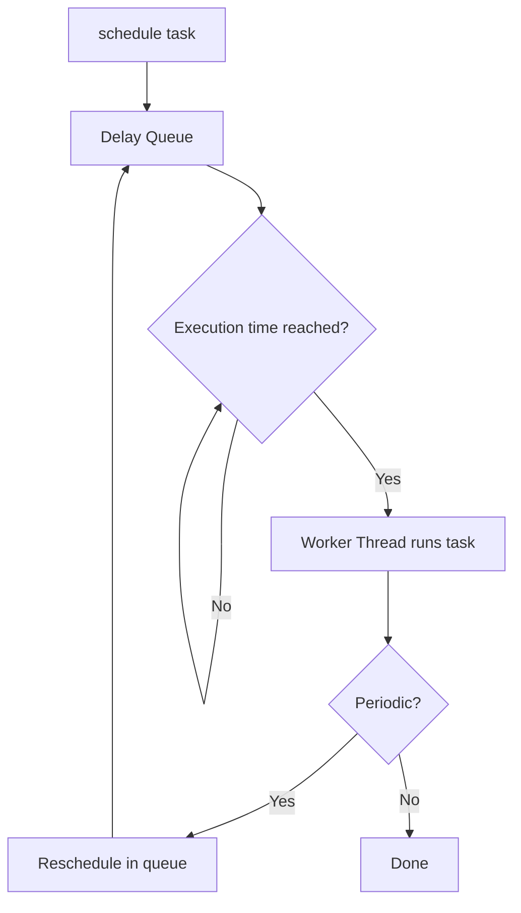

- `scheduleAtFixedRate`: next execution = previous start + period (drift-correcting).
- `scheduleWithFixedDelay`: next execution = previous end + delay (constant gap between runs).
- If a task takes longer than the period: next run starts immediately after (no overlap, but delays accumulate for fixedRate).

### 🛠️ Worked Example

**BAD:**

```java
// Timer: one exception kills all tasks
Timer timer = new Timer();
timer.schedule(new TimerTask() {
    public void run() { riskyCleanup(); } // may throw
}, 0, 5000);
timer.schedule(new TimerTask() {
    public void run() { heartbeat(); }
}, 0, 1000);
// If riskyCleanup() throws: heartbeat ALSO stops forever
```

Why it's wrong: Timer uses one thread; uncaught exception kills it, stopping all tasks.

**GOOD:**

```java
ScheduledExecutorService scheduler =
    Executors.newScheduledThreadPool(2);
scheduler.scheduleAtFixedRate(
    () -> {
        try { riskyCleanup(); }
        catch (Exception e) { log.error("cleanup", e); }
    }, 0, 5, MINUTES);
scheduler.scheduleAtFixedRate(
    () -> heartbeat(), 0, 30, SECONDS);
// Cleanup failure does NOT affect heartbeat
```

Why it's right: pool-based, fault-isolated, and we catch exceptions to prevent task cancellation.

**Production pattern:**

```java
// CRITICAL: wrap tasks in try-catch. Even with SESE,
// an uncaught exception cancels THAT task's future repeats.
scheduler.scheduleAtFixedRate(() -> {
    try {
        doWork();
    } catch (Throwable t) {
        log.error("scheduled task failed", t);
        // Task continues on next period
    }
}, 0, 1, MINUTES);
```

### ⚖️ Trade-offs

**Gain:** fault isolation, multiple threads, better time precision, integrates with ExecutorService lifecycle.

**Cost:** slightly more complex setup than Timer; still requires manual exception handling within tasks.

| Aspect             | ScheduledExecutorService   | Timer             | @Scheduled (Spring) |
| ------------------ | -------------------------- | ----------------- | ------------------- |
| Fault isolation    | Per-task                   | None (one thread) | Per-task            |
| Thread count       | Configurable               | 1                 | Configurable        |
| Exception handling | Task cancelled if uncaught | Timer dies        | Logged + continues  |
| Lifecycle          | shutdown()                 | cancel()          | Container-managed   |

### ⚡ Decision Snap

**USE WHEN:**

- Need periodic background tasks with fault isolation.
- Need delay-based execution (retry after X seconds).
- Need finer control than framework schedulers provide.

**AVOID WHEN:**

- Spring environment (use `@Scheduled` for simplicity and container lifecycle).
- Distributed scheduling needed (use Quartz, db-scheduler).

**PREFER @Scheduled WHEN:**

- Spring Boot application with simple cron/fixedRate requirements.
- Want container-managed lifecycle without manual shutdown.

### ⚠️ Top Traps

| #   | Misconception                                        | Reality                                                                                                    |
| --- | ---------------------------------------------------- | ---------------------------------------------------------------------------------------------------------- |
| 1   | "ScheduledExecutorService catches exceptions for me" | No - uncaught exceptions cancel that task's future executions silently. Always wrap in try-catch.          |
| 2   | "fixedRate guarantees exact intervals"               | If a task takes longer than the period, next execution is immediate (no overlap) but intervals drift.      |
| 3   | "One scheduler thread is enough"                     | If a task blocks, other tasks on the same thread are delayed. Use pool size >= number of concurrent tasks. |

### 🪜 Learning Ladder

**Prerequisites:**

- Executor Framework and ExecutorService - the parent abstraction
- Thread Lifecycle and States - understand TIMED_WAITING state

**THIS:** ScheduledExecutorService

**Next steps:**

- CompletableFuture Composition - async chaining beyond scheduling
- Monitoring Thread Pools in Production - observe scheduler health

### 💡 The Surprising Truth

Even with ScheduledExecutorService, an uncaught exception in a periodic task causes that task's future executions to be silently cancelled - no error log, no notification, the task just stops running. This is why production-grade scheduled tasks ALWAYS wrap their body in try-catch(Throwable) and log the error. Without this, you discover the task stopped days later when its side effects are missed.

### 📇 Revision Card

1. Always wrap scheduled task body in try-catch(Throwable) - uncaught exceptions silently cancel future runs.
2. fixedRate: next = start + period (drift-correcting). fixedDelay: next = end + delay (constant gap).
3. Timer is broken by design (single thread, no fault isolation). Always use ScheduledExecutorService.

---

---

# Future and Callable

**TL;DR** - Callable returns a result from a thread; Future is the handle to retrieve that result (blocking until available).

### 🔥 The Problem in One Paragraph

Runnable has no return value. You submit work to a thread pool but need the result - a database query result, an HTTP response, a computed value. Without Future, you would need shared mutable variables and manual signaling to pass results back from worker threads to the caller. This ad-hoc approach creates races and is fragile. This is exactly why Callable and Future were created.

### 📘 Textbook Definition

**Callable<V>** is a functional interface like Runnable but whose `call()` method returns a value of type V and may throw checked exceptions. **Future<V>** represents the eventual result of an asynchronous computation, providing methods to check completion, retrieve the result (blocking), or cancel the task.

### 🧠 Mental Model

> Callable is ordering food for delivery. Future is the tracking number. You continue your day (non-blocking submission), and when you need the food, you check the tracking number. `get()` is waiting at the door until it arrives.

- "Ordering food" -> executor.submit(callable)
- "Tracking number" -> Future<V> returned immediately
- "Waiting at door" -> future.get() (blocks until result ready)
- "Delivery failed" -> future.get() throws ExecutionException

**Where this analogy breaks down:** Future.get() blocks the CALLING thread entirely. Real delivery tracking lets you do other things while checking occasionally. CompletableFuture fixes this (non-blocking callbacks).

### ⚙️ How It Works

```text
Caller                   Pool
  |                        |
  |-- submit(callable) --> |
  |<-- Future<V> ---------|
  |                        |-- callable.call()
  |                        |-- result stored
  |-- future.get() ------> |
  |<-- V (or exception) --|
```

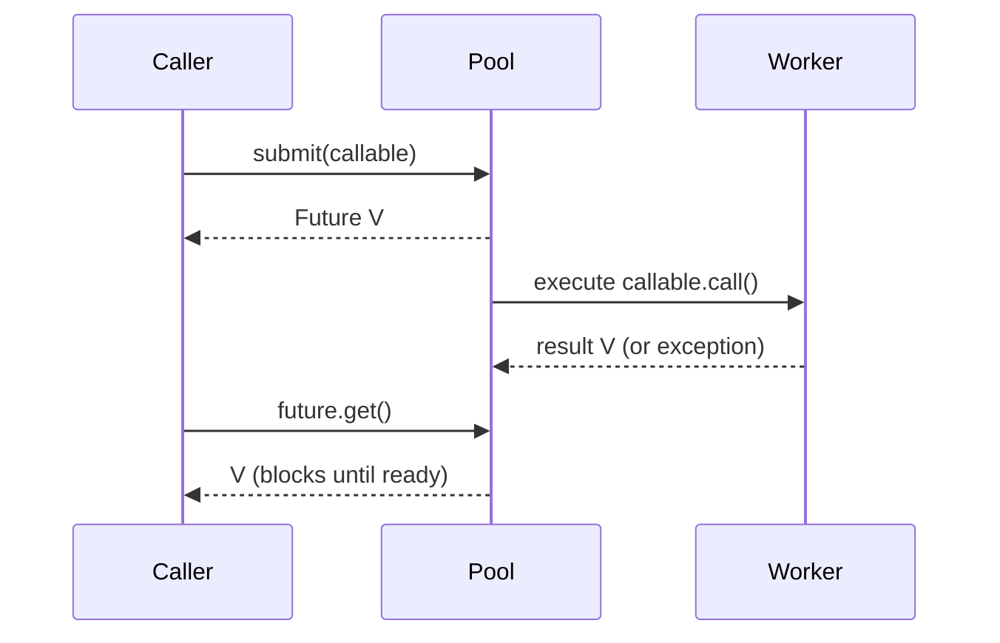

1. Caller submits Callable to ExecutorService. Gets Future immediately.
2. Worker thread executes call(). Result stored internally.
3. Caller calls future.get() - blocks until result available.
4. If call() threw: get() throws ExecutionException wrapping the cause.
5. future.get(timeout, unit) avoids infinite blocking.

### 🛠️ Worked Example

**BAD:**

```java
// Blocking on futures sequentially (no parallelism gained):
Future<String> f1 = pool.submit(() -> fetchA());
String a = f1.get(); // blocks until A done
Future<String> f2 = pool.submit(() -> fetchB());
String b = f2.get(); // blocks until B done
// Total time: fetchA + fetchB (sequential!)
```

Why it's wrong: submitting after get() serializes the work - no overlap.

**GOOD:**

```java
// Submit all FIRST, then get all (overlap I/O):
Future<String> f1 = pool.submit(() -> fetchA());
Future<String> f2 = pool.submit(() -> fetchB());
String a = f1.get(5, SECONDS); // both running in parallel
String b = f2.get(5, SECONDS);
// Total time: max(fetchA, fetchB)
```

Why it's right: both tasks submitted before any get() - they overlap in the pool.

**Production pattern:**

```java
// Timeout + proper exception handling:
try {
    String result = future.get(5, TimeUnit.SECONDS);
} catch (TimeoutException e) {
    future.cancel(true); // interrupt the task
    return fallback();
} catch (ExecutionException e) {
    log.error("Task failed", e.getCause());
    throw new ServiceException(e.getCause());
}
```

### ⚖️ Trade-offs

**Gain:** type-safe result retrieval, exception propagation, cancellation support.

**Cost:** get() blocks the caller (thread consumed while waiting); no composition (cannot chain futures).

| Aspect       | Future             | CompletableFuture              | Reactive (Mono) |
| ------------ | ------------------ | ------------------------------ | --------------- |
| Blocking     | get() blocks       | Non-blocking callbacks         | Non-blocking    |
| Composition  | None               | thenApply/thenCompose          | map/flatMap     |
| Exception    | ExecutionException | handle/exceptionally           | onError         |
| Cancellation | cancel(interrupt)  | cancel + completeExceptionally | Disposable      |

### ⚡ Decision Snap

**USE WHEN:**

- Simple async tasks where you need the result at a defined point.
- JDK 5-7 code without CompletableFuture access.
- You will get() in a known location with a timeout.

**AVOID WHEN:**

- You need to chain transformations on results (use CompletableFuture).
- Blocking get() would consume a thread you cannot afford.

**PREFER CompletableFuture WHEN:**

- You need non-blocking composition (thenApply, thenCompose).
- Multiple futures depend on each other (fan-out/fan-in).

### ⚠️ Top Traps

| #   | Misconception                               | Reality                                                                                          |
| --- | ------------------------------------------- | ------------------------------------------------------------------------------------------------ |
| 1   | "future.get() is non-blocking"              | get() BLOCKS the calling thread until the result is ready or timeout fires.                      |
| 2   | "Cancel means the task stops immediately"   | cancel(true) sets the interrupt flag. The task must CHECK Thread.interrupted() to actually stop. |
| 3   | "Exceptions are lost if I don't call get()" | True - if you never call get(), exceptions are swallowed silently. Always retrieve or log.       |

### 🪜 Learning Ladder

**Prerequisites:**

- Executor Framework and ExecutorService - where you submit Callables
- Thread and Runnable - Callable is Runnable with a return value

**THIS:** Future and Callable

**Next steps:**

- CompletableFuture Composition - non-blocking future chaining
- ThreadPoolExecutor Configuration - tune the pool running your Callables

### 💡 The Surprising Truth

If you submit a Callable and never call `get()` on the returned Future, and the Callable throws an exception, that exception vanishes silently - no log, no stack trace, nothing. The error sits in the Future object waiting to be retrieved, but nobody asks. This "silent exception swallowing" is one of the most common production bugs with Futures. Always log or handle Future results, even for fire-and-forget tasks.

### 📇 Revision Card

1. Submit all tasks FIRST, then get() all results - maximizes overlap.
2. Always use get(timeout, unit) in production - never get() without timeout (can block forever).
3. Unchecked: if you never call get(), exceptions are silently swallowed.

---

---

# ReentrantLock vs synchronized

**TL;DR** - ReentrantLock provides try-lock, timed-lock, interruptible-lock, and multiple conditions that synchronized cannot offer.

### 🔥 The Problem in One Paragraph

A service uses `synchronized` to protect a shared resource. Under load, threads pile up waiting for the lock. One thread holds it for 30 seconds (slow database call). All other threads are BLOCKED - no timeout, no interruption, no fairness control. The system appears hung. You cannot add a 5-second timeout to `synchronized`. You cannot interrupt a BLOCKED thread. You cannot have separate wait conditions. This is exactly why ReentrantLock was created.

### 📘 Textbook Definition

**ReentrantLock** is an explicit lock implementation (java.util.concurrent.locks) that provides the same mutual exclusion as `synchronized` but with additional capabilities: try-lock (non-blocking attempt), timed lock (timeout), interruptible lock, fairness ordering, and multiple Condition objects for fine-grained wait/notify.

### 🧠 Mental Model

> synchronized is an automatic door that locks behind you - simple but you cannot peek inside without entering. ReentrantLock is a door with a peephole (tryLock), a timer (tryLock with timeout), and separate waiting rooms (Conditions).

- "Automatic door" -> synchronized (auto acquire/release)
- "Peephole" -> tryLock() (check without blocking)
- "Timer" -> tryLock(timeout) (wait up to N seconds)
- "Separate waiting rooms" -> multiple Condition objects

**Where this analogy breaks down:** ReentrantLock requires explicit unlock in a finally block. Forgetting the finally = permanent lock leak. synchronized never has this problem.

### ⚙️ How It Works

```text
ReentrantLock lock = new ReentrantLock();

lock.lock()       -> blocks until acquired
lock.tryLock()    -> returns false if held
lock.tryLock(5,s) -> false after 5s timeout
lock.lockInterruptibly() -> throws on interrupt
lock.newCondition()  -> separate wait/signal
lock.unlock()     -> MUST be in finally block
```

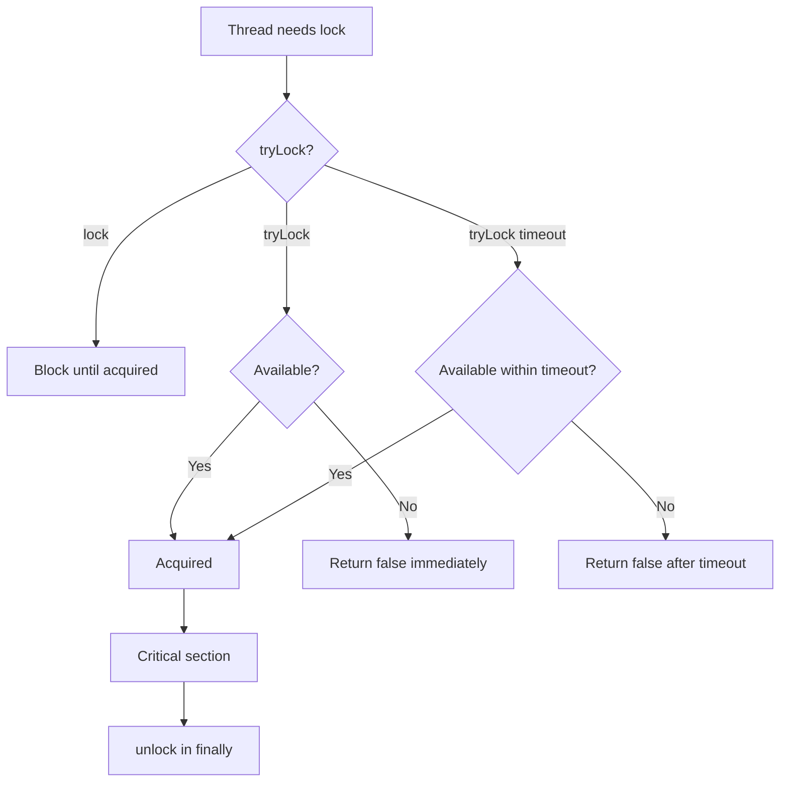

### 🛠️ Worked Example

**BAD:**

```java
// Synchronized: no timeout, thread blocks forever
synchronized(resource) {
    // If holder takes 30s, all others wait 30s. No escape.
    process(resource);
}
```

Why it's wrong: no way to bail out after a timeout - leads to thread pile-up.

**GOOD:**

```java
ReentrantLock lock = new ReentrantLock();
if (lock.tryLock(2, TimeUnit.SECONDS)) {
    try {
        process(resource);
    } finally {
        lock.unlock(); // ALWAYS in finally
    }
} else {
    return fallbackResponse(); // graceful degradation
}
```

Why it's right: 2-second timeout prevents thread pile-up; fallback maintains responsiveness.

**Production pattern (separate conditions):**

```java
ReentrantLock lock = new ReentrantLock();
Condition notFull = lock.newCondition();
Condition notEmpty = lock.newCondition();
// Producer waits on notFull; consumer waits on notEmpty
// More precise than Object.notifyAll() (no thundering herd)
```

### ⚖️ Trade-offs

**Gain:** timeout, try-lock, interruptibility, fairness, multiple conditions.

**Cost:** verbose (try-finally required), easy to forget unlock (bug), cannot use with try-with-resources (Lock is not AutoCloseable in standard JDK).

| Aspect     | synchronized               | ReentrantLock            |
| ---------- | -------------------------- | ------------------------ |
| Syntax     | Block scoped (auto unlock) | Explicit lock/unlock     |
| Timeout    | No                         | Yes (tryLock)            |
| Interrupt  | No                         | Yes (lockInterruptibly)  |
| Fairness   | No                         | Optional (fair=true)     |
| Conditions | One per object             | Multiple per lock        |
| Leak risk  | None                       | Forget unlock = deadlock |

### ⚡ Decision Snap

**USE WHEN:**

- You need timeout, try-lock, or interruptible locking.
- You need multiple conditions (producer-consumer with separate signals).
- Fairness ordering is required (FIFO lock acquisition).

**AVOID WHEN:**

- Simple critical sections where synchronized suffices.
- Team is not disciplined about try-finally unlock patterns.

**PREFER synchronized WHEN:**

- No advanced features needed (simpler, safer, auto-release on exceptions).
- Block-scoped protection is sufficient.

### ⚠️ Top Traps

| #   | Misconception                                  | Reality                                                                                                           |
| --- | ---------------------------------------------- | ----------------------------------------------------------------------------------------------------------------- |
| 1   | "ReentrantLock is faster than synchronized"    | Since JDK 6, synchronized performance matches ReentrantLock for uncontended locks. Choose by FEATURES, not speed. |
| 2   | "Fair lock = better"                           | Fair lock (FIFO) has significantly higher throughput cost (~2x slower). Use only when starvation is proven.       |
| 3   | "I can skip the finally block if I am careful" | Never. Any exception between lock() and unlock() leaks the lock permanently. Always use try-finally.              |

### 🪜 Learning Ladder

**Prerequisites:**

- synchronized Keyword - the built-in mechanism ReentrantLock extends
- Deadlock - lock ordering applies to ReentrantLock too

**THIS:** ReentrantLock vs synchronized

**Next steps:**

- ReadWriteLock - separate read and write lock paths
- StampedLock - optimistic locking for read-heavy workloads

### 💡 The Surprising Truth

ReentrantLock's `tryLock()` (zero-argument version) does NOT respect fairness even on a fair lock. It barges in front of waiting threads if the lock happens to be available at that instant. Only `tryLock(timeout, unit)` and `lock()` on a fair lock respect FIFO ordering. This means mixing tryLock() with fair locking can cause unexpected starvation of waiting threads.

### 📇 Revision Card

1. Use ReentrantLock when you NEED timeout/try/interrupt/fairness/conditions. Otherwise: synchronized.
2. ALWAYS unlock in finally. No exceptions. Ever. Forgetting = permanent lock leak.
3. Performance is equal to synchronized since JDK 6. Choose by features, not speed.

---

---

# ReadWriteLock

**TL;DR** - ReadWriteLock allows multiple concurrent readers OR one exclusive writer, optimizing read-heavy workloads.

### 🔥 The Problem in One Paragraph

A configuration cache is read 10,000 times per second and updated once per minute. Using `synchronized` means every read blocks every other read - even though readers do not conflict with each other. With 100 threads reading simultaneously, they serialize needlessly, creating artificial contention on a read-heavy workload. This is exactly why ReadWriteLock was created.

### 📘 Textbook Definition

**ReadWriteLock** (java.util.concurrent.locks) maintains a pair of associated locks: a read lock (shared, allows multiple concurrent readers) and a write lock (exclusive, blocks all readers and other writers). `ReentrantReadWriteLock` is the standard implementation.

### 🧠 Mental Model

> ReadWriteLock is a museum: many visitors (readers) can view paintings simultaneously, but when a restorer (writer) works on a painting, the room is closed to all visitors until restoration is complete.

- "Visitors viewing" -> read lock holders (concurrent)
- "Restorer working" -> write lock holder (exclusive)
- "Room closed" -> write lock acquired, readers blocked
- "Visitors waiting" -> threads waiting for write lock to release

**Where this analogy breaks down:** ReadWriteLock does not prevent writer starvation by default. If readers continuously hold the lock, a writer may wait indefinitely (unless fairness is enabled).

### ⚙️ How It Works

```text
State transitions:
  [No locks held]
      |
      |--> readLock.lock(): readers++ (many OK)
      |
      |--> writeLock.lock(): exclusive

  [Readers active]
      |
      |--> readLock.lock(): readers++ (joins)
      |
      |--> writeLock.lock(): WAITS for readers

  [Writer active]
      |
      |--> readLock.lock(): WAITS until writer releases
      |
      |--> writeLock.lock(): WAITS until writer releases
```

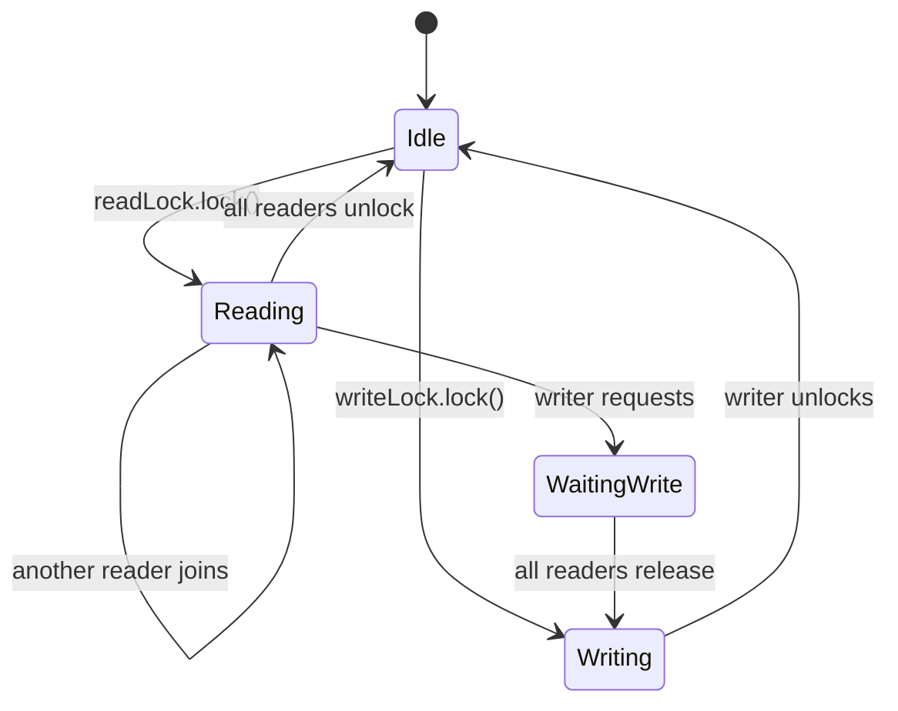

### 🛠️ Worked Example

**BAD:**

```java
// synchronized for read-heavy workload:
private final Map<String, Config> cache = new HashMap<>();
public synchronized Config get(String key) {
    return cache.get(key); // readers block each other!
}
public synchronized void update(String key, Config val) {
    cache.put(key, val);
}
// 10,000 reads/s serialize through one lock. Unnecessary.
```

Why it's wrong: readers do not conflict but synchronized forces serial access.

**GOOD:**

```java
private final ReadWriteLock rwLock =
    new ReentrantReadWriteLock();
private final Map<String, Config> cache = new HashMap<>();

public Config get(String key) {
    rwLock.readLock().lock();
    try { return cache.get(key); }
    finally { rwLock.readLock().unlock(); }
}
public void update(String key, Config val) {
    rwLock.writeLock().lock();
    try { cache.put(key, val); }
    finally { rwLock.writeLock().unlock(); }
}
// Readers proceed in parallel. Only writes are exclusive.
```

Why it's right: multiple readers proceed concurrently; writes get exclusive access without starving readers.

**Production pattern:**

```java
// Lock downgrade: write -> read (safe)
rwLock.writeLock().lock();
try {
    cache.put(key, val);
    rwLock.readLock().lock(); // acquire read BEFORE releasing write
} finally {
    rwLock.writeLock().unlock(); // downgrade complete
}
try {
    return cache.get(key); // hold read lock
} finally {
    rwLock.readLock().unlock();
}
```

### ⚖️ Trade-offs

**Gain:** read throughput scales linearly with reader count (no contention between readers).

**Cost:** write acquisition slower (must wait for all readers). Lock overhead higher than plain synchronized for low-reader-count scenarios.

| Aspect             | synchronized          | ReadWriteLock                 | StampedLock       |
| ------------------ | --------------------- | ----------------------------- | ----------------- |
| Reader concurrency | None                  | Full                          | Full + optimistic |
| Writer starvation  | N/A                   | Possible (non-fair)           | Possible          |
| Complexity         | Low                   | Medium                        | High              |
| Best for           | Write-heavy or simple | Read-heavy (>10:1 read:write) | Very read-heavy   |

### ⚡ Decision Snap

**USE WHEN:**

- Read:write ratio exceeds 10:1.
- Read operations are non-trivial (expensive enough that serialization hurts).
- You cannot use ConcurrentHashMap (which has built-in read concurrency).

**AVOID WHEN:**

- Read operations are trivial (nanoseconds) - lock overhead dominates.
- Write frequency is similar to read frequency (no reader concurrency benefit).

**PREFER ConcurrentHashMap WHEN:**

- The data structure IS a map (built-in lock striping, no external lock needed).
- Reads and writes are to different keys (natural concurrency without ReadWriteLock).

### ⚠️ Top Traps

| #   | Misconception                              | Reality                                                                                                               |
| --- | ------------------------------------------ | --------------------------------------------------------------------------------------------------------------------- |
| 1   | "ReadWriteLock is always faster for reads" | Lock acquire/release has overhead. For trivial reads (HashMap.get on small map), synchronized can be faster.          |
| 2   | "You can upgrade read lock to write lock"  | No. Attempting to acquire write lock while holding read lock = DEADLOCK. You must release read first.                 |
| 3   | "Non-fair is always fine"                  | Under sustained read load, non-fair ReadWriteLock can starve writers indefinitely. Consider fair=true or StampedLock. |

### 🪜 Learning Ladder

**Prerequisites:**

- ReentrantLock vs synchronized - understand explicit locking
- synchronized Keyword - the simpler alternative

**THIS:** ReadWriteLock

**Next steps:**

- StampedLock - optimistic reads for even higher throughput
- ConcurrentHashMap - built-in read concurrency without external locks

### 💡 The Surprising Truth

Lock upgrade (read -> write) is IMPOSSIBLE with ReentrantReadWriteLock - attempting it causes self-deadlock. But lock DOWNGRADE (write -> read) is safe and useful: acquire write, make changes, acquire read, release write (you now hold read only). This pattern lets the writer seamlessly transition to a reader without a window where no lock is held.

### 📇 Revision Card

1. Multiple readers concurrent, one writer exclusive. Useful when read:write > 10:1.
2. Read-to-write upgrade is IMPOSSIBLE (deadlock). Write-to-read downgrade is safe.
3. For maps: prefer ConcurrentHashMap (built-in concurrency) over ReadWriteLock + HashMap.

---

---

# CountDownLatch

**TL;DR** - CountDownLatch lets one or more threads wait until a fixed number of events occur before proceeding.

### 🔥 The Problem in One Paragraph

A test must start 10 worker threads and verify they all complete before checking results. Without coordination, the main thread cannot know when all workers finished. Calling `join()` on each thread works but is rigid - what if workers submit to a pool and you do not have Thread references? You need a generic "wait until N things happen" mechanism that any code can count down. This is exactly why CountDownLatch was created.

### 📘 Textbook Definition

**CountDownLatch** is a synchronization aid initialized with a count. Threads calling `await()` block until the count reaches zero, decremented by `countDown()` calls from other threads. It is single-use: once the count reaches zero, it cannot be reset.

### 🧠 Mental Model

> A CountDownLatch is a rocket launch countdown. The launch (await) cannot proceed until every system check (countDown) reports ready. Once all systems are go and the count reaches zero: launch. You cannot restart the countdown - it is one-shot.

- "Launch" -> await() returns (waiting threads proceed)
- "System check" -> countDown() (each contributor signals done)
- "Count" -> number of events required before launch
- "Cannot restart" -> single-use (use CyclicBarrier for reusable)

**Where this analogy breaks down:** in a real launch, one failed check aborts. CountDownLatch has no "abort" mechanism - you count down regardless of success/failure unless you add custom logic.

### ⚙️ How It Works

```text
CountDownLatch(3)  count=3
  |
  Thread A: countDown()  count=2
  Thread B: countDown()  count=1
  Thread C: countDown()  count=0
  |
  Main: await() -- UNBLOCKED! (count reached 0)
```

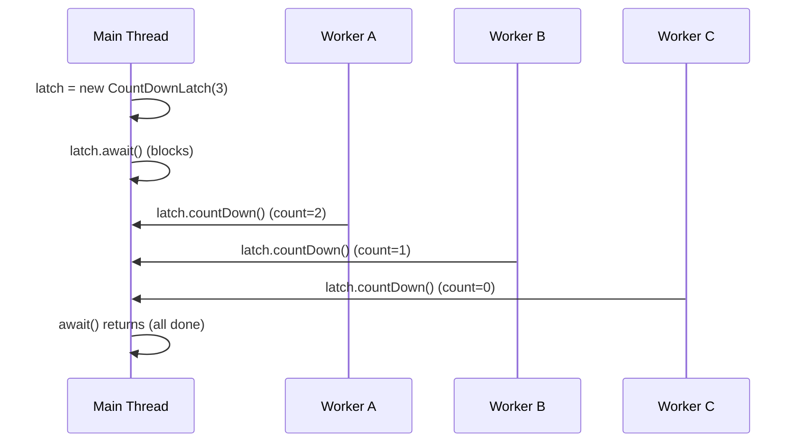

### 🛠️ Worked Example

**BAD:**

```java
// Busy-wait polling (wastes CPU):
while (!allDone) { Thread.sleep(100); }
// Or: fragile join() on each thread (need Thread refs)
for (Thread t : threads) t.join();
// Cannot use with executor pools (no Thread refs)
```

Why it's wrong: busy-wait wastes CPU; join requires direct Thread references.

**GOOD:**

```java
CountDownLatch latch = new CountDownLatch(3);
for (int i = 0; i < 3; i++) {
    executor.submit(() -> {
        try { doWork(); }
        finally { latch.countDown(); }
    });
}
latch.await(10, SECONDS); // blocks until 3 tasks done
// All workers complete -> proceed to verify results
```

Why it's right: works with executors, timeout prevents hanging, finally ensures countdown even on exception.

**Production pattern (startup readiness):**

```java
// Wait for all subsystems to initialize:
CountDownLatch ready = new CountDownLatch(3);
startDatabase(ready::countDown);
startCache(ready::countDown);
startMessaging(ready::countDown);
if (!ready.await(30, SECONDS)) {
    throw new StartupException("Subsystems not ready");
}
// All subsystems initialized -> start accepting traffic
```

### ⚖️ Trade-offs

**Gain:** simple one-shot coordination; works with any execution model; timeout support.

**Cost:** single-use (cannot reset); no way to increase count after creation; no failure signaling built in.

| Aspect   | CountDownLatch               | CyclicBarrier               | Phaser               |
| -------- | ---------------------------- | --------------------------- | -------------------- |
| Reusable | No                           | Yes (resets after trip)     | Yes                  |
| Parties  | Any thread can countDown     | Fixed participating threads | Dynamic              |
| Waiting  | One side waits, other counts | All parties wait            | All parties wait     |
| Use case | "Wait for N events"          | "All meet at barrier"       | "Phased computation" |

### ⚡ Decision Snap

**USE WHEN:**

- One or more threads must wait for N events to occur.
- Events come from different sources (not necessarily N threads).
- Single-use synchronization point (initialization, test coordination).

**AVOID WHEN:**

- You need to reuse the barrier (use CyclicBarrier).
- N is not known at creation time (use Phaser with dynamic registration).

**PREFER CyclicBarrier WHEN:**

- All parties are peers (each arrives AND waits, not one-sided).
- You need to reuse the rendezvous point across iterations.

### ⚠️ Top Traps

| #   | Misconception                                   | Reality                                                                                                                |
| --- | ----------------------------------------------- | ---------------------------------------------------------------------------------------------------------------------- |
| 1   | "I can reset a CountDownLatch"                  | No. It is single-use. For reusable barriers, use CyclicBarrier or Phaser.                                              |
| 2   | "Forgetting countDown just means a longer wait" | If a thread fails without calling countDown(), await() blocks forever (or until timeout). Always countDown in finally. |
| 3   | "CountDownLatch replaces join()"                | It is more flexible than join() but they solve different problems. Latch counts events; join waits for thread death.   |

### 🪜 Learning Ladder

**Prerequisites:**

- Thread Lifecycle and States - understand WAITING state
- Executor Framework and ExecutorService - typical context where latches coordinate

**THIS:** CountDownLatch

**Next steps:**

- CyclicBarrier and Phaser - reusable barriers for iterative coordination
- CompletableFuture Composition - more expressive async coordination

### 💡 The Surprising Truth

CountDownLatch initialized with count=1 is the simplest "gate" pattern in concurrency: one thread opens the gate (countDown), all other threads waiting at await() proceed simultaneously. This creates a perfect "start signal" for benchmarks - all worker threads begin at the exact same instant, eliminating warm-up timing skew.

### 📇 Revision Card

1. countDown() in finally - ALWAYS. A missed countdown means await() blocks forever.
2. Single-use only. For reusable rendezvous: CyclicBarrier. For dynamic: Phaser.
3. Latch(1) = perfect start gate for benchmarks (all threads begin simultaneously).

---

---

# CyclicBarrier and Phaser

**TL;DR** - CyclicBarrier synchronizes N threads at a reusable rendezvous point; Phaser adds dynamic party registration and phased advancement.

### 🔥 The Problem in One Paragraph

A parallel simulation runs in rounds: all 8 worker threads compute their partition, then ALL must reach a barrier before the next round begins (results depend on all partitions being complete). CountDownLatch cannot reuse - you would need a new one per round. You need a reusable barrier that resets after all parties arrive. For more complex scenarios, parties join/leave between rounds. This is exactly why CyclicBarrier and Phaser were created.

### 📘 Textbook Definition

**CyclicBarrier** is a synchronization aid where a fixed number of threads (parties) wait for each other at a common barrier point; once all arrive, all proceed and the barrier resets for reuse. **Phaser** is a more flexible barrier supporting dynamic party count and multiple phases.

### 🧠 Mental Model

> CyclicBarrier: a turnstile that only opens when ALL 8 runners line up. Once all 8 are there, the turnstile opens, everyone passes, and it locks again for the next round. Phaser: same turnstile but runners can join or leave between rounds.

- "Turnstile" -> barrier point
- "All 8 line up" -> all parties call await()
- "Opens" -> all proceed
- "Locks again" -> barrier resets (cyclic)
- "Runners join/leave" -> Phaser's register()/arriveAndDeregister()

**Where this analogy breaks down:** if one runner never arrives (thread crashes), CyclicBarrier is BROKEN permanently. Phaser handles this more gracefully with arriveAndDeregister.

### ⚙️ How It Works

```text
CyclicBarrier(3):
  Thread A: await() [waits: 1/3]
  Thread B: await() [waits: 2/3]
  Thread C: await() [ALL 3 arrived -> barrier trips]
  -> optional barrierAction runs
  -> all three threads released
  -> barrier RESETS for next round
```

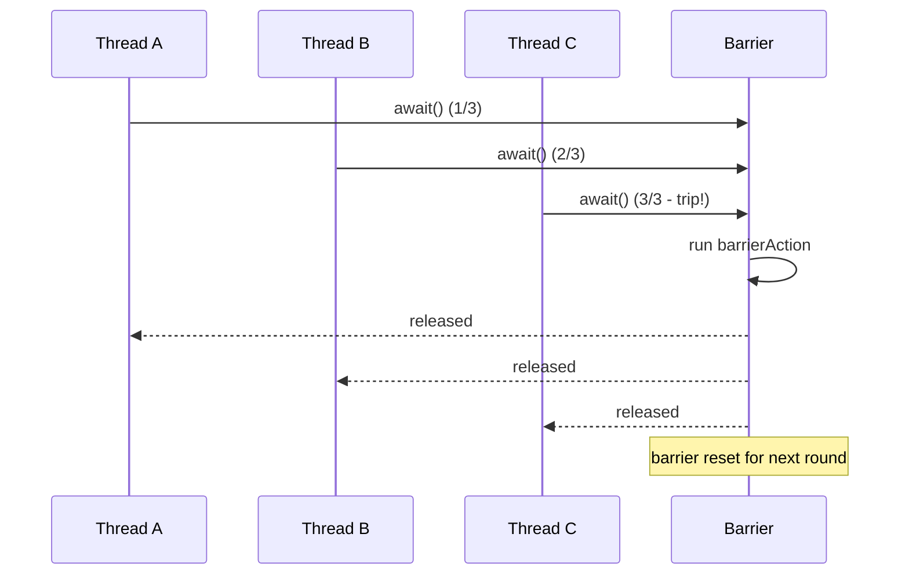

### 🛠️ Worked Example

**BAD:**

```java
// New CountDownLatch per round (wasteful, error-prone):
for (int round = 0; round < 100; round++) {
    CountDownLatch latch = new CountDownLatch(8);
    // distribute latch to workers... complex lifecycle
}
```

Why it's wrong: creating new latches per round is complex and error-prone.

**GOOD:**

```java
CyclicBarrier barrier = new CyclicBarrier(8, () ->
    mergeResults() // runs once after all 8 arrive
);
// Each of 8 worker threads:
for (int round = 0; round < 100; round++) {
    computePartition(round);
    barrier.await(); // wait for all 8, then proceed
    // barrier auto-resets for next round
}
```

Why it's right: one barrier object reused across 100 rounds. barrierAction merges results atomically.

**Production pattern (Phaser for dynamic parties):**

```java
Phaser phaser = new Phaser(1); // self-registered
for (Task t : tasks) {
    phaser.register(); // dynamic party addition
    executor.submit(() -> {
        try { doWork(); }
        finally { phaser.arriveAndDeregister(); }
    });
}
phaser.arriveAndAwaitAdvance(); // wait for all
```

### ⚖️ Trade-offs

**Gain:** reusable barrier, barrier action, optional dynamic parties (Phaser).

**Cost:** if one party fails/hangs, entire barrier is stuck (CyclicBarrier becomes BROKEN).

| Aspect            | CyclicBarrier                | Phaser                | CountDownLatch |
| ----------------- | ---------------------------- | --------------------- | -------------- |
| Reusable          | Yes                          | Yes                   | No             |
| Dynamic parties   | No (fixed)                   | Yes                   | No             |
| Broken on failure | Yes (BrokenBarrierException) | Graceful deregister   | N/A            |
| Phases            | Implicit (auto-reset)        | Explicit (getPhase()) | N/A            |

### ⚡ Decision Snap

**USE WHEN:**

- Fixed set of threads that must synchronize at each iteration.
- Parallel simulations, batch processing in rounds.
- Need a reusable rendezvous point.

**AVOID WHEN:**

- One-shot coordination (use CountDownLatch - simpler).
- Parties need to join/leave dynamically (use Phaser instead).

**PREFER Phaser WHEN:**

- Party count changes between phases.
- Need explicit phase numbering (getPhase()).
- Want graceful handling of party failure.

### ⚠️ Top Traps

| #   | Misconception                                    | Reality                                                                                                        |
| --- | ------------------------------------------------ | -------------------------------------------------------------------------------------------------------------- |
| 1   | "A crashed thread just means others wait longer" | If a party never arrives, CyclicBarrier is permanently BROKEN. All await() calls throw BrokenBarrierException. |
| 2   | "Barrier parties must be separate threads"       | A single thread can call await() from different code paths, but this is confusing and fragile.                 |
| 3   | "Phaser replaces CyclicBarrier always"           | Phaser has higher overhead. For fixed-party fixed-round scenarios, CyclicBarrier is simpler and faster.        |

### 🪜 Learning Ladder

**Prerequisites:**

- CountDownLatch - simpler one-shot version of barrier coordination
- Thread Lifecycle and States - understand WAITING state at barrier

**THIS:** CyclicBarrier and Phaser

**Next steps:**

- ForkJoinPool and Work-Stealing - barrier-like synchronization in divide-and-conquer
- Semaphore - another coordination primitive (bounded permits)

### 💡 The Surprising Truth

CyclicBarrier's optional "barrier action" (the Runnable passed to the constructor) runs in the LAST thread to arrive, not in a separate thread. This means the barrier action executes while all other threads are still waiting - giving you a guaranteed exclusive execution window to merge results or prepare the next round without any additional synchronization.

### 📇 Revision Card

1. CyclicBarrier: all N parties must arrive before any proceed. Auto-resets. Broken if one fails.
2. Phaser: dynamic parties (register/deregister). Explicit phases. More flexible, more complex.
3. Barrier action runs in the last-arriving thread - guaranteed exclusive (no extra lock needed).

---

---

# Semaphore

**TL;DR** - Semaphore limits concurrent access to a resource to N threads simultaneously using a permit-based model.

### 🔥 The Problem in One Paragraph

A connection pool has 10 database connections. You need to allow at most 10 threads to use connections simultaneously. If an 11th thread tries while all 10 are in use, it should wait until one is released. synchronized only allows ONE thread (mutex). You need a "counting mutex" that allows up to N concurrent accesses. This is exactly why Semaphore was created.

### 📘 Textbook Definition

**Semaphore** is a concurrency primitive maintaining a set of permits. `acquire()` takes a permit (blocking if none available), and `release()` returns a permit. It generalizes mutual exclusion from binary (one thread) to counting (N threads).

### 🧠 Mental Model

> Semaphore is a parking lot with N spots. Cars (threads) enter if spots are available (acquire). When a car leaves, it frees a spot (release). If the lot is full, cars wait at the entrance.

- "Parking spots" -> permits (count N)
- "Car enters" -> acquire() (take one permit)
- "Car leaves" -> release() (return one permit)
- "Lot full, wait" -> acquire blocks (no permits available)

**Where this analogy breaks down:** unlike a parking lot, Semaphore does not track WHICH thread holds which permit. Any thread can release a permit (even one that never acquired) - this can corrupt the count if used carelessly.

### ⚙️ How It Works

```text
Semaphore(3)  permits=3

  Thread A: acquire()  permits=2  [enters]
  Thread B: acquire()  permits=1  [enters]
  Thread C: acquire()  permits=0  [enters]
  Thread D: acquire()  [BLOCKS - no permits]
  ...
  Thread A: release()  permits=1
  Thread D: [UNBLOCKED, acquires, permits=0]
```

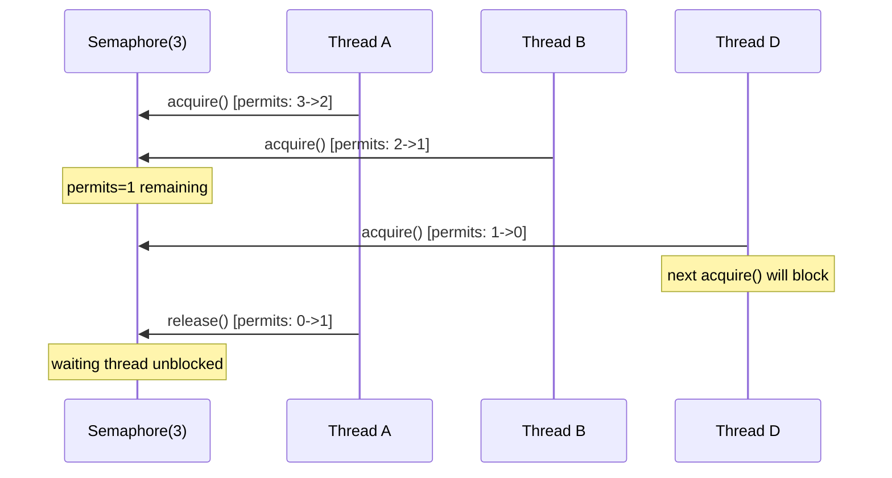

### 🛠️ Worked Example

**BAD:**

```java
// Unbounded concurrent access to limited resource:
for (Request req : requests) {
    executor.submit(() -> {
        Connection conn = pool.getConnection(); // 10 max!
        // If 100 threads all call simultaneously:
        // pool throws "no connections available" exceptions
    });
}
```

Why it's wrong: no rate-limiting means connection pool overwhelmed.

**GOOD:**

```java
Semaphore permits = new Semaphore(10); // match pool size
for (Request req : requests) {
    executor.submit(() -> {
        permits.acquire(); // blocks if 10 already active
        try {
            Connection c = pool.getConnection();
            process(c, req);
        } finally {
            permits.release(); // ALWAYS in finally
        }
    });
}
```

Why it's right: at most 10 threads access the pool simultaneously; others wait gracefully.

**Production pattern (tryAcquire for degradation):**

```java
if (permits.tryAcquire(2, TimeUnit.SECONDS)) {
    try { processWithResource(); }
    finally { permits.release(); }
} else {
    return degradedResponse(); // graceful degradation
}
```

### ⚖️ Trade-offs

**Gain:** bounded concurrency to any resource; timeout support; simpler than building a custom pool.

**Cost:** no ownership tracking (any thread can release); manual acquire/release pairing; cannot enforce WHICH resource a thread uses.

| Aspect            | Semaphore                     | synchronized         | Rate limiter         |
| ----------------- | ----------------------------- | -------------------- | -------------------- |
| Concurrent access | N (configurable)              | 1                    | Per-time-window      |
| Use case          | Resource pool bounding        | Mutual exclusion     | Request rate control |
| Ownership         | None (any thread can release) | Thread that acquired | N/A                  |

### ⚡ Decision Snap

**USE WHEN:**

- Bounding concurrent access to a shared resource (connection pools, file handles, APIs).
- Need more than mutual exclusion but less than full pool implementation.
- Implementing leaky-bucket or bounded parallelism patterns.

**AVOID WHEN:**

- You need mutual exclusion (Semaphore(1) works but synchronized is simpler).
- Resource already has built-in pooling (HikariCP, HTTP client pools).

**PREFER connection pool library WHEN:**

- Managing database connections (HikariCP handles lifecycle, validation, metrics).
- Need health checks and connection validation (Semaphore does not validate resources).

### ⚠️ Top Traps

| #   | Misconception                                    | Reality                                                                                                                               |
| --- | ------------------------------------------------ | ------------------------------------------------------------------------------------------------------------------------------------- |
| 1   | "Semaphore tracks which thread holds the permit" | No. Any thread can release(). Releasing without acquiring INCREASES permits beyond initial count (corrupts state).                    |
| 2   | "Semaphore(1) is the same as a lock"             | Similar behavior but no ownership. Semaphore(1) allows thread A to acquire and thread B to release - a lock requires the same thread. |
| 3   | "Fair semaphore is always better"                | Fair=true adds overhead (FIFO ordering). Use only if starvation is observed.                                                          |

### 🪜 Learning Ladder

**Prerequisites:**

- synchronized Keyword - understand mutual exclusion (Semaphore generalizes it)
- Executor Framework and ExecutorService - common context for semaphore usage

**THIS:** Semaphore

**Next steps:**

- Build a Producer-Consumer Exercise - uses Semaphore for bounded buffer
- BlockingQueue Implementations - alternative to manual semaphore-based bounding

### 💡 The Surprising Truth

You can create a Semaphore with zero initial permits and use release() to "signal" threads waiting on acquire(). This turns Semaphore into a signaling mechanism (like CountDownLatch) rather than a resource limiter. Some concurrent data structures use this pattern internally to implement custom wait/signal coordination.

### 📇 Revision Card

1. Semaphore(N) = allow at most N threads concurrent access. acquire() in try, release() in finally.
2. No ownership: any thread can release(). Never release without matching acquire.
3. tryAcquire(timeout) for graceful degradation - do not block forever on unavailable resources.

---

---

# ConcurrentHashMap

**TL;DR** - ConcurrentHashMap provides thread-safe map operations with fine-grained locking (lock striping) enabling high concurrent throughput without global synchronization.

### 🔥 The Problem in One Paragraph

A service caches user sessions in a HashMap. Multiple request threads read and write simultaneously. `Collections.synchronizedMap` wraps a single lock around the entire map - every get() blocks every put(), destroying throughput under 1000+ concurrent requests. The map needs concurrent reads AND writes to different keys without global locking. This is exactly why ConcurrentHashMap was created.

### 📘 Textbook Definition

**ConcurrentHashMap** is a thread-safe hash map implementation that achieves high concurrency through lock striping (JDK 7: segmented locks; JDK 8+: per-bin CAS + synchronized on bin heads), allowing concurrent reads with no locking and concurrent writes to different bins without contention.

### 🧠 Mental Model

> ConcurrentHashMap is a post office with many counter windows (bins). Multiple clerks serve different windows simultaneously. Only when two customers go to the SAME window must one wait. synchronizedMap is a post office with ONE window - everyone queues.

- "Counter windows" -> hash bins (buckets)
- "Multiple clerks" -> concurrent threads (one per bin)
- "Same window = wait" -> same bin = synchronized on bin head
- "One window = everyone queues" -> synchronizedMap (global lock)

**Where this analogy breaks down:** ConcurrentHashMap reads (get) are fully lock-free in JDK 8+ (volatile reads of node values). Only writes lock the specific bin.

### ⚙️ How It Works

```text
JDK 8+ ConcurrentHashMap internals:

  get(key):
    1. hash(key) -> bin index
    2. Volatile read of bin head node
    3. Traverse chain/tree (lock-free!)
    4. Return value (or null)
    NO LOCKING for reads.

  put(key, val):
    1. hash(key) -> bin index
    2. CAS on empty bin (fast path: no lock)
    3. If bin occupied: synchronized(binHead)
    4. Insert/update within synchronized block
    5. Unlock bin head
    ONLY the target bin is locked.
```

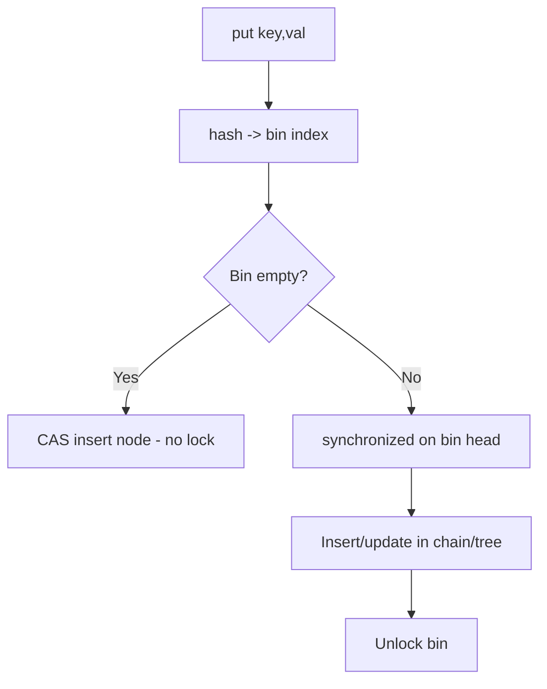

### 🛠️ Worked Example

**BAD:**

```java
// Check-then-act race with ConcurrentHashMap:
if (!map.containsKey(key)) {
    map.put(key, computeExpensiveValue());
}
// RACE: two threads both see !containsKey -> duplicate compute
```

Why it's wrong: containsKey + put is NOT atomic; another thread can put between them.

**GOOD:**

```java
// Atomic compute-if-absent:
map.computeIfAbsent(key, k -> computeExpensiveValue());
// Atomic: only ONE thread computes for a given key.
// Others wait for the result (per-bin lock held during compute).
```

Why it's right: computeIfAbsent is atomic - check+compute+insert in one operation.

**Production pattern:**

```java
// Atomic update pattern:
map.compute(key, (k, existing) -> {
    if (existing == null) return new Stats(1);
    return existing.incrementAndGet();
});
// No external synchronization needed.
// WARNING: do not call other map methods inside compute()
// (can deadlock due to re-entrant bin locking).
```

### ⚖️ Trade-offs

**Gain:** high concurrent throughput (reads lock-free, writes lock single bin); atomic compound operations (computeIfAbsent, merge, compute).

**Cost:** weakly consistent iterators (may not reflect concurrent modifications); size() is approximate under contention; no global lock for multi-key atomic operations.

| Aspect            | ConcurrentHashMap | synchronizedMap      | HashMap   |
| ----------------- | ----------------- | -------------------- | --------- |
| Thread-safe       | Yes (per-bin)     | Yes (global lock)    | No        |
| Read concurrency  | Full (lock-free)  | Serialized           | N/A       |
| Write concurrency | Per-bin           | Serialized           | N/A       |
| Iteration         | Weakly consistent | Snapshot (if locked) | Fail-fast |
| Null keys/values  | No                | Yes                  | Yes       |

### ⚡ Decision Snap

**USE WHEN:**

- Multi-threaded access to a map with high read+write concurrency.
- Need atomic compound operations (computeIfAbsent, merge).
- Default thread-safe map choice in Java.

**AVOID WHEN:**

- Single-threaded context (HashMap is simpler and faster).
- Need null keys or values (ConcurrentHashMap rejects null).

**PREFER synchronizedMap WHEN:**

- You need to lock across multiple operations atomically (rare).
- Legacy code compatibility requirement.

### ⚠️ Top Traps

| #   | Misconception                          | Reality                                                                                                                |
| --- | -------------------------------------- | ---------------------------------------------------------------------------------------------------------------------- |
| 1   | "size() is exact"                      | Under concurrent modification, size() is an ESTIMATE. For exact count, you need external synchronization.              |
| 2   | "containsKey + put is safe"            | It is NOT atomic. Use computeIfAbsent for safe check-then-act.                                                         |
| 3   | "ConcurrentHashMap allows null values" | No. Null key or value throws NullPointerException. This is by design (null is ambiguous: absent vs present-with-null). |

### 🪜 Learning Ladder

**Prerequisites:**

- The Shared Mutable State Problem - why thread-safe maps exist
- Race Condition - check-then-act races that ConcurrentHashMap solves

**THIS:** ConcurrentHashMap

**Next steps:**

- CopyOnWriteArrayList - another concurrent collection (optimized for reads)
- Synchronized vs Concurrent Collections Decision - when to choose which

### 💡 The Surprising Truth

Never call `map.put()` or `map.get()` inside a `computeIfAbsent()` lambda for the SAME map. ConcurrentHashMap holds the bin lock during compute functions. If the lambda tries to access another bin that maps to the same lock (due to resizing), you get a deadlock. The ConcurrentHashMap Javadoc explicitly warns: "Some attempted update operations on this map by other threads may be blocked while computation is in progress."

### 📇 Revision Card

1. Use computeIfAbsent/compute/merge for atomic compound operations - never containsKey + put.
2. Reads are lock-free (JDK 8+). Writes lock only the target bin. Massive concurrency.
3. No nulls allowed (by design). size() is approximate under contention.

---

---

# CopyOnWriteArrayList

**TL;DR** - CopyOnWriteArrayList creates a new array copy on every write, providing lock-free reads at the cost of expensive writes.

### 🔥 The Problem in One Paragraph

An event listener registry is iterated thousands of times per second (dispatching events) but modified rarely (listener add/remove happens at startup or config change). Using synchronizedList means every iteration locks out other readers AND writers. Iterator also requires external synchronization to prevent ConcurrentModificationException. You need a list where iteration is lock-free and modification is rare. This is exactly why CopyOnWriteArrayList was created.

### 📘 Textbook Definition

**CopyOnWriteArrayList** is a thread-safe List implementation where all mutative operations (add, set, remove) create a fresh copy of the underlying array. Reads and iterations operate on a snapshot that never changes, requiring no locking.

### 🧠 Mental Model

> CopyOnWriteArrayList is a bulletin board where announcements are printed, not written. To add a new announcement, you reprint the ENTIRE board with the new item added. Readers always see a complete, consistent board - never a half-updated one.

- "Reprint entire board" -> copy array on write
- "Readers see complete board" -> snapshot semantics (lock-free read)
- "Expensive to reprint" -> O(n) copy on every mutation
- "Fine if announcements are rare" -> optimized for rare writes

**Where this analogy breaks down:** the old "board" (array reference) is replaced atomically. Ongoing readers still see the old board until they re-read the reference - this is snapshot isolation, not real-time visibility.

### ⚙️ How It Works

```text
Write (add/remove/set):
  1. Acquire internal lock
  2. Copy current array to new array (size +/- 1)
  3. Modify new array
  4. Replace array reference (volatile write)
  5. Release lock

Read (get/iterate):
  1. Read array reference (volatile read)
  2. Access element directly (no lock, no copy)
  3. Iterator: captures array snapshot at creation time
```

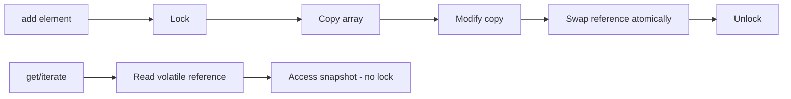

### 🛠️ Worked Example

**BAD:**

```java
// Frequent writes with CopyOnWriteArrayList (SLOW):
CopyOnWriteArrayList<LogEntry> log = new CopyOnWriteArrayList<>();
// 10,000 writes/second:
log.add(entry); // copies entire array EACH time! O(n) per add
// With 100K entries: 100K copies * 10K/s = disaster
```

Why it's wrong: CopyOnWriteArrayList is for RARE writes. Frequent writes = O(n) per mutation = terrible.

**GOOD:**

```java
// Listener registry: iterate often, modify rarely
CopyOnWriteArrayList<EventListener> listeners =
    new CopyOnWriteArrayList<>();
// Rare: listeners.add(newListener); // startup only
// Frequent (thousands/sec, lock-free):
for (EventListener l : listeners) {
    l.onEvent(event); // snapshot iterator, no CME, no lock
}
```

Why it's right: iteration (frequent) is lock-free; modification (rare) pays the copy cost.

**Production pattern:**

```java
// Safe iteration during modification:
// Iterator sees snapshot at creation time.
// Concurrent add() does NOT affect in-progress iteration.
// No ConcurrentModificationException ever.
for (EventListener l : listeners) {
    l.onEvent(event);
    // Even if another thread calls listeners.add() now:
    // this loop is unaffected (snapshot)
}
```

### ⚖️ Trade-offs

**Gain:** lock-free reads, snapshot iterators (no CME), simple API.

**Cost:** O(n) memory + time on every write; stale reads during iteration (snapshot, not real-time); memory pressure from temporary array copies.

| Aspect          | CopyOnWriteArrayList   | synchronizedList     | ConcurrentLinkedQueue |
| --------------- | ---------------------- | -------------------- | --------------------- |
| Read lock       | None (lock-free)       | Readers block        | None (lock-free)      |
| Write cost      | O(n) copy              | O(1) + lock          | O(1) CAS              |
| Iterator safety | Snapshot (never CME)   | Must externally sync | Weakly consistent     |
| Best for        | Read-heavy, write-rare | Balanced read/write  | Queue patterns        |

### ⚡ Decision Snap

**USE WHEN:**

- Read/iterate frequency >> write frequency (100:1 or more).
- Listener/observer registries, configuration lists, routing tables.
- Need iterator that never throws ConcurrentModificationException.

**AVOID WHEN:**

- Writes are frequent (>1% of operations are mutations).
- List is large (>1000 elements) AND writes are not extremely rare.

**PREFER ConcurrentHashMap WHEN:**

- Need both read AND write concurrency on a map structure.
- Modifications happen regularly under load.

### ⚠️ Top Traps

| #   | Misconception                                    | Reality                                                                                           |
| --- | ------------------------------------------------ | ------------------------------------------------------------------------------------------------- |
| 1   | "Copy-on-write = fast for all concurrent access" | Only fast for READS. Writes copy the entire array. Frequent writes = catastrophic performance.    |
| 2   | "Iterator reflects real-time state"              | Iterator sees a SNAPSHOT from creation time. Changes after iterator creation are invisible to it. |
| 3   | "Good for general concurrent lists"              | No. It is a specialized structure for read-heavy/write-rare patterns only.                        |

### 🪜 Learning Ladder

**Prerequisites:**

- Race Condition - why unprotected ArrayList fails under concurrency
- ConcurrentHashMap - another concurrent collection with different trade-offs

**THIS:** CopyOnWriteArrayList

**Next steps:**

- Synchronized vs Concurrent Collections Decision - choosing the right collection
- Immutability as Concurrency Strategy - copy-on-write is one form of immutability

### 💡 The Surprising Truth

CopyOnWriteArrayList is used internally by many frameworks for listener management. Spring's `ApplicationEventMulticaster`, Tomcat's lifecycle listeners, and JMX notification broadcasters all use it. The pattern "register at startup, iterate on every request" is so common in server frameworks that CopyOnWriteArrayList is one of the most-used concurrent collections in production Java - despite being rarely used directly in application code.

### 📇 Revision Card

1. Copy entire array on every write. Lock-free on every read. Only for write-rare patterns (100:1 read:write).
2. Iterators are snapshots - safe (no CME) but may miss concurrent modifications.
3. Classic use: listener/observer registries where registration is rare but dispatch is constant.

---

---

# BlockingQueue Implementations

**TL;DR** - BlockingQueue provides thread-safe put/take with built-in waiting, forming the backbone of producer-consumer patterns.

### 🔥 The Problem in One Paragraph

A producer generates events at variable rates. A consumer processes them. Without coordination: if the producer is faster, an unbounded list grows until OOM. If the consumer is faster, it spins burning CPU on an empty collection. You need a queue where: put() blocks when full (backpressure), take() blocks when empty (wait-not-spin), and access is thread-safe without external locking. This is exactly why BlockingQueue was created.

### 📘 Textbook Definition

**BlockingQueue** is a Queue interface (java.util.concurrent) that supports operations that block: `put()` waits for space, `take()` waits for an element. Implementations include `ArrayBlockingQueue` (bounded, array-backed), `LinkedBlockingQueue` (optionally bounded, node-linked), `PriorityBlockingQueue` (unbounded, priority-ordered), and `SynchronousQueue` (zero-capacity handoff).

### 🧠 Mental Model

> BlockingQueue is a conveyor belt between a kitchen (producer) and a serving counter (consumer). The belt has fixed length (capacity). If the kitchen puts food faster than the counter takes it, the belt fills and the kitchen must WAIT (put blocks). If the counter is faster, it WAITS for food (take blocks).

- "Conveyor belt" -> BlockingQueue
- "Belt length" -> capacity (bounded)
- "Kitchen waits" -> put() blocks when full
- "Counter waits" -> take() blocks when empty
- "Zero-length belt" -> SynchronousQueue (direct handoff)

**Where this analogy breaks down:** real conveyor belts have physics delays. BlockingQueue blocking is precise - put() unblocks the instant space becomes available (no latency gap beyond thread scheduling).

### ⚙️ How It Works

```text
Producer             BlockingQueue(10)         Consumer
   |                                              |
   |-- put(item) -->                              |
   |   [blocks if queue.size==10]                 |
   |                                              |
   |                  <- take() --|
   |                  [blocks if queue.size==0]    |
   |                                              |
   |-- offer(item, timeout) -->                   |
   |   [returns false if full after timeout]      |
```


### 🛠️ Worked Example

**BAD:**

```java
// Unbounded queue: no backpressure, OOM risk:
Queue<Event> queue = new LinkedList<>();
// Producer faster than consumer -> queue grows without limit
// Eventually: OutOfMemoryError
```

Why it's wrong: no backpressure. Fast producer fills heap.

**GOOD:**

```java
BlockingQueue<Event> queue = new ArrayBlockingQueue<>(1000);
// Producer:
queue.put(event); // BLOCKS if 1000 items queued (backpressure)
// Consumer:
Event e = queue.take(); // BLOCKS if queue empty (no spinning)
```

Why it's right: bounded capacity creates natural backpressure; take() waits efficiently.

**Production pattern (graceful shutdown):**

```java
// Poison pill pattern for clean shutdown:
Event POISON = new Event("STOP");
// Producer (on shutdown):
queue.put(POISON);
// Consumer:
while (true) {
    Event e = queue.take();
    if (e == POISON) break; // graceful exit
    process(e);
}
```

### ⚖️ Trade-offs

**Gain:** built-in thread safety, blocking semantics, natural backpressure for bounded queues.

**Cost:** blocking means threads are consumed while waiting; bounded queue means producers may stall.

| Aspect     | ArrayBlockingQueue | LinkedBlockingQueue     | SynchronousQueue    |
| ---------- | ------------------ | ----------------------- | ------------------- |
| Capacity   | Fixed (array)      | Optional bound (linked) | Zero                |
| Memory     | Pre-allocated      | Per-node allocation     | None                |
| Throughput | Single lock        | Two locks (put/take)    | Direct handoff      |
| Best for   | Bounded buffer     | High throughput P/C     | Thread pool handoff |

### ⚡ Decision Snap

**USE WHEN:**

- Implementing producer-consumer patterns.
- Need built-in backpressure (bounded queue).
- Thread pool work queues (ThreadPoolExecutor uses BlockingQueue).

**AVOID WHEN:**

- Single-threaded processing (no blocking needed).
- Need priority + bounded (PriorityBlockingQueue is unbounded by default).

**PREFER ArrayBlockingQueue WHEN:**

- Fixed capacity known upfront and memory predictability is important.
- Lower GC pressure needed (no per-element node allocation).

### ⚠️ Top Traps

| #   | Misconception                               | Reality                                                                                               |
| --- | ------------------------------------------- | ----------------------------------------------------------------------------------------------------- |
| 1   | "LinkedBlockingQueue is bounded by default" | No - default capacity is Integer.MAX_VALUE (effectively unbounded). Always pass explicit capacity.    |
| 2   | "offer() and put() are the same"            | offer() returns false if full (non-blocking). put() BLOCKS until space. Different contract.           |
| 3   | "Larger queue = better performance"         | Larger queue = higher memory + higher latency (items wait longer). Size queue for acceptable latency. |

### 🪜 Learning Ladder

**Prerequisites:**

- wait, notify, notifyAll - what BlockingQueue uses internally (condition variables)
- Executor Framework and ExecutorService - ThreadPoolExecutor uses BlockingQueue

**THIS:** BlockingQueue Implementations

**Next steps:**

- Unbounded Queue Anti-Pattern - why unbounded is dangerous
- Build a Producer-Consumer Exercise - apply BlockingQueue practically

### 💡 The Surprising Truth

`SynchronousQueue` has ZERO capacity - it cannot hold even one element. A put() blocks until a take() arrives (and vice versa). It is a direct handoff point. ThreadPoolExecutor with SynchronousQueue creates a new thread for EVERY task (up to max) because the queue never holds anything. This is how `Executors.newCachedThreadPool()` achieves elastic thread creation.

### 📇 Revision Card

1. Always specify capacity for LinkedBlockingQueue - default is unbounded (OOM risk).
2. put() blocks when full (backpressure). take() blocks when empty (wait-not-spin).
3. SynchronousQueue = zero capacity = direct handoff. Used in cached thread pools.

---

---

# AtomicInteger and Atomic Classes

**TL;DR** - Atomic classes provide lock-free thread-safe operations on single variables using hardware Compare-And-Swap (CAS).

### 🔥 The Problem in One Paragraph

A counter shared between 100 threads needs incrementing millions of times. Using `synchronized` works but creates a contention bottleneck - threads queue for the lock even though the operation is trivial (one CPU instruction). You want thread-safe increment without the overhead of lock acquisition, context switching, and thread parking. You need a mechanism that is both atomic AND lock-free. This is exactly why Atomic classes were created.

### 📘 Textbook Definition

**AtomicInteger** (and AtomicLong, AtomicReference, etc.) are classes in java.util.concurrent.atomic that provide atomic read-modify-write operations on single variables using hardware Compare-And-Swap (CAS) instructions, without acquiring any lock.

### 🧠 Mental Model

> CAS is like reserving a parking spot: you check the spot is empty (compare), then put your car there (swap) - but ONLY if nobody parked there between your check and your park. If someone did, you circle around and try again (retry loop).

- "Check spot empty" -> compare current value to expected
- "Park your car" -> swap to new value
- "Someone parked first" -> CAS fails (value changed)
- "Circle around" -> retry with fresh read

**Where this analogy breaks down:** under extreme contention, CAS retry loops waste CPU spinning. Unlike locks (which park the thread), CAS burns cycles during contention.

### ⚙️ How It Works

```text
AtomicInteger.incrementAndGet():
  1. Read current value (e.g., 5)
  2. Compute new value (6)
  3. CAS(expected=5, new=6)
     - If memory still holds 5: success! Return 6.
     - If memory holds 6 (another thread incremented):
       FAIL. Go to step 1, read again.
  4. Retry until CAS succeeds.
```

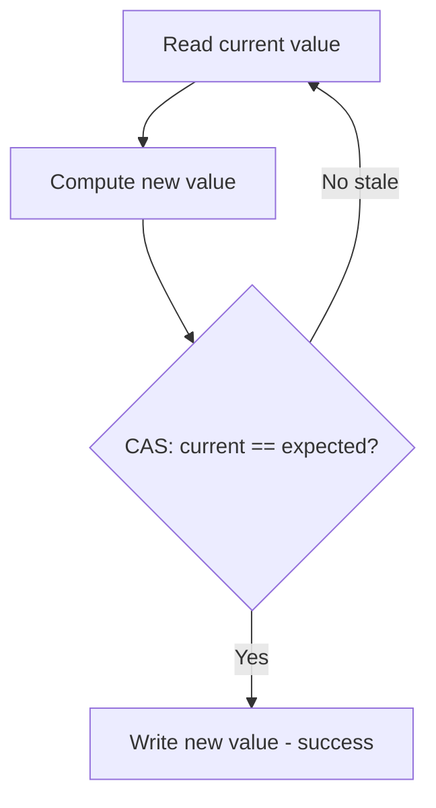

### 🛠️ Worked Example

**BAD:**

```java
// synchronized for simple counter - heavyweight:
private int count;
public synchronized int increment() {
    return ++count; // works, but lock overhead per increment
}
// 100 threads: heavy lock contention for trivial operation
```

Why it's wrong: lock acquisition overhead dominates for a single-word operation.

**GOOD:**

```java
private final AtomicInteger count = new AtomicInteger(0);
public int increment() {
    return count.incrementAndGet(); // lock-free CAS
}
// 100 threads: no lock, no blocking, hardware-level atomic
```

Why it's right: hardware CAS is one instruction - no lock, no context switch.

**Production pattern (atomic state machine):**

```java
private final AtomicReference<State> state =
    new AtomicReference<>(State.IDLE);
public boolean start() {
    return state.compareAndSet(State.IDLE, State.RUNNING);
    // Atomic transition: only ONE thread can start
}
```

### ⚖️ Trade-offs

**Gain:** lock-free (no thread parking), higher throughput under moderate contention, simpler code (no try-finally).

**Cost:** under HIGH contention, CAS retry loops burn CPU (spinning); only works for single-variable operations (no multi-variable atomicity).

| Aspect         | AtomicInteger       | synchronized              | LongAdder                |
| -------------- | ------------------- | ------------------------- | ------------------------ |
| Mechanism      | CAS (lock-free)     | Monitor lock              | Striped CAS              |
| Contention     | Retry spin          | Thread park               | Distributed              |
| Best for       | Moderate contention | Complex critical sections | High-contention counters |
| Multi-variable | No                  | Yes                       | No                       |

### ⚡ Decision Snap

**USE WHEN:**

- Single-variable atomic operations (counters, flags, references).
- Moderate contention (< 16 threads typically competing).
- Need lock-free guarantees (real-time systems, interrupt handlers).

**AVOID WHEN:**

- Need atomicity across MULTIPLE variables (use synchronized or locks).
- Very high contention (> 32 threads hammering one counter) - use LongAdder.

**PREFER LongAdder WHEN:**

- Counter-only use case (no get-and-compute patterns).
- Very high write contention from many threads.
- Read (sum) is infrequent relative to writes.

### ⚠️ Top Traps

| #   | Misconception                                | Reality                                                                                                                                          |
| --- | -------------------------------------------- | ------------------------------------------------------------------------------------------------------------------------------------------------ |
| 1   | "Atomic is always faster than synchronized"  | Under zero contention, synchronized is equally fast (~20ns). Under extreme contention, CAS spinning wastes CPU while synchronized parks threads. |
| 2   | "AtomicInteger replaces all synchronization" | Only for SINGLE variable. `if (a.get() > 0) b.set(x)` is NOT atomic even with two AtomicIntegers.                                                |
| 3   | "CAS never blocks"                           | Correct - it never blocks. But it SPINS (retries) under contention, burning CPU instead of sleeping.                                             |

### 🪜 Learning Ladder

**Prerequisites:**

- Atomicity, Visibility, Ordering - understand what atomicity means at hardware level
- volatile Keyword - atomics provide visibility + atomicity (volatile only provides visibility)

**THIS:** AtomicInteger and Atomic Classes

**Next steps:**

- Lock-Free Algorithms (CAS) - build data structures with CAS
- VarHandle and Memory Fences - modern low-level atomic access (JDK 9+)

### 💡 The Surprising Truth

LongAdder can be 10x faster than AtomicLong under high contention because it distributes updates across multiple cells (one per CPU cache line). Each thread writes to its own cell with no contention. Only when you call `sum()` are cells aggregated. The trade-off: sum() is approximate during concurrent writes. For exact-at-all-times counters: AtomicLong. For throughput-optimized counters with occasional reads: LongAdder.

### 📇 Revision Card

1. CAS = compare expected + swap to new, atomically. Retry on failure. No lock.
2. Single-variable ONLY. For multi-variable atomicity: use synchronized.
3. High contention: CAS spins CPU. Switch to LongAdder for counters, synchronized for complex operations.

---

---

# ThreadLocal

**TL;DR** - ThreadLocal gives each thread its own copy of a variable, eliminating sharing and therefore eliminating synchronization needs.

### 🔥 The Problem in One Paragraph

`SimpleDateFormat` is not thread-safe. Creating a new one per request is wasteful (object allocation + GC pressure). Sharing one instance requires synchronization (contention). You want each thread to have its OWN reusable instance - no sharing, no synchronization, no allocation per call. You need per-thread storage that is invisible to other threads. This is exactly why ThreadLocal was created.

### 📘 Textbook Definition

**ThreadLocal<T>** provides thread-confined variables: each thread accessing the variable gets an independent copy. Calling `get()` returns the current thread's value; `set()` stores it. Internally implemented via a map in each Thread object, keyed by the ThreadLocal instance.

### 🧠 Mental Model

> ThreadLocal is a locker room: each person (thread) has their own locker (storage). They access THEIR locker without worrying about others. No sharing, no locks needed. The locker number (ThreadLocal reference) is shared, but the contents are per-person.

- "Locker room" -> ThreadLocal mechanism
- "Each person's locker" -> per-thread value storage
- "Locker number" -> ThreadLocal reference (shared)
- "Contents" -> per-thread value (isolated)

**Where this analogy breaks down:** if a person LEAVES (thread terminates or returns to pool) without emptying their locker, the contents leak. In thread pools, threads are REUSED - ThreadLocal values from previous tasks persist unless explicitly removed.

### ⚙️ How It Works

```text
Thread A                Thread B
  |                       |
  tl.set("A-value")      tl.set("B-value")
  |                       |
  tl.get() -> "A-value"  tl.get() -> "B-value"
  |                       |
  [each thread has own copy - no shared state]

Internal structure (simplified):
  Thread.threadLocals = {
    ThreadLocal@1 -> "A-value",
    ThreadLocal@2 -> formatter
  }
```

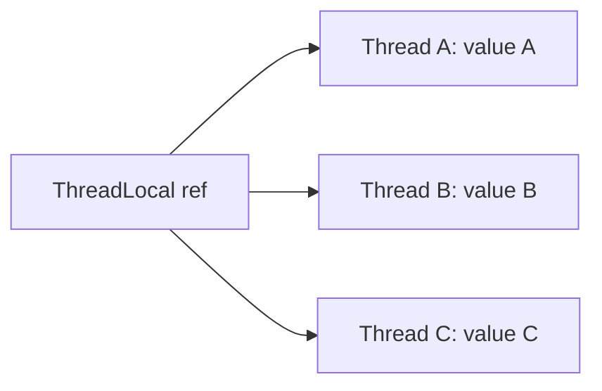

### 🛠️ Worked Example

**BAD:**

```java
// Shared SimpleDateFormat - race condition:
static final SimpleDateFormat sdf =
    new SimpleDateFormat("yyyy-MM-dd");
// Multiple threads: sdf.format(date) -> corrupted output
```

Why it's wrong: SimpleDateFormat is stateful; concurrent access corrupts internal state.

**GOOD:**

```java
static final ThreadLocal<SimpleDateFormat> sdf =
    ThreadLocal.withInitial(
        () -> new SimpleDateFormat("yyyy-MM-dd"));
// Each thread gets its own formatter. No sharing. No lock.
String result = sdf.get().format(date); // thread-safe!
```

Why it's right: each thread has its own instance; no synchronization needed.

**Production pattern (cleanup in pools):**

```java
// CRITICAL: remove() after use in thread pools
try {
    userContext.set(currentUser);
    handleRequest();
} finally {
    userContext.remove(); // prevent leak to next task!
}
```

### ⚖️ Trade-offs

**Gain:** eliminates synchronization (no sharing = no races). Per-thread reuse avoids repeated allocation.

**Cost:** memory leak risk in thread pools (values persist across task boundaries). Hidden coupling (implicit context passing).

| Aspect    | ThreadLocal         | synchronized         | Atomic                  |
| --------- | ------------------- | -------------------- | ----------------------- |
| Strategy  | Eliminate sharing   | Allow sharing safely | Allow sharing lock-free |
| Overhead  | Memory per thread   | Lock per access      | CAS per access          |
| Leak risk | High (pools)        | None                 | None                    |
| Debugging | Hard (hidden state) | Explicit             | Explicit                |

### ⚡ Decision Snap

**USE WHEN:**

- Thread-unsafe objects that are expensive to create (formatters, parsers, buffers).
- Per-request context (user, transaction ID) in thread-per-request models.
- Eliminating contention by eliminating sharing entirely.

**AVOID WHEN:**

- Using virtual threads (millions of threads = millions of ThreadLocal copies = OOM). Use ScopedValues instead.
- Thread pool tasks where cleanup is not guaranteed.

**PREFER ScopedValues (JDK 21+) WHEN:**

- Virtual threads context (inheritable, bounded lifetime).
- Need immutable per-scope values without leak risk.

### ⚠️ Top Traps

| #   | Misconception                                                 | Reality                                                                                                         |
| --- | ------------------------------------------------------------- | --------------------------------------------------------------------------------------------------------------- |
| 1   | "ThreadLocal values are garbage collected when the task ends" | No - the thread holds a strong reference. In pools, threads live forever -> values leak forever unless removed. |
| 2   | "ThreadLocal is free"                                         | Each ThreadLocal adds a map entry per thread. 1000 ThreadLocals \* 200 threads = 200K map entries + values.     |
| 3   | "InheritableThreadLocal works with thread pools"              | Child threads inherit, but pool threads are NOT child threads of the submitter. Values do not propagate.        |

### 🪜 Learning Ladder

**Prerequisites:**

- The Shared Mutable State Problem - ThreadLocal solves it by eliminating sharing
- Executor Framework and ExecutorService - where ThreadLocal leaks happen

**THIS:** ThreadLocal

**Next steps:**

- ThreadLocal Memory Leak in Thread Pools - the production failure mode
- Scoped Values (JEP 464) - modern replacement for virtual threads

### 💡 The Surprising Truth

The most common ThreadLocal leak in production is not application code - it is FRAMEWORK code. Logging MDC (Mapped Diagnostic Context) uses ThreadLocal internally. If a thread handles a request, sets MDC values, then returns to the pool without clearing MDC: the next request on that thread inherits stale MDC values. Log entries get attributed to wrong users/requests. The fix: frameworks should clear MDC in a finally block after every request.

### 📇 Revision Card

1. ThreadLocal = per-thread copy = no sharing = no synchronization needed.
2. ALWAYS call remove() in finally when using with thread pools. Leak otherwise.
3. Virtual threads: do NOT use ThreadLocal (use ScopedValues). Millions of copies = OOM.

---

---

# Unbounded Queue Anti-Pattern

**TL;DR** - Unbounded queues hide backpressure, converting load spikes into gradual OOM crashes instead of immediate visible rejection.

### 🔥 The Problem in One Paragraph

A service uses `Executors.newFixedThreadPool(10)` which internally creates a `LinkedBlockingQueue` with Integer.MAX_VALUE capacity. Under a traffic spike, the 10 threads cannot keep up. Tasks accumulate in the queue: 10K, 100K, 1M entries. Each entry holds request objects, byte arrays, database results. Heap fills silently. After 30 minutes: OutOfMemoryError. The service was "handling" traffic (accepting tasks) but actually drowning (unbounded queue growth). This is exactly why the unbounded queue anti-pattern exists.

### 📘 Textbook Definition

The **unbounded queue anti-pattern** occurs when a producer-consumer system uses a queue with no capacity limit, causing memory to grow without bound when the producer outpaces the consumer, eventually crashing with OutOfMemoryError instead of signaling overload early.

### 🧠 Mental Model

> An unbounded queue is like a restaurant that seats everyone in a waiting area with "unlimited capacity." 100 people wait, then 500, then 5000. The restaurant never turns anyone away - until the building collapses from overcrowding. A bounded queue is a fire marshal: "maximum capacity 50 - new arrivals must wait outside."

- "Unlimited waiting area" -> LinkedBlockingQueue() (unbounded)
- "Building collapses" -> OutOfMemoryError
- "Fire marshal" -> bounded queue + rejection policy
- "Wait outside" -> backpressure (caller blocks or gets rejected)

**Where this analogy breaks down:** in software, the "collapse" happens silently over minutes/hours. GC pressure increases gradually, latency creeps up, then sudden OOM. No alarm bell rings at 50% capacity.

### ⚙️ How It Works

```text
Traffic spike timeline:

t=0:   Normal load. Queue depth: 0-5. All healthy.
t=5m:  Spike begins. Queue depth: 100.
       No alarm (queue is "handling" the load).
t=15m: Queue depth: 50,000. Heap 60% used.
       GC frequency increasing. Latency rising.
t=25m: Queue depth: 200,000. Heap 90%.
       Full GC pauses. Service degraded.
t=30m: OutOfMemoryError. Service dies.
       ALL 200,000 queued tasks LOST.

With bounded queue (capacity=1000):
t=5m:  Queue fills to 1000. Rejection fires.
       CallerRunsPolicy: submitter slows down.
       Alert: "queue full" -> operator informed.
       No OOM. No data loss. Graceful degradation.
```

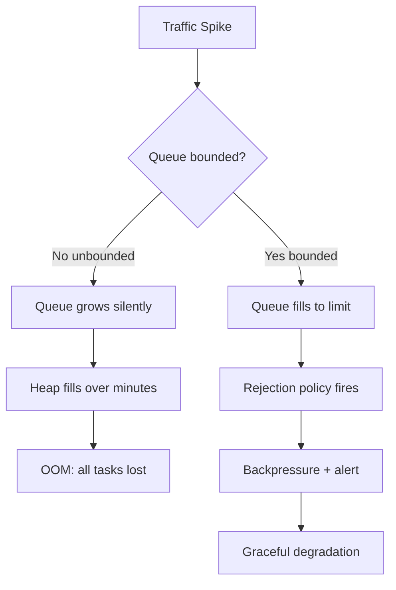

### 🛠️ Worked Example

**BAD:**

```java
// Hidden unbounded queue (Executors factory):
ExecutorService pool = Executors.newFixedThreadPool(10);
// Internally: new LinkedBlockingQueue<>() - UNBOUNDED!
// Under load: queue grows until OOM. Silent. Deadly.
```

Why it's wrong: factory hides the unbounded queue; no backpressure, eventual OOM.

**GOOD:**

```java
// Explicit bounded queue with backpressure:
ExecutorService pool = new ThreadPoolExecutor(
    10, 10, 0, SECONDS,
    new ArrayBlockingQueue<>(500),
    new ThreadPoolExecutor.CallerRunsPolicy()
);
// At 500 queued: CallerRunsPolicy makes the submitting
// thread run the task itself (natural backpressure).
```

Why it's right: bounded queue + CallerRunsPolicy = load spike causes slowdown, not crash.

**Production pattern (monitoring queue depth):**

```java
// Expose queue size as a metric:
ThreadPoolExecutor tpe = (ThreadPoolExecutor) pool;
gauge("pool.queue.size", tpe.getQueue()::size);
gauge("pool.active", tpe::getActiveCount);
// Alert when queue > 80% capacity:
// "service_pool_queue_size > 400" -> PagerDuty
```

### ⚖️ Trade-offs

**Gain (bounded):** predictable memory usage, early overload detection, graceful degradation.

**Cost (bounded):** must handle rejection (complexity), may reject valid work during bursts.

| Aspect         | Unbounded queue                     | Bounded + rejection   | Bounded + CallerRuns       |
| -------------- | ----------------------------------- | --------------------- | -------------------------- |
| OOM risk       | High (certain under sustained load) | None                  | None                       |
| Data loss      | All (on crash)                      | Rejected tasks only   | None (caller executes)     |
| Backpressure   | None                                | Explicit (exception)  | Natural (caller slows)     |
| Latency signal | Hidden until too late               | Immediate (rejection) | Immediate (caller blocked) |

### ⚡ Decision Snap

**USE BOUNDED QUEUE WHEN:**

- Any production system (always). No exceptions.
- Need predictable memory behavior under load.
- Want early warning of overload (queue depth metric).

**AVOID UNBOUNDED QUEUE WHEN:**

- Always. The only valid use: known-finite producers that cannot produce faster than consumers.

**PREFER CallerRunsPolicy WHEN:**

- Cannot afford to lose any task.
- Want automatic backpressure without custom rejection logic.
- Submitting thread CAN afford to slow down.

### ⚠️ Top Traps

| #   | Misconception                                     | Reality                                                                                                                        |
| --- | ------------------------------------------------- | ------------------------------------------------------------------------------------------------------------------------------ |
| 1   | "Executors.newFixedThreadPool is production-safe" | It uses an UNBOUNDED queue. Under sustained overload: guaranteed OOM. Never use in production without understanding internals. |
| 2   | "We will never get that much traffic"             | Traffic spikes, retry storms, and upstream failures ALL generate unexpected bursts. Bound queues defensively.                  |
| 3   | "A bigger queue is better than rejection"         | A bigger queue just delays the crash. The correct answer is backpressure (slow the producer, not buffer infinitely).           |

### 🪜 Learning Ladder

**Prerequisites:**

- ThreadPoolExecutor Configuration - understand queue-thread interaction
- BlockingQueue Implementations - queue types and their bounds

**THIS:** Unbounded Queue Anti-Pattern

**Next steps:**

- Back-Pressure Architecture Patterns - system-level backpressure design
- Monitoring Thread Pools in Production - observing queue depth

### 💡 The Surprising Truth

`Executors.newFixedThreadPool()`, `newSingleThreadExecutor()`, and `newScheduledThreadPool()` ALL use unbounded queues internally. These are the most commonly used factory methods in Java tutorials and Stack Overflow answers. Every one of them is an OOM bomb in production under sustained load. The ONLY safe Executors factory is `newCachedThreadPool()` (uses SynchronousQueue) - but it has UNBOUNDED thread creation instead. There is no safe Executors factory for production. Always construct ThreadPoolExecutor directly.

### 📇 Revision Card

1. Every Executors.newFixedThreadPool() in production is an OOM waiting to happen (unbounded queue).
2. Always: new ThreadPoolExecutor(core, max, ..., new ArrayBlockingQueue<>(N), policy).
3. CallerRunsPolicy = best default: no data loss, natural backpressure, submitter slows proportionally.

---

---

# Build a Producer-Consumer Exercise

**TL;DR** - Build a bounded producer-consumer with BlockingQueue to internalize backpressure, graceful shutdown, and thread coordination.

### 🔥 The Problem in One Paragraph

Producer-consumer is the fundamental concurrency pattern, yet most engineers have never built one from scratch. They use message queues (Kafka, RabbitMQ) that handle the hard parts: bounding, blocking, shutdown, error handling. When the abstraction leaks (in-process buffering, custom pipelines), they cannot build correct coordination. This exercise forces you to handle: bounded buffer, blocking on full/empty, clean shutdown, and error isolation. This is exactly why this exercise exists.

### 📘 Textbook Definition

The **producer-consumer pattern** uses a shared bounded buffer where producer threads insert work items and consumer threads remove and process them. The buffer provides decoupling (producers and consumers run at different rates) and backpressure (producers block when buffer is full).

### 🧠 Mental Model

> This exercise is building your own assembly line: workers at one end load items onto a conveyor belt (bounded), workers at the other end take items off. The belt has a maximum length. If loaders are faster, they wait. If unloaders are faster, they wait. Shutdown = signal "no more items" without losing what's on the belt.

- "Conveyor belt" -> BlockingQueue (bounded)
- "Loaders" -> producer threads
- "Unloaders" -> consumer threads
- "Belt at max length" -> queue full, producers block
- "Signal no more items" -> poison pill or flag

**Where this analogy breaks down:** real assembly lines have physical constraints on item size; BlockingQueue items are objects of any size, so one large object can cause GC pressure even if the count is bounded.

### ⚙️ How It Works

```text
Architecture:

  [Producer 1] --\
  [Producer 2] ---+--> [Queue(100)] --> [Consumer 1]
  [Producer 3] --/                  --> [Consumer 2]

Phases:
  1. Create bounded BlockingQueue(capacity)
  2. Start N producer threads (put items)
  3. Start M consumer threads (take items)
  4. On shutdown: producers send POISON pills
  5. Consumers take POISON -> exit gracefully
  6. Await all threads terminated
```

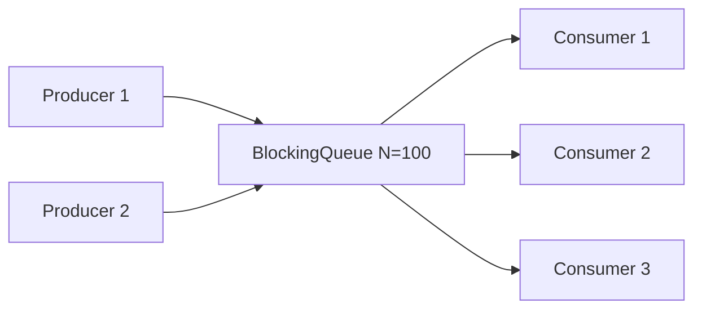

### 🛠️ Worked Example

**BAD:**

```java
// No shutdown mechanism - threads run forever:
while (true) {
    queue.put(produce()); // producer never stops
}
while (true) {
    process(queue.take()); // consumer never stops
}
// Ctrl+C kills everything. Queued items lost.
```

Why it's wrong: no graceful shutdown. Items in flight are lost on process kill.

**GOOD:**

```java
// Poison pill shutdown pattern:
record Item(String data) {}
static final Item POISON = new Item(null);

// Producer:
void produce(BlockingQueue<Item> q) {
    while (hasWork()) {
        q.put(new Item(generateData()));
    }
    q.put(POISON); // signal done
}

// Consumer:
void consume(BlockingQueue<Item> q) {
    while (true) {
        Item item = q.take();
        if (item == POISON) {
            q.put(POISON); // pass poison to next consumer
            break;
        }
        process(item);
    }
}
```

Why it's right: poison pill propagates shutdown signal through the queue; all consumers exit cleanly.

**Production pattern (multiple producers, multiple consumers):**

```java
// Send one POISON per consumer:
int consumerCount = 3;
// After all producers done:
for (int i = 0; i < consumerCount; i++) {
    queue.put(POISON);
}
// Each consumer takes one POISON and exits
executor.shutdown();
executor.awaitTermination(30, SECONDS);
```

### ⚖️ Trade-offs

**Gain:** decoupled rates, natural backpressure, clean shutdown, error isolation between stages.

**Cost:** complexity of shutdown coordination; poison pill pattern is fragile with multiple consumers; item loss risk during unclean shutdown.

| Aspect       | BlockingQueue P/C | Disruptor                  | Kafka (external) |
| ------------ | ----------------- | -------------------------- | ---------------- |
| Throughput   | Good (millions/s) | Excellent (lock-free ring) | Network-limited  |
| Persistence  | None (in-memory)  | None                       | Durable          |
| Backpressure | put() blocks      | Sequence barriers          | Consumer lag     |
| Complexity   | Low               | Medium                     | High (ops)       |

### ⚡ Decision Snap

**USE WHEN:**

- In-process pipeline between stages with different throughput.
- Learning concurrency fundamentals.
- Need bounded in-memory buffering with backpressure.

**AVOID WHEN:**

- Cross-process communication (use message broker).
- Need persistence/durability (use Kafka/RabbitMQ).

**PREFER Disruptor WHEN:**

- Need maximum single-node throughput (millions of events/s).
- Can tolerate lock-free ring buffer complexity.

### ⚠️ Top Traps

| #   | Misconception                                      | Reality                                                                                                 |
| --- | -------------------------------------------------- | ------------------------------------------------------------------------------------------------------- |
| 1   | "One POISON pill is enough for multiple consumers" | Only if you re-enqueue the poison. Otherwise only ONE consumer sees it. Send N poisons for N consumers. |
| 2   | "Bounded queue prevents all OOM"                   | Queue bounds COUNT, not SIZE. 100 items of 10MB each = 1GB. Bound by memory too.                        |
| 3   | "InterruptedException means ignore"                | It means STOP. Swallowing InterruptedException prevents graceful shutdown. Re-interrupt or exit.        |

### 🪜 Learning Ladder

**Prerequisites:**

- BlockingQueue Implementations - the queue used in this exercise
- Thread Lifecycle and States - understand WAITING at put/take

**THIS:** Build a Producer-Consumer Exercise

**Next steps:**

- Unbounded Queue Anti-Pattern - what happens without bounding
- Concurrent Chat - Phase 2 (Executors) - producer-consumer in context of real application

### 💡 The Surprising Truth

The optimal number of producers and consumers is NOT symmetric. If producing is fast (generating work) and consuming is slow (database writes), you want few producers and many consumers. The ratio should match the throughput mismatch. A common pattern: 1 producer, N consumers where N = producer_rate / consumer_rate. Getting this ratio wrong means either the queue always fills (too few consumers) or threads waste resources (too many consumers idling).

### 📇 Revision Card

1. Bounded BlockingQueue + poison pill = correct producer-consumer with shutdown.
2. Send one POISON per consumer (or re-enqueue pattern) for clean multi-consumer shutdown.
3. Ratio: match consumers to production rate. Few producers, many consumers for I/O-heavy consumption.

---

---

# Concurrent Chat - Phase 2 (Executors)

**TL;DR** - Refactor the raw-thread chat server to use ExecutorService, demonstrating resource management, graceful shutdown, and bounded concurrency.

### 🔥 The Problem in One Paragraph

Phase 1 created a new Thread per client connection. With 10,000 clients: 10,000 threads consuming 10GB stack memory, OS scheduler thrashing with context switches, and no control over resource consumption. The server crashes under load. Phase 2 replaces raw threads with an ExecutorService: bounded thread count, queued connections, graceful shutdown, and observable pool state. This is exactly why Phase 2 (Executors) exists.

### 📘 Textbook Definition

**Concurrent Chat Phase 2** refactors the Phase 1 raw-thread chat server to use `ExecutorService` for client handling, demonstrating: bounded concurrency (fixed thread pool), task lifecycle management (shutdown/awaitTermination), and the executor pattern for separating task definition from execution.

### 🧠 Mental Model

> Phase 1 was a restaurant that hired a new waiter for every customer (expensive, unscalable). Phase 2 has a fixed staff (thread pool) where waiters serve multiple tables (handle multiple tasks). If all waiters are busy, new customers wait in line (queue) instead of crashing the restaurant.

- "Fixed staff" -> thread pool (bounded)
- "Waiters serve tables" -> threads handle connections
- "New customers wait in line" -> queued connections
- "Restaurant closing" -> graceful shutdown

**Where this analogy breaks down:** a real waiter cannot literally pause one table to serve another mid-sentence. Threads CAN context-switch between blocking I/O operations on different sockets.

### ⚙️ How It Works

```text
Phase 2 Architecture:

  ServerSocket.accept()
       |
       v
  [ExecutorService (10 threads, bounded queue=100)]
       |
       v
  ClientHandler task:
    - Read message from client socket
    - Broadcast to all connected clients
    - On disconnect: remove from client list

  Shutdown:
    - Close ServerSocket (stop accepting)
    - pool.shutdown() (no new tasks)
    - pool.awaitTermination(30s)
    - pool.shutdownNow() if still running
```

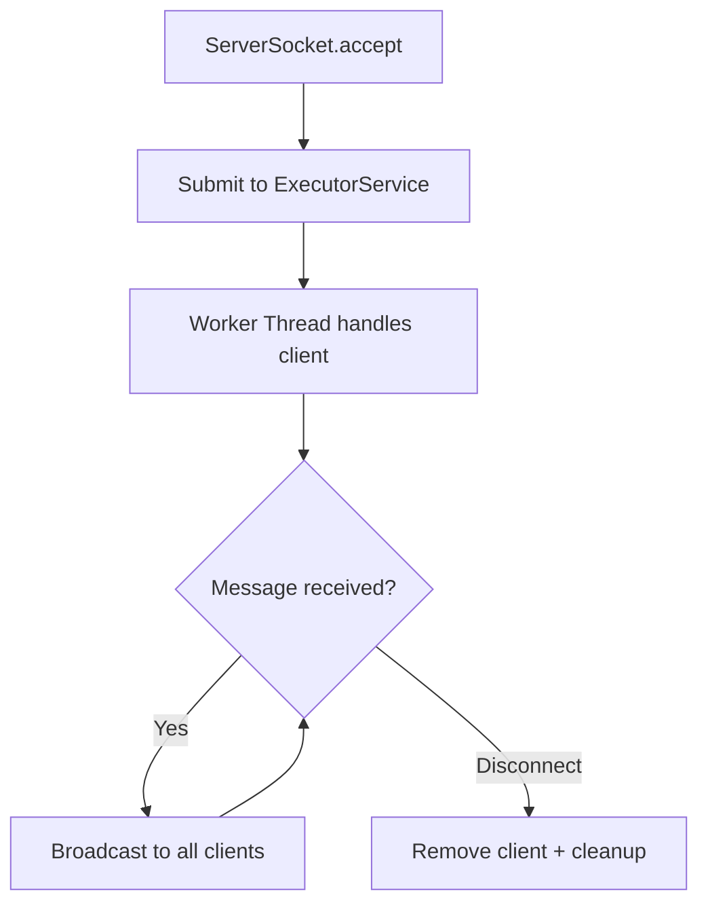

### 🛠️ Worked Example

**BAD:**

```java
// Phase 1: unbounded threads
while (true) {
    Socket client = server.accept();
    new Thread(new ClientHandler(client)).start();
    // 10K clients = 10K threads = crash
}
```

Why it's wrong: no bound on resource usage; crashes under load.

**GOOD:**

```java
ExecutorService pool = new ThreadPoolExecutor(
    10, 50, 60, SECONDS,
    new ArrayBlockingQueue<>(100),
    new CallerRunsPolicy()
);
while (!server.isClosed()) {
    Socket client = server.accept();
    pool.submit(new ClientHandler(client));
}
// On shutdown signal:
pool.shutdown();
if (!pool.awaitTermination(30, SECONDS)) {
    pool.shutdownNow();
}
```

Why it's right: bounded threads (50 max), bounded queue (100), backpressure (CallerRuns), graceful shutdown.

**Production pattern (JMX monitoring):**

```java
// Expose pool metrics for monitoring:
ThreadPoolExecutor tpe = (ThreadPoolExecutor) pool;
log.info("Active: {}, Queue: {}, Completed: {}",
    tpe.getActiveCount(),
    tpe.getQueue().size(),
    tpe.getCompletedTaskCount());
```

### ⚖️ Trade-offs

**Gain:** bounded resources, observable state, graceful shutdown, thread reuse.

**Cost:** connection queuing adds latency; fixed pool may underutilize resources for I/O-bound work; must handle rejection.

| Aspect      | Phase 1 (raw threads) | Phase 2 (Executors) | Phase 4 (virtual threads) |
| ----------- | --------------------- | ------------------- | ------------------------- |
| Scalability | ~1K-5K clients        | ~5K-50K (pooled)    | ~1M+ (lightweight)        |
| Memory      | 1MB per client        | Bounded by pool     | ~few KB per client        |
| Complexity  | Low                   | Medium              | Low                       |
| Shutdown    | Manual join()         | pool.shutdown()     | Automatic (structured)    |

### ⚡ Decision Snap

**USE WHEN:**

- JDK < 21 and need scalable connection handling.
- Need explicit control over concurrency level.
- Learning executor patterns before virtual threads.

**AVOID WHEN:**

- JDK 21+ is available (virtual threads are simpler and scale further).
- Connection count is always low (< 100) - raw threads suffice.

**PREFER Virtual Threads (Phase 4) WHEN:**

- I/O-bound workload (chat is I/O-bound: socket read/write).
- JDK 21+ available.
- Want thread-per-client simplicity without resource exhaustion.

### ⚠️ Top Traps

| #   | Misconception                                   | Reality                                                                                                                                           |
| --- | ----------------------------------------------- | ------------------------------------------------------------------------------------------------------------------------------------------------- |
| 1   | "Pool of 10 means only 10 simultaneous clients" | The pool handles 10 clients ACTIVELY. Others wait in the queue (100 more). Total connected: 110.                                                  |
| 2   | "shutdownNow() is instant"                      | shutdownNow() sends interrupt. Tasks must CHECK interrupted flag. Blocking I/O (socket read) may not respond to interrupt.                        |
| 3   | "CallerRunsPolicy works for accept loop"        | If the accept thread runs a client handler (CallerRuns), it cannot accept NEW connections during that time. May need AbortPolicy + retry instead. |

### 🪜 Learning Ladder

**Prerequisites:**

- Concurrent Chat - Phase 1 (Raw Threads) - understand the scaling problem this solves
- Executor Framework and ExecutorService - the abstraction used here

**THIS:** Concurrent Chat - Phase 2 (Executors)

**Next steps:**

- Concurrent Chat - Phase 3 (CompletableFuture) - async I/O without blocking threads
- ThreadPoolExecutor Configuration - tune the pool for production

### 💡 The Surprising Truth

For a chat server (I/O-bound: 99% time waiting on socket.read()), a pool of 10 threads can handle 10,000 "connected" clients if you use non-blocking I/O or if messages are infrequent. The key insight: a thread is only needed when a message ARRIVES. With 10K clients each sending 1 msg/s and 1ms processing each, you need only 10 threads (10K \* 1ms / 1000ms = 10). Phase 3 (async) and Phase 4 (virtual threads) exploit this insight further.

### 📇 Revision Card

1. Replace `new Thread()` with `pool.submit()` - bounded resources, reuse, lifecycle management.
2. Graceful shutdown: pool.shutdown() -> awaitTermination -> shutdownNow() (three-step).
3. For I/O-bound chat: thread count << connection count (threads needed only during active I/O).

---

---

# Java Concurrency Quick Recall Card

**TL;DR** - A compressed reference of the essential concurrency primitives, their use cases, and decision criteria for rapid recall.

### 🔥 The Problem in One Paragraph

After studying 17 concurrency keywords, engineers struggle to recall WHICH primitive to use for which problem. "Should I use CountDownLatch or CyclicBarrier? AtomicInteger or LongAdder? synchronized or ReentrantLock?" Under interview pressure or incident debugging, you need instant recall of the decision tree. This is exactly why a quick recall card exists.

### 📘 Textbook Definition

The **Java Concurrency Quick Recall Card** is a compressed decision reference mapping problem patterns to correct concurrency primitives, providing instant lookup during design, review, or interview scenarios.

### 🧠 Mental Model

> This is a cheat sheet that fits on an index card. When facing a concurrency decision, scan the pattern column to find your situation, then read the correct primitive and key constraint.

- "Pattern" -> the problem you are solving
- "Primitive" -> the correct tool from java.util.concurrent
- "Constraint" -> the critical thing to remember about that tool

**Where this analogy breaks down:** real concurrency often combines multiple primitives. This card gives starting points, not complete solutions.

### ⚙️ How It Works

```text
DECISION TABLE:

| Pattern            | Primitive        | Key Rule       |
|--------------------|------------------|----------------|
| Mutual exclusion   | synchronized     | Simplest       |
| Timeout/tryLock    | ReentrantLock    | finally unlock |
| Read-heavy data    | ReadWriteLock    | No upgrade     |
| Count to zero      | CountDownLatch   | Single-use     |
| Meet + reset       | CyclicBarrier    | Breaks if fail |
| Dynamic parties    | Phaser           | Complex API    |
| Limit N access     | Semaphore        | No ownership   |
| Thread-safe map    | ConcurrentHMap   | No nulls       |
| Read-heavy list    | CopyOnWriteList  | Write=copy     |
| Producer-consumer  | BlockingQueue    | Bound it!      |
| Counter moderate   | AtomicInteger    | Single var     |
| Counter hot        | LongAdder        | sum() lazy     |
| Per-thread state   | ThreadLocal      | remove()!      |
| Async result       | Future           | get() blocks   |
| Async compose      | CompletableFuture| Chain errors   |
| Thread mgmt        | ThreadPoolExec   | Bound queue!   |
| Periodic tasks     | ScheduledExecSvc | try-catch!     |
```

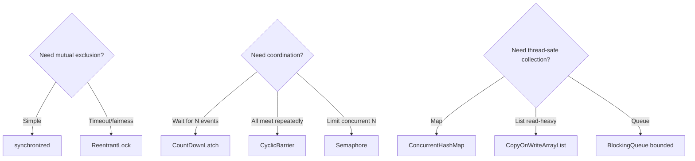

### 🛠️ Worked Example

**BAD:**

```java
// Wrong primitive selection:
// "I need 5 threads to wait for each other each round"
CountDownLatch latch = new CountDownLatch(5);
// WRONG: latch is single-use! Needs new one per round.
// Should use: CyclicBarrier(5)
```

Why it's wrong: CountDownLatch cannot reset for next round; CyclicBarrier auto-resets.

**GOOD:**

```java
// Correct primitive selection via pattern matching:
// Pattern: "all 5 threads synchronize each iteration"
// -> Decision table: "All threads meet + reset"
// -> Answer: CyclicBarrier
CyclicBarrier barrier = new CyclicBarrier(5, () ->
    mergeResults()
);
// Each thread: compute(); barrier.await(); // resets!
```

Why it's right: matched the PATTERN to the correct primitive using the decision table.

**Production pattern (combining primitives):**

```java
// Startup: wait for init (latch) + limit connections (sem)
CountDownLatch ready = new CountDownLatch(3); // init
Semaphore permits = new Semaphore(100); // runtime bound
// init subsystems -> countDown
ready.await(); // wait for all 3 ready
// then accept traffic with semaphore limiting
```

### ⚖️ Trade-offs

**Gain:** instant decision-making; avoids analysis paralysis; prevents wrong-primitive selection.

**Cost:** oversimplification (real problems may need combined primitives); must still understand internals for debugging.

| Decision Factor | Lower complexity | Higher capability |
| --------------- | ---------------- | ----------------- |
| Locking         | synchronized     | ReentrantLock     |
| Counter         | AtomicInteger    | LongAdder         |
| Coordination    | CountDownLatch   | Phaser            |
| Collection      | synchronizedMap  | ConcurrentHashMap |

### ⚡ Decision Snap

**USE THIS CARD WHEN:**

- Designing a concurrent component and choosing primitives.
- Interview: asked "which would you use for X?"
- Code review: verifying correct primitive selection.

**AUGMENT WITH DEEP KNOWLEDGE WHEN:**

- Problem requires combining multiple primitives.
- Edge cases or failure modes need understanding.

**UPDATE WHEN:**

- New JDK features arrive (virtual threads, ScopedValues).
- You discover a pattern not covered here.

### ⚠️ Top Traps

| #   | Misconception               | Reality                                                                                      |
| --- | --------------------------- | -------------------------------------------------------------------------------------------- |
| 1   | "One primitive per problem" | Real solutions often combine 2-3 primitives (executor + queue + latch).                      |
| 2   | "Fancier = better"          | Simplest correct choice wins. synchronized beats ReentrantLock unless you NEED its features. |
| 3   | "I can memorize this once"  | Revisit quarterly. JDK 21 changed the landscape (virtual threads, ScopedValues).             |

### 🪜 Learning Ladder

**Prerequisites:**

- All keywords in this file (Locks and Coordination) - must know each primitive individually
- Executor Framework and ExecutorService - the most common starting point

**THIS:** Java Concurrency Quick Recall Card

**Next steps:**

- Concurrency Utilities Selection Framework - deeper decision methodology
- CompletableFuture Composition - async patterns beyond this recall card

### 💡 The Surprising Truth

The most common concurrency primitive in production Java is NOT any lock or atomic - it is `ConcurrentHashMap`. Profiling shows that the average enterprise Java service creates more ConcurrentHashMap instances than all other j.u.c classes combined. This makes sense: most server applications are fundamentally "receive request, look up state, modify state, respond" - and the state lookup/modification is almost always a map operation.

### 📇 Revision Card

1. Pattern -> Primitive: mutual exclusion=synchronized, read-heavy=RWLock, count-to-zero=Latch, meet-and-reset=Barrier.
2. Two rules always: bound your queues, unlock in finally.
3. Simplest correct choice wins. Do not use ReentrantLock when synchronized suffices.
