## Keywords

1. [Virtual Threads Internals (Project Loom)](#virtual-threads-internals-project-loom)
2. [Structured Concurrency (JEP 453)](#structured-concurrency-jep-453)
3. [Scoped Values (JEP 464)](#scoped-values-jep-464)
4. [Pinning - Virtual Threads and synchronized](#pinning---virtual-threads-and-synchronized)
5. [Platform Thread Exhaustion Failure](#platform-thread-exhaustion-failure)
6. [ForkJoinPool.commonPool Saturation](#forkjoinpoolcommonpool-saturation)
7. [ThreadLocal Memory Leak in Thread Pools](#threadlocal-memory-leak-in-thread-pools)
8. [More Threads is Better is Wrong - Amdahl Reality](#more-threads-is-better-is-wrong---amdahl-reality)

---

---

# Virtual Threads Internals (Project Loom)

**TL;DR** - Virtual threads are JVM-managed lightweight threads multiplexed onto few carrier (platform) threads, enabling millions of concurrent blocking tasks without OS thread limits.

### 🔥 Problem Statement

A service handling 10,000 concurrent requests with platform threads needs 10,000 OS threads. Each consumes ~1MB stack memory (10GB total), causes scheduler thrashing at scale, and hits OS ulimits. Thread pools cap concurrency artificially: 200-thread pool means 9,800 requests wait even when CPUs are idle. The mismatch between "logical concurrency" (tasks) and "physical concurrency" (OS threads) forces reactive/async complexity. Virtual threads eliminate this mismatch by making threads cheap enough to be one-per-task again.

### 📜 Historical Context

Green threads existed in early Java (pre-1.2) but were removed because they could not exploit multiple CPUs. For 20 years, Java used 1:1 OS threads. Meanwhile, Go (goroutines, 2009), Erlang (processes), and Kotlin (coroutines) proved M:N scheduling viable. Project Loom began in 2017 (Ron Pressler, Oracle). JEP 425 previewed in JDK 19 (2022). JEP 444 finalized virtual threads in JDK 21 (2023). The key insight: the JVM already controls the bytecode - it can save/restore stack frames without OS cooperation.

### 🔩 First Principles

**CORE INVARIANTS:**

1. A virtual thread is a java.lang.Thread (same API, same semantics, full Thread identity).
2. A virtual thread MUST be mounted on a carrier (platform) thread to execute CPU instructions.
3. When a virtual thread blocks (I/O, lock, sleep), it unmounts from its carrier - freeing the carrier for other virtual threads.

**DERIVED DESIGN:**
Invariant 3 means blocking is cheap: no OS thread is consumed during wait. Invariant 1 means existing blocking code (JDBC, HTTP, file I/O) works unchanged. Invariant 2 means CPU-bound work still needs carrier threads - virtual threads do not create CPUs. The scheduler (ForkJoinPool) multiplexes millions of virtual threads onto ~processorCount carriers.

**THE TRADE-OFF:**
**Gain:** Million-thread concurrency with blocking style. Simple imperative code. No callbacks. No reactive framework.
**Cost:** synchronized blocks pin the carrier. ThreadLocal per-VT wastes memory at scale. Stack traces are deeper (continuation frames). New failure modes (pinning, carrier exhaustion).

### 🧠 Mental Model

> Virtual threads are like sticky notes on a shared desk. Each note (virtual thread) represents a task. When a note needs to "wait for a reply," it goes into a drawer (unmounts). The desk (carrier) picks up the next note. One desk handles thousands of notes because most are in drawers.

- "Sticky note" -> virtual thread (lightweight, plentiful)
- "Desk" -> carrier thread (limited, expensive)
- "In drawer" -> parked/unmounted (no carrier consumed)
- "Pick up next note" -> scheduler mounts next VT

**Where this analogy breaks down:** unlike sticky notes, virtual threads have STACK FRAMES that must be saved/restored (continuation). This save/restore has real cost - it is not free, just much cheaper than OS context switches.

### 🧩 Components

- **Virtual Thread** - java.lang.Thread instance with VT flag. Holds a Continuation object for stack state.
- **Carrier Thread** - platform thread in the scheduler's ForkJoinPool. Executes mounted virtual threads.
- **Continuation** - internal object storing the virtual thread's stack frames when unmounted. Restorable.
- **Scheduler** - ForkJoinPool (default: parallelism = availableProcessors). Assigns VTs to carriers via work-stealing.
- **Mount/Unmount** - when VT blocks, JVM yields Continuation, carrier picks next runnable VT. When unblocked, VT re-enters scheduler queue.

```text
+------------------+    mount    +-----------+
| Virtual Thread 1 |----------->| Carrier 0 |
+------------------+    unmount  +-----------+
| Continuation     |<-----------|           |
| (saved stack)    |            +-----------+
+------------------+
                                 +-----------+
+------------------+  mounted   | Carrier 1 |
| Virtual Thread 2 |----------->|           |
+------------------+            +-----------+
     ...millions...
                                 +-----------+
+------------------+            | Carrier N |
| Virtual Thread M |  queued    | (idle)    |
+------------------+            +-----------+
```

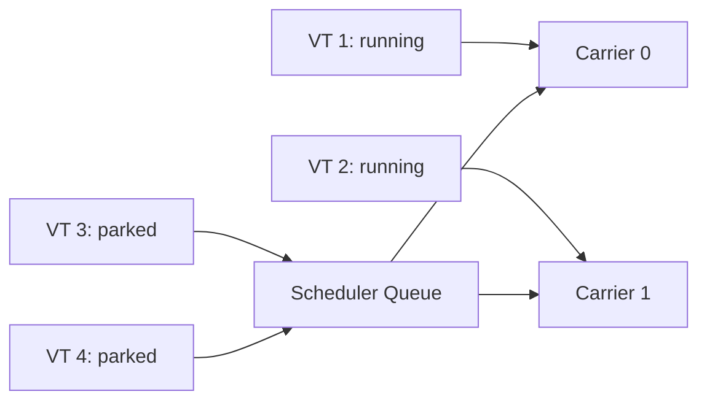

### 📶 Gradual Depth

**Level 1 - What it is:**
A virtual thread is a Thread that does not permanently own an OS thread. You create millions of them. When one blocks, no OS resource is wasted.

**Level 2 - How to use it:**
`Thread.startVirtualThread(runnable)` or `Executors.newVirtualThreadPerTaskExecutor()`. Write normal blocking code inside. No async API needed. Use try-with-resources on the executor for structured lifecycle.

**Level 3 - How it works:**
The JVM stores each VT's stack as a Continuation object (heap-allocated byte arrays of stack frames). On blocking (e.g., socket read), the runtime calls Continuation.yield(), saving frames to heap. The carrier thread's run loop picks the next runnable VT from the ForkJoinPool's work-stealing queue. On unpark, the VT's Continuation is scheduled and a carrier restores its frames.

**Level 4 - Production mastery:**
Monitor carrier utilization via `jdk.virtualThreadPinned` JFR event for pinning detection. Set `-Djdk.virtualThreadScheduler.parallelism=N` to tune carrier count (default = Runtime.availableProcessors). Avoid synchronized in hot paths (causes pinning) - migrate to ReentrantLock. Watch ThreadLocal usage: 1M virtual threads x 1KB ThreadLocal = 1GB heap. Use ScopedValues (JEP 464) instead. Profile with async-profiler's `--loom` mode for accurate VT stack sampling.

### ⚙️ How It Works

**Phase 1 - Creation:** `Thread.ofVirtual().start(task)` allocates a VT object + empty Continuation. No OS thread created.

**Phase 2 - Scheduling:** VT enters ForkJoinPool scheduler. Work-stealing assigns it to an idle carrier.

**Phase 3 - Execution:** Carrier thread runs VT's Continuation. VT executes application code on carrier's OS stack.

**Phase 4 - Blocking:** VT calls blocking op (e.g., `Socket.read()`). JVM internally calls `Continuation.yield()`. Stack frames saved to heap. Carrier released.

**Phase 5 - Resumption:** I/O completes (poller thread signals). VT re-enters scheduler queue. Next available carrier mounts it. Frames restored. Execution resumes after blocking call.

```text
VT lifecycle:

  NEW -> STARTED -> [RUNNING on carrier]
                        |
                    (blocks)
                        |
                        v
                  [YIELDED / parked]
                  (stack on heap)
                        |
                    (unblocked)
                        |
                        v
                  [RUNNABLE in queue]
                        |
                    (carrier picks up)
                        |
                        v
                  [RUNNING on carrier]
                        |
                    (completes)
                        v
                    TERMINATED
```

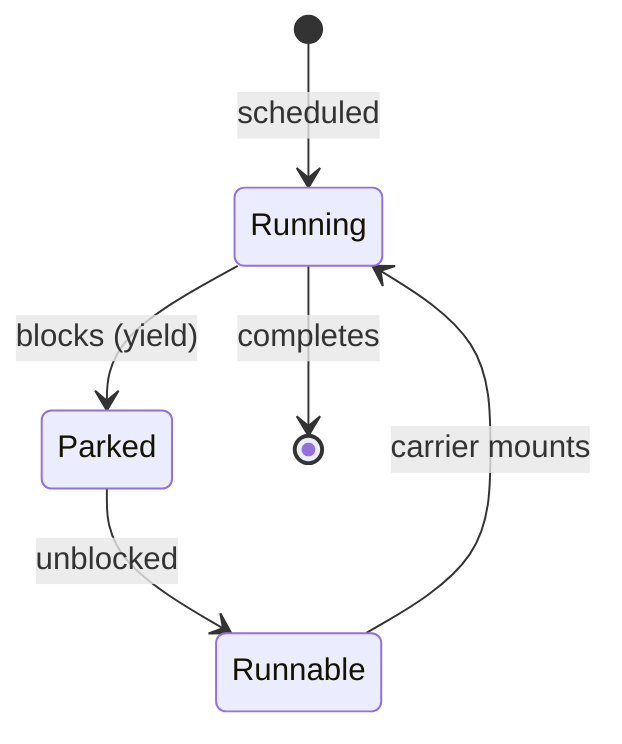

### 🚨 Failure Modes

**Failure 1 - Carrier Pinning:**
**Symptom:** throughput drops despite low CPU. VTs appear stuck. `jdk.virtualThreadPinned` JFR events fire.
**Root cause:** VT entered `synchronized` block and then blocked (I/O inside synchronized). JVM cannot unmount - carrier is pinned.
**Diagnostic:**

```
jfr print --events jdk.virtualThreadPinned rec.jfr
# Or: -Djdk.tracePinnedThreads=full
```

**Fix:**
**BAD:** `synchronized(lock) { socket.read(buf); }`
**GOOD:** `lock.lock(); try { socket.read(buf); } finally { lock.unlock(); }`
Replace synchronized with ReentrantLock for any block containing I/O.

**Failure 2 - ThreadLocal Memory Explosion:**
**Symptom:** OOM with 500K virtual threads. Heap dump shows millions of ThreadLocalMap entries.
**Root cause:** Each VT has its own ThreadLocalMap. Library sets ThreadLocal (e.g., connection context). 500K VTs x 2KB = 1GB.
**Diagnostic:**

```
jmap -histo:live <pid> | grep ThreadLocalMap
# Count entries vs VT count
```

**Fix:**
**BAD:** `ThreadLocal<Context> ctx = new ThreadLocal<>();`
**GOOD:** `ScopedValue<Context> ctx = ScopedValue.newInstance();`
ScopedValues are inherited without per-thread allocation.

**Failure 3 - Scheduler Starvation (CPU-bound VTs):**
**Symptom:** other VTs never run. Latency spikes for I/O-bound VTs.
**Root cause:** CPU-bound VTs never yield (no blocking call). Carriers permanently occupied. Default scheduler has limited carriers.
**Diagnostic:**

```
jcmd <pid> Thread.dump_to_file -format=json out.json
# Check carrier threads: all running same VTs
```

**Fix:** CPU-bound work belongs on a dedicated platform-thread pool, not virtual threads. VTs are for I/O-bound work only.

### 🔬 Production Reality

**Incident pattern: JDBC connection pool bottleneck with VTs.**

A team migrates from 200-thread pool to virtual threads (1 VT per request). Expects 10x throughput. Instead: connection pool (HikariCP, maxPool=50) becomes instant bottleneck. 10,000 VTs all request connections simultaneously. Pool exhausted. 9,950 VTs park waiting for connection. Timeout storms. Previously, 200 threads naturally limited concurrency to 200 - implicit back-pressure. With VTs: no implicit limit. Fix: explicit Semaphore(maxConnections) before pool access, or configure pool wait timeout + circuit breaker. Lesson: VTs remove thread limits but NOT resource limits. Every downstream resource needs explicit concurrency control.

### ⚖️ Trade-offs & Alternatives

| Aspect          | Virtual Threads       | Reactive (WebFlux)     | Kotlin Coroutines |
| --------------- | --------------------- | ---------------------- | ----------------- |
| Code style      | Blocking/imperative   | Reactive chains        | Suspend functions |
| Debugging       | Standard stack traces | Hard (no stack)        | Reasonable        |
| Ecosystem       | All blocking libs     | Needs reactive drivers | Suspend wrappers  |
| Scalability     | Millions              | Millions               | Millions          |
| Learning curve  | Low (Thread API)      | High (Mono/Flux)       | Medium            |
| Backpressure    | Manual (Semaphore)    | Built-in               | Manual (Channel)  |
| JDK requirement | 21+                   | 8+                     | N/A (Kotlin)      |

### ⚡ Decision Snap

**USE virtual threads WHEN:**

- I/O-bound workloads (HTTP, DB, file, message).
- JDK 21+ available.
- Want simple blocking code at scale.

**AVOID WHEN:**

- CPU-bound computation (use platform threads).
- Need pinning-free synchronized (legacy code not yet migrated).
- Libraries heavily use ThreadLocal (memory risk).

**PREFER reactive WHEN:**

- Need built-in backpressure without manual Semaphore.
- Already invested in reactive ecosystem.
- JDK < 21.

### ⚠️ Top Traps

| #   | Misconception                                           | Reality                                                                                 |
| --- | ------------------------------------------------------- | --------------------------------------------------------------------------------------- |
| 1   | "VTs replace thread pools entirely"                     | CPU-bound work still needs bounded platform pools. VTs are for I/O.                     |
| 2   | "VTs are free"                                          | Each VT has stack memory (starts small, grows). 1M VTs still consume heap.              |
| 3   | "Just replace Executors.newFixed with newVirtualThread" | Must also address ThreadLocal, synchronized pinning, and resource pool sizing.          |
| 4   | "VTs make code faster"                                  | VTs make code MORE CONCURRENT, not faster. Single-request latency unchanged.            |
| 5   | "No need for concurrency knowledge with VTs"            | Races, deadlocks, visibility bugs remain. VTs change threading model, not memory model. |

### 🪜 Learning Ladder

**Prerequisites:**

- Thread Lifecycle and States - VTs have same states
- ForkJoinPool and Work-Stealing - scheduler mechanism
- ThreadPoolExecutor Configuration - what VTs replace

**THIS:** Virtual Threads Internals (Project Loom)

**Next steps:**

- Structured Concurrency (JEP 453) - lifecycle management for VTs
- Scoped Values (JEP 464) - ThreadLocal replacement for VTs
- Pinning - Virtual Threads and synchronized - key failure mode

### 💡 Surprising Truth

**The Surprising Truth:**
Virtual threads do NOT use less total memory than platform threads at equal concurrency. A platform thread with 1MB stack vs a virtual thread with dynamically-grown 100KB stack: at 10K threads the VT wins (1GB vs 10GB). But at 100 threads: platform threads use less heap because no Continuation overhead. VTs win only at HIGH concurrency - the crossover point is typically around 500-1000 concurrent threads.

**Further Reading:**

- JEP 444: Virtual Threads (OpenJDK)
- Ron Pressler, "Loom: Bringing Lightweight Threads to the JVM" (2020, QCon)
- Inside.java: "Virtual Threads: An Adoption Guide" (2023)

**Revision Card:**

1. VT = Thread with Continuation (heap stack). Mount/unmount on carrier. Millions possible.
2. Gain: blocking style at reactive scale. Cost: pinning, ThreadLocal bloat, no implicit backpressure.
3. Production: VTs remove thread limits but NOT resource limits. Add Semaphore/circuit-breaker.

---

---

# Structured Concurrency (JEP 453)

**TL;DR** - Structured concurrency binds subtask lifetimes to a parent scope, ensuring no orphaned threads, automatic cancellation on failure, and clear error propagation.

### 🔥 Problem Statement

An HTTP handler spawns 3 virtual threads (fetch user, fetch orders, fetch recommendations). One fails with timeout. The other two continue running - wasting resources, potentially mutating state. No automatic cancellation. No relationship between parent and children. Error from child may be swallowed. At 10K requests/sec: thousands of orphaned VTs accumulate. The "fire and forget" model breaks observability and resource management.

### 📜 Historical Context

Structured programming (Dijkstra, 1968) eliminated goto by scoping control flow. Structured concurrency applies the same principle to threads: a thread's lifetime must be bounded by its creating scope. Concept formalized by Martin Sustrik (libdill, 2016) and Nathaniel J. Smith (Trio for Python, 2018). Java adopted via JEP 428 (preview JDK 19), JEP 437 (JDK 20), JEP 453 (preview JDK 21). Still preview in JDK 23.

### 🔩 First Principles

**CORE INVARIANTS:**

1. A subtask CANNOT outlive its enclosing scope (StructuredTaskScope).
2. When the scope closes, ALL subtasks are complete (succeeded, failed, or cancelled).
3. Failure in one subtask can cancel siblings (policy-defined: ShutdownOnFailure, ShutdownOnSuccess).

**DERIVED DESIGN:**
Invariant 1 prevents orphaned threads. Invariant 2 ensures join() returns only when all work is done. Invariant 3 enables fail-fast patterns. Together they make concurrent code's lifetime as predictable as a try-with-resources block.

**THE TRADE-OFF:**
**Gain:** No orphaned threads. Automatic cancellation propagation. Clear parent-child observability in thread dumps.
**Cost:** Cannot "fire and forget" (by design). Scope must await all children. Less flexible than unstructured fork.

### 🧠 Mental Model

> Structured concurrency is a family road trip. The minivan (scope) does not leave until all passengers (subtasks) are aboard. If one child gets sick (failure), the trip is cancelled for all. No child is accidentally left behind at a rest stop (orphaned thread).

- "Minivan" -> StructuredTaskScope
- "Passengers" -> forked subtasks
- "Does not leave" -> join() awaits all
- "Child gets sick" -> subtask exception triggers shutdown

**Where this analogy breaks down:** in code, cancelled subtasks receive interrupts and must cooperate. A cancelled child that ignores interruption delays scope closure - unlike a real child who is simply picked up.

### 🧩 Components

- **StructuredTaskScope** - the scope object. Created with try-with-resources. All subtasks forked within it.
- **Subtask** - returned by scope.fork(callable). Represents a unit of work running in its own virtual thread.
- **ShutdownOnFailure** - policy: first failure cancels remaining siblings and propagates exception.
- **ShutdownOnSuccess** - policy: first success cancels remaining siblings and returns result.
- **join()** - blocks until all subtasks complete or scope is shut down.
- **throwIfFailed()** - propagates the first subtask exception after join.

```text
+------ StructuredTaskScope ------+
|                                  |
|  fork(taskA) --> VT-A            |
|  fork(taskB) --> VT-B            |
|  fork(taskC) --> VT-C            |
|                                  |
|  join() -- waits for all ------- |
|  throwIfFailed()                 |
+----------------------------------+
  scope.close() -- guaranteed      |
  no VT outlives this block        |
```

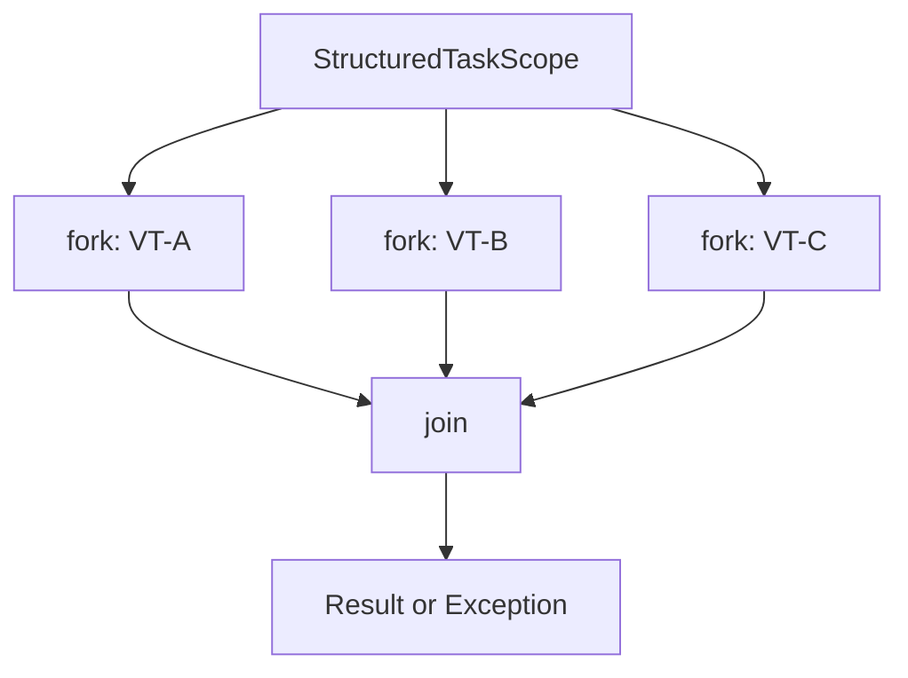

### 📶 Gradual Depth

**Level 1 - What it is:**
A way to run multiple tasks concurrently where all tasks are guaranteed to finish before the calling code continues. No task can leak or be forgotten.

**Level 2 - How to use it:**
Create a StructuredTaskScope in try-with-resources. Fork subtasks. Call join(). Handle results or exceptions. The scope guarantees cleanup.

**Level 3 - How it works:**
Each fork() starts a virtual thread tied to the scope. The scope tracks all forked VTs. join() blocks until all complete. ShutdownOnFailure interrupts siblings on first exception. close() awaits termination of any stragglers. Thread dump shows parent-child hierarchy.

**Level 4 - Production mastery:**
Combine with deadlines: `scope.joinUntil(Instant.now().plusSeconds(5))`. On timeout, scope shuts down and cancels all subtasks. Nest scopes for hierarchical decomposition. Monitor via JFR: structured scopes appear in thread dumps with clear parent relationship. Custom policies extend StructuredTaskScope for application-specific logic (e.g., quorum: succeed when 2-of-3 complete).

### ⚙️ How It Works

**Phase 1 - Scope creation:** `try (var scope = new StructuredTaskScope.ShutdownOnFailure()) {`

**Phase 2 - Fork subtasks:** `scope.fork(() -> fetchUser(id))` starts a VT owned by scope.

**Phase 3 - Join:** `scope.join()` blocks until all subtasks reach terminal state.

**Phase 4 - Policy action:** ShutdownOnFailure detects failed subtask, interrupts others, records exception.

**Phase 5 - Propagate:** `scope.throwIfFailed()` throws if any subtask failed.

**Phase 6 - Close:** try-with-resources calls `scope.close()`. Guarantees all VTs terminated.

```text
Timeline:
  main:   [create scope]--[fork A,B,C]--[join]----[close]
  VT-A:        |--- work ---|  (success)
  VT-B:        |--- work ------X (fails!)
  VT-C:        |--- work --| (cancelled by policy)
                          shutdown triggered
```

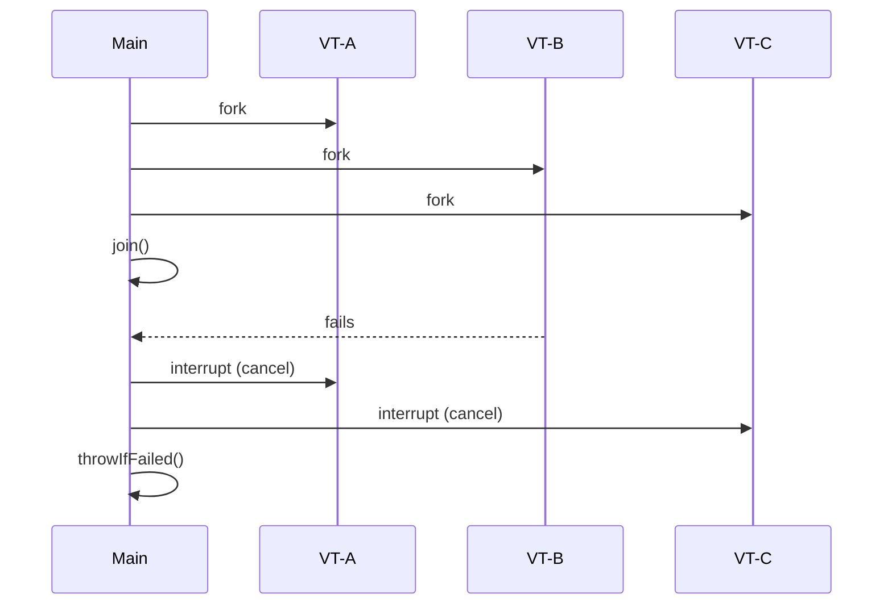

### 🚨 Failure Modes

**Failure 1 - Subtask Ignores Interruption:**
**Symptom:** scope.close() hangs. Thread dump shows VT still running inside scope.
**Root cause:** Subtask catches InterruptedException and retries, or calls uninterruptible native I/O.
**Diagnostic:**

```
jcmd <pid> Thread.dump_to_file -format=json dump.json
# Find VT owned by scope still in RUNNING state
```

**Fix:**
**BAD:** `catch (InterruptedException e) { retry(); }`
**GOOD:** `catch (InterruptedException e) { Thread.currentThread().interrupt(); return; }`

**Failure 2 - Forking Outside Scope:**
**Symptom:** CompletionException or IllegalStateException at fork.
**Root cause:** Attempting scope.fork() after join() or from a thread not owned by the scope.
**Diagnostic:**

```
# Stack trace shows fork() called post-join
```

**Fix:** All fork() calls must happen BEFORE join(). Restructure to fork all work upfront.

### 🔬 Production Reality

**Incident pattern: API gateway aggregation with structured concurrency.**

A gateway fans out to 5 microservices per request. Previously: CompletableFuture.allOf with manual timeout. One slow service causes 4 completed futures to hold response objects in memory (backlog). After migration to StructuredTaskScope.ShutdownOnFailure with joinUntil(deadline): slow service triggers scope shutdown, cancelling all siblings immediately. Memory pressure eliminated. But: one downstream service uses gRPC with non-interruptible Channel - it ignored cancellation for 30s. Fix: wrap gRPC calls with deadline propagation (Context.current().withDeadline).

### ⚖️ Trade-offs & Alternatives

| Aspect              | StructuredTaskScope | CompletableFuture.allOf | ExecutorService + Futures |
| ------------------- | ------------------- | ----------------------- | ------------------------- |
| Orphan prevention   | Guaranteed          | Manual                  | Manual                    |
| Cancellation        | Automatic (policy)  | Manual                  | Manual                    |
| Error propagation   | throwIfFailed       | Complex joining         | get() per future          |
| Thread dump clarity | Parent-child tree   | Flat                    | Flat                      |
| Fire-and-forget     | Not possible        | Possible                | Possible                  |
| JDK requirement     | 21+ (preview)       | 8+                      | 5+                        |

### ⚡ Decision Snap

**USE StructuredTaskScope WHEN:**

- Fan-out to N services, need all/any results.
- Want guaranteed cleanup on failure.
- Using virtual threads (JDK 21+).

**AVOID WHEN:**

- Need fire-and-forget (use unstructured executor).
- Subtasks must outlive caller (streaming scenarios).
- JDK < 21 or cannot use preview features.

**PREFER ShutdownOnFailure WHEN:**

- All results required (any failure = overall failure).

**PREFER ShutdownOnSuccess WHEN:**

- First result sufficient (redundant/speculative execution).

### ⚠️ Top Traps

| #   | Misconception                                        | Reality                                                                                             |
| --- | ---------------------------------------------------- | --------------------------------------------------------------------------------------------------- |
| 1   | "Structured concurrency prevents all resource leaks" | Only prevents THREAD leaks. Other resources (connections, files) still need try-with-resources.     |
| 2   | "join() returns immediately on failure"              | Only with ShutdownOnFailure. Plain StructuredTaskScope waits for ALL.                               |
| 3   | "I can fork after join"                              | No. IllegalStateException. All forks before join.                                                   |
| 4   | "Cancellation is instant"                            | Cancellation = interrupt. Subtask must cooperate (check interrupted, not catch-and-retry).          |
| 5   | "Replaces CompletableFuture entirely"                | CF is for async pipelines and composition. STS is for structured fan-out with lifecycle guarantees. |

### 🪜 Learning Ladder

**Prerequisites:**

- Virtual Threads Internals (Project Loom) - what runs inside scopes
- CompletableFuture Composition - what STS replaces for fan-out
- Thread Lifecycle and States - interruption mechanism

**THIS:** Structured Concurrency (JEP 453)

**Next steps:**

- Scoped Values (JEP 464) - data sharing in structured scopes
- Concurrent Chat Phase 4 (Virtual Threads) - practical application
- synchronized to Virtual Threads Migration - production migration

### 💡 Surprising Truth

**The Surprising Truth:**
StructuredTaskScope makes `Thread.currentThread().getStackTrace()` meaningful again for concurrent code. In thread dumps, you see the FULL parent-child hierarchy: which scope spawned which VTs, and where the parent is waiting. This is impossible with unstructured CompletableFuture chains - where the thread that created the future is long gone by completion time.

**Further Reading:**

- JEP 453: Structured Concurrency (Preview) - OpenJDK
- Nathaniel J. Smith, "Notes on structured concurrency" (2018)
- Ron Pressler, "Structured Concurrency" Inside.java (2023)

**Revision Card:**

1. Scope = try-with-resources. fork() subtasks. join(). No VT outlives scope. Ever.
2. Gain: no orphans, automatic cancellation. Cost: no fire-and-forget (by design).
3. Production: subtasks must cooperate with interruption. Uninterruptible I/O breaks cancellation.

---

---

# Scoped Values (JEP 464)

**TL;DR** - Scoped values provide immutable, inheritable, per-scope context without ThreadLocal's memory and mutation pitfalls - designed for virtual threads at scale.

### 🔥 Problem Statement

A web framework sets `ThreadLocal<RequestContext>` per request. With 200 platform threads: 200 ThreadLocal entries (fine). With 1 million virtual threads: 1M ThreadLocalMap entries consuming gigabytes. Worse: ThreadLocal is MUTABLE - any code can call set(), creating hard-to-trace bugs. And ThreadLocal is not structurally scoped - if a child thread inherits it, modifications in child do not propagate to parent (confusing). Scoped Values fix all three problems.

### 📜 Historical Context

ThreadLocal exists since JDK 1.2. InheritableThreadLocal added parent-to-child propagation. Both designed for pooled platform threads (few threads, long-lived). Virtual threads break assumptions: millions of threads, short-lived. JEP 429 (JDK 20 incubator), JEP 446 (JDK 21 preview), JEP 464 (JDK 22 preview). Designed by Ron Pressler and Brian Goetz alongside structured concurrency.

### 🔩 First Principles

**CORE INVARIANTS:**

1. A ScopedValue binding is IMMUTABLE within its scope (no set() after binding).
2. A ScopedValue binding's lifetime matches its lexical scope (where() + run() block).
3. Child threads (in StructuredTaskScope) inherit parent's ScopedValue bindings automatically (zero-copy).

**DERIVED DESIGN:**
Invariant 1 eliminates mutation bugs (no "who called set() last?"). Invariant 2 eliminates cleanup bugs (no forgetting remove()). Invariant 3 enables efficient inheritance without per-thread copies - the binding is shared read-only.

**THE TRADE-OFF:**
**Gain:** No memory leak. No mutation confusion. O(1) inheritance. Safe at million-VT scale.
**Cost:** Cannot mutate mid-scope (design constraint). Requires restructuring set/get patterns. Preview API (JDK 22+).

### 🧠 Mental Model

> A scoped value is a name badge at a conference. You receive it at registration (where().run()), it is immutable (cannot change your name), visible to all staff (child scopes inherit), and automatically returned when you leave (scope ends). ThreadLocal is a sticky note you write yourself - anyone can overwrite it, you might forget to peel it off.

- "Name badge" -> immutable ScopedValue binding
- "Registration" -> where(SV, value).run(block)
- "Visible to staff" -> child VTs inherit automatically
- "Returned on exit" -> scope-bounded lifetime

**Where this analogy breaks down:** ScopedValues can be REBOUND in nested scopes (inner where() shadows outer binding) - unlike a badge that cannot be replaced mid-conference.

### 🧩 Components

- **ScopedValue<T>** - the carrier. Static final field. Holds no value itself - bindings are per-scope.
- **where(SV, value)** - creates a Carrier that holds SV -> value binding.
- **.run(Runnable)** - executes block with binding active. Binding removed on exit.
- **.call(Callable)** - same as run but returns result.
- **ScopedValue.get()** - retrieves current binding. Throws NoSuchElementException if unbound.
- **Inheritance** - StructuredTaskScope subtasks automatically see parent's bindings.

```text
+------------ Scope (where.run) -----------+
|  ScopedValue<Ctx> = "RequestA"           |
|                                          |
|  +--- StructuredTaskScope ---+           |
|  |  fork: sees "RequestA"    |           |
|  |  fork: sees "RequestA"    |           |
|  +---------------------------+           |
|                                          |
+------------------------------------------+
| Exit: binding gone. No cleanup needed.   |
```

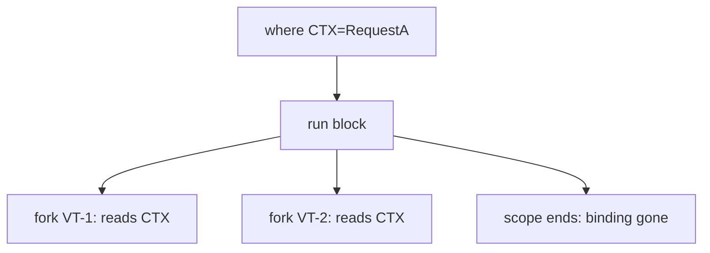

### 📶 Gradual Depth

**Level 1 - What it is:**
A way to pass context (like request ID, user info) through call chains without method parameters and without ThreadLocal's problems. Immutable, scoped, auto-inherited.

**Level 2 - How to use it:**
Declare: `static final ScopedValue<User> CURRENT_USER = ScopedValue.newInstance();`
Bind: `ScopedValue.where(CURRENT_USER, user).run(() -> handleRequest());`
Read: `User u = CURRENT_USER.get();`

**Level 3 - How it works:**
Internally, bindings stored in a scope-local structure (not per-thread map). get() walks the scope chain. Inheritance is zero-copy: child scope references parent's bindings. No ThreadLocalMap cloning. Rebinding in nested scope creates new entry shadowing outer.

**Level 4 - Production mastery:**
Migrate ThreadLocal to ScopedValue incrementally: wrap existing TL.set()/get() with isBound() checks. For libraries that require ThreadLocal (JDBC, logging MDC): keep TL at framework boundary, use ScopedValue internally. Monitor via heap dumps: zero ScopedValue entries in ThreadLocalMap (they are separate). Combine with structured concurrency for full request lifecycle tracking.

### ⚙️ How It Works

**Phase 1 - Declaration:** `static final ScopedValue<Ctx> CTX = ScopedValue.newInstance();`

**Phase 2 - Binding:** `ScopedValue.where(CTX, requestCtx)` creates a Carrier.

**Phase 3 - Execution:** `.run(() -> { ... })` installs binding for this scope.

**Phase 4 - Reading:** `CTX.get()` in any code within scope (or child VTs) retrieves value.

**Phase 5 - Exit:** run() returns. Binding automatically removed. No cleanup code.

```text
Execution:

  Thread-1:
    where(CTX, "A").run(() -> {
        CTX.get() == "A"        // bound
        where(CTX, "B").run(() -> {
            CTX.get() == "B"    // shadowed
        });
        CTX.get() == "A"        // restored
    });
    CTX.get() -> throws!        // unbound
```

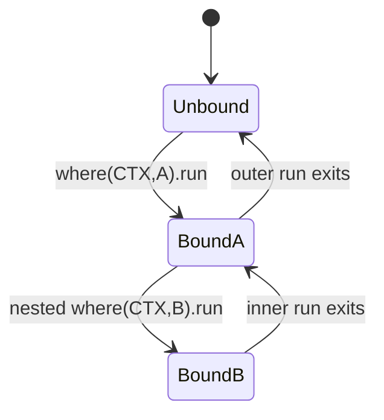

### 🚨 Failure Modes

**Failure 1 - NoSuchElementException:**
**Symptom:** `NoSuchElementException: no binding for ScopedValue` at runtime.
**Root cause:** get() called outside any where().run() scope. No binding exists.
**Diagnostic:**

```
# Stack trace shows get() call site.
# Trace back: is there a where().run() ancestor?
```

**Fix:**
**BAD:** `CTX.get()` without checking binding.
**GOOD:** `if (CTX.isBound()) CTX.get(); else defaultValue;`
Or: ensure all entry points establish binding.

**Failure 2 - Stale Context in Unstructured Threads:**
**Symptom:** Child thread (started outside StructuredTaskScope) does not see ScopedValue.
**Root cause:** Only StructuredTaskScope inherits scoped values. Manual `new Thread()` does not.
**Diagnostic:**

```
# Child thread calls get() -> NoSuchElementException
# Check: was thread forked via scope.fork()?
```

**Fix:** Use StructuredTaskScope.fork() instead of raw Thread creation for ScopedValue inheritance.

### 🔬 Production Reality

**Incident pattern: MDC logging context loss after VT migration.**

Team migrates from ThreadLocal-based MDC (Logback/SLF4J) to virtual threads. MDC uses InheritableThreadLocal. With structured concurrency subtasks: MDC propagates correctly. But an async callback (registered via CompletableFuture.thenRunAsync on default ForkJoinPool) loses MDC - it runs on an unrelated carrier thread. Fix: either use ScopedValue + custom MDC adapter that reads from ScopedValue, or explicitly capture/restore MDC context in async boundaries. Root cause: mixing structured (StructuredTaskScope) and unstructured (CompletableFuture) concurrency breaks context propagation.

### ⚖️ Trade-offs & Alternatives

| Aspect           | ScopedValue   | ThreadLocal              | Method params  |
| ---------------- | ------------- | ------------------------ | -------------- |
| Mutability       | Immutable     | Mutable                  | N/A            |
| Cleanup needed   | No (auto)     | Yes (remove!)            | No             |
| Inheritance      | Zero-copy     | Clone map                | Explicit       |
| Memory at 1M VTs | O(1) shared   | O(N) per-VT              | N/A            |
| Debuggability    | isBound()     | Always has value or null | Always visible |
| Library compat   | New (preview) | Universal                | Universal      |

### ⚡ Decision Snap

**USE ScopedValue WHEN:**

- Context is immutable per request/scope.
- Using virtual threads at scale (>1000 concurrent).
- Using StructuredTaskScope for subtask inheritance.

**AVOID WHEN:**

- Need mid-scope mutation (use ThreadLocal or redesign).
- Libraries require ThreadLocal (JDBC, MDC) - bridge at boundary.
- JDK < 21 or cannot use preview.

**PREFER method parameters WHEN:**

- Context only needed by 1-2 methods (simpler, explicit).

### ⚠️ Top Traps

| #   | Misconception                          | Reality                                                                                |
| --- | -------------------------------------- | -------------------------------------------------------------------------------------- |
| 1   | "ScopedValue replaces ALL ThreadLocal" | Only immutable-per-scope use cases. Mutable TL (connection-per-thread) needs redesign. |
| 2   | "Inheritance works everywhere"         | Only in StructuredTaskScope subtasks. Raw threads and CF do NOT inherit.               |
| 3   | "No performance cost"                  | get() traverses scope chain. Deep nesting = more lookups. Usually negligible.          |
| 4   | "Can rebind from child"                | No. Child can only shadow in its OWN where().run(). Cannot modify parent's binding.    |
| 5   | "Preview = unstable"                   | API shape is stable since JDK 21. Finalization expected soon.                          |

### 🪜 Learning Ladder

**Prerequisites:**

- ThreadLocal Memory Leak in Thread Pools - the problem SV solves
- Virtual Threads Internals (Project Loom) - why scale matters
- Structured Concurrency (JEP 453) - inheritance mechanism

**THIS:** Scoped Values (JEP 464)

**Next steps:**

- synchronized to Virtual Threads Migration - migration strategy
- Concurrent Chat Phase 4 (Virtual Threads) - practical usage

### 💡 Surprising Truth

**The Surprising Truth:**
ScopedValue inheritance is O(1) - literally a pointer to parent's binding table. InheritableThreadLocal inheritance is O(N) where N = number of entries in parent's ThreadLocalMap (full copy). At 50 ThreadLocal entries per request x 1M VTs: InheritableThreadLocal copies 50M entries. ScopedValue: zero copies. This is the primary scalability motivation - not just API cleanliness.

**Further Reading:**

- JEP 464: Scoped Values (Second Preview) - OpenJDK
- Brian Goetz, "Primitives for Virtual Thread Programming" (2023)
- Inside.java: "Scoped Values in Java" (2023)

**Revision Card:**

1. ScopedValue = immutable + scope-bounded + zero-copy inheritance. ThreadLocal = mutable + leaked + O(N) copy.
2. Gain: safe at 1M VTs. Cost: cannot mutate mid-scope (redesign needed).
3. Production: only StructuredTaskScope inherits ScopedValues. CF/raw threads do NOT.

---

---

# Pinning - Virtual Threads and synchronized

**TL;DR** - A virtual thread inside a synchronized block cannot unmount from its carrier, pinning the carrier and reducing effective parallelism - the primary virtual thread performance trap.

### 🔥 Problem Statement

A service uses virtual threads for 10K concurrent JDBC queries. Each query acquires a synchronized connection from the pool. Inside the synchronized block: network I/O (socket read). The virtual thread CANNOT unmount during this I/O because the JVM cannot release the monitor's ownership (monitor is carrier-thread-associated). Result: carrier thread blocked on network I/O. With 8 carriers and 8 pinned VTs: entire scheduler stalls. Throughput collapses. CPU idle at 0%.

### 📜 Historical Context

Java monitors (synchronized) are tied to the executing OS thread - the JVM's object header stores the owner thread's identity. Virtual thread mounting/unmounting would require transferring monitor ownership between carriers (complex, races). JDK 21 chose pragmatism: pin the carrier rather than redesign monitors. JEP 491 (JDK 24) targets fixing this by making synchronized non-pinning, but until then, pinning is the top VT migration obstacle.

### 🔩 First Principles

**CORE INVARIANTS:**

1. A Java monitor (synchronized) is owned by exactly one OS/platform thread at a time.
2. Virtual thread execution requires a carrier (platform) thread.
3. A mounted VT holding a monitor cannot unmount without violating invariant 1 (new carrier would not own the monitor).

**DERIVED DESIGN:**
Combining invariants: if VT holds monitor AND blocks, it cannot yield its carrier. The carrier is "pinned" - unavailable to other VTs. If all carriers are pinned, no VT can make progress.

**THE TRADE-OFF:**
**Gain:** Correct monitor semantics preserved (no rewrite needed for JDK 21).
**Cost:** Pinning reduces effective concurrency. Synchronized blocks with I/O become performance traps.

### 🧠 Mental Model

> A carrier thread is a taxi. A virtual thread is a passenger. Normally, when the passenger "waits" (I/O), they exit the taxi (unmount) so other passengers can ride. But synchronized is like handcuffing yourself to the taxi door (pinning). Even while waiting, you occupy the taxi. If all taxis have handcuffed passengers: nobody else can ride.

- "Taxi" -> carrier thread
- "Passenger exits" -> VT unmounts (normal blocking)
- "Handcuffed" -> holding monitor = pinned
- "All taxis occupied" -> scheduler starvation

**Where this analogy breaks down:** the "handcuff" is removed when leaving the synchronized block - pinning is only for the DURATION of the synchronized section, not forever.

### 🧩 Components

- **Monitor** - JVM internal lock structure in object header. Owns a specific platform thread.
- **Carrier** - platform thread executing a VT. When VT is pinned, carrier cannot serve other VTs.
- **ForkJoinPool scheduler** - default VT scheduler. Has `parallelism` carriers. Pinned carriers reduce available parallelism.
- **jdk.virtualThreadPinned** - JFR event emitted when pinning occurs (duration, stack trace).
- **-Djdk.tracePinnedThreads=full** - diagnostic flag printing pinning events to stderr.

```text
Normal VT blocking (no pinning):
  VT blocks -> unmounts -> carrier freed

Pinned VT blocking:
  VT in synchronized -> VT blocks
  -> CANNOT unmount (monitor ownership)
  -> carrier PINNED until block completes
  -> other VTs in queue cannot run

Scheduler state:
  Carriers: [pinned][pinned][pinned][free]
  Queue:    [VT-99][VT-100]...[VT-9999]
  Only 1 carrier serving 9997 waiting VTs!
```

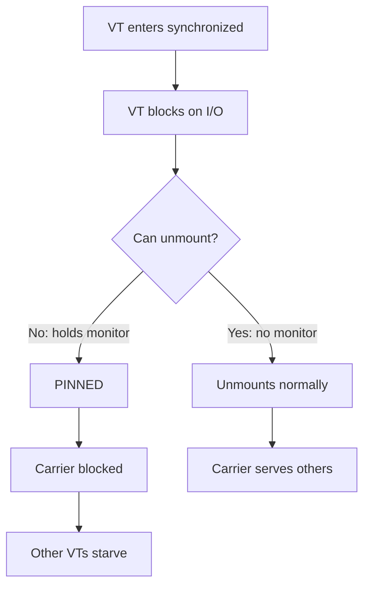

### 📶 Gradual Depth

**Level 1 - What it is:**
Pinning means a virtual thread is stuck on its carrier thread and cannot let go - blocking the carrier from helping other virtual threads.

**Level 2 - How to use it:**
Avoid I/O inside synchronized blocks. Replace `synchronized` with `ReentrantLock` for any section containing blocking calls. Monitor with `-Djdk.tracePinnedThreads=short`.

**Level 3 - How it works:**
Object monitors store the owning thread's ID in the mark word (biased/thin/fat locking). A VT mounted on Carrier-3 that acquires a monitor records Carrier-3 as owner. If the VT needs to unmount, the monitor would reference a carrier now running a different VT - violating mutual exclusion. So the JVM keeps the VT mounted (pinned) until monitor exit.

**Level 4 - Production mastery:**
Use JFR `jdk.virtualThreadPinned` with threshold=20ms to find significant pinning. Automated migration: `jdeprscan`-style tooling to find synchronized blocks with I/O calls. Prioritize: synchronized blocks in hot paths with network/file I/O inside. Cold paths (startup config) can tolerate pinning. JDK 24 (JEP 491) plans to eliminate pinning entirely by decoupling monitors from carrier identity.

### ⚙️ How It Works

**Phase 1 - Monitor entry:** VT acquires object monitor. JVM records carrier thread as owner.

**Phase 2 - Blocking call:** Code inside synchronized calls blocking I/O (e.g., Socket.read).

**Phase 3 - Pin detection:** JVM attempts to unmount VT (normal for blocking). Detects active monitor held by this VT. Aborts unmount.

**Phase 4 - Carrier blocked:** Carrier thread blocks on OS I/O call. Cannot serve other VTs.

**Phase 5 - Completion:** I/O completes. VT exits synchronized. Monitor released. Carrier available again.

```text
Timeline (8 carriers, 8 pinned):

Carrier-0: [VT-1 sync+IO........release]
Carrier-1: [VT-2 sync+IO........release]
  ...
Carrier-7: [VT-8 sync+IO........release]
Queue:     [VT-9..VT-10000 WAITING]

ALL carriers pinned for IO duration!
VTs 9-10000 cannot execute until release.
```

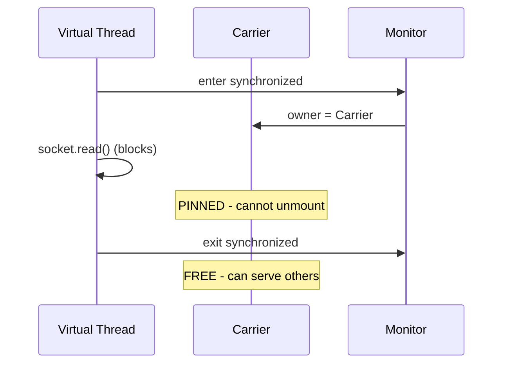

### 🚨 Failure Modes

**Failure 1 - Full Scheduler Pinning:**
**Symptom:** Application freezes. 0% CPU. All requests timeout. Thread dump: all carriers in BLOCKED (I/O).
**Root cause:** All N carriers pinned in synchronized + I/O. No carrier available for any VT.
**Diagnostic:**

```
-Djdk.tracePinnedThreads=full
# Or JFR:
jfr print --events jdk.virtualThreadPinned rec.jfr
```

**Fix:**
**BAD:** `synchronized(pool) { conn = pool.get(); conn.query(); }`
**GOOD:** `lock.lock(); try { conn = pool.get(); } finally { lock.unlock(); } conn.query();`
Move I/O OUTSIDE the lock, or replace synchronized with ReentrantLock.

**Failure 2 - Intermittent Latency Spikes:**
**Symptom:** P99 latency spikes under load. P50 normal.
**Root cause:** Pinning occurs only under contention (when all carriers happen to be pinned simultaneously). Low load: enough free carriers. High load: all pinned.
**Diagnostic:**

```
jfr print --events jdk.virtualThreadPinned \
  --stack-depth 10 rec.jfr | grep "duration"
# Correlate with latency spikes
```

**Fix:** Systematically audit all synchronized blocks for I/O calls. Prioritize by frequency and duration.

### 🔬 Production Reality

**Incident pattern: HikariCP connection pool + virtual threads.**

HikariCP uses synchronized internally for connection borrowing. When all connections are in-use, waiting VTs park inside synchronized (ConcurrentBag.borrow). Each waiting VT pins a carrier. With 8 carriers, 50 pool connections, and 10K requests: 8 VTs pin carriers while waiting for connections. Remaining 9,992 VTs cannot even REACH the pool. Throughput = 0 until connections return. Mitigation: HikariCP 5.1+ migrated to ReentrantLock. For older versions: increase `jdk.virtualThreadScheduler.parallelism` as a band-aid, or add a Semaphore(poolSize) before pool access to limit waiting VTs.

### ⚖️ Trade-offs & Alternatives

| Approach          | Pinning Risk       | Code Change   | JDK |
| ----------------- | ------------------ | ------------- | --- |
| Keep synchronized | HIGH               | None          | Any |
| ReentrantLock     | None               | Moderate      | Any |
| Increase carriers | Reduced (band-aid) | Config only   | 21+ |
| Wait for JEP 491  | None (future)      | None          | 24+ |
| Avoid I/O in sync | None               | Design change | Any |

### ⚡ Decision Snap

**MIGRATE synchronized to ReentrantLock WHEN:**

- Block contains ANY blocking call (I/O, sleep, park).
- Block is on a hot path (high frequency).
- Using virtual threads in production.

**KEEP synchronized WHEN:**

- Block contains only CPU-bound code (no blocking).
- Block is cold path (startup, shutdown).
- Not using virtual threads.

**PREFER increasing parallelism WHEN:**

- Cannot modify library code (third-party synchronized).
- Temporary mitigation while migration proceeds.

### ⚠️ Top Traps

| #   | Misconception                        | Reality                                                                                                   |
| --- | ------------------------------------ | --------------------------------------------------------------------------------------------------------- |
| 1   | "Short synchronized blocks are safe" | If they contain I/O (even brief network call), they pin. Duration of I/O determines pin duration.         |
| 2   | "Pinning only affects MY code"       | Libraries (JDBC drivers, connection pools, logging) use synchronized internally. Must audit dependencies. |
| 3   | "More carriers fixes pinning"        | Band-aid. More carriers = more OS threads = back to platform thread model. Defeats VT purpose.            |
| 4   | "ReentrantLock has same problem"     | NO. ReentrantLock is VT-aware: VT unmounts while waiting for lock. Only synchronized pins.                |
| 5   | "JDK 24 fixes everything"            | JEP 491 targets monitor pinning. Native method pinning remains. And JDK 24 adoption takes years.          |

### 🪜 Learning Ladder

**Prerequisites:**

- Virtual Threads Internals (Project Loom) - mount/unmount mechanism
- ReentrantLock vs synchronized - alternative lock
- Thread Lifecycle and States - BLOCKED vs WAITING

**THIS:** Pinning - Virtual Threads and synchronized

**Next steps:**

- synchronized to Virtual Threads Migration - systematic migration
- Lock Contention Profiling (async-profiler) - finding pinning in production
- Platform Thread Exhaustion Failure - related starvation

### 💡 Surprising Truth

**The Surprising Truth:**
A single `System.out.println()` inside synchronized can cause pinning. PrintStream.println is synchronized internally AND performs I/O. In virtual thread code: `synchronized(lock) { System.out.println("debug"); }` creates nested monitors with I/O - guaranteed pinning. Replace with a proper logging framework that uses lock-free appenders.

**Further Reading:**

- JEP 444: Virtual Threads - pinning section (OpenJDK)
- JEP 491: Synchronize Virtual Threads without Pinning (JDK 24)
- Alan Bateman, "Virtual Threads: Coming to a Platform Near You" (2023)

**Revision Card:**

1. Pinning = VT holds monitor + blocks = carrier stuck. Cannot unmount.
2. Fix: replace synchronized with ReentrantLock for any block with I/O inside.
3. Production: audit ALL dependencies for internal synchronized + I/O (HikariCP, JDBC drivers, logging).

---

---

# Platform Thread Exhaustion Failure

**TL;DR** - Platform thread exhaustion occurs when all OS threads are consumed (blocked on I/O, locks, or slow operations), leaving no thread to accept new work - causing cascading timeouts.

### 🔥 Problem Statement

A service with a 200-thread pool handles HTTP requests. Each request calls a downstream service (100ms average). A downstream outage causes responses to take 30s (timeout). 200 threads x 30s = all threads blocked within seconds. Thread pool full. New requests rejected or queued indefinitely. Health checks fail. Load balancer marks node dead. Cascading failure across cluster. All because threads are finite and blocking is the default.

### 📜 Historical Context

Thread-per-request has been Java's model since servlets (1997). App servers (Tomcat, JBoss) documented thread pool sizing as critical. Netflix's Hystrix (2012) formalized thread pool isolation as a resilience pattern. Reactive frameworks (Vert.x, WebFlux) emerged partly to avoid thread exhaustion. Virtual threads (JDK 21) make exhaustion of PLATFORM threads rare - but resource exhaustion shifts to connection pools and downstream systems.

### 🔩 First Principles

**CORE INVARIANTS:**

1. A platform thread blocked on I/O consumes an OS thread for the ENTIRE wait duration.
2. Thread pool has fixed maximum. When all threads are consumed, no new work can start.
3. Downstream latency increase linearly increases thread consumption (Little's Law: concurrency = throughput x latency).

**DERIVED DESIGN:**
If latency doubles, thread consumption doubles. A 10x latency spike (normal during outages) needs 10x threads - which do not exist. The pool saturates. The fix: either bound wait time (timeouts), bound concurrent calls (bulkhead), or eliminate blocking (reactive/VTs).

**THE TRADE-OFF:**
**Gain (of thread pools):** Simple model, bounded resource usage, natural backpressure at capacity.
**Cost:** Vulnerable to latency-induced exhaustion. Fixed size forces choose between "too few" (rejects under normal load) and "too many" (wastes memory).

### 🧠 Mental Model

> A restaurant with 20 tables (threads). Normal dinner: guests eat in 1 hour, table turns over. One night: kitchen is slow (downstream latency). Meals take 5 hours. All 20 tables occupied by hour 2. New guests turned away for 3 hours. The restaurant has not "failed" - it is just FULL. Identical to thread exhaustion.

- "Tables" -> threads in pool
- "Slow kitchen" -> downstream latency spike
- "Guests turned away" -> requests rejected/queued
- "5-hour dinner" -> 30s timeout (was 100ms)

**Where this analogy breaks down:** in software, you can add "timeout" - forcibly clearing a table after max time. Restaurants cannot eject diners.

### 🧩 Components

- **Thread Pool** - ExecutorService with bounded max (e.g., Tomcat's maxThreads=200).
- **Work Queue** - requests waiting for a free thread. Unbounded = OOM. Bounded = rejection.
- **Downstream Call** - blocking HTTP/RPC/DB call consuming a thread for its duration.
- **Timeout** - maximum wait duration before abandoning the call and freeing the thread.
- **Circuit Breaker** - fast-fail mechanism when downstream is known-bad (avoids wasting threads).
- **Bulkhead** - isolated thread pool per dependency preventing one slow dep from consuming all threads.

```text
Request flow:

  [Incoming] -> [Pool Queue] -> [Thread]
                                    |
                              [Downstream Call]
                                    |
                               (blocks 30s)
                                    |
                              [Thread stuck]

  All threads stuck -> queue fills -> reject
```

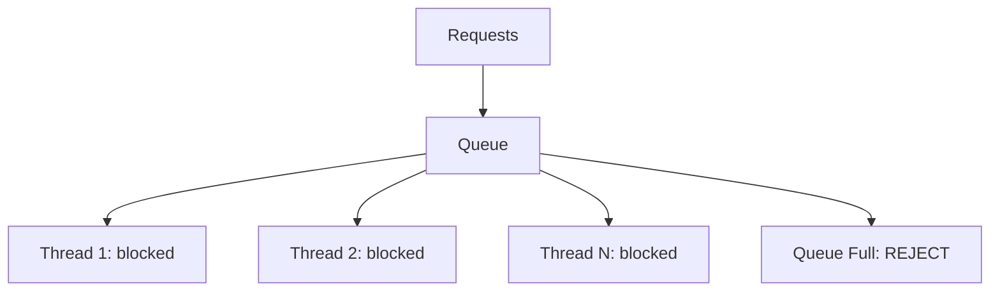

### 📶 Gradual Depth

**Level 1 - What it is:**
When all threads in a pool are busy (blocked), new work cannot start. The service appears dead even though the JVM is healthy.

**Level 2 - How to use it:**
Set aggressive timeouts on all downstream calls. Monitor thread pool active count. Alert at 80% utilization. Use circuit breakers (Resilience4j) for known-slow dependencies.

**Level 3 - How it works:**
Little's Law: L = lambda _ W (concurrent threads = arrival rate _ service time). If service time increases 10x, concurrent threads needed increases 10x. Fixed pool cannot accommodate. Solution: cap W (timeout), reduce lambda (rate limit), or increase L (more threads/VTs).

**Level 4 - Production mastery:**
Size pools using Little's Law: threads = target_throughput \* P99_latency. Add 20% headroom. Implement per-dependency bulkheads (separate pools). Circuit breakers trip after N failures in window. Health-check endpoint uses separate thread (never blocked by pool exhaustion). With virtual threads: exhaustion shifts from threads to connection pools and memory - same principles apply.

### ⚙️ How It Works

**Phase 1 - Normal operation:** 200 threads, 100ms response. Throughput = 2000 req/s. Pool utilization = 10%.

**Phase 2 - Latency spike:** Downstream response = 30s. Concurrent threads = 2000 \* 30 = 60,000 needed. Only 200 available.

**Phase 3 - Saturation:** All 200 threads blocked within 100ms. Queue fills rapidly.

**Phase 4 - Cascading:** Health checks blocked (no thread). LB removes node. Traffic shifts to remaining nodes. They exhaust too.

**Phase 5 - Recovery:** Downstream recovers. Threads free. Queue drains. But: queued requests have stale context and may timeout at client. Recovery takes minutes.

```text
Little's Law visualization:

  Normal:  threads = 2000/s * 0.1s = 200 (fits!)
  Spike:   threads = 2000/s * 30s  = 60000 (NOPE)
  With timeout(2s): threads = 2000/s * 2s = 4000
    Still > 200. Need rate limiting too.
  With CB + timeout: threads = 2000/s * 0.001s = 2
    Circuit open: instant fail. Pool free.
```

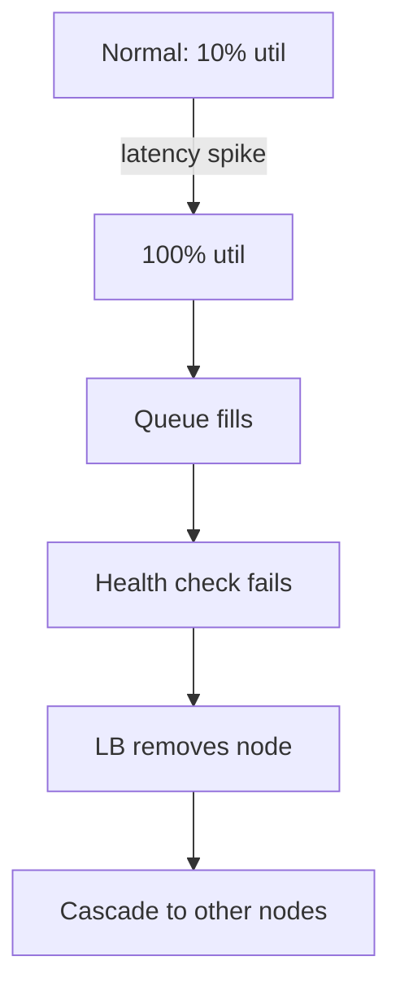

### 🚨 Failure Modes

**Failure 1 - Silent Saturation:**
**Symptom:** Response times gradually increase. No errors initially. Then sudden cliff.
**Root cause:** Queue absorbs initial burst. When queue also fills: sudden rejection.
**Diagnostic:**

```
# Tomcat:
curl localhost:8080/actuator/metrics/tomcat.threads.busy
# Custom pool:
pool.getActiveCount() / pool.getMaximumPoolSize()
```

**Fix:**
**BAD:** Unbounded queue (hides problem until OOM).
**GOOD:** Bounded queue + reject policy + alert at 80% active threads.

**Failure 2 - Health Check Starvation:**
**Symptom:** LB marks healthy node as dead. Node is actually alive but pool-exhausted.
**Root cause:** Health check shares main thread pool. All threads busy = health check queued.
**Diagnostic:**

```
# Health endpoint timeout in LB logs
# But: node is UP (JVM alive, GC fine)
```

**Fix:** Dedicate a separate thread for health checks (Spring Boot: management server on separate port/pool).

### 🔬 Production Reality

**Incident pattern: database connection timeout cascade.**

A PostgreSQL replica falls behind. Queries that normally return in 5ms now take 30s (replication lag + lock contention). Application pool: 100 threads. Within 3 seconds: all 100 threads blocked on JDBC queries. New requests rejected. Monitoring dashboard also uses same DB - dashboard goes dark. Alerts fire from external monitoring only. Resolution: restart replica, but recovery takes 10 minutes because HikariCP's connection validation queries also time out (validationTimeout was 5s but total pool acquisition blocked). Lesson: separate monitoring from application DB. Set connection timeout, query timeout, AND validation timeout. Use circuit breaker on DB calls.

### ⚖️ Trade-offs & Alternatives

| Strategy        | Protection                   | Complexity    | Throughput Cost         |
| --------------- | ---------------------------- | ------------- | ----------------------- |
| Timeout only    | Partial (caps duration)      | Low           | Minimal                 |
| Circuit breaker | High (fast-fail)             | Medium        | None when open          |
| Bulkhead        | High (isolation)             | Medium        | Pool overhead           |
| Virtual threads | Eliminates thread exhaustion | Low (JDK 21+) | Shifts to resource pool |
| Reactive        | Eliminates blocking          | High          | Learning curve          |

### ⚡ Decision Snap

**ALWAYS implement:**

- Timeouts on every downstream call (connect + read).
- Pool utilization monitoring + alerts.

**ADD circuit breaker WHEN:**

- Downstream has known failure modes.
- Fast-fail preferable to waiting.

**ADD bulkhead WHEN:**

- Multiple downstream dependencies.
- One slow dependency must not affect others.

**MIGRATE to virtual threads WHEN:**

- JDK 21+. Eliminates platform thread exhaustion (but not resource exhaustion).

### ⚠️ Top Traps

| #   | Misconception                            | Reality                                                                                                    |
| --- | ---------------------------------------- | ---------------------------------------------------------------------------------------------------------- |
| 1   | "More threads = more throughput"         | More threads = more memory + context switching. Fix the LATENCY or add backpressure.                       |
| 2   | "Thread pool rejection = bug"            | It is PROTECTION. Better to reject fast than queue indefinitely.                                           |
| 3   | "Timeout = done"                         | Timeout frees YOUR thread but downstream still processing. Cancel/close the call.                          |
| 4   | "Virtual threads eliminate this problem" | VTs eliminate THREAD exhaustion. Connection pools, DB, memory still exhaust.                               |
| 5   | "Circuit breaker = timeout"              | CB = MEMORY of failures. Prevents even ATTEMPTING calls to known-bad downstream. Timeout = per-call limit. |

### 🪜 Learning Ladder

**Prerequisites:**

- ThreadPoolExecutor Configuration - pool sizing
- Thread Lifecycle and States - BLOCKED state
- Monitoring Thread Pools in Production - observability

**THIS:** Platform Thread Exhaustion Failure

**Next steps:**

- More Threads is Better is Wrong - Amdahl Reality - why more threads fails
- ForkJoinPool.commonPool Saturation - specific exhaustion variant
- Virtual Threads Internals (Project Loom) - the solution

### 💡 Surprising Truth

**The Surprising Truth:**
Little's Law (L = lambda \* W) means thread pool sizing is a MATH problem, not a guessing game. If you know your P99 latency and target throughput, the required pool size is determined. Most teams "guess 200" without doing this calculation - then are surprised when a latency spike exhausts the pool at exactly the predicted point.

**Further Reading:**

- Michael Nygard, "Release It!" - Stability Patterns (2nd ed., 2018)
- Netflix Hystrix Wiki - Thread Pool Isolation (archived)
- Little's Law applied to software systems - various sources

**Revision Card:**

1. Little's Law: threads_needed = throughput \* latency. Latency spike = instant exhaustion.
2. Defense: timeout + circuit breaker + bulkhead. Layers, not single solution.
3. Production: health checks need dedicated threads. Never share with request pool.

---

---

# ForkJoinPool.commonPool Saturation

**TL;DR** - The common ForkJoinPool is shared by parallel streams, CompletableFuture, and the VT scheduler - saturating it with blocking work starves the entire JVM.

### 🔥 Problem Statement

A developer uses `list.parallelStream().map(this::fetchFromApi)` for concurrent HTTP calls. This runs on ForkJoinPool.commonPool(). Same pool used by CompletableFuture.supplyAsync() elsewhere. Same pool is the virtual thread scheduler's carrier pool. One slow API call blocks a commonPool thread. At scale: all commonPool threads blocked on I/O. Parallel streams in OTHER parts of the application stall. CompletableFuture callbacks stall. Virtual threads cannot schedule. Global impact from one misuse.

### 📜 Historical Context

ForkJoinPool.commonPool() introduced in JDK 8 alongside parallel streams. Intended for CPU-bound divide-and-conquer (parallelSort, parallel stream computation). Sized at Runtime.availableProcessors() - 1 threads. Never designed for blocking I/O. CompletableFuture.supplyAsync() defaults to it (JDK 8). Virtual thread scheduler uses a ForkJoinPool (separate instance, but same class). The "convenience" of a shared pool created a shared-fate dependency.

### 🔩 First Principles

**CORE INVARIANTS:**

1. ForkJoinPool.commonPool() has parallelism = availableProcessors - 1 threads (typically 7 on 8-core).
2. The commonPool is a JVM-wide singleton - all users share it.
3. Work-stealing requires tasks to be short and non-blocking. Blocked threads do not steal.

**DERIVED DESIGN:**
Invariant 1 + 3: only ~7 threads available. One blocked thread = 14% capacity lost. Invariant 2: any library using commonPool shares this tiny budget. Blocking work in commonPool violates its design contract and impacts unrelated code.

**THE TRADE-OFF:**
**Gain (of commonPool):** Zero configuration. Shared resource. Efficient for CPU-bound work.
**Cost:** Shared fate. Blocking misuse affects entire JVM. No isolation.

### 🧠 Mental Model

> The commonPool is the office's single shared printer. Everyone assumes it is fast (CPU-bound prints). Someone sends a 500-page print job (blocking I/O). Everyone else's one-page jobs queue behind it. A shared resource with no isolation = one abuser blocks all.

- "Shared printer" -> commonPool (singleton)
- "500-page job" -> blocking I/O on pool thread
- "Everyone's one-page jobs" -> parallel streams, CF callbacks
- "No isolation" -> all share same parallelism threads

**Where this analogy breaks down:** ForkJoinPool has "compensation" - it can temporarily add threads when workers block. But compensation has limits (maxPoolSize) and adds overhead.

### 🧩 Components

- **ForkJoinPool.commonPool()** - singleton. parallelism = availableProcessors - 1.
- **Worker threads** - steal tasks from other workers' queues. Efficient for fork-join.
- **ManagedBlocker** - API for signaling "I am about to block" (allows compensation).
- **Compensation threads** - temporary workers added when existing ones block. Capped at 256 (default).
- **parallelStream()** - terminal ops execute on commonPool by default.
- **CompletableFuture.supplyAsync()** - runs on commonPool when no executor specified.

```text
JVM-wide commonPool (7 threads on 8-core):

  parallelStream()  ---|
  CF.supplyAsync()  ---+--> commonPool [7 workers]
  some libraries    ---|

  Blocking I/O on 4 workers:
  [blocked][blocked][blocked][blocked][free][free][free]
  Only 3 workers for ALL other parallel work!
```

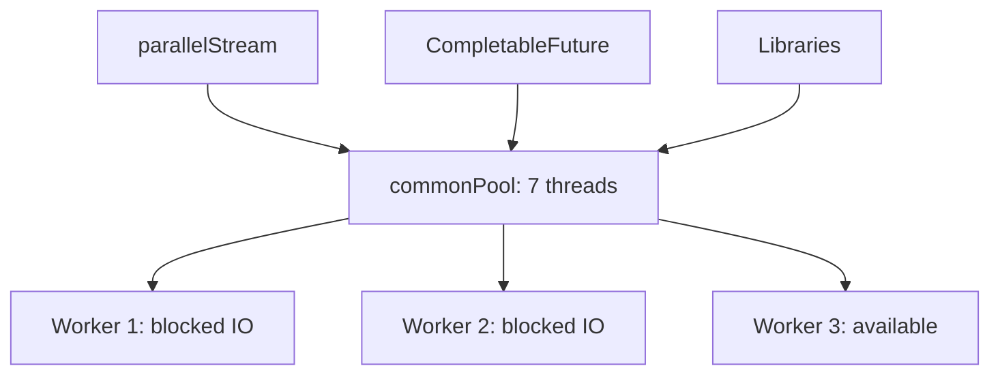

### 📶 Gradual Depth

**Level 1 - What it is:**
A shared thread pool used by parallel streams and CompletableFuture. Blocking calls on it reduce available threads for ALL parallel work in the JVM.

**Level 2 - How to use it:**
Never put blocking I/O on commonPool. Use dedicated executors: `CompletableFuture.supplyAsync(task, ioExecutor)`. For parallel streams with I/O: submit to custom ForkJoinPool instead.

**Level 3 - How it works:**
CommonPool uses work-stealing: idle workers steal tasks from busy workers' queues. When a worker blocks, ForkJoinPool.managedBlock() can spawn a compensation thread (up to limit). But compensation is reactive (not preventive) and increases context switching. Each blocked worker reduces effective parallelism immediately.

**Level 4 - Production mastery:**
Monitor commonPool: `ForkJoinPool.commonPool().getRunningThreadCount()` vs getParallelism(). If running < parallelism consistently: something is blocking. Use JFR `jdk.ForkJoinPool*` events. Set `-Djava.util.concurrent.ForkJoinPool.common.parallelism=N` to increase (band-aid). Better: isolate I/O work on dedicated executor. In virtual thread apps: commonPool is NOT the VT scheduler (VTs use a separate FJP instance).

### ⚙️ How It Works

**Phase 1 - Normal:** CPU-bound parallel stream splits work across 7 workers. Tasks execute in microseconds. Workers steal efficiently.

**Phase 2 - Blocking introduced:** Developer adds HTTP call inside parallelStream map. Worker blocks on socket read.

**Phase 3 - Compensation:** FJP detects block (ManagedBlocker). Spawns temporary thread. But: HTTP call is not wrapped in ManagedBlocker (most code is not). No compensation occurs. Worker simply blocked.

**Phase 4 - Saturation:** Multiple parallel streams with I/O: 5-6 workers blocked. Only 1-2 available for all CPU work.

**Phase 5 - Impact:** Unrelated parallel stream (sorting large list) takes 7x longer because only 1 worker available.

```text
Normal (7 workers, CPU-bound):
  Task completion: 7 parallel units/time

Saturated (5 blocked, 2 free):
  Task completion: 2 parallel units/time
  Slowdown: 3.5x for ALL parallel work

Recovery: blocked calls complete, workers free
```

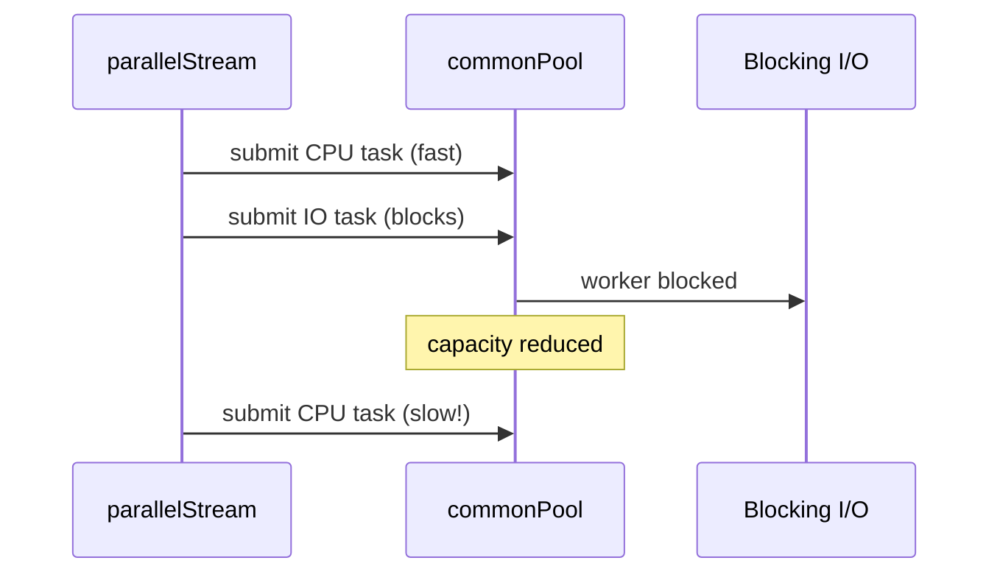

### 🚨 Failure Modes

**Failure 1 - Parallel Stream Stalls:**
**Symptom:** parallelStream operations that normally take 50ms take 5s intermittently.
**Root cause:** Another code path uses commonPool for blocking I/O, consuming workers.
**Diagnostic:**

```java
ForkJoinPool cp = ForkJoinPool.commonPool();
System.out.println("Active: " + cp.getActiveThreadCount());
System.out.println("Running: " + cp.getRunningThreadCount());
System.out.println("Queued: " + cp.getQueuedTaskCount());
// Running << Parallelism = blocking detected
```

**Fix:**
**BAD:** `list.parallelStream().map(x -> httpGet(x))`
**GOOD:** `CompletableFuture` with dedicated I/O executor.

**Failure 2 - CompletableFuture Callback Starvation:**
**Symptom:** CF.thenApply() callbacks delayed by seconds.
**Root cause:** Default async stages use commonPool. Pool saturated by blocking operations elsewhere.
**Diagnostic:**

```java
// CF completes but callback not invoked for seconds
// Check commonPool running vs queued tasks
```

**Fix:**
**BAD:** `cf.thenApplyAsync(this::process)` // commonPool
**GOOD:** `cf.thenApplyAsync(this::process, cpuPool)` // dedicated

### 🔬 Production Reality

**Incident pattern: reporting service poisons entire application.**

A reporting module runs `invoices.parallelStream().map(this::fetchPdf)` - blocking HTTP calls on commonPool. During batch reporting (100K invoices): all commonPool workers blocked for minutes. Meanwhile: REST API endpoints using CompletableFuture stop responding. Scheduled jobs using parallel streams halt. The reporting module (low-priority background task) brought down the entire application's concurrency. Fix: custom `Executors.newFixedThreadPool(20)` for reporting. Better: virtual threads for I/O-heavy reporting.

### ⚖️ Trade-offs & Alternatives

| Approach             | Isolation              | Complexity    | Use Case             |
| -------------------- | ---------------------- | ------------- | -------------------- |
| commonPool (default) | None                   | Zero          | CPU-bound only       |
| Custom ForkJoinPool  | Full                   | Low           | CPU parallel work    |
| Custom ThreadPool    | Full                   | Low           | I/O work             |
| Virtual threads      | N/A                    | Low (JDK 21+) | I/O at scale         |
| ManagedBlocker       | Partial (compensation) | Medium        | Unavoidable blocking |

### ⚡ Decision Snap

**USE commonPool WHEN:**

- parallelStream on CPU-bound transformations (no I/O, no locks).
- Short tasks (microseconds to low milliseconds).

**NEVER USE commonPool FOR:**

- HTTP calls, DB queries, file I/O, any blocking operation.
- CompletableFuture with blocking suppliers.

**USE dedicated executor WHEN:**

- Any I/O or potentially blocking work.
- Need isolation from other components.

### ⚠️ Top Traps

| #   | Misconception                            | Reality                                                                                    |
| --- | ---------------------------------------- | ------------------------------------------------------------------------------------------ |
| 1   | "parallelStream = concurrency framework" | It is a CPU-parallelism tool only. Not for I/O concurrency.                                |
| 2   | "Increasing parallelism fixes it"        | More threads = more memory + switch cost. Fix: remove blocking, not add threads.           |
| 3   | "ManagedBlocker always saves us"         | Most blocking calls (HTTP, JDBC) do NOT use ManagedBlocker. Compensation is not triggered. |
| 4   | "VT scheduler uses commonPool"           | Separate ForkJoinPool instance. But similar saturation principles apply to carrier pool.   |
| 5   | "Only my code is affected"               | commonPool is JVM-WIDE. Any library using it shares the same workers.                      |

### 🪜 Learning Ladder

**Prerequisites:**

- ForkJoinPool and Work-Stealing - pool mechanics
- CompletableFuture Composition - default executor behavior
- ThreadPoolExecutor Configuration - alternative pools

**THIS:** ForkJoinPool.commonPool Saturation

**Next steps:**

- Platform Thread Exhaustion Failure - broader exhaustion
- Virtual Threads Internals (Project Loom) - scheduler pool
- Monitoring Thread Pools in Production - detection

### 💡 Surprising Truth

**The Surprising Truth:**
You can run a parallel stream on a custom ForkJoinPool by submitting it as a task: `customFJP.submit(() -> list.parallelStream().map(...).collect(...)).join()`. This undocumented trick works because ForkJoinTask inherits its pool from the submitting thread. But it is fragile (implementation detail, not spec-guaranteed) and not needed with JDK 21+ virtual threads for I/O work.

**Further Reading:**

- Doug Lea, "A Java Fork/Join Framework" (2000, original paper)
- JDK source: java.util.concurrent.ForkJoinPool (commonPool initialization)
- Baeldung, "Custom Thread Pools in Parallel Streams" (practical guide)

**Revision Card:**

1. commonPool = 7 threads (8-core). Shared by EVERYTHING. Blocking one = 14% capacity lost for ALL.
2. NEVER: I/O in parallelStream or default supplyAsync. ALWAYS: dedicated executor for blocking.
3. Detection: getRunningThreadCount() < getParallelism() = something is blocking.

---

---

# ThreadLocal Memory Leak in Thread Pools

**TL;DR** - ThreadLocal values bound to pooled threads persist for the thread's lifetime (not the task's), accumulating memory across requests and causing OOM in long-running pools.

### 🔥 Problem Statement

A request-processing framework sets `ThreadLocal<RequestContext>` at the start of each request. With thread pools: the thread is REUSED. If remove() is not called after each request, the previous request's context persists - consuming memory AND leaking data between requests. With 200 pool threads x 50 tasks/thread x 10KB context: 100MB leaked per hour. With virtual threads (1M short-lived): 1M ThreadLocalMap entries even if each is tiny.

### 📜 Historical Context

ThreadLocal designed (JDK 1.2) for per-thread configuration in long-lived threads. Thread pools (JDK 5) broke the assumption: threads are reused across unrelated tasks. Memory leaks became a top issue in servlet containers (Tomcat's MemoryLeakDetectionListener, 2010). ClassLoader leaks via ThreadLocal were particularly severe in hot-deploy scenarios. Modern frameworks (Spring, Quarkus) add automatic cleanup, but application-level ThreadLocal use remains a leak source.

### 🔩 First Principles

**CORE INVARIANTS:**

1. ThreadLocalMap is a field ON the Thread object. It lives as long as the Thread lives.
2. In a pool, threads live for the pool's lifetime (often the application's lifetime).
3. ThreadLocal.set() adds entries to ThreadLocalMap. Only explicit remove() deletes them.

**DERIVED DESIGN:**
Invariant 2 + 3: without remove(), entries accumulate for the ENTIRE application lifetime. Invariant 1: when the Thread finally dies, map is GC'd - but pooled threads rarely die. This creates a "leak by design" when developers expect task-scoped lifetime but get thread-scoped lifetime.

**THE TRADE-OFF:**
**Gain (of ThreadLocal):** Per-thread state without synchronization. Fast access (no lock).
**Cost:** Manual lifecycle management. Leak if not removed. Memory proportional to thread count x entry count.

### 🧠 Mental Model

> ThreadLocal is a locker at a gym (thread pool). You rent it for your workout (request). But there is no auto-eject when you leave - if you forget to empty it, your stuff stays. The next gym member gets a locker with YOUR stuff still in it (data leak). Over months: all lockers full of abandoned items (OOM).

- "Locker" -> ThreadLocal entry in ThreadLocalMap
- "Gym" -> thread pool
- "Forget to empty" -> missing remove()
- "Next member" -> next task on same thread
- "All lockers full" -> OOM

**Where this analogy breaks down:** ThreadLocal entries have weak-reference keys (the ThreadLocal itself). If the ThreadLocal field is GC'd, entries become "stale" and may eventually be cleaned - but this is unreliable and slow.

### 🧩 Components

- **ThreadLocalMap** - internal hash map on Thread. Key: WeakReference<ThreadLocal>. Value: strong reference.
- **ThreadLocal<T>** - the key object. Static field in application code.
- **Entry lifecycle** - set() creates, get() reads, remove() deletes.
- **Stale entry cleanup** - when key's WeakReference is cleared, entry is "stale." Cleaned lazily during next set/get/remove on same slot.
- **ClassLoader leak** - ThreadLocal value referencing classes from a child ClassLoader prevents CL from being GC'd during hot-deploy.

```text
Thread's ThreadLocalMap:

  [TL-1 -> RequestContext]  // set by framework
  [TL-2 -> DBConnection]    // set by ORM
  [TL-3 -> MDC Map]         // set by logging
  [TL-4 -> DateFormat]      // set by utility
  [stale entry (TL GC'd)]   // awaiting cleanup

  After 10K requests without remove():
  [TL-1 -> ctx-10000]       // 9999 were leaked
  (but only latest visible via get())
  (previous entries: if different TL instances,
   all accumulate in map!)
```

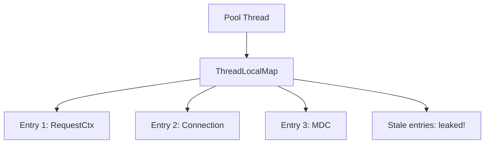

### 📶 Gradual Depth

**Level 1 - What it is:**
ThreadLocal values stay on the thread until removed. In a pool, threads are reused - so values accumulate across requests, leaking memory.

**Level 2 - How to use it:**
Always pair set() with remove() in a finally block: `try { TL.set(val); doWork(); } finally { TL.remove(); }`. Use framework hooks (afterRequest, afterExecute) for cleanup.

**Level 3 - How it works:**
ThreadLocalMap uses open-addressing hash table with WeakReference keys. When a ThreadLocal object is GC'd, its WeakReference is cleared, making the entry "stale." Stale entries are cleaned during subsequent operations on nearby slots - but this is probabilistic. The VALUE remains strongly referenced until cleanup, preventing its class (and ClassLoader) from being collected.

**Level 4 - Production mastery:**
Detect leaks: override ThreadPoolExecutor.afterExecute() to scan ThreadLocalMap via reflection (diagnostic only). Tomcat's MemoryLeakDetectorListener logs leaked ThreadLocals on undeploy. In virtual thread apps: each VT has its own ThreadLocalMap. 1M VTs with ThreadLocal = 1M maps. Use ScopedValues (JEP 464) to eliminate this. Profile with heap dumps: search for ThreadLocalMap$Entry arrays with unexpected size.

### ⚙️ How It Works

**Phase 1 - Set:** Task sets ThreadLocal value. Entry added to thread's ThreadLocalMap.

**Phase 2 - Use:** Code reads value via get(). Fast (no synchronization).

**Phase 3 - Task completes:** Task finishes. Thread returned to pool. ThreadLocalMap UNCHANGED.

**Phase 4 - Next task:** New task runs on same thread. Old entry still present. If same TL: overwritten. If different TL: accumulates.

**Phase 5 - Leak growth:** Over thousands of tasks: map grows. Stale entries cleaned lazily (unreliable). Strong-referenced values prevent GC of large object graphs.

```text
Request 1: TL.set(ctx1)     Map: [TL -> ctx1]
            (no remove!)
Request 2: TL.set(ctx2)     Map: [TL -> ctx2]
  (ctx1 is overwritten - this case is fine)

BUT with multiple ThreadLocals per request:
Request 1: TL_A.set(a1), TL_B.set(b1)
  (TL_B not removed!)
Request 2: TL_A.set(a2)
  Map: [TL_A -> a2, TL_B -> b1]  <- leaked!
```

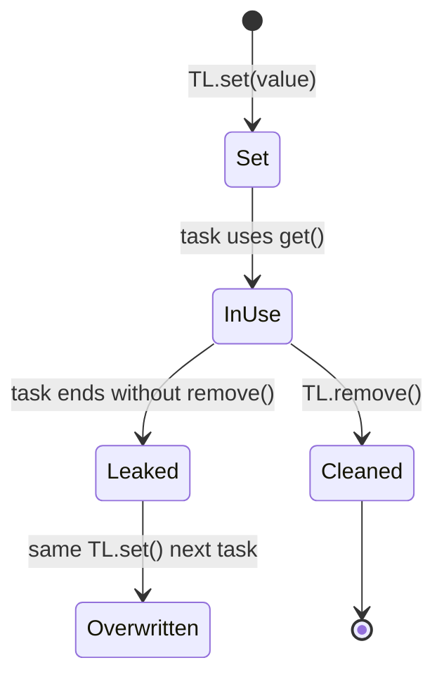

### 🚨 Failure Modes

**Failure 1 - Gradual OOM:**
**Symptom:** Heap grows slowly over hours/days. OOM eventually. Heap dump shows large ThreadLocalMap$Entry arrays.
**Root cause:** Repeated set() without remove() on different ThreadLocal instances or value accumulation.
**Diagnostic:**

```
jmap -histo:live <pid> | grep ThreadLocal
# Look for unexpected Entry count
# Heap dump: MAT -> "Thread Local Variables" report
```

**Fix:**
**BAD:** `ThreadLocal<Ctx> TL = new ThreadLocal<>(); TL.set(ctx);`
**GOOD:** `static final ThreadLocal<Ctx> TL = new ThreadLocal<>(); try { TL.set(ctx); work(); } finally { TL.remove(); }`
Use static final for the ThreadLocal itself (one instance). Always remove in finally.

**Failure 2 - Cross-Request Data Leak:**
**Symptom:** User A sees User B's data. Security incident.
**Root cause:** ThreadLocal<UserContext> not cleared between requests. Thread reused. Next request inherits previous user's context.
**Diagnostic:**

```
# Reproduce under load (thread reuse required)
# Check: is TL.remove() called in ALL exit paths?
```

**Fix:** Framework-level filter/interceptor that clears ALL ThreadLocals unconditionally after every request.

### 🔬 Production Reality

**Incident pattern: ClassLoader leak in Tomcat hot-deploy.**

Application deployed to Tomcat uses ThreadLocal<SimpleDateFormat>. SDF class loaded by webapp ClassLoader. On redeploy: old webapp ClassLoader should be GC'd. But: Tomcat pool thread still holds ThreadLocalMap entry referencing SDF -> SDF.class -> old ClassLoader. Entire old webapp's classes retained in memory. After 5 redeploys: PermGen/Metaspace OOM. Tomcat logs: "The web application created a ThreadLocal but failed to remove it." Fix: always remove in contextDestroyed listener, or use DateTimeFormatter (immutable, shareable, no ThreadLocal needed).

### ⚖️ Trade-offs & Alternatives

| Approach               | Memory                 | Safety            | Complexity |
| ---------------------- | ---------------------- | ----------------- | ---------- |
| ThreadLocal + remove() | Per-thread             | Manual discipline | Low        |
| ScopedValue (JDK 22+)  | Per-scope (shared)     | Auto-cleanup      | Low        |
| Method parameters      | Stack only             | Safe by design    | Verbose    |
| Context object         | Explicit               | Safe              | Medium     |
| InheritableThreadLocal | Per-thread (inherited) | Same leak risk    | Low        |

### ⚡ Decision Snap

**USE ThreadLocal WHEN:**

- Need per-thread non-synchronized state.
- Can GUARANTEE remove() in finally/framework hook.
- Thread count is bounded (pool threads, not VTs).

**USE ScopedValue (JDK 22+) WHEN:**

- Immutable context per scope.
- Virtual threads at scale.
- Want automatic cleanup.

**USE method parameters WHEN:**

- Context needed by few methods.
- Prefer explicit over implicit.

### ⚠️ Top Traps

| #   | Misconception                      | Reality                                                                                       |
| --- | ---------------------------------- | --------------------------------------------------------------------------------------------- |
| 1   | "WeakReference key prevents leaks" | Weak KEY, but STRONG value. Value (and its object graph) retained until cleanup.              |
| 2   | "ThreadLocal leaks are small"      | One entry may reference entire request context, connection, classloader. Megabytes per entry. |
| 3   | "Only my code has ThreadLocal"     | Logging (MDC), JDBC, Spring, Jackson all use ThreadLocal internally.                          |
| 4   | "VTs are short-lived so no leak"   | True for per-VT leaks. But 1M VTs x ThreadLocal = 1M allocations even without "leak."         |
| 5   | "initialValue() prevents leak"     | initialValue() creates entry on first get(). Still persists until remove().                   |

### 🪜 Learning Ladder

**Prerequisites:**

- ThreadLocal - basic mechanism
- ThreadPoolExecutor Configuration - thread lifecycle
- Thread Lifecycle and States - when threads die

**THIS:** ThreadLocal Memory Leak in Thread Pools

**Next steps:**

- Scoped Values (JEP 464) - the fix for VT scale
- Virtual Threads Internals (Project Loom) - why scale amplifies leaks
- GC Safepoints and Thread Coordination - GC and thread interaction

### 💡 Surprising Truth

**The Surprising Truth:**
ThreadLocalMap uses a WEAK reference for the key (ThreadLocal instance) but a STRONG reference for the value. This means: if you create `new ThreadLocal<>()` as a local variable (not static), the ThreadLocal key gets GC'd but the VALUE persists as a "stale entry" until probabilistic cleanup. This is the worst pattern - the entry is invisible (no reference to key) but the value (potentially large) is retained.

**Further Reading:**

- Josh Bloch, Effective Java 3rd ed., Item 7: "Eliminate obsolete object references"
- Tomcat Wiki: "MemoryLeakProtection" - ThreadLocal cleanup
- OpenJDK source: java.lang.ThreadLocal$ThreadLocalMap (internal cleanup logic)

**Revision Card:**

1. ThreadLocal value lives as long as the THREAD (not the task). In pools = application lifetime.
2. Always: `try { TL.set(v); } finally { TL.remove(); }`. No exceptions.
3. Production: heap dump shows ThreadLocalMap$Entry. ScopedValue eliminates this class of leak entirely.

---

---

# More Threads is Better is Wrong - Amdahl Reality

**TL;DR** - Adding threads only speeds up the parallelizable fraction of work; serial sections, contention, and coordination overhead create diminishing returns and eventual slowdown.

### 🔥 Problem Statement

Team doubles thread pool from 100 to 200 threads expecting 2x throughput. Actual improvement: 8%. They double again to 400: throughput DECREASES. Context switching overhead, lock contention, and GC pressure from 400 threads exceed the parallelism benefit. Amdahl's Law predicts this: if 20% of work is serial, maximum speedup is 5x regardless of thread count. Most teams never calculate their serial fraction.

### 📜 Historical Context

Gene Amdahl formulated his law in 1967 for parallel processors. Gustafson (1988) extended it for scaled problem sizes. In Java context: Herb Sutter's "The Free Lunch Is Over" (2005) popularized multicore awareness. Despite decades of knowledge, teams still "add more threads" as first response to throughput problems - ignoring that contention, synchronization, and serial phases dominate beyond a threshold.

### 🔩 First Principles

**CORE INVARIANTS:**

1. Speedup_max = 1 / (S + P/N) where S = serial fraction, P = parallel fraction, N = threads (Amdahl's Law).
2. Beyond optimal N, adding threads increases overhead (context switches, contention, cache invalidation) without increasing useful parallelism.
3. Every synchronized section, every global lock, every sequential I/O is part of S (serial fraction).

**DERIVED DESIGN:**
With S=0.1 (10% serial): max speedup = 10x (even with infinite threads). With S=0.5: max = 2x. Most real applications have S = 0.1-0.4 (framework overhead, GC, I/O serialization). Adding threads beyond 1/S is pure waste.

**THE TRADE-OFF:**
**Gain (of more threads):** More parallelism UP TO the serial bound. Handles more concurrent I/O waits.
**Cost:** Memory per thread, context switch cost, cache pollution, increased lock contention, GC pressure from additional thread stacks.

### 🧠 Mental Model

> A highway with N lanes (threads) but ONE toll booth (serial section). Adding lanes beyond the toll booth's throughput just creates a bigger parking lot (queue). The toll booth is the bottleneck - more lanes cannot fix it.

- "Lanes" -> threads
- "Toll booth" -> serial/synchronized section
- "Bigger parking lot" -> more threads waiting on lock
- "Traffic jam" -> contention overhead exceeding benefit

**Where this analogy breaks down:** in software, "toll booths" can sometimes be eliminated (lock-free algorithms, partitioning). The serial fraction is not always fixed.

### 🧩 Components

- **Serial fraction (S)** - code that cannot execute in parallel: locks, sequential I/O, GC pauses, class loading.
- **Parallel fraction (P)** - work that scales linearly with threads: independent computation.
- **Contention overhead** - time threads spend waiting for locks held by others. Grows with thread count.
- **Context switch cost** - OS scheduler cost when threads > cores. ~1-10 microseconds per switch.
- **Cache pollution** - more threads = more working sets competing for L1/L2/L3 cache.
- **Coordination cost** - thread start/join, barrier waits, queue operations.

```text
Amdahl's Law:

  S=10% serial, P=90% parallel

  Threads | Speedup | Efficiency
  --------|---------|----------
       1  |   1.0x  |   100%
       4  |   3.1x  |    78%
       8  |   4.7x  |    59%
      16  |   6.4x  |    40%
      64  |   8.8x  |    14%
     inf  |  10.0x  |     0%

  Diminishing returns visible after 8 threads!
```

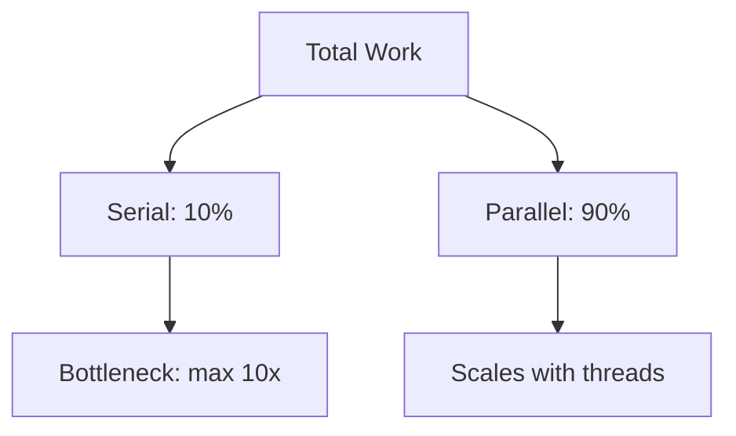

### 📶 Gradual Depth

**Level 1 - What it is:**
Adding more threads helps only up to a point. After that, overhead increases but throughput does not. The serial (non-parallelizable) portion of your code sets the hard ceiling.

**Level 2 - How to use it:**
Calculate your serial fraction: profile with 1 thread vs N threads. If speedup plateaus at 4x, your serial fraction is ~25%. Adding threads beyond 16 is wasteful. Focus optimization on reducing the serial fraction instead.

**Level 3 - How it works:**
Amdahl: Speedup(N) = 1 / (S + (1-S)/N). As N approaches infinity, speedup approaches 1/S. Real systems are worse: overhead grows with N. Universal Scalability Law (USL, Neil Gunther) adds a contention term and a coherence term: Speedup(N) = N / (1 + alpha*(N-1) + beta*N\*(N-1)). Beta (coherence/coordination) causes RETROGRADE - throughput decreases with more threads.

**Level 4 - Production mastery:**
Measure with load test: throughput at 1, 2, 4, 8, 16, 32, 64 threads. Plot. Identify the knee (diminishing returns) and the cliff (retrograde). Optimal thread count is at the knee. Profile serial sections: synchronized blocks, single-threaded event processing, sequential I/O. Reduce serial fraction by: partitioning (shard locks), lock-free algorithms, batching I/O, or eliminating shared state.

### ⚙️ How It Works

**Phase 1 - Linear region:** 1-4 threads. Each thread adds ~1x throughput. Overhead minimal. Cache warm.

**Phase 2 - Diminishing region:** 4-16 threads. Each thread adds less than 1x. Contention on shared resources visible. Context switches increase.

**Phase 3 - Plateau:** 16-32 threads. Near-zero improvement. Serial fraction dominates. Lock contention equals parallelism gain.

**Phase 4 - Retrograde:** 32+ threads. Throughput DECREASES. Context switching, cache thrashing, GC scanning more thread stacks. Coordination overhead exceeds parallelism benefit.

```text
Throughput vs threads (with overhead):

  Throughput
  ^
  |         *** plateau ***
  |      *
  |    *
  |  *                 \ retrograde
  | *                   \
  |*_________________________> Threads
  1  4   8  16  32  64

  Optimal: ~16 threads (knee point)
  Beyond 32: actively harmful
```


### 🚨 Failure Modes

**Failure 1 - Retrograde Throughput:**
**Symptom:** Doubling threads causes throughput to DROP 20%.
**Root cause:** Lock contention + context switches + cache pollution exceed parallelism gain. USL beta term dominates.
**Diagnostic:**

```
# Load test at different thread counts:
wrk -t1 -c1 -d30s http://localhost:8080/api
wrk -t4 -c4 -d30s http://localhost:8080/api
wrk -t16 -c16 -d30s http://localhost:8080/api
wrk -t64 -c64 -d30s http://localhost:8080/api
# Plot: if throughput peaks then drops = retrograde
```

**Fix:**

**BAD:**

```java
// Response to "throughput is low": double threads
server.setMaxThreads(400); // retrograde!
```

**GOOD:**

```java
// Measure serial fraction, optimize the bottleneck
server.setMaxThreads(16); // at knee of curve
// + add cache to eliminate serial DB lock
```

**Failure 2 - Starvation Under High Thread Count:**
**Symptom:** Some requests take 100x normal time. P99 spikes while P50 unchanged.
**Root cause:** Too many threads competing for few cores. OS scheduler delays some threads excessively. Priority inversion under high context-switch rate.
**Diagnostic:**

```
# Check context switches:
vmstat 1 | awk '{print $12}'  # Linux cs column
# Or: perf stat -e context-switches -p <pid>
```

**Fix:** Reduce pool to ~2x core count for CPU-bound work. Use work-stealing (ForkJoinPool) for better scheduling.

### 🔬 Production Reality

**Incident pattern: "more threads" as performance fix.**

E-commerce service under holiday load. Team increases Tomcat maxThreads from 200 to 800 "for 4x capacity." Actual result: throughput increases 15% initially, then GC pauses increase from 50ms to 300ms (more thread stacks to scan), lock contention on shared cache increases 10x, and P99 latency goes from 200ms to 2000ms. Rollback to 200 threads + adding Redis cache (eliminating the serial DB lock) gave the actual 3x throughput improvement. The serial fraction was the DB - not insufficient threads.

### ⚖️ Trade-offs & Alternatives

| Strategy                      | When It Works             | When It Fails              |
| ----------------------------- | ------------------------- | -------------------------- |
| More threads                  | I/O-bound, low contention | CPU-bound, high contention |
| Reduce serial fraction        | Always wins               | Requires redesign          |
| Partitioning (sharding)       | Lock contention           | Adds complexity            |
| Lock-free algorithms          | Hot-path contention       | Complex to implement       |
| Vertical scaling (faster CPU) | Low thread count          | Diminishing at high N      |

### ⚡ Decision Snap

**ADD THREADS WHEN:**

- I/O-bound work (threads wait on network/disk).
- Current utilization < 70% of available cores.
- Load test shows linear improvement.

**DO NOT ADD THREADS WHEN:**

- CPU-bound and thread count already >= 2x cores.
- Load test shows plateau or retrograde.
- Lock contention metrics are high.

**REDUCE SERIAL FRACTION INSTEAD WHEN:**

- Speedup has plateaued well below theoretical max.
- Profiler shows lock contention or sequential bottlenecks.

### ⚠️ Top Traps

| #   | Misconception                        | Reality                                                                                  |
| --- | ------------------------------------ | ---------------------------------------------------------------------------------------- |
| 1   | "2x threads = 2x throughput"         | Only if S=0 (no serial work). Real apps: S=0.1-0.4. Max speedup = 2.5-10x total.         |
| 2   | "Thread count = concurrency"         | Threads > cores = time-slicing, not parallelism. Concurrency != parallelism.             |
| 3   | "Lock-free = no serial fraction"     | CAS retries under contention ARE a serial fraction (only one thread succeeds per cycle). |
| 4   | "Cloud auto-scaling bypasses Amdahl" | More instances help if work is partitionable. Serial sections within one request remain. |
| 5   | "GC is not part of serial fraction"  | STW GC pauses are FULLY serial (all threads stopped). They are S.                        |

### 🪜 Learning Ladder

**Prerequisites:**

- ThreadPoolExecutor Configuration - how pools are sized
- ForkJoinPool and Work-Stealing - efficient parallelism
- Platform Thread Exhaustion Failure - thread limits

**THIS:** More Threads is Better is Wrong - Amdahl Reality

**Next steps:**

- False Sharing and Cache Lines - hidden serial fraction
- Lock Contention Profiling (async-profiler) - measuring contention
- GC Safepoints and Thread Coordination - GC as serial section

### 💡 Surprising Truth

**The Surprising Truth:**
The Universal Scalability Law (Neil Gunther) proves that ALL systems eventually go RETROGRADE with enough threads/nodes. The coherence penalty (beta*N*(N-1)) grows quadratically. This means: there exists a mathematically optimal thread count for every system beyond which adding threads HURTS. You can calculate it from 3 data points with USL regression.

**Further Reading:**

- Gene Amdahl, "Validity of the single processor approach" (1967)
- Neil Gunther, "Guerrilla Capacity Planning" (USL formalization)
- Herb Sutter, "The Free Lunch Is Over" (2005, multicore awareness)

**Revision Card:**

1. Amdahl: max speedup = 1/S. If 10% serial: max 10x regardless of thread count.
2. USL: beyond optimal N, throughput DECREASES (retrograde). Always load-test to find the knee.
3. Fix the serial fraction (locks, sequential I/O, GC), not the thread count.
