## Keywords

1. [Lock Contention Profiling (async-profiler)](#lock-contention-profiling-async-profiler)
2. [JFR Thread and Lock Events](#jfr-thread-and-lock-events)
3. [False Sharing and Cache Lines](#false-sharing-and-cache-lines)
4. [GC Safepoints and Thread Coordination](#gc-safepoints-and-thread-coordination)
5. [synchronized to Virtual Threads Migration](#synchronized-to-virtual-threads-migration)
6. [Reactive Streams vs Virtual Threads Decision](#reactive-streams-vs-virtual-threads-decision)
7. [Concurrent Chat - Phase 4 (Virtual Threads)](#concurrent-chat---phase-4-virtual-threads)
8. [Concurrency Mastery Verification](#concurrency-mastery-verification)

---

---

# Lock Contention Profiling (async-profiler)

**TL;DR** - async-profiler captures lock contention events (who waited, how long, which lock) without safepoint bias, revealing synchronization bottlenecks invisible to standard profilers.

### 🔥 Problem Statement

Application has poor throughput under load. CPU is 60% idle. Thread dumps show threads in BLOCKED state but rotate too quickly to identify the pattern. JMX lock metrics are aggregate (total wait time) without showing WHICH lock, WHO holds it, or the blocked thread's stack. You need per-lock contention profiling with nanosecond precision and no observer bias. Standard profilers (JVisualVM) sample only at safepoints - missing short-held locks entirely.

### 📜 Historical Context

Java profiling historically relied on JVMTI GetStackTrace (requires safepoint). Safepoint bias means: threads inside tight loops or holding short locks are undersampled. Honest-profiler (2014) pioneered AsyncGetCallTrace for non-safepoint sampling. async-profiler (Andrei Pangin, 2017) extended this with lock contention profiling, allocation profiling, and native frame support. It remains the go-to for production JVM profiling.

### 🔩 First Principles

**CORE INVARIANTS:**

1. Lock contention occurs when thread A requests a lock held by thread B. A's wait time = B's remaining hold time.
2. async-profiler hooks into JVM's contended-monitor-enter and park events without requiring safepoints.
3. Contention is the product of hold-time x frequency x concurrency. All three must be high for contention to matter.

**DERIVED DESIGN:**
Invariant 2 means: even locks held for 1 microsecond are captured if contended. Invariant 3 means: a lock held for 1ms by 1 thread is fine. Same lock held 1ms but contested by 100 threads = 100ms aggregate wait per acquisition. Profiling reveals WHERE (stack), HOW LONG (duration), and HOW OFTEN (frequency).

**THE TRADE-OFF:**
**Gain:** Precise lock contention visibility. No safepoint bias. Low overhead (<5% typical). Production-safe.
**Cost:** requires JVM attachment (security policy). Some overhead for high-frequency events. Linux perf_events needed for hardware counters.

### 🧠 Mental Model

> async-profiler is a time-lapse camera at every door (lock) in a building. It records: who waited, how long, and who was inside. Without it, you only see "someone is inside" (thread dump) but not the pattern over time.

- "Camera at every door" -> hooks on all monitors/locks
- "Who waited" -> blocked thread's stack trace
- "How long" -> wait duration per event
- "Who was inside" -> lock owner (holder) stack

**Where this analogy breaks down:** async-profiler is sampling-based for CPU profiling but event-based for lock contention (every contention event captured above threshold). Not a sample - an event stream.

### 🧩 Components

- **async-profiler agent** - native library loaded into JVM (-agentpath or attach API).
- **lock event** - captured when thread blocks on monitor enter (synchronized) or park (ReentrantLock).
- **Flame graph output** - stack traces aggregated by total contention time. Tallest stacks = most contention.
- **JFR output** - jdk.JavaMonitorEnter events compatible with JMC.
- **Threshold filter** - only capture events above N microseconds (reduces noise).

```text
async-profiler lock contention output:

  Total contention: 45.2s over 30s profile

  Top stacks (by cumulative wait time):
  1. com.app.CacheService.get() [28.3s]
     -> synchronized(cacheLock) held by put()
  2. com.app.SessionStore.lookup() [12.1s]
     -> synchronized(sessions) held by expire()
  3. java.util.logging.Logger.log() [4.8s]
     -> synchronized(this) in StreamHandler
```

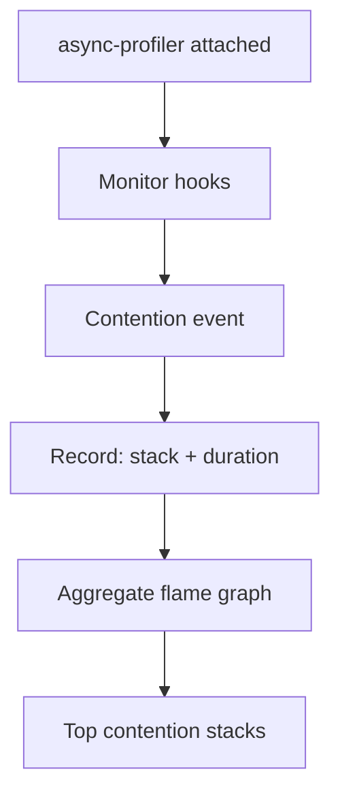

### 📶 Gradual Depth

**Level 1 - What it is:**
A profiler that shows exactly which locks cause threads to wait and for how long - revealing the synchronization bottlenecks in your application.

**Level 2 - How to use it:**

```
./profiler.sh -e lock -d 30 -f contention.html <pid>
```

Opens flame graph in browser. Widest frames = most contention.

**Level 3 - How it works:**
async-profiler registers a JVMTI callback for MonitorContendedEnter events. When a thread blocks on a lock, the profiler captures the blocked thread's stack (via AsyncGetCallTrace - no safepoint needed), the contention duration, and optionally the owner's stack. Events are aggregated into a flame graph or JFR file.

**Level 4 - Production mastery:**
Run continuously in production with `-e lock --lock 1ms` (only events > 1ms). Export to JFR for historical analysis. Correlate lock contention spikes with latency percentile spikes. Identify holder stacks: if holder always does I/O while holding lock, the fix is obvious (move I/O outside lock). Combine with `-e cpu` profiling to see full picture: CPU + lock in one flame graph. Use `--threads` option to see per-thread breakdown.

### ⚙️ How It Works

**Phase 1 - Attach:** Load agent into running JVM: `./profiler.sh start -e lock <pid>`.

**Phase 2 - Hook:** JVMTI MonitorContendedEnter callback registered. Every contended monitor acquisition triggers the profiler.

**Phase 3 - Capture:** On contention: AsyncGetCallTrace captures blocked thread's stack. Timer starts. On MonitorContendedEntered: timer stops. Duration recorded.

**Phase 4 - Aggregate:** Stack traces grouped by leaf method. Total contention time accumulated per unique stack.

**Phase 5 - Output:** Flame graph (HTML/SVG), JFR file, or text summary. Flame width = cumulative contention time.

```text
Event flow:

  Thread-A: monitorenter(lock) -> CONTENDED!
    |
    +-> async-profiler: capture stack(A)
    |   start timer
    |
  Thread-B: monitorexit(lock)
    |
    +-> Thread-A: enters monitor
    +-> async-profiler: stop timer
        record: {stack: A_stack, duration: 5ms}
```

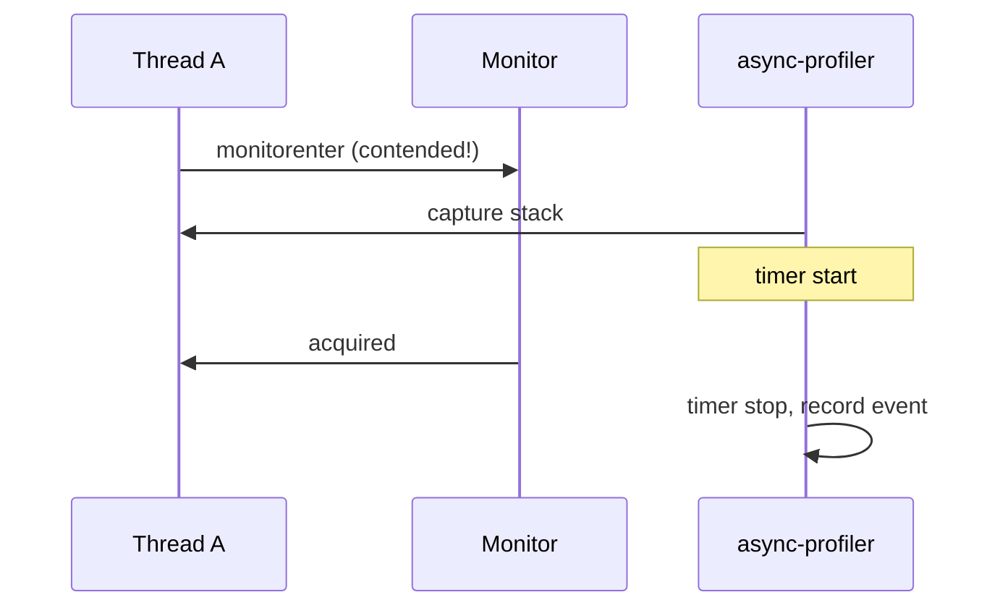

### 🚨 Failure Modes

**Failure 1 - Missing Short Contention:**
**Symptom:** Thread dumps show BLOCKED threads but profiler shows zero contention.
**Root cause:** Default threshold too high. Short contentions (< 10us) filtered out.
**Diagnostic:**

```
# Lower threshold:
./profiler.sh -e lock --lock 0 -d 30 -f out.html <pid>
# 0 = capture ALL contention events
```

**Fix:**

**BAD:**

```bash
# Default threshold misses short contentions:
./profiler.sh -e lock -d 30 -f out.html <pid>
# threshold=10ms by default - misses 1ms locks
```

**GOOD:**

```bash
# Lower threshold to capture all contention:
./profiler.sh -e lock --lock 0 -d 30 -f out.html <pid>
# Captures ALL contention events
```

**Failure 2 - High Overhead Under Extreme Contention:**
**Symptom:** Profiling itself adds 20%+ overhead. Application slows during profiling.
**Root cause:** Millions of contention events per second (highly contended hot lock). Each event has capture cost.
**Diagnostic:**

```
# Check event rate:
./profiler.sh -e lock --lock 100us -d 5 -o summary <pid>
# If events > 100K/s: threshold too low for this app
```

**Fix:** Increase threshold: `--lock 10ms`. Captures only significant contentions. Or: fix the contention first (it is clearly problematic if millions/second).

### 🔬 Production Reality

**Incident pattern: logging framework as contention hotspot.**

Application profiled with async-profiler `-e lock`. Flame graph reveals: 40% of total contention in `java.util.logging.Logger.log()` -> `StreamHandler.publish()` -> `synchronized(this)`. Every log statement from every thread contends on the same handler lock. Fix: migrate to Log4j2 (lock-free ring buffer appender) or Logback with AsyncAppender. Contention drops from 40% to 2%. Throughput improves 35% with zero application code change - only logging config.

### ⚖️ Trade-offs & Alternatives

| Tool                       | Lock Profiling | Safepoint Bias | Overhead  | Production |
| -------------------------- | -------------- | -------------- | --------- | ---------- |
| async-profiler             | Event-based    | None           | Low (~3%) | Yes        |
| JFR (jdk.JavaMonitorEnter) | Event-based    | None           | Low       | Yes        |
| JVisualVM                  | Sampling       | YES (misses)   | Medium    | Dev only   |
| YourKit                    | Event-based    | Partial        | Medium    | Dev only   |
| perf + lock tracing        | OS locks only  | N/A            | High      | Expert     |

### ⚡ Decision Snap

**USE async-profiler lock mode WHEN:**

- Suspect lock contention (CPU idle + poor throughput).
- Need stack-level detail (which code path contends).
- Production profiling needed (low overhead).

**USE JFR WHEN:**

- Already using JFR infrastructure.
- Want historical lock data in continuous recordings.
- Need JMC visualization.

**FIX CONTENTION BY (priority order):**

1. Eliminate lock (lock-free, immutable, confinement).
2. Reduce hold time (move I/O outside lock).
3. Reduce scope (fine-grained locking, striping).
4. Reduce frequency (batching, caching).

### ⚠️ Top Traps

| #   | Misconception                         | Reality                                                                                          |
| --- | ------------------------------------- | ------------------------------------------------------------------------------------------------ |
| 1   | "Low CPU = not a performance problem" | Low CPU + high latency = lock contention. Threads are WAITING, not computing.                    |
| 2   | "Thread dump shows the problem"       | Thread dump = one instant. Contention patterns need TIME SERIES (profiler).                      |
| 3   | "All contention is bad"               | Short contention (<1us) on cold paths is normal. Focus on hot-path, long-duration contention.    |
| 4   | "ReentrantLock has no contention"     | ReentrantLock has park-based contention. async-profiler captures it via `-e lock` (park events). |
| 5   | "Profiling changes behavior"          | async-profiler overhead is <5% for lock mode. Negligible compared to the contention itself.      |

### 🪜 Learning Ladder

**Prerequisites:**

- ReentrantLock vs synchronized - what generates contention
- Thread Lifecycle and States - BLOCKED vs WAITING
- Monitoring Thread Pools in Production - complementary observability

**THIS:** Lock Contention Profiling (async-profiler)

**Next steps:**

- JFR Thread and Lock Events - complementary JDK tool
- False Sharing and Cache Lines - hidden contention source
- GC Safepoints and Thread Coordination - safepoint bias explained

### 💡 Surprising Truth

**The Surprising Truth:**
async-profiler can capture the HOLDER's stack trace at the moment of contention (who holds the lock that blocks you). This answers the most critical question: "WHY is the lock held so long?" Often the holder is doing I/O, GC allocation, or calling another synchronized method (lock nesting) - information invisible in the blocked thread's stack alone.

**Further Reading:**

- Andrei Pangin, "async-profiler" (GitHub repository + wiki)
- Nitsan Wakart, "Java Profiling: Safepoint Bias" (2015)
- Marcus Hirt, "JFR and JMC" (Oracle documentation)

**Revision Card:**

1. async-profiler -e lock: captures who waited, how long, which lock - no safepoint bias.
2. Low CPU + poor throughput = lock contention. Profile to find the specific lock and holder.
3. Fix priority: eliminate lock > reduce hold time > reduce scope > reduce frequency.

---

---

# JFR Thread and Lock Events

**TL;DR** - Java Flight Recorder captures thread lifecycle, lock contention, and synchronization events with near-zero overhead for always-on production diagnostics.

### 🔥 Problem Statement

A production service has intermittent latency spikes (P99 = 5s, P50 = 50ms). Spikes are rare (1 per hour) and impossible to reproduce in dev. You need continuous recording that captures the EXACT moment: which threads were blocked, which lock was contended, what was the holder doing. JFR provides this: always-on, < 1% overhead, ring-buffer recording that captures thread and lock events retroactively when triggered.

### 📜 Historical Context

JFR originated as "JRockit Flight Recorder" (BEA Systems, 2007). Acquired by Oracle via BEA purchase. Proprietary until JDK 11 (open-sourced with JEP 328). JDK 14 added streaming API (JEP 349). JDK 16+: configurable via settings files. Now the standard production diagnostic tool for JVM applications. Complementary to async-profiler (JFR is always-on; async-profiler is targeted deep-dive).

### 🔩 First Principles

**CORE INVARIANTS:**

1. JFR uses a ring buffer: fixed memory, old events overwritten. No OOM risk from recording.
2. Events are captured by JVM internally (not via instrumentation). Near-zero overhead for enabled events.
3. Thread/lock events have configurable thresholds: only events exceeding duration are recorded.

**DERIVED DESIGN:**
Invariant 1: safe to run 24/7 in production. Invariant 2: no bytecode modification, no agent attachment needed. Invariant 3: threshold=10ms captures meaningful contention without drowning in noise.

**THE TRADE-OFF:**
**Gain:** Always-on production diagnostics. Thread+lock events captured retroactively. Zero-config with JDK defaults.
**Cost:** Threshold-based (misses sub-threshold events). Ring buffer loses old data. JFR file analysis requires JMC or programmatic parsing.

### 🧠 Mental Model

> JFR is a black box flight recorder on an airplane. Always recording. When something goes wrong, you pull the box (dump) and see exactly what happened in the minutes before the incident. You do not turn it on after the crash - it was already recording.

- "Black box" -> JFR ring buffer (always recording)
- "Crash" -> latency spike / deadlock / OOM
- "Pull the box" -> jcmd JFR.dump
- "Minutes before" -> configurable buffer duration

**Where this analogy breaks down:** JFR can also be analyzed in real-time via the streaming API (JDK 14+) - not just post-mortem.

### 🧩 Components

- **jdk.JavaMonitorEnter** - event when thread blocks entering synchronized block. Fields: duration, monitorClass, address.
- **jdk.JavaMonitorWait** - event when thread calls Object.wait(). Fields: duration, timedOut, monitorClass.
- **jdk.ThreadPark** - event when thread parks (LockSupport.park). Fields: duration, parkClass, address.
- **jdk.ThreadStart / jdk.ThreadEnd** - thread lifecycle.
- **jdk.VirtualThreadPinned** - virtual thread pinning events (JDK 21+).
- **jdk.ThreadSleep** - Thread.sleep() invocations.
- **Recording settings** - default.jfc (low overhead) vs profile.jfc (more detail).

```text
Key thread/lock events:

  jdk.JavaMonitorEnter:
    startTime, duration, monitorClass, address
    stackTrace (blocked thread)

  jdk.JavaMonitorWait:
    startTime, duration, monitorClass, timedOut

  jdk.ThreadPark:
    startTime, duration, parkedClass, address
    stackTrace (parked thread)

  jdk.VirtualThreadPinned:
    startTime, duration, carrierThread
    stackTrace
```

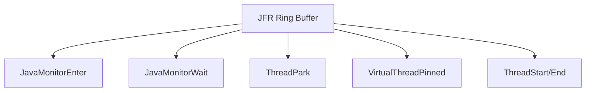

### 📶 Gradual Depth

**Level 1 - What it is:**
Built-in JVM tool that continuously records thread and lock events. Dump anytime to see what happened.

**Level 2 - How to use it:**
Start: `jcmd <pid> JFR.start name=prod settings=profile duration=60s filename=rec.jfr`
Dump: `jcmd <pid> JFR.dump name=prod filename=dump.jfr`
Analyze: Open in JDK Mission Control (JMC) -> Lock Instances tab.

**Level 3 - How it works:**
JVM emits events internally when threads enter contended monitors, park, or sleep. Events written to thread-local buffers (no contention on write). Periodically flushed to global ring buffer. Configurable per-event threshold: jdk.JavaMonitorEnter#threshold=10ms means only contentions > 10ms recorded.

**Level 4 - Production mastery:**
Always-on recording with default.jfc (< 1% overhead). On incident: `JFR.dump` captures last N minutes. For lock analysis: switch to profile.jfc temporarily (lower thresholds, more events). Combine with JFR streaming (JDK 14+) for real-time alerting: `RecordingStream.onEvent("jdk.JavaMonitorEnter", e -> alert(e))`. Correlate lock events with GC events (same recording) for full picture.

### ⚙️ How It Works

**Phase 1 - Configuration:** JFR started with settings file specifying which events and thresholds.

**Phase 2 - Event emission:** JVM internally records events at occurrence point. Thread-local buffer (no lock needed).

**Phase 3 - Buffer flush:** Periodically flush to global buffer (ring). Old events overwritten when full.

**Phase 4 - Dump/stream:** On demand (jcmd) or continuous (stream API). Binary .jfr format.

**Phase 5 - Analysis:** JMC GUI, `jfr` CLI tool, or programmatic RecordingFile API.

```text
JFR event flow:

  JVM event occur -> thread-local buffer
    -> periodic flush -> global ring buffer
      -> dump to file (on demand)
        -> JMC / jfr CLI analysis

  Always recording. Dump captures history.
```

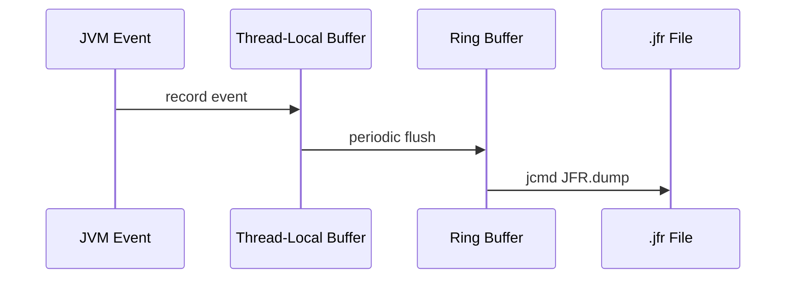

### 🚨 Failure Modes

**Failure 1 - Missing Events (Threshold Too High):**
**Symptom:** JFR shows no lock events but application has visible contention.
**Root cause:** Default threshold (10ms for monitors in default.jfc) filters short but frequent contentions.
**Diagnostic:**

```
jfr print --events jdk.JavaMonitorEnter rec.jfr
# If empty: threshold too high
# Fix: use profile.jfc or custom settings
```

**Fix:**
**BAD:** default.jfc for lock debugging (10ms threshold).
**GOOD:** `jdk.JavaMonitorEnter#threshold=1ms` in custom .jfc file for targeted recording.

**Failure 2 - Ring Buffer Overwritten:**
**Symptom:** Dump taken after incident shows only recent events. The spike was 5 minutes ago but ring holds only 2 minutes.
**Root cause:** Ring buffer size too small for event rate.
**Diagnostic:**

```
jcmd <pid> JFR.configure maxsize=500m
# Or: start with larger buffer
```

**Fix:** Increase maxsize/maxage. Or: set up JFR streaming to external store for permanent history.

### 🔬 Production Reality

**Incident pattern: intermittent 5s latency spike traced via JFR.**

Service has P99 = 5s once per hour. Impossible to catch with on-demand profiling. Always-on JFR captures everything. On spike: `jcmd JFR.dump`. Analysis in JMC: at spike time, 50 threads show jdk.JavaMonitorEnter events (duration 4.8-5.2s) on `com.app.CacheService.cacheLock`. The holder thread's stack (in jdk.JavaMonitorEnter event) shows: cache miss -> DB query -> full table scan (5s). Fix: add read timeout on DB queries + separate read/write locks on cache.

### ⚖️ Trade-offs & Alternatives

| Tool                  | Always-On | Lock Detail    | Overhead      | Output      |
| --------------------- | --------- | -------------- | ------------- | ----------- |
| JFR                   | Yes       | Event-based    | <1% (default) | .jfr binary |
| async-profiler        | Targeted  | Stack-level    | <5%           | Flame graph |
| JMX ThreadMXBean      | Yes       | Aggregate only | ~0%           | Metrics     |
| jstack/thread dump    | On demand | Snapshot only  | ~0%           | Text        |
| Micrometer/Prometheus | Yes       | Custom metrics | ~0%           | Time series |

### ⚡ Decision Snap

**USE JFR always-on WHEN:**

- Production environment. Default settings. Dump on incident.
- Want zero-overhead continuous diagnostics.
- Need thread + lock + GC + allocation in ONE recording.

**ADD async-profiler WHEN:**

- Need deeper flame-graph analysis.
- JFR threshold misses short contentions.
- Want holder stack trace detail.

**USE JFR streaming WHEN:**

- Want real-time alerts on lock events.
- Building custom monitoring (JDK 14+).

### ⚠️ Top Traps

| #   | Misconception                     | Reality                                                                                                         |
| --- | --------------------------------- | --------------------------------------------------------------------------------------------------------------- |
| 1   | "JFR is only for post-mortem"     | JFR streaming (JDK 14+) enables real-time alerting and dashboards.                                              |
| 2   | "JFR replaces async-profiler"     | JFR captures events. async-profiler captures CPU sampling + allocation + lock with flame graphs. Complementary. |
| 3   | "default.jfc captures everything" | No. Many events have threshold=10ms. Short contention missed. Use profile.jfc for deep analysis.                |
| 4   | "JFR needs restart"               | No. Start/stop/dump via jcmd at runtime. No restart needed.                                                     |
| 5   | "JFR is Java-only"                | JFR captures native frames, GC internals, OS events. Not limited to Java code.                                  |

### 🪜 Learning Ladder

**Prerequisites:**

- Thread Lifecycle and States - what events track
- ReentrantLock vs synchronized - both generate events
- Monitoring Thread Pools in Production - complementary

**THIS:** JFR Thread and Lock Events

**Next steps:**

- Lock Contention Profiling (async-profiler) - deeper analysis
- GC Safepoints and Thread Coordination - related JFR events
- False Sharing and Cache Lines - performance invisible to JFR

### 💡 Surprising Truth

**The Surprising Truth:**
JFR's thread-local buffer design means recording ZERO contention on the WRITE path. Each thread writes events to its own buffer. No shared lock to record events. This is why JFR achieves <1% overhead even recording millions of events/second - the recording infrastructure itself is contention-free by design.

**Further Reading:**

- JEP 328: Flight Recorder (open-source, JDK 11)
- JEP 349: JFR Event Streaming (JDK 14)
- Marcus Hirt, "Java Flight Recorder" (Oracle blog series)

**Revision Card:**

1. JFR = always-on black box. Ring buffer. Dump anytime. <1% overhead with default settings.
2. Key events: jdk.JavaMonitorEnter (contention), jdk.ThreadPark (lock waits), jdk.VirtualThreadPinned.
3. Production: always run default.jfc. On incident: dump + analyze in JMC. For deep lock analysis: profile.jfc.

---

---

# False Sharing and Cache Lines

**TL;DR** - False sharing occurs when threads on different cores modify independent variables that share the same cache line, causing constant invalidation and 10-100x slowdown on concurrent counters.

### 🔥 Problem Statement

Two AtomicLong counters (requestCount, errorCount) are fields in the same object. Adjacent in memory = same 64-byte cache line. Thread-1 on Core-0 increments requestCount. Thread-2 on Core-1 increments errorCount. Each increment invalidates the OTHER core's cache line (MESI protocol: Modified -> Invalid). Both cores constantly re-fetch the same line from L3/memory. Result: 10x slower than if counters were on separate cache lines - despite being logically independent.

### 📜 Historical Context

False sharing was first documented in shared-memory multiprocessor research (1990s). Java initially had no mitigation. JDK 8 added `@Contended` annotation (sun.misc.Contended, JEP 142) for internal use. JDK 9 moved it to jdk.internal.vm.annotation.Contended. External use requires `--add-opens`. LongAdder and Striped64 use @Contended internally. JEP 401 (Primitive Classes) may offer future alternatives.

### 🔩 First Principles

**CORE INVARIANTS:**

1. CPUs operate on CACHE LINES (typically 64 bytes), not individual bytes.
2. When one core writes a cache line, ALL other cores' copies of that line are invalidated (MESI/MOESI protocol).
3. Invalidation triggers a cross-core coherence transaction (100-300 cycles latency on modern CPUs).

**DERIVED DESIGN:**
If two independent variables fall in the same 64-byte line AND are written by different cores, each write forces the other core to re-fetch. Neither variable is logically shared - but they are PHYSICALLY shared via the cache line. Fix: pad or align to ensure hot variables occupy separate cache lines.

**THE TRADE-OFF:**
**Gain (of padding):** Eliminates false invalidation. 10-100x improvement for hot concurrent counters.
**Cost:** Wasted memory (56 bytes padding per field). Only matters for high-frequency concurrent writes. Over-padding wastes L1 cache capacity.

### 🧠 Mental Model

> Two people writing in separate notebooks (variables) placed on the same shelf (cache line). Every time person A writes, the librarian (CPU coherence protocol) takes the ENTIRE shelf to person A's desk. Person B now has to request it back. They pass the shelf back and forth (ping-pong) despite writing in DIFFERENT notebooks.

- "Shelf" -> cache line (64 bytes)
- "Notebooks" -> independent variables
- "Librarian passing shelf" -> cache coherence invalidation
- "Back and forth" -> line bouncing between cores

**Where this analogy breaks down:** cache coherence is done in hardware at nanosecond scale. The "cost" is latency per access (100ns extra), not total blocking.

### 🧩 Components

- **Cache line** - 64 bytes (Intel, AMD). The unit of transfer between cache levels and cores.
- **MESI protocol** - Modified/Exclusive/Shared/Invalid states. Write to Shared line -> invalidate all other copies.
- **@Contended** - JDK annotation adding 128-byte padding around fields. Requires `--add-opens` for user code.
- **LongAdder** - uses @Contended cells internally. Each cell on separate cache line. Eliminates false sharing for counters.
- **Manual padding** - `long p1,p2,p3,p4,p5,p6,p7;` between fields to fill cache line.

```text
Memory layout (no padding):

  [requestCount|errorCount|..other fields..]
  |<---- 64-byte cache line ---->|

  Core-0 writes requestCount -> invalidates
  Core-1's copy of ENTIRE line (including
  errorCount). Core-1 must re-fetch to read
  errorCount.

With padding:

  [requestCount|pad...56 bytes...|errorCount|...]
  |<---- cache line 1 ---->|<---- cache line 2 -->|

  Core-0 writes line 1. Core-1's line 2 unaffected.
```

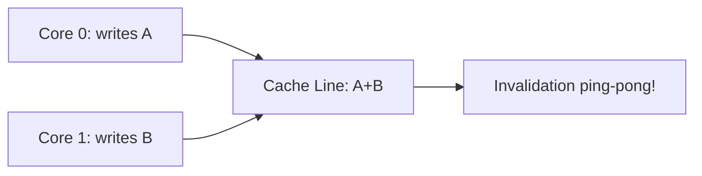

### 📶 Gradual Depth

**Level 1 - What it is:**
When two threads on different CPUs update different variables that happen to sit next to each other in memory, the hardware treats them as one unit and slows both down.

**Level 2 - How to use it:**
Use LongAdder instead of AtomicLong for hot counters. If custom: add `@jdk.internal.vm.annotation.Contended` to hot fields (with `--add-opens`). Or pad manually.

**Level 3 - How it works:**
CPU caches operate on 64-byte lines. MESI protocol: when Core-0 writes its line, all copies on other cores become Invalid. Other cores must fetch from L3 or memory (100-300 cycles). If cores write different variables on the same line at high frequency: constant invalidation traffic. Effective bandwidth for these variables drops to L3/memory speed instead of L1 speed.

**Level 4 - Production mastery:**
Detect with perf stat: `perf stat -e cache-misses,L1-dcache-load-misses -p <pid>`. High L1 misses on simple counters = likely false sharing. Verify with JMH @State(Scope.Thread) benchmark showing slowdown with shared object vs padded. Use `perf c2c` (cache-to-cache transfer analysis) for definitive detection. In production: LongAdder/LongAccumulator for counters. For custom data structures: @Contended or manual padding.

### ⚙️ How It Works

**Phase 1 - Initial state:** Both cores have cache line in Shared state. Both can read freely.

**Phase 2 - Core-0 writes variable A:** Line transitions to Modified on Core-0. Core-1's copy becomes Invalid.

**Phase 3 - Core-1 needs variable B (same line):** Cache miss. Must fetch from Core-0 (snoop). 100+ cycles latency.

**Phase 4 - Core-1 writes variable B:** Line transitions to Modified on Core-1. Core-0's copy becomes Invalid.

**Phase 5 - Repeat:** Every write by either core triggers the other's invalidation. "Ping-pong" at hardware level.

```text
MESI state transitions (same line):

  Core-0   Core-1   Action
  S        S        (initial: both Shared)
  M        I        Core-0 writes A
  I        M        Core-1 writes B
  M        I        Core-0 writes A
  I        M        Core-1 writes B
  ...ping-pong continues...

  Each transition: ~100 cycles penalty
```

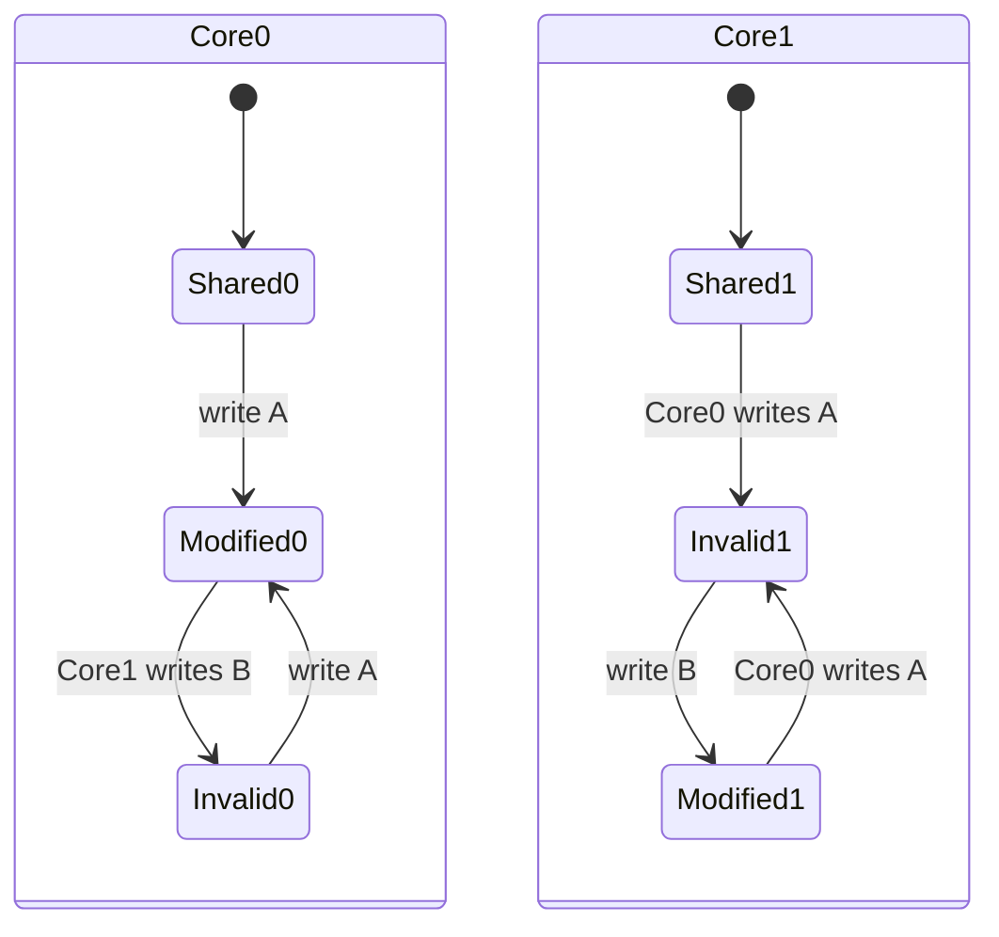

### 🚨 Failure Modes

**Failure 1 - Counter Performance Collapse:**
**Symptom:** Multi-threaded counter increment 10-50x slower than single-threaded. AtomicLong.incrementAndGet() takes microseconds instead of nanoseconds.
**Root cause:** Multiple AtomicLong fields on same cache line updated by different threads.
**Diagnostic:**

```
# JMH benchmark comparing:
# Shared object with adjacent counters vs
# Padded object (separate cache lines)
# perf stat -e L1-dcache-load-misses
```

**Fix:**
**BAD:** `class Counters { AtomicLong a; AtomicLong b; }`
**GOOD:** Use LongAdder (internally padded). Or: `@Contended AtomicLong a; @Contended AtomicLong b;`

**Failure 2 - Invisible in Profiles:**
**Symptom:** Hot loop shows no lock contention, no synchronization, but scales poorly across cores.
**Root cause:** False sharing is invisible to Java profilers (no lock involved). Only visible via hardware counters.
**Diagnostic:**

```bash
perf c2c record -p <pid> -- sleep 10
perf c2c report
# Shows cache lines with cross-core contention
```

**Fix:** Identify the contested cache line address. Map to Java field (GC may move objects - pin or use off-heap). Pad the field.

### 🔬 Production Reality

**Incident pattern: Disruptor-style ring buffer with false sharing.**

A high-frequency trading system uses a custom ring buffer. Producer and consumer maintain their own sequence counters (cursor, gatingSequence). Both on same object = same cache line. Producer on Core-0, consumer on Core-1: constant cache-line ping-pong. Throughput: 2M events/s. After padding sequences onto separate cache lines: 20M events/s. 10x improvement. LMAX Disruptor learned this lesson publicly (2011) - all Disruptor sequence fields use padding. Same principle applies to any hot concurrent data structure.

### ⚖️ Trade-offs & Alternatives

| Mitigation                  | Memory Cost            | Applicability              | Complexity         |
| --------------------------- | ---------------------- | -------------------------- | ------------------ |
| @Contended                  | 128 bytes/field        | JDK internal + --add-opens | Low                |
| Manual padding              | 56 bytes/field         | Any JDK                    | Medium             |
| LongAdder                   | Per-cell padding       | Counters only              | Zero (just use it) |
| Separate objects            | Object header overhead | Any                        | Low                |
| Off-heap (Unsafe/VarHandle) | Manual layout          | Expert                     | High               |

### ⚡ Decision Snap

**PAD WHEN:**

- Hot counters updated by multiple threads.
- Custom concurrent data structures (queues, buffers).
- Benchmark shows scaling anomaly (more cores = slower).

**DO NOT PAD WHEN:**

- Low-frequency updates (once per second).
- Single-threaded access.
- Not performance-critical code.

**USE LongAdder WHEN:**

- Hot counter. Always. No reason to use AtomicLong for counters with >2 threads.

### ⚠️ Top Traps

| #   | Misconception                                | Reality                                                                                         |
| --- | -------------------------------------------- | ----------------------------------------------------------------------------------------------- |
| 1   | "Java GC moves objects - padding is useless" | GC preserves field ORDERING within object. Padding between fields is stable.                    |
| 2   | "Only matters for nanosecond-sensitive code" | At high frequency (millions/sec), false sharing costs SECONDS of cumulative latency per minute. |
| 3   | "@Contended is public API"                   | No. It is jdk.internal. Requires --add-opens. May change. LongAdder is the public solution.     |
| 4   | "Cache line is always 64 bytes"              | x86: yes. ARM: often 64 but some are 128. Apple M1: 128 bytes. @Contended pads 128 to be safe.  |
| 5   | "volatile fields have same problem"          | Yes. volatile does not prevent false sharing. It is a MEMORY concern, not a VISIBILITY concern. |

### 🪜 Learning Ladder

**Prerequisites:**

- Lock-Free Algorithms (CAS) - uses AtomicLong (affected)
- VarHandle and Memory Fences - low-level memory access
- More Threads is Better is Wrong - scaling limits

**THIS:** False Sharing and Cache Lines

**Next steps:**

- GC Safepoints and Thread Coordination - another hardware-level concern
- Lock Contention Profiling (async-profiler) - complementary detection
- Designing a Scheduler from First Principles - cache-aware design

### 💡 Surprising Truth

**The Surprising Truth:**
LongAdder can be 10-100x faster than AtomicLong under high contention - not because CAS is slow, but because AtomicLong's single memory location causes cache-line invalidation across ALL cores on every CAS. LongAdder distributes updates across multiple padded cells (one per core), eliminating cross-core traffic. The final sum() aggregates all cells. This is why metrics libraries (Micrometer) always use LongAdder internally.

**Further Reading:**

- LMAX Disruptor Technical Paper, "Mechanical Sympathy" (Martin Thompson, 2011)
- Intel, "Avoiding and Identifying False Sharing Among Threads" (whitepaper)
- Doug Lea, Striped64 source code (JDK) - internal false sharing mitigation

**Revision Card:**

1. Cache line = 64 bytes. Two hot variables on same line + different cores = invalidation ping-pong = 10-100x slower.
2. Fix: LongAdder for counters. @Contended or manual padding for custom structures.
3. Detection: perf c2c (Linux), scaling anomaly in benchmarks, high L1 misses on simple ops.

---

---

# GC Safepoints and Thread Coordination

**TL;DR** - GC safepoints are JVM-coordinated pauses where all threads must reach a "safe" point before GC can inspect heap references - long time-to-safepoint stalls the entire JVM.

### 🔥 Problem Statement

A service experiences 200ms latency spikes that do NOT correlate with GC pause duration (GC log shows 5ms pauses). Investigation reveals: the 200ms is time-to-safepoint (TTSP) - waiting for ONE thread in a counted loop to reach a safepoint poll. All other threads are stopped, waiting. The total pause = TTSP + GC work. If TTSP dominates: even "fast" GC collectors cannot help. This is a JVM scheduling problem, not a GC algorithm problem.

### 📜 Historical Context

Safepoints have existed since early HotSpot (1999). Originally: compile safepoint polls at method returns and loop back-edges (uncounted loops). Counted loops (for-int with known bounds) were EXCLUDED for performance - the JIT assumed short iterations. JDK 14 added `-XX:+UseCountedLoopSafepoints` (loop strip mining) to insert polls in counted loops. JDK 17+ defaults to loop strip mining enabled. JEP 312 (JDK 10) added thread-local handshakes for per-thread operations without global safepoints.

### 🔩 First Principles

**CORE INVARIANTS:**

1. A safepoint is a point where a thread's object references are known to the JVM (can be scanned by GC).
2. For a global safepoint: ALL threads must reach a safepoint before the VM operation can proceed.
3. Time-to-safepoint (TTSP) = max(individual thread's time to reach poll point). ONE slow thread stalls ALL.

**DERIVED DESIGN:**
Invariant 3: TTSP is determined by the SLOWEST thread. A counted loop iterating 10M times without safepoint polls adds O(ms) TTSP. Invariant 2: even non-GC operations (deoptimization, biased lock revocation, thread dump) request global safepoints.

**THE TRADE-OFF:**
**Gain (of safepoints):** Enables exact GC, deoptimization, and runtime coordination. Simple correctness model.
**Cost:** Global pauses. TTSP adds latency. Counted loops need explicit polling (loop strip mining adds overhead).

### 🧠 Mental Model

> A school fire drill (safepoint). ALL students (threads) must reach the assembly point (safepoint poll). The drill does not start until EVERY student arrives. One student in the bathroom (counted loop) holds up the ENTIRE school. The actual drill (GC work) is fast - but waiting for that one student is the latency.

- "Fire drill" -> safepoint request (GC, etc.)
- "Assembly point" -> safepoint poll location
- "Student in bathroom" -> thread in counted loop
- "Entire school waits" -> all threads stopped

**Where this analogy breaks down:** thread-local handshakes (JEP 312) allow some operations to target individual threads without stopping all - like checking on just one student without stopping the whole school.

### 🧩 Components

- **Safepoint poll** - instruction checking a "should I stop?" flag. Inserted by JIT at back-edges and method returns.
- **Time-to-safepoint (TTSP)** - time from safepoint request to all threads reached safepoint.
- **VM operation** - the work done at safepoint (GC, deopt, biased lock revocation, thread dump).
- **Loop strip mining** - JIT inserts safepoint polls in counted loops every N iterations (default: strip of 1000).
- **Thread-local handshake** - per-thread operation without global stop. Used for: biased lock revocation (JDK 15+), stack walks.
- **JFR events** - jdk.SafepointBegin, jdk.SafepointEnd, jdk.SafepointStateSynchronization (TTSP).

```text
Safepoint timeline:

  Request  |---TTSP----|---GC work---|  Resume
           ^           ^             ^
    safepoint    all threads   operation
    requested    stopped       complete

  TTSP = waiting for slowest thread
  Often: TTSP >> GC work duration!
```

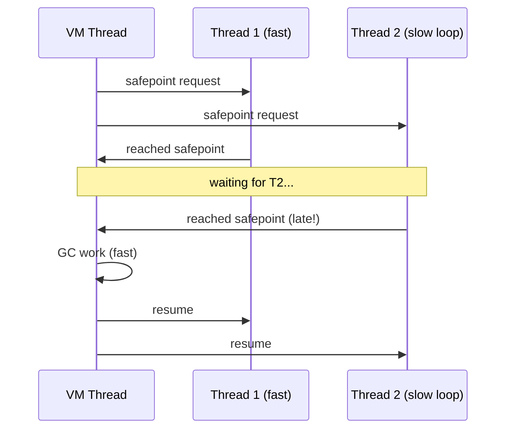

### 📶 Gradual Depth

**Level 1 - What it is:**
The JVM sometimes needs ALL threads to pause (for GC, etc). Each thread must reach a checkpoint. The time waiting for the slowest thread is "time-to-safepoint" - often larger than the actual GC pause.

**Level 2 - How to use it:**
Enable diagnostics: `-Xlog:safepoint` (JDK 11+). Look for high TTSP. Common cause: large counted loops (for-int). Fix: ensure `-XX:+UseCountedLoopSafepoints` (default JDK 17+).

**Level 3 - How it works:**
JIT compiler inserts safepoint poll instructions (memory load from a special page). At safepoint request: page is made unreadable. Next poll triggers SIGSEGV, handled by JVM to stop the thread. Counted loops historically skipped polls (optimization). Loop strip mining divides counted loops into strips of ~1000 iterations with polls between strips.

**Level 4 - Production mastery:**
Monitor TTSP via JFR jdk.SafepointStateSynchronization event. Alert on TTSP > 50ms. Causes: (1) counted loops without strip mining (pre-JDK 17 or disabled), (2) JNI code (native methods have no polls), (3) very long instruction sequences between polls. Use `-XX:GuaranteedSafepointInterval=1000` (ms) to force periodic safepoints for monitoring. Thread-local handshakes (JEP 312) reduce global safepoint frequency for operations that need only one thread.

### ⚙️ How It Works

**Phase 1 - Request:** VM thread needs safepoint. Sets global flag. Makes polling page unreadable.

**Phase 2 - Polling:** Running threads hit safepoint poll (memory access to polling page). Triggers handler. Thread blocks.

**Phase 3 - Waiting (TTSP):** VM thread waits until all threads have reported. One thread in JNI, counted loop, or between polls delays everyone.

**Phase 4 - Operation:** All threads stopped. VM performs operation (GC, deopt, etc.).

**Phase 5 - Resume:** Polling page made readable. Threads unblock and continue.

```text
Safepoint poll mechanism:

  JIT-compiled method:
    mov rax, [polling_page]  ; safepoint poll
    ; if page is readable: no-op (fast)
    ; if page is unreadable: SIGSEGV
    ;   -> handler -> block thread

  Counted loop (no strip mining):
    for (int i=0; i<10_000_000; i++) {
        // NO poll inside! Thread stuck until
        // loop ends and hits method return poll.
    }
```

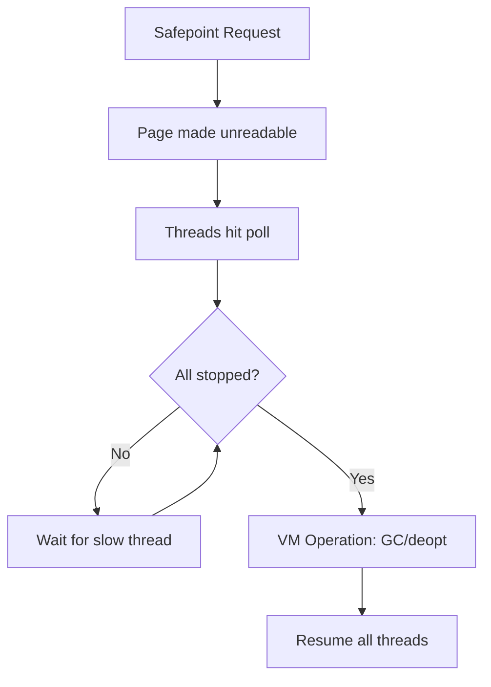

### 🚨 Failure Modes

**Failure 1 - Long TTSP from Counted Loop:**
**Symptom:** Latency spikes unrelated to GC pause time. TTSP in logs shows 100-500ms.
**Root cause:** Thread in tight counted loop (array copy, hash computation) without safepoint polls.
**Diagnostic:**

```
-Xlog:safepoint*=debug
# Shows: "Entering safepoint region: ..."
# "Threads which did not reach safepoint: 0x..."
# JFR: jdk.SafepointStateSynchronization > 50ms
```

**Fix:**
**BAD:** `for (int i=0; i<100_000_000; i++) { array[i] = 0; }`
**GOOD:** Ensure `-XX:+UseCountedLoopSafepoints` (JDK 17+ default). Or: restructure to use Arrays.fill() (has polls).

**Failure 2 - JNI Thread Blocking Safepoint:**
**Symptom:** TTSP shows one thread consistently delayed. Thread is in native method.
**Root cause:** JNI code does not have safepoint polls. Thread transitions back to Java only at JNI call return.
**Diagnostic:**

```
# Thread dump during stall:
# One thread in "native" state
jcmd <pid> Thread.print | grep "in native"
```

**Fix:** Ensure native methods return promptly. For long native operations: periodically call back into Java to allow safepoint. Or: use JNI critical regions only when necessary.

### 🔬 Production Reality

**Incident pattern: biased lock revocation causing cascading TTSP.**

Pre-JDK 15 application using default biased locking. Under contention, biased lock must be revoked - requires global safepoint. High-contention workload triggers thousands of revocations per second. Each revocation = global safepoint request. TTSP compounds: requests queue. Application spends 30% of time in safepoint synchronization. Fix: `-XX:-UseBiasedLocking` (pre-JDK 15) or upgrade to JDK 15+ (biased locking disabled by default, JEP 374). Lesson: "optimization" features (biased locking) can become liabilities under contention.

### ⚖️ Trade-offs & Alternatives

| Approach               | TTSP Impact                | Throughput      | Availability |
| ---------------------- | -------------------------- | --------------- | ------------ |
| Default (JDK 17+)      | Low (strip mining)         | Baseline        | JDK 17+      |
| No strip mining        | HIGH (counted loops)       | Slightly higher | Pre-JDK 17   |
| Thread-local handshake | Eliminates some global SPs | Better          | JDK 10+      |
| ZGC/Shenandoah         | Minimal STW (~1ms)         | Slight overhead | JDK 15+      |
| Zing (Azul)            | Fully concurrent           | Commercial      | Commercial   |

### ⚡ Decision Snap

**MONITOR TTSP WHEN:**

- Latency-sensitive applications (P99 < 50ms target).
- Seeing latency spikes uncorrelated with GC log pauses.
- Running pre-JDK 17 (no default strip mining).

**FIX LONG TTSP BY:**

1. Enable loop strip mining: `-XX:+UseCountedLoopSafepoints` (pre-JDK 17).
2. Avoid long JNI operations without returning to Java.
3. Upgrade to JDK 15+ (eliminates biased lock revocation safepoints).

**IGNORE TTSP WHEN:**

- Throughput application (batch processing) where pauses do not matter.
- JDK 17+ with default settings (usually fine).

### ⚠️ Top Traps

| #   | Misconception                                | Reality                                                                                                   |
| --- | -------------------------------------------- | --------------------------------------------------------------------------------------------------------- |
| 1   | "GC pause = total application pause"         | Total pause = TTSP + GC work. TTSP can be 10-100x the GC pause itself.                                    |
| 2   | "Low-latency GC (ZGC) eliminates all pauses" | ZGC minimizes GC pauses (~1ms). But TTSP still exists for safepoint synchronization.                      |
| 3   | "Only GC uses safepoints"                    | Thread dump, deoptimization, biased lock revocation, class redefinition ALL request safepoints.           |
| 4   | "Safepoint polls are expensive"              | One memory load instruction. Nanosecond cost. Overhead is negligible except in ultra-tight counted loops. |
| 5   | "JNI is safe for short operations"           | Even short JNI delays safepoint if timed unluckily. Consistent issue under high safepoint frequency.      |

### 🪜 Learning Ladder

**Prerequisites:**

- Thread Lifecycle and States - thread suspension
- More Threads is Better is Wrong - coordination overhead
- Lock Contention Profiling (async-profiler) - complementary

**THIS:** GC Safepoints and Thread Coordination

**Next steps:**

- False Sharing and Cache Lines - another JVM-level concern
- JFR Thread and Lock Events - safepoint event analysis
- Lock Contention Profiling - safepoint bias in profilers

### 💡 Surprising Truth

**The Surprising Truth:**
A thread dump (`jcmd Thread.print`) triggers a global safepoint. In production with frequent monitoring (thread dumps every 10s), each dump adds TTSP latency to ALL threads. At scale (1000 threads, some in JNI): each dump can add 50-100ms pause. Thread-local handshakes (JDK 10+) fixed this for some operations, but jcmd Thread.print still requires global safepoint in most JDK versions.

**Further Reading:**

- Alexey Shipilev, "JVM Anatomy Quark #22: Safepoint Polls" (2018)
- JEP 312: Thread-Local Handshakes (JDK 10)
- JEP 374: Disable Biased Locking by Default (JDK 15)

**Revision Card:**

1. TTSP = time waiting for slowest thread to reach safepoint. Can dominate total pause time.
2. Causes: counted loops (pre-JDK 17), JNI, biased lock revocation (pre-JDK 15).
3. Fix: -XX:+UseCountedLoopSafepoints (JDK 17 default), avoid long JNI, upgrade JDK.

---

---

# synchronized to Virtual Threads Migration

**TL;DR** - Migrating from synchronized to ReentrantLock (and ThreadLocal to ScopedValue) is the critical path for adopting virtual threads without pinning-induced performance collapse.

### 🔥 Problem Statement

A team migrates from Tomcat thread pool (200 threads) to virtual threads (JDK 21). Expected: 10x throughput. Actual: throughput DECREASES. Investigation: synchronized blocks in JDBC driver, connection pool, and application code pin carrier threads. With only 8 carriers pinned: entire scheduler stalls. The migration requires systematically replacing synchronized with VT-compatible alternatives BEFORE switching to virtual threads.

### 📜 Historical Context

synchronized has been Java's primary locking since 1.0. ReentrantLock added in JDK 5 as alternative with more features (tryLock, fairness, Condition). For 18 years, synchronized was "preferred" (simpler, JVM-optimized). Virtual threads (JDK 21) reversed this: synchronized pins carriers while ReentrantLock does not. JEP 491 (JDK 24) targets fixing synchronized pinning, but migration to ReentrantLock is required for JDK 21-23.

### 🔩 First Principles

**CORE INVARIANTS:**

1. synchronized acquires an object monitor tied to the OS/carrier thread. Cannot unmount VT while holding.
2. ReentrantLock uses AbstractQueuedSynchronizer (AQS). Threads park() while waiting - VT-compatible (unmounts).
3. ThreadLocal per-VT creates O(N) memory. ScopedValue inheritance is O(1).

**DERIVED DESIGN:**
Migration has two axes: LOCKING (synchronized -> ReentrantLock) and CONTEXT (ThreadLocal -> ScopedValue). Both are required for full VT adoption. Locking migration is CRITICAL (pins); context migration is IMPORTANT (memory).

**THE TRADE-OFF:**
**Gain:** Full VT concurrency without pinning. Proper scalability to millions of VTs.
**Cost:** Code changes in every synchronized block with I/O. Testing for correctness equivalence. Library dependency updates (some have internal synchronized).

### 🧠 Mental Model

> Migrating to VTs without fixing synchronized is like buying a sports car but keeping the parking brake on. The car (VT) can go fast, but the brake (pinning) prevents it. Migration = releasing the brake, one component at a time.

- "Sports car" -> virtual threads (lightweight, fast)
- "Parking brake" -> synchronized (pins carrier)
- "Release brake" -> migrate to ReentrantLock
- "One component" -> incremental migration

**Where this analogy breaks down:** unlike a single brake, there may be dozens of synchronized blocks across application + libraries. Each must be addressed independently.

### 🧩 Components

- **Audit phase** - find all synchronized blocks containing blocking calls (I/O, sleep, park).
- **Priority ranking** - hot paths first, cold paths later. Frequency x duration = impact.
- **Lock replacement** - synchronized -> ReentrantLock with try/finally pattern.
- **Library updates** - upgrade dependencies with VT-compatible versions (HikariCP 5.1+, etc.).
- **ThreadLocal replacement** - ThreadLocal -> ScopedValue for request-scoped context.
- **Verification** - JFR jdk.virtualThreadPinned events = 0 on hot paths.

```text
Migration steps:

  1. AUDIT: find synchronized + I/O
     grep -rn "synchronized" | filter for I/O

  2. RANK: frequency x duration = priority
     High: JDBC, HTTP client, connection pool
     Low: startup config, shutdown hooks

  3. REPLACE:
     synchronized(lock) { io(); }
       ->
     lock.lock(); try { io(); } finally {
         lock.unlock();
     }

  4. VERIFY: run with VTs + JFR pinning events
```

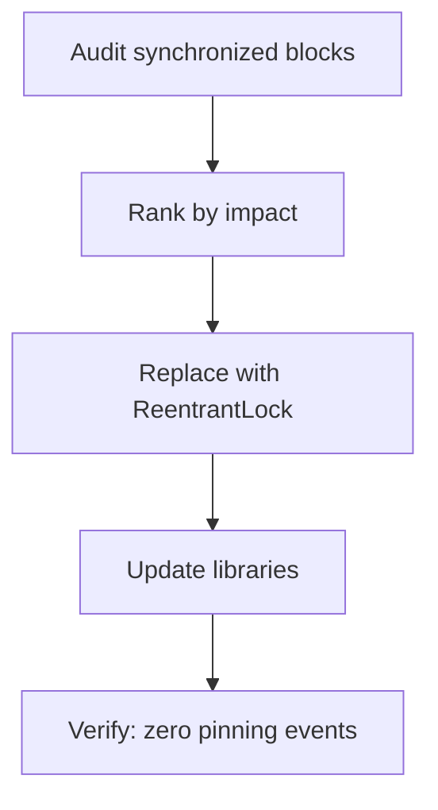

### 📶 Gradual Depth

**Level 1 - What it is:**
Replacing synchronized with ReentrantLock so virtual threads can properly unmount during blocking operations instead of being "pinned" to carrier threads.

**Level 2 - How to use it:**
Find: `grep -rn "synchronized" src/`. For each block containing I/O: replace with ReentrantLock. Run tests. Deploy with JFR pinning detection enabled.

**Level 3 - How it works:**
synchronized uses object monitors (OS thread identity). ReentrantLock uses AQS which parks waiting threads via LockSupport.park() - a VT-aware operation that triggers unmount. The semantic difference: none (both are reentrant mutual exclusion). The implementation difference: VT-compatible vs VT-pinning.

**Level 4 - Production mastery:**
Automated detection: `-Djdk.tracePinnedThreads=short` in staging. CI integration: run load test with VTs, assert zero pinning events in JFR. For third-party libraries: check VT compatibility status pages (many frameworks publish these). Use byte-buddy or Java agent to detect synchronized-with-I/O at class-load time. Staged rollout: migrate and verify one service at a time.

### ⚙️ How It Works

**Phase 1 - Audit:** Static analysis or grep for synchronized blocks. Manual review for I/O inside blocks.

**Phase 2 - Classify:**

- CRITICAL: synchronized + network I/O (pins during entire network wait).
- IMPORTANT: synchronized + file I/O (pins during disk wait).
- LOW: synchronized + pure CPU (no pinning during blocking - but brief pin during monitor acquisition).

**Phase 3 - Replace (mechanical):**

```text
BEFORE:
  private final Object lock = new Object();
  synchronized(lock) {
      data = fetchFromNetwork();
  }

AFTER:
  private final ReentrantLock lock = new ReentrantLock();
  lock.lock();
  try {
      data = fetchFromNetwork();
  } finally {
      lock.unlock();
  }
```

**Phase 4 - Verify:** Load test with virtual threads. Check JFR for jdk.virtualThreadPinned events.

**Phase 5 - Library migration:** Update deps with VT-compatible versions.

```text
Common library migration map:

  HikariCP < 5.1 -> HikariCP >= 5.1
  Logback sync   -> Logback async appender
  JDBC drivers   -> check vendor VT support
  Jackson        -> generally safe (CPU-bound)
  Spring Boot    -> 3.2+ (VT-aware)
```

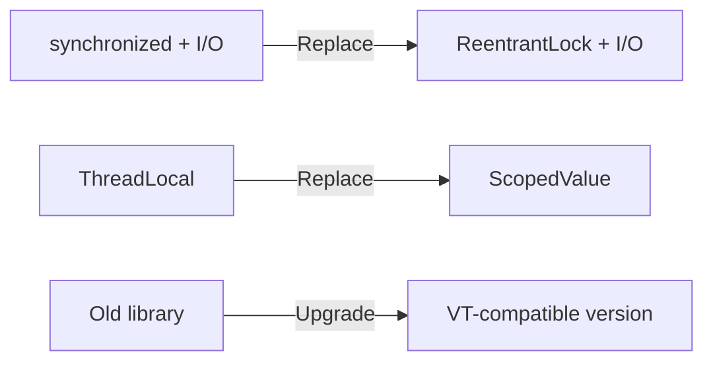

### 🚨 Failure Modes

**Failure 1 - Incomplete Migration (Hidden synchronized):**
**Symptom:** Pinning events still occur after migrating application code.
**Root cause:** Third-party library uses synchronized internally (JDBC driver, serialization library).
**Diagnostic:**

```
-Djdk.tracePinnedThreads=full
# Stack trace shows pinning in com.thirdparty.SomeClass
# Not your code - library internal synchronized
```

**Fix:**

**BAD:**

```java
// Assuming app code migration is sufficient:
Thread.startVirtualThread(() -> thirdPartyLib.call());
// Library uses synchronized + I/O internally!
```

**GOOD:**

```java
// Wrap incompatible library in platform pool:
platformPool.submit(() -> thirdPartyLib.call()).get();
// VT unmounts on get() (park-based), no pinning.
```

**Failure 2 - Behavioral Difference After Migration:**
**Symptom:** Race condition or deadlock appears after replacing synchronized with ReentrantLock.
**Root cause:** Code relied on synchronized's IDENTITY semantics (wait/notify on same object). ReentrantLock uses Condition objects (different API).
**Diagnostic:**

```
# Look for: lock.wait() or lock.notify()
# These are Object methods, not Lock methods!
# synchronized(obj) { obj.wait(); }
# becomes: lock.lock(); condition.await();
```

**Fix:** Replace Object.wait/notify/notifyAll with Condition.await/signal/signalAll.

### 🔬 Production Reality

**Incident pattern: hybrid migration with fallback pool.**

Large service cannot upgrade JDBC driver (vendor certification pending). Solution: create dedicated platform-thread pool for DB calls. Virtual threads handle HTTP requests and non-DB work. DB calls: `dbPool.submit(callable).get()` (blocks VT on get(), but VT unmounts properly because get() uses park(), not synchronized). Pinning eliminated. When vendor releases VT-compatible driver: remove dbPool wrapper. Lesson: hybrid migration (VTs + dedicated platform pools for incompatible code) enables incremental adoption.

### ⚖️ Trade-offs & Alternatives

| Strategy                                  | Effort | Completeness        | Risk                 |
| ----------------------------------------- | ------ | ------------------- | -------------------- |
| Full migration (ReentrantLock everywhere) | High   | Complete            | Behavioral diffs     |
| Hybrid (platform pool for pinning code)   | Medium | Partial             | Extra pool overhead  |
| Wait for JEP 491 (JDK 24)                 | Zero   | Eventually complete | Timeline uncertainty |
| Stay on platform threads                  | Zero   | N/A                 | No VT benefits       |

### ⚡ Decision Snap

**MIGRATE NOW WHEN:**

- JDK 21-23. Need VT benefits immediately.
- Application code synchronized blocks are auditable.
- Libraries have VT-compatible versions available.

**USE HYBRID APPROACH WHEN:**

- Cannot change third-party library (vendor dependency).
- Staged migration (reduce risk).
- Need VT benefits for SOME workloads now.

**WAIT FOR JEP 491 WHEN:**

- Migration effort too high and JDK 24 timeline acceptable.
- Synchronized blocks are deep in legacy code.
- Risk tolerance is low.

### ⚠️ Top Traps

| #   | Misconception                               | Reality                                                                                              |
| --- | ------------------------------------------- | ---------------------------------------------------------------------------------------------------- |
| 1   | "Just switch to VTs - it's a drop-in"       | Without fixing synchronized: WORSE than platform threads (pinning).                                  |
| 2   | "Only application code matters"             | Libraries (JDBC, logging, serialization) have internal synchronized. Must audit deps.                |
| 3   | "ReentrantLock is slower than synchronized" | Modern JVM: equivalent performance. VT context: RL is FASTER (no pinning).                           |
| 4   | "synchronized without I/O is safe"          | Safe from PINNING. But still briefly pins during monitor acquisition under contention. Usually fine. |
| 5   | "JEP 491 makes migration unnecessary"       | JEP 491 in JDK 24 (2025). Adoption takes years. Migration provides benefits NOW.                     |

### 🪜 Learning Ladder

**Prerequisites:**

- Pinning - Virtual Threads and synchronized - the problem
- ReentrantLock vs synchronized - the solution
- Virtual Threads Internals (Project Loom) - why this matters

**THIS:** synchronized to Virtual Threads Migration

**Next steps:**

- Reactive Streams vs Virtual Threads Decision - architecture choice
- Concurrent Chat Phase 4 (Virtual Threads) - practical application
- Scoped Values (JEP 464) - ThreadLocal migration companion

### 💡 Surprising Truth

**The Surprising Truth:**
Spring Boot 3.2+ has a single property to enable virtual threads: `spring.threads.virtual.enabled=true`. This switches Tomcat's thread pool to virtual thread executor. BUT: if any filter, interceptor, or service uses synchronized with I/O, pinning occurs silently. The property change is trivial - the preparation (fixing synchronized) is the REAL migration work that no configuration flag can solve.

**Further Reading:**

- JEP 444: Virtual Threads - migration considerations
- JEP 491: Synchronize Virtual Threads without Pinning
- Spring Boot documentation: "Virtual Threads" section (3.2+)

**Revision Card:**

1. Migration = replace synchronized-with-I/O by ReentrantLock + replace ThreadLocal by ScopedValue.
2. Audit ALL code + dependencies. Libraries (JDBC, pools) have internal synchronized.
3. Hybrid approach: dedicated platform-thread pool for incompatible code. Migrate incrementally.

---

---

# Reactive Streams vs Virtual Threads Decision

**TL;DR** - Reactive streams excel at backpressure and event-driven pipelines; virtual threads excel at simple blocking code at scale - choose based on problem shape, not hype.

### 🔥 Problem Statement

A team debates: "Should we use Project Reactor/WebFlux or virtual threads?" Both handle high concurrency. But: reactive requires rewriting to Mono/Flux API (steep learning, debugging pain). Virtual threads allow blocking code (simple, debuggable). However: reactive has built-in backpressure. VTs need manual Semaphore/rate-limiting. The decision depends on: existing codebase, team expertise, backpressure requirements, and JDK version.

### 📜 Historical Context

Reactive Streams spec (2013-2015) emerged from Netflix (RxJava), Lightbend (Akka Streams), and Pivotal (Project Reactor). Standardized in java.util.concurrent.Flow (JDK 9). Spring WebFlux (2017) popularized reactive Java. Virtual threads (JDK 21, 2023) offered an alternative: simple blocking code with VT scalability. Industry sentiment (2024): virtual threads preferred for I/O-bound request-response; reactive retained for event-streaming and complex pipeline composition.

### 🔩 First Principles

**CORE INVARIANTS:**

1. Reactive: subscriber controls demand (backpressure). Publisher cannot overwhelm consumer.
2. Virtual threads: blocking code, one-thread-per-task. No built-in demand control.
3. Both achieve high concurrency with few platform threads. Different programming models.

**DERIVED DESIGN:**
Invariant 1: reactive is superior when consumer is slower than producer (streaming, event processing). Invariant 2: VTs are superior for request-response (blocking I/O, simple logic, debuggability). Invariant 3: performance is comparable - the decision is about CODE COMPLEXITY and PROBLEM FIT.

**THE TRADE-OFF:**
**Gain (reactive):** Built-in backpressure. Composable operators. Event-driven (no thread per connection).
**Cost (reactive):** Hard to debug (no stack trace). Steep learning curve. Viral (entire call chain must be reactive).

**Gain (VTs):** Simple blocking code. Easy debugging. Gradual adoption.
**Cost (VTs):** No built-in backpressure. JDK 21+ required. Pinning risks with synchronized.

### 🧠 Mental Model

> Reactive = conveyor belt system. Each station (operator) processes items at its own pace. If downstream is slow: conveyor pauses (backpressure). Virtual threads = one worker per job. Each worker walks to each station sequentially (blocking). Simple, but if too many workers arrive at a slow station: they pile up (no automatic backpressure).

- "Conveyor belt" -> reactive pipeline (data flows)
- "Station" -> operator (map, flatMap)
- "Conveyor pauses" -> backpressure signal
- "One worker per job" -> virtual thread per request

**Where this analogy breaks down:** virtual threads CAN add backpressure manually (Semaphore, bounded queue) - it is just not automatic.

### 🧩 Components

- **Reactive pipeline** - Publisher -> Operators -> Subscriber. Non-blocking. Event-driven.
- **Backpressure** - Subscriber.request(N) controls flow. Publisher respects demand.
- **Virtual thread executor** - Executors.newVirtualThreadPerTaskExecutor(). One VT per task.
- **Semaphore (VT backpressure)** - manual concurrency limiter for VT workloads.
- **Hybrid approach** - VTs for request handling, reactive for streaming/event pipelines.

```text
Reactive (WebFlux):
  request -> Mono.fromCallable(blocking)
          -> subscribeOn(Schedulers.boundedElastic())
          -> map(transform)
          -> flatMap(asyncCall)
          -> subscribe(response)

Virtual Threads:
  request -> Thread.startVirtualThread(() -> {
      data = blockingCall();  // simple!
      transform(data);
      response.send(result);
  });
```

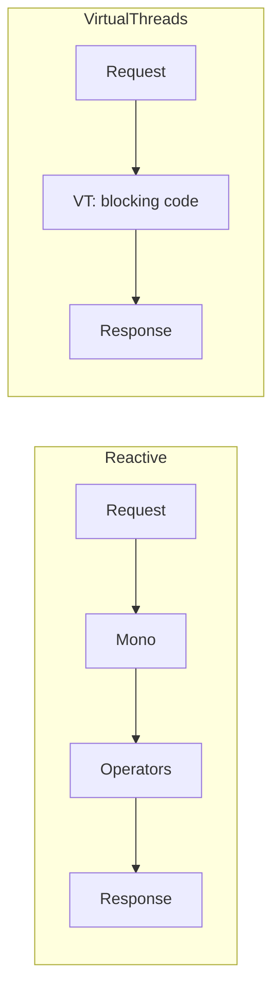

### 📶 Gradual Depth

**Level 1 - What it is:**
Two ways to handle high concurrency: reactive (event-driven pipelines) or virtual threads (simple blocking code). Both scale. Different trade-offs.

**Level 2 - How to use it:**
Choose reactive for: streaming, event processing, backpressure-critical. Choose VTs for: request-response, CRUD, existing blocking code. Hybrid: VTs for requests, reactive for internal event streams.

**Level 3 - How it works:**
Reactive: event loop (Netty) dispatches events to pipeline operators. No thread waits. Operators compose functionally. Backpressure propagates upstream via request(N). VTs: one lightweight thread per task. Thread blocks on I/O (socket, DB). JVM unmounts from carrier (no OS thread consumed). Simple imperative code.

**Level 4 - Production mastery:**
Migration from reactive to VTs (simplification): replace Mono.fromCallable + subscribeOn with direct blocking call in VT. Remove Schedulers.boundedElastic(). Keep reactive where backpressure is essential (Kafka consumer, WebSocket streaming). Monitor: with VTs, add Semaphore for downstream protection. With reactive: monitor subscription backpressure signals. Hybrid architectures (VTs for HTTP + reactive for messaging) are common in production.

### ⚙️ How It Works

**Reactive path:**

```text
1. Request arrives (Netty event loop)
2. Handler returns Mono<Response> (no blocking)
3. Mono executes pipeline operators on event loop
4. When I/O needed: non-blocking client + callback
5. On callback: continue pipeline
6. Response emitted to client

Thread count: fixed (event loop threads only)
Backpressure: automatic (subscriber demand)
Debugging: hard (no meaningful stack trace)
```

**Virtual thread path:**

```text
1. Request arrives (VT created)
2. Handler runs blocking code directly
3. VT blocks on I/O -> unmounts from carrier
4. I/O completes -> VT remounts
5. Handler continues imperatively
6. Response sent

Thread count: VTs unlimited, carriers fixed
Backpressure: manual (Semaphore/queue)
Debugging: easy (full stack trace)
```

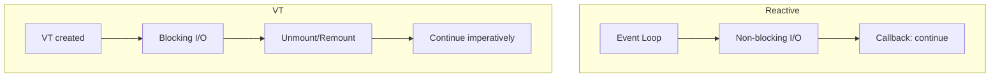

### 🚨 Failure Modes

**Failure 1 - VT Without Backpressure:**
**Symptom:** Downstream service overwhelmed. Connection pool exhausted. Timeouts cascade.
**Root cause:** 10K VTs all call downstream simultaneously (no demand control). Reactive would have limited to subscriber demand.
**Diagnostic:**

```
# Connection pool metrics: 100% exhausted
# Downstream: error rate spike
# VT count: unlimited growth
```

**Fix:**
**BAD:** Unlimited VTs calling downstream.
**GOOD:** `Semaphore permits = new Semaphore(100); permits.acquire(); try { call(); } finally { permits.release(); }`

**Failure 2 - Reactive Debugging Nightmare:**
**Symptom:** Production error with stack trace showing only reactor internals. No application code visible.
**Root cause:** Reactive pipelines lose original call site. Error propagates through operators without meaningful stack.
**Diagnostic:**

```
# Stack trace:
# reactor.core.publisher.Operators$MonoSubscriber
# reactor.core.publisher.FluxMap$MapSubscriber
# (where is MY code??)
```

**Fix:** Enable Reactor debug agent: `Hooks.onOperatorDebug()` (expensive). Or: migrate to VTs for debuggable stack traces.

### 🔬 Production Reality

**Incident pattern: reactive-to-VT migration at scale.**

A team with 50 WebFlux microservices experiences chronic debugging difficulty. Mean-time-to-diagnose: 4 hours (vs 30min for blocking services). Decision: migrate to VTs for request-response services. Keep reactive for Kafka consumer pipelines (backpressure essential). Result after migration: debugging time reduced 80%. Throughput unchanged (both models equally concurrent). Memory slightly lower with VTs (no Reactor operator chain allocation). Team velocity improved (reactive learning curve eliminated for new hires).

### ⚖️ Trade-offs & Alternatives

| Aspect          | Virtual Threads     | Reactive (WebFlux)     | Hybrid          |
| --------------- | ------------------- | ---------------------- | --------------- |
| Code complexity | Low (blocking)      | High (operators)       | Medium          |
| Debugging       | Easy (stack traces) | Hard (no stack)        | Mixed           |
| Backpressure    | Manual (Semaphore)  | Automatic              | Best of both    |
| Ecosystem       | All blocking libs   | Needs reactive drivers | Mixed           |
| Learning curve  | Low                 | High                   | Medium          |
| Best for        | Request-response    | Streaming/events       | Mixed workloads |
| JDK requirement | 21+                 | 8+                     | 21+             |

### ⚡ Decision Snap

**USE virtual threads WHEN:**

- Request-response pattern (HTTP, RPC).
- Existing blocking codebase (JDBC, file I/O).
- Team not experienced with reactive.
- Debugging/observability priority.
- JDK 21+ available.

**USE reactive WHEN:**

- Streaming data (WebSocket, SSE, Kafka).
- Backpressure essential (consumer slower than producer).
- Event-driven pipelines with complex composition.
- JDK < 21 and need high concurrency.

**USE hybrid WHEN:**

- Mixed workloads (HTTP + streaming).
- Migrating incrementally from reactive.
- Different subsystems have different needs.

### ⚠️ Top Traps

| #   | Misconception                       | Reality                                                                                        |
| --- | ----------------------------------- | ---------------------------------------------------------------------------------------------- |
| 1   | "Reactive is faster than VTs"       | Performance equivalent for I/O-bound. VTs often SIMPLER with same throughput.                  |
| 2   | "VTs replace reactive entirely"     | No. Streaming backpressure is not easily replicated with VTs. Keep reactive for event streams. |
| 3   | "Must choose one for entire system" | Hybrid is the pragmatic choice. Different subsystems, different models.                        |
| 4   | "Reactive is dead"                  | Not dead. Repositioned: streaming/event use cases. No longer needed for mere concurrency.      |
| 5   | "VTs have no learning curve"        | Pinning, ThreadLocal, resource limits still require VT-specific knowledge.                     |

### 🪜 Learning Ladder

**Prerequisites:**

- Virtual Threads Internals (Project Loom) - VT mechanics
- CompletableFuture Composition - async alternative
- Platform Thread Exhaustion Failure - what both solve

**THIS:** Reactive Streams vs Virtual Threads Decision

**Next steps:**

- Concurrency Strategy (Reactive vs Loom vs Pool) - architecture-level
- Back-Pressure Architecture Patterns - system-level
- Concurrent Chat Phase 4 (Virtual Threads) - VT practice

### 💡 Surprising Truth

**The Surprising Truth:**
Spring Boot 3.2+ supports BOTH models simultaneously in the same application. Controllers can use blocking (VTs) while Kafka listeners use reactive (Project Reactor). The HTTP layer uses VTs; the messaging layer uses reactive backpressure. This hybrid is becoming the default architecture pattern - not "pick one for everything."

**Further Reading:**

- Brian Goetz, "Virtual Threads: Coming to a Server Near You" (2023)
- Spring Blog: "Embracing Virtual Threads" (2023)
- Reactive Streams Specification 1.0.4

**Revision Card:**

1. VTs: simple blocking, easy debug, no automatic backpressure. Reactive: complex, hard debug, built-in backpressure.
2. Decision: request-response -> VTs. Streaming/events -> reactive. Mixed -> hybrid.
3. Performance is equivalent. Decide on CODE COMPLEXITY and PROBLEM FIT, not performance benchmarks.

---

---

# Concurrent Chat - Phase 4 (Virtual Threads)

**TL;DR** - Phase 4 rewrites async chat to virtual threads: one VT per client, blocking reads, imperative code - combining Phase 2's simplicity with Phase 3's scalability.

### 🔥 Problem Statement

Phase 3 (CompletableFuture) handles 10K connections with few threads but code is callback-heavy, hard to debug, and has no built-in backpressure. Phase 2 (blocking executor) is simple but limited to pool size. Phase 4 combines both: blocking imperative code (like Phase 2) running on virtual threads (like Phase 3's resource efficiency). One VT per client. Simple. Scalable. Debuggable.

### 📜 Historical Context

Chat application evolution mirrors industry progression: Phase 1 (thread-per-client, JDK 1.0 style), Phase 2 (thread pool, JDK 5), Phase 3 (async/NIO, JDK 8), Phase 4 (virtual threads, JDK 21). Each phase solved the previous phase's limitation. Phase 4 arguably returns to Phase 1's simplicity - but with Phase 3's resource efficiency. The circle completes: simple imperative code at scale.

### 🔩 First Principles

**CORE INVARIANTS:**

1. Each client gets ONE dedicated virtual thread (simple mental model).
2. Virtual thread blocks on socket.read() - unmounts from carrier (no resource waste).
3. Total VT count bounded only by memory (heap for VT stacks), not OS thread limits.

**DERIVED DESIGN:**
Invariant 1: code is trivial (while-read-broadcast loop). Invariant 2: millions of idle clients consume no carriers. Invariant 3: realistic limit is ~100K-1M (dependent on heap and per-VT memory). Backpressure requires explicit bounding (Semaphore or bounded write queue per client).

**THE TRADE-OFF:**
**Gain:** Simplest code of all phases. Full stack traces. Easy debugging. Scalable to 100K+ connections.
**Cost:** JDK 21+ required. Must avoid synchronized with I/O (pinning). No automatic backpressure (add manually). Slightly more memory per client vs Phase 3 (VT continuation overhead).

### 🧠 Mental Model

> Phase 4 is "back to basics with superpowers." Phase 1 wrote one-thread-per-client (simple but expensive). Phase 4 writes one-VT-per-client (equally simple but cheap). The code LOOKS like Phase 1 but SCALES like Phase 3.

- "Phase 1 simplicity" -> blocking read loop per client
- "Phase 3 scalability" -> millions of connections
- "Superpowers" -> VTs make blocking cheap
- "Back to basics" -> imperative, debuggable

**Where this analogy breaks down:** Phase 4 still needs awareness of pinning, ThreadLocal costs, and backpressure - it is not truly "write Phase 1 code and forget."

### 🧩 Components

- **Virtual thread per client** - dedicated VT running blocking read loop.
- **ServerSocket.accept()** - blocking accept in a VT (unmounts while waiting).
- **BufferedReader.readLine()** - blocking read in client VT (unmounts during I/O).
- **Broadcast mechanism** - iterate all clients, write message. Use ConcurrentHashMap for client registry.
- **Backpressure** - Semaphore limiting max clients. Bounded write queue per client preventing slow-client backup.
- **Graceful shutdown** - close ServerSocket to unblock accept. Interrupt all client VTs.

```text
Phase 4 architecture:

  Acceptor VT:
    while (running) {
      client = serverSocket.accept();  // VT unmounts
      Thread.startVirtualThread(
        () -> handleClient(client));
    }

  Client VT (one per connection):
    while ((msg = reader.readLine()) != null) {
      broadcast(msg);  // unmounts during each client write
    }
    removeClient(this);
```

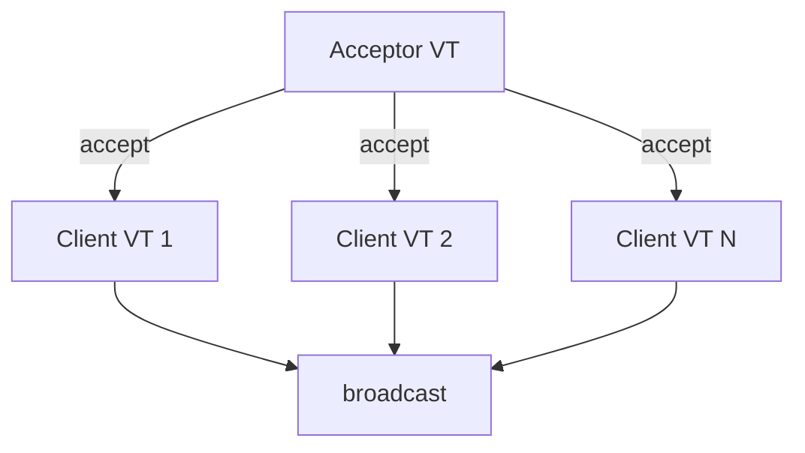

### 📶 Gradual Depth

**Level 1 - What it is:**
One virtual thread per chat client. Each VT runs a simple blocking read loop. When a client is idle, its VT consumes no carrier thread.

**Level 2 - How to use it:**
Create VT per accepted connection. Inside VT: BufferedReader.readLine() (blocks, VT unmounts). On message: iterate clients and write. Use try-with-resources for cleanup.

**Level 3 - How it works:**
`Thread.startVirtualThread(handler)` creates lightweight VT. VT mounts on carrier, calls readLine(). Socket has no data: VT unmounts (carrier freed). Data arrives: poller wakes VT, re-mounts on any available carrier. Handler continues from blocking call as if nothing happened.

**Level 4 - Production mastery:**
Add connection limit (Semaphore). Add per-client write queue (prevent slow client from blocking broadcaster). Monitor VT count via JFR. Use StructuredTaskScope for graceful shutdown (cancel all client VTs). Detect pinning: no synchronized in I/O paths. Replace synchronizedMap client registry with ConcurrentHashMap.

### ⚙️ How It Works

**Phase 1 - Server start:** Create ServerSocket. Start acceptor VT.

**Phase 2 - Accept loop:** acceptor VT blocks on accept(). Unmounts. When client connects: mounts, creates client VT, loops.

**Phase 3 - Client read loop:** Client VT blocks on readLine(). Unmounts. Data arrives: mounts, processes message, broadcasts, loops.

**Phase 4 - Broadcast:** Iterate connected clients. Write message to each. Socket write may block: VT unmounts briefly during write.

**Phase 5 - Disconnect:** readLine() returns null (client disconnected). VT removes client from registry. VT terminates.

```text
Timeline (3 clients):

  Acceptor: [accept]--[accept]--[accept]--[accept]
  Client-1:      [readLine..........][broadcast]
  Client-2:           [readLine.............]
  Client-3:                [readLine...][broadcast]
  Carriers:  only 1-2 carriers needed for all!

  Most time: VTs unmounted (readLine waiting).
  Carrier busy only during actual I/O completion.
```

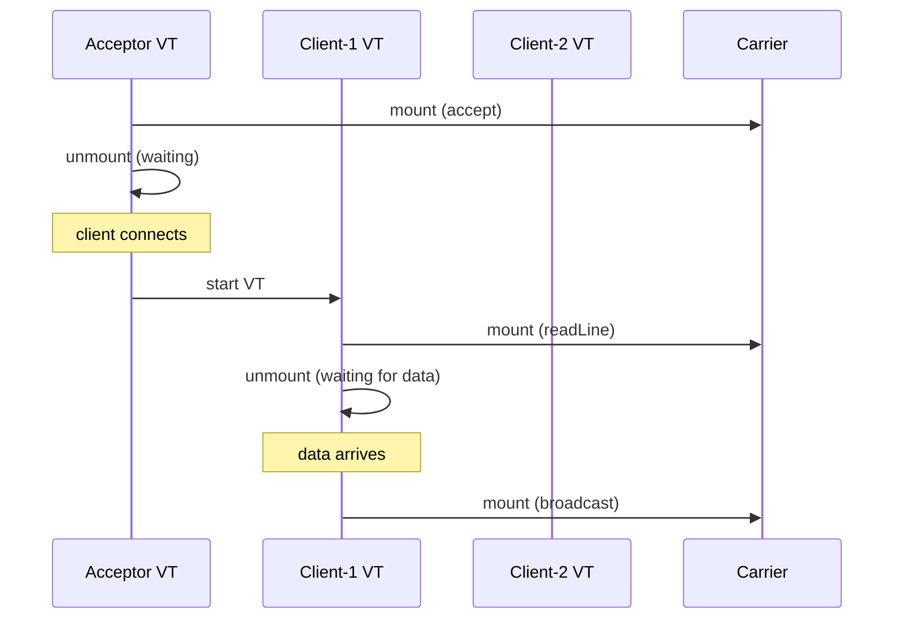

### 🚨 Failure Modes

**Failure 1 - Slow Client Backpressure:**
**Symptom:** Memory grows. Broadcast slows. One client on slow network causes broadcaster to block.
**Root cause:** Broadcasting writes to slow client blocks the broadcasting VT. Other clients' messages queue up.
**Diagnostic:**

```
# Monitor per-client write queue size
# VT doing broadcast stuck in write() to slow client
```

**Fix:**
**BAD:** Direct write to slow client in broadcast loop.
**GOOD:** Per-client bounded write queue + dedicated write VT per client. If queue full: drop messages for slow client.

**Failure 2 - Memory from Million Idle VTs:**
**Symptom:** Heap pressure with 500K connected clients doing nothing.
**Root cause:** Each VT has continuation (~2-10KB minimum). 500K x 5KB = 2.5GB just for idle VTs.
**Diagnostic:**

```
jcmd <pid> Thread.dump_to_file -format=json dump.json
# Count virtual threads
# Heap: look for Continuation objects
```

**Fix:** Accept memory cost (expected). Set max connections via Semaphore. Monitor and alert on VT count.

### 🔬 Production Reality

**Incident pattern: chat service migration from Netty to VTs.**

A chat platform migrates from Netty (event-loop, callback) to virtual threads. Code reduces from 2000 lines (handlers, pipelines, byte-buf management) to 200 lines (blocking read/write loops). Debugging time for client issues: from hours (tracing through pipeline callbacks) to minutes (standard stack trace). Throughput: equivalent at 50K connections. Memory: slightly higher with VTs (+500MB for VT stacks at 50K clients). Trade-off accepted: engineering productivity gain outweighs memory cost.

### ⚖️ Trade-offs & Alternatives

| Phase                       | Code Complexity | Max Connections | Debugging | JDK |
| --------------------------- | --------------- | --------------- | --------- | --- |
| Phase 2 (blocking pool)     | Low             | Pool size (200) | Easy      | 5+  |
| Phase 3 (CompletableFuture) | High            | 10K-100K        | Hard      | 8+  |
| Phase 4 (virtual threads)   | Low             | 100K-1M         | Easy      | 21+ |
| Netty (event loop)          | Medium-High     | 1M+             | Medium    | 8+  |

### ⚡ Decision Snap

**USE Phase 4 (VTs) WHEN:**

- JDK 21+ available.
- Want simple imperative code at scale.
- Debugging/maintainability priority.

**KEEP Phase 3/Netty WHEN:**

- JDK < 21.
- Need absolute maximum connections (1M+).
- Team already invested in reactive/Netty.

**NEVER use Phase 2 for scale:**

- Only appropriate for <200 concurrent connections.

### ⚠️ Top Traps

| #   | Misconception                             | Reality                                                                                                                           |
| --- | ----------------------------------------- | --------------------------------------------------------------------------------------------------------------------------------- |
| 1   | "Phase 4 = Phase 1 without limits"        | Still need: backpressure, connection limits, graceful shutdown. Not truly unlimited.                                              |
| 2   | "No need for ConcurrentHashMap"           | Client registry accessed by multiple VTs concurrently. Still need thread-safe collections.                                        |
| 3   | "synchronized is fine for broadcast lock" | If broadcast blocks on write (network I/O) inside synchronized: PINNING. Use ReentrantLock.                                       |
| 4   | "VTs handle backpressure automatically"   | No. Slow client causes broadcast VT to block. Need explicit per-client queuing.                                                   |
| 5   | "Performance identical to Netty"          | At extreme scale (1M+), Netty's zero-copy and kernel-bypass may outperform. VTs excel at simplicity, not absolute max throughput. |

### 🪜 Learning Ladder

**Prerequisites:**

- Virtual Threads Internals (Project Loom) - VT mechanics
- Concurrent Chat Phase 3 (CompletableFuture) - what Phase 4 simplifies
- Structured Concurrency (JEP 453) - lifecycle management

**THIS:** Concurrent Chat - Phase 4 (Virtual Threads)

**Next steps:**

- Reactive Streams vs Virtual Threads Decision - architectural choice
- synchronized to Virtual Threads Migration - production migration
- Concurrency Mastery Verification - final assessment

### 💡 Surprising Truth

**The Surprising Truth:**
Phase 4's code is almost IDENTICAL to Phase 1 (thread-per-client from 1996). The only difference: `new Thread(handler).start()` becomes `Thread.startVirtualThread(handler)`. One method name change. 25 years of concurrent programming evolution (NIO, async, reactive, callbacks) to arrive back at the original simple model - but now it scales.

**Further Reading:**

- JEP 444: Virtual Threads - networking examples
- Ron Pressler, "Project Loom: Fibers and Continuations" (JVMLS 2018)
- Inside.java, "Networking I/O with Virtual Threads" (2023)

**Revision Card:**

1. Phase 4 = Phase 1 simplicity + Phase 3 scalability. One VT per client. Blocking reads. Simple.
2. Still need: backpressure (per-client queues), connection limits (Semaphore), no synchronized+I/O (pinning).
3. Code shrinks 10x vs reactive/NIO. Debugging trivial. Memory trade-off acceptable for most scales.

---

---

# Concurrency Mastery Verification

**TL;DR** - A comprehensive assessment verifying production-level concurrency understanding across foundations, patterns, virtual threads, and diagnostic skills before architecture-level content.

### 🔥 Problem Statement

Engineers complete the Virtual Threads and Diagnostics module but cannot connect concepts across modules. They know ReentrantLock and know virtual threads but cannot explain WHY ReentrantLock matters for VTs. They know JFR and know safepoints but cannot correlate safepoint TTSP with JFR events to diagnose a production issue. Mastery requires INTEGRATION - applying multiple concepts together to solve real problems. This verification tests that integration.

### 📜 Historical Context

Each prior module (Foundations, Locks, Async, Virtual Threads) built incrementally. Mastery verification exists at the boundary between "learning individual concepts" and "applying them architecturally." This assessment determines readiness for the Architecture and META module (L5/L6) where concepts combine at system scale.

### 🔩 First Principles

**CORE INVARIANTS:**

1. Mastery = correct application UNDER PRESSURE and UNCERTAINTY (not just recall).
2. Integration = combining 2-3 concepts from different modules to solve one problem.
3. Production readiness = can diagnose, fix, and prevent concurrency issues in running systems.

**DERIVED DESIGN:**
Assessment questions require multi-concept answers. No single-fact recall. Each question tests integration across modules. Scoring: partial credit for correct direction; full credit for complete answer with trade-offs acknowledged.

**THE TRADE-OFF:**
**Gain:** Validates readiness for architecture-level thinking. Identifies specific gaps.
**Cost:** Time-intensive. May reveal uncomfortable gaps after extensive study.

### 🧠 Mental Model

> This is the flight simulator check before flying passengers (production). You have studied aerodynamics (foundations), practiced maneuvers (locks/patterns), and learned the new aircraft (VTs). Now: can you handle turbulence (production incidents) combining all skills simultaneously?

- "Flight simulator" -> this assessment
- "Passengers" -> production systems
- "Turbulence" -> complex multi-concept problems
- "Combining all skills" -> integration questions

**Where this analogy breaks down:** unlike flying, you can retake this assessment. Gaps identified here can be filled by targeted restudy before proceeding.

### 🧩 Components

- **Integration Questions** - require combining 2-3 concepts from different modules.
- **Scenario Diagnostics** - given symptoms, identify root cause + fix using diagnostic tools.
- **Design Decisions** - given requirements, justify concurrency architecture choices.
- **Trap Identification** - given code, identify the concurrency bug and explain why.
- **Scoring Rubric** - correctness, completeness, trade-off awareness, production applicability.

```text
Assessment structure:

  Section A: INTEGRATION (5 questions)
    Combine concepts across modules.

  Section B: DIAGNOSIS (4 scenarios)
    Given symptoms -> tool -> root cause -> fix.

  Section C: DESIGN (3 decisions)
    Given requirements -> justify architecture.

  Section D: TRAP IDENTIFICATION (4 code snippets)
    Find bug, explain mechanism, provide fix.
```

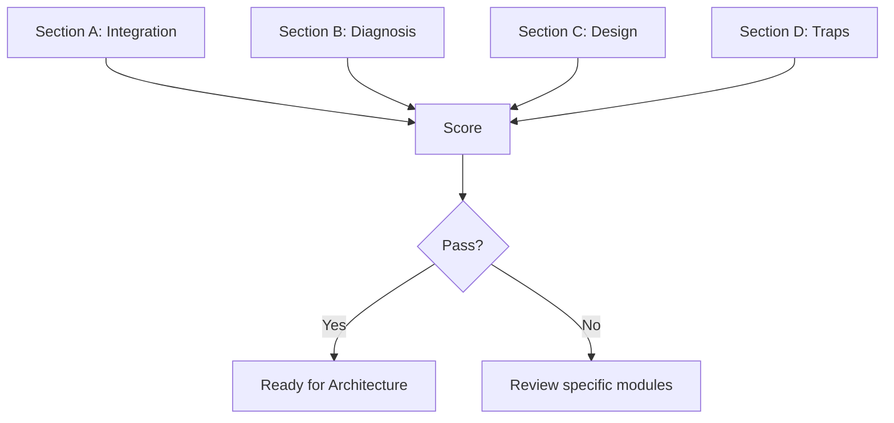

### 📶 Gradual Depth

**Level 1 - What it is:**
A test checking whether you can COMBINE concurrency knowledge to solve real problems, not just recall individual facts.

**Level 2 - How to use it:**
Attempt all questions without reference material. Score yourself. Gaps indicate which modules to revisit. Pass threshold: 80% with trade-off awareness.

**Level 3 - How it works:**
Each question is designed to require knowledge from at least TWO study files. Example: "Why does synchronized cause worse performance with virtual threads than with platform threads?" requires understanding both VT internals (Async module) AND monitor mechanics (Locks module).

**Level 4 - Production mastery:**
Take this assessment quarterly. Concurrency understanding degrades without active use. After each production incident involving concurrency: revisit related questions. Use as interview preparation for senior+ roles.

### ⚙️ How It Works

**Section A - Integration Questions:**

```text
A1: Why must ReentrantLock replace synchronized for
    virtual threads, but NOT for platform threads?
    [Requires: Pinning + ReentrantLock + VT internals]

A2: A CountDownLatch.await() in a virtual thread:
    does it pin? Why or why not?
    [Requires: Latch internals + VT mount/unmount]

A3: How does false sharing interact with LongAdder's
    internal design?
    [Requires: Cache lines + Striped64 + @Contended]

A4: Why is ThreadLocal especially dangerous with VTs
    but acceptable with platform thread pools?
    [Requires: TL lifecycle + VT count + memory]

A5: A CompletableFuture.thenApplyAsync() runs on
    commonPool. With VTs as the main executor, is
    commonPool still a risk? Explain.
    [Requires: commonPool + VT scheduler separation]
```

**Section B - Diagnosis Scenarios:**

```text
B1: Service on JDK 21 with VTs. CPU idle. Throughput
    zero. No GC issues. What do you check first?
    [Answer: pinning. Tool: -Djdk.tracePinnedThreads]

B2: ParallelStream sort takes 10x expected time
    intermittently. No code changes. What happened?
    [Answer: commonPool saturation by other code]

B3: Heap grows 100MB/hour. No obvious leak in app.
    Where do you look?
    [Answer: ThreadLocalMap. Tool: heap dump + MAT]

B4: P99 latency spikes (200ms) every 30 seconds.
    GC pauses are 5ms. What causes the spike?
    [Answer: TTSP. Tool: -Xlog:safepoint, JFR]
```

**Section C - Design Decisions:**

```text
C1: 10K concurrent HTTP requests, each calling 3
    microservices. JDK 21. Design the threading.
    [VTs + StructuredTaskScope + Semaphore per dep]

C2: Real-time analytics pipeline: 1M events/sec
    from Kafka, aggregate, store. VTs or reactive?
    [Reactive: backpressure critical for Kafka]

C3: Legacy app (JDK 17, heavy synchronized).
    Want VT benefits. Migration strategy?
    [Hybrid: platform pool for synchronized code,
     VTs for new code. Incremental lock migration.]
```

**Section D - Trap Identification:**

```text
D1: volatile int counter = 0;
    // 10 threads: counter++
    [Trap: volatile != atomic for RMW]

D2: synchronized(lock) {
        CompletableFuture.supplyAsync(() ->
            dbQuery()).join();
    }
    [Trap: VT pinning + potential deadlock]

D3: Thread.startVirtualThread(() -> {
        ThreadLocal<byte[]> buf =
            ThreadLocal.withInitial(
                () -> new byte[64*1024]);
        process(buf.get());
    });
    [Trap: 64KB x millions of VTs = OOM]

D4: list.parallelStream()
        .map(item -> httpClient.send(request))
        .collect(toList());
    [Trap: blocking I/O on commonPool]
```

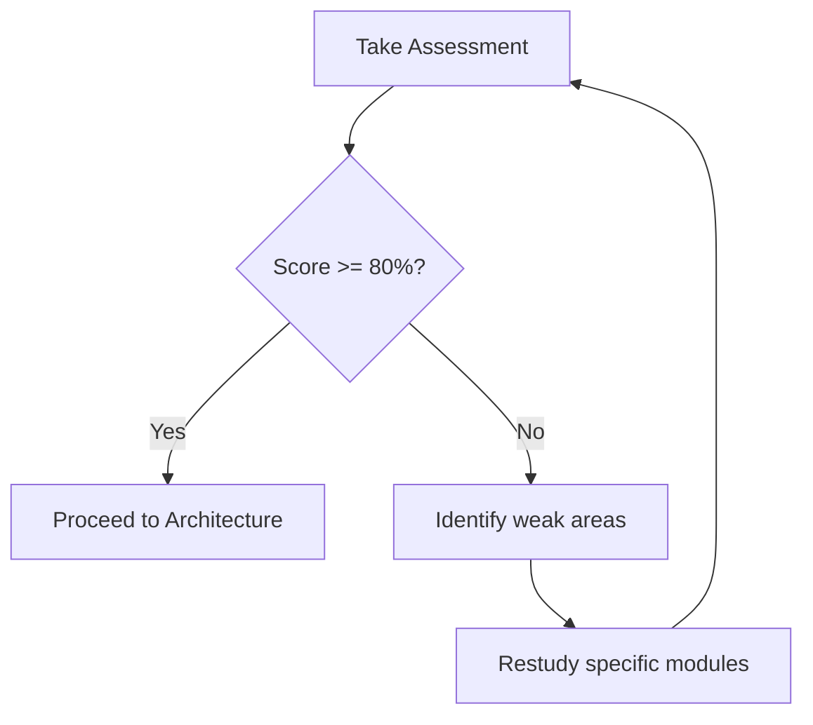

### 🚨 Failure Modes

**Failure 1 - Recall Without Integration:**
**Symptom:** Can define each concept but cannot combine them in scenarios.
**Root cause:** Studied keywords in isolation. Never practiced combining.
**Diagnostic:**

```
# Score pattern: Section A low, Section D high
# Can identify traps but cannot design solutions
```

**Fix:**

**BAD:**

```java
// Knowing concepts in isolation:
// "ReentrantLock has tryLock" + "VTs unmount"
// Cannot answer: WHY does RL matter for VTs?
```

**GOOD:**

```java
// Integrated understanding:
// RL uses park() -> VT unmounts -> carrier freed
// synchronized uses monitor -> VT pinned -> stall
// Therefore: RL required for VT-compatible locking
```

**Failure 2 - Theory Without Tooling:**
**Symptom:** Can explain mechanisms but cannot name the diagnostic tool.
**Root cause:** Studied theory but never ran the tools (async-profiler, JFR, jcmd).
**Diagnostic:**

```
# Score pattern: Section B low, Section A high
# Knows "what" but not "how to find it"
```

**Fix:** Hands-on lab: introduce bugs intentionally, diagnose with tools. Build muscle memory for: async-profiler -e lock, JFR dump, jcmd Thread.dump.

### 🔬 Production Reality

**Why this assessment matters:**

A senior engineer at a fintech company passed all individual module assessments but failed the integration assessment on question A1 (why ReentrantLock for VTs). In production: they enabled virtual threads without migrating synchronized blocks in the payment processing path. Result: intermittent carrier pinning under load, causing 5-second payment processing delays. The integration question they "failed" predicted exactly the production incident they caused. Assessment-driven development: if you cannot answer the integration question, you WILL create the corresponding production incident.

### ⚖️ Trade-offs & Alternatives

| Assessment Style      | Tests                   | Misses         |
| --------------------- | ----------------------- | -------------- |
| Recall quiz           | Individual facts        | Integration    |
| Integration scenarios | Combined application    | Pure depth     |
| Live coding           | Implementation skill    | Reasoning      |
| Production simulation | Full stack              | Time-intensive |
| This assessment       | Integration + diagnosis | Live coding    |

### ⚡ Decision Snap

**TAKE THIS ASSESSMENT WHEN:**

- Completed all four study files (Foundations through VT).
- Before starting Architecture and META module.
- Before concurrency-related interviews.

**RETAKE WHEN:**

- After a production concurrency incident.
- 30+ days since last practice.
- Before major concurrency-related design decision.

**PASS CRITERIA:**

- 80% overall with no section below 60%.
- Trade-offs acknowledged in design questions.
- Tools named correctly in diagnostic scenarios.

### ⚠️ Top Traps

| #   | Misconception                       | Reality                                                                                   |
| --- | ----------------------------------- | ----------------------------------------------------------------------------------------- |
| 1   | "I know each concept so I am ready" | Individual knowledge != integrated application. Must practice combining.                  |
| 2   | "Assessment is optional"            | Architecture module assumes integration ability. Gaps will compound.                      |
| 3   | "100% on recall = mastery"          | Mastery = applying under uncertainty + acknowledging trade-offs. Not just facts.          |
| 4   | "One pass = permanent knowledge"    | Concurrency intuition degrades. Quarterly reassessment recommended.                       |
| 5   | "Tools are secondary to theory"     | In production: knowing the tool IS the theory in practice. Cannot diagnose without tools. |

### 🪜 Learning Ladder

**Prerequisites:**

- All Foundations keywords - base knowledge
- All Locks and Coordination keywords - patterns
- All Async and Patterns keywords - advanced patterns
- All Virtual Threads and Diagnostics keywords - modern JVM

**THIS:** Concurrency Mastery Verification

**Next steps:**

- Architecture and META module - system-scale concurrency
- Fleet Thread Pool Standardization - first architecture keyword
- Concurrency Strategy (Reactive vs Loom vs Pool) - first decision

### 💡 Surprising Truth

**The Surprising Truth:**
The integration questions in this assessment mirror EXACTLY the questions asked in Staff Engineer interviews at top tech companies. They never ask "what is volatile?" - they ask "given this system with VTs and a synchronized JDBC pool, what happens under 10K concurrent requests?" The ability to connect concepts IS the senior/staff-level differentiator.

**Further Reading:**

- Martin Kleppmann, "Designing Data-Intensive Applications" Ch. 7-9 (concurrency)
- Java Concurrency in Practice (Goetz et al.) - integration chapters
- Google SRE Book - Chapter on Cascading Failures

**Revision Card:**

1. Mastery = integration (combining concepts) + diagnosis (tooling) + design (architecture decisions).
2. Pass criteria: 80% overall, can combine 2-3 concepts per answer, names correct tools.
3. Retake quarterly. Concurrency knowledge degrades without active use.
