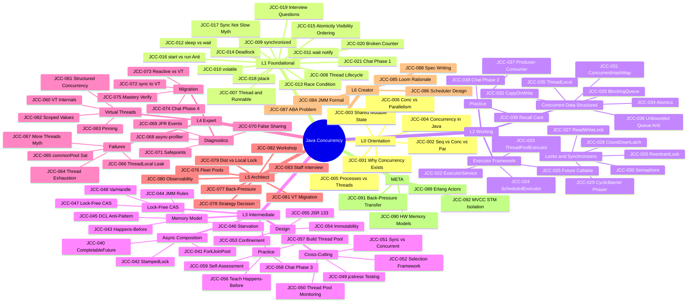

# Java Concurrency

```text
═══════════════════════════════════════════════════════════════════════
CATEGORY:        Java Concurrency
CODE:            JCC
ARCHETYPE:       CS-CONCEPT
MODE:            MODE_NEW
PROVENANCE:      user request via /learn: "java concurrency"
TIER:            tier-2-systems
FOLDER:          learn/java-concurrency/
LEVELS:          L0 + L1 + L2 + L3 + L4 + L5 + L6 + META
TOTAL:           92 keywords across 7 sub-topic files
GENERATED_FROM:  LEARN_KEYWORD_GENERATOR.md v1.0
═══════════════════════════════════════════════════════════════════════
```

Scope: Java concurrency - threading, synchronization, locks,
concurrent collections, executors, virtual threads (Project Loom),
structured concurrency, and the Java Memory Model. Language-level
concurrency surface (synchronized, volatile) lives here. JVM runtime
internals (safepoints, JIT, GC) are in `learn/java-jvm/`. Language
fundamentals (classes, generics) are in `learn/java/`.

## Status

Stubs only. Each sub-topic file lists its keywords in YAML
frontmatter. Use `@learn-generate-entries` to fill content
per `LEARN_PROMPT.md` v1.0 (tri-template auto-routing).

## Sub-topic files

| File                                                                                                                                      | Keywords | Levels     | Status |
| ----------------------------------------------------------------------------------------------------------------------------------------- | -------- | ---------- | ------ |
| [Java Concurrency - Foundations](Java%20Concurrency%20-%20Foundations.md)                                                                 | 21       | L0 + L1    | stub   |
| [Java Concurrency - Locks and Coordination](Java%20Concurrency%20-%20Locks%20and%20Coordination.md)                                       | 18       | L2         | stub   |
| [Java Concurrency - Async and Patterns](Java%20Concurrency%20-%20Async%20and%20Patterns.md)                                               | 20       | L3         | stub   |
| [Java Concurrency - Virtual Threads and Diagnostics Part 1](Java%20Concurrency%20-%20Virtual%20Threads%20and%20Diagnostics%20Part%201.md) | 8        | L4         | stub   |
| [Java Concurrency - Virtual Threads and Diagnostics Part 2](Java%20Concurrency%20-%20Virtual%20Threads%20and%20Diagnostics%20Part%202.md) | 8        | L4         | stub   |
| [Java Concurrency - Architecture and META Part 1](Java%20Concurrency%20-%20Architecture%20and%20META%20Part%201.md)                       | 6        | L5+L6+META | stub   |
| [Java Concurrency - Architecture and META Part 2](Java%20Concurrency%20-%20Architecture%20and%20META%20Part%202.md)                       | 6        | L5+L6+META | stub   |

## Keyword table

────────────────────────────────────────────────────
LEVEL 0 - ORIENTATION 🌱 (6 keywords)
────────────────────────────────────────────────────

| ID      | Keyword                                | Lv  | Diff | template | Tags |
| ------- | -------------------------------------- | --- | ---- | -------- | ---- |
| JCC-001 | Why Concurrency Exists                 | L0  | 🌱   | SIMPLE   |      |
| JCC-002 | Sequential vs Concurrent vs Parallel   | L0  | 🌱   | SIMPLE   |      |
| JCC-003 | The Shared Mutable State Problem       | L0  | 🌱   | SIMPLE   |      |
| JCC-004 | Concurrency in the Java Ecosystem      | L0  | 🌱   | SIMPLE   |      |
| JCC-005 | Processes vs Threads - The OS View     | L0  | 🌱   | SIMPLE   |      |
| JCC-006 | Concurrency vs Parallelism Distinction | L0  | 🌱   | SIMPLE   | 💥   |

────────────────────────────────────────────────────
LEVEL 1 - FOUNDATIONAL ★☆☆ (15 keywords)
────────────────────────────────────────────────────

| ID      | Keyword                                         | Lv  | Diff | template | Tags          |
| ------- | ----------------------------------------------- | --- | ---- | -------- | ------------- |
| JCC-007 | Thread and Runnable                             | L1  | ★☆☆  | SIMPLE   |               |
| JCC-008 | Thread Lifecycle and States                     | L1  | ★☆☆  | SIMPLE   |               |
| JCC-009 | synchronized Keyword                            | L1  | ★☆☆  | SIMPLE   | 🎯            |
| JCC-010 | volatile Keyword                                | L1  | ★☆☆  | SIMPLE   | 🎯            |
| JCC-011 | wait, notify, notifyAll                         | L1  | ★☆☆  | SIMPLE   |               |
| JCC-012 | Thread.sleep vs Object.wait                     | L1  | ★☆☆  | SIMPLE   |               |
| JCC-013 | Race Condition                                  | L1  | ★☆☆  | SIMPLE   | 🎯            |
| JCC-014 | Deadlock                                        | L1  | ★☆☆  | SIMPLE   | 🎯            |
| JCC-015 | Atomicity, Visibility, Ordering                 | L1  | ★☆☆  | SIMPLE   |               |
| JCC-016 | Thread.start vs Thread.run Anti-Pattern         | L1  | ★☆☆  | SIMPLE   | ⚠️ anti-major |
| JCC-017 | Synchronized Means Slow is Wrong - Lock Reality | L1  | ★☆☆  | SIMPLE   | 💥            |
| JCC-018 | jstack and Thread Dumps                         | L1  | ★☆☆  | SIMPLE   | 🔧            |
| JCC-019 | Top 10 Java Concurrency Interview Questions     | L1  | ★☆☆  | SIMPLE   | 🎯            |
| JCC-020 | Thread Safety Exercise - Broken Counter         | L1  | ★☆☆  | SIMPLE   | 🏋️            |
| JCC-021 | Concurrent Chat - Phase 1 (Raw Threads)         | L1  | ★☆☆  | SIMPLE   | 🔨            |

────────────────────────────────────────────────────
LEVEL 2 - WORKING ★★☆ (18 keywords)
────────────────────────────────────────────────────

── CLUSTER: Executor Framework ──────────────────────

| ID      | Keyword                                | Lv  | Diff | template     | Tags |
| ------- | -------------------------------------- | --- | ---- | ------------ | ---- |
| JCC-022 | Executor Framework and ExecutorService | L2  | ★★☆  | INTERMEDIATE |      |
| JCC-023 | ThreadPoolExecutor Configuration       | L2  | ★★☆  | INTERMEDIATE | 🔧   |
| JCC-024 | ScheduledExecutorService               | L2  | ★★☆  | INTERMEDIATE |      |
| JCC-025 | Future and Callable                    | L2  | ★★☆  | INTERMEDIATE |      |

── CLUSTER: Locks and Synchronizers ─────────────────

| ID      | Keyword                       | Lv  | Diff | template     | Tags |
| ------- | ----------------------------- | --- | ---- | ------------ | ---- |
| JCC-026 | ReentrantLock vs synchronized | L2  | ★★☆  | INTERMEDIATE | 🧭   |
| JCC-027 | ReadWriteLock                 | L2  | ★★☆  | INTERMEDIATE |      |
| JCC-028 | CountDownLatch                | L2  | ★★☆  | INTERMEDIATE |      |
| JCC-029 | CyclicBarrier and Phaser      | L2  | ★★☆  | INTERMEDIATE |      |
| JCC-030 | Semaphore                     | L2  | ★★☆  | INTERMEDIATE |      |

── CLUSTER: Concurrent Data Structures ──────────────

| ID      | Keyword                          | Lv  | Diff | template     | Tags          |
| ------- | -------------------------------- | --- | ---- | ------------ | ------------- |
| JCC-031 | ConcurrentHashMap                | L2  | ★★☆  | INTERMEDIATE | 🎯            |
| JCC-032 | CopyOnWriteArrayList             | L2  | ★★☆  | INTERMEDIATE |               |
| JCC-033 | BlockingQueue Implementations    | L2  | ★★☆  | INTERMEDIATE |               |
| JCC-034 | AtomicInteger and Atomic Classes | L2  | ★★☆  | INTERMEDIATE |               |
| JCC-035 | ThreadLocal                      | L2  | ★★☆  | INTERMEDIATE |               |
| JCC-036 | Unbounded Queue Anti-Pattern     | L2  | ★★☆  | INTERMEDIATE | ⚠️ anti-major |

── CLUSTER: Practice and Retention ──────────────────

| ID      | Keyword                               | Lv  | Diff | template     | Tags  |
| ------- | ------------------------------------- | --- | ---- | ------------ | ----- |
| JCC-037 | Build a Producer-Consumer Exercise    | L2  | ★★☆  | INTERMEDIATE | 🏋️    |
| JCC-038 | Concurrent Chat - Phase 2 (Executors) | L2  | ★★☆  | INTERMEDIATE | 🔨    |
| JCC-039 | Java Concurrency Quick Recall Card    | L2  | ★★☆  | INTERMEDIATE | 🔁 🎯 |

────────────────────────────────────────────────────
LEVEL 3 - INTERMEDIATE ★★☆+ (20 keywords)
────────────────────────────────────────────────────

── CLUSTER: Async Composition ───────────────────────

| ID      | Keyword                        | Lv  | Diff | template     | Tags |
| ------- | ------------------------------ | --- | ---- | ------------ | ---- |
| JCC-040 | CompletableFuture Composition  | L3  | ★★☆  | INTERMEDIATE |      |
| JCC-041 | ForkJoinPool and Work-Stealing | L3  | ★★☆  | INTERMEDIATE |      |
| JCC-042 | StampedLock                    | L3  | ★★☆  | INTERMEDIATE |      |

── CLUSTER: Memory Model and Ordering ──────────────

| ID      | Keyword                                  | Lv  | Diff | template     | Tags             |
| ------- | ---------------------------------------- | --- | ---- | ------------ | ---------------- |
| JCC-043 | Happens-Before Relationship              | L3  | ★★☆  | INTERMEDIATE | 🎯               |
| JCC-044 | Java Memory Model - Working Rules        | L3  | ★★☆  | INTERMEDIATE |                  |
| JCC-045 | Double-Checked Locking Anti-Pattern      | L3  | ★★☆  | INTERMEDIATE | ⚠️ anti-critical |
| JCC-046 | Thread Starvation and Priority Inversion | L3  | ★★☆  | INTERMEDIATE |                  |

── CLUSTER: Lock-Free and CAS ──────────────────────

| ID      | Keyword                     | Lv  | Diff | template     | Tags |
| ------- | --------------------------- | --- | ---- | ------------ | ---- |
| JCC-047 | Lock-Free Algorithms (CAS)  | L3  | ★★☆  | INTERMEDIATE |      |
| JCC-048 | VarHandle and Memory Fences | L3  | ★★☆  | INTERMEDIATE |      |

── CLUSTER: Cross-Cutting Lenses ───────────────────

| ID      | Keyword                                         | Lv  | Diff | template     | Tags  |
| ------- | ----------------------------------------------- | --- | ---- | ------------ | ----- |
| JCC-049 | Testing Concurrent Code (jcstress)              | L3  | ★★☆  | INTERMEDIATE | 🧪 🔧 |
| JCC-050 | Monitoring Thread Pools in Production           | L3  | ★★☆  | INTERMEDIATE | 📊 🔧 |
| JCC-051 | Synchronized vs Concurrent Collections Decision | L3  | ★★☆  | INTERMEDIATE | 🧭    |
| JCC-052 | Concurrency Utilities Selection Framework       | L3  | ★★☆  | INTERMEDIATE | 🧭    |

── CLUSTER: Design Strategies ──────────────────────

| ID      | Keyword                                   | Lv  | Diff | template     | Tags  |
| ------- | ----------------------------------------- | --- | ---- | ------------ | ----- |
| JCC-053 | Thread Confinement as Design Pattern      | L3  | ★★☆  | INTERMEDIATE |       |
| JCC-054 | Immutability as Concurrency Strategy      | L3  | ★★☆  | INTERMEDIATE |       |
| JCC-055 | JSR 133 - Java Memory Model Specification | L3  | ★★☆  | INTERMEDIATE | 📋 🔄 |

── CLUSTER: Practice and Self-Check ────────────────

| ID      | Keyword                                       | Lv  | Diff | template     | Tags |
| ------- | --------------------------------------------- | --- | ---- | ------------ | ---- |
| JCC-056 | Explain Happens-Before at Every Level         | L3  | ★★☆  | INTERMEDIATE | 🎓   |
| JCC-057 | Build a Thread Pool from Scratch Exercise     | L3  | ★★☆  | INTERMEDIATE | 🏋️   |
| JCC-058 | Concurrent Chat - Phase 3 (CompletableFuture) | L3  | ★★☆  | INTERMEDIATE | 🔨   |
| JCC-059 | Concurrency Self-Assessment                   | L3  | ★★☆  | INTERMEDIATE | 🔁   |

────────────────────────────────────────────────────
LEVEL 4 - EXPERT ★★★ (16 keywords)
────────────────────────────────────────────────────

── CLUSTER: Virtual Threads and Loom ────────────────

| ID      | Keyword                                    | Lv  | Diff | template | Tags |
| ------- | ------------------------------------------ | --- | ---- | -------- | ---- |
| JCC-060 | Virtual Threads Internals (Project Loom)   | L4  | ★★★  | COMPLEX  | 🔄   |
| JCC-061 | Structured Concurrency (JEP 453)           | L4  | ★★★  | COMPLEX  | 🔄   |
| JCC-062 | Scoped Values (JEP 464)                    | L4  | ★★★  | COMPLEX  | 🔄   |
| JCC-063 | Pinning - Virtual Threads and synchronized | L4  | ★★★  | COMPLEX  | 🚨   |

── CLUSTER: Failure Modes and Incidents ─────────────

| ID      | Keyword                                          | Lv  | Diff | template | Tags                |
| ------- | ------------------------------------------------ | --- | ---- | -------- | ------------------- |
| JCC-064 | Platform Thread Exhaustion Failure               | L4  | ★★★  | COMPLEX  | 🚨 🔴               |
| JCC-065 | ForkJoinPool.commonPool Saturation               | L4  | ★★★  | COMPLEX  | 🚨                  |
| JCC-066 | ThreadLocal Memory Leak in Thread Pools          | L4  | ★★★  | COMPLEX  | 🚨 ⚠️ anti-critical |
| JCC-067 | More Threads is Better is Wrong - Amdahl Reality | L4  | ★★★  | COMPLEX  | 💥                  |

── CLUSTER: Production Diagnostics ─────────────────

| ID      | Keyword                                    | Lv  | Diff | template | Tags  |
| ------- | ------------------------------------------ | --- | ---- | -------- | ----- |
| JCC-068 | Lock Contention Profiling (async-profiler) | L4  | ★★★  | COMPLEX  | 🔧 📊 |
| JCC-069 | JFR Thread and Lock Events                 | L4  | ★★★  | COMPLEX  | 🔧 📊 |
| JCC-070 | False Sharing and Cache Lines              | L4  | ★★★  | COMPLEX  | ⚡    |
| JCC-071 | GC Safepoints and Thread Coordination      | L4  | ★★★  | COMPLEX  | ⚡    |

── CLUSTER: Migration and Mastery ──────────────────

| ID      | Keyword                                      | Lv  | Diff | template | Tags  |
| ------- | -------------------------------------------- | --- | ---- | -------- | ----- |
| JCC-072 | synchronized to Virtual Threads Migration    | L4  | ★★★  | COMPLEX  | 🔄    |
| JCC-073 | Reactive Streams vs Virtual Threads Decision | L4  | ★★★  | COMPLEX  | 🧭 🚨 |
| JCC-074 | Concurrent Chat - Phase 4 (Virtual Threads)  | L4  | ★★★  | COMPLEX  | 🔨 🏋️ |
| JCC-075 | Concurrency Mastery Verification             | L4  | ★★★  | COMPLEX  | 🔁 🎯 |

────────────────────────────────────────────────────
LEVEL 5 - ARCHITECT 🔥 (8 keywords)
────────────────────────────────────────────────────

| ID      | Keyword                                          | Lv  | Diff | template | Tags  |
| ------- | ------------------------------------------------ | --- | ---- | -------- | ----- |
| JCC-076 | Fleet Thread Pool Standardization                | L5  | 🔥   | COMPLEX  |       |
| JCC-077 | Back-Pressure Architecture Patterns              | L5  | 🔥   | COMPLEX  |       |
| JCC-078 | Concurrency Strategy - Reactive vs Loom vs Pool  | L5  | 🔥   | COMPLEX  | 🧭    |
| JCC-079 | Distributed Locking vs In-Process Locking        | L5  | 🔥   | COMPLEX  | 🧭    |
| JCC-080 | Concurrency Observability Platform Design        | L5  | 🔥   | COMPLEX  | 📊    |
| JCC-081 | Java 19 to 25 Virtual Threads Migration Strategy | L5  | 🔥   | COMPLEX  | 🔄    |
| JCC-082 | Concurrency Architecture Workshop                | L5  | 🔥   | COMPLEX  | 🏋️ 🎓 |
| JCC-083 | Java Concurrency Staff-Level Interview Scenarios | L5  | 🔥   | COMPLEX  | 🎯    |

────────────────────────────────────────────────────
LEVEL 6 - CREATOR 🔬 (5 keywords)
────────────────────────────────────────────────────

| ID      | Keyword                                        | Lv  | Diff | template | Tags |
| ------- | ---------------------------------------------- | --- | ---- | -------- | ---- |
| JCC-084 | JMM Formal Semantics (Manson, Pugh, Adve 2005) | L6  | 🔬   | COMPLEX  |      |
| JCC-085 | Project Loom Design Rationale                  | L6  | 🔬   | COMPLEX  |      |
| JCC-086 | Designing a Scheduler from First Principles    | L6  | 🔬   | COMPLEX  | 🏋️   |
| JCC-087 | The ABA Problem and Solutions                  | L6  | 🔬   | COMPLEX  |      |
| JCC-088 | Concurrency Specification Writing              | L6  | 🔬   | COMPLEX  | 🎓   |

────────────────────────────────────────────────────
META - META-SKILLS 🧠 (4 keywords)
────────────────────────────────────────────────────

| ID      | Keyword                                             | Lv   | Diff | template | Tags |
| ------- | --------------------------------------------------- | ---- | ---- | -------- | ---- |
| JCC-089 | What Erlang Actors Teach Java Concurrency           | META | 🧠   | COMPLEX  |      |
| JCC-090 | Hardware Memory Models Teach Software Ordering      | META | 🧠   | COMPLEX  |      |
| JCC-091 | Transferable Pattern - Back-Pressure Across Systems | META | 🧠   | COMPLEX  |      |
| JCC-092 | Database MVCC and Java STM - Shared Isolation Idea  | META | 🧠   | COMPLEX  |      |

## Summary

| Level | Name         | Count | ID Range         |
| ----- | ------------ | ----- | ---------------- |
| L0    | Orientation  | 6     | JCC-001..JCC-006 |
| L1    | Foundational | 15    | JCC-007..JCC-021 |
| L2    | Working      | 18    | JCC-022..JCC-039 |
| L3    | Intermediate | 20    | JCC-040..JCC-059 |
| L4    | Expert       | 16    | JCC-060..JCC-075 |
| L5    | Architect    | 8     | JCC-076..JCC-083 |
| L6    | Creator      | 5     | JCC-084..JCC-088 |
| META  | Meta-Skills  | 4     | JCC-089..JCC-092 |
| TOTAL |              | 92    | JCC-001..JCC-092 |

TAG COVERAGE:

| Tag        | Count | % of Total |
| ---------- | ----- | ---------- |
| 🎯 ivw     | 9     | 10%        |
| ⚠️ anti    | 5     | 5%         |
| 🔧 tool    | 6     | 7%         |
| 🔴 inc     | 1     | 1%         |
| 🔄 mig     | 7     | 8%         |
| 📋 cpl     | 1     | 1%         |
| 🧪 test    | 1     | 1%         |
| 📊 obs     | 4     | 4%         |
| ⚡ perf    | 2     | 2%         |
| 🧭 dec     | 6     | 7%         |
| 🏋️ prac    | 6     | 7%         |
| 🔨 proj    | 4     | 4%         |
| 🎓 teach   | 3     | 3%         |
| 🔁 ret     | 4     | 4%         |
| 🚨 triage  | 5     | 5%         |
| 💥 unlearn | 3     | 3%         |

<!-- ROADMAP-TREE:START -->

## Roadmap

```text
ROADMAP TREE - Java Concurrency
===========================================================
L0 Orientation
 +-- JCC-001 Why Concurrency Exists
 +-- JCC-002 Sequential vs Concurrent vs Parallel
 +-- JCC-003 Shared Mutable State Problem
 +-- JCC-004 Concurrency in Java Ecosystem
 +-- JCC-005 Processes vs Threads
 +-- JCC-006 Concurrency vs Parallelism
L1 Foundational
 +-- JCC-007 Thread and Runnable
 +-- JCC-008 Thread Lifecycle and States
 +-- JCC-009 synchronized Keyword
 +-- JCC-010 volatile Keyword
 +-- JCC-011 wait, notify, notifyAll
 +-- JCC-012 Thread.sleep vs Object.wait
 +-- JCC-013 Race Condition
 +-- JCC-014 Deadlock
 +-- JCC-015 Atomicity, Visibility, Ordering
 +-- JCC-016 start vs run Anti-Pattern
 +-- JCC-017 Synchronized Means Slow Myth
 +-- JCC-018 jstack and Thread Dumps
 +-- JCC-019 Top 10 Interview Questions
 +-- JCC-020 Broken Counter Exercise
 +-- JCC-021 Concurrent Chat Phase 1
L2 Working
 +-- CLUSTER: Executor Framework
 |    +-- JCC-022 ExecutorService
 |    +-- JCC-023 ThreadPoolExecutor Config
 |    +-- JCC-024 ScheduledExecutorService
 |    +-- JCC-025 Future and Callable
 +-- CLUSTER: Locks and Synchronizers
 |    +-- JCC-026 ReentrantLock vs synchronized
 |    +-- JCC-027 ReadWriteLock
 |    +-- JCC-028 CountDownLatch
 |    +-- JCC-029 CyclicBarrier and Phaser
 |    +-- JCC-030 Semaphore
 +-- CLUSTER: Concurrent Data Structures
 |    +-- JCC-031 ConcurrentHashMap
 |    +-- JCC-032 CopyOnWriteArrayList
 |    +-- JCC-033 BlockingQueue
 |    +-- JCC-034 AtomicInteger and Atomics
 |    +-- JCC-035 ThreadLocal
 |    +-- JCC-036 Unbounded Queue Anti-Pattern
 +-- CLUSTER: Practice and Retention
      +-- JCC-037 Producer-Consumer Exercise
      +-- JCC-038 Concurrent Chat Phase 2
      +-- JCC-039 Quick Recall Card
L3 Intermediate
 +-- CLUSTER: Async Composition
 |    +-- JCC-040 CompletableFuture
 |    +-- JCC-041 ForkJoinPool Work-Stealing
 |    +-- JCC-042 StampedLock
 +-- CLUSTER: Memory Model and Ordering
 |    +-- JCC-043 Happens-Before
 |    +-- JCC-044 JMM Working Rules
 |    +-- JCC-045 Double-Checked Locking Anti
 |    +-- JCC-046 Starvation and Inversion
 +-- CLUSTER: Lock-Free and CAS
 |    +-- JCC-047 Lock-Free Algorithms CAS
 |    +-- JCC-048 VarHandle and Fences
 +-- CLUSTER: Cross-Cutting Lenses
 |    +-- JCC-049 Testing (jcstress)
 |    +-- JCC-050 Monitoring Thread Pools
 |    +-- JCC-051 Sync vs Concurrent Colls
 |    +-- JCC-052 Utilities Selection Framework
 +-- CLUSTER: Design Strategies
 |    +-- JCC-053 Thread Confinement
 |    +-- JCC-054 Immutability Strategy
 |    +-- JCC-055 JSR 133 Specification
 +-- CLUSTER: Practice and Self-Check
      +-- JCC-056 Explain Happens-Before
      +-- JCC-057 Build a Thread Pool Exercise
      +-- JCC-058 Concurrent Chat Phase 3
      +-- JCC-059 Self-Assessment
L4 Expert
 +-- CLUSTER: Virtual Threads and Loom
 |    +-- JCC-060 Virtual Threads Internals
 |    +-- JCC-061 Structured Concurrency
 |    +-- JCC-062 Scoped Values
 |    +-- JCC-063 Pinning Problem
 +-- CLUSTER: Failure Modes and Incidents
 |    +-- JCC-064 Thread Exhaustion Failure
 |    +-- JCC-065 commonPool Saturation
 |    +-- JCC-066 ThreadLocal Memory Leak
 |    +-- JCC-067 More Threads Myth
 +-- CLUSTER: Production Diagnostics
 |    +-- JCC-068 async-profiler Lock Profiling
 |    +-- JCC-069 JFR Thread Events
 |    +-- JCC-070 False Sharing
 |    +-- JCC-071 GC Safepoints
 +-- CLUSTER: Migration and Mastery
      +-- JCC-072 synchronized to VT Migration
      +-- JCC-073 Reactive vs VT Decision
      +-- JCC-074 Concurrent Chat Phase 4
      +-- JCC-075 Mastery Verification
L5 Architect
 +-- JCC-076 Fleet Thread Pool Standard
 +-- JCC-077 Back-Pressure Architecture
 +-- JCC-078 Reactive vs Loom vs Pool Strategy
 +-- JCC-079 Distributed vs In-Process Locking
 +-- JCC-080 Observability Platform Design
 +-- JCC-081 VT Migration Strategy 19 to 25
 +-- JCC-082 Architecture Workshop
 +-- JCC-083 Staff-Level Interview Scenarios
L6 Creator
 +-- JCC-084 JMM Formal Semantics
 +-- JCC-085 Project Loom Design Rationale
 +-- JCC-086 Design a Scheduler
 +-- JCC-087 The ABA Problem
 +-- JCC-088 Concurrency Spec Writing
META Meta-Skills
 +-- JCC-089 Erlang Actors Transfer
 +-- JCC-090 Hardware Memory Models Transfer
 +-- JCC-091 Back-Pressure Across Systems
 +-- JCC-092 MVCC and STM Isolation
```



<!-- ROADMAP-TREE:END -->

## Learning path

PREREQUISITE TOPICS:

- `learn/java/` (Java Language - L0 through L2 minimum)

PARALLEL TOPICS:

- `learn/java-jvm/` (JVM runtime complements concurrency at L3+)

NEXT TOPICS:

- Distributed systems (Kafka, gRPC) after L4

ENTRY POINT FOR NEW LEARNERS: JCC-001
JUMP IN FOR PRACTITIONERS: JCC-040
FAST TRACK FOR EXPERTS: JCC-060

TRIAGE TRACK (on-call engineers):
🚨 keywords only - JCC-063, JCC-064, JCC-065, JCC-066, JCC-073

## Confusion pairs

| Concept A          | Concept B                   | Level | Key Difference                        |
| ------------------ | --------------------------- | ----- | ------------------------------------- |
| Concurrency        | Parallelism                 | L0    | Structure vs simultaneous execution   |
| synchronized       | ReentrantLock               | L2    | Implicit vs explicit lock management  |
| volatile           | Atomic classes              | L2    | Single visibility vs compound CAS     |
| Future             | CompletableFuture           | L3    | Blocking get vs async composition     |
| Platform threads   | Virtual threads             | L4    | OS-mapped vs JVM-scheduled            |
| Thread confinement | Immutability                | L3    | Restrict access vs remove mutability  |
| ThreadLocal        | Scoped Values               | L4    | Inheritable state vs structured scope |
| ConcurrentHashMap  | Collections.synchronizedMap | L2    | Fine-grained vs coarse-grained lock   |

## Cross-category dependencies

| This Keyword | Depends On                        | Category      |
| ------------ | --------------------------------- | ------------- |
| JCC-060      | JLG-045 (Virtual Threads Surface) | Java Language |
| JCC-070      | JVM GC internals                  | Java JVM      |
| JCC-071      | JVM safepoint mechanism           | Java JVM      |
| JCC-068      | JVM profiling tools               | Java JVM      |
