## Keywords

1. [JVM-102 JVM Fleet Standardization Strategy](#jvm-102-jvm-fleet-standardization-strategy)
2. [JVM-103 GC Strategy for Heterogeneous Workloads](#jvm-103-gc-strategy-for-heterogeneous-workloads)
3. [JVM-104 Java LTS Version Migration Strategy](#jvm-104-java-lts-version-migration-strategy)
4. [JVM-105 Build Your Own JVM Flag Baseline](#jvm-105-build-your-own-jvm-flag-baseline)
5. [JVM-106 JVM Warm-Up Strategies (CDS, CRaC, Preload)](#jvm-106-jvm-warm-up-strategies-cds-crac-preload)
6. [JVM-107 GraalVM vs HotSpot Adoption Decision](#jvm-107-graalvm-vs-hotspot-adoption-decision)
7. [JVM-108 JVM Observability Platform Design](#jvm-108-jvm-observability-platform-design)
8. [JVM-109 Multi-GC Fleet - Different Services, Diff GCs](#jvm-109-multi-gc-fleet---different-services-diff-gcs)

---

---

# JVM-102 JVM Fleet Standardization Strategy

**TL;DR** - Fleet standardization brings consistency to JVM versions, distributions, and flags across hundreds of services - balancing central governance with team autonomy to prevent configuration drift at scale.

---

### 🔥 Problem Statement

A company runs 200 microservices on the JVM. Twelve teams pick their own JDK version, distribution, and flags. One team runs Temurin 17.0.6, another Corretto 21.0.1, a third Oracle JDK 11. GC configurations range from default G1 to hand-tuned ZGC with contradictory flags. When a CVE hits the JVM, patching requires auditing every service individually - taking weeks instead of hours. A production outage traced to a known JDK regression goes unfixed in 40% of services because nobody knows which version they run. Container images vary by 300MB because each team pulls a different base. Shared libraries compiled against one JDK break on another. Observability dashboards cannot compare GC metrics across services because flag combinations produce incompatible log formats. Without fleet standardization, every JVM in production is a unique snowflake - ungovernable, unpatchable, and un-debuggable.

---

### 📜 Historical Context

Before microservices, organizations ran a handful of JVMs - standardization meant one operations team controlling one deployment. The microservice explosion (roughly 2014-2018) multiplied JVM instances by 10-100x, but most organizations kept the monolith-era approach of letting each team choose freely. The 2018 Oracle licensing change forced a distribution decision at scale (Temurin, Corretto, Azul, Oracle), turning what was implicit into an explicit governance problem. OpenJDK's six-month release cadence (since JDK 10) added version sprawl. Platform engineering teams emerged specifically to solve this category of cross-cutting infrastructure consistency.

---

### 🔩 First Principles

**CORE INVARIANTS:**

1. Every JVM in production must be identifiable (version, distribution, patch level) within minutes - not days.
2. A security patch must propagate to all affected services within a bounded time window without per-service negotiation.
3. Flag governance must prevent contradictions (flags that interact destructively) while allowing service-specific tuning within safe boundaries.
4. The cost of standardization must not exceed the cost of the chaos it replaces.

**DERIVED DESIGN:**

These invariants force a layered architecture: a central registry of approved JVM versions and distributions (Invariant 1), an automated patch pipeline tied to container base images (Invariant 2), a flag baseline with explicitly documented override policies (Invariant 3), and an adoption governance model that distinguishes mandates from recommendations (Invariant 4). The alternative - total freedom - satisfies none of the invariants. Total lockdown satisfies 1-3 but violates 4 by creating bottlenecks.

**THE TRADE-OFF:**

**Gain:** Patchability in hours, consistent observability, reproducible debugging, reduced image sizes, shared expertise.

**Cost:** Central team becomes a potential bottleneck, teams lose some autonomy, migration windows create coordination overhead, edge-case services may not fit the standard.

---

### 🧠 Mental Model

> Fleet standardization is like a city building code. The code does not dictate what you build - it sets structural minimums (foundation depth, fire exits, wiring gauge). You can still build a restaurant or a hospital. But every building meets inspection, and when a fire code update drops, the city knows which buildings need retrofit and can enforce a deadline.

- "Building code" -> JVM baseline (version, distribution, flag guardrails)
- "City inspector" -> CI/CD pipeline enforcement and audit
- "Foundation depth" -> minimum JDK version and patch level
- "Fire code update" -> CVE patch mandate with bounded rollout window

**Where this analogy breaks down:** Buildings cannot update themselves. Container-based JVM services can - if the base image pipeline is automated. The bottleneck shifts from enforcement to adoption velocity.

---

### 🧩 Components

- **Distribution policy:** Which JDK builds are approved (Temurin, Corretto, Oracle). Criteria: licensing, support lifecycle, patch cadence, container image availability.
- **Version pinning strategy:** Which LTS versions are supported (e.g., 17 and 21), end-of-support dates, migration windows.
- **Base image registry:** Golden container images with the approved JDK baked in. Teams inherit the JVM by choosing the base image.
- **Flag baseline:** Organization-wide default JVM flags. Divided into LOCKED (cannot override), RECOMMENDED (override with justification), and FREE (team discretion).
- **Compliance scanner:** Automated audit that detects drift - services running unapproved versions, expired support, or conflicting flags.
- **Exception process:** Formal path for services that genuinely need a non-standard JVM (GraalVM native, specific vendor patch).

```text
Fleet Standardization Architecture:

  Platform Team
  +-----------------------------+
  | Distribution Policy         |
  | Version Pin (LTS 17, 21)   |
  | Flag Baseline (LOCKED/REC) |
  +-----------------------------+
        |
        v
  Golden Base Images (registry)
        |
        +---> Service A (inherits JDK 21)
        +---> Service B (inherits JDK 21)
        +---> Service C (exception: JDK 17)
        |
  Compliance Scanner
  [drift alerts, CVE audit, flag check]
```

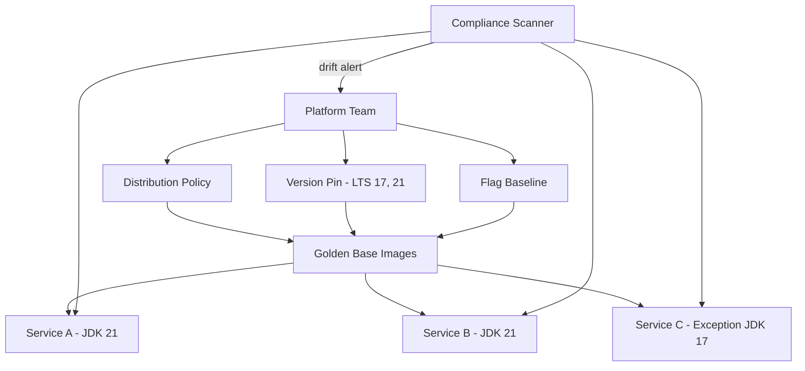

---

### 📶 Gradual Depth

**Level 1 - What it is:** JVM fleet standardization is the practice of defining and enforcing which JDK versions, distributions, and runtime flags are permitted across all services in an organization. It trades some team autonomy for fleet-wide patchability and consistency.

**Level 2 - How to use it:** Start with a distribution policy (pick one or two distributions), pin to supported LTS versions, publish golden base images, and add a CI check that fails builds using unapproved JDKs. Track compliance with a dashboard showing version distribution across services.

**Level 3 - How it works:** The golden base image is the enforcement mechanism. When the platform team updates the base image (new patch, new LTS), services pick it up on their next build. Flag baselines are injected via environment variables or entrypoint scripts in the base image. The compliance scanner queries container metadata and runtime MBeans (`java.lang:type=Runtime` for `VmVersion`, `InputArguments`) to detect drift.

**Level 4 - Production mastery:** The hardest part is not the technology - it is the governance model. Successful fleet standardization uses a tiered mandate: MUST (security patches within 14 days), SHOULD (LTS migration within 6 months of new LTS GA), MAY (flag optimizations). The exception process must be lightweight enough that teams use it instead of circumventing it. Measure adoption velocity (percentage of fleet on latest patch, time-to-patch P50/P99) as the primary KPI, not just compliance percentage.

---

### ⚙️ How It Works

**Phase 1 - Define the standard.** Platform team selects approved distributions based on licensing, support, and image availability. Pins to current LTS versions. Establishes the flag baseline by profiling representative services and identifying safe defaults.

**Phase 2 - Build golden images.** Dockerfile inherits from the approved JDK image, adds the flag baseline via `JAVA_TOOL_OPTIONS` or entrypoint script. Published to an internal registry. Tags encode version metadata: `jdk21-temurin-21.0.3-baseline-v2`.

**Phase 3 - Migrate services.** Services adopt the golden base image. CI pipeline validates the base image hash against the approved registry. Services on unapproved images get warnings, then build failures after the grace period.

**Phase 4 - Continuous enforcement.** Compliance scanner runs on a schedule, querying Kubernetes pod metadata and JMX endpoints. Drift reports feed a dashboard. CVE alerts trigger base image rebuilds and force-rebuild pipelines for affected services.

```text
Lifecycle:

  Define Standard
    |
    v
  Build Golden Images
    |
    v
  Migrate Services ---> CI Validates Base Image
    |                        |
    v                        v
  Continuous Enforcement    Block Non-Compliant
    |
    v
  CVE Patch --> Rebuild Base --> Force Rebuild
```

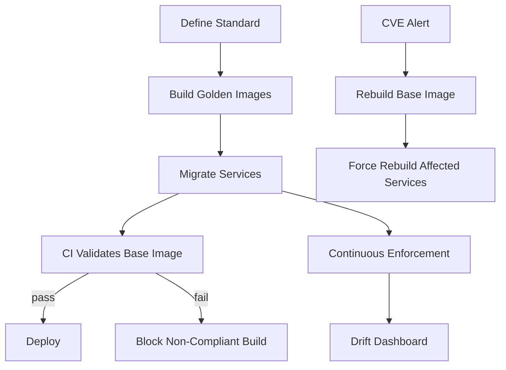

**BAD:**

```dockerfile
# Each team picks their own base
FROM openjdk:11-jre-slim
COPY app.jar /app.jar
CMD java -jar /app.jar
```

Why it fails: no flag baseline, uncontrolled JDK version, unpatchable.

**GOOD:**

```dockerfile
# Golden image with governed baseline
FROM internal/jdk21-baseline:v3
COPY app.jar /app.jar
CMD java @/opt/jvm/baseline.opts -jar /app.jar
```

Why it works: version pinned, flags governed, patchable via base image rebuild.

---

### 🚨 Failure Modes

**Failure 1 - Silent version drift:**

**Symptom:** Compliance dashboard shows 95% adoption, but 5% of services run a JDK with a known critical vulnerability for months.

**Root cause:** The exception process is too heavyweight (requires VP approval), so teams pin to old base images and never request an exception.

**Diagnostic:**

```bash
# Query all running JVM versions in the fleet
kubectl get pods -A -o json | jq -r \
  '.items[].spec.containers[].image' | \
  grep jdk | sort | uniq -c | sort -rn
# Compare against approved image tags
```

**Fix:** Make the exception process lightweight (self-service form, auto-expiry after 90 days). Track exception count and age as fleet health metrics. Alert when any exception exceeds its TTL.

**Failure 2 - Flag baseline conflict:**

**Symptom:** Service starts crashing after base image update. Logs show `Conflicting collector combinations` or ignored flags.

**Root cause:** The base image sets `-XX:+UseG1GC` via `JAVA_TOOL_OPTIONS`, but the service's own startup script passes `-XX:+UseZGC`. The JVM rejects contradictory collector flags.

**Diagnostic:**

```bash
# Check effective flags on the running JVM
jcmd <pid> VM.flags | grep -i "Use.*GC"
# Check all flag sources
jcmd <pid> VM.command_line
```

**Fix:** Separate the flag baseline into tiers. GC selection should be in the RECOMMENDED tier (team can override), not LOCKED. Document which flags are safe to override and which combinations are forbidden.

**Failure 3 - Upgrade cliff:**

**Symptom:** LTS migration deadline arrives and 60% of services have not migrated. Teams cite "no time" and "works fine on current version."

**Root cause:** Migration was announced but not incentivized. No automated compatibility testing. Teams fear breakage more than non-compliance.

**Diagnostic:**

```bash
# Fleet migration progress dashboard query
# (pseudo: query service catalog metadata)
curl -s "$FLEET_API/jvm-versions" | \
  jq 'group_by(.jdk_version) |
  map({version: .[0].jdk_version,
       count: length})'
```

**Fix:** Provide automated migration tooling (Gradle/Maven JDK version bump + test run). Require migration as part of regular dependency updates. Start the migration window 12 months before the old LTS loses support - not 3 months.

---

### 🔬 Production Reality

A platform team at a mid-size organization (150 services, 8 teams) rolled out JVM fleet standardization over 6 months. The pattern that caused the most pain: flag inheritance conflicts. The golden base image injected flags via `JAVA_TOOL_OPTIONS`, which the JVM processes before command-line arguments. When services passed their own `-Xmx` on the command line, both values appeared in the flag list - the command-line value won (correct), but teams did not realize the base image also set `-Xmx`, leading to confusion during debugging. The fix was to move the flag baseline to a documented entrypoint script that services could inspect and override explicitly, rather than relying on the opaque `JAVA_TOOL_OPTIONS` environment variable. The lesson: transparency of flag sources matters more than enforcement mechanism cleverness. When engineers can run `jcmd <pid> VM.flags -all` and trace every flag to its origin (base image, entrypoint, command line), trust in the system increases.

---

### ⚖️ Trade-offs & Alternatives

| Aspect            | Fleet Standardization     | Full Autonomy           | Managed Runtime (PaaS) |
| ----------------- | ------------------------- | ----------------------- | ---------------------- |
| Patch speed       | Hours to days (automated) | Weeks to months         | Minutes (provider)     |
| Team autonomy     | Constrained (tiered)      | Full                    | None (locked)          |
| Debugging         | Consistent across fleet   | Per-service archaeology | Provider-dependent     |
| Operational cost  | Medium (platform team)    | High (per-team)         | Low (outsourced)       |
| Edge-case support | Exception process         | Default                 | Limited/impossible     |
| Observability     | Uniform metrics/logs      | Fragmented              | Provider dashboards    |

---

### ⚡ Decision Snap

**USE WHEN:**

- Organization runs 20+ JVM services across multiple teams.
- Security patch SLAs require bounded rollout times.
- Observability strategy depends on consistent JVM telemetry.

**AVOID WHEN:**

- Single team, fewer than 5 services - overhead exceeds benefit.
- Every service has genuinely unique JVM requirements (rare in practice).

**PREFER Full Autonomy WHEN:**

- Teams are small, senior, and already maintain their own JVM expertise.
- Services are so diverse (GraalVM native, embedded JVMs) that a single standard is fiction.

---

### ⚠️ Top Traps

| #   | Misconception                                     | Reality                                                                                                                                                                     |
| --- | ------------------------------------------------- | --------------------------------------------------------------------------------------------------------------------------------------------------------------------------- |
| 1   | "Standardize everything"                          | Over-constraining (locking GC choice, heap size) creates pushback and workarounds. Tier your mandates: LOCKED for security, RECOMMENDED for performance, FREE for the rest. |
| 2   | "Golden images are set-and-forget"                | Base images need a maintenance pipeline: security scans, patch updates, rebuild triggers. An unmaintained golden image becomes a liability.                                 |
| 3   | "Compliance percentage is the KPI"                | Time-to-patch (P50/P99 across fleet) is the real metric. 99% compliance with a 6-month patch lag is worse than 90% compliance with 7-day patches.                           |
| 4   | "`JAVA_TOOL_OPTIONS` is the best injection point" | It is opaque and hard to debug. Explicit entrypoint scripts or JVM config files (`-XX:VMOptionsFile`) are more transparent and overridable.                                 |
| 5   | "Exception process means failure"                 | Exceptions are expected and healthy. A zero-exception fleet either has no edge cases (unlikely) or teams are circumventing the process silently.                            |

---

### 🪜 Learning Ladder

**Prerequisites:**

- JVM-002 JRE vs JDK vs JVM - understand the distribution packaging model
- JVM-033 JVM Flags and Common Tuning Knobs - know what flags exist and how they interact
- JVM-065 JVM in Kubernetes - Resource Limits Done Right - container-specific JVM behavior

**THIS:** JVM-102 JVM Fleet Standardization Strategy

**Next steps:**

- JVM-105 Build Your Own JVM Flag Baseline - the concrete flag governance this strategy requires
- JVM-104 Java LTS Version Migration Strategy - how to execute the version migration this strategy mandates
- JVM-108 JVM Observability Platform Design - the observability layer that standardization enables

---

**The Surprising Truth:**

The biggest barrier to fleet standardization is not technical - it is social. Engineers resist standards they did not help create. Organizations that succeed form a JVM guild (rotating representatives from each team) that co-authors the standard. The guild model transforms the standard from "platform team mandate" into "our shared agreement." Adoption velocity in guild-driven standardization is typically 2-3x faster than top-down mandates, because teams trust a standard their peers built.

---

**Further Reading:**

- [OpenJDK Vulnerability Group](https://openjdk.org/groups/vulnerability/) - official CVE disclosure process and patch cadence for OpenJDK distributions
- [Eclipse Temurin Support and Lifecycle](https://adoptium.net/support/) - LTS version support timelines for the most widely adopted community distribution
- [JEP 295: Ahead-of-Time Compilation](https://openjdk.org/jeps/295) - relevant to understanding distribution-specific features that complicate standardization

---

**Revision Card:**

1. Fleet standardization is a governance problem, not a technology problem - tier mandates into LOCKED/RECOMMENDED/FREE to balance security with autonomy.
2. Golden base images are the enforcement mechanism; time-to-patch (not compliance percentage) is the metric that matters.
3. Flag injection via `JAVA_TOOL_OPTIONS` is opaque - prefer explicit entrypoint scripts or `-XX:VMOptionsFile` so engineers can trace every flag to its source.

---

---

# JVM-103 GC Strategy for Heterogeneous Workloads

**TL;DR** - Different services need different garbage collectors. A workload classification framework maps request-response, batch, streaming, and mixed patterns to the right GC - eliminating guesswork and one-size-fits-all defaults.

---

### 🔥 Problem Statement

An organization runs 80 JVM services. The platform team standardized on G1GC for the entire fleet because it is the JDK default. Then problems emerge: the payment API suffers P99 latency spikes during mixed GC cycles, the nightly ETL batch job runs 15% slower than it did on Parallel GC, and the Kafka Streams consumer falls behind during concurrent marking because G1's write barriers consume CPU it needs for processing. Each service team tunes G1 independently - one lowers `MaxGCPauseMillis` to 20ms (triggering more frequent collections), another increases heap to 64GB (making mixed GCs longer). The tuning fixes one symptom while creating another. The root problem: G1 is a generalist collector. Some workloads need a latency specialist (ZGC), others a throughput specialist (Parallel GC), others a concurrent specialist (Shenandoah). Without a workload classification framework, GC selection is either uniform (suboptimal for most) or ad hoc (untransferable knowledge trapped in individual teams).

---

### 📜 Historical Context

Before JDK 9, organizations had two practical choices: Parallel GC (throughput) or CMS (low-latency). The decision was binary. G1 became the default in JDK 9, offering a middle ground. ZGC (JDK 11 experimental, production-ready JDK 15+) and Shenandoah (JDK 12+, Red Hat-contributed, available in most distributions) added sub-millisecond options. Generational ZGC (JDK 21) closed ZGC's throughput gap. By JDK 21, organizations had four production-grade collectors with distinct performance profiles - making "just use the default" an increasingly costly shortcut. The need for a decision framework became unavoidable.

---

### 🔩 First Principles

**CORE INVARIANTS:**

1. GC pause behavior is determined by the interaction of collector algorithm, heap size, allocation rate, and live-set size. Changing any one variable changes the optimal collector choice.
2. No single collector dominates all three axes (latency, throughput, footprint) simultaneously - each collector makes a different trade-off on this triangle.
3. Workload characteristics are classifiable: allocation rate, object lifetime distribution, and latency sensitivity form a finite space of workload archetypes.
4. GC choice is a reversible decision - collectors can be switched without code changes, only JVM flags change. The cost is testing, not refactoring.

**DERIVED DESIGN:**

Invariant 3 means you can build a classification matrix mapping workload archetypes to collectors. Invariant 2 means the matrix must have different recommendations per cell - no universal winner. Invariant 1 means the matrix must account for heap size and allocation rate as secondary axes. Invariant 4 means the decision can be iterative: start with a default, measure, reclassify, switch.

**THE TRADE-OFF:**

**Gain:** Each service runs on its optimal collector. Latency-sensitive services get sub-ms pauses. Throughput services get maximum CPU efficiency. Streaming services get consistent concurrent processing.

**Cost:** Fleet heterogeneity increases operational complexity. Multiple GC configurations means multiple monitoring profiles, multiple tuning playbooks, and multiple expertise areas.

---

### 🧠 Mental Model

> Choosing a GC is like choosing tires for a vehicle fleet. A delivery van (batch job) needs all-season tires optimized for mileage and load. A race car (latency-sensitive API) needs slick tires that sacrifice durability for grip. A long-haul truck (streaming pipeline) needs tires that perform consistently over thousands of miles. Putting race car tires on the delivery van wastes money; putting van tires on the race car loses the race.

- "Tire type" -> GC algorithm (G1, ZGC, Parallel, Shenandoah)
- "Vehicle type" -> workload archetype (batch, API, streaming)
- "Road surface" -> heap size and allocation rate
- "Performance metric" -> latency, throughput, or consistency

**Where this analogy breaks down:** Unlike tires, switching a GC is free (just a flag change). The cost is not in the swap but in validating that the new collector performs better under production load.

---

### 🧩 Components

- **Workload classifier:** Categorizes each service into an archetype based on measurable characteristics (request pattern, allocation rate, latency SLA, object lifetime distribution).
- **GC selection matrix:** Maps each workload archetype + heap size range to a recommended collector with justification.
- **Measurement pipeline:** Collects GC metrics per service (pause times, throughput overhead, allocation rate) to validate the classification.
- **Tuning profiles:** Per-collector flag sets optimized for each archetype (not per-service, per-archetype).
- **Reclassification trigger:** Conditions under which a service should be re-evaluated (traffic pattern change, heap resize, SLA change).

```text
GC Strategy Pipeline:

  Service --> Workload Classifier
                |
                v
            Archetype Tag
          (API / Batch / Stream / Mixed)
                |
                v
            GC Selection Matrix
          [archetype x heap x SLA]
                |
                v
          Recommended GC + Tuning Profile
                |
                v
          Measure in Production
                |
                v
          Reclassify if metrics drift
```

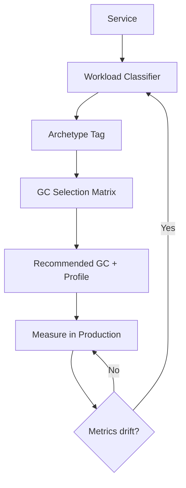

---

### 📶 Gradual Depth

**Level 1 - What it is:** GC strategy for heterogeneous workloads is a framework for choosing the right garbage collector for each service based on its workload type - rather than using one GC for everything.

**Level 2 - How to use it:** Classify each service as request-response (latency-sensitive), batch (throughput-sensitive), streaming (consistency-sensitive), or mixed. Map each class to a collector: ZGC for latency, Parallel for batch throughput, G1 or Shenandoah for streaming. Validate with GC logs.

**Level 3 - How it works:** The classification considers three measurable inputs: P99 latency SLA (sub-10ms needs ZGC or Shenandoah; 50-200ms tolerates G1; no SLA allows Parallel), allocation rate relative to heap size (high allocation rate favors collectors with efficient young-gen collection), and object lifetime distribution (short-lived-dominant favors generational collectors; long-lived-dominant favors concurrent markers). The matrix cross-references these to produce a recommendation.

**Level 4 - Production mastery:** The classification is not static. A service that starts as a simple API may evolve into a mixed workload as caching layers grow. Build reclassification triggers: if P99 GC pause exceeds 2x the SLA headroom, or if promotion rate changes by more than 50% over a month, re-evaluate. Track fleet GC distribution as a dashboard metric. Expect 60-70% of services to run G1 (the generalist), 15-25% on ZGC (latency-critical), 5-10% on Parallel (batch), and a small tail on Shenandoah or custom configurations.

---

### ⚙️ How It Works

**Phase 1 - Classify workloads.** For each service, measure: request pattern (synchronous API, async consumer, batch scheduler), P99 latency target, heap size, allocation rate (MB/s from GC logs), and promotion rate (objects surviving young GC).

**Phase 2 - Apply the selection matrix.** Cross-reference the workload archetype with heap size and latency SLA:

| Archetype        | Heap < 4GB | Heap 4-32GB   | Heap 32GB+     |
| ---------------- | ---------- | ------------- | -------------- |
| Request-response | G1         | G1 or ZGC     | ZGC            |
| (P99 < 10ms)     | (adequate) | (ZGC if <5ms) | (ZGC always)   |
| Request-response | G1         | G1            | G1             |
| (P99 < 200ms)    |            |               |                |
| Batch/ETL        | Parallel   | Parallel      | Parallel/G1    |
| Streaming        | G1         | G1/Shenandoah | ZGC/Shenandoah |
| Mixed            | G1         | G1            | G1             |

**Phase 3 - Apply tuning profile.** Each archetype gets a tuning profile, not individual services:

```bash
# Profile: latency-sensitive API on ZGC
# (JDK 21+ with Generational ZGC)
-XX:+UseZGC -XX:+ZGenerational \
-Xmx8g -Xms8g \
-XX:SoftMaxHeapSize=6g \
-Xlog:gc*:file=gc.log:time,level,tags

# Profile: batch/ETL on Parallel GC
-XX:+UseParallelGC \
-Xmx16g -Xms16g \
-XX:ParallelGCThreads=8 \
-Xlog:gc*:file=gc.log:time,level,tags

# Profile: streaming on G1 with low pause target
-XX:+UseG1GC \
-XX:MaxGCPauseMillis=50 \
-Xmx12g -Xms12g \
-Xlog:gc*:file=gc.log:time,level,tags
```

**Phase 4 - Validate and reclassify.** After deployment, compare actual GC metrics against the expected profile. If the service's GC behavior diverges from the archetype prediction, reclassify.

```text
Decision Flow:

  Measure workload characteristics
    |
    v
  Classify: API / Batch / Stream / Mixed
    |
    v
  Check heap size range
    |
    v
  Check latency SLA
    |
    v
  Matrix lookup --> Recommended GC
    |
    v
  Apply archetype tuning profile
    |
    v
  Validate with GC logs (2-week burn-in)
    |
    v
  Reclassify if metrics drift
```

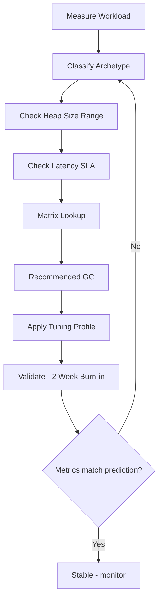

---

**BAD:**

```bash
# One GC for the entire fleet
java -XX:+UseG1GC -jar api-service.jar
java -XX:+UseG1GC -jar batch-etl.jar
java -XX:+UseG1GC -jar stream-proc.jar
```

Why it fails: batch jobs waste 20% throughput on G1 barriers; streaming hits unnecessary pauses.

**GOOD:**

```bash
# GC matched to workload profile
java -XX:+UseZGC -jar api-service.jar
java -XX:+UseParallelGC -jar batch-etl.jar
java -XX:+UseZGC -jar stream-proc.jar
```

Why it works: each service gets the collector that matches its latency/throughput priority.

---

### 🚨 Failure Modes

**Failure 1 - Misclassified workload:**

**Symptom:** A service classified as "batch" runs on Parallel GC but shows intermittent 5-second STW pauses causing downstream timeouts.

**Root cause:** The service is actually mixed - it processes batch jobs but also serves a health-check API with a 3-second timeout. Full GC pauses on Parallel GC exceed the health-check timeout, causing Kubernetes to kill the pod.

**Diagnostic:**

```bash
# Check for Full GC pauses exceeding threshold
grep "Full" gc.log | \
  awk '{print $NF}' | sort -rn | head -5
# Look at pause time distribution
jcmd <pid> GC.heap_info
# Check if liveness probes are failing
kubectl describe pod <pod> | grep -A5 Liveness
```

**Fix:** Reclassify as mixed workload. Switch to G1GC with a pause target below the health-check timeout. Alternatively, separate the health-check endpoint into a sidecar that does not share the JVM.

**Failure 2 - ZGC throughput surprise:**

**Symptom:** After migrating a latency-sensitive API from G1 to ZGC, P99 latency improves but overall throughput drops 12%, requiring more pods to handle the same traffic.

**Root cause:** ZGC's concurrent work steals CPU from application threads. On a 4-core container, ZGC's concurrent threads consume significant CPU headroom. Pre-JDK 21 non-generational ZGC also allocated more frequently due to lack of young-generation optimization.

**Diagnostic:**

```bash
# Compare CPU utilization before/after GC switch
# Check GC overhead percentage
jcmd <pid> GC.heap_info
# Monitor concurrent GC thread CPU in JFR
jcmd <pid> JFR.start duration=60s \
  filename=gc-profile.jfr
```

**Fix:** On JDK 21+, enable Generational ZGC (`-XX:+ZGenerational`) to reduce allocation pressure. If still CPU-constrained, increase container CPU limit or evaluate whether the latency gain justifies the throughput cost. For small containers (2-4 cores), G1 with aggressive pause targets may be more efficient than ZGC.

---

### 🔬 Production Reality

A common pattern at organizations adopting multi-GC fleets: the first migration wave (typically moving latency-sensitive APIs from G1 to ZGC) succeeds and builds confidence. The second wave (moving batch jobs from G1 to Parallel) often stalls - because batch teams see no production incidents and resist change. The key insight is framing the GC switch for batch services not as a reliability improvement but as a cost reduction. Parallel GC on batch workloads typically achieves 5-15% higher throughput than G1 because it does not pay the concurrent marking and write barrier overhead. On a fleet of 20 batch services, that throughput gain translates to fewer pods needed for the same processing window. Measure the throughput difference in a staging environment with production-representative data, then present the cost savings. Engineers who resist "change for change's sake" respond to "this saves us N pods per service."

---

### ⚖️ Trade-offs & Alternatives

| Aspect            | Multi-GC Strategy            | Single GC Fleet (G1) | ZGC Everywhere        |
| ----------------- | ---------------------------- | -------------------- | --------------------- |
| Latency-sensitive | Optimal (ZGC for these)      | Adequate (50-200ms)  | Optimal (<1ms)        |
| Batch throughput  | Optimal (Parallel for these) | 5-15% throughput tax | 10-15% throughput tax |
| Operational cost  | Higher (multiple profiles)   | Lowest (one profile) | Medium (one profile)  |
| Expertise needed  | Broad (multiple collectors)  | Narrow (G1 only)     | Narrow (ZGC only)     |
| Debugging         | Collector-specific tools     | Uniform              | Uniform               |
| Fleet consistency | Lower                        | Highest              | High                  |

---

### ⚡ Decision Snap

**USE WHEN:**

- Fleet contains distinct workload archetypes with different latency/throughput requirements.
- At least one service class has P99 latency SLAs below 10ms (ZGC territory).
- Batch workloads represent significant compute spend where throughput gains reduce cost.

**AVOID WHEN:**

- All services have similar workload profiles and moderate latency SLAs (G1 handles this well).
- Team lacks GC expertise to maintain multiple tuning profiles.

**PREFER Single GC (G1) WHEN:**

- Operational simplicity outweighs the latency/throughput gains of specialization.
- Fleet is small (<20 services) and the performance differences are not business-impacting.

---

### ⚠️ Top Traps

| #   | Misconception                                       | Reality                                                                                                                                                                                                                               |
| --- | --------------------------------------------------- | ------------------------------------------------------------------------------------------------------------------------------------------------------------------------------------------------------------------------------------- |
| 1   | "ZGC is always better for latency"                  | On small heaps (<2GB) or CPU-constrained containers (2 cores), ZGC's concurrent overhead can increase P99 latency compared to a well-tuned G1.                                                                                        |
| 2   | "Parallel GC is obsolete"                           | For batch workloads with no latency SLA, Parallel GC delivers the highest throughput. It is the right tool for throughput-maximizing jobs.                                                                                            |
| 3   | "Classification is a one-time exercise"             | Workloads evolve. A service that starts as a simple API may grow caches, add background tasks, or change traffic patterns. Reclassification triggers are essential.                                                                   |
| 4   | "GC tuning compensates for bad allocation patterns" | No GC can fix code that allocates 2GB/sec of short-lived objects. Reduce allocation rate first (object pooling, off-heap buffers), then tune the GC.                                                                                  |
| 5   | "Shenandoah and ZGC are interchangeable"            | They share the sub-ms pause goal but differ in implementation. Shenandoah uses Brooks pointers (forwarding pointer per object); ZGC uses colored pointers (metadata in pointer bits). Performance characteristics differ by workload. |

---

### 🪜 Learning Ladder

**Prerequisites:**

- JVM-030 G1GC Essentials - understand the default collector's behavior
- JVM-048 G1GC Internals - Regions, Marking, Mixed - know why G1 pauses scale with heap and live set
- JVM-049 ZGC Fundamentals - Sub-Millisecond Pauses - understand ZGC's concurrent model
- JVM-061 GC Tuning Methodology - Measure First - know the measurement-first tuning discipline

**THIS:** JVM-103 GC Strategy for Heterogeneous Workloads

**Next steps:**

- JVM-109 Multi-GC Fleet - Different Services, Diff GCs - operational patterns for running multiple collectors in production
- JVM-066 GC Pause Budget - SLA-Driven Tuning - how to set pause targets per workload class
- JVM-105 Build Your Own JVM Flag Baseline - encoding GC profiles into enforceable flag baselines

---

**The Surprising Truth:**

The workload classification often reveals that most services in a fleet are not latency-sensitive at all. Organizations typically find that only 10-20% of services genuinely need sub-10ms GC pauses. The majority are internal APIs, background workers, or batch processors that tolerate 100-200ms pauses without user impact. The biggest optimization is not switching those 10-20% to ZGC - it is switching the batch/ETL tail to Parallel GC, where the throughput gain translates directly into compute cost savings across the largest workload segment.

---

**Further Reading:**

- [JEP 439: Generational ZGC](https://openjdk.org/jeps/439) - the JDK 21 enhancement that made ZGC viable for throughput-sensitive workloads by adding generational collection
- [GC Progress from JDK 8 to JDK 21](https://malloc.se/blog/zgc-jdk21) - Per Liden's overview of ZGC evolution with performance comparisons across collector generations
- [HotSpot Virtual Machine Garbage Collection Tuning Guide](https://docs.oracle.com/en/java/javase/21/gctuning/) - Oracle's official guide covering G1, ZGC, Parallel, and Serial collector tuning for JDK 21

---

**Revision Card:**

1. Classify workloads first (API/batch/streaming/mixed), then select the GC - never default to one collector for the entire fleet without measuring.
2. No collector wins all three axes (latency, throughput, footprint). ZGC wins latency, Parallel wins throughput, G1 is the generalist. Pick per workload.
3. Most fleets discover only 10-20% of services need sub-ms pauses. The bigger cost savings come from switching batch workloads to Parallel GC.

---

---

# JVM-104 Java LTS Version Migration Strategy

**TL;DR** - LTS migration is a fleet-wide engineering program, not a version bump. A phased strategy with compatibility testing, canary rollouts, and rollback gates turns the 8->11->17->21->25 journey from a.

---

### 🔥 Problem Statement

An organization running 150 services on Java 11 faces end-of-support. The security team mandates migration to Java 21 within 12 months. Teams discover the problem is not the JDK upgrade itself - it is everything that breaks around it. Internal libraries compiled against Java 11 use removed APIs (`javax.xml.bind`, `sun.misc.Unsafe` access patterns). Build plugins assume the classpath world and fail under the module system. Bytecode-manipulating frameworks (Mockito, ByteBuddy, Hibernate's proxies) hit `InaccessibleObjectException` from strong encapsulation. Performance regression testing reveals that G1GC's default heuristics changed between versions, shifting P99 latencies by 15-20% in either direction depending on workload. Without a migration strategy, each team discovers these problems independently - duplicating effort 150 times. Half the fleet misses the deadline. Services that do migrate without performance validation cause production incidents. The organization learns that LTS migration is a program management problem disguised as a version number change.

---

### 📜 Historical Context

Java's LTS cadence emerged from Oracle's 2017 decision to release every six months with LTS versions every three years (8, 11, 17, 21, 25). Before this, Java releases were infrequent but monolithic - the jump from Java 6 to 7 to 8 took years but required minimal migration effort. The module system in Java 9 (Project Jigsaw, JSR 376) created the first genuine migration cliff. APIs removed in Java 11 (`java.xml.ws`, `java.activation`, CORBA packages) forced the first wave of real breakage. Strong encapsulation tightened further in Java 16 (JEP 396) and became the default in Java 17. Each LTS-to-LTS jump accumulates multiple breaking changes that compound. Organizations that skipped Java 11 and jumped from 8 to 17 faced the combined breakage of three LTS generations simultaneously.

---

### 🔩 First Principles

**CORE INVARIANTS:**

1. Migration risk is proportional to the number of LTS generations skipped - each generation accumulates removed APIs, changed defaults, and tightened encapsulation.
2. Binary compatibility (bytecode runs) does not guarantee behavioral compatibility (same performance, same semantics under edge cases).
3. The longest migration dependency chain determines the minimum timeline - if a shared library needs updating first, all dependent services are blocked.
4. Rollback must be possible at every stage. A migration that cannot be reversed at the service level is a fleet-wide gamble.

**DERIVED DESIGN:**

Invariant 1 forces a policy: never skip an LTS generation entirely (maintain upgrade tooling per generation even if some services leapfrog). Invariant 2 requires performance regression testing as a gate, not just compilation success. Invariant 3 demands dependency graph analysis before scheduling service migrations. Invariant 4 requires that the new JDK version runs alongside the old one, with traffic shifting, not a big-bang cutover.

**THE TRADE-OFF:**

**Gain:** Continued security patches, access to new language features (records, sealed classes, pattern matching, virtual threads), improved GC and JIT performance, vendor support.

**Cost:** 6-12 month program per LTS jump, cross-team coordination overhead, risk of performance regressions, temporary dual-version fleet complexity.

---

### 🧠 Mental Model

> LTS migration is like replacing the engines on a fleet of airplanes while they continue flying scheduled routes. You cannot ground the entire fleet. You swap one plane at a time, test it on short domestic routes first (canary), then expand to longer routes (10% rollout), and only after confirming fuel efficiency and reliability do you commit the full fleet. If the new engine shows vibration on a specific airframe, you ground that plane, not the program.

- "Engine swap" -> JDK version change
- "Domestic test route" -> canary deployment (low-traffic service)
- "Fuel efficiency check" -> performance regression testing
- "Specific airframe issue" -> service-specific incompatibility

**Where this analogy breaks down:** Airplane engines are independent per aircraft. JVM services share libraries - upgrading a shared library to work on Java 21 can break services still on Java 11 if the library drops backward compatibility.

---

### 🧩 Components

- **Compatibility matrix:** Tracks every shared library, framework, and build plugin against each LTS version. Status per cell: compatible, compatible-with-changes, incompatible, untested.
- **Dependency graph analyzer:** Maps which services depend on which shared libraries. Identifies the critical path: libraries that must migrate before any service can.
- **Migration playbook per LTS jump:** Documents known breaking changes, required flag additions (`--add-opens`, `--add-modules`), and removed API replacements.
- **Performance regression gate:** Automated benchmark suite that compares P50/P99 latency, throughput, and GC behavior between old and new JDK for each service.
- **Canary pipeline:** Deploys the migrated service to a small traffic slice with automated rollback on error-rate or latency threshold breach.
- **Fleet migration dashboard:** Tracks per-service migration status, blockers, and timeline adherence.

```text
LTS Migration Architecture:

  Compatibility Matrix
  [lib x version -> status]
       |
       v
  Dependency Graph Analysis
  [critical path identification]
       |
       v
  Migration Playbook (per LTS jump)
       |
       +--> Shared Libs First
       |        |
       |        v
       +--> Service Migration
                |
       +--------+--------+--------+
       v        v        v        v
    Canary    10%      50%      100%
    (auto-    (perf    (error   (full
    rollback) gate)    gate)    fleet)
       |
  Fleet Dashboard [status per service]
```

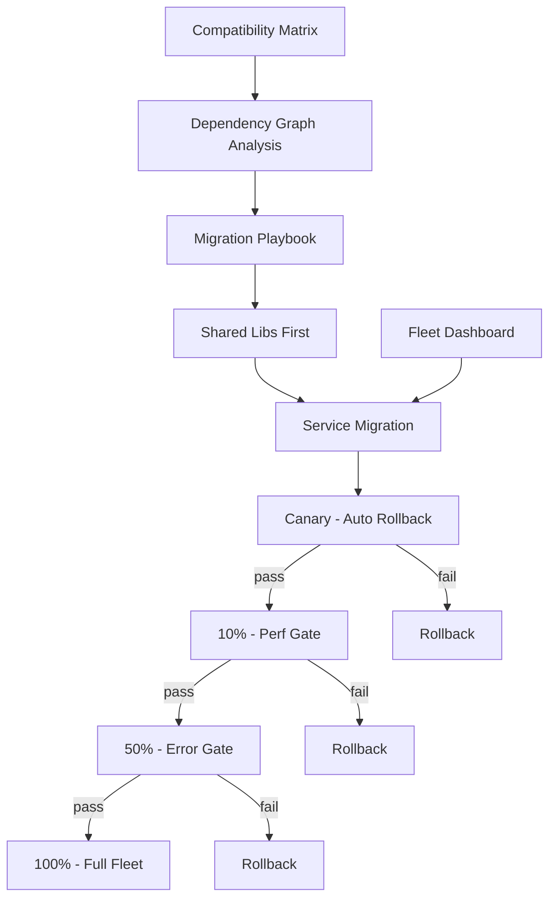

---

### 📶 Gradual Depth

**Level 1 - What it is:** Java LTS migration is the process of moving services from one long-term-support JDK version to the next (e.g., 11 to 17, 17 to 21). It involves updating the JDK, fixing incompatibilities, and validating that services perform correctly on the new version.

**Level 2 - How to use it:** Build a compatibility matrix for your dependencies. Fix shared libraries first (they block everything). Migrate services in waves: canary, then 10%, then 50%, then 100%. Gate each wave on error rate and latency metrics. Budget 6-12 months per LTS jump for a fleet of 50+ services.

**Level 3 - How it works:** Each LTS jump accumulates breaking changes: removed APIs (check with `jdeprscan`), tightened module encapsulation (detect with `--illegal-access=warn` before it became `deny`), changed GC defaults, and new bytecode versions. The migration playbook catalogs these per jump. The performance gate runs the service's load test suite on both JDK versions and compares distributions of latency, throughput, and GC pause times - not just averages. The canary pipeline uses traffic splitting (Kubernetes weighted services or Istio routing) to expose the migrated version to real traffic incrementally.

**Level 4 - Production mastery:** The critical insight is dependency ordering. Map the full dependency graph: shared libraries, internal frameworks, build plugins, test frameworks, bytecode agents (APM, coverage). Identify the longest chain - this sets your minimum timeline. Migrate bottom-up: bytecode agents first (they break most subtly), then shared libraries, then services. For the 8-to-11 jump specifically, the `javax` to `jakarta` namespace is not relevant (that is a Jakarta EE concern), but `java.xml.bind` removal requires adding `jakarta.xml.bind` or JAXB standalone. For 11-to-17, `--illegal-access` removal means every reflective access to JDK internals must use `--add-opens` explicitly. For 17-to-21, virtual threads change threading assumptions but are opt-in. Track migration velocity as services-per-week and blocked-services count.

---

### ⚙️ How It Works

**Phase 1 - Inventory and analysis (weeks 1-4).** Catalog every service's current JDK version, dependencies, and build toolchain. Run `jdeprscan` and `jdeps --jdk-internals` against service JARs to identify removed API usage and internal JDK dependencies. Build the compatibility matrix.

**Phase 2 - Foundation migration (weeks 4-12).** Upgrade shared libraries, build plugins, and bytecode agents to versions compatible with the target LTS. This often means upgrading Gradle/Maven, test frameworks (JUnit, Mockito), and APM agents first. Publish new library versions that support both old and new JDK.

**Phase 3 - Service migration waves (weeks 12-40).** Migrate services in priority order: lowest-risk first (batch jobs, internal tools), then medium-risk (internal APIs), then highest-risk (customer-facing, latency-sensitive). Each service follows: compile on new JDK, run unit tests, run integration tests, run performance benchmarks, deploy canary, gate on metrics, expand rollout.

**Phase 4 - Cleanup and enforcement (weeks 40-52).** Remove `--add-opens` workarounds where possible (fix the underlying reflection). Drop support for the old LTS in shared libraries. Update golden base images to the new LTS only. Enable compliance scanning to block old-LTS deployments.

```text
Migration Timeline (typical 11->21):

  Wk 1-4     Wk 4-12     Wk 12-40      Wk 40-52
  +--------+----------+--------------+-----------+
  |Inventory|Foundation|Service Waves |  Cleanup  |
  |jdeprscan|libs,build|canary->10%-> |drop old   |
  |jdeps    |plugins   |50%->100%     |LTS support|
  |compat   |agents    |per service   |enforce    |
  |matrix   |dual-ver  |              |new base   |
  +--------+----------+--------------+-----------+
```

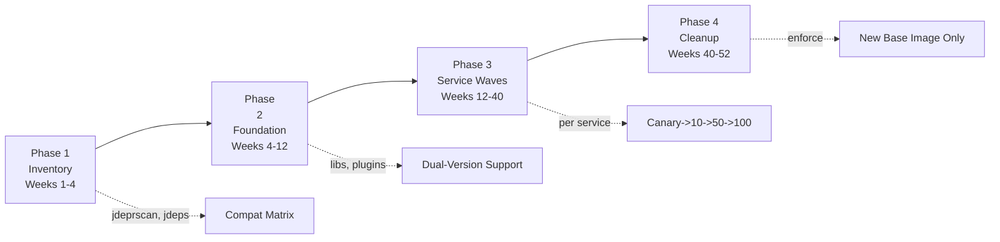

**BAD:**

```bash
# Big-bang: upgrade all services at once
find . -name 'build.gradle' -exec \
  sed -i 's/java11/java21/g' {} +
```

Why it fails: no compatibility gate, no rollback path.

**GOOD:**

```bash
# Phased: canary -> 10% -> 50% -> 100%
# Each phase has a perf regression gate
java --add-opens java.base/java.lang=ALL-UNNAMED \
  -jar canary-service.jar
# Promote only after 7-day soak
```

Why it works: regression gate per phase, rollback window, soak period.

---

### 🚨 Failure Modes

**Failure 1 - Shared library version deadlock:**

**Symptom:** Service A needs library-X v3.0 (Java 21 compatible), but service B depends on library-X v2.x API that was removed in v3.0. Neither can migrate without breaking the other.

**Root cause:** The shared library made a breaking API change simultaneous with the JDK compatibility fix, coupling two migrations into one.

**Diagnostic:**

```bash
# Find all consumers of a shared library
# and their pinned versions
grep -r "library-x" --include="*.gradle" \
  --include="pom.xml" services/ | \
  grep -oP 'version.*[\d.]+' | sort | uniq -c
```

**Fix:** Shared libraries must maintain backward compatibility for at least one LTS migration cycle. Release library-X v2.5 that works on both Java 11 and 21 without API breaks. Reserve API changes for a separate release after migration completes.

**Failure 2 - Silent performance regression:**

**Symptom:** Service passes all functional tests on Java 21 but P99 latency increases 25% in production. No errors, no crashes - just slower.

**Root cause:** G1GC default region size changed between JDK versions, or JIT compilation thresholds shifted, or a hot code path hits a deoptimization that did not exist on the old JDK.

**Diagnostic:**

```bash
# Compare GC behavior between JDK versions
# Old JDK:
jcmd <pid_old> GC.heap_info
# New JDK:
jcmd <pid_new> GC.heap_info
# Compare JIT compilation logs
-XX:+PrintCompilation -XX:+TraceDeoptimization
```

**Fix:** Performance regression gate must compare latency distributions (P50, P90, P99, P99.9), not averages. Run identical load profiles on both JDK versions. If regression exceeds 5%, investigate before proceeding. Common fixes: explicit GC flags to preserve old behavior, or JIT warmup changes.

**Failure 3 - Reflective access breakage in production:**

**Symptom:** Service starts on Java 21 but crashes at runtime with `InaccessibleObjectException` on a code path not covered by tests (e.g., serialization of a rare object type).

**Root cause:** Strong encapsulation (JEP 396, JEP 403) denies reflective access to JDK internals. The code path uses `setAccessible(true)` on a `java.base` field. Tests never exercise this path because it requires a specific input.

**Diagnostic:**

```bash
# Run with access logging to find all
# illegal reflective accesses
java --illegal-access=debug -jar app.jar
# On JDK 17+: use --add-opens to whitelist,
# then grep logs for WARNING
```

**Fix:** Before migration, run the full test suite plus production traffic replay with `--illegal-access=warn` (JDK 11-15) or explicit `--add-opens` logging. Catalog every required opening. Add `--add-opens` flags to the service's JVM arguments as a bridge, then replace the reflective access with supported APIs.

---

### 🔬 Production Reality

A common pattern in organizations migrating from Java 11 to 21: the migration stalls at 60% completion because the remaining 40% of services depend on a single internal framework that uses `sun.misc.Unsafe` for off-heap memory allocation. The framework team estimated a 2-week fix. It took 8 weeks because `Unsafe` replacement with `java.lang.foreign.MemorySegment` (JDK 21 preview) or `ByteBuffer.allocateDirect` required redesigning the memory management layer. During those 8 weeks, the 40% of blocked services accumulated security patches on Java 11 that needed separate backporting. The lesson: identify framework-level blockers in Phase 1, not Phase 3. Run `jdeps --jdk-internals` on every shared library JAR during inventory - it takes minutes and reveals the blockers that will consume months.

---

### ⚖️ Trade-offs & Alternatives

| Aspect              | Phased LTS Migration   | Big-Bang Cutover     | Skip-Generation Jump    |
| ------------------- | ---------------------- | -------------------- | ----------------------- |
| Risk per service    | Low (canary gated)     | High (all at once)   | Very high (compounded)  |
| Timeline            | 6-12 months            | 1-3 months (forced)  | 6-12 months (same work) |
| Rollback capability | Per-service, any stage | All-or-nothing       | Per-service, any stage  |
| Team coordination   | Moderate (waves)       | Extreme (deadline)   | Moderate (waves)        |
| Breakage surface    | One LTS gap            | One LTS gap          | 2-3 LTS gaps combined   |
| Dual-version cost   | Temporary (per wave)   | None (but no safety) | Temporary (per wave)    |

---

### ⚡ Decision Snap

**USE WHEN:**

- Fleet has 20+ services and current LTS is within 12 months of end-of-support.
- Shared libraries and frameworks are maintained internally (you control the migration pace).
- Organization has CI/CD capable of canary deployments with metric-based rollback.

**AVOID WHEN:**

- Single application, single team - just upgrade directly with a feature branch and load test.
- Migrating from a non-LTS version to the next non-LTS (use rolling upgrades instead of a program).

**PREFER Big-Bang WHEN:**

- Fleet is small (<10 services), all owned by one team, with excellent test coverage.
- Deadline is externally mandated (e.g., vendor drops support in 30 days) and canary phases are a luxury.

---

### ⚠️ Top Traps

| #   | Misconception                                       | Reality                                                                                                                                                                                             |
| --- | --------------------------------------------------- | --------------------------------------------------------------------------------------------------------------------------------------------------------------------------------------------------- |
| 1   | "If it compiles on the new JDK, it works"           | Compilation checks source compatibility. Runtime behavior (GC heuristics, JIT decisions, reflection access, class loading order) can differ silently. Performance testing is mandatory.             |
| 2   | "We can skip Java 17 and go straight from 11 to 21" | You accumulate breakage from three LTS generations. Module system tightening, `--illegal-access` removal, and API removals compound. Migration effort is not saved - it is deferred and multiplied. |
| 3   | "`--add-opens` flags are the fix"                   | They are a bridge, not a destination. Every `--add-opens` is technical debt - a reflective access that should be replaced with a supported API. Track them and retire them.                         |
| 4   | "Migrate all services to the same target date"      | Services have different dependency chains and risk profiles. Wave-based migration with independent timelines per service avoids the coordination bottleneck.                                        |
| 5   | "The JDK upgrade is the hard part"                  | The JDK upgrade is often the easy part. Build plugin compatibility, test framework upgrades, bytecode agent compatibility, and shared library migration consume 70% of the effort.                  |

---

### 🪜 Learning Ladder

**Prerequisites:**

- JVM-033 JVM Flags That Actually Matter - understanding flag changes between LTS versions
- JVM-051 Metaspace Internals - Metaspace defaults changed across LTS versions
- JVM-061 GC Tuning Methodology - performance regression analysis during migration

**THIS:** JVM-104 Java LTS Version Migration Strategy

**Next steps:**

- JVM-102 Fleet Standardization - the governance framework that makes migrations repeatable
- JVM-106 Warm-Up Strategies - CDS archives may need regeneration after JDK upgrades
- JVM-107 GraalVM vs HotSpot - migration is the natural moment to evaluate alternative runtimes

---

**The Surprising Truth:**

The most dangerous LTS migration is not 8-to-11 (where everyone expects breakage) but 17-to-21. Java 17 was "easy enough" that many teams skipped rigorous testing. Java 21 introduces virtual threads, generational ZGC as default-eligible, and continued module system tightening. Teams that built no migration muscle on 17 hit 21 unprepared - not because 21 is harder, but because their process atrophied. The organizations that migrate smoothly are those that treat every LTS jump as a rehearsal for the next one.

---

**Further Reading:**

- [JEP 396: Strongly Encapsulate JDK Internals by Default](https://openjdk.org/jeps/396) - the encapsulation change that breaks the most code during 11-to-17 migration
- [JEP 403: Strongly Encapsulate JDK Internals](https://openjdk.org/jeps/403) - removes the `--illegal-access` option entirely in JDK 17+
- [Oracle Java SE Support Roadmap](https://www.oracle.com/java/technologies/java-se-support-roadmap.html) - official LTS end-of-life dates that drive migration timelines

---

**Revision Card:**

1. LTS migration is a program (6-12 months, phased waves with rollback gates), not a version bump - treat it like infrastructure, not a ticket.
2. Run `jdeps --jdk-internals` on every JAR during inventory to find the framework blockers that will consume 70% of your timeline.
3. "It compiles" is not "it works" - performance regression testing between JDK versions catches the silent killers that functional tests miss.

---

---

# JVM-105 Build Your Own JVM Flag Baseline

**TL;DR** - A JVM flag baseline is an organization's standard set of JVM flags organized by category and override tier - replacing ad-hoc per-service flag accumulation with a governed, tested,.

---

### 🔥 Problem Statement

A platform team audits 120 services and finds 87 distinct JVM flag combinations. Service A runs `-Xmx4g -XX:+UseG1GC -XX:MaxGCPauseMillis=50`. Service B runs `-Xmx4g -XX:+UseG1GC -XX:MaxGCPauseMillis=200 -XX:+UseStringDeduplication`. Service C copies Service A's flags but adds `-XX:+UnlockExperimentalVMFlags -XX:+UseJVMCICompiler` from a blog post without understanding the implications. Nobody knows why Service D has `-XX:-TieredCompilation` - the engineer who added it left two years ago. During a GC-related outage, three teams spend hours comparing flag sets to isolate the difference that causes one service to OOM while an identical workload survives. Flag combinations interact in non-obvious ways: `-XX:MaxGCPauseMillis=20` with a 32GB heap causes G1 to collect so frequently that throughput drops 30%. Without a baseline, every service is a unique experiment, debugging requires archaeology, and knowledge stays trapped in individual heads.

---

### 📜 Historical Context

Early JVM deployments (Java 1.2-1.6 era) used few flags - heap size, GC selection, and perhaps `PermGen` sizing covered most needs. The explosion of flags came with G1GC (JDK 7+), which introduced dozens of tuning knobs. The container revolution added another layer: `-XX:+UseContainerSupport` (JDK 10+), memory percentage flags, and CPU-awareness flags. JFR (open-sourced in JDK 11) added diagnostic flags. By JDK 21, HotSpot exposes over 800 flags (`-XX:+PrintFlagsFinal` count varies by build). The sheer number made ad-hoc configuration unsustainable. Platform engineering teams began codifying flag baselines as the JVM equivalent of a kernel tuning profile - a curated, tested, documented subset of the flag space.

---

### 🔩 First Principles

**CORE INVARIANTS:**

1. JVM flags interact - the effect of one flag depends on the values of others. A baseline must account for interactions, not just individual flag values.
2. Most flags should never be changed from defaults. A good baseline is small: 10-20 explicit flags, not 50+. Every flag beyond the default must justify its presence.
3. Different workload profiles need different baselines. A single "one-size-fits-all" baseline is better than chaos but worse than a tiered system.
4. Flags have lifecycles - they are introduced, deprecated, and removed across JDK versions. A baseline must be version-aware.

**DERIVED DESIGN:**

Invariant 1 forces interaction testing: you cannot validate flags individually. Invariant 2 forces a minimalist approach with explicit justification per flag. Invariant 3 forces tiered baselines (conservative, latency-optimized, throughput-optimized). Invariant 4 forces version-gating: the baseline document specifies which JDK versions each flag applies to.

**THE TRADE-OFF:**

**Gain:** Reproducible JVM behavior across services, faster debugging (known flag set), safe defaults that prevent common misconfigurations, institutional knowledge codified.

**Cost:** Governance overhead (review process for overrides), risk of the baseline becoming stale if not maintained, potential suboptimality for edge-case workloads that need non-standard tuning.

---

### 🧠 Mental Model

> A JVM flag baseline is like a restaurant kitchen's mise en place - the standard ingredient prep that every chef follows before service begins. The baseline does not dictate every dish (service), but it ensures consistent quality of the base ingredients (memory, GC, diagnostics). A chef can request a substitution (override), but they must tell the head chef why, and the substitution goes in the recipe log.

- "Mise en place" -> baseline flag set (defaults every JVM starts with)
- "Head chef approval" -> override review process
- "Recipe log" -> documented exceptions with justification
- "Standard ingredient quality" -> tested, interaction-checked flag values

**Where this analogy breaks down:** Kitchen ingredients do not interact destructively. JVM flags can - setting `-XX:MaxGCPauseMillis=10` alongside a 64GB heap creates a flag combination that technically works but produces pathological GC behavior. The baseline must test combinations, not just individual values.

---

### 🧩 Components

- **Flag categories:** Memory (heap, metaspace, stack), GC (collector selection, tuning knobs), JIT (compilation thresholds, inlining), Diagnostics (JFR, GC logging, NMT), Security (serialization filters, module access).
- **Override tiers:** LOCKED (platform team only - security, diagnostics), RECOMMENDED (default but overridable with justification), FREE (team discretion - heap size within bounds, GC pause targets).
- **Baseline profiles:** Conservative (safe defaults, minimal deviation from JDK defaults), Latency-Optimized (low-pause GC, JIT warmup flags), Throughput-Optimized (parallel GC or G1 with relaxed pause targets, aggressive JIT).
- **Flag interaction matrix:** Documents known conflicts (e.g., `-XX:+UseG1GC` with `-XX:+UseZGC`), dependencies (e.g., `-XX:+FlightRecorder` requires `-XX:+UnlockDiagnosticVMFlags` on older JDKs), and surprising interactions.
- **Version gate table:** Maps each flag to the JDK versions where it is valid, with notes on defaults that changed between versions.
- **Override request process:** Lightweight form: which flag, what value, why, on which service, expected impact, rollback plan.

```text
Flag Baseline Architecture:

  +----------------------------------+
  |        Baseline Document         |
  +----------------------------------+
  | Category  | Flag   | Tier       |
  |-----------|--------|------------|
  | Memory    | -Xmx   | FREE      |
  | Memory    | -Xms   | REC       |
  | GC        | G1GC   | REC       |
  | Diag      | JFR    | LOCKED    |
  | Diag      | GCLog  | LOCKED    |
  | Security  | Serial | LOCKED    |
  +----------------------------------+
        |              |
        v              v
  Conservative    Latency-Opt
  Profile         Profile
        |              |
        v              v
  +------+  Override Request  +------+
  |Svc A |  (flag, why,      |Svc B |
  |as-is |   rollback plan)  |custom|
  +------+                   +------+
```

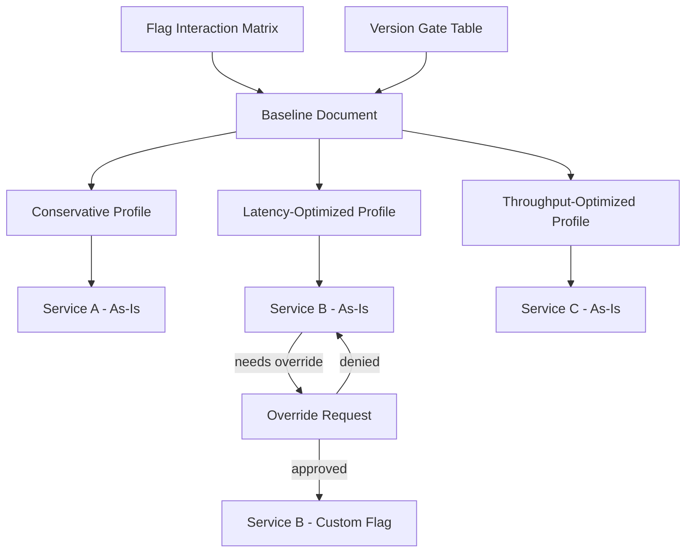

---

### 📶 Gradual Depth

**Level 1 - What it is:** A JVM flag baseline is a documented, tested set of JVM flags that every service in an organization starts with. Instead of each team inventing their own flags, they inherit a curated default and override only what they need.

**Level 2 - How to use it:** Pick a baseline profile (conservative, latency-optimized, or throughput-optimized) for each service based on its workload. Inject the flags via `JAVA_TOOL_OPTIONS`, an entrypoint script, or `-XX:VMOptionsFile`. Override individual flags by adding them to the service's command line (command-line flags take precedence over `JAVA_TOOL_OPTIONS`).

**Level 3 - How it works:** The baseline is versioned and stored in a shared repository. Each profile is a file of JVM flags with comments explaining each flag's purpose and interaction constraints. CI pipelines validate that services use an approved baseline version. The flag interaction matrix is built by testing combinations: for each pair of non-default flags, verify that the JVM starts cleanly and benchmark a representative workload. Flags are grouped into LOCKED (cannot change - diagnostics and security), RECOMMENDED (override with justification), and FREE (team discretion within documented bounds).

**Level 4 - Production mastery:** The hardest part is maintenance. Every JDK update can change flag defaults, deprecate flags, or alter flag interactions. The baseline must be re-validated on each LTS upgrade. Track effective flags in production via `jcmd <pid> VM.flags` scraped by your monitoring agent - compare against the expected baseline to detect drift. The override process must be lightweight (self-service form, async review) or teams will bypass it. Measure baseline adoption rate and override frequency. A high override rate for a specific flag means the baseline value is wrong for that workload class - update the baseline, do not fight the overrides.

---

### ⚙️ How It Works

**Phase 1 - Audit current state.** Collect flags from every running JVM in the fleet. Group by commonality. Identify the "core" flags that 80%+ of services share. Identify outliers and understand why they diverge.

**Phase 2 - Design the baseline.** Start with JDK defaults. Add only flags with clear justification: GC logging (observability), JFR (diagnostics), container-awareness (correctness), serialization filter (security). Resist the temptation to optimize - a baseline is a safe default, not a tuned configuration.

**Phase 3 - Build profiles.** Create 2-3 profiles for different workload archetypes. Conservative: JDK defaults plus diagnostics. Latency-optimized: ZGC or low-pause G1 settings plus JIT warmup. Throughput-optimized: parallel GC or aggressive G1 with relaxed pause targets.

**Phase 4 - Test interactions.** For each profile, run a matrix test: start the JVM, verify no flag conflicts, run a load test, compare metrics against the JDK-defaults-only baseline. Document any surprising interactions.

**Phase 5 - Roll out and govern.** Publish baselines. Inject via golden base images or config management. Establish the override process. Monitor adoption and drift.

```text
Baseline Development Lifecycle:

  Audit Fleet Flags
       |
       v
  Identify Common Core (80%+ shared)
       |
       v
  Design Baseline (defaults + justified)
       |
       v
  Build Profiles (conservative/latency/tp)
       |
       v
  Test Interactions (matrix validation)
       |
       v
  Publish + Inject (base image / config)
       |
       v
  Monitor Drift (jcmd VM.flags scraping)
       |
       v
  Maintain (re-validate per LTS upgrade)
```

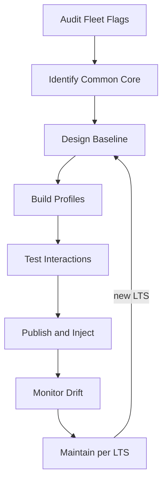

**BAD:**

```bash
# Copy-pasted flags from Stack Overflow
java -XX:+UseG1GC -XX:MaxGCPauseMillis=50 \
  -XX:+UseStringDeduplication \
  -XX:+AlwaysPreTouch -Xms4g -Xmx4g \
  -jar app.jar
```

Why it fails: flags conflict, no measurement, no documentation.

**GOOD:**

```bash
# Baseline v3: measured on JDK 21, G1GC
# Category: memory
-Xms4g -Xmx4g -XX:+AlwaysPreTouch
# Category: GC (override tier: RECOMMEND)
-XX:+UseG1GC -XX:MaxGCPauseMillis=200
# Category: diagnostics (override: LOCKED)
-XX:+HeapDumpOnOutOfMemoryError
```

Why it works: categorized, measured, override tier documented.

---

### 🚨 Failure Modes

**Failure 1 - Flag conflict on upgrade:**

**Symptom:** JVM fails to start after LTS upgrade with `Conflicting collector combinations` or `Unrecognized VM option`.

**Root cause:** The baseline includes a flag that was removed or renamed in the new JDK version. Example: `-XX:+UseConcMarkSweepGC` removed in JDK 14, `-XX:+UnlockCommercialFeatures` removed in JDK 11.

**Diagnostic:**

```bash
# List all valid flags for current JDK
java -XX:+PrintFlagsFinal -version 2>&1 | \
  grep -i "<flag_name>"
# Check if flag exists
java -XX:+UnlockDiagnosticVMFlags \
  -XX:+PrintFlagsFinal -version | wc -l
```

**Fix:** The baseline must include a version gate column. Before each LTS upgrade, run the baseline through `java -XX:+PrintFlagsFinal` on the new JDK. Flag any baseline entries that are unrecognized. Update the baseline before migrating services.

**Failure 2 - Baseline too aggressive:**

**Symptom:** Multiple services experience increased GC pauses or JIT deoptimizations after adopting the "latency-optimized" baseline.

**Root cause:** The latency profile sets `-XX:MaxGCPauseMillis=15` and aggressive JIT inlining thresholds. Services with large heaps (>16GB) cannot meet a 15ms pause target without excessive collection frequency. Aggressive inlining causes code cache pressure.

**Diagnostic:**

```bash
# Check GC pause distribution
jcmd <pid> GC.heap_info
# Check code cache usage
jcmd <pid> Compiler.codecache
# Compare pause times to target
grep "Pause Young" gc.log | \
  awk '{print $NF}' | sort -n | tail -20
```

**Fix:** Latency-optimized profile must document its assumptions: "designed for heaps <= 8GB, allocation rate < 500MB/s." Services outside those bounds should use the conservative profile or request a custom override. Add heap size bounds to profile documentation.

**Failure 3 - Governance bypass:**

**Symptom:** Drift monitoring shows 30% of services running flags not in any baseline profile, with no override requests on file.

**Root cause:** Override process is too slow (requires manager approval, 3-day SLA) or too cumbersome (lengthy form). Teams add flags directly to their Dockerfiles, bypassing the baseline injection mechanism entirely.

**Diagnostic:**

```bash
# Compare running flags vs expected baseline
# For each pod:
kubectl exec <pod> -- \
  jcmd 1 VM.flags | diff - expected_flags.txt
```

**Fix:** Make the override process self-service with async review (approve within 24 hours, auto-approve if no response). Make the baseline the path of least resistance: teams inherit it by default from the base image. Overriding should require more work than accepting, not less.

---

### 🔬 Production Reality

A recurring pattern: an organization builds a comprehensive baseline with 35 flags, extensively documented and tested. Six months later, adoption is 40%. Investigation reveals the problem: the baseline is injected via `JAVA_TOOL_OPTIONS`, but services also set flags in their Dockerfile `ENTRYPOINT`, in Kubernetes `args`, and in application config files. Flag precedence rules (`JAVA_TOOL_OPTIONS` is processed first, command-line flags override, `_JAVA_OPTIONS` overrides everything) mean the effective configuration is unpredictable. The fix was radical simplification. The team cut the baseline to 12 flags (diagnostics and security only), moved all performance flags to RECOMMENDED tier, and switched injection to `-XX:VMOptionsFile=/etc/jvm/baseline.conf` - a single, inspectable file that `jcmd <pid> VM.command_line` shows transparently. Adoption jumped to 85% in two months. The lesson: a small, transparent baseline with clear override paths beats a comprehensive but opaque one.

---

### ⚖️ Trade-offs & Alternatives

| Aspect            | Governed Baseline       | Per-Service Ad Hoc       | Managed Platform (PaaS) |
| ----------------- | ----------------------- | ------------------------ | ----------------------- |
| Consistency       | High (tiered profiles)  | None (87 variants)       | Total (no control)      |
| Debugging speed   | Fast (known flag set)   | Slow (archaeology)       | Depends on provider     |
| Optimization      | Good for 80% of fleet   | Optimal per service      | Generic (no tuning)     |
| Maintenance cost  | Medium (per LTS cycle)  | High (per team, per svc) | None (outsourced)       |
| Knowledge capture | Documented, reviewable  | Tribal, ephemeral        | Invisible               |
| Flexibility       | Override process exists | Unlimited                | Zero                    |

---

### ⚡ Decision Snap

**USE WHEN:**

- Organization has 15+ JVM services with no consistent flag management.
- Debugging production issues requires comparing JVM configurations across services.
- Security or compliance requirements demand auditable JVM configurations.

**AVOID WHEN:**

- Single team with fewer than 5 services and deep JVM expertise - the overhead exceeds the value.
- Every service is genuinely unique (different GCs, different heap strategies) with no overlap.

**PREFER Per-Service Ad Hoc WHEN:**

- Teams are small, expert, and own their entire lifecycle. Each service is a bespoke performance-critical system where generic baselines would be a constraint.

---

### ⚠️ Top Traps

| #   | Misconception                                      | Reality                                                                                                                                                                                                                          |
| --- | -------------------------------------------------- | -------------------------------------------------------------------------------------------------------------------------------------------------------------------------------------------------------------------------------- |
| 1   | "More flags = better tuned"                        | Most JDK defaults are extensively benchmarked. Every non-default flag is a deviation that must justify itself. A 12-flag baseline beats a 40-flag one.                                                                           |
| 2   | "Test flags individually"                          | Flags interact. `-XX:MaxGCPauseMillis=20` behaves differently with 4GB heap vs 32GB heap. Test the complete profile as a unit under realistic load.                                                                              |
| 3   | "`JAVA_TOOL_OPTIONS` is the right injection point" | It is processed before command-line flags, making precedence confusing. `-XX:VMOptionsFile` is explicit, inspectable, and debuggable.                                                                                            |
| 4   | "The baseline is a one-time effort"                | Every LTS upgrade can deprecate flags, change defaults, or introduce new ones. Budget re-validation into every migration cycle.                                                                                                  |
| 5   | "Override requests mean the baseline is wrong"     | Some overrides are legitimate. A zero-override baseline is either perfect (unlikely) or too permissive. Track override patterns - frequent overrides for the same flag mean the baseline value is wrong for that workload class. |

---

### 🪜 Learning Ladder

**Prerequisites:**

- JVM-033 JVM Flags That Actually Matter - know the individual flags before organizing them into a baseline
- JVM-035 Container Memory Limits - container-specific flags are a critical baseline category
- JVM-048 JIT Compilation Tiers - understand JIT flags before including them in profiles

**THIS:** JVM-105 Build Your Own JVM Flag Baseline

**Next steps:**

- JVM-102 Fleet Standardization - the baseline is one component of the broader fleet governance strategy
- JVM-103 GC Strategy - GC selection drives the largest differences between baseline profiles
- JVM-091 JFR in Production - diagnostic flags in the LOCKED tier typically include JFR configuration

---

**The Surprising Truth:**

The most valuable flag in any baseline is not a performance flag - it is `-XX:+HeapDumpOnOutOfMemoryError`. Organizations that omit it from their baseline lose the single most diagnostic artifact for memory-related outages. When an OOM kills a service in production at 3 AM, the heap dump is the only way to determine whether the leak was in application code, a library, or a container memory limit misconfiguration. Yet in fleet audits, this flag is missing from 40-60% of services (typical observation across platform engineering teams). The second most valuable: `-XX:+CrashOnOutOfMemoryError` - because a JVM that survives an OOM in a degraded state is harder to diagnose than one that crashes cleanly and restarts.

---

**Further Reading:**

- [JDK Flight Recorder documentation (Oracle)](https://docs.oracle.com/en/java/javase/21/jfapi/) - authoritative reference for the diagnostic flags that form the LOCKED tier of any baseline
- [HotSpot JVM options (Oracle JDK 21)](https://docs.oracle.com/en/java/javase/21/docs/specs/man/java.html) - official flag reference for building version-gated baselines
- [JEP 122: Remove the Permanent Generation](https://openjdk.org/jeps/122) - historical context for why Metaspace flags replaced PermGen flags across JDK versions

---

**Revision Card:**

1. A good baseline is small (10-20 flags), tiered (LOCKED/RECOMMENDED/FREE), and profile-aware (conservative, latency, throughput) - not a dump of every flag someone once found useful.
2. Test flag profiles as complete units under realistic load, not individual flags in isolation - interactions are where the surprises hide.
3. `-XX:+HeapDumpOnOutOfMemoryError` belongs in every baseline's LOCKED tier - it is the single flag you will regret missing at 3 AM.

---

---

# JVM-106 JVM Warm-Up Strategies (CDS, CRaC, Preload)

**TL;DR** - JVM warm-up strategies (CDS, CRaC, class preloading, traffic replay) eliminate the startup tax - the gap between process start and peak performance - by pre-doing work the JVM.

---

### 🔥 Problem Statement

A containerized Spring Boot service takes 12 seconds from process start to first HTTP response. The Kubernetes readiness probe passes at 12s, the load balancer routes traffic, and the first 500 requests hit an unwarmed JVM: classes load on demand, the interpreter runs bytecode at 10-50x slower than compiled code, and JIT compilation competes with application threads for CPU. P99 latency for those first requests is 800ms - 40x worse than steady-state 20ms. In autoscaling scenarios, every new pod inflicts this penalty on real users. Rolling deployments multiply it: if 10 pods restart sequentially, thousands of requests hit cold JVMs. Serverless JVM functions are even worse - every cold start pays the full tax. The problem is not that the JVM is slow. The problem is that the JVM is slow _first_, and modern deployment patterns amplify "first" into a continuous production tax.

---

### 📜 Historical Context

Early JVM deployments were long-lived processes - start once, run for months. Warm-up was irrelevant. Class Data Sharing (CDS) appeared in JDK 5 (2004) for core library classes only, primarily to reduce footprint in shared hosting. Application CDS (AppCDS) became available in JDK 10 (2018), then dynamic CDS in JDK 13 (2019) - driven by container density requirements. Project CRaC (Coordinated Restore at Checkpoint) emerged from Azul research around 2021, reaching OpenJDK as an incubating project, with JDK builds from Azul, BellSoft, and others offering CRaC-enabled distributions. The rise of Kubernetes autoscaling and serverless platforms made warm-up a first-class engineering concern rather than an academic curiosity.

---

### 🔩 First Principles

**CORE INVARIANTS:**

1. The JVM pays three sequential startup costs: class loading (disk I/O + parsing + verification), interpretation (bytecode executed without compilation), and JIT compilation (profiling + compilation + deoptimization cycles). Each subsequent phase depends on the prior phase completing.
2. Any warm-up strategy works by moving one or more of these costs from request-time to build-time or pre-request-time - the work is never eliminated, only shifted.
3. The more state you pre-capture, the more assumptions you freeze - and the more fragile the checkpoint becomes when the environment changes (different heap, different config, different secrets).

**DERIVED DESIGN:**

Invariant 1 means strategies must target specific phases: CDS targets class loading, AOT and CRaC target interpretation + JIT, traffic replay targets JIT profiling. Invariant 2 means every strategy trades build-time complexity for runtime speed. Invariant 3 means checkpoint-based approaches (CRaC) require careful lifecycle management of resources that cannot be frozen (sockets, file handles, credentials).

**THE TRADE-OFF:**

**Gain:** Faster time-to-first-request, faster time-to-peak-throughput, consistent latency during scaling events, reduced cold-start penalty in serverless.

**Cost:** Build pipeline complexity, larger image sizes (CDS archives, CRaC snapshots), operational fragility when pre-captured state drifts from runtime reality, debugging difficulty when behavior differs between warm and cold starts.

---

### 🧠 Mental Model

> JVM warm-up is like a restaurant kitchen before opening. Without prep, the first customer waits while the chef finds ingredients (class loading), reads the recipe (interpretation), and gradually speeds up through repetition (JIT). CDS is pre-chopping vegetables the night before. CRaC is freezing an entire mise en place at peak efficiency and thawing it at service time. Traffic replay is running a practice dinner service before the doors open.

- "Ingredient prep" -> class loading from CDS shared archive
- "Frozen mise en place" -> CRaC checkpoint of warmed JVM
- "Practice dinner service" -> traffic replay to trigger JIT
- "First real customer" -> first production request post-deploy

**Where this analogy breaks down:** Frozen food degrades in quality. A CRaC checkpoint does not degrade computationally - but it can hold stale secrets, expired connections, or wrong configuration if the environment changed between checkpoint and restore.

---

### 🧩 Components

- **CDS shared archive:** A memory-mapped file containing pre-parsed, pre-verified class metadata. Loaded at startup instead of re-parsing class files from JARs. AppCDS extends this to application classes.
- **Dynamic CDS:** Automatically generates the archive from classes loaded during a trial run (`-XX:ArchiveClassesAtExit`), removing the manual class-list step.
- **CRaC checkpoint/restore:** Snapshots the entire JVM heap, compiled code, and thread state to disk. Restore starts from the snapshot, skipping class loading, interpretation, and JIT warm-up entirely.
- **CRaC resource callbacks:** `beforeCheckpoint()` / `afterRestore()` lifecycle hooks that applications implement to close/reopen resources (connections, file handles, credentials) around the checkpoint boundary.
- **Traffic replay / warm-up scripts:** Synthetic requests sent to the JVM after startup but before the readiness probe passes, triggering JIT compilation on hot paths without exposing real users to cold-start latency.
- **AOT hints (Project Leyden direction):** Ahead-of-time compilation hints that shift JIT decisions to build time. Still evolving in the OpenJDK ecosystem.

```text
Warm-Up Strategy Spectrum:

  Build Time          Startup          Steady State
  ---------          -------          ------------
  CDS: [archive]--->[load mapped]---->[ normal JIT ]
  CRaC:[checkpoint]-->[restore]------->[ peak immediately]
  Replay:            [start]-->[replay traffic]-->[peak]
  Baseline:          [start]-->[cold requests]-->[peak]

  Cost shifted LEFT = faster startup, more build work
```

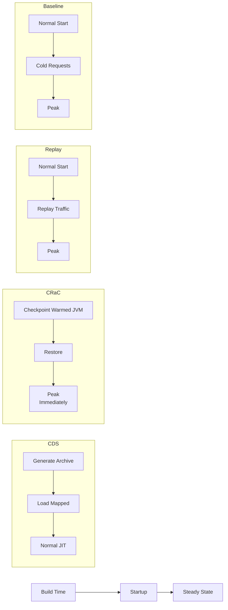

---

### 📶 Gradual Depth

**Level 1 - What it is:** JVM warm-up strategies are techniques that reduce the time between starting a JVM process and serving requests at full speed. They work by doing expensive startup work (class loading, JIT compilation) earlier - at build time, at checkpoint time, or before real traffic arrives.

**Level 2 - How to use it:** CDS is the lowest-effort option: add `-XX:SharedArchiveFile=app.jsa` to your startup flags and generate the archive during your Docker build. CRaC requires a CRaC-enabled JDK, application code changes for resource management callbacks, and a checkpoint step in your build or init pipeline. Traffic replay requires a script or tool that sends representative requests to the service after startup but before the readiness probe marks it healthy.

**Level 3 - How it works:** CDS works by memory-mapping a pre-built archive of class metadata, avoiding the parse-verify-link cycle for each class on startup. The OS can share the mapped pages across JVM instances on the same host, reducing footprint. CRaC uses CRIU (Checkpoint/Restore In Userspace) under the hood on Linux to snapshot the JVM process state - heap, compiled code, thread stacks - to files. On restore, the kernel reloads these pages, and the JVM patches up file descriptors and timers via the Resource API. Traffic replay triggers C1 and C2 JIT compilation on hot methods before the first real request, so the interpreted-code penalty is absorbed by synthetic load.

**Level 4 - Production mastery:** The choice between strategies depends on your deployment model. CDS gives a 20-40% class-loading speedup with minimal risk and should be the baseline for every JVM service. CRaC gives near-instant restore (typically sub-second) but requires careful handling of secrets (credentials loaded at checkpoint time may be rotated by restore time), connections (database pools opened at checkpoint are stale at restore), and configuration (environment-specific values frozen in the heap). Production CRaC pipelines typically checkpoint in a staging environment, then restore in production with a post-restore initialization phase that refreshes secrets and reconnects. Traffic replay is the safest incremental option: no JDK change, no code change, just a sidecar or init container that hammers the service's health and warm-up endpoints.

---

### ⚙️ How It Works

**Phase 1 - Class loading tax.** The JVM locates each class in the classpath (scanning JARs), reads the bytecode, verifies it, and links it into the runtime class hierarchy. A Spring Boot application typically loads 10,000-20,000 classes. Without CDS, this is sequential I/O-bound work. With CDS, the pre-built archive is memory-mapped in a single operation.

**Phase 2 - Interpreter tax.** Every method starts in the interpreter. The interpreter executes bytecode instruction-by-instruction - typically 10-50x slower than compiled code. The JVM profiles method invocation counts and branch frequencies to decide what to compile.

**Phase 3 - JIT compilation ramp.** After a method hits the invocation threshold (default: ~10,000 invocations for C2), the JIT compiler kicks in. C1 compiles quickly with moderate optimization. C2 compiles slowly with aggressive optimization including speculative inlining. Peak throughput is reached only after C2 has compiled all hot methods - typically 30-120 seconds after process start under load.

**Phase 4 - Strategy application.** CDS eliminates most of Phase 1. CRaC eliminates Phases 1-3 entirely by restoring a post-warm-up snapshot. Traffic replay accelerates Phase 3 by providing synthetic load before real traffic arrives.

```text
Timeline (cold start vs warm-up strategies):

  Time:  0s     5s     15s     30s    60s    120s
         |------|-------|-------|------|------|
  Cold:  [load ][interp][  JIT ramp   ][peak]
  CDS:   [map][intrp][ JIT ramp  ][peak]
  Replay:[load ][interp][replay->JIT][peak]
  CRaC:  [restore][peak immediately-------->]
                ^
                |-- real traffic starts here
```

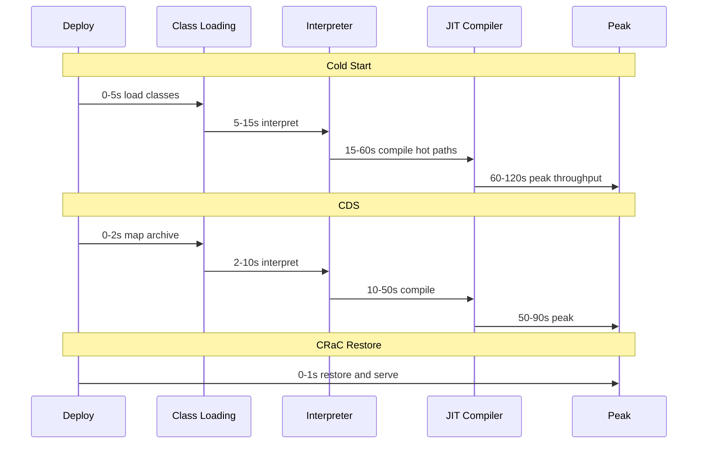

---

### 🚨 Failure Modes

**Failure 1 - Stale CRaC checkpoint:**

**Symptom:** Service restores successfully but throws authentication errors or connection timeouts on the first real request. Health check passes (checks internal state), but downstream calls fail.

**Root cause:** The checkpoint captured database connection pools, HTTP clients, and cached credentials. By restore time, the database connections are closed server-side (TCP timeout), credentials have rotated, or the downstream service endpoint changed.

**Diagnostic:**

```bash
# Check for stale connections after restore
ss -tnp | grep <pid> | grep ESTABLISHED
# Check credential freshness
jcmd <pid> VM.system_properties | \
  grep -i "credential\|token\|secret"
```

**Fix:** Implement CRaC `Resource` callbacks on every component holding external state:

**BAD:**

```java
@Bean
public DataSource dataSource() {
    return new HikariDataSource(config);
}
```

No checkpoint handling - connections become stale after restore.

**GOOD:**

```java
public class CracDataSource
    implements Resource {
    @Override
    public void beforeCheckpoint(Context c) {
        pool.close(); // release connections
    }
    @Override
    public void afterRestore(Context c) {
        pool = new HikariDataSource(
            refreshConfig()
        );
    }
}
```

CRaC-aware: releases and refreshes external state around checkpoint.

**Failure 2 - CDS archive mismatch:**

**Symptom:** JVM starts with a warning: `Unable to use shared archive` and falls back to normal class loading. Startup time regresses to pre-CDS baseline without any error - only a warning in stdout.

**Root cause:** The CDS archive was generated with a different JDK build, different classpath order, or different module configuration than the runtime JVM. CDS archives are tied to the exact JDK version and classpath fingerprint.

**Diagnostic:**

```bash
# Check if CDS is actually active
jcmd <pid> VM.info | grep -i "sharing"
# Should show: sharing = true
# Regenerate with current JDK + classpath
java -XX:DumpLoadedClassList=classes.lst \
  -jar app.jar --dry-run
java -Xshare:dump \
  -XX:SharedClassListFile=classes.lst \
  -XX:SharedArchiveFile=app.jsa
```

**Fix:** Generate the CDS archive in the same Docker build stage that packages the application, using the identical JDK. Pin the JDK version precisely in the Dockerfile. Regenerate on every build - never cache the archive across JDK updates.

**Failure 3 - Traffic replay missing hot paths:**

**Symptom:** Replay completes, readiness probe passes, but the first batch of real requests still shows high P99 latency - only slightly better than cold start.

**Root cause:** The replay script hits health endpoints and simple GET routes but misses the complex POST/PUT paths that dominate real traffic. JIT compiles only the methods exercised during replay. The hot production code paths remain interpreted.

**Diagnostic:**

```bash
# Check JIT compilation log after replay
jcmd <pid> Compiler.queue
# If queue is still large, replay missed paths
jcmd <pid> Compiler.codecache | \
  grep "full_count"
```

**Fix:** Derive replay traffic from production access logs (sanitized), not hand-written scripts. Include all HTTP methods and representative payloads. Measure compilation coverage by comparing `jcmd Compiler.codecache` blob count after replay vs after 10 minutes of production traffic.

---

### 🔬 Production Reality

A team running 40 instances of a Spring Boot order service behind Kubernetes autoscaling observed a recurring pattern: every scale-up event caused a P99 latency spike from 25ms to 600ms lasting 60-90 seconds. The root cause was the JIT compilation ramp. They implemented a layered warm-up strategy. First, AppCDS archives generated in the Docker build cut class loading time by roughly 30-40%. Second, a Kubernetes init container ran a traffic replay script hitting the top 20 API endpoints (derived from production access log analysis) for 30 seconds before the readiness probe activated. The combined effect reduced time-to-acceptable-latency (P99 under 100ms) from 90 seconds to approximately 25 seconds. They evaluated CRaC but deferred adoption because their credential rotation system (vault-based, 15-minute TTL) conflicted with checkpoint freshness - the afterRestore hook would need to re-fetch secrets from Vault, and the Vault SDK was not CRaC-aware. The lesson: CDS + replay is the pragmatic baseline; CRaC is the highest-reward strategy but demands investment in resource lifecycle management across every library in the dependency tree.

---

### ⚖️ Trade-offs & Alternatives

| Aspect               | CDS/AppCDS              | CRaC                       | Traffic Replay          | GraalVM Native Image    |
| -------------------- | ----------------------- | -------------------------- | ----------------------- | ----------------------- |
| Startup improvement  | 20-40% class load phase | Near-instant (sub-second)  | 30-60% JIT ramp phase   | Near-instant (no JVM)   |
| Build complexity     | Low (one extra step)    | High (checkpoint pipeline) | Medium (replay scripts) | Very high (AOT config)  |
| Code changes         | None                    | Resource callbacks needed  | None                    | Reflection config, etc. |
| Peak throughput      | Same as baseline        | Same as baseline           | Same as baseline        | Typically lower (no C2) |
| Image size impact    | +10-50MB (archive)      | +200MB-1GB (snapshot)      | None                    | Smaller (no JDK)        |
| Ecosystem maturity   | GA since JDK 10         | Incubating, growing        | Custom tooling          | Production-ready        |
| Secret/config safety | No concern              | Stale state risk           | No concern              | Build-time binding      |

---

### ⚡ Decision Snap

**USE WHEN:**

- Autoscaling or rolling deployments cause measurable latency spikes during JVM warm-up.
- Serverless or scale-to-zero patterns make cold start a per-invocation cost.
- SLOs mandate consistent latency from the first request, not just steady-state.

**AVOID WHEN:**

- Services are long-running singletons that restart rarely (the warm-up tax is amortized over months).
- Startup time is dominated by application initialization (database migrations, cache priming), not JVM warm-up.

**PREFER GraalVM Native Image WHEN:**

- Sub-100ms startup is a hard requirement and peak throughput loss is acceptable.
- The application's reflection and dynamic class loading footprint is small enough for closed-world compilation.

---

### ⚠️ Top Traps

| #   | Misconception                                      | Reality                                                                                                                                                                                            |
| --- | -------------------------------------------------- | -------------------------------------------------------------------------------------------------------------------------------------------------------------------------------------------------- |
| 1   | "CDS solves JVM warm-up"                           | CDS only addresses class loading (Phase 1). Interpretation and JIT compilation (Phases 2-3) are untouched. CDS alone does not fix latency spikes from cold JIT.                                    |
| 2   | "CRaC is a drop-in replacement for normal startup" | CRaC requires every resource holding external state (connections, credentials, file handles) to implement checkpoint/restore callbacks. Missing even one causes silent failures.                   |
| 3   | "Traffic replay means hitting /health a few times" | Replay must exercise the actual hot code paths. Health endpoints compile trivial methods. The expensive serialization, validation, and database query paths need real-shaped requests.             |
| 4   | "CDS archives are portable across JDK versions"    | CDS archives are tied to the exact JDK build. A minor patch update invalidates the archive. Always regenerate in the same build that packages the application.                                     |
| 5   | "Warm-up strategies are mutually exclusive"        | They are composable. CDS + traffic replay is a common low-risk combination. CRaC already includes the benefits of CDS (classes are loaded in the checkpoint). Layer strategies by effort and risk. |

---

### 🪜 Learning Ladder

**Prerequisites:**

- JVM-048 JIT Compilation Tiers - understand C1/C2 compilation pipeline and invocation thresholds
- JVM-051 Metaspace - understand class metadata storage that CDS optimizes
- JVM-001 What Is the JVM - the class loading, interpretation, compilation lifecycle

**THIS:** JVM-106 JVM Warm-Up Strategies (CDS, CRaC, Preload)

**Next steps:**

- JVM-107 GraalVM vs HotSpot Adoption Decision - the AOT alternative that eliminates warm-up entirely
- JVM-122 Project Leyden - the OpenJDK initiative condensing startup work ahead of time
- JVM-111 Container Image Strategy - how CDS archives and CRaC snapshots affect image layering

---

**The Surprising Truth:**

CRaC restore is so fast (typically under 1 second) that the bottleneck shifts from JVM warm-up to the application's post-restore reinitialization: reconnecting database pools, refreshing credentials, rebuilding caches. Teams that adopt CRaC often discover their application initialization code was never designed for "restart from warm state" - it assumes either "first start" or "already running." Designing for a third state - "restored but stale" - becomes the real engineering challenge.

---

**Further Reading:**

- [JEP 310: Application Class-Data Sharing](https://openjdk.org/jeps/310) - the JEP that extended CDS to application classes, enabling AppCDS
- [OpenJDK CRaC Project](https://openjdk.org/projects/crac/) - the official project page for Coordinated Restore at Checkpoint
- [JEP 350: Dynamic CDS Archives](https://openjdk.org/jeps/350) - automatic archive generation without manual class lists

---

**Revision Card:**

1. JVM warm-up has three phases (class loading, interpretation, JIT) - each strategy targets different phases, and they compose: CDS + replay is the pragmatic baseline, CRaC eliminates all three.
2. CRaC gives sub-second restore but demands Resource callbacks on every component holding external state - missing one means silent failures with stale connections or rotated credentials.
3. Traffic replay is only as good as its coverage of real hot paths - derive replay scripts from production access logs, not hand-written health checks.

---

---

# JVM-107 GraalVM vs HotSpot Adoption Decision

**TL;DR** - GraalVM native image trades peak throughput and ecosystem flexibility for instant startup and fixed memory footprint. HotSpot JIT trades startup time for profile-guided peak performance..

---

### 🔥 Problem Statement

A team builds a new microservice. Someone suggests GraalVM native image for "faster startup." The architect asks: "What do we lose?" Nobody has a clear answer. The team builds with native image, discovers that their reflection-heavy serialization library requires extensive configuration, their monitoring agent does not attach (no JVM to attach to), and peak throughput is 30-40% lower than the same code on HotSpot. They switch back to HotSpot, losing weeks. Another team avoids native image entirely because "it's too experimental," missing genuine benefits for their CLI tool that starts 200 times per day. The core problem: GraalVM vs HotSpot is treated as a religious choice rather than an engineering decision with measurable trade-offs. Without a structured decision framework, teams either over-commit to native image (and hit ecosystem friction) or dismiss it (and miss legitimate use cases).

---

### 📜 Historical Context

HotSpot has been the dominant JVM since Sun open-sourced it in 2006. Its JIT compiler (C1 + C2) uses profile-guided optimization - observing runtime behavior to make speculative optimizations that no AOT compiler can match without profiles. GraalVM emerged from Oracle Labs research, with the community edition open-sourced in 2018. The native-image tool uses ahead-of-time compilation with a closed-world assumption: all reachable code must be known at build time. The initial focus was on polyglot (multiple languages on one VM), but native image became the headline feature as container and serverless deployments made startup time a first-class concern. Frameworks adapted: Quarkus (Red Hat, 2019) was built native-first, Micronaut (Object Computing, 2018) used compile-time annotation processing to avoid reflection, and Spring Native (later Spring AOT, integrated into Spring Framework 6 / Spring Boot 3, 2022) added GraalVM support to the largest Java ecosystem.

---

### 🔩 First Principles

**CORE INVARIANTS:**

1. Profile-guided optimization (PGO) at runtime will always find optimizations that static analysis at build time cannot - because runtime profiles capture actual branch frequencies, call site distributions, and type feedback that vary by deployment.
2. Ahead-of-time compilation eliminates the startup cost (class loading, interpretation, JIT ramp) but freezes optimization decisions at build time - the binary cannot adapt to runtime conditions.
3. The closed-world assumption (all code paths known at build time) is fundamentally incompatible with dynamic class loading, arbitrary reflection, and runtime bytecode generation - patterns that much of the Java ecosystem relies on.

**DERIVED DESIGN:**

Invariant 1 means HotSpot will typically achieve higher peak throughput for long-running services. Invariant 2 means native image will always win on startup time and memory predictability. Invariant 3 means native image adoption cost is proportional to how much dynamic behavior your dependency tree uses - and that cost is paid in configuration, not code.

**THE TRADE-OFF:**

**Gain (Native Image):** Sub-100ms startup, fixed memory footprint (no JIT compiler memory overhead), instant peak performance (no warm-up), smaller container images (no JDK runtime).

**Cost (Native Image):** Lower peak throughput (typically 10-40% depending on workload), long build times (minutes, not seconds), reflection/proxy/serialization configuration burden, reduced debugging and profiling tooling, ecosystem compatibility gaps.

---

### 🧠 Mental Model

> HotSpot is like a race car driver who does practice laps (warm-up) before the race, studies the track as conditions change (profile-guided optimization), and adapts mid-race (deoptimization and recompilation). GraalVM native image is like a pre-programmed autonomous car: it launches at full speed with no warm-up, but it drives the route it was programmed for - if the track changes (different input patterns), it cannot adapt.

- "Practice laps" -> JIT warm-up and profiling
- "Mid-race adaptation" -> speculative optimization + deoptimization
- "Pre-programmed route" -> AOT-compiled fixed binary
- "Track changes" -> workload patterns differing from build-time assumptions

**Where this analogy breaks down:** The autonomous car can still complete the race on a changed track - just slower. Native image does not crash on unexpected inputs; it just cannot optimize for patterns it did not see at build time. The performance gap is a spectrum, not a cliff.

---

### 🧩 Components

- **HotSpot C1/C2 JIT:** Tiered compilation where C1 compiles quickly with basic optimizations, C2 compiles slowly with aggressive speculative optimizations (inlining, escape analysis, loop unrolling) guided by runtime profiles.
- **GraalVM native-image tool:** AOT compiler that performs points-to analysis to determine reachable code, compiles it to a platform-specific binary, and links in Substrate VM (a minimal runtime for GC, threading, and OS interaction).
- **Closed-world assumption:** The native-image build must see all code that will ever execute. Anything loaded dynamically (reflection, JNI, proxies, resource bundles) must be declared in configuration files.
- **Reachability metadata:** JSON configuration files (or GraalVM Reachability Metadata Repository) that declare reflection targets, JNI access, dynamic proxies, and serialization classes for the AOT compiler.
- **Framework AOT support:** Quarkus, Micronaut, and Spring (via AOT processing) generate reachability metadata and replace runtime reflection with build-time code generation.

```text
HotSpot JIT vs GraalVM Native Image:

  HotSpot:
  [bytecode]-->[C1 quick]-->[profile]-->[C2 opt]
       ^                                   |
       +------[deopt if assumption fails]--+
  Runtime adaptive. Peak after warm-up.

  Native Image:
  [source]-->[AOT compile]-->[native binary]
       (build time: minutes)    (runtime: instant)
  Fixed at build. No adaptation.
```

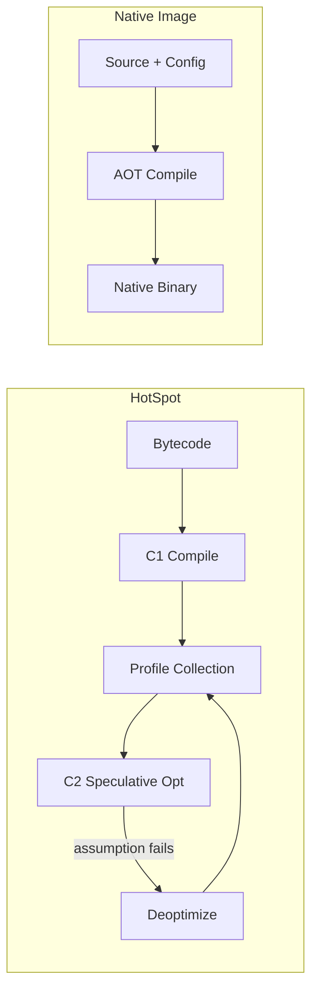

---

### 📶 Gradual Depth

**Level 1 - What it is:** GraalVM native image compiles Java code ahead of time into a standalone binary that starts instantly but cannot optimize at runtime. HotSpot compiles at runtime using observed behavior to reach higher peak performance but needs warm-up time. Choosing between them depends on whether startup speed or peak throughput matters more.

**Level 2 - How to use it:** For native image, add the GraalVM native-image plugin to your Maven/Gradle build and run the native compilation target. Frameworks like Quarkus and Spring Boot 3 provide built-in support. For HotSpot, use any standard JDK. The decision is a build configuration choice, not a code rewrite - though native image may require reachability metadata for libraries using reflection.

**Level 3 - How it works:** HotSpot's C2 compiler uses speculative inlining: if a virtual call site always dispatches to one implementation, C2 inlines that implementation directly, eliminating the virtual dispatch overhead. If a new class is loaded that invalidates the assumption, C2 deoptimizes back to interpreted code and recompiles with the new profile. Native image cannot do this - it must compile virtual calls as actual dispatches because it cannot observe runtime type distributions. This single difference accounts for a large portion of the throughput gap.

**Level 4 - Production mastery:** In production, the decision is rarely "all native" or "all HotSpot." Organizations typically run native image for CLI tools, serverless functions, sidecar proxies, and services with strict cold-start SLOs. HotSpot remains the default for long-running services where peak throughput and full ecosystem compatibility matter. The operational difference is significant: HotSpot services can be profiled with async-profiler, debugged with remote JDWP, and monitored with JMX/MBeans. Native image binaries lose most of this tooling - profiling requires platform-native tools (perf, DTrace), and JMX is unavailable unless the monitoring agent is built into the image. Teams underestimate this operational gap until their first production incident with a native image service.

---

### ⚙️ How It Works

**Phase 1 - Build-time analysis (native image).** The native-image tool runs a points-to analysis starting from the main method, tracing all reachable code paths. Anything not reachable - or reachable only through reflection not declared in configuration - is excluded from the binary. This analysis typically takes 2-10 minutes and consumes 4-16GB of RAM.

**Phase 2 - AOT compilation.** Reachable methods are compiled to machine code. The Graal compiler (same compiler used in HotSpot's JVMCI mode) performs optimizations, but without runtime profiles: no speculative inlining, no branch frequency data, no type feedback. The result is correct but conservatively optimized code.

**Phase 3 - Substrate VM linking.** The compiled code is linked with Substrate VM, a minimal runtime providing garbage collection (Serial or G1, depending on version), thread scheduling, and OS interaction. The result is a standalone executable with no JDK dependency.

**Phase 4 - Runtime comparison.** The native binary starts in milliseconds (no class loading, no interpretation, no JIT). HotSpot starts in seconds, interprets initially, and reaches peak throughput after 30-120 seconds of JIT compilation under load. For a service running for hours, HotSpot's steady-state throughput typically exceeds native image by 10-40% due to profile-guided optimizations.

```text
Performance Over Time:

  Throughput
  ^
  |              HotSpot (after warm-up)
  |            ............................
  |          ..
  |        .   Native Image (constant)
  |  - - -+- - - - - - - - - - - - - - -
  |      .|
  |    . .
  |  .  .  <- HotSpot warming up
  | . .
  |..
  +----+--------+--------------------> Time
  0s   30s     120s

  Crossover: HotSpot overtakes native image
  after JIT warm-up completes (~30-120s)
```

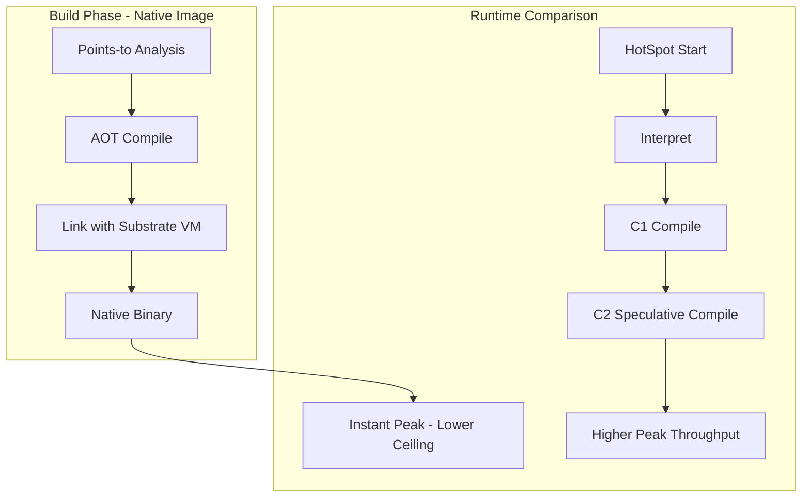

**BAD:**

```bash
# Choosing GraalVM for startup time only
native-image -jar api-service.jar
# Deploy. Discover reflection breaks at 2am.
```

Why it fails: closed-world assumption violates dynamic libraries.

**GOOD:**

```bash
# Full evaluation: run tracing agent first
java -agentlib:native-image-agent=config \
  -jar api-service.jar
# Review reflect-config.json
# Benchmark: startup, peak throughput, memory
# Decision matrix score before adopting
```

Why it works: tracing agent discovers reflection, benchmark covers all dimensions.

---

### 🚨 Failure Modes

**Failure 1 - Reflection configuration miss:**

**Symptom:** Application starts successfully in native image but throws `ClassNotFoundException` or `NoSuchMethodException` on specific code paths - typically serialization, ORM mapping, or dependency injection.

**Root cause:** A library uses reflection to instantiate classes or invoke methods, but the reflection targets were not declared in the reachability metadata. The native-image build succeeded because the build-time analysis never encountered the reflective call path statically.

**Diagnostic:**

```bash
# Run with agent to collect metadata
java -agentlib:native-image-agent=\
config-output-dir=META-INF/native-image \
  -jar app.jar
# Exercise all code paths, then rebuild
native-image --no-fallback -jar app.jar
```

**Fix:** Run the tracing agent against a comprehensive test suite or production traffic sample to generate metadata. Commit the generated JSON files. For frameworks, use the GraalVM Reachability Metadata Repository (`org.graalvm.buildtools:native-maven-plugin` pulls community-maintained metadata for popular libraries).

**Failure 2 - Throughput regression after migration:**

**Symptom:** Service migrated from HotSpot to native image shows 30-40% lower requests-per-second at steady state. CPU utilization is higher for the same load.

**Root cause:** HotSpot's C2 JIT was performing speculative inlining on hot polymorphic call sites (e.g., service interfaces with one dominant implementation). Native image compiles these as full virtual dispatches. Escape analysis that eliminated allocations in HotSpot does not trigger as aggressively without profile data.

**Diagnostic:**

```bash
# HotSpot: check JIT inlining decisions
java -XX:+PrintInlining -jar app.jar 2>&1 | \
  grep "hot\|inline"
# Native: profile with perf
perf record -g ./app-binary
perf report --stdio | head -60
```

**Fix:** This is inherent to the AOT model, not a bug. Evaluate whether the throughput loss is acceptable for the startup/footprint gain. For critical hot paths, consider Profile-Guided Optimization (PGO) for native image: build an instrumented binary, run it under load, then rebuild with the collected profile. PGO narrows (but does not fully close) the gap.

**Failure 3 - Monitoring blind spot:**

**Symptom:** Operations team cannot see GC metrics, thread dumps, or heap histograms for native image services in their monitoring platform. Dashboards show gaps. Incident response takes longer because standard diagnostic commands do not work.

**Root cause:** Native image binaries do not expose JMX MBeans. Tools like `jcmd`, `jmap`, `jstack`, `async-profiler`, and JDWP remote debugging are unavailable or require special build-time flags (`--enable-monitoring`). The monitoring infrastructure was built for HotSpot.

**Diagnostic:**

```bash
# Verify monitoring capabilities at build time
native-image --enable-monitoring=heapdump,jfr \
  -jar app.jar
# At runtime, limited JFR is available if enabled
./app-binary \
  -XX:StartFlightRecording=filename=rec.jfr
```

**Fix:** Enable monitoring features at build time (`--enable-monitoring`). Shift observability to application-level metrics (Micrometer, OpenTelemetry) and platform-native tools (perf, eBPF). Accept that JVM-level observability is fundamentally reduced in native image and plan incident response accordingly.

---

### 🔬 Production Reality

A platform team evaluated native image for 12 microservices. They started by building all 12 as native images. Three failed to build due to reflection-heavy libraries (one used a code-generation ORM, one used a custom serialization framework, one loaded plugins dynamically). Two built but showed 35-40% throughput regression, unacceptable for their high-traffic payment paths. The remaining seven built and ran correctly with acceptable performance. Of those seven, four were short-lived CLI tools and batch jobs where startup time dominated total execution time - native image reduced their total run time by 60-80%. The other three were microservices with strict cold-start SLOs (autoscaling in a serverless-adjacent model). The lesson: the decision is per-service, not per-organization. The team ended up with a decision matrix in their architecture guidelines: CLI/batch/serverless = native image by default, long-running high-throughput services = HotSpot by default, everything else = measure and decide. The biggest hidden cost was not the build configuration - it was retraining the operations team on a different diagnostic toolchain for native image services.

---

### ⚖️ Trade-offs & Alternatives

| Aspect                | HotSpot JIT             | GraalVM Native Image       | CRaC (HotSpot checkpoint) |
| --------------------- | ----------------------- | -------------------------- | ------------------------- |
| Startup time          | 5-30s (app dependent)   | 10-100ms                   | 200ms-1s (restore)        |
| Peak throughput       | Highest (PGO)           | 10-40% lower (typical)     | Same as HotSpot           |
| Memory footprint      | Higher (JIT + metadata) | Lower, fixed               | Same as HotSpot           |
| Build time            | Seconds                 | 2-10 minutes               | Seconds + checkpoint step |
| Ecosystem compat.     | Full                    | Requires reachability meta | Full (same JVM)           |
| Debugging/profiling   | Full (jcmd, async-prof) | Limited (perf, no JMX)     | Full                      |
| Dynamic class loading | Supported               | Not supported              | Supported                 |
| Container image size  | 200-400MB (with JDK)    | 30-100MB (no JDK)          | 200-400MB + snapshot      |

---

### ⚡ Decision Snap

**USE Native Image WHEN:**

- Startup time is a per-invocation cost (CLI tools, serverless functions, scale-to-zero).
- Memory footprint must be predictable and minimal (edge devices, high-density container packing).
- The dependency tree has known, well-tested native image support (Quarkus, Micronaut).

**USE HotSpot WHEN:**

- Peak throughput matters more than startup time (high-traffic APIs, streaming processors).
- Full JVM observability is required for operations (JMX, jcmd, async-profiler, JDWP).
- The application relies heavily on reflection, dynamic proxies, or runtime class generation.

**PREFER CRaC WHEN:**

- You need fast startup AND peak HotSpot throughput AND full ecosystem compatibility.
- You can invest in checkpoint/restore lifecycle management for stateful resources.

---

### ⚠️ Top Traps

| #   | Misconception                                    | Reality                                                                                                                                                                                                               |
| --- | ------------------------------------------------ | --------------------------------------------------------------------------------------------------------------------------------------------------------------------------------------------------------------------- |
| 1   | "Native image is always faster"                  | It starts faster. It often runs slower at steady state. For a service running hours, HotSpot's profile-guided C2 optimizations yield 10-40% higher throughput.                                                        |
| 2   | "The reflection config is a one-time cost"       | Every dependency update can introduce new reflection paths. The tracing agent must be re-run against comprehensive tests on every dependency change.                                                                  |
| 3   | "Spring Boot 3 makes native image easy"          | Spring AOT handles Spring's own reflection. Third-party libraries (caching, serialization, monitoring agents) still require manual metadata or community-maintained configs.                                          |
| 4   | "Native image eliminates GC pauses"              | Native image still has a garbage collector (Serial GC by default, G1 available). GC pauses still occur. The difference is no JIT compilation pauses - not no GC.                                                      |
| 5   | "You can debug native image the same as HotSpot" | Remote JVM debugging (JDWP), jcmd, jmap, jstack, async-profiler - none work on native binaries without special build flags, and even then, capabilities are reduced. Plan your diagnostic workflow before committing. |

---

### 🪜 Learning Ladder

**Prerequisites:**

- JVM-048 JIT Compilation Tiers - understand C1/C2 tiered compilation and profile-guided optimization
- JVM-079 JIT Code Cache and Deoptimization - speculative optimization and deoptimization mechanics
- JVM-003 Bytecode Basics - what AOT compilation replaces

**THIS:** JVM-107 GraalVM vs HotSpot Adoption Decision

**Next steps:**

- JVM-106 JVM Warm-Up Strategies (CDS, CRaC, Preload) - HotSpot-side alternatives that narrow the startup gap
- JVM-131 Compiler Optimization Patterns - the specific C2 optimizations native image cannot replicate
- JVM-111 Container Image Strategy - how native image and HotSpot choices affect image layering and size

---

**The Surprising Truth:**

GraalVM's native-image compiler is actually the _same_ Graal compiler that can run inside HotSpot as a JIT compiler (via JVMCI). The compiler itself is not the differentiator - the difference is when it runs (build time vs runtime) and what information it has (static analysis vs runtime profiles). This means the throughput gap is not about compiler quality - it is about information asymmetry. HotSpot's C2 (or Graal-as-JIT) sees runtime behavior; native image Graal sees only static analysis. Profile-Guided Optimization for native image attempts to bridge this gap by feeding build-time compilation with runtime-collected profiles, though the workflow is more complex than HotSpot's automatic profiling.

---

**Further Reading:**

- [GraalVM Native Image Reference](https://www.graalvm.org/latest/reference-manual/native-image/) - official documentation covering build configuration, reachability metadata, and limitations
- [JEP 295: Ahead-of-Time Compilation](https://openjdk.org/jeps/295) - the foundational JEP for AOT compilation concepts in the OpenJDK ecosystem
- [GraalVM Reachability Metadata Repository](https://github.com/oracle/graalvm-reachability-metadata) - community-maintained reflection/proxy/serialization configs for popular libraries

---

**Revision Card:**

1. GraalVM native image wins on startup (sub-100ms) and footprint; HotSpot wins on peak throughput (10-40% higher) and ecosystem compatibility - the decision is per-service, not per-organization.
2. The closed-world assumption means every reflection target must be declared at build time; missing one causes runtime failures on code paths the build never exercises statically.
3. The biggest hidden cost of native image adoption is not build configuration - it is losing JVM-level observability (JMX, jcmd, async-profiler) and retraining operations teams on platform-native diagnostic tools.

---

---

# JVM-108 JVM Observability Platform Design

**TL;DR** - A unified JVM observability platform combines metrics, logs, traces, and profiles from JFR, JMX, and GC logs into a single pipeline - turning 500+ JVMs from opaque black.

---

### 🔥 Problem Statement

An organization runs 500 JVM services across 2,000 pods. When the payment gateway's P99 latency doubles at 2 AM, three teams scramble independently. The SRE checks Prometheus dashboards but sees only OS-level CPU and memory - no GC pause data. The JVM team SSHes into a pod and runs `jcmd` manually, but the pod gets OOM-killed before they capture a thread dump. The application team searches Splunk for error logs but GC logs are not shipped because nobody configured the log pipeline for `-Xlog` output. The heap dump that would reveal the 800MB cache leak is too large to extract from Kubernetes before the pod restarts. Each data source - metrics, logs, traces, profiles - lives in a separate silo with different retention, different query languages, and different ownership. Correlation requires a human brain holding six browser tabs open. Without a unified observability platform, JVM diagnostics at fleet scale is archaeology: you reconstruct what happened from fragments after the damage is done. The cost is not just MTTR - it is the senior engineers whose expertise cannot scale because every diagnosis requires manual, per-pod intervention.

---

### 📜 Historical Context

JVM observability began with JMX (Java Management Extensions, J2SE 5.0, 2004) - a pull-based model where monitoring tools polled MBeans. JVisualVM and JConsole provided single-JVM visibility. JDK 9 introduced unified JVM logging (`-Xlog`), replacing the fragmented `-verbose:gc` and `-XX:+PrintGCDetails` flags. JDK 11 made JDK Flight Recorder (JFR) open-source (previously a commercial Oracle JDK feature), enabling always-on production profiling with sub-1% overhead. OpenTelemetry (2019+) created a vendor-neutral standard for metrics, traces, and logs. The convergence of these four advances - unified logging, open JFR, OpenTelemetry, and Kubernetes-native deployments - made a unified JVM observability platform both possible and necessary. Before this convergence, organizations built bespoke integrations per tool; after it, a standardized pipeline architecture became viable.

---

### 🔩 First Principles

**CORE INVARIANTS:**

1. Observability requires three independent signal types - metrics (aggregated numeric time-series), logs (discrete structured events), and traces (causal chains across services). No single signal type is sufficient for diagnosis.
2. JVM-specific signals (GC pauses, JIT compilation, safepoint time, allocation rate) are invisible to infrastructure-level monitoring. The observability platform must extract JVM-internal telemetry, not just OS metrics.
3. Correlation across signals requires shared dimensions: timestamp, service name, instance ID, and trace ID must be present in every signal for cross-referencing.
4. Collection overhead must remain below measurable impact thresholds - typically under 1-2% CPU and under 5% memory overhead. Observability that degrades production is self-defeating.

**DERIVED DESIGN:**

Invariant 1 forces a multi-signal pipeline rather than a single metrics store. Invariant 2 forces JVM-native data sources (JFR, JMX, `-Xlog`) rather than relying on external scrapers. Invariant 3 forces a tagging/labeling standard enforced at collection time. Invariant 4 forces lightweight agents and sampling strategies rather than exhaustive capture.

**THE TRADE-OFF:**

**Gain:** Fleet-wide visibility into JVM internals, sub-minute diagnosis, pattern detection across services, elimination of per-pod manual intervention.

**Cost:** Pipeline infrastructure (storage, compute), agent overhead on every JVM, schema maintenance, team investment in building and operating the platform.

---

### 🧠 Mental Model

> A JVM observability platform is an air traffic control system. Each JVM is an aircraft. Metrics are the altitude and speed readings on the radar screen. Logs are the pilot radio transmissions. Traces are the flight path from origin to destination. Profiles are the black box recorder. No single instrument lands a plane safely - the controller needs all four, correlated by aircraft ID and timestamp, on a single screen.

- "Radar screen" -> unified dashboard with metric panels
- "Radio transmissions" -> structured GC and application logs
- "Flight path" -> distributed trace spanning multiple services
- "Black box recorder" -> JFR continuous recording

**Where this analogy breaks down:** Air traffic control is real-time only. JVM observability also requires historical replay - the ability to query what happened during last Tuesday's 3 AM spike. Retention and storage strategy have no ATC equivalent.

---

### 🧩 Components

- **Data sources:** JFR (continuous profiling, allocation tracking, GC events), JMX MBeans (heap usage, thread counts, class loading), `-Xlog` GC logs (pause times, cause, phases), thread dumps (via `jcmd` or JFR `jdk.ThreadDump`), heap dumps (on-demand or OOM-triggered via `-XX:+HeapDumpOnOutOfMemoryError`).
- **Collection agents:** OpenTelemetry Java Agent (auto-instruments traces + metrics), JMX Exporter (Prometheus-format metrics), JFR streaming agent (JDK 14+ `jdk.jfr.consumer` API), log shipper (Fluent Bit, Vector, or Filebeat for `-Xlog` output).
- **Aggregation layer:** Receives, transforms, and routes signals. OpenTelemetry Collector is the typical choice - receives OTLP, Prometheus, and log formats.
- **Storage backends:** Time-series DB for metrics (Prometheus, Mimir, VictoriaMetrics), log store (Loki, Elasticsearch), trace store (Tempo, Jaeger), profile store (Pyroscope, Parca).
- **Dashboard and query:** Grafana as the unified UI correlating metrics, logs, traces, and profiles via shared labels.
- **Alerting engine:** Rules on JVM-specific metrics with fleet-aware thresholds (not just per-instance).

```text
JVM Observability Platform Architecture:

 JVM Pod
 +-------------------------------------+
 | App + OTel Java Agent               |
 | JFR streaming | JMX Exporter        |
 | -Xlog -> file | HeapDump on OOM    |
 +-------------------------------------+
       |             |            |
   traces+metrics  metrics    logs
       |             |            |
       v             v            v
 +-------------------------------------+
 | OpenTelemetry Collector              |
 | (receive, transform, route)          |
 +-------------------------------------+
    |          |          |         |
    v          v          v         v
 Metrics    Traces     Logs     Profiles
 (Mimir)   (Tempo)   (Loki)  (Pyroscope)
    |          |          |         |
    +----------+----------+---------+
               |
          Grafana Dashboard
       (correlate by service+time)
```

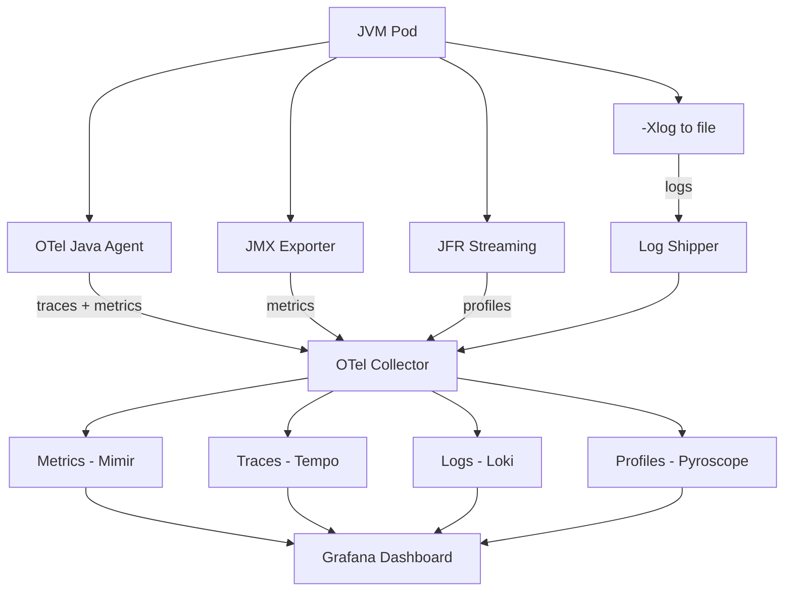

---

### 📶 Gradual Depth

**Level 1 - What it is:** A JVM observability platform is a centralized system that collects, stores, and visualizes runtime data from all JVM instances - GC pauses, memory usage, thread states, request traces, and profiles - so engineers can diagnose problems without SSHing into individual pods.

**Level 2 - How to use it:** Attach the OpenTelemetry Java Agent to every service via `JAVA_TOOL_OPTIONS`. Configure JMX Exporter as a sidecar or agent for Prometheus-format metrics. Ship `-Xlog:gc*` output via a log shipper. Enable JFR continuous recording (`-XX:StartFlightRecording=settings=default,maxsize=256m`). Query all signals through Grafana.

**Level 3 - How it works:** The OTel Java Agent instruments bytecode at classload time to emit traces (spans per HTTP request, DB call, message send) and runtime metrics (JVM memory pools, GC counts, thread counts). JMX Exporter reads MBeans and exposes them as Prometheus metrics. The OTel Collector acts as the aggregation hub - receiving data via OTLP, Prometheus scrape, and syslog protocols, applying transformations (adding service labels, sampling), and routing each signal type to its storage backend. Grafana queries each backend independently but correlates results via shared labels (`service.name`, `service.instance.id`, `trace_id`).

**Level 4 - Production mastery:** The platform's value scales with fleet size, but so does its cost. At 500+ JVMs, metric cardinality becomes the primary cost driver - each unique label combination creates a time-series. Unbounded labels (user IDs, request paths with parameters) explode cardinality. Use the OTel Collector's `transform` processor to normalize high-cardinality labels before storage. For JFR, use continuous recording with a bounded buffer (not dump-on-demand) so data is always available when incidents occur. Alert on JVM-specific signals that infrastructure monitoring misses: allocation rate exceeding 2 GB/s (young gen pressure), safepoint time exceeding 100ms (not GC pauses - total safepoint cost), and metaspace growth (classloader leak). The difference between a toy setup and a production platform is label governance, cardinality control, and alert hygiene.

---

### ⚙️ How It Works

**Phase 1 - Instrumentation.** Every JVM service is instrumented at startup. The OTel Java Agent attaches via `-javaagent` and auto-instruments libraries (Spring, JDBC, gRPC, Kafka). JFR continuous recording starts via `-XX:StartFlightRecording`. JMX Exporter binds to a metrics port. GC logging enables via `-Xlog:gc*,safepoint:file=/tmp/gc.log:time,level,tags`.

**Phase 2 - Collection.** Agents emit data to the OTel Collector. Metrics arrive via Prometheus scrape or OTLP push. Traces arrive via OTLP gRPC. Logs arrive via Fluent Bit tailing the GC log file. The Collector applies processors: `batch` (reduces network calls), `resource` (adds `k8s.pod.name`, `service.name`), `filter` (drops noisy spans), `transform` (normalizes labels).

**Phase 3 - Storage and indexing.** Each signal routes to its backend. Metrics use Mimir or VictoriaMetrics with retention tiers (high-res 7 days, downsampled 90 days). Traces use Tempo with a sampling tail (keep 100% of error traces, 10% of success traces). Logs use Loki with structured labels (`gc_cause`, `pause_ms`). Profiles use Pyroscope with continuous ingestion.

**Phase 4 - Query and correlation.** An engineer investigating a latency spike opens Grafana, selects the time range, clicks a spike on the GC pause metric panel, pivots to the trace view filtered by `service.name` and time window, finds a slow trace, opens the span detail, clicks "View logs" to see GC log entries during that span, then clicks "View profile" to see the CPU flame graph during that period. All pivots work because every signal carries `service.name` and `service.instance.id`.

```text
Signal Flow (per JVM instance):

  JVM Process
    |
    +--> OTel Agent --> OTLP --> Collector
    |    (traces + JVM metrics)
    |
    +--> JMX Exporter --> /metrics --> Collector
    |    (heap, threads, GC counts)
    |
    +--> -Xlog --> gc.log --> FluentBit --> Collector
    |    (pause times, GC cause, phases)
    |
    +--> JFR --> buffer --> JFR Agent --> Collector
         (allocation, CPU, locks, I/O)
```

```mermaid
flowchart LR
    JVM[JVM Process]
    JVM -->|OTel Agent| OTLP[OTLP Export]
    JVM -->|JMX Exporter| PROM[/metrics endpoint]
    JVM -->|Xlog| GCF[gc.log file]
    JVM -->|JFR| BUF[Ring Buffer]
    OTLP --> COL[OTel Collector]
    PROM --> COL
    GCF --> FB[Fluent Bit] --> COL
    BUF --> JA[JFR Agent] --> COL
    COL --> S1[Metrics Store]
    COL --> S2[Trace Store]
    COL --> S3[Log Store]
    COL --> S4[Profile Store]
```

**BAD:**

```bash
# Ad-hoc monitoring: each team picks their own
team-a: Prometheus + Grafana
team-b: Datadog
team-c: CloudWatch only
```

Why it fails: no cross-service correlation, no unified alerting.

**GOOD:**

```yaml
# Unified pipeline: OTel Collector config
receivers:
  otlp:
    protocols: { grpc: {}, http: {} }
  jmx:
    target_system: jvm
processors:
  batch: { timeout: 5s }
exporters:
  prometheusremotewrite:
    endpoint: http://mimir:9009/api/v1/push
```

Why it works: single pipeline, all JVMs report the same metrics, one dashboard.

---

### 🚨 Failure Modes

**Failure 1 - Cardinality explosion:**

**Symptom:** Metrics storage costs double month-over-month. Query latency for dashboards degrades from 2 seconds to 30+ seconds. Prometheus or Mimir OOMs.

**Root cause:** A service emits JVM metrics with unbounded labels - `http.route` includes path parameters (`/users/12345` instead of `/users/{id}`), or custom metrics carry user IDs as labels. Each unique combination creates a new time-series. 500 JVMs with 10,000 unique paths each = 5 million series from one metric.

**Diagnostic:**

```bash
# Find highest-cardinality metrics in Prometheus
curl -s http://prometheus:9090/api/v1/status/tsdb \
  | jq '.data.seriesCountByMetricName
  | sort_by(-.value) | .[0:10]'
# Check label cardinality for a specific metric
curl -s 'http://prometheus:9090/api/v1/label/
http_route/values' | jq '.data | length'
```

**Fix:** Add a `transform` processor in the OTel Collector to normalize high-cardinality labels before they reach storage. Drop or aggregate labels that exceed a cardinality threshold. Establish a label allowlist for JVM metrics.

**Failure 2 - Silent collection gaps:**

**Symptom:** During a production incident, the GC pause dashboard shows "no data" for the affected service during the exact window that matters. Post-mortem reveals the log shipper was not running.

**Root cause:** The Fluent Bit sidecar crashed (OOM from a log burst) and Kubernetes did not restart it before the pod itself was recycled. Alternatively, the OTel Agent failed to attach because of a JVM flag conflict, and no health check detected the absence.

**Diagnostic:**

```bash
# Check agent attachment on a running JVM
jcmd <pid> VM.flags | grep -i "javaagent"
# Verify OTel metrics are being emitted
curl -s http://localhost:8888/metrics | \
  grep otel_exporter_sent
# Check Fluent Bit health
kubectl logs <pod> -c fluent-bit --tail=50
```

**Fix:** Add a synthetic "heartbeat" metric emitted by each agent. Alert when any service's heartbeat is missing for more than 2 scrape intervals. Use the Kubernetes `livenessProbe` on the Fluent Bit sidecar. Add a CI check that validates agent attachment flags are present in the deployment manifest.

**Failure 3 - Alert fatigue from wrong thresholds:**

**Symptom:** The on-call engineer receives 200 GC-related alerts per day. Most are false positives. Real incidents are missed because the team has muted the alert channel.

**Root cause:** Alert thresholds were set uniformly across the fleet (e.g., "GC pause > 200ms") without accounting for workload type. Batch services legitimately pause for 500ms during full GC and are healthy. Latency-sensitive APIs should alert at 50ms. One threshold fits neither.

**Diagnostic:**

```bash
# Count alert firings per service per day
# (pseudo-query for Alertmanager)
amtool alert query --filter=alertname=GCPause \
  | awk '{print $2}' | sort | uniq -c | sort -rn
```

**Fix:** Classify services by workload archetype and set per-archetype alert thresholds. Batch services: alert on throughput drop, not pause time. API services: alert on P99 pause exceeding SLA budget. Streaming services: alert on consumer lag correlated with GC activity. Use the workload classification from JVM-103 GC Strategy for Heterogeneous Workloads.

---

### 🔬 Production Reality

A typical pattern at organizations scaling JVM observability: the platform launches successfully with metrics and traces. Then an incident occurs where the root cause is a GC-triggered latency spike. The metrics show the spike, the traces show the slow spans, but neither reveals WHY GC paused. The team realizes they need GC log data correlated with traces. They add Fluent Bit to ship GC logs, but the logs arrive with different timestamps (wall-clock vs monotonic), different labels (pod name but no trace ID), and land in a separate Loki instance from application logs. Correlation requires manual timestamp alignment. The fix that actually works: embed GC event data directly into trace spans using a custom OTel span processor that reads JFR GC events and attaches them as span attributes (`jvm.gc.pause_ms`, `jvm.gc.cause`). This eliminates the cross-signal join entirely for the most common diagnosis pattern. The lesson: the best observability architecture minimizes the number of signal pivots required for the most frequent diagnosis workflows. Design the pipeline around your top five incident patterns, not around the theoretically complete signal matrix.

---

### ⚖️ Trade-offs & Alternatives

| Aspect              | Unified Platform (OTel) | Per-Tool Silos      | Managed APM (Datadog, Dynatrace) |
| ------------------- | ----------------------- | ------------------- | -------------------------------- |
| JVM depth           | High (JFR, JMX, -Xlog)  | Varies per tool     | High (proprietary agents)        |
| Signal correlation  | Native (shared labels)  | Manual / impossible | Native (vendor-integrated)       |
| Operational cost    | High (self-managed)     | Medium (per-tool)   | Low (SaaS)                       |
| Vendor lock-in      | None (OTel is standard) | Per-tool            | High                             |
| Cardinality control | Your responsibility     | Per-tool            | Vendor-managed (with cost)       |
| Fleet-scale cost    | Predictable (storage)   | Unpredictable       | Per-host pricing, grows linearly |

---

### ⚡ Decision Snap

**USE WHEN:**

- Fleet exceeds 50 JVMs and manual per-pod diagnosis is unscalable.
- Multiple teams need self-service JVM diagnostics without SSHing into pods.
- Incident MTTR is dominated by "finding the right signal" rather than "fixing the code."

**AVOID WHEN:**

- Fewer than 10 JVMs - the pipeline overhead exceeds the diagnosis benefit.
- A managed APM vendor is already in place and covers JVM-specific signals adequately.

**PREFER Managed APM WHEN:**

- The team lacks capacity to operate storage backends (Mimir, Tempo, Loki) at scale.
- Per-host pricing is acceptable and JVM agent depth meets requirements.

---

### ⚠️ Top Traps

| #   | Misconception                               | Reality                                                                                                                                                                                                      |
| --- | ------------------------------------------- | ------------------------------------------------------------------------------------------------------------------------------------------------------------------------------------------------------------ |
| 1   | "Metrics alone are enough"                  | Metrics show THAT something is wrong. Logs show WHAT happened. Traces show WHERE in the call chain. Profiles show WHY the CPU or allocation spiked. You need all four for JVM diagnosis.                     |
| 2   | "Ship everything, filter later"             | Unbounded collection causes cardinality explosion and storage cost spirals. Filter and sample at collection time - especially high-cardinality labels and success-path traces.                               |
| 3   | "One alert threshold fits all services"     | A 200ms GC pause is a crisis for a latency-sensitive API and completely normal for a batch job. Alert thresholds must be workload-aware, not fleet-uniform.                                                  |
| 4   | "JFR is too expensive for production"       | JFR's default settings add under 1% overhead. It was designed for always-on production use. The cost of NOT having profiling data during an incident far exceeds the collection overhead.                    |
| 5   | "The platform is done when dashboards work" | Dashboards are the beginning. The platform is done when the top five incident patterns can be diagnosed in under 10 minutes without SSH, without manual correlation, and without escalating to the JVM team. |

---

### 🪜 Learning Ladder

**Prerequisites:**

- JVM-005 JVM Memory Areas - understand heap structure, generations, metaspace
- JVM-088 GC Log Analysis - know how to read and interpret GC log output
- JVM-091 JFR in Production - understand JFR recording, events, and overhead

**THIS:** JVM-108 JVM Observability Platform Design

**Next steps:**

- JVM-102 JVM Fleet Standardization Strategy - standardized JVMs produce consistent telemetry
- JVM-113 Cost Optimization - observability storage is a major cost driver at fleet scale
- JVM-066 GC Pause Budget - define the SLAs that observability alerts enforce

---

**The Surprising Truth:**

The most valuable JVM observability signal is not GC pause time - it is allocation rate. GC pauses are a lagging indicator (the garbage already accumulated). Allocation rate is a leading indicator - it rises before pauses worsen, giving engineers minutes of warning. Organizations that alert on allocation rate crossing a per-service baseline (rather than only alerting on pause duration) reduce GC-related incidents by catching the cause before the symptom. Yet most JVM dashboards do not even display allocation rate as a primary panel.

---

**Further Reading:**

- [OpenTelemetry Java Instrumentation](https://opentelemetry.io/docs/languages/java/) - official documentation for the OTel Java Agent, auto-instrumentation, and manual instrumentation APIs
- [JEP 328: Flight Recorder](https://openjdk.org/jeps/328) - the JEP that open-sourced JFR in JDK 11, including design goals and overhead guarantees
- [JDK Unified Logging: JEP 158](https://openjdk.org/jeps/158) - the JEP that introduced the `-Xlog` framework replacing legacy GC logging flags

---

**Revision Card:**

1. A JVM observability platform needs four signal types (metrics, logs, traces, profiles) correlated by shared labels - no single signal type is sufficient for production diagnosis.
2. Cardinality control and alert-threshold classification by workload archetype are the difference between a useful platform and an expensive noise generator.
3. Allocation rate is the leading indicator most platforms miss - alert on it before GC pauses become the lagging symptom.

---

---

# JVM-109 Multi-GC Fleet - Different Services, Diff GCs

**TL;DR** - Running G1, ZGC, Parallel, and Shenandoah across different services matches each collector to its workload profile - but demands per-collector operational playbooks, unified metrics normalization, and a governance.

---

### 🔥 Problem Statement

A platform team standardized the fleet on G1GC. Then reality pushed back. The payment API needs sub-millisecond P99 - G1 cannot deliver that at 16GB heap without aggressive tuning that hurts throughput. The nightly risk-calculation batch job spends 12% of wall-clock time in G1 concurrent marking overhead it does not need - Parallel GC would reclaim that CPU. The Kafka Streams service suffers consumer lag during G1 mixed collections because evacuation pauses stall the event loop. Each team lobbies for "their" GC. The platform team faces a choice: maintain the single-GC standard (suboptimal for everyone) or allow multiple collectors (optimal per-service but operationally complex). They choose heterogeneity. Six months later: the payment team runs ZGC but nobody knows how to read ZGC log format when it pages at 3 AM. The batch team tuned Parallel GC with `-XX:ParallelGCThreads=32` on an 8-core container, causing thread contention. The Kafka team adopted Shenandoah but their dashboards still show G1-specific metrics that do not apply. Heterogeneous GC is the right architectural choice - but without operational guardrails, it creates a fleet where every on-call engineer must be an expert in four different collectors.

---

### 📜 Historical Context

Before JDK 9, the practical choice was Parallel (throughput default) or CMS (low-latency). Most fleets ran one or the other. G1 became the default in JDK 9. ZGC arrived experimentally in JDK 11 and reached production readiness in JDK 15. Shenandoah shipped with Red Hat's OpenJDK builds and was upstreamed into JDK 12+. Generational ZGC (JDK 21) narrowed ZGC's throughput gap significantly. By JDK 21, four production-grade collectors coexist - each with distinct algorithms, log formats, tuning knobs, and failure signatures. The "just pick one" era ended. Netflix, LinkedIn, and other large JVM operators have publicly described running multiple collectors across their fleets, validating the multi-GC model while highlighting its operational cost.

---

### 🔩 First Principles

**CORE INVARIANTS:**

1. Each GC algorithm trades off pause time, throughput overhead, and memory footprint differently. No single collector dominates all three axes for all workload shapes.
2. GC log formats, tuning flags, and failure signatures differ per collector. Operational tooling (parsing, alerting, dashboarding) must be collector-aware.
3. GC selection is a per-service decision based on measurable workload characteristics (latency SLA, allocation rate, heap size, object lifetime distribution) - not team preference or inertia.
4. Fleet complexity scales with the number of distinct GC configurations, not the number of collector types. Two well-defined profiles (API/ZGC, Batch/Parallel) are simpler than twenty ad-hoc G1 tuning variations.

**DERIVED DESIGN:**

Invariant 1 justifies heterogeneity - a single collector is provably suboptimal for diverse workloads. Invariant 2 forces per-collector operational playbooks and log normalization. Invariant 3 forces a classification framework that maps workloads to collectors via data, not opinion. Invariant 4 forces limiting the fleet to a small number of blessed profiles rather than allowing arbitrary per-service customization.

**THE TRADE-OFF:**

**Gain:** Each service runs on the collector best suited to its workload profile. Latency-sensitive services get sub-ms pauses. Throughput services get maximum CPU utilization. Streaming services get consistent concurrent processing.

**Cost:** Multiple monitoring profiles, multiple tuning playbooks, multiple on-call knowledge requirements, and the governance overhead of preventing unchecked GC proliferation.

---

### 🧠 Mental Model

> A multi-GC fleet is like a hospital with specialized departments. The ER (API service) needs instant response - every second counts. The lab (batch processing) needs throughput - process the most samples per hour. The ICU (streaming pipeline) needs steady, uninterrupted monitoring. You would not staff the ER with lab technicians or run the lab on ER protocols. But the hospital still needs unified patient records, a shared pharmacy, and cross-department triage protocols.

- "Specialized department" -> GC collector matched to workload
- "Patient records system" -> unified metrics normalization
- "Pharmacy" -> shared flag baseline with per-department overrides
- "Triage protocol" -> workload classification matrix

**Where this analogy breaks down:** Hospital departments are physically separate and independently staffed. JVM services share infrastructure, on-call rotations, and dashboards. The operational cost of GC heterogeneity is felt by every engineer on every rotation, not just the specialists.

---

### 🧩 Components

- **Workload classification matrix:** Maps each service to a workload archetype (API-latency, batch-throughput, streaming-consistency, mixed) based on measured characteristics.
- **Blessed GC profiles:** A small set (typically 3-4) of fully specified GC configurations, each tied to a workload archetype. Includes collector, heap sizing guidance, and key tuning flags.
- **Normalized metrics layer:** Translates collector-specific metrics into a unified schema so dashboards and alerts work across G1, ZGC, Parallel, and Shenandoah services.
- **Per-collector runbooks:** On-call playbooks covering log format, common failure signatures, diagnostic commands, and tuning levers for each blessed collector.
- **GC performance comparison pipeline:** Automated A/B testing infrastructure that benchmarks a service under two different collectors using production traffic replay or shadow traffic.
- **Governance process:** Rules for which workload archetypes may use which collectors, how to request a non-standard configuration, and review cadence.

```text
Multi-GC Fleet Architecture:

  Workload Classifier
  +-----------------------------------+
  | Service --> Archetype --> Profile  |
  +-----------------------------------+
        |           |            |
        v           v            v
  [API Profile] [Batch Prof] [Stream Prof]
   ZGC, 4-16GB  Parallel,8-32G  G1/Shen,8-16G
        |           |            |
        v           v            v
  Normalized Metrics Layer
  (collector-specific --> unified schema)
        |
        v
  Unified Dashboards + Alerts
  (workload-aware thresholds)
        |
        v
  Per-Collector Runbooks
  (on-call playbooks per profile)
```

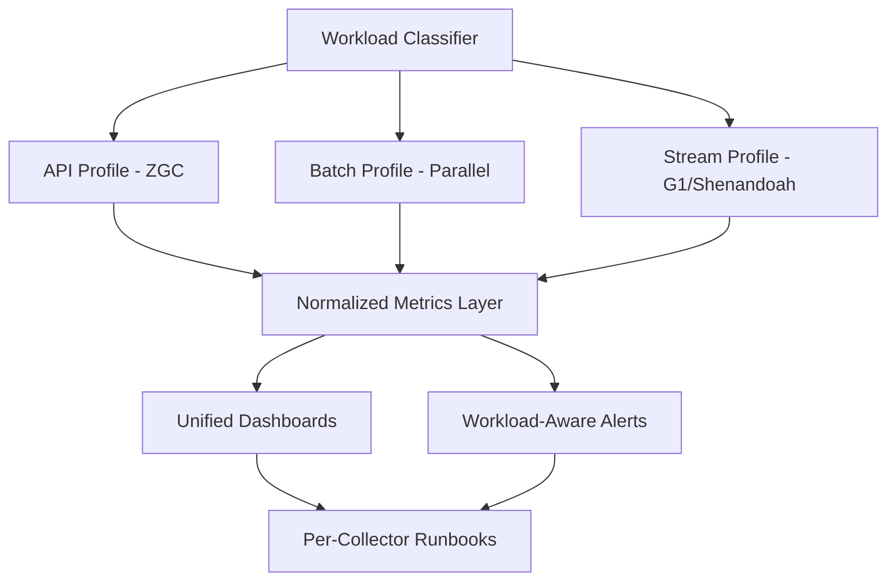

---

### 📶 Gradual Depth

**Level 1 - What it is:** A multi-GC fleet runs different garbage collectors on different services based on their workload needs - ZGC for latency-sensitive APIs, Parallel GC for batch throughput, G1 or Shenandoah for streaming. It replaces the one-size-fits-all default with intentional matching.

**Level 2 - How to use it:** Classify each service into a workload archetype. Assign each archetype a blessed GC profile with pre-defined flags. Deploy, measure GC metrics for two weeks, and validate that the collector meets the service's SLA. Adjust heap sizing within the profile; do not invent new profiles without governance review.

**Level 3 - How it works:** The workload classifier examines three inputs: P99 latency SLA (sub-10ms points to ZGC or Shenandoah; 50-200ms tolerates G1; no latency SLA points to Parallel), allocation rate relative to heap (high allocation + large heap favors generational collectors), and CPU budget (Parallel uses all cores during STW; ZGC and Shenandoah use concurrent threads continuously). The blessed profile specifies not just the collector flag but also heap range, thread configuration, and logging format so that metrics normalization works.

**Level 4 - Production mastery:** The hardest operational problem is not choosing the GC - it is maintaining fleet-wide diagnostic capability across multiple collectors. GC log formats differ: G1 reports "mixed" and "young" pauses; ZGC reports "relocation" and "mark" phases; Parallel reports "full" and "scavenge" events. Build a normalization layer that maps all formats to a unified schema: `gc.pause.ms`, `gc.cause`, `gc.phase`, `gc.collector`. Without this, every dashboard and alert rule must be duplicated per collector. The second hardest problem: on-call competence. Engineers cannot debug a collector they have never seen. Mandate that every on-call engineer completes a runbook exercise for each blessed collector annually - not just the one their team uses.

---

### ⚙️ How It Works

**Phase 1 - Classify workloads.** Profile each service to measure allocation rate, object lifetime distribution, P99 latency, and throughput requirements. Tag each service with its archetype in the service catalog.

**Phase 2 - Define blessed profiles.** Create 3-4 GC profiles, each fully specified:

**BAD:**

```bash
# Per-service ad-hoc flags (undocumented)
-XX:+UseG1GC -XX:MaxGCPauseMillis=50
-XX:G1HeapRegionSize=16m
-XX:InitiatingHeapOccupancyPercent=35
```

Every service has unique, undocumented flags - ungovernable.

**GOOD:**

```bash
# Blessed profile: API-LATENCY (ZGC, 4-16GB)
-XX:+UseZGC -XX:+ZGenerational
-Xms4g -Xmx16g
-Xlog:gc*,safepoint:file=gc.log:time,level
```

Documented rationale, measured baseline, runbook included.

**Phase 3 - Deploy and measure.** Roll out the classified GC to each service. Capture two weeks of steady-state metrics: P99 pause time, throughput overhead (percentage of wall-clock time in GC), and allocation rate. Compare against SLA targets.

**Phase 4 - Normalize and monitor.** The metrics normalization layer parses collector-specific GC logs and JMX data into a unified schema. Dashboards use the unified schema so a single panel shows pause-time distribution across all services regardless of collector.

**Phase 5 - Govern and review.** Quarterly review of fleet GC distribution. Services that changed workload profile (traffic pattern shift, heap resize) are reclassified. New collector requests go through the governance process: justify with data, create the runbook, add to the normalization layer.

```text
Multi-GC Lifecycle:

  Classify --> Profile --> Deploy --> Measure
                                       |
                                       v
                                   SLA met?
                                  /        \
                                Yes         No
                                 |           |
                                 v           v
                            Monitor     Reclassify
                               |           |
                               v           v
                       Quarterly Review <--+
```

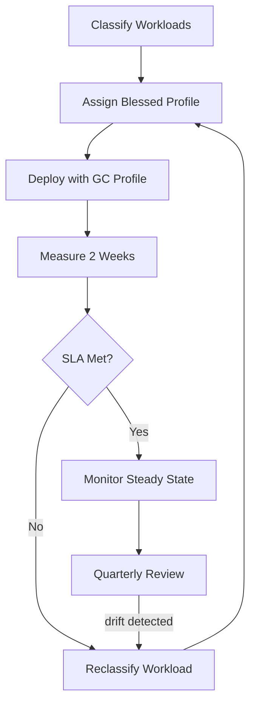

---

### 🚨 Failure Modes

**Failure 1 - Runbook gap during incident:**

**Symptom:** ZGC service pages at 3 AM. On-call engineer opens GC logs, sees `Relocation: 0.003ms` and `Allocation Stall` entries but does not know what an allocation stall means in ZGC (it means the application is allocating faster than ZGC can relocate - different from G1's "allocation failure").

**Root cause:** The team adopted ZGC but never created a ZGC-specific runbook. On-call training covered only G1.

**Diagnostic:**

```bash
# Identify which GC a running service uses
jcmd <pid> VM.flags | grep "Use.*GC"
# For ZGC: check allocation stall frequency
grep "Allocation Stall" gc.log | wc -l
# Check ZGC relocation rate vs allocation rate
grep -E "Relocation|Allocation Rate" gc.log \
  | tail -20
```

**Fix:** Every blessed GC profile must include a runbook covering: log format reference, top five failure signatures, diagnostic commands, and escalation path. On-call engineers must complete a runbook exercise for each blessed collector before joining the rotation.

**Failure 2 - Dashboard shows wrong metrics for collector:**

**Symptom:** The Grafana GC dashboard shows "Mixed GC Count: 0" for ZGC services. SRE concludes GC is not running. In reality, ZGC does not have "mixed" collections - the metric is G1-specific and meaningless for ZGC.

**Root cause:** Dashboards were built for G1 and never updated when the fleet adopted additional collectors. The metrics layer does not normalize collector-specific concepts into a unified schema.

**Diagnostic:**

```bash
# Check which GC metrics a JVM actually exposes
jcmd <pid> VM.info | grep -i "garbage"
# List GC-related MBeans for this collector
jcmd <pid> ManagementAgent.status
# Query JMX for available GC beans
curl -s http://localhost:9090/metrics | \
  grep jvm_gc | head -20
```

**Fix:** Build the normalized metrics layer. Map each collector's concepts to a unified schema. G1 "mixed pause" and ZGC "relocation pause" both map to `gc.pause.ms`. G1 "InitiatingHeapOccupancyPercent" and ZGC "SoftMaxHeapSize" both relate to collection triggering but are not equivalent - document the semantic gap.

**Failure 3 - GC proliferation beyond blessed profiles:**

**Symptom:** Six months after adopting multi-GC, the fleet has 14 distinct GC configurations. Three teams run Shenandoah with different tuning. Two teams use ZGC non-generational (legacy). One team switched to Epsilon "for testing" and forgot to revert.

**Root cause:** No governance process. Teams copy-pasted flags from blog posts instead of using blessed profiles.

**Diagnostic:**

```bash
# Audit all GC configurations in the fleet
kubectl get pods -A -o json | \
  jq -r '.items[].spec.containers[]
  .env[]? | select(.name=="JAVA_TOOL_OPTIONS")
  | .value' | sort | uniq -c | sort -rn
```

**Fix:** CI enforcement: deployment pipeline validates that `JAVA_TOOL_OPTIONS` or entrypoint flags match one of the blessed profiles. Non-matching configurations require an approved exception with an expiry date. Quarterly audit removes expired exceptions.

---

### 🔬 Production Reality

The pattern that catches most organizations: they get the GC selection right but fail on the operational tooling. A team migrates their latency-sensitive service from G1 to ZGC. Pause times drop from 30ms to 0.1ms. Success. Three months later, the service experiences allocation stalls - ZGC cannot relocate objects fast enough because the heap is undersized relative to allocation rate. The on-call engineer searches the runbook for "allocation failure" (the G1 term). Nothing matches. They search dashboards for "full GC" (ZGC does not have full GC in the traditional sense). Nothing. They escalate to the JVM team, who discovers the issue in 5 minutes by grepping for `Allocation Stall` in the ZGC logs. The fix is trivial: increase `-Xmx` or reduce allocation rate. But the diagnosis took 45 minutes because the operational tooling spoke G1 while the service spoke ZGC. The lesson: multi-GC adoption is 20% GC selection and 80% operational readiness - runbooks, dashboards, alert rules, and on-call training for every blessed collector. The GC switch is a flag change. The operational readiness is a quarter of work.

---

### ⚖️ Trade-offs & Alternatives

| Aspect              | Multi-GC Fleet        | Single GC Standard   | Managed Runtime (no GC choice) |
| ------------------- | --------------------- | -------------------- | ------------------------------ |
| Per-service fit     | Optimal               | Compromise           | Vendor-determined              |
| On-call complexity  | High (multi-runbook)  | Low (one collector)  | Low (outsourced)               |
| Dashboard/alerting  | Normalization needed  | Uniform              | Vendor-provided                |
| Tuning expertise    | Spread across 3-4 GCs | Deep in one GC       | None required                  |
| Tail-latency (APIs) | Sub-ms (ZGC/Shen)     | 10-50ms (G1)         | Varies                         |
| Batch throughput    | Maximum (Parallel)    | 85-95% (G1 overhead) | Varies                         |
| Governance cost     | Medium (profiles)     | Low (one standard)   | None                           |

---

### ⚡ Decision Snap

**USE WHEN:**

- The fleet has workloads with conflicting GC requirements (sub-ms API latency AND high-throughput batch).
- Measurable evidence shows the current single-GC standard degrades specific workload classes.
- The organization can invest in per-collector runbooks, normalized dashboards, and on-call training.

**AVOID WHEN:**

- All services have similar workload profiles - G1 with tuning is sufficient.
- The on-call team lacks capacity to maintain expertise in multiple collectors.

**PREFER Single GC (G1 or Generational ZGC) WHEN:**

- Operational simplicity outweighs per-service optimization.
- Generational ZGC (JDK 21+) narrows the performance gap enough that a single collector covers most workloads acceptably.

---

### ⚠️ Top Traps

| #   | Misconception                           | Reality                                                                                                                                                                                                                                                    |
| --- | --------------------------------------- | ---------------------------------------------------------------------------------------------------------------------------------------------------------------------------------------------------------------------------------------------------------- |
| 1   | "Just switch the flag and you are done" | The GC flag change takes seconds. Building the runbook, normalizing metrics, updating dashboards, and training on-call takes weeks. Budget for the operational cost, not the configuration change.                                                         |
| 2   | "ZGC is always better for latency"      | ZGC (especially non-generational before JDK 21) can use more CPU for concurrent work and more memory for colored pointers. For small heaps under 2GB, G1 may provide lower overall resource cost with acceptable pauses.                                   |
| 3   | "Parallel GC is obsolete"               | Parallel GC delivers the highest throughput for batch workloads with no latency SLA. It uses CPU most efficiently during STW because it parallelizes all GC phases without concurrent overhead. It remains the right choice when pause time is irrelevant. |
| 4   | "More GC options are always better"     | Every additional blessed profile multiplies operational surface: runbooks, dashboards, alert rules, on-call training. Three to four profiles cover nearly all workload archetypes. Beyond that, complexity outweighs benefit.                              |
| 5   | "GC comparison requires a benchmark"    | Production workloads differ from benchmarks. Use production traffic replay or shadow traffic against both collectors and measure actual SLA metrics, not synthetic throughput scores.                                                                      |

---

### 🪜 Learning Ladder

**Prerequisites:**

- JVM-030 G1GC Essentials - understand the default collector's behavior and limitations
- JVM-078 ZGC Colored Pointers - understand ZGC's concurrent relocation mechanism
- JVM-076 Tri-Color Marking - understand the concurrent marking algorithm shared across collectors
- JVM-103 GC Strategy for Heterogeneous Workloads - the classification framework this keyword operationalizes

**THIS:** JVM-109 Multi-GC Fleet - Different Services, Diff GCs

**Next steps:**

- JVM-061 GC Tuning Methodology - deep-dive tuning for each blessed collector profile
- JVM-108 JVM Observability Platform Design - the monitoring layer that makes multi-GC fleets observable
- JVM-105 Build Your Own JVM Flag Baseline - define the flag standards that blessed profiles build on

---

**The Surprising Truth:**

The biggest operational risk in a multi-GC fleet is not choosing the wrong collector - it is that GC log formats are incompatible. G1 logs report `GC(12) Pause Young (Normal)` with region-level detail. ZGC logs report `GC(12) Minor Collection` with colored-pointer phase timings. Parallel logs report `GC(12) Pause Full` with generation sizes. An SRE who can parse one format fluently is a beginner in the other two. Organizations that normalize GC logs into a unified structured format (JSON with `gc.cause`, `gc.pause_ms`, `gc.collector` fields) before shipping to the log store reduce cross-collector diagnosis time dramatically - because the on-call engineer reads one format, not four.

---

**Further Reading:**

- [JEP 439: Generational ZGC](https://openjdk.org/jeps/439) - the JDK 21 enhancement that made ZGC generational, significantly improving throughput for allocation-heavy workloads
- [JEP 189: Shenandoah GC](https://openjdk.org/jeps/189) - the original Shenandoah proposal describing its ultra-low-pause concurrent compaction design
- [JEP 377: ZGC - A Scalable Low-Latency GC (Production)](https://openjdk.org/jeps/377) - the JDK 15 JEP graduating ZGC from experimental to production-ready status

---

**Revision Card:**

1. A multi-GC fleet matches each workload archetype to its optimal collector - but limit to 3-4 blessed profiles to contain operational complexity.
2. The real cost is not the GC flag change - it is building per-collector runbooks, normalized metrics, and cross-collector on-call competence.
3. Normalize GC log formats into a unified schema before shipping to storage - otherwise every dashboard, alert, and on-call investigation is silently collector-specific.
