## Keywords

1. [JVM-110 JVM Upgrade Governance at Scale](#jvm-110-jvm-upgrade-governance-at-scale)
2. [JVM-111 Container Image Strategy for JVM Services](#jvm-111-container-image-strategy-for-jvm-services)
3. [JVM-112 JVM Staff-Level Interview Scenarios](#jvm-112-jvm-staff-level-interview-scenarios)
4. [JVM-113 JVM Cost Optimization - Right-Sizing Heaps](#jvm-113-jvm-cost-optimization---right-sizing-heaps)
5. [JVM-114 Build a JVM Dashboard - Phase 4 (Platform)](#jvm-114-build-a-jvm-dashboard---phase-4-platform)
6. [JVM-115 Writing a JVM RFC for Your Organization](#jvm-115-writing-a-jvm-rfc-for-your-organization)
7. [JVM-116 The JVM Specification - Structure and Evol](#jvm-116-the-jvm-specification---structure-and-evol)
8. [JVM-117 Bytecode Verification Algorithm](#jvm-117-bytecode-verification-algorithm)

---

# JVM-110 JVM Upgrade Governance at Scale

**TL;DR** - A governance framework coordinates JDK upgrades across hundreds of services with risk tiers, compatibility review, timeline enforcement, and rollback policies.

---

### 🔥 Problem Statement

An organization with 150 microservices decides to upgrade from JDK 17 to JDK 21. Without governance, the result is predictable chaos. Three teams upgrade immediately and hit a removed API (`SecurityManager` deprecation for removal). Two teams discover that a shared library compiled for JDK 17 uses internal APIs sealed in JDK 21, blocking twenty downstream services. The payments team refuses to upgrade during Q4 freeze - but their exemption has no expiry, so they are still on JDK 17 eighteen months later. Nobody tracks which services have upgraded, which are blocked, and which are silently ignoring the migration. A CVE in JDK 17 lands and the organization cannot answer a basic question: how many production services still run the affected version? The root cause is not technical - it is the absence of a structured process for coordinating change across autonomous teams at scale. JVM upgrade governance exists to make fleet-wide JDK transitions predictable, trackable, and completable within bounded time.

---

### 📜 Historical Context

Before microservices, JDK upgrades were monolith upgrades - one team, one binary, one decision. The microservice era (roughly 2014-2018) created hundreds of independent deployment units, each with its own JDK dependency. Oracle's 2017 shift to a six-month release cadence (starting JDK 10) and the new licensing model forced organizations to treat JDK versions as managed fleet assets rather than invisible infrastructure. The emergence of platform engineering teams (2019-present) brought formal governance to what had been ad hoc coordination. Organizations like Google, Netflix, and LinkedIn published internal tooling patterns for large-scale dependency upgrades that informed the broader industry approach.

---

### 🔩 First Principles

**CORE INVARIANTS:**

1. Every JDK upgrade carries risk proportional to the API surface delta between versions, the service's dependency depth, and its position on the critical path.
2. Shared libraries create transitive coupling - upgrading a library's minimum JDK version forces all consumers to upgrade first or simultaneously.
3. Governance overhead must scale sub-linearly with fleet size - a process that requires per-service negotiation becomes the bottleneck it was designed to prevent.

**DERIVED DESIGN:**

Invariant 1 forces a risk-tiered approach: not all services carry equal upgrade risk or urgency. Invariant 2 forces coordination with shared library teams before service teams begin migration. Invariant 3 forces automation: compliance tracking, compatibility scanning, and timeline enforcement must be tooling-driven, not meeting-driven. Together, these invariants produce a phased governance model: assess risk, sequence dependencies, enforce timelines with automated gates, and provide a lightweight exemption path.

**THE TRADE-OFF:**

**Gain:** Predictable completion timelines, shared library coordination, risk-proportionate attention, fleet-wide CVE patchability.

**Cost:** Governance overhead (RFC process, review board), reduced team autonomy on timing, coordination tax for shared library teams, exemption process maintenance.

---

### 🧠 Mental Model

> JVM upgrade governance is like a city-wide electrical grid voltage change. You cannot flip every building at once. Critical infrastructure (hospitals, data centers) gets upgraded first with dedicated engineers. Residential blocks get scheduled waves. Buildings with custom wiring get inspections before the switch. Every building must convert by the cutoff date - or risk disconnection.

- "Voltage change" -> JDK version upgrade
- "Building inspection" -> compatibility assessment per service
- "Scheduled waves" -> risk-tiered migration phases
- "Custom wiring" -> services using internal APIs or removed features

**Where this analogy breaks down:** Electrical upgrades are physically constrained to sequential work. JVM upgrades can be parallelized across teams - the bottleneck is shared libraries and CI pipeline capacity, not physical access.

---

### 🧩 Components

- **RFC process:** Formal proposal documenting the target JDK version, timeline, known breaking changes, shared library readiness, and rollback criteria. Published fleet-wide for review.
- **Compatibility review board:** Cross-team body (rotating membership) that triages breaking changes, sequences shared library upgrades, and resolves disputes.
- **Risk tier classification:** Services classified into tiers (T1: revenue-critical, T2: internal-facing, T3: batch/tooling) with different testing requirements and rollback policies per tier.
- **Shared library readiness tracker:** Dashboard tracking which shared libraries have been validated against the target JDK, blocking services that depend on unvalidated libraries.
- **Migration pipeline:** Automated tooling that bumps JDK version in build config, runs compatibility checks (jdeprscan, jdeps), executes test suites, and reports status.
- **Exemption register:** Time-bounded exemptions with auto-expiry, owner, reason, and review date. No permanent exemptions.

```text
Upgrade Governance Architecture:

  RFC Proposal (target JDK, timeline)
       |
       v
  Compatibility Review Board
       |
       +---> Shared Library Readiness
       |         |
       v         v
  Risk Tier Classification
  [T1: critical] [T2: internal] [T3: batch]
       |              |              |
       v              v              v
  Phase 1          Phase 2        Phase 3
  (strict test)    (standard)     (self-serve)
       |
  Exemption Register [auto-expiry]
```

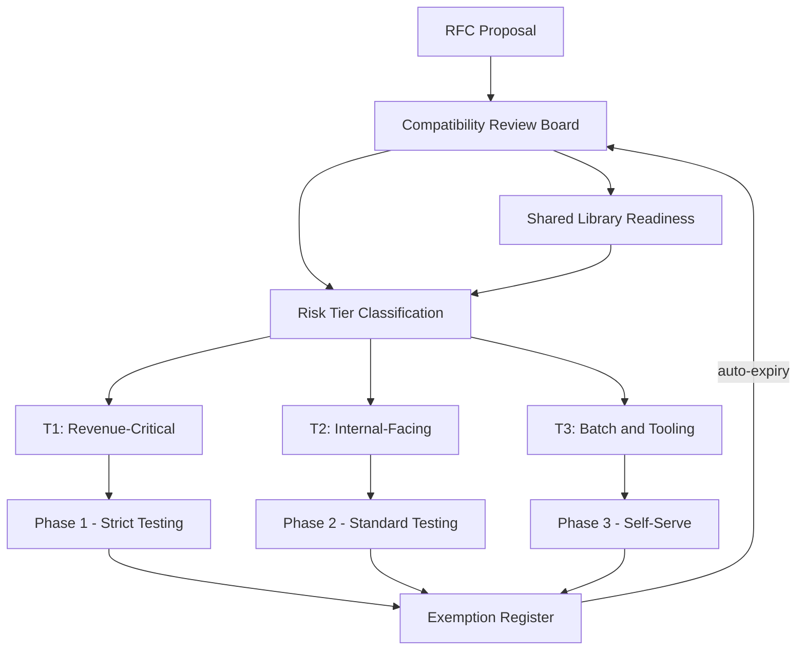

---

### 📶 Gradual Depth

**Level 1 - What it is:** JVM upgrade governance is a structured process for coordinating JDK version upgrades across many services. It defines who decides, when each service migrates, and what happens when a service cannot upgrade on schedule.

**Level 2 - How to use it:** Start with an RFC documenting the target version and known breaking changes. Classify services by risk tier. Coordinate shared library upgrades first. Set phase deadlines per tier. Track progress on a fleet dashboard. Provide an exemption process with auto-expiring entries.

**Level 3 - How it works:** The compatibility review board sequences the migration: shared libraries first, then T1 services with dedicated support, then T2/T3 in self-serve waves. Automated tooling runs `jdeprscan` and `jdeps` to detect deprecated API usage and internal API dependencies. CI pipelines gate deployments on the target JDK version after the phase deadline. Exemptions require a documented reason, an owner, and an expiry date - typically 90 days.

**Level 4 - Production mastery:** The hardest governance problem is shared library coordination. A single library compiled with `--release 17` that uses an internal API removed in JDK 21 blocks every consumer. Successful organizations maintain a library compatibility matrix updated by CI: for each shared library, which JDK versions it compiles and passes tests on. The second hardest problem is exemption management - without auto-expiry and escalation, exemptions become permanent and the migration never completes. Measure migration velocity (services upgraded per week) and exemption age (P50/P99) as primary governance KPIs.

---

### ⚙️ How It Works

**Phase 1 - Assessment.** Platform team publishes an RFC with the target JDK version, a migration guide covering breaking changes (removed APIs, changed defaults, new deprecations), and a shared library compatibility matrix. Teams self-assess their services using `jdeps --multi-release 21` and `jdeprscan --release 21`.

**Phase 2 - Shared library migration.** Library teams upgrade, test, and publish JDK 21-compatible versions. A blocking matrix tracks readiness. No service team begins migration until their library dependencies are green.

**Phase 3 - Tiered service migration.** T1 services migrate first with platform team pairing. T2 services migrate in coordinated waves. T3 services self-serve with automated tooling.

**Phase 4 - Enforcement.** After the phase deadline, CI pipelines block builds on the old JDK version. Exempted services are tagged in the service catalog. A weekly report shows migration progress and exemption aging.

```text
Migration Timeline:

  Week 0-2: RFC + Assessment
       |
  Week 2-6: Shared Library Migration
       |
  Week 6-10: T1 Service Migration
       |
  Week 10-16: T2 Service Migration
       |
  Week 16-20: T3 Self-Serve + Enforcement
       |
  Week 20+: Exemption Cleanup
```

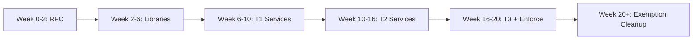

**BAD:**

```yaml
# Ad hoc upgrade: no coordination, no tracking
# Each team bumps JDK whenever they feel like it
services:
  payment-api:
    jdk: 21 # upgraded week 1, broke shared lib
  order-service:
    jdk: 17 # "will upgrade later" (never did)
  analytics:
    jdk: 17 # team did not know about migration
```

Why it fails: no sequencing, no shared library readiness gate, no deadline enforcement, no visibility into fleet state.

**GOOD:**

```yaml
# Governed upgrade: phased, tracked, enforced
migration:
  target: jdk-21
  rfc: RFC-2025-003
  shared_libs_ready: true
  phases:
    t1_deadline: 2025-04-01
    t2_deadline: 2025-06-01
    t3_deadline: 2025-08-01
  exemptions:
    - service: legacy-gateway
      reason: "vendor SDK requires JDK 17"
      owner: team-infra
      expires: 2025-10-01
```

Why it works: phased deadlines per risk tier, shared library gate, time-bounded exemptions with owners, fleet-wide visibility.

---

### 🚨 Failure Modes

**Failure 1 - Shared library deadlock:**

**Symptom:** T1 service migration stalls at week 6. Teams report they cannot upgrade because `internal-auth-lib` has not published a JDK 21-compatible version.

**Root cause:** The library team was not included in the RFC review. They learned about the migration after service teams had already started, and their backlog is full.

**Diagnostic:**

```bash
# Check shared library compatibility matrix
curl -s "$FLEET_API/lib-compat" | \
  jq '.[] | select(.jdk21 == false) |
  .name' | sort
# Identify blocked services
curl -s "$FLEET_API/service-deps" | \
  jq '.[] | select(
    .deps[] | .jdk21_ready == false
  ) | .name'
```

**Fix:** Include shared library teams in the RFC from day one. Sequence library migration as Phase 0 with a hard deadline that precedes service migration. Track library readiness as a blocking gate in the migration pipeline.

**Failure 2 - Exemption rot:**

**Symptom:** Twelve months after the migration deadline, 15% of services still run JDK 17. Exemptions were granted and never reviewed.

**Root cause:** Exemptions had no auto-expiry. The exemption register is a spreadsheet nobody checks.

**Diagnostic:**

```bash
# Query exemption ages
curl -s "$FLEET_API/exemptions" | \
  jq '[.[] | {service: .name,
    age_days: (now - .granted_epoch)
    / 86400 | floor}] |
  sort_by(-.age_days) | .[:10]'
```

**Fix:** Exemptions must auto-expire (90 days default). Expired exemptions trigger CI build failures. Every exemption has an owner who receives weekly reminders. Escalate exemptions older than 180 days to engineering leadership.

**Failure 3 - Flag regression after upgrade:**

**Symptom:** Services upgraded to JDK 21 show unexpected GC behavior. Latency increases 30% on some services.

**Root cause:** JDK 21 changed the default G1 region size calculation. Services that relied on JDK 17's ergonomic defaults inherited different values without realizing it.

**Diagnostic:**

```bash
# Compare effective flags before and after
jcmd <pid> VM.flags | grep -i region
# Cross-reference with JDK release notes
```

**Fix:** The migration guide must document changed defaults between versions. The migration pipeline should diff `VM.flags` output before and after upgrade and flag unexpected changes for human review.

---

### 🔬 Production Reality

A platform engineering team coordinating a JDK 17-to-21 migration across 120 services discovered the most painful bottleneck was not technical compatibility - it was the coordination overhead of shared libraries. The organization maintained 14 internal shared libraries. Three of them used `sun.misc.Unsafe` for performance-critical serialization paths. The library team estimated 4 weeks to migrate; it took 11 weeks because each library's test suite required updates for changed JDK behavior, and the serialization library needed an architecture change to use `VarHandle` instead of `Unsafe`. During this period, 80 service teams waited. The lesson: shared library migration is the critical path. Organizations that succeed allocate dedicated engineering time to library teams during migrations and start library assessment before the RFC is published - not after. The second lesson: `jdeps --jdk-internals` should run in CI continuously, not just during migrations, so internal API dependencies are visible year-round.

---

### ⚖️ Trade-offs & Alternatives

| Aspect            | Governed Upgrade       | Rolling Upgrade (Ad Hoc) | Big Bang (Monolith-Era) |
| ----------------- | ---------------------- | ------------------------ | ----------------------- |
| Coordination cost | Medium (structured)    | Low (none)               | High (one event)        |
| Completion time   | Bounded (20-30 weeks)  | Unbounded                | 1-2 weeks if it works   |
| Risk distribution | Phased by tier         | Random                   | All-or-nothing          |
| Shared lib safety | Sequenced              | Discovered by breakage   | Pre-validated           |
| Rollback scope    | Per-service, per-phase | Per-service              | Fleet-wide              |
| Fleet visibility  | Dashboard-tracked      | Unknown                  | Binary (done/not done)  |

---

### ⚡ Decision Snap

**USE WHEN:**

- Organization runs 20+ JVM services across multiple teams.
- Shared libraries create transitive upgrade dependencies.
- Security SLAs require bounded CVE patch timelines.

**AVOID WHEN:**

- Single team owns all services and can coordinate informally.
- Services have no shared library dependencies.

**PREFER Rolling Ad Hoc WHEN:**

- Teams are small, expert, and the JDK version delta is minor (patch release, not LTS jump).
- Services are fully decoupled with no shared library dependencies.

---

### ⚠️ Top Traps

| #   | Misconception                                 | Reality                                                                                                                                                            |
| --- | --------------------------------------------- | ------------------------------------------------------------------------------------------------------------------------------------------------------------------ |
| 1   | "Set a deadline and teams will comply"        | Deadlines without automated enforcement (CI gates) are suggestions. Teams under delivery pressure will postpone indefinitely unless the build breaks.              |
| 2   | "Shared libraries can upgrade in parallel"    | Library upgrades must precede service upgrades. Parallel attempts cause version conflicts and compilation failures in downstream consumers.                        |
| 3   | "JDK upgrades are just version bumps"         | Changed defaults (GC ergonomics, security manager, internal APIs) cause subtle behavior changes. Treat every LTS jump as a migration, not an update.               |
| 4   | "Exemptions are failures"                     | Exemptions are expected and healthy. The failure is exemptions without expiry, without owners, and without review - turning temporary delays into permanent drift. |
| 5   | "One governance process fits all JDK changes" | Patch releases (17.0.11 to 17.0.12) need lightweight rollout. LTS jumps (17 to 21) need full governance. Match process weight to change risk.                      |

---

### 🪜 Learning Ladder

**Prerequisites:**

- JVM-033 JVM Flags That Actually Matter - understand flag changes between JDK versions that affect migration risk
- JVM-102 JVM Fleet Standardization Strategy - fleet governance is the foundation that upgrade governance builds upon
- JVM-104 Java LTS Version Migration Strategy - the technical migration playbook this governance process coordinates

**THIS:** JVM-110 JVM Upgrade Governance at Scale

**Next steps:**

- JVM-105 Build Your Own JVM Flag Baseline - flag baselines must be re-validated after every major JDK upgrade
- JVM-108 JVM Observability Platform Design - observability reveals upgrade regressions the governance process must catch
- JVM-113 JVM Cost Optimization - Right-Sizing Heaps - post-upgrade is the ideal time to right-size, leveraging new GC improvements

---

**The Surprising Truth:**

The biggest predictor of migration success is not tooling sophistication - it is whether shared library teams have dedicated migration time allocated before the RFC is published. Organizations that treat library migration as "Phase 0" (starting 4-6 weeks before service teams are notified) complete fleet-wide upgrades in half the time of those that start library and service migration simultaneously. The library dependency graph, not the service count, determines the true critical path.

---

**Further Reading:**

- [JEP 403: Strongly Encapsulate JDK Internals](https://openjdk.org/jeps/403) - the JDK 17 change that made internal API auditing a migration prerequisite
- [Oracle JDK Migration Guide](https://docs.oracle.com/en/java/javase/21/migrate/getting-started.html) - official reference for API changes, removed features, and migration tooling between JDK versions
- [jdeps tool specification (JDK 21)](https://docs.oracle.com/en/java/javase/21/docs/specs/man/jdeps.html) - the dependency analysis tool that powers automated compatibility scanning

---

**Revision Card:**

1. Shared library migration is the critical path - sequence it as Phase 0 before service teams begin, or the entire timeline slips.
2. Exemptions without auto-expiry and owners become permanent drift - enforce 90-day TTLs with CI gates on expired exemptions.
3. Match governance weight to change risk: patch releases need lightweight rollout, LTS jumps need full RFC-and-review governance.

---

---

# JVM-111 Container Image Strategy for JVM Services

**TL;DR** - Container image strategy balances base image selection, layer optimization, security scanning, and debuggability to ship JVM services that are small, secure, and operable.

---

### 🔥 Problem Statement

A platform team discovers their JVM service images average 850MB. Build pipelines take 12 minutes because every code change re-downloads the JDK layer. A CVE scan flags 47 critical vulnerabilities - most in OS packages the JVM does not use. When a production OOM occurs, the on-call engineer cannot attach `jcmd` or `jmap` because the distroless base image contains no diagnostic tools. Meanwhile, another team ships Alpine-based images that crash with segfaults because musl's `malloc` implementation interacts poorly with the JVM's memory-mapped regions at scale. A third team builds fat images with a full Ubuntu base "just in case" - consuming 3x the registry storage and tripling pull times in autoscaling events. Without a deliberate container image strategy, every team makes independent choices that optimize for one dimension (size, debuggability, familiarity) while creating problems in others. The image is the deployment unit - its construction affects build speed, startup time, security posture, debuggability, and infrastructure cost.

---

### 📜 Historical Context

Early Docker adoption (2014-2016) treated JVM containers like VMs - full OS base, JDK installed via package manager, multi-hundred-MB images considered normal. The `openjdk` official Docker images standardized a starting point but varied wildly in size (slim vs full vs alpine). Google's distroless project (2017) introduced minimal images without shells or package managers, optimizing for security at the cost of debuggability. Eclipse Temurin (2021, successor to AdoptOpenJDK) became the de facto community distribution with official container images. JDK modules (since JDK 9, via `jlink`) enabled custom JRE images containing only required modules, cutting image size further. Multi-stage Docker builds became standard practice for separating build-time and runtime dependencies.

---

### 🔩 First Principles

**CORE INVARIANTS:**

1. Container image size directly impacts autoscale speed - every MB added to the image adds latency to pod scheduling when nodes must pull the image from a remote registry.
2. Every OS package in the image is an attack surface - unused packages cannot be exploited if they are not present.
3. JVM diagnostic tools (`jcmd`, `jmap`, `jstack`, `jfr`) require a JDK, not a JRE - stripping them from production images trades security for debuggability.
4. Layer ordering determines cache efficiency - layers that change frequently must be placed after layers that change rarely, or every build invalidates the entire cache.

**DERIVED DESIGN:**

Invariant 1 forces image size optimization (smaller base, multi-stage builds, jlink). Invariant 2 forces minimal base images (distroless or slim). Invariant 3 forces a decision: include JDK tools (larger, debuggable) or ship JRE-only (smaller, opaque). Invariant 4 forces layer architecture: OS base (changes yearly) -> JDK (changes quarterly) -> dependencies (changes weekly) -> application code (changes daily).

**THE TRADE-OFF:**

**Gain:** Faster autoscaling, smaller attack surface, lower registry storage cost, faster CI pipelines.

**Cost:** Reduced runtime debuggability (if distroless), musl compatibility risk (if Alpine), build complexity (multi-stage, jlink), JDK-specific image maintenance.

---

### 🧠 Mental Model

> A container image is like packing a suitcase for a trip. A tourist packs everything "just in case" - the suitcase is heavy, slow through security, and full of things never used. A frequent traveler packs exactly what they need, in a specific order (heaviest at bottom, daily items on top), and knows which hotel supplies toiletries (no need to bring them).

- "Heavy suitcase" -> full OS base with unnecessary packages
- "Packing order" -> Docker layer ordering for cache efficiency
- "Hotel toiletries" -> sidecar or ephemeral debug containers
- "Security screening" -> CVE scanning of image contents

**Where this analogy breaks down:** Suitcases are packed once. Container images are built continuously by CI pipelines - layer cache efficiency matters more than one-time packing decisions.

---

### 🧩 Components

- **Base image selection:** The OS layer choice - distroless, Debian slim, Ubuntu minimal, Alpine + glibc. Each carries different size, security, and compatibility trade-offs.
- **JDK layer:** The Java runtime - full JDK (with tools), JRE-only, or custom jlink runtime. Determines diagnostic capability and image size.
- **Dependency layer:** Application dependencies (JARs). Separated from application code for cache efficiency.
- **Application layer:** The service artifact (JAR or exploded class files). Changes most frequently.
- **Multi-stage build:** Separates the build environment (full JDK + Maven/Gradle) from the runtime environment (minimal base + JRE).
- **Security scanning pipeline:** Automated CVE scanning (Trivy, Grype, Snyk) integrated into CI, blocking images with critical vulnerabilities.

```text
Image Layer Architecture:

  +----------------------------------+
  | Application code (changes daily) |  <- top
  +----------------------------------+
  | Dependencies / JARs (weekly)     |
  +----------------------------------+
  | JDK runtime layer (quarterly)    |
  +----------------------------------+
  | OS base layer (yearly)           |  <- bottom
  +----------------------------------+

  Build stage         Runtime stage
  +--------------+    +-------------+
  | Full JDK     |    | Slim base   |
  | Maven/Gradle |--->| JRE or      |
  | Source code   |    |  jlink RT   |
  | Test deps    |    | App JAR     |
  +--------------+    +-------------+
```

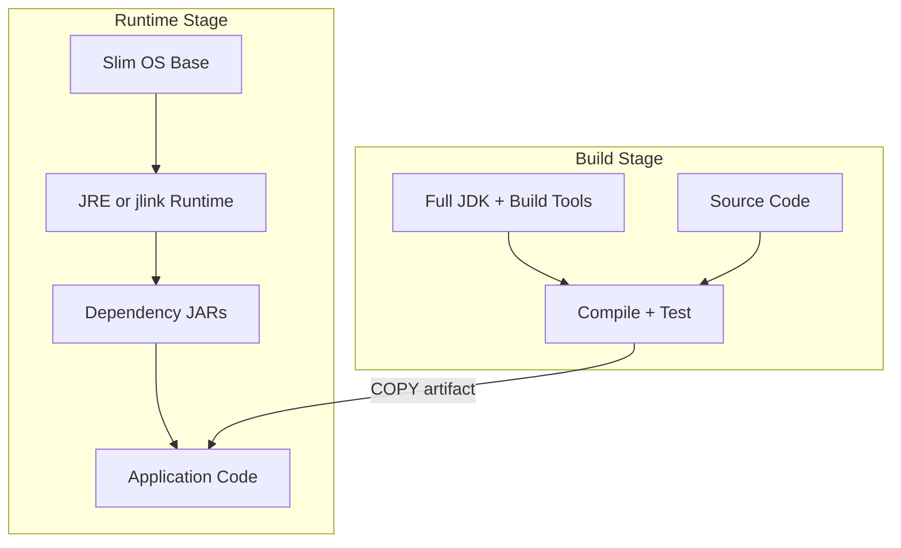

---

### 📶 Gradual Depth

**Level 1 - What it is:** A container image strategy defines which base image, JDK distribution, and layer structure to use for all JVM services. It standardizes the deployment artifact to be small, secure, and debuggable.

**Level 2 - How to use it:** Start with Eclipse Temurin JRE on Debian slim as the default base. Use multi-stage builds to separate build and runtime. Order layers by change frequency (OS base, JDK, dependencies, app code). Run Trivy or Grype in CI to catch CVEs before images reach production.

**Level 3 - How it works:** Multi-stage builds use a build stage with the full JDK and build tools (Maven, Gradle) to compile, test, and package. A `COPY --from=build` instruction transfers only the final artifact to the runtime stage, which uses a minimal base image. Layer ordering exploits Docker's layer cache - unchanged layers are reused, so placing the rarely-changing JDK layer below the frequently-changing application layer means most builds only rebuild the top layers.

**Level 4 - Production mastery:** The critical production decision is debuggability vs size. Distroless images have no shell, no `jcmd`, no `jmap` - when an OOM happens at 3 AM, you cannot attach tools. The solution is Kubernetes ephemeral debug containers (`kubectl debug`) that inject a JDK-equipped sidecar into the pod at incident time. This preserves the minimal runtime image while enabling on-demand diagnostics. For Alpine-based images, the glibc compatibility layer (`gcompat` or `libc6-compat`) must be validated against the specific JDK version - musl-related crashes are rare but catastrophic and hard to diagnose.

---

### ⚙️ How It Works

**Phase 1 - Base image selection.** Choose the base by evaluating four criteria: image size, CVE surface, glibc compatibility, and diagnostic tool availability. Temurin on Debian slim is the safe default. Distroless for security-hardened services. Alpine only if the team validates musl compatibility.

**Phase 2 - Multi-stage Dockerfile.** Build stage uses full JDK image with build tools. Runtime stage uses the chosen base with JRE only. `COPY --from=build` transfers the artifact.

**Phase 3 - Layer optimization.** Copy dependency JARs in a separate layer before the application JAR. Use `.dockerignore` to exclude build artifacts. Pin base image tags to digest for reproducibility.

**Phase 4 - Security integration.** CI pipeline scans the final image with Trivy/Grype. Critical CVEs block the pipeline. A weekly scheduled scan catches newly disclosed CVEs in existing images.

```text
Multi-Stage Build Flow:

  Dockerfile
  [Stage 1: build]
  FROM temurin:21-jdk AS build
  COPY src/ + pom.xml
  RUN mvn package
       |
  [Stage 2: runtime]
  FROM temurin:21-jre-jammy
  COPY --from=build target/app.jar
  ENTRYPOINT java -jar app.jar
       |
  [CI: scan]
  trivy image --severity CRITICAL
       |
  [Registry: push if clean]
```

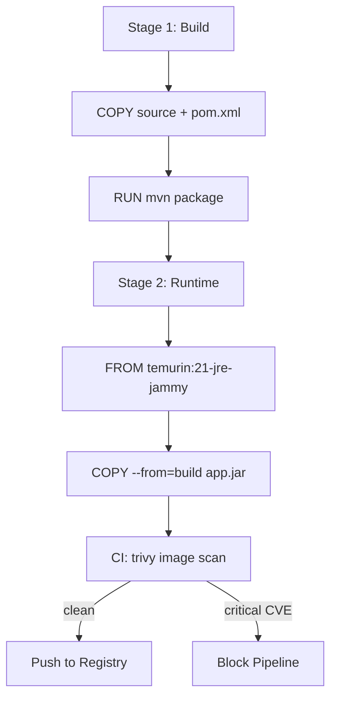

**BAD:**

```dockerfile
# Single-stage, full OS, no layer optimization
FROM ubuntu:22.04
RUN apt-get update && \
    apt-get install -y openjdk-21-jdk maven
COPY . /app
WORKDIR /app
RUN mvn package
CMD ["java", "-jar", "target/app.jar"]
# Result: 900MB+ image, build tools in prod,
#         47 CVEs from unused apt packages
```

Why it fails: build tools in production image, full OS packages as attack surface, no layer caching (COPY . invalidates everything), image too large for fast autoscaling.

**GOOD:**

```dockerfile
# Multi-stage, minimal base, layered caching
FROM eclipse-temurin:21-jdk-jammy AS build
WORKDIR /build
COPY pom.xml .
RUN mvn dependency:go-offline
COPY src/ src/
RUN mvn package -DskipTests

FROM eclipse-temurin:21-jre-jammy
WORKDIR /app
COPY --from=build \
  /build/target/app.jar app.jar
EXPOSE 8080
ENTRYPOINT ["java", \
  "@/opt/jvm/baseline.opts", \
  "-jar", "app.jar"]
# Result: ~250MB, no build tools, cached deps
```

Why it works: build tools stay in build stage, dependency layer cached separately, minimal JRE base, flag baseline via file reference.

---

### 🚨 Failure Modes

**Failure 1 - Alpine musl segfaults:**

**Symptom:** JVM service on Alpine crashes with `SIGSEGV` under heavy load. Core dump shows the fault in `mmap`-related native code. Works fine in development with light traffic.

**Root cause:** Alpine uses musl libc instead of glibc. The JVM's native memory management (especially `mmap` for direct byte buffers and memory-mapped files) assumes glibc behavior. Musl's `malloc` implementation fragments memory differently under sustained allocation pressure.

**Diagnostic:**

```bash
# Check libc variant inside container
docker run --rm <image> \
  ldd --version 2>&1 | head -1
# If musl, check for native crash logs
kubectl logs <pod> --previous | \
  grep -i "sigsegv\|fatal\|hs_err"
```

**Fix:** Switch to glibc-based images (Debian slim, Ubuntu minimal, or Temurin official images). If Alpine is required for policy reasons, use `alpine-glibc` variants or install `gcompat` and validate under production-equivalent load before deployment.

**Failure 2 - Opaque OOM in distroless images:**

**Symptom:** Pod is OOMKilled by Kubernetes. No heap dump exists. No way to attach `jcmd` because the container has no shell and no JDK tools.

**Root cause:** Distroless base image contains JRE only, with no shell, no diagnostic tools. The JVM flag `-XX:+HeapDumpOnOutOfMemoryError` was set but the heap dump path was not mounted to a persistent volume - the dump was written inside the ephemeral container filesystem and lost when the pod restarted.

**Diagnostic:**

```bash
# Check if debug container can attach
kubectl debug -it <pod> \
  --image=eclipse-temurin:21-jdk-jammy \
  --target=<container> -- jcmd 1 GC.heap_info
# Check heap dump volume mount
kubectl get pod <pod> -o json | \
  jq '.spec.containers[].volumeMounts'
```

**Fix:** Mount a persistent volume or emptyDir at the heap dump path. Use `-XX:HeapDumpPath=/dumps/` pointing to the mounted volume. For ongoing diagnostics, use Kubernetes ephemeral debug containers to inject JDK tools on demand. Configure JFR continuous recording to a mounted volume for post-mortem analysis.

---

### 🔬 Production Reality

A platform team migrated 60 services from full JDK images (~800MB) to Temurin JRE on Debian slim (~250MB). Autoscale speed improved measurably - cold pod startup dropped from 45 seconds to 28 seconds in their cluster, primarily from faster image pulls. The unexpected problem: six services that used `ProcessBuilder` to shell out to system utilities (`curl`, `jq`, `netstat`) broke immediately because the slim base did not include those tools. The fix was not to add the tools back (that defeats the purpose) but to replace shell-outs with Java-native equivalents (`HttpClient` instead of `curl`, Jackson instead of `jq`). The broader lesson: container image minimization is also a code quality forcing function. It exposes hidden dependencies on OS utilities that make services non-portable. The team added a CI check that scans for `ProcessBuilder` and `Runtime.exec()` calls, flagging any invocation of a non-Java binary as a portability risk.

---

### ⚖️ Trade-offs & Alternatives

| Aspect           | Temurin JRE Slim     | Distroless           | Alpine + glibc      |
| ---------------- | -------------------- | -------------------- | ------------------- |
| Image size       | ~250MB               | ~200MB               | ~180MB              |
| CVE surface      | Low (minimal OS)     | Minimal (no shell)   | Low (minimal OS)    |
| Debuggability    | Shell + basic tools  | No shell, no tools   | Shell + basic tools |
| glibc compat     | Native glibc         | Native glibc         | Compatibility layer |
| Diagnostic tools | Needs JDK for jcmd   | Ephemeral containers | Needs JDK for jcmd  |
| Build complexity | Standard multi-stage | Standard multi-stage | Must validate musl  |

---

### ⚡ Decision Snap

**USE WHEN:**

- JVM services deploy as containers in Kubernetes or similar orchestrators.
- Autoscale speed, security posture, or registry costs matter.
- Multiple teams need a standardized image baseline.

**AVOID WHEN:**

- Services run on bare metal or VMs where container images are irrelevant.
- The service requires extensive OS-level tooling at runtime (rare for JVM services).

**PREFER Distroless WHEN:**

- Security compliance requires minimal attack surface and the team has adopted ephemeral debug containers for diagnostics.
- The service does not shell out to OS utilities.

---

### ⚠️ Top Traps

| #   | Misconception                              | Reality                                                                                                                                                                    |
| --- | ------------------------------------------ | -------------------------------------------------------------------------------------------------------------------------------------------------------------------------- |
| 1   | "Alpine is always the smallest option"     | Alpine JVM images save 50-70MB over Debian slim but introduce musl compatibility risk. The size saving rarely justifies the debugging cost of rare musl-related crashes.   |
| 2   | "Distroless means zero CVEs"               | Distroless images still contain glibc, libssl, and other base libraries that receive CVEs. Scanning is still mandatory.                                                    |
| 3   | "Multi-stage builds are enough"            | Multi-stage separates build from runtime, but without layer ordering (deps before app code), every code change invalidates the dependency cache and rebuilds from scratch. |
| 4   | "JRE images mean no diagnostic capability" | Kubernetes ephemeral debug containers can inject a full JDK into a running pod. Debuggability does not require baking tools into every production image.                   |
| 5   | "Pin to image tags for reproducibility"    | Tags are mutable - `temurin:21-jre-jammy` can change content without changing tag. Pin to digest (`@sha256:...`) for true reproducibility in production.                   |

---

### 🪜 Learning Ladder

**Prerequisites:**

- JVM-035 Container Memory Limits - understand how container memory limits interact with JVM heap sizing in the image entrypoint
- JVM-102 JVM Fleet Standardization Strategy - image strategy is a component of fleet standardization
- JVM-106 JVM Warm-Up Strategies (CDS, CRaC, Preload) - CDS archives affect image layer design and startup optimization

**THIS:** JVM-111 Container Image Strategy for JVM Services

**Next steps:**

- JVM-105 Build Your Own JVM Flag Baseline - the flag baseline is injected via the container image entrypoint
- JVM-108 JVM Observability Platform Design - observability agents (OpenTelemetry, JFR) are bundled in the image layer
- JVM-113 JVM Cost Optimization - Right-Sizing Heaps - smaller images with right-sized heaps reduce compute and storage costs

---

**The Surprising Truth:**

The biggest image size reduction for most JVM services comes not from distroless or Alpine - it comes from `jlink`. A custom JRE containing only the modules a service actually uses (typically `java.base`, `java.logging`, `java.sql`, `java.net.http`) can be 60-80MB instead of the 200MB+ full JRE. Yet fewer than 10% of organizations use `jlink` in production (typical industry observation) because the tooling requires enumerating module dependencies and rebuilding the custom runtime on every JDK upgrade. The ROI is highest for services that autoscale aggressively - where every MB of image size translates directly to pod startup latency.

---

**Further Reading:**

- [Eclipse Temurin Container Images (Adoptium)](https://hub.docker.com/_/eclipse-temurin) - official container images for the most widely adopted community JDK distribution
- [GoogleContainerTools/distroless (GitHub)](https://github.com/GoogleContainerTools/distroless) - the distroless project documenting minimal base image philosophy and Java-specific variants
- [JEP 282: jlink - The Java Linker](https://openjdk.org/jeps/282) - the specification for custom runtime image creation that enables minimal JRE layers

---

**Revision Card:**

1. Layer order determines build speed - OS base (yearly), JDK (quarterly), dependencies (weekly), app code (daily) maximizes cache hits.
2. Distroless trades debuggability for security - use Kubernetes ephemeral debug containers to get diagnostic tools on demand without bloating the production image.
3. Pin images to digest (`@sha256:...`), not tags - tags are mutable and will silently change content under your feet in production.

---

---

# JVM-112 JVM Staff-Level Interview Scenarios

**TL;DR** - Staff-level JVM interviews test system reasoning under constraints, probing GC trade-off thinking, production diagnosis, and architecture decisions where no single answer is correct.

---

### 🔥 Problem Statement

Most JVM interview questions test recall: "Name the garbage collectors," "What is the difference between stack and heap." A senior candidate can answer these from rote memory without ever having debugged a production GC storm. Staff-level roles demand something different - the ability to reason through ambiguous, constraint-laden system design problems where JVM internals directly affect architecture. The interviewer presents a scenario with conflicting requirements (low latency AND high throughput AND small container), incomplete data (partial GC logs, a single metric graph), or a forced trade-off (migrate to native image but lose profiling). The candidate must decompose the problem, identify which JVM knobs actually matter, propose a solution, explain what would break, and describe how they would validate. Organizations that hire staff engineers on API knowledge alone end up with architects who cannot diagnose production incidents or make sound JVM infrastructure decisions under pressure.

---

### 📜 Historical Context

JVM interviews traditionally focused on language-level knowledge - generics, collections, memory model. As organizations moved to microservices (2015+), the JVM became an infrastructure concern: hundreds of JVMs per organization, each with distinct heap, GC, and container constraints. Staff/principal engineer interviews shifted toward system design with JVM awareness. Companies like Netflix, LinkedIn, and Uber published engineering blogs describing GC tuning for specific workloads - establishing that JVM tuning is an architecture skill, not an operations afterthought. The rise of containers (Kubernetes) added a new dimension: JVM behavior under cgroup memory limits. By 2020, a staff-level candidate was expected to reason about the full stack from bytecode to container memory.

---

### 🔩 First Principles

**CORE INVARIANTS:**

1. Every JVM performance question reduces to the tension triangle: latency, throughput, and memory footprint. Improving one axis typically degrades another.
2. Production diagnosis requires reasoning from observable symptoms (metrics, logs) backward to root cause - not forward from theory to prediction.
3. Architecture decisions involving the JVM are context-dependent: workload shape, SLA requirements, team capability, and operational maturity all constrain the answer space.
4. No JVM configuration is permanent - the correct answer includes a validation strategy and a rollback plan.

**DERIVED DESIGN:**

These invariants shape what staff-level interviews probe. Invariant 1 means every question has a trade-off - candidates who give a single "right answer" without stating what they sacrifice are not operating at staff level. Invariant 2 means scenario-based diagnosis (given logs, find root cause) tests deeper than "explain how G1 works." Invariant 3 means the answer must include "it depends on..." with specific factors enumerated. Invariant 4 means proposing a change without a validation plan is an incomplete answer.

**THE TRADE-OFF:**

**Gain:** Interviewing on scenarios identifies engineers who can reason under production pressure, not just recite documentation.

**Cost:** Scenario questions are harder to score objectively, require interviewers with deep JVM experience, and may disadvantage candidates who lack exposure to large-scale JVM deployments.

---

### 🧠 Mental Model

> A staff-level JVM interview is like a flight simulator for system engineers. The simulator does not ask "name the instruments" - it puts you in turbulence with one engine out and a fuel constraint, then watches how you reason through the situation. The instruments matter only because they inform your decisions under pressure.

- "Turbulence" -> production incident scenario with incomplete data
- "One engine out" -> a constraint that removes the obvious solution
- "Fuel constraint" -> resource budget (memory limit, CPU quota, cost cap)
- "Instruments" -> GC logs, heap histograms, JFR recordings

**Where this analogy breaks down:** Unlike flight simulators, interview scenarios rarely have a single correct sequence. Multiple valid approaches exist; the interviewer evaluates reasoning quality, not convergence to one answer.

---

### 🧩 Components

- **Scenario framing:** A realistic production situation with defined SLAs, workload description, and observed symptoms. Must include at least one constraint that eliminates the naive solution.
- **Data artifact:** Partial GC logs, a metric graph, a heap histogram, or JFR output the candidate must interpret.
- **Trade-off probe:** An explicit question forcing the candidate to choose between two imperfect options and justify.
- **Diagnosis chain:** A sequence from symptom to hypothesis to validation to fix.
- **Architecture decision:** A design question where JVM characteristics directly influence the system architecture choice.
- **Validation plan:** How the candidate would verify their proposed change works without causing regressions.

```text
Staff Interview Scenario Structure:

  Scenario Frame
  +---------------------------------+
  | Workload | SLAs | Constraints   |
  +-----+-----------+---------------+
        |
        v
  Data Artifact (GC log / metrics)
        |
        +---> Diagnosis Chain
        |     (symptom->hypothesis->proof)
        |
        +---> Trade-off Probe
        |     (option A vs B, justify)
        |
        +---> Architecture Decision
        |     (native vs JIT, GC choice)
        |
        v
  Validation Plan (how to prove it)
```

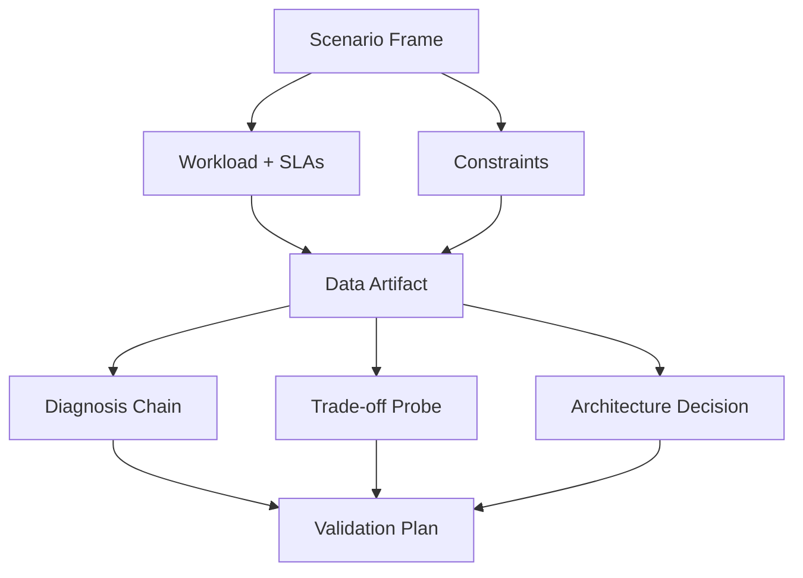

---

### 📶 Gradual Depth

**Level 1 - What it is:** Staff-level JVM interviews present realistic production scenarios where candidates must reason through JVM performance, GC behavior, and architecture decisions - not recite definitions.

**Level 2 - How to use it:** Prepare by practicing scenario decomposition: read a GC log and trace the pause cause, calculate whether a heap size fits within a container limit with headroom, compare two GC algorithms for a described workload shape.

**Level 3 - How it works:** Each scenario tests a specific reasoning axis. GC tuning scenarios test the latency-throughput-footprint triangle. Diagnosis scenarios test backward reasoning from symptoms. Architecture scenarios test the ability to weigh JIT warm-up vs native image start-up, CDS class sharing vs CRaC checkpoint overhead, on-heap caching vs off-heap with serialization cost.

**Level 4 - Production mastery:** The distinguishing factor at staff level is not knowing the answer - it is narrating the decision process. A strong candidate says: "Given the P99 latency SLA of 10ms and the 512MB container limit, ZGC is attractive for pause predictability, but at this heap size G1's pauses are already sub-5ms and ZGC's memory overhead (concurrent mapping structures) consumes a larger fraction of available memory. I would start with G1, measure P99 under production load with JFR, and switch to ZGC only if G1 mixed collections breach the SLA." This demonstrates constraint awareness, measurement-first thinking, and a reversible decision strategy.

---

### ⚙️ How It Works

**Phase 1 - Scenario decomposition.** Read the problem statement. Extract: workload type (request-response, batch, streaming), SLAs (P99 latency, throughput target), resource constraints (container memory, CPU cores), and observed symptoms (if diagnosis scenario).

**Phase 2 - Hypothesis formation.** Based on workload type and symptoms, form 1-2 hypotheses. For GC scenarios: which GC phase is likely causing the symptom? For architecture scenarios: which deployment model satisfies the constraints?

**Phase 3 - Data interpretation.** Read the provided artifact. For GC logs: identify pause types, durations, frequency, heap before/after. For metrics: correlate latency spikes with GC events. For heap histograms: identify dominant object types and potential leaks.

**Phase 4 - Reasoned recommendation.** State the recommendation, what it trades away, and how you would validate. Include a rollback criterion.

```text
Scenario Walkthrough:

  READ problem
    |
    v
  EXTRACT workload, SLAs, constraints
    |
    v
  FORM hypotheses (1-2 candidates)
    |
    v
  INTERPRET data artifact
    |
    +---> confirms hypothesis A
    |     |
    |     v
    |   RECOMMEND + state trade-off
    |     |
    |     v
    |   VALIDATION plan + rollback
    |
    +---> refutes both -> ask for more data
```

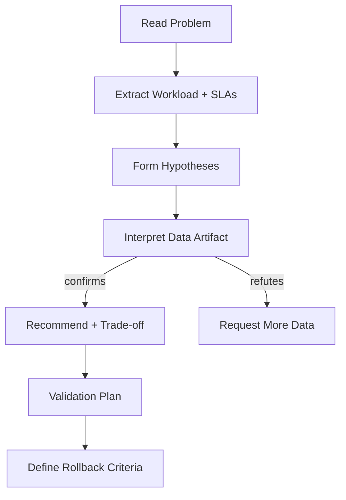

**BAD:**

```text
Q: Service has P99 latency spikes every 30s.
   512MB container, JDK 21, G1GC default.

A: "Switch to ZGC. ZGC has sub-millisecond
   pauses. Problem solved."
```

Why it fails: no data analysis, ignores 512MB constraint where ZGC memory overhead matters, no validation plan, no trade-off stated.

**GOOD:**

```text
Q: Service has P99 latency spikes every 30s.
   512MB container, JDK 21, G1GC default.

A: "30s interval suggests mixed GC cycles.
   I would check GC logs for mixed pause
   duration and old-gen occupancy trigger.
   At 512MB, G1 region size is 1MB (auto).
   If live set exceeds 60% of heap, mixed
   collections will be frequent and slow.
   Options:
   1. Reduce live set (object pooling, cache
      eviction) - addresses root cause.
   2. Tune -XX:G1MixedGCCountTarget to
      spread collection over more cycles.
   3. ZGC - but at 512MB, ZGC concurrent
      structures consume ~15% of heap,
      leaving less for application data.
   I would start with option 2, measure
   P99 with JFR, escalate to option 1 if
   live set is the bottleneck."
```

Why it works: demonstrates backward reasoning from symptom to root cause, evaluates multiple options with constraints, states trade-offs, proposes measurement-first approach.

---

### 🚨 Failure Modes

**Failure 1 - Recitation without reasoning:**

**Symptom:** Candidate describes how G1GC works in textbook detail but cannot apply it to the constrained scenario.

**Root cause:** Knowledge is stored as facts, not as decision frameworks. The candidate learned "what" but not "when" or "why not."

**Diagnostic:**

```text
Interview probe:
"That is how G1 works. Now, given this
specific service has a 256MB heap and 2ms
P99 SLA, would you still choose G1? Why
or why not?"
```

**Fix:** Prepare by practicing scenario-based reasoning. For each GC, know: minimum heap where it is effective, pause behavior at small vs large heaps, CPU overhead, and the specific workload shape where it excels.

**Failure 2 - Single-answer thinking:**

**Symptom:** Candidate gives one recommendation without exploring alternatives or stating what would change the answer.

**Root cause:** Treating JVM decisions as having objectively correct answers rather than context-dependent trade-offs.

**Diagnostic:**

```text
Interview probe:
"What would change your recommendation if
the container limit doubled to 1GB? What
if the SLA relaxed to 50ms P99?"
```

**Fix:** Practice the "change one constraint" exercise. For any recommendation, articulate which constraint change would flip the answer to a different option.

**Failure 3 - Missing validation strategy:**

**Symptom:** Candidate proposes a GC change but cannot describe how to verify it works in production.

**Root cause:** Experience gap between knowing JVM flags and operating JVM services.

**Diagnostic:**

```text
Interview probe:
"How would you roll this change out to
production? What metric would tell you to
roll back?"
```

**Fix:** Every recommendation needs: which metric to watch (P99 latency, allocation rate, GC pause duration), what threshold triggers rollback, and what the canary deployment strategy is.

---

### 🔬 Production Reality

A common interview scenario mirrors a real pattern: a team migrated from JDK 11 to JDK 21 and P99 latency doubled. The candidate receives a partial GC log showing young-gen pauses increased from 5ms to 15ms. The expected staff-level reasoning chain: JDK 21's G1 default region size calculation changed (it factors in `-Xmx` differently), and the default `MaxGCPauseMillis` target interacts with the new region size. The candidate should ask: "What is `-Xmx`?" and "Was region size explicitly set?" Then reason that if region size doubled, each young-gen collection evacuates larger regions, increasing pause time. The fix is either pinning `-XX:G1HeapRegionSize` to the previous value (tactical) or re-tuning the pause target with the new region geometry (strategic). The meta-lesson: JDK upgrades change defaults that affect GC ergonomics, and staff engineers must know which defaults are load-bearing for their services.

---

### ⚖️ Trade-offs & Alternatives

| Aspect            | Scenario Interview | Trivia/Recall Interview | Take-Home Exercise     |
| ----------------- | ------------------ | ----------------------- | ---------------------- |
| Tests reasoning   | Deep               | Shallow                 | Deep (but unproctored) |
| Time cost         | 45-60 min live     | 15-20 min               | 2-4 hours candidate    |
| Interviewer skill | Must be expert     | Any senior engineer     | Grading is subjective  |
| Candidate anxiety | Moderate (coached) | Low                     | Low                    |
| False positive    | Low                | High                    | Medium                 |
| False negative    | Medium (nervous)   | Low                     | Low (time to think)    |

---

### ⚡ Decision Snap

**USE WHEN:**

- Hiring for staff+ roles where JVM infrastructure decisions are part of the job.
- The role involves production GC tuning, JDK migration, or JVM platform ownership.
- You need to distinguish engineers who can reason under constraints from those who recite documentation.

**AVOID WHEN:**

- The role does not involve JVM performance or infrastructure decisions.
- Interviewers lack deep JVM expertise to evaluate scenario responses fairly.

**PREFER take-home exercises WHEN:**

- Candidates perform poorly under live time pressure but the role does not require real-time incident response.
- You want to assess depth of written analysis rather than verbal fluency.

---

### ⚠️ Top Traps

| #   | Misconception                                   | Reality                                                                                                                                                                      |
| --- | ----------------------------------------------- | ---------------------------------------------------------------------------------------------------------------------------------------------------------------------------- |
| 1   | "Knowing all GC algorithms means you will pass" | Staff interviews test application of knowledge to constrained scenarios, not recall of mechanisms.                                                                           |
| 2   | "There is always one correct answer"            | Every scenario has multiple valid approaches. The interviewer evaluates trade-off awareness and reasoning quality, not convergence to a specific answer.                     |
| 3   | "More flags means better tuning"                | Over-tuning with 15 flags signals inexperience. Staff engineers tune 2-3 flags that address measured bottlenecks and leave the rest at defaults.                             |
| 4   | "ZGC/Shenandoah is always the modern answer"    | At small heaps (under 1GB), G1 pauses are already sub-10ms and ultra-low-latency collectors add memory overhead that may hurt more than help. Context determines the answer. |
| 5   | "Skip validation, just deploy the fix"          | Every recommendation without a measurement plan and rollback criterion is incomplete. In interviews and in production.                                                       |

---

### 🪜 Learning Ladder

**Prerequisites:**

- JVM-026 Heap and Stack - understand memory layout before reasoning about GC behavior
- JVM-076 Reading GC Logs Like a Pro - log interpretation is the primary data skill in interview scenarios
- JVM-033 JVM Flags That Actually Matter - know which flags affect which GC behaviors
- JVM-035 Container Memory Limits - container constraints dominate modern JVM scenarios

**THIS:** JVM-112 JVM Staff-Level Interview Scenarios

**Next steps:**

- JVM-107 GraalVM vs HotSpot - architecture decision scenarios comparing runtimes
- JVM-106 Warm-Up Strategies - CDS vs CRaC trade-off is a common interview probe
- JVM-110 Upgrade Governance - understanding migration governance adds organizational context to technical decisions

---

**The Surprising Truth:**

The candidates who perform best in staff-level JVM interviews are not the ones who know the most flags - they are the ones who ask the most clarifying questions. Asking "What is the allocation rate?" or "Is the live set measured?" before proposing a solution demonstrates that the candidate understands JVM performance is context-dependent. The question itself reveals more expertise than the answer.

**Further Reading:**

- [JEP 248: Make G1 the Default Garbage Collector](https://openjdk.org/jeps/248) - the design rationale for G1 as default and the trade-offs it accepts
- [Oracle GC Tuning Guide](https://docs.oracle.com/en/java/javase/21/gctuning/) - authoritative reference for GC flag interactions and ergonomic defaults
- [JEP 333: ZGC - A Scalable Low-Latency Garbage Collector](https://openjdk.org/jeps/333) - design goals and trade-offs that shape ZGC interview scenarios

**Revision Card:**

1. Staff-level JVM interviews test reasoning under constraints, not recall - decompose the scenario, state trade-offs, and propose a validation plan.
2. Every recommendation must include what you sacrifice, what metric confirms success, and what triggers rollback.
3. The strongest signal in a scenario interview is asking the right clarifying question before answering - it proves you know which variables matter.

---

---

# JVM-113 JVM Cost Optimization - Right-Sizing Heaps

**TL;DR** - Most JVM services over-allocate heap by 2-4x. Systematic right-sizing using live-set analysis, GC-specific headroom factors, and container alignment saves 30-60% of fleet memory cost without degrading performance.

---

### 🔥 Problem Statement

An organization runs 300 JVM microservices on Kubernetes. Each service requests 2GB container memory with `-Xmx1536m` because "that is what the template says." Monitoring reveals that 70% of services have a live data set under 200MB - their heaps are 7x larger than necessary. The excess memory sits allocated but unused, burning cloud compute budget. At $0.05/GB-hour, 300 services each wasting 1GB costs roughly $130,000/year. Multiply by regions and environments (staging, DR), and fleet memory waste becomes a line item visible on the CTO's budget. Yet reducing heap sizes without measurement risks OutOfMemoryErrors, increased GC frequency, and latency regressions. The problem is not that heaps are large - it is that nobody measured what they should be. Without a systematic right-sizing methodology, organizations choose between wasting money (over-provisioning) and risking stability (under-provisioning).

---

### 📜 Historical Context

In the pre-container era, JVM heap sizes were set once during deployment to physical or virtual machines with generous RAM. Over-allocation was cheap because dedicated servers had fixed cost regardless of memory utilization. Containerization changed the economics: Kubernetes resource requests directly determine scheduling density and cloud cost. A pod requesting 2GB prevents another pod from using that memory, even if the JVM only needs 500MB. The JVM's own container awareness improvements (JDK 10+ cgroup support via `-XX:+UseContainerSupport`) made heap sizing relative to container limits practical. Cloud FinOps practices, emerging around 2019-2020, brought memory efficiency into engineering KPIs. JVM right-sizing became a concrete cost optimization lever.

---

### 🔩 First Principles

**CORE INVARIANTS:**

1. The minimum viable heap equals the live data set (long-lived objects that survive major GC) plus headroom for GC to operate efficiently. Below this, GC frequency and pause duration increase non-linearly.
2. Headroom requirements vary by collector: G1 needs 1.5-2x live set, ZGC needs 2-3x (concurrent mapping structures), Parallel GC needs 2-3x (compaction space).
3. Container memory limit must exceed JVM heap by a margin for metaspace, thread stacks, native memory, and kernel buffers - typically 20-30% above `-Xmx`.
4. Right-sizing is iterative, not one-shot. Live data sets change with feature releases, traffic patterns, and seasonal load. Re-measurement must be scheduled.

**DERIVED DESIGN:**

Invariant 1 means you must measure live set before choosing heap size - guessing guarantees waste or instability. Invariant 2 means the right-sizing formula depends on which GC you use - there is no universal multiplier. Invariant 3 means container limits and JVM heap cannot be set independently - they form a coupled constraint. Invariant 4 means right-sizing is a continuous practice, not a project.

**THE TRADE-OFF:**

**Gain:** Reduced cloud cost (30-60% memory savings typical), higher scheduling density (more pods per node), faster GC cycles on right-sized heaps.

**Cost:** Measurement effort per service, risk of under-sizing if load profiles change, ongoing re-measurement overhead, coordination with service teams.

---

### 🧠 Mental Model

> Right-sizing a JVM heap is like fitting a suitcase. The live data set is your clothes. The headroom is the space you need to rearrange things (GC compaction). If the suitcase is 4x the size of your clothes, you are paying for overhead on every flight. If it is exactly the size of your clothes with no room to rearrange, you cannot repack after adding a souvenir.

- "Clothes" -> live data set (long-lived objects)
- "Rearranging space" -> GC headroom for compaction and concurrent work
- "Suitcase size" -> `-Xmx` heap limit
- "Flight cost" -> container memory request cost

**Where this analogy breaks down:** Clothes have a fixed size. Live data sets fluctuate with load, feature changes, and cache behavior. The suitcase must accommodate the peak, not the average.

---

### 🧩 Components

- **Live-set measurement:** Capturing the size of objects surviving a full GC (old-gen occupancy after a major collection). Primary data source for right-sizing.
- **GC log analysis:** Extracting heap-before-GC, heap-after-GC, and pause metrics from GC logs to understand allocation rate and live-set trends.
- **Headroom formula:** `target_Xmx = live_set * headroom_factor` where headroom_factor depends on GC algorithm.
- **Container limit alignment:** `container_memory = Xmx + metaspace + thread_stacks + native_overhead`. Typical: `Xmx * 1.25` to `Xmx * 1.3`.
- **Fleet scanner:** Automation that runs live-set analysis across all services and identifies over-provisioned instances.
- **Validation pipeline:** Canary deployment with reduced heap, monitoring for GC frequency increase, latency regression, and OOM events.

```text
Right-Sizing Pipeline:

  Measure Live Set (GC logs / jcmd)
    |
    v
  Apply Headroom Factor (GC-specific)
    |
    v
  Compute target -Xmx
    |
    v
  Align Container Limit (+25-30%)
    |
    v
  Canary Deploy (reduced heap)
    |
    v
  Monitor (GC freq, P99, OOM)
    |
    +---> OK -> Fleet Rollout
    +---> Regress -> Adjust Headroom
```

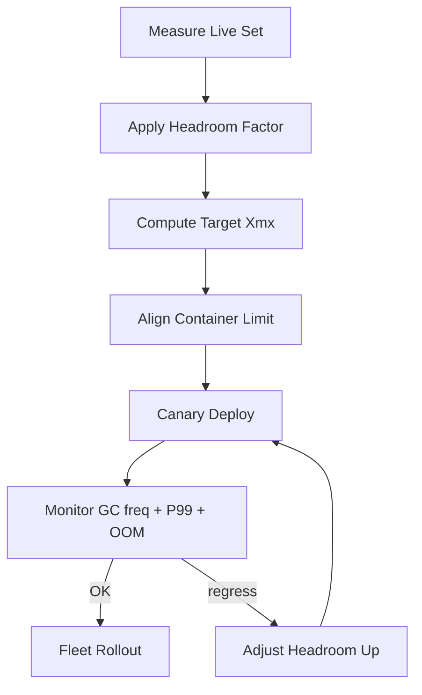

---

### 📶 Gradual Depth

**Level 1 - What it is:** Heap right-sizing means measuring how much memory your JVM service actually uses and setting `-Xmx` to match that measurement plus a safety margin, rather than using an arbitrary large value.

**Level 2 - How to use it:** Trigger a full GC (`jcmd <pid> GC.run`) during steady-state traffic, then check old-gen occupancy in GC logs or via `jcmd <pid> GC.heap_info`. Multiply the live set by 2x for G1 or 2.5x for ZGC to get your target `-Xmx`. Set container memory to 1.25x that value.

**Level 3 - How it works:** After a full GC, the remaining heap occupancy represents long-lived objects - your live data set. This includes caches, connection pools, session state, and framework metadata. The headroom factor accounts for young-gen allocation space, GC working memory (remembered sets for G1, colored pointers for ZGC), and burst allocation during request processing. The headroom factor varies because each collector uses memory differently: G1 needs remembered-set space proportional to region count, ZGC needs concurrent mapping structures that scale with heap size.

**Level 4 - Production mastery:** Fleet-wide right-sizing requires automation. Build a pipeline that: (1) collects GC logs from all services over a representative period (at least one business cycle), (2) extracts peak live set per service, (3) applies the GC-specific headroom formula, (4) generates recommended `-Xmx` and container limit per service, (5) creates pull requests with the changes, (6) canary-deploys with monitoring gates. Track savings as a fleet KPI: total memory requested vs total memory needed. Re-run quarterly or after major feature launches.

---

### ⚙️ How It Works

**Phase 1 - Measure live set.** During steady-state production traffic, trigger a full GC or wait for a naturally occurring old-gen collection. Record heap occupancy immediately after the collection completes - this is the live data set.

**Phase 2 - Apply headroom formula.** Multiply live set by the GC-specific headroom factor:

| GC         | Headroom Factor | Reasoning                         |
| ---------- | --------------- | --------------------------------- |
| G1         | 1.5-2.0x        | Remembered sets + region overhead |
| ZGC        | 2.0-3.0x        | Concurrent structures + multimap  |
| Parallel   | 2.0-3.0x        | Compaction requires copy space    |
| Shenandoah | 2.0-2.5x        | Forwarding pointers + brooks ptrs |

**Phase 3 - Align container limits.** Add non-heap JVM memory: metaspace (typically 64-128MB), thread stacks (1MB per thread, count your threads), direct byte buffers, JIT codecache (typically 48-240MB). Rule of thumb: container limit = `Xmx * 1.25` to `Xmx * 1.30`, adjusted upward for services with many threads or large metaspace.

**Phase 4 - Validate and roll out.** Deploy the new configuration to a canary instance. Monitor for 24-48 hours across traffic peaks.

```text
Measurement Example:

  Before full GC:  heap = 1400MB / 1536MB
  After full GC:   heap =  180MB / 1536MB
                            ^^^
                    live set = 180MB

  G1 headroom: 180MB * 2.0 = 360MB -> -Xmx384m
  Container:   384MB * 1.25 = 480MB -> 512Mi

  Savings per pod: 1536MB -> 384MB = 1152MB
  300 pods: 300 * 1152MB = 337 GB freed
```

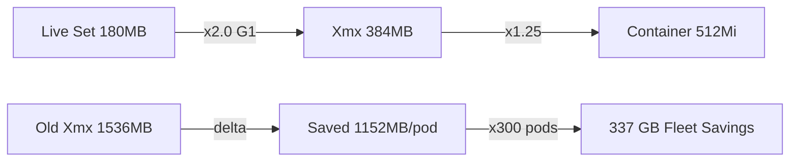

**BAD:**

```bash
# Guess-based heap sizing
java -Xmx2g -jar service.jar
# "2GB should be enough for anything"
```

Why it fails: no measurement, likely 3-4x over-provisioned, wastes cloud budget at fleet scale.

**GOOD:**

```bash
# Measurement-based heap sizing
# Step 1: Measure live set
jcmd $(pgrep java) GC.run
sleep 5
jcmd $(pgrep java) GC.heap_info
# Output: old gen used = 180MB

# Step 2: Apply formula (G1, 2x headroom)
# target Xmx = 180 * 2.0 = 360 -> round to 384
java -Xmx384m -jar service.jar
```

Why it works: heap sized from measured data, headroom factor matches GC algorithm, leaves room for burst allocation without excess waste.

---

### 🚨 Failure Modes

**Failure 1 - Under-sizing from peak-blind measurement:**

**Symptom:** Service runs fine for hours, then OOMs during the daily traffic peak or batch import.

**Root cause:** Live set was measured during off-peak traffic. Peak traffic creates 2-3x more in-flight objects, cache entries, or connection state.

**Diagnostic:**

```bash
# Check GC logs for heap occupancy trend
# Look for old-gen occupancy climbing toward max
grep "Pause Full" gc.log | tail -20
# Check OOM killer in container
kubectl describe pod <name> | grep -i oom
dmesg | grep -i "out of memory"
```

**Fix:** Measure live set during peak traffic, not average. Use the maximum live set observed across a full business cycle (daily, weekly) as the baseline. Add 20% peak buffer above the headroom formula.

**Failure 2 - Ignoring non-heap memory:**

**Symptom:** Container is OOM-killed even though JVM heap is well within `-Xmx`. JVM process RSS exceeds container memory limit.

**Root cause:** Container limit was set equal to `-Xmx`, ignoring metaspace, thread stacks, direct byte buffers, JIT codecache, and native allocations. Total JVM RSS = heap + non-heap.

**Diagnostic:**

```bash
# Compare JVM RSS to heap
jcmd $(pgrep java) VM.native_memory summary
# Check container memory usage
cat /sys/fs/cgroup/memory/memory.usage_in_bytes
cat /sys/fs/cgroup/memory/memory.limit_in_bytes
```

**Fix:** Always set container limit = `-Xmx` + measured non-heap. Use `VM.native_memory` to measure actual non-heap usage. Typical formula: container = `Xmx * 1.25` for standard services, `Xmx * 1.40` for services with many threads (>200) or large Netty direct buffers.

**Failure 3 - One-shot right-sizing without re-measurement:**

**Symptom:** Right-sized service runs stable for 6 months, then starts frequent full GCs after a feature release that added a large in-memory cache.

**Root cause:** Live set grew with the new feature, but heap was never re-measured. The headroom that was sufficient became insufficient.

**Diagnostic:**

```bash
# Compare current live set to original baseline
jcmd $(pgrep java) GC.run
jcmd $(pgrep java) GC.heap_info
# If old-gen used after full GC > original live set
# by more than 30%, re-measure is overdue
```

**Fix:** Schedule quarterly re-measurement. Alert when post-full-GC occupancy exceeds 60% of `-Xmx` - this signals the headroom margin is shrinking.

---

### 🔬 Production Reality

A typical fleet right-sizing effort follows this pattern: an infrastructure team analyzes GC logs across 200 services and finds that the median service has a live set of 150MB but runs with `-Xmx1536m` (10x headroom). The team generates recommendations: reduce most services to `-Xmx384m` (G1, 2x headroom with buffer) and container limits from 2GB to 512MB. The first canary batch (20 services) deploys without issue. The second batch hits a problem: three services OOM during the morning traffic ramp. Investigation reveals these services use large Ehcache instances whose sizes were configured in MB, not objects - the cache grew to 400MB at peak, making the true live set 550MB rather than the 150MB measured at midnight. The lesson: live-set measurement must happen at peak load, and in-memory caches must be inventoried separately because their size is configuration-driven, not traffic-driven. After adjusting those three services upward, the remaining rollout completes. Fleet-wide savings: 40% reduction in total memory requests, improving node utilization from 55% to 78%.

---

### ⚖️ Trade-offs & Alternatives

| Aspect              | Manual Right-Sizing | Automated Right-Sizing   | Vertical Pod Autoscaler |
| ------------------- | ------------------- | ------------------------ | ----------------------- |
| Accuracy            | High (per-service)  | High (fleet-wide)        | Medium (reactive)       |
| Effort              | High (manual)       | Medium (build pipeline)  | Low (deploy and forget) |
| Risk of OOM         | Low (conservative)  | Low (canary pipeline)    | Medium (lag in scaling) |
| Cost savings        | 20-40%              | 30-60%                   | 20-40%                  |
| Handles load spikes | If measured at peak | If peak in sample period | Yes (reactive scaling)  |
| Re-measurement      | Manual trigger      | Scheduled automation     | Continuous              |

---

### ⚡ Decision Snap

**USE WHEN:**

- Cloud memory costs are a material budget line item.
- Fleet runs 50+ JVM services with uniform "default" heap sizes.
- Live-set measurement infrastructure (GC logs, `jcmd` access) is available.

**AVOID WHEN:**

- Services have highly variable load with unpredictable memory spikes (prefer vertical autoscaler).
- Organization lacks monitoring maturity to detect OOMs quickly.

**PREFER Vertical Pod Autoscaler WHEN:**

- Service memory profiles change frequently and manual re-measurement cannot keep pace.
- The team values hands-off automation over precision control.

---

### ⚠️ Top Traps

| #   | Misconception                          | Reality                                                                                                                                                                                         |
| --- | -------------------------------------- | ----------------------------------------------------------------------------------------------------------------------------------------------------------------------------------------------- |
| 1   | "Heap = total JVM memory"              | JVM RSS includes metaspace, thread stacks, direct buffers, codecache, and native allocations. Container limits must account for all of these, not just `-Xmx`.                                  |
| 2   | "Measure once, right-size forever"     | Live sets change with features, traffic patterns, and cache configurations. Quarterly re-measurement prevents drift into under-provisioning.                                                    |
| 3   | "2x headroom works for every GC"       | ZGC concurrent structures need 2-3x. G1 with large remembered sets may need more than 2x. Headroom factor is GC-specific and workload-specific.                                                 |
| 4   | "Off-peak measurement is good enough"  | Peak live set can be 2-3x off-peak. Always measure during the highest-traffic period of a full business cycle.                                                                                  |
| 5   | "Right-sizing is just reducing `-Xmx`" | It is a coupled optimization: `-Xmx`, container limit, GC algorithm, and GC tuning parameters must all be aligned. Reducing heap without adjusting GC pause targets causes latency regressions. |

---

### 🪜 Learning Ladder

**Prerequisites:**

- JVM-026 Heap and Stack - understand heap structure before measuring it
- JVM-076 Reading GC Logs Like a Pro - GC logs are the primary live-set measurement source
- JVM-035 Container Memory Limits - container and JVM memory form a coupled constraint
- JVM-105 Flag Baseline - right-sized heaps must integrate with the fleet flag standard

**THIS:** JVM-113 JVM Cost Optimization - Right-Sizing Heaps

**Next steps:**

- JVM-102 Fleet Standardization - right-sizing fits within fleet governance as a continuous practice
- JVM-108 Observability Platform - fleet-wide live-set dashboards enable automated re-measurement
- JVM-048 JIT Compilation Tiers - codecache sizing is part of the non-heap budget that right-sizing must account for

---

**The Surprising Truth:**

The biggest savings from heap right-sizing often come not from the memory reduction itself but from the second-order effect: smaller heaps produce shorter GC pauses, which improve P99 latency, which reduces the need for over-provisioned replica counts to meet SLAs. Organizations that right-size heaps frequently discover they can also reduce pod replica counts by 10-20% because individual pods perform better with tighter, well-measured heaps.

**Further Reading:**

- [Oracle GC Tuning Guide - Sizing the Generations](https://docs.oracle.com/en/java/javase/21/gctuning/sizing-generations.html) - official guidance on heap region sizing and generation proportions
- [JEP 346: Promptly Return Unused Committed Memory from G1](https://openjdk.org/jeps/346) - G1 improvement enabling right-sized heaps to return memory to the OS
- [Kubernetes Vertical Pod Autoscaler](https://github.com/kubernetes/autoscaler/tree/master/vertical-pod-autoscaler) - the automated alternative to manual right-sizing for dynamic workloads

**Revision Card:**

1. Right-size formula: live set (measured at peak via GC logs) times GC-specific headroom factor (G1: 2x, ZGC: 2.5x) - never guess.
2. Container limit must exceed `-Xmx` by 25-30% for metaspace, thread stacks, direct buffers, and native allocations.
3. Measure at peak traffic, not off-peak - and re-measure quarterly, because live sets drift with feature changes and cache reconfigurations.

---

---

# JVM-114 Build a JVM Dashboard - Phase 4 (Platform)

**TL;DR** - A platform-level JVM dashboard aggregates fleet-wide GC, heap, and JIT metrics across all services - replacing per-service guesswork with cross-fleet anomaly detection and capacity-aware alerting.

---

### 🔥 Problem Statement

An organization runs 120 JVM services with per-service Grafana dashboards. Each team built their own panels, queried different metrics, and set different alert thresholds. When a JDK 21 upgrade changes G1's concurrent marking behavior, three services start showing elevated P99 latency. Team A catches it because they graph GC pause distributions. Team B misses it because they only track heap usage. Team C has no JVM dashboard at all. The platform team gets paged for a fleet-wide latency regression but has no single view showing GC pause trends across services - they open 30 dashboards manually and compare by eye. A rogue flag override on one service doubles its memory footprint, but nobody notices because no fleet-level anomaly detection exists. The cost accounting team asks which services are over-provisioned and the only answer is "we would have to check each one." Without a platform-level dashboard, every JVM insight is trapped inside individual service silos - invisible to the people who need fleet-wide visibility to make infrastructure decisions.

---

### 📜 Historical Context

Early JVM monitoring meant JConsole or VisualVM connecting to a single process. When microservices exploded, teams adopted Prometheus JMX exporters and built per-service dashboards. The missing layer was aggregation: seeing one service's GC behavior is useful, seeing all services' GC behavior together reveals fleet-level patterns. OpenTelemetry's JVM semantic conventions (stabilized progressively from 2023 onward) standardized metric names, making cross-service aggregation viable without custom relabeling. Prometheus, Mimir, and Grafana became the de facto observability stack. The concept of "golden signals plus JVM-specific panels" emerged from Google's SRE practices adapted to JVM fleets.

---

### 🔩 First Principles

**CORE INVARIANTS:**

1. A platform dashboard must answer fleet-level questions that no single service dashboard can answer - comparison, ranking, anomaly detection across services.
2. JVM metrics are high-cardinality by nature (per-service, per-GC-cause, per-memory-pool) - the dashboard must aggregate without drowning in dimensions.
3. Alerts must distinguish between service-level anomalies (one service misbehaving) and fleet-level anomalies (systemic pattern after JDK upgrade, config drift).
4. The dashboard is only as good as the metric pipeline feeding it - inconsistent metric names or missing labels make aggregation impossible.

**DERIVED DESIGN:**

Invariant 1 forces the dashboard to be structurally different from service dashboards: fleet-wide heatmaps, percentile distributions across services, top-N panels. Invariant 2 requires careful label selection - service name and GC cause are essential dimensions, but individual GC event IDs are not. Invariant 3 demands two alert tiers: per-service thresholds and fleet-wide statistical anomaly rules. Invariant 4 makes standardized metric collection (via OTel Java agent or Micrometer with consistent naming) a prerequisite, not an afterthought.

**THE TRADE-OFF:**

**Gain:** Fleet-wide visibility for capacity planning, upgrade impact assessment, cost optimization, and cross-service anomaly detection.

**Cost:** Additional metric volume (cardinality cost in Prometheus/Mimir), platform team maintenance burden, risk of alert fatigue if thresholds are poorly tuned.

---

### 🧠 Mental Model

> A platform JVM dashboard is like an air traffic control radar. Each pilot has their own instruments (service dashboard), but the tower sees all aircraft simultaneously - detecting conflicts, congestion patterns, and systemic weather that no single pilot can see alone.

- "Radar screen" -> fleet-wide Grafana dashboard with heatmaps and top-N panels
- "Aircraft transponder" -> OTel Java agent emitting standardized JVM metrics
- "Flight conflict detection" -> fleet anomaly alerts (e.g., multiple services degrading after a config change)
- "Weather radar overlay" -> JDK upgrade or flag change annotations correlated with metric shifts

**Where this analogy breaks down:** Aircraft have uniform instrumentation. JVM services vary in heap size, GC choice, and allocation patterns - the dashboard must normalize for meaningful comparison (e.g., percentage of heap used, not absolute bytes).

---

### 🧩 Components

- **Metric collection layer:** OTel Java agent or Micrometer registry exporting to Prometheus/Mimir. Standardized metric names following OTel JVM semantic conventions.
- **Label taxonomy:** Service name, namespace, JDK version, GC algorithm, memory pool name. These are the dimensions for fleet-level queries.
- **Golden signals row:** Request rate, error rate, latency P50/P99 - the non-JVM context that gives GC metrics meaning.
- **GC health panels:** Pause duration heatmap across services, pause frequency distribution, concurrent vs stop-the-world ratio.
- **Heap and memory panels:** Heap utilization percentage per service, metaspace growth trends, direct buffer usage.
- **JIT compilation panel:** Compilation time per service, deoptimization events, code cache utilization.
- **Alert rules:** Per-service threshold alerts (heap > 85%, GC pause > 500ms) and fleet-level anomaly alerts (median fleet GC pause increased 2x after upgrade).
- **Annotation layer:** Deployment events, JDK upgrades, and flag changes overlaid on metric timelines.

```text
Platform JVM Dashboard Architecture:

  Services (120+)
  +---+  +---+  +---+
  |OTl|  |OTl|  |OTl|  <- OTel Java Agent
  +---+  +---+  +---+
    |      |      |
    v      v      v
  OTel Collector (relabeling, filtering)
           |
           v
  Prometheus / Mimir (long-term storage)
           |
           v
  Grafana Platform Dashboard
  +------+-------+-------+--------+
  |Golden| GC    | Heap  | JIT    |
  |Signal| Health| Memory| Compile|
  +------+-------+-------+--------+
  |  Fleet Anomaly Alerts          |
  |  Annotation Layer (deploys)    |
  +--------------------------------+
```

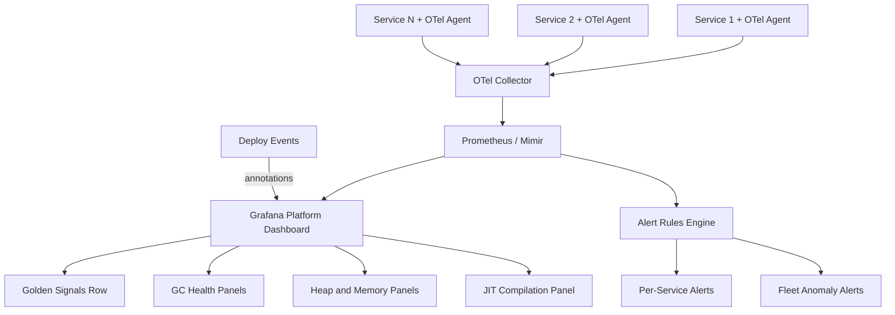

---

### 📶 Gradual Depth

**Level 1 - What it is:** A platform JVM dashboard shows GC, heap, and JIT metrics for all services in one view. Unlike per-service dashboards, it enables comparison, ranking, and fleet-wide anomaly detection.

**Level 2 - How to use it:** Deploy the OTel Java agent across all services with consistent configuration. Point the OTel collector at Prometheus or Mimir. Build Grafana panels organized into golden signals, GC health, heap utilization, and JIT compilation rows. Add alert rules for both per-service thresholds and fleet-wide anomalies.

**Level 3 - How it works:** The OTel Java agent exposes JVM metrics using standardized names (`jvm.gc.duration`, `jvm.memory.used`, `jvm.compilation.time`). The collector adds service identity labels and forwards to Mimir for durable storage. Grafana queries use PromQL aggregations: `histogram_quantile(0.99, sum by (service) (rate(jvm_gc_duration_seconds_bucket[5m])))` gives P99 GC pause per service. Fleet-level views use `avg without (service)` or heatmap visualizations grouping by service.

**Level 4 - Production mastery:** The hard problems are cardinality management and alert tuning. Each service multiplied by each GC cause multiplied by each memory pool creates high cardinality - use recording rules to pre-aggregate common queries. Alert tuning requires distinguishing normal variance (heap usage cycles with traffic) from real anomalies (heap trending upward across weeks). Use Grafana's annotation API to overlay deployment events, so you can visually correlate "GC pause jumped" with "deployed JDK 21.0.3." Mature dashboards include a cost attribution panel showing estimated compute waste from over-provisioned heaps.

---

### ⚙️ How It Works

**Phase 1 - Instrument.** Attach the OTel Java agent (or configure Micrometer) on every service. Ensure consistent metric names and labels. The critical labels are: `service.name`, `service.namespace`, `jvm.gc.collector` (G1/ZGC/Parallel), `jvm.memory.pool.name`.

**Phase 2 - Collect and store.** The OTel collector receives metrics, applies relabeling (drop high-cardinality labels like `thread.name`), and writes to Prometheus or Mimir. Configure retention for at least 30 days to capture monthly traffic patterns and pre/post-upgrade comparisons.

**Phase 3 - Build dashboard panels.** Organize into four rows: golden signals (non-JVM context), GC health (pause heatmap, frequency, concurrent ratio), heap/memory (utilization percentage, metaspace trend), JIT (compilation time, deopts). Each panel uses `by (service)` grouping and includes a "top-N worst" variant.

**Phase 4 - Alert.** Per-service alerts trigger on absolute thresholds (GC pause P99 > 500ms for 5 minutes). Fleet alerts trigger on statistical anomalies (fleet median GC pause increased > 2x from baseline). Both require runbook links.

```text
Dashboard Build Phases:

  Instrument --> Collect --> Build --> Alert
     |             |          |         |
  OTel agent   Collector   Grafana   Rules
  on service   relabel +   4 rows    per-svc
  + labels     Mimir       + top-N   + fleet
```

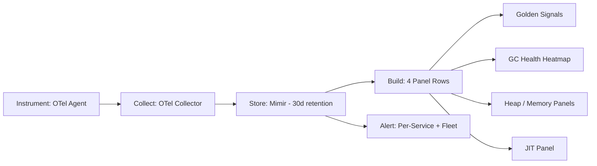

**BAD:**

```yaml
# Alert on absolute heap bytes - meaningless
# across services with different Xmx
groups:
  - name: jvm-heap
    rules:
      - alert: HighHeapUsage
        expr: jvm_memory_used_bytes > 4e9
        for: 5m
```

Why it fails: a 2GB-heap service never fires, a 6GB service fires constantly. Absolute bytes ignore heap sizing differences.

**GOOD:**

```yaml
# Alert on heap utilization percentage -
# comparable across all services
groups:
  - name: jvm-heap
    rules:
      - alert: HighHeapUtilization
        expr: >
          jvm_memory_used_bytes
          / jvm_memory_limit_bytes > 0.85
        for: 10m
        labels:
          severity: warning
        annotations:
          summary: >
            {{ $labels.service_name }}
            heap at {{ $value | humanizePercentage }}
```

Why it works: percentage normalizes across heap sizes, making the alert meaningful for every service in the fleet.

---

### 🚨 Failure Modes

**Failure 1 - Cardinality explosion:**

**Symptom:** Prometheus/Mimir ingestion rate spikes, queries time out, Grafana panels return "query exceeded maximum samples."

**Root cause:** JVM metrics include high-cardinality labels (individual thread names, per-allocation-site tags from custom instrumentation). Each unique label combination creates a new time series.

**Diagnostic:**

```promql
# Find highest-cardinality metric families
topk(10,
  count by (__name__) ({__name__=~"jvm.*"})
)
# Check per-service series count
count by (service_name) ({__name__=~"jvm.*"})
```

**Fix:** Drop high-cardinality labels at the OTel collector before they reach storage. Use `filter` or `transform` processors to remove `thread.name`, `code.function`, or custom tags that are not needed for fleet-level views. Create recording rules for frequently queried aggregations.

**Failure 2 - Alert fatigue from noisy GC alerts:**

**Symptom:** On-call engineers receive 50+ GC pause alerts daily, start ignoring them. A real memory leak goes unnoticed among the noise.

**Root cause:** Per-service GC pause threshold set too low (100ms) without accounting for normal young-gen collection pauses in G1. Every minor collection triggers the alert during traffic spikes.

**Diagnostic:**

```promql
# Check alert firing frequency per service
count_over_time(
  ALERTS{alertname="HighGCPause"}[7d]
) by (service_name)
# Verify: are these young-gen or mixed/full?
rate(jvm_gc_duration_seconds_count{
  gc="G1 Old Generation"}[5m])
```

**Fix:** Differentiate alert thresholds by GC phase. Young-gen pauses under 200ms are normal for G1 - alert only on old-gen or mixed collection pauses exceeding the threshold. Alternatively, alert on P99 over a window (5 minutes) rather than individual events.

**Failure 3 - Missing JDK version correlation:**

**Symptom:** Fleet GC pause P99 increases 40% but nobody connects it to a JDK patch upgrade rolled out the same day. Debugging takes days.

**Root cause:** The dashboard lacks deployment/upgrade annotations. Metric changes cannot be visually correlated with infrastructure events.

**Diagnostic:**

```bash
# Check when JDK version changed per service
kubectl get pods -A -o json | jq -r '
  .items[] |
  "\(.metadata.namespace)/\(.metadata.name)
   \(.spec.containers[0].image)"' |
  grep jdk | sort
```

**Fix:** Push deployment events and JDK version changes to Grafana's annotation API. Include the annotation query on every dashboard row so that any metric shift can be correlated with infrastructure changes at a glance.

---

### 🔬 Production Reality

A platform team deployed a fleet JVM dashboard across 90 services and immediately discovered that 12 services were running with default `-Xmx256m` in containers allocated 2GB of memory - the JVM used 256MB of heap while the OS reported 1.8GB free, but Kubernetes saw 90% memory utilization from RSS (metaspace, thread stacks, native allocations filling the gap). The per-service dashboards never revealed this because each team only saw their own service and assumed "heap is fine." The fleet-level view ranked all services by heap utilization percentage and the 12 services clustered at the bottom with 12% heap utilization but 90% container memory usage - an unmistakable pattern visible only at fleet scale. The fix (setting `-Xmx` proportional to container limits) saved the organization roughly 30% in compute cost for those services. The lesson: fleet-level ranking panels reveal patterns that are invisible at the single-service level because they expose outliers in context.

---

### ⚖️ Trade-offs & Alternatives

| Aspect              | Platform Dashboard (Grafana + Mimir) | APM Vendor (Datadog, New Relic) | Per-Service Dashboards Only |
| ------------------- | ------------------------------------ | ------------------------------- | --------------------------- |
| Fleet-level view    | Custom-built, full control           | Built-in fleet views            | None - manual comparison    |
| JVM metric depth    | Deep (any JMX/OTel metric)           | Vendor-curated subset           | Deep per service            |
| Cardinality control | Manual (recording rules, relabel)    | Vendor-managed (limits apply)   | N/A                         |
| Cost                | Infrastructure + engineering time    | Per-host license fee            | Low (per-team effort)       |
| Customization       | Unlimited (PromQL, Grafana panels)   | Constrained to vendor UI        | Per-team, inconsistent      |
| Maintenance         | Platform team owns pipeline          | Vendor maintains                | Each team maintains own     |

---

### ⚡ Decision Snap

**USE WHEN:**

- Organization has 20+ JVM services and needs fleet-level visibility for capacity planning or upgrade impact assessment.
- Teams already use Prometheus/Grafana and need a unified JVM layer on top.
- Cost optimization requires ranking services by resource efficiency.

**AVOID WHEN:**

- Fewer than 10 services and one team - per-service dashboards suffice.
- Organization has an APM vendor with adequate built-in JVM fleet views.

**PREFER APM Vendor WHEN:**

- Engineering time is scarcer than license budget.
- The vendor's built-in JVM views meet fleet-level requirements without customization.

---

### ⚠️ Top Traps

| #   | Misconception                                      | Reality                                                                                                                                                   |
| --- | -------------------------------------------------- | --------------------------------------------------------------------------------------------------------------------------------------------------------- |
| 1   | "Collect every JVM metric available"               | High-cardinality metrics overwhelm storage and slow queries. Collect the 15-20 metrics that answer fleet-level questions, drop the rest at the collector. |
| 2   | "Absolute thresholds work across services"         | A 500ms GC pause alert is meaningless without knowing if the service uses G1 (expected) or ZGC (alarming). Thresholds must be GC-algorithm-aware.         |
| 3   | "One dashboard fits all audiences"                 | Platform engineers need fleet heatmaps, service owners need drill-down panels, managers need cost attribution. Build tiered views, not one monolith.      |
| 4   | "The dashboard replaces per-service monitoring"    | Fleet dashboards detect patterns and outliers. Diagnosis still requires per-service drill-down. The platform dashboard is triage, not treatment.          |
| 5   | "Build the dashboard before standardizing metrics" | If services emit different metric names or labels, aggregation queries return garbage. Standardize collection (OTel agent config) before building panels. |

---

### 🪜 Learning Ladder

**Prerequisites:**

- JVM-076 Reading GC Logs Like a Pro - understand what GC metrics mean before visualizing them fleet-wide
- JVM-033 JVM Flags That Actually Matter - know which flags affect the metrics the dashboard displays
- JVM-108 JVM Observability Platform Design - the underlying metric pipeline this dashboard consumes

**THIS:** JVM-114 Build a JVM Dashboard - Phase 4 (Platform)

**Next steps:**

- JVM-113 JVM Cost Optimization - Right-Sizing Heaps - use fleet-level utilization data to right-size heaps
- JVM-102 JVM Fleet Standardization Strategy - the governance framework that makes fleet-level metrics comparable
- JVM-105 Build Your Own JVM Flag Baseline - the flag consistency that ensures metrics are interpretable across services

---

**The Surprising Truth:**

The most valuable panel on a platform JVM dashboard is not GC pause time or heap utilization - it is the ranking panel that sorts services by a derived "JVM efficiency score" (heap utilization divided by container memory allocation). This single panel has uncovered more cost savings and misconfigurations than all threshold alerts combined, because it surfaces relative outliers that absolute thresholds miss entirely.

**Further Reading:**

- [OpenTelemetry JVM Metrics Semantic Conventions](https://opentelemetry.io/docs/specs/semconv/runtime/jvm-metrics/) - the standardized metric names that make cross-service aggregation possible
- [Grafana documentation on Heatmap panels](https://grafana.com/docs/grafana/latest/panels-visualizations/visualizations/heatmap/) - the visualization type best suited for fleet-wide GC pause distribution
- [Google SRE Book - Monitoring Distributed Systems (Chapter 6)](https://sre.google/sre-book/monitoring-distributed-systems/) - the golden signals framework adapted here for JVM fleet monitoring

**Revision Card:**

1. A platform dashboard answers fleet-level questions no single service dashboard can - comparison, ranking, anomaly detection across services.
2. Normalize metrics (percentage, not absolute bytes) so alerts and panels are meaningful across services with different heap sizes and GC algorithms.
3. Standardize metric collection (OTel agent + consistent labels) before building panels - aggregation over inconsistent metric names produces noise, not insight.

---

---

# JVM-115 Writing a JVM RFC for Your Organization

**TL;DR** - A JVM RFC formalizes high-impact runtime changes - GC switch, JDK upgrade, new flag baseline - with evidence, risk assessment, rollback plan, and stakeholder approval before fleet-wide rollout.

---

### 🔥 Problem Statement

A senior engineer on the platform team discovers that switching from G1GC to ZGC would eliminate P99 latency spikes on the payment service. They make the change in production on a Friday, reasoning that ZGC's sub-millisecond pauses are strictly better. Monday morning: the batch reporting service sharing the same flag baseline now uses 40% more memory (ZGC's concurrent operation needs more headroom), the cost team flags a compute budget spike, and the SRE team was never informed of the change. When the engineer goes on vacation, nobody knows why the flag baseline changed, what the expected trade-offs were, or how to revert safely. The root problem is not technical competence - it is that consequential JVM decisions were made informally, undocumented, unreviewed, and without explicit stakeholder buy-in. An RFC process exists to make high-impact JVM changes deliberate, evidence-based, reviewable, and reversible.

---

### 📜 Historical Context

The RFC (Request for Comments) tradition originates from the IETF's internet standards process (RFC 1, 1969). In software organizations, design documents and RFCs became standard practice at companies like Google (design docs), Uber (RFCs), and Spotify (decision records). Applying RFCs to JVM infrastructure decisions is a natural extension: JDK upgrades, GC changes, and flag baselines affect the entire fleet and cross team boundaries - exactly the category of change that informal Slack conversations handle poorly. The Architecture Decision Record (ADR) format provides a lighter-weight alternative for smaller decisions.

---

### 🔩 First Principles

**CORE INVARIANTS:**

1. Any JVM change affecting more than one service requires documented evidence, explicit trade-offs, and stakeholder review before rollout.
2. The RFC must contain enough information for someone unfamiliar with the change to understand the rationale, assess the risk, and execute a rollback independently.
3. The review process must be bounded in time - an RFC that sits in review for months is equivalent to no RFC (it blocks progress or gets bypassed).
4. Evidence must precede opinion - before/after benchmarks, GC log comparisons, and risk assessments are mandatory, not anecdotal claims.

**DERIVED DESIGN:**

Invariant 1 defines the trigger: multi-service JVM changes require an RFC. Single-service tuning does not. Invariant 2 forces a structured template with context, evidence, alternatives, rollback plan, and timeline. Invariant 3 requires a review SLA (e.g., decision within 10 business days). Invariant 4 mandates a "data" section with concrete measurements, not "ZGC is better because the internet says so."

**THE TRADE-OFF:**

**Gain:** Traceable decisions, shared understanding across teams, protection against undocumented changes, institutional memory, reduced blast radius through planned rollout.

**Cost:** Process overhead (writing time, review cycles), potential to slow down low-risk changes if the trigger is set too broadly, risk of becoming bureaucratic ceremony if not enforced meaningfully.

---

### 🧠 Mental Model

> A JVM RFC is like an aviation safety change proposal. Airlines do not let individual pilots modify flight procedures unilaterally - even if the change seems obviously better. A change proposal documents the evidence, gets reviewed by safety engineers, defines the rollout plan (one route first, then fleet-wide), and includes reversion procedures. Not because pilots are incompetent, but because fleet-wide changes have blast radii beyond any single cockpit.

- "Flight procedure change" -> GC switch, JDK upgrade, flag baseline change
- "Safety review board" -> RFC review committee (platform, SRE, service owners)
- "One route first, then fleet-wide" -> canary rollout plan in the RFC
- "Reversion procedures" -> rollback plan with specific flag values and image tags

**Where this analogy breaks down:** Aviation changes are infrequent and high-stakes. JVM changes range from trivial (adjusting one flag on one service) to fleet-impacting (JDK major version upgrade). The RFC trigger must distinguish between these, or the process drowns in paperwork.

---

### 🧩 Components

- **Trigger criteria:** What constitutes an RFC-worthy change. Typically: JDK version upgrade, GC algorithm change, flag baseline modification, new technology adoption (CRaC, GraalVM native image).
- **RFC template:** Structured document with mandatory sections: context, problem statement, proposed change, evidence, alternatives considered, rollback plan, timeline, approval criteria.
- **Evidence package:** Before/after benchmarks, GC log comparison, capacity impact analysis, compatibility assessment.
- **Review board:** Who reviews - platform team, affected service owners, SRE, management (for budget-impacting changes). Defined by the change category.
- **Decision record:** The RFC after approval becomes the permanent record of why the decision was made - searchable institutional memory.
- **Rollout plan:** Canary -> staged -> fleet-wide. Each stage has success criteria and abort conditions.

```text
JVM RFC Lifecycle:

  Trigger (multi-service JVM change)
           |
           v
  Author drafts RFC (template)
           |
           v
  Evidence gathering
  [benchmarks, GC logs, risk assessment]
           |
           v
  Review (platform + SRE + owners)
  [10 business day SLA]
           |
     +-----+-----+
     |             |
  Approved      Rejected / Revised
     |             |
     v             v
  Rollout       Revise and resubmit
  [canary -> staged -> fleet]
           |
           v
  Decision Record (permanent)
```

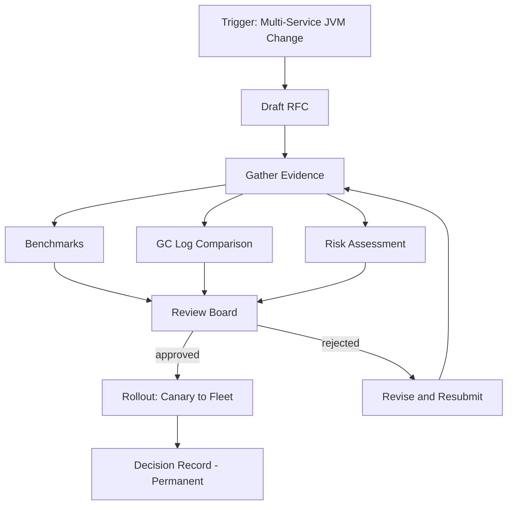

---

### 📶 Gradual Depth

**Level 1 - What it is:** A JVM RFC is a written proposal for a high-impact runtime change - GC switch, JDK upgrade, flag baseline modification - that must be reviewed and approved before fleet-wide rollout. It documents what, why, evidence, alternatives, and rollback.

**Level 2 - How to use it:** Write an RFC when your change crosses service boundaries. Use the template: context (what exists today), problem (what is wrong), proposal (what to change), evidence (benchmarks and logs), alternatives (what else was considered), rollback (how to revert), timeline (when each stage happens). Submit for review with a defined SLA.

**Level 3 - How it works:** The RFC forces discipline at four points: evidence gathering (you cannot claim "ZGC is better" without comparative GC log data), alternative analysis (you must show why the proposed approach beats at least two alternatives), rollback planning (you must define specific reversion steps before you start), and stakeholder alignment (every affected team explicitly signs off or raises concerns within a bounded review window).

**Level 4 - Production mastery:** The real value of a JVM RFC is not the approval gate - it is the institutional memory. Six months after a GC migration, when a new engineer asks "why are we on ZGC?", the RFC provides the complete rationale, the evidence, the alternatives rejected, and the trade-offs accepted. Without it, the answer is "that is how it was when I joined." Mature organizations tag RFCs with the JVM keywords they affect and link them from the flag baseline documentation, creating a searchable decision trail.

---

### ⚙️ How It Works

**Phase 1 - Identify the trigger.** Not every JVM change needs an RFC. Define clear triggers: JDK major version upgrade, GC algorithm change for any service, flag baseline modification, adoption of new runtime technology (CRaC, native image). Single-service tuning within the flag baseline's FREE tier does not require an RFC.

**Phase 2 - Gather evidence.** Run comparative benchmarks on a representative service. Collect GC logs before and after. Measure: throughput (requests/sec), latency (P50/P99), heap utilization, GC pause distribution, CPU overhead. Document the test conditions (traffic pattern, heap size, JDK version).

**Phase 3 - Write the RFC.** Fill the template sections: context, problem, proposal, evidence, alternatives, risk assessment, rollback plan, rollout timeline. The rollback plan must specify exact flag values or image tags to revert to - not "roll back if something goes wrong."

**Phase 4 - Review and decide.** Route to the review board. The board reviews evidence quality, risk assessment completeness, and rollback feasibility. Decision within the SLA. Approved RFCs become decision records. Rejected RFCs include the rejection rationale for future reference.

```text
RFC Evidence Pipeline:

  Select representative service
           |
           v
  Run baseline benchmark (current config)
           |
           v
  Apply proposed change
           |
           v
  Run comparison benchmark (same traffic)
           |
           v
  Collect: GC logs, latency, throughput,
           heap usage, CPU
           |
           v
  Compare: before/after tables in RFC
```

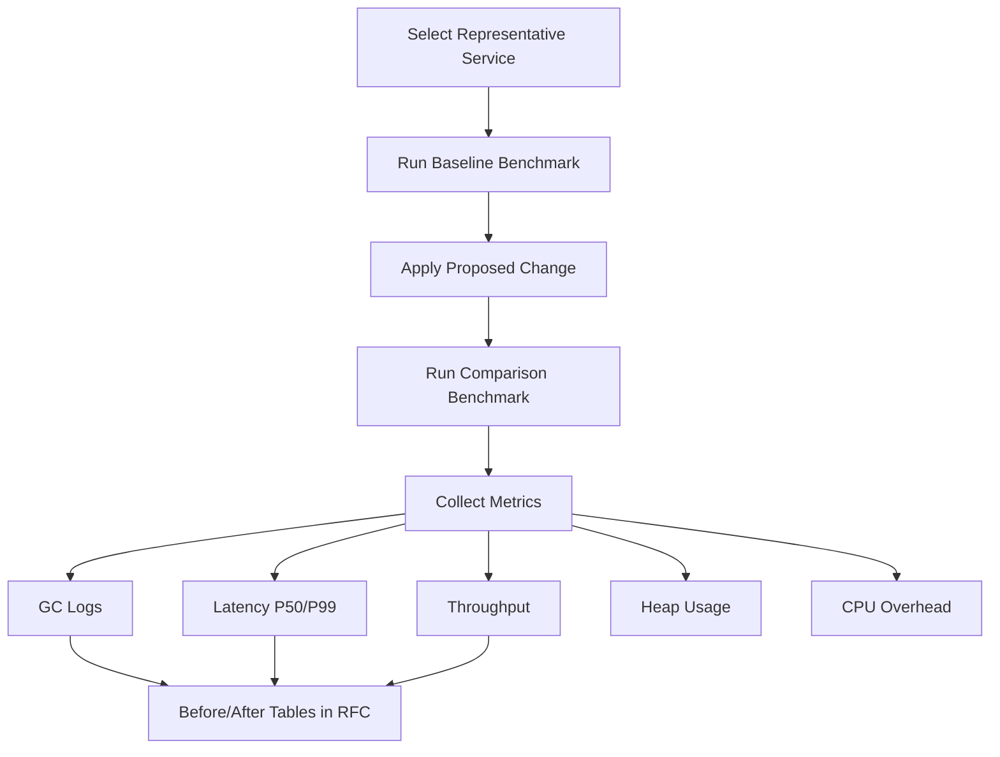

**BAD:**

```markdown
## Proposed Change

Switch all services from G1GC to ZGC.
ZGC has sub-millisecond pauses.
It is the future of Java GC.

## Rollback

Revert if problems occur.
```

Why it fails: no evidence, no risk assessment, vague rollback ("if problems occur" gives no actionable reversion steps), no benchmarks.

**GOOD:**

```markdown
## Proposed Change

Switch payment-svc from G1GC to ZGC
on JDK 21.0.3 (Temurin).

## Evidence

| Metric      | G1GC   | ZGC    | Delta  |
| ----------- | ------ | ------ | ------ |
| P99 latency | 45ms   | 12ms   | -73%   |
| Throughput  | 4200/s | 4050/s | -3.6%  |
| Heap used   | 1.8GB  | 2.4GB  | +33%   |
| CPU (GC)    | 3.2%   | 4.1%   | +0.9pp |

GC log comparison: gc-g1-baseline.log vs
gc-zgc-candidate.log attached.

## Rollback Plan

1. Revert JAVA_TOOL_OPTIONS to:
   -XX:+UseG1GC -XX:MaxGCPauseMillis=200
2. Redeploy from image tag:
   payment-svc:jdk21-g1-v14
3. Verify P99 returns to 45ms baseline
   within 15 minutes.
```

Why it works: quantified evidence, explicit trade-offs (throughput and memory cost documented), rollback has specific flag values and image tags, success criteria defined.

---

### 🚨 Failure Modes

**Failure 1 - RFC without evidence ("opinion RFC"):**

**Symptom:** RFC states "ZGC is better for latency-sensitive services" with no benchmarks. Review board approves based on the author's reputation. Post-rollout, 3 services see 30% memory increase nobody budgeted for.

**Root cause:** The RFC template had an "evidence" section, but the process did not enforce that it contain actual measurements. Review focused on the proposal narrative, not the data.

**Diagnostic:**

```bash
# Check: does the RFC contain a comparison
# table with numeric before/after data?
grep -c "|.*|.*|" jvm-rfc-042.md
# If zero: the RFC has no data tables
```

**Fix:** Make the review checklist explicit: "Does the evidence section contain a before/after comparison table with at least throughput, P99 latency, heap usage, and CPU overhead measured under equivalent conditions?" Reject any RFC that answers no.

**Failure 2 - Unbounded review cycle:**

**Symptom:** RFC submitted for JDK 21 upgrade sits in review for 4 months. Meanwhile, JDK 17 exits vendor support. Teams bypass the RFC and upgrade independently, creating the exact inconsistency the RFC was supposed to prevent.

**Root cause:** No review SLA. Reviewers are busy and the RFC has no deadline.

**Diagnostic:**

```bash
# Check RFC age vs SLA
# (in a ticketing system or Git)
git log --oneline --format="%ai %s" -- \
  rfcs/jvm-rfc-042.md | head -1
# Compare submission date to today
```

**Fix:** Define a 10-business-day review SLA. If the review board does not decide within the SLA, the RFC is auto-approved with a "review-timeout" tag (forcing the board to triage rather than ignore). Track average RFC cycle time as a process health metric.

**Failure 3 - Over-triggering (RFC fatigue):**

**Symptom:** Teams must write RFCs for trivial changes (adjusting `-Xmx` on one service). Engineers spend more time writing RFCs than tuning JVMs. Process compliance drops as teams stop filing.

**Root cause:** The trigger criteria are too broad. Single-service, within-baseline tuning is treated the same as fleet-wide GC changes.

**Diagnostic:**

Review the last 20 RFCs. If more than half are single-service tuning changes that affected no other team, the trigger is miscalibrated.

**Fix:** Tier the trigger: Tier 1 (full RFC) for fleet-wide changes - JDK upgrade, GC algorithm change, flag baseline modification. Tier 2 (lightweight decision record) for single-service changes outside the baseline. Tier 3 (no RFC) for single-service changes within the flag baseline's FREE tier.

---

### 🔬 Production Reality

A platform team introduced a JVM RFC process after an incident where an undocumented GC change on the order processing service caused a cascading failure. The first RFC - a JDK 17 to JDK 21 migration - took 6 weeks to write because the team had no benchmarking infrastructure. The evidence gathering phase forced them to build a comparative benchmark pipeline (deploy both JDK versions behind a traffic splitter, collect GC logs, compare metrics). That pipeline became permanently reusable for all future RFCs. By the third RFC (ZGC adoption for latency-critical services), the evidence gathering took 3 days instead of 6 weeks. The counterintuitive lesson: the RFC process was initially seen as bureaucratic overhead, but the reusable tooling it forced into existence (benchmark pipeline, GC log comparison scripts, before/after report template) made subsequent JVM decisions faster and more evidence-based than the pre-RFC era of ad hoc changes.

---

### ⚖️ Trade-offs & Alternatives

| Aspect                | Full RFC Process         | Architecture Decision Record (ADR) | Informal Slack Decision |
| --------------------- | ------------------------ | ---------------------------------- | ----------------------- |
| Evidence rigor        | High (mandatory data)    | Medium (rationale, less data)      | None                    |
| Review depth          | Multi-stakeholder        | Author + 1-2 reviewers             | Whoever is online       |
| Decision traceability | Full (searchable record) | Good (lightweight record)          | Lost in chat history    |
| Time cost             | 1-2 weeks (with data)    | 1-3 days                           | Minutes                 |
| Appropriate for       | Fleet-wide JVM changes   | Single-service decisions           | Trivial tuning          |
| Rollback clarity      | Explicit plan required   | Often included                     | Rarely documented       |

---

### ⚡ Decision Snap

**USE WHEN:**

- A JVM change affects multiple services or the fleet-wide baseline (JDK upgrade, GC change, flag baseline modification).
- The change has budget implications (memory increase, new licensing).
- Regulatory or compliance requirements demand auditable change records.

**AVOID WHEN:**

- Single-service tuning within the established flag baseline (use a lightweight ADR instead).
- The change is easily reversible and affects only the author's own service.

**PREFER ADR WHEN:**

- The decision is significant enough to document but does not cross service boundaries.
- The team is small enough that a formal review board is overhead.

---

### ⚠️ Top Traps

| #   | Misconception                           | Reality                                                                                                                                                                                                       |
| --- | --------------------------------------- | ------------------------------------------------------------------------------------------------------------------------------------------------------------------------------------------------------------- |
| 1   | "RFCs slow us down"                     | The RFC itself takes days. Debugging an undocumented fleet-wide GC change takes weeks. The RFC is faster at organizational scale.                                                                             |
| 2   | "Evidence means perfection"             | Evidence means comparative data under representative conditions. It does not mean months of testing. A 2-hour benchmark on one representative service with real traffic patterns is sufficient for most RFCs. |
| 3   | "Approved RFC means guaranteed success" | The RFC documents expected outcomes and rollback plans. Production may still surprise. The value is that surprises are bounded by the rollback plan, not that surprises are prevented.                        |
| 4   | "Every JVM change needs an RFC"         | Over-triggering kills the process through fatigue. Tier the trigger: full RFC for fleet changes, lightweight ADR for single-service, no process for within-baseline tuning.                                   |
| 5   | "The RFC is done after approval"        | The RFC becomes a decision record. Link it from the flag baseline docs, tag it with affected keywords, update it with post-rollout observations. A disconnected RFC is institutional amnesia.                 |

---

### 🪜 Learning Ladder

**Prerequisites:**

- JVM-033 JVM Flags That Actually Matter - understand the flags an RFC would propose changing
- JVM-076 Reading GC Logs Like a Pro - the skill needed to produce the evidence section's GC log comparisons
- JVM-105 Build Your Own JVM Flag Baseline - the baseline that triggers an RFC when modified

**THIS:** JVM-115 Writing a JVM RFC for Your Organization

**Next steps:**

- JVM-110 JVM Upgrade Governance at Scale - the governance framework that RFCs feed into
- JVM-104 Java LTS Version Migration Strategy - the most common RFC trigger: a major JDK version migration
- JVM-102 JVM Fleet Standardization Strategy - the fleet-level context where RFC decisions have the widest impact

---

**The Surprising Truth:**

The most valuable artifact from a JVM RFC process is not the approved proposals - it is the rejected ones. A well-documented rejection ("we evaluated ZGC for the batch pipeline and rejected it because throughput dropped 8% - here is the data") prevents the next engineer from repeating the same evaluation. Organizations with searchable RFC archives spend dramatically less time re-evaluating decisions that were already settled with evidence.

**Further Reading:**

- [Rust RFC Process](https://github.com/rust-lang/rfcs) - a well-documented open-source RFC process that influenced many engineering organizations' internal RFC practices
- [Architecture Decision Records (ADR) by Michael Nygard](https://cognitect.com/blog/2011/11/15/documenting-architecture-decisions) - the lightweight alternative for decisions that do not warrant a full RFC
- [Google Design Docs Guide](https://www.industrialempathy.com/posts/design-docs-at-google/) - Malte Ubl's description of Google's design doc culture, the closest industry precedent for systematic engineering decision documentation

**Revision Card:**

1. An RFC triggers for multi-service JVM changes (JDK upgrade, GC switch, flag baseline change) - never for single-service tuning within the baseline's FREE tier.
2. Evidence is mandatory and specific: before/after comparison table with throughput, P99, heap, CPU - not opinions or blog citations.
3. The rollback plan must name exact flag values and image tags to revert to - "roll back if something goes wrong" is not a rollback plan.

---

---

# JVM-116 The JVM Specification - Structure and Evol

**TL;DR** - The JVMS defines portable class file semantics and verification rules while leaving performance strategy entirely to implementors.

---

### 🔥 Problem Statement

Without a formal specification, every compiler and runtime becomes a snowflake. Code compiled by one Java compiler might crash on another JVM. Libraries relying on class file semantics would have no guarantees about loading order, type safety, or verification behavior. At production scale, organizations running mixed JVM implementations across fleets - HotSpot in some clusters, OpenJ9 in memory-constrained containers, GraalVM for native images - need a binding contract that guarantees portable behavior. Without the JVM Specification (JVMS), class files become implementation-coupled artifacts rather than portable binaries. The JVMS is that contract: it defines exactly what a conforming JVM must accept and how it must behave, while deliberately leaving GC algorithms, JIT strategy, and memory layout to implementors. "Write once, run anywhere" depends entirely on this separation of specification from implementation.

---

### 📜 Historical Context

The first JVM Specification shipped with Java 1.0 in 1996, authored by Tim Lindholm and Frank Yellin. It formalized the class file format, the bytecode instruction set, and the verification algorithm as a platform contract independent of any single compiler. Each Java SE release increments the class file version number, enabling new features (invokedynamic in version 51.0 for Java 7, ConstantDynamic in 55.0 for Java 11, sealed classes in 61.0 for Java 17) while maintaining backward compatibility. JEPs modify the spec through a formal process: propose bytecode or class file changes, gain consensus, then update the JVMS alongside the JLS. The specification has survived nearly three decades and multiple implementation teams, proving that separating "what" from "how" is the foundation of platform longevity.

---

### 🔩 First Principles

**CORE INVARIANTS:**

1. The class file format is the only exchange format between compilers and JVMs - no JVM is required to accept any other input.
2. Every conforming JVM must reject any class file that fails verification - type safety is enforced at load time, not compile time.
3. The specification defines observable behavior, not implementation strategy - two JVMs may use completely different internal representations while remaining conformant.

**DERIVED DESIGN:**
These invariants force a layered architecture. The class file format acts as a stable ABI between compilers and runtimes. Verification before execution means the JVM never trusts the compiler. Behavioral specification (not implementation specification) means HotSpot can use C2 JIT while OpenJ9 uses Testarossa without violating the spec. This is why Java survived the transition from Sun to Oracle to open-source without fragmenting.

**THE TRADE-OFF:**
**Gain:** Platform portability, multi-vendor ecosystem, safe evolution via class file versioning.
**Cost:** Innovation constrained by spec compatibility, performance features like value types take years to specify correctly, and implementors must handle every historical class file version.

---

### 🧠 Mental Model

> Think of the JVMS as a building code for skyscrapers. It specifies load-bearing requirements (verification), floor dimensions (stack and local variable types), and safety exits (exception handling) - but says nothing about whether you build with steel, concrete, or carbon fiber.

- "Building code" -> the JVM Specification document
- "Load-bearing requirements" -> bytecode verification rules
- "Floor dimensions" -> class file format and type system
- "Construction material" -> implementation (JIT, GC, layout)

**Where this analogy breaks down:** Building codes rarely change yearly, but the JVMS evolves with each Java release, adding new instructions and class file attributes while preserving backward compatibility.

---

### 🧩 Components

- **Class File Format (Chapter 4):** The binary container - magic number, constant pool, field/method descriptors, attributes. Every class file is self-describing.
- **Type System (Chapter 2):** Primitive types, reference types, and the subtyping rules that verification depends on.
- **Instruction Set (Chapter 6):** Approximately 200 bytecode instructions with precise stack effect and type constraints per instruction.
- **Loading, Linking, Initialization (Chapter 5):** The three-phase lifecycle that transforms a class file into a usable runtime type.
- **Verification (Chapter 4.10):** The type-checking algorithm that proves bytecode safety before execution.
- **Constant Pool (Chapter 4.4):** The shared symbol table - every class, method, and field reference resolves through it.

```
+-------------------------------------------+
|          JVM Specification                |
|                                           |
|  Ch.2: Type System                        |
|    |                                      |
|  Ch.4: Class File Format                  |
|    +-- Constant Pool                      |
|    +-- Fields / Methods                   |
|    +-- Attributes (Code, StackMapTable)   |
|    +-- Verification (4.10)                |
|                                           |
|  Ch.5: Loading -> Linking -> Init         |
|    +-- Resolution (symbolic -> direct)    |
|                                           |
|  Ch.6: Instruction Set (~200 opcodes)     |
+-------------------------------------------+
```

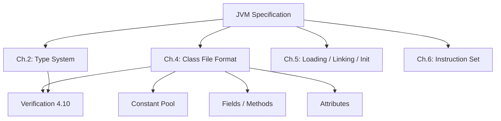

---

### 📶 Gradual Depth

**Level 1 - What it is:**
The JVM Specification is a formal document that defines what every Java Virtual Machine must do. It specifies the class file format, the bytecode instruction set, and the verification rules - but deliberately says nothing about how to implement them.

**Level 2 - How to use it:**
When debugging class loading failures, bytecode generation issues, or verification errors, the JVMS is the authoritative reference. Chapter 4 defines every byte of the class file. Chapter 6 defines the stack effect of every instruction. Reading the spec directly resolves ambiguity faster than any secondary source.

**Level 3 - How it works:**
The spec operates at three levels: structural (binary format), semantic (type system and verification), and operational (instruction behavior). Each class file declares its version, which determines which features and verification rules apply. The spec is backward-compatible - a JVM supporting version 65.0 must also accept version 45.0 class files. Evolution happens by adding new constant pool entry types, new attributes, or new instructions, never by removing existing ones.

**Level 4 - Production mastery:**
Understanding the spec boundary is critical for JVM tool authors, bytecode-generating frameworks (Byte Buddy, ASM, CGLIB), and teams running multi-JVM fleets. HotSpot, OpenJ9, and GraalVM all conform to the same JVMS but diverge enormously in JIT strategy, GC implementation, and memory layout. When a framework generates bytecode, it must target spec-defined behavior, not HotSpot-specific quirks. Production issues like "works on HotSpot, fails on OpenJ9" almost always trace to relying on implementation-defined behavior rather than spec-guaranteed behavior.

---

### ⚙️ How It Works

**Phase 1 - Class File Parsing:** The JVM reads the binary class file and validates structural integrity: magic number (0xCAFEBABE), version compatibility, constant pool well-formedness.

**Phase 2 - Verification:** The type-checking pass proves that every instruction operates on the correct types, the operand stack never overflows or underflows, and control flow reaches valid instructions. (See JVM-117 Bytecode Verification Algorithm.)

**Phase 3 - Preparation and Resolution:** The JVM allocates static fields, resolves symbolic references to concrete runtime entities, and enforces access control.

**Phase 4 - Initialization:** The `<clinit>` method runs, executing static initializers in the order the spec requires (parent before child, exactly once, thread-safe).

```
.class file bytes
    |
    v
[Parse] -> magic + version + constant pool
    |
    v
[Verify] -> type safety proof (Ch. 4.10)
    |
    v
[Prepare] -> allocate static fields
    |
    v
[Resolve] -> symbolic -> direct refs
    |
    v
[Initialize] -> run <clinit>
    |
    v
Class ready for use
```

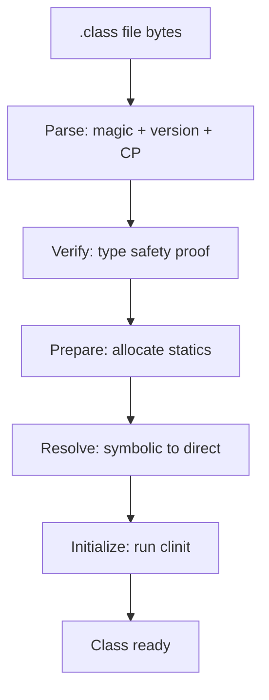

**BAD:**

```java
// Relies on HotSpot-specific class loading
// order to initialize shared cache
public class CacheInit {
  // Assumes sibling clinit ran first -
  // not guaranteed by the spec for
  // unrelated classes
  static Map<String,Object> cache =
      SiblingClass.getPreloaded();
}
```

Why it fails: The JVMS guarantees parent-before-child initialization order but not sibling order. This works on HotSpot by accident and fails on OpenJ9 with a NullPointerException.

**GOOD:**

```java
public class CacheInit {
  // Holder pattern - spec guarantees lazy,
  // thread-safe class initialization (5.5)
  private static class Holder {
    static final Map<String,Object> CACHE =
        loadCache();
  }
  public static Map<String,Object> get() {
    return Holder.CACHE;
  }
}
```

Why it works: The holder pattern exploits the JVMS guarantee that class initialization is lazy and thread-safe (Section 5.5), portable across all conforming JVMs.

---

### 🚨 Failure Modes

**Failure 1 - UnsupportedClassVersionError:**
**Symptom:** `UnsupportedClassVersionError: class file version 65.0, this JVM only supports up to 61.0`.
**Root cause:** A dependency was compiled with a newer JDK than the runtime supports. The JVMS requires JVMs to reject class files with a higher major version than supported.
**Diagnostic:**

```bash
javap -verbose MyClass.class | grep "major"
java -version
```

**Fix:** Align compilation target (`--release` flag) with the deployment JVM version, or upgrade the runtime.

**Failure 2 - VerifyError from bytecode generation:**
**Symptom:** `java.lang.VerifyError: Bad type on operand stack` at class load time, only for dynamically generated classes.
**Root cause:** A bytecode-generating library (ASM, Byte Buddy, CGLIB) produced instructions that violate JVMS type rules.
**Diagnostic:**

```bash
java -Xlog:verification=info \
  -cp app.jar com.example.Main 2>&1 \
  | grep -A5 "VerifyError"
```

**Fix:** Use ASM's `CheckClassAdapter` or Byte Buddy's built-in validation to catch type mismatches before loading.

**Failure 3 - Cross-JVM behavioral divergence:**
**Symptom:** Application passes all tests on HotSpot but produces different results or hangs on OpenJ9.
**Root cause:** Code depends on implementation-defined behavior: finalization timing, class unloading aggressiveness, or thread scheduling.
**Diagnostic:**

```bash
# Run tests on both JVMs in CI
docker run --rm eclipse-temurin:21 \
  java -jar app-tests.jar
docker run --rm ibm-semeru-runtimes:21 \
  java -jar app-tests.jar
```

**Fix:** Eliminate finalization (use `Cleaner`), avoid assuming GC timing, test on at least two JVM implementations in CI.

---

### 🔬 Production Reality

A large microservices platform migrated from HotSpot to OpenJ9 for memory-constrained services. After deployment, several services experienced intermittent `NoClassDefFoundError` for classes that loaded fine on HotSpot. Investigation revealed the services used a custom classloader that cached resolved classes in a `WeakHashMap`. OpenJ9's more aggressive class unloading (spec-compliant but different from HotSpot defaults) reclaimed weakly-reachable classloader entries sooner, causing classes to be unloaded and their dependents to fail on next access. The fix: switch to `ConcurrentHashMap` with explicit lifecycle management (removing dependence on GC timing), and add a cross-JVM CI stage running the full test suite on both implementations. The root cause was not a bug in either JVM - both were spec-compliant. The code relied on HotSpot-specific class unloading timing, which the JVMS explicitly leaves to implementors.

---

### ⚖️ Trade-offs & Alternatives

| Aspect         | JVMS (Java)                            | CLR (.NET)                          | Wasm                                   |
| -------------- | -------------------------------------- | ----------------------------------- | -------------------------------------- |
| Scope          | Bytecode + verification + class format | IL + verification + assembly format | Binary format + validation + execution |
| Verification   | Mandatory before execution             | Mandatory (PEVerify)                | Mandatory structured validation        |
| Impl. latitude | High (GC, JIT, layout)                 | Moderate (RyuJIT dominant)          | Very high (native, interpret, JIT)     |
| Multi-vendor   | HotSpot, OpenJ9, GraalVM               | CoreCLR, Mono                       | V8, Wasmtime, Wasmer                   |
| Compat.        | Every version since 45.0               | Strong but platform-tied            | Version 1.0, evolving                  |
| Evolution      | JEPs modifying chapters                | Runtime releases                    | Proposals and phases                   |

---

### ⚡ Decision Snap

**USE WHEN:**

- Building bytecode tools (must target spec, not implementation)
- Running multi-JVM fleets (spec is the portable contract)
- Debugging class loading or verification failures

**AVOID WHEN:**

- Tuning GC or JIT (use implementation-specific docs)
- Writing application-level Java (the JLS is more relevant)

**PREFER the JLS WHEN:**

- Reasoning about language semantics, not runtime behavior
- Understanding source-level type rules, not bytecode types

---

### ⚠️ Top Traps

| #   | Misconception                                  | Reality                                                                                                                       |
| --- | ---------------------------------------------- | ----------------------------------------------------------------------------------------------------------------------------- |
| 1   | "The JVMS defines how GC works"                | The JVMS never mentions any specific GC algorithm. GC strategy is entirely implementation-defined.                            |
| 2   | "If it works on HotSpot, it is spec-compliant" | HotSpot implements many behaviors the spec leaves undefined. Cross-JVM testing is the only portability proof.                 |
| 3   | "The JVMS and JLS are the same thing"          | The JLS defines the Java language. The JVMS defines the runtime. Kotlin, Scala, and Clojure target the JVMS without the JLS.  |
| 4   | "New bytecodes appear in every release"        | Most releases add attributes or constant pool types, not instructions. Entirely new opcodes are rare events.                  |
| 5   | "You need to read the whole spec"              | Chapter 4 (class file format) and Chapter 6 (instructions) cover 90% of practical needs. Most engineers never need Chapter 3. |

---

### 🪜 Learning Ladder

**Prerequisites:**

- JVM-001 What Is the JVM - understand the runtime before its specification
- JVM-004 Bytecode Basics - class files and instructions are the spec's core subject

**THIS:** JVM-116 The JVM Specification - Structure and Evolution

**Next steps:**

- JVM-117 Bytecode Verification Algorithm - the spec's most complex chapter, applied
- JVM-120 Project Valhalla - active spec evolution in progress
- JVM-124 Formal Verification - proving properties beyond what the JVMS requires

---

**The Surprising Truth:**
The JVM Specification is deliberately incomplete. It specifies the minimum a JVM must do to be conformant but intentionally leaves the most performance-critical decisions - JIT compilation strategy, GC algorithm choice, memory layout, thread scheduling - entirely to implementors. This "underspecification by design" is not a weakness. It is the reason the JVM platform has thrived for nearly three decades while competitors with tighter specifications stagnated.

**Further Reading:**

- The Java Virtual Machine Specification, Java SE 21 Edition (Lindholm, Yellin, Bracha, Buckley) - Oracle, 2023
- JSR 924: Java Virtual Machine Specification - the JCP process governing JVMS updates
- JEP 309: Dynamic Class-File Constants - spec evolution adding ConstantDynamic to the constant pool

**Revision Card:**

1. The JVMS defines what (class files, verification, instructions) but not how (GC, JIT, memory layout)
2. Portability comes from spec compliance - code relying on implementation-defined behavior will break across JVMs
3. Most "works on HotSpot, breaks elsewhere" bugs trace to depending on behavior the spec deliberately leaves undefined

---

---

# JVM-117 Bytecode Verification Algorithm

**TL;DR** - The verifier proves bytecode type safety via dataflow analysis and stack map frames, catching errors before any instruction executes.

---

### 🔥 Problem Statement

A Java compiler is not a security boundary. Any tool can produce a class file: bytecode generators, obfuscators, hex editors, or malicious actors. If the JVM trusted the compiler to produce type-safe bytecode, a single malformed class could corrupt the heap, bypass access control, or crash the process. At production scale, applications load thousands of classes from dozens of sources - third-party libraries, dynamic proxies, serialization frameworks, and agent-instrumented bytecode. The verification algorithm is the JVM's immune system: it proves, using static dataflow analysis, that every instruction will operate on the correct types before a single instruction executes. Without it, the JVM's type safety guarantee collapses and "managed runtime" becomes meaningless.

---

### 📜 Historical Context

The original Java 1.0 verifier used an iterative dataflow algorithm that inferred types at every branch target by running to a fixed point. This worked but had pathological worst-case complexity for deeply nested subroutines (the `jsr`/`ret` instructions). Java 6 (class file version 50.0) introduced the `StackMapTable` attribute, which embeds pre-computed type states at branch targets. Java 7 (version 51.0) made `StackMapTable` mandatory for new class files, switching from inference to type checking. The compiler now does the expensive work of computing types; the verifier simply checks the compiler's proof. This shifted verification from iterative fixed-point inference to linear type checking - a crucial improvement for startup time in large applications.

---

### 🔩 First Principles

**CORE INVARIANTS:**

1. No instruction may operate on a type it was not designed for - an `iadd` must find two ints on the stack, never object references.
2. The operand stack depth and type state must be identical at every merge point (branch target, exception handler entry), regardless of which control flow path reaches it.
3. Every local variable must be definitely assigned before it is read - the verifier rejects code that could read an uninitialized slot.

**DERIVED DESIGN:**
These invariants force a dataflow analysis that tracks frame state (operand stack types plus local variable types) at every instruction. At branch targets, frames from all incoming paths must merge to a compatible type state. Stack map frames pre-compute these merge-point states so the verifier performs one linear pass instead of iterating to a fixed point. The `jsr`/`ret` instructions were deprecated precisely because they made sound verification intractable in polynomial time.

**THE TRADE-OFF:**
**Gain:** Every loaded class is provably type-safe without trusting the compiler - the JVM is a secure execution sandbox.
**Cost:** Verification adds class loading latency, compilers must generate `StackMapTable` attributes, and bytecode-generating tools must produce verifiable output or face `VerifyError`.

---

### 🧠 Mental Model

> Think of the verifier as a building inspector who checks blueprints before construction begins. The inspector does not build the building (execute bytecode). They walk through the blueprints (class file), checking that every beam (instruction) connects to the right type of support (stack types), and that every floor (branch target) has consistent load ratings (frame states) regardless of which staircase (control path) you took to reach it.

- "Blueprints" -> class file with StackMapTable
- "Building inspector" -> the verification algorithm
- "Beam connections" -> instruction type constraints
- "Floor load ratings" -> frame state at merge points

**Where this analogy breaks down:** Building inspectors can ask for clarification. The verifier has no interaction - it accepts or rejects in a single pass with no feedback loop.

---

### 🧩 Components

- **Pass 1 - Binary Format Check:** Validates magic number (0xCAFEBABE), version number, constant pool structural integrity. Rejects truncated or malformed files.
- **Pass 2 - Semantic Validation:** Checks constant pool cross-references, field/method descriptor syntax, duplicate fields, `final` class not subclassed.
- **Pass 3 - Bytecode Type Checking:** The core dataflow analysis. Tracks operand stack and local variable types through every instruction. Uses StackMapTable at branch targets.
- **Pass 4 - Symbolic Reference Resolution:** Lazily resolves class, method, and field references on first use. Checks access control and existence.
- **StackMapTable Attribute:** Compiler-generated proof artifact containing frame entries at each branch target declaring expected types.

```
.class file
    |
[Pass 1] Binary format check
    |
[Pass 2] Semantic validation
    |
[Pass 3] Bytecode type checking
    |         +-- reads StackMapTable
    |         +-- dataflow per method
    |
[Pass 4] Symbolic resolution (lazy)
    |
Class accepted
```

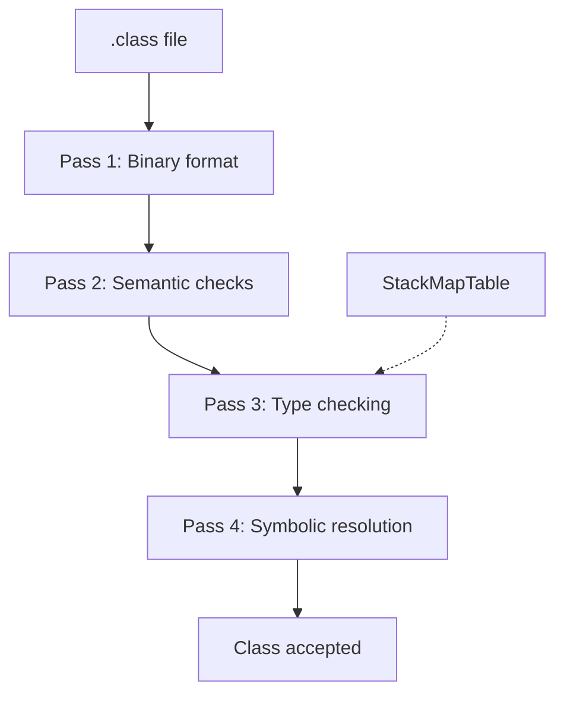

---

### 📶 Gradual Depth

**Level 1 - What it is:**
The bytecode verifier is a static analysis pass that proves every instruction in a class file operates on the correct types. It runs during class loading, before any instruction executes, and rejects any class that could violate type safety.

**Level 2 - How to use it:**
You rarely interact with the verifier directly. When you see a `VerifyError`, it means the class file contains bytecode that the verifier cannot prove type-safe. The most common causes are bytecode-generating libraries producing incorrect stack map frames, or mismatched library versions where a method signature changed.

**Level 3 - How it works:**
For each method, the verifier simulates execution abstractly. It maintains a frame state (types on the operand stack and in local variables) and advances through each instruction. At branch targets, it compares the incoming frame against the StackMapTable entry. The merge rule for reference types uses the least common superclass. Primitive types must match exactly. Stack depth must be identical on all paths to a merge point.

**Level 4 - Production mastery:**
In large applications loading thousands of classes, verification cost affects startup time. The type-checker runs in O(n) time per method (n = instruction count) because StackMapTable eliminates fixed-point iteration. Frameworks like Spring and Hibernate that generate bytecode at runtime must produce valid StackMapTable attributes. The `-noverify` flag (deprecated since Java 13) was historically used to skip verification - a dangerous trade-off sacrificing type safety. Modern alternatives include CDS (Class Data Sharing) which caches verified classes across restarts.

---

### ⚙️ How It Works

**Phase 1 - Initialize Entry Frame:** For each method, the verifier creates the initial frame: `this` reference (for instance methods) in local 0, parameter types from the method descriptor in subsequent locals, empty operand stack.

**Phase 2 - Linear Scan with StackMapTable:** The verifier processes instructions sequentially. Each instruction pops expected types from the abstract stack and pushes result types. At branch targets, the verifier compares the current frame against the StackMapTable entry.

**Phase 3 - Merge at Branch Targets:** When control flow merges (conditional branches, exception handlers), the incoming frame must be compatible with the declared StackMapTable entry. For reference types, the incoming type must be assignable to the declared type. For primitives, exact match is required.

**Phase 4 - Exception Handler Validation:** Each exception handler entry point starts with an empty stack containing only the exception type. The verifier confirms the handler's frame matches this expectation.

```
method entry:
  locals: [this, param1, param2]
  stack:  []
       |
  instruction: aload_1
  stack:  [param1_type]
       |
  instruction: invokevirtual #method
  stack:  [return_type]
       |
  branch target (from StackMapTable):
  expected: locals=[...] stack=[...]
  actual:   locals=[...] stack=[...]
  MATCH? -> continue | FAIL -> VerifyError
```

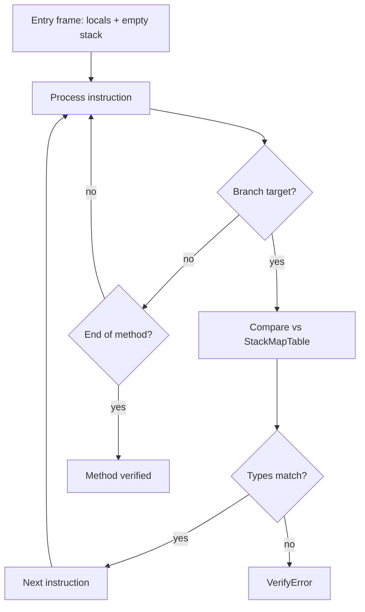

**BAD:**

```java
// ASM: both branches push incompatible types
mv.visitJumpInsn(IFNULL, label);
// Path 1: stack has String
mv.visitLdcInsn("default");
mv.visitJumpInsn(GOTO, end);
// Path 2: stack has long (primitive)
mv.visitLabel(label);
mv.visitLdcInsn(42);
mv.visitInsn(I2L);
mv.visitLabel(end);
// VerifyError: String vs long at merge
```

Why it fails: At the merge point `end`, one path carries `String` on the stack and the other carries `long`. The verifier cannot merge a reference type with a primitive and rejects the class.

**GOOD:**

```java
// Both paths push reference types (Object)
mv.visitJumpInsn(IFNULL, label);
// Path 1: push String (is-a Object)
mv.visitLdcInsn("default");
mv.visitJumpInsn(GOTO, end);
// Path 2: push Integer (is-a Object)
mv.visitLabel(label);
mv.visitLdcInsn(42);
mv.visitMethodInsn(INVOKESTATIC,
    "java/lang/Integer", "valueOf",
    "(I)Ljava/lang/Integer;", false);
mv.visitLabel(end);
// Merge: String + Integer -> Object (LCA)
```

Why it works: Both paths push reference types assignable to `Object`. The verifier merges them to the least common ancestor.

---

### 🚨 Failure Modes

**Failure 1 - Missing StackMapTable:**
**Symptom:** `java.lang.VerifyError: Expecting a stackmap frame at branch target <offset>`.
**Root cause:** A class file with version >= 51.0 (Java 7+) is missing `StackMapTable` entries at branch targets. Common when an old bytecode transformer strips or fails to recompute the attribute.
**Diagnostic:**

```bash
javap -v -p MyClass.class \
  | grep -A2 "StackMapTable"
```

**Fix:** Recompute frames using `ClassWriter(COMPUTE_FRAMES)` in ASM or Byte Buddy's automatic frame computation.

**Failure 2 - Type Mismatch from Version Skew:**
**Symptom:** `java.lang.VerifyError: Bad type on operand stack` or `Type ... is not assignable to ...`.
**Root cause:** A method was compiled against one dependency version but loaded with a different version where a return type or parameter type changed.
**Diagnostic:**

```bash
# Find the actual class being loaded
java -verbose:class -cp app.jar \
  com.example.Main 2>&1 \
  | grep "SuspectClass"
# Compare expected vs actual signature
javap -s SuspectClass.class
```

**Fix:** Align dependency versions. Recompile against the exact dependency version deployed at runtime.

**Failure 3 - Startup Latency from Eager Verification:**
**Symptom:** Application startup takes 5-10 seconds longer than expected, CPU saturated on a single thread during class loading.
**Root cause:** Thousands of classes loaded eagerly (e.g., Spring component scan) each verified linearly. Pre-Java 7 class files trigger the slower inference verifier path.
**Diagnostic:**

```bash
java -Xlog:class+load=info \
  -cp app.jar com.example.Main 2>&1 \
  | wc -l
```

**Fix:** Use AppCDS (`-XX:SharedArchiveFile`) to cache verified classes. Verification results persist across restarts.

---

### 🔬 Production Reality

A financial services platform experienced intermittent `VerifyError` failures in production that never reproduced in development or CI. The errors occurred only under load and only for classes generated by a custom serialization framework. Investigation revealed the framework used ASM with `ClassWriter(COMPUTE_MAXS)` instead of `ClassWriter(COMPUTE_FRAMES)`, relying on manually-specified stack map frames. Under concurrent class loading, a race condition in the framework's caching layer occasionally served a partially-constructed class file to the classloader. The partial class had correct bytecode but truncated `StackMapTable` entries. The verifier rejected these files, and the framework cached the failure, causing persistent `NoClassDefFoundError` for those classes until the JVM restarted. The fix was switching to `COMPUTE_FRAMES` (letting ASM recompute all frames) and adding an atomic compare-and-swap guard to the class cache preventing partially-constructed entries from being visible to other threads.

---

### ⚖️ Trade-offs & Alternatives

| Aspect         | JVM Verification             | .NET IL Verify                   | Wasm Validation      | No Verify |
| -------------- | ---------------------------- | -------------------------------- | -------------------- | --------- |
| Guarantee      | Type safety                  | Type safety                      | Memory + type safety | None      |
| Cost           | O(n) with StackMapTable      | O(n) per method                  | O(n) single-pass     | Zero      |
| Proof artifact | StackMapTable frames         | Type inference                   | Structured types     | N/A       |
| Bypass option  | -noverify (deprecated)       | --skip-verify                    | Not possible         | N/A       |
| Startup impact | Measurable, mitigated by CDS | Similar, mitigated by ReadyToRun | Minimal              | None      |
| Security       | Untrusted code safe          | Untrusted code safe              | Sandboxed            | No safety |

---

### ⚡ Decision Snap

**USE WHEN:**

- Always - verification is mandatory and non-optional in modern JVMs
- Building bytecode tools - you must produce verifiable output
- Debugging class loading failures - understand verification errors

**AVOID WHEN:**

- Never skip verification with `-noverify` in production
- Do not hand-craft StackMapTable when ASM can compute it

**PREFER AppCDS WHEN:**

- Startup time is critical and verification cost is measurable
- Deploying containerized applications with fixed classpaths

---

### ⚠️ Top Traps

| #   | Misconception                                 | Reality                                                                                                                                                  |
| --- | --------------------------------------------- | -------------------------------------------------------------------------------------------------------------------------------------------------------- |
| 1   | "Verification only catches malicious code"    | It catches accidental type errors from mismatched dependencies and broken bytecode transformers far more often than attacks.                             |
| 2   | "The old and new verifiers do the same thing" | The pre-Java 7 inference verifier iterates to a fixed point. The StackMapTable type checker makes a single linear pass. Different algorithms, same goal. |
| 3   | "StackMapTable is optional"                   | For class file version >= 51.0 (Java 7+), StackMapTable is mandatory. Omitting it causes VerifyError.                                                    |
| 4   | "Verification happens once globally"          | Verification happens once per class per JVM instance. CDS caches results across restarts, but each fresh JVM re-verifies without it.                     |
| 5   | "-noverify is safe for trusted code"          | It disables the type safety guarantee. A single malformed class can corrupt the heap or enable privilege escalation. Deprecated since Java 13.           |

---

### 🪜 Learning Ladder

**Prerequisites:**

- JVM-004 Bytecode Basics - understand instructions before their verification
- JVM-116 The JVM Specification - Structure and Evolution - verification is specified in Chapter 4.10

**THIS:** JVM-117 Bytecode Verification Algorithm

**Next steps:**

- JVM-048 JIT Compilation Tiers - what happens after verification: compilation to native code
- JVM-118 Designing a GC from First Principles - another deep JVM subsystem with spec latitude
- JVM-124 Formal Verification - proving properties beyond type safety

---

**The Surprising Truth:**
The bytecode verifier does not execute a single instruction. It is a purely static analysis - a proof system that reasons about types abstractly. The verifier can accept code that will throw an exception at runtime (a guaranteed `NullPointerException`) and reject code that would actually run correctly (dead code with inconsistent stack types). The verifier does not prove correctness. It proves type safety - a much narrower but enforceable guarantee that makes everything else in the JVM possible.

**Further Reading:**

- The Java Virtual Machine Specification, Java SE 21 Edition, Chapter 4.10 "Verification of class Files" - the normative algorithm
- Stata and Abadi, "A Type System for Java Bytecode Subroutines" (1998) - foundational theory behind JVM type checking
- JEP 270: Reserved Stack Areas for Critical Sections - spec evolution affecting verification and stack safety

**Revision Card:**

1. The verifier proves type safety via static dataflow analysis - it never executes bytecode
2. StackMapTable shifted verification from iterative inference to linear type checking, cutting startup cost
3. Most production VerifyErrors come from bytecode transformers failing to recompute stack map frames, not malicious code
