## Keywords

1. [JVM-118 Designing a GC from First Principles](#jvm-118-designing-a-gc-from-first-principles)
2. [JVM-119 GC Research - Pauseless GC (Azul C4 Paper)](#jvm-119-gc-research---pauseless-gc-azul-c4-paper)
3. [JVM-120 Project Valhalla - Value Types and Flat Memory](#jvm-120-project-valhalla---value-types-and-flat-memory)
4. [JVM-121 Project Panama - Foreign Function and Memory](#jvm-121-project-panama---foreign-function-and-memory)
5. [JVM-122 Project Leyden - Static Images and AOT](#jvm-122-project-leyden---static-images-and-aot)
6. [JVM-123 The Trusted Computing Base of the JVM](#jvm-123-the-trusted-computing-base-of-the-jvm)
7. [JVM-124 JVM Formal Verification and Type Safety Proof](#jvm-124-jvm-formal-verification-and-type-safety-proof)
8. [JVM-125 Region-Based Memory Management Research](#jvm-125-region-based-memory-management-research)

---

# JVM-118 Designing a GC from First Principles

**TL;DR** - A garbage collector combines an allocator, a liveness oracle, and a reclaimer - every design trades latency, throughput, and footprint against each other.

---

### 🔥 Problem Statement

When you inherit a GC (say, G1 or ZGC), you tune flags without understanding why those flags exist. You adjust `MaxGCPauseMillis` without knowing that it controls the evacuation set size. You enable concurrent marking without understanding the tri-color invariant it must preserve. When the collector misbehaves under production load, you have no mental framework to diagnose whether the problem is in allocation, liveness determination, or reclamation. The result: hours of cargo-cult flag tuning that shifts symptoms instead of fixing root causes. Understanding how to design a GC from scratch gives you the vocabulary to reason about any collector - past, present, or future.

---

### 📜 Historical Context

John McCarthy's 1960 Lisp implementation contained the first garbage collector: a simple mark-sweep that stopped the world, traced from roots, and swept dead objects. For two decades, that was sufficient. As heaps grew into hundreds of megabytes, David Ungar's generational hypothesis (1984) transformed GC design by observing that most objects die young - enabling fast young-generation collection. The shift to concurrent and region-based collectors (Train, then G1, then C4, ZGC, Shenandoah) reflected the 2000s reality: heaps measured in gigabytes, latency SLAs in milliseconds. Every major GC innovation answers the same question: how do you reclaim dead memory without stopping the program for too long?

---

### 🔩 First Principles

**CORE INVARIANTS:**

1. Every live object must be reachable from a root (stack, static fields, JNI handles) through a chain of references - unreachable objects are dead by definition
2. Allocation and reclamation must balance over time - if allocation rate exceeds reclamation rate, the heap fills and the application halts
3. Moving a live object requires updating every pointer that refers to it - or using an indirection layer that makes the old address forward to the new one

**DERIVED DESIGN:**

Invariant 1 forces every collector to either trace from roots (mark-sweep, mark-compact, copying) or track reference counts. Invariant 2 means GC must keep pace with the mutator (the application). Invariant 3 means compaction is never free - you pay in barriers, forwarding pointers, or stop-the-world pointer fixups. Every GC design is a specific answer to how these three invariants interact under a given workload's allocation rate, object lifetime distribution, and latency budget.

**THE TRADE-OFF:**

**Gain:** Automatic memory safety without manual free()
**Cost:** CPU overhead (barriers, tracing), memory overhead (headers, copy reserves), and unpredictable pauses

---

### 🧠 Mental Model

> A garbage collector is a city sanitation department. The allocator is the building permits office (deciding where new buildings go). The marker is the census bureau (determining which buildings are occupied). The reclaimer is the demolition crew (tearing down empty buildings). Some cities do census plus demolition overnight (stop-the-world). Others run continuous census while buildings keep operating (concurrent).

- "Building permits office" -> allocator (bump pointer, free list, region-based)
- "Census bureau" -> liveness tracer (tri-color marking, reference counting)
- "Demolition crew" -> reclaimer (sweep, compact, copy, evacuate)

**Where this analogy breaks down:** Real GC must handle the case where buildings get new residents mid-census (mutator modifying the object graph during concurrent marking), which has no clean physical analogy.

---

### 🧩 Components

- **Allocator** - assigns memory addresses to new objects. Bump pointer (fast, sequential), free list (flexible, fragmentation-prone), or region-based (fixed-size blocks, combines both).
- **Root scanner** - enumerates GC roots: thread stacks, static fields, JNI global references. Typically requires a safepoint.
- **Liveness oracle** - determines which objects are reachable. Tracing walks the object graph from roots. Reference counting maintains per-object counts (cannot handle cycles without supplemental tracing).
- **Reclaimer** - frees dead memory. Sweep marks cells as free. Compact slides live objects together. Copy evacuates live objects to a new space. Region evacuation copies live objects out of selected regions.
- **Write/read barriers** - code injected at pointer stores or loads. Write barriers track inter-generational or cross-region references. Read barriers intercept stale pointers during concurrent relocation.
- **Remembered sets** - data structures tracking pointers from outside a collection set into it, enabling partial-heap collection without full-heap scanning.

```
+------------------+
|   Mutator        |
|  (application)   |
+--------+---------+
         | allocate / read / write
         v
+--------+---------+
|   Barriers       |
| (write or read)  |
+--------+---------+
         |
    +----+----+
    |         |
    v         v
+-------+ +----------+
| Alloc | | Remembered|
| ator  | | Sets      |
+-------+ +-----+----+
                 |
         +-------+-------+
         v               v
   +-----------+   +-----------+
   | Liveness  |   | Reclaimer |
   | Oracle    |   | (sweep/   |
   | (marker)  |   |  compact/ |
   +-----------+   |  copy)    |
                   +-----------+
```

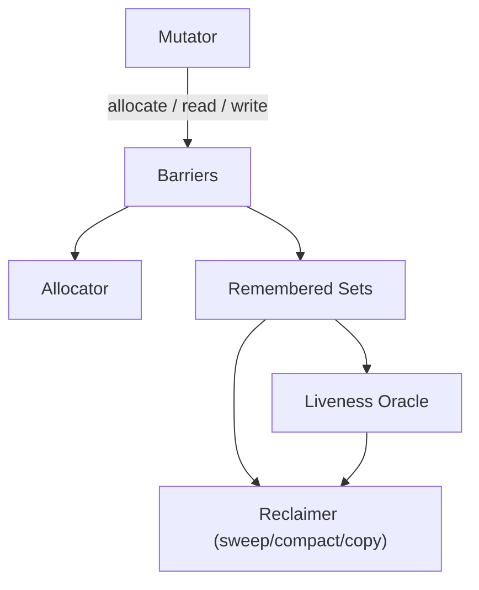

---

### 📶 Gradual Depth

**Level 1 - What it is:** A garbage collector automatically finds and reclaims memory occupied by objects your program no longer uses. It frees you from manual malloc/free but introduces pauses and CPU overhead.

**Level 2 - How to use it:** You choose a collector (G1, ZGC, Shenandoah, Parallel) and tune its parameters: heap size, pause target, generation ratios. Each collector makes different trade-offs in the latency-throughput-footprint triangle.

**Level 3 - How it works:** Every collector performs three jobs: allocate space for new objects (bump pointer vs free list), determine which objects are live (tracing from roots using tri-color marking), and reclaim dead space (sweep, compact, or copy). Generational collectors exploit the weak generational hypothesis - most objects die young - to collect the young generation frequently and cheaply.

**Level 4 - Production mastery:** At scale, allocation rate and object lifetime distribution determine which collector wins. High allocation rates with short-lived objects favor copying collectors with large young generations. Long-lived, mutating object graphs stress concurrent markers and their barrier overhead. The design space is a three-axis trade-off: latency (pause duration), throughput (percentage CPU spent on GC), and footprint (heap overhead for copy reserves, card tables, remembered sets). No collector wins on all three axes simultaneously - understanding which axis your workload cares about most is the foundational production decision.

---

### ⚙️ How It Works

**Phase 1 - Allocation:** The mutator requests memory. A bump-pointer allocator increments a pointer in a TLAB (thread-local allocation buffer) - O(1), zero contention. When the TLAB fills, the thread requests a new one from the global allocator.

**Phase 2 - GC trigger:** When allocation exhausts available space (or a proactive heuristic fires), GC begins. In generational collectors, young-gen fills trigger minor collections; old-gen pressure triggers major/mixed collections.

**Phase 3 - Root scanning:** The collector stops mutator threads at a safepoint and scans roots: stack frames, static fields, JNI handles. Each root is a starting node for liveness tracing.

**Phase 4 - Liveness tracing (tri-color marking):** Objects start white (unvisited). Roots are marked gray (discovered, children unscanned). When all children of a gray object are scanned, it turns black (live, fully scanned). Concurrent collectors must maintain the tri-color invariant: no black object may point directly to a white object. Write barriers (SATB or incremental update) enforce this.

**Phase 5 - Reclamation:** Strategy depends on the collector:

```
Sweep:    [LIVE][dead][LIVE][dead][dead]
  mark dead cells free -> fragmentation

Compact:  [LIVE][dead][LIVE][dead][dead]
  slide live left -> [LIVE][LIVE][........]

Copy:     From: [LIVE][dead][LIVE]
          To:   [LIVE][LIVE][...........]
  flip spaces -> old From becomes free

Evacuate: Region A: [LIVE][dead][dead]
  copy live to Region B, free entire A
```

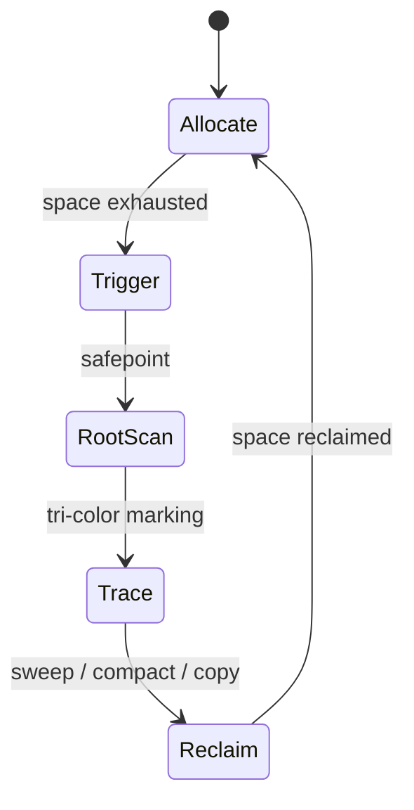

**BAD:**

```java
// Assuming GC will compact, allocating one
// huge contiguous array with no fallback
byte[] buf = new byte[2_000_000_000];
// With a sweep collector, this fails from
// fragmentation even with 3GB free
```

Why it fails: Sweep collectors create fragmented free lists where no single contiguous block is large enough.

**GOOD:**

```java
// Segmented allocation works with any
// reclamation strategy
int chunk = 64 * 1024 * 1024; // 64MB
List<byte[]> segments = new ArrayList<>();
for (int i = 0; i < 30; i++) {
    segments.add(new byte[chunk]);
}
```

Why it works: Avoids requiring one contiguous block, compatible with any collector's free-space layout.

---

### 🚨 Failure Modes

**Failure 1 - Fragmentation Death Spiral:**

**Symptom:** Allocation failures or full GC despite 30-40% heap free.

**Root cause:** A non-compacting (sweep) collector leaves gaps between live objects. Over time, no contiguous free region is large enough for allocation. This is why modern collectors (G1, ZGC) compact or evacuate.

**Diagnostic:**

```
jcmd <pid> GC.heap_info
# Compare "free" vs "max contiguous free"
# total free >> max contiguous = fragmentation
```

**Fix:** Switch from a non-compacting collector to one that compacts (G1, ZGC, Shenandoah). If stuck on deprecated CMS, force compaction with `-XX:CMSFullGCsBeforeCompaction=0`.

**Failure 2 - Premature Promotion (Generational Hypothesis Violation):**

**Symptom:** Frequent old-gen GCs, high promotion rate in GC logs, mixed/full GCs dominating pause time.

**Root cause:** Objects survive just long enough to be promoted to old gen but die shortly after. This defeats the generational hypothesis. Common cause: request-scoped caches or session objects that outlive one young-gen cycle.

**Diagnostic:**

```bash
grep "promotion" gc.log | tail -20
# Or via JFR:
jcmd <pid> JFR.start duration=60s \
  settings=profile filename=promo.jfr
# Check jdk.PromoteObjectOutsidePLAB events
```

**Fix:** Increase young-gen size (`-Xmn` or `-XX:NewRatio`) so short-lived objects die before promotion. Alternatively, reduce object lifetime by releasing references sooner (clear caches per-request, not per-session).

---

### 🔬 Production Reality

A team runs a trading system on G1GC with a 16GB heap. Latency is fine under normal load but P99 spikes to 200ms during market open when order rates jump 10x. GC logs show frequent mixed collections evacuating old-gen regions. Root cause: the burst allocation rate temporarily violates the generational hypothesis. Orders create large object graphs that survive exactly two young-gen cycles (enough to be promoted), then die 500ms later in old gen. The fix is not GC tuning - it is application-level: pooling order objects so they are reused rather than allocated and promoted. After pooling, promotion rate drops 85% and mixed GC pauses drop below 20ms. The lesson: understanding the allocator-marker-reclaimer chain reveals that the cheapest fix is often reducing allocation rate, not tuning the collector.

---

### ⚖️ Trade-offs & Alternatives

| Aspect          | G1GC          | ZGC            | Parallel GC   | Shenandoah |
| --------------- | ------------- | -------------- | ------------- | ---------- |
| Reclamation     | Evacuate      | Relocate+remap | Compact       | Evacuate   |
| Pause target    | 200ms default | < 1ms          | None (max TP) | < 10ms     |
| Barrier type    | Write (cards) | Read (colored) | None          | Read+write |
| Footprint cost  | Moderate      | High (mapping) | Low           | Moderate   |
| Throughput cost | ~5-10%        | ~5-15%         | ~1-3%         | ~5-15%     |
| Best for        | General       | Ultra-low lat  | Batch/compute | Low-lat    |

---

### ⚡ Decision Snap

**USE WHEN:**

- You need to understand why a collector behaves the way it does, not just how to tune it
- You are evaluating a new collector (e.g., Generational ZGC) and need to assess its design trade-offs
- You are building or modifying a runtime, language VM, or memory management subsystem

**AVOID WHEN:**

- You just need to pick a collector for a standard web service (use decision frameworks instead)
- Application-level fixes (object pooling, reducing allocation rate) have not been tried first

**PREFER JVM-060 G1 Region-Based Design WHEN:**

- You need practical understanding of one specific collector before generalizing across all of them

---

### ⚠️ Top Traps

| #   | Misconception                              | Reality                                                                                                                                                                         |
| --- | ------------------------------------------ | ------------------------------------------------------------------------------------------------------------------------------------------------------------------------------- |
| 1   | "Concurrent GC means no pauses"            | Every concurrent collector has brief STW phases for root scanning and final remarking. "Low pause" not "no pause."                                                              |
| 2   | "Copying collectors waste half the heap"   | Modern region-based evacuators (G1, ZGC) copy only selected regions, not an entire semi-space. Reserve is typically 5-15%, not 50%.                                             |
| 3   | "Reference counting avoids GC pauses"      | Reference counting cannot handle cyclic references without supplemental tracing. Atomic increments on shared objects are also expensive under contention.                       |
| 4   | "Bigger heap always reduces GC frequency"  | Bigger heap means more work per collection. With mark-sweep, a 64GB heap can produce multi-second full GCs. The right fix depends on allocation rate and lifetime distribution. |
| 5   | "The generational hypothesis always holds" | It holds for typical request-response workloads but breaks for caches, session stores, and long-lived streaming pipelines where most objects are tenured.                       |

---

### 🪜 Learning Ladder

**Prerequisites:**

- JVM-026 Heap and Stack - understand where objects live and why stack allocation is free
- JVM-060 G1 Region-Based Design - know region-based collection before abstracting the pattern
- JVM-076 Reading GC Logs - ability to observe collector behavior in production

**THIS:** JVM-118 Designing a GC from First Principles

**Next steps:**

- JVM-119 GC Research - Pauseless GC (Azul C4 Paper) - see these principles applied in a radical read-barrier design
- JVM-125 Region-Based Memory Management Research - the academic foundations behind modern region collectors
- JVM-120 Project Valhalla - how value types change the allocation story that GC must handle

---

**The Surprising Truth:**

The single most impactful GC optimization in most production systems is not tuning the collector - it is reducing allocation rate. Object pooling, escape analysis (which the JIT performs automatically), and value types (Project Valhalla) all attack the problem before the collector ever sees it. The best GC cycle is the one that never runs.

---

**Further Reading:**

- Richard Jones, Antony Hosking, Eliot Moss - "The Garbage Collection Handbook" (2nd ed., CRC Press) - the definitive reference covering every algorithm described here
- David Ungar - "Generation Scavenging: A Non-Disruptive High Performance Storage Reclamation Algorithm" (ACM SIGSOFT/SIGPLAN, 1984) - the original generational hypothesis paper
- Dijkstra, Lamport, et al. - "On-the-Fly Garbage Collection: An Exercise in Cooperation" (CACM, 1978) - the foundational tri-color marking algorithm for concurrent GC

---

**Revision Card:**

1. Every GC is three subsystems (allocator, liveness oracle, reclaimer) - identifying which subsystem is under stress tells you where to fix.
2. The latency-throughput-footprint triangle means no collector wins on all three axes; choose the axis your workload cares about most.
3. The generational hypothesis breaks for caches and streaming pipelines - if promotion rate is high, question the assumption before tuning the collector.

---

---

# JVM-119 GC Research - Pauseless GC (Azul C4 Paper)

**TL;DR** - C4 uses read barriers and self-healing references to relocate objects concurrently, proving sub-millisecond GC pauses are achievable at multi-hundred-gigabyte heap scales.

---

### 🔥 Problem Statement

Concurrent marking solves half the GC problem - you can identify garbage without stopping the world. But reclamation through compaction still requires moving live objects, which means updating every pointer to them. Traditional collectors (including G1) stop the world to relocate objects and fix up references. On a 256GB heap with millions of live objects, even "short" evacuation pauses stretch to tens or hundreds of milliseconds. Financial trading systems, real-time bidding platforms, and telecom switches cannot tolerate these pauses. The C4 paper (Tene, Iyengar, Wolf) demonstrated that concurrent compaction is possible using read barriers instead of write barriers - eliminating the last remaining source of significant GC pauses.

---

### 📜 Historical Context

Before C4, concurrent collectors like CMS (JDK 1.4, 2002) performed concurrent marking but fell back to stop-the-world full GC for compaction. G1 (production-ready in JDK 7u4, 2012) reduced pause scope by evacuating selected regions but still stopped the world during evacuation. Azul Systems, building custom hardware (Vega processors) and later the Zing JVM, needed guaranteed sub-millisecond pauses for financial services clients running 100GB+ heaps. The C4 paper, published at ISMM 2011, proved that a loaded value barrier (read barrier) could enable fully concurrent relocation. This insight directly influenced ZGC (JEP 333, JDK 11) and Shenandoah's concurrent evacuation, making C4 one of the most impactful GC research contributions of the 2010s.

---

### 🔩 First Principles

**CORE INVARIANTS:**

1. A reference must always resolve to the correct object even if that object has been relocated - every load must be checked or the pointer must self-heal
2. Concurrent relocation requires a mechanism to atomically redirect access from old location to new location without stopping mutator threads
3. Read barriers are sufficient for concurrent compaction - write barriers alone cannot intercept stale pointer loads

**DERIVED DESIGN:**

Invariant 1 requires intercepting every pointer load, not just stores. C4's Loaded Value Barrier (LVB) checks every reference when loaded from the heap: if the reference points to a relocated page, the barrier fixes it in place (self-healing). Invariant 2 is solved via virtual memory page protection and remapping - old pages are protected, access triggers a trap, and the OS remaps virtual addresses. Invariant 3 explains why C4 chose read barriers over G1's write-barrier approach: write barriers track reference stores but cannot prevent a thread from loading and using a stale pointer to a relocated object.

**THE TRADE-OFF:**

**Gain:** Truly concurrent compaction with sub-millisecond pauses at any heap size
**Cost:** Read barrier overhead on every pointer load (typically 5-15% throughput), plus reliance on OS virtual memory primitives

---

### 🧠 Mental Model

> Imagine a post office that continuously reorganizes mailboxes. In a traditional system, the office closes (stop-the-world) to move mail between boxes and update the directory. C4's approach: every mailbox has a forwarding slip. When you check your old box number, the slip redirects you to the new location and you update your address book so next time you go directly. The post office never closes.

- "Forwarding slip" -> loaded value barrier check
- "Update your address book" -> self-healing reference fix
- "Post office never closes" -> concurrent relocation without STW

**Where this analogy breaks down:** Real C4 uses OS virtual memory page protection for bulk forwarding, not per-object slips - the mechanism operates at page granularity, not individual object granularity.

---

### 🧩 Components

- **Loaded Value Barrier (LVB)** - code injected at every heap reference load that checks whether the pointer is stale (pointing to a relocated page) and fixes it if so.
- **Concurrent Marker** - standard tri-color concurrent marking using SATB (snapshot-at-the-beginning) write barrier to maintain the marking invariant.
- **Relocation Set** - pages selected for compaction based on garbage density, analogous to G1's collection set but processed concurrently.
- **Page Protection / Remap** - OS virtual memory protection marks relocated pages as trapped; first access triggers the LVB to remap the reference.
- **Forwarding Table** - maps old page addresses to new locations; entries are removed as references self-heal.

```
Mutator loads ref
       |
       v
+------------------+
| Loaded Value     |
| Barrier (LVB)    |
+--------+---------+
    |         |
    | good    | stale (relocated page)
    v         v
 use obj   +-------------+
           | Forwarding  |
           | Table       |
           +------+------+
                  |
                  v
           +-------------+
           | Fix ref     |
           | in-place    |
           | (self-heal) |
           +------+------+
                  |
                  v
             use new obj
```

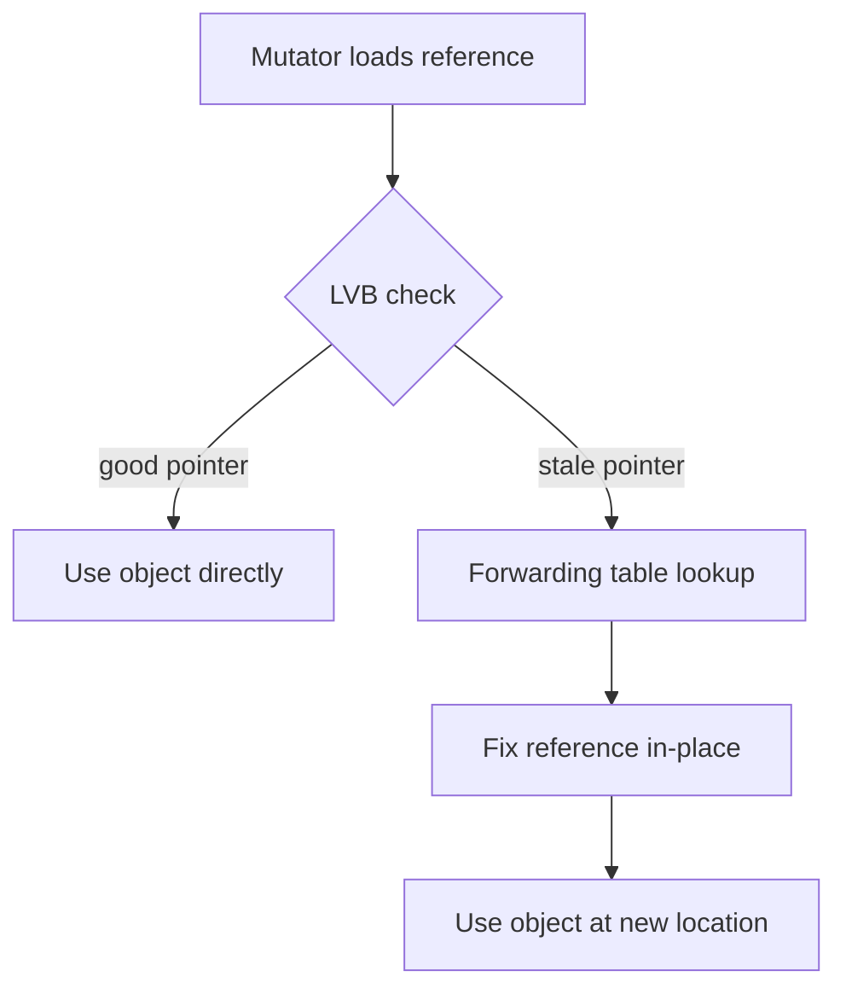

---

### 📶 Gradual Depth

**Level 1 - What it is:** C4 is a garbage collector designed by Azul Systems that can compact the heap (move objects) without stopping your application. It achieves pauses under 1 millisecond even on heaps of hundreds of gigabytes.

**Level 2 - How to use it:** ZGC (available in standard OpenJDK) adopted C4's core insight: check every pointer load with a barrier and fix stale pointers on access. Select ZGC with `-XX:+UseZGC` for sub-millisecond pause behavior inspired by C4.

**Level 3 - How it works:** C4 inserts a loaded value barrier at every reference load. When the GC relocates objects from one page to another, it protects the old page via OS virtual memory. When a thread loads a reference pointing to the old page, the LVB detects the stale pointer, looks up the new location in a forwarding table, updates the reference in-place (self-healing), and returns the correct address. After all references heal, the old page is freed.

**Level 4 - Production mastery:** C4's throughput cost comes from the LVB executing on every heap load - not just writes. On pointer-chasing workloads (linked lists, trees), this overhead is measurable (typically 5-15%). The self-healing property amortizes the cost: each stale reference is fixed once, then subsequent loads bypass the forwarding table. The key production concern is ensuring relocation rate keeps pace with allocation rate. If allocation outpaces relocation, even C4 must stall mutator threads. Monitoring concurrent relocation throughput versus allocation rate is the primary operational metric.

---

### ⚙️ How It Works

**Phase 1 - Concurrent Marking:** C4 traces the object graph concurrently using SATB write barriers (same principle as G1). The marker identifies live objects per page and calculates page garbage density.

**Phase 2 - Relocation Set Selection:** Pages with the highest garbage ratio are selected for relocation. This is analogous to G1's collection set selection but processed fully concurrently.

**Phase 3 - Concurrent Relocation:** For each selected page: (a) live objects are copied to new pages, (b) forwarding table entries map old addresses to new, (c) the old page is protected via OS virtual memory. No STW pause is needed because the LVB handles any mutator access to relocated pages.

**Phase 4 - Self-Healing (Lazy Remap):** When a mutator thread loads a reference to a protected page, the LVB fires, looks up the forwarding table, updates the reference in the heap location it was loaded from, and returns the new address. Future loads go directly to the new location.

**Phase 5 - Page Reclamation:** Once all references to an old page are healed (forwarding table reference count reaches zero), the page is freed for reuse.

```
Page A (selected for relocation):
+------+------+------+------+
| obj1 | dead | obj2 | dead |
+------+------+------+------+
      | relocate live objects
      v
Page B (target):
+------+------+-----------+
| obj1'| obj2'|   free    |
+------+------+-----------+

Forwarding table:
  obj1@A -> obj1'@B
  obj2@A -> obj2'@B

Page A: PROTECTED (OS VM trap)

Thread loads ref to obj1@A:
  LVB -> forward -> fix ref -> obj1'@B
  (self-healed: ref now points to B)
```

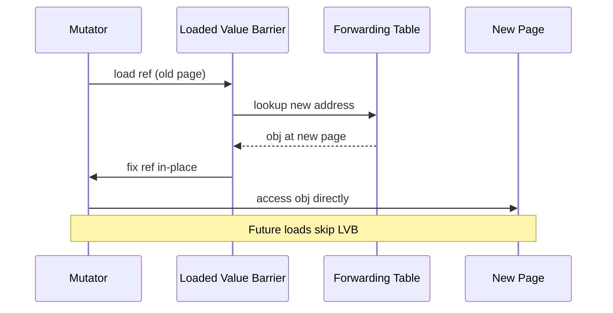

**BAD:**

```
# Relying on G1 STW evacuation for a
# latency-sensitive 256GB heap:
-XX:+UseG1GC
-XX:MaxGCPauseMillis=10
-XX:G1HeapRegionSize=32m
# Mixed GC pauses still reach 50-100ms
# because evacuation is stop-the-world
```

Why it fails: G1 evacuates during STW pauses. On very large heaps, the pause target is aspirational - the collector cannot evacuate enough regions within 10ms.

**GOOD:**

```
# Concurrent compaction collector inspired
# by C4 principles:
-XX:+UseZGC
-XX:+ZGenerational
-Xmx256g
# ZGC relocates concurrently using colored
# pointers (load barriers), decoupling
# pause time from heap size
```

Why it works: ZGC's load barrier and concurrent relocation (inspired by C4) ensure pause time is independent of heap size.

---

### 🚨 Failure Modes

**Failure 1 - Allocation Stall (Relocation Cannot Keep Pace):**

**Symptom:** Application threads block on allocation despite heap not being full. GC logs show "Allocation Stall" events.

**Root cause:** Concurrent relocation rate is slower than the application's allocation rate. C4 (and ZGC) must throttle or stall allocators if relocation falls behind. This mirrors the fundamental invariant: allocation rate must not permanently exceed reclamation rate.

**Diagnostic:**

```bash
# ZGC (C4-inspired) - check allocation stalls:
grep "Allocation Stall" gc.log
# Check relocation vs allocation rate:
jcmd <pid> GC.heap_info
```

**Fix:** Reduce allocation rate (object pooling, reducing temporary object creation) or increase heap so the collector has more runway. Do not reduce heap - that makes the problem worse.

**Failure 2 - Barrier Throughput Degradation:**

**Symptom:** Throughput drops 10-20% after switching to a read-barrier collector (ZGC/Shenandoah). CPU profiling shows significant time in barrier code.

**Root cause:** Pointer-chasing workloads (tree traversals, graph algorithms, linked-list walks) execute the load barrier on every reference load. Unlike write barriers (which fire only on stores), read barriers fire on every load - and loads vastly outnumber stores.

**Diagnostic:**

```bash
# Profile barrier overhead:
async-profiler -e cpu -d 30 \
  -f profile.html <pid>
# Look for ZGC/Shenandoah barrier frames
# in the flame graph
```

**Fix:** For pointer-chasing batch jobs, Parallel GC (no barriers) with higher pause tolerance may yield better total throughput. For latency-sensitive services, accept the barrier cost as the price of sub-millisecond pauses.

---

### 🔬 Production Reality

A real-time bidding platform processing 500K requests/second ran on G1GC with a 128GB heap. P99 latency was 50ms, but P99.9 spiked to 300ms during mixed GC evacuations. The team switched to ZGC (which implements C4-inspired concurrent relocation). P99.9 dropped to 8ms. However, they observed a roughly 12% throughput reduction from load barrier overhead - CPU utilization rose from 65% to 73% on the same hardware. The team accepted this trade-off because the latency improvement outweighed the throughput cost. They provisioned two additional servers to compensate. The lesson from C4's design: concurrent compaction eliminates tail latency at the cost of per-operation overhead. Whether this trade-off is favorable depends on whether your bottleneck is latency or throughput.

---

### ⚖️ Trade-offs & Alternatives

| Aspect          | C4 (Zing)  | ZGC (OpenJDK)  | Shenandoah  | G1GC          |
| --------------- | ---------- | -------------- | ----------- | ------------- |
| Compaction      | Concurrent | Concurrent     | Concurrent  | STW evacuate  |
| Barrier type    | Read (LVB) | Read (colored) | Read+write  | Write (cards) |
| Self-healing    | Yes        | Yes (remap)    | Brooks ptr  | No            |
| Pause bound     | < 1ms      | < 1ms          | < 10ms typ. | Configurable  |
| Throughput cost | 5-15%      | 5-15%          | 5-15%       | 3-8%          |
| Heap sweet spot | 10GB-1TB+  | 8GB-16TB       | 4GB-128GB   | 4GB-64GB      |
| Availability    | Commercial | OpenJDK 15+    | OpenJDK 12+ | OpenJDK 9+    |

---

### ⚡ Decision Snap

**USE WHEN:**

- Your workload has strict latency SLAs (P99 < 10ms) on heaps larger than 8GB
- Tail latency matters more than raw throughput
- You are evaluating collector architectures or contributing to GC research

**AVOID WHEN:**

- Throughput is the primary metric and you can tolerate 100ms+ pauses (use Parallel GC)
- Heap is under 4GB where barrier overhead is not justified

**PREFER G1GC WHEN:**

- You need a general-purpose collector with moderate pauses and lower barrier overhead than read-barrier collectors

---

### ⚠️ Top Traps

| #   | Misconception                                         | Reality                                                                                                                                                                         |
| --- | ----------------------------------------------------- | ------------------------------------------------------------------------------------------------------------------------------------------------------------------------------- |
| 1   | "C4 has zero overhead"                                | The loaded value barrier executes on every heap reference load. Throughput cost is typically 5-15%, higher on pointer-chasing workloads.                                        |
| 2   | "ZGC is identical to C4"                              | ZGC uses colored pointers (metadata in unused address bits) instead of C4's page-protection LVB. The principle is similar but the mechanism differs significantly.              |
| 3   | "Concurrent compaction means GC never stalls the app" | If allocation rate exceeds relocation rate, even C4/ZGC must stall allocating threads. Concurrent does not mean unbounded.                                                      |
| 4   | "Read barriers are always better than write barriers" | Read barriers fire far more frequently (loads >> stores). For throughput-bound workloads, write-barrier-only collectors like G1 may be preferable.                              |
| 5   | "Self-healing references have no cost"                | The first access to a relocated object pays the forwarding lookup cost. Right after relocation, many stale references heal simultaneously, causing a burst of barrier activity. |

---

### 🪜 Learning Ladder

**Prerequisites:**

- JVM-118 Designing a GC from First Principles - the design space vocabulary that C4's choices operate within
- JVM-060 G1 Region-Based Design - understand region-based collection before learning concurrent relocation
- JVM-048 JIT Compilation Tiers - understand how JIT-compiled code includes barrier instructions

**THIS:** JVM-119 GC Research - Pauseless GC (Azul C4 Paper)

**Next steps:**

- JVM-125 Region-Based Memory Management Research - the academic lineage that C4 builds upon
- JVM-116 JVM Specification - how the spec constrains what barriers a collector can use
- JVM-120 Project Valhalla - how value types reduce the pointer loads that barriers must intercept

---

**The Surprising Truth:**

C4's most counterintuitive insight is that read barriers are cheaper overall than stop-the-world compaction pauses, even though read barriers fire on every single pointer load. The math works because pause costs are non-linear: a 100ms pause during peak traffic can cause cascading timeouts, retry storms, and SLA violations whose total cost dwarfs the steady-state 10% throughput overhead of barriers spread evenly across all operations.

---

**Further Reading:**

- Tene, Iyengar, Wolf - "C4: The Continuously Concurrent Compacting Collector" (ISMM 2011) - the foundational paper describing the Loaded Value Barrier and concurrent relocation
- Click, Tene, Wolf - "The Pauseless GC Algorithm" (VEE 2005) - the earlier Azul paper on pauseless GC that preceded C4 on custom Vega hardware
- Per Liden, Stefan Karlsson - JEP 333: ZGC: A Scalable Low-Latency Garbage Collector - OpenJDK's implementation drawing on C4 concepts with colored pointers

---

**Revision Card:**

1. C4 proves concurrent compaction is possible via read barriers (loaded value barrier) that intercept stale pointers and self-heal them on access.
2. The trade-off is explicit: eliminate tail-latency spikes by paying 5-15% steady throughput cost on every pointer load.
3. Even concurrent collectors stall when allocation outpaces relocation - monitor allocation rate vs relocation throughput, not just pause times.

---

---

# JVM-120 Project Valhalla - Value Types and Flat Memory

**TL;DR** - Valhalla introduces value classes - identity-free types stored inline without object headers - enabling flat memory layouts that eliminate pointer chasing and GC pressure for data-heavy Java.

---

### 🔥 Problem Statement

Every Java object carries a 12-16 byte header (mark word + class pointer) and lives behind a pointer on the heap. An array of one million `Point(int x, int y)` objects means one million pointers, one million headers, and one million scattered heap allocations. Iterating that array chases pointers across cache lines, stalling the CPU pipeline. GC must trace every pointer. A C struct array of the same data - flat, contiguous, no headers - fits in a fraction of the memory and iterates at memory bandwidth speed. Java has no equivalent. Data-intensive workloads (financial calculations, scientific computing, game engines, ML preprocessing) pay a 2-5x memory overhead and significant cache-miss penalties for this object model tax. Valhalla exists to close this gap without abandoning Java's type safety, generics, or garbage collection.

---

### 📜 Historical Context

The Valhalla project began around 2014 under Brian Goetz's leadership at Oracle, motivated by the growing gap between Java's object model and hardware reality. Modern CPUs reward sequential memory access with prefetching and cache-line efficiency - but Java's pointer-heavy heap layout defeats both. Early attempts to fix this (escape analysis, scalar replacement) helped only for short-lived objects the JIT could prove never escape a method. Valhalla's insight: the root cause is object identity. Most data-carrier classes (points, complex numbers, timestamps, colors) never need identity - they are pure data. Remove identity, and the JVM can flatten them into their container, just like primitives. The project has evolved through multiple JEP iterations, with JEP 401 (Value Classes and Objects) defining the core semantics.

---

### 🔩 First Principles

**CORE INVARIANTS:**

1. A value class has no identity - two instances with the same field values are indistinguishable and interchangeable, like two `int` values of 42.
2. Without identity, the JVM is free (not obligated) to flatten value objects into their containing structure, eliminating the pointer and header.
3. Flattening is an optimization, not a guarantee - the JVM decides based on size, alignment, and container type whether to flatten or box.
4. Removing identity removes identity-dependent operations: synchronization, identity comparison (`==` on references), and `System.identityHashCode` become forbidden or change semantics for value classes.

**DERIVED DESIGN:**

Invariant 1 means value classes are defined by their fields, not their address - like primitives but with methods and type safety. Invariant 2 means arrays of value types can be stored as flat structs, not pointer arrays. Invariant 3 means the runtime remains free to box when needed (passing to generic methods pre-specialization). Invariant 4 means migrating existing classes to value classes is a compatibility decision - any code that synchronizes on them or relies on identity comparison will break.

**THE TRADE-OFF:**

**Gain:** Flat memory layout, eliminated headers, cache-friendly iteration, reduced GC pressure, primitive-like performance with class-like abstraction.

**Cost:** No identity means no synchronization, no identity-sensitive operations, constrained class hierarchy, and migration risks for existing identity-dependent code.

---

### 🧠 Mental Model

> Value types are like spreadsheet cells. An identity object is like a labeled filing cabinet drawer - it has a location, a handle, and you can lock it. A value type is like the number written in a cell - it has no location of its own, only the cell it lives in. Copy the number to another cell and both hold identical, independent values. There is no "original" and "copy" - just data.

- "Filing cabinet drawer" -> identity object (header + heap pointer)
- "Number in a cell" -> value type (raw data, no header)
- "Copying the number" -> assignment copies fields, not a pointer
- "Locking the drawer" -> `synchronized` - impossible on values

**Where this analogy breaks down:** Spreadsheet cells are always flat. Value objects can contain references to identity objects as fields, creating a mix of flat and pointer-based layout within a single value type.

---

### 🧩 Components

- **Value class declaration:** A class with the `value` modifier. No identity, no synchronization. Fields define equality semantics.
- **Null-restricted types:** Types that cannot hold null, enabling the JVM to flatten without reserving a null sentinel (related to JEP 402 proposals).
- **Flattening engine:** JVM internal that decides whether to store value objects inline or boxed, based on size, alignment, and container context.
- **Scalarization (JIT):** The JIT decomposes method-local value objects into component fields, storing them in registers - zero heap allocation.
- **Specialized generics (future):** Planned feature where `List<Point>` stores Points inline rather than boxed - eliminates autoboxing for value types in generic contexts.

```text
Memory Layout Comparison:

  Identity Object (today):
  +------+-------+------+------+
  | mark | klass | x 4B | y 4B |
  +------+-------+------+------+
   8B      4B      4B     4B = 20B+

  Value Object (Valhalla):
  +------+------+
  | x 4B | y 4B |
  +------+------+
   4B      4B = 8B (no header)

  Array of 3 Identity Points:
  [ptr]->[hdr|x|y] [ptr]->[hdr|x|y] ...
    scattered, pointer chasing

  Array of 3 Value Points (flat):
  [x|y|x|y|x|y]  contiguous, sequential
```

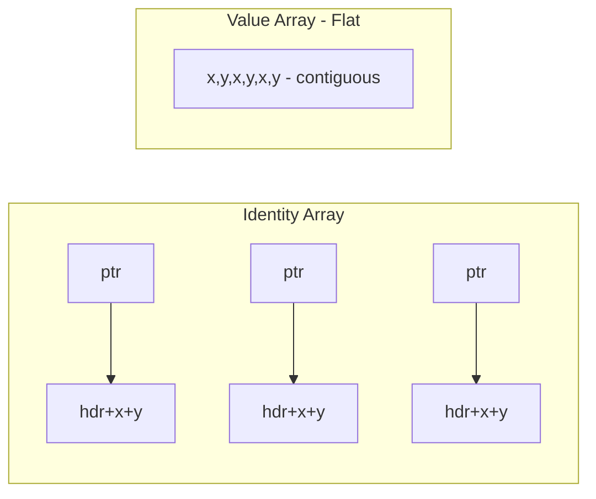

---

### 📶 Gradual Depth

**Level 1 - What it is:** Value types are Java classes that carry data without object identity. They behave like `int` or `double` - pure values with no heap overhead - but support methods, interfaces, and type safety like regular classes.

**Level 2 - How to use it:** Declare a class with the `value` modifier. Its fields define equality. You cannot synchronize on it or use `==` for identity comparison. Use value classes for small data carriers: coordinates, money amounts, timestamps, color tuples.

**Level 3 - How it works:** The JVM recognizes value classes and may flatten them into their containing array or object. A `value Point[1000]` can be stored as `[x0,y0,x1,y1,...,x999,y999]` - contiguous memory with no headers or pointers. The JIT scalarizes method-local value objects into registers, avoiding allocation entirely. When a value must be passed to a generic API expecting `Object`, the JVM boxes it temporarily, then unboxes when possible.

**Level 4 - Production mastery:** The real benefit appears in data-intensive tight loops: matrix operations, financial pricing engines, particle simulations, columnar data processing. Measure impact by comparing cache miss rates (`perf stat -e cache-misses`) before and after migration. Flattening is not guaranteed for large value types - the JVM may decide copy cost exceeds indirection cost. Null-restricted types remove another barrier: without null, the JVM needs no sentinel value to distinguish "absent" from "present" in a flat array. Migration requires auditing all synchronization and identity-comparison usage on candidate classes.

---

### ⚙️ How It Works

**Phase 1 - Declaration.** Developer marks a class as `value`. The compiler enforces: no synchronization, implicitly final fields, no extending other classes besides Object.

**Phase 2 - Compilation.** `javac` emits bytecode with a value class flag. Methods that accept or return value types carry descriptor metadata enabling flattening decisions.

**Phase 3 - JVM loading.** The class loader validates value class constraints. The layout engine computes flat size and alignment requirements.

**Phase 4 - Runtime flattening.** When allocating an array of value types, the JVM allocates one contiguous block sized to hold all elements inline. Field access uses offset arithmetic, not pointer dereference.

**Phase 5 - JIT scalarization.** For method-local value objects, the JIT decomposes the object into its fields, placing them in registers or stack slots. No heap allocation occurs.

```text
Flattening Decision Flow:

  value class Point(int x, int y)
    |
    +-- Array allocation?
    |     +-- Size <= threshold?
    |     |   YES -> flat [x,y,x,y,...]
    |     |   NO  -> boxed [ptr,ptr,...]
    |
    +-- Field in another class?
    |     +-- Null-restricted?
    |         YES -> flatten into parent
    |         NO  -> keep as pointer
    |
    +-- Method-local only?
          YES -> scalarize (registers)
```

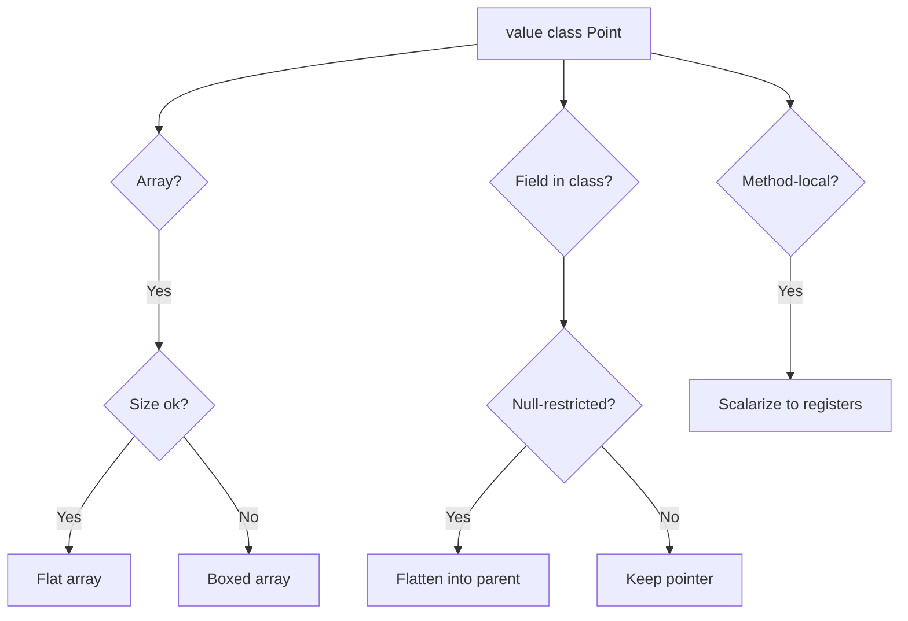

**BAD:**

```java
// Identity class for pure data carrier
public class Point {
    final int x, y;
    Point(int x, int y) {
        this.x = x; this.y = y;
    }
}
// 1M objects: 1M ptrs + 1M headers = ~20MB
Point[] pts = new Point[1_000_000];
for (int i = 0; i < pts.length; i++)
    pts[i] = new Point(i, i);
```

Why it fails: each Point has a 16-byte header plus a pointer. Iterating chases one million pointers across scattered heap locations, defeating CPU prefetching.

**GOOD:**

```java
// Value class: no identity, flat layout
public value class Point {
    int x, y;
    Point(int x, int y) {
        this.x = x; this.y = y;
    }
}
// 1M values: flat [x,y,x,y,...] = ~8MB
Point[] pts = new Point[1_000_000];
for (int i = 0; i < pts.length; i++)
    pts[i] = new Point(i, i);
```

Why it works: no headers, no pointers. Array stores fields contiguously. Iteration reads sequential memory at cache-line speed. GC traces zero pointers in this array.

---

### 🚨 Failure Modes

**Failure 1 - Synchronization on migrated class:**

**Symptom:** Application throws `IllegalMonitorStateException` or fails to compile after a library class is migrated to a value class.

**Root cause:** Code synchronizes on an instance of the class. Value classes have no identity, so they cannot serve as monitor objects. The compiler rejects `synchronized(point)` at compile time, but if the migration happens in a dependency, existing bytecode may fail at runtime.

**Diagnostic:**

```bash
# Find synchronized usage on candidate class
grep -rn "synchronized.*Point" \
  src/ --include="*.java"
# At runtime, check for monitor errors
jcmd <pid> Thread.print | grep -A5 "locked"
```

**Fix:** Audit all synchronization usage before migrating a class to `value`. Replace `synchronized(point)` with an explicit `ReentrantLock` or a dedicated lock object. Never synchronize on data-carrier objects - this has been a warning since JDK 16 for `@ValueBased` classes.

**Failure 2 - Identity comparison semantics change:**

**Symptom:** Cache or deduplication logic silently breaks. `==` comparison returns `true` for structurally equal but previously distinct objects, or `IdentityHashMap` lookups lose entries.

**Root cause:** Code uses `==` to compare references or uses `IdentityHashMap` with instances of the now-value class. Value types define equality by fields, making `==` equivalent to `.equals()`.

**Diagnostic:**

```bash
# Search for identity-sensitive operations
grep -rn "IdentityHashMap\|identityHashCode" \
  src/ --include="*.java"
grep -rn "==.*point\|point.*==" \
  src/ --include="*.java"
```

**Fix:** Replace `IdentityHashMap` with `HashMap` (which uses `.equals()`). Replace `==` comparisons with `.equals()` before migration. The compiler warns about `==` on value types when the static type is known, but not when hidden behind `Object`.

---

### 🔬 Production Reality

The pattern that will cause the most migration pain: third-party libraries that synchronize on value-eligible types. Consider `java.time.Instant` - a prime candidate for value class migration (immutable, identity-free semantics). But any code that ever wrote `synchronized(myInstant)` will break. The JDK team has flagged identity-sensitive operations on "value-based classes" (like `Optional`, `LocalDate`, `Instant`) with warnings since JDK 16. In practice, codebases accumulate these violations silently because warnings are runtime-only and load-path-dependent. The safe migration path: enable JDK 16+ warnings aggressively, run the full test suite, and grep for `@ValueBased` usages in synchronized contexts. Organizations that treated these warnings as informational rather than blocking will face a harder migration when Valhalla reaches general availability. Start auditing today - run `jdeprscan` against your classpath and search for synchronized blocks on JDK value-based classes.

---

### ⚖️ Trade-offs & Alternatives

| Aspect        | Valhalla Values      | Primitive Arrays  | Off-Heap (Panama) |
| ------------- | -------------------- | ----------------- | ----------------- |
| Type safety   | Full (methods, intf) | None (raw ints)   | None (raw bytes)  |
| Memory layout | Flat, JVM-managed    | Flat, JVM-managed | Flat, manual      |
| GC pressure   | Reduced (fewer obj)  | Minimal           | None (off-heap)   |
| Null handling | Configurable         | No nulls          | Manual encoding   |
| Generics      | Planned (specialize) | Boxing required   | N/A               |
| Migration     | Audit identity usage | Rewrite types     | Rewrite access    |
| Abstraction   | Classes w/ behavior  | Raw data          | Raw bytes         |

---

### ⚡ Decision Snap

**USE WHEN:**

- Data-carrier classes dominate memory and allocation rate is high (points, vectors, tuples, money types).
- Workload iterates large arrays of small objects where cache miss rate is the bottleneck.
- You need primitive-like performance with type safety, methods, and interface implementation.

**AVOID WHEN:**

- Classes require identity (synchronization targets, reference-equality semantics, mutable shared state).
- Object size is large (typically >64 bytes) - flattening trades pointer indirection for copy cost.

**PREFER Off-Heap (Panama) WHEN:**

- Data lifetime must be managed outside GC entirely (memory-mapped files, shared memory, native interop).
- Data is consumed by native code that cannot interact with JVM-managed flat arrays.

---

### ⚠️ Top Traps

| #   | Misconception                          | Reality                                                                                                                                   |
| --- | -------------------------------------- | ----------------------------------------------------------------------------------------------------------------------------------------- |
| 1   | "Value types are always flattened"     | Flattening is a JVM optimization, not a guarantee. Large value types or nullable contexts may remain boxed.                               |
| 2   | "Just add `value` to existing classes" | Any code synchronizing on the class or using `==` for identity breaks. Migration requires a full audit.                                   |
| 3   | "Value types replace records"          | Records can have identity. Value records combine both, but records are not automatically value types.                                     |
| 4   | "Performance gains are automatic"      | Gains appear only in allocation-heavy, iteration-heavy paths. A single Point field in a large object saves 12 bytes - not transformative. |
| 5   | "Null is free for value types"         | Nullable value types may require boxing or a sentinel, defeating flattening. Null-restricted types solve this.                            |

---

### 🪜 Learning Ladder

**Prerequisites:**

- JVM-026 Heap and Stack - understand object headers, pointer layout, and heap structure that Valhalla eliminates
- JVM-048 JIT Compilation Tiers - understand escape analysis and scalar replacement that partially solve the same problem today
- JVM-116 JVM Specification - the formal object model that value types extend

**THIS:** JVM-120 Project Valhalla - Value Types and Flat Memory

**Next steps:**

- JVM-125 Region-Based Memory - alternative memory management models enabled by flat layouts
- JVM-122 Project Leyden - startup and footprint optimization that compounds with value type benefits
- JVM-124 Formal Verification - proving invariants about identity-free types in safety-critical systems

---

**The Surprising Truth:**

The hardest part of Valhalla is not the implementation - it is the migration. Java's entire ecosystem implicitly assumes every object has identity. Serialization frameworks store identity graphs. Dependency injection containers use identity for singleton scoping. Even `==` in test assertions implicitly tests identity. Valhalla does not just add a feature - it splits the Java type system into identity types and value types, and every library must eventually declare which side each class belongs to.

---

**Further Reading:**

- [JEP 401: Value Classes and Objects](https://openjdk.org/jeps/401) - the core Valhalla JEP defining value class semantics and JVM representation
- [State of Valhalla - Background (Brian Goetz)](https://openjdk.org/projects/valhalla/design-notes/state-of-valhalla/01-background) - design rationale and project evolution from the lead architect
- [JEP 218: Generics over Primitive Types](https://openjdk.org/jeps/218) - the companion generics specialization JEP enabling `List<int>` and `List<Point>` without boxing

---

**Revision Card:**

1. Value types eliminate object headers and pointers - enabling flat arrays that iterate at memory bandwidth speed instead of chasing scattered heap locations.
2. Flattening is an optimization, not a guarantee - large values, nullable contexts, and generic erasure can force boxing back.
3. Migration breaks any code that synchronizes on the class or relies on reference identity - audit all `synchronized`, `==`, and `IdentityHashMap` usage before converting.

---

---

# JVM-121 Project Panama - Foreign Function and Memory

**TL;DR** - Panama replaces JNI with a safe, performant API for calling native functions and accessing off-heap memory - zero-copy, no boilerplate, deterministic lifetime management.

---

### 🔥 Problem Statement

A Java service needs to call a native C library - an encryption routine, a hardware codec, a system call not exposed through `java.lang.*`. The only official mechanism is JNI: write a Java native method declaration, run `javah` to generate a C header, implement the C function with `JNIEnv*` pointer gymnastics, compile it for every target platform, package the `.so`/`.dll`, load it at runtime with `System.loadLibrary`. The native code runs outside JVM safety guarantees - a pointer error crashes the entire JVM with no stack trace. Memory allocated in C must be manually freed; the GC cannot track it. JNI overhead includes copying data between Java heap and native memory for every call. For workloads that need high-frequency native calls (database engines, ML inference, GPU compute, audio/video codecs), JNI becomes both a performance bottleneck and a reliability hazard. Panama exists to make native interop safe, fast, and purely Java.

---

### 📜 Historical Context

JNI shipped with JDK 1.1 in 1997 and has remained essentially unchanged since. It was designed when Java had one primary goal: write once, run anywhere. Native interop was intentionally painful to discourage platform-specific code. Third-party libraries (JNA, JNR) wrapped JNI to eliminate C boilerplate but added runtime overhead and still relied on JNI underneath. Project Panama started around 2014 with the goal of a first-class replacement. The API incubated in JDK 17, went through multiple preview rounds (JDK 19-21), and finalized as JEP 454 in JDK 22. The key design shift: instead of bridging Java and C through generated code, Panama bridges them through descriptors - a Java-side description of the native function's signature that the JVM verifies and optimizes.

---

### 🔩 First Principles

**CORE INVARIANTS:**

1. Native memory access must be spatially bounded - every read or write checks that the offset falls within the segment's declared size, preventing buffer overflows at the JVM level.
2. Native memory lifetime must be explicitly scoped - an Arena owns segments, and closing the Arena deterministically frees all its segments, preventing leaks and use-after-free.
3. Native function calls must be described, not generated - a `FunctionDescriptor` tells the Linker the parameter types and return type, replacing the need for generated C headers.
4. The JVM must be free to optimize foreign calls - method handles returned by the Linker can be JIT-compiled, approaching the overhead of a direct native call.

**DERIVED DESIGN:**

Invariant 1 forces the `MemorySegment` abstraction with checked access. Invariant 2 forces the `Arena` lifecycle model. Invariant 3 forces the `Linker` + `FunctionDescriptor` pattern. Invariant 4 forces method handles as the call mechanism (they integrate with the JIT). Together, these produce an API that is safer than JNI (bounds-checked, scoped), faster than JNA (no reflection, JIT-optimizable), and requires zero native code on the Java developer's side.

**THE TRADE-OFF:**

**Gain:** No C/C++ boilerplate, no generated headers, bounds-checked memory access, deterministic deallocation, JIT-optimizable foreign calls, zero-copy buffer sharing.

**Cost:** Developers must understand memory layouts and calling conventions. Confined arenas restrict cross-thread sharing. Unsafe operations still exist (for unchecked access) and must be explicitly enabled.

---

### 🧠 Mental Model

> Panama is like a diplomatic translator with a security clearance. JNI is like sending a letter to a foreign country - you write it in their language (C), hope they understand, and wait for a reply that might arrive corrupted. Panama places a trained translator (the Linker) at the border who speaks both languages, checks every document (bounds-checked segments), and manages a secure meeting room (the Arena) that is locked and cleaned up after the conversation ends.

- "Translator" -> Linker (bridges Java and native calling conventions)
- "Secure meeting room" -> Arena (scoped lifetime, deterministic cleanup)
- "Checked documents" -> MemorySegment (spatially bounded, access-checked)
- "Letter in their language" -> JNI (manual C code, unchecked)

**Where this analogy breaks down:** A translator adds overhead. Panama's Linker, once the method handle is created, adds near-zero overhead because the JIT inlines the call path. The "translation" happens at link time, not call time.

---

### 🧩 Components

- **SymbolLookup:** Finds native function addresses in shared libraries (`.so`, `.dll`, `.dylib`). Replaces `System.loadLibrary` + `javah`.
- **FunctionDescriptor:** Declares the native function signature (parameter layouts, return layout) in pure Java. The JVM uses this for calling convention negotiation.
- **Linker:** Creates a `MethodHandle` bound to a native function address with a given descriptor. The handle is JIT-optimizable.
- **MemorySegment:** Represents a contiguous region of memory (on-heap or off-heap). Every access is bounds-checked. Cannot be accessed after its owning Arena closes.
- **MemoryLayout:** Describes the structure of native data (structs, arrays, padding). Used to compute offsets for field access.
- **Arena:** Manages the lifetime of allocated memory segments. Types: confined (single-thread), shared (multi-thread), auto (GC-backed), global (never freed).

```text
Panama FFM Architecture:

  Java Application Code
    |
    v
  SymbolLookup --> find("function_name")
    |                  |
    |                  v
    |          native address (long)
    |
    v
  Linker.downcallHandle(addr, descriptor)
    |
    v
  MethodHandle (JIT-optimizable)
    |
    v
  Arena --> MemorySegment (off-heap)
    |           |
    v           v
  close()   Native Function Execution
  (frees all segments)
```

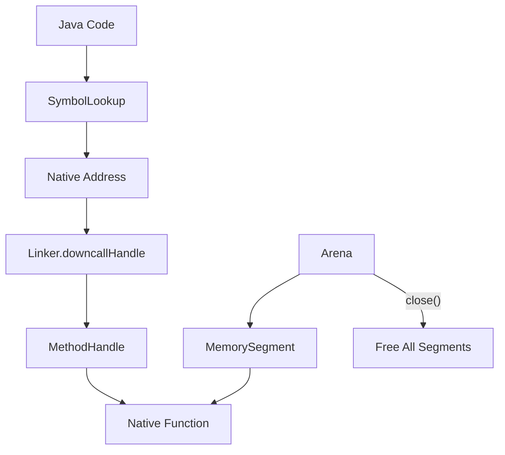

---

### 📶 Gradual Depth

**Level 1 - What it is:** Panama's Foreign Function and Memory API lets Java code call native C/C++ functions and manage off-heap memory without writing any C code, without JNI, and with safety checks the JVM enforces.

**Level 2 - How to use it:** Look up a native function with `SymbolLookup`, describe its signature with `FunctionDescriptor`, get a `MethodHandle` from `Linker.downcallHandle()`, allocate native memory via an `Arena`, and invoke the handle. The Arena's `close()` frees everything.

**Level 3 - How it works:** The Linker negotiates the platform's calling convention (System V AMD64, Windows x64, AArch64 AAPCS) and generates a stub that marshals Java arguments into native registers/stack slots. The `MemorySegment` wraps a base address and a size; every `get`/`set` call checks `offset < size`. Arenas track all segments they create; `close()` bulk-frees them and marks every segment as inaccessible. The JIT can inline the stub, making repeated foreign calls nearly as fast as JNI after warmup.

**Level 4 - Production mastery:** Choose arena type carefully. Confined arenas are fastest (no synchronization) but single-threaded. Shared arenas allow multi-thread access with atomic reference counting overhead. Auto arenas delegate to GC - convenient but non-deterministic, defeating the point for large allocations. For high-throughput native interop (database page buffers, network packet processing), use confined arenas in thread-local pools, close them promptly, and monitor native memory via `jcmd <pid> VM.native_memory summary` to catch leaks.

---

### ⚙️ How It Works

**Phase 1 - Library loading.** `SymbolLookup.libraryLookup("libcrypto.so", arena)` loads the shared library and returns a lookup bound to its symbols. The arena owns the library handle - closing the arena unloads the library.

**Phase 2 - Function description.** `FunctionDescriptor.of(JAVA_INT, ADDRESS, JAVA_LONG)` describes a function returning `int` and taking a pointer and a `long`. Layouts match the C types exactly.

**Phase 3 - Linking.** `Linker.nativeLinker().downcallHandle(addr, desc)` produces a `MethodHandle`. The Linker generates platform-specific call stubs. This is a one-time cost per function.

**Phase 4 - Memory allocation.** `arena.allocate(layout)` returns a `MemorySegment` backed by native memory. Data is written via `segment.set(JAVA_INT, offset, value)` with bounds checking.

**Phase 5 - Invocation.** `handle.invoke(segment, length)` calls the native function. Arguments are marshaled into native registers. The return value is marshaled back to Java.

**Phase 6 - Cleanup.** `arena.close()` frees all segments and invalidates them. Any subsequent access throws `IllegalStateException`.

```text
FFM Invocation Lifecycle:

  1. Lookup  [SymbolLookup.find()]
       |
  2. Describe [FunctionDescriptor]
       |
  3. Link    [Linker.downcallHandle()]
       |
  4. Allocate [Arena -> MemorySegment]
       |
  5. Invoke  [handle.invoke(segment)]
       |
  6. Close   [arena.close() -> free all]
```

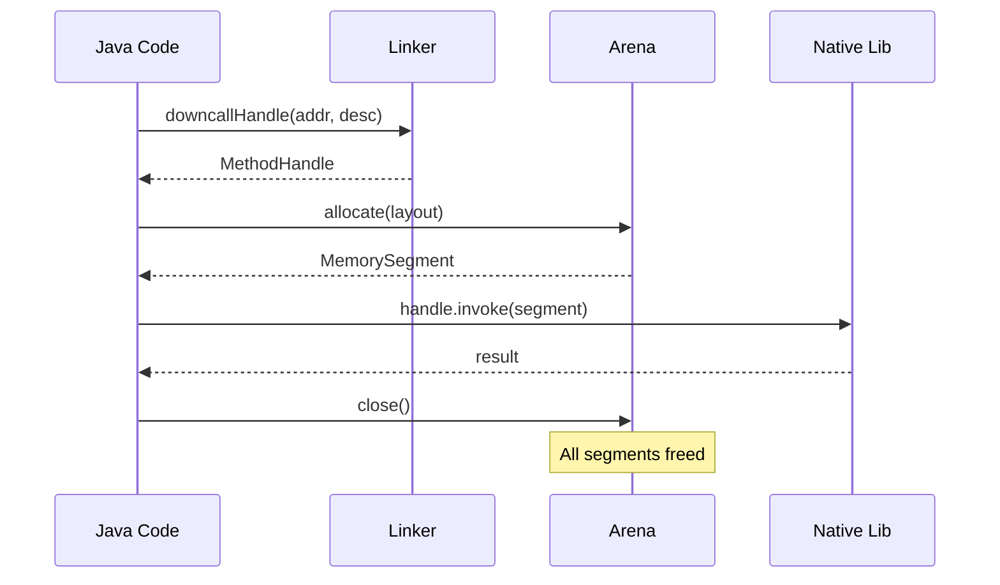

**BAD:**

```java
// JNI: requires native C code + compilation
public class Crypto {
    static { System.loadLibrary("myjni"); }
    // Must write C impl, compile .so/.dll
    private static native int encrypt(
        byte[] data, int len);
}
// Data copied from Java heap to native heap
// Pointer error in C = JVM crash, no trace
byte[] buf = new byte[4096];
int result = Crypto.encrypt(buf, buf.length);
```

Why it fails: requires C boilerplate, platform-specific compilation, copies data across the JNI boundary, and a native pointer bug crashes the entire JVM without a Java stack trace.

**GOOD:**

```java
// Panama: pure Java, no native compilation
Linker linker = Linker.nativeLinker();
SymbolLookup lib = SymbolLookup
    .libraryLookup("libcrypto.so", arena);
MethodHandle encrypt = linker.downcallHandle(
    lib.find("encrypt").orElseThrow(),
    FunctionDescriptor.of(
        ValueLayout.JAVA_INT,
        ValueLayout.ADDRESS,
        ValueLayout.JAVA_INT));

try (Arena arena = Arena.ofConfined()) {
    MemorySegment buf =
        arena.allocate(4096);
    // Zero-copy: buf IS native memory
    int r = (int) encrypt.invoke(buf, 4096);
}
// arena.close() frees buf automatically
```

Why it works: no C code, no compilation pipeline, bounds-checked memory, deterministic deallocation, and the JIT can inline the call stub for near-native performance.

---

### 🚨 Failure Modes

**Failure 1 - Use-after-close (dangling segment):**

**Symptom:** `IllegalStateException: Already closed` thrown when accessing a `MemorySegment` after its owning Arena has been closed.

**Root cause:** A reference to the segment escapes the arena's scope - stored in a field, passed to another thread, or returned from a method - and is accessed after `arena.close()`.

**Diagnostic:**

```bash
# Search for segment references escaping scope
grep -rn "MemorySegment.*field\|return.*segment" \
  src/ --include="*.java"
# At runtime, the exception stack trace shows
# the access site; check arena lifecycle
```

**Fix:** Never store `MemorySegment` references beyond the Arena's lexical scope. Use try-with-resources for the Arena. If a segment must outlive a scope, allocate from a longer-lived Arena (shared or global) and document the ownership contract explicitly.

**Failure 2 - Native memory leak (Arena never closed):**

**Symptom:** Resident memory (RSS) grows steadily while Java heap remains stable. `jcmd <pid> VM.native_memory summary` shows increasing "Other" or "Internal" allocations.

**Root cause:** Arenas are allocated but never closed. Unlike Java objects, off-heap memory is not reclaimed by GC (unless using `Arena.ofAuto()`, which is non-deterministic and not suitable for high-throughput allocation).

**Diagnostic:**

```bash
# Monitor native memory growth
jcmd <pid> VM.native_memory summary.diff
# Look for "Other" category increasing
# Enable NMT: -XX:NativeMemoryTracking=summary
```

**Fix:** Always use try-with-resources for confined and shared Arenas. For long-lived native buffers, use a pool of pre-allocated segments with explicit lifecycle management. Monitor native memory alongside heap metrics in production dashboards.

---

### 🔬 Production Reality

The most common migration pitfall when replacing JNI with Panama: mismatched struct layouts. JNI code typically hides struct details inside C functions - the Java side passes primitives and byte arrays, the C side handles packing. Panama exposes the struct layout to Java via `MemoryLayout.structLayout()`. If the Java-declared layout does not match the C compiler's layout (padding, alignment, field order), data is silently corrupted - fields read from wrong offsets. The fix: use the `jextract` tool (Panama companion) to generate Java bindings directly from C header files, which computes layouts correctly. Never hand-write struct layouts for non-trivial C structs. In production, validate struct compatibility with a smoke test that writes known values from Java and reads them from C (or vice versa) before deploying.

---

### ⚖️ Trade-offs & Alternatives

| Aspect           | Panama FFM        | JNI                 | JNA                 |
| ---------------- | ----------------- | ------------------- | ------------------- |
| Native code req  | None (pure Java)  | C/C++ impl required | None (reflection)   |
| Safety           | Bounds-checked    | Unchecked (crashes) | Partially checked   |
| Performance      | Near-native (JIT) | Native (no marshal) | 2-10x slower (refl) |
| Memory mgmt      | Arena-scoped      | Manual (C malloc)   | GC-dependent        |
| Struct support   | MemoryLayout      | Manual JNI fields   | Auto-mapping        |
| Platform binding | Descriptor-based  | Generated headers   | Interface-based     |
| JDK requirement  | JDK 22+           | Any JDK             | Any JDK + JNA jar   |

---

### ⚡ Decision Snap

**USE WHEN:**

- Calling native libraries from Java without writing C glue code (crypto, codecs, system calls, GPU compute).
- Managing large off-heap memory buffers with deterministic lifecycle (database page caches, network buffers).
- Replacing existing JNI code to improve safety and eliminate the native compilation pipeline.

**AVOID WHEN:**

- Target JDK is below 22 and cannot be upgraded.
- The native interaction is trivial (one function, rarely called) - JNI's overhead may be acceptable.

**PREFER JNI WHEN:**

- You need callback-heavy interop (C calling back into Java frequently) - Panama's upcall stubs have higher setup cost than JNI's `CallVoidMethod`.
- Existing JNI code is stable, well-tested, and the migration cost exceeds the maintenance cost.

---

### ⚠️ Top Traps

| #   | Misconception                               | Reality                                                                                                                                                                         |
| --- | ------------------------------------------- | ------------------------------------------------------------------------------------------------------------------------------------------------------------------------------- |
| 1   | "Panama is always faster than JNI"          | For simple calls after JIT warmup, performance is comparable. Panama wins on developer productivity and safety, not raw call speed.                                             |
| 2   | "`Arena.ofAuto()` is fine for everything"   | Auto arenas rely on GC for deallocation - non-deterministic. For high-throughput native allocation, this causes memory growth. Use confined arenas.                             |
| 3   | "MemorySegment prevents all native crashes" | Bounds checking prevents buffer overflows in Java code. A bug in the native function itself can still crash the JVM - Panama cannot sandbox native code.                        |
| 4   | "I can hand-write struct layouts"           | C struct padding and alignment are platform-dependent and compiler-dependent. Use `jextract` to generate layouts from header files. Hand-written layouts silently corrupt data. |
| 5   | "Confined arenas are too restrictive"       | Confined arenas are the fast path - no synchronization overhead. Share data between threads by copying to a shared arena, not by upgrading all arenas to shared.                |

---

### 🪜 Learning Ladder

**Prerequisites:**

- JVM-001 What Is the JVM - understand the boundary between managed bytecode and native platform code
- JVM-026 Heap and Stack - understand heap vs off-heap memory and why GC cannot track native allocations
- JVM-048 JIT Compilation Tiers - understand how the JIT optimizes method handles, which Panama relies on for performance

**THIS:** JVM-121 Project Panama - Foreign Function and Memory

**Next steps:**

- JVM-122 Project Leyden - ahead-of-time linking that benefits from Panama's descriptor-based native binding
- JVM-118 Designing a GC - understanding why off-heap memory management complements (not replaces) garbage collection
- JVM-125 Region-Based Memory - structured memory lifetime models that share Arena's philosophy of scoped deallocation

---

**The Surprising Truth:**

Panama's biggest impact may not be replacing JNI calls - it is making off-heap memory a first-class citizen in Java. Before Panama, managing native memory required `Unsafe` (unsupported, no bounds checks) or `ByteBuffer` (limited to 2GB, no deterministic free). Panama's `Arena` + `MemorySegment` model gives Java something it never had: safe, bounded, deterministically-freed native memory with zero-copy semantics. This unlocks database engines, network stacks, and ML runtimes written primarily in Java rather than delegating to C for memory-critical paths.

---

**Further Reading:**

- [JEP 454: Foreign Function & Memory API](https://openjdk.org/jeps/454) - the finalized JEP (JDK 22) specifying the complete FFM API design and semantics
- [Project Panama - OpenJDK](https://openjdk.org/projects/panama/) - project home with design documents, mailing list archives, and jextract tool documentation
- [JEP 442: Foreign Function & Memory API (Third Preview)](https://openjdk.org/jeps/442) - the JDK 21 preview that preceded finalization, documenting key API changes from earlier iterations

---

**Revision Card:**

1. Panama replaces JNI with pure-Java native interop - SymbolLookup finds functions, FunctionDescriptor describes them, Linker creates JIT-optimizable method handles.
2. Arena-scoped memory gives Java deterministic native deallocation for the first time - but choosing the wrong arena type (auto vs confined) causes either leaks or thread-safety violations.
3. Never hand-write C struct layouts in Java - platform-dependent padding silently corrupts data; always use jextract to generate layouts from header files.

---

---

# JVM-122 Project Leyden - Static Images and AOT

**TL;DR** - Leyden shifts JVM work from runtime to build time through condensers, trading peak JIT performance for dramatically faster startup while staying within the HotSpot ecosystem.

---

### 🔥 Problem Statement

A cloud-native platform spins up JVM microservices on demand. Each cold start takes 5-15 seconds: the JVM loads thousands of classes, verifies bytecode, interprets methods through C1 and C2 compilation tiers, and gradually warms up. Autoscalers add instances during traffic spikes, but requests hit cold JVMs for seconds before JIT compilation reaches peak throughput. Serverless functions on the JVM are impractical - a Lambda cold start budget of 500ms is consumed before the first application class loads. GraalVM native-image solves startup but abandons the HotSpot runtime: no tiered JIT, different debugging story, closed-world assumption that breaks reflection-heavy frameworks. Organizations want JVM startup speed approaching native without abandoning the HotSpot ecosystem they depend on for peak throughput, mature tooling, and runtime adaptability. Project Leyden addresses exactly this gap - not by replacing HotSpot, but by letting it pre-compute at build time what it currently computes at every startup.

---

### 📜 Historical Context

JVM startup overhead has been a known limitation since the late 1990s. Class Data Sharing (CDS) appeared in JDK 5 (2004) as the first attempt - caching parsed class metadata to skip repeated parsing. AppCDS extended this to application classes in JDK 10. CRaC (Coordinated Restore at Checkpoint) took a different approach: snapshot a running JVM and restore it, essentially serializing warm state. But CDS only covers class loading (not linking or compilation), and CRaC requires managing checkpoint images and handling open resources across restore boundaries. In 2022, Mark Reinhold published the Leyden concept as a systematic framework: condensers that shift arbitrary computation from run time to an earlier phase (build time, first-run time, or training-run time). JEP 483 (Ahead-of-Time Class Loading and Linking) in JDK 24 is the first production Leyden deliverable - prematerializing the loaded and linked form of classes so the JVM skips those phases entirely at startup.

---

### 🔩 First Principles

**CORE INVARIANTS:**

1. Every piece of work the JVM does at startup (loading, linking, verification, interpretation, compilation) is a candidate for being shifted to an earlier phase - the question is only what constraints prevent the shift.
2. Shifting work earlier requires capturing decisions that depend on runtime context (classpath, configuration, input) - the more context you fix at build time, the more work you can shift, but the less adaptive the result.
3. The condenser model is compositional: multiple condensers can chain (CDS feeds AOT class loading feeds AOT compilation), each narrowing the remaining runtime work, and each independently useful.

**DERIVED DESIGN:**

These invariants force a layered pipeline. CDS condenses parsing. AOT class loading and linking (JEP 483) condenses the resolution and preparation phases. AOT compilation (future JEPs) will condense JIT work. Training runs provide runtime profiles to inform AOT decisions without the closed-world constraint of native-image. Each layer is optional and additive - you can deploy CDS alone, CDS + AOT loading, or the full stack. This composability is what distinguishes Leyden from the all-or-nothing native-image approach.

**THE TRADE-OFF:**

**Gain:** Startup time reduced by 2-5x (CDS + AOT loading, as demonstrated in JDK 24 benchmarks); further gains expected as AOT compilation condensers land. Warm-up time shortened because the JVM starts with pre-linked classes and (eventually) pre-compiled methods.

**Cost:** Build pipeline complexity increases - training runs, condenser configuration, and cached artifacts must be managed. Pre-computed decisions that assumed one classpath or configuration may be invalid if the deployment changes. Peak throughput may be slightly lower than fully warmed JIT because AOT-compiled code lacks the runtime profile specialization that C2 achieves over minutes of execution.

---

### 🧠 Mental Model

> Leyden is like a restaurant doing mise en place. Instead of chopping vegetables, making sauces, and preheating pans when each order arrives, the kitchen does all the predictable preparation before service begins. When orders come in, the chef assembles and finishes - the time from order to plate drops dramatically. Some dishes still need last-minute adjustment (a steak cooked to order), but most of the work is already done.

- "Mise en place" -> condensers (pre-computed artifacts stored for reuse)
- "Before service" -> build time or training-run time
- "Order arrives" -> application startup / first request
- "Last-minute adjustment" -> JIT compilation of hot paths that AOT could not predict

**Where this analogy breaks down:** In a kitchen, prep work is always valid. In the JVM, pre-computed decisions depend on classpath and configuration - if you change a dependency, the condensed artifacts may need regeneration, unlike chopped onions that work regardless of the entree.

---

### 🧩 Components

- **Condenser:** A build-time or training-time transformation that shifts work from run image to an earlier phase. Each condenser has an input (class files, profiles, config) and an output (cached artifact).
- **CDS archive:** The original condenser - a memory-mapped file containing parsed class metadata. Extended by AppCDS to include application classes. Leyden treats CDS as the foundational layer other condensers build upon.
- **AOT class loading and linking (JEP 483):** Prematerializes loaded-and-linked class state. At startup, the JVM maps this directly into memory instead of re-executing the loading, verification, and linking steps.
- **Training run:** An execution of the application under representative load, producing profiles that inform AOT decisions. Unlike GraalVM's closed-world analysis, training runs capture dynamic behavior (reflection, proxies, late binding) that static analysis misses.
- **AOT cache:** The stored output of condensers - archived classes, pre-linked metadata, and (in future) pre-compiled native code. Stored as files alongside the application, managed by the build pipeline.
- **Run image:** The final runtime configuration that consumes condenser outputs. The JVM detects available AOT artifacts and uses them to skip the corresponding startup phases.

```text
Leyden Condenser Pipeline:

  Source (.class files)
       |
       v
  [CDS Condenser]
  Parse + cache metadata --> CDS Archive
       |
       v
  [AOT Load/Link Condenser] (JEP 483)
  Resolve + link classes  --> AOT Cache
       |
       v
  [Training Run]
  Profile hot paths       --> Profile Data
       |
       v
  [AOT Compile Condenser] (future)
  Compile methods         --> Native Code Cache
       |
       v
  Run Image (startup: map caches, skip phases)
```

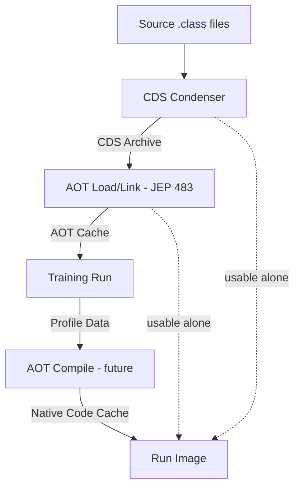

---

### 📶 Gradual Depth

**Level 1 - What it is:** Project Leyden is an OpenJDK initiative to make Java applications start faster and warm up sooner by doing work at build time that the JVM currently repeats at every startup. It stays within HotSpot - no separate runtime.

**Level 2 - How to use it:** In JDK 24+, enable AOT class loading with `-XX:AOTCache=app.aot` after a training run (`-XX:AOTMode=record`). The JVM records which classes are loaded and linked, caches that state, and on subsequent starts maps the cache directly - skipping loading and linking for those classes.

**Level 3 - How it works:** The JVM's startup sequence is: load classes (parse bytecode), verify (check type safety), prepare (allocate static fields), resolve (bind symbolic references), initialize (run `<clinit>`). JEP 483 pre-executes everything up through resolution at training time and stores the result. At production startup, the JVM memory-maps the cache and jumps directly to initialization. Classes not in the cache fall back to normal loading. The condenser model means future JEPs can add AOT compilation on top without redesigning the pipeline.

**Level 4 - Production mastery:** The critical production concern is cache invalidation. If you update a JAR on the classpath, the AOT cache may contain stale linked references. The JVM performs fingerprint checks (hash of class bytes) and falls back to runtime loading for mismatched classes - so correctness is preserved, but startup benefit degrades silently. Production pipelines must regenerate the AOT cache as part of the build, not treat it as a long-lived artifact. Training runs should exercise realistic startup paths (framework initialization, connection pools, health checks) to maximize coverage. Monitor cache hit rate via `-Xlog:aot` to detect drift between training and production classpaths.

---

### ⚙️ How It Works

**Phase 1 - Training run.** The application is launched with `-XX:AOTMode=record -XX:AOTConfiguration=app.aotconf`. The JVM executes normally, recording every class loaded, linked, and initialized during the run. The operator drives the application through its typical startup sequence (framework boot, dependency injection, first request). The recording is saved to a configuration file.

**Phase 2 - Cache assembly.** A second invocation with `-XX:AOTMode=create -XX:AOTConfiguration=app.aotconf -XX:AOTCache=app.aot` consumes the recording. The JVM loads and links every recorded class, then serializes the resulting in-memory state (constant pool entries resolved, vtables built, class hierarchy validated) into the AOT cache file.

**Phase 3 - Production startup.** The application launches with `-XX:AOTCache=app.aot`. The JVM memory-maps the cache. For each class in the cache, it verifies the fingerprint matches the current classpath. Matched classes skip loading, verification, preparation, and resolution - jumping directly to initialization. Unmatched or missing classes load normally.

**Phase 4 - Ongoing maintenance.** Every dependency update or classpath change potentially invalidates cache entries. CI/CD pipelines must include a training-run step that regenerates the cache. Stale caches do not cause errors (the JVM falls back gracefully), but they silently lose startup benefit.

```text
Leyden Startup vs Traditional:

  Traditional:
  [Load] -> [Verify] -> [Prepare] -> [Resolve]
       -> [Init] -> [Interpret] -> [C1] -> [C2]
  |<--- 5-15 seconds to peak ----------->|

  Leyden (JEP 483):
  [Map AOT Cache] -> [Init] -> [Interpret]
       -> [C1] -> [C2]
  |<-- 1-3 sec -->|<- JIT warms as usual ->|

  Leyden (future, with AOT compile):
  [Map AOT Cache] -> [Init] -> [Run AOT code]
       -> [C2 re-optimizes hot paths]
  |<- sub-second ->|<- peak in seconds ---->|
```

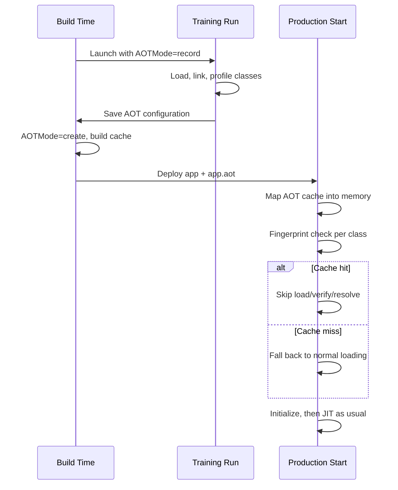

**BAD:**

```bash
# Treat AOT cache as a long-lived artifact
# Built once, shared across versions
java -XX:AOTCache=old-app.aot \
  -jar app-v2.jar
# Stale cache silently misses most classes
# Startup is slow - no errors, no warnings
```

Why it fails: the cache was built against v1's classpath. Changed classes fall back to runtime loading, negating the benefit without any error signal.

**GOOD:**

```bash
# Regenerate cache in CI for every build
java -XX:AOTMode=record \
  -XX:AOTConfiguration=app.aotconf \
  -jar app.jar &
# Drive startup path, then stop
curl http://localhost:8080/health
kill %1
java -XX:AOTMode=create \
  -XX:AOTConfiguration=app.aotconf \
  -XX:AOTCache=app.aot -jar app.jar
# Deploy app.jar + app.aot together
```

Why it works: cache is always in sync with the current classpath. Every deploy gets a fresh AOT cache built from a representative training run.

---

### 🚨 Failure Modes

**Failure 1 - Cache staleness without signal:**

**Symptom:** Startup time gradually increases over releases, but no errors appear in logs. Developers assume "Java is just slow."

**Root cause:** The AOT cache was generated months ago and never regenerated. Classpath changes mean most classes fail fingerprint checks and fall back to runtime loading. The JVM does not warn loudly about low cache hit rates by default.

**Diagnostic:**

```bash
java -Xlog:aot -XX:AOTCache=app.aot \
  -jar app.jar 2>&1 | \
  grep -c "fallback to runtime"
# High fallback count = stale cache
```

**Fix:** Add AOT cache generation as a CI pipeline step. Monitor cache hit rate as a build metric. Alert when hit rate drops below 80%.

**Failure 2 - Training run misses framework initialization:**

**Symptom:** AOT cache covers only 30% of classes loaded at startup. Spring Boot applications still take 4+ seconds because framework classes (proxy generation, annotation processing, bean wiring) were not exercised during the training run.

**Root cause:** The training run was too short or did not trigger the full framework initialization path. Spring's lazy initialization, conditional beans, and profile-dependent configuration mean a simple `main()` invocation loads far fewer classes than a real startup with active profiles and database connections.

**Diagnostic:**

```bash
# Compare classes loaded at production start
# vs classes in AOT cache
java -Xlog:class+load -jar app.jar 2>&1 | \
  wc -l
# vs
java -Xlog:aot -XX:AOTCache=app.aot \
  -jar app.jar 2>&1 | \
  grep "cached" | wc -l
```

**Fix:** The training run must exercise the full startup path: activate production Spring profiles, connect to a database (or test container), and serve at least one health-check request. For Spring Boot, CDS/AOT integration guides recommend running the full `ApplicationContext` refresh during training.

---

### 🔬 Production Reality

A platform team adopted JEP 483 for a Spring Boot microservice fleet (JDK 24). Initial results were disappointing: startup dropped from 8 seconds to 6 seconds - far short of the expected 2-3x improvement. Investigation revealed the training run was executed with `spring.profiles.active=default`, but production used `spring.profiles.active=prod,metrics,tracing`. The production profile activated 40% more beans, loaded additional classes for Micrometer, OpenTelemetry, and connection pool initialization - none of which were in the AOT cache. After switching the training run to use the production profile with a test database, cache coverage jumped from 35% to 82% of startup-loaded classes, and startup dropped to 3.2 seconds. The lesson: AOT caching is only as good as the training run's fidelity to the production startup path. Treat the training run configuration as production infrastructure, not a developer convenience script.

---

### ⚖️ Trade-offs & Alternatives

| Aspect             | Leyden (HotSpot AOT) | GraalVM native-image | CRaC (Checkpoint)    |
| ------------------ | -------------------- | -------------------- | -------------------- |
| Startup time       | 2-5x faster          | 10-100x faster       | Near-instant restore |
| Peak throughput    | Full JIT (C2)        | No tiered JIT        | Full JIT (restored)  |
| Build complexity   | Training run + cache | Closed-world compile | Checkpoint mgmt      |
| Reflection support | Full (dynamic)       | Requires config      | Full (snapshotted)   |
| Debugging          | Standard HotSpot     | Different toolchain  | Standard HotSpot     |
| Ecosystem compat   | Drop-in (JDK 24+)    | Framework support    | Resource cleanup     |
| Artifact size      | JDK + cache          | Single binary        | JDK + snapshot       |

---

### ⚡ Decision Snap

**USE WHEN:**

- You need faster JVM startup but cannot abandon HotSpot (for peak throughput, debuggability, or ecosystem compatibility).
- Your application runs on JDK 24+ and you can integrate a training-run step into CI/CD.
- Serverless or autoscaling workloads where cold-start latency matters but native-image's closed-world constraint is unacceptable.

**AVOID WHEN:**

- Startup time is not a constraint (long-running batch services, always-on monoliths).
- You already use GraalVM native-image successfully and peak JIT throughput is not required.

**PREFER GraalVM native-image WHEN:**

- Sub-100ms startup is required and the application fits the closed-world model (no dynamic class loading, reflection fully configured).
- Minimal memory footprint matters more than peak throughput.

---

### ⚠️ Top Traps

| #   | Misconception                             | Reality                                                                                                                                                                                                                                       |
| --- | ----------------------------------------- | --------------------------------------------------------------------------------------------------------------------------------------------------------------------------------------------------------------------------------------------- |
| 1   | "Leyden replaces GraalVM native-image"    | Leyden complements it. Native-image targets maximum startup reduction with closed-world trade-offs. Leyden targets incremental improvement within the open-world HotSpot model. Different trade-off points for different workloads.           |
| 2   | "AOT cache is build-once, deploy-forever" | The cache is classpath-specific. Any dependency update can invalidate entries. Treat it like a compiled artifact - rebuild on every release.                                                                                                  |
| 3   | "Training runs are optional optimization" | Without a training run, the JVM has no data to condense. A cache built without representative profiling covers a fraction of startup classes. Training runs are the input, not a bonus.                                                       |
| 4   | "Leyden eliminates JIT compilation"       | Leyden reduces startup work. JIT compilation (C1, C2) still runs for peak throughput optimization. Future AOT compilation condensers will pre-compile methods, but C2 will still re-optimize hot paths with runtime profiles.                 |
| 5   | "CDS and Leyden AOT are the same thing"   | CDS caches parsed class metadata (bytes to internal representation). JEP 483 caches loaded-and-linked state (resolved references, built vtables). Leyden builds on CDS but goes further - they are layers in the same pipeline, not synonyms. |

---

### 🪜 Learning Ladder

**Prerequisites:**

- JVM-001 Why the JVM Exists - The Platform Problem - understand the class loading and execution model Leyden optimizes
- JVM-052 JIT Compilation Tiers (C1 and C2) - the compilation pipeline that Leyden's AOT condensers partially replace
- JVM-106 JVM Warm-Up Strategies (CDS, CRaC, Preload) - CDS and CRaC are the precursors Leyden extends

**THIS:** JVM-122 Project Leyden - Static Images and AOT

**Next steps:**

- JVM-107 GraalVM vs HotSpot Adoption Decision - the alternative approach Leyden competes with
- JVM-116 The JVM Specification - Structure and Evol - how the JVM spec evolves to accommodate AOT
- JVM-124 JVM Formal Verification and Type Safety Proof - how pre-computed verification interacts with type safety guarantees

---

**The Surprising Truth:**

The deepest insight in Leyden is not about startup speed - it is about the nature of JVM work. Most computation the JVM performs at startup is deterministic given the classpath: the same classes will be loaded, the same bytecode verified, the same references resolved. Leyden's condenser model recognizes that deterministic-given-inputs work is wasted when repeated. This principle extends beyond the JVM - any system that re-derives the same results from the same inputs on every start is a candidate for condensation. Leyden is really a general framework for memoizing interpreter startup, applied first to the JVM.

**Further Reading:**

- [JEP 483: Ahead-of-Time Class Loading and Linking](https://openjdk.org/jeps/483) - the first Leyden JEP delivered in JDK 24, specifying AOT class loading and linking
- [Mark Reinhold - Leyden: Beginnings](https://openjdk.org/projects/leyden/notes/01-beginnings) - original design note introducing the condenser model and Leyden's phased approach
- [Project Leyden Early-Access Builds](https://jdk.java.net/leyden/) - OpenJDK early-access builds tracking Leyden development

**Revision Card:**

1. Leyden shifts deterministic JVM startup work (loading, linking, verification) to build time through composable condensers - each layer independently useful, all additive.
2. The trade-off is build complexity (training runs, cache management) for startup speed - peak JIT throughput is preserved because HotSpot's C2 still runs.
3. AOT cache staleness is silent - the JVM falls back gracefully but loses benefit. Regenerate the cache on every build, not once.

---

---

# JVM-123 The Trusted Computing Base of the JVM

**TL;DR** - The JVM's trusted computing base is the minimal set of components - verifier, class loader, access control, memory safety - that must be correct for all security guarantees to hold.

---

### 🔥 Problem Statement

A financial services platform runs untrusted plugins inside a JVM to extend its trading engine. A plugin author discovers that `sun.misc.Unsafe.putLong()` can write to arbitrary memory addresses, bypassing all access control. Another plugin uses deserialization to instantiate objects without calling constructors, circumventing initialization invariants. A third exploits deep reflection to access private fields across module boundaries. Each exploit targets a different component, but the common thread is the same: the attacker reached outside the set of components that enforce the JVM's security contract. Understanding which components constitute that set - the trusted computing base - is the difference between knowing the JVM is "secure" as marketing and knowing exactly which code paths must be correct for type safety, memory isolation, and access control to actually hold. Without this understanding, hardening is guesswork: you patch symptoms without knowing which fortress walls actually matter.

---

### 📜 Historical Context

The JVM was designed from the start (1995) as a safe execution environment for untrusted code - Java applets running in browsers. The original security architecture relied on the bytecode verifier (ensuring type safety before execution), the class loader hierarchy (namespace isolation), and the SecurityManager (permission-based access control). For a decade, the SecurityManager was the visible security surface, but the real foundation was always the verifier and memory safety. The SecurityManager was deprecated in JDK 17 (JEP 411) because it was both incomplete (native methods bypass it) and too complex to use correctly (permission configurations were error-prone). This deprecation forced the community to reckon with what actually constitutes the security foundation. The module system (JDK 9, JEP 261) and strong encapsulation (JEP 403) represent the modern approach: reduce the attack surface by making internal APIs inaccessible by default, rather than relying on runtime permission checks.

---

### 🔩 First Principles

**CORE INVARIANTS:**

1. Type safety is the foundation: if the JVM cannot guarantee that a reference of type T points to an actual instance of T (or a subtype), every other security property collapses - access control, memory isolation, and sandboxing all depend on the type system being sound.
2. The TCB must be minimal: every component inside the TCB is an attack surface. A bug in any TCB component can compromise all security guarantees. Reducing TCB size directly reduces the probability of exploitable flaws.
3. Components outside the TCB can be buggy without compromising security: application code, libraries, and even most JDK standard library code run under the constraints enforced by the TCB - their bugs cause application failures, not security failures.

**DERIVED DESIGN:**

These invariants force the JVM's security architecture into layers. The innermost layer (the TCB) is small and must be formally verifiable: the bytecode verifier ensures type safety, the class loader constraints prevent type confusion across loaders, and the memory model prevents raw pointer access. Everything outside this layer - application code, frameworks, even most of `java.base` - is constrained by the TCB and cannot violate its guarantees (assuming the TCB is correct). The module system adds a second defense: even if code could theoretically exploit the TCB, strong encapsulation prevents it from reaching the internal APIs where TCB components live.

**THE TRADE-OFF:**

**Gain:** A small, auditable set of components that, if correct, guarantee type safety and memory isolation for all code running on the JVM - regardless of how buggy that code is.

**Cost:** The TCB includes native methods (JNI), `Unsafe`, serialization, and deep reflection - features that exist because they are genuinely needed but that punch holes in the security boundary. Every such hole must be explicitly managed (restricted, deprecated, or removed).

---

### 🧠 Mental Model

> The TCB is like the load-bearing walls in a building. You can remodel any room, move furniture, knock down partition walls - the building stays standing. But if you compromise a load-bearing wall, the entire structure is at risk. The building inspector does not need to check every room - they need to verify the load-bearing walls are sound. Everything else is cosmetic.

- "Load-bearing walls" -> verifier, class loader constraints, memory safety enforcement
- "Partition walls" -> application-level access control, framework security
- "Remodeling a room" -> changing application code (cannot compromise structural integrity)
- "Building inspector" -> formal verification or rigorous testing of TCB components

**Where this analogy breaks down:** Load-bearing walls are physically obvious. TCB components are not visually distinct in the codebase - you cannot tell by looking at a JVM source file whether it is part of the TCB without understanding the security dependency chain.

---

### 🧩 Components

- **Bytecode verifier:** Checks every class file before execution. Ensures type safety (no stack underflow, no invalid casts, no access to uninitialized variables). Runs during class loading. If the verifier has a bug that accepts malformed bytecode, type safety is lost.
- **Class loader constraints:** Prevent type confusion when multiple class loaders define classes with the same name. Without constraints, Loader A's `com.Foo` could be confused with Loader B's `com.Foo`, breaking type safety at cast boundaries.
- **Memory safety enforcement:** The JVM does not expose raw pointers. Array bounds are checked. Null references throw `NullPointerException` rather than corrupting memory. This is enforced by the interpreter, JIT compilers (which must emit bounds checks), and the runtime itself.
- **Access control (module system):** The module system (JDK 9+) and strong encapsulation (JEP 403) restrict which packages are accessible across module boundaries. Internal JDK APIs (`sun.misc`, `jdk.internal`) are inaccessible by default.
- **Native method interface (JNI):** Allows calling C/C++ code that operates outside JVM safety. Every JNI call is a TCB boundary crossing - native code can corrupt memory, violate type safety, and bypass all JVM checks.
- **`sun.misc.Unsafe` / `jdk.internal.misc.Unsafe`:** Provides raw memory access, object instantiation without constructors, and CAS operations. Exists because JDK internals and high-performance libraries need it, but it is the single largest hole in the type safety boundary.

```text
JVM Trusted Computing Base:

  +-------------------------------------------+
  |            Application Code               |
  |  (constrained by TCB, cannot violate it)  |
  +-------------------------------------------+
  |         Standard Library (java.*)         |
  |  (mostly outside TCB, uses safe APIs)     |
  +-------------------------------------------+
  |  +----- Trusted Computing Base --------+  |
  |  | Bytecode Verifier                   |  |
  |  | Class Loader Constraints            |  |
  |  | Memory Safety (bounds, null, types) |  |
  |  | Module Access Control (JEP 403)     |  |
  |  +-------------------------------------+  |
  |  |  TCB Boundary Crossings (holes):    |  |
  |  |  - JNI (native methods)             |  |
  |  |  - Unsafe (raw memory)              |  |
  |  |  - Serialization (bypass ctors)     |  |
  |  |  - Deep reflection (setAccessible)  |  |
  |  +-------------------------------------+  |
  +-------------------------------------------+
  |        JVM Runtime (C++ / native)         |
  +-------------------------------------------+
```

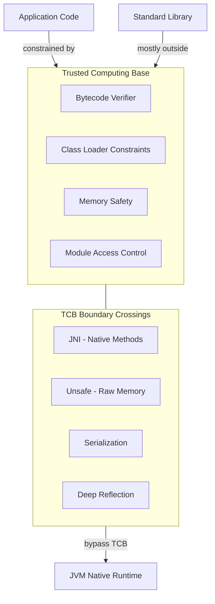

---

### 📶 Gradual Depth

**Level 1 - What it is:** The trusted computing base (TCB) is the set of JVM components that must be bug-free for security guarantees (type safety, memory isolation) to hold. If any TCB component has a flaw, all security can be compromised regardless of how correct the application code is.

**Level 2 - How to use it:** As an application developer, you reduce your exposure to TCB weaknesses by avoiding TCB boundary crossings: do not use `Unsafe`, minimize JNI, avoid deserialization of untrusted data, and use the module system to enforce encapsulation. Treat every `--add-opens` flag as a security decision, not a convenience.

**Level 3 - How it works:** The verifier runs a dataflow analysis over every method's bytecode during class loading, computing the type of every stack slot and local variable at every instruction. If types are inconsistent at any merge point (branch target, exception handler entry), the class is rejected. Class loader constraints are checked at every cross-loader type reference during linking. Memory safety is enforced at every array access (bounds check), every object field access (null check + type check), and every cast (`checkcast` instruction). These checks are the walls. JNI, Unsafe, and serialization are doors through those walls - each one is a deliberate hole with (ideally) a guard.

**Level 4 - Production mastery:** In production, TCB integrity means tracking every module-system override. Each `--add-opens java.base/sun.misc=ALL-UNNAMED` widens the TCB boundary. Audit these flags across your fleet. Serialization-based attacks (gadget chains) exploit objects that bypass constructor invariants - disabling serialization for classes that do not need it (or using serialization filters, JEP 290) reduces TCB exposure. The module system's strong encapsulation (JEP 403, default since JDK 16) is the most significant TCB-hardening change in modern Java: it made internal APIs inaccessible without explicit opt-in, closing the most commonly exploited reflection paths. Monitor for libraries that require `--add-opens` - each one is a signal that the library depends on TCB boundary crossings.

---

### ⚙️ How It Works

**Phase 1 - Verification at class loading.** When a class is loaded, the verifier performs a pass over every method. It simulates execution abstractly: tracking the type of every operand stack entry and local variable through all possible execution paths. At branch merge points, types must be compatible (common supertype). If `aload` loads a reference that could be either `String` or `Integer` depending on the branch, the merged type is `Object`. The verifier rejects bytecode that would violate type safety at any reachable instruction.

**Phase 2 - Class loader constraint enforcement.** When class A (loaded by Loader 1) references class B (loaded by Loader 2), the JVM records a constraint: the name "B" must resolve to the same class in both loaders. If a later loading event would create a second, incompatible "B," the JVM throws `LinkageError`. Without this check, casting between the two "B" types would succeed (same name) but violate type safety (different actual classes).

**Phase 3 - Runtime safety checks.** Every array access emits a bounds check (throws `ArrayIndexOutOfBoundsException`). Every object reference use checks for null. Every downcast emits `checkcast`. JIT compilers (C1, C2) may eliminate checks they can prove redundant (e.g., a loop variable proven to be within bounds), but they must not eliminate checks they cannot prove - correctness of these optimizations is itself part of the TCB.

**Phase 4 - TCB boundary crossings.** JNI calls transfer control to native code outside all JVM safety checks. `Unsafe.putLong(obj, offset, value)` writes directly to computed memory offsets. Deserialization reconstructs objects by reading byte streams, potentially bypassing constructor validation. `setAccessible(true)` disables access checks on a reflected member. Each crossing is a deliberate trade-off: functionality that requires escaping the managed environment, at the cost of TCB integrity.

```text
Verification Dataflow (simplified):

  bytecode:   aload_1       (push ref)
              getfield Foo.x (access field)
              istore_2      (store int)

  verifier state at each step:
  stack: []       -> [Foo]    -> [int]  -> []
  locals: [Foo]   -> [Foo]    -> [Foo]  -> [Foo, _, int]

  If aload_1 could be null or wrong type:
  verifier REJECTS the class before execution
```

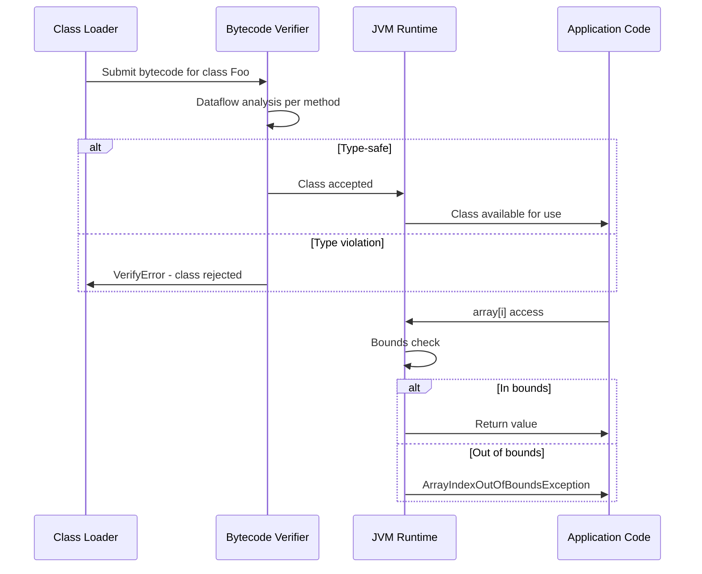

**BAD:**

```java
// Bypassing TCB via Unsafe - raw memory write
Field f = Unsafe.class.getDeclaredField(
    "theUnsafe");
f.setAccessible(true);
Unsafe unsafe = (Unsafe) f.get(null);
// Write arbitrary value at computed offset
// Bypasses type safety, bounds checks, access
unsafe.putLong(targetObj, offset, 0xDEADBEEFL);
```

Why it fails: this crosses the TCB boundary. The write bypasses type checking, bounds checking, and access control. A single wrong offset corrupts the object's header or another field, causing unpredictable behavior or security violation.

**GOOD:**

```java
// Use VarHandle (JDK 9+) for safe low-level
// access with type and bounds checking preserved
VarHandle vh = MethodHandles.lookup()
    .findVarHandle(MyClass.class, "value",
                   long.class);
vh.compareAndSet(targetObj, expected, newVal);
// Type-safe, bounds-checked, access-controlled
// TCB boundary is NOT crossed
```

Why it works: `VarHandle` provides CAS and volatile semantics without escaping the type system. Access control is enforced by the lookup context. The operation stays inside the TCB boundary.

---

### 🚨 Failure Modes

**Failure 1 - Verifier bypass via crafted bytecode:**

**Symptom:** A malicious class passes verification but executes an illegal cast at runtime, corrupting the heap. Subsequent operations on the corrupted reference produce unpredictable behavior - crashes, data leaks, or silent corruption.

**Root cause:** A bug in the verifier's dataflow analysis incorrectly computes the type at a merge point. The class is accepted as type-safe when it is not. This is the highest-severity category of JVM vulnerability.

**Diagnostic:**

```bash
# Check JVM version for known verifier CVEs
java -version
# Run with strict verification (default on)
java -Xverify:all -verbose:class \
  -jar suspect.jar 2>&1 | \
  grep -i "verify\|error"
# Dump bytecode for manual inspection
javap -c -v SuspectClass.class | head -200
```

**Fix:** Patch to the latest JDK immediately. Verifier bugs are treated as critical security vulnerabilities by the OpenJDK Vulnerability Group. There is no application-level workaround - the fix must come from the JVM itself.

**Failure 2 - TCB erosion via `--add-opens` accumulation:**

**Symptom:** Application requires 15+ `--add-opens` flags to run. Frameworks and libraries access internal JDK APIs via deep reflection. Each flag widens the attack surface, and no one tracks which flags are still necessary.

**Root cause:** Migration from JDK 8 (no module system) to JDK 17+ preserved old reflection patterns instead of migrating to supported APIs. Each `--add-opens` disables access control for an entire package, allowing any code (including untrusted plugins) to access internals.

**Diagnostic:**

```bash
# Audit all add-opens flags in the fleet
grep -r "\-\-add-opens" scripts/ k8s/ \
  docker/ | sort | uniq -c | sort -rn
# Check which modules are opened at runtime
jcmd <pid> VM.command_line | \
  grep -o "\-\-add-opens [^ ]*"
```

**Fix:** Audit each `--add-opens` flag. For each one, determine if the library has a newer version that uses supported APIs. Replace `Unsafe` usage with `VarHandle` or `MethodHandles`. Replace `setAccessible` on JDK internals with public API alternatives. Track remaining flags as security debt with a remediation timeline.

---

### 🔬 Production Reality

A common pattern in enterprise Java: a framework uses `sun.misc.Unsafe` for fast serialization, bypassing constructors to instantiate objects during deserialization. This worked seamlessly on JDK 8 where there were no module boundaries. After migrating to JDK 17, the team adds `--add-opens java.base/sun.misc=ALL-UNNAMED` to suppress the `InaccessibleObjectException`. The application works, but the flag opens the entire `sun.misc` package to all unnamed-module code - including third-party libraries loaded from the classpath. Months later, a dependency update introduces a library with a known deserialization gadget chain vulnerability. The gadget chain exploits the open `sun.misc` package to access `Unsafe`, constructing a malicious object graph that executes arbitrary code during deserialization. The root cause was not the vulnerable library itself - it was the overly broad `--add-opens` flag that removed the module system's defense. The lesson: every `--add-opens` flag is a security decision with blast radius proportional to its scope. `ALL-UNNAMED` is the broadest possible scope. Prefer targeted opens to specific modules when absolutely necessary.

---

### ⚖️ Trade-offs & Alternatives

| Aspect           | JVM TCB (managed)       | Native (C/C++)    | WebAssembly sandbox     |
| ---------------- | ----------------------- | ----------------- | ----------------------- |
| Memory safety    | Enforced (verifier)     | Developer burden  | Enforced (linear mem)   |
| Type safety      | Bytecode verification   | Compiler optional | Wasm type system        |
| TCB size         | Medium (verifier + RT)  | Large (OS + libc) | Small (Wasm runtime)    |
| Escape hatches   | JNI, Unsafe, reflection | Everywhere        | Host function imports   |
| Formal verif.    | Partial (research)      | Rare              | Wasm spec formalized    |
| Performance cost | Bounds checks, casts    | None (unchecked)  | Bounds checks           |
| Attack surface   | JNI, serialization      | Buffer overflows  | Host function interface |

---

### ⚡ Decision Snap

**USE WHEN:**

- You need to understand the security guarantees of the JVM before trusting it with multi-tenant or plugin-based workloads.
- You are hardening a JVM deployment and need to identify which components to audit and which flags to restrict.
- You are evaluating whether to allow `Unsafe`, JNI, or deep reflection in your codebase or dependencies.

**AVOID WHEN:**

- You are building a single-tenant application with trusted code only - TCB analysis is relevant but not urgent.
- You are looking for application-level security patterns (authentication, authorization) - those are above the TCB layer.

**PREFER WebAssembly sandboxing WHEN:**

- You need a formally verified, minimal TCB for running untrusted code and can accept the Wasm ecosystem constraints.
- Plugin isolation requires stronger guarantees than the JVM module system provides.

---

### ⚠️ Top Traps

| #   | Misconception                                           | Reality                                                                                                                                                                                                                                        |
| --- | ------------------------------------------------------- | ---------------------------------------------------------------------------------------------------------------------------------------------------------------------------------------------------------------------------------------------- |
| 1   | "The SecurityManager was the JVM's security foundation" | The SecurityManager was a policy layer on top of the real foundation (verifier + memory safety). It was deprecated (JEP 411) because it was incomplete and error-prone. The TCB existed before and survives after its removal.                 |
| 2   | "`--add-opens` is a harmless compatibility flag"        | Each `--add-opens` disables module access control for an entire package. `ALL-UNNAMED` opens it to all classpath code. This directly widens the attack surface by exposing TCB-adjacent internals.                                             |
| 3   | "Type safety is about catching ClassCastException"      | Type safety is the foundation of memory isolation. Without it, a reference to `String` could point to an `int[]`, enabling arbitrary memory read/write. `ClassCastException` is the visible symptom; memory safety is the actual guarantee.    |
| 4   | "Unsafe is only used by low-level libraries"            | Major frameworks (Netty, Kryo, Jackson) use Unsafe for performance. Every such usage is a TCB boundary crossing. The ongoing migration to VarHandle and MemorySegment (Panama) is a TCB-hardening effort.                                      |
| 5   | "The verifier only matters for untrusted code"          | The verifier runs on every class, including your own. It prevents type confusion from malformed bytecode generated by buggy compilers, bytecode manipulation libraries, or corrupted class files. Its guarantees are universal, not selective. |

---

### 🪜 Learning Ladder

**Prerequisites:**

- JVM-001 Why the JVM Exists - The Platform Problem - understand why the JVM was designed as a safe managed runtime
- JVM-117 Bytecode Verification Algorithm - the core TCB component in detail
- JVM-116 The JVM Specification - Structure and Evol - the formal definition of what the TCB enforces

**THIS:** JVM-123 The Trusted Computing Base of the JVM

**Next steps:**

- JVM-124 JVM Formal Verification and Type Safety Proof - formalizing and proving TCB correctness
- JVM-120 Project Valhalla - Value Types and Flat Memory - how value types interact with the type safety invariants the TCB enforces
- JVM-118 Designing a GC from First Principles - the GC must cooperate with the TCB's memory safety guarantees

---

**The Surprising Truth:**

The JVM's most important security property is not any single feature - it is the fact that the TCB is small enough to be auditable. A C++ application's "TCB" is effectively the entire program plus the OS kernel, because any code can corrupt memory. The JVM's verifier, class loader constraints, and memory safety enforcement total perhaps 50,000 lines of critical code. This is why formal verification of the JVM verifier (as explored in projects like Jinja and KaffeOS) is tractable - and why it matters. A formally verified verifier would mean that type safety is not just tested, but proven - reducing the TCB's vulnerability to zero for that component. No amount of testing achieves this guarantee.

**Further Reading:**

- [JEP 411: Deprecate the Security Manager for Removal](https://openjdk.org/jeps/411) - explains why the SecurityManager was removed and what remains as the actual security foundation
- [JEP 403: Strongly Encapsulate JDK Internals](https://openjdk.org/jeps/403) - the module system change that reduced TCB exposure by making internal APIs inaccessible by default
- [JVMS Chapter 4.10: Verification of class Files](https://docs.oracle.com/javase/specs/jvms/se21/html/jvms-4.html#jvms-4.10) - the formal specification of the bytecode verification algorithm that is the core of the TCB

**Revision Card:**

1. The JVM's TCB is the verifier, class loader constraints, memory safety enforcement, and access control - if these are correct, all code running on the JVM is type-safe and memory-isolated regardless of bugs.
2. Every TCB boundary crossing (JNI, Unsafe, serialization, deep reflection) is a security decision - minimize crossings and audit each `--add-opens` flag as attack surface expansion.
3. The TCB's power is its small size - small enough to audit, potentially small enough to formally verify, unlike native code where the entire program is the trust boundary.

---

---

# JVM-124 JVM Formal Verification and Type Safety Proof

**TL;DR** - Formal verification uses mathematical proof (not testing) to guarantee the bytecode verifier is sound - ensuring type safety holds for all programs, not just tested ones.

---

### 🔥 Problem Statement

The bytecode verifier is the trust root of the entire JVM security model. Every guarantee - type safety, memory isolation, access control - depends on the verifier correctly rejecting malformed bytecode. But the verifier is itself a program, written by humans, containing thousands of lines of complex dataflow analysis. Testing gives confidence in tested inputs. It cannot prove correctness for all possible inputs - and the space of possible class files is astronomically large. A single verifier bug can accept bytecode that violates type safety, giving an attacker the ability to forge object references, escape sandboxes, or corrupt memory. This has happened: CVE-2017-3272 exploited a verifier flaw to achieve remote code execution. The question is not "does the verifier seem to work" but "can we mathematically prove it rejects every type-unsafe program?" Formal verification answers this question with certainty that testing never can.

---

### 📜 Historical Context

The need to verify the verifier became apparent almost immediately after Java's 1995 launch. Java applets ran untrusted code in browsers, and the verifier was the only barrier between hostile bytecode and the user's machine. Early academic work by Stata and Abadi (1998) formalized the JVM type system. The landmark result came from Xavier Leroy, who in 2001-2003 built a fully machine-checked bytecode verifier in the Coq proof assistant as part of the Jakarta project. This demonstrated that formal verification of a realistic bytecode verifier was feasible - not just a toy. Concurrently, Tobias Nipkow and collaborators formalized a substantial JVM subset in Isabelle/HOL (the Jinja project), proving type soundness for a language with classes, inheritance, and exceptions. These results established the methodology that modern verified compilers (CompCert) and verified operating systems (seL4) would later adopt at much larger scale.

---

### 🔩 First Principles

**CORE INVARIANTS:**

1. Type preservation (subject reduction): if a program state is well-typed and takes one execution step, the resulting state is also well-typed - types are never violated during execution.
2. Progress: a well-typed program state is never stuck - it can either take a step or has reached a final value. Combined with preservation, this guarantees no undefined behavior for verified programs.
3. Verifier soundness: if the bytecode verifier accepts a class file, that class file satisfies the type rules - the verifier never approves type-unsafe bytecode. Formally: verification acceptance implies execution safety.
4. Decidability constraint: verification must terminate and run in reasonable time. This forces the use of abstract interpretation (dataflow analysis) rather than runtime type tracking.

**DERIVED DESIGN:**

Invariants 1-2 define what type safety means (the property to prove). Invariant 3 connects the verifier to that property (the algorithm is sound with respect to the property). Invariant 4 explains why the verifier uses fixed-point dataflow analysis over abstract types rather than simply executing the program: it must decide safety statically, for all possible inputs, in finite time. The formal verification effort then proves the chain: the dataflow algorithm computes a fixed point that implies the type rules, which imply preservation and progress - therefore verified bytecode cannot violate type safety at runtime.

**THE TRADE-OFF:**

**Gain:** Mathematical certainty that the verifier is correct for all inputs, not just tested ones - eliminating an entire class of security vulnerabilities at the trust root.

**Cost:** The formal model must abstract away features it cannot handle (JNI, reflection, `Unsafe`, invokedynamic), meaning the proof covers the core type system but not the full JVM attack surface.

---

### 🧠 Mental Model

> A formal proof is an audit of the building code inspector, not the building. Testing checks whether specific buildings pass inspection. Formal verification proves that the inspector's rulebook is internally consistent and complete - that any building passing inspection is guaranteed structurally sound. You audit the inspector once, and every building they approve inherits the guarantee.

- "Inspector's rulebook" -> bytecode verification algorithm
- "Structurally sound" -> type-safe execution (no undefined behavior)
- "Auditing the inspector" -> proving verifier soundness in Coq/Isabelle
- "Every approved building" -> every class file the verifier accepts

**Where this analogy breaks down:** Real building inspectors exercise judgment. The bytecode verifier is purely algorithmic - which is precisely what makes formal verification possible. Human judgment cannot be formally verified; algorithms can.

---

### 🧩 Components

- **Formal type system** - a mathematical model of JVM types, instructions, and their interactions. Defines typing rules for each bytecode instruction (e.g., `iadd` requires two `int` values on the stack and produces one `int`).
- **Operational semantics** - a formal definition of what each instruction does to the machine state (stack, locals, heap). This is the specification the proof reasons about.
- **Verifier algorithm** - a dataflow analysis that computes abstract types at each program point. At each control-flow merge, types are joined using a least upper bound (the class hierarchy determines the join of reference types).
- **Proof assistant** - Coq or Isabelle/HOL. The tool mechanically checks every logical step of the proof, eliminating human error in reasoning.
- **Soundness theorem** - the top-level result connecting the pieces: "for all programs P, if `verify(P) = OK` then `execute(P)` preserves types at every step."

```
Formal verification stack:

+----------------------------------+
| Soundness Theorem                |
| verify(P)=OK => type-safe exec  |
+----------------------------------+
        |  proved using
        v
+----------------------------------+
| Type Preservation + Progress     |
| (well-typed => next state typed) |
+----------------------------------+
        |  defined over
        v
+----------------------------------+
| Operational     | Formal Type    |
| Semantics       | System         |
| (what instrs do)| (typing rules) |
+----------------------------------+
        |  modeled in
        v
+----------------------------------+
| Proof Assistant (Coq/Isabelle)   |
| (machine-checked reasoning)      |
+----------------------------------+
```

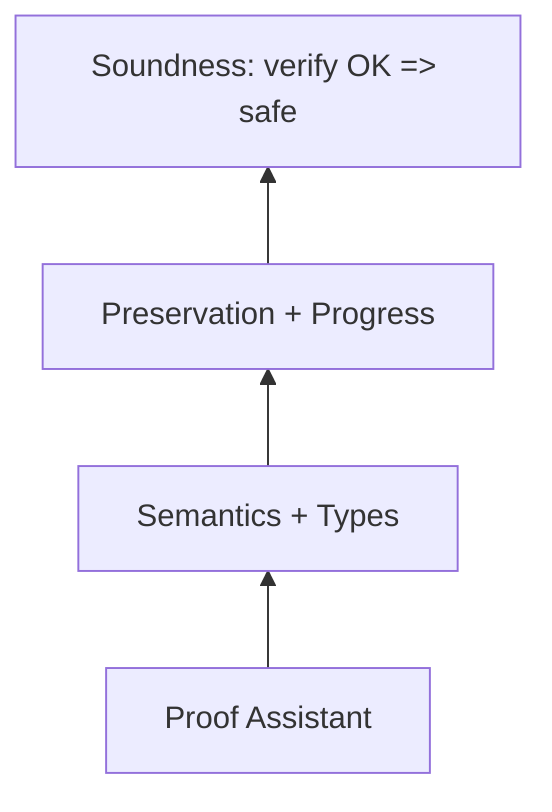

---

### 📶 Gradual Depth

**Level 1 - What it is:** Formal verification means using mathematical proof to guarantee a program is correct - not just testing it on sample inputs. Applied to the JVM verifier, it proves the verifier never accepts type-unsafe bytecode.

**Level 2 - How to use it:** You do not run formal proofs yourself during development. The value is indirect: verified algorithms give implementors confidence that the verifier design is sound. When a new JVM feature changes verification (e.g., sealed classes, pattern matching), the formal framework guides whether the new rules preserve soundness.

**Level 3 - How it works:** The proof proceeds in layers. First, define the JVM type system mathematically (typing rules per instruction). Second, define operational semantics (what each instruction does to the state). Third, prove type preservation: if the state is well-typed and the instruction executes, the new state is well-typed. Fourth, prove the dataflow algorithm's fixed-point implies the typing rules. The proof assistant checks every step mechanically.

**Level 4 - Production mastery:** No mainstream JVM implementation uses a machine-verified verifier in production. HotSpot's verifier is hand-written C++. The formal results serve as reference specifications: if the implementation disagrees with the formal model, the implementation is suspect. The practical gap is significant - the formal models cover a JVM subset (classes, interfaces, exceptions, arrays) but omit invokedynamic, method handles, sealed classes, and the full generics erasure story. Ongoing research extends coverage incrementally. The CompCert C compiler demonstrates that deploying formally verified code in production is feasible - applying the same approach to the JVM verifier remains an open engineering challenge.

---

### ⚙️ How It Works

**Phase 1 - Model the instruction set:** Each bytecode instruction gets a formal typing rule. Example: `aload_0` loads a reference from local variable 0. Rule: if local 0 has type T (where T is a reference type), the stack gains a T on top. This is defined for every instruction in the subset being verified.

**Phase 2 - Define the abstract domain:** The verifier does not track concrete values - it tracks types. At each program point, the verifier maintains an abstract state: a type for each local variable slot and each stack position. At control-flow merges (join points), types are merged using the least upper bound in the class hierarchy.

**Phase 3 - Dataflow fixed point:** The verifier iterates over the control-flow graph, propagating abstract states through instructions and merging at join points, until the state stabilizes (fixed point). If any instruction receives types it cannot handle, verification fails.

**Phase 4 - Prove correctness:** The formal proof shows that if the dataflow reaches a fixed point, the resulting abstract types at each instruction satisfy the typing rules, and the typing rules imply preservation and progress. The proof assistant verifies every logical step.

```
Verification dataflow example:

  0: aload_0     state: [this:Foo | <empty>]
  1: getfield x  state: [       | int     ]
  2: ifeq 5      state: [       | <empty> ]
  3: iconst_1    state: [       | int     ]
  4: goto 6
  5: iconst_0    state: [       | int     ]
  6: ireturn
     merge@6: int JOIN int = int  (OK)
```

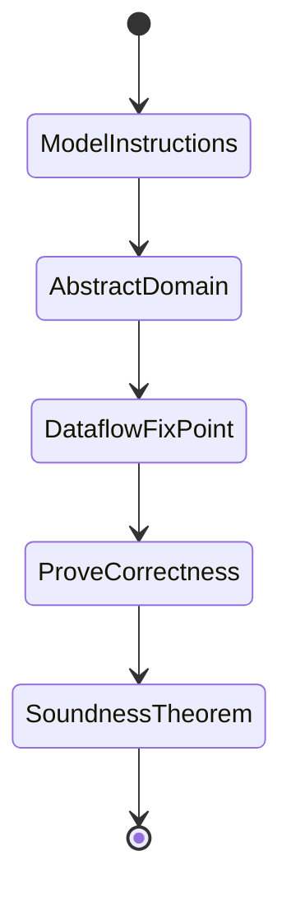

**BAD:**

```java
// Trusting the verifier based on testing:
// "We ran 10M random class files and
// the verifier rejected the bad ones."
// But adversarial inputs are not random.
// A targeted malformed class file may
// slip through an untested code path.
```

Why it fails: Testing covers tested inputs. An adversary crafts inputs specifically to hit untested verifier paths. No finite test suite covers the infinite input space.

**GOOD:**

```
(* Coq soundness theorem (simplified) *)
Theorem verifier_soundness :
  forall P,
    verify P = OK ->
    forall s, well_typed_state s ->
    step P s = Some s' ->
    well_typed_state s'.
(* Machine-checked for ALL programs P *)
(* and ALL states s - not just tested *)
```

Why it works: The theorem quantifies over all programs and all states. The proof assistant checks every logical step, leaving no gap for adversarial inputs.

---

### 🚨 Failure Modes

**Failure 1 - Model-Reality Gap:**

**Symptom:** The formal proof covers a JVM subset, but a security vulnerability appears in an unmodeled feature (JNI, invokedynamic, deep reflection).

**Root cause:** The formal model deliberately abstracts away features too complex to verify. Attackers exploit the gap between the verified model and the full implementation. The proof guarantees soundness of the modeled subset - features outside the model have no formal guarantee.

**Diagnostic:**

```
# Identify unmodeled features in the TCB:
# Review the formal model's scope against
# actual verifier code paths:
grep -c "invokedynamic\|MethodHandle" \
  hotspot/share/classfile/verifier.cpp
# High count = significant unverified code
```

**Fix:** Extend the formal model incrementally. Alternatively, restrict untrusted code from using unmodeled features (e.g., deny `--add-opens` and `Unsafe` access in security-critical deployments). Accept that full formal coverage is a research frontier, not current reality.

**Failure 2 - Specification Bug:**

**Symptom:** The formal proof is correct, but the specification it proves is wrong - the typing rules themselves are too permissive, allowing unsafe programs to type-check.

**Root cause:** Formal verification proves that the implementation matches the specification. If the specification is flawed, the proof is correct but the guarantee is hollow. This is analogous to proving a building matches blueprints that have a structural flaw.

**Diagnostic:**

```
# Cross-reference the formal type rules
# against the JVM Specification Chapter 4.10:
# If the formal model accepts programs the
# spec says should be rejected, the model's
# typing rules are too weak.
```

**Fix:** Validate the formal specification against the JVM Specification (JVMS) and known security properties independently. Specification review is a separate (human) process from mechanized proof. Multiple independent formalizations (Coq and Isabelle) catching the same rules increase confidence.

---

### 🔬 Production Reality

In 2017, a verifier bug in HotSpot allowed crafted bytecode to bypass type checking during class loading, enabling arbitrary code execution (CVE-2017-3272). The root cause was a corner case in how the verifier handled `invokespecial` on an uninitialized `this` reference in constructor chaining. Leroy's formal model and the Jinja formalization both correctly rejected this pattern - the bug existed only in the hand-written C++ implementation, not in the formal specification. This incident demonstrated both the value and the limit of formal methods: the formal model identified the correct behavior, but the production JVM did not implement the formal model - it implemented an independent interpretation of the JVM Specification. The gap between formal model and production code is where bugs live. Formal verification does not eliminate bugs in the implementation; it eliminates bugs in the design. Closing the gap requires either generating verifier code from the formal model (as CompCert generates compiler code from Coq) or proving that the existing C++ implementation corresponds to the model.

---

### ⚖️ Trade-offs & Alternatives

| Aspect          | Formal Verification | Extensive Testing | Fuzzing         | Code Review     |
| --------------- | ------------------- | ----------------- | --------------- | --------------- |
| Coverage        | All inputs (model)  | Tested inputs     | Random inputs   | Human judgment  |
| Guarantee       | Mathematical proof  | Statistical conf. | Bug-finding     | Heuristic       |
| Cost            | Very high (PhD-yrs) | Moderate          | Low-moderate    | Moderate        |
| Model gap risk  | Yes (abstractions)  | No model needed   | No model needed | No model needed |
| Scales to       | Verified subset     | Full system       | Full system     | Full system     |
| Finds spec bugs | No (proves spec)    | Yes (if tested)   | Yes (crashes)   | Yes (reasoning) |

---

### ⚡ Decision Snap

**USE WHEN:**

- You are designing or modifying the bytecode verifier and need confidence that new rules preserve type safety
- You are evaluating whether a JVM implementation's type checking is trustworthy for a security-critical deployment
- You are contributing to JVM specification work and need to validate proposed typing rules

**AVOID WHEN:**

- You need to find bugs in the full JVM implementation (use fuzzing and code review)
- You are tuning JVM performance, not security

**PREFER FUZZING WHEN:**

- You need to find implementation bugs quickly across the full codebase, including unmodeled features like JNI and reflection

---

### ⚠️ Top Traps

| #   | Misconception                                       | Reality                                                                                                                                                                               |
| --- | --------------------------------------------------- | ------------------------------------------------------------------------------------------------------------------------------------------------------------------------------------- |
| 1   | "Formal verification means the JVM is bug-free"     | It means the verified subset of the verifier algorithm is correct with respect to the formal model. Implementation bugs, unmodeled features, and spec flaws are not covered.          |
| 2   | "HotSpot uses a formally verified verifier"         | No production JVM uses a machine-generated verified verifier. Formal results serve as reference specifications, not deployed code.                                                    |
| 3   | "Testing is sufficient for the verifier"            | The verifier must be correct for all possible class files - an infinite space. Testing covers finite samples. Adversarial inputs target untested paths.                               |
| 4   | "The formal model covers the full JVM"              | Formal models typically cover a subset: classes, interfaces, arrays, exceptions. Features like invokedynamic, method handles, sealed classes, and JNI are usually omitted.            |
| 5   | "Proving the verifier proves the whole JVM is safe" | The verifier is one TCB component. JNI, Unsafe, deserialization, and deep reflection bypass the verifier entirely. Type safety is necessary but not sufficient for full JVM security. |

---

### 🪜 Learning Ladder

**Prerequisites:**

- JVM-117 Bytecode Verification - understand what the verifier does before asking whether it is correct
- JVM-123 The Trusted Computing Base of the JVM - understand why the verifier is the trust root that formal methods target
- JVM-116 JVM Specification - the spec that formal models formalize

**THIS:** JVM-124 JVM Formal Verification and Type Safety Proof

**Next steps:**

- JVM-125 Region-Based Memory Management Research - another area where formal methods guide design
- JVM-118 Designing a GC from First Principles - formal invariants (tri-color) also appear in GC correctness
- JVM-001 What Is the JVM - revisit the JVM's architecture with deeper appreciation of what makes it trustworthy

---

**The Surprising Truth:**

The most important verifier bugs in JVM history were not in obscure corner cases - they were in common instruction sequences where the implementation deviated from the specification in subtle ways. Formal models caught the correct behavior on paper. The bugs existed because the C++ implementation was not generated from the model. The verification gap is not a proof problem - it is a deployment problem. We know how to prove the verifier correct. We have not yet deployed the proof.

**Further Reading:**

- Xavier Leroy - "Java Bytecode Verification: Algorithms and Formalizations" (Journal of Automated Reasoning, 2003) - the foundational machine-checked verifier in Coq
- Tobias Nipkow - "Jinja: Towards a Comprehensive Formal Semantics for a Java-like Language" (Isabelle/HOL formalization) - type soundness proof for a JVM subset with classes, inheritance, and exceptions
- James Gosling, et al. - "The Java Virtual Machine Specification" (Chapter 4.10: Verification of class Files) - the specification that all formal models target

**Revision Card:**

1. Type preservation + progress + verifier soundness = the proof chain that guarantees verified bytecode cannot violate type safety at runtime.
2. The trade-off is coverage vs. certainty: formal proofs give mathematical guarantees for modeled features but cannot cover JNI, Unsafe, or reflection.
3. No production JVM deploys a machine-verified verifier - the formal results are reference specs, not running code. The model-reality gap is where real bugs hide.

---

---

# JVM-125 Region-Based Memory Management Research

**TL;DR** - Region-based memory frees entire regions at once instead of tracing individual objects - trading allocation flexibility for predictable, GC-free deallocation when region lifetimes align with program structure.

---

### 🔥 Problem Statement

Tracing garbage collectors must periodically scan the entire live object graph to determine what is dead. On a 64GB heap with hundreds of millions of objects, this scanning consumes CPU, causes pauses (even concurrent collectors pay barrier overhead), and produces unpredictable latency spikes. The fundamental cost is per-object: the collector must visit or account for each live object individually. Region-based memory management attacks this from a different angle: group objects by lifetime, allocate them into a contiguous region, and free the entire region in O(1) when its lifetime ends. No tracing. No per-object cost. Deallocation is instant and predictable. The catch: this only works when the programmer or compiler can determine region lifetimes statically or semi-statically. When lifetimes are unpredictable, you fall back to tracing GC. Modern JVM collectors (G1, ZGC) use regions as a physical partitioning strategy but still trace within them - a hybrid that borrows the region concept without eliminating tracing. The research question is whether compile-time region inference can go further.

---

### 📜 Historical Context

Region-based memory management originated with Mads Tofte and Jean-Pierre Talpin's 1994 paper on region inference for Standard ML. Their insight: a type-and-effect system can infer, at compile time, which region each allocation belongs to and when each region can be safely deallocated - no garbage collector required. The ML Kit compiler implemented this for real programs. The approach worked well for functional programs with clear lexical scoping but struggled with imperative patterns, long-lived mutable data, and programs where lifetimes are genuinely dynamic. David Gay and Alex Aiken (2001) extended the model with counted regions for C - explicit but safe region management. Meanwhile, JVM collectors independently discovered regions as a physical memory partitioning: G1GC (2004 paper, production 2012) divides the heap into fixed-size regions to enable partial-collection. ZGC and Shenandoah refined the approach. These JVM regions serve a different purpose (incremental collection, not lifetime-based deallocation) but the structural insight - group objects spatially, manage groups as units - traces directly to the Tofte-Talpin lineage.

---

### 🔩 First Principles

**CORE INVARIANTS:**

1. A region is a contiguous memory area with a single deallocation point - all objects in the region are freed simultaneously when the region is deallocated, regardless of individual object liveness.
2. Safety requires that no reference from a longer-lived region points into a shorter-lived region at the moment of deallocation - otherwise, dangling pointers result.
3. Region lifetime must be determinable (statically by the compiler, dynamically by the programmer, or heuristically by the runtime) - if lifetimes cannot be determined, tracing GC is the only safe fallback.

**DERIVED DESIGN:**

Invariant 1 makes deallocation O(1) regardless of object count - freeing a region is a pointer reset, not a traversal. Invariant 2 is the core difficulty: the type system (in Tofte-Talpin) or the runtime (in G1) must enforce that cross-region references respect lifetime ordering. In the academic model, this is a compile-time constraint. In G1/ZGC, remembered sets track cross-region references and ensure all live objects are evacuated before a region is reclaimed. Invariant 3 explains why pure region inference has not replaced GC in practice: real programs create objects whose lifetimes depend on runtime input, network responses, and user behavior - no compiler can statically determine when a web session ends.

**THE TRADE-OFF:**

**Gain:** Predictable O(1) deallocation, no tracing overhead, no GC pauses for region-scoped objects.

**Cost:** Programmer or compiler must manage region lifetimes. Misaligned lifetimes cause either premature deallocation (dangling pointers in unsafe systems) or space leaks (objects kept alive longer than necessary because their region outlives them).

---

### 🧠 Mental Model

> Regions are filing cabinets. Instead of throwing away individual papers (tracing GC freeing individual objects), you dedicate a cabinet to a project and shred the entire cabinet when the project ends. Fast, predictable, no sorting through papers. But if one paper from another project accidentally ends up in the wrong cabinet, shredding destroys something still needed. The discipline is: each paper goes in the cabinet matching its project's lifetime.

- "Filing cabinet" -> memory region
- "Shred entire cabinet" -> O(1) region deallocation
- "Paper in wrong cabinet" -> object allocated in a region with mismatched lifetime
- "Project ends" -> region lifetime expires

**Where this analogy breaks down:** Tofte-Talpin's system infers which cabinet each paper belongs to automatically at compile time. JVM regions require runtime tracking (remembered sets) because Java's dynamic dispatch and heap-allocated closures make compile-time inference infeasible for full programs.

---

### 🧩 Components

- **Region allocator** - allocates objects sequentially within a region using bump-pointer allocation. O(1) allocation, excellent cache locality.
- **Region lifetime analysis** - determines when a region can be safely freed. Static (Tofte-Talpin: compiler infers from lexical scope), dynamic (programmer annotates), or runtime-heuristic (G1: garbage density determines which regions to evacuate).
- **Cross-region reference tracking** - detects pointers that span region boundaries. In academic systems, the type system forbids unsafe cross-region references. In G1/ZGC, remembered sets (card tables, bitmaps) track inter-region pointers.
- **Region deallocation** - resets the region's allocation pointer to reclaim all memory at once. No per-object finalization, no tracing.
- **Escape analysis** - compiler analysis determining whether objects escape their allocation scope. Objects that do not escape can be region-allocated (or stack-allocated) safely.

```
Tofte-Talpin regions (compile-time):

 Region r1 (scope: function f)
 +---------+---------+---------+
 | obj A   | obj B   | obj C   |
 +---------+---------+---------+
   ^alloc ptr
 On exit from f: reset ptr -> all freed

 JVM G1 regions (runtime):
 +------+------+------+------+
 | Rgn1 | Rgn2 | Rgn3 | Rgn4 |
 | 80%  | 20%  | 90%  | 10%  |
 | live  | garb | live  | garb |
 +------+------+------+------+
 Evacuate live from Rgn2,Rgn4 -> free
 (still requires tracing to find live)
```

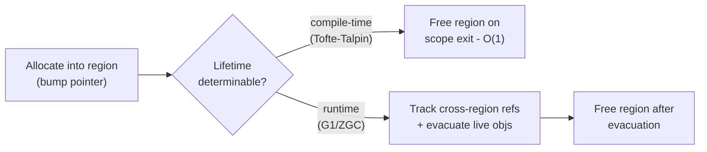

---

### 📶 Gradual Depth

**Level 1 - What it is:** Instead of tracking and freeing individual objects, you group objects into regions and free the entire region at once. If you know when a group of objects all become dead, deallocation is instant.

**Level 2 - How to use it:** JVM developers use regions indirectly through G1GC and ZGC, which partition the heap into fixed-size regions for incremental collection. The allocator places objects into regions; the collector evacuates live objects from garbage-dense regions and frees the rest.

**Level 3 - How it works:** Academic region inference (Tofte-Talpin) uses a type-and-effect system to compute, at compile time, which region each allocation belongs to. The compiler inserts region creation at scope entry and region deallocation at scope exit. Cross-region references are constrained by the type system to prevent dangling pointers. JVM collectors instead track cross-region references at runtime using remembered sets and identify live objects within each region via tracing.

**Level 4 - Production mastery:** The gap between academic region inference and JVM regions reveals a fundamental tension. Pure region inference works when object lifetimes align with lexical scopes - common in functional languages but rare in Java's imperative, heap-heavy, long-lived-object style. JVM regions are a physical optimization (spatial locality, incremental collection) not a lifetime-based allocation strategy. Research on combining escape analysis with region inference for JVM languages (Cherem and Rugina, 2004; Chin et al., 2006) has shown promising results for server workloads where request-scoped allocation dominates, but no production JVM has deployed compile-time region inference. The practical frontier is request-scoped arenas: allocate all objects for a single HTTP request into one region, free the region when the response is sent.

---

### ⚙️ How It Works

**Phase 1 - Region creation:** A region is a contiguous block of memory with a bump-pointer allocator. In Tofte-Talpin, the compiler emits `letregion r in ... end` - region `r` exists for the lexical scope. In G1, the JVM allocates fixed-size regions (typically 1-32MB) from the OS at startup.

**Phase 2 - Allocation into regions:** Objects are allocated sequentially via bump pointer. Allocation is O(1) and cache-friendly. In Tofte-Talpin, the compiler determines which region via type inference. In G1, young objects go to eden regions; promoted objects go to old regions.

**Phase 3 - Cross-region reference management:** References from longer-lived regions to shorter-lived ones must be tracked. Tofte-Talpin's type system statically forbids dangling references. G1 maintains remembered sets: when a store creates a cross-region reference, a write barrier records it in the target region's remembered set.

**Phase 4 - Deallocation:** In Tofte-Talpin, region deallocation at scope exit resets the pointer - O(1), no tracing. In G1, the collector traces within selected regions (using remembered sets as additional roots), evacuates live objects to survivor regions, and frees the source regions entirely.

```
Request-scoped arena (hybrid idea):

  HTTP request arrives
       |
       v
  Create arena region R
  Allocate: req, headers, body, dto
  All into R (bump pointer)
       |
       v
  Process request
  (objects never escape R)
       |
       v
  Send response
  Free R (one pointer reset)
  No GC needed for these objects
```

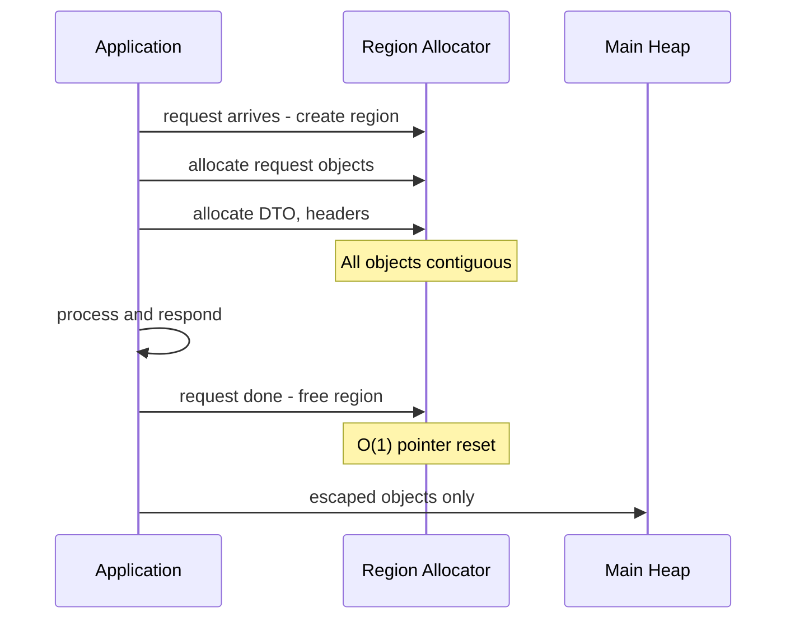

**BAD:**

```java
// Allocating request-scoped objects on the
// general heap - every object individually
// traced and collected by GC
void handleRequest(Request req) {
    var dto = new OrderDTO(req.body());
    var result = process(dto);
    respond(result);
    // dto, result now garbage
    // GC must find and reclaim each one
}
// 50K req/s = 50K+ objects/s for GC to trace
```

Why it fails: Each request creates objects that GC must individually discover, trace, and reclaim. At high request rates, GC overhead becomes significant.

**GOOD:**

```java
// Hypothetical region-scoped allocation:
void handleRequest(Request req) {
    try (var arena = Arena.ofConfined()) {
        var dto = arena.allocate(OrderDTO);
        var result = process(dto);
        respond(result);
    }
    // Arena freed: O(1), no GC tracing
    // Requires: dto, result do not escape
}
// 50K req/s with near-zero GC overhead
// for request-scoped objects
```

Why it works: All request objects share one region. Deallocation is a pointer reset. No tracing, no per-object cost. Escape analysis or programmer discipline ensures no dangling references.

---

### 🚨 Failure Modes

**Failure 1 - Space Leak from Lifetime Mismatch:**

**Symptom:** Memory usage grows steadily even though logical garbage exists. A region stays alive because one long-lived object pins it, keeping all other (dead) objects in the region allocated.

**Root cause:** One object in a region outlives its siblings. The region cannot be freed until all objects are dead. In Tofte-Talpin systems, this manifests as a region whose lifetime is conservatively extended to the outermost scope that any of its objects reach. The dead objects in that region are a space leak.

**Diagnostic:**

```
# In a Tofte-Talpin system: inspect region
# sizes at scope boundaries.
# In JVM (G1): high region occupancy with
# low live-object ratio indicates similar
# problem at region granularity:
jcmd <pid> GC.heap_info
# Regions with high waste = lifetime mismatch
```

**Fix:** Split the long-lived object into a separate region. In G1, this is automatic (the collector evacuates live objects from waste-heavy regions). In compile-time systems, the programmer or compiler must refine region assignments. The research approach: sub-region splitting guided by profiled lifetime distributions.

**Failure 2 - Dangling Reference (Unsafe Region API):**

**Symptom:** Crash, data corruption, or security vulnerability. A reference points into a freed region. Accessing it reads arbitrary memory.

**Root cause:** A reference escaped from a shorter-lived region into a longer-lived region, and the shorter-lived region was freed without updating the reference. Safe systems (Tofte-Talpin, Rust's borrow checker) prevent this at compile time. Unsafe systems (manual arena APIs without ownership tracking) allow it.

**Diagnostic:**

```
# In Java's MemorySegment API (Panama):
# Accessing a closed arena throws
# IllegalStateException - by design.
# This is the safe version:
var arena = Arena.ofConfined();
var seg = arena.allocate(100);
arena.close();
seg.get(JAVA_INT, 0);
// throws IllegalStateException (safe)
```

**Fix:** Use lifetime-checked APIs (Java's Arena enforces this). Never expose raw region pointers without ownership tracking. In research systems, the type system statically prevents this; in production, runtime checks (segment liveness flags) catch it.

---

### 🔬 Production Reality

A high-frequency trading system allocating 200K orders/second found that G1GC spent 8% of CPU on young-gen collections tracing short-lived order objects. Each order created approximately 15 objects (order, legs, fills, timestamps) that all died when the order completed - typically within 2ms. The team prototyped a request-scoped arena allocator using Project Panama's `Arena.ofConfined()`. Order-related `MemorySegment` allocations went into per-order arenas, freed in bulk on order completion. Result: GC pressure from order processing dropped to near zero. Young-gen collection frequency dropped 60%. The limitation: only flat data (structs via `MemoryLayout`) could use the arena - regular Java objects still required heap allocation. This illustrates the current frontier: Panama arenas provide region semantics for off-heap memory, but JVM-managed objects cannot yet participate in region-based deallocation. Bridging this gap - allowing Java objects to be region-allocated with compile-time safety - remains an active research area.

---

### ⚖️ Trade-offs & Alternatives

| Aspect            | Tofte-Talpin Regions | G1/ZGC Regions    | Manual Arenas    | Tracing GC (no regions) |
| ----------------- | -------------------- | ----------------- | ---------------- | ----------------------- |
| Lifetime decision | Compile-time infer   | Runtime heuristic | Programmer       | Not needed              |
| Deallocation cost | O(1) pointer reset   | Evacuate + free   | O(1) reset       | Per-object tracing      |
| Safety guarantee  | Type system          | Runtime tracking  | API checks       | Full GC safety          |
| Cross-region refs | Statically forbidden | Remembered sets   | Programmer resp  | Not applicable          |
| Language fit      | Functional (ML)      | Any (JVM)         | Systems (C/Rust) | Any                     |
| Space leak risk   | Region pinning       | Low (evacuation)  | Low if scoped    | None (full tracing)     |
| Predictability    | Deterministic        | Mostly predict.   | Deterministic    | Unpredictable pauses    |

---

### ⚡ Decision Snap

**USE WHEN:**

- Object lifetimes align with clear scopes (request handling, batch processing, transaction boundaries)
- Latency predictability matters more than generality
- You are designing a runtime, VM, or allocator and want alternatives to pure tracing GC

**AVOID WHEN:**

- Object lifetimes are genuinely unpredictable (long-lived caches, shared mutable state with unknown lifetimes)
- You need general-purpose memory management for arbitrary programs

**PREFER TRACING GC WHEN:**

- Program structure does not have clear region boundaries and you cannot afford the space leaks from conservative region assignment

---

### ⚠️ Top Traps

| #   | Misconception                                        | Reality                                                                                                                                                                                          |
| --- | ---------------------------------------------------- | ------------------------------------------------------------------------------------------------------------------------------------------------------------------------------------------------ |
| 1   | "G1/ZGC regions are Tofte-Talpin regions"            | JVM regions are a physical partitioning for incremental collection. They still trace within regions. Tofte-Talpin regions eliminate tracing entirely via compile-time lifetime inference.        |
| 2   | "Region-based allocation eliminates all GC overhead" | Only for objects whose lifetimes perfectly match region boundaries. Escaped or mismatched objects still require tracing or cause space leaks.                                                    |
| 3   | "Region inference works for any language"            | It works well for functional languages with lexical scoping. Imperative languages with heap mutation, dynamic dispatch, and unpredictable lifetimes defeat compile-time inference in most cases. |
| 4   | "Arenas are always faster than GC"                   | If region lifetimes are poorly aligned, arenas hold dead objects longer than GC would reclaim them. Space leaks from region pinning can be worse than GC overhead.                               |
| 5   | "Java's Arena API (Panama) replaces GC"              | Panama arenas manage off-heap MemorySegments, not Java objects. Regular Java objects still live on the GC-managed heap. Region-based allocation for Java objects remains a research topic.       |

---

### 🪜 Learning Ladder

**Prerequisites:**

- JVM-026 Heap and Stack - understand heap allocation before questioning alternatives to it
- JVM-060 G1 Region-Based Design - understand JVM regions as a practical partitioning before learning the academic theory behind them
- JVM-118 Designing a GC from First Principles - the allocator-marker-reclaimer framework that regions partially replace

**THIS:** JVM-125 Region-Based Memory Management Research

**Next steps:**

- JVM-119 GC Research - Pauseless GC (Azul C4 Paper) - concurrent compaction as the alternative path to low-latency memory management
- JVM-116 JVM Specification - how the spec constrains what allocation strategies a JVM can use
- JVM-048 JIT Compilation Tiers - escape analysis in the JIT is the gateway to automatic region-like allocation

---

**The Surprising Truth:**

The most successful deployment of region-based memory management in the JVM ecosystem is hiding in plain sight: the young generation in generational collectors is effectively a region. Objects are allocated sequentially via bump pointer, and the entire space is "freed" after a minor GC by resetting the allocation pointer. The only reason it is not a pure region is that some objects survive - they are evacuated before the reset. If the generational hypothesis held perfectly (all young objects die young), young-gen collection would be pure region deallocation with zero tracing. Every generational collector is one perfect hypothesis away from being a region allocator.

**Further Reading:**

- Mads Tofte, Jean-Pierre Talpin - "Implementation of the Typed Call-by-Value Lambda-Calculus using a Stack of Regions" (POPL, 1994) - the foundational paper on compile-time region inference
- David Gay, Alex Aiken - "Language Support for Regions" (PLDI, 2001) - extending regions to imperative languages (RC language for C)
- Sigmund Cherem, Radu Rugina - "Region Analysis and Transformation for Java Programs" (ISMM, 2004) - applying region inference to Java, showing feasibility for server workloads

**Revision Card:**

1. Regions trade allocation flexibility for O(1) deallocation - free an entire region when its lifetime ends, no per-object tracing needed.
2. The core tension is lifetime determinability: compile-time inference works for functional languages, runtime heuristics work for JVM collectors, and neither is universal.
3. JVM G1/ZGC regions are physical partitions for incremental collection, not lifetime-based regions - they still trace within each region. Pure region-based deallocation for Java objects remains a research frontier.
