## Keywords

1. [JVM-126 JVM Interpreter Design - Stack vs Register](#jvm-126-jvm-interpreter-design---stack-vs-register)
2. [JVM-127 Contributing to OpenJDK - Process and Culture](#jvm-127-contributing-to-openjdk---process-and-culture)
3. [JVM-128 Memory Pressure as a Universal System Signal](#jvm-128-memory-pressure-as-a-universal-system-signal)
4. [JVM-129 Latency vs Throughput Trade-off Framing](#jvm-129-latency-vs-throughput-trade-off-framing)
5. [JVM-130 What OS Scheduling Teaches JVM Engineers](#jvm-130-what-os-scheduling-teaches-jvm-engineers)
6. [JVM-131 Compiler Opt Patterns Across Runtimes](#jvm-131-compiler-opt-patterns-across-runtimes)
7. [JVM-132 Stop-the-World as Distributed Consensus](#jvm-132-stop-the-world-as-distributed-consensus)

---

# JVM-126 JVM Interpreter Design - Stack vs Register

**TL;DR** - Stack-based interpreters trade execution speed for bytecode compactness and compiler simplicity; JIT compilation erases the difference by performing register allocation at compile time.

---

### 🔥 Problem Statement

When a JVM starts, every method executes through the interpreter before the JIT compiler decides it is hot enough to compile. If you do not understand how the interpreter works, you cannot reason about warmup behavior, cold-start latency, or why certain bytecode patterns execute faster than others during the interpreted phase. Teams running serverless functions, CLI tools, or microservices with frequent restarts see minutes of cumulative interpreter execution daily. Without understanding the stack-based design - why instructions carry no register operands, why HotSpot uses a template interpreter, why Android's Dalvik chose register-based bytecode - you treat interpreter performance as a black box and miss optimization opportunities in both bytecode generation and JVM startup configuration.

---

### 📜 Historical Context

The stack machine concept dates to the 1960s (Burroughs B5000) and reached software VMs through UCSD Pascal's P-code in the 1970s. When James Gosling designed JVM bytecode in the early 1990s, he chose a stack-based architecture for three reasons: it required no assumptions about the host CPU's register count (critical for "write once, run anywhere"), it produced compact bytecode (important when classes loaded over 1990s networks), and it simplified the compiler (javac needs no register allocator). In 2007, Dan Bornstein designed Android's Dalvik VM with a register-based ISA, reasoning that mobile devices could trade bytecode size for fewer dispatched instructions. The Shi et al. study "Virtual Machine Showdown: Stack Versus Registers" (VEE 2005) provided the first rigorous comparison, showing register-based interpretation executed roughly 47% fewer VM instructions for equivalent programs.

---

### 🔩 First Principles

**CORE INVARIANTS:**

1. An interpreter must fetch, decode, and dispatch every virtual instruction - dispatch cost dominates interpreted execution because it is paid per instruction
2. Instruction encoding width and instruction count are inversely related - stack instructions encode no operand addresses (1-2 bytes each, more instructions needed) while register instructions encode operand indices (wider, but fewer instructions)
3. Once the JIT compiler translates bytecode to native code, the virtual operand addressing scheme disappears - native code uses physical registers regardless of whether the source was stack-based or register-based

**DERIVED DESIGN:**

Invariant 1 means reducing total instruction count reduces total dispatch overhead. Register bytecode achieves this by encoding more work per instruction (one `add r0, r1, r2` replaces separate `load`, `load`, `add`, `store` stack operations). Invariant 2 means this reduction comes at the cost of wider instructions. Invariant 3 means the stack-vs-register debate matters only for interpreted execution and bytecode transfer size. HotSpot's template interpreter mitigates dispatch overhead by pre-generating native code stubs for each bytecode at startup, eliminating the decode step entirely.

**THE TRADE-OFF:**

**Gain:** Stack-based design delivers compact bytecode, simple compilers, and portability across any host CPU
**Cost:** More instructions dispatched per operation, more operand stack shuffling (dup, swap, pop), and higher dispatch overhead during interpretation

---

### 🧠 Mental Model

> A stack-based interpreter is a chef working with a single narrow counter. Every ingredient (operand) must be placed on top, combined with the one below it, and the result stays on the counter. A register-based interpreter is a chef with labeled bowls - she grabs ingredient from bowl 3 and bowl 7 directly. The narrow counter requires more placing and removing steps, but the instructions ("take top two, combine") are short. The labeled bowls require fewer steps, but each instruction must name which bowls to use.

- "Narrow counter" -> operand stack (LIFO, no addressing)
- "Labeled bowls" -> virtual register file (indexed access)
- "Placing/removing steps" -> stack manipulation bytecodes (dup, swap, pop)

**Where this analogy breaks down:** Real interpreters have a dispatch loop whose overhead dominates execution cost - the analogy does not capture that switching between counter operations has fixed overhead independent of the operation itself.

---

### 🧩 Components

- **Bytecode stream** - the sequence of virtual instructions. JVM instructions are variable-length (1-3 bytes). Dalvik instructions are 16-bit aligned (2-6 bytes each).
- **Operand stack** - per-frame LIFO structure (stack-based VMs) where operands are pushed before operations and results pushed after.
- **Virtual register file** - per-frame indexed array (register-based VMs) where instructions read and write slots by number.
- **Dispatch loop** - the core cycle: fetch opcode, jump to handler. Ranges from switch-case to threaded dispatch to template generation.
- **Template interpreter** - HotSpot generates native code stubs per bytecode at startup. Execution jumps between stubs, eliminating fetch-decode overhead.
- **Constant pool** - per-class table of literals and references that bytecodes index into for operands too large to encode inline.

```
Stack-based (JVM)     Register-based
+-----------------+   +------------------+
| Bytecode Stream |   | Bytecode Stream  |
| iload_1         |   | add v0, v1, v2   |
| iload_2         |   +--------+---------+
| iadd            |            |
| istore_3        |            v
+--------+--------+   +--------+---------+
         |            | Virtual Registers |
         v            | v0 | v1 | v2 |.. |
+--------+--------+   +------------------+
| Operand Stack   |
| [top] -> result |
+-----------------+
```

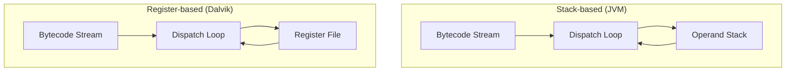

---

### 📶 Gradual Depth

**Level 1 - What it is:** A bytecode interpreter executes JVM instructions one at a time. The JVM uses a stack-based design where operands live on an implicit evaluation stack, not in named registers.

**Level 2 - How to use it:** You rarely interact with the interpreter directly, but you see its effects during warmup. Methods run in the interpreter until the JIT decides they are hot. `-XX:+PrintCompilation` reveals when methods graduate from interpreted to compiled.

**Level 3 - How it works:** For each bytecode, the interpreter fetches the opcode and jumps to a handler. In stack execution, `iload_1` pushes local variable 1, `iload_2` pushes variable 2, `iadd` pops both, adds, and pushes the result. HotSpot's template interpreter replaces the fetch-decode loop with pre-generated native code fragments chained together, cutting dispatch overhead significantly.

**Level 4 - Production mastery:** In warmup-sensitive environments (serverless, CLI tools, frequent container restarts), interpreter throughput directly affects user-visible latency. HotSpot generates roughly 260KB of template stubs at startup. Understanding this explains why the first few hundred milliseconds include template generation. For AOT-compiled images (GraalVM Native Image, Project Leyden), the interpreter is eliminated entirely - native code replaces interpretation, trading portability for instant startup.

---

### ⚙️ How It Works

**Phase 1 - Bytecode fetch:** The interpreter reads the next opcode from the bytecode array at the current program counter. JVM opcodes are one byte (0x00-0xFF), giving a maximum of 256 instructions.

**Phase 2 - Operand access (the key divergence):**

```
Stack execution: a = b + c
  iload_1     stack: [.. b]
  iload_2     stack: [.. b c]
  iadd        stack: [.. (b+c)]
  istore_3    stack: [..]
  4 instructions, 0 register operands

Register execution: a = b + c
  add v3, v1, v2
  1 instruction, 3 register operands
```

The stack version needs separate load/store instructions to shuttle values between locals and the stack. The register version encodes source and destination in a single instruction.

**Phase 3 - Dispatch strategies:**

```
Switch dispatch:
  while (true) {
    switch(bytecodes[pc++]) {
      case IADD: /* ... */ break;
    }
  }

Direct threading:
  goto *handlers[bytecodes[pc++]];

Template (HotSpot):
  execute precompiled native stub,
  jump to next stub via address table
```

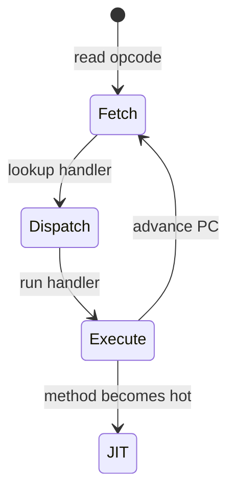

**Phase 4 - Template interpreter optimization:** At HotSpot startup, the TemplateInterpreter generates native machine code for each bytecode. Instead of interpreting `iadd` through a C++ switch case, it emits platform-specific instructions (e.g., x86: `pop rax; add rax, [rsp]; mov [rsp], rax`). This eliminates interpretation overhead while keeping the one-bytecode-at-a-time execution model.

**BAD:**
```
// Naive bytecode for: a = b + c + d
iload_1          // push b
iload_2          // push c
iadd             // push (b+c)
istore 4         // store to temp
iload 4          // reload temp (redundant!)
iload_3          // push d
iadd             // push (b+c+d)
istore 4         // store a
// 8 bytecodes dispatched
```
Why it fails: The redundant store-reload pair costs two extra dispatch cycles with zero semantic benefit.

**GOOD:**
```
// Optimized bytecode for: a = b + c + d
iload_1          // push b
iload_2          // push c
iadd             // push (b+c), keep on stack
iload_3          // push d
iadd             // push (b+c+d)
istore 4         // store a
// 6 bytecodes dispatched
```
Why it works: Keeping intermediates on the operand stack eliminates the store-reload pair, reducing dispatch count by 25%.

---

### 🚨 Failure Modes

**Failure 1 - Interpreter Warmup Dominating Cold Start:**

**Symptom:** P99 latency is 3-5x higher for the first 30-60 seconds after startup, then drops. Short-lived processes never reach steady-state performance.

**Root cause:** All methods execute through the interpreter until the JIT compilation threshold is reached (typically ~10,000 invocations in HotSpot). The interpreter runs 10-100x slower than JIT-compiled code. Short-lived processes exit before triggering compilation.

**Diagnostic:**
```bash
java -XX:+PrintCompilation MyApp 2>&1 \
  | head -50
# No output = still interpreting everything
# Timestamps show when JIT kicks in
```

**Fix:** Reduce threshold with `-XX:CompileThreshold=1000` for faster warmup. For short-lived processes, use AOT (GraalVM Native Image) or CDS with training runs. Project Leyden aims to shift compilation before first execution.

**Failure 2 - Interpreter Profile Pollution:**

**Symptom:** JIT-compiled code performs worse than expected. Frequent deoptimizations appear in logs.

**Root cause:** HotSpot's interpreter collects branch profiles and type profiles during execution. If warmup-phase code paths differ from steady-state (common with dependency injection, lazy initialization), the JIT compiles speculative optimizations for the wrong paths.

**Diagnostic:**
```bash
java -XX:+TraceDeoptimization MyApp \
  2>&1 | grep "uncommon trap"
# Frequent traps = profile mismatch
# "class_check" = wrong type profile
```

**Fix:** Implement warmup-phase request replay to populate profiles with production-like traffic before accepting real load. Alternatively, increase `-XX:Tier3InvocationThreshold` to delay compilation until more representative data accumulates.

---

### 🔬 Production Reality

A team deploys a JVM-based API gateway handling 50,000 req/s. After each rolling deployment, new instances show 3x higher P99 latency for 45 seconds. Investigation reveals slow requests hit methods still running in the interpreter. The template interpreter executes each bytecode through native stubs, but without method-level JIT compilation there is no inlining, no escape analysis, no loop optimization. The gateway's routing logic executes thousands of bytecodes per request. The fix combines CDS (Class Data Sharing) to reduce class loading overhead with a warmup endpoint that exercises hot paths before the instance joins the load balancer. They also reduce the compilation threshold from 10,000 to 5,000. Post-fix warmup drops from 45 seconds to 8 seconds. The insight: understanding that interpretation means per-bytecode execution without cross-method optimization explains why complex business logic suffers disproportionately during warmup.

---

### ⚖️ Trade-offs & Alternatives

| Aspect | JVM (stack) | Dalvik/ART (register) | Lua 5.x (register) |
| --- | --- | --- | --- |
| Addressing | Implicit stack top | Explicit register index | Explicit register index |
| Instr. count | Higher (~47% more) | Baseline | ~30% fewer than stack |
| Bytecode size | Compact (1-3 bytes) | Wider (2-6 bytes) | Fixed (4 bytes) |
| Compiler need | No register alloc | Full register alloc | Full register alloc |
| JIT available | C1/C2/Graal | ART AOT + profile JIT | LuaJIT (separate) |
| Best for | Portability, JIT | Mobile, battery life | Embedded scripting |

---

### ⚡ Decision Snap

**USE WHEN:**
- You need to understand JVM warmup behavior and why the interpreted phase is slow
- You are comparing VM implementation strategies for a new language runtime
- You are diagnosing cold-start latency in serverless or containerized JVM deployments

**AVOID WHEN:**
- Your application reaches steady-state quickly and JIT compilation dominates execution time
- You are tuning GC or memory layout rather than execution throughput

**PREFER register-based design WHEN:**
- Building a new VM for a constrained environment where interpretation (not JIT) is the primary execution mode
- Instruction dispatch cost dominates your performance profile and bytecode size is secondary

---

### ⚠️ Top Traps

| # | Misconception | Reality |
| - | ------------- | ------- |
| 1 | "Stack-based is always slower" | Only during interpretation. After JIT compilation, both produce identical native code with physical register allocation. The gap exists only in the interpreted phase. |
| 2 | "The JVM interprets bytecode in a loop" | HotSpot's template interpreter pre-generates native code stubs per bytecode at startup. It is closer to direct execution than classic switch-case interpretation. |
| 3 | "Register VMs produce smaller programs" | Register instructions are individually wider because they encode operand indices. Total bytecode size is typically 25% larger despite fewer instructions. |
| 4 | "javac optimizes bytecode for the interpreter" | javac performs almost no optimization. It emits straightforward stack bytecode and defers all optimization to the JIT compiler. |
| 5 | "WebAssembly proves stack machines won" | Wasm chose stack encoding for compactness and validation simplicity. All Wasm engines immediately convert to register-based IR for actual execution. |

---

### 🪜 Learning Ladder

**Prerequisites:**

- JVM-004 Bytecode Basics - understand the instruction set the interpreter executes
- JVM-048 JIT Compilation Tiers - know how methods graduate from interpreter to compiled code

**THIS:** JVM-126 JVM Interpreter Design - Stack vs Register

**Next steps:**

- JVM-116 JVM Specification - the formal definition of the stack-based instruction set and its execution semantics
- JVM-122 Project Leyden - Static Images and AOT - how ahead-of-time compilation aims to eliminate the interpreter phase entirely

---

**The Surprising Truth:**

The stack-vs-register debate is largely irrelevant for production JVM performance. HotSpot's template interpreter already generates native code per bytecode, and the JIT compiler performs full register allocation regardless of bytecode format. The stack-based design matters for bytecode compactness and compiler simplicity, but has near-zero impact on steady-state throughput. The choice that actually determines performance is whether the VM has a JIT compiler at all.

---

**Further Reading:**

- Yunhe Shi, David Gregg, Andrew Beatty, M. Anton Ertl - "Virtual Machine Showdown: Stack Versus Registers" (ACM VEE, 2005) - the definitive empirical comparison of stack-based and register-based interpreter architectures
- Tim Lindholm, Frank Yellin, Gilad Bracha, Alex Buckley - "The Java Virtual Machine Specification" (Chapter 2: The Structure of the Java Virtual Machine) - formal definition of the operand stack model
- OpenJDK HotSpot source: `src/hotspot/share/interpreter/templateInterpreter.cpp` - the authoritative reference for template interpreter design and code generation

---

**Revision Card:**

1. Stack machines trade dispatch count (more instructions) for encoding compactness (no register operands) - JIT compilation erases the difference entirely.
2. HotSpot's template interpreter pre-generates native stubs per bytecode, making "interpretation" 3-5x faster than classic switch dispatch.
3. Cold-start latency is the real cost of interpretation - consider AOT (Leyden, Native Image) for short-lived workloads before tuning interpreter parameters.

---

---

# JVM-127 Contributing to OpenJDK - Process and Culture

**TL;DR** - Contributing to OpenJDK requires navigating JBS for bug tracking, GitHub PRs for code review, jtreg for testing, and a culture that prizes backward compatibility above almost everything else.

---

### 🔥 Problem Statement

You find a real JDK bug, write a correct fix, submit a pull request - and it goes nowhere. The review stalls for weeks. Or it gets rejected referencing coding guidelines you have never seen, tests you did not know existed, and compatibility constraints you did not consider. OpenJDK has a 25+ year codebase where a single regression in `java.lang.String` affects every Java application on Earth. The community evolved rigorous processes from the consequences of breaking billions of deployed programs. Without understanding the community structure (projects, groups, roles), the contribution workflow (JBS, GitHub, jtreg), and the cultural norms (backward compatibility, specification compliance, multi-implementation friendliness), your contribution will stall, frustrate reviewers, or introduce regressions that affect millions of developers.

---

### 📜 Historical Context

Sun Microsystems controlled Java's development from 1995 until open-sourcing the JDK as OpenJDK under GPLv2+Classpath Exception in 2006. The early community inherited Sun's internal engineering culture: rigorous code review, exhaustive testing, and near-absolute backward compatibility. The JEP process (JDK Enhancement Proposal) was formalized around 2011 as a lightweight alternative to the heavyweight JSR (Java Specification Request) process of the JCP. In 2018, Oracle migrated OpenJDK development to GitHub, replacing the Mercurial workflow and the webrev review tool. This lowered the contribution barrier significantly but preserved the core review culture. Today, OpenJDK has hundreds of contributors from Oracle, Red Hat, Amazon, SAP, Azul, and independent developers.

---

### 🔩 First Principles

**CORE INVARIANTS:**

1. Backward compatibility is the supreme constraint - a change that breaks existing programs is almost never acceptable, regardless of how "correct" the new behavior is
2. The JDK is a specification implementation - changes must conform to the JLS, JVMS, and relevant API specifications, not just "work correctly" in one implementation
3. Every change must be testable and tested - jtreg tests are mandatory, and untested code is considered unverified regardless of how obvious the fix appears

**DERIVED DESIGN:**

Invariant 1 forces every patch through a compatibility lens: binary compatibility (compiled code still links), source compatibility (code still compiles), and behavioral compatibility (runtime behavior unchanged). Invariant 2 means a bug fix in one method may require a CSR (Compatibility and Specification Review) if the specification implies the current behavior. Invariant 3 means reviewers reject correct code that lacks tests, because future changes could silently break the fix with no detection.

**THE TRADE-OFF:**

**Gain:** A platform that billions of devices trust to not break their programs across updates
**Cost:** Slow integration, high contribution barrier, and fixes that take months when they could take days

---

### 🧠 Mental Model

> Contributing to OpenJDK is like proposing a building code change for a city where millions of buildings already stand. You cannot just submit a better blueprint - you must prove the change does not weaken any existing structure (backward compatibility), file it through the city planning office (JBS), have licensed architects review it (Reviewers), and demonstrate it meets the universal building standard (specification), not just your local variant.

- "Building code change" -> JDK patch or JEP
- "City planning office" -> JBS (JDK Bug System) at bugs.openjdk.org
- "Licensed architects" -> Reviewers (role earned through contribution track record)
- "Universal building standard" -> Java Language/VM Specification

**Where this analogy breaks down:** Unlike building codes, OpenJDK changes undergo automated testing across dozens of OS/architecture combinations before integration, and any single test failure on any platform blocks the change.

---

### 🧩 Components

- **JBS (JDK Bug System)** - the bug tracker at bugs.openjdk.org. Every change starts with a JBS issue carrying priority (P1-P5), component labels, and fix version targets.
- **GitHub repository** - openjdk/jdk is the main repo. Contributors fork, branch, and submit pull requests. The Skara tooling bot manages labels, reviewers, and integration.
- **jtreg** - the test framework for the JDK. Tests live alongside source in `test/` directories. Running relevant tests locally before submitting is expected.
- **Roles (Census)** - Author (signed OCA, can submit), Committer (can push reviewed changes), Reviewer (can approve changes). Each role is earned through demonstrated contribution.
- **JEP process** - JDK Enhancement Proposals for larger features. Lifecycle: Draft, Candidate, Proposed to Target, Targeted, Integrated, Delivered.
- **OCA (Oracle Contributor Agreement)** - the legal prerequisite that must be signed before any contribution can be accepted.
- **Mailing lists** - technical discussion on lists like core-libs-dev, hotspot-dev, compiler-dev. Non-trivial proposals are socialized on lists before formal submission.

```
Sign OCA
    |
    v
File JBS Issue (bugs.openjdk.org)
    |
    v
Fork openjdk/jdk on GitHub
    |
    v
Write fix + jtreg tests
    |
    v
Submit Pull Request
    |
    v
Skara bot assigns reviewers
    |
    v
Code review (1+ Reviewer approves)
    |
    v
/integrate -> merged to mainline
```

```mermaid
flowchart TD
    A[Sign OCA] --> B[File JBS Issue]
    B --> C[Fork + Write Fix + Tests]
    C --> D[Submit GitHub PR]
    D --> E[Skara Bot Assigns Reviewers]
    E --> F[Code Review]
    F --> G[/integrate Command]
    G --> H[Merged to Mainline]
```

---

### 📶 Gradual Depth

**Level 1 - What it is:** OpenJDK is the open-source project that produces the reference implementation of Java SE. Anyone can read the source, file bugs, and contribute patches after signing the Oracle Contributor Agreement.

**Level 2 - How to use it:** Start by signing the OCA, finding a "good first issue" on JBS, forking the repository on GitHub, making your change with jtreg tests, and submitting a pull request. The Skara bot automates reviewer assignment and integration.

**Level 3 - How it works:** The community is organized into Projects (focused initiatives like Amber, Valhalla, Loom) and Groups (cross-cutting concerns like Build, Security). Roles are progressive: Author, Committer, Reviewer. Larger features go through the JEP process - a lightweight proposal targeted to a specific JDK release and tracked through integration. The CSR process gates changes that affect the public API specification.

**Level 4 - Production mastery:** Successful contributors learn the unwritten rules: always assess backward compatibility impact, run tier1+tier2 tests locally, socialize non-trivial changes on the relevant mailing list before submitting, and expect multiple review rounds. HotSpot changes require following the HotSpot Style Guide (C++ conventions, restricted STL usage, specific memory management patterns). Understanding the distinction between binary, source, and behavioral compatibility separates contributors whose patches merge from those whose patches stall indefinitely.

---

### ⚙️ How It Works

**Phase 1 - Preparation:** Sign the OCA. Find or file a JBS issue at bugs.openjdk.org. The issue needs a clear problem statement, reproduction steps, and proposed approach. For non-trivial changes, discuss on the relevant mailing list first.

**Phase 2 - Development:** Fork openjdk/jdk on GitHub. Create a branch named for the JBS issue (e.g., `JDK-8299999`). Follow coding guidelines for the component area. Write or update jtreg tests in the corresponding `test/` directory.

**Phase 3 - Local validation:** Build the JDK locally:

```bash
bash configure && make images
```

Run tier1 tests:

```bash
make test TEST="tier1"
```

For HotSpot changes, run tier2 as well. Fix all failures before submitting.

**Phase 4 - Review and integration:**

```
Submit PR
  -> Skara bot adds labels
  -> Bot suggests reviewers
  -> Reviewers comment
  -> Contributor addresses feedback
  -> Reviewer types /approve
  -> Contributor types /integrate
  -> Bot merges after CI passes
```

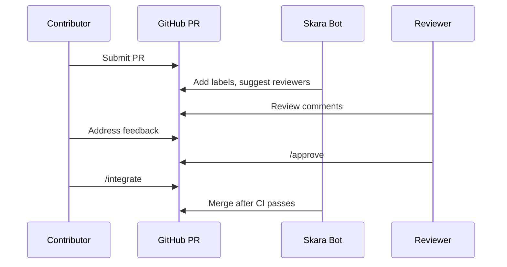

**BAD:**
```java
// Changing existing method signature
// Old: public String strip()
// New: public String strip(Locale l)
// This REMOVES the no-arg method, breaking
// every compiled .class calling strip()
```
Why it fails: Changing an existing method signature breaks binary compatibility. Every compiled call site gets NoSuchMethodError at runtime.

**GOOD:**
```java
// Adding an overload preserves compat
// Existing: public String strip()
// Added:    public String strip(Locale l)
// Old callers still resolve strip()
// New callers use strip(Locale)
```
Why it works: Adding a new method overload preserves binary, source, and behavioral compatibility. Existing callers are completely unaffected.

---

### 🚨 Failure Modes

**Failure 1 - Backward Compatibility Violation:**

**Symptom:** Reviewer rejects the patch with "this breaks binary/source/behavioral compatibility" despite the fix being functionally correct in all tests.

**Root cause:** The change alters observable behavior of an existing API. Even "more correct" behavior breaks programs depending on current behavior. The JDK distinguishes three compatibility levels: binary (compiled code links), source (code compiles), behavioral (runtime semantics unchanged). All three must hold unless the change goes through a formal deprecation-removal cycle spanning multiple releases.

**Diagnostic:**
```bash
# Check API signature changes:
diff <(javap -public Old.class) \
     <(javap -public New.class)
# Run full compatibility test suite:
make test TEST="tier1 tier2"
```

**Fix:** Preserve existing behavior. Add new behavior as a new method, flag, or opt-in. If old behavior must change, file a CSR (Compatibility and Specification Review) in JBS documenting the impact.

**Failure 2 - Cross-Platform Test Failure:**

**Symptom:** PR passes local testing but CI reports failures on platforms you did not test (aarch64-linux, s390x, windows-x64). The Skara bot blocks `/integrate` until CI is green.

**Root cause:** The JDK supports dozens of OS/architecture combinations. Code using platform-specific behavior (endianness, path separators, locale defaults, line endings) passes on one platform and fails on others. Especially common in HotSpot C++ code and java.io/java.nio changes.

**Diagnostic:**
```bash
# Run tests with extended timeout on
# multiple platforms:
make test TEST="tier1" \
  JTREG="TIMEOUT_FACTOR=4"
# Review Mach5 CI results linked in the
# PR by the Skara bot
```

**Fix:** Test on at least two platforms before submitting. Use platform-independent APIs. For unavoidable platform-specific code, guard with `Platform.isLinux()` checks and add per-platform test expectations.

---

### 🔬 Production Reality

An engineer discovers a bug in `ConcurrentHashMap.computeIfAbsent` where the mapping function can observe inconsistent state during concurrent resize. They write a correct fix with a jtreg test that reproduces the issue and submit a PR. The first review cycle takes two weeks; the reviewer requests backward compatibility analysis since `computeIfAbsent` has been deployed since JDK 8 across billions of installations. The engineer must demonstrate the fix changes behavior only for callers triggering the bug, not for correct callers. The second review cycle requests additional concurrent stress tests. The third review requests a CSR filing because the specification wording arguably permits the current behavior. After three months, the CSR is approved, the fix merges, and the engineer earns Author role. The lesson: contributing to a codebase running on billions of devices means every change is scrutinized for unintended consequences, and patience is a required skill.

---

### ⚖️ Trade-offs & Alternatives

| Aspect | OpenJDK | Linux Kernel | Rust/Cargo |
| --- | --- | --- | --- |
| Bug tracker | JBS (Jira-based) | Bugzilla + LKML email | GitHub Issues |
| Code review | GitHub PR + Skara bot | Email patches (LKML) | GitHub PR + bors bot |
| Test requirement | jtreg mandatory | selftests expected | CI mandatory |
| Legal prerequisite | OCA signature | DCO sign-off line | None |
| Compat policy | Extreme (binary + source + behavioral) | Stable user-space ABI, flexible kernel-internal | Edition-based migration |
| Integration speed | Weeks to months | Days to weeks | Days |

---

### ⚡ Decision Snap

**USE WHEN:**
- You have found a reproducible JDK bug and want to fix it upstream rather than work around it indefinitely
- You want to participate in a research project (Valhalla, Loom, Amber) by implementing features
- You want to understand how production-grade engineering review works at massive scale

**AVOID WHEN:**
- Your issue is a usage question, not a bug - use mailing lists or Stack Overflow
- You need the fix urgently - OpenJDK's review cycle takes weeks, and backports to LTS releases add more time

**PREFER filing a JBS issue without a patch WHEN:**
- You are unsure of the correct fix or the compatibility implications - let experienced maintainers propose the approach
- The fix touches security-sensitive code where incorrect patches create vulnerabilities

---

### ⚠️ Top Traps

| # | Misconception | Reality |
| - | ------------- | ------- |
| 1 | "Submit a PR like any GitHub project" | You must sign the OCA, file a JBS issue, and link the PR to that issue. PRs without JBS issues are not reviewed. |
| 2 | "If my fix is correct, it will be accepted" | Correctness is necessary but insufficient. Backward compatibility, test coverage, specification compliance, and coding conventions must all be satisfied. |
| 3 | "I can contribute to any area immediately" | HotSpot, security, and the compiler have higher review bars and require domain expertise. Start with core-libs or test improvements. |
| 4 | "JEPs are only for massive features" | Even moderate public API additions may require a JEP or CSR. The threshold is whether the change affects the public specification. |
| 5 | "Reviews are slow because of bureaucracy" | Reviews are thorough because changes deploy to billions of JVMs. A subtle regression in HashMap affects every Java program on the planet. |

---

### 🪜 Learning Ladder

**Prerequisites:**

- JVM-001 What Is the JVM - understand the platform you are contributing to
- JVM-116 JVM Specification - understand the spec that constrains all implementation decisions

**THIS:** JVM-127 Contributing to OpenJDK - Process and Culture

**Next steps:**

- JVM-120 Project Valhalla - Value Types and Flat Memory - an active OpenJDK project where contributions are welcome on a complex feature set
- JVM-122 Project Leyden - Static Images and AOT - another active project with contribution opportunities in AOT compilation

---

**The Surprising Truth:**

The hardest part of contributing to OpenJDK is not writing the code - it is internalizing the compatibility constraints. A one-line bug fix in `java.lang.String` can take months to merge because reviewers must verify it does not change behavior for any of the millions of programs depending on String's exact semantics. The most successful contributors are not the strongest coders; they are the ones who write patches that reviewers can approve with confidence because they have already addressed every compatibility concern.

---

**Further Reading:**

- OpenJDK Developers' Guide (openjdk.org/guide/) - the official step-by-step contribution workflow, role definitions, and coding conventions
- JEP 1: JDK Enhancement Proposal Process (openjdk.org/jeps/1) - formal specification of how JEPs are proposed, reviewed, targeted, and delivered
- JEP 0: JEP Index (openjdk.org/jeps/0) - the complete index of all JDK Enhancement Proposals, showing the lifecycle of every major JDK feature

---

**Revision Card:**

1. Every contribution starts at JBS, not GitHub - file the issue first, then link the PR via Skara bot commands.
2. Backward compatibility (binary, source, behavioral) overrides correctness - a "better" behavior that breaks existing programs will be rejected.
3. Start with tests and libraries, not HotSpot - earning trust through simpler contributions builds the credibility needed for complex patches.

---

---

# JVM-128 Memory Pressure as a Universal System Signal

**TL;DR** - Memory pressure is the universal signal forcing every system layer - from CPU caches to distributed services - to shed load, evict, or fail.

---

### 🔥 Problem Statement

A payment service runs on 4GB heap at 2,000 rps steady state. Traffic spikes to 5,000 rps. The young generation fills faster than G1 can evacuate. GC overhead climbs from 3% to 28%. Response latency triples. The load balancer sees timeouts and retries - doubling effective load. Old generation crosses the IHOP threshold. Concurrent marking cannot finish before the next collection. A full GC pauses the JVM for 1.2 seconds. Kubernetes kills the pod. Surviving replicas absorb redirected traffic and begin the same spiral. Within 90 seconds, three of four pods are restarting. This cascade is not JVM-specific. It is the universal shape of memory pressure propagating across layers: runtime GC pressure escapes as CPU pressure, which escapes as latency, which becomes retry storms, which become distributed failure. Engineers who see only the JVM layer fight symptoms instead of causes.

---

### 📜 Historical Context

Memory pressure as a formal concept predates managed runtimes. Virtual memory systems in the 1960s (Atlas, Multics) introduced page replacement - the first engineered response to memory pressure. Denning's working set model (1968) formalized the relationship between memory supply and program behavior. When Java arrived in 1995, garbage collection moved the pressure response into the runtime: the GC is the JVM's eviction policy for dead objects. The 2010s container revolution added cgroup memory limits - a hard boundary where the Linux OOM killer acts as a last-resort pressure valve. Facebook's Pressure Stall Information (PSI) framework, merged into Linux 4.20 (2018), made memory pressure a first-class kernel metric. The insight is old; recognizing it as one pattern spanning hardware through distributed systems is what META-level understanding adds.

---

### 🔩 First Principles

**CORE INVARIANTS:**

1. Every bounded memory region generates pressure when demand approaches capacity - true for L1 cache, JVM heap, OS page cache, and container cgroup limits alike.
2. Pressure demands a response: evict, reject, spill to a slower tier, or crash. There is no fifth option.
3. Unresolved pressure propagates - it escapes the current layer as degraded performance, becoming load on the next layer up.

**DERIVED DESIGN:**

These invariants force every layer to implement three components: a pressure detector (GC monitors heap occupancy; the OS monitors page fault rate; cgroups track memory.current vs memory.max), a response policy (collect, evict, OOM-kill), and a propagation channel (increased latency signals pressure to callers). Systems that lack an explicit response still have one - they crash. Designing systems means choosing the response deliberately.

**THE TRADE-OFF:**

**Gain:** Pressure-aware systems degrade gracefully under overload and recover without operator intervention.

**Cost:** Detection and response consume resources (CPU for GC, bookkeeping for eviction), add complexity (backpressure protocols), and require tuning.

---

### 🧠 Mental Model

> Memory pressure is like water pressure in plumbing. When inflow exceeds pipe capacity, pressure builds at every joint simultaneously. A relief valve (the GC) opens to release pressure. But if inflow outpaces the valve, pressure propagates backward through the system until something bursts or the source is throttled.

- "Water inflow rate" -> object allocation rate
- "Pipe diameter" -> heap size or memory limit
- "Relief valve" -> garbage collector or eviction policy
- "Burst pipe" -> OutOfMemoryError or OOM kill

**Where this analogy breaks down:** Water pressure is continuous and proportional. GC pressure is bursty - the relief valve opens in discrete stop-the-world events with no hydraulic equivalent.

---

### 🧩 Components

- **Pressure source** - any allocation consuming memory: object creation, caches, connection pools, off-heap buffers
- **Pressure detector** - mechanism sensing capacity approach: GC heuristics (IHOP), cgroup memory.pressure, OS page scanner watermarks
- **Response policy** - action when pressure detected: GC collection, LRU eviction, spill-to-disk, request rejection
- **Propagation channel** - how unresolved pressure reaches the next layer: GC CPU overhead raises latency, latency triggers retries, retries increase allocation rate

```
+-------------------------------------------+
|      Distributed / Service Layer          |
| backpressure, circuit breakers, shedding  |
+---------+---------------------------------+
          |  pressure propagates upward
+---------v---------------------------------+
|      Application Layer                    |
| bounded queues, admission control, pools  |
+---------+---------------------------------+
          |
+---------v---------------------------------+
|      JVM Runtime Layer                    |
| GC cycles, soft ref clearing, TLAB       |
+---------+---------------------------------+
          |
+---------v---------------------------------+
|      OS / Container Layer                 |
| page reclaim, swap, cgroup OOM killer     |
+---------+---------------------------------+
          |
+---------v---------------------------------+
|      Hardware Layer                       |
| L1/L2/L3 cache eviction, DRAM capacity   |
+-------------------------------------------+
```

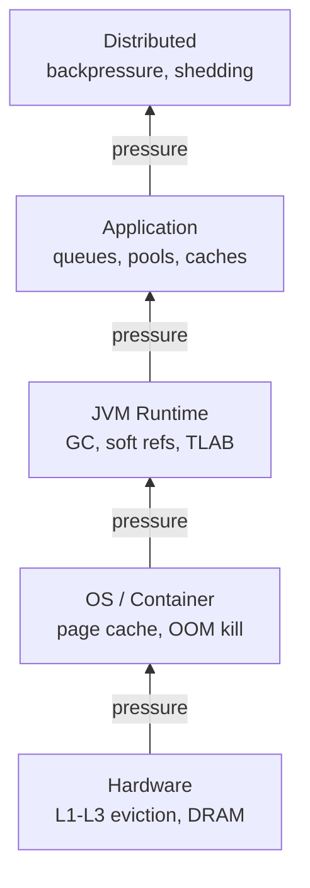

---

### 📶 Gradual Depth

**Level 1 - What it is:** Memory pressure is the condition where demand for memory approaches or exceeds supply. Every layer with finite memory - CPU caches, JVM heap, OS page cache, container limits - experiences pressure. The system must respond or crash.

**Level 2 - How to use it:** Monitor pressure indicators at each layer. For the JVM: GC overhead and allocation rate via `jstat`. For containers: `memory.pressure` in the cgroup filesystem. For the application: queue depth and active connection count. Set thresholds that trigger defensive actions before hard limits.

**Level 3 - How it works:** Pressure builds when allocation rate exceeds reclamation rate. The GC responds by running more frequently (increasing CPU cost) and escalating from young-only to mixed to full collections. Each escalation costs more latency. At the OS level, the kernel reclaims clean pages first, then dirty pages (forcing disk I/O), then invokes the OOM killer. The pattern is identical at every layer: detect severity, apply proportional response.

**Level 4 - Production mastery:** In production, pressure rarely stays in one layer. A JVM under GC pressure consumes more CPU, which delays processing, which grows queues, which allocates more objects - a positive feedback loop. Breaking the loop requires external intervention: load shedding at ingress, circuit breakers at callers, or autoscaling. Staff engineers instrument allocation rate, GC overhead, and queue depth as a unified pressure dashboard. The most effective defense is admission control - rejecting requests before they enter the system when pressure crosses a threshold.

---

### ⚙️ How It Works

Pressure follows a universal three-phase cycle at every layer.

**Phase 1 - Detect.** The pressure detector senses demand approaching capacity. G1's adaptive IHOP triggers concurrent marking when predicted old-gen occupancy reaches a threshold. The Linux page scanner wakes when free pages drop below a watermark.

**Phase 2 - Respond.** The layer applies its reclamation or rejection policy. The GC reclaims dead objects. The OS evicts clean pages from page cache. A full queue drops the oldest entry. Each response trades a resource (CPU for GC, I/O for page writeback) for freed memory.

**Phase 3 - Propagate.** When the response cannot keep pace, pressure escapes. GC overhead steals CPU from application threads. Page cache eviction forces I/O to disk. Escaped pressure manifests as increased latency at the next layer, generating new pressure. The cascade continues until the source is throttled or a hard limit crashes the process.

```
  DETECT           RESPOND         PROPAGATE
    |                 |                |
    v                 v                v
 demand >          evict/shed/     latency rises
 threshold?        reclaim         at next layer
    |                 |                |
    +---resolved------+                |
    |                                  |
    +---unresolved---------------------+
            (pressure escapes layer)
```

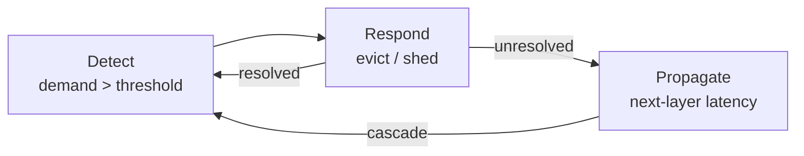

**BAD:**
```java
@PostMapping("/process")
public Response handle(Request req) {
    // No awareness of memory pressure
    byte[] buf = new byte[req.size()];
    return process(buf);
}
```
Why it fails: Unbounded admission lets request volume exceed heap capacity. GC overhead climbs, latency cascades into retries, and the pod enters a full-GC death spiral.

**GOOD:**
```java
@PostMapping("/process")
public Response handle(Request req) {
    if (gcOverhead() > 25
            || queueDepth() > 500) {
        return status(503)
            .header("Retry-After", "5")
            .build();
    }
    return process(req);
}
```
Why it works: Admission control uses GC overhead and queue depth as pressure signals. Rejecting early with 503 prevents the cascade before it starts.

---

### 🚨 Failure Modes

**Failure 1 - Cascade Amplification (Retry Storm):**

**Symptom:** Pods restart in waves. Each restart shifts load to survivors, triggering more restarts. The cluster never stabilizes.

**Root cause:** GC pressure at one pod escapes as latency. Callers retry on timeout, doubling effective load. More requests mean more allocation, increasing GC pressure - a positive feedback loop with no damping.

**Diagnostic:**
```bash
# GC overhead across pods (watch > 15%)
jstat -gcutil <pid> 1000 5
# Container-level pressure (Linux 4.20+)
cat /sys/fs/cgroup/memory.pressure
```

**Fix:**

**BAD:** Increase heap hoping to absorb the spike.
```
-Xmx8g  # delays GC, makes full GC worse
```

**GOOD:** Rate-limit at the ingress layer.
```yaml
# Envoy rate limit per upstream pod
rate_limits:
  - limit:
      requests_per_unit: 2000
      unit: SECOND
```

**Failure 2 - Invisible OS-Layer Pressure:**

**Symptom:** JVM metrics look healthy (heap 60%, GC 4%), but latency is 3x normal.

**Root cause:** Off-heap allocations (direct ByteBuffers, native libraries) exhaust the container cgroup limit. The OS reclaims pageHere is the raw markdown content for both keywords:

# JVM-128 Memory Pressure as a Universal System Signal

**TL;DR** - Memory pressure is the universal resource signal propagating across CPU caches, JVM heaps, OS pages, and containers - triggering eviction, throttling, and cascading failure at every layer.

---

### 🔥 Problem Statement

A service runs at 200ms P99 latency for months. One Thursday, latency spikes to 2 seconds. The team checks application logs - nothing unusual. They check CPU - it is at 90%, but the service is not compute-intensive. Thread dumps show GC threads dominating. The heap is not leaking - live set is stable - but allocation rate doubled because a new feature caches more objects in memory. The JVM responds with more frequent garbage collections. Each collection consumes CPU. Less CPU is available for request processing. Requests queue. Queuing increases latency. Clients retry. Retries double the allocation rate again. The container hits its memory limit and the OOM killer terminates the pod. Kubernetes restarts it, but the restart flood across replicas creates a thundering herd.

The root cause was not a bug. It was memory pressure - the same signal that drives CPU cache eviction, OS page reclaim, database buffer pool thrashing, and message queue backpressure. Engineers who recognize pressure as a universal signal diagnose these cascades in minutes. Engineers who treat each layer as isolated spend hours.

---

### 📜 Historical Context

The concept of resource pressure predates computing. Economists study price pressure; ecologists study population pressure on carrying capacity. In systems engineering, the formalization began with queueing theory (Erlang, 1909) and was applied to computer memory with virtual memory systems in the 1960s (Atlas computer, 1962). The Unix OOM killer (introduced in Linux around 2000) made pressure response an explicit OS mechanism. Linux's Pressure Stall Information (PSI) subsystem (merged in kernel 4.20, 2018) formalized memory, CPU, and I/O pressure as first-class metrics. Kubernetes adopted PSI-based eviction signals. The JVM's garbage collector has always been a pressure response mechanism, but framing it as one instance of a universal cross-layer signal is a meta-engineering insight that emerged from observability practice.

---

### 🔩 First Principles

**CORE INVARIANTS:**

1. Every bounded resource responds to demand exceeding supply with one of three actions: evict existing contents, reject new arrivals, or spill to a slower tier.
2. Pressure propagates across layer boundaries - relieving pressure at one layer shifts load to an adjacent layer.
3. The rate of pressure change matters more than the absolute level - systems tolerate sustained moderate pressure but fail under rapid pressure spikes.

**DERIVED DESIGN:**

These invariants explain why GC tuning alone cannot solve memory problems. Reducing GC pause time (eviction cost) increases GC frequency (more evictions). Increasing heap size delays eviction but amplifies the eventual cost. The only durable solution addresses the source of pressure (allocation rate) or adds admission control (backpressure, rate limiting). The same logic applies at every layer: increasing a database buffer pool delays page eviction but makes buffer pool scans more expensive when pressure finally arrives.

**THE TRADE-OFF:**

**Gain:** Recognizing pressure as a universal pattern enables cross-domain diagnosis - the engineer who understands GC pressure can diagnose Redis eviction storms, Linux page cache thrashing, and Kafka consumer lag using the same mental model.

**Cost:** Pressure-aware design requires instrumentation at every layer and the discipline to propagate backpressure rather than absorb it silently until failure.

---

### 🧠 Mental Model

> Memory pressure is like water pressure in a pipe system. Each segment (CPU cache, JVM heap, OS page cache, container limit) has a fixed diameter. When flow exceeds capacity at any segment, pressure builds upstream. A burst pipe (OOM kill) at one segment floods the segments behind it.

- "Pipe diameter" -> resource capacity (heap size, cgroup limit, cache size)
- "Water flow rate" -> allocation rate or request rate
- "Pressure gauge" -> GC frequency, page fault rate, eviction rate

**Where this analogy breaks down:** Real memory pressure is not purely linear - GC has non-linear behavior (concurrent marking cost scales with live set, not allocation rate), and container OOM kills are hard boundaries, not gradual throttling.

---

### 🧩 Components

- **CPU cache hierarchy** - L1/L2/L3 caches evict lines under capacity pressure using LRU-like policies, causing memory stalls (3-100+ ns penalty per miss).
- **JVM young generation** - minor GC fires when Eden fills; frequency is directly proportional to allocation rate.
- **JVM old generation** - major/mixed GC fires when tenured space crosses threshold; longer pauses, higher CPU cost.
- **OS page cache** - kernel reclaims pages when free memory drops below watermarks; kswapd activates, then direct reclaim under severe pressure.
- **Container cgroup** - hard memory limit; when reached, the OOM killer terminates processes with no graceful degradation.
- **Application-level caches** - Caffeine, Guava, Redis evict entries under size pressure, increasing miss rate and backend load.

```
+------------+      +------------+
| CPU Caches | ---> | Main RAM   |
+-----+------+      +-----+------+
      |                    |
+-----+------+      +-----+------+
| JVM Heap   |      | OS Page    |
| (GC cycle) | <--> | Cache      |
+-----+------+      +-----+------+
      |                    |
+-----+------+      +-----+------+
| App Cache  |      | Container  |
| (eviction) |      | (OOM kill) |
+------------+      +------------+

Pressure propagates downward;
failure propagates upward.
```

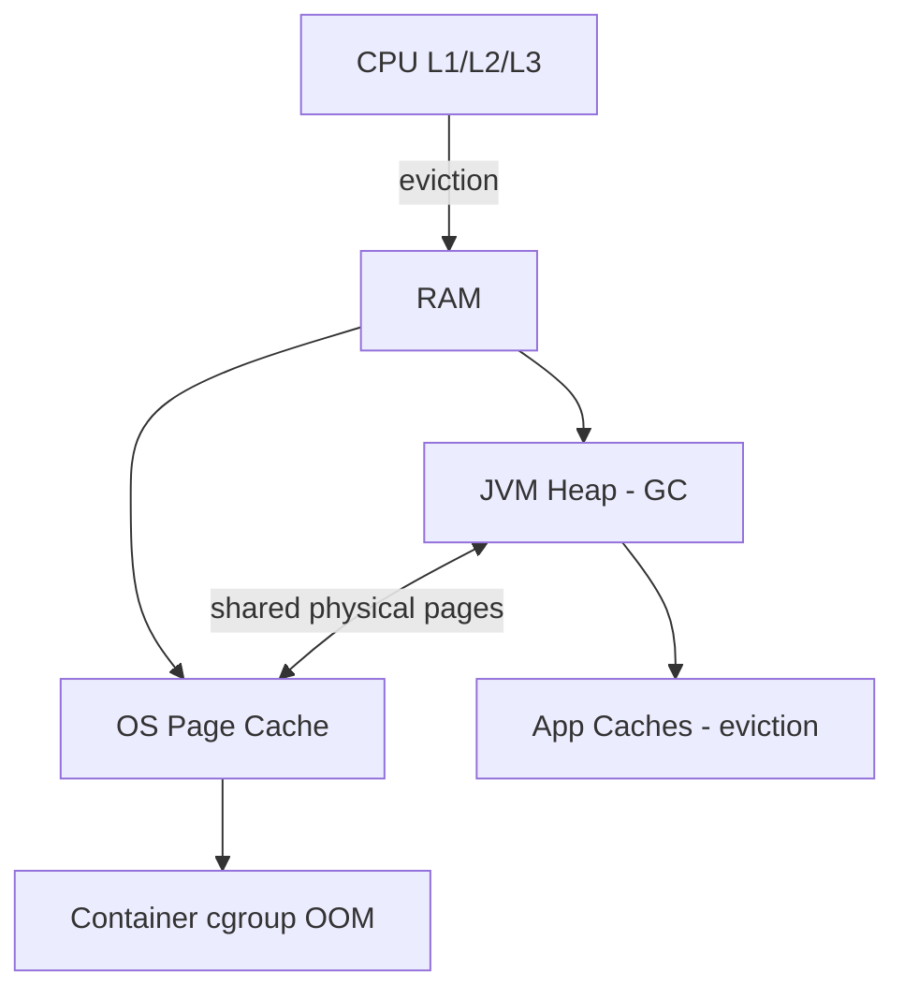

---

### 📶 Gradual Depth

**Level 1 - What it is:**
Memory pressure is the signal that demand for memory exceeds available supply. Every layer of a computer system - from CPU caches to container limits - responds to this signal by evicting, throttling, or failing.

**Level 2 - How to use it:**
Monitor pressure indicators at each layer: GC frequency and pause time for JVM heap, page fault rate and kswapd activity for OS, eviction rate for application caches. When latency rises, check pressure metrics before application logs. Use Linux PSI (`cat /proc/pressure/memory`) to see system-wide memory pressure as a percentage of wall-clock time.

**Level 3 - How it works:**
Pressure propagates because layers share physical memory. The JVM requests heap from the OS via mmap. The OS maps heap to physical pages. When container cgroup limits are hit, the kernel reclaims pages from all processes - including JVM heap pages that may be swapped out. GC then takes longer because it must fault pages back in. This creates a feedback loop: GC pauses increase, throughput drops, requests queue, more objects are allocated to track queued work, and heap pressure increases further.

**Level 4 - Production mastery:**
At fleet scale, memory pressure cascades are the most common category of correlated failures. A single service's increased allocation rate triggers GC pressure, which increases latency, which triggers upstream retries, which increases allocation rate across dependent services. The defense is layered: admission control at the edge (rate limiting), backpressure propagation (HTTP 429, gRPC RESOURCE_EXHAUSTED), circuit breakers at service boundaries, and GC-aware autoscaling that treats GC overhead percentage as a scaling signal alongside CPU utilization. Monitoring PSI metrics and GC overhead percentage as leading indicators - not just CPU and memory utilization - catches pressure cascades before they become outages.

---

### ⚙️ How It Works

**Phase 1 - Pressure builds.** Allocation rate exceeds the rate at which GC can reclaim dead objects. Eden space fills faster than minor GC can clear it.

**Phase 2 - GC responds.** Minor GC frequency increases. Objects survive to old generation at higher rates because the young generation is under-sized relative to allocation rate.

**Phase 3 - Pressure shifts layers.** Old generation fills. Mixed or full GC fires, consuming 10-40% CPU. Less CPU is available for application threads. Request latency increases.

**Phase 4 - Cascade.** Increased latency causes client retries. Retries increase request rate. Higher request rate increases allocation rate. The feedback loop accelerates.

**Phase 5 - Hard boundary.** Container RSS hits the cgroup memory limit. The OOM killer terminates the JVM. Kubernetes restarts the pod. If multiple pods fail simultaneously, surviving pods absorb redistributed traffic, increasing their own pressure.

```
Alloc Rate   GC Freq   CPU for    Request    Client
   Up    -->   Up   --> App Down --> Lat Up --> Retries
    ^                                            |
    +--------------------------------------------+
         Positive feedback loop
```

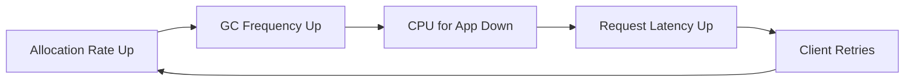

**BAD:**
```java
// Absorb pressure silently - no backpressure
public Response handle(Request req) {
    byte[] buf = new byte[1024 * 1024];
    // Process every request regardless of state
    return process(req, buf);
}
```
Why it fails: allocates 1MB per request with no admission control; under load, allocation rate overwhelms GC, triggering the cascade.

**GOOD:**
```java
public Response handle(Request req) {
    MemoryMXBean mem = ManagementFactory
        .getMemoryMXBean();
    MemoryUsage heap = mem.getHeapMemoryUsage();
    double ratio =
        (double) heap.getUsed() / heap.getMax();
    if (ratio > 0.85) {
        return Response.status(503)
            .header("Retry-After", "5")
            .build();
    }
    return process(req);
}
```
Why it works: monitors heap pressure and sheds load before GC cascade begins; clients receive explicit backpressure via 503.

---

### 🚨 Failure Modes

**Failure 1 - Silent Pressure Absorption:**

**Symptom:** Latency gradually increases over hours with no log errors. CPU rises. No OOM errors appear.

**Root cause:** Application absorbs all requests without backpressure. GC overhead creeps from 5% to 30% without triggering alerts because utilization-based alerts (heap > 90%) have not fired - the heap oscillates between 60-85% as GC keeps reclaiming.

**Diagnostic:**
```bash
jstat -gcutil <pid> 1000
# Watch: GCT growing faster than uptime
# If GC runs every 2-5s, pressure is high
# even if heap utilization looks moderate

jcmd <pid> GC.heap_info
```

**Fix:** Alert on GC overhead percentage (time in GC / total time) rather than heap utilization. Threshold: > 10% sustained over 5 minutes is a leading indicator of cascade.

**Failure 2 - Container OOM Without JVM OOM:**

**Symptom:** Pod killed with exit code 137 (SIGKILL from OOM killer). JVM logs show no OutOfMemoryError. Heap usage was within `-Xmx`.

**Root cause:** JVM heap is only part of process RSS. Off-heap memory (direct buffers, thread stacks, metaspace, JIT code cache, native allocations) pushed total RSS beyond the container cgroup limit.

**Diagnostic:**
```bash
jcmd <pid> VM.native_memory summary
# Compare committed memory vs cgroup limit

cat /sys/fs/cgroup/memory.current
cat /sys/fs/cgroup/memory.max
```

**Fix:** Set `-Xmx` to no more than 70-75% of container memory limit, leaving headroom for non-heap. Use `-XX:NativeMemoryTracking=summary` to measure actual non-heap consumption.

---

### 🔬 Production Reality

A typical pressure cascade in a microservices fleet: a recommendation service increases its in-memory feature cache from 500MB to 2GB after a model update. The heap is configured at 4GB with G1GC. Previously, the live set was 1.5GB and mixed GC ran every 30 seconds. After the cache increase, live set grows to 3.2GB. Mixed GC now runs every 8 seconds and takes longer because it must scan a larger live set for inter-region references. GC overhead jumps from 4% to 22%. Request P99 latency goes from 80ms to 400ms. The API gateway's 200ms timeout triggers retries. The recommendation service now handles 2x the request rate, doubling allocation rate. GC overhead hits 45%.

The fix was not GC tuning. It was: (1) moving the feature cache off-heap using memory-mapped files, (2) adding a GC overhead circuit breaker that returned stale recommendations when GC exceeded 15%, and (3) configuring the API gateway to fail open (serve pages without recommendations) rather than retry. This illustrates the invariant: the most effective pressure defense is rarely at the layer where pressure manifests.

---

### ⚖️ Trade-offs & Alternatives

| Aspect              | JVM (GC)               | Linux (OOM Killer)      | Redis (Eviction)       |
| ------------------- | ---------------------- | ----------------------- | ---------------------- |
| Pressure signal     | Alloc rate > free rate | Free pages < watermark  | Used mem > maxmemory   |
| Response mechanism  | Stop + collect         | Kill highest-score proc | Evict per LRU/LFU      |
| Granularity         | Heap-wide              | Process-level           | Key-level              |
| Recoverability      | Automatic              | Process restart needed  | Automatic (data lost)  |
| Admission control   | None (alloc succeeds)  | None (over-commit)      | maxmemory-policy       |
| Observability       | GC logs, jstat         | PSI, dmesg, oomkill    | INFO memory, SLOWLOG   |

---

### ⚡ Decision Snap

**USE WHEN:**
- Diagnosing latency spikes that do not correlate with application errors
- Designing multi-layer observability (JVM + OS + container)
- Building resilience patterns (circuit breakers, load shedding, backpressure)

**AVOID WHEN:**
- The system is single-process with no resource boundaries
- Memory is effectively unbounded (batch jobs with no latency SLA)

**PREFER layer-specific tuning WHEN:**
- Pressure is isolated to one layer with no cross-layer propagation
- The root cause is a simple misconfiguration (e.g., `-Xmx` too low)

---

### ⚠️ Top Traps

| # | Misconception | Reality |
| --- | --- | --- |
| 1 | "High heap utilization means pressure" | Pressure is about rate of change, not absolute level. A stable 85% heap is healthy. A heap oscillating 60-85% every 3 seconds is under severe pressure. |
| 2 | "OOM kill means the heap is too small" | Container OOM kills are often caused by non-heap memory (direct buffers, metaspace, thread stacks) exceeding the cgroup limit while heap is within `-Xmx`. |
| 3 | "GC tuning fixes memory pressure" | GC tuning changes how pressure is handled, not whether it exists. If allocation rate exceeds what any collector can sustain, the only fix is reducing allocation or adding backpressure. |
| 4 | "Memory pressure is a memory problem" | Pressure cascades manifest as CPU spikes (GC threads), latency spikes (STW), and even disk I/O (swap). The symptom often appears in a different resource than the root cause. |
| 5 | "Adding more memory solves pressure" | More heap delays pressure but amplifies the eventual GC pause. More container memory without adjusting `-Xmx` wastes resources. The sustainable fix is reducing allocation rate or adding admission control. |

---

### 🪜 Learning Ladder

**Prerequisites:**

- JVM-026 Heap Structure - Young, Old, and Metaspace - understand heap layout where pressure builds
- JVM-036 Container-Aware JVM (cgroup Limits) - how container memory limits create external pressure boundaries
- JVM-076 GC Algorithm Internals - Tri-Color Marking - understand how GC responds to allocation pressure

**THIS:** JVM-128 Memory Pressure as a Universal System Signal

**Next steps:**

- JVM-118 Designing a GC from First Principles - pressure as the core constraint GC designers must solve
- JVM-113 JVM Cost Optimization - Right-Sizing Heaps - translating pressure signals into capacity decisions
- JVM-130 What OS Scheduling Teaches JVM Engineers - how OS-level scheduling amplifies or dampens pressure

---

**The Surprising Truth:**

The most effective memory pressure defense is not at the memory layer at all. It is admission control at the network edge. Rate limiting incoming requests before they allocate a single byte of heap is orders of magnitude cheaper than any GC tuning. Engineers who frame memory problems as memory problems miss this. Engineers who frame them as pressure propagation problems add the right defense at the right layer.

**Further Reading:**

- [Linux PSI - Pressure Stall Information](https://docs.kernel.org/accounting/psi.html) - kernel documentation for the formalized memory, CPU, and I/O pressure metrics
- [GC Tuning Guide - Oracle JDK 21](https://docs.oracle.com/en/java/javase/21/gctuning/ergonomics.html) - official documentation on how the JVM automatically responds to GC pressure signals
- Denning, P.J. "The Working Set Model for Program Behavior" (Communications of the ACM, 1968) - foundational paper on memory locality and resource pressure in virtual memory systems

**Revision Card:**

1. Memory pressure propagates across layers - GC pressure becomes CPU pressure becomes latency pressure becomes cascading failure.
2. Rate of pressure change matters more than absolute level - a stable 85% heap is healthy, an oscillating 60-85% every 3 seconds is failing.
3. The most effective pressure defense is admission control at the network edge, not GC tuning at the heap layer.

---

---

# JVM-129 Latency vs Throughput Trade-off Framing

**TL;DR** - Latency and throughput trade against each other in every bounded-resource system - GC, networking, storage, compilation - and the right balance depends on workload classification, not intuition.

---

### 🔥 Problem Statement

A team runs three JVM services on ZGC because a conference talk said ZGC gives "sub-millisecond pauses." Their payment API processes 500 requests per second with P99 at 4ms - excellent. Their nightly batch ETL processes 50 million records. On Parallel GC it completed in 40 minutes. On ZGC it takes 55 minutes - 37% slower - because ZGC's concurrent barriers and reduced throughput capacity cost more CPU per object operation than Parallel GC's simpler stop-the-world approach. Their Kafka consumer, processing 100K events per second, falls behind during ZGC concurrent phases because the load barriers add overhead to every reference access in the tight event-processing loop.

The team chose a latency-optimized collector for workloads where latency does not matter and throughput does. This is not a ZGC problem - it is a framing problem. Without a decision framework that classifies workloads by their latency-vs-throughput sensitivity, teams choose collectors, batching strategies, and architecture patterns by brand loyalty or conference hype rather than measurement.

---

### 📜 Historical Context

The latency-throughput trade-off is fundamental to queueing theory (Erlang, 1909; Kingman's formula for G/G/1 queues). In computing, the tension appeared early: OS batch scheduling (throughput-first) versus interactive time-sharing (latency-first) was the central debate of the 1960s. JVM GC history mirrors this exactly: Serial GC (JDK 1.0, batch-oriented), Parallel GC (JDK 1.4.2, throughput-optimized), CMS (JDK 1.4.2, latency-sensitive), G1 (default since JDK 9, balanced), ZGC (JEP 333, 2018, latency-extreme), and Shenandoah (JEP 189, 2019). Each new collector addressed a different point on the trade-off curve rather than replacing its predecessors. Little's Law (1961) provides the mathematical foundation: L = lambda * W, connecting concurrency, throughput, and latency in any stable system.

---

### 🔩 First Principles

**CORE INVARIANTS:**

1. In any bounded-resource system, reducing per-operation latency requires additional per-operation overhead (concurrent processing, barriers, smaller batches), which reduces maximum throughput.
2. Throughput measures total work completed per unit time; latency measures time per individual unit of work. Optimizing one always costs the other beyond a system-specific equilibrium point.
3. The optimal trade-off point depends on the workload's sensitivity function: request-response workloads have convex latency penalty (tail latency dominates user experience), while batch workloads have linear throughput value (total completion time matters).

**DERIVED DESIGN:**

These invariants explain why no single GC (or batching strategy, or network configuration) is optimal for all workloads. ZGC's load barriers add throughput overhead to eliminate pause latency. Parallel GC's stop-the-world pauses reduce latency suitability but achieve highest throughput by avoiding concurrent overhead. G1 occupies a configurable middle ground. The same pattern repeats in storage (fsync frequency trades durability latency for write throughput), networking (Nagle's algorithm batches small packets for throughput at the cost of latency), and compilation (C1 compiles fast with lower code quality, C2 compiles slowly with optimized output).

**THE TRADE-OFF:**

**Gain:** A workload-classified approach selects the optimal point on the trade-off curve for each service, maximizing fleet-wide efficiency.

**Cost:** Requires measuring both latency AND throughput per service, classifying workloads explicitly, and managing heterogeneous configurations across the fleet.

---

### 🧠 Mental Model

> Latency vs throughput is like a highway lane configuration. A 4-lane highway with no traffic lights (throughput-optimized) moves the most cars per hour but each driver waits behind slower traffic with no way to pass. Adding express lanes (latency-optimized) gives some cars guaranteed fast passage, but total highway capacity drops because fewer lanes carry bulk traffic.

- "Express lanes" -> concurrent GC, dedicated low-latency paths
- "Traffic volume" -> throughput (total requests per second)
- "Travel time per car" -> latency (time per individual request)

**Where this analogy breaks down:** Unlike highways, software systems can dynamically switch between modes (adaptive GC, dynamic batching), and the overhead of switching itself has a cost that the highway model does not capture.

---

### 🧩 Components

- **Workload classifier** - categorizes services as latency-sensitive, throughput-sensitive, or balanced based on measured SLA requirements.
- **GC selection matrix** - maps workload class to collector: ZGC/Shenandoah for latency, Parallel for throughput, G1 for balanced.
- **Batching configuration** - controls the trade-off in I/O: Kafka `linger.ms`, JDBC batch size, HTTP/2 multiplexing window.
- **JIT compilation tiers** - C1 (fast compile, moderate code quality) vs C2 (slow compile, optimized output) embody the same trade-off in code generation.
- **Queueing metrics** - Little's Law (L = lambda * W) connects concurrency (L), throughput (lambda), and latency (W) mathematically.

```
 Latency-first    Balanced      Throughput-first
 +-----------+   +-----------+  +-----------+
 | ZGC       |   | G1GC      |  | Parallel  |
 | fsync=1   |   | fsync=N   |  | fsync=off |
 | batch=1   |   | batch=mid |  | batch=max |
 | C1 only   |   | C1 + C2   |  | C2 heavy  |
 +-----------+   +-----------+  +-----------+
       |               |              |
 <1ms pause     10-200ms pause   Seconds pause
 Lower thruput  Moderate         Max throughput
```

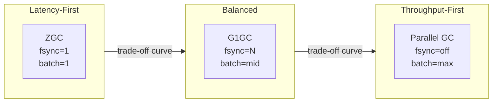

---

### 📶 Gradual Depth

**Level 1 - What it is:**
Latency is how long one operation takes. Throughput is how many operations complete per second. In systems with bounded resources (CPU, memory, I/O), improving one typically worsens the other beyond an equilibrium point.

**Level 2 - How to use it:**
Classify each service: is the SLA defined by tail latency (P99 < 50ms) or by total completion time (process N records in M minutes)? Latency-sensitive services get ZGC or Shenandoah, small batch sizes, and aggressive timeouts. Throughput-sensitive services get Parallel GC, large batch sizes, and generous timeouts. Most services are balanced - G1 with default tuning is the right starting point.

**Level 3 - How it works:**
The trade-off arises because concurrent work requires coordination overhead. ZGC runs collection concurrently with application threads, eliminating pauses, but every object reference access goes through a load barrier that adds CPU overhead. Parallel GC stops all application threads (zero overhead during mutation) but pauses scale with heap size. Little's Law quantifies the relationship: if throughput (lambda) is fixed and latency (W) increases, in-flight requests (L = lambda * W) must increase, consuming more memory and connections. Kingman's formula shows that utilization above ~80% causes latency to grow non-linearly.

**Level 4 - Production mastery:**
At fleet scale, the latency-throughput trade-off determines architecture. A microservices latency budget allocates end-to-end P99 across service hops: if the user-facing SLA is 200ms across 5 services, each service gets roughly 40ms with margin. Services that cannot meet their budget with a throughput-optimized configuration must switch to latency-optimized GC. But switching to latency-first everywhere wastes 5-15% throughput fleet-wide - a significant infrastructure cost at scale. The discipline is: measure per-service sensitivity, classify explicitly, configure per-class, and re-evaluate when workload characteristics change with seasonal traffic or new features.

---

### ⚙️ How It Works

**Phase 1 - Measure baseline.** Profile each service for both latency distribution (P50, P99, P999) and throughput (requests/sec at saturation). Record GC pause times, GC overhead percentage, and allocation rate.

**Phase 2 - Classify workload.** Request-response APIs with tail latency SLAs are latency-sensitive. Batch ETL, stream processing without per-event SLA, and analytics queries are throughput-sensitive. Services with both characteristics (API with background processing) are balanced.

**Phase 3 - Select configuration.** Match each class to the optimal point on the trade-off curve: collector choice, batch sizes, buffer flush frequency, compilation tier strategy.

**Phase 4 - Validate under load.** Load test with production-representative traffic. Confirm the latency-optimized service meets P99 targets AND the throughput-optimized service completes its batch window.

**Phase 5 - Monitor and reclassify.** Workloads drift. A throughput-sensitive service may gain a real-time dashboard consumer that makes it latency-sensitive. Continuous monitoring detects when reclassification is needed.

```
Measure       Classify      Configure
+-------+    +---------+   +----------+
| P99   |--->| Latency |--->| ZGC      |
| Thru  |    | Thru    |   | Parallel |
| GC %  |    | Balanced|   | G1       |
+-------+    +---------+   +----------+
                 |               |
             Validate ----> Reclassify
             (load test)    (drift)
```

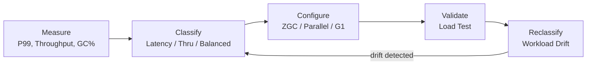

**BAD:**
```bash
# Same GC for entire fleet
java -XX:+UseZGC -Xmx8g -jar batch-etl.jar
# Result: 55 min (was 40 min on Parallel GC)
# 37% throughput loss for zero latency benefit
```
Why it fails: applies a latency-optimized collector to a throughput-sensitive workload; ZGC's barriers cost CPU that batch processing needs.

**GOOD:**
```bash
# Workload-classified GC selection

# Payment API (latency-sensitive):
java -XX:+UseZGC -Xmx4g \
  -jar payment-api.jar

# Batch ETL (throughput-sensitive):
java -XX:+UseParallelGC -Xmx16g \
  -jar batch-etl.jar

# Order service (balanced):
java -XX:+UseG1GC \
  -XX:MaxGCPauseMillis=100 \
  -Xmx8g -jar order-svc.jar
```
Why it works: each service gets the collector matched to its workload class - payment API gets sub-ms pauses, ETL gets maximum throughput, order service gets balanced behavior.

---

### 🚨 Failure Modes

**Failure 1 - Throughput Collector on Latency Path:**

**Symptom:** P99 latency spikes to 2-5 seconds every 30-60 seconds on a request-response API. P50 is normal. CPU is not saturated between spikes.

**Root cause:** Parallel GC performs full stop-the-world collections. On a 16GB heap, a full GC pauses all application threads for 2-5 seconds. The service processes requests fine between pauses but drops all in-flight requests during each pause.

**Diagnostic:**
```bash
jstat -gcutil -t <pid> 1000
# Look for FGC count increasing, FGCT jumps

grep "Pause Full" gc.log | awk '{print $NF}'
# Pauses >1s on a request-response API = wrong GC
```

**Fix:** Switch to G1 (`-XX:+UseG1GC -XX:MaxGCPauseMillis=100`) or ZGC (`-XX:+UseZGC`) for latency-sensitive services. Accept 5-10% throughput reduction for bounded pauses.

**Failure 2 - Latency Collector on Batch Path:**

**Symptom:** Batch job completion time regresses 20-40% after migrating to ZGC. No errors. CPU utilization is higher than before.

**Root cause:** ZGC's load barriers add CPU overhead to every reference access. In tight loops processing millions of objects (typical batch ETL), this overhead accumulates significantly. ZGC also uses more memory for its multi-mapped heap, reducing effective heap for application data.

**Diagnostic:**
```bash
# Compare GC overhead between collectors:
jcmd <pid> GC.heap_info
# Check: concurrent GC threads consuming cores

# Profile with async-profiler:
asprof -d 60 -e cpu -f profile.html <pid>
# Look for ZGC barrier frames in hot paths
```

**Fix:** Switch to Parallel GC (`-XX:+UseParallelGC`) for batch workloads. Accept STW pauses (irrelevant for batch) in exchange for maximum object processing throughput.

---

### 🔬 Production Reality

A common fleet pattern: an organization migrates all services to ZGC after reading about sub-millisecond pauses. The latency-sensitive APIs improve. But the nightly data pipeline (40 Spark executors on JVM, processing 2TB) takes 25% longer to complete, missing its SLA window. The Kafka Streams consumers fall behind during peak hours because ZGC barriers consume the CPU headroom they need for deserialization. Total fleet CPU cost increases by 8% - a significant infrastructure bill at scale.

The fix is workload-aware configuration: a three-class system (latency / throughput / balanced) with each service tagged in the deployment manifest. A platform template selects GC, heap size, and JVM flags based on the tag. The tagging itself requires measurement - a service owner must demonstrate that P99 latency is dominated by GC pauses (justifying ZGC) or that throughput regression exceeds 10% on ZGC (justifying Parallel GC). Services without measured evidence get G1 as the safe default. This measurement-first culture prevents both under-optimization and conference-driven over-optimization.

---

### ⚖️ Trade-offs & Alternatives

| Aspect              | ZGC (Latency)        | G1GC (Balanced)       | Parallel (Throughput)  |
| ------------------- | -------------------- | --------------------- | ---------------------- |
| Max pause           | < 1ms (typical)      | 10-200ms (tunable)    | Seconds (heap-scaled)  |
| Throughput overhead  | 5-15% barrier cost   | 3-8% concurrent cost  | Minimal (STW only)     |
| Heap overhead       | Multi-mapped (2x VA) | Region metadata       | Minimal                |
| Best workload       | APIs, real-time      | General services      | Batch, ETL, analytics  |
| Tuning complexity   | Low (few knobs)      | Medium (pause target) | Low (few knobs)        |
| Min JDK (prod-ready)| 15+                  | 9+ (default)          | Always available       |

---

### ⚡ Decision Snap

**USE WHEN:**
- Selecting GC, batching strategy, or I/O flush policy for a new service
- Diagnosing unexpected throughput regression after a "latency improvement"
- Designing fleet-wide JVM configuration governance

**AVOID WHEN:**
- The service is not resource-constrained (trade-off only matters near capacity)
- Workload characteristics are unknown (measure first, classify second)

**PREFER workload-specific tuning WHEN:**
- Fleet has diverse workload types (APIs + batch + streaming)
- Infrastructure cost matters (wrong trade-off wastes 5-15% CPU fleet-wide)

---

### ⚠️ Top Traps

| # | Misconception | Reality |
| --- | --- | --- |
| 1 | "ZGC is always better because pauses are lower" | ZGC trades throughput for latency. Batch workloads lose 20-40% throughput for pause improvements that are irrelevant to batch completion time. |
| 2 | "Throughput only matters for batch jobs" | Throughput matters for any service at capacity. A latency-optimized service that cannot sustain peak request rate fails just as badly as one with long pauses. |
| 3 | "P50 latency tells you which trade-off to pick" | P99 and P999 reveal GC impact. P50 is dominated by application logic. A service with 5ms P50 and 3s P99 has a GC problem invisible at P50. |
| 4 | "Little's Law is academic theory" | L = lambda * W is the most practical formula in system design. If your service handles 1000 req/s at 100ms each, you need 100 concurrent connections. Violate this and you get unbounded queueing. |
| 5 | "The trade-off is binary: latency OR throughput" | G1GC, adaptive batching, and tiered compilation prove a configurable middle ground exists. Most services need a specific point on the curve, not an extreme. |

---

### 🪜 Learning Ladder

**Prerequisites:**

- JVM-048 G1GC Internals - Regions, Marking, Mixed - see the balanced approach to pause time vs throughput
- JVM-052 JIT Compilation Tiers (C1 and C2) - compilation speed vs code quality as the same trade-off
- JVM-102 JVM Fleet Standardization Strategy - the fleet governance context for workload classification

**THIS:** JVM-129 Latency vs Throughput Trade-off Framing

**Next steps:**

- JVM-131 Compiler Opt Patterns Across Runtimes - the latency-throughput trade-off in compilation across languages
- JVM-132 Stop-the-World as Distributed Consensus - pause duration as a latency decision with consensus properties
- JVM-118 Designing a GC from First Principles - how GC designers navigate this trade-off at the algorithm level

---

**The Surprising Truth:**

The biggest throughput waste in most fleets is not a wrong GC choice - it is running latency-optimized configurations on throughput-sensitive workloads that nobody measured. Organizations that classify just their top 20 services by latency sensitivity and switch the throughput-sensitive ones to Parallel GC typically recover 5-10% fleet-wide CPU without any latency regression on the services that matter. The measurement takes a day. The savings compound permanently.

**Further Reading:**

- Little, J.D.C. "A Proof for the Queuing Formula: L = lambda W" (Operations Research, 1961) - the foundational theorem connecting throughput, latency, and concurrency
- [JEP 333: ZGC - A Scalable Low-Latency Garbage Collector](https://openjdk.org/jeps/333) - design rationale explicitly framing ZGC as a latency-throughput trade-off decision
- [GC Tuning Guide - Oracle JDK 21](https://docs.oracle.com/en/java/javase/21/gctuning/garbage-collector-implementation.html) - official collector comparison covering throughput and latency characteristics

**Revision Card:**

1. Latency and throughput trade against each other in every bounded-resource system - optimizing one always costs the other beyond equilibrium.
2. Classify workloads before selecting configurations: latency-sensitive gets ZGC, throughput-sensitive gets Parallel GC, balanced gets G1.
3. The biggest fleet waste is running latency-optimized configs on throughput-sensitive workloads nobody measured - a day of profiling saves 5-10% CPU permanently.

---

---

# JVM-130 What OS Scheduling Teaches JVM Engineers

**TL;DR** - OS thread scheduling directly shapes JVM pause behavior; understanding CFS, context switches, and CPU throttling explains GC stalls that JVM-only thinking misses.

---

### 🔥 Problem Statement

Your GC logs show 50ms pauses, but application p99 latency spikes to 200ms. The JVM is not lying - it measured its own pause correctly. The missing 150ms lives below the JVM: the OS scheduler descheduled your GC worker threads mid-collection, or CFS bandwidth throttling injected artificial stalls your JVM never requested. In containerized environments with CPU limits, this pattern intensifies. A team that understands only JVM internals will chase phantom GC bugs for weeks. A team that understands OS scheduling will find the root cause in minutes with `perf sched` and `cpu.stat`. The JVM does not run on bare metal abstractions - it runs on an OS scheduler's mercy.

---

### 📜 Historical Context

Unix schedulers evolved from simple round-robin (1970s) through multilevel feedback queues (BSD, 1980s) to the Completely Fair Scheduler (CFS, Linux 2.6.23, 2007). CFS replaced the O(1) scheduler with a red-black tree of virtual runtimes, trading constant-time pick-next for proportional fairness. Containers changed the game: Docker and Kubernetes expose CFS bandwidth control (cpu.cfs_quota_us/cpu.cfs_period_us, merged in Linux 3.2, 2012) to enforce CPU limits. This means a JVM running in a container with `--cpus=2` on a 16-core host shares physical cores with dozens of neighbors, and the OS may deschedule a GC thread at the worst possible moment - mid-safepoint synchronization. The collision between JVM's cooperative scheduling model (safepoints) and the OS's preemptive model creates a category of latency problems invisible to either layer alone.

---

### 🔩 First Principles

**CORE INVARIANTS:**
1. The OS scheduler is preemptive - it can suspend any thread at any instruction boundary, regardless of what the JVM is doing
2. CFS guarantees proportional CPU time over a period, not uninterrupted execution within a time slice
3. A JVM safepoint requires ALL application threads to reach a safe state before GC can proceed - if the OS deschedules one thread mid-flight, every other thread waits

**DERIVED DESIGN:**
These invariants create a fundamental tension. The JVM's safepoint protocol is cooperative - it inserts polling checks and expects threads to respond quickly. But the OS is preemptive - it can deschedule the exact thread that needs to reach its safepoint poll. The result: time-to-safepoint becomes a function of OS scheduling latency, not just JVM code patterns. CFS bandwidth throttling compounds this by introducing quota exhaustion stalls that look identical to GC pauses from the application's perspective.

**THE TRADE-OFF:**
**Gain:** OS scheduling provides fairness, isolation, and multi-tenant resource sharing
**Cost:** Unpredictable thread descheduling creates latency variance invisible to JVM-level tooling

---

### 🧠 Mental Model

> Imagine a relay race where four runners (JVM threads) must all touch a checkpoint (safepoint) before the next leg starts. But a traffic cop (OS scheduler) can freeze any runner mid-stride for an unpredictable duration. One frozen runner means three others stand idle at the checkpoint, waiting. In a container, the cop also enforces a speed limit (CFS quota) - even if the track is empty, runners must slow down once they've used their allotted time.

- "Runners" -> JVM application threads
- "Checkpoint" -> safepoint poll location
- "Traffic cop" -> CFS scheduler with preemption
- "Speed limit" -> cpu.cfs_quota_us bandwidth throttle

**Where this analogy breaks down:** Real OS scheduling uses virtual runtime balancing, not simple freezing - threads with less accumulated CPU time get priority, creating subtler fairness dynamics than a binary freeze.

---

### 🧩 Components

- **CFS (Completely Fair Scheduler):** Linux default scheduler. Maintains a red-black tree of runnable tasks sorted by virtual runtime (vruntime). Task with lowest vruntime runs next. Targets a configurable scheduling latency (typically 6ms for 1-8 CPUs).
- **Time slice / scheduling granularity:** Minimum preemption interval. CFS does not use fixed time slices - it calculates dynamic slices from `sched_min_granularity_ns` (typically 0.75ms) scaled by task count.
- **CFS bandwidth control:** `cpu.cfs_quota_us` / `cpu.cfs_period_us` in cgroup v1/v2. Throttles a group once it exhausts quota within a period. Throttled threads see involuntary waits.
- **Context switch:** Saving/restoring thread register state. Costs 1-10us direct overhead plus cache/TLB pollution that amplifies subsequent execution time.
- **Safepoint synchronization:** JVM mechanism where all mutator threads must pause at known-safe locations before GC can proceed. Time-to-safepoint (TTSP) is gated by the slowest thread.
- **`cpu.stat` throttle counters:** `nr_throttled` and `throttled_time` in cgroup expose exactly how much artificial delay the OS injected.

```
+------------------------------------------+
|            Container (cgroup)             |
|  cpu.cfs_quota_us = 200000 (2 cores)     |
|  cpu.cfs_period_us = 100000              |
|                                          |
|  +-------+  +-------+  +-------+        |
|  | App T1|  | App T2|  | GC T1 |        |
|  +---+---+  +---+---+  +---+---+        |
|      |          |           |            |
+------|----------|-----------|------------+
       v          v           v
  +------------------------------------+
  |  CFS Scheduler (host kernel)       |
  |  vruntime tree across ALL cgroups  |
  +------------------------------------+
       |          |           |
  +----v---+ +---v----+ +---v----+
  | Core 0 | | Core 1 | | Core 2 |
  +--------+ +--------+ +--------+
```

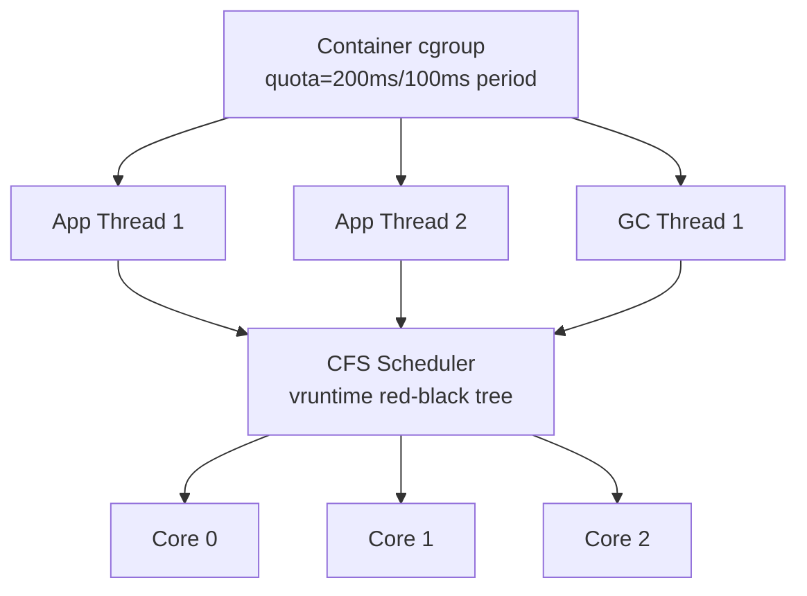

---

### 📶 Gradual Depth

**Level 1 - What it is:**
OS scheduling determines which threads actually run on physical CPU cores and for how long. The JVM does not control this - it requests threads, but the kernel decides when they execute.

**Level 2 - How to use it:**
Monitor scheduling impact with `perf sched latency` and container throttling with `cat /sys/fs/cgroup/cpu/cpu.stat`. When JVM pauses exceed expectations, check `nr_throttled` before blaming the garbage collector. Set container CPU limits to whole numbers to avoid fractional-core scheduling artifacts.

**Level 3 - How it works:**
CFS tracks each task's vruntime (weighted CPU consumption). The task with the smallest vruntime gets the CPU. When a cgroup exhausts its bandwidth quota, all its tasks are throttled until the next period - even if physical cores are idle. During JVM safepoint synchronization, the STW handshake thread polls all mutators. If one mutator is descheduled by CFS mid-counted-loop (a known TTSP pathogen), the entire safepoint stalls until CFS reschedules that thread and it reaches its next poll.

**Level 4 - Production mastery:**
Latency-sensitive JVM services pin GC threads to dedicated cores using `taskset` or cgroup cpusets, isolating them from CFS competition. Kubernetes `guaranteed` QoS pods get exclusive cpuset allocation when the static CPU manager policy is enabled, avoiding throttling entirely. Measure scheduling interference with `perf sched record` and look for `wait time` exceeding 1ms on GC worker threads. In CFS bandwidth throttling scenarios, increasing `cpu.cfs_period_us` from 100ms to a shorter burst period (e.g. 5ms with proportional quota) reduces tail latency spikes at the cost of higher kernel scheduling overhead. The tradeoff between `burstable` and `guaranteed` QoS is fundamentally a scheduling isolation decision.

---

### ⚙️ How It Works

**Phase 1 - Normal execution:** Application threads run on CFS-assigned cores. Each thread accumulates vruntime proportional to CPU use. CFS preempts threads that exceed their fair share.

**Phase 2 - GC trigger:** JVM initiates a STW collection. The safepoint handshake mechanism sets a flag, and each application thread must reach its next safepoint poll.

**Phase 3 - Scheduling collision:** Thread T3 is executing a counted loop. The JIT compiled the loop without a safepoint poll inside (a known HotSpot behavior for counted loops before JDK 10+ loop strip mining). Simultaneously, CFS preempts T3 because its vruntime exceeded the next-runnable thread's. T3 cannot reach its safepoint while descheduled.

**Phase 4 - Cascading stall:** All other threads have reached their safepoints and wait. The GC cannot begin until T3 is rescheduled, reaches the loop exit, and hits its safepoint poll. In a throttled container, T3 may wait until the next CFS period resets quota.

```
Time --->
T1: [run]---[safepoint]..waiting..waiting..[GC]
T2: [run]---[safepoint]..waiting..waiting..[GC]
T3: [run]---[DESCHEDULED by CFS]---[resched]
             ^^^^^^^^^^^^^^^^^^^^
             OS scheduling stall
    ...[safepoint].[GC]
GC: ..........waiting for T3........[START]
```

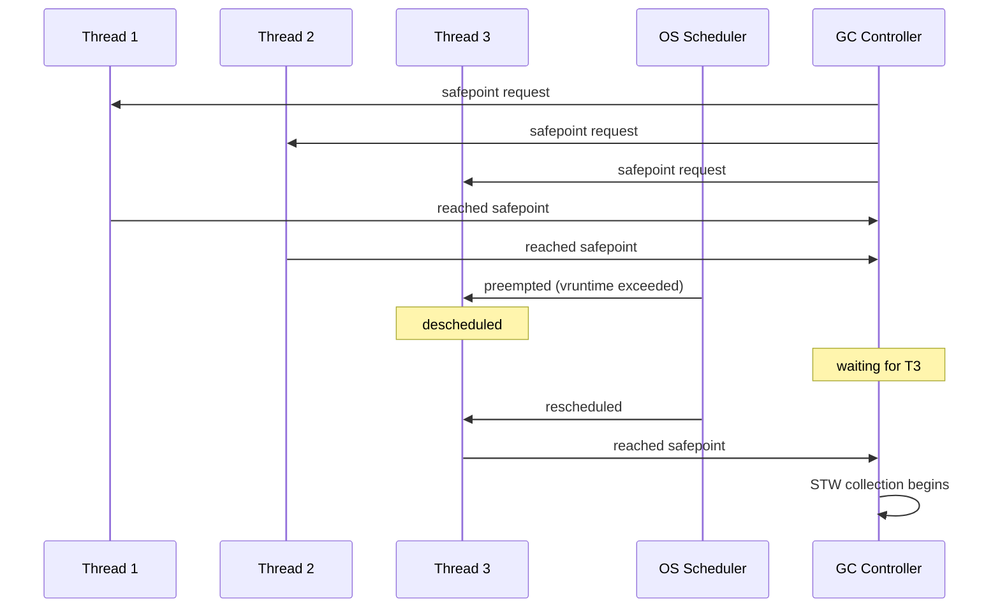

**BAD:**
```bash
# Diagnosing slow GC without checking OS
jcmd $PID GC.heap_info
jstat -gcutil $PID 1000
# "GC looks fine, why is p99 so high?"
```
Why it fails: ignores scheduling delays entirely - the 150ms gap between JVM-measured pause and application-observed latency is invisible.

**GOOD:**
```bash
# Check CFS throttling first
cat /sys/fs/cgroup/cpu/cpu.stat
# nr_throttled  12451
# throttled_time 89234000000  (89s total!)

# Measure scheduling latency per thread
perf sched record -p $PID -- sleep 10
perf sched latency --sort max
# GC-worker-0: max wait 47ms
```
Why it works: directly measures OS-layer scheduling delays that JVM tooling cannot see, separating JVM pause time from OS-injected stall time.

---

### 🚨 Failure Modes

**Failure 1 - CFS Throttling Amplifies GC Pauses:**
**Symptom:** Application p99 latency spikes every 100ms (CFS period boundary). GC logs show normal pause times.
**Root cause:** Container CPU quota exhausted. GC worker threads throttled mid-collection, extending wall-clock GC time beyond JVM-measured pause.
**Diagnostic:**
```bash
cat /sys/fs/cgroup/cpu/cpu.stat | grep throttled
# nr_throttled > 0 confirms throttling
# throttled_time / nr_throttled = avg stall
```
**Fix:** Switch to Kubernetes `guaranteed` QoS with integer CPU requests, or increase quota headroom by 20-30% beyond steady-state CPU usage.

**Failure 2 - Safepoint Stall from Descheduled Thread:**
**Symptom:** `-Xlog:safepoint` shows time-to-safepoint (TTSP) spikes of 20-100ms, correlated with high system load.
**Root cause:** One application thread descheduled by CFS while inside a code region without a safepoint poll. All other threads blocked waiting.
**Diagnostic:**
```bash
# JVM side: identify slow safepoint arrivals
# -Xlog:safepoint=debug shows per-thread TTSP
# OS side: scheduling latency
perf sched record -p $PID -- sleep 30
perf sched latency -p $PID --sort max
```
**Fix:** Enable `-XX:+UseCountedLoopSafepoints` (JDK 10+ loop strip mining) to insert safepoint polls inside counted loops, reducing maximum TTSP regardless of OS scheduling.

---

### 🔬 Production Reality

A common pattern in containerized Java services: the team sets Kubernetes CPU limits to fractional values like `cpu: 1.5`. CFS interprets this as 150ms quota per 100ms period. During a minor GC pause, the JVM launches 4 parallel GC worker threads. These threads consume the remaining CPU quota in a burst. CFS throttles the entire cgroup - including the GC workers mid-collection and any application threads that haven't reached their safepoints yet. The JVM measures a 15ms GC pause internally, but the application observes a 65ms stall because 50ms was CFS throttle time. The diagnostic path: `cpu.stat` shows `nr_throttled` climbing. `perf sched latency` shows GC worker threads with max scheduling waits exceeding 30ms. The fix: switch to integer CPU limits (e.g. `cpu: 2`) with guaranteed QoS, which gives the pod exclusive access to physical cores via cpuset - no CFS bandwidth throttling applies. Alternatively, tune `-XX:ParallelGCThreads` to match the container's effective CPU count, reducing burst contention.

---

### ⚖️ Trade-offs & Alternatives

| Aspect | CFS Default (burstable) | CPU Pinning (cpuset) | FIFO RT Scheduling |
|---|---|---|---|
| Fairness | Proportional share | Exclusive cores | Priority-based |
| Latency predictability | Low - throttling spikes | High - no preemption from neighbors | Highest - preempts all non-RT |
| Utilization | High - cores shared | Low - cores reserved even if idle | Low - reserved |
| Complexity | None - default | Kubernetes static CPU manager | Requires CAP_SYS_NICE, risk of starving OS |
| JVM GC impact | Throttle stalls during collection | Predictable GC timing | GC threads never preempted |
| Container support | Native | Guaranteed QoS only | Rarely used in containers |

---

### ⚡ Decision Snap

**USE WHEN:**
- Diagnosing GC pause time that exceeds JVM-reported STW duration
- Running latency-sensitive JVM services in containers with CPU limits
- Tuning ParallelGCThreads or ConcGCThreads relative to container CPU allocation

**AVOID WHEN:**
- Application is CPU-unbound and latency-insensitive (batch processing)
- Running on bare metal with dedicated hosts (scheduling contention is minimal)

**PREFER CPU PINNING WHEN:**
- p99 latency SLO is below 10ms and CFS throttling is measurable
- Service runs as Kubernetes guaranteed QoS with integer CPU requests

---

### ⚠️ Top Traps

| # | Misconception | Reality |
|---|---|---|
| 1 | "JVM GC pause = application pause" | Application pause = JVM pause + OS scheduling delay + CFS throttle time |
| 2 | "Container CPU limits just slow things down evenly" | CFS throttling is bursty - it creates periodic stalls at period boundaries, not uniform slowdown |
| 3 | "More GC threads = faster GC" | More GC threads in a CPU-limited container exhausts CFS quota faster, increasing throttle stalls |
| 4 | "CFS time slices are fixed" | CFS uses dynamic slices based on vruntime differentials and sched_min_granularity_ns, not fixed quanta |
| 5 | "Safepoint delays are always JVM code problems" | A descheduled thread physically cannot reach its safepoint poll - the stall is OS-level, not code-level |

---

### 🪜 Learning Ladder

**Prerequisites:**
- [JVM-001 What Is the JVM](#jvm-001-what-is-the-jvm) - understand JVM as a process running on an OS
- [JVM-026 Heap and Stack](#jvm-026-heap-and-stack) - thread model the scheduler manages
- [JVM-035 Container Memory](#jvm-035-container-memory) - cgroup resource controls
- [JVM-048 JIT Compilation Tiers](#jvm-048-jit-compilation-tiers) - why compiled code affects safepoint placement

**THIS:** JVM-130 What OS Scheduling Teaches JVM Engineers

**Next steps:**
- [JVM-129 Latency vs Throughput Trade-off Framing](#jvm-129-latency-vs-throughput-trade-off-framing) - scheduling trade-offs mirror GC trade-offs
- [JVM-132 Stop-the-World as Distributed Consensus](#jvm-132-stop-the-world-as-distributed-consensus) - safepoint as coordination protocol
- [JVM-128 Memory Pressure as a Universal System Signal](#jvm-128-memory-pressure-as-a-universal-system-signal) - another OS-JVM boundary concept

---

**The Surprising Truth:**
The JVM's biggest latency enemy is often not its own garbage collector but the OS scheduler running beneath it. A perfectly tuned G1 collection that takes 8ms inside the JVM can manifest as a 60ms application stall if CFS throttles GC workers mid-collection. The irony: container CPU limits designed to provide isolation actually create the scheduling interference they were meant to prevent - by forcing time-sharing on what the JVM assumes are dedicated cores.

**Further Reading:**
- Linux kernel documentation: CFS Bandwidth Control (Documentation/scheduler/sched-bwc.rst)
- "Container-aware JVM" - OpenJDK JDK-8146115 and related container detection changes
- Brendan Gregg, "Systems Performance", Chapter 6: CPUs - scheduling latency analysis methodology

**Revision Card:**
1. Application pause = JVM pause + OS scheduling delay + CFS throttle time - always measure both layers
2. CFS bandwidth throttling creates bursty periodic stalls, not uniform slowdown - fractional CPU limits are the primary cause
3. A descheduled thread cannot reach its safepoint poll - high TTSP under load is often an OS scheduling problem, not a JVM code problem

---

---

# JVM-131 Compiler Opt Patterns Across Runtimes

**TL;DR** - Inlining, escape analysis, and speculative optimization appear across JVM, V8, .NET, and LLVM; understanding shared patterns lets you write optimizer-friendly code in any language.

---

### 🔥 Problem Statement

An engineer optimizes a Java service by manually unrolling loops and caching object fields in local variables. Performance improves - but they cannot explain why, and the same tricks fail in a Node.js microservice. Another engineer migrates a .NET service to Java and is surprised that startup is slow but steady-state throughput exceeds their .NET version. Without understanding that both runtimes apply the same fundamental optimizations - just with different timing and strategies - engineers cargo-cult performance tricks, misattribute regressions, and cannot transfer hard-won performance intuition across language boundaries. Compiler optimization is not JVM-specific knowledge. It is a universal runtime pattern, and understanding the shared grammar lets you reason about performance in any managed runtime.

---

### 📜 Historical Context

The core optimizations predate JIT compilation. Inlining was formalized in the 1960s (FORTRAN compilers). Escape analysis appeared in academic literature in the 1990s (Choi et al., 1999). HotSpot's C2 compiler (1999, from Animorphic/Sun) brought profile-guided speculative optimization to the JVM mainstream. V8's Crankshaft (2010) and later TurboFan (2015) applied similar speculative techniques to JavaScript. .NET's RyuJIT (2014, replacing JIT64) and the Tiered Compilation system (2017) converged on the same multi-tier approach HotSpot pioneered. LLVM (2003, Chris Lattner) provides the shared optimization infrastructure behind Rust, Swift, and Clang C++ - proving the same optimization passes work across static and dynamic languages. The convergence is not coincidence: the optimization problems are universal, and solutions propagate across runtime teams.

---

### 🔩 First Principles

**CORE INVARIANTS:**
1. Every runtime optimizer solves the same fundamental problem: bridging the gap between programmer abstraction and hardware execution efficiency
2. Profile-guided optimization (runtime feedback) can beat static optimization because it knows which code paths are actually hot and which type checks actually succeed
3. Speculative optimization requires a deoptimization fallback - every speculation carries the cost of a bail-out path that preserves correctness

**DERIVED DESIGN:**
These invariants explain why JIT compilers converge on similar architectures: tiered compilation (interpreter for cold code, optimizing compiler for hot code), inline caches for polymorphic dispatch, and speculative devirtualization based on observed receiver types. The trade-off between optimization aggressiveness and deoptimization cost shapes every JIT compiler's design. Static compilers (LLVM/AOT) compensate for missing runtime profiles with link-time optimization (LTO) and profile-guided optimization from training runs.

**THE TRADE-OFF:**
**Gain:** Write clean, abstract code and let the optimizer close the performance gap automatically
**Cost:** Optimization depends on runtime behavior patterns - pathological cases (megamorphic dispatch, allocation-heavy loops, unpredictable branches) defeat speculation

---

### 🧠 Mental Model

> Think of a compiler optimizer as a skilled shorthand writer transcribing a speech. The writer (optimizer) watches patterns: if the speaker (code) always says "ladies and gentlemen" at the start, the writer pre-writes it (speculative optimization). If the speaker uses a word once, the writer spells it out (interpreter). If the speaker uses it often, the writer creates a shorthand symbol (JIT compilation). If the speaker suddenly changes vocabulary, the writer must erase the shorthand and start over (deoptimization).

- "Shorthand symbols" -> compiled code with inlined call sites
- "Pre-writing repeated phrases" -> speculative type specialization
- "Erasing and restarting" -> uncommon trap / deoptimization
- "Watching patterns" -> profiling / type feedback

**Where this analogy breaks down:** Real compilers don't just abbreviate - they restructure: reordering operations, eliminating dead paths, and proving invariants that let them remove entire categories of checks.

---

### 🧩 Components

- **Inlining:** Replacing a method call with the method body. The single most important optimization - enables all downstream optimizations by expanding the compiler's visibility window.
- **Escape analysis:** Proving an object does not escape its allocating method/thread, enabling stack allocation or scalar replacement (eliminating the allocation entirely).
- **Loop unrolling:** Replicating loop body N times to reduce branch overhead and enable vectorization. All major runtimes do this, with different heuristics for unroll factor.
- **Dead code elimination (DCE):** Removing code whose results are never used. Often triggered after inlining reveals that a branch condition is constant.
- **Speculative devirtualization:** Replacing a virtual/interface call with a direct call based on observed receiver types, guarded by a type check. The JVM calls this "uncommon trap" when speculation fails.
- **Deoptimization:** Bailing out of optimized code back to the interpreter when a speculation fails. The cost that makes aggressive optimization possible.

```
Source Code
    |
    v
[Interpreter / Baseline]
    | (profile: types, branches, counts)
    v
[Optimization Pipeline]
    |
    +---> Inlining (expand call sites)
    +---> Escape Analysis (stack alloc)
    +---> Speculation (devirtualize)
    +---> Loop Opts (unroll, vectorize)
    +---> DCE (remove dead paths)
    |
    v
[Optimized Machine Code]
    |
    +---> [Deopt Trap] ---> back to
              interpreter if speculation
              invalidated
```

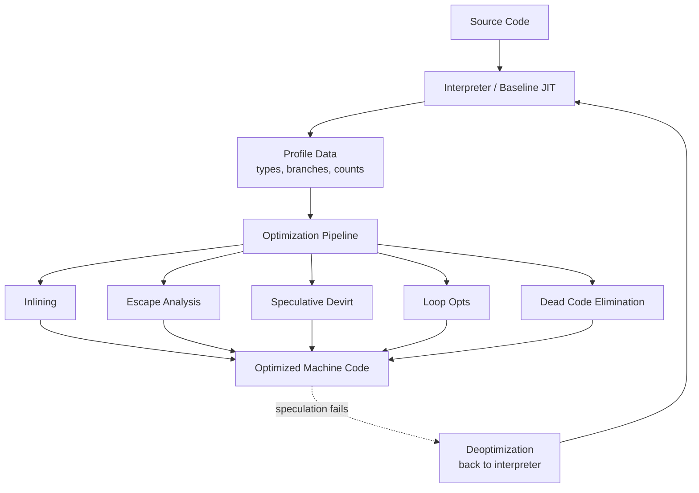

---

### 📶 Gradual Depth

**Level 1 - What it is:**
Compiler optimizations are automatic transformations that make your code run faster without changing its behavior. Every modern runtime - JVM, V8, .NET, LLVM-based compilers - applies the same core set of optimizations.

**Level 2 - How to use it:**
Write clear, idiomatic code that the optimizer expects. Prefer small methods (inlining targets), avoid unnecessary object allocation in hot loops (escape analysis targets), and keep type hierarchies narrow at call sites (devirtualization targets). Use `-XX:+PrintCompilation` in Java or `--trace-opt` in V8 to see which methods the optimizer processes.

**Level 3 - How it works:**
JIT compilers collect type profiles during interpretation. When a method becomes hot, the optimizing compiler uses profiles to speculate: "this virtual call always targets ConcreteImpl, so inline ConcreteImpl.method() directly." It inserts a type guard - if the receiver is NOT ConcreteImpl, deoptimize. Escape analysis then proves that objects allocated inside the inlined code never leave the method, enabling scalar replacement. The optimizer chains these passes: inlining exposes escape analysis opportunities, which expose dead code, which simplifies control flow.

**Level 4 - Production mastery:**
Profile pollution is the silent optimization killer across all runtimes. In the JVM, running unrelated code paths during warmup (health checks, framework initialization) pollutes type profiles, causing the C2 compiler to generate megamorphic dispatch where monomorphic would have sufficed. V8's TurboFan faces the same problem with polymorphic inline caches. In production, isolate warmup traffic from profiling windows. Use `-XX:+PrintInlining` to verify that hot call sites are actually inlined. Monitor deoptimization frequency with `-XX:+TraceDeoptimization` - frequent deopts indicate that speculations are wrong, and the code is bouncing between optimized and interpreted states (a performance cliff).

---

### ⚙️ How It Works

**Phase 1 - Profiling:** The interpreter (or baseline JIT) executes code and collects type feedback at call sites, branch frequency at conditionals, and invocation counts per method.

**Phase 2 - Compilation trigger:** When invocation count crosses a threshold (e.g. HotSpot C2 at ~10,000 invocations, V8 TurboFan uses a combination of counts and type stability), the optimizing compiler is invoked.

**Phase 3 - Optimization chain:** The compiler applies passes in dependency order: inlining first (expands visibility), then escape analysis (on the expanded IR), then loop optimizations, then dead code elimination, then register allocation and code emission.

**Phase 4 - Guarded execution:** Optimized code runs with embedded type guards. If a guard fails (unexpected type, unexpected null), execution transfers to a deoptimization handler that reconstructs the interpreter frame and continues from there.

```
Phase 1         Phase 2        Phase 3
[Interpret] --> [Trigger] --> [Compile]
   |profile|       |10K|        |
   |collect|       |inv|        v
   v               v         Inline
  types          compile     Escape Analyze
  branches       request     Loop Optimize
  counts           |         DCE
                   v         Emit Code
                Phase 4          |
              [Run Optimized] <--+
                   |
              guard fails?
                   |
              [Deoptimize] --> Phase 1
```

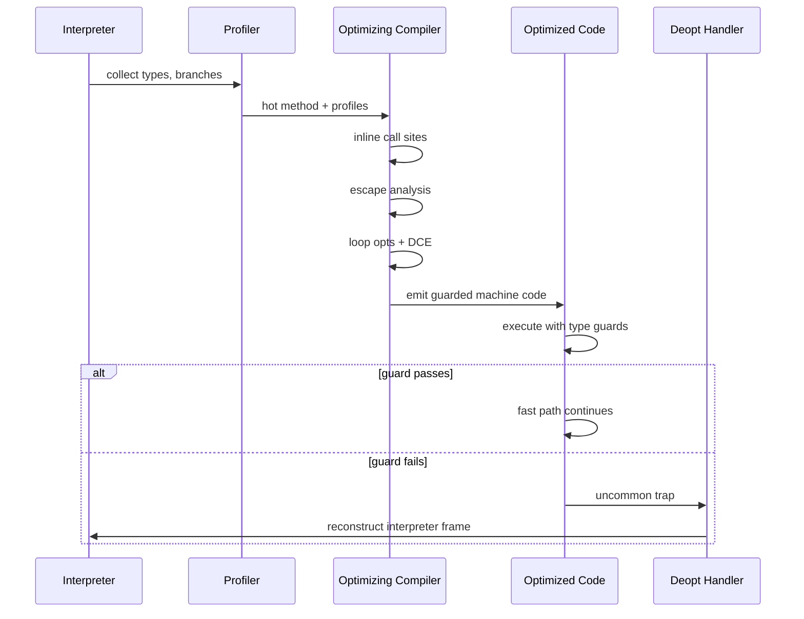

**BAD:**
```java
// Defeating escape analysis by leaking object
void processHot(List<Result> output) {
    for (int i = 0; i < 1_000_000; i++) {
        Point p = new Point(i, i * 2);
        output.add(p);  // p escapes into list
        // 1M heap allocations, GC pressure
    }
}
```
Why it fails: the object escapes into the list, preventing scalar replacement - this pattern causes unnecessary GC pressure in every runtime with escape analysis.

**GOOD:**
```java
// Escape analysis can eliminate allocation
long sumHot(int n) {
    long total = 0;
    for (int i = 0; i < n; i++) {
        Point p = new Point(i, i * 2);
        total += p.x + p.y;  // p does not escape
        // EA replaces Point with two scalars
    }
    return total;
}
```
Why it works: `Point` never escapes the method - the JIT replaces it with scalar fields `x` and `y` on the stack, eliminating all heap allocation.

---

### 🚨 Failure Modes

**Failure 1 - Deoptimization Storm:**
**Symptom:** Application throughput drops suddenly. `-XX:+PrintCompilation` shows repeated compile/deopt cycles for the same method. CPU spikes on C2 compiler threads.
**Root cause:** A code path that was monomorphic during warmup becomes polymorphic in production (e.g. a new plugin loaded, a different subclass appears). Each deopt triggers recompilation with broader type assumptions, which may deopt again.
**Diagnostic:**
```bash
# JVM: count deoptimizations
-XX:+TraceDeoptimization
# Look for "uncommon trap" reasons
grep "Uncommon trap" jvm_output.log | \
  sort | uniq -c | sort -rn | head
```
**Fix:** Ensure warmup exercises all production code paths. Use sealed classes or final methods to give the JIT compiler stronger type guarantees that cannot be invalidated.

**Failure 2 - Inlining Budget Exhaustion:**
**Symptom:** A critical hot method is not inlined despite being small. Performance 2-3x worse than expected.
**Root cause:** The method's call chain exceeds `-XX:MaxInlineLevel` (default 9) or the cumulative inlined bytecode exceeds `-XX:InlineSmallCode` thresholds. Deep framework call stacks (Spring proxies, aspect chains) consume the budget before reaching application logic.
**Diagnostic:**
```bash
# Check what gets inlined and what doesn't
-XX:+PrintInlining
# Look for "too deep" or "already compiled
# into a big method" messages
```
**Fix:** Flatten hot paths by reducing delegation depth. Increase `-XX:MaxInlineLevel` cautiously (higher values increase compilation time and code cache pressure). In .NET, `[MethodImpl(MethodImplOptions.AggressiveInlining)]` provides explicit hints.

---

### 🔬 Production Reality

A typical pattern: a Java microservice runs well in load testing but shows degraded throughput after deploying a new feature that adds a second implementation of a core interface. During load test, the optimizer saw one concrete type at the hot dispatch site and devirtualized it - essentially converting a virtual call into a direct call with full inlining. In production, two implementations appear. The JIT's monomorphic assumption fails, triggering deoptimization. The recompiled code uses a bimorphic inline cache - still fast, but slower than the monomorphic version. If a third implementation appears (e.g. a mock left in the classpath), the site becomes megamorphic and the JIT falls back to full virtual dispatch with no inlining - a typical 3-5x throughput regression on that call path. The diagnostic: `-XX:+PrintInlining` shows the hot method going from "inline (monomorphic)" to "no inline (megamorphic)". This exact pattern occurs in V8's TurboFan (polymorphic inline caches degrade) and .NET's RyuJIT (similar devirtualization guards). The fix is structural: keep hot dispatch sites monomorphic, use sealed hierarchies, and separate interface implementations that serve different code paths rather than mixing them at a single call site.

---

### ⚖️ Trade-offs & Alternatives

| Aspect | JVM HotSpot (JIT) | V8 TurboFan (JIT) | .NET RyuJIT (JIT) | LLVM (AOT) |
|---|---|---|---|---|
| Profile source | Runtime type feedback | Inline caches + feedback vectors | Runtime + PGO hints | Training runs (PGO) or none |
| Speculation aggressiveness | High (uncommon traps) | High (deopt frames) | Moderate (guarded devirt) | Low (must be provable) |
| Deoptimization cost | Medium (interpreter fallback) | Medium (lazy deopt) | Low (tiered fallback) | N/A (no deopt) |
| Escape analysis | Full scalar replacement | Partial (TurboFan) | Limited (recent improvements) | Full (SROA pass) |
| Warmup penalty | High (C2 compile latency) | Moderate (tiered) | Low (faster JIT) | None (pre-compiled) |
| Peak throughput | Highest (aggressive speculation) | High for JS patterns | High | High (but no runtime specialization) |

---

### ⚡ Decision Snap

**USE WHEN:**
- Reasoning about why clean code performs well (the optimizer rewards clarity)
- Diagnosing unexpected performance cliffs after code changes
- Transferring JVM performance intuition to V8, .NET, or LLVM-compiled languages

**AVOID WHEN:**
- Micro-optimizing code that is not on the hot path (measure first)
- Assuming one runtime's behavior applies identically to another (heuristics differ)

**PREFER JMH BENCHMARKS WHEN:**
- Verifying that a code pattern actually enables the expected optimization rather than guessing

---

### ⚠️ Top Traps

| # | Misconception | Reality |
|---|---|---|
| 1 | "JIT is always slower than AOT at steady state" | JIT with runtime profiles often beats AOT because it specializes for actual workload types and branches |
| 2 | "Escape analysis eliminates all short-lived allocations" | EA only works when the compiler can prove non-escape within its inlining horizon - framework indirection often blocks this |
| 3 | "Final/sealed classes are just style" | They give the JIT proof that devirtualization is safe without speculation guards, eliminating deoptimization risk entirely |
| 4 | "Manual optimizations always help" | Hand-unrolled loops, manual field caching, and pre-allocated arrays can confuse the optimizer, preventing vectorization or escape analysis |
| 5 | "Optimization is language-specific knowledge" | Inlining, escape analysis, and speculative devirt work identically across JVM, V8, and .NET - the patterns transfer directly |

---

### 🪜 Learning Ladder

**Prerequisites:**
- [JVM-001 What Is the JVM](#jvm-001-what-is-the-jvm) - runtime execution model
- [JVM-048 JIT Compilation Tiers](#jvm-048-jit-compilation-tiers) - tiered compilation mechanics
- [JVM-076 Reading GC Logs](#jvm-076-reading-gc-logs) - allocation pressure from failed escape analysis

**THIS:** JVM-131 Compiler Opt Patterns Across Runtimes

**Next steps:**
- [JVM-118 Designing a GC](#jvm-118-designing-a-gc) - how compiler barriers interact with GC design
- [JVM-129 Latency vs Throughput Trade-off Framing](#jvm-129-latency-vs-throughput-trade-off-framing) - optimization aggressiveness as a latency/throughput knob
- [JVM-130 What OS Scheduling Teaches JVM Engineers](#jvm-130-what-os-scheduling-teaches-jvm-engineers) - the layer below where optimized code runs

---

**The Surprising Truth:**
The JVM's greatest performance advantage is not any single optimization - it is the fact that runtime profiling lets it optimize for what your code actually does, not what it could theoretically do. A virtual call site that is monomorphic in practice gets compiled as a direct call - faster than C++ virtual dispatch which must always go through the vtable. This is why "Java is slow" is a 1990s myth: the JIT compiler sees your production workload and specializes aggressively. The catch is that this advantage evaporates the moment your code becomes genuinely polymorphic at hot paths.

**Further Reading:**
- "Escape Analysis for Java" - Choi et al., OOPSLA 1999 (foundational escape analysis paper)
- "An Introduction to Speculative Optimization in V8" - Benedikt Meurer, V8 blog (shows identical patterns to HotSpot)
- OpenJDK Wiki: "Performance Tactics" - compilation and inlining tuning reference

**Revision Card:**
1. Inlining is the gateway optimization - it expands the compiler's visibility, enabling escape analysis, DCE, and devirtualization downstream
2. Speculative optimization trades deoptimization risk for peak performance - every runtime makes this same trade-off differently
3. Megamorphic call sites kill optimization across all runtimes - keep hot dispatch monomorphic, use sealed types, and verify with PrintInlining

---

---

# JVM-132 Stop-the-World as Distributed Consensus

**TL;DR** - Stop-the-world is a consensus problem: all threads must agree to pause, and latency depends on the slowest thread reaching a safepoint.

---

### 🔥 Problem Statement

Your p99 latency spikes every few seconds. GC logs show 5ms collection pauses, but application metrics report 50ms stalls. The missing 45ms is time-to-safepoint - the interval between the VM requesting a pause and the last thread actually stopping. In a 200-thread server, one thread running a long counted loop or blocked in a JNI call holds every other thread hostage. You cannot diagnose this from GC logs alone because the safepoint handshake is invisible without `-Xlog:safepoint`. The deeper problem: stop-the-world is not a GC implementation detail. It is a distributed consensus problem where N independent threads must all agree to pause, and the protocol's latency is bounded by the slowest participant - the exact same constraint that makes two-phase commit expensive in distributed databases. Until you see STW through this lens, you will keep misattributing latency to the collector instead of the coordination protocol.

---

### 📜 Historical Context

Early garbage collectors (Lisp 1.5, 1960s) simply stopped everything - single-threaded, so "consensus" was trivial. As multi-threaded VMs emerged in the 1990s, the pause coordination problem appeared. HotSpot introduced safepoints as polling-based cooperative checkpoints: each thread periodically checks a flag and suspends itself. This design avoided the complexity of preemptive thread suspension (which POSIX deprecated as unsafe). The term "time-to-safepoint" (TTSP) gained visibility around 2015-2018 as microservice architectures pushed p99 requirements below 10ms, making previously invisible safepoint delays the dominant latency contributor. JEP 312 (Thread-Local Handshakes, JDK 10) was the first major protocol improvement, allowing the VM to stop individual threads rather than requiring global consensus for every operation.

---

### 🔩 First Principles

**CORE INVARIANTS:**

1. Global consistency requires global agreement - any operation that reads or mutates shared heap state (GC, deoptimization, biased lock revocation) requires ALL mutator threads to reach a known-safe state before proceeding
2. Cooperative polling means latency is unbounded by design - the VM cannot preempt a thread; it can only ask, and must wait until the thread voluntarily polls
3. The slowest thread determines total pause time - like two-phase commit, the coordinator (VM thread) blocks until the last participant (slowest application thread) responds

**DERIVED DESIGN:**

Invariant 1 forces the existence of safepoints: defined program points where thread state is fully describable (all object references in known locations). Invariant 2 means the VM inserts poll instructions at method returns, loop back-edges, and allocation sites - but cannot insert them inside native code or between safepoint polls in tight counted loops. Invariant 3 means optimizing GC pause time is insufficient; you must also optimize the coordination protocol itself.

**THE TRADE-OFF:**

**Gain:** Safe, portable thread coordination without OS-level preemption - works identically across all platforms.
**Cost:** Latency tail bounded by the worst-case thread response time, which can be orders of magnitude longer than the actual GC work.

---

### 🧠 Mental Model

> Imagine a meeting organizer who sends "please come to the conference room" to 200 employees. The meeting cannot start until every single person arrives. Most arrive in seconds. But one person is on a phone call with an external client (JNI) and cannot hang up. Another is deep in a complex calculation with noise-cancelling headphones (counted loop without a safepoint poll). The meeting start time is determined entirely by whoever arrives last.

- "Meeting organizer" -> VM thread requesting safepoint
- "Employees" -> application (mutator) threads
- "Arrive at room" -> reach a safepoint poll and suspend
- "External phone call" -> JNI native code execution

**Where this analogy breaks down:** Real safepoint polling is not a single check - the VM arms a memory page trap, threads fault on it or check a flag at compiled poll sites, and the mechanism differs between interpreted and compiled code.

---

### 🧩 Components

- **Safepoint poll sites** - compiler-inserted check points at loop back-edges, method returns, and allocation paths where threads test whether a safepoint is requested
- **VM thread (VMThread)** - the coordinator that initiates safepoint requests, waits for all threads, executes the VM operation, then releases threads
- **Safepoint flag / polling page** - a global signal mechanism; HotSpot maps a memory page readable during normal execution and unmaps it to trigger SIGSEGV/page-fault when a safepoint is needed
- **Thread state machine** - each thread transitions through states (running, blocked, in-native, at-safepoint) that determine whether it must actively poll or is already considered "safe"
- **Time-to-safepoint (TTSP)** - the measured interval from safepoint request to last thread arrival; the critical metric for diagnosing coordination latency

```
+------------------------------------------+
|            VM Thread (coordinator)        |
|  1. Request: arms polling page           |
|  2. Wait:    blocks until all respond    |
|  3. Execute: GC / deopt / revoke         |
|  4. Release: disarms page, resumes all   |
+------------------------------------------+
       |            |            |
       v            v            v
  +---------+  +---------+  +---------+
  | Thread A|  | Thread B|  | Thread C|
  | polls at|  | in JNI  |  | counted |
  | method  |  | (safe   |  | loop    |
  | return  |  |  already)|  | (slow!) |
  +---------+  +---------+  +---------+
  arrives:1ms  arrives:0ms  arrives:45ms
              TTSP = 45ms
```

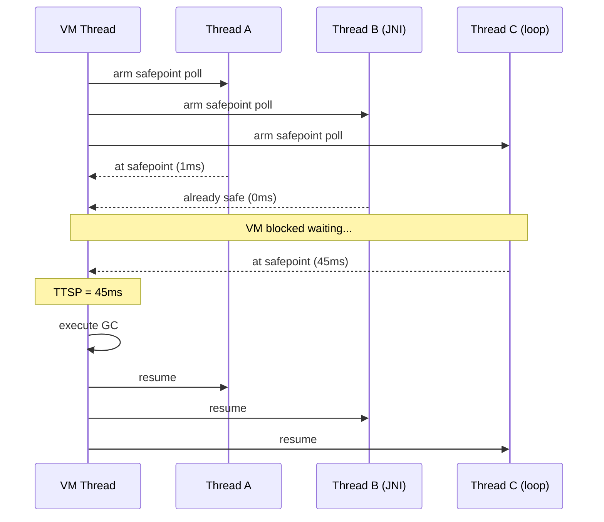

---

### 📶 Gradual Depth

**Level 1 - What it is:** Stop-the-world means the JVM pauses all application threads to perform an operation safely. Every thread must stop before the operation begins, and none resume until it completes.

**Level 2 - How to use it:** You do not invoke STW directly - the VM triggers it for GC, deoptimization, and class redefinition. Monitor it with `-Xlog:safepoint` to see TTSP and identify slow threads. Keep GC pauses short by choosing low-latency collectors (ZGC, Shenandoah).

**Level 3 - How it works:** The VM thread arms a polling mechanism (page trap or flag). Each application thread hits a poll site and suspends. Threads in native code via JNI are considered "safe" because they cannot access Java heap without transitioning back. The VM blocks until all threads report. Counted loops without safepoint polls are the primary source of long TTSP because C2 may omit the poll for optimization.

**Level 4 - Production mastery:** TTSP is often larger than actual GC pause time in low-latency systems. JDK 10's thread-local handshakes (JEP 312) allow per-thread operations without global STW. `-XX:+UseCountedLoopSafepoints` forces polls in counted loops at the cost of ~1-3% throughput. JDK 17+ safepoint diagnostics in unified logging (`-Xlog:safepoint*=debug`) reveal per-thread arrival times. In containerized environments with CPU throttling, a thread descheduled by cgroup limits can extend TTSP by tens of milliseconds despite no application-level cause.

---

### ⚙️ How It Works

**Phase 1 - Request:** The VM thread sets the global safepoint flag and unmaps the polling page. A monotonic counter increments to track this safepoint epoch.

**Phase 2 - Synchronize:** Each thread reaches its next poll site. Compiled code faults on the unmapped page or checks the flag. Interpreted code checks at dispatch boundaries. Threads transition to "at safepoint" state. The VM thread spins or blocks waiting for all thread counts to converge.

**Phase 3 - Execute:** With all threads parked, the VM performs the operation (GC cycle, deoptimization, biased lock revocation, etc.). Heap state is frozen and consistent.

**Phase 4 - Release:** The VM thread remaps the polling page, clears the flag, and signals all threads to resume. Threads transition back to "running."

```
Request    Synchronize        Execute  Release
  |            |                 |        |
  v            v                 v        v
  [arm]-->[poll]-->[poll]-->[op]-->[disarm]
           T1:1ms   T3:45ms  GC:5ms
           T2:0ms
  |<--- TTSP=45ms -->|<-pause->|
  |<------ total stall=50ms ------->|
```

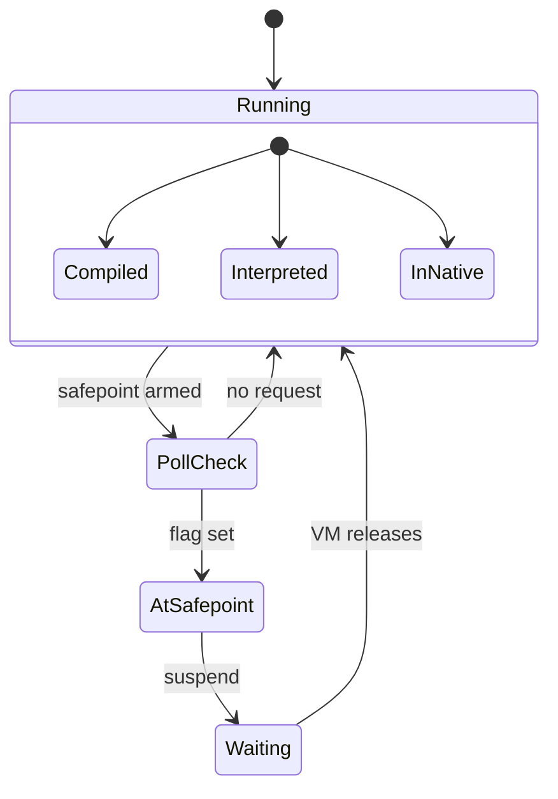

**BAD:**
```java
// Counted loop without safepoint poll
// C2 omits poll for "optimization"
long sum = 0;
for (int i = 0; i < 1_000_000_000; i++) {
    sum += data[i % data.length];
}
// This thread cannot reach a safepoint
// for the entire loop duration.
// TTSP: potentially seconds.
```
Why it fails: C2 removes the safepoint poll from counted loops (those with a known trip count) to avoid branch overhead, making this thread invisible to the safepoint protocol for the entire iteration.

**GOOD:**
```java
// Option 1: JVM flag
// -XX:+UseCountedLoopSafepoints
// Forces polls in all counted loops

// Option 2: restructure the loop
long sum = 0;
for (int i = 0; i < 1_000_000_000; ) {
    int end = Math.min(i + 1024, 1_000_000_000);
    for (int j = i; j < end; j++) {
        sum += data[j % data.length];
    }
    i = end;
    // Outer loop back-edge has a poll
}
```
Why it works: The JVM flag forces safepoint polls in all counted loops. The manual chunking alternative ensures the outer loop back-edge provides a poll site every 1024 iterations, bounding TTSP contribution to microseconds.

---

### 🚨 Failure Modes

**Failure 1 - Counted Loop Safepoint Stall:**

**Symptom:** GC logs show 5ms pause, but application p99 shows 200ms+ spikes. `-Xlog:safepoint` shows "spin" phase consuming 195ms.

**Root cause:** C2-compiled counted loop with no safepoint poll. One thread holds all others hostage during the synchronize phase.

**Diagnostic:**
```
-Xlog:safepoint*=debug
# Look for:
# Safepoint "GCPause", TTSP: 195ms
# Threads: spinning=1 blocked=0
```

**Fix:** Add `-XX:+UseCountedLoopSafepoints` (default in some JDK 17+ builds) or refactor hot counted loops into chunked iterations. Verify with repeated safepoint log analysis.

**Failure 2 - JNI Call Blocking Global Safepoint:**

**Symptom:** Periodic 100ms+ stalls correlating with native library calls. Safepoint logs show "waiting on native" threads.

**Root cause:** A thread executing JNI code is "safe" (cannot touch heap), but if it transitions back to Java at the wrong moment, it must wait for the safepoint to complete. The real problem: if the JNI code calls back into Java (upcall), the transition check can block the entire safepoint if other threads are also in complex native transitions.

**Diagnostic:**
```
-Xlog:safepoint+stats=debug
# Check for "native" state threads with
# long transition times
jstack <pid> | grep -A2 "in native"
```

**Fix:** Minimize JNI upcalls during latency-sensitive phases. Use `Critical` JNI functions only when necessary. Consider replacing JNI with Panama Foreign Function API (JDK 22+) which has better safepoint integration.

---

### 🔬 Production Reality

A typical pattern in latency-sensitive services: the team migrates from G1 to ZGC expecting sub-millisecond pauses, but p99 latency barely improves. ZGC's concurrent design eliminates most STW for GC marking and relocation, but the safepoint protocol still fires for non-GC operations - deoptimization, monitor deflation, class redefinition during deployment. The team discovers that TTSP from a single hot counted loop in a serialization library dominates their tail latency. The fix is not a better collector - it is `-XX:+UseCountedLoopSafepoints` plus refactoring the serialization path. The lesson: STW is a coordination protocol that GC uses, not a GC concept. Fixing the collector while ignoring the protocol is like upgrading the meeting agenda while ignoring that one attendee always arrives 10 minutes late.

---

### ⚖️ Trade-offs & Alternatives

| Aspect | JVM Safepoints | Goroutine Preemption (Go 1.14+) | Erlang/BEAM Reductions |
|---|---|---|---|
| Mechanism | Cooperative polling at compiler-inserted sites | Async preemption via OS signals (SIGURG) | Instruction counting: preempt after N reductions |
| Worst-case TTSP | Unbounded (no poll in counted loops) | Bounded by signal delivery (~microseconds) | Bounded by reduction limit (~microseconds) |
| Throughput cost | Near zero when not at safepoint | Signal overhead per preemption | Counting overhead per instruction |
| Implementation complexity | Moderate (compiler + page trap) | High (must handle mid-instruction preemption) | Low (VM controls execution model) |
| Granularity | Global (all threads) or per-thread (JDK 10+) | Per-goroutine | Per-process |

The JVM's cooperative design maximizes throughput by avoiding preemption overhead during normal execution, but pays with unbounded worst-case TTSP. Go chose bounded latency over throughput. BEAM's reduction counting reflects its soft-real-time heritage.

---

### ⚡ Decision Snap

**USE WHEN:** Diagnosing unexplained latency gaps between GC pause time and application stall time. Evaluating whether a collector change will actually fix your tail latency. Designing JNI interactions for latency-sensitive services.

**AVOID WHEN:** GC pause time itself dominates (TTSP is small relative to pause). Your application is throughput-oriented and p99 does not matter. You are on a single-threaded workload.

**PREFER direct investigation WHEN:** Adding `-Xlog:safepoint` reveals TTSP exceeding GC pause time - the problem is the protocol, not the collector.

---

### ⚠️ Top Traps

| # | Misconception | Reality |
|---|---|---|
| 1 | "STW = GC pause duration" | TTSP is added before the GC pause begins; total stall = TTSP + pause. TTSP often exceeds pause in tuned systems |
| 2 | "ZGC/Shenandoah eliminate STW" | They minimize GC-related STW but safepoints still fire for deoptimization, monitor deflation, and class redefinition |
| 3 | "Threads in native code cause long TTSP" | Threads in pure native (JNI) are already "safe" - they do not delay safepoints unless performing Java upcalls during transition |
| 4 | "More threads = longer TTSP" | TTSP depends on the slowest thread, not the count; 200 threads with good poll sites pause faster than 4 threads with one bad counted loop |
| 5 | "Safepoint polls are expensive" | A safepoint poll is a single memory load (test against mapped page); the cost is effectively zero until the page is actually unmapped |

---

### 🪜 Learning Ladder

**Prerequisites:**
- JVM-001 What Is the JVM - runtime execution model and thread management
- JVM-026 Heap and Stack - memory regions that safepoints must make consistent
- JVM-048 JIT Compilation Tiers - how C2 optimizations remove safepoint polls

**THIS:** JVM-132 Stop-the-World as Distributed Consensus

**Next steps:**
- JVM-118 Designing a GC - how GC algorithms depend on the safepoint protocol
- JVM-128 Memory Pressure as a Universal System Signal - system-level signals that trigger STW events
- JVM-129 Latency vs Throughput Trade-off Framing - the fundamental tension safepoint design embodies
- JVM-130 What OS Scheduling Teaches JVM Engineers - OS preemption as the layer below cooperative polling

---

**The Surprising Truth:**

The JVM's stop-the-world mechanism is architecturally identical to two-phase commit in distributed databases. The VM thread is the coordinator, application threads are participants, and the safepoint poll is the "prepare" vote. Just as 2PC's latency is dominated by the slowest participant and the protocol blocks all participants while waiting, STW latency is dominated by the slowest thread to reach a safepoint. This is not analogy - it is the same fundamental constraint: any system requiring global agreement among independent actors inherits worst-case-participant latency as its lower bound.

**Further Reading:**
- JEP 312: Thread-Local Handshakes - the first step toward breaking the global consensus requirement by allowing per-thread safepoint operations
- Robbin Ehn, "JVM Anatomy Quark #22: Safepoint Polls" (Aleksey Shipilev, shipilev.net) - detailed analysis of safepoint poll mechanics and TTSP measurement
- Jim Gray, Leslie Lamport, "Consensus on Transaction Commit" (ACM TODS, 2006) - the theoretical framework connecting two-phase commit to any global agreement protocol

**Revision Card:**
1. Stop-the-world is a consensus protocol - its latency is bounded by the slowest thread reaching a safepoint, not by the GC work itself
2. Cooperative polling trades bounded latency for throughput - the JVM cannot preempt threads, so counted loops and JNI can create unbounded TTSP
3. `-XX:+UseCountedLoopSafepoints` is the single highest-impact flag for reducing tail latency in systems where TTSP exceeds GC pause time
