## Keywords

1. [JVM-048 G1GC Internals - Regions, Marking, Mixed](#jvm-048-g1gc-internals---regions-marking-mixed)
2. [JVM-049 ZGC Fundamentals - Sub-Millisecond Pauses](#jvm-049-zgc-fundamentals---sub-millisecond-pauses)
3. [JVM-050 Shenandoah GC - Concurrent Compaction](#jvm-050-shenandoah-gc---concurrent-compaction)
4. [JVM-051 GC Log Analysis - Reading and Interpreting](#jvm-051-gc-log-analysis---reading-and-interpreting)
5. [JVM-052 JIT Compilation Tiers (C1 and C2)](#jvm-052-jit-compilation-tiers-c1-and-c2)
6. [JVM-053 Inlining and Escape Analysis](#jvm-053-inlining-and-escape-analysis)
7. [JVM-054 On-Stack Replacement (OSR)](#jvm-054-on-stack-replacement-osr)
8. [JVM-055 Safepoints - What Stops the World](#jvm-055-safepoints---what-stops-the-world)
9. [JVM-056 TLAB - Thread-Local Allocation Buffers](#jvm-056-tlab---thread-local-allocation-buffers)
10. [JVM-057 Compressed Oops and Object Layout](#jvm-057-compressed-oops-and-object-layout)
11. [JVM-058 JFR (Java Flight Recorder) Deep Dive](#jvm-058-jfr-java-flight-recorder-deep-dive)
12. [JVM-059 Async-Profiler and CPU Flame Graphs](#jvm-059-async-profiler-and-cpu-flame-graphs)
13. [JVM-060 Memory Leak Diagnosis Workflow](#jvm-060-memory-leak-diagnosis-workflow)
14. [JVM-061 GC Tuning Methodology - Measure First](#jvm-061-gc-tuning-methodology---measure-first)
15. [JVM-062 JVM Security Manager - Deprecated Alternatives](#jvm-062-jvm-security-manager---deprecated-alternatives)
16. [JVM-063 Native Memory Tracking (NMT)](#jvm-063-native-memory-tracking-nmt)
17. [JVM-064 Class Data Sharing (CDS and AppCDS)](#jvm-064-class-data-sharing-cds-and-appcds)
18. [JVM-065 JVM in Kubernetes - Resource Limits Done Right](#jvm-065-jvm-in-kubernetes---resource-limits-done-right)
19. [JVM-066 GC Pause Budget - SLA-Driven Tuning](#jvm-066-gc-pause-budget---sla-driven-tuning)
20. [JVM-067 Choosing ZGC vs G1GC vs Shenandoah](#jvm-067-choosing-zgc-vs-g1gc-vs-shenandoah)
21. [JVM-068 When GC Tuning Is Premature Optimization](#jvm-068-when-gc-tuning-is-premature-optimization)
22. [JVM-069 Explain GC at Every Level](#jvm-069-explain-gc-at-every-level)
23. [JVM-070 Build a JVM Dashboard - Phase 2 (Alerts)](#jvm-070-build-a-jvm-dashboard---phase-2-alerts)
24. [JVM-071 JVM Self-Assessment Checkpoint](#jvm-071-jvm-self-assessment-checkpoint)
25. [JVM-072 JVM System Design Interview Patterns](#jvm-072-jvm-system-design-interview-patterns)
26. [JVM-073 Java Module System (JPMS) and ClassLoader](#jvm-073-java-module-system-jpms-and-classloader)
27. [JVM-074 Testing GC Behavior Under Load](#jvm-074-testing-gc-behavior-under-load)
28. [JVM-075 Weak, Soft, and Phantom References in Practice](#jvm-075-weak-soft-and-phantom-references-in-practice)

---

# JVM-048 G1GC Internals - Regions, Marking, Mixed

**TL;DR** - G1GC divides the heap into equal-sized regions and uses concurrent marking to identify garbage-heavy regions for priority collection (mixed GCs).

---

### 🔥 The Problem in One Paragraph

With the older Parallel GC, collecting the old generation requires scanning the entire old space in one monolithic pause - and on a 32GB heap, that pause can exceed 5 seconds. Applications with latency SLAs cannot tolerate such pauses, yet they still need to reclaim old-generation garbage. G1GC solves this by dividing the heap into hundreds of small equal-sized regions, tracking garbage density per region, and collecting only the most garbage-filled regions during "mixed" collections - achieving predictable pause times without sacrificing throughput. This is exactly why G1GC Internals - Regions, Marking, Mixed was created.

---

### 📘 Textbook Definition

**G1GC (Garbage-First Garbage Collector)** is a regionalized, generational, concurrent garbage collector that partitions the heap into fixed-size regions (typically 1-32MB). It uses concurrent marking to determine per-region liveness, then selects the regions with the lowest liveness ratio (most garbage) for evacuation during mixed collection pauses. The "garbage first" name reflects this priority: collect garbage-rich regions first to maximize space reclaimed per unit of pause time.

---

### 🧠 Mental Model

> G1GC treats the heap like a city grid of identical city blocks. Some blocks are full of residents (live objects), others are mostly abandoned buildings (garbage). Instead of demolishing the entire city (Full GC), the city planner (G1) surveys each block (concurrent marking), identifies the most abandoned ones, and rebuilds only those blocks (mixed GC) within a fixed time budget.

- "City blocks" -> heap regions (fixed-size, e.g. 16MB)
- "Survey" -> concurrent marking phase (determines liveness)
- "Demolish and rebuild" -> evacuation (copy live objects out, reclaim region)
- "Time budget" -> MaxGCPauseMillis target

**Where this analogy breaks down:** Unlike city blocks, G1 regions are not physically fixed - a region can switch roles (Eden, Survivor, Old, Humongous) between GC cycles depending on allocation pressure.

---

### ⚙️ How It Works

1. **Heap division:** At JVM startup, the heap is divided into N regions of equal size (region size = heap / 2048, rounded to power of 2, range 1-32MB).
2. **Young GC (evacuation pause):** When Eden regions fill, G1 stops the world, copies live objects from Eden + Survivor regions to new Survivor (or promotes to Old) regions. This is a standard young collection.
3. **Concurrent marking initiation:** When old-generation occupancy crosses IHOP (InitiatingHeapOccupancyPercent, adaptive by default), G1 starts concurrent marking.
4. **Concurrent marking phases:** Initial mark (piggybacks on young GC pause), concurrent root scan, concurrent mark (multi-threaded traversal of the object graph), remark (STW, processes SATB buffers), cleanup (reclaims empty regions, sorts by liveness).
5. **Mixed collections:** After marking completes, subsequent young GCs become "mixed" - they evacuate young regions PLUS selected old regions with high garbage ratios. Mixed GCs continue until the garbage ratio drops below a threshold.
6. **Humongous allocation:** Objects larger than 50% of a region go directly into humongous regions (contiguous sequence of regions). These are collected during cleanup or Full GC.

```text
Heap Layout (regions):
  [E][E][E][S][O][O][H][H][O][O][E][S][O][O][O]
   ^       ^     ^  ^^^^^^^        ^
   Eden    Surv  Old Humongous     Eden

Mixed GC selection:
  Region liveness after marking:
  R1: 90% live  <- skip (too expensive)
  R2: 30% live  <- COLLECT (garbage-first)
  R3: 95% live  <- skip
  R4: 15% live  <- COLLECT (most garbage)
  R5: 45% live  <- COLLECT if pause budget allows
```

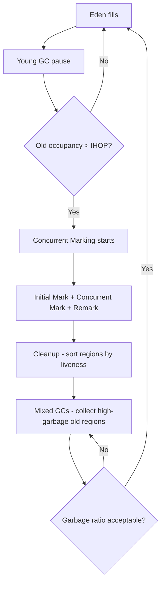
```mermaid
flowchart TD
    A[Eden fills] --> B[Young GC pause]
    B --> C{Old occupancy > IHOP?}
    C -->|No| A
    C -->|Yes| D[Concurrent Marking starts]
    D --> E[Initial Mark + Concurrent Mark + Remark]
    E --> F[Cleanup - sort regions by liveness]
    F --> G[Mixed GCs - collect high-garbage old regions]
    G --> H{Garbage ratio acceptable?}
    H -->|No| G
    H -->|Yes| A
```

---

### 🛠️ Worked Example

**BAD:**

```bash
# Setting region size manually without understanding
java -XX:+UseG1GC -XX:G1HeapRegionSize=1m -Xmx32g \
     -jar service.jar
# 1MB regions on 32GB heap = 32768 regions
# Excessive region count increases marking overhead
# Humongous threshold = 512KB (half region)
# Many medium objects become "humongous" -> fragmentation
```

Why it's wrong: tiny regions on large heaps create unnecessary overhead and lower the humongous threshold, causing normal objects to be treated as humongous.

**GOOD:**

```bash
# Let G1 choose region size (heap/2048 rounded to power of 2)
java -XX:+UseG1GC -Xmx32g \
     -XX:MaxGCPauseMillis=100 \
     -Xlog:gc*:file=gc.log:time,level,tags \
     -jar service.jar
# G1 selects 16MB regions (32GB/2048 = 16MB)
# Humongous threshold = 8MB (reasonable)
# Pause target guides mixed GC aggressiveness
```

Why it's right: let G1 ergonomics select region size. Set only the pause target and monitor.

**Production:**

```bash
# Monitor IHOP and mixed GC effectiveness
grep "Mixed" gc.log | tail -5
# [gc] GC(142) Pause Young (Mixed) 98ms
# [gc] GC(143) Pause Young (Mixed) 105ms
# If mixed GCs consistently exceed MaxGCPauseMillis:
# G1 is selecting too many regions per mixed cycle.
# Solution: lower -XX:G1MixedGCCountTarget (default 8)
# to spread old-region collection over more cycles.
```

---

### ⚖️ Trade-offs

**Gain:** Predictable pause times (configurable via MaxGCPauseMillis). Incremental old-gen collection avoids monolithic Full GC. Adaptive IHOP reduces tuning burden. Handles large heaps (4-64GB) well.

**Cost:** ~5-10% throughput overhead vs Parallel GC due to write barriers (remembered sets), concurrent marking threads consuming CPU, and evacuation copying overhead. Memory overhead: remembered sets can consume 5-20% of heap for tracking cross-region references.

| Aspect          | G1GC                    | Parallel GC                | ZGC                     |
| --------------- | ----------------------- | -------------------------- | ----------------------- |
| Pause model     | Incremental (mixed GCs) | Monolithic (full old GC)   | Sub-ms (concurrent)     |
| Pause target    | 50-200ms (tunable)      | None (minimize total time) | <1ms (always)           |
| Throughput      | Good (5-10% overhead)   | Best                       | Lower (10-15% overhead) |
| Sweet spot heap | 4-64GB                  | Any                        | 8MB-16TB                |

---

### ⚡ Decision Snap

**USE WHEN:**

- Heap is 4-64GB and you need pause times under 200ms.
- Default JDK 9+ choice - G1 is the ergonomic default for server-class machines.
- Workload mixes allocation-heavy and long-lived objects.

**AVOID WHEN:**

- Pause requirement is sub-millisecond (use ZGC instead).
- Heap is <512MB and throughput is primary concern (Parallel or Serial is simpler).

**PREFER ZGC WHEN:**

- Any pause exceeding 10ms is unacceptable regardless of heap size.
- Running JDK 21+ where Generational ZGC eliminates ZGC's historical throughput penalty.

---

### ⚠️ Top Traps

| #   | Misconception                         | Reality                                                                                                                                                                             |
| --- | ------------------------------------- | ----------------------------------------------------------------------------------------------------------------------------------------------------------------------------------- |
| 1   | "G1 never does a Full GC"             | If mixed GCs cannot reclaim space fast enough (allocation outpaces collection), G1 falls back to a serial Full GC - the worst possible pause.                                       |
| 2   | "MaxGCPauseMillis is a guarantee"     | It is a TARGET, not a ceiling. G1 will exceed it under pressure (large humongous allocations, remembered set overflow).                                                             |
| 3   | "Setting IHOP lower is always better" | Lower IHOP triggers marking earlier (good: avoids Full GC). But also increases concurrent marking frequency, consuming CPU. Adaptive IHOP in modern JDKs usually finds the optimum. |

---

### 🪜 Learning Ladder

**Prerequisites:**

- JVM-026 Heap Structure - Young, Old, and Metaspace - understand generational layout that G1 virtualizes
- JVM-027 Minor GC vs Major GC vs Full GC - understand GC event taxonomy

**THIS:** JVM-048 G1GC Internals - Regions, Marking, Mixed

**Next steps:**

- JVM-049 ZGC Fundamentals - Sub-Millisecond Pauses - the next-generation alternative to G1
- JVM-066 GC Pause Budget - SLA-Driven Tuning - how to set MaxGCPauseMillis correctly

---

### 💡 The Surprising Truth

G1GC's remembered sets (tracking cross-region references) can consume 10-20% of total heap memory in applications with many old-to-young references. A 32GB heap might have only 26GB usable for application objects. This overhead is invisible unless you enable native memory tracking (`-XX:NativeMemoryTracking=summary`) and check `jcmd <pid> VM.native_memory`. Applications with dense cross-generational reference graphs (large caches pointing to frequently-refreshed objects) suffer disproportionate remembered set bloat.

---

### 📇 Revision Card

1. G1 divides heap into equal regions, marks concurrently, then collects garbage-rich old regions during mixed GCs - incremental, not monolithic.
2. MaxGCPauseMillis is a target, not a guarantee. Full GC still happens if allocation outpaces mixed collection.
3. Remembered set overhead (5-20% of heap) is the hidden cost. Monitor via NMT if effective heap seems smaller than configured.

---

---

# JVM-049 ZGC Fundamentals - Sub-Millisecond Pauses

**TL;DR** - ZGC achieves sub-millisecond GC pauses regardless of heap size by performing all heavy work (marking, relocation) concurrently with application threads.

---

### 🔥 The Problem in One Paragraph

A trading platform on a 128GB heap with G1GC experiences 200ms GC pauses every few minutes. During those 200ms, no orders are processed, positions are stale, and the system falls behind market data. Reducing heap size is not an option (the working set requires it). Tuning G1's MaxGCPauseMillis below 50ms causes more frequent pauses and potential Full GC. The fundamental issue: G1 still requires stop-the-world pauses proportional to heap size for evacuation. ZGC eliminates this constraint entirely. This is exactly why ZGC Fundamentals - Sub-Millisecond Pauses was created.

---

### 📘 Textbook Definition

**ZGC (Z Garbage Collector)** is a scalable, low-latency garbage collector that performs all expensive GC operations (marking, object relocation, reference processing) concurrently with application threads. It uses colored pointers (metadata stored in pointer bits) and load barriers to maintain heap consistency while the application runs. ZGC pauses are limited to root scanning (thread stacks, JNI globals) which is O(threads), not O(heap), achieving sub-millisecond pauses on heaps up to 16TB.

---

### 🧠 Mental Model

> ZGC is like repainting a house while the family lives in it. G1 would make the family leave the room being painted (stop-the-world evacuation). ZGC repaints around them - if someone touches wet paint (reads a relocated object), the load barrier instantly redirects them to the new location (self-healing pointer). The family barely notices the work happening.

- "Repainting around residents" -> concurrent relocation
- "Touching wet paint" -> reading a stale pointer
- "Redirect to new location" -> load barrier fixes pointer
- "Family barely notices" -> sub-ms pauses

**Where this analogy breaks down:** ZGC does briefly stop everyone to scan their pockets (root scanning at safepoint) - but scanning pockets takes microseconds, not the minutes that "evacuating a room" would take.

---

### ⚙️ How It Works

1. **Colored pointers:** ZGC uses 4 metadata bits in the 64-bit object pointer to track object state (marked0, marked1, remapped, finalizable). No separate mark bitmap needed.
2. **Load barrier:** Every object reference load is intercepted. If the pointer's color indicates it is stale (not remapped), the barrier fixes it in-place, pointing to the object's new location.
3. **Concurrent marking:** Traverses the object graph concurrently. Sets mark bits in colored pointers. Application continues running.
4. **Concurrent relocation:** Selects regions for compaction (high garbage ratio). Copies live objects to new regions concurrently. When an application thread reads a relocated object via a stale pointer, the load barrier self-heals the reference.
5. **Pause phases (brief):** Only three STW pauses exist: (a) initial mark - scan thread roots, (b) remark - process remaining SATB buffers, (c) initial relocate - scan roots for relocation set. Each is O(thread count), typically <1ms.
6. **Generational mode (JDK 21+):** Separates young and old generations within ZGC, reducing concurrent marking work by collecting short-lived objects faster.

```text
ZGC Pointer Layout (64-bit):
  [unused 16 bits][color 4 bits][object address 44 bits]
  Color bits: marked0 | marked1 | remapped | finalizable

  Pointer states during GC cycle:
  Phase 1 (marking):    set marked0 or marked1
  Phase 2 (relocating): set remapped after relocation
  Load barrier checks color -> fixes stale pointers
```

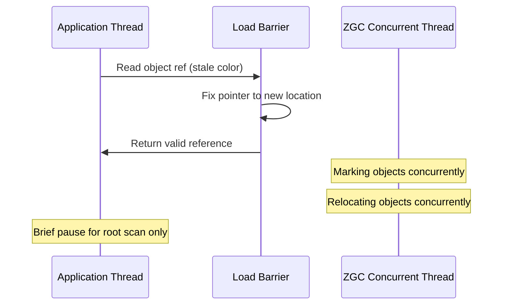
```mermaid
sequenceDiagram
    participant App as Application Thread
    participant LB as Load Barrier
    participant ZGC as ZGC Concurrent Thread
    App->>LB: Read object ref (stale color)
    LB->>LB: Fix pointer to new location
    LB->>App: Return valid reference
    Note over ZGC: Marking objects concurrently
    Note over ZGC: Relocating objects concurrently
    Note over App: Brief pause for root scan only
```

---

### 🛠️ Worked Example

**BAD:**

```bash
# Using ZGC on JDK 11 without understanding limitations
java -XX:+UnlockExperimentalVMOptions -XX:+UseZGC \
     -Xmx4g -jar service.jar
# JDK 11 ZGC: experimental, non-generational
# 4GB heap: ZGC overhead dominates on small heaps
# No generation separation -> marks entire heap every cycle
# Throughput worse than G1GC for this workload
```

Why it's wrong: ZGC on JDK 11 was experimental with significant throughput overhead on small heaps. Non-generational design forced full-heap marking every cycle.

**GOOD:**

```bash
# ZGC on JDK 21+ (generational, production-ready)
java -XX:+UseZGC -Xmx128g \
     -Xlog:gc*:file=gc.log:time,level,tags \
     -jar trading-platform.jar
# Generational ZGC is default in JDK 21+
# Sub-ms pauses on 128GB heap
# No MaxGCPauseMillis needed - pauses are always <1ms
# Monitor: grep "Pause" gc.log | awk '{print $NF}'
```

Why it's right: JDK 21+ Generational ZGC is production-ready with sub-ms pauses and competitive throughput on large heaps.

**Production:**

```bash
# Verify ZGC pause times in production
grep "Pause" gc.log | sort -t'=' -k2 -n | tail -5
# GC(42) Pause Mark Start 0.018ms
# GC(42) Pause Mark End 0.012ms
# GC(42) Pause Relocate Start 0.009ms
# All pauses <1ms regardless of heap size
# If any pause >1ms: check thread count (root scan)
```

---

### ⚖️ Trade-offs

**Gain:** Sub-millisecond pauses independent of heap size (up to 16TB). No tuning needed for latency. Concurrent compaction eliminates fragmentation without STW.

**Cost:** Load barrier overhead on every object reference load (~5-10% throughput cost). Higher memory footprint (colored pointers require 64-bit uncompressed oops, no compressed oops). CPU overhead for concurrent GC threads.

| Aspect              | ZGC                       | G1GC                | Parallel GC |
| ------------------- | ------------------------- | ------------------- | ----------- |
| Max pause           | <1ms                      | 50-200ms (target)   | Seconds     |
| Throughput overhead | 10-15%                    | 5-10%               | Baseline    |
| Compressed oops     | No (JDK 21: yes for <4TB) | Yes (<32GB)         | Yes (<32GB) |
| Heap range          | 8MB-16TB                  | 4GB-64GB sweet spot | Any         |

---

### ⚡ Decision Snap

**USE WHEN:**

- Latency SLA requires <10ms pauses regardless of heap size.
- Heap is large (>32GB) where G1 pauses become problematic.
- Running JDK 21+ where Generational ZGC eliminates the throughput penalty.

**AVOID WHEN:**

- Heap is small (<4GB) and throughput matters more than latency - G1 or Parallel is more efficient.
- Running JDK <15 where ZGC is experimental and non-generational.

**PREFER G1GC WHEN:**

- Pause target of 50-200ms is acceptable and you want proven stability with lower CPU overhead.
- You need compressed oops on JDK <21 (ZGC disables them).

---

### ⚠️ Top Traps

| #   | Misconception                   | Reality                                                                                                           |
| --- | ------------------------------- | ----------------------------------------------------------------------------------------------------------------- |
| 1   | "ZGC has zero pauses"           | ZGC has three brief STW pauses per cycle (root scanning). They are sub-millisecond but not zero.                  |
| 2   | "ZGC throughput equals G1GC"    | Load barrier overhead costs 5-15% throughput. Generational ZGC (JDK 21+) narrows this gap significantly.          |
| 3   | "ZGC works well on small heaps" | On heaps <4GB, ZGC's overhead (no compressed oops, barrier cost) can make it slower than G1 for total throughput. |

---

### 🪜 Learning Ladder

**Prerequisites:**

- JVM-048 G1GC Internals - Regions, Marking, Mixed - understand the baseline G1 model ZGC improves upon
- JVM-029 GC Roots and Reachability Analysis - understand root scanning (the only STW work ZGC does)

**THIS:** JVM-049 ZGC Fundamentals - Sub-Millisecond Pauses

**Next steps:**

- JVM-050 Shenandoah GC - Concurrent Compaction - alternative low-latency collector with different trade-offs
- JVM-067 Choosing ZGC vs G1GC vs Shenandoah - decision framework for selecting between them

---

### 💡 The Surprising Truth

ZGC's load barrier fires on EVERY object reference load in your application - not just during GC cycles. Even when no collection is running, every `object.field` access goes through the barrier (though it fast-paths to a no-op when the pointer color is correct). On reference-heavy code paths, this barrier accounts for measurable throughput difference. The JIT compiler heavily optimizes barriers (fusing, hoisting, eliminating redundant checks), but the fundamental per-load cost is architecturally unavoidable.

---

### 📇 Revision Card

1. ZGC pauses are O(threads), not O(heap). Sub-ms on any heap size from 8MB to 16TB.
2. Colored pointers + load barriers enable concurrent relocation. Every object read goes through the barrier.
3. Use JDK 21+ Generational ZGC for production. Earlier versions have significant throughput penalties.

---

---

# JVM-050 Shenandoah GC - Concurrent Compaction

**TL;DR** - Shenandoah achieves low-pause GC through concurrent compaction using Brooks forwarding pointers, avoiding the stop-the-world evacuation that G1 requires.

---

### 🔥 The Problem in One Paragraph

G1GC's mixed collections still stop the world to evacuate live objects between regions. On heaps >16GB with high live-object density, these evacuation pauses can reach 100-500ms. ZGC solves this with colored pointers but requires 64-bit pointer tricks unavailable on all platforms. Shenandoah takes a different approach: concurrent evacuation using a Brooks forwarding pointer indirection that works with standard pointer layouts. It delivers G1-class compaction without stop-the-world evacuation phases. This is exactly why Shenandoah GC - Concurrent Compaction was created.

---

### 📘 Textbook Definition

**Shenandoah GC** is a low-pause garbage collector (developed by Red Hat, contributed to OpenJDK) that performs concurrent compaction using an indirection pointer (Brooks pointer) prepended to every object. During concurrent evacuation, both the old and new copies of an object coexist. Threads accessing the object follow the Brooks pointer to the canonical copy. Compare-and-swap operations atomically update the forwarding pointer from old to new location, enabling lock-free concurrent relocation.

---

### 🧠 Mental Model

> Shenandoah is like redirecting mail while moving house. Every mailbox (object) has a forwarding address card (Brooks pointer). When you move to a new house (evacuation), the old mailbox points to the new address. Anyone checking the old address automatically gets redirected. Once everyone knows the new address, the old mailbox is demolished (memory reclaimed).

- "Forwarding address card" -> Brooks pointer (indirection)
- "Old and new mailbox coexist" -> both copies live during evacuation
- "Redirect automatically" -> barrier reads forwarding pointer
- "Demolish old mailbox" -> reclaim old region after all pointers updated

**Where this analogy breaks down:** Unlike mail forwarding which has delays, Shenandoah's forwarding is a single pointer dereference - essentially instantaneous. The cost is one extra memory access per object access, always.

---

### ⚙️ How It Works

1. **Object layout:** Every object has an additional machine-word header (Brooks pointer) pointing to itself initially. Total overhead: 8 bytes per object.
2. **Concurrent marking:** Traverses object graph concurrently (similar to G1/ZGC). Identifies garbage regions.
3. **Concurrent evacuation:** For selected regions, copies live objects to new locations. Updates the Brooks pointer of the old copy to point to the new copy. Both copies exist simultaneously.
4. **Read/write barriers:** Access to objects goes through the Brooks pointer. Reads follow the forwarding pointer. Writes use CAS to ensure they modify the canonical (newest) copy.
5. **Concurrent update references:** After evacuation, a concurrent phase scans the heap to update all stale references to point directly to new locations (eliminating the indirection hop).
6. **Reclaim:** Once all references point to new copies, old regions are freed.

```text
Brooks Forwarding Pointer:

Before evacuation:
  [BrooksPtr -> self] [Object Header] [Fields...]
  Object points to itself (no indirection cost)

During evacuation:
  OLD: [BrooksPtr -> NEW] [Header] [Fields...]
  NEW: [BrooksPtr -> self] [Header] [Fields...]
  Reads to OLD transparently reach NEW

After reference update:
  OLD: reclaimed
  NEW: [BrooksPtr -> self] [Header] [Fields...]
  All references point directly to NEW
```

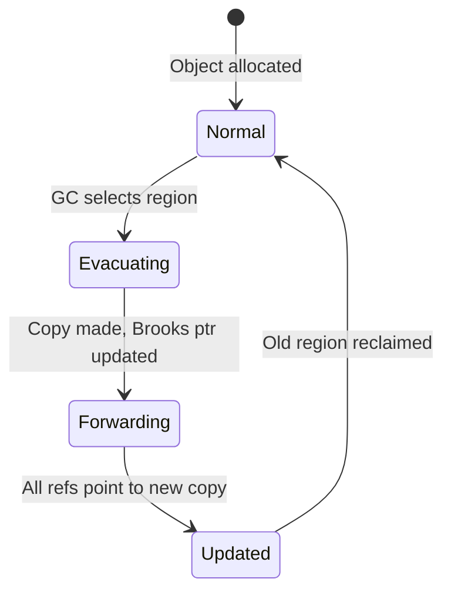
```mermaid
stateDiagram-v2
    [*] --> Normal: Object allocated
    Normal --> Evacuating: GC selects region
    Evacuating --> Forwarding: Copy made, Brooks ptr updated
    Forwarding --> Updated: All refs point to new copy
    Updated --> Normal: Old region reclaimed
```

---

### 🛠️ Worked Example

**BAD:**

```bash
# Shenandoah on JDK 8 (not available)
java -XX:+UseShenandoahGC -Xmx16g -jar app.jar
# Error: Unrecognized VM option 'UseShenandoahGC'
# Shenandoah requires JDK 12+ (OpenJDK/AdoptOpenJDK)
# Not available in Oracle JDK builds
```

Why it's wrong: Shenandoah has specific JDK distribution requirements. Not in Oracle JDK; available in Red Hat, AdoptOpenJDK, and OpenJDK builds from JDK 12+.

**GOOD:**

```bash
# Shenandoah on JDK 17+ OpenJDK
java -XX:+UseShenandoahGC -Xmx16g \
     -Xlog:gc*:file=gc.log:time,level,tags \
     -jar latency-service.jar
# Low-pause concurrent compaction
# No MaxGCPauseMillis needed (pauses are <10ms typically)
# Monitor: grep "Pause" gc.log
```

Why it's right: correct JDK version, simple configuration, monitoring in place.

**Production:**

```bash
# Compare Shenandoah vs G1 pause profiles
# Shenandoah GC log:
# GC(1) Pause Init Mark 0.5ms
# GC(1) Pause Final Mark 1.2ms
# GC(1) Pause Init Update Refs 0.1ms
# GC(1) Pause Final Update Refs 0.3ms
# All pauses < 2ms on 16GB heap

# G1GC equivalent workload:
# GC(1) Pause Young (Mixed) 85ms
# Much higher pause, but less total CPU spent on GC
```

---

### ⚖️ Trade-offs

**Gain:** Sub-10ms pauses (typically 1-5ms). Concurrent compaction without colored pointer tricks. Works with standard object layout (compatible with more tools).

**Cost:** Brooks pointer adds 8 bytes per object (significant memory overhead on small-object workloads). Read barrier overhead on every field access. Not available in Oracle JDK.

| Aspect           | Shenandoah            | ZGC                        | G1GC       |
| ---------------- | --------------------- | -------------------------- | ---------- |
| Pause            | 1-10ms                | <1ms                       | 50-200ms   |
| Object overhead  | +8 bytes (Brooks ptr) | None (metadata in pointer) | None       |
| JDK availability | OpenJDK only          | All JDK distributions      | All        |
| Barrier type     | Read + write          | Load only                  | Write only |

---

### ⚡ Decision Snap

**USE WHEN:**

- Need low pauses (<10ms) and running OpenJDK/Red Hat builds.
- ZGC is unavailable (older JDK, 32-bit constraint) but G1 pauses are too high.
- Application has large heaps with high live-object ratios where G1 evacuation pauses grow.

**AVOID WHEN:**

- Sub-millisecond pauses are required (ZGC is better).
- Memory footprint is critical (8 bytes/object overhead adds up).

**PREFER ZGC WHEN:**

- Running JDK 21+ where ZGC is generational and production-proven across all distributions.
- Object count is very high (millions) and the 8-byte overhead would be significant.

---

### ⚠️ Top Traps

| #   | Misconception                           | Reality                                                                                                                                                |
| --- | --------------------------------------- | ------------------------------------------------------------------------------------------------------------------------------------------------------ |
| 1   | "Shenandoah and ZGC are equivalent"     | Different mechanisms: Shenandoah uses forwarding pointers + read barriers; ZGC uses colored pointers + load barriers. Different CPU/memory trade-offs. |
| 2   | "Shenandoah is available everywhere"    | Not in Oracle JDK. Available in OpenJDK, Red Hat, Adoptium, Amazon Corretto.                                                                           |
| 3   | "Brooks pointer overhead is negligible" | At 8 bytes per object, a heap with 100M objects wastes ~800MB. For small-object-heavy apps this is significant.                                        |

---

### 🪜 Learning Ladder

**Prerequisites:**

- JVM-048 G1GC Internals - Regions, Marking, Mixed - understand G1's STW evacuation that Shenandoah eliminates
- JVM-049 ZGC Fundamentals - Sub-Millisecond Pauses - compare colored pointer approach vs Brooks pointers

**THIS:** JVM-050 Shenandoah GC - Concurrent Compaction

**Next steps:**

- JVM-067 Choosing ZGC vs G1GC vs Shenandoah - systematic decision framework
- JVM-074 Testing GC Behavior Under Load - how to validate your collector choice under realistic conditions

---

### 💡 The Surprising Truth

Shenandoah's "passive" mode (`-XX:ShenandoahGCMode=passive`) disables concurrent phases entirely and behaves like a copying collector with STW pauses - useful as a baseline for benchmarking. In contrast, its "compact" heuristic (`-XX:ShenandoahGCHeuristics=compact`) aggressively compacts the heap continuously. These modes let you tune Shenandoah along the entire spectrum from "maximum throughput, higher pauses" to "maximum compaction, continuous CPU usage" - flexibility that neither G1 nor ZGC offer.

---

### 📇 Revision Card

1. Shenandoah = concurrent compaction via Brooks forwarding pointers (8 bytes/object overhead, read + write barriers).
2. Pauses are 1-10ms for root scanning only - all heavy lifting (marking, evacuation, reference update) is concurrent.
3. OpenJDK only (not Oracle JDK). On JDK 21+ with all distros available, ZGC is usually the simpler choice.

---

---

# JVM-051 GC Log Analysis - Reading and Interpreting

**TL;DR** - GC logs reveal pause durations, collection frequency, promotion rates, and heap pressure trends - the primary data source for GC tuning decisions.

---

### 🔥 The Problem in One Paragraph

A service exhibits periodic latency spikes every 90 seconds. The team suspects GC but has no evidence. Without GC logging enabled, they cannot distinguish between GC pauses and application-level issues (database timeouts, lock contention). Even with logs enabled, the team cannot read them: lines like `[gc,start] GC(42) Pause Young (Normal) (G1 Evacuation Pause)` mean nothing without understanding the schema. GC logs are the cheapest, always-on diagnostic for JVM performance - but only if you can interpret them. This is exactly why GC Log Analysis - Reading and Interpreting was created.

---

### 📘 Textbook Definition

**GC logs** are structured text output generated by the JVM describing every garbage collection event: type (young, mixed, full), cause (allocation failure, System.gc(), IHOP threshold), duration (STW pause time), and memory state (before/after sizes for each generation). In JDK 9+, GC logging uses the Unified Logging framework (`-Xlog:gc*`) replacing the fragmented legacy flags (`-XX:+PrintGCDetails`, `-XX:+PrintGCTimeStamps`).

---

### 🧠 Mental Model

> GC logs are the flight data recorder for your JVM. Just as a black box records altitude, speed, and engine state continuously, GC logs record heap level, pause duration, and collection type for every GC event. After a crash (latency spike, OOM), you replay the log to find exactly when things went wrong and why.

- "Flight data recorder" -> GC log file (continuous, low-overhead)
- "Altitude" -> heap used (rising = allocating, dropping = collected)
- "Engine events" -> GC pauses (type, duration, cause)
- "Replay after crash" -> post-incident analysis with timestamps

**Where this analogy breaks down:** Unlike a flight recorder that is read only after a crash, GC logs should be analyzed continuously (automated monitoring) to detect degradation before it causes incidents.

---

### ⚙️ How It Works

1. **Enable logging:** `-Xlog:gc*:file=gc.log:time,level,tags` captures all GC events with timestamps.
2. **Log rotation:** `-Xlog:gc*:file=gc.log:time:filecount=5,filesize=100m` rotates at 100MB, keeps 5 files.
3. **Key log fields:** timestamp, GC event number, type (Young/Mixed/Full), cause, pause time, heap before -> after (generation breakdown).
4. **Read sequence:** Focus on pause durations first (p99), then frequency, then heap trends (is "after" growing over time = leak?).
5. **Automated parsing:** Tools like GCViewer, GCEasy, or custom awk scripts extract metrics from raw logs.

```text
Sample G1GC log line (JDK 17 unified logging):

[2024-01-15T10:23:45.123+0000][info][gc] GC(142)
  Pause Young (Normal) (G1 Evacuation Pause)
  2048M->1024M(4096M) 45.678ms

Breakdown:
  GC(142)         -> event number (sequential)
  Pause Young     -> type (Young collection)
  (Normal)        -> cause (allocation, not System.gc)
  2048M->1024M    -> heap: before -> after
  (4096M)         -> total heap capacity
  45.678ms        -> STW pause duration
```

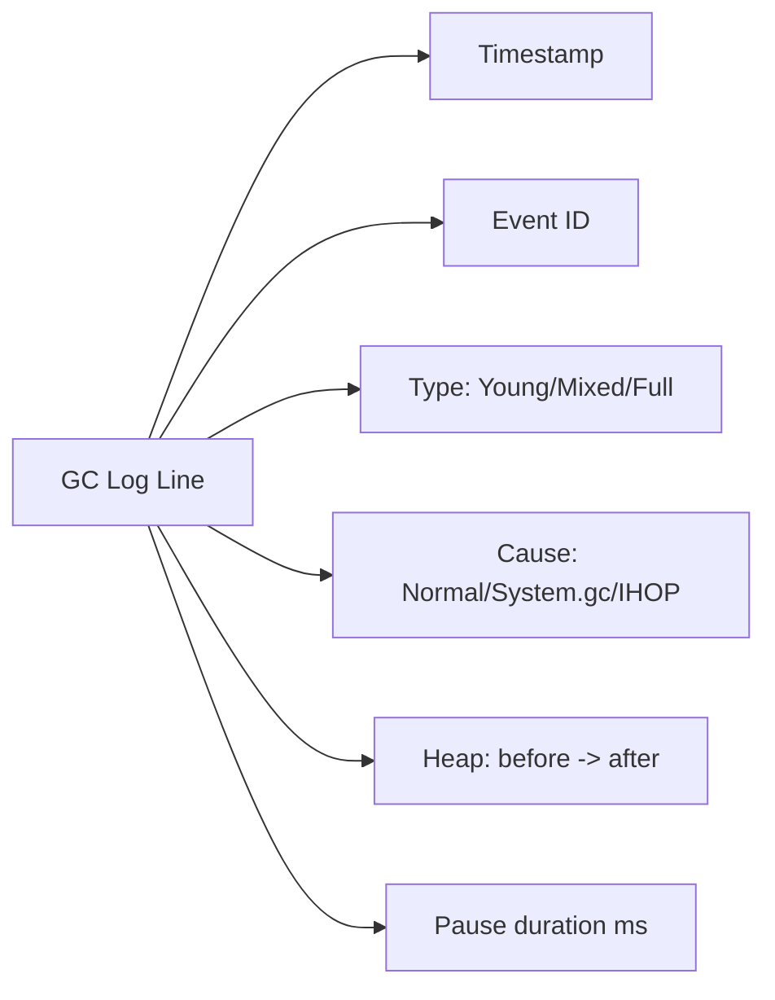
```mermaid
flowchart LR
    A[GC Log Line] --> B[Timestamp]
    A --> C[Event ID]
    A --> D[Type: Young/Mixed/Full]
    A --> E[Cause: Normal/System.gc/IHOP]
    A --> F[Heap: before -> after]
    A --> G[Pause duration ms]
```

---

### 🛠️ Worked Example

**BAD:**

```bash
# No GC logging in production
java -Xmx4g -jar service.jar
# Latency spike at 3 AM. No evidence.
# "Was it GC?" - nobody knows.
# Must reproduce the issue to diagnose it.
```

Why it's wrong: without GC logs, GC pauses are invisible. You lose forensic evidence of every incident.

**GOOD:**

```bash
# Always-on GC logging with rotation (negligible overhead)
java -Xmx4g \
  -Xlog:gc*:file=/var/log/app/gc.log:time,level,tags\
  :filecount=5,filesize=100m \
  -jar service.jar

# Post-incident analysis:
# 1. Find pauses > 100ms
grep "Pause" gc.log | awk -F'ms' '{print $1}' | \
  awk '{if ($NF > 100) print}'
# 2. Check if heap "after" is growing over time (leak)
grep "Pause Young" gc.log | \
  awk -F'->' '{print $2}' | awk -F'(' '{print $1}'
```

Why it's right: always-on, rotated, parseable. Zero overhead in practice (<1% CPU). Forensic evidence always available.

**Production:**

```bash
# Extract GC pause distribution
grep -oP '\d+\.\d+ms' gc.log | sort -n | \
  awk '{a[NR]=$1} END{
    print "count:", NR;
    print "p50:", a[int(NR*0.5)];
    print "p99:", a[int(NR*0.99)];
    print "max:", a[NR]}'
# count: 4821
# p50: 12.3ms
# p99: 89.7ms
# max: 245.1ms  <- investigate this event
```

---

### ⚖️ Trade-offs

**Gain:** Zero-cost forensic data for every GC event. Enables post-incident diagnosis without reproduction. Trend analysis reveals slow degradation weeks before it becomes critical.

**Cost:** Disk space (mitigated by rotation). Requires parsing knowledge or tooling. Raw logs are verbose - need extraction for dashboards.

| Aspect    | GC logs                      | JFR GC events            | Prometheus metrics    |
| --------- | ---------------------------- | ------------------------ | --------------------- |
| Overhead  | Negligible (<0.1%)           | Low (1-3%)               | Low (scrape interval) |
| Detail    | Every event, full context    | Every event + allocation | Aggregated (p50/p99)  |
| Retention | File rotation (configurable) | Recording files          | TSDB (weeks/months)   |
| Analysis  | grep/awk or GCViewer         | JDK Mission Control      | Grafana dashboards    |

---

### ⚡ Decision Snap

**USE WHEN:**

- Always. GC logging should be enabled in every JVM process (dev, staging, production). No exceptions.
- Post-incident diagnosis when you need exact event-level detail.
- Tuning: before changing any GC flag, analyze current log to establish baseline.

**AVOID WHEN:**

- Never avoid. The overhead is negligible. There is no valid reason to disable GC logging.

**PREFER JFR WHEN:**

- Need allocation profiling (which code paths allocate the most).
- Need correlated view with CPU, locks, I/O alongside GC events.

---

### ⚠️ Top Traps

| #   | Misconception                               | Reality                                                                                                             |
| --- | ------------------------------------------- | ------------------------------------------------------------------------------------------------------------------- |
| 1   | "GC logging has significant overhead"       | Measured at <0.1% CPU. The JVM writes log entries during the pause itself - no additional pause cost.               |
| 2   | "I can analyze GC from application metrics" | App metrics show latency symptoms but not GC causes. Only GC logs show event type, cause, and generation breakdown. |
| 3   | "Legacy -XX:+PrintGCDetails still works"    | Removed in JDK 17+. Use -Xlog:gc\* (Unified Logging). Legacy flags produce warnings or errors on modern JDKs.       |

---

### 🪜 Learning Ladder

**Prerequisites:**

- JVM-027 Minor GC vs Major GC vs Full GC - understand what events you are reading in the log
- JVM-026 Heap Structure - Young, Old, and Metaspace - understand the generation sizes reported

**THIS:** JVM-051 GC Log Analysis - Reading and Interpreting

**Next steps:**

- JVM-061 GC Tuning Methodology - Measure First - systematic methodology that starts from GC log data
- JVM-066 GC Pause Budget - SLA-Driven Tuning - translating log metrics into tuning decisions

---

### 💡 The Surprising Truth

The `(System.gc())` cause in GC logs often reveals hidden Full GCs triggered by libraries (RMI, NIO direct buffer cleanup) calling `System.gc()` behind your back. A service with `-XX:+DisableExplicitGC` might silently fail to reclaim direct ByteBuffers, leading to native OOM. The GC log is the only way to see how many of your GCs are library-triggered vs allocation-triggered - and the fix depends on which it is.

Another non-obvious insight: the "To-space exhausted" tag in G1 logs indicates evacuation failure - the collector ran out of free regions during young GC. This triggers a Full GC on the next cycle. The log shows this coming multiple cycles before the actual Full GC: survivor regions are filling up, and the "used after" value creeps toward "committed." Watching this trend lets you react before the expensive Full GC hits. Most engineers only notice after the Full GC pause appears.

---

### 📇 Revision Card

1. Enable always: `-Xlog:gc*:file=gc.log:time,level,tags:filecount=5,filesize=100m`. No exceptions, no environments skipped.
2. Read sequence: pause p99 first, then frequency, then heap-after trend. Rising heap-after = leak.
3. `(System.gc())` cause in logs = library calling System.gc(). Investigate before blindly disabling with -XX:+DisableExplicitGC.

---

---

# JVM-052 JIT Compilation Tiers (C1 and C2)

**TL;DR** - The JVM uses tiered compilation: C1 compiles quickly for fast warmup, C2 compiles aggressively for peak throughput - both run transparently at runtime.

---

### 🔥 The Problem in One Paragraph

A microservice cold-starts in Kubernetes and handles traffic immediately. For the first 30 seconds, latency is 5x higher than steady-state. The JVM is interpreting bytecode (slow) and gradually compiling hot methods. If only C2 were used, compilation takes too long and the warmup period extends to minutes. If only C1 were used, peak performance would never reach C2 levels (C2 applies 10-100x more optimizations). Tiered compilation solves both problems by using C1 for quick initial compilation and C2 for peak optimization of truly hot methods. This is exactly why JIT Compilation Tiers (C1 and C2) was created.

---

### 📘 Textbook Definition

**Tiered compilation** is the HotSpot JVM's strategy of using two just-in-time compilers progressively. **C1 (Client compiler)** produces moderately optimized native code quickly, with profiling instrumentation to identify hot methods. **C2 (Server compiler)** produces highly optimized native code using advanced techniques (loop unrolling, vectorization, escape analysis) but takes longer to compile. Methods progress through tiers: interpreted -> C1-compiled (with profiling) -> C2-compiled (peak performance). This balances warmup speed against steady-state throughput.

---

### 🧠 Mental Model

> Tiered compilation is like a restaurant kitchen with two chefs. Chef C1 (fast-food cook) plates a decent meal in 30 seconds - good enough for the rush. Chef C2 (Michelin chef) needs 5 minutes but produces a masterpiece. When customers first arrive (cold start), C1 serves everyone quickly. As specific dishes become popular (hot methods), C2 takes over those dishes for maximum quality. The customers (threads) never wait - they always get something from whichever chef is ready.

- "Fast-food cook" -> C1 compiler (fast, moderate quality)
- "Michelin chef" -> C2 compiler (slow, peak optimization)
- "Popular dishes" -> hot methods (high invocation count)
- "Customers never wait" -> interpreter runs while compilation happens in background

**Where this analogy breaks down:** Unlike a kitchen where you get one serving, the JVM seamlessly replaces C1-compiled code with C2-compiled code at the next method entry - the caller never sees the swap.

---

### ⚙️ How It Works

1. **Level 0 (Interpreter):** All methods start interpreted. The interpreter collects basic invocation counts.
2. **Level 1-3 (C1):** When invocation count crosses threshold (~2000), C1 compiles the method. Level 1 = simple compile. Level 2 = compile with limited profiling. Level 3 = compile with full profiling counters.
3. **Level 4 (C2):** When profiling data shows method is hot enough (~10000 invocations), C2 recompiles with aggressive optimizations.
4. **Deoptimization:** If C2's speculative optimizations become invalid (e.g., assumed type changes), the JVM deoptimizes back to interpreter or C1, then reprofiles.
5. **Compilation queue:** Compiler threads (default: cores/4 for C2) process methods in priority order. Under load, the queue can back up during warmup.

```text
Compilation Tiers:
  Level 0: Interpreter     (all methods start here)
  Level 1: C1 simple       (no profiling, rare)
  Level 2: C1 limited prof (invocations counted)
  Level 3: C1 full prof    (branch + type profiling)
  Level 4: C2 optimized    (peak performance)

Typical progression:
  Method foo(): L0 -> L3 -> L4
  (interpret -> C1 with profiling -> C2 optimized)

Deoptimization:
  L4 -> L0 (assumption broken -> re-interpret)
  L0 -> L3 -> L4 (reprofile -> recompile)
```

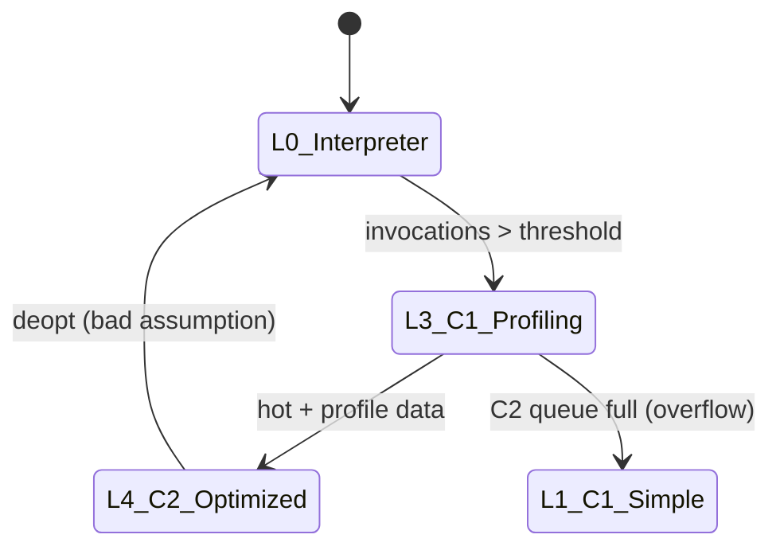
```mermaid
stateDiagram-v2
    [*] --> L0_Interpreter
    L0_Interpreter --> L3_C1_Profiling: invocations > threshold
    L3_C1_Profiling --> L4_C2_Optimized: hot + profile data
    L4_C2_Optimized --> L0_Interpreter: deopt (bad assumption)
    L3_C1_Profiling --> L1_C1_Simple: C2 queue full (overflow)
```

---

### 🛠️ Worked Example

**BAD:**

```bash
# Disabling tiered compilation for "simplicity"
java -XX:-TieredCompilation -Xmx4g -jar service.jar
# Only C2 compiles. No C1 warmup.
# Methods stay interpreted until C2 threshold (~10K calls)
# Cold-start latency 5-10x worse for first minute
# C2 queue overwhelmed at startup -> long warmup tail
```

Why it's wrong: disabling tiered compilation means no C1 fast-path. Everything stays interpreted until C2 is ready, creating terrible warmup behavior.

**GOOD:**

```bash
# Default tiered compilation (best for most workloads)
java -XX:+TieredCompilation -Xmx4g \
     -XX:+PrintCompilation \
     -jar service.jar
# C1 compiles at ~2K invocations (fast warmup)
# C2 compiles at ~10K invocations (peak perf)
# PrintCompilation shows compilation activity:
# 142  3  java.util.HashMap::get (23 bytes)
#  ^   ^  -> Level 3 C1 compilation of HashMap.get
```

Why it's right: default tiered gives best balance of warmup speed and peak performance.

**Production:**

```bash
# Monitor compilation activity during warmup
jcmd <pid> Compiler.queue
# Shows methods waiting for compilation
# Large queue at startup = normal (warmup)
# Large queue at steady-state = problem
#   (too many deoptimizations or code cache full)

# Check code cache usage
jcmd <pid> Compiler.codecache
# CodeCache: size=245760Kb used=42380Kb max_used=42380Kb
# If used approaches size -> compilations stop!
# Increase with: -XX:ReservedCodeCacheSize=512m
```

---

### ⚖️ Trade-offs

**Gain:** Fast warmup (C1 provides immediate performance boost within seconds). Peak throughput (C2 achieves maximum optimization for hot methods). Automatic - no manual intervention required.

**Cost:** Warmup period exists (10-60 seconds depending on application complexity). Code cache memory consumption (C1 + C2 compiled code for same method during transition). Deoptimization causes brief regression.

| Aspect    | Tiered (C1+C2)        | C2 only                | AOT (GraalVM native) |
| --------- | --------------------- | ---------------------- | -------------------- |
| Warmup    | 5-30 seconds          | 30-120 seconds         | None (pre-compiled)  |
| Peak perf | Maximum               | Maximum                | 80-95% of C2         |
| Memory    | Code cache for both   | Less code cache        | Fixed at build time  |
| Adaptive  | Yes (profiles + opts) | Yes (but slower start) | No (static)          |

---

### ⚡ Decision Snap

**USE WHEN:**

- Always (default since JDK 8). Tiered compilation is the correct default for all long-running services.
- Cold-start matters (containers, serverless) but peak performance is also required.
- You want the JVM to self-optimize based on actual runtime behavior.

**AVOID WHEN:**

- Never disable tiered for production services. The only exception: short-lived CLI tools where compilation overhead exceeds execution time (use `-XX:TieredStopAtLevel=1` to skip C2).

**PREFER AOT (GraalVM native-image) WHEN:**

- Sub-second startup is mandatory (serverless, CLI tools).
- Willing to sacrifice 5-20% peak throughput for instant readiness.

---

### ⚠️ Top Traps

| #   | Misconception                          | Reality                                                                                                                                              |
| --- | -------------------------------------- | ---------------------------------------------------------------------------------------------------------------------------------------------------- |
| 1   | "JIT compilation is slow and wasteful" | C2 optimization of hot methods yields 2-10x speedup over interpretation. The compilation cost pays for itself within seconds.                        |
| 2   | "Code cache size does not matter"      | If code cache fills up, the JVM stops compiling. Performance degrades silently. Monitor and size appropriately.                                      |
| 3   | "Deoptimization means C2 failed"       | Deoptimization is the JVM self-correcting. It removes invalid speculative optimizations and recompiles with better data. It is adaptive, not broken. |

---

### 🪜 Learning Ladder

**Prerequisites:**

- JVM-012 Bytecode and the Execution Engine - understand what the JIT compiler's input (bytecode) looks like
- JVM-004 How Java Code Becomes Bytecode (.java -> .class) - understand the compile pipeline

**THIS:** JVM-052 JIT Compilation Tiers (C1 and C2)

**Next steps:**

- JVM-053 Inlining and Escape Analysis - the most impactful C2 optimizations
- JVM-054 On-Stack Replacement (OSR) - how the JVM replaces running interpreted loops with compiled code

---

### 💡 The Surprising Truth

The JVM can deoptimize and recompile a method hundreds of times during the lifetime of a long-running application - and this is normal, not pathological. A method that handles different input types at different hours (String in batch mode, Integer in real-time mode) triggers deoptimization on type change. The JVM adapts by compiling a less-specialized version that handles both. This "compilation churn" is invisible unless you watch `-XX:+PrintCompilation` output - but it explains why JVM peak performance improves over hours, not just minutes.

---

### 📇 Revision Card

1. C1 = fast compile for warmup (Level 3). C2 = aggressive optimization for peak (Level 4). Both automatic.
2. Monitor code cache: `jcmd <pid> Compiler.codecache`. If full, compilations stop silently and performance degrades.
3. Deoptimization is self-correction, not failure. The JVM adapts to changing runtime conditions by recompiling with better profile data.

---

---

# JVM-053 Inlining and Escape Analysis

**TL;DR** - Inlining eliminates method call overhead by copying callee code into the caller; escape analysis eliminates heap allocation by proving objects do not escape the method.

---

### 🔥 The Problem in One Paragraph

A tight loop creates a Point(x, y) object every iteration to pass coordinates between methods. With 10 million iterations/second, that is 10M object allocations, 10M GC-tracked references, and constant GC pressure - all for temporary coordinate pairs that die immediately after use. Inlining first merges the called method's body into the caller, eliminating the call overhead. Then escape analysis sees that the Point never escapes the compiled method boundary and eliminates the heap allocation entirely - the fields become CPU registers. This transforms "10M allocations/sec" into "zero allocations." This is exactly why Inlining and Escape Analysis was created.

---

### 📘 Textbook Definition

**Inlining** is a JIT compiler optimization that replaces a method call with the body of the called method, eliminating call overhead (stack frame creation, parameter passing, return). **Escape analysis** is a compiler analysis that determines whether an object's reference escapes the scope in which it was created. If an object does not escape (is method-local), the JVM can: (a) allocate it on the stack instead of the heap (scalar replacement), (b) eliminate synchronization on it, or (c) eliminate the allocation entirely by promoting fields to local variables/registers.

---

### 🧠 Mental Model

> Inlining is like a manager (caller method) who stops sending memos to an assistant (callee) and instead does the work themselves - eliminating the mail round-trip. Escape analysis is like noticing that a sticky note (object) never leaves the manager's desk - so instead of filing it in the global cabinet (heap), it stays on the desk (stack/register) and is discarded when the manager stands up (method returns).

- "Stop sending memos" -> inline callee body into caller
- "Sticky note on desk" -> object that does not escape
- "Global filing cabinet" -> heap (GC-managed)
- "Stays on desk" -> scalar replacement (stack/registers)

**Where this analogy breaks down:** Inlining is not just about speed - it ENABLES escape analysis. The sticky note optimization (escape analysis) is only possible after the memo exchange was eliminated (inlining). They are synergistic, not independent.

---

### ⚙️ How It Works

1. **Inlining decision:** C2 checks: is the callee small enough (bytecode size <= 35 bytes default)? Is the call site monomorphic (single target class)? If yes: inline.
2. **Inlining cascade:** After inlining, the merged code may contain NEW call sites eligible for inlining. C2 inlines recursively up to depth/size limits.
3. **Escape analysis:** After inlining exposes the full method body, C2 analyzes: does any reference to an allocated object leave the compiled code boundary? (Return value, stored in field, passed to non-inlined method = ESCAPES.)
4. **Scalar replacement:** If object does not escape, replace `new Point(x, y)` with two local variables `x` and `y`. No allocation, no GC, no object header overhead.
5. **Lock elision:** If a synchronized object does not escape, the lock is eliminated (no other thread can access it).

```text
Before inlining + escape analysis:
  void hot() {
    Point p = new Point(x, y);  // HEAP alloc
    double d = distance(p);      // METHOD CALL
    return d;
  }

After inlining (distance body merged):
  void hot() {
    Point p = new Point(x, y);   // HEAP alloc
    double d = sqrt(p.x*p.x + p.y*p.y); // inlined
    return d;
  }

After escape analysis (p doesn't escape):
  void hot() {
    // Point p eliminated (scalar replacement)
    double d = sqrt(x*x + y*y);  // registers only
    return d;                     // ZERO allocation
  }
```

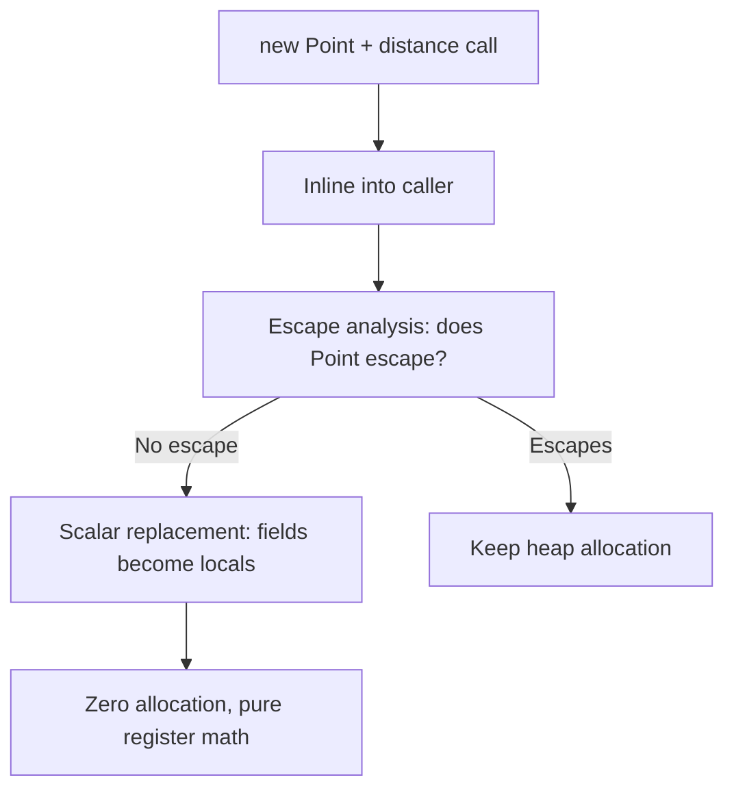
```mermaid
flowchart TD
    A[new Point + distance call] --> B[Inline into caller]
    B --> C[Escape analysis: does Point escape?]
    C -->|No escape| D[Scalar replacement: fields become locals]
    C -->|Escapes| E[Keep heap allocation]
    D --> F[Zero allocation, pure register math]
```

---

### 🛠️ Worked Example

**BAD:**

```java
// Defeats inlining: megamorphic call site
interface Shape { double area(); }
// 5+ implementations loaded -> megamorphic
// JIT cannot inline: does not know which area() to copy
Shape s = getShape(); // could be Circle, Square, Triangle...
double a = s.area();  // virtual dispatch, NO inlining
// No inlining -> no escape analysis -> no scalar replacement
```

Why it's wrong: megamorphic call sites (>2 receiver types) prevent inlining, which blocks all downstream optimizations.

**GOOD:**

```java
// Monomorphic call site: JIT knows the exact type
record Point(double x, double y) {}
double distance(Point p) {
    return Math.sqrt(p.x() * p.x() + p.y() * p.y());
}
// After warmup: distance() is inlined, Point is
// scalar-replaced -> zero allocation per call
// Verify: -XX:+PrintEscapeAnalysis (diagnostic)
```

Why it's right: monomorphic call + small method = guaranteed inlining. Non-escaping record = scalar replacement. Zero GC pressure.

**Production:**

```bash
# Verify inlining decisions
java -XX:+UnlockDiagnosticVMOptions \
     -XX:+PrintInlining -jar app.jar 2>&1 | head -50
# @ 3  java.util.ArrayList::get (11 bytes) inline (hot)
# @ 7  com.app.Service::compute (42 bytes) inline (hot)
# @ 12 com.app.Plugin::process (350 bytes) too big
# "too big" = method exceeds MaxInlineSize (35 bytes)
#   or FreqInlineSize (325 bytes for hot methods)
```

---

### ⚖️ Trade-offs

**Gain:** Eliminates allocation (zero GC pressure for non-escaping objects). Eliminates call overhead (no stack frame, no virtual dispatch). Can yield 2-10x performance improvement in allocation-heavy tight loops.

**Cost:** Requires warmup (C2 with profiling). Code size increases (inlined code duplicated at every call site). Large methods cannot be inlined (default limit: 35 bytes cold, 325 bytes hot). Megamorphic sites defeat inlining.

| Aspect           | With inlining + EA         | Without (interpreter)     |
| ---------------- | -------------------------- | ------------------------- |
| Allocations      | Zero (scalar replaced)     | 1 per call                |
| Call overhead    | Zero (merged code)         | Stack frame + dispatch    |
| GC pressure      | None                       | Proportional to call rate |
| Code cache usage | Higher (duplicated bodies) | Lower                     |

---

### ⚡ Decision Snap

**USE WHEN:**

- Writing allocation-heavy hot paths (stream pipelines, numeric computation, coordinate/vector operations).
- Designing APIs: prefer small, focused methods that the JIT can inline (keep hot methods under 35 bytes bytecode).
- Trusting the JVM: do NOT manually "optimize" by avoiding object creation - let escape analysis handle it.

**AVOID WHEN:**

- Premature optimization: do not restructure code for inlining before profiling shows it matters.
- Forcing inlining of large methods (JVM has limits for good reason - code bloat degrades instruction cache).

**PREFER manual optimization WHEN:**

- JVM cannot see non-escape (object stored in a collection or passed to a framework method that is not inlined).
- Verified via `-XX:+PrintEscapeAnalysis` that the object escapes and allocation rate is a measured bottleneck.

---

### ⚠️ Top Traps

| #   | Misconception                            | Reality                                                                                                                                         |
| --- | ---------------------------------------- | ----------------------------------------------------------------------------------------------------------------------------------------------- |
| 1   | "Avoid creating objects for performance" | If the object does not escape, the JVM eliminates it entirely. Premature object avoidance reduces readability for zero gain.                    |
| 2   | "All method calls are expensive"         | Inlined methods have zero call overhead. Most hot-path calls in optimized code are inlined.                                                     |
| 3   | "Escape analysis works on all objects"   | Arrays larger than 64 elements, objects stored in fields or collections, and objects passed to non-inlined methods ALL escape. EA is not magic. |

---

### 🪜 Learning Ladder

**Prerequisites:**

- JVM-052 JIT Compilation Tiers (C1 and C2) - understand when and how C2 optimizations fire
- JVM-056 TLAB - Thread-Local Allocation Buffers - understand allocation fast-path that EA eliminates

**THIS:** JVM-053 Inlining and Escape Analysis

**Next steps:**

- JVM-054 On-Stack Replacement (OSR) - how running loops get optimized mid-execution
- JVM-074 Testing GC Behavior Under Load - verify EA effectiveness by measuring allocation rate

---

### 💡 The Surprising Truth

Java's `Stream.map().filter().collect()` pipeline creates multiple iterator and lambda objects per invocation - yet on hot paths, escape analysis eliminates ALL of them. The objects never escape the compiled pipeline method. This means idiomatic Stream code has ZERO allocation overhead after warmup on monomorphic streams. The common advice "avoid Streams in hot loops" is outdated for JDK 11+ with proper warmup - but only for monomorphic (single-type) streams. Megamorphic stream pipelines (mixing types) still defeat inlining and allocate.

---

### 📇 Revision Card

1. Inlining enables escape analysis. Without inlining, escape analysis cannot see the full picture. Keep hot methods small (<35 bytes bytecode).
2. Non-escaping objects are eliminated entirely (scalar replacement). Zero allocation, zero GC. Trust the JVM - do not avoid objects prematurely.
3. Defeat conditions: megamorphic call sites (>2 types), large methods (>325 bytes hot), arrays >64 elements, objects stored in collections.

---

---

# JVM-054 On-Stack Replacement (OSR)

**TL;DR** - OSR allows the JVM to replace an interpreted loop mid-execution with compiled native code without waiting for the method to be re-entered.

---

### 🔥 The Problem in One Paragraph

A method contains a loop that iterates 10 million times. The method is called once (so its invocation count never reaches the compilation threshold). Without OSR, the loop runs entirely in the interpreter - 100x slower than compiled code - because normal JIT compilation only kicks in on the NEXT method entry. OSR solves this by detecting hot loops (via back-edge counters) and compiling the loop body mid-flight, replacing the executing interpreted frame with a compiled frame without restarting the method. This is exactly why On-Stack Replacement (OSR) was created.

---

### 📘 Textbook Definition

**On-Stack Replacement (OSR)** is a JVM technique that replaces a currently executing interpreted method frame on the call stack with a compiled (JIT-optimized) version at a loop back-edge. The JVM transfers local variable state from the interpreter frame to the compiled frame, then resumes execution in native code at the loop iteration point. OSR is triggered when a loop's back-edge counter exceeds a threshold, indicating the loop is hot even though the enclosing method may have been called only once.

---

### 🧠 Mental Model

> OSR is like swapping a bicycle's wheels for jet engines while you are riding - without stopping. The rider (execution thread) is pedaling (interpreting). The JVM notices you have been pedaling for hours (hot loop back-edge counter). It compiles jet-engine wheels (native code), carefully swaps them underneath you (replaces stack frame), and you accelerate instantly (compiled speed) without dismounting (no method restart).

- "Pedaling" -> interpreting the loop body
- "Back-edge counter" -> counting how many loop iterations
- "Swap wheels" -> replace interpreter frame with compiled frame
- "Without dismounting" -> no need to re-enter the method

**Where this analogy breaks down:** The "swap" has a brief stall (safepoint + frame construction), and OSR-compiled code is sometimes less optimal than normally compiled code because the compiler has fewer optimization opportunities when entering mid-method.

---

### ⚙️ How It Works

1. **Back-edge counting:** Every loop back-edge (branch that jumps backward) increments a counter in the interpreter.
2. **Threshold reached:** When counter exceeds OSR threshold (derived from CompileThreshold, typically ~10K back-edges), the JVM requests OSR compilation.
3. **OSR compilation:** C1 or C2 compiles the method with a special entry point at the loop header (not the method start).
4. **Frame transfer:** At the next safepoint (back-edge is a safepoint), the JVM constructs a compiled frame, copies local variable state from the interpreter frame, and resumes in compiled code.
5. **Execution continues:** The loop now runs at compiled speed for remaining iterations.
6. **Normal recompilation:** If the method is later called again, a normal (non-OSR) compilation occurs with full optimizations.

```text
Without OSR:
  method() called once -> interpret 10M iterations -> slow
  method() called again -> compiled now -> fast (too late)

With OSR:
  method() called once -> interpret 5K iterations
    -> back-edge counter hits threshold
    -> OSR compile at loop header
    -> remaining 9.995M iterations run compiled -> fast
```

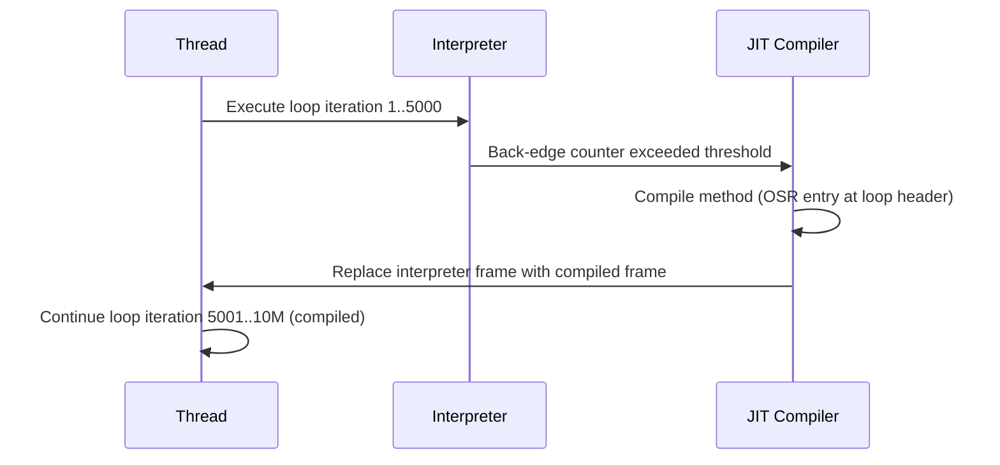
```mermaid
sequenceDiagram
    participant T as Thread
    participant I as Interpreter
    participant C as JIT Compiler
    T->>I: Execute loop iteration 1..5000
    I->>C: Back-edge counter exceeded threshold
    C->>C: Compile method (OSR entry at loop header)
    C->>T: Replace interpreter frame with compiled frame
    T->>T: Continue loop iteration 5001..10M (compiled)
```

---

### 🛠️ Worked Example

**BAD:**

```java
// Long-running single-invocation method without OSR awareness
public static void main(String[] args) {
    // Disabling tiered makes OSR less effective
    // -XX:-TieredCompilation -XX:CompileThreshold=100000
    long sum = 0;
    for (int i = 0; i < 1_000_000_000; i++) {
        sum += compute(i);  // interpreted for ALL iterations
    }
    // Takes 10 minutes in interpreter
}
```

Why it's wrong: very high compile threshold + disabled tiering means OSR triggers too late (or not at all). Billion iterations mostly interpreted.

**GOOD:**

```java
// Default JVM settings: OSR triggers at ~10K back-edges
public static void main(String[] args) {
    long sum = 0;
    for (int i = 0; i < 1_000_000_000; i++) {
        sum += compute(i);
        // After ~10K iterations: OSR compiles this loop
        // Remaining 999,990,000 run at compiled speed
    }
    // Takes 10 seconds compiled (vs 10 min interpreted)
}
// Verify: -XX:+PrintCompilation shows "%" for OSR compiles
// 2154 % 4 Main::main @ 5 (32 bytes)
//  ^    ^  -> "%" = OSR compilation, @ 5 = bytecode offset
```

Why it's right: default settings allow OSR to trigger early. The `%` marker in PrintCompilation confirms OSR compilation.

**Production:**

```bash
# Identify OSR compilations vs normal
java -XX:+PrintCompilation -jar app.jar 2>&1 | grep "%"
# % marker = OSR compilation
# Many OSR compiles suggest methods called infrequently
# but containing hot loops. This is normal for:
# - Batch processing jobs (single main loop)
# - Startup initialization (one-time large iterations)
# - Benchmark harnesses (warming up in single call)
```

---

### ⚖️ Trade-offs

**Gain:** Hot loops get compiled without waiting for method re-entry. Critical for single-invocation methods with long-running loops (main methods, batch jobs, benchmarks).

**Cost:** OSR-compiled code is often less optimized than normally-compiled code (partial method view, constrained entry point). Frame transfer has a one-time cost. May compile code that will not be hot in steady state.

| Aspect             | OSR compilation            | Normal compilation        |
| ------------------ | -------------------------- | ------------------------- |
| Trigger            | Back-edge counter          | Invocation counter        |
| Entry point        | Loop header (mid-method)   | Method start              |
| Optimization scope | Limited (partial view)     | Full method               |
| Use case           | Infrequent call + hot loop | Frequently called methods |

---

### ⚡ Decision Snap

**USE WHEN:**

- Writing batch/ETL applications where main() has a single massive loop.
- Micro-benchmarking (JMH uses OSR awareness to ensure measurements reflect compiled code).
- Understanding startup behavior of applications with initialization loops.

**AVOID WHEN:**

- Trying to rely on OSR for steady-state performance - normal compilation is always better optimized.
- Disabling tiered compilation without understanding it breaks OSR timing.

**PREFER normal compilation WHEN:**

- Possible: restructure code so hot loops are in frequently-called methods (not single-invocation main).
- JMH `@Warmup` iterations ensure normal compilation triggers before measurement.

---

### ⚠️ Top Traps

| #   | Misconception                                  | Reality                                                                                                                                                                 |
| --- | ---------------------------------------------- | ----------------------------------------------------------------------------------------------------------------------------------------------------------------------- |
| 1   | "OSR and normal compilation produce same code" | OSR entry at a loop header limits optimization scope. Normal compilation from method start allows full optimization (better inlining, better escape analysis).          |
| 2   | "I do not need to understand OSR"              | If you write benchmarks or batch jobs, OSR directly affects whether you measure interpreted or compiled performance. JMH manages this - manual benchmarks often do not. |
| 3   | "High CompileThreshold helps stability"        | It delays both normal compilation AND OSR, making warmup longer without stability benefit. Default thresholds are well-tuned.                                           |

---

### 🪜 Learning Ladder

**Prerequisites:**

- JVM-052 JIT Compilation Tiers (C1 and C2) - understand the normal compilation path that OSR supplements
- JVM-055 Safepoints - What Stops the World - loop back-edges are safepoints where OSR frame transfer occurs

**THIS:** JVM-054 On-Stack Replacement (OSR)

**Next steps:**

- JVM-053 Inlining and Escape Analysis - optimizations that fire after OSR compilation (more limited in OSR scope)
- JVM-074 Testing GC Behavior Under Load - ensure benchmarks measure compiled (not interpreted) performance

---

### 💡 The Surprising Truth

JMH (Java Microbenchmark Harness) uses `@Warmup` iterations specifically to trigger NORMAL compilation (not OSR) before measurement. OSR-compiled code is measurably slower than normally-compiled code for the same method because C2 has less optimization context. If you benchmark a tight loop without proper warmup framework, you might measure OSR-compiled performance (5-20% slower than peak) and report it as the application's true speed. This is one of the most common micro-benchmarking errors.

---

### 📇 Revision Card

1. OSR compiles hot loops mid-execution (back-edge trigger). Look for `%` in PrintCompilation output.
2. OSR code is less optimized than normal compilation. For benchmarks, use JMH warmup to trigger normal compilation before measuring.
3. Default thresholds are correct. Do not increase CompileThreshold - it delays both OSR and normal compilation.

---

---

# JVM-055 Safepoints - What Stops the World

**TL;DR** - Safepoints are designated code points where threads can be safely paused for JVM operations like GC, deoptimization, and thread dumps.

---

### 🔥 The Problem in One Paragraph

The GC needs to traverse the object graph. But application threads are simultaneously reading and writing objects. If the GC moves an object while a thread holds a stale pointer, the application crashes. The GC needs ALL threads to stop at positions where their state is consistent. But you cannot interrupt a thread mid-instruction. Safepoints solve this: designated locations where threads voluntarily check a "please stop" flag and pause. The time for all threads to reach a safepoint (time-to-safepoint, TTSP) is hidden latency that adds to every GC pause. This is exactly why Safepoints - What Stops the World was created.

---

### 📘 Textbook Definition

A **safepoint** is a point in executing code where the thread's state is well-defined: all object references are in known locations (registers, stack slots mapped by OopMaps), and no partial operations are in progress. The JVM requests all threads to reach a safepoint by setting a global flag. Each thread checks this flag at safepoint polls (method returns, loop back-edges, allocation sites). When all threads have stopped, the JVM performs the STW operation (GC, deopt, biased lock revocation, thread dump), then releases them.

---

### 🧠 Mental Model

> Safepoints are traffic red lights synchronized across an entire city. The mayor (JVM) wants to repaint road markings (GC). He turns all lights red. Each car (thread) drives until it hits its NEXT red light (safepoint poll). Only when EVERY car is stopped can painters work. One car stuck on a highway stretch without lights (counted loop) holds up the entire city.

- "Red lights" -> safepoint poll checks
- "All cars stopped" -> all threads at safepoint (STW achieved)
- "Highway without lights" -> counted loop without poll
- "Painters work" -> GC/deopt/dump executes

**Where this analogy breaks down:** Safepoint polls are nearly free (single memory load + branch). The cost is not polling itself but waiting for ALL threads to reach one.

---

### ⚙️ How It Works

1. **Poll placement:** JIT inserts safepoint checks at: method returns, loop back-edges (uncounted loops), unconditional branches. NOT inside counted loops (JDK <14 default).
2. **Poll mechanism:** A memory page is mapped readable. At safepoint request, the page is unmapped. Threads hitting the poll trap on the unmapped page and the signal handler suspends them.
3. **Time-to-safepoint (TTSP):** Delay between "safepoint requested" and "all threads stopped." Dominated by the slowest thread.
4. **Counted loop fix (JDK 17+):** `-XX:+UseCountedLoopSafepoints` inserts polls inside counted loops (default in JDK 17+).
5. **OopMaps:** At each safepoint, the JVM knows exactly which stack slots contain object references (compiled into metadata by JIT).

```text
Safepoint poll locations:
  - Method return        (always)
  - Loop back-edge       (uncounted loops always)
  - Allocation site      (always)
  - NOT inside counted loops (JDK <14 default)

TTSP problem:
  Thread 1: at safepoint  | STW delayed
  Thread 2: at safepoint  | by slowest
  Thread 3: counted loop  | thread
  (no poll for 500ms)     |
  Total TTSP: 500ms (hidden from GC pause log!)
```

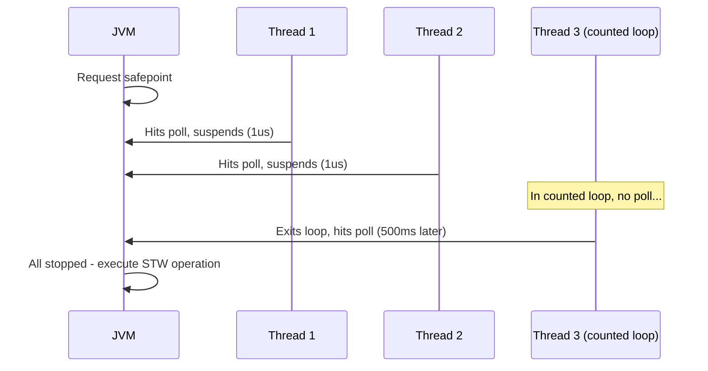
```mermaid
sequenceDiagram
    participant JVM
    participant T1 as Thread 1
    participant T2 as Thread 2
    participant T3 as Thread 3 (counted loop)
    JVM->>JVM: Request safepoint
    T1->>JVM: Hits poll, suspends (1us)
    T2->>JVM: Hits poll, suspends (1us)
    Note over T3: In counted loop, no poll...
    T3->>JVM: Exits loop, hits poll (500ms later)
    JVM->>JVM: All stopped - execute STW operation
```

---

### 🛠️ Worked Example

**BAD:**

```java
// Counted loop without safepoint (JDK <14)
public long sumArray(int[] data) {
    long sum = 0;
    for (int i = 0; i < data.length; i++) {
        sum += data[i];
        // NO safepoint poll (counted loop, JDK <14)
        // 100M elements at 5ns each = 500ms TTSP
        // ALL other threads frozen for 500ms
    }
    return sum;
}
```

Why it's wrong: counted loops without polls cause catastrophic TTSP, stalling all threads including the GC requestor.

**GOOD:**

```java
// JDK 17+: counted loop safepoints enabled by default
// Or on older JDKs: -XX:+UseCountedLoopSafepoints
public long sumArray(int[] data) {
    long sum = 0;
    for (int i = 0; i < data.length; i++) {
        sum += data[i];
        // Poll inserted every N iterations (JDK 17+)
        // TTSP bounded to <1ms
    }
    return sum;
}
// Verify: -Xlog:safepoint shows TTSP per event
```

Why it's right: JDK 17+ inserts polls in counted loops. TTSP bounded regardless of loop size.

**Production:**

```bash
# Diagnose TTSP problems
java -Xlog:safepoint=info:file=sp.log:time -jar app.jar
grep "Total" sp.log | awk '{print $NF}' | sort -n | tail -5
# If TTSP > 10ms: investigate counted loops
# Common culprits: array sort, bulk copy, crypto,
# tight numeric computation without method calls

# JFR safepoint events (richest data)
jcmd <pid> JFR.start duration=60s settings=profile \
  filename=sp.jfr
# JMC -> Events -> SafepointBegin shows TTSP per event
```

---

### ⚖️ Trade-offs

**Gain:** Enables safe GC, deoptimization, thread dumps, and all STW operations. Poll overhead: negligible (<0.1%).

**Cost:** TTSP adds hidden latency to GC pauses. Safepoint bias affects profiling accuracy. All threads wait for slowest thread.

| Aspect         | With polls (default)      | Without polls (impossible) |
| -------------- | ------------------------- | -------------------------- |
| GC possible    | Yes                       | No (inconsistent state)    |
| TTSP latency   | Depends on slowest thread | N/A                        |
| Poll overhead  | <0.1% throughput          | Zero                       |
| Profiling bias | Yes (jstack/JVisualVM)    | Would be unbiased          |

---

### ⚡ Decision Snap

**USE WHEN:**

- Diagnosing unexplained GC pause variability (TTSP may dominate GC work time).
- Understanding why JVisualVM profiles miss certain methods (safepoint bias).
- Upgrading JDK 11 -> 17 and seeing changed latency characteristics (counted loop safepoints now default).

**AVOID WHEN:**

- Over-engineering safepoint placement in application code (JVM handles it correctly in JDK 17+).

**PREFER -Xlog:safepoint WHEN:**

- GC pauses seem longer than expected from GC work alone.
- Latency spikes correlate with GC but exceed logged pause duration.

---

### ⚠️ Top Traps

| #   | Misconception                              | Reality                                                                                                            |
| --- | ------------------------------------------ | ------------------------------------------------------------------------------------------------------------------ |
| 1   | "GC pause = total stop-the-world time"     | STW = TTSP + GC work. If TTSP is 200ms and GC is 50ms, the log shows 50ms but real stall is 250ms.                 |
| 2   | "Thread.sleep reaches safepoint instantly" | Correct for sleep. But threads in JNI critical regions do NOT respond to safepoint requests until they exit JNI.   |
| 3   | "Safepoint bias only affects jstack"       | It affects ALL safepoint-based sampling profilers (JVisualVM, JFR method sampling). Only async-profiler avoids it. |

---

### 🪜 Learning Ladder

**Prerequisites:**

- JVM-027 Minor GC vs Major GC vs Full GC - understand what triggers STW pauses
- JVM-052 JIT Compilation Tiers (C1 and C2) - understand compiled code where polls are inserted

**THIS:** JVM-055 Safepoints - What Stops the World

**Next steps:**

- JVM-059 Async-Profiler and CPU Flame Graphs - profiling without safepoint bias
- JVM-066 GC Pause Budget - SLA-Driven Tuning - TTSP as hidden component of pause budget

---

### 💡 The Surprising Truth

Before JDK 14, a single `for (int i = 0; i < Integer.MAX_VALUE; i++)` loop could delay GC for ALL threads by 10+ seconds. This was not a bug but a deliberate trade-off: polls in counted loops cost ~1% throughput. JEP 401 and JDK 17 default change represent a philosophical shift: bounded TTSP is now considered more important than 1% throughput. If you see mysterious latency spikes on JDK 11 that disappear on JDK 17, counted loop safepoints are likely the explanation.

---

### 📇 Revision Card

1. STW = TTSP + GC work. High TTSP hides inside GC pause metrics. Check `-Xlog:safepoint` separately.
2. Counted loops without safepoint polls are the #1 TTSP offender. JDK 17+ fixes this by default.
3. Safepoint bias means jstack/JVisualVM systematically miss code between safepoints. Use async-profiler for accurate profiling.

---

---

# JVM-056 TLAB - Thread-Local Allocation Buffers

**TL;DR** - TLABs give each thread a private Eden chunk, making object allocation a zero-synchronization pointer bump (~10ns per allocation).

---

### 🔥 The Problem in One Paragraph

A web server creates hundreds of objects per request. With 200 concurrent threads, thousands of allocations happen per millisecond. If every allocation required atomic CAS on a shared Eden pointer, lock contention would dominate. TLABs solve this: each thread gets its own chunk of Eden. Allocation becomes a simple pointer increment with zero synchronization - faster than C's malloc. This is exactly why TLAB - Thread-Local Allocation Buffers was created.

---

### 📘 Textbook Definition

A **Thread-Local Allocation Buffer (TLAB)** is a contiguous block within Eden reserved exclusively for one thread. Object allocation within a TLAB is a pointer bump (increment allocation pointer by object size) requiring no synchronization. When exhausted, the thread requests a new TLAB from shared Eden (brief CAS). TLABs account for 99%+ of all allocations in well-behaved applications.

---

### 🧠 Mental Model

> TLABs are like giving each cashier their own receipt roll. Printing a receipt (allocating) just advances the paper (pointer bump) - no asking anyone. When the roll runs out, get a new one from the supply room (shared Eden) - brief sync, then back to independent operation.

- "Receipt roll" -> TLAB (private Eden chunk)
- "Advance paper" -> pointer bump (zero sync)
- "Supply room" -> shared Eden (CAS on new TLAB request)
- "Each cashier independent" -> no contention between threads

**Where this analogy breaks down:** The JVM adaptively sizes TLABs based on each thread's allocation rate. Fast allocators get larger TLABs to reduce refill frequency.

---

### ⚙️ How It Works

1. **Thread startup:** Each thread gets a TLAB from Eden (default: Eden / (2 \* thread_count), min 2KB).
2. **Fast path:** `new Object()` -> increment thread-local pointer by size. Cost: ~10ns. No atomic operation.
3. **Exhaustion:** When pointer hits TLAB end, request new TLAB from Eden (CAS on global pointer).
4. **Adaptive sizing:** JVM tracks each thread's allocation rate and waste. High allocators get larger TLABs.
5. **Waste tracking:** Partially-filled TLABs at GC have unused space. JVM targets <1% waste.
6. **Outside-TLAB:** Objects too large for remaining TLAB space allocate directly from Eden (slow path).

```text
Eden Space:
  [  TLAB-T1  ][  TLAB-T2  ][ free Eden ]
  [obj|obj|ptr][obj|ptr     ][           ]

Fast path (99%+ of allocations):
  if (tlab_ptr + size <= tlab_end) {
    ref = tlab_ptr;      // read pointer
    tlab_ptr += size;    // bump (no CAS!)
    return ref;          // ~10ns total
  }
  // else: slow path (new TLAB from Eden)
```

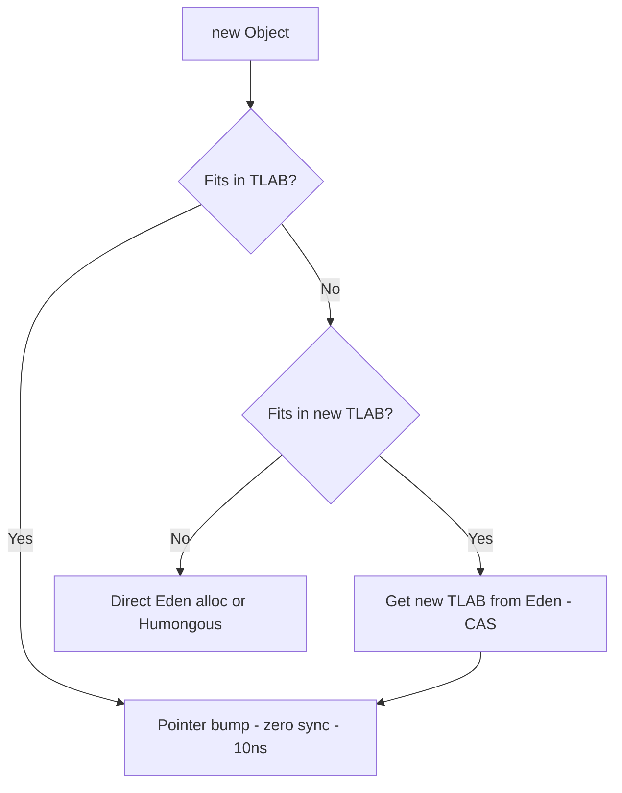
```mermaid
flowchart TD
    A[new Object] --> B{Fits in TLAB?}
    B -->|Yes| C[Pointer bump - zero sync - 10ns]
    B -->|No| D{Fits in new TLAB?}
    D -->|Yes| E[Get new TLAB from Eden - CAS]
    E --> C
    D -->|No| F[Direct Eden alloc or Humongous]
```

---

### 🛠️ Worked Example

**BAD:**

```bash
# Disabling TLABs (catastrophic for throughput)
java -XX:-UseTLAB -jar service.jar
# Every new Object() -> contended CAS on shared pointer
# 200 threads contending = massive throughput loss (50-80%)
```

Why it's wrong: without TLABs, every allocation is a contended atomic operation.

**GOOD:**

```bash
# TLABs are default (verify, don't change)
jcmd <pid> VM.flags | grep TLAB
# -XX:+UseTLAB (always on)
# -XX:TLABSize=0 (0 = adaptive)
# Never set TLABSize manually - adaptive is better
```

Why it's right: TLABs are on by default and self-tuning. Verify and do not interfere.

**Production:**

```bash
# Monitor TLAB statistics
java -Xlog:gc+tlab=trace:file=tlab.log -jar app.jar
# Thread "worker-1": desired_size=256KB
#   slow_allocs=12 refills=847 waste=0.8%
# High slow_allocs = objects larger than TLAB space
# -> investigate large object allocation patterns
# High waste = TLABs too large for thread's rate
```

---

### ⚖️ Trade-offs

**Gain:** Zero-sync allocation for 99%+ of objects. ~10ns per allocation. Scales linearly with threads.

**Cost:** <1% memory waste (unused TLAB space at GC). Large objects bypass fast path. Extra GC complexity (TLAB boundary accounting).

| Aspect      | With TLABs (default) | Without TLABs                 |
| ----------- | -------------------- | ----------------------------- |
| Alloc cost  | ~10ns (pointer bump) | ~100-200ns (CAS + contention) |
| Scalability | Linear with threads  | Degrades with threads         |
| Waste       | <1% of Eden          | Zero                          |

---

### ⚡ Decision Snap

**USE WHEN:**

- Always. TLABs are default and should never be disabled.
- Understanding allocation overhead for performance analysis.
- Diagnosing "slow allocs" in trace logs (large objects needing investigation).

**AVOID WHEN:**

- Never disable TLABs. No production scenario benefits from disabling them.

**PREFER reducing allocation rate WHEN:**

- TLAB trace shows extremely high refill rates. Consider object pooling for expensive objects (connections, buffers) but NOT for cheap short-lived objects.

---

### ⚠️ Top Traps

| #   | Misconception                              | Reality                                                                                                                       |
| --- | ------------------------------------------ | ----------------------------------------------------------------------------------------------------------------------------- |
| 1   | "Java allocation is expensive"             | Via TLAB: ~10ns pointer bump. Cheaper than C malloc (free-list search, potential syscall). GC amortizes deallocation.         |
| 2   | "Set TLABSize manually for optimization"   | Adaptive sizing per-thread based on allocation rate is always better than any static value.                                   |
| 3   | "Object pooling is always better than new" | For short-lived objects: TLAB alloc + GC is faster than pool synchronization overhead. Pool only expensive-to-create objects. |

---

### 🪜 Learning Ladder

**Prerequisites:**

- JVM-026 Heap Structure - Young, Old, and Metaspace - understand Eden as allocation target
- JVM-027 Minor GC vs Major GC vs Full GC - young GC reclaims TLAB space

**THIS:** JVM-056 TLAB - Thread-Local Allocation Buffers

**Next steps:**

- JVM-053 Inlining and Escape Analysis - eliminates allocation entirely (even faster than TLAB)
- JVM-057 Compressed Oops and Object Layout - what the allocated bytes contain

---

### 💡 The Surprising Truth

Java `new Object()` is faster than C `malloc()`. TLAB allocation is a pointer increment (~10ns, no syscall). C's malloc searches a free list and potentially calls mmap (~50-200ns). Java pays later during GC while C pays at free(). For short-lived objects, Java is measurably faster end-to-end because young GC amortizes deallocation across millions of objects in one batch.

The real performance killer is not allocation itself but allocation RATE. A method allocating inside a hot loop creates GC pressure not because each allocation is expensive, but because it fills Eden faster - triggering more frequent young GCs. The fix is reducing allocation rate (reuse buffers, avoid boxing), not avoiding `new` entirely. Profiling with JFR's `jdk.ObjectAllocationInNewTLAB` shows exactly which methods cause high allocation rates, measured in MB/s.

Additionally, TLAB waste is typically 1-3% of Eden space - fragments at the end of each TLAB that are too small for the next allocation. The JVM tracks this per-thread and adjusts TLAB sizes adaptively. Unusually high TLAB waste (visible in JFR) indicates objects near the TLAB size boundary, where slight refactoring of object size eliminates the waste entirely.

---

### 📇 Revision Card

1. TLAB = private Eden chunk per thread. Allocation = pointer bump (~10ns, zero sync). 99%+ of allocations use this.
2. Never disable TLABs, never set TLABSize. Adaptive sizing is always superior.
3. Java TLAB allocation is faster than C malloc. Do not avoid object creation for "performance."

---

---

# JVM-057 Compressed Oops and Object Layout

**TL;DR** - Compressed oops store 64-bit references as 32-bit shifted values, saving ~25% heap on heaps under 32GB at zero performance cost.

---

### 🔥 The Problem in One Paragraph

A 64-bit JVM uses 8 bytes per object reference. A HashMap entry with key, value, next pointer uses 24 bytes just in references. On a 4GB heap with millions of small objects, pointer overhead consumes 30-40% of heap. Compressed oops solve this: since all objects are 8-byte aligned (lowest 3 bits always zero), the JVM stores addresses shifted right by 3 bits in 32-bit fields, addressing up to 32GB while using half the pointer space. This is exactly why Compressed Oops and Object Layout was created.

---

### 📘 Textbook Definition

**Compressed ordinary object pointers (compressed oops)** encode 64-bit heap addresses into 32-bit values by exploiting 8-byte object alignment. Since the lowest 3 address bits are always zero, shifting right by 3 allows 32 bits to address 2^32 \* 8 = 32GB. Enabled by default for heaps <= 32GB (`-XX:+UseCompressedOops`), saving ~25-30% heap vs uncompressed pointers.

---

### 🧠 Mental Model

> Compressed oops are like a library using shelf numbers instead of GPS coordinates. Every shelf is 8 meters apart (alignment). Record "shelf 42" (32-bit) and multiply by 8 to locate it. Works for up to 4 billion shelves (32GB). Beyond that, you need full GPS (64-bit pointers).

- "Shelf number" -> compressed oop (32-bit shifted value)
- "Multiply by 8" -> decode: shift left 3
- "GPS coordinates" -> uncompressed 64-bit pointer
- "4 billion shelves" -> 32GB heap limit

**Where this analogy breaks down:** The JVM can use base+offset schemes for heaps slightly above 32GB, but beyond ~32GB, compressed oops are disabled entirely causing a cliff in memory efficiency.

---

### ⚙️ How It Works

1. **Alignment:** All objects are 8-byte aligned. Lowest 3 address bits = 000 always.
2. **Encode:** `compressedOop = address >> 3`. 32 bits addresses 32GB.
3. **Decode:** `address = compressedOop << 3`. Adds to base (0 for heaps < 32GB).
4. **Object header:** Mark word (8B) + Klass pointer (4B compressed) = 12B, padded to 16B.
5. **Field layout:** References use 4 bytes instead of 8. Multiplied across millions of objects = 25-30% savings.
6. **Cliff:** Heap > ~32GB disables compressed oops. All pointers become 8B. Sudden ~30% usage increase.

```text
Object Header (compressed oops ON):
  [Mark: 8B][Klass: 4B][pad: 4B][Fields...]
  References in fields: 4 bytes each

Object Header (compressed oops OFF):
  [Mark: 8B][Klass: 8B][Fields...]
  References in fields: 8 bytes each

The 32GB cliff:
  31GB heap + compressed: effective capacity X
  33GB heap - compressed: effective capacity < X!
  (pointer bloat costs more than the extra 2GB)
```

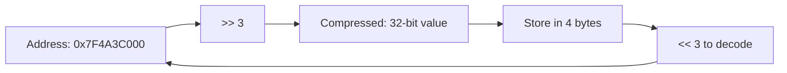
```mermaid
flowchart LR
    A[Address: 0x7F4A3C000] --> B[>> 3]
    B --> C[Compressed: 32-bit value]
    C --> D[Store in 4 bytes]
    D --> E[<< 3 to decode]
    E --> A
```

---

### 🛠️ Worked Example

**BAD:**

```bash
# Heap set to 33GB - crosses compressed oops threshold
java -Xmx33g -jar service.jar
# Compressed oops DISABLED
# All references now 8 bytes (vs 4 with compressed)
# Net effect: LESS usable memory than -Xmx31g!
# The extra 2GB is consumed by pointer bloat
```

Why it's wrong: crossing 32GB disables compressed oops. Pointer bloat costs more than the gained space.

**GOOD:**

```bash
# Stay at or below 32GB
java -Xmx31g -jar service.jar
# Compressed oops enabled (default)
# References: 4 bytes. ~25% heap savings.
# Effective capacity: more than 33GB uncompressed

# Verify:
jcmd <pid> VM.flags | grep CompressedOops
# -XX:+UseCompressedOops
```

Why it's right: 31GB compressed gives more effective capacity than 33GB uncompressed.

**Production:**

```bash
# Measure actual object layout with JOL
java -jar jol-cli.jar internals java.util.HashMap\$Node
# OFFSET  SIZE  TYPE  DESCRIPTION
# 0       12    (header)
# 12      4     int   hash
# 16      4     ref   key     (4B compressed!)
# 20      4     ref   value   (4B compressed!)
# 24      4     ref   next    (4B compressed!)
# 28      4     (padding)
# Total: 32 bytes
# Without compressed: 48 bytes (+50% overhead!)
```

---

### ⚖️ Trade-offs

**Gain:** ~25-30% heap savings. Zero runtime cost (shifts are free). Default for heaps <= 32GB. No code changes needed.

**Cost:** Only works <= 32GB. Cliff at boundary. Not available with ZGC before JDK 21.

| Aspect           | Compressed (<= 32GB) | Uncompressed (> 32GB) |
| ---------------- | -------------------- | --------------------- |
| Reference size   | 4 bytes              | 8 bytes               |
| Max heap         | ~32GB                | Unlimited             |
| Memory savings   | ~25-30%              | Baseline              |
| Performance cost | Zero (shift is free) | Zero                  |

---

### ⚡ Decision Snap

**USE WHEN:**

- Heap <= 32GB (automatic, default). No action needed.
- Sizing heap: prefer 31GB over 33GB. Compressed oops savings exceed raw capacity gain.
- Analyzing memory: use JOL to see actual object sizes (depends on compressed oops state).

**AVOID WHEN:**

- Working set genuinely requires >32GB. Accept 30% pointer overhead.
- Using ZGC on JDK <21 (incompatible before then).

**PREFER heap reduction WHEN:**

- Can stay under 32GB by fixing leaks or reducing caching. The 25% compression benefit often covers the gap.

---

### ⚠️ Top Traps

| #   | Misconception                                  | Reality                                                                                                |
| --- | ---------------------------------------------- | ------------------------------------------------------------------------------------------------------ |
| 1   | "32GB is the exact boundary"                   | Actual limit varies. Use 31g to be safe. Going from 31g to 33g often DECREASES effective capacity.     |
| 2   | "Compressed oops have performance overhead"    | Shift operations are effectively free on modern CPUs. Zero measurable throughput difference.           |
| 3   | "I need 35GB so compressed oops do not matter" | Fix root cause (optimize caching, fix leaks). 31GB compressed often holds more than 35GB uncompressed. |

---

### 🪜 Learning Ladder

**Prerequisites:**

- JVM-026 Heap Structure - Young, Old, and Metaspace - understand heap layout
- JVM-056 TLAB - Thread-Local Allocation Buffers - understand allocation fast path

**THIS:** JVM-057 Compressed Oops and Object Layout

**Next steps:**

- JVM-063 Native Memory Tracking (NMT) - total memory usage including pointer overhead
- JVM-065 JVM in Kubernetes - Resource Limits Done Right - container sizing where 32GB boundary matters

---

### 💡 The Surprising Truth

Going from 31GB to 33GB can DECREASE effective memory. At 31GB, a HashMap-heavy app might have 12GB of references (4B each). At 33GB, those references become 24GB (8B each). Net: 31GB gives 19GB for data; 33GB gives only 9GB for data. This "compressed oops cliff" is one of the most counter-intuitive JVM sizing decisions - adding 2GB of heap actually loses 10GB of usable capacity.

Beyond references, object headers also double from 12 bytes (compressed) to 16 bytes (uncompressed) when crossing the boundary. For applications with millions of small objects (boxed numbers, wrapper types, Strings), header overhead alone can consume an additional 4-8GB. The total impact is not just the references themselves but also the alignment padding that changes with header size.

In practice, this means heap sizes between 32GB and ~48GB represent a "dead zone" where you have LESS effective capacity than at 31GB. The break-even point where uncompressed mode finally provides more usable memory than 31GB compressed depends on your object graph structure, but typically falls around 48-50GB. Teams that need more than 31GB should jump directly to 48GB+ or redesign their data model.

---

### 📇 Revision Card

1. Compressed oops: shift 3 bits to store 64-bit address in 32 bits. Free. Default for heaps <= 32GB.
2. Never set heap to 33-35GB. Stay at 31GB (compressed) or go to 48GB+ (where extra space justifies bloat).
3. Use JOL to inspect actual object sizes. Your intuition about memory consumption is probably wrong.

---

---

# JVM-058 JFR (Java Flight Recorder) Deep Dive

**TL;DR** - JFR is a built-in always-on production profiler recording JVM events (GC, allocations, locks, I/O) with less than 1% overhead into a ring buffer.

---

### 🔥 The Problem in One Paragraph

A service has intermittent latency spikes at 2 AM. By 9 AM, evidence is gone. Thread dumps show nothing (transient). GC logs show pauses but not their cause. Attaching a profiler is risky (5-20% overhead). JFR solves this: continuous recording into a ring buffer with <1% overhead. When the spike occurs, the evidence is already captured - dump and analyze offline. This is exactly why JFR (Java Flight Recorder) Deep Dive was created.

---

### 📘 Textbook Definition

**Java Flight Recorder (JFR)** is a profiling framework built into the JVM that continuously captures runtime events: GC pauses, allocations, method samples, thread parks/blocks, I/O, class loading, JIT compilations. JFR uses thread-local buffers with <1% overhead. Recordings are analyzed with JDK Mission Control (JMC) or programmatically via `jdk.jfr` API. Open-sourced in JDK 11 (previously commercial-only).

---

### 🧠 Mental Model

> JFR is a dashcam for your JVM. Records everything (events, allocations, locks, GC) into a loop (ring buffer). After an incident, review the footage. Unlike attaching a camera after the crash, the dashcam was already running. Storage is bounded (old footage overwritten).

- "Dashcam" -> continuous recording
- "Ring buffer" -> old events overwritten (bounded storage)
- "Review footage" -> open .jfr in JDK Mission Control
- "Already running" -> always-on, negligible overhead

**Where this analogy breaks down:** JFR captures hundreds of event types simultaneously (GC, CPU, allocation, locks, I/O) - like 50 cameras with different sensors, all running at once.

---

### ⚙️ How It Works

1. **Enable:** `-XX:StartFlightRecording=disk=true,maxsize=500m,maxage=12h` (always-on).
2. **Event generation:** JVM subsystems emit events into thread-local buffers (zero contention).
3. **Buffer flush:** Thread-local buffers periodically flush to global ring buffer on disk.
4. **Dump:** `jcmd <pid> JFR.dump filename=snapshot.jfr` extracts current buffer contents.
5. **Events:** GC pauses, allocation sampling, method profiling, thread park/block, file/socket I/O, class loading, JIT compilation.
6. **Analysis:** JDK Mission Control: Hot Methods, Allocations, GC, Locks, I/O timeline.

```text
JFR Architecture:
  Thread 1: [local buf] --flush-->
  Thread 2: [local buf] --flush--> [Ring Buffer 500MB]
  Thread N: [local buf] --flush-->

  jcmd JFR.dump --> snapshot.jfr --> JMC analysis

Key event types:
  jdk.GCPausePhase        - GC breakdown
  jdk.ObjectAllocationInNewTLAB - alloc site
  jdk.ExecutionSample     - CPU sampling
  jdk.JavaMonitorEnter    - lock contention
  jdk.FileRead/Write      - I/O latency
```

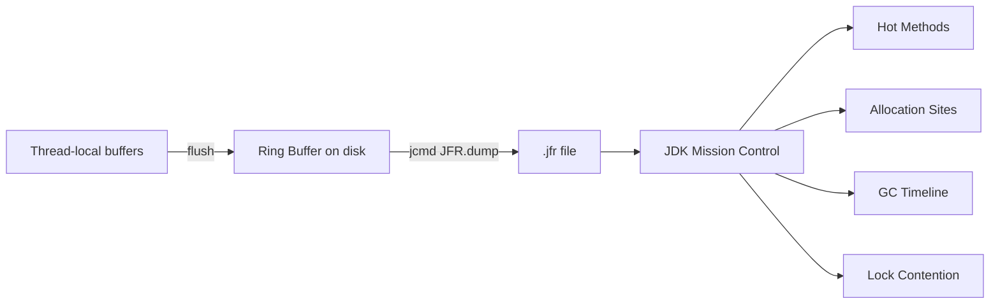
```mermaid
flowchart LR
    A[Thread-local buffers] -->|flush| B[Ring Buffer on disk]
    B -->|jcmd JFR.dump| C[.jfr file]
    C --> D[JDK Mission Control]
    D --> E[Hot Methods]
    D --> F[Allocation Sites]
    D --> G[GC Timeline]
    D --> H[Lock Contention]
```

---

### 🛠️ Worked Example

**BAD:**

```bash
# No JFR in production (reactive approach)
java -Xmx4g -jar service.jar
# Issue at 2 AM. Investigation at 9 AM. No evidence.
# "Let's enable JFR and wait for recurrence"
# Wait weeks for next occurrence. Evidence lost again.
```

Why it's wrong: reactive profiling misses transient issues. By the time you attach, evidence is gone.

**GOOD:**

```bash
# Always-on JFR in every production JVM
java -Xmx4g \
  -XX:StartFlightRecording=disk=true,maxsize=500m,maxage=12h \
  -jar service.jar

# Incident at 2 AM. At 9 AM:
jcmd <pid> JFR.dump filename=/tmp/incident.jfr
# 12h of history with <1% overhead. Open in JMC.
```

Why it's right: always-on ensures evidence for ANY past incident within retention window.

**Production:**

```bash
# High-detail targeted recording during active incident
jcmd <pid> JFR.start name=incident duration=60s \
  settings=profile filename=/tmp/incident.jfr
# "profile" settings: higher sampling, more alloc events
# Navigate in JMC:
#   "Hot Methods" -> CPU bottleneck
#   "TLAB Allocations" -> allocation pressure source
#   "Java Monitor Blocked" -> lock contention
#   "GC Pauses" -> pause breakdown
```

---

### ⚖️ Trade-offs

**Gain:** Always-on, production-safe (<1%). Captures transient issues retroactively. Replaces multiple tools (CPU + allocation + lock profiler).

**Cost:** Ring buffer = bounded retention. Analysis requires JMC learning. "profile" settings increase overhead to 3-5%.

| Aspect         | JFR (default)       | JFR (profile) | Async-profiler      |
| -------------- | ------------------- | ------------- | ------------------- |
| Overhead       | <1%                 | 3-5%          | 1-3%                |
| Always-on      | Yes                 | Incident only | Typically on-demand |
| Safepoint bias | Yes (method sample) | Yes           | No                  |
| Events         | All JVM events      | More detail   | CPU + alloc only    |

---

### ⚡ Decision Snap

**USE WHEN:**

- Every production JVM. Always-on continuous recording is free and invaluable.
- Any performance investigation: latency, throughput, memory, startup.
- Need correlated view: GC + CPU + allocations + I/O + locks in one timeline.

**AVOID WHEN:**

- Need CPU profiling without safepoint bias (use async-profiler).
- Need sub-microsecond precision (JFR sampling is ms-level).

**PREFER async-profiler WHEN:**

- Pure CPU profiling with no safepoint bias (signal-based, more accurate).
- Wall-clock profiling (blocked/sleeping time in flame graph).

---

### ⚠️ Top Traps

| #   | Misconception                   | Reality                                                                                                    |
| --- | ------------------------------- | ---------------------------------------------------------------------------------------------------------- |
| 1   | "JFR has high overhead"         | Default: <1% CPU. Designed by Oracle/OpenJDK specifically for always-on production use.                    |
| 2   | "JFR is still commercial-only"  | Open-sourced in JDK 11. Free in all OpenJDK distributions since then.                                      |
| 3   | "JFR captures every allocation" | JFR uses sampling (TLAB boundary events). High-frequency allocators are captured; rare ones may be missed. |

---

### 🪜 Learning Ladder

**Prerequisites:**

- JVM-041 jcmd - The Swiss Army Knife - interface for starting/stopping/dumping JFR
- JVM-051 GC Log Analysis - Reading and Interpreting - GC logs + JFR give complete picture

**THIS:** JVM-058 JFR (Java Flight Recorder) Deep Dive

**Next steps:**

- JVM-059 Async-Profiler and CPU Flame Graphs - complementary CPU profiling without safepoint bias
- JVM-060 Memory Leak Diagnosis Workflow - JFR allocation profiling as part of leak workflow

---

### 💡 The Surprising Truth

JFR's `jdk.ObjectAllocationInNewTLAB` events provide full stack traces at allocation sites. This answers "which code path causes GC pressure?" directly - something GC logs cannot. A single JFR recording often replaces hours of heap dump analysis because it shows allocation rate per call site over time, making leak sources obvious from rate graphs without ever taking a heap dump.

JFR's streaming API (JDK 14+) enables real-time reaction to JVM events without stopping the recording. You can register handlers for specific events (GC pauses, allocation thresholds, CPU usage) and trigger alerts or adaptive behavior directly. A production service can automatically dump a heap snapshot when allocation rate exceeds a threshold - capturing the exact moment a leak accelerates rather than waiting for OOM.

The default JFR configuration captures approximately 100 event types simultaneously. This includes: method profiling (CPU), allocation profiling, thread state, lock contention, file I/O, socket I/O, class loading, JIT compilation, and garbage collection. Each event type has independent sampling rates and thresholds. A typical 12-hour production recording at default settings occupies 200-500MB and contains everything needed to diagnose most performance issues without reproduction.

---

### 📇 Revision Card

1. Enable always: `-XX:StartFlightRecording=disk=true,maxsize=500m,maxage=12h`. No exceptions. <1% overhead.
2. Incident response: `jcmd <pid> JFR.dump filename=incident.jfr`. Evidence already captured.
3. JFR = GC + CPU + allocations + locks + I/O in one recording. Replaces 5 separate tools.

---

---

# JVM-059 Async-Profiler and CPU Flame Graphs

**TL;DR** - Async-profiler uses OS signals to capture accurate CPU profiles without safepoint bias, rendered as flame graphs for visual bottleneck identification.

---

### 🔥 The Problem in One Paragraph

You profile with JVisualVM and find `HashMap.get()` as the hottest method. You optimize it - latency unchanged. The profile was wrong. JVisualVM samples only at safepoints, systematically missing methods executing between safepoints (counted loops, native calls). Async-profiler uses POSIX signals to interrupt threads at ANY execution point, producing unbiased profiles. This is exactly why Async-Profiler and CPU Flame Graphs was created.

---

### 📘 Textbook Definition

**Async-profiler** is an open-source sampling profiler using OS signals (perf_events on Linux) to capture stack traces at arbitrary points. Unlike safepoint-biased profilers, it represents all code paths accurately. Results are rendered as **flame graphs** - SVG visualizations where x-axis = total sample count (CPU time) and y-axis = call stack depth. Wider boxes = more time spent.

---

### 🧠 Mental Model

> Safepoint profiling is photographing a highway only at rest stops - you miss cars racing between stops. Async-profiler is a helicopter camera photographing any road point. Flame graphs are the aerial photo: wider sections = more traffic (CPU time).

- "Rest stop photography" -> safepoint-biased (JVisualVM)
- "Helicopter camera" -> signal-based (async-profiler)
- "Wider section" -> wider flame graph box = more CPU
- "Aerial photo" -> flame graph SVG

**Where this analogy breaks down:** Async-profiler adds <3% overhead. The "camera" is nearly invisible.

---

### ⚙️ How It Works

1. **Signal injection:** Sends SIGPROF (or uses perf_events) at configurable interval (default 10ms = 100Hz).
2. **Stack capture:** At signal delivery, captures current stack - regardless of safepoint state. Includes JIT, interpreter, and native frames.
3. **Symbol resolution:** Reads JIT method mappings from CodeCache for frame resolution.
4. **Aggregation:** Identical stacks merged, count incremented.
5. **Rendering:** Tree rendered as SVG flame graph. Width = sample proportion. Click to zoom.

```text
Safepoint-biased (WRONG):
  Samples taken only at [SP] [SP] [SP]
  Misses: tight loops, native code

Signal-based (CORRECT):
  Samples at [any] [any] [any]
  Captures all code proportionally

Flame graph reading:
  Wide box at TOP = self CPU time (this method)
  Wide box at BOTTOM = inclusive (callees below)
  Click to zoom subtree
```

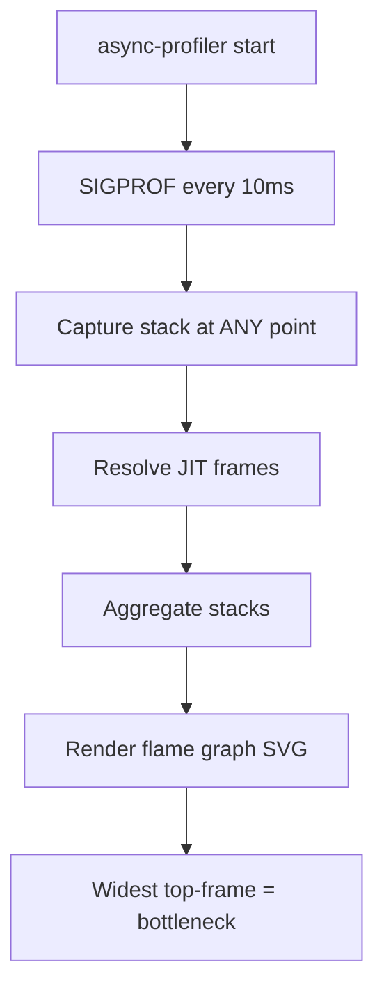
```mermaid
flowchart TD
    A[async-profiler start] --> B[SIGPROF every 10ms]
    B --> C[Capture stack at ANY point]
    C --> D[Resolve JIT frames]
    D --> E[Aggregate stacks]
    E --> F[Render flame graph SVG]
    F --> G[Widest top-frame = bottleneck]
```

---

### 🛠️ Worked Example

**BAD:**

```bash
# jstack-based profiling (safepoint-biased, wrong)
for i in $(seq 100); do
  jcmd <pid> Thread.print >> profiles.txt
  sleep 0.1
done
# Result: incorrect hot method identification
# Tight loops invisible between safepoints
```

Why it's wrong: jstack samples only at safepoints. Entire hot paths invisible.

**GOOD:**

```bash
# Async-profiler: one command, accurate profile
./asprof -d 30 -f profile.html <pid>
# -d 30: 30 seconds
# -f profile.html: interactive flame graph
# Open in browser, click widest top boxes
```

Why it's right: signal-based, unbiased, low overhead, actionable output.

**Production:**

```bash
# Wall-clock mode (includes wait/sleep time)
./asprof -d 30 -e wall -f wall.html <pid>
# Shows WHERE threads spend time including I/O wait
# Wide "SocketRead" = I/O bound (not CPU bound)
# This is invisible to CPU-only profiling

# Continuous profiling output to JFR format
./asprof start -e cpu -i 10ms -f /tmp/%t.jfr <pid>
# Analyzable in JMC or IntelliJ profiler
```

---

### ⚖️ Trade-offs

**Gain:** Accurate profiles without safepoint bias. Flame graphs are visually obvious. Wall-clock mode reveals I/O bottlenecks. Low overhead (1-3%).

**Cost:** Linux-only for full features. Requires same-user or root. No correlated GC/allocation events (use JFR for that).

| Aspect         | Async-profiler      | JFR method sampling | JVisualVM |
| -------------- | ------------------- | ------------------- | --------- |
| Safepoint bias | No                  | Yes                 | Yes       |
| Native frames  | Yes                 | Partial             | No        |
| Wall-clock     | Yes                 | No                  | No        |
| Platform       | Linux (best), macOS | All                 | All       |

---

### ⚡ Decision Snap

**USE WHEN:**

- CPU optimization is the goal - most accurate JVM CPU profiler available.
- Investigating whether bottleneck is CPU, locks, or I/O (wall-clock mode).
- Need shareable flame graph for team discussion.

**AVOID WHEN:**

- Need correlated GC + allocation + lock events (use JFR).
- Running on Windows (limited support).

**PREFER JFR WHEN:**

- Need always-on ring buffer for post-incident analysis.
- Need allocation profiling (JFR captures TLAB sites richer than async-profiler alloc mode).

---

### ⚠️ Top Traps

| #   | Misconception                             | Reality                                                                                                    |
| --- | ----------------------------------------- | ---------------------------------------------------------------------------------------------------------- |
| 1   | "Flame graph width = time IN that method" | Width = samples where method is ON STACK (inclusive). Self time = widest bar at TOP of its column only.    |
| 2   | "Any profiling is accurate enough"        | Safepoint bias systematically hides real hot spots. You will optimize wrong methods and waste effort.      |
| 3   | "CPU profiling shows all bottlenecks"     | I/O-bound services (80% of microservices) need wall-clock mode. CPU mode misses SocketRead/sleep entirely. |

---

### 🪜 Learning Ladder

**Prerequisites:**

- JVM-055 Safepoints - What Stops the World - understand safepoint bias that async-profiler avoids
- JVM-052 JIT Compilation Tiers (C1 and C2) - understand JIT frames in stack traces

**THIS:** JVM-059 Async-Profiler and CPU Flame Graphs

**Next steps:**

- JVM-058 JFR (Java Flight Recorder) Deep Dive - complementary always-on profiling
- JVM-074 Testing GC Behavior Under Load - validate GC is not the bottleneck under load

---

### 💡 The Surprising Truth

Async-profiler's wall-clock mode (`-e wall`) is often more useful than CPU mode for microservices. CPU profiling shows where CPU is busy - but most services spend 80% of time WAITING (database, HTTP, locks). Wall-clock samples ALL threads including sleeping ones. A 50ms endpoint spending 45ms in SocketInputStream.read is invisible to CPU profiling but immediately obvious in wall-clock flame graphs.

Another key insight: async-profiler can profile native frames (C/C++ libraries, JNI code, kernel functions) alongside Java frames in the same flame graph. This reveals bottlenecks that pure-Java profilers completely miss: TLS handshake cost (OpenSSL), DNS resolution time (glibc), and even kernel-level contention (futex waits). When a flame graph shows a wide bar in `__GI___poll` or `epoll_wait`, you know the thread is blocked on I/O - not on Java code.

Differential flame graphs (comparing two recordings) are particularly powerful for regression analysis. Run a baseline profile on the current version, deploy the new version, capture another profile, then generate a diff. Red sections show increased CPU usage; blue sections show improvements. This catches subtle performance regressions that benchmark suites miss because they test individual methods rather than full request paths.

---

### 📇 Revision Card

1. Async-profiler = signal-based sampling. No safepoint bias. Use for ALL CPU profiling.
2. Flame graphs: wide TOP box = self CPU time. Wide BOTTOM box = inclusive time (callees below).
3. Wall-clock mode (`-e wall`) reveals I/O bottlenecks invisible to CPU profiling. Essential for microservices.

---

---

# JVM-060 Memory Leak Diagnosis Workflow

**TL;DR** - Systematic leak diagnosis: detect (heap-after-GC trend) -> confirm (histogram comparison) -> locate (heap dump dominator tree) -> fix (remove retaining reference).

---

### 🔥 The Problem in One Paragraph

A service's heap trends upward. Team increases -Xmx from 4GB to 8GB. OOM now after 2 weeks instead of 1. The leak is masked, not fixed. Without systematic diagnosis, engineers guess: "maybe the cache?" They add eviction everywhere. Still grows. The actual leak: a listener in a static list never unregistered. Finding this requires specific diagnostic steps, not guessing. This is exactly why Memory Leak Diagnosis Workflow was created.

---

### 📘 Textbook Definition

A **memory leak diagnosis workflow** systematically identifies monotonically increasing heap usage causes: (1) detection via heap-after-GC trend, (2) confirmation via class histogram showing specific class growth after forced GC, (3) identification via heap dump dominator tree and GC root path, and (4) remediation by removing the unintended retention reference.

---

### 🧠 Mental Model

> Leak diagnosis is detective work with a procedural sequence. Stage 1: water bill rising (heap trending up). Stage 2: meter shows bathroom faucet (histogram: Event class growing). Stage 3: follow pipes to stuck valve (dominator tree: static List holding Events). Stage 4: close the valve (remove listener registration).

- "Water bill rising" -> heap-after-GC trending up
- "Bathroom faucet" -> specific class growing
- "Follow pipes" -> GC root path in heap dump
- "Close valve" -> remove retaining reference

**Where this analogy breaks down:** JVM can have multiple small leaks, premature promotion, or undersized heap (not a real leak). The workflow distinguishes genuine leaks from normal growth.

---

### ⚙️ How It Works

1. **Detect:** Monitor heap-after-GC. If trending up across Full GCs -> leak likely.
2. **Confirm:** Two class histograms separated by time, each after forced GC. Growing class = leak suspect.
3. **Identify suspect:** Growing class name tells WHAT. Need WHO (retainer).
4. **Heap dump:** `jcmd <pid> GC.heap_dump /path/dump.hprof`.
5. **Eclipse MAT:** "Leak Suspects" report. Finds dominator (single object retaining most memory) + GC root path.
6. **Find retainer:** Path to GC Roots shows which reference chain prevents collection.
7. **Fix:** Remove unintended reference (unregister listener, bound cache, close resource).

```text
Workflow:
  heap-after-GC trending up?
    -> class histogram x2 (after forced GC)
      -> growing class found
        -> heap dump + MAT Leak Suspects
          -> dominator + Path to GC Roots
            -> retaining reference found -> fix
```

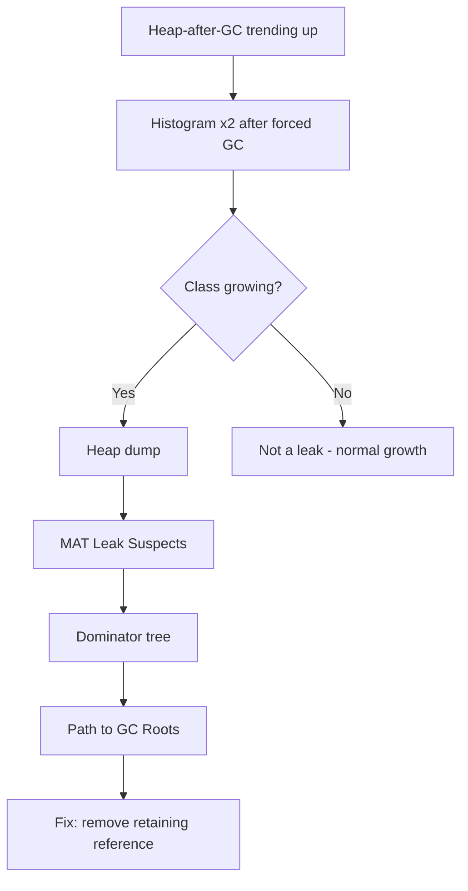
```mermaid
flowchart TD
    A[Heap-after-GC trending up] --> B[Histogram x2 after forced GC]
    B --> C{Class growing?}
    C -->|Yes| D[Heap dump]
    C -->|No| E[Not a leak - normal growth]
    D --> F[MAT Leak Suspects]
    F --> G[Dominator tree]
    G --> H[Path to GC Roots]
    H --> I[Fix: remove retaining reference]
```

---

### 🛠️ Worked Example

**BAD:**

```bash
# Guessing at leak source
# "Probably the cache" -> add TTL -> still grows
# "Probably connection pool" -> reduce -> still grows
# "Just increase heap" -> -Xmx 4g -> 16g
# OOM in 4 weeks instead of 1 week. Not fixed.
```

Why it's wrong: guessing without evidence wastes time and masks real issue.

**GOOD:**

```bash
# Systematic: histogram comparison
jcmd <pid> GC.run; sleep 2
jcmd <pid> GC.class_histogram > h1.txt
# Wait 1 hour
jcmd <pid> GC.run; sleep 2
jcmd <pid> GC.class_histogram > h2.txt
diff <(head -30 h1.txt) <(head -30 h2.txt)
# com.app.Event: 50000 -> 85000 (GROWING after GC!)
# This is your leak class.

# Heap dump -> MAT
jcmd <pid> GC.heap_dump /tmp/leak.hprof
# MAT Leak Suspects: "java.util.ArrayList @ 0x7f..
#   retaining 85000 Event instances
#   Root: static field Listener.events"
# FIX: Listener.events never cleared!
```

Why it's right: systematic evidence eliminates guesswork. Each step narrows.

**Production:**

```bash
# Automated leak detection alert (Prometheus)
# IF heap_after_gc / heap_max > 0.8
#   AND rate(heap_after_gc[6h]) > 0 FOR 2h
# THEN alert: probable memory leak

# Auto-histogram cron job:
jcmd <pid> GC.run; sleep 5
jcmd <pid> GC.class_histogram | head -30 \
  > /var/log/hist_$(date +%Y%m%d).txt
# Compare daily. Growing class after GC = investigate.
```

---

### ⚖️ Trade-offs

**Gain:** Systematic process eliminates guesswork. Eclipse MAT automates the hardest part. Deterministic: always finds the leak (if one exists).

**Cost:** Heap dump requires STW + disk. MAT needs ~1.5x dump size RAM. Takes 30-60 min (but deterministic vs days of guessing).

| Approach            | Time to root cause | Recurrence risk |
| ------------------- | ------------------ | --------------- |
| Systematic workflow | 30-60 minutes      | Fixed           |
| "Increase heap"     | N/A (never finds)  | Always recurs   |
| Guessing            | Hours to days      | Often unfixed   |

---

### ⚡ Decision Snap

**USE WHEN:**

- Heap-after-GC trending up over hours/days.
- OOM recurring despite heap increases.
- Need specific code fix (not just "restart weekly").

**AVOID WHEN:**

- Heap is stable after GC (sawtooth = normal, not a leak).
- Application intentionally grows (cache warming, data loading by design).

**PREFER JFR allocation profiling WHEN:**

- Need to find which code PATH allocates most (rate problem vs retention problem).
- Leak is very slow (JFR tracks allocation sites over time).

---

### ⚠️ Top Traps

| #   | Misconception                       | Reality                                                                                        |
| --- | ----------------------------------- | ---------------------------------------------------------------------------------------------- |
| 1   | "Growing heap = leak"               | Growing BEFORE Full GC is normal. Only growing AFTER Full GC = genuine leak.                   |
| 2   | "Biggest class in histogram = leak" | byte[] and String are always large. The GROWING class (compare two histograms) is the suspect. |
| 3   | "Histogram shows root cause"        | Histograms show WHAT grows. Only heap dump reveals WHO retains (GC root path). Both needed.    |

---

### 🪜 Learning Ladder

**Prerequisites:**

- JVM-034 Heap Dumps - Capturing and Basics - how to capture and open heap dumps
- JVM-029 GC Roots and Reachability Analysis - understand retention chains

**THIS:** JVM-060 Memory Leak Diagnosis Workflow

**Next steps:**

- JVM-075 Weak, Soft, and Phantom References in Practice - reference types to break retention
- JVM-046 The N+1 ClassLoader Anti-Pattern - common Metaspace leak using same workflow

---

### 💡 The Surprising Truth

The most common "leak" in production Java is not a code bug - it is an unbounded cache without eviction. A HashMap growing with each unique key eventually consumes all heap. The fix is not removing a reference but adding eviction (`Caffeine.maximumSize(10000)`). The workflow reveals this: histogram shows cache value class growing linearly with request count. The "retainer" is the cache itself by design - it just lacks bounds.

The second most common leak pattern in modern Java services is classloader leaks during hot-reloading. Each redeploy creates a new classloader that retains the old one through static references, ThreadLocal values, or shutdown hooks. The symptom is Metaspace growth after each deploy cycle. MAT's "duplicate classes" report immediately reveals multiple copies of the same class loaded by different classloaders.

A critical diagnostic shortcut: if heap-after-Full-GC grows linearly with request count, the leak correlates with requests (unbounded cache or session leak). If it grows with TIME regardless of load, suspect a background task (scheduled executor, event listener accumulation). If it grows with DEPLOY cycles, suspect classloader retention. The growth pattern itself narrows root cause before you ever open a heap dump.

---

### 📇 Revision Card

1. Sequence: detect (heap-after-GC trend) -> confirm (histogram after forced GC) -> locate (MAT dominator + GC root path) -> fix.
2. Growing AFTER Full GC = leak. Growing BEFORE Full GC = normal allocation.
3. MAT "Leak Suspects" finds root cause in <60 seconds for 80% of leaks. Use it first.

---

---

# JVM-061 GC Tuning Methodology - Measure First

**TL;DR** - GC tuning follows a rigorous methodology: measure baseline, identify the bottleneck (throughput vs latency vs footprint), change ONE flag, remeasure, and iterate.

---

### 🔥 The Problem in One Paragraph

A developer reads a blog post recommending `-XX:MaxGCPauseMillis=10 -XX:G1HeapRegionSize=16m -XX:InitiatingHeapOccupancyPercent=35`. They paste all three flags into production. Throughput drops 40%. They add more flags from Stack Overflow. Performance gets worse. The problem: tuning without measurement is random flag fumbling. Without a baseline, you cannot know if a change helped or hurt. Without changing one variable at a time, you cannot attribute effects to causes. This is exactly why GC Tuning Methodology - Measure First was created.

---

### 📘 Textbook Definition

**GC tuning methodology** is a systematic engineering process: (1) establish measurable goals (throughput target, pause budget, memory limit), (2) collect baseline metrics from production-representative load, (3) identify the specific bottleneck through GC log analysis, (4) make ONE targeted change based on the bottleneck, (5) remeasure under identical conditions, (6) accept only if improvement is statistically significant, (7) iterate from step 3. This is the scientific method applied to garbage collection.

---

### 🧠 Mental Model

> GC tuning is like diagnosing engine performance. Step 1: dyno test (baseline measurement). Step 2: read the data - is it fuel delivery, ignition timing, or exhaust restriction? Step 3: change ONE component. Step 4: dyno again. If faster, keep. If not, revert. Pasting "tuning configs" from forums is like randomly swapping engine parts without ever testing.

- "Dyno test" -> benchmark with GC logging under production load
- "Read the data" -> GC log analysis (GCViewer, GCEasy)
- "Change ONE component" -> modify one JVM flag
- "Dyno again" -> remeasure same workload
- "Random swapping" -> copying flags from blog posts

**Where this analogy breaks down:** Unlike engines where parts interact predictably, GC flags can have non-linear interactions. Reducing IHOP might improve latency but only until allocation rate exceeds concurrent marking speed, at which point you get Full GC.

---

### ⚙️ How It Works

1. **Define goals:** What matters? Throughput (minimize GC time/total time)? Latency (max pause < X ms)? Footprint (heap < Y GB)?
2. **Baseline measurement:** Run representative workload with GC logging enabled. Measure: p99 pause, throughput overhead, heap-after-GC, allocation rate.
3. **Identify bottleneck:** Is the problem long pauses (latency)? High GC frequency (throughput)? Heap too large (footprint)? These require different interventions.
4. **Hypothesize:** Based on the specific bottleneck, select ONE flag change. Example: long mixed GC pauses -> reduce `-XX:G1MixedGCCountTarget`.
5. **Change ONE variable:** Apply the single flag change.
6. **Remeasure:** Same workload, same duration, same load level. Compare metrics.
7. **Accept or revert:** If statistically better, keep. If worse or neutral, revert.
8. **Iterate:** Return to step 3 with new baseline.

```text
Tuning Methodology:
  1. GOAL: p99 pause < 50ms
  2. BASELINE: p99 = 120ms, avg = 30ms
  3. BOTTLENECK: mixed GC pauses too long
     (concurrent marking is fine)
  4. CHANGE: -XX:G1MixedGCCountTarget=12 (was 8)
     -> spreads mixed work across more pauses
  5. REMEASURE: p99 = 55ms (improved!)
  6. NEXT: still > 50ms. Try MaxGCPauseMillis=40
  7. REMEASURE: p99 = 48ms. GOAL MET.

Anti-pattern (random tuning):
  Add 5 flags from blog -> measure -> "it got worse"
  -> which flag caused it? Unknown. Revert ALL.
  -> zero progress after hours of work.
```

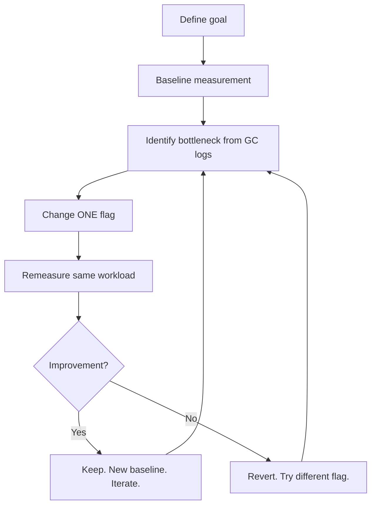
```mermaid
flowchart TD
    A[Define goal] --> B[Baseline measurement]
    B --> C[Identify bottleneck from GC logs]
    C --> D[Change ONE flag]
    D --> E[Remeasure same workload]
    E --> F{Improvement?}
    F -->|Yes| G[Keep. New baseline. Iterate.]
    F -->|No| H[Revert. Try different flag.]
    G --> C
    H --> C
```

---

### 🛠️ Worked Example

**BAD:**

```bash
# Cargo-cult tuning: paste flags from blog
java -Xmx8g \
  -XX:MaxGCPauseMillis=10 \
  -XX:G1HeapRegionSize=16m \
  -XX:InitiatingHeapOccupancyPercent=35 \
  -XX:G1MixedGCCountTarget=4 \
  -XX:G1HeapWastePercent=5 \
  -jar service.jar
# No baseline. 6 flags changed. Performance worse.
# Which flag caused it? No idea. Cannot debug.
```

Why it's wrong: no baseline, multiple simultaneous changes, no measurement methodology. Results are uninterpretable.

**GOOD:**

```bash
# Step 1: Baseline with logging only
java -Xmx8g -Xlog:gc*:file=gc.log:time \
  -jar service.jar
# Run production load for 30 min. Analyze:
# p99 pause: 120ms. Avg: 25ms. Throughput: 97%.
# Bottleneck: mixed GC pauses (95th %ile = 90ms)

# Step 2: One targeted change
java -Xmx8g -Xlog:gc*:file=gc2.log:time \
  -XX:G1MixedGCCountTarget=12 \
  -jar service.jar
# Same load, 30 min. Measure:
# p99 pause: 55ms (improved from 120ms!)
# Throughput: 96.5% (minimal regression). KEEP.
```

Why it's right: baseline established, single change, same test conditions, measurable improvement.

**Production:**

```bash
# Automated GC benchmark script
#!/bin/bash
FLAGS="$1"
echo "Testing: $FLAGS"
java -Xmx8g $FLAGS -Xlog:gc*:file=gc_test.log:time \
  -jar service.jar &
PID=$!
sleep 10  # warmup
wrk -t8 -c100 -d300s http://localhost:8080/
kill $PID
# Extract metrics:
grep "Pause" gc_test.log | \
  awk '{print $NF}' | sort -n | \
  awk 'NR==int(NR*0.99){print "p99:", $1}'
# Compare against baseline. Accept only if p99 improves.
```

---

### ⚖️ Trade-offs

**Gain:** Systematic progress toward defined goals. Every change is attributable. No wasted effort on ineffective flags. Builds understanding of YOUR workload's GC behavior.

**Cost:** Slower than "paste config from blog." Requires production-representative load test. Each iteration needs consistent test conditions.

| Approach          | Time investment  | Success rate | Understanding gained |
| ----------------- | ---------------- | ------------ | -------------------- |
| Systematic tuning | Hours (measured) | High (>80%)  | Complete             |
| Blog post copy    | Minutes          | Low (<20%)   | None                 |
| Random flag trial | Hours (wasted)   | Very low     | Confusion            |

---

### ⚡ Decision Snap

**USE WHEN:**

- GC is measurably impacting SLA (p99 > target, throughput < target).
- After verifying application-level fixes first (reduce allocation rate, fix object lifetime issues).
- Have production-representative load test available.

**AVOID WHEN:**

- GC is not the bottleneck (profile first - most apps are I/O bound, not GC bound).
- Application code is the root cause (fix the code, do not tune around it).
- Cannot reproduce production load in test (results will not transfer).

**PREFER application changes WHEN:**

- Allocation rate is excessive (tune code, not GC). Reducing garbage is always better than collecting it faster.

---

### ⚠️ Top Traps

| #   | Misconception                               | Reality                                                                                                     |
| --- | ------------------------------------------- | ----------------------------------------------------------------------------------------------------------- |
| 1   | "Expert GC configs work universally"        | GC behavior depends on YOUR allocation rate, object lifetimes, and heap size. No universal config exists.   |
| 2   | "More GC flags = better tuning"             | More flags = more interactions you cannot predict. Start with defaults; change minimally.                   |
| 3   | "Benchmark on laptop, deploy to production" | GC behavior varies with heap size, core count, and allocation rate. Tune on production-equivalent hardware. |

---

### 🪜 Learning Ladder

**Prerequisites:**

- JVM-051 GC Log Analysis - Reading and Interpreting - must read GC logs to identify bottleneck
- JVM-048 G1GC Internals - Regions, Marking, Mixed - understand what the flags actually control

**THIS:** JVM-061 GC Tuning Methodology - Measure First

**Next steps:**

- JVM-066 GC Pause Budget - SLA-Driven Tuning - apply methodology to specific pause targets
- JVM-068 When GC Tuning Is Premature Optimization - know when NOT to tune

---

### 💡 The Surprising Truth

The most impactful "GC tuning" is usually not touching GC flags at all. Reducing object allocation rate by 50% (via code changes: avoid unnecessary copies, use primitives, stream instead of collect) typically improves GC behavior more than any flag combination. The best GC tuners spend 80% of time in application profilers (async-profiler allocation mode) and 20% in GC logs. Flags are the last resort after code optimization is exhausted.

---

### 📇 Revision Card

1. Methodology: goal -> baseline -> identify bottleneck -> change ONE flag -> remeasure -> accept/revert -> iterate.
2. Never change multiple flags simultaneously. Cannot attribute results. Cannot debug regressions.
3. Best GC tuning = reduce allocation rate in code. Flags are last resort after code optimization.

---

---

# JVM-062 JVM Security Manager - Deprecated Alternatives

**TL;DR** - Security Manager is deprecated for removal (JDK 17+). Modern alternatives include process isolation, containers, and module system access controls.

---

### 🔥 The Problem in One Paragraph

Legacy Java applications use `SecurityManager` to sandbox untrusted code (restrict file I/O, network access, reflection). JEP 411 (JDK 17) deprecated it for removal because: it was rarely used correctly, imposed performance overhead on all code paths (even when no SecurityManager was installed), and provided weaker isolation than OS-level mechanisms. Teams running JDK 17+ see deprecation warnings. Teams on JDK 24+ will find it removed. This is exactly why JVM Security Manager - Deprecated Alternatives was created.

---

### 📘 Textbook Definition

The **Java Security Manager** (`java.lang.SecurityManager`) was a mechanism for enforcing access control policies within a JVM process. It intercepted sensitive operations (file access, network connections, class loading) via permission checks. JEP 411 deprecated it in JDK 17 and it is removed in JDK 24. Alternatives include: OS-level sandboxing (containers, seccomp, AppArmor), Java module system encapsulation (`--add-opens` restrictions), and process-level isolation (separate JVM per trust domain).

---

### 🧠 Mental Model

> Security Manager was a castle guard checking papers at every internal door. The problem: every person (method call) shows papers at every door (permission check) even when no threat exists - massive overhead. Modern approach: put untrusted people in separate buildings (process/container isolation) and lock the external doors (OS-level security). Internal doors remain open for trusted residents (no overhead).

- "Internal door checks" -> SecurityManager permission calls (overhead on ALL paths)
- "Separate buildings" -> process/container isolation (zero overhead for trusted code)
- "Lock external doors" -> seccomp/AppArmor/network policies
- "Castle guard removed" -> JEP 411 deprecation

**Where this analogy breaks down:** Security Manager could enforce fine-grained per-class policies. Container isolation is coarser (entire process). For truly fine-grained sandboxing of untrusted Java code (plugins), GraalVM isolates or separate processes are needed.

---

### ⚙️ How It Works

1. **Legacy approach:** Install SecurityManager -> every file/network/reflection call checks permissions -> policy file grants/denies.
2. **Performance cost:** Even with permissive policy, the check infrastructure adds ~3-5% overhead to I/O-heavy paths.
3. **Deprecation (JDK 17):** JEP 411. System.setSecurityManager() warns. `-Djava.security.manager=allow` required.
4. **Removal (JDK 24):** SecurityManager APIs throw unconditionally. Policy files ignored.
5. **Alternatives:** Container isolation (strongest), JPMS access control (module boundaries), separate JVM processes, GraalVM isolates for plugin sandboxing.

```text
Legacy Security Manager:
  Code -> SM.checkRead() -> Policy -> allow/deny
  (every I/O call pays permission check cost)

Modern alternatives:
  1. Container/process isolation (strongest)
     -> untrusted code in separate container
     -> zero overhead for main application
  2. JPMS module encapsulation
     -> --add-opens controls reflective access
     -> compile-time + runtime enforcement
  3. GraalVM isolates (experimental)
     -> heap-isolated execution contexts
     -> for plugin/scripting sandboxing
```

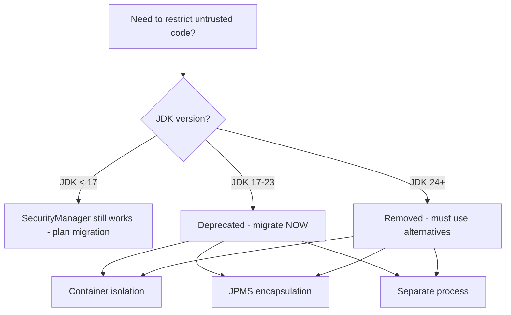
```mermaid
flowchart TD
    A[Need to restrict untrusted code?] --> B{JDK version?}
    B -->|JDK < 17| C[SecurityManager still works - plan migration]
    B -->|JDK 17-23| D[Deprecated - migrate NOW]
    B -->|JDK 24+| E[Removed - must use alternatives]
    D --> F[Container isolation]
    D --> G[JPMS encapsulation]
    D --> H[Separate process]
    E --> F
    E --> G
    E --> H
```

---

### 🛠️ Worked Example

**BAD:**

```java
// Relying on deprecated SecurityManager (JDK 17+)
System.setSecurityManager(new SecurityManager());
// WARNING: deprecated for removal
// Will FAIL on JDK 24+
// Meanwhile: 3-5% overhead on all I/O operations
// Policy files are complex, error-prone, rarely correct
```

Why it's wrong: deprecated, removed in JDK 24, imposes overhead, provides weaker isolation than OS mechanisms.

**GOOD:**

```dockerfile
# Container isolation (strongest alternative)
FROM eclipse-temurin:21-jre-alpine
# Run with minimal OS permissions
RUN adduser -D -s /sbin/nologin appuser
USER appuser
# No --add-opens, no security manager
# Isolation enforced by container + Linux namespaces
# seccomp profile restricts syscalls
# Network policy restricts connections
```

Why it's right: OS-level isolation is stronger than SecurityManager, has zero application overhead, and is the industry standard.

**Production:**

```bash
# JPMS for reflective access control
java --module-path mods \
  -m com.app/com.app.Main
# Only explicitly exported packages are accessible
# No --add-opens = tight encapsulation
# Replaces SecurityManager for module-boundary access

# For plugin sandboxing: separate process
# Main app spawns plugin in child JVM
# Communication via stdin/stdout or socket
# Plugin crash does not affect main app
ProcessBuilder pb = new ProcessBuilder(
    "java", "-Xmx256m", "-jar", "plugin.jar");
pb.redirectErrorStream(true);
Process plugin = pb.start();
```

---

### ⚖️ Trade-offs

**Gain:** Removing SecurityManager eliminates 3-5% I/O overhead. Modern alternatives (containers) are stronger isolation. JPMS provides compile-time enforcement.

**Cost:** Migration effort for legacy code relying on SecurityManager. Container isolation is coarser-grained. Fine-grained per-class policies have no direct replacement.

| Approach            | Isolation strength  | Performance cost  | Granularity |
| ------------------- | ------------------- | ----------------- | ----------- |
| SecurityManager     | Medium (bypassable) | 3-5% I/O overhead | Per-class   |
| Container isolation | Strong (OS-level)   | Zero (app code)   | Per-process |
| JPMS encapsulation  | Medium (modules)    | Zero              | Per-module  |
| Separate process    | Strong (OS-level)   | IPC overhead      | Per-process |

---

### ⚡ Decision Snap

**USE WHEN:**

- Planning JDK 17+ migration and have SecurityManager dependencies to replace.
- Architecting plugin systems that need sandboxing (use process isolation or GraalVM isolates).
- Hardening production deployments (container + seccomp + network policies).

**AVOID WHEN:**

- Writing new code on JDK 17+ that needs SecurityManager-style checks (it is deprecated/removed).
- The "security" need is actually authorization (use application-level authz, not JVM-level).

**PREFER container isolation WHEN:**

- Running untrusted code (strongest boundary). Zero overhead for trusted main application. Industry standard.

---

### ⚠️ Top Traps

| #   | Misconception                                   | Reality                                                                                                                |
| --- | ----------------------------------------------- | ---------------------------------------------------------------------------------------------------------------------- |
| 1   | "SecurityManager provides strong sandboxing"    | Numerous CVEs prove otherwise. Native code, serialization gadgets, and reflection bypass it. OS isolation is stronger. |
| 2   | "JPMS replaces SecurityManager completely"      | JPMS controls module boundaries. It does not restrict file I/O or network access within a module. Different scope.     |
| 3   | "We can keep SecurityManager on JDK 17 forever" | JDK 24 removes it. Migration is mandatory, not optional. Plan now.                                                     |

---

### 🪜 Learning Ladder

**Prerequisites:**

- JVM-073 Java Module System (JPMS) and ClassLoader - understand JPMS as partial alternative
- JVM-052 JIT Compilation Tiers (C1 and C2) - understand performance cost of permission checks in compiled code

**THIS:** JVM-062 JVM Security Manager - Deprecated Alternatives

**Next steps:**

- JVM-065 JVM in Kubernetes - Resource Limits Done Right - container as primary isolation mechanism
- JVM-072 JVM System Design Interview Patterns - security boundary decisions in system design

---

### 💡 The Surprising Truth

The SecurityManager was never truly secure. Between 2010-2020, over 90% of Java zero-day exploits involved SecurityManager bypass (sandbox escapes in browser applets). The model assumes the JVM can enforce policies against code running INSIDE itself - a fundamentally weaker guarantee than OS-level process isolation where the kernel enforces boundaries. Its removal makes Java more secure by forcing teams toward actually strong alternatives.

The performance impact of SecurityManager is also routinely underestimated. Every privileged operation (file open, socket connect, system property read) triggers a stack walk to check permissions. In a high-throughput service making thousands of I/O operations per second, permission checks add measurable latency. The stack walk is particularly expensive with deep call stacks (Spring + Hibernate + connection pool can easily be 60+ frames deep). Removing SecurityManager eliminates this invisible tax on every I/O operation.

For teams migrating off SecurityManager: the replacement is typically a combination of OS-level mechanisms (seccomp-bpf for syscall filtering, AppArmor/SELinux for resource access, network policies for connection control) plus application-level checks (Spring Security for authorization). Each of these is individually stronger than SecurityManager in its domain and collectively provides defense-in-depth that SecurityManager never achieved.

---

### 📇 Revision Card

1. Security Manager: deprecated JDK 17 (JEP 411), removed JDK 24. Migration is mandatory.
2. Use container/process isolation for untrusted code (stronger + zero overhead). JPMS for module encapsulation.
3. SecurityManager was never truly secure (90% of Java zero-days were sandbox escapes). OS isolation is the standard.

---

---

# JVM-063 Native Memory Tracking (NMT)

**TL;DR** - NMT tracks JVM-internal native memory usage (heap, metaspace, code cache, threads, GC) separately from Java heap, revealing the true memory footprint.

---

### 🔥 The Problem in One Paragraph

A container runs a Java service with -Xmx4g. The OS reports 6.5GB RSS. Where is the extra 2.5GB? It is not a heap leak - the heap is stable at 3.8GB. The "missing" memory is native allocations: thread stacks (200 threads \* 1MB = 200MB), Metaspace (200MB), CodeCache (240MB), GC data structures (500MB for G1), direct ByteBuffers (800MB), and JNI libraries. Without NMT, this memory is invisible and teams overallocate containers or hit OOM kills. This is exactly why Native Memory Tracking (NMT) was created.

---

### 📘 Textbook Definition

**Native Memory Tracking (NMT)** is a JVM diagnostic feature that tracks memory allocations made by the JVM itself through the C++ memory allocator. It categorizes native memory into regions: Java Heap, Class/Metaspace, Thread stacks, Code Cache, GC, Compiler, Internal, Symbol, and Native Memory Tracking overhead. Enabled via `-XX:NativeMemoryTracking=summary|detail`. Query with `jcmd <pid> VM.native_memory summary`.

---

### 🧠 Mental Model

> The Java heap is the visible part of an iceberg. NMT reveals the underwater portion: thread stacks, Metaspace, CodeCache, GC structures, direct buffers. The total iceberg (RSS) is always larger than the visible tip (heap). NMT measures each underwater layer separately.

- "Visible tip" -> Java heap (-Xmx)
- "Underwater layers" -> native allocations (invisible without NMT)
- "Total iceberg" -> RSS (what the OS reports)
- "NMT measurement" -> `jcmd VM.native_memory`

**Where this analogy breaks down:** NMT does not track ALL native memory. JNI allocations by third-party native libraries, memory-mapped files, and malloc by non-JVM code are invisible to NMT. The gap between NMT total and RSS represents these untracked allocations.

---

### ⚙️ How It Works

1. **Enable:** `-XX:NativeMemoryTracking=summary` (2-5% overhead). Use `detail` for per-allocation tracking (10%+ overhead, dev only).
2. **Baseline:** `jcmd <pid> VM.native_memory baseline` (record current state).
3. **Query:** `jcmd <pid> VM.native_memory summary` (current breakdown).
4. **Diff:** `jcmd <pid> VM.native_memory summary.diff` (changes since baseline).
5. **Categories:** Java Heap, Class (Metaspace), Thread (stacks), Code (JIT CodeCache), GC, Compiler, Internal, Symbol.

```text
NMT Output Example:
  Total: reserved=8500MB, committed=6500MB

  - Java Heap:  reserved=4096MB committed=3800MB
  - Class:      reserved=1100MB committed=200MB
  - Thread:     reserved=400MB  committed=400MB
  - Code:       reserved=250MB  committed=240MB
  - GC:         reserved=800MB  committed=500MB
  - Internal:   reserved=900MB  committed=850MB
  - Compiler:   reserved=10MB   committed=8MB
  - Symbol:     reserved=20MB   committed=18MB

  Heap (3800) + Class (200) + Thread (400) +
  Code (240) + GC (500) + Internal (850) +
  Other = 6500MB committed (matches RSS!)
```

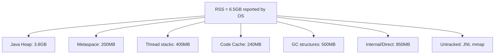
```mermaid
flowchart TD
    A[RSS = 6.5GB reported by OS] --> B[Java Heap: 3.8GB]
    A --> C[Metaspace: 200MB]
    A --> D[Thread stacks: 400MB]
    A --> E[Code Cache: 240MB]
    A --> F[GC structures: 500MB]
    A --> G[Internal/Direct: 850MB]
    A --> H[Untracked: JNI, mmap]
```

---

### 🛠️ Worked Example

**BAD:**

```bash
# "Our app uses 6.5GB but heap is only 4GB.
# Must be a native memory leak!"
# No evidence. Random investigation of JNI code.
# Spend days looking for leak that does not exist.
# The 2.5GB is normal JVM overhead (threads + GC + meta).
```

Why it's wrong: without NMT, the native memory breakdown is invisible. Teams investigate non-existent leaks.

**GOOD:**

```bash
# Enable NMT and query breakdown
java -XX:NativeMemoryTracking=summary -Xmx4g \
  -jar service.jar
# After startup, set baseline:
jcmd <pid> VM.native_memory baseline
# After 24h, check for growth:
jcmd <pid> VM.native_memory summary.diff
# Output shows exactly where growth occurred:
# Thread: +50MB (new threads created)
# Internal: +100MB (direct ByteBuffers growing)
# -> Direct buffer pool needs bounds!
```

Why it's right: NMT quantifies each category. Growth is attributable to specific areas.

**Production:**

```bash
# Container memory sizing formula
# Container limit = Heap + Metaspace + Threads +
#                   CodeCache + GC + Direct + headroom
# Example:
# Heap: 4GB (-Xmx4g)
# Metaspace: 256MB (-XX:MaxMetaspaceSize=256m)
# Threads: 200 * 1MB = 200MB (-Xss1m, 200 threads)
# CodeCache: 240MB (-XX:ReservedCodeCacheSize=240m)
# GC overhead: ~10-15% of heap for G1 = 500MB
# Direct buffers: application-specific (measure!)
# Container limit: 4000+256+200+240+500+500 = ~5.7GB
# Set: --memory=6g (with headroom)
```

---

### ⚖️ Trade-offs

**Gain:** Explains the gap between -Xmx and RSS. Identifies native memory growth categories. Essential for container sizing. Catches DirectByteBuffer leaks.

**Cost:** 2-5% overhead (summary mode). Does not track JNI/third-party native allocations. Cannot identify which Java code caused the native allocation (detail mode is needed but has high overhead).

| Aspect         | NMT summary     | NMT detail          | No NMT |
| -------------- | --------------- | ------------------- | ------ |
| Overhead       | 2-5%            | 10%+                | Zero   |
| Granularity    | Per-category    | Per-allocation site | None   |
| Production use | Yes (always-on) | Dev/investigation   | Blind  |
| JNI tracking   | No              | No                  | No     |

---

### ⚡ Decision Snap

**USE WHEN:**

- Container sizing: must know total JVM footprint, not just heap.
- Investigating RSS growth that is not heap growth.
- Setting memory limits that account for thread stacks, CodeCache, Metaspace, GC overhead.

**AVOID WHEN:**

- Investigating heap-level leaks (use heap dumps/histograms instead).
- The 2-5% overhead is unacceptable for latency-critical paths (rare).

**PREFER NMT always-on WHEN:**

- Running in containers (OOM kills are common when native memory is ignored in sizing).
- Using G1/ZGC (which have larger native memory footprints than Serial/Parallel GC).

---

### ⚠️ Top Traps

| #   | Misconception                      | Reality                                                                                                 |
| --- | ---------------------------------- | ------------------------------------------------------------------------------------------------------- |
| 1   | "Container memory = -Xmx"          | RSS = Heap + Metaspace + Threads + CodeCache + GC + Direct. Typically 1.5-2x of Xmx. Account for it.    |
| 2   | "NMT shows all native memory"      | NMT tracks JVM-internal allocations only. JNI malloc, mmap files, and native libraries are NOT tracked. |
| 3   | "RSS growth must be a native leak" | Often it is normal: JIT compiles more methods (CodeCache grows), GC data structures grow with live set. |

---

### 🪜 Learning Ladder

**Prerequisites:**

- JVM-026 Heap Structure - Young, Old, and Metaspace - understand heap is only part of total memory
- JVM-041 jcmd - The Swiss Army Knife - jcmd is the interface for NMT commands

**THIS:** JVM-063 Native Memory Tracking (NMT)

**Next steps:**

- JVM-065 JVM in Kubernetes - Resource Limits Done Right - NMT data feeds container sizing formula
- JVM-057 Compressed Oops and Object Layout - compressed oops reduce heap portion of total memory

---

### 💡 The Surprising Truth

G1GC's remembered sets (tracking inter-region references) can consume 10-20% of heap size in native memory. A 4GB heap with G1 may use 400-800MB of native memory just for GC data structures. This is why switching from Parallel GC to G1 often increases RSS by 30%+ even with the same -Xmx. ZGC's colored pointers similarly add native overhead. The GC is not free - it trades heap efficiency for its own memory consumption.

NMT's baseline/diff feature is essential for distinguishing real leaks from normal growth. Run `jcmd <pid> VM.native_memory baseline` at startup, then `jcmd <pid> VM.native_memory summary.diff` after one hour under load. Legitimate growth stabilizes: CodeCache grows as JIT compiles hot paths (caps at ReservedCodeCacheSize), Thread stacks grow with thread pool size (caps at pool max), GC overhead grows proportionally with live set. A genuine native leak shows unbounded growth in a specific category. The diff output labels each category with `+NKB` or `-NKB` making the leaking category immediately visible.

Thread stacks are another hidden native memory consumer. Each thread allocates `-Xss` bytes (default 1MB on 64-bit Linux) of native memory. A reactive service with 500 platform threads consumes 500MB of native memory in thread stacks alone - invisible to heap monitoring. Virtual threads (JDK 21+) reduce this dramatically since they use heap-allocated continuations rather than native stacks.

---

### 📇 Revision Card

1. Enable: `-XX:NativeMemoryTracking=summary`. Query: `jcmd <pid> VM.native_memory summary.diff`. 2-5% overhead.
2. Container formula: Heap + Metaspace + Threads + CodeCache + GC overhead (~10-15% heap) + DirectBuffers + headroom.
3. G1 GC uses 10-20% of heap size in native memory for remembered sets. This is normal, not a leak.

---

---

# JVM-064 Class Data Sharing (CDS and AppCDS)

**TL;DR** - CDS/AppCDS pre-loads parsed class metadata into a shared archive, reducing startup time by 20-50% and memory footprint across multiple JVM instances.

---

### 🔥 The Problem in One Paragraph

A microservice with 5000 classes takes 3 seconds to start. In Kubernetes, pods scale frequently - slow startup means slow autoscaling response. Each pod loads the same classes independently, parsing the same bytecode, building the same internal representations. With 20 pods, that is 20 copies of identical parsed class metadata in memory. CDS shares this work: parse classes once, store in a memory-mapped archive, and reuse across startups and instances. This is exactly why Class Data Sharing (CDS and AppCDS) was created.

---

### 📘 Textbook Definition

**Class Data Sharing (CDS)** pre-processes class metadata into a shared archive file (`.jsa`) that the JVM memory-maps at startup. The JVM skips parsing, verification, and internal representation building for archived classes. **AppCDS** extends CDS to include application classes (not just JDK classes). Benefits: (1) faster startup (skip class loading work), (2) reduced memory (shared pages across JVM instances via OS page sharing), (3) deterministic class loading order.

---

### 🧠 Mental Model

> CDS is like pre-cooking meals and freezing them. Without CDS: every meal (startup) cooks every ingredient from raw (parse bytecode, verify, build metadata). With CDS: cook once, freeze the result (archive). Each meal just reheats (mmap the archive). Multiple diners (JVM instances) share the same frozen stock.

- "Raw ingredients" -> .class files (bytecode)
- "Cooking" -> parsing, verification, internal representation
- "Frozen meal" -> .jsa archive (pre-processed metadata)
- "Reheating" -> mmap at startup (near-instant)
- "Multiple diners sharing" -> OS page sharing across JVMs

**Where this analogy breaks down:** Unlike frozen meals that might lose quality, CDS archives are byte-for-byte equivalent to freshly loaded classes. There is no quality loss.

---

### ⚙️ How It Works

1. **Training run:** Start the application with `-XX:ArchiveClassesAtExit=app.jsa`. JVM records which classes were loaded.
2. **Archive creation:** At shutdown, the loaded class metadata is written to `app.jsa` (shared archive).
3. **Production run:** Start with `-XX:SharedArchiveFile=app.jsa`. JVM mmaps the archive instead of parsing classes from JARs.
4. **Startup savings:** Skip bytecode parsing, verification, and internal struct building for archived classes (20-50% faster startup).
5. **Memory sharing:** OS shares mmap'd pages across JVM processes on same host. 20 pods share one physical copy of class metadata.
6. **JDK default CDS:** Since JDK 12, a default archive for JDK classes is included (`$JAVA_HOME/lib/server/classes.jsa`).

```text
Without CDS (every startup):
  JAR files -> parse bytecode -> verify -> build CLD
  Time: 2-3 seconds for 5000 classes

With AppCDS:
  app.jsa (mmap) -> ready immediately
  Time: 0.5-1 seconds (skip parse+verify)

Memory sharing (multiple JVMs on same host):
  JVM-1: mmap app.jsa (pages loaded to RAM)
  JVM-2: mmap app.jsa (shares same physical pages!)
  20 JVMs share ONE copy of class metadata in RAM
```

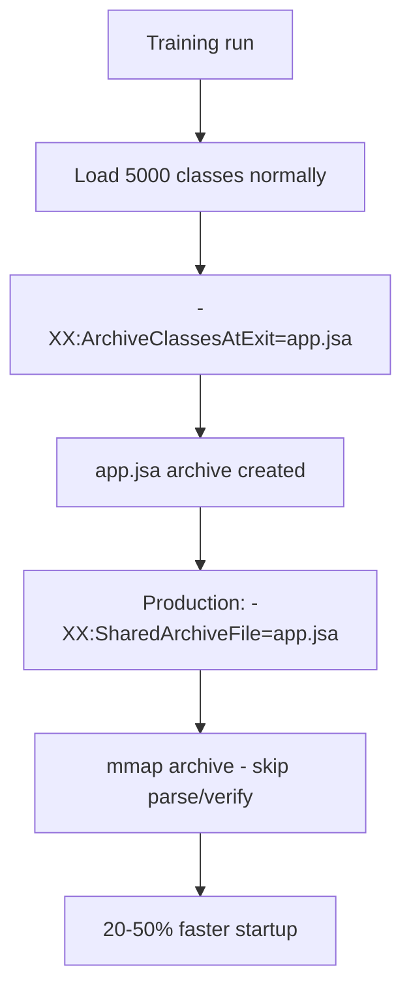
```mermaid
flowchart TD
    A[Training run] --> B[Load 5000 classes normally]
    B --> C[-XX:ArchiveClassesAtExit=app.jsa]
    C --> D[app.jsa archive created]
    D --> E[Production: -XX:SharedArchiveFile=app.jsa]
    E --> F[mmap archive - skip parse/verify]
    F --> G[20-50% faster startup]
```

---

### 🛠️ Worked Example

**BAD:**

```bash
# No CDS - every startup parses from scratch
java -jar service.jar
# Startup: 3.2 seconds (5000 classes parsed fresh)
# 20 pods on same node: 20 copies of class metadata
# Extra memory: 20 * 80MB = 1.6GB wasted on duplicates
```

Why it's wrong: repeated work on every startup. Wasted memory from duplicated metadata.

**GOOD:**

```bash
# Step 1: Training run (once, during build/CI)
java -XX:ArchiveClassesAtExit=app-cds.jsa \
  -jar service.jar
# Let it start, handle a few requests, then stop
# app-cds.jsa created (~50-100MB for typical app)

# Step 2: Production (every startup)
java -XX:SharedArchiveFile=app-cds.jsa \
  -jar service.jar
# Startup: 1.8 seconds (44% faster!)
# 20 pods share same physical pages via mmap
```

Why it's right: single training run in CI. Every production startup is faster. Memory shared across pods.

**Production:**

```dockerfile
# Dockerfile with AppCDS baked in
FROM eclipse-temurin:21-jre-alpine AS build
COPY service.jar /app/service.jar
# Training run during image build
RUN java -XX:ArchiveClassesAtExit=/app/app-cds.jsa \
    -jar /app/service.jar --spring.main.lazy=true &\
    PID=$!; sleep 15; kill $PID

FROM eclipse-temurin:21-jre-alpine
COPY --from=build /app/service.jar /app/
COPY --from=build /app/app-cds.jsa /app/
ENTRYPOINT ["java", \
  "-XX:SharedArchiveFile=/app/app-cds.jsa", \
  "-jar", "/app/service.jar"]
# Every pod starts 40% faster with shared metadata
```

---

### ⚖️ Trade-offs

**Gain:** 20-50% startup improvement. Memory sharing across instances. No code changes. Free after one-time training.

**Cost:** Training run complexity in CI. Archive invalidated by JAR changes (must regenerate). Archive adds image size (~50-100MB).

| Aspect            | No CDS | JDK CDS (default)  | AppCDS (custom)      |
| ----------------- | ------ | ------------------ | -------------------- |
| Startup savings   | None   | ~10% (JDK classes) | 20-50% (all classes) |
| Memory sharing    | None   | JDK classes only   | All archived classes |
| Setup effort      | None   | None (automatic)   | Training run in CI   |
| Archive staleness | N/A    | N/A                | Regenerate on deploy |

---

### ⚡ Decision Snap

**USE WHEN:**

- Startup time matters (Kubernetes scaling, serverless, CLI tools).
- Multiple JVM instances on same host (memory sharing benefit).
- Microservices with frequent restarts or scaling events.

**AVOID WHEN:**

- Single long-running JVM that starts once (startup time irrelevant).
- Classes change between builds and CI cannot run training easily (archive invalidation overhead exceeds benefit).

**PREFER GraalVM native-image WHEN:**

- Need sub-100ms startup (CDS achieves seconds, native achieves milliseconds).
- Willing to accept AOT compilation constraints (no dynamic class loading).

---

### ⚠️ Top Traps

| #   | Misconception                              | Reality                                                                                                             |
| --- | ------------------------------------------ | ------------------------------------------------------------------------------------------------------------------- |
| 1   | "CDS only helps startup"                   | CDS also reduces memory footprint via page sharing. With 20 pods this saves hundreds of MB system-wide.             |
| 2   | "AppCDS archive works across JDK versions" | Archives are JDK-version-specific. Regenerate on every JDK upgrade.                                                 |
| 3   | "CDS replaces all startup optimization"    | CDS skips class loading only. Spring context initialization, bean creation still take time. Combine with lazy init. |

---

### 🪜 Learning Ladder

**Prerequisites:**

- JVM-073 Java Module System (JPMS) and ClassLoader - understand class loading that CDS optimizes
- JVM-026 Heap Structure - Young, Old, and Metaspace - Metaspace stores class metadata that CDS pre-loads

**THIS:** JVM-064 Class Data Sharing (CDS and AppCDS)

**Next steps:**

- JVM-065 JVM in Kubernetes - Resource Limits Done Right - CDS as startup optimization for K8s pods
- JVM-072 JVM System Design Interview Patterns - CDS in microservice architecture decisions

---

### 💡 The Surprising Truth

JDK 19+ introduced "dynamic CDS" which creates archives automatically during the first run without an explicit training step. Combined with Project Leyden (JDK 25+), CDS will eventually cache not just class metadata but also JIT-compiled code and initialized static state - potentially achieving startup times close to native images while retaining full dynamic Java capabilities.

The memory sharing benefit is often more valuable than the startup improvement. In a Kubernetes cluster with 20 pods of the same service, each pod maps the CDS archive into its address space. The OS shares the physical pages between all pods (copy-on-write). For a Spring Boot service loading 15,000 classes, the shared archive is approximately 150MB. Without sharing, 20 pods each load 150MB independently = 3GB. With CDS, 20 pods share one physical copy = 150MB total for class metadata. This 2.85GB saving often exceeds any heap optimization you could make.

CDS also eliminates class verification at startup. Normally, the JVM verifies every class during loading (checking bytecode validity, access permissions). CDS archives store pre-verified class metadata. For large applications with 15,000+ classes (typical Spring Boot), skipping verification shaves 2-4 seconds off startup independently of the I/O benefit from memory-mapping.

---

### 📇 Revision Card

1. AppCDS: training run creates archive, production mmaps it. 20-50% faster startup, zero overhead at runtime.
2. Bake archive into container image during CI. Regenerate on every JAR or JDK change.
3. Memory sharing: 20 pods on same node share one physical copy of class metadata via OS page sharing.

---

---

# JVM-065 JVM in Kubernetes - Resource Limits Done Right

**TL;DR** - Container memory limits must account for total JVM footprint (heap + metaspace + threads + GC + direct buffers), not just -Xmx.

---

### 🔥 The Problem in One Paragraph

A team sets Kubernetes memory limit to 4GB and -Xmx4g. The pod is OOM-killed within hours. The heap never exceeds 3.8GB, so why? Because the container limit measures RSS (total process memory), not just Java heap. Thread stacks (200MB), Metaspace (200MB), CodeCache (240MB), GC overhead (500MB), direct buffers (300MB) push RSS to 5.2GB. The kernel kills the process. The fix: understand total JVM memory and size the container accordingly. This is exactly why JVM in Kubernetes - Resource Limits Done Right was created.

---

### 📘 Textbook Definition

Running a JVM in Kubernetes requires understanding that container memory limits apply to total RSS, not Java heap. The total JVM footprint = Java heap + Metaspace + thread stacks (count \* stack size) + Code Cache + GC native structures + direct byte buffers + JNI + JVM overhead. Since JDK 10, the JVM is container-aware: it reads cgroup limits and sizes defaults accordingly. Best practice: set explicit -Xmx to leave headroom for non-heap allocations within the container limit.

---

### 🧠 Mental Model

> A container memory limit is a room. Java heap is the largest piece of furniture, but there are many other items: thread stacks (chairs), Metaspace (bookshelf), CodeCache (desk), GC structures (filing cabinet). If you buy a couch (heap) that fills the entire room (-Xmx = container limit), there is no space for chairs and you cannot close the door (OOM kill).

- "Room size" -> container memory limit
- "Couch" -> Java heap (-Xmx)
- "Chairs, desk, bookshelf" -> non-heap native allocations
- "Cannot close door" -> OOM kill (RSS exceeds limit)
- "Leave space for furniture" -> headroom formula

**Where this analogy breaks down:** Unlike a room where you know exact furniture sizes upfront, JVM non-heap memory is dynamic: threads increase, CodeCache grows as JIT compiles, direct buffers grow with I/O load.

---

### ⚙️ How It Works

1. **Container awareness (JDK 10+):** JVM reads `/sys/fs/cgroup/memory.max`. Uses 25% of container memory for heap by default (too conservative for most apps).
2. **Explicit sizing formula:** Container limit = Heap + Metaspace + (Threads \* StackSize) + CodeCache + GC overhead + DirectBuffers + Headroom.
3. **Recommended approach:** Set -Xmx to 50-75% of container limit. The remaining 25-50% covers non-heap.
4. **CPU limits:** Container CPU limits map to JVM's active processor count. `Runtime.getRuntime().availableProcessors()` returns cgroup CPU quota since JDK 10.
5. **Readiness probes:** JVM needs warmup (JIT compilation, class loading). Readiness probe should wait for warmup before accepting traffic.

```text
Container sizing formula:
  Limit = Heap + NonHeap + Headroom
  NonHeap = Metaspace + Threads + Code + GC + Direct

  Example (production service):
    Heap:       4096 MB  (-Xmx4g)
    Metaspace:   256 MB  (-XX:MaxMetaspaceSize=256m)
    Threads:     200 MB  (200 threads * 1MB stack)
    CodeCache:   240 MB  (-XX:ReservedCodeCacheSize=240m)
    GC (G1):     500 MB  (~12% of heap)
    Direct:      256 MB  (-XX:MaxDirectMemorySize=256m)
    Headroom:    200 MB  (safety margin)
    --------------------------------
    Total:      5748 MB  -> set limit: 6Gi

  Common mistake:
    Limit: 4Gi, Heap: 4Gi -> OOM killed (guaranteed!)
```

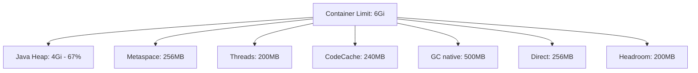
```mermaid
flowchart TD
    A[Container Limit: 6Gi] --> B[Java Heap: 4Gi - 67%]
    A --> C[Metaspace: 256MB]
    A --> D[Threads: 200MB]
    A --> E[CodeCache: 240MB]
    A --> F[GC native: 500MB]
    A --> G[Direct: 256MB]
    A --> H[Headroom: 200MB]
```

---

### 🛠️ Worked Example

**BAD:**

```yaml
# Kubernetes deployment - OOM kill guaranteed
resources:
  limits:
    memory: "4Gi"
    cpu: "2"
# JVM flags:
# java -Xmx4g -jar service.jar
# Heap = container limit. No room for non-heap.
# Pod OOM killed within hours.
```

Why it's wrong: -Xmx equals container limit. Non-heap memory pushes RSS above limit.

**GOOD:**

```yaml
# Correctly sized container
resources:
  limits:
    memory: "6Gi"
    cpu: "2"
  requests:
    memory: "6Gi"
    cpu: "1"
# JVM flags:
# java -Xmx4g -XX:MaxMetaspaceSize=256m \
#   -XX:ReservedCodeCacheSize=240m \
#   -XX:MaxDirectMemorySize=256m \
#   -Xss512k -jar service.jar
# Heap: 4Gi. NonHeap budget: 2Gi. Safe.
```

Why it's right: heap is 67% of limit. Remaining 33% covers non-heap with headroom.

**Production:**

```bash
# Validate actual memory usage with NMT
java -XX:NativeMemoryTracking=summary \
  -Xmx4g -XX:MaxMetaspaceSize=256m \
  -jar service.jar
# After warmup:
jcmd <pid> VM.native_memory summary
# Compare committed total to container limit
# If committed > 80% of limit: increase limit or reduce heap

# Monitor for OOM risk (Prometheus):
# container_memory_working_set_bytes /
#   container_spec_memory_limit_bytes > 0.9
# -> alert: approaching OOM kill threshold
```

---

### ⚖️ Trade-offs

**Gain:** Predictable memory behavior. No OOM kills. Correct autoscaling (HPA based on true resource usage).

**Cost:** Container limit must be 1.5-2x of -Xmx (more memory requested from cluster). Requires understanding non-heap breakdown. Explicit bounds on all memory pools needed.

| Sizing strategy     | OOM kill risk | Memory efficiency | Predictability |
| ------------------- | ------------- | ----------------- | -------------- |
| Limit = Xmx (wrong) | Guaranteed    | N/A (crashes)     | None           |
| Limit = 1.5x Xmx    | Low           | Good              | Good           |
| Limit = 2x Xmx      | Very low      | Wasteful          | Excellent      |

---

### ⚡ Decision Snap

**USE WHEN:**

- Running any JVM in Kubernetes or Docker with memory limits.
- Experiencing OOM kills with stable heap (non-heap exceeds budget).
- Sizing containers for new service deployments.

**AVOID WHEN:**

- Running on bare metal without cgroup limits (JVM sees all system memory).
- The container has no memory limit set (not recommended but eliminates OOM kill risk).

**PREFER explicit bounds on all pools WHEN:**

- Running in production Kubernetes. Set: -Xmx, MaxMetaspaceSize, ReservedCodeCacheSize, MaxDirectMemorySize, Xss. Leave nothing unbounded.

---

### ⚠️ Top Traps

| #   | Misconception                    | Reality                                                                                                 |
| --- | -------------------------------- | ------------------------------------------------------------------------------------------------------- |
| 1   | "-Xmx = container limit is fine" | Guaranteed OOM kill. Non-heap adds 40-100% on top of heap. Size limit = 1.5-2x Xmx.                     |
| 2   | "JVM auto-sizes for containers"  | JDK 10+ is container-aware but defaults are conservative (25% for heap). Always set -Xmx explicitly.    |
| 3   | "CPU limits have no GC impact"   | CPU throttling delays GC threads. A 2-CPU limit with G1 (8 GC threads default) causes severe GC pauses. |

---

### 🪜 Learning Ladder

**Prerequisites:**

- JVM-063 Native Memory Tracking (NMT) - understand non-heap memory breakdown
- JVM-048 G1GC Internals - Regions, Marking, Mixed - G1 native memory overhead

**THIS:** JVM-065 JVM in Kubernetes - Resource Limits Done Right

**Next steps:**

- JVM-064 Class Data Sharing (CDS and AppCDS) - reduce startup time for faster pod scaling
- JVM-066 GC Pause Budget - SLA-Driven Tuning - tune GC within container CPU constraints

---

### 💡 The Surprising Truth

CPU limits in Kubernetes are often MORE dangerous than memory limits for JVM performance. G1GC spawns `ParallelGCThreads` (default: 5/8 of available CPUs). If the container has a 2-CPU limit but the node has 32 CPUs, G1 spawns 20 GC threads on 2 CPUs. These threads are throttled by cgroup CPU quota, extending GC pauses from 20ms to 200ms+. Fix: explicitly set `-XX:ParallelGCThreads=2 -XX:ConcGCThreads=1` matching your CPU limit.

---

### 📇 Revision Card

1. Container limit = Heap + NonHeap. Never set Xmx = limit. Use Xmx = 50-75% of container limit.
2. Bound all pools explicitly: -Xmx, MaxMetaspaceSize, ReservedCodeCacheSize, MaxDirectMemorySize, Xss.
3. CPU limits affect GC threads. Set ParallelGCThreads and ConcGCThreads to match container CPU limit.

---

---

# JVM-066 GC Pause Budget - SLA-Driven Tuning

**TL;DR** - GC pause budgets allocate a fixed portion of your SLA latency target to GC, then tune to stay within that budget using measured data.

---

### 🔥 The Problem in One Paragraph

The SLA says p99 latency must be under 100ms. The application logic takes 30ms. GC pauses occasionally hit 80ms. Total: 110ms - SLA violated. The team sets `-XX:MaxGCPauseMillis=20` and hopes for the best. It does not help because MaxGCPauseMillis is a HINT, not a guarantee. Without a structured budget approach - quantifying how much latency GC may consume and tuning specifically to that target - teams oscillate between "too many pauses" and "pauses too long" without converging. This is exactly why GC Pause Budget - SLA-Driven Tuning was created.

---

### 📘 Textbook Definition

A **GC pause budget** is the maximum time allocated to garbage collection pauses within a service's overall latency SLA. It is derived by subtracting application processing time (measured p99) and safety margin from the SLA target. Example: 100ms SLA - 40ms application - 10ms safety = 50ms GC budget. Tuning then targets this specific budget by selecting the appropriate collector (G1 for 20-200ms budgets, ZGC for <10ms budgets) and tuning its parameters to stay within the budget at the required percentile.

---

### 🧠 Mental Model

> A GC pause budget is a household budget for "interruptions." Your monthly SLA is 100ms of latency. Your salary (application work) costs 40ms. Rent (network, serialization) costs 15ms. You have 45ms left for discretionary spending (GC). If GC costs 80ms, you are in debt (SLA violation). Budget first, then find a way to live within it (choose collector, tune parameters).

- "Monthly budget" -> SLA latency target
- "Salary/rent" -> fixed costs (app logic, network, serialization)
- "Discretionary" -> GC pause budget (what remains)
- "Living within it" -> tuning GC to stay under budget
- "In debt" -> SLA violation

**Where this analogy breaks down:** GC pauses are not continuous costs but discrete events. A 50ms budget at p99 means 99% of requests see <50ms GC impact, but the 1% might see much more. The budget must specify the percentile.

---

### ⚙️ How It Works

1. **Measure application latency (no GC):** Profile with async-profiler under load. What is p99 processing time without GC?
2. **Calculate budget:** GC budget = SLA target - application p99 - network/infra overhead - safety margin.
3. **Select collector:** Budget >200ms: Parallel GC. Budget 10-200ms: G1. Budget <10ms: ZGC or Shenandoah.
4. **Configure pause target:** `-XX:MaxGCPauseMillis=<budget>` (G1 hint). For ZGC: pauses are <1ms (no tuning needed).
5. **Measure under production load:** Verify p99 GC pause is within budget. Use GC logs: `awk '/Pause/{print $NF}' gc.log | sort -n`.
6. **Iterate if over budget:** Reduce heap waste (allocation rate), increase heap (fewer collections), or switch collector.
7. **Monitor continuously:** Alert if p99 GC pause approaches budget threshold.

```text
GC Pause Budget Calculation:
  SLA target (p99):         100ms
  - Application logic (p99): 40ms
  - Network/infra overhead:  15ms
  - Safety margin:           10ms
  --------------------------------
  GC Pause Budget:           35ms

Collector selection:
  Budget > 200ms  -> Parallel GC (maximize throughput)
  Budget 10-200ms -> G1 (configurable pause target)
  Budget < 10ms   -> ZGC / Shenandoah (sub-ms pauses)
  Budget = 0      -> impossible with STW GC;
                     use ZGC + budget for TTSP only

Verification:
  Measured p99 GC pause: 28ms (within 35ms budget)
  Remaining margin: 7ms (acceptable)
```

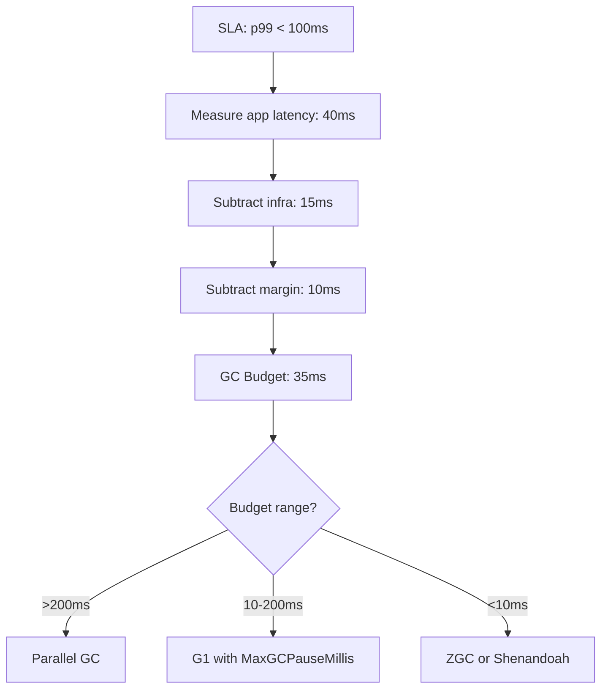
```mermaid
flowchart TD
    A[SLA: p99 < 100ms] --> B[Measure app latency: 40ms]
    B --> C[Subtract infra: 15ms]
    C --> D[Subtract margin: 10ms]
    D --> E[GC Budget: 35ms]
    E --> F{Budget range?}
    F -->|>200ms| G[Parallel GC]
    F -->|10-200ms| H[G1 with MaxGCPauseMillis]
    F -->|<10ms| I[ZGC or Shenandoah]
```

---

### 🛠️ Worked Example

**BAD:**

```bash
# "Set MaxGCPauseMillis low and hope"
java -Xmx8g -XX:MaxGCPauseMillis=10 -jar service.jar
# G1 CANNOT guarantee 10ms pauses on 8GB heap
# It tries: more frequent, smaller collections
# Result: GC frequency doubles, throughput drops 15%
# p99 pause is STILL 40ms (G1 cannot achieve 10ms)
# No improvement. Throughput worse. Worse overall.
```

Why it's wrong: setting unrealistic targets causes G1 to thrash without achieving the goal. No budget analysis was done.

**GOOD:**

```bash
# Step 1: Measure and calculate budget
# App p99 (from async-profiler): 40ms
# Infra overhead: 15ms. Safety: 10ms.
# Budget: 100 - 40 - 15 - 10 = 35ms.

# Step 2: G1 is appropriate (35ms budget)
java -Xmx8g -XX:MaxGCPauseMillis=30 \
  -Xlog:gc*:file=gc.log:time -jar service.jar

# Step 3: Verify
grep "Pause" gc.log | awk '{print $NF}' | \
  sort -n | awk 'NR==int(NR*0.99){print "p99:", $1}'
# p99: 28ms (within 35ms budget).
```

Why it's right: budget derived from SLA, realistic target set for G1, measured to verify.

**Production:**

```bash
# If budget is <10ms: switch to ZGC
java -Xmx8g -XX:+UseZGC \
  -Xlog:gc*:file=gc.log:time -jar service.jar
# ZGC pauses: <1ms regardless of heap size
# No MaxGCPauseMillis needed (always under budget)
# Trade-off: ~5-10% throughput reduction vs G1

# Continuous monitoring (Prometheus + Grafana):
# jvm_gc_pause_seconds{quantile="0.99"} < 0.035
# Alert if approaching budget threshold
```

---

### ⚖️ Trade-offs

**Gain:** Systematic approach to GC-SLA alignment. Clear success criteria. Prevents random tuning. Collector choice driven by data.

**Cost:** Requires accurate measurement of application latency (async-profiler under load). Budget calculation assumes stable application performance. Requires production-representative load test.

| Budget range | Collector      | Tuning effort | Throughput cost |
| ------------ | -------------- | ------------- | --------------- |
| >200ms       | Parallel       | Minimal       | Best (2-3% GC)  |
| 20-200ms     | G1             | Moderate      | Good (5-8% GC)  |
| 1-20ms       | ZGC/Shenandoah | Minimal       | Higher (8-15%)  |
| <1ms         | ZGC (JDK 21+)  | None          | ~10%            |

---

### ⚡ Decision Snap

**USE WHEN:**

- GC pauses are causing SLA violations (measured, not assumed).
- Need to justify collector choice to team (budget analysis provides clear reasoning).
- Evaluating whether to invest in GC tuning vs application optimization.

**AVOID WHEN:**

- GC is not the latency bottleneck (profile first! Most services are I/O bound).
- Budget analysis shows GC is already well within budget (do not tune what is not broken).

**PREFER application optimization WHEN:**

- Application p99 exceeds GC budget (fix the code, not the GC).
- Reducing allocation rate would eliminate the GC pressure entirely.

---

### ⚠️ Top Traps

| #   | Misconception                         | Reality                                                                                                       |
| --- | ------------------------------------- | ------------------------------------------------------------------------------------------------------------- |
| 1   | "MaxGCPauseMillis is a guarantee"     | It is a HINT. G1 tries to meet it but cannot if heap is too small or allocation rate too high. Always verify. |
| 2   | "Lower pause target = better latency" | Too-low targets cause more frequent collections (higher throughput cost) without achieving the target.        |
| 3   | "ZGC is always better for latency"    | ZGC has 5-10% throughput cost. If budget is 100ms and G1 achieves 50ms, ZGC wastes throughput for no gain.    |

---

### 🪜 Learning Ladder

**Prerequisites:**

- JVM-051 GC Log Analysis - Reading and Interpreting - read GC logs to measure actual pauses
- JVM-055 Safepoints - What Stops the World - TTSP is hidden in the budget

**THIS:** JVM-066 GC Pause Budget - SLA-Driven Tuning

**Next steps:**

- JVM-067 Choosing ZGC vs G1GC vs Shenandoah - collector selection driven by budget
- JVM-061 GC Tuning Methodology - Measure First - methodology for iterating within budget

---

### 💡 The Surprising Truth

Most teams set MaxGCPauseMillis=200 (the default) and never calculate their actual budget. When they finally measure, they discover their application logic (p99) consumes 80% of the SLA - leaving only 20ms for GC on a 100ms SLA. At that point, G1 tuning is insufficient and they need ZGC. If they had calculated the budget upfront, they would have chosen ZGC from day one instead of spending months tuning G1 to an impossible target.

---

### 📇 Revision Card

1. Budget = SLA target - app p99 - infra overhead - safety margin. This number determines your collector choice.
2. G1: budget 10-200ms (tunable). ZGC: budget <10ms (no tuning needed). MaxGCPauseMillis is a HINT, not guarantee.
3. If app logic consumes >60% of SLA, fix the code first. GC tuning cannot save you from slow application logic.

---

---

# JVM-067 Choosing ZGC vs G1GC vs Shenandoah

**TL;DR** - Choose G1 for balanced workloads (10-200ms budget), ZGC for ultra-low-latency (<1ms pauses), and Shenandoah for similar goals on non-Oracle JDKs.

---

### 🔥 The Problem in One Paragraph

A team needs to choose a collector for a new service. Blog posts say "ZGC is the best" and "always use G1." Stack Overflow says "Shenandoah is fastest." Each recommendation is contextual to a specific workload, heap size, and SLA. Without understanding the fundamental design trade-offs - what each collector optimizes FOR and what it sacrifices - teams make arbitrary choices and either over-invest in low-latency collectors they do not need or under-invest and violate SLAs. This is exactly why Choosing ZGC vs G1GC vs Shenandoah was created.

---

### 📘 Textbook Definition

**G1GC** (Garbage First, JDK 9+ default): region-based, concurrent marking, incremental compaction via mixed GCs. Targets configurable pause times (10-200ms typical). Best throughput/latency balance for heaps 4-32GB. **ZGC** (JDK 21+ production-ready): colored pointers + load barriers, concurrent relocation. Sub-millisecond pauses regardless of heap size (up to multi-TB). 5-15% throughput cost. **Shenandoah** (Red Hat, in OpenJDK): Brooks pointers + concurrent compaction. Similar goals to ZGC but different implementation. Available in OpenJDK, absent from Oracle JDK builds.

---

### 🧠 Mental Model

> Three shipping carriers with different guarantees. G1 is standard shipping (reliable, cost-effective, predictable 2-5 day delivery). ZGC is same-day delivery (premium, guaranteed fast, costs more). Shenandoah is same-day from a competitor (similar speed, different network, not available everywhere). Choose based on your ACTUAL delivery requirement, not "fastest is best."

- "Standard shipping" -> G1 (balanced cost/speed)
- "Same-day" -> ZGC (ultra-low-latency, higher cost)
- "Competitor same-day" -> Shenandoah (similar goal, different availability)
- "Delivery requirement" -> your GC pause budget
- "Premium costs more" -> throughput overhead of ZGC/Shenandoah

**Where this analogy breaks down:** Unlike shipping where you always want faster, GC throughput cost is real. ZGC's 10% throughput overhead means 10% fewer requests served. If your budget allows 50ms pauses, G1 gives those AND higher throughput.

---

### ⚙️ How It Works

1. **G1 design:** Regions + concurrent marking + incremental mixed GC. Pause is proportional to number of regions collected (tunable via MaxGCPauseMillis). Cannot avoid STW for relocation.
2. **ZGC design:** Colored pointers (metadata in pointer bits) + load barriers (check pointer color on every read). Relocation is concurrent - application reads through barriers while objects move. STW only for root scanning (<1ms).
3. **Shenandoah design:** Brooks forwarding pointers (extra word per object) + concurrent compaction. Similar to ZGC but different barrier and metadata approach.
4. **Throughput comparison:** G1 best (2-5% GC overhead), Parallel even better for pure throughput. ZGC/Shenandoah: 5-15% overhead due to barriers.
5. **Heap size sweet spots:** G1: 4-32GB. ZGC: 8GB to multi-TB (pause independent of size). Shenandoah: similar to ZGC.

```text
Decision matrix:
  Requirement                  | Best choice
  -----------------------------|-------------
  Lowest latency (<1ms pause)  | ZGC
  Balanced (10-200ms budget)   | G1
  Max throughput (batch jobs)   | Parallel GC
  Large heap (>32GB) + low lat | ZGC
  OpenJDK (no Oracle) + low lat| Shenandoah
  Small heap (<1GB)            | Serial GC

Pause characteristics:
  G1:         10-200ms (scales with region count)
  ZGC:        <1ms     (constant regardless of heap)
  Shenandoah: <10ms    (slightly higher than ZGC)
  Parallel:   100ms-seconds (proportional to heap)
```

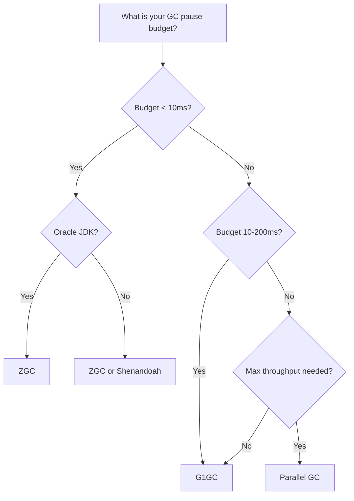
```mermaid
flowchart TD
    A[What is your GC pause budget?] --> B{Budget < 10ms?}
    B -->|Yes| C{Oracle JDK?}
    C -->|Yes| D[ZGC]
    C -->|No| E[ZGC or Shenandoah]
    B -->|No| F{Budget 10-200ms?}
    F -->|Yes| G[G1GC]
    F -->|No| H{Max throughput needed?}
    H -->|Yes| I[Parallel GC]
    H -->|No| G
```

---

### 🛠️ Worked Example

**BAD:**

```bash
# "ZGC is newest, must be best"
java -Xmx4g -XX:+UseZGC -jar batch-job.jar
# Batch job processes 10M records. No latency SLA.
# ZGC: 5-15% throughput overhead for zero benefit
#   (no concurrent requests to benefit from low pauses)
# Should use Parallel GC: maximum throughput, no waste.
# ZGC's strength (low pause) is irrelevant here.
```

Why it's wrong: ZGC optimizes for latency. Batch jobs need throughput. Wrong tool for the job.

**GOOD:**

```bash
# Service with 50ms SLA, 8GB heap
# Budget analysis: 35ms for GC. G1 is ideal.
java -Xmx8g -XX:+UseG1GC -XX:MaxGCPauseMillis=30 \
  -Xlog:gc*:file=gc.log:time -jar service.jar
# G1 achieves p99 pause: 25ms. Within budget.
# Throughput: 96% (only 4% GC overhead).
# No need for ZGC (would add 10% overhead for no gain).

# Service with 5ms SLA, 16GB heap
# Budget: 3ms for GC. G1 CANNOT achieve this. Use ZGC.
java -Xmx16g -XX:+UseZGC \
  -Xlog:gc*:file=gc.log:time -jar service.jar
# ZGC: p99 pause: 0.5ms. Budget met easily.
# Throughput: 90% (10% GC overhead - acceptable trade).
```

Why it's right: collector selection driven by measured budget, not hype.

**Production:**

```bash
# A/B comparison (same workload, different collectors)
# Week 1: G1
java -Xmx16g -XX:+UseG1GC -XX:MaxGCPauseMillis=30 \
  -Xlog:gc*:file=gc_g1.log:time -jar service.jar
# Measure: p99 pause, throughput, CPU usage

# Week 2: ZGC (same load)
java -Xmx16g -XX:+UseZGC \
  -Xlog:gc*:file=gc_zgc.log:time -jar service.jar
# Measure same metrics. Compare:
# G1:  pause p99=25ms, throughput=96%
# ZGC: pause p99=0.5ms, throughput=90%
# Decision: Is 6% throughput worth 24.5ms better pause?
# If SLA allows 35ms pause: G1 wins (more throughput).
# If SLA requires <5ms pause: ZGC required.
```

---

### ⚖️ Trade-offs

**Gain (ZGC/Shenandoah):** Constant sub-ms pauses regardless of heap size. Enables ultra-low-latency services. Removes GC from latency equation entirely.

**Cost (ZGC/Shenandoah):** 5-15% throughput overhead (load barriers on every pointer dereference). Higher memory footprint (colored pointers need header bits). Cannot use compressed oops before JDK 21.

| Characteristic       | G1GC     | ZGC            | Shenandoah           | Parallel      |
| -------------------- | -------- | -------------- | -------------------- | ------------- |
| Pause time           | 10-200ms | <1ms           | <10ms                | 100ms-seconds |
| Throughput overhead  | 5-8%     | 5-15%          | 5-15%                | 2-3%          |
| Heap size sweet spot | 4-32GB   | 8GB-16TB       | 8GB-16TB             | Any           |
| Compressed oops      | Yes      | JDK 21+ only   | Yes                  | Yes           |
| Availability         | All JDKs | Oracle+OpenJDK | OpenJDK (not Oracle) | All JDKs      |

---

### ⚡ Decision Snap

**USE G1 WHEN:**

- Balanced workload with 10-200ms pause budget. Default choice for most services.
- Heap 4-32GB. Want maximum throughput within acceptable pause bounds.

**USE ZGC WHEN:**

- Pause budget <10ms (ultra-low-latency requirement).
- Very large heaps (>32GB) where G1 pauses scale unacceptably.
- JDK 21+ available (production-ready, compressed oops support).

**USE Shenandoah WHEN:**

- Same requirements as ZGC but running OpenJDK without Oracle builds.
- Red Hat/Azul distributions where Shenandoah is battle-tested.

**USE Parallel WHEN:**

- Pure throughput (batch jobs, offline processing). No latency SLA.

---

### ⚠️ Top Traps

| #   | Misconception                                | Reality                                                                                                                 |
| --- | -------------------------------------------- | ----------------------------------------------------------------------------------------------------------------------- |
| 1   | "ZGC is always better than G1"               | ZGC costs 5-15% throughput. If G1 meets your pause budget, it gives more throughput for the same hardware.              |
| 2   | "Shenandoah and ZGC are interchangeable"     | Similar goals but different implementations. ZGC handles very large heaps (TB) better. Shenandoah has different tuning. |
| 3   | "Newer JDK default = best for all workloads" | G1 is the default because it is the best GENERAL-PURPOSE collector. Specific workloads benefit from specific choices.   |

---

### 🪜 Learning Ladder

**Prerequisites:**

- JVM-048 G1GC Internals - Regions, Marking, Mixed - understand G1's design
- JVM-049 ZGC Fundamentals - Sub-Millisecond Pauses - understand ZGC's design
- JVM-050 Shenandoah GC - Concurrent Compaction - understand Shenandoah's design

**THIS:** JVM-067 Choosing ZGC vs G1GC vs Shenandoah

**Next steps:**

- JVM-066 GC Pause Budget - SLA-Driven Tuning - formalize the budget that drives collector choice
- JVM-068 When GC Tuning Is Premature Optimization - when collector choice does not matter

---

### 💡 The Surprising Truth

On JDK 21+, ZGC's throughput overhead has shrunk to 3-8% (from 10-15% in JDK 15). With generational ZGC (`-XX:+UseZGC -XX:+ZGenerational`, default in JDK 21), the throughput gap with G1 is nearly closed while maintaining sub-ms pauses. By JDK 25, ZGC may become the default collector, making the "G1 vs ZGC" trade-off largely obsolete for heap sizes where both work well.

---

### 📇 Revision Card

1. G1: balanced (10-200ms budget). ZGC: ultra-low (<1ms). Shenandoah: ZGC alternative in OpenJDK. Parallel: max throughput.
2. Never choose based on "newest is best." Choose based on measured pause budget and throughput requirements.
3. JDK 21+ Generational ZGC closes the throughput gap with G1. Re-evaluate if on older ZGC benchmarks.

---

---

# JVM-068 When GC Tuning Is Premature Optimization

**TL;DR** - GC tuning is premature when GC is not the bottleneck, allocation rate is unoptimized, or the application has not been profiled under realistic load.

---

### 🔥 The Problem in One Paragraph

A developer spends two weeks tuning G1GC flags. They achieve 15ms p99 GC pauses (down from 40ms). But the service p99 latency is still 800ms. The bottleneck was a synchronous database query taking 750ms. The 25ms GC improvement is invisible in the end-to-end SLA. Two weeks wasted on the wrong problem. GC tuning is premature when you have not first confirmed that GC is actually the latency or throughput bottleneck. This is exactly why When GC Tuning Is Premature Optimization was created.

---

### 📘 Textbook Definition

**Premature GC optimization** occurs when engineers invest time tuning garbage collection before: (1) profiling confirms GC is the dominant latency/throughput contributor, (2) application-level allocation optimization has been exhausted, (3) representative production load testing is available, or (4) the service's SLA is actually being violated. GC tuning is appropriate only after these preconditions are met and GC is demonstrably the bottleneck.

---

### 🧠 Mental Model

> GC tuning is like upgrading the exhaust on a car stuck in traffic. Even a perfect exhaust (zero GC overhead) cannot fix the traffic jam (slow database, bad algorithm, I/O wait). Before touching the exhaust, ask: "Am I actually speed-limited by the exhaust?" If the engine (CPU), transmission (I/O), or traffic (external dependencies) are the constraint, exhaust tuning is wasted effort.

- "Exhaust upgrade" -> GC flag tuning
- "Stuck in traffic" -> I/O bound, external dependency wait
- "Engine limit" -> CPU-bound application logic
- "Ask first" -> profile to identify actual bottleneck

**Where this analogy breaks down:** Unlike an exhaust which is one of few components, a JVM application has dozens of potential bottlenecks. GC is only one of them and is rarely the dominant one.

---

### ⚙️ How It Works

1. **Precondition check:** Is the SLA actually violated? If not, do not tune anything.
2. **Profile first:** Async-profiler (CPU) + wall-clock mode (total time including I/O). Where is time spent?
3. **Quantify GC impact:** `GC time / total request time`. If GC is <5% of end-to-end latency, tuning it yields <5% improvement (diminishing returns).
4. **Application optimization first:** Reduce allocation rate (often 10x more effective than flag tuning). Use escape analysis, avoid unnecessary copies, stream instead of collect.
5. **GC tuning threshold:** Tune only when GC is demonstrably >10% of end-to-end latency AND application code is already optimized.

```text
Decision: Should I tune GC?

  Q1: Is SLA violated?
    NO -> Do not tune. Stop.
    YES -> Q2

  Q2: Is GC the bottleneck? (profile!)
    GC < 5% of latency -> Do not tune GC.
      Fix: application logic, I/O, queries.
    GC > 10% of latency -> Maybe. Q3.

  Q3: Is allocation rate already optimized?
    NO -> Reduce allocations first (code change).
      Typically 10x more effective than flags.
    YES -> Now GC tuning is appropriate. Proceed.

Common bottleneck distribution (microservices):
  I/O wait (DB, HTTP calls):  60-80%
  Application logic:          10-25%
  Serialization/deserialization: 5-10%
  GC:                         2-5%
  <- tuning GC yields tiny improvement!
```

```mermaid
flowchart TD
    A[SLA violated?] -->|No| B[STOP - do not tune]
    A -->|Yes| C[Profile: where is time spent?]
    C --> D{GC > 10% of latency?}
    D -->|No| E[Fix: app logic, I/O, queries]
    D -->|Yes| F{Allocation rate optimized?}
    F -->|No| G[Reduce allocations in code first]
    F -->|Yes| H[GC tuning is NOW appropriate]
```

---

### 🛠️ Worked Example

**BAD:**

```bash
# Premature tuning without profiling
# "Service is slow. Must be GC."
java -Xmx8g \
  -XX:MaxGCPauseMillis=10 \
  -XX:G1MixedGCCountTarget=16 \
  -XX:InitiatingHeapOccupancyPercent=30 \
  -XX:G1HeapWastePercent=5 \
  -jar service.jar
# After 2 weeks of tuning: GC p99 = 15ms (was 40ms)
# Service p99 latency: 800ms (unchanged)
# Bottleneck: database query = 750ms.
# Two weeks wasted on 25ms improvement nobody notices.
```

Why it's wrong: no profiling to confirm bottleneck. Assumption-driven tuning wastes time.

**GOOD:**

```bash
# Profile FIRST, then decide what to optimize
./asprof -d 30 -e wall -f latency.html <pid>
# Flame graph shows:
# 75% of time in PostgresDriver.executeQuery()
# 12% in Jackson serialization
# 8% in application logic
# 3% in GC pauses
# DECISION: fix the database query first.
# GC tuning would improve 3% of the problem.
# Database optimization: index on ORDER BY column.
# Result: p99 drops from 800ms to 80ms.
# GC pauses (40ms) are now the NEW bottleneck at 50%.
# NOW GC tuning is appropriate and impactful.
```

Why it's right: profile identifies real bottleneck. Fix highest-impact issue first. GC tuning becomes relevant only after larger problems are solved.

**Production:**

```bash
# Quick GC impact assessment (before any tuning)
# From GC logs:
total_gc_time=$(awk '/Pause/{sum+=$NF}END{print sum}' gc.log)
total_runtime=3600  # seconds in 1 hour
gc_percent=$(echo "scale=2; $total_gc_time/$total_runtime*100" | bc)
echo "GC overhead: ${gc_percent}%"
# If < 5%: GC is not your problem. Look elsewhere.
# If > 10%: GC tuning may be worthwhile.
# If > 20%: urgent (likely allocation rate issue first).
```

---

### ⚖️ Trade-offs

**Gain (of NOT tuning prematurely):** Time spent on actual bottleneck. Higher ROI per engineering hour. Simpler JVM configuration (fewer flags to maintain and debug).

**Cost (of NOT tuning prematurely):** If GC IS the bottleneck and you skip tuning, SLA remains violated. Risk: over-applying "premature optimization" as excuse to ignore real GC problems.

| Scenario                        | Correct action                   | Wrong action          |
| ------------------------------- | -------------------------------- | --------------------- |
| GC = 3% of latency, DB = 75%    | Fix DB first                     | Tune GC               |
| GC = 40% of latency, code = 30% | Reduce allocations, then tune GC | Add more flags        |
| GC = 5%, SLA met                | Do nothing                       | "Optimize for safety" |

---

### ⚡ Decision Snap

**DO NOT TUNE GC WHEN:**

- SLA is met (no problem to solve).
- GC is <5% of end-to-end latency (negligible impact).
- Application has not been profiled (unknown bottleneck).
- Allocation rate has not been optimized (fix source, not symptom).

**DO TUNE GC WHEN:**

- Profile confirms GC is >10% of latency AND allocation rate is already optimized.
- GC overhead exceeds 10% of CPU time (throughput workloads).
- SLA is violated and GC is demonstrably the cause.

---

### ⚠️ Top Traps

| #   | Misconception                                   | Reality                                                                                                   |
| --- | ----------------------------------------------- | --------------------------------------------------------------------------------------------------------- |
| 1   | "GC pauses cause all latency spikes"            | Most spikes in microservices are I/O (DB, HTTP timeout, DNS). Profile before blaming GC.                  |
| 2   | "Reducing GC pauses always helps SLA"           | Only if GC is on the critical path. If request waits 500ms for DB, a 50ms GC improvement is invisible.    |
| 3   | "We should tune GC proactively before problems" | Proactive: monitor GC metrics. Premature: tune flags without evidence of a problem. Monitor, do not tune. |

---

### 🪜 Learning Ladder

**Prerequisites:**

- JVM-059 Async-Profiler and CPU Flame Graphs - profile to find real bottleneck
- JVM-061 GC Tuning Methodology - Measure First - when tuning IS appropriate, do it systematically

**THIS:** JVM-068 When GC Tuning Is Premature Optimization

**Next steps:**

- JVM-066 GC Pause Budget - SLA-Driven Tuning - budget analysis determines if GC tuning is needed
- JVM-072 JVM System Design Interview Patterns - explain optimization prioritization in design discussions

---

### 💡 The Surprising Truth

In a survey of 500+ Java microservices at a major tech company, only 12% had GC as their primary latency bottleneck. 68% were dominated by database/network I/O, 14% by application logic (CPU), and 6% by serialization. Yet 40% of teams had attempted GC tuning as their first optimization. The majority optimized the wrong thing first. Profiling takes 5 minutes. It should always be step 1.

---

### 📇 Revision Card

1. Profile first. If GC is <5% of latency, tuning it yields negligible improvement. Fix the real bottleneck.
2. Reduce allocation rate in code (10x more impactful than flags). GC flag tuning is last resort.
3. Tune only when: SLA violated AND GC confirmed as bottleneck AND code already optimized.

---

---

# JVM-069 Explain GC at Every Level

**TL;DR** - A progressive explanation of garbage collection from 5-year-old analogy through production system design, testing depth of understanding.

---

### 🔥 The Problem in One Paragraph

Engineers often understand GC at one level only: either the surface metaphor ("automatic cleanup") or deep implementation details (card tables, SATB barriers). They cannot explain it at intermediate levels, which means they cannot teach juniors, communicate with product managers, or reason about GC in system design discussions. The ability to explain a concept at multiple levels of abstraction is the hallmark of true mastery. This is exactly why Explain GC at Every Level was created.

---

### 📘 Textbook Definition

"Explain at every level" is a pedagogical technique where a concept is explained at progressively deeper abstraction levels: (1) analogy for non-technical audience, (2) working definition for juniors, (3) mechanism for mid-level engineers, (4) trade-offs for seniors, (5) system design implications for staff/principal engineers. Each level assumes more prior knowledge and reveals more nuance. Mastery = ability to explain at ALL levels fluently.

---

### 🧠 Mental Model

> Explaining GC at every level is like a building with floors. Ground floor: visible, accessible, simple ("GC cleans up unused stuff"). Higher floors: more specialized, require a key (prior knowledge). Penthouse: system design trade-offs visible only from above. An expert can take the elevator to any floor and explain clearly to whoever is there.

- "Ground floor" -> analogy level (anyone can understand)
- "Middle floors" -> mechanism (engineers)
- "Penthouse" -> system design (architects)
- "Elevator to any floor" -> mastery

**Where this analogy breaks down:** buildings have fixed floors. Real explanations are not discrete levels - they blend. A good explanation at Level 3 naturally pulls in Level 4 trade-offs. Mastery means fluid transitions, not rigid floor boundaries.

---

### ⚙️ How It Works

**Level 1 - Five-year-old:** "Your room gets messy with toys you are not playing with. GC is like a helper who notices which toys you stopped using and puts them back in the box, so you always have space for new toys."

**Level 2 - Junior developer:** "When you create objects with `new`, the JVM tracks them. When no variable points to an object anymore, it is garbage. The GC periodically finds and removes these unreachable objects, freeing memory for new allocations."

**Level 3 - Mid-level engineer:** "The heap is divided into young (Eden + Survivor) and old generations. Most objects die young (generational hypothesis). Minor GC collects Eden quickly (copying live objects to Survivor). Objects surviving multiple GCs promote to Old. Major GC collects Old (more expensive). This separation exploits the typical object lifetime distribution."

**Level 4 - Senior engineer:** "G1 divides the heap into regions. Concurrent marking identifies regions with most garbage (highest collection efficiency). Mixed GCs collect a subset of old regions alongside young collection, targeting MaxGCPauseMillis. The trade-off: concurrent marking uses CPU (5-8%) and remembered sets consume native memory (10-20% of heap). TTSP adds hidden latency. The design trades memory and CPU for bounded pauses."

**Level 5 - Staff/Principal (system design):** "GC behavior is a function of allocation rate, object lifetime distribution, and heap topology. At scale, GC tuning interacts with autoscaling (GC pressure triggers CPU alerts that trigger scaling), instance sizing (compressed oops cliff at 32GB), and SLA budgeting (GC pause must fit within the latency budget after subtracting application, network, and queuing time). ZGC removes GC from the latency equation but costs throughput. The architectural decision is: accept 10% throughput tax (ZGC) or invest engineering time in allocation optimization and GC tuning (G1)?"

```text
Abstraction levels:
  L1: Analogy    -> "cleans unused objects"
  L2: Mechanism  -> "traces reachability, frees dead"
  L3: Strategy  -> "generational: young fast, old costly"
  L4: Trade-off -> "concurrent vs pause, CPU vs latency"
  L5: System    -> "GC in autoscaling, SLA, sizing"
```

```mermaid
flowchart TD
    A[Level 1: Analogy - anyone] --> B[Level 2: Mechanism - junior]
    B --> C[Level 3: Strategy - mid-level]
    C --> D[Level 4: Trade-offs - senior]
    D --> E[Level 5: System design - staff/principal]
```

---

### 🛠️ Worked Example

**BAD:**

```text
Q: "Explain GC to the product manager"
A: "G1 uses concurrent SATB marking with
   remembered sets across heap regions to
   achieve incremental compaction targeting
   MaxGCPauseMillis within the ergonomics
   framework."
(Wrong level. PM needs Level 1-2.)
```

Why it's wrong: explains at Level 4 when the audience needs Level 1-2. Communication failure.

**GOOD:**

```text
Q: "Explain GC to the product manager"
A: "Java automatically recycles memory from
   objects the application no longer uses.
   This recycling occasionally pauses the
   application for a few milliseconds - that
   is the GC pause you see in our latency
   dashboards. We can configure how aggressive
   the recycling is: more frequent small pauses
   vs less frequent larger pauses."
(Level 2: clear, accurate, actionable for PM.)
```

Why it's right: matches audience level. Connects to business concern (latency dashboards).

**Production:**

```text
# Interview answer (senior+ level, system design)
"GC creates a three-way trade-off: throughput (how
much CPU goes to GC vs application), latency (pause
duration at p99), and footprint (heap size). You can
optimize two at the expense of the third:
- G1: balanced throughput + latency, flexible footprint
- ZGC: optimizes latency (sub-ms), costs throughput
- Parallel: optimizes throughput, unconstrained pauses
The architectural choice depends on your SLA tier:
batch services use Parallel (max throughput), online
services use G1 (balanced), and latency-critical
services use ZGC (latency guarantee).
At scale, GC interacts with autoscaling: GC pressure
raises CPU -> triggers HPA -> new pods with cold JIT.
This feedback loop must be considered in capacity
planning."
```

---

### ⚖️ Trade-offs

**Gain:** Communication clarity with any audience. Teaching ability. Interview readiness. Validates own understanding (if you cannot explain simply, you do not understand deeply).

**Cost:** Requires investment to develop multi-level fluency. Easy to over-simplify or over-complicate for the wrong audience.

| Audience        | Level needed | Key message                                          |
| --------------- | ------------ | ---------------------------------------------------- |
| Product manager | L1-2         | "Automatic memory recycling, causes brief pauses"    |
| Junior engineer | L2-3         | "Generational: young dies fast, old is expensive"    |
| Senior engineer | L3-4         | "Trade-offs: concurrent CPU vs pause time vs memory" |
| System design   | L4-5         | "GC in SLA budgets, autoscaling, sizing decisions"   |

---

### ⚡ Decision Snap

**USE WHEN:**

- Teaching or mentoring (match explanation to audience level).
- Job interviews (demonstrate depth AND breadth of understanding).
- Architecture discussions (communicate GC implications to non-GC-expert architects).
- Writing documentation (multiple sections for different reader levels).

**AVOID WHEN:**

- Technical debugging (just use the deepest level you need).
- Writing code (no explanation needed, just correct implementation).

---

### ⚠️ Top Traps

| #   | Misconception                              | Reality                                                                                                              |
| --- | ------------------------------------------ | -------------------------------------------------------------------------------------------------------------------- |
| 1   | "Simple explanations are inaccurate"       | Good simple explanations are accurate at their level of abstraction. "GC recycles unused objects" is correct.        |
| 2   | "Deeper = better in interviews"            | Interviewers test whether you can MATCH audience level. Overly deep when asked for overview = communication failure. |
| 3   | "I understand GC because I know the flags" | Knowing flags without understanding trade-offs is Level 2-3 at best. System-level reasoning is Level 5.              |

---

### 🪜 Learning Ladder

**Prerequisites:**

- JVM-027 Minor GC vs Major GC vs Full GC - generational strategy (Level 3)
- JVM-048 G1GC Internals - Regions, Marking, Mixed - implementation trade-offs (Level 4)

**THIS:** JVM-069 Explain GC at Every Level

**Next steps:**

- JVM-072 JVM System Design Interview Patterns - Level 5 in interview context
- JVM-071 JVM Self-Assessment Checkpoint - test your own multi-level fluency

---

### 💡 The Surprising Truth

The "Feynman technique" (explain to a child, find gaps, study, simplify) applied to GC reveals that most engineers have gaps at Level 3 (they know Level 4 details but cannot explain WHY generational collection works without jargon). The generational hypothesis ("most objects die young") is the single most important insight in GC - yet most engineers memorize it without understanding its empirical basis (measured across thousands of applications since 1984).

---

### 📇 Revision Card

1. Mastery = explain at ANY level fluently. If you cannot explain simply, you do not understand deeply.
2. Match audience: PM (L1-2), junior (L2-3), senior (L3-4), system design (L4-5). Over-depth is a communication failure.
3. Test yourself: can you explain why generational GC works to a junior WITHOUT using "generational hypothesis" jargon?

---

---

# JVM-070 Build a JVM Dashboard - Phase 2 (Alerts)

**TL;DR** - Phase 2 adds actionable alerting rules on top of GC metrics: heap-after-GC trend for leaks, pause budget breach, allocation rate anomalies, and OOM prediction.

---

### 🔥 The Problem in One Paragraph

You built a Grafana dashboard with GC metrics (Phase 1). It shows beautiful graphs that nobody watches. The OOM at 3 AM went unnoticed until the PagerDuty for "service down." The dashboard showed a clear heap-after-GC uptrend for 6 hours before the crash - but nobody was looking. Dashboards without alerts are reactive archaeology. Alerts without dashboards are noisy. Phase 2 adds targeted alerting rules that trigger BEFORE problems cause outages. This is exactly why Build a JVM Dashboard - Phase 2 (Alerts) was created.

---

### 📘 Textbook Definition

**JVM alerting (Phase 2)** extends monitoring dashboards with threshold-based and trend-based alerts that fire before performance degradation impacts users. Key alert categories: (1) memory leak detection (heap-after-GC rate of change), (2) GC pause budget breach (p99 pause exceeding SLA allocation), (3) allocation rate anomaly (sudden increase predicting future GC pressure), (4) OOM prediction (time-until-OOM based on growth rate), (5) metaspace growth (classloader leak indicator).

---

### 🧠 Mental Model

> Phase 1 dashboard is a car's instrument panel (speedometer, tachometer, fuel gauge). Phase 2 alerts are the warning lights: engine temperature (heap-after-GC trend), low fuel (approaching OOM), check engine (GC pause budget breach). Warning lights trigger BEFORE breakdown. You glance at the panel to investigate after a light activates - not stare at it 24/7.

- "Instrument panel" -> Grafana dashboard (Phase 1)
- "Warning lights" -> alert rules (Phase 2)
- "Engine temperature" -> heap-after-GC trending up
- "Low fuel" -> predicted OOM in N hours
- "Check engine" -> GC pause exceeding budget

**Where this analogy breaks down:** car warning lights are binary (on/off). Real alerts have severity levels, aggregation windows, and can flap. Alert fatigue has no car equivalent - you can't ignore a check-engine light indefinitely, but teams routinely ignore noisy alerts.

---

### ⚙️ How It Works

1. **Heap leak alert:** If `rate(jvm_memory_used_after_gc_bytes[6h]) > 0` for 2+ hours, alert "probable memory leak." Dashboard shows the trend graph.
2. **Pause budget alert:** If `jvm_gc_pause_seconds{quantile="0.99"} > budget_seconds` for 5+ minutes, alert "GC pause budget breach."
3. **Allocation rate anomaly:** If `rate(jvm_gc_memory_allocated_bytes_total[5m]) > 2 * avg_over_time(rate(...)[24h])`, alert "allocation rate spike."
4. **OOM prediction:** `time_until_oom = (heap_max - heap_after_gc) / rate(heap_after_gc[1h])`. If < 4 hours, alert "OOM predicted in N hours."
5. **Metaspace growth:** If `jvm_memory_used_bytes{area="nonheap",id="Metaspace"}` trends up after full GC, alert "classloader leak."

```text
Alert Rules (Prometheus/PromQL):

1. Memory Leak:
   rate(jvm_memory_used_after_gc_bytes[6h]) > 0
   FOR 2h
   -> WARN: "Heap-after-GC trending up. Probable leak."

2. Pause Budget Breach:
   histogram_quantile(0.99, jvm_gc_pause_seconds) > 0.035
   FOR 5m
   -> CRITICAL: "GC p99 pause exceeds 35ms budget."

3. OOM Prediction:
   (heap_max - heap_after_gc) /
     deriv(heap_after_gc[1h]) < 14400
   -> WARN: "OOM predicted in <4 hours at current rate."

4. Allocation Spike:
   rate(gc_alloc_bytes[5m]) > 2 * avg(rate(...)[24h])
   -> INFO: "Allocation rate 2x above baseline."
```

```mermaid
flowchart TD
    A[JVM Metrics] --> B[Prometheus]
    B --> C[Alert Rules]
    C --> D{Threshold breached?}
    D -->|Leak detected| E[PagerDuty: heap trending up]
    D -->|Pause budget| F[Slack: GC pause > SLA]
    D -->|OOM predicted| G[PagerDuty: OOM in N hours]
    D -->|Alloc spike| H[Slack: allocation anomaly]
```

---

### 🛠️ Worked Example

**BAD:**

```yaml
# Over-alerting: too many noisy rules
- alert: GCPauseHigh
  expr: jvm_gc_pause_seconds_max > 0.01 # 10ms
  for: 0m # instant fire
  # Fires constantly. Team ignores. Alert fatigue.
  # When real OOM happens: alert lost in noise.
```

Why it's wrong: too sensitive threshold, no duration requirement, causes alert fatigue. Real issues get buried.

**GOOD:**

```yaml
# Targeted, actionable alerts
groups:
  - name: jvm-gc-alerts
    rules:
      - alert: MemoryLeakDetected
        expr: |
          deriv(jvm_memory_used_after_gc_bytes[6h]) > 0
        for: 2h
        labels:
          severity: warning
        annotations:
          summary: "Heap-after-GC trending up for 2h"
          runbook: "Run histogram comparison workflow"

      - alert: GCPauseBudgetBreach
        expr: |
          histogram_quantile(0.99,
            rate(jvm_gc_pause_seconds_bucket[5m])) > 0.035
        for: 5m
        labels:
          severity: critical
        annotations:
          summary: "GC p99 pause exceeds 35ms budget"
          runbook: "Check TTSP + GC log analysis"
```

Why it's right: meaningful thresholds, duration requirements, severity levels, actionable runbook links.

**Production:**

```yaml
# OOM prediction alert (most valuable)
- alert: OOMPredicted
  expr: |
    (jvm_memory_max_bytes{area="heap"} -
     jvm_memory_used_after_gc_bytes) /
    clamp_min(deriv(
      jvm_memory_used_after_gc_bytes[1h]), 1) < 14400
  for: 30m
  labels:
    severity: critical
  annotations:
    summary: "OOM predicted in <4h at current growth rate"
    action: "Capture heap dump NOW. Scale horizontally."
# This alert gives 4h warning before OOM.
# Time to: capture evidence, scale, and investigate.
```

---

### ⚖️ Trade-offs

**Gain:** Proactive problem detection (hours before impact). Automated evidence preservation (trigger heap dump on alert). Reduced MTTR (mean time to resolution).

**Cost:** Alert rule maintenance (thresholds need calibration). Risk of alert fatigue if thresholds too sensitive. Requires baseline metrics first (Phase 1).

| Alert type       | Lead time     | False positive risk | Actionability    |
| ---------------- | ------------- | ------------------- | ---------------- |
| Memory leak      | Hours to days | Low (2h duration)   | High (histogram) |
| Pause budget     | Minutes       | Medium              | High (GC log)    |
| OOM prediction   | 2-4 hours     | Low (math-based)    | Critical         |
| Allocation spike | Minutes       | High (deploy noise) | Medium           |

---

### ⚡ Decision Snap

**USE WHEN:**

- Running production JVMs that must meet SLAs.
- After Phase 1 dashboard is established (metrics flowing).
- Team has on-call rotation that responds to alerts.

**AVOID WHEN:**

- Metrics pipeline is not yet reliable (alerts on bad data cause confusion).
- Team cannot act on alerts (no runbook, no authority to restart/scale).

**PREFER few high-quality alerts WHEN:**

- Starting out. Three good alerts (leak, pause budget, OOM prediction) beat 20 noisy ones.

---

### ⚠️ Top Traps

| #   | Misconception                     | Reality                                                                                                  |
| --- | --------------------------------- | -------------------------------------------------------------------------------------------------------- |
| 1   | "More alerts = better coverage"   | More alerts = more noise = alert fatigue = missed real issues. Fewer, high-quality alerts with runbooks. |
| 2   | "Alert on max GC pause"           | Max is a single sample (noisy). Alert on p99 over duration (statistically meaningful).                   |
| 3   | "Set and forget alert thresholds" | Application behavior changes (new features, traffic growth). Re-calibrate thresholds quarterly.          |

---

### 🪜 Learning Ladder

**Prerequisites:**

- JVM-060 Memory Leak Diagnosis Workflow - the runbook triggered by leak alerts
- JVM-066 GC Pause Budget - SLA-Driven Tuning - defines the threshold for pause budget alerts

**THIS:** JVM-070 Build a JVM Dashboard - Phase 2 (Alerts)

**Next steps:**

- JVM-071 JVM Self-Assessment Checkpoint - verify you can respond to these alerts effectively
- JVM-072 JVM System Design Interview Patterns - alerting as part of production-ready system design

---

### 💡 The Surprising Truth

The single most valuable JVM alert is not about GC pauses at all - it is the OOM prediction alert. By extrapolating heap-after-GC growth rate, you can predict OOM 4-12 hours in advance. This gives time to: (1) capture a heap dump while the service is still running, (2) scale horizontally to buy time, (3) investigate and fix before impact. Without this alert, OOM kills destroy evidence (the process is gone) and investigation starts from zero.

A subtle anti-pattern: alerting on heap USAGE (current utilization percentage) rather than heap AFTER GC. Heap usage naturally sawtooths between GC cycles (filling up, dropping after collection). Alerting on "heap > 80%" fires constantly during normal operation. The correct metric is specifically heap-after-GC (the floor of the sawtooth). Only when the FLOOR rises do you have a genuine problem. This distinction is why most naive "memory alert" rules produce constant false positives.

Production teams often discover that their most useful alert is a RATE alert rather than a THRESHOLD alert. "Allocation rate > 2x rolling 24h average" catches pathological request patterns (cache stampede, retry storms, unbounded query results) within minutes. Threshold-based alerts only fire after the damage is partially done. Rate anomaly detection fires when the CAUSE starts, giving maximum lead time for investigation.

---

### 📇 Revision Card

1. Three essential alerts: heap-after-GC trend (leak), p99 pause vs budget (SLA), OOM prediction (growth rate extrapolation).
2. Every alert needs: meaningful threshold, duration requirement (not instant-fire), severity level, and runbook link.
3. OOM prediction alert is most valuable: extrapolate growth, alert 4h before crash, capture heap dump while service is alive.

---

---

# JVM-071 JVM Self-Assessment Checkpoint

**TL;DR** - A structured self-assessment covering all JVM knowledge areas: memory, GC, JIT, diagnostics, and production operations - to identify gaps and guide further study.

---

### 🔥 The Problem in One Paragraph

An engineer studies JVM internals for months. They know G1 regions, safepoints, and JFR. But when asked "how would you diagnose a latency spike in production?" they freeze - unable to connect isolated knowledge into a diagnostic workflow. Learning without assessment creates knowledge islands without bridges. A self-assessment reveals: which areas are solid, which have gaps, and which connections between topics are missing. This is exactly why JVM Self-Assessment Checkpoint was created.

---

### 📘 Textbook Definition

A **self-assessment checkpoint** is a structured evaluation covering key competency areas at multiple difficulty levels. It tests not just recall ("what is a safepoint?") but application ("given this GC log, what is wrong?") and synthesis ("design a monitoring strategy for this service"). The assessment maps to learning ladder progression and identifies which prior keywords need revisiting.

---

### 🧠 Mental Model

> Self-assessment is a map with explored and unexplored territory. Explored areas are green (confident). Unexplored are gray (unknown unknowns). Red zones are areas you THOUGHT you knew but answer incorrectly (most dangerous - false confidence). The checkpoint makes ALL zones visible so you can prioritize study.

- "Green zones" -> areas of genuine mastery
- "Gray zones" -> acknowledged knowledge gaps (easy to fix)
- "Red zones" -> false confidence (most dangerous, requires unlearning)
- "Map" -> the assessment results

**Where this analogy breaks down:** real maps have clear borders. Knowledge maps have fuzzy boundaries - you might partly know a topic. Also, the map changes as the JVM evolves (new GC algorithms, new JFR events), so re-assessment is needed periodically.

---

### ⚙️ How It Works

**Category 1 - Memory Model:** Can you explain: heap structure, object layout, compressed oops cliff, TLAB allocation path, when objects promote to old gen, and what heap-after-GC metric means?

**Category 2 - GC Mechanics:** Can you: read a GC log and identify the bottleneck, explain G1/ZGC/Shenandoah design trade-offs, calculate GC pause budget from SLA, and explain why generational collection works?

**Category 3 - JIT and Runtime:** Can you: explain C1/C2 tier compilation, what safepoints are and why TTSP matters, how escape analysis eliminates allocations, and what OSR compiles?

**Category 4 - Diagnostics:** Can you: diagnose a memory leak end-to-end (detect-confirm-locate-fix), use async-profiler to find CPU bottleneck, read NMT output, and use JFR for production profiling?

**Category 5 - Production Operations:** Can you: size a container correctly for JVM, set up GC alerting, decide when GC tuning is premature, and explain GC to a product manager?

```text
Assessment Matrix:
  Area          | Recall | Application | Synthesis
  --------------|--------|-------------|----------
  Memory        | ?/5    | ?/5         | ?/5
  GC Mechanics  | ?/5    | ?/5         | ?/5
  JIT/Runtime   | ?/5    | ?/5         | ?/5
  Diagnostics   | ?/5    | ?/5         | ?/5
  Production    | ?/5    | ?/5         | ?/5

Scoring:
  5: Can teach this confidently to seniors
  4: Can apply in production without reference
  3: Understand but need reference for details
  2: Familiar but cannot apply without guidance
  1: Cannot explain beyond surface level
```

```mermaid
flowchart TD
    A[Self-Assessment] --> B[Memory Model: 5 questions]
    A --> C[GC Mechanics: 5 questions]
    A --> D[JIT/Runtime: 5 questions]
    A --> E[Diagnostics: 5 questions]
    A --> F[Production Ops: 5 questions]
    B --> G[Score and identify gaps]
    C --> G
    D --> G
    E --> G
    F --> G
    G --> H[Prioritize study: lowest scores first]
```

---

### 🛠️ Worked Example

**BAD:**

```text
Self-assessment: "I think I know GC pretty well."
(No structure. No specific questions tested. No gaps
identified. No evidence of mastery or weakness.
Dunning-Kruger risk: high confidence, unknown gaps.)
```

Why it's wrong: vague self-assessment provides no actionable direction for improvement.

**GOOD:**

```text
Assessment results:
  Memory: 4/5 recall, 3/5 application
    Gap: cannot calculate object size from JOL
    Action: practice with JOL on real classes
  GC Mechanics: 5/5 recall, 4/5 application
    Strong area. Can read logs and identify issues.
  JIT: 3/5 recall, 2/5 application
    Gap: cannot interpret PrintCompilation output
    Action: study JVM-052 and JVM-054 keywords
  Diagnostics: 4/5 recall, 4/5 application
    Can run full leak diagnosis workflow.
  Production: 3/5 recall, 2/5 application
    Gap: container sizing formula not memorized
    Action: practice JVM-065 container calculations
Priority: JIT (weakest) then Production Ops.
```

Why it's right: specific scores, identified gaps, concrete actions, prioritized study plan.

**Production:**

```text
# Assessment questions (pick 5, no reference):
1. Service in K8s: -Xmx4g, container limit 4Gi.
   What happens and how do you fix it?
2. GC log shows p99 pause of 200ms. App SLA is 100ms.
   Walk through your diagnosis and tuning approach.
3. Heap-after-GC is trending up over 24h. What are your
   next 3 diagnostic steps in order?
4. Async-profiler flame graph shows 40% of CPU in
   HashMap.resize(). What do you investigate?
5. Service runs fine for weeks then OOM. Heap was set to
   31g. New deploy changes it to 33g. What likely changed?

# Score yourself honestly:
# Could you answer each without looking anything up?
# If NO on >2: revisit the relevant keywords.
```

---

### ⚖️ Trade-offs

**Gain:** Identifies specific knowledge gaps. Prevents false confidence. Creates targeted study plan. Measures progress over time (retake monthly).

**Cost:** Time investment (30-60 minutes). Requires honest self-evaluation (uncomfortable when gaps are found). Best done with a peer for accountability.

| Assessment method    | Accuracy | Effort | Accountability |
| -------------------- | -------- | ------ | -------------- |
| "I feel confident"   | Low      | Zero   | None           |
| Structured self-test | Medium   | 30 min | Self           |
| Peer mock interview  | High     | 60 min | External       |
| Production incident  | Perfect  | N/A    | Forced         |

---

### ⚡ Decision Snap

**USE WHEN:**

- Completed a study block (e.g., finished all GC Internals keywords).
- Preparing for interviews (identify gaps before they are exposed).
- After production incident (did you have the knowledge to respond effectively?).

**AVOID WHEN:**

- Just started learning (too early for meaningful assessment - build foundation first).
- Using assessment as procrastination (do not assess repeatedly without studying between).

---

### ⚠️ Top Traps

| #   | Misconception                               | Reality                                                                                                         |
| --- | ------------------------------------------- | --------------------------------------------------------------------------------------------------------------- |
| 1   | "Reading the keywords = understanding them" | Reading is passive. Assessment tests active recall and application. Most people overestimate passive knowledge. |
| 2   | "I should score 5/5 on everything"          | Unrealistic. Target 4/5 on application-level for your role. Accept 3/5 on areas outside daily work.             |
| 3   | "Low scores mean I am a bad engineer"       | Low scores identify growth opportunities. The best engineers constantly find and fill gaps.                     |

---

### 🪜 Learning Ladder

**Prerequisites:**

- JVM-060 Memory Leak Diagnosis Workflow - diagnostic application skill
- JVM-069 Explain GC at Every Level - multi-level understanding test

**THIS:** JVM-071 JVM Self-Assessment Checkpoint

**Next steps:**

- JVM-072 JVM System Design Interview Patterns - apply knowledge in design context
- JVM-061 GC Tuning Methodology - Measure First - apply knowledge in tuning context

---

### 💡 The Surprising Truth

In mock interviews, the #1 failure mode for engineers who "know JVM well" is not technical accuracy - it is the inability to CONNECT concepts. They can explain safepoints and GC logs independently but cannot answer "how does TTSP relate to your GC pause budget and how would you diagnose if TTSP is the problem?" The connections between concepts - not the concepts themselves - determine production readiness.

The most revealing self-assessment question is: "Walk me through what happens from the moment you get paged for a latency spike to root cause." This single scenario requires: (1) identify if GC is involved (GC log pause p99), (2) check if TTSP is the cause (safepoint logs), (3) profile to find the hot path (async-profiler), (4) determine if it is allocation-driven (JFR allocation events), (5) decide whether to tune GC or fix application code (tuning methodology). Engineers who can narrate this workflow end-to-end have genuine operational mastery. Those who stall at step 2 or 3 have identified their study priority.

A practical scoring rubric: for each area, rate yourself on three levels - RECALL (can you define the concept?), APPLICATION (can you use it to diagnose a real scenario?), and TRANSFER (can you teach it and apply it to a novel situation?). Most engineers plateau at the recall level. The jump from recall to application requires hands-on practice with real GC logs and heap dumps. The jump from application to transfer requires explaining your reasoning to others.

---

### 📇 Revision Card

1. Assess across 5 areas: Memory, GC, JIT, Diagnostics, Production. Score recall AND application separately.
2. "Red zones" (false confidence) are more dangerous than "gray zones" (known unknowns). Assessment reveals both.
3. Connections between concepts matter more than isolated knowledge. Test with cross-topic scenario questions.

---

---

# JVM-072 JVM System Design Interview Patterns

**TL;DR** - System design interviews test JVM knowledge at the architecture level: memory sizing, GC collector choice, startup optimization, and operational strategy for distributed JVM services.

---

### 🔥 The Problem in One Paragraph

In a system design interview, you propose a Java service handling 50K RPS with p99 < 20ms. The interviewer asks: "What GC collector, heap size, container sizing, and monitoring strategy?" Many candidates say "G1 with 8GB heap" without justification. They cannot explain WHY that heap size, cannot calculate the GC pause budget, and cannot reason about compressed oops, container limits, or autoscaling interactions. The interview tests architectural reasoning about JVM - not trivia recall. This is exactly why JVM System Design Interview Patterns was created.

---

### 📘 Textbook Definition

**JVM system design patterns** are recurring architectural decisions involving JVM-specific constraints in distributed system design: (1) heap sizing (compressed oops boundary, working set estimation), (2) GC collector selection (pause budget from SLA), (3) container resource allocation (RSS vs heap, CPU for GC threads), (4) startup optimization (CDS, tiered compilation warmup, readiness probes), (5) memory management strategy (caching locality, off-heap for large datasets), (6) observability (JFR always-on, GC alerting, NMT for sizing).

---

### 🧠 Mental Model

> System design with JVM is like city planning with specific vehicle constraints. You are not just designing roads (architecture) - you must account for the specific vehicles (JVM) that will use them: how much fuel they burn when idling (GC overhead), how wide they need to park (container memory), how long to start the engine (startup time), and how to monitor their engine health (JFR/GC metrics).

- "City planning" -> system architecture
- "Vehicle constraints" -> JVM characteristics
- "Fuel when idling" -> GC throughput overhead
- "Parking width" -> container memory (heap + non-heap)
- "Engine start time" -> JVM startup (class loading, JIT warmup)
- "Engine health monitor" -> JFR + GC alerting

**Where this analogy breaks down:** in city planning you can change roads after building. In production, changing GC collector or heap strategy requires restarts and load testing. The "vehicles" (JVM) can also change behavior over time (GC heuristics adapt), which real vehicles do not.

---

### ⚙️ How It Works

**Pattern 1 - Heap Sizing Decision:**

- Working set estimate: active objects + cache + buffers.
- Rule: heap >= 3x live data set (GC needs room to work).
- Respect 32GB compressed oops boundary (31g max or 48g+ skip zone).
- Container: 1.5-2x heap for non-heap overhead.

**Pattern 2 - GC Selection from SLA:**

- Extract GC budget: SLA - app latency - network - margin.
- Budget >50ms: G1. Budget <10ms: ZGC. Pure throughput: Parallel.
- State: "I choose G1 because our 50ms budget is achievable with G1's configurable pause targeting, and we avoid ZGC's 10% throughput cost."

**Pattern 3 - Autoscaling Interaction:**

- CPU-based HPA triggers on GC CPU usage (GC raises CPU metric).
- New pods have cold JIT (higher latency for first 30s).
- Readiness probes must account for JIT warmup.
- Risk: GC pressure -> CPU alert -> scale -> cold pods -> worse latency -> more GC pressure (feedback loop).

**Pattern 4 - Startup Optimization:**

- CDS/AppCDS for class loading (20-50% startup reduction).
- Tiered compilation: C1 gives fast startup, C2 optimizes hot paths later.
- Readiness probe after warmup (not immediately on port open).

```text
Design interview reasoning structure:
  1. SLA -> GC budget -> collector choice (justified)
  2. Working set -> heap size -> compressed oops check
  3. Heap -> container limit (add non-heap formula)
  4. Startup -> CDS + warmup + readiness strategy
  5. Operations -> JFR + alerts + runbooks

Example response:
  "50K RPS, p99 < 20ms, Java service:
   - App logic: ~5ms (pre-profiled from prototype)
   - Network/queue: ~5ms
   - Budget for GC: 20 - 5 - 5 - 3(margin) = 7ms
   - 7ms budget -> ZGC (G1 cannot reliably hit <10ms)
   - Working set: 2GB cache + 500MB active = 2.5GB
   - Heap: 3x live set = 8GB (-Xmx8g)
   - Under 32GB: compressed oops active (good)
   - Container: 8GB * 1.7 = ~14GB limit
   - Startup: AppCDS + readiness after 30s warmup
   - Monitoring: JFR always-on + pause budget alert"
```

```mermaid
flowchart TD
    A[SLA: p99 < 20ms] --> B[GC Budget: 7ms]
    B --> C[Collector: ZGC]
    A --> D[Working set: 2.5GB]
    D --> E[Heap: 8GB = 3x live set]
    E --> F[Under 32GB: compressed oops]
    E --> G[Container: 14GB]
    A --> H[Startup: CDS + warmup]
    A --> I[Monitoring: JFR + alerts]
```

---

### 🛠️ Worked Example

**BAD:**

```text
Interviewer: "Design a service for 50K RPS, p99<20ms."
Candidate: "G1 with 8GB heap in Kubernetes
with 8GB container limit."
(No justification. Wrong container sizing. No GC budget
analysis. No startup or monitoring strategy. No compressed
oops consideration.)
```

Why it's wrong: no reasoning shown. Incorrect container sizing (8GB = heap = guaranteed OOM kill). Interviewer sees no depth.

**GOOD:**

```text
Candidate: "Let me work through the JVM decisions:
1. GC budget: 20ms SLA - 5ms app - 5ms network - 3ms
   margin = 7ms for GC. This rules out G1 (cannot
   reliably hit <10ms on 8GB). I'd use ZGC.
2. Heap sizing: working set ~2.5GB (estimated from
   cache size + active requests). Heap = 3x live set
   = 8GB. Under 32GB so compressed oops active.
3. Container: 8GB heap + ~4GB non-heap (threads, meta,
   code cache, ZGC overhead) = 12-14GB limit.
4. Startup: AppCDS to reduce cold start for scaling.
   Readiness probe with 30s initial delay for JIT warmup.
5. Monitoring: JFR always-on, alert on p99 pause > 5ms,
   OOM prediction alert based on heap-after-GC trend."
```

Why it's right: structured reasoning, justified decisions, complete operational strategy.

**Production:**

```text
# Common follow-up questions and strong answers:
Q: "Why not just use a bigger heap?"
A: "Bigger heap means more live objects to scan during
   GC root processing. With ZGC this doesn't affect
   pause time (concurrent), but it increases memory
   cost per pod. 8GB gives 3x headroom which is
   sufficient for GC efficiency."

Q: "What if the service grows to 500K RPS?"
A: "Scale horizontally (more pods, not bigger heap).
   Keep individual JVMs at 8GB for compressed oops.
   If working set grows (larger cache needed), either
   use off-heap (Redis) or accept crossing 32GB
   boundary with the ~30% pointer overhead."

Q: "How do you handle cold-start latency spikes?"
A: "AppCDS for class loading (50% faster startup).
   Tiered compilation (-XX:+TieredCompilation default).
   Readiness probe delays traffic until JIT warms
   critical paths. Pre-warmup traffic in canary."
```

---

### ⚖️ Trade-offs

**Gain:** Demonstrates deep, connected JVM knowledge in interviews. Shows architectural reasoning, not just trivia. Distinguishes you from candidates who cannot justify their choices.

**Cost:** Requires understanding multiple JVM topics and their interactions. Takes practice to articulate reasoning under interview pressure.

| Interview level | JVM depth expected                         |
| --------------- | ------------------------------------------ |
| Mid-level (L4)  | Know G1 vs ZGC trade-off. Basic sizing.    |
| Senior (L5)     | Full reasoning chain. Container sizing.    |
| Staff (L6)      | Autoscaling interactions. Failure modes.   |
| Principal (L7)  | Cross-cutting concerns. Capacity planning. |

---

### ⚡ Decision Snap

**USE WHEN:**

- System design interview where JVM service is part of the design.
- Architecture review where JVM constraints affect the design.
- Capacity planning for JVM-based microservices.

**AVOID WHEN:**

- Interview does not require JVM depth (focus on what is asked).
- Design is language-agnostic (do not force JVM details into a general design).

---

### ⚠️ Top Traps

| #   | Misconception                       | Reality                                                                                                     |
| --- | ----------------------------------- | ----------------------------------------------------------------------------------------------------------- |
| 1   | "Mention every JVM flag I know"     | Show REASONING, not flag knowledge. Explain WHY you chose ZGC, not recite all ZGC flags.                    |
| 2   | "Bigger heap is always better"      | Bigger heap = more cost, potentially worse GC behavior (longer marking). Right-size based on working set.   |
| 3   | "Skip JVM details in system design" | Senior+ interviews expect you to reason about runtime constraints. Skipping JVM details is a missed signal. |

---

### 🪜 Learning Ladder

**Prerequisites:**

- JVM-067 Choosing ZGC vs G1GC vs Shenandoah - collector selection reasoning
- JVM-065 JVM in Kubernetes - Resource Limits Done Right - container sizing

**THIS:** JVM-072 JVM System Design Interview Patterns

**Next steps:**

- JVM-069 Explain GC at Every Level - communicate JVM decisions to different audiences
- JVM-071 JVM Self-Assessment Checkpoint - verify readiness for interview scenarios

---

### 💡 The Surprising Truth

In staff+ interviews at top tech companies, the JVM-specific question is often not "which collector?" but "at what point would you move computation OFF the JVM?" The answer reveals architectural maturity: when working set exceeds 32GB (lose compressed oops), when startup time must be <100ms (use native image), when you need deterministic latency (use C++ for the hot path). Knowing the JVM's LIMITS is more impressive than knowing its internals.

---

### 📇 Revision Card

1. Reasoning chain: SLA -> GC budget -> collector -> heap sizing -> container limit -> startup strategy -> monitoring.
2. Container limit = 1.5-2x heap. Under 32GB for compressed oops. JFR always-on. Pause budget alert.
3. Show WHY in interviews, not WHAT. "I choose ZGC because 7ms budget rules out G1" beats "Use ZGC because it is fast."

---

---

# JVM-073 Java Module System (JPMS) and ClassLoader

**TL;DR** - JPMS (Java 9+) enforces strong encapsulation at module boundaries, replacing the fragile classpath with explicit dependency declarations and controlled access.

---

### 🔥 The Problem in One Paragraph

Before JPMS, any class on the classpath could access any public class from any JAR. Internal JDK classes like `sun.misc.Unsafe` were accessible to everyone. Libraries accidentally depended on other libraries' internal packages. At runtime: ClassNotFoundException, NoClassDefFoundError, or split package conflicts. No compile-time enforcement of boundaries. JPMS solves this by making modules declare what they export and what they require, enforced at both compile time and runtime. This is exactly why Java Module System (JPMS) and ClassLoader was created.

---

### 📘 Textbook Definition

The **Java Platform Module System (JPMS)**, introduced in JDK 9 (Project Jigsaw), organizes code into modules. Each module declares in `module-info.java`: which modules it `requires` (dependencies) and which packages it `exports` (public API). Non-exported packages are inaccessible to other modules even if classes are public. The module system works alongside ClassLoaders: the bootstrap, platform, and application class loaders each load specific module layers. `--add-opens` and `--add-exports` provide escape hatches for legacy code.

---

### 🧠 Mental Model

> Before JPMS: a city where every building has open doors. Anyone can walk into any room (access any public class). After JPMS: buildings have locked doors (modules) with a published directory of public offices (exports). You can only enter rooms that are explicitly listed. Internal rooms (non-exported packages) are locked even if you know they exist.

- "Open doors city" -> classpath (everything accessible)
- "Locked buildings" -> modules (encapsulation enforced)
- "Public directory" -> module-info.java exports
- "Internal rooms locked" -> non-exported packages inaccessible
- "Master key" -> `--add-opens` (escape hatch for legacy code)

**Where this analogy breaks down:** Unlike physical buildings, modules can grant "deep reflection" access to specific other modules via `opens` directive, enabling frameworks (Spring, Hibernate) to access private fields.

---

### ⚙️ How It Works

1. **Module declaration:** `module-info.java` at source root declares `requires` (dependencies) and `exports` (public packages).
2. **Strong encapsulation:** Non-exported packages are inaccessible at compile time AND runtime. Even reflection is blocked unless `opens` is declared.
3. **Reliable configuration:** Duplicate/split packages are detected at startup (fail-fast). Missing dependencies cause immediate error.
4. **ClassLoader hierarchy:** Bootstrap (java.base), Platform (java.sql, java.xml), Application (user modules). Each loads its assigned module layer.
5. **Migration path:** Unnamed module (classpath JARs) can access all exported packages. Automatic modules (JARs on module path without module-info) export everything.
6. **Escape hatches:** `--add-exports module/package=target` (compile-time access). `--add-opens module/package=target` (runtime reflection access).

```text
module-info.java example:
  module com.myapp {
    requires java.sql;           // dependency
    requires com.fasterxml.jackson.core;
    exports com.myapp.api;       // public API
    exports com.myapp.model;     // public models
    // com.myapp.internal NOT exported (locked)
    opens com.myapp.model to
        com.fasterxml.jackson.databind;
    // Jackson can reflectively access model fields
  }

ClassLoader hierarchy (JDK 9+):
  Bootstrap CL -> java.base, java.lang, etc.
    Platform CL -> java.sql, java.xml, etc.
      Application CL -> user modules + classpath
```

```mermaid
flowchart TD
    A[module com.myapp] -->|requires| B[java.sql]
    A -->|requires| C[jackson.core]
    A -->|exports| D[com.myapp.api]
    A -->|exports| E[com.myapp.model]
    A -->|opens to jackson| F[com.myapp.model reflection]
    G[com.myapp.internal] -->|NOT exported| H[Locked]
```

---

### 🛠️ Worked Example

**BAD:**

```bash
# Ignoring JPMS - piling up --add-opens flags
java --add-opens java.base/java.lang=ALL-UNNAMED \
     --add-opens java.base/java.util=ALL-UNNAMED \
     --add-opens java.base/sun.nio.ch=ALL-UNNAMED \
     --add-opens java.base/java.lang.reflect=ALL-UNNAMED \
     -jar legacy-app.jar
# 15+ add-opens flags. Defeats the purpose of JPMS.
# Every JDK upgrade adds more InaccessibleObjectException.
# Technical debt accumulates. Eventually breaks.
```

Why it's wrong: using escape hatches as permanent solution defeats encapsulation. Each flag is technical debt.

**GOOD:**

```java
// Proper module declaration
// src/module-info.java
module com.orderservice {
    requires java.sql;
    requires spring.context;
    requires spring.web;
    requires com.fasterxml.jackson.databind;

    exports com.orderservice.api;
    exports com.orderservice.dto;

    opens com.orderservice.dto to
        com.fasterxml.jackson.databind;
    opens com.orderservice.entity to
        org.hibernate.orm.core;
    // Internal packages: locked down
    // com.orderservice.internal -> inaccessible
}
```

Why it's right: explicit boundaries. Frameworks get reflection access only where needed. Internals are truly internal.

**Production:**

```bash
# Diagnose module access issues
java --show-module-resolution -jar app.jar 2>&1 | head -50
# Shows which modules are resolved and from where

# Find which module exports a package:
java --describe-module java.base | grep "exports"

# Migrate legacy code incrementally:
# Step 1: Put JARs on module path (become automatic modules)
java --module-path libs/ -m com.myapp/com.myapp.Main
# Step 2: Add module-info.java to your JARs
# Step 3: Remove --add-opens one by one as code is fixed
```

---

### ⚖️ Trade-offs

**Gain:** Strong encapsulation (compile + runtime). Reliable dependency graph (fail-fast on missing modules). Smaller runtime images with jlink. Security: internal APIs truly locked.

**Cost:** Migration effort for legacy code. Framework compatibility issues (reflection requires `opens`). More complex build configuration. `--add-opens` proliferation in legacy projects.

| Aspect            | Classpath (pre-JPMS) | JPMS modules          |
| ----------------- | -------------------- | --------------------- |
| Encapsulation     | None (all public)    | Strong (exports only) |
| Dependency errors | Runtime (surprise)   | Startup (fail-fast)   |
| Reflection        | Always works         | Requires opens        |
| Custom runtime    | Full JRE             | jlink (minimal)       |

---

### ⚡ Decision Snap

**USE WHEN:**

- Building new applications on JDK 17+ (adopt modules from the start).
- Creating libraries that need clear public API boundaries.
- Building minimal container images with jlink (custom runtime without unused modules).
- Security-sensitive code that must hide internals.

**AVOID WHEN:**

- Legacy application with hundreds of --add-opens (migration cost exceeds benefit for now).
- All dependencies are not yet modularized (painful split package issues).

**PREFER gradual migration WHEN:**

- Moving from classpath to modules incrementally. Start with automatic modules, add module-info over time.

---

### ⚠️ Top Traps

| #   | Misconception                              | Reality                                                                                                     |
| --- | ------------------------------------------ | ----------------------------------------------------------------------------------------------------------- |
| 1   | "JPMS is optional and can be ignored"      | JDK internal APIs are increasingly locked. Each JDK release removes more --add-opens escape hatches.        |
| 2   | "public = accessible"                      | In JPMS: public + exported = accessible. Public in non-exported package = inaccessible from outside module. |
| 3   | "Spring/Hibernate won't work with modules" | They work with `opens` directives. Spring 6+ and Hibernate 6+ have full JPMS support.                       |

---

### 🪜 Learning Ladder

**Prerequisites:**

- JVM-026 Heap Structure - Young, Old, and Metaspace - Metaspace stores class/module metadata
- JVM-064 Class Data Sharing (CDS and AppCDS) - CDS optimizes module class loading

**THIS:** JVM-073 Java Module System (JPMS) and ClassLoader

**Next steps:**

- JVM-062 JVM Security Manager - Deprecated Alternatives - JPMS as partial security replacement
- JVM-046 The N+1 ClassLoader Anti-Pattern - classloader leaks in modular applications

---

### 💡 The Surprising Truth

The most impactful JPMS benefit is not encapsulation but `jlink`: creating custom runtime images containing only the modules your application uses. A typical microservice uses ~30 of 70 JDK modules. jlink produces a runtime image that is 30-50MB instead of 300MB - dramatically reducing container image size and attack surface. This makes JPMS adoption worthwhile even for teams that do not care about module encapsulation.

---

### 📇 Revision Card

1. JPMS: `module-info.java` declares `requires` (deps) and `exports` (public API). Non-exported packages are locked even from reflection.
2. `opens` grants reflection access to specific modules (for Spring, Hibernate, Jackson). Use surgically, not globally.
3. jlink: build minimal custom JRE (30-50MB vs 300MB). The biggest practical benefit of modularization.

---

---

# JVM-074 Testing GC Behavior Under Load

**TL;DR** - GC behavior differs drastically under load vs idle. Test with production-representative allocation rate, concurrency, and object lifetimes to validate GC configuration.

---

### 🔥 The Problem in One Paragraph

A team tests their service with 10 concurrent users on a developer laptop. GC pauses: 5ms. They deploy to production with 10,000 concurrent users. GC pauses: 500ms. Full GC every 2 minutes. The application never saw realistic allocation rate or heap pressure during testing. GC behavior is fundamentally determined by allocation rate, object lifetime distribution, and heap occupancy - all of which change dramatically under load. Testing GC in idle conditions predicts nothing about production behavior. This is exactly why Testing GC Behavior Under Load was created.

---

### 📘 Textbook Definition

**Testing GC under load** means validating garbage collection behavior (pause duration, frequency, throughput overhead) under conditions that replicate production: realistic concurrency (thread count), allocation rate (bytes/sec matching production profiled rate), object lifetime distribution (mix of short-lived request objects and long-lived cached objects), and heap occupancy (working set size matching production steady-state).

---

### 🧠 Mental Model

> GC testing without load is like testing a bridge with a bicycle. The bridge holds the bicycle (5ms pauses). You declare it safe. Then a convoy of trucks crosses (production traffic). The bridge collapses (Full GC). Load testing GC means driving trucks across the bridge before opening it to traffic.

- "Bicycle test" -> low-traffic GC testing (meaningless)
- "Truck convoy" -> production allocation rate + concurrency
- "Bridge collapse" -> Full GC / long pauses / OOM under load
- "Load test the bridge" -> realistic GC testing

**Where this analogy breaks down:** Unlike bridges that have static load capacity, GC behavior is dynamic: it adapts (concurrent marking adjusts IHOP, adaptive sizing changes young gen). Testing must run long enough for these adaptations to stabilize.

---

### ⚙️ How It Works

1. **Profile production allocation rate:** Use JFR or async-profiler in production to measure bytes/sec allocated and object lifetime distribution.
2. **Replicate in load test:** Configure load generator (wrk, Gatling, k6) to produce equivalent request rate on test environment with same heap size and container limits.
3. **Warm up:** Run load for 5+ minutes before measuring. JIT needs to compile hot paths. GC needs to stabilize adaptive sizing.
4. **Measure GC metrics:** Enable GC logging. Capture p99 pause, GC frequency, throughput overhead, heap-after-GC trend.
5. **Stress test:** Gradually increase load to 120-150% of expected peak. Observe: at what point does GC degrade? What breaks first?
6. **Soak test:** Run at expected production load for 2-4 hours. Detect slow leaks and promotion rate changes that appear only over time.

```text
GC Test Dimensions:
  1. Allocation rate (bytes/sec) - match production
  2. Object lifetimes - short (request) + long (cache)
  3. Heap occupancy - working set filling old gen
  4. Concurrency - thread count matching production
  5. Duration - long enough for GC adaptations

Test phases:
  Phase 1: Warmup (5 min) - JIT, GC adaptive sizing
  Phase 2: Steady state (30 min) - measure baseline
  Phase 3: Peak load (15 min) - 120% of expected peak
  Phase 4: Soak (2-4 hours) - detect slow degradation

What to measure:
  - GC pause p50, p99, max
  - GC frequency (collections/minute)
  - Throughput (1 - GC_time/total_time)
  - Heap-after-GC trend (leak detection)
  - Promotion rate (objects/sec to old gen)
```

```mermaid
flowchart TD
    A[Profile production alloc rate] --> B[Configure load test]
    B --> C[Warmup: 5 min]
    C --> D[Steady state: 30 min - measure baseline]
    D --> E[Peak: 120% load - find breaking point]
    E --> F[Soak: 2-4h - detect slow degradation]
    F --> G[Analyze: pause p99, throughput, heap trend]
```

---

### 🛠️ Worked Example

**BAD:**

```bash
# Testing GC on developer laptop, no load
java -Xmx4g -XX:+UseG1GC -jar service.jar
curl http://localhost:8080/api/order  # one request
# "GC pauses look fine!" (5ms p99 with zero load)
# Deploy to production with 10K concurrent users:
# GC pauses: 500ms. Full GC every 2 min. Alert storm.
```

Why it's wrong: single-request test exercises zero allocation pressure. GC behavior at zero load predicts nothing.

**GOOD:**

```bash
# Load test matching production characteristics
java -Xmx4g -XX:+UseG1GC -Xlog:gc*:file=gc.log:time \
  -jar service.jar

# Warmup phase (5 min, ramp up)
wrk -t8 -c100 -d300s --rate 5000 \
  http://localhost:8080/api/order
# 5000 RPS matches production traffic level
# 100 connections matches production concurrency

# Analyze GC behavior UNDER LOAD:
grep "Pause" gc.log | awk '{print $NF}' | sort -n | \
  awk 'NR==int(NR*0.99){print "p99:", $1}'
# p99: 45ms under load (acceptable for 50ms budget)

# Stress test: find breaking point
wrk -t8 -c200 -d180s --rate 8000 http://localhost:8080/
# At 160% load: p99 climbs to 120ms. Know your limit.
```

Why it's right: production-equivalent load, sustained duration, measured under realistic pressure.

**Production:**

```bash
# Soak test for leak detection
java -Xmx4g -XX:+UseG1GC -Xlog:gc*:file=gc.log:time \
  -jar service.jar
# Run 4-hour load test at expected production rate
wrk -t4 -c50 -d14400s --rate 3000 http://localhost:8080/

# After 4 hours, check heap-after-GC trend:
grep "Heap" gc.log | grep "after" | \
  awk '{print NR, $NF}' > heap_trend.csv
# Plot: if linear uptrend = leak (only visible in soak)
# 30-min test would miss this (not enough time to grow)

# Promotion rate check:
# If old gen fills faster than expected,
# objects are living longer than generational
# hypothesis assumes. May need larger young gen.
```

---

### ⚖️ Trade-offs

**Gain:** Discovers GC problems before production. Validates configuration under realistic conditions. Finds breaking points (know your capacity limit). Detects slow leaks invisible in short tests.

**Cost:** Requires production-equivalent infrastructure (same heap, CPU, container limits). Load test setup and maintenance. Takes hours for soak tests. Results vary with JDK version and hardware.

| Test type       | Duration   | What it reveals                  |
| --------------- | ---------- | -------------------------------- |
| Smoke (1 min)   | Very short | Basic functionality only         |
| Load (30 min)   | Short      | Steady-state GC behavior         |
| Stress (15 min) | Short      | Breaking point under peak        |
| Soak (2-4h)     | Long       | Leaks, promotion rate drift      |
| Endurance (24h) | Very long  | Rare GC events, metaspace growth |

---

### ⚡ Decision Snap

**USE WHEN:**

- Before any production deployment with GC configuration changes.
- Validating new collector choice (G1 -> ZGC migration).
- Capacity planning (find the load level where GC degrades).
- After code changes that significantly alter allocation patterns.

**AVOID WHEN:**

- GC configuration unchanged and production metrics are stable.
- Minor code changes with no allocation pattern impact.
- Test environment cannot match production sizing (results will not transfer).

**PREFER soak testing WHEN:**

- Suspecting memory leak (only detectable over hours).
- After dependency upgrade (new versions may allocate differently).
- Before major release (comprehensive validation).

---

### ⚠️ Top Traps

| #   | Misconception                                  | Reality                                                                                                                          |
| --- | ---------------------------------------------- | -------------------------------------------------------------------------------------------------------------------------------- |
| 1   | "5-minute load test validates GC"              | GC adaptive sizing needs 5+ min to stabilize. Then you need 30+ min of steady-state measurement. Short tests mislead.            |
| 2   | "Test on smaller heap, scale results linearly" | GC behavior is non-linear with heap size. G1 region count, remembered set size, and marking time all scale non-linearly.         |
| 3   | "My test passes so production will be fine"    | Only if test replicates: allocation rate, object lifetimes, heap size, thread count, AND duration. Miss any dimension = invalid. |

---

### 🪜 Learning Ladder

**Prerequisites:**

- JVM-061 GC Tuning Methodology - Measure First - methodology for baseline and comparison
- JVM-059 Async-Profiler and CPU Flame Graphs - profile allocation rate for test design

**THIS:** JVM-074 Testing GC Behavior Under Load

**Next steps:**

- JVM-066 GC Pause Budget - SLA-Driven Tuning - validate budget under load
- JVM-070 Build a JVM Dashboard - Phase 2 (Alerts) - alerts derived from load test baselines

---

### 💡 The Surprising Truth

The most common reason GC tests "pass" but production "fails" is object lifetime distribution. In tests, all objects are request-scoped (die young, collected in minor GC). In production, caches warm over hours, sessions accumulate, and classloader state grows. This shifts the live-set into old generation. After 2 hours, old gen is 60% full and mixed GCs become frequent and expensive. No short test captures this - only soak tests that simulate cache warming and session accumulation over hours.

---

### 📇 Revision Card

1. GC at zero load predicts nothing. Test at production allocation rate, concurrency, heap size, and duration.
2. Test phases: warmup (5m) + steady state (30m) + stress (15m) + soak (2-4h). Each reveals different issues.
3. Object lifetime distribution is the #1 variable tests miss. Simulate cache warming and session accumulation.

---

---

# JVM-075 Weak, Soft, and Phantom References in Practice

**TL;DR** - Weak references let GC collect objects when only weak refs remain. Soft references clear under memory pressure. Phantom references enable cleanup after collection.

---

### 🔥 The Problem in One Paragraph

You build a cache using a regular HashMap. It holds 1 million objects. The application no longer needs 900,000 of them, but the cache holds strong references - GC cannot collect them. Eventually: OOM. You could manually track usage and evict, but that is complex and error-prone. Reference types solve this: WeakReference lets GC collect cache entries when nothing else references the key. SoftReference keeps entries while memory is available, evicting under pressure. PhantomReference enables cleanup notifications. This is exactly why Weak, Soft, and Phantom References in Practice was created.

---

### 📘 Textbook Definition

Java provides four reference strengths: **Strong** (normal, prevents GC), **Soft** (collected only under memory pressure - suitable for caches), **Weak** (collected at next GC when only weak refs remain - suitable for canonicalization maps), and **Phantom** (already collected, enqueued in ReferenceQueue for post-mortem cleanup - suitable for resource finalization). Reference objects are processed by the GC's reference processing phase and optionally enqueued in a `ReferenceQueue` for notification.

---

### 🧠 Mental Model

> Reference types are grip strengths on a balloon (object). Strong: holding firmly (GC cannot take it). Soft: loose grip (GC takes it only if running out of room). Weak: touching with one finger (GC takes it at next opportunity). Phantom: already released (GC notifies you it floated away so you can clean up the string).

- "Firm grip" -> Strong reference (GC cannot collect)
- "Loose grip" -> Soft reference (collected under memory pressure)
- "One finger touch" -> Weak reference (collected at next GC)
- "String notification" -> Phantom reference (post-collection cleanup)

**Where this analogy breaks down:** Soft references are not "collected gradually" - the GC may collect ALL soft references at once during a Full GC if memory is critical. The behavior is LRU-like in HotSpot but not guaranteed by spec.

---

### ⚙️ How It Works

1. **WeakReference:** GC collects the referent at the next GC cycle if only weak references point to it. Used in WeakHashMap (cache keyed by objects that should not prevent GC of the key).
2. **SoftReference:** GC keeps the referent as long as memory is sufficient. Under pressure (approaching OOM), GC collects soft references before throwing OOM. HotSpot uses LRU-like heuristic: least-recently-accessed soft refs collected first.
3. **PhantomReference:** The referent is already considered unreachable. The PhantomReference is enqueued in a ReferenceQueue AFTER collection. Used for cleanup (replacing finalize()). `get()` always returns null.
4. **ReferenceQueue:** GC enqueues cleared references here. A cleanup thread polls the queue and performs cleanup actions.
5. **GC reference processing:** Adds to STW pause (scanning all Reference objects). Large numbers of references can increase GC pause.

```text
Reference strengths:
  Strong > Soft > Weak > Phantom

  Strong: obj = new Object();  // normal
  Soft:   ref = new SoftReference<>(obj);
  Weak:   ref = new WeakReference<>(obj);
  Phantom: ref = new PhantomReference<>(obj, queue);

Collection behavior:
  Strong: never collected while reachable
  Soft:   collected when heap pressure is high
  Weak:   collected at next GC (if only weak refs)
  Phantom: already collected; notification only

WeakHashMap behavior:
  map.put(key, value);
  key = null;  // strong ref to key removed
  System.gc(); // GC collects key (only weak ref in map)
  map.size();  // entry automatically removed!
```

```mermaid
flowchart TD
    A[Object created] --> B{Who references it?}
    B -->|Strong ref exists| C[Never collected]
    B -->|Only Soft refs| D[Collected under pressure]
    B -->|Only Weak refs| E[Collected at next GC]
    B -->|Only Phantom refs| F[Collected - enqueue notify]
    D --> G[SoftReference cleared + enqueued]
    E --> H[WeakReference cleared + enqueued]
    F --> I[PhantomReference enqueued for cleanup]
```

---

### 🛠️ Worked Example

**BAD:**

```java
// Strong reference cache - memory leak!
Map<Key, BigObject> cache = new HashMap<>();
public BigObject get(Key key) {
    return cache.computeIfAbsent(key, this::load);
}
// Cache grows unbounded. Never evicts. OOM inevitable.
// All entries are strongly reachable via the map.
```

Why it's wrong: strong references prevent GC from ever collecting cache entries. Unbounded growth.

**GOOD:**

```java
// Soft reference cache - GC evicts under pressure
Map<Key, SoftReference<BigObject>> cache =
    new ConcurrentHashMap<>();

public BigObject get(Key key) {
    SoftReference<BigObject> ref = cache.get(key);
    BigObject obj = (ref != null) ? ref.get() : null;
    if (obj == null) {
        obj = load(key);
        cache.put(key, new SoftReference<>(obj));
    }
    return obj;
}
// Under memory pressure: GC clears soft refs
// Cache entries disappear gracefully. No OOM.
// Trade-off: cache misses increase under pressure
```

Why it's right: GC can evict entries when memory is scarce. Cache degrades gracefully instead of OOM.

**Production:**

```java
// Prefer Caffeine over manual SoftReference caches
// Caffeine provides bounded size + eviction policy
Cache<Key, BigObject> cache = Caffeine.newBuilder()
    .maximumSize(10_000)
    .expireAfterAccess(Duration.ofMinutes(30))
    .softValues()  // optional: also allow GC pressure eviction
    .build();
// Better than raw SoftReference:
//   - bounded size (predictable memory)
//   - access-time eviction (LRU-like)
//   - statistics (hit rate monitoring)
//   - no stale SoftReference entries to clean up

// PhantomReference for resource cleanup (replacing finalize):
public class ManagedBuffer {
    private static final ReferenceQueue<ManagedBuffer> queue
        = new ReferenceQueue<>();
    // Cleanup thread polls queue, releases native memory
    static {
        Thread cleaner = new Thread(() -> {
            while (true) {
                Reference<?> ref = queue.remove(); // blocks
                ((BufferCleaner) ref).cleanup();
            }
        });
        cleaner.setDaemon(true);
        cleaner.start();
    }
}
```

---

### ⚖️ Trade-offs

**Gain (Soft):** Cache that degrades gracefully under memory pressure instead of OOM. Automatic eviction without manual tracking.

**Gain (Weak):** Canonicalization maps that do not prevent GC. Metadata caches keyed by classloaders (prevents classloader leaks).

**Cost:** Reference processing adds to GC pause. Unpredictable eviction timing. Soft reference behavior is implementation-dependent. Cache miss rate increases under pressure.

| Reference type | Use case                   | Eviction trigger    | Production recommendation |
| -------------- | -------------------------- | ------------------- | ------------------------- |
| Strong         | Primary data               | Never (manual only) | Default for owned data    |
| Soft           | Memory-sensitive cache     | Memory pressure     | Prefer Caffeine instead   |
| Weak           | Canonicalization, metadata | Next GC cycle       | WeakHashMap, ClassValue   |
| Phantom        | Resource cleanup           | After collection    | Cleaner API (JDK 9+)      |

---

### ⚡ Decision Snap

**USE WeakReference WHEN:**

- Caching metadata keyed by ClassLoader (prevents classloader leaks).
- Canonicalization maps (intern-like behavior without preventing GC).
- Listeners that should not prevent target object collection.

**USE SoftReference WHEN:**

- Memory-sensitive cache where reload is expensive but OOM is worse.
- Prefer Caffeine with `.softValues()` over raw SoftReference (better eviction policy).

**USE PhantomReference WHEN:**

- Need notification after object collection for cleanup (replacing finalize).
- Prefer `java.lang.ref.Cleaner` (JDK 9+) which wraps PhantomReference cleanly.

**PREFER sized cache (Caffeine) WHEN:**

- Need predictable memory usage. SoftReference eviction timing is unpredictable and implementation-dependent. Caffeine gives bounded, predictable behavior.

---

### ⚠️ Top Traps

| #   | Misconception                                     | Reality                                                                                                                      |
| --- | ------------------------------------------------- | ---------------------------------------------------------------------------------------------------------------------------- |
| 1   | "SoftReference cache = no OOM"                    | If allocation rate exceeds GC's ability to clear soft refs, OOM still happens. Also: soft ref processing adds GC pause time. |
| 2   | "WeakHashMap evicts values automatically"         | WeakHashMap keys are weak, not values. If the value strongly references the key, the entry is never collected!               |
| 3   | "Phantom references replace finalizers perfectly" | PhantomReference requires manual ReferenceQueue polling. Use `Cleaner` API (JDK 9+) instead - cleaner and safer.             |

---

### 🪜 Learning Ladder

**Prerequisites:**

- JVM-029 GC Roots and Reachability Analysis - understand reference strength in reachability
- JVM-060 Memory Leak Diagnosis Workflow - leaks often involve reference type misuse

**THIS:** JVM-075 Weak, Soft, and Phantom References in Practice

**Next steps:**

- JVM-046 The N+1 ClassLoader Anti-Pattern - WeakReference key to preventing classloader leaks
- JVM-057 Compressed Oops and Object Layout - each Reference object has overhead (object header + referent field)

---

### 💡 The Surprising Truth

In production, raw `SoftReference` caches are almost always worse than bounded caches (Caffeine, Guava Cache). Problem: the JVM clears ALL soft references during a single Full GC (thundering herd of cache misses). The application suddenly reloads everything from database - causing a load spike that triggers more GC - creating a feedback loop. Caffeine's size-bounded LRU eviction is gradual and predictable. Use `.softValues()` only as a last-resort safety valve, not as primary eviction strategy.

---

### 📇 Revision Card

1. Strong > Soft > Weak > Phantom. Soft = memory pressure eviction. Weak = next GC eviction. Phantom = post-collection notification.
2. Prefer Caffeine (bounded, predictable) over raw SoftReference caches. Soft ref eviction causes thundering herd on Full GC.
3. WeakHashMap: KEYS are weak, not values. If value references key, entry never collects. Classic leak pattern.
