## Keywords

1. [JVM-026 Heap Structure - Young, Old, and Metaspace](#jvm-026-heap-structure---young-old-and-metaspace)
2. [JVM-027 Minor GC vs Major GC vs Full GC](#jvm-027-minor-gc-vs-major-gc-vs-full-gc)
3. [JVM-028 Common JVM Flags (-Xmx, -Xms, -XX:+UseG1GC)](#jvm-028-common-jvm-flags--xmx--xms--xxuseg1gc)
4. [JVM-029 GC Roots and Reachability Analysis](#jvm-029-gc-roots-and-reachability-analysis)
5. [JVM-030 String Pool and Interning](#jvm-030-string-pool-and-interning)
6. [JVM-031 ClassLoader Hierarchy (Bootstrap, Plat, App)](#jvm-031-classloader-hierarchy-bootstrap-plat-app)
7. [JVM-032 JVM Shutdown Hooks and Lifecycle](#jvm-032-jvm-shutdown-hooks-and-lifecycle)
8. [JVM-033 Thread Dumps - Reading and Interpreting](#jvm-033-thread-dumps---reading-and-interpreting)
9. [JVM-034 Heap Dumps - Capturing and Basics](#jvm-034-heap-dumps---capturing-and-basics)
10. [JVM-035 JVM Ergonomics - Automatic Flag Selection](#jvm-035-jvm-ergonomics---automatic-flag-selection)
11. [JVM-036 Container-Aware JVM (cgroup Limits)](#jvm-036-container-aware-jvm-cgroup-limits)
12. [JVM-037 Common OutOfMemoryError Types and First Aid](#jvm-037-common-outofmemoryerror-types-and-first-aid)
13. [JVM-038 Metaspace and PermGen History](#jvm-038-metaspace-and-permgen-history)
14. [JVM-039 JVM Exit Codes and Crash Logs](#jvm-039-jvm-exit-codes-and-crash-logs)
15. [JVM-040 GC Algorithm Selection Framework](#jvm-040-gc-algorithm-selection-framework)
16. [JVM-041 jcmd - The Swiss Army Knife](#jvm-041-jcmd---the-swiss-army-knife)
17. [JVM-042 VisualVM and JConsole](#jvm-042-visualvm-and-jconsole)
18. [JVM-043 Build a JVM Dashboard - Phase 1 (Basics)](#jvm-043-build-a-jvm-dashboard---phase-1-basics)
19. [JVM-044 JVM Flag and GC Quick Recall Card](#jvm-044-jvm-flag-and-gc-quick-recall-card)
20. [JVM-045 JVM Interview Essentials - Working Level](#jvm-045-jvm-interview-essentials---working-level)
21. [JVM-046 The N+1 ClassLoader Anti-Pattern](#jvm-046-the-n1-classloader-anti-pattern)
22. [JVM-047 Finalization Is Dead - Use Cleaners](#jvm-047-finalization-is-dead---use-cleaners)

---

# JVM-026 Heap Structure - Young, Old, and Metaspace

**TL;DR** - The JVM heap splits into Young (short-lived objects), Old (survivors), and Metaspace (class metadata) to optimize GC efficiency.

---

### 🔥 The Problem in One Paragraph

If the GC treated every object equally, collecting garbage would require scanning the entire heap every time. In a typical server, 90-95% of objects die within milliseconds of allocation (request-scoped DTOs, iterators, lambda captures). Scanning the entire heap to find these ephemeral corpses wastes enormous CPU time. The JVM needed a way to collect short-lived objects cheaply without disturbing long-lived caches and singletons. This is exactly why generational heap structure was created.

---

### 📘 Textbook Definition

The **JVM heap** is divided into generations: the Young Generation (Eden + two Survivor spaces) holds newly allocated objects, the Old Generation (Tenured) holds objects that survived multiple GC cycles, and Metaspace (off-heap since Java 8) stores class metadata, method bytecode, and constant pools. This generational hypothesis - most objects die young - enables the JVM to collect the young generation frequently and cheaply while collecting the old generation rarely.

---

### 🧠 Mental Model

> The heap is a restaurant kitchen with three zones: the prep counter (Eden) where ingredients arrive and most get used immediately, the fridge (Survivor spaces) where partially-used items sit briefly, and the deep freezer (Old Gen) where long-term stock lives. Metaspace is the recipe book shelf - separate from the food entirely.

- "Prep counter" -> Eden: new allocations land here
- "Fridge" -> Survivor spaces: objects that survived one GC but might die soon
- "Deep freezer" -> Old Gen: objects that proved they are long-lived

**Where this analogy breaks down:** Real freezers do not compact food to eliminate gaps, but Old Gen compaction physically moves objects to eliminate fragmentation.

---

### ⚙️ How It Works

1. `new Object()` allocates in Eden (or TLAB within Eden).
2. When Eden fills, a Minor GC runs: live objects copy to Survivor-0; Eden is wiped clean.
3. Next Minor GC: live objects from Eden + Survivor-0 copy to Survivor-1; both source regions wiped.
4. Objects surviving N cycles (default 15) get promoted (tenured) to Old Gen.
5. When Old Gen fills, a Major GC (or Full GC) collects it - much more expensive.
6. Metaspace grows dynamically off-heap and is collected when classes are unloaded.

```text
+-----------------------------------------------+
|                  HEAP                          |
|  +--------+  +-----+-----+  +--------------+ |
|  | Eden   |  | S0  | S1  |  |   Old Gen    | |
|  | (new)  |  |(age)|(age)|  |  (tenured)   | |
|  +--------+  +-----+-----+  +--------------+ |
|       Young Generation       Old Generation   |
+-----------------------------------------------+
|  Metaspace (off-heap, native memory)          |
+-----------------------------------------------+
```

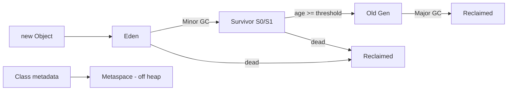

---

### 🛠️ Worked Example

**BAD:**

```java
// Allocating large long-lived cache in default heap
// with tiny Young Gen - causes constant promotion
// and expensive Major GCs
java -Xmx512m -Xmn32m -jar cache-service.jar
// 32MB Young Gen for a service creating millions
// of short-lived request objects -> overflow to Old
```

Why it's wrong: undersized Young Gen forces premature promotion, polluting Old Gen with short-lived garbage.

**GOOD:**

```java
// Size Young Gen proportionally to allocation rate
java -Xmx2g -Xmn512m -XX:SurvivorRatio=8 \
     -jar cache-service.jar
// Eden=409MB, each Survivor=51MB
// Short-lived objects die in Eden without promotion
```

Why it's right: adequate Young Gen absorbs transient allocation bursts within Minor GC cycles.

**Production:**

```bash
# Monitor generation sizes and promotion rate
jstat -gcutil <pid> 1000
#  S0     S1     E      O      M     YGC  FGC
#  0.00  45.12  67.34  28.91  96.2  1042   3
# Healthy: YGC >> FGC, Old stays below 70%
```

---

### ⚖️ Trade-offs

**Gain:** Cheap, fast Minor GCs (typically 5-20ms) that only scan the small Young Gen. Long-lived objects in Old Gen are rarely disturbed.

**Cost:** Promotion is expensive (object copy + reference update). Wrong sizing causes either premature promotion (Young too small) or wasted memory (Young too large for the allocation rate).

| Aspect         | Generational heap         | Non-generational (e.g. ZGC regions) |
| -------------- | ------------------------- | ----------------------------------- |
| Minor GC speed | Very fast (young only)    | N/A - concurrent scan               |
| Tuning knobs   | Xmn, SurvivorRatio, age   | Mostly automatic                    |
| Fragmentation  | Compacted per gen         | Region-based compaction             |
| Complexity     | Must understand promotion | Simpler mental model                |

---

### ⚡ Decision Snap

**USE WHEN:**

- Running G1GC or Parallel GC where generational behavior is explicit.
- Tuning services with clear bimodal allocation (many short-lived + few long-lived).
- Diagnosing Full GC storms caused by premature promotion.

**AVOID WHEN:**

- Using ZGC or Shenandoah where generational distinctions are handled internally.
- Micro-optimizing heap splits before measuring actual allocation rates.

**PREFER ZGC regions WHEN:**

- Pause time SLAs are sub-millisecond regardless of heap size.
- You want minimal manual tuning of generation boundaries.

---

### ⚠️ Top Traps

| #   | Misconception                       | Reality                                                                                                     |
| --- | ----------------------------------- | ----------------------------------------------------------------------------------------------------------- |
| 1   | "Old Gen is for static data only"   | Any object surviving enough Minor GCs gets promoted - including leaked listeners and abandoned futures      |
| 2   | "Bigger Young Gen is always better" | Oversized Young Gen means longer Minor GC pauses because more live data must be copied                      |
| 3   | "Metaspace is part of the heap"     | Metaspace is native memory - it does not count against -Xmx and can grow unbounded without MaxMetaspaceSize |

---

### 🪜 Learning Ladder

**Prerequisites:**

- JVM-011 Java Memory Areas Overview - understand what regions exist before learning how they interact
- JVM-013 Garbage Collection - Why Manual Memory Is Gone - grasp why GC exists at all

**THIS:** JVM-026 Heap Structure - Young, Old, and Metaspace

**Next steps:**

- JVM-027 Minor GC vs Major GC vs Full GC - understand the collection events these regions trigger
- JVM-029 GC Roots and Reachability Analysis - learn how the GC decides what is live within each generation

---

### 💡 The Surprising Truth

The "generational hypothesis" (most objects die young) was validated empirically in the 1980s, but modern allocation patterns can violate it. Services using large off-heap caches (Netty ByteBuf, memory-mapped files) may allocate very little on-heap, making the Young Gen nearly irrelevant. In such cases, the overhead of maintaining Survivor spaces and tracking promotion is pure waste - which is one reason ZGC moved toward a region-based model that adapts to actual allocation patterns rather than assuming generational behavior.

---

### 📇 Revision Card

1. Eden absorbs allocations; Survivors age-test objects; Old Gen stores proven survivors - three zones, one optimization principle.
2. Premature promotion (Young too small) is the #1 tuning mistake - it turns cheap Minor GCs into expensive Major GCs.
3. Metaspace is off-heap native memory: invisible to -Xmx, unbounded by default, and leaked by classloader misuse.

---

---

# JVM-027 Minor GC vs Major GC vs Full GC

**TL;DR** - Minor GC collects Young Gen cheaply, Major GC collects Old Gen expensively, Full GC stops everything and collects all regions.

---

### 🔥 The Problem in One Paragraph

Production services occasionally freeze for seconds. Thread dumps show all application threads parked at safepoints. Logs say "Full GC" with a multi-second pause. The team panics, but nobody can explain the difference between the GC event types, which ones are normal, and which signal a crisis. Without understanding GC event taxonomy, teams either over-tune (adding flags blindly) or under-react (ignoring escalating Major GC frequency until the service crashes with OOM). This is exactly why understanding GC event types was created.

---

### 📘 Textbook Definition

A **Minor GC** (Young GC) collects the Young Generation only, typically completing in 5-50ms. A **Major GC** (Old GC) collects the Old Generation, taking 100ms to multiple seconds depending on heap size. A **Full GC** collects the entire heap (Young + Old + Metaspace), stops all application threads, and is the most expensive event. These are not interchangeable terms - each has distinct triggers, scope, and operational impact.

---

### 🧠 Mental Model

> Minor GC is sweeping the kitchen floor (fast, frequent, covers only the workspace). Major GC is deep-cleaning the entire pantry (rare, disruptive, but targets only stored goods). Full GC is a fire drill evacuation - everything stops, every room is inspected, and nobody works until the all-clear.

- "Kitchen floor" -> Young Gen (Eden + Survivors)
- "Pantry" -> Old Gen
- "Fire drill" -> Full GC (all threads stopped, entire heap scanned)

**Where this analogy breaks down:** In concurrent collectors like G1, Major GC phases can overlap with application work, making it less like a full shutdown and more like a rolling inspection.

---

### ⚙️ How It Works

1. **Minor GC trigger:** Eden fills. All app threads pause briefly. Live objects copy to Survivor or promote to Old. Eden is cleared. Threads resume.
2. **Major GC trigger:** Old Gen occupancy crosses a threshold (e.g. InitiatingHeapOccupancyPercent in G1). Concurrent marking identifies garbage in Old Gen. Mixed collections evacuate regions.
3. **Full GC trigger:** Allocation failure - no space remains in any generation. OR explicit `System.gc()`. OR concurrent collection falls behind allocation rate ("concurrent mode failure").
4. During Full GC, every application thread is stopped (stop-the-world), the entire heap is marked and compacted, and the JVM resumes only when finished.

```text
Event        Scope         Pause      Trigger
---------    ----------    --------   -------------------
Minor GC     Young only    5-50ms     Eden full
Major GC     Old Gen       100ms-2s   Old occupancy high
Full GC      All + Meta    500ms-30s  Allocation failure
```

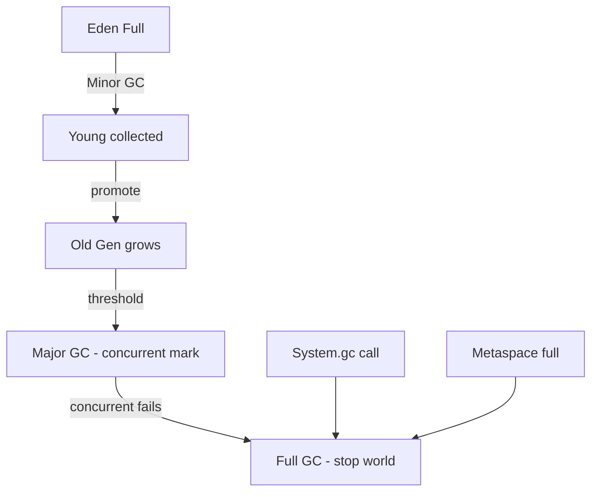

---

### 🛠️ Worked Example

**BAD:**

```java
// Calling System.gc() to "help" the collector
public void processRequest(Request req) {
    // ... business logic ...
    if (counter++ % 1000 == 0) {
        System.gc(); // "preventive maintenance"
    }
}
// Triggers Full GC every 1000 requests
// Each Full GC pauses ALL threads for seconds
```

Why it's wrong: explicit `System.gc()` forces a Full GC, creating artificial pauses the JVM would never choose on its own.

**GOOD:**

```java
// Let the GC decide when to collect
// Disable explicit GC if libraries call System.gc()
// java -XX:+DisableExplicitGC -jar service.jar
public void processRequest(Request req) {
    // ... business logic ...
    // No manual GC intervention
}
```

Why it's right: the GC knows its heap state; it will Minor/Major collect at optimal times without forcing Full GC.

**Production:**

```bash
# Parse GC log to count event types
grep -c "GC pause.*young" gc.log    # Minor GCs
grep -c "GC pause.*mixed" gc.log    # Mixed (G1 Major)
grep -c "Full GC" gc.log            # Full GCs
# Healthy ratio: thousands of Minor : tens of Mixed : 0 Full
# Alert threshold: any Full GC in a 24h window
```

---

### ⚖️ Trade-offs

**Gain:** Tiered collection means 95%+ of garbage is collected in cheap Minor GCs. Only proven long-lived garbage triggers expensive Major GC.

**Cost:** Full GC is catastrophic for latency. If your heap is 32GB, a compacting Full GC can pause for 10-30 seconds. The system appears dead to clients.

| Aspect        | Minor GC      | Major/Mixed GC      | Full GC            |
| ------------- | ------------- | ------------------- | ------------------ |
| Scope         | Young only    | Old (+ some Young)  | Everything         |
| Typical pause | 5-50ms        | 100ms-2s            | 500ms-30s          |
| Frequency     | Hundreds/hour | Tens/hour           | Should be 0        |
| Trigger       | Eden full     | Occupancy threshold | Allocation failure |

---

### ⚡ Decision Snap

**USE WHEN:**

- Monitoring GC health: count Minor/Major/Full ratios as a service health signal.
- Tuning: reduce Full GCs to zero by sizing heap and tuning IHOP.
- Alerting: any Full GC event should trigger an on-call page.

**AVOID WHEN:**

- Calling System.gc() manually - let the collector decide.
- Conflating "Major GC" with "Full GC" in monitoring dashboards.

**PREFER concurrent collectors WHEN:**

- Full GC risk is unacceptable (latency-sensitive services).
- G1/ZGC/Shenandoah can finish concurrent collection before allocation exhausts headroom.

---

### ⚠️ Top Traps

| #   | Misconception                                      | Reality                                                                                               |
| --- | -------------------------------------------------- | ----------------------------------------------------------------------------------------------------- |
| 1   | "Major GC and Full GC are the same thing"          | Major GC collects Old Gen only (often concurrently); Full GC is stop-the-world across the entire heap |
| 2   | "Frequent Minor GCs mean the service is unhealthy" | Frequent Minor GCs are normal and cheap; it is Full GCs that signal trouble                           |
| 3   | "Adding more heap prevents Full GC"                | More heap without fixing the leak just delays the inevitable and makes the eventual Full GC longer    |

---

### 🪜 Learning Ladder

**Prerequisites:**

- JVM-026 Heap Structure - Young, Old, and Metaspace - understand the regions these events collect
- JVM-013 Garbage Collection - Why Manual Memory Is Gone - grasp GC fundamentals

**THIS:** JVM-027 Minor GC vs Major GC vs Full GC

**Next steps:**

- JVM-040 GC Algorithm Selection Framework - choose a collector that minimizes your worst-case event
- JVM-051 GC Log Analysis - Reading and Interpreting - read the actual events from production logs

---

### 💡 The Surprising Truth

A Full GC is not always bad. During JVM shutdown (graceful termination), a Full GC is harmless. And in batch-processing jobs with no latency SLA, a Full GC that frees 90% of a 32GB heap may be more efficient than thousands of incremental collections. The rule "Full GC = alert" applies to latency-sensitive services. Batch workloads can legitimately tolerate - and even benefit from - occasional Full GCs that reset the heap in one pass.

---

### 📇 Revision Card

1. Minor GC = Young, cheap, frequent. Major GC = Old, moderate. Full GC = everything, catastrophic for latency.
2. Zero Full GCs in production is the target for any service with an SLA - any Full GC is an incident.
3. System.gc() forces Full GC. Disable it with -XX:+DisableExplicitGC unless you have a specific reason.

---

---

# JVM-028 Common JVM Flags (-Xmx, -Xms, -XX:+UseG1GC)

**TL;DR** - JVM flags configure heap size, GC algorithm, and runtime behavior - knowing the essential 10 prevents 90% of production misconfigurations.

---

### 🔥 The Problem in One Paragraph

A new service deploys to production with default JVM settings. The container has 4GB RAM, but the JVM defaults to a 256MB heap. Under load, the service OOMs. Or worse: the JVM sees 64GB of host RAM (ignoring container limits) and allocates a 16GB heap inside a 4GB container, getting OOM-killed by the kernel. Teams blindly copy flags from Stack Overflow without understanding what each flag controls or how flags interact. This is exactly why understanding common JVM flags was created.

---

### 📘 Textbook Definition

**JVM flags** (also called options or switches) are command-line arguments that configure the JVM's memory, garbage collector, JIT compiler, and diagnostic subsystems. They follow three conventions: `-X` flags are non-standard but stable across HotSpot versions, `-XX:` flags are experimental/advanced, and standard flags (like `-verbose:gc`) conform to the JVM specification.

---

### 🧠 Mental Model

> JVM flags are the control panel of a power plant. -Xmx is the maximum fuel capacity (heap), -Xms is the minimum fuel loaded at startup, and -XX:+UseG1GC selects which turbine design (GC algorithm) converts fuel into work. Wrong settings blow the fuses (OOM) or waste fuel (oversized heap never used).

- "Fuel capacity" -> -Xmx (max heap)
- "Startup fuel" -> -Xms (initial heap)
- "Turbine type" -> GC algorithm flag

**Where this analogy breaks down:** Unlike a real power plant, the JVM can dynamically resize its heap between -Xms and -Xmx, making the "fuel loaded" analogy less static than reality.

---

### ⚙️ How It Works

1. At startup, the JVM reads all flags and configures subsystems before loading application code.
2. -Xms reserves initial heap from the OS; -Xmx caps the maximum the heap can grow to.
3. GC selection flags (-XX:+UseG1GC, -XX:+UseZGC) activate specific collector implementations.
4. Diagnostic flags (-XX:+HeapDumpOnOutOfMemoryError) arm triggers for failure scenarios.
5. Flags can conflict - the JVM may silently ignore one or fail to start. Always validate with -XX:+PrintFlagsFinal.

```text
Essential JVM Flags (top 10):
Flag                          Purpose
----------------------------  --------------------------
-Xmx<size>                   Max heap size
-Xms<size>                   Initial heap size
-XX:+UseG1GC                 Select G1 collector
-XX:MaxGCPauseMillis=N       G1 pause target (ms)
-XX:+HeapDumpOnOutOfMemoryError  Dump on OOM
-XX:HeapDumpPath=/path       Where to write dump
-Xlog:gc*                    Unified GC logging
-XX:+UseContainerSupport     Respect cgroup limits
-XX:MaxMetaspaceSize=N       Cap metaspace growth
-XX:+ExitOnOutOfMemoryError  Kill on OOM (k8s)
```

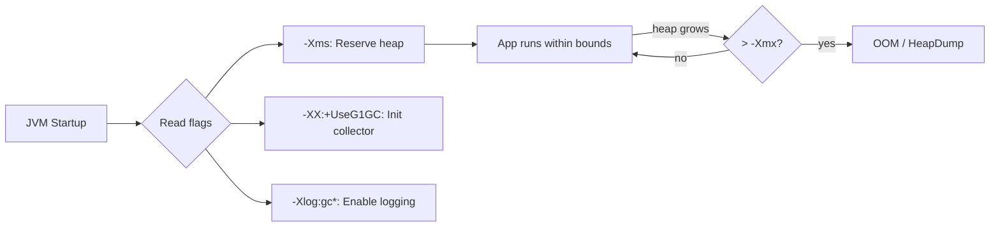

---

### 🛠️ Worked Example

**BAD:**

```bash
# Deploying with no flags in a 4GB container
java -jar service.jar
# JVM sees 64GB host RAM, sets -Xmx=16GB
# Container OOM-kills the process immediately
```

Why it's wrong: without explicit -Xmx, the JVM may see host memory (pre-Java 10 behavior) instead of container limits.

**GOOD:**

```bash
# Explicit, container-safe flag set
java -Xmx2g -Xms2g \
     -XX:+UseG1GC \
     -XX:MaxGCPauseMillis=200 \
     -XX:+HeapDumpOnOutOfMemoryError \
     -XX:HeapDumpPath=/tmp/heapdump.hprof \
     -Xlog:gc*:file=/var/log/gc.log:time,level \
     -XX:+ExitOnOutOfMemoryError \
     -jar service.jar
```

Why it's right: explicit sizing, GC selection, failure diagnostics, and logging - all declared, all auditable.

**Production:**

```bash
# Verify active flags at runtime
jcmd <pid> VM.flags
# Output includes all -XX flags with current values
# Compare against your deployment spec to detect drift

# Flag interaction validation:
# -XX:+UseZGC and -XX:+UseG1GC conflict (last wins)
# -Xmx < -Xms = JVM refuses to start
# -XX:MaxGCPauseMillis ignored by Parallel GC
# Always test flag sets with -XX:+PrintFlagsFinal
java -XX:+PrintFlagsFinal -Xmx2g -XX:+UseG1GC \
     -version 2>&1 | grep -E "MaxHeap|UseG1|Pause"
```

Why it matters: flag conflicts are silent. PrintFlagsFinal is the only way to confirm the JVM interpreted your flags as intended.

---

### ⚖️ Trade-offs

**Gain:** Explicit flags make JVM behavior deterministic, reproducible, and auditable. No surprises from ergonomic defaults that vary by machine. Flags document intent: a future engineer reading `-XX:MaxGCPauseMillis=200` immediately understands the latency target.

**Cost:** Over-specifying flags locks you into assumptions that may be wrong. Ergonomics-driven defaults often outperform hand-tuned settings for unknown workloads. Every flag is technical debt: it must be validated on JDK upgrades, may interact with future JVM optimizations, and can mask problems (e.g., forcing large heap hides a memory leak).

| Aspect         | Explicit flags                  | JVM ergonomics (defaults)     |
| -------------- | ------------------------------- | ----------------------------- |
| Predictability | High - same behavior everywhere | Varies by host RAM, CPU count |
| Tuning effort  | Manual, requires measurement    | Zero - JVM guesses            |
| Risk           | Wrong values = OOM or waste     | May select wrong GC or heap   |
| Best for       | Production services with SLAs   | Dev/test, unknown workloads   |

---

### ⚡ Decision Snap

**USE WHEN:**

- Deploying to production - every service needs explicit -Xmx, GC selection, and logging.
- Running in containers - always set -Xmx to leave room for native memory (stack, Metaspace, off-heap).
- Debugging - HeapDumpOnOutOfMemoryError should be on in every environment.

**AVOID WHEN:**

- Copying flags from other services without understanding your workload's allocation profile.
- Setting dozens of fine-tuning flags before measuring baseline behavior.

**PREFER ergonomic defaults WHEN:**

- Running in dev/test where predictability matters less than convenience.
- Using JDK 17+ where container support and G1GC defaults are already sensible.

---

### ⚠️ Top Traps

| #   | Misconception                                 | Reality                                                                                                                                   |
| --- | --------------------------------------------- | ----------------------------------------------------------------------------------------------------------------------------------------- |
| 1   | "-Xmx=container RAM" is correct               | The JVM needs native memory beyond the heap (thread stacks, Metaspace, JIT code cache, NIO buffers). Set -Xmx to 50-75% of container RAM. |
| 2   | "-Xms and -Xmx should differ for flexibility" | In production, set them equal. Heap resizing during runtime causes GC pauses and memory fragmentation.                                    |
| 3   | "More flags = better tuning"                  | Every additional flag is a maintenance burden. Start with 5-7 essential flags; add more only when measurements demand it.                 |

---

### 🪜 Learning Ladder

**Prerequisites:**

- JVM-026 Heap Structure - Young, Old, and Metaspace - understand what the flags configure
- JVM-015 The java Command and JVM Startup - know how the JVM processes command-line arguments

**THIS:** JVM-028 Common JVM Flags (-Xmx, -Xms, -XX:+UseG1GC)

**Next steps:**

- JVM-035 JVM Ergonomics - Automatic Flag Selection - understand what the JVM chooses when you do not specify
- JVM-036 Container-Aware JVM (cgroup Limits) - how flags interact with container resource limits

---

### 💡 The Surprising Truth

The JVM has over 800 flags (run `java -XX:+PrintFlagsFinal` to see them all), but Oracle's own performance team recommends setting no more than 5-7 for most workloads. Each additional flag is a bet against the JVM's adaptive optimization. The JIT compiler, GC ergonomics, and adaptive sizing algorithms are often smarter than human tuners - especially for workloads that change behavior over time. The art is knowing which 5 flags to set and which 795 to leave alone.

---

### 📇 Revision Card

1. Always set -Xmx explicitly in production; never trust ergonomic defaults in containers.
2. Set -Xms = -Xmx to avoid runtime resizing pauses and commit memory upfront.
3. HeapDumpOnOutOfMemoryError + ExitOnOutOfMemoryError = your safety net. Enable both everywhere.

---

---

# JVM-029 GC Roots and Reachability Analysis

**TL;DR** - The GC determines live objects by tracing references from a fixed set of roots - anything unreachable from roots is garbage.

---

### 🔥 The Problem in One Paragraph

You set an object to null and expect the GC to reclaim it immediately. But it survives three collection cycles. Or worse: you never set it to null, you just stopped using it, and it leaks forever because something you forgot about still holds a reference. Without understanding how the GC decides what is "alive," you cannot reason about memory leaks, cannot explain why objects survive longer than expected, and cannot diagnose the #1 production memory issue: retained references from forgotten listeners, caches, or static fields. This is exactly why understanding GC roots was created.

---

### 📘 Textbook Definition

**GC roots** are the starting points for the garbage collector's reachability analysis. They include: local variables on active thread stacks, static fields of loaded classes, JNI references, and active monitor locks. An object is **live** if and only if there exists a reference path from any GC root to that object. Any object with no such path is **unreachable** and eligible for collection.

---

### 🧠 Mental Model

> GC roots are the anchors bolted to the floor. Objects are balloons. Every reference is a string connecting a balloon to either an anchor or another balloon. When the GC runs, it follows every string from every anchor. Any balloon not connected (directly or transitively) to an anchor floats away and is collected.

- "Anchors" -> GC roots (stack locals, statics, JNI)
- "Strings" -> object references
- "Balloon without a string" -> unreachable object (garbage)

**Where this analogy breaks down:** The GC does not physically "follow strings" one by one - concurrent collectors use parallel marking with work-stealing queues for efficiency.

---

### ⚙️ How It Works

1. GC starts at every root: each local variable in every active stack frame, every static field, every JNI global reference.
2. From each root, the GC traverses all reference fields recursively (mark phase).
3. Every object reached is marked "live."
4. After marking completes, every unmarked object is dead - its memory can be reclaimed.
5. This is why `obj = null` helps: it removes the root-to-object path, making the object eligible for collection at the next GC cycle.

```text
GC Roots:
  [Thread stack]--->[local var]--->[Object A]
  [Static field]--->[Object B]--->[Object C]
  [JNI ref]------->[Object D]

Unreachable (garbage):
  [Object E]--->[Object F]  (no root path)
```

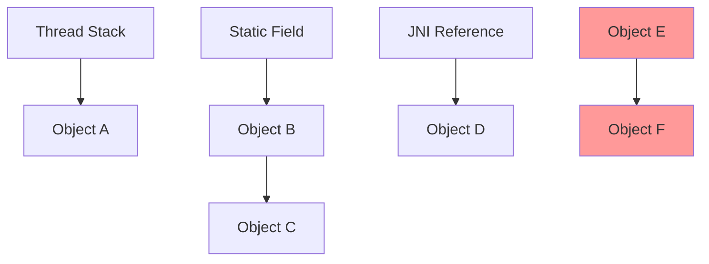

---

### 🛠️ Worked Example

**BAD:**

```java
// Static map holds references forever - logical leak
public class EventBus {
    // GC root: static field of loaded class
    private static final Map<String, Listener> reg =
        new HashMap<>();

    public static void register(String id, Listener l) {
        reg.put(id, l); // reference stored in root
    }
    // No unregister() - listeners live forever
}
```

Why it's wrong: static field is a GC root. Every Listener registered is reachable forever - the GC will never collect them even if the rest of the application forgets about them.

**GOOD:**

```java
// WeakReference breaks the strong root path
private static final Map<String, WeakReference<Listener>>
    reg = new ConcurrentHashMap<>();

public static void register(String id, Listener l) {
    reg.put(id, new WeakReference<>(l));
}
// When no strong reference to Listener exists elsewhere,
// the GC can collect it despite the map entry
```

Why it's right: WeakReference does not prevent collection - the GC root path through the map is weak, not strong.

**Production:**

```bash
# Find GC roots retaining a leaked object
# In Eclipse MAT after capturing heap dump:
# Right-click object -> "Path to GC Roots"
#   -> exclude weak/soft references
# Shows: static HashMap$Node -> Listener instance
# This reveals the retention chain causing the leak
```

---

### ⚖️ Trade-offs

**Gain:** Reachability-based collection is safe (never collects a reachable object) and automatic (no manual free).

**Cost:** The programmer must reason about reference chains. Logical leaks (reachable but unused objects) are invisible to the GC. You must manage reference lifecycle deliberately.

| Aspect         | Reachability GC (JVM)            | Reference counting (Python/Swift)    |
| -------------- | -------------------------------- | ------------------------------------ |
| Cycle handling | Automatic (tracing finds cycles) | Needs cycle detector or weak refs    |
| Pause model    | Stop-the-world for root scanning | Incremental (dealloc on last decref) |
| Leak cause     | Forgotten strong references      | Cycles + forgotten refs              |
| Debugging      | Heap dump + root path analysis   | Easier - refcount visible            |

---

### ⚡ Decision Snap

**USE WHEN:**

- Diagnosing memory leaks: always ask "what GC root retains this object?"
- Designing caches or registries: decide strong vs weak vs soft references.
- Understanding why `System.gc()` did not free your object (something still references it).

**AVOID WHEN:**

- Nulling every local variable "to help GC" - unnecessary if the variable goes out of scope naturally.
- Using WeakReferences everywhere "for safety" - objects may be collected prematurely.

**PREFER explicit lifecycle management WHEN:**

- Object ownership is clear and bounded (request scope, try-with-resources).
- AutoCloseable + try-with-resources gives deterministic cleanup without relying on GC timing.

---

### ⚠️ Top Traps

| #   | Misconception                                 | Reality                                                                                                       |
| --- | --------------------------------------------- | ------------------------------------------------------------------------------------------------------------- |
| 1   | "Setting obj = null frees memory immediately" | It only removes one reference path; the GC runs later and only if no other root path exists                   |
| 2   | "Only static fields cause leaks"              | Any long-lived object (singleton, thread-local, queue) holding references to short-lived objects causes leaks |
| 3   | "The GC detects 'unused' objects"             | The GC knows nothing about usage - only reachability. A reachable but never-read object is alive forever      |

---

### 🪜 Learning Ladder

**Prerequisites:**

- JVM-012 Stack vs Heap - Where Data Lives - understand where references and objects reside
- JVM-013 Garbage Collection - Why Manual Memory Is Gone - grasp the GC's basic purpose

**THIS:** JVM-029 GC Roots and Reachability Analysis

**Next steps:**

- JVM-075 Weak, Soft, and Phantom References in Practice - reference types that modify reachability strength
- JVM-060 Memory Leak Diagnosis Workflow - systematic process using root path analysis

---

### 💡 The Surprising Truth

Thread-local variables are GC roots for as long as their thread lives. In server applications using thread pools (where threads live for hours or days), a ThreadLocal that stores a request-scoped object creates a memory leak that survives thousands of requests. The fix is not just `threadLocal.remove()` in a finally block - it is recognizing that thread pools turn ThreadLocals from short-lived stack-like storage into long-lived static-like storage. This is the most common leak pattern in servlet containers and Netty-based services.

---

### 📇 Revision Card

1. An object is garbage if and only if no reference path exists from any GC root to it - usage does not matter, only reachability.
2. The four root types: active stack frames, static fields, JNI globals, active monitors.
3. ThreadLocals in thread pools are the #1 hidden leak pattern - the thread is the GC root that never dies.

---

---

# JVM-030 String Pool and Interning

**TL;DR** - The string pool deduplicates String literals in a JVM-managed table, saving heap space but creating subtle identity-vs-equality traps.

---

### 🔥 The Problem in One Paragraph

A microservice processes millions of JSON messages per hour. Each message contains the same field names ("userId", "timestamp", "status") repeated endlessly. Without deduplication, the JVM allocates millions of identical String objects, wasting gigabytes of heap on redundant char arrays. But naive interning (`String.intern()`) on user-supplied data creates a different disaster: the pool grows unboundedly, GC cannot collect interned strings efficiently (pre-Java 7), and performance degrades. This is exactly why understanding the string pool mechanics was created.

---

### 📘 Textbook Definition

The **string pool** (also called the string intern pool or string table) is a JVM-internal hash table that stores exactly one instance of each distinct string value. String literals in source code are automatically pooled at class-load time. The `String.intern()` method manually adds runtime strings to the pool, returning the canonical instance. Since Java 7, the pool lives in the heap (not PermGen), making pooled strings eligible for normal garbage collection.

---

### 🧠 Mental Model

> The string pool is a hotel concierge desk with a guest registry. When a string literal arrives, the concierge checks the book. If the name exists, the guest is told "you're already registered" and gets the existing room key (reference). If not, a new room is allocated and the name is entered in the book. `String.intern()` is a walk-in guest requesting the same registration.

- "Guest registry" -> the string pool hash table
- "Room key" -> the canonical String reference
- "Walk-in guest" -> `String.intern()` call

**Where this analogy breaks down:** Unlike a hotel, pooled strings since Java 7 can be evicted (garbage collected) if no strong references exist outside the pool itself.

---

### ⚙️ How It Works

1. When a class is loaded, its string literals are resolved against the pool. If a matching string exists, the literal points to the existing instance.
2. `String.intern()` looks up the string's value in the pool. If found, returns the pooled reference. If not, adds the string and returns it.
3. The pool is implemented as a fixed-size hash table (default 60013 buckets in modern JDKs). Collisions degrade lookup to O(n) per bucket.
4. Since Java 7, pooled strings reside in the main heap and are collected by normal GC when unreachable.
5. `==` between two pooled strings returns `true` (same reference); between a pooled and non-pooled string with same content returns `false`.

```text
String a = "hello";     // literal -> pooled
String b = "hello";     // same literal -> same ref
String c = new String("hello"); // heap copy
String d = c.intern();  // returns pooled ref

a == b   // true  (same pool entry)
a == c   // false (c is a separate heap object)
a == d   // true  (intern() returned pool ref)
```

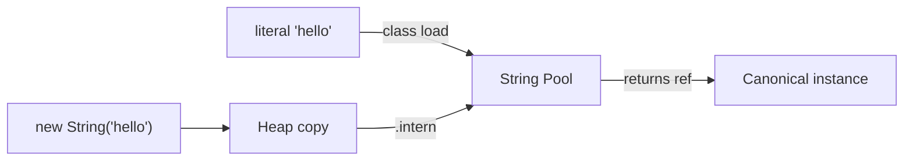

---

### 🛠️ Worked Example

**BAD:**

```java
// Interning user-supplied data - unbounded pool growth
public String normalize(String input) {
    return input.toLowerCase().intern();
    // If input is user IDs, email addresses, etc.
    // pool grows to millions of entries
    // Hash collisions tank intern() to O(n)
}
```

Why it's wrong: interning unbounded user data creates a hash table with millions of entries and severe collision chains.

**GOOD:**

```java
// Manual deduplication with bounded concurrent map
private final ConcurrentHashMap<String, String> dedup =
    new ConcurrentHashMap<>(1024);

public String normalize(String input) {
    String key = input.toLowerCase();
    String existing = dedup.putIfAbsent(key, key);
    return existing != null ? existing : key;
}
// Bounded, evictable, no native pool pollution
```

Why it's right: explicit deduplication with controlled size, eviction policy, and no global pool impact.

**Production:**

```bash
# Monitor string pool size and collision rate
jcmd <pid> VM.stringtable
# StringTable statistics:
#   Number of buckets: 60013
#   Number of entries: 42891
#   Average bucket size: 0.715
# If avg bucket size > 5: pool is overloaded
# Increase with -XX:StringTableSize=200003
```

---

### ⚖️ Trade-offs

**Gain:** Literal deduplication saves heap automatically. Identity comparison (`==`) on interned strings is O(1) vs O(n) for `.equals()`.

**Cost:** `intern()` on dynamic data risks pool pollution, GC pressure, and hash collision degradation. Pre-Java 7, interned strings were in PermGen and never collected.

| Aspect      | String pool (intern)                  | Manual dedup (ConcurrentHashMap) |
| ----------- | ------------------------------------- | -------------------------------- |
| Scope       | JVM-global, shared across threads     | Application-controlled           |
| Eviction    | GC collects unreachable (Java 7+)     | Explicit (size-bounded, LRU)     |
| Performance | O(1) amortized, degrades on collision | O(1) CHM with good hash          |
| Best for    | Known-small-cardinality literals      | High-cardinality dynamic strings |

---

### ⚡ Decision Snap

**USE WHEN:**

- Comparing string literals where `==` speed matters (enum-like constants, protocol keywords).
- Relying on automatic literal pooling (no explicit `.intern()` needed for compile-time constants).
- String deduplication by G1GC (`-XX:+UseStringDeduplication`) for passive heap savings.

**AVOID WHEN:**

- Interning user-supplied or high-cardinality dynamic strings.
- Using `==` for string comparison in general code - always use `.equals()`.

**PREFER G1 String Deduplication WHEN:**

- You want automatic dedup without code changes and accept the GC doing it lazily in the background.

---

### ⚠️ Top Traps

| #   | Misconception                      | Reality                                                                                                                        |
| --- | ---------------------------------- | ------------------------------------------------------------------------------------------------------------------------------ |
| 1   | "`==` works for all equal strings" | Only for strings that are literally the same pooled instance - `new String("x") == "x"` is false                               |
| 2   | "String.intern() is free"          | It locks the string table internally and degrades under high concurrency or collision                                          |
| 3   | "The pool never causes OOM"        | Pre-Java 7: interned strings in PermGen caused PermGen OOM. Post-Java 7: pool in heap - safe but still wastes memory if abused |

---

### 🪜 Learning Ladder

**Prerequisites:**

- JVM-026 Heap Structure - Young, Old, and Metaspace - understand where the pool lives (heap since Java 7)
- JVM-012 Stack vs Heap - Where Data Lives - reference vs object identity

**THIS:** JVM-030 String Pool and Interning

**Next steps:**

- JVM-038 Metaspace and PermGen History - understand where the pool used to live and why it moved
- JVM-057 Compressed Oops and Object Layout - how string objects are laid out in memory

---

### 💡 The Surprising Truth

G1GC's `-XX:+UseStringDeduplication` (enabled by default in some JDK builds) deduplicates the underlying `byte[]` arrays of strings that survive to Old Gen - without using the string pool at all. It works at the GC level, transparently, with zero application code changes. In heap-heavy services with many duplicate strings (JSON field names, HTTP headers), this single flag can reduce heap usage by 10-25% with no effort. It is the modern answer to `String.intern()` abuse.

---

### 📇 Revision Card

1. String literals are pooled automatically; `==` works between literals because they share one reference.
2. Never intern user-supplied or high-cardinality data - use a bounded ConcurrentHashMap instead.
3. G1's -XX:+UseStringDeduplication is the modern zero-code alternative to manual interning.

---

---

# JVM-031 ClassLoader Hierarchy (Bootstrap, Plat, App)

**TL;DR** - Three classloaders form a parent-delegation chain: Bootstrap loads core JDK, Platform loads extensions, Application loads your code.

---

### 🔥 The Problem in One Paragraph

Your application bundles a logging library version 2.0, but at runtime it mysteriously uses version 1.0 behaviors. Or a `ClassCastException` reports "cannot cast Foo to Foo" - the same class name from two different classloaders. These haunting bugs are invisible until you understand that the JVM loads classes through a hierarchy of classloaders, each with its own namespace and search path. Without this knowledge, classpath conflicts, module system errors, and plugin isolation failures are impossible to diagnose. This is exactly why understanding the classloader hierarchy was created.

---

### 📘 Textbook Definition

The **ClassLoader hierarchy** is a delegation chain of three built-in loaders: the Bootstrap ClassLoader (native code, loads `java.base` and core JDK classes), the Platform ClassLoader (loads platform modules like `java.sql`, `java.xml`), and the Application ClassLoader (loads classes from the application classpath and module path). When a class is requested, each loader delegates to its parent first - only loading the class itself if the parent cannot find it. This parent-first delegation ensures core classes cannot be overridden by application code.

---

### 🧠 Mental Model

> The classloader hierarchy is a chain of command in a military organization. A private (Application ClassLoader) receives a request but must ask their sergeant (Platform) first, who asks the general (Bootstrap) first. Only if the superior cannot fulfill the request does the subordinate attempt it themselves.

- "General" -> Bootstrap (core java.lang._, java.util._)
- "Sergeant" -> Platform (java.sql._, javax.crypto._)
- "Private" -> Application (your jars, dependencies)

**Where this analogy breaks down:** Custom classloaders (OSGi, web containers) can break parent-first delegation and load classes child-first - something no military hierarchy would allow.

---

### ⚙️ How It Works

1. Code calls `Class.forName("com.app.Service")` or references the type.
2. Application ClassLoader receives the request.
3. It delegates UP to Platform ClassLoader, which delegates UP to Bootstrap.
4. Bootstrap checks `java.base`, `java.lang`, etc. Not found? Returns to Platform.
5. Platform checks platform modules. Not found? Returns to Application.
6. Application searches the classpath (-cp) and module path. Found? Loads, verifies, links, returns.
7. Each loaded class is identified by (name + classloader). Same name, different loader = different class at runtime.

```text
         +-------------------+
         | Bootstrap CL      |  java.lang.*, etc.
         | (native, no Java) |
         +---------+---------+
                   |  delegates up
         +---------+---------+
         | Platform CL       |  java.sql.*, etc.
         +---------+---------+
                   |  delegates up
         +---------+---------+
         | Application CL    |  your code + deps
         +-------------------+
```

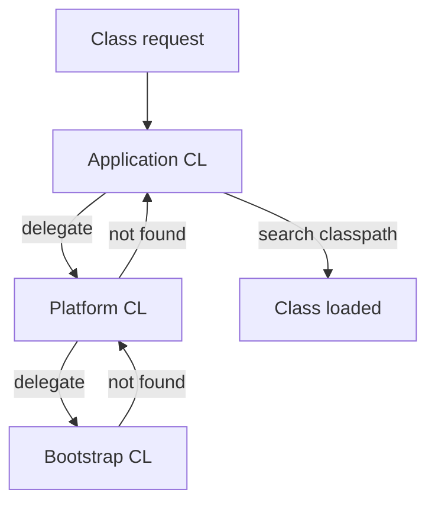

---

### 🛠️ Worked Example

**BAD:**

```java
// Bundling a class that conflicts with java.base
// File: java/lang/String.java in your source tree
package java.lang;
public class String { /* custom impl */ }
// Result: SecurityException or ignored entirely
// Bootstrap always wins for java.lang.*
```

Why it's wrong: parent-first delegation means Bootstrap always loads `java.lang.String` - your version never loads.

**GOOD:**

```java
// Checking which classloader loaded a class
Class<?> clazz = MyService.class;
System.out.println(clazz.getClassLoader());
// sun.misc.Launcher$AppClassLoader -> App CL
// null -> Bootstrap (native, no Java object)

// Diagnosing "Foo cannot be cast to Foo"
// Same class name loaded by two different loaders
// = two different Class objects at runtime
```

Why it's right: understanding the loader reveals why identity-based type checking (instanceof, cast) fails across loader boundaries.

**Production:**

```bash
# List all classloaders and loaded class counts
jcmd <pid> VM.classloaders
# Output:
# bootstrap: 2847 classes
# platform:  142 classes
# app:       8291 classes
# Custom loaders (Tomcat, Spring Boot DevTools):
# WebAppClassLoader: 3201 classes

# Diagnose "which jar did this class come from?"
jcmd <pid> VM.class_hierarchy com.app.MyService
# Shows loader chain + source location
# Resolves version conflicts instantly
```

Why it matters: in microservice deployments with dozens of transitive dependencies, knowing which classloader loaded a specific version of a class is the difference between a 5-minute fix and a day-long classpath debugging session.

---

### ⚖️ Trade-offs

**Gain:** Parent-first delegation guarantees security (cannot override java.lang.Object), consistency (one definition of core classes), and isolation (different apps on same JVM can have different library versions via custom loaders). The predictability of delegation makes most class resolution issues diagnosable by following the chain upward.

**Cost:** Delegation adds latency to first-load (multiple searches), makes classpath debugging complex, and custom loaders that break delegation introduce "classloader hell." Child-first loaders (Tomcat, OSGi) create situations where the same fully-qualified class name exists as different types in the same JVM - leading to ClassCastExceptions that appear nonsensical in stack traces.

| Aspect    | Parent-first (standard) | Child-first (web containers)       |
| --------- | ----------------------- | ---------------------------------- |
| Security  | Core classes immutable  | Risk of shadowing system classes   |
| Isolation | Weak between apps       | Strong - each app has own versions |
| Debugging | Predictable delegation  | "Which version loaded?" confusion  |
| Use case  | Standard applications   | Tomcat/Jetty per-app isolation     |

---

### ⚡ Decision Snap

**USE WHEN:**

- Diagnosing `NoClassDefFoundError`, `ClassNotFoundException`, or `ClassCastException` between same-named classes.
- Understanding why a dependency version conflict behaves differently at runtime vs compile time.
- Designing plugin systems that require class isolation.

**AVOID WHEN:**

- Writing standard application code - the hierarchy is invisible until it breaks.
- Creating custom classloaders without a genuine isolation requirement.

**PREFER module system (JPMS) WHEN:**

- Enforcing strong encapsulation boundaries between components without custom classloaders.
- Running on Java 9+ where modules provide compile-time and runtime visibility control.

---

### ⚠️ Top Traps

| #   | Misconception                                     | Reality                                                                                                |
| --- | ------------------------------------------------- | ------------------------------------------------------------------------------------------------------ |
| 1   | "All classes share one global namespace"          | Namespace = (class name + classloader). Same name from different loaders = different type              |
| 2   | "Setting classpath order fixes version conflicts" | Parent-first delegation means the JDK version always wins for platform classes regardless of classpath |
| 3   | "Custom classloaders are always dangerous"        | Servlet containers, OSGi, and Spring Boot DevTools all rely on custom loaders for legitimate isolation |

---

### 🪜 Learning Ladder

**Prerequisites:**

- JVM-010 Class Loading - Finding and Loading Code - understand the load-verify-link-init lifecycle
- JVM-009 The Class File Format - know what a classloader is actually parsing

**THIS:** JVM-031 ClassLoader Hierarchy (Bootstrap, Plat, App)

**Next steps:**

- JVM-046 The N+1 ClassLoader Anti-Pattern - common mistakes with classloader proliferation
- JVM-073 Java Module System (JPMS) and ClassLoader - how modules interact with loader hierarchy

---

### 💡 The Surprising Truth

The Bootstrap ClassLoader is not a Java object - it is implemented in native C++ code within the JVM itself. Calling `String.class.getClassLoader()` returns `null`, not a ClassLoader instance. This means you cannot subclass, instrument, or intercept the Bootstrap loader. Every class it loads is unconditionally trusted - which is both a security feature and the reason that a compromised `java.base` module is game over for JVM security.

---

### 📇 Revision Card

1. Three loaders form a delegation chain: Bootstrap (core) -> Platform (extensions) -> Application (your code). Parent always asked first.
2. Class identity = name + classloader. Same name from different loaders = ClassCastException between "identical" types.
3. Bootstrap returns null from getClassLoader() - it is native code, not a Java object, and cannot be intercepted.

---

---

# JVM-032 JVM Shutdown Hooks and Lifecycle

**TL;DR** - Shutdown hooks are registered threads that run during orderly JVM termination, giving you a last chance to flush data and release resources.

---

### 🔥 The Problem in One Paragraph

Your service writes metrics to a file every 10 seconds. When Kubernetes sends SIGTERM, the JVM exits before the final batch flushes. Metrics for the last interval are lost. Or worse: a database connection pool is abandoned mid-transaction, leaving locks held until the database times them out. You need a mechanism to execute cleanup code between "JVM decides to exit" and "process actually terminates." This is exactly why shutdown hooks were created.

---

### 📘 Textbook Definition

A **shutdown hook** is a thread registered via `Runtime.getRuntime().addShutdownHook(Thread)` that the JVM starts during orderly shutdown. Orderly shutdown occurs on: the last non-daemon thread exiting, `System.exit()` being called, or the JVM receiving SIGTERM/SIGINT. Hooks run concurrently with no guaranteed order. After all hooks complete (or a timeout elapses), the JVM halts. Hooks do NOT run on `kill -9` (SIGKILL) or JVM crash (`hs_err_pid`).

---

### 🧠 Mental Model

> Shutdown hooks are the "last call" announcement at a bar. When the bartender (JVM) announces closing time (SIGTERM), patrons (hooks) can finish their drinks and settle tabs (flush buffers, close connections). But if the fire marshal (SIGKILL) storms in, everyone is thrown out immediately with no last call.

- "Last call" -> orderly shutdown trigger
- "Finishing drinks" -> hooks executing cleanup logic
- "Fire marshal" -> SIGKILL / JVM crash (no hooks run)

**Where this analogy breaks down:** Unlike bar patrons who act sequentially, shutdown hooks run concurrently as separate threads, creating race conditions if they share state.

---

### ⚙️ How It Works

1. Application registers hooks at startup: `Runtime.getRuntime().addShutdownHook(cleanupThread)`.
2. JVM receives SIGTERM (or System.exit() is called).
3. JVM initiates shutdown sequence: all registered hook threads are started concurrently.
4. Hooks execute their `run()` method. No ordering guarantees between hooks.
5. When all hooks complete, the JVM runs finalizers (if `runFinalizersOnExit` is set), then halts.
6. If SIGKILL arrives or the JVM crashes, hooks never run.
7. You cannot add or remove hooks during shutdown - `IllegalStateException` is thrown.
8. If a hook throws an uncaught exception, it terminates but other hooks continue.
9. The JVM does not enforce a timeout - an infinite loop in a hook hangs the shutdown indefinitely (until external kill).

```text
Normal Lifecycle:
  Start -> Run -> [SIGTERM] -> Hooks run -> Halt

Forced Kill:
  Start -> Run -> [SIGKILL] -> Immediate death
                               (no hooks)

Crash:
  Start -> Run -> [hs_err] -> Crash dump -> death
                               (no hooks)
```

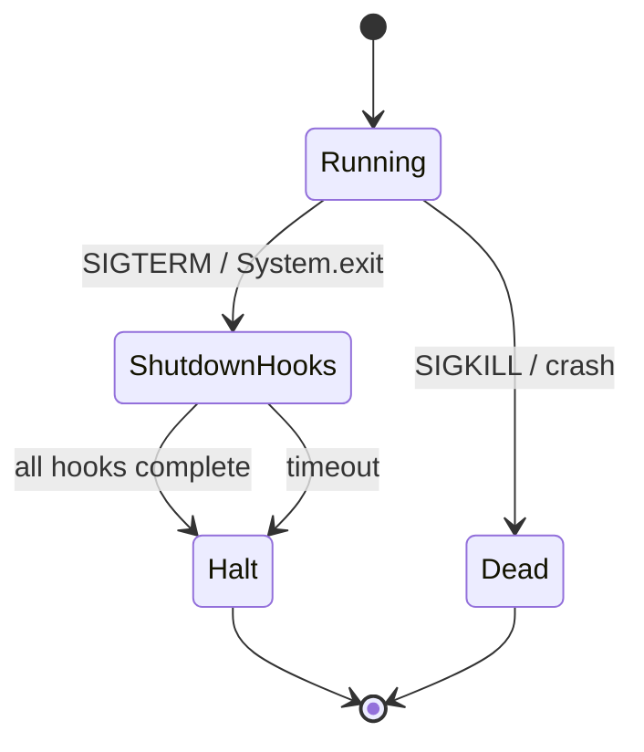

---

### 🛠️ Worked Example

**BAD:**

```java
// Hook that can deadlock the shutdown sequence
Runtime.getRuntime().addShutdownHook(new Thread(() -> {
    synchronized (SharedLock.class) {
        database.flush(); // may wait for lock
        database.close(); // held by dying thread
    }
    // If another hook holds SharedLock: DEADLOCK
    // JVM hangs during shutdown indefinitely
}));
```

Why it's wrong: hooks run concurrently - shared locks between hooks cause deadlocks that prevent JVM termination.

**GOOD:**

```java
// Simple, fast, independent hook
Runtime.getRuntime().addShutdownHook(new Thread(() -> {
    log.info("Shutting down - flushing metrics");
    metricsBuffer.flush();  // non-blocking
    log.info("Metrics flushed, exiting");
}, "metrics-shutdown-hook"));
// No shared locks, fast execution, named thread
```

Why it's right: independent, non-blocking, named for diagnosis, completes quickly.

**Production:**

```yaml
# Kubernetes: give hooks time to complete
# pod spec:
spec:
  terminationGracePeriodSeconds: 30
  # k8s sends SIGTERM, waits 30s, then SIGKILL
  # Your shutdown hook must complete within 30s
  # or it will be killed mid-execution
```

```java
// Spring Boot graceful shutdown (ordered alternative)
@Bean
public GracefulShutdownLifecycle shutdown(
    MetricService metrics,
    ConnectionPool pool) {
    return new GracefulShutdownLifecycle() {
        @Override
        public void stop(Runnable callback) {
            metrics.flush();      // step 1
            pool.closeAll();      // step 2 (ordered!)
            callback.run();       // signal complete
        }
    };
}
// Unlike hooks: ordered, timeout-aware, testable
```

Why it matters: Spring Boot's SmartLifecycle gives you ordered shutdown that raw hooks cannot provide. Use hooks only for the lowest-level cleanup that must survive even if the framework fails to shut down.

---

### ⚖️ Trade-offs

**Gain:** Guaranteed cleanup opportunity on orderly shutdown. Flushes buffers, closes connections, deregisters from service discovery. Hooks are the last-resort mechanism when framework-level lifecycle management is unavailable.

**Cost:** No execution order guarantee between hooks. No timeout built into the JVM (caller must enforce, e.g. Kubernetes terminationGracePeriod). SIGKILL bypasses hooks entirely. Hooks that share mutable state with the application risk inconsistency if application threads have not yet stopped.

| Aspect   | Shutdown hooks         | try-finally / AutoCloseable |
| -------- | ---------------------- | --------------------------- |
| Scope    | JVM-wide, process exit | Method/block scope          |
| Trigger  | SIGTERM, System.exit   | Normal/exceptional flow     |
| Ordering | None (concurrent)      | Deterministic (LIFO)        |
| Best for | Process-level cleanup  | Resource lifecycle          |

---

### ⚡ Decision Snap

**USE WHEN:**

- Flushing buffered writes (logs, metrics, queues) on graceful shutdown.
- Deregistering from service discovery or load balancers before the process dies.
- Releasing external leases (distributed locks, file locks).

**AVOID WHEN:**

- Using hooks for application logic that depends on other services being available.
- Registering hooks that take more than a few seconds (risk SIGKILL timeout).

**PREFER graceful shutdown frameworks WHEN:**

- Running in Spring Boot (use `@PreDestroy` or `SmartLifecycle`) for ordered shutdown.
- Managing complex dependency graphs that require sequential teardown.

---

### ⚠️ Top Traps

| #   | Misconception                     | Reality                                                                                                                 |
| --- | --------------------------------- | ----------------------------------------------------------------------------------------------------------------------- |
| 1   | "Shutdown hooks always run"       | They do NOT run on SIGKILL, JVM crash, or Runtime.halt(). Only on orderly shutdown.                                     |
| 2   | "Hooks run in registration order" | All hooks start as concurrent threads with no ordering - design them to be independent                                  |
| 3   | "I can do anything in a hook"     | Class loading, new thread creation, and even logging may fail during shutdown if those subsystems are already torn down |

---

### 🪜 Learning Ladder

**Prerequisites:**

- JVM-015 The java Command and JVM Startup - understand the JVM lifecycle from start
- JVM-016 JVM Threads and the OS Thread Model - hooks are threads with lifecycle implications

**THIS:** JVM-032 JVM Shutdown Hooks and Lifecycle

**Next steps:**

- JVM-039 JVM Exit Codes and Crash Logs - what happens when hooks do NOT run (crash path)
- JVM-036 Container-Aware JVM (cgroup Limits) - how container orchestrators interact with JVM shutdown

---

### 💡 The Surprising Truth

`System.exit(0)` inside a shutdown hook causes a deadlock: the JVM shutdown sequence is already in progress, and calling exit from within a hook re-enters the shutdown sequence, which blocks forever waiting for the current shutdown to complete. This is documented but rarely known. If your hook needs to signal failure, set an exit code before shutdown begins or write to a file - never call `System.exit()` from within a hook.

---

### 📇 Revision Card

1. Hooks run on SIGTERM/System.exit but NOT on SIGKILL or JVM crash - never trust them for critical data without external persistence.
2. All hooks run concurrently - shared locks between hooks = deadlock during shutdown.
3. Keep hooks fast (< 5 seconds), independent, and idempotent. Kubernetes SIGKILL arrives after terminationGracePeriodSeconds.

---

---

# JVM-033 Thread Dumps - Reading and Interpreting

**TL;DR** - A thread dump snapshots every thread's state and call stack, revealing deadlocks, bottlenecks, and hung requests instantly.

---

### 🔥 The Problem in One Paragraph

Production latency spikes to 30 seconds. CPU is idle. No errors in logs. The service is alive but doing nothing useful. Without visibility into what each thread is currently doing (waiting for a lock? stuck on I/O? blocked in a connection pool?), you are blind. You need a zero-overhead diagnostic that captures every thread's state at a single point in time. This is exactly why thread dumps were created.

---

### 📘 Textbook Definition

A **thread dump** is a textual snapshot of all threads in a JVM process at a specific instant. For each thread, it records: the thread name, state (RUNNABLE, BLOCKED, WAITING, TIMED_WAITING), the complete Java call stack, and any monitors (locks) held or awaited. Thread dumps are captured via `jcmd <pid> Thread.print`, `jstack <pid>`, or sending SIGQUIT (kill -3) to the process.

---

### 🧠 Mental Model

> A thread dump is a freeze-frame photograph of a factory floor. Each worker (thread) is caught mid-action: some are welding (RUNNABLE), some are waiting for parts (WAITING), some are blocked at a locked door (BLOCKED). The photograph shows exactly who is stuck and why.

- "Factory floor" -> JVM process
- "Workers" -> threads
- "Locked door" -> contested monitor/lock

**Where this analogy breaks down:** A real photograph shows spatial positions. A thread dump shows temporal position (where in the code) plus causal relationships (which thread holds the lock another is waiting for).

---

### ⚙️ How It Works

1. You trigger a dump: `jcmd <pid> Thread.print` (preferred) or `kill -3 <pid>` (Unix).
2. The JVM brings all threads to a safepoint (brief pause, typically < 50ms).
3. For each thread, it captures: name, ID, daemon status, priority, state, and the full stack trace.
4. For threads in BLOCKED state, it records which monitor they wait for and which thread holds it.
5. The JVM detects deadlock cycles and prints them explicitly at the end of the dump.

```text
"http-worker-42" #42 daemon prio=5 BLOCKED
  waiting to lock <0x00000007a1234567>
    (a java.util.HashMap)
  owned by "http-worker-7" #7
  at com.app.Cache.get(Cache.java:45)
  at com.app.Service.handle(Service.java:112)

"http-worker-7" #7 daemon prio=5 RUNNABLE
  locked <0x00000007a1234567>
    (a java.util.HashMap)
  at com.app.Cache.rebuild(Cache.java:78)
```

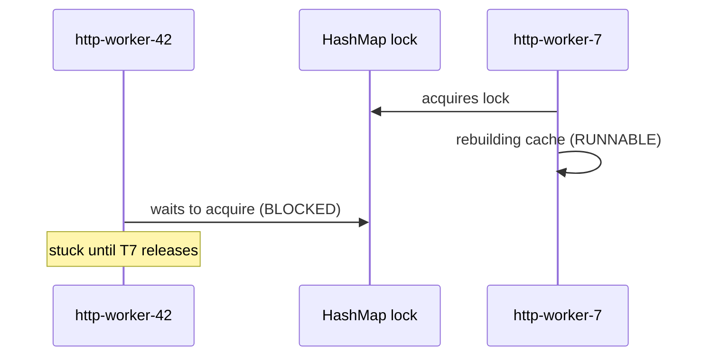

---

### 🛠️ Worked Example

**BAD:**

```bash
# Taking one dump and guessing
jstack <pid> > dump.txt
# "Thread 42 is BLOCKED - let's restart"
# No root cause found, problem recurs tomorrow
```

Why it's wrong: a single dump shows one instant. Intermittent issues require multiple dumps to distinguish transient blocks from permanent ones.

**GOOD:**

```bash
# Take 3 dumps 5 seconds apart to spot persistent blocks
for i in 1 2 3; do
  jcmd <pid> Thread.print > dump_$i.txt
  sleep 5
done
# Compare: if same thread is BLOCKED in all three
# -> persistent bottleneck (not transient)
# If threads rotate through BLOCKED -> contention
```

Why it's right: temporal comparison separates transient from stuck threads.

**Production:**

```bash
# Quick deadlock check
jcmd <pid> Thread.print | grep -A 2 "deadlock"
# Found one Java-level deadlock:
# "worker-3" waiting for lock held by "worker-7"
# "worker-7" waiting for lock held by "worker-3"
# Circular dependency -> guaranteed deadlock

# Thread state distribution (health indicator)
jcmd <pid> Thread.print | grep "java.lang.Thread.State" \
  | sort | uniq -c | sort -rn
#  187 RUNNABLE        <- doing work
#   42 TIMED_WAITING   <- sleeping/polling (normal)
#   23 WAITING         <- parked (check if stuck)
#    8 BLOCKED         <- monitor contention (investigate)
# Healthy: mostly RUNNABLE + TIMED_WAITING
# Unhealthy: many BLOCKED or all WAITING
```

Why it matters: state distribution reveals systemic issues (thread starvation, pool exhaustion, global lock contention) that individual stack traces may obscure.

---

### ⚖️ Trade-offs

**Gain:** Zero-cost diagnostic (no agent, no restart, no code change). Reveals deadlocks, lock contention, thread starvation, and I/O hangs instantly. Works on any JVM process accessible by the same OS user.

**Cost:** Point-in-time snapshot - misses fast transient states. Safepoint pause (brief, usually harmless). Does not show lock-free contention (CAS spins, busy-waits). Does not capture virtual thread stacks by default (Java 21+).

| Aspect             | Thread dump (jcmd/jstack)    | Continuous profiling (JFR/async-profiler) |
| ------------------ | ---------------------------- | ----------------------------------------- |
| Overhead           | Near-zero, on-demand         | Low (1-3% CPU) continuous                 |
| Granularity        | Single instant               | Aggregated over time                      |
| Deadlock detection | Built-in                     | Not built-in                              |
| Best for           | "Why is it stuck right now?" | "Where does it spend time overall?"       |

---

### ⚡ Decision Snap

**USE WHEN:**

- Service appears hung (high latency, no errors, CPU idle).
- Suspecting deadlock or lock contention.
- First diagnostic step for any "the service is slow but I don't know why" problem.

**AVOID WHEN:**

- Looking for CPU-bound hot methods (use flame graphs instead - thread dumps cannot show time spent, only current state).
- Diagnosing memory issues (use heap dump instead).
- Trying to measure lock contention duration (thread dumps show state, not how long a thread has been in that state). JFR lock profiling captures hold and wait durations.

**PREFER JFR continuous recording WHEN:**

- You need historical thread activity (not just current state).
- Problems are intermittent and hard to catch with manual dumps.
- You want to measure contention durations, not just observe states.

---

### ⚠️ Top Traps

| #   | Misconception                            | Reality                                                                                                                                                      |
| --- | ---------------------------------------- | ------------------------------------------------------------------------------------------------------------------------------------------------------------ |
| 1   | "BLOCKED threads mean the app is broken" | Threads briefly BLOCKED on contended locks is normal under load. Only persistent BLOCKED (same thread, same lock, across multiple dumps) indicates a problem |
| 2   | "jstack is always safe to run"           | On extremely large thread counts (>10K), jstack can cause a safepoint storm. Use jcmd Thread.print instead, which is more efficient                          |
| 3   | "Thread dumps show all blocking"         | They show monitor-based blocking (synchronized). ReentrantLock contention shows as WAITING (on LockSupport.park), not BLOCKED. Different state, same symptom |

---

### 🪜 Learning Ladder

**Prerequisites:**

- JVM-016 JVM Threads and the OS Thread Model - understand what threads are and how they map to OS threads
- JVM-022 Your First JVM Diagnostic (jps, jinfo) - know how to identify and target a JVM process

**THIS:** JVM-033 Thread Dumps - Reading and Interpreting

**Next steps:**

- JVM-034 Heap Dumps - Capturing and Basics - companion diagnostic for memory problems
- JVM-055 Safepoints - What Stops the World - understand the mechanism that enables thread dump capture

---

### 💡 The Surprising Truth

Virtual threads (Project Loom, Java 21+) do NOT appear in traditional thread dumps by default because they are not mapped 1:1 to OS threads. A service with 1 million virtual threads blocked on I/O will show only a handful of carrier threads in `jstack`. You need `jcmd <pid> Thread.dump_to_file -format=json` to capture virtual thread stacks, and the output can be gigabytes. This fundamentally changes how thread dumps work in post-Loom applications. The JSON format groups virtual threads by their carrier thread and shows the full virtual thread stack - but tooling support is still catching up. IntelliJ 2024+ and JDK Mission Control can parse these JSON dumps, but older tools like VisualVM cannot.

---

### 📇 Revision Card

1. Three dumps five seconds apart beats one dump. Compare to distinguish transient blocks from stuck threads.
2. BLOCKED = waiting for synchronized monitor. WAITING on LockSupport.park = waiting for ReentrantLock. Same symptom, different state label.
3. Virtual threads (Java 21+) are invisible to jstack - use `jcmd Thread.dump_to_file -format=json` for Loom-era diagnostics.

---

---

# JVM-034 Heap Dumps - Capturing and Basics

**TL;DR** - A heap dump is a complete snapshot of every object on the heap, enabling post-mortem memory leak diagnosis through reference chain analysis.

---

### 🔥 The Problem in One Paragraph

Your service's Old Gen usage climbs 1% per hour. After three days, it hits 95% and Full GCs begin thrashing. The service dies with OutOfMemoryError. You know memory is leaking, but you cannot see which objects are accumulating or what retains them. GC logs tell you "how much" but not "what" or "why." You need a complete inventory of every heap object and every reference between them. This is exactly why heap dumps were created.

---

### 📘 Textbook Definition

A **heap dump** is a binary file (HPROF format) containing a complete snapshot of the JVM heap at a specific moment: every object instance, every reference between objects, every class loaded, and each object's size and field values. Analysis tools (Eclipse MAT, VisualVM, YourKit) load this file and enable queries like "what retains this object?" and "which classes dominate memory?"

---

### 🧠 Mental Model

> A heap dump is a forensic photograph of a crime scene (memory leak). Every item in the room (object) is cataloged: its type, size, and what it is connected to (references). A detective (MAT) follows connection chains backward from the suspicious item to find who brought it in (GC root retaining it).

- "Crime scene" -> the leaking JVM heap
- "Cataloged items" -> every object with type and size
- "Connection chains" -> reference paths to GC roots

**Where this analogy breaks down:** A crime scene is static. A heap dump is also static, but the objects were alive and mutating until the moment of capture - timing the dump matters.

---

### ⚙️ How It Works

1. Trigger: `jcmd <pid> GC.heap_dump /path/dump.hprof` or `-XX:+HeapDumpOnOutOfMemoryError` (automatic on OOM).
2. The JVM pauses all threads (stop-the-world), walks the entire heap, and writes every object to the file.
3. File size approximately equals live heap size (a 4GB heap = a 4GB dump file).
4. Load in Eclipse MAT: "Leak Suspects Report" automatically identifies dominator trees (objects retaining the most memory).
5. Navigate: select a suspicious object, right-click "Path to GC Roots" to find the retention chain.

```text
Capture -> Transfer -> Analyze

jcmd <pid> GC.heap_dump    ->  scp dump.hprof
  /tmp/dump.hprof                to analysis box
                              ->  Eclipse MAT
                                  "Leak Suspects"
                                  Dominator Tree
                                  Path to GC Roots
```

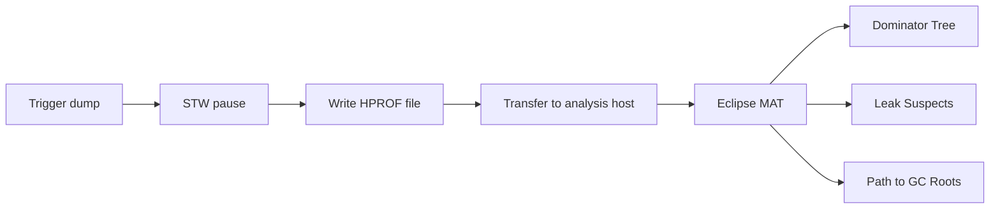

---

### 🛠️ Worked Example

**BAD:**

```bash
# Dumping in production without disk space check
jcmd <pid> GC.heap_dump /var/log/dump.hprof
# 8GB heap -> 8GB dump -> /var/log fills up
# Service loses logging and crashes
```

Why it's wrong: heap dumps are as large as the heap itself. Writing to a logging volume without space check causes cascading failure.

**GOOD:**

```bash
# Pre-check space, write to dedicated volume
df -h /mnt/dumps  # verify >2x heap available
jcmd <pid> GC.heap_dump /mnt/dumps/svc-$(date +%s).hprof
# Or: automatic on OOM (best practice)
# -XX:+HeapDumpOnOutOfMemoryError
# -XX:HeapDumpPath=/mnt/dumps/
```

Why it's right: dedicated volume, timestamped filename, space-verified. OOM auto-dump captures the moment of failure.

**Production:**

```bash
# Analyze without transferring - quick histogram
jcmd <pid> GC.class_histogram | head -20
#  num   #instances  #bytes  class name
#  1:    8234102   395236896  [B (byte arrays)
#  2:    4112051   197378448  java.lang.String
#  3:    2891024    92512768  com.app.dto.Event
# If Event count grows over time -> likely leak

# Compare two histograms 5 minutes apart
diff <(jcmd <pid> GC.class_histogram) \
     <(sleep 300 && jcmd <pid> GC.class_histogram)
# Growing counts after Full GC = confirmed leak
# (take histograms AFTER a forced GC for accuracy:
#  jcmd <pid> GC.run; sleep 2; jcmd <pid> GC.class_histogram)
```

Why this matters: class histogram is the lightweight first step. Only capture a full heap dump after histogram confirms which class is leaking. This avoids unnecessary multi-second STW pauses in production.

---

### ⚖️ Trade-offs

**Gain:** Complete memory visibility. Can find any leak given enough analysis time. Captures the exact state at OOM for post-mortem.

**Cost:** Stop-the-world pause during capture (can be seconds for large heaps). File is huge (equal to heap size). Analysis requires memory (MAT needs ~1.5x dump size in RAM). Production impact during capture.

| Aspect          | Heap dump (HPROF)         | Class histogram (jcmd GC.class_histogram) |
| --------------- | ------------------------- | ----------------------------------------- |
| Detail          | Every object + references | Count + size per class only               |
| Size            | Heap-sized file (GBs)     | Kilobytes of text                         |
| Pause           | Long (seconds)            | Short (< 1s typically)                    |
| Leak root cause | Yes (reference chains)    | No (shows what, not why)                  |

---

### ⚡ Decision Snap

**USE WHEN:**

- OOM occurred and you need to find the root-cause retention chain.
- Memory usage grows over time and you need to identify accumulating object types.
- Debugging "Path to GC Roots" to find the holder of leaked objects.

**AVOID WHEN:**

- Quick triage only needs class histogram (jcmd GC.class_histogram is faster and lighter).
- Heap is >16GB and you lack analysis infrastructure to handle the dump.

**PREFER continuous monitoring WHEN:**

- You need trend data (allocation rate, promotion rate) rather than a single snapshot.
- JFR + JFR Analytics provides allocation profiling without stop-the-world dumps.

---

### ⚠️ Top Traps

| #   | Misconception                                         | Reality                                                                                                                                 |
| --- | ----------------------------------------------------- | --------------------------------------------------------------------------------------------------------------------------------------- |
| 1   | "I can dump a 32GB heap in production without impact" | The dump causes a multi-second stop-the-world pause and writes 32GB to disk. Plan for impact.                                           |
| 2   | "The dump shows what allocated the object"            | It shows what RETAINS the object now (retention chain). Allocation site is not recorded in HPROF. Use JFR for allocation tracking.      |
| 3   | "HeapDumpOnOutOfMemoryError always works"             | If OOM is caused by native memory exhaustion (not heap), the dump may fail to write because native allocation for the dump itself fails |

---

### 🪜 Learning Ladder

**Prerequisites:**

- JVM-029 GC Roots and Reachability Analysis - understand retention chains before analyzing them in dumps
- JVM-033 Thread Dumps - Reading and Interpreting - companion diagnostic (threads for CPU/locks, heap for memory)

**THIS:** JVM-034 Heap Dumps - Capturing and Basics

**Next steps:**

- JVM-060 Memory Leak Diagnosis Workflow - systematic methodology using heap dumps as input
- JVM-037 Common OutOfMemoryError Types and First Aid - understand the error that triggers auto-dumps

---

### 💡 The Surprising Truth

Eclipse MAT's "Leak Suspects" report finds the true leak root cause in under 60 seconds for 80% of production leaks - no manual exploration needed. It works by computing the dominator tree (which single object, if freed, would release the most memory) and then tracing that object's GC root path. Most engineers spend hours manually browsing object trees when MAT's automated report would have shown the answer immediately.

---

### 📇 Revision Card

1. Heap dump = stop-the-world freeze of every object and reference. File size equals heap size. Plan disk space.
2. Use Eclipse MAT "Leak Suspects" first - it finds 80% of leaks automatically via dominator tree analysis.
3. -XX:+HeapDumpOnOutOfMemoryError belongs in every production JVM config. No exceptions.

---

---

# JVM-035 JVM Ergonomics - Automatic Flag Selection

**TL;DR** - JVM ergonomics automatically selects GC algorithm, heap size, and JIT compiler based on detected hardware - smart defaults that can mislead in containers.

---

### 🔥 The Problem in One Paragraph

A developer tests on a 32-core machine with 128GB RAM. The JVM selects G1GC, allocates 32GB heap, and uses 8 parallel GC threads. The same application deploys to a container with 2 CPUs and 4GB RAM. Without explicit flags, the JVM may see the host's 32 cores (pre-Java 10), select inappropriate parallelism, and allocate more heap than the container allows. The "smart defaults" that worked on the developer's machine become wrong defaults in production. This is exactly why understanding JVM ergonomics was created.

---

### 📘 Textbook Definition

**JVM ergonomics** is the subsystem that automatically selects runtime configuration based on detected hardware characteristics. It sets: initial and maximum heap size (~1/64th and ~1/4th of physical RAM), garbage collector (G1GC for server-class machines with >1 CPU and >1.75GB RAM), number of GC threads (proportional to CPU count), and JIT compiler mode (tiered compilation). These defaults aim to provide reasonable performance without manual tuning.

---

### 🧠 Mental Model

> JVM ergonomics is like a car's "auto" mode for seat, mirrors, and climate. It adjusts to the detected environment (driver height = available RAM, outside temperature = CPU count). Usually good enough. But if the car misdetects the environment (container reports host hardware instead of cgroup limits), auto mode sets everything wrong.

- "Auto-adjusting seat" -> heap sizing proportional to RAM
- "Climate auto mode" -> GC selection based on CPU/RAM
- "Misdetected environment" -> container without cgroup awareness

**Where this analogy breaks down:** A car's auto mode is purely comfort-based. JVM ergonomics affects correctness - wrong heap size causes OOM, wrong GC threads cause CPU starvation.

---

### ⚙️ How It Works

1. At startup, the JVM queries the OS for: CPU count, physical RAM, and container cgroup limits (Java 10+).
2. **Heap sizing:** -Xms defaults to 1/64th of RAM (or cgroup limit). -Xmx defaults to 1/4th (capped at various thresholds).
3. **GC selection:** If available RAM > 1.75GB and CPUs > 1: server-class -> G1GC (Java 9+). Otherwise: SerialGC.
4. **GC threads:** ParallelGCThreads = min(CPU count, 8 + (CPU count - 8) \* 5/8).
5. **JIT:** Tiered compilation enabled. C2 threads scale with CPU count.
6. You can see all ergonomic choices with: `java -XX:+PrintFlagsFinal -version`

```text
Ergonomic Decision Tree (Java 17+):
  RAM > 1.75GB AND CPUs > 1?
    YES -> "Server class"
      GC: G1GC
      Heap: min(RAM/4, 32GB) max
      GC threads: f(CPUs)
    NO -> "Client class"
      GC: SerialGC
      Heap: smaller defaults
      GC threads: 1
```

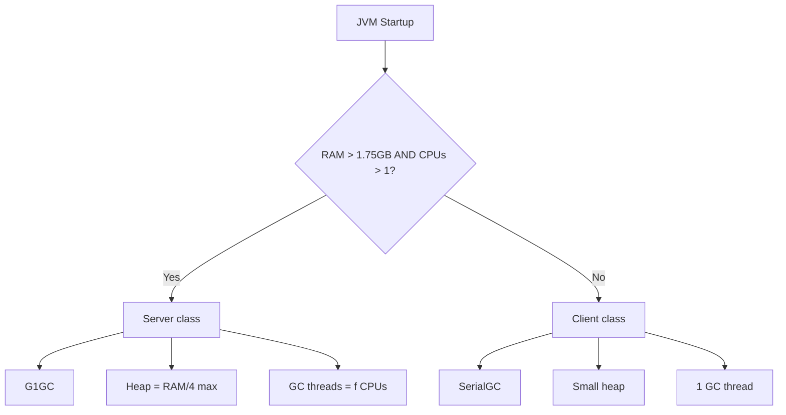

---

### 🛠️ Worked Example

**BAD:**

```bash
# Trusting ergonomics in a 2-CPU, 4GB container
java -jar service.jar
# JVM sees 2 CPUs, 4GB cgroup -> ergonomics picks:
#   -Xmx1g (1/4 of 4GB) - maybe too small
#   G1GC with 2 GC threads
# But: application needs 2GB heap minimum
# Result: constant GC pressure, eventual OOM
```

Why it's wrong: ergonomic 1/4-of-RAM default is often too small for real workloads. Explicit sizing is always better for production.

**GOOD:**

```bash
# Override ergonomics where it matters, accept where it helps
java -Xmx2g -Xms2g \
     -XX:+UseG1GC \
     -jar service.jar
# Explicit heap: overrides ergonomic guess
# G1GC explicit: documents intent even if ergonomics
#   would have chosen it anyway
# GC threads: left to ergonomics (2 CPUs -> 2 threads)
#   because the automatic choice is correct here
```

Why it's right: override what matters (heap size), accept what ergonomics handles well (GC thread count).

**Production:**

```bash
# Inspect what ergonomics chose
java -XX:+PrintFlagsFinal -version 2>&1 | \
  grep -E "MaxHeapSize|UseG1GC|ParallelGCThreads"
# uintx MaxHeapSize = 1073741824    {product}
# bool  UseG1GC     = true           {product}
# uint  ParallelGCThreads = 2        {product}
```

---

### ⚖️ Trade-offs

**Gain:** Zero-config reasonable behavior for development and testing. Adapts to hardware without manual tuning. New JDK versions improve defaults automatically.

**Cost:** Ergonomics cannot know your workload's requirements. Defaults are "safe" (conservative), not "optimal." Container misdetection (pre-Java 10) causes catastrophic mis-sizing.

| Aspect            | Ergonomic defaults              | Explicit flags               |
| ----------------- | ------------------------------- | ---------------------------- |
| Setup effort      | Zero                            | Requires measurement         |
| Portability       | Adapts to each machine          | Fixed regardless of hardware |
| Production safety | Risky (may under/over allocate) | Deterministic                |
| Best for          | Dev/test, quick prototyping     | Production with SLAs         |

---

### ⚡ Decision Snap

**USE WHEN:**

- Local development and testing where convenience outweighs precision.
- GC thread count - ergonomics usually picks a reasonable number.
- JIT compiler settings - rarely need override in practice.

**AVOID WHEN:**

- Deploying to production without validating what ergonomics chose.
- Running in containers where cgroup limits differ from host resources.
- Heap sizing - always explicit in production.

**PREFER explicit flags WHEN:**

- Service has an SLA - deterministic configuration is non-negotiable.
- Running pre-Java 10 in containers (no cgroup awareness).
- Load testing showed ergonomic defaults are suboptimal for your allocation pattern.

---

### ⚠️ Top Traps

| #   | Misconception                                 | Reality                                                                                                                                                                         |
| --- | --------------------------------------------- | ------------------------------------------------------------------------------------------------------------------------------------------------------------------------------- |
| 1   | "Ergonomics always respects container limits" | Only Java 10+ with UseContainerSupport (default true). Earlier versions see host hardware.                                                                                      |
| 2   | "Ergonomic defaults are optimal"              | They are safe and generic. Your workload likely needs different heap sizing and possibly different GC.                                                                          |
| 3   | "PrintFlagsFinal shows what I set"            | It shows the FINAL value after ergonomics, command-line, and defaults interact. A flag you did not set may still appear with a non-default value because ergonomics changed it. |

---

### 🪜 Learning Ladder

**Prerequisites:**

- JVM-028 Common JVM Flags (-Xmx, -Xms, -XX:+UseG1GC) - understand what flags exist before learning how the JVM sets them automatically
- JVM-015 The java Command and JVM Startup - understand the startup sequence where ergonomics runs

**THIS:** JVM-035 JVM Ergonomics - Automatic Flag Selection

**Next steps:**

- JVM-036 Container-Aware JVM (cgroup Limits) - how ergonomics interacts with Linux containers
- JVM-040 GC Algorithm Selection Framework - making the explicit choice ergonomics would make for you

---

### 💡 The Surprising Truth

JVM ergonomics on a Kubernetes node with 64 CPUs and 256GB RAM will select 43 parallel GC threads for a pod limited to 2 CPUs - if UseContainerSupport is disabled or broken. Those 43 GC threads compete for 2 CPU shares, causing massive context switching and worse GC performance than a single-threaded SerialGC. The "smart" default becomes actively harmful. This is the most common performance anti-pattern in containerized Java services that have not been explicitly tuned.

---

### 📇 Revision Card

1. Ergonomics sets heap = RAM/4, GC = G1GC (server class), threads = f(CPUs). Good for dev, dangerous for production.
2. Always validate with -XX:+PrintFlagsFinal. Ergonomic choices are invisible unless you look.
3. Container-unaware JVMs (pre-Java 10 or UseContainerSupport=false) see host resources, not cgroup limits - catastrophic in Kubernetes.

---

---

# JVM-036 Container-Aware JVM (cgroup Limits)

**TL;DR** - Since Java 10, the JVM reads cgroup limits to correctly size heap and threads inside containers - but only if UseContainerSupport is enabled.

---

### 🔥 The Problem in One Paragraph

A Java service runs fine on bare metal with 64GB RAM. It deploys to Kubernetes in a pod with a 4GB memory limit. The JVM (Java 8 without patches) sees the host's 64GB, allocates a 16GB max heap, and the Linux OOM killer immediately terminates the container. No JVM OOM error. No heap dump. Just a mysterious SIGKILL with exit code 137. The service restarts, reallocates 16GB, gets killed again - an infinite crash loop with zero diagnostic output. This is exactly why container-aware JVM support was created.

---

### 📘 Textbook Definition

**Container-aware JVM** refers to the JVM's ability (Java 10+, backported to 8u191) to read Linux cgroup v1/v2 resource limits instead of bare-metal hardware metrics. When `-XX:+UseContainerSupport` is enabled (default since Java 10), the JVM reads `/sys/fs/cgroup/memory/memory.limit_in_bytes` (cgroup v1) or `/sys/fs/cgroup/memory.max` (cgroup v2) for memory, and `cpu.cfs_quota_us / cpu.cfs_period_us` for CPU count. Ergonomics then sizes heap and thread pools based on these constrained values.

---

### 🧠 Mental Model

> Without container awareness, the JVM is a guest at a hotel who opens the building directory and sees 500 rooms available - then tries to book 125 of them (1/4 of total). Container awareness is the front desk telling the guest: "Your reservation is for 1 room. Plan accordingly."

- "Building directory" -> host /proc/meminfo showing total RAM
- "Front desk reservation" -> cgroup memory.limit_in_bytes
- "Booking 125 rooms" -> JVM allocating heap based on host RAM

**Where this analogy breaks down:** The cgroup limit is enforced by the kernel OOM killer (a bouncer), not just the front desk. Exceeding the limit results in process termination, not a polite denial.

---

### ⚙️ How It Works

1. Container runtime (Docker, containerd) creates cgroups with resource limits from pod spec.
2. JVM starts and checks if UseContainerSupport is enabled (default: true, Java 10+).
3. JVM reads cgroup memory limit instead of `/proc/meminfo` total RAM.
4. JVM reads cgroup CPU quota instead of `/proc/cpuinfo` core count.
5. Ergonomics applies: heap = cgroup_memory_limit / 4, GC threads = cgroup_cpu_count.
6. Additional fine-tuning: `-XX:MaxRAMPercentage=75.0` sets heap as percentage of cgroup limit.

```text
Without container support (pre-Java 10):
  /proc/meminfo -> 64GB -> Xmx=16GB -> OOM killed

With container support (Java 10+):
  cgroup limit -> 4GB -> Xmx=1GB (or MaxRAMPercentage)
  Fits within container -> no OOM kill
```

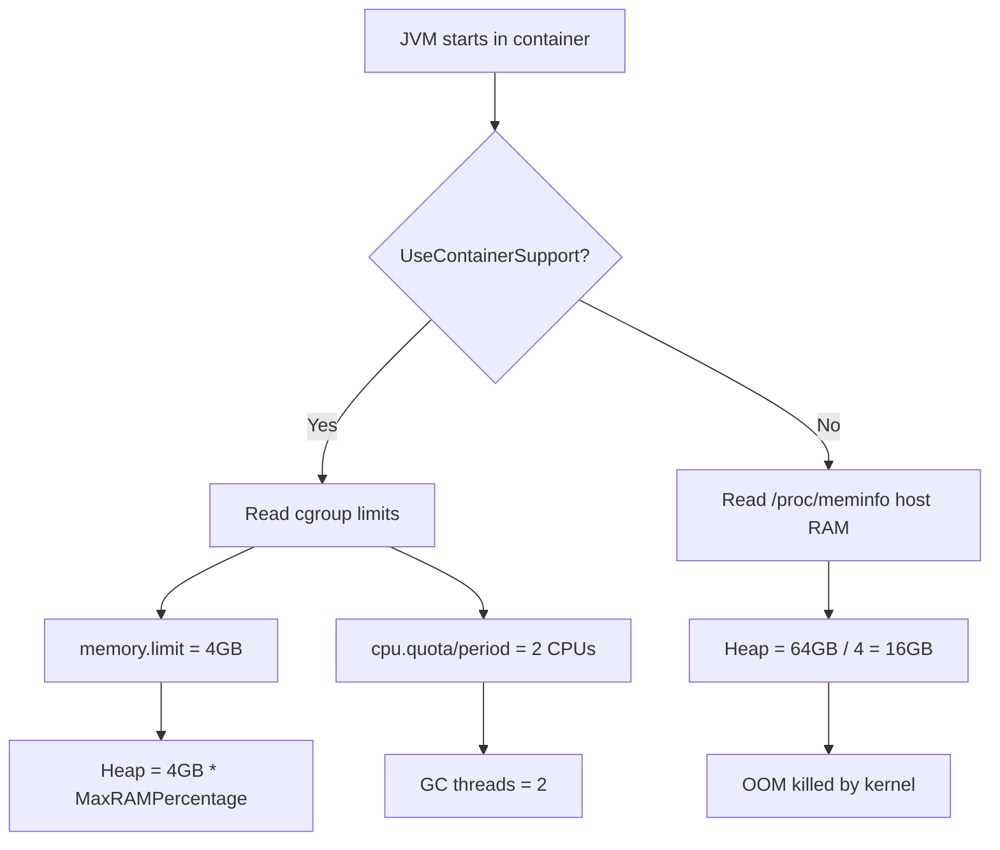

---

### 🛠️ Worked Example

**BAD:**

```dockerfile
# Dockerfile with no JVM memory awareness
FROM eclipse-temurin:17-jre
COPY app.jar /app.jar
CMD ["java", "-jar", "/app.jar"]
# If k8s limit is 512MB:
#   Ergonomic heap = 512MB/4 = 128MB
#   But app needs 256MB heap + native memory
#   Result: OOM or extreme GC pressure
```

Why it's wrong: relying on ergonomic 1/4 ratio in small containers leaves insufficient heap for most applications.

**GOOD:**

```dockerfile
FROM eclipse-temurin:21-jre
COPY app.jar /app.jar
# Set heap to 75% of container memory
# Leave 25% for native memory, thread stacks, etc
CMD ["java", \
     "-XX:MaxRAMPercentage=75.0", \
     "-XX:InitialRAMPercentage=75.0", \
     "-XX:+ExitOnOutOfMemoryError", \
     "-jar", "/app.jar"]
```

Why it's right: percentage-based sizing adapts to any container limit while reserving native memory headroom.

**Production:**

```bash
# Verify what the JVM sees inside the container
docker exec <cid> jcmd 1 VM.flags | grep HeapSize
# MaxHeapSize = 3221225472 (3GB from 4GB limit * 75%)

# Verify CPU count seen
docker exec <cid> jcmd 1 VM.info | grep "active"
# active processor count: 2
# (matches pod cpu limit, not host 64 cores)
```

---

### ⚖️ Trade-offs

**Gain:** JVM correctly constrains itself to container limits. No OOM kills from heap over-allocation. CPU-based parallelism matches available shares.

**Cost:** Percentage-based heap sizing requires understanding total memory budget (heap + Metaspace + thread stacks + NIO buffers + JIT code cache). Setting MaxRAMPercentage too high leaves no room for native memory and causes container OOM.

| Aspect          | MaxRAMPercentage                       | Fixed -Xmx                             |
| --------------- | -------------------------------------- | -------------------------------------- |
| Adaptability    | Scales with container limit changes    | Fixed, must update on resize           |
| Predictability  | Depends on container config            | Deterministic everywhere               |
| Native headroom | Must calculate percentage carefully    | Explicit: container - Xmx = native     |
| Best for        | Standardized flag sets across services | Services with known exact requirements |

---

### ⚡ Decision Snap

**USE WHEN:**

- Running ANY Java service in Docker/Kubernetes/ECS - container awareness is mandatory.
- Using MaxRAMPercentage (typically 60-75%) to avoid hard-coding heap sizes in configs.
- Validating with jcmd VM.flags inside the running container to confirm correct detection.

**AVOID WHEN:**

- Running on bare metal or VMs where the JVM sees correct physical resources directly.
- Setting MaxRAMPercentage above 80% - insufficient native memory causes container-level OOM (not JVM OOM).

**PREFER fixed -Xmx WHEN:**

- Service has precisely known memory requirements from load testing.
- Running in environments where container limits change without notification.

---

### ⚠️ Top Traps

| #   | Misconception                                       | Reality                                                                                                                                          |
| --- | --------------------------------------------------- | ------------------------------------------------------------------------------------------------------------------------------------------------ |
| 1   | "-Xmx = container memory limit"                     | The JVM uses memory BEYOND the heap: thread stacks (~1MB each), Metaspace, JIT code cache, NIO direct buffers. Set heap to 60-75% of limit.      |
| 2   | "Container OOM kill means my app has a memory leak" | Often it means the JVM is correctly sized for heap but native memory (Netty, gRPC, JNI) exceeds the remaining container budget                   |
| 3   | "Java 8 in containers is fine now"                  | Only 8u191+ has container support backported. Earlier 8 builds see host resources. Always verify with -XX:+PrintFlagsFinal inside the container. |

---

### 🪜 Learning Ladder

**Prerequisites:**

- JVM-035 JVM Ergonomics - Automatic Flag Selection - understand what ergonomics decides before learning how containers change its inputs
- JVM-028 Common JVM Flags (-Xmx, -Xms, -XX:+UseG1GC) - know the flags container awareness affects

**THIS:** JVM-036 Container-Aware JVM (cgroup Limits)

**Next steps:**

- JVM-065 JVM in Kubernetes - Resource Limits Done Right - production patterns for k8s pod sizing

---

### 💡 The Surprising Truth

The JVM's "available processors" calculation from CPU quota is often wrong for bursty workloads. A pod with `cpu: 500m` (half a CPU) reports `Runtime.getRuntime().availableProcessors() = 1`. This means ForkJoinPool (used by parallel streams) runs with 0 worker threads (parallelism = CPUs - 1 = 0), falling back to the caller thread. Your parallel stream is actually sequential. Override with `-XX:ActiveProcessorCount=2` if you need actual parallelism despite fractional CPU limits.

---

### 📇 Revision Card

1. UseContainerSupport (default since Java 10) reads cgroup limits. Without it, the JVM sees host RAM and CPU - fatal in containers.
2. Set MaxRAMPercentage=60-75%. Never set heap = container limit. Native memory needs 25-40% headroom.
3. Exit code 137 = OOM-killed by kernel, not JVM OOM. Check container memory limit vs total JVM footprint (heap + native).

---

---

# JVM-037 Common OutOfMemoryError Types and First Aid

**TL;DR** - OOM errors have distinct types (Heap, Metaspace, GC overhead, native) each requiring different diagnosis and different fixes.

---

### 🔥 The Problem in One Paragraph

The service crashes with `java.lang.OutOfMemoryError`. The on-call engineer increases -Xmx from 4GB to 8GB and redeploys. The crash returns two hours later - because the OOM was "Metaspace" (not heap) or "GC overhead limit exceeded" (heap is full of live objects that -Xmx cannot help). Treating all OOMs identically wastes time and delays the real fix. Each OOM type has a different root cause, a different diagnostic path, and a different remedy. This is exactly why classifying OOM types was created.

---

### 📘 Textbook Definition

`java.lang.OutOfMemoryError` is an Error (not an Exception) thrown when the JVM cannot allocate an object due to resource exhaustion. The JVM distinguishes OOM types by the message string: "Java heap space" (heap full), "Metaspace" (class metadata full), "GC overhead limit exceeded" (spending >98% of time in GC recovering <2% heap), "unable to create new native thread" (OS thread limit), and "Direct buffer memory" (NIO direct ByteBuffers exhausted). Each type indicates a different resource exhaustion.

---

### 🧠 Mental Model

> OOM types are like different warning lights on a car dashboard. "Engine temperature" (heap space) means coolant is low. "Oil pressure" (Metaspace) means lubrication failed. "Fuel empty" (GC overhead) means you are running on fumes. Applying coolant when the oil light is on does not help - you must read the specific warning.

- "Engine temp" -> java heap space (heap too small or leaking)
- "Oil pressure" -> Metaspace (classloader leak)
- "Fuel empty" -> GC overhead (heap full of live data)
- "Electrical" -> native thread (OS limits reached)

**Where this analogy breaks down:** Car warnings are independent systems. OOM types can cascade - a Metaspace leak can trigger GC overhead as the JVM struggles to unload classes.

---

### ⚙️ How It Works

1. **Java heap space** - allocation requested, heap is at -Xmx, GC ran but could not free enough. Cause: heap too small OR memory leak.
2. **Metaspace** - class metadata allocation fails. Cause: classloader leak (redeployments, dynamic proxies), or MaxMetaspaceSize too low.
3. **GC overhead limit exceeded** - GC runs repeatedly, consuming >98% CPU time, recovering <2% of heap. Cause: heap is full of reachable objects. More heap only delays the crash.
4. **Unable to create new native thread** - OS refused thread creation. Cause: `ulimit -u` or kernel thread limit reached (often in containers with pid limits).
5. **Direct buffer memory** - NIO direct buffers exceed `-XX:MaxDirectMemorySize`. Cause: Netty/gRPC allocating off-heap without release.

```text
OOM Type                     First Aid
--------------------------   ----------------------------
Java heap space              Heap dump -> find leak
Metaspace                    jcmd VM.classloaders -> find
                             loader with most classes
GC overhead limit exceeded   Heap dump -> retained set
                             analysis (live objects)
unable to create native thr  Check ulimit -u, /proc/sys
                             /kernel/threads-max
Direct buffer memory         Track Netty/ByteBuf allocs
```

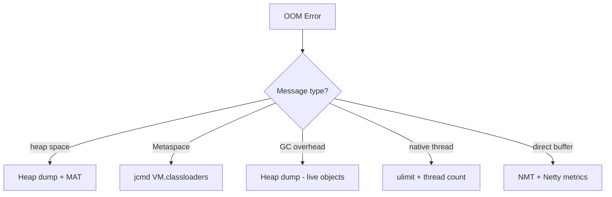

---

### 🛠️ Worked Example

**BAD:**

```bash
# Blind fix: just add more heap
# Error: java.lang.OutOfMemoryError: Metaspace
java -Xmx8g -jar service.jar  # was 4g
# Metaspace is NOT on the heap.
# -Xmx has zero effect on Metaspace OOM.
# Leak continues, crash recurs.
```

Why it's wrong: Metaspace is off-heap native memory. Increasing -Xmx does not add Metaspace capacity.

**GOOD:**

```bash
# Correct: diagnose the specific OOM type
# For Metaspace OOM:
jcmd <pid> VM.classloaders
# Shows: WebAppClassLoader: 12,000 classes loaded
# After 50 hot-reloads in dev mode
# Fix: set -XX:MaxMetaspaceSize=512m AND fix the
# classloader leak (proper undeploy, clear caches)
```

Why it's right: targets the actual exhausted resource with appropriate diagnostic.

**Production:**

```bash
# Configure defensive OOM handling
java -XX:+HeapDumpOnOutOfMemoryError \
     -XX:HeapDumpPath=/mnt/dumps/ \
     -XX:+ExitOnOutOfMemoryError \
     -XX:MaxMetaspaceSize=512m \
     -jar service.jar
# HeapDump on OOM: captures evidence before death
# ExitOnOOM: fast restart instead of limping
# MaxMetaspaceSize: caps growth, surfaces leaks early
```

---

### ⚖️ Trade-offs

**Gain:** Classifying OOM types leads to targeted fixes in minutes rather than days of blind heap increases.

**Cost:** Requires understanding multiple JVM memory regions beyond the heap. Teams without this knowledge default to "increase Xmx" for every OOM regardless of type.

| Aspect         | Increase heap (-Xmx)              | Fix the root cause            |
| -------------- | --------------------------------- | ----------------------------- |
| Time to deploy | Seconds (flag change)             | Hours/days (find + fix leak)  |
| Durability     | Temporary - leak grows            | Permanent                     |
| Applies to     | Heap space only                   | All OOM types                 |
| Risk           | Delays real fix, larger GC pauses | Requires investigation skills |

---

### ⚡ Decision Snap

**USE WHEN:**

- Any OOM occurs - read the message first, then pick the diagnostic path.
- Configuring new services - HeapDumpOnOutOfMemoryError + ExitOnOutOfMemoryError should be default.
- Alerting - different OOM types route to different runbooks.

**AVOID WHEN:**

- Immediately increasing heap without reading the OOM message type.
- Suppressing OOM with catch blocks (the JVM is in an inconsistent state after OOM).

**PREFER ExitOnOutOfMemoryError WHEN:**

- Running in containers with orchestrated restart (Kubernetes, ECS).
- Fast restart is better than limping in a corrupted state.

---

### ⚠️ Top Traps

| #   | Misconception                         | Reality                                                                                                                                               |
| --- | ------------------------------------- | ----------------------------------------------------------------------------------------------------------------------------------------------------- |
| 1   | "All OOMs are heap leaks"             | Metaspace, native thread, and direct buffer OOMs have nothing to do with heap size                                                                    |
| 2   | "Catching OOM and continuing is safe" | After OOM, the JVM may be in an inconsistent state. Objects may be partially constructed. Exit and restart is safest.                                 |
| 3   | "GC overhead = needs more heap"       | It means heap is FULL of live objects. Adding heap just delays the same situation. The fix is reducing live data (fix the leak or reduce cache size). |

---

### 🪜 Learning Ladder

**Prerequisites:**

- JVM-026 Heap Structure - Young, Old, and Metaspace - understand the memory regions that can exhaust
- JVM-029 GC Roots and Reachability Analysis - understand why objects stay alive (causing heap OOM)

**THIS:** JVM-037 Common OutOfMemoryError Types and First Aid

**Next steps:**

- JVM-034 Heap Dumps - Capturing and Basics - the primary diagnostic for heap OOM
- JVM-060 Memory Leak Diagnosis Workflow - systematic process after capturing evidence

---

### 💡 The Surprising Truth

"GC overhead limit exceeded" is actually a mercy kill. Without this safeguard (disable with -XX:-UseGCOverheadLimit), the JVM would spend 99.9% of CPU in GC, making 0.1% progress per second, appearing alive to health checks but completely unable to serve traffic. The service looks "up" but is functionally dead - a zombie. The overhead limit converts this silent failure into a loud, restartable crash. Disabling it is almost never the right answer.

---

### 📇 Revision Card

1. Read the OOM message first - "heap space," "Metaspace," "GC overhead," "native thread," and "direct buffer" are five different problems with five different fixes.
2. -XX:+ExitOnOutOfMemoryError ensures fast container restart instead of a limping JVM in corrupted state.
3. "GC overhead" means heap is full of LIVE objects - increasing heap delays but does not fix the root cause.

---

---

# JVM-038 Metaspace and PermGen History

**TL;DR** - PermGen was a fixed-size region for class metadata that caused OOM in Java 7 and earlier; Metaspace (Java 8+) replaced it with auto-growing native memory.

---

### 🔥 The Problem in One Paragraph

In Java 7 and earlier, every class definition, method bytecode, and string constant was stored in a fixed-size "Permanent Generation" (PermGen) on the heap. Application servers that hot-redeployed dozens of times would exhaust PermGen and crash with `java.lang.OutOfMemoryError: PermGen space`. Increasing `-XX:MaxPermSize` was a temporary fix; the real problem was classloader leaks creating unreclaimable class metadata. Java 8 eliminated PermGen entirely, replacing it with Metaspace - native memory that grows dynamically. This is exactly why the PermGen-to-Metaspace transition was created.

---

### 📘 Textbook Definition

**Permanent Generation (PermGen)** was a heap region in JDK 7 and earlier holding class metadata, method bytecode, and interned strings. It had a fixed maximum size (default 64-256MB depending on JVM version). **Metaspace** (JDK 8+) replaces PermGen with native (off-heap) memory that grows automatically until the OS or `-XX:MaxMetaspaceSize` limits it. Metaspace stores class metadata only; interned strings moved to the main heap in Java 7.

---

### 🧠 Mental Model

> PermGen was a fixed-size filing cabinet. When all drawers were full (all slots for class metadata consumed), adding a new file (loading a new class) was impossible - even if the rest of the office (heap) had plenty of space. Metaspace is an expandable bookshelf on the wall (native memory) - it grows as needed, limited only by the building's wall space (OS memory) or a height limit you set (MaxMetaspaceSize).

- "Fixed filing cabinet" -> PermGen with MaxPermSize
- "Expandable bookshelf" -> Metaspace (native, dynamic)
- "Building wall space" -> total available native memory

**Where this analogy breaks down:** Metaspace still has fragmentation issues. Unlike a clean bookshelf, freed class metadata can leave gaps that are not easily reused.

---

### ⚙️ How It Works

1. **Java 7 and earlier:** Class metadata allocated in PermGen (heap region). Fixed max. GC collected dead classes only if the classloader was garbage collected AND PermGen GC was triggered.
2. **Java 7 update:** Interned strings moved OUT of PermGen into the main heap (reducing PermGen pressure).
3. **Java 8:** PermGen removed entirely. Class metadata moves to Metaspace (native memory via mmap). Default: no upper limit (grows until OS refuses).
4. **Java 8+:** `-XX:MaxMetaspaceSize` optionally caps growth. Exceeding cap triggers `OutOfMemoryError: Metaspace`.
5. **GC interaction:** Metaspace is collected when a classloader is garbage collected AND its loaded classes become unreachable. This is why classloader leaks cause Metaspace growth.

```text
Java 7:                     Java 8+:
+------------+              +------------+
| Heap       |              | Heap       |
| +--------+ |              |            |
| |PermGen | |              +------------+
| |(class  | |
| | meta)  | |              Native Memory:
| +--------+ |              +------------+
+------------+              | Metaspace  |
                            | (class     |
                            |  metadata) |
                            +------------+
```

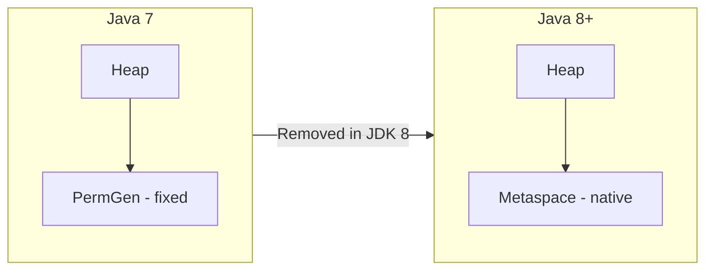

---

### 🛠️ Worked Example

**BAD:**

```bash
# Java 7: increasing PermGen without fixing the leak
java -XX:MaxPermSize=1g -jar app.jar
# Buys time, but classloader leak continues
# OOM: PermGen space returns after 200 redeploys
# instead of 20 - same root cause, longer delay
```

Why it's wrong: more PermGen masks the classloader leak. The fix is preventing leak, not expanding the bucket.

**GOOD:**

```bash
# Java 8+: cap Metaspace to detect leaks early
java -XX:MaxMetaspaceSize=256m \
     -Xlog:class+unload=info \
     -jar app.jar
# If Metaspace OOM occurs: classloader leak
# class+unload logging shows which classes NOT being
# unloaded (retained classloaders)
```

Why it's right: capping Metaspace converts a slow leak into an early, diagnosable failure. Logging reveals the culprit.

**Production:**

```bash
# Monitor Metaspace usage
jstat -gcmetacapacity <pid> 1000
#   MCMN    MCMX       MC        MU
#   0.0   1048576.0  98304.0   96182.3
# MC = committed (reserved), MU = used
# If MU grows continuously: classloader leak
# If MU stable: healthy
```

---

### ⚖️ Trade-offs

**Gain:** Metaspace eliminates the arbitrary PermGen limit that caused OOM on healthy applications. Dynamic growth adapts to actual class loading needs.

**Cost:** Unbounded Metaspace growth (no MaxMetaspaceSize) can consume all native memory silently. Classloader leaks are harder to notice because Metaspace does not fill a visible "bucket" - it just quietly eats native RAM.

| Aspect           | PermGen (Java 7-)         | Metaspace (Java 8+)                |
| ---------------- | ------------------------- | ---------------------------------- |
| Location         | Heap (counted in -Xmx)    | Native memory (off-heap)           |
| Sizing           | Fixed -XX:MaxPermSize     | Dynamic or -XX:MaxMetaspaceSize    |
| Leak visibility  | OOM: PermGen space (fast) | Slow native memory growth (silent) |
| String interning | In PermGen (risky)        | In main heap (GC-able)             |

---

### ⚡ Decision Snap

**USE WHEN:**

- Migrating Java 7 applications to Java 8+ - remove all PermGen flags (they are ignored and produce warnings).
- Setting MaxMetaspaceSize in production to surface classloader leaks early rather than letting them consume native memory silently.
- Monitoring Metaspace as a separate metric alongside heap usage.

**AVOID WHEN:**

- Setting MaxMetaspaceSize too low for applications that legitimately load many classes (annotation processors, Spring with heavy proxy generation).
- Ignoring Metaspace monitoring because "it auto-grows" - auto-growth without limit is a liability.

**PREFER explicit MaxMetaspaceSize WHEN:**

- Running in containers where total memory budget is fixed.
- Operating application servers with hot-redeploy capability (Tomcat, WildFly).

---

### ⚠️ Top Traps

| #   | Misconception                              | Reality                                                                                                                                                         |
| --- | ------------------------------------------ | --------------------------------------------------------------------------------------------------------------------------------------------------------------- |
| 1   | "Metaspace cannot OOM since it auto-grows" | It OOMs when the OS refuses native allocation (container limit, physical RAM exhausted, or MaxMetaspaceSize hit)                                                |
| 2   | "Setting -XX:MaxPermSize on Java 8+ helps" | The flag is silently ignored. It produces a warning and has zero effect. Use MaxMetaspaceSize instead.                                                          |
| 3   | "Metaspace is collected every GC cycle"    | Metaspace is only reclaimed when the classloader that loaded the classes is itself garbage collected. Classes loaded by the app classloader are never unloaded. |

---

### 🪜 Learning Ladder

**Prerequisites:**

- JVM-026 Heap Structure - Young, Old, and Metaspace - understand where Metaspace fits in the memory model
- JVM-031 ClassLoader Hierarchy (Bootstrap, Plat, App) - classloaders must be GC'd for Metaspace to be freed

**THIS:** JVM-038 Metaspace and PermGen History

**Next steps:**

- JVM-046 The N+1 ClassLoader Anti-Pattern - the most common cause of Metaspace leaks
- JVM-101 Diagnosing Metaspace OOM in Production - production-grade diagnosis workflow

---

### 💡 The Surprising Truth

Classes loaded by the Bootstrap, Platform, or Application classloader are NEVER unloaded - ever. Metaspace reclamation only works for classes loaded by custom classloaders (web container loaders, OSGi bundles, dynamically-generated proxy classloaders). This means Spring Boot applications with heavy CGLIB proxy generation cannot reclaim those proxy class definitions unless the entire application context is torn down. Metaspace for the main application grows monotonically from startup until JVM exit.

---

### 📇 Revision Card

1. PermGen (Java 7-) was a fixed heap region; Metaspace (Java 8+) is dynamic native memory. Remove all PermGen flags on upgrade.
2. Always set MaxMetaspaceSize in production containers to prevent silent native memory exhaustion.
3. Metaspace is freed only when classloaders are GC'd. App classloader classes are NEVER unloaded - Metaspace for them grows forever.

---

---

# JVM-039 JVM Exit Codes and Crash Logs

**TL;DR** - Exit codes and hs_err_pid crash logs distinguish between normal termination, OOM, signal kills, and native JVM crashes for incident triage.

---

### 🔥 The Problem in One Paragraph

Your monitoring shows the Java process exited with code 137. Was it a healthy shutdown, an OOM, a segfault, or Kubernetes killing it? Another time the process leaves an `hs_err_pid12345.log` file. Is this a bug in your code, a JVM bug, or a hardware issue? Without understanding exit codes and crash log structure, incident responders cannot even classify the failure mode, let alone fix it. This is exactly why understanding JVM exit codes and crash logs was created.

---

### 📘 Textbook Definition

The **JVM exit code** is the integer returned to the parent process (shell, container runtime, systemd). Code 0 indicates normal exit. Code 1 indicates application failure (unhandled exception reaching main). Code 137 (128+9) indicates SIGKILL. Code 134 (128+6) indicates SIGABRT. An **hs_err_pid file** is generated when the JVM itself crashes (segfault, assertion failure, or internal error). It contains the crash reason, register state, thread stacks, and loaded libraries - a complete autopsy report for JVM-level failures.

---

### 🧠 Mental Model

> Exit codes are the medical examiner's cause-of-death classification. 0 = "died peacefully" (normal exit). 1 = "natural causes" (app exception). 137 = "homicide" (SIGKILL by OOM killer or orchestrator). hs_err_pid = "full autopsy report" (JVM internal crash with complete forensic detail).

- "Died peacefully" -> exit 0 (System.exit(0), main returned)
- "Natural causes" -> exit 1 (unhandled exception)
- "Homicide" -> exit 137 (SIGKILL from outside)
- "Autopsy report" -> hs_err_pid log file

**Where this analogy breaks down:** Unlike death, JVM processes are typically restarted automatically. The "autopsy" is for root-cause analysis to prevent recurrence, not closure.

---

### ⚙️ How It Works

1. **Exit 0:** JVM shuts down normally. All non-daemon threads exited, or System.exit(0) called. Shutdown hooks ran.
2. **Exit 1:** Unhandled exception reached the top of a thread's stack. Default UncaughtExceptionHandler prints the trace and exits with 1.
3. **Exit N (custom):** System.exit(N) where N is application-defined.
4. **Exit 128+signal:** Process received a signal. 137=128+9=SIGKILL, 143=128+15=SIGTERM (if not handled), 134=128+6=SIGABRT.
5. **hs_err_pid:** JVM encountered a fatal error (SIGSEGV in JIT-compiled code, assertion failure in C++ runtime, out-of-native-memory). Dumps error details to `hs_err_pid<PID>.log` before aborting.

```text
Exit Code  Meaning              Action
---------  -------------------  ---------------------------
0          Normal exit          No action needed
1          Uncaught exception   Check app logs for trace
137        SIGKILL (128+9)      OOM-killer or k8s eviction
143        SIGTERM (128+15)     Graceful stop requested
134        SIGABRT (128+6)      JVM internal abort
N/A        hs_err_pid exists    JVM native crash - file bug
```

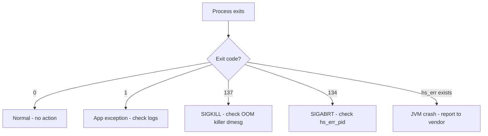

---

### 🛠️ Worked Example

**BAD:**

```bash
# Ignoring exit code, just restarting
#!/bin/bash
java -jar service.jar
# Always restart, never investigate
exec $0  # infinite restart loop
```

Why it's wrong: restarting without classification means you never learn if it was OOM kill (need more memory), crash (need JVM patch), or code bug (need fix).

**GOOD:**

```bash
#!/bin/bash
java -jar service.jar
EXIT_CODE=$?
case $EXIT_CODE in
  0)   echo "Clean exit" ;;
  137) echo "SIGKILL - check dmesg for OOM killer"
       dmesg | tail -20 ;;
  134) echo "SIGABRT - check hs_err_pid*" ;;
  *)   echo "Exit code: $EXIT_CODE - check app logs";;
esac
# Kubernetes: use exit code in pod status + events
```

Why it's right: classifies the failure mode immediately, enabling correct next-step diagnosis.

**Production:**

```bash
# Key sections of hs_err_pid log to read first:
# 1. HEADER: signal type and crash address
#    SIGSEGV (0xb) at pc=0x00007f...
# 2. THREAD: which thread crashed and its stack
#    Current thread: CompilerThread0
# 3. INSTRUCTIONS: disassembly around crash point
# 4. VM STATE: "at safepoint" or "not at safepoint"
# If CompilerThread crashed -> likely JIT bug
# File OpenJDK bug with hs_err attached
```

---

### ⚖️ Trade-offs

**Gain:** Systematic exit code classification enables automated incident routing (OOM -> capacity team, crash -> platform team, app error -> dev team).

**Cost:** Requires integration with monitoring (pod exit code tracking, hs_err file collection). Kubernetes CrashLoopBackOff hides the root cause unless you inspect pod status and events.

| Aspect           | Exit code analysis           | Blind restart                   |
| ---------------- | ---------------------------- | ------------------------------- |
| Diagnosis speed  | Immediate classification     | None until manual investigation |
| Automation       | Route to correct team        | Generic alert to everyone       |
| Effort           | Setup monitoring + playbook  | Zero setup                      |
| Repeat incidents | Decreasing (fix root causes) | Same issues recur indefinitely  |

---

### ⚡ Decision Snap

**USE WHEN:**

- Building operational runbooks - exit codes are the first triage signal.
- Configuring Kubernetes liveness probes - know what codes mean before deciding restart policy.
- Filing JVM bug reports - hs_err_pid is the required attachment.

**AVOID WHEN:**

- Treating all non-zero exits identically (restart and forget).
- Ignoring hs_err_pid files ("the JVM crashed, we just restarted").

**PREFER systematic collection WHEN:**

- Running fleet-wide analysis to identify JVM version bugs affecting multiple services.
- Operating in regulated environments where every crash must be explained.

---

### ⚠️ Top Traps

| #   | Misconception                              | Reality                                                                                                                                                                             |
| --- | ------------------------------------------ | ----------------------------------------------------------------------------------------------------------------------------------------------------------------------------------- |
| 1   | "Exit 137 means my application has a bug"  | 137 = SIGKILL from outside (OOM killer, k8s eviction). The app had no chance to handle it. Check `dmesg` for kernel OOM messages.                                                   |
| 2   | "hs_err_pid means my code crashed the JVM" | Usually it is a JIT compiler bug, JNI native code issue, or OS-level memory corruption. File an OpenJDK bug report.                                                                 |
| 3   | "JVM crashes are common"                   | In modern JDKs (17+), JVM crashes are extremely rare. If you see them frequently, suspect: JNI code, Unsafe usage, hardware errors (bad RAM), or unsupported OS/glibc combinations. |

---

### 🪜 Learning Ladder

**Prerequisites:**

- JVM-032 JVM Shutdown Hooks and Lifecycle - understand normal vs abnormal termination paths
- JVM-015 The java Command and JVM Startup - understand the JVM process lifecycle

**THIS:** JVM-039 JVM Exit Codes and Crash Logs

**Next steps:**

- JVM-083 JVM Crash Analysis (hs_err_pid Files) - deep dive into crash log forensics
- JVM-037 Common OutOfMemoryError Types and First Aid - the OOM path that often precedes exit 137

---

### 💡 The Surprising Truth

Exit code 143 (SIGTERM) should never appear if your application handles shutdown correctly - because SIGTERM triggers shutdown hooks and results in exit code 0 (normal). If you see exit 143, it means the JVM did not get a chance to complete shutdown hooks before something sent SIGKILL (often Kubernetes' terminationGracePeriodSeconds expired). The fix is not handling SIGTERM differently - it is making your shutdown hooks faster so they complete before the grace period expires. Teams often add Thread.sleep or complex cleanup logic to hooks without realizing that slow hooks cause the very SIGKILL they are trying to prevent.

---

### 📇 Revision Card

1. Exit 0 = normal, 1 = uncaught exception, 137 = SIGKILL (OOM killer or k8s eviction), 134/hs_err = JVM native crash.
2. Always check `dmesg` on exit 137 - it reveals whether the kernel OOM killer or Kubernetes killed the process. Look for "Killed process" lines.
3. hs_err_pid is a JVM bug report attachment, not an application error. File it with the JDK vendor with the full log attached.

---

---

# JVM-040 GC Algorithm Selection Framework

**TL;DR** - Choose GC based on your primary constraint: latency (ZGC), throughput (Parallel), balance (G1), or small footprint (Serial).

---

### 🔥 The Problem in One Paragraph

The team argues: "ZGC is newest, therefore best." Another engineer insists "G1GC is the default, so it must be optimal." A third copies Netflix's Parallel GC settings despite running a latency-sensitive payment service. Without a decision framework, GC selection becomes tribal knowledge or cargo cult copying. The wrong collector for your workload either wastes throughput chasing unnecessary low-latency guarantees or inflicts catastrophic pauses on latency-sensitive endpoints. This is exactly why a GC selection framework was created.

---

### 📘 Textbook Definition

**GC algorithm selection** is the deliberate choice of garbage collector implementation based on workload characteristics: pause time SLA, throughput requirements, heap size, and operational constraints. The HotSpot JVM ships four production collectors: Serial (single-threaded, minimal footprint), Parallel (multi-threaded, throughput-optimized), G1 (balanced latency/throughput, regionalized), and ZGC/Shenandoah (sub-millisecond pauses, concurrent). Selection is a trade-off matrix, not a "best" answer.

---

### 🧠 Mental Model

> GC selection is choosing a vehicle for a specific mission. Serial is a bicycle (minimal overhead, fine for small loads). Parallel is a freight truck (maximum cargo throughput, stops traffic at intersections). G1 is a delivery van (balanced, navigates city traffic with acceptable delays). ZGC is an ambulance (pauses nothing, clears its own path, but uses more fuel).

- "Bicycle" -> Serial GC (tiny footprint, single-threaded)
- "Freight truck" -> Parallel GC (max throughput, long pauses)
- "Delivery van" -> G1GC (balanced, configurable pause target)
- "Ambulance" -> ZGC/Shenandoah (sub-ms pauses, higher CPU)

**Where this analogy breaks down:** Unlike vehicles, you can switch GC algorithms with a single flag restart - no procurement process needed. But measuring the impact requires load testing, not just restarting.

---

### ⚙️ How It Works

1. Identify your PRIMARY constraint: is it latency (p99 response time), throughput (requests/sec), memory footprint, or operational simplicity?
2. Match constraint to collector:
   - Latency < 1ms: ZGC or Shenandoah
   - Throughput maximum: Parallel GC
   - Balance (latency + throughput): G1GC
   - Minimal footprint (<100MB heap): Serial GC
3. Set the collector flag and run your workload under realistic load.
4. Measure: GC pause distribution (p50, p99, max), total GC time as % of wall clock, throughput delta.
5. Iterate: adjust MaxGCPauseMillis (G1) or accept the default (ZGC).

```text
PRIMARY CONSTRAINT   -> COLLECTOR   -> FLAG
-----------------       ---------      ----
Latency < 1ms          ZGC            -XX:+UseZGC
Latency < 200ms        G1GC           -XX:+UseG1GC
Max throughput          Parallel       -XX:+UseParallelGC
Tiny footprint          Serial         -XX:+UseSerialGC
```

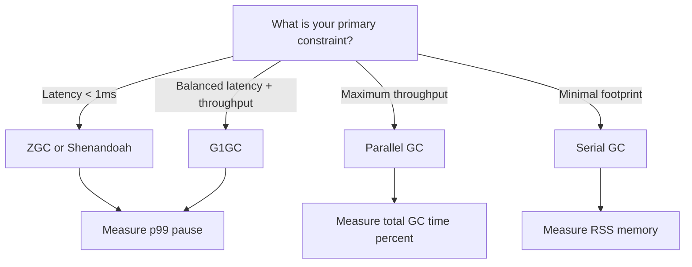

---

### 🛠️ Worked Example

**BAD:**

```bash
# Copying Netflix's config for a payment service
java -XX:+UseParallelGC -XX:ParallelGCThreads=20 \
     -Xmx30g -jar payment-service.jar
# Netflix optimizes for throughput (batch analytics)
# Payment service needs <50ms p99 latency
# Parallel GC pauses: 500ms-3s on 30GB heap
# Result: timeout errors during every GC pause
```

Why it's wrong: Parallel GC maximizes throughput at the cost of pause time. Latency-sensitive services need G1 or ZGC.

**GOOD:**

```bash
# Choose based on YOUR constraint: <50ms p99 latency
java -XX:+UseG1GC \
     -XX:MaxGCPauseMillis=30 \
     -Xmx4g -jar payment-service.jar
# G1 targets 30ms max pause (with headroom to 50ms)
# For stricter SLA (<5ms): switch to ZGC
# java -XX:+UseZGC -Xmx4g -jar payment-service.jar
```

Why it's right: collector choice driven by measured workload constraint, not by copying someone else's config.

**Production:**

```bash
# Measure after selection: validate the choice
# Parse GC log for pause distribution
grep "GC pause" gc.log | awk '{print $NF}' | sort -n | \
  awk 'BEGIN{n=0} {a[n++]=$1} END{
    print "p50:", a[int(n*0.5)];
    print "p99:", a[int(n*0.99)];
    print "max:", a[n-1]}'
# If p99 exceeds SLA: wrong collector or wrong sizing

# Quick decision validation checklist:
# 1. Total GC time <5% of wall clock? (throughput OK)
# 2. p99 pause < SLA target with headroom? (latency OK)
# 3. Heap utilization stable? (no leak masking the GC)
# If all three pass: collector choice is validated
# If 1 fails: consider Parallel GC (more throughput)
# If 2 fails: consider ZGC (lower pauses)
# If 3 fails: fix the leak first, then re-evaluate
```

---

### ⚖️ Trade-offs

**Gain:** Framework-driven selection avoids cargo-cult copying and tribal knowledge. Measurable outcome validates the choice.

**Cost:** Requires load testing infrastructure and understanding of GC metrics. Quick decisions without measurement may still be wrong.

| Aspect              | G1GC                          | ZGC                 | Parallel                   | Serial                     |
| ------------------- | ----------------------------- | ------------------- | -------------------------- | -------------------------- |
| Max pause           | 50-200ms (tunable)            | <1ms                | 100ms-seconds              | Seconds (entire heap)      |
| Throughput overhead | ~5-10% vs Parallel            | ~10-15% vs Parallel | Baseline (best throughput) | Low overhead on tiny heaps |
| Heap range          | 4GB-64GB sweet spot           | 8MB-16TB            | Any                        | <100MB                     |
| Tuning complexity   | Moderate (IHOP, pause target) | Low (mostly auto)   | Low (thread count)         | None                       |

---

### ⚡ Decision Snap

**USE WHEN:**

- Starting a new service - make an explicit GC choice based on workload characteristics.
- SLA changes - if latency requirements tighten, re-evaluate collector choice.
- Upgrading JDK versions - newer JDKs improve all collectors; re-benchmark.

**AVOID WHEN:**

- Changing GC without measuring the current collector's actual performance first.
- Optimizing GC before proving GC is the bottleneck (not application code).

**PREFER G1GC as default WHEN:**

- No strong latency or throughput constraint exists - G1 is the safest general-purpose choice.
- You want JDK ergonomics to handle most tuning automatically.

---

### ⚠️ Top Traps

| #   | Misconception                         | Reality                                                                                                                                           |
| --- | ------------------------------------- | ------------------------------------------------------------------------------------------------------------------------------------------------- |
| 1   | "Newest GC is always best"            | ZGC trades throughput for latency. If your SLA is throughput-bound, Parallel GC is still superior.                                                |
| 2   | "G1GC is slow compared to ZGC"        | G1GC achieves higher throughput than ZGC on most workloads. ZGC wins only on worst-case pause.                                                    |
| 3   | "I can choose once and never revisit" | JDK upgrades significantly improve collector performance. A choice optimal on JDK 11 may be suboptimal on JDK 21. Re-benchmark on major upgrades. |

---

### 🪜 Learning Ladder

**Prerequisites:**

- JVM-027 Minor GC vs Major GC vs Full GC - understand the events you are optimizing
- JVM-026 Heap Structure - Young, Old, and Metaspace - understand what collectors manage

**THIS:** JVM-040 GC Algorithm Selection Framework

**Next steps:**

- JVM-048 G1GC Internals - Regions, Marking, Mixed - deep dive into the most common production choice
- JVM-067 Choosing ZGC vs G1GC vs Shenandoah - detailed comparison for advanced selection

---

### 💡 The Surprising Truth

In JDK 21+, Generational ZGC (enabled by default) largely eliminates ZGC's historical throughput penalty. It combines sub-millisecond pauses with throughput competitive to G1GC for most workloads. This makes the "throughput vs latency" trade-off much less stark than it was in JDK 17. For new projects on JDK 21+, ZGC may be the right default choice regardless of workload type - a statement that was heresy just three years ago. The key change: generational ZGC separates young and old generation collection, avoiding the full-heap concurrent marking that made non-generational ZGC slower for throughput workloads. This single improvement made ZGC competitive across the entire spectrum of workloads.

---

### 📇 Revision Card

1. Choose by constraint: latency -> ZGC, throughput -> Parallel, balance -> G1, footprint -> Serial. Never copy someone else's choice without measuring.
2. Measure after selecting: p99 pause and total GC% under realistic load. If either exceeds SLA, the choice is wrong regardless of what worked elsewhere.
3. Re-benchmark on major JDK upgrades. JDK 21 Generational ZGC changed the trade-off landscape significantly - previous assumptions about ZGC throughput cost no longer hold.

---

---

# JVM-041 jcmd - The Swiss Army Knife

**TL;DR** - jcmd is a single command-line tool that replaces jstack, jmap, jinfo, and jstat for runtime diagnostics on a live JVM process.

---

### 🔥 The Problem in One Paragraph

A production JVM exhibits memory growth. You need a heap histogram, a thread dump, the current GC configuration, and a flight recording - all from a live process without restarting it. Previously this required four different tools (jmap, jstack, jinfo, jfr) each with different syntax and different permission requirements. Remembering which tool does what and maintaining security policies for each is operational burden. This is exactly why jcmd as a unified diagnostic interface was created.

---

### 📘 Textbook Definition

**jcmd** is a command-line utility shipped with the JDK that sends diagnostic commands to a running JVM process via an internal mechanism (attach API). It subsumes the functionality of jstack (thread dumps), jmap (heap dumps, histograms), jinfo (flag queries), and jfr (flight recordings) into a single, consistent interface. Commands are discoverable: `jcmd <pid> help` lists all available operations for a specific JVM.

---

### 🧠 Mental Model

> jcmd is a universal remote control for the JVM. Instead of finding the right remote for the TV (jstack), another for the stereo (jmap), and another for the lights (jinfo), you have one device with discoverable buttons. Point it at any JVM process and ask "what can you do?" and it lists every diagnostic command available.

- "Universal remote" -> jcmd
- "Discoverable buttons" -> `jcmd <pid> help`
- "Different devices" -> different JVM subsystems (threads, memory, GC, JIT)

**Where this analogy breaks down:** Unlike a remote, jcmd triggers immediate work in the JVM (heap dumps take time, flight recordings have overhead). It is not purely observational - some commands have side effects.

---

### ⚙️ How It Works

1. `jcmd` (no args) lists all running JVM processes (like jps).
2. `jcmd <pid> help` shows all commands the target JVM supports.
3. Commands are hierarchical: `VM.flags`, `GC.heap_dump`, `Thread.print`, `JFR.start`, `Compiler.queue`.
4. jcmd connects via the JVM attach mechanism (same-user or root). No JVM restart required. No agents needed.
5. Output goes to stdout or to a file path specified in the command.

```text
Common jcmd commands:
  jcmd <pid> VM.flags            # active JVM flags
  jcmd <pid> VM.info             # JVM version, uptime
  jcmd <pid> Thread.print        # thread dump
  jcmd <pid> GC.heap_dump <path> # heap dump (HPROF)
  jcmd <pid> GC.class_histogram  # object count/size
  jcmd <pid> GC.run              # suggest GC (not force)
  jcmd <pid> JFR.start duration=60s filename=r.jfr
  jcmd <pid> VM.native_memory summary
  jcmd <pid> Compiler.queue      # JIT compilation queue
```

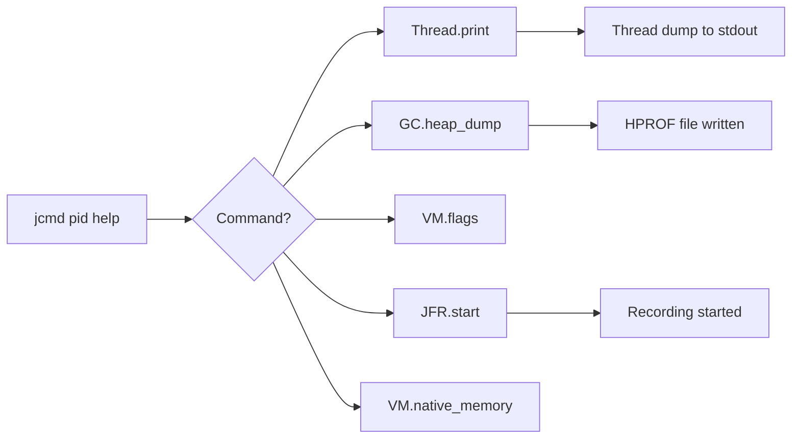

---

### 🛠️ Worked Example

**BAD:**

```bash
# Using deprecated jmap with wrong permissions
jmap -dump:live,format=b,file=/tmp/dump.hprof <pid>
# May fail with: "Unable to open socket file"
# Requires same user or root
# jmap is effectively deprecated in favor of jcmd
```

Why it's wrong: jmap is legacy, has permission issues, and less functionality than jcmd.

**GOOD:**

```bash
# Complete diagnostic session using only jcmd
PID=$(jcmd | grep myapp | awk '{print $1}')
# 1. Quick health check
jcmd $PID VM.uptime
# 2. Current flags (what ergonomics chose)
jcmd $PID VM.flags
# 3. Object histogram (top memory consumers)
jcmd $PID GC.class_histogram | head -20
# 4. Thread dump if latency spike
jcmd $PID Thread.print > /tmp/threads.txt
# 5. Full heap dump if leak suspected
jcmd $PID GC.heap_dump /tmp/heap.hprof
```

Why it's right: one tool, consistent syntax, discoverable commands, same-user permissions.

**Production:**

```bash
# Start a 60-second JFR recording during incident
jcmd $PID JFR.start name=incident duration=60s \
  filename=/tmp/incident.jfr \
  settings=profile
# After 60s: download incident.jfr
# Open in JDK Mission Control for root cause
# Captures: allocations, locks, IO, CPU, GC events

# Native memory tracking (if -XX:NativeMemoryTracking=summary)
jcmd $PID VM.native_memory summary
# Shows breakdown: Java Heap, Class, Thread stacks,
# Code cache, GC overhead, Compiler, Internal, Symbol
# Total committed vs reserved - reveals off-heap growth

# Useful one-liner: all flags that differ from defaults
jcmd $PID VM.flags | grep -v ":= "
# Shows only explicitly set or ergonomically selected flags
```

Why this matters: these three commands (JFR, NMT, flags) cover 80% of production incident investigations. Memorize them as your incident-response toolkit.

---

### ⚖️ Trade-offs

**Gain:** Single tool to memorize. Discoverable (help command). Works on any JVM without pre-configuration. Replaces jmap, jstack, jinfo, jfr command line.

**Cost:** Requires same-user access (or root). Some commands pause the JVM briefly (heap dump). Cannot work if the JVM's attach mechanism is disabled (-XX:+DisableAttachMechanism).

| Aspect             | jcmd                              | Individual tools (jstack, jmap, etc.) |
| ------------------ | --------------------------------- | ------------------------------------- |
| Interface          | Unified, discoverable             | Separate binaries, separate syntax    |
| Completeness       | Thread + heap + flags + JFR + NMT | Each tool covers one area             |
| Modern JDK support | Actively maintained               | Some deprecated (jhat removed)        |
| Permission model   | Same-user or root                 | Same (attach API underneath)          |

---

### ⚡ Decision Snap

**USE WHEN:**

- Any runtime diagnostic need on a live JVM - jcmd is always the first tool to reach for.
- Building diagnostic runbooks - standardize on jcmd for consistency.
- Discovering what diagnostics are available: `jcmd <pid> help` is your starting point.

**AVOID WHEN:**

- The JVM has `-XX:+DisableAttachMechanism` set (security-hardened environments).
- You need continuous monitoring (use JFR or Prometheus/Micrometer instead of repeated jcmd invocations).

**PREFER JFR continuous recording WHEN:**

- You need historical data, not just a point-in-time snapshot.
- Problems are intermittent and happen when nobody is watching.

---

### ⚠️ Top Traps

| #   | Misconception                               | Reality                                                                                                                                                 |
| --- | ------------------------------------------- | ------------------------------------------------------------------------------------------------------------------------------------------------------- |
| 1   | "jcmd GC.run forces garbage collection"     | GC.run is a suggestion (like System.gc()). The JVM may ignore it. It is not a guaranteed Full GC trigger.                                               |
| 2   | "jcmd is safe to run in production anytime" | GC.heap_dump causes a stop-the-world pause proportional to heap size. On a 32GB heap, expect seconds of pause.                                          |
| 3   | "jcmd replaces monitoring tools"            | jcmd is point-in-time. It does not replace continuous metrics (JMX, Micrometer, JFR). Use jcmd for incident investigation, not steady-state monitoring. |

---

### 🪜 Learning Ladder

**Prerequisites:**

- JVM-022 Your First JVM Diagnostic (jps, jinfo) - basic process identification
- JVM-033 Thread Dumps - Reading and Interpreting - understand the output of Thread.print

**THIS:** JVM-041 jcmd - The Swiss Army Knife

**Next steps:**

- JVM-058 JFR (Java Flight Recorder) Deep Dive - the most powerful jcmd-initiated diagnostic
- JVM-063 Native Memory Tracking (NMT) - VM.native_memory command for off-heap investigation

---

### 💡 The Surprising Truth

`jcmd <pid> Compiler.queue` shows you which methods the JIT compiler is currently waiting to compile. During warmup, this queue can have hundreds of entries. If a latency-sensitive method is waiting in queue behind less important methods, you can use `-XX:CompileCommand=inline,com.app.HotPath::*` to prioritize it. This is one of the few legitimate JIT tuning scenarios - and jcmd makes it visible without adding any agents or restarting. Additionally, `jcmd <pid> Compiler.codelist` shows all already-compiled methods and their compilation level (C1 vs C2), letting you verify that your critical path methods reached peak optimization.

---

### 📇 Revision Card

1. jcmd replaces jstack, jmap, jinfo, and jfr. One tool, one syntax, discoverable via `help`.
2. First command in any investigation: `jcmd <pid> help` to see what is available on this JVM version.
3. Safety reminder: `GC.heap_dump` causes STW pause proportional to heap size. Use `GC.class_histogram` for quick checks first, dump only when needed for root cause analysis.

4. jcmd replaces jstack + jmap + jinfo + jfr CLI. One tool, discoverable commands, consistent syntax.
5. `jcmd <pid> help` lists everything available. Start there during any incident.
6. Beware: GC.heap_dump pauses the JVM proportionally to heap size. Never dump a 32GB heap without warning the on-call team.

---

---

# JVM-042 VisualVM and JConsole

**TL;DR** - VisualVM and JConsole are GUI tools for real-time JVM monitoring, profiling, and heap analysis - ideal for local development and staging debugging.

---

### 🔥 The Problem in One Paragraph

You suspect a memory leak in development, but reading raw jstat numbers every second is tedious and you miss trends. Thread dumps as text are hard to parse for complex deadlock chains. You want to see heap usage as a live graph, click a thread to see its stack, trigger a heap dump, and browse the object tree visually. Command-line tools provide data; visual tools provide insight at a glance. This is exactly why VisualVM and JConsole were created.

---

### 📘 Textbook Definition

**JConsole** is a JMX-based monitoring tool bundled with the JDK that shows live graphs of memory, threads, classes, and MBeans for any local or remote JVM. **VisualVM** is a more powerful visual tool (originally JDK-bundled, now standalone at visualvm.github.io) that adds CPU/memory profiling, heap dump analysis, thread dump capture, and plugin support. Both connect via JMX or the local attach API.

---

### 🧠 Mental Model

> JConsole is a basic car dashboard - speedometer (CPU), fuel gauge (heap), temperature (threads). VisualVM is a full mechanic's diagnostic computer - it reads all sensors, records history, and can drill into specific subsystems. Both connect to the same car (JVM); one gives overview, the other gives depth.

- "Dashboard" -> JConsole (real-time metrics)
- "Mechanic's diagnostic computer" -> VisualVM (profiling, heap analysis)
- "Same car" -> same running JVM process

**Where this analogy breaks down:** Unlike a car diagnostic port, JVM connections over JMX require network configuration (ports, SSL, authentication) for remote access - they are not automatic.

---

### ⚙️ How It Works

1. **Local connection:** Both tools auto-discover local JVM processes via the attach API. No configuration needed.
2. **Remote connection:** Requires JMX enabled on target JVM: `-Dcom.sun.management.jmxremote.port=9010 -Dcom.sun.management.jmxremote.authenticate=false`.
3. **JConsole** displays: heap/non-heap memory charts, thread count over time, loaded class count, MBean browser.
4. **VisualVM** adds: CPU sampler/profiler, memory sampler, heap dump capture + analysis, thread dump with deadlock detection, visual GC plugin.
5. Overhead: JConsole monitoring is lightweight (~1-2% CPU for poll interval). VisualVM profiling adds 5-20% overhead depending on mode (sampling vs instrumentation).
6. **VisualVM plugins** extend functionality: Visual GC (real-time GC visualization), MBeans browser, Tracer (custom counters), BTTrace (safe dynamic tracing).
7. Both tools render data that was always available via MBeans or jcmd - they add visualization, not new capabilities.

```text
Tool      Connection  Profiling  Heap Analysis  Free
--------  ----------  ---------  -------------  ----
JConsole  JMX/local   No         No             Yes (JDK)
VisualVM  JMX/local   Yes (CPU   Yes (basic)    Yes (OSS)
                      + memory)
```

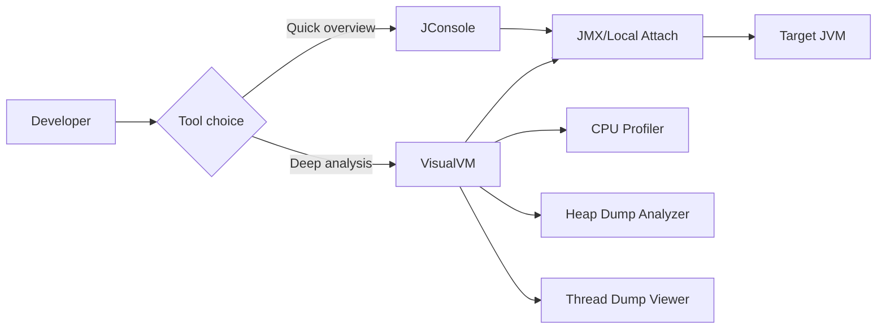

---

### 🛠️ Worked Example

**BAD:**

```bash
# Exposing JMX in production without authentication
java -Dcom.sun.management.jmxremote \
     -Dcom.sun.management.jmxremote.port=9010 \
     -Dcom.sun.management.jmxremote.authenticate=false \
     -Dcom.sun.management.jmxremote.ssl=false \
     -jar service.jar
# Port 9010 is now open to anyone on the network
# Attacker can: dump heap (read secrets), invoke
# MBeans (execute code), trigger GC (DoS)
```

Why it's wrong: unauthenticated JMX is a remote code execution vulnerability. Never expose in production without authentication and SSL.

**GOOD:**

```bash
# Local-only VisualVM connection (development)
java -jar my-app.jar
# VisualVM auto-discovers local process
# No JMX port needed, no security risk
# Safe for development debugging

# If remote needed: use SSH tunnel
ssh -L 9010:localhost:9010 prod-host
# Then connect VisualVM to localhost:9010
```

Why it's right: local attach is secure by default; SSH tunnel provides encrypted remote access without exposing JMX ports.

**Production:**

```bash
# Prefer jcmd + JFR over VisualVM in production
# VisualVM profiling adds 5-20% overhead
# Instead: capture JFR recording and analyze offline
jcmd <pid> JFR.start duration=60s filename=rec.jfr
# Download rec.jfr, open in JDK Mission Control
# Full analysis with zero live connection risk
```

---

### ⚖️ Trade-offs

**Gain:** Visual insight without reading raw text. Live graphs reveal trends instantly. Interactive exploration speeds up debugging in development.

**Cost:** GUI tools require network access for remote JVMs. Profiling overhead makes them unsuitable for production. JMX exposure is a security risk if misconfigured.

| Aspect      | VisualVM/JConsole      | jcmd + JFR             |
| ----------- | ---------------------- | ---------------------- |
| Environment | Dev/staging            | Production-safe        |
| Overhead    | 5-20% (profiling)      | <1% (JFR default)      |
| Security    | Requires JMX exposure  | Local-only (same user) |
| Analysis    | Real-time, interactive | Offline, reproducible  |

---

### ⚡ Decision Snap

**USE WHEN:**

- Debugging memory or CPU issues in local development or staging.
- Need interactive, visual exploration of heap contents or thread states.
- Quick one-off investigation where setting up JFR is overkill.

**AVOID WHEN:**

- Production environments (use jcmd + JFR instead).
- Requiring long-term monitoring (use Prometheus/Grafana).
- Opening JMX ports to the network without authentication.

**PREFER JDK Mission Control + JFR WHEN:**

- Analyzing production issues offline with zero live overhead.
- Need reproducible analysis (JFR files are shareable artifacts).

---

### ⚠️ Top Traps

| #   | Misconception                      | Reality                                                                                                           |
| --- | ---------------------------------- | ----------------------------------------------------------------------------------------------------------------- |
| 1   | "VisualVM is production-ready"     | Its profiling overhead (5-20%) makes it unsuitable for production. Use JFR for production profiling.              |
| 2   | "JConsole shows everything I need" | JConsole lacks profiling, heap dump analysis, and advanced thread visualization. VisualVM or JMC are more useful. |
| 3   | "JMX is safe to expose"            | Unauthenticated JMX allows remote code execution via MBeans. Always use authentication + SSL or SSH tunnels.      |

---

### 🪜 Learning Ladder

**Prerequisites:**

- JVM-041 jcmd - The Swiss Army Knife - command-line equivalent (for production use)
- JVM-022 Your First JVM Diagnostic (jps, jinfo) - basic process targeting

**THIS:** JVM-042 VisualVM and JConsole

**Next steps:**

- JVM-058 JFR (Java Flight Recorder) Deep Dive - production-grade profiling that replaces VisualVM
- JVM-059 Async-Profiler and CPU Flame Graphs - for CPU analysis beyond VisualVM's capabilities

---

### 💡 The Surprising Truth

VisualVM's "Sampler" mode (CPU sampling at fixed intervals) misses short-lived methods entirely because it only captures stacks when its polling timer fires. A method that runs for 2ms between two 10ms sample points is invisible. This "observer effect" means VisualVM's CPU analysis can miss the actual hot method entirely. Async-profiler solves this with signal-based sampling that captures stacks at true hardware interrupt points - but it requires no GUI. For accurate profiling, VisualVM is demonstrably wrong in ways that are hard to detect. The underlying issue is "safepoint bias" - the JVM can only take stack samples at safepoints, which systematically excludes certain code patterns (counted loops, methods that never call other methods) from appearing in profiles.

---

### 📇 Revision Card

1. JConsole = lightweight JMX dashboard (JDK-bundled). VisualVM = full profiler + heap analyzer (standalone download from visualvm.github.io).
2. Use both for development only. Production profiling belongs to JFR (< 1% overhead) or async-profiler (no safepoint bias).
3. Never expose JMX without authentication. Use SSH tunnels for remote debugging. Unauthenticated JMX = remote code execution vulnerability.

---

---

# JVM-043 Build a JVM Dashboard - Phase 1 (Basics)

**TL;DR** - A basic JVM dashboard tracks heap usage, GC pauses, thread count, and class loading via JMX or Micrometer, providing real-time service health visibility.

---

### 🔥 The Problem in One Paragraph

You have 20 Java services in production. One of them starts exhibiting latency spikes every 4 hours. Without a dashboard, you only discover this when customers complain, then spend 30 minutes connecting to each service individually to check heap, GC, and thread metrics. By the time you identify the culprit, the spike has passed and evidence is gone. A centralized dashboard lets you see all 20 services' JVM health at a glance, catch anomalies before they impact users, and retain historical data for trend analysis. This is exactly why building a JVM dashboard was created.

---

### 📘 Textbook Definition

A **JVM dashboard** is a monitoring visualization that displays key JVM runtime metrics: heap used/committed/max, GC pause times and frequency, GC throughput percentage, thread count (live/daemon/peak), class loading count, and CPU usage. Metrics are typically exported via JMX (pulled by Prometheus JMX exporter or Telegraf) or pushed directly using Micrometer (Spring Boot Actuator). Dashboards are rendered in Grafana, Datadog, or equivalent.

---

### 🧠 Mental Model

> A JVM dashboard is the vital signs monitor in an ICU. Heap usage is blood pressure (too high = OOM incoming). GC pause time is heart rhythm (irregular spikes = latency events). Thread count is respiration rate (spiking = resource exhaustion). A flat line (metrics stop) means the patient (JVM) crashed.

- "Blood pressure" -> heap usage trend
- "Heart rhythm" -> GC pause distribution
- "Respiration rate" -> active thread count

**Where this analogy breaks down:** Unlike a patient, a JVM can be restarted instantly. The dashboard's primary value is preventing the "crash" in the first place, not monitoring a dying process.

---

### ⚙️ How It Works

1. **Export metrics:** Add Micrometer + Prometheus registry to your application (Spring Boot: `spring-boot-starter-actuator` + `micrometer-registry-prometheus`). Or use the Prometheus JMX exporter agent.
2. **Scrape:** Configure Prometheus to scrape `/actuator/prometheus` endpoint every 15s.
3. **Dashboard:** Import the "JVM Micrometer" Grafana dashboard (ID 4701 or similar).
4. **Key panels:** Heap used over time, GC pause histogram, thread states, CPU process usage.
5. **Alerts:** Set thresholds - heap > 85% for 5min, any Full GC, thread count spike > 2x baseline.

```text
Essential Dashboard Panels:
Panel               Metric                        Alert
-----------------   ----------------------------  --------
Heap Used %         jvm_memory_used / max * 100   > 85%
GC Pause p99        jvm_gc_pause_seconds{p99}     > 200ms
GC Frequency        rate(jvm_gc_pause_total)      sudden 5x
Thread Count        jvm_threads_live              > 2x base
Full GC Count       jvm_gc_pause{action="Full"}   > 0
```

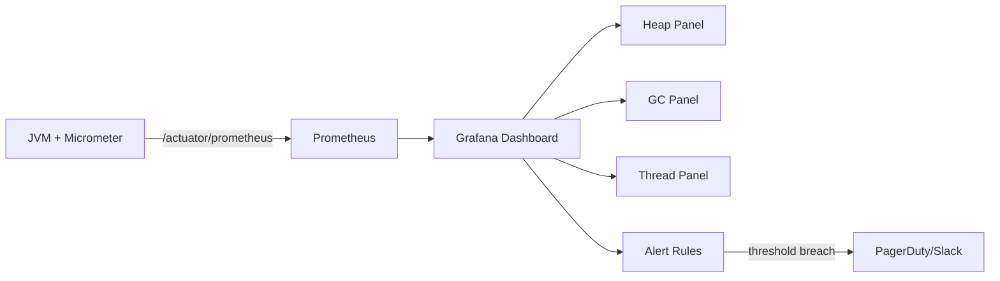

---

### 🛠️ Worked Example

**BAD:**

```yaml
# Dashboard showing only heap_max (static line)
# and heap_used (jagged line) without context
panels:
  - title: "Heap"
    query: jvm_memory_used_bytes{area="heap"}
# No percentage, no trend, no alert threshold
# On-call cannot tell if 2GB used is healthy
# (out of 8GB) or critical (out of 2.5GB)
```

Why it's wrong: absolute values without context (max, percentage, trend direction) provide no actionable signal.

**GOOD:**

```yaml
# Heap utilization as percentage with threshold
panels:
  - title: "Heap Utilization %"
    query: |
      jvm_memory_used_bytes{area="heap"}
      / jvm_memory_max_bytes{area="heap"} * 100
    thresholds:
      - value: 70
        color: yellow
      - value: 85
        color: red
# Instantly shows: 72% = investigate trend
# 88% = page on-call immediately
```

Why it's right: percentage + color thresholds = instant signal without needing to know absolute heap size.

**Production:**

```bash
# Spring Boot application.yml for metric export
management:
  endpoints:
    web:
      exposure:
        include: health,prometheus
  metrics:
    tags:
      application: ${spring.application.name}
      environment: ${ENVIRONMENT:dev}
# Tags enable per-service filtering in Grafana
# environment tag separates staging from prod
```

---

### ⚖️ Trade-offs

**Gain:** Centralized visibility across all services. Historical trend data for capacity planning. Automated alerting before user impact.

**Cost:** Requires infrastructure (Prometheus, Grafana, or equivalent). Metric cardinality explosion if labels are unbounded. Initial setup time.

| Aspect       | Micrometer + Prometheus | JMX + Jolokia     | Commercial APM (Datadog, etc.) |
| ------------ | ----------------------- | ----------------- | ------------------------------ |
| Cost         | Free (OSS)              | Free (OSS)        | Expensive (per-host pricing)   |
| Setup effort | Moderate                | High (JMX config) | Low (agent install)            |
| Depth        | JVM + custom metrics    | JVM only          | JVM + traces + logs            |
| Lock-in      | None                    | None              | Vendor-specific                |

---

### ⚡ Decision Snap

**USE WHEN:**

- Running more than one Java service in production - manual jcmd checks do not scale.
- Capacity planning - trend data reveals growth patterns weeks before they become crises.
- Incident response - historical dashboards show exactly when anomalies began.

**AVOID WHEN:**

- Single prototype with one developer - jcmd is sufficient.
- Adding metrics for everything without understanding which are actionable (metric fatigue).

**PREFER commercial APM WHEN:**

- Team lacks infrastructure expertise to maintain Prometheus/Grafana.
- Need distributed tracing + metrics + logs in one platform.

---

### ⚠️ Top Traps

| #   | Misconception                                   | Reality                                                                                                                                                  |
| --- | ----------------------------------------------- | -------------------------------------------------------------------------------------------------------------------------------------------------------- |
| 1   | "More panels = better dashboard"                | Signal drowns in noise. Start with 5 panels: heap %, GC pause p99, Full GC count, thread count, error rate. Add only when investigating specific issues. |
| 2   | "Default Grafana JVM dashboards are sufficient" | Generic dashboards lack your service-specific thresholds. Customize alert values based on your baseline measurements.                                    |
| 3   | "Dashboards replace profiling"                  | Dashboards show THAT something is wrong. Profiling (JFR, async-profiler) shows WHY. They are complementary, not substitutes.                             |

---

### 🪜 Learning Ladder

**Prerequisites:**

- JVM-028 Common JVM Flags (-Xmx, -Xms, -XX:+UseG1GC) - understand what the metrics represent
- JVM-027 Minor GC vs Major GC vs Full GC - interpret GC events on the dashboard

**THIS:** JVM-043 Build a JVM Dashboard - Phase 1 (Basics)

**Next steps:**

- JVM-070 Build a JVM Dashboard - Phase 2 (Alerts) - advanced alerting and anomaly detection
- JVM-095 JVM Fleet Observability - Key Metrics - fleet-wide aggregation patterns

---

### 💡 The Surprising Truth

The single most valuable dashboard metric is not heap usage - it is the ratio of GC time to wall-clock time (GC overhead percentage). A service spending 5% of time in GC is healthy. A service spending 15% is degrading. A service spending 25%+ is approaching "GC overhead limit exceeded" territory. This one metric predicts OOM 30-60 minutes before it happens, giving you time to act. Most default dashboards do not include it because it requires a derived rate query, not a raw metric. The query looks like: `rate(jvm_gc_pause_seconds_sum[5m]) / rate(process_cpu_seconds_total[5m]) * 100`. Add this panel first - it is more useful than heap usage alone because it captures the JVM's ability to keep up with allocation pressure.

---

### 📇 Revision Card

1. Five essential panels: heap %, GC pause p99, Full GC count, thread count, GC overhead %. Everything else is optional.
2. Use percentages and thresholds, not absolute values. "2GB used" means nothing without knowing max.
3. Dashboards show THAT something is wrong; profiling shows WHY. Build both capabilities.

---

---

# JVM-044 JVM Flag and GC Quick Recall Card

**TL;DR** - A condensed reference card for the most critical JVM flags, GC events, and diagnostic commands needed during production incidents.

---

### 🔥 The Problem in One Paragraph

At 3 AM, the on-call engineer receives a page: "service OOM, pod restarting." Under pressure, they cannot remember: Is it -Xmx or -XX:MaxHeapSize? Which flag enables heap dumps on OOM? What is the jcmd command for a thread dump? During incidents, the engineer who can recall the right command in seconds resolves the issue in minutes. The engineer who must Google each command wastes 20 minutes per step while the service burns. This is exactly why a recall card was created.

---

### 📘 Textbook Definition

A **JVM recall card** is a condensed, memorizable quick-reference mapping the most frequently needed JVM flags, diagnostic commands, and GC event classifications. It covers: memory sizing flags, GC algorithm selection, diagnostic triggers, runtime inspection commands, and exit code interpretation. The card trades completeness for speed - it includes only what you need under time pressure during an incident.

---

### 🧠 Mental Model

> The recall card is a pilot's emergency checklist. It does not explain aerodynamics - it gives you the exact steps to execute when the engine fails. In the same way, this card does not explain WHY each flag works - it tells you WHAT to type when the JVM is dying.

- "Emergency checklist" -> recall card (action-oriented)
- "Engine failure" -> OOM, crash, latency spike
- "Exact steps" -> specific commands with correct syntax

**Where this analogy breaks down:** Unlike a pilot's checklist, JVM incidents are rarely identical. The card provides starting commands; diagnosis still requires understanding (covered in other keywords).

---

### ⚙️ How It Works

The recall card is organized by incident type: what to type immediately.

```text
INCIDENT: Service OOM
  1. Check pod exit code (137 = OOM-kill, else JVM OOM)
  2. If heap dump exists: scp to analysis box
  3. jcmd <pid> GC.class_histogram | head -20
  4. Look for growing class -> that is your leak
  5. Compare histogram before and after forced GC:
     jcmd <pid> GC.run; sleep 2
     jcmd <pid> GC.class_histogram > after_gc.txt
     Objects still growing after GC = true leak

INCIDENT: High Latency
  1. jcmd <pid> Thread.print > /tmp/t1.txt; sleep 5
     jcmd <pid> Thread.print > /tmp/t2.txt
  2. diff t1.txt t2.txt (persistent BLOCKED = problem)
  3. grep "deadlock" t1.txt
  4. Count thread states:
     grep "Thread.State" t1.txt | sort | uniq -c
     Many BLOCKED = lock contention
     Many WAITING = pool exhaustion

INCIDENT: Startup Slow
  1. -Xlog:class+load=info (excessive class loading?)
  2. jcmd <pid> Compiler.queue (JIT backlog?)
  3. Check if CDS archive exists (AppCDS speeds startup)
  4. -XX:+PrintCompilation to see JIT activity

INCIDENT: Native Memory Growth (RSS > heap)
  1. Enable NMT: -XX:NativeMemoryTracking=summary
  2. Baseline: jcmd <pid> VM.native_memory baseline
  3. Wait, then: jcmd <pid> VM.native_memory summary.diff
  4. Growing area reveals: thread stacks, code cache,
     direct buffers, or JNI allocations

ESSENTIAL FLAGS (memorize):
  -Xmx2g -Xms2g                 # heap (always equal)
  -XX:+UseG1GC                   # GC selection
  -XX:+HeapDumpOnOutOfMemoryError# auto-dump
  -XX:+ExitOnOutOfMemoryError    # fast restart
  -Xlog:gc*:file=gc.log:time    # GC logging
  -XX:MaxMetaspaceSize=512m      # cap metaspace
  -XX:MaxRAMPercentage=75.0      # container sizing
  -XX:NativeMemoryTracking=summary # off-heap visibility
```

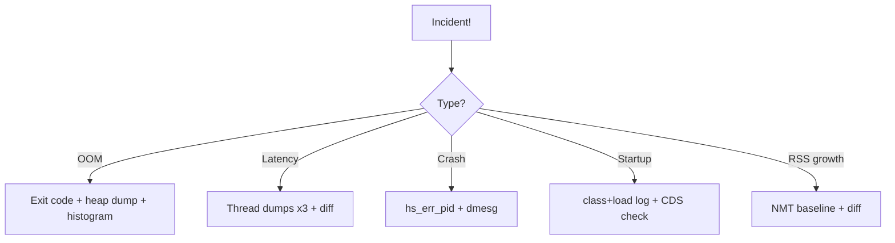

**Key principle:** The recall card works by eliminating decision fatigue. Under stress, the brain cannot synthesize multiple options - it needs a single clear path. Each incident type maps to exactly one sequence. The sequence starts with the cheapest diagnostic (exit code, thread state count) and escalates to expensive ones (heap dump, JFR recording) only when the cheap diagnostic confirms the need.

**When to escalate beyond the card:**

- If three thread dumps show no BLOCKED threads but latency persists, escalate to JFR (likely I/O wait or GC-related).
- If heap histogram shows no single dominant class but OOM recurs, escalate to full heap dump (fragmentation or many small leakers).
- If exit code is 134 and hs_err shows JIT crash, escalate to JDK bug report (not application problem).

---

### 🛠️ Worked Example

**BAD:**

```bash
# Incident: high latency. Engineer Googles for 10 min
# "how to take java thread dump"
# Finds outdated advice: "kill -3 <pid>"
# Output goes to stdout, mixed with app logs
# Cannot find it in the log file
```

Why it's wrong: time wasted searching; outdated method; output lost in application stdout.

**GOOD:**

```bash
# Incident: high latency. Recall card in hand.
# Step 1: Thread dumps (3x, 5s apart)
for i in 1 2 3; do
  jcmd $(pgrep -f myapp) Thread.print \
    > /tmp/td_$(date +%s).txt
  sleep 5
done
# Step 2: Check for deadlock
grep -l "deadlock" /tmp/td_*.txt
# Step 3: Find persistent BLOCKED threads
grep -c "BLOCKED" /tmp/td_*.txt
# Total time: 20 seconds (not 10 minutes)
```

Why it's right: memorized commands execute instantly under pressure. Three dumps provide temporal comparison.

**Production - Containerized environments:**

```bash
# In containers: java PID is always 1
# Simplifies recall card commands:
jcmd 1 Thread.print > /tmp/td.txt
jcmd 1 GC.class_histogram | head -20
jcmd 1 VM.flags

# Container gotcha: /tmp may be tmpfs (RAM-backed)
# Heap dump to /tmp could OOM the container
# Use a mounted volume instead:
jcmd 1 GC.heap_dump /mnt/dumps/heap.hprof

# Verify available disk before dump:
df -h /mnt/dumps
# Need >1x heap size available
```

**Post-incident flag verification:**

```bash
# Post-incident: verify flags are correct
jcmd $(pgrep -f myapp) VM.flags | grep -E \
  "MaxHeap|UseG1|HeapDump|ExitOnOOM|MaxMeta"
# Validate all safety flags are present
# If any missing: update deployment config immediately

# Create shell aliases for instant recall
# Add to ~/.bashrc or team shared profile:
alias td='jcmd $(pgrep -f java) Thread.print \
  > /tmp/td_$(date +%s).txt && echo "saved"'
alias hh='jcmd $(pgrep -f java) GC.class_histogram \
  | head -30'
alias jflags='jcmd $(pgrep -f java) VM.flags'
alias jfr60='jcmd $(pgrep -f java) JFR.start \
  duration=60s filename=/tmp/rec_$(date +%s).jfr'
# Now incident response is: td; td; td; diff
```

Why this matters: aliases reduce incident response from "remember syntax" to "type two letters." Share them in team onboarding docs.

---

### ⚖️ Trade-offs

**Gain:** Sub-minute diagnosis starts during incidents. Eliminates Googling under pressure. Standardizes team response across all engineers regardless of experience level.

**Cost:** Recall cards require memorization or instant accessibility (bookmarks, wiki, shell aliases). Without understanding, the card becomes cargo-cult execution. Cards become outdated when JDK versions change flags or add better alternatives.

| Aspect       | Recall card                          | Full documentation        |
| ------------ | ------------------------------------ | ------------------------- |
| Speed        | Seconds to act                       | Minutes to find answer    |
| Depth        | What to type now                     | Why it works              |
| Audience     | On-call under pressure               | Learning and tuning       |
| Risk         | Rote execution without understanding | Slow during emergencies   |
| Maintenance  | Must update per JDK version          | Community-maintained      |
| Team scaling | Levels up juniors immediately        | Requires individual study |

---

### ⚡ Decision Snap

**USE WHEN:**

- On-call incidents where seconds matter.
- Onboarding new team members to production operations.
- Building runbook templates for common JVM failures.

**AVOID WHEN:**

- Using the card as a substitute for understanding (diagnose, do not just execute).
- Applying flag recommendations without measuring their effect on your workload.

**PREFER full investigation WHEN:**

- Incident recurs despite recall card remediation.
- Root cause is not obvious from standard commands.

---

### ⚠️ Top Traps

| #   | Misconception                                  | Reality                                                                                              |
| --- | ---------------------------------------------- | ---------------------------------------------------------------------------------------------------- |
| 1   | "Memorizing commands = understanding the JVM"  | The card gets you started fast. Understanding prevents the incident from recurring. Both are needed. |
| 2   | "One recall card fits all services"            | Services with different GC algorithms, heap sizes, or workload types need adapted runbooks.          |
| 3   | "Following the card always solves the problem" | The card handles 80% of common incidents. Novel failures require deeper diagnosis beyond the card.   |

---

### 🪜 Learning Ladder

**Prerequisites:**

- JVM-028 Common JVM Flags (-Xmx, -Xms, -XX:+UseG1GC) - understand each flag's purpose
- JVM-041 jcmd - The Swiss Army Knife - know the diagnostic tool the card invokes

**THIS:** JVM-044 JVM Flag and GC Quick Recall Card

**Next steps:**

- JVM-045 JVM Interview Essentials - Working Level - test your recall under interview pressure
- JVM-087 JVM Production Incident Simulation - practice using the card under simulated incidents

---

### 💡 The Surprising Truth

Shell aliases are the operational equivalent of muscle memory. The fastest incident responders do not type `jcmd $(pgrep -f myapp) Thread.print` from memory - they type `td` because they have `alias td='jcmd $(pgrep -f java) Thread.print > /tmp/td_$(date +%s).txt'` in their shell profile. The recall card's value is not in the exact syntax but in knowing which diagnostic to reach for first. The syntax should be automated.

---

### 📇 Revision Card

1. Under pressure: exit code -> thread dumps (3x) -> heap histogram. This sequence diagnoses 80% of incidents.
2. Essential flags to memorize: -Xmx/-Xms (equal), HeapDumpOnOOM, ExitOnOOM, Xlog:gc\*, MaxMetaspaceSize.
3. Automate syntax with shell aliases. Recall cards teach what to do; aliases execute it in one keystroke.

---

---

# JVM-045 JVM Interview Essentials - Working Level

**TL;DR** - Working-level JVM interview questions test heap structure, GC events, common flags, thread dumps, and OOM classification - practical, not theoretical.

---

### 🔥 The Problem in One Paragraph

A mid-level engineer interviews for a backend role. The interviewer asks: "Your production service is spending 40% of CPU time in GC. Walk me through your diagnosis." The candidate freezes because they memorized "generational garbage collection" definitions but never connected heap structure -> GC events -> metrics -> diagnosis flow. Working-level interviews test whether you can apply JVM knowledge to real scenarios, not whether you can recite textbook definitions. This is exactly why working-level interview preparation was created.

---

### 📘 Textbook Definition

**Working-level JVM interview questions** target L2 competency: the ability to configure a JVM correctly, diagnose common problems (OOM, GC pressure, thread contention), read diagnostic output (GC logs, thread dumps, heap histograms), and make informed GC/sizing decisions. Questions are scenario-based ("given this GC log, what is wrong?"), not definition-based ("what is garbage collection?").

---

### 🧠 Mental Model

> Working-level interview questions are like a driving test: they do not ask "what is a steering wheel?" (L1 orientation). They put you on the road and say "parallel park" (apply knowledge under pressure). The examiner watches your process, not just the outcome.

- "Theory test" -> L0/L1 definition questions (too easy for working level)
- "Driving test" -> L2 scenario questions (apply knowledge)
- "Parallel parking" -> "Given these metrics, what do you do?"

**Where this analogy breaks down:** Unlike a driving test, interview questions can go deeper if you show expertise - demonstrating L3/L4 knowledge in an L2 question earns bonus signal.

---

### ⚙️ How It Works

**Top 10 Working-Level Questions and Answer Frameworks:**

1. "Explain JVM heap generations and why they exist."
   -> Generational hypothesis + Young/Old separation + efficiency

2. "Service OOMs in production. Walk me through diagnosis."
   -> Read OOM type -> capture evidence -> diagnose root cause

3. "What flags do you set for a new production service?"
   -> Xmx=Xms, G1GC, HeapDump, ExitOnOOM, GC logging

4. "How would you choose between G1GC and ZGC?"
   -> Constraint matrix: latency SLA -> ZGC, balanced -> G1

5. "What causes a Full GC?"
   -> Allocation failure, System.gc(), concurrent mode failure

6. "Your service in a 4GB container uses 6GB RSS. Why?"
   -> Heap + native: Metaspace, thread stacks, NIO, code cache

7. "How do you diagnose a memory leak?"
   -> Heap dump + MAT + dominator tree + path to GC roots

8. "What is the difference between BLOCKED and WAITING?"
   -> BLOCKED = monitor contention, WAITING = explicit park/wait

9. "Service latency spikes every 30 seconds. What do you check?"
   -> GC logs (pause timing), thread dumps (lock contention)

10. "Why set -Xms equal to -Xmx?"
    -> Avoid resize pauses, commit memory upfront, predictable

```text
Question Pattern        What It Tests
--------------------    ---------------------------
"Walk me through..."    Process / methodology
"What would you set?"   Configuration knowledge
"What causes...?"       Root cause understanding
"How do you diagnose?"  Tooling + reasoning chain
"What is the diff?"     Precision of understanding
```

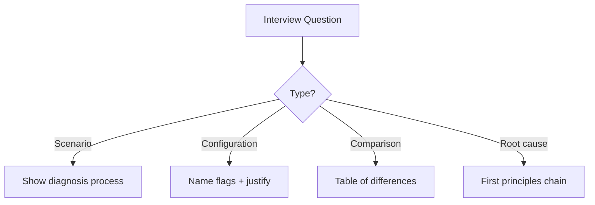

---

### 🛠️ Worked Example

**BAD:**

```text
Q: "Service OOMs in production. What do you do?"

BAD ANSWER:
"I would increase the heap size."
// No classification of OOM type
// No diagnostic step
// No root cause analysis
// Interviewer signal: L0/L1 understanding
```

Why it's wrong: treats OOM as a single problem, proposes a temporary fix without diagnosis.

**GOOD:**

```text
Q: "Service OOMs in production. What do you do?"

GOOD ANSWER:
"First, I read the OOM message type:
 - 'Java heap space' -> heap leak or undersized
 - 'Metaspace' -> classloader leak
 - 'GC overhead' -> heap full of live data
Then I check if HeapDumpOnOutOfMemoryError captured
a dump. If yes: open in Eclipse MAT, run Leak
Suspects, find the dominator tree, trace path to
GC roots. If no dump: reproduce with monitoring,
capture histogram trend to identify growing class.
I would NOT increase -Xmx until I understand the
root cause - more heap just delays the crash."
// Shows: classification + evidence + tool + process
```

Why it's right: demonstrates systematic thinking, tool knowledge, and resistance to premature fixes.

**Production:**

```text
BONUS SIGNAL (elevates answer to L3/L4):
"If it is 'GC overhead limit exceeded', I know the
heap is full of LIVE objects. Adding heap delays
but does not fix. I would compare two heap dumps
taken 30 minutes apart: the growth delta reveals
the leak source. I would also check if G1's IHOP
is misconfigured, causing mixed GC to fall behind
promotion rate."
```

---

### ⚖️ Trade-offs

**Gain:** Structured preparation enables confident, systematic answers that distinguish you from candidates who memorize definitions without understanding.

**Cost:** Preparing for working-level questions requires hands-on experience (or realistic simulation). Pure reading without practice produces theoretical answers that interviewers see through immediately.

| Aspect           | Definition-based prep | Scenario-based prep              |
| ---------------- | --------------------- | -------------------------------- |
| Effort           | Read docs             | Practice diagnosis on real JVMs  |
| Interview signal | "Knows terminology"   | "Can solve production problems"  |
| Depth ceiling    | L1                    | L2-L4 (depends on follow-ups)    |
| Failure mode     | "Correct but shallow" | Rarely - demonstrates competence |

---

### ⚡ Decision Snap

**USE WHEN:**

- Preparing for backend/infrastructure engineering interviews where JVM services are the norm.
- Self-assessing whether your JVM knowledge is operational (L2) or still theoretical (L1).
- Building team onboarding assessments for new hires.

**AVOID WHEN:**

- Memorizing answers without understanding - interviewers always follow up with "why?"
- Over-preparing JVM trivia for interviews that focus on system design (wrong signal).

**PREFER hands-on simulation WHEN:**

- Available: spin up a leaking JVM, diagnose it, fix it. One simulation teaches more than reading 10 answers.

---

### ⚠️ Top Traps

| #   | Misconception                                        | Reality                                                                                                                          |
| --- | ---------------------------------------------------- | -------------------------------------------------------------------------------------------------------------------------------- |
| 1   | "Memorizing GC algorithms is enough"                 | Interviewers ask "when would you choose each?" and "how do you verify the choice?" Mechanism without decision framework fails.   |
| 2   | "I need to know JVM internals to pass L2 interviews" | L2 tests operational competence: can you configure, diagnose, and fix? Deep internals are L3/L4.                                 |
| 3   | "There is one correct answer"                        | Interviewers evaluate your process and trade-off reasoning, not a single "right" answer. Stating trade-offs IS the right answer. |

---

### 🪜 Learning Ladder

**Prerequisites:**

- JVM-026 Heap Structure - Young, Old, and Metaspace - must explain generations clearly
- JVM-037 Common OutOfMemoryError Types and First Aid - must classify OOM types

**THIS:** JVM-045 JVM Interview Essentials - Working Level

**Next steps:**

- JVM-072 JVM System Design Interview Patterns - advanced interview scenarios (L3/L4)
- JVM-099 JVM Deep-Dive Interview Questions - expert-level questions for senior roles

---

### 💡 The Surprising Truth

The highest signal an L2 candidate can give is saying "I would NOT do X yet" - demonstrating restraint against premature optimization. "I would not increase heap before reading the OOM type." "I would not change GC before measuring current pause distribution." "I would not tune IHOP before understanding the promotion rate." Restraint signals production experience. Juniors jump to fixes; seniors ask diagnostic questions first.

---

### 📇 Revision Card

1. Working-level questions test process: classify -> diagnose -> fix. Not "define garbage collection."
2. Always state the OOM type before proposing a fix. Always state the constraint before choosing a GC.
3. The best interview signal is restraint: "I would NOT change X until I measured Y." This proves production maturity.

---

---

# JVM-046 The N+1 ClassLoader Anti-Pattern

**TL;DR** - Creating new classloaders per request or per operation leaks Metaspace because loaded classes are never unloaded while the loader lives.

---

### 🔥 The Problem in One Paragraph

A templating engine creates a new ClassLoader for each template compilation. After 10,000 template renderings, Metaspace has grown from 100MB to 2GB. The GC cannot reclaim it because each ClassLoader still holds references to its generated classes (even though the template output was discarded). Eventually: `OutOfMemoryError: Metaspace`. The application server must be restarted. The pattern repeats with every component that dynamically generates classes: scripting engines, expression evaluators, serialization frameworks, and hot-reload tools. This is exactly why the N+1 ClassLoader anti-pattern was identified.

---

### 📘 Textbook Definition

The **N+1 ClassLoader anti-pattern** occurs when application code creates a new ClassLoader instance for each unit of work (request, iteration, message) instead of reusing a single loader. Each loader defines classes that consume Metaspace. Because Metaspace is only reclaimed when the ClassLoader itself becomes garbage-collectible (no strong references to the loader or any of its classes), proliferating loaders causes monotonic Metaspace growth that persists until OOM.

---

### 🧠 Mental Model

> Each ClassLoader is a filing cabinet. Every class it loads is a file in that cabinet. You can only shred the entire cabinet when nobody references any file in it. The N+1 pattern creates a new cabinet for every request: 10,000 requests = 10,000 cabinets, each holding one file, none shredable because the application still indirectly references the class or its objects.

- "Filing cabinet" -> ClassLoader instance
- "Files" -> classes loaded by that loader
- "Shredding" -> Metaspace reclamation (loader GC'd)

**Where this analogy breaks down:** In practice, a single leftover reference to one instance of one class from a loader prevents the ENTIRE loader and ALL its classes from being collected - a single file pins the entire cabinet.

---

### ⚙️ How It Works

1. Code creates `new URLClassLoader(urls)` or equivalent per operation.
2. The loader defines one or more classes (compiled templates, proxies, scripts).
3. Work completes but: some reference to an instance of a loaded class persists (in a cache, a ThreadLocal, or a static listener).
4. The ClassLoader cannot be GC'd because it is reachable via: class -> loader, or instance -> class -> loader.
5. Metaspace grows by the size of each loader's class metadata (~10-100KB per loader).
6. After thousands of operations: Metaspace OOM.

```text
Per-request pattern (BAD):
  Request 1 -> CL-1 -> Class-A-v1  (10KB meta)
  Request 2 -> CL-2 -> Class-A-v2  (10KB meta)
  ...
  Request N -> CL-N -> Class-A-vN  (10KB meta)
  Total: N * 10KB Metaspace, never freed

Shared pattern (GOOD):
  CL-shared -> Class-A (10KB meta, reused N times)
  Total: 10KB Metaspace, constant
```

```mermaid
flowchart TD
    subgraph BAD[N+1 Pattern - BAD]
        R1[Request 1] --> CL1[ClassLoader 1]
        R2[Request 2] --> CL2[ClassLoader 2]
        RN[Request N] --> CLN[ClassLoader N]
        CL1 --> M1[Metaspace 10KB]
        CL2 --> M2[Metaspace 10KB]
        CLN --> MN[Metaspace 10KB]
    end
    subgraph GOOD[Shared Pattern - GOOD]
        RA[Request 1..N] --> CLS[Shared ClassLoader]
        CLS --> MS[Metaspace 10KB total]
    end
```

---

### 🛠️ Worked Example

**BAD:**

```java
// Creating a new classloader per expression evaluation
public Object evaluate(String expr) {
    // New classloader EVERY call
    URLClassLoader cl = new URLClassLoader(
        new URL[]{scriptDir.toURI().toURL()},
        getClass().getClassLoader());
    Class<?> compiled = cl.loadClass("Expr_" + hash(expr));
    return compiled.getDeclaredConstructor()
                   .newInstance();
    // cl is never closed, class never unloaded
    // Metaspace grows with every unique expression
}
```

Why it's wrong: each call creates a new loader whose classes permanently occupy Metaspace.

**GOOD:**

```java
// Cache compiled classes, reuse single classloader
private final ConcurrentHashMap<String, Class<?>> cache =
    new ConcurrentHashMap<>();
private final URLClassLoader sharedCl =
    new URLClassLoader(new URL[]{scriptDir.toURI().toURL()},
        getClass().getClassLoader());

public Object evaluate(String expr) {
    Class<?> compiled = cache.computeIfAbsent(
        hash(expr),
        k -> sharedCl.loadClass("Expr_" + k));
    return compiled.getDeclaredConstructor().newInstance();
}
// One classloader, bounded Metaspace, class reuse
```

Why it's right: single classloader with caching prevents unbounded Metaspace growth.

**Production:**

```bash
# Detect the anti-pattern
jcmd <pid> VM.classloaders
# If output shows hundreds/thousands of custom loaders:
#   app  (1) - 8291 classes
#   MyScriptLoader (4782) - 1 class each   <-- N+1!
# 4782 loaders with 1 class each = anti-pattern
# Fix: consolidate to one shared loader + class cache
```

---

### ⚖️ Trade-offs

**Gain of shared loader:** Constant Metaspace usage, no loader GC pressure, faster class resolution (cache hit).

**Cost of shared loader:** Cannot unload individual classes (all-or-nothing). Namespace collisions if same class name has different definitions. Must handle class version conflicts manually.

| Aspect          | N+1 Loaders (bad)           | Shared loader + cache   | Pooled loaders (compromise) |
| --------------- | --------------------------- | ----------------------- | --------------------------- |
| Metaspace       | Unbounded growth            | Constant                | Bounded (pool size)         |
| Class isolation | Perfect (one per loader)    | None (shared namespace) | Per-pool-entry              |
| Unloading       | Possible but rarely happens | Never (app CL)          | When pool entry evicted     |
| Complexity      | Simple but leaky            | Simple and efficient    | Moderate                    |

---

### ⚡ Decision Snap

**USE WHEN:**

- Diagnosing Metaspace OOM where `jcmd VM.classloaders` shows hundreds of custom loaders.
- Refactoring scripting engines, template compilers, or expression evaluators that create loaders per-invocation.
- Code reviewing frameworks that use `defineClass` dynamically.

**AVOID WHEN:**

- Legitimate isolation is needed (application servers isolating deployed webapps).
- Hot-reload during development (Spring Boot DevTools intentionally uses new loaders).

**PREFER a loader pool WHEN:**

- You need isolation for security (sandboxed plugins) but want bounded Metaspace.
- Fixed N loaders recycled on eviction (like a connection pool but for class loading).

---

### ⚠️ Top Traps

| #   | Misconception                                       | Reality                                                                                                                                                   |
| --- | --------------------------------------------------- | --------------------------------------------------------------------------------------------------------------------------------------------------------- |
| 1   | "Calling classLoader.close() frees Metaspace"       | close() releases URL resources (file handles) but does NOT unload classes. Metaspace is freed only when the loader is GC'd.                               |
| 2   | "The GC collects unused classloaders automatically" | Only if NO reference exists to the loader OR any instance of any class it loaded. One leaked instance pins everything.                                    |
| 3   | "This only happens in application servers"          | Any code using new ClassLoader() per operation exhibits this: Groovy scripts, Janino compilation, serialization frameworks generating classes on-the-fly. |

---

### 🪜 Learning Ladder

**Prerequisites:**

- JVM-031 ClassLoader Hierarchy (Bootstrap, Plat, App) - understand how loaders work and what they own
- JVM-038 Metaspace and PermGen History - understand what Metaspace stores and when it is freed

**THIS:** JVM-046 The N+1 ClassLoader Anti-Pattern

**Next steps:**

- JVM-101 Diagnosing Metaspace OOM in Production - full diagnosis workflow when this anti-pattern causes OOM
- JVM-073 Java Module System (JPMS) and ClassLoader - modern alternative for class isolation

---

### 💡 The Surprising Truth

Groovy scripting in Java applications is the most common source of this anti-pattern. Every `new GroovyShell().evaluate(script)` creates a new ClassLoader and defines a new Script subclass. Applications processing user-defined rules via Groovy leak Metaspace proportionally to unique script count. The fix is to use `GroovyClassLoader` with caching enabled, or parse scripts once and cache the parsed Script class - never evaluate from source on every invocation. This also affects Janino (Java expression compiler used by Logback and Spark SQL), MVEL, and SpEL when misconfigured to compile expressions without caching.

---

### 📇 Revision Card

1. Each ClassLoader + its classes consume Metaspace permanently until the loader is GC'd. One leaked instance pins everything.
2. `jcmd <pid> VM.classloaders` instantly reveals the pattern: thousands of loaders with 1 class each.
3. Fix: single shared loader + class cache. Metaspace becomes constant instead of linear in request count.

---

---

# JVM-047 Finalization Is Dead - Use Cleaners

**TL;DR** - Object.finalize() is deprecated, unreliable, and a GC performance killer; java.lang.ref.Cleaner provides deterministic, safe resource cleanup instead.

---

### 🔥 The Problem in One Paragraph

A legacy service overrides `finalize()` in a database connection wrapper to "ensure" connections are returned to the pool. Under load, connections are not returned because the finalizer thread falls behind - it is a single low-priority thread processing a queue that grows faster than it drains. Connections exhaust, the pool deadlocks, and the service dies despite having a finalizer "safety net." Worse: each finalizable object survives an extra GC cycle (because the GC must queue it for finalization before reclaiming), doubling memory pressure. This is exactly why finalization was deprecated and Cleaners were created.

---

### 📘 Textbook Definition

**Finalization** (`Object.finalize()`) is a mechanism where the JVM calls a designated method on an object after determining it is unreachable but BEFORE reclaiming its memory. It was deprecated in Java 9 (JEP 421, removed for subclassing in Java 18). **Cleaners** (`java.lang.ref.Cleaner`, Java 9+) provide a safer replacement: a Cleaner registers a cleaning action (Runnable) associated with an object; when the object becomes phantom-reachable, the action is invoked on a dedicated thread. Unlike finalize(), Cleaners do not resurrect objects and do not block GC.

---

### 🧠 Mental Model

> Finalize() is hiring a janitor who only cleans when they feel like it, might never arrive, and slows down everyone else (GC) while they decide whether to work. Cleaners are scheduling a cleaning service with a specific task list - they run on their own thread, never block the main crew, and cannot bring garbage back into the building (no resurrection).

- "Unreliable janitor" -> finalize() (may never run, blocks GC)
- "Scheduled cleaning service" -> Cleaner (dedicated thread, safe)
- "Bringing garbage back" -> object resurrection (impossible with Cleaner)

**Where this analogy breaks down:** Even Cleaners are not guaranteed to run before JVM exit. For critical resource cleanup, try-with-resources (explicit close) is always preferred over any GC-triggered mechanism.

---

### ⚙️ How It Works

**Finalization (broken, deprecated):**

1. Object becomes unreachable.
2. GC marks it but does NOT collect it - instead queues it on the Finalizer queue.
3. The Finalizer thread (single, low-priority) eventually calls `finalize()`.
4. After finalize() returns, the object is collected in the NEXT GC cycle (survives one extra cycle minimum).
5. If finalize() throws or blocks, remaining queue items are delayed or lost.

**Cleaners (correct, modern):**

1. Object is created with a registered Cleaner action: `cleaner.register(obj, cleaningAction)`.
2. Object becomes phantom-reachable (no strong/soft/weak refs, only phantom).
3. The Cleaner's dedicated thread invokes the cleaning action (a Runnable, NOT a method on the dead object).
4. The action runs on the Cleaner thread - it cannot access the dead object (no resurrection possible).
5. Memory is reclaimed in the same GC cycle.

```text
Finalization timeline:
  GC1: obj unreachable -> queued (NOT freed)
  Finalizer thread: finalize() runs (eventually)
  GC2: obj finally freed (one cycle later)

Cleaner timeline:
  GC1: obj phantom-reachable -> action invoked
  GC1: obj freed (same cycle, no extra survival)
```

```mermaid
sequenceDiagram
    participant App
    participant GC
    participant FT as Finalizer Thread
    participant CT as Cleaner Thread

    Note over App,FT: FINALIZATION (deprecated)
    App->>GC: obj unreachable
    GC->>FT: queue finalize()
    FT->>FT: finalize() (maybe slow)
    GC->>GC: Next GC frees obj (delayed)

    Note over App,CT: CLEANER (modern)
    App->>GC: obj unreachable
    GC->>CT: invoke cleaning action
    CT->>CT: action runs (no obj access)
    GC->>GC: obj freed (same cycle)
```

---

### 🛠️ Worked Example

**BAD:**

```java
// Deprecated: finalize() for native resource cleanup
public class NativeBuffer {
    private long nativePtr;

    public NativeBuffer(int size) {
        this.nativePtr = allocateNative(size);
    }

    @Override
    protected void finalize() throws Throwable {
        freeNative(nativePtr); // might never run!
        super.finalize();
    }
    // Problems: blocks GC, single thread, unreliable,
    // object survives extra cycle, deprecated
}
```

Why it's wrong: finalize() may never run, blocks GC, and forces an extra GC cycle for every instance.

**GOOD:**

```java
// Modern: AutoCloseable + Cleaner as safety net
public class NativeBuffer implements AutoCloseable {
    private static final Cleaner CLEANER =
        Cleaner.create();
    private final Cleaner.Cleanable cleanable;
    private long nativePtr;

    public NativeBuffer(int size) {
        this.nativePtr = allocateNative(size);
        // Register action (no 'this' capture!)
        long ptr = nativePtr;
        this.cleanable = CLEANER.register(this,
            () -> freeNative(ptr));
    }

    @Override
    public void close() {
        cleanable.clean(); // explicit, deterministic
        nativePtr = 0;
    }
    // Primary: try-with-resources calls close()
    // Safety net: Cleaner runs if close() missed
}
```

Why it's right: explicit close for deterministic cleanup; Cleaner as safety net only. No GC blocking.

**Production:**

```bash
# Detect finalization pressure
jcmd <pid> GC.finalizer_info
# Queue length: 14523  <-- thousands pending!
# If queue grows: finalizer thread cannot keep up
# Objects stuck in queue survive extra GC cycles
# Fix: replace finalize() with Cleaner + close()

# Also visible in JFR:
# Event: jdk.FinalizerStatistics
# Shows: pending count, time in finalizer thread
```

---

### ⚖️ Trade-offs

**Gain:** Cleaners do not block GC, do not force extra survival cycles, cannot resurrect objects, and run on a configurable thread pool.

**Cost:** Cleaners still depend on GC timing (non-deterministic). For critical resources, explicit close() via try-with-resources remains mandatory. Cleaners are a safety net, not a primary strategy.

| Aspect           | finalize() (deprecated)       | Cleaner (Java 9+)           | try-with-resources         |
| ---------------- | ----------------------------- | --------------------------- | -------------------------- |
| Timing           | Non-deterministic             | Non-deterministic           | Deterministic (scope exit) |
| GC impact        | Extra survival cycle + blocks | No extra cycle, no blocking | None                       |
| Resurrection     | Possible (dangerous)          | Impossible by design        | N/A                        |
| Primary strategy | No (deprecated)               | No (safety net only)        | Yes (always preferred)     |

---

### ⚡ Decision Snap

**USE WHEN:**

- Replacing deprecated finalize() overrides in legacy code.
- Adding a safety net for native resources where try-with-resources might be missed by callers.
- Designing APIs where close() is the primary mechanism but you want defense against resource leaks.

**AVOID WHEN:**

- Using Cleaners as the PRIMARY cleanup strategy (always prefer try-with-resources).
- Capturing `this` in the Cleaner action (prevents the object from becoming phantom-reachable - creates a leak).
- Implementing business logic in Cleaner actions (timing is non-deterministic).

**PREFER try-with-resources WHEN:**

- Resource lifecycle is bounded to a method or block scope.
- Deterministic timing is required (database connections, file handles, locks).

---

### ⚠️ Top Traps

| #   | Misconception                                   | Reality                                                                                                                                                               |
| --- | ----------------------------------------------- | --------------------------------------------------------------------------------------------------------------------------------------------------------------------- |
| 1   | "Cleaner guarantees cleanup before JVM exit"    | Cleaners are NOT guaranteed to run on JVM shutdown. Use shutdown hooks for critical shutdown cleanup.                                                                 |
| 2   | "I can capture 'this' in the Cleaner lambda"    | Capturing 'this' creates a strong reference from the Cleaner to the object, preventing it from ever becoming phantom-reachable. The Cleaner never fires. Silent leak. |
| 3   | "finalize() is fine if I call super.finalize()" | finalize() is deprecated regardless of super call. It forces extra GC cycles and single-threaded cleanup. Replace with Cleaner + close().                             |

---

### 🪜 Learning Ladder

**Prerequisites:**

- JVM-029 GC Roots and Reachability Analysis - understand phantom-reachability (Cleaner trigger condition)
- JVM-013 Garbage Collection - Why Manual Memory Is Gone - understand why GC-based cleanup exists at all

**THIS:** JVM-047 Finalization Is Dead - Use Cleaners

**Next steps:**

- JVM-075 Weak, Soft, and Phantom References in Practice - the reference types underlying Cleaner behavior
- JVM-084 Native Memory Leaks (JNI, Unsafe, Direct BB) - when native resources need cleanup beyond GC

---

### 💡 The Surprising Truth

The single most common Cleaner bug is capturing `this` in the cleaning action lambda. The lambda holds a strong reference to the object, which means the object is ALWAYS strongly reachable (via Cleaner -> action -> this), so it NEVER becomes phantom-reachable, so the Cleaner NEVER fires. The object leaks forever. This is why the Cleaner pattern always extracts the native pointer into a local variable BEFORE the lambda: `long ptr = this.nativePtr; cleaner.register(this, () -> free(ptr))`. The lambda captures `ptr` (a primitive), not `this`.

---

### 📇 Revision Card

1. finalize() is deprecated (Java 9+), forces extra GC cycles, and uses a single slow thread. Never use it in new code.
2. Cleaner = safety net for native resources. Primary cleanup = try-with-resources / close(). Cleaner is the backstop.
3. Never capture `this` in a Cleaner lambda. Capture only the native pointer/handle. Capturing `this` = silent leak forever.
