## Keywords

1. [JVM-076 GC Algorithm Internals - Tri-Color Marking](#jvm-076-gc-algorithm-internals---tri-color-marking)
2. [JVM-077 G1GC Remembered Sets and Card Tables](#jvm-077-g1gc-remembered-sets-and-card-tables)
3. [JVM-078 ZGC Colored Pointers and Load Barriers](#jvm-078-zgc-colored-pointers-and-load-barriers)
4. [JVM-079 JIT Code Cache and Deoptimization](#jvm-079-jit-code-cache-and-deoptimization)
5. [JVM-080 Safepoint Bias and Time-To-Safepoint Latency](#jvm-080-safepoint-bias-and-time-to-safepoint-latency)
6. [JVM-081 NUMA-Aware GC and Memory Allocation](#jvm-081-numa-aware-gc-and-memory-allocation)
7. [JVM-082 Biased Locking Removed JDK 15 and Thin Locks](#jvm-082-biased-locking-removed-jdk-15-and-thin-locks)
8. [JVM-083 JVM Crash Analysis (hs_err_pid Files)](#jvm-083-jvm-crash-analysis-hserrpid-files)
9. [JVM-084 Native Memory Leaks (JNI, Unsafe, Direct BB)](#jvm-084-native-memory-leaks-jni-unsafe-direct-bb)

---

---

# JVM-076 GC Algorithm Internals - Tri-Color Marking

**TL;DR** - Tri-color marking partitions objects into white (unvisited), gray (visited, children unscanned), and black (fully scanned) to enable concurrent garbage collection without stopping the world.

---

### 🔥 Problem Statement

Concurrent garbage collection must trace object reachability while application threads mutate the object graph simultaneously. Without a formal protocol, the collector can miss live objects (correctness bug - collecting reachable objects) or fail to collect dead objects (liveness bug - memory leak). At scale with millions of objects and hundreds of mutator threads, any race between marking and mutation leads to silent data corruption or premature collection. The tri-color abstraction provides the formal foundation that every concurrent collector (G1, ZGC, Shenandoah) uses to guarantee correctness despite concurrency.

---

### 📜 Historical Context

Edsger Dijkstra, Leslie Lamport, and others formalized tri-color marking in 1978 ("On-the-Fly Garbage Collection: An Exercise in Cooperation"). Before this, collectors either stopped the world entirely (simple but unacceptable for interactive systems) or used ad-hoc concurrent approaches that had correctness bugs. The tri-color invariant provided the first formal proof that concurrent collection could be correct. Every modern concurrent GC (G1's SATB marking, ZGC's colored pointers, Shenandoah's Brooks pointers) is a different engineering realization of this same 1978 theoretical framework.

---

### 🔩 First Principles

**CORE INVARIANTS:**

1. **Strong tri-color invariant:** No black object may point directly to a white object. If this holds, no live object can be missed.
2. **Gray wavefront progress:** The gray set monotonically shrinks toward empty. When gray is empty, all reachable objects are black, all white are garbage.
3. **Snapshot consistency:** Either SATB (snapshot-at-the-beginning) or incremental update barriers maintain invariant 1 despite concurrent mutation.

**DERIVED DESIGN:**

The invariants force every concurrent collector to intercept pointer stores (write barriers) or pointer loads (read/load barriers). SATB barriers capture the "before" value of overwritten pointers, ensuring objects reachable at marking start are found. Incremental update barriers capture "after" values, ensuring newly connected objects are rescanned. The choice between SATB and incremental update is the fundamental design fork between G1/Shenandoah (SATB) and CMS (incremental update).

**THE TRADE-OFF:**

**Gain:** Concurrent marking without STW pause. Application threads run during the majority of GC work.

**Cost:** Write/load barrier overhead on every pointer mutation (2-5% throughput tax). Floating garbage (objects dying during marking are collected next cycle, not this one).

---

### 🧠 Mental Model

> Tri-color marking is like a fire inspector checking a building floor by floor. White rooms are unchecked. When the inspector enters a room, it turns gray (entered but doors not all opened). After checking every door in that room, it turns black (fully inspected). The fire (GC) can only consume white rooms - never gray or black. Doorways being moved while the inspector works (pointer mutation) require a barrier protocol to prevent rooms from being accidentally demolished.

- "White rooms" -> unvisited objects (potentially garbage)
- "Gray rooms" -> objects on the mark stack (reachable, children pending)
- "Black rooms" -> fully scanned objects (definitely live)
- "Moving doorways" -> pointer mutations by application threads
- "Barrier protocol" -> write barriers intercepting mutations

**Where this analogy breaks down:** real inspectors work sequentially. GC marking is concurrent with "tenants" (mutator threads) actively building and destroying doorways. The barrier is not a physical gate but a CPU instruction inserted at every pointer store, which has no real-world analog.

---

### 🧩 Components

- **Mark stack/queue:** holds gray objects awaiting scanning. Bounded size with overflow handling.
- **Bitmap (or color bits):** tracks color per object. G1 uses separate marking bitmap. ZGC embeds color in pointer metadata bits.
- **Write barrier (SATB):** pre-store barrier that logs the overwritten reference before mutation. Ensures "before" state is preserved.
- **Load barrier (ZGC):** checks pointer color on every load. Self-heals stale pointers. Eliminates write barrier entirely.
- **Concurrent marking threads:** background threads that drain the gray set. Typically 25% of available CPUs.
- **Remark pause:** short STW pause to drain final gray objects and process SATB buffers. Usually <5ms in G1.

```text
Tri-color state machine:
  WHITE --> GRAY --> BLACK
  (unvisited) (queued) (done)

  Mark start: all objects WHITE
  Root scan:  GC roots -> GRAY
  Concurrent: drain GRAY -> scan refs -> BLACK
  Remark:     drain residual GRAY (STW)
  Sweep:      all remaining WHITE = garbage
```

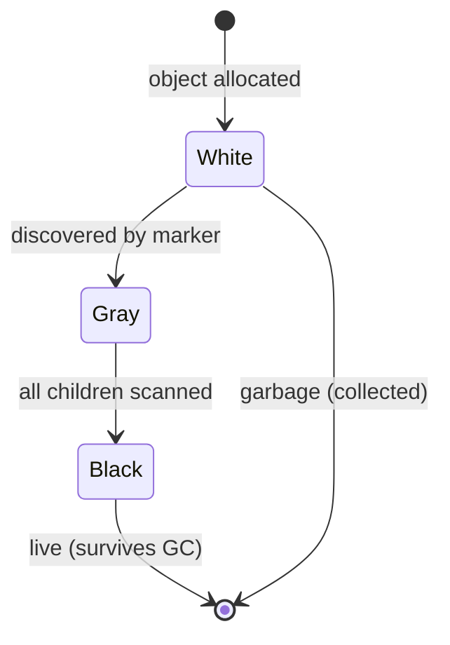

---

### 📶 Gradual Depth

**Level 1 - What it is:** Tri-color marking is a protocol that assigns one of three colors (white, gray, black) to every heap object during GC. It allows the collector to know which objects have been fully traced, which are partially traced, and which have not been seen at all.

**Level 2 - How to use it:** You do not directly use tri-color marking - it is internal to the GC. However, understanding it explains why GC logs show "concurrent mark" phases, why remark pauses exist, and why `-XX:ConcGCThreads` affects marking throughput. When you see long concurrent mark phases, adding marking threads helps.

**Level 3 - How it works:** Marking starts by coloring GC roots gray. Concurrent threads pop gray objects, scan their reference fields, color discovered white objects gray, and color the scanned object black. Write barriers intercept mutations: SATB logs the old reference value so the collector can find objects that were reachable at mark-start. When the gray set empties, a brief STW remark drains SATB buffers and finalizes the bitmap.

**Level 4 - Production mastery:** At production scale, marking throughput is bounded by memory bandwidth (scanning requires reading every reference field). Large heaps (32GB+) with complex object graphs can have concurrent mark phases lasting 10-30 seconds. During this time, new allocations are either pre-colored black (wasted scanning next cycle) or handled by TAMS (Top At Mark Start) pointers in G1. Tuning `-XX:ConcGCThreads` trades application CPU for shorter mark phases. ZGC eliminates marking bandwidth issues by embedding color in pointers, avoiding the separate bitmap scan entirely.

---

### ⚙️ How It Works

**Phase 1 - Initial Mark (STW, <1ms):** Scan GC roots (thread stacks, static fields). Color directly referenced objects gray. Mark TAMS pointers.

**Phase 2 - Concurrent Mark:** Background threads drain gray set. For each gray object: scan all reference fields, color white children gray, color self black. SATB barriers log overwrites concurrently.

**Phase 3 - Remark (STW, <5ms):** Process remaining SATB buffers. Drain residual gray objects. After remark, the marking is complete.

**Phase 4 - Cleanup/Sweep:** White objects are garbage. G1 identifies regions with most white (garbage-first selection). ZGC relocates live objects from mostly-dead pages.

```text
Timeline:
  |--STW--|---Concurrent Mark---|--STW--|
  InitMark  (app threads running)  Remark

  Mutator:  A.ref = B  (write barrier fires)
  Barrier:  log(old_value) to SATB buffer
  Marker:   processes SATB -> grays old ref
```

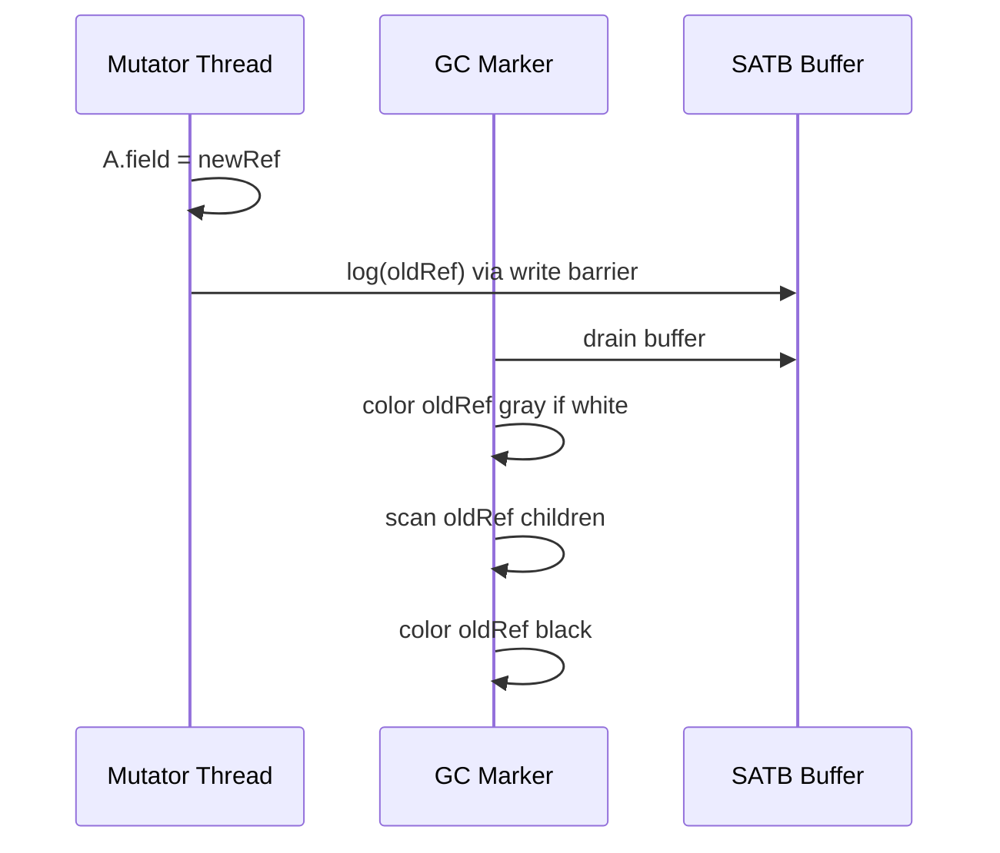

---

### 🚨 Failure Modes

**Failure 1 - Lost Object (Tri-Color Violation):**

**Symptom:** SIGSEGV or corrupted data after GC. Extremely rare in production JVMs (indicates JVM bug).

**Root cause:** A black object receives a pointer to a white object without barrier interception. The white object is collected despite being reachable.

**Diagnostic:**

```bash
# Check for known JVM bugs with marking
java -XX:+VerifyAfterGC -XX:+VerifyBeforeGC \
  -jar app.jar  # Development only - huge overhead
```

**Fix:** Upgrade JVM. Report to OpenJDK bug tracker. This is a collector correctness bug, not an application issue.

**Failure 2 - Marking Starvation (Long Concurrent Mark):**

**Symptom:** Concurrent mark phase takes 30+ seconds. Triggers "to-space exhausted" because allocation outpaces collection.

**Root cause:** Too few concurrent GC threads relative to allocation rate and heap size. Mutators allocate faster than markers can trace.

**Diagnostic:**

```bash
# Check concurrent mark duration from GC log
grep "Concurrent Mark" gc.log | \
  awk '{print $NF}' | sort -n | tail -5
# If >10s consistently, increase marking threads
```

**Fix:** Increase `-XX:ConcGCThreads` (default: ~25% of CPUs). Or reduce allocation rate in application code. For extremely large heaps, consider ZGC (concurrent marking is more efficient due to load barriers).

**Failure 3 - SATB Buffer Overflow:**

**Symptom:** Unexpectedly long remark pauses (50-200ms instead of <5ms). GC log shows large SATB buffer processing.

**Root cause:** High mutation rate during concurrent mark generates excessive SATB entries. Remark must drain all of them STW.

**Diagnostic:**

```bash
# Check remark pause breakdown
grep -A5 "Remark" gc.log | grep "SATB"
# Look for SATB Filtering/Processing time
```

**Fix:** Increase `-XX:G1SATBBufferSize` or add refinement threads. In extreme cases, schedule GC during low-mutation windows.

---

### 🔬 Production Reality

A typical pattern in large multi-tenant Java services: during peak traffic, allocation rate spikes 3x. Concurrent marking cannot keep pace. The gray set grows faster than markers drain it. Eventually G1 triggers a "Full GC (Allocation Failure)" because marking did not complete before regions were exhausted. The fix is not a bigger heap - it is more concurrent marking threads (`-XX:ConcGCThreads=4` to `8` on a 16-core machine) so marking completes before allocation consumes available regions. The key metric is "concurrent mark duration" relative to "time between GCs."

---

### ⚖️ Trade-offs & Alternatives

| Aspect         | G1 (SATB barrier) | ZGC (load barrier)  | Shenandoah (SATB+LB)  |
| -------------- | ----------------- | ------------------- | --------------------- |
| Barrier type   | Write (pre-store) | Read (every load)   | Write + read          |
| Barrier cost   | 2-5% throughput   | 3-8% throughput     | 5-10% throughput      |
| Remark pause   | 1-10ms            | <1ms                | <1ms                  |
| Floating trash | One cycle delay   | One cycle delay     | One cycle delay       |
| Max heap       | Practical ~32GB   | Multi-TB            | Multi-TB              |
| Mark bitmap    | Separate bitmap   | In-pointer metadata | Separate + forwarding |

---

### ⚡ Decision Snap

**USE G1 (SATB) WHEN:**

- Heap <= 32GB, pause target 50-200ms acceptable.
- Throughput matters (lowest barrier overhead).

**USE ZGC (Load Barriers) WHEN:**

- Need sub-millisecond pauses regardless of heap size.
- Can accept 3-8% throughput overhead.

**AVOID MANUAL TRI-COLOR TUNING WHEN:**

- Tuning at wrong level. Reduce allocation rate first.

---

### ⚠️ Top Traps

| #   | Misconception                   | Reality                                                                                             |
| --- | ------------------------------- | --------------------------------------------------------------------------------------------------- |
| 1   | "Concurrent means no pauses"    | Init-mark and remark are still STW. Concurrent mark runs between them. Total pause = init + remark. |
| 2   | "More GC threads = faster"      | Concurrent threads compete with app for CPU. Over-provisioning slows both marking AND application.  |
| 3   | "Black objects never revisited" | SATB can re-gray previously black objects (reference processing). This is correct behavior.         |
| 4   | "Tri-color is G1-specific"      | Every concurrent collector uses tri-color. ZGC, Shenandoah, CMS all implement it differently.       |
| 5   | "Write barriers are expensive"  | 2-5% overhead. Cheaper than STW pauses they eliminate. Trade-off is overwhelmingly favorable.       |

---

### 🪜 Learning Ladder

**Prerequisites:**

- JVM-029 GC Roots and Reachability Analysis - understand what "reachable" means before learning how concurrent marking preserves it
- JVM-027 Minor GC vs Major GC vs Full GC - understand where concurrent marking fits in the GC lifecycle

**THIS:** JVM-076 GC Algorithm Internals - Tri-Color Marking

**Next steps:**

- JVM-077 G1GC Remembered Sets and Card Tables - G1's SATB barrier is a tri-color implementation detail
- JVM-078 ZGC Colored Pointers and Load Barriers - ZGC's alternative tri-color realization using load barriers

---

**The Surprising Truth:**

The tri-color invariant permits "floating garbage" - objects that die DURING concurrent marking survive until the NEXT cycle because they were already colored gray or black. This means every concurrent collector has inherently higher memory usage than a STW collector: you need enough headroom for one cycle's worth of floating garbage. This is why G1 triggers at 45% heap occupancy (IHOP) rather than waiting until full.

**Further Reading:**

- Dijkstra et al., "On-the-Fly Garbage Collection: An Exercise in Cooperation" (1978) - original tri-color formalization
- JEP 333: ZGC: A Scalable Low-Latency Garbage Collector - modern load-barrier realization
- Tene, Iyengar, Wolf, "C4: The Continuously Concurrent Compacting Collector" (ISMM 2011)

**Revision Card:**

1. Three colors: white (unseen), gray (queued), black (done). Strong invariant: no black->white pointer.
2. SATB vs load barrier is the fundamental design fork. SATB = lower overhead, short remark. Load barrier = no remark, higher per-access cost.
3. Floating garbage forces IHOP < 100%. Concurrent collectors need headroom for objects dying during mark.

**BAD:**

```java
// Assuming concurrent GC means no pauses
// No monitoring of concurrent mark duration
java -Xmx32g -XX:+UseG1GC -jar service.jar
// Concurrent mark takes 25s, allocation outpaces
// Result: Full GC (Allocation Failure) 4.2s pause
```

**GOOD:**

```java
// Monitor marking throughput, tune concurrency
java -Xmx32g -XX:+UseG1GC \
  -XX:ConcGCThreads=6 \
  -Xlog:gc*:file=gc.log:time,level,tags \
  -jar service.jar
// ConcGCThreads=6 (25% of 24 cores)
// Concurrent mark completes in <5s
// No allocation failure possible
```

---

---

# JVM-077 G1GC Remembered Sets and Card Tables

**TL;DR** - G1 uses remembered sets per region and a global card table to track cross-region references, enabling independent region collection without full-heap scanning.

---

### 🔥 Problem Statement

G1 divides the heap into hundreds of equal-sized regions and collects subsets independently. To collect region A, G1 must know every reference pointing INTO A from outside regions - otherwise it would incorrectly collect objects that are actually reachable via cross-region pointers. Scanning the entire heap to find these references would defeat the purpose of region-based collection. At scale with 2048+ regions and millions of cross-region references, the data structure tracking these references must be space-efficient and fast to maintain.

---

### 📜 Historical Context

Card tables originated in the Ungar generation scavenging collector (1984) for tracking old-to-young references. G1 (Garbage-First, 2004 paper by Detlefs et al., productionized in JDK 7u4) extended this concept: instead of two generations, G1 has hundreds of regions each needing its own "incoming reference" tracker. The combination of coarse-grained card table (marking dirty 512-byte cards) with fine-grained per-region remembered sets (recording exactly which cards contain cross-region refs) was G1's key innovation.

---

### 🔩 First Principles

**CORE INVARIANTS:**

1. **Completeness:** The remembered set for region R contains every card from which a reference into R exists. Missing entries cause incorrect collection.
2. **Write barrier maintenance:** Every pointer store creating a cross-region reference must dirty the corresponding card and enqueue for refinement.
3. **Bounded overhead:** Remembered set memory is bounded by coarsening (per-card to per-region granularity) when incoming references exceed threshold.

**DERIVED DESIGN:**

These invariants force a post-write barrier on every reference store, a concurrent refinement mechanism to process dirty cards into remembered sets, and a coarsening protocol to prevent memory explosion when popular objects receive references from many regions.

**THE TRADE-OFF:**

**Gain:** Independent region collection. Mixed GCs collect only highest-garbage regions without scanning entire old gen.

**Cost:** 10-20% of heap consumed by RSet data structures in native memory. Write barrier overhead ~3-5% throughput. Refinement threads consume CPU.

---

### 🧠 Mental Model

> The card table is a city's postal system. The heap is divided into neighborhoods (regions). When someone in neighborhood X sends a letter to Y (cross-region reference), the post office (write barrier) stamps X's mailbox (dirties the card). The remembered set for Y is its incoming mail registry - listing every neighborhood that has sent mail. When collecting Y, check only registered neighborhoods, not the entire city.

- "Neighborhoods" -> G1 regions (1-32MB each)
- "Sending a letter" -> creating a cross-region reference
- "Postal stamp" -> dirtying the card in the card table
- "Incoming mail registry" -> remembered set for target region
- "Collecting Y" -> evacuating live objects from region Y

**Where this analogy breaks down:** real mail is delivered once. JVM references are modified constantly. The registry must track CURRENT state, not history. When a reference is removed, the RSet still contains the stale card until next refinement - it over-approximates.

---

### 🧩 Components

- **Card table:** Global byte array. One byte per 512-byte heap range. Clean (0) or dirty (non-zero).
- **Remembered set (RSet):** Per-region structure listing external cards containing references into this region. Three granularities: sparse, fine, coarse.
- **Post-write barrier:** After reference store, checks src.region != dst.region. If cross-region, dirties card and enqueues.
- **Dirty card queue (DCQ):** Thread-local buffer of dirtied cards. When full, flushed to global refinement queue.
- **Concurrent refinement threads:** Process dirty cards into RSets concurrently with application.
- **Collection Set (CSet):** Regions selected for evacuation. RSets determine additional root scanning.

```text
Card Table (1 byte per 512B):
  [0][0][1][0][1][0][0][1][0]...
         ^     ^        ^
         dirty cards (cross-region refs)

Region B RSet:
  Region A: cards {3, 12, 47}
  Region D: cards {8, 9}
  Region F: coarsened (bit only)
```

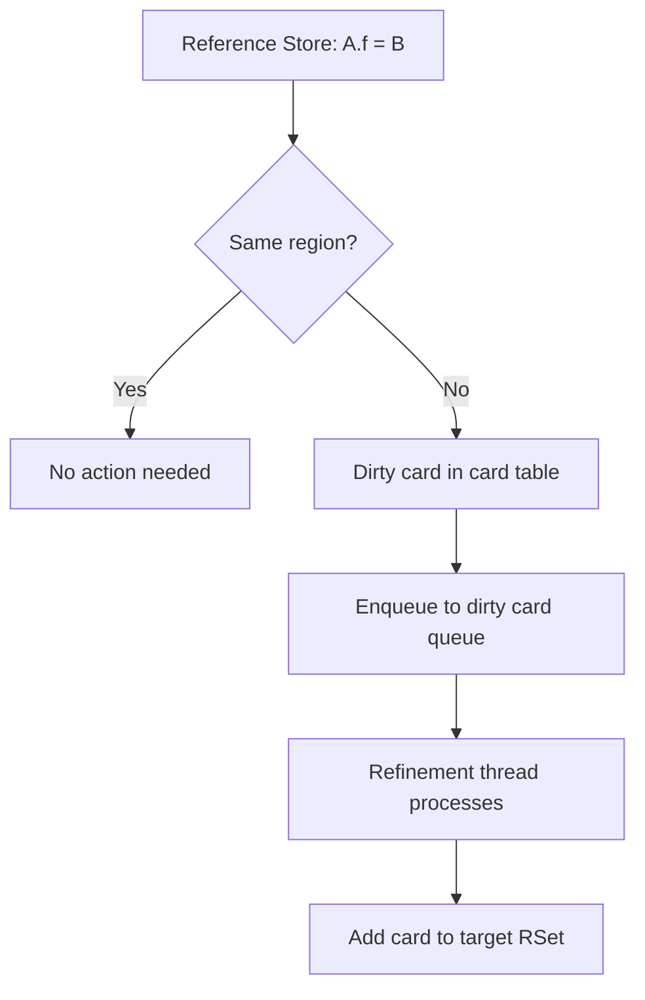

---

### 📶 Gradual Depth

**Level 1 - What it is:** G1 needs to know which objects in other regions point into each region. Card table and remembered sets track cross-region references efficiently, avoiding full-heap scans during partial collections.

**Level 2 - How to use it:** You do not manipulate RSets directly. Key tuning: `-XX:G1ConcRefinementThreads`. Monitor via GC logs: "Scan RS" time shows RSet scanning cost. High RSet memory visible in NMT under "GC" category.

**Level 3 - How it works:** Every pointer store triggers a post-write barrier checking cross-region. If yes, dirty the source card and buffer it. Refinement threads scan each 512B card to find exact references, adding to target region's RSet. During evacuation, RSets serve as additional roots for the collection set.

**Level 4 - Production mastery:** RSet memory scales with cross-region reference density. Object graphs with many inter-region pointers (large HashMaps, graph databases) generate enormous RSets - potentially 20-30% of heap in native memory. Monitor with NMT. Coarsening saves memory but increases scan time. High "Update RS" in GC logs indicates refinement cannot keep pace with mutation rate.

---

### ⚙️ How It Works

**Phase 1 - Write Barrier (every pointer store):**

Application stores reference. JIT-compiled barrier checks card dirty status and region membership. If cross-region and card clean: dirty card, enqueue to thread-local DCQ.

**Phase 2 - Concurrent Refinement:**

Refinement threads dequeue dirty cards. For each card: scan 512-byte range, find references into other regions, update target RSets. If refinement falls behind, application threads help.

**Phase 3 - Evacuation (during GC pause):**

For each CSet region: scan its RSet to find incoming references from outside CSet. These become additional GC roots. Evacuate live objects. Update forwarding pointers.

```text
During Young GC pause:
  1. Scan thread stacks (GC roots)
  2. Scan RSets of CSet regions
  3. Trace from all roots -> identify live
  4. Evacuate live to survivor/old
  5. Update references (fixup pointers)

  Typical time breakdown:
    Scan RS:     30-40% of pause
    Object Copy: 40-50% of pause
    Other:       10-20%
```

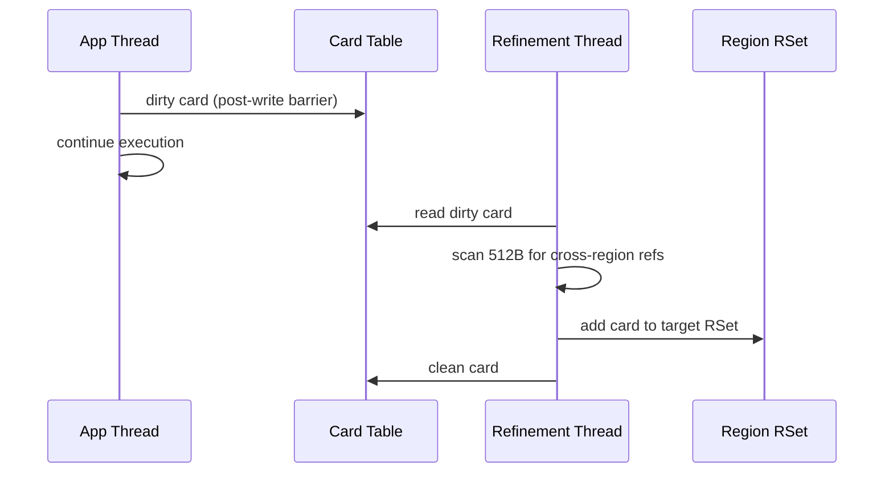

---

### 🚨 Failure Modes

**Failure 1 - Remembered Set Memory Explosion:**

**Symptom:** NMT "GC" category grows to 20-30% of heap. RSS exceeds container limits. OOM kill.

**Root cause:** Dense cross-region reference graphs. Large HashMaps with keys/values scattered across regions.

**Diagnostic:**

```bash
jcmd <pid> VM.native_memory summary | grep GC
# GC (reserved=2048MB, committed=1800MB)
# If committed > 15% of Xmx, RSets are large
```

**Fix:** Increase heap to reduce region count. Consider ZGC (no remembered sets). Restructure data for locality.

**Failure 2 - Refinement Thread Starvation:**

**Symptom:** "Update RS" dominates GC pause time. Dirty card queue overflows. Application threads pressed into refinement.

**Root cause:** Mutation rate exceeds refinement throughput. Bulk loading, graph traversals, cache storms.

**Diagnostic:**

```bash
grep "Update RS" gc.log | \
  awk '{print $NF}' | sort -n | tail -5
# Consistently >10ms indicates refinement lag
```

**Fix:** Increase `-XX:G1ConcRefinementThreads`. Reduce mutation rate. Consider batch-then-GC pattern.

---

### 🔬 Production Reality

A typical incident: 16GB heap G1 service with ConcurrentHashMap of 5M entries. Keys and values land in random regions. NMT shows 2.8GB native memory for GC (17.5% of heap). Container limit 20GB. Actual RSS reaches 21GB causing OOM kill. Fix options: increase container to 24GB, restructure cache for locality (difficult), or switch to ZGC (eliminates RSets entirely at throughput cost).

---

### ⚖️ Trade-offs & Alternatives

| Aspect          | G1 (RSet + cards)    | ZGC (load barrier)  | Parallel (cards only) |
| --------------- | -------------------- | ------------------- | --------------------- |
| Cross-ref track | Per-region RSets     | None needed         | Single card table     |
| Memory overhead | 10-20% native        | <5% native          | <1%                   |
| Barrier cost    | Post-write (cheap)   | Load (every access) | Post-write (cheaper)  |
| Partial collect | Yes (region subsets) | Yes (page-based)    | No (full gen only)    |
| Tuning knobs    | Many                 | Few (auto)          | Few                   |

---

### ⚡ Decision Snap

**ACCEPT G1 RSET OVERHEAD WHEN:**

- Pause targets (50-200ms) justify the memory cost.
- Heap <= 32GB where overhead is manageable.
- Object graph has reasonable locality.

**SWITCH TO ZGC WHEN:**

- RSet memory exceeds 15% of heap.
- Sub-ms pauses required regardless of heap size.

**PREFER PARALLEL GC WHEN:**

- Pure throughput workload. Simple card table sufficient.

---

### ⚠️ Top Traps

| #   | Misconception                        | Reality                                                                                                          |
| --- | ------------------------------------ | ---------------------------------------------------------------------------------------------------------------- |
| 1   | "RSets are free (JVM-internal)"      | RSets consume native memory proportional to cross-region density. Can reach 20% of heap size.                    |
| 2   | "Bigger heap always helps G1"        | More regions = potentially more cross-region refs = bigger RSets. Net benefit depends on locality.               |
| 3   | "Card table alone suffices for G1"   | Card table marks dirty cards. RSets provide per-region indexed access. Without RSets, must scan ALL dirty cards. |
| 4   | "Coarsening means data loss"         | Coarsening is accuracy trade-off: fewer cards, coarser granularity. Correctness maintained.                      |
| 5   | "Max refinement threads = CPU count" | Over-provisioning steals CPU from app AND marking. Default auto-scaling usually correct.                         |

---

### 🪜 Learning Ladder

**Prerequisites:**

- JVM-076 GC Algorithm Internals - Tri-Color Marking - RSets support concurrent marking by tracking what to scan
- JVM-026 Heap Structure - Young, Old, and Metaspace - understand regions that RSets connect

**THIS:** JVM-077 G1GC Remembered Sets and Card Tables

**Next steps:**

- JVM-078 ZGC Colored Pointers and Load Barriers - ZGC's alternative eliminating RSets entirely
- JVM-085 GC Ergonomics Failures at Scale - RSets as common root cause of ergonomics failures

---

**The Surprising Truth:**

G1's post-write barrier has a "conditional card marking" optimization: it only dirties a card if currently clean. This prevents redundant refinement but introduces a read-modify-write on the card table entry. On x86 this causes cache-line bouncing between cores when multiple threads write to adjacent heap regions. `-XX:-UseCondCardMark` disables this, accepting redundant dirty cards to avoid false sharing. Whether conditional marking helps depends on allocation pattern and core count.

**Further Reading:**

- Detlefs et al., "Garbage-First Garbage Collection" (ISMM 2004) - original G1 paper
- OpenJDK source: `g1RemSet.cpp` - RSet refinement implementation
- JEP 307: Parallel Full GC for G1 - addresses full GC fallback when RSets cannot prevent evacuation failure

**Revision Card:**

1. Card table: 1 byte per 512B heap. RSets: per-region index of which external cards reference in.
2. RSet memory = 10-20% of heap (native). Monitor with NMT. If >15%, consider ZGC or locality optimization.
3. "Scan RS" in GC log shows RSet scanning cost. High values = dense cross-region graph or refinement starvation.

**BAD:**

```java
// Ignoring RSet memory in container sizing
// Container: 20GB, Heap: 16GB
// Assumes 4GB overhead is enough
-Xmx16g  // in a 20GB container
// Actual RSS: 16GB heap + 2.8GB RSets + 1.5GB other
// = 20.3GB -> OOM killed
```

**GOOD:**

```java
// Account for RSet memory in sizing
// Formula: container = heap * 1.7 (G1 with dense refs)
jcmd <pid> VM.native_memory summary | grep GC
// GC: reserved=2800MB <- RSets + marking
// Container: heap(16g) + GC(3g) + other(2g) = 21g
// Set container limit: 24GB (with headroom)
```

---

---

# JVM-078 ZGC Colored Pointers and Load Barriers

**TL;DR** - ZGC embeds GC metadata in unused pointer bits (colored pointers) and intercepts every pointer load (load barriers) to achieve sub-millisecond pauses regardless of heap size.

---

### 🔥 Problem Statement

G1 achieves low-pause collection but its pauses still scale with live set size during evacuation and remark. For heaps exceeding 32GB, G1 pauses routinely exceed 100ms - unacceptable for latency-sensitive services with strict SLAs. The fundamental limitation: G1 must stop the world to relocate objects and fix all references atomically. ZGC eliminates this constraint by making relocation concurrent through colored pointers and load barriers, achieving <1ms pauses on multi-terabyte heaps at the cost of per-access barrier overhead.

---

### 📜 Historical Context

ZGC originated as an Oracle research project (first previewed JDK 11, production-ready JDK 15, generational ZGC in JDK 21). Its design draws from Azul's C4 collector (2010) which pioneered read barriers for concurrent compaction. The key insight: if every pointer load goes through a barrier that can fix stale references on-the-fly, the GC never needs to stop the world to update pointers. ZGC made this practical on commodity hardware by using virtual memory multi-mapping and unused pointer bits available in 64-bit address spaces.

---

### 🔩 First Principles

**CORE INVARIANTS:**

1. **Self-healing pointers:** Every loaded pointer is validated by the load barrier. Stale pointers are fixed in-place before use - the application never sees an invalid reference.
2. **Colored metadata:** Pointer bits encode GC state (marked, remapped, finalizable). No separate marking bitmap needed.
3. **Concurrent relocation:** Objects can be moved while application runs. Load barrier detects forwarded objects and updates the reference transparently.

**DERIVED DESIGN:**

These invariants force a load barrier on every object reference access (not just stores). The barrier checks pointer color bits - if they indicate "not remapped," the barrier follows the forwarding pointer, updates the reference in-place, and returns the new address. This self-healing property means the GC can relocate objects without STW, and stale references are lazily fixed on first access.

**THE TRADE-OFF:**

**Gain:** Pauses <1ms regardless of heap size (1MB to 16TB). No remembered sets needed. Concurrent compaction.

**Cost:** Load barrier on every reference access (3-8% throughput). Higher CPU usage during relocation. Single-generation (pre-JDK 21) means no generational optimization.

---

### 🧠 Mental Model

> ZGC's colored pointers are like color-coded forwarding addresses on mail. Each letter (pointer) has a colored sticker: green (current address), yellow (moved - forwarding available), red (being processed). The mailman (load barrier) checks the sticker on every delivery. If yellow, he follows the forwarding address, delivers there, and updates his address book (self-healing). No need to stop all mail delivery to update addresses.

- "Colored sticker" -> metadata bits in pointer (4 bits)
- "Green" -> remapped (pointer is current)
- "Yellow" -> marked but not remapped (object moved)
- "Mailman checks sticker" -> load barrier on every access
- "Updates address book" -> self-healing (fixes pointer in-place)

**Where this analogy breaks down:** real mail delivery does not happen billions of times per second. The load barrier executes on EVERY object reference load - a cost invisible in the mail analogy. Also, "color" in ZGC changes meaning across GC phases, not just between deliveries.

---

### 🧩 Components

- **Colored pointers:** 64-bit references use bits 42-45 for GC metadata (marked0, marked1, remapped, finalizable). Remaining bits encode the actual heap address.
- **Load barrier:** JIT-compiled check on every reference load. Tests color bits against expected phase color. If mismatch: slow path (remap/mark).
- **Multi-mapping:** ZGC maps the same physical memory at three virtual addresses (one per color state). Allows address arithmetic without masking.
- **Forwarding tables:** Per-page structures recording object relocation (old offset -> new address).
- **Relocation set:** Pages selected for compaction (pages with most garbage, similar to G1's collection set).
- **ZPages:** ZGC's allocation unit (small=2MB, medium=32MB, large=N\*2MB). Replace G1 regions.

```text
64-bit pointer layout (ZGC):
  [unused][color bits][address]
  63...46  45..42     41...0

  Color bits:
    Marked0     = relocation phase 0
    Marked1     = relocation phase 1
    Remapped    = pointer is current
    Finalizable = reachable only via finalizer

  Multi-mapping:
    Virtual addr 1 (Marked0)  -> Physical page
    Virtual addr 2 (Marked1)  -> Physical page
    Virtual addr 3 (Remapped) -> Physical page
```

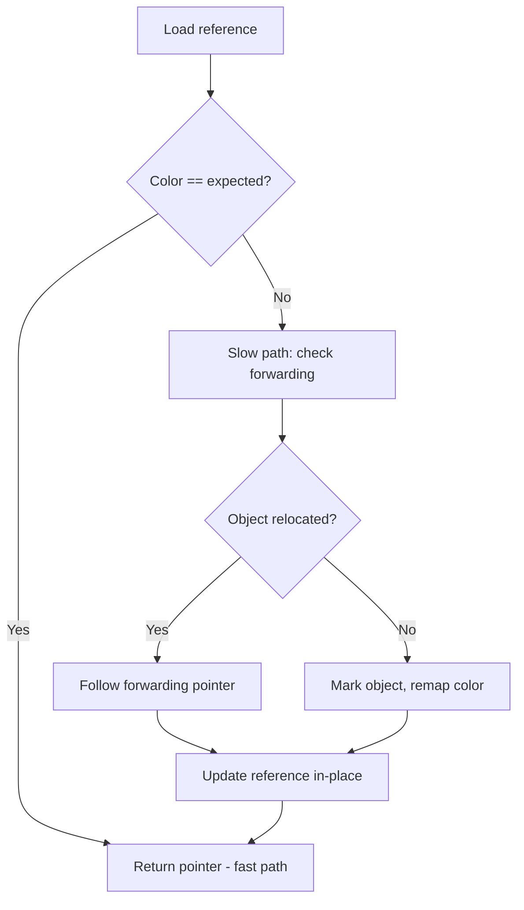

---

### 📶 Gradual Depth

**Level 1 - What it is:** ZGC is a garbage collector that achieves pauses under 1 millisecond regardless of heap size. It does this by checking every pointer access and fixing stale references on-the-fly, so it never needs to stop your application to update pointers.

**Level 2 - How to use it:** Enable with `-XX:+UseZGC` (JDK 15+). For generational mode: `-XX:+UseZGC -XX:+ZGenerational` (JDK 21+). Minimal tuning needed - primarily `-Xmx` for heap size. ZGC auto-tunes most parameters.

**Level 3 - How it works:** ZGC stores GC state in pointer metadata bits. Every time your code loads a reference, a JIT-compiled barrier checks if the pointer's color matches the current GC phase. If not, the barrier follows forwarding tables to find the object's new location and updates the pointer in-place (self-healing). This makes object relocation concurrent - no STW needed for pointer fixup.

**Level 4 - Production mastery:** ZGC's throughput cost is 3-8% from load barriers (every `getfield`/`aaload` has a branch). This is most impactful in pointer-chasing workloads (linked lists, tree traversals). For array-heavy or primitive-heavy workloads, overhead is minimal. Generational ZGC (JDK 21+) adds young/old generation semantics, reducing the amount of work per cycle and improving throughput significantly. Monitor `ZAllocationStall` in GC logs - this indicates ZGC cannot allocate fast enough (equivalent to G1's evacuation failure).

---

### ⚙️ How It Works

**Phase 1 - Concurrent Mark:** Trace reachability using colored pointers. Load barriers mark objects accessed by application. Marking threads scan gray objects concurrently.

**Phase 2 - Concurrent Relocation Set Selection:** Identify pages with most garbage. These pages will be compacted (live objects moved out).

**Phase 3 - Concurrent Relocation:** Move live objects from relocation set to new pages. Update forwarding tables. Application threads hitting relocated objects self-heal via load barrier.

**Phase 4 - Concurrent Remap:** Flip expected color bits for next cycle. Load barriers now fix any remaining stale pointers lazily on access.

```text
ZGC cycle (all phases concurrent):
  |Mark|---Select---|Relocate|--Remap--|
  (STW <1ms between phases for handshake)

  Total STW: 3 handshakes * <0.5ms = <1.5ms
  Regardless of heap size (1GB or 1TB)
```

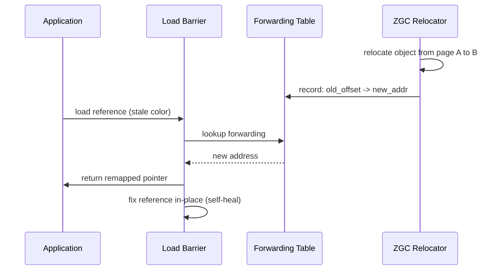

---

### 🚨 Failure Modes

**Failure 1 - Allocation Stall:**

**Symptom:** GC log shows `ZAllocationStall`. Application threads block waiting for memory. Latency spikes to seconds.

**Root cause:** Allocation rate exceeds ZGC's concurrent collection rate. No free pages available.

**Diagnostic:**

```bash
grep "ZAllocationStall" gc.log
# Also check allocation rate:
grep "Allocation Rate" gc.log | tail -10
```

**Fix:** Increase heap (-Xmx). Reduce allocation rate in code. Increase `-XX:ConcGCThreads`. With Generational ZGC, young gen collection is faster.

**Failure 2 - Throughput Degradation:**

**Symptom:** 8-15% throughput loss compared to G1 (measured via JMH or production metrics). CPU utilization higher at same RPS.

**Root cause:** Load barrier overhead on pointer-heavy workloads. Every object reference load pays the barrier cost.

**Diagnostic:**

```bash
# Compare with G1 on same workload:
# async-profiler shows barrier in hot paths
./profiler.sh -d 30 -f profile.html <pid>
# Look for ZBarrier frames in flame graph
```

**Fix:** Accept as design trade-off if sub-ms pauses are required. For throughput-critical paths, reduce pointer chasing (use arrays, primitive types, value classes in future JDKs).

---

### 🔬 Production Reality

A typical adoption pattern: service migrates from G1 (p99 pause 120ms) to ZGC. Pauses drop to <1ms. However, overall throughput decreases 5-7%. CPU usage increases proportionally. The team must right-size: either add instances to maintain total throughput or accept the trade-off. Generational ZGC (JDK 21+) typically recovers 3-4% of that throughput loss by collecting young objects more frequently with less work. The remaining 2-3% is the inherent load barrier cost that cannot be eliminated.

---

### ⚖️ Trade-offs & Alternatives

| Aspect          | ZGC              | G1             | Shenandoah     |
| --------------- | ---------------- | -------------- | -------------- |
| Max pause       | <1ms             | 50-200ms       | <10ms          |
| Throughput cost | 3-8%             | 2-5%           | 5-10%          |
| Barrier type    | Load (every ref) | Write (stores) | Load + write   |
| Heap range      | 8MB - 16TB       | 1GB - ~32GB    | 1GB - multi-TB |
| Generational    | JDK 21+          | Always         | No             |
| Native mem      | Low (<5%)        | High (RSets)   | Medium         |

---

### ⚡ Decision Snap

**USE ZGC WHEN:**

- Pause time SLA <10ms (ZGC guarantees <1ms).
- Heap size >32GB where G1 pauses scale unacceptably.
- Willing to trade 3-8% throughput for pause guarantee.

**AVOID ZGC WHEN:**

- Every CPU cycle matters (HFT, batch processing).
- JDK <15 (not available) or <21 (no generational).

**PREFER GENERATIONAL ZGC (JDK 21+) WHEN:**

- Want ZGC pauses with better throughput. Always use generational mode on JDK 21+.

---

### ⚠️ Top Traps

| #   | Misconception               | Reality                                                                                             |
| --- | --------------------------- | --------------------------------------------------------------------------------------------------- |
| 1   | "ZGC has zero pauses"       | ZGC has three STW handshakes per cycle (<0.5ms each). Technically not pauseless but sub-ms.         |
| 2   | "ZGC works on 32-bit JVMs"  | ZGC requires 64-bit (uses pointer metadata bits). Not available on 32-bit.                          |
| 3   | "ZGC needs huge heaps"      | Works from 8MB to 16TB. Benefits are proportionally larger for bigger heaps but usable at any size. |
| 4   | "No tuning needed with ZGC" | Still need appropriate -Xmx. Allocation stalls occur if heap too small for allocation rate.         |
| 5   | "ZGC replaces G1 always"    | G1 has better throughput for heaps <16GB. ZGC's advantage is pauses, not throughput.                |

---

### 🪜 Learning Ladder

**Prerequisites:**

- JVM-076 GC Algorithm Internals - Tri-Color Marking - ZGC implements tri-color via colored pointers
- JVM-077 G1GC Remembered Sets and Card Tables - understand what ZGC eliminates (no RSets needed)

**THIS:** JVM-078 ZGC Colored Pointers and Load Barriers

**Next steps:**

- JVM-090 Ahead-of-Time Compilation (GraalVM Native) - alternative approach to eliminating GC pauses
- JVM-094 Heap Fragmentation Under Long-Running Loads - ZGC's concurrent compaction prevents fragmentation

---

**The Surprising Truth:**

ZGC's multi-mapping trick maps the same physical page at three different virtual addresses simultaneously (one per color state). When ZGC "recolors" a pointer, it is actually changing which virtual mapping is used - but all three point to the same physical RAM. This means ZGC's address space usage appears 3x heap size in `/proc/pid/maps`, which confuses monitoring tools. RSS remains correct (physical memory used once) but VIRT looks enormous. This is by design, not a bug.

**Further Reading:**

- JEP 333: ZGC: A Scalable Low-Latency Garbage Collector (JDK 11 preview)
- JEP 439: Generational ZGC (JDK 21) - adding generational semantics
- Per Liden, "ZGC: The Next Generation Low-Latency Garbage Collector" (Oracle DevLive 2023)

**Revision Card:**

1. Colored pointers: 4 metadata bits in pointer encode GC state. Load barrier checks color on every ref access.
2. Self-healing: stale pointers fixed lazily on first load. No STW needed for pointer fixup after relocation.
3. Trade-off: <1ms pauses for 3-8% throughput cost. Use Generational ZGC (JDK 21+) to minimize throughput loss.

**BAD:**

```bash
# Switching to ZGC without understanding trade-offs
java -XX:+UseZGC -Xmx4g -jar service.jar
# Heap too small for allocation rate
# Result: ZAllocationStall - threads blocked
# Worse latency than G1 due to stalls
```

**GOOD:**

```bash
# Proper ZGC sizing: generous heap + monitoring
java -XX:+UseZGC -XX:+ZGenerational \
  -Xmx16g \
  -Xlog:gc*:file=gc.log:time \
  -jar service.jar
# Monitor: grep ZAllocationStall gc.log
# If stalls: increase -Xmx until zero stalls
# Generational mode (JDK 21+) for best throughput
```

---

---

# JVM-079 JIT Code Cache and Deoptimization

**TL;DR** - The JIT compiler stores machine code in a bounded Code Cache; when assumptions are invalidated, deoptimization discards compiled code and falls back to interpretation, causing sudden latency spikes.

---

### 🔥 Problem Statement

A service runs smoothly for hours then suddenly experiences latency spikes at a fixed interval. CPU profile shows interpreter frames appearing in hot paths that were previously JIT-compiled. The Code Cache has filled to its maximum size, triggering emergency flush and re-compilation. Alternatively, a class loading event invalidated JIT assumptions (CHA - class hierarchy analysis), causing mass deoptimization of methods that assumed no subclass override existed. Both scenarios manifest as sudden performance degradation with no obvious application-level cause.

---

### 📜 Historical Context

HotSpot's JIT has existed since JDK 1.3 (2000). The Code Cache was initially undersized (48MB default until JDK 8). JDK 9 introduced segmented Code Cache (JEP 197) splitting into non-method, profiled, and non-profiled segments for better management. Before segmentation, Code Cache exhaustion triggered full emergency flush - discarding ALL compiled code simultaneously, causing catastrophic performance cliffs. Modern JVMs handle this more gracefully but the fundamental problem persists: the Code Cache is bounded, and deoptimization is inherently disruptive.

---

### 🔩 First Principles

**CORE INVARIANTS:**

1. **Speculation correctness:** JIT compiles under assumptions (no subclass overrides, null never observed, type always Integer). If any assumption is violated at runtime, compiled code MUST be invalidated.
2. **Bounded Code Cache:** Physical memory for compiled code is bounded by `-XX:ReservedCodeCacheSize`. When full, no new compilations occur until space is freed.
3. **Deopt is safe but expensive:** Deoptimization transfers execution from compiled code to interpreter at a safepoint. The method must be re-profiled and re-compiled (seconds to minutes of degraded performance).

**DERIVED DESIGN:**

These invariants force: (1) dependency tracking between compiled methods and their assumptions, (2) eager deoptimization when assumptions break, (3) Code Cache sizing that balances memory against compilation capacity.

**THE TRADE-OFF:**

**Gain:** Aggressive speculative optimization (10-50x faster than interpretation). Class hierarchy analysis enables devirtualization and inlining.

**Cost:** Deoptimization storms when assumptions break. Code Cache memory. Warmup time until code is compiled.

---

### 🧠 Mental Model

> JIT compilation is like building a highway based on observed traffic patterns. You observe "only cars use this road" (type speculation) and build a car-only highway (no truck ramps, no height clearance). Blazingly fast for cars. But if a truck appears (new subclass loaded), the highway must be demolished (deoptimized) and rebuilt with truck support. During reconstruction, everyone takes the slow surface road (interpreter).

- "Highway" -> JIT-compiled native code in Code Cache
- "Traffic observation" -> profiling (C1 tier collects data)
- "Car-only" -> speculative optimization (CHA assumption)
- "Truck appears" -> new class loaded that breaks assumption
- "Demolished" -> deoptimization + recompilation
- "Surface road" -> interpreter fallback

**Where this analogy breaks down:** real highways take months to rebuild. JIT recompilation takes milliseconds to seconds - but during that window, the specific method runs 10-100x slower. Also, the JVM does not wait for certainty before building the "highway" - it speculates aggressively based on profiles, accepting demolition as an acceptable cost for speed.

---

### 🧩 Components

- **Code Cache segments (JDK 9+):** Non-method (stubs, adapters), Profiled (C1 code with profiling), Non-profiled (C2 optimized code). Each has independent sizing.
- **Compilation queue:** Methods waiting for C1 or C2 compilation. Priority based on invocation count and backedge count.
- **Dependency table:** Records which compiled methods depend on which assumptions (CHA, constant propagation, type profiles).
- **Uncommon trap:** JIT-inserted check that triggers deoptimization when speculation fails. Transfers to interpreter.
- **On-Stack Replacement (OSR):** Allows compilation of a method while it is already executing (typically long-running loops).
- **CodeCache sweeper:** Background thread that identifies and frees unreachable compiled methods (nmethod sweeping).

```text
Code Cache Layout (JDK 17+):
  [Non-method | Profiled (C1) | Non-profiled (C2)]
   ~8MB         ~128MB          ~128MB
   (stubs)     (w/ profiling)   (fully optimized)

  Total default: ~240MB (ReservedCodeCacheSize)

  Lifecycle of a hot method:
    Interpret -> C1 compile -> Profile ->
    C2 compile -> Possible deopt -> Re-profile
```

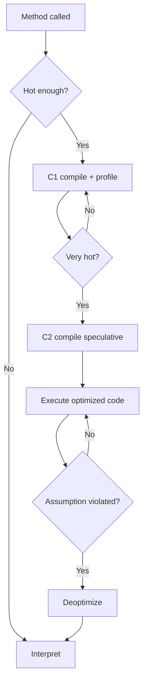

---

### 📶 Gradual Depth

**Level 1 - What it is:** The JVM compiles frequently-executed Java methods into native machine code for speed. This code lives in a fixed-size memory area called the Code Cache. When the JVM discovers its assumptions were wrong, it throws away the compiled code (deoptimization) and starts over.

**Level 2 - How to use it:** Monitor Code Cache usage: `jcmd <pid> Compiler.codecache`. Key flag: `-XX:ReservedCodeCacheSize=256m` (increase if cache fills). Enable `-XX:+PrintCompilation` to see compile/deopt events. Watch for "made not entrant" and "made zombie" in compilation logs.

**Level 3 - How it works:** C2 compiles with aggressive assumptions: "this virtual call always resolves to ConcreteImpl.method()" (CHA). When a new class loads that overrides the method, the dependency table triggers deoptimization of all methods depending on that assumption. The compiled nmethod is marked "not entrant" (no new calls), then "zombie" (no active frames), then freed.

**Level 4 - Production mastery:** Mass deoptimization events correlate with: (1) class loading (new classes breaking CHA), (2) first occurrence of rare code paths (uncommon traps), (3) Code Cache exhaustion. Use JFR `jdk.Deoptimization` events to track frequency and cause. Persistent deopt/recompile cycles ("deopt storms") indicate unstable type profiles - often caused by polymorphic dispatch sites that C2 cannot inline profitably.

---

### ⚙️ How It Works

**Phase 1 - Profiling (C1):** C1 compiles method with profiling instrumentation. Tracks: type profiles at call sites, branch probabilities, invocation count.

**Phase 2 - Speculative Compilation (C2):** C2 reads profiles. Generates optimized code with speculations: devirtualization, inlining, null-check elimination, range-check elimination. Each speculation inserts an uncommon trap.

**Phase 3 - Execution:** Optimized code runs at full speed until a speculation fails. Uncommon trap fires, transferring to interpreter at the deopt point.

**Phase 4 - Recovery:** Method re-enters profiling. After sufficient samples with new behavior, C2 recompiles with updated assumptions.

```text
Deoptimization sequence:
  1. Uncommon trap fires (speculation failed)
  2. Frame unwound to interpreter frame
  3. nmethod marked "not entrant"
  4. Method re-profiled in interpreter/C1
  5. Eventually re-compiled by C2
  6. New code has broader assumptions

  Time in degraded state: 1-30 seconds
  (profiling + queue + compile time)
```

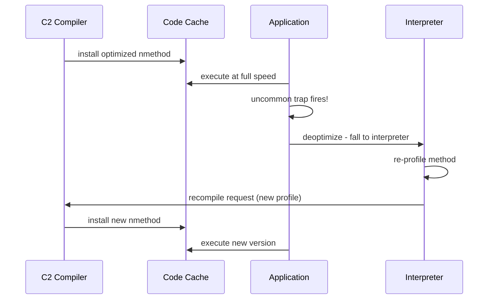

---

### 🚨 Failure Modes

**Failure 1 - Code Cache Exhaustion:**

**Symptom:** Compilation stops. `CodeCache is full` in logs. Gradual performance degradation as hot methods cannot be compiled.

**Root cause:** Default ReservedCodeCacheSize too small for application with many classes/methods.

**Diagnostic:**

```bash
jcmd <pid> Compiler.codecache
# Check: used vs max. If used > 90%: exhaustion risk
# JFR: jdk.CodeCacheFull events
```

**Fix:** Increase `-XX:ReservedCodeCacheSize=512m`. Also ensure sweeper is running (`-XX:+UseCodeCacheFlushing` default true since JDK 8).

**Failure 2 - Deoptimization Storm:**

**Symptom:** Hundreds of deopts in seconds. Latency spikes. CPU profile shows interpreter frames in hot paths.

**Root cause:** Class loading event invalidating many CHA assumptions simultaneously. Or Spring/Hibernate proxy creation loading classes that break inlining assumptions.

**Diagnostic:**

```bash
# JFR deoptimization events:
jcmd <pid> JFR.dump filename=deopt.jfr
# In JMC: filter jdk.Deoptimization events
# Look for "reason" and "action" fields
```

**Fix:** Warm up with realistic traffic patterns before serving production load. Pre-load all classes during startup. Use `-XX:+PrintCompilation` to identify repeatedly deoptimized methods.

---

### 🔬 Production Reality

A common incident pattern with microservice deployments: service uses Spring AOP proxies. During startup, only the concrete class is loaded (CHA assumes no overrides). JIT aggressively devirtualizes. First AOP proxy call (60 seconds after startup when transaction interceptor fires) loads the proxy class, breaking CHA for dozens of inlined methods. Mass deoptimization causes a p99 latency spike exactly once, 60 seconds after each deployment. Fix: eager proxy creation during startup, or warmup period in readiness probe that exercises all code paths before receiving production traffic.

---

### ⚖️ Trade-offs & Alternatives

| Aspect          | JIT (HotSpot C2)    | AOT (GraalVM native)  | JIT (GraalVM CE)  |
| --------------- | ------------------- | --------------------- | ----------------- |
| Peak throughput | Highest (speculate) | Lower (conservative)  | High (better IR)  |
| Warmup time     | Seconds-minutes     | None (pre-compiled)   | Seconds-minutes   |
| Deopt risk      | Yes (dynamic)       | None (no speculation) | Yes (less common) |
| Code Cache size | ~240MB default      | N/A (in binary)       | ~240MB            |
| Memory          | Moderate            | Low (no JIT state)    | Moderate          |

---

### ⚡ Decision Snap

**INCREASE CODE CACHE WHEN:**

- Large application with >20K methods compiled.
- JFR shows CodeCacheFull events or sweeper activity.
- `-XX:ReservedCodeCacheSize=512m` (safe default for large apps).

**INVESTIGATE DEOPT WHEN:**

- Latency spikes correlate with class loading events.
- JFR shows repeated deopts of same method (unstable profile).

**PREFER AOT COMPILATION WHEN:**

- Startup time critical and peak throughput not essential.
- Cannot tolerate warmup-related latency variation.

---

### ⚠️ Top Traps

| #   | Misconception                   | Reality                                                                                       |
| --- | ------------------------------- | --------------------------------------------------------------------------------------------- |
| 1   | "Deopt means my code is buggy"  | Deopt is normal JIT behavior. It means a speculation was invalidated, not that code is wrong. |
| 2   | "Code Cache is unlimited"       | Bounded by ReservedCodeCacheSize. Default ~240MB. Large apps can exhaust it.                  |
| 3   | "C2 is always better than C1"   | C2 code is faster but takes longer to compile and can deopt. C1 is stable baseline.           |
| 4   | "Deopt only happens at startup" | Late class loading (plugins, lazy init, reflection) causes deopts hours into operation.       |
| 5   | "One deopt is a problem"        | Single deopts are normal. STORMS (hundreds at once) indicate structural issues.               |

---

### 🪜 Learning Ladder

**Prerequisites:**

- JVM-052 JIT Compilation Tiers (C1 and C2) - understand the tier system that feeds the Code Cache
- JVM-053 Inlining and Escape Analysis - understand optimizations that create deopt dependencies

**THIS:** JVM-079 JIT Code Cache and Deoptimization

**Next steps:**

- JVM-080 Safepoint Bias and Time-To-Safepoint Latency - deopts happen at safepoints
- JVM-093 The Billion-Dollar Safepoint Bug Pattern - deopt-triggered safepoints as latency source

---

**The Surprising Truth:**

The `-XX:+PrintCompilation` output hides a crucial detail: "made not entrant" does NOT mean the code is immediately freed. Active stack frames still execute the old code until they return. Only when zero frames reference the nmethod does it become "zombie" and eligible for sweeping. A long-running method (batch processing loop) can pin a deoptimized nmethod for minutes, preventing Code Cache reclamation. This is why OSR (On-Stack Replacement) exists - it allows replacing the code of an already-executing method mid-loop.

**Further Reading:**

- JEP 197: Segmented Code Cache (JDK 9)
- OpenJDK wiki: "Performance Techniques" - deoptimization mechanics
- Cliff Click, "A Crash Course in Modern Hardware" - CPU cache effects on Code Cache locality

**Revision Card:**

1. Code Cache is bounded (~240MB default). If full, no new compilations. Monitor with `jcmd Compiler.codecache`.
2. Deoptimization = speculation invalidated. Method falls to interpreter for 1-30 seconds during re-profiling and recompilation.
3. Deopt storms correlate with class loading. Warm up all code paths before production traffic.

**BAD:**

```java
// Default Code Cache with large application
java -Xmx8g -jar large-monolith.jar
// 40K methods compiled, Code Cache fills at 240MB
// "CodeCache is full. Compiler disabled."
// Performance degrades permanently
```

**GOOD:**

```java
// Sized Code Cache + monitoring
java -Xmx8g \
  -XX:ReservedCodeCacheSize=512m \
  -XX:+UseCodeCacheFlushing \
  -Xlog:codecache=info \
  -jar large-monolith.jar
// Monitor: jcmd <pid> Compiler.codecache
// Alert if used > 80% of reserved
```

---

---

# JVM-080 Safepoint Bias and Time-To-Safepoint Latency

**TL;DR** - Safepoints are JVM synchronization points where all threads must stop; Time-To-Safepoint (TTSP) latency from slow threads reaching safepoints creates hidden tail latency invisible to application metrics.

---

### 🔥 Problem Statement

A service shows p99 latency of 15ms but p99.9 spikes to 200ms with no correlation to request complexity. Thread dumps during spikes show most threads parked at safepoints while one thread is in a tight computational loop. The JVM requested a safepoint (for GC, deoptimization, or biased lock revocation) but cannot proceed until ALL threads reach a safe state. One thread running JIT-compiled code in a counted loop without safepoint polls delays the entire JVM. This TTSP latency is invisible to application metrics - it appears as unexplained jitter affecting all threads simultaneously.

---

### 📜 Historical Context

Safepoints have been part of HotSpot since its inception. Originally, every back-edge (loop iteration) contained a safepoint poll. JDK 10 introduced loop strip mining (JEP 312) to reduce safepoint poll frequency while maintaining bounded TTSP. JDK 17 added `-XX:+UseThreadLocalHandshakes` as default (JEP 312 in JDK 10, on by default JDK 17) enabling per-thread operations without global safepoints. Before these improvements, TTSP was a major source of unexplained latency in HotSpot JVMs.

---

### 🔩 First Principles

**CORE INVARIANTS:**

1. **Global safepoint requires ALL threads:** No thread can be in the middle of modifying the heap when GC needs a consistent view. Every managed thread must reach a safepoint.
2. **TTSP = max(time for any thread to reach safepoint):** The slowest thread determines total pause overhead. One slow thread blocks all others.
3. **JIT-compiled counted loops are safepoint-free:** C2 eliminates safepoint polls from counted loops (loop bounds known at compile time) for performance. These loops are TTSP blind spots.

**DERIVED DESIGN:**

These invariants mean: (1) every thread must periodically poll for safepoint requests, (2) compiled code must include safepoint polls at reasonable intervals, (3) long-running loops without polls create TTSP spikes. Loop strip mining (JDK 10+) limits inner loop iterations between polls.

**THE TRADE-OFF:**

**Gain:** Safepoints enable GC, deoptimization, thread dumps, and biased lock revocation - all requiring a consistent JVM state.

**Cost:** TTSP latency (every thread blocked until slowest arrives). Safepoint polls add minor overhead to compiled code.

---

### 🧠 Mental Model

> A safepoint is a traffic light that turns red for ALL lanes simultaneously. Every car (thread) must stop at the next intersection (safepoint poll). The intersection is only cleared when EVERY car has stopped. One car on a highway (counted loop) with no intersections for miles delays all traffic. TTSP is the time the slowest car takes to reach an intersection after the light turns red.

- "Red light" -> safepoint requested (by GC, deopt, etc.)
- "Cars stopping" -> threads reaching safepoint polls
- "Last car" -> slowest thread (determines total TTSP)
- "Highway without intersections" -> counted loop without polls
- "All traffic blocked" -> entire JVM frozen waiting for one thread

**Where this analogy breaks down:** in real traffic, other lanes proceed independently. In JVM safepoints, ALL threads freeze until the last one arrives. There is no partial execution - it is all-or-nothing. Thread-local handshakes (JDK 10+) are like targeted traffic lights for individual lanes.

---

### 🧩 Components

- **Safepoint poll:** A memory load from a guarded page. When safepoint is requested, the page is protected, causing a trap (SIGSEGV on Linux) that transfers control to the safepoint handler.
- **TTSP (Time-To-Safepoint):** Elapsed time between safepoint request and all threads arriving. The metric that matters for tail latency.
- **Loop strip mining (JDK 10+):** Transforms long counted loops into outer loop (with safepoint poll) + inner loop (poll-free, bounded iterations). `-XX:LoopStripMiningIter=1000` controls inner loop size.
- **Thread-local handshakes:** Per-thread safepoint-like operations without stopping all threads. Used for biased lock revocation (JDK 15+), stack watermarks.
- **Safepoint log:** `-XX:+PrintSafepointStatistics` or `-Xlog:safepoint` shows TTSP for each safepoint event.
- **JFR SafepointBegin/End events:** Record safepoint duration, TTSP, and requesting operation.

```text
Safepoint timeline:
  Request -> Wait for threads -> Operation -> Resume
  |         |--- TTSP ---|     |--pause--|
  |                           GC/deopt/etc
  Total stall = TTSP + operation time

  Typical:
    TTSP: 0.1-5ms (good) / 50-500ms (bad)
    Operation: varies (GC pause, deopt, etc.)
```

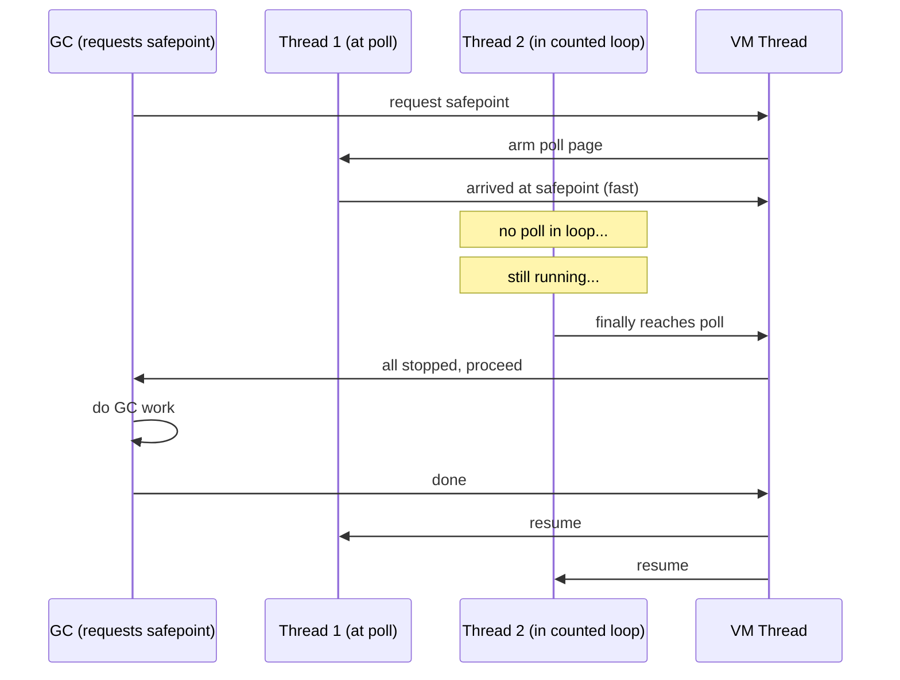

---

### 📶 Gradual Depth

**Level 1 - What it is:** A safepoint is a moment when all JVM threads are paused simultaneously. The JVM needs this for garbage collection, taking thread dumps, and other operations that require a consistent view of memory. TTSP is how long it takes for all threads to pause.

**Level 2 - How to use it:** Monitor TTSP with `-Xlog:safepoint` or JFR `jdk.SafepointBegin` events. High TTSP (>10ms) indicates threads stuck in code without safepoint polls. Use `-XX:LoopStripMiningIter=1000` (default since JDK 10) to bound TTSP from counted loops.

**Level 3 - How it works:** The JVM arms a memory page when it wants a safepoint. Threads executing compiled code periodically load from this page (the safepoint poll). When armed, the load traps (SIGSEGV), and the trap handler suspends the thread at a known-safe point. Counted loops in C2 code have polls only at the outer strip-mine boundary, limiting how long a thread can be unresponsive.

**Level 4 - Production mastery:** TTSP creates invisible tail latency: your application timer starts AFTER the safepoint completes, so TTSP adds latency that no application metric captures. A 50ms TTSP adds 50ms to EVERY request in flight during that safepoint. Diagnose with JFR correlation: safepoint events + latency spikes at same timestamp. Native code (JNI) is a TTSP blind spot - threads in native code do not respond to safepoint polls. They only check upon JNI call return. Long-running native operations (OpenSSL, BLAS) create unbounded TTSP.

---

### ⚙️ How It Works

**Phase 1 - Safepoint Request:** VM thread determines a safepoint is needed (GC trigger, deopt, thread dump). Arms the polling page.

**Phase 2 - Thread Convergence:** Each thread hits a safepoint poll (method return, back-edge, or explicit poll). Polls trap on armed page. Thread suspends at known-safe state.

**Phase 3 - Operation:** Once ALL threads are safe, the requested operation executes (GC mark, deopt, etc.).

**Phase 4 - Resume:** Operation complete. Polling page disarmed. Threads resume from their suspension points.

```text
TTSP sources ranked by severity:
  1. JNI native code (unbounded TTSP)
  2. Counted loops without strip mining
  3. Large array operations (System.arraycopy)
  4. GC thread competing for page table lock
  5. CPU migration/scheduling delays

Mitigation:
  1. Keep JNI calls short; poll on reentry
  2. -XX:LoopStripMiningIter (default 1000)
  3. No fix (intrinsic, bounded by size)
  4. Kernel tuning (rarely needed)
  5. Pin threads to cores (numactl)
```

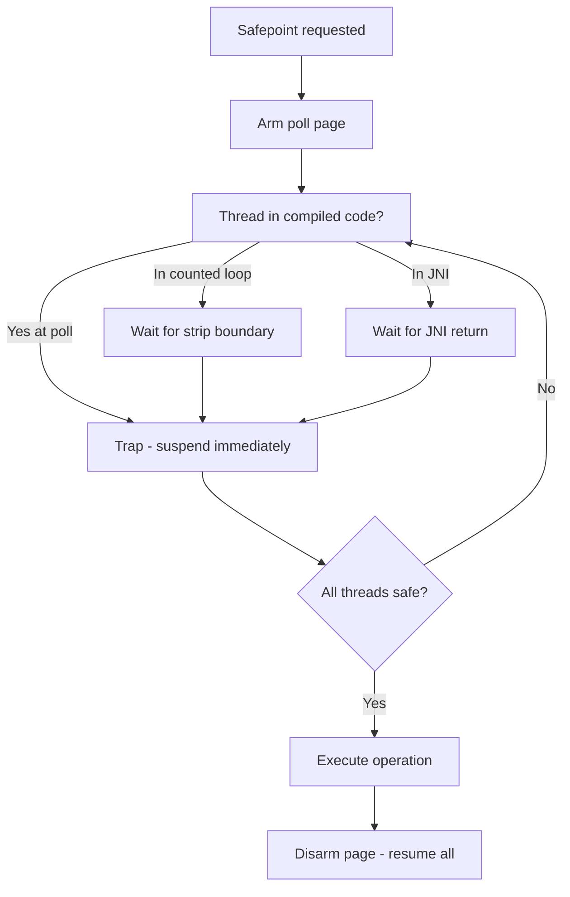

---

### 🚨 Failure Modes

**Failure 1 - Counted Loop TTSP Spike:**

**Symptom:** Periodic 50-200ms TTSP visible in safepoint log. Correlates with batch processing or sorting operations.

**Root cause:** C2-compiled counted loop without safepoint polls. Common in: `Arrays.sort()`, manual array processing, matrix operations.

**Diagnostic:**

```bash
# Enable safepoint logging:
-Xlog:safepoint=info
# Look for high "spin" or "block" times
# JFR: jdk.SafepointBegin with long duration
```

**Fix:** Ensure JDK 10+ (loop strip mining default). If still high, reduce loop bounds or restructure as uncounted loop (add opaque condition that prevents C2 from counting).

**Failure 2 - JNI TTSP Stall:**

**Symptom:** Unbounded TTSP (seconds). Thread dump shows one thread in native code. All other threads blocked at safepoint.

**Root cause:** Long-running JNI call (crypto operations, native compression, ML inference). Thread does not respond to safepoint until JNI call returns.

**Diagnostic:**

```bash
# Thread dump during TTSP shows:
# "thread X" in native (JNI) code
jcmd <pid> Thread.print | grep -A2 "native"
```

**Fix:** Break long JNI operations into smaller chunks that return to Java periodically. Or use `JNI_VERSION_21` cooperative suspension (JDK 21+). For crypto: use Java crypto providers instead of JNI OpenSSL where possible.

---

### 🔬 Production Reality

A typical latency investigation: service has p99=15ms but p99.9=180ms. No correlation to request size. JFR shows safepoint events with TTSP of 150-170ms every 60 seconds. The culprit: a background analytics thread running a `for(int i=0; i<10_000_000; i++)` loop compiled by C2 on JDK 8 (no strip mining). All 200 request-handling threads freeze for 150ms waiting for this one thread. Fix: upgrade to JDK 11+ (strip mining default) or refactor the loop. The key insight: this latency is INVISIBLE to application-level instrumentation because the timer itself is frozen during the safepoint.

---

### ⚖️ Trade-offs & Alternatives

| Aspect       | Global safepoint    | Thread-local handshake | No safepoint (native) |
| ------------ | ------------------- | ---------------------- | --------------------- |
| Scope        | ALL threads stop    | ONE thread targeted    | Thread unaware        |
| Use case     | GC, deopt, dump     | Biased lock revoke     | JNI native code       |
| TTSP impact  | Worst-case all      | None (per-thread)      | Delays safepoints     |
| Availability | All JDK versions    | JDK 10+ (default 17)   | Always                |
| Throughput   | Poll overhead ~0.1% | Similar                | No overhead           |

---

### ⚡ Decision Snap

**INVESTIGATE TTSP WHEN:**

- p99.9 latency unexplained by application logic.
- JFR shows SafepointBegin events >10ms.
- Thread dumps show threads "waiting for safepoint."

**MITIGATE TTSP WHEN:**

- JDK <10 (no strip mining). Upgrade immediately.
- JNI calls exceed 10ms (restructure to shorter calls).
- Background processing has tight counted loops.

**ACCEPT TTSP WHEN:**

- Values are <2ms consistently. This is normal JVM operation.

---

### ⚠️ Top Traps

| #   | Misconception                 | Reality                                                                                                          |
| --- | ----------------------------- | ---------------------------------------------------------------------------------------------------------------- |
| 1   | "Safepoint = GC pause"        | Safepoints serve many purposes: GC, deopt, thread dump, bias revoke. GC is just one trigger.                     |
| 2   | "My app metrics capture TTSP" | TTSP freezes your timer thread too. It is invisible to in-process instrumentation. External monitoring required. |
| 3   | "JDK 11+ has no TTSP issues"  | Strip mining bounds LOOP TTSP. JNI, large arraycopy, and kernel scheduling still cause spikes.                   |
| 4   | "More threads = faster TTSP"  | TTSP = MAX(single thread arrival). More threads increase probability of one slow thread existing.                |
| 5   | "Short methods avoid TTSP"    | TTSP is about reaching a poll, not method duration. A 1ns method returning through a long loop still delays.     |

---

### 🪜 Learning Ladder

**Prerequisites:**

- JVM-055 Safepoints - What Stops the World - basic safepoint concept
- JVM-079 JIT Code Cache and Deoptimization - understand deopt as safepoint trigger

**THIS:** JVM-080 Safepoint Bias and Time-To-Safepoint Latency

**Next steps:**

- JVM-093 The Billion-Dollar Safepoint Bug Pattern - specific catastrophic TTSP patterns
- JVM-095 JVM Fleet Observability - Key Metrics - TTSP as fleet-level metric

---

**The Surprising Truth:**

Profiling tools that sample at safepoints (jstack, VisualVM sampling) have "safepoint bias" - they ONLY see threads at safepoint-safe locations. Methods that spend time between safepoints (tight loops, native code) are systematically under-represented. A method consuming 40% of CPU in a counted loop appears as 0% in safepoint-biased profilers. This is why async-profiler (signal-based, not safepoint-biased) shows fundamentally different results. If your CPU profiler and async-profiler disagree significantly, safepoint bias is the reason.

**Further Reading:**

- JEP 312: Thread-Local Handshakes (JDK 10)
- Nitsan Wakart, "The OpenJDK/Safepoints" blog series
- JEP 376: ZGC: Concurrent Thread-Stack Processing (JDK 16) - reducing safepoint scope

**Revision Card:**

1. TTSP = time for slowest thread to reach safepoint. One slow thread blocks ALL. Invisible to app metrics.
2. Counted loops (C2) are blind spots. Strip mining (JDK 10+) bounds TTSP. JNI calls remain unbounded.
3. Use async-profiler (signal-based) to avoid safepoint bias. Safepoint-based profilers systematically miss hot loops.

**BAD:**

```java
// Tight counted loop without safepoint awareness
public long compute(int[] data) {
    long sum = 0;
    for (int i = 0; i < 100_000_000; i++) {
        sum += data[i % data.length];
    }
    return sum; // TTSP: 200ms+ on JDK 8
}
```

**GOOD:**

```java
// JDK 10+ with strip mining (automatic)
// Or manual safepoint-friendly structure:
public long compute(int[] data) {
    long sum = 0;
    int len = data.length;
    for (int i = 0; i < 100_000_000; i += len) {
        for (int j = 0; j < len && i+j < 100_000_000;
             j++) {
            sum += data[j];
        }
        // Safepoint poll at outer loop boundary
    }
    return sum; // TTSP bounded by inner loop
}
```

---

---

# JVM-081 NUMA-Aware GC and Memory Allocation

**TL;DR** - NUMA-aware GC allocates objects in memory local to the accessing CPU socket, reducing cross-socket memory latency from 100ns to 60ns and improving throughput on multi-socket servers.

---

### 🔥 Problem Statement

A 2-socket server runs a JVM with 128GB heap. Performance benchmarks show 30% less throughput than expected from doubling hardware. Memory profiling reveals constant cross-socket traffic: threads on socket 0 accessing objects allocated on socket 1's memory controller. Each cross-socket access adds 40-70ns latency (compared to local ~60ns). Without NUMA-aware allocation, the JVM treats all RAM as uniform - allocating from whichever free page is convenient - destroying memory locality that modern hardware relies on for peak performance.

---

### 📜 Historical Context

NUMA (Non-Uniform Memory Access) architectures became dominant with AMD Opteron (2003) and Intel Nehalem (2008). Early JVMs were NUMA-oblivious. G1GC added NUMA-aware allocation in JDK 14 (JEP 345). ZGC added NUMA support in JDK 15. Before these improvements, multi-socket JVM deployments routinely underperformed single-socket equivalents because memory access patterns were accidentally pessimized. The key insight was that Eden allocation (where most objects are born) should happen on the local NUMA node of the allocating thread.

---

### 🔩 First Principles

**CORE INVARIANTS:**

1. **Memory locality dominates:** Local memory access is 40-70ns faster than remote. For pointer-chasing workloads, this difference compounds multiplicatively across object graphs.
2. **Allocation determines locality:** Objects are accessed most frequently by the thread that created them. Allocating in the creator's local NUMA node maximizes locality for the common case.
3. **GC disrupts locality:** Object promotion (young->old) and compaction move objects without considering NUMA affinity. Long-lived objects may end up on any node.

**DERIVED DESIGN:**

These invariants force: (1) per-NUMA-node Eden spaces (threads allocate locally), (2) NUMA-aware page allocation from the OS, (3) accepting that old-gen objects lose locality (diminishing returns of tracking after promotion).

**THE TRADE-OFF:**

**Gain:** 10-30% throughput improvement on multi-socket systems. Reduced memory bus contention. Better CPU cache utilization.

**Cost:** Complexity in heap management. Memory imbalance if threads are unevenly distributed. Not beneficial on single-socket systems.

---

### 🧠 Mental Model

> NUMA is like a factory with two workshops (sockets) connected by a narrow corridor (interconnect). Each workshop has its own supply room (local memory). Workers (threads) get materials fastest from their own supply room. Going to the other workshop's supply room means walking down the corridor - 40% slower. NUMA-aware allocation ensures each worker gets raw materials (new objects) from their own supply room.

- "Workshops" -> CPU sockets with local memory controllers
- "Supply room" -> local DRAM attached to that socket
- "Narrow corridor" -> inter-socket interconnect (QPI/UPI)
- "Workers" -> application threads pinned to a socket
- "Raw materials from local" -> NUMA-local allocation

**Where this analogy breaks down:** in a real factory, you can choose which workshop handles each task. In JVM, thread scheduling is OS-controlled (unless pinned). Objects promoted to old gen may migrate to any node during compaction, and there is no ongoing affinity tracking for old objects.

---

### 🧩 Components

- **NUMA nodes:** OS-visible memory domains. Each socket typically has one node. Visible via `numactl --hardware`.
- **Per-node Eden:** G1 allocates separate Eden regions per NUMA node. Each thread's TLAB comes from its local node's Eden.
- **Interleaved old gen:** Old gen pages are interleaved across nodes (compromise - no single node bears all old-gen pressure).
- **OS page placement:** `mmap` with NUMA policy. JVM uses `mbind()` or `set_mempolicy()` to request local allocation.
- **Thread affinity:** Not managed by JVM. OS scheduler determines thread-to-node mapping. `numactl` or `taskset` can pin.

```text
2-Socket NUMA topology:
  Socket 0          Socket 1
  [CPU cores 0-15]  [CPU cores 16-31]
  [64GB local RAM]  [64GB local RAM]
        |_____interconnect_____|

  Access latency:
    Local:   ~60ns
    Remote:  ~100ns (1.7x slower)

  G1 NUMA-aware Eden:
    Node 0 Eden regions: R1, R5, R9...
    Node 1 Eden regions: R2, R6, R10...
    Thread on node 0 -> TLAB from R1/R5/R9
```

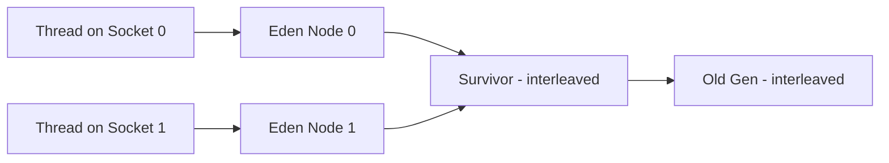

---

### 📶 Gradual Depth

**Level 1 - What it is:** On servers with multiple CPU sockets, each socket has its own memory. Accessing the other socket's memory is slower. NUMA-aware GC ensures new objects are allocated in memory close to the thread that creates them.

**Level 2 - How to use it:** Enable with `-XX:+UseNUMA` (G1, JDK 14+). Verify topology with `numactl --hardware`. Monitor with `numastat -p <pid>` to check local vs remote allocation ratios.

**Level 3 - How it works:** G1 creates per-NUMA-node Eden regions. When a thread needs a new TLAB, it gets one from a region on its local node. Young GC survivor and old gen use interleaved allocation (spread evenly). This optimizes for the common case: newly-allocated objects are accessed by their creator thread.

**Level 4 - Production mastery:** NUMA effects compound with heap size. A 256GB heap across 4 NUMA nodes can show 40% throughput difference between NUMA-aware and oblivious modes. However, benefits disappear for workloads with high object sharing between threads (e.g., work-stealing queues where any thread processes any task). Monitor `numastat` for "other_node" allocations - high values indicate NUMA locality failures from thread migration or shared-object patterns.

---

### ⚙️ How It Works

**Phase 1 - Node Discovery:** At startup, JVM queries OS for NUMA topology (number of nodes, CPU-to-node mapping).

**Phase 2 - Eden Partitioning:** G1 assigns Eden regions to NUMA nodes proportionally. Each node gets regions allocated from its local memory.

**Phase 3 - TLAB Allocation:** Thread requests TLAB. JVM determines thread's current NUMA node (via `getcpu()` or cached affinity). Allocates TLAB from that node's Eden region.

**Phase 4 - Collection:** Young GC collects all Eden regions regardless of node. Survivor placement is interleaved. Old gen promotion is node-agnostic.

```text
Allocation path (NUMA-aware):
  Thread.allocate()
    -> determine_numa_node(current_thread)
    -> get_tlab_from(node_N_eden_region)
    -> bump_pointer_allocate_in_tlab()

  Fallback (TLAB exhausted):
    -> refill_tlab_from_node_N_eden()
    -> if node_N full: steal from other node
```

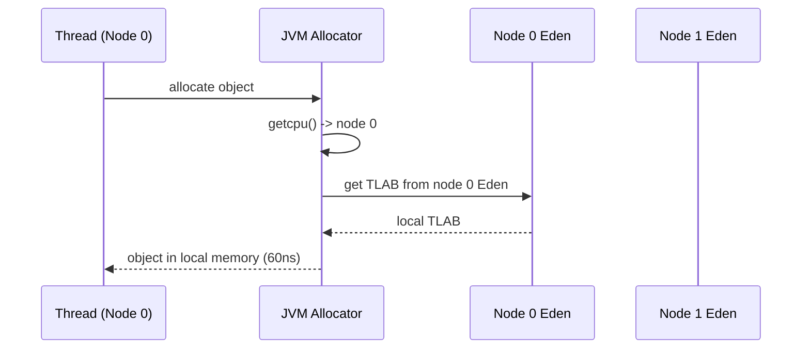

---

### 🚨 Failure Modes

**Failure 1 - Thread Migration Destroying Locality:**

**Symptom:** High "other_node" in `numastat`. Performance degrades despite `-XX:+UseNUMA` enabled.

**Root cause:** OS scheduler migrates threads between NUMA nodes. Thread allocated objects on node 0, migrated to node 1, now all accesses are remote.

**Diagnostic:**

```bash
numastat -p <pid>
# Check "other_node" column
# If > 30% of "local_node": locality is poor
```

**Fix:** Pin threads to NUMA nodes with `numactl --cpunodebind=0 --membind=0` or use processor affinity in the application's thread pool configuration.

**Failure 2 - Memory Imbalance:**

**Symptom:** One NUMA node exhausted (OOM on that node), other has free memory. Allocation stalls despite total free memory available.

**Root cause:** Uneven thread distribution. Most threads on node 0 exhaust node 0's Eden while node 1 is idle.

**Diagnostic:**

```bash
numastat -m | grep "MemFree"
# If one node has 0 free while other has GB free:
# memory imbalance
```

**Fix:** Balance thread pool across nodes. Or let JVM steal from remote node when local is exhausted (default behavior).

---

### 🔬 Production Reality

A common pattern in database-like Java services on 2-socket servers: enabling `-XX:+UseNUMA` on a 128GB heap G1 JVM shows 15-25% throughput improvement in benchmarks. However, the improvement varies dramatically by workload. Services with thread-local processing (request-per-thread, no shared state) see maximum benefit. Services with shared caches (ConcurrentHashMap accessed by all threads) see minimal benefit because cache entries are accessed from both sockets regardless of where they were allocated. The key decision is not just enabling NUMA but structuring data access patterns to exploit locality.

---

### ⚖️ Trade-offs & Alternatives

| Aspect         | NUMA-aware GC      | Single-socket         | Process pinning     |
| -------------- | ------------------ | --------------------- | ------------------- |
| Throughput     | +10-30% multi-sock | Baseline              | +15-20% (per-node)  |
| Complexity     | JVM flag only      | None                  | Infra + deploy      |
| Use case       | Multi-socket JVM   | Cloud (single socket) | Max perf per node   |
| GC interaction | G1/ZGC aware       | N/A                   | Separate JVM/node   |
| Flexibility    | Auto-balancing     | N/A                   | Static partitioning |

---

### ⚡ Decision Snap

**ENABLE NUMA-AWARE GC WHEN:**

- Running on multi-socket hardware (2+ CPU sockets).
- Workload has thread-local access patterns.
- Heap > 32GB across multiple NUMA nodes.

**SKIP NUMA TUNING WHEN:**

- Single-socket system (cloud VMs are almost always single-socket).
- Shared-cache workload where all threads access same data.

**PREFER PROCESS PINNING WHEN:**

- Maximum isolation needed. Run separate JVM per NUMA node with `numactl`.

---

### ⚠️ Top Traps

| #   | Misconception                     | Reality                                                                                                        |
| --- | --------------------------------- | -------------------------------------------------------------------------------------------------------------- |
| 1   | "Cloud VMs need NUMA tuning"      | Most cloud VMs are single-socket. NUMA tuning has zero effect. Only relevant for bare-metal or very large VMs. |
| 2   | "+UseNUMA fixes all locality"     | Only Eden allocation is NUMA-aware. Old gen is interleaved. Shared objects have no locality guarantee.         |
| 3   | "More sockets = linear scaling"   | Without NUMA awareness, 2 sockets can be SLOWER than 1 due to remote access penalties.                         |
| 4   | "JVM handles thread affinity"     | JVM does not pin threads. OS scheduler migrates freely. Use numactl or application-level pinning.              |
| 5   | "NUMA only matters for big heaps" | Even 8GB heaps on 2-socket show measurable difference. The latency penalty is per-access, not per-GB.          |

---

### 🪜 Learning Ladder

**Prerequisites:**

- JVM-056 TLAB - Thread-Local Allocation Buffers - NUMA-aware allocation extends TLAB concept to per-node
- JVM-077 G1GC Remembered Sets and Card Tables - understand G1 region model that NUMA partitions

**THIS:** JVM-081 NUMA-Aware GC and Memory Allocation

**Next steps:**

- JVM-085 GC Ergonomics Failures at Scale - NUMA imbalance as ergonomics failure mode
- JVM-095 JVM Fleet Observability - Key Metrics - NUMA metrics in fleet monitoring

---

**The Surprising Truth:**

On modern cloud infrastructure, NUMA awareness is almost irrelevant. AWS, GCP, and Azure instance types below 48 vCPUs are typically single-socket. You only encounter multi-socket NUMA on bare-metal instances (like AWS `metal` types) or very large VM sizes (96+ vCPUs). Teams spending time on NUMA tuning in the cloud are optimizing something that does not exist in their environment. The correct first step is always `numactl --hardware` - if it shows one node, NUMA tuning is a no-op.

**Further Reading:**

- JEP 345: NUMA-Aware Memory Allocation for G1 (JDK 14)
- Drepper, "What Every Programmer Should Know About Memory" (2007) - NUMA architecture fundamentals
- Linux kernel docs: `Documentation/admin-guide/mm/numa_memory_policy.rst`

**Revision Card:**

1. NUMA-aware GC: `-XX:+UseNUMA` (G1/ZGC JDK 14+). Allocates Eden locally to thread's NUMA node.
2. Only matters on multi-socket hardware. Cloud VMs are usually single-socket (check with `numactl --hardware`).
3. Monitor with `numastat -p <pid>`. High "other_node" = locality failure from thread migration.

**BAD:**

```bash
# Assuming NUMA tuning helps on cloud VM
# (single-socket, 16 vCPU instance)
java -XX:+UseNUMA -Xmx32g -jar service.jar
# numactl --hardware shows: 1 node
# UseNUMA has zero effect. Wasted effort.
```

**GOOD:**

```bash
# First verify NUMA topology exists
numactl --hardware
# node 0: cpus: 0-15, size: 64GB
# node 1: cpus: 16-31, size: 64GB
# Multi-socket confirmed -> enable NUMA
java -XX:+UseNUMA -XX:+UseG1GC \
  -Xmx120g -jar service.jar
# Verify: numastat -p <pid> (local > 80%)
```

---

---

# JVM-082 Biased Locking Removed JDK 15 and Thin Locks

**TL;DR** - Biased locking (free uncontended lock acquisition) was removed in JDK 15 because its complexity outweighed benefits on modern hardware; thin locks now handle the uncontended case efficiently.

---

### 🔥 Problem Statement

After upgrading from JDK 11 to JDK 17, a synchronized-heavy service shows 2-3% throughput regression in microbenchmarks. Investigation reveals biased locking was disabled (JEP 374). The team does not understand what replaced it and whether the regression is real or benchmark-specific. Understanding the lock evolution (biased -> thin -> fat) is essential for diagnosing synchronization performance and deciding whether to use `synchronized` vs `java.util.concurrent` locks in performance-critical code.

---

### 📜 Historical Context

Biased locking was introduced in JDK 6 (2006) based on research showing that most locks are acquired by only one thread (uncontended). It eliminated the CAS (Compare-And-Swap) instruction from uncontended lock acquisition - saving ~20ns per lock. By 2020, hardware CAS had become much faster (3-5ns), and biased locking's complexity (safepoint-based revocation, thread-specific bias tracking) added maintenance burden disproportionate to its benefit. JEP 374 (JDK 15) deprecated it; JEP 374 removed it in JDK 15+.

---

### 🔩 First Principles

**CORE INVARIANTS:**

1. **Lock states are progressive:** Unlocked -> thin (CAS) -> fat (OS mutex). Each escalation is more expensive but handles more contention.
2. **Uncontended is the common case:** In typical applications, 90%+ of lock acquisitions have no contention. The fast path must be extremely cheap.
3. **CAS is the modern uncontended fast path:** On current hardware, CAS costs 3-5ns. This is fast enough to make biased locking's additional complexity unjustifiable.

**DERIVED DESIGN:**

These invariants mean: (1) thin locking (single CAS) is the new uncontended fast path, (2) fat locking (OS mutex + park/unpark) handles real contention, (3) lock coarsening and elision by JIT handle synthetic cases (locks that could be eliminated entirely).

**THE TRADE-OFF:**

**Gain:** Simpler JVM internals (removed ~1000 lines of complex code). Faster safepoints (no bias revocation). Predictable lock performance.

**Cost:** 3-5ns additional per uncontended lock acquisition (CAS vs no-op). Negligible in practice except synthetic benchmarks.

---

### 🧠 Mental Model

> Lock states are like door security levels. Unlocked = open door (no cost). Thin lock = keycard swipe (CAS - fast, 3-5ns, works if nobody else is swiping simultaneously). Fat lock = security guard (OS mutex - expensive, involves kernel, but handles queues of people waiting). Biased locking was a "personal badge" that skipped the swipe entirely for the regular occupant - eliminated in favor of faster keycards.

- "Open door" -> unlocked (no owner)
- "Keycard swipe" -> thin lock (CAS on object header)
- "Security guard" -> fat lock (OS mutex, thread parking)
- "Personal badge" -> biased lock (removed JDK 15+)
- "Badge revocation" -> safepoint-based debiasing (expensive)

**Where this analogy breaks down:** real security systems do not "inflate" from keycard to guard dynamically. JVM lock inflation happens at runtime based on observed contention. Also, thin locks can be "deflated" back to unlocked when released - real security does not downgrade.

---

### 🧩 Components

- **Object header mark word:** 64 bits encoding lock state. Bits indicate: unlocked, thin-locked (owner thread ID), or fat-locked (pointer to ObjectMonitor).
- **Thin lock (CAS):** Thread attempts CAS on mark word (unlocked -> own thread ID). If successful: acquired. If CAS fails: contention detected, inflate to fat.
- **Fat lock (ObjectMonitor):** Kernel-backed mutex with wait set, entry set, and owner tracking. Threads park via `pthread_mutex_lock` / `futex`.
- **Lock inflation:** Transition from thin to fat when contention detected. Allocates ObjectMonitor from global pool.
- **Lock deflation:** G1/ZGC deflate idle fat locks back to thin during GC pauses (reclaim ObjectMonitor memory).
- **Lock coarsening (JIT):** C2 merges adjacent synchronized blocks on same object into one (eliminates redundant lock/unlock).
- **Lock elision (JIT):** C2 removes locks entirely when escape analysis proves the object is thread-local.

```text
Object Header Mark Word (64-bit):
  Unlocked:    [hash:31][age:4][0][01]
  Thin locked: [owner_thread:54][00]
  Fat locked:  [monitor_ptr:62][10]
  GC marked:   [...][11]

  Lock acquisition (thin):
    CAS(mark_word, expected=unlocked, new=myID)
    Success -> acquired (3-5ns)
    Failure -> inflate to ObjectMonitor
```

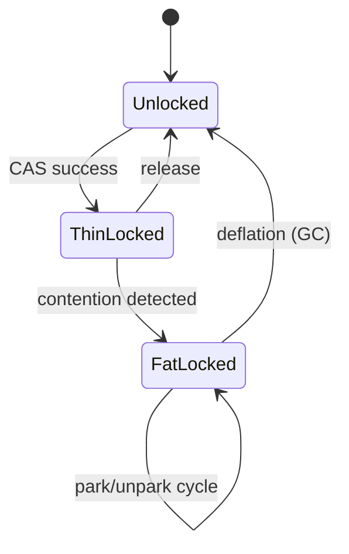

---

### 📶 Gradual Depth

**Level 1 - What it is:** When you use `synchronized` in Java, the JVM uses a lock mechanism stored in the object header. The lock starts thin (fast, single CPU instruction) and inflates to a fat lock (OS-level mutex) only when threads actually compete for it.

**Level 2 - How to use it:** Prefer `synchronized` for simple cases. Use `java.util.concurrent` locks (ReentrantLock) when you need tryLock, interruptibility, or multiple condition variables. JDK 15+ removes biased locking - do not add `-XX:+UseBiasedLocking` (it does nothing).

**Level 3 - How it works:** Thin lock: thread writes its ID into object header via CAS (atomic compare-and-swap). If another thread attempts CAS on the same object simultaneously, CAS fails. The JVM then inflates the lock: allocates an ObjectMonitor structure, transitions to OS-level mutex, and parks the losing thread.

**Level 4 - Production mastery:** Lock contention is diagnosed via JFR `jdk.JavaMonitorEnter` events (shows which locks have highest contention and wait times). High contention on a single object indicates a scalability bottleneck - restructure with striped locks, concurrent collections, or lock-free algorithms. Lock inflation/deflation cycles (visible in `-Xlog:monitorinflation`) indicate intermittent contention - consider preemptively using fat locks via ReentrantLock if pattern is stable.

---

### ⚙️ How It Works

**Phase 1 - Uncontended Acquisition (thin):**

Thread attempts CAS on object's mark word. Success: thread owns the lock. Cost: ~3-5ns (single atomic instruction).

**Phase 2 - Contention Detection:**

Second thread attempts CAS, fails (mark word already holds other thread's ID). JVM decides to inflate.

**Phase 3 - Inflation:**

Allocate ObjectMonitor. Copy mark word content. Set mark word to point to ObjectMonitor. Contending thread enters ObjectMonitor's entry list and parks (OS-level wait).

**Phase 4 - Notification and Release:**

Owning thread releases lock. ObjectMonitor unparks one waiting thread. If no waiters for extended period, GC can deflate back to thin.

```text
Lock acquisition flow:
  synchronized(obj) {
    1. Read obj.markWord
    2. If unlocked: CAS(markWord, myThreadID)
       -> Success: done (3-5ns)
    3. If myThreadID already: reentrant (inc)
    4. If other thread: inflate -> park
       -> Wait for owner to release (us-ms)
  }
```

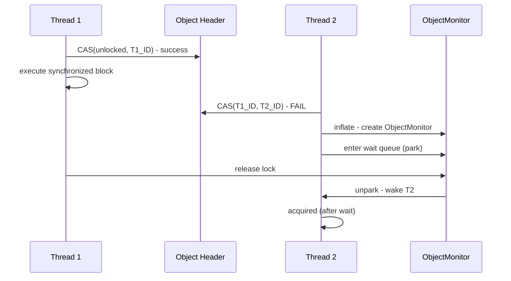

---

### 🚨 Failure Modes

**Failure 1 - Lock Convoy:**

**Symptom:** Throughput collapses despite low CPU usage. Many threads parked on one monitor. One thread at a time executes the critical section.

**Root cause:** All threads serialize on a single fat lock. Common with shared mutable state (single HashMap, shared counter, global logger lock).

**Diagnostic:**

```bash
# JFR shows high contention on one monitor:
jcmd <pid> JFR.dump filename=locks.jfr
# In JMC: Java Monitor Blocked events
# Look for monitor with highest total blocked time
```

**Fix:** Reduce critical section size. Use striped locking (ConcurrentHashMap). Replace shared mutable state with thread-local accumulation + periodic merge.

**Failure 2 - Inflation/Deflation Churn:**

**Symptom:** Excessive GC pause time spent on monitor deflation. `-Xlog:monitorinflation` shows rapid inflate/deflate cycles.

**Root cause:** Bursty contention pattern. Lock inflates during burst, deflates during quiet, re-inflates next burst.

**Diagnostic:**

```bash
-Xlog:monitorinflation=info
# Look for repeated inflate/deflate of same object
# High count = churn
```

**Fix:** Use `ReentrantLock` for known-contended locks (always "fat," no inflation overhead). Or increase deflation lag (`-XX:MonitorDeflationMax`).

---

### 🔬 Production Reality

After JDK 15 upgrade removing biased locking: most services see 0-1% throughput change (within measurement noise). Services with millions of uncontended synchronization operations per second on single-threaded-access objects (e.g., StringBuffer in single-threaded context, old-style synchronized collections) may see 2-5% regression in microbenchmarks - but this is an argument for removing those unnecessary synchronizations, not for restoring biased locking. The net effect is cleaner JVM internals and faster safepoints (bias revocation required global safepoints that added unpredictable latency).

---

### ⚖️ Trade-offs & Alternatives

| Aspect           | synchronized (thin) | ReentrantLock     | StampedLock         |
| ---------------- | ------------------- | ----------------- | ------------------- |
| Uncontended cost | 3-5ns (CAS)         | 5-10ns (CAS+more) | 3-5ns (optimistic)  |
| Contended        | OS mutex (park)     | OS mutex (park)   | Retry or park       |
| Reentrant        | Yes (builtin)       | Yes               | No                  |
| tryLock          | No                  | Yes               | Yes                 |
| Read/write split | No                  | Via RWLock        | Yes (optimistic rd) |
| JIT optimization | Coarsening, elision | Limited           | None                |

---

### ⚡ Decision Snap

**USE synchronized WHEN:**

- Simple mutual exclusion, no timeout/interrupt needed.
- JIT can coarsen or elide (thread-local objects).
- Code clarity preferred over manual lock management.

**USE ReentrantLock WHEN:**

- Need tryLock, lockInterruptibly, or multiple conditions.
- Known contention (avoid inflation overhead).
- Need fairness guarantee (FIFO order).

**USE StampedLock/lock-free WHEN:**

- Read-heavy workload (optimistic reads avoid locking entirely).
- Maximum throughput critical path.

---

### ⚠️ Top Traps

| #   | Misconception                              | Reality                                                                                                             |
| --- | ------------------------------------------ | ------------------------------------------------------------------------------------------------------------------- |
| 1   | "JDK 15+ is slower for synchronized"       | Biased lock removal costs 3-5ns per uncontended acquire. Negligible except synthetic benchmarks.                    |
| 2   | "synchronized is always slower than j.u.c" | JIT can elide and coarsen synchronized. ReentrantLock cannot be optimized the same way.                             |
| 3   | "Fat lock = performance disaster"          | Fat lock is only expensive when threads actually park. Uncontended fat lock is still fast (CAS + check).            |
| 4   | "-XX:+UseBiasedLocking works on JDK 17"    | Flag is ignored (no-op). Biased locking code is removed. Do not rely on it.                                         |
| 5   | "More threads = more locking overhead"     | Overhead only increases with CONTENTION (concurrent access to same lock). Many threads with separate locks is fine. |

---

### 🪜 Learning Ladder

**Prerequisites:**

- JVM-055 Safepoints - What Stops the World - biased lock revocation required safepoints (reason for removal)
- JVM-052 JIT Compilation Tiers (C1 and C2) - JIT lock coarsening and elision

**THIS:** JVM-082 Biased Locking Removed JDK 15 and Thin Locks

**Next steps:**

- JVM-080 Safepoint Bias and Time-To-Safepoint Latency - removing biased locking improved TTSP
- JVM-091 Project Loom and Virtual Thread Scheduling - virtual threads interact differently with monitors

---

**The Surprising Truth:**

Lock elision by the JIT compiler means many `synchronized` blocks have ZERO cost in compiled code. If escape analysis proves the locked object is thread-local (never escapes the method), C2 removes the lock entirely. A `synchronized(new Object())` costs nothing after JIT. This means "always use synchronized for safety" has lower cost than people assume - the JIT removes it when provably unnecessary. However, `ReentrantLock` cannot be elided by the JIT, making `synchronized` potentially FASTER than explicit locks for thread-local patterns.

**Further Reading:**

- JEP 374: Deprecate and Disable Biased Locking (JDK 15)
- David Dice, "Biased Locking in HotSpot" - original design rationale
- Aleksey Shipilev, "Java Objects Inside Out" - mark word layout and lock states

**Revision Card:**

1. Lock states: unlocked -> thin (CAS, 3-5ns) -> fat (OS mutex, us-ms). Progressive escalation on contention.
2. Biased locking removed JDK 15 (JEP 374). CAS on modern hardware (3ns) makes bias complexity unjustified.
3. JIT elides locks on thread-local objects. `synchronized` can be ZERO cost after compilation.

**BAD:**

```java
// Forcing biased locking on JDK 17+ (no-op)
java -XX:+UseBiasedLocking -jar app.jar
// Flag ignored. No effect. False confidence.
// Also: using StringBuffer (synchronized)
// in single-threaded context
StringBuffer sb = new StringBuffer();
for (int i = 0; i < 1000; i++) {
    sb.append(i); // Unnecessary sync overhead
}
```

**GOOD:**

```java
// Use StringBuilder (no synchronization)
StringBuilder sb = new StringBuilder();
for (int i = 0; i < 1000; i++) {
    sb.append(i); // No lock, no CAS, no cost
}
// For shared state: choose lock type by need
// Simple exclusion:
synchronized (sharedState) { /* ... */ }
// Need timeout:
if (lock.tryLock(100, MILLISECONDS)) { }
```

---

---

# JVM-083 JVM Crash Analysis (hs_err_pid Files)

**TL;DR** - JVM crashes generate an hs_err_pid file containing crash location, register state, stack traces, and environment - the primary forensic artifact for diagnosing native-level failures.

---

### 🔥 Problem Statement

A production JVM process vanishes. No OOM error in logs, no graceful shutdown. The container restart count increments. Checking the filesystem reveals `hs_err_pid12345.log` - a 50KB crash dump that the team has never read before. It contains assembly code, register values, memory maps, and cryptic thread states. Without the ability to interpret this file, the crash remains unexplained, and the team resorts to "just restart it" without understanding whether the root cause is a JVM bug, native library corruption, or hardware failure.

---

### 📜 Historical Context

The `hs_err_pid` file format has existed since HotSpot's early days (late 1990s). "hs" stands for "HotSpot." The file format has evolved to include more information: thread stacks, memory maps, loaded shared libraries, GC state, compiler state, and environment variables. Before containerization, these files were simple to find (working directory). In container environments, they often vanish with the container unless explicitly volume-mounted - making crash diagnosis significantly harder.

---

### 🔩 First Principles

**CORE INVARIANTS:**

1. **Crash = JVM-internal failure:** A SIGSEGV/SIGBUS in JVM code or JNI code triggers the crash handler. Pure Java code cannot crash the JVM (it throws exceptions).
2. **Error handler is best-effort:** The crash handler runs in a corrupted process. It may itself crash during report generation. Partial reports are common.
3. **First section is most reliable:** The further down the hs_err file, the less reliable the data (may be corrupted). Always start reading from the top.

**DERIVED DESIGN:**

The crash report prioritizes information by reliability: crash location and signal first, then thread stacks, then global state. The design assumes the crash handler itself may fail partway through writing.

**THE TRADE-OFF:**

**Gain:** Forensic evidence of exactly what went wrong at the native level. Often sufficient to identify JVM bugs, JNI issues, or hardware failures.

**Cost:** None at runtime (handler only activates on crash). File can be large (50-200KB). Requires native debugging skills to interpret fully.

---

### 🧠 Mental Model

> The hs_err file is a plane's black box recording. When the plane (JVM) crashes, the black box captures the last known state: altitude (heap), speed (thread states), engine readings (GC/JIT state), and cockpit voice (crash stack trace). The first few seconds of recording are most reliable. Later sections may be garbled by the crash itself.

- "Black box" -> hs_err_pid file (post-mortem evidence)
- "Altitude/speed" -> memory state, thread dumps
- "Engine readings" -> GC and JIT compiler state
- "Cockpit voice" -> stack trace of crashing thread
- "First seconds most reliable" -> read top-down

**Where this analogy breaks down:** real black boxes survive intact. The hs_err handler runs inside the crashing process and may produce incomplete output. Also, you can generate multiple crash files from repeated crashes (pattern analysis possible), unlike planes.

---

### 🧩 Components

- **Header:** JVM version, crash signal (SIGSEGV), crash address, problematic frame.
- **Thread section:** Full native + Java stack of crashing thread. Register state. Thread-local info.
- **Other threads:** Stack traces of all threads at crash time. Often reveals what OTHER threads were doing when one crashed.
- **Memory map:** All loaded shared libraries (.so/.dll) with addresses. Essential for matching crash address to library.
- **VM state:** Heap summary, GC state, compiler state, ongoing compilations. Identifies if GC was active.
- **Environment:** System info, JVM flags, ulimits, CPU info.

```text
hs_err_pid file structure (top to bottom):
  [HEADER: signal, crash address, frame]  <- most reliable
  [THREAD: crashing thread full stack]    <- critical
  [REGISTERS: rax, rbx, rsp, rip...]  <- native debug
  [STACK MEMORY: raw bytes around crash]  <- advanced
  [OTHER THREADS: all thread stacks]      <- context
  [MEMORY MAP: loaded libraries+addrs]    <- library ID
  [VM STATE: heap, GC, compiler]          <- JVM context
  [ENVIRONMENT: flags, OS, CPU]           <- repro info
```

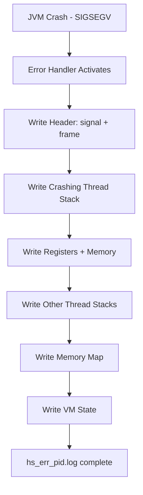

---

### 📶 Gradual Depth

**Level 1 - What it is:** When the JVM crashes (not an OutOfMemoryError - a genuine native crash), it writes a diagnostic file called `hs_err_pid<PID>.log`. This file contains evidence about what caused the crash and is essential for diagnosis.

**Level 2 - How to use it:** Find the file in the working directory or path specified by `-XX:ErrorFile=/path/hs_err_pid%p.log`. Open it. Read the first 20 lines: the signal, crash address, and problematic frame tell you 80% of what you need. The "problematic frame" identifies if the crash is in JVM code (V), compiled Java (J), native library (C), or JIT compiler.

**Level 3 - How it works:** When a fatal signal (SIGSEGV, SIGBUS, SIGFPE) arrives, the JVM's signal handler intercepts it. Instead of immediately dying, it writes as much diagnostic information as possible: the crashing thread's stack (both native and Java frames), register state, all other threads, loaded libraries, and JVM internal state. Then it terminates.

**Level 4 - Production mastery:** Recurring crashes with same "problematic frame" in a JNI library point to native code bugs. Crashes during "concurrent mark" (VM state: "at safepoint, GC active") suggest GC bugs (upgrade JVM). Crashes with corrupted stack traces suggest stack overflow or wild pointer. Cross-reference crash address with memory map to identify the library. For reproducible crashes: add `-XX:+CreateCoredumpOnCrash` for full core dump analysis with gdb/lldb.

---

### ⚙️ How It Works

**Phase 1 - Signal Reception:** OS delivers fatal signal (SIGSEGV at address 0x0). JVM's signal handler catches it.

**Phase 2 - Context Capture:** Handler saves register state, identifies crashing thread, determines frame type (V=VM, J=Java compiled, C=native, j=interpreted).

**Phase 3 - Report Generation:** Handler writes sections top-to-bottom. Each section is independently flushed to disk (partial reports survive if handler itself crashes).

**Phase 4 - Termination:** After writing, JVM calls `abort()` or allows the signal to propagate for core dump generation.

```text
Key fields in header (first 10 lines):

# A fatal error has been detected by the JRE:
#
# SIGSEGV (0xb) at pc=0x7f3b2c001234,
#   pid=12345, tid=67890
#
# JRE version: OpenJDK 17.0.8+7
# Problematic frame:
# C  [libcrypto.so.1.1+0x123456]  EVP_Cipher

Frame type codes:
  V = VM code (JVM bug likely)
  J = Compiled Java (JIT bug or unsafe)
  C = Native library (JNI/library bug)
  j = Interpreted Java (very rare)
```

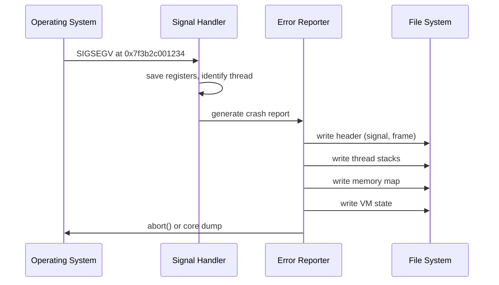

---

### 🚨 Failure Modes

**Failure 1 - JNI Library Crash:**

**Symptom:** Crash in `C [libxyz.so+0xNNN]`. Recurring at same offset. Different thread each time.

**Root cause:** Bug in native library (buffer overflow, use-after-free, null dereference in C code).

**Diagnostic:**

```bash
# Extract library and offset from hs_err:
grep "Problematic frame" hs_err_pid*.log
# C  [libcrypto.so.1.1+0x4a2b3]  EVP_Update
# Use addr2line to get source location:
addr2line -e /usr/lib/libcrypto.so.1.1 0x4a2b3
```

**Fix:** Update the native library. If custom JNI: review C code for memory safety. Consider Java alternatives to eliminate JNI dependency.

**Failure 2 - JIT Compiler Bug:**

**Symptom:** Crash in `J` (compiled Java frame) or `V [libjvm.so]` during compilation. Occurs only after warmup.

**Root cause:** C2 generates incorrect machine code for specific method. Triggered by particular input pattern.

**Diagnostic:**

```bash
# Identify compiled method from hs_err:
grep "J " hs_err_pid*.log | head -5
# J  com.app.Service.process(LData;)V
# Exclude method from C2:
-XX:CompileCommand=exclude,com.app.Service::process
```

**Fix:** Exclude method from C2 compilation as workaround. Report JVM bug with reproducer. Upgrade JDK (JIT bugs are fixed frequently).

---

### 🔬 Production Reality

In containerized environments, the most common crash scenario is: JNI library (OpenSSL, snappy, zstd) compiled against one glibc version running in a container with a different version. The crash manifests as SIGSEGV in the native library during specific operations. The hs_err identifies the library precisely. Fix: rebuild container image with matching native library versions, or use pure-Java alternatives (e.g., Java's built-in TLS instead of OpenSSL via tcnative). Second most common: `-Xss` too low causing stack overflow that appears as SIGSEGV (stack guard page hit).

---

### ⚖️ Trade-offs & Alternatives

| Aspect         | hs_err_pid        | Core dump (gdb)   | JFR pre-crash     |
| -------------- | ----------------- | ----------------- | ----------------- |
| Size           | 50-200KB          | Heap-sized (GB)   | ~500MB (ring buf) |
| Always avail   | Yes (default)     | Needs ulimit -c   | Needs -XX:Start.. |
| Detail level   | Summary + stacks  | Full memory state | Events timeline   |
| Skills needed  | JVM + native      | gdb/lldb expert   | JFR/JMC familiar  |
| Container-safe | Volume mount path | Large, slow dump  | Volume mount      |

---

### ⚡ Decision Snap

**READ hs_err FIRST WHEN:**

- JVM process disappeared without graceful shutdown.
- Container OOM killed but no java.lang.OutOfMemoryError in app logs.
- Signal-based crash (SIGSEGV, SIGBUS, SIGABRT).

**ADD CORE DUMP WHEN:**

- hs_err alone is insufficient (need full memory state).
- Crash is reproducible and you have gdb/lldb skills.

**ADD JFR WHEN:**

- Need timeline leading up to crash (what happened before).
- Crash is intermittent and you need patterns.

---

### ⚠️ Top Traps

| #   | Misconception                           | Reality                                                                                      |
| --- | --------------------------------------- | -------------------------------------------------------------------------------------------- |
| 1   | "Java cannot crash the JVM"             | Pure Java cannot. But JNI, Unsafe, and JVM bugs can and do crash the process.                |
| 2   | "hs_err means my Java code is wrong"    | Usually means JVM bug or native library issue. Java code causes exceptions, not crashes.     |
| 3   | "OOM killed = hs_err generated"         | Linux OOM killer sends SIGKILL (uncatchable). NO hs_err generated. Check `dmesg` instead.    |
| 4   | "hs_err is always in working directory" | May be in /tmp, or suppressed in containers. Use `-XX:ErrorFile=/known/path/hs_err_%p.log`.  |
| 5   | "Crash = must restart and hope"         | Most crashes are deterministic. Same input + same JNI library = same crash. Find root cause. |

---

### 🪜 Learning Ladder

**Prerequisites:**

- JVM-041 jcmd - The Swiss Army Knife - jcmd for thread dumps and other diagnostics before crash
- JVM-079 JIT Code Cache and Deoptimization - understand JIT-generated code that may crash

**THIS:** JVM-083 JVM Crash Analysis (hs_err_pid Files)

**Next steps:**

- JVM-084 Native Memory Leaks (JNI, Unsafe, Direct BB) - native code issues that often precede crashes
- JVM-089 Unified JVM Logging (-Xlog) - logging context for pre-crash behavior

---

**The Surprising Truth:**

The hs_err file's "Instructions" section shows the raw machine code bytes around the crash point. You can decode these with `objdump -d` on the identified library to understand exactly which CPU instruction faulted. In many cases, a SIGSEGV at a small offset from zero (0x0 to 0x100) indicates a null pointer dereference through a field access (object was null, field offset added). A crash at a seemingly random large address often indicates a corrupted pointer (use-after-free or buffer overflow corrupted a reference on the heap).

**Further Reading:**

- OpenJDK wiki: "HotSpot Crash Analysis" - official guide to hs_err interpretation
- OpenJDK source: `os_linux.cpp VMError::report()` - error handler implementation
- JDK Bug System (bugs.openjdk.org) - search crash signatures to find known issues

**Revision Card:**

1. hs_err structure: read top-down. Header (signal + frame) -> thread stack -> memory map -> VM state.
2. Frame types: V=JVM bug, J=JIT bug, C=native library bug, j=interpreter (very rare).
3. Container tip: always set `-XX:ErrorFile=/volume/hs_err_%p.log` to persist crash files beyond container lifecycle.

**BAD:**

```bash
# No crash file configuration in container
java -Xmx4g -jar service.jar
# JVM crashes. Container restarts.
# hs_err written to container filesystem (lost).
# No evidence. "It just restarted."
```

**GOOD:**

```bash
# Persistent crash files + core dumps
java -Xmx4g \
  -XX:ErrorFile=/mnt/crash/hs_err_%p.log \
  -XX:+CreateCoredumpOnCrash \
  -XX:OnError="upload_crash.sh %p" \
  -jar service.jar
# Crash files survive container restart
# OnError script uploads to incident system
```

---

---

# JVM-084 Native Memory Leaks (JNI, Unsafe, Direct BB)

**TL;DR** - Native memory leaks via JNI, Unsafe, and Direct ByteBuffers grow RSS outside the Java heap, causing container OOM kills invisible to heap monitoring.

---

### 🔥 Problem Statement

A containerized JVM service has `-Xmx4g` in a 6GB container. Heap usage is stable at 3.2GB. Yet RSS grows steadily: 5.5GB after 24 hours, then OOM killed. Heap dumps show nothing unusual. The leak is in native memory - allocated via JNI malloc, Unsafe.allocateMemory, or Direct ByteBuffers that are not being reclaimed. Standard Java diagnostics (heap dump, GC logs) cannot see these allocations because they exist outside the managed heap.

---

### 📜 Historical Context

Native memory leaks became critical with widespread NIO adoption (JDK 1.4, 2002) introducing Direct ByteBuffers. The Netty framework (2004+) heavily uses off-heap memory for zero-copy I/O. JNI has always been a native memory source. Before NMT (Native Memory Tracking, JDK 8), diagnosing native leaks required OS-level tools (valgrind, jemalloc profiling). NMT made JVM-internal native allocation visible, but JNI mallocs from third-party libraries remain invisible to NMT.

---

### 🔩 First Principles

**CORE INVARIANTS:**

1. **GC does not manage native memory:** Direct ByteBuffers have a Java object on-heap (the reference) but the actual data is in native memory. GC collects the Java object; only then is the native memory freed (via Cleaner/Deallocator).
2. **Reference -> native coupling is fragile:** If the Java reference leaks (retained in a collection, closure, or thread-local), the native memory is never freed despite being "invisible" to heap analysis tools.
3. **NMT sees JVM allocations only:** `malloc` calls from JNI libraries, custom Unsafe usage, and mmap operations from native code are NOT tracked by NMT.

**DERIVED DESIGN:**

These invariants mean: (1) native memory leaks manifest as RSS growth without heap growth, (2) diagnosis requires BOTH heap analysis (find retained DirectByteBuffer references) and OS-level analysis (RSS breakdown), (3) explicit memory management (release/close patterns) is required for native resources.

**THE TRADE-OFF:**

**Gain:** Off-heap memory avoids GC overhead for large buffers. Zero-copy I/O. Native library integration.

**Cost:** Manual lifecycle management. Invisible to standard Java monitoring. OOM kills without warning.

---

### 🧠 Mental Model

> Java heap is a managed apartment building (landlord/GC handles cleanup). Native memory is a self-service storage unit (you manage your own space). Direct ByteBuffers are like renting a storage unit through the apartment office - the office tracks your key (Java reference), and when you move out (reference collected), they eventually reclaim the unit. But if you lose the key inside a drawer (retained reference), the unit stays rented forever.

- "Apartment building" -> managed Java heap (GC cleans up)
- "Storage units" -> native memory (manual management)
- "Key through apartment office" -> Direct BB Java reference
- "Lost key in drawer" -> retained reference preventing cleanup
- "Unit rented forever" -> native memory leak

**Where this analogy breaks down:** real storage units have lease terms (auto-expire). Native memory has no timeout - it leaks until process termination. Also, the "cleaning service" (GC + Cleaner) only runs when it feels like it (GC triggered), not on a schedule you control.

---

### 🧩 Components

- **Direct ByteBuffer:** Java NIO buffer backed by native memory (`malloc`). Freed when GC collects the referencing Java object + Cleaner runs.
- **MappedByteBuffer:** Memory-mapped file. RSS grows with mapped regions. Freed on GC + unmap.
- **Unsafe.allocateMemory:** Raw native allocation. MUST be explicitly freed with `Unsafe.freeMemory`. No GC safety net.
- **JNI malloc:** Native code allocating via `malloc`/`calloc`. JVM has no visibility. Library must free.
- **Cleaner (java.lang.ref.Cleaner):** Reference-based cleanup mechanism. Runs when referent is GC-collected. Replacement for deprecated `finalize()`.
- **MaxDirectMemorySize:** Bounds total Direct BB allocation. Default = `-Xmx` value. Exceeding triggers OOM.

```text
Native memory sources (not tracked by GC):
  1. Direct ByteBuffer: NIO allocations
     Freed: when Java ref collected + Cleaner
  2. MappedByteBuffer: mmap files
     Freed: when Java ref collected + unmap
  3. Unsafe.allocateMemory: raw native
     Freed: explicit freeMemory() ONLY
  4. JNI malloc: library allocations
     Freed: library must free() itself
  5. Thread stacks: -Xss per thread
     Freed: when thread terminates
```

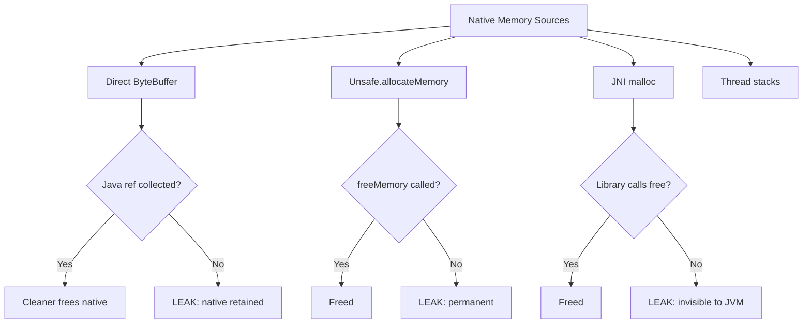

---

### 📶 Gradual Depth

**Level 1 - What it is:** Java has memory that lives outside the garbage-collected heap. This "native memory" is used for I/O buffers, native libraries, and low-level operations. If this memory is not properly freed, it grows unbounded even though your heap looks fine - eventually crashing the process.

**Level 2 - How to use it:** Monitor RSS vs heap: `ps aux | grep java` shows RSS. If RSS >> Xmx + expected overhead, native leak suspected. Enable NMT: `-XX:NativeMemoryTracking=summary`. Use `jcmd <pid> VM.native_memory summary.diff` to see growth.

**Level 3 - How it works:** Direct ByteBuffers allocate native memory via `malloc`. The Java object holds a reference to the native pointer. When GC collects the Java object, a Cleaner (phantom reference callback) calls `free()` on the native pointer. If the Java object is retained (in a cache, ThreadLocal, or leaked collection), the native memory is never freed. The leak is invisible to heap analysis because the Java object itself is tiny (few bytes of metadata).

**Level 4 - Production mastery:** The most dangerous leak pattern: Direct ByteBuffers in a pool that grows without bound. Each buffer's Java reference is small (surviving heap size checks) but the native backing is large (e.g., 64KB each). A pool retaining 100K buffers leaks 6.4GB of native memory invisible to all heap-based tools. Diagnosis: `jcmd VM.native_memory summary` shows "Other" or "Internal" category growing. For JNI leaks invisible to NMT: use jemalloc profiling (`LD_PRELOAD=libjemalloc.so MALLOC_CONF=prof:true`).

---

### ⚙️ How It Works

**Phase 1 - Allocation:** `ByteBuffer.allocateDirect(size)` calls `malloc(size)`. Creates Java DirectByteBuffer object on heap (tiny) + native memory (size bytes) off-heap.

**Phase 2 - Usage:** Application reads/writes the native buffer via Java API. Zero-copy I/O possible (kernel reads/writes native memory directly).

**Phase 3 - Expected cleanup:** Java reference becomes unreachable. GC collects it. Cleaner callback fires, calling `free()` on native pointer. Native memory returned to OS.

**Phase 4 - Leak path:** Java reference retained (cache, ThreadLocal, closure). GC never collects it. Native memory never freed. RSS grows until OOM kill.

```text
Normal lifecycle:
  allocate -> use -> dereference -> GC -> free
  [Java ref] -------> [collected] -> [Cleaner]
  [native mem] -----> [still live] -> [freed]

Leak lifecycle:
  allocate -> use -> retained in cache -> NEVER freed
  [Java ref] --> [in HashMap forever]
  [native mem] --> [leaked permanently]
  RSS: grows 64KB per retained buffer
```

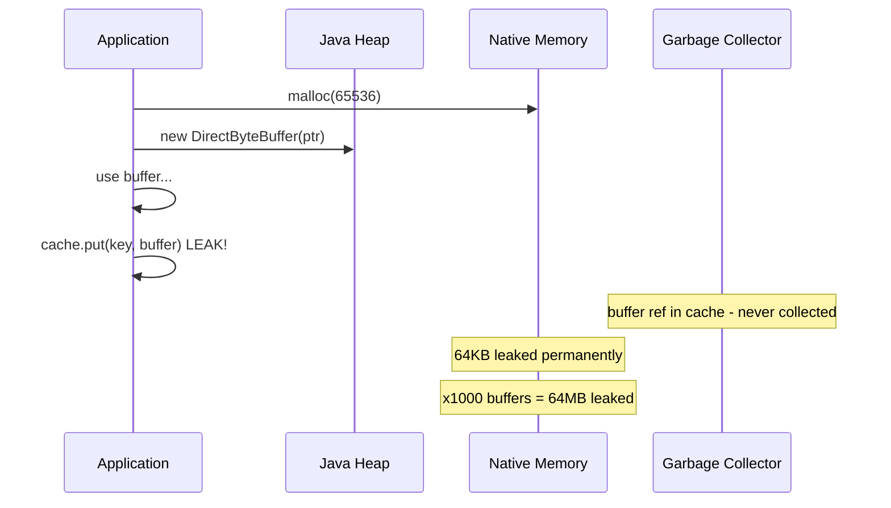

---

### 🚨 Failure Modes

**Failure 1 - Direct ByteBuffer Retention Leak:**

**Symptom:** RSS grows linearly with request count. Heap stable. Container OOM killed after hours/days.

**Root cause:** Direct ByteBuffers retained in unbounded cache, ThreadLocal not cleaned, or Netty ByteBuf not released (missing `ReferenceCountUtil.release()`).

**Diagnostic:**

```bash
# NMT shows "Internal" category growing:
jcmd <pid> VM.native_memory summary.diff
# Look for: Internal (reserved=+500MB)
# Or: Direct ByteBuffer count:
jcmd <pid> VM.system_properties | grep sun.nio
# -XX:MaxDirectMemorySize check
```

**Fix:** Find retained references via heap dump (search for `java.nio.DirectByteBuffer` instances). Ensure Netty buffers are released in finally blocks. Bound Direct BB pools.

**Failure 2 - JNI Library Leak:**

**Symptom:** RSS grows but NMT shows no significant change. All JVM-tracked categories stable.

**Root cause:** Third-party native library (OpenSSL, image processing, ML inference) allocates with malloc but never frees.

**Diagnostic:**

```bash
# jemalloc heap profiling:
LD_PRELOAD=/usr/lib/libjemalloc.so \
  MALLOC_CONF="prof:true,prof_prefix:jeprof" \
  java -jar service.jar
# Generate profile: jeprof --svg ...
```

**Fix:** Update native library. Report bug upstream. If unfixable: isolate in subprocess, recycle periodically.

---

### 🔬 Production Reality

A common Netty-based service pattern: HTTP client creates Direct ByteBuffers for response bodies. Under normal load, buffers are released promptly. Under burst traffic with timeouts, the timeout handler cancels the request but does not release the buffer (missing `finally` in the handler chain). Each timed-out request leaks 8-64KB of native memory. At 100 timeouts/second, the service leaks 0.8-6.4 MB/s - invisible to heap monitoring, OOM killed in 10-60 minutes under sustained timeout conditions.

---

### ⚖️ Trade-offs & Alternatives

| Aspect          | Direct ByteBuffer  | Heap ByteBuffer | Unsafe.allocate  |
| --------------- | ------------------ | --------------- | ---------------- |
| GC overhead     | None (off-heap)    | Full (on-heap)  | None             |
| Safety net      | Cleaner (delayed)  | GC (guaranteed) | None (manual)    |
| Leak risk       | Medium (ref-based) | None            | Extreme (manual) |
| I/O performance | Zero-copy          | Extra copy      | Zero-copy        |
| Monitoring      | NMT (partial)      | Heap tools      | Invisible        |

---

### ⚡ Decision Snap

**USE DIRECT BYTEBUFFER WHEN:**

- I/O performance critical (zero-copy with kernel).
- Buffer lifecycle is well-defined (allocate, use, release).
- Team understands reference lifecycle implications.

**USE HEAP BYTEBUFFER WHEN:**

- Safety over performance. Cannot afford native leak risk.
- Buffers are short-lived and small.

**AVOID UNSAFE WHEN:**

- Almost always. Use Direct ByteBuffer instead.
- Unsafe has no safety net and no standard lifecycle management.

---

### ⚠️ Top Traps

| #   | Misconception                                 | Reality                                                                                           |
| --- | --------------------------------------------- | ------------------------------------------------------------------------------------------------- |
| 1   | "Heap dump shows all memory"                  | Heap dump shows Java heap only. Native memory (most leaks) is invisible in heap dumps.            |
| 2   | "GC will free Direct ByteBuffers"             | Only if the Java REFERENCE is collected. Retained references = permanent native leak.             |
| 3   | "NMT tracks all native memory"                | NMT tracks JVM-internal only. JNI library malloc is invisible. Use jemalloc for those.            |
| 4   | "Container OOM = need more Xmx"               | If heap is stable, adding Xmx makes it WORSE (less room for native). Fix the native leak.         |
| 5   | "Small Java objects cannot cause large leaks" | DirectByteBuffer Java object is ~50 bytes. Backing native memory is 64KB+. 1M refs = 64GB leaked. |

---

### 🪜 Learning Ladder

**Prerequisites:**

- JVM-063 Native Memory Tracking (NMT) - primary tool for diagnosing JVM-side native usage
- JVM-060 Memory Leak Diagnosis Workflow - heap-side workflow extended to native

**THIS:** JVM-084 Native Memory Leaks (JNI, Unsafe, Direct BB)

**Next steps:**

- JVM-083 JVM Crash Analysis (hs_err_pid Files) - native leaks often precede crashes
- JVM-065 JVM in Kubernetes - Resource Limits Done Right - container sizing must account for native memory

---

**The Surprising Truth:**

`System.gc()` is actually USEFUL for Direct ByteBuffer cleanup. Direct BB deallocation depends on GC collecting the Java reference object, which triggers the Cleaner. If allocation rate is low (GC runs infrequently), Direct BBs accumulate in native memory for long periods despite being unreachable. Calling `System.gc()` periodically (or using `-XX:MaxDirectMemorySize` to trigger it) forces collection of these phantom-reachable objects. This is one of the few cases where `System.gc()` is the CORRECT solution, not an anti-pattern.

**Further Reading:**

- JDK source: `java.nio.DirectByteBuffer` + `jdk.internal.ref.Cleaner` - lifecycle implementation
- Netty documentation: "Reference counted objects" - ByteBuf lifecycle
- JEP 370: Foreign-Memory Access API (incubator) - future replacement for Unsafe/Direct BB

**Revision Card:**

1. Native leaks: RSS grows, heap stable. Container OOM with healthy-looking GC. Always suspect Direct BB or JNI.
2. Diagnosis: NMT diff for JVM-internal. jemalloc profiling for JNI. Heap dump for retained DirectByteBuffer references.
3. System.gc() helps Direct BB cleanup (forces Cleaner to run). One of few legitimate uses of explicit GC.

**BAD:**

```java
// Unbounded Direct ByteBuffer cache
Map<String, ByteBuffer> cache = new HashMap<>();
void processRequest(String id, byte[] data) {
    ByteBuffer buf = ByteBuffer.allocateDirect(data.length);
    buf.put(data);
    cache.put(id, buf); // Never evicted!
    // Each entry: ~50B on heap, 64KB native
    // 1M entries = 50MB heap (looks fine)
    //            = 64GB native (OOM kill)
}
```

**GOOD:**

```java
// Bounded cache with explicit cleanup
Map<String, ByteBuffer> cache =
    new LinkedHashMap<>() {
    protected boolean removeEldestEntry(
        Map.Entry<String, ByteBuffer> e) {
        if (size() > 10_000) {
            // Explicitly clean native memory
            ((DirectBuffer) e.getValue()).cleaner()
                .clean();
            return true;
        }
        return false;
    }
};
```
