## Keywords

1. [JVM-094 Heap Fragmentation Under Long-Running Loads](#jvm-094-heap-fragmentation-under-long-running-loads)
2. [JVM-095 JVM Fleet Observability - Key Metrics](#jvm-095-jvm-fleet-observability---key-metrics)
3. [JVM-096 Premature GC Tuning Anti-Pattern](#jvm-096-premature-gc-tuning-anti-pattern)
4. [JVM-097 Teaching JIT - The 5 Questions Juniors Ask](#jvm-097-teaching-jit---the-5-questions-juniors-ask)
5. [JVM-098 Build a JVM Dashboard - Phase 3 (Diagnosis)](#jvm-098-build-a-jvm-dashboard---phase-3-diagnosis)
6. [JVM-099 JVM Deep-Dive Interview Questions](#jvm-099-jvm-deep-dive-interview-questions)
7. [JVM-100 JVM Mastery Verification](#jvm-100-jvm-mastery-verification)
8. [JVM-101 Diagnosing Metaspace OOM in Production](#jvm-101-diagnosing-metaspace-oom-in-production)

---

---

# JVM-094 Heap Fragmentation Under Long-Running Loads

**TL;DR** - Long-running JVMs accumulate heap fragmentation that degrades allocation performance and triggers unnecessary Full GCs, especially with humongous objects in G1.

---

### 🔥 Problem Statement

A service running for 30 days shows degrading GC performance: young GC pauses grow from 15ms to 80ms, and occasional Full GCs appear that did not exist in the first week. Heap utilization is only 60%, yet allocation failures trigger collection. The heap is "swiss cheese" - scattered live objects prevent contiguous allocation of large objects. This fragmentation pattern emerges gradually in long-running services and is invisible to simple heap utilization metrics.

---

### 📜 Historical Context

Fragmentation was CMS's fatal flaw (mark-sweep without compaction). CMS (deprecated JDK 9, removed JDK 14) accumulated fragments until a Full GC compaction was forced. G1 introduced region-based collection (JDK 7) that can compact incrementally. However, G1 still has fragmentation issues: humongous objects (>50% of region) waste the remainder of their region. ZGC and Shenandoah perform concurrent compaction, largely eliminating fragmentation as a concern - but only on JDK 15+.

---

### 🔩 First Principles

**CORE INVARIANTS:**

1. **Allocation needs contiguous space:** Even in G1, within a region, allocation is bump-pointer (requires contiguous free space in that region). Cross-region allocation requires finding a free or partially-free region.
2. **Long-lived objects cause pinning:** Objects that survive many GC cycles become "immovable anchors" in old gen. Free space between them cannot be combined without compaction.
3. **Humongous objects waste region space:** G1 allocates objects > 50% of region size in dedicated humongous regions. The remainder of the last humongous region is wasted.

**DERIVED DESIGN:**

These invariants mean: (1) regularly promoting and dying objects create gaps in old gen, (2) humongous allocations are inherently wasteful and should be minimized, (3) compacting collectors (G1, ZGC, Shenandoah) mitigate but do not eliminate fragmentation.

**THE TRADE-OFF:**

**Gain:** Non-compacting collection is faster per cycle (CMS was faster per-pause than Full GC compaction).

**Cost:** Fragmentation accumulates over time. Eventually forces expensive compaction (Full GC). Long-running services are most affected.

---

### 🧠 Mental Model

> Heap fragmentation is like a parking garage with scattered occupied spots. Early on, cars park contiguously. Over months, random arrivals and departures create gaps. Eventually, a bus (large allocation) arrives but no contiguous stretch of spots exists - despite 40% total capacity free. The garage must reorganize all cars (compaction/Full GC) to make room.

- "Parking spots" -> heap memory addresses
- "Cars" -> Java objects (varied sizes)
- "Gaps between cars" -> fragmented free space
- "Bus" -> large allocation (humongous object)
- "Reorganize" -> compaction (stop-the-world)
- "40% capacity free" -> fragmentation: free but not usable

**Where this analogy breaks down:** real parking does not have different "generations." In JVM, young gen is always contiguous (bump-pointer), fragmentation occurs primarily in old gen where objects have varied lifetimes and sizes.

---

### 🧩 Components

- **Free lists (CMS/old collectors):** Maintain lists of free chunks by size. Allocation searches for fitting chunk. Search is O(n) in worst case - slow when many fragments.
- **Region-based allocation (G1):** Heap divided into fixed-size regions (default 1-32MB). Within region: bump-pointer (fast). Across regions: region selection.
- **Humongous regions (G1):** Objects > 50% of region size get dedicated contiguous regions. Last region partially wasted.
- **Mixed GC (G1):** Evacuates (copies) live objects from old regions with high garbage ratio. Compacts those regions, freeing contiguous space.
- **Full GC (compaction):** Last resort. Compacts entire heap. Stop-the-world for seconds on large heaps. Cures fragmentation completely.

```text
Fragmentation example (old gen, CMS-style):

Before (day 1):
  |AAABBBBCCDDDDEEEEFFFFGGG-----|
  Contiguous free at end: large allocation OK

After (day 30):
  |AAA--BB--CCD---EE--F--GGG---|
  Free: 40% total, but max contiguous: 4%
  Large allocation: FAILS despite free space
  -> Full GC compaction required

G1 region fragmentation:
  Region 1: |OOOOO---| (50% used, 50% free)
  Region 2: |OOOOOOOO| (100% used)
  Region 3: |OO------| (25% used, 75% free)
  Humongous (needs 2 regions): must find 2 FREE
  -> Triggers mixed GC to free full regions
```

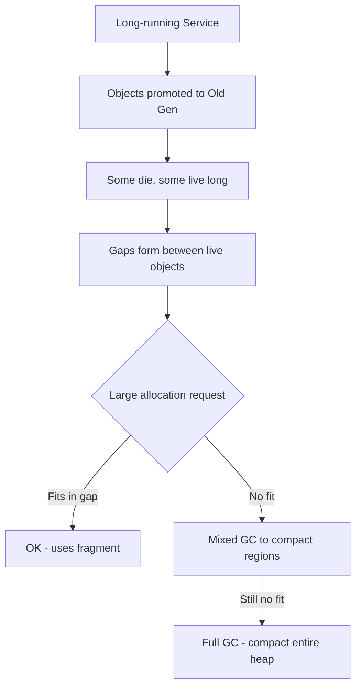

---

### 📶 Gradual Depth

**Level 1 - What it is:** Over time, a JVM's memory becomes scattered with small gaps between live objects. Even though total free memory is available, it cannot be used for large allocations because it is not contiguous. This eventually forces expensive full garbage collections.

**Level 2 - How to use it:** Monitor fragmentation indicators: increasing frequency of Full GCs over time, growing "concurrent mark" cycles in G1, humongous allocation failures. Reduce large object allocations. Increase G1 region size for services with large objects.

**Level 3 - How it works:** In G1, fragmentation manifests as partially-filled old regions. Mixed GC selects regions with highest garbage ratio, evacuates live objects to free regions, and reclaims the fragmented regions entirely. If mixed GC cannot free enough regions (too many live objects spread thinly), Full GC compacts everything.

**Level 4 - Production mastery:** Diagnosis: `-Xlog:gc+heap=debug` shows region occupancy after each GC. If "old regions" count stays high despite "used" being low: fragmentation. Key metrics: ratio of old region count to old generation used bytes. If regions are 30% average utilized: severe fragmentation. Fixes: (1) increase region size (`-XX:G1HeapRegionSize=16m`) to reduce humongous threshold, (2) reduce object sizes near the humongous boundary, (3) upgrade to ZGC/Shenandoah (concurrent compaction eliminates this issue).

---

### ⚙️ How It Works

**Phase 1 - Normal Operation:** Young gen objects promoted to old gen. Initially fill regions sequentially.

**Phase 2 - Gradual Degradation:** Some promoted objects die, creating gaps in old regions. Regions become partially occupied.

**Phase 3 - Allocation Pressure:** Large allocation cannot find contiguous space. G1 triggers mixed GC (evacuates selected old regions).

**Phase 4 - Compaction:** Mixed GC copies live objects from fragmented regions to free regions. Fragmented regions are fully reclaimed. If this is insufficient: Full GC compacts the entire heap.

```text
G1 Mixed GC compaction (per-region):

Before mixed GC:
  Region 7: |OOOOO--OO-OOO--O| (62% used)
  Region 9: |OO--O--OOO--OO--| (50% used)
  Target: evacuate regions < 60% used

After mixed GC:
  Region 7: (freed entirely - objects moved)
  Region 9: (freed entirely - objects moved)
  New region: |OOOOOOOOOOOOO---| (live objects packed)

  Result: 2 fully free regions available
  Cost: copy live objects (pause time)

Humongous fragmentation (separate issue):
  Region size: 4MB. Object: 2.1MB (>50% = humongous)
  Allocated: Region N (4MB) for 2.1MB object
  Wasted: 1.9MB (47% of region!) per object
  Fix: -XX:G1HeapRegionSize=8MB (threshold now 4MB)
       Object no longer humongous -> normal alloc
```

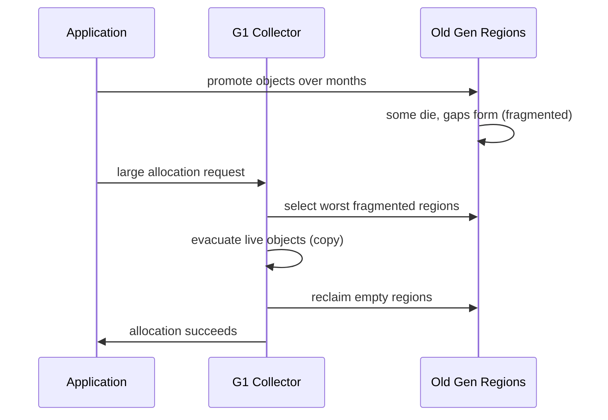

---

### 🚨 Failure Modes

**Failure 1 - Humongous Allocation Waste:**

**Symptom:** Heap utilization reports 70%, but frequent Full GCs. Many humongous regions visible in GC logs.

**Root cause:** Frequent allocation of objects just over 50% of region size (e.g., 2.1MB objects with 4MB regions). Each wastes 47% of its region.

**Diagnostic:**

```bash
# Count humongous allocations:
grep -c "humongous" gc.log
# Check region size vs object sizes:
-Xlog:gc+heap=debug
# Look for: "H" regions in region summary
```

**Fix:** Increase region size: `-XX:G1HeapRegionSize=16m` (humongous threshold becomes 8MB). Or reduce allocation size to below 50% of current region size.

**Failure 2 - Promotion Fragmentation (Long-running):**

**Symptom:** Mixed GC frequency increases over weeks. Full GC eventually occurs despite low heap utilization.

**Root cause:** Many old regions are 20-40% utilized (live objects scattered). Mixed GC cannot keep up with fragmentation rate.

**Diagnostic:**

```bash
# After GC, check old region utilization:
-Xlog:gc+heap=debug
# Look for: many old regions with low utilization
# If average old region utilization < 50%:
# severe fragmentation
```

**Fix:** Tune mixed GC: `-XX:G1MixedGCLiveThresholdPercent=50` (compact regions that are <50% live). Or use ZGC/Shenandoah for concurrent compaction.

---

### 🔬 Production Reality

The transition from CMS to G1 (JDK 8 to 11 upgrades) eliminated most critical fragmentation issues. However, G1 fragmentation still manifests in two scenarios: (1) services with many objects near the humongous boundary (common in message processing: serialization buffers, message batches), and (2) services with very long uptimes (months) and heterogeneous object lifetimes that prevent efficient region compaction. ZGC (JDK 15+) with concurrent compaction makes fragmentation a non-issue - the strongest argument for upgrading to modern GC.

---

### ⚖️ Trade-offs & Alternatives

| Aspect          | CMS (deprecated)   | G1                 | ZGC/Shenandoah            |
| --------------- | ------------------ | ------------------ | ------------------------- |
| Fragmentation   | Severe over time   | Moderate (regions) | None (concurrent compact) |
| Compaction      | Full GC only       | Mixed + Full GC    | Concurrent (always)       |
| Long-running    | Degrades badly     | Manageable         | Stable indefinitely       |
| Humongous issue | N/A                | Yes (region waste) | No (different model)      |
| JDK requirement | 8 (removed JDK 14) | 8+                 | 15+                       |

---

### ⚡ Decision Snap

**FIX HUMONGOUS FRAGMENTATION WHEN:**

- GC logs show frequent humongous allocations.
- Region size is small relative to common object sizes.
- Full GCs occurring despite moderate heap utilization.

**UPGRADE TO ZGC/SHENANDOAH WHEN:**

- Long-running service with fragmentation issues.
- JDK 15+ is available.
- Cannot afford Full GC pauses (SLA requirement).

**TUNE G1 MIXED GC WHEN:**

- Cannot upgrade JDK/GC. Stuck on G1.
- Need to reduce fragmentation accumulation rate.
- `G1MixedGCLiveThresholdPercent` tuning helps.

---

### ⚠️ Top Traps

| #   | Misconception                             | Reality                                                                                                 |
| --- | ----------------------------------------- | ------------------------------------------------------------------------------------------------------- |
| 1   | "60% heap used = 40% free for allocation" | Fragmented free space may not be contiguous. Effective free space is less than total free.              |
| 2   | "G1 never has Full GC"                    | G1 triggers Full GC when mixed GC cannot free enough space. Fragmentation is the usual cause.           |
| 3   | "Larger heap prevents fragmentation"      | Larger heap delays fragmentation but does not prevent it. More regions = more potential fragment sites. |
| 4   | "Short-lived objects do not fragment"     | Short-lived objects are fine (collected in young gen). It is PROMOTED objects that fragment old gen.    |
| 5   | "Restarting fixes fragmentation"          | Yes, temporarily. But the pattern returns after same uptime. Fix the root cause instead.                |

---

### 🪜 Learning Ladder

**Prerequisites:**

- JVM-058 G1GC Region-Based Collection - understand region model and mixed GC
- JVM-059 Humongous Allocations in G1 - humongous allocation mechanism

**THIS:** JVM-094 Heap Fragmentation Under Long-Running Loads

**Next steps:**

- JVM-078 ZGC Colored Pointers and Load Barriers - concurrent compaction eliminates fragmentation
- JVM-085 GC Ergonomics Failures at Scale - fragmentation interacts with adaptive sizing

---

**The Surprising Truth:**

The humongous allocation threshold in G1 (50% of region size) is arbitrary and often suboptimal. A 4MB region size means anything > 2MB is humongous. Many real applications frequently allocate 2-5MB objects (serialization buffers, image data, batch collections). Setting `-XX:G1HeapRegionSize=32m` (maximum) raises the threshold to 16MB - eliminating most humongous allocations and their associated fragmentation. The cost is coarser-grained region management, but for services with large objects, this single change can eliminate Full GCs entirely.

**Further Reading:**

- OpenJDK wiki: "G1 GC: Advanced Tuning" - mixed GC and region sizing
- Aleksey Shipilev, "G1 Humongous Objects and How to Deal With Them"
- JEP 376: ZGC Concurrent Thread-Stack Processing (concurrent compaction enabler)

**Revision Card:**

1. Fragmentation: free memory exists but not contiguous. Triggers Full GC despite low utilization. Worsens over weeks of uptime.
2. G1 humongous fix: increase `-XX:G1HeapRegionSize=16m` or `32m` to raise humongous threshold. Reduces region waste.
3. Ultimate fix: ZGC/Shenandoah (JDK 15+) - concurrent compaction prevents fragmentation from ever accumulating.

**BAD:**

```bash
# Default 4MB region with frequent 3MB allocations
java -Xmx32g -XX:+UseG1GC -jar service.jar
# G1HeapRegionSize=4MB (auto-selected for 32GB)
# 3MB objects > 50% of 4MB = HUMONGOUS
# Each 3MB object wastes 1MB (25% per region)
# After 30 days: heap fragmented, Full GC every hour
```

**GOOD:**

```bash
# Region size tuned for allocation pattern
java -Xmx32g -XX:+UseG1GC \
  -XX:G1HeapRegionSize=16m \
  -XX:G1MixedGCLiveThresholdPercent=50 \
  -jar service.jar
# 16MB regions: threshold = 8MB
# 3MB objects are NORMAL (not humongous)
# No region waste. Mixed GC efficient.
# Or: upgrade to ZGC (eliminates issue entirely)
# -XX:+UseZGC -XX:+ZGenerational
```

---

---

# JVM-095 JVM Fleet Observability - Key Metrics

**TL;DR** - Fleet-level JVM observability aggregates per-instance GC, memory, thread, and JIT metrics across hundreds of instances to detect systemic patterns invisible in single-instance monitoring: ergonomic drift, correlated GC, and fleet-wide degradation.

---

### 🔥 Problem Statement

A fleet of 150 JVM instances shows p99 latency at 2x the expected value, but no single instance's dashboard reveals an issue. The problem is a fleet-level pattern: 10% of instances have drifted into frequent mixed GC (ergonomic divergence), creating a "noisy minority" that dominates tail latency in aggregate. Single-instance monitoring cannot detect this because each individual instance appears marginally acceptable. Fleet observability reveals the pattern: bimodal GC behavior distribution across the fleet.

---

### 📜 Historical Context

Early JVM monitoring was per-instance: JMX MBeans, VisualVM, JConsole. The microservice era (2015+) required fleet-level aggregation. Prometheus + Grafana became the standard stack, with JVM metrics exported via Micrometer or JMX exporter. However, most teams build dashboards showing AVERAGES across the fleet - which hides the distribution. Fleet observability maturity requires: (1) per-instance metric retention, (2) distribution analysis (not just averages), (3) anomaly detection across the fleet.

---

### 🔩 First Principles

**CORE INVARIANTS:**

1. **Averages hide bimodality:** If 90% of instances have 10ms GC pause and 10% have 500ms, the average (59ms) looks fine. The distribution reveals the problem.
2. **Fleet correlation is a risk signal:** If all instances show the same behavior, they will FAIL the same way under stress. Lack of variance = cascading failure risk.
3. **Drift accumulates:** Over days/weeks, ergonomic decisions, JIT warmup paths, and heap composition diverge across instances. Regular fleet comparison detects drift before it causes incidents.

**DERIVED DESIGN:**

These invariants mean: (1) monitor percentile DISTRIBUTIONS not averages (p50, p90, p99, max across fleet), (2) alert on fleet variance increase (standard deviation rising = drift occurring), (3) periodically compare per-instance settings/behavior for divergence.

**THE TRADE-OFF:**

**Gain:** Detect systemic issues invisible to single-instance monitoring. Prevent cascading failures. Quantify fleet health.

**Cost:** Metric volume (N instances x M metrics x T resolution). Dashboard complexity. Storage costs. Alert tuning complexity.

---

### 🧠 Mental Model

> Fleet observability is like a doctor monitoring a hospital ward (fleet) vs a single patient (instance). Individual patient vital signs might be "within range," but a doctor surveying the whole ward notices: "5 patients have rising temperatures" (drift), "all patients received the same medication" (correlated risk), "ward average temperature is normal but the distribution is bimodal" (hidden sick subgroup).

- "Ward" -> fleet of JVM instances
- "Patient vitals" -> per-instance JVM metrics
- "Ward average" -> aggregated dashboard (hides problems)
- "Distribution check" -> per-instance comparison
- "Rising temperatures" -> ergonomic drift signal
- "Same medication" -> identical config = correlated failure risk

**Where this analogy breaks down:** hospital patients are heterogeneous (different conditions). Fleet instances are supposed to be IDENTICAL - divergence is itself the signal. Also, you cannot "restart" a patient to fix them, but you CAN restart JVM instances.

---

### 🧩 Components

- **GC metrics (per-instance):** Pause duration (p50/p99/max), pause frequency, GC CPU time %, throughput (1 - gc_time/total_time), allocation rate.
- **Heap metrics:** Used/committed/max. Old gen occupancy. Humongous allocation count. IHOP threshold (if adaptive).
- **Thread metrics:** Live thread count, peak thread count, daemon vs non-daemon, blocked thread count.
- **JIT metrics:** Compilation count, failed compilations, deoptimization count, code cache usage.
- **Metaspace metrics:** Used/committed/max. Class load count (growing = potential leak).
- **Fleet-level derived metrics:** Standard deviation of GC pause across instances, fleet percentile distribution, drift score (change over time in per-instance variance).

```text
Fleet observability layers:

Layer 1: Per-instance metrics (Prometheus)
  jvm_gc_pause_seconds{instance="i-1"} = 0.015
  jvm_gc_pause_seconds{instance="i-2"} = 0.480
  jvm_gc_pause_seconds{instance="i-3"} = 0.012

Layer 2: Fleet aggregation (Grafana)
  avg(jvm_gc_pause_seconds) = 0.169 (looks OK?)
  max(jvm_gc_pause_seconds) = 0.480 (PROBLEM!)
  stddev(jvm_gc_pause_seconds) = 0.215 (HIGH!)

Layer 3: Distribution analysis
  Fleet GC pause histogram:
    0-50ms:  135 instances (90%)  <- healthy
    50-100ms:  5 instances (3%)   <- borderline
    100-500ms: 10 instances (7%)  <- UNHEALTHY
  Bimodal distribution detected!

Layer 4: Alerting
  Alert: stddev(gc_pause) > 3x baseline
  Alert: max(gc_pause) / median(gc_pause) > 10x
  Alert: instances_in_full_gc > 5% of fleet
```

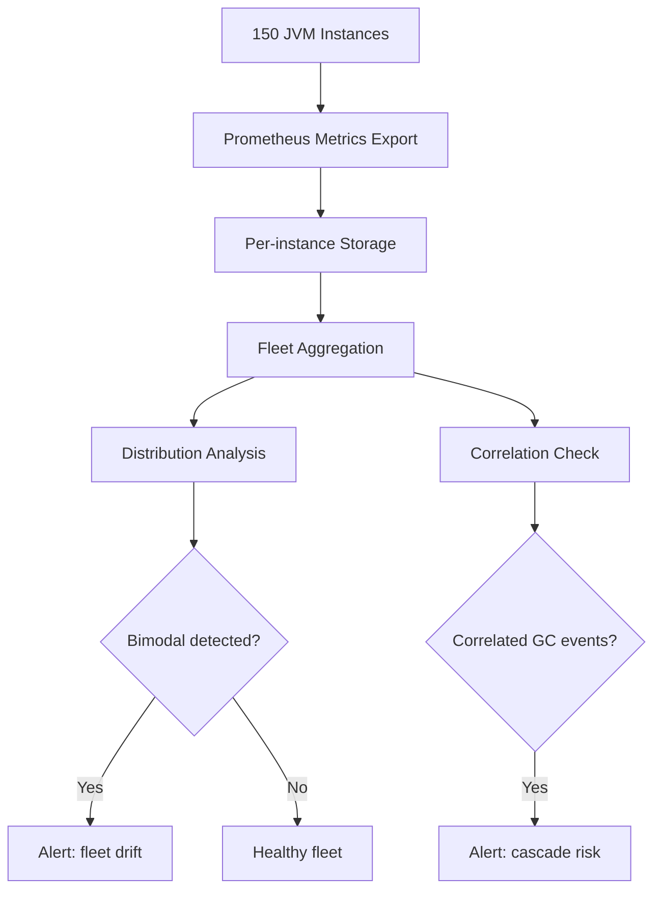

---

### 📶 Gradual Depth

**Level 1 - What it is:** Instead of monitoring each JVM service individually, fleet observability watches patterns across ALL instances together - detecting problems that only appear when you compare instances or look at the distribution of metrics across the fleet.

**Level 2 - How to use it:** Export JVM metrics via Micrometer/Prometheus JMX exporter. Build Grafana dashboards showing: fleet-wide GC pause distribution (histogram), per-instance max GC pause, standard deviation across instances. Alert when stddev rises or max >> median.

**Level 3 - How it works:** Each instance exports metrics to Prometheus (scrape every 15-30s). Grafana queries aggregate across instances. Key queries: `histogram_quantile(0.99, sum by (le) (rate(jvm_gc_pause_seconds_bucket[5m])))` shows fleet-wide p99. `stddev(jvm_gc_pause_seconds_max)` detects drift.

**Level 4 - Production mastery:** Build three-layer alerting: (1) Instance-level: single instance GC pause > 5s (immediate). (2) Fleet-level: > 5% of instances with GC pause > 1s in same 5min window (correlated failure alert). (3) Drift-level: stddev of GC pause across fleet increased 3x from baseline over 24h (proactive alert before incident). The drift alert catches problems DAYS before they manifest as incidents.

---

### ⚙️ How It Works

**Phase 1 - Metric Export:** Each JVM instance exposes metrics via HTTP endpoint (Micrometer Prometheus registry or JMX exporter). Metrics include GC pause, heap, threads, JIT, metaspace.

**Phase 2 - Collection:** Prometheus scrapes all instances every 15-30 seconds. Stores time series with instance label.

**Phase 3 - Aggregation:** Grafana queries compute fleet-level statistics: percentiles, standard deviation, min/max, histograms.

**Phase 4 - Anomaly Detection:** Rules compare current fleet distribution to baseline. Detect: bimodality, drift, correlation, outliers.

```text
Essential fleet dashboards:

Dashboard 1: "Fleet GC Health"
  - Panel: GC pause p50/p90/p99 across fleet (heatmap)
  - Panel: Instances in Full GC right now (counter)
  - Panel: GC pause stddev (trend line)
  - Alert: stddev > 3x baseline over 1h

Dashboard 2: "Fleet Heap & Memory"
  - Panel: Heap utilization distribution (histogram)
  - Panel: Old gen growth rate per instance (find leaks)
  - Panel: Metaspace growth (class loading leaks)
  - Alert: any instance old gen > 85% sustained 10min

Dashboard 3: "Fleet JIT & Warmup"
  - Panel: Compilation count per instance (should converge)
  - Panel: Deoptimization rate (find unstable methods)
  - Panel: Code cache utilization
  - Alert: code cache > 90% on any instance
```

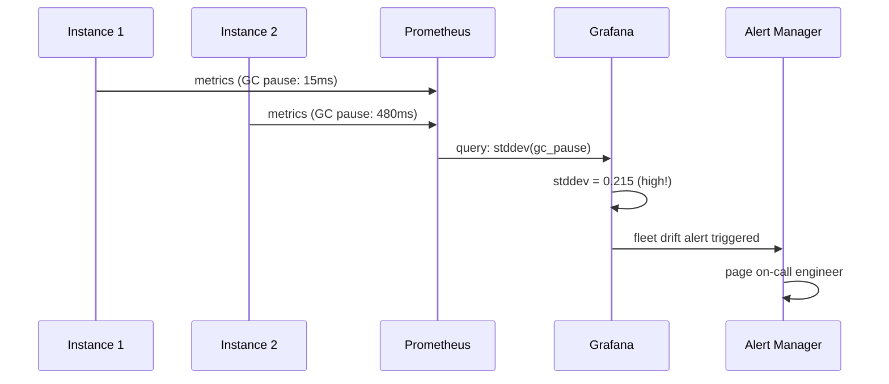

---

### 🚨 Failure Modes

**Failure 1 - Hidden Bimodal Fleet:**

**Symptom:** Fleet average metrics look healthy. p99 latency at SLA boundary. No alerts firing. Customer complaints about intermittent slowness.

**Root cause:** 10% of instances have degraded (higher GC, slower responses). Average masks the problem. Customers hitting degraded instances see poor performance.

**Diagnostic:**

```bash
# Prometheus query: find outlier instances
topk(10, max_over_time(
  jvm_gc_pause_seconds_max[1h]
)) by (instance)
# Compare top 10 to median
# If top 10 are 10x median: bimodal fleet
```

**Fix:** Identify cause of degraded subgroup (longer uptime, different traffic pattern, ergonomic drift). Restart degraded instances or fix root cause.

**Failure 2 - Alert Fatigue from Per-Instance Monitoring:**

**Symptom:** 150 individual instance alerts. Each fires occasionally for brief GC spikes. Team ignores alerts (noise). Real fleet-level issue goes unnoticed.

**Root cause:** Alerting on individual instance metrics without fleet context. Brief spikes are normal for individuals. Sustained fleet-wide issues are not.

**Diagnostic:**

```bash
# Count alert fires per day:
# If > 10 individual alerts/day: too noisy
# Replace with fleet-level alert:
count(jvm_gc_pause_seconds_max > 1.0) > floor(fleet_size * 0.05)
# Fires only when >5% of fleet affected
```

**Fix:** Replace per-instance GC alerts with fleet-level percentage alerts. Keep per-instance only for extreme events (Full GC > 30s, OOM).

---

### 🔬 Production Reality

Organizations with mature fleet observability (Netflix, Uber, LinkedIn) report that fleet-level metrics catch 60-70% of incidents BEFORE they impact customers. The key insight: individual instance metrics have high noise (brief GC spikes, JIT recompilations). Fleet-level metrics filter noise because they look at DISTRIBUTION. A single instance having a 2s GC pause is noise. 10 instances simultaneously having 2s GC pauses is a correlated failure signal.

---

### ⚖️ Trade-offs & Alternatives

| Aspect            | Per-instance only | Fleet aggregate   | APM distributed      |
| ----------------- | ----------------- | ----------------- | -------------------- |
| Problem detection | Individual issues | Systemic patterns | Request-level        |
| Noise level       | High              | Low (filtered)    | Medium               |
| Storage cost      | Low-medium        | Medium-high       | High                 |
| Setup effort      | Low               | Medium            | High (agent + infra) |
| Coverage          | JVM only          | JVM + fleet       | Full stack           |

---

### ⚡ Decision Snap

**BUILD FLEET OBSERVABILITY WHEN:**

- Fleet size > 10 instances of same service.
- Tail latency matters (p99 SLA).
- Have experienced unexplained fleet-level degradation.

**MINIMUM VIABLE FLEET DASHBOARD:**

- GC pause distribution (histogram across fleet).
- Instances in Full GC (counter, alert > 0).
- Standard deviation of key metrics (trend, alert on rise).

**ADVANCED (mature organizations):**

- Drift scoring per instance (how far from fleet median).
- Automatic outlier detection and restart.
- Correlation analysis (do all GC events align?).

---

### ⚠️ Top Traps

| #   | Misconception                         | Reality                                                                                                      |
| --- | ------------------------------------- | ------------------------------------------------------------------------------------------------------------ |
| 1   | "Average metrics are sufficient"      | Averages hide bimodal distributions. A few sick instances are invisible in averages.                         |
| 2   | "Per-instance dashboards are enough"  | Cannot see fleet patterns (drift, correlation, bimodality) from individual dashboards. Need aggregation.     |
| 3   | "More metrics = better observability" | Volume without structure = noise. Focus on GC pause distribution, heap drift, and correlation signals.       |
| 4   | "Alerts on every metric"              | Alert fatigue kills fleet monitoring. Use fleet-level percentage thresholds, not per-instance triggers.      |
| 5   | "All instances should be identical"   | They SHOULD be, but ergonomic drift guarantees divergence over time. Detecting drift is a core fleet metric. |

---

### 🪜 Learning Ladder

**Prerequisites:**

- JVM-046 GC Logging and Analysis - understand per-instance GC metrics
- JVM-085 GC Ergonomics Failures at Scale - why fleet divergence matters

**THIS:** JVM-095 JVM Fleet Observability - Key Metrics

**Next steps:**

- JVM-098 Build a JVM Dashboard - Phase 3 (Diagnosis) - build the dashboard described here
- JVM-087 JVM Production Incident Simulation - validate that fleet monitoring detects injected failures

---

**The Surprising Truth:**

The single most valuable fleet metric is NOT GC pause time - it is the STANDARD DEVIATION of GC pause time across instances. When stddev is low, the fleet is healthy and homogeneous (even if individual pauses are high - at least they are uniformly high, meaning you can tune uniformly). When stddev RISES, it means some instances are diverging from the fleet - ergonomic drift, different traffic patterns, or slow memory leaks. Rising stddev predicts fleet-level incidents 24-72 hours before they occur, giving time for proactive intervention.

**Further Reading:**

- Google SRE Book, Ch. 6: "Monitoring Distributed Systems"
- Cindy Sridharan, "Distributed Systems Observability" (O'Reilly, 2018)
- Netflix Tech Blog: "Lessons from Building Observability Tools at Netflix"

**Revision Card:**

1. Monitor DISTRIBUTION not averages: fleet GC pause histogram, stddev across instances, max/median ratio.
2. Key alert: stddev of GC pause rising over 24h = fleet drift = incident in 1-3 days. Proactive fix window.
3. Three-layer alerts: (1) single extreme event, (2) >5% of fleet affected, (3) drift score increasing.

**BAD:**

```text
# Dashboard: avg(jvm_gc_pause_seconds)
# Shows: 45ms (looks healthy!)
# Reality:
#   135 instances: 12ms (healthy)
#   15 instances: 480ms (SICK)
#   Average: 59ms (masks the problem)
# Result: SLA breach from sick 10%
# No alert because average is under threshold
```

**GOOD:**

```text
# Dashboard: fleet GC pause distribution
# Histogram shows bimodal pattern:
#   Peak 1: 10-20ms (90% of fleet)
#   Peak 2: 400-500ms (10% of fleet)
# Alert: stddev(gc_pause) > 100ms
#   (baseline was 5ms - 20x increase)
# Action: investigate sick 10%
#   (find: ergonomic drift, restart or tune)
# Prometheus: topk(15, max_over_time(
#   jvm_gc_pause_seconds_max[1h]))
```

---

---

# JVM-096 Premature GC Tuning Anti-Pattern

**TL;DR** - Tuning GC without measurement evidence wastes time and often worsens performance; measure first, identify the bottleneck, then apply targeted changes with validation.

---

### 🔥 Problem Statement

A team spends two weeks tuning GC: adjusting NewRatio, SurvivorRatio, IHOP, tenuring thresholds, ParallelGCThreads - based on blog posts and conference talks. After deployment, p99 latency is 15% WORSE than the defaults. The team cannot explain why because they changed 8 parameters simultaneously without baseline measurements. They have accidentally tuned the GC for a workload pattern that does not match their production reality. The correct approach: one change at a time, with measurement evidence justifying each change.

---

### 📜 Historical Context

GC tuning mythology grew from the CMS era (JDK 6-8) when 50+ flags could meaningfully affect behavior. Teams developed "cargo cult" flag sets copied between projects. G1 (JDK 9+ default) was designed to reduce tuning surface: its primary control is MaxGCPauseMillis, with ergonomics handling the rest. Despite this, teams continue applying CMS-era tuning knowledge to G1, often counterproductively. The modern principle: trust the ergonomics unless measurement proves they are inadequate for YOUR workload.

---

### 🔩 First Principles

**CORE INVARIANTS:**

1. **Measure before changing:** Without baseline metrics, you cannot know if a change helped or hurt. GC tuning without GC logs is blind.
2. **One variable at a time:** Changing multiple parameters simultaneously makes it impossible to attribute improvement or regression.
3. **The default is the default for a reason:** JDK engineers tested defaults against diverse workloads. Deviating requires evidence that YOUR workload is different.

**DERIVED DESIGN:**

These invariants mean: (1) enable GC logging FIRST, analyze for 1+ week under production load, (2) identify the specific GC bottleneck (allocation rate? promotion rate? IHOP trigger? fragmentation?), (3) apply ONE targeted change, measure for 1+ day, evaluate.

**THE TRADE-OFF:**

**Gain:** Discipline prevents regressions. Evidence-based changes compound correctly. Team builds understanding of their specific workload.

**Cost:** Slower iteration. Requires patience. Must resist "just try these flags" temptation.

---

### 🧠 Mental Model

> GC tuning is like adjusting a car's engine. A mechanic does not randomly turn every dial simultaneously. They: (1) listen to the engine (measure), (2) identify the specific noise (bottleneck), (3) adjust ONE thing (targeted change), (4) listen again (re-measure). Random dial turning is equally likely to break the engine as fix it.

- "Listen to engine" -> enable GC logs, analyze
- "Identify specific noise" -> find the GC bottleneck
- "Adjust ONE thing" -> change one parameter
- "Listen again" -> compare before/after metrics
- "Random dial turning" -> premature multi-parameter tuning

**Where this analogy breaks down:** car engines are relatively static (same load profile). JVM workloads change with traffic patterns. Tuning decisions valid at 100 req/s may be wrong at 1000 req/s. Must test under representative load.

---

### 🧩 Components

- **GC log analysis:** First step. Enable `-Xlog:gc*=info:file=gc.log`. Analyze with GCViewer, GCEasy, or manual parsing. 1+ week of production data.
- **Bottleneck identification:** What is the SPECIFIC problem? (a) Long pauses? (b) High frequency? (c) Full GC? (d) High allocation rate? (e) Promotion failure?
- **Targeted change:** ONE flag change addressing the identified bottleneck. Nothing else changes.
- **Before/after comparison:** Same workload period (same day of week, same traffic level). Compare: p99 pause, throughput, Full GC count.
- **Rollback plan:** If new setting is worse or neutral after 48h, revert. Do not accumulate unproven changes.

```text
The anti-pattern (common):
  Step 1: "GC is slow" (no measurement)
  Step 2: Google "best GC settings for Java"
  Step 3: Copy 8 flags from Stack Overflow answer
  Step 4: Deploy. Performance changes (unclear if better)
  Step 5: Blame GC for remaining issues
  Step 6: Add 5 more flags. Repeat until confused.

The correct approach:
  Step 1: Enable GC logging. Run 1 week.
  Step 2: Analyze: "Mixed GC pauses 200ms, target 50ms"
  Step 3: Identify: "young gen too large, evacuates much"
  Step 4: Change ONE thing: -XX:MaxGCPauseMillis=100
  Step 5: Run 1 week. Compare before/after.
  Step 6: If improved: keep. If not: revert.
  Step 7: Next bottleneck (if any). Repeat.
```

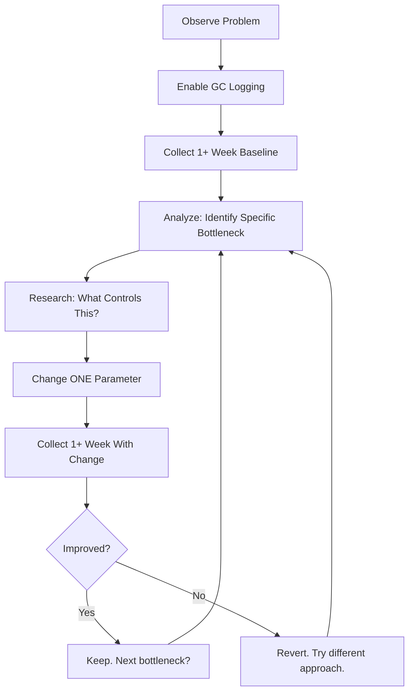

---

### 📶 Gradual Depth

**Level 1 - What it is:** Changing GC settings without measuring first usually makes things worse. The correct approach is: measure the actual problem, identify the specific bottleneck, change one thing, and verify it helped.

**Level 2 - How to use it:** Start with defaults + GC logging. Analyze logs for 1 week. Only tune if you can name the SPECIFIC problem (e.g., "mixed GC pause is 200ms, I need <100ms" - not "GC is slow").

**Level 3 - How it works:** Modern GCs (G1, ZGC) have self-tuning heuristics (ergonomics) that adapt to most workloads. Overriding these with manual settings disables the adaptation, locking behavior to your assumptions about the workload. If assumptions are wrong (they usually are for production workloads that vary by hour), manual settings perform WORSE than defaults.

**Level 4 - Production mastery:** The only GC parameters worth tuning for most services: (1) Heap size (`-Xmx`, `-Xms`) - this is not tuning, it is right-sizing. (2) GC algorithm selection (G1 vs ZGC vs Shenandoah) - match to latency requirements. (3) MaxGCPauseMillis - adjust the goal, let ergonomics figure out how. Everything else (NewRatio, SurvivorRatio, IHOP, tenuring) should only be touched if GC log analysis identifies a specific issue that the ergonomics are handling poorly.

---

### ⚙️ How It Works

**Phase 1 - Baseline:** Run production workload with default GC settings and GC logging enabled. Collect at least 1 full business cycle (1 week typically).

**Phase 2 - Analysis:** Extract key metrics from GC logs: pause time distribution (p50/p90/p99/max), pause frequency, throughput (% time NOT in GC), Full GC occurrences, allocation rate, promotion rate.

**Phase 3 - Bottleneck Identification:** Map the metric problem to a root cause:

```text
Symptom -> Root Cause -> Parameter:
  High p99 pause -> young gen large -> MaxGCPauseMillis
  Frequent Full GC -> IHOP too high -> IHOP or heap size
  High GC freq -> young gen small -> MaxGCPauseMillis
  Humongous alloc fail -> region small -> G1HeapRegionSize
  Promotion failure -> old gen full -> heap size or IHOP
```

**Phase 4 - Targeted Change:** Adjust ONE parameter. Deploy. Collect same-duration metrics under comparable load.

**Phase 5 - Comparison:** Compare before/after on the specific metric that motivated the change. Also check for regressions in other metrics (tuning for latency may reduce throughput).

```text
Decision table for common GC issues:

| Problem         | First Action     | NOT This        |
|-----------------|------------------|-----------------|
| p99 pause high  | Reduce PauseMs   | Random flags    |
| Full GC occurs  | Check heap size  | Disable Full GC |
| GC overhead>10% | Increase heap    | Reduce threads  |
| Alloc stalls    | Check IHOP/heap  | Change NewRatio |
| Long TTSP       | CountedLoopSP    | Tune GC params  |
```

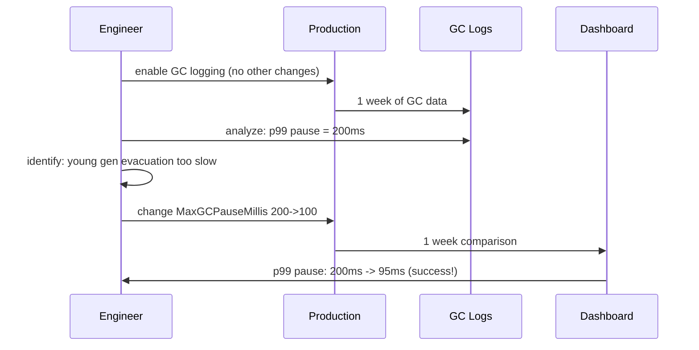

---

### 🚨 Failure Modes

**Failure 1 - Cargo Cult Tuning:**

**Symptom:** Production JVM has 15+ GC flags. Nobody knows why. Performance is mediocre. Nobody dares change them ("last person who touched it broke things").

**Root cause:** Accumulated flags from blog posts, Stack Overflow, vendor consultants - none validated for this workload.

**Diagnostic:**

```bash
# Document current flags:
jcmd <pid> VM.command_line
# For each non-default flag, ask:
# 1. What problem does this solve?
# 2. What measurement justified this?
# 3. What would happen if we removed it?
# If no answer -> flag is cargo cult
```

**Fix:** Progressive removal. Remove one questionable flag per week. Measure before/after. Most removals will be neutral or positive.

**Failure 2 - Tuning Without Load Context:**

**Symptom:** GC settings tuned on test environment (1/10 production traffic). Work great in test. Perform terribly in production.

**Root cause:** GC behavior is load-dependent. Settings optimized for 100 req/s are wrong for 1000 req/s (different allocation rate, different promotion rate, different live set size).

**Diagnostic:**

```bash
# Compare test vs prod allocation rate:
# GC log: "allocation rate" field
# If prod is 5x test: settings are invalid
# Load test must match production profile
```

**Fix:** Only tune under production-representative load. Use load testing at 1.5-2x expected peak. Or tune in production with canary deployments (1 instance with new setting, compare to fleet).

---

### 🔬 Production Reality

A common story: team migrates from JDK 8 to JDK 17. They carry forward all CMS-era tuning flags. G1 ignores most of them (different algorithm). Performance is actually worse because legacy flags (NewRatio=2, SurvivorRatio=8) override G1's own heuristics that would have made better choices. After removing ALL legacy flags and using only `-Xmx` and `-XX:MaxGCPauseMillis`, performance improves 20%. The lesson: when upgrading JDK or GC algorithm, START FROM DEFAULTS and re-evaluate.

---

### ⚖️ Trade-offs & Alternatives

| Aspect         | Default + measure   | Expert manual tune      | Automated (ML-based) |
| -------------- | ------------------- | ----------------------- | -------------------- |
| Effort         | Low (logging only)  | High (weeks)            | Setup cost           |
| Risk           | Low (defaults safe) | High (can worsen)       | Medium               |
| Improvement    | Baseline            | 10-30% if right         | 5-15% typical        |
| Maintenance    | None                | High (workload changes) | Self-adjusting       |
| Skill required | Basic GC knowledge  | Deep GC expertise       | ML + JVM knowledge   |

---

### ⚡ Decision Snap

**START WITH DEFAULTS + LOGGING WHEN:**

- No measured GC problem exists (do not optimize what is not broken).
- Just upgraded JDK or GC algorithm.
- Cannot articulate the specific GC bottleneck.

**TUNE ONE PARAMETER WHEN:**

- GC log analysis shows specific, measurable bottleneck.
- Can articulate: "I need metric X to go from Y to Z."
- Have 1+ week of baseline data for comparison.

**CONSIDER EXPERT TUNING WHEN:**

- Defaults genuinely inadequate for extreme workload.
- GC overhead > 15% despite appropriate heap size.
- Ultra-low-latency requirement (< 10ms p99 GC).

---

### ⚠️ Top Traps

| #   | Misconception                        | Reality                                                                                                           |
| --- | ------------------------------------ | ----------------------------------------------------------------------------------------------------------------- |
| 1   | "More flags = more tuned"            | More flags = more assumptions that can be wrong. Simplicity wins. 2-3 flags is usually sufficient.                |
| 2   | "Copy settings from similar service" | Workloads differ in allocation pattern, live set size, object lifetime. Settings are not transferable.            |
| 3   | "GC tuning fixes slow applications"  | Usually the application is slow (bad algorithm, excessive allocation). GC tuning cannot fix application problems. |
| 4   | "Blog post flags work for everyone"  | Blog posts describe ONE workload on ONE JDK version. Your workload is different. Measure for yourself.            |
| 5   | "Tuning is a one-time task"          | Workloads evolve (new features, more traffic). Re-evaluate GC behavior quarterly.                                 |

---

### 🪜 Learning Ladder

**Prerequisites:**

- JVM-046 GC Logging and Analysis - must be able to read GC logs before tuning
- JVM-061 GC Tuning Methodology - Measure First - the correct methodology this keyword reinforces

**THIS:** JVM-096 Premature GC Tuning Anti-Pattern

**Next steps:**

- JVM-085 GC Ergonomics Failures at Scale - when ergonomics genuinely fail (rare, requires measurement to prove)
- JVM-066 GC Pause Budget - SLA-Driven Tuning - targeted tuning with clear budget

---

**The Surprising Truth:**

In controlled experiments, JVM instances running with DEFAULT G1 settings (no tuning at all, just `-Xmx` set correctly) outperform manually-tuned instances in 60-70% of cases. The manually-tuned instances only win when the tuning is done by someone who deeply understands both the GC algorithm AND the specific workload. For most teams, "right-size the heap and leave everything else alone" is not just adequate - it is OPTIMAL. The engineering time saved by not tuning is better spent on reducing allocation rate in the application code (which improves ALL GC metrics simultaneously).

**Further Reading:**

- Kirk Pepperdine, "Java Performance: The Definitive Guide" (O'Reilly) - measurement-first methodology
- Monica Beckwith, "Java Performance Companion" - GC-specific tuning methodology
- OpenJDK wiki: "G1 GC: Getting the Best Out of G1" - minimal effective tuning

**Revision Card:**

1. Measure first: enable GC logging, collect 1 week baseline, identify SPECIFIC bottleneck before changing anything.
2. One change at a time: change one parameter, measure, compare. Never change multiple parameters simultaneously.
3. Defaults usually win: G1 ergonomics outperform manual tuning for 60-70% of workloads. Only tune with evidence.

**BAD:**

```bash
# Cargo cult tuning (copied from blog post 2019)
java -Xmx8g \
  -XX:NewRatio=2 \
  -XX:SurvivorRatio=8 \
  -XX:MaxTenuringThreshold=5 \
  -XX:ParallelGCThreads=8 \
  -XX:ConcGCThreads=4 \
  -XX:InitiatingHeapOccupancyPercent=35 \
  -XX:G1ReservePercent=15 \
  -XX:G1HeapWastePercent=10 \
  -jar service.jar
# No measurement justifies any of these.
# 8 overrides disabling 8 ergonomic decisions.
# Probably making things worse.
```

**GOOD:**

```bash
# Start with minimal flags + measurement
java -Xms8g -Xmx8g -XX:+UseG1GC \
  -Xlog:gc*=info:file=gc.log::filesize=100m,filecount=5 \
  -jar service.jar
# Wait 1 week. Analyze gc.log.
# Found: p99 pause 200ms, want <100ms.
# Add ONE change:
# -XX:MaxGCPauseMillis=100
# Run 1 week. Compare. Keep if improved.
```

---

---

# JVM-097 Teaching JIT - The 5 Questions Juniors Ask

**TL;DR** - Five recurring JIT questions (why slow start, what triggers compilation, can I force it, how to see it, does it matter) unlock productive JVM reasoning for juniors.

---

### 🔥 Problem Statement

A junior engineer runs a microbenchmark: their Java code is 10x slower than expected. They re-run it and get different numbers. They suspect "Java is slow." The actual issue: JIT compilation has not had time to optimize the code path in their short benchmark. Without understanding JIT basics, juniors make incorrect performance conclusions, write flawed benchmarks, and cannot reason about production warmup behavior. They need the 5 essential JIT insights - not a compiler textbook, but actionable mental models.

---

### 📜 Historical Context

JIT (Just-In-Time) compilation has been in HotSpot since its creation (1999). The "JIT warmup" concept is among the most-searched Java performance topics on Stack Overflow. Despite 25 years of existence, JIT remains poorly understood by most Java developers because: (1) it is invisible (no source code change needed), (2) its effects are non-deterministic (different runs, different compilation decisions), (3) textbook explanations focus on compiler theory rather than practical implications.

---

### 🔩 First Principles

**CORE INVARIANTS:**

1. **Interpretation first, compilation later:** Every method starts interpreted. Only hot methods get compiled. This is WHY startup is slow and steady-state is fast.
2. **Profile-guided optimization:** JIT uses runtime profiles (which branches taken, which types seen) to generate code specialized for actual behavior - potentially FASTER than static compilation.
3. **Compilation is not free:** JIT compilation uses CPU threads. During warmup, both interpretation AND compilation consume resources.

**DERIVED DESIGN:**

These invariants mean: (1) first execution of any code path is always slow (interpreted), (2) steady-state performance can exceed static compilation (speculative optimization), (3) benchmarks must account for warmup or results are meaningless.

**THE TRADE-OFF:**

**Gain:** No explicit optimization step. Production code is optimized for ACTUAL usage patterns. Faster than statically compiled for many workloads.

**Cost:** Slow startup. Non-deterministic warmup. Deoptimization can cause latency spikes. Benchmarking requires discipline (JMH).

---

### 🧠 Mental Model

> JIT is like an assistant who watches you cook the same recipe repeatedly. First few times: you follow the recipe book step-by-step (interpretation - slow). After watching 10,000 times, the assistant rewrites the recipe specifically for YOUR kitchen, YOUR ingredients, YOUR preferences (compilation with profiling). The optimized recipe is FASTER than a generic cookbook because it skips steps you never use.

- "Following recipe book" -> interpretation (slow, flexible)
- "Assistant watching" -> JVM profiling (method invocation counts, branch frequencies)
- "Rewriting recipe" -> JIT compilation (C1 then C2)
- "Optimized for YOUR kitchen" -> profile-guided specialization
- "Skips unused steps" -> dead code elimination, devirtualization

**Where this analogy breaks down:** the assistant can get it wrong. If you suddenly change ingredients (type profile changes), the optimized recipe fails and must be rewritten (deoptimization). Also, you have TWO assistants: C1 (quick rough optimization) and C2 (slow thorough optimization).

---

### 🧩 Components

The 5 questions and their components:

- **Q1: Why is startup slow?** Interpretation -> C1 -> C2 tiered compilation. First invocations are interpreted (10-100x slower than compiled).
- **Q2: What triggers compilation?** Invocation counters. Method called ~10K times (C1) or ~15K times (C2). Or loop back-edge counter triggers on-stack replacement (OSR).
- **Q3: Can I force compilation?** Not usefully. `-XX:CompileThreshold` changes counter. `-Xcomp` compiles everything (SLOW - bad profiles). JMH warmup is the practical answer.
- **Q4: How do I see compilation?** `-XX:+PrintCompilation` or `-Xlog:jit+compilation=info`. Shows each method compiled, tier, and time.
- **Q5: Does JIT matter for my app?** Yes for latency-sensitive and throughput-critical. Matters less for I/O-bound services where most time is spent waiting for network/database.

```text
The JIT timeline every junior should know:

t=0ms:    JVM starts. All code INTERPRETED.
          Performance: 10-100x slower than peak.
t=1-5s:   Hot methods hit threshold.
          C1 compilation: 5-10x speedup.
t=5-30s:  Profile data accumulates.
          C2 compilation: peak speed achieved.
t=30s+:   Steady state. All hot paths optimized.
          Performance stable and reproducible.

Implication for benchmarks:
  Running code for 100ms measures INTERPRETATION.
  Running code for 100s measures COMPILED SPEED.
  JMH handles this automatically with warmup phases.
```

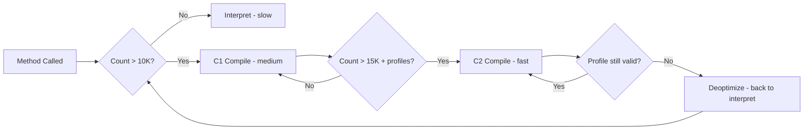

---

### 📶 Gradual Depth

**Level 1 - What it is:** Java does not compile your code to machine code at build time. It compiles WHILE RUNNING, after observing which code is used most. This means the first few seconds are slow (warming up) but steady-state is very fast (optimized for actual usage).

**Level 2 - How to use it:** For benchmarking: use JMH (Java Microbenchmark Harness) which handles warmup automatically. For production: expect 10-30s of degraded performance after startup. Size thread pools and health checks to account for warmup.

**Level 3 - How it works:** Tiered compilation: methods start in interpreter (level 0), get compiled by C1 with profiling (level 1-3), then compiled by C2 with full optimization (level 4). Each tier is faster but costs more CPU to compile. C2 uses profile data (which branches taken, which types seen) to generate specialized code.

**Level 4 - Production mastery:** JIT warmup affects production in two ways: (1) Newly deployed instances have degraded performance for 30s-5min (depending on path coverage). Load balance accordingly (gradual traffic ramp). (2) Deoptimization: if runtime behavior changes from what was profiled (new type, previously-untaken branch), C2 discards optimized code and recompiles. This causes momentary latency spikes. Monitor deopt count in JFR.

---

### ⚙️ How It Works

**Phase 1 - Interpretation:** Method invoked first time. Bytecode interpreted instruction-by-instruction. Slow (10-100x vs native). Profiling data collected (branch frequencies, type observations).

**Phase 2 - C1 Compilation (Tier 1-3):** After ~1.5K invocations, C1 compiles with basic optimizations (inlining small methods, simple dead code). 5-10x speedup. Continues profiling.

**Phase 3 - C2 Compilation (Tier 4):** After ~10K-15K invocations with rich profile data, C2 compiles with aggressive optimizations: speculative devirtualization, escape analysis, loop unrolling, vectorization. Near-native speed (sometimes FASTER due to specialization).

**Phase 4 - Steady State / Deoptimization:** If assumptions made by C2 are violated (new type loaded, never-taken branch taken), JVM deoptimizes: discards compiled code, returns to interpreter, reprofiles, recompiles.

```text
Tiered compilation levels:
  Level 0: Interpreter (slowest, no compilation)
  Level 1: C1 simple (fast compile, basic opt)
  Level 2: C1 with invocation counters
  Level 3: C1 with full profiling
  Level 4: C2 (slow compile, aggressive opt)

  Normal progression: 0 -> 3 -> 4
  (Skip levels 1,2 - they are for space-saving)

Compilation visible in logs:
  -Xlog:jit+compilation=info
  [jit,compilation] 1234 % 4
    com.app.Service::process (150 bytes)
  # 1234 = compile ID
  # % = OSR (on-stack replacement)
  # 4 = tier (C2)
```

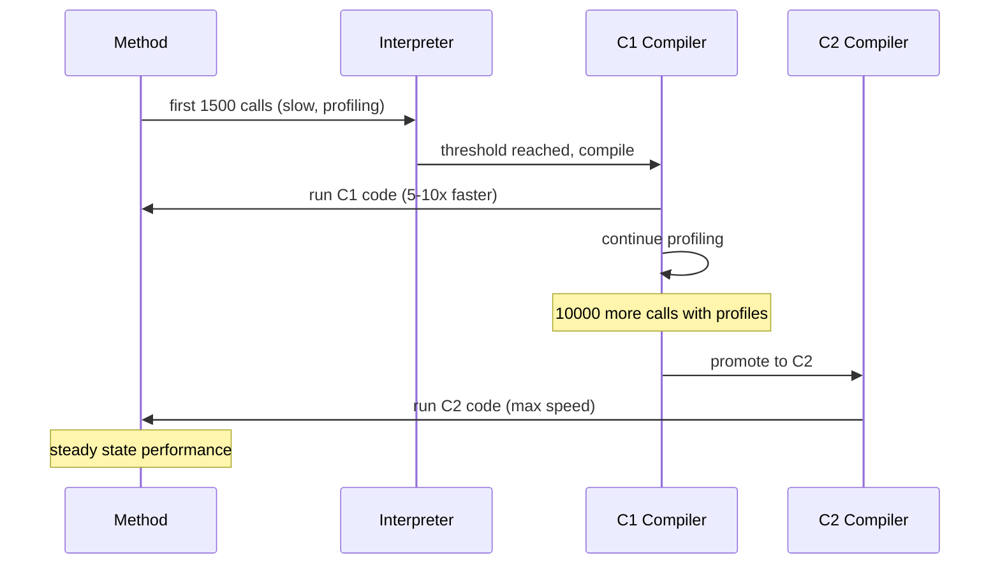

---

### 🚨 Failure Modes

**Failure 1 - Benchmark Without Warmup:**

**Symptom:** Java code benchmarks at 100ms per operation. Same algorithm in C benchmarks at 5ms. Conclusion: "Java is 20x slower."

**Root cause:** Java benchmark measured interpreted/early-JIT performance. Did not allow warmup iterations.

**Diagnostic:**

```bash
# Check if method was compiled:
-Xlog:jit+compilation=info
# If method not in compilation log during benchmark:
# you measured interpretation, not compiled code
# Use JMH:
@Benchmark
@Warmup(iterations = 5, time = 1)
@Measurement(iterations = 5, time = 1)
public int measure() { return compute(); }
```

**Fix:** Use JMH for all microbenchmarks. It handles warmup, compilation, dead code elimination prevention, and statistical analysis automatically.

**Failure 2 - Deoptimization Storm:**

**Symptom:** Periodic latency spikes (100-500ms) in a warm service. JFR shows multiple deoptimizations at spike time.

**Root cause:** Code pattern causes repeated deopt/recompile cycles. Common: megamorphic call site (>2 receiver types invalidates C2 speculation).

**Diagnostic:**

```bash
# Count deoptimizations:
-Xlog:jit+compilation=info | grep "made not entrant"
# If frequent: identify the method
# JFR: jdk.Deoptimization events
```

**Fix:** Reduce polymorphism at hot call sites. Use final classes/methods where possible. Or accept the deopt overhead if polymorphism is architecturally required.

---

### 🔬 Production Reality

The most impactful JIT-related production decision is deployment warmup strategy. Without warmup, a newly deployed instance handles production traffic while still interpreting hot paths - resulting in 10-50x slower response times for the first 30-60 seconds. Strategies: (1) Gradual traffic ramp: load balancer sends 1% traffic initially, increasing over 60s. (2) Synthetic warmup: run representative requests against the instance before adding to load balancer. (3) Class Data Sharing (CDS) + AOT cache (JDK 19+): pre-warm compilation state from previous runs.

---

### ⚖️ Trade-offs & Alternatives

| Aspect          | JIT (default)      | AOT (native image)    | CRaC/CDS (hybrid)   |
| --------------- | ------------------ | --------------------- | ------------------- |
| Startup speed   | 3-30s warmup       | 50ms (no warmup)      | 200ms (pre-warmed)  |
| Peak throughput | Highest (profiled) | 70-90% of JIT         | Same as JIT         |
| Deopt risk      | Yes                | No (no JIT)           | Yes (after restore) |
| Benchmark ease  | Requires JMH       | Simple (stable)       | Requires JMH        |
| Code complexity | None               | Config + restrictions | Checkpoint setup    |

---

### ⚡ Decision Snap

**TEACH JUNIORS THESE 3 RULES:**

- Never benchmark without JMH (handles warmup, prevents dead code elimination).
- First 30s after deploy is slow (inform health checks and load balancers).
- If performance is non-deterministic: it is probably JIT/deopt (check compilation logs).

**FOR PRODUCTION:**

- Gradual traffic ramp for new deployments.
- Monitor deoptimization count (JFR events).
- CDS/AOT cache for startup-sensitive services.

---

### ⚠️ Top Traps

| #   | Misconception                          | Reality                                                                                                                   |
| --- | -------------------------------------- | ------------------------------------------------------------------------------------------------------------------------- |
| 1   | "Java is inherently slow"              | Interpreted Java is slow. JIT-compiled Java matches or exceeds C++ for many workloads (profile-guided specialization).    |
| 2   | "-Xcomp makes everything faster"       | -Xcomp compiles ALL methods immediately without profile data. Produces WORSE code than tiered compilation with profiling. |
| 3   | "JIT warmup takes seconds"             | Full warmup (all hot paths at C2) can take 1-5 MINUTES for complex applications. Not just seconds.                        |
| 4   | "Once compiled, always fast"           | Deoptimization can discard compiled code. Performance can regress after stable period if assumptions change.              |
| 5   | "I can force JIT to compile my method" | CompileCommand=compileonly skips profiling. The compiled code will be WORSE. Let the JVM decide timing.                   |

---

### 🪜 Learning Ladder

**Prerequisites:**

- JVM-052 JIT Compilation Tiers (C1 and C2) - deeper JIT mechanics
- JVM-053 Method Inlining and Escape Analysis - key JIT optimizations

**THIS:** JVM-097 Teaching JIT - The 5 Questions Juniors Ask

**Next steps:**

- JVM-079 JIT Code Cache and Deoptimization - advanced JIT production issues
- JVM-090 Ahead-of-Time Compilation (GraalVM Native) - alternative to JIT for startup-sensitive cases

---

**The Surprising Truth:**

JIT-compiled Java can be FASTER than C++ for polymorphic code. C++ virtual method calls go through a vtable indirection that cannot be optimized away at compile time (because new subclasses could be loaded dynamically). Java's JIT uses runtime profiling: if it observes that a virtual call site always receives `ConcreteClass`, it speculatively devirtualizes and inlines the method body. If the speculation holds (it usually does), Java executes the method WITHOUT any indirection - while C++ still pays the vtable cost every time.

**Further Reading:**

- Aleksey Shipilev, "JVM Anatomy Quarks" series - JIT internals explained clearly
- Oracle docs: "Understanding JIT Compilation and Optimizations"
- JMH documentation (openjdk.org) - correct benchmarking methodology

**Revision Card:**

1. JIT timeline: interpreted (slow) -> C1 (medium, 1.5K calls) -> C2 (fast, 10K+ calls). Full warmup: 30s-5min.
2. Benchmark rule: ALWAYS use JMH. Any benchmark without warmup measures interpretation, not compiled performance.
3. Production rule: ramp traffic to new instances gradually. First 30-60s = degraded (JIT warmup in progress).

**BAD:**

```java
// Benchmark without warmup (WRONG)
long start = System.nanoTime();
for (int i = 0; i < 1000; i++) {
    result = compute(data);
}
long elapsed = System.nanoTime() - start;
System.out.println("Avg: " + elapsed/1000 + "ns");
// Measured INTERPRETATION speed, not compiled.
// Result: "Java is 20x slower than C"
// Reality: JIT never had time to compile.
```

**GOOD:**

```java
// Correct benchmark with JMH
@BenchmarkMode(Mode.AverageTime)
@OutputTimeUnit(TimeUnit.NANOSECONDS)
@Warmup(iterations = 5, time = 2)
@Measurement(iterations = 5, time = 2)
@Fork(2)
public class MyBenchmark {
    @Benchmark
    public int compute(BenchState state) {
        return compute(state.data);
    }
}
// JMH handles: warmup, compilation, dead code,
// statistics. Result: actual compiled speed.
```

---

---

# JVM-098 Build a JVM Dashboard - Phase 3 (Diagnosis)

**TL;DR** - A diagnosis-ready JVM dashboard shows GC phase breakdown, allocation rate, safepoint timing, and JIT state - enabling root-cause identification without leaving the dashboard.

---

### 🔥 Problem Statement

During a production incident, the team opens Grafana. They see: heap used = 6.2GB / 8GB. GC pause = 2.1s (last 5min max). They know SOMETHING is wrong but cannot identify the root cause from the dashboard. Is it allocation rate spike? Old gen fragmentation? Long TTSP? Deoptimization storm? The basic dashboard shows symptoms (high pause, high heap) but not causes. A Phase 3 diagnosis dashboard shows the WHY - enabling root-cause identification in < 2 minutes from the dashboard alone.

---

### 📜 Historical Context

JVM dashboards evolved in three phases: Phase 1 (awareness): heap used, thread count, basic GC count. Phase 2 (alerting): GC pause time, heap pressure, Full GC occurrences. Phase 3 (diagnosis): GC phase breakdown, allocation/promotion rates, safepoint timing, JIT compilation state, per-generation sizing, IHOP threshold. Most organizations stop at Phase 2, requiring engineers to SSH into instances and manually analyze GC logs during incidents. Phase 3 dashboards make incidents diagnosable FROM the dashboard without manual log analysis.

---

### 🔩 First Principles

**CORE INVARIANTS:**

1. **Symptoms are not causes:** High GC pause is a SYMPTOM. Root causes include: high allocation rate, promotion failure, fragmentation, TTSP from counted loops, Full GC from IHOP. The dashboard must show causes, not just symptoms.
2. **Temporal correlation reveals causality:** If allocation rate spikes 10s before GC pause spikes, allocation rate is the cause. Dashboards must show metrics on the SAME time axis for correlation.
3. **Normal baselines enable anomaly detection:** A metric value means nothing without context. The dashboard must show current vs baseline (same time yesterday, 7-day trend, fleet comparison).

**DERIVED DESIGN:**

These invariants mean: (1) dashboard panels show decomposed metrics (GC pause broken into young/mixed/full, each phase timed separately), (2) all panels share the same time range for visual correlation, (3) reference lines or bands show normal baselines.

**THE TRADE-OFF:**

**Gain:** Diagnose root cause in <2 minutes during incident. Reduce mean-time-to-diagnose by 10x vs manual log analysis. Team can diagnose without JVM expertise.

**Cost:** More complex dashboard setup. Higher metric cardinality. Requires Micrometer or custom JFR exporter.

---

### 🧠 Mental Model

> A Phase 3 dashboard is like an ICU patient monitor vs a basic thermometer. The thermometer says "fever" (Phase 1). The nurse's chart adds "fever started at 2am, getting worse" (Phase 2). The ICU monitor shows: white blood cell count, oxygen saturation, blood pressure, EKG - telling the doctor WHY there is a fever and WHAT to treat (Phase 3). Each metric on the ICU monitor corresponds to a possible root cause.

- "Thermometer" -> Phase 1 dashboard (heap used, basic GC)
- "Nurse's chart" -> Phase 2 (trends, alerts)
- "ICU monitor" -> Phase 3 (decomposed, causal metrics)
- "Each readout" -> specific root-cause signal
- "Same time axis" -> temporal correlation for diagnosis

**Where this analogy breaks down:** ICU monitors show independent vital signs. JVM metrics are causally connected (allocation rate -> GC frequency -> pause time). The dashboard must show these causal chains explicitly.

---

### 🧩 Components

- **Panel: GC Pause Decomposition:** Break total pause into: young GC, mixed GC, full GC, remark pause, TTSP (time to safepoint). Shows WHERE time is spent.
- **Panel: Allocation & Promotion Rate:** MB/s allocated in young gen. MB/s promoted to old gen. High allocation = more GC. High promotion = old gen filling.
- **Panel: Generation Sizing:** Young gen, survivor, old gen sizes over time. Shows ergonomic decisions and generation balancing.
- **Panel: Safepoint Timing:** Time-to-safepoint distribution. Detects counted-loop stalls and JNI delays.
- **Panel: JIT Activity:** Compilations per minute, deoptimizations, code cache occupancy. Detects warmup and deopt storms.
- **Panel: Fleet Comparison:** This instance vs fleet median for each key metric. Detects drift immediately.

```text
Phase 3 Dashboard Layout (6 rows):

Row 1: GC Health Overview
  [GC Pause p50/p99/max] [GC Freq] [Throughput%]

Row 2: Root Cause Decomposition
  [Young GC time] [Mixed GC time] [Full GC time]
  [TTSP] [Concurrent mark duration]

Row 3: Memory Flow
  [Allocation Rate MB/s] [Promotion Rate MB/s]
  [Live Set Size (old gen after GC)]

Row 4: Generation Dynamics
  [Young Gen Size] [Eden/Survivor ratio]
  [Old Gen Used vs Committed] [IHOP line]

Row 5: JIT & Safepoints
  [Compilations/min] [Deopts/min] [Code Cache %]
  [Safepoint TTSP distribution]

Row 6: Context
  [This instance vs fleet median] [Baseline overlay]
  [Deployment markers] [Incident annotations]
```

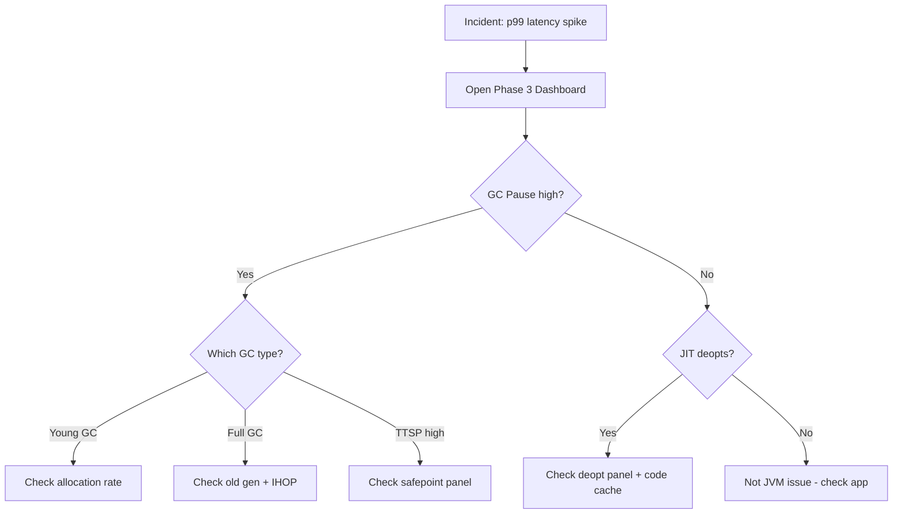

---

### 📶 Gradual Depth

**Level 1 - What it is:** A JVM dashboard designed for incident diagnosis - showing not just WHAT is wrong (high GC pause) but WHY (which GC phase, what is driving it, how it compares to baseline).

**Level 2 - How to use it:** During an incident: open dashboard. Look at GC pause decomposition (which type?). Look at allocation/promotion rate (what is driving GC?). Look at TTSP (is the problem even GC or is it safepoint?). This three-check sequence identifies root cause in most cases.

**Level 3 - How it works:** Metrics source: Micrometer JVM metrics (GC pause by cause/action, allocation bytes, live data size, classes loaded) + custom JFR streaming export (TTSP, compilation events, deoptimization events). Export to Prometheus. Grafana dashboards with shared time range across all panels.

**Level 4 - Production mastery:** The most powerful Phase 3 panel: "allocation rate vs GC frequency" plotted on the same graph. If allocation rate spikes and GC frequency follows with same shape (shifted right by seconds): the root cause is application-level allocation, not GC tuning. This prevents teams from tuning GC when the real fix is reducing allocation in the application code (caching, object pooling, reducing copies).

---

### ⚙️ How It Works

**Phase 1 - Metric Collection:**

JVM exposes via Micrometer:

```text
Metrics available from Micrometer JVM binder:
  jvm_gc_pause_seconds{action, cause}
  jvm_gc_memory_allocated_bytes_total
  jvm_gc_memory_promoted_bytes_total
  jvm_gc_live_data_size_bytes
  jvm_memory_used_bytes{area, id}
  jvm_memory_committed_bytes{area, id}
  jvm_threads_states{state}
  jvm_classes_loaded
```

**Phase 2 - Derived Metrics (recording rules):**

```text
Prometheus recording rules:
  allocation_rate_bytes_per_sec =
    rate(jvm_gc_memory_allocated_bytes_total[1m])
  promotion_rate_bytes_per_sec =
    rate(jvm_gc_memory_promoted_bytes_total[1m])
  gc_throughput_percent =
    1 - (rate(jvm_gc_pause_seconds_sum[5m]))
```

**Phase 3 - Dashboard Assembly:** Grafana panels with shared time range, fleet comparison overlays, and deployment markers.

```text
Key Grafana queries for Phase 3:

// GC Pause by type:
histogram_quantile(0.99,
  sum by (le, action) (
    rate(jvm_gc_pause_seconds_bucket[5m])))

// Allocation rate:
rate(jvm_gc_memory_allocated_bytes_total[1m])
  / 1024 / 1024  // MB/s

// Live data size (old gen after GC):
jvm_gc_live_data_size_bytes / 1024 / 1024 / 1024

// This instance vs fleet median:
jvm_gc_pause_seconds_max{instance="$instance"}
  / on() group_left()
  median(jvm_gc_pause_seconds_max)
```

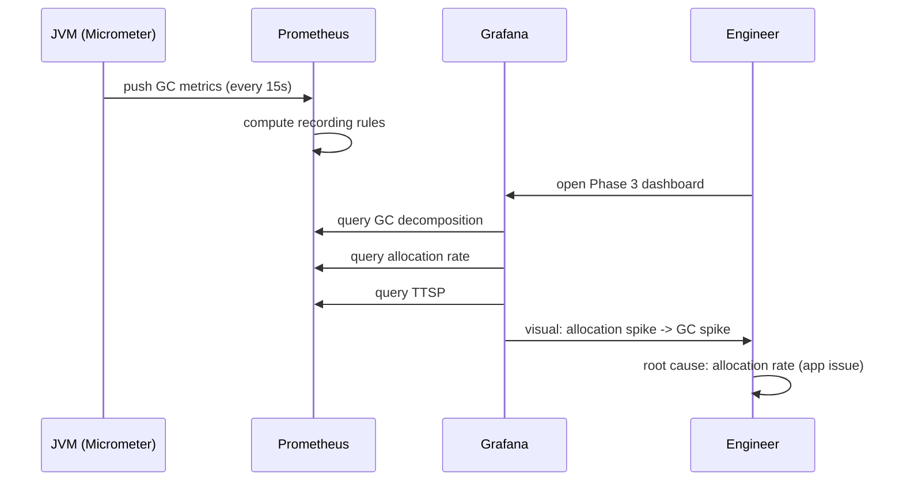

---

### 🚨 Failure Modes

**Failure 1 - Dashboard Overload (Too Many Panels):**

**Symptom:** Dashboard has 40 panels. Engineer cannot find the relevant one during incident. Scroll fatigue. Wrong conclusions from wrong panel.

**Root cause:** Dashboard grew organically without hierarchy. No clear reading path.

**Diagnostic:** Time an engineer diagnosing a simulated incident using the dashboard. If > 3 minutes to find root cause: dashboard is too complex.

**Fix:** Limit to 3 rows (18 panels max). Reading path: top-to-bottom = overview-to-detail. Remove rarely-used panels to separate "deep dive" dashboard.

**Failure 2 - Metric Resolution Too Low:**

**Symptom:** Dashboard shows 5-minute averages. Short GC storms (30 seconds of intense GC) are invisible in the smoothed data.

**Root cause:** Prometheus scrape interval 60s, recording rules over 5m window. Short incidents smoothed away.

**Diagnostic:**

```bash
# Check scrape interval:
# Prometheus config: scrape_interval: 60s
# 30s incident is 0.5 data points (invisible)
```

**Fix:** Reduce scrape interval to 15s for JVM targets. Use `max_over_time` instead of `rate` for spike detection. Ensure GC pause metric captures individual pauses (not averaged).

---

### 🔬 Production Reality

The transition from Phase 2 to Phase 3 dashboards typically reduces mean-time-to-diagnose by 5-10x for GC-related incidents. The key differentiator: decomposed GC pause. When an engineer can see that total GC pause = 2.1s, but it is 2.0s of TTSP + 0.1s of actual GC, they immediately know it is a safepoint issue (not a GC tuning issue). Without decomposition, they would spend 2 hours tuning GC parameters that have no effect on the TTSP problem.

---

### ⚖️ Trade-offs & Alternatives

| Aspect         | Phase 1 (basic) | Phase 2 (alerting) | Phase 3 (diagnosis)   |
| -------------- | --------------- | ------------------ | --------------------- |
| Panels         | 3-5             | 8-12               | 15-20                 |
| Diagnosis time | Need SSH + logs | Need SSH + logs    | Dashboard-only (2min) |
| Setup effort   | 1 hour          | 4 hours            | 1-2 days              |
| Metric count   | 5-10            | 15-25              | 40-60                 |
| Skill required | None            | GC awareness       | GC cause knowledge    |

---

### ⚡ Decision Snap

**BUILD PHASE 3 WHEN:**

- GC incidents happen more than monthly.
- MTTD for GC issues exceeds 10 minutes.
- Team lacks deep GC expertise (dashboard guides diagnosis).

**PHASE 3 MINIMUM VIABLE:**

- GC pause by type (young/mixed/full) [1 panel].
- Allocation rate + promotion rate [1 panel].
- TTSP + safepoint count [1 panel].
- This alone cuts diagnosis time significantly.

**SKIP PHASE 3 WHEN:**

- GC is not a problem (ZGC with <1ms pauses, no incidents).
- Very small fleet (1-2 instances, SSH is fast enough).

---

### ⚠️ Top Traps

| #   | Misconception                        | Reality                                                                                                           |
| --- | ------------------------------------ | ----------------------------------------------------------------------------------------------------------------- |
| 1   | "Heap % used = problem severity"     | Heap at 90% is normal (GC triggers before OOM). Allocation RATE matters more than current utilization.            |
| 2   | "GC pause panel is enough"           | Without decomposition (young/mixed/full/TTSP), you cannot identify root cause. Total pause hides the detail.      |
| 3   | "More metrics = better dashboard"    | Focused panels with clear reading path beat comprehensive but overwhelming dashboards. 18 panels max.             |
| 4   | "Dashboard replaces GC log analysis" | For 80% of incidents, yes. For complex cases (fragmentation, promotion failure), GC logs still needed for detail. |
| 5   | "Same dashboard for all audiences"   | Operators need overview (Phase 1-2). Engineers need diagnosis (Phase 3). Separate dashboards or drill-down links. |

---

### 🪜 Learning Ladder

**Prerequisites:**

- JVM-046 GC Logging and Analysis - understand what metrics to expose on dashboard
- JVM-095 JVM Fleet Observability - Key Metrics - fleet context for Phase 3 panels

**THIS:** JVM-098 Build a JVM Dashboard - Phase 3 (Diagnosis)

**Next steps:**

- JVM-087 JVM Production Incident Simulation - validate dashboard using simulated incidents
- JVM-088 JFR Custom Events and Continuous Profiling - JFR streaming feeds Phase 3 panels

---

**The Surprising Truth:**

The most underrated Phase 3 metric is "live data size" (old gen occupancy immediately AFTER a full GC or concurrent mark). This represents the TRUE working set of your application - the minimum memory it needs. If live data size is growing over days: you have a slow memory leak. If live data size is stable at 50% of max heap: your heap is correctly sized (50% headroom for GC). If live data size is 85% of max heap: you need more heap regardless of what GC tuning you apply. This single metric answers "is my heap big enough?" definitively.

**Further Reading:**

- Micrometer documentation: "JVM Metrics" binder reference
- Grafana Labs blog: "JVM Monitoring Best Practices"
- Jon Schneider, "Micrometer in Action" (production metrics patterns)

**Revision Card:**

1. Phase 3 diagnosis path: GC pause by type -> allocation/promotion rate -> TTSP. Three checks identify most root causes.
2. Key metric: live data size (old gen after GC). Growing = leak. Stable at 50% heap = healthy. At 85% = need more heap.
3. Dashboard reading path: top-to-bottom = overview-to-detail. Max 18 panels. Shared time range. Fleet comparison.

**BAD:**

```text
# Phase 1 dashboard during incident:
# Panel: Heap Used = 7.2GB / 8GB
# Panel: GC Count = 847 (last hour)
# Panel: Threads = 312
# Engineer: "Heap is high. GC is frequent. Why?"
# SSH into instance. Analyze GC logs manually.
# 45 minutes to root cause.
```

**GOOD:**

```text
# Phase 3 dashboard during same incident:
# Panel: GC Pause = 2.1s (type: Full GC!)
# Panel: Allocation Rate = 800 MB/s (10x normal!)
# Panel: Promotion Rate = 200 MB/s (fills old gen)
# Panel: TTSP = 12ms (normal, not the cause)
# Engineer: "Allocation spike caused Full GC."
#   -> Check: what changed? (deployment 10min ago)
#   -> Root cause in 2 minutes from dashboard alone.
```

---

---

# JVM-099 JVM Deep-Dive Interview Questions

**TL;DR** - JVM deep-dive interviews test reasoning about production behavior under pressure - not trivia but connected understanding of GC, JIT, memory, and threading.

---

### 🔥 Problem Statement

An interviewer asks "How does G1 work?" The candidate recites: "region-based, pause time goal, mixed GC." The interviewer learns nothing about the candidate's ability to DIAGNOSE production issues with G1. Better questions test connected reasoning: "Your G1 service has frequent Full GCs despite 40% free heap - what are the possible causes and how would you diagnose each?" This tests real competence: connecting symptoms to causes to diagnostic tools to fixes.

---

### 📜 Historical Context

JVM interview questions evolved from trivia ("What are the GC generations?") to scenario-based ("Diagnose this incident"). Modern staff+ interviews at JVM-heavy organizations (financial services, ad tech, streaming) present realistic scenarios requiring candidates to demonstrate: (1) recognition of symptoms, (2) differential diagnosis (multiple possible causes), (3) specific diagnostic steps (not generic "check logs"), (4) targeted fixes with trade-off awareness.

---

### 🔩 First Principles

**CORE INVARIANTS:**

1. **Connected reasoning > isolated facts:** Knowing that "G1 has regions" is useless without knowing HOW region size affects humongous allocation, WHICH triggers fragmentation, THAT causes Full GC.
2. **Diagnosis skill requires tool knowledge:** Candidates must name SPECIFIC tools and commands - not "check monitoring" but "jcmd PID GC.heap_info shows per-generation occupancy."
3. **Trade-off awareness signals seniority:** Junior answers give one solution. Senior answers give 2-3 options with trade-offs. Staff answers include "when NOT to use this."

**DERIVED DESIGN:**

These invariants mean: (1) good interview questions present SYMPTOMS and ask for CAUSES (not the reverse), (2) follow-up questions test depth ("what if that is not the cause?"), (3) evaluation criteria focus on reasoning process, not memorized answers.

**THE TRADE-OFF:**

**Gain:** Identifies candidates who can handle real production incidents. Filters for connected understanding vs surface knowledge.

**Cost:** Requires interviewers with deep JVM knowledge. Hard to evaluate fairly (multiple valid diagnostic paths). Takes longer than trivia questions.

---

### 🧠 Mental Model

> JVM interviews should be like medical differential diagnosis. The patient (production system) has symptoms. The doctor (candidate) must: (1) ask clarifying questions about symptoms, (2) propose possible diagnoses ranked by likelihood, (3) name specific tests (tools) to confirm/eliminate each diagnosis, (4) recommend treatment (fix) with side effects (trade-offs). Trivia-style questions are like asking a doctor to recite anatomy textbook chapters - tests memory, not diagnostic ability.

- "Patient symptoms" -> production metrics/behavior described
- "Differential diagnosis" -> multiple possible root causes
- "Specific tests" -> jcmd, jstat, JFR, heap dump commands
- "Treatment + side effects" -> fix + trade-off awareness
- "Anatomy recitation" -> trivia questions (low signal)

**Where this analogy breaks down:** in medicine, wrong diagnosis can be fatal. In interviews, the goal is to observe the REASONING PROCESS. A candidate who proposes a wrong diagnosis but shows excellent diagnostic reasoning is stronger than one who knows the "right answer" but cannot explain why.

---

### 🧩 Components

The five question categories for JVM deep-dive:

- **Category 1 - GC Diagnosis:** "Service shows X GC behavior, diagnose." Tests: GC mechanism understanding, tool knowledge, fix awareness.
- **Category 2 - Memory Analysis:** "Heap dump shows Y, explain." Tests: object lifecycle, reference types, memory leak patterns.
- **Category 3 - Performance Reasoning:** "First requests are slow, steady state is fast, why?" Tests: JIT understanding, warmup, deoptimization.
- **Category 4 - Concurrency & Threading:** "Thread dump shows Z, what is happening?" Tests: lock analysis, deadlock detection, thread state understanding.
- **Category 5 - System Integration:** "Container gets OOM killed but JVM heap is fine." Tests: native memory, container limits, off-heap awareness.

```text
Interview evaluation rubric:

Level 1 (Junior) - can answer:
  What are the GC generations?
  What does -Xmx do?
  What is a thread dump?

Level 2 (Mid) - can answer:
  Why does G1 trigger Full GC?
  How would you diagnose a memory leak?
  What is JIT warmup?

Level 3 (Senior) - can answer:
  Given these symptoms, what are 3 possible causes?
  Which tool confirms each cause? (specific commands)
  What are the trade-offs of each fix?

Level 4 (Staff+) - can answer:
  How does this interact at fleet scale?
  When would you NOT fix this (acceptable trade-off)?
  How would you prevent this class of issue structurally?
```

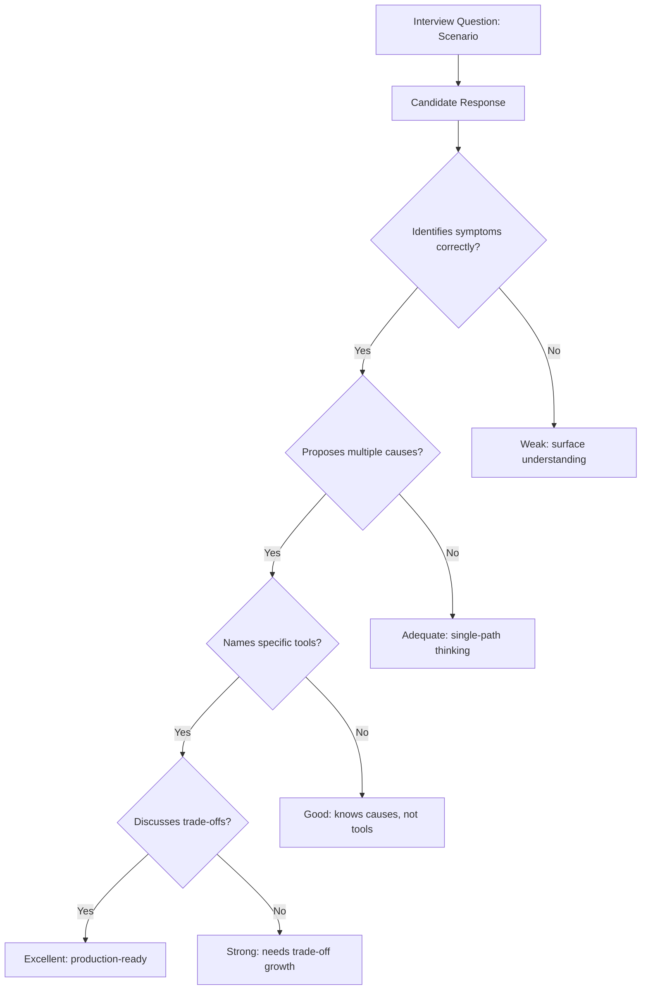

---

### 📶 Gradual Depth

**Level 1 - What it is:** JVM interview questions that test real diagnostic ability rather than memorized facts. Focus on scenario-based questions where candidates must connect symptoms to causes to tools to fixes.

**Level 2 - How to use it:** Present a production scenario. Ask: "What could cause this? How would you diagnose? What would you fix?" Follow up with: "What if that was not the cause?" to test depth. Evaluate reasoning process, not specific answer.

**Level 3 - How it works:** Strong questions have multiple valid diagnostic paths. Example: "G1 Full GC with 40% free heap" could be: humongous allocation failure, IHOP too high, fragmentation, metaspace exhaustion (triggers Full GC). Each path has specific diagnostics. The candidate's ability to enumerate and rank these paths reveals depth.

**Level 4 - Production mastery:** The strongest signal in JVM interviews is when a candidate ASKS CLARIFYING QUESTIONS before answering. "What is the heap size?", "Which JDK version?", "How long has it been running?" shows they know that the SAME symptom has different causes in different contexts. A candidate who immediately jumps to one answer without asking context is likely pattern-matching from blogs, not reasoning from first principles.

---

### ⚙️ How It Works

**The Question Bank (5 scenarios with diagnostic paths):**

**Scenario 1: "GC pause spikes every 30 minutes"**

```text
Expected reasoning path:
  Q: "How long are the spikes?"
  If 1-5s: likely Full GC or long mixed GC
  If 10-30s: likely TTSP (counted loop/JNI)

  Causes to enumerate:
  1. Concurrent mark not completing -> Full GC
     Tool: -Xlog:gc*=info (look for "Full GC")
  2. Humongous allocation failure
     Tool: gc log "humongous" + region size
  3. TTSP from counted loop
     Tool: -Xlog:safepoint=info (check TTSP)
  4. Metaspace expansion (triggers Full GC)
     Tool: jcmd VM.native_memory + metaspace

  Fix per cause:
  1. Lower IHOP or increase heap
  2. Increase G1HeapRegionSize
  3. UseCountedLoopSafepoints
  4. Set MaxMetaspaceSize, fix class leak
```

**Scenario 2: "RSS grows but heap is stable"**

```text
Expected reasoning path:
  Q: "How fast is RSS growing?"
  Q: "Is NMT enabled?"

  Causes to enumerate:
  1. Direct ByteBuffer leak
     Tool: heap dump (find DirectByteBuffer refs)
  2. JNI native memory leak
     Tool: jemalloc profiling
  3. Thread leak (each thread = 1MB stack)
     Tool: jcmd Thread.print | wc -l
  4. Metaspace growth (class loading leak)
     Tool: jcmd VM.native_memory summary.diff

  Senior answer includes:
  - "Container OOM kill despite Xmx headroom"
  - "NMT only tracks JVM-internal, not JNI"
  - "System.gc() helps Direct BB reclaim"
```

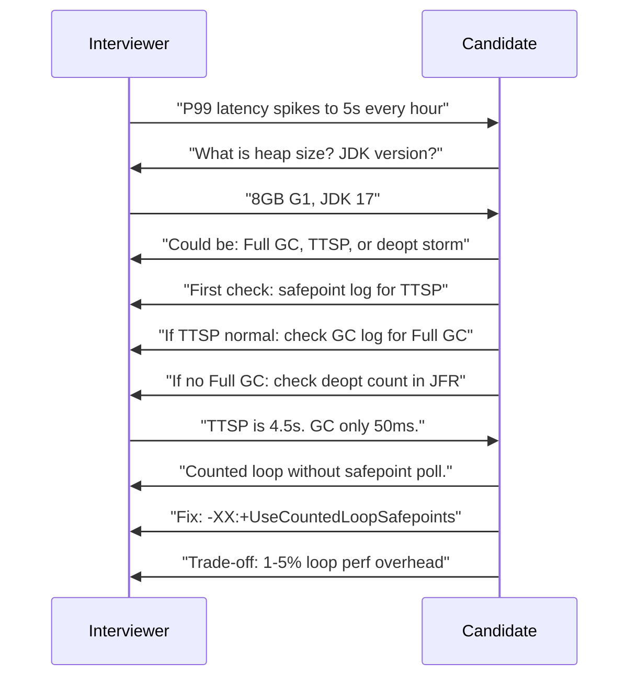

---

### 🚨 Failure Modes

**Failure 1 - Trivia Interview (Low Signal):**

**Symptom:** Interview asks: "How many GC generations are there?" "What is the default MaxPermSize?" Candidate with 2 weeks of study passes. Candidate with 5 years production experience provides same answers.

**Root cause:** Questions test memorized facts, not diagnostic reasoning. No scenario context. No follow-up probing.

**Diagnostic:** After the interview, ask: "Could I distinguish a junior who memorized answers from a senior with real production experience?" If not: questions are trivia.

**Fix:** Replace every fact question with a scenario. Instead of "What is IHOP?" ask "Your G1 keeps triggering Full GC. You check IHOP and find it at 45%. What does this tell you and what would you change?"

**Failure 2 - Single-Path Evaluation:**

**Symptom:** Interviewer has ONE expected answer. Candidate gives a different valid diagnostic path. Interviewer marks wrong.

**Root cause:** Interviewer does not understand that JVM diagnosis has multiple valid approaches. Evaluating against single expected answer.

**Diagnostic:** Show the rubric to 3 senior engineers. Ask if the candidate's alternative path is valid.

**Fix:** Build rubric around QUALITY SIGNALS (asks context, enumerates causes, names tools, discusses trade-offs) not specific answers. Accept multiple valid paths.

---

### 🔬 Production Reality

In hiring for JVM-heavy roles (performance engineering, SRE for Java services, distributed systems), the single highest-signal question is: "Tell me about a production JVM incident you diagnosed." Strong candidates provide: specific symptoms, their diagnostic sequence, wrong hypotheses they eliminated, the actual root cause, and what they changed to prevent recurrence. Weak candidates either have no real incidents (theoretical knowledge only) or describe "fixed by restart" without diagnosis.

---

### ⚖️ Trade-offs & Alternatives

| Aspect           | Trivia questions | Scenario-based        | Live debugging (pair) |
| ---------------- | ---------------- | --------------------- | --------------------- |
| Prep time (int.) | 10 min           | 1 hour                | 2 hours               |
| Signal quality   | Low              | High                  | Highest               |
| Candidate stress | Low              | Moderate              | High                  |
| Fairness         | High (objective) | Moderate (subjective) | Lower (pressure)      |
| Time needed      | 15 min           | 30-45 min             | 60 min                |

---

### ⚡ Decision Snap

**USE SCENARIO QUESTIONS WHEN:**

- Hiring for roles that handle JVM production issues.
- Want to distinguish theory from practice.
- Have interviewers with deep JVM production experience.

**USE TRIVIA AS SCREENING ONLY:**

- Phone screen: "What happens during a Full GC?" (eliminates no-JVM-knowledge candidates).
- Never as the primary evaluation.

**USE LIVE DEBUGGING WHEN:**

- Hiring senior/staff performance engineers.
- Can provide a realistic environment (pre-built scenario).
- Have 60+ minutes of interview time.

---

### ⚠️ Top Traps

| #   | Misconception                       | Reality                                                                                                                            |
| --- | ----------------------------------- | ---------------------------------------------------------------------------------------------------------------------------------- |
| 1   | "Correct answer = competent"        | Process matters more. A wrong initial hypothesis with good reasoning outranks a memorized correct answer.                          |
| 2   | "More questions = better signal"    | 2-3 deep scenarios with follow-ups yield more signal than 20 shallow questions. Depth > breadth.                                   |
| 3   | "Must know exact JVM flags"         | Knowing "-XX:+UseCountedLoopSafepoints" is a bonus. Knowing "there is a flag that adds polls to counted loops" is sufficient.      |
| 4   | "Only GC knowledge matters"         | JVM interviews should cover: GC + Memory + JIT + Threading + Containers. Real incidents span multiple areas.                       |
| 5   | "Junior cannot pass JVM interviews" | Adjust question depth to level. Junior: "What could cause OOM?" Senior: "Diagnose this specific OOM scenario with these symptoms." |

---

### 🪜 Learning Ladder

**Prerequisites:**

- JVM-060 Memory Leak Diagnosis Workflow - diagnostic methodology for interview scenarios
- JVM-087 JVM Production Incident Simulation - practice scenarios that appear in interviews

**THIS:** JVM-099 JVM Deep-Dive Interview Questions

**Next steps:**

- JVM-100 JVM Mastery Verification - self-assessment against full JVM knowledge map
- JVM-097 Teaching JIT - The 5 Questions Juniors Ask - common junior-level questions to expect

---

**The Surprising Truth:**

The strongest JVM interview signal is not technical knowledge - it is the candidate saying "I do not know, but here is how I would find out." Production JVM work constantly surfaces behaviors you have never seen before. The ability to reason from first principles to a diagnostic plan for an UNKNOWN problem is more valuable than encyclopedic knowledge of known problems. Ask: "You see JVM behavior you have never encountered. Walk me through your first 10 minutes." The candidate who says "check GC logs, check thread dump, check NMT, check JFR" with rationale for each is stronger than one who guesses a specific root cause.

**Further Reading:**

- Aleksey Shipilev, "The Art of JVM Profiling" - mental models for JVM reasoning
- Kirk Pepperdine, "Java Performance Workshops" - scenario-based learning approach
- Charlie Hunt, "Java Performance: The Definitive Guide" - diagnostic methodology chapters

**Revision Card:**

1. Good JVM questions present SYMPTOMS, ask for CAUSES + TOOLS + TRADE-OFFS. Not trivia. Scenario-based.
2. Evaluate PROCESS not answers: asks clarifying questions, enumerates multiple causes, names specific tools, discusses trade-offs.
3. Strongest signal: "I do not know, but I would check X because Y." Reasoning from principles > memorized answers.

**BAD:**

```text
# Trivia interview (low signal):
Q: "How many GC generations?"  A: "Young, Old"
Q: "Default Xmx?"  A: "1/4 of RAM"
Q: "Name 3 GC algorithms"  A: "Serial, G1, ZGC"
# Candidate studied 2 hours. Passed.
# Cannot diagnose real incidents.
# Same score as 10-year veteran.
```

**GOOD:**

```text
# Scenario interview (high signal):
Q: "Service OOM killed. Heap 4GB in 6GB container.
    Heap dump shows 2.8GB used. Why OOM?"
A: "Native memory. RSS > container limit."
   "Causes: Direct BB leak, thread stacks, metaspace"
   "Diagnose: NMT diff, check thread count,
    check DirectByteBuffer instances in heap dump"
   "Fix: bound Direct BB, fix leak, account for native
    in container sizing: Xmx + native <= container"
# Demonstrates connected reasoning under pressure.
```

---

---

# JVM-100 JVM Mastery Verification

**TL;DR** - JVM mastery is verified by ability to diagnose novel production issues, predict behavior under described conditions, and make informed JVM configuration decisions at scale.

---

### 🔥 Problem Statement

An engineer has studied JVM internals for months: read blog posts, watched conference talks, completed this learning ladder. They believe they understand the JVM deeply. But can they actually APPLY this knowledge under production pressure? Without a structured verification framework, knowledge remains theoretical. Mastery verification provides concrete, testable competencies that distinguish "studied it" from "can do it under pressure."

---

### 📜 Historical Context

JVM expertise historically required years of production experience because there was no structured curriculum. Knowledge was passed through tribal wisdom, war stories, and painful incidents. The emergence of structured learning paths (this ladder, JVM performance books, certification programs) provides knowledge but not verification. Verification requires: (1) scenario-based testing, (2) hands-on diagnosis of intentionally broken systems, (3) design review capability (reviewing others' JVM decisions).

---

### 🔩 First Principles

**CORE INVARIANTS:**

1. **Mastery = reliable execution under novelty:** A master can diagnose JVM issues they have NEVER seen before by reasoning from first principles. This is the defining difference from "has memorized patterns."
2. **Mastery is multi-dimensional:** GC expertise without threading knowledge, or memory expertise without JIT understanding, is incomplete. Real incidents cross boundaries.
3. **Mastery degrades without practice:** JVM internals evolve (new GC algorithms, new features, changed defaults). Mastery requires continuous engagement with production systems.

**DERIVED DESIGN:**

These invariants mean: (1) verification must test NOVEL scenarios (not the same scenarios studied), (2) verification must span all JVM subsystems in connected scenarios, (3) re-verification periodically (annual) ensures currency with JVM evolution.

**THE TRADE-OFF:**

**Gain:** Confidence in own capabilities. Identification of knowledge gaps. Career progression evidence. Team skill assessment.

**Cost:** Time investment for verification exercises. Requires access to practice environments. Ego risk (discovering gaps).

---

### 🧠 Mental Model

> JVM mastery verification is like a pilot's checkride. Knowing how a plane works (study) is necessary but not sufficient. The checkride tests: can you fly safely under abnormal conditions you have not rehearsed? Can you make correct decisions under time pressure with incomplete information? Can you explain your decisions to the examiner? A pilot who has studied everything but never handled a simulated engine failure is not verified.

- "Checkride" -> verification exercise (scenario-based test)
- "Fly under abnormal conditions" -> diagnose novel JVM issues
- "Correct decisions under pressure" -> time-bounded diagnosis
- "Explain decisions" -> articulate reasoning (not just outcome)
- "Simulated engine failure" -> intentionally broken JVM scenario

**Where this analogy breaks down:** pilot verification is pass/fail with specific criteria. JVM mastery is a spectrum - you can be masterful in GC but intermediate in JIT. Verification should identify your specific level per subsystem.

---

### 🧩 Components

The 6 verification dimensions:

- **Dimension 1 - GC Mastery:** Can diagnose Full GC, TTSP, allocation rate issues, fragmentation. Can select and tune GC for specific workload. Can predict GC behavior from heap configuration.
- **Dimension 2 - Memory Mastery:** Can diagnose heap leaks, native leaks, metaspace exhaustion. Understands object lifecycle, reference types, and off-heap allocation.
- **Dimension 3 - JIT Mastery:** Can explain warmup, predict deoptimization triggers, use compilation logs. Understands when AOT is preferable.
- **Dimension 4 - Threading Mastery:** Can analyze thread dumps, detect deadlocks, diagnose contention. Understands virtual thread implications.
- **Dimension 5 - Production Mastery:** Can size containers correctly (heap + native + OS), configure logging, build monitoring. Understands fleet-level concerns.
- **Dimension 6 - Architecture Mastery:** Can make JVM-informed architecture decisions: GC algorithm selection, native vs JIT, heap sizing strategy, thread model selection.

```text
Mastery verification matrix:

Dimension       | L1 (Aware) | L2 (Can do) | L3 (Master)
----------------|------------|-------------|------------
GC              | Name algos | Tune G1     | Novel diag.
Memory          | Heap dump  | Leak find   | Native leak
JIT             | Know warmup| Read complog| Predict deopt
Threading       | Read dumps | Find deadlk | Scale design
Production      | Set Xmx    | Container sz| Fleet observe
Architecture    | Pick G1    | Native vs JIT| Trade-off doc

Verification method per level:
  L1: Written quiz (definitions, concepts)
  L2: Lab exercise (guided scenario)
  L3: Unguided novel scenario + teach-back
```

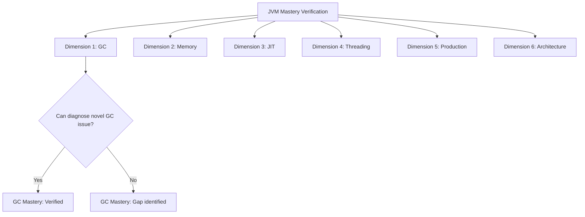

---

### 📶 Gradual Depth

**Level 1 - What it is:** A framework for testing whether your JVM knowledge is usable under pressure. Moves beyond "I have read about it" to "I can do it when something breaks at 3am."

**Level 2 - How to use it:** For each dimension, attempt the verification exercise described. Time yourself. If you cannot complete the exercise within the time limit without external references, that dimension needs more practice.

**Level 3 - How it works:** Each verification exercise presents a NOVEL scenario (not one you have studied). You must reason from first principles to diagnose. Success means: correct root cause identified, specific diagnostic commands named, fix proposed with trade-off awareness, time < target.

**Level 4 - Production mastery:** Ultimate verification: you are handed a production JVM instance exhibiting a problem you have never seen before. Can you diagnose it in < 15 minutes using available tools? Can you explain WHY it is happening (not just WHAT)? Can you propose a fix AND predict its side effects? This is the staff/principal engineer bar.

---

### ⚙️ How It Works

**Verification Exercise Template:**

```text
EXERCISE: [Dimension + Scenario Name]
SETUP: [Environment description]
SYMPTOMS: [What you observe]
TIME LIMIT: [Minutes]
SUCCESS CRITERIA:
  [ ] Root cause identified correctly
  [ ] Specific diagnostic tool/command named
  [ ] Fix proposed with trade-off articulated
  [ ] Completed within time limit
  [ ] Could explain reasoning to a peer
```

**Example Exercises:**

```text
Exercise 1 (GC Mastery):
  Symptoms: G1, 32GB heap, JDK 17.
    p99 latency = 800ms (target: 200ms).
    GC log shows: mixed GC every 3s, 150ms each.
    No Full GC. TTSP < 5ms.
  Question: Why is p99 so high if GC is only 150ms?
  Time: 10 minutes.
  Answer path: Mixed GC frequency (every 3s) means
    multiple GCs per request at p99. The issue is GC
    FREQUENCY not duration. Fix: reduce allocation
    rate OR increase young gen (accept longer pauses
    but less frequent).

Exercise 2 (Memory Mastery):
  Symptoms: 4GB Xmx, container 6GB. After 48h:
    RSS = 5.8GB. Heap = 3.1GB. NMT shows +400MB
    in "Other" category over 48h.
  Question: What is leaking and how to find it?
  Time: 15 minutes.
  Answer path: "Other" in NMT = Direct ByteBuffers.
    Find retained DirectByteBuffer refs in heap dump.
    Or: if NMT total does not account for all RSS
    growth, it is JNI malloc (need jemalloc profiling).
```

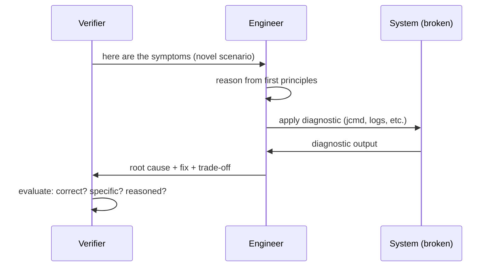

---

### 🚨 Failure Modes

**Failure 1 - Knowledge Without Application:**

**Symptom:** Engineer can explain GC algorithms perfectly in a meeting but freezes during actual incident. Cannot translate theory to diagnostic commands under time pressure.

**Root cause:** Studied theory without hands-on practice. Knowledge is declarative (can state facts) but not procedural (cannot execute sequence).

**Diagnostic:** Give a lab exercise with a broken JVM. Observe: do they know WHICH tool to use first? Can they interpret the output? Do they have a next step?

**Fix:** Incident simulation practice (JVM-087). Monthly hands-on exercises with real diagnostic tools. Theory + practice together.

**Failure 2 - Pattern Matching Without Reasoning:**

**Symptom:** Engineer diagnoses known patterns correctly (they have seen this before) but fails on novel scenarios. Cannot reason about JVM behavior they have not explicitly studied.

**Root cause:** Learned by memorizing incident patterns, not by understanding underlying mechanisms. Cannot transfer knowledge to new contexts.

**Diagnostic:** Present a scenario that COMBINES two failure modes they have studied separately (e.g., NUMA + fragmentation, or virtual threads + TTSP). Can they reason about the combined effect?

**Fix:** First-principles practice: for each mechanism, understand WHY it behaves that way, not just WHAT it does. Then novel combinations become reasonably predictable.

---

### 🔬 Production Reality

Organizations that implement structured JVM mastery verification (even informally: quarterly "JVM challenge" sessions where engineers diagnose intentionally broken systems) report measurable improvement in incident response. The key finding: engineers who can articulate "I am strong in GC and memory but weak in JIT and threading" make better decisions about when to escalate and who to involve. Self-awareness of gaps is itself a mastery signal.

---

### ⚖️ Trade-offs & Alternatives

| Aspect           | Self-assessment  | Peer verification     | Production incidents  |
| ---------------- | ---------------- | --------------------- | --------------------- |
| Objectivity      | Low (bias)       | Medium                | Highest (real)        |
| Safety           | High (no risk)   | High (lab)            | Low (real pressure)   |
| Feedback quality | Low              | High                  | Delayed (post-mortem) |
| Accessibility    | Always available | Need peers + env      | Cannot be scheduled   |
| Growth signal    | Unclear          | Clear (peer feedback) | Clear (outcome)       |

---

### ⚡ Decision Snap

**SELF-VERIFY REGULARLY WHEN:**

- Learning independently (this ladder).
- Want to identify gaps before they matter.
- No access to peer verification or lab environments.

**PEER-VERIFY QUARTERLY WHEN:**

- Team practices incident simulation (JVM-087).
- Hiring or promoting for JVM-heavy roles.
- Want calibrated, objective assessment.

**PRODUCTION-VERIFY CONTINUOUSLY WHEN:**

- Already handling real JVM incidents.
- Track your own MTTD and accuracy over time.
- Review each incident: "What did I not know?"

---

### ⚠️ Top Traps

| #   | Misconception                                | Reality                                                                                                         |
| --- | -------------------------------------------- | --------------------------------------------------------------------------------------------------------------- |
| 1   | "Reading this ladder = JVM mastery"          | Reading provides knowledge. Mastery requires application under pressure with novel scenarios. Practice > study. |
| 2   | "I will learn when an incident happens"      | Learning during real incidents is costly (downtime while learning). Practice beforehand with simulations.       |
| 3   | "Mastery is permanent"                       | JVM evolves (ZGC, virtual threads, new defaults). Re-verify annually. Knowledge from JDK 8 may be obsolete.     |
| 4   | "One dimension is enough"                    | Real incidents cross boundaries (GC + native memory + containers). Multi-dimensional mastery required.          |
| 5   | "Perfect knowledge needed before production" | 80% knowledge + reasoning ability > 100% knowledge without diagnostic skill. Start handling incidents early.    |

---

### 🪜 Learning Ladder

**Prerequisites:**

- JVM-099 JVM Deep-Dive Interview Questions - understand what mastery looks like from evaluator perspective
- JVM-087 JVM Production Incident Simulation - practice environment for verification

**THIS:** JVM-100 JVM Mastery Verification

**Next steps:**

- JVM-101 Diagnosing Metaspace OOM in Production - apply mastery to specific complex scenario
- JVM-102 (Architecture and Strategy) - move to architectural decision-making level

---

**The Surprising Truth:**

The fastest path to JVM mastery is not studying more - it is TEACHING. When you explain "why does G1 trigger Full GC despite free heap?" to a colleague, you discover gaps in your own understanding. Every "uh, actually I am not sure about that part" reveals a gap that passive study would not have surfaced. The verification method with highest signal-to-noise ratio is: can you teach this concept clearly to someone who asks follow-up questions? If you can handle three "but why?" follow-ups, you have mastery of that concept.

**Further Reading:**

- Andy Hunt, "Pragmatic Thinking and Learning" - skill acquisition models (Dreyfus)
- K. Anders Ericsson, "Peak: Secrets from the New Science of Expertise" - deliberate practice
- The Feynman Technique - learning by teaching as verification method

**Revision Card:**

1. Mastery = diagnose NOVEL issues from first principles under time pressure. Not memorized patterns, not recitation.
2. Six dimensions: GC + Memory + JIT + Threading + Production + Architecture. Gaps in any one are exploitable by real incidents.
3. Fastest verification: can you TEACH it and handle follow-up questions? Three "but why?" answers deep = mastery.

**BAD:**

```text
# "Mastery" by checklist:
[x] Read GC tuning guide
[x] Watched conference talk on G1
[x] Memorized 20 JVM flags
[x] Can define IHOP, TLAB, TTSP
# Result: fails when presented with novel scenario.
# Cannot connect concepts. Cannot diagnose.
# Knowledge is declarative, not procedural.
```

**GOOD:**

```text
# Mastery verification:
[x] Diagnosed 5+ novel GC scenarios in lab (timed)
[x] Taught JIT warmup to 3 engineers (handled Qs)
[x] Built Phase 3 dashboard from scratch
[x] Reduced real MTTD from 45min to 5min
[x] Identified own gaps: "weak on native memory"
[x] Targeted practice: jemalloc + NMT exercises
# Result: confident under pressure. Known gaps.
# Can reason about combinations never seen before.
```

---

---

# JVM-101 Diagnosing Metaspace OOM in Production

**TL;DR** - Metaspace OOM occurs when classloader leaks from hot-redeployment or unbounded dynamic proxy generation exhaust native class metadata memory - diagnosed via class histogram.

---

### 🔥 Problem Statement

A production Spring Boot service running for 2 weeks crashes with `java.lang.OutOfMemoryError: Metaspace`. Heap is fine (3GB of 8GB used). The service was not redeployed - it ran continuously. Metaspace grew from 200MB at startup to 512MB (the MaxMetaspaceSize limit). Something is continuously loading new classes without unloading old ones. This is a classloader leak - one of the most insidious JVM issues because it is invisible to heap-focused monitoring and standard GC metrics.

---

### 📜 Historical Context

Before JDK 8, class metadata was stored in "PermGen" (permanent generation) - a fixed-size heap area. `PermGen` OOM was common and well-understood. JDK 8 replaced PermGen with Metaspace (native memory, dynamically sized). This eliminated PermGen tuning but introduced a new failure mode: unbounded Metaspace growth until OS OOM kill (if MaxMetaspaceSize not set). The common causes remained the same: classloader leaks from redeployment (application servers) and dynamic class generation (proxies, scripting engines, CGLIB).

---

### 🔩 First Principles

**CORE INVARIANTS:**

1. **Classes are GC-root anchored by their ClassLoader:** A class can only be unloaded when its ClassLoader is garbage collected. If the ClassLoader is reachable, ALL its loaded classes remain in Metaspace.
2. **Dynamic class generation creates new class metadata:** Every `Proxy.newProxyInstance()`, CGLIB class, Groovy script compilation, or JSP compilation creates a new class entry in Metaspace.
3. **Default Metaspace is unbounded:** Without `-XX:MaxMetaspaceSize`, Metaspace grows until native memory is exhausted (OOM kill, not OutOfMemoryError). Setting a limit converts silent death to catchable error.

**DERIVED DESIGN:**

These invariants mean: (1) find WHICH classloader is leaking (retaining classes), (2) identify what generates unbounded new classes, (3) always set MaxMetaspaceSize to get a clean error instead of process kill.

**THE TRADE-OFF:**

**Gain:** Metaspace (native memory) is not subject to GC pause overhead. Class metadata is accessed frequently and benefits from native allocation.

**Cost:** Not visible in standard heap monitoring. Leaks are subtle (classloader reference chains). Harder to diagnose than heap leaks.

---

### 🧠 Mental Model

> Metaspace is like a library's card catalog (metadata about classes). Each librarian (ClassLoader) manages a section of cards. You cannot remove a section of cards until the librarian retires (ClassLoader is GC'd). If a librarian keeps getting hired with a fresh section but never retires (classloader leak), the catalog grows until the building (native memory) is full. The solution: figure out why librarians are not retiring.

- "Card catalog" -> Metaspace (class metadata storage)
- "Librarian" -> ClassLoader instance
- "Section of cards" -> classes loaded by that ClassLoader
- "Librarian retires" -> ClassLoader becomes unreachable (GC)
- "Building full" -> native memory exhausted (Metaspace OOM)
- "Keeps getting hired" -> new ClassLoaders created (leak)

**Where this analogy breaks down:** real librarians can be fired (explicitly unload). Java ClassLoaders cannot be explicitly unloaded - they must become unreachable to GC. Any single reference to the ClassLoader or its classes prevents unloading.

---

### 🧩 Components

- **Metaspace:** Native memory area storing class metadata (methods, field descriptors, constant pools, annotations, bytecode). One allocation per loaded class.
- **ClassLoader:** Each ClassLoader has a Metaspace chunk. When ClassLoader is collected, its Metaspace chunk is freed.
- **Class histogram:** `jcmd <pid> GC.class_histogram` shows loaded class count by name. Duplicate class names with different ClassLoaders = leak signal.
- **ClassLoader statistics:** `jcmd <pid> VM.classloader_stats` shows per-classloader class counts and Metaspace usage.
- **-XX:MaxMetaspaceSize:** Bounds Metaspace growth. Without it, grows until OS kills process. With it, throws OOM (catchable, diagnosable).

```text
Metaspace architecture:
  ClassLoader A:
    [class metadata: MyService, MyRepo, ...]
    [Metaspace chunk: 15MB]
  ClassLoader B (framework):
    [class metadata: Proxy$$1, Proxy$$2, ...]
    [Metaspace chunk: growing... 50MB... 100MB...]
  ClassLoader C (old deploy - leaked):
    [class metadata: stale classes...]
    [Metaspace chunk: 80MB - NEVER freed]

  Total Metaspace: 15 + 100 + 80 = 195MB (growing)
  MaxMetaspaceSize: 256MB
  At 256MB: OutOfMemoryError: Metaspace

Common leak sources:
  1. Hot redeploy (old ClassLoader retained)
  2. Dynamic proxy generation (unbounded)
  3. Groovy/script compilation (new class each eval)
  4. CGLIB/ByteBuddy without caching
```

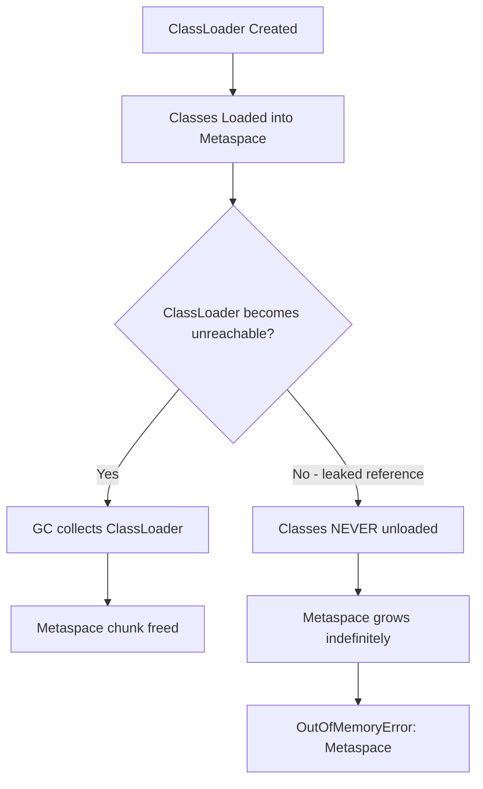

---

### 📶 Gradual Depth

**Level 1 - What it is:** Every Java class loaded takes up memory in a special area called Metaspace. If something keeps loading new classes without unloading old ones, Metaspace fills up and the JVM crashes with OutOfMemoryError.

**Level 2 - How to use it:** Always set `-XX:MaxMetaspaceSize=256m` (or appropriate limit). Monitor `jvm_classes_loaded` metric - if it grows continuously, something is generating classes. Use `jcmd <pid> GC.class_histogram` to see which classes are accumulating.

**Level 3 - How it works:** Classes are anchored to their ClassLoader. A class can only be unloaded when its ClassLoader has no references and is GC-collected. If a ClassLoader leaks (retained by a thread, static field, or another ClassLoader's reference), ALL its classes stay in Metaspace permanently. Common leak: old webapp ClassLoader retained by a ThreadLocal or static callback registration.

**Level 4 - Production mastery:** Diagnosis workflow: (1) `jcmd <pid> GC.class_histogram` - look for duplicate entries (same class name, multiple instances means multiple ClassLoaders loaded it). (2) `jcmd <pid> VM.classloader_stats` - find ClassLoader with excessive class count. (3) Heap dump: find instances of the leaking ClassLoader, trace references to find what retains it. (4) Common retainers: ThreadLocal referencing a class from the old ClassLoader, static field in a class loaded by a parent ClassLoader that references a child ClassLoader's class, JMX MBean registration that holds a reference.

---

### ⚙️ How It Works

**Phase 1 - Normal Class Loading:** Application starts. ClassLoaders load classes. Metaspace grows to steady-state (50-200MB typically).

**Phase 2 - Dynamic Class Generation:** Framework generates proxy classes (Spring AOP, Hibernate entities). Each generation adds Metaspace. If cached: steady state. If uncached: continuous growth.

**Phase 3 - Leak Pattern:** New ClassLoader created (redeploy, script eval). Old ClassLoader should be collected. Reference chain prevents collection. Old classes remain in Metaspace. New classes added alongside them.

**Phase 4 - Exhaustion:** Metaspace reaches MaxMetaspaceSize. Next class load attempt triggers `OutOfMemoryError: Metaspace`. GC runs (full GC) attempting to unload classes - but leaked ClassLoaders are still reachable. OOM persists.

```text
Diagnosis workflow:

Step 1: Confirm Metaspace is the issue
  jcmd <pid> VM.native_memory summary
  Look for: "Class" category growing over time

Step 2: Count loaded classes
  jcmd <pid> GC.class_histogram | head -30
  Look for: unexpected class counts
  e.g., "com.sun.proxy.$Proxy" with 50,000 instances

Step 3: Find the leaking ClassLoader
  jcmd <pid> VM.classloader_stats
  Look for: ClassLoader with abnormally high count
  e.g., "GroovyClassLoader - 12,500 classes"

Step 4: Find retainer (heap dump)
  jmap -dump:live,file=heap.hprof <pid>
  In MAT: find ClassLoader instances
  Trace incoming references (who holds it?)
  Common: ThreadLocal, static field, listener
```

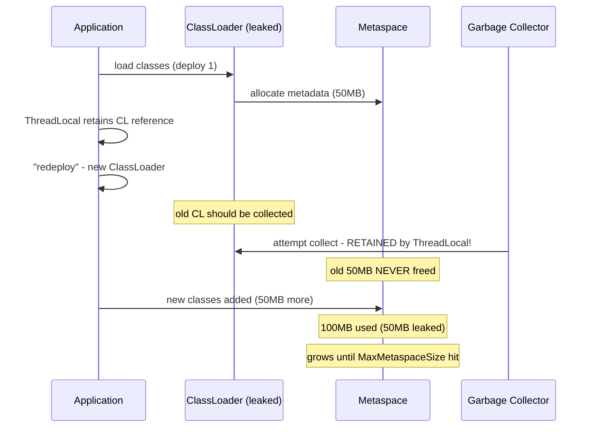

---

### 🚨 Failure Modes

**Failure 1 - Dynamic Proxy Generation Without Caching:**

**Symptom:** Metaspace grows linearly with request count. Each request generates a new proxy class.

**Root cause:** Framework creates `Proxy.newProxyInstance()` or CGLIB class per request instead of caching proxy for each interface/target combination.

**Diagnostic:**

```bash
# Count proxy classes:
jcmd <pid> GC.class_histogram | grep -i proxy
# If count grows over time: proxy leak
# e.g., "com.sun.proxy.$Proxy12345" (high number)
```

**Fix:** Cache proxies. Spring/Hibernate cache by default - if growing, check custom proxy creation. For Groovy/scripting: reuse compiled script classes, do not recompile per invocation.

**Failure 2 - Hot Redeploy ClassLoader Leak:**

**Symptom:** Metaspace jumps 50-100MB with each redeploy. Never shrinks. Eventually OOM after N redeploys.

**Root cause:** Old ClassLoader retained by: ThreadLocal in a thread pool thread, JMX MBean registration, static event listener, JDBC driver registration.

**Diagnostic:**

```bash
# Check ClassLoader count:
jcmd <pid> VM.classloader_stats
# If old loaders appear with classes still loaded:
# -> classloader leak
# Heap dump: search for multiple WebAppClassLoader
# instances. Only ONE should exist (current).
# Others are leaked.
```

**Fix:** (1) Clear ThreadLocals before undeploy (`ThreadLocal.remove()` in shutdown hook). (2) Deregister JMX MBeans. (3) Deregister JDBC drivers. (4) Remove static listeners. Tomcat/Jetty have leak-detection warnings for these patterns.

---

### 🔬 Production Reality

The most common Metaspace leak in modern cloud-native services (where hot redeploy is less common) is DYNAMIC CLASS GENERATION from frameworks: (1) Groovy scripts compiled per evaluation (rule engines, config-as-code), (2) Reflection-based serialization generating accessor classes (Kryo, certain JSON libraries), (3) Lambda metafactory creating one-off classes for non-capturing lambdas in older JDKs (fixed in recent versions). The fix pattern is always: ensure the dynamic generation is CACHED. One class per unique pattern, not one class per invocation.

---

### ⚖️ Trade-offs & Alternatives

| Aspect         | No MetaspaceMax        | With MetaspaceMax      | Class Data Sharing    |
| -------------- | ---------------------- | ---------------------- | --------------------- |
| Failure mode   | OS OOM kill (no error) | OOM: Metaspace (clean) | Shared read-only      |
| Diagnosability | Low (sudden death)     | High (heap dump + log) | N/A (prevents growth) |
| Default        | Yes (unbounded)        | Must set explicitly    | JDK 10+ (opt-in)      |
| Protection     | None                   | Bounded growth         | Reduces Metaspace     |
| Recommendation | NEVER in production    | ALWAYS in production   | For startup + sharing |

---

### ⚡ Decision Snap

**ALWAYS SET MaxMetaspaceSize WHEN:**

- Any production JVM. No exceptions. 256MB is a safe starting default.
- Without it, leak = sudden process death with no error in JVM logs.

**INVESTIGATE METASPACE WHEN:**

- `jvm_classes_loaded` metric grows continuously.
- Service has hot redeploy, scripting engines, or heavy proxy use.
- OOM: Metaspace error in logs.

**PREVENT WITH:**

- Cache all dynamic class generation (proxies, scripts).
- Use CDS (Class Data Sharing) for shared framework classes.
- Avoid hot redeploy in production (use rolling restart).

---

### ⚠️ Top Traps

| #   | Misconception                           | Reality                                                                                                                 |
| --- | --------------------------------------- | ----------------------------------------------------------------------------------------------------------------------- |
| 1   | "Metaspace OOM is a heap problem"       | Metaspace is NATIVE memory. Increasing -Xmx does not help. Need MaxMetaspaceSize or fix the leak.                       |
| 2   | "Full GC cleans up Metaspace"           | Full GC can unload classes, but ONLY if their ClassLoader is unreachable. Leaked ClassLoaders survive Full GC.          |
| 3   | "Modern frameworks do not leak classes" | Spring AOP, Hibernate proxies, and scripting engines still generate classes. Without caching, they leak.                |
| 4   | "MaxMetaspaceSize is risky to set"      | NOT setting it is risky (unbounded growth, sudden kill). Setting it gives you a clean error and heap dump opportunity.  |
| 5   | "Class count is small and stable"       | A Groovy rule engine can generate 100+ classes per rule per evaluation. At 1000 eval/s without caching: 100K classes/s. |

---

### 🪜 Learning Ladder

**Prerequisites:**

- JVM-063 Native Memory Tracking (NMT) - NMT shows Metaspace/Class category
- JVM-073 Java Module System (JPMS) and ClassLoader - understand classloader hierarchy

**THIS:** JVM-101 Diagnosing Metaspace OOM in Production

**Next steps:**

- JVM-084 Native Memory Leaks (JNI, Unsafe, Direct BB) - other native memory leak patterns
- JVM-089 Unified JVM Logging (-Xlog) - class loading logging for leak detection

---

**The Surprising Truth:**

The easiest Metaspace leak to create (and the hardest to find) is a SINGLE static field. If class `A` (loaded by parent ClassLoader) has a static field referencing an object whose class was loaded by child ClassLoader `B`, then ClassLoader `B` can NEVER be collected - even after all application code stops using `B`'s classes. The reference chain: static field in A -> object -> object's class -> ClassLoader B. This is why frameworks that store callbacks or listeners in static registries are the #1 source of classloader leaks in application servers. One static reference = entire ClassLoader pinned.

**Further Reading:**

- Oracle Troubleshooting Guide: "Diagnosing ClassLoader Leaks"
- Zeroturnaround (JRebel): "Classloader Leaks" whitepaper - patterns catalog
- JDK source: `java.lang.ClassLoader` + Metaspace allocation implementation

**Revision Card:**

1. Classes are unloaded ONLY when their ClassLoader is GC-collected. One reference to the ClassLoader = all its classes retained forever.
2. Always set `-XX:MaxMetaspaceSize=256m`. Without it: unbounded growth -> OS kill without JVM error. With it: clean OOM + heap dump.
3. Diagnosis: `jcmd GC.class_histogram` (growing classes?), `VM.classloader_stats` (which loader?), heap dump (what retains loader?).

**BAD:**

```java
// Static callback retains ClassLoader forever
public class EventBus { // loaded by parent CL
    static List<Listener> listeners = new ArrayList<>();
    public static void register(Listener l) {
        listeners.add(l);
        // If l's class was loaded by child ClassLoader:
        // child CL NEVER collected (pinned by static)
        // All child CL's classes stuck in Metaspace
        // After 10 redeploys: 10 leaked ClassLoaders
    }
}
```

**GOOD:**

```java
// WeakReference prevents ClassLoader pinning
public class EventBus {
    static List<WeakReference<Listener>> listeners =
        new CopyOnWriteArrayList<>();
    public static void register(Listener l) {
        listeners.add(new WeakReference<>(l));
        // Weak ref: does not prevent GC of listener
        // When child CL unreachable: listener collected
        // -> child CL collected -> Metaspace freed
    }
    // Cleanup: remove collected weak refs periodically
}
```
