# Java JVM

```text
════════════════════════════════════════════════════════════════════════
CATEGORY:        Java JVM
CODE:            JVM
ARCHETYPE:       INFRASTRUCTURE
MODE:            MODE_NEW
PROVENANCE:      user request via /learn: "java jvm"
TIER:            tier-3-infrastructure
FOLDER:          learn/java-jvm/
LEVELS:          L0 + L1 + L2 + L3 + L4 + L5 + L6 + META
TOTAL:           132 keywords across 7 sub-topic files
GENERATED_FROM:  LEARN_KEYWORD_GENERATOR.md v1.0
════════════════════════════════════════════════════════════════════════
```

Scope: the JVM runtime - classloading, bytecode, JIT compilation,
garbage collection, memory model, diagnostic tooling, and
production tuning. The Java language proper (syntax, generics,
collections, modern features) is in `learn/java/`. Concurrency
primitives, locks, and virtual threads are in
`learn/java-concurrency/`.

## Status

Stubs only. Each sub-topic file lists its keywords in YAML
frontmatter. Use `@learn-generate-entries` to fill content
per `LEARN_PROMPT.md` v1.0 (tri-template auto-routing).

## Sub-topic files

| File                                                                                                | Keywords | Levels         | Status |
| --------------------------------------------------------------------------------------------------- | -------- | -------------- | ------ |
| [Java JVM - Runtime Foundations](Java%20JVM%20-%20Runtime%20Foundations.md)                         | 25       | L0 + L1        | stub   |
| [Java JVM - Memory and GC Essentials](Java%20JVM%20-%20Memory%20and%20GC%20Essentials.md)           | 22       | L2             | stub   |
| [Java JVM - GC Internals and Tuning](Java%20JVM%20-%20GC%20Internals%20and%20Tuning.md)             | 28       | L3             | stub   |
| [Java JVM - Production Diagnostics Part 1](Java%20JVM%20-%20Production%20Diagnostics%20Part%201.md) | 9        | L4             | stub   |
| [Java JVM - Production Diagnostics Part 2](Java%20JVM%20-%20Production%20Diagnostics%20Part%202.md) | 9        | L4             | stub   |
| [Java JVM - Production Diagnostics Part 3](Java%20JVM%20-%20Production%20Diagnostics%20Part%203.md) | 8        | L4             | stub   |
| [Java JVM - Architecture and Strategy Part 1](Java%20JVM%20-%20Architecture%20and%20Strategy%20Part%201.md) | 8  | L5             | complete |
| [Java JVM - Architecture and Strategy Part 2](Java%20JVM%20-%20Architecture%20and%20Strategy%20Part%202.md) | 8  | L5 + L6        | complete |
| [Java JVM - Architecture and Strategy Part 3](Java%20JVM%20-%20Architecture%20and%20Strategy%20Part%203.md) | 8  | L6             | complete |
| [Java JVM - Architecture and Strategy Part 4](Java%20JVM%20-%20Architecture%20and%20Strategy%20Part%204.md) | 7  | L6 + META      | complete |

## Keyword table

**Keywords:** JVM-001-JVM-132 (132 terms)

────────────────────────────────────────────────────
LEVEL 0 - ORIENTATION 🌱 (7 keywords)
────────────────────────────────────────────────────

| ID      | Keyword                                     | Lv  | Diff | template | Tags |
| ------- | ------------------------------------------- | --- | ---- | -------- | ---- |
| JVM-001 | Why the JVM Exists - The Platform Problem   | L0  | 🌱   | SIMPLE   |      |
| JVM-002 | Managed vs Unmanaged Runtimes               | L0  | 🌱   | SIMPLE   |      |
| JVM-003 | JVM Architecture at 30,000 Feet             | L0  | 🌱   | SIMPLE   |      |
| JVM-004 | The JVM Ecosystem Map (Languages, Vendors)  | L0  | 🌱   | SIMPLE   | 🔧   |
| JVM-005 | What the JVM Is NOT - Common Misconceptions | L0  | 🌱   | SIMPLE   | 💥   |
| JVM-006 | JVM vs CLR vs V8 - Runtime Landscape        | L0  | 🌱   | SIMPLE   | 🧭   |
| JVM-007 | JVM History - From Oak to Modern Java       | L0  | 🌱   | SIMPLE   |      |

────────────────────────────────────────────────────
LEVEL 1 - FOUNDATIONAL ★☆☆ (18 keywords)
────────────────────────────────────────────────────

| ID      | Keyword                                        | Lv  | Diff | template | Tags  |
| ------- | ---------------------------------------------- | --- | ---- | -------- | ----- |
| JVM-008 | Bytecode - The JVM's Machine Language          | L1  | ★☆☆  | SIMPLE   |       |
| JVM-009 | The Class File Format                          | L1  | ★☆☆  | SIMPLE   |       |
| JVM-010 | Class Loading - Finding and Loading Code       | L1  | ★☆☆  | SIMPLE   |       |
| JVM-011 | Java Memory Areas Overview                     | L1  | ★☆☆  | SIMPLE   |       |
| JVM-012 | Stack vs Heap - Where Data Lives               | L1  | ★☆☆  | SIMPLE   | 🎯    |
| JVM-013 | Garbage Collection - Why Manual Memory Is Gone | L1  | ★☆☆  | SIMPLE   | 🎯    |
| JVM-014 | JIT Compilation - From Bytecode to Native      | L1  | ★☆☆  | SIMPLE   |       |
| JVM-015 | The java Command and JVM Startup               | L1  | ★☆☆  | SIMPLE   | 🔧    |
| JVM-016 | JVM Threads and the OS Thread Model            | L1  | ★☆☆  | SIMPLE   |       |
| JVM-017 | JVM Data Types and the Operand Stack           | L1  | ★☆☆  | SIMPLE   |       |
| JVM-018 | References and Object Headers                  | L1  | ★☆☆  | SIMPLE   |       |
| JVM-019 | javap - Your First Bytecode Tool               | L1  | ★☆☆  | SIMPLE   | 🔧 🏋️ |
| JVM-020 | JDK vs JRE vs JVM                              | L1  | ★☆☆  | SIMPLE   | 🎯 💥 |
| JVM-021 | Top 10 JVM Interview Questions - Basics        | L1  | ★☆☆  | SIMPLE   | 🎯    |
| JVM-022 | Your First JVM Diagnostic (jps, jinfo)         | L1  | ★☆☆  | SIMPLE   | 🔧 🏋️ |
| JVM-023 | Object Allocation - What new Actually Does     | L1  | ★☆☆  | SIMPLE   |       |
| JVM-024 | Method Dispatch - How the JVM Calls Methods    | L1  | ★☆☆  | SIMPLE   |       |
| JVM-025 | Java Is Slow Is Wrong - JIT Reality            | L1  | ★☆☆  | SIMPLE   | 💥    |

────────────────────────────────────────────────────
LEVEL 2 - WORKING ★★☆ (22 keywords)
────────────────────────────────────────────────────

── CLUSTER: Heap and Memory ────────────────────────

| ID      | Keyword                                     | Lv  | Diff | template     | Tags |
| ------- | ------------------------------------------- | --- | ---- | ------------ | ---- |
| JVM-026 | Heap Structure - Young, Old, and Metaspace  | L2  | ★★☆  | INTERMEDIATE |      |
| JVM-027 | Minor GC vs Major GC vs Full GC             | L2  | ★★☆  | INTERMEDIATE | 🎯   |
| JVM-028 | Common JVM Flags (-Xmx, -Xms, -XX:+UseG1GC) | L2  | ★★☆  | INTERMEDIATE | 🔧   |
| JVM-029 | GC Roots and Reachability Analysis          | L2  | ★★☆  | INTERMEDIATE |      |
| JVM-030 | String Pool and Interning                   | L2  | ★★☆  | INTERMEDIATE |      |

── CLUSTER: ClassLoading and Lifecycle ─────────────

| ID      | Keyword                                      | Lv  | Diff | template     | Tags |
| ------- | -------------------------------------------- | --- | ---- | ------------ | ---- |
| JVM-031 | ClassLoader Hierarchy (Bootstrap, Plat, App) | L2  | ★★☆  | INTERMEDIATE |      |
| JVM-032 | JVM Shutdown Hooks and Lifecycle             | L2  | ★★☆  | INTERMEDIATE |      |

── CLUSTER: Diagnostic Tools ───────────────────────

| ID      | Keyword                                     | Lv  | Diff | template     | Tags  |
| ------- | ------------------------------------------- | --- | ---- | ------------ | ----- |
| JVM-033 | Thread Dumps - Reading and Interpreting     | L2  | ★★☆  | INTERMEDIATE | 🔧 🏋️ |
| JVM-034 | Heap Dumps - Capturing and Basics           | L2  | ★★☆  | INTERMEDIATE | 🔧 🏋️ |
| JVM-035 | JVM Ergonomics - Automatic Flag Selection   | L2  | ★★☆  | INTERMEDIATE |       |
| JVM-036 | Container-Aware JVM (cgroup Limits)         | L2  | ★★☆  | INTERMEDIATE | 🔄    |
| JVM-037 | Common OutOfMemoryError Types and First Aid | L2  | ★★☆  | INTERMEDIATE | 🚨    |
| JVM-038 | Metaspace and PermGen History               | L2  | ★★☆  | INTERMEDIATE | 🔄    |
| JVM-039 | JVM Exit Codes and Crash Logs               | L2  | ★★☆  | INTERMEDIATE |       |
| JVM-040 | GC Algorithm Selection Framework            | L2  | ★★☆  | INTERMEDIATE | 🧭    |
| JVM-041 | jcmd - The Swiss Army Knife                 | L2  | ★★☆  | INTERMEDIATE | 🔧    |
| JVM-042 | VisualVM and JConsole                       | L2  | ★★☆  | INTERMEDIATE | 🔧    |

── CLUSTER: Practice and Retention ─────────────────

| ID      | Keyword                                  | Lv  | Diff | template     | Tags          |
| ------- | ---------------------------------------- | --- | ---- | ------------ | ------------- |
| JVM-043 | Build a JVM Dashboard - Phase 1 (Basics) | L2  | ★★☆  | INTERMEDIATE | 🔨            |
| JVM-044 | JVM Flag and GC Quick Recall Card        | L2  | ★★☆  | INTERMEDIATE | 🔁            |
| JVM-045 | JVM Interview Essentials - Working Level | L2  | ★★☆  | INTERMEDIATE | 🎯            |
| JVM-046 | The N+1 ClassLoader Anti-Pattern         | L2  | ★★☆  | INTERMEDIATE | ⚠️ anti-major |
| JVM-047 | Finalization Is Dead - Use Cleaners      | L2  | ★★☆  | INTERMEDIATE | 💥 🔄         |

────────────────────────────────────────────────────
LEVEL 3 - INTERMEDIATE ★★☆ (28 keywords)
────────────────────────────────────────────────────

── CLUSTER: GC Algorithms ──────────────────────────

| ID      | Keyword                                    | Lv  | Diff | template     | Tags  |
| ------- | ------------------------------------------ | --- | ---- | ------------ | ----- |
| JVM-048 | G1GC Internals - Regions, Marking, Mixed   | L3  | ★★☆  | INTERMEDIATE |       |
| JVM-049 | ZGC Fundamentals - Sub-Millisecond Pauses  | L3  | ★★☆  | INTERMEDIATE |       |
| JVM-050 | Shenandoah GC - Concurrent Compaction      | L3  | ★★☆  | INTERMEDIATE |       |
| JVM-051 | GC Log Analysis - Reading and Interpreting | L3  | ★★☆  | INTERMEDIATE | 📊 🏋️ |

── CLUSTER: JIT Deep Dive ─────────────────────────

| ID      | Keyword                           | Lv  | Diff | template     | Tags |
| ------- | --------------------------------- | --- | ---- | ------------ | ---- |
| JVM-052 | JIT Compilation Tiers (C1 and C2) | L3  | ★★☆  | INTERMEDIATE |      |
| JVM-053 | Inlining and Escape Analysis      | L3  | ★★☆  | INTERMEDIATE |      |
| JVM-054 | On-Stack Replacement (OSR)        | L3  | ★★☆  | INTERMEDIATE |      |

── CLUSTER: Runtime Mechanics ──────────────────────

| ID      | Keyword                                | Lv  | Diff | template     | Tags |
| ------- | -------------------------------------- | --- | ---- | ------------ | ---- |
| JVM-055 | Safepoints - What Stops the World      | L3  | ★★☆  | INTERMEDIATE | 🎯   |
| JVM-056 | TLAB - Thread-Local Allocation Buffers | L3  | ★★☆  | INTERMEDIATE |      |
| JVM-057 | Compressed Oops and Object Layout      | L3  | ★★☆  | INTERMEDIATE |      |

── CLUSTER: Profiling and Observability ────────────

| ID      | Keyword                              | Lv  | Diff | template     | Tags  |
| ------- | ------------------------------------ | --- | ---- | ------------ | ----- |
| JVM-058 | JFR (Java Flight Recorder) Deep Dive | L3  | ★★☆  | INTERMEDIATE | 🔧 📊 |
| JVM-059 | Async-Profiler and CPU Flame Graphs  | L3  | ★★☆  | INTERMEDIATE | 🔧 ⚡ |
| JVM-060 | Memory Leak Diagnosis Workflow       | L3  | ★★☆  | INTERMEDIATE | 🚨 🏋️ |
| JVM-063 | Native Memory Tracking (NMT)         | L3  | ★★☆  | INTERMEDIATE | 🔧 📊 |

── CLUSTER: Tuning Methodology ─────────────────────

| ID      | Keyword                                        | Lv  | Diff | template     | Tags  |
| ------- | ---------------------------------------------- | --- | ---- | ------------ | ----- |
| JVM-061 | GC Tuning Methodology - Measure First          | L3  | ★★☆  | INTERMEDIATE | ⚡ 🧭 |
| JVM-064 | Class Data Sharing (CDS and AppCDS)            | L3  | ★★☆  | INTERMEDIATE | ⚡    |
| JVM-065 | JVM in Kubernetes - Resource Limits Done Right | L3  | ★★☆  | INTERMEDIATE | 🧪    |
| JVM-066 | GC Pause Budget - SLA-Driven Tuning            | L3  | ★★☆  | INTERMEDIATE | 🧭    |
| JVM-067 | Choosing ZGC vs G1GC vs Shenandoah             | L3  | ★★☆  | INTERMEDIATE | 🧭    |

── CLUSTER: Anti-Patterns and Misconceptions ───────

| ID      | Keyword                                        | Lv  | Diff | template     | Tags          |
| ------- | ---------------------------------------------- | --- | ---- | ------------ | ------------- |
| JVM-068 | When GC Tuning Is Premature Optimization       | L3  | ★★☆  | INTERMEDIATE | ⚠️ anti-major |
| JVM-075 | Weak, Soft, and Phantom References in Practice | L3  | ★★☆  | INTERMEDIATE |               |

── CLUSTER: Evolution and Compliance ───────────────

| ID      | Keyword                                        | Lv  | Diff | template     | Tags  |
| ------- | ---------------------------------------------- | --- | ---- | ------------ | ----- |
| JVM-062 | JVM Security Manager - Deprecated Alternatives | L3  | ★★☆  | INTERMEDIATE | 🔄 📋 |
| JVM-073 | Java Module System (JPMS) and ClassLoader      | L3  | ★★☆  | INTERMEDIATE | 🔄    |
| JVM-074 | Testing GC Behavior Under Load                 | L3  | ★★☆  | INTERMEDIATE | 🧪    |

── CLUSTER: Practice and Retention ─────────────────

| ID      | Keyword                                  | Lv  | Diff | template     | Tags |
| ------- | ---------------------------------------- | --- | ---- | ------------ | ---- |
| JVM-069 | Explain GC at Every Level                | L3  | ★★☆  | INTERMEDIATE | 🎓   |
| JVM-070 | Build a JVM Dashboard - Phase 2 (Alerts) | L3  | ★★☆  | INTERMEDIATE | 🔨   |
| JVM-071 | JVM Self-Assessment Checkpoint           | L3  | ★★☆  | INTERMEDIATE | 🔁   |
| JVM-072 | JVM System Design Interview Patterns     | L3  | ★★☆  | INTERMEDIATE | 🎯   |

────────────────────────────────────────────────────
LEVEL 4 - EXPERT ★★★ (26 keywords)
────────────────────────────────────────────────────

── CLUSTER: GC Deep Internals ──────────────────────

| ID      | Keyword                                     | Lv  | Diff | template | Tags |
| ------- | ------------------------------------------- | --- | ---- | -------- | ---- |
| JVM-076 | GC Algorithm Internals - Tri-Color Marking  | L4  | ★★★  | COMPLEX  |      |
| JVM-077 | G1GC Remembered Sets and Card Tables        | L4  | ★★★  | COMPLEX  |      |
| JVM-078 | ZGC Colored Pointers and Load Barriers      | L4  | ★★★  | COMPLEX  |      |
| JVM-081 | NUMA-Aware GC and Memory Allocation         | L4  | ★★★  | COMPLEX  |      |
| JVM-094 | Heap Fragmentation Under Long-Running Loads | L4  | ★★★  | COMPLEX  |      |

── CLUSTER: JIT and Runtime ────────────────────────

| ID      | Keyword                                      | Lv  | Diff | template | Tags |
| ------- | -------------------------------------------- | --- | ---- | -------- | ---- |
| JVM-079 | JIT Code Cache and Deoptimization            | L4  | ★★★  | COMPLEX  |      |
| JVM-080 | Safepoint Bias and Time-To-Safepoint Latency | L4  | ★★★  | COMPLEX  | 🚨   |
| JVM-082 | Biased Locking Removed JDK 15 and Thin Locks | L4  | ★★★  | COMPLEX  | 🔄   |
| JVM-091 | Project Loom and Virtual Thread Scheduling   | L4  | ★★★  | COMPLEX  |      |
| JVM-090 | Ahead-of-Time Compilation (GraalVM Native)   | L4  | ★★★  | COMPLEX  | ⚡   |

── CLUSTER: Production Diagnosis ───────────────────

| ID      | Keyword                                      | Lv  | Diff | template | Tags  |
| ------- | -------------------------------------------- | --- | ---- | -------- | ----- |
| JVM-083 | JVM Crash Analysis (hs_err_pid Files)        | L4  | ★★★  | COMPLEX  | 🚨    |
| JVM-084 | Native Memory Leaks (JNI, Unsafe, Direct BB) | L4  | ★★★  | COMPLEX  |       |
| JVM-088 | JFR Custom Events and Continuous Profiling   | L4  | ★★★  | COMPLEX  | 🔧 📊 |
| JVM-089 | Unified JVM Logging (-Xlog)                  | L4  | ★★★  | COMPLEX  | 🔧    |
| JVM-095 | JVM Fleet Observability - Key Metrics        | L4  | ★★★  | COMPLEX  | 📊    |
| JVM-101 | Diagnosing Metaspace OOM in Production       | L4  | ★★★  | COMPLEX  | 🚨    |

── CLUSTER: Incidents and Anti-Patterns ────────────

| ID      | Keyword                                  | Lv  | Diff | template | Tags             |
| ------- | ---------------------------------------- | --- | ---- | -------- | ---------------- |
| JVM-085 | GC Ergonomics Failures at Scale          | L4  | ★★★  | COMPLEX  | 🔴               |
| JVM-086 | Log4Shell and JVM Attack Surface (2021)  | L4  | ★★★  | COMPLEX  | 🔴               |
| JVM-093 | The Billion-Dollar Safepoint Bug Pattern | L4  | ★★★  | COMPLEX  | ⚠️ anti-critical |
| JVM-096 | Premature GC Tuning Anti-Pattern         | L4  | ★★★  | COMPLEX  | ⚠️ anti-major    |

── CLUSTER: Compliance and Evolution ───────────────

| ID      | Keyword                                       | Lv  | Diff | template | Tags |
| ------- | --------------------------------------------- | --- | ---- | -------- | ---- |
| JVM-092 | JVM Compliance - FIPS, FedRAMP Considerations | L4  | ★★★  | COMPLEX  | 📋   |

── CLUSTER: Practice and Retention ─────────────────

| ID      | Keyword                                     | Lv  | Diff | template | Tags |
| ------- | ------------------------------------------- | --- | ---- | -------- | ---- |
| JVM-087 | JVM Production Incident Simulation          | L4  | ★★★  | COMPLEX  | 🏋️   |
| JVM-097 | Teaching JIT - The 5 Questions Juniors Ask  | L4  | ★★★  | COMPLEX  | 🎓   |
| JVM-098 | Build a JVM Dashboard - Phase 3 (Diagnosis) | L4  | ★★★  | COMPLEX  | 🔨   |
| JVM-099 | JVM Deep-Dive Interview Questions           | L4  | ★★★  | COMPLEX  | 🎯   |
| JVM-100 | JVM Mastery Verification                    | L4  | ★★★  | COMPLEX  | 🔁   |

────────────────────────────────────────────────────
LEVEL 5 - ARCHITECT 🔥 (14 keywords)
────────────────────────────────────────────────────

| ID      | Keyword                                       | Lv  | Diff | template | Tags  |
| ------- | --------------------------------------------- | --- | ---- | -------- | ----- |
| JVM-102 | JVM Fleet Standardization Strategy            | L5  | 🔥   | COMPLEX  |       |
| JVM-103 | GC Strategy for Heterogeneous Workloads       | L5  | 🔥   | COMPLEX  | 🧭    |
| JVM-104 | Java LTS Version Migration Strategy           | L5  | 🔥   | COMPLEX  | 🔄    |
| JVM-105 | Build Your Own JVM Flag Baseline              | L5  | 🔥   | COMPLEX  | 🏋️    |
| JVM-106 | JVM Warm-Up Strategies (CDS, CRaC, Preload)   | L5  | 🔥   | COMPLEX  |       |
| JVM-107 | GraalVM vs HotSpot Adoption Decision          | L5  | 🔥   | COMPLEX  | 🧭    |
| JVM-108 | JVM Observability Platform Design             | L5  | 🔥   | COMPLEX  | 📊    |
| JVM-109 | Multi-GC Fleet - Different Services, Diff GCs | L5  | 🔥   | COMPLEX  |       |
| JVM-110 | JVM Upgrade Governance at Scale               | L5  | 🔥   | COMPLEX  | 🔄 📋 |
| JVM-111 | Container Image Strategy for JVM Services     | L5  | 🔥   | COMPLEX  |       |
| JVM-112 | JVM Staff-Level Interview Scenarios           | L5  | 🔥   | COMPLEX  | 🎯    |
| JVM-113 | JVM Cost Optimization - Right-Sizing Heaps    | L5  | 🔥   | COMPLEX  |       |
| JVM-114 | Build a JVM Dashboard - Phase 4 (Platform)    | L5  | 🔥   | COMPLEX  | 🔨    |
| JVM-115 | Writing a JVM RFC for Your Organization       | L5  | 🔥   | COMPLEX  | 🎓    |

────────────────────────────────────────────────────
LEVEL 6 - CREATOR 🔬 (12 keywords)
────────────────────────────────────────────────────

| ID      | Keyword                                        | Lv  | Diff | template | Tags |
| ------- | ---------------------------------------------- | --- | ---- | -------- | ---- |
| JVM-116 | The JVM Specification - Structure and Evol     | L6  | 🔬   | COMPLEX  |      |
| JVM-117 | Bytecode Verification Algorithm                | L6  | 🔬   | COMPLEX  |      |
| JVM-118 | Designing a GC from First Principles           | L6  | 🔬   | COMPLEX  | 🏋️   |
| JVM-119 | GC Research - Pauseless GC (Azul C4 Paper)     | L6  | 🔬   | COMPLEX  |      |
| JVM-120 | Project Valhalla - Value Types and Flat Memory | L6  | 🔬   | COMPLEX  |      |
| JVM-121 | Project Panama - Foreign Function and Memory   | L6  | 🔬   | COMPLEX  |      |
| JVM-122 | Project Leyden - Static Images and AOT         | L6  | 🔬   | COMPLEX  |      |
| JVM-123 | The Trusted Computing Base of the JVM          | L6  | 🔬   | COMPLEX  |      |
| JVM-124 | JVM Formal Verification and Type Safety Proof  | L6  | 🔬   | COMPLEX  |      |
| JVM-125 | Region-Based Memory Management Research        | L6  | 🔬   | COMPLEX  |      |
| JVM-126 | JVM Interpreter Design - Stack vs Register     | L6  | 🔬   | COMPLEX  |      |
| JVM-127 | Contributing to OpenJDK - Process and Culture  | L6  | 🔬   | COMPLEX  | 🏋️   |

────────────────────────────────────────────────────
META 🧠 (5 keywords)
────────────────────────────────────────────────────

| ID      | Keyword                                      | Lv   | Diff | template | Tags |
| ------- | -------------------------------------------- | ---- | ---- | -------- | ---- |
| JVM-128 | Memory Pressure as a Universal System Signal | META | 🧠   | COMPLEX  |      |
| JVM-129 | Latency vs Throughput Trade-off Framing      | META | 🧠   | COMPLEX  |      |
| JVM-130 | What OS Scheduling Teaches JVM Engineers     | META | 🧠   | COMPLEX  |      |
| JVM-131 | Compiler Opt Patterns Across Runtimes        | META | 🧠   | COMPLEX  |      |
| JVM-132 | Stop-the-World as Distributed Consensus      | META | 🧠   | COMPLEX  |      |

<!-- ROADMAP-TREE:START -->

## Roadmap

```text
ROADMAP TREE - Java JVM
===========================================================
L0 Orientation
 +-- JVM-001 Why the JVM Exists
 +-- JVM-002 Managed vs Unmanaged Runtimes
 +-- JVM-003 JVM Architecture at 30,000 Feet
 +-- JVM-004 JVM Ecosystem Map
 +-- JVM-005 What the JVM Is NOT
 +-- JVM-006 JVM vs CLR vs V8
 +-- JVM-007 JVM History
L1 Foundational
 +-- JVM-008 Bytecode
 +-- JVM-009 Class File Format
 +-- JVM-010 Class Loading
 +-- JVM-011 Java Memory Areas Overview
 +-- JVM-012 Stack vs Heap
 +-- JVM-013 Garbage Collection Intro
 +-- JVM-014 JIT Compilation Intro
 +-- JVM-015 The java Command
 +-- JVM-016 JVM Threads
 +-- JVM-017 Data Types and Operand Stack
 +-- JVM-018 References and Object Headers
 +-- JVM-019 javap Tool
 +-- JVM-020 JDK vs JRE vs JVM
 +-- JVM-021 Top 10 Interview Q
 +-- JVM-022 First JVM Diagnostic
 +-- JVM-023 Object Allocation
 +-- JVM-024 Method Dispatch
 +-- JVM-025 Java Is Slow Is Wrong
L2 Working
 +-- CLUSTER: Heap and Memory
 |    +-- JVM-026 Heap Structure
 |    +-- JVM-027 Minor/Major/Full GC
 |    +-- JVM-028 Common JVM Flags
 |    +-- JVM-029 GC Roots
 |    +-- JVM-030 String Pool
 +-- CLUSTER: ClassLoading and Lifecycle
 |    +-- JVM-031 ClassLoader Hierarchy
 |    +-- JVM-032 Shutdown Hooks
 +-- CLUSTER: Diagnostic Tools
 |    +-- JVM-033 Thread Dumps
 |    +-- JVM-034 Heap Dumps
 |    +-- JVM-035 JVM Ergonomics
 |    +-- JVM-036 Container-Aware JVM
 |    +-- JVM-037 OOM Types
 |    +-- JVM-038 Metaspace/PermGen
 |    +-- JVM-039 Exit Codes
 |    +-- JVM-040 GC Selection Framework
 |    +-- JVM-041 jcmd
 |    +-- JVM-042 VisualVM/JConsole
 +-- CLUSTER: Practice and Retention
      +-- JVM-043 Dashboard Phase 1
      +-- JVM-044 Quick Recall Card
      +-- JVM-045 Interview Working Level
      +-- JVM-046 N+1 ClassLoader Anti-Pattern
      +-- JVM-047 Finalization Is Dead
L3 Intermediate
 +-- CLUSTER: GC Algorithms
 |    +-- JVM-048 G1GC Internals
 |    +-- JVM-049 ZGC Fundamentals
 |    +-- JVM-050 Shenandoah GC
 |    +-- JVM-051 GC Log Analysis
 +-- CLUSTER: JIT Deep Dive
 |    +-- JVM-052 JIT Tiers (C1/C2)
 |    +-- JVM-053 Inlining/Escape Analysis
 |    +-- JVM-054 On-Stack Replacement
 +-- CLUSTER: Runtime Mechanics
 |    +-- JVM-055 Safepoints
 |    +-- JVM-056 TLAB
 |    +-- JVM-057 Compressed Oops
 +-- CLUSTER: Profiling
 |    +-- JVM-058 JFR Deep Dive
 |    +-- JVM-059 Async-Profiler
 |    +-- JVM-060 Memory Leak Diagnosis
 |    +-- JVM-063 Native Memory Tracking
 +-- CLUSTER: Tuning
 |    +-- JVM-061 GC Tuning Methodology
 |    +-- JVM-064 Class Data Sharing
 |    +-- JVM-065 JVM in Kubernetes
 |    +-- JVM-066 GC Pause Budget
 |    +-- JVM-067 ZGC vs G1 vs Shenandoah
 +-- CLUSTER: Anti-Patterns
 |    +-- JVM-068 Premature GC Tuning
 |    +-- JVM-075 Weak/Soft/Phantom Refs
 +-- CLUSTER: Evolution
 |    +-- JVM-062 Security Manager Deprecated
 |    +-- JVM-073 JPMS and ClassLoader
 |    +-- JVM-074 Testing GC Under Load
 +-- CLUSTER: Practice
      +-- JVM-069 Explain GC at Every Level
      +-- JVM-070 Dashboard Phase 2
      +-- JVM-071 Self-Assessment
      +-- JVM-072 System Design Interview
L4 Expert
 +-- CLUSTER: GC Deep Internals
 |    +-- JVM-076 Tri-Color Marking
 |    +-- JVM-077 G1 Remembered Sets
 |    +-- JVM-078 ZGC Colored Pointers
 |    +-- JVM-081 NUMA-Aware GC
 |    +-- JVM-094 Heap Fragmentation
 +-- CLUSTER: JIT and Runtime
 |    +-- JVM-079 Code Cache/Deopt
 |    +-- JVM-080 Safepoint Bias
 |    +-- JVM-082 Biased Locking Removed
 |    +-- JVM-091 Project Loom/VThreads
 |    +-- JVM-090 GraalVM Native Image
 +-- CLUSTER: Production Diagnosis
 |    +-- JVM-083 Crash Analysis
 |    +-- JVM-084 Native Memory Leaks
 |    +-- JVM-088 JFR Custom Events
 |    +-- JVM-089 Unified Logging
 |    +-- JVM-095 Fleet Observability
 |    +-- JVM-101 Metaspace OOM
 +-- CLUSTER: Incidents
 |    +-- JVM-085 GC Ergonomics Failures
 |    +-- JVM-086 Log4Shell (2021)
 |    +-- JVM-093 Safepoint Bug Pattern
 |    +-- JVM-096 Premature Tuning Anti
 +-- CLUSTER: Practice
      +-- JVM-087 Incident Simulation
      +-- JVM-092 FIPS/FedRAMP
      +-- JVM-097 Teaching JIT
      +-- JVM-098 Dashboard Phase 3
      +-- JVM-099 Deep-Dive Interview
      +-- JVM-100 Mastery Verification
L5 Architect
 +-- JVM-102 Fleet Standardization
 +-- JVM-103 GC Strategy Heterogeneous
 +-- JVM-104 LTS Migration Strategy
 +-- JVM-105 Flag Baseline
 +-- JVM-106 Warm-Up Strategies
 +-- JVM-107 GraalVM vs HotSpot Decision
 +-- JVM-108 Observability Platform
 +-- JVM-109 Multi-GC Fleet
 +-- JVM-110 Upgrade Governance
 +-- JVM-111 Container Image Strategy
 +-- JVM-112 Staff Interview Scenarios
 +-- JVM-113 Cost Optimization
 +-- JVM-114 Dashboard Phase 4
 +-- JVM-115 Writing a JVM RFC
L6 Creator
 +-- JVM-116 JVM Specification
 +-- JVM-117 Bytecode Verification
 +-- JVM-118 Design a GC
 +-- JVM-119 Pauseless GC Research
 +-- JVM-120 Project Valhalla
 +-- JVM-121 Project Panama
 +-- JVM-122 Project Leyden
 +-- JVM-123 Trusted Computing Base
 +-- JVM-124 Formal Verification
 +-- JVM-125 Region-Based Memory Mgmt
 +-- JVM-126 Interpreter Design
 +-- JVM-127 Contributing to OpenJDK
META
 +-- JVM-128 Memory Pressure as Signal
 +-- JVM-129 Latency vs Throughput
 +-- JVM-130 OS Scheduling Lessons
 +-- JVM-131 Compiler Opts Across Runtimes
 +-- JVM-132 STW as Consensus Analogy
```



<!-- ROADMAP-TREE:END -->

```mermaid
mindmap
  root((Java JVM))
    L0 Orientation
      JVM-001 Why the JVM Exists
      JVM-002 Managed vs Unmanaged
      JVM-003 Architecture Overview
      JVM-004 Ecosystem Map
      JVM-005 What JVM Is NOT
      JVM-006 JVM vs CLR vs V8
      JVM-007 JVM History
    L1 Foundational
      JVM-008 Bytecode
      JVM-009 Class File Format
      JVM-010 Class Loading
      JVM-011 Memory Areas
      JVM-012 Stack vs Heap
      JVM-013 GC Intro
      JVM-014 JIT Intro
      JVM-015 java Command
      JVM-016 Threads
      JVM-017 Operand Stack
      JVM-018 Object Headers
      JVM-019 javap
      JVM-020 JDK vs JRE vs JVM
      JVM-021 Interview Basics
      JVM-022 First Diagnostic
      JVM-023 Object Allocation
      JVM-024 Method Dispatch
      JVM-025 Java Is Slow Myth
    L2 Working
      Heap and Memory
        JVM-026 Heap Structure
        JVM-027 GC Types
        JVM-028 JVM Flags
        JVM-029 GC Roots
        JVM-030 String Pool
      ClassLoading
        JVM-031 ClassLoader Hierarchy
        JVM-032 Shutdown Hooks
      Diagnostics
        JVM-033 Thread Dumps
        JVM-034 Heap Dumps
        JVM-035 Ergonomics
        JVM-036 Container-Aware
        JVM-037 OOM Types
        JVM-038 Metaspace
        JVM-039 Exit Codes
        JVM-040 GC Selection
        JVM-041 jcmd
        JVM-042 VisualVM
      Practice
        JVM-043 Dashboard P1
        JVM-044 Recall Card
        JVM-045 Interview L2
        JVM-046 ClassLoader Anti
        JVM-047 Finalization Dead
    L3 Intermediate
      GC Algorithms
        JVM-048 G1GC
        JVM-049 ZGC
        JVM-050 Shenandoah
        JVM-051 GC Logs
      JIT
        JVM-052 C1 and C2
        JVM-053 Inlining
        JVM-054 OSR
      Runtime
        JVM-055 Safepoints
        JVM-056 TLAB
        JVM-057 Compressed Oops
      Profiling
        JVM-058 JFR
        JVM-059 Async-Profiler
        JVM-060 Memory Leak
        JVM-063 NMT
      Tuning
        JVM-061 GC Methodology
        JVM-064 CDS
        JVM-065 K8s JVM
        JVM-066 Pause Budget
        JVM-067 GC Choice
      Anti-Patterns
        JVM-068 Premature Tuning
        JVM-075 Reference Types
      Evolution
        JVM-062 Security Manager
        JVM-073 JPMS
        JVM-074 GC Testing
      Practice
        JVM-069 Explain GC
        JVM-070 Dashboard P2
        JVM-071 Self-Assessment
        JVM-072 Interview L3
    L4 Expert
      GC Internals
        JVM-076 Tri-Color
        JVM-077 Remembered Sets
        JVM-078 Colored Pointers
        JVM-081 NUMA
        JVM-094 Fragmentation
      JIT and Runtime
        JVM-079 Code Cache
        JVM-080 Safepoint Bias
        JVM-082 Biased Locking
        JVM-091 Loom VThreads
        JVM-090 GraalVM Native
      Diagnosis
        JVM-083 Crash Analysis
        JVM-084 Native Memory
        JVM-088 JFR Custom
        JVM-089 Unified Logging
        JVM-095 Fleet Metrics
        JVM-101 Metaspace OOM
      Incidents
        JVM-085 GC Ergonomics
        JVM-086 Log4Shell
        JVM-093 Safepoint Bug
        JVM-096 Premature Tuning
      Practice
        JVM-087 Incident Sim
        JVM-092 FIPS
        JVM-097 Teaching JIT
        JVM-098 Dashboard P3
        JVM-099 Interview L4
        JVM-100 Mastery Check
    L5 Architect
      JVM-102 Fleet Standard
      JVM-103 GC Heterogeneous
      JVM-104 LTS Migration
      JVM-105 Flag Baseline
      JVM-106 Warm-Up
      JVM-107 GraalVM Decision
      JVM-108 Obs Platform
      JVM-109 Multi-GC Fleet
      JVM-110 Upgrade Governance
      JVM-111 Container Images
      JVM-112 Staff Interview
      JVM-113 Cost Optimization
      JVM-114 Dashboard P4
      JVM-115 JVM RFC
    L6 Creator
      JVM-116 JVM Spec
      JVM-117 Bytecode Verify
      JVM-118 Design a GC
      JVM-119 Pauseless Research
      JVM-120 Valhalla
      JVM-121 Panama
      JVM-122 Leyden
      JVM-123 Trusted Base
      JVM-124 Formal Verify
      JVM-125 Region Memory
      JVM-126 Interpreter Design
      JVM-127 OpenJDK Contrib
    META
      JVM-128 Memory Pressure
      JVM-129 Latency vs Throughput
      JVM-130 OS Scheduling
      JVM-131 Compiler Patterns
      JVM-132 STW as Consensus
```

## Summary

| Level | Name         | Count | ID Range        |
| ----- | ------------ | ----- | --------------- |
| L0    | Orientation  | 7     | JVM-001-JVM-007 |
| L1    | Foundational | 18    | JVM-008-JVM-025 |
| L2    | Working      | 22    | JVM-026-JVM-047 |
| L3    | Intermediate | 28    | JVM-048-JVM-075 |
| L4    | Expert       | 26    | JVM-076-JVM-101 |
| L5    | Architect    | 14    | JVM-102-JVM-115 |
| L6    | Creator      | 12    | JVM-116-JVM-127 |
| META  | Meta-Skills  | 5     | JVM-128-JVM-132 |
| TOTAL |              | 132   | JVM-001-JVM-132 |

## Tag coverage

| Tag       | Count | % of Total |
| --------- | ----- | ---------- |
| 🎯 ivw    | 8     | 6%         |
| ⚠️ anti   | 4     | 3%         |
| 🔧 tool   | 12    | 9%         |
| 🔴 inc    | 2     | 2%         |
| 🔄 mig    | 7     | 5%         |
| 📋 cpl    | 3     | 2%         |
| 🧪 test   | 2     | 2%         |
| 📊 obs    | 6     | 5%         |
| ⚡ perf   | 4     | 3%         |
| 🧭 dec    | 6     | 5%         |
| 🏋️ prac   | 6     | 5%         |
| 🔨 proj   | 4     | 3%         |
| 🎓 teach  | 3     | 2%         |
| 🔁 ret    | 3     | 2%         |
| 💥 unlrn  | 4     | 3%         |
| 🚨 triage | 4     | 3%         |

## Learning path

PREREQUISITE CATEGORIES:

- Java Language (JLG) L0-L1 minimum

PARALLEL CATEGORIES:

- Java Concurrency (JCC) at L3+

NEXT CATEGORIES:

- Spring Framework (when scaffolded)
- Distributed Systems / Kafka / Kubernetes

ENTRY POINT FOR NEW LEARNERS:
Start at JVM-001 - Why the JVM Exists - The Platform Problem

JUMP IN FOR PRACTITIONERS:
Start at JVM-048 - G1GC Internals (L3)

FAST TRACK FOR EXPERTS:
Start at JVM-076 - GC Algorithm Internals (L4)

## Cross-category dependencies

| This Keyword | Depends On                    | From Category    |
| ------------ | ----------------------------- | ---------------- |
| JVM-008      | JLG-001 (What Is Java)        | Java Language    |
| JVM-016      | JLG-008 (Classes, Methods)    | Java Language    |
| JVM-075      | JLG-016 (Generics)            | Java Language    |
| JVM-091      | JCC-\* (Threading Primitives) | Java Concurrency |

## Confusion pairs

| Concept A       | Concept B       | Level | Key Difference                    |
| --------------- | --------------- | ----- | --------------------------------- |
| Stack memory    | Heap memory     | L1    | Thread-private vs shared          |
| Minor GC        | Full GC         | L2    | Young-gen only vs entire heap     |
| JIT compilation | AOT compilation | L3    | Runtime profile vs build-time     |
| G1GC            | ZGC             | L3    | Region-based vs colored pointers  |
| Metaspace       | Heap            | L2    | Class metadata vs object data     |
| Safepoint       | STW pause       | L3    | Mechanism vs observable effect    |
| -Xmx            | -XX:MaxRAM      | L2    | Heap cap vs total JVM memory hint |
| Serial GC       | Parallel GC     | L2    | Single-thread vs multi-thread     |
| Biased locking  | Thin locking    | L4    | Eliminated vs lightweight CAS     |
