## Keywords

1. [JLG-055 Library API Design - Lessons from java.util](#jlg-055-library-api-design---lessons-from-javautil)
2. [JLG-056 Java vs Kotlin - When Each Fits](#jlg-056-java-vs-kotlin---when-each-fits)
3. [JLG-057 Java 8 to 21 Migration Strategy](#jlg-057-java-8-to-21-migration-strategy)
4. [JLG-058 API Design Workshop (Java Library)](#jlg-058-api-design-workshop-java-library)
5. [JLG-059 Java Staff-Level Interview Scenarios](#jlg-059-java-staff-level-interview-scenarios)
6. [JLG-060 Designing a Type System - Lessons from Java](#jlg-060-designing-a-type-system---lessons-from-java)
7. [JLG-061 Backwards-Incompatible Language Changes Anti-Pattern](#jlg-061-backwards-incompatible-language-changes-anti-pattern)
8. [JLG-062 What C++ RAII and Lisp Macros Teach About Java](#jlg-062-what-c-raii-and-lisp-macros-teach-about-java)

---

# JLG-055 Library API Design - Lessons from java.util

**TL;DR** - The best Java library APIs are minimal, consistent, and hard to misuse; java.util teaches what works and what to avoid through 25 years of evolution.

---

### 🔥 Problem Statement

A library API is a contract with thousands of callers you will
never meet. A bad API costs every caller time - forever. Java's
standard library (java.util, java.io, java.time) has both
exemplary APIs (Collections.unmodifiableList, java.time) and
cautionary ones (Date, Vector, Stack). Understanding why the
good ones work and the bad ones persist teaches API design
principles that apply to any library in any language.

---

### 📜 Historical Context

Java 1.0 (1996) shipped `Date`, `Vector`, and `Hashtable` -
all flawed. `Date` was mutable, poorly named (getYear returns
year minus 1900), and conflated date and time. `Vector` was
synchronized by default (unnecessary overhead). These classes
cannot be removed due to backward compatibility. Java 1.2
(1998) introduced the Collections Framework (Bloch) - a
masterclass in API design: small interfaces (`List`, `Set`,
`Map`), factory methods, and unmodifiable wrappers. Java 8
added `java.time` (JSR 310) to replace `Date` correctly.

---

### 🔩 First Principles

**CORE INVARIANTS:**

1. APIs should be easy to use correctly and hard to use
   incorrectly. If callers consistently misuse your API,
   the API is wrong, not the callers.
2. When in doubt, leave it out. Every public method is a
   permanent commitment. It is easier to add a method later
   than to remove one that callers depend on.
3. Minimize mutability. Immutable objects are thread-safe,
   cache-friendly, and eliminate defensive copying. The shift
   from `Date` (mutable) to `LocalDate` (immutable) is the
   canonical example.

**DERIVED DESIGN:**
These invariants explain the Collections Framework's design:
`List.of()` returns an immutable list (invariant 3), the
`Collection` interface has no `set()` method (invariant 2),
and `Collections.unmodifiableList()` prevents accidental
mutation (invariant 1).

**THE TRADE-OFF:**
**Gain:** stable, trustworthy, long-lived APIs.
**Cost:** slow evolution; mistakes persist for decades.

---

### 🧠 Mental Model

> An API is a door you install in a building. Once tenants
> move in, you cannot move the door without breaking their
> furniture arrangement. Design the door's position, size,
> and lock mechanism before the first tenant arrives - because
> after that, every change is a renovation.

- "Door" -> public method
- "Tenants" -> API callers
- "Furniture arrangement" -> caller code depending on the API
- "Renovation" -> breaking change

**Where this analogy breaks down:** physical doors are obvious;
API surface area can be subtly large (public methods, return
types, exception types, parameter order).

---

### 🧩 Components

```text
API design decision points:

1. Interface vs class
2. Method naming convention
3. Parameter types (accept broad, return narrow)
4. Null handling (Optional vs null vs exception)
5. Mutability (mutable, unmodifiable, immutable)
6. Factory method vs constructor
7. Exception strategy (checked vs unchecked)
8. Serialization compatibility
```

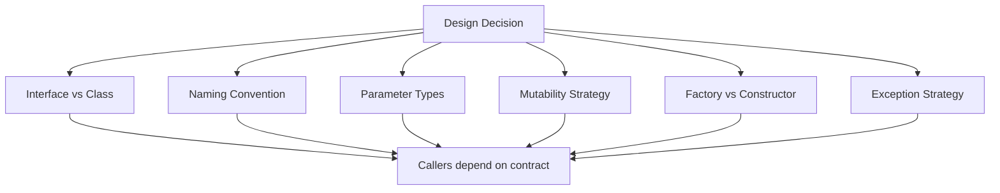

---

### 📶 Gradual Depth

**Layer 1 - Surface:** Prefer interfaces over abstract classes
for return types. Use `List` not `ArrayList` in signatures.
Name methods consistently (get/set/is/has/create/of).

**Layer 2 - Parameter and return types:** Accept the broadest
useful type as input (`Collection` not `ArrayList`). Return
the narrowest useful type (`List<String>` not `Object`). This
is Postel's Law applied to Java: be liberal in what you accept,
conservative in what you produce.

**Layer 3 - Immutability and defensive copying:** Return
unmodifiable views (`Collections.unmodifiableList`) or copies.
Never expose internal mutable state. `List.of()` (Java 9+)
returns a truly immutable list - not just an unmodifiable view.

**Layer 4 - Evolution strategy:** Use `default` methods on
interfaces (Java 8+) to add new functionality without breaking
implementors. Use `@Deprecated(forRemoval = true)` (Java 9+)
to signal intent. Plan for 10 years: every public method you
add today will exist in 2035.

---

### ⚙️ How It Works

```text
Good API (java.time):           Bad API (java.util.Date):
LocalDate.of(2024, 1, 15)      new Date(124, 0, 15)
  - clear factory method          - year-1900 encoding
  - immutable result              - mutable
  - month is 1-based             - month is 0-based
  - no time component            - includes time
```

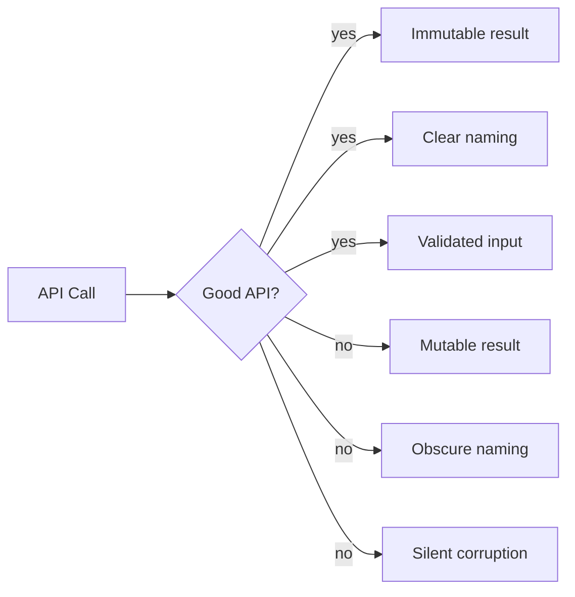

**BAD:**

```java
// Exposing internal mutable state
public class Cache {
    private List<String> entries =
        new ArrayList<>();
    public List<String> getEntries() {
        return entries; // caller can mutate!
    }
}
// cache.getEntries().clear() empties cache
```

**GOOD:**

```java
public class Cache {
    private List<String> entries =
        new ArrayList<>();
    public List<String> getEntries() {
        return Collections.unmodifiableList(
            entries);
    }
}
// cache.getEntries().clear() throws
// UnsupportedOperationException
```

---

### 🚨 Failure Modes

**Failure 1 - Leaking implementation types in signatures.**

A library returns `HashMap<String, Integer>` instead of
`Map<String, Integer>`. Callers start depending on HashMap-
specific behavior (insertion order in some JVM versions).
Changing to `TreeMap` later breaks callers.

**Diagnostic:** public methods return concrete classes instead
of interfaces.

**Fix:** return `Map`, `List`, `Set`, `Collection`. Use
interfaces for all public parameter and return types.

**Failure 2 - Overloaded methods with ambiguous resolution.**

A library has `add(int)` and `add(Object)`. Calling
`add(Integer.valueOf(42))` is ambiguous when autoboxing is
involved. The compiler may resolve to either overload depending
on context.

**Diagnostic:** callers get compilation errors or unexpected
behavior from autoboxing + overload resolution.

**Fix:** use distinct method names: `addIndex(int)`,
`addElement(Object)`. The Collections Framework avoids this
by using `add(E)` with generics.

---

### 🔬 Production Reality

The most impactful API design lessons from java.util:

1. **`Date` vs `LocalDate`:** mutable vs immutable. Every
   method that accepts or returns a Date must defensively
   copy it. LocalDate eliminates this entire class of bugs.

2. **`Vector` vs `ArrayList`:** synchronized-by-default vs
   unsynchronized. Vector's synchronization is almost never
   needed and costs performance on every call. ArrayList +
   explicit synchronization when needed is the correct
   default.

3. **`List.of()` vs `Arrays.asList()`:** `Arrays.asList()`
   returns a fixed-size list backed by the array (mutations
   propagate). `List.of()` returns a truly immutable list.
   The API name does not communicate this difference - a
   design flaw.

4. **`Optional`:** forces callers to handle absence. Reduces
   NullPointerException at the cost of a small API surface
   increase.

---

### ⚖️ Trade-offs & Alternatives

| Aspect        | Minimal API            | Rich API              | Fluent API           |
| ------------- | ---------------------- | --------------------- | -------------------- |
| Learning curve | low                   | high                  | moderate             |
| Flexibility   | high (compose freely)  | built-in              | chain-specific       |
| Evolution     | easy to extend         | hard to shrink        | moderate             |
| Example       | `Collection` interface | Apache Commons Lang   | StringBuilder        |
| Risk          | missing convenience    | bloated surface area  | hard to debug chains |

---

### ⚡ Decision Snap

**USE minimal API surface WHEN:**

- The library will be used by many teams or external callers.
- Long-term backward compatibility is required.
- The domain is stable and well-understood.

**USE richer API WHEN:**

- Internal library with a small, known set of callers.
- Convenience outweighs evolution concerns.

**ALWAYS:**

- Return interfaces, not implementations.
- Make objects immutable unless mutation is the point.
- Accept broad types, return narrow types.

---

### ⚠️ Top Traps

| #   | Misconception                          | Reality                                                                 |
| --- | -------------------------------------- | ----------------------------------------------------------------------- |
| 1   | More public methods = better API       | More surface = more maintenance burden and more ways to misuse          |
| 2   | `Arrays.asList()` returns an immutable list | It returns a mutable fixed-size view backed by the original array  |
| 3   | Returning `null` is fine for "not found" | Use `Optional` for methods that may not have a result               |
| 4   | Concrete types are more helpful        | They lock callers to your implementation choices                        |
| 5   | Deprecation means removal              | In Java, deprecated methods live forever; plan accordingly              |

---

### 🪜 Learning Ladder

**Prerequisites:**

- JLG-018 Collection Interfaces - the Collections Framework
  as an API design example
- JLG-044 Module System (JPMS) - encapsulation at the module
  level

**THIS:** JLG-055 Library API Design - Lessons from java.util

**Next steps:**

- JLG-058 API Design Workshop - hands-on practice
- JLG-060 Designing a Type System - specification-level
  design

**The Surprising Truth:**
Joshua Bloch, who designed the Java Collections Framework,
later wrote that his biggest regret was not making the
collections immutable by default. `List.of()` (Java 9) was
the 20-year fix. The lesson: your first instinct about
mutability is usually wrong. Default to immutable. Let
callers opt into mutability explicitly.

**Further Reading:**

- "Effective Java" Items 15-18, 50-56 (Joshua Bloch) -
  the definitive API design reference for Java
- "How to Design a Good API and Why it Matters" (Joshua
  Bloch, Google Tech Talk, 2007)
- JSR 310 (java.time) specification - a case study in
  replacing a bad API

**Revision Card:**

1. Easy to use correctly, hard to use incorrectly.
2. When in doubt, leave it out - every public method is
   permanent.
3. Minimize mutability. Return interfaces, not concrete types.

---

---

# JLG-056 Java vs Kotlin - When Each Fits

**TL;DR** - Kotlin eliminates Java boilerplate and adds null safety, but Java's ecosystem depth, virtual threads, and value types roadmap mean the choice depends on team context, not language features alone.

---

### 🔥 Problem Statement

A team starting a new JVM project must choose between Java and
Kotlin. Kotlin offers null safety, data classes, coroutines,
extension functions, and less boilerplate. Java has records,
sealed types, virtual threads, pattern matching, and the
largest library ecosystem. The right answer depends on team
expertise, ecosystem requirements, hiring pool, and the
project's expected lifespan.

---

### 📜 Historical Context

JetBrains created Kotlin (2011, 1.0 in 2016) to address Java's
verbosity and null unsafety. Google adopted Kotlin as the
preferred language for Android (2019). On the server side,
Spring Framework added first-class Kotlin support (Spring 5,
2017). Meanwhile, Java 8-21 addressed many of Kotlin's original
advantages: lambdas (Java 8), records (16), sealed types (17),
pattern matching (21), virtual threads (21). The gap is
narrowing but not closed.

---

### 🔩 First Principles

**CORE INVARIANTS:**

1. Both languages compile to JVM bytecode. Kotlin and Java
   interoperate at the class level. A Kotlin class can extend
   a Java class and vice versa.
2. Language features reduce boilerplate but add cognitive load
   for cross-language teams. A team fluent in Java but not
   Kotlin will be slower for months during the transition.
3. The JVM ecosystem evolves around Java first. New JVM
   features (virtual threads, value types, Valhalla) appear
   in Java before Kotlin adapts. Kotlin coroutines and Java
   virtual threads solve the same problem differently.

**DERIVED DESIGN:**
The choice is not "better language" but "better fit for this
team, this project, this timeline."

**THE TRADE-OFF:**
**Gain (Kotlin):** less boilerplate, null safety, coroutines.
**Cost (Kotlin):** smaller hiring pool, tooling dependency on
JetBrains, adaptation lag for new JVM features.

---

### 🧠 Mental Model

> Java is a sedan: reliable, widely supported, parts
> available everywhere, and improving every year. Kotlin is
> a sport sedan from the same platform: faster to drive,
> better interior, but parts come from one supplier. Both
> reach the same destination on the same roads (JVM).

- "Sedan" -> Java (broad ecosystem, wide hiring pool)
- "Sport sedan" -> Kotlin (ergonomic, less boilerplate)
- "Same platform/roads" -> JVM (interoperable bytecode)
- "One supplier" -> JetBrains

**Where this analogy breaks down:** switching between cars is
hard; switching between Java and Kotlin in the same project
is common (mixed-language codebases work).

---

### 🧩 Components

```text
Feature comparison (as of Java 21, Kotlin 2.x):

Null safety:    Kotlin = built-in (?)
                Java   = Optional + annotations
Data carriers:  Kotlin = data class
                Java   = record (Java 16+)
Concurrency:    Kotlin = coroutines
                Java   = virtual threads (21+)
Pattern match:  Kotlin = when + smart casts
                Java   = switch + patterns (21+)
Immutability:   Kotlin = val, immutable colls
                Java   = final, List.of()
Extensions:     Kotlin = extension functions
                Java   = not available
```

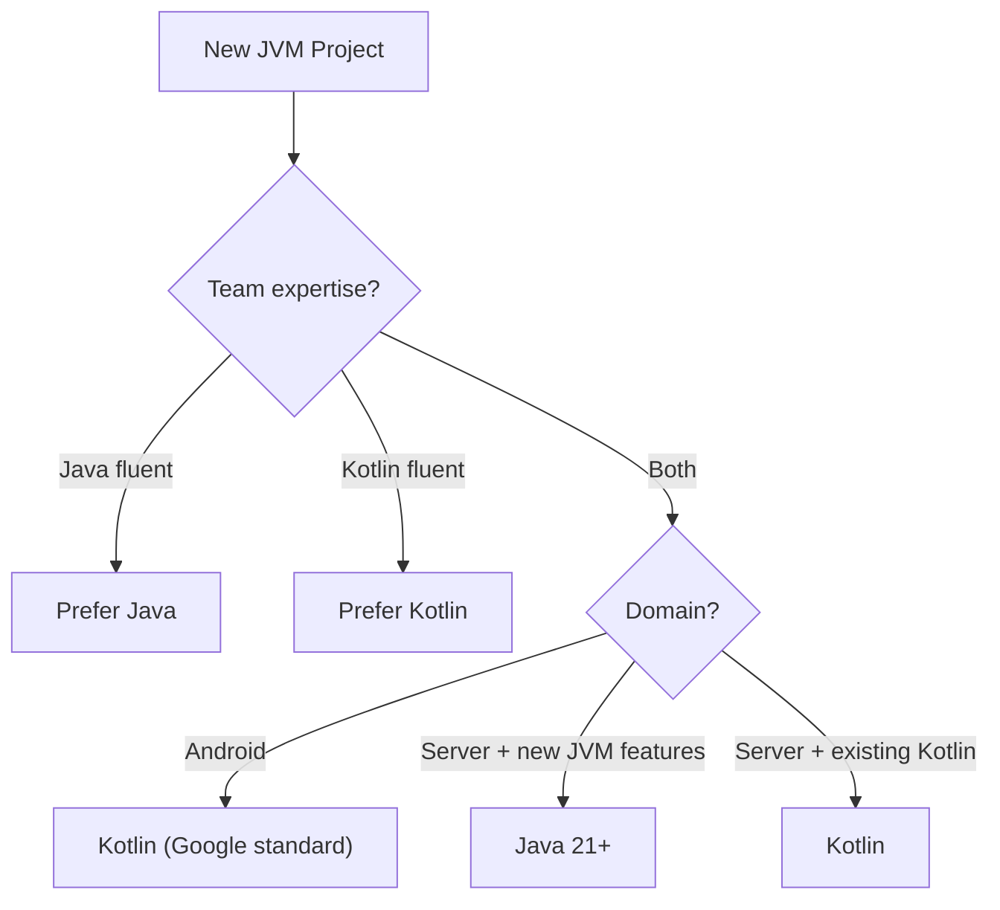

---

### 📶 Gradual Depth

**Layer 1 - Surface:** If the team knows Java, use Java. If
the team knows Kotlin, use Kotlin. For Android, use Kotlin.

**Layer 2 - Feature comparison:** Kotlin's null safety
prevents NPEs at compile time. Java's records and sealed
types reduce boilerplate but do not match Kotlin's data
class + sealed class ergonomics. Kotlin coroutines predate
virtual threads and have a richer API (Flow, channels).

**Layer 3 - Ecosystem and tooling:** Java has broader IDE
support (VS Code, Eclipse, IntelliJ). Kotlin is best in
IntelliJ. Java has more library documentation and Stack
Overflow answers. Kotlin has better Spring integration
(DSL builders, null-aware Spring beans).

**Layer 4 - Strategic timeline:** Project Valhalla (value
types) will allow `List<int>` in Java - a feature Kotlin
cannot access until it adapts. Virtual threads are Java-native;
Kotlin coroutines require a different programming model.
For projects expected to run 10+ years, Java's direct access
to JVM innovations is an advantage.

---

### ⚙️ How It Works

```text
Same task, both languages:

Kotlin:
data class User(val name: String, val age: Int)
val adults = users.filter { it.age >= 18 }

Java (21+):
record User(String name, int age) {}
var adults = users.stream()
    .filter(u -> u.age() >= 18)
    .toList();
```

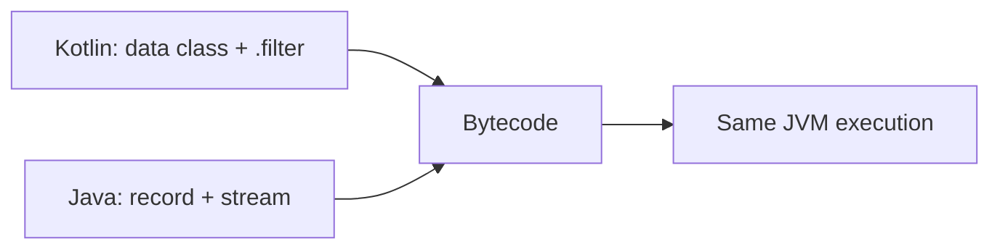

**BAD:**

```java
// Choosing a language based on syntax
// preference alone
// "Kotlin is shorter, so it must be better"
// Ignores: team skills, hiring, ecosystem,
// long-term JVM feature access
```

**GOOD:**

```java
// Decision matrix approach
// 1. Team expertise: Java (8 devs) vs Kotlin (2)
// 2. Domain: server-side, not Android
// 3. JVM features: need virtual threads (Java)
// 4. Timeline: 10+ year project
// Decision: Java 21+ for this project
```

---

### 🚨 Failure Modes

**Failure 1 - Mixed-language codebase without conventions.**

A team adds Kotlin files alongside Java without clear
boundaries. Kotlin nullability annotations do not flow into
Java. Java code calls Kotlin methods and ignores the `?`
nullability, defeating the purpose.

**Diagnostic:** NPEs occur at Java-Kotlin boundaries despite
Kotlin's null safety.

**Fix:** define language boundaries: entire modules are Java
or Kotlin, not mixed. Use `@NotNull` / `@Nullable` annotations
on Java code called from Kotlin.

**Failure 2 - Kotlin version lock-in.**

A Kotlin project depends on Kotlin 1.x coroutines. Kotlin 2.0
changes compiler internals. All Kotlin libraries must recompile.
The migration blocks the team for weeks.

**Diagnostic:** compilation fails after Kotlin version upgrade.
Binary incompatibility errors.

**Fix:** pin Kotlin version. Upgrade dependencies before
upgrading the Kotlin compiler. Budget migration time.

---

### 🔬 Production Reality

In large organizations:

- **Android:** Kotlin is the standard. Google's Android team
  uses Kotlin for all new development. Java interop remains
  for legacy code.
- **Server-side (new projects):** split. Teams with Kotlin
  expertise choose Kotlin + Spring. Teams without choose
  Java 21+. Both are valid.
- **Server-side (legacy):** Java dominates. Migrating a
  500,000-line Java codebase to Kotlin is rarely justified.
  Adding Kotlin modules at the boundary is practical.
- **Hiring:** Java developers are 5-10x more available than
  Kotlin developers in most markets (varies by region and
  year). This matters for long-lived projects.

---

### ⚖️ Trade-offs & Alternatives

| Aspect         | Java 21+             | Kotlin 2.x            | Scala 3           |
| -------------- | -------------------- | ---------------------- | ------------------- |
| Null safety    | annotations/Optional | compile-time (`?`)     | `Option`            |
| Boilerplate    | moderate (records)   | low (data class)       | low (case class)    |
| Concurrency    | virtual threads      | coroutines             | ZIO / Cats Effect   |
| Hiring pool    | very large           | moderate               | small               |
| JVM feature lag | none                | 6-12 months            | longer              |
| Android        | legacy               | standard               | not used            |

---

### ⚡ Decision Snap

**USE Java WHEN:**

- The team is Java-fluent and the project is server-side.
- Early access to JVM features (virtual threads, Valhalla)
  matters.
- Hiring pool size is a constraint.

**USE Kotlin WHEN:**

- Building Android applications (Google's standard).
- The team is Kotlin-fluent and values null safety.
- Spring + Kotlin DSL provides measurable productivity gains.

**USE mixed (Java + Kotlin) WHEN:**

- Adding new modules to a Java codebase with a Kotlin-
  skilled sub-team. Define clear module boundaries.

---

### ⚠️ Top Traps

| #   | Misconception                              | Reality                                                              |
| --- | ------------------------------------------ | -------------------------------------------------------------------- |
| 1   | Kotlin is always less verbose than Java    | Java records + var + pattern matching close much of the gap          |
| 2   | Kotlin null safety eliminates NPEs         | Platform types (Java interop) can still produce NPEs at boundaries  |
| 3   | Coroutines and virtual threads are the same | Coroutines are cooperative; virtual threads are preemptive           |
| 4   | Switching from Java to Kotlin is easy      | Language is easy; ecosystem (build, libraries, testing) takes months |
| 5   | Java is dying                              | Java 21 adoption is strong; virtual threads and Valhalla are major draws |

---

### 🪜 Learning Ladder

**Prerequisites:**

- JLG-036 Records, Sealed Types, and Patterns Together -
  modern Java data modeling
- JLG-045 Virtual Threads - Java's concurrency model

**THIS:** JLG-056 Java vs Kotlin - When Each Fits

**Next steps:**

- JLG-057 Java 8 to 21 Migration Strategy - practical Java
  evolution
- JLG-059 Java Staff-Level Interview Scenarios - argue
  language choices in design reviews

**The Surprising Truth:**
The biggest risk of choosing Kotlin is not the language itself
- it is the single-vendor dependency. JetBrains controls the
Kotlin compiler, standard library, and primary IDE experience.
If JetBrains' priorities diverge from your project's needs,
you have limited recourse. Java's multi-vendor ecosystem (Red
Hat, Amazon Corretto, Azul, Eclipse Adoptium, Oracle) provides
resilience that Kotlin cannot match.

**Further Reading:**

- "Effective Kotlin" (Marcin Moskala) - Kotlin best practices
- JEP 444 Virtual Threads vs Kotlin Coroutines comparison
  (Inside.java blog)
- Kotlin language specification (kotlinlang.org/spec)

**Revision Card:**

1. Same JVM, different ergonomics. Choose based on team
   context, not syntax preference.
2. Java leads on JVM features (virtual threads, Valhalla).
   Kotlin leads on null safety and boilerplate reduction.
3. For 10+ year projects, consider Java's multi-vendor
   ecosystem advantage.

---

---

# JLG-057 Java 8 to 21 Migration Strategy

**TL;DR** - Migrating from Java 8 to 21 is a multi-step process: fix illegal reflective access, handle module system changes, adopt new APIs incrementally, and test at each LTS boundary.

---

### 🔥 Problem Statement

Millions of production applications still run on Java 8 (2014).
Java 21 (2023, LTS) offers virtual threads, records, sealed
types, pattern matching, and 9 years of performance
improvements. The migration is not a simple version bump: module
system (Java 9), removed APIs (Java 11), strong encapsulation
(Java 16), and deprecated security features create a minefield
of compatibility issues.

---

### 📜 Historical Context

Java 9 (2017) was the largest breaking change in Java history:
the module system (JPMS) encapsulated JDK internals. Code that
used `sun.misc.Unsafe` or reflected into `java.base` packages
broke. Java 11 (2018, LTS) removed Java EE modules (JAXB, JAX-
WS, CORBA). Java 16 (2021) made `--illegal-access=deny` the
default. Each step tightened encapsulation. The result: migrating
from 8 to 21 requires addressing 5 categories of breaking
changes across 7 major releases.

---

### 🔩 First Principles

**CORE INVARIANTS:**

1. Upgrade one LTS at a time: 8 -> 11 -> 17 -> 21. Each
   jump has a known set of breaking changes. Skipping LTS
   releases means debugging multiple categories at once.
2. Compile and test before deploying. Compilation on Java 21
   with `--release 11` catches most API removals. Runtime
   testing catches reflective access violations.
3. Dependencies must upgrade first. If a library does not
   support the target JDK, you are blocked. Check library
   compatibility before starting the migration.

**DERIVED DESIGN:**
A stepwise approach (compile, test, fix, advance) is safer
than a big-bang migration. Each LTS boundary is a checkpoint.

**THE TRADE-OFF:**
**Gain:** virtual threads, records, pattern matching, 30-50%
GC improvements, security patches.
**Cost:** weeks to months of migration effort; dependency
upgrades; `--add-opens` technical debt.

---

### 🧠 Mental Model

> Migrating Java versions is like upgrading a highway while
> traffic is running. You do not close the entire highway.
> You upgrade one lane (LTS) at a time, test each lane, and
> move traffic over gradually.

- "Highway" -> production JVM
- "Lanes" -> LTS versions (8, 11, 17, 21)
- "Traffic" -> running applications
- "Upgrade one lane" -> migrate to next LTS

**Where this analogy breaks down:** highway upgrades are
physically parallel; Java version upgrades are sequential
(you cannot run two JDKs in the same process).

---

### 🧩 Components

```text
Migration categories:

1. Removed APIs (JAXB, Nashorn, Applet)
2. Module system (--add-opens, --add-exports)
3. Illegal reflective access (denied in 16+)
4. Deprecated/removed options (-XX flags)
5. Library compatibility (bytecode version)
```

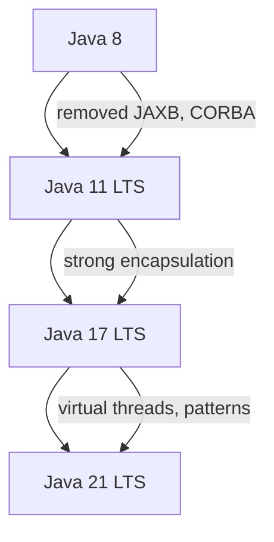

---

### 📶 Gradual Depth

**Layer 1 - Surface:** Compile on Java 21 with
`--release 11`. Fix compilation errors. Run tests. Deploy
to staging.

**Layer 2 - Java 8 to 11:** Replace removed Java EE modules.
Add `jakarta.xml.bind` for JAXB. Replace `sun.misc.BASE64`
with `java.util.Base64`. Fix Nashorn script engine usage
(replace with GraalJS or remove).

**Layer 3 - Java 11 to 17:** Fix `--illegal-access=deny`
violations. Add `--add-opens` flags for reflection-heavy
frameworks (Spring, Hibernate). Track each flag as technical
debt to be removed when libraries update.

**Layer 4 - Java 17 to 21:** Adopt new features incrementally.
Use records for DTOs. Use sealed types for domain models. Use
virtual threads for I/O-bound workloads. Enable pattern
matching in switch statements. Each adoption is independent.

---

### ⚙️ How It Works

```text
Migration checklist:

Step 1: Inventory dependencies
  mvn dependency:tree > deps.txt
  Check each for Java 21 support

Step 2: Compile on target JDK
  javac --release 11 src/**/*.java
  Fix compilation errors

Step 3: Run tests on target JDK
  Fix runtime errors (reflection, etc.)

Step 4: Fix illegal access warnings
  Add --add-opens flags (temporary)

Step 5: Deploy to staging
  Monitor for ClassNotFoundError,
  NoSuchMethodError, IllegalAccessError
```

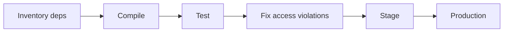

**BAD:**

```java
// Big-bang migration: Java 8 -> 21 directly
// Encounter all breaking changes at once
// Cannot distinguish Java 9, 11, 16 issues
// Debugging is a nightmare
import sun.misc.BASE64Encoder; // removed J11
import javax.xml.bind.JAXB;   // removed J11
// + module access errors (J9)
// + reflection denied (J16)
```

**GOOD:**

```java
// Stepwise: Java 8 -> 11 first
// Fix only Java 11 removals:
import java.util.Base64;       // replaces sun
// Add jakarta.xml.bind dependency for JAXB
// Then: Java 11 -> 17 -> 21
```

---

### 🚨 Failure Modes

**Failure 1 - Hidden sun.misc.Unsafe usage.**

A library uses `Unsafe.putObject()` via reflection. On Java
8, this works silently. On Java 17+, it throws
`IllegalAccessError` at runtime, not compile time.

**Diagnostic:** `java --add-opens java.base/sun.misc=ALL-UNNAMED -jar app.jar` as a temporary
workaround. Check if the library has an updated version.

**Fix:** upgrade the library. Modern versions of Netty, Kryo,
and LMAX Disruptor use `VarHandle` instead of Unsafe.

**Failure 2 - JAXB removal breaks XML processing.**

Java 8 includes JAXB in the JDK. Java 11 removes it. An
application that processes XML with JAXB annotations fails
with `ClassNotFoundException: javax.xml.bind.JAXBContext`.

**Diagnostic:** `ClassNotFoundException` for any `javax.xml.bind` class.

**Fix:** add the Jakarta JAXB dependency:

```xml
<dependency>
  <groupId>jakarta.xml.bind</groupId>
  <artifactId>jakarta.xml.bind-api</artifactId>
  <version>4.0.0</version>
</dependency>
```

---

### 🔬 Production Reality

Large-scale Java migrations typically take 3-12 months
(varies by codebase size, dependency count, and test
coverage). Common patterns:

1. **Start with the build:** get the project compiling on
   the target JDK with `--release` set to the source level.
   This catches API removals immediately.

2. **Fix dependencies first:** 80% of migration issues come
   from libraries, not application code. Upgrade Spring,
   Hibernate, Jackson, Guava, and other core dependencies
   before touching application code.

3. **Track `--add-opens` flags:** create a `jvm-args.txt`
   file listing all flags. Review during each subsequent JDK
   upgrade. Remove flags as libraries update.

4. **Measure performance:** Java 21 G1/ZGC improvements
   often reduce GC pause times by 30-50% compared to Java 8
   G1 (implementation-dependent, varies by workload).

---

### ⚖️ Trade-offs & Alternatives

| Aspect       | Stay on Java 8      | Migrate to 21      | Migrate to 17      |
| ------------ | -------------------- | ------------------- | ------------------- |
| Security     | no patches (EOL)     | current patches     | patches until 2027  |
| Features     | 2014 language        | virtual threads, etc| records, sealed     |
| Performance  | baseline             | 30-50% GC better    | 20-40% GC better    |
| Risk         | security debt        | migration effort    | moderate effort     |
| Effort       | zero                 | high                | moderate            |

---

### ⚡ Decision Snap

**MIGRATE to Java 21 WHEN:**

- The application is actively developed and deployed.
- Virtual threads or pattern matching would improve the code.
- Java 8 security patches are no longer available.

**MIGRATE to Java 17 first WHEN:**

- The jump from 8 to 21 is too large for one cycle.
- Java 17 LTS provides a stable intermediate checkpoint.

**STAY on current version WHEN:**

- The application is in maintenance mode with no new features.
- The application will be decommissioned within 12 months.
  (But ensure security patches are still available.)

---

### ⚠️ Top Traps

| #   | Misconception                             | Reality                                                                        |
| --- | ----------------------------------------- | ------------------------------------------------------------------------------ |
| 1   | Java 21 is backward-compatible with Java 8 | Bytecode is compatible; APIs and reflection access are not                     |
| 2   | `--add-opens` flags are permanent          | They are escape hatches; track and remove as libraries update                  |
| 3   | Only application code needs changes        | 80% of issues come from library dependencies                                   |
| 4   | Performance improves automatically         | GC and JIT improve, but incorrect module path config can hurt startup          |
| 5   | Migration is a one-time cost               | New LTS every 2 years requires ongoing upgrade discipline                      |

---

### 🪜 Learning Ladder

**Prerequisites:**

- JLG-044 Module System (JPMS) - the biggest migration hurdle
- JLG-052 JEP Process and JCP Governance - understanding the
  release cadence

**THIS:** JLG-057 Java 8 to 21 Migration Strategy

**Next steps:**

- JLG-055 Library API Design - designing APIs that survive
  version migrations
- JLG-059 Java Staff-Level Interview Scenarios - argue
  migration strategy in design reviews

**The Surprising Truth:**
The hardest part of migrating from Java 8 to 21 is not the
code changes - it is the dependency audit. A typical enterprise
application has 200-500 transitive dependencies. Each must be
verified against the target JDK. Libraries abandoned before
2018 often have no Java 11+ compatible version, forcing
replacement. The migration is as much a dependency cleanup
exercise as a language upgrade.

**Further Reading:**

- Oracle Java SE Migration Guide
  (docs.oracle.com/en/java/javase/21/migrate)
- "Java Module System" (Nicolai Parlog) - module migration
  strategies
- OpenJDK Quality Outreach program - test your code against
  early-access builds

**Revision Card:**

1. Migrate one LTS at a time: 8 -> 11 -> 17 -> 21.
2. Upgrade dependencies first (80% of issues).
3. Track every `--add-opens` flag as technical debt.

---

---

# JLG-058 API Design Workshop (Java Library)

**TL;DR** - Apply API design principles by building a small Java library with a public API surface, then evaluating it against the design rules from JLG-055.

---

### 🔥 Problem Statement

Reading about API design (JLG-055) gives knowledge.
Designing an API gives skill. This workshop builds a small
Java library (a typed configuration reader) with a public API,
then applies the design principles to evaluate and refine it.
The exercise reveals how easy it is to leak implementation
details, expose mutable state, and create an API that is
hard to evolve.

---

### 📜 Historical Context

Most API design workshops use toy examples (calculators, shape
hierarchies). This one uses a realistic scenario:
configuration reading. Every Java application needs one. The
JDK has `Properties` (flat, string-only). Libraries like
Typesafe Config, MicroProfile Config, and Spring's
`@ConfigurationProperties` each took different design
approaches. Building your own teaches why their APIs look the
way they do.

---

### 🔩 First Principles

**CORE INVARIANTS:**

1. Callers should not need to read the source code to use
   the API correctly. Method names, parameter types, and
   return types should communicate intent.
2. The API must be testable without infrastructure. A
   configuration reader that requires a file system cannot
   be unit-tested easily. Accept `Reader` or `Map` as input.
3. Incorrect usage should fail at compile time, not runtime.
   Use types to prevent invalid states: `Port` instead of
   `int`, `Duration` instead of `long`.

**DERIVED DESIGN:**
A well-designed configuration API returns typed values
(`getInt`, `getDuration`), supports defaults, and fails fast
on missing required keys - at startup, not at request time.

**THE TRADE-OFF:**
**Gain:** type safety, testability, clear error messages.
**Cost:** more classes, more design effort upfront.

---

### 🧠 Mental Model

> Designing an API is like writing a menu for a restaurant
> you will never visit again. The kitchen (implementation)
> can change, but the menu (API) must make sense to every
> diner (caller) without explanation.

- "Menu" -> public API surface
- "Kitchen" -> implementation classes
- "Diner" -> API caller
- "No explanation needed" -> self-documenting types

**Where this analogy breaks down:** menus change seasonally;
public APIs in Java are permanent.

---

### 🧩 Components

```text
Workshop structure:

Part 1: Design the API (30 min)
  - Define public interfaces
  - Choose method signatures
  - Define error handling strategy

Part 2: Implement (45 min)
  - Write the implementation
  - Keep implementation classes package-private

Part 3: Review (30 min)
  - Apply JLG-055 checklist
  - Identify leaks, mutability, naming issues
  - Refactor
```

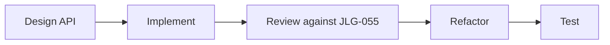

---

### 📶 Gradual Depth

**Layer 1 - Surface:** Define a `Config` interface with
methods like `getString(String key)`,
`getInt(String key, int defaultValue)`,
`getOrThrow(String key)`.

**Layer 2 - Typed values:** Add methods for `Duration`,
`List<String>`, `Optional<String>`. Use return types to
communicate presence/absence (Optional for optional keys,
direct return + exception for required keys).

**Layer 3 - Builder pattern:** Add `ConfigBuilder` for
constructing Config from multiple sources (file, environment,
defaults). The builder is mutable; the built Config is
immutable.

**Layer 4 - Review and refactor:** Does the API expose any
mutable state? Are return types interfaces or concrete
classes? Can a caller misuse the API easily? Apply the JLG-055
checklist item by item.

---

### ⚙️ How It Works

```text
API surface (what callers see):

Config (interface)
  getString(key) -> Optional<String>
  getInt(key, default) -> int
  getRequired(key) -> String (throws)
  getDuration(key) -> Optional<Duration>

ConfigBuilder (class)
  from(Map<String,String>) -> ConfigBuilder
  fromProperties(Reader) -> ConfigBuilder
  build() -> Config (immutable)
```

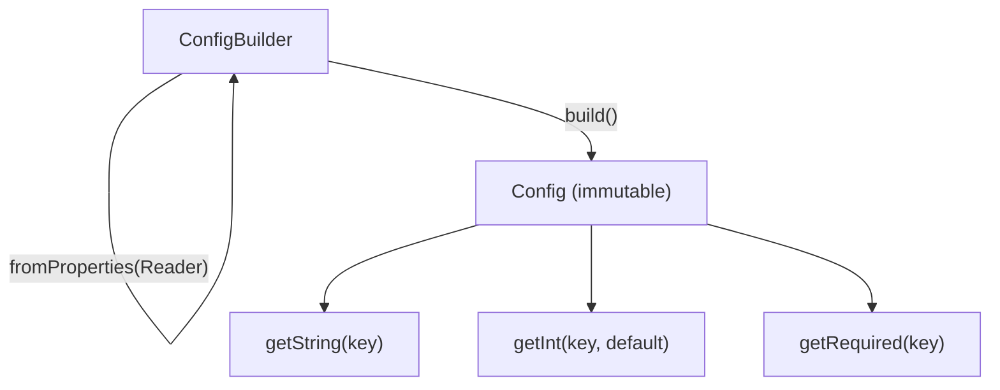

**BAD:**

```java
// Leaking implementation in the API
public class Config {
    // Exposes internal map - caller can mutate!
    public HashMap<String, String> getAll() {
        return data;
    }
    // Returns null instead of Optional
    public String get(String key) {
        return data.get(key); // null if missing
    }
}
```

**GOOD:**

```java
public interface Config {
    Optional<String> getString(String key);
    int getInt(String key, int defaultValue);
    String getRequired(String key); // throws
    Map<String, String> toMap(); // defensive copy
}
// Implementation is package-private
// Returned map is unmodifiable
```

---

### 🚨 Failure Modes

**Failure 1 - Over-designing the first version.**

The workshop participant creates 15 interfaces and 30 methods
before writing any implementation. Analysis paralysis.

**Diagnostic:** no working code after 45 minutes.

**Fix:** start with 3 methods. Implement them. Add methods
only when a test demands them. "When in doubt, leave it out."

**Failure 2 - Ignoring the review phase.**

The implementation works but the API leaks HashMap in return
types, uses null for missing values, and accepts `Object`
parameters.

**Diagnostic:** the JLG-055 checklist reveals 5+ violations.

**Fix:** this is the point of the workshop. The violations
teach the design principles through experience.

---

### 🔬 Production Reality

Real configuration libraries make these design choices:

- **Typesafe Config:** immutable `Config` object. Rich type
  conversion. Nesting via dot-notation keys. The API is
  a model of clarity.
- **MicroProfile Config:** annotation-driven. `@ConfigProperty`
  injects values. Type conversion is automatic.
- **Spring `@Value`:** string-based injection with SpEL
  expressions. Flexible but easy to misuse (string typing).

This workshop teaches you to recognize these trade-offs in
any API you encounter, not just configuration.

---

### ⚖️ Trade-offs & Alternatives

| Aspect       | Interface-first      | Class-first           | Annotation-first     |
| ------------ | -------------------- | --------------------- | -------------------- |
| Flexibility  | high (swap impl)     | low (locked to class) | high (DI framework)  |
| Testability  | excellent (mock)     | requires subclassing  | requires DI context  |
| Complexity   | moderate             | simple                | framework-dependent  |
| Evolution    | add default methods  | add methods           | add annotations      |

---

### ⚡ Decision Snap

**USE this workshop WHEN:**

- You have completed JLG-055 and want hands-on practice.
- You are designing a library API for your team.
- You want to internalize API design principles.

**AVOID WHEN:**

- You need to learn Java basics first (complete L0-L2).
- You are not designing libraries (focus on application code).

**EXTEND this workshop WHEN:**

- Add a second implementation (JSON config) to test API
  generality.

---

### ⚠️ Top Traps

| #   | Misconception                         | Reality                                                            |
| --- | ------------------------------------- | ------------------------------------------------------------------ |
| 1   | Good APIs need many methods           | Good APIs are minimal; add methods only when needed                |
| 2   | The implementation drives the API     | The API should be designed for callers, not implementors           |
| 3   | Internal classes can be public         | Every public class is a commitment; package-private is the default |
| 4   | Returning null is fine for missing keys | Use Optional or throw; null forces callers to guess                |
| 5   | One workshop teaches API design       | Design skill requires building and reviewing 5-10 APIs             |

---

### 🪜 Learning Ladder

**Prerequisites:**

- JLG-055 Library API Design - the design principles to apply
- JLG-036 Records, Sealed Types - modern Java data modeling

**THIS:** JLG-058 API Design Workshop (Java Library)

**Next steps:**

- JLG-059 Java Staff-Level Interview Scenarios - present
  and defend API designs
- JLG-060 Designing a Type System - specification-level
  design decisions

**The Surprising Truth:**
The first API you design in this workshop will have 3-5
design violations. This is expected and intentional. The
review phase is where learning happens. Engineers who skip
the review ("it works, ship it") miss the entire point.
Production APIs that shipped without review are the ones
with `Date`, `Vector`, and `getAll(): HashMap` in their
signatures - forever.

**Further Reading:**

- "Effective Java" Items 15-25 (Joshua Bloch) - classes and
  interfaces design rules
- "Framework Design Guidelines" (Cwalina, Abrams) - .NET
  principles that apply to Java
- Typesafe Config API (github.com/lightbend/config) - study
  the public interface

**Revision Card:**

1. Design for callers, not implementors. Start with 3 methods.
2. Return interfaces, use Optional, keep state immutable.
3. Review against JLG-055 checklist. The violations teach
   the principles.

---

---

# JLG-059 Java Staff-Level Interview Scenarios

**TL;DR** - Staff-level Java interviews test system thinking, trade-off reasoning, and technical communication - not syntax recall; practice with realistic scenarios.

---

### 🔥 Problem Statement

Senior and staff engineer interviews for Java roles do not ask
"what is an interface?" They ask "your team wants to migrate
500 microservices from Java 8 to 21 - what is your plan?"
or "a service is leaking memory under load - walk me through
your diagnosis." These questions test synthesis, trade-off
reasoning, and communication under pressure. Preparing
requires structured practice with realistic scenarios.

---

### 📜 Historical Context

Staff-level interviews evolved from "whiteboard coding" to
"system design + depth drill" in the 2010s as companies
realized that senior engineers spend more time on design,
debugging, and communication than on writing new code.
Google, Amazon, Netflix, and Stripe all use scenario-based
interviews for staff+ roles. The scenarios test the candidate's
ability to reason about trade-offs, not to produce perfect
code.

---

### 🔩 First Principles

**CORE INVARIANTS:**

1. Staff-level answers demonstrate trade-off reasoning. "It
   depends" is not an answer - "it depends on X, Y, Z, and
   here is how I would decide" is.
2. Communication is graded equally with technical depth. A
   correct answer poorly communicated scores lower than a
   good answer clearly explained with diagrams and structure.
3. Depth must extend beyond textbook knowledge. The
   interviewer probes until the candidate reaches the edge of
   their knowledge. Honesty about uncertainty scores higher
   than fabricated confidence.

**DERIVED DESIGN:**
Practice should simulate the probe-until-uncertain pattern:
answer, then ask yourself "but what if X?" until you find a
gap.

**THE TRADE-OFF:**
**Gain:** interview readiness, structured thinking skill.
**Cost:** 30-60 minutes per scenario; requires honest
self-evaluation.

---

### 🧠 Mental Model

> A staff interview is a technical conversation, not an exam.
> The interviewer is a colleague with a hard problem. Your
> job is to think out loud, structure the problem, evaluate
> options, and communicate your reasoning - not to reach the
> "right answer" in silence.

- "Colleague" -> interviewer
- "Hard problem" -> scenario
- "Think out loud" -> structured verbal reasoning
- "Evaluate options" -> trade-off analysis

**Where this analogy breaks down:** in a real conversation,
you can say "I will look that up"; in an interview, you must
demonstrate in-session reasoning.

---

### 🧩 Components

```text
Interview scenario structure:

1. Problem statement (2-3 sentences)
2. Clarifying questions (ask before solving)
3. Structured approach (framework)
4. Trade-off analysis (2-3 options)
5. Recommendation with reasoning
6. Depth probe ("what if 10x traffic?")
7. Honest boundary ("I am less certain about
   X; here is how I would investigate")
```

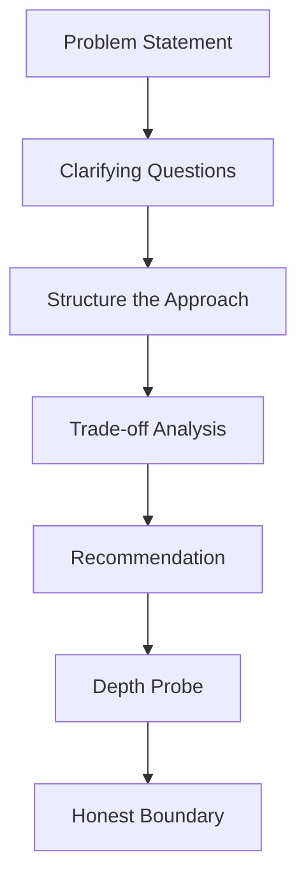

---

### 📶 Gradual Depth

**Layer 1 - Scenario A: Migration strategy.**
"We have 200 Java 8 services. Leadership wants Java 21 in 12
months. How do you plan this?"

Framework: inventory -> risk tier -> pilot -> batch migrate ->
validate. Reference JLG-057 for the technical steps. Address:
dependency audit, team training, rollback plan, CI validation.

**Layer 2 - Scenario B: Performance diagnosis.**
"A service handling 10k req/s shows P99 latency spikes of
500ms every 30 seconds. Heap is 4 GB. How do you diagnose?"

Framework: GC logs -> allocation rate -> heap histogram ->
flame graph. Reference JLG-049 (boxing trap) as a common
root cause. Address: which GC, what object types dominate,
is it allocation rate or promotion rate.

**Layer 3 - Scenario C: API design review.**
"A team proposes a library with 40 public classes. You are
the reviewer. What do you look for?"

Framework: JLG-055 checklist. Check: interface vs class,
mutability, null handling, type leakage, evolution strategy.
Address: which methods can be removed, which types should be
interfaces.

**Layer 4 - Scenario D: Security incident.**
"Log4Shell-like vulnerability discovered in a dependency. You
are the on-call architect. What are your first 4 hours?"

Framework: triage -> blast radius -> hotfix -> WAF ->
dependency scan -> communication. Reference JLG-050. Address:
how to find all affected services, how to communicate to
stakeholders, what is the rollback plan.

---

### ⚙️ How It Works

```text
Practice format:

1. Read scenario (2 min)
2. Write clarifying questions (3 min)
3. Structure your approach (5 min)
4. Present aloud with timer (10 min)
5. Self-probe depth questions (5 min)
6. Compare against reference keywords
7. Score: structure, depth, communication
```

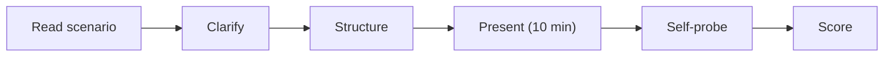

**BAD:**

```java
// Interview anti-pattern: jumping to solution
// "I would just upgrade all services to Java 21"
// No structure, no risk analysis, no trade-offs
// Interviewer thinks: this person has not done
// this at scale
```

**GOOD:**

```java
// Structured approach:
// 1. Inventory: which services, which deps?
// 2. Risk tier: critical (payment) vs low-risk
// 3. Pilot: migrate 2-3 low-risk services first
// 4. Validate: run integration tests on Java 21
// 5. Batch: migrate by risk tier over 4 quarters
// 6. Rollback: dual-build CI (8 + 21) for 1 month
// "Let me walk you through each step..."
```

---

### 🚨 Failure Modes

**Failure 1 - Answering without structuring.**

The candidate starts talking immediately without organizing
their thoughts. The answer jumps between topics. The
interviewer cannot follow the reasoning.

**Diagnostic:** the candidate says "and another thing" more
than twice.

**Fix:** take 30 seconds to outline 3-5 points before
speaking. Say "Let me structure this into three parts..."

**Failure 2 - Fabricating knowledge under pressure.**

The candidate does not know how ZGC works but invents an
explanation instead of saying "I am less familiar with ZGC
specifics but would investigate X."

**Diagnostic:** the depth probe reveals inconsistencies.

**Fix:** practice saying "I am not certain about that
specific detail, but here is how I would approach finding
the answer." Honesty is scored higher than fabrication.

---

### 🔬 Production Reality

Staff-level interviews at major companies typically include:

1. **System design** (60 min): design a large-scale system
   with Java-specific depth (thread model, GC tuning,
   serialization format).
2. **Technical depth** (45 min): deep dive into one area
   (concurrency, performance, security) with progressive
   probing.
3. **Behavioral / leadership** (45 min): how you influenced
   technical decisions, resolved disagreements, mentored
   others.

The technical depth round is where L4-L5 knowledge matters.
The scenarios in this keyword prepare you for that round
specifically.

---

### ⚖️ Trade-offs & Alternatives

| Aspect       | Self-practice       | Mock interview       | Study group          |
| ------------ | ------------------- | -------------------- | -------------------- |
| Feedback     | self-only           | external (realistic) | peer (variable)      |
| Pressure     | low                 | high (realistic)     | moderate             |
| Scheduling   | any time            | needs partner        | needs coordination   |
| Cost         | free                | time (or paid mock)  | time                 |
| Depth check  | honest self-eval    | interviewer probes   | peer probes          |

---

### ⚡ Decision Snap

**USE this drill WHEN:**

- Preparing for staff/principal engineer interviews.
- Wanting to practice structured technical communication.
- Testing whether L4-L5 knowledge is retrievable under
  pressure.

**AVOID WHEN:**

- You have not completed L4 keywords yet.
- You are preparing for a coding-focused interview (use
  LeetCode instead).

**COMBINE with mock interviews WHEN:**

- You have practiced solo and want external feedback.

---

### ⚠️ Top Traps

| #   | Misconception                           | Reality                                                            |
| --- | --------------------------------------- | ------------------------------------------------------------------ |
| 1   | Staff interviews test coding ability    | They test system thinking, trade-offs, and communication          |
| 2   | There is one right answer               | Multiple approaches work; reasoning quality matters more          |
| 3   | Memorizing keywords is sufficient       | Interviews probe until you reach the edge of your knowledge       |
| 4   | You should never say "I don't know"     | Honest boundaries + investigation plan scores higher than bluffing |
| 5   | 30 minutes of prep is enough            | Practice 3-5 scenarios with full structure + timing               |

---

### 🪜 Learning Ladder

**Prerequisites:**

- All L4 keywords (JLG-044..054) - the knowledge base
- JLG-054 Expert Mastery Verification - retrieval practice

**THIS:** JLG-059 Java Staff-Level Interview Scenarios

**Next steps:**

- JLG-060 Designing a Type System - L6 Creator depth
- JLG-056 Java vs Kotlin - a common staff interview topic

**The Surprising Truth:**
The most common failure mode in staff-level interviews is not
lack of knowledge - it is lack of structure. Engineers who know
the material but present it as a stream-of-consciousness
monologue score lower than engineers with slightly less depth
who communicate with clear structure (problem, approach,
trade-offs, recommendation). Practice the structure separately
from the content.

**Further Reading:**

- "Staff Engineer" (Will Larson) - role expectations and
  interview patterns
- "System Design Interview" (Alex Xu) - system design
  framework
- Interviewing.io mock interview recordings - real examples
  of scored staff interviews

**Revision Card:**

1. Structure first: problem, approach, trade-offs,
   recommendation.
2. Honest boundaries score higher than fabricated confidence.
3. Practice scenarios aloud with a timer. Communication is
   graded equally with depth.

---

---

# JLG-060 Designing a Type System - Lessons from Java

**TL;DR** - Java's type system choices (erasure, null as a valid value, primitive-object split) shape every API and bug pattern; understanding them explains why Java works this way.

---

### 🔥 Problem Statement

Why does `List<int>` not compile? Why does
`instanceof List<String>` not work? Why can every reference be
null? These are not implementation quirks - they are
consequences of type system design decisions made in the 1990s
and 2000s. Understanding these decisions at the specification
level explains Java's strengths (backward compatibility,
gradual typing via generics) and weaknesses (boxing, null
unsafety, erasure limitations).

---

### 📜 Historical Context

Java 1.0 (1996) had no generics. The type system had
primitives, objects, and arrays. Generics arrived in Java 5
(2004, JSR 14) with type erasure to maintain binary
compatibility with pre-generic bytecode. C# chose reification
(runtime generic types) at the cost of breaking binary
compatibility. Kotlin added null-safety at the type level
(2016). Project Valhalla (ongoing) aims to unify primitives
and objects via value types, closing the 30-year gap.

---

### 🔩 First Principles

**CORE INVARIANTS:**

1. Type erasure preserves binary compatibility. Java bytecode
   from 2004 (pre-generics) runs unchanged on a 2025 JVM.
   This guarantee is the reason `List<String>` becomes `List`
   at runtime - the bytecode predates the concept of generic
   types.
2. Null is a member of every reference type. The type system
   does not distinguish `String` from `String-or-null`. This
   decision, inherited from C/C++, is the root cause of
   NullPointerException.
3. Primitives and objects are separate type hierarchies.
   `int` is not an `Object`. Generics only accept objects.
   This forces boxing (`Integer`) for generic collections and
   creates the performance trap (JLG-049).

**DERIVED DESIGN:**
Every major Java "limitation" (erasure, boxing, null unsafety)
traces to these three decisions. Fixing them (Valhalla,
null-restricted types) requires changing the JVM spec, not
just the language.

**THE TRADE-OFF:**
**Gain:** backward compatibility across 30 years; gradual
adoption of generics without recompilation.
**Cost:** boxing overhead, null unsafety, no runtime generic
type information.

---

### 🧠 Mental Model

> Java's type system is a building with two separate plumbing
> systems (primitives and objects) installed decades ago. When
> generics were added, they could only connect to one system
> (objects) because retrofitting both would require tearing up
> the foundation (bytecode format). Valhalla is the plumbing
> unification project.

- "Two plumbing systems" -> primitive types + reference types
- "Only one system connected" -> generics work with objects only
- "Foundation" -> bytecode format (backward compatibility)
- "Unification project" -> Project Valhalla

**Where this analogy breaks down:** plumbing systems can be
physically unified; type system unification requires
specification-level changes that affect every JVM implementation.

---

### 🧩 Components

```text
Java type system layers:

Specification (JLS)
  +-- Primitive types (int, long, double, ...)
  +-- Reference types (classes, interfaces, arrays)
  +-- Generic types (parameterized, bounded)
  +-- Null type (subtype of every reference type)

Runtime (JVM):
  +-- Type erasure (generics -> raw types)
  +-- Boxing/unboxing (primitive <-> wrapper)
  +-- Reflection (limited generic info)

Future (Valhalla):
  +-- Value types (inline, no identity)
  +-- Primitive classes (user-defined primitives)
  +-- Generic specialization (List<int>)
```

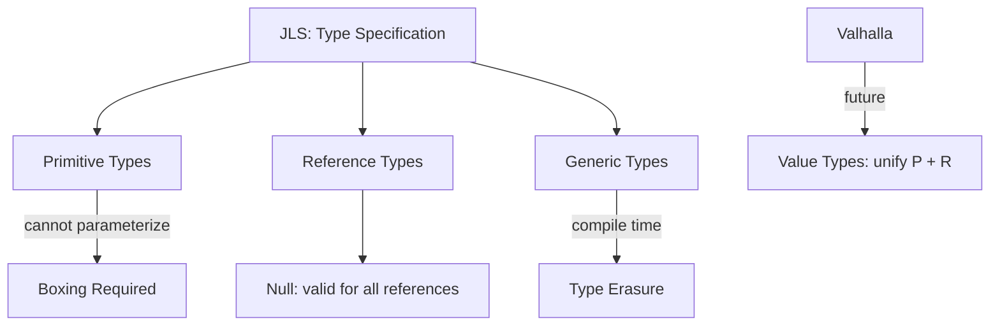

---

### 📶 Gradual Depth

**Layer 1 - Surface:** Java has primitives (`int`) and objects
(`Integer`). Generics work only with objects. `null` is valid
for any reference variable.

**Layer 2 - Erasure mechanics:** `List<String>` and
`List<Integer>` compile to the same bytecode (`List`). The
compiler inserts casts: `(String) list.get(0)`. At runtime,
`list instanceof List<String>` is impossible because the
generic type is erased.

**Layer 3 - Design alternatives:** C# chose reification
(generic types exist at runtime). This allows
`list is List<string>` and avoids boxing for value types.
The cost: pre-generic C# bytecode is incompatible with
generic C# bytecode. Java chose the opposite trade-off.

**Layer 4 - Valhalla and the future:** Value types (JEP 401)
will allow user-defined types that behave like primitives
(no heap allocation, no identity). Generic specialization
will allow `List<int>` without boxing. This is a 10+ year
project that changes the JVM specification itself.

---

### ⚙️ How It Works

```text
Type erasure at compile time:

Source:                 Bytecode:
List<String> list      List list
list.add("hello")      list.add("hello")
String s = list.get(0) String s = (String)
                          list.get(0)
```

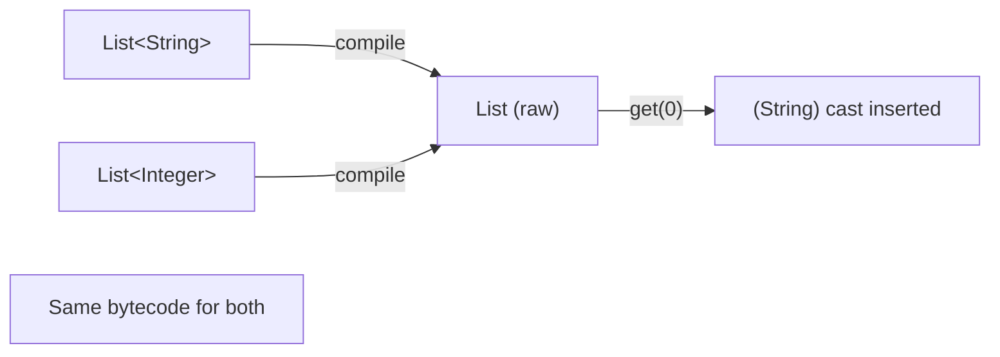

**BAD:**

```java
// Attempting runtime generic type check
if (list instanceof List<String>) { // ERROR
    // Compiler: illegal generic type for
    // instanceof
}
// Why: List<String> is erased to List at
// runtime. The JVM cannot distinguish
// List<String> from List<Integer>.
```

**GOOD:**

```java
// Check the raw type, cast elements safely
if (list instanceof List<?> rawList) {
    for (Object item : rawList) {
        if (item instanceof String s) {
            process(s);
        }
    }
}
// Pattern matching (Java 21) makes this clean
```

---

### 🚨 Failure Modes

**Failure 1 - Heap pollution via raw types.**

Legacy code passes a `List` (raw) where `List<String>` is
expected. The raw list contains an `Integer`. The cast
inserted by erasure fails at a use site far from the
insertion point: `ClassCastException` at line 200, but the
bad element was inserted at line 50.

**Diagnostic:** `ClassCastException` on a line that does not
have an explicit cast. The cast is compiler-inserted (erasure).

**Fix:** eliminate raw type usage. Enable `-Xlint:unchecked`.
Use `Collections.checkedList()` to catch type violations at
insertion.

**Failure 2 - Null reference in generic code.**

A `Map<String, User>` returns `null` for a missing key. The
caller calls `.getName()` on the result without checking.
NPE. The type system promised a `User` but delivered `null`.

**Diagnostic:** NPE on a line that dereferences a method
return value.

**Fix:** use `Map.getOrDefault()`, or `Optional`. The type
system cannot prevent null; API design must compensate.

---

### 🔬 Production Reality

The three type system design decisions create these production
patterns:

1. **Erasure -> runtime casts.** Every generic collection
   call includes an invisible cast. In hot paths, these casts
   are optimized away by the JIT. But in reflective code
   (serialization, DI frameworks), erasure forces type
   tokens: `TypeReference<List<String>>` (Jackson) or
   `ParameterizedTypeReference` (Spring).

2. **Null -> defensive programming.** Production Java code
   is filled with null checks, `@NonNull` annotations, and
   Optional returns - all compensating for the type system's
   inability to express non-nullability.

3. **Primitive-object split -> boxing in collections.** Any
   performance-sensitive code with numeric collections must
   choose between JDK collections (boxing) and specialized
   libraries (Eclipse Collections, HPPC).

---

### ⚖️ Trade-offs & Alternatives

| Aspect          | Java (erasure)        | C# (reification)      | Kotlin (null-safe)  |
| --------------- | --------------------- | ---------------------- | ------------------- |
| Backward compat | 30 years unbroken     | broken at generics     | N/A (JVM guest)     |
| Runtime types   | erased                | retained               | erased (on JVM)     |
| Null handling   | null everywhere       | null + ?               | null-safe types     |
| Boxing          | required for generics | value types avoid it   | same as Java (JVM)  |
| Future          | Valhalla              | already unified        | follows JVM changes |

---

### ⚡ Decision Snap

**UNDERSTAND erasure WHEN:**

- Writing generic libraries or frameworks.
- Debugging ClassCastException in generic code.
- Working with serialization that needs runtime types.

**UNDERSTAND null semantics WHEN:**

- Designing APIs that return optional values.
- Debugging NPEs in production.
- Evaluating Java vs Kotlin for a project.

**UNDERSTAND the primitive-object split WHEN:**

- Optimizing hot paths with numeric data.
- Evaluating Project Valhalla's impact.

---

### ⚠️ Top Traps

| #   | Misconception                             | Reality                                                                   |
| --- | ----------------------------------------- | ------------------------------------------------------------------------- |
| 1   | Generics exist at runtime                 | They are erased; `List<String>` is `List` at runtime                     |
| 2   | `@NonNull` prevents null at runtime       | Annotations are metadata; they do not change the type system              |
| 3   | Java's type system is objectively worse    | Erasure is a trade-off, not a defect; it preserved 10 years of bytecode  |
| 4   | Valhalla will fix everything              | It addresses boxing and value types; null and erasure remain              |
| 5   | Kotlin's null safety is complete          | Platform types (Java interop) can still produce NPEs                     |

---

### 🪜 Learning Ladder

**Prerequisites:**

- JLG-016 Generics - Parameterized Types - generic syntax
- JLG-041 Type Erasure Reality - the erasure mechanism

**THIS:** JLG-060 Designing a Type System - Lessons from Java

**Next steps:**

- JLG-061 Backwards-Incompatible Language Changes - what
  happens when type system decisions must be reversed
- JLG-062 What C++ RAII and Lisp Macros Teach About Java -
  cross-language type system comparison

**The Surprising Truth:**
Type erasure was not the Java team's first choice. An early
generics proposal (GJ, 1998) explored reification. The team
chose erasure because the alternative required changes to the
JVM bytecode format, which would have broken every existing
Java class file. The decision was not about what was ideal -
it was about what was possible without fracturing the
ecosystem. Twenty years later, Valhalla is finally making
the bytecode changes that were too risky in 2004.

**Further Reading:**

- "Java Generics and Collections" (Naftalin, Wadler) - the
  definitive guide to type erasure design
- JEP 401: Value Classes and Objects (Project Valhalla)
- "Types and Programming Languages" (Benjamin Pierce) -
  type system theory foundations

**Revision Card:**

1. Erasure preserves binary compatibility; generics are
   compile-time only.
2. Null is a member of every reference type - the type system
   cannot prevent NPE.
3. Primitives and objects are separate hierarchies; Valhalla
   aims to unify them.

---

---

# JLG-061 Backwards-Incompatible Language Changes Anti-Pattern

**TL;DR** - Breaking backward compatibility in a widely-adopted language fragments the ecosystem, strands users on old versions, and erodes trust; Java's extreme compat discipline is a deliberate counter to this pattern.

---

### 🔥 Problem Statement

Python 2 to 3 took 12 years and fractured the ecosystem. Perl
6 (Raku) became a different language entirely. Scala 2 to 3
required community-wide recompilation. These are cautionary
tales. Java's governing principle - code compiled in 1996 must
run on the 2025 JVM - is the most extreme backward
compatibility commitment in major programming languages.
Understanding why this commitment exists, what it costs, and
when it has been (carefully) violated teaches a meta-lesson
about language evolution at scale.

---

### 📜 Historical Context

Java's backward compatibility doctrine was established by Sun
Microsystems in the late 1990s and reinforced by the JCP. The
few intentional breaks: `enum` became a keyword (Java 5,
breaking code that used `enum` as a variable name), the module
system restricted reflective access (Java 9, breaking
frameworks), and removal of Java EE modules (Java 11). Each
break was planned over multiple releases with deprecation
periods. Python's 2-to-3 migration (2008-2020) is the most
studied counter-example: a necessary break that cost the
community a decade.

---

### 🔩 First Principles

**CORE INVARIANTS:**

1. Compatibility is a feature, not an accident. The cost of
   breaking existing code is paid by every user. The cost of
   maintaining compatibility is paid by the language team.
   The user base is always larger.
2. Deprecation is not removal. Java deprecated
   `Thread.stop()` in JDK 1.2 (1998). It was finally marked
   `forRemoval` in Java 18 (2022). 24 years of deprecation
   before removal signals intent without breaking code.
3. Preview features are the escape valve. New features ship
   as preview for 1-2 releases, allowing community feedback
   before permanent commitment. This lets the language evolve
   without accumulating permanent mistakes.

**DERIVED DESIGN:**
Java's evolution strategy is: add, deprecate (slowly), preview
(new features), never break silently.

**THE TRADE-OFF:**
**Gain:** 30 years of unbroken bytecode compatibility; trust.
**Cost:** dead APIs persist forever (`Date`, `Vector`); the
language evolves slowly; workarounds are needed for design
mistakes.

---

### 🧠 Mental Model

> A language's backward compatibility is like a building code
> for a city. Once millions of buildings (programs) follow
> the code, changing it means every building must be
> renovated. The stricter the code was initially, the harder
> it is to change - but the more trustworthy the city is for
> new construction.

- "Building code" -> language specification
- "Buildings" -> compiled programs
- "Renovation" -> migration effort
- "Trustworthy city" -> stable ecosystem

**Where this analogy breaks down:** building codes are
enforced by law; language compatibility is enforced by
community expectations and the JCP governance process.

---

### 🧩 Components

```text
Compatibility levels:

Source compatibility:
  Old source compiles on new compiler? (mostly)

Binary compatibility:
  Old bytecode runs on new JVM? (always)

Behavioral compatibility:
  Same inputs produce same outputs? (usually)

Breaking change spectrum:
  keyword addition < API removal < bytecode change
  (least disruptive)        (most disruptive)
```

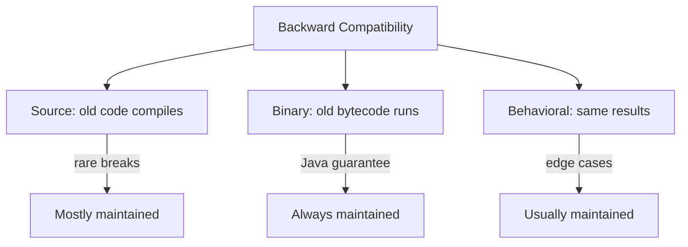

---

### 📶 Gradual Depth

**Layer 1 - Surface:** Java bytecode from any version runs on
the latest JVM. Old source code may not compile due to new
keywords (`enum`, `var`, `record`), but old class files always
run.

**Layer 2 - Controlled breaks:** Java has broken compatibility
exactly three times in significant ways: new keywords (Java 5),
module system access restrictions (Java 9), and Java EE module
removal (Java 11). Each was preceded by deprecation warnings
and migration guides.

**Layer 3 - Counter-examples:** Python 2-to-3 changed print
syntax, integer division, string encoding, and module names
simultaneously. The migration took 12 years. Scala 3 changed
the compiler and standard library encoding. Libraries had to
cross-publish for Scala 2 and 3. These examples show why Java
avoids breaking changes.

**Layer 4 - Design consequences:** Java's compatibility
doctrine means design mistakes persist. `Date` is mutable,
`Vector` is synchronized, `Cloneable` is broken. The cost of
backward compatibility is living with these mistakes. The
benefit is that no Java user has ever been stranded on an old
version due to a language break.

---

### ⚙️ How It Works

```text
Java's evolution pattern:

1. Identify problem (Date is bad)
2. Design replacement (java.time)
3. Add replacement alongside old API
4. Deprecate old API (optional)
5. NEVER remove old API (almost never)

Python's break pattern (2 to 3):

1. Identify problems (print, strings)
2. Design replacement (Python 3)
3. Remove old behavior
4. Community splits for 12 years
```

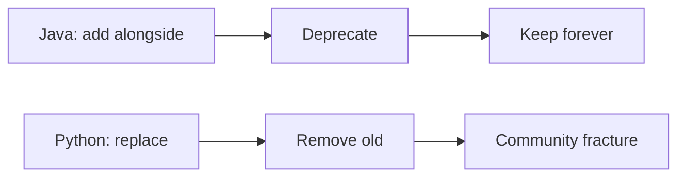

**BAD:**

```java
// Language design anti-pattern:
// Breaking change without migration path
// Python 2:
//   print "hello"
// Python 3:
//   print("hello")  # syntax change
// Result: 12-year migration, ecosystem split
```

**GOOD:**

```java
// Java's approach:
// Old: java.util.Date (mutable, bad API)
// New: java.time.LocalDate (immutable, good)
// Both coexist. Old code still works.
// New code uses java.time.
// Date is deprecated but not removed.
// Zero forced migration.
```

---

### 🚨 Failure Modes

**Failure 1 - Ecosystem split from premature break.**

A language removes a widely-used feature. Half the ecosystem
migrates; half stays on the old version. Libraries must
maintain two versions. New users face a confusing choice.

**Diagnostic:** multiple active versions of the language with
incompatible code. Library maintainers burn out maintaining
parallel versions.

**Fix (prevention):** add replacements alongside old features.
Deprecate with a long runway. Remove only when usage data
shows adoption of the replacement is near-universal.

**Failure 2 - Accumulation of design debt.**

Java's compatibility means `Date`, `Vector`, `Stack`,
`Cloneable`, and dozens of other poorly-designed classes
persist forever. New developers encounter them and must learn
"do not use this; use this instead."

**Diagnostic:** tutorials and blog posts spend significant
time on "what not to use" in the JDK.

**Fix:** accept design debt as the cost of compatibility.
Use linters and code reviews to steer teams toward modern
APIs. This is a conscious trade-off, not a failure.

---

### 🔬 Production Reality

The practical impact of Java's compatibility:

1. **Migration cost is low.** Upgrading from Java 17 to 21
   typically requires zero source code changes for
   application code (dependency upgrades may be needed).
2. **Library longevity.** A library written in 2010 for Java 6
   still runs on Java 21. This is extraordinary in the
   programming language world.
3. **Training cost.** New Java developers must learn which
   old APIs to avoid (`Date`, `Vector`, `Hashtable`,
   `StringBuffer` in single-threaded code). This is a real
   cost.
4. **Enterprise trust.** Large organizations choose Java
   partly because the compatibility guarantee means their
   investment is safe for decades.

---

### ⚖️ Trade-offs & Alternatives

| Aspect       | Java (extreme compat) | Python (broke compat) | Go (strong compat)   |
| ------------ | --------------------- | --------------------- | -------------------- |
| Break history | 3 minor breaks in 30y | 1 major break (2to3) | 0 breaks (Go 1.x)   |
| Dead APIs    | many persist          | cleaned up            | minimal (young lang) |
| Evolution    | slow, deliberate      | can be fast           | moderate             |
| User trust   | very high             | recovered after 2020  | high                 |
| Migration    | gradual, optional     | forced, painful       | not needed (yet)     |

---

### ⚡ Decision Snap

**APPLY Java's compat model WHEN:**

- Designing a library used by many external teams.
- The API will exist for 5+ years.
- Users cannot easily update their code.

**APPLY a breaking change WHEN:**

- The old API is a security risk (not just inconvenient).
- A migration tool can automate the change.
- Adoption of the replacement exceeds 80% of users.

**NEVER break compatibility WHEN:**

- The motivation is "cleaner API" without a safety argument.
- No automated migration path exists.

---

### ⚠️ Top Traps

| #   | Misconception                                | Reality                                                                   |
| --- | -------------------------------------------- | ------------------------------------------------------------------------- |
| 1   | Backward compatibility means no new features | Java ships major features every 6 months; compat and evolution coexist    |
| 2   | Python 3 was a mistake                       | The break was necessary; the mistake was underestimating migration cost   |
| 3   | Deprecation means "will be removed soon"     | In Java, deprecated methods can persist for decades                       |
| 4   | Breaking changes are always bad              | Sometimes necessary for security; the question is how, not whether        |
| 5   | Java's old APIs are harmless                 | `Date` mutability and `Cloneable` brokenness cause real production bugs   |

---

### 🪜 Learning Ladder

**Prerequisites:**

- JLG-052 JEP Process and JCP Governance - how Java evolves
- JLG-060 Designing a Type System - why some decisions are
  permanent

**THIS:** JLG-061 Backwards-Incompatible Language Changes
Anti-Pattern

**Next steps:**

- JLG-062 What C++ RAII and Lisp Macros Teach About Java -
  cross-language design comparison
- JLG-055 Library API Design - apply compat principles to
  your own APIs

**The Surprising Truth:**
The most expensive line of code in Java history is
`public class Date`. It has been deprecated since Java 1.1
(1997) but cannot be removed. Every Java developer encounters
it. Thousands of tutorials explain why not to use it. Entire
libraries (Joda-Time, java.time) exist to replace it. Yet it
persists because removing it would break binary compatibility
with 30 years of compiled code. This single class is the
strongest argument both for and against extreme backward
compatibility.

**Further Reading:**

- "Hyrum's Law" (hyrumslaw.com) - "with a sufficient number
  of users, every observable behavior will be depended on"
- Python 2-to-3 retrospective (PEP 3000, community post-
  mortems)
- "The Design of Everyday Things" (Don Norman) - design
  decisions and their long-term consequences

**Revision Card:**

1. Backward compatibility is a feature paid for by the
   language team, benefiting every user.
2. Add alongside, deprecate slowly, remove (almost) never.
3. Breaking changes fracture ecosystems; the cost is always
   higher than expected.

---

---

# JLG-062 What C++ RAII and Lisp Macros Teach About Java

**TL;DR** - C++ RAII reveals why Java needed try-with-resources and why finalizers fail; Lisp macros reveal what annotation processors and code generation compensate for in Java's rigid syntax.

---

### 🔥 Problem Statement

Java developers who only know Java develop blind spots. Two
concepts from other languages illuminate Java's design at a
deep level: C++ RAII (Resource Acquisition Is Initialization)
explains why Java's resource management was broken until Java 7
and why `finalize()` was a mistake. Lisp macros explain why
Java relies on annotation processors, code generation, and
frameworks for capabilities that Lisp handles with syntax
extension. Understanding these cross-language concepts makes
you a better Java designer.

---

### 📜 Historical Context

RAII was formalized by Bjarne Stroustrup in the mid-1980s for
C++. Destructors run deterministically when an object leaves
scope. Java (1996) chose garbage collection instead:
non-deterministic finalization. This worked for memory but
failed for non-memory resources (files, sockets, locks).
`try-with-resources` (Java 7, 2011) was Java's RAII equivalent
- 15 years late. Lisp macros predate Java by 40 years (Lisp
1.5, 1962). They allow syntax extension at compile time. Java
has no macros; annotation processors (Java 5, 2004) and
Lombok provide a fraction of that capability.

---

### 🔩 First Principles

**CORE INVARIANTS:**

1. Deterministic resource cleanup requires scope-based
   lifetime management. C++ RAII ties cleanup to scope exit.
   Java's `try-with-resources` achieves the same for
   `AutoCloseable` objects. `finalize()` was non-deterministic
   and fundamentally broken.
2. Syntax extension reduces boilerplate and enables
   domain-specific abstractions. Lisp macros rewrite code at
   compile time. Java lacks this; annotations + processors +
   code generation are the workaround.
3. Every language's limitations are another language's
   solved problems. Studying cross-language solutions reveals
   whether Java's approach is a design choice or a design
   gap.

**DERIVED DESIGN:**
RAII teaches that GC solves memory but not resources.
Macros teach that rigid syntax forces framework complexity.
Both lessons make Java designs better.

**THE TRADE-OFF:**
**Gain (Java's choices):** GC simplifies memory management;
no macros means no "code that writes code" confusion.
**Cost:** resource leaks were common until Java 7; boilerplate
is high; frameworks compensate for missing metaprogramming.

---

### 🧠 Mental Model

> C++ RAII is a self-cleaning room: when you leave (scope
> exits), the room cleans itself (destructor runs). Java's
> GC is a cleaning service that visits "eventually" -
> fine for trash (memory) but not for turning off the oven
> (closing a file). try-with-resources is a checklist on the
> door: "turn off oven before leaving."
>
> Lisp macros let you redesign the room's walls at build time.
> Java's annotations are sticky notes on the walls that a
> framework reads at runtime (or a processor reads at compile
> time) to decide what to do.

- "Self-cleaning room" -> RAII (deterministic cleanup)
- "Cleaning service" -> GC (non-deterministic)
- "Checklist on door" -> try-with-resources
- "Redesign walls" -> Lisp macros (syntax extension)
- "Sticky notes" -> Java annotations

**Where this analogy breaks down:** RAII handles all resources
uniformly; try-with-resources only works for `AutoCloseable`.

---

### 🧩 Components

```text
Resource management comparison:

C++ RAII:
  { File f("data.txt");
    // f destructor called on scope exit
  } // deterministic, automatic

Java (before try-with-resources):
  File f = new File(...);
  try { ... }
  finally { f.close(); } // manual

Java (try-with-resources, Java 7+):
  try (var f = new FileReader(...)) {
    // f.close() called on scope exit
  } // deterministic for AutoCloseable

Metaprogramming comparison:

Lisp: (defmacro unless (test body)
         `(if (not ,test) ,body))
       // New syntax: (unless false (print "hi"))

Java: @Override, @Entity, @Autowired
      // Processed by framework/compiler
      // Cannot create new syntax
```

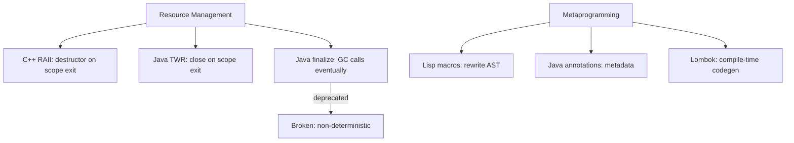

---

### 📶 Gradual Depth

**Layer 1 - Surface:** RAII = cleanup when scope exits. Java
equivalent = try-with-resources. Lisp macros = syntax
extension. Java equivalent = annotations + processors.

**Layer 2 - Why finalize() failed:** `finalize()` runs "at
some point" during GC, or never. A leaked file handle stays
open until GC happens to collect the object. Under memory
pressure, GC runs frequently; under low pressure, finalizers
may never run. Java 9 deprecated `finalize()`. Java 18 marked
it for removal.

**Layer 3 - RAII mechanics:** In C++, every object with a
destructor gets deterministic cleanup on scope exit, function
return, or exception. No explicit `close()` call needed. Rust's
ownership system extends RAII with compile-time lifetime
tracking. Java's try-with-resources is a manual opt-in version.

**Layer 4 - Macro power and cost:** Lisp macros can define new
control structures (`unless`, `with-database`, custom loops).
This power comes with a cost: macro-heavy code is hard to read
without knowing the macros. Java deliberately avoided this
trade-off, accepting boilerplate in exchange for readability.
Annotation processors (Lombok, MapStruct, Dagger) provide
limited compile-time code generation as a compromise.

---

### ⚙️ How It Works

```text
RAII (C++) vs Java:

C++:
void process() {
  File f("data.txt");  // constructor opens
  f.read();
  // destructor closes - NO explicit close()
} // f destroyed here, always

Java (pre-7):
void process() throws IOException {
  FileReader f = new FileReader("data.txt");
  try {
    f.read();
  } finally {
    f.close(); // manual, forgettable
  }
}

Java (7+):
void process() throws IOException {
  try (var f = new FileReader("data.txt")) {
    f.read();
  } // auto-closed here
}
```

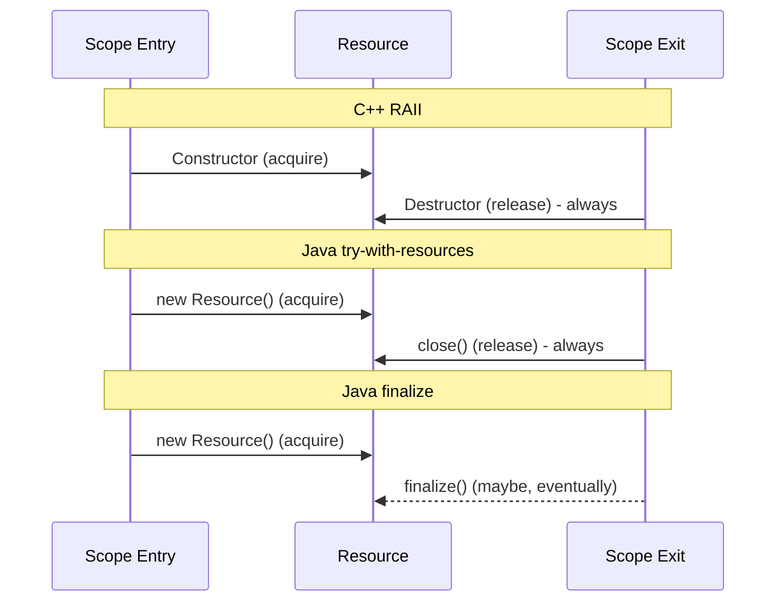

**BAD:**

```java
// Relying on finalize() for cleanup
public class Connection {
    @Override
    protected void finalize() {
        socket.close(); // may NEVER run
    }
}
// If GC does not collect this object,
// the socket stays open forever
```

**GOOD:**

```java
// Implement AutoCloseable + use TWR
public class Connection
        implements AutoCloseable {
    @Override
    public void close() {
        socket.close(); // deterministic
    }
}
try (var conn = new Connection()) {
    conn.query("SELECT ...");
} // conn.close() guaranteed here
```

---

### 🚨 Failure Modes

**Failure 1 - Resource leak from missing try-with-resources.**

A developer creates a `FileInputStream` without TWR. The
reference is lost (method returns early due to exception).
The file handle stays open until GC collects the object and
runs its finalizer - if ever.

**Diagnostic:** `lsof -p <pid> | wc -l` shows growing file
descriptor count. Eventually: `java.io.IOException: Too many
open files`.

**Fix:** wrap all `AutoCloseable` instances in
try-with-resources. Use static analysis (SpotBugs,
Error Prone) to detect missing TWR.

**Failure 2 - Annotation processor masking complexity.**

A team uses Lombok's `@Data` on 200 classes. When debugging,
the generated `equals()`, `hashCode()`, and `toString()`
methods are invisible in source. A subtle equality bug requires
examining generated bytecode.

**Diagnostic:** `equals()` behaves unexpectedly but the source
code has no `equals()` method.

**Fix:** understand what annotations generate. For critical
classes, write explicit `equals()`/`hashCode()`. Use
annotation processing judiciously - convenience that hides
critical behavior is a net negative.

---

### 🔬 Production Reality

In production Java codebases:

1. **Resource leaks** are among the top 5 bug categories.
   try-with-resources reduced but did not eliminate them.
   Legacy code and careless refactoring still introduce leaks.

2. **Annotation-driven frameworks** (Spring, Hibernate, JPA)
   are the closest Java gets to Lisp-style metaprogramming.
   `@Transactional` rewrites method behavior via a proxy.
   `@Entity` generates SQL mapping. These are powerful but
   opaque - debugging requires understanding the framework's
   code generation, not just the annotations.

3. **The RAII lesson applies beyond files.** Database
   connections, locks, thread pools, and HTTP clients all
   need deterministic cleanup. Any resource that is not
   garbage-collected memory should implement `AutoCloseable`.

---

### ⚖️ Trade-offs & Alternatives

| Aspect          | C++ RAII             | Java TWR             | Rust ownership       |
| --------------- | -------------------- | -------------------- | -------------------- |
| Cleanup trigger | scope exit (always)  | scope exit (opt-in)  | scope exit (always)  |
| Memory managed  | manual or smart ptr  | GC                   | ownership + borrow   |
| Can leak        | if using raw pointer | if not using TWR     | compile-time prevent |
| Syntax cost     | destructors          | try-with-resources   | lifetime annotations |

| Aspect          | Lisp macros          | Java annotations     | Rust macros          |
| --------------- | -------------------- | -------------------- | -------------------- |
| Power           | full AST rewrite     | metadata + processor | pattern-based        |
| Readability     | requires macro knowledge | clear (just metadata) | moderate          |
| New syntax      | yes (unlimited)      | no                   | limited              |
| Debugging       | hard (expanded code) | hard (generated code) | moderate            |

---

### ⚡ Decision Snap

**APPLY RAII thinking WHEN:**

- Designing any class that manages non-memory resources.
- Reviewing code for resource leak potential.
- Deciding whether to implement `AutoCloseable`.

**APPLY macro thinking WHEN:**

- Evaluating whether annotation processing or code generation
  is appropriate.
- Questioning boilerplate: "would a macro eliminate this?"
- Choosing between Lombok convenience and explicit code.

**STUDY cross-language design WHEN:**

- You want to understand why Java makes the trade-offs it
  does.
- You are designing a new API or framework.

---

### ⚠️ Top Traps

| #   | Misconception                          | Reality                                                                  |
| --- | -------------------------------------- | ------------------------------------------------------------------------ |
| 1   | GC handles all resource cleanup        | GC handles memory only; files, sockets, locks need explicit close        |
| 2   | `finalize()` is Java's destructor      | It is non-deterministic and deprecated; use try-with-resources           |
| 3   | Java has no metaprogramming            | Annotation processors and bytecode manipulation (ASM, ByteBuddy) exist  |
| 4   | Lombok is free                         | It hides critical code (equals, hashCode); debugging cost is real       |
| 5   | RAII is only about memory              | RAII is about ANY resource with a lifetime: files, locks, connections    |

---

### 🪜 Learning Ladder

**Prerequisites:**

- JLG-024 try-with-resources and AutoCloseable - Java's RAII
  equivalent
- JLG-060 Designing a Type System - type system design
  decisions

**THIS:** JLG-062 What C++ RAII and Lisp Macros Teach About
Java

**Next steps:**

- Cross-language study: explore Rust ownership (RAII evolved),
  Kotlin extension functions (partial macro substitute),
  or Clojure macros (Lisp on the JVM)
- JLG-055 Library API Design - apply cross-language insights
  to Java API design

**The Surprising Truth:**
Java's `try-with-resources` was designed by studying C++ RAII
and C# `using` statements. The AutoCloseable interface is
intentionally minimal (one method: `close()`) because the
designers observed that C++'s destructor model, while powerful,
couples resource management to object lifetime in ways that
complicate garbage-collected languages. The single-method
interface is a deliberate simplification that works with GC
rather than against it.

**Further Reading:**

- "The C++ Programming Language" (Stroustrup) - RAII
  definition and rationale
- "Structure and Interpretation of Computer Programs"
  (Abelson, Sussman) - Lisp macro foundations
- JEP 421: Deprecate Finalization for Removal
  (openjdk.org/jeps/421)

**Revision Card:**

1. RAII = deterministic cleanup on scope exit. Java's TWR is
   opt-in RAII for AutoCloseable.
2. Lisp macros = syntax extension. Java annotations +
   processors are the limited equivalent.
3. Every Java limitation has a cross-language solution. Study
   both to design better Java.
