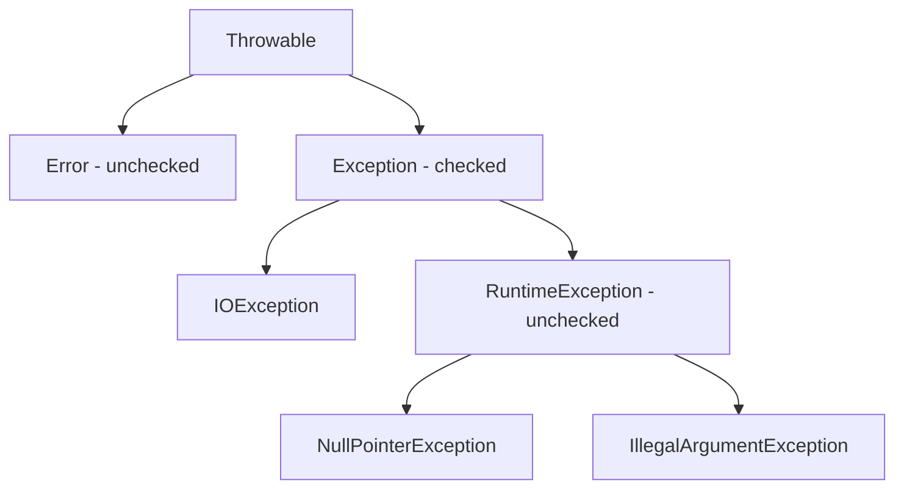
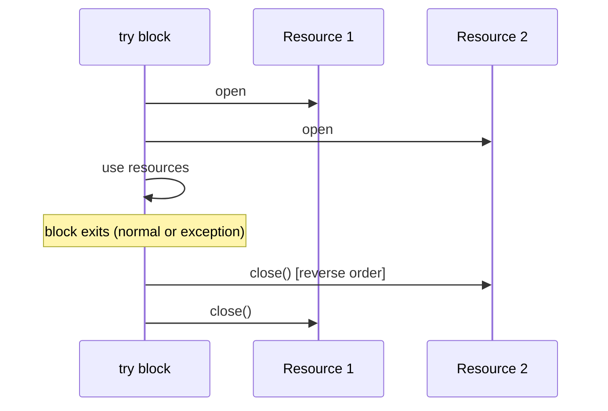
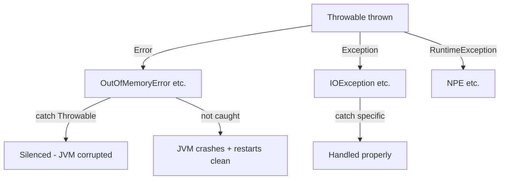
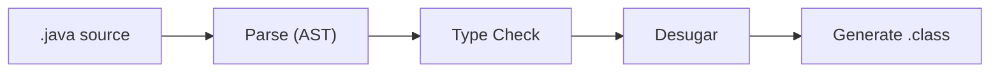
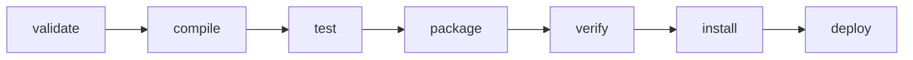
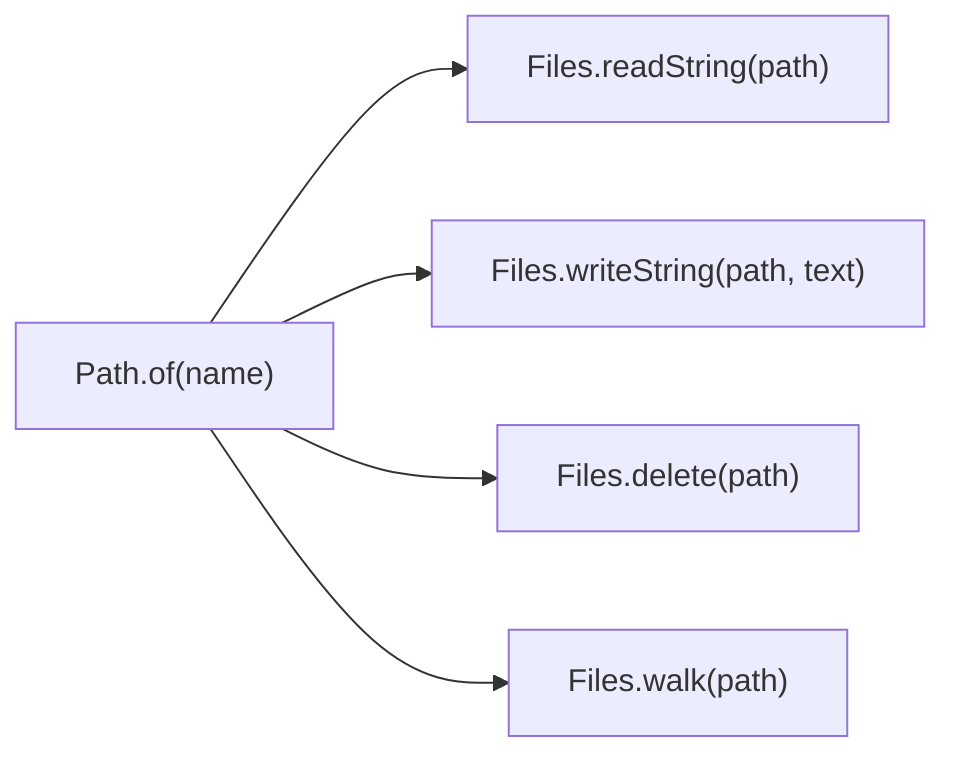
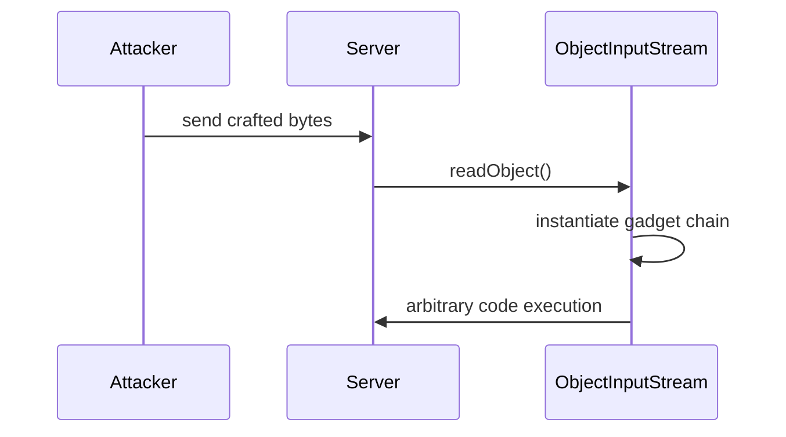

# JLG-023 Checked vs Unchecked Exceptions

**TL;DR** - Checked exceptions force callers to handle recoverable failures; unchecked exceptions signal programming bugs.

---

### 🔥 The Problem in One Paragraph

You call a method that reads a file. It might fail because the
file is missing, the disk is full, or permissions are wrong.
Should the caller be forced to handle that failure? If yes, you
want a checked exception that the compiler enforces. But if the
failure is a null pointer or array index bug, forcing every
caller to write try/catch adds noise without value - the correct
fix is to fix the code, not catch the exception. Java splits
exceptions into two families to distinguish recoverable failures
from programming errors. This is exactly why checked vs unchecked
exceptions were created.

---

### 📘 Textbook Definition

**Checked exceptions** extend `Exception` (but not
`RuntimeException`) and must be declared in `throws` clauses
or caught. The compiler enforces handling. **Unchecked
exceptions** extend `RuntimeException` and do not require
declaration or handling. `Error` subclasses (e.g.,
`OutOfMemoryError`) are also unchecked and signal unrecoverable
JVM failures.

---

### 🧠 Mental Model

> Checked exceptions are certified mail - the sender (method)
> forces the receiver (caller) to sign for delivery (handle or
> declare). Unchecked exceptions are thrown packages left at
> the door - the receiver might not even know they arrived
> until something breaks.

- "Certified mail" -> checked exception (forced handling)
- "Sign for delivery" -> try/catch or throws declaration
- "Package at the door" -> unchecked exception (optional catch)

**Where this analogy breaks down:** in practice, many checked
exceptions are caught and silently swallowed (anti-pattern),
which is worse than not catching at all.

---

### ⚙️ How It Works

1. Method declares: `void read() throws IOException`.
2. Caller MUST either wrap in try/catch or propagate with
   `throws IOException` in its own signature.
3. Unchecked: `throw new IllegalArgumentException()` needs
   no declaration.
4. The compiler scans every method body for checked
   exceptions that are neither caught nor declared.

```text
Throwable
  +-- Error (unchecked, unrecoverable)
  |     +-- OutOfMemoryError
  |     +-- StackOverflowError
  +-- Exception (checked)
        +-- IOException
        +-- SQLException
        +-- RuntimeException (unchecked)
              +-- NullPointerException
              +-- IllegalArgumentException
```



---

### 🛠️ Worked Example

**BAD:**

```java
// Swallowing the checked exception
try {
    Files.readString(Path.of("config.yml"));
} catch (IOException e) {
    // silently ignored - production failure goes unnoticed
}
```

Why it's wrong: hiding the failure is worse than crashing.

**GOOD:**

```java
try {
    String config =
        Files.readString(Path.of("config.yml"));
} catch (IOException e) {
    throw new UncheckedIOException(
        "Failed to read config", e);
    // Wraps checked in unchecked with full context
}
```

Why it's right: converts to unchecked with message and cause
chain preserved.

**Production pattern:**

```java
// Validate at boundary, use unchecked internally
public Config loadConfig(Path path) {
    try {
        return parse(Files.readString(path));
    } catch (IOException e) {
        throw new ConfigLoadException(path, e);
        // Custom unchecked RuntimeException
    }
}
```

---

### ⚖️ Trade-offs

**Gain:** checked exceptions make failure handling explicit and
compiler-verified.
**Cost:** boilerplate try/catch in every caller; developers
swallow exceptions to shut up the compiler; lambdas and streams
cannot throw checked exceptions.

| Aspect      | Checked              | Unchecked        |
| ----------- | -------------------- | ---------------- |
| Compiler    | enforces handling    | no enforcement   |
| Best for    | recoverable failures | programming bugs |
| Lambda-safe | no (must wrap)       | yes              |
| Noise       | high                 | low              |

---

### ⚡ Decision Snap

**USE WHEN (checked):**

- The failure is recoverable and the caller has a meaningful
  alternative (retry, fallback, user prompt).
- API boundary where the caller genuinely needs to decide
  the recovery strategy.
- IO, network, and external system failures.

**AVOID WHEN (checked):**

- The caller cannot meaningfully recover.
- The exception represents a programming error.

**PREFER unchecked WHEN:**

- Internal service code where the global error handler
  catches all failures.
- Validation failures (IllegalArgumentException).

---

### ⚠️ Top Traps

| #   | Misconception                           | Reality                                              |
| --- | --------------------------------------- | ---------------------------------------------------- |
| 1   | Catch Exception to be safe              | Catches both checked and unchecked, masking bugs     |
| 2   | Checked exceptions are always better    | They add noise and break lambda/stream APIs          |
| 3   | Swallowing with empty catch is harmless | It hides failures and corrupts system state silently |

---

### 🪜 Learning Ladder

**Prerequisites:**

- JLG-007 Control Flow Constructs - try/catch syntax
- JLG-010 Inheritance, Interfaces, Polymorphism - exception
  class hierarchy

**THIS:** JLG-023 Checked vs Unchecked Exceptions

**Next steps:**

- JLG-024 try-with-resources and AutoCloseable - safe
  resource cleanup
- JLG-025 Catch Throwable Anti-Pattern - what NOT to catch

---

### 💡 The Surprising Truth

Kotlin, Scala, and most modern JVM languages do not have
checked exceptions at all. Even within the Java community,
Joshua Bloch (Effective Java) recommends "use checked exceptions
for recoverable conditions and runtime exceptions for
programming errors" - but many teams adopt an unchecked-only
policy, catching at the outermost boundary.

---

### 📇 Revision Card

1. Checked = compiler-enforced, for recoverable failures.
   Unchecked = optional, for bugs.
2. Never swallow exceptions with empty catch blocks.
3. Wrap checked in unchecked at boundary layers when the
   caller cannot recover.

---

---

# JLG-024 try-with-resources and AutoCloseable

**TL;DR** - try-with-resources guarantees resource cleanup even when exceptions occur, replacing fragile try/finally.

---

### 🔥 The Problem in One Paragraph

You open a database connection, execute a query, and close it
in a finally block. But if the query throws AND the close
throws, the close exception suppresses the original. Worse, if
you forget the finally block entirely (common), the connection
leaks. After thousands of requests, the pool is exhausted and
the service dies. try-with-resources (Java 7) solves this by
auto-closing resources and properly handling suppressed
exceptions. This is exactly why try-with-resources was created.

---

### 📘 Textbook Definition

**try-with-resources** is a try statement that declares one or
more resources implementing `AutoCloseable`. The JVM guarantees
`close()` is called when the block exits, whether normally or
via exception. If both the body and `close()` throw, the close
exception is added as a suppressed exception on the primary,
preserving both.

---

### 🧠 Mental Model

> try-with-resources is an automatic door closer. You walk
> through (use the resource), and the spring mechanism (JVM)
> closes the door behind you no matter what - even if you trip
> (exception). Without it, you must remember to close the door
> manually every time, and sometimes you forget.

- "Spring mechanism" -> auto-close guarantee
- "Tripping" -> exception during body execution
- "Forgetting to close" -> resource leak

**Where this analogy breaks down:** the door closer does not
handle the case where both the trip and the door closing fail
simultaneously. Java does - via suppressed exceptions.

---

### ⚙️ How It Works

1. Declare the resource in the try header:
   `try (var conn = dataSource.getConnection())`.
2. Use the resource inside the try body.
3. When the block exits (normally or by exception), the JVM
   calls `conn.close()`.
4. If the body threw exception A and close() throws
   exception B, then B is added to A's suppressed list.
5. Multiple resources close in reverse declaration order.

```text
try (R1 = open(); R2 = open()) {
    use R1 and R2
}
// Close order: R2.close() then R1.close()
// Even if body throws, both close
```



---

### 🛠️ Worked Example

**BAD:**

```java
// Manual try/finally - fragile and verbose
Connection conn = null;
try {
    conn = dataSource.getConnection();
    conn.execute(query);
} finally {
    if (conn != null) conn.close(); // may throw!
    // Original exception lost if close() throws
}
```

Why it's wrong: close exception overwrites the original;
verbose; easy to forget the null check.

**GOOD:**

```java
try (Connection conn =
         dataSource.getConnection()) {
    conn.execute(query);
}
// conn.close() called automatically
// suppressed exceptions preserved
```

Why it's right: guaranteed cleanup, cleaner code, proper
exception handling.

**Production pattern:**

```java
// Multiple resources - all auto-closed
try (var conn = dataSource.getConnection();
     var stmt = conn.prepareStatement(sql);
     var rs = stmt.executeQuery()) {
    while (rs.next()) {
        process(rs);
    }
}
// rs, stmt, conn closed in reverse order
```

---

### ⚖️ Trade-offs

**Gain:** guaranteed cleanup; suppressed exceptions preserved;
concise syntax.
**Cost:** resource must implement AutoCloseable; slight learning
curve for suppressed exception semantics.

| Aspect     | try-finally     | try-with-resources   |
| ---------- | --------------- | -------------------- |
| Cleanup    | manual, fragile | guaranteed           |
| Exceptions | primary lost    | primary + suppressed |
| Verbosity  | 8+ lines        | 3 lines              |

---

### ⚡ Decision Snap

**USE WHEN:**

- Opening any resource: files, streams, connections,
  locks, channels.
- Always. There is no reason to use try/finally for
  closeable resources in modern Java.
- Custom classes that hold external resources should
  implement AutoCloseable.

**AVOID WHEN:**

- The resource is managed by a framework (e.g., Spring
  manages connection lifecycle via DI).
- The resource does not need explicit cleanup.

**PREFER try-with-resources WHEN:**

- Always prefer it over try/finally for AutoCloseable
  resources.

---

### ⚠️ Top Traps

| #   | Misconception                                       | Reality                                                      |
| --- | --------------------------------------------------- | ------------------------------------------------------------ |
| 1   | try-with-resources only works with JDK classes      | Any class implementing AutoCloseable works                   |
| 2   | The close exception replaces the body exception     | No - it becomes a suppressed exception on the primary        |
| 3   | You can declare the resource outside the try header | Java 9+ allows effectively final variables in the try header |

---

### 🪜 Learning Ladder

**Prerequisites:**

- JLG-023 Checked vs Unchecked Exceptions - exception
  handling basics
- JLG-009 Constructors and Object Lifecycle - resource
  lifecycle

**THIS:** JLG-024 try-with-resources and AutoCloseable

**Next steps:**

- JLG-038 Files, Paths, and NIO.2 - file resources that
  need auto-close
- JLG-025 Catch Throwable Anti-Pattern - what not to
  catch after mastering proper cleanup

---

### 💡 The Surprising Truth

Before try-with-resources, a correct try/finally for three
nested resources required 15+ lines with three null checks
and nested try/finally blocks. Studies of production Java code
found that approximately 65% of try/finally blocks had resource
leak bugs. try-with-resources was not just syntactic sugar - it
was a correctness fix.

---

### 📇 Revision Card

1. Always use try-with-resources for AutoCloseable resources.
2. Resources close in reverse declaration order.
3. Suppressed exceptions are preserved, not lost.

---

---

# JLG-025 Catch Throwable Anti-Pattern

**TL;DR** - Catching Throwable or Error masks JVM failures like OutOfMemoryError that your code cannot recover from.

---

### 🔥 The Problem in One Paragraph

A developer writes `catch (Throwable t)` around a request
handler "to be safe." An `OutOfMemoryError` fires, the catch
block logs it, and the handler continues running on a corrupted
heap. Subsequent requests produce garbage data. The application
should have crashed and restarted, but instead it silently
corrupted the database. Catching Throwable turns recoverable
restarts into silent data corruption. This is exactly why the
Catch Throwable anti-pattern is dangerous.

---

### 📘 Textbook Definition

The **Catch Throwable anti-pattern** occurs when code catches
`Throwable` or `Error`, which includes JVM-level failures
(`OutOfMemoryError`, `StackOverflowError`, `ThreadDeath`)
that the application cannot meaningfully recover from. The
correct practice is to catch the most specific exception type
possible, or at most `Exception`, never `Error` or `Throwable`.

---

### 🧠 Mental Model

> Catching Throwable is like catching a falling building with
> your hands. You cannot recover from structural failure. The
> correct response is to evacuate (crash, restart), not pretend
> you caught it.

- "Falling building" -> OutOfMemoryError, StackOverflow
- "Catching with hands" -> catch (Throwable t)
- "Evacuate" -> let the JVM crash and restart cleanly

**Where this analogy breaks down:** some Errors (like
LinkageError) might be survivable in specific classloader
scenarios, but that is a rare edge case, not a general pattern.

---

### ⚙️ How It Works

1. `throw new OutOfMemoryError()` propagates up the stack.
2. `catch (Throwable t)` intercepts it.
3. The catch block logs or swallows it.
4. The JVM continues running on a potentially corrupted
   heap or stack.
5. Subsequent operations fail silently or corrupt data.

```text
Good:  catch (IOException e)     -> specific, recoverable
OK:    catch (Exception e)       -> broad but excludes Errors
BAD:   catch (Throwable t)       -> includes OOM, SOE, etc.
WORST: catch (Throwable t) { }   -> swallows everything
```



---

### 🛠️ Worked Example

**BAD:**

```java
try {
    processRequest(req);
} catch (Throwable t) {
    log.error("Error", t);
    // Continues running after OutOfMemoryError!
}
```

Why it's wrong: OOM means the heap is exhausted; continuing
risks data corruption.

**GOOD:**

```java
try {
    processRequest(req);
} catch (Exception e) {
    log.error("Request failed", e);
    return errorResponse(500, e.getMessage());
}
// Errors propagate and crash the JVM -> clean restart
```

Why it's right: catches recoverable failures only; lets
Errors crash the process.

**Production pattern:**

```java
// Framework-level error boundary (e.g., Spring)
@ExceptionHandler(Exception.class)
ResponseEntity<?> handleAll(Exception e) {
    log.error("Unhandled", e);
    return ResponseEntity.status(500).build();
}
// Errors are NOT caught here - JVM crashes on OOM
```

---

### ⚖️ Trade-offs

**Gain:** catching Exception broadly still handles all
application-level failures without masking JVM failures.
**Cost:** the process crashes on Error - which is the correct
behavior for container orchestration (k8s restarts the pod).

| Approach            | Catches Errors? | Safe? |
| ------------------- | --------------- | ----- |
| catch (Throwable)   | yes             | no    |
| catch (Exception)   | no              | yes   |
| catch (IOException) | no              | best  |

---

### ⚡ Decision Snap

**USE WHEN (catch Exception):**

- Global error boundary in a web framework.
- Top-level request handler where you need a 500 response.
- You want to log all application errors.

**AVOID WHEN:**

- Never catch Throwable in application code.
- Never catch Error unless you are a framework author
  handling very specific scenarios.

**PREFER specific exception types WHEN:**

- You know the exact failure modes of the called code.
- Different failures need different recovery strategies.

---

### ⚠️ Top Traps

| #   | Misconception                                | Reality                                                             |
| --- | -------------------------------------------- | ------------------------------------------------------------------- |
| 1   | Catching Throwable makes code more robust    | It makes it less robust by hiding fatal failures                    |
| 2   | OutOfMemoryError means one allocation failed | OOM means the entire heap is exhausted; the JVM state is unreliable |
| 3   | "But my code must never crash"               | A clean restart is better than silent data corruption               |

---

### 🪜 Learning Ladder

**Prerequisites:**

- JLG-023 Checked vs Unchecked Exceptions - exception
  hierarchy
- JLG-024 try-with-resources and AutoCloseable - proper
  cleanup before catching

**THIS:** JLG-025 Catch Throwable Anti-Pattern

**Next steps:**

- JLG-048 SLF4J Structured Logging - how to log errors
  properly
- JLG-050 Log4Shell (CVE-2021-44228, 2021) - when error
  handling intersects security

---

### 💡 The Surprising Truth

In Kubernetes environments, catching Throwable and continuing
actually causes MORE downtime than crashing. A crashed pod
restarts in seconds with a fresh heap. A zombie pod that caught
OOM serves corrupt responses for minutes until the health check
finally notices - causing cascading failures in downstream
services.

---

### 📇 Revision Card

1. Never catch Throwable or Error in application code.
2. Catch the most specific exception type possible.
3. A clean crash and restart is safer than a zombie process.

---

---

# JLG-026 javac and the Compilation Model

**TL;DR** - javac compiles .java source files to .class bytecode files in a single pass with type checking and erasure.

---

### 🔥 The Problem in One Paragraph

You write Java code and press "run" in your IDE. Somewhere
between your source and the JVM, `javac` turns `.java` files
into `.class` files. When compilation fails with a cryptic
"cannot find symbol" error, you do not know where to look. Is
it a classpath problem? A missing dependency? A circular
reference? Understanding the compilation model tells you exactly
what javac does, in what order, and why each error class occurs.
This is exactly why understanding javac matters.

---

### 📘 Textbook Definition

**javac** is the Java compiler. It reads `.java` source files,
performs lexing, parsing, type checking, type erasure, and
desugaring (converting lambdas, enhanced for-loops, etc. to
simpler bytecode constructs), then emits `.class` files
containing JVM bytecode. The classpath (`-cp`) tells javac
where to find pre-compiled dependencies. The source path tells
it where to find other source files in the same compilation
unit.

---

### 🧠 Mental Model

> javac is a strict translator. It reads your manuscript (source),
> checks grammar and references (type checking), translates to
> a universal format (bytecode), and refuses to proceed if any
> reference is missing (compile error). The translation is
> deterministic: same source always produces same bytecode.

- "Grammar check" -> syntax and type checking
- "Missing reference" -> cannot find symbol
- "Universal format" -> platform-independent bytecode

**Where this analogy breaks down:** javac also transforms the
text (desugaring lambdas, erasing generics) - it is not a
literal translation.

---

### ⚙️ How It Works

1. **Parse:** source -> Abstract Syntax Tree (AST).
2. **Enter:** register class and member symbols.
3. **Attribute:** type-check expressions, resolve overloads.
4. **Desugar:** transform lambdas to static methods +
   invokedynamic, erase generics, expand enhanced for.
5. **Generate:** emit bytecode to `.class` files.

```text
App.java -> [parse] -> AST
         -> [type-check] -> typed AST
         -> [desugar] -> simplified AST
         -> [generate] -> App.class (bytecode)
```



---

### 🛠️ Worked Example

**BAD:**

```bash
# Missing classpath - "cannot find symbol"
javac -d out src/App.java
# error: cannot find symbol: class ObjectMapper
```

Why it's wrong: jackson-databind is not on the classpath.

**GOOD:**

```bash
javac -cp lib/jackson-databind-2.17.jar \
  -d out src/App.java
# Compiles successfully - dependency resolved
```

Why it's right: explicit classpath tells javac where to find
the dependency.

**Production pattern:**

```bash
# Maven/Gradle handle classpath automatically
mvn compile
# Equivalent to: javac -cp <all deps> -d target/classes
# src/main/java/**/*.java
```

---

### ⚖️ Trade-offs

**Gain:** compile-time type safety catches errors before runtime;
bytecode is portable across platforms.
**Cost:** compilation step adds time; classpath management is
complex in large projects.

| Aspect      | javac direct        | Maven/Gradle         |
| ----------- | ------------------- | -------------------- |
| Classpath   | manual -cp          | automatic from pom   |
| Incremental | no (recompiles all) | yes (tracks changes) |
| Ease        | simple projects     | any project size     |

---

### ⚡ Decision Snap

**USE WHEN (javac directly):**

- Single-file programs or learning exercises.
- Understanding what build tools do under the hood.
- Debugging "cannot find symbol" errors.

**AVOID WHEN:**

- Any project with external dependencies - use Maven or
  Gradle.
- You need incremental compilation for fast iteration.

**PREFER Maven/Gradle WHEN:**

- Any project beyond a single file.
- Team collaboration (reproducible builds).

---

### ⚠️ Top Traps

| #   | Misconception                                             | Reality                                            |
| --- | --------------------------------------------------------- | -------------------------------------------------- |
| 1   | javac runs your code                                      | No - javac only compiles; `java` runs the bytecode |
| 2   | Compilation order matters for classes in the same package | javac resolves symbols across files in one pass    |
| 3   | Generics exist in bytecode                                | No - javac erases them during desugaring           |

---

### 🪜 Learning Ladder

**Prerequisites:**

- JLG-001 What Is Java - Orientation - Java's compile/run
  model
- JLG-004 Installing the JDK - First Run - javac is in the
  JDK

**THIS:** JLG-026 javac and the Compilation Model

**Next steps:**

- JLG-027 Maven Build Lifecycle Basics - build tool that
  wraps javac
- JLG-041 Generics Are Not Reified - Type Erasure Reality -
  what javac erases

---

### 💡 The Surprising Truth

javac does not optimize bytecode. Almost all optimization
happens at runtime in the JIT compiler (C1/C2). This is
intentional: the JIT has runtime profile data (branch
frequencies, call targets) that javac does not. Static
compilation would miss opportunities that dynamic optimization
catches.

---

### 📇 Revision Card

1. javac compiles .java to .class (bytecode) - it does NOT
   run code.
2. "Cannot find symbol" usually means a classpath or import
   problem.
3. javac erases generics and desugars lambdas - the JIT
   does all optimization.

---

---

# JLG-027 Maven Build Lifecycle Basics

**TL;DR** - Maven automates compile, test, package, and deploy through a fixed lifecycle of ordered phases.

---

### 🔥 The Problem in One Paragraph

Your project has 30 dependencies, 200 source files, JUnit tests,
and a deployment script. Building by hand means: download JARs,
set classpaths, compile in order, run tests, package a JAR,
copy to server. Miss one step and the build is broken. Every
developer does it differently. Maven imposes a standard
lifecycle (compile -> test -> package -> install -> deploy) that
every project follows. Running `mvn package` always means the
same thing. This is exactly why Maven was created.

---

### 📘 Textbook Definition

**Maven** is a build automation tool for Java. It uses a
`pom.xml` (Project Object Model) to declare dependencies,
plugins, and project metadata. The **build lifecycle** is a
fixed sequence of phases: `validate`, `compile`, `test`,
`package`, `verify`, `install`, `deploy`. Running a later
phase automatically executes all earlier phases.

---

### 🧠 Mental Model

> Maven's lifecycle is an assembly line. Each station (phase)
> does one job. Running `mvn package` means the product passes
> through every station up to and including packaging. You
> cannot skip a station.

- "Assembly line" -> ordered lifecycle phases
- "Station" -> individual phase (compile, test, etc.)
- "Product" -> the built artifact (JAR/WAR)

**Where this analogy breaks down:** Maven plugins can bind
custom goals to phases, adding extra work at any station.
The assembly line is extensible.

---

### ⚙️ How It Works

1. `mvn compile` -> validates, then compiles `src/main/java`
   to `target/classes`.
2. `mvn test` -> compile + run tests in `src/test/java`.
3. `mvn package` -> compile + test + create JAR/WAR in
   `target/`.
4. `mvn install` -> package + copy artifact to local
   `~/.m2/repository`.
5. Dependencies declared in `pom.xml` are downloaded from
   Maven Central automatically.

```text
Lifecycle Phases:
  validate -> compile -> test -> package ->
  verify -> install -> deploy

Run "mvn test" = validate + compile + test
Run "mvn package" = all above + package
```



---

### 🛠️ Worked Example

**BAD:**

```xml
<!-- Missing dependency - compile fails -->
<dependencies>
  <!-- forgot to declare jackson-databind -->
</dependencies>
```

```bash
mvn compile
# [ERROR] cannot find symbol: class ObjectMapper
```

Why it's wrong: missing dependency in pom.xml.

**GOOD:**

```xml
<dependencies>
  <dependency>
    <groupId>com.fasterxml.jackson.core</groupId>
    <artifactId>jackson-databind</artifactId>
    <version>2.17.0</version>
  </dependency>
</dependencies>
```

```bash
mvn compile  # downloads + compiles successfully
```

Why it's right: explicit dependency declaration; Maven
resolves and downloads automatically.

**Production pattern:**

```bash
# CI pipeline: clean build + test + package
mvn clean verify -B
# -B = batch mode (non-interactive, for CI)
```

---

### ⚖️ Trade-offs

**Gain:** convention over configuration; reproducible builds;
automatic dependency management.
**Cost:** XML-heavy configuration; opinionated directory layout;
slower than Gradle for incremental builds.

| Aspect        | Maven             | Gradle                |
| ------------- | ----------------- | --------------------- |
| Config format | XML (pom.xml)     | Groovy/Kotlin DSL     |
| Lifecycle     | fixed phases      | task graph (flexible) |
| Incremental   | limited           | strong                |
| Adoption      | dominant (legacy) | growing rapidly       |

---

### ⚡ Decision Snap

**USE WHEN:**

- Starting a new project and the team knows Maven.
- You want convention-over-configuration simplicity.
- The project is a standard Java library or web app.

**AVOID WHEN:**

- You need highly customized build logic (Gradle is more
  flexible).
- Build speed is critical for a large monorepo (Gradle's
  incremental builds are faster).

**PREFER Gradle WHEN:**

- Building Android applications (Gradle is the standard).
- Multi-module projects with complex dependency graphs.

---

### ⚠️ Top Traps

| #   | Misconception                             | Reality                                                                          |
| --- | ----------------------------------------- | -------------------------------------------------------------------------------- |
| 1   | `mvn compile` also runs tests             | No - `mvn test` runs tests; `mvn compile` stops after compilation                |
| 2   | Dependency versions are always the latest | Maven uses the exact version declared; use dependencyManagement for consistency  |
| 3   | `mvn clean` is always needed              | Only needed when target/ has stale artifacts; incremental builds work without it |

---

### 🪜 Learning Ladder

**Prerequisites:**

- JLG-026 javac and the Compilation Model - what Maven
  automates
- JLG-004 Installing the JDK - First Run - JDK must be
  installed for Maven to compile

**THIS:** JLG-027 Maven Build Lifecycle Basics

**Next steps:**

- JLG-047 JUnit 5 and Property-Based Testing - testing
  phase in detail
- JLG-029 Inventory CLI - Phase 2 (Collections) - build a
  Maven-structured project

---

### 💡 The Surprising Truth

Maven's "convention over configuration" means a new developer
can clone any Maven project, run `mvn package`, and get a
working build without reading a single line of configuration.
This is why Maven dominates enterprise Java despite Gradle being
technically superior in many ways - familiarity and
predictability beat flexibility.

---

### 📇 Revision Card

1. Maven lifecycle: validate -> compile -> test -> package
   -> install -> deploy.
2. Running a later phase automatically executes all earlier
   phases.
3. Declare all dependencies in pom.xml; Maven downloads and
   manages them automatically.

---

---

# JLG-038 Files, Paths, and NIO.2

**TL;DR** - NIO.2 (java.nio.file) replaced legacy File with Path objects and utility methods for safe, modern file operations.

---

### 🔥 The Problem in One Paragraph

The legacy `java.io.File` class has silent failure modes:
`file.delete()` returns `false` instead of throwing.
`file.list()` returns `null` on error instead of an empty array.
`File` does not support symbolic links, file attributes, or
filesystem-provider abstraction. NIO.2 (Java 7) introduced
`Path`, `Files`, and `FileSystem` with proper exceptions,
atomic operations, and pluggable filesystem support. This is
exactly why NIO.2 replaced the legacy API.

---

### 📘 Textbook Definition

**NIO.2** (`java.nio.file`, Java 7+) provides `Path` as the
primary filesystem abstraction, `Files` as a utility class with
static methods for reading, writing, copying, and walking
directory trees, and `FileSystem` for pluggable backends
(local, ZIP, in-memory). All operations throw meaningful
exceptions (`NoSuchFileException`, `AccessDeniedException`)
instead of returning boolean or null.

---

### 🧠 Mental Model

> Legacy `File` is a hand-drawn map with "?" for missing roads.
> NIO.2 `Path` is a GPS navigator that throws a clear error
> when the road does not exist, supports multiple map providers
> (filesystems), and never silently loses your location.

- "Hand-drawn map" -> File (silent failures)
- "GPS navigator" -> Path + Files (clear exceptions)
- "Map providers" -> FileSystem (local, ZIP, cloud)

**Where this analogy breaks down:** a GPS does not have atomic
move operations. NIO.2 `Files.move()` with
`ATOMIC_MOVE` performs a filesystem-level atomic rename.

---

### ⚙️ How It Works

1. Create a Path: `Path p = Path.of("data", "config.yml")`.
2. Read: `String text = Files.readString(p)`.
3. Write: `Files.writeString(p, text)`.
4. Walk a tree: `Files.walk(dir).filter(...)`.
5. All methods throw checked IOExceptions with specific
   subtypes.

```text
Legacy:                    NIO.2:
  new File("a.txt")          Path.of("a.txt")
  file.delete() -> boolean   Files.delete(path) -> void/throws
  file.list() -> String[]    Files.list(dir) -> Stream<Path>
  No symlink support         Files.isSymbolicLink(path)
```



---

### 🛠️ Worked Example

**BAD:**

```java
// Legacy File - silent failure
File f = new File("config.yml");
boolean ok = f.delete();
// ok is false if delete failed - easy to ignore
```

Why it's wrong: no exception, no diagnostic, silent failure.

**GOOD:**

```java
Path p = Path.of("config.yml");
try {
    Files.delete(p);
} catch (NoSuchFileException e) {
    log.warn("File not found: {}", p);
} catch (IOException e) {
    throw new UncheckedIOException(e);
}
```

Why it's right: specific exceptions tell you exactly what
failed and why.

**Production pattern:**

```java
// Atomic write: write to temp, then atomic move
Path tmp = Files.createTempFile("cfg", ".tmp");
Files.writeString(tmp, newConfig);
Files.move(tmp, configPath,
    StandardCopyOption.REPLACE_EXISTING,
    StandardCopyOption.ATOMIC_MOVE);
// No partial writes visible to readers
```

---

### ⚖️ Trade-offs

**Gain:** clear exceptions, atomic operations, symlink support,
pluggable filesystems, Stream-based directory traversal.
**Cost:** slightly more verbose than legacy File for simple
operations; must handle checked IOException.

| Aspect         | java.io.File   | java.nio.file (NIO.2) |
| -------------- | -------------- | --------------------- |
| Error signal   | boolean / null | specific exceptions   |
| Atomic ops     | no             | ATOMIC_MOVE           |
| Symlinks       | no             | yes                   |
| Directory walk | listFiles()    | Files.walk() (Stream) |

---

### ⚡ Decision Snap

**USE WHEN:**

- Any new file I/O code: always use NIO.2.
- Atomic file writes (config files, state files).
- Walking directory trees with filters.

**AVOID WHEN:**

- Interfacing with legacy APIs that require `java.io.File`
  (use `path.toFile()` to bridge).
- Very simple one-liner reads where `Files.readString()`
  is sufficient (it already is NIO.2).

**PREFER NIO.2 WHEN:**

- Always prefer NIO.2 over `java.io.File` in new code.

---

### ⚠️ Top Traps

| #   | Misconception                                  | Reality                                                                                 |
| --- | ---------------------------------------------- | --------------------------------------------------------------------------------------- |
| 1   | `Files.walk()` can be used without closing     | It returns a Stream that holds a directory handle; must close via try-with-resources    |
| 2   | Path strings use `/` on all platforms          | Path.of() normalizes separators for the current OS                                      |
| 3   | `Files.readAllLines()` is fine for large files | It loads the entire file into memory; use `Files.lines()` (lazy Stream) for large files |

---

### 🪜 Learning Ladder

**Prerequisites:**

- JLG-024 try-with-resources and AutoCloseable - file
  streams need auto-close
- JLG-023 Checked vs Unchecked Exceptions - IOException
  handling

**THIS:** JLG-038 Files, Paths, and NIO.2

**Next steps:**

- JLG-039 Java Serialization Security - another I/O concern
- JLG-032 Stream API - Map, Filter, Reduce - Files.lines()
  returns a Stream

---

### 💡 The Surprising Truth

`Files.walk()` returns a `Stream<Path>` that must be closed.
Unlike most Streams (which are backed by in-memory collections),
this Stream holds an open directory handle. Forgetting
try-with-resources on `Files.walk()` causes file descriptor
leaks that crash the application after thousands of calls.

---

### 📇 Revision Card

1. Always use `Path` and `Files` (NIO.2), never
   `java.io.File` in new code.
2. Use `ATOMIC_MOVE` for safe config file updates.
3. `Files.walk()` returns a Stream that MUST be closed.

---

---

# JLG-039 Java Serialization Security

**TL;DR** - Java serialization is a known attack vector; avoid ObjectInputStream for untrusted data or use serialization filters.

---

### 🔥 The Problem in One Paragraph

Java's built-in serialization (`ObjectInputStream`) deserializes
arbitrary byte streams into objects, calling constructors and
methods on classes found on the classpath. If an attacker
controls the byte stream, they can instantiate classes in
unexpected orders, trigger side effects, and achieve remote
code execution (RCE). The Apache Commons Collections "gadget
chain" (CVE-2015-7501 era) allowed arbitrary command execution
via a crafted serialized object sent to any Java endpoint that
called `ObjectInputStream.readObject()`. This is exactly why
Java serialization is a security concern.

---

### 📘 Textbook Definition

**Java serialization** converts objects to byte streams
(`ObjectOutputStream.writeObject()`) and back
(`ObjectInputStream.readObject()`). The **security problem** is
that deserialization instantiates objects and calls methods
based on data in the stream. An attacker who controls the
stream can craft "gadget chains" - sequences of existing
library classes whose side effects combine to execute arbitrary
code. Mitigation: avoid serialization, use allowlists
(serialization filters, Java 9+), or use safe formats (JSON,
Protocol Buffers).

---

### 🧠 Mental Model

> Deserializing untrusted data is like executing an email
> attachment without scanning it. The attachment (byte stream)
> tells your computer (JVM) to open programs (classes) and
> click buttons (methods). A malicious attachment runs a
> virus (RCE gadget chain).

- "Email attachment" -> serialized byte stream
- "Open programs" -> class instantiation during deserialization
- "Virus" -> gadget chain achieving RCE

**Where this analogy breaks down:** email viruses need user
action; Java deserialization attacks need no user interaction -
just a reachable endpoint that deserializes.

---

### ⚙️ How It Works

1. Attacker identifies an endpoint that calls
   `ObjectInputStream.readObject()`.
2. Attacker crafts a byte stream containing a gadget chain
   (e.g., using ysoserial tool).
3. The chain exploits side effects in classes already on the
   server's classpath (e.g., `InvokerTransformer` in
   Apache Commons Collections).
4. Deserialization triggers the chain, executing arbitrary
   commands.
5. **Mitigation:** Use `ObjectInputFilter` (Java 9+) to
   allowlist permitted classes, or avoid Java serialization
   entirely.

```text
Attacker -> crafted bytes -> endpoint
endpoint -> ObjectInputStream.readObject()
         -> instantiates gadget chain classes
         -> side effects execute arbitrary code
```



---

### 🛠️ Worked Example

**BAD:**

```java
// Deserializing untrusted input - RCE risk
ObjectInputStream ois =
    new ObjectInputStream(request.getInputStream());
Object obj = ois.readObject(); // danger!
```

Why it's wrong: any class on the classpath can be
instantiated by the attacker's byte stream.

**GOOD:**

```java
// Option 1: Use JSON instead of serialization
ObjectMapper mapper = new ObjectMapper();
Order order = mapper.readValue(
    request.getInputStream(), Order.class);
// Only Order fields are populated - no arbitrary classes

// Option 2: Serialization filter (Java 9+)
ObjectInputFilter filter =
    ObjectInputFilter.Config.createFilter(
        "com.acme.dto.*;!*");
ois.setObjectInputFilter(filter);
```

Why it's right: JSON does not instantiate arbitrary
classes; filters restrict which classes can be
deserialized.

**Production pattern:**

```java
// JVM-wide serialization filter (java 17+)
// Set in JVM args:
// -Djdk.serialFilter=com.acme.dto.**;!*
// Rejects all classes not in the allowlist
```

---

### ⚖️ Trade-offs

**Gain:** serialization filters add a defense layer; JSON/
Protobuf eliminate the attack vector entirely.
**Cost:** migrating from serialization to JSON requires
refactoring; filters need maintenance when new classes are added.

| Aspect     | Java Serialization | JSON (Jackson) | Protobuf  |
| ---------- | ------------------ | -------------- | --------- |
| Security   | dangerous          | safe           | safe      |
| Speed      | medium             | medium         | fast      |
| Schema     | implicit (class)   | explicit (DTO) | .proto    |
| Versioning | fragile            | flexible       | excellent |

---

### ⚡ Decision Snap

**USE WHEN (serialization filters):**

- Legacy systems that cannot be migrated away from
  ObjectInputStream immediately.
- Internal-only communication where both ends are trusted.
- JVM-wide filter as defense-in-depth.

**AVOID WHEN:**

- Always avoid raw ObjectInputStream for untrusted data.
- Never expose serialization endpoints to the internet.

**PREFER JSON/Protobuf WHEN:**

- Any new inter-service communication.
- Any external-facing API.
- Any data persistence format.

---

### ⚠️ Top Traps

| #   | Misconception                            | Reality                                                       |
| --- | ---------------------------------------- | ------------------------------------------------------------- |
| 1   | "We don't use serialization"             | RMI, JMX, and some caching frameworks use it internally       |
| 2   | Removing the vulnerable library fixes it | New gadget chains are discovered regularly in other libraries |
| 3   | SerialVersionUID prevents attacks        | It only controls version compatibility, not security          |

---

### 🪜 Learning Ladder

**Prerequisites:**

- JLG-023 Checked vs Unchecked Exceptions - understanding
  how exceptions propagate during deserialization
- JLG-010 Inheritance, Interfaces, Polymorphism - gadget
  chains exploit class hierarchies

**THIS:** JLG-039 Java Serialization Security

**Next steps:**

- JLG-051 Java Deserialization CVE-2015-7501 Era - the
  landmark incident in detail
- JLG-050 Log4Shell (CVE-2021-44228, 2021) - another
  major Java security failure

---

### 💡 The Surprising Truth

Java serialization was designed in 1996 for trusted
communication between JVMs on the same network. The designers
never anticipated untrusted input. Mark Reinhold (Java chief
architect) has called serialization "a horrible mistake" and
Java 17+ includes `jdk.serialFilter` as a JVM-wide defense.
The long-term plan is to deprecate and eventually remove
ObjectInputStream from the JDK.

---

### 📇 Revision Card

1. Never deserialize untrusted data with ObjectInputStream.
2. Use JSON, Protobuf, or other safe formats for external
   data.
3. If you must use serialization, set a JVM-wide
   ObjectInputFilter allowlist.
