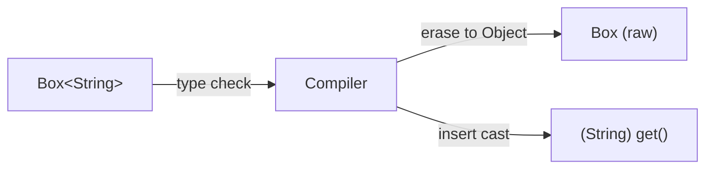
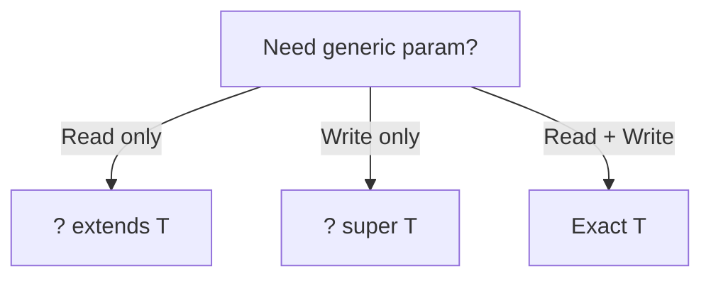
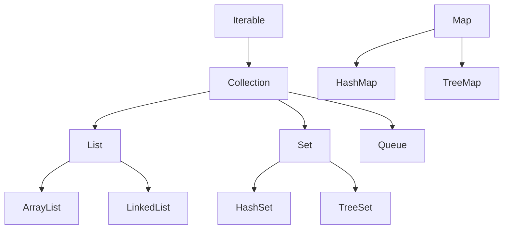
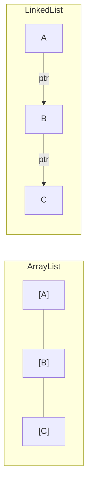
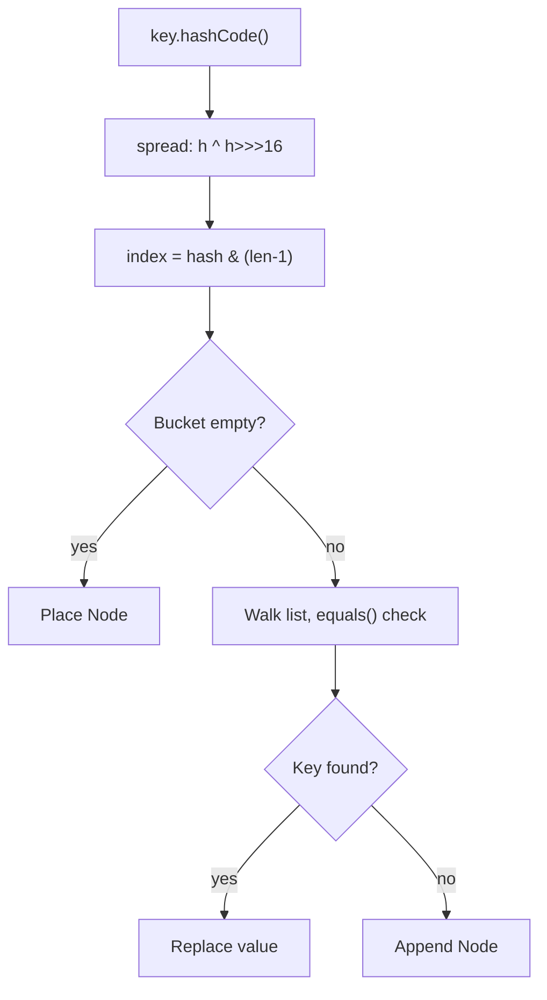
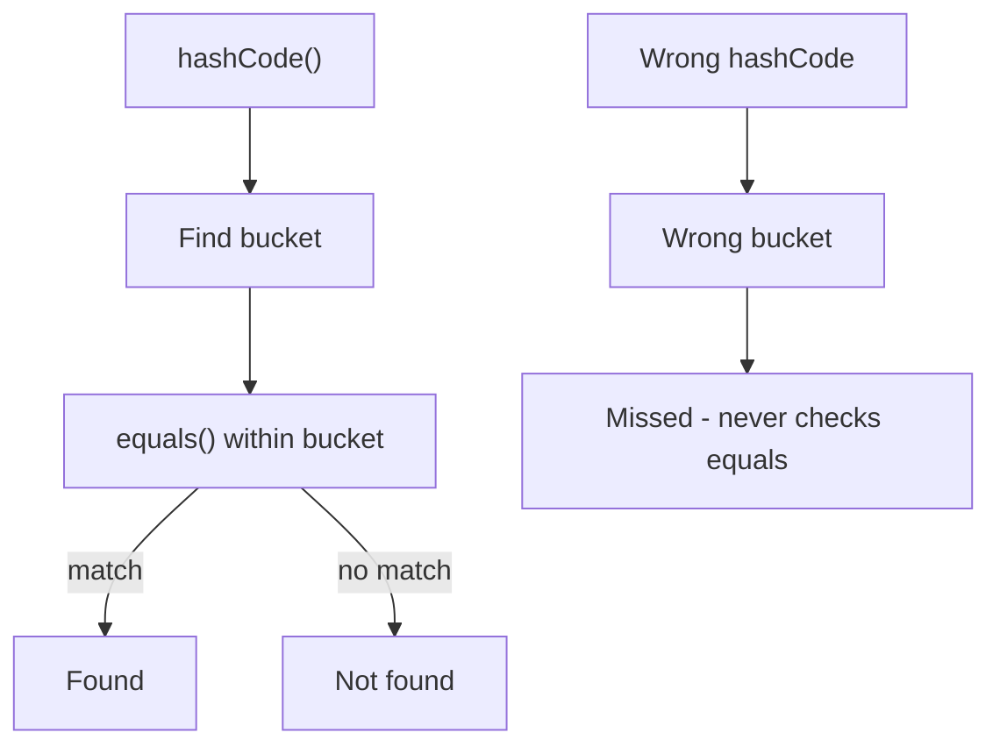
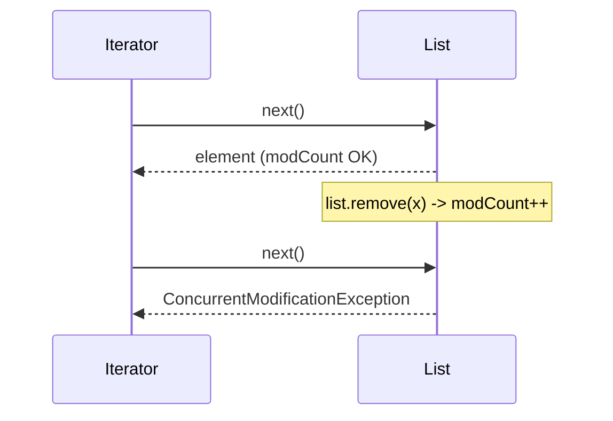
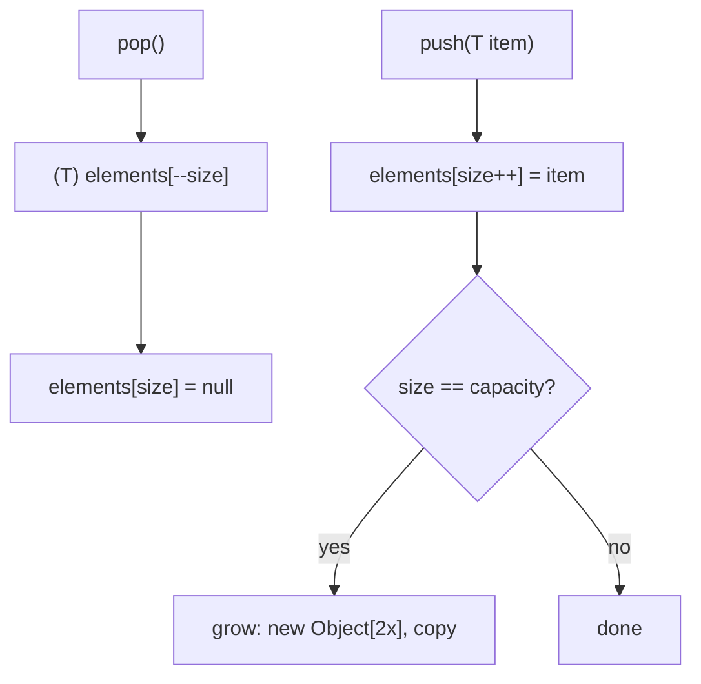
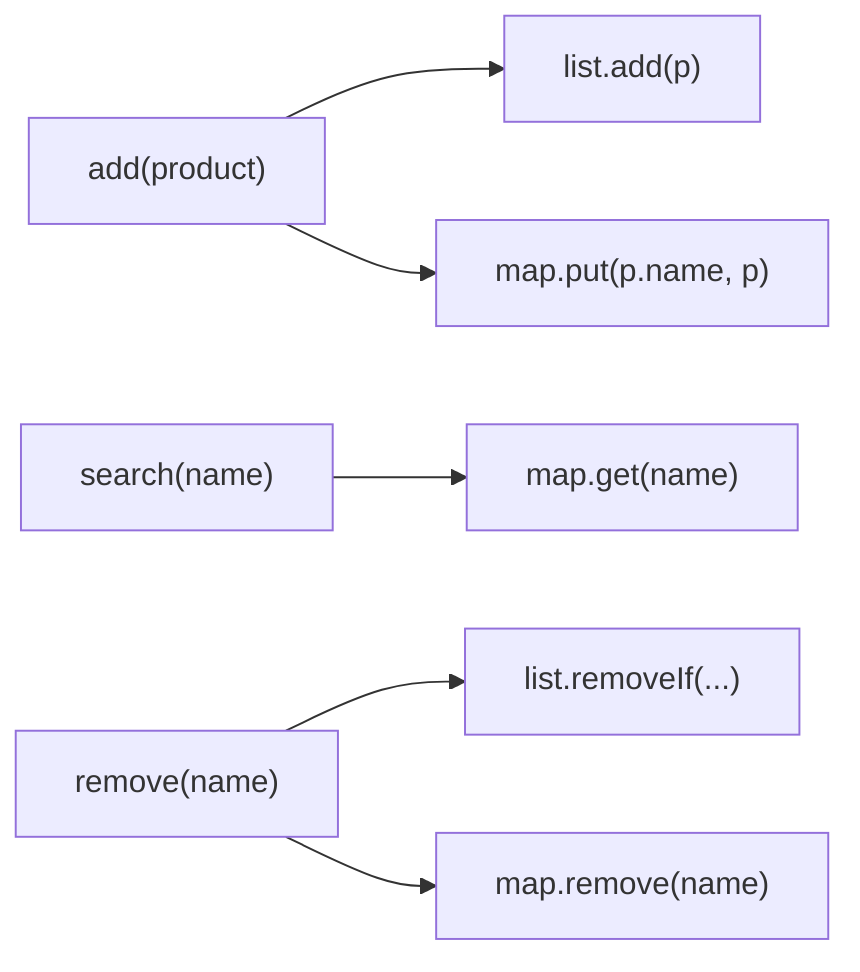
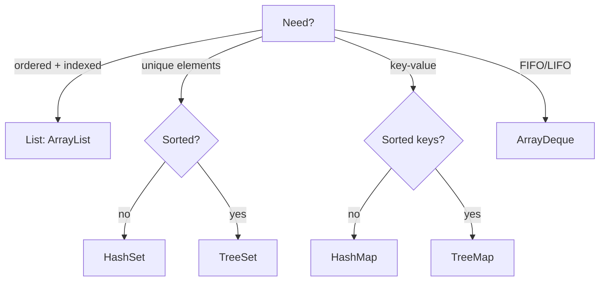

## Keywords

1. [JLG-016 Generics - Parameterized Types](#jlg-016-generics---parameterized-types)
2. [JLG-017 Bounded Types and Wildcards](#jlg-017-bounded-types-and-wildcards)
3. [JLG-018 Collection Interfaces - List, Set, Map](#jlg-018-collection-interfaces---list-set-map)
4. [JLG-019 ArrayList vs LinkedList Decision](#jlg-019-arraylist-vs-linkedlist-decision)
5. [JLG-020 HashMap Internals - Hashing and Buckets](#jlg-020-hashmap-internals---hashing-and-buckets)
6. [JLG-021 Equals and HashCode Contract](#jlg-021-equals-and-hashcode-contract)
7. [JLG-022 Iterators and ConcurrentModificationException](#jlg-022-iterators-and-concurrentmodificationexception)
8. [JLG-028 Build a Generic Container Exercise](#jlg-028-build-a-generic-container-exercise)
9. [JLG-029 Inventory CLI - Phase 2 (Collections)](#jlg-029-inventory-cli---phase-2-collections)
10. [JLG-030 Java Collections Quick Recall Card](#jlg-030-java-collections-quick-recall-card)

---

# JLG-016 Generics - Parameterized Types

**TL;DR** - Generics let one class work with any type while catching type errors at compile time, not runtime.

---

### 🔥 The Problem in One Paragraph

Before generics (pre-Java 5), collections stored `Object`.
Every retrieval required a cast: `String s = (String) list.get(0);`.
If someone added an `Integer` to that list, the cast failed at
runtime with `ClassCastException` - often in production, far
from the insertion point. The compiler could not help because it
saw only `Object`. Bugs hid until the worst possible moment.
This is exactly why generics were created.

---

### 📘 Textbook Definition

**Generics** enable types (classes, interfaces, methods) to
operate on a type parameter `<T>` specified at usage site.
`List<String>` tells the compiler that only `String` values
may enter. The compiler inserts casts automatically and rejects
type mismatches at compile time, eliminating `ClassCastException`
from well-typed code.

---

### 🧠 Mental Model

> A generic class is a labeled box at a post office. The label
> says "Letters Only" or "Parcels Only." The clerk (compiler)
> rejects anything that does not match the label before it goes
> in. Without the label, anything goes in and the wrong item
> arrives at delivery.

- "Label on the box" -> type parameter `<T>`
- "Clerk checking items" -> compiler type-checking
- "Delivery" -> runtime (no casts needed)

**Where this analogy breaks down:** at runtime, the JVM
erases the label (type erasure) - the box is just a box.

---

### ⚙️ How It Works

1. Declare a type parameter: `class Box<T> { T item; }`.
2. At usage: `Box<String> b = new Box<>();` binds T to String.
3. The compiler checks all operations on `b` use String.
4. At compilation, the compiler erases `T` to `Object` and
   inserts casts (type erasure).
5. The resulting bytecode has no generic type information.

```text
Source            Compiler            Bytecode
Box<String>  -->  type check  -->  Box (Object)
  .get()     -->  insert cast -->  (String) .get()
```



---

### 🛠️ Worked Example

**BAD:**

```java
// Raw type - no compile-time safety
List items = new ArrayList();
items.add("hello");
items.add(42); // no error at compile time
String s = (String) items.get(1);
// ClassCastException at runtime!
```

Why it's wrong: raw types bypass generics entirely.

**GOOD:**

```java
List<String> items = new ArrayList<>();
items.add("hello");
// items.add(42); // compile error: int != String
String s = items.get(0); // no cast needed
```

Why it's right: compiler catches the bug immediately.

**Production pattern:**

```java
// Generic repository interface
public interface Repository<T, ID> {
    Optional<T> findById(ID id);
    List<T> findAll();
    T save(T entity);
}
// Concrete: Repository<User, Long>
```

---

### ⚖️ Trade-offs

**Gain:** compile-time type safety; eliminates casts; enables
reusable data structures.
**Cost:** type erasure means no runtime type information for
generics; cannot create `new T()` or `new T[]`.

| Aspect       | Generics (Java)     | Templates (C++)     |
| ------------ | ------------------- | ------------------- |
| Type check   | compile time        | compile time        |
| Runtime info | erased              | preserved (reified) |
| Code size    | one class (erasure) | one class per type  |
| Constraints  | bounded wildcards   | concepts (C++20)    |

---

### ⚡ Decision Snap

**USE WHEN:**

- Writing a data structure or utility usable with any type.
- You want the compiler to catch type mismatches early.
- Building framework APIs (repositories, caches, mappers).

**AVOID WHEN:**

- The type is always the same - generics add visual noise.
- You need runtime type checks (`instanceof T` is illegal).

**PREFER raw arrays WHEN:**

- Performance-critical primitive storage (generics box
  primitives).
- Interop with legacy pre-Java-5 APIs.

---

### ⚠️ Top Traps

| #   | Misconception                                            | Reality                                                   |
| --- | -------------------------------------------------------- | --------------------------------------------------------- |
| 1   | `List<String>` and `List<Integer>` are different classes | Same class at runtime due to erasure                      |
| 2   | You can write `new T()`                                  | Illegal - T is erased to Object                           |
| 3   | `List<Dog>` is a subtype of `List<Animal>`               | No - generics are invariant; use `List<? extends Animal>` |

---

### 🪜 Learning Ladder

**Prerequisites:**

- JLG-008 Classes, Methods, Fields - need class basics
- JLG-010 Inheritance, Interfaces, Polymorphism - need
  subtyping concepts

**THIS:** JLG-016 Generics - Parameterized Types

**Next steps:**

- JLG-017 Bounded Types and Wildcards - advanced generic
  constraints
- JLG-018 Collection Interfaces - List, Set, Map -
  generics applied to the collections framework

---

### 💡 The Surprising Truth

Java's type erasure was a deliberate choice, not a limitation.
It guaranteed binary compatibility: code compiled against
Java 4 collections continued to work on Java 5+ without
recompilation. Reified generics (like C# or Kotlin) could not
have preserved this backward compatibility.

---

### 📇 Revision Card

1. Generics move type errors from runtime to compile time.
2. Type erasure removes generic info at runtime - you
   cannot do `instanceof T` or `new T()`.
3. Generics are invariant: `List<Dog>` is NOT a subtype
   of `List<Animal>`.

---

---

# JLG-017 Bounded Types and Wildcards

**TL;DR** - Bounded types constrain generics to a type family; wildcards enable flexible method signatures.

---

### 🔥 The Problem in One Paragraph

You write a method `sum(List<Number> nums)` expecting to pass
`List<Integer>` or `List<Double>`. It fails to compile because
`List<Integer>` is not a subtype of `List<Number>` (generics
are invariant). You need a way to say "any List whose element
type IS a Number or subtype." Without wildcards, generic methods
are uselessly rigid. This is exactly why bounded types and
wildcards were created.

---

### 📘 Textbook Definition

A **bounded type parameter** restricts `T` to a type family:
`<T extends Number>` means T must be Number or a subclass.
A **wildcard** (`?`) represents an unknown type. `? extends
Number` (upper bound) reads from the collection safely.
`? super Integer` (lower bound) writes to the collection safely.
This is the PECS principle: Producer Extends, Consumer Super.

---

### 🧠 Mental Model

> A parking garage with "Cars Only" signs. `? extends Vehicle`
> is a garage that holds any Vehicle subtype - you can look
> at (read) what is inside but cannot park a random Vehicle
> (write) because you do not know the exact type.
> `? super Car` is a garage that accepts Cars and anything
> more general - you can park a Car but cannot guarantee what
> you pull out.

- "Read from garage" -> `? extends T` (producer)
- "Park into garage" -> `? super T` (consumer)
- "Sign on garage" -> the bounded type

**Where this analogy breaks down:** real garages do not
erase their sign at runtime. Java wildcards face erasure.

---

### ⚙️ How It Works

1. `List<? extends Number>` - the list produces Numbers.
   You can call `get()` and receive a Number. You cannot
   call `add()` (except null) because the actual type
   is unknown.
2. `List<? super Integer>` - the list consumes Integers.
   You can call `add(42)`. `get()` returns Object because
   the upper bound is unknown.
3. PECS decides which wildcard to use: if the parameter is
   a data source (producer), use extends. If it is a data
   sink (consumer), use super.

```text
PECS Decision:
  Read from it?  -->  ? extends T  (producer)
  Write to it?   -->  ? super T    (consumer)
  Both?          -->  use exact T  (no wildcard)
```



---

### 🛠️ Worked Example

**BAD:**

```java
// Rigid signature rejects List<Integer>
double sum(List<Number> nums) {
    double total = 0;
    for (Number n : nums) total += n.doubleValue();
    return total;
}
// sum(List.of(1, 2, 3)); // compile error!
```

Why it's wrong: `List<Integer>` is not `List<Number>`.

**GOOD:**

```java
// Upper-bounded wildcard accepts any Number subtype
double sum(List<? extends Number> nums) {
    double total = 0;
    for (Number n : nums) total += n.doubleValue();
    return total;
}
// sum(List.of(1, 2, 3));     // OK
// sum(List.of(1.5, 2.5));    // OK
```

Why it's right: extends makes the list a producer of
Numbers.

**Production pattern - Collections.copy:**

```java
// JDK uses PECS: dest consumes, src produces
public static <T> void copy(
    List<? super T> dest,
    List<? extends T> src) { ... }
```

---

### ⚖️ Trade-offs

**Gain:** flexible APIs that work with type families instead
of exact types.
**Cost:** increased complexity in method signatures; reading
wildcard-heavy code is harder.

| Aspect      | Exact type `<T>` | Wildcard `<? extends T>` |
| ----------- | ---------------- | ------------------------ |
| Readability | simple           | harder to parse          |
| Flexibility | rigid            | accepts subtypes         |
| Write safe  | yes              | no (producer only)       |

---

### ⚡ Decision Snap

**USE WHEN:**

- Writing utility methods that only read from a collection.
- Designing APIs consumed by multiple type families.
- Following PECS in library code.

**AVOID WHEN:**

- The method both reads and writes the same collection.
- The calling code always uses the exact type.

**PREFER exact type `<T>` WHEN:**

- The method returns the same type it receives.
- You need to both add and retrieve elements.

---

### ⚠️ Top Traps

| #   | Misconception                              | Reality                                                     |
| --- | ------------------------------------------ | ----------------------------------------------------------- |
| 1   | `? extends T` lets you add elements        | No - you can only read; adding is blocked                   |
| 2   | `? super T` returns T from get()           | No - get() returns Object                                   |
| 3   | Wildcards and type parameters are the same | Wildcards are anonymous; type params are named and reusable |

---

### 🪜 Learning Ladder

**Prerequisites:**

- JLG-016 Generics - Parameterized Types - basic generic
  syntax and erasure
- JLG-010 Inheritance, Interfaces, Polymorphism - subtype
  relationships

**THIS:** JLG-017 Bounded Types and Wildcards

**Next steps:**

- JLG-041 Generics Are Not Reified - Type Erasure Reality -
  deep dive into erasure consequences
- JLG-018 Collection Interfaces - List, Set, Map - apply
  generics to real data structures

---

### 💡 The Surprising Truth

The PECS principle (Producer Extends, Consumer Super) was
formalized by Joshua Bloch in Effective Java, but the
underlying theory is covariance and contravariance from type
theory - the same concepts that govern Kotlin's `out`/`in`
and C#'s covariant/contravariant generic interfaces.

---

### 📇 Revision Card

1. PECS: Producer Extends, Consumer Super.
2. `? extends T` = read-only. `? super T` = write-only.
3. If you need both read and write, use exact `<T>`.

---

---

# JLG-018 Collection Interfaces - List, Set, Map

**TL;DR** - List is ordered and indexed, Set rejects duplicates, Map stores key-value pairs - pick by access pattern.

---

### 🔥 The Problem in One Paragraph

You need to store objects. An array has fixed size and no
built-in search. You write your own resizable array, then your
own hash table, then your own sorted tree. Each is buggy and
untested. Meanwhile, the JDK ships battle-tested implementations
behind clean interfaces: `List`, `Set`, `Map`. Choosing the
right interface and implementation determines whether your code
runs in O(1) or O(n). This is exactly why the Collection
interfaces were created.

---

### 📘 Textbook Definition

The **Java Collections Framework** defines interfaces
(`Collection`, `List`, `Set`, `Queue`, `Map`) and
implementations (`ArrayList`, `HashSet`, `HashMap`,
`TreeMap`). **List** maintains insertion order and allows
duplicate elements. **Set** rejects duplicates. **Map** stores
key-value associations where keys are unique.

---

### 🧠 Mental Model

> A bookshelf (List) keeps books in order - you can grab book
> #3 by position. A bag of unique marbles (Set) rejects
> duplicates but has no index. A dictionary (Map) looks up
> definitions (values) by word (key).

- "Bookshelf slot number" -> List index
- "Marble uniqueness" -> Set's equals/hashCode contract
- "Dictionary word" -> Map key

**Where this analogy breaks down:** a real bag has no fast
lookup. HashSet has O(1) lookup. The implementation matters.

---

### ⚙️ How It Works

1. Choose the interface by need: ordered + indexed -> List;
   unique elements -> Set; key-value -> Map.
2. Choose the implementation by performance: ArrayList for
   random access, LinkedList for frequent insert/remove at
   ends, HashSet for O(1) contains, TreeSet for sorted
   order.
3. Declare using the interface type: `List<String> names`.
4. Instantiate with the implementation:
   `new ArrayList<>()`.

```text
Collection Hierarchy (simplified):
  Iterable
    +-- Collection
          +-- List  (ArrayList, LinkedList)
          +-- Set   (HashSet, TreeSet)
          +-- Queue (ArrayDeque, PriorityQueue)
  Map (HashMap, TreeMap, LinkedHashMap)
```



---

### 🛠️ Worked Example

**BAD:**

```java
// Using List when you need uniqueness
List<String> tags = new ArrayList<>();
tags.add("java");
tags.add("java"); // duplicate accepted!
// tags.size() == 2, but you wanted unique tags
```

Why it's wrong: List does not enforce uniqueness.

**GOOD:**

```java
Set<String> tags = new HashSet<>();
tags.add("java");
tags.add("java"); // silently ignored
// tags.size() == 1 - duplicates rejected
```

Why it's right: Set enforces the uniqueness invariant.

**Production pattern:**

```java
// Declare interface type, instantiate implementation
Map<String, List<Order>> ordersByCustomer =
    new HashMap<>();
// Swap to TreeMap if sorted keys needed later
```

---

### ⚖️ Trade-offs

**Gain:** reusable, tested, optimized data structures with
well-defined contracts.
**Cost:** choosing the wrong implementation silently degrades
performance (e.g., LinkedList for random access).

| Aspect        | ArrayList | HashSet   | HashMap     |
| ------------- | --------- | --------- | ----------- |
| Duplicates    | allowed   | rejected  | keys unique |
| Order         | insertion | unordered | unordered   |
| get(index)    | O(1)      | N/A       | N/A         |
| contains(key) | O(n)      | O(1) avg  | O(1) avg    |

---

### ⚡ Decision Snap

**USE WHEN:**

- You need a dynamic-size collection (not a fixed array).
- Your access pattern matches the interface (indexed ->
  List, unique -> Set, key-value -> Map).
- You want to swap implementations later without changing
  callers.

**AVOID WHEN:**

- A fixed-size array suffices and allocation must be minimal.
- You need concurrent access (use ConcurrentHashMap, etc.).

**PREFER TreeMap/TreeSet WHEN:**

- You need sorted iteration order by natural or custom
  comparator.
- Range queries (headMap, tailMap) are required.

---

### ⚠️ Top Traps

| #   | Misconception                             | Reality                                              |
| --- | ----------------------------------------- | ---------------------------------------------------- |
| 1   | ArrayList and LinkedList perform the same | ArrayList has O(1) random access; LinkedList is O(n) |
| 2   | HashSet preserves insertion order         | No - use LinkedHashSet for insertion order           |
| 3   | Map extends Collection                    | No - Map is a separate interface hierarchy           |

---

### 🪜 Learning Ladder

**Prerequisites:**

- JLG-016 Generics - Parameterized Types - collections are
  generic
- JLG-010 Inheritance, Interfaces, Polymorphism - interface
  hierarchies

**THIS:** JLG-018 Collection Interfaces - List, Set, Map

**Next steps:**

- JLG-019 ArrayList vs LinkedList Decision - deep comparison
- JLG-020 HashMap Internals - Hashing and Buckets - how
  HashMap actually works inside

---

### 💡 The Surprising Truth

`List.of()`, `Set.of()`, and `Map.of()` (Java 9+) return
unmodifiable collections. Calling `add()` on them throws
`UnsupportedOperationException`. Despite implementing the
mutable `List`/`Set`/`Map` interfaces, these factory methods
return immutable implementations - a deliberate design choice
that surprises developers who assume all Lists are mutable.

---

### 📇 Revision Card

1. Declare with interface type (`List<T>`), instantiate with
   implementation (`new ArrayList<>()`).
2. List = ordered + indexed. Set = unique. Map = key-value.
3. `List.of()` returns an unmodifiable list - it throws on
   `add()`.

---

---

# JLG-019 ArrayList vs LinkedList Decision

**TL;DR** - ArrayList wins nearly every real-world scenario due to cache locality; LinkedList is rarely the right choice.

---

### 🔥 The Problem in One Paragraph

Textbooks teach LinkedList for O(1) insert/remove and ArrayList
for O(1) random access. In practice, developers choose
LinkedList "because insertions are O(1)" and get worse
performance than ArrayList because cache misses dominate.
CPU caches reward contiguous memory (ArrayList's backing array),
not pointer-chasing (LinkedList's nodes). The Big-O model hides
the constant factors that matter. This is exactly why the
decision requires nuance.

---

### 📘 Textbook Definition

**ArrayList** stores elements in a contiguous `Object[]` array.
Random access is O(1). Insertion/removal at arbitrary positions
is O(n) due to shifting. **LinkedList** stores elements as
doubly-linked nodes. Insertion/removal at a known position is
O(1). Random access is O(n). In practice, ArrayList's cache
friendliness makes it faster for most workloads under typical
sizes.

---

### 🧠 Mental Model

> ArrayList is a row of numbered seats in a theater. Finding
> seat 42 is instant. Inserting a seat in the middle forces
> everyone to shift. LinkedList is a conga line - inserting
> in the middle is easy if you are already there, but finding
> person 42 means walking the whole line.

- "Numbered seat" -> array index (O(1) access)
- "Shifting seats" -> element copying on insert
- "Walking the conga line" -> pointer traversal (O(n))

**Where this analogy breaks down:** the conga line hides the
cache-miss penalty. Each node is a separate heap object, so
the CPU prefetcher cannot help.

---

### ⚙️ How It Works

1. **ArrayList.get(i):** single array access. CPU cache line
   often already loaded.
2. **ArrayList.add(i, e):** shifts elements right. For end
   appends, amortized O(1) due to capacity doubling.
3. **LinkedList.get(i):** traverses i nodes from head or tail.
4. **LinkedList.add(i, e):** traverses to position, then
   relinks pointers (O(1) relink, O(n) traversal).

```text
Memory layout:
  ArrayList:  [A][B][C][D][E] (contiguous)
  LinkedList: A->B->C->D->E  (scattered heap)

Cache line:  |....A B C D....|  (ArrayList: 4 hits)
             |....A...........|  (LinkedList: 1 hit)
```



---

### 🛠️ Worked Example

**BAD:**

```java
// Choosing LinkedList for "fast inserts"
List<String> log = new LinkedList<>();
for (int i = 0; i < 100_000; i++) {
    log.add("entry-" + i); // append at end
}
// LinkedList: ~3x slower than ArrayList for appends
// due to per-node allocation + GC pressure
```

Why it's wrong: appends are amortized O(1) for both, but
ArrayList has better cache and allocation behavior.

**GOOD:**

```java
List<String> log = new ArrayList<>();
for (int i = 0; i < 100_000; i++) {
    log.add("entry-" + i);
}
// Contiguous memory, cache-friendly, fewer objects
```

Why it's right: ArrayList is the default choice for almost
all list usage.

**Production pattern:**

```java
// Pre-size when count is known
List<Order> batch = new ArrayList<>(batchSize);
```

---

### ⚖️ Trade-offs

**Gain:** ArrayList provides cache-friendly, allocation-light
sequential storage.
**Cost:** middle insertions require element shifting.

| Aspect        | ArrayList      | LinkedList              |
| ------------- | -------------- | ----------------------- |
| Random access | O(1)           | O(n)                    |
| Append        | amortized O(1) | O(1) (but allocates)    |
| Mid-insert    | O(n) shift     | O(1) relink + O(n) find |
| Memory        | compact array  | 2 pointers per node     |
| Cache         | excellent      | poor                    |

---

### ⚡ Decision Snap

**USE WHEN (ArrayList):**

- Default choice for any list.
- Random access or iteration is the primary operation.
- Size is known or approximately known (pre-size).

**AVOID WHEN (ArrayList):**

- You need a deque (double-ended queue) - use ArrayDeque.
- You insert/remove at the head frequently at large scale.

**PREFER LinkedList WHEN:**

- Almost never. ArrayDeque beats it as a queue/deque too.
- Only when you hold an iterator and insert/remove at that
  iterator's current position in a tight loop.

---

### ⚠️ Top Traps

| #   | Misconception                                  | Reality                                                          |
| --- | ---------------------------------------------- | ---------------------------------------------------------------- |
| 1   | LinkedList is faster for insertions            | Only at a known node; finding the node is O(n)                   |
| 2   | ArrayList wastes memory due to unused capacity | Trim with `trimToSize()` or pre-size with initial capacity       |
| 3   | Big-O tells the full performance story         | Cache locality, allocation, and GC pressure dominate in practice |

---

### 🪜 Learning Ladder

**Prerequisites:**

- JLG-018 Collection Interfaces - List, Set, Map - List
  interface basics

**THIS:** JLG-019 ArrayList vs LinkedList Decision

**Next steps:**

- JLG-020 HashMap Internals - Hashing and Buckets - another
  implementation-level deep dive
- JLG-049 Boxing Performance Trap - more hidden costs

---

### 💡 The Surprising Truth

Bjarne Stroustrup (C++ creator) demonstrated that even in
C++, `std::vector` (contiguous array) beats `std::list`
(linked list) for insertions in the middle for sizes up to
hundreds of thousands of elements - because memory locality
is that important. The same principle applies to ArrayList
vs LinkedList in Java.

---

### 📇 Revision Card

1. ArrayList is the default List. LinkedList is almost
   never the right choice.
2. Cache locality beats Big-O for practical sizes.
3. Use ArrayDeque, not LinkedList, when you need a queue.

---

---

# JLG-020 HashMap Internals - Hashing and Buckets

**TL;DR** - HashMap stores entries in an array of buckets indexed by key hash; collisions form linked lists or trees.

---

### 🔥 The Problem in One Paragraph

You need O(1) lookup by key. A sorted array gives O(log n) via
binary search. A linked list gives O(n). To reach O(1), you
need a way to compute the exact storage location from the key
itself - that is hashing. But two keys can produce the same
hash (collision), so you need a collision resolution strategy.
Understanding HashMap internals tells you why your "O(1)" map
becomes O(n) with bad `hashCode()` implementations. This is
exactly why you must understand hashing and buckets.

---

### 📘 Textbook Definition

**HashMap** is a hash table implementing the `Map<K,V>`
interface. It maintains an internal `Node<K,V>[]` array
(buckets). For `put(key, value)`, it computes `key.hashCode()`,
spreads it across the array length, and places the entry in the
corresponding bucket. Collisions within a bucket form a linked
list; when a bucket exceeds 8 entries (and table size >= 64),
the list converts to a balanced red-black tree for O(log n)
worst case.

---

### 🧠 Mental Model

> A HashMap is a row of mailboxes in an apartment building. The
> hash function is the apartment number calculator. When two
> people get the same apartment number (collision), they share
> the mailbox with a stack of labeled envelopes.

- "Apartment number" -> bucket index from hash
- "Shared mailbox" -> linked list / tree in that bucket
- "Labeled envelope" -> Node with key + value

**Where this analogy breaks down:** real mailboxes do not
convert from a stack to a sorted tree when they get too full.
HashMap does (treeification at 8 entries).

---

### ⚙️ How It Works

1. `hashCode()` returns an int for the key.
2. HashMap applies a secondary spread function to reduce
   clustering: `h ^ (h >>> 16)`.
3. Bucket index = `hash & (table.length - 1)` (bitwise AND
   because table length is a power of 2).
4. If the bucket is empty, place the Node directly.
5. If occupied (collision), walk the linked list comparing
   keys via `equals()`. If found, replace value. If not,
   append.
6. When `size > capacity * loadFactor` (default 0.75),
   resize: double the table and rehash all entries.

```text
put("cat", 1):
  hashCode("cat") = 98262   (example)
  spread:  98262 ^ (98262 >>> 16) = 98263
  index:   98263 & 15 = 7   (table size 16)
  buckets[7] = Node("cat", 1)
```



---

### 🛠️ Worked Example

**BAD:**

```java
// Constant hashCode - every key lands in bucket 0
class BadKey {
    String val;
    public int hashCode() { return 42; }
    public boolean equals(Object o) {
        return o instanceof BadKey bk
            && val.equals(bk.val);
    }
}
// All entries chain in one bucket -> O(n) lookup
```

Why it's wrong: HashMap degenerates to a linked list.

**GOOD:**

```java
class GoodKey {
    String val;
    public int hashCode() {
        return Objects.hash(val);
    }
    public boolean equals(Object o) {
        return o instanceof GoodKey gk
            && Objects.equals(val, gk.val);
    }
}
// Even distribution across buckets -> O(1) avg
```

Why it's right: proper hashCode distributes entries
evenly.

**Production pattern:**

```java
// Pre-size to avoid repeated resizing
int expected = 10_000;
Map<String, Order> cache =
    new HashMap<>(expected * 4 / 3 + 1);
// capacity / 0.75 = entries before resize
```

---

### ⚖️ Trade-offs

**Gain:** O(1) average get/put; simple key-value model.
**Cost:** unordered iteration; O(n) worst case with bad hashing;
memory overhead per node (key, value, hash, next pointer).

| Aspect     | HashMap        | TreeMap         |
| ---------- | -------------- | --------------- |
| Lookup     | O(1) avg       | O(log n)        |
| Order      | none           | sorted by key   |
| Worst case | O(n) / O(logn) | O(log n) always |
| Null keys  | one allowed    | not allowed     |

---

### ⚡ Decision Snap

**USE WHEN:**

- You need fast key-value lookup and do not care about
  order.
- Keys have good hashCode/equals implementations.
- The approximate size is known (pre-size to avoid rehash).

**AVOID WHEN:**

- You need sorted iteration - use TreeMap.
- Multiple threads write concurrently - use
  ConcurrentHashMap.

**PREFER LinkedHashMap WHEN:**

- You need insertion-order or access-order iteration.
- Building an LRU cache (override `removeEldestEntry`).

---

### ⚠️ Top Traps

| #   | Misconception                    | Reality                                                     |
| --- | -------------------------------- | ----------------------------------------------------------- |
| 1   | HashMap is always O(1)           | Only with good hash distribution; bad hashCode gives O(n)   |
| 2   | Default initial capacity is fine | Default 16 causes multiple resizes for large maps; pre-size |
| 3   | Mutable keys are safe in HashMap | Mutating a key after insertion corrupts the bucket index    |

---

### 🪜 Learning Ladder

**Prerequisites:**

- JLG-021 Equals and HashCode Contract - the contract HashMap
  depends on
- JLG-018 Collection Interfaces - List, Set, Map - Map
  interface basics

**THIS:** JLG-020 HashMap Internals - Hashing and Buckets

**Next steps:**

- JLG-022 Iterators and ConcurrentModificationException -
  iteration hazards
- JLG-041 Generics Are Not Reified - Type Erasure Reality -
  generic map type safety

---

### 💡 The Surprising Truth

Since Java 8, HashMap buckets with 8+ collisions convert from
linked lists to red-black trees. This was added after a
security concern: an attacker could craft keys with identical
hashes, turning HashMap lookup into O(n) and causing
denial-of-service via hash-flooding. Treeification limits the
worst case to O(log n).

---

### 📇 Revision Card

1. HashMap = array of buckets indexed by hash; collisions
   chain or treeify.
2. Always implement both hashCode() and equals() - never
   one without the other.
3. Pre-size: `new HashMap<>(expectedSize * 4 / 3 + 1)`.

---

---

# JLG-021 Equals and HashCode Contract

**TL;DR** - If two objects are equal, they must have the same hashCode; violating this breaks HashMap and HashSet.

---

### 🔥 The Problem in One Paragraph

You override `equals()` on your `Customer` class so two
customers with the same ID are equal. You add a customer to
a `HashSet`. Then you check `set.contains(sameCustomer)` and
get `false`. The customer is there, but the set cannot find it.
Why? Because you did not override `hashCode()`. The set checks
the wrong bucket. This silent failure corrupts data in
production. This is exactly why the equals/hashCode contract
was created.

---

### 📘 Textbook Definition

The **equals/hashCode contract** requires: if
`a.equals(b)` returns `true`, then `a.hashCode()` must
equal `b.hashCode()`. The converse is not required (two
unequal objects may share a hash). Reflexive, symmetric,
transitive, consistent, and null-safe rules also apply to
`equals()`. This contract is the foundation of hash-based
collections.

---

### 🧠 Mental Model

> equals() is a fingerprint comparison. hashCode() is the
> filing cabinet drawer label. If two people have the same
> fingerprint (equals), they MUST be in the same drawer
> (hashCode). But two people in the same drawer might have
> different fingerprints (collisions are allowed).

- "Same fingerprint" -> equals returns true
- "Same drawer" -> same hashCode value
- "Different drawer, same fingerprint" -> contract violation

**Where this analogy breaks down:** fingerprints are unique in
reality; equals objects with identical hashCodes are the
expected case, not an edge case.

---

### ⚙️ How It Works

1. HashSet/HashMap calls `key.hashCode()` to find the
   bucket.
2. Within the bucket, it calls `key.equals(candidate)` to
   find the exact match.
3. If hashCode is not overridden, Object.hashCode() returns
   a memory-address-based value - two equal objects get
   different hashes.
4. The lookup checks the wrong bucket and returns "not
   found" even though the equal object exists.

```text
Contract:
  a.equals(b) == true  =>  a.hashCode() == b.hashCode()
  a.hashCode() == b.hashCode()  =/=>  a.equals(b)
```



---

### 🛠️ Worked Example

**BAD:**

```java
class Customer {
    String id;
    @Override
    public boolean equals(Object o) {
        return o instanceof Customer c
            && id.equals(c.id);
    }
    // hashCode NOT overridden!
}
Set<Customer> set = new HashSet<>();
set.add(new Customer("A"));
set.contains(new Customer("A")); // false!
```

Why it's wrong: different hashCodes -> different buckets.

**GOOD:**

```java
class Customer {
    String id;
    @Override
    public boolean equals(Object o) {
        return o instanceof Customer c
            && id.equals(c.id);
    }
    @Override
    public int hashCode() {
        return Objects.hash(id);
    }
}
Set<Customer> set = new HashSet<>();
set.add(new Customer("A"));
set.contains(new Customer("A")); // true
```

Why it's right: equal objects produce the same hashCode.

**Production pattern:**

```java
// Record auto-generates equals + hashCode
record Customer(String id, String name) {}
// No manual override needed
```

---

### ⚖️ Trade-offs

**Gain:** correct behavior in all hash-based collections.
**Cost:** must maintain consistency between equals and hashCode
whenever fields change; IDE-generated implementations can
become stale.

| Aspect  | Manual override | Record (Java 16+) |
| ------- | --------------- | ----------------- |
| Effort  | error-prone     | automatic         |
| Fields  | choose which    | all components    |
| Mutable | risky if key    | records immutable |

---

### ⚡ Decision Snap

**USE WHEN:**

- Any class used as a HashMap key or HashSet element.
- Any class where logical equality matters (not identity).
- Always override both together - never one without the
  other.

**AVOID WHEN:**

- Identity semantics are correct (e.g., singletons,
  thread objects).
- You can use a record instead (auto-generates both).

**PREFER records WHEN:**

- The class is a simple data carrier.
- All fields define equality.

---

### ⚠️ Top Traps

| #   | Misconception                                     | Reality                                                                    |
| --- | ------------------------------------------------- | -------------------------------------------------------------------------- |
| 1   | Only override equals()                            | Contract violation - breaks HashSet and HashMap                            |
| 2   | Include mutable fields in hashCode                | If a field changes after insertion, the object is lost in the wrong bucket |
| 3   | `equals(Customer other)` overloads, not overrides | Must be `equals(Object)` to satisfy the contract                           |

---

### 🪜 Learning Ladder

**Prerequisites:**

- JLG-008 Classes, Methods, Fields - method overriding
- JLG-005 Primitive Types and Wrappers - == vs .equals()

**THIS:** JLG-021 Equals and HashCode Contract

**Next steps:**

- JLG-020 HashMap Internals - Hashing and Buckets - how
  HashMap uses these methods internally
- JLG-030 Java Collections Quick Recall Card - synthesize
  collection knowledge

---

### 💡 The Surprising Truth

Java records (Java 16+) generate equals() and hashCode()
automatically from all component fields. This eliminates the
most common source of contract violations - but only if ALL
fields define equality. If you need equality on a subset of
fields, you must override manually, even on a record.

---

### 📇 Revision Card

1. Always override hashCode() when you override equals().
2. Use `Objects.hash(field1, field2)` for correct, concise
   hashCode implementations.
3. Never include mutable fields in hashCode if the object
   is used as a map key.

---

---

# JLG-022 Iterators and ConcurrentModificationException

**TL;DR** - Modifying a collection while iterating throws ConcurrentModificationException; use Iterator.remove() instead.

---

### 🔥 The Problem in One Paragraph

You loop through a list of orders and remove cancelled ones
with `list.remove(order)` inside a for-each loop. The code
throws `ConcurrentModificationException` at runtime - even in
single-threaded code. The for-each loop uses an Iterator
internally, and modifying the collection structurally (add/
remove) while an Iterator is active invalidates it. This is the
most common collection-related runtime exception in Java. This
is exactly why you must understand Iterator contracts.

---

### 📘 Textbook Definition

An **Iterator** is an object that provides sequential access to
elements via `hasNext()` and `next()`. The **fail-fast**
behavior of most Java collection Iterators detects structural
modification (size change) since the Iterator was created and
throws `ConcurrentModificationException`. The safe alternative
is `Iterator.remove()`, which removes the last element returned
by `next()` without breaking the iteration.

---

### 🧠 Mental Model

> An Iterator is a bookmark in a book. If someone rips out a
> page (removes an element) while you are reading, your bookmark
> now points to the wrong page. The fail-fast check is the book
> yelling "someone tore a page!" rather than silently giving you
> wrong content.

- "Bookmark" -> Iterator cursor position
- "Ripping a page" -> structural modification
- "Book yelling" -> ConcurrentModificationException

**Where this analogy breaks down:** Iterator.remove() is like
the bookmark itself ripping out the current page safely - the
bookmark knows how to adjust.

---

### ⚙️ How It Works

1. Collections track a `modCount` (modification counter).
2. When an Iterator is created, it snapshots `modCount`.
3. On each `next()` call, the Iterator checks if `modCount`
   has changed. If yes, it throws
   `ConcurrentModificationException`.
4. `Iterator.remove()` increments `modCount` AND updates the
   Iterator's snapshot, keeping them in sync.

```text
list = [A, B, C]  modCount=3
iter created       expectedMod=3

iter.next() -> A   check: 3==3 OK
list.remove(B)     modCount=4
iter.next()        check: 3!=4 -> CME!
```



---

### 🛠️ Worked Example

**BAD:**

```java
for (String s : names) {
    if (s.startsWith("X")) {
        names.remove(s); // CME!
    }
}
```

Why it's wrong: for-each uses Iterator internally;
`list.remove()` modifies the list behind its back.

**GOOD:**

```java
Iterator<String> it = names.iterator();
while (it.hasNext()) {
    if (it.next().startsWith("X")) {
        it.remove(); // safe - updates modCount
    }
}
```

Why it's right: Iterator.remove() keeps the cursor and
modCount in sync.

**Production pattern (Java 8+):**

```java
names.removeIf(s -> s.startsWith("X"));
// Internally uses Iterator.remove - safe and concise
```

---

### ⚖️ Trade-offs

**Gain:** fail-fast detection catches bugs early rather than
silently corrupting iteration results.
**Cost:** slightly more verbose code when you need to remove
during iteration.

| Approach          | Safe? | Concise? | Works concurrently? |
| ----------------- | ----- | -------- | ------------------- |
| for-each + remove | no    | yes      | no                  |
| Iterator.remove() | yes   | medium   | no (single-thread)  |
| removeIf()        | yes   | yes      | no (single-thread)  |
| CopyOnWriteList   | yes   | yes      | yes (read-heavy)    |

---

### ⚡ Decision Snap

**USE WHEN:**

- Removing elements during iteration: use `removeIf()` or
  explicit `Iterator.remove()`.
- You want fail-fast detection to catch accidental concurrent
  modification.
- Single-threaded code with predictable iteration.

**AVOID WHEN:**

- Multiple threads modify the collection - fail-fast is not
  guaranteed for multithreaded access.
- You need to add elements during iteration - Iterator only
  supports remove (use ListIterator.add for lists).

**PREFER CopyOnWriteArrayList WHEN:**

- Reads vastly outnumber writes.
- You need safe concurrent iteration.

---

### ⚠️ Top Traps

| #   | Misconception                                          | Reality                                                                  |
| --- | ------------------------------------------------------ | ------------------------------------------------------------------------ |
| 1   | ConcurrentModificationException means multiple threads | It happens in single-threaded code when the loop modifies the collection |
| 2   | Fail-fast guarantees detection                         | It is a best-effort check, not a hard guarantee                          |
| 3   | You can add elements via Iterator                      | Iterator only supports remove; use ListIterator for add                  |

---

### 🪜 Learning Ladder

**Prerequisites:**

- JLG-018 Collection Interfaces - List, Set, Map - basic
  collection operations
- JLG-007 Control Flow Constructs - loop syntax

**THIS:** JLG-022 Iterators and ConcurrentModificationException

**Next steps:**

- JLG-032 Stream API - Map, Filter, Reduce - functional
  alternative to manual iteration
- JLG-029 Inventory CLI - Phase 2 (Collections) - practice
  safe collection manipulation

---

### 💡 The Surprising Truth

The `removeIf()` method (Java 8+) is not just syntactic sugar.
On ArrayList, it uses a bitset internally to mark elements for
removal, then shifts all remaining elements in a single pass -
O(n) total. A manual `Iterator.remove()` loop shifts elements
on every removal, making it O(n^2) in the worst case.

---

### 📇 Revision Card

1. Never call `list.remove()` inside a for-each loop.
2. Use `removeIf()` (Java 8+) or explicit Iterator.remove().
3. ConcurrentModificationException happens in single-threaded
   code too - it means the collection changed during iteration.

---

---

# JLG-028 Build a Generic Container Exercise

**TL;DR** - Implement a type-safe generic Stack or Box class from scratch to internalize generics and type erasure.

---

### 🔥 The Problem in One Paragraph

You have read about generics and type erasure, but when asked
to write a generic class, you freeze. Reading about `<T>` is
passive. Implementing a `Stack<T>` with push, pop, peek, and
capacity growth forces you to confront erasure firsthand: you
cannot write `new T[10]`, you must cast `Object[]` to `T[]`,
and `@SuppressWarnings("unchecked")` becomes necessary. This
exercise makes erasure real. This is exactly why hands-on
exercises at L2 exist.

---

### 📘 Textbook Definition

A **generic container** is a data structure parameterized by
a type variable `<T>`. The implementation uses an internal
`Object[]` array (because `new T[]` is illegal due to type
erasure) and casts elements to `T` on retrieval. The public
API is fully type-safe; the internal cast is hidden and safe
because only `T` values are stored.

---

### 🧠 Mental Model

> Building a generic container is like building a vending
> machine. The slot label says "Snacks Only" (type parameter).
> Inside, all slots are generic shelves (Object[]). The machine
> guarantees only snacks go in, so pulling from a shelf and
> labeling it "Snack" (cast) is always safe.

- "Slot label" -> type parameter `<T>`
- "Generic shelves" -> `Object[]` backing array
- "Snack guarantee" -> compiler-enforced type safety

**Where this analogy breaks down:** the vending machine customer
never sees the internal shelves; in Java, reflection can bypass
the type parameter and violate safety.

---

### ⚙️ How It Works

1. Declare: `public class Stack<T> { ... }`.
2. Internal array: `Object[] elements = new Object[capacity]`.
3. push(T item): store at `elements[size++]`.
4. pop(): cast `(T) elements[--size]` and null out the slot
   to allow GC.
5. Grow: when full, allocate a new `Object[]` of double size
   and copy elements.

```text
Stack<String>:
  public API:  push(String), pop() -> String
  internal:    Object[] = [str0, str1, str2, null, ...]
  cast:        (String) elements[i]  // safe because
               // only Strings were pushed
```



---

### 🛠️ Worked Example

**BAD:**

```java
class Stack<T> {
    T[] elements = new T[10]; // compile error!
    // Cannot create generic array
}
```

Why it's wrong: `new T[]` is illegal due to type erasure.

**GOOD:**

```java
class Stack<T> {
    private Object[] elements;
    private int size;
    @SuppressWarnings("unchecked")
    Stack(int capacity) {
        elements = new Object[capacity];
    }
    void push(T item) {
        if (size == elements.length) grow();
        elements[size++] = item;
    }
    @SuppressWarnings("unchecked")
    T pop() {
        if (size == 0)
            throw new IllegalStateException();
        T item = (T) elements[--size];
        elements[size] = null; // help GC
        return item;
    }
    private void grow() {
        elements = java.util.Arrays.copyOf(
            elements, elements.length * 2);
    }
}
```

Why it's right: uses Object[] internally, casts safely,
nulls out popped slots.

**Production pattern:**

```java
// Real JDK: ArrayList uses exactly this pattern
// See java.util.ArrayList source: Object[] elementData
```

---

### ⚖️ Trade-offs

**Gain:** deep understanding of type erasure, array handling,
and capacity management.
**Cost:** production code should use `java.util.ArrayDeque` or
`java.util.Stack` (though Stack is legacy - prefer ArrayDeque).

| Aspect      | Custom Stack<T> | ArrayDeque<T>     |
| ----------- | --------------- | ----------------- |
| Learning    | high            | low (just use it) |
| Tested      | no              | battle-tested     |
| Thread-safe | no              | no                |

---

### ⚡ Decision Snap

**USE WHEN:**

- Learning generics and erasure hands-on.
- Interview practice: "implement a generic stack."
- Understanding how JDK collections work internally.

**AVOID WHEN:**

- Production code - use `ArrayDeque<T>` instead.
- You already understand erasure deeply.

**PREFER ArrayDeque WHEN:**

- You need a stack or queue in real code.
- Thread safety is not required (if needed, use
  `ConcurrentLinkedDeque`).

---

### ⚠️ Top Traps

| #   | Misconception                       | Reality                                           |
| --- | ----------------------------------- | ------------------------------------------------- |
| 1   | You can write `new T[10]`           | Illegal - use `new Object[10]` and cast           |
| 2   | Forgetting to null out popped slots | Causes memory leaks - old references prevent GC   |
| 3   | Using `@SuppressWarnings` blindly   | Only suppress when you can prove the cast is safe |

---

### 🪜 Learning Ladder

**Prerequisites:**

- JLG-016 Generics - Parameterized Types - basic syntax
- JLG-009 Constructors and Object Lifecycle - object
  creation and GC

**THIS:** JLG-028 Build a Generic Container Exercise

**Next steps:**

- JLG-041 Generics Are Not Reified - Type Erasure Reality -
  deep dive into erasure consequences
- JLG-029 Inventory CLI - Phase 2 (Collections) - apply
  collections in a larger project

---

### 💡 The Surprising Truth

The JDK's own `ArrayList` uses the exact same `Object[]` +
cast pattern internally. The `@SuppressWarnings("unchecked")`
annotation appears in the JDK source code dozens of times -
it is not a hack, it is the canonical way to work with generic
arrays in Java.

---

### 📇 Revision Card

1. `new T[]` is illegal - use `Object[]` and cast to `(T)`.
2. Always null out removed slots to prevent memory leaks.
3. `@SuppressWarnings("unchecked")` is safe only when you
   control all insertions.

---

---

# JLG-029 Inventory CLI - Phase 2 (Collections)

**TL;DR** - Upgrade the Phase 1 inventory from arrays to collections, practicing List, Set, Map, and Iterator patterns.

---

### 🔥 The Problem in One Paragraph

Phase 1 used a fixed-size array for products. Adding the 101st
product fails silently or crashes. Searching by name requires
a linear scan. Duplicate product names go undetected. These are
exactly the problems that collections solve: ArrayList grows
dynamically, HashMap gives O(1) lookup by name, and HashSet
rejects duplicates. This phase forces you to choose the right
collection for each operation. This is exactly why Phase 2
exists.

---

### 📘 Textbook Definition

**Phase 2** of the Inventory CLI refactors the Phase 1 array-
based storage to use the Java Collections Framework:
`ArrayList<Product>` for ordered storage, `HashMap<String,
Product>` for O(1) name lookup, and `Iterator.remove()` or
`removeIf()` for safe deletion during traversal.

---

### 🧠 Mental Model

> Phase 1 was a fixed row of labeled boxes (array). Phase 2
> upgrades to a warehouse with dynamic shelving (ArrayList),
> a card catalog (HashMap), and a unique-barcode scanner
> (HashSet for deduplication).

- "Dynamic shelving" -> ArrayList (auto-grows)
- "Card catalog" -> HashMap (O(1) lookup by key)
- "Barcode scanner" -> HashSet or Map key uniqueness

**Where this analogy breaks down:** a real warehouse does not
throw ConcurrentModificationException when you reorganize
shelves while someone is browsing.

---

### ⚙️ How It Works

1. Replace `Product[]` with `ArrayList<Product>`.
2. Add a `Map<String, Product>` index for name-based
   lookup.
3. On `add(product)`: add to the list AND put in the map.
4. On `search(name)`: use `map.get(name)` instead of
   linear scan.
5. On `remove(name)`: use `removeIf()` on the list and
   `map.remove(name)`.

```text
Phase 1:            Phase 2:
  Product[100]        ArrayList<Product>
  linear search       HashMap<String,Product>
  fixed capacity      auto-growing
  no dedup            map key = name (unique)
```



---

### 🛠️ Worked Example

**BAD:**

```java
// Phase 1: fixed array, linear search
Product[] products = new Product[100];
int count = 0;
Product find(String name) {
    for (int i = 0; i < count; i++)
        if (products[i].getName().equals(name))
            return products[i];
    return null; // O(n) every time
}
```

Why it's wrong: O(n) search; fixed capacity; no dedup.

**GOOD:**

```java
// Phase 2: HashMap for O(1) lookup
Map<String, Product> index = new HashMap<>();
List<Product> products = new ArrayList<>();

void add(Product p) {
    if (index.containsKey(p.getName()))
        throw new IllegalArgumentException(
            "duplicate: " + p.getName());
    products.add(p);
    index.put(p.getName(), p);
}
Product find(String name) {
    return index.get(name); // O(1)
}
```

Why it's right: O(1) lookup, duplicate detection, dynamic
sizing.

**Production pattern:**

```java
// Safe removal during iteration
products.removeIf(
    p -> p.getQuantity() == 0);
```

---

### ⚖️ Trade-offs

**Gain:** dynamic sizing, O(1) lookups, safe iteration.
**Cost:** higher memory usage (HashMap nodes); must keep list
and map in sync.

| Aspect   | Array (Phase 1) | Collections (Phase 2) |
| -------- | --------------- | --------------------- |
| Capacity | fixed           | dynamic               |
| Search   | O(n)            | O(1) via HashMap      |
| Memory   | compact         | overhead per node     |
| Dedup    | manual          | map key uniqueness    |

---

### ⚡ Decision Snap

**USE WHEN:**

- You have completed Phase 1 and want to practice
  collections.
- You want to internalize List + Map + Iterator patterns.
- You want a project that grows into Phase 3 (Streams).

**AVOID WHEN:**

- You have not yet studied JLG-018 through JLG-022.
- You are already comfortable with collections in practice.

**PREFER skipping to Phase 3 WHEN:**

- You already use collections fluently and want to jump to
  Streams and Records.

---

### ⚠️ Top Traps

| #   | Misconception                        | Reality                                            |
| --- | ------------------------------------ | -------------------------------------------------- |
| 1   | Only update the list, forget the map | List and map must stay in sync on every add/remove |
| 2   | Use for-each + remove() for deletion | ConcurrentModificationException - use removeIf()   |
| 3   | Trust user input without validation  | Always validate name, quantity, and duplicates     |

---

### 🪜 Learning Ladder

**Prerequisites:**

- JLG-014 Inventory CLI - Phase 1 (Java Basics) - the
  foundation project
- JLG-018 Collection Interfaces - List, Set, Map - which
  collection to use

**THIS:** JLG-029 Inventory CLI - Phase 2 (Collections)

**Next steps:**

- JLG-042 Inventory CLI - Phase 3 (Streams + Records) -
  functional refactor
- JLG-022 Iterators and ConcurrentModificationException -
  deeper Iterator knowledge

---

### 💡 The Surprising Truth

Keeping a List and a Map in sync manually is exactly the
problem that database indexes solve. A relational database
index is a separate data structure (B-tree) kept in sync with
the table on every write - the same pattern you implement here,
but at scale with crash recovery and concurrency control.

---

### 📇 Revision Card

1. Replace arrays with ArrayList + HashMap for dynamic
   sizing and O(1) lookup.
2. Always keep parallel data structures (list + map) in
   sync.
3. Use `removeIf()` for safe deletion during traversal.

---

---

# JLG-030 Java Collections Quick Recall Card

**TL;DR** - A cheat-sheet mapping collection choice to access pattern: List for order, Set for unique, Map for key-value.

---

### 🔥 The Problem in One Paragraph

During an interview, you are asked "When would you use TreeMap
over HashMap?" and your mind goes blank. You have studied each
collection individually but never synthesized the decision
criteria into a single mental framework. This recall card
compresses the entire Java Collections Framework into a decision
table you can reconstruct from memory in 30 seconds. This is
exactly why recall cards exist.

---

### 📘 Textbook Definition

The **Java Collections Quick Recall Card** is a structured
reference that maps each major collection interface and
implementation to its performance characteristics, ordering
guarantees, and ideal use case. It is not a replacement for
deep understanding - it is a retrieval aid.

---

### 🧠 Mental Model

> The recall card is a restaurant menu organized by cuisine.
> You do not read every recipe; you scan the section (interface),
> pick the dish (implementation), and trust the kitchen (JDK).

- "Cuisine section" -> interface (List, Set, Map, Queue)
- "Dish" -> implementation (ArrayList, TreeMap, etc.)
- "Kitchen" -> JDK tested implementation

**Where this analogy breaks down:** unlike a restaurant, you
need to understand the cooking time (Big-O) to order correctly.

---

### ⚙️ How It Works

1. Identify the access pattern: ordered? unique? key-value?
   FIFO?
2. Pick the interface: List, Set, Map, or Queue.
3. Pick the implementation by performance need:

```text
LIST:
  ArrayList       O(1) get, O(n) mid-insert
  LinkedList      O(n) get, O(1) ends (rarely useful)

SET:
  HashSet         O(1) contains, unordered
  LinkedHashSet   O(1) contains, insertion order
  TreeSet         O(log n), sorted

MAP:
  HashMap         O(1) get/put, unordered
  LinkedHashMap   O(1), insertion/access order
  TreeMap         O(log n), sorted keys

QUEUE:
  ArrayDeque      O(1) push/pop (stack + queue)
  PriorityQueue   O(log n) poll (min/max heap)
```



---

### 🛠️ Worked Example

**BAD:**

```java
// Using TreeMap when order does not matter
Map<String, Integer> counts = new TreeMap<>();
// O(log n) per operation for no benefit
```

Why it's wrong: unnecessary sorting overhead.

**GOOD:**

```java
// HashMap when order is irrelevant
Map<String, Integer> counts = new HashMap<>();
// O(1) per operation
```

Why it's right: match implementation to actual need.

**Production pattern:**

```java
// LinkedHashMap as LRU cache (access-order mode)
Map<K, V> lru = new LinkedHashMap<>(
    16, 0.75f, true) {
    @Override
    protected boolean removeEldestEntry(
        Map.Entry<K, V> eldest) {
        return size() > MAX_SIZE;
    }
};
```

---

### ⚖️ Trade-offs

**Gain:** instant decision-making during coding and interviews.
**Cost:** a cheat-sheet without understanding is dangerous -
study the underlying keywords first.

| Interface | Default impl | Sorted alt | Thread-safe alt       |
| --------- | ------------ | ---------- | --------------------- |
| List      | ArrayList    | N/A        | CopyOnWriteArrayList  |
| Set       | HashSet      | TreeSet    | ConcurrentSkipListSet |
| Map       | HashMap      | TreeMap    | ConcurrentHashMap     |
| Queue     | ArrayDeque   | PriorityQ  | ConcurrentLinkedQueue |

---

### ⚡ Decision Snap

**USE WHEN:**

- Quick reference during coding or interviews.
- Choosing between implementations for a new collection.
- Reviewing before a design discussion.

**AVOID WHEN:**

- You do not understand why each choice matters - study
  JLG-018 through JLG-022 first.
- The choice involves concurrent access (deeper analysis
  needed).

**PREFER deeper study WHEN:**

- Performance is critical and the collection is a hot path.
- You are debugging collection-related issues.

---

### ⚠️ Top Traps

| #   | Misconception                               | Reality                                    |
| --- | ------------------------------------------- | ------------------------------------------ |
| 1   | HashMap preserves insertion order           | No - use LinkedHashMap for that            |
| 2   | Stack class is the right choice for a stack | Stack is legacy; use ArrayDeque            |
| 3   | Hashtable is the thread-safe HashMap        | Hashtable is legacy; use ConcurrentHashMap |

---

### 🪜 Learning Ladder

**Prerequisites:**

- JLG-018 Collection Interfaces - List, Set, Map - the
  interface hierarchy
- JLG-020 HashMap Internals - Hashing and Buckets - how
  the default Map works

**THIS:** JLG-030 Java Collections Quick Recall Card

**Next steps:**

- JLG-031 Lambdas and Functional Interfaces - functional
  operations on collections
- JLG-032 Stream API - Map, Filter, Reduce - pipeline
  processing

---

### 💡 The Surprising Truth

`Collections.unmodifiableList()` does not make the list truly
immutable. It wraps the original list - if someone holds a
reference to the original, mutations are visible through the
wrapper. Use `List.copyOf()` (Java 10+) for a true immutable
snapshot, or `List.of()` (Java 9+) for literal immutable lists.

---

### 📇 Revision Card

1. Default choices: ArrayList, HashSet, HashMap, ArrayDeque.
2. Sorted: TreeSet, TreeMap. Ordered: LinkedHashSet,
   LinkedHashMap.
3. Thread-safe: ConcurrentHashMap, CopyOnWriteArrayList -
   never Hashtable or Vector.
