# JLG-031 Lambdas and Functional Interfaces

**TL;DR** - Lambdas pass behavior as data via functional interfaces, eliminating verbose anonymous classes.

---

### 🔥 The Problem in One Paragraph

Before Java 8, passing behavior (a comparator, a callback, an
event handler) required anonymous inner classes. Sorting a list
took 5 lines of boilerplate just to define one comparison.
Threading required `new Runnable() { public void run() { ... } }`
for every task. The signal-to-noise ratio was terrible. Lambdas
(Java 8) let you write the behavior inline: `(a, b) -> a - b`.
This is exactly why lambdas were created.

---

### 📘 Textbook Definition

A **lambda expression** is a concise representation of an
anonymous function: `(parameters) -> body`. A **functional
interface** is an interface with exactly one abstract method
(annotated `@FunctionalInterface`). Lambdas can only target
functional interfaces. The compiler infers the target type
from context and generates an invokedynamic call site instead
of an anonymous class.

---

### 🧠 Mental Model

> A lambda is a sticky note with instructions. Instead of
> writing a full letter (anonymous class), you stick a short
> note (lambda) on the fridge. The fridge magnet (functional
> interface) can only hold one note at a time.

- "Sticky note" -> lambda expression
- "Full letter" -> anonymous inner class
- "Fridge magnet" -> functional interface (one abstract method)

**Where this analogy breaks down:** unlike a sticky note, a
lambda can capture variables from its surrounding scope
(closure), effectively carrying context with it.

---

### ⚙️ How It Works

1. Define or use a functional interface:
   `@FunctionalInterface interface Predicate<T> { boolean test(T t); }`.
2. Write a lambda targeting it: `Predicate<String> p = s -> s.length() > 3;`.
3. The compiler verifies the lambda signature matches the
   interface's single abstract method.
4. At runtime, invokedynamic creates a lightweight call
   site (not a class file per lambda).

```text
Anonymous class:          Lambda:
new Comparator<String>()  (a, b) -> a.compareTo(b)
  { int compare(a, b)
    { return a.compareTo(b); } }
5 lines                   1 line
```

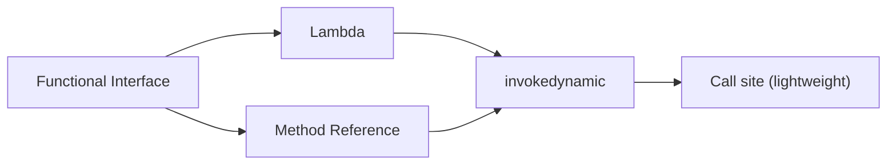

---

### 🛠️ Worked Example

**BAD:**

```java
// Anonymous class - verbose
Collections.sort(names, new Comparator<String>() {
    @Override
    public int compare(String a, String b) {
        return a.compareToIgnoreCase(b);
    }
});
```

Why it's wrong: 5 lines of boilerplate for one comparison.

**GOOD:**

```java
names.sort(String::compareToIgnoreCase);
// Method reference - even shorter than lambda
// Equivalent lambda: (a, b) -> a.compareToIgnoreCase(b)
```

Why it's right: one line, same behavior, compiler-verified.

**Production pattern:**

```java
// Chaining functional operations
List<String> active = users.stream()
    .filter(u -> u.isActive())
    .map(User::getName)
    .sorted()
    .toList();
```

---

### ⚖️ Trade-offs

**Gain:** concise, readable behavior passing; enables Stream
API and functional patterns.
**Cost:** debugging lambdas shows synthetic method names in
stack traces; overuse creates unreadable one-liners.

| Aspect      | Lambda            | Anonymous class        |
| ----------- | ----------------- | ---------------------- |
| Verbosity   | 1 line            | 5+ lines               |
| Debugging   | synthetic names   | named class in stack   |
| State       | effectively final | can use mutable fields |
| Performance | invokedynamic     | class per instance     |

---

### ⚡ Decision Snap

**USE WHEN:**

- Passing simple behavior: comparators, predicates, mappers,
  consumers.
- Using the Stream API or reactive APIs.
- The lambda body is 1-3 lines.

**AVOID WHEN:**

- The body exceeds 3 lines - extract to a named method and
  use a method reference.
- You need mutable state inside the callback (use a class).

**PREFER method reference WHEN:**

- The lambda just delegates to an existing method:
  `User::getName` instead of `u -> u.getName()`.

---

### ⚠️ Top Traps

| #   | Misconception                                | Reality                                                  |
| --- | -------------------------------------------- | -------------------------------------------------------- |
| 1   | Lambdas are anonymous classes under the hood | No - they use invokedynamic; no .class file is generated |
| 2   | Lambdas can modify local variables           | No - captured variables must be effectively final        |
| 3   | Any interface works with lambdas             | Only functional interfaces (exactly one abstract method) |

---

### 🪜 Learning Ladder

**Prerequisites:**

- JLG-010 Inheritance, Interfaces, Polymorphism - interface
  concepts
- JLG-018 Collection Interfaces - List, Set, Map -
  collections that lambdas operate on

**THIS:** JLG-031 Lambdas and Functional Interfaces

**Next steps:**

- JLG-032 Stream API - Map, Filter, Reduce - lambdas as
  Stream pipeline stages
- JLG-033 Optional and Null-Safety - lambda-friendly
  null handling

---

### 💡 The Surprising Truth

Lambdas do not create a new class file at compile time. The
compiler emits an `invokedynamic` instruction, and the JVM's
`LambdaMetafactory` generates the implementation at first call.
This means a method with 100 lambdas does not produce 100 inner
class files like anonymous classes would - it produces zero.

---

### 📇 Revision Card

1. Lambda = concise behavior passing to functional interfaces.
2. Captured variables must be effectively final.
3. Prefer method references when the lambda just delegates.

---

---

# JLG-032 Stream API - Map, Filter, Reduce

**TL;DR** - Streams declare what to compute over collections, not how, enabling pipeline-style data processing.

---

### 🔥 The Problem in One Paragraph

Processing a list of orders: filter cancelled ones, extract
totals, sum them. With loops, this takes 10+ lines, mixes
filtering with accumulation, and is hard to parallelize. The
Stream API (Java 8) lets you write `orders.stream().filter(o -> !o.isCancelled()).mapToDouble(Order::getTotal).sum()` - a
declarative pipeline that the runtime can optimize and
parallelize. This is exactly why the Stream API was created.

---

### 📘 Textbook Definition

A **Stream** is a lazily evaluated sequence of elements
supporting aggregate operations. Streams do not store data -
they pull elements from a source (collection, array, generator).
Operations are either **intermediate** (return a new Stream:
`filter`, `map`, `sorted`) or **terminal** (produce a result:
`collect`, `reduce`, `forEach`). Intermediate operations are
lazy; no work happens until a terminal operation triggers
evaluation.

---

### 🧠 Mental Model

> A Stream pipeline is a factory assembly line. Raw materials
> (elements) enter at one end. Each station (intermediate op)
> transforms or filters. The packing station (terminal op)
> produces the final product. No station runs until the packing
> station is turned on (lazy evaluation).

- "Raw materials" -> source collection
- "Station" -> intermediate operation (filter, map)
- "Packing station" -> terminal operation (collect, reduce)

**Where this analogy breaks down:** unlike a physical assembly
line, Streams do not buffer between stages. Each element flows
through the entire pipeline before the next enters (short-
circuit optimization).

---

### ⚙️ How It Works

1. Create a Stream: `list.stream()` or `Stream.of(...)`.
2. Chain intermediate operations: `.filter(p).map(f).sorted()`.
3. Trigger with a terminal operation: `.collect(toList())`.
4. Laziness: `filter` and `map` do not execute until
   `collect` is called.
5. Short-circuit: `findFirst()` stops after the first match.

```text
orders.stream()          -- source
  .filter(o -> !o.isCancelled())  -- intermediate
  .mapToDouble(Order::getTotal)   -- intermediate
  .sum();                -- terminal (triggers all)
```

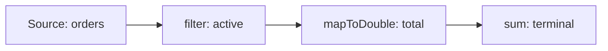

---

### 🛠️ Worked Example

**BAD:**

```java
// Imperative: mixes filter + transform + accumulate
double total = 0;
for (Order o : orders) {
    if (!o.isCancelled()) {
        total += o.getTotal();
    }
}
```

Why it's wrong: mutation, mixed concerns, not parallelizable.

**GOOD:**

```java
double total = orders.stream()
    .filter(o -> !o.isCancelled())
    .mapToDouble(Order::getTotal)
    .sum();
```

Why it's right: declarative, composable, parallelizable
(swap to `parallelStream()`).

**Production pattern:**

```java
// Grouping orders by status
Map<Status, List<Order>> grouped =
    orders.stream()
        .collect(Collectors.groupingBy(
            Order::getStatus));
```

---

### ⚖️ Trade-offs

**Gain:** declarative, composable, parallelizable data
processing.
**Cost:** debugging is harder (stack traces show lambda
internals); overhead for small collections; easy to create
unreadable chains.

| Aspect      | Loop             | Stream              |
| ----------- | ---------------- | ------------------- |
| Style       | imperative       | declarative         |
| Parallelism | manual threads   | `.parallelStream()` |
| Debugging   | step-through     | harder (lazy)       |
| Performance | minimal overhead | small overhead      |

---

### ⚡ Decision Snap

**USE WHEN:**

- Transforming, filtering, or aggregating collections.
- The pipeline reads naturally as a data flow.
- You want optional parallelism later.

**AVOID WHEN:**

- Side effects are the goal (printing, writing to DB) -
  use a loop.
- The pipeline exceeds 5-6 stages (readability drops).

**PREFER loops WHEN:**

- You need index access or break/continue.
- Performance is critical on very small collections (loop
  has zero overhead).

---

### ⚠️ Top Traps

| #   | Misconception                        | Reality                                                  |
| --- | ------------------------------------ | -------------------------------------------------------- |
| 1   | Streams are always faster than loops | Streams add overhead; for small collections, loops win   |
| 2   | parallelStream() is free parallelism | It uses the common ForkJoinPool and can cause contention |
| 3   | Streams can be reused                | A Stream can only be consumed once; create a new one     |

---

### 🪜 Learning Ladder

**Prerequisites:**

- JLG-031 Lambdas and Functional Interfaces - lambdas
  power stream stages
- JLG-018 Collection Interfaces - List, Set, Map - stream
  sources

**THIS:** JLG-032 Stream API - Map, Filter, Reduce

**Next steps:**

- JLG-033 Optional and Null-Safety - Streams return
  Optional from findFirst/reduce
- JLG-042 Inventory CLI - Phase 3 (Streams + Records) -
  hands-on practice

---

### 💡 The Surprising Truth

`Stream.forEach()` does not guarantee order even on sequential
streams for some sources. `forEachOrdered()` exists for that
reason. Also, `parallelStream().forEach()` executes elements
in arbitrary order across threads - if order matters, use
`forEachOrdered()` or `collect()`.

---

### 📇 Revision Card

1. Streams are lazy - nothing happens until a terminal
   operation.
2. A Stream can only be consumed once.
3. `parallelStream()` is not free - profile before using.

---

---

# JLG-033 Optional and Null-Safety

**TL;DR** - Optional makes the absence of a value explicit in the type system, replacing null returns in APIs.

---

### 🔥 The Problem in One Paragraph

A method returns `User` or `null`. The caller forgets to check.
`NullPointerException` fires in production, three method calls
away from the source. The null could mean "not found", "not
loaded", or "error" - you cannot tell which. Tony Hoare called
null his "billion dollar mistake." Optional (Java 8) forces the
caller to acknowledge absence: `Optional<User>` cannot be
dereferenced without explicitly handling the empty case. This
is exactly why Optional was created.

---

### 📘 Textbook Definition

**Optional\<T\>** is a container that either holds a non-null
value (`Optional.of(value)`) or is empty
(`Optional.empty()`). It provides methods to handle both cases:
`ifPresent()`, `orElse()`, `map()`, `flatMap()`. Optional is
designed for method return types, not for fields, method
parameters, or collections.

---

### 🧠 Mental Model

> Optional is a gift box that might be empty. Before using
> the gift (value), you must open the box and check. Null is a
> gift box that looks full but explodes when opened (NPE).

- "Gift box" -> Optional wrapper
- "Open and check" -> ifPresent, map, orElse
- "Exploding box" -> null reference

**Where this analogy breaks down:** Optional itself can be
null if misused (`Optional<User> opt = null;`). The discipline
is to never assign null to an Optional variable.

---

### ⚙️ How It Works

1. Return `Optional.of(value)` for present values.
2. Return `Optional.empty()` for absence.
3. Caller chains: `opt.map(User::getName).orElse("unknown")`.
4. Never call `opt.get()` without `isPresent()` check -
   use `orElse`, `orElseGet`, or `orElseThrow` instead.

```text
Null style:          Optional style:
User u = find(id);   Optional<User> u = find(id);
if (u != null)       u.ifPresent(user ->
  use(u);              use(user));
```

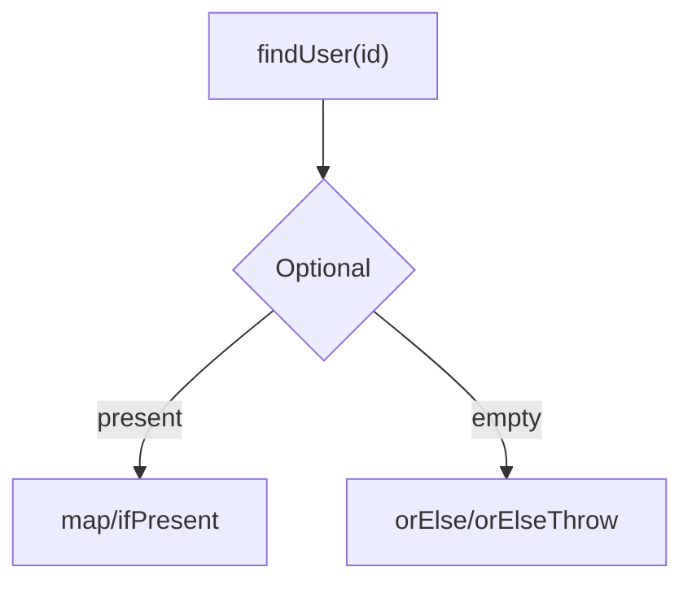

---

### 🛠️ Worked Example

**BAD:**

```java
// Returning null - caller forgets to check
User findUser(String id) {
    return db.query(id); // might return null
}
String name = findUser("42").getName(); // NPE!
```

Why it's wrong: null return is invisible; NPE is inevitable.

**GOOD:**

```java
Optional<User> findUser(String id) {
    return Optional.ofNullable(db.query(id));
}
String name = findUser("42")
    .map(User::getName)
    .orElse("unknown");
// No NPE possible
```

Why it's right: absence is explicit; handling is forced.

**Production pattern:**

```java
// Chaining Optionals with flatMap
Optional<String> city = findUser(id)
    .flatMap(User::getAddress)
    .map(Address::getCity);
```

---

### ⚖️ Trade-offs

**Gain:** makes absence explicit; eliminates most NPEs in
well-typed code; enables functional chaining.
**Cost:** wrapping overhead; misuse as fields or parameters
adds noise; `Optional.get()` without check is as bad as null.

| Aspect       | Null return | Optional return       |
| ------------ | ----------- | --------------------- |
| Explicitness | invisible   | type-visible          |
| Safety       | NPE risk    | forced handling       |
| Overhead     | none        | small object wrapper  |
| Serializable | N/A         | no (not Serializable) |

---

### ⚡ Decision Snap

**USE WHEN:**

- Method return type where absence is a normal outcome.
- Chaining transformations on possibly absent values.
- API boundaries where callers need a clear "maybe" signal.

**AVOID WHEN:**

- Method parameters (use overloading or @Nullable instead).
- Fields (use null with clear Javadoc).
- Collections (return empty collection, not Optional\<List\>).

**PREFER orElseThrow WHEN:**

- Absence is an error: `opt.orElseThrow(() -> new NotFoundException(id))`.

---

### ⚠️ Top Traps

| #   | Misconception                                        | Reality                                                                        |
| --- | ---------------------------------------------------- | ------------------------------------------------------------------------------ |
| 1   | `Optional.get()` is the normal way to extract values | It throws NoSuchElementException if empty; use orElse/map                      |
| 2   | Optional eliminates all NPEs                         | Only if used correctly; Optional itself can be null                            |
| 3   | Use Optional for every field                         | No - Optional is for return types only; fields should be null or use a default |

---

### 🪜 Learning Ladder

**Prerequisites:**

- JLG-031 Lambdas and Functional Interfaces - Optional
  methods take lambdas
- JLG-016 Generics - Parameterized Types - Optional is
  generic

**THIS:** JLG-033 Optional and Null-Safety

**Next steps:**

- JLG-032 Stream API - Map, Filter, Reduce - Streams
  use Optional for terminal ops
- JLG-035 Switch Expressions and Pattern Matching -
  pattern matching handles types explicitly

---

### 💡 The Surprising Truth

Optional was not designed to eliminate null from Java. Brian
Goetz (Java language architect) stated it was designed for "a
limited mechanism for library method return types where there
is a clear need to represent 'no result.'" Using Optional for
fields, parameters, or collections is explicitly against the
design intent.

---

### 📇 Revision Card

1. Optional is for return types only - not fields or
   parameters.
2. Never call `get()` without checking - use map, orElse,
   or orElseThrow.
3. Return empty collections, not `Optional<List<T>>`.

---

---

# JLG-034 var Local Type Inference (Java 10)

**TL;DR** - var infers local variable types from the right-hand side, reducing redundancy without losing type safety.

---

### 🔥 The Problem in One Paragraph

`Map<String, List<Employee>> grouped = new HashMap<String, List<Employee>>();`
The type is declared twice and spans 70+ characters. Java's
verbosity was a running joke. `var` (Java 10) lets the compiler
infer the type from the initializer:
`var grouped = new HashMap<String, List<Employee>>();`
Same type safety, less noise. But overuse of `var` hides intent
when the right-hand side is not obvious. This is exactly why
understanding when to use var matters.

---

### 📘 Textbook Definition

**var** is a reserved type name (not a keyword) that instructs
the compiler to infer the type of a local variable from its
initializer expression. It works only for local variables with
initializers - not for fields, method parameters, or return
types. The compiled bytecode is identical to an explicit type
declaration; `var` is purely a source-level feature.

---

### 🧠 Mental Model

> var is autocomplete for types. The compiler fills in the
> full type from the right side of `=`. You still have the
> same type - you just do not type it twice.

- "Autocomplete" -> compiler infers from initializer
- "Same type" -> bytecode is identical
- "No initializer, no autocomplete" -> var requires `= ...`

**Where this analogy breaks down:** autocomplete is reversible
(you can see the full type in your IDE). In code review without
an IDE, `var` can obscure the type.

---

### ⚙️ How It Works

1. Write `var x = expression;` in a local scope.
2. The compiler resolves the expression's type.
3. The variable is assigned that type at compile time.
4. The type cannot change after declaration.
5. Bytecode is identical to explicit declaration.

```text
Explicit:           Inferred:
String s = "hi";    var s = "hi";     // String
int n = 42;         var n = 42;       // int
List<String> x =    var x =
  new ArrayList<>();  new ArrayList<String>();
```

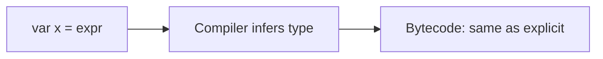

---

### 🛠️ Worked Example

**BAD:**

```java
// var hides the type when RHS is unclear
var result = service.process(input);
// What type is result? Reader cannot tell.
```

Why it's wrong: the type is not obvious from the method name.

**GOOD:**

```java
// var reduces redundancy when type is obvious
var users = new ArrayList<User>();
var entry = Map.entry("key", "value");
// Types are clear from the constructor/factory
```

Why it's right: type is evident from the right-hand side.

**Production pattern:**

```java
// var shines with complex generics
var grouped = orders.stream()
    .collect(Collectors.groupingBy(
        Order::getStatus,
        Collectors.summarizingDouble(
            Order::getTotal)));
// Without var: Map<Status, DoubleSummaryStatistics>
```

---

### ⚖️ Trade-offs

**Gain:** reduces verbosity; especially helpful with generics
and diamond chains.
**Cost:** can obscure type when RHS is a method call; requires
IDE hover to see the type.

| Aspect      | Explicit type     | var                |
| ----------- | ----------------- | ------------------ |
| Verbosity   | high for generics | low                |
| Readability | always clear      | depends on context |
| Refactoring | type visible      | IDE-dependent      |

---

### ⚡ Decision Snap

**USE WHEN:**

- The type is obvious from the right-hand side (constructor,
  literal, factory method).
- Complex generic types that would be repeated.
- try-with-resources where the type is in the method name.

**AVOID WHEN:**

- The right-hand side is a method call with a non-obvious
  return type.
- The variable is used far from its declaration.

**PREFER explicit type WHEN:**

- API boundaries and public method signatures (var is
  not allowed there anyway).
- Code review readability is a priority.

---

### ⚠️ Top Traps

| #   | Misconception                       | Reality                                                |
| --- | ----------------------------------- | ------------------------------------------------------ |
| 1   | var makes Java dynamically typed    | No - the type is inferred at compile time and is fixed |
| 2   | var works for fields and parameters | No - only local variables with initializers            |
| 3   | var x = null; works                 | No - the compiler cannot infer a type from null        |

---

### 🪜 Learning Ladder

**Prerequisites:**

- JLG-006 Variables, Statements, Expressions - variable
  declaration basics
- JLG-016 Generics - Parameterized Types - generic types
  that benefit from var

**THIS:** JLG-034 var Local Type Inference (Java 10)

**Next steps:**

- JLG-035 Switch Expressions and Pattern Matching - another
  modern language feature
- JLG-036 Records, Sealed Types, and Patterns Together -
  var works well with records

---

### 💡 The Surprising Truth

`var` is not a keyword - it is a "reserved type name." This
means you can still have a variable named `var`:
`int var = 42;` compiles. This was done to maintain backward
compatibility with code that used `var` as an identifier before
Java 10.

---

### 📇 Revision Card

1. var is compile-time inference, not dynamic typing.
2. Use var when the type is obvious from the right side.
3. var works only for local variables with initializers.

---

---

# JLG-035 Switch Expressions and Pattern Matching

**TL;DR** - Switch expressions return values and pattern matching destructures types, replacing if/else instanceof chains.

---

### 🔥 The Problem in One Paragraph

Classic switch statements have fall-through bugs, require
break in every case, and cannot return a value directly. Type
checking with `instanceof` requires a cast on the next line.
Combining both produces chains of `if (x instanceof Foo f)`
blocks that grow linearly with each new type. Switch expressions
(Java 14) return values with arrow syntax (no fall-through).
Pattern matching (Java 16+ for instanceof, Java 21 for switch)
lets you test and bind in one step. This is exactly why these
features were created.

---

### 📘 Textbook Definition

A **switch expression** evaluates to a value using arrow-case
labels (`case X -> expr`). It is exhaustive (must cover all
cases or have a default). **Pattern matching for instanceof**
(Java 16) combines type check and cast:
`if (obj instanceof String s)`. **Pattern matching for switch**
(Java 21) allows switch cases to test types:
`case Integer i -> ...`.

---

### 🧠 Mental Model

> Classic switch is a hallway of doors you must manually close
> behind you (break). Switch expression is an elevator panel -
> press a button, arrive at the right floor, done. Pattern
> matching is a security scanner that identifies and badges you
> in one step.

- "Elevator panel" -> arrow case, no fall-through
- "Security scanner" -> pattern match (test + bind)
- "Hallway of doors" -> classic switch with break

**Where this analogy breaks down:** switch expressions enforce
exhaustiveness (every case covered), which neither elevators
nor scanners do.

---

### ⚙️ How It Works

1. Arrow case: `case "A" -> doA();` - no fall-through.
2. Expression: `int x = switch(val) { case A -> 1; ... };`.
3. Pattern instanceof: `if (obj instanceof String s)` binds
   s in scope.
4. Pattern switch: `switch(obj) { case Integer i -> ... }`.
5. Exhaustiveness: sealed types + switch guarantee all
   subtypes are covered.

```text
Classic:                  Modern:
switch (day) {            var label = switch (day) {
  case MON:                 case MON -> "Monday";
    label = "Monday";       case TUE -> "Tuesday";
    break;                  default  -> "Other";
  case TUE:               };
    label = "Tuesday";
    break;
  default:
    label = "Other";
}
```

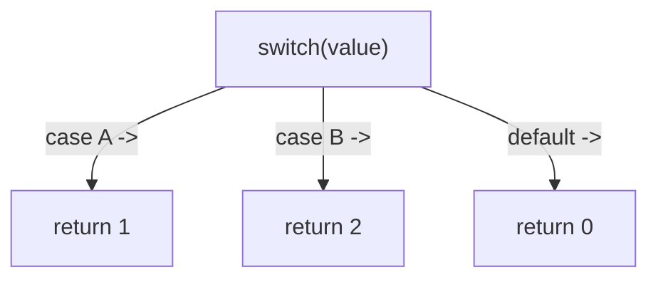

---

### 🛠️ Worked Example

**BAD:**

```java
// instanceof chain with manual casts
if (shape instanceof Circle) {
    Circle c = (Circle) shape;
    return Math.PI * c.radius() * c.radius();
} else if (shape instanceof Rectangle) {
    Rectangle r = (Rectangle) shape;
    return r.width() * r.height();
}
```

Why it's wrong: cast duplicates the type check; adding a
new shape type compiles without error (no exhaustiveness).

**GOOD:**

```java
// Pattern switch (Java 21) - exhaustive
return switch (shape) {
    case Circle c ->
        Math.PI * c.radius() * c.radius();
    case Rectangle r ->
        r.width() * r.height();
};
// Sealed interface: compiler ensures all types covered
```

Why it's right: no casts, exhaustive, concise.

**Production pattern:**

```java
// Combining records + sealed + pattern switch
sealed interface Event permits Click, Scroll {}
record Click(int x, int y) implements Event {}
record Scroll(int delta) implements Event {}

String describe(Event e) {
    return switch (e) {
        case Click(var x, var y) ->
            "click at " + x + "," + y;
        case Scroll(var d) ->
            "scroll " + d;
    };
}
```

---

### ⚖️ Trade-offs

**Gain:** eliminates fall-through bugs; enables exhaustive
type switching; reduces casts.
**Cost:** requires Java 21 for full pattern switch; sealed
types needed for exhaustiveness without default.

| Aspect        | Classic switch  | Switch expression |
| ------------- | --------------- | ----------------- |
| Fall-through  | yes (bug-prone) | no (arrow syntax) |
| Returns value | no              | yes               |
| Exhaustive    | no              | yes (with sealed) |
| Pattern match | no              | yes (Java 21)     |

---

### ⚡ Decision Snap

**USE WHEN:**

- Mapping an enum or sealed type to a value or action.
- Replacing if/else instanceof chains.
- You want compiler-enforced exhaustiveness.

**AVOID WHEN:**

- The switch has only 2 cases - a simple if/else is clearer.
- You need fall-through behavior intentionally (rare).

**PREFER pattern switch WHEN:**

- Operating on a sealed type hierarchy with distinct
  per-subtype logic.
- You want deconstruction (record patterns, Java 21).

---

### ⚠️ Top Traps

| #   | Misconception                                   | Reality                                                                                |
| --- | ----------------------------------------------- | -------------------------------------------------------------------------------------- |
| 1   | Arrow syntax and expression syntax are the same | Arrow prevents fall-through; expression returns a value; they are independent features |
| 2   | Pattern switch works on any class hierarchy     | Exhaustiveness requires sealed types; otherwise a default is needed                    |
| 3   | `case null` is handled by default               | No - switch throws NPE on null input unless you add an explicit `case null` (Java 21)  |

---

### 🪜 Learning Ladder

**Prerequisites:**

- JLG-007 Control Flow Constructs - classic switch
- JLG-010 Inheritance, Interfaces, Polymorphism - type
  hierarchies

**THIS:** JLG-035 Switch Expressions and Pattern Matching

**Next steps:**

- JLG-036 Records, Sealed Types, and Patterns Together -
  combine all three features
- JLG-044 Module System (JPMS) - Strong Encapsulation -
  another Java 9+ structural feature

---

### 💡 The Surprising Truth

Java 21's pattern matching for switch was delivered across 5
JEPs and 4 preview rounds (JEP 406, 420, 427, 433, 441) over
3 years. This is the most iterated feature in Java's history -
reflecting how hard it is to add algebraic data type matching
to a language that did not have it from the start.

---

### 📇 Revision Card

1. Arrow case (`->`) prevents fall-through; switch
   expression returns a value.
2. Pattern matching combines type check + binding in one
   step.
3. Sealed types + switch = exhaustive, compiler-verified
   type handling.

---

---

# JLG-036 Records, Sealed Types, and Patterns Together

**TL;DR** - Records model data, sealed types restrict hierarchies, and patterns destructure both - algebraic data types for Java.

---

### 🔥 The Problem in One Paragraph

Java classes for simple data carriers (DTOs, value objects)
require boilerplate: constructor, getters, equals, hashCode,
toString. Adding a new subtype to a hierarchy goes undetected
by the compiler - existing switch/if chains silently miss it.
Records (Java 16) eliminate boilerplate. Sealed types (Java 17)
restrict which classes can extend a type. Pattern matching
(Java 21) destructures them. Together, they form algebraic data
types in Java. This is exactly why all three were introduced.

---

### 📘 Textbook Definition

A **record** is a transparent carrier for immutable data:
`record Point(int x, int y) {}` auto-generates constructor,
accessors, equals, hashCode, and toString. A **sealed** type
declares its permitted subtypes:
`sealed interface Shape permits Circle, Rectangle {}`. Pattern
matching (JLG-035) switches over the sealed type and
destructures records in case labels.

---

### 🧠 Mental Model

> Records are pre-printed forms - all fields are visible and
> immutable. Sealed types are a club with a fixed membership
> list - no new members without editing the list. Pattern
> matching is the mailroom that sorts forms by type and reads
> their fields in one step.

- "Pre-printed form" -> record (all fields declared)
- "Membership list" -> sealed permits clause
- "Mailroom sorting" -> pattern matching

**Where this analogy breaks down:** records can have custom
methods, which forms typically do not. They are not just data
containers - they can have behavior.

---

### ⚙️ How It Works

1. Define a sealed interface:
   `sealed interface Shape permits Circle, Rect {}`.
2. Implement with records:
   `record Circle(double r) implements Shape {}`.
3. Pattern switch:
   `case Circle(var r) -> PI * r * r;`.
4. Compiler verifies exhaustiveness: if you add a new
   permitted subtype, every switch that does not cover
   it becomes a compile error.

```text
sealed interface Shape
  permits Circle, Rect
record Circle(double r) implements Shape
record Rect(double w, double h) implements Shape

switch (shape) {
  case Circle(var r) -> PI * r * r
  case Rect(var w, var h) -> w * h
}
// Compiler error if new subtype added without case
```

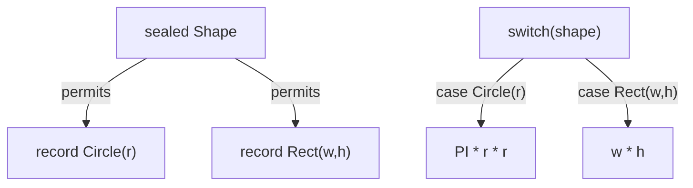

---

### 🛠️ Worked Example

**BAD:**

```java
// Boilerplate data class
class Point {
    private final int x, y;
    Point(int x, int y) { this.x=x; this.y=y; }
    int x() { return x; }
    int y() { return y; }
    public boolean equals(Object o) { /* 8 lines */ }
    public int hashCode() { return Objects.hash(x,y); }
    public String toString() { return "Point["+x+","+y+"]"; }
}
```

Why it's wrong: 15+ lines for a data carrier.

**GOOD:**

```java
record Point(int x, int y) {}
// Constructor, accessors, equals, hashCode, toString
// all generated. 1 line.
```

Why it's right: eliminates all boilerplate; immutable by
default.

**Production pattern:**

```java
// Domain events as sealed + records
sealed interface OrderEvent permits
    Created, Shipped, Cancelled {}
record Created(String id, Instant at)
    implements OrderEvent {}
record Shipped(String id, String tracking)
    implements OrderEvent {}
record Cancelled(String id, String reason)
    implements OrderEvent {}

String describe(OrderEvent e) {
    return switch (e) {
        case Created c ->
            "Order " + c.id() + " created";
        case Shipped s ->
            "Shipped: " + s.tracking();
        case Cancelled x ->
            "Cancelled: " + x.reason();
    };
}
```

---

### ⚖️ Trade-offs

**Gain:** immutable data carriers with zero boilerplate;
compiler-enforced exhaustiveness; safe destructuring.
**Cost:** records are final (no inheritance); all fields
define equality (cannot exclude fields); sealed types must
list permits in the same file or package.

| Aspect       | Class     | Record         |
| ------------ | --------- | -------------- |
| Boilerplate  | 15+ lines | 1 line         |
| Mutable      | yes       | no (immutable) |
| Inheritance  | yes       | no (final)     |
| Equals scope | custom    | all components |

---

### ⚡ Decision Snap

**USE WHEN:**

- Data carriers (DTOs, events, value objects).
- Fixed type hierarchies (Shape, Event, Result).
- You want exhaustive pattern matching.

**AVOID WHEN:**

- The class needs mutable state.
- Equality should exclude some fields (records include
  all).
- You need deep inheritance hierarchies.

**PREFER records + sealed WHEN:**

- Modeling domain events, command results, or AST nodes.
- You want compile-time safety when adding new subtypes.

---

### ⚠️ Top Traps

| #   | Misconception                                    | Reality                                                               |
| --- | ------------------------------------------------ | --------------------------------------------------------------------- |
| 1   | Records can extend other classes                 | No - records are implicitly final and extend java.lang.Record         |
| 2   | Sealed types must list subtypes in the same file | They can be in the same package if in the same module                 |
| 3   | Record fields are truly immutable                | The reference is immutable but mutable objects inside can be modified |

---

### 🪜 Learning Ladder

**Prerequisites:**

- JLG-035 Switch Expressions and Pattern Matching - pattern
  switch syntax
- JLG-021 Equals and HashCode Contract - what records
  auto-generate

**THIS:** JLG-036 Records, Sealed Types, and Patterns Together

**Next steps:**

- JLG-037 Text Blocks and String Templates - more modern
  syntax features
- JLG-042 Inventory CLI - Phase 3 (Streams + Records) -
  practice using records

---

### 💡 The Surprising Truth

Records were inspired by "algebraic data types" (ADTs) from
functional languages like Haskell and ML. Combined with sealed
types and pattern matching, Java now has a version of sum types
(sealed) and product types (records) - the building blocks of
ADTs - bolted onto a 30-year-old OOP language.

---

### 📇 Revision Card

1. Record = immutable data carrier with auto-generated
   equals, hashCode, toString.
2. Sealed = closed set of subtypes, compiler-enforced.
3. Together + pattern match = exhaustive, destructuring
   type dispatch.

---

---

# JLG-037 Text Blocks and String Templates

**TL;DR** - Text blocks preserve multi-line formatting with triple quotes; string templates (preview) embed expressions inline.

---

### 🔥 The Problem in One Paragraph

Writing SQL, JSON, or HTML in Java required escaping every
quote and manually adding `\n` for newlines. A 5-line SQL query
became an unreadable mess of `"SELECT " + col + " FROM " + table`.
Text blocks (Java 15) use `"""..."""` to preserve formatting.
String templates (preview in Java 21+) embed expressions
directly: `STR."Hello \{name}"`. This is exactly why text blocks
and templates were created.

---

### 📘 Textbook Definition

A **text block** is a multi-line string literal delimited by
`"""` (triple double-quotes). Incidental indentation is
stripped. A **string template** (preview feature, Java 21+)
is a template expression processed by a template processor
(`STR`, `FMT`, or custom) that safely interpolates values
into strings.

---

### 🧠 Mental Model

> A text block is a framed photograph of your text - what you
> see is what you get, whitespace and all. String templates are
> mail merge - placeholders filled safely at runtime.

- "Framed photograph" -> text block preserves formatting
- "Mail merge placeholder" -> `\{expr}` in template
- "Mail merge engine" -> template processor (STR, FMT)

**Where this analogy breaks down:** text blocks strip common
leading indentation, so the "photograph" is slightly cropped.

---

### ⚙️ How It Works

1. Text block: write `"""` on its own line, content below,
   close with `"""`.
2. The compiler strips common leading whitespace (incidental
   indentation).
3. String templates: `STR."name: \{user.name()}"` evaluates
   the expression and produces a String.
4. Template processors can validate content (e.g., prevent
   SQL injection with a custom processor).

```text
Text block:
String sql = """
    SELECT name, age
    FROM users
    WHERE active = true
    """;
// Common indent (4 spaces) stripped automatically
```

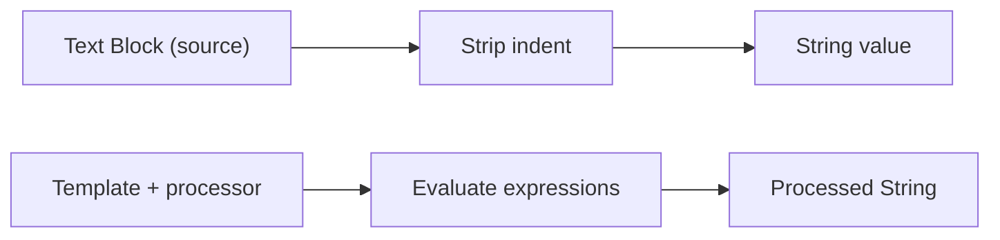

---

### 🛠️ Worked Example

**BAD:**

```java
String json = "{\n" +
    "  \"name\": \"" + name + "\",\n" +
    "  \"age\": " + age + "\n" +
    "}";
// Unreadable, error-prone escaping
```

Why it's wrong: manual escaping and concatenation.

**GOOD:**

```java
String json = """
    {
      "name": "%s",
      "age": %d
    }
    """.formatted(name, age);
```

Why it's right: readable, correct formatting, no escaping.

**Production pattern:**

```java
// SQL with text block (use parameterized queries
// for actual DB calls to prevent injection)
String sql = """
    SELECT u.name, u.email
    FROM users u
    JOIN orders o ON u.id = o.user_id
    WHERE o.status = ?
    ORDER BY u.name
    """;
```

---

### ⚖️ Trade-offs

**Gain:** readable multi-line strings; incidental indent
stripping; template safety.
**Cost:** text blocks are still strings (no compile-time
validation of SQL/JSON structure); string templates are
preview features (may change).

| Aspect        | Concatenation | Text block   | Template  |
| ------------- | ------------- | ------------ | --------- |
| Readability   | poor          | excellent    | excellent |
| Multi-line    | manual \n     | native       | native    |
| Interpolation | + operator    | .formatted() | \{expr}   |
| Safety        | none          | none         | processor |

---

### ⚡ Decision Snap

**USE WHEN:**

- Multi-line strings: SQL, JSON, XML, HTML, log messages.
- Any string literal longer than 2 lines.
- Embedded code snippets in documentation or tests.

**AVOID WHEN:**

- Single-line strings - regular quotes are fine.
- You need compile-time validation of the embedded format
  (use a proper templating library).

**PREFER .formatted() WHEN:**

- You need interpolation and are not on a preview JDK.
- printf-style formatting is familiar to the team.

---

### ⚠️ Top Traps

| #   | Misconception                         | Reality                                                                   |
| --- | ------------------------------------- | ------------------------------------------------------------------------- |
| 1   | Text blocks preserve all whitespace   | Common leading indent is stripped; trailing whitespace needs `\s`         |
| 2   | String templates are in GA            | As of Java 21, templates are a preview feature; API may change            |
| 3   | Text blocks for SQL prevent injection | No - text blocks are just strings; use parameterized queries for DB calls |

---

### 🪜 Learning Ladder

**Prerequisites:**

- JLG-006 Variables, Statements, Expressions - string
  basics
- JLG-012 String Concatenation in Loop Anti-Pattern -
  string handling pitfalls

**THIS:** JLG-037 Text Blocks and String Templates

**Next steps:**

- JLG-036 Records, Sealed Types, and Patterns Together -
  more modern Java features
- JLG-042 Inventory CLI - Phase 3 (Streams + Records) -
  use text blocks in output formatting

---

### 💡 The Surprising Truth

The `"""` delimiter must be followed by a newline - the opening
`"""` cannot have content on the same line. This was a
deliberate design choice to enforce consistent formatting and
avoid ambiguity with the closing `"""`.

---

### 📇 Revision Card

1. Text blocks: `"""..."""` with auto-stripped indentation.
2. Use `.formatted()` for interpolation on stable JDKs.
3. Text blocks are strings - they do not validate SQL, JSON,
   or HTML structure.

---

---

# JLG-040 JLS - The Java Language Specification

**TL;DR** - The JLS is the authoritative document defining every Java language rule; read it to resolve ambiguity.

---

### 🔥 The Problem in One Paragraph

A team debates whether `var` in a lambda parameter is legal.
Stack Overflow has three conflicting answers. The IDE does not
flag it. The only way to know for certain is the Java Language
Specification (JLS). The JLS defines every syntactic rule, type
conversion, overload resolution algorithm, and memory model
behavior. When blogs disagree, the JLS is the tiebreaker. This
is exactly why understanding the JLS matters.

---

### 📘 Textbook Definition

The **Java Language Specification (JLS)** is the formal document
published by Oracle that defines the syntax, type system,
expression evaluation, statement semantics, and compilation
requirements of the Java programming language. Each Java version
has a corresponding JLS edition. The companion **JVM
Specification (JVMS)** defines bytecode format and runtime
behavior.

---

### 🧠 Mental Model

> The JLS is the rulebook of Java. Blog posts are commentary.
> Stack Overflow is fan fiction. When in doubt, read the
> rulebook.

- "Rulebook" -> JLS (authoritative)
- "Commentary" -> blog posts (interpretive)
- "Fan fiction" -> Stack Overflow (sometimes wrong)

**Where this analogy breaks down:** the JLS is written in
formal language that is hard to parse. A good blog post can
explain the rule better, even if it is not authoritative.

---

### ⚙️ How It Works

1. Each Java version publishes a JLS edition (e.g., JLS 21).
2. The JLS covers: lexical structure, types, conversions,
   expressions, statements, classes, interfaces, arrays,
   exceptions, execution, threads, and memory.
3. Search the JLS by chapter when you have a specific
   question (e.g., Chapter 15 for expression evaluation).
4. The JVMS covers: class file format, bytecode instructions,
   verification, loading, linking, and initialization.

```text
JLS Structure (selected chapters):
  Ch 4:  Types, Values, Variables
  Ch 5:  Conversions and Contexts
  Ch 8:  Classes
  Ch 9:  Interfaces
  Ch 14: Blocks, Statements, Patterns
  Ch 15: Expressions
  Ch 17: Threads and Locks
```

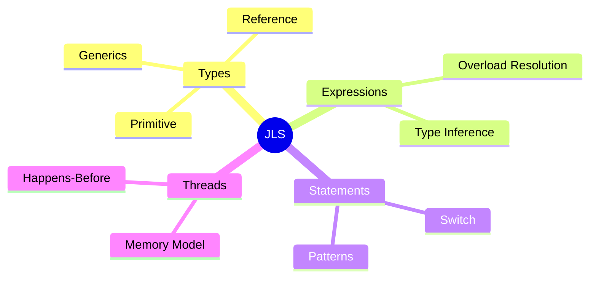

---

### 🛠️ Worked Example

**BAD:**

```text
Q: "Does Java evaluate method arguments left to right?"
A: "I think so..." (guessing)
// Wrong - could be implementation-dependent
```

Why it's wrong: guessing about evaluation order leads to
bugs with side effects.

**GOOD:**

```text
Q: "Does Java evaluate method arguments left to right?"
A: JLS 15.12.4.2: "The argument expressions are
   evaluated in order, left to right."
// Definitive answer from the specification
```

Why it's right: JLS provides the authoritative answer.

**Production pattern:**

```text
# How to search the JLS
# 1. Go to docs.oracle.com/javase/specs/jls/se21/
# 2. Search for the keyword or chapter
# 3. Read the specific section
# 4. Check the JLS change log for version differences
```

---

### ⚖️ Trade-offs

**Gain:** definitive answers to language behavior questions;
eliminates guessing.
**Cost:** formal, dense language; reading requires practice;
not beginner-friendly.

| Source         | Authority  | Readability | Accuracy          |
| -------------- | ---------- | ----------- | ----------------- |
| JLS            | definitive | hard        | guaranteed        |
| Effective Java | expert     | good        | typically correct |
| Blog posts     | none       | easy        | varies            |
| Stack Overflow | none       | easy        | often wrong       |

---

### ⚡ Decision Snap

**USE WHEN:**

- Resolving ambiguity about language behavior.
- Writing a compiler, linter, or code analysis tool.
- Preparing for expert-level interviews (JLS questions
  appear at staff+ level).

**AVOID WHEN:**

- Learning Java basics (use tutorials first).
- The question is about a library, not the language itself.

**PREFER Effective Java WHEN:**

- You need practical advice (best practices, patterns).
- The question is "how should I" rather than "how does the
  language define."

---

### ⚠️ Top Traps

| #   | Misconception                              | Reality                                                          |
| --- | ------------------------------------------ | ---------------------------------------------------------------- |
| 1   | The JLS defines JVM behavior               | No - the JVMS defines JVM behavior; the JLS defines the language |
| 2   | Blog posts are as authoritative as the JLS | Only the JLS is the source of truth for language rules           |
| 3   | The JLS is static across versions          | Each Java version has its own JLS edition with changes           |

---

### 🪜 Learning Ladder

**Prerequisites:**

- JLG-016 Generics - Parameterized Types - generics
  rules defined in JLS Ch 4
- JLG-023 Checked vs Unchecked Exceptions - exception
  hierarchy defined in JLS Ch 11

**THIS:** JLG-040 JLS - The Java Language Specification

**Next steps:**

- JLG-041 Generics Are Not Reified - Type Erasure Reality -
  JLS Ch 4.6 defines erasure
- JLG-052 JEP Process and JCP Governance - how JLS changes
  are proposed and ratified

---

### 💡 The Surprising Truth

The JLS Chapter 17 (Threads and Locks) defines the Java Memory
Model, which was rewritten in Java 5 (JSR-133) to fix
fundamental concurrency bugs. This chapter is arguably the most
important in the entire JLS for production systems, yet most
Java developers have never read it.

---

### 📇 Revision Card

1. The JLS is the only authoritative source for Java
   language rules.
2. The JVMS is the companion spec for JVM/bytecode behavior.
3. JLS Ch 17 (Memory Model) is essential for concurrent
   programming.

---

---

# JLG-041 Generics Are Not Reified - Type Erasure Reality

**TL;DR** - Java erases generic type parameters at compile time, so runtime cannot see List\<String\> vs List\<Integer\>.

---

### 🔥 The Problem in One Paragraph

You write `if (list instanceof List<String>)` and the compiler
rejects it. You try `new T[10]` and it fails. You attempt to
get the generic type at runtime via reflection and get `Object`.
All of these fail because Java erases generic type parameters
during compilation. The `<String>` in `List<String>` exists
only in source code - the bytecode sees `List`. This has deep
consequences for reflection, serialization, and framework
design. This is exactly why understanding type erasure matters.

---

### 📘 Textbook Definition

**Type erasure** is the process by which the Java compiler
removes generic type parameters and replaces them with their
bounds (or `Object` if unbounded) during compilation. At
runtime, `List<String>` and `List<Integer>` are the same class
(`List`). This was chosen for backward compatibility with
pre-generics code (Java 1-4). **Reified generics** (as in C#
or Kotlin) preserve type information at runtime - Java does
not have these.

---

### 🧠 Mental Model

> Type erasure is like a confidential document shredder. The
> compiler reads the full document (generic types), verifies
> it (type checking), then shreds the classification labels
> (type parameters) before sending it to the archive (bytecode).
> The archive only has the unclassified version.

- "Full document" -> source code with `<String>`
- "Shred labels" -> compiler removes type parameters
- "Archive" -> bytecode with `Object`

**Where this analogy breaks down:** some type information
survives in class metadata (field signatures, method signatures)
and is accessible via reflection on the declaring class - just
not on instances.

---

### ⚙️ How It Works

1. Source: `List<String> list = new ArrayList<>();`.
2. Compiler type-checks: only String can be added.
3. Compiler erases: replaces `<String>` with `Object`.
4. Compiler inserts casts: `(String) list.get(0)`.
5. Bytecode: `List list = new ArrayList();` with casts.

```text
Source:              Bytecode (after erasure):
List<String> list    List list
list.add("hi")       list.add((Object)"hi")
String s = list.get  String s = (String)list.get(0)
```

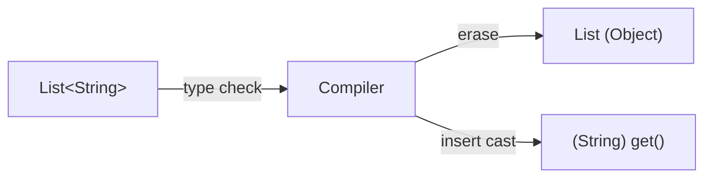

---

### 🛠️ Worked Example

**BAD:**

```java
// Trying to check generic type at runtime
if (list instanceof List<String>) {
    // Compile error: cannot check generic type
}
```

Why it's wrong: generic type is erased; JVM sees only `List`.

**GOOD:**

```java
// Check raw type, then cast safely
if (list instanceof List<?> rawList) {
    // Can only check that it's a List, not List<String>
    // Use pattern matching or design to avoid this need
}
```

Why it's right: acknowledges erasure; uses wildcard.

**Production pattern - TypeReference (Jackson):**

```java
// Frameworks work around erasure with type tokens
List<User> users = objectMapper.readValue(
    json,
    new TypeReference<List<User>>() {});
// TypeReference captures the generic type in
// an anonymous class's supertype metadata
```

---

### ⚖️ Trade-offs

**Gain:** backward compatibility with pre-generics code; no
runtime overhead for type information.
**Cost:** cannot check generic types at runtime; cannot create
generic arrays; frameworks need workarounds (TypeReference,
super type tokens).

| Aspect       | Erased (Java)   | Reified (C#)      |
| ------------ | --------------- | ----------------- |
| Runtime type | `List` only     | `List<String>`    |
| instanceof   | raw type only   | full generic type |
| new T[]      | illegal         | legal             |
| Compat       | pre-generics OK | no legacy concern |

---

### ⚡ Decision Snap

**USE WHEN (awareness):**

- Designing APIs that work with generics: understand that
  type info is unavailable at runtime.
- Choosing serialization libraries: Jackson TypeReference
  pattern for generic types.
- Writing reflection-based code: field.getGenericType()
  preserves declared types (not runtime instances).

**AVOID WHEN:**

- Trying to branch on generic type at runtime - redesign
  with sealed types or explicit type tags.
- Creating generic arrays (`new T[]`) - use `Object[]`
  with casts.

**PREFER sealed types WHEN:**

- You need runtime type discrimination - sealed + pattern
  match replaces the need for reified generics.

---

### ⚠️ Top Traps

| #   | Misconception                                                     | Reality                                                                                              |
| --- | ----------------------------------------------------------------- | ---------------------------------------------------------------------------------------------------- |
| 1   | `List<String>` and `List<Integer>` are different types at runtime | Same erased type: `List`                                                                             |
| 2   | Reflection cannot see any generic info                            | Class-level declarations (field types, method signatures) retain generic info; instance types do not |
| 3   | Type erasure is a Java bug                                        | It was a deliberate design choice for backward compatibility                                         |

---

### 🪜 Learning Ladder

**Prerequisites:**

- JLG-016 Generics - Parameterized Types - basic generic
  syntax
- JLG-026 javac and the Compilation Model - what javac does
  during compilation

**THIS:** JLG-041 Generics Are Not Reified - Type Erasure Reality

**Next steps:**

- JLG-044 Module System (JPMS) - Strong Encapsulation -
  modern Java structural feature
- JLG-040 JLS - The Java Language Specification - JLS Ch 4.6
  defines erasure formally

---

### 💡 The Surprising Truth

Kotlin, which runs on the JVM, has `reified` type parameters
in inline functions. This is not true reification - Kotlin's
compiler inlines the function body at each call site and
substitutes the concrete type. The JVM bytecode still has
erased types; Kotlin just moves the type info into the inlined
code. True reification would require JVM specification changes.

---

### 📇 Revision Card

1. Generic types are erased at compile time - the JVM sees
   only `Object`.
2. You cannot write `instanceof List<String>` or `new T[]`.
3. Use TypeReference/super type tokens for runtime generic
   type access in frameworks.

---

---

# JLG-042 Inventory CLI - Phase 3 (Streams + Records)

**TL;DR** - Refactor the Phase 2 inventory to use records for data and streams for all collection operations.

---

### 🔥 The Problem in One Paragraph

Phase 2 used mutable classes and imperative loops. Adding a
report (total quantity, most expensive product, group by
category) requires writing new loops for each. Records make
data immutable and transparent. Streams let you write
`products.stream().filter(...).mapToInt(...).sum()` for any
aggregation without new loops. This phase teaches the functional
Java style. This is exactly why Phase 3 exists.

---

### 📘 Textbook Definition

**Phase 3** refactors the Inventory CLI to use `record Product`
instead of a mutable class and Stream API pipelines instead of
imperative loops. Search, filter, aggregate, and report
operations become declarative one-liners. The `Collectors`
utility provides groupingBy, summarizing, and joining for
complex aggregations.

---

### 🧠 Mental Model

> Phase 2 was a manual assembly line with workers (loops)
> doing each step. Phase 3 replaces workers with conveyor
> belts (streams) and pre-printed forms (records). The belts
> run on demand, the forms are tamper-proof.

- "Conveyor belt" -> Stream pipeline
- "Pre-printed form" -> record (immutable data)
- "On demand" -> lazy evaluation

**Where this analogy breaks down:** conveyor belts run
continuously; Streams are one-shot (consumed once).

---

### ⚙️ How It Works

1. Replace `class Product` with
   `record Product(String name, int qty, double price)`.
2. Replace search loop with
   `products.stream().filter(p -> p.name().equals(name)).findFirst()`.
3. Replace report loops with collectors:
   `groupingBy(Product::category)`.
4. Use `Optional` for searches that may not find a match.
5. Output with text blocks for formatted display.

```text
Phase 2 (imperative):     Phase 3 (functional):
for (Product p : list)    products.stream()
  if (p.getQty() > 0)      .filter(p -> p.qty() > 0)
    total += p.getPrice();  .mapToDouble(Product::price)
                            .sum();
```

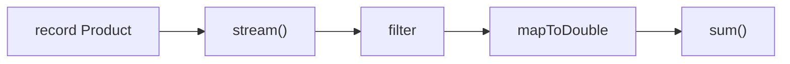

---

### 🛠️ Worked Example

**BAD:**

```java
// Imperative grouping
Map<String, List<Product>> groups = new HashMap<>();
for (Product p : products) {
    groups.computeIfAbsent(
        p.getCategory(), k -> new ArrayList<>())
        .add(p);
}
```

Why it's wrong: 5 lines for a standard grouping operation.

**GOOD:**

```java
var groups = products.stream()
    .collect(Collectors.groupingBy(
        Product::category));
// One line, declarative, type-inferred with var
```

Why it's right: Collectors.groupingBy handles the plumbing.

**Production pattern:**

```java
// Summary statistics
var stats = products.stream()
    .collect(Collectors.summarizingDouble(
        Product::price));
System.out.printf("""
    Count: %d
    Total: %.2f
    Avg:   %.2f
    """, stats.getCount(),
         stats.getSum(),
         stats.getAverage());
```

---

### ⚖️ Trade-offs

**Gain:** concise, declarative, immutable data; easy to add
new reports.
**Cost:** streams have overhead for very small collections;
records cannot have mutable fields.

| Aspect     | Phase 2 (imperative) | Phase 3 (functional) |
| ---------- | -------------------- | -------------------- |
| Data model | mutable class        | immutable record     |
| Operations | for loops            | Stream pipelines     |
| Reports    | new loop per report  | new collector chain  |
| Verbosity  | high                 | low                  |

---

### ⚡ Decision Snap

**USE WHEN:**

- You have completed Phase 2 and want to learn Streams.
- You want to practice records, Optional, and Collectors.
- You want a project that demonstrates modern Java style.

**AVOID WHEN:**

- You have not studied JLG-032 and JLG-036 yet.
- You are already fluent in functional Java.

**PREFER skipping to Phase 4 WHEN:**

- You already use Streams and records in production.

---

### ⚠️ Top Traps

| #   | Misconception                              | Reality                                                               |
| --- | ------------------------------------------ | --------------------------------------------------------------------- |
| 1   | Records replace all classes                | Only for immutable data carriers; use classes for mutable state       |
| 2   | Streams are always better than loops       | For small collections or side-effecting operations, loops are clearer |
| 3   | `stream().forEach()` is the same as a loop | forEach is terminal and does not support break/continue               |

---

### 🪜 Learning Ladder

**Prerequisites:**

- JLG-029 Inventory CLI - Phase 2 (Collections) - the
  project to refactor
- JLG-032 Stream API - Map, Filter, Reduce - stream
  pipeline knowledge

**THIS:** JLG-042 Inventory CLI - Phase 3 (Streams + Records)

**Next steps:**

- JLG-053 Inventory REST - Phase 4 (Modern Java + Loom) -
  evolve to a REST service
- JLG-043 Java Modern Features Self-Assessment - test your
  knowledge

---

### 💡 The Surprising Truth

After refactoring to records and streams, the Inventory CLI
drops from approximately 150 lines (Phase 2) to approximately
80 lines (Phase 3) with the same functionality plus additional
reporting. The reduction comes almost entirely from record
boilerplate elimination and stream pipeline conciseness.

---

### 📇 Revision Card

1. Replace mutable classes with records for data carriers.
2. Replace imperative loops with stream pipelines for
   collection operations.
3. Use Collectors (groupingBy, summarizing) for aggregation.

---

---

# JLG-043 Java Modern Features Self-Assessment

**TL;DR** - Test your command of Java 8-21 features with targeted questions that reveal gaps before interviews do.

---

### 🔥 The Problem in One Paragraph

You have read about lambdas, streams, records, sealed types,
and pattern matching. But can you answer "Why are generics
erased?" under interview pressure? Can you write a switch
expression with record patterns on a whiteboard? Self-assessment
reveals the gap between "I've read about it" and "I can explain
and use it." This is exactly why a structured self-check exists.

---

### 📘 Textbook Definition

A **self-assessment** is a structured set of questions and micro-
exercises targeting specific skills. Each question maps to a
keyword in this file. A confident answer means the concept is
internalized. Hesitation means revisit the keyword.

---

### 🧠 Mental Model

> A self-assessment is a fire drill. You do not learn firefighting
> during a fire. You practice before, find weaknesses, and fix
> them when the stakes are low.

- "Fire drill" -> self-assessment (low stakes)
- "Real fire" -> interview or production incident
- "Weaknesses found" -> keywords to revisit

**Where this analogy breaks down:** a fire drill tests one
skill. A self-assessment covers an entire topic.

---

### ⚙️ How It Works

1. **Lambda:** write a Predicate that filters strings > 5
   chars. What is a functional interface?
2. **Streams:** rewrite a nested loop as a stream pipeline
   with groupingBy.
3. **Optional:** given a method returning Optional, chain
   map and orElse without calling get().
4. **Records:** define a record, explain equals behavior,
   list limitations.
5. **Pattern switch:** write a switch over a sealed hierarchy
   with record deconstruction.

```text
Assessment checklist:
  [_] Can explain type erasure in 2 sentences
  [_] Can write a stream pipeline from scratch
  [_] Can define sealed + record + pattern switch
  [_] Can explain PECS (Producer Extends, Consumer Super)
  [_] Can explain why var is not dynamic typing
```

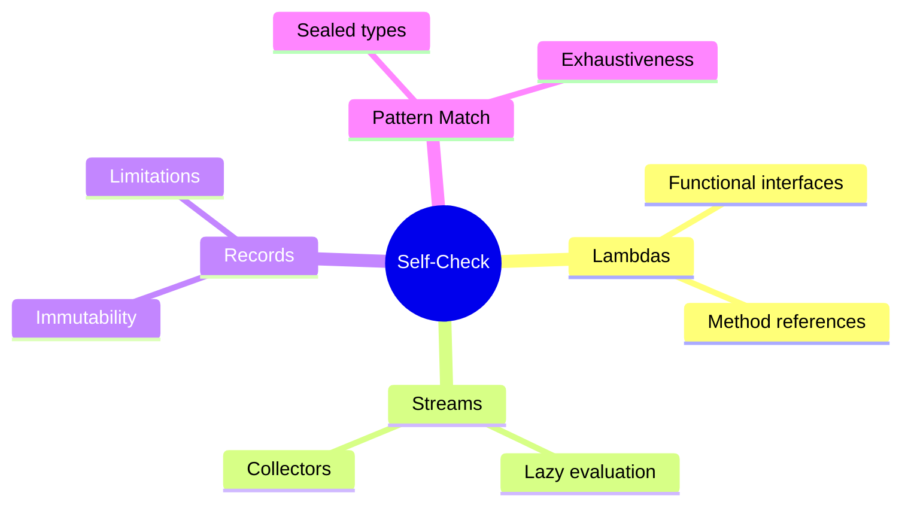

---

### 🛠️ Worked Example

**BAD:**

```text
Q: "What is type erasure?"
A: "Generics are removed at runtime... I think."
// Vague - would not pass an interview
```

Why it's wrong: lacks precision about what happens and why.

**GOOD:**

```text
Q: "What is type erasure?"
A: "The compiler verifies generic type safety, then
    replaces type parameters with their bounds
    (usually Object) and inserts casts. At runtime,
    List<String> and List<Integer> are the same
    class. This was done for backward compatibility
    with pre-Java-5 code."
// Precise, complete, interview-ready
```

Why it's right: covers what, how, and why.

**Production pattern:**

```text
# Self-assessment process:
# 1. Answer each question without looking at notes
# 2. Mark confident/unsure/blank
# 3. Re-read keywords marked unsure or blank
# 4. Repeat in 3 days (spaced repetition)
```

---

### ⚖️ Trade-offs

**Gain:** identifies knowledge gaps before interviews; builds
confidence through verified understanding.
**Cost:** time investment; uncomfortable when gaps are revealed.

| Method         | Effort | Feedback quality |
| -------------- | ------ | ---------------- |
| Reading only   | low    | none             |
| Self-check     | medium | high (honest)    |
| Mock interview | high   | highest          |

---

### ⚡ Decision Snap

**USE WHEN:**

- Preparing for a Java interview.
- Finishing a study phase and want to verify retention.
- You feel "I've read everything" but have not tested
  yourself.

**AVOID WHEN:**

- You have not studied the underlying keywords yet.
- You are in the middle of learning (test after, not during).

**PREFER mock interviews WHEN:**

- You pass the self-assessment and want pressure testing.
- A peer or mentor is available.

---

### ⚠️ Top Traps

| #   | Misconception                             | Reality                                                                |
| --- | ----------------------------------------- | ---------------------------------------------------------------------- |
| 1   | Reading about a feature means you know it | You know it when you can explain it and write it from memory           |
| 2   | One self-check is enough                  | Spaced repetition (test again in 3 and 7 days) is needed for retention |
| 3   | Getting answers wrong means failure       | Wrong answers are the most valuable - they show where to focus         |

---

### 🪜 Learning Ladder

**Prerequisites:**

- JLG-031 Lambdas and Functional Interfaces - lambda
  knowledge to test
- JLG-036 Records, Sealed Types, and Patterns Together -
  modern features to test

**THIS:** JLG-043 Java Modern Features Self-Assessment

**Next steps:**

- JLG-054 Java Expert Mastery Verification + Teaching Drill -
  advanced assessment
- JLG-059 Java Staff-Level Interview Scenarios - staff+
  interview prep

---

### 💡 The Surprising Truth

Research on learning (Roediger & Karpicke, 2006) shows that
testing yourself produces 50% better long-term retention than
re-reading the same material for the same amount of time. This
is the "testing effect" - retrieval practice strengthens memory
more than passive review.

---

### 📇 Revision Card

1. Test yourself after studying, not instead of studying.
2. Wrong answers are the most valuable feedback.
3. Spaced repetition: test at day 1, day 3, day 7.

---

---

# JLG-044 Module System (JPMS) - Strong Encapsulation

**TL;DR** - JPMS enforces module boundaries at compile and runtime, preventing unauthorized access to internal packages.

---

### 🔥 Problem Statement

Before Java 9, any public class was accessible to any code on
the classpath. Internal JDK classes like `sun.misc.Unsafe` were
used by frameworks despite being unsupported. Library authors
could not hide implementation packages. At scale, this creates
a fragile dependency web where changing an internal class breaks
unknown consumers. JPMS (Java Platform Module System, Java 9)
introduces compile-time and runtime encapsulation: a module
explicitly exports only its public API packages. This is exactly
why JPMS was created.

---

### 📜 Historical Context

Java's classpath model worked for small programs but failed at
enterprise scale. The Jigsaw project (started 2008, delivered
2017 with Java 9) took nearly a decade. The JDK itself was
modularized into 70+ modules (java.base, java.sql, java.net.http,
etc.). The driving incident: frameworks depending on
`sun.misc.Unsafe` broke across JDK updates because there was
no enforcement boundary. JPMS was Java's answer to strong
encapsulation.

---

### 🔩 First Principles

**CORE INVARIANTS:**

1. A module exports only the packages it declares; all other
   packages are inaccessible.
2. A module can only access another module's exported packages
   if it `requires` that module.
3. Reflection across module boundaries is blocked unless the
   target module `opens` the package.

**DERIVED DESIGN:**
These invariants force a dependency graph that is explicit,
validated at startup, and enforced at runtime. No hidden
dependencies can exist. The JVM verifies the module graph
before any application code runs.

**THE TRADE-OFF:**
**Gain:** strong encapsulation; reliable, explicit dependencies;
smaller runtime images (jlink).
**Cost:** migration pain for libraries using internal JDK APIs;
complex module-info.java; `--add-opens` escape hatch undermines
encapsulation.

---

### 🧠 Mental Model

> JPMS is a building with locked floors. Each floor (module)
> has a public lobby (exported packages) and private offices
> (unexported packages). To visit another floor, you need a
> badge (requires declaration). Without a badge, the elevator
> (JVM) rejects you.

- "Locked floor" -> module boundary
- "Public lobby" -> exported packages
- "Badge" -> requires clause

**Where this analogy breaks down:** `--add-opens` is a master
key that bypasses all locks. In practice, many applications
use it to work around encapsulation.

---

### 🧩 Components

- **module-info.java:** declares exports, requires, opens.
- **Module path:** replaces classpath for modular JARs.
- **jlink:** creates custom runtime images with only needed
  modules.
- **ServiceLoader:** modules declare provided/consumed
  services for decoupled plugin architecture.

```text
module com.acme.billing {
    requires java.sql;
    requires com.acme.core;
    exports com.acme.billing.api;
    opens com.acme.billing.model to
        com.fasterxml.jackson;
}
```

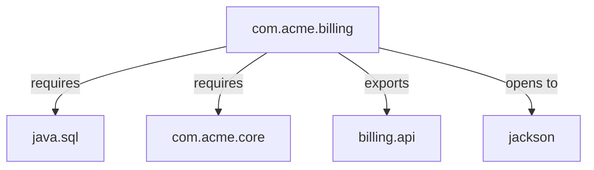

---

### 📶 Gradual Depth

**Level 1 - What it is:**
JPMS lets you declare which packages a module exposes and
which modules it depends on. Think of it as package-level
access control but at the module (JAR) level.

**Level 2 - How to use it:**
Create `module-info.java` at the source root. Declare
`requires` for dependencies and `exports` for public API
packages. Compile with `--module-source-path`. Use automatic
modules for non-modularized libraries.

**Level 3 - How it works:**
At startup, the JVM resolves the module graph: checks all
requires are satisfied, no cycles exist, and no split packages
(same package in two modules). Exported packages are accessible;
others throw `IllegalAccessError` at runtime.

**Level 4 - Production mastery:**
Most large applications use JPMS partially: modularize your
own code but rely on `--add-opens` and automatic modules for
third-party libraries. jlink produces minimal Docker images
(300MB JDK -> 30MB custom runtime). The `--add-opens` flag
should be tracked and minimized over time as libraries adopt
JPMS.

---

### ⚙️ How It Works

Phase 1: Write `module-info.java` with exports and requires.
Phase 2: Compile with module path (`--module-source-path`).
Phase 3: JVM resolves module graph at startup.
Phase 4: Runtime enforces access: unexported packages throw
`IllegalAccessError`.

```text
module graph resolution:
  1. Read all module-info descriptors
  2. Resolve requires -> find providing modules
  3. Check: no cycles, no split packages
  4. Lock graph -> enforce at runtime
```

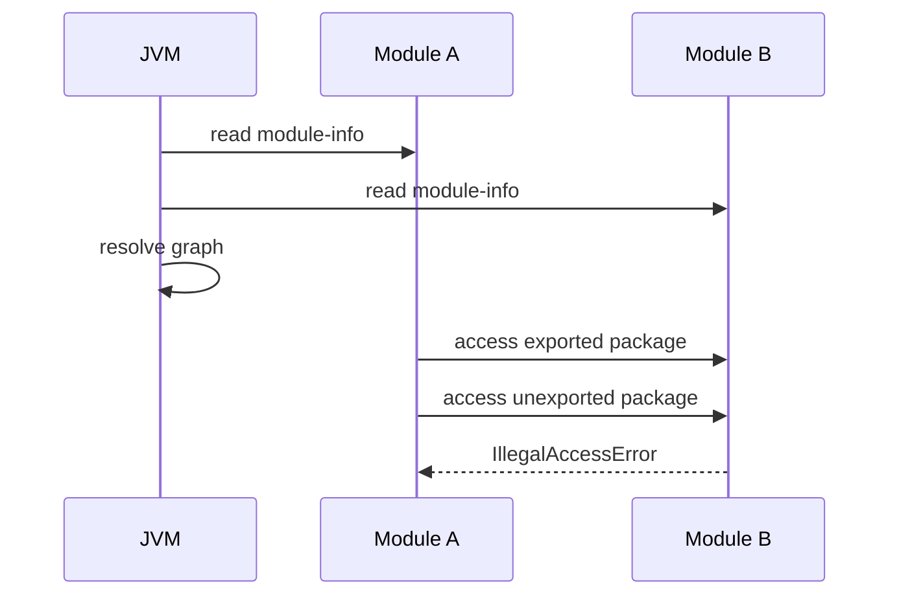

---

### 🚨 Failure Modes

**Failure 1 - IllegalAccessError:**
**Symptom:** `java.lang.IllegalAccessError: class X cannot access class Y (module A does not export package P to module B)`
**Root cause:** module A did not export the package.
**Diagnostic:**

```bash
java --show-module-resolution -m app/com.acme.Main
```

**Fix:** add `exports P;` to module A's module-info, or
use `--add-exports A/P=B` as a temporary workaround.

**Failure 2 - Module not found:**
**Symptom:** `java.lang.module.FindException: Module X not found`
**Root cause:** dependency JAR not on the module path.
**Diagnostic:**

```bash
jar --describe-module --file=lib/dep.jar
# Check if it has module-info or is automatic
```

**Fix:** add the JAR to `--module-path` or use automatic
module names.

---

### 🔬 Production Reality

A typical migration scenario: a Spring Boot application with
200+ dependencies. Only 30% of libraries have module-info.
The rest become automatic modules. The application uses
`--add-opens java.base/java.lang=ALL-UNNAMED` for reflection-
heavy frameworks (Spring, Hibernate). Each `--add-opens` flag
is technical debt that should be tracked. Over time, as
libraries publish module-info descriptors, the flags can be
removed. The value of JPMS in this scenario is jlink: producing
a 40MB Docker image instead of a 300MB one.

---

### ⚖️ Trade-offs & Alternatives

| Aspect        | JPMS (Java 9+)   | Classpath (pre-9)  | OSGi           |
| ------------- | ---------------- | ------------------ | -------------- |
| Encapsulation | strong (runtime) | none               | strong         |
| Complexity    | moderate         | simple             | high           |
| Adoption      | growing          | universal          | niche          |
| Dynamic load  | limited          | classloader tricks | first-class    |
| Image size    | jlink (small)    | full JDK           | not applicable |

---

### ⚡ Decision Snap

**USE WHEN:**

- Building libraries that need strong API boundaries.
- Producing minimal Docker images with jlink.
- New projects on Java 17+ where ecosystem support is
  mature.

**AVOID WHEN:**

- The project has many non-modularized dependencies.
- The team is not ready for module-info maintenance overhead.

**PREFER classpath mode WHEN:**

- Migrating a large legacy application incrementally.
- All dependencies are on the unnamed module anyway.

---

### ⚠️ Top Traps

| #   | Misconception                           | Reality                                                                             |
| --- | --------------------------------------- | ----------------------------------------------------------------------------------- |
| 1   | JPMS is required for Java 9+            | No - classpath mode still works; JPMS is opt-in                                     |
| 2   | `--add-opens` is the permanent solution | It is a migration escape hatch; track and remove over time                          |
| 3   | Modular JARs work on the classpath      | Yes, but module-info is ignored; encapsulation is not enforced                      |
| 4   | JPMS replaces Maven/Gradle modules      | No - JPMS is runtime encapsulation; build tools manage compilation and dependencies |
| 5   | All public classes are accessible       | Only if the package is exported from the module                                     |

---

### 🪜 Learning Ladder

**Prerequisites:**

- JLG-011 Packages and Visibility Modifiers - package-level
  access control
- JLG-027 Maven Build Lifecycle Basics - build tool
  integration

**THIS:** JLG-044 Module System (JPMS) - Strong Encapsulation

**Next steps:**

- JLG-045 Virtual Threads - Language Surface (Java 21) -
  another major Java platform feature
- JLG-052 JEP Process and JCP Governance - how JPMS was
  designed and ratified

**The Surprising Truth:**
The JDK itself is the largest JPMS adopter. The `java.base`
module has zero dependencies. Every other JDK module declares
explicit requires. This self-modularization exposed hundreds
of internal dependency cycles in the JDK that had to be
resolved before Java 9 could ship - which is why Jigsaw took
nearly a decade.

**Further Reading:**

- JEP 261: Module System (the defining JEP)
- The State of the Module System (Mark Reinhold, 2016)
- java.base module javadoc for the canonical module graph

**Revision Card:**

1. JPMS exports packages, not classes - unexported packages
   are invisible.
2. jlink produces minimal runtime images from the module
   graph.
3. Track every `--add-opens` flag as technical debt.

---

---

# JLG-045 Virtual Threads - Language Surface (Java 21)

**TL;DR** - Virtual threads are lightweight threads managed by the JVM, enabling millions of concurrent tasks without thread pools.

---

### 🔥 Problem Statement

Platform threads are OS-managed and expensive: each consumes
~1MB of stack memory. A server handling 10,000 concurrent
requests needs 10,000 threads, consuming 10GB of stack alone.
Thread pools limit concurrency to a fixed size, forcing async
programming (CompletableFuture, reactive) to avoid blocking.
Async code is hard to write, debug, and profile. Virtual threads
(Java 21, Project Loom) are JVM-managed: millions can exist
simultaneously with minimal memory. Blocking a virtual thread
is cheap - the JVM unmounts it from the carrier thread. This is
exactly why virtual threads were created.

---

### 📜 Historical Context

Java's threading model was designed in 1995 when servers handled
hundreds of concurrent connections. By 2010, C10K (10,000
connections) was standard. Reactive frameworks (Project Reactor,
RxJava) emerged to handle concurrency without thread-per-request.
But reactive code sacrificed readability. Project Loom (started
2017, previewed Java 19, GA in Java 21) introduced virtual
threads: write blocking code, get non-blocking scalability.
Go's goroutines (2009) proved the model viable.

---

### 🔩 First Principles

**CORE INVARIANTS:**

1. Virtual threads are scheduled by the JVM, not the OS.
2. Blocking a virtual thread unmounts it from its carrier
   (platform thread), freeing the carrier for other work.
3. Virtual threads share the same `Thread` API as platform
   threads - existing code works unmodified.

**DERIVED DESIGN:**
Because blocking is cheap, you can write straightforward
synchronous code (one thread per request) and scale to millions
of concurrent tasks. Thread pools become unnecessary for IO-bound
workloads. The JVM's scheduler multiplexes virtual threads onto
a small pool of carrier threads (typically CPU-count).

**THE TRADE-OFF:**
**Gain:** millions of concurrent threads; simple blocking code;
no reactive complexity.
**Cost:** `synchronized` blocks pin the virtual thread to its
carrier (use `ReentrantLock` instead); CPU-bound tasks do not
benefit (they still need platform threads).

---

### 🧠 Mental Model

> Platform threads are dedicated taxis - one passenger (task)
> per car (OS thread). Virtual threads are a bus system - many
> passengers share buses, and when a passenger waits (IO block),
> they step off the bus, freeing the seat for another passenger.

- "Taxi" -> platform thread (1:1 with OS thread)
- "Bus" -> carrier thread (shared by virtual threads)
- "Step off" -> unmount on blocking IO

**Where this analogy breaks down:** buses follow fixed routes.
The JVM scheduler dynamically assigns virtual threads to
carriers based on availability.

---

### 🧩 Components

- **Virtual thread:** lightweight JVM-managed thread.
- **Carrier thread:** platform thread that runs the virtual
  thread's code.
- **Scheduler:** ForkJoinPool that assigns virtual threads
  to carriers.
- **Pinning:** when `synchronized` or native code forces a
  virtual thread to stay on its carrier.

```text
Virtual thread lifecycle:
  Created -> Runnable -> Running (on carrier)
  -> Blocked (unmounted) -> Runnable (re-mounted)
  -> Terminated
```

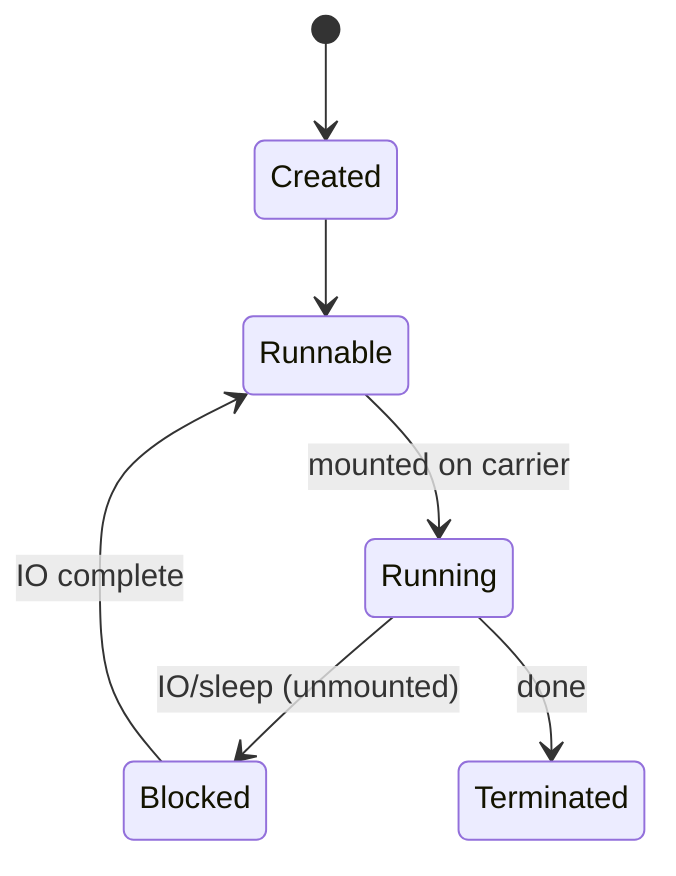

---

### 📶 Gradual Depth

**Level 1 - What it is:**
A virtual thread looks and acts like a regular thread but costs
nearly nothing to create. You can have millions simultaneously.

**Level 2 - How to use it:**
`Thread.startVirtualThread(() -> handleRequest())` or use an
`ExecutorService`: `Executors.newVirtualThreadPerTaskExecutor()`.
Existing blocking code (JDBC, HTTP, file IO) works without
changes.

**Level 3 - How it works:**
The JVM schedules virtual threads on a pool of carrier threads
(platform threads). When a virtual thread calls a blocking
operation, the JVM unmounts it from the carrier (saves its
stack to heap), freeing the carrier for another virtual thread.
When the IO completes, the virtual thread is re-mounted on any
available carrier.

**Level 4 - Production mastery:**
Replace thread pools in IO-bound services with virtual threads.
Profile for pinning (use `-Djdk.tracePinnedThreads=short`).
Replace `synchronized` with `ReentrantLock` in hot paths.
Virtual threads do not help CPU-bound workloads - those still
need platform threads. Spring Boot 3.2+ has native virtual
thread support via `spring.threads.virtual.enabled=true`.

---

### ⚙️ How It Works

Phase 1: Create a virtual thread via API.
Phase 2: The JVM mounts it on a carrier thread.
Phase 3: When the virtual thread blocks (IO, sleep), the JVM
saves its stack to heap and unmounts it.
Phase 4: Carrier is freed for another virtual thread.
Phase 5: When blocking completes, JVM re-mounts the virtual
thread on any available carrier.

```text
Carrier pool (4 platform threads):
  C1: [VT-1 running]  [VT-5 mounted after VT-1 blocked]
  C2: [VT-2 running]
  C3: [VT-3 blocked -> unmounted -> VT-6 mounted]
  C4: [VT-4 running]
  Heap: [VT-1 stack saved], [VT-3 stack saved]
```

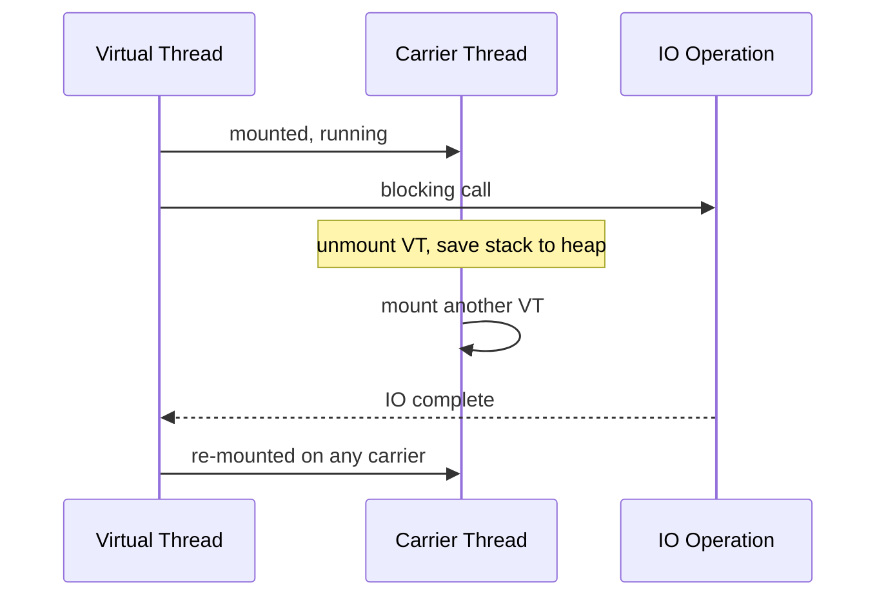

---

### 🚨 Failure Modes

**Failure 1 - Thread pinning:**
**Symptom:** throughput drops; carrier threads are all busy
despite low CPU usage.
**Root cause:** `synchronized` blocks prevent unmounting.
**Diagnostic:**

```bash
java -Djdk.tracePinnedThreads=short -jar app.jar
# Output: Thread[#42] pinned: com.acme.Dao.query
```

**Fix:** replace `synchronized` with `ReentrantLock`:

```java
// BAD: synchronized(lock) { db.query(); }
// GOOD: lock.lock(); try { db.query(); } finally { lock.unlock(); }
```

**Failure 2 - ThreadLocal abuse:**
**Symptom:** memory grows linearly with virtual thread count.
**Root cause:** ThreadLocal stores data per thread; with
millions of virtual threads, memory explodes.
**Diagnostic:**

```bash
# Heap dump shows millions of ThreadLocal entries
jmap -dump:format=b,file=heap.hprof <pid>
```

**Fix:** use `ScopedValue` (preview) or pass context
explicitly instead of ThreadLocal.

---

### 🔬 Production Reality

A typical pattern: a Spring Boot service migrates from a
200-thread Tomcat pool to virtual threads. Before: under load,
requests queue when all 200 threads block on JDBC calls. After:
each request gets its own virtual thread; JDBC blocking
unmounts the virtual thread. Throughput increases by a factor
that is typically limited by the database connection pool, not
thread count. The bottleneck shifts from thread count to
connection pool size and database capacity.

---

### ⚖️ Trade-offs & Alternatives

| Aspect     | Platform threads | Virtual threads | Reactive (WebFlux)  |
| ---------- | ---------------- | --------------- | ------------------- |
| Threads    | 100s-1000s       | millions        | few (event loop)    |
| Code style | blocking         | blocking        | non-blocking (hard) |
| Debugging  | familiar         | familiar        | complex (async)     |
| CPU-bound  | good             | no benefit      | no benefit          |
| Maturity   | 30 years         | Java 21 (new)   | 5+ years            |

---

### ⚡ Decision Snap

**USE WHEN:**

- IO-bound server workloads (HTTP, JDBC, file IO).
- You want simple blocking code at high concurrency.
- Migrating from thread pools to improve throughput.

**AVOID WHEN:**

- CPU-bound computation (use platform threads or
  ForkJoinPool).
- Libraries that heavily use synchronized (check for
  pinning first).

**PREFER reactive WHEN:**

- You need backpressure and streaming (WebFlux, RxJava).
- The team is already invested in reactive patterns.

---

### ⚠️ Top Traps

| #   | Misconception                                     | Reality                                                            |
| --- | ------------------------------------------------- | ------------------------------------------------------------------ |
| 1   | Virtual threads replace platform threads entirely | CPU-bound work still needs platform threads                        |
| 2   | synchronized is fine with virtual threads         | It causes pinning; use ReentrantLock instead                       |
| 3   | ThreadLocal is safe with virtual threads          | Millions of virtual threads = millions of ThreadLocal copies = OOM |
| 4   | Virtual threads make everything faster            | They increase concurrency, not single-thread speed                 |
| 5   | You need to rewrite code for virtual threads      | Existing blocking code works; just change the executor             |

---

### 🪜 Learning Ladder

**Prerequisites:**

- JLG-010 Inheritance, Interfaces, Polymorphism - Thread
  and Runnable interfaces
- JLG-031 Lambdas and Functional Interfaces - lambda as
  Runnable

**THIS:** JLG-045 Virtual Threads - Language Surface (Java 21)

**Next steps:**

- JLG-046 Structured Concurrency - Language Surface -
  managing virtual thread lifecycles
- JLG-053 Inventory REST - Phase 4 (Modern Java + Loom) -
  hands-on with virtual threads

**The Surprising Truth:**
Virtual threads do not have their own OS-level stack. Their
stack frames are stored on the Java heap as regular objects.
This means the garbage collector manages virtual thread stacks.
A virtual thread that blocks on IO has its entire call stack
converted to heap objects - a concept called "stack copying" or
"continuation capture" that would have been unthinkable in
Java's original design.

**Further Reading:**

- JEP 444: Virtual Threads (the GA JEP)
- Inside Java Podcast: Project Loom deep dive
- Ron Pressler's talks on structured concurrency

**Revision Card:**

1. Virtual threads are JVM-managed; blocking unmounts them
   from carrier threads.
2. Replace `synchronized` with `ReentrantLock` to avoid
   pinning.
3. ThreadLocal + millions of virtual threads = OOM. Use
   ScopedValue.

---

---

# JLG-046 Structured Concurrency - Language Surface

**TL;DR** - Structured concurrency ties child thread lifecycles to their parent scope, eliminating orphaned and leaked threads.

---

### 🔥 Problem Statement

You spawn two virtual threads: one fetches a user, another
fetches their orders. The user fetch fails. The order fetch
continues running - it is an orphan consuming resources for a
result nobody wants. With `ExecutorService`, you must manually
track, cancel, and join threads. Forgetting any step leaks
threads. Structured concurrency (preview, Java 21+) ensures
that when a scope exits (normally or by exception), all child
threads are cancelled and joined automatically. This is exactly
why structured concurrency was created.

---

### 📜 Historical Context

Structured concurrency was proposed by Martin Sustrik (libdill, 2016) and popularized by Nathaniel Smith (Python Trio, 2018).
The core idea: concurrent tasks should follow structured
programming principles - every thread has a clear owner, and
thread lifetime is bounded by scope. Java adopted this via
`StructuredTaskScope` (JEP 453, preview in Java 21+) as the
natural complement to virtual threads. Go's errgroup and
Kotlin's coroutineScope implement the same pattern.

---

### 🔩 First Principles

**CORE INVARIANTS:**

1. A StructuredTaskScope owns all tasks forked within it.
2. When the scope shuts down (join + close), all tasks are
   cancelled and joined.
3. No task can outlive its parent scope.

**DERIVED DESIGN:**
Thread lifetime is lexically scoped (like try-with-resources).
Errors propagate automatically. `ShutdownOnFailure` cancels
all sibling tasks when one fails. `ShutdownOnSuccess` cancels
remaining tasks when one succeeds. No orphans. No leaks.

**THE TRADE-OFF:**
**Gain:** no leaked threads; automatic cancellation; clear
parent-child relationships; better error propagation.
**Cost:** preview API (may change); requires virtual threads
for full benefit; slightly more structured than raw ExecutorService.

---

### 🧠 Mental Model

> Structured concurrency is a field trip. The teacher (scope)
> counts students (tasks) onto the bus (fork). The bus does not
> leave until every student returns (join). If one student gets
> injured (exception), the teacher calls everyone back (cancel).
> No student is left behind.

- "Teacher" -> StructuredTaskScope
- "Students" -> forked tasks
- "Bus departure" -> scope.close()
- "Call everyone back" -> ShutdownOnFailure

**Where this analogy breaks down:** in real life, a teacher
cannot instantly teleport all students back. In Java,
cancellation is cooperative - tasks must check for interruption.

---

### 🧩 Components

- **StructuredTaskScope:** the owner scope (try-with-resources).
- **Subtask:** a handle to a forked task.
- **ShutdownOnFailure:** cancels all tasks when one fails.
- **ShutdownOnSuccess:** cancels remaining when one succeeds.

```text
try (var scope = new StructuredTaskScope
        .ShutdownOnFailure()) {
    Subtask<User> user = scope.fork(() -> fetchUser());
    Subtask<List<Order>> orders =
        scope.fork(() -> fetchOrders());
    scope.join().throwIfFailed();
    return new Response(user.get(), orders.get());
}
// Both tasks cancelled if one fails
// No orphan threads possible
```

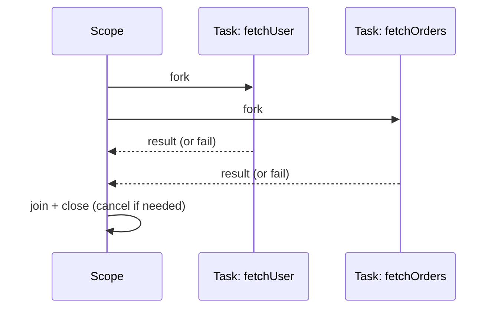

---

### 📶 Gradual Depth

**Level 1 - What it is:**
A way to run concurrent tasks where the parent scope
guarantees all tasks finish (or are cancelled) before it exits.

**Level 2 - How to use it:**
Create a `StructuredTaskScope` in try-with-resources. Fork
tasks with `scope.fork()`. Call `scope.join()` to wait. Call
`scope.close()` to clean up.

**Level 3 - How it works:**
`fork()` starts a virtual thread that runs the callable.
`join()` waits for all forked tasks to complete. `close()`
interrupts any still-running tasks and waits for them to
finish. `ShutdownOnFailure.throwIfFailed()` rethrows the
first exception from any failed task.

**Level 4 - Production mastery:**
Combine with virtual threads for IO-bound fan-out patterns
(fetch user + orders + recommendations in parallel). Use
`ShutdownOnSuccess` for racing (first result wins). Monitor
with JFR virtual thread events. The API is preview - expect
changes in future Java versions. Design your code to isolate
structured concurrency usage behind an interface so migration
is easy.

---

### ⚙️ How It Works

Phase 1: Create a StructuredTaskScope.
Phase 2: Fork tasks (each runs in a virtual thread).
Phase 3: join() waits for completion.
Phase 4: On failure, ShutdownOnFailure cancels siblings.
Phase 5: close() ensures no tasks outlive the scope.

```text
Scope lifecycle:
  create -> fork(task1) -> fork(task2)
         -> join (wait for all)
         -> throwIfFailed (propagate errors)
         -> close (cancel + cleanup)
```

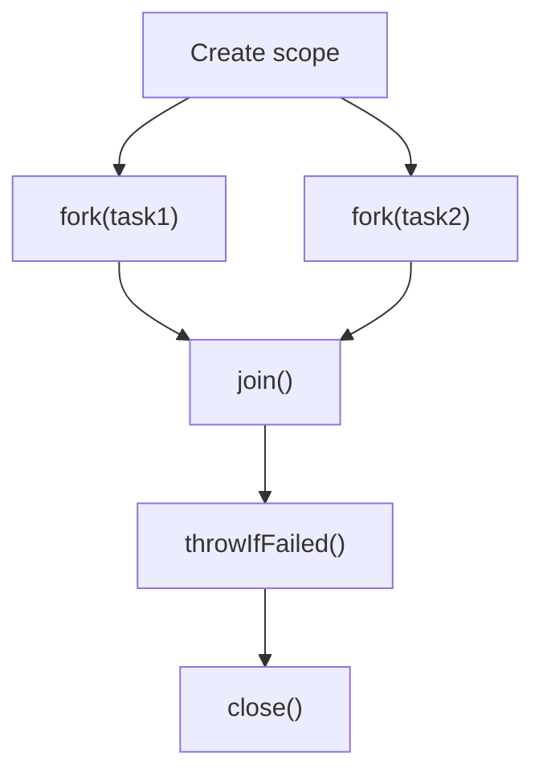

---

### 🚨 Failure Modes

**Failure 1 - Forgetting join before close:**
**Symptom:** `IllegalStateException: join not called`.
**Root cause:** close() requires join() to have been called.
**Diagnostic:** stack trace points to scope.close().
**Fix:** always call `scope.join()` before the try block exits.

**Failure 2 - Non-cooperative cancellation:**
**Symptom:** cancelled tasks continue running.
**Root cause:** the task does not check `Thread.interrupted()`.
**Diagnostic:** JFR shows virtual threads still active after
scope close.
**Fix:** ensure long-running tasks check for interruption:

```java
if (Thread.interrupted())
    throw new InterruptedException();
```

---

### 🔬 Production Reality

A fan-out pattern: an API gateway fetches user profile, order
history, and recommendations in parallel. Without structured
concurrency, if the user fetch fails, the order and
recommendation fetches continue until timeout - wasting
resources. With `ShutdownOnFailure`, the failed user fetch
immediately cancels the other two tasks. Response time improves
because wasted work is eliminated. The scope guarantees no
thread leaks even under partial failure.

---

### ⚖️ Trade-offs & Alternatives

| Aspect       | ExecutorService | StructuredTaskScope | CompletableFuture |
| ------------ | --------------- | ------------------- | ----------------- |
| Lifecycle    | manual          | scoped (automatic)  | manual            |
| Cancellation | manual          | automatic           | manual            |
| Leaks        | possible        | impossible          | possible          |
| Debugging    | hard            | clear parent-child  | hard              |
| Maturity     | GA              | preview             | GA                |

---

### ⚡ Decision Snap

**USE WHEN:**

- Fan-out patterns: parallel IO calls that should be
  grouped.
- You want automatic cancellation on failure.
- Virtual threads are already adopted in the project.

**AVOID WHEN:**

- The API is preview and your project requires GA stability.
- CPU-bound tasks (use ForkJoinPool instead).

**PREFER CompletableFuture WHEN:**

- You need complex async composition (thenCompose,
  thenCombine).
- The project is not yet on Java 21+.

---

### ⚠️ Top Traps

| #   | Misconception                                   | Reality                                                                                |
| --- | ----------------------------------------------- | -------------------------------------------------------------------------------------- |
| 1   | StructuredTaskScope works with platform threads | It is designed for virtual threads; platform threads work but miss the scaling benefit |
| 2   | Cancellation is instant                         | Cancellation is cooperative; tasks must check Thread.interrupted()                     |
| 3   | The API is stable                               | It is a preview feature as of Java 21; expect changes                                  |
| 4   | You can fork tasks outside the scope            | fork() must be called within the scope's try block                                     |
| 5   | All exceptions are thrown                       | Only the first exception is thrown; others are suppressed                              |

---

### 🪜 Learning Ladder

**Prerequisites:**

- JLG-045 Virtual Threads - Language Surface (Java 21) -
  virtual threads are the foundation
- JLG-024 try-with-resources and AutoCloseable - scope
  uses try-with-resources

**THIS:** JLG-046 Structured Concurrency - Language Surface

**Next steps:**

- JLG-053 Inventory REST - Phase 4 (Modern Java + Loom) -
  practice with virtual threads and structured concurrency
- JLG-047 JUnit 5 and Property-Based Testing - testing
  concurrent code

**The Surprising Truth:**
Structured concurrency is not new. It is the concurrent
equivalent of structured programming (Dijkstra, 1968). Just as
`goto` was replaced by structured control flow (if/for/while),
fire-and-forget threads are being replaced by scoped
concurrency. The insight: unstructured concurrency has the same
problems as unstructured `goto` - impossible to reason about
program state.

**Further Reading:**

- JEP 453: Structured Concurrency (Preview)
- Notes on Structured Concurrency (Nathaniel Smith, 2018)
- Go errgroup package documentation

**Revision Card:**

1. StructuredTaskScope ensures no forked task outlives its
   parent scope.
2. ShutdownOnFailure cancels sibling tasks automatically.
3. Cancellation is cooperative - tasks must check for
   interruption.
