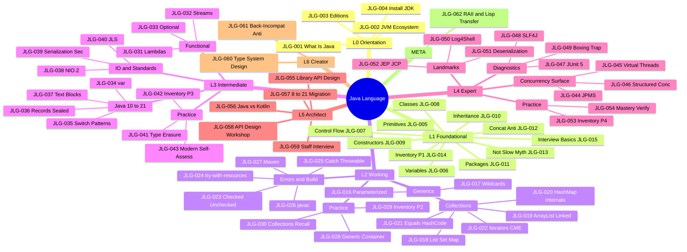

# Java Language

```text
═══════════════════════════════════════════════════════════════════════
CATEGORY:        Java Language
CODE:            JLG
ARCHETYPE:       LANGUAGE
MODE:            MODE_NEW
PROVENANCE:      user request via /learn: "add java - java language"
TIER:            tier-1-languages
FOLDER:          learn/java/
LEVELS:          L0 + L1 + L2 + L3 + L4 + L5 + L6 + META
TOTAL:           62 keywords across 6 sub-topic files
GENERATED_FROM:  LEARN_KEYWORD_GENERATOR.md v1.0
═══════════════════════════════════════════════════════════════════════
```

Scope: the Java language proper. The JVM runtime, GC, JIT,
classloaders, bytecode, and diagnostic tooling are covered in
the sibling topic `learn/java-jvm/`. Concurrency primitives and
virtual-thread internals are covered in `learn/java-concurrency/`.
Cross-references appear in `depends_on` and `related` fields.

## Status

Stubs only. Each sub-topic file lists its keywords in YAML
frontmatter. Use `@learn-generate-entries` to fill content
per `LEARN_PROMPT.md` v1.0 (tri-template auto-routing).

## Sub-topic files

| File                                                                          | Keywords | Levels         | Status |
| ----------------------------------------------------------------------------- | -------- | -------------- | ------ |
| [Java - Language Core](Java%20-%20Language%20Core.md)                         | 15       | L0 + L1        | stub   |
| [Java - Generics and Collections](Java%20-%20Generics%20and%20Collections.md) | 10       | L2             | stub   |
| [Java - Exceptions and IO](Java%20-%20Exceptions%20and%20IO.md)               | 7        | L2 + L3        | stub   |
| [Java - Modern Features](Java%20-%20Modern%20Features.md)                     | 13       | L3 + L4        | stub   |
| [Java - Production Practice](Java%20-%20Production%20Practice.md)             | 9        | L3 + L4        | stub   |
| [Java - Architecture and META](Java%20-%20Architecture%20and%20META.md)       | 8        | L5 + L6 + META | stub   |

## Keyword table

────────────────────────────────────────────────────
LEVEL 0 - ORIENTATION 🌱 (4 keywords)
────────────────────────────────────────────────────

| ID      | Keyword                             | Lv  | Diff | template | Tags |
| ------- | ----------------------------------- | --- | ---- | -------- | ---- |
| JLG-001 | What Is Java - Orientation          | L0  | 🌱   | SIMPLE   |      |
| JLG-002 | The JVM Ecosystem - Where Java Fits | L0  | 🌱   | SIMPLE   |      |
| JLG-003 | Java Editions and Distributions     | L0  | 🌱   | SIMPLE   |      |
| JLG-004 | Installing the JDK - First Run      | L0  | 🌱   | SIMPLE   | 🔧   |

────────────────────────────────────────────────────
LEVEL 1 - FOUNDATIONAL ★☆☆ (11 keywords)
────────────────────────────────────────────────────

| ID      | Keyword                                         | Lv  | Diff | template | Tags          |
| ------- | ----------------------------------------------- | --- | ---- | -------- | ------------- |
| JLG-005 | Primitive Types and Wrappers                    | L1  | ★☆☆  | SIMPLE   |               |
| JLG-006 | Variables, Statements, Expressions              | L1  | ★☆☆  | SIMPLE   |               |
| JLG-007 | Control Flow Constructs                         | L1  | ★☆☆  | SIMPLE   |               |
| JLG-008 | Classes, Methods, Fields                        | L1  | ★☆☆  | SIMPLE   |               |
| JLG-009 | Constructors and Object Lifecycle               | L1  | ★☆☆  | SIMPLE   |               |
| JLG-010 | Inheritance, Interfaces, Polymorphism           | L1  | ★☆☆  | SIMPLE   |               |
| JLG-011 | Packages and Visibility Modifiers               | L1  | ★☆☆  | SIMPLE   |               |
| JLG-012 | String Concatenation in Loop Anti-Pattern       | L1  | ★☆☆  | SIMPLE   | ⚠️ anti-minor |
| JLG-013 | Java Is Not Slow - Killing the Performance Myth | L1  | ★☆☆  | SIMPLE   | 💥            |
| JLG-014 | Inventory CLI - Phase 1 (Java Basics)           | L1  | ★☆☆  | SIMPLE   | 🔨 🏋️         |
| JLG-015 | Top 10 Java Interview Questions - Basics        | L1  | ★☆☆  | SIMPLE   | 🎯            |

────────────────────────────────────────────────────
LEVEL 2 - WORKING ★★☆ (15 keywords)
────────────────────────────────────────────────────

── CLUSTER: Generics and Type System ───────────────

| ID      | Keyword                        | Lv  | Diff | template     | Tags |
| ------- | ------------------------------ | --- | ---- | ------------ | ---- |
| JLG-016 | Generics - Parameterized Types | L2  | ★★☆  | INTERMEDIATE |      |
| JLG-017 | Bounded Types and Wildcards    | L2  | ★★☆  | INTERMEDIATE |      |

── CLUSTER: Collections Framework ──────────────────

| ID      | Keyword                                       | Lv  | Diff | template     | Tags |
| ------- | --------------------------------------------- | --- | ---- | ------------ | ---- |
| JLG-018 | Collection Interfaces - List, Set, Map        | L2  | ★★☆  | INTERMEDIATE |      |
| JLG-019 | ArrayList vs LinkedList Decision              | L2  | ★★☆  | INTERMEDIATE | 🧭   |
| JLG-020 | HashMap Internals - Hashing and Buckets       | L2  | ★★☆  | INTERMEDIATE |      |
| JLG-021 | Equals and HashCode Contract                  | L2  | ★★☆  | INTERMEDIATE | 💥   |
| JLG-022 | Iterators and ConcurrentModificationException | L2  | ★★☆  | INTERMEDIATE |      |

── CLUSTER: Errors and Build ───────────────────────

| ID      | Keyword                              | Lv  | Diff | template     | Tags          |
| ------- | ------------------------------------ | --- | ---- | ------------ | ------------- |
| JLG-023 | Checked vs Unchecked Exceptions      | L2  | ★★☆  | INTERMEDIATE | 🧭            |
| JLG-024 | try-with-resources and AutoCloseable | L2  | ★★☆  | INTERMEDIATE |               |
| JLG-025 | Catch Throwable Anti-Pattern         | L2  | ★★☆  | INTERMEDIATE | ⚠️ anti-major |
| JLG-026 | javac and the Compilation Model      | L2  | ★★☆  | INTERMEDIATE | 🔧            |
| JLG-027 | Maven Build Lifecycle Basics         | L2  | ★★☆  | INTERMEDIATE | 🔧            |

── CLUSTER: Practice and Retention ─────────────────

| ID      | Keyword                               | Lv  | Diff | template     | Tags  |
| ------- | ------------------------------------- | --- | ---- | ------------ | ----- |
| JLG-028 | Build a Generic Container Exercise    | L2  | ★★☆  | INTERMEDIATE | 🏋️    |
| JLG-029 | Inventory CLI - Phase 2 (Collections) | L2  | ★★☆  | INTERMEDIATE | 🔨    |
| JLG-030 | Java Collections Quick Recall Card    | L2  | ★★☆  | INTERMEDIATE | 🔁 🎯 |

────────────────────────────────────────────────────
LEVEL 3 - INTERMEDIATE ★★☆ (13 keywords)
────────────────────────────────────────────────────

── CLUSTER: Functional Java (Java 8 Roots) ─────────

| ID      | Keyword                           | Lv  | Diff | template     | Tags |
| ------- | --------------------------------- | --- | ---- | ------------ | ---- |
| JLG-031 | Lambdas and Functional Interfaces | L3  | ★★☆  | INTERMEDIATE |      |
| JLG-032 | Stream API - Map, Filter, Reduce  | L3  | ★★☆  | INTERMEDIATE |      |
| JLG-033 | Optional and Null-Safety          | L3  | ★★☆  | INTERMEDIATE |      |

── CLUSTER: Java 10 to 21 Language Evolution ──────

| ID      | Keyword                                      | Lv  | Diff | template     | Tags |
| ------- | -------------------------------------------- | --- | ---- | ------------ | ---- |
| JLG-034 | var Local Type Inference (Java 10)           | L3  | ★★☆  | INTERMEDIATE | 🔄   |
| JLG-035 | Switch Expressions and Pattern Matching      | L3  | ★★☆  | INTERMEDIATE | 🔄   |
| JLG-036 | Records, Sealed Types, and Patterns Together | L3  | ★★☆  | INTERMEDIATE | 🔄   |
| JLG-037 | Text Blocks and String Templates             | L3  | ★★☆  | INTERMEDIATE | 🔄   |

── CLUSTER: IO and Standards ───────────────────────

| ID      | Keyword                               | Lv  | Diff | template     | Tags |
| ------- | ------------------------------------- | --- | ---- | ------------ | ---- |
| JLG-038 | Files, Paths, and NIO.2               | L3  | ★★☆  | INTERMEDIATE |      |
| JLG-039 | Java Serialization Security           | L3  | ★★☆  | INTERMEDIATE |      |
| JLG-040 | JLS - The Java Language Specification | L3  | ★★☆  | INTERMEDIATE | 📋   |

── CLUSTER: Practice and Self-Check ────────────────

| ID      | Keyword                                         | Lv  | Diff | template     | Tags  |
| ------- | ----------------------------------------------- | --- | ---- | ------------ | ----- |
| JLG-041 | Generics Are Not Reified - Type Erasure Reality | L3  | ★★☆  | INTERMEDIATE | 💥    |
| JLG-042 | Inventory CLI - Phase 3 (Streams + Records)     | L3  | ★★☆  | INTERMEDIATE | 🔨 🏋️ |
| JLG-043 | Java Modern Features Self-Assessment            | L3  | ★★☆  | INTERMEDIATE | 🔁 🎓 |

────────────────────────────────────────────────────
LEVEL 4 - EXPERT ★★★ (11 keywords)
────────────────────────────────────────────────────

── CLUSTER: Modern Concurrency Surface ─────────────

| ID      | Keyword                                      | Lv  | Diff | template | Tags |
| ------- | -------------------------------------------- | --- | ---- | -------- | ---- |
| JLG-044 | Module System (JPMS) - Strong Encapsulation  | L4  | ★★★  | COMPLEX  |      |
| JLG-045 | Virtual Threads - Language Surface (Java 21) | L4  | ★★★  | COMPLEX  | 🔄   |
| JLG-046 | Structured Concurrency - Language Surface    | L4  | ★★★  | COMPLEX  | 🔄   |

── CLUSTER: Diagnostics and Test Tooling ───────────

| ID      | Keyword                            | Lv  | Diff | template | Tags             |
| ------- | ---------------------------------- | --- | ---- | -------- | ---------------- |
| JLG-047 | JUnit 5 and Property-Based Testing | L4  | ★★★  | COMPLEX  | 🧪 🔧            |
| JLG-048 | SLF4J Structured Logging           | L4  | ★★★  | COMPLEX  | 📊 🔧            |
| JLG-049 | Boxing Performance Trap            | L4  | ★★★  | COMPLEX  | ⚡ ⚠️ anti-major |

── CLUSTER: Landmark Incidents and Governance ─────

| ID      | Keyword                            | Lv  | Diff | template | Tags |
| ------- | ---------------------------------- | --- | ---- | -------- | ---- |
| JLG-050 | Log4Shell (CVE-2021-44228, 2021)   | L4  | ★★★  | COMPLEX  | 🔴   |
| JLG-051 | Java Deserialization CVE-2015-7501 | L4  | ★★★  | COMPLEX  | 🔴   |
| JLG-052 | JEP Process and JCP Governance     | L4  | ★★★  | COMPLEX  | 📋   |

── CLUSTER: Practice and Mastery Check ─────────────

| ID      | Keyword                                           | Lv  | Diff | template | Tags     |
| ------- | ------------------------------------------------- | --- | ---- | -------- | -------- |
| JLG-053 | Inventory REST - Phase 4 (Modern Java + Loom)     | L4  | ★★★  | COMPLEX  | 🔨 🏋️    |
| JLG-054 | Java Expert Mastery Verification + Teaching Drill | L4  | ★★★  | COMPLEX  | 🔁 🎓 🎯 |

────────────────────────────────────────────────────
LEVEL 5 - ARCHITECT 🔥 (5 keywords)
────────────────────────────────────────────────────

| ID      | Keyword                                     | Lv  | Diff | template | Tags  |
| ------- | ------------------------------------------- | --- | ---- | -------- | ----- |
| JLG-055 | Library API Design - Lessons from java.util | L5  | 🔥   | COMPLEX  |       |
| JLG-056 | Java vs Kotlin - When Each Fits             | L5  | 🔥   | COMPLEX  | 🧭    |
| JLG-057 | Java 8 to 21 Migration Strategy             | L5  | 🔥   | COMPLEX  | 🔄    |
| JLG-058 | API Design Workshop (Java Library)          | L5  | 🔥   | COMPLEX  | 🏋️ 🎓 |
| JLG-059 | Java Staff-Level Interview Scenarios        | L5  | 🔥   | COMPLEX  | 🎯    |

────────────────────────────────────────────────────
LEVEL 6 - CREATOR 🔬 (2 keywords)
────────────────────────────────────────────────────

| ID      | Keyword                                              | Lv  | Diff | template | Tags             |
| ------- | ---------------------------------------------------- | --- | ---- | -------- | ---------------- |
| JLG-060 | Designing a Type System - Lessons from Java          | L6  | 🔬   | COMPLEX  |                  |
| JLG-061 | Backwards-Incompatible Language Changes Anti-Pattern | L6  | 🔬   | COMPLEX  | ⚠️ anti-major 🎓 |

────────────────────────────────────────────────────
META - META-SKILLS 🧠 (1 keyword)
────────────────────────────────────────────────────

| ID      | Keyword                                        | Lv   | Diff | template | Tags |
| ------- | ---------------------------------------------- | ---- | ---- | -------- | ---- |
| JLG-062 | What C++ RAII and Lisp Macros Teach About Java | META | 🧠   | COMPLEX  | 🧠   |

> Rule 25 detail: this single META row is a placeholder. The full
> entry MUST split into two META keywords citing different parent
> domains (systems-language and PL-theory). `@learn-generate-entries`
> will split JLG-062 into JLG-062a (C++ RAII -> try-with-resources)
> and JLG-062b (Lisp Macros -> Annotation Processors) on expansion.

## Summary

| Level | Name         | Count | ID Range         |
| ----- | ------------ | ----- | ---------------- |
| L0    | Orientation  | 4     | JLG-001..JLG-004 |
| L1    | Foundational | 11    | JLG-005..JLG-015 |
| L2    | Working      | 15    | JLG-016..JLG-030 |
| L3    | Intermediate | 13    | JLG-031..JLG-043 |
| L4    | Expert       | 11    | JLG-044..JLG-054 |
| L5    | Architect    | 5     | JLG-055..JLG-059 |
| L6    | Creator      | 2     | JLG-060..JLG-061 |
| META  | Meta-Skills  | 1     | JLG-062          |
| TOTAL |              | 62    | JLG-001..JLG-062 |

<!-- ROADMAP-TREE:START -->

## Roadmap

```text
ROADMAP TREE - Java Language
===========================================================
L0 Orientation
 +-- JLG-001 What Is Java
 +-- JLG-002 The JVM Ecosystem
 +-- JLG-003 Editions and Distributions
 +-- JLG-004 Installing the JDK
L1 Foundational
 +-- JLG-005 Primitives and Wrappers
 +-- JLG-006 Variables and Expressions
 +-- JLG-007 Control Flow
 +-- JLG-008 Classes, Methods, Fields
 +-- JLG-009 Constructors and Lifecycle
 +-- JLG-010 Inheritance and Polymorphism
 +-- JLG-011 Packages and Visibility
 +-- JLG-012 String Concat in Loop Anti-Pattern
 +-- JLG-013 Java Is Not Slow Myth
 +-- JLG-014 Inventory CLI Phase 1
 +-- JLG-015 Top 10 Interview Questions
L2 Working
 +-- CLUSTER: Generics and Type System
 |    +-- JLG-016 Parameterized Types
 |    +-- JLG-017 Bounded Types and Wildcards
 +-- CLUSTER: Collections Framework
 |    +-- JLG-018 List, Set, Map Interfaces
 |    +-- JLG-019 ArrayList vs LinkedList
 |    +-- JLG-020 HashMap Internals
 |    +-- JLG-021 Equals and HashCode Contract
 |    +-- JLG-022 Iterators and CME
 +-- CLUSTER: Errors and Build
 |    +-- JLG-023 Checked vs Unchecked
 |    +-- JLG-024 try-with-resources
 |    +-- JLG-025 Catch Throwable Anti-Pattern
 |    +-- JLG-026 javac Compilation Model
 |    +-- JLG-027 Maven Build Lifecycle
 +-- CLUSTER: Practice and Retention
      +-- JLG-028 Generic Container Exercise
      +-- JLG-029 Inventory CLI Phase 2
      +-- JLG-030 Collections Quick Recall Card
L3 Intermediate
 +-- CLUSTER: Functional Java
 |    +-- JLG-031 Lambdas and Functional Interfaces
 |    +-- JLG-032 Stream API
 |    +-- JLG-033 Optional and Null-Safety
 +-- CLUSTER: Java 10 to 21 Evolution
 |    +-- JLG-034 var Local Type Inference
 |    +-- JLG-035 Switch Expressions and Patterns
 |    +-- JLG-036 Records, Sealed, Patterns
 |    +-- JLG-037 Text Blocks and String Templates
 +-- CLUSTER: IO and Standards
 |    +-- JLG-038 Files, Paths, NIO.2
 |    +-- JLG-039 Serialization Security
 |    +-- JLG-040 JLS Overview
 +-- CLUSTER: Practice and Self-Check
      +-- JLG-041 Type Erasure Reality
      +-- JLG-042 Inventory CLI Phase 3
      +-- JLG-043 Modern Features Self-Assessment
L4 Expert
 +-- CLUSTER: Modern Concurrency Surface
 |    +-- JLG-044 Module System JPMS
 |    +-- JLG-045 Virtual Threads Language Surface
 |    +-- JLG-046 Structured Concurrency Surface
 +-- CLUSTER: Diagnostics and Test Tooling
 |    +-- JLG-047 JUnit 5 and Property Testing
 |    +-- JLG-048 SLF4J Structured Logging
 |    +-- JLG-049 Boxing Performance Trap
 +-- CLUSTER: Landmarks and Governance
 |    +-- JLG-050 Log4Shell 2021
 |    +-- JLG-051 Deserialization CVE-2015-7501
 |    +-- JLG-052 JEP Process and JCP
 +-- CLUSTER: Practice and Mastery Check
      +-- JLG-053 Inventory REST Phase 4
      +-- JLG-054 Expert Mastery Verification
L5 Architect
 +-- JLG-055 Library API Design Lessons
 +-- JLG-056 Java vs Kotlin
 +-- JLG-057 Java 8 to 21 Migration Strategy
 +-- JLG-058 API Design Workshop
 +-- JLG-059 Staff-Level Interview Scenarios
L6 Creator
 +-- JLG-060 Designing a Type System
 +-- JLG-061 Backwards-Incompatible Changes
META Meta-Skills
 +-- JLG-062 C++ RAII and Lisp Macros Transfer
```



<!-- ROADMAP-TREE:END -->

## Learning path

PREREQUISITE TOPICS: none. This is an L0 entry point.

PARALLEL TOPICS:

- `learn/java-jvm/` (start at L3+ alongside JLG-031 functional Java).
- `learn/java-concurrency/` (start alongside JLG-045 virtual threads).

NEXT TOPICS:

- `learn/java-jvm/` for runtime depth.
- `learn/java-concurrency/` for concurrency depth.

ENTRY POINT FOR NEW LEARNERS: JLG-001
JUMP IN FOR PRACTITIONERS: JLG-031
FAST TRACK FOR EXPERTS: JLG-044
