## Keywords

1. [SPR-090 Microservice Architecture with Spring Boot](#spr-090-microservice-architecture-with-spring-boot)
2. [SPR-091 GraalVM Native Image with Spring Boot 3](#spr-091-graalvm-native-image-with-spring-boot-3)
3. [SPR-092 Spring AOT (Ahead-of-Time) Compilation](#spr-092-spring-aot-ahead-of-time-compilation)
4. [SPR-093 Virtual Threads (Loom) Integration in Spring 6](#spr-093-virtual-threads-loom-integration-in-spring-6)
5. [SPR-094 Spring Modulith and Module Boundaries](#spr-094-spring-modulith-and-module-boundaries)
6. [SPR-095 Event-Driven Architecture with Spring Events](#spr-095-event-driven-architecture-with-spring-events)
7. [SPR-096 Saga Pattern Implementation in Spring](#spr-096-saga-pattern-implementation-in-spring)
8. [SPR-097 API Gateway Design for Spring Microservices](#spr-097-api-gateway-design-for-spring-microservices)
9. [SPR-098 Multi-Tenancy Patterns in Spring Boot](#spr-098-multi-tenancy-patterns-in-spring-boot)

---

---

# SPR-090 Microservice Architecture with Spring Boot

**TL;DR** - Decompose a monolith into independently deployable services only when team and domain boundaries demand it, using Spring Cloud for the hard distributed parts.

### 🔥 Problem Statement

A growing monolith becomes a coordination bottleneck.
Twelve teams editing the same deployable artifact means
every release requires cross-team regression, a shared
deploy calendar, and a single scaling profile for wildly
different load characteristics. One team's OOM crash
takes down every other team's feature. The question is
never "should we do microservices?" but "when does the
cost of distribution become cheaper than the cost of
coordination?"

### 📜 Historical Context

SOA (Service-Oriented Architecture) dominated the 2000s
with heavyweight ESBs, WSDL contracts, and XML messaging.
Netflix pioneered the lightweight microservice model
around 2011-2012, open-sourcing Eureka, Hystrix, Zuul,
and Ribbon. Spring Cloud (2015) wrapped those Netflix
OSS libraries into Spring Boot starters, making the
pattern accessible. By 2018, Kubernetes service discovery
began replacing client-side Eureka, and Spring Cloud
shifted to Kubernetes-native integrations. Spring Cloud
2023+ embraces Spring Boot 3, Micrometer Observation API,
and declarative HTTP clients, while Netflix itself moved
much of its service mesh concern to the infrastructure
layer.

### 🔩 First Principles

**CORE INVARIANTS:**

1. Each service owns exactly one bounded context and its
   data store - no shared databases across services.
2. Inter-service contracts are explicit and versioned -
   breaking a contract is a deployment-blocking event.
3. Every network call can fail, be slow, or return
   stale data - design for partial failure from day one.

**DERIVED DESIGN:**

From invariant 1: each service has its own schema
migration lifecycle, enabling independent deployment.
From invariant 2: consumer-driven contract tests
(Spring Cloud Contract) replace integration test suites.
From invariant 3: circuit breakers, retries with backoff,
timeouts, and fallbacks are not optional - they are
structural requirements of distributed communication.

### 🧠 Mental Model

> Think of a microservice architecture as a city of
> independent restaurants, each specializing in one
> cuisine, sourcing their own ingredients, and managing
> their own kitchen.

- Request routing -> city map directing diners to the
  right restaurant (API Gateway / Spring Cloud Gateway)
- Service discovery -> restaurant directory that updates
  when new places open or close (Eureka / Kubernetes DNS)
- Circuit breaker -> health inspector shutting down a
  restaurant temporarily to prevent food poisoning from
  spreading (Resilience4j)
- Config server -> city zoning regulations distributed
  to every restaurant simultaneously (Spring Cloud Config)

**Where this analogy breaks down:** Restaurants do not
typically need distributed transactions. When one
microservice's write depends on another's, you face the
saga/eventual-consistency problem that has no restaurant
equivalent.

### 🧩 Components

```
+------------------+   +------------------+
|   API Gateway    |-->| Service Registry |
| (Spring Cloud GW)|   | (Eureka/K8s DNS) |
+--------+---------+   +------------------+
         |
   +-----+------+--------+
   |            |         |
+--v---+  +----v--+  +---v----+
|Svc A |  |Svc B  |  |Svc C   |
|Order |  |Invent.|  |Payment |
+--+---+  +---+---+  +---+----+
   |          |           |
+--v---+  +--v----+  +---v----+
|DB A  |  |DB B   |  |DB C    |
+------+  +-------+  +--------+
```

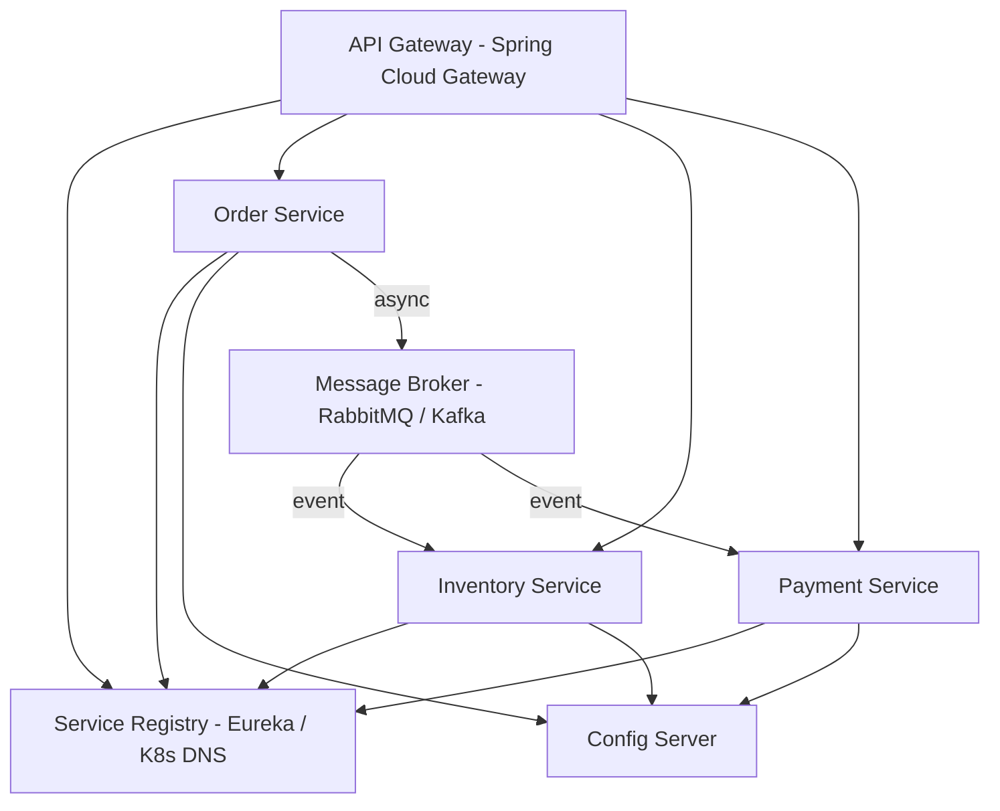
```mermaid
flowchart TD
    GW[API Gateway - Spring Cloud Gateway]
    REG[Service Registry - Eureka / K8s DNS]
    CFG[Config Server]
    A[Order Service]
    B[Inventory Service]
    C[Payment Service]
    MQ[Message Broker - RabbitMQ / Kafka]

    GW --> REG
    GW --> A
    GW --> B
    GW --> C
    A --> REG
    B --> REG
    C --> REG
    A --> CFG
    B --> CFG
    C --> CFG
    A -- async --> MQ
    MQ -- event --> B
    MQ -- event --> C
```

### 📶 Gradual Depth

**Level 1 - Single service extraction.** Start with the
domain that has the most independent release cadence.
Extract it behind a REST API, keep the monolith as the
primary consumer.

```java
// Order service - standalone Boot app
@SpringBootApplication
public class OrderServiceApp {
    public static void main(String[] args) {
        SpringApplication.run(
            OrderServiceApp.class, args
        );
    }
}
```

**Level 2 - Service discovery and load balancing.** Register
services with Eureka or Kubernetes DNS. Use Spring Cloud
LoadBalancer for client-side routing.

```yaml
# application.yml for Eureka client
eureka:
  client:
    serviceUrl:
      defaultZone: http://eureka:8761/eureka/
  instance:
    preferIpAddress: true
```

**Level 3 - Resilience patterns.** Add circuit breakers,
retries, and bulkheads with Resilience4j.

```java
@CircuitBreaker(
    name = "inventory",
    fallbackMethod = "fallbackStock"
)
public StockLevel getStock(String sku) {
    return inventoryClient.check(sku);
}

private StockLevel fallbackStock(
        String sku, Throwable t) {
    return StockLevel.unknown(sku);
}
```

**Level 4 - Event-driven communication.** Replace synchronous
chains with asynchronous messaging for operations that do
not need immediate consistency.

```java
// Publishing domain event via Spring Cloud Stream
@Bean
public Supplier<OrderCreatedEvent> orderEvents() {
    return () -> new OrderCreatedEvent(
        orderId, items, Instant.now()
    );
}
```

**Level 5 - Observability and tracing.** Micrometer
Observation API with Spring Boot 3 propagates trace IDs
across service boundaries automatically.

### ⚙️ How It Works

A request enters the system through the API Gateway. The
gateway resolves the target service via the registry, applies
rate limiting and authentication, then forwards the request.
The target service processes business logic, potentially
calling other services synchronously (REST/gRPC) or publishing
events asynchronously. Each service manages its own database,
and cross-service consistency uses the saga pattern or
eventual consistency through events.

```
Client -> Gateway -> [Auth Filter]
  -> Route to Service A
  -> Service A calls Service B (sync)
  -> Service A publishes event (async)
  -> Message Broker delivers to Service C
  -> Each service writes to own DB
  -> Gateway returns response to Client
```

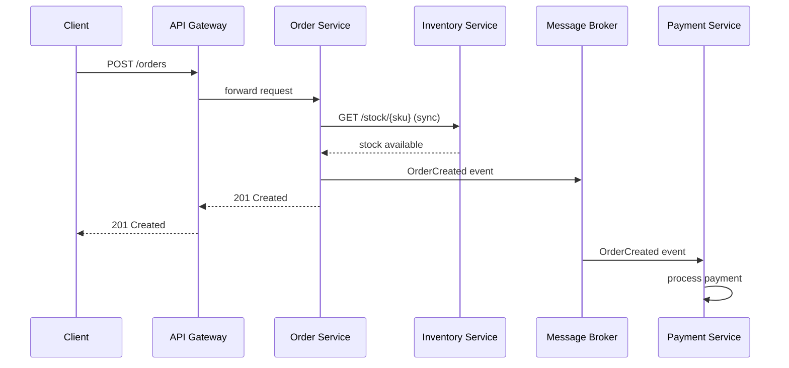
```mermaid
sequenceDiagram
    participant C as Client
    participant GW as API Gateway
    participant A as Order Service
    participant B as Inventory Service
    participant MQ as Message Broker
    participant P as Payment Service

    C->>GW: POST /orders
    GW->>A: forward request
    A->>B: GET /stock/{sku} (sync)
    B-->>A: stock available
    A->>MQ: OrderCreated event
    A-->>GW: 201 Created
    GW-->>C: 201 Created
    MQ->>P: OrderCreated event
    P->>P: process payment
```

### 🚨 Failure Modes

**Failure 1 - Distributed Monolith:**
Services share a database, deploy together, or have
synchronous call chains 5+ services deep. You pay the
full cost of distribution with none of the independence
benefits.

**Diagnostic:** Check if you can deploy any single service
without coordinating with other teams. If no, you have
a distributed monolith.

**Fix:** Enforce database-per-service. Replace synchronous
chains with async events where immediate consistency is
not required. Use consumer-driven contract tests to
decouple deployment schedules.

**Failure 2 - Cascading Timeout:**
Service A calls B, B calls C, C is slow. Without
timeouts and circuit breakers, the slowness propagates
backward, exhausting thread pools in A and B.

**Diagnostic:** Monitor p99 latency spikes that correlate
across multiple services simultaneously. Check thread
pool utilization in Micrometer metrics.

**Fix:** Set explicit timeouts on every outbound call.
Configure Resilience4j circuit breakers with sensible
thresholds (e.g., 50% failure rate over 10 calls in
a 60-second window). Use bulkheads to isolate thread
pools per downstream dependency.

**Failure 3 - Configuration Drift:**
Services running different config versions after a
partial Config Server rollout.

**Diagnostic:** Compare `/actuator/env` across instances.
Look for inconsistent feature flag states.

**Fix:** Use Spring Cloud Bus to broadcast config refresh
events. Pin config versions with Git labels in Spring
Cloud Config Server.

### 🔬 Production Reality

In production, the number one cause of microservice failure
is not technical - it is organizational. Conway's Law
dictates that your service boundaries will mirror your team
boundaries. If two services are owned by the same team,
they will drift toward tight coupling.

Real-world service counts vary enormously. A 50-person
engineering org typically operates 10-30 services
effectively. Beyond that, the coordination cost of service
mesh configuration, shared library versioning, and
distributed tracing setup becomes a full-time platform
team concern.

Spring Cloud Gateway replaced Zuul as the recommended
gateway in Spring Cloud 2020+. Resilience4j replaced
Hystrix (which entered maintenance mode in 2018). Spring
Cloud Config with Git backend remains the most common
externalized configuration approach, though Kubernetes
ConfigMaps and HashiCorp Vault are increasingly used for
secrets.

Database-per-service is the hardest rule to enforce.
Teams frequently "temporarily" share a database and never
migrate away. The cost compounds: schema changes require
multi-team coordination, defeating the purpose of service
independence.

### ⚖️ Trade-offs & Alternatives

**BAD:**

```java
// Shared database across services
// Order service directly queries inventory table
@Query("SELECT stock FROM inventory WHERE sku=?1")
int getInventoryStock(String sku);
```

**GOOD:**

```java
// Service calls inventory via API contract
@FeignClient(name = "inventory-service")
public interface InventoryClient {
    @GetMapping("/api/stock/{sku}")
    StockLevel getStock(@PathVariable String sku);
}
```

| Aspect              | Monolith    | Microservices             | Spring Modulith    |
| ------------------- | ----------- | ------------------------- | ------------------ |
| Deploy independence | None        | Full                      | Partial            |
| Data consistency    | ACID        | Eventual                  | ACID within module |
| Operational cost    | Low         | High                      | Low                |
| Team autonomy       | Low         | High                      | Medium             |
| Debugging           | Simple      | Complex                   | Simple             |
| Right for           | Small teams | Large orgs, diverse scale | Growing monolith   |

### ⚡ Decision Snap

- Use microservices when you have 3+ teams needing
  independent release cycles for different domains.
- Stay monolith (or use Spring Modulith) when a single
  team owns the entire codebase.
- Prefer async messaging over synchronous call chains for
  operations tolerating eventual consistency.
- Start with Spring Cloud Gateway + Eureka for Spring-native
  discovery; switch to Kubernetes DNS when deploying to K8s.
- Never extract a microservice without first identifying
  the bounded context boundary in domain terms.

### ⚠️ Top Traps

| #   | Trap                                                    | Why it hurts                                                                 | Escape                                                      |
| --- | ------------------------------------------------------- | ---------------------------------------------------------------------------- | ----------------------------------------------------------- |
| 1   | Extracting services before identifying bounded contexts | Creates arbitrary service boundaries that require cross-service transactions | Map domain contexts with Event Storming before writing code |
| 2   | Synchronous call chains exceeding 3 hops                | Latency multiplies, availability drops exponentially                         | Replace middle hops with async events                       |
| 3   | Shared database between services                        | Couples deployment and schema evolution                                      | Database-per-service from day one                           |
| 4   | No circuit breakers on outbound calls                   | One slow service crashes the entire mesh                                     | Resilience4j on every inter-service call                    |
| 5   | Skipping contract tests                                 | Integration tests become slow and flaky at scale                             | Spring Cloud Contract for consumer-driven testing           |

### 🪜 Learning Ladder

**Prerequisites:**
SPR-078 Spring Boot Auto-Configuration Deep Dive,
SPR-079 Spring Boot Actuator and Observability,
SPR-081 REST API Design and Exception Handling

**THIS:** SPR-090 Microservice Architecture with Spring Boot

**Next steps:**
SPR-094 Spring Modulith and Module Boundaries

**The Surprising Truth:**
Most organizations that adopt microservices would have
been better served by a well-structured modular monolith.
The teams that succeed with microservices almost always
started with a monolith, understood their domain boundaries
through production experience, and only then extracted
services along those proven fault lines. Starting with
microservices on a greenfield project is one of the most
expensive architectural mistakes in modern software.

**Further Reading:**

- "Building Microservices" by Sam Newman (O'Reilly) -
  the definitive practitioner's guide
- Spring Cloud official documentation:
  spring.io/projects/spring-cloud
- "Monolith First" by Martin Fowler (martinfowler.com)
- Netflix Tech Blog: medium.com/netflix-techblog -
  original microservice migration stories
- Chris Richardson's microservices.io - patterns catalog

**Revision Card:**

1. Three core invariants of microservices: own your data,
   version your contracts, design for partial failure.
2. Distributed monolith is the #1 anti-pattern - test by
   asking "can I deploy this service independently?"
3. Start monolith-first, extract along proven bounded
   context lines, prefer async over sync chains.

---

---

# SPR-091 GraalVM Native Image with Spring Boot 3

**TL;DR** - Compile Spring Boot apps to native binaries for sub-100ms startup and reduced memory, trading build time and runtime reflection flexibility for instant readiness.

### 🔥 Problem Statement

A standard Spring Boot application on JVM starts in 2-8
seconds and consumes 200-500MB of heap for a typical REST
service. In serverless, edge computing, and high-density
container environments, this startup cost is unacceptable.
AWS Lambda cold starts with Spring Boot on JVM can exceed
10 seconds. Kubernetes horizontal pod autoscaling cannot
react to traffic spikes when new pods take seconds to
become ready. You need JVM-class framework productivity
with native-binary startup and memory characteristics.

### 📜 Historical Context

GraalVM emerged from Oracle Labs around 2018 as a polyglot
VM with a native-image tool that performs ahead-of-time
(AOT) compilation of JVM bytecode into standalone
executables. Early Spring Boot native support required
Spring Native (an experimental project) with extensive
manual reflection configuration. Spring Framework 6 and
Spring Boot 3 (November 2022) integrated AOT processing
directly into the core framework, making native
compilation a first-class citizen rather than a bolt-on.
The spring-boot-maven-plugin gained a native profile, and
Spring's dependency injection was redesigned to support
build-time bean resolution. By 2024, most Spring Boot
starters ship with GraalVM reachability metadata, and the
GraalVM Reachability Metadata Repository covers hundreds
of third-party libraries.

### 🔩 First Principles

**CORE INVARIANTS:**

1. Native image performs a closed-world analysis at build
   time - every reachable class, method, and field must
   be known during compilation, not discovered at runtime.
2. Reflection, dynamic proxies, and resource loading
   require explicit registration via metadata or hints -
   there is no runtime class discovery in native binaries.
3. Build-time initialization runs static initializers
   during compilation - any state captured at build time
   is baked into the binary's heap snapshot.

**DERIVED DESIGN:**

From invariant 1: Spring's AOT engine pre-computes bean
definitions, generating Java source code that replaces
runtime classpath scanning and condition evaluation.
From invariant 2: Spring provides `RuntimeHints` API and
`@RegisterReflectionForBinding` to declare reflection
needs programmatically.
From invariant 3: libraries that cache random seeds,
timestamps, or file handles during static initialization
produce incorrect behavior in native images - the values
are frozen at build time.

### 🧠 Mental Model

> Think of native image compilation as printing a
> photograph versus having a live camera feed. The JVM
> is the camera - flexible, can zoom and adjust in
> real time. The native image is the printed photo -
> instant to view, lightweight to carry, but you cannot
> change the framing after printing.

- AOT processing -> composing the photograph (deciding
  what to include in the frame at build time)
- Reflection hints -> telling the printer which details
  matter (explicitly listing dynamic elements)
- Build-time initialization -> choosing the exposure
  settings before printing (values frozen into binary)
- Fallback image -> keeping the camera as backup when
  the printed photo is insufficient

**Where this analogy breaks down:** Unlike a photograph,
a native image can still perform computation and respond
to runtime input. The limitation is structural discovery,
not behavioral flexibility.

### 🧩 Components

```
+------------------+    +-----------------+
| Spring Boot App  |--->| AOT Processing  |
| (Source + Config)|    | (Bean Defs, Hints|
+------------------+    +-------+---------+
                                |
                        +-------v---------+
                        | Generated Source |
                        | (Java + JSON)   |
                        +-------+---------+
                                |
                        +-------v---------+
                        | GraalVM native- |
                        | image compiler  |
                        +-------+---------+
                                |
                        +-------v---------+
                        | Native Binary   |
                        | (standalone ELF/|
                        |  Mach-O/PE)     |
                        +-----------------+
```

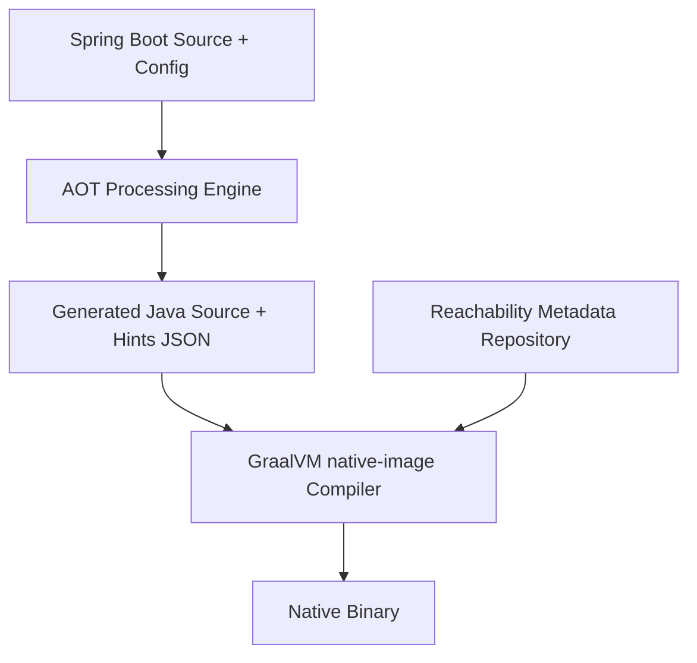
```mermaid
flowchart TD
    SRC[Spring Boot Source + Config]
    AOT[AOT Processing Engine]
    GEN[Generated Java Source + Hints JSON]
    NI[GraalVM native-image Compiler]
    BIN[Native Binary]
    META[Reachability Metadata Repository]

    SRC --> AOT
    AOT --> GEN
    GEN --> NI
    META --> NI
    NI --> BIN
```

### 📶 Gradual Depth

**Level 1 - Building a native image.** Add the native
profile to your Spring Boot Maven build and compile.

```xml
<plugin>
  <groupId>
    org.graalvm.buildtools
  </groupId>
  <artifactId>
    native-maven-plugin
  </artifactId>
</plugin>
```

```bash
./mvnw -Pnative native:compile
```

**Level 2 - Understanding AOT-generated code.** After
running `./mvnw process-aot`, inspect the generated source
in `target/spring-aot/main/sources/`. You will find
classes like `OrderServiceApp__BeanDefinitions.java`
that replace runtime reflection with direct constructor
calls.

```java
// Generated AOT bean definition (simplified)
public class OrderConfig__BeanDefinitions {
  public static BeanDefinition getOrderSvcDef() {
    RootBeanDefinition def =
        new RootBeanDefinition(OrderService.class);
    def.setInstanceSupplier(
        OrderService::new
    );
    return def;
  }
}
```

**Level 3 - Registering reflection hints.** When a library
uses reflection that GraalVM cannot detect, register hints
explicitly.

```java
@Configuration
@ImportRuntimeHints(MyHints.class)
public class NativeConfig {}

public class MyHints
    implements RuntimeHintsRegistrar {
  @Override
  public void registerHints(
      RuntimeHints hints,
      ClassLoader cl) {
    hints.reflection().registerType(
        MyDto.class,
        MemberCategory.INVOKE_PUBLIC_CONSTRUCTORS,
        MemberCategory.DECLARED_FIELDS
    );
  }
}
```

**Level 4 - Build-time initialization control.** Some
classes must initialize at build time (constants, enum
values), while others must defer to runtime (random
number generators, socket connections).

```
# native-image.properties
Args = --initialize-at-build-time=\
  com.myapp.constants \
  --initialize-at-run-time=\
  com.myapp.crypto.RandomSeedProvider
```

**Level 5 - Testing native images.** Run the full test
suite against the native binary using the native test
profile.

```bash
./mvnw -PnativeTest test
```

### ⚙️ How It Works

The Spring AOT engine runs during the Maven `process-aot`
phase. It boots the application context at build time,
evaluates all `@Conditional` annotations, resolves bean
definitions, and generates Java source files that
create beans without reflection. It also generates
`reflect-config.json`, `resource-config.json`, and
`proxy-config.json` files that inform GraalVM which
dynamic features are needed.

GraalVM's native-image tool then performs points-to
analysis: starting from `main()`, it traces every
reachable method, compiles them to machine code, and
discards everything unreachable. The result is a
standalone binary with no JVM dependency.

```
mvn process-aot:
  Boot app context (build time)
  -> Evaluate @Conditional
  -> Generate BeanDefinition source
  -> Generate reflection/resource hints
  -> Write to target/spring-aot/

mvn native:compile:
  native-image reads generated code
  -> Points-to analysis (reachability)
  -> Compile reachable methods to machine
  -> Initialize build-time classes
  -> Snapshot heap into binary
  -> Output: standalone native executable
```

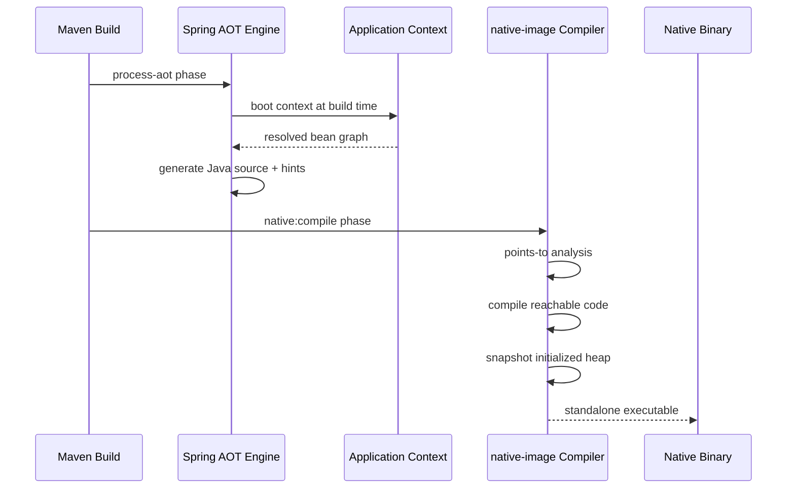
```mermaid
sequenceDiagram
    participant M as Maven Build
    participant AOT as Spring AOT Engine
    participant CTX as Application Context
    participant NI as native-image Compiler
    participant BIN as Native Binary

    M->>AOT: process-aot phase
    AOT->>CTX: boot context at build time
    CTX-->>AOT: resolved bean graph
    AOT->>AOT: generate Java source + hints
    M->>NI: native:compile phase
    NI->>NI: points-to analysis
    NI->>NI: compile reachable code
    NI->>NI: snapshot initialized heap
    NI-->>BIN: standalone executable
```

### 🚨 Failure Modes

**Failure 1 - Missing Reflection Metadata:**
Application starts as native image but throws
`ClassNotFoundException` or `NoSuchMethodException` when
a code path invokes reflection that was not registered.

**Diagnostic:** Run with `-H:+ReportUnsupportedElementsAtRuntime`
during compilation. Check the missing class/method against
`reflect-config.json`. Run the JVM agent to collect metadata:
`-agentlib:native-image-agent=config-output-dir=META-INF/native-image`.

**Fix:** Add `RuntimeHintsRegistrar` for the missing type
or use `@RegisterReflectionForBinding`. For third-party
libraries, check the GraalVM Reachability Metadata
Repository for existing configuration.

**Failure 2 - Build-Time Initialization Capturing Runtime State:**
Native image starts but uses stale values for timestamps,
random seeds, or hostname-derived configuration because
static initializers ran during compilation.

**Diagnostic:** Inspect classes with static fields holding
`Instant.now()`, `Random()`, or `InetAddress.getLocalHost()`.
These values are frozen at build time.

**Fix:** Use `--initialize-at-run-time` for classes that
must capture runtime state. Refactor static field
initialization to lazy patterns.

**Failure 3 - Excessive Build Time and Memory:**
Native image compilation consumes 8-16GB RAM and takes
5-15 minutes for a medium Spring Boot application.

**Diagnostic:** Monitor build machine memory with
`-H:+PrintAnalysisStatistics`. Check if unnecessary
classes are being pulled into reachability scope.

**Fix:** Use `-H:+ReportAnalysisForbiddenType` to identify
unexpected types in the reachability graph. Minimize
classpath size. Use multi-stage Docker builds to separate
the resource-intensive compilation from the lightweight
runtime image.

### 🔬 Production Reality

Typical production numbers for a Spring Boot REST service
(varies significantly by application complexity):

- JVM startup: typically 2-6 seconds; native: typically
  under 100ms (improvements of 20-60x are commonly
  reported in Spring team benchmarks)
- JVM RSS memory: typically 200-400MB; native: typically
  50-100MB for comparable workloads
- Native build time: typically 3-10 minutes depending on
  application size and build machine resources
- Native binary size: typically 60-120MB

These numbers vary based on application complexity,
dependency count, and hardware.

Not everything works in native images. JPA lazy loading
relies on runtime proxy generation - Hibernate 6.x
added explicit native support, but some edge cases
remain. Spring Cloud Function and Spring Cloud Gateway
have good native support. Spring Batch native support
is improving but may require additional hints.

The tracing agent (`-agentlib:native-image-agent`) is
essential during development. Run your full test suite
with the agent enabled to capture reflection, proxy,
and resource access patterns automatically.

Multi-stage Docker builds are standard practice:

```dockerfile
FROM ghcr.io/graalvm/native-image:17 AS build
COPY . /app
WORKDIR /app
RUN ./mvnw -Pnative native:compile

FROM debian:bookworm-slim
COPY --from=build /app/target/myapp /myapp
EXPOSE 8080
ENTRYPOINT ["/myapp"]
```

### ⚖️ Trade-offs & Alternatives

**BAD:**

```java
// Runtime reflection - invisible to native-image
Class<?> clz = Class.forName(
    props.getProperty("handler.class")
);
Object handler = clz.getDeclaredConstructor()
    .newInstance();
```

**GOOD:**

```java
// AOT-friendly: explicit hint registration
@RegisterReflectionForBinding(
    MyHandler.class
)
@Configuration
public class HandlerConfig {
    @Bean
    public MyHandler handler() {
        return new MyHandler();
    }
}
```

| Aspect             | JVM (JIT)               | Native Image                  | CRaC (Checkpoint)              |
| ------------------ | ----------------------- | ----------------------------- | ------------------------------ |
| Startup time       | 2-8s                    | Under 100ms                   | Under 1s                       |
| Peak throughput    | Highest (JIT optimized) | Lower (no profile-guided JIT) | Highest                        |
| Memory footprint   | High                    | Low                           | High                           |
| Build complexity   | Low                     | High                          | Medium                         |
| Reflection support | Full                    | Requires hints                | Full                           |
| Debugging          | Full JDWP               | Limited                       | Full JDWP                      |
| Best for           | Long-running services   | Serverless, CLI, edge         | Long-running with fast restart |

### ⚡ Decision Snap

- Use native image for serverless functions, CLI tools,
  and high-density container deployments where startup
  and memory matter more than peak throughput.
- Stay on JVM for long-running services where JIT
  optimization and full debugging are valuable.
- Consider CRaC (Coordinated Restore at Checkpoint) as
  an alternative that preserves JIT performance with fast
  restart capability.
- Always run the tracing agent against your full test
  suite before attempting native compilation.
- Budget 2-4x more CI build time and memory for native
  image compilation.

### ⚠️ Top Traps

| #   | Trap                                          | Why it hurts                                                       | Escape                                                               |
| --- | --------------------------------------------- | ------------------------------------------------------------------ | -------------------------------------------------------------------- |
| 1   | Assuming all Spring starters work in native   | Some starters lack reachability metadata, causing runtime failures | Check spring.io/projects native compatibility matrix before adopting |
| 2   | Skipping the tracing agent during development | Manual reflection config is error-prone and incomplete             | Run full test suite with `-agentlib:native-image-agent`              |
| 3   | Static initializers capturing runtime values  | Timestamps, random seeds, hostnames frozen at build time           | Use `--initialize-at-run-time` for stateful classes                  |
| 4   | Expecting JVM-equivalent peak throughput      | Native images lack JIT profile-guided optimization                 | Benchmark under realistic load; accept the throughput trade-off      |
| 5   | Ignoring native build resource requirements   | Builds fail with OOM on CI machines with under 8GB RAM             | Allocate 8-16GB RAM for native builds; use multi-stage Docker        |

### 🪜 Learning Ladder

**Prerequisites:**
SPR-092 Spring AOT (Ahead-of-Time) Compilation,
SPR-075 Spring Boot Starter and Dependency Management

**THIS:** SPR-091 GraalVM Native Image with Spring Boot 3

**Next steps:**
SPR-101 Performance at Scale - Spring vs Quarkus vs Micronaut

**The Surprising Truth:**
The biggest obstacle to native image adoption is not
technical limitation - it is build feedback loop speed.
Developers accustomed to 2-second JVM restarts find
5-minute native compilations intolerable during
development. The practical pattern that works: develop
and test entirely on JVM (where Spring AOT can still
validate your hints), compile to native only in CI, and
deploy native images to production. The developers who
try to compile native images on every code change
abandon the approach within a week.

**Further Reading:**

- Spring Boot GraalVM Native Image documentation:
  docs.spring.io/spring-boot/reference/native-image/
- GraalVM Native Image reference manual:
  graalvm.org/latest/reference-manual/native-image/
- Spring AOT documentation:
  docs.spring.io/spring-framework/reference/core/aot.html
- GraalVM Reachability Metadata Repository:
  github.com/oracle/graalvm-reachability-metadata

**Revision Card:**

1. Native image requires closed-world analysis - every
   reachable type must be known at build time via AOT
   processing and reflection hints.
2. Develop on JVM, compile native in CI - the build
   feedback loop is too slow for iterative development.
3. Three critical configs: reflection hints for dynamic
   access, build-time vs run-time initialization control,
   and tracing agent output for automatic metadata
   collection.

---

---

# SPR-092 Spring AOT (Ahead-of-Time) Compilation

**TL;DR** - Spring AOT shifts bean wiring, proxy generation, and reflection analysis from runtime to build time, enabling instant startup and native image compatibility.

### 🔥 Problem Statement

Spring's power comes from runtime dynamism: classpath
scanning, conditional evaluation, CGLIB proxy generation,
and reflective bean wiring. That dynamism has a cost -
a moderately complex Spring Boot app spends 2-8 seconds
at startup just discovering, instantiating, and wiring
beans. In a serverless or scale-to-zero environment,
that startup penalty is billed per invocation. Worse,
GraalVM native image compilation requires a closed-world
assumption: every class, method, and field accessed via
reflection must be declared at build time. Spring's
runtime model is fundamentally incompatible with that
assumption unless something translates dynamic behavior
into static metadata before the native compiler runs.
That "something" is the AOT engine.

### 📜 Historical Context

Spring Native (experimental, 2020-2022) was the first
attempt at GraalVM support. It relied on manually
maintained reflection hints and GraalVM's tracing agent,
producing brittle configurations that broke across
Spring version upgrades. Spring Framework 6.0 (Nov 2022)
introduced a first-class AOT engine integrated into the
core framework itself, not as an external add-on. The
AOT processing pipeline runs during `mvn spring-boot:
process-aot` (or the Gradle equivalent), analyzing the
actual ApplicationContext, generating Java source code
for bean definitions, and emitting reflection/resource/
proxy hint files. Spring Boot 3.0+ leverages this engine
to produce native images without manual hint maintenance.
The design drew inspiration from Micronaut's compile-time
DI and Quarkus's build-time augmentation, but preserved
Spring's programming model rather than requiring new
annotations.

### 🔩 First Principles

**CORE INVARIANTS:**

1. The bean definition graph at build time must be
   identical to the graph at runtime - any condition
   that cannot be evaluated at build time breaks AOT.
2. Every reflective access, dynamic proxy, resource
   load, and serialization target must be declared via
   RuntimeHints or discovered by AOT processors.
3. AOT-generated code replaces, not supplements, the
   runtime bean factory initialization - the container
   skips classpath scanning entirely when AOT artifacts
   are present.

**DERIVED DESIGN:**

From invariant 1: `@Profile`, `@ConditionalOnProperty`,
and environment-dependent conditions are frozen at build
time. Changing a property at runtime will NOT toggle a
conditional that was resolved during AOT processing.
From invariant 2: libraries that use reflection without
registering hints break silently - no exception at build
time, `MissingReflectionMetadataException` at runtime.
From invariant 3: startup becomes a straight-line
execution of pre-computed factory methods with zero
classpath scanning overhead.

### 🧠 Mental Model

> Think of AOT as a dress rehearsal that records every
> blocking decision, prop placement, and actor position,
> then prints a deterministic script so opening night
> runs without improvisation.

- Bean discovery -> casting call during rehearsal, locked
  before the show
- Proxy generation -> pre-built costume pieces instead of
  sewing on stage
- Reflection hints -> inventory list so stagehands know
  exactly what props exist backstage
- RuntimeHints API -> the clipboard the stage manager
  uses to note additional props discovered during
  rehearsal

**Where this analogy breaks down:** A real dress
rehearsal can still adapt on opening night. AOT cannot -
once the script is printed, the show must follow it
exactly or it breaks.

### 🧩 Components

```
+-------------------+
| Source Code + Deps |
+---------+---------+
          |
  mvn process-aot / gradle aot
          |
+---------v-----------+
| AOT Engine          |
| BeanFactoryInit     |
|   AotProcessor      |
| BeanRegistration    |
|   AotProcessor      |
| RuntimeHintsReg.    |
+---------+-----------+
          |
  +-------+-------+
  |       |       |
  v       v       v
GenSrc  Hints   Proxies
(.java) (.json) (.java)
  |       |       |
  +---+---+-------+
      |
+-----v-----------+
| native-image /  |
| JVM classpath   |
+------------------+
```

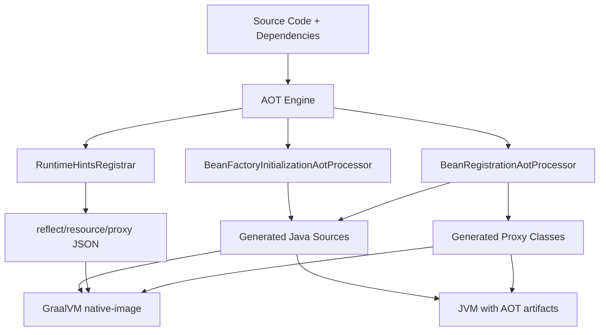
```mermaid
flowchart TD
    SRC[Source Code + Dependencies]
    AOT[AOT Engine]
    BFP[BeanFactoryInitializationAotProcessor]
    BRP[BeanRegistrationAotProcessor]
    RH[RuntimeHintsRegistrar]
    GEN[Generated Java Sources]
    HINTS[reflect/resource/proxy JSON]
    PROXY[Generated Proxy Classes]
    NI[GraalVM native-image]
    JVM[JVM with AOT artifacts]

    SRC --> AOT
    AOT --> BFP
    AOT --> BRP
    AOT --> RH
    BFP --> GEN
    BRP --> GEN
    BRP --> PROXY
    RH --> HINTS
    GEN --> NI
    GEN --> JVM
    HINTS --> NI
    PROXY --> NI
    PROXY --> JVM
```

### 📶 Gradual Depth

**Level 1 - What AOT does:** At build time, Spring
boots your ApplicationContext, records every bean
definition, and writes Java source files that recreate
the same context without scanning or reflection.

**Level 2 - The processing pipeline:** The Maven/Gradle
plugin invokes `SpringApplicationAotProcessor`, which
creates a `GenericApplicationContext`, refreshes it,
iterates all `BeanRegistrationAotProcessor` instances,
and calls `processAheadOfTime()`. Each processor can
contribute generated code and runtime hints.

**Level 3 - BeanFactoryInitializationAotProcessor:**
This higher-level processor runs after all bean
registrations are processed. It can analyze the entire
bean factory and generate cross-cutting initialization
code. Spring's own `ConfigurationClassPostProcessor`
uses this to emit the top-level factory method that
replaces `@ComponentScan`.

**Level 4 - RuntimeHints and hint registration:**
`RuntimeHints` is a mutable registry with sub-registries
for reflection, resources, proxies, JNI, and
serialization. Libraries register hints via
`RuntimeHintsRegistrar` implementations annotated with
`@ImportRuntimeHints` or discovered via
`META-INF/spring/aot.factories`.

```java
public class MyHints
    implements RuntimeHintsRegistrar {
  @Override
  public void registerHints(
      RuntimeHints hints,
      ClassLoader classLoader) {
    hints.reflection()
      .registerType(MyEntity.class,
        MemberCategory.INVOKE_DECLARED_METHODS,
        MemberCategory.DECLARED_FIELDS);
    hints.resources()
      .registerPattern("templates/*.html");
  }
}
```

**Level 5 - Conditions at build time:** `@Conditional`
annotations are evaluated during AOT processing using
the build-time environment. A `@ConditionalOnProperty`
that checks `spring.datasource.url` uses the value from
the build-time `application.properties`. If production
sets a different value, the condition result does not
change. This is the sharpest edge of AOT: your build
profile determines your runtime bean graph.

### ⚙️ How It Works

```
Build Phase:
src + deps
    |
[process-aot]
    |
refresh GenericApplicationContext
    |
for each BeanDefinition:
  BeanRegistrationAotProcessor
    -> generate factory method
    -> register RuntimeHints
    |
BeanFactoryInitializationAotProc
    -> cross-cutting code gen
    |
Write: target/spring-aot/main/
  sources/  (generated .java)
  resources/ (reflect-config.json
              resource-config.json
              proxy-config.json)

Runtime Phase (native or JVM):
AOT-generated initializer
    |
skip classpath scan
skip condition evaluation
skip CGLIB proxy generation
    |
straight-line bean instantiation
```

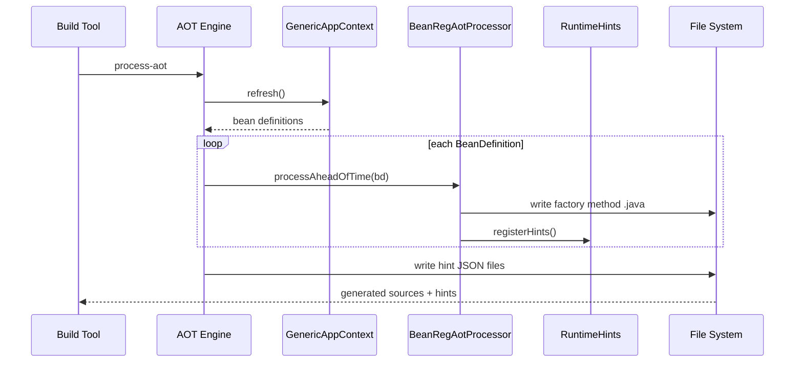
```mermaid
sequenceDiagram
    participant Build as Build Tool
    participant AOT as AOT Engine
    participant CTX as GenericAppContext
    participant BRP as BeanRegAotProcessor
    participant RH as RuntimeHints
    participant FS as File System

    Build->>AOT: process-aot
    AOT->>CTX: refresh()
    CTX-->>AOT: bean definitions
    loop each BeanDefinition
        AOT->>BRP: processAheadOfTime(bd)
        BRP->>FS: write factory method .java
        BRP->>RH: registerHints()
    end
    AOT->>FS: write hint JSON files
    FS-->>Build: generated sources + hints
```

### 🚨 Failure Modes

**Failure 1 - Missing reflection hints at runtime:**
An entity class used in JPA or Jackson deserialization
is not registered in RuntimeHints. The native image
compiles fine, but at runtime: `com.oracle.svm.core.
jdk.resources.MissingReflectionRegistrationError`.

**Diagnostic:** Run with `-agentlib:native-image-agent`
on JVM first to auto-generate hint files, then diff
against your registered hints. Spring Boot's
`RuntimeHintsAgent` (`-XX:+AllowVMInternalThreads
-Dspring.aot.enabled=true`) runs tests and reports
missing hints.

**Fix:** Implement `RuntimeHintsRegistrar` for the
missing type and annotate a configuration class with
`@ImportRuntimeHints(MyHints.class)`. For third-party
libraries, check if they ship a `aot.factories` or
contribute hints via Spring Boot's reachability metadata
repository on GitHub.

**Failure 2 - Build/runtime profile mismatch:**
AOT processed with `spring.profiles.active=dev`, but
deployed with `prod` profile. Beans conditional on the
`prod` profile are absent because the condition was
evaluated as false at build time.

**Diagnostic:** Startup logs show fewer beans than
expected. `@ConditionalOnProperty` evaluations in the
generated source reveal hardcoded boolean values.

**Fix:** Run `process-aot` with the same profile
intended for deployment. For multiple deployment
profiles, build separate artifacts per profile or move
environment-varying behavior out of bean conditions into
runtime configuration (e.g., property-driven strategy
selection within an always-registered bean).

**Failure 3 - Dynamic bean registration at runtime:**
A library registers beans programmatically in a
`BeanFactoryPostProcessor` that uses runtime classpath
scanning. AOT cannot observe this because the post-
processor's dynamic behavior is not replayed during
AOT processing.

**Diagnostic:** Beans exist in JVM mode but vanish in
AOT/native mode. Application fails with
`NoSuchBeanDefinitionException` for dynamically
registered types.

**Fix:** Convert dynamic registration to a
`BeanRegistrationAotProcessor` that generates the
equivalent bean definitions at build time.

### 🔬 Production Reality

In production native image deployments, startup drops
from seconds to tens of milliseconds. Memory footprint
typically decreases because the JIT compiler, bytecode
verifier, and annotation processing infrastructure are
absent. However, peak throughput under sustained load
may be lower than JVM mode because PGO (Profile-Guided
Optimization) in native images is less mature than C2
JIT optimization. Teams at scale typically deploy native
images for serverless / scale-to-zero workloads and JVM
mode for long-running high-throughput services. The AOT
build itself adds significant time to CI pipelines -
native image compilation can take 5-15 minutes for a
moderately complex app with 8 GB of build RAM.

### ⚖️ Trade-offs & Alternatives

**BAD:**

```java
// Registering hints manually for every
// class in a large domain model
hints.reflection().registerType(
    Order.class, ...);
hints.reflection().registerType(
    Customer.class, ...);
// 200 more lines...
```

**GOOD:**

```java
// Programmatic registration with
// package scanning at build time
ClassPathScanningCandidateComponentProvider
    scanner = new ClassPath...Provider(false);
scanner.addIncludeFilter(
    new AnnotationTypeFilter(Entity.class));
for (BeanDefinition bd :
    scanner.findCandidateComponents(
        "com.acme.domain")) {
  hints.reflection().registerType(
    TypeReference.of(bd.getBeanClassName()),
    MemberCategory.INVOKE_DECLARED_METHODS,
    MemberCategory.DECLARED_FIELDS);
}
```

| Aspect            | Spring AOT    | Quarkus Build |
| ----------------- | ------------- | ------------- |
| Programming model | Standard DI   | CDI subset    |
| Hint system       | RuntimeHints  | BuildItem     |
| Conditional model | Frozen at AOT | Arc at build  |
| Library compat.   | Broad (Boot)  | Quarkus ext.  |
| Build time        | Moderate      | Moderate      |
| Fallback to JVM   | Full support  | Limited       |

### ⚡ Decision Snap

Use AOT + native image when: startup time is billed
(serverless, scale-to-zero), memory budget is tight
(edge, embedded), or cold-start latency is user-facing.

Stay on JVM without AOT when: peak throughput matters
more than startup, your dependencies lack native
compatibility, or your CI cannot afford the build-time
cost.

Use AOT on JVM (without native) when: you want faster
startup without the native compatibility constraints -
AOT artifacts on JVM skip classpath scanning but retain
JIT optimization.

### ⚠️ Top Traps

| #   | Trap                       | Why it bites                                         |
| --- | -------------------------- | ---------------------------------------------------- |
| 1   | Profile mismatch           | Build-time profile locks conditional beans           |
| 2   | Missing third-party hints  | Library works on JVM, fails in native silently       |
| 3   | Dynamic bean registration  | BeanFactoryPostProcessor logic invisible to AOT      |
| 4   | Lambda serialization       | Lambdas in bean defs need explicit hint registration |
| 5   | Build RAM underprovisioned | native-image OOMs at 4 GB, needs 8+ GB typically     |

### 🪜 Learning Ladder

**Prerequisites:**
SPR-006 Spring IoC Container and Dependency Injection,
SPR-045 Spring Boot Auto-Configuration.

**THIS:** SPR-092 Spring AOT (Ahead-of-Time) Compilation -
build-time bean analysis, proxy generation, reflection
hints, RuntimeHints API, and native image preparation.

**Next steps:**
SPR-091 GraalVM Native Image with Spring Boot 3.

**The Surprising Truth:**

AOT does not make Spring "static" like Micronaut or
Dagger. It replays Spring's dynamic model once at build
time and records the result. Your code still uses
`@Autowired`, `@Conditional`, and `@Configuration`
unchanged. The generated code is readable Java - you can
open `target/spring-aot/main/sources/` and see exactly
which beans will be created, in what order, with what
arguments. That transparency is the real power: not just
speed, but auditability of your wiring.

**Further Reading:**

- Spring Framework Reference: AOT Processing
  (docs.spring.io/spring-framework/reference/core/aot)
- Spring Boot Reference: GraalVM Native Image Support
  (docs.spring.io/spring-boot/reference/native-image/)
- GraalVM Reachability Metadata Repository (GitHub:
  oracle/graalvm-reachability-metadata)

**Revision Card:**

1. AOT refreshes a full ApplicationContext at build time,
   generates Java factory methods, and emits JSON hint
   files for reflection, resources, and proxies.
2. Conditions (`@ConditionalOnProperty`, `@Profile`) are
   frozen at build time - runtime environment changes
   do not alter the bean graph.
3. `RuntimeHintsRegistrar` is the extension point for
   libraries to declare reflective/resource access so
   native image compilation succeeds.

---

---

# SPR-093 Virtual Threads (Loom) Integration in Spring 6

**TL;DR** - Virtual threads restore simple blocking code at massive concurrency by making thread-per-request cheap, but pinning and carrier starvation demand careful library choices.

### 🔥 Problem Statement

The traditional Java thread-per-request model maps one
OS thread to each incoming HTTP request. OS threads are
expensive: each consumes roughly 1 MB of stack memory
and a kernel scheduling slot. A server with 200 platform
threads hits a wall at 200 concurrent requests, even if
most threads are simply waiting on database I/O or HTTP
calls. Reactive frameworks (WebFlux, Vert.x) solved this
with non-blocking event loops, but at the cost of a
completely different programming model: no blocking calls,
callback chains or reactive streams, and stack traces
that are nearly unreadable. The question is: can we keep
the simple, sequential, blocking programming model and
still handle thousands of concurrent requests?

### 📜 Historical Context

Project Loom was proposed as a JDK Enhancement Proposal
(JEP 425, preview in Java 19, Sept 2022; JEP 436,
second preview in Java 20; JEP 444, final in Java 21,
Sept 2023). Virtual threads are lightweight threads
managed by the JVM, not the OS. They are mounted onto
carrier threads (a ForkJoinPool by default) and unmounted
whenever they block on I/O, sleeping, or locking on
`java.util.concurrent` primitives. Spring Framework 6.1
(Nov 2023) added first-class support: setting
`spring.threads.virtual.enabled=true` switches Tomcat's
executor, async task executors, and scheduling thread
pools to virtual threads. Spring Boot 3.2 made this a
single-property toggle. The Spring team explicitly chose
to enhance the existing MVC/servlet model rather than
merge MVC and WebFlux, confirming that blocking MVC
with virtual threads is the intended path for most
applications going forward.

### 🔩 First Principles

**CORE INVARIANTS:**

1. A virtual thread that blocks on I/O unmounts from its
   carrier thread, freeing the carrier for other virtual
   threads - this is the fundamental scalability gain.
2. A virtual thread that blocks while holding a monitor
   lock (`synchronized`) pins its carrier thread,
   negating the scalability benefit for that operation.
3. Virtual threads are cheap to create (a few hundred
   bytes) but are NOT faster for CPU-bound work - they
   share the same carrier pool as other virtual threads.

**DERIVED DESIGN:**

From invariant 1: thread-per-request becomes viable at
10,000+ concurrent connections because blocked virtual
threads consume negligible carrier resources.
From invariant 2: every `synchronized` block on a hot
path must be audited and replaced with
`ReentrantLock` to avoid pinning. JDBC drivers are the
most common offenders (older drivers use `synchronized`
internally).
From invariant 3: CPU-intensive workloads (image
processing, compression, crypto) do not benefit from
virtual threads - they saturate carriers regardless.

### 🧠 Mental Model

> Think of virtual threads as lightweight reservation
> slips at a restaurant. Platform threads are the actual
> tables. When a diner (virtual thread) waits for food
> (I/O), they step away from the table (unmount from
> carrier), letting another diner sit down. Thousands
> of diners can be "in the restaurant" because most are
> waiting, not eating.

- Blocking I/O -> diner waiting for food, table freed
  for someone else
- Carrier thread -> physical table in the restaurant
- Pinning -> a diner who refuses to leave the table
  while waiting, blocking everyone behind them
- `spring.threads.virtual.enabled` -> restaurant policy
  switch from "one diner owns a table all evening" to
  "share tables during wait times"

**Where this analogy breaks down:** In a real restaurant,
switching diners at a table has physical overhead. Virtual
thread mounting/unmounting is nearly free because the JVM
stores continuation state on the heap, not on an OS stack.

### 🧩 Components

```
+-----------+   +-------------+
|  Tomcat   |   | Spring MVC  |
| Acceptor  +-->| DispatcherS.|
+-----+-----+   +------+------+
      |                 |
+-----v-----------------v----+
| Virtual Thread Executor    |
| (Executors.newVirtual...   |
|  PerTaskExecutor)          |
+-----+---------------------+
      |
+-----v---------------------+
| ForkJoinPool (carriers)   |
| Default: availProcessors  |
+-----+---------------------+
      |
+-----v---------------------+
| OS Threads (platform)     |
+---------------------------+
```

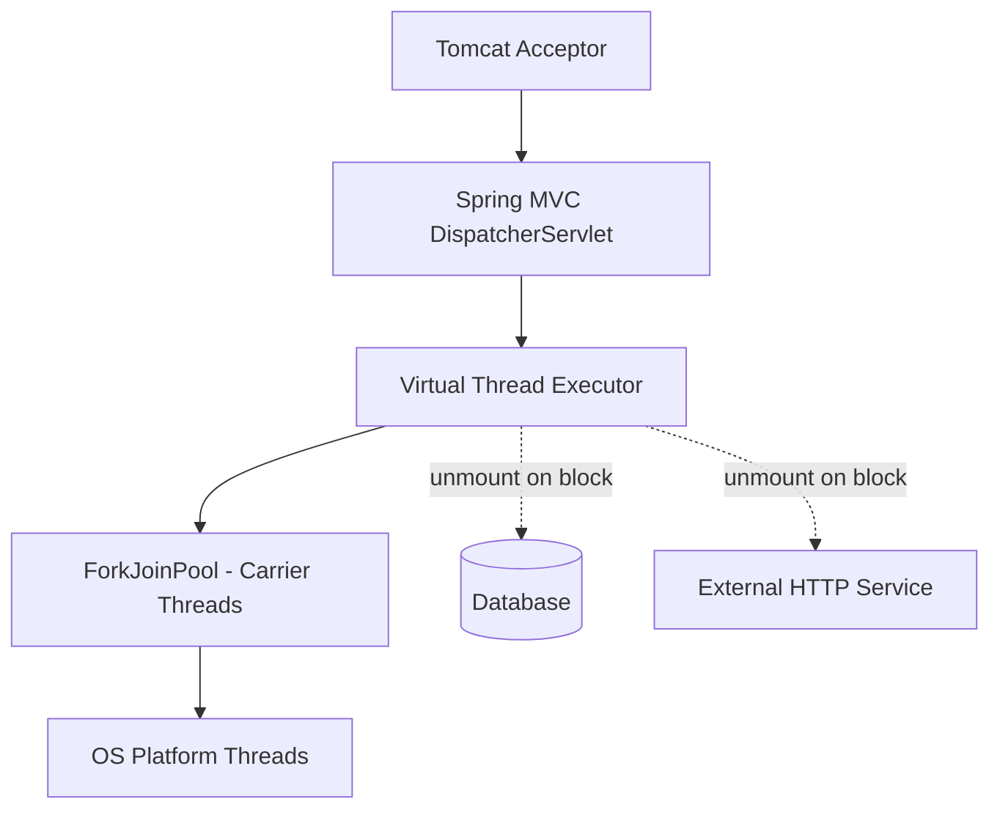
```mermaid
flowchart TD
    TOM[Tomcat Acceptor]
    MVC[Spring MVC DispatcherServlet]
    VTE[Virtual Thread Executor]
    FJP[ForkJoinPool - Carrier Threads]
    OS[OS Platform Threads]
    DB[(Database)]
    HTTP[External HTTP Service]

    TOM --> MVC
    MVC --> VTE
    VTE --> FJP
    FJP --> OS
    VTE -.->|unmount on block| DB
    VTE -.->|unmount on block| HTTP
```

### 📶 Gradual Depth

**Level 1 - The one-property switch:** Add
`spring.threads.virtual.enabled=true` to
`application.properties` (Spring Boot 3.2+). Tomcat
now handles each request on a virtual thread. No code
changes required.

**Level 2 - What changes under the hood:** Spring Boot
auto-configuration replaces Tomcat's default
`ThreadPoolExecutor` with
`Executors.newVirtualThreadPerTaskExecutor()`. The
`@Async` executor and `@Scheduled` thread pool are
also switched. Each request gets a brand-new virtual
thread rather than a pooled platform thread.

**Level 3 - Carrier threads and scheduling:** The JVM
maintains a `ForkJoinPool` of carrier threads (default
size: `Runtime.availableProcessors()`). Virtual threads
are scheduled onto carriers cooperatively. When a
virtual thread calls a blocking operation recognized by
the JVM (socket read, `Thread.sleep`,
`LockSupport.park`), the JVM unmounts its continuation
from the carrier, allowing another virtual thread to run.

**Level 4 - Pinning:** A virtual thread holding a
`synchronized` monitor cannot unmount because the
monitor is tied to the OS thread. This is "pinning."
Pinned virtual threads occupy a carrier for the entire
duration of the synchronized block, including any I/O
inside it. `-Djdk.tracePinnedThreads=short` logs pinning
events. Common pinning sources: JDBC drivers (older
MySQL Connector/J, Oracle JDBC before 23c), JNI calls,
`synchronized` blocks in application code.

```java
// BAD: causes carrier pinning
synchronized (lock) {
    // Blocks carrier for entire DB call
    repository.save(entity);
}

// GOOD: uses ReentrantLock, allows unmount
private final ReentrantLock lock =
    new ReentrantLock();

lock.lock();
try {
    repository.save(entity);
} finally {
    lock.unlock();
}
```

**Level 5 - Spring MVC vs WebFlux with virtual threads:**
Spring MVC + virtual threads handles high concurrency
with blocking code. WebFlux handles high concurrency
with non-blocking code. For I/O-bound workloads, both
achieve similar throughput. MVC + virtual threads wins
on code simplicity, debuggability, and stack trace
clarity. WebFlux wins when you need backpressure,
streaming responses, or the application is already
reactive end-to-end (reactive DB driver, reactive HTTP
client, reactive message consumer).

### ⚙️ How It Works

```
Request arrives at Tomcat
    |
VirtualThreadPerTaskExecutor
  creates new virtual thread
    |
Virtual thread runs controller
    |
Controller calls repository
    |
repository.findById() blocks
    |
JVM unmounts virtual thread
  from carrier (continuation
  saved to heap)
    |
Carrier thread picks up
  another virtual thread
    |
DB response arrives
    |
JVM remounts virtual thread
  onto available carrier
    |
Controller returns response
    |
Virtual thread terminates
  (no pooling, GC'd)
```

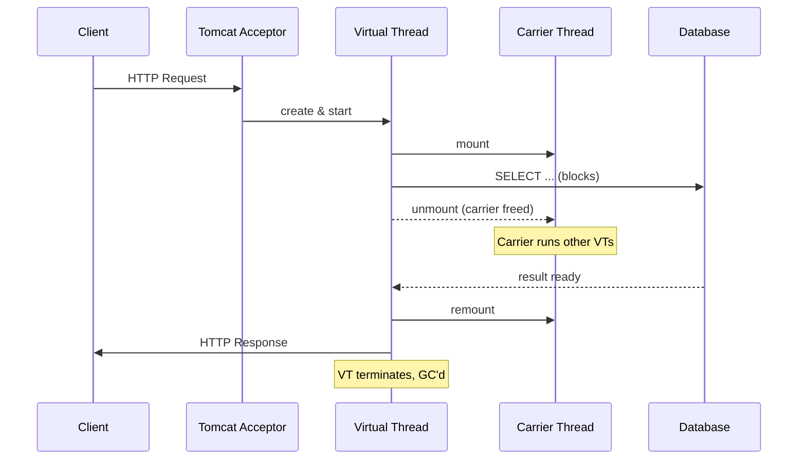
```mermaid
sequenceDiagram
    participant Client
    participant Tomcat as Tomcat Acceptor
    participant VT as Virtual Thread
    participant C as Carrier Thread
    participant DB as Database

    Client->>Tomcat: HTTP Request
    Tomcat->>VT: create & start
    VT->>C: mount
    VT->>DB: SELECT ... (blocks)
    VT-->>C: unmount (carrier freed)
    Note over C: Carrier runs other VTs
    DB-->>VT: result ready
    VT->>C: remount
    VT->>Client: HTTP Response
    Note over VT: VT terminates, GC'd
```

### 🚨 Failure Modes

**Failure 1 - Carrier thread starvation via pinning:**
An application uses `synchronized` in a JDBC driver
that executes slow queries. Under load, all carrier
threads are pinned, and new virtual threads cannot be
scheduled. Throughput drops to match the carrier pool
size (typically equal to CPU count).

**Diagnostic:** Enable `-Djdk.tracePinnedThreads=short`.
Thread dumps via `jcmd <pid> Thread.dump_to_file -format
=json` show virtual threads in `PINNED` state. Metrics
show throughput plateau matching `availableProcessors()`.

**Fix:** Upgrade JDBC driver to a Loom-compatible
version (MySQL Connector/J 8.2+, PostgreSQL 42.7+,
Oracle 23c+). Replace application-level `synchronized`
with `ReentrantLock`. As a stopgap, increase carrier
pool size: `-Djdk.virtualThreadScheduler.parallelism=32`.

**Failure 2 - Thread-local memory explosion:**
Code creates large `ThreadLocal` values (connection
pools, caches, buffers) per thread. With platform
threads, 200 instances are manageable. With virtual
threads, 10,000+ instances exhaust heap memory.

**Diagnostic:** Heap dump shows massive
`ThreadLocal$ThreadLocalMap` instances. OOM with
`GC overhead limit exceeded`.

**Fix:** Migrate from `ThreadLocal` to scoped values
(`ScopedValue`, preview in Java 21+) or shared pooled
resources. Connection pools should be shared across
virtual threads (HikariCP already does this). Never
create per-thread caches when virtual threads are
enabled.

### 🔬 Production Reality

In I/O-heavy workloads (typical CRUD APIs calling
databases and downstream services), teams report
handling 5-10x more concurrent requests with the same
hardware after enabling virtual threads, because
carrier threads are no longer blocked on I/O wait.
Latency percentiles (p50, p99) improve because requests
are no longer queued waiting for a platform thread to
free up. However, if the bottleneck is the database
connection pool (e.g., HikariCP max 50 connections),
virtual threads do not magically increase database
throughput - they just move the queuing from the thread
pool to the connection pool. Monitor connection pool
saturation alongside thread metrics. CPU-bound services
see negligible improvement.

### ⚖️ Trade-offs & Alternatives

**BAD:**

```java
// Mixing synchronized with blocking I/O
// under virtual threads - pins carrier
public synchronized String fetchData() {
    return restTemplate.getForObject(
        url, String.class);
}
```

**GOOD:**

```java
// ReentrantLock avoids pinning
private final ReentrantLock lock =
    new ReentrantLock();

public String fetchData() {
    lock.lock();
    try {
        return restTemplate.getForObject(
            url, String.class);
    } finally {
        lock.unlock();
    }
}
```

| Aspect          | MVC + VThreads | WebFlux          |
| --------------- | -------------- | ---------------- |
| Code style      | Blocking/seq.  | Reactive/async   |
| Stack traces    | Clear          | Fragmented       |
| Backpressure    | Manual         | Built-in         |
| JDBC support    | Native         | Needs R2DBC      |
| Learning curve  | Low            | High             |
| Debugging       | Standard       | Requires tooling |
| Streaming resp. | Limited        | Native SSE/WS    |

### ⚡ Decision Snap

Use virtual threads when: your app is I/O-bound, uses
Spring MVC, and you want higher concurrency without
rewriting to reactive. Most CRUD APIs and BFF services
fit here.

Use WebFlux when: you need backpressure, streaming, or
your entire stack is already reactive (R2DBC, reactive
Kafka, WebClient).

Avoid virtual threads when: workload is CPU-bound
(compute, ML inference), or you depend on libraries
with heavy `synchronized` blocks that cannot be upgraded.

### ⚠️ Top Traps

| #   | Trap                     | Why it bites                                             |
| --- | ------------------------ | -------------------------------------------------------- |
| 1   | Pinning via synchronized | Carrier starvation under load, throughput collapses      |
| 2   | ThreadLocal bloat        | 10,000 VTs x large ThreadLocal = OOM                     |
| 3   | Connection pool ceiling  | VTs do not increase DB pool size, bottleneck just moves  |
| 4   | Assuming CPU speedup     | VTs share carriers, CPU-bound work sees no gain          |
| 5   | Old JDBC driver          | Pre-Loom drivers use synchronized internally, pin always |

### 🪜 Learning Ladder

**Prerequisites:**
SPR-024 Spring MVC Request Lifecycle,
SPR-071 Thread Pool Configuration in Spring Boot.

**THIS:** SPR-093 Virtual Threads (Loom) Integration in
Spring 6 - Project Loom virtual threads, carrier thread
model, pinning, and the MVC vs WebFlux decision with
virtual threads.

**Next steps:**
SPR-099 Reactive Data Access (R2DBC).

**The Surprising Truth:**

Virtual threads do not make WebFlux obsolete. They
eliminate the _concurrency_ argument for reactive, but
not the _backpressure_ or _streaming_ arguments. If your
system needs to push data to clients as it arrives (SSE,
WebSocket streams), or needs to signal upstream producers
to slow down, WebFlux remains the right tool. The real
shift is that virtual threads remove the _forced_ choice
of reactive for concurrency - you now choose reactive
only when the programming model genuinely fits.

**Further Reading:**

- JEP 444: Virtual Threads (openjdk.org/jeps/444)
- Spring Boot Reference: Virtual Threads Support
  (docs.spring.io/spring-boot/reference/features/
  spring-application.html#features.spring-application.
  virtual-threads)
- Inside Java: Virtual Threads - What Are They Good For?
  (inside.java blog series by Alan Bateman, Ron Pressler)

**Revision Card:**

1. `spring.threads.virtual.enabled=true` switches
   Tomcat, `@Async`, and `@Scheduled` executors to
   virtual threads with zero code changes.
2. Pinning occurs when a virtual thread blocks inside a
   `synchronized` block - replace with `ReentrantLock`
   and upgrade JDBC drivers to Loom-compatible versions.
3. Virtual threads increase I/O concurrency but do not
   increase CPU throughput or database connection pool
   capacity - monitor the actual bottleneck.

---

---

# SPR-094 Spring Modulith and Module Boundaries

**TL;DR** - Spring Modulith enforces logical module boundaries inside a monolith so you get microservice-like isolation without the distributed systems tax.

### 🔥 Problem Statement

Teams start with a Spring Boot monolith. Six months
later, the order package imports from the inventory
package which imports from the billing package which
imports from the order package. Circular dependencies
turn every refactoring into a full-codebase grep. You
want module isolation - clear APIs, enforced boundaries,
independent evolution - but you do not want the network
hop, eventual consistency, and operational overhead of
microservices. The question is: can you get 80% of the
modularity benefit at 10% of the distribution cost?

### 📜 Historical Context

Java 9 introduced the module system (JPMS) in 2017, but
adoption in Spring applications remained near zero because
classpath-based frameworks and reflection-heavy DI clashed
with strong encapsulation. OSGi offered runtime modularity
earlier but demanded a steep learning curve. In 2022,
Oliver Drotbohm released Spring Modulith (evolved from
the earlier Spring Moduliths experiment) as an opinionated
way to structure a Spring Boot application into logical
modules - top-level packages that become first-class
architectural units. Unlike JPMS, Modulith works with
the existing classpath model. Unlike multi-module Maven,
it keeps everything in a single deployable artifact while
still enforcing boundaries at test time.

### 🔩 First Principles

**CORE INVARIANTS:**

1. A module's internal types must never be referenced
   by another module - only the "API package" (the
   top-level package of the module) is visible.
2. Inter-module communication should prefer events over
   direct method calls to reduce temporal coupling.
3. Module boundaries must be verifiable automatically in
   CI - not just documented in a wiki nobody reads.

**DERIVED DESIGN:**

From invariant 1: Spring Modulith scans top-level packages
under the main application class. Each becomes a module.
Sub-packages are internal by default. From invariant 2:
`ApplicationEventPublisher` becomes the primary cross-module
communication channel, with `@ApplicationModuleListener`
providing transactional event delivery. From invariant 3:
`ApplicationModules.of(App.class).verify()` in a test
fails the build on illegal dependencies.

### 🧠 Mental Model

> Think of each module as an apartment in a building.
> Each apartment has a front door (the API package).
> Neighbors interact through the lobby (events), never
> by knocking through walls (direct internal access).
> The building inspector (verify()) checks that nobody
> cut unauthorized doorways.

- Request arrives -> enters one module's API package
- Module completes work -> publishes domain event
- Interested modules -> subscribe via @EventListener
- CI test run -> verify() rejects illegal references

**Where this analogy breaks down:**

Unlike real apartments, modules share the same JVM heap,
the same transaction manager, and the same classloader.
A memory leak in one module can crash the entire building.
True isolation requires separate processes - which is
exactly the microservice trade-off Modulith delays.

### 🧩 Components

```
+---------------------------+
| Spring Boot Application   |
|  +--------+ +----------+  |
|  | order/ | |inventory/|  |
|  | (API)  | |  (API)   |  |
|  | .impl/ | |  .impl/  |  |
|  +---+----+ +----+-----+  |
|      |  events   |        |
|      +-----+-----+        |
|            v               |
|    ApplicationEvents       |
+---------------------------+
```

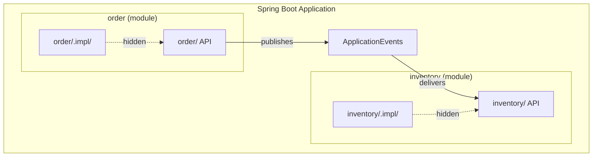
```mermaid
flowchart TB
  subgraph app["Spring Boot Application"]
    subgraph order["order (module)"]
      OA["order/ API"]
      OI["order/.impl/"]
    end
    subgraph inventory["inventory (module)"]
      IA["inventory/ API"]
      II["inventory/.impl/"]
    end
    EB["ApplicationEvents"]
  end
  OA -- "publishes" --> EB
  EB -- "delivers" --> IA
  OI -. "hidden" .-> OA
  II -. "hidden" .-> IA
```

### 📶 Gradual Depth

**Level 1 - Package convention.** Place each bounded context
in its own top-level package. The main class sits one level
above. Modulith auto-detects these packages as modules.

**Level 2 - Explicit module metadata.** Add `package-info.java`
with `@ApplicationModule(allowedDependencies = "...")` to
declare which modules may be referenced. Any undeclared
dependency fails `verify()`.

**Level 3 - Named interfaces.** Use
`@NamedInterface("ordersApi")` on sub-packages that should be
selectively exposed to specific consumers, giving finer
granularity than the all-or-nothing top-level package.

**Level 4 - Event-based decoupling.** Replace synchronous
cross-module method calls with `ApplicationEventPublisher`.
Use `@ApplicationModuleListener` so events participate in the
publisher's transaction and get persisted to an event log for
reliability.

**Level 5 - Observability and documentation.** Modulith
generates Asciidoc + PlantUML module documentation from the
actual code structure. Use `Documenter` in tests to keep
architecture diagrams always in sync.

### ⚙️ How It Works

```
verify() scan flow:
+-------------------+
| ApplicationModules |
|   .of(App.class)  |
+--------+----------+
         |
   scan top-level pkgs
         |
   build dependency graph
         |
   check allowed-deps
         |
  +------+-------+
  | PASS | FAIL  |
  | (ok) | (throw|
  |      |  Viol)|
  +------+-------+
```

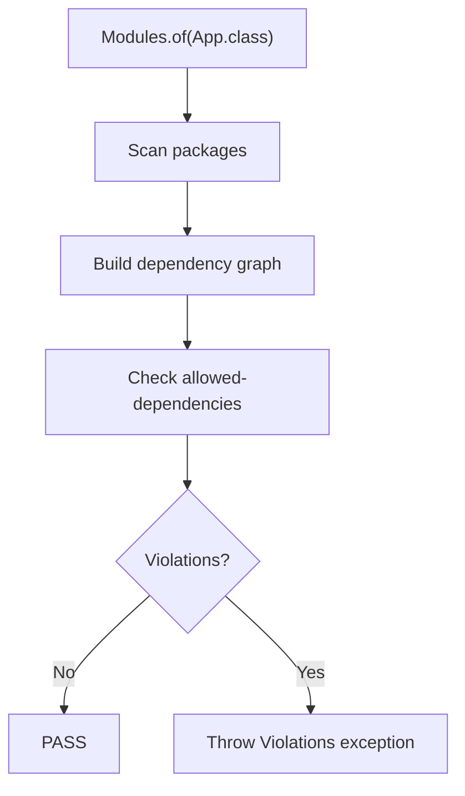
```mermaid
flowchart TD
  A["Modules.of(App.class)"] --> B["Scan packages"]
  B --> C["Build dependency graph"]
  C --> D["Check allowed-dependencies"]
  D --> E{"Violations?"}
  E -- "No" --> F["PASS"]
  E -- "Yes" --> G["Throw Violations exception"]
```

Spring Modulith uses the ASM bytecode library (same one
Spring component scanning uses) to analyze class references
without loading them. It builds a directed graph of module
dependencies, then validates against declared constraints.

The event publication log (`EVENT_PUBLICATION` table) stores
each event with a completion flag. On restart, incomplete
publications are re-delivered - giving you at-least-once
semantics without a message broker.

```java
// Module structure verification test
@Test
void verifyModuleStructure() {
  ApplicationModules modules =
    ApplicationModules.of(ShopApp.class);
  modules.verify();
}
```

```java
// Allowed dependencies declaration
@ApplicationModule(
  allowedDependencies = {
    "inventory", "pricing"
  }
)
package com.shop.order;
```

```java
// Event-based cross-module interaction
@Service
@RequiredArgsConstructor
public class OrderService {
  private final ApplicationEventPublisher events;

  @Transactional
  public Order place(OrderRequest req) {
    Order order = repository.save(
      Order.from(req)
    );
    events.publishEvent(
      new OrderPlaced(order.id())
    );
    return order;
  }
}
```

```java
// Consuming module listens to the event
@ApplicationModuleListener
class InventoryEventHandler {
  void on(OrderPlaced event) {
    // reserve stock - runs in
    // publisher's transaction
    reserveStock(event.orderId());
  }
}
```

### 🚨 Failure Modes

**Failure 1 - Verify passes but modules are semantically
coupled:**

Teams put everything in the API package to avoid violations.
Technically legal, architecturally meaningless. Every type
is public and every module depends on every other.

**Diagnostic:** Run `Documenter` and look at the generated
module diagram. If the dependency graph is fully connected,
your modules are not real modules.

**Fix:** Only expose value objects, service interfaces, and
events in the API package. Move implementations, entities,
and repositories into `.internal` sub-packages.

**Failure 2 - Event publication log grows unbounded:**

The `EVENT_PUBLICATION` table accumulates completed events
because no cleanup job is configured. On a busy system, this
table reaches millions of rows and slows down the incomplete
publication query that runs on startup.

**Diagnostic:** Query `SELECT count(*) FROM
event_publication WHERE completion_date IS NOT NULL`.

**Fix:** Configure `spring.modulith.events.republish
-outstanding-events-on-restart=true` and schedule a
cleanup: `@Bean IncompleteEventPublications cleanup()`
with a retention period. Modulith 1.1+ provides built-in
`CompletedEventPublications` archival.

**Failure 3 - Circular event chains:**

Module A publishes event X, module B handles X and
publishes event Y, module A handles Y and publishes X.
Infinite loop inside a single transaction.

**Diagnostic:** Stack overflow or transaction timeout.
Enable `logging.level.org.springframework.modulith=DEBUG`
to trace event propagation.

**Fix:** Introduce an async boundary
(`@Async @TransactionalEventListener`) at one edge of the
cycle. Or redesign: if two modules form a cycle, they might
belong in the same module.

### 🔬 Production Reality

In production, the event publication log is the critical
piece. Without it, events fired inside a transaction that
rolls back after the listener executed cause ghost side
effects. With it, you get outbox-pattern reliability using
only a relational database.

Performance: module verification is test-time only - zero
runtime overhead. The event publication log adds one INSERT
per event and one UPDATE on completion. For high-throughput
systems (>10K events/sec), the log table needs partitioning
or regular archival.

Migration path from monolith: start by drawing module
boundaries around existing packages. Run `verify()` to find
violations. Fix the worst coupling first. Add events for
cross-module communication. When a module needs independent
scaling, extract it to a microservice - the event API becomes
the message contract.

ArchUnit integration: Modulith 1.2+ works alongside ArchUnit.
Use Modulith for module-level boundaries, ArchUnit for
intra-module rules (layer checks, naming conventions).

### ⚖️ Trade-offs & Alternatives

**BAD:**

```java
// Order module directly calls inventory
// internals - tight coupling, breaks on
// any inventory refactoring
@Service
class OrderService {
  @Autowired
  InventoryInternalRepo repo;
  void place(Order o) {
    repo.decrementStock(o.sku());
  }
}
```

**GOOD:**

```java
// Order publishes event, inventory handles
// it through its own API boundary
@Service
class OrderService {
  @Autowired ApplicationEventPublisher pub;
  @Transactional
  void place(Order o) {
    save(o);
    pub.publishEvent(new OrderPlaced(o.id()));
  }
}
```

| Approach           | Boundary enforcement | Deploy unit  | Scaling     | Complexity |
| ------------------ | -------------------- | ------------ | ----------- | ---------- |
| Packages only      | None                 | Single       | Uniform     | Low        |
| Spring Modulith    | Test-time            | Single       | Uniform     | Low-Med    |
| Multi-module Maven | Compile-time         | Single/Multi | Uniform     | Medium     |
| Microservices      | Runtime (network)    | Per-service  | Independent | High       |
| JPMS               | JVM-enforced         | Single       | Uniform     | High       |

### ⚡ Decision Snap

Use Spring Modulith when you have a monolith with 3+
bounded contexts and want enforced boundaries without
distribution. Prefer multi-module Maven when you need
compile-time enforcement and separate build cycles. Move
to microservices only when you need independent deployment,
independent scaling, or independent technology choices -
and you have the operational maturity to run distributed
systems.

### ⚠️ Top Traps

| #   | Trap                                                    | Why it hurts                                                       |
| --- | ------------------------------------------------------- | ------------------------------------------------------------------ |
| 1   | Putting all types in the API package                    | Bypasses encapsulation - verify() passes but boundaries are hollow |
| 2   | Skipping the event publication log                      | Events lost on transaction rollback - silent data inconsistency    |
| 3   | Synchronous event listeners doing slow I/O              | Blocks the publishing transaction - latency spike and timeout risk |
| 4   | No cleanup of completed event publications              | Table bloat degrades startup time and query performance            |
| 5   | Using Modulith as a stepping stone but never extracting | Accumulates module coupling debt until boundaries erode entirely   |

### 🪜 Learning Ladder

**Prerequisites:**
SPR-090 Microservice Architecture with Spring Boot,
SPR-095 Event-Driven Architecture with Spring Events

**THIS:** SPR-094 Spring Modulith and Module Boundaries -
enforce logical module boundaries inside a monolith with
test-time verification and event-based decoupling.

**Next steps:**
SPR-108 Monolith-First Strategy with Spring Modulith

**The Surprising Truth:**

Most teams that adopt microservices would have been better
served by Spring Modulith. The modularity they wanted never
required a network boundary - it required enforced package
boundaries and the discipline to communicate through events.
The irony: Modulith makes future microservice extraction
easier precisely because it does not force you to do it now.

**Further Reading:**

- Spring Modulith reference documentation (spring.io)
- Oliver Drotbohm, "Spring Modulith - A New Way to Build
  Spring Boot Applications" (SpringOne 2022)
- "Modular Monoliths" - Simon Brown
  (conference talk series)

**Revision Card:**

1. `ApplicationModules.of(App.class).verify()` fails the
   build on illegal cross-module references - enforcement
   happens at test time, not runtime.
2. The event publication log table provides outbox-pattern
   reliability for inter-module events without requiring
   a message broker.
3. Top-level packages are API, sub-packages are internal -
   this convention replaces both JPMS exports and
   multi-module Maven visibility.

---

---

# SPR-095 Event-Driven Architecture with Spring Events

**TL;DR** - Spring's event system decouples producers from consumers inside the application context, but transactional semantics and async boundaries determine whether it helps or hurts.

### 🔥 Problem Statement

Your `OrderService` needs to send a confirmation email,
update inventory, notify analytics, and trigger fraud
checking. Direct method calls mean `OrderService` depends
on four unrelated subsystems, and adding a fifth means
modifying `OrderService` again. Worse: if the email call
fails, should the order fail too? You need a way to say
"something happened" without dictating what should happen
next. But naive eventing introduces its own problems:
lost events, ordering surprises, transaction boundary
confusion, and invisible control flow that makes debugging
a nightmare.

### 📜 Historical Context

The Observer pattern predates Java itself. Java's
`java.util.Observable` (1996) was deprecated in Java 9
because it required extending a class - incompatible with
modern composition-based design. Spring introduced its
own event system in Spring Framework 1.0 (2003), based on
`ApplicationEvent` and `ApplicationListener`. Spring 4.2
(2015) added annotation-based `@EventListener`, removing
the need to implement an interface. Spring 4.2 also added
`@TransactionalEventListener`, which solved the critical
problem of events firing before the triggering transaction
committed. Spring Modulith (2022) built on top of this with
`@ApplicationModuleListener` and the event publication log
for reliable delivery.

### 🔩 First Principles

**CORE INVARIANTS:**

1. An event is a fact about something that already happened -
   it is immutable and cannot be rejected by listeners.
2. The publisher must not know or care how many listeners
   exist - adding a listener must never require changing
   the publisher.
3. Transaction boundaries determine when listeners see
   consistent state - firing an event mid-transaction
   exposes uncommitted data to synchronous listeners.

**DERIVED DESIGN:**

From invariant 1: model events as immutable records with
past-tense names (`OrderPlaced`, `PaymentReceived`). From
invariant 2: use `ApplicationEventPublisher.publishEvent()`
which delegates to all registered `@EventListener` methods
via the `ApplicationEventMulticaster`. From invariant 3:
`@TransactionalEventListener(phase = AFTER_COMMIT)` ensures
listeners run only after the triggering transaction
succeeds - preventing ghost side effects.

### 🧠 Mental Model

> Think of Spring events as a building intercom system.
> When an apartment (service) has news, it announces on
> the intercom (publishEvent). Any apartment listening
> on that channel hears it. The intercom does not know
> who is listening, and the announcer does not wait for
> each listener to finish (unless you choose synchronous
> mode).

- Service completes action -> publishes event object
- ApplicationEventMulticaster -> routes to listeners
- Synchronous listeners -> run in publisher's thread
- Async listeners -> run in separate thread pool
- TransactionalEventListener -> waits for phase trigger

**Where this analogy breaks down:**

A real intercom is fire-and-forget. Spring synchronous
events, by default, run listeners in the same thread and
same transaction - meaning a listener exception can roll
back the publisher's transaction. This is less "intercom"
and more "conference call where anyone can hang up on
everyone."

### 🧩 Components

```
+---------------------------------------+
| ApplicationContext                     |
|  +-------------+  +-----------+       |
|  | Publisher    |  | Listener  |       |
|  | (Service)   |  | (@Event   |       |
|  |             |  |  Listener)|       |
|  +------+------+  +-----+-----+      |
|         |               ^             |
|         v               |             |
|  +------+---------------+------+      |
|  | ApplicationEventMulticaster |      |
|  | (SimpleApplicationEvent     |      |
|  |  Multicaster)               |      |
|  +-----------------------------+      |
+---------------------------------------+
```

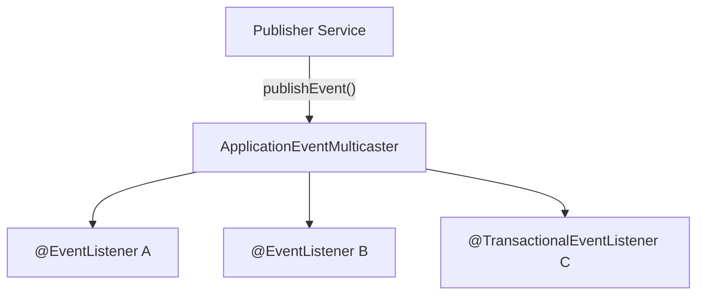
```mermaid
flowchart TB
  P["Publisher Service"]
  M["ApplicationEventMulticaster"]
  L1["@EventListener A"]
  L2["@EventListener B"]
  L3["@TransactionalEventListener C"]
  P -- "publishEvent()" --> M
  M --> L1
  M --> L2
  M --> L3
```

### 📶 Gradual Depth

**Level 1 - Basic events.** Create a POJO event class.
Inject `ApplicationEventPublisher`, call `publishEvent()`.
Add `@EventListener` on any Spring bean method that takes
that event type. Done.

**Level 2 - Transactional events.** Replace `@EventListener`
with `@TransactionalEventListener(phase = AFTER_COMMIT)`.
Listeners now fire only after the publisher's transaction
commits. Use `BEFORE_COMMIT` when the listener must
participate in the same transaction.

**Level 3 - Async events.** Add `@Async` to the listener
method. Configure a dedicated `TaskExecutor` bean. Async
listeners run in a separate thread - publisher does not
wait, but you lose the transactional context.

**Level 4 - Reliable publication.** Use Spring Modulith's
event publication log. Events are written to a database
table inside the publisher's transaction. On restart,
incomplete publications are re-delivered. This provides
at-least-once semantics without an external broker.

**Level 5 - External event infrastructure.** For cross-JVM
communication, bridge to Spring Cloud Stream (Kafka,
RabbitMQ) or Spring Integration. In-process events become
the local contract; the bridge adapter publishes to the
external broker. Event sourcing takes this further by
making the event log the source of truth rather than
current state.

### ⚙️ How It Works

```
Event dispatch flow (sync):
+-----------+
| publisher |
+-----+-----+
      | publishEvent(evt)
      v
+-----+----------+
| Multicaster    |
| getListeners() |
+-----+----------+
      | for each listener
      v
+-----+---------+
| listener.on() |
| (same thread) |
+---------------+
```

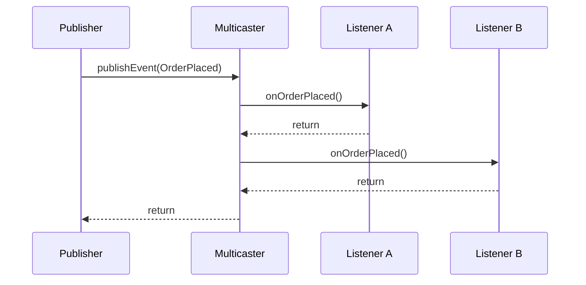
```mermaid
sequenceDiagram
  participant P as Publisher
  participant M as Multicaster
  participant L1 as Listener A
  participant L2 as Listener B
  P->>M: publishEvent(OrderPlaced)
  M->>L1: onOrderPlaced()
  L1-->>M: return
  M->>L2: onOrderPlaced()
  L2-->>M: return
  M-->>P: return
```

The `SimpleApplicationEventMulticaster` iterates through
all registered listeners. By default, it calls each
listener in the publisher's thread (synchronous). If an
`Executor` is set on the multicaster, listeners dispatch
asynchronously.

`@TransactionalEventListener` registers with Spring's
`TransactionSynchronization` callbacks. The listener
invocation is deferred until the registered phase
(`BEFORE_COMMIT`, `AFTER_COMMIT`, `AFTER_ROLLBACK`,
`AFTER_COMPLETION`). If no transaction is active, the
default `fallbackExecution = false` means the listener
silently does not execute - a common source of bugs.

```java
// Immutable domain event (Java record)
public record OrderPlaced(
    UUID orderId,
    Instant occurredAt
) {
  public OrderPlaced(UUID orderId) {
    this(orderId, Instant.now());
  }
}
```

```java
// Publishing an event
@Service
@RequiredArgsConstructor
public class OrderService {
  private final ApplicationEventPublisher pub;
  private final OrderRepository repo;

  @Transactional
  public Order place(CreateOrder cmd) {
    Order order = repo.save(
      Order.from(cmd)
    );
    pub.publishEvent(
      new OrderPlaced(order.id())
    );
    return order;
  }
}
```

```java
// Synchronous listener - same transaction
@Component
class AuditListener {
  @EventListener
  void on(OrderPlaced e) {
    log.info("Order {} placed", e.orderId());
  }
}
```

```java
// Transactional listener - after commit
@Component
class EmailListener {
  @TransactionalEventListener(
    phase = AFTER_COMMIT
  )
  void on(OrderPlaced e) {
    emailService.sendConfirmation(
      e.orderId()
    );
  }
}
```

```java
// Async listener - separate thread pool
@Component
class AnalyticsListener {
  @Async("analyticsExecutor")
  @EventListener
  void on(OrderPlaced e) {
    analyticsClient.track(e);
  }
}
```

### 🚨 Failure Modes

**Failure 1 - TransactionalEventListener silently skipped:**

A `@TransactionalEventListener` method never fires. No
error, no log. The code looks correct. Root cause: the
publisher method is not `@Transactional`, and
`fallbackExecution` defaults to `false`.

**Diagnostic:** Add a breakpoint or log line inside the
listener. If it never triggers, check whether the
publishing method runs inside a transaction. Use
`TransactionSynchronizationManager
.isActualTransactionActive()` to verify.

**Fix:** Either add `@Transactional` to the publisher,
or set `fallbackExecution = true` on the listener
annotation (but understand this changes semantics -
the listener fires immediately, not after commit).

**Failure 2 - Sync listener exception rolls back the
publisher's transaction:**

The publisher calls `publishEvent()` and a synchronous
listener throws. Because the listener runs in the same
thread and same transaction, the exception propagates up
and triggers rollback. The publisher's own work is lost.

**Diagnostic:** Stack trace shows the listener's exception
wrapping a `TransactionSystemException`. The publisher's
data is missing from the database.

**Fix:** If the listener's work is not critical to the
publisher's transaction, make it async (`@Async`) or use
`@TransactionalEventListener(phase = AFTER_COMMIT)`.
If the listener's work is critical, keep it synchronous
but handle exceptions within the listener.

**Failure 3 - Event ordering assumptions violated:**

Multiple listeners handle the same event type. Team
assumes listener A runs before listener B. Spring does
not guarantee listener ordering (unless `@Order` is
explicitly set). A deployment or classpath change
reorders them, breaking the implicit contract.

**Diagnostic:** Intermittent bugs that appear after
deployments or dependency upgrades. Listener A sees state
that listener B was supposed to create first.

**Fix:** Use `@Order(1)`, `@Order(2)` on listeners. Or
better: design listeners to be independent and
idempotent - no ordering assumptions.

### 🔬 Production Reality

In production, the most common event architecture starts
with synchronous in-process events, graduates to
transactional event listeners for reliability, then
bridges to Kafka or RabbitMQ when cross-service
communication becomes necessary.

The Spring Cloud Stream programming model uses the same
functional style: `Consumer<OrderPlaced>` bean bindings
map naturally from `@EventListener` methods. Migration
from in-process to broker-based delivery primarily changes
configuration, not business logic.

Event sourcing - where the event log is the canonical
data store and current state is derived by replaying
events - is powerful but dramatically increases complexity.
Most Spring applications benefit from event-driven
communication without full event sourcing. Use event
sourcing when audit requirements demand a complete history
of state changes, or when CQRS read-model projections
provide significant query performance benefits.

Performance: synchronous event dispatch adds a method
call per listener - negligible. Async dispatch adds thread
pool scheduling overhead. The event publication log adds
one INSERT per event. For high-throughput systems, batch
events or use an external broker rather than relying on
the database-backed log.

### ⚖️ Trade-offs & Alternatives

**BAD:**

```java
// Direct calls create tight coupling
// and ordering fragility
@Transactional
public Order place(CreateOrder cmd) {
  Order o = repo.save(Order.from(cmd));
  emailService.send(o);    // fails = rollback
  inventory.reserve(o);    // never reached
  analytics.track(o);      // never reached
  return o;
}
```

**GOOD:**

```java
// Events decouple - each listener handles
// its own failure independently
@Transactional
public Order place(CreateOrder cmd) {
  Order o = repo.save(Order.from(cmd));
  events.publishEvent(new OrderPlaced(o.id()));
  return o;
}
// Email, inventory, analytics each have
// their own @EventListener / @Async
```

| Approach                | Coupling         | Reliability          | Ordering          | Debugging          |
| ----------------------- | ---------------- | -------------------- | ----------------- | ------------------ |
| Direct calls            | Tight            | All-or-nothing       | Explicit          | Easy (stack trace) |
| Sync events             | Loose            | Same-tx failure risk | Unordered default | Moderate           |
| Tx event listeners      | Loose            | After-commit safety  | Unordered default | Moderate           |
| Async events            | Very loose       | Fire-and-forget      | None              | Hard               |
| Event publication log   | Loose            | At-least-once        | None              | Moderate           |
| External broker (Kafka) | None (cross-JVM) | Configurable         | Partition-ordered | Hard               |

### ⚡ Decision Snap

Use `@EventListener` for simple in-process decoupling where
failure is acceptable. Use `@TransactionalEventListener
(AFTER_COMMIT)` when listeners must not see uncommitted
state. Add `@Async` when listener latency must not block
the publisher. Use Modulith's event publication log when
you need at-least-once delivery without a broker. Move to
Spring Cloud Stream with Kafka or RabbitMQ when events
must cross JVM boundaries.

### ⚠️ Top Traps

| #   | Trap                                                            | Why it hurts                                                            |
| --- | --------------------------------------------------------------- | ----------------------------------------------------------------------- |
| 1   | No @Transactional on publisher with @TransactionalEventListener | Listener silently never fires - data inconsistency with no error        |
| 2   | Sync listener throwing unchecked exceptions                     | Rolls back publisher's transaction - unrelated failure causes data loss |
| 3   | Assuming listener execution order without @Order                | Reordering on redeploy causes subtle, intermittent bugs                 |
| 4   | Async listener accessing transaction-scoped state               | LazyInitializationException or stale data in a different thread         |
| 5   | Using events for everything including same-aggregate calls      | Adds indirection without decoupling - makes code harder to follow       |

### 🪜 Learning Ladder

**Prerequisites:**
SPR-044 Spring Transaction Management,
SPR-096 Saga Pattern Implementation in Spring

**THIS:** SPR-095 Event-Driven Architecture with Spring
Events - decouple producers from consumers using
ApplicationEvent, transactional listeners, and async
dispatch.

**Next steps:**
SPR-094 Spring Modulith and Module Boundaries

**The Surprising Truth:**

The biggest risk with Spring events is not losing events -
it is losing debuggability. A direct method call gives you
a stack trace from caller to callee. An event gives you
two disconnected stack traces with a gap in the middle.
Teams that adopt events everywhere end up writing custom
correlation tracing infrastructure to reconnect what they
voluntarily disconnected. Events are a trade-off, not a
free lunch.

**Further Reading:**

- Spring Framework reference: Application Events
  (docs.spring.io)
- Spring Modulith reference: Event Publication Registry
  (docs.spring.io)
- Vaughn Vernon, "Implementing Domain-Driven Design",
  Ch. 8 - Domain Events
- Spring Cloud Stream reference documentation
  (spring.io)

**Revision Card:**

1. `@TransactionalEventListener(phase = AFTER_COMMIT)`
   defers listener execution until the publisher's
   transaction commits - preventing ghost side effects
   from rolled-back transactions.
2. Synchronous listeners run in the publisher's thread
   and transaction - a listener exception rolls back the
   publisher's work unless you add `@Async` or catch it.
3. Without an active transaction, `@TransactionalEventListener`
   with default `fallbackExecution = false` silently
   skips the listener - the most common Spring event bug.

---

---

# SPR-096 Saga Pattern Implementation in Spring

**TL;DR** - Sagas coordinate multi-service transactions through choreography or orchestration, using compensating actions instead of distributed locks.

### 🔥 Problem Statement

You split a monolith into microservices. Each service
owns its database. A single business operation - place
an order - now spans Order, Payment, Inventory, and
Shipping services. Traditional ACID transactions cannot
cross service boundaries because there is no shared
transaction manager. Two-phase commit (2PC) exists but
requires all participants to hold locks until the
coordinator decides. One slow participant blocks
everyone. One crashed coordinator leaves all
participants hanging with locks held indefinitely.

The real constraint: you need atomicity across services
without distributed locks, and you need a recovery
strategy when step 4 of 7 fails. Sagas solve this by
breaking a long-lived transaction into a sequence of
local transactions, each with a compensating action that
undoes its effect if a later step fails.

### 📜 Historical Context

Hector Garcia-Molina and Kenneth Salem coined "saga" in
their 1987 paper on long-lived transactions in
databases. The original concept addressed single-database
transactions that held locks too long. Microservices
adopted the pattern around 2015-2017 when teams realized
2PC was impractical across independent services. Chris
Richardson formalized the choreography vs orchestration
distinction in his microservices patterns work.

Spring State Machine (part of Spring Statemachine
project, first released 2015) provided a natural fit for
orchestration sagas. Spring Cloud Stream (evolved from
Spring Integration) enabled event-driven choreography.
By 2020, saga had become the default pattern for
distributed transactions in Spring-based microservice
architectures. Frameworks like Axon, Eventuate Tram, and
MicroProfile LRA formalized implementations, but many
teams build custom sagas on Spring primitives.

### 🔩 First Principles

**CORE INVARIANTS:**

1. **Local atomicity only** - each step is a local ACID
   transaction within one service's database. No step
   ever holds a lock in another service's store.
2. **Compensating reversibility** - every forward step
   must have a compensating action that semantically
   undoes its effect. "Semantically" because you cannot
   un-send an email; you send a cancellation email.
3. **Eventual consistency guarantee** - the saga either
   completes all steps (success) or executes
   compensating actions for all completed steps
   (failure). The system reaches a consistent state
   eventually, not immediately.

**DERIVED DESIGN:**

From invariant 1: services must be autonomous and own
their data exclusively. From invariant 2: compensating
actions must be idempotent because retries happen after
network failures. From invariant 3: you need a
mechanism (event bus or orchestrator) that tracks which
steps completed and which need compensation.

### 🧠 Mental Model

> A saga is like a relay race where each runner (service)
> completes their leg independently, and if any runner
> drops the baton, all previous runners must jog back to
> the starting line to undo their distance.

-> Choreography: each runner listens for the previous
runner's completion shout and decides to start
-> Orchestration: a coach (orchestrator) tells each
runner when to start and when to return
-> Compensating actions: running back is not the same
as never having run - the crowd already saw you
-> Idempotency: if the coach's whistle echoes twice,
the runner must not run the leg twice

**Where this analogy breaks down:** Real relay runners
are synchronous and co-located. Saga participants are
asynchronous, distributed, and may fail independently
at any point including during compensation itself.
Compensation of compensation requires careful design.

### 🧩 Components

```
+-------------------------------------------+
|         SAGA COORDINATION LAYER           |
|  (Orchestrator or Event Bus)              |
+-----+--------+--------+--------+---------+
      |        |        |        |
      v        v        v        v
  +-------+ +-------+ +-------+ +-------+
  |Order  | |Payment| |Invent | |Ship   |
  |Svc    | |Svc    | |Svc    | |Svc    |
  +---+---+ +---+---+ +---+---+ +---+---+
      |        |        |        |
      v        v        v        v
  [OrderDB] [PayDB] [InvDB]  [ShipDB]
```

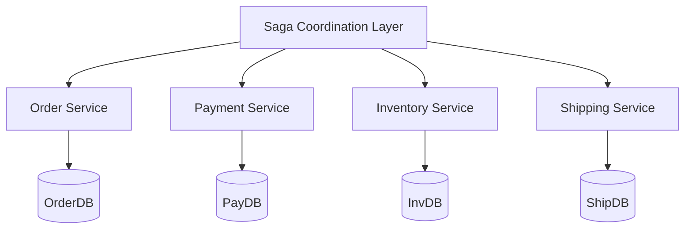
```mermaid
flowchart TB
    SC[Saga Coordination Layer]
    OS[Order Service]
    PS[Payment Service]
    IS[Inventory Service]
    SS[Shipping Service]
    OD[(OrderDB)]
    PD[(PayDB)]
    ID[(InvDB)]
    SD[(ShipDB)]
    SC --> OS
    SC --> PS
    SC --> IS
    SC --> SS
    OS --> OD
    PS --> PD
    IS --> ID
    SS --> SD
```

### 📶 Gradual Depth

**Level 1 - Choreography saga:** Each service publishes
a domain event after completing its local transaction.
The next service subscribes to that event and starts its
step. On failure, it publishes a failure event that
triggers compensating actions in reverse order.

```java
// Order Service publishes event
@Transactional
public Order createOrder(OrderRequest req) {
  Order order = orderRepo.save(
    new Order(req, OrderStatus.PENDING)
  );
  streamBridge.send(
    "order-created-out-0",
    new OrderCreatedEvent(
      order.getId(), req.getItems()
    )
  );
  return order;
}
```

**Level 2 - Orchestration saga:** A central orchestrator
(often a state machine) drives the sequence. It sends
commands to each service and handles responses. On
failure, it issues compensating commands in reverse.

```java
@Configuration
@EnableStateMachineFactory
public class OrderSagaConfig
    extends StateMachineConfigurerAdapter<
      OrderState, OrderEvent> {

  @Override
  public void configure(
      StateMachineTransitionConfigurer<
        OrderState, OrderEvent> t)
      throws Exception {
    t.withExternal()
      .source(OrderState.CREATED)
      .target(OrderState.PAYMENT_PENDING)
      .event(OrderEvent.START_PAYMENT)
      .action(requestPaymentAction())
    .and().withExternal()
      .source(OrderState.PAYMENT_PENDING)
      .target(OrderState.PAID)
      .event(OrderEvent.PAYMENT_SUCCESS)
      .action(reserveInventoryAction())
    .and().withExternal()
      .source(OrderState.PAYMENT_PENDING)
      .target(OrderState.COMPENSATING)
      .event(OrderEvent.PAYMENT_FAILED)
      .action(cancelOrderAction());
  }
}
```

**Level 3 - Compensating transactions:** The critical
design challenge. Each compensation must be idempotent
and must handle the case where the forward action
partially completed or the compensation message arrives
more than once.

```java
@Transactional
public void compensatePayment(
    String sagaId, String paymentId) {
  // Idempotency check via saga log
  if (sagaLog.isCompensated(
      sagaId, "payment")) {
    log.info("Already compensated: {}",
      sagaId);
    return;
  }
  paymentService.refund(paymentId);
  sagaLog.markCompensated(
    sagaId, "payment"
  );
}
```

**Level 4 - Saga log and recovery:** The saga log is
the source of truth for saga state. On startup or after
a crash, the orchestrator reads incomplete sagas from
the log and resumes compensation or retries. This is
the mechanism that makes sagas reliable across process
restarts and network partitions.

### ⚙️ How It Works

```
ORCHESTRATION FLOW (happy path):
Orchestrator -> Order: "create"
  Order -> Orchestrator: "created"
Orchestrator -> Payment: "charge"
  Payment -> Orchestrator: "charged"
Orchestrator -> Inventory: "reserve"
  Inventory -> Orchestrator: "reserved"
Orchestrator -> Shipping: "ship"
  Shipping -> Orchestrator: "shipped"
Saga: COMPLETED

COMPENSATION FLOW (inventory fails):
Orchestrator -> Inventory: "reserve"
  Inventory -> Orchestrator: "FAILED"
Orchestrator -> Payment: "refund"
  Payment -> Orchestrator: "refunded"
Orchestrator -> Order: "cancel"
  Order -> Orchestrator: "cancelled"
Saga: COMPENSATED
```

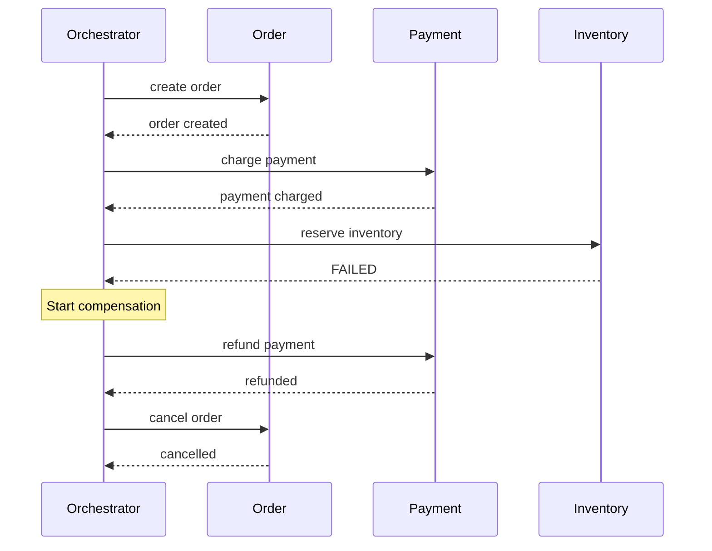
```mermaid
sequenceDiagram
    participant O as Orchestrator
    participant OR as Order
    participant P as Payment
    participant I as Inventory

    O->>OR: create order
    OR-->>O: order created
    O->>P: charge payment
    P-->>O: payment charged
    O->>I: reserve inventory
    I-->>O: FAILED
    Note over O: Start compensation
    O->>P: refund payment
    P-->>O: refunded
    O->>OR: cancel order
    OR-->>O: cancelled
```

**Choreography flow:** Replace the orchestrator with an
event bus. Each service listens for the previous
service's success event and acts. On failure, it
publishes a compensation event. The risk: with many
services, the event chain becomes hard to trace and
reason about. Cyclic dependencies can emerge silently.

**Idempotency implementation:** Every saga step handler
checks the saga log before executing. The saga log
stores `(sagaId, stepName, status)` tuples. A duplicate
message finds `status=COMPLETED` and short-circuits.
This is non-negotiable - without idempotency, a retry
after a timeout will double-charge customers.

### 🚨 Failure Modes

**Failure 1 - Compensation fails during compensation:**
The inventory service refund succeeds but the payment
refund times out. The saga is now in a partially
compensated state.

**Diagnostic:** Saga log shows `inventory: COMPENSATED,
payment: COMPENSATING`. Alerts fire on sagas stuck in
COMPENSATING for longer than the SLA threshold.

**Fix:** Implement retry with exponential backoff for
compensation steps. Add a dead letter queue for
compensations that exhaust retries. A human operator
dashboard shows stuck sagas with a "force compensate"
button. Never silently drop a failed compensation.

**Failure 2 - Orchestrator crashes mid-saga:**
The orchestrator sent "charge payment" but crashed
before receiving the response.

**Diagnostic:** On restart, the orchestrator queries
the saga log for sagas in non-terminal states. It
finds this saga in `PAYMENT_PENDING` state.

**Fix:** The orchestrator queries the payment service
for the payment status (the payment service must expose
an idempotent status endpoint). Based on the response,
it either proceeds to the next step or starts
compensation. The saga log must be persisted in a
durable store (database, not in-memory).

**Failure 3 - Zombie saga from message reordering:**
Payment success event arrives after the saga already
timed out and started compensating.

**Diagnostic:** Saga log shows `status=COMPENSATING`
but a late success event triggers the next step.

**Fix:** State machine transitions must validate current
state before accepting events. A `COMPENSATING` saga
rejects `PAYMENT_SUCCESS` events. Log the rejected
event for audit.

### 🔬 Production Reality

Choreography sagas work well for 3-4 services with
linear flows. Beyond that, the implicit coupling
through events becomes a debugging nightmare. You
cannot look at any single service and understand the
full saga. Orchestration adds a single point of
coordination (not failure, if replicated) but gives
you a single place to see the entire workflow.

The saga log table grows fast in high-throughput
systems. Partition it by date or saga status. Archive
completed sagas to cold storage. Keep the hot table
small for restart recovery scans.

Spring State Machine persists state via
`StateMachinePersister`. Use the JPA persister for
production. The in-memory persister loses state on
restart - suitable only for development.

Spring Cloud Stream with Kafka or RabbitMQ provides
at-least-once delivery. This means your handlers will
receive duplicate messages. Idempotency is not optional.

Testing sagas requires integration tests that simulate
failure at every step. Use Testcontainers for Kafka and
database instances. Test the compensation path as
thoroughly as the happy path - it runs in production
more often than you expect.

### ⚖️ Trade-offs & Alternatives

**BAD:**

```java
// Two-phase commit across services
@Transactional(propagation = REQUIRES_NEW)
public void placeOrder(OrderReq req) {
  // This transaction cannot span Payment
  // and Inventory service databases.
  // JTA/XA across services = lock hell.
  orderRepo.save(order);
  paymentClient.charge(order); // remote!
  inventoryClient.reserve(order); // remote!
}
```

**GOOD:**

```java
// Saga orchestrator drives local txns
public void startOrderSaga(OrderReq req) {
  String sagaId = UUID.randomUUID()
    .toString();
  sagaLog.create(sagaId, "ORDER_SAGA");
  stateMachine.sendEvent(
    MessageBuilder
      .withPayload(OrderEvent.START)
      .setHeader("sagaId", sagaId)
      .build()
  );
}
```

| Aspect       | Choreography        | Orchestration          |
| ------------ | ------------------- | ---------------------- |
| Coupling     | Loose (events)      | Central coordinator    |
| Visibility   | Hard to trace       | Single view            |
| Complexity   | Grows with services | Constant per saga      |
| Single point | None                | Orchestrator           |
| Testing      | Harder (async)      | Easier (state machine) |
| Best for     | Simple, few steps   | Complex, many steps    |

### ⚡ Decision Snap

Use choreography sagas when: fewer than 4 services,
linear flow, team prefers decentralized ownership, and
you have strong distributed tracing (Zipkin/Jaeger).

Use orchestration sagas when: 4+ services, branching
logic, compensation is complex, or you need a single
audit view of the transaction lifecycle.

Do not use sagas when: a single database suffices
(Spring Modulith with `@Transactional`), the operation
is read-only, or you can use an outbox pattern with
a single downstream consumer.

### ⚠️ Top Traps

| #   | Trap                    | Why it hurts                                       | Escape                                        |
| --- | ----------------------- | -------------------------------------------------- | --------------------------------------------- |
| 1   | Skipping idempotency    | Duplicate charges, double inventory deductions     | Saga log check before every step execution    |
| 2   | In-memory saga state    | Orchestrator restart loses all in-flight sagas     | Persist saga log to database, scan on startup |
| 3   | No compensation timeout | Stuck sagas consume resources forever              | SLA-based timeout with dead letter escalation |
| 4   | Testing only happy path | Compensation bugs surface in production under load | Fault injection tests for every step failure  |
| 5   | Choreography at scale   | 10+ services create untraceable event spaghetti    | Switch to orchestration beyond 4 services     |

### 🪜 Learning Ladder

**Prerequisites:**
SPR-095 Event-Driven Architecture with Spring Events,
SPR-035 Spring Cloud Stream fundamentals

**THIS:** SPR-096 Saga Pattern Implementation in Spring

**Next steps:**
SPR-090 Microservice Architecture with Spring Boot

**The Surprising Truth:** Most teams that implement sagas
discover they needed fewer microservices, not better
distributed transactions. The saga complexity is often a
signal that your service boundaries are wrong. If every
business operation requires a 5-step saga, your services
are too fine-grained. Redesign the boundaries first.

**Further Reading:**

- Garcia-Molina & Salem, "Sagas" (1987 ACM SIGMOD)
- Chris Richardson, "Microservices Patterns" (Manning)
- Spring Statemachine reference documentation
- Spring Cloud Stream reference documentation
- Eventuate Tram Sagas framework documentation

**Revision Card:**

1. Sagas replace distributed ACID with a sequence of
   local transactions plus compensating actions
2. Choreography uses events between services;
   orchestration uses a central state machine coordinator
3. Every saga step must be idempotent and every forward
   action must have a tested compensating counterpart

---

---

# SPR-097 API Gateway Design for Spring Microservices

**TL;DR** - The API gateway is a single entry point that handles routing, security, rate limiting, and cross-cutting concerns at the edge.

### 🔥 Problem Statement

You have 20 microservices. Clients (mobile apps, SPAs,
third-party integrations) need to call them. Without a
gateway, each client must know every service's address,
handle authentication independently, implement retry
logic, and deal with service discovery. CORS
configuration is scattered across 20 services. Rate
limiting is inconsistent. One misbehaving client
hammers your inventory service while your payment
service sits idle. There is no single place to enforce
authentication, collect metrics, or throttle traffic.

The gateway consolidates these cross-cutting concerns
at the network edge. It is the front door. Every
request enters through it. This is both its power and
its risk - it becomes a critical single point of
failure if not designed carefully.

### 📜 Historical Context

Netflix built Zuul (2013) as the first major
open-source API gateway for microservices. Zuul 1 used
a blocking thread-per-request model built on Servlet
APIs. It worked but struggled under high concurrency
because each waiting thread consumed memory. Netflix
developed Zuul 2 with a non-blocking Netty architecture
but never fully open-sourced the production version.

Spring Cloud Gateway (released 2017) was built from
scratch on Project Reactor and Netty, providing a
non-blocking, reactive gateway. It replaced Zuul as the
recommended Spring Cloud option. By 2020, Spring Cloud
Netflix entered maintenance mode and Spring Cloud
Gateway became the de facto standard. Third-party
alternatives like Kong, Envoy, and AWS API Gateway
offer similar capabilities outside the Spring ecosystem.

### 🔩 First Principles

**CORE INVARIANTS:**

1. **Single entry point** - all external traffic enters
   through the gateway. No client directly addresses an
   internal service. Internal service-to-service
   communication bypasses the gateway.
2. **Stateless routing** - the gateway does not store
   session state. Every request carries its own
   credentials (JWT, API key). This enables horizontal
   scaling of gateway instances behind a load balancer.
3. **Fail-open vs fail-closed** - security filters must
   fail closed (deny on error). Rate limiters and
   circuit breakers fail open (allow on error) to
   prevent the gateway from becoming a single point of
   total system failure.

**DERIVED DESIGN:**

From invariant 1: the gateway must integrate with
service discovery (Eureka, Consul, Kubernetes DNS) to
route dynamically. From invariant 2: authentication
produces a token or header that downstream services
trust without re-validating against the auth server.
From invariant 3: every filter must declare its failure
mode explicitly in configuration.

### 🧠 Mental Model

> An API gateway is like a hotel concierge desk. Guests
> (clients) do not wander the hallways knocking on room
> doors (services). They ask the concierge, who knows
> which room handles which request, checks credentials,
> and routes appropriately.

-> Route predicates: the concierge reads the guest's
request and decides which department handles it
-> Pre-filters: checking ID before allowing entry
-> Post-filters: stamping the response envelope before
handing it to the guest
-> Rate limiting: the concierge limits how many
requests one guest can make per minute

**Where this analogy breaks down:** A concierge is a
single person. A production gateway is a horizontally
scaled cluster behind a load balancer. Also, the
concierge can exercise judgment; the gateway operates
on deterministic rules. There is no "use your best
judgment" filter.

### 🧩 Components

```
CLIENT --> [Load Balancer]
              |
         [Gateway Cluster]
         | Pre-Filters:     |
         |  Auth, RateLimit |
         | Route Predicates  |
         | Post-Filters:     |
         |  Headers, Logging |
              |
    +---------+---------+
    |         |         |
  [Order]  [Pay]   [Inventory]
  [Svc]    [Svc]   [Svc]
```

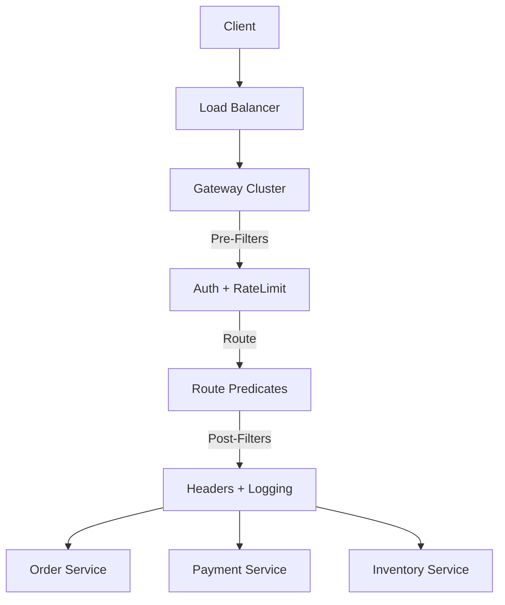
```mermaid
flowchart TB
    C[Client] --> LB[Load Balancer]
    LB --> GW[Gateway Cluster]
    GW -->|Pre-Filters| AF[Auth + RateLimit]
    AF -->|Route| RP[Route Predicates]
    RP -->|Post-Filters| PF[Headers + Logging]
    PF --> OS[Order Service]
    PF --> PS[Payment Service]
    PF --> IS[Inventory Service]
```

### 📶 Gradual Depth

**Level 1 - Basic routing:** Spring Cloud Gateway uses
route definitions with predicates and filters. A route
matches a request based on path, host, headers, or
query parameters, then forwards it to a URI.

```yaml
spring:
  cloud:
    gateway:
      routes:
        - id: order-service
          uri: lb://order-service
          predicates:
            - Path=/api/orders/**
          filters:
            - StripPrefix=1
```

The `lb://` prefix triggers load-balanced routing via
Spring Cloud LoadBalancer. `StripPrefix=1` removes
`/api` before forwarding, so `/api/orders/123` becomes
`/orders/123` at the downstream service.

**Level 2 - Filter pipeline:** Filters execute in a
chain. Pre-filters run before proxying (authentication,
request modification, rate limiting). Post-filters run
after the response returns (header injection, logging,
response modification).

```java
@Component
public class AuthFilter implements
    GatewayFilterFactory<AuthFilter.Config> {

  @Override
  public GatewayFilter apply(Config config) {
    return (exchange, chain) -> {
      String token = exchange.getRequest()
        .getHeaders()
        .getFirst(HttpHeaders.AUTHORIZATION);
      if (token == null
          || !jwtValidator.isValid(token)) {
        exchange.getResponse().setStatusCode(
          HttpStatus.UNAUTHORIZED
        );
        return exchange.getResponse()
          .setComplete();
      }
      // Add user context for downstream
      ServerHttpRequest modified = exchange
        .getRequest().mutate()
        .header("X-User-Id",
          jwtValidator.extractUserId(token))
        .build();
      return chain.filter(
        exchange.mutate()
          .request(modified).build()
      );
    };
  }
}
```

**Level 3 - Rate limiting with Redis:** Spring Cloud
Gateway provides a built-in `RequestRateLimiter` filter
backed by Redis using a token bucket algorithm.

```yaml
filters:
  - name: RequestRateLimiter
    args:
      redis-rate-limiter.replenishRate: 10
      redis-rate-limiter.burstCapacity: 20
      key-resolver: "#{@apiKeyResolver}"
```

```java
@Bean
public KeyResolver apiKeyResolver() {
  return exchange -> Mono.just(
    exchange.getRequest().getHeaders()
      .getFirst("X-API-Key")
  );
}
```

`replenishRate` is tokens per second per key.
`burstCapacity` is the maximum tokens available.
Redis stores the bucket state, enabling consistent
rate limiting across all gateway instances.

**Level 4 - Circuit breaking at the gateway:** Integrate
Resilience4j circuit breaker as a gateway filter to
prevent cascading failures when a downstream service
is unhealthy.

```yaml
filters:
  - name: CircuitBreaker
    args:
      name: orderCircuitBreaker
      fallbackUri: forward:/fallback/orders
```

```java
@RestController
public class FallbackController {
  @GetMapping("/fallback/orders")
  public ResponseEntity<Map<String, String>>
      orderFallback() {
    return ResponseEntity
      .status(HttpStatus.SERVICE_UNAVAILABLE)
      .body(Map.of(
        "message",
        "Order service temporarily unavailable"
      ));
  }
}
```

### ⚙️ How It Works

```
REQUEST LIFECYCLE:
Client -> Gateway
  1. Route predicate matching
     (Path, Host, Method, Header)
  2. Pre-filter chain execution:
     a. Auth filter (fail-closed)
     b. Rate limit filter (Redis check)
     c. Circuit breaker check
  3. Proxy to downstream service
  4. Receive response
  5. Post-filter chain execution:
     a. Add correlation headers
     b. Remove internal headers
     c. Log request/response metrics
  6. Return response to client
```

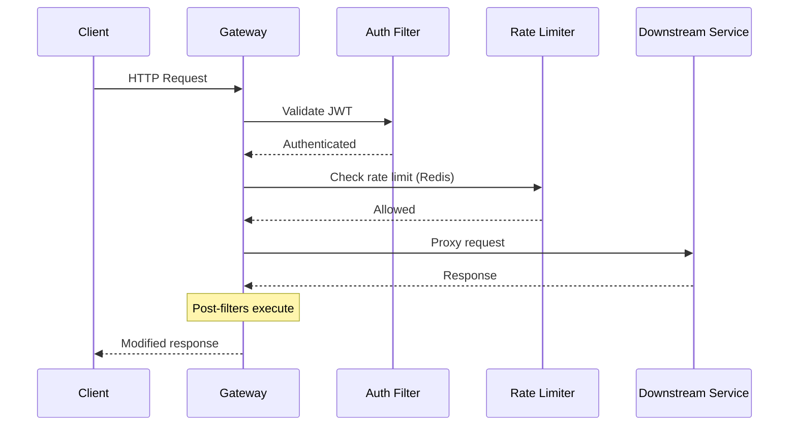
```mermaid
sequenceDiagram
    participant C as Client
    participant G as Gateway
    participant A as Auth Filter
    participant R as Rate Limiter
    participant S as Downstream Service

    C->>G: HTTP Request
    G->>A: Validate JWT
    A-->>G: Authenticated
    G->>R: Check rate limit (Redis)
    R-->>G: Allowed
    G->>S: Proxy request
    S-->>G: Response
    Note over G: Post-filters execute
    G-->>C: Modified response
```

**BFF (Backend for Frontend) pattern:** Create separate
gateway route groups for different client types. Mobile
clients get aggregated responses (fewer round trips).
Web SPAs get fine-grained endpoints. Each BFF route
group applies different filters, rate limits, and
response transformations.

```yaml
routes:
  - id: mobile-orders
    uri: lb://order-aggregator
    predicates:
      - Path=/mobile/api/orders/**
      - Header=X-Client-Type, mobile
  - id: web-orders
    uri: lb://order-service
    predicates:
      - Path=/web/api/orders/**
```

### 🚨 Failure Modes

**Failure 1 - Gateway becomes the bottleneck:**
All traffic funnels through the gateway. Under load,
the gateway's thread pool (Netty event loop) saturates.
Latency spikes propagate to every service.

**Diagnostic:** Gateway CPU stays low but latency
increases. Netty event loop utilization metrics show
saturation. Upstream load balancer health checks start
failing intermittently.

**Fix:** Scale gateway instances horizontally behind
the load balancer. Ensure filters are non-blocking
(no `block()` calls in reactive pipeline). Move
expensive operations (JWT signature verification
with remote JWKS endpoint) behind caching. Use
connection pooling for downstream HTTP clients.

**Failure 2 - Redis rate limiter unavailable:**
Redis goes down. Every request either gets rate
limited (fail-closed) or bypasses rate limiting
entirely (fail-open).

**Diagnostic:** Redis connection timeout errors in
gateway logs. Rate limiting metrics show either
100% rejection or 0% rejection.

**Fix:** Configure fail-open for rate limiting (allow
traffic when Redis is down). Implement a local
in-memory fallback rate limiter with conservative
limits. Alert on Redis connectivity loss. A brief
window without rate limiting is better than rejecting
all traffic.

**Failure 3 - Route misconfiguration causes loop:**
A route predicate accidentally matches the fallback
URI, creating an infinite request loop within the
gateway.

**Diagnostic:** Gateway CPU spikes to 100%. Thread
dump shows recursive filter chain execution.
OutOfMemoryError from accumulated exchange objects.

**Fix:** Validate routes at startup to detect
circular references. Set `spring.cloud.gateway
.httpclient.response-timeout` to prevent infinite
waits. Use a dedicated `/fallback/**` path prefix
that no route predicate matches for proxying.

### 🔬 Production Reality

Spring Cloud Gateway runs on Netty with non-blocking
I/O. This means you must never call `.block()` inside
a filter. One blocking call in a filter ties up a
Netty event loop thread, which handles thousands of
concurrent connections. A single `.block()` under load
can cascade into full gateway unresponsiveness.

JWT validation at the gateway should use cached JWKS
keys. Fetching keys from the auth server on every
request adds latency and creates a dependency. Cache
JWKS keys with a TTL matching the key rotation period.

Correlation IDs must be generated at the gateway and
propagated to all downstream services. Use a global
pre-filter that generates a UUID if the
`X-Correlation-Id` header is absent, and a post-filter
that ensures it appears in the response.

Logging at the gateway must be selective. Logging full
request/response bodies in production generates
enormous log volumes. Log headers and metadata by
default. Enable body logging only for specific routes
during debugging via a configuration flag.

Health checks: expose a `/actuator/health` endpoint
that validates downstream service connectivity. The
load balancer uses this to remove unhealthy gateway
instances. Include Redis connectivity in the health
check since rate limiting depends on it.

### ⚖️ Trade-offs & Alternatives

**BAD:**

```java
// Blocking call inside reactive filter
@Override
public GatewayFilter apply(Config c) {
  return (exchange, chain) -> {
    // BLOCKS Netty event loop thread!
    User user = userClient.getUser(id)
      .block();
    return chain.filter(exchange);
  };
}
```

**GOOD:**

```java
// Non-blocking reactive filter
@Override
public GatewayFilter apply(Config c) {
  return (exchange, chain) -> {
    return userClient.getUser(id)
      .flatMap(user -> {
        ServerHttpRequest req = exchange
          .getRequest().mutate()
          .header("X-User", user.getId())
          .build();
        return chain.filter(
          exchange.mutate()
            .request(req).build()
        );
      });
  };
}
```

| Aspect        | Spring Cloud Gateway | Zuul 1             | Envoy/Kong          |
| ------------- | -------------------- | ------------------ | ------------------- |
| I/O model     | Non-blocking (Netty) | Blocking (Servlet) | Non-blocking (C++)  |
| Ecosystem     | Spring-native        | Legacy Netflix     | Polyglot            |
| Config        | Java/YAML            | Java               | YAML/Admin API      |
| Performance   | High throughput      | Limited by threads | Very high           |
| Extensibility | Java filters         | Java filters       | Lua/WASM/plugins    |
| Best for      | Spring shops         | Legacy only        | Multi-language orgs |

### ⚡ Decision Snap

Use Spring Cloud Gateway when: your backend is Spring-
based, you want Java-native filters, and your team
already knows Spring reactive (WebFlux/Reactor).

Use Envoy or Kong when: your services span multiple
languages, you want a sidecar proxy, or you need a
service mesh integration (Istio uses Envoy).

Skip the gateway entirely when: you have fewer than 3
services, use a managed API gateway (AWS API Gateway,
Google Cloud Endpoints), or your infrastructure
provides edge functionality natively (Kubernetes
Ingress with auth and rate limiting).

### ⚠️ Top Traps

| #   | Trap                            | Why it hurts                                                           | Escape                                               |
| --- | ------------------------------- | ---------------------------------------------------------------------- | ---------------------------------------------------- |
| 1   | Blocking calls in filters       | One `.block()` freezes a Netty thread serving thousands of connections | Use reactive operators: `flatMap`, `map`, `then`     |
| 2   | Gateway as business logic layer | Routing logic becomes an unmaintainable monolith                       | Keep gateway thin: auth, routing, rate limiting only |
| 3   | No circuit breaker on routes    | One slow service causes gateway thread starvation                      | Add Resilience4j CircuitBreaker filter per route     |
| 4   | Hardcoded service URLs          | Deployment changes require gateway redeployment                        | Use `lb://` with service discovery                   |
| 5   | Missing correlation IDs         | Cannot trace requests across services during incidents                 | Global pre-filter generates UUID for every request   |

### 🪜 Learning Ladder

**Prerequisites:**
SPR-080 Spring Cloud fundamentals,
SPR-090 Microservice Architecture with Spring Boot

**THIS:** SPR-097 API Gateway Design for Spring
Microservices

**Next steps:**
SPR-098 Multi-Tenancy Patterns in Spring Boot

**The Surprising Truth:** The most effective API gateways
do almost nothing. They route, authenticate, rate limit,
and get out of the way. Teams that add response
transformation, data aggregation, and business logic to
the gateway end up rebuilding the monolith at the edge.
The gateway that tries to be smart becomes the bottleneck
that cannot be scaled independently from the business
logic it absorbed.

**Further Reading:**

- Spring Cloud Gateway reference documentation
- Chris Richardson, "Microservices Patterns" (Manning)
- Sam Newman, "Building Microservices" (O'Reilly)
- Netflix Zuul architecture blog posts
- Resilience4j documentation for circuit breaker config

**Revision Card:**

1. Spring Cloud Gateway uses non-blocking Netty I/O with
   route predicates and a filter chain for cross-cutting
   concerns at the edge
2. Rate limiting uses Redis-backed token bucket; circuit
   breaking uses Resilience4j - both configured per route
3. Never call `.block()` in a gateway filter; keep the
   gateway thin with only auth, routing, and rate limiting

---

---

# SPR-098 Multi-Tenancy Patterns in Spring Boot

**TL;DR** - Isolate tenant data via database-per-tenant, schema-per-tenant, or discriminator column, routing through Hibernate's multi-tenancy SPI and Spring Security context.

### 🔥 Problem Statement

You are building a SaaS platform where hundreds of
customers (tenants) share the same Spring Boot
application. Each tenant expects complete data isolation

- tenant A must never see tenant B's records, even under
  bugs, cache corruption, or query mistakes. You also need
  per-tenant customization (feature flags, rate limits,
  storage quotas) without deploying separate instances for
  each tenant. The fundamental tension: operational
  simplicity (one deployable) versus data isolation
  guarantees (separate storage). Get this wrong and you
  have a data breach. Get it over-engineered and you have
  an ops nightmare with hundreds of database instances.

### 📜 Historical Context

Early SaaS applications (2005-2010) typically deployed
one application instance per customer - simple isolation
but terrible economics. Salesforce pioneered shared-schema
multi-tenancy with a metadata-driven OrgId discriminator
in the mid-2000s, proving the model could scale to
thousands of tenants on shared infrastructure. Hibernate
introduced `MultiTenancyStrategy` in version 4.0 (2012),
formalizing three strategies: DATABASE, SCHEMA, and
DISCRIMINATOR. Spring Boot auto-configuration support
improved significantly in Boot 2.x and 3.x, with
`HibernatePropertiesCustomizer` and
`CurrentTenantIdentifierResolver` becoming the standard
integration points. The rise of Kubernetes (2017+)
shifted the database-per-tenant model toward managed
database services with programmatic provisioning, making
what was once operationally expensive now feasible via
cloud APIs. Spring Security 6.x's context propagation
model integrates cleanly with tenant resolution, making
the full stack tenant-aware from HTTP ingress to SQL
execution.

### 🔩 First Principles

**CORE INVARIANTS:**

1. **Tenant isolation is a security boundary, not a
   convenience** - a missing WHERE clause or wrong
   connection string is a data breach, not a bug
2. **Tenant identity must be resolved once at the edge
   and propagated immutably** - re-resolving mid-request
   from mutable state invites cross-tenant leaks
3. **Connection pool and cache must be tenant-scoped or
   tenant-safe** - a shared HikariCP pool returning a
   connection bound to tenant A's schema to tenant B's
   request is a silent catastrophe

**DERIVED DESIGN:**

From invariant 1: the isolation strategy must be chosen
based on regulatory requirements (some industries mandate
separate databases), not developer convenience. From
invariant 2: tenant context flows through a
`ThreadLocal` (or Reactor context for reactive) set by
a servlet filter before any business logic executes.
From invariant 3: database-per-tenant requires per-tenant
connection pools or a pool-per-tenant manager;
shared-schema can share a pool but must validate every
query includes the discriminator.

### 🧠 Mental Model

> Multi-tenancy is like an apartment building. Each
> tenant gets their own unit. The three strategies differ
> in how much shared infrastructure exists.

-> Database-per-tenant: separate buildings on the same
block - maximum isolation, maximum cost
-> Schema-per-tenant: separate apartments in one
building - shared plumbing, separate floor plans
-> Shared-schema with discriminator: one open-plan
office with assigned desks - cheapest, but one
spilled coffee can reach the neighbor

**Where this analogy breaks down:** In real apartments,
a tenant cannot accidentally enter another's unit. In
software, a missing discriminator filter silently reads
all tenants' data. The "walls" in shared-schema are
purely logical and require active enforcement at every
query, cache lookup, and event publish.

### 🧩 Components

```
+--------------------------------------------------+
|  HTTP Request (Header / Subdomain / JWT)         |
+--------------------------------------------------+
          |
          v
+---------------------+   +--------------------+
| TenantFilter        |-->| TenantContext       |
| (resolves tenant)   |   | (ThreadLocal)       |
+---------------------+   +--------------------+
          |
          v
+---------------------+   +--------------------+
| CurrentTenantId     |-->| ConnectionProvider  |
| Resolver (Hibernate)|   | (per-tenant routing)|
+---------------------+   +--------------------+
          |
          v
+--------------------------------------------------+
|  DataSource / Schema / Discriminator Column      |
+--------------------------------------------------+
```

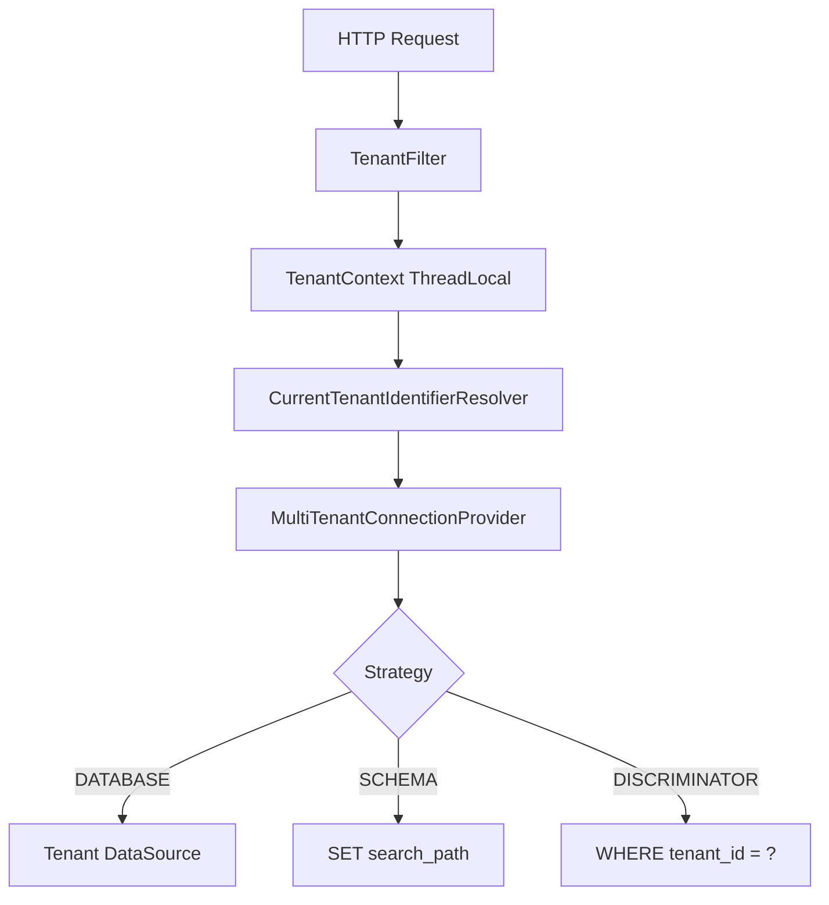
```mermaid
flowchart TD
    A[HTTP Request] --> B[TenantFilter]
    B --> C[TenantContext ThreadLocal]
    C --> D[CurrentTenantIdentifierResolver]
    D --> E[MultiTenantConnectionProvider]
    E --> F{Strategy}
    F -->|DATABASE| G[Tenant DataSource]
    F -->|SCHEMA| H[SET search_path]
    F -->|DISCRIMINATOR| I["WHERE tenant_id = ?"]
```

### 📶 Gradual Depth

**Layer 1 - Core concept:** Every request carries a
tenant identifier. A filter extracts it and stores it in
`ThreadLocal`. Hibernate reads it via
`CurrentTenantIdentifierResolver` and routes the query
to the correct database, schema, or adds a WHERE clause.

**Layer 2 - Mechanism:** For DATABASE strategy, implement
`MultiTenantConnectionProvider` to return a `Connection`
from the correct tenant's `DataSource`. For SCHEMA, the
provider issues `SET search_path TO tenant_schema` on
the connection. For DISCRIMINATOR, Hibernate
automatically appends `@TenantId` column filtering via
`@Filter` and `@FilterDef` annotations on entities.

**Layer 3 - Production concerns:** Tenant resolution
sources: HTTP header (`X-Tenant-Id`) for internal
services, subdomain parsing (`tenant1.app.com`) for
customer-facing, JWT claim (`tenant_id`) for API
clients. Connection pool isolation: database-per-tenant
needs a `Map<String, HikariDataSource>` with lazy
initialization and eviction for idle tenants. Schema
strategy can share one pool but must validate schema
switching is connection-safe (PostgreSQL `SET
search_path` is session-scoped). Discriminator strategy
shares everything but requires rigorous `@Filter`
activation on every session - miss one and data leaks.

**Layer 4 - Edge cases:** Tenant onboarding requires
DDL execution (create database/schema) at runtime.
Flyway/Liquibase migrations must iterate all tenant
databases/schemas. Cross-tenant reporting needs a
separate read path that explicitly bypasses isolation.
Cache (Hibernate L2, Spring Cache) must be tenant-keyed
or tenant data bleeds across cache lookups.

### ⚙️ How It Works

```
REQUEST FLOW (Schema-per-Tenant):

Browser --> /api/orders (Header: X-Tenant-Id: acme)
  |
  v
TenantFilter.doFilter():
  tenantId = request.getHeader("X-Tenant-Id")
  TenantContext.set(tenantId)          // ThreadLocal
  |
  v
OrderRepository.findAll():
  Hibernate -> resolve tenant -> "acme"
  ConnectionProvider -> conn.setSchema("acme")
  SQL: SELECT * FROM acme.orders
  |
  v
TenantFilter (finally):
  TenantContext.clear()                // CRITICAL
```

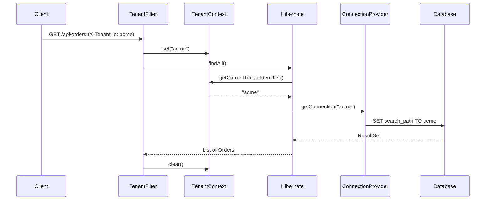
```mermaid
sequenceDiagram
    participant C as Client
    participant F as TenantFilter
    participant TC as TenantContext
    participant H as Hibernate
    participant CP as ConnectionProvider
    participant DB as Database

    C->>F: GET /api/orders (X-Tenant-Id: acme)
    F->>TC: set("acme")
    F->>H: findAll()
    H->>TC: getCurrentTenantIdentifier()
    TC-->>H: "acme"
    H->>CP: getConnection("acme")
    CP->>DB: SET search_path TO acme
    DB-->>H: ResultSet
    H-->>F: List of Orders
    F->>TC: clear()
```

**Implementation skeleton:**

```java
// Tenant context holder
public class TenantContext {
  private static final ThreadLocal<String> CURRENT
    = new ThreadLocal<>();
  public static void set(String id) {
    CURRENT.set(id);
  }
  public static String get() {
    return CURRENT.get();
  }
  public static void clear() {
    CURRENT.remove();
  }
}
```

```java
// Servlet filter for tenant resolution
@Component
@Order(Ordered.HIGHEST_PRECEDENCE)
public class TenantFilter extends OncePerRequestFilter {
  @Override
  protected void doFilterInternal(
      HttpServletRequest req,
      HttpServletResponse res,
      FilterChain chain) throws Exception {
    String tenant = resolveTenant(req);
    if (tenant == null) {
      res.sendError(400, "Missing tenant");
      return;
    }
    try {
      TenantContext.set(tenant);
      chain.doFilter(req, res);
    } finally {
      TenantContext.clear(); // prevent leaks
    }
  }

  private String resolveTenant(
      HttpServletRequest req) {
    // Priority: JWT claim > header > subdomain
    String jwt = extractFromJwt(req);
    if (jwt != null) return jwt;
    String header = req.getHeader("X-Tenant-Id");
    if (header != null) return header;
    return extractSubdomain(req);
  }
}
```

```java
// Hibernate tenant identifier resolver
@Component
public class TenantIdentifierResolver
    implements CurrentTenantIdentifierResolver<String> {
  @Override
  public String resolveCurrentTenantIdentifier() {
    String t = TenantContext.get();
    return t != null ? t : "default";
  }
  @Override
  public boolean validateExistingCurrentSessions() {
    return true;
  }
}
```

```java
// Schema-based connection provider
@Component
public class SchemaConnectionProvider
    implements MultiTenantConnectionProvider<String> {
  private final DataSource dataSource;

  public SchemaConnectionProvider(DataSource ds) {
    this.dataSource = ds;
  }
  @Override
  public Connection getAnyConnection()
      throws SQLException {
    return dataSource.getConnection();
  }
  @Override
  public void releaseAnyConnection(Connection c)
      throws SQLException {
    c.close();
  }
  @Override
  public Connection getConnection(String tenant)
      throws SQLException {
    Connection c = getAnyConnection();
    c.createStatement().execute(
      "SET search_path TO " + tenant);
    return c;
  }
  @Override
  public void releaseConnection(
      String tenant, Connection c)
      throws SQLException {
    c.createStatement().execute(
      "SET search_path TO public");
    c.close();
  }
}
```

### 🚨 Failure Modes

**Failure 1 - Cross-tenant data leak via missing
TenantContext.clear():**

An async handoff (e.g., `@Async` method, thread pool
executor) inherits a stale `ThreadLocal` value from
the parent thread. Tenant A's request finishes, but
the thread is returned to the pool with tenant A's
context still set. Tenant B's next request on that
thread reads tenant A's data.

**Diagnostic:** Add a servlet filter assertion at
request start that verifies `TenantContext.get()` is
null. If non-null before setting, log a CRITICAL alert
with the stale tenant ID and current request details.

**Fix:** Always call `TenantContext.clear()` in a
`finally` block. For `@Async`, use a
`TaskDecorator` that copies and clears tenant context:

```java
public class TenantTaskDecorator
    implements TaskDecorator {
  @Override
  public Runnable decorate(Runnable task) {
    String tenant = TenantContext.get();
    return () -> {
      try {
        TenantContext.set(tenant);
        task.run();
      } finally {
        TenantContext.clear();
      }
    };
  }
}
```

**Failure 2 - Connection pool exhaustion with
database-per-tenant:**

Each tenant gets a `HikariDataSource` with
`maximumPoolSize=10`. At 200 tenants, that is 2000
connections. The database server's `max_connections`
is 500. New connection attempts hang, then timeout,
cascading into HTTP 503s across all tenants.

**Diagnostic:** Monitor `hikaricp_connections_active`
per tenant pool. Alert when total active connections
across all pools exceeds 70% of database
`max_connections`.

**Fix:** Use a shared pool with schema routing instead
of per-tenant pools. If database-per-tenant is
required, implement lazy pool creation with idle
eviction (`idleTimeout=60s`) and a global connection
cap enforced by a semaphore across all pools.

**Failure 3 - Schema migration drift:**

Tenant `acme` was onboarded before a Flyway migration
added the `audit_log` table. Tenant `beta` was
onboarded after. Queries against `audit_log` succeed
for `beta` but throw `relation does not exist` for
`acme`. No single deployment caught this because
migrations only ran against a "default" schema.

**Diagnostic:** Add a startup health check that
iterates all tenant schemas and verifies Flyway's
`schema_version` table matches the expected version.

**Fix:** Migration scripts must loop through all
registered tenant schemas. Use Flyway's
`schemas` configuration or a custom
`FlywayMigrationStrategy` that iterates the tenant
registry.

### 🔬 Production Reality

Connection pool sizing dominates operational cost.
A 500-tenant database-per-tenant deployment on AWS
RDS needs either RDS Proxy (connection multiplexing)
or Aurora Serverless (per-tenant clusters with
auto-pause). Schema-per-tenant on PostgreSQL scales
to several hundred schemas before `pg_catalog` bloat
slows DDL operations. Shared-schema with discriminator
scales to thousands of tenants but requires index
design that includes `tenant_id` as the leading column
in every composite index - otherwise the database
scans the full table and filters late. Cache isolation
is frequently overlooked: Spring Cache with
`@Cacheable("orders")` without tenant-prefixed keys
serves cached data across tenants. Use a
`TenantAwareCacheKeyGenerator` that prepends tenant
ID to every cache key. Hibernate L2 cache (EhCache,
Hazelcast) must use tenant-scoped cache regions.

### ⚖️ Trade-offs & Alternatives

**BAD:**

```java
// Shared pool, no schema isolation, no filter
@Repository
public interface OrderRepo
    extends JpaRepository<Order, Long> {
  // Anyone's orders returned to anyone
  List<Order> findAll();
}
```

**GOOD:**

```java
// Discriminator entity with enforced filter
@Entity
@FilterDef(name = "tenantFilter",
  parameters = @ParamDef(
    name = "tenantId", type = String.class))
@Filter(name = "tenantFilter",
  condition = "tenant_id = :tenantId")
public class Order {
  @Column(name = "tenant_id",
    nullable = false, updatable = false)
  private String tenantId;
}
```

| Dimension               | DB-per-tenant  | Schema-per-tenant | Discriminator        |
| ----------------------- | -------------- | ----------------- | -------------------- |
| Isolation               | Strongest      | Strong            | Logical only         |
| Ops complexity          | Highest        | Medium            | Lowest               |
| Cost per tenant         | Highest        | Medium            | Lowest               |
| Migration effort        | Per-database   | Per-schema loop   | Single migration     |
| Connection pools        | Per-tenant     | Shared possible   | Shared               |
| Regulatory fit          | Healthcare/fin | Most SaaS         | Low-risk SaaS        |
| Cross-tenant query      | Federated      | Schema union      | WHERE without filter |
| Max tenants (practical) | ~100-500       | ~500-2000         | ~10,000+             |

### ⚡ Decision Snap

Use **database-per-tenant** when regulation demands
physical isolation (HIPAA, PCI with strict auditors)
and tenant count is low (<100). Use **schema-per-tenant**
for the common SaaS case: reasonable isolation,
manageable ops, works well with PostgreSQL's
`search_path`. Use **discriminator** when tenant count
is high (>1000), isolation requirements are
contractual (not regulatory), and you need maximum
operational simplicity. Start with discriminator and
promote to schema when a tenant demands it - this
migration is additive, not destructive.

### ⚠️ Top Traps

| #   | Trap                                                    | Why it bites                                     |
| --- | ------------------------------------------------------- | ------------------------------------------------ |
| 1   | Forgetting `TenantContext.clear()` in `finally`         | Thread pool reuse causes cross-tenant data leaks |
| 2   | Shared Hibernate L2 cache without tenant-scoped regions | Cached entity from tenant A served to tenant B   |
| 3   | Flyway migrations only applied to default schema        | New tenants have tables, old tenants do not      |
| 4   | `@Async` without `TaskDecorator` for tenant propagation | Background tasks run with wrong or null tenant   |
| 5   | Composite indexes missing `tenant_id` as leading column | Full table scans on discriminator-based queries  |

### 🪜 Learning Ladder

**Prerequisites:**

- SPR-033 Spring Data JPA Entity Lifecycle
- SPR-100 Spring Security Advanced (Custom Filters
  and Method Security)

**THIS:** SPR-098 Multi-Tenancy Patterns in Spring Boot

**Next steps:**

- SPR-090 Microservice Architecture with Spring Boot

**The Surprising Truth:**

The biggest multi-tenancy failures are not about
choosing the wrong strategy - they are about cache
and async context. Teams spend weeks debating
database-per-tenant versus schema-per-tenant, then
ship with a shared `@Cacheable` annotation that leaks
data across tenants on day one. The strategy decision
matters less than the discipline of tenant-scoping
every stateful component: caches, thread pools, event
buses, and scheduled tasks.

**Further Reading:**

- Hibernate ORM User Guide - Multi-Tenancy chapter
- Spring Boot Reference - HibernatePropertiesCustomizer
- PostgreSQL Documentation - Schema search path
- AWS SaaS Factory multi-tenant reference architecture

**Revision Card:**

1. Three strategies: database-per-tenant (physical),
   schema-per-tenant (logical), discriminator (row-level)
   - chosen by isolation requirements, not preference
2. Tenant context lives in ThreadLocal, set by filter,
   propagated via TaskDecorator, cleared in finally
3. Cache, async executors, and migrations must all be
   tenant-aware - the isolation strategy only covers
   the database layer
