## Keywords

1. [SPR-099 Reactive Data Access (R2DBC)](#spr-099-reactive-data-access-r2dbc)
2. [SPR-100 Spring Security Advanced (Custom Filters and Method Security)](#spr-100-spring-security-advanced-custom-filters-and-method-security)
3. [SPR-101 Performance at Scale - Spring vs Quarkus vs Micronaut](#spr-101-performance-at-scale---spring-vs-quarkus-vs-micronaut)
4. [SPR-102 Overengineered Microservice Anti-Pattern](#spr-102-overengineered-microservice-anti-pattern)
5. [SPR-103 Premature Reactive Adoption Anti-Pattern](#spr-103-premature-reactive-adoption-anti-pattern)
6. [SPR-104 Spring Architecture Whiteboard Sessions](#spr-104-spring-architecture-whiteboard-sessions)
7. [SPR-105 REST API Phase 5 - Cloud-Native Deployment](#spr-105-rest-api-phase-5---cloud-native-deployment)
8. [SPR-106 Spring Ecosystem Evolution (2003 to Present)](#spr-106-spring-ecosystem-evolution-2003-to-present)
9. [SPR-107 Conventional vs Boot vs Cloud Decision Pattern](#spr-107-conventional-vs-boot-vs-cloud-decision-pattern)

---

---

# SPR-099 Reactive Data Access (R2DBC)

**TL;DR** - R2DBC provides non-blocking database access for reactive Spring stacks, but only choose it over JDBC when your entire pipeline is genuinely non-blocking.

### 🔥 Problem Statement

Your Spring WebFlux service handles 10,000 concurrent
requests with a small thread pool. Every request needs
a database query. JDBC is blocking: when the application
calls `resultSet.next()`, the carrier thread parks until
the database responds. With 10,000 concurrent queries
and 200 platform threads, 9,800 requests queue behind
those 200 blocked threads. The entire reactive
architecture collapses at the JDBC boundary. You need a
database driver that returns results as a `Publisher`
instead of blocking the caller, so the same small thread
pool can multiplex thousands of in-flight queries without
parking.

### 📜 Historical Context

JDBC has been Java's database access standard since JDK
1.1 (1997). Its API is fundamentally synchronous:
`Connection.prepareStatement()`, `Statement.execute()`,
and `ResultSet.next()` all block the calling thread.
Oracle proposed ADBA (Asynchronous Database Access) as a
JDBC successor around 2017, but it was abandoned. The
R2DBC (Reactive Relational Database Connectivity)
initiative started in 2018, led by Pivotal (now
Broadcom/VMware) engineers, as a specification designed
from scratch for reactive access to SQL databases. R2DBC
1.0 GA shipped in 2022. Spring Data R2DBC and Spring
Framework's `DatabaseClient` provide the application-level
programming model. Key driver implementations:
`r2dbc-postgresql`, `r2dbc-mysql`, `r2dbc-mssql`,
`r2dbc-h2`, and the Oracle reactive driver. With the
arrival of virtual threads in Java 21 (2023), the
landscape shifted: blocking JDBC on a virtual thread
does not block the carrier, reopening the question of
whether R2DBC's complexity is justified.

### 🔩 First Principles

**CORE INVARIANTS:**

1. **A reactive pipeline is only as non-blocking as its
   most blocking operator** - one `block()` call in a
   WebFlux handler defeats the entire model
2. **R2DBC connections are non-blocking resources, not
   thread-bound resources** - you cannot assume
   one-connection-per-thread; the connection may serve
   interleaved operations from different subscribers
3. **Backpressure must propagate from subscriber to
   database** - if the client cannot consume rows fast
   enough, the driver must signal the database to pause
   sending (via TCP flow control or protocol-level fetch
   size)

**DERIVED DESIGN:**

From invariant 1: using R2DBC in a traditional servlet
stack (Spring MVC) adds complexity without benefit - the
servlet thread is already blocked waiting for the
controller to return. From invariant 2: transaction
management cannot rely on `ThreadLocal` - Spring's
reactive transaction manager uses Reactor context
(`TransactionalOperator`) instead of
`@Transactional`'s `PlatformTransactionManager`. From
invariant 3: `DatabaseClient` and
`ReactiveCrudRepository` expose `Flux<T>`, which carries
backpressure semantics - but the actual backpressure
behavior depends on the driver implementation and
database protocol.

### 🧠 Mental Model

> JDBC is like a phone call: you dial, wait on hold
> until the person answers, get your information, and
> hang up. Your line is occupied the whole time. R2DBC
> is like sending a text message: you send the query,
> go do other things, and get notified when the reply
> arrives.

-> JDBC `executeQuery()` blocks the thread until all
rows are fetched or the timeout expires
-> R2DBC `execute()` returns a `Publisher` immediately;
rows arrive as `onNext` signals when available
-> JDBC transaction binds to a thread via ThreadLocal;
R2DBC transaction binds to a Reactor context
-> JDBC connection pool (HikariCP) hands out connections
per thread; R2DBC pool (r2dbc-pool) hands out
connections per subscription

**Where this analogy breaks down:** Text messages are
fire-and-forget. R2DBC subscriptions are demand-driven:
the subscriber controls how many rows it requests
(`request(n)`), and the publisher (driver) is obligated
to respect that demand. This backpressure mechanism has
no equivalent in everyday messaging.

### 🧩 Components

```
+---------------------------------------------------+
| Spring WebFlux Controller (returns Flux/Mono)     |
+---------------------------------------------------+
          |
          v
+---------------------------------------------------+
| ReactiveCrudRepository / DatabaseClient           |
+---------------------------------------------------+
          |
          v
+-------------------+   +------------------------+
| R2DBC Connection  |   | ReactiveTransaction    |
| Factory           |   | Manager                |
+-------------------+   +------------------------+
          |
          v
+---------------------------------------------------+
| r2dbc-pool (ConnectionPool)                       |
+---------------------------------------------------+
          |
          v
+---------------------------------------------------+
| R2DBC Driver (r2dbc-postgresql, r2dbc-mysql, ...) |
+---------------------------------------------------+
          |
          v
+---------------------------------------------------+
| Database (non-blocking wire protocol)             |
+---------------------------------------------------+
```

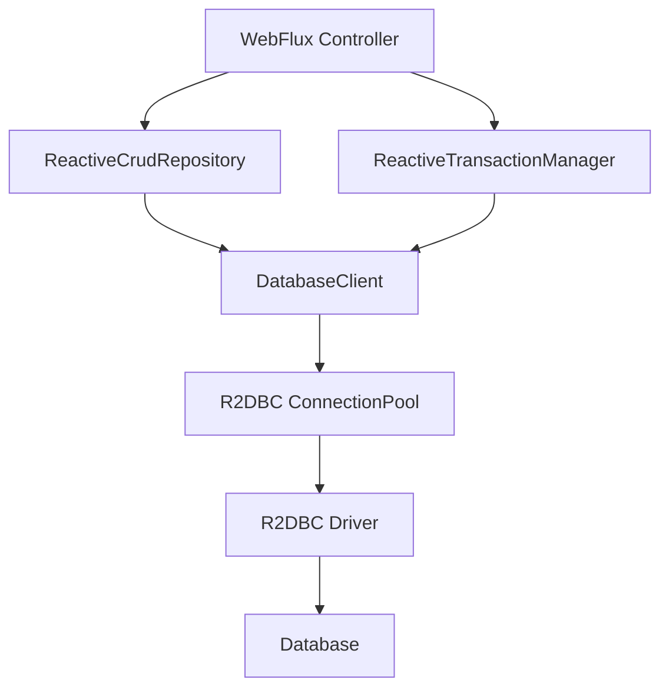

### 📶 Gradual Depth

**Layer 1 - Core concept:** R2DBC is a specification
for non-blocking SQL database access. Instead of
returning a `ResultSet`, queries return a
`Publisher<Row>` (Reactor `Flux<Row>`). Spring Data
R2DBC provides `ReactiveCrudRepository` with the
same interface pattern as JPA repositories but returning
`Mono<T>` and `Flux<T>`.

**Layer 2 - Mechanism:** `ConnectionFactory` is the
R2DBC equivalent of `DataSource`. `DatabaseClient` is
the reactive equivalent of `JdbcTemplate` - it binds
parameters, executes SQL, and maps rows without
blocking. Spring Boot auto-configures both from
`spring.r2dbc.url`, `spring.r2dbc.username`, and
`spring.r2dbc.password` properties. The
`r2dbc-pool` library wraps `ConnectionFactory` with
connection pooling (similar to HikariCP for JDBC).

**Layer 3 - Transaction management:** `@Transactional`
works on reactive methods but routes through
`R2dbcTransactionManager` instead of
`DataSourceTransactionManager`. Under the hood, Spring
stores the transaction context in Reactor's
`Context` (not `ThreadLocal`). For programmatic control,
use `TransactionalOperator`:

```java
@Service
public class OrderService {
  private final TransactionalOperator txOp;
  private final OrderRepository repo;

  public Mono<Order> createOrder(Order order) {
    return repo.save(order)
      .as(txOp::transactional);
  }
}
```

**Layer 4 - Backpressure and fetch size:** When a query
returns 1 million rows, `Flux<Row>` does not load them
all into memory. The subscriber requests rows in batches
(`request(n)`). The R2DBC driver translates this into
protocol-level fetch size. PostgreSQL's extended query
protocol supports this natively. MySQL's protocol is
less backpressure-friendly - the driver may buffer
entire result sets depending on version.

### ⚙️ How It Works

```
QUERY LIFECYCLE:

Subscriber subscribes to Flux<Order>
  |
  v
DatabaseClient prepares statement
  |
  v
ConnectionPool.create() -> Mono<Connection>
  (async: returns when connection available)
  |
  v
Connection.createStatement(sql).bind(params)
  |
  v
Statement.execute() -> Flux<Result>
  (non-blocking: returns immediately)
  |
  v
Result.map(row -> new Order(...)) -> Flux<Order>
  |
  v
Subscriber receives onNext(order) signals
  (demand-driven: only as many as requested)
  |
  v
Connection released back to pool on completion
```

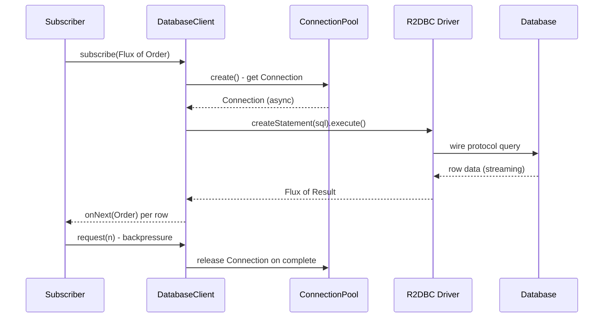

**Repository pattern:**

```java
public interface OrderRepository
    extends ReactiveCrudRepository<Order, Long> {

  @Query("SELECT * FROM orders WHERE "
    + "customer_id = :customerId")
  Flux<Order> findByCustomerId(
    @Param("customerId") Long customerId);

  @Query("SELECT * FROM orders WHERE "
    + "status = :status LIMIT :limit")
  Flux<Order> findByStatus(
    @Param("status") String status,
    @Param("limit") int limit);
}
```

**DatabaseClient for dynamic queries:**

```java
@Repository
public class OrderDynamicRepo {
  private final DatabaseClient client;

  public Flux<Order> search(String term) {
    return client
      .sql("SELECT * FROM orders "
        + "WHERE name LIKE :term")
      .bind("term", "%" + term + "%")
      .map(row -> new Order(
        row.get("id", Long.class),
        row.get("name", String.class)))
      .all();
  }
}
```

**Boot configuration:**

```yaml
spring:
  r2dbc:
    url: r2dbc:postgresql://localhost/mydb
    username: app
    password: ${DB_PASSWORD}
    pool:
      initial-size: 5
      max-size: 20
      max-idle-time: 30m
```

### 🚨 Failure Modes

**Failure 1 - Calling block() inside a reactive
pipeline:**

A developer writes `repository.findById(id).block()`
inside a WebFlux handler because they need the result
"right now." This blocks the Netty event loop thread.
With only 4-8 event loop threads, a few concurrent
requests doing this starve the entire server.

**Diagnostic:** Enable Reactor's
`Hooks.onOperatorDebug()` in dev. In production,
use BlockHound - it detects blocking calls on
non-blocking threads and throws
`BlockingOperationError` with a stack trace.

**Fix:** Never call `block()` in WebFlux handlers.
Compose everything as `Mono`/`Flux` chains. If you
must integrate with blocking code, offload to
`Schedulers.boundedElastic()`:

```java
Mono.fromCallable(() -> blockingLegacyCall())
  .subscribeOn(Schedulers.boundedElastic());
```

**Failure 2 - Connection pool exhaustion from
un-cancelled subscriptions:**

A client disconnects mid-stream but the server-side
`Flux` keeps fetching rows, holding the R2DBC
connection. The pool runs out of connections. New
requests timeout waiting for a pool slot.

**Diagnostic:** Monitor
`r2dbc.pool.acquired` and
`r2dbc.pool.pending-acquire-queue-size` Micrometer
metrics. Alert when pending queue exceeds max pool
size.

**Fix:** Add `.take(limit)` to bound result sets.
Configure `maxAcquireTime` on the pool so pending
acquisitions fail fast. Use `timeout()` on reactive
chains to cancel abandoned operations.

**Failure 3 - Reactive transaction context lost
across async boundaries:**

A `flatMap` switches schedulers (e.g., calling an
external HTTP client). The Reactor context carrying
the transaction is lost. The subsequent database
operation executes outside the transaction, and the
commit never includes it.

**Diagnostic:** Enable Spring's DEBUG logging for
`o.s.r2dbc.connection` to trace connection
acquisition and release per operation.

**Fix:** Ensure all operators within a transactional
chain run on the same Reactor context. Avoid
`subscribeOn` or `publishOn` inside transactional
blocks. Use `TransactionalOperator` to explicitly
scope the transactional boundary.

### 🔬 Production Reality

R2DBC driver maturity varies. The PostgreSQL driver
(`r2dbc-postgresql`) is the most mature, supporting
streaming, prepared statements, and notification
listening. The MySQL driver has caught up but
historically lacked true streaming (buffering full
result sets). Connection pool tuning differs from
HikariCP: R2DBC pools manage non-blocking connections
where one connection can serve overlapping queries
(protocol-level multiplexing on some databases), so
you typically need fewer connections than JDBC. For
PostgreSQL, a pool of 20 R2DBC connections can sustain
throughput equivalent to 100 JDBC connections under
high concurrency because connections are not parked
waiting for thread scheduling. ORM support is limited:
R2DBC has no JPA equivalent. No lazy loading, no
entity lifecycle callbacks, no dirty checking. Spring
Data R2DBC maps rows to objects but you write SQL
strings (or use simple derived query methods). For
complex domain models, this is a significant trade-off.

### ⚖️ Trade-offs & Alternatives

**BAD:**

```java
// Blocking JDBC inside a WebFlux handler
@GetMapping("/orders/{id}")
public Mono<Order> getOrder(@PathVariable Long id) {
  // BLOCKS the event loop thread
  Order o = jdbcTemplate.queryForObject(
    "SELECT * FROM orders WHERE id = ?",
    orderMapper, id);
  return Mono.just(o);
}
```

**GOOD:**

```java
// Non-blocking R2DBC in WebFlux
@GetMapping("/orders/{id}")
public Mono<Order> getOrder(@PathVariable Long id) {
  return orderRepository.findById(id);
}
```

| Dimension             | R2DBC             | JDBC + Virtual Threads     |
| --------------------- | ----------------- | -------------------------- |
| Thread model          | Event loop (few)  | Virtual thread per request |
| Code complexity       | Higher (reactive) | Lower (imperative)         |
| ORM support           | None (no JPA)     | Full JPA/Hibernate         |
| Debugging             | Harder (async)    | Standard stack traces      |
| Max concurrency       | Very high         | Very high                  |
| Ecosystem maturity    | Growing           | Mature (30 years)          |
| Backpressure          | Native            | Not applicable             |
| Library compatibility | Reactive only     | Any blocking library       |
| Migration from JDBC   | Full rewrite      | Add `--enable-preview`     |

### ⚡ Decision Snap

Use R2DBC when your entire stack is already reactive
(WebFlux, reactive messaging, reactive cache) and you
cannot tolerate any blocking call in the pipeline. If
you are starting a new project on Java 21+, strongly
consider virtual threads with JDBC first - you get the
concurrency benefits without the reactive complexity,
and you keep full JPA/Hibernate support. R2DBC makes
sense when you need true streaming backpressure from
database to client (e.g., SSE endpoints pushing live
query results) or when you are already invested in
Project Reactor throughout your stack. Do not adopt
R2DBC for a single service that talks to one database

- the complexity tax is not justified.

### ⚠️ Top Traps

| #   | Trap                                                   | Why it bites                                             |
| --- | ------------------------------------------------------ | -------------------------------------------------------- |
| 1   | Calling `block()` in WebFlux handler                   | Blocks event loop thread, starving the server            |
| 2   | Using `@Transactional` without R2dbcTransactionManager | Transaction silently does nothing in reactive context    |
| 3   | Expecting JPA features (lazy loading, dirty checking)  | R2DBC has no ORM - you write SQL and map manually        |
| 4   | Ignoring r2dbc-pool max-size tuning                    | Pool exhaustion under load with no visibility            |
| 5   | Mixing `subscribeOn` inside transactional operator     | Reactor context lost, operations run outside transaction |

### 🪜 Learning Ladder

**Prerequisites:**

- SPR-071 Spring WebFlux and Project Reactor Basics
- SPR-093 Virtual Threads (Loom) Integration in
  Spring 6

**THIS:** SPR-099 Reactive Data Access (R2DBC)

**Next steps:**

- SPR-101 Performance at Scale - Spring vs Quarkus vs
  Micronaut

**The Surprising Truth:**

The strongest argument against R2DBC in 2025 is not
its complexity - it is virtual threads. Java 21's
virtual threads let you write blocking JDBC code that
scales to millions of concurrent operations without
starving platform threads. The reactive tax (no JPA,
harder debugging, steeper learning curve) only pays off
when you need true end-to-end backpressure or you are
already committed to a fully reactive stack. Most teams
that adopted R2DBC in 2020-2022 are now re-evaluating
as virtual threads mature.

**Further Reading:**

- R2DBC Specification (r2dbc.io)
- Spring Data R2DBC Reference Documentation
- Spring Framework DatabaseClient Javadoc
- Mark Paluch, "Reactive Relational Database
  Connectivity" (SpringOne 2019)
- JEP 444: Virtual Threads (openjdk.org)

**Revision Card:**

1. R2DBC provides non-blocking database access via
   `Publisher<Row>` - only valuable when the entire
   pipeline is non-blocking (WebFlux, not MVC)
2. Transaction management uses Reactor context, not
   ThreadLocal - use `TransactionalOperator` or
   reactive `@Transactional` with `R2dbcTransactionManager`
3. Virtual threads + JDBC is the simpler alternative
   for high concurrency since Java 21 - choose R2DBC
   only for true streaming backpressure or fully
   reactive stacks

---

---

# SPR-100 Spring Security Advanced (Custom Filters and Method Security)

**TL;DR** - Build layered security with custom filters, method-level SpEL guards, and JWT validation to protect APIs beyond default auto-configuration.

### 🔥 Problem Statement

Default Spring Security auto-configuration handles login
forms and session cookies, but production APIs need more.
You need custom authentication schemes (API keys, mTLS,
multi-tenant tokens), fine-grained method-level
authorization ("user X can edit only their own orders"),
stateless JWT validation for OAuth2 resource servers,
and CORS/CSRF policies that actually work with SPA
frontends. The standard `HttpSecurity` DSL covers URL
patterns, but real applications demand filters that
intercept requests before authentication, authorization
logic that inspects domain objects after method execution,
and clear separation between "who are you?" and "what can
you do?" across dozens of endpoints.

### 📜 Historical Context

Spring Security started as Acegi Security in 2003 - a
powerful but notoriously complex XML-driven framework.
Spring Security 2.0 (2008) introduced namespace-based
XML configuration, reducing boilerplate but hiding the
filter chain behind magic. Spring Security 3.0 aligned
with Spring 3, introducing SpEL-based `@PreAuthorize`.
Boot 1.x auto-configured a single filter chain with
sensible defaults. Spring Security 5.0 (2017) added
first-class OAuth2 client and resource server support.
The component-based `SecurityFilterChain` bean approach
(replacing `WebSecurityConfigurerAdapter`) became the
standard in Spring Security 5.7+ (2022) and is now the
only pattern in Security 6.x. This shift moved from
inheritance to composition, making multiple filter chains
and custom filters explicit and testable.

### 🔩 First Principles

**CORE INVARIANTS:**

1. **Security is a filter chain** - every HTTP request
   passes through an ordered list of `jakarta.servlet.
Filter` instances; authentication and authorization
   are just specific filters in that chain
2. **Authentication and authorization are separate
   concerns** - authentication establishes identity
   (the `Authentication` object), authorization decides
   access (voters, SpEL expressions, authority checks)
3. **The SecurityContext is thread-bound** - the
   `SecurityContextHolder` stores the authenticated
   principal in a `ThreadLocal` (or Reactor context in
   WebFlux), making it available downstream without
   passing it explicitly

**DERIVED DESIGN:**

Because security is a filter chain, you customize it by
inserting custom filters at precise positions (before
`UsernamePasswordAuthenticationFilter`, after
`BearerTokenAuthenticationFilter`, etc.). Because auth
and authz are separate, you can combine custom
`AuthenticationProvider` implementations with standard
`@PreAuthorize` annotations. Because the context is
thread-bound, method security can inspect `principal`
and `authentication` in SpEL without any explicit
parameter passing.

### 🧠 Mental Model

> Spring Security is an airport security checkpoint.
> The filter chain is the sequence of stations: ID
> check (authentication filter), boarding pass scan
> (authorization filter), customs (CORS filter),
> luggage scan (CSRF filter). Custom filters are
> additional stations you insert into the line.

-> `OncePerRequestFilter` = a single checkpoint station
that guarantees it runs exactly once per request,
even through forwards and includes
-> `AuthenticationProvider` = the ID verification desk
that knows how to validate one type of credential
(password, token, certificate)
-> `@PreAuthorize` = the gate agent who checks your
boarding pass against the manifest before you board
-> `SecurityFilterChain` = the complete checkpoint
layout, deciding which stations apply to which
terminal (URL pattern)

**Where this analogy breaks down:** Airport checkpoints
are sequential and blocking. Filter chains support
short-circuiting (a filter can reject and return
immediately), and multiple `SecurityFilterChain` beans
can coexist, each matching different URL patterns with
entirely different filter sequences.

### 🧩 Components

```
Request --> [CORS] --> [CSRF] --> [Custom]
  --> [AuthN Filter] --> [AuthZ Filter]
  --> Controller --> [Method Security]
  --> Response

SecurityFilterChain (per URL pattern):
  /api/** : JWT + @PreAuthorize
  /admin/** : Session + Role check
  /public/** : permitAll, no filters
```


### 📶 Gradual Depth

**Level 1 - SecurityFilterChain bean:**
Replace the deprecated `WebSecurityConfigurerAdapter`
with a `@Bean SecurityFilterChain` method. This receives
`HttpSecurity`, configures URL authorization rules, and
returns the built chain. Multiple beans with `@Order`
handle different URL patterns independently.

**Level 2 - Custom filters:**
Extend `OncePerRequestFilter` to implement custom logic
(API key validation, tenant resolution, audit logging).
Insert into the chain with `http.addFilterBefore(...)` or
`http.addFilterAfter(...)`, referencing a known filter
class as the anchor point. The filter reads the request,
optionally sets an `Authentication` in the
`SecurityContextHolder`, or rejects with 401/403.

```java
public class ApiKeyFilter
    extends OncePerRequestFilter {
  @Override
  protected void doFilterInternal(
      HttpServletRequest req,
      HttpServletResponse res,
      FilterChain chain)
      throws ServletException, IOException {
    String key = req.getHeader("X-API-Key");
    if (isValid(key)) {
      var auth = new ApiKeyAuthToken(key);
      SecurityContextHolder.getContext()
          .setAuthentication(auth);
      chain.doFilter(req, res);
    } else {
      res.sendError(
          HttpServletResponse.SC_UNAUTHORIZED);
    }
  }
}
```

**Level 3 - Custom AuthenticationProvider:**
Implement `AuthenticationProvider` to handle a specific
`Authentication` type. Register it with `http.
authenticationProvider(...)`. The `ProviderManager`
iterates through registered providers until one
`supports()` the token type and authenticates it.

**Level 4 - Method security with SpEL:**
Enable with `@EnableMethodSecurity`. Use `@PreAuthorize`
for checks before execution and `@PostAuthorize` for
checks after (with access to `returnObject`). SpEL
expressions access `authentication`, `principal`, and
method arguments by name. Custom permission evaluators
extend `PermissionEvaluator` for domain-object checks.

```java
@PreAuthorize(
    "hasRole('ADMIN') or "
    + "#order.customerId == "
    + "authentication.principal.id")
public Order updateOrder(Order order) {
  return orderRepository.save(order);
}
```

**Level 5 - OAuth2 resource server JWT:**
Configure `http.oauth2ResourceServer(oauth2 ->
oauth2.jwt(...))` to validate JWTs against a JWKS
endpoint. Customize claim-to-authority mapping with a
`JwtAuthenticationConverter`. Add audience validation
with a custom `OAuth2TokenValidator<Jwt>`.

**Level 6 - CORS and CSRF for SPAs:**
CORS: Define a `CorsConfigurationSource` bean with
explicit origins, methods, and headers. Never use
`allowedOrigins("*")` with credentials. CSRF: For
stateless JWT APIs, CSRF protection is typically
disabled because the token itself is the CSRF defense.
For session-based SPAs, use the `CookieCsrfTokenRepository`
with `withHttpOnlyFalse()` so JavaScript can read the
token from a cookie and send it as a header.

### ⚙️ How It Works

```
1. Request arrives at DispatcherServlet
2. DelegatingFilterProxy delegates to
   FilterChainProxy
3. FilterChainProxy selects matching
   SecurityFilterChain by URL pattern
4. Filters execute in order:
   CORS -> CSRF -> Custom -> AuthN -> AuthZ
5. AuthN filter extracts credentials,
   calls AuthenticationManager
6. AuthenticationManager iterates
   AuthenticationProviders
7. Successful auth -> SecurityContext set
8. AuthorizationFilter checks URL rules
9. Controller executes
10. Method interceptor evaluates
    @PreAuthorize SpEL
11. @PostAuthorize checks returnObject
12. Response returns through filter chain
```

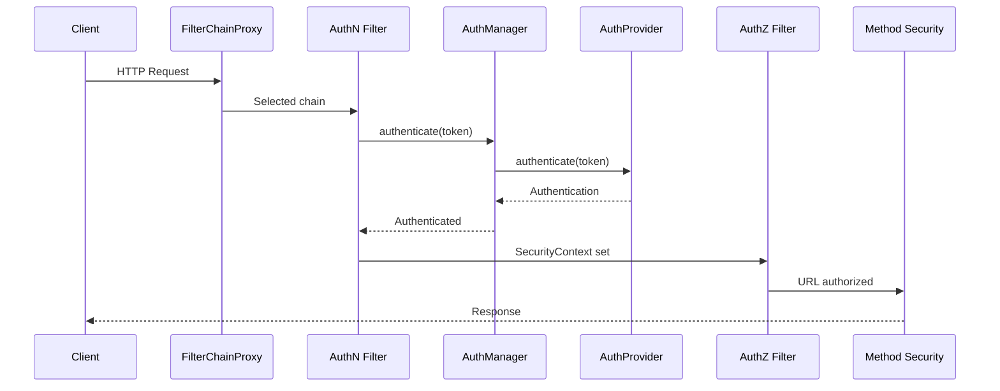

### 🚨 Failure Modes

**Failure 1 - Filter ordering collision:**
Custom filter inserted at the wrong position silently
bypasses authentication. A tenant-resolution filter
placed after the authorization filter means
authorization runs without tenant context, granting
access to wrong tenant data.
**Diagnostic:** Enable `logging.level.org.springframework.
security=TRACE` to see the exact filter chain order and
which filter handles each request. Check the output for
your custom filter class name and its position relative
to standard filters.
**Fix:** Use `addFilterBefore(filter, TargetFilter.class)`
with an explicit anchor. Write an integration test that
asserts the filter chain order by inspecting the
`SecurityFilterChain.getFilters()` list.

**Failure 2 - SpEL expression fails silently:**
A typo in `@PreAuthorize` SpEL (referencing
`#orderId` when the parameter is named `id`) causes
the expression to evaluate to `false`, denying all
access. No compilation error, no runtime exception -
just 403 for every request.
**Diagnostic:** Enable method security debug logging.
Write unit tests using `@WithMockUser` and
`@WithSecurityContext` that assert both the allow and
deny paths. Test SpEL expressions in isolation.
**Fix:** Use `@P("orderId")` or `@Param("orderId")` to
explicitly name method parameters. Prefer compile-safe
custom `PermissionEvaluator` over complex inline SpEL.

**Failure 3 - CORS preflight rejected:**
Browser sends OPTIONS preflight but the CORS filter
runs after the authentication filter, which rejects
the unauthenticated OPTIONS request with 401. The
browser never sees the CORS headers.
**Diagnostic:** Check browser DevTools Network tab for
the preflight response. The response should have status
200 with `Access-Control-Allow-Origin` headers.
**Fix:** Ensure `CorsFilter` is placed before the
authentication filter. Using `http.cors(cors -> cors.
configurationSource(...))` in the `SecurityFilterChain`
handles this automatically.

### 🔬 Production Reality

URL-based security (`requestMatchers`) and method-based
security (`@PreAuthorize`) are complementary, not
alternatives. URL security is coarse-grained: protect
`/api/admin/**` with `hasRole('ADMIN')`. Method security
is fine-grained: check `#order.customerId == principal.id`
on individual service methods. Production systems use
both. URL rules catch broad unauthorized access at the
perimeter. Method rules enforce domain-specific
authorization deep in the service layer where business
context (the actual order, the actual account) is
available.

JWT validation for OAuth2 resource servers involves
network calls to the authorization server's JWKS
endpoint. Spring caches the JWK set, but the first
request after startup (or key rotation) triggers a
blocking HTTP call. In high-throughput services, this
cold-start latency matters. Configure
`spring.security.oauth2.resourceserver.jwt.jwk-set-uri`
and set a reasonable cache TTL. Monitor JWKS fetch
failures - if the authorization server is unreachable,
every authenticated request fails.

### ⚖️ Trade-offs & Alternatives

**BAD:**

```java
// Everything in URL rules - no domain checks
http.authorizeHttpRequests(a -> a
    .requestMatchers("/orders/**")
    .hasRole("USER"));
// Any USER can edit any order
```

**GOOD:**

```java
// URL rules + method security
http.authorizeHttpRequests(a -> a
    .requestMatchers("/orders/**")
    .authenticated());

@PreAuthorize(
    "#order.customerId == "
    + "authentication.principal.id")
public Order update(Order order) { ... }
```

| Approach      | Granularity | Testability | Coupling |
| ------------- | ----------- | ----------- | -------- |
| URL only      | Coarse      | Easy        | Low      |
| Method only   | Fine        | Medium      | High     |
| URL + Method  | Layered     | Best        | Medium   |
| Custom filter | Any         | Hard        | Low      |
| Gateway auth  | Perimeter   | Easy        | None     |

### ⚡ Decision Snap

Use `SecurityFilterChain` beans for all new projects
(never the deprecated adapter). Use URL rules for
coarse perimeter security. Add `@PreAuthorize` for
domain-object authorization. Write custom filters only
for cross-cutting concerns (tenant resolution, audit
logging, custom token formats) - not for business
authorization logic. Disable CSRF for stateless JWT
APIs. Always define explicit CORS origins.

### ⚠️ Top Traps

| #   | Trap                      | Why it bites                      | Escape                                   |
| --- | ------------------------- | --------------------------------- | ---------------------------------------- |
| 1   | Filter order wrong        | Custom filter bypasses auth       | Use addFilterBefore with explicit anchor |
| 2   | SpEL param name mismatch  | Always returns 403, no error      | Use @P annotation, test both paths       |
| 3   | CORS after auth filter    | Preflight gets 401                | Use http.cors() DSL placement            |
| 4   | CSRF on for stateless API | POST/PUT/DELETE all fail with 403 | Disable CSRF when using JWT tokens       |
| 5   | permitAll on wrong chain  | Second chain still blocks         | Check @Order and URL pattern overlap     |

### 🪜 Learning Ladder

**Prerequisites:**
SPR-036 Spring Security Foundations,
SPR-037 OAuth2 and JWT in Spring Security

**THIS:** SPR-100 Spring Security Advanced
(Custom Filters and Method Security)

**Next steps:**
SPR-098 Multi-Tenancy Patterns in Spring Boot

**The Surprising Truth:**

Most Spring Security production incidents are not about
missing security - they are about security configured
at the wrong layer. URL rules that are too broad let
users access other users' data. Method rules that are
too narrow break legitimate requests. The most secure
applications use both layers, test both layers, and
treat the security configuration as production code
that gets the same review rigor as business logic.

**Further Reading:**

- Spring Security Reference (docs.spring.io) -
  Architecture, Servlet Security sections
- Spring Security GitHub samples repository -
  oauth2resourceserver, method security examples
- "Spring Security in Action" (Laurentiu Spilca, Manning)
- OAuth 2.0 RFC 6749 and JWT RFC 7519

**Revision Card:**

1. `SecurityFilterChain` beans replace the deprecated
   adapter - use `addFilterBefore/After` with explicit
   anchors, and `@Order` for multiple chains per URL
   pattern
2. `@PreAuthorize` SpEL checks run after the controller
   receives the request - they have access to method
   arguments and `authentication`, making them ideal for
   domain-object authorization that URL rules cannot
   express
3. CORS must run before authentication for preflight
   OPTIONS to succeed - use the `http.cors()` DSL which
   places `CorsFilter` correctly, and never combine
   `allowedOrigins("*")` with `allowCredentials(true)`

---

---

# SPR-101 Performance at Scale - Spring vs Quarkus vs Micronaut

**TL;DR** - Spring wins on ecosystem and hiring; Quarkus and Micronaut win on startup and memory; choose based on deployment model, not benchmarks.

### 🔥 Problem Statement

Your team needs to choose a JVM framework for a new
service. Spring Boot is the safe default with the
largest ecosystem, but Quarkus promises "supersonic
subatomic Java" and Micronaut claims zero-reflection
startup. Cloud-native deployments penalize slow startup
(Kubernetes scaling, serverless cold starts). Memory
costs money at scale. But ecosystem maturity, library
compatibility, hiring, and long-term maintenance cost
more than a few hundred milliseconds of startup time.
The decision is not about which framework is "best" - it
is about which trade-offs match your deployment model,
team skills, and organizational constraints.

### 📜 Historical Context

Spring Framework launched in 2003 as a lightweight
alternative to J2EE. By 2014, Spring Boot made
convention-over-configuration the standard for JVM web
applications. For a decade, Spring dominated. But its
runtime reflection, classpath scanning, and dynamic proxy
generation created overhead that was acceptable on
long-running servers but painful in containers and
serverless. Micronaut (Object Computing, 2018) pioneered
compile-time DI using annotation processors, eliminating
reflection at runtime. Quarkus (Red Hat, 2019) took a
build-time optimization approach, moving framework
initialization from runtime to build, tightly integrating
with GraalVM native image. Spring responded with Spring
AOT (Spring 6, 2022) and first-class GraalVM native
image support in Spring Boot 3. The gap has narrowed
significantly, but architectural differences remain.

### 🔩 First Principles

**CORE INVARIANTS:**

1. **Startup cost = initialization work / when it
   happens** - all frameworks do the same work (component
   scanning, dependency wiring, configuration resolution);
   the difference is whether that work happens at build
   time, compile time, or runtime
2. **Memory footprint tracks metadata** - frameworks that
   retain reflection metadata, proxy classes, and
   configuration caches at runtime consume more heap than
   those that resolve everything ahead of time
3. **Throughput at steady state converges** - once the
   JVM JIT compiler warms up, the hot-path performance
   of all three frameworks is comparable because the
   bottleneck shifts to I/O, database, and business logic

**DERIVED DESIGN:**

Quarkus and Micronaut invest in build-time processing
to minimize runtime initialization. Spring invests in
runtime flexibility, paying the cost at startup but
gaining dynamic configuration, conditional beans, and
profile-based wiring. GraalVM native image eliminates
JIT warmup entirely but loses runtime optimizations.
The "fastest" framework depends on whether you measure
first-request latency, p99 after warmup, or total cost
of ownership over the service lifetime.

### 🧠 Mental Model

> Think of framework startup like opening a restaurant.
> Spring Boot unpacks ingredients, reads recipes, and
> sets up stations every morning (runtime init).
> Quarkus does the prep work the night before and just
> heats things up in the morning (build-time init).
> Micronaut pre-plates standard dishes at the factory
> (compile-time DI). All three serve the same quality
> meal once the kitchen is running.

-> Build-time processing = prep work done once, paid
at compile, not at every deployment
-> Native image = a food truck: faster to open, but
cannot rearrange the kitchen on the fly
-> JIT warmup = the kitchen getting into rhythm after
the first 50 orders
-> Ecosystem maturity = how many suppliers deliver to
your restaurant reliably

**Where this analogy breaks down:** Restaurants do not
scale to thousands of instances simultaneously. In
cloud-native deployments, the cost of startup is
multiplied by scale-out frequency. A framework that
starts 3x faster matters when Kubernetes scales from
2 to 200 pods during a traffic spike.

### 🧩 Components

```
Comparison Dimensions:
+------------------+-------+-------+-------+
| Dimension        | Spring| Qrkus | Micro |
+------------------+-------+-------+-------+
| DI mechanism     | Runtm | Build | Compil|
| Config resolve   | Runtm | Build | Compil|
| Native image     | Supprt| Core  | Core  |
| Ecosystem size   | Huge  | Growng| Growng|
| CDI compatible   | No    | Yes   | No    |
+------------------+-------+-------+-------+
```

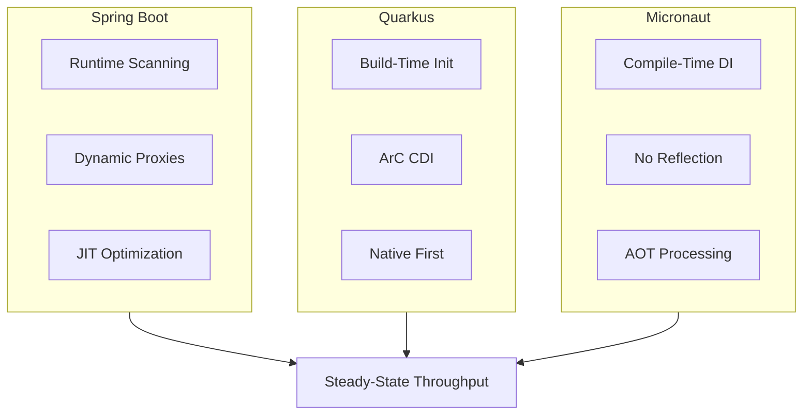

### 📶 Gradual Depth

**Level 1 - Startup time:**
Spring Boot JVM mode takes noticeably longer to start
than Quarkus or Micronaut for equivalent applications.
Spring's classpath scanning, bean definition parsing,
and condition evaluation happen at runtime. Quarkus
moves most of this to build time via its extension
framework. Micronaut generates DI code at compile time
via annotation processors. In native image mode, all
three start significantly faster, but Quarkus and
Micronaut start from a lower baseline.

**Level 2 - Memory footprint:**
Runtime reflection metadata, CGLIB proxy classes, and
configuration caches contribute to Spring's higher
baseline memory. Quarkus reduces this by recording
metadata at build time and discarding it from the
runtime classpath. Micronaut avoids reflection entirely,
generating concrete injection code. For microservices
running hundreds of instances, the per-instance memory
difference compounds into meaningful infrastructure cost.

**Level 3 - Steady-state throughput:**
After JIT warmup (typically 30-60 seconds of load), all
three frameworks deliver comparable throughput for
equivalent business logic. The JVM's C2 compiler
optimizes hot paths regardless of framework. Native
images trade JIT optimization for consistent latency -
no warmup, but the peak throughput ceiling is typically
lower than JIT-optimized JVM mode.

**Level 4 - Developer experience:**
Spring Boot's DX advantage is massive: Spring Initializr,
mature IDE support (IntelliJ, VS Code), extensive
documentation, decades of Stack Overflow answers, and the
largest library ecosystem. Quarkus offers dev mode with
live reload, continuous testing, and dev services
(automatic test containers). Micronaut provides fast
compile-time feedback but has a smaller community and
fewer third-party integrations.

**Level 5 - Build-time processing:**
Quarkus extensions run at build time, recording
deployment metadata into bytecode. This is an explicit
extension model - libraries must be "Quarkified."
Micronaut's annotation processor approach works with
standard Java tooling but requires compile-time
visibility of all injection points. Spring AOT
(Spring 6+) generates initialization code at build time
but is opt-in and less mature than the alternatives'
build-time pipelines.

**Level 6 - CDI vs Spring DI:**
Quarkus uses ArC, a CDI-lite implementation.
`@ApplicationScoped`, `@Inject`, `@Produces` follow
Jakarta CDI semantics. Micronaut uses its own DI with
`@Singleton`, `@Inject`, inspired by JSR-330. Spring
uses its own `@Component`, `@Autowired`, `@Bean`
ecosystem. Migration between frameworks requires
annotation changes, configuration rewrites, and
library compatibility verification. This is not a
trivial switch.

### ⚙️ How It Works

```
Build/Compile Time:
  Spring: minimal (AOT optional)
  Quarkus: extension processing, metadata
           recording, bytecode augmentation
  Micronaut: annotation processor generates
             DI code, no reflection needed

Runtime Startup:
  Spring: scan -> parse -> condition eval
          -> proxy gen -> wire -> ready
  Quarkus: load recorded metadata -> wire
          -> ready (most work already done)
  Micronaut: load generated code -> wire
          -> ready (no scanning needed)

Steady State (after JIT warmup):
  All three: equivalent throughput,
  bottleneck is I/O and business logic
```

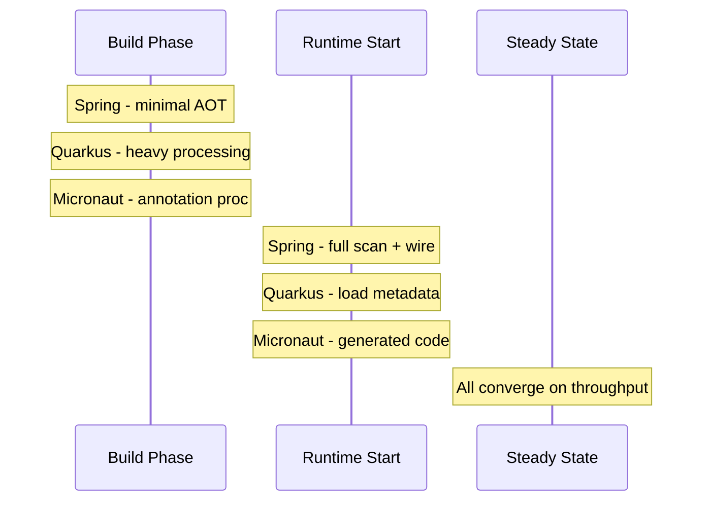

### 🚨 Failure Modes

**Failure 1 - Choosing by benchmark alone:**
Team selects Quarkus for its startup numbers, then
discovers that three critical libraries (reporting
engine, legacy SOAP client, custom Spring integration)
have no Quarkus extensions. The team spends months
writing compatibility shims or forking libraries.
Startup time saved: seconds. Integration time lost:
months.
**Diagnostic:** Before choosing, inventory every
dependency. Check each framework's extension/library
catalog. Test the actual application stack, not a
hello-world benchmark.
**Fix:** Prototype with the real dependency set. Measure
with production-representative workload. Factor in
developer time for missing integrations.

**Failure 2 - Native image false economy:**
Team compiles to GraalVM native image for faster
serverless cold starts. Build times increase from
30 seconds to 8+ minutes. Reflection configuration
breaks with every library update. Debug tooling is
limited. The 2-second startup improvement saves pennies
on Lambda invocations but costs hours in developer
productivity every week.
**Diagnostic:** Track total developer time spent on
native image issues versus infrastructure savings.
Compare native image cost savings against simply
provisioning minimum instances to avoid cold starts.
**Fix:** Use native image only when cold start latency
is a hard business requirement (true serverless with
unpredictable traffic). For steady-traffic services,
JVM mode with adequate replicas is simpler and cheaper
in total cost.

**Failure 3 - Migration mid-project:**
Team starts with Spring, hits memory constraints at
scale, and decides to migrate to Micronaut. The
migration requires rewriting all DI annotations,
replacing Spring Data repositories, converting
configuration properties, and retraining the team.
The migration takes longer than rewriting from scratch.
**Diagnostic:** Estimate migration scope by cataloging
framework-specific APIs used across the codebase.
**Fix:** If memory is the concern, try Spring AOT and
native image first. Optimize JVM settings (container-
aware `-XX:MaxRAMPercentage`). Migrate only if
framework overhead is truly the bottleneck after
profiling.

### 🔬 Production Reality

The framework choice matters most at the extremes.
For a typical microservice running 5-20 replicas with
steady traffic, Spring Boot's higher memory and startup
are irrelevant - the service starts once and runs for
weeks. The ecosystem advantage (Spring Data, Spring
Security, Spring Cloud, Spring Batch) saves far more
engineering time than the infrastructure cost difference.

Where Quarkus and Micronaut genuinely shine: high-scale
serverless (thousands of short-lived instances),
CLI tools that must start instantly, edge computing
with tight memory constraints, or organizations already
invested in CDI/Jakarta EE (Quarkus) or seeking minimal
framework overhead (Micronaut). In these scenarios,
build-time processing pays dividends.

The hiring reality: Spring developers outnumber Quarkus
and Micronaut developers by an order of magnitude.
This affects recruiting speed, onboarding time, and the
availability of contractors and consultants. For many
organizations, this single factor outweighs all
technical benchmarks.

### ⚖️ Trade-offs & Alternatives

**BAD:**

```java
// Choosing framework by hello-world startup
// benchmarks without testing real workload
// "Quarkus starts in 0.5s so it's faster"
// (ignores ecosystem, hiring, migration)
```

**GOOD:**

```java
// Decision based on deployment model +
// actual dependency compatibility
// 1. List all required libraries
// 2. Verify framework support for each
// 3. Prototype with real workload
// 4. Factor in team skills and hiring
// 5. Choose and commit
```

| Factor           | Spring Boot | Quarkus | Micronaut |
| ---------------- | ----------- | ------- | --------- |
| Startup (JVM)    | Slower      | Fast    | Fast      |
| Startup (native) | Fast        | Fastest | Fast      |
| Memory (JVM)     | Higher      | Lower   | Lower     |
| Ecosystem        | Largest     | Growing | Growing   |
| Hiring pool      | Largest     | Smaller | Smallest  |
| Native maturity  | Newer       | Mature  | Mature    |
| DX / tooling     | Best        | Good    | Good      |
| Migration cost   | N/A         | High    | High      |

### ⚡ Decision Snap

Choose Spring Boot when: you need the broadest library
ecosystem, your team already knows Spring, you run
long-lived services, or hiring Spring developers is a
business requirement. Choose Quarkus when: you deploy
to serverless or need minimal memory, your team knows
Jakarta EE/CDI, or Red Hat support matters. Choose
Micronaut when: you want compile-time DI with zero
reflection, build small CLI tools, or run on constrained
environments. For most enterprise applications in 2025,
Spring Boot with AOT and optional native image covers
the performance requirements while preserving the
ecosystem advantage.

### ⚠️ Top Traps

| #   | Trap                    | Why it bites                                              | Escape                                         |
| --- | ----------------------- | --------------------------------------------------------- | ---------------------------------------------- |
| 1   | Benchmark-driven choice | Hello-world numbers do not reflect real workloads         | Prototype with actual dependencies and load    |
| 2   | Native image by default | Build time and debug pain outweigh startup gains          | Use native only for serverless or CLI tools    |
| 3   | Ignoring hiring pool    | Cannot staff a Quarkus team if market is Spring           | Factor hiring into total cost of ownership     |
| 4   | Assuming easy migration | DI, config, and data access all change between frameworks | Commit to one framework per service boundary   |
| 5   | Ignoring Spring AOT     | Spring 6+ narrows the startup gap significantly           | Test Spring native before switching frameworks |

### 🪜 Learning Ladder

**Prerequisites:**
SPR-091 GraalVM Native Image with Spring Boot 3,
SPR-075 Spring Boot Starters and Auto-Configuration

**THIS:** SPR-101 Performance at Scale -
Spring vs Quarkus vs Micronaut

**Next steps:**
SPR-107 Conventional vs Boot vs Cloud Decision Pattern

**The Surprising Truth:**

The framework that "wins" benchmarks is rarely the
framework that wins in production. Startup time is
measured once per deployment. Library compatibility,
developer productivity, hiring availability, and
community support compound every day for the lifetime
of the service. The most common regret is not choosing
the wrong framework - it is migrating to a "better" one
mid-project and discovering that the migration cost
dwarfs the original performance concern.

**Further Reading:**

- Quarkus guides (quarkus.io) - Getting Started,
  Building Native Executables
- Micronaut guides (micronaut.io) - Quick Start,
  Dependency Injection
- Spring Boot Reference - GraalVM Native Image Support,
  AOT Processing
- "Cloud Native Java" (Josh Long, O'Reilly)

**Revision Card:**

1. Build-time processing (Quarkus extensions, Micronaut
   annotation processors) trades compile time for
   runtime speed - all three frameworks do the same DI
   work, just at different phases
2. Steady-state throughput converges after JIT warmup
   because the bottleneck shifts to I/O and business
   logic, not framework overhead - startup is a
   one-time cost per deployment
3. Spring's ecosystem, hiring pool, and library
   compatibility are production advantages that
   benchmarks do not measure - choose by deployment
   model and team skills, not hello-world numbers

---

---

# SPR-102 Overengineered Microservice Anti-Pattern

**TL;DR** - Most "microservice architectures" are distributed monoliths paying network tax for zero autonomy; start modular monolith, split only at proven boundaries.

### 🔥 Problem Statement

A team reads the Netflix playbook, attends a conference
talk, and decomposes a greenfield application into
fifteen services before writing a single line of
business logic. Six months later: every feature requires
synchronized deploys across four services, a single
order flow touches seven network hops, data consistency
requires sagas nobody understands, and the on-call
rotation is a nightmare of cascading timeouts. They
built a distributed monolith - all the operational cost
of microservices with none of the autonomy benefits.
The architecture diagram looks impressive. The incident
timeline does not.

### 📜 Historical Context

Microservices emerged from real pain at real scale.
Amazon's two-pizza teams (circa 2002) needed deployment
independence because hundreds of developers could not
coordinate releases on a shared codebase. Netflix (2011)
decomposed because a single Oracle database could not
scale to streaming demand. These organizations split
after hitting concrete scaling and organizational
bottlenecks - not before writing the first feature.

The industry cargo-culted the outcome without the
context. Martin Fowler explicitly warned in his 2015
"Monolith First" article that premature decomposition
is the most common microservice failure mode. Sam
Newman's "Building Microservices" (2nd ed., 2021)
dedicates chapters to when NOT to decompose. Yet the
pattern persists because architecture conference talks
reward novelty, not caution.

Spring Cloud (2015+) made microservices accessible with
Eureka, Config Server, Zuul/Gateway, and Sleuth. This
lowered the barrier to entry but not the barrier to
doing it well. Teams adopted the tools without adopting
the organizational prerequisites.

### 🔩 First Principles

**CORE INVARIANTS:**

1. A service boundary is a deployment, data, and team
   boundary - if any of these are shared, the boundary
   is fictional and the network hop is pure cost
2. Every network call introduces latency, failure modes,
   and consistency challenges that in-process calls do
   not have - distribution is never free
3. The value of decomposition is proportional to the
   independence it creates - measured by how often
   services deploy without coordinating with others

**DERIVED DESIGN:**

If your services cannot deploy independently, own their
data independently, and be built by independent teams,
you have a distributed monolith. The architectural
remedy is not more services - it is fewer, better
boundaries. A modular monolith with clean module
interfaces gives you the same logical separation without
the operational tax. You can extract a module into a
service later when you have evidence that the boundary
is correct and the independence is needed.

### 🧠 Mental Model

> Think of microservices like opening separate bank
> accounts. Each account has its own balance, its own
> statements, and its own access controls. This makes
> sense when different people manage different funds.
> But if every purchase requires transferring money
> between five accounts before the merchant gets paid,
> you have not gained independence - you have gained
> paperwork.

-> A service boundary is a separate bank account -
only valuable if it operates independently
-> Network calls are wire transfers - each one adds
latency, fees, and failure risk
-> Synchronized deploys are joint account signatures -
they prove the "separate" accounts are not separate
-> A modular monolith is a single account with labeled
sub-budgets - same isolation logic, zero transfer
overhead

**Where this analogy breaks down:**

Bank accounts have guaranteed transfer semantics (ACID
within the banking system). Distributed services do not.
A failed network call between services can leave data
in an inconsistent state that requires explicit
compensation logic (sagas), whereas a failed in-process
call simply rolls back the transaction.

### 🧩 Components

```
+-------------------------------------------+
| Distributed Monolith Symptoms             |
+-------------------------------------------+
| [Service A]--sync-->[Service B]           |
|      |                   |                |
|      v                   v                |
| [Shared DB]         [Shared DB]           |
|      ^                   ^                |
|      |                   |                |
| [Service C]--sync-->[Service D]           |
+-------------------------------------------+
| Shared deploy | Shared data | Lock-step   |
+-------------------------------------------+

vs Genuine Microservices:

+-------------------------------------------+
| [Service A]    [Service B]                |
| [Own DB]       [Own DB]                   |
| [Own deploy]   [Own deploy]               |
| [Async events between them]               |
+-------------------------------------------+
```

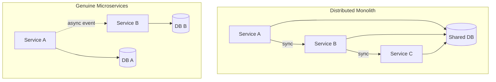

### 📶 Gradual Depth

**Level 0 - What is the problem:**
Splitting an application into many services does not
automatically make it a good architecture. If the
services cannot work independently, you just made
everything harder.

**Level 1 - The distributed monolith:**
When services share a database, deploy together, or
require synchronized changes for every feature, they
are a distributed monolith. You pay the network cost
(latency, failure modes) without gaining the benefit
(independent deployment, independent scaling).

**Level 2 - The network tax:**
Every in-process method call converted to an HTTP/gRPC
call adds 1-10ms of latency, requires timeout handling,
retry logic, circuit breaking, and serialization
overhead. A request that touches seven services
accumulates this tax at every hop. A monolith method
call costs nanoseconds.

**Level 3 - Data consistency nightmares:**
The moment data ownership splits across services,
you lose ACID transactions. An order that debits
inventory, charges payment, and updates shipping
now requires a saga or choreography. Every step can
fail independently. Compensation logic (refund the
charge, restore inventory) must handle partial
failures, retries, and idempotency. Most teams
underestimate this complexity by an order of magnitude.

**Level 4 - Operational complexity explosion:**
Fifteen services means fifteen CI/CD pipelines, fifteen
health checks, fifteen log streams to correlate,
fifteen sets of metrics dashboards, fifteen places
where a config change can cause an outage. Distributed
tracing (Zipkin, Jaeger) helps but does not eliminate
the cognitive load of debugging a request that
spans seven services and three message brokers.

**Level 5 - The modular monolith alternative:**
Spring Modulith enforces module boundaries within a
single deployable. Modules communicate through
application events and well-defined interfaces. You
get logical separation, enforced boundaries, and the
option to extract a module into a service later - but
only when you have evidence that extraction is needed.
This is not "going back to monoliths." It is choosing
the right decomposition granularity.

**Level 6 - Signs you split too early:**
You split before you understood the domain boundaries.
Entity relationships cross service boundaries constantly.
Every user story requires changes in multiple services.
Your "independent" services have lockstep release trains.
Your team is smaller than the number of services. Your
data consistency bugs outnumber your feature releases.

### ⚙️ How It Works

```
Premature Decomposition Path:
  Idea -> 15 services (day 1)
    -> shared DB (month 1)
    -> sync calls everywhere (month 2)
    -> coordinated deploys (month 3)
    -> distributed monolith (month 6)
    -> rewrite discussion (month 12)

Modular Monolith Path:
  Idea -> modular monolith (day 1)
    -> module boundaries (month 1)
    -> async events between modules (month 3)
    -> extract proven boundary (month 9)
    -> 2-3 services max (month 12)
```

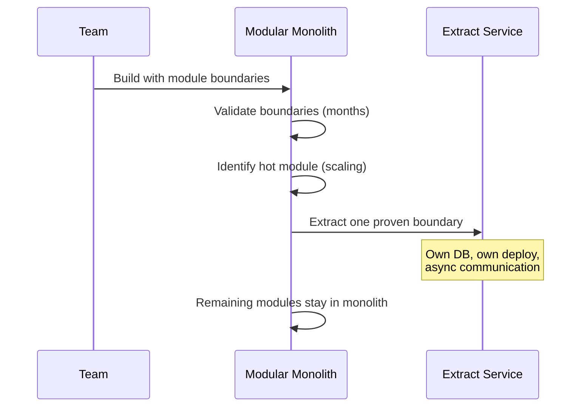

### 🚨 Failure Modes

**Failure 1 - The entity graph explosion:**
Team splits "Order Service" and "Inventory Service"
but every order query needs inventory status, and every
inventory update needs order context. Services call each
other synchronously for every operation. Latency doubles.
When Inventory Service is slow, Order Service times out,
and the entire checkout flow fails.
**Diagnostic:** Map entity relationships across service
boundaries. If the relationship graph is dense (many
cross-service joins), the boundary is wrong. Count
synchronous cross-service calls per user request - more
than two is a strong smell.
**Fix:** Merge the services back. Model them as modules
within a single deployable. Use application events for
loose coupling. Extract only when you can prove the
modules have genuinely independent lifecycles.

**Failure 2 - The saga that nobody understands:**
Team implements a distributed saga for order fulfillment
spanning five services. The happy path works. But
compensating transactions for partial failures are
incomplete. An inventory debit succeeds, payment fails,
and the compensation to restore inventory has a bug.
The system leaks inventory counts. Months later, the
warehouse reports phantom stock discrepancies.
**Diagnostic:** Review every saga step's compensation
logic. Test partial failures at each step. Verify
idempotency of every compensating action. Check for
missing compensation paths.
**Fix:** Simplify the transaction boundary. If the
operations must be consistent, they belong in the same
service (or the same database transaction). Use sagas
only when eventual consistency is genuinely acceptable
to the business.

**Failure 3 - The configuration drift catastrophe:**
Fifteen services, each with its own application.yml,
each with slightly different timeout values, retry
policies, and connection pool sizes. Service A retries
three times with 5-second timeout. Service B has a
2-second timeout to A. B times out before A's retries
complete. Cascading failures propagate across the mesh.
**Diagnostic:** Audit timeout and retry configurations
across all services. Draw the call graph with annotated
timeouts. Look for cases where a caller's timeout is
shorter than the callee's retry budget.
**Fix:** Centralize configuration with Spring Cloud
Config. Establish timeout budgets: a caller's timeout
must exceed the callee's total retry time. Use circuit
breakers (Resilience4j) to fail fast instead of
cascading.

### 🔬 Production Reality

The organizations that succeed with microservices share
common traits: strong domain modeling (often using DDD
bounded contexts), team-per-service ownership, mature
CI/CD pipelines, robust observability (distributed
tracing, centralized logging, per-service dashboards),
and explicit data ownership boundaries. These are
prerequisites, not outcomes.

The most common pattern in successful organizations is
fewer, larger services than you expect. Amazon's "two-
pizza team" services are not 15-line CRUD wrappers.
They are substantial domain capabilities. A typical
mature microservice architecture has 5-15 services for
a medium product, not 50-100.

When a team with fewer than 10 developers runs more
than 10 services, the operational burden typically
exceeds the organizational benefit. The rule of thumb:
you need at least one dedicated team per service
boundary. If you do not have the teams, you do not
need the services.

### ⚖️ Trade-offs & Alternatives

**BAD:**

```java
// Day-1 architecture: 15 services,
// 3 developers, shared database
@FeignClient("inventory-service")
public interface InventoryClient {
    @GetMapping("/api/inventory/{id}")
    InventoryDTO getInventory(
        @PathVariable Long id);
}
// Every order query makes sync HTTP call
// to inventory - 5ms added per call
```

**GOOD:**

```java
// Modular monolith: same logical boundary,
// zero network cost
@Service
class OrderService {
    private final InventoryModule inventory;

    public Order place(OrderRequest req) {
        // In-process call: nanoseconds
        inventory.reserve(req.items());
        return orderRepo.save(
            Order.from(req));
    }
}
```

| Factor              | Microservices        | Modular Monolith    |
| ------------------- | -------------------- | ------------------- |
| Deploy independence | High (if done right) | Low (single deploy) |
| Data consistency    | Eventual (sagas)     | ACID (transactions) |
| Network latency     | Per-hop tax          | Zero (in-process)   |
| Operational cost    | High (N pipelines)   | Low (one pipeline)  |
| Team scaling        | Better at 50+ devs   | Fine under 20 devs  |
| Extraction later    | N/A                  | Straightforward     |
| Debug complexity    | Distributed tracing  | Stack traces        |

### ⚡ Decision Snap

Start with a modular monolith when: your team is fewer
than 20 developers, your domain boundaries are not yet
proven, you value ACID consistency, or you want to ship
features fast without operational overhead. Split to
microservices when: independent teams need independent
deploy cadences, a specific module needs independent
scaling, or regulatory requirements demand data
isolation. The decision is not permanent - a well-
structured modular monolith can extract services
incrementally. A poorly structured microservice mesh
is far harder to merge back.

### ⚠️ Top Traps

| #   | Trap                                  | Why it bites                                                    | Escape                                                                 |
| --- | ------------------------------------- | --------------------------------------------------------------- | ---------------------------------------------------------------------- |
| 1   | Splitting before understanding domain | Boundaries are wrong, requiring constant cross-service changes  | Model domain with DDD bounded contexts in a monolith first             |
| 2   | Shared database across services       | Coupling through data defeats the purpose of service boundaries | Each service owns its data or merge the services                       |
| 3   | Synchronous chains of calls           | Latency compounds, failures cascade, no real independence       | Use async events; accept eventual consistency or merge                 |
| 4   | More services than developers         | Team cannot maintain, monitor, or on-call for all services      | Consolidate until ratio is at most 2 services per team                 |
| 5   | Sagas for everything                  | Compensation logic bugs cause silent data corruption            | Keep ACID where possible; use sagas only for true cross-boundary flows |

### 🪜 Learning Ladder

**Prerequisites:**
SPR-090 Microservice Architecture with Spring Boot,
SPR-094 Spring Modulith and Module Boundaries

**THIS:** SPR-102 Overengineered Microservice
Anti-Pattern

**Next steps:**
SPR-108 Monolith-First Strategy with Spring Modulith

**The Surprising Truth:**

The teams that get microservices right are not the ones
with the most services. They are the ones that resisted
splitting until the pain of coordination in a monolith
exceeded the pain of distribution. Netflix did not start
with microservices. Amazon did not start with
microservices. They arrived at microservices after years
of monolith growth proved that organizational scaling
required deployment independence. The architecture that
looks boring on a whiteboard - a modular monolith with
three or four extracted services - is the architecture
that ships features fastest for 90% of organizations.

**Further Reading:**

- "Monolith First" - Martin Fowler (martinfowler.com)
- "Building Microservices" 2nd ed. - Sam Newman
  (O'Reilly, 2021) - Ch. 3 on splitting
- Spring Modulith Reference Documentation
  (docs.spring.io)
- "Don't start with microservices in production" -
  Stefan Tilkov (GOTO Conference)

**Revision Card:**

1. A distributed monolith pays the network tax
   (latency, failure modes, consistency complexity)
   without gaining deployment independence - if
   services share data, deploy together, or change
   in lockstep, the boundary is fictional
2. Start modular monolith, enforce boundaries with
   Spring Modulith, extract to services only when a
   specific module needs independent deployment,
   scaling, or team ownership - extraction is
   evidence-driven, not architecture-astronaut-driven
3. The prerequisite for microservices is organizational
   scale (independent teams, independent data, mature
   CI/CD and observability) - without those
   prerequisites, decomposition adds cost without
   benefit

---

---

# SPR-103 Premature Reactive Adoption Anti-Pattern

**TL;DR** - Adopting WebFlux without proven concurrency demands creates debugging nightmares; prefer MVC with virtual threads unless you have measured backpressure needs.

### 🔥 Problem Statement

A team reads that "reactive is the future," migrates
their CRUD REST API from Spring MVC to Spring WebFlux,
and discovers that development velocity drops by half.
Stack traces become unreadable walls of Reactor
operators. Blocking calls hide inside reactive chains,
silently pinning the few event loop threads and causing
intermittent timeouts under load. Junior developers
cannot debug issues without deep Reactor knowledge.
The application serves the same 200 requests per second
it served before - but now takes three times longer to
develop, debug, and maintain. Reactive programming is
a powerful tool for specific problems. It is not a
universal upgrade.

### 📜 Historical Context

Reactive Streams (2013-2015) emerged from real
backpressure problems at Netflix, Lightbend, and
Pivotal. When a fast producer overwhelms a slow
consumer (streaming data, high-throughput pipelines),
backpressure propagation prevents memory exhaustion.
The Reactive Streams spec (java.util.concurrent.Flow
in Java 9) standardized this pattern.

Spring WebFlux (Spring 5, 2017) brought reactive
programming to the Spring ecosystem using Project
Reactor. It excels when the application is I/O-bound
with high concurrency: thousands of simultaneous
connections where threads would be wasted waiting on
network responses. The canonical use cases are API
gateways, streaming endpoints, and real-time data
aggregation from multiple downstream services.

Java 21 (2023) introduced virtual threads (Project
Loom), which solve the same thread-efficiency problem
through a fundamentally different approach: instead of
restructuring code around non-blocking operators,
virtual threads let you write blocking code that
automatically yields the carrier thread during I/O
waits. Spring Framework 6.1+ integrates virtual threads
natively. This changed the calculus: the primary
argument for reactive (efficient thread utilization)
now has a simpler alternative for most workloads.

### 🔩 First Principles

**CORE INVARIANTS:**

1. Reactive programming solves the backpressure problem
   - a fast producer overwhelming a slow consumer -
     everything else is secondary benefit
2. Non-blocking I/O and reactive programming are not
   the same thing - you can have non-blocking I/O
   without Reactor operators (virtual threads prove
   this)
3. Code complexity has a direct cost in development
   velocity, debugging time, onboarding friction, and
   production incident resolution speed

**DERIVED DESIGN:**

If your application does not have a backpressure
problem (most CRUD APIs do not), reactive programming
adds complexity without solving a real constraint. The
decision should be driven by measured concurrency
requirements, not by "modern" aspirations. Virtual
threads in Spring MVC give you the thread efficiency
of reactive with the debugging simplicity of
synchronous code.

### 🧠 Mental Model

> Think of reactive programming like a factory assembly
> line with conveyor belts that automatically slow down
> when the next station is backed up. This is brilliant
> for a factory processing thousands of items per hour.
> But if your "factory" handles ten orders a day, the
> conveyor belt system costs more to maintain than a
> person walking each order to the next desk.

-> Reactive operators are the conveyor belt system -
powerful but complex to build and maintain
-> Backpressure is the automatic slowdown signal -
the core value proposition
-> Blocking calls in a reactive chain are someone
standing on the conveyor belt - they stop the
entire line
-> Virtual threads are hiring more workers who
naturally wait at each desk - simple, effective,
no conveyor belt needed

**Where this analogy breaks down:**

Assembly lines have physical constraints that make them
hard to reconfigure. Reactive pipelines can be composed
dynamically. The real cost of reactive is cognitive, not
mechanical - it is the team's ability to reason about
asynchronous data flows, not the physical infrastructure.

### 🧩 Components

```
Spring MVC (traditional):
  Request -> Thread -> Block on DB
  -> Block on HTTP -> Response -> Free

Spring MVC + Virtual Threads:
  Request -> VThread -> Yield on DB
  -> Yield on HTTP -> Response -> Free
  (millions of VThreads, simple code)

Spring WebFlux (reactive):
  Request -> Event Loop -> Mono/Flux
  -> Operators -> Subscribe -> Callback
  (few threads, complex code)
```

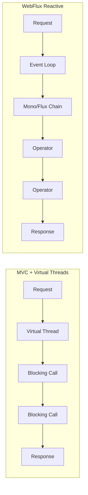

### 📶 Gradual Depth

**Level 0 - What is reactive:**
Reactive programming processes data as streams with
automatic flow control. Instead of "get all results,
then process," it is "process each result as it
arrives, slowing the producer if the consumer is busy."

**Level 1 - Why it seems attractive:**
Reactive code uses fewer threads to handle more
concurrent connections. A traditional thread-per-request
model blocks a thread during every I/O wait. With 1000
concurrent requests each waiting 100ms on a database,
you need 1000 threads doing nothing. Reactive reuses a
small thread pool by never blocking.

**Level 2 - The hidden costs:**
Reactive code restructures your program around
`Mono<T>` and `Flux<T>` types. Every method returns a
publisher. Composition uses operators (`flatMap`, `zip`,
`switchIfEmpty`). Error handling uses `onErrorResume`,
not try-catch. Stack traces show Reactor internals, not
your business logic. Debugging requires understanding
the operator fusion and subscription lifecycle.

**Level 3 - The blocking call trap:**
One blocking call inside a reactive chain pins the
event loop thread. With the default Netty event loop
(typically CPU-core count threads), a single blocking
JDBC call on each thread freezes the entire application.
This is the most common WebFlux production incident: a
library that looks non-blocking but internally blocks,
or a developer who writes `block()` inside a reactive
chain to "make it work."

**Level 4 - Virtual threads change the equation:**
Java 21 virtual threads let you write blocking code
(`resultSet = stmt.executeQuery()`) while the runtime
transparently parks the virtual thread and frees the
carrier thread during I/O. You get reactive's thread
efficiency with synchronous code's simplicity. Spring
MVC on virtual threads handles high concurrency without
Reactor operators, without `Mono`/`Flux`, and without
sacrificing stack traces.

**Level 5 - When reactive is genuinely justified:**
True streaming scenarios: server-sent events, WebSocket
feeds, processing unbounded data streams from Kafka
where backpressure to the broker is essential. API
gateways that aggregate responses from many downstream
services with fine-grained timeout and retry per call.
Applications where the R2DBC reactive database driver
is a better fit than JDBC (rare, but exists for truly
high-connection-count scenarios).

**Level 6 - The team skill multiplier:**
Reactive code requires the entire team to understand
Reactor. One developer who does not understand
`subscribeOn` vs `publishOn` can introduce a blocking
call that takes down production. Code reviews require
reactive expertise. Onboarding takes weeks longer.
The productivity cost is proportional to team size
and turnover. For most teams, this cost exceeds the
infrastructure savings.

### ⚙️ How It Works

```
Blocking Call Detection:
  BlockHound (reactor tool):
    Agent intercepts Thread.sleep(),
    InputStream.read(), JDBC calls
    inside reactive schedulers
    -> throws on violation

Performance Comparison (same workload):
  MVC + platform threads:
    OK to ~500 concurrent connections
    (limited by thread pool)
  MVC + virtual threads:
    OK to ~100K concurrent connections
    (limited by memory, not threads)
  WebFlux + Reactor:
    OK to ~100K concurrent connections
    (limited by memory, not threads)
  Throughput at steady state: equivalent
  Code complexity: MVC << WebFlux
```

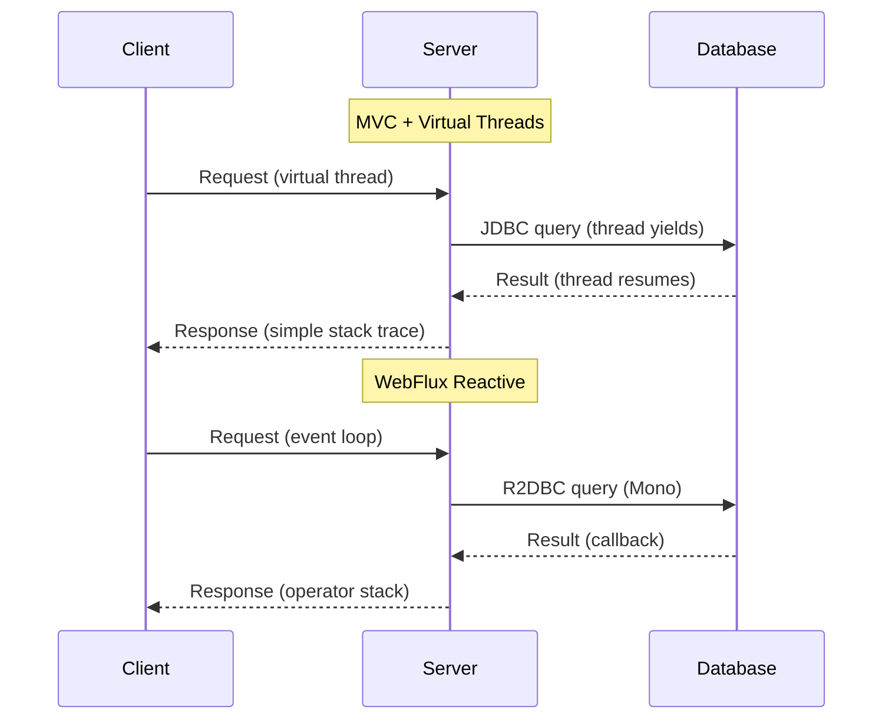

### 🚨 Failure Modes

**Failure 1 - Hidden blocking in reactive chain:**
Team migrates to WebFlux but uses a library that
internally calls `InputStream.read()` (a blocking
operation). Under low load, it works fine - the event
loop threads have slack. Under peak load, all event
loop threads block simultaneously. The application
stops responding to all requests. Health checks fail.
Kubernetes restarts the pod. The cycle repeats.
**Diagnostic:** Enable BlockHound in test environments.
It instruments the JVM to detect blocking calls on
non-blocking schedulers. Review every dependency for
blocking I/O: JDBC drivers, file I/O, DNS resolution,
synchronous HTTP clients.
**Fix:** Replace blocking libraries with non-blocking
alternatives (R2DBC for database, WebClient for HTTP).
If a blocking library cannot be replaced, wrap the call
in `Mono.fromCallable(...).subscribeOn(Schedulers
.boundedElastic())` to offload to a blocking-safe
thread pool - but recognize this partially defeats the
purpose of reactive.

**Failure 2 - Unreadable stack traces in production:**
A NullPointerException occurs inside a `flatMap`
operator chain. The stack trace shows 40 lines of
Reactor internals (`FluxFlatMap$FlatMapMain`,
`Operators$MonoSubscriber`) and one line of application
code. The on-call engineer spends two hours
understanding which operator failed and what data
caused it. In Spring MVC, the same error would show
the exact line number with full call context.
**Diagnostic:** Compare mean-time-to-diagnose for
incidents in reactive vs non-reactive services. If
reactive services consistently take longer to debug,
the complexity cost is measurable.
**Fix:** Use Reactor's `checkpoint("description")` and
`Hooks.onOperatorDebug()` in non-production to get
assembly-time stack traces. Use `log()` operators at
key pipeline points. Consider whether the debugging
cost justifies the reactive approach for this
particular service.

**Failure 3 - Team skill gap causing production bugs:**
A developer unfamiliar with Reactor uses `block()`
inside a reactive chain to extract a value. This works
in unit tests (which run on a different scheduler) but
deadlocks in production when the event loop thread
blocks waiting for a result that would be delivered by
the same event loop thread. The service hangs under
load with no errors in logs - just increasing latency
until timeout.
**Diagnostic:** Search codebase for `.block()` calls.
Any `block()` outside of test code or a `main()` method
is suspect. Profile thread dumps under load - stuck
event loop threads indicate blocking.
**Fix:** Enforce a code review checklist that flags
`block()` calls. Run BlockHound in CI. Invest in
Reactor training before adopting WebFlux. If the team
cannot maintain reactive code reliably, switch to MVC
with virtual threads.

### 🔬 Production Reality

The vast majority of Spring applications are request-
response CRUD services with moderate concurrency
(hundreds, not tens of thousands of simultaneous
connections). For these workloads, Spring MVC with
virtual threads provides equivalent throughput to
WebFlux with dramatically simpler code, debugging,
and maintenance.

WebFlux genuinely earns its complexity in specific
scenarios: Spring Cloud Gateway (an API gateway that
proxies thousands of concurrent connections), real-time
streaming APIs (SSE, WebSocket feeds with backpressure),
and applications that must integrate with reactive
libraries like RSocket or reactive MongoDB/Cassandra
drivers where the entire stack is non-blocking.

The migration path matters. Teams that adopted WebFlux
before Java 21 had no thread-efficient alternative.
Those teams have working reactive codebases and trained
developers - migrating back to MVC is not always
justified. But new projects starting on Java 21+ should
default to MVC with virtual threads and adopt WebFlux
only when they can articulate the specific backpressure
or streaming requirement that virtual threads do not
solve.

### ⚖️ Trade-offs & Alternatives

**BAD:**

```java
// Reactive for a simple CRUD endpoint
// adds complexity with zero benefit
@GetMapping("/users/{id}")
public Mono<User> getUser(
        @PathVariable Long id) {
    return userRepo.findById(id)
        .switchIfEmpty(Mono.error(
            new NotFoundException()))
        .flatMap(u -> enrichUser(u))
        .onErrorResume(e ->
            Mono.error(map(e)));
}
```

**GOOD:**

```java
// MVC + virtual threads: same throughput,
// readable code, debuggable stack traces
@GetMapping("/users/{id}")
public User getUser(
        @PathVariable Long id) {
    User user = userRepo.findById(id)
        .orElseThrow(NotFoundException::new);
    return enrichUser(user);
}
// spring.threads.virtual.enabled=true
```

| Factor            | WebFlux              | MVC + VThreads        |
| ----------------- | -------------------- | --------------------- |
| Thread efficiency | High                 | High                  |
| Code complexity   | High (operators)     | Low (imperative)      |
| Stack traces      | Reactor internals    | Business code         |
| Debugging         | Difficult            | Standard              |
| Onboarding        | Weeks (Reactor)      | Hours (standard Java) |
| Backpressure      | Built-in             | Not built-in          |
| Streaming         | Native support       | Requires workarounds  |
| Library compat    | R2DBC, reactive only | All JDBC libraries    |
| Team skill req    | Reactor expertise    | Standard Java         |

### ⚡ Decision Snap

Use WebFlux when: you build an API gateway proxying
thousands of concurrent connections, you need true
streaming with backpressure (SSE/WebSocket feeds),
your team has proven Reactor expertise, or your entire
stack is already reactive (R2DBC, reactive Kafka,
RSocket). Use MVC with virtual threads when: you build
request-response APIs, you use JDBC/JPA for data
access, your team is not trained in Reactor, or you
want the simplest path to high concurrency on Java 21+.
Default to MVC + virtual threads for new projects.
Adopt WebFlux only with evidence of a specific need.

### ⚠️ Top Traps

| #   | Trap                                 | Why it bites                                                         | Escape                                                        |
| --- | ------------------------------------ | -------------------------------------------------------------------- | ------------------------------------------------------------- |
| 1   | Reactive by default                  | Adds complexity without solving a real problem for CRUD APIs         | Default to MVC + virtual threads; prove the need for reactive |
| 2   | Blocking calls in reactive chains    | Pins event loop threads, causing total application freeze under load | Use BlockHound in CI; audit every dependency for blocking I/O |
| 3   | Using `block()` to "escape" reactive | Deadlocks in production, works in tests (different scheduler)        | Ban `block()` outside tests; enforce in code review           |
| 4   | Ignoring team skill requirements     | One untrained developer can introduce production-killing bugs        | Train the entire team on Reactor before adopting WebFlux      |
| 5   | Mixing blocking and reactive drivers | JDBC in a WebFlux app negates the non-blocking advantage             | Use R2DBC for reactive or stay on MVC for JDBC workloads      |

### 🪜 Learning Ladder

**Prerequisites:**
SPR-071 Spring WebFlux and Reactive Basics,
SPR-093 Virtual Threads (Loom) Integration in Spring 6

**THIS:** SPR-103 Premature Reactive Adoption
Anti-Pattern

**Next steps:**
SPR-099 Reactive Data Access (R2DBC)

**The Surprising Truth:**

The strongest argument against premature reactive
adoption is not technical - it is economic. The
infrastructure savings from reactive (fewer threads,
slightly lower memory) are typically measured in
dollars per month. The developer productivity cost
(slower feature development, longer debugging, harder
onboarding, more production incidents from operator
misuse) is measured in thousands of dollars per month
per developer. Virtual threads eliminated the last
compelling technical argument for reactive in most
applications. The remaining valid use cases - true
streaming, backpressure, and API gateways - are real
but narrow. For everything else, the simplest correct
code wins.

**Further Reading:**

- "Reactive programming is not a silver bullet" -
  Spring team blog (spring.io/blog)
- Project Reactor Reference Guide -
  Debugging Reactor (projectreactor.io)
- JEP 444: Virtual Threads (openjdk.org)
- "Spring Framework 6.1 and Virtual Threads" -
  Spring team documentation (docs.spring.io)

**Revision Card:**

1. Reactive programming solves backpressure between
   fast producers and slow consumers - if your
   application does not have this problem, reactive
   adds complexity without benefit
2. Virtual threads (Java 21+) provide the same thread
   efficiency as reactive with synchronous code
   simplicity - MVC + virtual threads is the default
   choice for new Spring projects on Java 21+
3. The economic cost of reactive is developer
   productivity (debugging, onboarding, code review,
   incident resolution) which typically exceeds the
   infrastructure savings for applications without
   genuine streaming or backpressure requirements

---

---

# SPR-104 Spring Architecture Whiteboard Sessions

**TL;DR** - Diagram Spring systems as layers, cross-cuts, data flows, and failure domains to communicate architecture under interview pressure.

### 🔥 Problem Statement

You walk into a system design interview or architecture
review and someone says "draw the architecture on the
whiteboard." You have 20-40 minutes to communicate a
Spring-based system's structure, data flow, failure
boundaries, and operational concerns. Most engineers
either draw random boxes with arrows (no layering, no
failure domains, no clarity on what crosses what) or
freeze entirely because they have never practiced
translating a running system into a spatial diagram.
The whiteboard is not about code - it is about showing
you understand how the pieces compose, where the risk
concentrates, and what happens when things break.

### 📜 Historical Context

Whiteboard architecture diagrams predate Spring by
decades. The "boxes and arrows" tradition comes from
structured analysis (DeMarco, Yourdon) in the 1970s.
The layered architecture pattern was formalized by
Buschmann et al. in "Pattern-Oriented Software
Architecture" (1996). Spring's own documentation from
Rod Johnson's "Expert One-on-One J2EE Design and
Development" (2002) used layered diagrams to contrast
Spring's lightweight approach against EJB's heavyweight
model. The C4 model (Simon Brown, 2011) introduced
hierarchical zoom levels (Context, Container, Component,
Code) that map naturally to Spring applications. Today
FAANG-style system design interviews expect candidates
to produce layered, failure-aware diagrams under time
pressure. Spring's stereotypes (@Controller, @Service,
@Repository) map directly to diagram layers, making
Spring applications particularly diagrammable.

### 🔩 First Principles

**CORE INVARIANTS:**

1. Every whiteboard diagram communicates at exactly one
   zoom level at a time - mixing deployment topology
   with class-level detail produces unreadable noise.
2. Arrows represent data flow direction and protocol,
   not "depends on" - label every arrow with what
   travels across it (HTTP, SQL, events, gRPC).
3. Failure domains are bounded by network, process,
   and thread boundaries - draw them explicitly as
   dashed rectangles so reviewers see blast radius.

**DERIVED DESIGN:**

From invariant 1: start with the C4 Context level (system
boundaries and external actors), then zoom into Container
level (Spring Boot apps, databases, message brokers), then
Component level (controller/service/repository layers)
only when asked for detail.
From invariant 2: unlabeled arrows are ambiguous. A line
from "Order Service" to "Database" could mean JDBC, R2DBC,
JPA, or raw SQL. Label it.
From invariant 3: a Spring Boot app in one JVM is one
failure domain. The database is another. A Kafka cluster
is another. Draw boundaries so the interviewer sees you
think about blast radius.

### 🧠 Mental Model

> Think of whiteboard diagramming as giving driving
> directions. You do not describe every molecule of
> asphalt - you name the highways, the key exits,
> the landmarks, and where traffic jams occur.

- Layers -> major highways (controller = entry ramp,
  service = main road, repository = exit ramp)
- Cross-cutting concerns -> traffic systems that span
  all roads (security checkpoints, toll collection,
  speed cameras)
- Failure domains -> stretches of road that can close
  independently (bridge out does not close the highway
  100 miles away)
- Data flow arrows -> direction of travel with lane
  markings (HTTP northbound, events southbound)

**Where this analogy breaks down:** Highway systems
are mostly stateless. Spring systems carry request
state (SecurityContext, transaction context) through
the layers, which is closer to a package being tracked
through a logistics network than a car on a road.

### 🧩 Components

The five canonical whiteboard diagram types for Spring:

```
DIAGRAM 1: Layered Component View
+-----------------------------------------+
| Controllers (@RestController)           |
| - validates input, HTTP concerns        |
+-----------------------------------------+
| Services (@Service)                     |
| - business logic, orchestration         |
+-----------------------------------------+
| Repositories (@Repository)              |
| - data access, query abstraction        |
+-----------------------------------------+
| Infrastructure                          |
| - DB, cache, message broker, ext APIs   |
+-----------------------------------------+

CROSS-CUTTING (vertical bars):
|| Security || Transactions || Logging ||
```

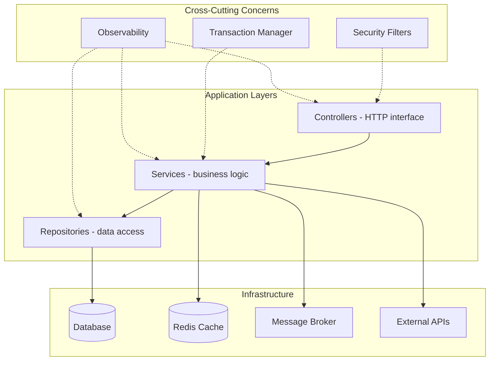

### 📶 Gradual Depth

**Level 1 - The three-layer stack.** Draw three horizontal
boxes: Controllers on top, Services in the middle,
Repositories on the bottom. Add a database cylinder below.
Arrows point downward. This is the minimum viable diagram
for any Spring application.

**Level 2 - Cross-cutting concerns.** Add vertical bars on
the side for Security, Transactions, and Logging/Tracing.
These touch every layer. In Spring, these are AOP proxies
or servlet filters - draw them as overlays, not as layers.

**Level 3 - Data flow with labels.** Label every arrow:
HTTP/JSON from client to controller, method calls between
layers, JDBC/SQL to database, AMQP/Kafka to message broker.
Add request/response direction.

```
Client --HTTP/JSON--> Controller
Controller --DTO--> Service
Service --Entity--> Repository
Repository --SQL/JDBC--> Database
Service --Event/AMQP--> Broker
```

**Level 4 - Failure domains.** Draw dashed rectangles around
each independent failure boundary: the Spring Boot JVM, the
database, the cache, the message broker, external APIs. Mark
which boundaries have circuit breakers.

**Level 5 - Deployment topology.** Show the container/pod
level: load balancer, multiple app instances, database
primary/replica, Redis cluster. This is the infrastructure
view that maps to Kubernetes manifests or cloud deployment.

### ⚙️ How It Works

A whiteboard session follows a structured reveal pattern.
You start broad and zoom in on request. The interviewer
controls depth; you control clarity.

```
Step 1: Draw system boundary (big box)
Step 2: External actors outside the box
  (users, third-party APIs, mobile apps)
Step 3: Inside the box - major containers
  (Spring Boot app, DB, cache, broker)
Step 4: Zoom into Spring Boot app
  (controller / service / repository)
Step 5: Add cross-cutting bars
  (security, transactions, caching)
Step 6: Draw data flow with labels
Step 7: Mark failure domains
Step 8: Discuss scaling and bottlenecks
```

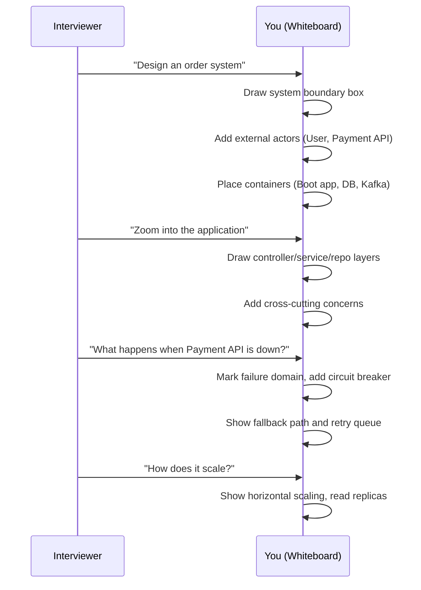

### 🚨 Failure Modes

**Failure 1 - Box Soup:**
Drawing random boxes with unlabeled arrows in no clear
spatial order. The interviewer sees chaos, not architecture.

**Diagnostic:** If someone cannot tell which layer a box
belongs to, or what protocol an arrow represents, you
have box soup.

**Fix:** Always use spatial convention: clients on top or
left, application layers in the middle (top-to-bottom),
infrastructure on the bottom or right. Label every arrow
with protocol and data type. Use consistent shapes: boxes
for services, cylinders for databases, hexagons for
message brokers.

**Failure 2 - Missing Failure Analysis:**
A beautiful diagram with no indication of what happens
when any component fails. The interviewer asks "what if
the database goes down?" and you have no failure domain
drawn.

**Diagnostic:** If your diagram has no dashed boundaries,
no circuit breaker annotations, and no fallback paths,
failure analysis is missing.

**Fix:** After drawing the happy path, immediately add
failure domains as dashed rectangles. For each domain
boundary crossing (network call), annotate the resilience
pattern: circuit breaker, timeout, retry, fallback. Draw
the degraded-mode data flow in a different color or style.

**Failure 3 - Premature Detail:**
Jumping to class diagrams or code-level detail before
establishing the system context. The interviewer wanted
the 30,000-foot view and you are drawing method signatures.

**Diagnostic:** If you spent 15 minutes on one component
and have not shown the full system boundary yet, you
zoomed in too early.

**Fix:** Follow the C4 progression: Context first (2 min),
Container second (5 min), Component third (5 min), Code
only if explicitly asked. Set a mental timer.

### 🔬 Production Reality

In real architecture reviews, the most valuable diagrams
are not the prettiest - they are the ones that reveal
hidden coupling and undocumented failure modes. A diagram
that shows Service A has a synchronous dependency on
Service B which has a synchronous dependency on Service C
immediately reveals a cascading failure risk that might
not be obvious from reading code.

Common interview whiteboard patterns for Spring systems:

**Pattern 1 - CRUD API with caching.** Controller ->
Service -> Repository -> DB, with a Redis cache sidecar
at the service layer. Draw cache-aside pattern: check
cache, miss goes to DB, write-through on updates.

**Pattern 2 - Event-driven order pipeline.** REST endpoint
receives order, service validates and publishes to Kafka,
downstream consumers (inventory, payment, notification)
process asynchronously. Draw the saga coordinator.

**Pattern 3 - API Gateway with microservices.** Spring
Cloud Gateway routes to multiple Boot services, each
with its own database. Draw service registry, circuit
breakers, and config server.

**Pattern 4 - CQRS read optimization.** Write path goes
through command service to primary DB, events project
to a read-optimized store (Elasticsearch, Redis), query
service reads from the projection.

Production architects use tools like Structurizr (which
implements C4 natively), draw.io, or Miro. But the
whiteboard skill transfers directly - the spatial
reasoning is identical whether you use a marker or a
mouse.

### ⚖️ Trade-offs & Alternatives

**BAD:**

```
// Box soup - no layers, no labels
[Thing A] --> [Thing B] --> [Thing C]
         --> [DB]
// What protocol? What layer? What fails?
```

**GOOD:**

```
// Layered with labels and failure domains
[Client] --HTTP/JSON-->
  [Controller] --DTO-->
    [Service] --Entity-->
      [Repository] --SQL-->
        [PostgreSQL]
  [Service] --AMQP-->
    [RabbitMQ] --event-->
      [Notification Service]
// Failure domain: ---Service+DB---
```

| Approach          | Clarity | Speed  | Depth     | Best for            |
| ----------------- | ------- | ------ | --------- | ------------------- |
| Layered stack     | High    | Fast   | Component | Interview (common)  |
| C4 model          | High    | Medium | Multi     | Architecture review |
| Data flow diagram | Medium  | Fast   | Flow      | Integration design  |
| Deployment view   | Medium  | Medium | Infra     | DevOps discussion   |
| Sequence diagram  | High    | Slow   | Behavior  | Specific scenario   |

### ⚡ Decision Snap

- Start every whiteboard session with the system boundary
  and external actors before drawing internal components.
- Use the three-layer convention (controller/service/repo)
  as your default internal structure for any Spring app.
- Label every arrow with protocol and data type - unlabeled
  arrows are architectural ambiguity.
- Draw failure domains before the interviewer asks about
  failures - it shows production thinking.
- Use spatial convention consistently: top-to-bottom for
  layers, left-to-right for data flow across services.
- Never zoom to code-level detail unless explicitly asked.

### ⚠️ Top Traps

| #   | Trap                                            | Why it hurts                                               | Escape                                                    |
| --- | ----------------------------------------------- | ---------------------------------------------------------- | --------------------------------------------------------- |
| 1   | Drawing boxes without spatial convention        | Interviewer cannot parse the architecture from the mess    | Top-to-bottom layers, left-to-right service flow          |
| 2   | Unlabeled arrows between components             | Ambiguous whether it is HTTP, gRPC, JDBC, or events        | Label every arrow with protocol and data shape            |
| 3   | Skipping failure domain boundaries              | Looks like you have never operated a production system     | Draw dashed rectangles around independent failure units   |
| 4   | Zooming into code before showing system context | Loses the big picture; interviewer doubts systems thinking | C4 progression: Context, Container, Component, then Code  |
| 5   | Forgetting cross-cutting concerns               | Security, transactions, and observability are invisible    | Add vertical bars or overlay annotations for AOP concerns |

### 🪜 Learning Ladder

**Prerequisites:**
SPR-090 Microservice Architecture with Spring Boot,
SPR-024 Spring MVC Request Lifecycle

**THIS:** SPR-104 Spring Architecture Whiteboard Sessions

**Next steps:**
SPR-111 Full-Stack Spring Reference Architecture

**The Surprising Truth:**
The engineers who draw the best whiteboard diagrams are
not the ones who memorize diagram notation - they are
the ones who have debugged production incidents and know
where the failures hide. A whiteboard diagram is a map
of your operational experience. If you have never been
paged at 3 AM because a circuit breaker was misconfigured,
your diagram will not show circuit breakers. The diagram
reveals what you have survived, not what you have read.
Practice by diagramming systems you have actually built
and operated, not hypothetical ones.

**Further Reading:**

- "Software Architecture for Developers" by Simon Brown -
  the C4 model reference (c4model.com)
- "Fundamentals of Software Architecture" by Richards
  and Ford (O'Reilly) - diagram conventions chapter
- Spring official architecture guides:
  spring.io/guides
- Structurizr DSL for programmatic C4 diagrams:
  structurizr.com
- Martin Fowler's "Architectural Kata" concept for
  whiteboard practice (martinfowler.com)

**Revision Card:**

1. Three spatial rules: top-to-bottom for layers,
   left-to-right for service flow, dashed rectangles
   for failure domains.
2. Every arrow needs a label (protocol + data shape) -
   unlabeled arrows are architectural ambiguity.
3. Follow C4 zoom progression (Context -> Container ->
   Component -> Code) and let the interviewer control
   how deep you go.

---

---

# SPR-105 REST API Phase 5 - Cloud-Native Deployment

**TL;DR** - Containerize Spring Boot REST APIs with health probes, graceful shutdown, externalized config, and 12-factor alignment for Kubernetes production.

### 🔥 Problem Statement

Your Spring Boot REST API works on localhost. Now it
needs to run in Kubernetes at scale: multiple replicas
behind a load balancer, surviving node failures, rolling
updates without dropping requests, and pulling
configuration from the environment rather than embedded
property files. The gap between "works on my machine" and
"runs in production Kubernetes" is filled with health
endpoints that lie, shutdown hooks that drop in-flight
requests, environment variables that override the wrong
properties, and container images that are 800MB because
nobody configured a multi-stage build. Cloud-native
deployment is not about Docker - it is about making your
application a good citizen of an orchestrated environment.

### 📜 Historical Context

The 12-factor app methodology (Heroku, 2011) defined
principles for building cloud-native applications:
externalized config, stateless processes, port binding,
disposability, and dev/prod parity. Docker (2013) made
containerization practical. Kubernetes (2014, GA in 2018)
became the dominant orchestration platform. Spring Boot
has evolved alongside: Boot 1.x added embedded servers
(eliminating WAR deployment), Boot 2.x added Actuator
health groups and graceful shutdown support, Boot 3.x
integrated Micrometer Observation API for unified
telemetry. Cloud Native Buildpacks (supported via
`spring-boot:build-image` since Boot 2.3) provide
reproducible container images without Dockerfiles.
Spring Boot 3.2+ added SSL bundle auto-configuration
and improved CDS (Class Data Sharing) support for faster
container startup.

### 🔩 First Principles

**CORE INVARIANTS:**

1. A cloud-native application treats the environment as
   the authority for configuration - the binary is
   identical across dev, staging, and production; only
   environment inputs change.
2. Health is a contract between the application and the
   orchestrator - liveness means "not deadlocked,"
   readiness means "can serve traffic," startup means
   "still initializing."
3. Graceful shutdown is non-negotiable in orchestrated
   environments - the application must drain in-flight
   requests before terminating, within a bounded time.

**DERIVED DESIGN:**

From invariant 1: Spring Boot externalizes config via
`application.yml`, environment variables, ConfigMaps, and
Secrets, with a well-defined override order.
From invariant 2: Spring Boot Actuator exposes `/health/
liveness` and `/health/readiness` health groups that map
directly to Kubernetes probe types.
From invariant 3: Spring Boot's graceful shutdown mode
stops accepting new connections while completing active
requests, with a configurable timeout.

### 🧠 Mental Model

> Think of a containerized Spring Boot app in Kubernetes
> as a restaurant in a food court. The food court
> management (Kubernetes) decides when to open your
> restaurant (schedule pod), checks if you are ready
> for customers (readiness probe), monitors if your
> kitchen is functional (liveness probe), and gives you
> notice before closing time (SIGTERM + grace period).

- Container image -> the restaurant's physical setup,
  identical whether deployed in Mall A or Mall B
- ConfigMap/Secret -> the daily specials board and
  ingredient supplier list, changed by management
  without rebuilding the kitchen
- Health probes -> the health inspector's checklist,
  each check has a specific purpose
- Graceful shutdown -> "kitchen closing in 10 minutes,
  finish current orders, no new orders accepted"

**Where this analogy breaks down:** Real restaurants do
not get terminated and replaced by an identical clone
in seconds. Kubernetes treats pods as cattle, not pets -
replacement is the primary recovery mechanism, not repair.

### 🧩 Components

```
+-------------------------------------------+
| Kubernetes Cluster                        |
| +----------+  +----------+  +---------+  |
| | Pod (v2) |  | Pod (v2) |  | Pod(v1) |  |
| | Boot App |  | Boot App |  | drain.. |  |
| +----+-----+  +----+-----+  +---------+  |
|      |              |                     |
| +----v--------------v---------+           |
| | Service (ClusterIP)         |           |
| +----+------------------------+           |
|      |                                    |
| +----v--------+  +------------+           |
| | Ingress/LB  |  | ConfigMap  |           |
| +-------------+  | + Secret   |           |
|                   +------------+           |
+-------------------------------------------+
```

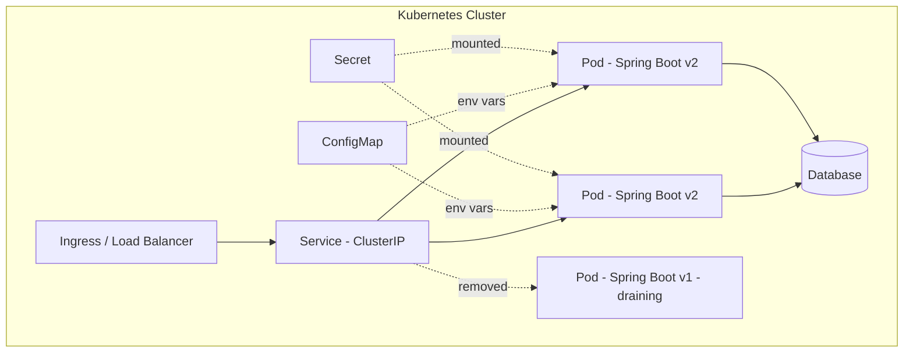

### 📶 Gradual Depth

**Level 1 - Containerize with a multi-stage Dockerfile.**

```dockerfile
# Stage 1: Build
FROM eclipse-temurin:21-jdk AS build
WORKDIR /app
COPY . .
RUN ./mvnw package -DskipTests

# Stage 2: Runtime
FROM eclipse-temurin:21-jre
COPY --from=build /app/target/*.jar app.jar
EXPOSE 8080
ENTRYPOINT ["java", "-jar", "app.jar"]
```

This produces an image under 300MB instead of 800MB+.
Alternatively, use Cloud Native Buildpacks:

```bash
./mvnw spring-boot:build-image \
  -Dspring-boot.build-image.imageName=\
myapp:latest
```

**Level 2 - Health endpoints for Kubernetes probes.**

```yaml
# application.yml
management:
  endpoints:
    web:
      exposure:
        include: health,info,prometheus
  endpoint:
    health:
      probes:
        enabled: true
      group:
        liveness:
          include: livenessState
        readiness:
          include: readinessState,db
```

```yaml
# Kubernetes deployment probe config
livenessProbe:
  httpGet:
    path: /actuator/health/liveness
    port: 8080
  initialDelaySeconds: 15
  periodSeconds: 10
readinessProbe:
  httpGet:
    path: /actuator/health/readiness
    port: 8080
  initialDelaySeconds: 5
  periodSeconds: 5
startupProbe:
  httpGet:
    path: /actuator/health/liveness
    port: 8080
  failureThreshold: 30
  periodSeconds: 2
```

**Level 3 - Graceful shutdown.**

```yaml
# application.yml
server:
  shutdown: graceful
spring:
  lifecycle:
    timeout-per-shutdown-phase: 30s
```

When Kubernetes sends SIGTERM, Spring Boot stops accepting
new connections, waits for active requests to complete
(up to 30s), then shuts down. The pod's
`terminationGracePeriodSeconds` must exceed this timeout.

**Level 4 - Externalized configuration.**

```yaml
# Kubernetes ConfigMap
apiVersion: v1
kind: ConfigMap
metadata:
  name: myapp-config
data:
  SPRING_DATASOURCE_URL: >-
    jdbc:postgresql://db:5432/orders
  APP_FEATURE_FLAGS_NEWCHECKOUT: "true"
```

```yaml
# Kubernetes Secret
apiVersion: v1
kind: Secret
metadata:
  name: myapp-secrets
type: Opaque
data:
  SPRING_DATASOURCE_PASSWORD: >-
    cGFzc3dvcmQ=
```

Spring Boot automatically binds `SPRING_DATASOURCE_URL`
to `spring.datasource.url` via relaxed binding.

**Level 5 - Horizontal scaling and resource limits.**

```yaml
# HorizontalPodAutoscaler
apiVersion: autoscaling/v2
kind: HorizontalPodAutoscaler
metadata:
  name: myapp-hpa
spec:
  scaleTargetRef:
    apiVersion: apps/v1
    kind: Deployment
    name: myapp
  minReplicas: 2
  maxReplicas: 10
  metrics:
    - type: Resource
      resource:
        name: cpu
        target:
          type: Utilization
          averageUtilization: 70
```

### ⚙️ How It Works

The deployment lifecycle follows a specific sequence from
code push to production traffic:

```
Developer pushes code
  -> CI builds JAR + container image
  -> Image pushed to registry
  -> K8s Deployment updated (new image tag)
  -> K8s creates new pods (rolling update)
  -> Startup probe passes
  -> Readiness probe passes
  -> Service routes traffic to new pod
  -> Old pod receives SIGTERM
  -> Old pod stops accepting new requests
  -> Old pod drains in-flight requests
  -> Old pod terminates
  -> Rolling update complete
```

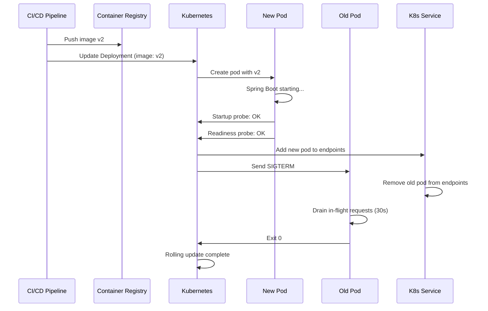

### 🚨 Failure Modes

**Failure 1 - Readiness Probe Includes External Deps:**
Your readiness probe checks the database. The database
has a brief network blip. Kubernetes marks all pods as
not-ready simultaneously. The load balancer has zero
healthy backends. Complete outage from a transient issue.

**Diagnostic:** All pods show `0/1 Ready` simultaneously
during a downstream dependency issue. `kubectl describe
pod` shows readiness probe failing.

**Fix:** Liveness probe should check only the application
process (deadlock detection, memory). Readiness probe
should check only things that make THIS pod unable to
serve - not shared dependencies. If the database is down,
returning 503 from your API is better than having zero
pods in the load balancer.

**Failure 2 - Dropped Requests During Rolling Update:**
During deployment, old pods receive SIGTERM and immediately
stop. In-flight requests get connection-reset errors.

**Diagnostic:** Spike in 502/503 errors correlated with
deployment timestamps. Client-side connection reset
errors in logs.

**Fix:** Configure `server.shutdown=graceful` with a
timeout. Set `terminationGracePeriodSeconds` in the pod
spec to be longer than the shutdown timeout. Add a
`preStop` lifecycle hook with a small sleep to allow
the Service to remove the pod from endpoints before
shutdown begins:

```yaml
lifecycle:
  preStop:
    exec:
      command: ["sh", "-c", "sleep 5"]
```

**Failure 3 - Configuration Secrets in Container Image:**
Database passwords baked into `application.yml` inside
the Docker image. Every developer who pulls the image
has production credentials. Image scanning tools flag it.

**Diagnostic:** Run `docker history` or inspect image
layers. Grep for password patterns in the image filesystem.

**Fix:** Never embed secrets in images. Use Kubernetes
Secrets mounted as environment variables or volume files.
Spring Boot binds `SPRING_DATASOURCE_PASSWORD` env var
to `spring.datasource.password` automatically.

### 🔬 Production Reality

In production Kubernetes deployments, the details that
matter most are often the least documented:

**Container resource limits.** Without CPU and memory
limits, a single pod's memory leak can trigger OOM kills
on the node, affecting other pods. JVM heap should be set
to roughly 75% of the container memory limit, leaving room
for metaspace, thread stacks, and native memory.

```yaml
resources:
  requests:
    memory: "512Mi"
    cpu: "250m"
  limits:
    memory: "1Gi"
    cpu: "1000m"
```

```java
// JVM flags for container awareness
// (default since JDK 10+)
// -XX:MaxRAMPercentage=75.0
// -XX:InitialRAMPercentage=50.0
```

**12-factor alignment checklist for Spring Boot:**

1. Codebase: one repo per service, tracked in Git.
2. Dependencies: Maven/Gradle declares everything.
3. Config: externalized via env vars / ConfigMap.
4. Backing services: connection strings via config.
5. Build/release/run: CI builds image, K8s runs it.
6. Processes: stateless; session data in Redis.
7. Port binding: embedded Tomcat, `server.port`.
8. Concurrency: horizontal scaling via HPA.
9. Disposability: graceful shutdown, fast startup.
10. Dev/prod parity: same image, different config.
11. Logs: write to stdout, collected by K8s.
12. Admin processes: Spring Batch or one-off Jobs.

**CI/CD pipeline integration** typically follows:
build JAR, run tests, build container image, push to
registry, update Kubernetes manifests (GitOps with
ArgoCD or Flux), and the cluster reconciles the desired
state. Blue-green or canary deployments add a traffic
shifting step before full rollout.

### ⚖️ Trade-offs & Alternatives

**BAD:**

```dockerfile
# Fat image with JDK + embedded secrets
FROM eclipse-temurin:21-jdk
COPY target/*.jar app.jar
COPY secrets/prod.properties /config/
ENTRYPOINT ["java", "-jar", "app.jar"]
# 600MB+ image, secrets in layer history
```

**GOOD:**

```dockerfile
# Multi-stage, JRE-only, no secrets
FROM eclipse-temurin:21-jdk AS build
WORKDIR /app
COPY . .
RUN ./mvnw package -DskipTests

FROM eclipse-temurin:21-jre
COPY --from=build /app/target/*.jar app.jar
EXPOSE 8080
ENTRYPOINT ["java", \
  "-XX:MaxRAMPercentage=75.0", \
  "-jar", "app.jar"]
# <300MB image, secrets from K8s Secrets
```

| Approach            | Image Size | Startup  | Config   | Best for            |
| ------------------- | ---------- | -------- | -------- | ------------------- |
| Fat JAR + JRE       | 250-350MB  | 2-8s     | Env vars | Most K8s deploys    |
| Buildpacks          | 250-350MB  | 2-8s     | Env vars | No-Dockerfile shop  |
| GraalVM native      | 50-100MB   | 50-200ms | Env vars | Serverless, edge    |
| Layered JAR         | 250-350MB  | 2-8s     | Env vars | Faster rebuilds     |
| CDS (Class Sharing) | 250-350MB  | 1-4s     | Env vars | JVM with fast start |

### ⚡ Decision Snap

- Use multi-stage Dockerfile or Buildpacks for every
  Spring Boot container image.
- Configure three probe types: startup (slow init OK),
  liveness (process health only), readiness (can serve).
- Set `server.shutdown=graceful` and a `preStop` sleep
  hook to prevent dropped requests during rolling updates.
- Externalize ALL configuration through environment
  variables and Kubernetes ConfigMaps/Secrets.
- Set JVM memory to 75% of container memory limit.
- Use HPA targeting CPU or custom metrics for autoscaling.
- Log to stdout - let the platform handle log aggregation.
- If startup time is critical (serverless, scale-to-zero),
  evaluate GraalVM native image or CDS.

### ⚠️ Top Traps

| #   | Trap                                         | Why it hurts                                     | Escape                                          |
| --- | -------------------------------------------- | ------------------------------------------------ | ----------------------------------------------- |
| 1   | No graceful shutdown configured              | Dropped requests during every rolling update     | `server.shutdown=graceful` + preStop hook       |
| 2   | Readiness probe checking shared dependencies | Transient DB blip removes all pods from LB       | Check only pod-local health in readiness        |
| 3   | Secrets baked into container image           | Credentials leak via image layers and registries | Kubernetes Secrets as env vars or volume mounts |
| 4   | No container resource limits                 | Memory leak in one pod OOM-kills the node        | Set requests and limits for CPU and memory      |
| 5   | JVM unaware of container memory limits       | Heap exceeds cgroup limit, OOM killed            | Use JDK 10+ with MaxRAMPercentage flag          |

### 🪜 Learning Ladder

**Prerequisites:**
SPR-081 REST API Design and Exception Handling,
SPR-075 Spring Boot Starter and Dependency Management

**THIS:** SPR-105 REST API Phase 5 - Cloud-Native Deployment

**Next steps:**
SPR-097 API Gateway Design for Spring Microservices

**The Surprising Truth:**
The hardest part of cloud-native deployment is not
Kubernetes configuration - it is making your application
truly stateless. Most Spring Boot apps accidentally carry
state: in-memory caches that diverge across replicas,
session data in the JVM heap, file uploads stored on local
disk, scheduled tasks that run on every instance. Each of
these works perfectly with one replica and breaks silently
with two. The real work of cloud-native is auditing every
assumption your code makes about being the only instance,
and externalizing every piece of state to a shared store.
That discipline matters far more than any YAML syntax.

**Further Reading:**

- "The Twelve-Factor App" (12factor.net) - the original
  methodology for cloud-native applications
- Spring Boot Docker documentation:
  spring.io/guides/topicals/spring-boot-docker
- Kubernetes official documentation on probes:
  kubernetes.io/docs/tasks/configure-pod-container/
  configure-liveness-readiness-startup-probes/
- "Cloud Native Spring in Action" by Thomas Vitale
  (Manning) - Spring Boot on Kubernetes deep dive
- Spring Boot Actuator reference for health groups:
  docs.spring.io/spring-boot/reference/actuator/
  endpoints.html

**Revision Card:**

1. Three probe types map to three questions: startup
   ("still booting?"), liveness ("process alive?"),
   readiness ("can handle traffic?").
2. Graceful shutdown + preStop hook + terminationGrace
   > shutdown timeout = zero dropped requests on deploy.
3. Same image everywhere, config from environment -
   if you rebuild the image for staging vs production,
   you are violating 12-factor principle #10.

---

---

# SPR-106 Spring Ecosystem Evolution (2003 to Present)

**TL;DR** - Spring evolved from an XML anti-J2EE revolt into a cloud-native platform by reinventing itself every major version to match industry shifts.

### 🔥 Problem Statement

Teams inherit Spring applications spanning multiple major
versions. A Spring 3.x monolith needs upgrading to Boot 3
with Jakarta EE namespaces. Nobody on the team understands
why the framework changed from XML to annotations to Java
config to auto-configuration. Without understanding the
forces behind each shift, teams make poor migration
decisions: they cargo-cult Boot starters into apps that
need plain Spring, or they avoid upgrading because the
changelog looks terrifying. Understanding evolution is
not history trivia - it is the prerequisite for rational
upgrade planning and architecture decisions.

### 📜 Historical Context

In 2002, Rod Johnson published "Expert One-on-One J2EE
Design and Development," arguing that J2EE's EJB model
forced unnecessary complexity: home interfaces, remote
stubs, XML deployment descriptors, and mandatory app
server coupling. The book included 30,000 lines of
infrastructure code that became Spring Framework 1.0
(March 2004). The core thesis: enterprise Java should be
POJO-based, testable without a container, and driven by
dependency injection rather than service locators.

Spring 1.0 relied on XML bean definitions because Java
lacked annotations (pre-Java 5). Spring 2.0 (2006)
introduced namespace handlers and stereotype annotations
(@Component, @Repository) after Java 5 shipped. Spring
2.5 added @Autowired and component scanning, cutting XML
by 60-80% in typical projects. Spring 3.0 (2009)
introduced @Configuration and @Bean, enabling pure Java
config - a response to growing XML fatigue and the rise
of Guice. Spring 3.1 added profiles and environment
abstraction for multi-stage deployments.

Spring Boot 1.0 (April 2014) was the inflection point.
Phil Webb and Dave Syer observed that 80% of Spring
projects wired the same beans identically. Boot's
auto-configuration, starter POMs, and embedded servers
eliminated boilerplate and made "just run it" possible.
Boot did not replace Spring Framework - it layered
opinionated defaults on top of it.

Spring 5.0 (2017) introduced WebFlux (reactive stack)
and required Java 8 baseline. Spring 6.0 (2022) with
Boot 3.0 mandated Jakarta EE 9+ (javax to jakarta
namespace migration), Java 17 baseline, and introduced
AOT compilation support for GraalVM native images.

### 🔩 First Principles

**CORE INVARIANTS:**

1. **POJO supremacy** - Business logic never extends
   framework classes. This invariant held from 1.0
   through 6.x and is why Spring code survives major
   upgrades better than EJB or JSF code.
2. **Inversion of Control as foundation** - Every major
   feature (security, data, web, cloud) plugs into the
   same DI container. The container is the stable core;
   everything else is a replaceable module.
3. **Backward compatibility within major versions** -
   Spring deprecates before removing across minor
   releases. Breaking changes concentrate at major
   version boundaries (2.x to 3.x, 5.x to 6.x).

**DERIVED DESIGN:**

Each major version responds to a specific industry force:
annotations (Java 5), Java config (XML fatigue),
auto-configuration (microservice boilerplate), reactive
(non-blocking I/O at scale), AOT/native (cloud cost
pressure). The framework evolves by adding new
programming models while preserving the old ones for
at least one major version.

### 🧠 Mental Model

> Think of Spring as a building that gets renovated floor
> by floor while tenants keep living in it.

-> XML config is the original foundation floor - still
load-bearing but nobody builds new rooms there
-> Annotations are the second floor renovation - most
current tenants live here
-> Java config is the third floor - preferred for new
construction, full control over wiring
-> Boot auto-configuration is the elevator - you skip
floors you do not need to visit
-> AOT/native is the solar panel retrofit - optional,
reduces operating cost, requires structural checks

**Where this analogy breaks down:** Real building
renovations can happen in isolation. Spring version
upgrades sometimes force changes across floors
simultaneously (the javax to jakarta migration touched
every floor at once).

### 🧩 Components

```
+---------------------------------------------------+
|              Spring Timeline                      |
+--------+------------------------------------------+
| 2004   | Spring 1.0 - XML beans, POJO DI         |
| 2006   | Spring 2.0 - Annotations, namespaces     |
| 2009   | Spring 3.0 - Java config, SpEL, REST     |
| 2013   | Spring 4.0 - Java 8, WebSocket, cond.    |
| 2014   | Boot 1.0 - Auto-config, starters         |
| 2017   | Spring 5.0 - WebFlux, reactive streams   |
| 2018   | Boot 2.0 - Actuator rewrite, Micrometer  |
| 2022   | Spring 6.0 + Boot 3.0 - Jakarta, AOT     |
| 2023   | Boot 3.1 - Virtual threads support        |
| 2024   | Boot 3.2/3.3 - CDS, structured logging   |
+--------+------------------------------------------+
```

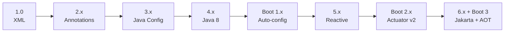

### 📶 Gradual Depth

**Layer 1 - Version Map.** Know which Spring Framework
version pairs with which Boot version: Boot 2.x uses
Spring 5.x, Boot 3.x uses Spring 6.x. This determines
your Java baseline (11 vs 17) and namespace (javax vs
jakarta).

**Layer 2 - Configuration Evolution.** XML -> annotation
scanning -> @Configuration classes -> Boot
auto-configuration -> AOT-generated bean definitions.
Each layer wraps the previous one. You can mix them,
but consistency within a module reduces confusion.

**Layer 3 - Programming Model Evolution.** Servlet-based
(blocking, thread-per-request) coexisted with reactive
(non-blocking, event-loop) since Spring 5. Spring 6
added virtual thread support, offering a third path:
blocking code on lightweight threads. Most teams should
evaluate virtual threads before adopting reactive.

**Layer 4 - Deployment Model Evolution.** WAR on app
server (Spring 1-3 era) -> embedded Tomcat JAR (Boot
era) -> Docker container (Boot 2 era) -> GraalVM native
image (Boot 3 era). Each shift reduced startup time and
deployment coupling but added build complexity.

### ⚙️ How It Works

The forces driving each major transition:

```
+---------------------------------------------------+
| TRIGGER            | SPRING RESPONSE              |
+--------------------+------------------------------+
| J2EE complexity    | POJO DI, no EJB required     |
| Java 5 annotations | @Component, @Autowired       |
| XML fatigue        | @Configuration, @Bean        |
| Microservice boom  | Boot auto-config, starters   |
| Reactive demand    | WebFlux, R2DBC               |
| Cloud cost         | AOT, native images           |
| Jakarta mandate    | javax -> jakarta migration   |
| Loom availability  | Virtual thread integration   |
+--------------------+------------------------------+
```

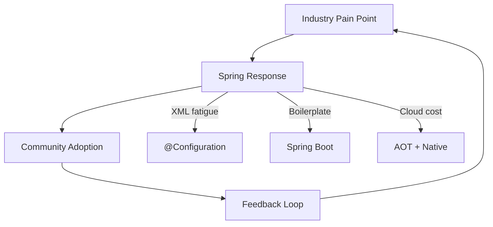

**javax to jakarta migration mechanics:** Spring 6/Boot 3
requires Jakarta EE 9+ APIs. Every import starting with
`javax.servlet`, `javax.persistence`, `javax.validation`
changes to `jakarta.*`. Tools like OpenRewrite automate
this, but custom code touching servlet APIs needs manual
review. This is the single largest migration tax in
Spring's history.

**AOT compilation pipeline:** At build time, Spring
analyzes bean definitions, resolves conditions, and
generates Java source code that replaces runtime
reflection. This enables GraalVM native images but
restricts dynamic features (runtime bean registration,
CGLIB proxies for final classes, certain reflection
patterns).

### 🚨 Failure Modes

**Failure 1 - Skipping Major Versions:**

Teams jump from Boot 1.5 to Boot 3.0, combining Java 8
to 17 migration, javax to jakarta namespace changes,
and deprecated API removal in a single step.

**Diagnostic:** Build produces hundreds of compilation
errors mixing classpath issues, missing classes, and
behavioral changes. Test failures are ambiguous.

**Fix:** Step through intermediate versions: 1.5 to 2.0
(fix deprecations), 2.0 to 2.7 (latest 2.x, fix
remaining deprecations), 2.7 to 3.0 (namespace
migration). Use OpenRewrite recipes for automated
transformation at each step.

**Failure 2 - Mixing Configuration Styles Randomly:**

A single application has some beans in XML, some in
@Configuration, some via component scanning, and Boot
auto-configuration overriding all of them. Nobody knows
which bean definition wins.

**Diagnostic:** Unexpected `NoUniqueBeanDefinitionException`
or silent bean override. Enable
`spring.main.allow-bean-definition-overriding=false`
(Boot 2.1+ default) to surface conflicts.

**Fix:** Standardize on one primary style per module.
Use @Configuration for explicit wiring, component
scanning for stereotype classes. Remove XML unless
required for legacy library integration.

### 🔬 Production Reality

Large organizations run Spring applications spanning
three or more major versions simultaneously. A typical
enterprise has Spring 3.x apps in maintenance mode,
Spring 5/Boot 2 as the current standard, and Boot 3
pilots for new services. The migration cost is real:
the javax to jakarta change alone touches every JPA
entity, every servlet filter, every validation
annotation.

Teams that upgrade incrementally (one major version per
quarter) spend less total effort than teams that defer
upgrades for years and then face a multi-version jump.
The Spring team publishes migration guides for each
major release, and the OpenRewrite project provides
automated refactoring recipes that handle 70-90% of
mechanical changes.

Spring Boot's release cadence shifted to six-month
feature releases with commercial LTS support for
selected versions. Aligning your upgrade cycle to LTS
releases (Boot 2.7, Boot 3.0, Boot 3.2) reduces churn
while maintaining security patch coverage.

### ⚖️ Trade-offs & Alternatives

**BAD:**

```java
// Staying on Boot 1.5 "because it works"
// Java 8 end-of-life, no security patches
// Spring Security 4.x has known CVEs
// Cannot use modern libraries (Java 17+)
@SpringBootApplication
public class LegacyApp { }
// Technical debt compounds silently
```

**GOOD:**

```java
// Boot 3.2 on Java 21, current deps
// Virtual threads enabled, AOT optional
// Jakarta namespace, structured logging
// OpenRewrite handles mechanical migration
@SpringBootApplication
public class ModernApp {
  public static void main(String[] args) {
    SpringApplication.run(
      ModernApp.class, args
    );
  }
}
```

| Factor          | Stay on Old | Incremental | Big-Bang  |
| --------------- | ----------- | ----------- | --------- |
| Risk per step   | Zero        | Low         | Very high |
| Cumulative risk | Increasing  | Constant    | Spike     |
| Team learning   | Stagnant    | Gradual     | Chaotic   |
| Security        | Degrading   | Current     | Delayed   |
| Rollback        | N/A         | Easy        | Hard      |

### ⚡ Decision Snap

- **When to upgrade:** When your current version leaves
  its OSS support window (typically 12 months after
  the next major release).
- **When to skip a version:** Never skip major versions.
  Step through each one sequentially.
- **When to adopt new features (reactive, AOT, virtual
  threads):** Only when you have a measured performance
  problem that the feature addresses. Do not adopt
  reactive just because Spring 5 introduced it.
- **When to stay on Boot 2.x:** Only if a critical
  dependency has not released Jakarta-compatible
  versions yet. Track the dependency, do not wait
  indefinitely.

### ⚠️ Top Traps

| #   | Trap                                                              | Why It Hurts                                                     |
| --- | ----------------------------------------------------------------- | ---------------------------------------------------------------- |
| 1   | Ignoring deprecation warnings across minor releases               | Removals at next major version break builds                      |
| 2   | Upgrading Spring Boot without upgrading Spring Security           | Version matrix misalignment causes cryptic class-loading errors  |
| 3   | Assuming Boot auto-config works identically across major versions | Bean registration order and conditions change                    |
| 4   | Running OpenRewrite without reviewing generated diffs             | Automated recipes handle syntax but miss semantic changes        |
| 5   | Adopting AOT/native without testing reflection-heavy libraries    | Serialization, proxying, and dynamic registration break silently |

### 🪜 Learning Ladder

**Prerequisites:**

- SPR-001 Dependency Injection (IoC Container) -
  understand the container that remained stable across
  all versions
- SPR-044 Spring Boot Auto-Configuration Deep Dive -
  understand the mechanism that Boot layers on top

**THIS:** SPR-106 Spring Ecosystem Evolution (2003 to
Present) - the timeline, forces, and migration paths
across every major Spring version.

**Next steps:**

- SPR-109 Spring Upgrade Strategy (LTS and Migration) -
  practical playbook for planning and executing version
  upgrades

**The Surprising Truth:** Spring's longevity is not
despite its breaking changes - it is because of them.
Frameworks that avoid breaking changes (Struts 1.x,
JSF) calcified and lost relevance. Spring's willingness
to break backward compatibility at major version
boundaries - while providing migration tooling - kept
it aligned with how Java itself evolved. The teams that
struggle most with Spring upgrades are not the ones
facing breaking changes; they are the ones who ignored
three years of deprecation warnings.

**Further Reading:**

- "Expert One-on-One J2EE Design and Development" -
  Rod Johnson (2002) - the book that started it all
- Spring Framework Release Notes (spring.io/blog) -
  official migration guides per major version
- OpenRewrite Spring recipes
  (docs.openrewrite.org/recipes/java/spring) -
  automated migration tooling
- "Spring Boot Reference Documentation" - Version
  comparison appendix

**Revision Card:**

1. Spring's evolution follows a pattern: industry pain
   point triggers a new programming model layered on
   the same DI container core.
2. Never skip major versions during migration - step
   through each one and use OpenRewrite for mechanical
   transformations.
3. The javax to jakarta namespace change in Spring
   6/Boot 3 is the largest single migration tax in
   Spring history - plan for it explicitly.

---

---

# SPR-107 Conventional vs Boot vs Cloud Decision Pattern

**TL;DR** - Use plain Spring for libraries, Boot for applications, Cloud only when you operate distributed infrastructure that demands it.

### 🔥 Problem Statement

A team starts a new service. Someone creates a Spring
Cloud project with Eureka, Config Server, Circuit
Breaker, and Gateway before writing a single line of
business logic. Six months later, the system has four
microservices, three developers, and more infrastructure
code than domain code. The operational burden of running
distributed coordination exceeds the complexity of the
business problem.

The opposite failure also exists: a team builds a large
Boot application that needs centralized configuration,
service discovery, and resilience patterns but refuses
to adopt Spring Cloud, hand-rolling each capability
with inconsistent quality. The decision between plain
Spring Framework, Spring Boot, and Spring Cloud is not
about technology preference - it is about matching
framework capability to operational reality.

### 📜 Historical Context

Before Spring Boot (pre-2014), "Spring" meant the core
framework with manual configuration. You chose which
modules to include (spring-web, spring-orm, spring-tx)
and wired everything yourself. This gave maximum control
but required significant expertise and produced
inconsistent project structures across teams.

Spring Boot (2014) standardized project structure,
dependency management, and configuration. It did not
add new capabilities to Spring Framework - it automated
the assembly of existing capabilities. The key insight:
convention over configuration reduces accidental
complexity without limiting intentional complexity.

Spring Cloud (2015) emerged from Netflix OSS adoption.
It provided Spring-native abstractions over distributed
system patterns: service discovery (Eureka), client-side
load balancing (Ribbon, later LoadBalancer), circuit
breaking (Hystrix, later Resilience4j), distributed
configuration (Config Server), and API gateway (Zuul,
later Gateway). Spring Cloud assumes you operate
multiple independently deployed services that need to
find and communicate with each other reliably.

The landscape shifted significantly with Kubernetes
adoption. Many Spring Cloud capabilities (service
discovery, configuration, load balancing) overlap with
Kubernetes-native features. Spring Cloud Kubernetes
bridges this gap, but the fundamental question remains:
which layer should own each distributed system concern?

### 🔩 First Principles

**CORE INVARIANTS:**

1. **Framework scope must match operational scope** -
   Plain Spring for libraries and shared modules, Boot
   for standalone applications, Cloud only when you
   operate a service mesh requiring coordination
   patterns.
2. **Every abstraction layer adds operational cost** -
   Boot adds an opinionated runtime. Cloud adds
   distributed system primitives. Each layer requires
   team expertise to operate and debug.
3. **Reversibility decreases with framework depth** -
   Removing Boot from a Spring app is straightforward.
   Removing Cloud from a Boot app requires replacing
   service discovery, configuration, and resilience
   patterns simultaneously.

**DERIVED DESIGN:**

The decision is not "which is better" but "which is
sufficient." Start with the minimum framework scope
that solves your deployment model, and add capabilities
only when measured operational pain justifies the
cost. Over-adoption is more common and more damaging
than under-adoption.

### 🧠 Mental Model

> Think of the three layers as vehicle choices: a
> bicycle (plain Spring), a car (Boot), and a truck
> fleet with dispatch (Cloud).

-> A bicycle is perfect for short trips and gives you
complete control - but you pedal everything yourself
-> A car handles most journeys efficiently with built-in
systems you do not think about (auto-config)
-> A truck fleet solves logistics at scale but requires
dispatchers, mechanics, and fleet management
-> Nobody buys a truck fleet to commute to the office

**Where this analogy breaks down:** Unlike vehicles, you
can incrementally add Boot to a Spring project or Cloud
to a Boot project. The layers compose rather than
replace. But removing a layer after adoption is harder
than adding one.

### 🧩 Components

```
+---------------------------------------------------+
| LAYER         | WHAT IT ADDS                      |
+---------------+-----------------------------------+
| Spring FW     | DI, AOP, MVC, Data, Security,    |
|               | TX - the building blocks          |
+---------------+-----------------------------------+
| Spring Boot   | Auto-config, starters,            |
|               | embedded server, Actuator,        |
|               | opinionated defaults              |
+---------------+-----------------------------------+
| Spring Cloud  | Config Server, Discovery,         |
|               | Gateway, CircuitBreaker,          |
|               | distributed tracing, bus          |
+---------------+-----------------------------------+
```

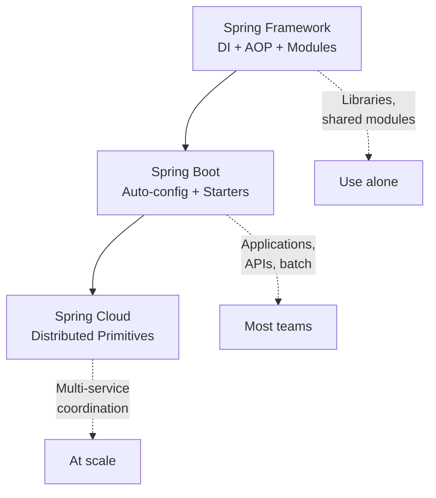

### 📶 Gradual Depth

**Layer 1 - The 80% Rule.** Most Java applications need
Spring Boot and nothing more. Boot gives you embedded
servers, health checks, metrics, externalized
configuration, and dependency management. If you deploy
one to three services, Boot handles everything.

**Layer 2 - When Boot Is Not Enough.** You need Spring
Cloud when: (a) services must discover each other
dynamically without DNS/load balancer configuration,
(b) configuration must propagate to running instances
without restart, (c) cascading failures between services
require circuit breaking with fallback logic, or
(d) you need an API gateway with routing rules that
change at runtime.

**Layer 3 - Kubernetes Overlap.** If you deploy on
Kubernetes, evaluate which Cloud capabilities Kubernetes
already provides. K8s Services handle discovery.
ConfigMaps and Secrets handle configuration. Istio or
Linkerd handle circuit breaking and load balancing.
Spring Cloud Kubernetes integrates with these native
features rather than duplicating them.

**Layer 4 - When Plain Spring Wins.** Shared libraries,
domain modules, and framework extensions should use
plain Spring Framework. Adding Boot dependencies to a
library forces consumers into Boot's opinion. Use
`spring-context` and `spring-beans` for DI without the
auto-configuration machinery.

### ⚙️ How It Works

Decision flow for a new project:

```
+---------------------------------------------------+
| Q1: Is this a library or shared module?           |
|   YES -> Plain Spring Framework                   |
|   NO  -> Continue                                 |
+---------------------------------------------------+
| Q2: Is this a standalone deployable app?          |
|   YES -> Spring Boot                              |
|   NO  -> Reconsider project structure             |
+---------------------------------------------------+
| Q3: Do you operate >5 services that must          |
|     coordinate dynamically?                       |
|   YES -> Evaluate Spring Cloud selectively        |
|   NO  -> Stay with Boot                           |
+---------------------------------------------------+
| Q4: Does your platform (K8s) already provide      |
|     discovery, config, resilience?                |
|   YES -> Spring Cloud Kubernetes (thin bridge)    |
|   NO  -> Full Spring Cloud stack                  |
+---------------------------------------------------+
```

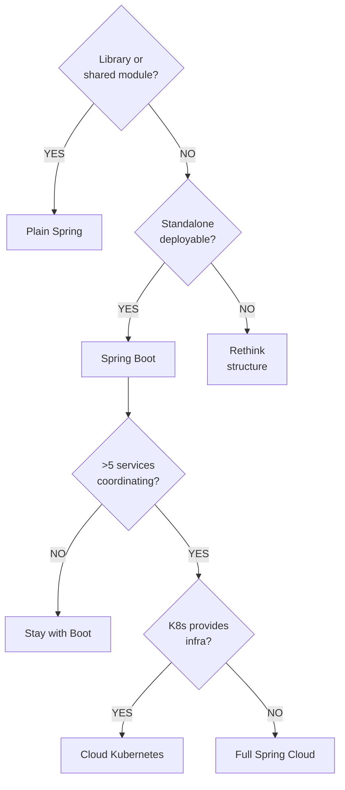

**Selective adoption pattern:** You do not need all of
Spring Cloud. If you only need circuit breaking, add
`spring-cloud-starter-circuitbreaker-resilience4j`
without adopting Config Server or Eureka. Cloud
starters are independent modules, not an all-or-nothing
package.

**The Boot tax is small.** Boot adds roughly 0.5-1.5
seconds to startup (JVM mode) and pulls in additional
dependencies. For applications, this cost is negligible.
For libraries consumed by many applications, this cost
multiplies across every consumer.

### 🚨 Failure Modes

**Failure 1 - Cloud Before Boot Mastery:**

A team adopts Spring Cloud Config, Eureka, and Gateway
without understanding Boot's property resolution,
auto-configuration conditions, or Actuator endpoints.
When distributed config conflicts with local config,
they cannot diagnose which source wins.

**Diagnostic:** Mysterious property values that do not
match any local file. Config refresh failures silently
ignored. Services register with Eureka but route to
stale instances.

**Fix:** Master Boot's externalized configuration
(property sources, profiles, config trees) before
adding Cloud Config on top. Understand Actuator's
`/env` and `/configprops` endpoints to trace property
resolution.

**Failure 2 - Duplicating Platform Capabilities:**

A team runs Spring Cloud Gateway, Eureka, and Config
Server alongside Kubernetes Ingress, kube-dns, and
ConfigMaps. Two layers of service discovery, two
layers of configuration, two layers of routing.
Failures are ambiguous - did K8s routing fail or did
Gateway routing fail?

**Diagnostic:** Intermittent 503 errors that appear in
Gateway logs but not in K8s ingress logs (or vice
versa). Configuration drift between ConfigMap values
and Config Server values.

**Fix:** Choose one source of truth per concern. On
Kubernetes, prefer K8s-native capabilities for
discovery and basic configuration. Use Spring Cloud
only for application-level concerns that Kubernetes
does not address (feature flags, complex routing
predicates, application-level circuit breaking).

### 🔬 Production Reality

Teams that adopt Spring Cloud prematurely spend 30-50%
of their engineering effort on infrastructure concerns
rather than business logic. This is appropriate for
platform teams at organizations with 50+ microservices.
It is wasteful for product teams with 3-5 services.

The healthiest pattern observed in organizations with
10-30 services: Boot for all applications, Cloud for
the API gateway (centralized routing and rate limiting),
and Resilience4j for circuit breaking (without the full
Cloud CircuitBreaker abstraction). Config Server is
adopted only when ConfigMaps become unwieldy or when
multiple non-Kubernetes deployment targets exist.

Spring Cloud's release train model (codenames aligned
to Boot versions) adds version management complexity.
Boot 3.x requires Spring Cloud 2022.x or later. Mixing
incompatible versions produces cryptic class-not-found
errors at startup. Always use the Spring Cloud BOM
that matches your Boot version.

Organizations on Kubernetes increasingly use Spring
Cloud Kubernetes instead of the Netflix-derived stack.
This approach uses K8s-native service discovery and
ConfigMap/Secret loading, avoiding the need to deploy
and operate Eureka and Config Server as separate
infrastructure services.

### ⚖️ Trade-offs & Alternatives

**BAD:**

```java
// New project, two developers, one service
// Full Spring Cloud stack "for the future"
@EnableEurekaClient
@EnableConfigServer
@EnableCircuitBreaker
@SpringBootApplication
public class OverEngineeredApp { }
// Three infra services to operate before
// writing any business logic
```

**GOOD:**

```java
// Same team, same service
// Boot with targeted resilience
@SpringBootApplication
public class RightSizedApp { }
// application.yml:
// resilience4j.circuitbreaker.instances
//   .payment.sliding-window-size: 10
// Add Cloud later IF needed, not before
```

| Factor               | Plain Spring | Boot    | Cloud       |
| -------------------- | ------------ | ------- | ----------- |
| Setup time           | Hours        | Minutes | Days        |
| Ops expertise needed | Low          | Medium  | High        |
| Infra to operate     | None         | App     | App + infra |
| Right for libraries  | Yes          | No      | No          |
| Right for 1-5 svcs   | Rare         | Yes     | Usually not |
| Right for 20+ svcs   | No           | Maybe   | Evaluate    |
| K8s overlap          | None         | Low     | Significant |

### ⚡ Decision Snap

- **Use plain Spring Framework** when building shared
  libraries, domain modules, or framework extensions
  that other applications consume as dependencies.
- **Use Spring Boot** for any standalone application:
  REST APIs, batch jobs, event consumers, web apps.
  This is the correct default for 90% of projects.
- **Evaluate Spring Cloud** only when you operate 5+
  services with dynamic discovery needs, centralized
  configuration requirements, or cross-service
  resilience patterns that Boot alone cannot address.
- **Prefer Spring Cloud Kubernetes** over the full
  Netflix-derived stack when deploying on Kubernetes.
  Let the platform handle what it handles natively.
- **Adopt Cloud selectively** - take individual starters
  (Gateway, CircuitBreaker) rather than the entire
  stack.

### ⚠️ Top Traps

| #   | Trap                                                        | Why It Hurts                                                                      |
| --- | ----------------------------------------------------------- | --------------------------------------------------------------------------------- |
| 1   | Adopting Cloud "because we might need microservices later"  | Infrastructure cost starts immediately, business value arrives later (or never)   |
| 2   | Using Eureka on Kubernetes instead of kube-dns              | Two discovery systems create split-brain routing failures                         |
| 3   | Putting Boot dependencies in shared libraries               | Forces all consumers into Boot's auto-configuration opinion                       |
| 4   | Skipping Boot and using plain Spring for applications       | Reinventing auto-config, health checks, and metrics wastes months                 |
| 5   | Adopting all Cloud starters when only one pattern is needed | Each starter adds transitive dependencies, version constraints, and debug surface |

### 🪜 Learning Ladder

**Prerequisites:**

- SPR-101 Performance at Scale - Spring vs Quarkus vs
  Micronaut - understand where Spring fits in the
  broader framework landscape
- SPR-090 Microservice Architecture with Spring Boot -
  understand the architectural style that motivates
  Cloud adoption

**THIS:** SPR-107 Conventional vs Boot vs Cloud Decision
Pattern - the decision framework for choosing the right
Spring layer for your operational context.

**Next steps:**

- SPR-108 Monolith-First Strategy with Spring Modulith -
  the architectural pattern that delays microservice
  decomposition until domain boundaries stabilize

**The Surprising Truth:** The teams that get the most
value from Spring Cloud are not the ones building
greenfield microservices - they are the ones that tried
to hand-roll distributed system primitives with plain
Boot and hit the wall at 10-15 services. They adopted
Cloud selectively to solve specific operational pain
they had already experienced. The teams that get the
least value adopted Cloud at project inception based
on an architecture diagram, before deploying a single
service to production.

**Further Reading:**

- "Spring Boot Reference Documentation" - the canonical
  guide for Boot capabilities and configuration
- "Spring Cloud" (spring.io/projects/spring-cloud) -
  official project page with version compatibility
  matrix
- "Cloud Native Java" - Josh Long and Kenny Bastani
  (O'Reilly) - practical patterns for Boot and Cloud
- "Spring Cloud Kubernetes Reference" -
  spring-cloud-kubernetes project documentation

**Revision Card:**

1. Plain Spring for libraries, Boot for applications,
   Cloud only when distributed coordination pain is
   measured and real - not anticipated.
2. On Kubernetes, prefer Spring Cloud Kubernetes over
   the Netflix-derived stack to avoid duplicating
   platform capabilities.
3. Adopt Cloud starters selectively (Gateway,
   CircuitBreaker) rather than the full stack - each
   starter is an independent module with its own
   operational cost.
