## Keywords

1. [SPR-108 Monolith-First Strategy with Spring Modulith](#spr-108-monolith-first-strategy-with-spring-modulith)
2. [SPR-109 Spring Upgrade Strategy (LTS and Migration)](#spr-109-spring-upgrade-strategy-lts-and-migration)
3. [SPR-110 Spring as Career Leverage - Where It Fits in 2025+](#spr-110-spring-as-career-leverage---where-it-fits-in-2025)
4. [SPR-111 Full-Stack Spring Reference Architecture](#spr-111-full-stack-spring-reference-architecture)
5. [SPR-112 Topic Mastery Synthesis](#spr-112-topic-mastery-synthesis)
6. [SPR-113 What I Would Do Differently - Spring Lessons](#spr-113-what-i-would-do-differently---spring-lessons)
7. [SPR-114 Spring Ecosystem Concept Map](#spr-114-spring-ecosystem-concept-map)
8. [SPR-115 Framework Lock-In vs Leverage Decision Pattern](#spr-115-framework-lock-in-vs-leverage-decision-pattern)

---

---

# SPR-108 Monolith-First Strategy with Spring Modulith

**TL;DR** - Start with a modular monolith using Spring Modulith; extract microservices only when proven domain boundaries and team scaling demand it.

### 🔥 Problem Statement

Teams reach for microservices on day one of a greenfield
project because "that is what Netflix does." The result
is a distributed system with three developers, twelve
repositories, a service mesh nobody understands, and
eventual consistency bugs that would not exist in a
single-process application. The real pain is not the
monolith - it is the unstructured monolith where every
package imports every other package, making future
extraction impossible. You need module boundaries
enforced at compile time inside a single deployable, with
a clear extraction path when (and only when) independent
scaling or team autonomy demands it.

### 📜 Historical Context

Martin Fowler published "Monolith First" in 2015, arguing
that successful microservice architectures almost always
began as monoliths whose boundaries were discovered through
production experience. Despite this, the industry spent
2016-2022 defaulting to microservices for new projects.
Spring Modulith emerged in 2022 as an experimental project
under Oliver Drotbohm, reaching 1.0 GA with Spring Boot
3.2 in late 2023. It builds on ArchUnit for structural
verification and Spring's ApplicationEvent for intra-process
decoupling. The project draws from Domain-Driven Design's
bounded context concept and the Ports and Adapters
(hexagonal) architecture, providing tooling that enforces
module isolation without the operational cost of network
boundaries.

### 🔩 First Principles

**CORE INVARIANTS:**

1. Module boundaries must be enforceable at build time -
   runtime discipline alone erodes within weeks under
   delivery pressure.
2. Intra-module communication uses direct method calls;
   inter-module communication uses events or published
   APIs - never internal class access.
3. Each module owns its persistence and exposes only
   domain events and API types to other modules - no
   shared entity classes across module boundaries.

**DERIVED DESIGN:**

From invariant 1: Spring Modulith verification tests
fail the build when code violates declared module
dependencies, catching coupling drift before it merges.
From invariant 2: event-based decoupling inside the
monolith means the same event contract works unchanged
when you later extract a module to a separate service.
From invariant 3: module-scoped persistence avoids the
shared-database anti-pattern from the start, making
future extraction a deployment change rather than a
data migration.

### 🧠 Mental Model

> Think of a modular monolith as an apartment building:
> each unit has its own kitchen, bathroom, and entrance,
> but they share a foundation, utilities, and address.

- Module boundary -> apartment walls (soundproofing
  and privacy between units)
- Published API -> building intercom (the only way
  units communicate formally)
- Application events -> mailroom (async messages
  delivered to subscribers without sender knowing
  recipient details)
- Extraction to microservice -> converting an apartment
  into a standalone house on a separate lot

**Where this analogy breaks down:** In an apartment
building, moving a unit to a separate lot requires
demolition. In a well-structured Modulith, extraction
is closer to disconnecting a modular prefab unit -
expensive but architecturally planned for.

### 🧩 Components

```
+-------------------------------------------+
|           Spring Boot Application         |
|                                           |
| +----------+  +----------+  +----------+ |
| | Order    |  | Inventory|  | Payment  | |
| | Module   |  | Module   |  | Module   | |
| |          |  |          |  |          | |
| | API  Evt |  | API  Evt |  | API  Evt | |
| +----+-----+  +----+-----+  +----+-----+ |
|      |    ^        |    ^        |        |
|      v    |        v    |        v        |
| +-------------------------------------------+
| |     Spring ApplicationEventPublisher      |
| +-------------------------------------------+
|                                           |
| +-------+ +-------+ +-------+            |
| | DB    | | DB    | | DB    |            |
| |Schema | |Schema | |Schema |            |
| |orders | |invent.| |pay.   |            |
| +-------+ +-------+ +-------+            |
+-------------------------------------------+
```

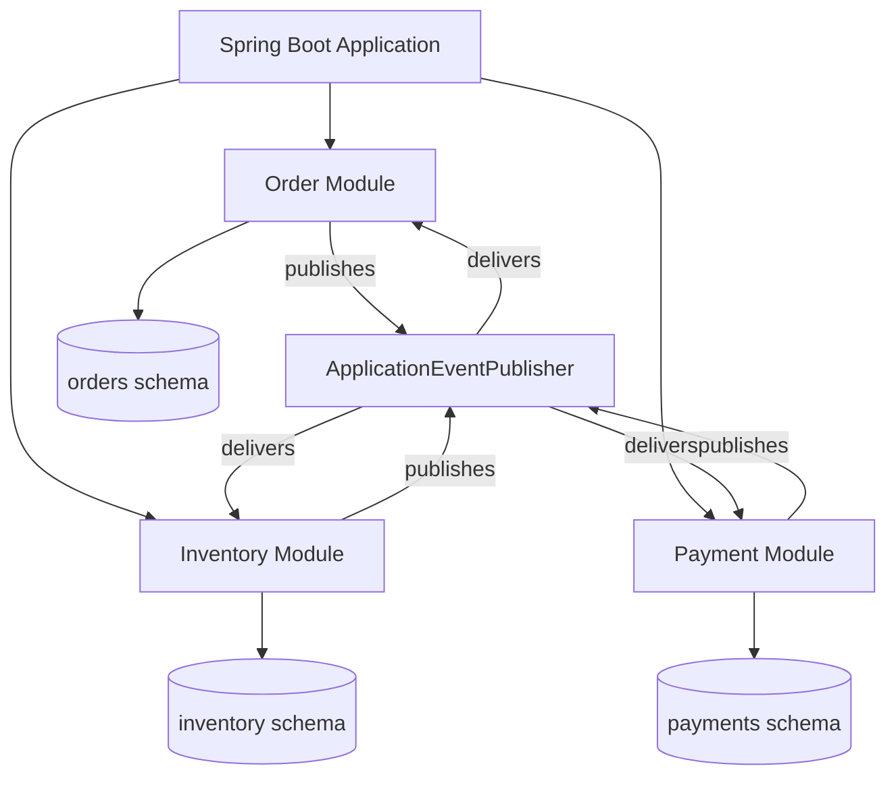

### 📶 Gradual Depth

**Level 1 - Package-based modules.** Each top-level
package under the application package is a module.
Spring Modulith auto-detects this convention.

```java
// com.example.shop (application root)
// com.example.shop.order (order module)
// com.example.shop.inventory (inventory module)
// com.example.shop.payment (payment module)
```

**Level 2 - Explicit module API.** Use `package-info.java`
with `@ApplicationModule` to declare named modules and
their allowed dependencies.

```java
// com/example/shop/order/package-info.java
@ApplicationModule(
    allowedDependencies = {"inventory"}
)
package com.example.shop.order;
```

**Level 3 - Event-based inter-module communication.**
Replace direct cross-module service calls with Spring
application events.

```java
// Order module publishes event
@Service
@RequiredArgsConstructor
class OrderService {
    private final ApplicationEventPublisher events;

    @Transactional
    public Order place(OrderRequest req) {
        Order order = repo.save(toOrder(req));
        events.publishEvent(
            new OrderPlaced(order.id(), req.items())
        );
        return order;
    }
}
```

**Level 4 - Transactional event listeners.** Use
`@TransactionalEventListener` to react after commit,
plus Modulith's event publication registry for
guaranteed delivery.

```java
// Inventory module listens to order events
@Component
class InventoryEventHandler {
    @TransactionalEventListener
    @Async
    public void on(OrderPlaced event) {
        event.items().forEach(
            item -> reserveStock(item)
        );
    }
}
```

**Level 5 - Externalized events.** When you extract a
module, Spring Modulith externalizes application events
to Kafka, RabbitMQ, or other brokers with a single
configuration change - no code modification.

### ⚙️ How It Works

When the application starts, Spring Modulith scans the
package structure and builds a module dependency graph.
Verification tests traverse this graph and fail if any
class references a non-public type from another module
or if a module accesses a dependency not declared in its
`@ApplicationModule` annotation. At runtime, inter-module
events flow through `ApplicationEventPublisher`. The
event publication registry persists events to a database
table, replaying undelivered events on restart.

```
Build phase:
  Modulith scans packages
  -> builds module graph
  -> verification test checks edges
  -> FAIL if undeclared dependency found

Runtime phase:
  Module A commits transaction
  -> event written to publication log
  -> ApplicationEventPublisher dispatches
  -> Module B listener executes
  -> publication marked complete
```

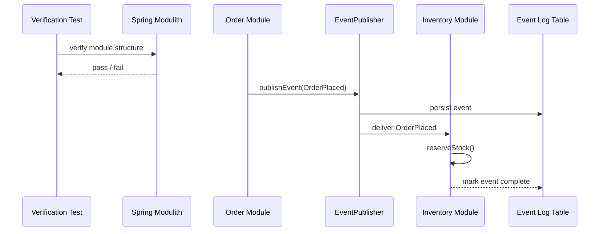

### 🚨 Failure Modes

**Failure 1 - Leaky Module Boundaries:**
Developers bypass the public API and directly reference
internal classes from another module because "it is
faster." Within weeks, the module graph becomes a cycle
and extraction is impossible.

**Diagnostic:** Run `ApplicationModules.of(App.class)
.verify()` in a test. It reports every illegal
cross-module reference with the exact class and line.

**Fix:** Add Modulith verification to the CI pipeline
as a mandatory gate. Move shared types to a dedicated
`shared-kernel` module with explicit dependency
declarations.

**Failure 2 - Lost Events After Crash:**
The application crashes between committing business
state and delivering the event. Listeners never fire,
leaving downstream modules inconsistent.

**Diagnostic:** Query the `EVENT_PUBLICATION` table for
rows where `COMPLETION_DATE IS NULL` older than your
SLA threshold.

**Fix:** Enable Modulith's event publication registry
(`spring.modulith.events.republish-outstanding
-events-on-restart=true`). It replays incomplete
events on application restart, guaranteeing at-least-once
delivery within the monolith.

**Failure 3 - Circular Module Dependencies:**
Module A depends on Module B which depends on Module A.
Verification catches this, but teams work around it by
merging modules - losing the boundary.

**Diagnostic:** Modulith's `Documenter` generates a
PlantUML/Asciidoc module diagram. Cycles show as
bidirectional arrows.

**Fix:** Introduce an event: the module that currently
calls back should instead listen for an event published
by the other module. Events break cycles without
merging modules.

### 🔬 Production Reality

Spring Modulith 1.0+ requires Spring Boot 3.2 and Java
17 minimum. The verification test adds 2-5 seconds to
your test suite - negligible compared to integration
tests it replaces. The event publication registry uses a
database table (auto-created with `spring.modulith
.events.jdbc.schema-initialization.enabled=true`) and
supports JDBC and JPA backends.

In practice, the hardest part is not the tooling but the
domain modeling. Teams that skip Event Storming or domain
analysis create modules along technical layers (controller,
service, repository) instead of business capabilities.
Modulith enforces boundaries but cannot tell you where
the boundaries should be.

Event ordering within a module is guaranteed (same thread,
same transaction). Across modules with `@Async` listeners,
ordering is not guaranteed. If you need ordered processing
across modules, use Modulith's `@ApplicationModuleListener`
with explicit ordering or switch to a synchronous listener
within the transaction.

Organizations running Spring Modulith in production
typically see the first microservice extraction happen 12-18
months after the initial modular monolith launch - by which
time the domain boundaries have been battle-tested through
real traffic and the extraction is surgical rather than
speculative.

### ⚖️ Trade-offs & Alternatives

**BAD:**

```java
// Order service directly injects inventory
// repository from another module
@Service
class OrderService {
    @Autowired
    InventoryRepository inventoryRepo;

    public void place(OrderRequest req) {
        // Directly mutating another module's data
        inventoryRepo.decrementStock(req.sku());
    }
}
```

**GOOD:**

```java
// Order module publishes event; inventory
// module reacts independently
@Service
class OrderService {
    private final ApplicationEventPublisher pub;

    @Transactional
    public Order place(OrderRequest req) {
        Order o = orderRepo.save(toOrder(req));
        pub.publishEvent(new OrderPlaced(o.id()));
        return o;
    }
}
```

| Aspect            | Unstructured Monolith | Spring Modulith   | Microservices          |
| ----------------- | --------------------- | ----------------- | ---------------------- |
| Boundary enforce. | None                  | Build-time        | Network-level          |
| Deploy complexity | Low                   | Low               | High                   |
| Data consistency  | ACID (fragile)        | ACID (structured) | Eventual               |
| Extraction cost   | Very high             | Low (planned)     | N/A (already separate) |
| Operational cost  | Low                   | Low               | High                   |
| Team independence | Low                   | Medium            | High                   |

### ⚡ Decision Snap

- Default to modular monolith for any new project with
  fewer than four independent teams.
- Use Spring Modulith verification in CI from day one -
  retrofitting boundaries is ten times harder.
- Publish domain events between modules even if you never
  plan to extract - it forces clean API design.
- Extract to a microservice only when you have evidence:
  different scaling profiles, different release cadences,
  or a new team owning the domain.
- Keep the shared kernel module minimal - if it grows
  beyond DTOs and event types, your boundaries are wrong.

### ⚠️ Top Traps

| #   | Trap                                                   | Why it hurts                                                             | Escape                                                       |
| --- | ------------------------------------------------------ | ------------------------------------------------------------------------ | ------------------------------------------------------------ |
| 1   | Technical layers as modules (controller, service, db)  | Couples every feature across all modules                                 | Module per business capability (orders, inventory, payments) |
| 2   | Skipping verification tests in CI                      | Boundaries erode within one sprint                                       | Mandatory Modulith verify() in build pipeline                |
| 3   | Synchronous cross-module calls for everything          | Creates tight coupling identical to an unstructured monolith             | Default to events; use direct calls only for query-response  |
| 4   | Premature extraction before traffic patterns are known | You guess wrong about which module needs independent scaling             | Wait for production metrics showing divergent resource needs |
| 5   | Sharing JPA entities across module boundaries          | Schema changes in one module force redeployment and retesting of another | Expose DTOs and events only; keep entities module-private    |

### 🪜 Learning Ladder

**Prerequisites:**
SPR-094 Spring Modulith and Module Boundaries,
SPR-102 Overengineered Microservice Anti-Pattern

**THIS:** SPR-108 Monolith-First Strategy with Spring
Modulith - why starting modular-monolith-first beats
premature microservice decomposition

**Next steps:**
SPR-090 Microservice Architecture with Spring Boot

**The Surprising Truth:**
The fastest path to a well-designed microservice
architecture is to never start with microservices. Teams
that begin with Spring Modulith and enforce boundaries
from day one extract services in hours when the need
arises - because the module already has a clean API, its
own data schema, and event-based communication. Teams
that start with microservices spend months untangling
distributed monoliths that would have been trivial to
restructure inside a single process.

**Further Reading:**

- Spring Modulith reference documentation:
  docs.spring.io/spring-modulith/reference/
- "Monolith First" by Martin Fowler
  (martinfowler.com/bliki/MonolithFirst.html)
- "Modular Monoliths" talk by Simon Brown -
  architecture decomposition without distribution
- Oliver Drotbohm's talks on Spring Modulith at
  SpringOne and Devoxx conferences
- "Domain-Driven Design" by Eric Evans - bounded
  contexts as the foundation for module boundaries

**Revision Card:**

1. Enforce module boundaries at build time with Modulith
   verification - runtime discipline always erodes.
2. Use application events between modules from day one -
   the same contract works when you externalize to Kafka
   or RabbitMQ during extraction.
3. Extract to microservices only with evidence: divergent
   scaling needs, independent release cadences, or
   separate team ownership.

---

---

# SPR-109 Spring Upgrade Strategy (LTS and Migration)

**TL;DR** - Upgrade Spring Boot across LTS boundaries using BOMs, OpenRewrite migration recipes, and phased rollouts to avoid namespace and compatibility failures.

### 🔥 Problem Statement

Your team runs Spring Boot 2.7 in production. Spring Boot
2.x reached end of OSS support in November 2023. Security
patches stop arriving, CVE reports pile up, and your
compliance team flags the risk quarterly. Upgrading to
Spring Boot 3.x means migrating from `javax.*` to
`jakarta.*` namespace, jumping to Java 17 minimum,
updating hundreds of transitive dependencies, and praying
that your custom auto-configurations still wire correctly.
Doing this wrong means a month of broken builds, flaky
tests, and a rollback that costs more than the upgrade.
Doing this right means a systematic, tool-assisted
migration that completes in days.

### 📜 Historical Context

Spring Framework 1.0 shipped in 2004. Major upgrades have
occurred roughly every 3-5 years: Spring 3 (2009,
annotation-driven config), Spring 4 (2013, Java 8 support,
WebSocket), Spring 5 (2017, reactive, Java 9 modules),
Spring 6 (2022, Jakarta EE 9+, Java 17 baseline). Spring
Boot introduced the concept of curated dependency versions
with its 1.0 release in 2014. The most disruptive upgrade
in Spring history was Boot 2.x to 3.x (2022-2023) because
it coincided with the Java EE to Jakarta EE namespace
migration - a one-time tectonic shift where every `javax.`
import in the servlet, persistence, validation, and
injection APIs changed to `jakarta.`. VMware (now Broadcom)
introduced commercial LTS support for Spring Boot in 2023,
offering extended maintenance for enterprises unable to
upgrade on the open-source cadence.

### 🔩 First Principles

**CORE INVARIANTS:**

1. Spring Boot BOM (Bill of Materials) is the single
   source of truth for compatible dependency versions -
   overriding a managed version without testing is the
   most common upgrade failure.
2. The `javax` to `jakarta` namespace migration is
   a binary-incompatible change - you cannot mix
   `javax.servlet` and `jakarta.servlet` in the same
   classloader.
3. Every upgrade must be verifiable by the existing test
   suite before deployment - if test coverage is
   insufficient, the upgrade plan must include adding
   tests first.

**DERIVED DESIGN:**

From invariant 1: upgrade the Spring Boot parent POM
version first, then resolve conflicts reported by
dependency convergence - never manually pin transitive
versions. From invariant 2: the namespace migration must
be atomic per module - partially migrated code will not
compile. From invariant 3: investment in test coverage
before the upgrade is not optional overhead but the
primary risk mitigation tool.

### 🧠 Mental Model

> Think of a Spring Boot upgrade as renovating a house
> while living in it: you upgrade one room at a time,
> keep the plumbing working throughout, and only tear
> down a wall after confirming the new support beam is
> in place.

- BOM version bump -> hiring a general contractor who
  coordinates all subcontractors (dependency versions)
- Jakarta namespace migration -> replumbing the entire
  house from copper to PEX (every pipe changes)
- OpenRewrite recipes -> automated renovation robots
  that rewire outlets to the new standard overnight
- Phased rollout -> occupying one renovated room at a
  time while verifying nothing leaks

**Where this analogy breaks down:** A house renovation
blocks you from using rooms during work. With feature
branches and a modular codebase, you can run old and
new versions simultaneously behind feature flags, a
luxury no physical renovation permits.

### 🧩 Components

```
+---------------------------------------+
| Upgrade Pipeline                      |
|                                       |
| +----------+   +-----------+          |
| | OpenRwrt |-->| Compile   |          |
| | Recipes  |   | Verify    |          |
| +----------+   +-----+-----+          |
|                       |               |
|                 +-----v-----+         |
|                 | Test Suite |         |
|                 | (unit+int) |         |
|                 +-----+-----+         |
|                       |               |
|                 +-----v-----+         |
|                 | Staging    |         |
|                 | Canary     |         |
|                 +-----+-----+         |
|                       |               |
|                 +-----v-----+         |
|                 | Prod       |         |
|                 | Rollout    |         |
|                 +-----------+         |
+---------------------------------------+
```

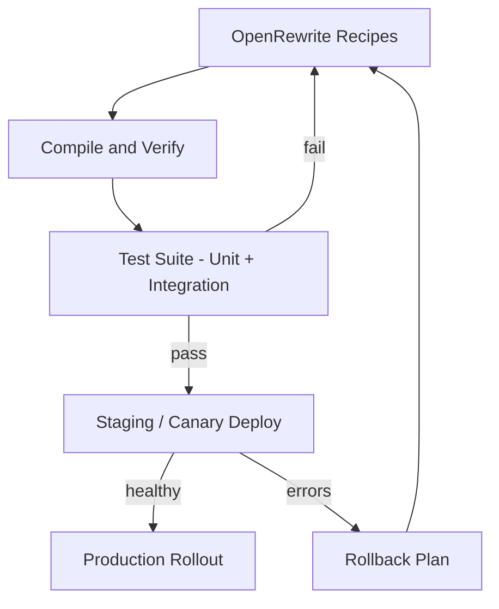

### 📶 Gradual Depth

**Level 1 - Update Boot parent version.** Change the
parent POM or Gradle plugin version. Let the BOM resolve
all managed dependencies.

```xml
<!-- pom.xml: Boot 2.7 to 3.3 -->
<parent>
    <groupId>org.springframework.boot</groupId>
    <artifactId>spring-boot-starter-parent</artifactId>
    <!-- was 2.7.18 -->
    <version>3.3.0</version>
</parent>
```

**Level 2 - Jakarta namespace migration.** Replace every
`javax.` import with `jakarta.` for servlet, persistence,
validation, annotation, and inject packages.

```java
// BEFORE (javax)
import javax.persistence.Entity;
import javax.servlet.http.HttpServletRequest;

// AFTER (jakarta)
import jakarta.persistence.Entity;
import jakarta.servlet.http.HttpServletRequest;
```

**Level 3 - OpenRewrite automated migration.** Run the
Spring Boot 3 migration recipe to handle namespace
changes, property renames, and deprecated API replacements
across the entire codebase automatically.

```xml
<!-- Add OpenRewrite plugin to pom.xml -->
<plugin>
    <groupId>org.openrewrite.maven</groupId>
    <artifactId>rewrite-maven-plugin</artifactId>
    <version>5.42.0</version>
    <configuration>
        <activeRecipes>
            <recipe>
                org.openrewrite.java.spring
                .boot3.UpgradeSpringBoot_3_3
            </recipe>
        </activeRecipes>
    </configuration>
</plugin>
```

```bash
# Execute the migration
mvn rewrite:run
```

**Level 4 - Dependency conflict resolution.** Identify
and resolve transitive dependency conflicts that the BOM
cannot auto-resolve.

```bash
# Check for dependency convergence issues
mvn dependency:tree \
  -Dverbose -Dincludes=org.hibernate
```

**Level 5 - Property and configuration migration.**
Renamed Boot properties (e.g., `spring.redis.*` became
`spring.data.redis.*`) must be updated in all profiles.

### ⚙️ How It Works

The upgrade proceeds in discrete, verifiable phases. Phase
one runs OpenRewrite recipes against the codebase, which
perform AST-level transformations: renaming imports, updating
deprecated method calls, and adjusting configuration
properties. Phase two compiles the transformed code and
runs the full test suite. Failures indicate missing manual
fixes - typically custom `javax` usages in generated code,
third-party libraries that have not released Jakarta-compatible
versions, or reflection-based code that OpenRewrite cannot
statically analyze. Phase three deploys to a staging
environment and runs integration and smoke tests. Phase four
rolls out via canary deployment, routing a small percentage
of traffic to the upgraded version while monitoring error
rates and latency.

```
Phase 1: OpenRewrite transforms source code
  -> javax.* to jakarta.*
  -> deprecated API replacements
  -> property renames

Phase 2: Build + Test
  -> compile check (catch missed imports)
  -> unit tests (logic unchanged)
  -> integration tests (wiring correct)

Phase 3: Staging + Canary
  -> deploy to non-prod
  -> smoke tests + synthetic traffic
  -> compare metrics to baseline

Phase 4: Production
  -> canary (5% traffic)
  -> progressive rollout (25/50/100%)
  -> rollback if error rate > threshold
```

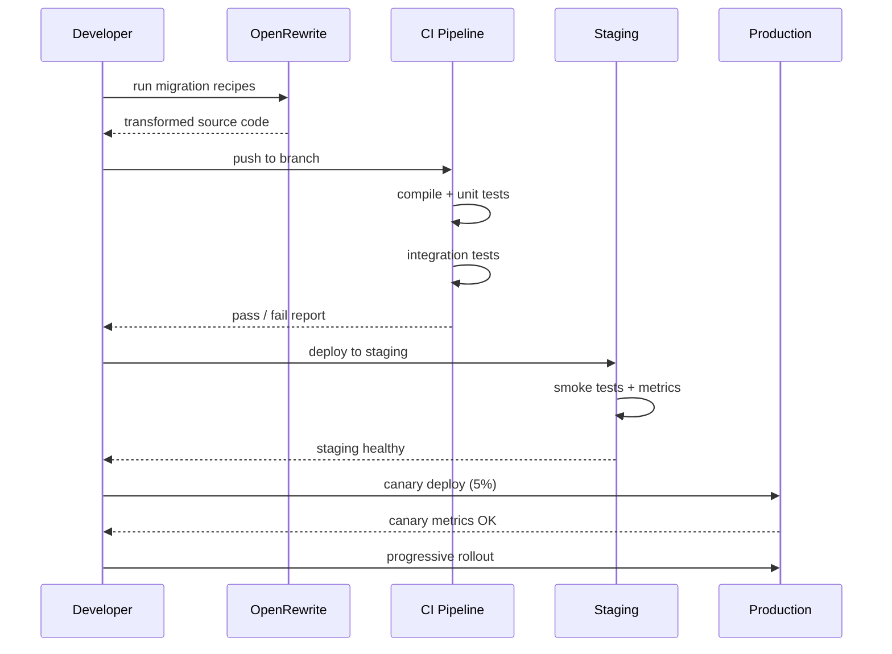

### 🚨 Failure Modes

**Failure 1 - Mixed Namespace Classloader Crash:**
A third-party library still uses `javax.servlet` while
your code uses `jakarta.servlet`. At runtime, Spring
cannot autowire the filter chain because the types are
incompatible despite identical class names.

**Diagnostic:** `NoSuchMethodError` or `ClassCastException`
referencing both `javax.` and `jakarta.` types in the same
stack trace. Run `mvn dependency:tree | grep javax` to
find the offending dependency.

**Fix:** Check if the library has a Jakarta-compatible
release. If not, use the `jakarta.servlet` adapter shim
or the `org.eclipse.transformer` Gradle/Maven plugin to
rewrite the library's bytecode at build time.

**Failure 2 - Silent Property Rename:**
Spring Boot 3 renamed dozens of configuration properties
(e.g., `spring.redis.*` to `spring.data.redis.*`). The
application starts successfully but with default values
instead of your configured values - the old property
keys are silently ignored.

**Diagnostic:** Compare `/actuator/configprops` output
before and after upgrade. Diff the effective configuration
to detect values that reverted to defaults.

**Fix:** Run the OpenRewrite
`org.openrewrite.java.spring.boot3
.SpringBootProperties_3_3` recipe, which maps all renamed
properties automatically. Add a startup check that logs
warnings for unrecognized property prefixes.

**Failure 3 - Baseline Java Version Mismatch:**
Spring Boot 3 requires Java 17+. A CI server or
production host still runs Java 11. The application
compiles locally (developer has Java 21) but fails in
CI with `UnsupportedClassVersionError`.

**Diagnostic:** The error message includes the class
file version number (61 = Java 17, 65 = Java 21). Check
`java -version` on every environment in the deployment
pipeline.

**Fix:** Update CI and production base images to Java
17 or 21 LTS before starting the Spring Boot upgrade.
Pin the Java version in the Maven toolchains plugin or
Gradle JVM toolchain configuration.

### 🔬 Production Reality

Spring Boot follows a six-month release cadence. Each
minor version (3.1, 3.2, 3.3) receives 12 months of OSS
support. Commercial support extends this to 36 months.
The practical advice: stay within one minor version of
current. Jumping two or more minor versions at once
multiplies the migration surface.

The `javax` to `jakarta` migration was a one-time event.
Future Spring Boot upgrades (3.x to 3.y) are comparatively
smooth because the namespace is stable. The hardest
remaining upgrade friction comes from third-party libraries
(Hibernate major versions, Spring Security's filter chain
refactoring in 6.x, and Jackson databind compatibility).

OpenRewrite covers roughly 80-90% of mechanical changes.
The remaining 10-20% are custom code patterns: hand-written
servlet filters, reflection-based bean registration,
bytecode manipulation libraries (like Byte Buddy or
cglib usages outside Spring's own proxying), and
annotation processors that generate `javax` imports.

Enterprises with 50+ microservices typically dedicate a
platform team to create a shared "upgrade kit" - a custom
OpenRewrite recipe module plus a parent POM that pins
the verified BOM. Individual teams then apply the kit
and run their service-specific tests. This reduces a
months-long coordination problem to a parallelizable
per-team task.

### ⚖️ Trade-offs & Alternatives

**BAD:**

```xml
<!-- Manually overriding managed versions -->
<properties>
    <hibernate.version>5.6.15.Final</hibernate.version>
    <!-- Forcing old Hibernate with Boot 3 -->
    <!-- breaks Jakarta namespace alignment -->
</properties>
```

**GOOD:**

```xml
<!-- Let the BOM manage versions -->
<parent>
    <groupId>
        org.springframework.boot
    </groupId>
    <artifactId>
        spring-boot-starter-parent
    </artifactId>
    <version>3.3.0</version>
</parent>
<!-- Override ONLY after verifying compat -->
```

| Aspect              | Stay on 2.7          | Big-bang 3.x upgrade  | Phased upgrade         |
| ------------------- | -------------------- | --------------------- | ---------------------- |
| Security patches    | None (EOL)           | Current               | Current                |
| Risk                | Accumulating CVEs    | High (all-at-once)    | Low (incremental)      |
| Downtime            | None                 | Potential (rollback)  | Minimal (canary)       |
| Developer effort    | None now, debt later | Very high, compressed | Moderate, distributed  |
| Rollback complexity | N/A                  | Complex               | Simple (per-phase)     |
| Recommended         | No                   | Only for small apps   | Yes - default strategy |

### ⚡ Decision Snap

- Upgrade at most one Boot minor version at a time (e.g.,
  3.1 to 3.2, then 3.2 to 3.3) unless using OpenRewrite
  recipes that cover the full span.
- Run OpenRewrite migration recipes as the first step -
  they handle 80-90% of mechanical changes automatically.
- Freeze feature development during the upgrade branch -
  merge conflicts on a namespace migration are brutal.
- Update Java version in all environments before starting
  the Boot upgrade, not during.
- Add the Actuator `/configprops` endpoint to your staging
  verification checklist to catch silent property renames.

### ⚠️ Top Traps

| #   | Trap                                                   | Why it hurts                                                        | Escape                                                         |
| --- | ------------------------------------------------------ | ------------------------------------------------------------------- | -------------------------------------------------------------- |
| 1   | Overriding BOM-managed dependency versions             | Creates version conflicts the BOM was designed to prevent           | Trust the BOM; override only with verified compatibility       |
| 2   | Migrating javax to jakarta with find-and-replace       | Misses bytecode, generated code, and string literals in annotations | Use OpenRewrite AST-based recipes for complete coverage        |
| 3   | Upgrading Boot without upgrading Java first            | Build succeeds locally but fails in CI or production on old JVM     | Pin Java 17+ across all environments before touching Boot      |
| 4   | Skipping integration tests after OpenRewrite migration | Recipes handle syntax but cannot verify runtime wiring correctness  | Run full integration suite on every upgrade branch             |
| 5   | Upgrading all microservices simultaneously             | One failure blocks the entire fleet deployment                      | Upgrade canary services first; roll out to fleet progressively |

### 🪜 Learning Ladder

**Prerequisites:**
SPR-106 Spring Ecosystem Evolution (2003 to Present),
SPR-075 Spring Boot Memory Footprint Analysis

**THIS:** SPR-109 Spring Upgrade Strategy (LTS and
Migration) - systematic approach to crossing Spring Boot
major and minor version boundaries safely

**Next steps:**
SPR-110 Spring as Career Leverage - Where It Fits in 2025+

**The Surprising Truth:**
The most expensive part of a Spring Boot upgrade is not
the migration itself - it is the years of deferred
maintenance that made the jump so large. Teams that
upgrade every six months when a new Boot minor releases
spend 1-2 days per cycle. Teams that skip three years
of releases spend 1-2 months. The Jakarta namespace
migration was a one-time cost, and every team that
delayed it paid compound interest in the form of
mounting CVE exposure and increasingly stale
dependencies.

**Further Reading:**

- Spring Boot release notes and migration guides:
  github.com/spring-projects/spring-boot/wiki
- OpenRewrite Spring recipes catalog:
  docs.openrewrite.org/recipes/java/spring
- Jakarta EE migration guide:
  eclipse.org/jakartaee/
- Spring Boot commercial support (Broadcom/VMware
  Tanzu): spring.io/support
- "Migrating to Spring Boot 3" by Mark Heckler
  (O'Reilly video course)

**Revision Card:**

1. BOM is the single source of truth for dependency
   versions - override managed versions only with
   verified compatibility evidence.
2. The javax-to-jakarta migration is binary incompatible
   and must be atomic per module - use OpenRewrite AST
   recipes, not text find-and-replace.
3. Upgrade one minor version at a time, freeze features
   during migration, and verify via canary deployment
   before fleet rollout.

---

---

# SPR-110 Spring as Career Leverage - Where It Fits in 2025+

**TL;DR** - Spring dominates enterprise Java hiring; its leverage is highest where domain complexity and team scale matter more than startup speed.

### 🔥 Problem Statement

You have finite career capital. Every year invested in a
framework is a bet: will this ecosystem still pay dividends
in five years? Spring has been the dominant enterprise Java
framework for two decades, but Quarkus, Micronaut, and
cloud-native serverless alternatives keep gaining mindshare.
Meanwhile, the industry narrative swings between "Java is
dead" and "Java is everywhere" every eighteen months. The
real question is not whether Spring is "good" but whether
deep Spring expertise is the highest-leverage investment
for YOUR career trajectory - given your target companies,
target roles, and target compensation bands.

### 📜 Historical Context

Spring emerged in 2003 as an alternative to heavyweight
J2EE. By 2008, most enterprise Java shops had adopted it.
Spring Boot (2014) eliminated boilerplate configuration
and made Spring accessible to developers who previously
avoided the ecosystem. Spring Cloud (2015) rode the
microservices wave and became the default distributed
systems toolkit for Java shops.

The competitive landscape shifted around 2018-2020.
Quarkus (Red Hat, 2019) and Micronaut (OCI, 2018)
targeted startup time and memory footprint for
containers and serverless. GraalVM native images
promised millisecond cold starts. Kubernetes became
the deployment standard. Despite this, Spring's market
share in enterprise Java remained above 60% through
2024, according to JetBrains and Stack Overflow
developer surveys. Spring Boot 3 and Spring Framework 6
(2022) adopted Jakarta EE, Java 17 baseline, and
native image support - directly addressing the
competitive gap.

The 2024-2025 hiring landscape shows a pattern:
companies building greenfield microservices sometimes
evaluate Quarkus or Micronaut, but companies with
existing Java estates almost always standardize on
Spring. Enterprise inertia is real, and it pays.

### 🔩 First Principles

**CORE INVARIANTS:**

1. **Career leverage = (demand x scarcity x durability) /
   acquisition cost.** A skill is high leverage when many
   employers need it, few candidates have deep expertise,
   it persists across technology cycles, and the learning
   curve rewards sustained investment over shallow exposure.

2. **Framework adoption follows enterprise gravity.** Large
   organizations adopt slowly and migrate even slower.
   A framework with 60%+ enterprise penetration creates
   a self-reinforcing hiring loop: companies hire Spring
   developers because their codebase is Spring; developers
   learn Spring because companies hire for it.

3. **Depth beats breadth for compensation leverage.**
   Knowing Spring Boot at tutorial level is table stakes.
   Understanding Spring internals - bean lifecycle,
   auto-configuration mechanics, security filter chains,
   transaction propagation - separates senior from staff
   level roles and commands a measurable salary premium.

**DERIVED DESIGN:**

From invariant 1: evaluate Spring investment against your
target role and company profile, not against framework
benchmarks. From invariant 2: Spring's enterprise base
guarantees demand for years, but not infinitely - track
adoption metrics annually. From invariant 3: invest in
depth (internals, debugging, architecture) rather than
breadth (more Spring projects at surface level).

### 🧠 Mental Model

> Spring expertise is like owning commercial real estate
> in a business district: the building is not flashy, the
> maintenance is constant, but the tenants keep paying rent
> because moving is expensive and the location has gravity.

-> Enterprise codebases are the "tenants" - migrating
off Spring is a multi-year, multi-million-dollar effort
-> The "location gravity" is the hiring ecosystem: teams,
training, libraries, and tooling all assume Spring
-> "Rent" is the salary premium for developers who can
navigate, debug, and evolve these codebases
-> New frameworks are "co-working spaces" - attractive
for startups but enterprises need the full building

**Where this analogy breaks down:** Real estate does not
undergo technology shifts. A serverless-first or AI-native
paradigm shift could devalue framework-level expertise
entirely - though no such shift has materialized for
backend Java as of 2025.

### 🧩 Components

```
+---------------------------+
|   Career Leverage Model   |
+---------------------------+
|                           |
|  DEMAND                   |
|   Enterprise Java jobs    |
|   60%+ use Spring         |
|                           |
|  SCARCITY                 |
|   Deep Spring internals   |
|   knowledge is rare       |
|                           |
|  DURABILITY               |
|   20-year track record    |
|   active development      |
|                           |
|  ACQUISITION COST         |
|   High for depth          |
|   Low for surface level   |
+---------------------------+
```

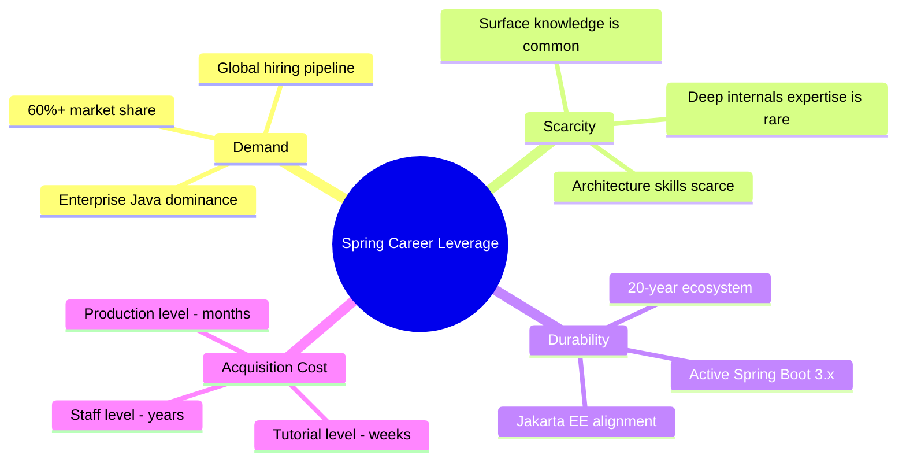

### 📶 Gradual Depth

**Layer 1 - Anyone:** Spring is the most-used Java
framework in companies worldwide. Knowing it well opens
doors to most enterprise Java jobs.

**Layer 2 - Junior developer:** Spring Boot makes it easy
to build web applications. Most job postings for Java
backend roles list Spring Boot as required or preferred.
Learning Spring Boot is the fastest path to employability
in the Java ecosystem.

**Layer 3 - Mid-level developer:** The market segments
matter. Startups building from scratch may choose lighter
frameworks. Large enterprises with existing Java estates
overwhelmingly use Spring. Your target company profile
determines whether Spring investment has maximum leverage.

**Layer 4 - Senior developer:** The salary premium comes
from depth, not breadth. Understanding auto-configuration
internals, security filter chain customization, transaction
propagation edge cases, and performance tuning separates
you from developers who only know annotations. This depth
is what makes you the person called at 3 AM - and that
is what drives compensation.

**Layer 5 - Staff/Principal:** At this level, Spring
expertise is a means to an end. The leverage is in
architectural judgment: when to use Spring vs alternatives,
how to evolve a Spring monolith, how to integrate Spring
services with non-Java systems. Framework expertise
becomes architectural vocabulary.

### ⚙️ How It Works

```
Career Decision Flow:

[Target Role?]
  |
  +--Enterprise Backend--+
  |                      |
  |  [Existing Java?]    |
  |    YES -> Spring     |
  |    NO  -> Evaluate   |
  |                      |
  +--Startup/Greenfield--+
  |    Evaluate all      |
  |    options           |
  |                      |
  +--Cloud/Serverless----+
     Framework matters
     less; infra skills
     matter more
```

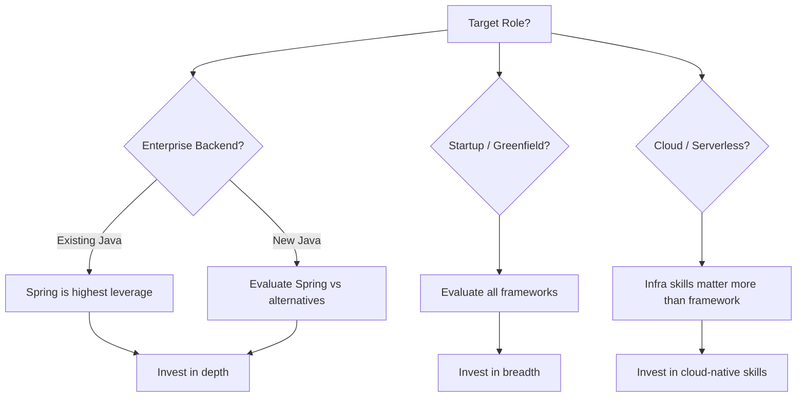

### 🚨 Failure Modes

**Failure 1 - Surface-only Spring on resume:**
Listing "Spring Boot" after completing a tutorial project
puts you in a pool with thousands of identically-skilled
candidates. In screening interviews, you cannot explain
bean scopes, auto-configuration mechanics, or transaction
propagation. You fail the depth filter.
**Diagnostic:** You cannot answer "how does
`@Transactional` propagation actually work?" or "what
happens during Spring context refresh?" without searching.
**Fix:** Study Spring internals deliberately. Read the
source of `@SpringBootApplication`, trace a request
through the filter chain, build a custom starter.
Deep knowledge compounds over years.

**Failure 2 - Framework tunnel vision:**
Investing exclusively in Spring while ignoring
Kubernetes, observability, database internals, and
distributed systems fundamentals. Spring is a tool;
the problems it solves are what matter at senior+ levels.
**Diagnostic:** You can configure Spring but cannot
explain why a particular architecture is correct
independent of the framework.
**Fix:** Invest 60% in Spring depth, 40% in adjacent
skills: container orchestration, SQL performance,
messaging systems, observability. The combination is
what commands staff-level compensation.

**Failure 3 - Ignoring market signals:**
Assuming Spring will dominate forever without tracking
adoption trends, hiring data, and competitive landscape.
**Diagnostic:** You cannot name Spring's top three
competitors or articulate when you would NOT choose
Spring for a new project.
**Fix:** Review the annual JetBrains Developer Survey,
Stack Overflow trends, and conference talk topics.
Maintain awareness of Quarkus, Micronaut, and
serverless-first patterns.

### 🔬 Production Reality

Enterprise hiring data consistently shows Spring as
the most-requested Java framework. A typical enterprise
backend job posting in 2024-2025 reads: "Spring Boot,
Spring Security, Spring Data JPA, microservices,
REST APIs, SQL." This has been stable for years.

The compensation premium for deep Spring expertise
is measurable. Developers who can debug framework
internals, design custom auto-configurations, and
architect Spring-based systems command higher rates
than those with surface-level knowledge. The gap
widens at senior and staff levels.

However, the market is not uniform. Fintech and
trading firms often use custom frameworks or lighter
alternatives. Cloud-native startups may prefer
Go, Rust, or Node.js entirely. The strongest career
position is Spring depth PLUS cloud-native skills
PLUS one complementary ecosystem (messaging, data
engineering, or observability).

Spring certifications (VMware Spring Professional,
Spring Boot Developer) have mixed value. They signal
commitment and baseline knowledge. In some regulated
industries and consulting firms, certifications carry
weight for billing rates and compliance checkboxes.
At FAANG-tier companies, certifications are largely
irrelevant - demonstrated depth in system design
interviews matters more.

The full-stack Spring developer (Boot + Security +
Data + Cloud + testing) is the most hireable profile
in enterprise Java. The specialist (Spring Security
expert, Spring performance engineer) commands a
premium in specific niches but has a narrower job
market. Choose based on your risk tolerance and
target company profile.

### ⚖️ Trade-offs & Alternatives

**BAD:**

```java
// Career anti-pattern: surface Spring only
@RestController
public class TodoController {
    // Tutorial-level CRUD is not leverage
    @GetMapping("/todos")
    public List<Todo> getAll() {
        return repo.findAll();
    }
}
```

**GOOD:**

```java
// Career leverage: depth + architecture
// Understanding WHY this configuration exists
// and what happens when it breaks
@Configuration
public class SecurityConfig {
    @Bean
    public SecurityFilterChain chain(
            HttpSecurity http) throws Exception {
        return http
            .oauth2ResourceServer(o ->
                o.jwt(Customizer.withDefaults()))
            .sessionManagement(s ->
                s.sessionCreationPolicy(STATELESS))
            .build();
    }
    // Can explain: filter ordering, token
    // validation flow, session implications
}
```

| Dimension         | Spring Deep    | Broad/Shallow | Alt Framework |
| ----------------- | -------------- | ------------- | ------------- |
| Enterprise demand | Very high      | Medium        | Low-medium    |
| Startup demand    | Medium         | Medium        | High          |
| Salary ceiling    | High           | Medium        | Varies        |
| Job market size   | Largest (Java) | Large         | Smaller       |
| Learning cost     | 2-3 years      | 6 months      | 1-2 years     |
| Risk of obsolesce | Low (5yr)      | Low           | Medium        |
| Portability       | Java ecosystem | Cross-stack   | Specific eco  |

### ⚡ Decision Snap

- Target enterprise backend? -> Invest in Spring depth
- Target startups? -> Broaden across frameworks and
  languages; Spring is one option, not the default
- Already 3+ years in Spring? -> Double down on
  internals and architecture; surface breadth has
  diminishing returns
- Career pivot to cloud/infra? -> Framework expertise
  matters less; invest in Kubernetes, Terraform, and
  observability instead
- Considering certification? -> Worth it for consulting
  and regulated industries; skip it for product
  engineering at tech companies

### ⚠️ Top Traps

| #   | Trap                             | Why It Bites                                              |
| --- | -------------------------------- | --------------------------------------------------------- |
| 1   | Tutorial-depth only              | Indistinguishable from thousands of candidates            |
| 2   | Framework loyalty over judgment  | Choosing Spring when a simpler solution fits better       |
| 3   | Ignoring adjacent skills         | Spring alone does not make a senior engineer              |
| 4   | Chasing every new Spring project | Spring Cloud Gateway, Spring AI - breadth without depth   |
| 5   | Certification over demonstration | A cert does not prove you can debug a production incident |

### 🪜 Learning Ladder

**Prerequisites:**

- SPR-101 Performance at Scale - Spring vs Quarkus vs
  Micronaut (understand the competitive landscape)
- SPR-109 Spring Upgrade Strategy (understand ecosystem
  evolution and maintenance cost)

**THIS:** SPR-110 Spring as Career Leverage - Where It
Fits in 2025+ (evaluate when and how Spring expertise
maximizes your career return)

**Next steps:**

- SPR-112 Topic Mastery Synthesis (integrate all Spring
  knowledge into a coherent mental model)

**The Surprising Truth:** The developers who get the
most career leverage from Spring are not the ones who
know the most annotations - they are the ones who can
explain to a VP why the existing Spring architecture
is correct (or wrong) for the next three years of
business growth. Framework expertise becomes career
leverage only when it translates to architectural
judgment and production credibility.

**Further Reading:**

- JetBrains Developer Ecosystem Survey (annual)
- Stack Overflow Developer Survey (annual)
- Spring Blog: release announcements and roadmap posts
- InfoQ: Java and Spring trend reports
- Martin Fowler: "Microservices" and related articles

**Revision Card:**

1. Spring career leverage = demand (60%+ enterprise Java)
   x scarcity (deep internals knowledge) x durability
   (20-year ecosystem), divided by acquisition cost.
2. Depth beats breadth: understanding auto-configuration,
   security filter chains, and transaction propagation
   separates senior from staff-level candidates.
3. Strongest career position: Spring depth PLUS
   cloud-native skills PLUS one complementary ecosystem
   (messaging, data, or observability).

---

---

# SPR-111 Full-Stack Spring Reference Architecture

**TL;DR** - A production Spring Boot stack wires Boot, Security, Data JPA, Cache, Cloud Config, health checks, structured logging, Docker, and a testing pyramid into one coherent blueprint.

### 🔥 Problem Statement

You understand individual Spring projects - Boot for web,
Security for auth, Data JPA for persistence - but you have
never wired them all together into a single production-grade
application. Every tutorial covers one piece. Real systems
require all pieces simultaneously, and the interactions
between them (Security filter chain vs actuator endpoints,
cache invalidation vs JPA second-level cache, Cloud Config
refresh vs bean lifecycle) are where production incidents
hide. You need a reference architecture that shows how
everything connects, where the failure boundaries are,
and what the testing strategy looks like when all layers
are present.

### 📜 Historical Context

Early Spring applications (2004-2013) required extensive
XML or Java configuration to wire components together.
Spring Boot (2014) introduced opinionated defaults and
auto-configuration, dramatically reducing the glue code.
Spring Cloud (2015) added distributed systems patterns.

The modern Spring stack crystallized around 2020-2023:
Spring Boot 3.x with Jakarta EE, Spring Security 6.x
with the `SecurityFilterChain` API, Spring Data JPA
with Hibernate 6, Spring Cache with pluggable providers,
Spring Boot Actuator for health and metrics, and
structured logging via Logback or Log4j2. Docker
deployment became the standard packaging model.
Kubernetes became the standard orchestrator.

The reference architecture pattern itself draws from
twelve-factor app principles (Heroku, 2011), the
microservice chassis pattern (Chris Richardson), and
Spring's own production-ready features guide. It is
not prescriptive - it is a starting point that teams
adapt to their domain.

### 🔩 First Principles

**CORE INVARIANTS:**

1. **Separation of cross-cutting concerns.** Authentication,
   authorization, caching, logging, configuration, and
   health monitoring are not business logic. They must be
   composable, independently testable, and replaceable
   without modifying domain code.

2. **Fail-fast at the boundary, resilient at the core.**
   Validate inputs at the API boundary. Reject invalid
   requests before they reach business logic. Inside the
   core, handle failures gracefully - circuit breakers,
   retries with backoff, fallback values.

3. **Every layer is independently testable.** Unit tests
   for domain logic (no Spring context). Slice tests for
   each integration point (web, data, security). Integration
   tests for the full stack. The testing pyramid is not
   optional - it is architectural.

**DERIVED DESIGN:**

From invariant 1: each concern maps to a Spring project
(Security, Cache, Actuator, Cloud Config) that auto-
configures independently. From invariant 2: the controller
layer validates, the service layer orchestrates, the
repository layer persists. From invariant 3: test slices
(`@WebMvcTest`, `@DataJpaTest`, `@SpringBootTest`) mirror
the architecture layers.

### 🧠 Mental Model

> A full-stack Spring application is like a well-designed
> building: the lobby (controller) screens visitors, the
> offices (service) handle business, the vault (repository)
> stores assets, and the building systems (security, HVAC,
> fire alarms) run independently but protect everything.

-> The lobby (REST controllers) handles all external
interaction and rejects unauthorized visitors
-> The offices (service layer) contain business logic
and know nothing about HTTP or persistence details
-> The vault (JPA repositories) manages data storage
with its own access controls and backup strategy
-> Building systems (Security, Cache, Actuator, Config)
are cross-cutting and operate at every floor

**Where this analogy breaks down:** In a real building,
systems rarely conflict. In Spring, auto-configuration
ordering, bean lifecycle timing, and filter chain
priority create subtle interaction bugs that have no
physical-world equivalent.

### 🧩 Components

```
+-------------------------------------------+
|          Reference Architecture           |
+-------------------------------------------+
| [Client] -> [API Gateway]                 |
|                |                          |
|          [Spring Boot App]                |
|          +------------------+             |
|          | SecurityFilter   |             |
|          | Controllers      |             |
|          | Services         |             |
|          | Repositories     |             |
|          +------------------+             |
|                |        |                 |
|          [PostgreSQL] [Redis Cache]       |
|                |                          |
|          [Cloud Config Server]            |
|          [Docker / K8s]                   |
+-------------------------------------------+
```

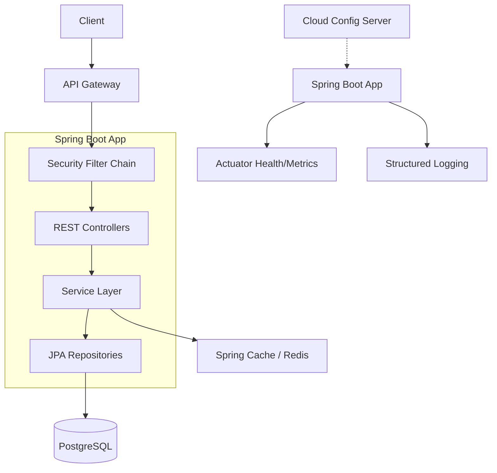

### 📶 Gradual Depth

**Layer 1 - Anyone:** A Spring Boot app that handles web
requests, saves data, checks permissions, and reports its
own health - all in one deployable unit.

**Layer 2 - Junior developer:** The app has layers:
controllers handle HTTP, services contain business rules,
repositories talk to the database. Spring Security checks
every request. Spring Cache speeds up repeated queries.
Actuator endpoints let operations check if the app is
healthy.

**Layer 3 - Mid-level developer:** Configuration is
externalized via Spring Cloud Config so the same artifact
deploys to dev, staging, and production. The security
filter chain runs before any controller. Caching strategy
must align with data consistency requirements - cache
invalidation is the hard part. Structured logging with
correlation IDs enables distributed tracing.

**Layer 4 - Senior developer:** The interactions between
components matter most. Security filter ordering affects
actuator endpoint access. JPA entity lifecycle interacts
with cache eviction. Cloud Config refresh can trigger bean
re-creation if `@RefreshScope` is used - which breaks
singleton assumptions. The testing pyramid must cover
these interactions explicitly.

**Layer 5 - Staff/Principal:** The reference architecture
is a starting point, not a destination. Teams must adapt
it to their domain, scale, and operational maturity. The
architectural decisions (sync vs async, monolith vs
modular, SQL vs NoSQL) depend on business constraints,
not framework capabilities.

### ⚙️ How It Works

```
Request Flow Through the Stack:

HTTP Request
  |
  v
[Security Filter Chain]
  | authenticate + authorize
  v
[DispatcherServlet]
  | route to controller
  v
[@RestController]
  | validate input, delegate
  v
[@Service + @Transactional]
  | business logic
  | check @Cacheable first
  v
[@Repository / JPA]
  | SQL via Hibernate
  v
[PostgreSQL]
  |
  v
Response (JSON) <- back up the stack
```

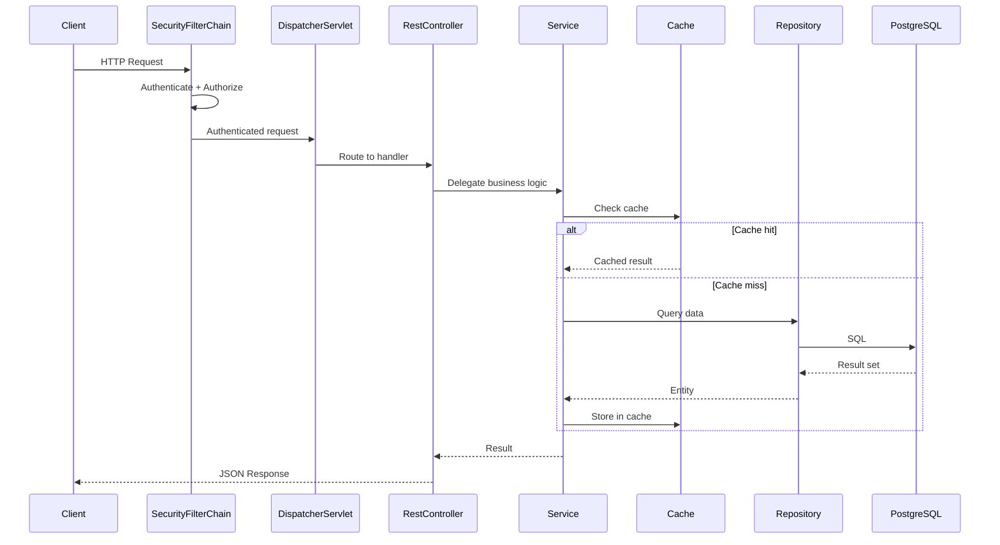

### 🚨 Failure Modes

**Failure 1 - Security filter vs Actuator conflict:**
Actuator health endpoints return 401 because the security
filter chain requires authentication for all paths. The
Kubernetes liveness probe fails, the pod restarts in a
loop, and the application never becomes healthy.
**Diagnostic:** `curl http://localhost:8080/actuator/health`
returns 401. Pod logs show repeated restarts. No
application logs because the app never reaches readiness.
**Fix:** Explicitly permit actuator paths in the security
configuration:

```java
http.authorizeHttpRequests(auth -> auth
    .requestMatchers(
        "/actuator/health/**",
        "/actuator/info"
    ).permitAll()
    .anyRequest().authenticated()
);
```

**Failure 2 - Cache and JPA consistency drift:**
A `@Cacheable` method returns stale data after a direct
database update (migration script, another service, or
manual fix). Users see outdated information. The fix
("just clear the cache") works once but the pattern
recurs.
**Diagnostic:** Query the database directly and compare
with the API response. If they differ, the cache is
stale. Check cache TTL configuration and whether
`@CacheEvict` is called on all write paths.
**Fix:** Design cache invalidation as part of the write
path, not as an afterthought. Use `@CacheEvict` on every
mutation method. Set reasonable TTL values. For multi-
instance deployments, use a shared cache (Redis) rather
than local in-memory caches.

**Failure 3 - Cloud Config refresh breaks singletons:**
A `@RefreshScope` bean is re-created when Cloud Config
properties change, but other singleton beans holding a
reference to the old instance continue using stale
configuration. Behavior becomes inconsistent across
requests.
**Diagnostic:** After a config refresh, some requests use
new values and others use old values. Thread dumps show
different bean instances for the same type.
**Fix:** Minimize `@RefreshScope` usage. Prefer injecting
`Environment` or `@Value` with `@RefreshScope` only on
the specific bean that needs dynamic refresh. Avoid
holding direct references to refresh-scoped beans from
singleton-scoped beans.

### 🔬 Production Reality

A production Spring Boot application typically has:
20-40 auto-configured beans from starters, a security
filter chain with 10-15 filters, 5-10 actuator endpoints,
structured JSON logging with correlation IDs, externalized
configuration with profile-based overrides, a Docker image
built via `spring-boot:build-image` or a multi-stage
Dockerfile, and health checks wired to the orchestrator.

The testing pyramid for this stack looks like: 60-70%
unit tests (domain logic, no Spring context), 20-30%
slice tests (`@WebMvcTest`, `@DataJpaTest` with
Testcontainers), 5-10% full integration tests
(`@SpringBootTest` with real dependencies). Teams that
invert this pyramid (mostly integration tests) face
10-minute+ build times and flaky CI.

Docker deployment typically uses a layered JAR approach:

```dockerfile
FROM eclipse-temurin:21-jre AS runtime
WORKDIR /app
COPY target/*.jar app.jar
EXPOSE 8080
HEALTHCHECK --interval=30s --timeout=3s \
  CMD curl -f http://localhost:8080/actuator/health
ENTRYPOINT ["java", "-jar", "app.jar"]
```

Spring Boot Actuator provides `/actuator/health` (liveness
and readiness probes), `/actuator/metrics` (Micrometer
metrics exportable to Prometheus), `/actuator/info`
(build metadata). These are non-negotiable for production
deployment.

Structured logging configuration (Logback):

```xml
<encoder class=
  "net.logstash.logback.encoder
  .LogstashEncoder">
  <includeMdcKeyName>
    traceId
  </includeMdcKeyName>
</encoder>
```

This emits JSON logs with trace correlation, consumable
by ELK, Splunk, or any log aggregation platform.

### ⚖️ Trade-offs & Alternatives

**BAD:**

```java
// Everything in one class, no separation
@RestController
public class UserController {
    @Autowired EntityManager em;
    @GetMapping("/users/{id}")
    public User get(@PathVariable Long id) {
        // No security, no caching, no
        // validation, no error handling
        return em.find(User.class, id);
    }
}
```

**GOOD:**

```java
// Layered with cross-cutting concerns
@RestController
@Validated
public class UserController {
    private final UserService svc;
    // Constructor injection only
    UserController(UserService svc) {
        this.svc = svc;
    }
    @GetMapping("/users/{id}")
    public UserDto get(
            @PathVariable @Positive Long id) {
        return svc.findById(id);
    }
}

@Service
public class UserService {
    @Cacheable("users")
    @Transactional(readOnly = true)
    public UserDto findById(Long id) {
        return repo.findById(id)
            .map(this::toDto)
            .orElseThrow(() ->
                new NotFoundException(id));
    }
}
```

| Dimension            | Full Reference  | Minimal Boot  | Custom Stack |
| -------------------- | --------------- | ------------- | ------------ |
| Time to production   | 2-4 weeks       | 1-2 days      | Months       |
| Operational maturity | High            | Low           | Varies       |
| Team onboarding      | Fast (standard) | Fast          | Slow         |
| Testing coverage     | Comprehensive   | Minimal       | Custom       |
| Maintenance cost     | Predictable     | Low initially | High         |
| Flexibility          | Medium          | High          | Maximum      |
| Community support    | Extensive       | Extensive     | Limited      |

### ⚡ Decision Snap

- Building an enterprise CRUD API? -> Use this reference
  architecture as-is, adapt to your domain
- Building an event-driven system? -> Replace REST
  controllers with message listeners, keep the rest
- Deploying to Kubernetes? -> Add readiness/liveness
  probe configuration, resource limits, graceful
  shutdown (`server.shutdown=graceful`)
- Need sub-50ms latency? -> Evaluate whether JPA and
  the cache layer add acceptable overhead; consider
  direct JDBC or jOOQ for hot paths
- Team under 3 developers? -> Simplify: skip Cloud
  Config (use environment variables), skip Redis cache
  (use Caffeine in-process), use Spring Profiles
  instead of a config server

### ⚠️ Top Traps

| #   | Trap                                | Why It Bites                                                 |
| --- | ----------------------------------- | ------------------------------------------------------------ |
| 1   | Security filter permits everything  | Deployed with `.permitAll()` in production; data breach      |
| 2   | No cache eviction strategy          | Stale data served for hours; users report wrong information  |
| 3   | Actuator endpoints publicly exposed | `/actuator/env` leaks secrets; `/actuator/shutdown` is RCE   |
| 4   | Testing only at integration level   | 15-minute builds, flaky CI, developers skip tests            |
| 5   | Cloud Config without fallback       | Config server down means app cannot start; cascading failure |

### 🪜 Learning Ladder

**Prerequisites:**

- SPR-104 Spring Architecture Whiteboard Sessions
  (understand how Spring components interact at the
  design level)
- SPR-105 REST API Phase 5 - Cloud-Native Deployment
  (understand deployment patterns for Spring apps)

**THIS:** SPR-111 Full-Stack Spring Reference Architecture
(wire all Spring projects into one production-grade
blueprint)

**Next steps:**

- SPR-112 Topic Mastery Synthesis (integrate all Spring
  knowledge into a unified mental model)

**The Surprising Truth:** The hardest part of a full-stack
Spring application is not configuring any single component -
it is managing the interactions between components. Security
affects caching (authenticated vs anonymous cache keys).
Caching affects consistency (stale reads after writes).
Configuration refresh affects bean lifecycle (re-creation
breaks singleton references). The reference architecture
is not a list of components - it is a map of interactions.

**Further Reading:**

- Spring Boot Reference Documentation: Production-ready
  Features (official guide for actuator, health, metrics)
- Spring Security Reference: Architecture chapter
  (filter chain ordering and authentication flow)
- Chris Richardson: Microservice Patterns (chassis pattern)
- Twelve-Factor App (twelve-factor.net)
- Testcontainers documentation (integration testing with
  real dependencies)

**Revision Card:**

1. The reference architecture layers: Security filter chain
   -> Controllers -> Services -> Repositories, with Cache,
   Config, Actuator, and Logging as cross-cutting concerns.
2. The testing pyramid for Spring: 60-70% unit (no context),
   20-30% slice (`@WebMvcTest`, `@DataJpaTest`), 5-10%
   integration (`@SpringBootTest`).
3. The hardest production bugs live in component interactions:
   security vs actuator, cache vs JPA consistency, config
   refresh vs singleton lifecycle.

---

---

# SPR-112 Topic Mastery Synthesis

**TL;DR** - Spring mastery means seeing DI, AOP, lifecycle, and convention-over-configuration as one coherent design rather than isolated features.

### 🔥 Problem Statement

Most Spring developers plateau at "I can make it work."
They annotate beans, wire dependencies, and ship features
for years without grasping the unifying principles beneath
the surface. When something breaks - a circular dependency,
a proxy not firing, a bean override silently winning - they
resort to trial-and-error because they lack the mental model
that connects Spring's moving parts into a coherent whole.
The gap between a Spring user and a Spring expert is not
knowledge of more annotations. It is the ability to predict
framework behavior from first principles, to diagnose
problems by reasoning about the container lifecycle, and to
make architectural decisions that leverage the framework
rather than fight it. This keyword synthesizes the entire
Spring topic into the mental models, recurring patterns, and
decision frameworks that separate mastery from familiarity.

### 📜 Historical Context

Rod Johnson's 2002 book "Expert One-on-One J2EE Design and
Development" argued that J2EE was over-engineered. The Spring
Framework launched in 2003 with two core bets: dependency
injection replaces service locators, and POJOs beat platform
APIs. These bets encoded a philosophy - inversion of control
at every layer - that has remained stable for over two
decades despite massive surface changes.

Spring 2.0 (2006) added namespace-based XML config. Spring
3.0 (2009) introduced annotation-driven configuration and
Java-based `@Configuration`. Spring Boot (2014) layered
convention-over-configuration atop the core container. Spring
5.0 (2017) added reactive support. Spring 6.0 (2022) moved
to Jakarta EE and added AOT compilation. Through every
evolution, the foundational patterns - DI, AOP, template
method, lifecycle callbacks - remained the stable core. The
surface changed; the architecture did not.

Understanding this history matters because it reveals what is
essential versus incidental. Annotations are incidental.
Inversion of control is essential. Boot auto-configuration is
incidental. The `BeanDefinition` registry is essential.

### 🔩 First Principles

**CORE INVARIANTS:**

1. **Inversion of Control is the meta-pattern.** Every Spring
   feature - DI, AOP, transactions, security, event handling,
   scheduling - is a specific application of one idea: the
   framework calls your code, not the other way around. Your
   code declares intent; the container decides when, how, and
   in what order to fulfill it.
2. **The container lifecycle is deterministic.** Bean
   definition loading, `BeanFactoryPostProcessor` execution,
   instantiation, dependency injection, `BeanPostProcessor`
   execution, `@PostConstruct`, `SmartLifecycle.start()` -
   this sequence is fixed. Every "magic" behavior maps to a
   specific lifecycle phase.
3. **Proxies are the enforcement mechanism.** `@Transactional`,
   `@Cacheable`, `@Async`, `@Secured` - all work through
   proxies (JDK dynamic or CGLIB). If you bypass the proxy
   (self-invocation, direct field access, final methods), the
   cross-cutting behavior silently disappears.

**DERIVED DESIGN:**

From invariant 1: never fight the container. If you find
yourself using `ApplicationContext.getBean()` in business
code, you are working against IoC.

From invariant 2: debugging Spring means mapping symptoms to
lifecycle phases. A `BeanCurrentlyInCreationException` is a
circular dependency at instantiation time. A missing
`@Transactional` effect is a proxy issue at post-processing
time.

From invariant 3: understand proxy boundaries before using
any annotation-driven feature. The proxy is not the bean -
it wraps the bean. Self-calls skip the proxy.

### 🧠 Mental Model

> Think of Spring as an orchestra conductor. Your beans are
> musicians. The conductor (container) decides seating
> (instantiation order), hands out sheet music (configuration),
> signals when each section enters (lifecycle callbacks), and
> ensures harmony (cross-cutting concerns via AOP). You write
> the music; the conductor controls the performance.

- Dependency Injection -> conductor assigns seats so each
  musician can hear the sections they depend on
- AOP proxies -> conductor inserts section leaders who add
  dynamics (transactions, logging) without changing the score
- Lifecycle callbacks -> conductor's baton signals: tune up
  (`@PostConstruct`), begin (`start()`), pause, finale
  (`@PreDestroy`)
- Auto-configuration -> conductor reads the program notes
  (classpath) and assembles the orchestra automatically
- Profiles and conditionals -> conductor adjusts arrangement
  based on venue (environment)

**Where this analogy breaks down:** An orchestra conductor
has real-time control. Spring's container makes most decisions
at startup and then steps back. Runtime behavior is largely
determined by the proxy chain and event system, not by
continuous container intervention. This is closer to a
compiler than a conductor - most work happens at "compile
time" (context refresh), not at "runtime."

### 🧩 Components

The five pillars of Spring mastery:

```
+---------------------------------------------------+
|            SPRING MASTERY PILLARS                  |
+---------------------------------------------------+
|                                                   |
|  [DI/IoC]  [AOP]  [Lifecycle]  [Convention]       |
|     |        |        |            |              |
|     +--------+--------+------------+              |
|              |                                    |
|      [Template Method Pattern]                    |
|              |                                    |
|     JdbcTemplate, RestTemplate,                   |
|     TransactionTemplate, ...                      |
|              |                                    |
|      [Your Application Code]                      |
+---------------------------------------------------+
```

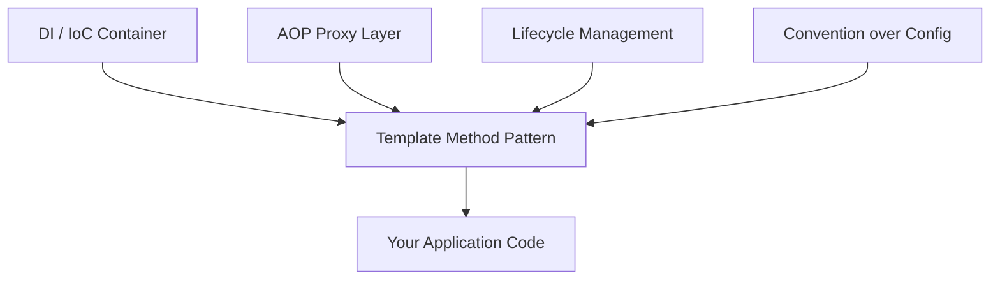

**DI/IoC Container** owns bean creation, wiring, scoping.
`BeanDefinition` is the internal currency. Every bean starts
as a definition before becoming an instance.

**AOP Proxy Layer** intercepts method calls on managed beans.
`@Transactional`, `@Cacheable`, `@Async`, `@Secured` all
route through `AbstractAutoProxyCreator` and its subclasses.

**Lifecycle Management** provides deterministic startup and
shutdown ordering. `SmartLifecycle` with phases gives you
control over what starts before what.

**Convention over Configuration** (Boot layer) scans the
classpath, matches conditions (`@ConditionalOnClass`,
`@ConditionalOnMissingBean`), and registers defaults that
you override only when needed.

**Template Method Pattern** appears everywhere: `JdbcTemplate`
handles connection/exception/cleanup while you provide the
SQL. `TransactionTemplate` handles begin/commit/rollback
while you provide the business logic.

### 📶 Gradual Depth

**Level 1 - User.** You use `@Autowired`, `@Service`,
`@RestController`. Things work. When they break, you search
Stack Overflow. You think of Spring as "the annotations."

**Level 2 - Practitioner.** You understand that annotations
trigger `BeanPostProcessor` logic. You know `@Transactional`
needs a proxy. You can debug circular dependencies by
reasoning about bean creation order.

**Level 3 - Expert.** You can trace a request from
`DispatcherServlet` through the handler mapping, interceptor
chain, argument resolution, handler execution, view
resolution, and exception handling. You understand why
`@Configuration` classes are CGLIB-proxied and what
`proxyBeanMethods=false` changes.

**Level 4 - Architect.** You choose between Spring MVC and
WebFlux based on measured throughput requirements, not hype.
You design module boundaries using Spring Modulith. You make
framework upgrade decisions by reading the migration guide
and assessing your proxy and reflection usage for AOT
compatibility.

**Level 5 - Contributor.** You read Spring Framework source
code to diagnose edge cases. You understand
`DefaultListableBeanFactory` internals, the `Ordered`
interface's role in post-processor chains, and how
`ConfigurationClassPostProcessor` transforms `@Bean` methods
into bean definitions.

### ⚙️ How It Works

The Spring container refresh sequence - the single most
important process to understand:

```
+---------------------------------------------------+
| ApplicationContext.refresh()                       |
|---------------------------------------------------|
| 1. Load BeanDefinitions (XML/annotation/Java)     |
| 2. Run BeanFactoryPostProcessors                  |
|    - ConfigurationClassPostProcessor              |
|    - PropertySourcesPlaceholderConfigurer          |
| 3. Register BeanPostProcessors                    |
| 4. For each non-lazy singleton:                   |
|    a. Instantiate (constructor)                    |
|    b. Populate properties (injection)              |
|    c. Run BeanPostProcessors (proxying here)       |
|    d. InitializingBean / @PostConstruct            |
| 5. SmartLifecycle.start() (phased)                |
| 6. Publish ContextRefreshedEvent                  |
+---------------------------------------------------+
```

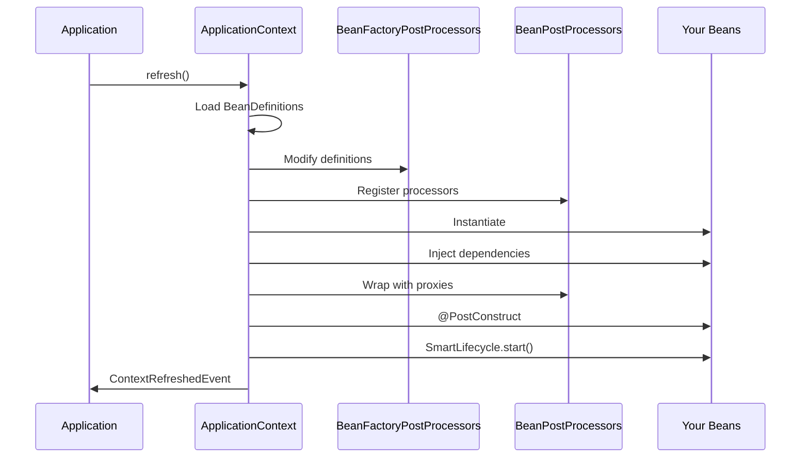

The recurring patterns across every Spring module:

**Pattern 1 - Dependency Injection.** Constructor injection
for required deps, `@Value` for config, `ObjectProvider`
for optional or lazy deps. This is not just wiring - it is
the mechanism that makes testing possible and coupling
visible.

**Pattern 2 - AOP for cross-cutting concerns.** Instead of
scattering transaction management across 200 service methods,
declare it once with `@Transactional`. The proxy layer
intercepts and wraps. Same pattern for caching, security,
metrics, retry logic.

**Pattern 3 - Convention over configuration.** Boot scans
your classpath: H2 JAR present plus no DataSource defined
means auto-configure an embedded database. This is not magic

- it is conditional bean registration with well-defined
  precedence rules.

**Pattern 4 - Template method.** `JdbcTemplate` handles
`Connection` acquisition, `Statement` creation, exception
translation, and resource cleanup. You supply the SQL and
row mapper. This pattern eliminates 80% of boilerplate while
keeping you in control of the domain logic.

### 🚨 Failure Modes

**Failure 1 - Proxy Blindness:**

Developers apply `@Transactional` to a private method or
call a `@Cacheable` method from within the same class, then
wonder why the annotation has no effect. The root cause is
always the same: the proxy intercepts external calls only.

**Diagnostic:** Add logging to confirm whether the proxy
fires. Check `AopUtils.isAopProxy(bean)`. Inspect the actual
class at runtime - if it is not a `$$EnhancerBySpringCGLIB`
or `$Proxy`, the annotation is not proxied.

**Fix:** Extract the annotated method to a separate bean, or
inject the bean into itself (with care for circular deps), or
use `AspectJ` weaving for true bytecode-level interception.

**Failure 2 - Lifecycle Phase Confusion:**

A developer registers a `BeanPostProcessor` using `@Bean` in
a `@Configuration` class alongside normal beans. The BPP must
be instantiated early to process other beans, so its own
dependencies get created before the full container is ready -
potentially skipping post-processing for those dependencies.

**Diagnostic:** Enable `DEBUG` logging for
`org.springframework.beans.factory`. Look for warnings about
beans being created before their processors are registered.

**Fix:** Declare `BeanPostProcessor` beans as `static @Bean`
methods. Static methods do not require the enclosing
`@Configuration` instance, so the BPP can be created without
triggering premature instantiation of the config class and
its dependencies.

**Failure 3 - Auto-Configuration Override Collision:**

Two starter libraries both auto-configure a `DataSource`.
Or your explicit `@Bean DataSource` does not win over an
auto-configured one because the `@ConditionalOnMissingBean`
check runs at a different phase than expected.

**Diagnostic:** Run with `--debug` flag and read the
auto-configuration report. It lists every condition
evaluation - what matched, what did not, and why.

**Fix:** Understand condition ordering. Your `@Bean` in a
`@Configuration` class always wins over auto-config because
auto-config classes are processed last (via `@AutoConfigureOrder`
and `AutoConfigurationImportSelector`).

### 🔬 Production Reality

In production, Spring mastery manifests as:

**Startup time awareness.** A context with 3000 bean
definitions takes measurably longer to refresh than one
with 300. Lazy initialization (`spring.main.lazy-
initialization=true`) trades startup time for first-request
latency. AOT compilation pre-computes bean definitions to
eliminate reflection at startup.

**Memory footprint understanding.** Each CGLIB proxy
generates a subclass. Each `@Configuration(proxyBeanMethods
=true)` class gets proxied. In large applications, proxy
class generation contributes to metaspace pressure. Spring
Boot 3.x defaults to `proxyBeanMethods=false` for
auto-configuration classes to reduce this cost.

**Graceful shutdown choreography.** In Kubernetes, a pod
receives SIGTERM, then has 30 seconds (default) before
SIGKILL. Spring's graceful shutdown drains in-flight
requests, stops accepting new ones, then destroys beans in
reverse creation order. Getting this wrong means dropped
requests or resource leaks.

**Config management discipline.** Externalized configuration
via `application.yml`, profiles, config server, or Kubernetes
ConfigMaps follows a precedence order with 17 levels. In
production, most issues trace to a property being overridden
at an unexpected level.

### ⚖️ Trade-offs & Alternatives

**BAD:**

```java
// Treating Spring as a service locator
public class OrderService {
    public void process(Long orderId) {
        PaymentService ps = SpringContext
            .getBean(PaymentService.class);
        ps.charge(orderId);
    }
}
```

**GOOD:**

```java
// Embracing IoC - let the container wire
public class OrderService {
    private final PaymentService payments;

    public OrderService(PaymentService payments) {
        this.payments = payments;
    }

    public void process(Long orderId) {
        payments.charge(orderId);
    }
}
```

| Dimension    | Spring Expert     | Spring User     |
| ------------ | ----------------- | --------------- |
| Debugging    | Reasons from      | Searches Stack  |
|              | lifecycle phases  | Overflow        |
| Architecture | Designs with      | Copies starter  |
|              | module boundaries | project layouts |
| Performance  | Measures then     | Adds cache      |
|              | optimizes         | annotations     |
| Upgrades     | Reads migration   | Waits for blog  |
|              | guide, plans      | post tutorials  |
| Testing      | Tests slices      | Uses full       |
|              | and contracts     | @SpringBootTest |

### ⚡ Decision Snap

- Need to understand why something works? Trace the
  lifecycle phase and proxy chain.
- Choosing between annotation and programmatic? Prefer
  annotations for common cases, programmatic for edge cases
  where you need explicit control.
- Framework vs library dependency? Use Spring's abstractions
  (`JdbcTemplate`, `RestClient`) when they add value. Use
  the library directly when Spring's wrapper adds complexity
  without benefit.
- Scaling the team? Invest in shared understanding of
  container internals, not just API knowledge. Code reviews
  should check proxy boundaries and lifecycle assumptions.

### ⚠️ Top Traps

| Trap                                          | Why it bites                                                                                                          | Escape                                                         |
| --------------------------------------------- | --------------------------------------------------------------------------------------------------------------------- | -------------------------------------------------------------- |
| Self-invocation bypasses proxy                | `@Transactional` or `@Cacheable` on method B called from method A in same class - proxy never sees the call           | Extract to separate bean or use `AopContext.currentProxy()`    |
| Circular dependency masked by field injection | Field injection allows cycles that constructor injection correctly rejects - hiding design problems                   | Switch to constructor injection; cycles are a design smell     |
| `@PostConstruct` ordering assumptions         | Your init method assumes another bean is fully initialized, but BPP ordering is not guaranteed across unrelated beans | Use `SmartLifecycle` with explicit phases for startup ordering |
| Ignoring auto-config report                   | You override a bean but auto-config still creates a competing one because your condition does not match               | Always run with `--debug` once to verify condition evaluation  |
| Testing with full context                     | `@SpringBootTest` loads everything; tests become slow, brittle, and test infrastructure rather than logic             | Use `@WebMvcTest`, `@DataJpaTest`, `@MockBean` slices          |

### 🪜 Learning Ladder

**Prerequisites:**
SPR-111 Full-Stack Spring Reference Architecture -
understand the complete system before synthesizing patterns.
SPR-106 Spring Ecosystem Evolution (2003 to Present) -
the historical arc that explains why Spring is shaped as
it is.

**THIS:** SPR-112 Topic Mastery Synthesis - connect every
Spring concept into a unified mental model.

**Next steps:**
SPR-114 Spring Ecosystem Concept Map - visualize the
connections this keyword described in prose.

**The Surprising Truth:** The most important Spring concept
is not any annotation, module, or feature. It is the
`BeanPostProcessor` interface - a five-method contract that
enables every cross-cutting concern in the framework. Once
you understand that `@Transactional`, `@Async`,
`@Cacheable`, `@Scheduled`, and `@Secured` are all
implemented as `BeanPostProcessor` instances that generate
proxies, the entire framework collapses from "hundreds of
annotations to memorize" into "one mechanism applied
repeatedly." The experts do not know more annotations. They
understand fewer, deeper abstractions.

**Further Reading:**

- Spring Framework Reference: Core Technologies - Container
  Overview (official docs, spring.io)
- "Expert One-on-One J2EE Design and Development" by Rod
  Johnson - the philosophical foundation
- Spring Framework source: `AbstractApplicationContext
.refresh()` - the 12-step startup sequence
- Spring Boot Reference: Auto-configuration - Understanding
  condition evaluation and ordering
- Juergen Hoeller's conference talks on Spring internals
  (SpringOne recordings)

**Revision Card:**

1. The container lifecycle has a fixed sequence: load
   definitions, run BFPPs, instantiate, inject, run BPPs,
   init callbacks, lifecycle start, context event.
2. Every annotation-driven cross-cutting concern works
   through proxies - self-invocation bypasses them.
3. Convention over configuration is conditional bean
   registration with well-defined precedence, not magic.

---

---

# SPR-113 What I Would Do Differently - Spring Lessons

**TL;DR** - Most Spring learning paths waste months on advanced topics while skipping fundamentals that would have made everything else obvious.

### 🔥 Problem Statement

Every experienced Spring developer carries a list of things
they wish they had learned differently. They started with
Spring Boot without understanding what Boot automates. They
jumped to microservices before mastering the monolith. They
memorized annotations without grasping the container lifecycle
that gives those annotations meaning. They chased reactive
programming because it seemed modern, then spent months
debugging stack traces they could not read.

These are not individual failures - they are systematic
consequences of how Spring is typically taught: top-down from
tutorials that show the happy path, skipping the foundational
knowledge that makes the unhappy path navigable. This keyword
captures the most common learning path mistakes, explains
why each one costs real time, and provides the corrected
sequence that would have been faster.

### 📜 Historical Context

Spring's learning path problem is a direct consequence of its
success. Spring Boot (2014) made it trivially easy to create
a working application - `@SpringBootApplication` on a class,
`application.yml` with a few properties, and you have a
running web server with JPA, security, and actuator. This is
a triumph of developer experience and a pedagogical trap.

Before Boot, developers had to write XML configuration or
Java `@Configuration` classes that explicitly wired beans.
This was verbose, but it forced understanding. You could not
use `@Transactional` without configuring a
`PlatformTransactionManager`. You could not use Spring MVC
without registering a `DispatcherServlet`.

Boot removed that friction - and with it, removed the forcing
function that built foundational understanding. Developers
now routinely use `@Transactional` for years without knowing
what a `PlatformTransactionManager` does, then struggle when
transaction propagation behaves unexpectedly.

The microservices wave (2015-2019) compounded the problem.
Spring Cloud made distributed systems accessible, and teams
adopted microservices as their first architecture rather than
a response to specific scaling or team-organization problems.

### 🔩 First Principles

**CORE INVARIANTS:**

1. **Understanding scales; memorization does not.** Knowing
   that `@Transactional` creates a proxy teaches you one
   annotation. Understanding that all annotation-driven
   behaviors create proxies teaches you every current and
   future annotation at once.
2. **Fundamentals compound.** Container lifecycle knowledge
   makes debugging faster. Debugging fluency makes
   architecture decisions better. Architecture decisions
   reduce production incidents. Each layer accelerates the
   next.
3. **Complexity is not mastery.** Using reactive streams,
   microservices, and event sourcing does not demonstrate
   expertise. Using the simplest solution that meets
   requirements - and knowing why it is sufficient -
   demonstrates expertise.

**DERIVED DESIGN:**

From invariant 1: invest learning time in mechanisms, not
surfaces. One hour understanding `BeanPostProcessor` saves
ten hours of annotation-specific debugging.

From invariant 2: resist the urge to skip ahead. The correct
order is container lifecycle -> DI patterns -> AOP and proxy
model -> Spring MVC -> data access -> Boot auto-config ->
testing -> security -> then and only then production topics
like microservices, reactive, and cloud-native.

From invariant 3: practice the discipline of choosing the
simpler tool. A monolith with clear module boundaries
outperforms a poorly designed microservice system in
development velocity, debuggability, and operational cost.

### 🧠 Mental Model

> Think of learning Spring like learning to drive. You would
> not start with Formula 1 racing (microservices) before
> learning how the engine works (container lifecycle), how
> steering connects to wheels (DI), how brakes function
> (transactions), and how to navigate local roads (monolith).
> Most Spring tutorials put you in the race car on day one.

- Skipping container lifecycle -> driving without knowing
  how the engine works; fine until something breaks
- Annotations without understanding -> using dashboard
  buttons without knowing what they control
- Microservices first -> racing before learning to park
- Reactive without need -> buying a turbocharger for city
  commuting
- Boot without Spring -> learning the automatic transmission
  without knowing what gears are

**Where this analogy breaks down:** Unlike driving, Spring
mistakes rarely cause physical harm. The damage is slower:
wasted weeks debugging, architectural decisions that become
expensive to reverse, and a false sense of competence that
collapses under production pressure. The feedback loop is
longer, which makes the learning path mistakes harder to
detect and correct.

### 🧩 Components

The corrected learning path versus the common one:

```
COMMON PATH (wasteful):
+---------------------------------------------------+
| Boot tutorial -> Annotations -> Microservices ->  |
| Reactive -> "Why isn't this working?" -> Back     |
| to fundamentals                                   |
+---------------------------------------------------+

CORRECTED PATH (compound):
+---------------------------------------------------+
| Container lifecycle -> DI deep -> AOP/Proxy ->    |
| MVC internals -> Data access -> Boot auto-config  |
| -> Testing -> Security -> Scale when needed       |
+---------------------------------------------------+
```

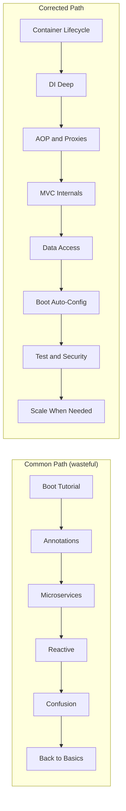

### 📶 Gradual Depth

**Mistake 1 - Starting with Boot, skipping Spring.**
Boot's `@SpringBootApplication` combines `@Configuration`,
`@EnableAutoConfiguration`, and `@ComponentScan`. If you do
not know what each does independently, you cannot debug when
auto-configuration makes the wrong choice. The fix: build one
application with explicit `@Configuration` and manual bean
registration before using Boot.

**Mistake 2 - Annotation cargo-culting.**
Developers apply `@Transactional`, `@Cacheable`, `@Async`
because a tutorial said to, without understanding the proxy
mechanism. Then they hit self-invocation bugs, wonder why
`@Async` does not make their method async when called
internally, and lose hours. The fix: before using any
annotation-driven feature, write the equivalent programmatic
code once. Use `TransactionTemplate` before `@Transactional`.
Use `CacheManager` directly before `@Cacheable`.

**Mistake 3 - Microservices before monolith mastery.**
Teams decompose into services before understanding module
boundaries. They end up with a distributed monolith: services
that must be deployed together, share databases, and call each
other synchronously for every operation. The fix: build a
well-structured monolith with clear package boundaries first.
Use Spring Modulith to enforce module isolation. Decompose
only when you can articulate which specific problem (team
autonomy, independent scaling, fault isolation) decomposition
solves.

**Mistake 4 - Reactive adoption without measuring.**
WebFlux and reactive streams add substantial complexity:
non-blocking mental model, reactive debugging difficulty,
limited blocking library compatibility. The payoff - handling
more concurrent connections per thread - only matters at
specific scale thresholds. The fix: measure your actual
concurrency needs. If your application handles fewer than a
few thousand concurrent connections, Spring MVC with virtual
threads (Spring 6+, Java 21+) is simpler and performs
comparably.

**Mistake 5 - Ignoring the container lifecycle.**
This is the root cause of mistakes 1-4. Every Spring
behavior maps to a lifecycle phase. If you know the phases,
you can predict behavior. If you do not, every annotation is
a black box. The fix: read `AbstractApplicationContext
.refresh()` source code once. Trace the twelve steps. This
single investment pays dividends for your entire Spring
career.

### ⚙️ How It Works

The corrected learning sequence and why each stage
unlocks the next:

```
+---------------------------------------------------+
| STAGE 1: Container (BeanDefinition, lifecycle)    |
|   Unlocks: understanding of ALL Spring behavior   |
|                                                   |
| STAGE 2: DI (constructor, qualifier, scope)       |
|   Unlocks: testability, loose coupling patterns   |
|                                                   |
| STAGE 3: AOP (proxy model, advisor chain)         |
|   Unlocks: @Transactional, @Cacheable, @Secured   |
|                                                   |
| STAGE 4: Web (DispatcherServlet, handler chain)   |
|   Unlocks: REST API design, error handling        |
|                                                   |
| STAGE 5: Data (JPA lifecycle, tx propagation)     |
|   Unlocks: correct persistence patterns           |
|                                                   |
| STAGE 6: Boot (auto-config, conditions, starters) |
|   Unlocks: rapid development WITH understanding   |
+---------------------------------------------------+
```

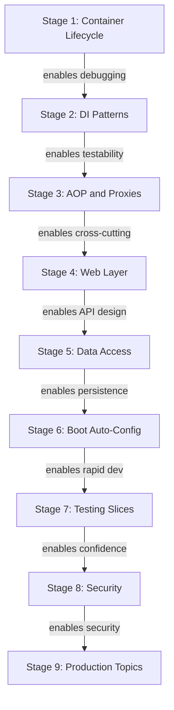

Each stage builds on the previous. Skipping stages does not
save time - it creates debt that compounds until you go back
and fill the gap.

**Why the common path fails:** Starting at Stage 6 (Boot)
means you use conventions without understanding them. When a
convention makes the wrong choice, you lack the vocabulary to
diagnose it. You search for the specific error, find a
workaround, and move on - accumulating workarounds instead
of understanding. After enough workarounds, the codebase
becomes fragile and the developer becomes dependent on search
engines rather than reasoning.

**Why the corrected path works:** Starting at Stage 1 means
every subsequent stage is easier. When Boot auto-configures a
`DataSource`, you already know what a `BeanDefinition` is,
how `@ConditionalOnMissingBean` works, and where in the
lifecycle auto-configuration runs. You can predict behavior,
override intentionally, and debug systematically.

### 🚨 Failure Modes

**Failure 1 - The "It Works in the Tutorial" Collapse:**

A developer follows Boot tutorials for six months, building
features confidently. Then they encounter a production
issue - a `LazyInitializationException` in a REST endpoint,
a transaction not rolling back on a checked exception, a
security filter not firing in the expected order. They cannot
diagnose it because their mental model is "I add annotations
and it works" rather than "I understand the mechanism."

**Diagnostic:** If your first instinct for any Spring problem
is to search for the exact error message rather than reason
about which lifecycle phase or proxy behavior might cause it,
you have skipped fundamentals.

**Fix:** Allocate one week to build a Spring application
without Boot. Register beans manually. Configure transactions
programmatically. Write a `BeanPostProcessor`. This
investment will accelerate every subsequent month.

**Failure 2 - The Distributed Monolith:**

A team adopts microservices because "that is how Netflix does
it." They split by technical layer (user-service,
order-service, payment-service) instead of business domain.
Services share a database. Every request triggers a chain of
synchronous HTTP calls. Deploying one service requires
deploying three others. They have all the complexity of
microservices with none of the benefits.

**Diagnostic:** If deploying one service requires coordinated
deployment of other services, you have a distributed monolith.
If services share a database schema, you have shared coupling
disguised as service boundaries.

**Fix:** Merge back into a modular monolith. Use Spring
Modulith to enforce module boundaries in-process. Extract
to separate services only when you can deploy, scale, and
fail independently.

### 🔬 Production Reality

The cost of learning path mistakes shows up in production
metrics:

**Incident resolution time.** Teams that understand container
lifecycle and proxy mechanics resolve Spring-related incidents
in minutes by reasoning from mechanism. Teams that learned
top-down from tutorials take hours because they must search
for each specific error.

**Architecture migration cost.** Teams that started with
microservices prematurely spend months consolidating back to
a monolith or restructuring service boundaries. Teams that
started with a modular monolith decompose incrementally with
clear data showing which module needs independent scaling.

**Upgrade velocity.** Teams that understand Spring internals
read the migration guide and plan upgrades systematically.
Teams that memorized annotation patterns struggle because
they cannot assess which internal changes affect their code.

**Testing investment return.** Teams that understand test
slices (`@WebMvcTest`, `@DataJpaTest`) have fast, focused
tests. Teams that defaulted to `@SpringBootTest` for
everything have slow test suites that test framework wiring
rather than business logic.

### ⚖️ Trade-offs & Alternatives

**BAD:**

```java
// Cargo-cult: @Transactional everywhere
// without understanding propagation
@Transactional
public void processOrder(Order order) {
    // Calls another @Transactional method
    // in the SAME class - proxy not involved
    this.updateInventory(order);
    this.chargePayment(order);
}

@Transactional(propagation = REQUIRES_NEW)
public void chargePayment(Order order) {
    // This propagation setting has NO EFFECT
    // because self-invocation bypasses proxy
}
```

**GOOD:**

```java
// Understands proxy boundary; separates
// concerns into distinct beans
public class OrderService {
    private final InventoryService inventory;
    private final PaymentService payments;

    @Transactional
    public void processOrder(Order order) {
        inventory.update(order);
        payments.charge(order);
        // Both calls go through proxies
        // Propagation settings work correctly
    }
}
```

| Approach            | Velocity | Resilience | Cost   |
| ------------------- | -------- | ---------- | ------ |
| Tutorial-first      | Fast     | Fragile    | High   |
| (feels productive)  | start    | under      | rework |
|                     |          | pressure   | later  |
| Fundamentals-first  | Slower   | Robust     | Lower  |
| (feels slow)        | start    | under      | total  |
|                     |          | pressure   | cost   |
| Microservices-first | Exciting | Brittle    | Very   |
| (feels modern)      | demo     | at scale   | high   |
| Monolith-first      | Boring   | Solid      | Low    |
| (feels outdated)    | demo     | foundation | total  |

### ⚡ Decision Snap

- Starting a new Spring project? Begin with a monolith
  using Spring Boot, but enforce module boundaries from
  day one with package-level isolation or Spring Modulith.
- Learning Spring? Follow the six-stage corrected path.
  Invest in container lifecycle and proxy understanding
  before touching Boot conveniences.
- Team onboarding? Do not hand new developers a Boot
  tutorial. Give them a guided exercise that requires
  manual bean configuration, then show how Boot automates
  what they just did by hand.
- Choosing between MVC and WebFlux? Default to MVC. Switch
  to WebFlux only when you have measured evidence that
  thread-per-request is your bottleneck, and only after
  evaluating virtual threads as a simpler alternative.
- Adopting microservices? Require a written justification
  that names the specific problem (team autonomy, independent
  scaling, fault isolation) and explains why a modular
  monolith cannot solve it.

### ⚠️ Top Traps

| Trap                             | Why it bites                                                                 | Escape                                                      |
| -------------------------------- | ---------------------------------------------------------------------------- | ----------------------------------------------------------- |
| Boot before Spring               | You cannot debug what you do not understand; auto-config hides the mechanism | Build one app with manual config first                      |
| Annotations as magic             | Self-invocation bugs, propagation surprises, silent failures                 | Learn the proxy model; use programmatic equivalents once    |
| Microservices as default         | Distributed monolith, operational overhead, debugging complexity             | Start monolith; extract only with data-driven justification |
| Reactive without measurement     | Complex code, unreadable stack traces, limited library compatibility         | Measure concurrency needs; try virtual threads first        |
| `@SpringBootTest` for everything | Slow tests, brittle assertions, testing framework not logic                  | Use test slices: `@WebMvcTest`, `@DataJpaTest`, `@JsonTest` |

### 🪜 Learning Ladder

**Prerequisites:**
SPR-112 Topic Mastery Synthesis - the unified mental model
that makes these lessons concrete rather than abstract.
SPR-102 Overengineered Microservice Anti-Pattern - the
specific anti-pattern that illustrates mistake 3.

**THIS:** SPR-113 What I Would Do Differently - Spring
Lessons - the corrected learning path that avoids the most
common time sinks.

**Next steps:**
SPR-114 Spring Ecosystem Concept Map - visualize the
entire Spring ecosystem and how concepts connect.

**The Surprising Truth:** The fastest way to learn Spring is
to slow down. Developers who spend two weeks understanding
the container lifecycle, proxy model, and bean definition
registry before writing a single Boot application outperform
developers who spent two months following Boot tutorials. The
fundamentals-first path feels slower because early output is
less impressive - manual bean wiring does not demo as well as
a Boot starter project. But within three months, the
fundamentals-first developer is debugging in minutes what
the tutorial-first developer spends hours searching for.
The investment compounds because Spring reuses the same five
patterns everywhere. Learn them once, recognize them forever.

**Further Reading:**

- "Expert One-on-One J2EE Design and Development" by Rod
  Johnson - the original problem statement that Spring solves
- Spring Framework Reference: Core Technologies chapter -
  read it end to end once, not as a reference
- Sam Newman, "Building Microservices" - Chapter 1 on when
  to decompose, not how
- Martin Fowler, "MonolithFirst" (martinfowler.com) - the
  case for starting simple
- Spring Modulith Reference Documentation - module
  boundaries without service boundaries

**Revision Card:**

1. The corrected learning sequence is: container lifecycle,
   DI, AOP/proxies, web, data, Boot, testing, security,
   then production topics.
2. Every annotation-driven feature relies on the proxy
   mechanism - learn it once, understand all annotations.
3. Start with a modular monolith; decompose to microservices
   only with measured justification for the added complexity.

---

---

# SPR-114 Spring Ecosystem Concept Map

**TL;DR** - Spring is six concept clusters with DI as the root node; master the dependency graph and you unlock every module without re-learning fundamentals.

### 🔥 Problem Statement

The Spring ecosystem contains over 30 modules, hundreds of
annotations, and thousands of pages of reference docs. Most
developers learn whichever slice their current project
demands - Spring MVC here, Spring Data there, Spring Security
when an audit forces it - and end up with fragmented mental
models full of gaps. They cannot predict which features
compose well, which modules share infrastructure, or which
learning investments unlock the most downstream capability.
Without a concept map, every new Spring module feels like
starting from scratch. With one, you see that learning
`@Transactional` deeply also teaches you `@Cacheable`,
`@Async`, `@Secured`, and every other proxy-driven annotation
because they share the same AOP mechanism. The question is
not "what should I learn next?" but "what is the dependency
graph of Spring concepts, and where am I on it?"

### 📜 Historical Context

Spring started as two ideas: dependency injection and AOP.
The 2003 framework had roughly 7 packages. By 2006 (Spring
2.0), Spring MVC, Spring JDBC, Spring ORM, and Spring AOP
were distinct modules but still lived in one JAR. Spring 3.0
(2009) modularized into separate artifacts: spring-core,
spring-beans, spring-context, spring-aop, spring-web, and
others. This physical separation mirrored the logical concept
clusters that had always existed.

Spring Boot (2014) obscured the module boundaries by bundling
starters. `spring-boot-starter-web` pulls in spring-web,
spring-webmvc, spring-boot-autoconfigure, embedded Tomcat,
and Jackson. Developers stopped thinking about which module
provides which capability. Spring Cloud (2015) added another
layer. Spring Security, Spring Data, Spring Batch, and
Spring Integration each have their own release trains.

The result: a powerful but sprawling ecosystem where the
relationships between concepts are invisible unless you
deliberately map them. This keyword provides that map.

### 🔩 First Principles

**CORE INVARIANTS:**

1. **Every Spring module depends on spring-core and
   spring-beans.** The `BeanFactory`, `BeanDefinition`, and
   `ApplicationContext` abstractions are the substrate. No
   module bypasses them. Learning the container lifecycle
   once gives you leverage across every module.
2. **Cross-cutting features share the AOP proxy mechanism.**
   Transactions, caching, async execution, security method
   annotations, retry logic - all route through
   `AbstractAutoProxyCreator`. One mechanism, many facades.
3. **Convention layers (Boot, Cloud) compose on top of core
   modules without replacing them.** Auto-configuration adds
   defaults; it does not change how DI, AOP, or lifecycle
   work. Stripping Boot away leaves the core intact.

**DERIVED DESIGN:**

From invariant 1: the concept map has a single root node
(IoC container), not multiple independent trees. Every
cluster connects back to the container.

From invariant 2: the AOP cluster is a gateway concept.
Mastering it unlocks transactions, caching, security method
annotations, and async execution simultaneously.

From invariant 3: Boot and Cloud are configuration layers,
not new paradigms. Map them as overlays on the core graph,
not as separate subgraphs.

### 🧠 Mental Model

> Think of the Spring ecosystem as a subway system. Six
> lines (clusters) radiate from one central station (DI/IoC).
> Transfer stations (gateway concepts) connect multiple lines.
> You never need to ride every line - but understanding the
> map lets you navigate anywhere efficiently.

- DI/IoC -> central station where all lines originate; every
  journey starts here
- AOP -> the express transfer station connecting transactions,
  caching, security, and async lines
- Boot auto-configuration -> the automated ticket system that
  picks the right train for your destination based on what
  is on the platform (classpath)
- Spring Data -> a line with many stops (JPA, MongoDB, Redis,
  R2DBC) but one ticket format (Repository interface)
- Spring Cloud -> the inter-city rail extension; same ticketing
  system, longer distances, more failure modes

**Where this analogy breaks down:** Subway lines are
independent paths. Spring clusters are deeply interconnected.
Spring Security depends on AOP (proxy-driven method
security), web (filter chain), and core (DI for security
bean wiring). The "lines" cross more than they parallel.

### 🧩 Components

Six concept clusters with their gateway concepts:

```
        +------[DI / IoC]------+
        |    (root cluster)    |
        |  BeanFactory, Scope  |
        +---+---+---+---+---+-+
            |   |   |   |   |
    +-------+   |   |   |   +-------+
    |       +---+   |   +---+       |
    v       v       v       v       v
 [AOP]   [Web]  [Data]  [Boot]  [Test]
  proxy   MVC    JPA     auto    mock
  advice  Flux   Repo    start   slice
  ptcut   Sec*   Tx*     cond
            |       |
            v       v
        [Cloud]  [Reactive]
        gateway   Flux/Mono
        config    R2DBC
        circuit   WebFlux
```

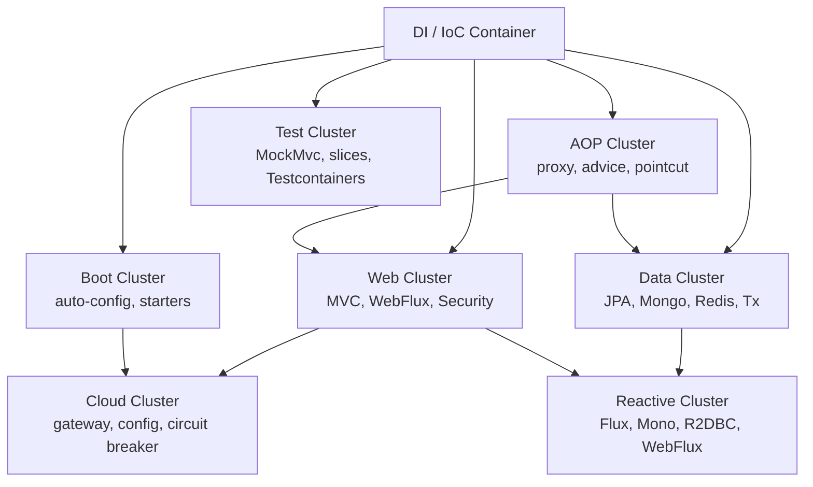

### 📶 Gradual Depth

**Level 1 - Single cluster.** Most developers start in the
Web cluster: `@RestController`, `@RequestMapping`, JSON
serialization. At this level, DI is implicit - you use
`@Autowired` without understanding `BeanFactory`.

**Level 2 - Two clusters with gateway.** Adding the Data
cluster (`@Repository`, `@Transactional`) forces you through
the AOP gateway. You discover that `@Transactional` is a
proxy-driven annotation and realize this mechanism powers
other cross-cutting concerns.

```java
// Gateway concept: AOP proxy mechanism
// Same infrastructure powers all of these:
@Transactional  // data cluster
@Cacheable       // data cluster
@Secured         // security (web cluster)
@Async           // core cluster
@Retryable       // retry (cloud cluster)
// One mechanism. Five use cases.
```

**Level 3 - Boot internals.** Understanding auto-configuration
(`@ConditionalOnClass`, `@ConditionalOnMissingBean`) reveals
why starters "just work" and how to override defaults. You
read `spring.factories` or `AutoConfiguration.imports` and
trace which beans each starter contributes.

**Level 4 - Cloud and reactive.** Adding Spring Cloud
introduces distributed systems concepts layered on the same
DI/AOP substrate. Reactive support (WebFlux, R2DBC) requires
rethinking the threading model but reuses the same container
lifecycle.

**Level 5 - Full map navigation.** You see that Spring
Integration, Spring Batch, Spring State Machine, and Spring
Modulith all compose from the same primitives: DI for wiring,
AOP for interception, lifecycle for ordering, events for
decoupling. New modules become configuration exercises, not
learning exercises.

### ⚙️ How It Works

The concept dependency graph determines learning order.
A concept is learnable only after its prerequisites are
solid. The critical path through the graph:

```
IoC/DI -> Bean Lifecycle -> AOP Proxies
  -> @Transactional (gateway to Data)
  -> @RestController (gateway to Web)
  -> Auto-config (gateway to Boot)
  -> Security Filter Chain (gateway to Sec)
  -> Cloud abstractions (gateway to Cloud)
```

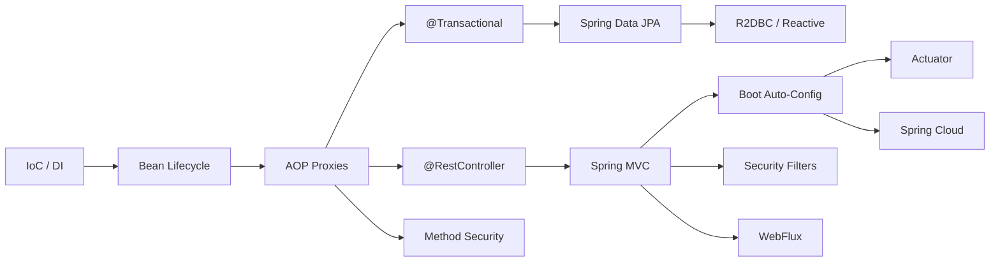

Gateway concepts are nodes where mastery unlocks multiple
downstream paths simultaneously:

- **AOP proxies** unlock: transactions, caching, async,
  security annotations, retry, circuit breakers
- **Boot auto-configuration** unlocks: starters, actuator,
  externalized config, testing slices
- **DispatcherServlet** unlocks: MVC, REST, exception
  handling, content negotiation, security filter chain
- **Repository abstraction** unlocks: JPA, MongoDB, Redis,
  Elasticsearch, R2DBC - all via the same interface pattern

### 🚨 Failure Modes

**Failure 1 - Learning Breadth-First Without Depth:**
Developers touch every cluster superficially. They use
`@Transactional` without understanding proxies, `@Secured`
without understanding filter chains, `@Cacheable` without
understanding eviction. When any annotation-driven feature
behaves unexpectedly, they lack the depth to diagnose it.

**Diagnostic:** Ask yourself: "Can I explain what happens
when Spring encounters this annotation at container startup?"
If the answer is vague, you skipped the gateway concept.

**Fix:** Go back to AOP proxies. Trace one proxy-driven
annotation end-to-end through `BeanPostProcessor` and
`AbstractAutoProxyCreator`. The investment pays dividends
across every cluster.

**Failure 2 - Treating Boot as the Foundation:**
Developers learn Boot conventions without understanding
the core container beneath them. When auto-configuration
does something unexpected - registers the wrong bean,
conflicts with an explicit configuration - they cannot
debug it because they do not know what Boot is automating.

**Diagnostic:** Can you build a working Spring application
without Boot? If not, you are dependent on conventions you
do not understand.

**Fix:** Read the auto-configuration source for one starter
you use daily (e.g., `DataSourceAutoConfiguration`). Trace
which beans it registers and under what conditions.

### 🔬 Production Reality

In production codebases, concept cluster boundaries manifest
as package and module boundaries. A well-structured Spring
application mirrors the concept map: a core domain layer
with no Spring annotations, a persistence layer using Spring
Data, a web layer using Spring MVC, and a configuration
layer using Boot auto-configuration.

The most common production architecture pattern uses four
clusters: Core (DI), Web (MVC + Security), Data (JPA +
Transactions), and Boot (auto-configuration + Actuator).
Cloud and Reactive clusters appear in perhaps 15-20% of
production Spring applications. The core four clusters cover
the vast majority of production use cases.

Teams that map their Spring knowledge explicitly - through
architecture decision records, onboarding guides, or
internal tech radars - consistently onboard new developers
faster. The concept map becomes a shared vocabulary: "this
feature lives in the Data cluster, gated by the AOP proxy
mechanism" is more useful than "look at the Spring Data JPA
docs."

### ⚖️ Trade-offs & Alternatives

**BAD:**

```java
// Learning by annotation accumulation
// No understanding of shared infrastructure
@Transactional  // "it handles transactions"
@Cacheable       // "it handles caching"
@Async           // "it makes things async"
// Cannot debug when any of these fail
```

**GOOD:**

```java
// Learning by mechanism: all three share
// AbstractAutoProxyCreator infrastructure
// Understanding proxy creation once lets
// you diagnose all three
@Transactional   // AOP proxy -> TxInterceptor
@Cacheable        // AOP proxy -> CacheInterceptor
@Async            // AOP proxy -> AsyncInterceptor
// Same proxy. Different advice. One mental model.
```

| Learning Strategy     | Speed    | Depth   | Transfer   | Risk              |
| --------------------- | -------- | ------- | ---------- | ----------------- |
| Breadth-first         | Fast     | Shallow | Low        | Fragile knowledge |
| Depth-first one path  | Slow     | Deep    | Medium     | Narrow expertise  |
| Gateway-concept-first | Moderate | Deep    | High       | Efficient mastery |
| Project-driven only   | Variable | Gaps    | Accidental | Cargo-cult usage  |

### ⚡ Decision Snap

- Start every Spring learning journey at IoC/DI container
  fundamentals, even if you "already know" `@Autowired`.
- Invest disproportionately in gateway concepts: AOP proxies,
  auto-configuration mechanics, DispatcherServlet pipeline.
- When encountering a new Spring module, ask: "Which cluster
  does this belong to, and which gateway concepts does it
  depend on?"
- Use the concept map to identify gaps: if you use Spring
  Security but cannot explain `FilterChainProxy`, backtrack
  to the Web cluster gateway.
- Do not learn Spring Cloud before mastering Boot internals.
  Cloud layers conventions on top of Boot conventions.

### ⚠️ Top Traps

| #   | Trap                                  | Why it hurts                                             | Escape                                           |
| --- | ------------------------------------- | -------------------------------------------------------- | ------------------------------------------------ |
| 1   | Skipping AOP proxy fundamentals       | Every annotation-driven feature becomes a black box      | Trace one proxy end-to-end through BPP chain     |
| 2   | Learning Boot before Core             | Cannot debug auto-config conflicts or override defaults  | Build one app without Boot, then add Boot        |
| 3   | Studying modules in isolation         | Misses shared infrastructure and transferable patterns   | Map each new module to a cluster and gateway     |
| 4   | Ignoring the lifecycle sequence       | Cannot diagnose startup failures or ordering issues      | Memorize the refresh() sequence                  |
| 5   | Jumping to Cloud without Boot mastery | Cloud adds distributed complexity atop convention layers | Master starters and actuator before cloud config |

### 🪜 Learning Ladder

**Prerequisites:**
SPR-112 Topic Mastery Synthesis,
SPR-113 What I Would Do Differently - Spring Lessons

**THIS:** SPR-114 Spring Ecosystem Concept Map

**Next steps:**
SPR-115 Framework Lock-In vs Leverage Decision Pattern

**The Surprising Truth:**
The entire Spring ecosystem - 30+ modules, hundreds of
annotations, thousands of configuration properties - rests
on roughly five core mechanisms: bean definition registration,
dependency resolution, proxy-based interception, lifecycle
callbacks, and condition evaluation. Every module is a
creative recombination of these five mechanisms applied to a
different problem domain. Once you see the mechanisms, new
modules stop being intimidating and start being predictable.
The concept map is not a study aid; it is the architecture
itself, made visible.

**Further Reading:**

- Spring Framework reference: spring.io/projects/spring-framework
  - the official module dependency diagram
- "Spring in Action" by Craig Walls (Manning) - comprehensive
  coverage of core through cloud clusters
- Spring Boot auto-configuration report: run with `--debug`
  flag to see every condition evaluation
- Spring source code: github.com/spring-projects/spring-framework
  - reading `AbstractAutoProxyCreator` teaches more about
    Spring's architecture than any tutorial

**Revision Card:**

1. Six clusters (Core, AOP, Web, Data, Boot, Cloud/Reactive)
   all rooted in the IoC container - there is one graph,
   not many independent trees.
2. Gateway concepts (AOP proxies, auto-config, DispatcherServlet,
   Repository abstraction) unlock multiple downstream modules
   simultaneously - invest disproportionately in these.
3. New Spring modules are recombinations of five core
   mechanisms (bean registration, DI, proxy interception,
   lifecycle, conditions) - learn mechanisms, not annotations.

---

---

# SPR-115 Framework Lock-In vs Leverage Decision Pattern

**TL;DR** - Framework lock-in is not a binary risk but a spectrum; use hexagonal architecture for core domain and embrace Spring coupling where the leverage exceeds portability value.

### 🔥 Problem Statement

Every team using Spring makes an implicit bet: the
productivity Spring provides today is worth the switching
cost Spring imposes tomorrow. But "lock-in" is invoked as
a vague fear without quantification. Architects demand
"framework-agnostic code" and introduce abstraction layers
that cost more to maintain than a framework migration would.
Meanwhile, teams that fully embrace Spring annotations in
their domain logic find that upgrading major versions or
exploring alternatives (Quarkus, Micronaut) requires
rewriting rather than reconfiguring. Neither extreme is
correct. The real question is: where in your codebase does
framework coupling cost more than framework leverage, and
where does it cost less? This keyword provides the decision
framework for drawing that boundary.

### 📜 Historical Context

Framework lock-in fear has deep roots. J2EE (1999-2006)
trapped organizations in vendor-specific application servers
(WebLogic, WebSphere) with proprietary APIs. Migration meant
rewriting. When Spring arrived, it explicitly positioned
itself as the portable alternative - POJOs over platform
APIs, DI over JNDI, JDBC templates over entity beans.
Ironically, Spring itself became the dominant framework,
and "Spring lock-in" replaced "J2EE lock-in" as the anxiety.

The microservices era (2014+) amplified portability concerns.
If each service could use a different framework, why commit
to one? Quarkus (2019, Red Hat) and Micronaut (2018, OCI)
emerged as JVM alternatives emphasizing build-time DI and
native compilation. Suddenly, Spring's runtime reflection
model was not the only option.

Hexagonal architecture (Alistair Cockburn, 2005) and Clean
Architecture (Robert C. Martin, 2012) provided structural
patterns for isolating domain logic from framework concerns.
Ports and adapters became the canonical answer to "how do I
minimize framework coupling?" But the pattern is often
applied dogmatically without weighing the cost of the
abstraction against the probability and cost of migration.

### 🔩 First Principles

**CORE INVARIANTS:**

1. **Lock-in cost = migration probability x migration scope
   x migration effort.** If you will never migrate (low
   probability), heavy coupling costs nothing. If migration
   is likely, coupling cost scales with scope.
2. **Abstraction is not free.** Every layer of indirection
   adds cognitive load, maintenance burden, and often
   performance overhead. The "clean" code is only clean if
   the abstraction earns its keep.
3. **Framework leverage is highest at the infrastructure
   boundary and lowest in the domain core.** Spring excels
   at wiring, web handling, data access, and cross-cutting
   concerns. It adds nothing to domain logic except coupling.

**DERIVED DESIGN:**

From invariant 1: quantify lock-in before abstracting. Ask:
"What is the probability we switch frameworks in the next
five years, and what would it cost?" If the answer is less
than the cumulative cost of maintaining abstractions, embrace
the coupling.

From invariant 2: measure abstraction cost. An interface
with one implementation that exists purely for "testability"
or "portability" is a maintenance tax with no current
payoff.

From invariant 3: draw a hard boundary between domain logic
(no Spring imports) and infrastructure code (full Spring
embrace). This is the hexagonal sweet spot.

### 🧠 Mental Model

> Think of framework coupling as renting versus owning
> furniture in an apartment. Your core living space (domain
> logic) should use furniture you own and can take anywhere.
> But the built-in kitchen appliances (infrastructure) came
> with the apartment and replacing them costs more than
> they are worth - use them fully, and only pack what you
> can carry when you move.

- Domain entities and value objects -> furniture you own
  (no Spring annotations, portable between any framework)
- Repository interfaces -> the wall sockets (standardized
  ports that let you plug in different adapters)
- Spring Data JPA implementation -> the built-in dishwasher
  (use it fully while you live here)
- `@Transactional` on service layer -> the apartment's
  electrical wiring (deeply embedded, expensive to replace,
  high leverage)
- Custom `@Qualifier` annotations -> custom wallpaper
  (adds coupling for aesthetic reasons; often not worth it)

**Where this analogy breaks down:** Apartments have standard
electrical systems. Frameworks do not. A Spring `@Service`
bean is not pluggable into Quarkus the way a lamp plugs
into any outlet. The "wall socket" abstraction requires
deliberate ports-and-adapters design.

### 🧩 Components

The coupling spectrum from most portable to most locked-in:

```
PORTABLE <========================> LOCKED-IN

Plain Java      Interfaces   Spring     Boot
domain objects  (ports)      @Component starters
no annotations  no impl      @Tx, @DI  auto-config

|-- Domain --|-- Ports --|-- Adapters --|
```

```mermaid
flowchart LR
    subgraph Domain["Domain Core (portable)"]
        E["Entities"]
        VO["Value Objects"]
        DS["Domain Services"]
    end

    subgraph Ports["Ports (interfaces)"]
        RP["Repository Port"]
        EP["Event Port"]
        NP["Notification Port"]
    end

    subgraph Adapters["Adapters (Spring-coupled)"]
        JPA["Spring Data JPA"]
        EVT["Spring Events"]
        MAIL["Spring Mail"]
    end

    subgraph Boot["Boot Layer (fully coupled)"]
        AC["Auto-Configuration"]
        ACT["Actuator"]
        ST["Starters"]
    end

    Domain --> Ports
    Ports --> Adapters
    Adapters --> Boot
```

### 📶 Gradual Depth

**Level 1 - Full coupling (typical).** Spring annotations
appear everywhere, including domain entities. Migration
means rewriting.

```java
// Domain entity coupled to Spring and JPA
@Entity
@Table(name = "orders")
public class Order {
    @Id @GeneratedValue
    private Long id;
    @Transient
    private transient ApplicationContext ctx;
}
```

**Level 2 - Partial separation.** Domain objects are plain
Java. Spring annotations live in the service and repository
layers.

```java
// Domain entity - no framework imports
public class Order {
    private final OrderId id;
    private final List<LineItem> items;
    private OrderStatus status;

    public Money calculateTotal() {
        return items.stream()
            .map(LineItem::subtotal)
            .reduce(Money.ZERO, Money::add);
    }
}
```

**Level 3 - Hexagonal architecture.** Explicit port
interfaces separate domain from infrastructure. Spring
provides the adapter implementations.

```java
// Port - domain defines the contract
public interface OrderRepository {
    Order findById(OrderId id);
    void save(Order order);
}

// Adapter - Spring implements the contract
@Repository
class JpaOrderRepository
        implements OrderRepository {
    private final JpaOrderCrudRepo jpa;
    // Maps between domain and JPA entities
}
```

**Level 4 - Module boundaries.** Spring Modulith enforces
that domain modules communicate through published APIs
only. Internal classes are package-private.

**Level 5 - Framework-replaceable.** The adapter layer is
thin enough that swapping Spring for Quarkus means
rewriting adapters (10-20% of code) while domain logic
(60-80%) remains untouched.

### ⚙️ How It Works

The decision process for each codebase layer:

```
For each class/package, ask:

1. Is this domain logic or infrastructure?
   |
   +-> Domain: NO Spring imports allowed
   |
   +-> Infrastructure: continue to Q2

2. Is framework switching realistic?
   |
   +-> No: embrace full Spring coupling
   |
   +-> Maybe: define port interface,
       implement as Spring adapter
```

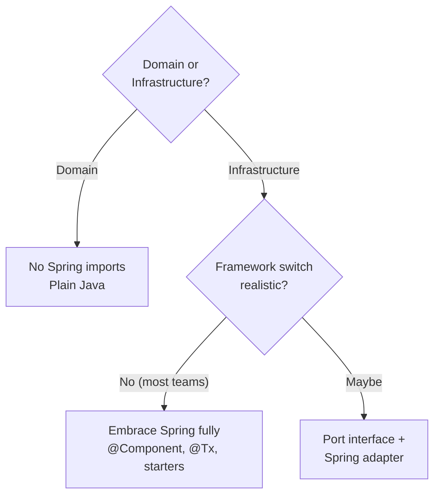

The practical split in a typical Spring Boot application:

- **Domain core (40-60% of code):** entities, value objects,
  domain services, domain events. Zero Spring imports. Pure
  Java. Testable with plain JUnit, no Spring context needed.
- **Port interfaces (5-10%):** `OrderRepository`,
  `PaymentGateway`, `NotificationSender`. Plain Java
  interfaces owned by the domain.
- **Spring adapters (20-30%):** `JpaOrderRepository`,
  `StripePaymentGateway`, `SmtpNotificationSender`.
  Fully Spring-annotated. These are disposable if you
  switch frameworks.
- **Boot configuration (10-15%):** auto-configuration,
  properties, profiles, actuator. The most framework-coupled
  layer and the cheapest to rewrite.

### 🚨 Failure Modes

**Failure 1 - Abstraction Astronaut:**
Team builds six abstraction layers to avoid "framework
lock-in" for a migration that never happens. Every feature
takes twice as long. New developers spend weeks navigating
indirection. The abstraction layers themselves become legacy.

**Diagnostic:** Count the number of interfaces that have
exactly one implementation and exist solely for "portability."
If that number exceeds 20% of your interfaces, you are
over-abstracting.

**Fix:** Delete abstractions that have not justified
themselves in two years. Apply the "three strikes" rule:
abstract when you have three concrete implementations, not
before.

**Failure 2 - Accidental Domain Coupling:**
Spring annotations creep into domain entities through
convenience. `@Entity` on a domain object seems harmless
until you need the domain model in a module that does not
use JPA. `@JsonProperty` couples your domain to a
serialization library.

**Diagnostic:** Run a dependency check: `grep -r "import
org.springframework" src/main/java/com/yourapp/domain/`.
Any result is domain coupling.

**Fix:** Introduce a mapping layer between domain objects
and persistence/API objects. The cost is a few mapper
classes. The benefit is domain purity.

### 🔬 Production Reality

In production, most Spring applications do not attempt
framework-agnostic design. The industry standard is full
Spring coupling everywhere except in organizations with
explicit architectural governance (typically large
enterprises or consultancies maintaining multiple frameworks).

Teams that have actually migrated from Spring to another
framework report that the hardest parts are not the
annotations. They are the implicit behaviors: Boot
auto-configuration assumptions, property binding conventions,
actuator integrations, and test infrastructure. The explicit
coupling (`@Service`, `@Repository`) is straightforward to
find and replace. The implicit coupling (classpath scanning
order, conditional bean registration, `@ConfigurationProperties`
binding rules) is what makes migration expensive.

Hexagonal architecture in Spring applications typically
adds 10-20% to initial development time but reduces the
scope of framework migration from "full rewrite" to
"adapter rewrite." Whether that trade-off is worthwhile
depends entirely on migration probability, which most teams
overestimate.

Spring's backward compatibility track record is strong.
Major version upgrades (4 to 5, 5 to 6) require effort
but are well-documented migration paths, not rewrites. For
most teams, the realistic "lock-in" risk is version
migration within Spring, not migration away from Spring.

### ⚖️ Trade-offs & Alternatives

**BAD:**

```java
// Over-abstraction: interface exists only
// for theoretical portability
public interface MessageSender {
    void send(Message m);
}
// One implementation. Will never change.
@Component
class SpringMessageSender
        implements MessageSender {
    @Autowired
    private JmsTemplate jms;
    public void send(Message m) {
        jms.convertAndSend("queue", m);
    }
}
```

**GOOD:**

```java
// Domain port: real abstraction boundary
public interface OrderRepository {
    Order findById(OrderId id);
    void save(Order order);
}
// Spring adapter: fully coupled, disposable
@Repository
class JpaOrderRepo implements OrderRepository {
    private final SpringDataOrderRepo repo;
    public Order findById(OrderId id) {
        return repo.findById(id.value())
            .map(JpaOrderMapper::toDomain)
            .orElseThrow();
    }
}
// Infrastructure: embrace Spring fully
@Configuration
class OrderConfig {
    @Bean OrderService orderService(
            OrderRepository repo) {
        return new OrderService(repo);
    }
}
```

| Approach                | Dev Speed | Portability | Maintenance | Right For               |
| ----------------------- | --------- | ----------- | ----------- | ----------------------- |
| Full Spring coupling    | Fast      | None        | Low         | Startups, small teams   |
| Hexagonal domain only   | Moderate  | Core domain | Moderate    | Most production apps    |
| Full ports-and-adapters | Slow      | High        | High        | Multi-framework orgs    |
| Framework-agnostic      | Slowest   | Maximum     | Highest     | Library/SDK development |

### ⚡ Decision Snap

- Keep domain core free of Spring imports. This is the
  minimum investment with the highest portability return.
- Embrace full Spring coupling in adapters, configuration,
  and web layers - portability here has near-zero value.
- Define port interfaces only at real architectural
  boundaries (persistence, external systems, messaging),
  not for every internal service.
- Measure lock-in by asking: "If we switched frameworks
  tomorrow, what percentage of code needs rewriting?" If
  the answer exceeds 60%, consider hexagonal architecture
  for the domain. If under 30%, your coupling is healthy.
- Do not abstract against Spring version migration. Use
  Spring's official migration guides instead.

### ⚠️ Top Traps

| #   | Trap                                  | Why it hurts                                              | Escape                                              |
| --- | ------------------------------------- | --------------------------------------------------------- | --------------------------------------------------- |
| 1   | Abstracting everything "just in case" | Doubles development time for a migration that never comes | Abstract only at real boundaries with real adapters |
| 2   | Spring annotations in domain entities | Couples core logic to framework; blocks reuse             | Map between domain and persistence/API objects      |
| 3   | Confusing DI with framework coupling  | DI is a pattern, not a Spring feature; fear of @Inject    | Use constructor injection; it works in any DI       |
| 4   | Ignoring implicit coupling            | Auto-config assumptions are harder to migrate than @Bean  | Document which Boot behaviors you depend on         |
| 5   | Treating lock-in as binary            | "We are locked in" stops analysis; lock-in is a spectrum  | Quantify: what % of code, what migration cost?      |

### 🪜 Learning Ladder

**Prerequisites:**
SPR-107 Conventional vs Boot vs Cloud Decision Pattern,
SPR-114 Spring Ecosystem Concept Map

**THIS:** SPR-115 Framework Lock-In vs Leverage Decision Pattern

**Next steps:**
Revisit SPR-090 through SPR-113 with the lock-in lens -
for each keyword, identify which code belongs in the
domain core (portable) versus the adapter layer (coupled).
Explore hexagonal architecture resources: Alistair
Cockburn's original paper, "Get Your Hands Dirty on Clean
Architecture" by Tom Hombergs.

**The Surprising Truth:**
The biggest lock-in risk in Spring is not the annotations
you can grep for. It is the behaviors you cannot see:
auto-configuration conditions that silently register beans,
property binding conventions that assume specific naming
patterns, and test slices that depend on Boot's classpath
scanning. Teams that fear `@Service` annotation lock-in
while ignoring auto-configuration dependency are protecting
the wrong boundary. The annotations are the cheapest part
of a framework migration. The invisible conventions are
the expensive part.

**Further Reading:**

- "Get Your Hands Dirty on Clean Architecture" by Tom
  Hombergs (Packt) - hexagonal architecture with Spring Boot
- Alistair Cockburn's hexagonal architecture paper:
  alistair.cockburn.us/hexagonal-architecture
- Spring Framework reference: spring.io/projects/spring-framework
  - module dependency structure
- "Clean Architecture" by Robert C. Martin (Prentice Hall)
  - dependency rule and boundary design

**Revision Card:**

1. Lock-in cost = migration probability x scope x effort -
   quantify before abstracting, do not fear vaguely.
2. Domain core (entities, value objects, domain services)
   must have zero Spring imports; adapters and config should
   embrace Spring fully - the boundary between them is the
   hexagonal sweet spot.
3. Implicit coupling (auto-config assumptions, property
   binding conventions) is harder and costlier to migrate
   than explicit coupling (@Service, @Repository) - protect
   the right boundary.
