## Keywords

1. [SPR-090 Microservice Architecture with Spring Boot](#spr-090-microservice-architecture-with-spring-boot)
2. [SPR-091 GraalVM Native Image with Spring Boot 3](#spr-091-graalvm-native-image-with-spring-boot-3)
3. [SPR-092 Spring AOT (Ahead-of-Time) Compilation](#spr-092-spring-aot-ahead-of-time-compilation)
4. [SPR-093 Virtual Threads (Loom) Integration in Spring 6](#spr-093-virtual-threads-loom-integration-in-spring-6)
5. [SPR-094 Spring Modulith and Module Boundaries](#spr-094-spring-modulith-and-module-boundaries)
6. [SPR-095 Event-Driven Architecture with Spring Events](#spr-095-event-driven-architecture-with-spring-events)
7. [SPR-096 Saga Pattern Implementation in Spring](#spr-096-saga-pattern-implementation-in-spring)
8. [SPR-097 API Gateway Design for Spring Microservices](#spr-097-api-gateway-design-for-spring-microservices)
9. [SPR-098 Multi-Tenancy Patterns in Spring Boot](#spr-098-multi-tenancy-patterns-in-spring-boot)
10. [SPR-099 Reactive Data Access (R2DBC)](#spr-099-reactive-data-access-r2dbc)
11. [SPR-100 Spring Security Advanced (Custom Filters and Method Security)](#spr-100-spring-security-advanced-custom-filters-and-method-security)
12. [SPR-101 Performance at Scale - Spring vs Quarkus vs Micronaut](#spr-101-performance-at-scale---spring-vs-quarkus-vs-micronaut)
13. [SPR-102 Overengineered Microservice Anti-Pattern](#spr-102-overengineered-microservice-anti-pattern)
14. [SPR-103 Premature Reactive Adoption Anti-Pattern](#spr-103-premature-reactive-adoption-anti-pattern)
15. [SPR-104 Spring Architecture Whiteboard Sessions](#spr-104-spring-architecture-whiteboard-sessions)
16. [SPR-105 REST API Phase 5 - Cloud-Native Deployment](#spr-105-rest-api-phase-5---cloud-native-deployment)
17. [SPR-106 Spring Ecosystem Evolution (2003 to Present)](#spr-106-spring-ecosystem-evolution-2003-to-present)
18. [SPR-107 Conventional vs Boot vs Cloud Decision Pattern](#spr-107-conventional-vs-boot-vs-cloud-decision-pattern)
19. [SPR-108 Monolith-First Strategy with Spring Modulith](#spr-108-monolith-first-strategy-with-spring-modulith)
20. [SPR-109 Spring Upgrade Strategy (LTS and Migration)](#spr-109-spring-upgrade-strategy-lts-and-migration)
21. [SPR-110 Spring as Career Leverage - Where It Fits in 2025+](#spr-110-spring-as-career-leverage---where-it-fits-in-2025)
22. [SPR-111 Full-Stack Spring Reference Architecture](#spr-111-full-stack-spring-reference-architecture)
23. [SPR-112 Topic Mastery Synthesis](#spr-112-topic-mastery-synthesis)
24. [SPR-113 What I Would Do Differently - Spring Lessons](#spr-113-what-i-would-do-differently---spring-lessons)
25. [SPR-114 Spring Ecosystem Concept Map](#spr-114-spring-ecosystem-concept-map)
26. [SPR-115 Framework Lock-In vs Leverage Decision Pattern](#spr-115-framework-lock-in-vs-leverage-decision-pattern)

---

# SPR-090 Microservice Architecture with Spring Boot

**TL;DR** - Decompose a monolith into independently deployable services only when team and domain boundaries demand it, using Spring Cloud for the hard distributed parts.

### 🔥 Problem Statement

A growing monolith becomes a coordination bottleneck.
Twelve teams editing the same deployable artifact means
every release requires cross-team regression, a shared
deploy calendar, and a single scaling profile for wildly
different load characteristics. One team's OOM crash
takes down every other team's feature. The question is
never "should we do microservices?" but "when does the
cost of distribution become cheaper than the cost of
coordination?"

### 📜 Historical Context

SOA (Service-Oriented Architecture) dominated the 2000s
with heavyweight ESBs, WSDL contracts, and XML messaging.
Netflix pioneered the lightweight microservice model
around 2011-2012, open-sourcing Eureka, Hystrix, Zuul,
and Ribbon. Spring Cloud (2015) wrapped those Netflix
OSS libraries into Spring Boot starters, making the
pattern accessible. By 2018, Kubernetes service discovery
began replacing client-side Eureka, and Spring Cloud
shifted to Kubernetes-native integrations. Spring Cloud
2023+ embraces Spring Boot 3, Micrometer Observation API,
and declarative HTTP clients, while Netflix itself moved
much of its service mesh concern to the infrastructure
layer.

### 🔩 First Principles

**CORE INVARIANTS:**

1. Each service owns exactly one bounded context and its
   data store - no shared databases across services.
2. Inter-service contracts are explicit and versioned -
   breaking a contract is a deployment-blocking event.
3. Every network call can fail, be slow, or return
   stale data - design for partial failure from day one.

**DERIVED DESIGN:**

From invariant 1: each service has its own schema
migration lifecycle, enabling independent deployment.
From invariant 2: consumer-driven contract tests
(Spring Cloud Contract) replace integration test suites.
From invariant 3: circuit breakers, retries with backoff,
timeouts, and fallbacks are not optional - they are
structural requirements of distributed communication.

### 🧠 Mental Model

> Think of a microservice architecture as a city of
> independent restaurants, each specializing in one
> cuisine, sourcing their own ingredients, and managing
> their own kitchen.

- Request routing -> city map directing diners to the
  right restaurant (API Gateway / Spring Cloud Gateway)
- Service discovery -> restaurant directory that updates
  when new places open or close (Eureka / Kubernetes DNS)
- Circuit breaker -> health inspector shutting down a
  restaurant temporarily to prevent food poisoning from
  spreading (Resilience4j)
- Config server -> city zoning regulations distributed
  to every restaurant simultaneously (Spring Cloud Config)

**Where this analogy breaks down:** Restaurants do not
typically need distributed transactions. When one
microservice's write depends on another's, you face the
saga/eventual-consistency problem that has no restaurant
equivalent.

### 🧩 Components

```
+------------------+   +------------------+
|   API Gateway    |-->| Service Registry |
| (Spring Cloud GW)|   | (Eureka/K8s DNS) |
+--------+---------+   +------------------+
         |
   +-----+------+--------+
   |            |         |
+--v---+  +----v--+  +---v----+
|Svc A |  |Svc B  |  |Svc C   |
|Order |  |Invent.|  |Payment |
+--+---+  +---+---+  +---+----+
   |          |           |
+--v---+  +--v----+  +---v----+
|DB A  |  |DB B   |  |DB C    |
+------+  +-------+  +--------+
```

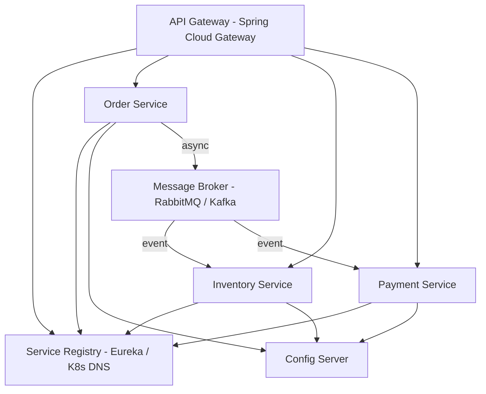
```mermaid
flowchart TD
    GW[API Gateway - Spring Cloud Gateway]
    REG[Service Registry - Eureka / K8s DNS]
    CFG[Config Server]
    A[Order Service]
    B[Inventory Service]
    C[Payment Service]
    MQ[Message Broker - RabbitMQ / Kafka]

    GW --> REG
    GW --> A
    GW --> B
    GW --> C
    A --> REG
    B --> REG
    C --> REG
    A --> CFG
    B --> CFG
    C --> CFG
    A -- async --> MQ
    MQ -- event --> B
    MQ -- event --> C
```

### 📶 Gradual Depth

**Level 1 - Single service extraction.** Start with the
domain that has the most independent release cadence.
Extract it behind a REST API, keep the monolith as the
primary consumer.

```java
// Order service - standalone Boot app
@SpringBootApplication
public class OrderServiceApp {
    public static void main(String[] args) {
        SpringApplication.run(
            OrderServiceApp.class, args
        );
    }
}
```

**Level 2 - Service discovery and load balancing.** Register
services with Eureka or Kubernetes DNS. Use Spring Cloud
LoadBalancer for client-side routing.

```yaml
# application.yml for Eureka client
eureka:
  client:
    serviceUrl:
      defaultZone: http://eureka:8761/eureka/
  instance:
    preferIpAddress: true
```

**Level 3 - Resilience patterns.** Add circuit breakers,
retries, and bulkheads with Resilience4j.

```java
@CircuitBreaker(
    name = "inventory",
    fallbackMethod = "fallbackStock"
)
public StockLevel getStock(String sku) {
    return inventoryClient.check(sku);
}

private StockLevel fallbackStock(
        String sku, Throwable t) {
    return StockLevel.unknown(sku);
}
```

**Level 4 - Event-driven communication.** Replace synchronous
chains with asynchronous messaging for operations that do
not need immediate consistency.

```java
// Publishing domain event via Spring Cloud Stream
@Bean
public Supplier<OrderCreatedEvent> orderEvents() {
    return () -> new OrderCreatedEvent(
        orderId, items, Instant.now()
    );
}
```

**Level 5 - Observability and tracing.** Micrometer
Observation API with Spring Boot 3 propagates trace IDs
across service boundaries automatically.

### ⚙️ How It Works

A request enters the system through the API Gateway. The
gateway resolves the target service via the registry, applies
rate limiting and authentication, then forwards the request.
The target service processes business logic, potentially
calling other services synchronously (REST/gRPC) or publishing
events asynchronously. Each service manages its own database,
and cross-service consistency uses the saga pattern or
eventual consistency through events.

```
Client -> Gateway -> [Auth Filter]
  -> Route to Service A
  -> Service A calls Service B (sync)
  -> Service A publishes event (async)
  -> Message Broker delivers to Service C
  -> Each service writes to own DB
  -> Gateway returns response to Client
```

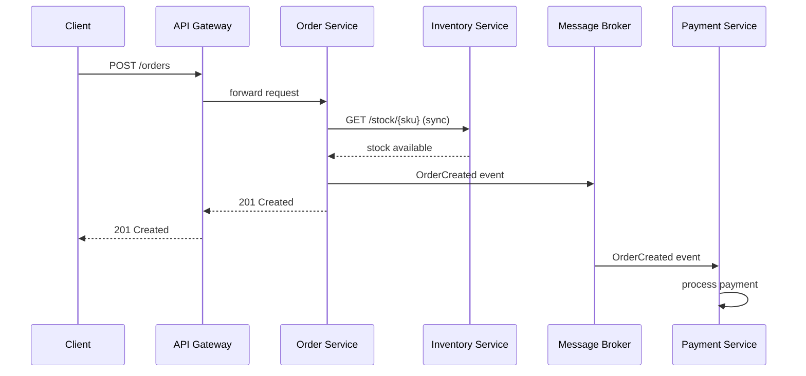
```mermaid
sequenceDiagram
    participant C as Client
    participant GW as API Gateway
    participant A as Order Service
    participant B as Inventory Service
    participant MQ as Message Broker
    participant P as Payment Service

    C->>GW: POST /orders
    GW->>A: forward request
    A->>B: GET /stock/{sku} (sync)
    B-->>A: stock available
    A->>MQ: OrderCreated event
    A-->>GW: 201 Created
    GW-->>C: 201 Created
    MQ->>P: OrderCreated event
    P->>P: process payment
```

### 🚨 Failure Modes

**Failure 1 - Distributed Monolith:**
Services share a database, deploy together, or have
synchronous call chains 5+ services deep. You pay the
full cost of distribution with none of the independence
benefits.

**Diagnostic:** Check if you can deploy any single service
without coordinating with other teams. If no, you have
a distributed monolith.

**Fix:** Enforce database-per-service. Replace synchronous
chains with async events where immediate consistency is
not required. Use consumer-driven contract tests to
decouple deployment schedules.

**Failure 2 - Cascading Timeout:**
Service A calls B, B calls C, C is slow. Without
timeouts and circuit breakers, the slowness propagates
backward, exhausting thread pools in A and B.

**Diagnostic:** Monitor p99 latency spikes that correlate
across multiple services simultaneously. Check thread
pool utilization in Micrometer metrics.

**Fix:** Set explicit timeouts on every outbound call.
Configure Resilience4j circuit breakers with sensible
thresholds (e.g., 50% failure rate over 10 calls in
a 60-second window). Use bulkheads to isolate thread
pools per downstream dependency.

**Failure 3 - Configuration Drift:**
Services running different config versions after a
partial Config Server rollout.

**Diagnostic:** Compare `/actuator/env` across instances.
Look for inconsistent feature flag states.

**Fix:** Use Spring Cloud Bus to broadcast config refresh
events. Pin config versions with Git labels in Spring
Cloud Config Server.

### 🔬 Production Reality

In production, the number one cause of microservice failure
is not technical - it is organizational. Conway's Law
dictates that your service boundaries will mirror your team
boundaries. If two services are owned by the same team,
they will drift toward tight coupling.

Real-world service counts vary enormously. A 50-person
engineering org typically operates 10-30 services
effectively. Beyond that, the coordination cost of service
mesh configuration, shared library versioning, and
distributed tracing setup becomes a full-time platform
team concern.

Spring Cloud Gateway replaced Zuul as the recommended
gateway in Spring Cloud 2020+. Resilience4j replaced
Hystrix (which entered maintenance mode in 2018). Spring
Cloud Config with Git backend remains the most common
externalized configuration approach, though Kubernetes
ConfigMaps and HashiCorp Vault are increasingly used for
secrets.

Database-per-service is the hardest rule to enforce.
Teams frequently "temporarily" share a database and never
migrate away. The cost compounds: schema changes require
multi-team coordination, defeating the purpose of service
independence.

### ⚖️ Trade-offs & Alternatives

**BAD:**

```java
// Shared database across services
// Order service directly queries inventory table
@Query("SELECT stock FROM inventory WHERE sku=?1")
int getInventoryStock(String sku);
```

**GOOD:**

```java
// Service calls inventory via API contract
@FeignClient(name = "inventory-service")
public interface InventoryClient {
    @GetMapping("/api/stock/{sku}")
    StockLevel getStock(@PathVariable String sku);
}
```

| Aspect              | Monolith    | Microservices             | Spring Modulith    |
| ------------------- | ----------- | ------------------------- | ------------------ |
| Deploy independence | None        | Full                      | Partial            |
| Data consistency    | ACID        | Eventual                  | ACID within module |
| Operational cost    | Low         | High                      | Low                |
| Team autonomy       | Low         | High                      | Medium             |
| Debugging           | Simple      | Complex                   | Simple             |
| Right for           | Small teams | Large orgs, diverse scale | Growing monolith   |

### ⚡ Decision Snap

- Use microservices when you have 3+ teams needing
  independent release cycles for different domains.
- Stay monolith (or use Spring Modulith) when a single
  team owns the entire codebase.
- Prefer async messaging over synchronous call chains for
  operations tolerating eventual consistency.
- Start with Spring Cloud Gateway + Eureka for Spring-native
  discovery; switch to Kubernetes DNS when deploying to K8s.
- Never extract a microservice without first identifying
  the bounded context boundary in domain terms.

### ⚠️ Top Traps

| #   | Trap                                                    | Why it hurts                                                                 | Escape                                                      |
| --- | ------------------------------------------------------- | ---------------------------------------------------------------------------- | ----------------------------------------------------------- |
| 1   | Extracting services before identifying bounded contexts | Creates arbitrary service boundaries that require cross-service transactions | Map domain contexts with Event Storming before writing code |
| 2   | Synchronous call chains exceeding 3 hops                | Latency multiplies, availability drops exponentially                         | Replace middle hops with async events                       |
| 3   | Shared database between services                        | Couples deployment and schema evolution                                      | Database-per-service from day one                           |
| 4   | No circuit breakers on outbound calls                   | One slow service crashes the entire mesh                                     | Resilience4j on every inter-service call                    |
| 5   | Skipping contract tests                                 | Integration tests become slow and flaky at scale                             | Spring Cloud Contract for consumer-driven testing           |

### 🪜 Learning Ladder

**Prerequisites:**
SPR-078 Spring Boot Auto-Configuration Deep Dive,
SPR-079 Spring Boot Actuator and Observability,
SPR-081 REST API Design and Exception Handling

**THIS:** SPR-090 Microservice Architecture with Spring Boot

**Next steps:**
SPR-094 Spring Modulith and Module Boundaries

**The Surprising Truth:**
Most organizations that adopt microservices would have
been better served by a well-structured modular monolith.
The teams that succeed with microservices almost always
started with a monolith, understood their domain boundaries
through production experience, and only then extracted
services along those proven fault lines. Starting with
microservices on a greenfield project is one of the most
expensive architectural mistakes in modern software.

**Further Reading:**

- "Building Microservices" by Sam Newman (O'Reilly) -
  the definitive practitioner's guide
- Spring Cloud official documentation:
  spring.io/projects/spring-cloud
- "Monolith First" by Martin Fowler (martinfowler.com)
- Netflix Tech Blog: medium.com/netflix-techblog -
  original microservice migration stories
- Chris Richardson's microservices.io - patterns catalog

**Revision Card:**

1. Three core invariants of microservices: own your data,
   version your contracts, design for partial failure.
2. Distributed monolith is the #1 anti-pattern - test by
   asking "can I deploy this service independently?"
3. Start monolith-first, extract along proven bounded
   context lines, prefer async over sync chains.

---

---

# SPR-091 GraalVM Native Image with Spring Boot 3

**TL;DR** - Compile Spring Boot apps to native binaries for sub-100ms startup and reduced memory, trading build time and runtime reflection flexibility for instant readiness.

### 🔥 Problem Statement

A standard Spring Boot application on JVM starts in 2-8
seconds and consumes 200-500MB of heap for a typical REST
service. In serverless, edge computing, and high-density
container environments, this startup cost is unacceptable.
AWS Lambda cold starts with Spring Boot on JVM can exceed
10 seconds. Kubernetes horizontal pod autoscaling cannot
react to traffic spikes when new pods take seconds to
become ready. You need JVM-class framework productivity
with native-binary startup and memory characteristics.

### 📜 Historical Context

GraalVM emerged from Oracle Labs around 2018 as a polyglot
VM with a native-image tool that performs ahead-of-time
(AOT) compilation of JVM bytecode into standalone
executables. Early Spring Boot native support required
Spring Native (an experimental project) with extensive
manual reflection configuration. Spring Framework 6 and
Spring Boot 3 (November 2022) integrated AOT processing
directly into the core framework, making native
compilation a first-class citizen rather than a bolt-on.
The spring-boot-maven-plugin gained a native profile, and
Spring's dependency injection was redesigned to support
build-time bean resolution. By 2024, most Spring Boot
starters ship with GraalVM reachability metadata, and the
GraalVM Reachability Metadata Repository covers hundreds
of third-party libraries.

### 🔩 First Principles

**CORE INVARIANTS:**

1. Native image performs a closed-world analysis at build
   time - every reachable class, method, and field must
   be known during compilation, not discovered at runtime.
2. Reflection, dynamic proxies, and resource loading
   require explicit registration via metadata or hints -
   there is no runtime class discovery in native binaries.
3. Build-time initialization runs static initializers
   during compilation - any state captured at build time
   is baked into the binary's heap snapshot.

**DERIVED DESIGN:**

From invariant 1: Spring's AOT engine pre-computes bean
definitions, generating Java source code that replaces
runtime classpath scanning and condition evaluation.
From invariant 2: Spring provides `RuntimeHints` API and
`@RegisterReflectionForBinding` to declare reflection
needs programmatically.
From invariant 3: libraries that cache random seeds,
timestamps, or file handles during static initialization
produce incorrect behavior in native images - the values
are frozen at build time.

### 🧠 Mental Model

> Think of native image compilation as printing a
> photograph versus having a live camera feed. The JVM
> is the camera - flexible, can zoom and adjust in
> real time. The native image is the printed photo -
> instant to view, lightweight to carry, but you cannot
> change the framing after printing.

- AOT processing -> composing the photograph (deciding
  what to include in the frame at build time)
- Reflection hints -> telling the printer which details
  matter (explicitly listing dynamic elements)
- Build-time initialization -> choosing the exposure
  settings before printing (values frozen into binary)
- Fallback image -> keeping the camera as backup when
  the printed photo is insufficient

**Where this analogy breaks down:** Unlike a photograph,
a native image can still perform computation and respond
to runtime input. The limitation is structural discovery,
not behavioral flexibility.

### 🧩 Components

```
+------------------+    +-----------------+
| Spring Boot App  |--->| AOT Processing  |
| (Source + Config)|    | (Bean Defs, Hints|
+------------------+    +-------+---------+
                                |
                        +-------v---------+
                        | Generated Source |
                        | (Java + JSON)   |
                        +-------+---------+
                                |
                        +-------v---------+
                        | GraalVM native- |
                        | image compiler  |
                        +-------+---------+
                                |
                        +-------v---------+
                        | Native Binary   |
                        | (standalone ELF/|
                        |  Mach-O/PE)     |
                        +-----------------+
```

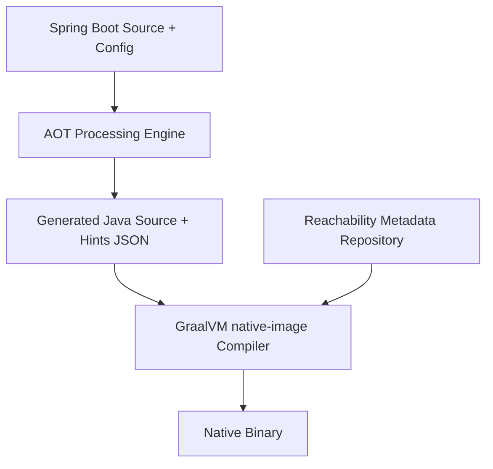
```mermaid
flowchart TD
    SRC[Spring Boot Source + Config]
    AOT[AOT Processing Engine]
    GEN[Generated Java Source + Hints JSON]
    NI[GraalVM native-image Compiler]
    BIN[Native Binary]
    META[Reachability Metadata Repository]

    SRC --> AOT
    AOT --> GEN
    GEN --> NI
    META --> NI
    NI --> BIN
```

### 📶 Gradual Depth

**Level 1 - Building a native image.** Add the native
profile to your Spring Boot Maven build and compile.

```xml
<plugin>
  <groupId>
    org.graalvm.buildtools
  </groupId>
  <artifactId>
    native-maven-plugin
  </artifactId>
</plugin>
```

```bash
./mvnw -Pnative native:compile
```

**Level 2 - Understanding AOT-generated code.** After
running `./mvnw process-aot`, inspect the generated source
in `target/spring-aot/main/sources/`. You will find
classes like `OrderServiceApp__BeanDefinitions.java`
that replace runtime reflection with direct constructor
calls.

```java
// Generated AOT bean definition (simplified)
public class OrderConfig__BeanDefinitions {
  public static BeanDefinition getOrderSvcDef() {
    RootBeanDefinition def =
        new RootBeanDefinition(OrderService.class);
    def.setInstanceSupplier(
        OrderService::new
    );
    return def;
  }
}
```

**Level 3 - Registering reflection hints.** When a library
uses reflection that GraalVM cannot detect, register hints
explicitly.

```java
@Configuration
@ImportRuntimeHints(MyHints.class)
public class NativeConfig {}

public class MyHints
    implements RuntimeHintsRegistrar {
  @Override
  public void registerHints(
      RuntimeHints hints,
      ClassLoader cl) {
    hints.reflection().registerType(
        MyDto.class,
        MemberCategory.INVOKE_PUBLIC_CONSTRUCTORS,
        MemberCategory.DECLARED_FIELDS
    );
  }
}
```

**Level 4 - Build-time initialization control.** Some
classes must initialize at build time (constants, enum
values), while others must defer to runtime (random
number generators, socket connections).

```
# native-image.properties
Args = --initialize-at-build-time=\
  com.myapp.constants \
  --initialize-at-run-time=\
  com.myapp.crypto.RandomSeedProvider
```

**Level 5 - Testing native images.** Run the full test
suite against the native binary using the native test
profile.

```bash
./mvnw -PnativeTest test
```

### ⚙️ How It Works

The Spring AOT engine runs during the Maven `process-aot`
phase. It boots the application context at build time,
evaluates all `@Conditional` annotations, resolves bean
definitions, and generates Java source files that
create beans without reflection. It also generates
`reflect-config.json`, `resource-config.json`, and
`proxy-config.json` files that inform GraalVM which
dynamic features are needed.

GraalVM's native-image tool then performs points-to
analysis: starting from `main()`, it traces every
reachable method, compiles them to machine code, and
discards everything unreachable. The result is a
standalone binary with no JVM dependency.

```
mvn process-aot:
  Boot app context (build time)
  -> Evaluate @Conditional
  -> Generate BeanDefinition source
  -> Generate reflection/resource hints
  -> Write to target/spring-aot/

mvn native:compile:
  native-image reads generated code
  -> Points-to analysis (reachability)
  -> Compile reachable methods to machine
  -> Initialize build-time classes
  -> Snapshot heap into binary
  -> Output: standalone native executable
```

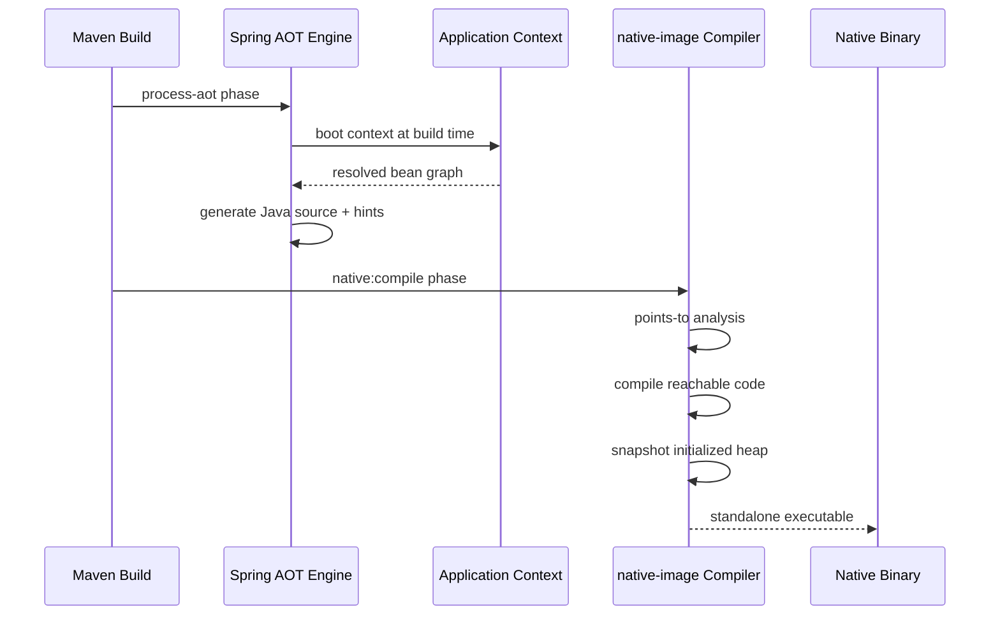
```mermaid
sequenceDiagram
    participant M as Maven Build
    participant AOT as Spring AOT Engine
    participant CTX as Application Context
    participant NI as native-image Compiler
    participant BIN as Native Binary

    M->>AOT: process-aot phase
    AOT->>CTX: boot context at build time
    CTX-->>AOT: resolved bean graph
    AOT->>AOT: generate Java source + hints
    M->>NI: native:compile phase
    NI->>NI: points-to analysis
    NI->>NI: compile reachable code
    NI->>NI: snapshot initialized heap
    NI-->>BIN: standalone executable
```

### 🚨 Failure Modes

**Failure 1 - Missing Reflection Metadata:**
Application starts as native image but throws
`ClassNotFoundException` or `NoSuchMethodException` when
a code path invokes reflection that was not registered.

**Diagnostic:** Run with `-H:+ReportUnsupportedElementsAtRuntime`
during compilation. Check the missing class/method against
`reflect-config.json`. Run the JVM agent to collect metadata:
`-agentlib:native-image-agent=config-output-dir=META-INF/native-image`.

**Fix:** Add `RuntimeHintsRegistrar` for the missing type
or use `@RegisterReflectionForBinding`. For third-party
libraries, check the GraalVM Reachability Metadata
Repository for existing configuration.

**Failure 2 - Build-Time Initialization Capturing Runtime State:**
Native image starts but uses stale values for timestamps,
random seeds, or hostname-derived configuration because
static initializers ran during compilation.

**Diagnostic:** Inspect classes with static fields holding
`Instant.now()`, `Random()`, or `InetAddress.getLocalHost()`.
These values are frozen at build time.

**Fix:** Use `--initialize-at-run-time` for classes that
must capture runtime state. Refactor static field
initialization to lazy patterns.

**Failure 3 - Excessive Build Time and Memory:**
Native image compilation consumes 8-16GB RAM and takes
5-15 minutes for a medium Spring Boot application.

**Diagnostic:** Monitor build machine memory with
`-H:+PrintAnalysisStatistics`. Check if unnecessary
classes are being pulled into reachability scope.

**Fix:** Use `-H:+ReportAnalysisForbiddenType` to identify
unexpected types in the reachability graph. Minimize
classpath size. Use multi-stage Docker builds to separate
the resource-intensive compilation from the lightweight
runtime image.

### 🔬 Production Reality

Typical production numbers for a Spring Boot REST service
(varies significantly by application complexity):

- JVM startup: typically 2-6 seconds; native: typically
  under 100ms (improvements of 20-60x are commonly
  reported in Spring team benchmarks)
- JVM RSS memory: typically 200-400MB; native: typically
  50-100MB for comparable workloads
- Native build time: typically 3-10 minutes depending on
  application size and build machine resources
- Native binary size: typically 60-120MB

These numbers vary based on application complexity,
dependency count, and hardware.

Not everything works in native images. JPA lazy loading
relies on runtime proxy generation - Hibernate 6.x
added explicit native support, but some edge cases
remain. Spring Cloud Function and Spring Cloud Gateway
have good native support. Spring Batch native support
is improving but may require additional hints.

The tracing agent (`-agentlib:native-image-agent`) is
essential during development. Run your full test suite
with the agent enabled to capture reflection, proxy,
and resource access patterns automatically.

Multi-stage Docker builds are standard practice:

```dockerfile
FROM ghcr.io/graalvm/native-image:17 AS build
COPY . /app
WORKDIR /app
RUN ./mvnw -Pnative native:compile

FROM debian:bookworm-slim
COPY --from=build /app/target/myapp /myapp
EXPOSE 8080
ENTRYPOINT ["/myapp"]
```

### ⚖️ Trade-offs & Alternatives

**BAD:**

```java
// Runtime reflection - invisible to native-image
Class<?> clz = Class.forName(
    props.getProperty("handler.class")
);
Object handler = clz.getDeclaredConstructor()
    .newInstance();
```

**GOOD:**

```java
// AOT-friendly: explicit hint registration
@RegisterReflectionForBinding(
    MyHandler.class
)
@Configuration
public class HandlerConfig {
    @Bean
    public MyHandler handler() {
        return new MyHandler();
    }
}
```

| Aspect             | JVM (JIT)               | Native Image                  | CRaC (Checkpoint)              |
| ------------------ | ----------------------- | ----------------------------- | ------------------------------ |
| Startup time       | 2-8s                    | Under 100ms                   | Under 1s                       |
| Peak throughput    | Highest (JIT optimized) | Lower (no profile-guided JIT) | Highest                        |
| Memory footprint   | High                    | Low                           | High                           |
| Build complexity   | Low                     | High                          | Medium                         |
| Reflection support | Full                    | Requires hints                | Full                           |
| Debugging          | Full JDWP               | Limited                       | Full JDWP                      |
| Best for           | Long-running services   | Serverless, CLI, edge         | Long-running with fast restart |

### ⚡ Decision Snap

- Use native image for serverless functions, CLI tools,
  and high-density container deployments where startup
  and memory matter more than peak throughput.
- Stay on JVM for long-running services where JIT
  optimization and full debugging are valuable.
- Consider CRaC (Coordinated Restore at Checkpoint) as
  an alternative that preserves JIT performance with fast
  restart capability.
- Always run the tracing agent against your full test
  suite before attempting native compilation.
- Budget 2-4x more CI build time and memory for native
  image compilation.

### ⚠️ Top Traps

| #   | Trap                                          | Why it hurts                                                       | Escape                                                               |
| --- | --------------------------------------------- | ------------------------------------------------------------------ | -------------------------------------------------------------------- |
| 1   | Assuming all Spring starters work in native   | Some starters lack reachability metadata, causing runtime failures | Check spring.io/projects native compatibility matrix before adopting |
| 2   | Skipping the tracing agent during development | Manual reflection config is error-prone and incomplete             | Run full test suite with `-agentlib:native-image-agent`              |
| 3   | Static initializers capturing runtime values  | Timestamps, random seeds, hostnames frozen at build time           | Use `--initialize-at-run-time` for stateful classes                  |
| 4   | Expecting JVM-equivalent peak throughput      | Native images lack JIT profile-guided optimization                 | Benchmark under realistic load; accept the throughput trade-off      |
| 5   | Ignoring native build resource requirements   | Builds fail with OOM on CI machines with under 8GB RAM             | Allocate 8-16GB RAM for native builds; use multi-stage Docker        |

### 🪜 Learning Ladder

**Prerequisites:**
SPR-092 Spring AOT (Ahead-of-Time) Compilation,
SPR-075 Spring Boot Starter and Dependency Management

**THIS:** SPR-091 GraalVM Native Image with Spring Boot 3

**Next steps:**
SPR-101 Performance at Scale - Spring vs Quarkus vs Micronaut

**The Surprising Truth:**
The biggest obstacle to native image adoption is not
technical limitation - it is build feedback loop speed.
Developers accustomed to 2-second JVM restarts find
5-minute native compilations intolerable during
development. The practical pattern that works: develop
and test entirely on JVM (where Spring AOT can still
validate your hints), compile to native only in CI, and
deploy native images to production. The developers who
try to compile native images on every code change
abandon the approach within a week.

**Further Reading:**

- Spring Boot GraalVM Native Image documentation:
  docs.spring.io/spring-boot/reference/native-image/
- GraalVM Native Image reference manual:
  graalvm.org/latest/reference-manual/native-image/
- Spring AOT documentation:
  docs.spring.io/spring-framework/reference/core/aot.html
- GraalVM Reachability Metadata Repository:
  github.com/oracle/graalvm-reachability-metadata

**Revision Card:**

1. Native image requires closed-world analysis - every
   reachable type must be known at build time via AOT
   processing and reflection hints.
2. Develop on JVM, compile native in CI - the build
   feedback loop is too slow for iterative development.
3. Three critical configs: reflection hints for dynamic
   access, build-time vs run-time initialization control,
   and tracing agent output for automatic metadata
   collection.

---

---

# SPR-092 Spring AOT (Ahead-of-Time) Compilation

**TL;DR** - Spring AOT shifts bean wiring, proxy generation, and reflection analysis from runtime to build time, enabling instant startup and native image compatibility.

### 🔥 Problem Statement

Spring's power comes from runtime dynamism: classpath
scanning, conditional evaluation, CGLIB proxy generation,
and reflective bean wiring. That dynamism has a cost -
a moderately complex Spring Boot app spends 2-8 seconds
at startup just discovering, instantiating, and wiring
beans. In a serverless or scale-to-zero environment,
that startup penalty is billed per invocation. Worse,
GraalVM native image compilation requires a closed-world
assumption: every class, method, and field accessed via
reflection must be declared at build time. Spring's
runtime model is fundamentally incompatible with that
assumption unless something translates dynamic behavior
into static metadata before the native compiler runs.
That "something" is the AOT engine.

### 📜 Historical Context

Spring Native (experimental, 2020-2022) was the first
attempt at GraalVM support. It relied on manually
maintained reflection hints and GraalVM's tracing agent,
producing brittle configurations that broke across
Spring version upgrades. Spring Framework 6.0 (Nov 2022)
introduced a first-class AOT engine integrated into the
core framework itself, not as an external add-on. The
AOT processing pipeline runs during `mvn spring-boot:
process-aot` (or the Gradle equivalent), analyzing the
actual ApplicationContext, generating Java source code
for bean definitions, and emitting reflection/resource/
proxy hint files. Spring Boot 3.0+ leverages this engine
to produce native images without manual hint maintenance.
The design drew inspiration from Micronaut's compile-time
DI and Quarkus's build-time augmentation, but preserved
Spring's programming model rather than requiring new
annotations.

### 🔩 First Principles

**CORE INVARIANTS:**

1. The bean definition graph at build time must be
   identical to the graph at runtime - any condition
   that cannot be evaluated at build time breaks AOT.
2. Every reflective access, dynamic proxy, resource
   load, and serialization target must be declared via
   RuntimeHints or discovered by AOT processors.
3. AOT-generated code replaces, not supplements, the
   runtime bean factory initialization - the container
   skips classpath scanning entirely when AOT artifacts
   are present.

**DERIVED DESIGN:**

From invariant 1: `@Profile`, `@ConditionalOnProperty`,
and environment-dependent conditions are frozen at build
time. Changing a property at runtime will NOT toggle a
conditional that was resolved during AOT processing.
From invariant 2: libraries that use reflection without
registering hints break silently - no exception at build
time, `MissingReflectionMetadataException` at runtime.
From invariant 3: startup becomes a straight-line
execution of pre-computed factory methods with zero
classpath scanning overhead.

### 🧠 Mental Model

> Think of AOT as a dress rehearsal that records every
> blocking decision, prop placement, and actor position,
> then prints a deterministic script so opening night
> runs without improvisation.

- Bean discovery -> casting call during rehearsal, locked
  before the show
- Proxy generation -> pre-built costume pieces instead of
  sewing on stage
- Reflection hints -> inventory list so stagehands know
  exactly what props exist backstage
- RuntimeHints API -> the clipboard the stage manager
  uses to note additional props discovered during
  rehearsal

**Where this analogy breaks down:** A real dress
rehearsal can still adapt on opening night. AOT cannot -
once the script is printed, the show must follow it
exactly or it breaks.

### 🧩 Components

```
+-------------------+
| Source Code + Deps |
+---------+---------+
          |
  mvn process-aot / gradle aot
          |
+---------v-----------+
| AOT Engine          |
| BeanFactoryInit     |
|   AotProcessor      |
| BeanRegistration    |
|   AotProcessor      |
| RuntimeHintsReg.    |
+---------+-----------+
          |
  +-------+-------+
  |       |       |
  v       v       v
GenSrc  Hints   Proxies
(.java) (.json) (.java)
  |       |       |
  +---+---+-------+
      |
+-----v-----------+
| native-image /  |
| JVM classpath   |
+------------------+
```

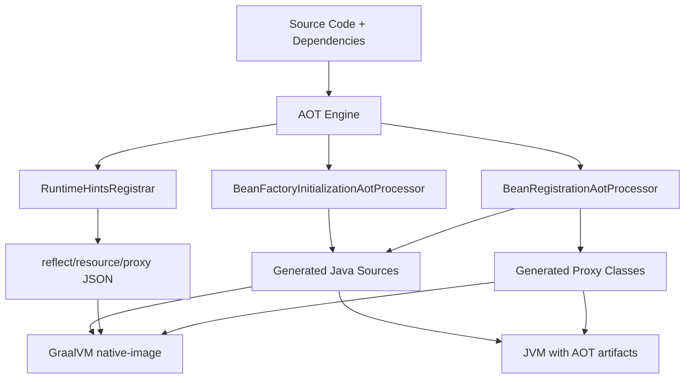
```mermaid
flowchart TD
    SRC[Source Code + Dependencies]
    AOT[AOT Engine]
    BFP[BeanFactoryInitializationAotProcessor]
    BRP[BeanRegistrationAotProcessor]
    RH[RuntimeHintsRegistrar]
    GEN[Generated Java Sources]
    HINTS[reflect/resource/proxy JSON]
    PROXY[Generated Proxy Classes]
    NI[GraalVM native-image]
    JVM[JVM with AOT artifacts]

    SRC --> AOT
    AOT --> BFP
    AOT --> BRP
    AOT --> RH
    BFP --> GEN
    BRP --> GEN
    BRP --> PROXY
    RH --> HINTS
    GEN --> NI
    GEN --> JVM
    HINTS --> NI
    PROXY --> NI
    PROXY --> JVM
```

### 📶 Gradual Depth

**Level 1 - What AOT does:** At build time, Spring
boots your ApplicationContext, records every bean
definition, and writes Java source files that recreate
the same context without scanning or reflection.

**Level 2 - The processing pipeline:** The Maven/Gradle
plugin invokes `SpringApplicationAotProcessor`, which
creates a `GenericApplicationContext`, refreshes it,
iterates all `BeanRegistrationAotProcessor` instances,
and calls `processAheadOfTime()`. Each processor can
contribute generated code and runtime hints.

**Level 3 - BeanFactoryInitializationAotProcessor:**
This higher-level processor runs after all bean
registrations are processed. It can analyze the entire
bean factory and generate cross-cutting initialization
code. Spring's own `ConfigurationClassPostProcessor`
uses this to emit the top-level factory method that
replaces `@ComponentScan`.

**Level 4 - RuntimeHints and hint registration:**
`RuntimeHints` is a mutable registry with sub-registries
for reflection, resources, proxies, JNI, and
serialization. Libraries register hints via
`RuntimeHintsRegistrar` implementations annotated with
`@ImportRuntimeHints` or discovered via
`META-INF/spring/aot.factories`.

```java
public class MyHints
    implements RuntimeHintsRegistrar {
  @Override
  public void registerHints(
      RuntimeHints hints,
      ClassLoader classLoader) {
    hints.reflection()
      .registerType(MyEntity.class,
        MemberCategory.INVOKE_DECLARED_METHODS,
        MemberCategory.DECLARED_FIELDS);
    hints.resources()
      .registerPattern("templates/*.html");
  }
}
```

**Level 5 - Conditions at build time:** `@Conditional`
annotations are evaluated during AOT processing using
the build-time environment. A `@ConditionalOnProperty`
that checks `spring.datasource.url` uses the value from
the build-time `application.properties`. If production
sets a different value, the condition result does not
change. This is the sharpest edge of AOT: your build
profile determines your runtime bean graph.

### ⚙️ How It Works

```
Build Phase:
src + deps
    |
[process-aot]
    |
refresh GenericApplicationContext
    |
for each BeanDefinition:
  BeanRegistrationAotProcessor
    -> generate factory method
    -> register RuntimeHints
    |
BeanFactoryInitializationAotProc
    -> cross-cutting code gen
    |
Write: target/spring-aot/main/
  sources/  (generated .java)
  resources/ (reflect-config.json
              resource-config.json
              proxy-config.json)

Runtime Phase (native or JVM):
AOT-generated initializer
    |
skip classpath scan
skip condition evaluation
skip CGLIB proxy generation
    |
straight-line bean instantiation
```

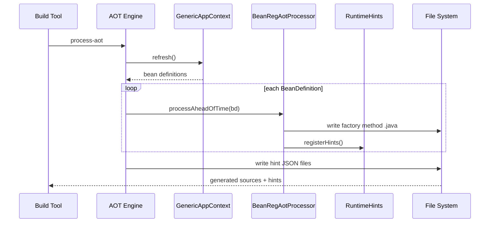
```mermaid
sequenceDiagram
    participant Build as Build Tool
    participant AOT as AOT Engine
    participant CTX as GenericAppContext
    participant BRP as BeanRegAotProcessor
    participant RH as RuntimeHints
    participant FS as File System

    Build->>AOT: process-aot
    AOT->>CTX: refresh()
    CTX-->>AOT: bean definitions
    loop each BeanDefinition
        AOT->>BRP: processAheadOfTime(bd)
        BRP->>FS: write factory method .java
        BRP->>RH: registerHints()
    end
    AOT->>FS: write hint JSON files
    FS-->>Build: generated sources + hints
```

### 🚨 Failure Modes

**Failure 1 - Missing reflection hints at runtime:**
An entity class used in JPA or Jackson deserialization
is not registered in RuntimeHints. The native image
compiles fine, but at runtime: `com.oracle.svm.core.
jdk.resources.MissingReflectionRegistrationError`.

**Diagnostic:** Run with `-agentlib:native-image-agent`
on JVM first to auto-generate hint files, then diff
against your registered hints. Spring Boot's
`RuntimeHintsAgent` (`-XX:+AllowVMInternalThreads
-Dspring.aot.enabled=true`) runs tests and reports
missing hints.

**Fix:** Implement `RuntimeHintsRegistrar` for the
missing type and annotate a configuration class with
`@ImportRuntimeHints(MyHints.class)`. For third-party
libraries, check if they ship a `aot.factories` or
contribute hints via Spring Boot's reachability metadata
repository on GitHub.

**Failure 2 - Build/runtime profile mismatch:**
AOT processed with `spring.profiles.active=dev`, but
deployed with `prod` profile. Beans conditional on the
`prod` profile are absent because the condition was
evaluated as false at build time.

**Diagnostic:** Startup logs show fewer beans than
expected. `@ConditionalOnProperty` evaluations in the
generated source reveal hardcoded boolean values.

**Fix:** Run `process-aot` with the same profile
intended for deployment. For multiple deployment
profiles, build separate artifacts per profile or move
environment-varying behavior out of bean conditions into
runtime configuration (e.g., property-driven strategy
selection within an always-registered bean).

**Failure 3 - Dynamic bean registration at runtime:**
A library registers beans programmatically in a
`BeanFactoryPostProcessor` that uses runtime classpath
scanning. AOT cannot observe this because the post-
processor's dynamic behavior is not replayed during
AOT processing.

**Diagnostic:** Beans exist in JVM mode but vanish in
AOT/native mode. Application fails with
`NoSuchBeanDefinitionException` for dynamically
registered types.

**Fix:** Convert dynamic registration to a
`BeanRegistrationAotProcessor` that generates the
equivalent bean definitions at build time.

### 🔬 Production Reality

In production native image deployments, startup drops
from seconds to tens of milliseconds. Memory footprint
typically decreases because the JIT compiler, bytecode
verifier, and annotation processing infrastructure are
absent. However, peak throughput under sustained load
may be lower than JVM mode because PGO (Profile-Guided
Optimization) in native images is less mature than C2
JIT optimization. Teams at scale typically deploy native
images for serverless / scale-to-zero workloads and JVM
mode for long-running high-throughput services. The AOT
build itself adds significant time to CI pipelines -
native image compilation can take 5-15 minutes for a
moderately complex app with 8 GB of build RAM.

### ⚖️ Trade-offs & Alternatives

**BAD:**

```java
// Registering hints manually for every
// class in a large domain model
hints.reflection().registerType(
    Order.class, ...);
hints.reflection().registerType(
    Customer.class, ...);
// 200 more lines...
```

**GOOD:**

```java
// Programmatic registration with
// package scanning at build time
ClassPathScanningCandidateComponentProvider
    scanner = new ClassPath...Provider(false);
scanner.addIncludeFilter(
    new AnnotationTypeFilter(Entity.class));
for (BeanDefinition bd :
    scanner.findCandidateComponents(
        "com.acme.domain")) {
  hints.reflection().registerType(
    TypeReference.of(bd.getBeanClassName()),
    MemberCategory.INVOKE_DECLARED_METHODS,
    MemberCategory.DECLARED_FIELDS);
}
```

| Aspect            | Spring AOT    | Quarkus Build |
| ----------------- | ------------- | ------------- |
| Programming model | Standard DI   | CDI subset    |
| Hint system       | RuntimeHints  | BuildItem     |
| Conditional model | Frozen at AOT | Arc at build  |
| Library compat.   | Broad (Boot)  | Quarkus ext.  |
| Build time        | Moderate      | Moderate      |
| Fallback to JVM   | Full support  | Limited       |

### ⚡ Decision Snap

Use AOT + native image when: startup time is billed
(serverless, scale-to-zero), memory budget is tight
(edge, embedded), or cold-start latency is user-facing.

Stay on JVM without AOT when: peak throughput matters
more than startup, your dependencies lack native
compatibility, or your CI cannot afford the build-time
cost.

Use AOT on JVM (without native) when: you want faster
startup without the native compatibility constraints -
AOT artifacts on JVM skip classpath scanning but retain
JIT optimization.

### ⚠️ Top Traps

| #   | Trap                       | Why it bites                                         |
| --- | -------------------------- | ---------------------------------------------------- |
| 1   | Profile mismatch           | Build-time profile locks conditional beans           |
| 2   | Missing third-party hints  | Library works on JVM, fails in native silently       |
| 3   | Dynamic bean registration  | BeanFactoryPostProcessor logic invisible to AOT      |
| 4   | Lambda serialization       | Lambdas in bean defs need explicit hint registration |
| 5   | Build RAM underprovisioned | native-image OOMs at 4 GB, needs 8+ GB typically     |

### 🪜 Learning Ladder

**Prerequisites:**
SPR-006 Spring IoC Container and Dependency Injection,
SPR-045 Spring Boot Auto-Configuration.

**THIS:** SPR-092 Spring AOT (Ahead-of-Time) Compilation -
build-time bean analysis, proxy generation, reflection
hints, RuntimeHints API, and native image preparation.

**Next steps:**
SPR-091 GraalVM Native Image with Spring Boot 3.

**The Surprising Truth:**

AOT does not make Spring "static" like Micronaut or
Dagger. It replays Spring's dynamic model once at build
time and records the result. Your code still uses
`@Autowired`, `@Conditional`, and `@Configuration`
unchanged. The generated code is readable Java - you can
open `target/spring-aot/main/sources/` and see exactly
which beans will be created, in what order, with what
arguments. That transparency is the real power: not just
speed, but auditability of your wiring.

**Further Reading:**

- Spring Framework Reference: AOT Processing
  (docs.spring.io/spring-framework/reference/core/aot)
- Spring Boot Reference: GraalVM Native Image Support
  (docs.spring.io/spring-boot/reference/native-image/)
- GraalVM Reachability Metadata Repository (GitHub:
  oracle/graalvm-reachability-metadata)

**Revision Card:**

1. AOT refreshes a full ApplicationContext at build time,
   generates Java factory methods, and emits JSON hint
   files for reflection, resources, and proxies.
2. Conditions (`@ConditionalOnProperty`, `@Profile`) are
   frozen at build time - runtime environment changes
   do not alter the bean graph.
3. `RuntimeHintsRegistrar` is the extension point for
   libraries to declare reflective/resource access so
   native image compilation succeeds.

---

---

# SPR-093 Virtual Threads (Loom) Integration in Spring 6

**TL;DR** - Virtual threads restore simple blocking code at massive concurrency by making thread-per-request cheap, but pinning and carrier starvation demand careful library choices.

### 🔥 Problem Statement

The traditional Java thread-per-request model maps one
OS thread to each incoming HTTP request. OS threads are
expensive: each consumes roughly 1 MB of stack memory
and a kernel scheduling slot. A server with 200 platform
threads hits a wall at 200 concurrent requests, even if
most threads are simply waiting on database I/O or HTTP
calls. Reactive frameworks (WebFlux, Vert.x) solved this
with non-blocking event loops, but at the cost of a
completely different programming model: no blocking calls,
callback chains or reactive streams, and stack traces
that are nearly unreadable. The question is: can we keep
the simple, sequential, blocking programming model and
still handle thousands of concurrent requests?

### 📜 Historical Context

Project Loom was proposed as a JDK Enhancement Proposal
(JEP 425, preview in Java 19, Sept 2022; JEP 436,
second preview in Java 20; JEP 444, final in Java 21,
Sept 2023). Virtual threads are lightweight threads
managed by the JVM, not the OS. They are mounted onto
carrier threads (a ForkJoinPool by default) and unmounted
whenever they block on I/O, sleeping, or locking on
`java.util.concurrent` primitives. Spring Framework 6.1
(Nov 2023) added first-class support: setting
`spring.threads.virtual.enabled=true` switches Tomcat's
executor, async task executors, and scheduling thread
pools to virtual threads. Spring Boot 3.2 made this a
single-property toggle. The Spring team explicitly chose
to enhance the existing MVC/servlet model rather than
merge MVC and WebFlux, confirming that blocking MVC
with virtual threads is the intended path for most
applications going forward.

### 🔩 First Principles

**CORE INVARIANTS:**

1. A virtual thread that blocks on I/O unmounts from its
   carrier thread, freeing the carrier for other virtual
   threads - this is the fundamental scalability gain.
2. A virtual thread that blocks while holding a monitor
   lock (`synchronized`) pins its carrier thread,
   negating the scalability benefit for that operation.
3. Virtual threads are cheap to create (a few hundred
   bytes) but are NOT faster for CPU-bound work - they
   share the same carrier pool as other virtual threads.

**DERIVED DESIGN:**

From invariant 1: thread-per-request becomes viable at
10,000+ concurrent connections because blocked virtual
threads consume negligible carrier resources.
From invariant 2: every `synchronized` block on a hot
path must be audited and replaced with
`ReentrantLock` to avoid pinning. JDBC drivers are the
most common offenders (older drivers use `synchronized`
internally).
From invariant 3: CPU-intensive workloads (image
processing, compression, crypto) do not benefit from
virtual threads - they saturate carriers regardless.

### 🧠 Mental Model

> Think of virtual threads as lightweight reservation
> slips at a restaurant. Platform threads are the actual
> tables. When a diner (virtual thread) waits for food
> (I/O), they step away from the table (unmount from
> carrier), letting another diner sit down. Thousands
> of diners can be "in the restaurant" because most are
> waiting, not eating.

- Blocking I/O -> diner waiting for food, table freed
  for someone else
- Carrier thread -> physical table in the restaurant
- Pinning -> a diner who refuses to leave the table
  while waiting, blocking everyone behind them
- `spring.threads.virtual.enabled` -> restaurant policy
  switch from "one diner owns a table all evening" to
  "share tables during wait times"

**Where this analogy breaks down:** In a real restaurant,
switching diners at a table has physical overhead. Virtual
thread mounting/unmounting is nearly free because the JVM
stores continuation state on the heap, not on an OS stack.

### 🧩 Components

```
+-----------+   +-------------+
|  Tomcat   |   | Spring MVC  |
| Acceptor  +-->| DispatcherS.|
+-----+-----+   +------+------+
      |                 |
+-----v-----------------v----+
| Virtual Thread Executor    |
| (Executors.newVirtual...   |
|  PerTaskExecutor)          |
+-----+---------------------+
      |
+-----v---------------------+
| ForkJoinPool (carriers)   |
| Default: availProcessors  |
+-----+---------------------+
      |
+-----v---------------------+
| OS Threads (platform)     |
+---------------------------+
```

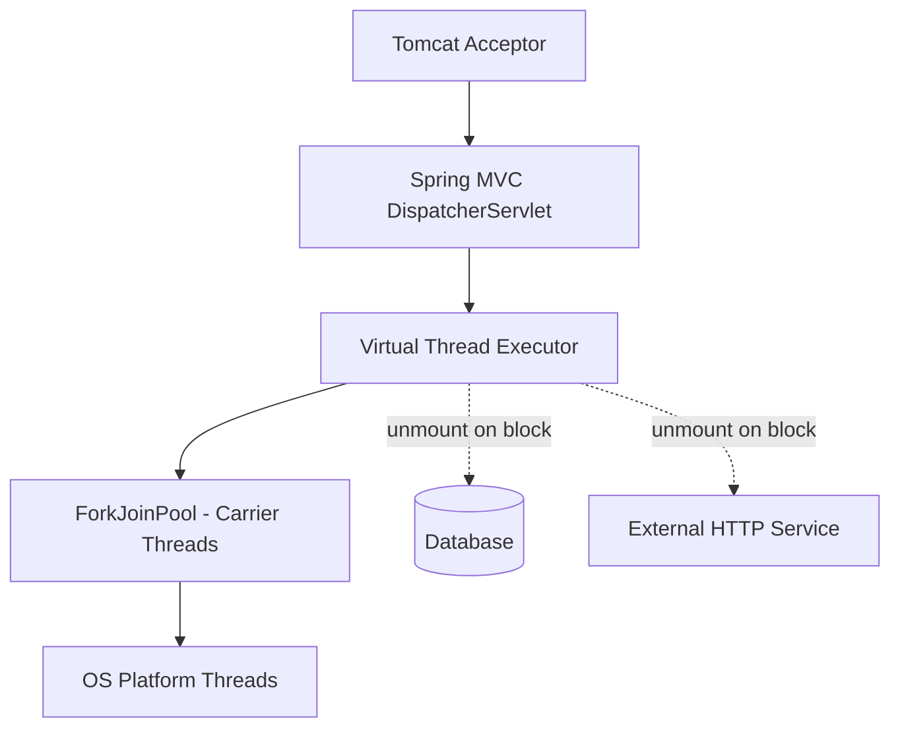
```mermaid
flowchart TD
    TOM[Tomcat Acceptor]
    MVC[Spring MVC DispatcherServlet]
    VTE[Virtual Thread Executor]
    FJP[ForkJoinPool - Carrier Threads]
    OS[OS Platform Threads]
    DB[(Database)]
    HTTP[External HTTP Service]

    TOM --> MVC
    MVC --> VTE
    VTE --> FJP
    FJP --> OS
    VTE -.->|unmount on block| DB
    VTE -.->|unmount on block| HTTP
```

### 📶 Gradual Depth

**Level 1 - The one-property switch:** Add
`spring.threads.virtual.enabled=true` to
`application.properties` (Spring Boot 3.2+). Tomcat
now handles each request on a virtual thread. No code
changes required.

**Level 2 - What changes under the hood:** Spring Boot
auto-configuration replaces Tomcat's default
`ThreadPoolExecutor` with
`Executors.newVirtualThreadPerTaskExecutor()`. The
`@Async` executor and `@Scheduled` thread pool are
also switched. Each request gets a brand-new virtual
thread rather than a pooled platform thread.

**Level 3 - Carrier threads and scheduling:** The JVM
maintains a `ForkJoinPool` of carrier threads (default
size: `Runtime.availableProcessors()`). Virtual threads
are scheduled onto carriers cooperatively. When a
virtual thread calls a blocking operation recognized by
the JVM (socket read, `Thread.sleep`,
`LockSupport.park`), the JVM unmounts its continuation
from the carrier, allowing another virtual thread to run.

**Level 4 - Pinning:** A virtual thread holding a
`synchronized` monitor cannot unmount because the
monitor is tied to the OS thread. This is "pinning."
Pinned virtual threads occupy a carrier for the entire
duration of the synchronized block, including any I/O
inside it. `-Djdk.tracePinnedThreads=short` logs pinning
events. Common pinning sources: JDBC drivers (older
MySQL Connector/J, Oracle JDBC before 23c), JNI calls,
`synchronized` blocks in application code.

```java
// BAD: causes carrier pinning
synchronized (lock) {
    // Blocks carrier for entire DB call
    repository.save(entity);
}

// GOOD: uses ReentrantLock, allows unmount
private final ReentrantLock lock =
    new ReentrantLock();

lock.lock();
try {
    repository.save(entity);
} finally {
    lock.unlock();
}
```

**Level 5 - Spring MVC vs WebFlux with virtual threads:**
Spring MVC + virtual threads handles high concurrency
with blocking code. WebFlux handles high concurrency
with non-blocking code. For I/O-bound workloads, both
achieve similar throughput. MVC + virtual threads wins
on code simplicity, debuggability, and stack trace
clarity. WebFlux wins when you need backpressure,
streaming responses, or the application is already
reactive end-to-end (reactive DB driver, reactive HTTP
client, reactive message consumer).

### ⚙️ How It Works

```
Request arrives at Tomcat
    |
VirtualThreadPerTaskExecutor
  creates new virtual thread
    |
Virtual thread runs controller
    |
Controller calls repository
    |
repository.findById() blocks
    |
JVM unmounts virtual thread
  from carrier (continuation
  saved to heap)
    |
Carrier thread picks up
  another virtual thread
    |
DB response arrives
    |
JVM remounts virtual thread
  onto available carrier
    |
Controller returns response
    |
Virtual thread terminates
  (no pooling, GC'd)
```

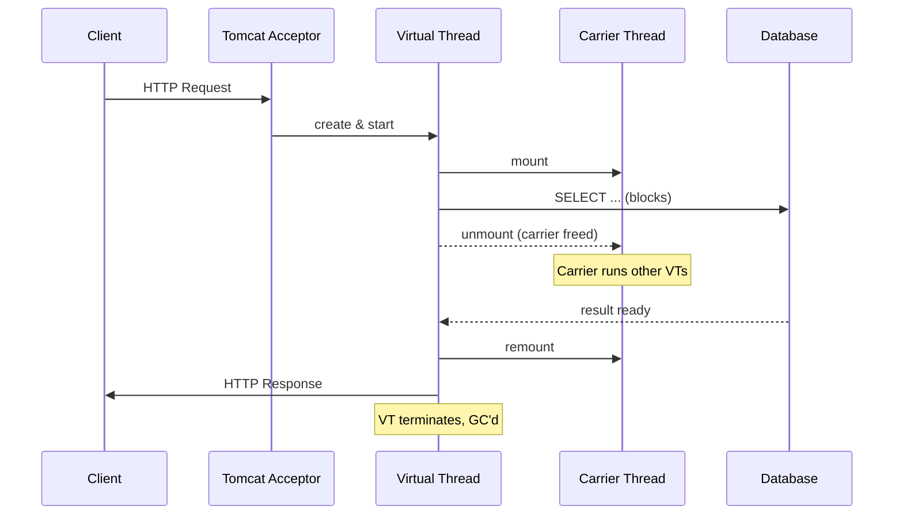
```mermaid
sequenceDiagram
    participant Client
    participant Tomcat as Tomcat Acceptor
    participant VT as Virtual Thread
    participant C as Carrier Thread
    participant DB as Database

    Client->>Tomcat: HTTP Request
    Tomcat->>VT: create & start
    VT->>C: mount
    VT->>DB: SELECT ... (blocks)
    VT-->>C: unmount (carrier freed)
    Note over C: Carrier runs other VTs
    DB-->>VT: result ready
    VT->>C: remount
    VT->>Client: HTTP Response
    Note over VT: VT terminates, GC'd
```

### 🚨 Failure Modes

**Failure 1 - Carrier thread starvation via pinning:**
An application uses `synchronized` in a JDBC driver
that executes slow queries. Under load, all carrier
threads are pinned, and new virtual threads cannot be
scheduled. Throughput drops to match the carrier pool
size (typically equal to CPU count).

**Diagnostic:** Enable `-Djdk.tracePinnedThreads=short`.
Thread dumps via `jcmd <pid> Thread.dump_to_file -format
=json` show virtual threads in `PINNED` state. Metrics
show throughput plateau matching `availableProcessors()`.

**Fix:** Upgrade JDBC driver to a Loom-compatible
version (MySQL Connector/J 8.2+, PostgreSQL 42.7+,
Oracle 23c+). Replace application-level `synchronized`
with `ReentrantLock`. As a stopgap, increase carrier
pool size: `-Djdk.virtualThreadScheduler.parallelism=32`.

**Failure 2 - Thread-local memory explosion:**
Code creates large `ThreadLocal` values (connection
pools, caches, buffers) per thread. With platform
threads, 200 instances are manageable. With virtual
threads, 10,000+ instances exhaust heap memory.

**Diagnostic:** Heap dump shows massive
`ThreadLocal$ThreadLocalMap` instances. OOM with
`GC overhead limit exceeded`.

**Fix:** Migrate from `ThreadLocal` to scoped values
(`ScopedValue`, preview in Java 21+) or shared pooled
resources. Connection pools should be shared across
virtual threads (HikariCP already does this). Never
create per-thread caches when virtual threads are
enabled.

### 🔬 Production Reality

In I/O-heavy workloads (typical CRUD APIs calling
databases and downstream services), teams report
handling 5-10x more concurrent requests with the same
hardware after enabling virtual threads, because
carrier threads are no longer blocked on I/O wait.
Latency percentiles (p50, p99) improve because requests
are no longer queued waiting for a platform thread to
free up. However, if the bottleneck is the database
connection pool (e.g., HikariCP max 50 connections),
virtual threads do not magically increase database
throughput - they just move the queuing from the thread
pool to the connection pool. Monitor connection pool
saturation alongside thread metrics. CPU-bound services
see negligible improvement.

### ⚖️ Trade-offs & Alternatives

**BAD:**

```java
// Mixing synchronized with blocking I/O
// under virtual threads - pins carrier
public synchronized String fetchData() {
    return restTemplate.getForObject(
        url, String.class);
}
```

**GOOD:**

```java
// ReentrantLock avoids pinning
private final ReentrantLock lock =
    new ReentrantLock();

public String fetchData() {
    lock.lock();
    try {
        return restTemplate.getForObject(
            url, String.class);
    } finally {
        lock.unlock();
    }
}
```

| Aspect          | MVC + VThreads | WebFlux          |
| --------------- | -------------- | ---------------- |
| Code style      | Blocking/seq.  | Reactive/async   |
| Stack traces    | Clear          | Fragmented       |
| Backpressure    | Manual         | Built-in         |
| JDBC support    | Native         | Needs R2DBC      |
| Learning curve  | Low            | High             |
| Debugging       | Standard       | Requires tooling |
| Streaming resp. | Limited        | Native SSE/WS    |

### ⚡ Decision Snap

Use virtual threads when: your app is I/O-bound, uses
Spring MVC, and you want higher concurrency without
rewriting to reactive. Most CRUD APIs and BFF services
fit here.

Use WebFlux when: you need backpressure, streaming, or
your entire stack is already reactive (R2DBC, reactive
Kafka, WebClient).

Avoid virtual threads when: workload is CPU-bound
(compute, ML inference), or you depend on libraries
with heavy `synchronized` blocks that cannot be upgraded.

### ⚠️ Top Traps

| #   | Trap                     | Why it bites                                             |
| --- | ------------------------ | -------------------------------------------------------- |
| 1   | Pinning via synchronized | Carrier starvation under load, throughput collapses      |
| 2   | ThreadLocal bloat        | 10,000 VTs x large ThreadLocal = OOM                     |
| 3   | Connection pool ceiling  | VTs do not increase DB pool size, bottleneck just moves  |
| 4   | Assuming CPU speedup     | VTs share carriers, CPU-bound work sees no gain          |
| 5   | Old JDBC driver          | Pre-Loom drivers use synchronized internally, pin always |

### 🪜 Learning Ladder

**Prerequisites:**
SPR-024 Spring MVC Request Lifecycle,
SPR-071 Thread Pool Configuration in Spring Boot.

**THIS:** SPR-093 Virtual Threads (Loom) Integration in
Spring 6 - Project Loom virtual threads, carrier thread
model, pinning, and the MVC vs WebFlux decision with
virtual threads.

**Next steps:**
SPR-099 Reactive Data Access (R2DBC).

**The Surprising Truth:**

Virtual threads do not make WebFlux obsolete. They
eliminate the _concurrency_ argument for reactive, but
not the _backpressure_ or _streaming_ arguments. If your
system needs to push data to clients as it arrives (SSE,
WebSocket streams), or needs to signal upstream producers
to slow down, WebFlux remains the right tool. The real
shift is that virtual threads remove the _forced_ choice
of reactive for concurrency - you now choose reactive
only when the programming model genuinely fits.

**Further Reading:**

- JEP 444: Virtual Threads (openjdk.org/jeps/444)
- Spring Boot Reference: Virtual Threads Support
  (docs.spring.io/spring-boot/reference/features/
  spring-application.html#features.spring-application.
  virtual-threads)
- Inside Java: Virtual Threads - What Are They Good For?
  (inside.java blog series by Alan Bateman, Ron Pressler)

**Revision Card:**

1. `spring.threads.virtual.enabled=true` switches
   Tomcat, `@Async`, and `@Scheduled` executors to
   virtual threads with zero code changes.
2. Pinning occurs when a virtual thread blocks inside a
   `synchronized` block - replace with `ReentrantLock`
   and upgrade JDBC drivers to Loom-compatible versions.
3. Virtual threads increase I/O concurrency but do not
   increase CPU throughput or database connection pool
   capacity - monitor the actual bottleneck.

---

---

# SPR-094 Spring Modulith and Module Boundaries

**TL;DR** - Spring Modulith enforces logical module boundaries inside a monolith so you get microservice-like isolation without the distributed systems tax.

### 🔥 Problem Statement

Teams start with a Spring Boot monolith. Six months
later, the order package imports from the inventory
package which imports from the billing package which
imports from the order package. Circular dependencies
turn every refactoring into a full-codebase grep. You
want module isolation - clear APIs, enforced boundaries,
independent evolution - but you do not want the network
hop, eventual consistency, and operational overhead of
microservices. The question is: can you get 80% of the
modularity benefit at 10% of the distribution cost?

### 📜 Historical Context

Java 9 introduced the module system (JPMS) in 2017, but
adoption in Spring applications remained near zero because
classpath-based frameworks and reflection-heavy DI clashed
with strong encapsulation. OSGi offered runtime modularity
earlier but demanded a steep learning curve. In 2022,
Oliver Drotbohm released Spring Modulith (evolved from
the earlier Spring Moduliths experiment) as an opinionated
way to structure a Spring Boot application into logical
modules - top-level packages that become first-class
architectural units. Unlike JPMS, Modulith works with
the existing classpath model. Unlike multi-module Maven,
it keeps everything in a single deployable artifact while
still enforcing boundaries at test time.

### 🔩 First Principles

**CORE INVARIANTS:**

1. A module's internal types must never be referenced
   by another module - only the "API package" (the
   top-level package of the module) is visible.
2. Inter-module communication should prefer events over
   direct method calls to reduce temporal coupling.
3. Module boundaries must be verifiable automatically in
   CI - not just documented in a wiki nobody reads.

**DERIVED DESIGN:**

From invariant 1: Spring Modulith scans top-level packages
under the main application class. Each becomes a module.
Sub-packages are internal by default. From invariant 2:
`ApplicationEventPublisher` becomes the primary cross-module
communication channel, with `@ApplicationModuleListener`
providing transactional event delivery. From invariant 3:
`ApplicationModules.of(App.class).verify()` in a test
fails the build on illegal dependencies.

### 🧠 Mental Model

> Think of each module as an apartment in a building.
> Each apartment has a front door (the API package).
> Neighbors interact through the lobby (events), never
> by knocking through walls (direct internal access).
> The building inspector (verify()) checks that nobody
> cut unauthorized doorways.

- Request arrives -> enters one module's API package
- Module completes work -> publishes domain event
- Interested modules -> subscribe via @EventListener
- CI test run -> verify() rejects illegal references

**Where this analogy breaks down:**

Unlike real apartments, modules share the same JVM heap,
the same transaction manager, and the same classloader.
A memory leak in one module can crash the entire building.
True isolation requires separate processes - which is
exactly the microservice trade-off Modulith delays.

### 🧩 Components

```
+---------------------------+
| Spring Boot Application   |
|  +--------+ +----------+  |
|  | order/ | |inventory/|  |
|  | (API)  | |  (API)   |  |
|  | .impl/ | |  .impl/  |  |
|  +---+----+ +----+-----+  |
|      |  events   |        |
|      +-----+-----+        |
|            v               |
|    ApplicationEvents       |
+---------------------------+
```

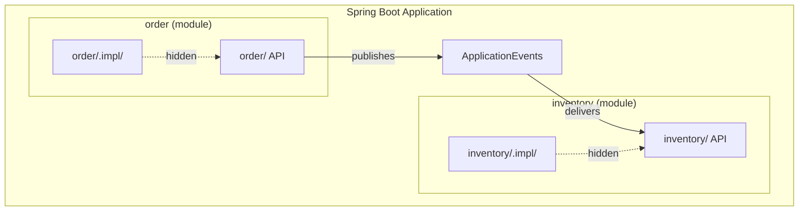
```mermaid
flowchart TB
  subgraph app["Spring Boot Application"]
    subgraph order["order (module)"]
      OA["order/ API"]
      OI["order/.impl/"]
    end
    subgraph inventory["inventory (module)"]
      IA["inventory/ API"]
      II["inventory/.impl/"]
    end
    EB["ApplicationEvents"]
  end
  OA -- "publishes" --> EB
  EB -- "delivers" --> IA
  OI -. "hidden" .-> OA
  II -. "hidden" .-> IA
```

### 📶 Gradual Depth

**Level 1 - Package convention.** Place each bounded context
in its own top-level package. The main class sits one level
above. Modulith auto-detects these packages as modules.

**Level 2 - Explicit module metadata.** Add `package-info.java`
with `@ApplicationModule(allowedDependencies = "...")` to
declare which modules may be referenced. Any undeclared
dependency fails `verify()`.

**Level 3 - Named interfaces.** Use
`@NamedInterface("ordersApi")` on sub-packages that should be
selectively exposed to specific consumers, giving finer
granularity than the all-or-nothing top-level package.

**Level 4 - Event-based decoupling.** Replace synchronous
cross-module method calls with `ApplicationEventPublisher`.
Use `@ApplicationModuleListener` so events participate in the
publisher's transaction and get persisted to an event log for
reliability.

**Level 5 - Observability and documentation.** Modulith
generates Asciidoc + PlantUML module documentation from the
actual code structure. Use `Documenter` in tests to keep
architecture diagrams always in sync.

### ⚙️ How It Works

```
verify() scan flow:
+-------------------+
| ApplicationModules |
|   .of(App.class)  |
+--------+----------+
         |
   scan top-level pkgs
         |
   build dependency graph
         |
   check allowed-deps
         |
  +------+-------+
  | PASS | FAIL  |
  | (ok) | (throw|
  |      |  Viol)|
  +------+-------+
```

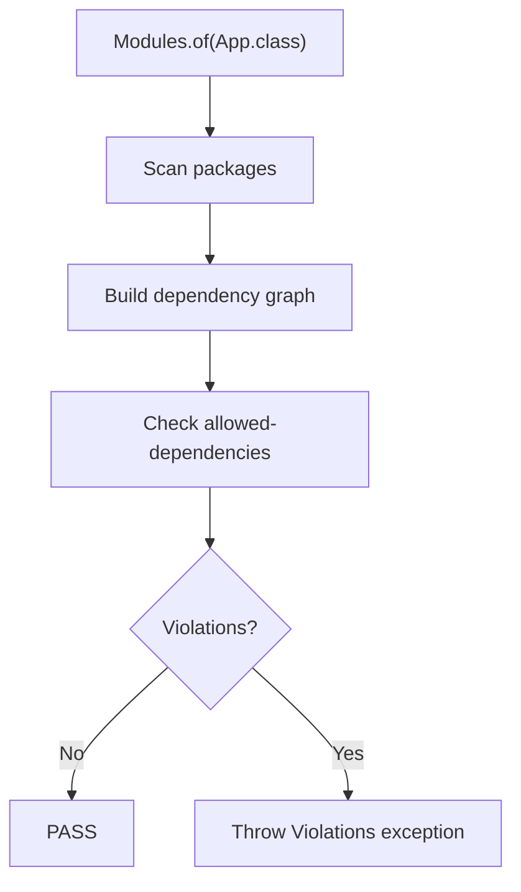
```mermaid
flowchart TD
  A["Modules.of(App.class)"] --> B["Scan packages"]
  B --> C["Build dependency graph"]
  C --> D["Check allowed-dependencies"]
  D --> E{"Violations?"}
  E -- "No" --> F["PASS"]
  E -- "Yes" --> G["Throw Violations exception"]
```

Spring Modulith uses the ASM bytecode library (same one
Spring component scanning uses) to analyze class references
without loading them. It builds a directed graph of module
dependencies, then validates against declared constraints.

The event publication log (`EVENT_PUBLICATION` table) stores
each event with a completion flag. On restart, incomplete
publications are re-delivered - giving you at-least-once
semantics without a message broker.

```java
// Module structure verification test
@Test
void verifyModuleStructure() {
  ApplicationModules modules =
    ApplicationModules.of(ShopApp.class);
  modules.verify();
}
```

```java
// Allowed dependencies declaration
@ApplicationModule(
  allowedDependencies = {
    "inventory", "pricing"
  }
)
package com.shop.order;
```

```java
// Event-based cross-module interaction
@Service
@RequiredArgsConstructor
public class OrderService {
  private final ApplicationEventPublisher events;

  @Transactional
  public Order place(OrderRequest req) {
    Order order = repository.save(
      Order.from(req)
    );
    events.publishEvent(
      new OrderPlaced(order.id())
    );
    return order;
  }
}
```

```java
// Consuming module listens to the event
@ApplicationModuleListener
class InventoryEventHandler {
  void on(OrderPlaced event) {
    // reserve stock - runs in
    // publisher's transaction
    reserveStock(event.orderId());
  }
}
```

### 🚨 Failure Modes

**Failure 1 - Verify passes but modules are semantically
coupled:**

Teams put everything in the API package to avoid violations.
Technically legal, architecturally meaningless. Every type
is public and every module depends on every other.

**Diagnostic:** Run `Documenter` and look at the generated
module diagram. If the dependency graph is fully connected,
your modules are not real modules.

**Fix:** Only expose value objects, service interfaces, and
events in the API package. Move implementations, entities,
and repositories into `.internal` sub-packages.

**Failure 2 - Event publication log grows unbounded:**

The `EVENT_PUBLICATION` table accumulates completed events
because no cleanup job is configured. On a busy system, this
table reaches millions of rows and slows down the incomplete
publication query that runs on startup.

**Diagnostic:** Query `SELECT count(*) FROM
event_publication WHERE completion_date IS NOT NULL`.

**Fix:** Configure `spring.modulith.events.republish
-outstanding-events-on-restart=true` and schedule a
cleanup: `@Bean IncompleteEventPublications cleanup()`
with a retention period. Modulith 1.1+ provides built-in
`CompletedEventPublications` archival.

**Failure 3 - Circular event chains:**

Module A publishes event X, module B handles X and
publishes event Y, module A handles Y and publishes X.
Infinite loop inside a single transaction.

**Diagnostic:** Stack overflow or transaction timeout.
Enable `logging.level.org.springframework.modulith=DEBUG`
to trace event propagation.

**Fix:** Introduce an async boundary
(`@Async @TransactionalEventListener`) at one edge of the
cycle. Or redesign: if two modules form a cycle, they might
belong in the same module.

### 🔬 Production Reality

In production, the event publication log is the critical
piece. Without it, events fired inside a transaction that
rolls back after the listener executed cause ghost side
effects. With it, you get outbox-pattern reliability using
only a relational database.

Performance: module verification is test-time only - zero
runtime overhead. The event publication log adds one INSERT
per event and one UPDATE on completion. For high-throughput
systems (>10K events/sec), the log table needs partitioning
or regular archival.

Migration path from monolith: start by drawing module
boundaries around existing packages. Run `verify()` to find
violations. Fix the worst coupling first. Add events for
cross-module communication. When a module needs independent
scaling, extract it to a microservice - the event API becomes
the message contract.

ArchUnit integration: Modulith 1.2+ works alongside ArchUnit.
Use Modulith for module-level boundaries, ArchUnit for
intra-module rules (layer checks, naming conventions).

### ⚖️ Trade-offs & Alternatives

**BAD:**

```java
// Order module directly calls inventory
// internals - tight coupling, breaks on
// any inventory refactoring
@Service
class OrderService {
  @Autowired
  InventoryInternalRepo repo;
  void place(Order o) {
    repo.decrementStock(o.sku());
  }
}
```

**GOOD:**

```java
// Order publishes event, inventory handles
// it through its own API boundary
@Service
class OrderService {
  @Autowired ApplicationEventPublisher pub;
  @Transactional
  void place(Order o) {
    save(o);
    pub.publishEvent(new OrderPlaced(o.id()));
  }
}
```

| Approach           | Boundary enforcement | Deploy unit  | Scaling     | Complexity |
| ------------------ | -------------------- | ------------ | ----------- | ---------- |
| Packages only      | None                 | Single       | Uniform     | Low        |
| Spring Modulith    | Test-time            | Single       | Uniform     | Low-Med    |
| Multi-module Maven | Compile-time         | Single/Multi | Uniform     | Medium     |
| Microservices      | Runtime (network)    | Per-service  | Independent | High       |
| JPMS               | JVM-enforced         | Single       | Uniform     | High       |

### ⚡ Decision Snap

Use Spring Modulith when you have a monolith with 3+
bounded contexts and want enforced boundaries without
distribution. Prefer multi-module Maven when you need
compile-time enforcement and separate build cycles. Move
to microservices only when you need independent deployment,
independent scaling, or independent technology choices -
and you have the operational maturity to run distributed
systems.

### ⚠️ Top Traps

| #   | Trap                                                    | Why it hurts                                                       |
| --- | ------------------------------------------------------- | ------------------------------------------------------------------ |
| 1   | Putting all types in the API package                    | Bypasses encapsulation - verify() passes but boundaries are hollow |
| 2   | Skipping the event publication log                      | Events lost on transaction rollback - silent data inconsistency    |
| 3   | Synchronous event listeners doing slow I/O              | Blocks the publishing transaction - latency spike and timeout risk |
| 4   | No cleanup of completed event publications              | Table bloat degrades startup time and query performance            |
| 5   | Using Modulith as a stepping stone but never extracting | Accumulates module coupling debt until boundaries erode entirely   |

### 🪜 Learning Ladder

**Prerequisites:**
SPR-090 Microservice Architecture with Spring Boot,
SPR-095 Event-Driven Architecture with Spring Events

**THIS:** SPR-094 Spring Modulith and Module Boundaries -
enforce logical module boundaries inside a monolith with
test-time verification and event-based decoupling.

**Next steps:**
SPR-108 Monolith-First Strategy with Spring Modulith

**The Surprising Truth:**

Most teams that adopt microservices would have been better
served by Spring Modulith. The modularity they wanted never
required a network boundary - it required enforced package
boundaries and the discipline to communicate through events.
The irony: Modulith makes future microservice extraction
easier precisely because it does not force you to do it now.

**Further Reading:**

- Spring Modulith reference documentation (spring.io)
- Oliver Drotbohm, "Spring Modulith - A New Way to Build
  Spring Boot Applications" (SpringOne 2022)
- "Modular Monoliths" - Simon Brown
  (conference talk series)

**Revision Card:**

1. `ApplicationModules.of(App.class).verify()` fails the
   build on illegal cross-module references - enforcement
   happens at test time, not runtime.
2. The event publication log table provides outbox-pattern
   reliability for inter-module events without requiring
   a message broker.
3. Top-level packages are API, sub-packages are internal -
   this convention replaces both JPMS exports and
   multi-module Maven visibility.

---

---

# SPR-095 Event-Driven Architecture with Spring Events

**TL;DR** - Spring's event system decouples producers from consumers inside the application context, but transactional semantics and async boundaries determine whether it helps or hurts.

### 🔥 Problem Statement

Your `OrderService` needs to send a confirmation email,
update inventory, notify analytics, and trigger fraud
checking. Direct method calls mean `OrderService` depends
on four unrelated subsystems, and adding a fifth means
modifying `OrderService` again. Worse: if the email call
fails, should the order fail too? You need a way to say
"something happened" without dictating what should happen
next. But naive eventing introduces its own problems:
lost events, ordering surprises, transaction boundary
confusion, and invisible control flow that makes debugging
a nightmare.

### 📜 Historical Context

The Observer pattern predates Java itself. Java's
`java.util.Observable` (1996) was deprecated in Java 9
because it required extending a class - incompatible with
modern composition-based design. Spring introduced its
own event system in Spring Framework 1.0 (2003), based on
`ApplicationEvent` and `ApplicationListener`. Spring 4.2
(2015) added annotation-based `@EventListener`, removing
the need to implement an interface. Spring 4.2 also added
`@TransactionalEventListener`, which solved the critical
problem of events firing before the triggering transaction
committed. Spring Modulith (2022) built on top of this with
`@ApplicationModuleListener` and the event publication log
for reliable delivery.

### 🔩 First Principles

**CORE INVARIANTS:**

1. An event is a fact about something that already happened -
   it is immutable and cannot be rejected by listeners.
2. The publisher must not know or care how many listeners
   exist - adding a listener must never require changing
   the publisher.
3. Transaction boundaries determine when listeners see
   consistent state - firing an event mid-transaction
   exposes uncommitted data to synchronous listeners.

**DERIVED DESIGN:**

From invariant 1: model events as immutable records with
past-tense names (`OrderPlaced`, `PaymentReceived`). From
invariant 2: use `ApplicationEventPublisher.publishEvent()`
which delegates to all registered `@EventListener` methods
via the `ApplicationEventMulticaster`. From invariant 3:
`@TransactionalEventListener(phase = AFTER_COMMIT)` ensures
listeners run only after the triggering transaction
succeeds - preventing ghost side effects.

### 🧠 Mental Model

> Think of Spring events as a building intercom system.
> When an apartment (service) has news, it announces on
> the intercom (publishEvent). Any apartment listening
> on that channel hears it. The intercom does not know
> who is listening, and the announcer does not wait for
> each listener to finish (unless you choose synchronous
> mode).

- Service completes action -> publishes event object
- ApplicationEventMulticaster -> routes to listeners
- Synchronous listeners -> run in publisher's thread
- Async listeners -> run in separate thread pool
- TransactionalEventListener -> waits for phase trigger

**Where this analogy breaks down:**

A real intercom is fire-and-forget. Spring synchronous
events, by default, run listeners in the same thread and
same transaction - meaning a listener exception can roll
back the publisher's transaction. This is less "intercom"
and more "conference call where anyone can hang up on
everyone."

### 🧩 Components

```
+---------------------------------------+
| ApplicationContext                     |
|  +-------------+  +-----------+       |
|  | Publisher    |  | Listener  |       |
|  | (Service)   |  | (@Event   |       |
|  |             |  |  Listener)|       |
|  +------+------+  +-----+-----+      |
|         |               ^             |
|         v               |             |
|  +------+---------------+------+      |
|  | ApplicationEventMulticaster |      |
|  | (SimpleApplicationEvent     |      |
|  |  Multicaster)               |      |
|  +-----------------------------+      |
+---------------------------------------+
```

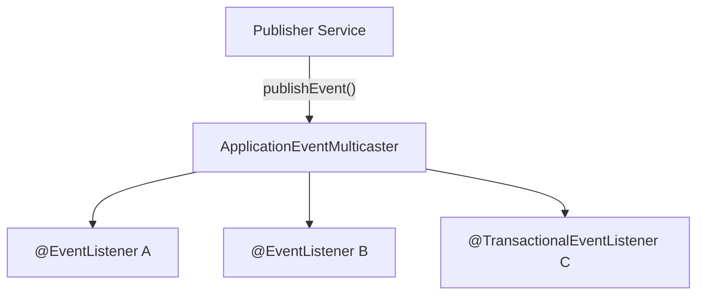
```mermaid
flowchart TB
  P["Publisher Service"]
  M["ApplicationEventMulticaster"]
  L1["@EventListener A"]
  L2["@EventListener B"]
  L3["@TransactionalEventListener C"]
  P -- "publishEvent()" --> M
  M --> L1
  M --> L2
  M --> L3
```

### 📶 Gradual Depth

**Level 1 - Basic events.** Create a POJO event class.
Inject `ApplicationEventPublisher`, call `publishEvent()`.
Add `@EventListener` on any Spring bean method that takes
that event type. Done.

**Level 2 - Transactional events.** Replace `@EventListener`
with `@TransactionalEventListener(phase = AFTER_COMMIT)`.
Listeners now fire only after the publisher's transaction
commits. Use `BEFORE_COMMIT` when the listener must
participate in the same transaction.

**Level 3 - Async events.** Add `@Async` to the listener
method. Configure a dedicated `TaskExecutor` bean. Async
listeners run in a separate thread - publisher does not
wait, but you lose the transactional context.

**Level 4 - Reliable publication.** Use Spring Modulith's
event publication log. Events are written to a database
table inside the publisher's transaction. On restart,
incomplete publications are re-delivered. This provides
at-least-once semantics without an external broker.

**Level 5 - External event infrastructure.** For cross-JVM
communication, bridge to Spring Cloud Stream (Kafka,
RabbitMQ) or Spring Integration. In-process events become
the local contract; the bridge adapter publishes to the
external broker. Event sourcing takes this further by
making the event log the source of truth rather than
current state.

### ⚙️ How It Works

```
Event dispatch flow (sync):
+-----------+
| publisher |
+-----+-----+
      | publishEvent(evt)
      v
+-----+----------+
| Multicaster    |
| getListeners() |
+-----+----------+
      | for each listener
      v
+-----+---------+
| listener.on() |
| (same thread) |
+---------------+
```

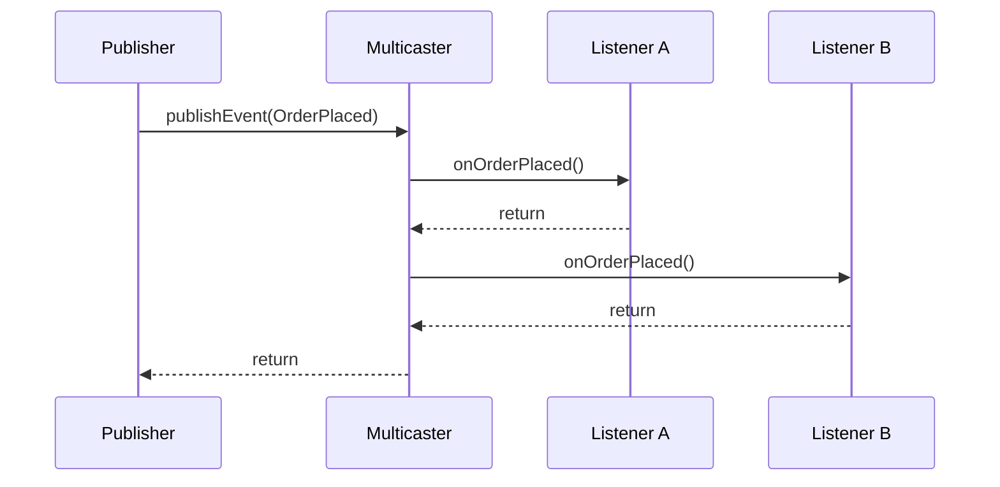
```mermaid
sequenceDiagram
  participant P as Publisher
  participant M as Multicaster
  participant L1 as Listener A
  participant L2 as Listener B
  P->>M: publishEvent(OrderPlaced)
  M->>L1: onOrderPlaced()
  L1-->>M: return
  M->>L2: onOrderPlaced()
  L2-->>M: return
  M-->>P: return
```

The `SimpleApplicationEventMulticaster` iterates through
all registered listeners. By default, it calls each
listener in the publisher's thread (synchronous). If an
`Executor` is set on the multicaster, listeners dispatch
asynchronously.

`@TransactionalEventListener` registers with Spring's
`TransactionSynchronization` callbacks. The listener
invocation is deferred until the registered phase
(`BEFORE_COMMIT`, `AFTER_COMMIT`, `AFTER_ROLLBACK`,
`AFTER_COMPLETION`). If no transaction is active, the
default `fallbackExecution = false` means the listener
silently does not execute - a common source of bugs.

```java
// Immutable domain event (Java record)
public record OrderPlaced(
    UUID orderId,
    Instant occurredAt
) {
  public OrderPlaced(UUID orderId) {
    this(orderId, Instant.now());
  }
}
```

```java
// Publishing an event
@Service
@RequiredArgsConstructor
public class OrderService {
  private final ApplicationEventPublisher pub;
  private final OrderRepository repo;

  @Transactional
  public Order place(CreateOrder cmd) {
    Order order = repo.save(
      Order.from(cmd)
    );
    pub.publishEvent(
      new OrderPlaced(order.id())
    );
    return order;
  }
}
```

```java
// Synchronous listener - same transaction
@Component
class AuditListener {
  @EventListener
  void on(OrderPlaced e) {
    log.info("Order {} placed", e.orderId());
  }
}
```

```java
// Transactional listener - after commit
@Component
class EmailListener {
  @TransactionalEventListener(
    phase = AFTER_COMMIT
  )
  void on(OrderPlaced e) {
    emailService.sendConfirmation(
      e.orderId()
    );
  }
}
```

```java
// Async listener - separate thread pool
@Component
class AnalyticsListener {
  @Async("analyticsExecutor")
  @EventListener
  void on(OrderPlaced e) {
    analyticsClient.track(e);
  }
}
```

### 🚨 Failure Modes

**Failure 1 - TransactionalEventListener silently skipped:**

A `@TransactionalEventListener` method never fires. No
error, no log. The code looks correct. Root cause: the
publisher method is not `@Transactional`, and
`fallbackExecution` defaults to `false`.

**Diagnostic:** Add a breakpoint or log line inside the
listener. If it never triggers, check whether the
publishing method runs inside a transaction. Use
`TransactionSynchronizationManager
.isActualTransactionActive()` to verify.

**Fix:** Either add `@Transactional` to the publisher,
or set `fallbackExecution = true` on the listener
annotation (but understand this changes semantics -
the listener fires immediately, not after commit).

**Failure 2 - Sync listener exception rolls back the
publisher's transaction:**

The publisher calls `publishEvent()` and a synchronous
listener throws. Because the listener runs in the same
thread and same transaction, the exception propagates up
and triggers rollback. The publisher's own work is lost.

**Diagnostic:** Stack trace shows the listener's exception
wrapping a `TransactionSystemException`. The publisher's
data is missing from the database.

**Fix:** If the listener's work is not critical to the
publisher's transaction, make it async (`@Async`) or use
`@TransactionalEventListener(phase = AFTER_COMMIT)`.
If the listener's work is critical, keep it synchronous
but handle exceptions within the listener.

**Failure 3 - Event ordering assumptions violated:**

Multiple listeners handle the same event type. Team
assumes listener A runs before listener B. Spring does
not guarantee listener ordering (unless `@Order` is
explicitly set). A deployment or classpath change
reorders them, breaking the implicit contract.

**Diagnostic:** Intermittent bugs that appear after
deployments or dependency upgrades. Listener A sees state
that listener B was supposed to create first.

**Fix:** Use `@Order(1)`, `@Order(2)` on listeners. Or
better: design listeners to be independent and
idempotent - no ordering assumptions.

### 🔬 Production Reality

In production, the most common event architecture starts
with synchronous in-process events, graduates to
transactional event listeners for reliability, then
bridges to Kafka or RabbitMQ when cross-service
communication becomes necessary.

The Spring Cloud Stream programming model uses the same
functional style: `Consumer<OrderPlaced>` bean bindings
map naturally from `@EventListener` methods. Migration
from in-process to broker-based delivery primarily changes
configuration, not business logic.

Event sourcing - where the event log is the canonical
data store and current state is derived by replaying
events - is powerful but dramatically increases complexity.
Most Spring applications benefit from event-driven
communication without full event sourcing. Use event
sourcing when audit requirements demand a complete history
of state changes, or when CQRS read-model projections
provide significant query performance benefits.

Performance: synchronous event dispatch adds a method
call per listener - negligible. Async dispatch adds thread
pool scheduling overhead. The event publication log adds
one INSERT per event. For high-throughput systems, batch
events or use an external broker rather than relying on
the database-backed log.

### ⚖️ Trade-offs & Alternatives

**BAD:**

```java
// Direct calls create tight coupling
// and ordering fragility
@Transactional
public Order place(CreateOrder cmd) {
  Order o = repo.save(Order.from(cmd));
  emailService.send(o);    // fails = rollback
  inventory.reserve(o);    // never reached
  analytics.track(o);      // never reached
  return o;
}
```

**GOOD:**

```java
// Events decouple - each listener handles
// its own failure independently
@Transactional
public Order place(CreateOrder cmd) {
  Order o = repo.save(Order.from(cmd));
  events.publishEvent(new OrderPlaced(o.id()));
  return o;
}
// Email, inventory, analytics each have
// their own @EventListener / @Async
```

| Approach                | Coupling         | Reliability          | Ordering          | Debugging          |
| ----------------------- | ---------------- | -------------------- | ----------------- | ------------------ |
| Direct calls            | Tight            | All-or-nothing       | Explicit          | Easy (stack trace) |
| Sync events             | Loose            | Same-tx failure risk | Unordered default | Moderate           |
| Tx event listeners      | Loose            | After-commit safety  | Unordered default | Moderate           |
| Async events            | Very loose       | Fire-and-forget      | None              | Hard               |
| Event publication log   | Loose            | At-least-once        | None              | Moderate           |
| External broker (Kafka) | None (cross-JVM) | Configurable         | Partition-ordered | Hard               |

### ⚡ Decision Snap

Use `@EventListener` for simple in-process decoupling where
failure is acceptable. Use `@TransactionalEventListener
(AFTER_COMMIT)` when listeners must not see uncommitted
state. Add `@Async` when listener latency must not block
the publisher. Use Modulith's event publication log when
you need at-least-once delivery without a broker. Move to
Spring Cloud Stream with Kafka or RabbitMQ when events
must cross JVM boundaries.

### ⚠️ Top Traps

| #   | Trap                                                            | Why it hurts                                                            |
| --- | --------------------------------------------------------------- | ----------------------------------------------------------------------- |
| 1   | No @Transactional on publisher with @TransactionalEventListener | Listener silently never fires - data inconsistency with no error        |
| 2   | Sync listener throwing unchecked exceptions                     | Rolls back publisher's transaction - unrelated failure causes data loss |
| 3   | Assuming listener execution order without @Order                | Reordering on redeploy causes subtle, intermittent bugs                 |
| 4   | Async listener accessing transaction-scoped state               | LazyInitializationException or stale data in a different thread         |
| 5   | Using events for everything including same-aggregate calls      | Adds indirection without decoupling - makes code harder to follow       |

### 🪜 Learning Ladder

**Prerequisites:**
SPR-044 Spring Transaction Management,
SPR-096 Saga Pattern Implementation in Spring

**THIS:** SPR-095 Event-Driven Architecture with Spring
Events - decouple producers from consumers using
ApplicationEvent, transactional listeners, and async
dispatch.

**Next steps:**
SPR-094 Spring Modulith and Module Boundaries

**The Surprising Truth:**

The biggest risk with Spring events is not losing events -
it is losing debuggability. A direct method call gives you
a stack trace from caller to callee. An event gives you
two disconnected stack traces with a gap in the middle.
Teams that adopt events everywhere end up writing custom
correlation tracing infrastructure to reconnect what they
voluntarily disconnected. Events are a trade-off, not a
free lunch.

**Further Reading:**

- Spring Framework reference: Application Events
  (docs.spring.io)
- Spring Modulith reference: Event Publication Registry
  (docs.spring.io)
- Vaughn Vernon, "Implementing Domain-Driven Design",
  Ch. 8 - Domain Events
- Spring Cloud Stream reference documentation
  (spring.io)

**Revision Card:**

1. `@TransactionalEventListener(phase = AFTER_COMMIT)`
   defers listener execution until the publisher's
   transaction commits - preventing ghost side effects
   from rolled-back transactions.
2. Synchronous listeners run in the publisher's thread
   and transaction - a listener exception rolls back the
   publisher's work unless you add `@Async` or catch it.
3. Without an active transaction, `@TransactionalEventListener`
   with default `fallbackExecution = false` silently
   skips the listener - the most common Spring event bug.

---

---

# SPR-096 Saga Pattern Implementation in Spring

**TL;DR** - Sagas coordinate multi-service transactions through choreography or orchestration, using compensating actions instead of distributed locks.

### 🔥 Problem Statement

You split a monolith into microservices. Each service
owns its database. A single business operation - place
an order - now spans Order, Payment, Inventory, and
Shipping services. Traditional ACID transactions cannot
cross service boundaries because there is no shared
transaction manager. Two-phase commit (2PC) exists but
requires all participants to hold locks until the
coordinator decides. One slow participant blocks
everyone. One crashed coordinator leaves all
participants hanging with locks held indefinitely.

The real constraint: you need atomicity across services
without distributed locks, and you need a recovery
strategy when step 4 of 7 fails. Sagas solve this by
breaking a long-lived transaction into a sequence of
local transactions, each with a compensating action that
undoes its effect if a later step fails.

### 📜 Historical Context

Hector Garcia-Molina and Kenneth Salem coined "saga" in
their 1987 paper on long-lived transactions in
databases. The original concept addressed single-database
transactions that held locks too long. Microservices
adopted the pattern around 2015-2017 when teams realized
2PC was impractical across independent services. Chris
Richardson formalized the choreography vs orchestration
distinction in his microservices patterns work.

Spring State Machine (part of Spring Statemachine
project, first released 2015) provided a natural fit for
orchestration sagas. Spring Cloud Stream (evolved from
Spring Integration) enabled event-driven choreography.
By 2020, saga had become the default pattern for
distributed transactions in Spring-based microservice
architectures. Frameworks like Axon, Eventuate Tram, and
MicroProfile LRA formalized implementations, but many
teams build custom sagas on Spring primitives.

### 🔩 First Principles

**CORE INVARIANTS:**

1. **Local atomicity only** - each step is a local ACID
   transaction within one service's database. No step
   ever holds a lock in another service's store.
2. **Compensating reversibility** - every forward step
   must have a compensating action that semantically
   undoes its effect. "Semantically" because you cannot
   un-send an email; you send a cancellation email.
3. **Eventual consistency guarantee** - the saga either
   completes all steps (success) or executes
   compensating actions for all completed steps
   (failure). The system reaches a consistent state
   eventually, not immediately.

**DERIVED DESIGN:**

From invariant 1: services must be autonomous and own
their data exclusively. From invariant 2: compensating
actions must be idempotent because retries happen after
network failures. From invariant 3: you need a
mechanism (event bus or orchestrator) that tracks which
steps completed and which need compensation.

### 🧠 Mental Model

> A saga is like a relay race where each runner (service)
> completes their leg independently, and if any runner
> drops the baton, all previous runners must jog back to
> the starting line to undo their distance.

-> Choreography: each runner listens for the previous
runner's completion shout and decides to start
-> Orchestration: a coach (orchestrator) tells each
runner when to start and when to return
-> Compensating actions: running back is not the same
as never having run - the crowd already saw you
-> Idempotency: if the coach's whistle echoes twice,
the runner must not run the leg twice

**Where this analogy breaks down:** Real relay runners
are synchronous and co-located. Saga participants are
asynchronous, distributed, and may fail independently
at any point including during compensation itself.
Compensation of compensation requires careful design.

### 🧩 Components

```
+-------------------------------------------+
|         SAGA COORDINATION LAYER           |
|  (Orchestrator or Event Bus)              |
+-----+--------+--------+--------+---------+
      |        |        |        |
      v        v        v        v
  +-------+ +-------+ +-------+ +-------+
  |Order  | |Payment| |Invent | |Ship   |
  |Svc    | |Svc    | |Svc    | |Svc    |
  +---+---+ +---+---+ +---+---+ +---+---+
      |        |        |        |
      v        v        v        v
  [OrderDB] [PayDB] [InvDB]  [ShipDB]
```

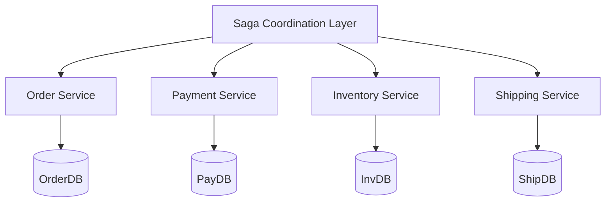
```mermaid
flowchart TB
    SC[Saga Coordination Layer]
    OS[Order Service]
    PS[Payment Service]
    IS[Inventory Service]
    SS[Shipping Service]
    OD[(OrderDB)]
    PD[(PayDB)]
    ID[(InvDB)]
    SD[(ShipDB)]
    SC --> OS
    SC --> PS
    SC --> IS
    SC --> SS
    OS --> OD
    PS --> PD
    IS --> ID
    SS --> SD
```

### 📶 Gradual Depth

**Level 1 - Choreography saga:** Each service publishes
a domain event after completing its local transaction.
The next service subscribes to that event and starts its
step. On failure, it publishes a failure event that
triggers compensating actions in reverse order.

```java
// Order Service publishes event
@Transactional
public Order createOrder(OrderRequest req) {
  Order order = orderRepo.save(
    new Order(req, OrderStatus.PENDING)
  );
  streamBridge.send(
    "order-created-out-0",
    new OrderCreatedEvent(
      order.getId(), req.getItems()
    )
  );
  return order;
}
```

**Level 2 - Orchestration saga:** A central orchestrator
(often a state machine) drives the sequence. It sends
commands to each service and handles responses. On
failure, it issues compensating commands in reverse.

```java
@Configuration
@EnableStateMachineFactory
public class OrderSagaConfig
    extends StateMachineConfigurerAdapter<
      OrderState, OrderEvent> {

  @Override
  public void configure(
      StateMachineTransitionConfigurer<
        OrderState, OrderEvent> t)
      throws Exception {
    t.withExternal()
      .source(OrderState.CREATED)
      .target(OrderState.PAYMENT_PENDING)
      .event(OrderEvent.START_PAYMENT)
      .action(requestPaymentAction())
    .and().withExternal()
      .source(OrderState.PAYMENT_PENDING)
      .target(OrderState.PAID)
      .event(OrderEvent.PAYMENT_SUCCESS)
      .action(reserveInventoryAction())
    .and().withExternal()
      .source(OrderState.PAYMENT_PENDING)
      .target(OrderState.COMPENSATING)
      .event(OrderEvent.PAYMENT_FAILED)
      .action(cancelOrderAction());
  }
}
```

**Level 3 - Compensating transactions:** The critical
design challenge. Each compensation must be idempotent
and must handle the case where the forward action
partially completed or the compensation message arrives
more than once.

```java
@Transactional
public void compensatePayment(
    String sagaId, String paymentId) {
  // Idempotency check via saga log
  if (sagaLog.isCompensated(
      sagaId, "payment")) {
    log.info("Already compensated: {}",
      sagaId);
    return;
  }
  paymentService.refund(paymentId);
  sagaLog.markCompensated(
    sagaId, "payment"
  );
}
```

**Level 4 - Saga log and recovery:** The saga log is
the source of truth for saga state. On startup or after
a crash, the orchestrator reads incomplete sagas from
the log and resumes compensation or retries. This is
the mechanism that makes sagas reliable across process
restarts and network partitions.

### ⚙️ How It Works

```
ORCHESTRATION FLOW (happy path):
Orchestrator -> Order: "create"
  Order -> Orchestrator: "created"
Orchestrator -> Payment: "charge"
  Payment -> Orchestrator: "charged"
Orchestrator -> Inventory: "reserve"
  Inventory -> Orchestrator: "reserved"
Orchestrator -> Shipping: "ship"
  Shipping -> Orchestrator: "shipped"
Saga: COMPLETED

COMPENSATION FLOW (inventory fails):
Orchestrator -> Inventory: "reserve"
  Inventory -> Orchestrator: "FAILED"
Orchestrator -> Payment: "refund"
  Payment -> Orchestrator: "refunded"
Orchestrator -> Order: "cancel"
  Order -> Orchestrator: "cancelled"
Saga: COMPENSATED
```

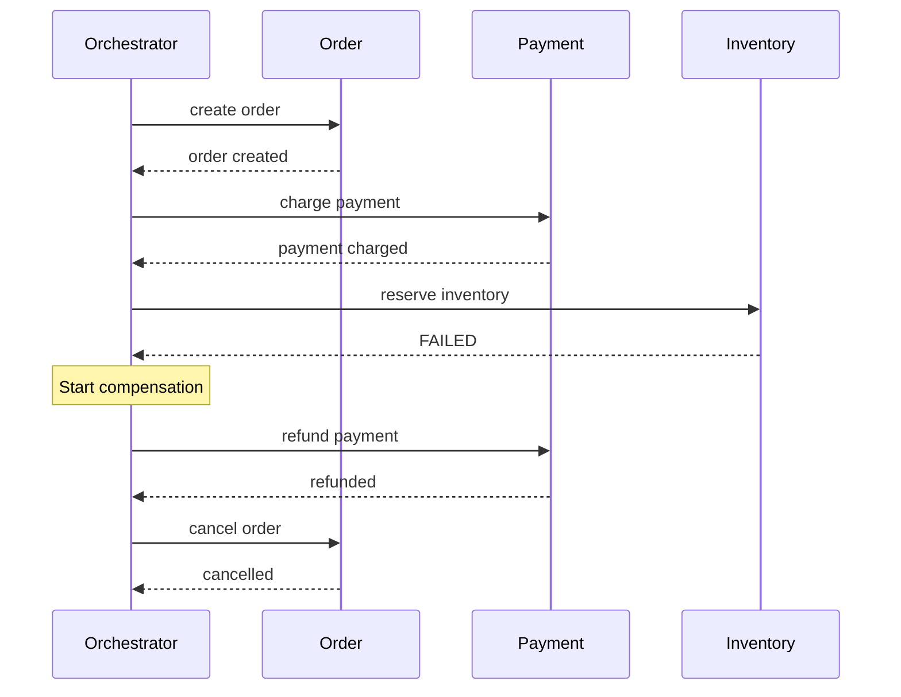
```mermaid
sequenceDiagram
    participant O as Orchestrator
    participant OR as Order
    participant P as Payment
    participant I as Inventory

    O->>OR: create order
    OR-->>O: order created
    O->>P: charge payment
    P-->>O: payment charged
    O->>I: reserve inventory
    I-->>O: FAILED
    Note over O: Start compensation
    O->>P: refund payment
    P-->>O: refunded
    O->>OR: cancel order
    OR-->>O: cancelled
```

**Choreography flow:** Replace the orchestrator with an
event bus. Each service listens for the previous
service's success event and acts. On failure, it
publishes a compensation event. The risk: with many
services, the event chain becomes hard to trace and
reason about. Cyclic dependencies can emerge silently.

**Idempotency implementation:** Every saga step handler
checks the saga log before executing. The saga log
stores `(sagaId, stepName, status)` tuples. A duplicate
message finds `status=COMPLETED` and short-circuits.
This is non-negotiable - without idempotency, a retry
after a timeout will double-charge customers.

### 🚨 Failure Modes

**Failure 1 - Compensation fails during compensation:**
The inventory service refund succeeds but the payment
refund times out. The saga is now in a partially
compensated state.

**Diagnostic:** Saga log shows `inventory: COMPENSATED,
payment: COMPENSATING`. Alerts fire on sagas stuck in
COMPENSATING for longer than the SLA threshold.

**Fix:** Implement retry with exponential backoff for
compensation steps. Add a dead letter queue for
compensations that exhaust retries. A human operator
dashboard shows stuck sagas with a "force compensate"
button. Never silently drop a failed compensation.

**Failure 2 - Orchestrator crashes mid-saga:**
The orchestrator sent "charge payment" but crashed
before receiving the response.

**Diagnostic:** On restart, the orchestrator queries
the saga log for sagas in non-terminal states. It
finds this saga in `PAYMENT_PENDING` state.

**Fix:** The orchestrator queries the payment service
for the payment status (the payment service must expose
an idempotent status endpoint). Based on the response,
it either proceeds to the next step or starts
compensation. The saga log must be persisted in a
durable store (database, not in-memory).

**Failure 3 - Zombie saga from message reordering:**
Payment success event arrives after the saga already
timed out and started compensating.

**Diagnostic:** Saga log shows `status=COMPENSATING`
but a late success event triggers the next step.

**Fix:** State machine transitions must validate current
state before accepting events. A `COMPENSATING` saga
rejects `PAYMENT_SUCCESS` events. Log the rejected
event for audit.

### 🔬 Production Reality

Choreography sagas work well for 3-4 services with
linear flows. Beyond that, the implicit coupling
through events becomes a debugging nightmare. You
cannot look at any single service and understand the
full saga. Orchestration adds a single point of
coordination (not failure, if replicated) but gives
you a single place to see the entire workflow.

The saga log table grows fast in high-throughput
systems. Partition it by date or saga status. Archive
completed sagas to cold storage. Keep the hot table
small for restart recovery scans.

Spring State Machine persists state via
`StateMachinePersister`. Use the JPA persister for
production. The in-memory persister loses state on
restart - suitable only for development.

Spring Cloud Stream with Kafka or RabbitMQ provides
at-least-once delivery. This means your handlers will
receive duplicate messages. Idempotency is not optional.

Testing sagas requires integration tests that simulate
failure at every step. Use Testcontainers for Kafka and
database instances. Test the compensation path as
thoroughly as the happy path - it runs in production
more often than you expect.

### ⚖️ Trade-offs & Alternatives

**BAD:**

```java
// Two-phase commit across services
@Transactional(propagation = REQUIRES_NEW)
public void placeOrder(OrderReq req) {
  // This transaction cannot span Payment
  // and Inventory service databases.
  // JTA/XA across services = lock hell.
  orderRepo.save(order);
  paymentClient.charge(order); // remote!
  inventoryClient.reserve(order); // remote!
}
```

**GOOD:**

```java
// Saga orchestrator drives local txns
public void startOrderSaga(OrderReq req) {
  String sagaId = UUID.randomUUID()
    .toString();
  sagaLog.create(sagaId, "ORDER_SAGA");
  stateMachine.sendEvent(
    MessageBuilder
      .withPayload(OrderEvent.START)
      .setHeader("sagaId", sagaId)
      .build()
  );
}
```

| Aspect       | Choreography        | Orchestration          |
| ------------ | ------------------- | ---------------------- |
| Coupling     | Loose (events)      | Central coordinator    |
| Visibility   | Hard to trace       | Single view            |
| Complexity   | Grows with services | Constant per saga      |
| Single point | None                | Orchestrator           |
| Testing      | Harder (async)      | Easier (state machine) |
| Best for     | Simple, few steps   | Complex, many steps    |

### ⚡ Decision Snap

Use choreography sagas when: fewer than 4 services,
linear flow, team prefers decentralized ownership, and
you have strong distributed tracing (Zipkin/Jaeger).

Use orchestration sagas when: 4+ services, branching
logic, compensation is complex, or you need a single
audit view of the transaction lifecycle.

Do not use sagas when: a single database suffices
(Spring Modulith with `@Transactional`), the operation
is read-only, or you can use an outbox pattern with
a single downstream consumer.

### ⚠️ Top Traps

| #   | Trap                    | Why it hurts                                       | Escape                                        |
| --- | ----------------------- | -------------------------------------------------- | --------------------------------------------- |
| 1   | Skipping idempotency    | Duplicate charges, double inventory deductions     | Saga log check before every step execution    |
| 2   | In-memory saga state    | Orchestrator restart loses all in-flight sagas     | Persist saga log to database, scan on startup |
| 3   | No compensation timeout | Stuck sagas consume resources forever              | SLA-based timeout with dead letter escalation |
| 4   | Testing only happy path | Compensation bugs surface in production under load | Fault injection tests for every step failure  |
| 5   | Choreography at scale   | 10+ services create untraceable event spaghetti    | Switch to orchestration beyond 4 services     |

### 🪜 Learning Ladder

**Prerequisites:**
SPR-095 Event-Driven Architecture with Spring Events,
SPR-035 Spring Cloud Stream fundamentals

**THIS:** SPR-096 Saga Pattern Implementation in Spring

**Next steps:**
SPR-090 Microservice Architecture with Spring Boot

**The Surprising Truth:** Most teams that implement sagas
discover they needed fewer microservices, not better
distributed transactions. The saga complexity is often a
signal that your service boundaries are wrong. If every
business operation requires a 5-step saga, your services
are too fine-grained. Redesign the boundaries first.

**Further Reading:**

- Garcia-Molina & Salem, "Sagas" (1987 ACM SIGMOD)
- Chris Richardson, "Microservices Patterns" (Manning)
- Spring Statemachine reference documentation
- Spring Cloud Stream reference documentation
- Eventuate Tram Sagas framework documentation

**Revision Card:**

1. Sagas replace distributed ACID with a sequence of
   local transactions plus compensating actions
2. Choreography uses events between services;
   orchestration uses a central state machine coordinator
3. Every saga step must be idempotent and every forward
   action must have a tested compensating counterpart

---

---

# SPR-097 API Gateway Design for Spring Microservices

**TL;DR** - The API gateway is a single entry point that handles routing, security, rate limiting, and cross-cutting concerns at the edge.

### 🔥 Problem Statement

You have 20 microservices. Clients (mobile apps, SPAs,
third-party integrations) need to call them. Without a
gateway, each client must know every service's address,
handle authentication independently, implement retry
logic, and deal with service discovery. CORS
configuration is scattered across 20 services. Rate
limiting is inconsistent. One misbehaving client
hammers your inventory service while your payment
service sits idle. There is no single place to enforce
authentication, collect metrics, or throttle traffic.

The gateway consolidates these cross-cutting concerns
at the network edge. It is the front door. Every
request enters through it. This is both its power and
its risk - it becomes a critical single point of
failure if not designed carefully.

### 📜 Historical Context

Netflix built Zuul (2013) as the first major
open-source API gateway for microservices. Zuul 1 used
a blocking thread-per-request model built on Servlet
APIs. It worked but struggled under high concurrency
because each waiting thread consumed memory. Netflix
developed Zuul 2 with a non-blocking Netty architecture
but never fully open-sourced the production version.

Spring Cloud Gateway (released 2017) was built from
scratch on Project Reactor and Netty, providing a
non-blocking, reactive gateway. It replaced Zuul as the
recommended Spring Cloud option. By 2020, Spring Cloud
Netflix entered maintenance mode and Spring Cloud
Gateway became the de facto standard. Third-party
alternatives like Kong, Envoy, and AWS API Gateway
offer similar capabilities outside the Spring ecosystem.

### 🔩 First Principles

**CORE INVARIANTS:**

1. **Single entry point** - all external traffic enters
   through the gateway. No client directly addresses an
   internal service. Internal service-to-service
   communication bypasses the gateway.
2. **Stateless routing** - the gateway does not store
   session state. Every request carries its own
   credentials (JWT, API key). This enables horizontal
   scaling of gateway instances behind a load balancer.
3. **Fail-open vs fail-closed** - security filters must
   fail closed (deny on error). Rate limiters and
   circuit breakers fail open (allow on error) to
   prevent the gateway from becoming a single point of
   total system failure.

**DERIVED DESIGN:**

From invariant 1: the gateway must integrate with
service discovery (Eureka, Consul, Kubernetes DNS) to
route dynamically. From invariant 2: authentication
produces a token or header that downstream services
trust without re-validating against the auth server.
From invariant 3: every filter must declare its failure
mode explicitly in configuration.

### 🧠 Mental Model

> An API gateway is like a hotel concierge desk. Guests
> (clients) do not wander the hallways knocking on room
> doors (services). They ask the concierge, who knows
> which room handles which request, checks credentials,
> and routes appropriately.

-> Route predicates: the concierge reads the guest's
request and decides which department handles it
-> Pre-filters: checking ID before allowing entry
-> Post-filters: stamping the response envelope before
handing it to the guest
-> Rate limiting: the concierge limits how many
requests one guest can make per minute

**Where this analogy breaks down:** A concierge is a
single person. A production gateway is a horizontally
scaled cluster behind a load balancer. Also, the
concierge can exercise judgment; the gateway operates
on deterministic rules. There is no "use your best
judgment" filter.

### 🧩 Components

```
CLIENT --> [Load Balancer]
              |
         [Gateway Cluster]
         | Pre-Filters:     |
         |  Auth, RateLimit |
         | Route Predicates  |
         | Post-Filters:     |
         |  Headers, Logging |
              |
    +---------+---------+
    |         |         |
  [Order]  [Pay]   [Inventory]
  [Svc]    [Svc]   [Svc]
```

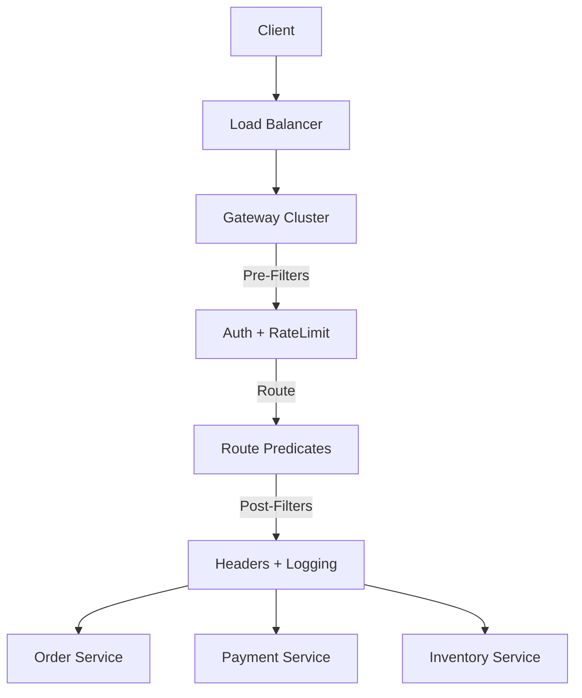
```mermaid
flowchart TB
    C[Client] --> LB[Load Balancer]
    LB --> GW[Gateway Cluster]
    GW -->|Pre-Filters| AF[Auth + RateLimit]
    AF -->|Route| RP[Route Predicates]
    RP -->|Post-Filters| PF[Headers + Logging]
    PF --> OS[Order Service]
    PF --> PS[Payment Service]
    PF --> IS[Inventory Service]
```

### 📶 Gradual Depth

**Level 1 - Basic routing:** Spring Cloud Gateway uses
route definitions with predicates and filters. A route
matches a request based on path, host, headers, or
query parameters, then forwards it to a URI.

```yaml
spring:
  cloud:
    gateway:
      routes:
        - id: order-service
          uri: lb://order-service
          predicates:
            - Path=/api/orders/**
          filters:
            - StripPrefix=1
```

The `lb://` prefix triggers load-balanced routing via
Spring Cloud LoadBalancer. `StripPrefix=1` removes
`/api` before forwarding, so `/api/orders/123` becomes
`/orders/123` at the downstream service.

**Level 2 - Filter pipeline:** Filters execute in a
chain. Pre-filters run before proxying (authentication,
request modification, rate limiting). Post-filters run
after the response returns (header injection, logging,
response modification).

```java
@Component
public class AuthFilter implements
    GatewayFilterFactory<AuthFilter.Config> {

  @Override
  public GatewayFilter apply(Config config) {
    return (exchange, chain) -> {
      String token = exchange.getRequest()
        .getHeaders()
        .getFirst(HttpHeaders.AUTHORIZATION);
      if (token == null
          || !jwtValidator.isValid(token)) {
        exchange.getResponse().setStatusCode(
          HttpStatus.UNAUTHORIZED
        );
        return exchange.getResponse()
          .setComplete();
      }
      // Add user context for downstream
      ServerHttpRequest modified = exchange
        .getRequest().mutate()
        .header("X-User-Id",
          jwtValidator.extractUserId(token))
        .build();
      return chain.filter(
        exchange.mutate()
          .request(modified).build()
      );
    };
  }
}
```

**Level 3 - Rate limiting with Redis:** Spring Cloud
Gateway provides a built-in `RequestRateLimiter` filter
backed by Redis using a token bucket algorithm.

```yaml
filters:
  - name: RequestRateLimiter
    args:
      redis-rate-limiter.replenishRate: 10
      redis-rate-limiter.burstCapacity: 20
      key-resolver: "#{@apiKeyResolver}"
```

```java
@Bean
public KeyResolver apiKeyResolver() {
  return exchange -> Mono.just(
    exchange.getRequest().getHeaders()
      .getFirst("X-API-Key")
  );
}
```

`replenishRate` is tokens per second per key.
`burstCapacity` is the maximum tokens available.
Redis stores the bucket state, enabling consistent
rate limiting across all gateway instances.

**Level 4 - Circuit breaking at the gateway:** Integrate
Resilience4j circuit breaker as a gateway filter to
prevent cascading failures when a downstream service
is unhealthy.

```yaml
filters:
  - name: CircuitBreaker
    args:
      name: orderCircuitBreaker
      fallbackUri: forward:/fallback/orders
```

```java
@RestController
public class FallbackController {
  @GetMapping("/fallback/orders")
  public ResponseEntity<Map<String, String>>
      orderFallback() {
    return ResponseEntity
      .status(HttpStatus.SERVICE_UNAVAILABLE)
      .body(Map.of(
        "message",
        "Order service temporarily unavailable"
      ));
  }
}
```

### ⚙️ How It Works

```
REQUEST LIFECYCLE:
Client -> Gateway
  1. Route predicate matching
     (Path, Host, Method, Header)
  2. Pre-filter chain execution:
     a. Auth filter (fail-closed)
     b. Rate limit filter (Redis check)
     c. Circuit breaker check
  3. Proxy to downstream service
  4. Receive response
  5. Post-filter chain execution:
     a. Add correlation headers
     b. Remove internal headers
     c. Log request/response metrics
  6. Return response to client
```

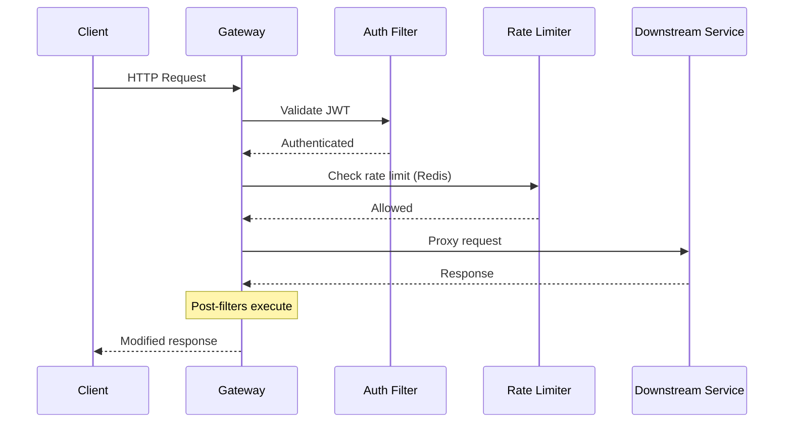
```mermaid
sequenceDiagram
    participant C as Client
    participant G as Gateway
    participant A as Auth Filter
    participant R as Rate Limiter
    participant S as Downstream Service

    C->>G: HTTP Request
    G->>A: Validate JWT
    A-->>G: Authenticated
    G->>R: Check rate limit (Redis)
    R-->>G: Allowed
    G->>S: Proxy request
    S-->>G: Response
    Note over G: Post-filters execute
    G-->>C: Modified response
```

**BFF (Backend for Frontend) pattern:** Create separate
gateway route groups for different client types. Mobile
clients get aggregated responses (fewer round trips).
Web SPAs get fine-grained endpoints. Each BFF route
group applies different filters, rate limits, and
response transformations.

```yaml
routes:
  - id: mobile-orders
    uri: lb://order-aggregator
    predicates:
      - Path=/mobile/api/orders/**
      - Header=X-Client-Type, mobile
  - id: web-orders
    uri: lb://order-service
    predicates:
      - Path=/web/api/orders/**
```

### 🚨 Failure Modes

**Failure 1 - Gateway becomes the bottleneck:**
All traffic funnels through the gateway. Under load,
the gateway's thread pool (Netty event loop) saturates.
Latency spikes propagate to every service.

**Diagnostic:** Gateway CPU stays low but latency
increases. Netty event loop utilization metrics show
saturation. Upstream load balancer health checks start
failing intermittently.

**Fix:** Scale gateway instances horizontally behind
the load balancer. Ensure filters are non-blocking
(no `block()` calls in reactive pipeline). Move
expensive operations (JWT signature verification
with remote JWKS endpoint) behind caching. Use
connection pooling for downstream HTTP clients.

**Failure 2 - Redis rate limiter unavailable:**
Redis goes down. Every request either gets rate
limited (fail-closed) or bypasses rate limiting
entirely (fail-open).

**Diagnostic:** Redis connection timeout errors in
gateway logs. Rate limiting metrics show either
100% rejection or 0% rejection.

**Fix:** Configure fail-open for rate limiting (allow
traffic when Redis is down). Implement a local
in-memory fallback rate limiter with conservative
limits. Alert on Redis connectivity loss. A brief
window without rate limiting is better than rejecting
all traffic.

**Failure 3 - Route misconfiguration causes loop:**
A route predicate accidentally matches the fallback
URI, creating an infinite request loop within the
gateway.

**Diagnostic:** Gateway CPU spikes to 100%. Thread
dump shows recursive filter chain execution.
OutOfMemoryError from accumulated exchange objects.

**Fix:** Validate routes at startup to detect
circular references. Set `spring.cloud.gateway
.httpclient.response-timeout` to prevent infinite
waits. Use a dedicated `/fallback/**` path prefix
that no route predicate matches for proxying.

### 🔬 Production Reality

Spring Cloud Gateway runs on Netty with non-blocking
I/O. This means you must never call `.block()` inside
a filter. One blocking call in a filter ties up a
Netty event loop thread, which handles thousands of
concurrent connections. A single `.block()` under load
can cascade into full gateway unresponsiveness.

JWT validation at the gateway should use cached JWKS
keys. Fetching keys from the auth server on every
request adds latency and creates a dependency. Cache
JWKS keys with a TTL matching the key rotation period.

Correlation IDs must be generated at the gateway and
propagated to all downstream services. Use a global
pre-filter that generates a UUID if the
`X-Correlation-Id` header is absent, and a post-filter
that ensures it appears in the response.

Logging at the gateway must be selective. Logging full
request/response bodies in production generates
enormous log volumes. Log headers and metadata by
default. Enable body logging only for specific routes
during debugging via a configuration flag.

Health checks: expose a `/actuator/health` endpoint
that validates downstream service connectivity. The
load balancer uses this to remove unhealthy gateway
instances. Include Redis connectivity in the health
check since rate limiting depends on it.

### ⚖️ Trade-offs & Alternatives

**BAD:**

```java
// Blocking call inside reactive filter
@Override
public GatewayFilter apply(Config c) {
  return (exchange, chain) -> {
    // BLOCKS Netty event loop thread!
    User user = userClient.getUser(id)
      .block();
    return chain.filter(exchange);
  };
}
```

**GOOD:**

```java
// Non-blocking reactive filter
@Override
public GatewayFilter apply(Config c) {
  return (exchange, chain) -> {
    return userClient.getUser(id)
      .flatMap(user -> {
        ServerHttpRequest req = exchange
          .getRequest().mutate()
          .header("X-User", user.getId())
          .build();
        return chain.filter(
          exchange.mutate()
            .request(req).build()
        );
      });
  };
}
```

| Aspect        | Spring Cloud Gateway | Zuul 1             | Envoy/Kong          |
| ------------- | -------------------- | ------------------ | ------------------- |
| I/O model     | Non-blocking (Netty) | Blocking (Servlet) | Non-blocking (C++)  |
| Ecosystem     | Spring-native        | Legacy Netflix     | Polyglot            |
| Config        | Java/YAML            | Java               | YAML/Admin API      |
| Performance   | High throughput      | Limited by threads | Very high           |
| Extensibility | Java filters         | Java filters       | Lua/WASM/plugins    |
| Best for      | Spring shops         | Legacy only        | Multi-language orgs |

### ⚡ Decision Snap

Use Spring Cloud Gateway when: your backend is Spring-
based, you want Java-native filters, and your team
already knows Spring reactive (WebFlux/Reactor).

Use Envoy or Kong when: your services span multiple
languages, you want a sidecar proxy, or you need a
service mesh integration (Istio uses Envoy).

Skip the gateway entirely when: you have fewer than 3
services, use a managed API gateway (AWS API Gateway,
Google Cloud Endpoints), or your infrastructure
provides edge functionality natively (Kubernetes
Ingress with auth and rate limiting).

### ⚠️ Top Traps

| #   | Trap                            | Why it hurts                                                           | Escape                                               |
| --- | ------------------------------- | ---------------------------------------------------------------------- | ---------------------------------------------------- |
| 1   | Blocking calls in filters       | One `.block()` freezes a Netty thread serving thousands of connections | Use reactive operators: `flatMap`, `map`, `then`     |
| 2   | Gateway as business logic layer | Routing logic becomes an unmaintainable monolith                       | Keep gateway thin: auth, routing, rate limiting only |
| 3   | No circuit breaker on routes    | One slow service causes gateway thread starvation                      | Add Resilience4j CircuitBreaker filter per route     |
| 4   | Hardcoded service URLs          | Deployment changes require gateway redeployment                        | Use `lb://` with service discovery                   |
| 5   | Missing correlation IDs         | Cannot trace requests across services during incidents                 | Global pre-filter generates UUID for every request   |

### 🪜 Learning Ladder

**Prerequisites:**
SPR-080 Spring Cloud fundamentals,
SPR-090 Microservice Architecture with Spring Boot

**THIS:** SPR-097 API Gateway Design for Spring
Microservices

**Next steps:**
SPR-098 Multi-Tenancy Patterns in Spring Boot

**The Surprising Truth:** The most effective API gateways
do almost nothing. They route, authenticate, rate limit,
and get out of the way. Teams that add response
transformation, data aggregation, and business logic to
the gateway end up rebuilding the monolith at the edge.
The gateway that tries to be smart becomes the bottleneck
that cannot be scaled independently from the business
logic it absorbed.

**Further Reading:**

- Spring Cloud Gateway reference documentation
- Chris Richardson, "Microservices Patterns" (Manning)
- Sam Newman, "Building Microservices" (O'Reilly)
- Netflix Zuul architecture blog posts
- Resilience4j documentation for circuit breaker config

**Revision Card:**

1. Spring Cloud Gateway uses non-blocking Netty I/O with
   route predicates and a filter chain for cross-cutting
   concerns at the edge
2. Rate limiting uses Redis-backed token bucket; circuit
   breaking uses Resilience4j - both configured per route
3. Never call `.block()` in a gateway filter; keep the
   gateway thin with only auth, routing, and rate limiting

---

---

# SPR-098 Multi-Tenancy Patterns in Spring Boot

**TL;DR** - Isolate tenant data via database-per-tenant, schema-per-tenant, or discriminator column, routing through Hibernate's multi-tenancy SPI and Spring Security context.

### 🔥 Problem Statement

You are building a SaaS platform where hundreds of
customers (tenants) share the same Spring Boot
application. Each tenant expects complete data isolation

- tenant A must never see tenant B's records, even under
  bugs, cache corruption, or query mistakes. You also need
  per-tenant customization (feature flags, rate limits,
  storage quotas) without deploying separate instances for
  each tenant. The fundamental tension: operational
  simplicity (one deployable) versus data isolation
  guarantees (separate storage). Get this wrong and you
  have a data breach. Get it over-engineered and you have
  an ops nightmare with hundreds of database instances.

### 📜 Historical Context

Early SaaS applications (2005-2010) typically deployed
one application instance per customer - simple isolation
but terrible economics. Salesforce pioneered shared-schema
multi-tenancy with a metadata-driven OrgId discriminator
in the mid-2000s, proving the model could scale to
thousands of tenants on shared infrastructure. Hibernate
introduced `MultiTenancyStrategy` in version 4.0 (2012),
formalizing three strategies: DATABASE, SCHEMA, and
DISCRIMINATOR. Spring Boot auto-configuration support
improved significantly in Boot 2.x and 3.x, with
`HibernatePropertiesCustomizer` and
`CurrentTenantIdentifierResolver` becoming the standard
integration points. The rise of Kubernetes (2017+)
shifted the database-per-tenant model toward managed
database services with programmatic provisioning, making
what was once operationally expensive now feasible via
cloud APIs. Spring Security 6.x's context propagation
model integrates cleanly with tenant resolution, making
the full stack tenant-aware from HTTP ingress to SQL
execution.

### 🔩 First Principles

**CORE INVARIANTS:**

1. **Tenant isolation is a security boundary, not a
   convenience** - a missing WHERE clause or wrong
   connection string is a data breach, not a bug
2. **Tenant identity must be resolved once at the edge
   and propagated immutably** - re-resolving mid-request
   from mutable state invites cross-tenant leaks
3. **Connection pool and cache must be tenant-scoped or
   tenant-safe** - a shared HikariCP pool returning a
   connection bound to tenant A's schema to tenant B's
   request is a silent catastrophe

**DERIVED DESIGN:**

From invariant 1: the isolation strategy must be chosen
based on regulatory requirements (some industries mandate
separate databases), not developer convenience. From
invariant 2: tenant context flows through a
`ThreadLocal` (or Reactor context for reactive) set by
a servlet filter before any business logic executes.
From invariant 3: database-per-tenant requires per-tenant
connection pools or a pool-per-tenant manager;
shared-schema can share a pool but must validate every
query includes the discriminator.

### 🧠 Mental Model

> Multi-tenancy is like an apartment building. Each
> tenant gets their own unit. The three strategies differ
> in how much shared infrastructure exists.

-> Database-per-tenant: separate buildings on the same
block - maximum isolation, maximum cost
-> Schema-per-tenant: separate apartments in one
building - shared plumbing, separate floor plans
-> Shared-schema with discriminator: one open-plan
office with assigned desks - cheapest, but one
spilled coffee can reach the neighbor

**Where this analogy breaks down:** In real apartments,
a tenant cannot accidentally enter another's unit. In
software, a missing discriminator filter silently reads
all tenants' data. The "walls" in shared-schema are
purely logical and require active enforcement at every
query, cache lookup, and event publish.

### 🧩 Components

```
+--------------------------------------------------+
|  HTTP Request (Header / Subdomain / JWT)         |
+--------------------------------------------------+
          |
          v
+---------------------+   +--------------------+
| TenantFilter        |-->| TenantContext       |
| (resolves tenant)   |   | (ThreadLocal)       |
+---------------------+   +--------------------+
          |
          v
+---------------------+   +--------------------+
| CurrentTenantId     |-->| ConnectionProvider  |
| Resolver (Hibernate)|   | (per-tenant routing)|
+---------------------+   +--------------------+
          |
          v
+--------------------------------------------------+
|  DataSource / Schema / Discriminator Column      |
+--------------------------------------------------+
```

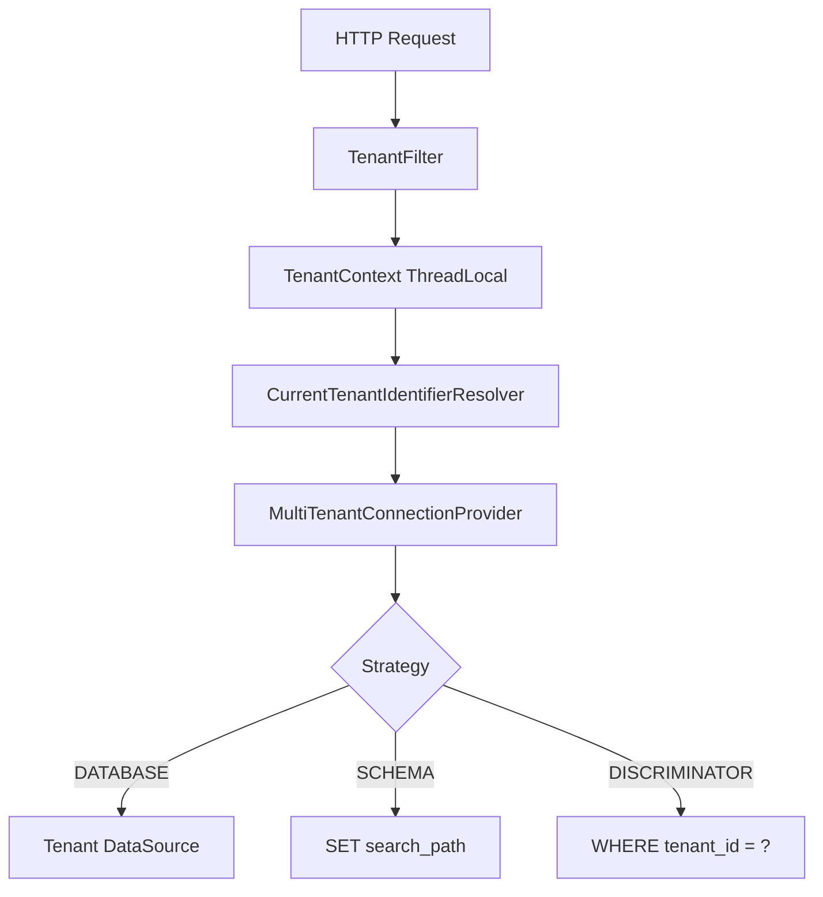
```mermaid
flowchart TD
    A[HTTP Request] --> B[TenantFilter]
    B --> C[TenantContext ThreadLocal]
    C --> D[CurrentTenantIdentifierResolver]
    D --> E[MultiTenantConnectionProvider]
    E --> F{Strategy}
    F -->|DATABASE| G[Tenant DataSource]
    F -->|SCHEMA| H[SET search_path]
    F -->|DISCRIMINATOR| I["WHERE tenant_id = ?"]
```

### 📶 Gradual Depth

**Layer 1 - Core concept:** Every request carries a
tenant identifier. A filter extracts it and stores it in
`ThreadLocal`. Hibernate reads it via
`CurrentTenantIdentifierResolver` and routes the query
to the correct database, schema, or adds a WHERE clause.

**Layer 2 - Mechanism:** For DATABASE strategy, implement
`MultiTenantConnectionProvider` to return a `Connection`
from the correct tenant's `DataSource`. For SCHEMA, the
provider issues `SET search_path TO tenant_schema` on
the connection. For DISCRIMINATOR, Hibernate
automatically appends `@TenantId` column filtering via
`@Filter` and `@FilterDef` annotations on entities.

**Layer 3 - Production concerns:** Tenant resolution
sources: HTTP header (`X-Tenant-Id`) for internal
services, subdomain parsing (`tenant1.app.com`) for
customer-facing, JWT claim (`tenant_id`) for API
clients. Connection pool isolation: database-per-tenant
needs a `Map<String, HikariDataSource>` with lazy
initialization and eviction for idle tenants. Schema
strategy can share one pool but must validate schema
switching is connection-safe (PostgreSQL `SET
search_path` is session-scoped). Discriminator strategy
shares everything but requires rigorous `@Filter`
activation on every session - miss one and data leaks.

**Layer 4 - Edge cases:** Tenant onboarding requires
DDL execution (create database/schema) at runtime.
Flyway/Liquibase migrations must iterate all tenant
databases/schemas. Cross-tenant reporting needs a
separate read path that explicitly bypasses isolation.
Cache (Hibernate L2, Spring Cache) must be tenant-keyed
or tenant data bleeds across cache lookups.

### ⚙️ How It Works

```
REQUEST FLOW (Schema-per-Tenant):

Browser --> /api/orders (Header: X-Tenant-Id: acme)
  |
  v
TenantFilter.doFilter():
  tenantId = request.getHeader("X-Tenant-Id")
  TenantContext.set(tenantId)          // ThreadLocal
  |
  v
OrderRepository.findAll():
  Hibernate -> resolve tenant -> "acme"
  ConnectionProvider -> conn.setSchema("acme")
  SQL: SELECT * FROM acme.orders
  |
  v
TenantFilter (finally):
  TenantContext.clear()                // CRITICAL
```

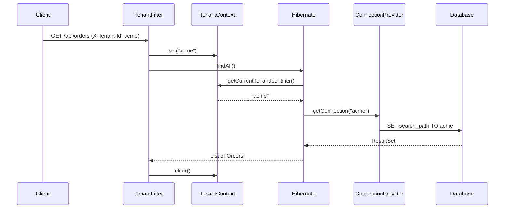
```mermaid
sequenceDiagram
    participant C as Client
    participant F as TenantFilter
    participant TC as TenantContext
    participant H as Hibernate
    participant CP as ConnectionProvider
    participant DB as Database

    C->>F: GET /api/orders (X-Tenant-Id: acme)
    F->>TC: set("acme")
    F->>H: findAll()
    H->>TC: getCurrentTenantIdentifier()
    TC-->>H: "acme"
    H->>CP: getConnection("acme")
    CP->>DB: SET search_path TO acme
    DB-->>H: ResultSet
    H-->>F: List of Orders
    F->>TC: clear()
```

**Implementation skeleton:**

```java
// Tenant context holder
public class TenantContext {
  private static final ThreadLocal<String> CURRENT
    = new ThreadLocal<>();
  public static void set(String id) {
    CURRENT.set(id);
  }
  public static String get() {
    return CURRENT.get();
  }
  public static void clear() {
    CURRENT.remove();
  }
}
```

```java
// Servlet filter for tenant resolution
@Component
@Order(Ordered.HIGHEST_PRECEDENCE)
public class TenantFilter extends OncePerRequestFilter {
  @Override
  protected void doFilterInternal(
      HttpServletRequest req,
      HttpServletResponse res,
      FilterChain chain) throws Exception {
    String tenant = resolveTenant(req);
    if (tenant == null) {
      res.sendError(400, "Missing tenant");
      return;
    }
    try {
      TenantContext.set(tenant);
      chain.doFilter(req, res);
    } finally {
      TenantContext.clear(); // prevent leaks
    }
  }

  private String resolveTenant(
      HttpServletRequest req) {
    // Priority: JWT claim > header > subdomain
    String jwt = extractFromJwt(req);
    if (jwt != null) return jwt;
    String header = req.getHeader("X-Tenant-Id");
    if (header != null) return header;
    return extractSubdomain(req);
  }
}
```

```java
// Hibernate tenant identifier resolver
@Component
public class TenantIdentifierResolver
    implements CurrentTenantIdentifierResolver<String> {
  @Override
  public String resolveCurrentTenantIdentifier() {
    String t = TenantContext.get();
    return t != null ? t : "default";
  }
  @Override
  public boolean validateExistingCurrentSessions() {
    return true;
  }
}
```

```java
// Schema-based connection provider
@Component
public class SchemaConnectionProvider
    implements MultiTenantConnectionProvider<String> {
  private final DataSource dataSource;

  public SchemaConnectionProvider(DataSource ds) {
    this.dataSource = ds;
  }
  @Override
  public Connection getAnyConnection()
      throws SQLException {
    return dataSource.getConnection();
  }
  @Override
  public void releaseAnyConnection(Connection c)
      throws SQLException {
    c.close();
  }
  @Override
  public Connection getConnection(String tenant)
      throws SQLException {
    Connection c = getAnyConnection();
    c.createStatement().execute(
      "SET search_path TO " + tenant);
    return c;
  }
  @Override
  public void releaseConnection(
      String tenant, Connection c)
      throws SQLException {
    c.createStatement().execute(
      "SET search_path TO public");
    c.close();
  }
}
```

### 🚨 Failure Modes

**Failure 1 - Cross-tenant data leak via missing
TenantContext.clear():**

An async handoff (e.g., `@Async` method, thread pool
executor) inherits a stale `ThreadLocal` value from
the parent thread. Tenant A's request finishes, but
the thread is returned to the pool with tenant A's
context still set. Tenant B's next request on that
thread reads tenant A's data.

**Diagnostic:** Add a servlet filter assertion at
request start that verifies `TenantContext.get()` is
null. If non-null before setting, log a CRITICAL alert
with the stale tenant ID and current request details.

**Fix:** Always call `TenantContext.clear()` in a
`finally` block. For `@Async`, use a
`TaskDecorator` that copies and clears tenant context:

```java
public class TenantTaskDecorator
    implements TaskDecorator {
  @Override
  public Runnable decorate(Runnable task) {
    String tenant = TenantContext.get();
    return () -> {
      try {
        TenantContext.set(tenant);
        task.run();
      } finally {
        TenantContext.clear();
      }
    };
  }
}
```

**Failure 2 - Connection pool exhaustion with
database-per-tenant:**

Each tenant gets a `HikariDataSource` with
`maximumPoolSize=10`. At 200 tenants, that is 2000
connections. The database server's `max_connections`
is 500. New connection attempts hang, then timeout,
cascading into HTTP 503s across all tenants.

**Diagnostic:** Monitor `hikaricp_connections_active`
per tenant pool. Alert when total active connections
across all pools exceeds 70% of database
`max_connections`.

**Fix:** Use a shared pool with schema routing instead
of per-tenant pools. If database-per-tenant is
required, implement lazy pool creation with idle
eviction (`idleTimeout=60s`) and a global connection
cap enforced by a semaphore across all pools.

**Failure 3 - Schema migration drift:**

Tenant `acme` was onboarded before a Flyway migration
added the `audit_log` table. Tenant `beta` was
onboarded after. Queries against `audit_log` succeed
for `beta` but throw `relation does not exist` for
`acme`. No single deployment caught this because
migrations only ran against a "default" schema.

**Diagnostic:** Add a startup health check that
iterates all tenant schemas and verifies Flyway's
`schema_version` table matches the expected version.

**Fix:** Migration scripts must loop through all
registered tenant schemas. Use Flyway's
`schemas` configuration or a custom
`FlywayMigrationStrategy` that iterates the tenant
registry.

### 🔬 Production Reality

Connection pool sizing dominates operational cost.
A 500-tenant database-per-tenant deployment on AWS
RDS needs either RDS Proxy (connection multiplexing)
or Aurora Serverless (per-tenant clusters with
auto-pause). Schema-per-tenant on PostgreSQL scales
to several hundred schemas before `pg_catalog` bloat
slows DDL operations. Shared-schema with discriminator
scales to thousands of tenants but requires index
design that includes `tenant_id` as the leading column
in every composite index - otherwise the database
scans the full table and filters late. Cache isolation
is frequently overlooked: Spring Cache with
`@Cacheable("orders")` without tenant-prefixed keys
serves cached data across tenants. Use a
`TenantAwareCacheKeyGenerator` that prepends tenant
ID to every cache key. Hibernate L2 cache (EhCache,
Hazelcast) must use tenant-scoped cache regions.

### ⚖️ Trade-offs & Alternatives

**BAD:**

```java
// Shared pool, no schema isolation, no filter
@Repository
public interface OrderRepo
    extends JpaRepository<Order, Long> {
  // Anyone's orders returned to anyone
  List<Order> findAll();
}
```

**GOOD:**

```java
// Discriminator entity with enforced filter
@Entity
@FilterDef(name = "tenantFilter",
  parameters = @ParamDef(
    name = "tenantId", type = String.class))
@Filter(name = "tenantFilter",
  condition = "tenant_id = :tenantId")
public class Order {
  @Column(name = "tenant_id",
    nullable = false, updatable = false)
  private String tenantId;
}
```

| Dimension               | DB-per-tenant  | Schema-per-tenant | Discriminator        |
| ----------------------- | -------------- | ----------------- | -------------------- |
| Isolation               | Strongest      | Strong            | Logical only         |
| Ops complexity          | Highest        | Medium            | Lowest               |
| Cost per tenant         | Highest        | Medium            | Lowest               |
| Migration effort        | Per-database   | Per-schema loop   | Single migration     |
| Connection pools        | Per-tenant     | Shared possible   | Shared               |
| Regulatory fit          | Healthcare/fin | Most SaaS         | Low-risk SaaS        |
| Cross-tenant query      | Federated      | Schema union      | WHERE without filter |
| Max tenants (practical) | ~100-500       | ~500-2000         | ~10,000+             |

### ⚡ Decision Snap

Use **database-per-tenant** when regulation demands
physical isolation (HIPAA, PCI with strict auditors)
and tenant count is low (<100). Use **schema-per-tenant**
for the common SaaS case: reasonable isolation,
manageable ops, works well with PostgreSQL's
`search_path`. Use **discriminator** when tenant count
is high (>1000), isolation requirements are
contractual (not regulatory), and you need maximum
operational simplicity. Start with discriminator and
promote to schema when a tenant demands it - this
migration is additive, not destructive.

### ⚠️ Top Traps

| #   | Trap                                                    | Why it bites                                     |
| --- | ------------------------------------------------------- | ------------------------------------------------ |
| 1   | Forgetting `TenantContext.clear()` in `finally`         | Thread pool reuse causes cross-tenant data leaks |
| 2   | Shared Hibernate L2 cache without tenant-scoped regions | Cached entity from tenant A served to tenant B   |
| 3   | Flyway migrations only applied to default schema        | New tenants have tables, old tenants do not      |
| 4   | `@Async` without `TaskDecorator` for tenant propagation | Background tasks run with wrong or null tenant   |
| 5   | Composite indexes missing `tenant_id` as leading column | Full table scans on discriminator-based queries  |

### 🪜 Learning Ladder

**Prerequisites:**

- SPR-033 Spring Data JPA Entity Lifecycle
- SPR-100 Spring Security Advanced (Custom Filters
  and Method Security)

**THIS:** SPR-098 Multi-Tenancy Patterns in Spring Boot

**Next steps:**

- SPR-090 Microservice Architecture with Spring Boot

**The Surprising Truth:**

The biggest multi-tenancy failures are not about
choosing the wrong strategy - they are about cache
and async context. Teams spend weeks debating
database-per-tenant versus schema-per-tenant, then
ship with a shared `@Cacheable` annotation that leaks
data across tenants on day one. The strategy decision
matters less than the discipline of tenant-scoping
every stateful component: caches, thread pools, event
buses, and scheduled tasks.

**Further Reading:**

- Hibernate ORM User Guide - Multi-Tenancy chapter
- Spring Boot Reference - HibernatePropertiesCustomizer
- PostgreSQL Documentation - Schema search path
- AWS SaaS Factory multi-tenant reference architecture

**Revision Card:**

1. Three strategies: database-per-tenant (physical),
   schema-per-tenant (logical), discriminator (row-level)
   - chosen by isolation requirements, not preference
2. Tenant context lives in ThreadLocal, set by filter,
   propagated via TaskDecorator, cleared in finally
3. Cache, async executors, and migrations must all be
   tenant-aware - the isolation strategy only covers
   the database layer

---

---

# SPR-099 Reactive Data Access (R2DBC)

**TL;DR** - R2DBC provides non-blocking database access for reactive Spring stacks, but only choose it over JDBC when your entire pipeline is genuinely non-blocking.

### 🔥 Problem Statement

Your Spring WebFlux service handles 10,000 concurrent
requests with a small thread pool. Every request needs
a database query. JDBC is blocking: when the application
calls `resultSet.next()`, the carrier thread parks until
the database responds. With 10,000 concurrent queries
and 200 platform threads, 9,800 requests queue behind
those 200 blocked threads. The entire reactive
architecture collapses at the JDBC boundary. You need a
database driver that returns results as a `Publisher`
instead of blocking the caller, so the same small thread
pool can multiplex thousands of in-flight queries without
parking.

### 📜 Historical Context

JDBC has been Java's database access standard since JDK
1.1 (1997). Its API is fundamentally synchronous:
`Connection.prepareStatement()`, `Statement.execute()`,
and `ResultSet.next()` all block the calling thread.
Oracle proposed ADBA (Asynchronous Database Access) as a
JDBC successor around 2017, but it was abandoned. The
R2DBC (Reactive Relational Database Connectivity)
initiative started in 2018, led by Pivotal (now
Broadcom/VMware) engineers, as a specification designed
from scratch for reactive access to SQL databases. R2DBC
1.0 GA shipped in 2022. Spring Data R2DBC and Spring
Framework's `DatabaseClient` provide the application-level
programming model. Key driver implementations:
`r2dbc-postgresql`, `r2dbc-mysql`, `r2dbc-mssql`,
`r2dbc-h2`, and the Oracle reactive driver. With the
arrival of virtual threads in Java 21 (2023), the
landscape shifted: blocking JDBC on a virtual thread
does not block the carrier, reopening the question of
whether R2DBC's complexity is justified.

### 🔩 First Principles

**CORE INVARIANTS:**

1. **A reactive pipeline is only as non-blocking as its
   most blocking operator** - one `block()` call in a
   WebFlux handler defeats the entire model
2. **R2DBC connections are non-blocking resources, not
   thread-bound resources** - you cannot assume
   one-connection-per-thread; the connection may serve
   interleaved operations from different subscribers
3. **Backpressure must propagate from subscriber to
   database** - if the client cannot consume rows fast
   enough, the driver must signal the database to pause
   sending (via TCP flow control or protocol-level fetch
   size)

**DERIVED DESIGN:**

From invariant 1: using R2DBC in a traditional servlet
stack (Spring MVC) adds complexity without benefit - the
servlet thread is already blocked waiting for the
controller to return. From invariant 2: transaction
management cannot rely on `ThreadLocal` - Spring's
reactive transaction manager uses Reactor context
(`TransactionalOperator`) instead of
`@Transactional`'s `PlatformTransactionManager`. From
invariant 3: `DatabaseClient` and
`ReactiveCrudRepository` expose `Flux<T>`, which carries
backpressure semantics - but the actual backpressure
behavior depends on the driver implementation and
database protocol.

### 🧠 Mental Model

> JDBC is like a phone call: you dial, wait on hold
> until the person answers, get your information, and
> hang up. Your line is occupied the whole time. R2DBC
> is like sending a text message: you send the query,
> go do other things, and get notified when the reply
> arrives.

-> JDBC `executeQuery()` blocks the thread until all
rows are fetched or the timeout expires
-> R2DBC `execute()` returns a `Publisher` immediately;
rows arrive as `onNext` signals when available
-> JDBC transaction binds to a thread via ThreadLocal;
R2DBC transaction binds to a Reactor context
-> JDBC connection pool (HikariCP) hands out connections
per thread; R2DBC pool (r2dbc-pool) hands out
connections per subscription

**Where this analogy breaks down:** Text messages are
fire-and-forget. R2DBC subscriptions are demand-driven:
the subscriber controls how many rows it requests
(`request(n)`), and the publisher (driver) is obligated
to respect that demand. This backpressure mechanism has
no equivalent in everyday messaging.

### 🧩 Components

```
+---------------------------------------------------+
| Spring WebFlux Controller (returns Flux/Mono)     |
+---------------------------------------------------+
          |
          v
+---------------------------------------------------+
| ReactiveCrudRepository / DatabaseClient           |
+---------------------------------------------------+
          |
          v
+-------------------+   +------------------------+
| R2DBC Connection  |   | ReactiveTransaction    |
| Factory           |   | Manager                |
+-------------------+   +------------------------+
          |
          v
+---------------------------------------------------+
| r2dbc-pool (ConnectionPool)                       |
+---------------------------------------------------+
          |
          v
+---------------------------------------------------+
| R2DBC Driver (r2dbc-postgresql, r2dbc-mysql, ...) |
+---------------------------------------------------+
          |
          v
+---------------------------------------------------+
| Database (non-blocking wire protocol)             |
+---------------------------------------------------+
```

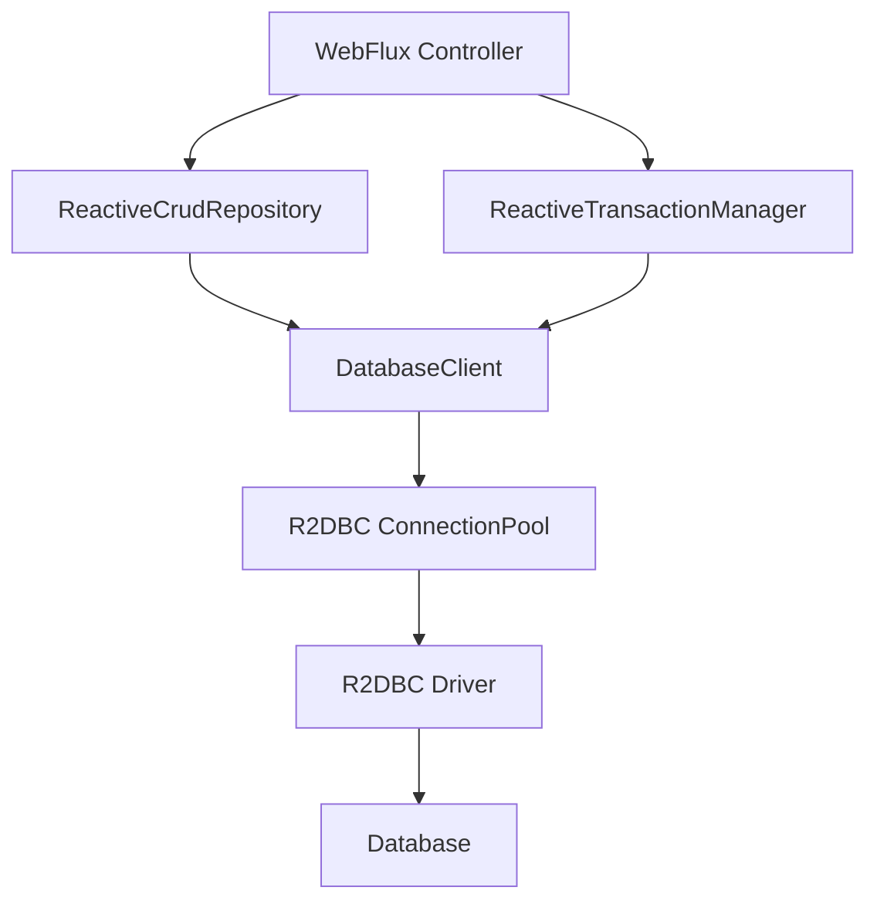
```mermaid
flowchart TD
    A[WebFlux Controller] --> B[ReactiveCrudRepository]
    B --> C[DatabaseClient]
    C --> D[R2DBC ConnectionPool]
    D --> E[R2DBC Driver]
    E --> F[Database]
    G[ReactiveTransactionManager] --> C
    A --> G
```

### 📶 Gradual Depth

**Layer 1 - Core concept:** R2DBC is a specification
for non-blocking SQL database access. Instead of
returning a `ResultSet`, queries return a
`Publisher<Row>` (Reactor `Flux<Row>`). Spring Data
R2DBC provides `ReactiveCrudRepository` with the
same interface pattern as JPA repositories but returning
`Mono<T>` and `Flux<T>`.

**Layer 2 - Mechanism:** `ConnectionFactory` is the
R2DBC equivalent of `DataSource`. `DatabaseClient` is
the reactive equivalent of `JdbcTemplate` - it binds
parameters, executes SQL, and maps rows without
blocking. Spring Boot auto-configures both from
`spring.r2dbc.url`, `spring.r2dbc.username`, and
`spring.r2dbc.password` properties. The
`r2dbc-pool` library wraps `ConnectionFactory` with
connection pooling (similar to HikariCP for JDBC).

**Layer 3 - Transaction management:** `@Transactional`
works on reactive methods but routes through
`R2dbcTransactionManager` instead of
`DataSourceTransactionManager`. Under the hood, Spring
stores the transaction context in Reactor's
`Context` (not `ThreadLocal`). For programmatic control,
use `TransactionalOperator`:

```java
@Service
public class OrderService {
  private final TransactionalOperator txOp;
  private final OrderRepository repo;

  public Mono<Order> createOrder(Order order) {
    return repo.save(order)
      .as(txOp::transactional);
  }
}
```

**Layer 4 - Backpressure and fetch size:** When a query
returns 1 million rows, `Flux<Row>` does not load them
all into memory. The subscriber requests rows in batches
(`request(n)`). The R2DBC driver translates this into
protocol-level fetch size. PostgreSQL's extended query
protocol supports this natively. MySQL's protocol is
less backpressure-friendly - the driver may buffer
entire result sets depending on version.

### ⚙️ How It Works

```
QUERY LIFECYCLE:

Subscriber subscribes to Flux<Order>
  |
  v
DatabaseClient prepares statement
  |
  v
ConnectionPool.create() -> Mono<Connection>
  (async: returns when connection available)
  |
  v
Connection.createStatement(sql).bind(params)
  |
  v
Statement.execute() -> Flux<Result>
  (non-blocking: returns immediately)
  |
  v
Result.map(row -> new Order(...)) -> Flux<Order>
  |
  v
Subscriber receives onNext(order) signals
  (demand-driven: only as many as requested)
  |
  v
Connection released back to pool on completion
```

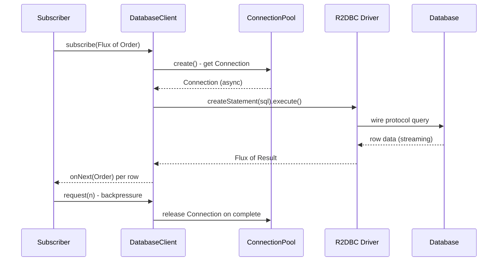
```mermaid
sequenceDiagram
    participant S as Subscriber
    participant DC as DatabaseClient
    participant P as ConnectionPool
    participant D as R2DBC Driver
    participant DB as Database

    S->>DC: subscribe(Flux of Order)
    DC->>P: create() - get Connection
    P-->>DC: Connection (async)
    DC->>D: createStatement(sql).execute()
    D->>DB: wire protocol query
    DB-->>D: row data (streaming)
    D-->>DC: Flux of Result
    DC-->>S: onNext(Order) per row
    S->>DC: request(n) - backpressure
    DC->>P: release Connection on complete
```

**Repository pattern:**

```java
public interface OrderRepository
    extends ReactiveCrudRepository<Order, Long> {

  @Query("SELECT * FROM orders WHERE "
    + "customer_id = :customerId")
  Flux<Order> findByCustomerId(
    @Param("customerId") Long customerId);

  @Query("SELECT * FROM orders WHERE "
    + "status = :status LIMIT :limit")
  Flux<Order> findByStatus(
    @Param("status") String status,
    @Param("limit") int limit);
}
```

**DatabaseClient for dynamic queries:**

```java
@Repository
public class OrderDynamicRepo {
  private final DatabaseClient client;

  public Flux<Order> search(String term) {
    return client
      .sql("SELECT * FROM orders "
        + "WHERE name LIKE :term")
      .bind("term", "%" + term + "%")
      .map(row -> new Order(
        row.get("id", Long.class),
        row.get("name", String.class)))
      .all();
  }
}
```

**Boot configuration:**

```yaml
spring:
  r2dbc:
    url: r2dbc:postgresql://localhost/mydb
    username: app
    password: ${DB_PASSWORD}
    pool:
      initial-size: 5
      max-size: 20
      max-idle-time: 30m
```

### 🚨 Failure Modes

**Failure 1 - Calling block() inside a reactive
pipeline:**

A developer writes `repository.findById(id).block()`
inside a WebFlux handler because they need the result
"right now." This blocks the Netty event loop thread.
With only 4-8 event loop threads, a few concurrent
requests doing this starve the entire server.

**Diagnostic:** Enable Reactor's
`Hooks.onOperatorDebug()` in dev. In production,
use BlockHound - it detects blocking calls on
non-blocking threads and throws
`BlockingOperationError` with a stack trace.

**Fix:** Never call `block()` in WebFlux handlers.
Compose everything as `Mono`/`Flux` chains. If you
must integrate with blocking code, offload to
`Schedulers.boundedElastic()`:

```java
Mono.fromCallable(() -> blockingLegacyCall())
  .subscribeOn(Schedulers.boundedElastic());
```

**Failure 2 - Connection pool exhaustion from
un-cancelled subscriptions:**

A client disconnects mid-stream but the server-side
`Flux` keeps fetching rows, holding the R2DBC
connection. The pool runs out of connections. New
requests timeout waiting for a pool slot.

**Diagnostic:** Monitor
`r2dbc.pool.acquired` and
`r2dbc.pool.pending-acquire-queue-size` Micrometer
metrics. Alert when pending queue exceeds max pool
size.

**Fix:** Add `.take(limit)` to bound result sets.
Configure `maxAcquireTime` on the pool so pending
acquisitions fail fast. Use `timeout()` on reactive
chains to cancel abandoned operations.

**Failure 3 - Reactive transaction context lost
across async boundaries:**

A `flatMap` switches schedulers (e.g., calling an
external HTTP client). The Reactor context carrying
the transaction is lost. The subsequent database
operation executes outside the transaction, and the
commit never includes it.

**Diagnostic:** Enable Spring's DEBUG logging for
`o.s.r2dbc.connection` to trace connection
acquisition and release per operation.

**Fix:** Ensure all operators within a transactional
chain run on the same Reactor context. Avoid
`subscribeOn` or `publishOn` inside transactional
blocks. Use `TransactionalOperator` to explicitly
scope the transactional boundary.

### 🔬 Production Reality

R2DBC driver maturity varies. The PostgreSQL driver
(`r2dbc-postgresql`) is the most mature, supporting
streaming, prepared statements, and notification
listening. The MySQL driver has caught up but
historically lacked true streaming (buffering full
result sets). Connection pool tuning differs from
HikariCP: R2DBC pools manage non-blocking connections
where one connection can serve overlapping queries
(protocol-level multiplexing on some databases), so
you typically need fewer connections than JDBC. For
PostgreSQL, a pool of 20 R2DBC connections can sustain
throughput equivalent to 100 JDBC connections under
high concurrency because connections are not parked
waiting for thread scheduling. ORM support is limited:
R2DBC has no JPA equivalent. No lazy loading, no
entity lifecycle callbacks, no dirty checking. Spring
Data R2DBC maps rows to objects but you write SQL
strings (or use simple derived query methods). For
complex domain models, this is a significant trade-off.

### ⚖️ Trade-offs & Alternatives

**BAD:**

```java
// Blocking JDBC inside a WebFlux handler
@GetMapping("/orders/{id}")
public Mono<Order> getOrder(@PathVariable Long id) {
  // BLOCKS the event loop thread
  Order o = jdbcTemplate.queryForObject(
    "SELECT * FROM orders WHERE id = ?",
    orderMapper, id);
  return Mono.just(o);
}
```

**GOOD:**

```java
// Non-blocking R2DBC in WebFlux
@GetMapping("/orders/{id}")
public Mono<Order> getOrder(@PathVariable Long id) {
  return orderRepository.findById(id);
}
```

| Dimension             | R2DBC             | JDBC + Virtual Threads     |
| --------------------- | ----------------- | -------------------------- |
| Thread model          | Event loop (few)  | Virtual thread per request |
| Code complexity       | Higher (reactive) | Lower (imperative)         |
| ORM support           | None (no JPA)     | Full JPA/Hibernate         |
| Debugging             | Harder (async)    | Standard stack traces      |
| Max concurrency       | Very high         | Very high                  |
| Ecosystem maturity    | Growing           | Mature (30 years)          |
| Backpressure          | Native            | Not applicable             |
| Library compatibility | Reactive only     | Any blocking library       |
| Migration from JDBC   | Full rewrite      | Add `--enable-preview`     |

### ⚡ Decision Snap

Use R2DBC when your entire stack is already reactive
(WebFlux, reactive messaging, reactive cache) and you
cannot tolerate any blocking call in the pipeline. If
you are starting a new project on Java 21+, strongly
consider virtual threads with JDBC first - you get the
concurrency benefits without the reactive complexity,
and you keep full JPA/Hibernate support. R2DBC makes
sense when you need true streaming backpressure from
database to client (e.g., SSE endpoints pushing live
query results) or when you are already invested in
Project Reactor throughout your stack. Do not adopt
R2DBC for a single service that talks to one database

- the complexity tax is not justified.

### ⚠️ Top Traps

| #   | Trap                                                   | Why it bites                                             |
| --- | ------------------------------------------------------ | -------------------------------------------------------- |
| 1   | Calling `block()` in WebFlux handler                   | Blocks event loop thread, starving the server            |
| 2   | Using `@Transactional` without R2dbcTransactionManager | Transaction silently does nothing in reactive context    |
| 3   | Expecting JPA features (lazy loading, dirty checking)  | R2DBC has no ORM - you write SQL and map manually        |
| 4   | Ignoring r2dbc-pool max-size tuning                    | Pool exhaustion under load with no visibility            |
| 5   | Mixing `subscribeOn` inside transactional operator     | Reactor context lost, operations run outside transaction |

### 🪜 Learning Ladder

**Prerequisites:**

- SPR-071 Spring WebFlux and Project Reactor Basics
- SPR-093 Virtual Threads (Loom) Integration in
  Spring 6

**THIS:** SPR-099 Reactive Data Access (R2DBC)

**Next steps:**

- SPR-101 Performance at Scale - Spring vs Quarkus vs
  Micronaut

**The Surprising Truth:**

The strongest argument against R2DBC in 2025 is not
its complexity - it is virtual threads. Java 21's
virtual threads let you write blocking JDBC code that
scales to millions of concurrent operations without
starving platform threads. The reactive tax (no JPA,
harder debugging, steeper learning curve) only pays off
when you need true end-to-end backpressure or you are
already committed to a fully reactive stack. Most teams
that adopted R2DBC in 2020-2022 are now re-evaluating
as virtual threads mature.

**Further Reading:**

- R2DBC Specification (r2dbc.io)
- Spring Data R2DBC Reference Documentation
- Spring Framework DatabaseClient Javadoc
- Mark Paluch, "Reactive Relational Database
  Connectivity" (SpringOne 2019)
- JEP 444: Virtual Threads (openjdk.org)

**Revision Card:**

1. R2DBC provides non-blocking database access via
   `Publisher<Row>` - only valuable when the entire
   pipeline is non-blocking (WebFlux, not MVC)
2. Transaction management uses Reactor context, not
   ThreadLocal - use `TransactionalOperator` or
   reactive `@Transactional` with `R2dbcTransactionManager`
3. Virtual threads + JDBC is the simpler alternative
   for high concurrency since Java 21 - choose R2DBC
   only for true streaming backpressure or fully
   reactive stacks

---

---

# SPR-100 Spring Security Advanced (Custom Filters and Method Security)

**TL;DR** - Build layered security with custom filters, method-level SpEL guards, and JWT validation to protect APIs beyond default auto-configuration.

### 🔥 Problem Statement

Default Spring Security auto-configuration handles login
forms and session cookies, but production APIs need more.
You need custom authentication schemes (API keys, mTLS,
multi-tenant tokens), fine-grained method-level
authorization ("user X can edit only their own orders"),
stateless JWT validation for OAuth2 resource servers,
and CORS/CSRF policies that actually work with SPA
frontends. The standard `HttpSecurity` DSL covers URL
patterns, but real applications demand filters that
intercept requests before authentication, authorization
logic that inspects domain objects after method execution,
and clear separation between "who are you?" and "what can
you do?" across dozens of endpoints.

### 📜 Historical Context

Spring Security started as Acegi Security in 2003 - a
powerful but notoriously complex XML-driven framework.
Spring Security 2.0 (2008) introduced namespace-based
XML configuration, reducing boilerplate but hiding the
filter chain behind magic. Spring Security 3.0 aligned
with Spring 3, introducing SpEL-based `@PreAuthorize`.
Boot 1.x auto-configured a single filter chain with
sensible defaults. Spring Security 5.0 (2017) added
first-class OAuth2 client and resource server support.
The component-based `SecurityFilterChain` bean approach
(replacing `WebSecurityConfigurerAdapter`) became the
standard in Spring Security 5.7+ (2022) and is now the
only pattern in Security 6.x. This shift moved from
inheritance to composition, making multiple filter chains
and custom filters explicit and testable.

### 🔩 First Principles

**CORE INVARIANTS:**

1. **Security is a filter chain** - every HTTP request
   passes through an ordered list of `jakarta.servlet.
Filter` instances; authentication and authorization
   are just specific filters in that chain
2. **Authentication and authorization are separate
   concerns** - authentication establishes identity
   (the `Authentication` object), authorization decides
   access (voters, SpEL expressions, authority checks)
3. **The SecurityContext is thread-bound** - the
   `SecurityContextHolder` stores the authenticated
   principal in a `ThreadLocal` (or Reactor context in
   WebFlux), making it available downstream without
   passing it explicitly

**DERIVED DESIGN:**

Because security is a filter chain, you customize it by
inserting custom filters at precise positions (before
`UsernamePasswordAuthenticationFilter`, after
`BearerTokenAuthenticationFilter`, etc.). Because auth
and authz are separate, you can combine custom
`AuthenticationProvider` implementations with standard
`@PreAuthorize` annotations. Because the context is
thread-bound, method security can inspect `principal`
and `authentication` in SpEL without any explicit
parameter passing.

### 🧠 Mental Model

> Spring Security is an airport security checkpoint.
> The filter chain is the sequence of stations: ID
> check (authentication filter), boarding pass scan
> (authorization filter), customs (CORS filter),
> luggage scan (CSRF filter). Custom filters are
> additional stations you insert into the line.

-> `OncePerRequestFilter` = a single checkpoint station
that guarantees it runs exactly once per request,
even through forwards and includes
-> `AuthenticationProvider` = the ID verification desk
that knows how to validate one type of credential
(password, token, certificate)
-> `@PreAuthorize` = the gate agent who checks your
boarding pass against the manifest before you board
-> `SecurityFilterChain` = the complete checkpoint
layout, deciding which stations apply to which
terminal (URL pattern)

**Where this analogy breaks down:** Airport checkpoints
are sequential and blocking. Filter chains support
short-circuiting (a filter can reject and return
immediately), and multiple `SecurityFilterChain` beans
can coexist, each matching different URL patterns with
entirely different filter sequences.

### 🧩 Components

```
Request --> [CORS] --> [CSRF] --> [Custom]
  --> [AuthN Filter] --> [AuthZ Filter]
  --> Controller --> [Method Security]
  --> Response

SecurityFilterChain (per URL pattern):
  /api/** : JWT + @PreAuthorize
  /admin/** : Session + Role check
  /public/** : permitAll, no filters
```

```mermaid
flowchart LR
    REQ([Request]) --> CORS[CorsFilter]
    CORS --> CSRF[CsrfFilter]
    CSRF --> CUSTOM[Custom Filter]
    CUSTOM --> AUTHN[AuthN Filter]
    AUTHN --> AUTHZ[AuthZ Filter]
    AUTHZ --> CTRL[Controller]
    CTRL --> METHOD["@PreAuthorize"]
    METHOD --> RESP([Response])
```

### 📶 Gradual Depth

**Level 1 - SecurityFilterChain bean:**
Replace the deprecated `WebSecurityConfigurerAdapter`
with a `@Bean SecurityFilterChain` method. This receives
`HttpSecurity`, configures URL authorization rules, and
returns the built chain. Multiple beans with `@Order`
handle different URL patterns independently.

**Level 2 - Custom filters:**
Extend `OncePerRequestFilter` to implement custom logic
(API key validation, tenant resolution, audit logging).
Insert into the chain with `http.addFilterBefore(...)` or
`http.addFilterAfter(...)`, referencing a known filter
class as the anchor point. The filter reads the request,
optionally sets an `Authentication` in the
`SecurityContextHolder`, or rejects with 401/403.

```java
public class ApiKeyFilter
    extends OncePerRequestFilter {
  @Override
  protected void doFilterInternal(
      HttpServletRequest req,
      HttpServletResponse res,
      FilterChain chain)
      throws ServletException, IOException {
    String key = req.getHeader("X-API-Key");
    if (isValid(key)) {
      var auth = new ApiKeyAuthToken(key);
      SecurityContextHolder.getContext()
          .setAuthentication(auth);
      chain.doFilter(req, res);
    } else {
      res.sendError(
          HttpServletResponse.SC_UNAUTHORIZED);
    }
  }
}
```

**Level 3 - Custom AuthenticationProvider:**
Implement `AuthenticationProvider` to handle a specific
`Authentication` type. Register it with `http.
authenticationProvider(...)`. The `ProviderManager`
iterates through registered providers until one
`supports()` the token type and authenticates it.

**Level 4 - Method security with SpEL:**
Enable with `@EnableMethodSecurity`. Use `@PreAuthorize`
for checks before execution and `@PostAuthorize` for
checks after (with access to `returnObject`). SpEL
expressions access `authentication`, `principal`, and
method arguments by name. Custom permission evaluators
extend `PermissionEvaluator` for domain-object checks.

```java
@PreAuthorize(
    "hasRole('ADMIN') or "
    + "#order.customerId == "
    + "authentication.principal.id")
public Order updateOrder(Order order) {
  return orderRepository.save(order);
}
```

**Level 5 - OAuth2 resource server JWT:**
Configure `http.oauth2ResourceServer(oauth2 ->
oauth2.jwt(...))` to validate JWTs against a JWKS
endpoint. Customize claim-to-authority mapping with a
`JwtAuthenticationConverter`. Add audience validation
with a custom `OAuth2TokenValidator<Jwt>`.

**Level 6 - CORS and CSRF for SPAs:**
CORS: Define a `CorsConfigurationSource` bean with
explicit origins, methods, and headers. Never use
`allowedOrigins("*")` with credentials. CSRF: For
stateless JWT APIs, CSRF protection is typically
disabled because the token itself is the CSRF defense.
For session-based SPAs, use the `CookieCsrfTokenRepository`
with `withHttpOnlyFalse()` so JavaScript can read the
token from a cookie and send it as a header.

### ⚙️ How It Works

```
1. Request arrives at DispatcherServlet
2. DelegatingFilterProxy delegates to
   FilterChainProxy
3. FilterChainProxy selects matching
   SecurityFilterChain by URL pattern
4. Filters execute in order:
   CORS -> CSRF -> Custom -> AuthN -> AuthZ
5. AuthN filter extracts credentials,
   calls AuthenticationManager
6. AuthenticationManager iterates
   AuthenticationProviders
7. Successful auth -> SecurityContext set
8. AuthorizationFilter checks URL rules
9. Controller executes
10. Method interceptor evaluates
    @PreAuthorize SpEL
11. @PostAuthorize checks returnObject
12. Response returns through filter chain
```

```mermaid
sequenceDiagram
    participant C as Client
    participant FCP as FilterChainProxy
    participant AF as AuthN Filter
    participant AM as AuthManager
    participant AP as AuthProvider
    participant AZ as AuthZ Filter
    participant MS as Method Security
    C->>FCP: HTTP Request
    FCP->>AF: Selected chain
    AF->>AM: authenticate(token)
    AM->>AP: authenticate(token)
    AP-->>AM: Authentication
    AM-->>AF: Authenticated
    AF->>AZ: SecurityContext set
    AZ->>MS: URL authorized
    MS-->>C: Response
```

### 🚨 Failure Modes

**Failure 1 - Filter ordering collision:**
Custom filter inserted at the wrong position silently
bypasses authentication. A tenant-resolution filter
placed after the authorization filter means
authorization runs without tenant context, granting
access to wrong tenant data.
**Diagnostic:** Enable `logging.level.org.springframework.
security=TRACE` to see the exact filter chain order and
which filter handles each request. Check the output for
your custom filter class name and its position relative
to standard filters.
**Fix:** Use `addFilterBefore(filter, TargetFilter.class)`
with an explicit anchor. Write an integration test that
asserts the filter chain order by inspecting the
`SecurityFilterChain.getFilters()` list.

**Failure 2 - SpEL expression fails silently:**
A typo in `@PreAuthorize` SpEL (referencing
`#orderId` when the parameter is named `id`) causes
the expression to evaluate to `false`, denying all
access. No compilation error, no runtime exception -
just 403 for every request.
**Diagnostic:** Enable method security debug logging.
Write unit tests using `@WithMockUser` and
`@WithSecurityContext` that assert both the allow and
deny paths. Test SpEL expressions in isolation.
**Fix:** Use `@P("orderId")` or `@Param("orderId")` to
explicitly name method parameters. Prefer compile-safe
custom `PermissionEvaluator` over complex inline SpEL.

**Failure 3 - CORS preflight rejected:**
Browser sends OPTIONS preflight but the CORS filter
runs after the authentication filter, which rejects
the unauthenticated OPTIONS request with 401. The
browser never sees the CORS headers.
**Diagnostic:** Check browser DevTools Network tab for
the preflight response. The response should have status
200 with `Access-Control-Allow-Origin` headers.
**Fix:** Ensure `CorsFilter` is placed before the
authentication filter. Using `http.cors(cors -> cors.
configurationSource(...))` in the `SecurityFilterChain`
handles this automatically.

### 🔬 Production Reality

URL-based security (`requestMatchers`) and method-based
security (`@PreAuthorize`) are complementary, not
alternatives. URL security is coarse-grained: protect
`/api/admin/**` with `hasRole('ADMIN')`. Method security
is fine-grained: check `#order.customerId == principal.id`
on individual service methods. Production systems use
both. URL rules catch broad unauthorized access at the
perimeter. Method rules enforce domain-specific
authorization deep in the service layer where business
context (the actual order, the actual account) is
available.

JWT validation for OAuth2 resource servers involves
network calls to the authorization server's JWKS
endpoint. Spring caches the JWK set, but the first
request after startup (or key rotation) triggers a
blocking HTTP call. In high-throughput services, this
cold-start latency matters. Configure
`spring.security.oauth2.resourceserver.jwt.jwk-set-uri`
and set a reasonable cache TTL. Monitor JWKS fetch
failures - if the authorization server is unreachable,
every authenticated request fails.

### ⚖️ Trade-offs & Alternatives

**BAD:**

```java
// Everything in URL rules - no domain checks
http.authorizeHttpRequests(a -> a
    .requestMatchers("/orders/**")
    .hasRole("USER"));
// Any USER can edit any order
```

**GOOD:**

```java
// URL rules + method security
http.authorizeHttpRequests(a -> a
    .requestMatchers("/orders/**")
    .authenticated());

@PreAuthorize(
    "#order.customerId == "
    + "authentication.principal.id")
public Order update(Order order) { ... }
```

| Approach      | Granularity | Testability | Coupling |
| ------------- | ----------- | ----------- | -------- |
| URL only      | Coarse      | Easy        | Low      |
| Method only   | Fine        | Medium      | High     |
| URL + Method  | Layered     | Best        | Medium   |
| Custom filter | Any         | Hard        | Low      |
| Gateway auth  | Perimeter   | Easy        | None     |

### ⚡ Decision Snap

Use `SecurityFilterChain` beans for all new projects
(never the deprecated adapter). Use URL rules for
coarse perimeter security. Add `@PreAuthorize` for
domain-object authorization. Write custom filters only
for cross-cutting concerns (tenant resolution, audit
logging, custom token formats) - not for business
authorization logic. Disable CSRF for stateless JWT
APIs. Always define explicit CORS origins.

### ⚠️ Top Traps

| #   | Trap                      | Why it bites                      | Escape                                   |
| --- | ------------------------- | --------------------------------- | ---------------------------------------- |
| 1   | Filter order wrong        | Custom filter bypasses auth       | Use addFilterBefore with explicit anchor |
| 2   | SpEL param name mismatch  | Always returns 403, no error      | Use @P annotation, test both paths       |
| 3   | CORS after auth filter    | Preflight gets 401                | Use http.cors() DSL placement            |
| 4   | CSRF on for stateless API | POST/PUT/DELETE all fail with 403 | Disable CSRF when using JWT tokens       |
| 5   | permitAll on wrong chain  | Second chain still blocks         | Check @Order and URL pattern overlap     |

### 🪜 Learning Ladder

**Prerequisites:**
SPR-036 Spring Security Foundations,
SPR-037 OAuth2 and JWT in Spring Security

**THIS:** SPR-100 Spring Security Advanced
(Custom Filters and Method Security)

**Next steps:**
SPR-098 Multi-Tenancy Patterns in Spring Boot

**The Surprising Truth:**

Most Spring Security production incidents are not about
missing security - they are about security configured
at the wrong layer. URL rules that are too broad let
users access other users' data. Method rules that are
too narrow break legitimate requests. The most secure
applications use both layers, test both layers, and
treat the security configuration as production code
that gets the same review rigor as business logic.

**Further Reading:**

- Spring Security Reference (docs.spring.io) -
  Architecture, Servlet Security sections
- Spring Security GitHub samples repository -
  oauth2resourceserver, method security examples
- "Spring Security in Action" (Laurentiu Spilca, Manning)
- OAuth 2.0 RFC 6749 and JWT RFC 7519

**Revision Card:**

1. `SecurityFilterChain` beans replace the deprecated
   adapter - use `addFilterBefore/After` with explicit
   anchors, and `@Order` for multiple chains per URL
   pattern
2. `@PreAuthorize` SpEL checks run after the controller
   receives the request - they have access to method
   arguments and `authentication`, making them ideal for
   domain-object authorization that URL rules cannot
   express
3. CORS must run before authentication for preflight
   OPTIONS to succeed - use the `http.cors()` DSL which
   places `CorsFilter` correctly, and never combine
   `allowedOrigins("*")` with `allowCredentials(true)`

---

---

# SPR-101 Performance at Scale - Spring vs Quarkus vs Micronaut

**TL;DR** - Spring wins on ecosystem and hiring; Quarkus and Micronaut win on startup and memory; choose based on deployment model, not benchmarks.

### 🔥 Problem Statement

Your team needs to choose a JVM framework for a new
service. Spring Boot is the safe default with the
largest ecosystem, but Quarkus promises "supersonic
subatomic Java" and Micronaut claims zero-reflection
startup. Cloud-native deployments penalize slow startup
(Kubernetes scaling, serverless cold starts). Memory
costs money at scale. But ecosystem maturity, library
compatibility, hiring, and long-term maintenance cost
more than a few hundred milliseconds of startup time.
The decision is not about which framework is "best" - it
is about which trade-offs match your deployment model,
team skills, and organizational constraints.

### 📜 Historical Context

Spring Framework launched in 2003 as a lightweight
alternative to J2EE. By 2014, Spring Boot made
convention-over-configuration the standard for JVM web
applications. For a decade, Spring dominated. But its
runtime reflection, classpath scanning, and dynamic proxy
generation created overhead that was acceptable on
long-running servers but painful in containers and
serverless. Micronaut (Object Computing, 2018) pioneered
compile-time DI using annotation processors, eliminating
reflection at runtime. Quarkus (Red Hat, 2019) took a
build-time optimization approach, moving framework
initialization from runtime to build, tightly integrating
with GraalVM native image. Spring responded with Spring
AOT (Spring 6, 2022) and first-class GraalVM native
image support in Spring Boot 3. The gap has narrowed
significantly, but architectural differences remain.

### 🔩 First Principles

**CORE INVARIANTS:**

1. **Startup cost = initialization work / when it
   happens** - all frameworks do the same work (component
   scanning, dependency wiring, configuration resolution);
   the difference is whether that work happens at build
   time, compile time, or runtime
2. **Memory footprint tracks metadata** - frameworks that
   retain reflection metadata, proxy classes, and
   configuration caches at runtime consume more heap than
   those that resolve everything ahead of time
3. **Throughput at steady state converges** - once the
   JVM JIT compiler warms up, the hot-path performance
   of all three frameworks is comparable because the
   bottleneck shifts to I/O, database, and business logic

**DERIVED DESIGN:**

Quarkus and Micronaut invest in build-time processing
to minimize runtime initialization. Spring invests in
runtime flexibility, paying the cost at startup but
gaining dynamic configuration, conditional beans, and
profile-based wiring. GraalVM native image eliminates
JIT warmup entirely but loses runtime optimizations.
The "fastest" framework depends on whether you measure
first-request latency, p99 after warmup, or total cost
of ownership over the service lifetime.

### 🧠 Mental Model

> Think of framework startup like opening a restaurant.
> Spring Boot unpacks ingredients, reads recipes, and
> sets up stations every morning (runtime init).
> Quarkus does the prep work the night before and just
> heats things up in the morning (build-time init).
> Micronaut pre-plates standard dishes at the factory
> (compile-time DI). All three serve the same quality
> meal once the kitchen is running.

-> Build-time processing = prep work done once, paid
at compile, not at every deployment
-> Native image = a food truck: faster to open, but
cannot rearrange the kitchen on the fly
-> JIT warmup = the kitchen getting into rhythm after
the first 50 orders
-> Ecosystem maturity = how many suppliers deliver to
your restaurant reliably

**Where this analogy breaks down:** Restaurants do not
scale to thousands of instances simultaneously. In
cloud-native deployments, the cost of startup is
multiplied by scale-out frequency. A framework that
starts 3x faster matters when Kubernetes scales from
2 to 200 pods during a traffic spike.

### 🧩 Components

```
Comparison Dimensions:
+------------------+-------+-------+-------+
| Dimension        | Spring| Qrkus | Micro |
+------------------+-------+-------+-------+
| DI mechanism     | Runtm | Build | Compil|
| Config resolve   | Runtm | Build | Compil|
| Native image     | Supprt| Core  | Core  |
| Ecosystem size   | Huge  | Growng| Growng|
| CDI compatible   | No    | Yes   | No    |
+------------------+-------+-------+-------+
```

```mermaid
flowchart TB
    subgraph Spring["Spring Boot"]
        S1[Runtime Scanning]
        S2[Dynamic Proxies]
        S3[JIT Optimization]
    end
    subgraph Quarkus
        Q1[Build-Time Init]
        Q2[ArC CDI]
        Q3[Native First]
    end
    subgraph Micronaut
        M1[Compile-Time DI]
        M2[No Reflection]
        M3[AOT Processing]
    end
    Spring --> WARM[Steady-State Throughput]
    Quarkus --> WARM
    Micronaut --> WARM
```

### 📶 Gradual Depth

**Level 1 - Startup time:**
Spring Boot JVM mode takes noticeably longer to start
than Quarkus or Micronaut for equivalent applications.
Spring's classpath scanning, bean definition parsing,
and condition evaluation happen at runtime. Quarkus
moves most of this to build time via its extension
framework. Micronaut generates DI code at compile time
via annotation processors. In native image mode, all
three start significantly faster, but Quarkus and
Micronaut start from a lower baseline.

**Level 2 - Memory footprint:**
Runtime reflection metadata, CGLIB proxy classes, and
configuration caches contribute to Spring's higher
baseline memory. Quarkus reduces this by recording
metadata at build time and discarding it from the
runtime classpath. Micronaut avoids reflection entirely,
generating concrete injection code. For microservices
running hundreds of instances, the per-instance memory
difference compounds into meaningful infrastructure cost.

**Level 3 - Steady-state throughput:**
After JIT warmup (typically 30-60 seconds of load), all
three frameworks deliver comparable throughput for
equivalent business logic. The JVM's C2 compiler
optimizes hot paths regardless of framework. Native
images trade JIT optimization for consistent latency -
no warmup, but the peak throughput ceiling is typically
lower than JIT-optimized JVM mode.

**Level 4 - Developer experience:**
Spring Boot's DX advantage is massive: Spring Initializr,
mature IDE support (IntelliJ, VS Code), extensive
documentation, decades of Stack Overflow answers, and the
largest library ecosystem. Quarkus offers dev mode with
live reload, continuous testing, and dev services
(automatic test containers). Micronaut provides fast
compile-time feedback but has a smaller community and
fewer third-party integrations.

**Level 5 - Build-time processing:**
Quarkus extensions run at build time, recording
deployment metadata into bytecode. This is an explicit
extension model - libraries must be "Quarkified."
Micronaut's annotation processor approach works with
standard Java tooling but requires compile-time
visibility of all injection points. Spring AOT
(Spring 6+) generates initialization code at build time
but is opt-in and less mature than the alternatives'
build-time pipelines.

**Level 6 - CDI vs Spring DI:**
Quarkus uses ArC, a CDI-lite implementation.
`@ApplicationScoped`, `@Inject`, `@Produces` follow
Jakarta CDI semantics. Micronaut uses its own DI with
`@Singleton`, `@Inject`, inspired by JSR-330. Spring
uses its own `@Component`, `@Autowired`, `@Bean`
ecosystem. Migration between frameworks requires
annotation changes, configuration rewrites, and
library compatibility verification. This is not a
trivial switch.

### ⚙️ How It Works

```
Build/Compile Time:
  Spring: minimal (AOT optional)
  Quarkus: extension processing, metadata
           recording, bytecode augmentation
  Micronaut: annotation processor generates
             DI code, no reflection needed

Runtime Startup:
  Spring: scan -> parse -> condition eval
          -> proxy gen -> wire -> ready
  Quarkus: load recorded metadata -> wire
          -> ready (most work already done)
  Micronaut: load generated code -> wire
          -> ready (no scanning needed)

Steady State (after JIT warmup):
  All three: equivalent throughput,
  bottleneck is I/O and business logic
```

```mermaid
sequenceDiagram
    participant B as Build Phase
    participant R as Runtime Start
    participant S as Steady State
    Note over B: Spring - minimal AOT
    Note over B: Quarkus - heavy processing
    Note over B: Micronaut - annotation proc
    Note over R: Spring - full scan + wire
    Note over R: Quarkus - load metadata
    Note over R: Micronaut - generated code
    Note over S: All converge on throughput
```

### 🚨 Failure Modes

**Failure 1 - Choosing by benchmark alone:**
Team selects Quarkus for its startup numbers, then
discovers that three critical libraries (reporting
engine, legacy SOAP client, custom Spring integration)
have no Quarkus extensions. The team spends months
writing compatibility shims or forking libraries.
Startup time saved: seconds. Integration time lost:
months.
**Diagnostic:** Before choosing, inventory every
dependency. Check each framework's extension/library
catalog. Test the actual application stack, not a
hello-world benchmark.
**Fix:** Prototype with the real dependency set. Measure
with production-representative workload. Factor in
developer time for missing integrations.

**Failure 2 - Native image false economy:**
Team compiles to GraalVM native image for faster
serverless cold starts. Build times increase from
30 seconds to 8+ minutes. Reflection configuration
breaks with every library update. Debug tooling is
limited. The 2-second startup improvement saves pennies
on Lambda invocations but costs hours in developer
productivity every week.
**Diagnostic:** Track total developer time spent on
native image issues versus infrastructure savings.
Compare native image cost savings against simply
provisioning minimum instances to avoid cold starts.
**Fix:** Use native image only when cold start latency
is a hard business requirement (true serverless with
unpredictable traffic). For steady-traffic services,
JVM mode with adequate replicas is simpler and cheaper
in total cost.

**Failure 3 - Migration mid-project:**
Team starts with Spring, hits memory constraints at
scale, and decides to migrate to Micronaut. The
migration requires rewriting all DI annotations,
replacing Spring Data repositories, converting
configuration properties, and retraining the team.
The migration takes longer than rewriting from scratch.
**Diagnostic:** Estimate migration scope by cataloging
framework-specific APIs used across the codebase.
**Fix:** If memory is the concern, try Spring AOT and
native image first. Optimize JVM settings (container-
aware `-XX:MaxRAMPercentage`). Migrate only if
framework overhead is truly the bottleneck after
profiling.

### 🔬 Production Reality

The framework choice matters most at the extremes.
For a typical microservice running 5-20 replicas with
steady traffic, Spring Boot's higher memory and startup
are irrelevant - the service starts once and runs for
weeks. The ecosystem advantage (Spring Data, Spring
Security, Spring Cloud, Spring Batch) saves far more
engineering time than the infrastructure cost difference.

Where Quarkus and Micronaut genuinely shine: high-scale
serverless (thousands of short-lived instances),
CLI tools that must start instantly, edge computing
with tight memory constraints, or organizations already
invested in CDI/Jakarta EE (Quarkus) or seeking minimal
framework overhead (Micronaut). In these scenarios,
build-time processing pays dividends.

The hiring reality: Spring developers outnumber Quarkus
and Micronaut developers by an order of magnitude.
This affects recruiting speed, onboarding time, and the
availability of contractors and consultants. For many
organizations, this single factor outweighs all
technical benchmarks.

### ⚖️ Trade-offs & Alternatives

**BAD:**

```java
// Choosing framework by hello-world startup
// benchmarks without testing real workload
// "Quarkus starts in 0.5s so it's faster"
// (ignores ecosystem, hiring, migration)
```

**GOOD:**

```java
// Decision based on deployment model +
// actual dependency compatibility
// 1. List all required libraries
// 2. Verify framework support for each
// 3. Prototype with real workload
// 4. Factor in team skills and hiring
// 5. Choose and commit
```

| Factor           | Spring Boot | Quarkus | Micronaut |
| ---------------- | ----------- | ------- | --------- |
| Startup (JVM)    | Slower      | Fast    | Fast      |
| Startup (native) | Fast        | Fastest | Fast      |
| Memory (JVM)     | Higher      | Lower   | Lower     |
| Ecosystem        | Largest     | Growing | Growing   |
| Hiring pool      | Largest     | Smaller | Smallest  |
| Native maturity  | Newer       | Mature  | Mature    |
| DX / tooling     | Best        | Good    | Good      |
| Migration cost   | N/A         | High    | High      |

### ⚡ Decision Snap

Choose Spring Boot when: you need the broadest library
ecosystem, your team already knows Spring, you run
long-lived services, or hiring Spring developers is a
business requirement. Choose Quarkus when: you deploy
to serverless or need minimal memory, your team knows
Jakarta EE/CDI, or Red Hat support matters. Choose
Micronaut when: you want compile-time DI with zero
reflection, build small CLI tools, or run on constrained
environments. For most enterprise applications in 2025,
Spring Boot with AOT and optional native image covers
the performance requirements while preserving the
ecosystem advantage.

### ⚠️ Top Traps

| #   | Trap                    | Why it bites                                              | Escape                                         |
| --- | ----------------------- | --------------------------------------------------------- | ---------------------------------------------- |
| 1   | Benchmark-driven choice | Hello-world numbers do not reflect real workloads         | Prototype with actual dependencies and load    |
| 2   | Native image by default | Build time and debug pain outweigh startup gains          | Use native only for serverless or CLI tools    |
| 3   | Ignoring hiring pool    | Cannot staff a Quarkus team if market is Spring           | Factor hiring into total cost of ownership     |
| 4   | Assuming easy migration | DI, config, and data access all change between frameworks | Commit to one framework per service boundary   |
| 5   | Ignoring Spring AOT     | Spring 6+ narrows the startup gap significantly           | Test Spring native before switching frameworks |

### 🪜 Learning Ladder

**Prerequisites:**
SPR-091 GraalVM Native Image with Spring Boot 3,
SPR-075 Spring Boot Starters and Auto-Configuration

**THIS:** SPR-101 Performance at Scale -
Spring vs Quarkus vs Micronaut

**Next steps:**
SPR-107 Conventional vs Boot vs Cloud Decision Pattern

**The Surprising Truth:**

The framework that "wins" benchmarks is rarely the
framework that wins in production. Startup time is
measured once per deployment. Library compatibility,
developer productivity, hiring availability, and
community support compound every day for the lifetime
of the service. The most common regret is not choosing
the wrong framework - it is migrating to a "better" one
mid-project and discovering that the migration cost
dwarfs the original performance concern.

**Further Reading:**

- Quarkus guides (quarkus.io) - Getting Started,
  Building Native Executables
- Micronaut guides (micronaut.io) - Quick Start,
  Dependency Injection
- Spring Boot Reference - GraalVM Native Image Support,
  AOT Processing
- "Cloud Native Java" (Josh Long, O'Reilly)

**Revision Card:**

1. Build-time processing (Quarkus extensions, Micronaut
   annotation processors) trades compile time for
   runtime speed - all three frameworks do the same DI
   work, just at different phases
2. Steady-state throughput converges after JIT warmup
   because the bottleneck shifts to I/O and business
   logic, not framework overhead - startup is a
   one-time cost per deployment
3. Spring's ecosystem, hiring pool, and library
   compatibility are production advantages that
   benchmarks do not measure - choose by deployment
   model and team skills, not hello-world numbers

---

---

# SPR-102 Overengineered Microservice Anti-Pattern

**TL;DR** - Most "microservice architectures" are distributed monoliths paying network tax for zero autonomy; start modular monolith, split only at proven boundaries.

### 🔥 Problem Statement

A team reads the Netflix playbook, attends a conference
talk, and decomposes a greenfield application into
fifteen services before writing a single line of
business logic. Six months later: every feature requires
synchronized deploys across four services, a single
order flow touches seven network hops, data consistency
requires sagas nobody understands, and the on-call
rotation is a nightmare of cascading timeouts. They
built a distributed monolith - all the operational cost
of microservices with none of the autonomy benefits.
The architecture diagram looks impressive. The incident
timeline does not.

### 📜 Historical Context

Microservices emerged from real pain at real scale.
Amazon's two-pizza teams (circa 2002) needed deployment
independence because hundreds of developers could not
coordinate releases on a shared codebase. Netflix (2011)
decomposed because a single Oracle database could not
scale to streaming demand. These organizations split
after hitting concrete scaling and organizational
bottlenecks - not before writing the first feature.

The industry cargo-culted the outcome without the
context. Martin Fowler explicitly warned in his 2015
"Monolith First" article that premature decomposition
is the most common microservice failure mode. Sam
Newman's "Building Microservices" (2nd ed., 2021)
dedicates chapters to when NOT to decompose. Yet the
pattern persists because architecture conference talks
reward novelty, not caution.

Spring Cloud (2015+) made microservices accessible with
Eureka, Config Server, Zuul/Gateway, and Sleuth. This
lowered the barrier to entry but not the barrier to
doing it well. Teams adopted the tools without adopting
the organizational prerequisites.

### 🔩 First Principles

**CORE INVARIANTS:**

1. A service boundary is a deployment, data, and team
   boundary - if any of these are shared, the boundary
   is fictional and the network hop is pure cost
2. Every network call introduces latency, failure modes,
   and consistency challenges that in-process calls do
   not have - distribution is never free
3. The value of decomposition is proportional to the
   independence it creates - measured by how often
   services deploy without coordinating with others

**DERIVED DESIGN:**

If your services cannot deploy independently, own their
data independently, and be built by independent teams,
you have a distributed monolith. The architectural
remedy is not more services - it is fewer, better
boundaries. A modular monolith with clean module
interfaces gives you the same logical separation without
the operational tax. You can extract a module into a
service later when you have evidence that the boundary
is correct and the independence is needed.

### 🧠 Mental Model

> Think of microservices like opening separate bank
> accounts. Each account has its own balance, its own
> statements, and its own access controls. This makes
> sense when different people manage different funds.
> But if every purchase requires transferring money
> between five accounts before the merchant gets paid,
> you have not gained independence - you have gained
> paperwork.

 -> A service boundary is a separate bank account -
    only valuable if it operates independently
 -> Network calls are wire transfers - each one adds
    latency, fees, and failure risk
 -> Synchronized deploys are joint account signatures -
    they prove the "separate" accounts are not separate
 -> A modular monolith is a single account with labeled
    sub-budgets - same isolation logic, zero transfer
    overhead

**Where this analogy breaks down:**

Bank accounts have guaranteed transfer semantics (ACID
within the banking system). Distributed services do not.
A failed network call between services can leave data
in an inconsistent state that requires explicit
compensation logic (sagas), whereas a failed in-process
call simply rolls back the transaction.

### 🧩 Components

```
+-------------------------------------------+
| Distributed Monolith Symptoms             |
+-------------------------------------------+
| [Service A]--sync-->[Service B]           |
|      |                   |                |
|      v                   v                |
| [Shared DB]         [Shared DB]           |
|      ^                   ^                |
|      |                   |                |
| [Service C]--sync-->[Service D]           |
+-------------------------------------------+
| Shared deploy | Shared data | Lock-step   |
+-------------------------------------------+

vs Genuine Microservices:

+-------------------------------------------+
| [Service A]    [Service B]                |
| [Own DB]       [Own DB]                   |
| [Own deploy]   [Own deploy]               |
| [Async events between them]               |
+-------------------------------------------+
```

```mermaid
flowchart TB
    subgraph dist["Distributed Monolith"]
        A1[Service A] -->|sync| B1[Service B]
        B1 -->|sync| C1[Service C]
        A1 --> DB1[(Shared DB)]
        B1 --> DB1
        C1 --> DB1
    end
    subgraph real["Genuine Microservices"]
        A2[Service A] -.->|async event| B2[Service B]
        A2 --> DB2[(DB A)]
        B2 --> DB3[(DB B)]
    end
```

### 📶 Gradual Depth

**Level 0 - What is the problem:**
Splitting an application into many services does not
automatically make it a good architecture. If the
services cannot work independently, you just made
everything harder.

**Level 1 - The distributed monolith:**
When services share a database, deploy together, or
require synchronized changes for every feature, they
are a distributed monolith. You pay the network cost
(latency, failure modes) without gaining the benefit
(independent deployment, independent scaling).

**Level 2 - The network tax:**
Every in-process method call converted to an HTTP/gRPC
call adds 1-10ms of latency, requires timeout handling,
retry logic, circuit breaking, and serialization
overhead. A request that touches seven services
accumulates this tax at every hop. A monolith method
call costs nanoseconds.

**Level 3 - Data consistency nightmares:**
The moment data ownership splits across services,
you lose ACID transactions. An order that debits
inventory, charges payment, and updates shipping
now requires a saga or choreography. Every step can
fail independently. Compensation logic (refund the
charge, restore inventory) must handle partial
failures, retries, and idempotency. Most teams
underestimate this complexity by an order of magnitude.

**Level 4 - Operational complexity explosion:**
Fifteen services means fifteen CI/CD pipelines, fifteen
health checks, fifteen log streams to correlate,
fifteen sets of metrics dashboards, fifteen places
where a config change can cause an outage. Distributed
tracing (Zipkin, Jaeger) helps but does not eliminate
the cognitive load of debugging a request that
spans seven services and three message brokers.

**Level 5 - The modular monolith alternative:**
Spring Modulith enforces module boundaries within a
single deployable. Modules communicate through
application events and well-defined interfaces. You
get logical separation, enforced boundaries, and the
option to extract a module into a service later - but
only when you have evidence that extraction is needed.
This is not "going back to monoliths." It is choosing
the right decomposition granularity.

**Level 6 - Signs you split too early:**
You split before you understood the domain boundaries.
Entity relationships cross service boundaries constantly.
Every user story requires changes in multiple services.
Your "independent" services have lockstep release trains.
Your team is smaller than the number of services. Your
data consistency bugs outnumber your feature releases.

### ⚙️ How It Works

```
Premature Decomposition Path:
  Idea -> 15 services (day 1)
    -> shared DB (month 1)
    -> sync calls everywhere (month 2)
    -> coordinated deploys (month 3)
    -> distributed monolith (month 6)
    -> rewrite discussion (month 12)

Modular Monolith Path:
  Idea -> modular monolith (day 1)
    -> module boundaries (month 1)
    -> async events between modules (month 3)
    -> extract proven boundary (month 9)
    -> 2-3 services max (month 12)
```

```mermaid
sequenceDiagram
    participant T as Team
    participant M as Modular Monolith
    participant E as Extract Service
    T->>M: Build with module boundaries
    M->>M: Validate boundaries (months)
    M->>M: Identify hot module (scaling)
    M->>E: Extract one proven boundary
    Note over E: Own DB, own deploy,<br/>async communication
    M->>M: Remaining modules stay in monolith
```

### 🚨 Failure Modes

**Failure 1 - The entity graph explosion:**
Team splits "Order Service" and "Inventory Service"
but every order query needs inventory status, and every
inventory update needs order context. Services call each
other synchronously for every operation. Latency doubles.
When Inventory Service is slow, Order Service times out,
and the entire checkout flow fails.
**Diagnostic:** Map entity relationships across service
boundaries. If the relationship graph is dense (many
cross-service joins), the boundary is wrong. Count
synchronous cross-service calls per user request - more
than two is a strong smell.
**Fix:** Merge the services back. Model them as modules
within a single deployable. Use application events for
loose coupling. Extract only when you can prove the
modules have genuinely independent lifecycles.

**Failure 2 - The saga that nobody understands:**
Team implements a distributed saga for order fulfillment
spanning five services. The happy path works. But
compensating transactions for partial failures are
incomplete. An inventory debit succeeds, payment fails,
and the compensation to restore inventory has a bug.
The system leaks inventory counts. Months later, the
warehouse reports phantom stock discrepancies.
**Diagnostic:** Review every saga step's compensation
logic. Test partial failures at each step. Verify
idempotency of every compensating action. Check for
missing compensation paths.
**Fix:** Simplify the transaction boundary. If the
operations must be consistent, they belong in the same
service (or the same database transaction). Use sagas
only when eventual consistency is genuinely acceptable
to the business.

**Failure 3 - The configuration drift catastrophe:**
Fifteen services, each with its own application.yml,
each with slightly different timeout values, retry
policies, and connection pool sizes. Service A retries
three times with 5-second timeout. Service B has a
2-second timeout to A. B times out before A's retries
complete. Cascading failures propagate across the mesh.
**Diagnostic:** Audit timeout and retry configurations
across all services. Draw the call graph with annotated
timeouts. Look for cases where a caller's timeout is
shorter than the callee's retry budget.
**Fix:** Centralize configuration with Spring Cloud
Config. Establish timeout budgets: a caller's timeout
must exceed the callee's total retry time. Use circuit
breakers (Resilience4j) to fail fast instead of
cascading.

### 🔬 Production Reality

The organizations that succeed with microservices share
common traits: strong domain modeling (often using DDD
bounded contexts), team-per-service ownership, mature
CI/CD pipelines, robust observability (distributed
tracing, centralized logging, per-service dashboards),
and explicit data ownership boundaries. These are
prerequisites, not outcomes.

The most common pattern in successful organizations is
fewer, larger services than you expect. Amazon's "two-
pizza team" services are not 15-line CRUD wrappers.
They are substantial domain capabilities. A typical
mature microservice architecture has 5-15 services for
a medium product, not 50-100.

When a team with fewer than 10 developers runs more
than 10 services, the operational burden typically
exceeds the organizational benefit. The rule of thumb:
you need at least one dedicated team per service
boundary. If you do not have the teams, you do not
need the services.

### ⚖️ Trade-offs & Alternatives

**BAD:**

```java
// Day-1 architecture: 15 services,
// 3 developers, shared database
@FeignClient("inventory-service")
public interface InventoryClient {
    @GetMapping("/api/inventory/{id}")
    InventoryDTO getInventory(
        @PathVariable Long id);
}
// Every order query makes sync HTTP call
// to inventory - 5ms added per call
```

**GOOD:**

```java
// Modular monolith: same logical boundary,
// zero network cost
@Service
class OrderService {
    private final InventoryModule inventory;

    public Order place(OrderRequest req) {
        // In-process call: nanoseconds
        inventory.reserve(req.items());
        return orderRepo.save(
            Order.from(req));
    }
}
```

| Factor | Microservices | Modular Monolith |
|--------|--------------|-----------------|
| Deploy independence | High (if done right) | Low (single deploy) |
| Data consistency | Eventual (sagas) | ACID (transactions) |
| Network latency | Per-hop tax | Zero (in-process) |
| Operational cost | High (N pipelines) | Low (one pipeline) |
| Team scaling | Better at 50+ devs | Fine under 20 devs |
| Extraction later | N/A | Straightforward |
| Debug complexity | Distributed tracing | Stack traces |

### ⚡ Decision Snap

Start with a modular monolith when: your team is fewer
than 20 developers, your domain boundaries are not yet
proven, you value ACID consistency, or you want to ship
features fast without operational overhead. Split to
microservices when: independent teams need independent
deploy cadences, a specific module needs independent
scaling, or regulatory requirements demand data
isolation. The decision is not permanent - a well-
structured modular monolith can extract services
incrementally. A poorly structured microservice mesh
is far harder to merge back.

### ⚠️ Top Traps

| # | Trap | Why it bites | Escape |
|---|------|-------------|--------|
| 1 | Splitting before understanding domain | Boundaries are wrong, requiring constant cross-service changes | Model domain with DDD bounded contexts in a monolith first |
| 2 | Shared database across services | Coupling through data defeats the purpose of service boundaries | Each service owns its data or merge the services |
| 3 | Synchronous chains of calls | Latency compounds, failures cascade, no real independence | Use async events; accept eventual consistency or merge |
| 4 | More services than developers | Team cannot maintain, monitor, or on-call for all services | Consolidate until ratio is at most 2 services per team |
| 5 | Sagas for everything | Compensation logic bugs cause silent data corruption | Keep ACID where possible; use sagas only for true cross-boundary flows |

### 🪜 Learning Ladder

**Prerequisites:**
SPR-090 Microservice Architecture with Spring Boot,
SPR-094 Spring Modulith and Module Boundaries

**THIS:** SPR-102 Overengineered Microservice
Anti-Pattern

**Next steps:**
SPR-108 Monolith-First Strategy with Spring Modulith

**The Surprising Truth:**

The teams that get microservices right are not the ones
with the most services. They are the ones that resisted
splitting until the pain of coordination in a monolith
exceeded the pain of distribution. Netflix did not start
with microservices. Amazon did not start with
microservices. They arrived at microservices after years
of monolith growth proved that organizational scaling
required deployment independence. The architecture that
looks boring on a whiteboard - a modular monolith with
three or four extracted services - is the architecture
that ships features fastest for 90% of organizations.

**Further Reading:**

- "Monolith First" - Martin Fowler (martinfowler.com)
- "Building Microservices" 2nd ed. - Sam Newman
  (O'Reilly, 2021) - Ch. 3 on splitting
- Spring Modulith Reference Documentation
  (docs.spring.io)
- "Don't start with microservices in production" -
  Stefan Tilkov (GOTO Conference)

**Revision Card:**

1. A distributed monolith pays the network tax
   (latency, failure modes, consistency complexity)
   without gaining deployment independence - if
   services share data, deploy together, or change
   in lockstep, the boundary is fictional
2. Start modular monolith, enforce boundaries with
   Spring Modulith, extract to services only when a
   specific module needs independent deployment,
   scaling, or team ownership - extraction is
   evidence-driven, not architecture-astronaut-driven
3. The prerequisite for microservices is organizational
   scale (independent teams, independent data, mature
   CI/CD and observability) - without those
   prerequisites, decomposition adds cost without
   benefit

---

---

# SPR-103 Premature Reactive Adoption Anti-Pattern

**TL;DR** - Adopting WebFlux without proven concurrency demands creates debugging nightmares; prefer MVC with virtual threads unless you have measured backpressure needs.

### 🔥 Problem Statement

A team reads that "reactive is the future," migrates
their CRUD REST API from Spring MVC to Spring WebFlux,
and discovers that development velocity drops by half.
Stack traces become unreadable walls of Reactor
operators. Blocking calls hide inside reactive chains,
silently pinning the few event loop threads and causing
intermittent timeouts under load. Junior developers
cannot debug issues without deep Reactor knowledge.
The application serves the same 200 requests per second
it served before - but now takes three times longer to
develop, debug, and maintain. Reactive programming is
a powerful tool for specific problems. It is not a
universal upgrade.

### 📜 Historical Context

Reactive Streams (2013-2015) emerged from real
backpressure problems at Netflix, Lightbend, and
Pivotal. When a fast producer overwhelms a slow
consumer (streaming data, high-throughput pipelines),
backpressure propagation prevents memory exhaustion.
The Reactive Streams spec (java.util.concurrent.Flow
in Java 9) standardized this pattern.

Spring WebFlux (Spring 5, 2017) brought reactive
programming to the Spring ecosystem using Project
Reactor. It excels when the application is I/O-bound
with high concurrency: thousands of simultaneous
connections where threads would be wasted waiting on
network responses. The canonical use cases are API
gateways, streaming endpoints, and real-time data
aggregation from multiple downstream services.

Java 21 (2023) introduced virtual threads (Project
Loom), which solve the same thread-efficiency problem
through a fundamentally different approach: instead of
restructuring code around non-blocking operators,
virtual threads let you write blocking code that
automatically yields the carrier thread during I/O
waits. Spring Framework 6.1+ integrates virtual threads
natively. This changed the calculus: the primary
argument for reactive (efficient thread utilization)
now has a simpler alternative for most workloads.

### 🔩 First Principles

**CORE INVARIANTS:**

1. Reactive programming solves the backpressure problem
   - a fast producer overwhelming a slow consumer -
   everything else is secondary benefit
2. Non-blocking I/O and reactive programming are not
   the same thing - you can have non-blocking I/O
   without Reactor operators (virtual threads prove
   this)
3. Code complexity has a direct cost in development
   velocity, debugging time, onboarding friction, and
   production incident resolution speed

**DERIVED DESIGN:**

If your application does not have a backpressure
problem (most CRUD APIs do not), reactive programming
adds complexity without solving a real constraint. The
decision should be driven by measured concurrency
requirements, not by "modern" aspirations. Virtual
threads in Spring MVC give you the thread efficiency
of reactive with the debugging simplicity of
synchronous code.

### 🧠 Mental Model

> Think of reactive programming like a factory assembly
> line with conveyor belts that automatically slow down
> when the next station is backed up. This is brilliant
> for a factory processing thousands of items per hour.
> But if your "factory" handles ten orders a day, the
> conveyor belt system costs more to maintain than a
> person walking each order to the next desk.

 -> Reactive operators are the conveyor belt system -
    powerful but complex to build and maintain
 -> Backpressure is the automatic slowdown signal -
    the core value proposition
 -> Blocking calls in a reactive chain are someone
    standing on the conveyor belt - they stop the
    entire line
 -> Virtual threads are hiring more workers who
    naturally wait at each desk - simple, effective,
    no conveyor belt needed

**Where this analogy breaks down:**

Assembly lines have physical constraints that make them
hard to reconfigure. Reactive pipelines can be composed
dynamically. The real cost of reactive is cognitive, not
mechanical - it is the team's ability to reason about
asynchronous data flows, not the physical infrastructure.

### 🧩 Components

```
Spring MVC (traditional):
  Request -> Thread -> Block on DB
  -> Block on HTTP -> Response -> Free

Spring MVC + Virtual Threads:
  Request -> VThread -> Yield on DB
  -> Yield on HTTP -> Response -> Free
  (millions of VThreads, simple code)

Spring WebFlux (reactive):
  Request -> Event Loop -> Mono/Flux
  -> Operators -> Subscribe -> Callback
  (few threads, complex code)
```

```mermaid
flowchart LR
    subgraph mvc["MVC + Virtual Threads"]
        R1[Request] --> VT[Virtual Thread]
        VT --> B1[Blocking Call]
        B1 --> B2[Blocking Call]
        B2 --> Res1[Response]
    end
    subgraph wf["WebFlux Reactive"]
        R2[Request] --> EL[Event Loop]
        EL --> M[Mono/Flux Chain]
        M --> Op1[Operator]
        Op1 --> Op2[Operator]
        Op2 --> Res2[Response]
    end
```

### 📶 Gradual Depth

**Level 0 - What is reactive:**
Reactive programming processes data as streams with
automatic flow control. Instead of "get all results,
then process," it is "process each result as it
arrives, slowing the producer if the consumer is busy."

**Level 1 - Why it seems attractive:**
Reactive code uses fewer threads to handle more
concurrent connections. A traditional thread-per-request
model blocks a thread during every I/O wait. With 1000
concurrent requests each waiting 100ms on a database,
you need 1000 threads doing nothing. Reactive reuses a
small thread pool by never blocking.

**Level 2 - The hidden costs:**
Reactive code restructures your program around
`Mono<T>` and `Flux<T>` types. Every method returns a
publisher. Composition uses operators (`flatMap`, `zip`,
`switchIfEmpty`). Error handling uses `onErrorResume`,
not try-catch. Stack traces show Reactor internals, not
your business logic. Debugging requires understanding
the operator fusion and subscription lifecycle.

**Level 3 - The blocking call trap:**
One blocking call inside a reactive chain pins the
event loop thread. With the default Netty event loop
(typically CPU-core count threads), a single blocking
JDBC call on each thread freezes the entire application.
This is the most common WebFlux production incident: a
library that looks non-blocking but internally blocks,
or a developer who writes `block()` inside a reactive
chain to "make it work."

**Level 4 - Virtual threads change the equation:**
Java 21 virtual threads let you write blocking code
(`resultSet = stmt.executeQuery()`) while the runtime
transparently parks the virtual thread and frees the
carrier thread during I/O. You get reactive's thread
efficiency with synchronous code's simplicity. Spring
MVC on virtual threads handles high concurrency without
Reactor operators, without `Mono`/`Flux`, and without
sacrificing stack traces.

**Level 5 - When reactive is genuinely justified:**
True streaming scenarios: server-sent events, WebSocket
feeds, processing unbounded data streams from Kafka
where backpressure to the broker is essential. API
gateways that aggregate responses from many downstream
services with fine-grained timeout and retry per call.
Applications where the R2DBC reactive database driver
is a better fit than JDBC (rare, but exists for truly
high-connection-count scenarios).

**Level 6 - The team skill multiplier:**
Reactive code requires the entire team to understand
Reactor. One developer who does not understand
`subscribeOn` vs `publishOn` can introduce a blocking
call that takes down production. Code reviews require
reactive expertise. Onboarding takes weeks longer.
The productivity cost is proportional to team size
and turnover. For most teams, this cost exceeds the
infrastructure savings.

### ⚙️ How It Works

```
Blocking Call Detection:
  BlockHound (reactor tool):
    Agent intercepts Thread.sleep(),
    InputStream.read(), JDBC calls
    inside reactive schedulers
    -> throws on violation

Performance Comparison (same workload):
  MVC + platform threads:
    OK to ~500 concurrent connections
    (limited by thread pool)
  MVC + virtual threads:
    OK to ~100K concurrent connections
    (limited by memory, not threads)
  WebFlux + Reactor:
    OK to ~100K concurrent connections
    (limited by memory, not threads)
  Throughput at steady state: equivalent
  Code complexity: MVC << WebFlux
```

```mermaid
sequenceDiagram
    participant C as Client
    participant S as Server
    participant DB as Database
    Note over S: MVC + Virtual Threads
    C->>S: Request (virtual thread)
    S->>DB: JDBC query (thread yields)
    DB-->>S: Result (thread resumes)
    S-->>C: Response (simple stack trace)
    Note over S: WebFlux Reactive
    C->>S: Request (event loop)
    S->>DB: R2DBC query (Mono)
    DB-->>S: Result (callback)
    S-->>C: Response (operator stack)
```

### 🚨 Failure Modes

**Failure 1 - Hidden blocking in reactive chain:**
Team migrates to WebFlux but uses a library that
internally calls `InputStream.read()` (a blocking
operation). Under low load, it works fine - the event
loop threads have slack. Under peak load, all event
loop threads block simultaneously. The application
stops responding to all requests. Health checks fail.
Kubernetes restarts the pod. The cycle repeats.
**Diagnostic:** Enable BlockHound in test environments.
It instruments the JVM to detect blocking calls on
non-blocking schedulers. Review every dependency for
blocking I/O: JDBC drivers, file I/O, DNS resolution,
synchronous HTTP clients.
**Fix:** Replace blocking libraries with non-blocking
alternatives (R2DBC for database, WebClient for HTTP).
If a blocking library cannot be replaced, wrap the call
in `Mono.fromCallable(...).subscribeOn(Schedulers
.boundedElastic())` to offload to a blocking-safe
thread pool - but recognize this partially defeats the
purpose of reactive.

**Failure 2 - Unreadable stack traces in production:**
A NullPointerException occurs inside a `flatMap`
operator chain. The stack trace shows 40 lines of
Reactor internals (`FluxFlatMap$FlatMapMain`,
`Operators$MonoSubscriber`) and one line of application
code. The on-call engineer spends two hours
understanding which operator failed and what data
caused it. In Spring MVC, the same error would show
the exact line number with full call context.
**Diagnostic:** Compare mean-time-to-diagnose for
incidents in reactive vs non-reactive services. If
reactive services consistently take longer to debug,
the complexity cost is measurable.
**Fix:** Use Reactor's `checkpoint("description")` and
`Hooks.onOperatorDebug()` in non-production to get
assembly-time stack traces. Use `log()` operators at
key pipeline points. Consider whether the debugging
cost justifies the reactive approach for this
particular service.

**Failure 3 - Team skill gap causing production bugs:**
A developer unfamiliar with Reactor uses `block()`
inside a reactive chain to extract a value. This works
in unit tests (which run on a different scheduler) but
deadlocks in production when the event loop thread
blocks waiting for a result that would be delivered by
the same event loop thread. The service hangs under
load with no errors in logs - just increasing latency
until timeout.
**Diagnostic:** Search codebase for `.block()` calls.
Any `block()` outside of test code or a `main()` method
is suspect. Profile thread dumps under load - stuck
event loop threads indicate blocking.
**Fix:** Enforce a code review checklist that flags
`block()` calls. Run BlockHound in CI. Invest in
Reactor training before adopting WebFlux. If the team
cannot maintain reactive code reliably, switch to MVC
with virtual threads.

### 🔬 Production Reality

The vast majority of Spring applications are request-
response CRUD services with moderate concurrency
(hundreds, not tens of thousands of simultaneous
connections). For these workloads, Spring MVC with
virtual threads provides equivalent throughput to
WebFlux with dramatically simpler code, debugging,
and maintenance.

WebFlux genuinely earns its complexity in specific
scenarios: Spring Cloud Gateway (an API gateway that
proxies thousands of concurrent connections), real-time
streaming APIs (SSE, WebSocket feeds with backpressure),
and applications that must integrate with reactive
libraries like RSocket or reactive MongoDB/Cassandra
drivers where the entire stack is non-blocking.

The migration path matters. Teams that adopted WebFlux
before Java 21 had no thread-efficient alternative.
Those teams have working reactive codebases and trained
developers - migrating back to MVC is not always
justified. But new projects starting on Java 21+ should
default to MVC with virtual threads and adopt WebFlux
only when they can articulate the specific backpressure
or streaming requirement that virtual threads do not
solve.

### ⚖️ Trade-offs & Alternatives

**BAD:**

```java
// Reactive for a simple CRUD endpoint
// adds complexity with zero benefit
@GetMapping("/users/{id}")
public Mono<User> getUser(
        @PathVariable Long id) {
    return userRepo.findById(id)
        .switchIfEmpty(Mono.error(
            new NotFoundException()))
        .flatMap(u -> enrichUser(u))
        .onErrorResume(e ->
            Mono.error(map(e)));
}
```

**GOOD:**

```java
// MVC + virtual threads: same throughput,
// readable code, debuggable stack traces
@GetMapping("/users/{id}")
public User getUser(
        @PathVariable Long id) {
    User user = userRepo.findById(id)
        .orElseThrow(NotFoundException::new);
    return enrichUser(user);
}
// spring.threads.virtual.enabled=true
```

| Factor | WebFlux | MVC + VThreads |
|--------|---------|----------------|
| Thread efficiency | High | High |
| Code complexity | High (operators) | Low (imperative) |
| Stack traces | Reactor internals | Business code |
| Debugging | Difficult | Standard |
| Onboarding | Weeks (Reactor) | Hours (standard Java) |
| Backpressure | Built-in | Not built-in |
| Streaming | Native support | Requires workarounds |
| Library compat | R2DBC, reactive only | All JDBC libraries |
| Team skill req | Reactor expertise | Standard Java |

### ⚡ Decision Snap

Use WebFlux when: you build an API gateway proxying
thousands of concurrent connections, you need true
streaming with backpressure (SSE/WebSocket feeds),
your team has proven Reactor expertise, or your entire
stack is already reactive (R2DBC, reactive Kafka,
RSocket). Use MVC with virtual threads when: you build
request-response APIs, you use JDBC/JPA for data
access, your team is not trained in Reactor, or you
want the simplest path to high concurrency on Java 21+.
Default to MVC + virtual threads for new projects.
Adopt WebFlux only with evidence of a specific need.

### ⚠️ Top Traps

| # | Trap | Why it bites | Escape |
|---|------|-------------|--------|
| 1 | Reactive by default | Adds complexity without solving a real problem for CRUD APIs | Default to MVC + virtual threads; prove the need for reactive |
| 2 | Blocking calls in reactive chains | Pins event loop threads, causing total application freeze under load | Use BlockHound in CI; audit every dependency for blocking I/O |
| 3 | Using `block()` to "escape" reactive | Deadlocks in production, works in tests (different scheduler) | Ban `block()` outside tests; enforce in code review |
| 4 | Ignoring team skill requirements | One untrained developer can introduce production-killing bugs | Train the entire team on Reactor before adopting WebFlux |
| 5 | Mixing blocking and reactive drivers | JDBC in a WebFlux app negates the non-blocking advantage | Use R2DBC for reactive or stay on MVC for JDBC workloads |

### 🪜 Learning Ladder

**Prerequisites:**
SPR-071 Spring WebFlux and Reactive Basics,
SPR-093 Virtual Threads (Loom) Integration in Spring 6

**THIS:** SPR-103 Premature Reactive Adoption
Anti-Pattern

**Next steps:**
SPR-099 Reactive Data Access (R2DBC)

**The Surprising Truth:**

The strongest argument against premature reactive
adoption is not technical - it is economic. The
infrastructure savings from reactive (fewer threads,
slightly lower memory) are typically measured in
dollars per month. The developer productivity cost
(slower feature development, longer debugging, harder
onboarding, more production incidents from operator
misuse) is measured in thousands of dollars per month
per developer. Virtual threads eliminated the last
compelling technical argument for reactive in most
applications. The remaining valid use cases - true
streaming, backpressure, and API gateways - are real
but narrow. For everything else, the simplest correct
code wins.

**Further Reading:**

- "Reactive programming is not a silver bullet" -
  Spring team blog (spring.io/blog)
- Project Reactor Reference Guide -
  Debugging Reactor (projectreactor.io)
- JEP 444: Virtual Threads (openjdk.org)
- "Spring Framework 6.1 and Virtual Threads" -
  Spring team documentation (docs.spring.io)

**Revision Card:**

1. Reactive programming solves backpressure between
   fast producers and slow consumers - if your
   application does not have this problem, reactive
   adds complexity without benefit
2. Virtual threads (Java 21+) provide the same thread
   efficiency as reactive with synchronous code
   simplicity - MVC + virtual threads is the default
   choice for new Spring projects on Java 21+
3. The economic cost of reactive is developer
   productivity (debugging, onboarding, code review,
   incident resolution) which typically exceeds the
   infrastructure savings for applications without
   genuine streaming or backpressure requirements

---

---

# SPR-104 Spring Architecture Whiteboard Sessions

**TL;DR** - Diagram Spring systems as layers, cross-cuts, data flows, and failure domains to communicate architecture under interview pressure.

### 🔥 Problem Statement

You walk into a system design interview or architecture
review and someone says "draw the architecture on the
whiteboard." You have 20-40 minutes to communicate a
Spring-based system's structure, data flow, failure
boundaries, and operational concerns. Most engineers
either draw random boxes with arrows (no layering, no
failure domains, no clarity on what crosses what) or
freeze entirely because they have never practiced
translating a running system into a spatial diagram.
The whiteboard is not about code - it is about showing
you understand how the pieces compose, where the risk
concentrates, and what happens when things break.

### 📜 Historical Context

Whiteboard architecture diagrams predate Spring by
decades. The "boxes and arrows" tradition comes from
structured analysis (DeMarco, Yourdon) in the 1970s.
The layered architecture pattern was formalized by
Buschmann et al. in "Pattern-Oriented Software
Architecture" (1996). Spring's own documentation from
Rod Johnson's "Expert One-on-One J2EE Design and
Development" (2002) used layered diagrams to contrast
Spring's lightweight approach against EJB's heavyweight
model. The C4 model (Simon Brown, 2011) introduced
hierarchical zoom levels (Context, Container, Component,
Code) that map naturally to Spring applications. Today
FAANG-style system design interviews expect candidates
to produce layered, failure-aware diagrams under time
pressure. Spring's stereotypes (@Controller, @Service,
@Repository) map directly to diagram layers, making
Spring applications particularly diagrammable.

### 🔩 First Principles

**CORE INVARIANTS:**

1. Every whiteboard diagram communicates at exactly one
   zoom level at a time - mixing deployment topology
   with class-level detail produces unreadable noise.
2. Arrows represent data flow direction and protocol,
   not "depends on" - label every arrow with what
   travels across it (HTTP, SQL, events, gRPC).
3. Failure domains are bounded by network, process,
   and thread boundaries - draw them explicitly as
   dashed rectangles so reviewers see blast radius.

**DERIVED DESIGN:**

From invariant 1: start with the C4 Context level (system
boundaries and external actors), then zoom into Container
level (Spring Boot apps, databases, message brokers), then
Component level (controller/service/repository layers)
only when asked for detail.
From invariant 2: unlabeled arrows are ambiguous. A line
from "Order Service" to "Database" could mean JDBC, R2DBC,
JPA, or raw SQL. Label it.
From invariant 3: a Spring Boot app in one JVM is one
failure domain. The database is another. A Kafka cluster
is another. Draw boundaries so the interviewer sees you
think about blast radius.

### 🧠 Mental Model

> Think of whiteboard diagramming as giving driving
> directions. You do not describe every molecule of
> asphalt - you name the highways, the key exits,
> the landmarks, and where traffic jams occur.

- Layers -> major highways (controller = entry ramp,
  service = main road, repository = exit ramp)
- Cross-cutting concerns -> traffic systems that span
  all roads (security checkpoints, toll collection,
  speed cameras)
- Failure domains -> stretches of road that can close
  independently (bridge out does not close the highway
  100 miles away)
- Data flow arrows -> direction of travel with lane
  markings (HTTP northbound, events southbound)

**Where this analogy breaks down:** Highway systems
are mostly stateless. Spring systems carry request
state (SecurityContext, transaction context) through
the layers, which is closer to a package being tracked
through a logistics network than a car on a road.

### 🧩 Components

The five canonical whiteboard diagram types for Spring:

```
DIAGRAM 1: Layered Component View
+-----------------------------------------+
| Controllers (@RestController)           |
| - validates input, HTTP concerns        |
+-----------------------------------------+
| Services (@Service)                     |
| - business logic, orchestration         |
+-----------------------------------------+
| Repositories (@Repository)              |
| - data access, query abstraction        |
+-----------------------------------------+
| Infrastructure                          |
| - DB, cache, message broker, ext APIs   |
+-----------------------------------------+

CROSS-CUTTING (vertical bars):
|| Security || Transactions || Logging ||
```

```mermaid
flowchart TD
    subgraph "Cross-Cutting Concerns"
        SEC[Security Filters]
        TX[Transaction Manager]
        LOG[Observability]
    end
    subgraph "Application Layers"
        C[Controllers - HTTP interface]
        S[Services - business logic]
        R[Repositories - data access]
    end
    subgraph "Infrastructure"
        DB[(Database)]
        CACHE[(Redis Cache)]
        MQ[Message Broker]
        EXT[External APIs]
    end
    C --> S
    S --> R
    R --> DB
    S --> CACHE
    S --> MQ
    S --> EXT
    SEC -.-> C
    TX -.-> S
    LOG -.-> C
    LOG -.-> S
    LOG -.-> R
```

### 📶 Gradual Depth

**Level 1 - The three-layer stack.** Draw three horizontal
boxes: Controllers on top, Services in the middle,
Repositories on the bottom. Add a database cylinder below.
Arrows point downward. This is the minimum viable diagram
for any Spring application.

**Level 2 - Cross-cutting concerns.** Add vertical bars on
the side for Security, Transactions, and Logging/Tracing.
These touch every layer. In Spring, these are AOP proxies
or servlet filters - draw them as overlays, not as layers.

**Level 3 - Data flow with labels.** Label every arrow:
HTTP/JSON from client to controller, method calls between
layers, JDBC/SQL to database, AMQP/Kafka to message broker.
Add request/response direction.

```
Client --HTTP/JSON--> Controller
Controller --DTO--> Service
Service --Entity--> Repository
Repository --SQL/JDBC--> Database
Service --Event/AMQP--> Broker
```

**Level 4 - Failure domains.** Draw dashed rectangles around
each independent failure boundary: the Spring Boot JVM, the
database, the cache, the message broker, external APIs. Mark
which boundaries have circuit breakers.

**Level 5 - Deployment topology.** Show the container/pod
level: load balancer, multiple app instances, database
primary/replica, Redis cluster. This is the infrastructure
view that maps to Kubernetes manifests or cloud deployment.

### ⚙️ How It Works

A whiteboard session follows a structured reveal pattern.
You start broad and zoom in on request. The interviewer
controls depth; you control clarity.

```
Step 1: Draw system boundary (big box)
Step 2: External actors outside the box
  (users, third-party APIs, mobile apps)
Step 3: Inside the box - major containers
  (Spring Boot app, DB, cache, broker)
Step 4: Zoom into Spring Boot app
  (controller / service / repository)
Step 5: Add cross-cutting bars
  (security, transactions, caching)
Step 6: Draw data flow with labels
Step 7: Mark failure domains
Step 8: Discuss scaling and bottlenecks
```

```mermaid
sequenceDiagram
    participant I as Interviewer
    participant Y as You (Whiteboard)

    I->>Y: "Design an order system"
    Y->>Y: Draw system boundary box
    Y->>Y: Add external actors (User, Payment API)
    Y->>Y: Place containers (Boot app, DB, Kafka)
    I->>Y: "Zoom into the application"
    Y->>Y: Draw controller/service/repo layers
    Y->>Y: Add cross-cutting concerns
    I->>Y: "What happens when Payment API is down?"
    Y->>Y: Mark failure domain, add circuit breaker
    Y->>Y: Show fallback path and retry queue
    I->>Y: "How does it scale?"
    Y->>Y: Show horizontal scaling, read replicas
```

### 🚨 Failure Modes

**Failure 1 - Box Soup:**
Drawing random boxes with unlabeled arrows in no clear
spatial order. The interviewer sees chaos, not architecture.

**Diagnostic:** If someone cannot tell which layer a box
belongs to, or what protocol an arrow represents, you
have box soup.

**Fix:** Always use spatial convention: clients on top or
left, application layers in the middle (top-to-bottom),
infrastructure on the bottom or right. Label every arrow
with protocol and data type. Use consistent shapes: boxes
for services, cylinders for databases, hexagons for
message brokers.

**Failure 2 - Missing Failure Analysis:**
A beautiful diagram with no indication of what happens
when any component fails. The interviewer asks "what if
the database goes down?" and you have no failure domain
drawn.

**Diagnostic:** If your diagram has no dashed boundaries,
no circuit breaker annotations, and no fallback paths,
failure analysis is missing.

**Fix:** After drawing the happy path, immediately add
failure domains as dashed rectangles. For each domain
boundary crossing (network call), annotate the resilience
pattern: circuit breaker, timeout, retry, fallback. Draw
the degraded-mode data flow in a different color or style.

**Failure 3 - Premature Detail:**
Jumping to class diagrams or code-level detail before
establishing the system context. The interviewer wanted
the 30,000-foot view and you are drawing method signatures.

**Diagnostic:** If you spent 15 minutes on one component
and have not shown the full system boundary yet, you
zoomed in too early.

**Fix:** Follow the C4 progression: Context first (2 min),
Container second (5 min), Component third (5 min), Code
only if explicitly asked. Set a mental timer.

### 🔬 Production Reality

In real architecture reviews, the most valuable diagrams
are not the prettiest - they are the ones that reveal
hidden coupling and undocumented failure modes. A diagram
that shows Service A has a synchronous dependency on
Service B which has a synchronous dependency on Service C
immediately reveals a cascading failure risk that might
not be obvious from reading code.

Common interview whiteboard patterns for Spring systems:

**Pattern 1 - CRUD API with caching.** Controller ->
Service -> Repository -> DB, with a Redis cache sidecar
at the service layer. Draw cache-aside pattern: check
cache, miss goes to DB, write-through on updates.

**Pattern 2 - Event-driven order pipeline.** REST endpoint
receives order, service validates and publishes to Kafka,
downstream consumers (inventory, payment, notification)
process asynchronously. Draw the saga coordinator.

**Pattern 3 - API Gateway with microservices.** Spring
Cloud Gateway routes to multiple Boot services, each
with its own database. Draw service registry, circuit
breakers, and config server.

**Pattern 4 - CQRS read optimization.** Write path goes
through command service to primary DB, events project
to a read-optimized store (Elasticsearch, Redis), query
service reads from the projection.

Production architects use tools like Structurizr (which
implements C4 natively), draw.io, or Miro. But the
whiteboard skill transfers directly - the spatial
reasoning is identical whether you use a marker or a
mouse.

### ⚖️ Trade-offs & Alternatives

**BAD:**

```
// Box soup - no layers, no labels
[Thing A] --> [Thing B] --> [Thing C]
         --> [DB]
// What protocol? What layer? What fails?
```

**GOOD:**

```
// Layered with labels and failure domains
[Client] --HTTP/JSON-->
  [Controller] --DTO-->
    [Service] --Entity-->
      [Repository] --SQL-->
        [PostgreSQL]
  [Service] --AMQP-->
    [RabbitMQ] --event-->
      [Notification Service]
// Failure domain: ---Service+DB---
```

| Approach          | Clarity | Speed  | Depth     | Best for           |
| ----------------- | ------- | ------ | --------- | ------------------ |
| Layered stack     | High    | Fast   | Component | Interview (common) |
| C4 model          | High    | Medium | Multi     | Architecture review|
| Data flow diagram | Medium  | Fast   | Flow      | Integration design |
| Deployment view   | Medium  | Medium | Infra     | DevOps discussion  |
| Sequence diagram  | High    | Slow   | Behavior  | Specific scenario  |

### ⚡ Decision Snap

- Start every whiteboard session with the system boundary
  and external actors before drawing internal components.
- Use the three-layer convention (controller/service/repo)
  as your default internal structure for any Spring app.
- Label every arrow with protocol and data type - unlabeled
  arrows are architectural ambiguity.
- Draw failure domains before the interviewer asks about
  failures - it shows production thinking.
- Use spatial convention consistently: top-to-bottom for
  layers, left-to-right for data flow across services.
- Never zoom to code-level detail unless explicitly asked.

### ⚠️ Top Traps

| # | Trap | Why it hurts | Escape |
| - | ---- | ------------ | ------ |
| 1 | Drawing boxes without spatial convention | Interviewer cannot parse the architecture from the mess | Top-to-bottom layers, left-to-right service flow |
| 2 | Unlabeled arrows between components | Ambiguous whether it is HTTP, gRPC, JDBC, or events | Label every arrow with protocol and data shape |
| 3 | Skipping failure domain boundaries | Looks like you have never operated a production system | Draw dashed rectangles around independent failure units |
| 4 | Zooming into code before showing system context | Loses the big picture; interviewer doubts systems thinking | C4 progression: Context, Container, Component, then Code |
| 5 | Forgetting cross-cutting concerns | Security, transactions, and observability are invisible | Add vertical bars or overlay annotations for AOP concerns |

### 🪜 Learning Ladder

**Prerequisites:**
SPR-090 Microservice Architecture with Spring Boot,
SPR-024 Spring MVC Request Lifecycle

**THIS:** SPR-104 Spring Architecture Whiteboard Sessions

**Next steps:**
SPR-111 Full-Stack Spring Reference Architecture

**The Surprising Truth:**
The engineers who draw the best whiteboard diagrams are
not the ones who memorize diagram notation - they are
the ones who have debugged production incidents and know
where the failures hide. A whiteboard diagram is a map
of your operational experience. If you have never been
paged at 3 AM because a circuit breaker was misconfigured,
your diagram will not show circuit breakers. The diagram
reveals what you have survived, not what you have read.
Practice by diagramming systems you have actually built
and operated, not hypothetical ones.

**Further Reading:**

- "Software Architecture for Developers" by Simon Brown -
  the C4 model reference (c4model.com)
- "Fundamentals of Software Architecture" by Richards
  and Ford (O'Reilly) - diagram conventions chapter
- Spring official architecture guides:
  spring.io/guides
- Structurizr DSL for programmatic C4 diagrams:
  structurizr.com
- Martin Fowler's "Architectural Kata" concept for
  whiteboard practice (martinfowler.com)

**Revision Card:**

1. Three spatial rules: top-to-bottom for layers,
   left-to-right for service flow, dashed rectangles
   for failure domains.
2. Every arrow needs a label (protocol + data shape) -
   unlabeled arrows are architectural ambiguity.
3. Follow C4 zoom progression (Context -> Container ->
   Component -> Code) and let the interviewer control
   how deep you go.

---

---

# SPR-105 REST API Phase 5 - Cloud-Native Deployment

**TL;DR** - Containerize Spring Boot REST APIs with health probes, graceful shutdown, externalized config, and 12-factor alignment for Kubernetes production.

### 🔥 Problem Statement

Your Spring Boot REST API works on localhost. Now it
needs to run in Kubernetes at scale: multiple replicas
behind a load balancer, surviving node failures, rolling
updates without dropping requests, and pulling
configuration from the environment rather than embedded
property files. The gap between "works on my machine" and
"runs in production Kubernetes" is filled with health
endpoints that lie, shutdown hooks that drop in-flight
requests, environment variables that override the wrong
properties, and container images that are 800MB because
nobody configured a multi-stage build. Cloud-native
deployment is not about Docker - it is about making your
application a good citizen of an orchestrated environment.

### 📜 Historical Context

The 12-factor app methodology (Heroku, 2011) defined
principles for building cloud-native applications:
externalized config, stateless processes, port binding,
disposability, and dev/prod parity. Docker (2013) made
containerization practical. Kubernetes (2014, GA in 2018)
became the dominant orchestration platform. Spring Boot
has evolved alongside: Boot 1.x added embedded servers
(eliminating WAR deployment), Boot 2.x added Actuator
health groups and graceful shutdown support, Boot 3.x
integrated Micrometer Observation API for unified
telemetry. Cloud Native Buildpacks (supported via
`spring-boot:build-image` since Boot 2.3) provide
reproducible container images without Dockerfiles.
Spring Boot 3.2+ added SSL bundle auto-configuration
and improved CDS (Class Data Sharing) support for faster
container startup.

### 🔩 First Principles

**CORE INVARIANTS:**

1. A cloud-native application treats the environment as
   the authority for configuration - the binary is
   identical across dev, staging, and production; only
   environment inputs change.
2. Health is a contract between the application and the
   orchestrator - liveness means "not deadlocked,"
   readiness means "can serve traffic," startup means
   "still initializing."
3. Graceful shutdown is non-negotiable in orchestrated
   environments - the application must drain in-flight
   requests before terminating, within a bounded time.

**DERIVED DESIGN:**

From invariant 1: Spring Boot externalizes config via
`application.yml`, environment variables, ConfigMaps, and
Secrets, with a well-defined override order.
From invariant 2: Spring Boot Actuator exposes `/health/
liveness` and `/health/readiness` health groups that map
directly to Kubernetes probe types.
From invariant 3: Spring Boot's graceful shutdown mode
stops accepting new connections while completing active
requests, with a configurable timeout.

### 🧠 Mental Model

> Think of a containerized Spring Boot app in Kubernetes
> as a restaurant in a food court. The food court
> management (Kubernetes) decides when to open your
> restaurant (schedule pod), checks if you are ready
> for customers (readiness probe), monitors if your
> kitchen is functional (liveness probe), and gives you
> notice before closing time (SIGTERM + grace period).

- Container image -> the restaurant's physical setup,
  identical whether deployed in Mall A or Mall B
- ConfigMap/Secret -> the daily specials board and
  ingredient supplier list, changed by management
  without rebuilding the kitchen
- Health probes -> the health inspector's checklist,
  each check has a specific purpose
- Graceful shutdown -> "kitchen closing in 10 minutes,
  finish current orders, no new orders accepted"

**Where this analogy breaks down:** Real restaurants do
not get terminated and replaced by an identical clone
in seconds. Kubernetes treats pods as cattle, not pets -
replacement is the primary recovery mechanism, not repair.

### 🧩 Components

```
+-------------------------------------------+
| Kubernetes Cluster                        |
| +----------+  +----------+  +---------+  |
| | Pod (v2) |  | Pod (v2) |  | Pod(v1) |  |
| | Boot App |  | Boot App |  | drain.. |  |
| +----+-----+  +----+-----+  +---------+  |
|      |              |                     |
| +----v--------------v---------+           |
| | Service (ClusterIP)         |           |
| +----+------------------------+           |
|      |                                    |
| +----v--------+  +------------+           |
| | Ingress/LB  |  | ConfigMap  |           |
| +-------------+  | + Secret   |           |
|                   +------------+           |
+-------------------------------------------+
```

```mermaid
flowchart TD
    subgraph "Kubernetes Cluster"
        ING[Ingress / Load Balancer]
        SVC[Service - ClusterIP]
        P1[Pod - Spring Boot v2]
        P2[Pod - Spring Boot v2]
        P3[Pod - Spring Boot v1 - draining]
        CM[ConfigMap]
        SEC[Secret]
        DB[(Database)]
    end
    ING --> SVC
    SVC --> P1
    SVC --> P2
    SVC -.->|removed| P3
    CM -.->|env vars| P1
    CM -.->|env vars| P2
    SEC -.->|mounted| P1
    SEC -.->|mounted| P2
    P1 --> DB
    P2 --> DB
```

### 📶 Gradual Depth

**Level 1 - Containerize with a multi-stage Dockerfile.**

```dockerfile
# Stage 1: Build
FROM eclipse-temurin:21-jdk AS build
WORKDIR /app
COPY . .
RUN ./mvnw package -DskipTests

# Stage 2: Runtime
FROM eclipse-temurin:21-jre
COPY --from=build /app/target/*.jar app.jar
EXPOSE 8080
ENTRYPOINT ["java", "-jar", "app.jar"]
```

This produces an image under 300MB instead of 800MB+.
Alternatively, use Cloud Native Buildpacks:

```bash
./mvnw spring-boot:build-image \
  -Dspring-boot.build-image.imageName=\
myapp:latest
```

**Level 2 - Health endpoints for Kubernetes probes.**

```yaml
# application.yml
management:
  endpoints:
    web:
      exposure:
        include: health,info,prometheus
  endpoint:
    health:
      probes:
        enabled: true
      group:
        liveness:
          include: livenessState
        readiness:
          include: readinessState,db
```

```yaml
# Kubernetes deployment probe config
livenessProbe:
  httpGet:
    path: /actuator/health/liveness
    port: 8080
  initialDelaySeconds: 15
  periodSeconds: 10
readinessProbe:
  httpGet:
    path: /actuator/health/readiness
    port: 8080
  initialDelaySeconds: 5
  periodSeconds: 5
startupProbe:
  httpGet:
    path: /actuator/health/liveness
    port: 8080
  failureThreshold: 30
  periodSeconds: 2
```

**Level 3 - Graceful shutdown.**

```yaml
# application.yml
server:
  shutdown: graceful
spring:
  lifecycle:
    timeout-per-shutdown-phase: 30s
```

When Kubernetes sends SIGTERM, Spring Boot stops accepting
new connections, waits for active requests to complete
(up to 30s), then shuts down. The pod's
`terminationGracePeriodSeconds` must exceed this timeout.

**Level 4 - Externalized configuration.**

```yaml
# Kubernetes ConfigMap
apiVersion: v1
kind: ConfigMap
metadata:
  name: myapp-config
data:
  SPRING_DATASOURCE_URL: >-
    jdbc:postgresql://db:5432/orders
  APP_FEATURE_FLAGS_NEWCHECKOUT: "true"
```

```yaml
# Kubernetes Secret
apiVersion: v1
kind: Secret
metadata:
  name: myapp-secrets
type: Opaque
data:
  SPRING_DATASOURCE_PASSWORD: >-
    cGFzc3dvcmQ=
```

Spring Boot automatically binds `SPRING_DATASOURCE_URL`
to `spring.datasource.url` via relaxed binding.

**Level 5 - Horizontal scaling and resource limits.**

```yaml
# HorizontalPodAutoscaler
apiVersion: autoscaling/v2
kind: HorizontalPodAutoscaler
metadata:
  name: myapp-hpa
spec:
  scaleTargetRef:
    apiVersion: apps/v1
    kind: Deployment
    name: myapp
  minReplicas: 2
  maxReplicas: 10
  metrics:
    - type: Resource
      resource:
        name: cpu
        target:
          type: Utilization
          averageUtilization: 70
```

### ⚙️ How It Works

The deployment lifecycle follows a specific sequence from
code push to production traffic:

```
Developer pushes code
  -> CI builds JAR + container image
  -> Image pushed to registry
  -> K8s Deployment updated (new image tag)
  -> K8s creates new pods (rolling update)
  -> Startup probe passes
  -> Readiness probe passes
  -> Service routes traffic to new pod
  -> Old pod receives SIGTERM
  -> Old pod stops accepting new requests
  -> Old pod drains in-flight requests
  -> Old pod terminates
  -> Rolling update complete
```

```mermaid
sequenceDiagram
    participant CI as CI/CD Pipeline
    participant REG as Container Registry
    participant K8S as Kubernetes
    participant NEW as New Pod
    participant OLD as Old Pod
    participant SVC as K8s Service

    CI->>REG: Push image v2
    CI->>K8S: Update Deployment (image: v2)
    K8S->>NEW: Create pod with v2
    NEW->>NEW: Spring Boot starting...
    NEW->>K8S: Startup probe: OK
    NEW->>K8S: Readiness probe: OK
    K8S->>SVC: Add new pod to endpoints
    K8S->>OLD: Send SIGTERM
    SVC->>SVC: Remove old pod from endpoints
    OLD->>OLD: Drain in-flight requests (30s)
    OLD->>K8S: Exit 0
    K8S->>K8S: Rolling update complete
```

### 🚨 Failure Modes

**Failure 1 - Readiness Probe Includes External Deps:**
Your readiness probe checks the database. The database
has a brief network blip. Kubernetes marks all pods as
not-ready simultaneously. The load balancer has zero
healthy backends. Complete outage from a transient issue.

**Diagnostic:** All pods show `0/1 Ready` simultaneously
during a downstream dependency issue. `kubectl describe
pod` shows readiness probe failing.

**Fix:** Liveness probe should check only the application
process (deadlock detection, memory). Readiness probe
should check only things that make THIS pod unable to
serve - not shared dependencies. If the database is down,
returning 503 from your API is better than having zero
pods in the load balancer.

**Failure 2 - Dropped Requests During Rolling Update:**
During deployment, old pods receive SIGTERM and immediately
stop. In-flight requests get connection-reset errors.

**Diagnostic:** Spike in 502/503 errors correlated with
deployment timestamps. Client-side connection reset
errors in logs.

**Fix:** Configure `server.shutdown=graceful` with a
timeout. Set `terminationGracePeriodSeconds` in the pod
spec to be longer than the shutdown timeout. Add a
`preStop` lifecycle hook with a small sleep to allow
the Service to remove the pod from endpoints before
shutdown begins:

```yaml
lifecycle:
  preStop:
    exec:
      command: ["sh", "-c", "sleep 5"]
```

**Failure 3 - Configuration Secrets in Container Image:**
Database passwords baked into `application.yml` inside
the Docker image. Every developer who pulls the image
has production credentials. Image scanning tools flag it.

**Diagnostic:** Run `docker history` or inspect image
layers. Grep for password patterns in the image filesystem.

**Fix:** Never embed secrets in images. Use Kubernetes
Secrets mounted as environment variables or volume files.
Spring Boot binds `SPRING_DATASOURCE_PASSWORD` env var
to `spring.datasource.password` automatically.

### 🔬 Production Reality

In production Kubernetes deployments, the details that
matter most are often the least documented:

**Container resource limits.** Without CPU and memory
limits, a single pod's memory leak can trigger OOM kills
on the node, affecting other pods. JVM heap should be set
to roughly 75% of the container memory limit, leaving room
for metaspace, thread stacks, and native memory.

```yaml
resources:
  requests:
    memory: "512Mi"
    cpu: "250m"
  limits:
    memory: "1Gi"
    cpu: "1000m"
```

```java
// JVM flags for container awareness
// (default since JDK 10+)
// -XX:MaxRAMPercentage=75.0
// -XX:InitialRAMPercentage=50.0
```

**12-factor alignment checklist for Spring Boot:**

1. Codebase: one repo per service, tracked in Git.
2. Dependencies: Maven/Gradle declares everything.
3. Config: externalized via env vars / ConfigMap.
4. Backing services: connection strings via config.
5. Build/release/run: CI builds image, K8s runs it.
6. Processes: stateless; session data in Redis.
7. Port binding: embedded Tomcat, `server.port`.
8. Concurrency: horizontal scaling via HPA.
9. Disposability: graceful shutdown, fast startup.
10. Dev/prod parity: same image, different config.
11. Logs: write to stdout, collected by K8s.
12. Admin processes: Spring Batch or one-off Jobs.

**CI/CD pipeline integration** typically follows:
build JAR, run tests, build container image, push to
registry, update Kubernetes manifests (GitOps with
ArgoCD or Flux), and the cluster reconciles the desired
state. Blue-green or canary deployments add a traffic
shifting step before full rollout.

### ⚖️ Trade-offs & Alternatives

**BAD:**

```dockerfile
# Fat image with JDK + embedded secrets
FROM eclipse-temurin:21-jdk
COPY target/*.jar app.jar
COPY secrets/prod.properties /config/
ENTRYPOINT ["java", "-jar", "app.jar"]
# 600MB+ image, secrets in layer history
```

**GOOD:**

```dockerfile
# Multi-stage, JRE-only, no secrets
FROM eclipse-temurin:21-jdk AS build
WORKDIR /app
COPY . .
RUN ./mvnw package -DskipTests

FROM eclipse-temurin:21-jre
COPY --from=build /app/target/*.jar app.jar
EXPOSE 8080
ENTRYPOINT ["java", \
  "-XX:MaxRAMPercentage=75.0", \
  "-jar", "app.jar"]
# <300MB image, secrets from K8s Secrets
```

| Approach           | Image Size | Startup    | Config        | Best for          |
| ------------------ | ---------- | ---------- | ------------- | ----------------- |
| Fat JAR + JRE      | 250-350MB  | 2-8s       | Env vars      | Most K8s deploys  |
| Buildpacks         | 250-350MB  | 2-8s       | Env vars      | No-Dockerfile shop|
| GraalVM native     | 50-100MB   | 50-200ms   | Env vars      | Serverless, edge  |
| Layered JAR        | 250-350MB  | 2-8s       | Env vars      | Faster rebuilds   |
| CDS (Class Sharing)| 250-350MB  | 1-4s       | Env vars      | JVM with fast start|

### ⚡ Decision Snap

- Use multi-stage Dockerfile or Buildpacks for every
  Spring Boot container image.
- Configure three probe types: startup (slow init OK),
  liveness (process health only), readiness (can serve).
- Set `server.shutdown=graceful` and a `preStop` sleep
  hook to prevent dropped requests during rolling updates.
- Externalize ALL configuration through environment
  variables and Kubernetes ConfigMaps/Secrets.
- Set JVM memory to 75% of container memory limit.
- Use HPA targeting CPU or custom metrics for autoscaling.
- Log to stdout - let the platform handle log aggregation.
- If startup time is critical (serverless, scale-to-zero),
  evaluate GraalVM native image or CDS.

### ⚠️ Top Traps

| # | Trap | Why it hurts | Escape |
| - | ---- | ------------ | ------ |
| 1 | No graceful shutdown configured | Dropped requests during every rolling update | `server.shutdown=graceful` + preStop hook |
| 2 | Readiness probe checking shared dependencies | Transient DB blip removes all pods from LB | Check only pod-local health in readiness |
| 3 | Secrets baked into container image | Credentials leak via image layers and registries | Kubernetes Secrets as env vars or volume mounts |
| 4 | No container resource limits | Memory leak in one pod OOM-kills the node | Set requests and limits for CPU and memory |
| 5 | JVM unaware of container memory limits | Heap exceeds cgroup limit, OOM killed | Use JDK 10+ with MaxRAMPercentage flag |

### 🪜 Learning Ladder

**Prerequisites:**
SPR-081 REST API Design and Exception Handling,
SPR-075 Spring Boot Starter and Dependency Management

**THIS:** SPR-105 REST API Phase 5 - Cloud-Native Deployment

**Next steps:**
SPR-097 API Gateway Design for Spring Microservices

**The Surprising Truth:**
The hardest part of cloud-native deployment is not
Kubernetes configuration - it is making your application
truly stateless. Most Spring Boot apps accidentally carry
state: in-memory caches that diverge across replicas,
session data in the JVM heap, file uploads stored on local
disk, scheduled tasks that run on every instance. Each of
these works perfectly with one replica and breaks silently
with two. The real work of cloud-native is auditing every
assumption your code makes about being the only instance,
and externalizing every piece of state to a shared store.
That discipline matters far more than any YAML syntax.

**Further Reading:**

- "The Twelve-Factor App" (12factor.net) - the original
  methodology for cloud-native applications
- Spring Boot Docker documentation:
  spring.io/guides/topicals/spring-boot-docker
- Kubernetes official documentation on probes:
  kubernetes.io/docs/tasks/configure-pod-container/
  configure-liveness-readiness-startup-probes/
- "Cloud Native Spring in Action" by Thomas Vitale
  (Manning) - Spring Boot on Kubernetes deep dive
- Spring Boot Actuator reference for health groups:
  docs.spring.io/spring-boot/reference/actuator/
  endpoints.html

**Revision Card:**

1. Three probe types map to three questions: startup
   ("still booting?"), liveness ("process alive?"),
   readiness ("can handle traffic?").
2. Graceful shutdown + preStop hook + terminationGrace
   > shutdown timeout = zero dropped requests on deploy.
3. Same image everywhere, config from environment -
   if you rebuild the image for staging vs production,
   you are violating 12-factor principle #10.

---

---

# SPR-106 Spring Ecosystem Evolution (2003 to Present)

**TL;DR** - Spring evolved from an XML anti-J2EE revolt into a cloud-native platform by reinventing itself every major version to match industry shifts.

### 🔥 Problem Statement

Teams inherit Spring applications spanning multiple major
versions. A Spring 3.x monolith needs upgrading to Boot 3
with Jakarta EE namespaces. Nobody on the team understands
why the framework changed from XML to annotations to Java
config to auto-configuration. Without understanding the
forces behind each shift, teams make poor migration
decisions: they cargo-cult Boot starters into apps that
need plain Spring, or they avoid upgrading because the
changelog looks terrifying. Understanding evolution is
not history trivia - it is the prerequisite for rational
upgrade planning and architecture decisions.

### 📜 Historical Context

In 2002, Rod Johnson published "Expert One-on-One J2EE
Design and Development," arguing that J2EE's EJB model
forced unnecessary complexity: home interfaces, remote
stubs, XML deployment descriptors, and mandatory app
server coupling. The book included 30,000 lines of
infrastructure code that became Spring Framework 1.0
(March 2004). The core thesis: enterprise Java should be
POJO-based, testable without a container, and driven by
dependency injection rather than service locators.

Spring 1.0 relied on XML bean definitions because Java
lacked annotations (pre-Java 5). Spring 2.0 (2006)
introduced namespace handlers and stereotype annotations
(@Component, @Repository) after Java 5 shipped. Spring
2.5 added @Autowired and component scanning, cutting XML
by 60-80% in typical projects. Spring 3.0 (2009)
introduced @Configuration and @Bean, enabling pure Java
config - a response to growing XML fatigue and the rise
of Guice. Spring 3.1 added profiles and environment
abstraction for multi-stage deployments.

Spring Boot 1.0 (April 2014) was the inflection point.
Phil Webb and Dave Syer observed that 80% of Spring
projects wired the same beans identically. Boot's
auto-configuration, starter POMs, and embedded servers
eliminated boilerplate and made "just run it" possible.
Boot did not replace Spring Framework - it layered
opinionated defaults on top of it.

Spring 5.0 (2017) introduced WebFlux (reactive stack)
and required Java 8 baseline. Spring 6.0 (2022) with
Boot 3.0 mandated Jakarta EE 9+ (javax to jakarta
namespace migration), Java 17 baseline, and introduced
AOT compilation support for GraalVM native images.

### 🔩 First Principles

**CORE INVARIANTS:**

1. **POJO supremacy** - Business logic never extends
   framework classes. This invariant held from 1.0
   through 6.x and is why Spring code survives major
   upgrades better than EJB or JSF code.
2. **Inversion of Control as foundation** - Every major
   feature (security, data, web, cloud) plugs into the
   same DI container. The container is the stable core;
   everything else is a replaceable module.
3. **Backward compatibility within major versions** -
   Spring deprecates before removing across minor
   releases. Breaking changes concentrate at major
   version boundaries (2.x to 3.x, 5.x to 6.x).

**DERIVED DESIGN:**

Each major version responds to a specific industry force:
annotations (Java 5), Java config (XML fatigue),
auto-configuration (microservice boilerplate), reactive
(non-blocking I/O at scale), AOT/native (cloud cost
pressure). The framework evolves by adding new
programming models while preserving the old ones for
at least one major version.

### 🧠 Mental Model

> Think of Spring as a building that gets renovated floor
> by floor while tenants keep living in it.

 -> XML config is the original foundation floor - still
    load-bearing but nobody builds new rooms there
 -> Annotations are the second floor renovation - most
    current tenants live here
 -> Java config is the third floor - preferred for new
    construction, full control over wiring
 -> Boot auto-configuration is the elevator - you skip
    floors you do not need to visit
 -> AOT/native is the solar panel retrofit - optional,
    reduces operating cost, requires structural checks

**Where this analogy breaks down:** Real building
renovations can happen in isolation. Spring version
upgrades sometimes force changes across floors
simultaneously (the javax to jakarta migration touched
every floor at once).

### 🧩 Components

```
+---------------------------------------------------+
|              Spring Timeline                      |
+--------+------------------------------------------+
| 2004   | Spring 1.0 - XML beans, POJO DI         |
| 2006   | Spring 2.0 - Annotations, namespaces     |
| 2009   | Spring 3.0 - Java config, SpEL, REST     |
| 2013   | Spring 4.0 - Java 8, WebSocket, cond.    |
| 2014   | Boot 1.0 - Auto-config, starters         |
| 2017   | Spring 5.0 - WebFlux, reactive streams   |
| 2018   | Boot 2.0 - Actuator rewrite, Micrometer  |
| 2022   | Spring 6.0 + Boot 3.0 - Jakarta, AOT     |
| 2023   | Boot 3.1 - Virtual threads support        |
| 2024   | Boot 3.2/3.3 - CDS, structured logging   |
+--------+------------------------------------------+
```

```mermaid
flowchart LR
  S1["1.0\nXML"] --> S2["2.x\nAnnotations"]
  S2 --> S3["3.x\nJava Config"]
  S3 --> S4["4.x\nJava 8"]
  S4 --> B1["Boot 1.x\nAuto-config"]
  B1 --> S5["5.x\nReactive"]
  S5 --> B2["Boot 2.x\nActuator v2"]
  B2 --> S6["6.x + Boot 3\nJakarta + AOT"]
```

### 📶 Gradual Depth

**Layer 1 - Version Map.** Know which Spring Framework
version pairs with which Boot version: Boot 2.x uses
Spring 5.x, Boot 3.x uses Spring 6.x. This determines
your Java baseline (11 vs 17) and namespace (javax vs
jakarta).

**Layer 2 - Configuration Evolution.** XML -> annotation
scanning -> @Configuration classes -> Boot
auto-configuration -> AOT-generated bean definitions.
Each layer wraps the previous one. You can mix them,
but consistency within a module reduces confusion.

**Layer 3 - Programming Model Evolution.** Servlet-based
(blocking, thread-per-request) coexisted with reactive
(non-blocking, event-loop) since Spring 5. Spring 6
added virtual thread support, offering a third path:
blocking code on lightweight threads. Most teams should
evaluate virtual threads before adopting reactive.

**Layer 4 - Deployment Model Evolution.** WAR on app
server (Spring 1-3 era) -> embedded Tomcat JAR (Boot
era) -> Docker container (Boot 2 era) -> GraalVM native
image (Boot 3 era). Each shift reduced startup time and
deployment coupling but added build complexity.

### ⚙️ How It Works

The forces driving each major transition:

```
+---------------------------------------------------+
| TRIGGER            | SPRING RESPONSE              |
+--------------------+------------------------------+
| J2EE complexity    | POJO DI, no EJB required     |
| Java 5 annotations | @Component, @Autowired       |
| XML fatigue        | @Configuration, @Bean        |
| Microservice boom  | Boot auto-config, starters   |
| Reactive demand    | WebFlux, R2DBC               |
| Cloud cost         | AOT, native images           |
| Jakarta mandate    | javax -> jakarta migration   |
| Loom availability  | Virtual thread integration   |
+--------------------+------------------------------+
```

```mermaid
flowchart TD
  PAIN["Industry Pain Point"] --> RESPONSE
  RESPONSE["Spring Response"] --> ADOPTION
  ADOPTION["Community Adoption"] --> FEEDBACK
  FEEDBACK["Feedback Loop"] --> PAIN
  RESPONSE --> |"XML fatigue"| JAVACONFIG
  RESPONSE --> |"Boilerplate"| BOOT
  RESPONSE --> |"Cloud cost"| AOT["AOT + Native"]
  JAVACONFIG["@Configuration"]
  BOOT["Spring Boot"]
```

**javax to jakarta migration mechanics:** Spring 6/Boot 3
requires Jakarta EE 9+ APIs. Every import starting with
`javax.servlet`, `javax.persistence`, `javax.validation`
changes to `jakarta.*`. Tools like OpenRewrite automate
this, but custom code touching servlet APIs needs manual
review. This is the single largest migration tax in
Spring's history.

**AOT compilation pipeline:** At build time, Spring
analyzes bean definitions, resolves conditions, and
generates Java source code that replaces runtime
reflection. This enables GraalVM native images but
restricts dynamic features (runtime bean registration,
CGLIB proxies for final classes, certain reflection
patterns).

### 🚨 Failure Modes

**Failure 1 - Skipping Major Versions:**

Teams jump from Boot 1.5 to Boot 3.0, combining Java 8
to 17 migration, javax to jakarta namespace changes,
and deprecated API removal in a single step.

**Diagnostic:** Build produces hundreds of compilation
errors mixing classpath issues, missing classes, and
behavioral changes. Test failures are ambiguous.

**Fix:** Step through intermediate versions: 1.5 to 2.0
(fix deprecations), 2.0 to 2.7 (latest 2.x, fix
remaining deprecations), 2.7 to 3.0 (namespace
migration). Use OpenRewrite recipes for automated
transformation at each step.

**Failure 2 - Mixing Configuration Styles Randomly:**

A single application has some beans in XML, some in
@Configuration, some via component scanning, and Boot
auto-configuration overriding all of them. Nobody knows
which bean definition wins.

**Diagnostic:** Unexpected `NoUniqueBeanDefinitionException`
or silent bean override. Enable
`spring.main.allow-bean-definition-overriding=false`
(Boot 2.1+ default) to surface conflicts.

**Fix:** Standardize on one primary style per module.
Use @Configuration for explicit wiring, component
scanning for stereotype classes. Remove XML unless
required for legacy library integration.

### 🔬 Production Reality

Large organizations run Spring applications spanning
three or more major versions simultaneously. A typical
enterprise has Spring 3.x apps in maintenance mode,
Spring 5/Boot 2 as the current standard, and Boot 3
pilots for new services. The migration cost is real:
the javax to jakarta change alone touches every JPA
entity, every servlet filter, every validation
annotation.

Teams that upgrade incrementally (one major version per
quarter) spend less total effort than teams that defer
upgrades for years and then face a multi-version jump.
The Spring team publishes migration guides for each
major release, and the OpenRewrite project provides
automated refactoring recipes that handle 70-90% of
mechanical changes.

Spring Boot's release cadence shifted to six-month
feature releases with commercial LTS support for
selected versions. Aligning your upgrade cycle to LTS
releases (Boot 2.7, Boot 3.0, Boot 3.2) reduces churn
while maintaining security patch coverage.

### ⚖️ Trade-offs & Alternatives

**BAD:**
```java
// Staying on Boot 1.5 "because it works"
// Java 8 end-of-life, no security patches
// Spring Security 4.x has known CVEs
// Cannot use modern libraries (Java 17+)
@SpringBootApplication
public class LegacyApp { }
// Technical debt compounds silently
```

**GOOD:**
```java
// Boot 3.2 on Java 21, current deps
// Virtual threads enabled, AOT optional
// Jakarta namespace, structured logging
// OpenRewrite handles mechanical migration
@SpringBootApplication
public class ModernApp {
  public static void main(String[] args) {
    SpringApplication.run(
      ModernApp.class, args
    );
  }
}
```

| Factor         | Stay on Old | Incremental | Big-Bang  |
|----------------|-------------|-------------|-----------|
| Risk per step  | Zero        | Low         | Very high |
| Cumulative risk| Increasing  | Constant    | Spike     |
| Team learning  | Stagnant    | Gradual     | Chaotic   |
| Security       | Degrading   | Current     | Delayed   |
| Rollback       | N/A         | Easy        | Hard      |

### ⚡ Decision Snap

- **When to upgrade:** When your current version leaves
  its OSS support window (typically 12 months after
  the next major release).
- **When to skip a version:** Never skip major versions.
  Step through each one sequentially.
- **When to adopt new features (reactive, AOT, virtual
  threads):** Only when you have a measured performance
  problem that the feature addresses. Do not adopt
  reactive just because Spring 5 introduced it.
- **When to stay on Boot 2.x:** Only if a critical
  dependency has not released Jakarta-compatible
  versions yet. Track the dependency, do not wait
  indefinitely.

### ⚠️ Top Traps

| # | Trap | Why It Hurts |
|---|------|-------------|
| 1 | Ignoring deprecation warnings across minor releases | Removals at next major version break builds |
| 2 | Upgrading Spring Boot without upgrading Spring Security | Version matrix misalignment causes cryptic class-loading errors |
| 3 | Assuming Boot auto-config works identically across major versions | Bean registration order and conditions change |
| 4 | Running OpenRewrite without reviewing generated diffs | Automated recipes handle syntax but miss semantic changes |
| 5 | Adopting AOT/native without testing reflection-heavy libraries | Serialization, proxying, and dynamic registration break silently |

### 🪜 Learning Ladder

**Prerequisites:**
- SPR-001 Dependency Injection (IoC Container) -
  understand the container that remained stable across
  all versions
- SPR-044 Spring Boot Auto-Configuration Deep Dive -
  understand the mechanism that Boot layers on top

**THIS:** SPR-106 Spring Ecosystem Evolution (2003 to
Present) - the timeline, forces, and migration paths
across every major Spring version.

**Next steps:**
- SPR-109 Spring Upgrade Strategy (LTS and Migration) -
  practical playbook for planning and executing version
  upgrades

**The Surprising Truth:** Spring's longevity is not
despite its breaking changes - it is because of them.
Frameworks that avoid breaking changes (Struts 1.x,
JSF) calcified and lost relevance. Spring's willingness
to break backward compatibility at major version
boundaries - while providing migration tooling - kept
it aligned with how Java itself evolved. The teams that
struggle most with Spring upgrades are not the ones
facing breaking changes; they are the ones who ignored
three years of deprecation warnings.

**Further Reading:**
- "Expert One-on-One J2EE Design and Development" -
  Rod Johnson (2002) - the book that started it all
- Spring Framework Release Notes (spring.io/blog) -
  official migration guides per major version
- OpenRewrite Spring recipes
  (docs.openrewrite.org/recipes/java/spring) -
  automated migration tooling
- "Spring Boot Reference Documentation" - Version
  comparison appendix

**Revision Card:**
1. Spring's evolution follows a pattern: industry pain
   point triggers a new programming model layered on
   the same DI container core.
2. Never skip major versions during migration - step
   through each one and use OpenRewrite for mechanical
   transformations.
3. The javax to jakarta namespace change in Spring
   6/Boot 3 is the largest single migration tax in
   Spring history - plan for it explicitly.

---

---

# SPR-107 Conventional vs Boot vs Cloud Decision Pattern

**TL;DR** - Use plain Spring for libraries, Boot for applications, Cloud only when you operate distributed infrastructure that demands it.

### 🔥 Problem Statement

A team starts a new service. Someone creates a Spring
Cloud project with Eureka, Config Server, Circuit
Breaker, and Gateway before writing a single line of
business logic. Six months later, the system has four
microservices, three developers, and more infrastructure
code than domain code. The operational burden of running
distributed coordination exceeds the complexity of the
business problem.

The opposite failure also exists: a team builds a large
Boot application that needs centralized configuration,
service discovery, and resilience patterns but refuses
to adopt Spring Cloud, hand-rolling each capability
with inconsistent quality. The decision between plain
Spring Framework, Spring Boot, and Spring Cloud is not
about technology preference - it is about matching
framework capability to operational reality.

### 📜 Historical Context

Before Spring Boot (pre-2014), "Spring" meant the core
framework with manual configuration. You chose which
modules to include (spring-web, spring-orm, spring-tx)
and wired everything yourself. This gave maximum control
but required significant expertise and produced
inconsistent project structures across teams.

Spring Boot (2014) standardized project structure,
dependency management, and configuration. It did not
add new capabilities to Spring Framework - it automated
the assembly of existing capabilities. The key insight:
convention over configuration reduces accidental
complexity without limiting intentional complexity.

Spring Cloud (2015) emerged from Netflix OSS adoption.
It provided Spring-native abstractions over distributed
system patterns: service discovery (Eureka), client-side
load balancing (Ribbon, later LoadBalancer), circuit
breaking (Hystrix, later Resilience4j), distributed
configuration (Config Server), and API gateway (Zuul,
later Gateway). Spring Cloud assumes you operate
multiple independently deployed services that need to
find and communicate with each other reliably.

The landscape shifted significantly with Kubernetes
adoption. Many Spring Cloud capabilities (service
discovery, configuration, load balancing) overlap with
Kubernetes-native features. Spring Cloud Kubernetes
bridges this gap, but the fundamental question remains:
which layer should own each distributed system concern?

### 🔩 First Principles

**CORE INVARIANTS:**

1. **Framework scope must match operational scope** -
   Plain Spring for libraries and shared modules, Boot
   for standalone applications, Cloud only when you
   operate a service mesh requiring coordination
   patterns.
2. **Every abstraction layer adds operational cost** -
   Boot adds an opinionated runtime. Cloud adds
   distributed system primitives. Each layer requires
   team expertise to operate and debug.
3. **Reversibility decreases with framework depth** -
   Removing Boot from a Spring app is straightforward.
   Removing Cloud from a Boot app requires replacing
   service discovery, configuration, and resilience
   patterns simultaneously.

**DERIVED DESIGN:**

The decision is not "which is better" but "which is
sufficient." Start with the minimum framework scope
that solves your deployment model, and add capabilities
only when measured operational pain justifies the
cost. Over-adoption is more common and more damaging
than under-adoption.

### 🧠 Mental Model

> Think of the three layers as vehicle choices: a
> bicycle (plain Spring), a car (Boot), and a truck
> fleet with dispatch (Cloud).

 -> A bicycle is perfect for short trips and gives you
    complete control - but you pedal everything yourself
 -> A car handles most journeys efficiently with built-in
    systems you do not think about (auto-config)
 -> A truck fleet solves logistics at scale but requires
    dispatchers, mechanics, and fleet management
 -> Nobody buys a truck fleet to commute to the office

**Where this analogy breaks down:** Unlike vehicles, you
can incrementally add Boot to a Spring project or Cloud
to a Boot project. The layers compose rather than
replace. But removing a layer after adoption is harder
than adding one.

### 🧩 Components

```
+---------------------------------------------------+
| LAYER         | WHAT IT ADDS                      |
+---------------+-----------------------------------+
| Spring FW     | DI, AOP, MVC, Data, Security,    |
|               | TX - the building blocks          |
+---------------+-----------------------------------+
| Spring Boot   | Auto-config, starters,            |
|               | embedded server, Actuator,        |
|               | opinionated defaults              |
+---------------+-----------------------------------+
| Spring Cloud  | Config Server, Discovery,         |
|               | Gateway, CircuitBreaker,          |
|               | distributed tracing, bus          |
+---------------+-----------------------------------+
```

```mermaid
flowchart TD
  FW["Spring Framework\nDI + AOP + Modules"]
  BOOT["Spring Boot\nAuto-config + Starters"]
  CLOUD["Spring Cloud\nDistributed Primitives"]
  FW --> BOOT
  BOOT --> CLOUD
  FW -.-> |"Libraries,\nshared modules"| USE1["Use alone"]
  BOOT -.-> |"Applications,\nAPIs, batch"| USE2["Most teams"]
  CLOUD -.-> |"Multi-service\ncoordination"| USE3["At scale"]
```

### 📶 Gradual Depth

**Layer 1 - The 80% Rule.** Most Java applications need
Spring Boot and nothing more. Boot gives you embedded
servers, health checks, metrics, externalized
configuration, and dependency management. If you deploy
one to three services, Boot handles everything.

**Layer 2 - When Boot Is Not Enough.** You need Spring
Cloud when: (a) services must discover each other
dynamically without DNS/load balancer configuration,
(b) configuration must propagate to running instances
without restart, (c) cascading failures between services
require circuit breaking with fallback logic, or
(d) you need an API gateway with routing rules that
change at runtime.

**Layer 3 - Kubernetes Overlap.** If you deploy on
Kubernetes, evaluate which Cloud capabilities Kubernetes
already provides. K8s Services handle discovery.
ConfigMaps and Secrets handle configuration. Istio or
Linkerd handle circuit breaking and load balancing.
Spring Cloud Kubernetes integrates with these native
features rather than duplicating them.

**Layer 4 - When Plain Spring Wins.** Shared libraries,
domain modules, and framework extensions should use
plain Spring Framework. Adding Boot dependencies to a
library forces consumers into Boot's opinion. Use
`spring-context` and `spring-beans` for DI without the
auto-configuration machinery.

### ⚙️ How It Works

Decision flow for a new project:

```
+---------------------------------------------------+
| Q1: Is this a library or shared module?           |
|   YES -> Plain Spring Framework                   |
|   NO  -> Continue                                 |
+---------------------------------------------------+
| Q2: Is this a standalone deployable app?          |
|   YES -> Spring Boot                              |
|   NO  -> Reconsider project structure             |
+---------------------------------------------------+
| Q3: Do you operate >5 services that must          |
|     coordinate dynamically?                       |
|   YES -> Evaluate Spring Cloud selectively        |
|   NO  -> Stay with Boot                           |
+---------------------------------------------------+
| Q4: Does your platform (K8s) already provide      |
|     discovery, config, resilience?                |
|   YES -> Spring Cloud Kubernetes (thin bridge)    |
|   NO  -> Full Spring Cloud stack                  |
+---------------------------------------------------+
```

```mermaid
flowchart TD
  Q1{"Library or\nshared module?"} -->|YES| FW["Plain Spring"]
  Q1 -->|NO| Q2{"Standalone\ndeployable?"}
  Q2 -->|YES| BOOT["Spring Boot"]
  Q2 -->|NO| RETHINK["Rethink\nstructure"]
  BOOT --> Q3{">5 services\ncoordinating?"}
  Q3 -->|NO| STAY["Stay with Boot"]
  Q3 -->|YES| Q4{"K8s provides\ninfra?"}
  Q4 -->|YES| SCK["Cloud Kubernetes"]
  Q4 -->|NO| FULL["Full Spring Cloud"]
```

**Selective adoption pattern:** You do not need all of
Spring Cloud. If you only need circuit breaking, add
`spring-cloud-starter-circuitbreaker-resilience4j`
without adopting Config Server or Eureka. Cloud
starters are independent modules, not an all-or-nothing
package.

**The Boot tax is small.** Boot adds roughly 0.5-1.5
seconds to startup (JVM mode) and pulls in additional
dependencies. For applications, this cost is negligible.
For libraries consumed by many applications, this cost
multiplies across every consumer.

### 🚨 Failure Modes

**Failure 1 - Cloud Before Boot Mastery:**

A team adopts Spring Cloud Config, Eureka, and Gateway
without understanding Boot's property resolution,
auto-configuration conditions, or Actuator endpoints.
When distributed config conflicts with local config,
they cannot diagnose which source wins.

**Diagnostic:** Mysterious property values that do not
match any local file. Config refresh failures silently
ignored. Services register with Eureka but route to
stale instances.

**Fix:** Master Boot's externalized configuration
(property sources, profiles, config trees) before
adding Cloud Config on top. Understand Actuator's
`/env` and `/configprops` endpoints to trace property
resolution.

**Failure 2 - Duplicating Platform Capabilities:**

A team runs Spring Cloud Gateway, Eureka, and Config
Server alongside Kubernetes Ingress, kube-dns, and
ConfigMaps. Two layers of service discovery, two
layers of configuration, two layers of routing.
Failures are ambiguous - did K8s routing fail or did
Gateway routing fail?

**Diagnostic:** Intermittent 503 errors that appear in
Gateway logs but not in K8s ingress logs (or vice
versa). Configuration drift between ConfigMap values
and Config Server values.

**Fix:** Choose one source of truth per concern. On
Kubernetes, prefer K8s-native capabilities for
discovery and basic configuration. Use Spring Cloud
only for application-level concerns that Kubernetes
does not address (feature flags, complex routing
predicates, application-level circuit breaking).

### 🔬 Production Reality

Teams that adopt Spring Cloud prematurely spend 30-50%
of their engineering effort on infrastructure concerns
rather than business logic. This is appropriate for
platform teams at organizations with 50+ microservices.
It is wasteful for product teams with 3-5 services.

The healthiest pattern observed in organizations with
10-30 services: Boot for all applications, Cloud for
the API gateway (centralized routing and rate limiting),
and Resilience4j for circuit breaking (without the full
Cloud CircuitBreaker abstraction). Config Server is
adopted only when ConfigMaps become unwieldy or when
multiple non-Kubernetes deployment targets exist.

Spring Cloud's release train model (codenames aligned
to Boot versions) adds version management complexity.
Boot 3.x requires Spring Cloud 2022.x or later. Mixing
incompatible versions produces cryptic class-not-found
errors at startup. Always use the Spring Cloud BOM
that matches your Boot version.

Organizations on Kubernetes increasingly use Spring
Cloud Kubernetes instead of the Netflix-derived stack.
This approach uses K8s-native service discovery and
ConfigMap/Secret loading, avoiding the need to deploy
and operate Eureka and Config Server as separate
infrastructure services.

### ⚖️ Trade-offs & Alternatives

**BAD:**
```java
// New project, two developers, one service
// Full Spring Cloud stack "for the future"
@EnableEurekaClient
@EnableConfigServer
@EnableCircuitBreaker
@SpringBootApplication
public class OverEngineeredApp { }
// Three infra services to operate before
// writing any business logic
```

**GOOD:**
```java
// Same team, same service
// Boot with targeted resilience
@SpringBootApplication
public class RightSizedApp { }
// application.yml:
// resilience4j.circuitbreaker.instances
//   .payment.sliding-window-size: 10
// Add Cloud later IF needed, not before
```

| Factor               | Plain Spring | Boot    | Cloud         |
|----------------------|-------------|---------|---------------|
| Setup time           | Hours       | Minutes | Days          |
| Ops expertise needed | Low         | Medium  | High          |
| Infra to operate     | None        | App     | App + infra   |
| Right for libraries  | Yes         | No      | No            |
| Right for 1-5 svcs   | Rare        | Yes     | Usually not   |
| Right for 20+ svcs   | No          | Maybe   | Evaluate      |
| K8s overlap          | None        | Low     | Significant   |

### ⚡ Decision Snap

- **Use plain Spring Framework** when building shared
  libraries, domain modules, or framework extensions
  that other applications consume as dependencies.
- **Use Spring Boot** for any standalone application:
  REST APIs, batch jobs, event consumers, web apps.
  This is the correct default for 90% of projects.
- **Evaluate Spring Cloud** only when you operate 5+
  services with dynamic discovery needs, centralized
  configuration requirements, or cross-service
  resilience patterns that Boot alone cannot address.
- **Prefer Spring Cloud Kubernetes** over the full
  Netflix-derived stack when deploying on Kubernetes.
  Let the platform handle what it handles natively.
- **Adopt Cloud selectively** - take individual starters
  (Gateway, CircuitBreaker) rather than the entire
  stack.

### ⚠️ Top Traps

| # | Trap | Why It Hurts |
|---|------|-------------|
| 1 | Adopting Cloud "because we might need microservices later" | Infrastructure cost starts immediately, business value arrives later (or never) |
| 2 | Using Eureka on Kubernetes instead of kube-dns | Two discovery systems create split-brain routing failures |
| 3 | Putting Boot dependencies in shared libraries | Forces all consumers into Boot's auto-configuration opinion |
| 4 | Skipping Boot and using plain Spring for applications | Reinventing auto-config, health checks, and metrics wastes months |
| 5 | Adopting all Cloud starters when only one pattern is needed | Each starter adds transitive dependencies, version constraints, and debug surface |

### 🪜 Learning Ladder

**Prerequisites:**
- SPR-101 Performance at Scale - Spring vs Quarkus vs
  Micronaut - understand where Spring fits in the
  broader framework landscape
- SPR-090 Microservice Architecture with Spring Boot -
  understand the architectural style that motivates
  Cloud adoption

**THIS:** SPR-107 Conventional vs Boot vs Cloud Decision
Pattern - the decision framework for choosing the right
Spring layer for your operational context.

**Next steps:**
- SPR-108 Monolith-First Strategy with Spring Modulith -
  the architectural pattern that delays microservice
  decomposition until domain boundaries stabilize

**The Surprising Truth:** The teams that get the most
value from Spring Cloud are not the ones building
greenfield microservices - they are the ones that tried
to hand-roll distributed system primitives with plain
Boot and hit the wall at 10-15 services. They adopted
Cloud selectively to solve specific operational pain
they had already experienced. The teams that get the
least value adopted Cloud at project inception based
on an architecture diagram, before deploying a single
service to production.

**Further Reading:**
- "Spring Boot Reference Documentation" - the canonical
  guide for Boot capabilities and configuration
- "Spring Cloud" (spring.io/projects/spring-cloud) -
  official project page with version compatibility
  matrix
- "Cloud Native Java" - Josh Long and Kenny Bastani
  (O'Reilly) - practical patterns for Boot and Cloud
- "Spring Cloud Kubernetes Reference" -
  spring-cloud-kubernetes project documentation

**Revision Card:**
1. Plain Spring for libraries, Boot for applications,
   Cloud only when distributed coordination pain is
   measured and real - not anticipated.
2. On Kubernetes, prefer Spring Cloud Kubernetes over
   the Netflix-derived stack to avoid duplicating
   platform capabilities.
3. Adopt Cloud starters selectively (Gateway,
   CircuitBreaker) rather than the full stack - each
   starter is an independent module with its own
   operational cost.

---

---

# SPR-108 Monolith-First Strategy with Spring Modulith

**TL;DR** - Start with a modular monolith using Spring Modulith; extract microservices only when proven domain boundaries and team scaling demand it.

### 🔥 Problem Statement

Teams reach for microservices on day one of a greenfield
project because "that is what Netflix does." The result
is a distributed system with three developers, twelve
repositories, a service mesh nobody understands, and
eventual consistency bugs that would not exist in a
single-process application. The real pain is not the
monolith - it is the unstructured monolith where every
package imports every other package, making future
extraction impossible. You need module boundaries
enforced at compile time inside a single deployable, with
a clear extraction path when (and only when) independent
scaling or team autonomy demands it.

### 📜 Historical Context

Martin Fowler published "Monolith First" in 2015, arguing
that successful microservice architectures almost always
began as monoliths whose boundaries were discovered through
production experience. Despite this, the industry spent
2016-2022 defaulting to microservices for new projects.
Spring Modulith emerged in 2022 as an experimental project
under Oliver Drotbohm, reaching 1.0 GA with Spring Boot
3.2 in late 2023. It builds on ArchUnit for structural
verification and Spring's ApplicationEvent for intra-process
decoupling. The project draws from Domain-Driven Design's
bounded context concept and the Ports and Adapters
(hexagonal) architecture, providing tooling that enforces
module isolation without the operational cost of network
boundaries.

### 🔩 First Principles

**CORE INVARIANTS:**

1. Module boundaries must be enforceable at build time -
   runtime discipline alone erodes within weeks under
   delivery pressure.
2. Intra-module communication uses direct method calls;
   inter-module communication uses events or published
   APIs - never internal class access.
3. Each module owns its persistence and exposes only
   domain events and API types to other modules - no
   shared entity classes across module boundaries.

**DERIVED DESIGN:**

From invariant 1: Spring Modulith verification tests
fail the build when code violates declared module
dependencies, catching coupling drift before it merges.
From invariant 2: event-based decoupling inside the
monolith means the same event contract works unchanged
when you later extract a module to a separate service.
From invariant 3: module-scoped persistence avoids the
shared-database anti-pattern from the start, making
future extraction a deployment change rather than a
data migration.

### 🧠 Mental Model

> Think of a modular monolith as an apartment building:
> each unit has its own kitchen, bathroom, and entrance,
> but they share a foundation, utilities, and address.

- Module boundary -> apartment walls (soundproofing
  and privacy between units)
- Published API -> building intercom (the only way
  units communicate formally)
- Application events -> mailroom (async messages
  delivered to subscribers without sender knowing
  recipient details)
- Extraction to microservice -> converting an apartment
  into a standalone house on a separate lot

**Where this analogy breaks down:** In an apartment
building, moving a unit to a separate lot requires
demolition. In a well-structured Modulith, extraction
is closer to disconnecting a modular prefab unit -
expensive but architecturally planned for.

### 🧩 Components

```
+-------------------------------------------+
|           Spring Boot Application         |
|                                           |
| +----------+  +----------+  +----------+ |
| | Order    |  | Inventory|  | Payment  | |
| | Module   |  | Module   |  | Module   | |
| |          |  |          |  |          | |
| | API  Evt |  | API  Evt |  | API  Evt | |
| +----+-----+  +----+-----+  +----+-----+ |
|      |    ^        |    ^        |        |
|      v    |        v    |        v        |
| +-------------------------------------------+
| |     Spring ApplicationEventPublisher      |
| +-------------------------------------------+
|                                           |
| +-------+ +-------+ +-------+            |
| | DB    | | DB    | | DB    |            |
| |Schema | |Schema | |Schema |            |
| |orders | |invent.| |pay.   |            |
| +-------+ +-------+ +-------+            |
+-------------------------------------------+
```

```mermaid
flowchart TD
    APP[Spring Boot Application]
    OM[Order Module]
    IM[Inventory Module]
    PM[Payment Module]
    EB[ApplicationEventPublisher]
    DB1[(orders schema)]
    DB2[(inventory schema)]
    DB3[(payments schema)]

    APP --> OM
    APP --> IM
    APP --> PM
    OM -- publishes --> EB
    IM -- publishes --> EB
    PM -- publishes --> EB
    EB -- delivers --> OM
    EB -- delivers --> IM
    EB -- delivers --> PM
    OM --> DB1
    IM --> DB2
    PM --> DB3
```

### 📶 Gradual Depth

**Level 1 - Package-based modules.** Each top-level
package under the application package is a module.
Spring Modulith auto-detects this convention.

```java
// com.example.shop (application root)
// com.example.shop.order (order module)
// com.example.shop.inventory (inventory module)
// com.example.shop.payment (payment module)
```

**Level 2 - Explicit module API.** Use `package-info.java`
with `@ApplicationModule` to declare named modules and
their allowed dependencies.

```java
// com/example/shop/order/package-info.java
@ApplicationModule(
    allowedDependencies = {"inventory"}
)
package com.example.shop.order;
```

**Level 3 - Event-based inter-module communication.**
Replace direct cross-module service calls with Spring
application events.

```java
// Order module publishes event
@Service
@RequiredArgsConstructor
class OrderService {
    private final ApplicationEventPublisher events;

    @Transactional
    public Order place(OrderRequest req) {
        Order order = repo.save(toOrder(req));
        events.publishEvent(
            new OrderPlaced(order.id(), req.items())
        );
        return order;
    }
}
```

**Level 4 - Transactional event listeners.** Use
`@TransactionalEventListener` to react after commit,
plus Modulith's event publication registry for
guaranteed delivery.

```java
// Inventory module listens to order events
@Component
class InventoryEventHandler {
    @TransactionalEventListener
    @Async
    public void on(OrderPlaced event) {
        event.items().forEach(
            item -> reserveStock(item)
        );
    }
}
```

**Level 5 - Externalized events.** When you extract a
module, Spring Modulith externalizes application events
to Kafka, RabbitMQ, or other brokers with a single
configuration change - no code modification.

### ⚙️ How It Works

When the application starts, Spring Modulith scans the
package structure and builds a module dependency graph.
Verification tests traverse this graph and fail if any
class references a non-public type from another module
or if a module accesses a dependency not declared in its
`@ApplicationModule` annotation. At runtime, inter-module
events flow through `ApplicationEventPublisher`. The
event publication registry persists events to a database
table, replaying undelivered events on restart.

```
Build phase:
  Modulith scans packages
  -> builds module graph
  -> verification test checks edges
  -> FAIL if undeclared dependency found

Runtime phase:
  Module A commits transaction
  -> event written to publication log
  -> ApplicationEventPublisher dispatches
  -> Module B listener executes
  -> publication marked complete
```

```mermaid
sequenceDiagram
    participant OT as Verification Test
    participant SM as Spring Modulith
    participant OM as Order Module
    participant EP as EventPublisher
    participant IM as Inventory Module
    participant DB as Event Log Table

    OT->>SM: verify module structure
    SM-->>OT: pass / fail

    OM->>EP: publishEvent(OrderPlaced)
    EP->>DB: persist event
    EP->>IM: deliver OrderPlaced
    IM->>IM: reserveStock()
    IM-->>DB: mark event complete
```

### 🚨 Failure Modes

**Failure 1 - Leaky Module Boundaries:**
Developers bypass the public API and directly reference
internal classes from another module because "it is
faster." Within weeks, the module graph becomes a cycle
and extraction is impossible.

**Diagnostic:** Run `ApplicationModules.of(App.class)
.verify()` in a test. It reports every illegal
cross-module reference with the exact class and line.

**Fix:** Add Modulith verification to the CI pipeline
as a mandatory gate. Move shared types to a dedicated
`shared-kernel` module with explicit dependency
declarations.

**Failure 2 - Lost Events After Crash:**
The application crashes between committing business
state and delivering the event. Listeners never fire,
leaving downstream modules inconsistent.

**Diagnostic:** Query the `EVENT_PUBLICATION` table for
rows where `COMPLETION_DATE IS NULL` older than your
SLA threshold.

**Fix:** Enable Modulith's event publication registry
(`spring.modulith.events.republish-outstanding
-events-on-restart=true`). It replays incomplete
events on application restart, guaranteeing at-least-once
delivery within the monolith.

**Failure 3 - Circular Module Dependencies:**
Module A depends on Module B which depends on Module A.
Verification catches this, but teams work around it by
merging modules - losing the boundary.

**Diagnostic:** Modulith's `Documenter` generates a
PlantUML/Asciidoc module diagram. Cycles show as
bidirectional arrows.

**Fix:** Introduce an event: the module that currently
calls back should instead listen for an event published
by the other module. Events break cycles without
merging modules.

### 🔬 Production Reality

Spring Modulith 1.0+ requires Spring Boot 3.2 and Java
17 minimum. The verification test adds 2-5 seconds to
your test suite - negligible compared to integration
tests it replaces. The event publication registry uses a
database table (auto-created with `spring.modulith
.events.jdbc.schema-initialization.enabled=true`) and
supports JDBC and JPA backends.

In practice, the hardest part is not the tooling but the
domain modeling. Teams that skip Event Storming or domain
analysis create modules along technical layers (controller,
service, repository) instead of business capabilities.
Modulith enforces boundaries but cannot tell you where
the boundaries should be.

Event ordering within a module is guaranteed (same thread,
same transaction). Across modules with `@Async` listeners,
ordering is not guaranteed. If you need ordered processing
across modules, use Modulith's `@ApplicationModuleListener`
with explicit ordering or switch to a synchronous listener
within the transaction.

Organizations running Spring Modulith in production
typically see the first microservice extraction happen 12-18
months after the initial modular monolith launch - by which
time the domain boundaries have been battle-tested through
real traffic and the extraction is surgical rather than
speculative.

### ⚖️ Trade-offs & Alternatives

**BAD:**

```java
// Order service directly injects inventory
// repository from another module
@Service
class OrderService {
    @Autowired
    InventoryRepository inventoryRepo;

    public void place(OrderRequest req) {
        // Directly mutating another module's data
        inventoryRepo.decrementStock(req.sku());
    }
}
```

**GOOD:**

```java
// Order module publishes event; inventory
// module reacts independently
@Service
class OrderService {
    private final ApplicationEventPublisher pub;

    @Transactional
    public Order place(OrderRequest req) {
        Order o = orderRepo.save(toOrder(req));
        pub.publishEvent(new OrderPlaced(o.id()));
        return o;
    }
}
```

| Aspect             | Unstructured Monolith | Spring Modulith   | Microservices          |
| ------------------ | --------------------- | ----------------- | ---------------------- |
| Boundary enforce.  | None                  | Build-time        | Network-level          |
| Deploy complexity  | Low                   | Low               | High                   |
| Data consistency   | ACID (fragile)        | ACID (structured) | Eventual               |
| Extraction cost    | Very high             | Low (planned)     | N/A (already separate) |
| Operational cost   | Low                   | Low               | High                   |
| Team independence  | Low                   | Medium            | High                   |

### ⚡ Decision Snap

- Default to modular monolith for any new project with
  fewer than four independent teams.
- Use Spring Modulith verification in CI from day one -
  retrofitting boundaries is ten times harder.
- Publish domain events between modules even if you never
  plan to extract - it forces clean API design.
- Extract to a microservice only when you have evidence:
  different scaling profiles, different release cadences,
  or a new team owning the domain.
- Keep the shared kernel module minimal - if it grows
  beyond DTOs and event types, your boundaries are wrong.

### ⚠️ Top Traps

| #   | Trap                                                  | Why it hurts                                                             | Escape                                                            |
| --- | ----------------------------------------------------- | ------------------------------------------------------------------------ | ----------------------------------------------------------------- |
| 1   | Technical layers as modules (controller, service, db) | Couples every feature across all modules                                 | Module per business capability (orders, inventory, payments)      |
| 2   | Skipping verification tests in CI                     | Boundaries erode within one sprint                                       | Mandatory Modulith verify() in build pipeline                     |
| 3   | Synchronous cross-module calls for everything         | Creates tight coupling identical to an unstructured monolith             | Default to events; use direct calls only for query-response       |
| 4   | Premature extraction before traffic patterns are known| You guess wrong about which module needs independent scaling             | Wait for production metrics showing divergent resource needs      |
| 5   | Sharing JPA entities across module boundaries         | Schema changes in one module force redeployment and retesting of another | Expose DTOs and events only; keep entities module-private         |

### 🪜 Learning Ladder

**Prerequisites:**
SPR-094 Spring Modulith and Module Boundaries,
SPR-102 Overengineered Microservice Anti-Pattern

**THIS:** SPR-108 Monolith-First Strategy with Spring
Modulith - why starting modular-monolith-first beats
premature microservice decomposition

**Next steps:**
SPR-090 Microservice Architecture with Spring Boot

**The Surprising Truth:**
The fastest path to a well-designed microservice
architecture is to never start with microservices. Teams
that begin with Spring Modulith and enforce boundaries
from day one extract services in hours when the need
arises - because the module already has a clean API, its
own data schema, and event-based communication. Teams
that start with microservices spend months untangling
distributed monoliths that would have been trivial to
restructure inside a single process.

**Further Reading:**

- Spring Modulith reference documentation:
  docs.spring.io/spring-modulith/reference/
- "Monolith First" by Martin Fowler
  (martinfowler.com/bliki/MonolithFirst.html)
- "Modular Monoliths" talk by Simon Brown -
  architecture decomposition without distribution
- Oliver Drotbohm's talks on Spring Modulith at
  SpringOne and Devoxx conferences
- "Domain-Driven Design" by Eric Evans - bounded
  contexts as the foundation for module boundaries

**Revision Card:**

1. Enforce module boundaries at build time with Modulith
   verification - runtime discipline always erodes.
2. Use application events between modules from day one -
   the same contract works when you externalize to Kafka
   or RabbitMQ during extraction.
3. Extract to microservices only with evidence: divergent
   scaling needs, independent release cadences, or
   separate team ownership.

---

---

# SPR-109 Spring Upgrade Strategy (LTS and Migration)

**TL;DR** - Upgrade Spring Boot across LTS boundaries using BOMs, OpenRewrite migration recipes, and phased rollouts to avoid namespace and compatibility failures.

### 🔥 Problem Statement

Your team runs Spring Boot 2.7 in production. Spring Boot
2.x reached end of OSS support in November 2023. Security
patches stop arriving, CVE reports pile up, and your
compliance team flags the risk quarterly. Upgrading to
Spring Boot 3.x means migrating from `javax.*` to
`jakarta.*` namespace, jumping to Java 17 minimum,
updating hundreds of transitive dependencies, and praying
that your custom auto-configurations still wire correctly.
Doing this wrong means a month of broken builds, flaky
tests, and a rollback that costs more than the upgrade.
Doing this right means a systematic, tool-assisted
migration that completes in days.

### 📜 Historical Context

Spring Framework 1.0 shipped in 2004. Major upgrades have
occurred roughly every 3-5 years: Spring 3 (2009,
annotation-driven config), Spring 4 (2013, Java 8 support,
WebSocket), Spring 5 (2017, reactive, Java 9 modules),
Spring 6 (2022, Jakarta EE 9+, Java 17 baseline). Spring
Boot introduced the concept of curated dependency versions
with its 1.0 release in 2014. The most disruptive upgrade
in Spring history was Boot 2.x to 3.x (2022-2023) because
it coincided with the Java EE to Jakarta EE namespace
migration - a one-time tectonic shift where every `javax.`
import in the servlet, persistence, validation, and
injection APIs changed to `jakarta.`. VMware (now Broadcom)
introduced commercial LTS support for Spring Boot in 2023,
offering extended maintenance for enterprises unable to
upgrade on the open-source cadence.

### 🔩 First Principles

**CORE INVARIANTS:**

1. Spring Boot BOM (Bill of Materials) is the single
   source of truth for compatible dependency versions -
   overriding a managed version without testing is the
   most common upgrade failure.
2. The `javax` to `jakarta` namespace migration is
   a binary-incompatible change - you cannot mix
   `javax.servlet` and `jakarta.servlet` in the same
   classloader.
3. Every upgrade must be verifiable by the existing test
   suite before deployment - if test coverage is
   insufficient, the upgrade plan must include adding
   tests first.

**DERIVED DESIGN:**

From invariant 1: upgrade the Spring Boot parent POM
version first, then resolve conflicts reported by
dependency convergence - never manually pin transitive
versions. From invariant 2: the namespace migration must
be atomic per module - partially migrated code will not
compile. From invariant 3: investment in test coverage
before the upgrade is not optional overhead but the
primary risk mitigation tool.

### 🧠 Mental Model

> Think of a Spring Boot upgrade as renovating a house
> while living in it: you upgrade one room at a time,
> keep the plumbing working throughout, and only tear
> down a wall after confirming the new support beam is
> in place.

- BOM version bump -> hiring a general contractor who
  coordinates all subcontractors (dependency versions)
- Jakarta namespace migration -> replumbing the entire
  house from copper to PEX (every pipe changes)
- OpenRewrite recipes -> automated renovation robots
  that rewire outlets to the new standard overnight
- Phased rollout -> occupying one renovated room at a
  time while verifying nothing leaks

**Where this analogy breaks down:** A house renovation
blocks you from using rooms during work. With feature
branches and a modular codebase, you can run old and
new versions simultaneously behind feature flags, a
luxury no physical renovation permits.

### 🧩 Components

```
+---------------------------------------+
| Upgrade Pipeline                      |
|                                       |
| +----------+   +-----------+          |
| | OpenRwrt |-->| Compile   |          |
| | Recipes  |   | Verify    |          |
| +----------+   +-----+-----+          |
|                       |               |
|                 +-----v-----+         |
|                 | Test Suite |         |
|                 | (unit+int) |         |
|                 +-----+-----+         |
|                       |               |
|                 +-----v-----+         |
|                 | Staging    |         |
|                 | Canary     |         |
|                 +-----+-----+         |
|                       |               |
|                 +-----v-----+         |
|                 | Prod       |         |
|                 | Rollout    |         |
|                 +-----------+         |
+---------------------------------------+
```

```mermaid
flowchart TD
    OR[OpenRewrite Recipes]
    CV[Compile and Verify]
    TS[Test Suite - Unit + Integration]
    SC[Staging / Canary Deploy]
    PR[Production Rollout]
    RB[Rollback Plan]

    OR --> CV
    CV --> TS
    TS -->|pass| SC
    TS -->|fail| OR
    SC -->|healthy| PR
    SC -->|errors| RB
    RB --> OR
```

### 📶 Gradual Depth

**Level 1 - Update Boot parent version.** Change the
parent POM or Gradle plugin version. Let the BOM resolve
all managed dependencies.

```xml
<!-- pom.xml: Boot 2.7 to 3.3 -->
<parent>
    <groupId>org.springframework.boot</groupId>
    <artifactId>spring-boot-starter-parent</artifactId>
    <!-- was 2.7.18 -->
    <version>3.3.0</version>
</parent>
```

**Level 2 - Jakarta namespace migration.** Replace every
`javax.` import with `jakarta.` for servlet, persistence,
validation, annotation, and inject packages.

```java
// BEFORE (javax)
import javax.persistence.Entity;
import javax.servlet.http.HttpServletRequest;

// AFTER (jakarta)
import jakarta.persistence.Entity;
import jakarta.servlet.http.HttpServletRequest;
```

**Level 3 - OpenRewrite automated migration.** Run the
Spring Boot 3 migration recipe to handle namespace
changes, property renames, and deprecated API replacements
across the entire codebase automatically.

```xml
<!-- Add OpenRewrite plugin to pom.xml -->
<plugin>
    <groupId>org.openrewrite.maven</groupId>
    <artifactId>rewrite-maven-plugin</artifactId>
    <version>5.42.0</version>
    <configuration>
        <activeRecipes>
            <recipe>
                org.openrewrite.java.spring
                .boot3.UpgradeSpringBoot_3_3
            </recipe>
        </activeRecipes>
    </configuration>
</plugin>
```

```bash
# Execute the migration
mvn rewrite:run
```

**Level 4 - Dependency conflict resolution.** Identify
and resolve transitive dependency conflicts that the BOM
cannot auto-resolve.

```bash
# Check for dependency convergence issues
mvn dependency:tree \
  -Dverbose -Dincludes=org.hibernate
```

**Level 5 - Property and configuration migration.**
Renamed Boot properties (e.g., `spring.redis.*` became
`spring.data.redis.*`) must be updated in all profiles.

### ⚙️ How It Works

The upgrade proceeds in discrete, verifiable phases. Phase
one runs OpenRewrite recipes against the codebase, which
perform AST-level transformations: renaming imports, updating
deprecated method calls, and adjusting configuration
properties. Phase two compiles the transformed code and
runs the full test suite. Failures indicate missing manual
fixes - typically custom `javax` usages in generated code,
third-party libraries that have not released Jakarta-compatible
versions, or reflection-based code that OpenRewrite cannot
statically analyze. Phase three deploys to a staging
environment and runs integration and smoke tests. Phase four
rolls out via canary deployment, routing a small percentage
of traffic to the upgraded version while monitoring error
rates and latency.

```
Phase 1: OpenRewrite transforms source code
  -> javax.* to jakarta.*
  -> deprecated API replacements
  -> property renames

Phase 2: Build + Test
  -> compile check (catch missed imports)
  -> unit tests (logic unchanged)
  -> integration tests (wiring correct)

Phase 3: Staging + Canary
  -> deploy to non-prod
  -> smoke tests + synthetic traffic
  -> compare metrics to baseline

Phase 4: Production
  -> canary (5% traffic)
  -> progressive rollout (25/50/100%)
  -> rollback if error rate > threshold
```

```mermaid
sequenceDiagram
    participant D as Developer
    participant OR as OpenRewrite
    participant CI as CI Pipeline
    participant S as Staging
    participant P as Production

    D->>OR: run migration recipes
    OR-->>D: transformed source code
    D->>CI: push to branch
    CI->>CI: compile + unit tests
    CI->>CI: integration tests
    CI-->>D: pass / fail report
    D->>S: deploy to staging
    S->>S: smoke tests + metrics
    S-->>D: staging healthy
    D->>P: canary deploy (5%)
    P-->>D: canary metrics OK
    D->>P: progressive rollout
```

### 🚨 Failure Modes

**Failure 1 - Mixed Namespace Classloader Crash:**
A third-party library still uses `javax.servlet` while
your code uses `jakarta.servlet`. At runtime, Spring
cannot autowire the filter chain because the types are
incompatible despite identical class names.

**Diagnostic:** `NoSuchMethodError` or `ClassCastException`
referencing both `javax.` and `jakarta.` types in the same
stack trace. Run `mvn dependency:tree | grep javax` to
find the offending dependency.

**Fix:** Check if the library has a Jakarta-compatible
release. If not, use the `jakarta.servlet` adapter shim
or the `org.eclipse.transformer` Gradle/Maven plugin to
rewrite the library's bytecode at build time.

**Failure 2 - Silent Property Rename:**
Spring Boot 3 renamed dozens of configuration properties
(e.g., `spring.redis.*` to `spring.data.redis.*`). The
application starts successfully but with default values
instead of your configured values - the old property
keys are silently ignored.

**Diagnostic:** Compare `/actuator/configprops` output
before and after upgrade. Diff the effective configuration
to detect values that reverted to defaults.

**Fix:** Run the OpenRewrite
`org.openrewrite.java.spring.boot3
.SpringBootProperties_3_3` recipe, which maps all renamed
properties automatically. Add a startup check that logs
warnings for unrecognized property prefixes.

**Failure 3 - Baseline Java Version Mismatch:**
Spring Boot 3 requires Java 17+. A CI server or
production host still runs Java 11. The application
compiles locally (developer has Java 21) but fails in
CI with `UnsupportedClassVersionError`.

**Diagnostic:** The error message includes the class
file version number (61 = Java 17, 65 = Java 21). Check
`java -version` on every environment in the deployment
pipeline.

**Fix:** Update CI and production base images to Java
17 or 21 LTS before starting the Spring Boot upgrade.
Pin the Java version in the Maven toolchains plugin or
Gradle JVM toolchain configuration.

### 🔬 Production Reality

Spring Boot follows a six-month release cadence. Each
minor version (3.1, 3.2, 3.3) receives 12 months of OSS
support. Commercial support extends this to 36 months.
The practical advice: stay within one minor version of
current. Jumping two or more minor versions at once
multiplies the migration surface.

The `javax` to `jakarta` migration was a one-time event.
Future Spring Boot upgrades (3.x to 3.y) are comparatively
smooth because the namespace is stable. The hardest
remaining upgrade friction comes from third-party libraries
(Hibernate major versions, Spring Security's filter chain
refactoring in 6.x, and Jackson databind compatibility).

OpenRewrite covers roughly 80-90% of mechanical changes.
The remaining 10-20% are custom code patterns: hand-written
servlet filters, reflection-based bean registration,
bytecode manipulation libraries (like Byte Buddy or
cglib usages outside Spring's own proxying), and
annotation processors that generate `javax` imports.

Enterprises with 50+ microservices typically dedicate a
platform team to create a shared "upgrade kit" - a custom
OpenRewrite recipe module plus a parent POM that pins
the verified BOM. Individual teams then apply the kit
and run their service-specific tests. This reduces a
months-long coordination problem to a parallelizable
per-team task.

### ⚖️ Trade-offs & Alternatives

**BAD:**

```xml
<!-- Manually overriding managed versions -->
<properties>
    <hibernate.version>5.6.15.Final</hibernate.version>
    <!-- Forcing old Hibernate with Boot 3 -->
    <!-- breaks Jakarta namespace alignment -->
</properties>
```

**GOOD:**

```xml
<!-- Let the BOM manage versions -->
<parent>
    <groupId>
        org.springframework.boot
    </groupId>
    <artifactId>
        spring-boot-starter-parent
    </artifactId>
    <version>3.3.0</version>
</parent>
<!-- Override ONLY after verifying compat -->
```

| Aspect              | Stay on 2.7         | Big-bang 3.x upgrade   | Phased upgrade         |
| ------------------- | -------------------- | ---------------------- | ---------------------- |
| Security patches    | None (EOL)           | Current                | Current                |
| Risk                | Accumulating CVEs    | High (all-at-once)     | Low (incremental)      |
| Downtime            | None                 | Potential (rollback)   | Minimal (canary)       |
| Developer effort    | None now, debt later | Very high, compressed  | Moderate, distributed  |
| Rollback complexity | N/A                  | Complex                | Simple (per-phase)     |
| Recommended         | No                   | Only for small apps    | Yes - default strategy |

### ⚡ Decision Snap

- Upgrade at most one Boot minor version at a time (e.g.,
  3.1 to 3.2, then 3.2 to 3.3) unless using OpenRewrite
  recipes that cover the full span.
- Run OpenRewrite migration recipes as the first step -
  they handle 80-90% of mechanical changes automatically.
- Freeze feature development during the upgrade branch -
  merge conflicts on a namespace migration are brutal.
- Update Java version in all environments before starting
  the Boot upgrade, not during.
- Add the Actuator `/configprops` endpoint to your staging
  verification checklist to catch silent property renames.

### ⚠️ Top Traps

| #   | Trap                                                   | Why it hurts                                                             | Escape                                                           |
| --- | ------------------------------------------------------ | ------------------------------------------------------------------------ | ---------------------------------------------------------------- |
| 1   | Overriding BOM-managed dependency versions             | Creates version conflicts the BOM was designed to prevent                | Trust the BOM; override only with verified compatibility         |
| 2   | Migrating javax to jakarta with find-and-replace       | Misses bytecode, generated code, and string literals in annotations      | Use OpenRewrite AST-based recipes for complete coverage          |
| 3   | Upgrading Boot without upgrading Java first            | Build succeeds locally but fails in CI or production on old JVM          | Pin Java 17+ across all environments before touching Boot        |
| 4   | Skipping integration tests after OpenRewrite migration | Recipes handle syntax but cannot verify runtime wiring correctness       | Run full integration suite on every upgrade branch               |
| 5   | Upgrading all microservices simultaneously             | One failure blocks the entire fleet deployment                           | Upgrade canary services first; roll out to fleet progressively   |

### 🪜 Learning Ladder

**Prerequisites:**
SPR-106 Spring Ecosystem Evolution (2003 to Present),
SPR-075 Spring Boot Memory Footprint Analysis

**THIS:** SPR-109 Spring Upgrade Strategy (LTS and
Migration) - systematic approach to crossing Spring Boot
major and minor version boundaries safely

**Next steps:**
SPR-110 Spring as Career Leverage - Where It Fits in 2025+

**The Surprising Truth:**
The most expensive part of a Spring Boot upgrade is not
the migration itself - it is the years of deferred
maintenance that made the jump so large. Teams that
upgrade every six months when a new Boot minor releases
spend 1-2 days per cycle. Teams that skip three years
of releases spend 1-2 months. The Jakarta namespace
migration was a one-time cost, and every team that
delayed it paid compound interest in the form of
mounting CVE exposure and increasingly stale
dependencies.

**Further Reading:**

- Spring Boot release notes and migration guides:
  github.com/spring-projects/spring-boot/wiki
- OpenRewrite Spring recipes catalog:
  docs.openrewrite.org/recipes/java/spring
- Jakarta EE migration guide:
  eclipse.org/jakartaee/
- Spring Boot commercial support (Broadcom/VMware
  Tanzu): spring.io/support
- "Migrating to Spring Boot 3" by Mark Heckler
  (O'Reilly video course)

**Revision Card:**

1. BOM is the single source of truth for dependency
   versions - override managed versions only with
   verified compatibility evidence.
2. The javax-to-jakarta migration is binary incompatible
   and must be atomic per module - use OpenRewrite AST
   recipes, not text find-and-replace.
3. Upgrade one minor version at a time, freeze features
   during migration, and verify via canary deployment
   before fleet rollout.

---

---

# SPR-110 Spring as Career Leverage - Where It Fits in 2025+

**TL;DR** - Spring dominates enterprise Java hiring; its leverage is highest where domain complexity and team scale matter more than startup speed.

### 🔥 Problem Statement

You have finite career capital. Every year invested in a
framework is a bet: will this ecosystem still pay dividends
in five years? Spring has been the dominant enterprise Java
framework for two decades, but Quarkus, Micronaut, and
cloud-native serverless alternatives keep gaining mindshare.
Meanwhile, the industry narrative swings between "Java is
dead" and "Java is everywhere" every eighteen months. The
real question is not whether Spring is "good" but whether
deep Spring expertise is the highest-leverage investment
for YOUR career trajectory - given your target companies,
target roles, and target compensation bands.

### 📜 Historical Context

Spring emerged in 2003 as an alternative to heavyweight
J2EE. By 2008, most enterprise Java shops had adopted it.
Spring Boot (2014) eliminated boilerplate configuration
and made Spring accessible to developers who previously
avoided the ecosystem. Spring Cloud (2015) rode the
microservices wave and became the default distributed
systems toolkit for Java shops.

The competitive landscape shifted around 2018-2020.
Quarkus (Red Hat, 2019) and Micronaut (OCI, 2018)
targeted startup time and memory footprint for
containers and serverless. GraalVM native images
promised millisecond cold starts. Kubernetes became
the deployment standard. Despite this, Spring's market
share in enterprise Java remained above 60% through
2024, according to JetBrains and Stack Overflow
developer surveys. Spring Boot 3 and Spring Framework 6
(2022) adopted Jakarta EE, Java 17 baseline, and
native image support - directly addressing the
competitive gap.

The 2024-2025 hiring landscape shows a pattern:
companies building greenfield microservices sometimes
evaluate Quarkus or Micronaut, but companies with
existing Java estates almost always standardize on
Spring. Enterprise inertia is real, and it pays.

### 🔩 First Principles

**CORE INVARIANTS:**

1. **Career leverage = (demand x scarcity x durability) /
   acquisition cost.** A skill is high leverage when many
   employers need it, few candidates have deep expertise,
   it persists across technology cycles, and the learning
   curve rewards sustained investment over shallow exposure.

2. **Framework adoption follows enterprise gravity.** Large
   organizations adopt slowly and migrate even slower.
   A framework with 60%+ enterprise penetration creates
   a self-reinforcing hiring loop: companies hire Spring
   developers because their codebase is Spring; developers
   learn Spring because companies hire for it.

3. **Depth beats breadth for compensation leverage.**
   Knowing Spring Boot at tutorial level is table stakes.
   Understanding Spring internals - bean lifecycle,
   auto-configuration mechanics, security filter chains,
   transaction propagation - separates senior from staff
   level roles and commands a measurable salary premium.

**DERIVED DESIGN:**

From invariant 1: evaluate Spring investment against your
target role and company profile, not against framework
benchmarks. From invariant 2: Spring's enterprise base
guarantees demand for years, but not infinitely - track
adoption metrics annually. From invariant 3: invest in
depth (internals, debugging, architecture) rather than
breadth (more Spring projects at surface level).

### 🧠 Mental Model

> Spring expertise is like owning commercial real estate
> in a business district: the building is not flashy, the
> maintenance is constant, but the tenants keep paying rent
> because moving is expensive and the location has gravity.

 -> Enterprise codebases are the "tenants" - migrating
    off Spring is a multi-year, multi-million-dollar effort
 -> The "location gravity" is the hiring ecosystem: teams,
    training, libraries, and tooling all assume Spring
 -> "Rent" is the salary premium for developers who can
    navigate, debug, and evolve these codebases
 -> New frameworks are "co-working spaces" - attractive
    for startups but enterprises need the full building

**Where this analogy breaks down:** Real estate does not
undergo technology shifts. A serverless-first or AI-native
paradigm shift could devalue framework-level expertise
entirely - though no such shift has materialized for
backend Java as of 2025.

### 🧩 Components

```
+---------------------------+
|   Career Leverage Model   |
+---------------------------+
|                           |
|  DEMAND                   |
|   Enterprise Java jobs    |
|   60%+ use Spring         |
|                           |
|  SCARCITY                 |
|   Deep Spring internals   |
|   knowledge is rare       |
|                           |
|  DURABILITY               |
|   20-year track record    |
|   active development      |
|                           |
|  ACQUISITION COST         |
|   High for depth          |
|   Low for surface level   |
+---------------------------+
```

```mermaid
mindmap
  root((Spring Career Leverage))
    Demand
      Enterprise Java dominance
      60%+ market share
      Global hiring pipeline
    Scarcity
      Surface knowledge is common
      Deep internals expertise is rare
      Architecture skills scarce
    Durability
      20-year ecosystem
      Active Spring Boot 3.x
      Jakarta EE alignment
    Acquisition Cost
      Tutorial level - weeks
      Production level - months
      Staff level - years
```

### 📶 Gradual Depth

**Layer 1 - Anyone:** Spring is the most-used Java
framework in companies worldwide. Knowing it well opens
doors to most enterprise Java jobs.

**Layer 2 - Junior developer:** Spring Boot makes it easy
to build web applications. Most job postings for Java
backend roles list Spring Boot as required or preferred.
Learning Spring Boot is the fastest path to employability
in the Java ecosystem.

**Layer 3 - Mid-level developer:** The market segments
matter. Startups building from scratch may choose lighter
frameworks. Large enterprises with existing Java estates
overwhelmingly use Spring. Your target company profile
determines whether Spring investment has maximum leverage.

**Layer 4 - Senior developer:** The salary premium comes
from depth, not breadth. Understanding auto-configuration
internals, security filter chain customization, transaction
propagation edge cases, and performance tuning separates
you from developers who only know annotations. This depth
is what makes you the person called at 3 AM - and that
is what drives compensation.

**Layer 5 - Staff/Principal:** At this level, Spring
expertise is a means to an end. The leverage is in
architectural judgment: when to use Spring vs alternatives,
how to evolve a Spring monolith, how to integrate Spring
services with non-Java systems. Framework expertise
becomes architectural vocabulary.

### ⚙️ How It Works

```
Career Decision Flow:
                                        
[Target Role?]                          
  |                                     
  +--Enterprise Backend--+              
  |                      |              
  |  [Existing Java?]    |              
  |    YES -> Spring     |              
  |    NO  -> Evaluate   |              
  |                      |              
  +--Startup/Greenfield--+              
  |    Evaluate all      |              
  |    options           |              
  |                      |              
  +--Cloud/Serverless----+              
     Framework matters                  
     less; infra skills                 
     matter more                        
```

```mermaid
flowchart TD
    A[Target Role?] --> B{Enterprise Backend?}
    A --> C{Startup / Greenfield?}
    A --> D{Cloud / Serverless?}
    B -->|Existing Java| E[Spring is highest leverage]
    B -->|New Java| F[Evaluate Spring vs alternatives]
    C --> G[Evaluate all frameworks]
    D --> H[Infra skills matter more than framework]
    E --> I[Invest in depth]
    F --> I
    G --> J[Invest in breadth]
    H --> K[Invest in cloud-native skills]
```

### 🚨 Failure Modes

**Failure 1 - Surface-only Spring on resume:**
Listing "Spring Boot" after completing a tutorial project
puts you in a pool with thousands of identically-skilled
candidates. In screening interviews, you cannot explain
bean scopes, auto-configuration mechanics, or transaction
propagation. You fail the depth filter.
**Diagnostic:** You cannot answer "how does
`@Transactional` propagation actually work?" or "what
happens during Spring context refresh?" without searching.
**Fix:** Study Spring internals deliberately. Read the
source of `@SpringBootApplication`, trace a request
through the filter chain, build a custom starter.
Deep knowledge compounds over years.

**Failure 2 - Framework tunnel vision:**
Investing exclusively in Spring while ignoring
Kubernetes, observability, database internals, and
distributed systems fundamentals. Spring is a tool;
the problems it solves are what matter at senior+ levels.
**Diagnostic:** You can configure Spring but cannot
explain why a particular architecture is correct
independent of the framework.
**Fix:** Invest 60% in Spring depth, 40% in adjacent
skills: container orchestration, SQL performance,
messaging systems, observability. The combination is
what commands staff-level compensation.

**Failure 3 - Ignoring market signals:**
Assuming Spring will dominate forever without tracking
adoption trends, hiring data, and competitive landscape.
**Diagnostic:** You cannot name Spring's top three
competitors or articulate when you would NOT choose
Spring for a new project.
**Fix:** Review the annual JetBrains Developer Survey,
Stack Overflow trends, and conference talk topics.
Maintain awareness of Quarkus, Micronaut, and
serverless-first patterns.

### 🔬 Production Reality

Enterprise hiring data consistently shows Spring as
the most-requested Java framework. A typical enterprise
backend job posting in 2024-2025 reads: "Spring Boot,
Spring Security, Spring Data JPA, microservices,
REST APIs, SQL." This has been stable for years.

The compensation premium for deep Spring expertise
is measurable. Developers who can debug framework
internals, design custom auto-configurations, and
architect Spring-based systems command higher rates
than those with surface-level knowledge. The gap
widens at senior and staff levels.

However, the market is not uniform. Fintech and
trading firms often use custom frameworks or lighter
alternatives. Cloud-native startups may prefer
Go, Rust, or Node.js entirely. The strongest career
position is Spring depth PLUS cloud-native skills
PLUS one complementary ecosystem (messaging, data
engineering, or observability).

Spring certifications (VMware Spring Professional,
Spring Boot Developer) have mixed value. They signal
commitment and baseline knowledge. In some regulated
industries and consulting firms, certifications carry
weight for billing rates and compliance checkboxes.
At FAANG-tier companies, certifications are largely
irrelevant - demonstrated depth in system design
interviews matters more.

The full-stack Spring developer (Boot + Security +
Data + Cloud + testing) is the most hireable profile
in enterprise Java. The specialist (Spring Security
expert, Spring performance engineer) commands a
premium in specific niches but has a narrower job
market. Choose based on your risk tolerance and
target company profile.

### ⚖️ Trade-offs & Alternatives

**BAD:**
```java
// Career anti-pattern: surface Spring only
@RestController
public class TodoController {
    // Tutorial-level CRUD is not leverage
    @GetMapping("/todos")
    public List<Todo> getAll() {
        return repo.findAll();
    }
}
```

**GOOD:**
```java
// Career leverage: depth + architecture
// Understanding WHY this configuration exists
// and what happens when it breaks
@Configuration
public class SecurityConfig {
    @Bean
    public SecurityFilterChain chain(
            HttpSecurity http) throws Exception {
        return http
            .oauth2ResourceServer(o ->
                o.jwt(Customizer.withDefaults()))
            .sessionManagement(s ->
                s.sessionCreationPolicy(STATELESS))
            .build();
    }
    // Can explain: filter ordering, token
    // validation flow, session implications
}
```

| Dimension          | Spring Deep   | Broad/Shallow | Alt Framework |
|--------------------|---------------|---------------|---------------|
| Enterprise demand  | Very high     | Medium        | Low-medium    |
| Startup demand     | Medium        | Medium        | High          |
| Salary ceiling     | High          | Medium        | Varies        |
| Job market size    | Largest (Java)| Large         | Smaller       |
| Learning cost      | 2-3 years     | 6 months      | 1-2 years     |
| Risk of obsolesce  | Low (5yr)     | Low           | Medium        |
| Portability        | Java ecosystem| Cross-stack   | Specific eco  |

### ⚡ Decision Snap

- Target enterprise backend? -> Invest in Spring depth
- Target startups? -> Broaden across frameworks and
  languages; Spring is one option, not the default
- Already 3+ years in Spring? -> Double down on
  internals and architecture; surface breadth has
  diminishing returns
- Career pivot to cloud/infra? -> Framework expertise
  matters less; invest in Kubernetes, Terraform, and
  observability instead
- Considering certification? -> Worth it for consulting
  and regulated industries; skip it for product
  engineering at tech companies

### ⚠️ Top Traps

| #  | Trap                               | Why It Bites                                              |
|----|------------------------------------|-----------------------------------------------------------|
| 1  | Tutorial-depth only                | Indistinguishable from thousands of candidates             |
| 2  | Framework loyalty over judgment    | Choosing Spring when a simpler solution fits better        |
| 3  | Ignoring adjacent skills           | Spring alone does not make a senior engineer               |
| 4  | Chasing every new Spring project   | Spring Cloud Gateway, Spring AI - breadth without depth    |
| 5  | Certification over demonstration   | A cert does not prove you can debug a production incident  |

### 🪜 Learning Ladder

**Prerequisites:**
- SPR-101 Performance at Scale - Spring vs Quarkus vs
  Micronaut (understand the competitive landscape)
- SPR-109 Spring Upgrade Strategy (understand ecosystem
  evolution and maintenance cost)

**THIS:** SPR-110 Spring as Career Leverage - Where It
Fits in 2025+ (evaluate when and how Spring expertise
maximizes your career return)

**Next steps:**
- SPR-112 Topic Mastery Synthesis (integrate all Spring
  knowledge into a coherent mental model)

**The Surprising Truth:** The developers who get the
most career leverage from Spring are not the ones who
know the most annotations - they are the ones who can
explain to a VP why the existing Spring architecture
is correct (or wrong) for the next three years of
business growth. Framework expertise becomes career
leverage only when it translates to architectural
judgment and production credibility.

**Further Reading:**
- JetBrains Developer Ecosystem Survey (annual)
- Stack Overflow Developer Survey (annual)
- Spring Blog: release announcements and roadmap posts
- InfoQ: Java and Spring trend reports
- Martin Fowler: "Microservices" and related articles

**Revision Card:**
1. Spring career leverage = demand (60%+ enterprise Java)
   x scarcity (deep internals knowledge) x durability
   (20-year ecosystem), divided by acquisition cost.
2. Depth beats breadth: understanding auto-configuration,
   security filter chains, and transaction propagation
   separates senior from staff-level candidates.
3. Strongest career position: Spring depth PLUS
   cloud-native skills PLUS one complementary ecosystem
   (messaging, data, or observability).

---

---

# SPR-111 Full-Stack Spring Reference Architecture

**TL;DR** - A production Spring Boot stack wires Boot, Security, Data JPA, Cache, Cloud Config, health checks, structured logging, Docker, and a testing pyramid into one coherent blueprint.

### 🔥 Problem Statement

You understand individual Spring projects - Boot for web,
Security for auth, Data JPA for persistence - but you have
never wired them all together into a single production-grade
application. Every tutorial covers one piece. Real systems
require all pieces simultaneously, and the interactions
between them (Security filter chain vs actuator endpoints,
cache invalidation vs JPA second-level cache, Cloud Config
refresh vs bean lifecycle) are where production incidents
hide. You need a reference architecture that shows how
everything connects, where the failure boundaries are,
and what the testing strategy looks like when all layers
are present.

### 📜 Historical Context

Early Spring applications (2004-2013) required extensive
XML or Java configuration to wire components together.
Spring Boot (2014) introduced opinionated defaults and
auto-configuration, dramatically reducing the glue code.
Spring Cloud (2015) added distributed systems patterns.

The modern Spring stack crystallized around 2020-2023:
Spring Boot 3.x with Jakarta EE, Spring Security 6.x
with the `SecurityFilterChain` API, Spring Data JPA
with Hibernate 6, Spring Cache with pluggable providers,
Spring Boot Actuator for health and metrics, and
structured logging via Logback or Log4j2. Docker
deployment became the standard packaging model.
Kubernetes became the standard orchestrator.

The reference architecture pattern itself draws from
twelve-factor app principles (Heroku, 2011), the
microservice chassis pattern (Chris Richardson), and
Spring's own production-ready features guide. It is
not prescriptive - it is a starting point that teams
adapt to their domain.

### 🔩 First Principles

**CORE INVARIANTS:**

1. **Separation of cross-cutting concerns.** Authentication,
   authorization, caching, logging, configuration, and
   health monitoring are not business logic. They must be
   composable, independently testable, and replaceable
   without modifying domain code.

2. **Fail-fast at the boundary, resilient at the core.**
   Validate inputs at the API boundary. Reject invalid
   requests before they reach business logic. Inside the
   core, handle failures gracefully - circuit breakers,
   retries with backoff, fallback values.

3. **Every layer is independently testable.** Unit tests
   for domain logic (no Spring context). Slice tests for
   each integration point (web, data, security). Integration
   tests for the full stack. The testing pyramid is not
   optional - it is architectural.

**DERIVED DESIGN:**

From invariant 1: each concern maps to a Spring project
(Security, Cache, Actuator, Cloud Config) that auto-
configures independently. From invariant 2: the controller
layer validates, the service layer orchestrates, the
repository layer persists. From invariant 3: test slices
(`@WebMvcTest`, `@DataJpaTest`, `@SpringBootTest`) mirror
the architecture layers.

### 🧠 Mental Model

> A full-stack Spring application is like a well-designed
> building: the lobby (controller) screens visitors, the
> offices (service) handle business, the vault (repository)
> stores assets, and the building systems (security, HVAC,
> fire alarms) run independently but protect everything.

 -> The lobby (REST controllers) handles all external
    interaction and rejects unauthorized visitors
 -> The offices (service layer) contain business logic
    and know nothing about HTTP or persistence details
 -> The vault (JPA repositories) manages data storage
    with its own access controls and backup strategy
 -> Building systems (Security, Cache, Actuator, Config)
    are cross-cutting and operate at every floor

**Where this analogy breaks down:** In a real building,
systems rarely conflict. In Spring, auto-configuration
ordering, bean lifecycle timing, and filter chain
priority create subtle interaction bugs that have no
physical-world equivalent.

### 🧩 Components

```
+-------------------------------------------+
|          Reference Architecture           |
+-------------------------------------------+
| [Client] -> [API Gateway]                 |
|                |                          |
|          [Spring Boot App]                |
|          +------------------+             |
|          | SecurityFilter   |             |
|          | Controllers      |             |
|          | Services         |             |
|          | Repositories     |             |
|          +------------------+             |
|                |        |                 |
|          [PostgreSQL] [Redis Cache]       |
|                |                          |
|          [Cloud Config Server]            |
|          [Docker / K8s]                   |
+-------------------------------------------+
```

```mermaid
flowchart TD
    Client[Client] --> GW[API Gateway]
    GW --> SEC[Security Filter Chain]
    SEC --> CTRL[REST Controllers]
    CTRL --> SVC[Service Layer]
    SVC --> REPO[JPA Repositories]
    SVC --> CACHE[Spring Cache / Redis]
    REPO --> DB[(PostgreSQL)]
    CFG[Cloud Config Server] -.-> APP[Spring Boot App]
    APP --> ACT[Actuator Health/Metrics]
    APP --> LOG[Structured Logging]
    subgraph Spring Boot App
        SEC
        CTRL
        SVC
        REPO
    end
```

### 📶 Gradual Depth

**Layer 1 - Anyone:** A Spring Boot app that handles web
requests, saves data, checks permissions, and reports its
own health - all in one deployable unit.

**Layer 2 - Junior developer:** The app has layers:
controllers handle HTTP, services contain business rules,
repositories talk to the database. Spring Security checks
every request. Spring Cache speeds up repeated queries.
Actuator endpoints let operations check if the app is
healthy.

**Layer 3 - Mid-level developer:** Configuration is
externalized via Spring Cloud Config so the same artifact
deploys to dev, staging, and production. The security
filter chain runs before any controller. Caching strategy
must align with data consistency requirements - cache
invalidation is the hard part. Structured logging with
correlation IDs enables distributed tracing.

**Layer 4 - Senior developer:** The interactions between
components matter most. Security filter ordering affects
actuator endpoint access. JPA entity lifecycle interacts
with cache eviction. Cloud Config refresh can trigger bean
re-creation if `@RefreshScope` is used - which breaks
singleton assumptions. The testing pyramid must cover
these interactions explicitly.

**Layer 5 - Staff/Principal:** The reference architecture
is a starting point, not a destination. Teams must adapt
it to their domain, scale, and operational maturity. The
architectural decisions (sync vs async, monolith vs
modular, SQL vs NoSQL) depend on business constraints,
not framework capabilities.

### ⚙️ How It Works

```
Request Flow Through the Stack:
                                        
HTTP Request                            
  |                                     
  v                                     
[Security Filter Chain]                 
  | authenticate + authorize            
  v                                     
[DispatcherServlet]                     
  | route to controller                 
  v                                     
[@RestController]                       
  | validate input, delegate            
  v                                     
[@Service + @Transactional]             
  | business logic                      
  | check @Cacheable first              
  v                                     
[@Repository / JPA]                     
  | SQL via Hibernate                   
  v                                     
[PostgreSQL]                            
  |                                     
  v                                     
Response (JSON) <- back up the stack    
```

```mermaid
sequenceDiagram
    participant C as Client
    participant SF as SecurityFilterChain
    participant DS as DispatcherServlet
    participant CT as RestController
    participant SV as Service
    participant CA as Cache
    participant RP as Repository
    participant DB as PostgreSQL

    C->>SF: HTTP Request
    SF->>SF: Authenticate + Authorize
    SF->>DS: Authenticated request
    DS->>CT: Route to handler
    CT->>SV: Delegate business logic
    SV->>CA: Check cache
    alt Cache hit
        CA-->>SV: Cached result
    else Cache miss
        SV->>RP: Query data
        RP->>DB: SQL
        DB-->>RP: Result set
        RP-->>SV: Entity
        SV->>CA: Store in cache
    end
    SV-->>CT: Result
    CT-->>C: JSON Response
```

### 🚨 Failure Modes

**Failure 1 - Security filter vs Actuator conflict:**
Actuator health endpoints return 401 because the security
filter chain requires authentication for all paths. The
Kubernetes liveness probe fails, the pod restarts in a
loop, and the application never becomes healthy.
**Diagnostic:** `curl http://localhost:8080/actuator/health`
returns 401. Pod logs show repeated restarts. No
application logs because the app never reaches readiness.
**Fix:** Explicitly permit actuator paths in the security
configuration:
```java
http.authorizeHttpRequests(auth -> auth
    .requestMatchers(
        "/actuator/health/**",
        "/actuator/info"
    ).permitAll()
    .anyRequest().authenticated()
);
```

**Failure 2 - Cache and JPA consistency drift:**
A `@Cacheable` method returns stale data after a direct
database update (migration script, another service, or
manual fix). Users see outdated information. The fix
("just clear the cache") works once but the pattern
recurs.
**Diagnostic:** Query the database directly and compare
with the API response. If they differ, the cache is
stale. Check cache TTL configuration and whether
`@CacheEvict` is called on all write paths.
**Fix:** Design cache invalidation as part of the write
path, not as an afterthought. Use `@CacheEvict` on every
mutation method. Set reasonable TTL values. For multi-
instance deployments, use a shared cache (Redis) rather
than local in-memory caches.

**Failure 3 - Cloud Config refresh breaks singletons:**
A `@RefreshScope` bean is re-created when Cloud Config
properties change, but other singleton beans holding a
reference to the old instance continue using stale
configuration. Behavior becomes inconsistent across
requests.
**Diagnostic:** After a config refresh, some requests use
new values and others use old values. Thread dumps show
different bean instances for the same type.
**Fix:** Minimize `@RefreshScope` usage. Prefer injecting
`Environment` or `@Value` with `@RefreshScope` only on
the specific bean that needs dynamic refresh. Avoid
holding direct references to refresh-scoped beans from
singleton-scoped beans.

### 🔬 Production Reality

A production Spring Boot application typically has:
20-40 auto-configured beans from starters, a security
filter chain with 10-15 filters, 5-10 actuator endpoints,
structured JSON logging with correlation IDs, externalized
configuration with profile-based overrides, a Docker image
built via `spring-boot:build-image` or a multi-stage
Dockerfile, and health checks wired to the orchestrator.

The testing pyramid for this stack looks like: 60-70%
unit tests (domain logic, no Spring context), 20-30%
slice tests (`@WebMvcTest`, `@DataJpaTest` with
Testcontainers), 5-10% full integration tests
(`@SpringBootTest` with real dependencies). Teams that
invert this pyramid (mostly integration tests) face
10-minute+ build times and flaky CI.

Docker deployment typically uses a layered JAR approach:

```dockerfile
FROM eclipse-temurin:21-jre AS runtime
WORKDIR /app
COPY target/*.jar app.jar
EXPOSE 8080
HEALTHCHECK --interval=30s --timeout=3s \
  CMD curl -f http://localhost:8080/actuator/health
ENTRYPOINT ["java", "-jar", "app.jar"]
```

Spring Boot Actuator provides `/actuator/health` (liveness
and readiness probes), `/actuator/metrics` (Micrometer
metrics exportable to Prometheus), `/actuator/info`
(build metadata). These are non-negotiable for production
deployment.

Structured logging configuration (Logback):

```xml
<encoder class=
  "net.logstash.logback.encoder
  .LogstashEncoder">
  <includeMdcKeyName>
    traceId
  </includeMdcKeyName>
</encoder>
```

This emits JSON logs with trace correlation, consumable
by ELK, Splunk, or any log aggregation platform.

### ⚖️ Trade-offs & Alternatives

**BAD:**
```java
// Everything in one class, no separation
@RestController
public class UserController {
    @Autowired EntityManager em;
    @GetMapping("/users/{id}")
    public User get(@PathVariable Long id) {
        // No security, no caching, no
        // validation, no error handling
        return em.find(User.class, id);
    }
}
```

**GOOD:**
```java
// Layered with cross-cutting concerns
@RestController
@Validated
public class UserController {
    private final UserService svc;
    // Constructor injection only
    UserController(UserService svc) {
        this.svc = svc;
    }
    @GetMapping("/users/{id}")
    public UserDto get(
            @PathVariable @Positive Long id) {
        return svc.findById(id);
    }
}

@Service
public class UserService {
    @Cacheable("users")
    @Transactional(readOnly = true)
    public UserDto findById(Long id) {
        return repo.findById(id)
            .map(this::toDto)
            .orElseThrow(() ->
                new NotFoundException(id));
    }
}
```

| Dimension           | Full Reference | Minimal Boot | Custom Stack  |
|---------------------|----------------|--------------|---------------|
| Time to production  | 2-4 weeks      | 1-2 days     | Months        |
| Operational maturity| High           | Low          | Varies        |
| Team onboarding     | Fast (standard)| Fast         | Slow          |
| Testing coverage    | Comprehensive  | Minimal      | Custom        |
| Maintenance cost    | Predictable    | Low initially| High          |
| Flexibility         | Medium         | High         | Maximum       |
| Community support   | Extensive      | Extensive    | Limited       |

### ⚡ Decision Snap

- Building an enterprise CRUD API? -> Use this reference
  architecture as-is, adapt to your domain
- Building an event-driven system? -> Replace REST
  controllers with message listeners, keep the rest
- Deploying to Kubernetes? -> Add readiness/liveness
  probe configuration, resource limits, graceful
  shutdown (`server.shutdown=graceful`)
- Need sub-50ms latency? -> Evaluate whether JPA and
  the cache layer add acceptable overhead; consider
  direct JDBC or jOOQ for hot paths
- Team under 3 developers? -> Simplify: skip Cloud
  Config (use environment variables), skip Redis cache
  (use Caffeine in-process), use Spring Profiles
  instead of a config server

### ⚠️ Top Traps

| #  | Trap                                | Why It Bites                                                |
|----|-------------------------------------|-------------------------------------------------------------|
| 1  | Security filter permits everything  | Deployed with `.permitAll()` in production; data breach      |
| 2  | No cache eviction strategy          | Stale data served for hours; users report wrong information  |
| 3  | Actuator endpoints publicly exposed | `/actuator/env` leaks secrets; `/actuator/shutdown` is RCE   |
| 4  | Testing only at integration level   | 15-minute builds, flaky CI, developers skip tests            |
| 5  | Cloud Config without fallback       | Config server down means app cannot start; cascading failure |

### 🪜 Learning Ladder

**Prerequisites:**
- SPR-104 Spring Architecture Whiteboard Sessions
  (understand how Spring components interact at the
  design level)
- SPR-105 REST API Phase 5 - Cloud-Native Deployment
  (understand deployment patterns for Spring apps)

**THIS:** SPR-111 Full-Stack Spring Reference Architecture
(wire all Spring projects into one production-grade
blueprint)

**Next steps:**
- SPR-112 Topic Mastery Synthesis (integrate all Spring
  knowledge into a unified mental model)

**The Surprising Truth:** The hardest part of a full-stack
Spring application is not configuring any single component -
it is managing the interactions between components. Security
affects caching (authenticated vs anonymous cache keys).
Caching affects consistency (stale reads after writes).
Configuration refresh affects bean lifecycle (re-creation
breaks singleton references). The reference architecture
is not a list of components - it is a map of interactions.

**Further Reading:**
- Spring Boot Reference Documentation: Production-ready
  Features (official guide for actuator, health, metrics)
- Spring Security Reference: Architecture chapter
  (filter chain ordering and authentication flow)
- Chris Richardson: Microservice Patterns (chassis pattern)
- Twelve-Factor App (twelve-factor.net)
- Testcontainers documentation (integration testing with
  real dependencies)

**Revision Card:**
1. The reference architecture layers: Security filter chain
   -> Controllers -> Services -> Repositories, with Cache,
   Config, Actuator, and Logging as cross-cutting concerns.
2. The testing pyramid for Spring: 60-70% unit (no context),
   20-30% slice (`@WebMvcTest`, `@DataJpaTest`), 5-10%
   integration (`@SpringBootTest`).
3. The hardest production bugs live in component interactions:
   security vs actuator, cache vs JPA consistency, config
   refresh vs singleton lifecycle.

---

---

# SPR-112 Topic Mastery Synthesis

**TL;DR** - Spring mastery means seeing DI, AOP, lifecycle, and convention-over-configuration as one coherent design rather than isolated features.

### 🔥 Problem Statement

Most Spring developers plateau at "I can make it work."
They annotate beans, wire dependencies, and ship features
for years without grasping the unifying principles beneath
the surface. When something breaks - a circular dependency,
a proxy not firing, a bean override silently winning - they
resort to trial-and-error because they lack the mental model
that connects Spring's moving parts into a coherent whole.
The gap between a Spring user and a Spring expert is not
knowledge of more annotations. It is the ability to predict
framework behavior from first principles, to diagnose
problems by reasoning about the container lifecycle, and to
make architectural decisions that leverage the framework
rather than fight it. This keyword synthesizes the entire
Spring topic into the mental models, recurring patterns, and
decision frameworks that separate mastery from familiarity.

### 📜 Historical Context

Rod Johnson's 2002 book "Expert One-on-One J2EE Design and
Development" argued that J2EE was over-engineered. The Spring
Framework launched in 2003 with two core bets: dependency
injection replaces service locators, and POJOs beat platform
APIs. These bets encoded a philosophy - inversion of control
at every layer - that has remained stable for over two
decades despite massive surface changes.

Spring 2.0 (2006) added namespace-based XML config. Spring
3.0 (2009) introduced annotation-driven configuration and
Java-based `@Configuration`. Spring Boot (2014) layered
convention-over-configuration atop the core container. Spring
5.0 (2017) added reactive support. Spring 6.0 (2022) moved
to Jakarta EE and added AOT compilation. Through every
evolution, the foundational patterns - DI, AOP, template
method, lifecycle callbacks - remained the stable core. The
surface changed; the architecture did not.

Understanding this history matters because it reveals what is
essential versus incidental. Annotations are incidental.
Inversion of control is essential. Boot auto-configuration is
incidental. The `BeanDefinition` registry is essential.

### 🔩 First Principles

**CORE INVARIANTS:**

1. **Inversion of Control is the meta-pattern.** Every Spring
   feature - DI, AOP, transactions, security, event handling,
   scheduling - is a specific application of one idea: the
   framework calls your code, not the other way around. Your
   code declares intent; the container decides when, how, and
   in what order to fulfill it.
2. **The container lifecycle is deterministic.** Bean
   definition loading, `BeanFactoryPostProcessor` execution,
   instantiation, dependency injection, `BeanPostProcessor`
   execution, `@PostConstruct`, `SmartLifecycle.start()` -
   this sequence is fixed. Every "magic" behavior maps to a
   specific lifecycle phase.
3. **Proxies are the enforcement mechanism.** `@Transactional`,
   `@Cacheable`, `@Async`, `@Secured` - all work through
   proxies (JDK dynamic or CGLIB). If you bypass the proxy
   (self-invocation, direct field access, final methods), the
   cross-cutting behavior silently disappears.

**DERIVED DESIGN:**

From invariant 1: never fight the container. If you find
yourself using `ApplicationContext.getBean()` in business
code, you are working against IoC.

From invariant 2: debugging Spring means mapping symptoms to
lifecycle phases. A `BeanCurrentlyInCreationException` is a
circular dependency at instantiation time. A missing
`@Transactional` effect is a proxy issue at post-processing
time.

From invariant 3: understand proxy boundaries before using
any annotation-driven feature. The proxy is not the bean -
it wraps the bean. Self-calls skip the proxy.

### 🧠 Mental Model

> Think of Spring as an orchestra conductor. Your beans are
> musicians. The conductor (container) decides seating
> (instantiation order), hands out sheet music (configuration),
> signals when each section enters (lifecycle callbacks), and
> ensures harmony (cross-cutting concerns via AOP). You write
> the music; the conductor controls the performance.

- Dependency Injection -> conductor assigns seats so each
  musician can hear the sections they depend on
- AOP proxies -> conductor inserts section leaders who add
  dynamics (transactions, logging) without changing the score
- Lifecycle callbacks -> conductor's baton signals: tune up
  (`@PostConstruct`), begin (`start()`), pause, finale
  (`@PreDestroy`)
- Auto-configuration -> conductor reads the program notes
  (classpath) and assembles the orchestra automatically
- Profiles and conditionals -> conductor adjusts arrangement
  based on venue (environment)

**Where this analogy breaks down:** An orchestra conductor
has real-time control. Spring's container makes most decisions
at startup and then steps back. Runtime behavior is largely
determined by the proxy chain and event system, not by
continuous container intervention. This is closer to a
compiler than a conductor - most work happens at "compile
time" (context refresh), not at "runtime."

### 🧩 Components

The five pillars of Spring mastery:

```
+---------------------------------------------------+
|            SPRING MASTERY PILLARS                  |
+---------------------------------------------------+
|                                                   |
|  [DI/IoC]  [AOP]  [Lifecycle]  [Convention]       |
|     |        |        |            |              |
|     +--------+--------+------------+              |
|              |                                    |
|      [Template Method Pattern]                    |
|              |                                    |
|     JdbcTemplate, RestTemplate,                   |
|     TransactionTemplate, ...                      |
|              |                                    |
|      [Your Application Code]                      |
+---------------------------------------------------+
```

```mermaid
flowchart TD
    DI["DI / IoC Container"]
    AOP["AOP Proxy Layer"]
    LC["Lifecycle Management"]
    CONV["Convention over Config"]
    TMP["Template Method Pattern"]
    APP["Your Application Code"]

    DI --> TMP
    AOP --> TMP
    LC --> TMP
    CONV --> TMP
    TMP --> APP
```

**DI/IoC Container** owns bean creation, wiring, scoping.
`BeanDefinition` is the internal currency. Every bean starts
as a definition before becoming an instance.

**AOP Proxy Layer** intercepts method calls on managed beans.
`@Transactional`, `@Cacheable`, `@Async`, `@Secured` all
route through `AbstractAutoProxyCreator` and its subclasses.

**Lifecycle Management** provides deterministic startup and
shutdown ordering. `SmartLifecycle` with phases gives you
control over what starts before what.

**Convention over Configuration** (Boot layer) scans the
classpath, matches conditions (`@ConditionalOnClass`,
`@ConditionalOnMissingBean`), and registers defaults that
you override only when needed.

**Template Method Pattern** appears everywhere: `JdbcTemplate`
handles connection/exception/cleanup while you provide the
SQL. `TransactionTemplate` handles begin/commit/rollback
while you provide the business logic.

### 📶 Gradual Depth

**Level 1 - User.** You use `@Autowired`, `@Service`,
`@RestController`. Things work. When they break, you search
Stack Overflow. You think of Spring as "the annotations."

**Level 2 - Practitioner.** You understand that annotations
trigger `BeanPostProcessor` logic. You know `@Transactional`
needs a proxy. You can debug circular dependencies by
reasoning about bean creation order.

**Level 3 - Expert.** You can trace a request from
`DispatcherServlet` through the handler mapping, interceptor
chain, argument resolution, handler execution, view
resolution, and exception handling. You understand why
`@Configuration` classes are CGLIB-proxied and what
`proxyBeanMethods=false` changes.

**Level 4 - Architect.** You choose between Spring MVC and
WebFlux based on measured throughput requirements, not hype.
You design module boundaries using Spring Modulith. You make
framework upgrade decisions by reading the migration guide
and assessing your proxy and reflection usage for AOT
compatibility.

**Level 5 - Contributor.** You read Spring Framework source
code to diagnose edge cases. You understand
`DefaultListableBeanFactory` internals, the `Ordered`
interface's role in post-processor chains, and how
`ConfigurationClassPostProcessor` transforms `@Bean` methods
into bean definitions.

### ⚙️ How It Works

The Spring container refresh sequence - the single most
important process to understand:

```
+---------------------------------------------------+
| ApplicationContext.refresh()                       |
|---------------------------------------------------|
| 1. Load BeanDefinitions (XML/annotation/Java)     |
| 2. Run BeanFactoryPostProcessors                  |
|    - ConfigurationClassPostProcessor              |
|    - PropertySourcesPlaceholderConfigurer          |
| 3. Register BeanPostProcessors                    |
| 4. For each non-lazy singleton:                   |
|    a. Instantiate (constructor)                    |
|    b. Populate properties (injection)              |
|    c. Run BeanPostProcessors (proxying here)       |
|    d. InitializingBean / @PostConstruct            |
| 5. SmartLifecycle.start() (phased)                |
| 6. Publish ContextRefreshedEvent                  |
+---------------------------------------------------+
```

```mermaid
sequenceDiagram
    participant App as Application
    participant Ctx as ApplicationContext
    participant BFPP as BeanFactoryPostProcessors
    participant BPP as BeanPostProcessors
    participant Bean as Your Beans

    App->>Ctx: refresh()
    Ctx->>Ctx: Load BeanDefinitions
    Ctx->>BFPP: Modify definitions
    Ctx->>BPP: Register processors
    Ctx->>Bean: Instantiate
    Ctx->>Bean: Inject dependencies
    Ctx->>BPP: Wrap with proxies
    Ctx->>Bean: @PostConstruct
    Ctx->>Bean: SmartLifecycle.start()
    Ctx->>App: ContextRefreshedEvent
```

The recurring patterns across every Spring module:

**Pattern 1 - Dependency Injection.** Constructor injection
for required deps, `@Value` for config, `ObjectProvider`
for optional or lazy deps. This is not just wiring - it is
the mechanism that makes testing possible and coupling
visible.

**Pattern 2 - AOP for cross-cutting concerns.** Instead of
scattering transaction management across 200 service methods,
declare it once with `@Transactional`. The proxy layer
intercepts and wraps. Same pattern for caching, security,
metrics, retry logic.

**Pattern 3 - Convention over configuration.** Boot scans
your classpath: H2 JAR present plus no DataSource defined
means auto-configure an embedded database. This is not magic
- it is conditional bean registration with well-defined
precedence rules.

**Pattern 4 - Template method.** `JdbcTemplate` handles
`Connection` acquisition, `Statement` creation, exception
translation, and resource cleanup. You supply the SQL and
row mapper. This pattern eliminates 80% of boilerplate while
keeping you in control of the domain logic.

### 🚨 Failure Modes

**Failure 1 - Proxy Blindness:**

Developers apply `@Transactional` to a private method or
call a `@Cacheable` method from within the same class, then
wonder why the annotation has no effect. The root cause is
always the same: the proxy intercepts external calls only.

**Diagnostic:** Add logging to confirm whether the proxy
fires. Check `AopUtils.isAopProxy(bean)`. Inspect the actual
class at runtime - if it is not a `$$EnhancerBySpringCGLIB`
or `$Proxy`, the annotation is not proxied.

**Fix:** Extract the annotated method to a separate bean, or
inject the bean into itself (with care for circular deps), or
use `AspectJ` weaving for true bytecode-level interception.

**Failure 2 - Lifecycle Phase Confusion:**

A developer registers a `BeanPostProcessor` using `@Bean` in
a `@Configuration` class alongside normal beans. The BPP must
be instantiated early to process other beans, so its own
dependencies get created before the full container is ready -
potentially skipping post-processing for those dependencies.

**Diagnostic:** Enable `DEBUG` logging for
`org.springframework.beans.factory`. Look for warnings about
beans being created before their processors are registered.

**Fix:** Declare `BeanPostProcessor` beans as `static @Bean`
methods. Static methods do not require the enclosing
`@Configuration` instance, so the BPP can be created without
triggering premature instantiation of the config class and
its dependencies.

**Failure 3 - Auto-Configuration Override Collision:**

Two starter libraries both auto-configure a `DataSource`.
Or your explicit `@Bean DataSource` does not win over an
auto-configured one because the `@ConditionalOnMissingBean`
check runs at a different phase than expected.

**Diagnostic:** Run with `--debug` flag and read the
auto-configuration report. It lists every condition
evaluation - what matched, what did not, and why.

**Fix:** Understand condition ordering. Your `@Bean` in a
`@Configuration` class always wins over auto-config because
auto-config classes are processed last (via `@AutoConfigureOrder`
and `AutoConfigurationImportSelector`).

### 🔬 Production Reality

In production, Spring mastery manifests as:

**Startup time awareness.** A context with 3000 bean
definitions takes measurably longer to refresh than one
with 300. Lazy initialization (`spring.main.lazy-
initialization=true`) trades startup time for first-request
latency. AOT compilation pre-computes bean definitions to
eliminate reflection at startup.

**Memory footprint understanding.** Each CGLIB proxy
generates a subclass. Each `@Configuration(proxyBeanMethods
=true)` class gets proxied. In large applications, proxy
class generation contributes to metaspace pressure. Spring
Boot 3.x defaults to `proxyBeanMethods=false` for
auto-configuration classes to reduce this cost.

**Graceful shutdown choreography.** In Kubernetes, a pod
receives SIGTERM, then has 30 seconds (default) before
SIGKILL. Spring's graceful shutdown drains in-flight
requests, stops accepting new ones, then destroys beans in
reverse creation order. Getting this wrong means dropped
requests or resource leaks.

**Config management discipline.** Externalized configuration
via `application.yml`, profiles, config server, or Kubernetes
ConfigMaps follows a precedence order with 17 levels. In
production, most issues trace to a property being overridden
at an unexpected level.

### ⚖️ Trade-offs & Alternatives

**BAD:**
```java
// Treating Spring as a service locator
public class OrderService {
    public void process(Long orderId) {
        PaymentService ps = SpringContext
            .getBean(PaymentService.class);
        ps.charge(orderId);
    }
}
```

**GOOD:**
```java
// Embracing IoC - let the container wire
public class OrderService {
    private final PaymentService payments;

    public OrderService(PaymentService payments) {
        this.payments = payments;
    }

    public void process(Long orderId) {
        payments.charge(orderId);
    }
}
```

| Dimension         | Spring Expert     | Spring User       |
|--------------------|-------------------|-------------------|
| Debugging          | Reasons from      | Searches Stack    |
|                    | lifecycle phases  | Overflow          |
| Architecture       | Designs with      | Copies starter    |
|                    | module boundaries | project layouts   |
| Performance        | Measures then     | Adds cache        |
|                    | optimizes         | annotations       |
| Upgrades           | Reads migration   | Waits for blog    |
|                    | guide, plans      | post tutorials    |
| Testing            | Tests slices      | Uses full         |
|                    | and contracts     | @SpringBootTest   |

### ⚡ Decision Snap

- Need to understand why something works? Trace the
  lifecycle phase and proxy chain.
- Choosing between annotation and programmatic? Prefer
  annotations for common cases, programmatic for edge cases
  where you need explicit control.
- Framework vs library dependency? Use Spring's abstractions
  (`JdbcTemplate`, `RestClient`) when they add value. Use
  the library directly when Spring's wrapper adds complexity
  without benefit.
- Scaling the team? Invest in shared understanding of
  container internals, not just API knowledge. Code reviews
  should check proxy boundaries and lifecycle assumptions.

### ⚠️ Top Traps

| Trap | Why it bites | Escape |
|------|-------------|--------|
| Self-invocation bypasses proxy | `@Transactional` or `@Cacheable` on method B called from method A in same class - proxy never sees the call | Extract to separate bean or use `AopContext.currentProxy()` |
| Circular dependency masked by field injection | Field injection allows cycles that constructor injection correctly rejects - hiding design problems | Switch to constructor injection; cycles are a design smell |
| `@PostConstruct` ordering assumptions | Your init method assumes another bean is fully initialized, but BPP ordering is not guaranteed across unrelated beans | Use `SmartLifecycle` with explicit phases for startup ordering |
| Ignoring auto-config report | You override a bean but auto-config still creates a competing one because your condition does not match | Always run with `--debug` once to verify condition evaluation |
| Testing with full context | `@SpringBootTest` loads everything; tests become slow, brittle, and test infrastructure rather than logic | Use `@WebMvcTest`, `@DataJpaTest`, `@MockBean` slices |

### 🪜 Learning Ladder

**Prerequisites:**
SPR-111 Full-Stack Spring Reference Architecture -
understand the complete system before synthesizing patterns.
SPR-106 Spring Ecosystem Evolution (2003 to Present) -
the historical arc that explains why Spring is shaped as
it is.

**THIS:** SPR-112 Topic Mastery Synthesis - connect every
Spring concept into a unified mental model.

**Next steps:**
SPR-114 Spring Ecosystem Concept Map - visualize the
connections this keyword described in prose.

**The Surprising Truth:** The most important Spring concept
is not any annotation, module, or feature. It is the
`BeanPostProcessor` interface - a five-method contract that
enables every cross-cutting concern in the framework. Once
you understand that `@Transactional`, `@Async`,
`@Cacheable`, `@Scheduled`, and `@Secured` are all
implemented as `BeanPostProcessor` instances that generate
proxies, the entire framework collapses from "hundreds of
annotations to memorize" into "one mechanism applied
repeatedly." The experts do not know more annotations. They
understand fewer, deeper abstractions.

**Further Reading:**
- Spring Framework Reference: Core Technologies - Container
  Overview (official docs, spring.io)
- "Expert One-on-One J2EE Design and Development" by Rod
  Johnson - the philosophical foundation
- Spring Framework source: `AbstractApplicationContext
  .refresh()` - the 12-step startup sequence
- Spring Boot Reference: Auto-configuration - Understanding
  condition evaluation and ordering
- Juergen Hoeller's conference talks on Spring internals
  (SpringOne recordings)

**Revision Card:**
1. The container lifecycle has a fixed sequence: load
   definitions, run BFPPs, instantiate, inject, run BPPs,
   init callbacks, lifecycle start, context event.
2. Every annotation-driven cross-cutting concern works
   through proxies - self-invocation bypasses them.
3. Convention over configuration is conditional bean
   registration with well-defined precedence, not magic.

---

---

# SPR-113 What I Would Do Differently - Spring Lessons

**TL;DR** - Most Spring learning paths waste months on advanced topics while skipping fundamentals that would have made everything else obvious.

### 🔥 Problem Statement

Every experienced Spring developer carries a list of things
they wish they had learned differently. They started with
Spring Boot without understanding what Boot automates. They
jumped to microservices before mastering the monolith. They
memorized annotations without grasping the container lifecycle
that gives those annotations meaning. They chased reactive
programming because it seemed modern, then spent months
debugging stack traces they could not read.

These are not individual failures - they are systematic
consequences of how Spring is typically taught: top-down from
tutorials that show the happy path, skipping the foundational
knowledge that makes the unhappy path navigable. This keyword
captures the most common learning path mistakes, explains
why each one costs real time, and provides the corrected
sequence that would have been faster.

### 📜 Historical Context

Spring's learning path problem is a direct consequence of its
success. Spring Boot (2014) made it trivially easy to create
a working application - `@SpringBootApplication` on a class,
`application.yml` with a few properties, and you have a
running web server with JPA, security, and actuator. This is
a triumph of developer experience and a pedagogical trap.

Before Boot, developers had to write XML configuration or
Java `@Configuration` classes that explicitly wired beans.
This was verbose, but it forced understanding. You could not
use `@Transactional` without configuring a
`PlatformTransactionManager`. You could not use Spring MVC
without registering a `DispatcherServlet`.

Boot removed that friction - and with it, removed the forcing
function that built foundational understanding. Developers
now routinely use `@Transactional` for years without knowing
what a `PlatformTransactionManager` does, then struggle when
transaction propagation behaves unexpectedly.

The microservices wave (2015-2019) compounded the problem.
Spring Cloud made distributed systems accessible, and teams
adopted microservices as their first architecture rather than
a response to specific scaling or team-organization problems.

### 🔩 First Principles

**CORE INVARIANTS:**

1. **Understanding scales; memorization does not.** Knowing
   that `@Transactional` creates a proxy teaches you one
   annotation. Understanding that all annotation-driven
   behaviors create proxies teaches you every current and
   future annotation at once.
2. **Fundamentals compound.** Container lifecycle knowledge
   makes debugging faster. Debugging fluency makes
   architecture decisions better. Architecture decisions
   reduce production incidents. Each layer accelerates the
   next.
3. **Complexity is not mastery.** Using reactive streams,
   microservices, and event sourcing does not demonstrate
   expertise. Using the simplest solution that meets
   requirements - and knowing why it is sufficient -
   demonstrates expertise.

**DERIVED DESIGN:**

From invariant 1: invest learning time in mechanisms, not
surfaces. One hour understanding `BeanPostProcessor` saves
ten hours of annotation-specific debugging.

From invariant 2: resist the urge to skip ahead. The correct
order is container lifecycle -> DI patterns -> AOP and proxy
model -> Spring MVC -> data access -> Boot auto-config ->
testing -> security -> then and only then production topics
like microservices, reactive, and cloud-native.

From invariant 3: practice the discipline of choosing the
simpler tool. A monolith with clear module boundaries
outperforms a poorly designed microservice system in
development velocity, debuggability, and operational cost.

### 🧠 Mental Model

> Think of learning Spring like learning to drive. You would
> not start with Formula 1 racing (microservices) before
> learning how the engine works (container lifecycle), how
> steering connects to wheels (DI), how brakes function
> (transactions), and how to navigate local roads (monolith).
> Most Spring tutorials put you in the race car on day one.

- Skipping container lifecycle -> driving without knowing
  how the engine works; fine until something breaks
- Annotations without understanding -> using dashboard
  buttons without knowing what they control
- Microservices first -> racing before learning to park
- Reactive without need -> buying a turbocharger for city
  commuting
- Boot without Spring -> learning the automatic transmission
  without knowing what gears are

**Where this analogy breaks down:** Unlike driving, Spring
mistakes rarely cause physical harm. The damage is slower:
wasted weeks debugging, architectural decisions that become
expensive to reverse, and a false sense of competence that
collapses under production pressure. The feedback loop is
longer, which makes the learning path mistakes harder to
detect and correct.

### 🧩 Components

The corrected learning path versus the common one:

```
COMMON PATH (wasteful):
+---------------------------------------------------+
| Boot tutorial -> Annotations -> Microservices ->  |
| Reactive -> "Why isn't this working?" -> Back     |
| to fundamentals                                   |
+---------------------------------------------------+

CORRECTED PATH (compound):
+---------------------------------------------------+
| Container lifecycle -> DI deep -> AOP/Proxy ->    |
| MVC internals -> Data access -> Boot auto-config  |
| -> Testing -> Security -> Scale when needed       |
+---------------------------------------------------+
```

```mermaid
flowchart LR
    subgraph Common["Common Path (wasteful)"]
        A1[Boot Tutorial] --> A2[Annotations]
        A2 --> A3[Microservices]
        A3 --> A4[Reactive]
        A4 --> A5[Confusion]
        A5 --> A6[Back to Basics]
    end

    subgraph Corrected["Corrected Path"]
        B1[Container Lifecycle] --> B2[DI Deep]
        B2 --> B3[AOP and Proxies]
        B3 --> B4[MVC Internals]
        B4 --> B5[Data Access]
        B5 --> B6[Boot Auto-Config]
        B6 --> B7[Test and Security]
        B7 --> B8[Scale When Needed]
    end
```

### 📶 Gradual Depth

**Mistake 1 - Starting with Boot, skipping Spring.**
Boot's `@SpringBootApplication` combines `@Configuration`,
`@EnableAutoConfiguration`, and `@ComponentScan`. If you do
not know what each does independently, you cannot debug when
auto-configuration makes the wrong choice. The fix: build one
application with explicit `@Configuration` and manual bean
registration before using Boot.

**Mistake 2 - Annotation cargo-culting.**
Developers apply `@Transactional`, `@Cacheable`, `@Async`
because a tutorial said to, without understanding the proxy
mechanism. Then they hit self-invocation bugs, wonder why
`@Async` does not make their method async when called
internally, and lose hours. The fix: before using any
annotation-driven feature, write the equivalent programmatic
code once. Use `TransactionTemplate` before `@Transactional`.
Use `CacheManager` directly before `@Cacheable`.

**Mistake 3 - Microservices before monolith mastery.**
Teams decompose into services before understanding module
boundaries. They end up with a distributed monolith: services
that must be deployed together, share databases, and call each
other synchronously for every operation. The fix: build a
well-structured monolith with clear package boundaries first.
Use Spring Modulith to enforce module isolation. Decompose
only when you can articulate which specific problem (team
autonomy, independent scaling, fault isolation) decomposition
solves.

**Mistake 4 - Reactive adoption without measuring.**
WebFlux and reactive streams add substantial complexity:
non-blocking mental model, reactive debugging difficulty,
limited blocking library compatibility. The payoff - handling
more concurrent connections per thread - only matters at
specific scale thresholds. The fix: measure your actual
concurrency needs. If your application handles fewer than a
few thousand concurrent connections, Spring MVC with virtual
threads (Spring 6+, Java 21+) is simpler and performs
comparably.

**Mistake 5 - Ignoring the container lifecycle.**
This is the root cause of mistakes 1-4. Every Spring
behavior maps to a lifecycle phase. If you know the phases,
you can predict behavior. If you do not, every annotation is
a black box. The fix: read `AbstractApplicationContext
.refresh()` source code once. Trace the twelve steps. This
single investment pays dividends for your entire Spring
career.

### ⚙️ How It Works

The corrected learning sequence and why each stage
unlocks the next:

```
+---------------------------------------------------+
| STAGE 1: Container (BeanDefinition, lifecycle)    |
|   Unlocks: understanding of ALL Spring behavior   |
|                                                   |
| STAGE 2: DI (constructor, qualifier, scope)       |
|   Unlocks: testability, loose coupling patterns   |
|                                                   |
| STAGE 3: AOP (proxy model, advisor chain)         |
|   Unlocks: @Transactional, @Cacheable, @Secured   |
|                                                   |
| STAGE 4: Web (DispatcherServlet, handler chain)   |
|   Unlocks: REST API design, error handling        |
|                                                   |
| STAGE 5: Data (JPA lifecycle, tx propagation)     |
|   Unlocks: correct persistence patterns           |
|                                                   |
| STAGE 6: Boot (auto-config, conditions, starters) |
|   Unlocks: rapid development WITH understanding   |
+---------------------------------------------------+
```

```mermaid
flowchart TD
    S1["Stage 1: Container Lifecycle"]
    S2["Stage 2: DI Patterns"]
    S3["Stage 3: AOP and Proxies"]
    S4["Stage 4: Web Layer"]
    S5["Stage 5: Data Access"]
    S6["Stage 6: Boot Auto-Config"]
    S7["Stage 7: Testing Slices"]
    S8["Stage 8: Security"]
    S9["Stage 9: Production Topics"]

    S1 -->|"enables debugging"| S2
    S2 -->|"enables testability"| S3
    S3 -->|"enables cross-cutting"| S4
    S4 -->|"enables API design"| S5
    S5 -->|"enables persistence"| S6
    S6 -->|"enables rapid dev"| S7
    S7 -->|"enables confidence"| S8
    S8 -->|"enables security"| S9
```

Each stage builds on the previous. Skipping stages does not
save time - it creates debt that compounds until you go back
and fill the gap.

**Why the common path fails:** Starting at Stage 6 (Boot)
means you use conventions without understanding them. When a
convention makes the wrong choice, you lack the vocabulary to
diagnose it. You search for the specific error, find a
workaround, and move on - accumulating workarounds instead
of understanding. After enough workarounds, the codebase
becomes fragile and the developer becomes dependent on search
engines rather than reasoning.

**Why the corrected path works:** Starting at Stage 1 means
every subsequent stage is easier. When Boot auto-configures a
`DataSource`, you already know what a `BeanDefinition` is,
how `@ConditionalOnMissingBean` works, and where in the
lifecycle auto-configuration runs. You can predict behavior,
override intentionally, and debug systematically.

### 🚨 Failure Modes

**Failure 1 - The "It Works in the Tutorial" Collapse:**

A developer follows Boot tutorials for six months, building
features confidently. Then they encounter a production
issue - a `LazyInitializationException` in a REST endpoint,
a transaction not rolling back on a checked exception, a
security filter not firing in the expected order. They cannot
diagnose it because their mental model is "I add annotations
and it works" rather than "I understand the mechanism."

**Diagnostic:** If your first instinct for any Spring problem
is to search for the exact error message rather than reason
about which lifecycle phase or proxy behavior might cause it,
you have skipped fundamentals.

**Fix:** Allocate one week to build a Spring application
without Boot. Register beans manually. Configure transactions
programmatically. Write a `BeanPostProcessor`. This
investment will accelerate every subsequent month.

**Failure 2 - The Distributed Monolith:**

A team adopts microservices because "that is how Netflix does
it." They split by technical layer (user-service,
order-service, payment-service) instead of business domain.
Services share a database. Every request triggers a chain of
synchronous HTTP calls. Deploying one service requires
deploying three others. They have all the complexity of
microservices with none of the benefits.

**Diagnostic:** If deploying one service requires coordinated
deployment of other services, you have a distributed monolith.
If services share a database schema, you have shared coupling
disguised as service boundaries.

**Fix:** Merge back into a modular monolith. Use Spring
Modulith to enforce module boundaries in-process. Extract
to separate services only when you can deploy, scale, and
fail independently.

### 🔬 Production Reality

The cost of learning path mistakes shows up in production
metrics:

**Incident resolution time.** Teams that understand container
lifecycle and proxy mechanics resolve Spring-related incidents
in minutes by reasoning from mechanism. Teams that learned
top-down from tutorials take hours because they must search
for each specific error.

**Architecture migration cost.** Teams that started with
microservices prematurely spend months consolidating back to
a monolith or restructuring service boundaries. Teams that
started with a modular monolith decompose incrementally with
clear data showing which module needs independent scaling.

**Upgrade velocity.** Teams that understand Spring internals
read the migration guide and plan upgrades systematically.
Teams that memorized annotation patterns struggle because
they cannot assess which internal changes affect their code.

**Testing investment return.** Teams that understand test
slices (`@WebMvcTest`, `@DataJpaTest`) have fast, focused
tests. Teams that defaulted to `@SpringBootTest` for
everything have slow test suites that test framework wiring
rather than business logic.

### ⚖️ Trade-offs & Alternatives

**BAD:**
```java
// Cargo-cult: @Transactional everywhere
// without understanding propagation
@Transactional
public void processOrder(Order order) {
    // Calls another @Transactional method
    // in the SAME class - proxy not involved
    this.updateInventory(order);
    this.chargePayment(order);
}

@Transactional(propagation = REQUIRES_NEW)
public void chargePayment(Order order) {
    // This propagation setting has NO EFFECT
    // because self-invocation bypasses proxy
}
```

**GOOD:**
```java
// Understands proxy boundary; separates
// concerns into distinct beans
public class OrderService {
    private final InventoryService inventory;
    private final PaymentService payments;

    @Transactional
    public void processOrder(Order order) {
        inventory.update(order);
        payments.charge(order);
        // Both calls go through proxies
        // Propagation settings work correctly
    }
}
```

| Approach            | Velocity  | Resilience | Cost    |
|---------------------|-----------|------------|---------|
| Tutorial-first      | Fast      | Fragile    | High    |
| (feels productive)  | start     | under      | rework  |
|                     |           | pressure   | later   |
| Fundamentals-first  | Slower    | Robust     | Lower   |
| (feels slow)        | start     | under      | total   |
|                     |           | pressure   | cost    |
| Microservices-first | Exciting  | Brittle    | Very    |
| (feels modern)      | demo      | at scale   | high    |
| Monolith-first      | Boring    | Solid      | Low     |
| (feels outdated)    | demo      | foundation | total   |

### ⚡ Decision Snap

- Starting a new Spring project? Begin with a monolith
  using Spring Boot, but enforce module boundaries from
  day one with package-level isolation or Spring Modulith.
- Learning Spring? Follow the six-stage corrected path.
  Invest in container lifecycle and proxy understanding
  before touching Boot conveniences.
- Team onboarding? Do not hand new developers a Boot
  tutorial. Give them a guided exercise that requires
  manual bean configuration, then show how Boot automates
  what they just did by hand.
- Choosing between MVC and WebFlux? Default to MVC. Switch
  to WebFlux only when you have measured evidence that
  thread-per-request is your bottleneck, and only after
  evaluating virtual threads as a simpler alternative.
- Adopting microservices? Require a written justification
  that names the specific problem (team autonomy, independent
  scaling, fault isolation) and explains why a modular
  monolith cannot solve it.

### ⚠️ Top Traps

| Trap | Why it bites | Escape |
|------|-------------|--------|
| Boot before Spring | You cannot debug what you do not understand; auto-config hides the mechanism | Build one app with manual config first |
| Annotations as magic | Self-invocation bugs, propagation surprises, silent failures | Learn the proxy model; use programmatic equivalents once |
| Microservices as default | Distributed monolith, operational overhead, debugging complexity | Start monolith; extract only with data-driven justification |
| Reactive without measurement | Complex code, unreadable stack traces, limited library compatibility | Measure concurrency needs; try virtual threads first |
| `@SpringBootTest` for everything | Slow tests, brittle assertions, testing framework not logic | Use test slices: `@WebMvcTest`, `@DataJpaTest`, `@JsonTest` |

### 🪜 Learning Ladder

**Prerequisites:**
SPR-112 Topic Mastery Synthesis - the unified mental model
that makes these lessons concrete rather than abstract.
SPR-102 Overengineered Microservice Anti-Pattern - the
specific anti-pattern that illustrates mistake 3.

**THIS:** SPR-113 What I Would Do Differently - Spring
Lessons - the corrected learning path that avoids the most
common time sinks.

**Next steps:**
SPR-114 Spring Ecosystem Concept Map - visualize the
entire Spring ecosystem and how concepts connect.

**The Surprising Truth:** The fastest way to learn Spring is
to slow down. Developers who spend two weeks understanding
the container lifecycle, proxy model, and bean definition
registry before writing a single Boot application outperform
developers who spent two months following Boot tutorials. The
fundamentals-first path feels slower because early output is
less impressive - manual bean wiring does not demo as well as
a Boot starter project. But within three months, the
fundamentals-first developer is debugging in minutes what
the tutorial-first developer spends hours searching for.
The investment compounds because Spring reuses the same five
patterns everywhere. Learn them once, recognize them forever.

**Further Reading:**
- "Expert One-on-One J2EE Design and Development" by Rod
  Johnson - the original problem statement that Spring solves
- Spring Framework Reference: Core Technologies chapter -
  read it end to end once, not as a reference
- Sam Newman, "Building Microservices" - Chapter 1 on when
  to decompose, not how
- Martin Fowler, "MonolithFirst" (martinfowler.com) - the
  case for starting simple
- Spring Modulith Reference Documentation - module
  boundaries without service boundaries

**Revision Card:**
1. The corrected learning sequence is: container lifecycle,
   DI, AOP/proxies, web, data, Boot, testing, security,
   then production topics.
2. Every annotation-driven feature relies on the proxy
   mechanism - learn it once, understand all annotations.
3. Start with a modular monolith; decompose to microservices
   only with measured justification for the added complexity.

---

---

# SPR-114 Spring Ecosystem Concept Map

**TL;DR** - Spring is six concept clusters with DI as the root node; master the dependency graph and you unlock every module without re-learning fundamentals.

### 🔥 Problem Statement

The Spring ecosystem contains over 30 modules, hundreds of
annotations, and thousands of pages of reference docs. Most
developers learn whichever slice their current project
demands - Spring MVC here, Spring Data there, Spring Security
when an audit forces it - and end up with fragmented mental
models full of gaps. They cannot predict which features
compose well, which modules share infrastructure, or which
learning investments unlock the most downstream capability.
Without a concept map, every new Spring module feels like
starting from scratch. With one, you see that learning
`@Transactional` deeply also teaches you `@Cacheable`,
`@Async`, `@Secured`, and every other proxy-driven annotation
because they share the same AOP mechanism. The question is
not "what should I learn next?" but "what is the dependency
graph of Spring concepts, and where am I on it?"

### 📜 Historical Context

Spring started as two ideas: dependency injection and AOP.
The 2003 framework had roughly 7 packages. By 2006 (Spring
2.0), Spring MVC, Spring JDBC, Spring ORM, and Spring AOP
were distinct modules but still lived in one JAR. Spring 3.0
(2009) modularized into separate artifacts: spring-core,
spring-beans, spring-context, spring-aop, spring-web, and
others. This physical separation mirrored the logical concept
clusters that had always existed.

Spring Boot (2014) obscured the module boundaries by bundling
starters. `spring-boot-starter-web` pulls in spring-web,
spring-webmvc, spring-boot-autoconfigure, embedded Tomcat,
and Jackson. Developers stopped thinking about which module
provides which capability. Spring Cloud (2015) added another
layer. Spring Security, Spring Data, Spring Batch, and
Spring Integration each have their own release trains.

The result: a powerful but sprawling ecosystem where the
relationships between concepts are invisible unless you
deliberately map them. This keyword provides that map.

### 🔩 First Principles

**CORE INVARIANTS:**

1. **Every Spring module depends on spring-core and
   spring-beans.** The `BeanFactory`, `BeanDefinition`, and
   `ApplicationContext` abstractions are the substrate. No
   module bypasses them. Learning the container lifecycle
   once gives you leverage across every module.
2. **Cross-cutting features share the AOP proxy mechanism.**
   Transactions, caching, async execution, security method
   annotations, retry logic - all route through
   `AbstractAutoProxyCreator`. One mechanism, many facades.
3. **Convention layers (Boot, Cloud) compose on top of core
   modules without replacing them.** Auto-configuration adds
   defaults; it does not change how DI, AOP, or lifecycle
   work. Stripping Boot away leaves the core intact.

**DERIVED DESIGN:**

From invariant 1: the concept map has a single root node
(IoC container), not multiple independent trees. Every
cluster connects back to the container.

From invariant 2: the AOP cluster is a gateway concept.
Mastering it unlocks transactions, caching, security method
annotations, and async execution simultaneously.

From invariant 3: Boot and Cloud are configuration layers,
not new paradigms. Map them as overlays on the core graph,
not as separate subgraphs.

### 🧠 Mental Model

> Think of the Spring ecosystem as a subway system. Six
> lines (clusters) radiate from one central station (DI/IoC).
> Transfer stations (gateway concepts) connect multiple lines.
> You never need to ride every line - but understanding the
> map lets you navigate anywhere efficiently.

- DI/IoC -> central station where all lines originate; every
  journey starts here
- AOP -> the express transfer station connecting transactions,
  caching, security, and async lines
- Boot auto-configuration -> the automated ticket system that
  picks the right train for your destination based on what
  is on the platform (classpath)
- Spring Data -> a line with many stops (JPA, MongoDB, Redis,
  R2DBC) but one ticket format (Repository interface)
- Spring Cloud -> the inter-city rail extension; same ticketing
  system, longer distances, more failure modes

**Where this analogy breaks down:** Subway lines are
independent paths. Spring clusters are deeply interconnected.
Spring Security depends on AOP (proxy-driven method
security), web (filter chain), and core (DI for security
bean wiring). The "lines" cross more than they parallel.

### 🧩 Components

Six concept clusters with their gateway concepts:

```
        +------[DI / IoC]------+
        |    (root cluster)    |
        |  BeanFactory, Scope  |
        +---+---+---+---+---+-+
            |   |   |   |   |
    +-------+   |   |   |   +-------+
    |       +---+   |   +---+       |
    v       v       v       v       v
 [AOP]   [Web]  [Data]  [Boot]  [Test]
  proxy   MVC    JPA     auto    mock
  advice  Flux   Repo    start   slice
  ptcut   Sec*   Tx*     cond
            |       |
            v       v
        [Cloud]  [Reactive]
        gateway   Flux/Mono
        config    R2DBC
        circuit   WebFlux
```

```mermaid
flowchart TD
    ROOT["DI / IoC Container"]
    AOP["AOP Cluster<br/>proxy, advice, pointcut"]
    WEB["Web Cluster<br/>MVC, WebFlux, Security"]
    DATA["Data Cluster<br/>JPA, Mongo, Redis, Tx"]
    BOOT["Boot Cluster<br/>auto-config, starters"]
    TEST["Test Cluster<br/>MockMvc, slices, Testcontainers"]
    CLOUD["Cloud Cluster<br/>gateway, config, circuit breaker"]
    RX["Reactive Cluster<br/>Flux, Mono, R2DBC, WebFlux"]

    ROOT --> AOP
    ROOT --> WEB
    ROOT --> DATA
    ROOT --> BOOT
    ROOT --> TEST
    AOP --> WEB
    AOP --> DATA
    WEB --> CLOUD
    DATA --> RX
    WEB --> RX
    BOOT --> CLOUD
```

### 📶 Gradual Depth

**Level 1 - Single cluster.** Most developers start in the
Web cluster: `@RestController`, `@RequestMapping`, JSON
serialization. At this level, DI is implicit - you use
`@Autowired` without understanding `BeanFactory`.

**Level 2 - Two clusters with gateway.** Adding the Data
cluster (`@Repository`, `@Transactional`) forces you through
the AOP gateway. You discover that `@Transactional` is a
proxy-driven annotation and realize this mechanism powers
other cross-cutting concerns.

```java
// Gateway concept: AOP proxy mechanism
// Same infrastructure powers all of these:
@Transactional  // data cluster
@Cacheable       // data cluster
@Secured         // security (web cluster)
@Async           // core cluster
@Retryable       // retry (cloud cluster)
// One mechanism. Five use cases.
```

**Level 3 - Boot internals.** Understanding auto-configuration
(`@ConditionalOnClass`, `@ConditionalOnMissingBean`) reveals
why starters "just work" and how to override defaults. You
read `spring.factories` or `AutoConfiguration.imports` and
trace which beans each starter contributes.

**Level 4 - Cloud and reactive.** Adding Spring Cloud
introduces distributed systems concepts layered on the same
DI/AOP substrate. Reactive support (WebFlux, R2DBC) requires
rethinking the threading model but reuses the same container
lifecycle.

**Level 5 - Full map navigation.** You see that Spring
Integration, Spring Batch, Spring State Machine, and Spring
Modulith all compose from the same primitives: DI for wiring,
AOP for interception, lifecycle for ordering, events for
decoupling. New modules become configuration exercises, not
learning exercises.

### ⚙️ How It Works

The concept dependency graph determines learning order.
A concept is learnable only after its prerequisites are
solid. The critical path through the graph:

```
IoC/DI -> Bean Lifecycle -> AOP Proxies
  -> @Transactional (gateway to Data)
  -> @RestController (gateway to Web)
  -> Auto-config (gateway to Boot)
  -> Security Filter Chain (gateway to Sec)
  -> Cloud abstractions (gateway to Cloud)
```

```mermaid
flowchart LR
    DI["IoC / DI"] --> BL["Bean Lifecycle"]
    BL --> AOP["AOP Proxies"]
    AOP --> TX["@Transactional"]
    AOP --> REST["@RestController"]
    AOP --> SEC["Method Security"]
    TX --> DATA["Spring Data JPA"]
    REST --> MVC["Spring MVC"]
    MVC --> BOOT["Boot Auto-Config"]
    BOOT --> ACT["Actuator"]
    MVC --> SECF["Security Filters"]
    BOOT --> CLOUD["Spring Cloud"]
    DATA --> R2["R2DBC / Reactive"]
    MVC --> FLUX["WebFlux"]
```

Gateway concepts are nodes where mastery unlocks multiple
downstream paths simultaneously:

- **AOP proxies** unlock: transactions, caching, async,
  security annotations, retry, circuit breakers
- **Boot auto-configuration** unlocks: starters, actuator,
  externalized config, testing slices
- **DispatcherServlet** unlocks: MVC, REST, exception
  handling, content negotiation, security filter chain
- **Repository abstraction** unlocks: JPA, MongoDB, Redis,
  Elasticsearch, R2DBC - all via the same interface pattern

### 🚨 Failure Modes

**Failure 1 - Learning Breadth-First Without Depth:**
Developers touch every cluster superficially. They use
`@Transactional` without understanding proxies, `@Secured`
without understanding filter chains, `@Cacheable` without
understanding eviction. When any annotation-driven feature
behaves unexpectedly, they lack the depth to diagnose it.

**Diagnostic:** Ask yourself: "Can I explain what happens
when Spring encounters this annotation at container startup?"
If the answer is vague, you skipped the gateway concept.

**Fix:** Go back to AOP proxies. Trace one proxy-driven
annotation end-to-end through `BeanPostProcessor` and
`AbstractAutoProxyCreator`. The investment pays dividends
across every cluster.

**Failure 2 - Treating Boot as the Foundation:**
Developers learn Boot conventions without understanding
the core container beneath them. When auto-configuration
does something unexpected - registers the wrong bean,
conflicts with an explicit configuration - they cannot
debug it because they do not know what Boot is automating.

**Diagnostic:** Can you build a working Spring application
without Boot? If not, you are dependent on conventions you
do not understand.

**Fix:** Read the auto-configuration source for one starter
you use daily (e.g., `DataSourceAutoConfiguration`). Trace
which beans it registers and under what conditions.

### 🔬 Production Reality

In production codebases, concept cluster boundaries manifest
as package and module boundaries. A well-structured Spring
application mirrors the concept map: a core domain layer
with no Spring annotations, a persistence layer using Spring
Data, a web layer using Spring MVC, and a configuration
layer using Boot auto-configuration.

The most common production architecture pattern uses four
clusters: Core (DI), Web (MVC + Security), Data (JPA +
Transactions), and Boot (auto-configuration + Actuator).
Cloud and Reactive clusters appear in perhaps 15-20% of
production Spring applications. The core four clusters cover
the vast majority of production use cases.

Teams that map their Spring knowledge explicitly - through
architecture decision records, onboarding guides, or
internal tech radars - consistently onboard new developers
faster. The concept map becomes a shared vocabulary: "this
feature lives in the Data cluster, gated by the AOP proxy
mechanism" is more useful than "look at the Spring Data JPA
docs."

### ⚖️ Trade-offs & Alternatives

**BAD:**

```java
// Learning by annotation accumulation
// No understanding of shared infrastructure
@Transactional  // "it handles transactions"
@Cacheable       // "it handles caching"
@Async           // "it makes things async"
// Cannot debug when any of these fail
```

**GOOD:**

```java
// Learning by mechanism: all three share
// AbstractAutoProxyCreator infrastructure
// Understanding proxy creation once lets
// you diagnose all three
@Transactional   // AOP proxy -> TxInterceptor
@Cacheable        // AOP proxy -> CacheInterceptor
@Async            // AOP proxy -> AsyncInterceptor
// Same proxy. Different advice. One mental model.
```

| Learning Strategy      | Speed    | Depth   | Transfer    | Risk               |
| ---------------------- | -------- | ------- | ----------- | -------------------|
| Breadth-first          | Fast     | Shallow | Low         | Fragile knowledge  |
| Depth-first one path   | Slow     | Deep    | Medium      | Narrow expertise   |
| Gateway-concept-first  | Moderate | Deep    | High        | Efficient mastery  |
| Project-driven only    | Variable | Gaps    | Accidental  | Cargo-cult usage   |

### ⚡ Decision Snap

- Start every Spring learning journey at IoC/DI container
  fundamentals, even if you "already know" `@Autowired`.
- Invest disproportionately in gateway concepts: AOP proxies,
  auto-configuration mechanics, DispatcherServlet pipeline.
- When encountering a new Spring module, ask: "Which cluster
  does this belong to, and which gateway concepts does it
  depend on?"
- Use the concept map to identify gaps: if you use Spring
  Security but cannot explain `FilterChainProxy`, backtrack
  to the Web cluster gateway.
- Do not learn Spring Cloud before mastering Boot internals.
  Cloud layers conventions on top of Boot conventions.

### ⚠️ Top Traps

| #   | Trap                                  | Why it hurts                                                | Escape                                          |
| --- | ------------------------------------- | ----------------------------------------------------------- | ----------------------------------------------- |
| 1   | Skipping AOP proxy fundamentals       | Every annotation-driven feature becomes a black box         | Trace one proxy end-to-end through BPP chain    |
| 2   | Learning Boot before Core             | Cannot debug auto-config conflicts or override defaults     | Build one app without Boot, then add Boot       |
| 3   | Studying modules in isolation         | Misses shared infrastructure and transferable patterns      | Map each new module to a cluster and gateway     |
| 4   | Ignoring the lifecycle sequence       | Cannot diagnose startup failures or ordering issues         | Memorize the refresh() sequence                  |
| 5   | Jumping to Cloud without Boot mastery | Cloud adds distributed complexity atop convention layers    | Master starters and actuator before cloud config |

### 🪜 Learning Ladder

**Prerequisites:**
SPR-112 Topic Mastery Synthesis,
SPR-113 What I Would Do Differently - Spring Lessons

**THIS:** SPR-114 Spring Ecosystem Concept Map

**Next steps:**
SPR-115 Framework Lock-In vs Leverage Decision Pattern

**The Surprising Truth:**
The entire Spring ecosystem - 30+ modules, hundreds of
annotations, thousands of configuration properties - rests
on roughly five core mechanisms: bean definition registration,
dependency resolution, proxy-based interception, lifecycle
callbacks, and condition evaluation. Every module is a
creative recombination of these five mechanisms applied to a
different problem domain. Once you see the mechanisms, new
modules stop being intimidating and start being predictable.
The concept map is not a study aid; it is the architecture
itself, made visible.

**Further Reading:**

- Spring Framework reference: spring.io/projects/spring-framework
  - the official module dependency diagram
- "Spring in Action" by Craig Walls (Manning) - comprehensive
  coverage of core through cloud clusters
- Spring Boot auto-configuration report: run with `--debug`
  flag to see every condition evaluation
- Spring source code: github.com/spring-projects/spring-framework
  - reading `AbstractAutoProxyCreator` teaches more about
  Spring's architecture than any tutorial

**Revision Card:**

1. Six clusters (Core, AOP, Web, Data, Boot, Cloud/Reactive)
   all rooted in the IoC container - there is one graph,
   not many independent trees.
2. Gateway concepts (AOP proxies, auto-config, DispatcherServlet,
   Repository abstraction) unlock multiple downstream modules
   simultaneously - invest disproportionately in these.
3. New Spring modules are recombinations of five core
   mechanisms (bean registration, DI, proxy interception,
   lifecycle, conditions) - learn mechanisms, not annotations.

---

---

# SPR-115 Framework Lock-In vs Leverage Decision Pattern

**TL;DR** - Framework lock-in is not a binary risk but a spectrum; use hexagonal architecture for core domain and embrace Spring coupling where the leverage exceeds portability value.

### 🔥 Problem Statement

Every team using Spring makes an implicit bet: the
productivity Spring provides today is worth the switching
cost Spring imposes tomorrow. But "lock-in" is invoked as
a vague fear without quantification. Architects demand
"framework-agnostic code" and introduce abstraction layers
that cost more to maintain than a framework migration would.
Meanwhile, teams that fully embrace Spring annotations in
their domain logic find that upgrading major versions or
exploring alternatives (Quarkus, Micronaut) requires
rewriting rather than reconfiguring. Neither extreme is
correct. The real question is: where in your codebase does
framework coupling cost more than framework leverage, and
where does it cost less? This keyword provides the decision
framework for drawing that boundary.

### 📜 Historical Context

Framework lock-in fear has deep roots. J2EE (1999-2006)
trapped organizations in vendor-specific application servers
(WebLogic, WebSphere) with proprietary APIs. Migration meant
rewriting. When Spring arrived, it explicitly positioned
itself as the portable alternative - POJOs over platform
APIs, DI over JNDI, JDBC templates over entity beans.
Ironically, Spring itself became the dominant framework,
and "Spring lock-in" replaced "J2EE lock-in" as the anxiety.

The microservices era (2014+) amplified portability concerns.
If each service could use a different framework, why commit
to one? Quarkus (2019, Red Hat) and Micronaut (2018, OCI)
emerged as JVM alternatives emphasizing build-time DI and
native compilation. Suddenly, Spring's runtime reflection
model was not the only option.

Hexagonal architecture (Alistair Cockburn, 2005) and Clean
Architecture (Robert C. Martin, 2012) provided structural
patterns for isolating domain logic from framework concerns.
Ports and adapters became the canonical answer to "how do I
minimize framework coupling?" But the pattern is often
applied dogmatically without weighing the cost of the
abstraction against the probability and cost of migration.

### 🔩 First Principles

**CORE INVARIANTS:**

1. **Lock-in cost = migration probability x migration scope
   x migration effort.** If you will never migrate (low
   probability), heavy coupling costs nothing. If migration
   is likely, coupling cost scales with scope.
2. **Abstraction is not free.** Every layer of indirection
   adds cognitive load, maintenance burden, and often
   performance overhead. The "clean" code is only clean if
   the abstraction earns its keep.
3. **Framework leverage is highest at the infrastructure
   boundary and lowest in the domain core.** Spring excels
   at wiring, web handling, data access, and cross-cutting
   concerns. It adds nothing to domain logic except coupling.

**DERIVED DESIGN:**

From invariant 1: quantify lock-in before abstracting. Ask:
"What is the probability we switch frameworks in the next
five years, and what would it cost?" If the answer is less
than the cumulative cost of maintaining abstractions, embrace
the coupling.

From invariant 2: measure abstraction cost. An interface
with one implementation that exists purely for "testability"
or "portability" is a maintenance tax with no current
payoff.

From invariant 3: draw a hard boundary between domain logic
(no Spring imports) and infrastructure code (full Spring
embrace). This is the hexagonal sweet spot.

### 🧠 Mental Model

> Think of framework coupling as renting versus owning
> furniture in an apartment. Your core living space (domain
> logic) should use furniture you own and can take anywhere.
> But the built-in kitchen appliances (infrastructure) came
> with the apartment and replacing them costs more than
> they are worth - use them fully, and only pack what you
> can carry when you move.

- Domain entities and value objects -> furniture you own
  (no Spring annotations, portable between any framework)
- Repository interfaces -> the wall sockets (standardized
  ports that let you plug in different adapters)
- Spring Data JPA implementation -> the built-in dishwasher
  (use it fully while you live here)
- `@Transactional` on service layer -> the apartment's
  electrical wiring (deeply embedded, expensive to replace,
  high leverage)
- Custom `@Qualifier` annotations -> custom wallpaper
  (adds coupling for aesthetic reasons; often not worth it)

**Where this analogy breaks down:** Apartments have standard
electrical systems. Frameworks do not. A Spring `@Service`
bean is not pluggable into Quarkus the way a lamp plugs
into any outlet. The "wall socket" abstraction requires
deliberate ports-and-adapters design.

### 🧩 Components

The coupling spectrum from most portable to most locked-in:

```
PORTABLE <========================> LOCKED-IN
                                              
Plain Java      Interfaces   Spring     Boot
domain objects  (ports)      @Component starters
no annotations  no impl      @Tx, @DI  auto-config
                                              
|-- Domain --|-- Ports --|-- Adapters --|
```

```mermaid
flowchart LR
    subgraph Domain["Domain Core (portable)"]
        E["Entities"]
        VO["Value Objects"]
        DS["Domain Services"]
    end

    subgraph Ports["Ports (interfaces)"]
        RP["Repository Port"]
        EP["Event Port"]
        NP["Notification Port"]
    end

    subgraph Adapters["Adapters (Spring-coupled)"]
        JPA["Spring Data JPA"]
        EVT["Spring Events"]
        MAIL["Spring Mail"]
    end

    subgraph Boot["Boot Layer (fully coupled)"]
        AC["Auto-Configuration"]
        ACT["Actuator"]
        ST["Starters"]
    end

    Domain --> Ports
    Ports --> Adapters
    Adapters --> Boot
```

### 📶 Gradual Depth

**Level 1 - Full coupling (typical).** Spring annotations
appear everywhere, including domain entities. Migration
means rewriting.

```java
// Domain entity coupled to Spring and JPA
@Entity
@Table(name = "orders")
public class Order {
    @Id @GeneratedValue
    private Long id;
    @Transient
    private transient ApplicationContext ctx;
}
```

**Level 2 - Partial separation.** Domain objects are plain
Java. Spring annotations live in the service and repository
layers.

```java
// Domain entity - no framework imports
public class Order {
    private final OrderId id;
    private final List<LineItem> items;
    private OrderStatus status;

    public Money calculateTotal() {
        return items.stream()
            .map(LineItem::subtotal)
            .reduce(Money.ZERO, Money::add);
    }
}
```

**Level 3 - Hexagonal architecture.** Explicit port
interfaces separate domain from infrastructure. Spring
provides the adapter implementations.

```java
// Port - domain defines the contract
public interface OrderRepository {
    Order findById(OrderId id);
    void save(Order order);
}

// Adapter - Spring implements the contract
@Repository
class JpaOrderRepository
        implements OrderRepository {
    private final JpaOrderCrudRepo jpa;
    // Maps between domain and JPA entities
}
```

**Level 4 - Module boundaries.** Spring Modulith enforces
that domain modules communicate through published APIs
only. Internal classes are package-private.

**Level 5 - Framework-replaceable.** The adapter layer is
thin enough that swapping Spring for Quarkus means
rewriting adapters (10-20% of code) while domain logic
(60-80%) remains untouched.

### ⚙️ How It Works

The decision process for each codebase layer:

```
For each class/package, ask:
                                          
1. Is this domain logic or infrastructure?
   |                                      
   +-> Domain: NO Spring imports allowed  
   |                                      
   +-> Infrastructure: continue to Q2     
                                          
2. Is framework switching realistic?      
   |                                      
   +-> No: embrace full Spring coupling   
   |                                      
   +-> Maybe: define port interface,      
       implement as Spring adapter        
```

```mermaid
flowchart TD
    Q1{"Domain or<br/>Infrastructure?"}
    DOM["No Spring imports<br/>Plain Java"]
    Q2{"Framework switch<br/>realistic?"}
    FULL["Embrace Spring fully<br/>@Component, @Tx, starters"]
    HEX["Port interface + <br/>Spring adapter"]

    Q1 -- Domain --> DOM
    Q1 -- Infrastructure --> Q2
    Q2 -- "No (most teams)" --> FULL
    Q2 -- "Maybe" --> HEX
```

The practical split in a typical Spring Boot application:

- **Domain core (40-60% of code):** entities, value objects,
  domain services, domain events. Zero Spring imports. Pure
  Java. Testable with plain JUnit, no Spring context needed.
- **Port interfaces (5-10%):** `OrderRepository`,
  `PaymentGateway`, `NotificationSender`. Plain Java
  interfaces owned by the domain.
- **Spring adapters (20-30%):** `JpaOrderRepository`,
  `StripePaymentGateway`, `SmtpNotificationSender`.
  Fully Spring-annotated. These are disposable if you
  switch frameworks.
- **Boot configuration (10-15%):** auto-configuration,
  properties, profiles, actuator. The most framework-coupled
  layer and the cheapest to rewrite.

### 🚨 Failure Modes

**Failure 1 - Abstraction Astronaut:**
Team builds six abstraction layers to avoid "framework
lock-in" for a migration that never happens. Every feature
takes twice as long. New developers spend weeks navigating
indirection. The abstraction layers themselves become legacy.

**Diagnostic:** Count the number of interfaces that have
exactly one implementation and exist solely for "portability."
If that number exceeds 20% of your interfaces, you are
over-abstracting.

**Fix:** Delete abstractions that have not justified
themselves in two years. Apply the "three strikes" rule:
abstract when you have three concrete implementations, not
before.

**Failure 2 - Accidental Domain Coupling:**
Spring annotations creep into domain entities through
convenience. `@Entity` on a domain object seems harmless
until you need the domain model in a module that does not
use JPA. `@JsonProperty` couples your domain to a
serialization library.

**Diagnostic:** Run a dependency check: `grep -r "import
org.springframework" src/main/java/com/yourapp/domain/`.
Any result is domain coupling.

**Fix:** Introduce a mapping layer between domain objects
and persistence/API objects. The cost is a few mapper
classes. The benefit is domain purity.

### 🔬 Production Reality

In production, most Spring applications do not attempt
framework-agnostic design. The industry standard is full
Spring coupling everywhere except in organizations with
explicit architectural governance (typically large
enterprises or consultancies maintaining multiple frameworks).

Teams that have actually migrated from Spring to another
framework report that the hardest parts are not the
annotations. They are the implicit behaviors: Boot
auto-configuration assumptions, property binding conventions,
actuator integrations, and test infrastructure. The explicit
coupling (`@Service`, `@Repository`) is straightforward to
find and replace. The implicit coupling (classpath scanning
order, conditional bean registration, `@ConfigurationProperties`
binding rules) is what makes migration expensive.

Hexagonal architecture in Spring applications typically
adds 10-20% to initial development time but reduces the
scope of framework migration from "full rewrite" to
"adapter rewrite." Whether that trade-off is worthwhile
depends entirely on migration probability, which most teams
overestimate.

Spring's backward compatibility track record is strong.
Major version upgrades (4 to 5, 5 to 6) require effort
but are well-documented migration paths, not rewrites. For
most teams, the realistic "lock-in" risk is version
migration within Spring, not migration away from Spring.

### ⚖️ Trade-offs & Alternatives

**BAD:**

```java
// Over-abstraction: interface exists only
// for theoretical portability
public interface MessageSender {
    void send(Message m);
}
// One implementation. Will never change.
@Component
class SpringMessageSender
        implements MessageSender {
    @Autowired
    private JmsTemplate jms;
    public void send(Message m) {
        jms.convertAndSend("queue", m);
    }
}
```

**GOOD:**

```java
// Domain port: real abstraction boundary
public interface OrderRepository {
    Order findById(OrderId id);
    void save(Order order);
}
// Spring adapter: fully coupled, disposable
@Repository
class JpaOrderRepo implements OrderRepository {
    private final SpringDataOrderRepo repo;
    public Order findById(OrderId id) {
        return repo.findById(id.value())
            .map(JpaOrderMapper::toDomain)
            .orElseThrow();
    }
}
// Infrastructure: embrace Spring fully
@Configuration
class OrderConfig {
    @Bean OrderService orderService(
            OrderRepository repo) {
        return new OrderService(repo);
    }
}
```

| Approach                | Dev Speed | Portability | Maintenance | Right For                  |
| ----------------------- | --------- | ----------- | ----------- | -------------------------- |
| Full Spring coupling    | Fast      | None        | Low         | Startups, small teams      |
| Hexagonal domain only   | Moderate  | Core domain | Moderate    | Most production apps       |
| Full ports-and-adapters | Slow      | High        | High        | Multi-framework orgs       |
| Framework-agnostic      | Slowest   | Maximum     | Highest     | Library/SDK development    |

### ⚡ Decision Snap

- Keep domain core free of Spring imports. This is the
  minimum investment with the highest portability return.
- Embrace full Spring coupling in adapters, configuration,
  and web layers - portability here has near-zero value.
- Define port interfaces only at real architectural
  boundaries (persistence, external systems, messaging),
  not for every internal service.
- Measure lock-in by asking: "If we switched frameworks
  tomorrow, what percentage of code needs rewriting?" If
  the answer exceeds 60%, consider hexagonal architecture
  for the domain. If under 30%, your coupling is healthy.
- Do not abstract against Spring version migration. Use
  Spring's official migration guides instead.

### ⚠️ Top Traps

| #   | Trap                                  | Why it hurts                                            | Escape                                             |
| --- | ------------------------------------- | ------------------------------------------------------- | -------------------------------------------------- |
| 1   | Abstracting everything "just in case" | Doubles development time for a migration that never comes | Abstract only at real boundaries with real adapters |
| 2   | Spring annotations in domain entities | Couples core logic to framework; blocks reuse            | Map between domain and persistence/API objects     |
| 3   | Confusing DI with framework coupling  | DI is a pattern, not a Spring feature; fear of @Inject   | Use constructor injection; it works in any DI      |
| 4   | Ignoring implicit coupling            | Auto-config assumptions are harder to migrate than @Bean | Document which Boot behaviors you depend on        |
| 5   | Treating lock-in as binary            | "We are locked in" stops analysis; lock-in is a spectrum | Quantify: what % of code, what migration cost?     |

### 🪜 Learning Ladder

**Prerequisites:**
SPR-107 Conventional vs Boot vs Cloud Decision Pattern,
SPR-114 Spring Ecosystem Concept Map

**THIS:** SPR-115 Framework Lock-In vs Leverage Decision Pattern

**Next steps:**
Revisit SPR-090 through SPR-113 with the lock-in lens -
for each keyword, identify which code belongs in the
domain core (portable) versus the adapter layer (coupled).
Explore hexagonal architecture resources: Alistair
Cockburn's original paper, "Get Your Hands Dirty on Clean
Architecture" by Tom Hombergs.

**The Surprising Truth:**
The biggest lock-in risk in Spring is not the annotations
you can grep for. It is the behaviors you cannot see:
auto-configuration conditions that silently register beans,
property binding conventions that assume specific naming
patterns, and test slices that depend on Boot's classpath
scanning. Teams that fear `@Service` annotation lock-in
while ignoring auto-configuration dependency are protecting
the wrong boundary. The annotations are the cheapest part
of a framework migration. The invisible conventions are
the expensive part.

**Further Reading:**

- "Get Your Hands Dirty on Clean Architecture" by Tom
  Hombergs (Packt) - hexagonal architecture with Spring Boot
- Alistair Cockburn's hexagonal architecture paper:
  alistair.cockburn.us/hexagonal-architecture
- Spring Framework reference: spring.io/projects/spring-framework
  - module dependency structure
- "Clean Architecture" by Robert C. Martin (Prentice Hall)
  - dependency rule and boundary design

**Revision Card:**

1. Lock-in cost = migration probability x scope x effort -
   quantify before abstracting, do not fear vaguely.
2. Domain core (entities, value objects, domain services)
   must have zero Spring imports; adapters and config should
   embrace Spring fully - the boundary between them is the
   hexagonal sweet spot.
3. Implicit coupling (auto-config assumptions, property
   binding conventions) is harder and costlier to migrate
   than explicit coupling (@Service, @Repository) - protect
   the right boundary.
