## Keywords

1. [SPR-044 Bean Lifecycle and Initialization Callbacks](#spr-044-bean-lifecycle-and-initialization-callbacks)
2. [SPR-045 AOP - Aspect-Oriented Programming in Spring](#spr-045-aop---aspect-oriented-programming-in-spring)
3. [SPR-046 @Transactional Proxy Mechanism and Pitfalls](#spr-046-transactional-proxy-mechanism-and-pitfalls)
4. [SPR-047 Spring Security Filter Chain Architecture](#spr-047-spring-security-filter-chain-architecture)
5. [SPR-048 OAuth 2.0 and OIDC with Spring Security](#spr-048-oauth-20-and-oidc-with-spring-security)
6. [SPR-049 Spring Data JPA Fetch Strategies and Projections](#spr-049-spring-data-jpa-fetch-strategies-and-projections)
7. [SPR-050 HikariCP Connection Pool Tuning](#spr-050-hikaricp-connection-pool-tuning)
8. [SPR-051 Database Migrations with Flyway and Liquibase](#spr-051-database-migrations-with-flyway-and-liquibase)
9. [SPR-052 Spring Boot Actuator and Health Endpoints](#spr-052-spring-boot-actuator-and-health-endpoints)
10. [SPR-053 Micrometer Metrics and Distributed Tracing](#spr-053-micrometer-metrics-and-distributed-tracing)
11. [SPR-054 Testcontainers for Integration Testing](#spr-054-testcontainers-for-integration-testing)
12. [SPR-055 Spring Boot Build Plugins (Maven and Gradle)](#spr-055-spring-boot-build-plugins-maven-and-gradle)
13. [SPR-056 @Transactional Self-Invocation Anti-Pattern](#spr-056-transactional-self-invocation-anti-pattern)
14. [SPR-057 N+1 Query Anti-Pattern in Spring Data JPA](#spr-057-n1-query-anti-pattern-in-spring-data-jpa)
15. [SPR-058 Spring Performance Tuning Checklist](#spr-058-spring-performance-tuning-checklist)
16. [SPR-059 Testing Strategy for Spring Applications](#spr-059-testing-strategy-for-spring-applications)
17. [SPR-060 Monitoring Spring Applications in Production](#spr-060-monitoring-spring-applications-in-production)
18. [SPR-061 Spring Boot 2.x to 3.x Migration Guide](#spr-061-spring-boot-2x-to-3x-migration-guide)
19. [SPR-062 Jakarta EE Namespace Migration (javax to jakarta)](#spr-062-jakarta-ee-namespace-migration-javax-to-jakarta)
20. [SPR-063 "Spring Beans Are Thread-Safe" is Wrong - Singleton Scope](#spr-063-spring-beans-are-thread-safe-is-wrong---singleton-scope)
21. [SPR-064 Spring Security OWASP Top 10 Alignment](#spr-064-spring-security-owasp-top-10-alignment)
22. [SPR-065 Explain Spring DI at Every Level](#spr-065-explain-spring-di-at-every-level)
23. [SPR-066 Spring System Design Interview Patterns](#spr-066-spring-system-design-interview-patterns)
24. [SPR-067 REST API Phase 3 - Security and OAuth](#spr-067-rest-api-phase-3---security-and-oauth)
25. [SPR-068 Spring Performance Tuning Kata](#spr-068-spring-performance-tuning-kata)
26. [SPR-069 Spring Self-Assessment Checkpoint](#spr-069-spring-self-assessment-checkpoint)

---

# SPR-044 Bean Lifecycle and Initialization Callbacks

**TL;DR** - Spring beans follow a fixed lifecycle: instantiate, inject, aware callbacks, post-processors, init, ready, destroy - know this order to debug startup failures.

### 🔥 The Problem in One Paragraph

You add `@PostConstruct` to a method and it runs before your `@Autowired` dependency is ready. You implement `InitializingBean` and `@PostConstruct` on the same bean and cannot predict which fires first. You register a custom `BeanPostProcessor` and it silently intercepts every bean in the context, breaking one you did not expect. You call `context.close()` in a test and your database connection pool does not shut down because you used `@Bean` without `destroyMethod`. These are not random bugs - they are consequences of not understanding the bean lifecycle. The lifecycle is a fixed, documented sequence, and every hook fires at a specific phase. Guessing the order leads to init-time `NullPointerException`s, resource leaks, and startup failures that only manifest in production profiles.

### 📘 Textbook Definition

The **Spring bean lifecycle** is the ordered sequence of phases a managed object passes through from instantiation to garbage collection. The container controls every phase: constructor invocation, property population, aware-interface callbacks, `BeanPostProcessor` hooks, initialization callbacks (`@PostConstruct`, `InitializingBean`, custom init-method), the ready state, and destruction callbacks (`@PreDestroy`, `DisposableBean`, custom destroy-method). Each phase has a fixed position in the sequence and well-defined contracts about what state is available.

### 🧠 Mental Model

> Think of a bean's lifecycle as an airport boarding process.

- "Check-in" -> instantiation (constructor call)
- "Luggage attached" -> property population (@Autowired)
- "Security screening" -> BeanPostProcessors
- "Gate wait" -> @PostConstruct / afterPropertiesSet
- "Boarding" -> custom init-method, then ready

**Where this analogy breaks down:** unlike an airport, Spring's
lifecycle is strictly synchronous within a single bean.
Two beans may initialize in parallel only with async bean
initialization (Spring 6.2+), not by default.

### ⚙️ How It Works

```
 1. Instantiate (constructor)
          |
 2. Populate properties (@Autowired)
          |
 3. BeanNameAware.setBeanName()
 4. BeanFactoryAware.setBeanFactory()
 5. ApplicationContextAware.setAppCtx()
          |
 6. BeanPostProcessor.postProcess
    BeforeInitialization()
          |
 7. @PostConstruct method
 8. InitializingBean.afterProperties()
 9. Custom init-method
          |
10. BeanPostProcessor.postProcess
    AfterInitialization()
          |
      [ READY ]
          |
11. @PreDestroy method
12. DisposableBean.destroy()
13. Custom destroy-method
```

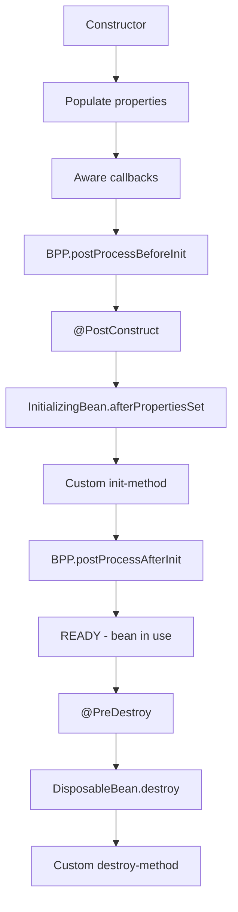
```mermaid
flowchart TD
    A[Constructor] --> B["Populate properties"]
    B --> C["Aware callbacks"]
    C --> D["BPP.postProcessBeforeInit"]
    D --> E["@PostConstruct"]
    E --> F["InitializingBean.afterPropertiesSet"]
    F --> G["Custom init-method"]
    G --> H["BPP.postProcessAfterInit"]
    H --> I["READY - bean in use"]
    I --> J["@PreDestroy"]
    J --> K["DisposableBean.destroy"]
    K --> L["Custom destroy-method"]
```

1. Container calls the constructor (or factory method).
2. Dependencies injected - `@Autowired` fields and setters.
3. Aware callbacks: `BeanNameAware`, `BeanFactoryAware`, `ApplicationContextAware`.
4. `BeanPostProcessor.postProcessBeforeInitialization` runs against the bean.
5. Init callbacks fire in order: `@PostConstruct`, then `InitializingBean.afterPropertiesSet()`, then custom `init-method`.
6. `BeanPostProcessor.postProcessAfterInitialization` runs - AOP proxies are typically created here.
7. The bean is ready.
8. On shutdown: `@PreDestroy`, then `DisposableBean.destroy()`, then custom `destroy-method`.

**The BeanPostProcessor phase is the most consequential.**
`AutowiredAnnotationBeanPostProcessor` handles `@Autowired`.
`CommonAnnotationBeanPostProcessor` handles `@PostConstruct`
and `@PreDestroy`. `AbstractAutoProxyCreator` wraps beans
in proxies. A custom `BeanPostProcessor` runs against every
singleton unless you filter by type.

**Destruction only fires on graceful shutdown.** `kill -9`
bypasses `@PreDestroy`. Spring Boot registers a shutdown hook
by default; standalone `AnnotationConfigApplicationContext`
requires explicit `registerShutdownHook()` or `close()`.

### 🛠️ Worked Example

**BAD:**

```java
@Component
public class CacheWarmer {
  @Autowired
  private ProductRepository repo;
  private List<Product> cache;

  // Constructor runs BEFORE injection
  public CacheWarmer() {
    // NullPointerException: repo is null
    this.cache = repo.findAll();
  }
}
```

Why it's wrong: the constructor executes at phase 1, but field injection happens at phase 2. `repo` is null during construction.

**GOOD:**

```java
@Component
public class CacheWarmer {
  private final ProductRepository repo;
  private List<Product> cache;

  CacheWarmer(ProductRepository repo) {
    this.repo = repo;
  }

  @PostConstruct
  void warmCache() {
    // Phase 7: all deps injected
    this.cache = repo.findAll();
    log.info("Cache warmed: {} products",
        cache.size());
  }

  @PreDestroy
  void clearCache() {
    cache.clear();
    log.info("Cache cleared on shutdown");
  }
}
```

**Production example - ordered initialization:**

```java
@Configuration
public class InfraConfig {
  @Bean(initMethod = "start",
        destroyMethod = "stop")
  public ConnectionPool pool() {
    return new ConnectionPool(
        "jdbc:postgresql://db:5432/app", 20);
  }
}
```

Spring resolves dependency ordering from the dependency
graph, not from declaration order.

### ⚖️ Trade-offs

**Gain:** deterministic, container-managed setup and teardown with multiple extension points for frameworks and application code.
**Cost:** the 13-phase sequence is invisible in source code - you must memorize the ordering to debug initialization issues.

| Mechanism         | Portability      | Container coupling | When it fires         |
| ----------------- | ---------------- | ------------------ | --------------------- |
| @PostConstruct    | Jakarta standard | low                | after injection       |
| InitializingBean  | Spring-only      | high               | after @PostConstruct  |
| @Bean(initMethod) | Spring-only      | low (name-based)   | after afterProperties |
| BeanPostProcessor | Spring-only      | high               | wraps all beans       |

Prefer `@PostConstruct` for application code (Jakarta
standard, portable). Use `InitializingBean` for
framework-level guarantees. Reserve `@Bean(initMethod)`
for third-party classes you cannot annotate.

### ⚡ Decision Snap

**USE WHEN:** you need initialization logic that requires
fully injected dependencies, ordered resource startup and
cleanup, or cross-cutting bean transformation at creation
time.
**AVOID WHEN:** your initialization is purely constructor
logic with no external dependencies - just use the
constructor directly.
**PREFER @PostConstruct WHEN:** you need portable init
logic and have no requirement for `BeanPostProcessor`-level
interception.

### ⚠️ Top Traps

| #   | Misconception                                   | Reality                                                                           |
| --- | ----------------------------------------------- | --------------------------------------------------------------------------------- |
| 1   | @PostConstruct runs before dependency injection | Injection (phase 2) completes before @PostConstruct (phase 7)                     |
| 2   | @PreDestroy always runs when the app stops      | Only on graceful shutdown - `kill -9` or OOM kills bypass destruction             |
| 3   | BeanPostProcessor only affects annotated beans  | It runs against every singleton unless you explicitly filter by type in your code |

### 🪜 Learning Ladder

**Prerequisites:**

- SPR-001 The Enterprise Java Problem Before Spring - why the container exists
- SPR-003 Spring vs Java EE (Jakarta EE) - The Big Picture - Jakarta annotations context

**THIS:** SPR-044 Bean Lifecycle and Initialization Callbacks

**Next steps:**

- SPR-045 AOP - Aspect-Oriented Programming in Spring - how BeanPostProcessor creates proxies
- SPR-046 @Transactional Proxy Mechanism and Pitfalls - lifecycle phase where proxies wrap beans

### 💡 The Surprising Truth

The bean you retrieve from `ApplicationContext.getBean()`
is often not the object your constructor created. During
`postProcessAfterInitialization` (phase 10), Spring's
AOP infrastructure can replace your original instance with
a CGLIB or JDK dynamic proxy. This means the object
reference stored in the container is a wrapper, and
`getClass()` returns a synthetic subclass, not your class.
This is not a bug - it is the mechanism behind `@Transactional`,
`@Cacheable`, `@Async`, and every other proxy-based feature.

Understanding this explains a class of subtle bugs: storing
`this` in a field during `@PostConstruct` (phase 7) captures
the raw instance, not the proxy. Code calling methods on
that reference bypasses AOP. The proxy replacement happens
three phases after `@PostConstruct`.

### 📇 Revision Card

1. The lifecycle runs in 13 fixed phases: construct, inject, aware callbacks, BPP-before, @PostConstruct, afterPropertiesSet, custom init, BPP-after, ready, @PreDestroy, DisposableBean.destroy, custom destroy.
2. `BeanPostProcessor.postProcessAfterInitialization` is where AOP proxies replace your original bean instance - after all init callbacks have run.
3. Destruction callbacks require graceful shutdown (`context.close()` or shutdown hook) - a hard kill skips them entirely.

---

---

# SPR-045 AOP - Aspect-Oriented Programming in Spring

**TL;DR** - Spring AOP intercepts method calls through runtime proxies, letting you attach reusable behavior (logging, security, transactions) to existing code without modifying it.

### 🔥 The Problem in One Paragraph

You need logging on 40 service methods, transaction management on 30, security checks on 25, and retry logic on 10. Without AOP, you copy the same try-catch-log block into every method, the same `@Transactional` ceremony everywhere, the same security validation preamble in each handler. When the logging format changes, you update 40 methods. When the retry policy changes, you update 10. These concerns cut across your class hierarchy - they do not belong to any single module, yet they infect every module. The codebase becomes a tangled mix of business logic and infrastructure plumbing, where a 5-line method becomes 25 lines of cross-cutting boilerplate.

### 📘 Textbook Definition

**Aspect-Oriented Programming (AOP)** is a programming paradigm that modularizes cross-cutting concerns - behavior that spans multiple classes and layers - into reusable units called **aspects**. In Spring, an aspect is a class annotated with `@Aspect` containing **advice** (the code to execute) bound to **pointcuts** (expressions selecting which methods to intercept). Spring implements AOP through runtime **proxies** (JDK dynamic proxies or CGLIB subclasses) that wrap target beans and intercept method invocations at **join points**.

### 🧠 Mental Model

> Think of AOP as a building security system installed on door frames, not inside rooms.

- "Door frame" -> proxy wrapper around the bean
- "Security camera" -> @Around advice recording method calls
- "Badge reader" -> pointcut expression selecting which methods

**Where this analogy breaks down:** Spring AOP only intercepts
through the proxy - internal method calls within the same
class bypass the door frame entirely, because they do not
go through the proxy. Real security systems do not have
this gap.

### ⚙️ How It Works

```
  Caller
    |
    v
+------------------+
|   Proxy (CGLIB   |
|   or JDK)        |
+--+------+--------+
   |      |
   |  pointcut match?
   |      |
   |  YES |  NO --> direct call
   |      |
   v      v
+------------------+
| Advice chain     |
| @Before          |
| @Around (proceed)|
| @AfterReturning  |
| @AfterThrowing   |
| @After           |
+--------+---------+
         |
         v
+------------------+
|  Target method   |
+------------------+
```

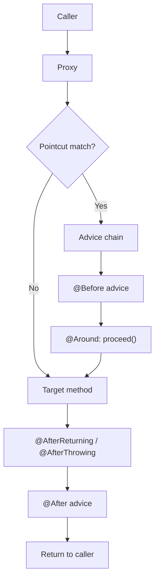
```mermaid
flowchart TD
    A[Caller] --> B[Proxy]
    B --> C{Pointcut match?}
    C -- Yes --> D["Advice chain"]
    C -- No --> E[Target method]
    D --> F["@Before advice"]
    F --> G["@Around: proceed()"]
    G --> E
    E --> H["@AfterReturning / @AfterThrowing"]
    H --> I["@After advice"]
    I --> J[Return to caller]
```

1. During bean creation, `AbstractAutoProxyCreator` (a `BeanPostProcessor`) checks if any aspect's pointcut matches the bean's methods.
2. If matched, the original bean is wrapped in a proxy - CGLIB for classes, JDK dynamic proxy for interfaces.
3. When a caller invokes a method, the call hits the proxy first.
4. The proxy evaluates the pointcut expression against the method signature.
5. If matched, the advice chain executes in order: `@Before`, then `@Around` (which calls `proceed()` to invoke the target), then `@AfterReturning` or `@AfterThrowing`, then `@After` (always runs).

**Proxy selection matters for debugging.** CGLIB proxies
create a subclass of your bean, so `instanceof` checks
still pass but `getClass()` returns a synthetic name like
`OrderService$$SpringCGLIB$$0`. JDK dynamic proxies
implement the bean's interfaces, so the proxy is not an
instance of your concrete class - only of its interfaces.
Spring Boot defaults to CGLIB proxies
(`spring.aop.proxy-target-class=true`) to avoid the
interface-only limitation.

**Pointcut expressions** are the targeting language of AOP.
`execution(* com.app.service.*.*(..))` matches every method
in the service package. `@annotation(Loggable)` matches
methods carrying a custom annotation. You can combine
expressions with `&&`, `||`, and `!`. A poorly written
pointcut that matches too broadly silently intercepts
beans you did not intend, causing performance overhead
and confusing stack traces. Always verify pointcut
scope with `@Pointcut` declarations and test coverage.

**The advice ordering rule** follows a deterministic
sequence. For a single aspect, `@Around` wraps everything.
`@Before` fires first inside the around boundary. If
multiple aspects advise the same method, use `@Order`
to control which aspect's advice runs first. Without
explicit ordering, the sequence is undefined and can
change between application restarts.

### 🛠️ Worked Example

**BAD:**

```java
@Service
public class OrderService {
  public Order place(Order order) {
    long start = System.nanoTime();
    log.info("Entering place()");
    try {
      Order result = doPlace(order);
      log.info("Exiting place(): {}ms",
          (System.nanoTime() - start)
          / 1_000_000);
      return result;
    } catch (Exception e) {
      log.error("Failed place()", e);
      throw e;
    }
  }
  // Same pattern in 39 other methods...
}
```

Why it's wrong: timing and logging code duplicated in every method, tangled with business logic, impossible to change consistently.

**GOOD:**

```java
@Aspect
@Component
public class TimingAspect {

  @Around("execution(* com.app.service.*.*(..))")
  public Object time(ProceedingJoinPoint pjp)
      throws Throwable {
    String method = pjp.getSignature()
        .toShortString();
    long start = System.nanoTime();
    try {
      Object result = pjp.proceed();
      log.info("{} completed in {}ms",
          method,
          (System.nanoTime() - start)
          / 1_000_000);
      return result;
    } catch (Throwable t) {
      log.error("{} failed after {}ms",
          method,
          (System.nanoTime() - start)
          / 1_000_000, t);
      throw t;
    }
  }
}
```

```java
@Service
public class OrderService {
  // Pure business logic - no logging noise
  public Order place(Order order) {
    return doPlace(order);
  }
}
```

**Production example - annotation-driven audit:**

```java
@Target(ElementType.METHOD)
@Retention(RetentionPolicy.RUNTIME)
public @interface Audited {
  String action();
}

@Aspect
@Component
public class AuditAspect {

  private final AuditLog auditLog;

  AuditAspect(AuditLog auditLog) {
    this.auditLog = auditLog;
  }

  @AfterReturning(
      pointcut =
          "@annotation(audited)",
      returning = "result")
  public void audit(
      JoinPoint jp,
      Audited audited,
      Object result) {
    auditLog.record(
        audited.action(),
        jp.getSignature().getName(),
        SecurityContext.currentUser(),
        result
    );
  }
}
```

Usage: `@Audited(action = "ORDER_PLACED")` on any method.
The audit concern lives in one class, applied declaratively
to any method that needs it. Adding audit to a new method
is a single annotation - no code duplication.

### ⚖️ Trade-offs

**Gain:** cross-cutting concerns centralized in one place, business logic stays clean, behavior toggled by pointcut scope.
**Cost:** proxy-based interception adds indirection, self-invocation bypasses the proxy, debugging through proxy layers is harder, overly broad pointcuts cause silent performance degradation.

| Approach          | Proxy overhead  | Self-invocation works? | Compile-time safety |
| ----------------- | --------------- | ---------------------- | ------------------- |
| Spring AOP        | runtime proxy   | no                     | no (runtime match)  |
| AspectJ weaving   | none (bytecode) | yes                    | yes (compile-time)  |
| Manual decorator  | none            | yes                    | yes                 |
| Interceptor chain | per-framework   | depends                | no                  |

Spring AOP is sufficient for most applications. Switch to
AspectJ compile-time or load-time weaving only when you
need to advise private methods, field access, constructors,
or self-invocations. The complexity cost of AspectJ weaving
(special compiler plugin, agent configuration) is rarely
justified outside framework-level code.

### ⚡ Decision Snap

**USE WHEN:** you have a cross-cutting concern (logging,
security, transactions, retries, auditing, caching) that
applies to multiple methods across multiple classes and
you want to avoid duplicating that code.
**AVOID WHEN:** the concern applies to a single method
(just write it inline), you need to intercept private
methods or constructors (Spring AOP cannot), or the
performance overhead of proxy dispatch is unacceptable
in a hot path.
**PREFER AspectJ WHEN:** you need to advise self-invocations,
field access, or non-Spring-managed objects, and you can
accept the build tooling complexity.

### ⚠️ Top Traps

| #   | Misconception                                           | Reality                                                                                     |
| --- | ------------------------------------------------------- | ------------------------------------------------------------------------------------------- |
| 1   | AOP intercepts all method calls including internal ones | Self-invocation (`this.method()`) bypasses the proxy - only external calls are intercepted  |
| 2   | `@Around` advice can skip calling `proceed()`           | Technically yes, but skipping `proceed()` silently swallows the method - rarely intentional |
| 3   | Spring AOP uses AspectJ for weaving                     | Spring AOP uses AspectJ annotations for syntax but runtime proxies for weaving, not AspectJ |

### 🪜 Learning Ladder

**Prerequisites:**

- SPR-044 Bean Lifecycle and Initialization Callbacks - understand when proxies are created (BPP phase 10)

**THIS:** SPR-045 AOP - Aspect-Oriented Programming in Spring

**Next steps:**

- SPR-046 @Transactional Proxy Mechanism and Pitfalls - AOP applied to transaction management

### 💡 The Surprising Truth

Spring AOP and AspectJ share annotation syntax (`@Aspect`,
`@Before`, `@Around`) but use completely different
mechanisms. Spring AOP creates runtime proxies during bean
initialization - your original class is untouched, and
interception only works through the proxy reference.
AspectJ modifies your actual bytecode at compile time
or load time - every call site is rewritten.

This means Spring AOP has a fundamental limitation that
no configuration can fix: a method calling another method
on the same instance (`this.doSomething()`) never passes
through the proxy. The `this` reference points to the
raw object, not the proxy wrapper. This is why
`@Transactional` on a private method or a self-invoked
method has no effect. The proxy pattern is an architectural
boundary, not just an implementation detail. Once you
internalize this, every proxy-based bug in Spring -
transactions not rolling back, caching not working, async
not executing on a new thread - has the same root cause
and the same diagnostic question: "Is this call going
through the proxy?"

### 📇 Revision Card

1. Spring AOP uses runtime proxies (CGLIB or JDK), not bytecode weaving - self-invocation (`this.method()`) bypasses the proxy and all advice.
2. Advice execution order: `@Before` -> `@Around(proceed())` -> target method -> `@AfterReturning`/`@AfterThrowing` -> `@After`, with `@Order` controlling cross-aspect sequencing.
3. Proxies are created during `BeanPostProcessor.postProcessAfterInitialization` (bean lifecycle phase 10) - the object in the container is the proxy, not your original class.

---

---

# SPR-046 @Transactional Proxy Mechanism and Pitfalls

**TL;DR** - `@Transactional` works through proxies - self-invocation, private methods, and wrong exception types silently bypass transaction management with no error or warning.

### 🔥 The Problem in One Paragraph

You annotate a service method with `@Transactional`, write a test, and it works perfectly. Then you add a second method in the same class that calls the first one internally. The transaction silently vanishes - no error, no warning, no rollback. You annotate a private method and get the same invisible failure. You throw a checked exception and the transaction commits instead of rolling back. You switch from an interface-based design to a concrete class and the proxy type changes from JDK dynamic proxy to CGLIB without you noticing, subtly changing what gets intercepted. These are not edge cases - they are the five most common production bugs with `@Transactional`, and every one traces back to misunderstanding what a proxy can and cannot intercept.

### 📘 Textbook Definition

Spring implements declarative transaction management by wrapping `@Transactional`-annotated beans in a proxy object at container startup. The proxy intercepts incoming method calls, starts a transaction through the `PlatformTransactionManager`, delegates to the real target method, then commits or rolls back based on the outcome. Spring offers two proxy strategies: JDK dynamic proxies (interface-based, using `java.lang.reflect.Proxy`) and CGLIB proxies (subclass-based, generating a runtime subclass of the target). Since Spring Boot 2.0, CGLIB is the default (`spring.aop.proxy-target-class=true`). The proxy reads `@Transactional` attributes - propagation, isolation, timeout, rollbackFor - and passes them to the `TransactionInterceptor`, which coordinates with the underlying transaction manager.

### 🧠 Mental Model

> Think of the proxy as a receptionist sitting in front of an executive's office.

- "Visitor" -> external caller going through the proxy
- "Receptionist" -> TransactionInterceptor (begin/commit/rollback)
- "Internal phone call" -> self-invocation bypassing the proxy

**Where this analogy breaks down:** unlike a receptionist who is
physically separate, the proxy and the target share the
same bean reference in the container. The `this` keyword
always resolves to the raw target, never the proxy. This
is a Java language constraint, not a Spring design flaw.

### ⚙️ How It Works

```
Caller          Proxy              Target
  |               |                  |
  |--invoke()---->|                  |
  |               |--begin tx-----  |
  |               |--invoke()----->>|
  |               |                  |--execute--
  |               |                  |<-return---
  |               |<-return----------|
  |               |--commit tx----   |
  |<--return------|                  |
  |               |                  |
  Self-invocation (bypasses proxy):
  |               |                  |
  |               |  target.this.b() |
  |               |  (NO proxy!)---->|
  |               |                  |--execute--
```

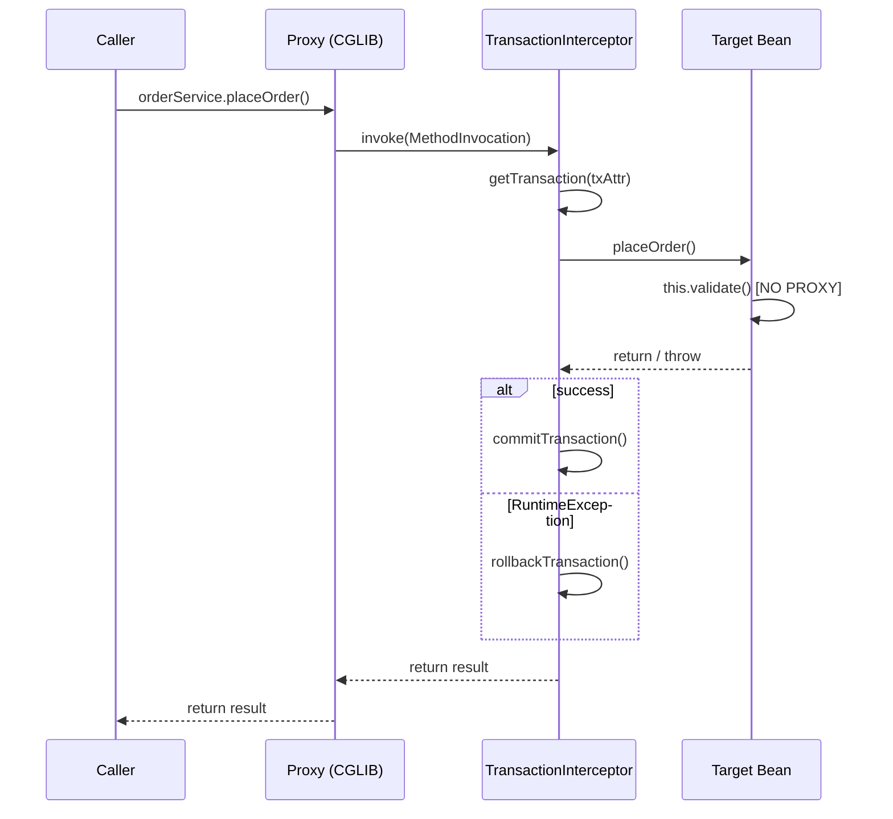
```mermaid
sequenceDiagram
    participant C as Caller
    participant P as Proxy (CGLIB)
    participant I as TransactionInterceptor
    participant T as Target Bean
    C->>P: orderService.placeOrder()
    P->>I: invoke(MethodInvocation)
    I->>I: getTransaction(txAttr)
    I->>T: placeOrder()
    T->>T: this.validate() [NO PROXY]
    T-->>I: return / throw
    alt success
        I->>I: commitTransaction()
    else RuntimeException
        I->>I: rollbackTransaction()
    end
    I-->>P: return result
    P-->>C: return result
```

**Step-by-step proxy creation and execution:**

1. During `BeanPostProcessor.postProcessAfterInitialization`,
   Spring's `AbstractAutoProxyCreator` detects the
   `@Transactional` annotation via `TransactionAttributeSource`
   and creates a proxy wrapping the target bean.
2. The proxy is registered in the `ApplicationContext` in
   place of the original bean. All injections receive the
   proxy reference, not the raw object.
3. When a caller invokes a method on the proxy, the
   `TransactionInterceptor` reads the `@Transactional`
   metadata, resolves the `PlatformTransactionManager`,
   and calls `getTransaction()` with the configured
   propagation behavior.
4. The interceptor delegates to the real target method via
   `MethodInvocation.proceed()`.
5. On normal return, the interceptor calls `commit()`.
   On `RuntimeException` or `Error` (by default), it calls
   `rollback()`. Checked exceptions trigger commit unless
   explicitly listed in `rollbackFor`.

**CGLIB vs JDK dynamic proxy:** CGLIB generates a subclass
at runtime, so it cannot proxy `final` classes or `final`
methods. JDK dynamic proxies require an interface and only
intercept interface-declared methods. Spring Boot defaults
to CGLIB because most service classes lack interfaces. The
proxy type affects what gets intercepted: CGLIB proxies
all non-final public methods; JDK proxies only interface
methods.

**Propagation at the proxy level:** when a proxied method
calls another proxied method on a _different_ bean, both
pass through their respective proxies. The
`TransactionInterceptor` checks propagation (REQUIRED,
REQUIRES_NEW, NESTED, etc.) against the current
`TransactionSynchronizationManager` thread-local state.
REQUIRES_NEW suspends the outer transaction, creates a new
one, and resumes on completion. REQUIRED joins the existing
transaction - meaning a rollback in the inner method marks
the entire outer transaction as rollback-only.

### 🛠️ Worked Example

**BAD:**

```java
@Service
public class OrderService {
    @Transactional
    public void placeOrder(Order order) {
        saveOrder(order);
        // this.updateInventory() - bypasses proxy!
        updateInventory(order);
    }

    @Transactional(propagation = REQUIRES_NEW)
    public void updateInventory(Order order) {
        // Runs WITHOUT its own transaction!
        inventoryRepo.decrement(order.getItems());
    }
}
```

**GOOD:**

```java
@Service
public class OrderService {
    private final InventoryService inventoryService;

    @Transactional
    public void placeOrder(Order order) {
        saveOrder(order);
        // Calls through proxy on different bean
        inventoryService.updateInventory(order);
    }
}

@Service
public class InventoryService {
    @Transactional(propagation = REQUIRES_NEW)
    public void updateInventory(Order order) {
        inventoryRepo.decrement(order.getItems());
    }
}
```

**Production pattern - explicit rollbackFor:**

```java
@Transactional(
    rollbackFor = Exception.class,
    timeout = 5
)
public void processPayment(Payment p)
        throws PaymentGatewayException {
    // Checked exception now triggers rollback
    gateway.charge(p);
    receiptRepo.save(new Receipt(p));
}
```

### ⚖️ Trade-offs

| Gain                                        | Cost                                        |
| ------------------------------------------- | ------------------------------------------- |
| Declarative TX with one annotation          | Invisible proxy behavior confuses debugging |
| No boilerplate begin/commit/rollback        | Self-invocation silently drops TX           |
| Works with any PlatformTransactionManager   | CGLIB cannot proxy final classes/methods    |
| Propagation, isolation, timeout in metadata | Checked exceptions commit by default        |

Declarative transactions reduce boilerplate dramatically -
a single annotation replaces 8-12 lines of manual
`TransactionTemplate` code. But this convenience hides the
proxy indirection. When things work, the abstraction is
excellent. When they break, the failure mode is silent: no
exception, no log entry, just a commit where you expected a
rollback, or no transaction at all. The debugging cost is
proportional to how well the team understands proxies.

### ⚡ Decision Snap

- **USE WHEN:** service-layer methods need atomic
  database operations and the team understands proxy
  semantics.
- **AVOID WHEN:** transaction boundaries must span
  multiple async steps, or when methods are called
  internally within the same class.
- **PREFER `TransactionTemplate` WHEN:** you need
  fine-grained control within a method, partial
  rollback, or programmatic retry logic.

### ⚠️ Top Traps

| Trap                                    | Why it bites                                              | Escape                                                                |
| --------------------------------------- | --------------------------------------------------------- | --------------------------------------------------------------------- |
| Self-invocation (`this.method()`)       | Bypasses proxy entirely, no TX created                    | Extract to separate bean or inject `ObjectProvider<Self>`             |
| `@Transactional` on private method      | CGLIB cannot override private methods, annotation ignored | Use public or package-private methods only                            |
| Checked exception without `rollbackFor` | Default rollback is `RuntimeException` and `Error` only   | Always specify `rollbackFor = Exception.class` for checked exceptions |

### 🪜 Learning Ladder

- **Prerequisites:** SPR-032 (Spring MVC Request Lifecycle),
  SPR-045 (AOP - Aspect-Oriented Programming in Spring)
- **THIS:** SPR-046 - How `@Transactional` creates proxies,
  proxy chain execution, and the five critical pitfalls.
- **Next:** SPR-056 (@Transactional Self-Invocation
  Anti-Pattern) - deep case study of the most common
  pitfall with solutions and detection strategies.

### 💡 The Surprising Truth

The `@Transactional` annotation itself does nothing at
runtime. It is pure metadata. All transaction behavior
comes from the proxy wrapping and the
`TransactionInterceptor` - which is just a Spring AOP
`MethodInterceptor`. You could achieve identical behavior
by writing a custom aspect with `@Around` advice and a
`TransactionTemplate`. The annotation is syntactic sugar
over the AOP infrastructure you learned in SPR-045.

### 📇 Revision Card

1. `@Transactional` works through a CGLIB or JDK proxy created during `BeanPostProcessor` - any call that bypasses the proxy (self-invocation, private methods) runs without transaction management.
2. Only unchecked exceptions (`RuntimeException`, `Error`) trigger rollback by default - checked exceptions commit unless you specify `rollbackFor`.
3. The five pitfalls: self-invocation, private methods, missing `rollbackFor` for checked exceptions, wrong propagation assumptions when joining transactions, and `final` classes/methods with CGLIB proxies.

---

---

# SPR-047 Spring Security Filter Chain Architecture

**TL;DR** - Spring Security is a fixed-order chain of servlet filters - understanding this pipeline is the key to debugging auth failures and placing custom logic correctly.

### 🔥 The Problem in One Paragraph

Your Spring Security configuration denies a request and the logs show nothing useful. You add a custom filter but it runs at the wrong position - before authentication instead of after. You configure two `SecurityFilterChain` beans and requests match the wrong one. You cannot figure out why CORS headers vanish on secured endpoints. You set `permitAll()` on an endpoint but it still gets rejected because a filter earlier in the chain short-circuits the request. Every one of these problems exists because Spring Security is not a single gate - it is a pipeline of 15+ individual filters executing in strict order, and misconfiguring any one of them produces confusing behavior with no obvious error message.

### 📘 Textbook Definition

The **Spring Security filter chain** is a servlet-level architecture consisting of three layers: `DelegatingFilterProxy` (registered in the servlet container, bridges to Spring's `ApplicationContext`), `FilterChainProxy` (the Spring-managed entry point that selects which `SecurityFilterChain` to apply based on the request), and the `SecurityFilterChain` itself (an ordered list of `jakarta.servlet.Filter` instances, each handling one security concern). The chain follows the Chain of Responsibility pattern: each filter either processes the request and passes it to the next filter, or short-circuits the chain by writing directly to the response. Filters are ordered by a fixed enumeration defined in `FilterOrderRegistration`, ensuring that authentication always runs before authorization, CORS headers are set before security checks, and session management happens at the correct phase.

### 🧠 Mental Model

> Think of the filter chain as airport security with multiple checkpoints in a fixed sequence.

- "Ticket check" -> CorsFilter / header validation
- "Identity verification" -> authentication filters
- "Boarding pass gate match" -> AuthorizationFilter

**Where this analogy breaks down:** unlike airport checkpoints,
some filters do not block the chain on failure. For
example, `AnonymousAuthenticationFilter` adds a default
identity rather than rejecting. Not every filter is a
hard gate.

### ⚙️ How It Works

```
Servlet Container
  |
  DelegatingFilterProxy("springSecurityFilterChain")
  |
  FilterChainProxy
  |-- match /api/** -> SecurityFilterChain A
  |     |-- DisableEncodeUrlFilter
  |     |-- SecurityContextHolderFilter
  |     |-- CorsFilter
  |     |-- CsrfFilter
  |     |-- LogoutFilter
  |     |-- UsernamePasswordAuthFilter
  |     |-- BearerTokenAuthFilter
  |     |-- AnonymousAuthFilter
  |     |-- ExceptionTranslationFilter
  |     |-- AuthorizationFilter
  |
  |-- match /** -> SecurityFilterChain B
        |-- (different filter set)
```

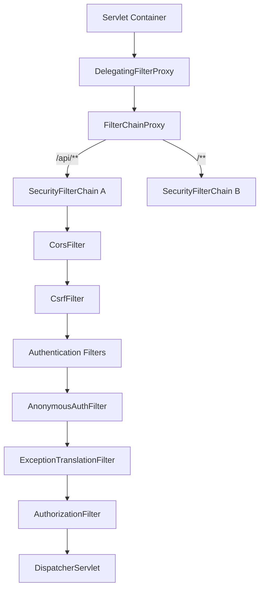
```mermaid
flowchart TD
    SC[Servlet Container] --> DFP[DelegatingFilterProxy]
    DFP --> FCP[FilterChainProxy]
    FCP -->|"/api/**"| SCA[SecurityFilterChain A]
    FCP -->|"/**"| SCB[SecurityFilterChain B]
    SCA --> F1[CorsFilter]
    F1 --> F2[CsrfFilter]
    F2 --> F3[Authentication Filters]
    F3 --> F4[AnonymousAuthFilter]
    F4 --> F5[ExceptionTranslationFilter]
    F5 --> F6[AuthorizationFilter]
    F6 --> APP[DispatcherServlet]
```

**Step-by-step request flow:**

1. The servlet container invokes `DelegatingFilterProxy`,
   which is a standard `jakarta.servlet.Filter` registered
   in the container. It looks up a bean named
   `springSecurityFilterChain` from the `ApplicationContext`.
2. `FilterChainProxy` receives the request and iterates
   through its list of `SecurityFilterChain` beans. It uses
   `RequestMatcher` (path, method, headers) to select the
   _first_ matching chain. Only one chain executes per
   request.
3. The selected chain's filters execute in order. Each
   filter calls `filterChain.doFilter(request, response)`
   to pass control to the next filter. If a filter writes
   to the response directly (e.g., returning 401), the
   chain stops.
4. Authentication filters (`UsernamePasswordAuthenticationFilter`,
   `BearerTokenAuthenticationFilter`, etc.) attempt to
   extract and validate credentials. On success, they
   populate `SecurityContextHolder` with an
   `Authentication` object.
5. `AuthorizationFilter` (the last major filter) reads the
   `Authentication` from the `SecurityContext` and evaluates
   the authorization rules configured in your
   `HttpSecurity` DSL. If denied, `AccessDeniedException`
   is thrown and caught by `ExceptionTranslationFilter`
   earlier in the chain's call stack.

**Key built-in filters and their order:** Security filters
follow a fixed ordering defined by Spring. The critical
sequence is: `CorsFilter` (ensures CORS headers are set
before any rejection), `CsrfFilter` (validates CSRF tokens
on state-changing methods), authentication filters (one per
scheme: form login, HTTP Basic, Bearer token, OAuth2),
`SecurityContextHolderFilter` (manages the per-request
security context), `AnonymousAuthenticationFilter` (ensures
unauthenticated requests get an anonymous principal),
`ExceptionTranslationFilter` (catches security exceptions
and converts them to HTTP responses), and
`AuthorizationFilter` (evaluates access rules).

**Adding custom filters:** use `addFilterBefore()`,
`addFilterAfter()`, or `addFilterAt()` on the `HttpSecurity`
object. Position matters: a rate-limiting filter should go
before authentication to protect against brute-force. A
tenant-resolution filter should go after authentication so
the user identity is available. Placing a filter at the
wrong position is the most common source of "it works in
tests but fails in production" security bugs.

### 🛠️ Worked Example

**BAD:**

```java
@Bean
SecurityFilterChain bad(HttpSecurity http)
        throws Exception {
    http
        // Runs AFTER authorization - too late!
        .addFilterAfter(
            new TenantFilter(),
            AuthorizationFilter.class)
        .authorizeHttpRequests(a -> a
            .anyRequest().authenticated());
    return http.build();
}
```

**GOOD:**

```java
@Bean
SecurityFilterChain good(HttpSecurity http)
        throws Exception {
    http
        // Runs AFTER authentication, BEFORE authz
        .addFilterAfter(
            new TenantFilter(),
            AnonymousAuthenticationFilter.class)
        .authorizeHttpRequests(a -> a
            .anyRequest().authenticated());
    return http.build();
}
```

**Production pattern - multi-chain configuration:**

```java
@Bean
@Order(1)
SecurityFilterChain apiChain(HttpSecurity http)
        throws Exception {
    http
        .securityMatcher("/api/**")
        .csrf(c -> c.disable())
        .oauth2ResourceServer(o -> o.jwt(
            Customizer.withDefaults()))
        .authorizeHttpRequests(a -> a
            .anyRequest().authenticated());
    return http.build();
}

@Bean
@Order(2)
SecurityFilterChain webChain(HttpSecurity http)
        throws Exception {
    http
        .securityMatcher("/**")
        .formLogin(Customizer.withDefaults())
        .authorizeHttpRequests(a -> a
            .requestMatchers("/public/**")
                .permitAll()
            .anyRequest().authenticated());
    return http.build();
}
```

### ⚖️ Trade-offs

| Gain                                           | Cost                                                  |
| ---------------------------------------------- | ----------------------------------------------------- |
| Each filter has single responsibility          | 15+ filters make debugging opaque                     |
| Fixed ordering prevents misconfigured security | Custom filter placement requires chain knowledge      |
| Multi-chain supports different auth per path   | First-match routing causes subtle ordering bugs       |
| Extensible via addFilterBefore/After           | Forgetting a filter position can create security gaps |

The filter chain architecture gives Spring Security its
power and its complexity. Single-responsibility filters are
individually simple, but the aggregate chain behavior is
hard to reason about without tooling. Enable
`logging.level.org.springframework.security=TRACE` during
development to see every filter that executes and every
decision it makes. In production, reduce this to WARN to
avoid log volume. The `@EnableWebSecurity(debug = true)`
flag prints the full filter chain on startup, invaluable
for verifying custom filter placement.

### ⚡ Decision Snap

- **USE WHEN:** you need different authentication
  strategies per URL pattern (API vs web), custom
  pre/post-processing logic, or fine-grained control over
  security filter ordering.
- **AVOID WHEN:** a simple `permitAll()` / `authenticated()`
  split is sufficient - do not add custom filters for logic
  that belongs in authorization rules.
- **PREFER Gateway-level security WHEN:** running behind
  an API gateway that handles authentication centrally,
  reducing the filter chain to authorization only.

### ⚠️ Top Traps

| Trap                                                  | Why it bites                                                                            | Escape                                                                                                       |
| ----------------------------------------------------- | --------------------------------------------------------------------------------------- | ------------------------------------------------------------------------------------------------------------ |
| Multiple `SecurityFilterChain` beans without `@Order` | Undefined ordering; wrong chain matches first                                           | Always annotate with explicit `@Order` values                                                                |
| CORS rejected on secured endpoints                    | `CorsFilter` must run before auth filters; misconfigured CORS returns 403               | Configure CORS via `http.cors()` in the security chain, not as a separate `@Bean`                            |
| `permitAll()` still runs authentication filters       | `permitAll` skips authorization, not authentication; a broken auth filter still rejects | Ensure auth filters handle missing credentials gracefully or use `securityMatcher` to exclude paths entirely |

### 🪜 Learning Ladder

- **Prerequisites:** SPR-030 (Spring IoC Container and
  ApplicationContext), SPR-031 (Bean Scopes and Dependency
  Injection Patterns)
- **THIS:** SPR-047 - The three-layer filter architecture,
  built-in filter ordering, custom filter placement, and
  multi-chain configuration.
- **Next:** SPR-048 (OAuth 2.0 and OIDC with Spring
  Security) - builds on filter chain knowledge to
  understand OAuth2 filters and token handling.

### 💡 The Surprising Truth

`DelegatingFilterProxy` exists for exactly one reason:
servlet containers initialize filters before the Spring
`ApplicationContext` is ready. The proxy lazily delegates
to the real `FilterChainProxy` bean, solving a bootstrap
ordering problem. Without this indirection, Spring Security
could not be a Spring-managed bean and simultaneously
participate in the servlet filter pipeline. This is also
why you cannot just register `FilterChainProxy` directly
in `web.xml` or `ServletRegistrationBean` - it would not
have access to the `ApplicationContext` at filter init time.

### 📇 Revision Card

1. The three-layer architecture is `DelegatingFilterProxy` (servlet bridge) -> `FilterChainProxy` (chain selector, first-match) -> `SecurityFilterChain` (ordered filter list) - only one chain executes per request.
2. Filter ordering is fixed: CORS -> CSRF -> Authentication -> Session -> Anonymous -> ExceptionTranslation -> Authorization - custom filters must be placed relative to this sequence using `addFilterBefore/After`.
3. Multi-chain configs require explicit `@Order` and `securityMatcher()` - without both, requests may match the wrong chain, creating security gaps that are invisible in happy-path tests.

---

---

# SPR-048 OAuth 2.0 and OIDC with Spring Security

**TL;DR** - Spring Security delegates authentication to an external OAuth 2.0 provider and validates JWTs on the resource server, so your app never touches passwords.

### 🔥 The Problem in One Paragraph

Every application needs identity, but building login yourself means storing passwords, implementing MFA, handling account recovery, and patching CVEs faster than attackers exploit them. OAuth 2.0 offloads the authorization grant to a dedicated provider (Google, Okta, Keycloak), but the protocol alone does not tell you _who_ the user is - it only issues access tokens scoped to resources. OpenID Connect (OIDC) adds an identity layer on top, returning an ID token with claims like `sub`, `email`, and `name`. Spring Security wraps both protocols behind two DSL methods - `oauth2Login()` for browser-based apps and `oauth2ResourceServer()` for API-only services - but if you confuse the two, or misconfigure token validation, you end up with silent authentication failures or tokens accepted from any issuer.

### 📘 Textbook Definition

OAuth 2.0 (RFC 6749) is a delegation framework where a resource owner grants a client limited access to a resource server via an authorization server, using grant types like Authorization Code and Client Credentials. OIDC (built on OAuth 2.0) adds an ID token (a signed JWT) that asserts user identity. Spring Security's `oauth2-client` module handles the grant negotiation and token lifecycle, while `oauth2-resource-server` validates incoming bearer tokens on API endpoints. The two modules are complementary: a web app can be both an OAuth client (obtaining tokens) and a resource server (validating tokens from other callers).

### 🧠 Mental Model

> Think of a hotel check-in desk that issues key cards.

- "Front desk" -> authorization server (issues tokens)
- "Room key card" -> access token (scoped, time-limited)
- "Name badge" -> OIDC ID token (proves who you are)
- "Door lock" -> resource server (validates key, never talks to desk)

**Where this analogy breaks down:** unlike a hotel key, JWTs carry claims that can go stale. A user revoked in the authorization server still holds a valid token until it expires, because the resource server validates the signature, not a live session.

### ⚙️ How It Works

```
Browser           App (Client)       AuthZ Server
  |                  |                    |
  |--GET /login----->|                    |
  |  302 redirect    |                    |
  |----------------->|                    |
  |                  |                    |
  |  /authorize?response_type=code------->|
  |                  |                    |
  |<----302 + code---|                    |
  |--GET /callback?code=abc-->|           |
  |                  |--POST /token------>|
  |                  |<--access+id JWT----|
  |<-Set-Cookie------|                    |
```

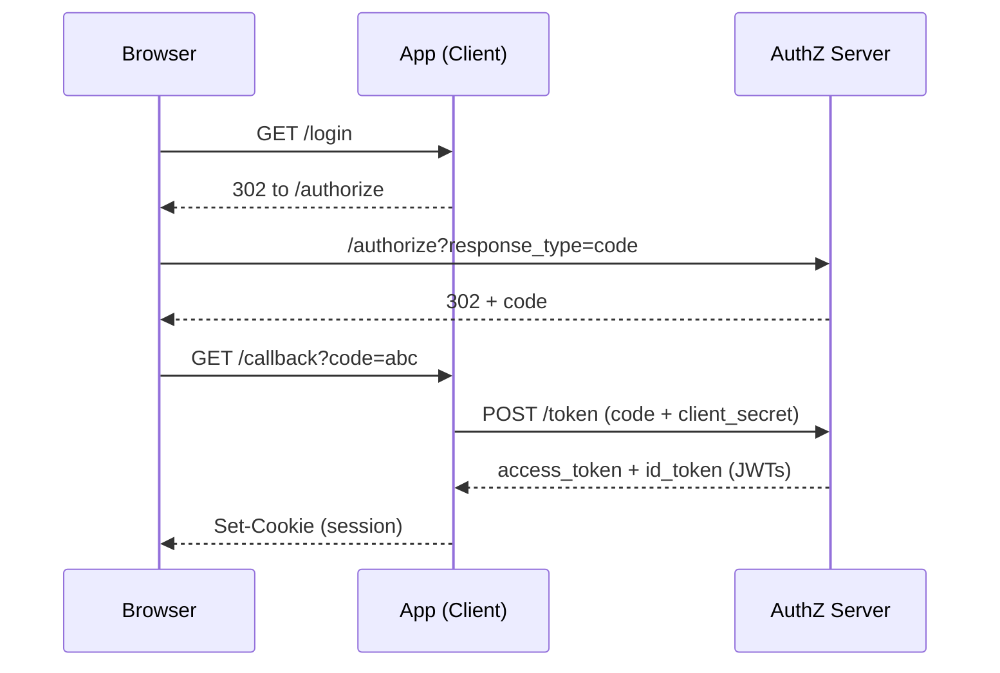
```mermaid
sequenceDiagram
    participant B as Browser
    participant A as App (Client)
    participant AS as AuthZ Server
    B->>A: GET /login
    A-->>B: 302 to /authorize
    B->>AS: /authorize?response_type=code
    AS-->>B: 302 + code
    B->>A: GET /callback?code=abc
    A->>AS: POST /token (code + client_secret)
    AS-->>A: access_token + id_token (JWTs)
    A-->>B: Set-Cookie (session)
```

**Step-by-step (Authorization Code flow):**

1. User hits a protected endpoint. Spring Security redirects to the authorization server's `/authorize` endpoint with `response_type=code`, `client_id`, `redirect_uri`, `scope=openid`, and a PKCE `code_challenge` (mandatory since Spring Security 6.1 for public clients).
2. User authenticates at the authorization server and consents. The server redirects back to the app with a short-lived authorization code.
3. Spring's `OAuth2LoginAuthenticationFilter` intercepts the callback, exchanges the code for an access token and ID token via a back-channel POST to `/token`, and builds an `OAuth2AuthenticationToken` stored in the `SecurityContext`.
4. For resource-server mode, incoming requests carry a `Bearer` token in the `Authorization` header. `BearerTokenAuthenticationFilter` extracts it, `JwtDecoder` validates the signature against the authorization server's JWK Set (cached), checks `iss`, `aud`, and `exp` claims, and creates a `JwtAuthenticationToken`.

The two critical configuration classes:

```java
// Browser app - acts as OAuth client
@Bean
SecurityFilterChain webChain(HttpSecurity http)
    throws Exception {
  return http
    .authorizeHttpRequests(a -> a
      .requestMatchers("/public/**").permitAll()
      .anyRequest().authenticated())
    .oauth2Login(Customizer.withDefaults())
    .build();
}
```

```java
// API server - validates bearer JWTs
@Bean
SecurityFilterChain apiChain(HttpSecurity http)
    throws Exception {
  return http
    .securityMatcher("/api/**")
    .authorizeHttpRequests(a -> a
      .anyRequest().authenticated())
    .oauth2ResourceServer(rs -> rs
      .jwt(Customizer.withDefaults()))
    .build();
}
```

Client Credentials flow differs: there is no user. A service authenticates itself with `client_id` and `client_secret` to get an access token. Spring provides `OAuth2AuthorizedClientManager` and `WebClient` integration so tokens are obtained and refreshed automatically for service-to-service calls.

### 🛠️ Worked Example

**BAD:**

```java
// Accepts tokens from ANY issuer matching
// the URL string - no audience check
@Bean
JwtDecoder jwtDecoder() {
  return NimbusJwtDecoder.withJwkSetUri(
    "https://auth.example.com/.well-known/jwks.json"
  ).build();
  // Missing: issuer validation
  // Missing: audience validation
}
```

**GOOD:**

```yaml
# application.yml
spring:
  security:
    oauth2:
      resourceserver:
        jwt:
          issuer-uri: https://auth.example.com
          audiences: order-service
```

```java
@Bean
JwtDecoder jwtDecoder(
    OAuth2ResourceServerProperties props) {
  NimbusJwtDecoder decoder =
    JwtDecoders.fromIssuerLocation(
      props.getJwt().getIssuerUri());
  OAuth2TokenValidator<Jwt> validators =
    new DelegatingOAuth2TokenValidator<>(
      JwtValidators.createDefaultWithIssuer(
        props.getJwt().getIssuerUri()),
      new JwtClaimValidator<List<String>>(
        "aud",
        aud -> aud.contains("order-service"))
    );
  decoder.setJwtValidator(validators);
  return decoder;
}
```

**Production pattern - scope-based method security:**

```java
@RestController
@RequestMapping("/api/orders")
public class OrderController {

  @GetMapping
  @PreAuthorize(
    "hasAuthority('SCOPE_orders.read')")
  public List<Order> list() { /* ... */ }

  @PostMapping
  @PreAuthorize(
    "hasAuthority('SCOPE_orders.write')")
  public Order create(@RequestBody Order o) {
    /* ... */
  }
}
```

### ⚖️ Trade-offs

| Gain                                   | Cost                                                        |
| -------------------------------------- | ----------------------------------------------------------- |
| No password storage in your app        | Dependency on external authorization server availability    |
| Centralized identity across services   | Token revocation has latency (JWT expiry window)            |
| Standardized protocol, vendor-portable | Configuration complexity: issuer, audience, scopes, CORS    |
| Fine-grained scopes and claims         | Debugging token issues requires understanding JWT structure |

Choosing between `oauth2Login()` and `oauth2ResourceServer()` depends on whether your app serves browsers or APIs. Browser apps need session cookies and CSRF protection alongside the OAuth flow. APIs are stateless - each request carries a bearer token. Mixing both in one filter chain without `securityMatcher()` causes one mode to override the other. If your service is both (serves HTML and exposes APIs), use two separate `SecurityFilterChain` beans with explicit matchers and `@Order`.

### ⚡ Decision Snap

- **USE WHEN:** Your app delegates authentication to an external identity provider (corporate SSO, social login, or a shared Keycloak/Okta instance).
- **AVOID WHEN:** You control a simple internal app where basic username/password with `formLogin()` suffices and no external IdP exists.
- **PREFER Client Credentials WHEN:** Service-to-service calls with no user context - do not force a user-facing grant type onto machine clients.

### ⚠️ Top Traps

| Trap                                 | Why it hurts                                                                         | Fix                                                              |
| ------------------------------------ | ------------------------------------------------------------------------------------ | ---------------------------------------------------------------- |
| Missing `audience` validation        | Any valid JWT from the same issuer is accepted, even tokens meant for other services | Add explicit `aud` claim validator in `JwtDecoder`               |
| Using `oauth2Login()` for a pure API | Creates session cookies and CSRF requirements on stateless endpoints                 | Use `oauth2ResourceServer(jwt(...))` for APIs                    |
| Skipping PKCE for public clients     | Authorization code can be intercepted and replayed                                   | Spring Security 6.1+ enables PKCE by default - do not disable it |

### 🪜 Learning Ladder

- **Prerequisites:** SPR-047 Spring Security Filter Chain Architecture (understand where OAuth filters sit), SPR-030 Spring MVC Request Lifecycle (HTTP flow context).
- **THIS:** SPR-048 OAuth 2.0 and OIDC with Spring Security - grant types, token validation, and Spring Security's two OAuth modules.
- **Next steps:** SPR-067 REST API Phase 3 - Security and OAuth (apply these concepts in a full API project).

### 💡 The Surprising Truth

Most OAuth misconfigurations are not about the protocol flow - they are about missing _negative_ validation. Teams get the happy path working (user logs in, token arrives), then skip audience checks, issuer pinning, and scope enforcement. The result is an app that authenticates users but authorizes _any_ valid token from the same provider, regardless of intended audience. The protocol is secure by design; the bugs live in what you forget to validate.

### 📇 Revision Card

1. `oauth2Login()` handles the Authorization Code flow for browser apps (redirect, code exchange, session creation); `oauth2ResourceServer(jwt(...))` validates bearer JWTs for stateless APIs - never mix them in one filter chain without `securityMatcher()`.
2. OIDC adds an ID token (with `sub`, `email`, `name`) on top of OAuth 2.0's access token - configure `scope=openid` and validate both `iss` and `aud` claims to prevent cross-service token confusion.
3. Client Credentials flow is for machine-to-machine calls with no user - use `OAuth2AuthorizedClientManager` with `WebClient` so tokens are obtained and refreshed automatically without manual HTTP calls.

---

---

# SPR-049 Spring Data JPA Fetch Strategies and Projections

**TL;DR** - Choose LAZY fetching by default, override per-query with `@EntityGraph`, and use projections to select only the columns you need.

### 🔥 The Problem in One Paragraph

JPA entities map entire database rows into object graphs. When an `Order` has a `List<LineItem>` and each `LineItem` has a `Product`, loading one order can silently trigger dozens of SQL queries - the N+1 problem. Conversely, switching everything to EAGER loading pulls entire object graphs upfront, wasting memory and bandwidth for endpoints that only need an order summary. The real challenge is that the right fetch strategy depends on the _use case_, not the _entity_. A list endpoint needs shallow data; a detail endpoint needs the full graph. Spring Data JPA gives you three tools - fetch type annotations, `@EntityGraph`, and projections - but using them incorrectly creates performance problems that only surface under production load.

### 📘 Textbook Definition

JPA fetch types (`FetchType.LAZY` and `FetchType.EAGER`) control _when_ associated entities are loaded. LAZY defers loading until the association is accessed; EAGER loads it immediately with the parent query. `@EntityGraph` overrides the fetch type at query time, letting you declare which associations to join-fetch for a specific repository method. Projections (interface-based or class-based DTOs) change _what_ is returned - selecting specific columns instead of full entities, reducing memory allocation and network transfer. Together, these three mechanisms let you match SQL behavior to each use case without changing entity mappings.

### 🧠 Mental Model

> Think of a restaurant menu with four ordering styles.

- "All-you-can-eat buffet" -> EAGER fetch (loads everything)
- "A la carte" -> LAZY fetch (one dish per trip, N+1 risk)
- "Prix fixe menu" -> @EntityGraph (declare courses upfront)
- "Diet menu" -> projection (only the fields you need)

**Where this analogy breaks down:** unlike a restaurant, LAZY associations throw `LazyInitializationException` if you try to access them after the persistence context (transaction) closes. The waiter has gone home.

### ⚙️ How It Works

```
Repository Method Call
  |
  +--> @EntityGraph defined?
  |      YES -> JOIN FETCH named attrs
  |      NO  -> use entity defaults
  |
  +--> Return type?
       Entity    -> full row(s) loaded
       Projection -> SELECT specific cols
       DTO (JPQL) -> constructor expression
```

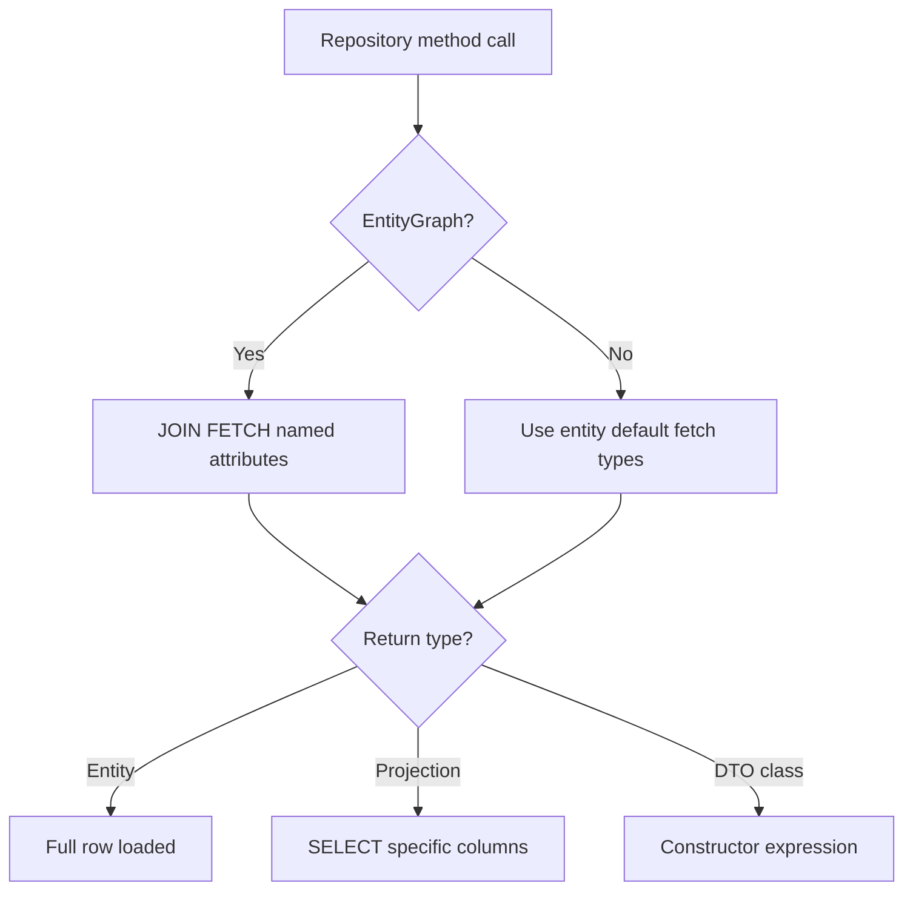
```mermaid
flowchart TD
    A[Repository method call] --> B{EntityGraph?}
    B -- Yes --> C[JOIN FETCH named attributes]
    B -- No --> D[Use entity default fetch types]
    C --> E{Return type?}
    D --> E
    E -- Entity --> F[Full row loaded]
    E -- Projection --> G[SELECT specific columns]
    E -- DTO class --> H[Constructor expression]
```

**Step-by-step:**

1. When a Spring Data repository method executes, Hibernate generates SQL based on the entity's `@ManyToOne`, `@OneToMany`, etc. annotations. By default, `@ManyToOne` and `@OneToOne` are EAGER; `@OneToMany` and `@ManyToMany` are LAZY.
2. If the method is annotated with `@EntityGraph(attributePaths = {"lineItems"})`, Hibernate adds a `LEFT JOIN FETCH` to the generated SQL, loading the association in the same query regardless of the annotation-level fetch type.
3. If the return type is an interface projection (e.g., `OrderSummary` with `getId()` and `getTotal()`), Spring Data generates a `SELECT o.id, o.total FROM ...` instead of `SELECT o.*`, reducing transferred data.
4. For class-based projections (DTO classes), you write a JPQL constructor expression or let Spring Data auto-detect the constructor, achieving the same column selection with a concrete type.

LAZY fetching and the persistence context are tightly coupled. Inside a `@Transactional` method, accessing a LAZY collection triggers a secondary SELECT. Outside the transaction, it throws `LazyInitializationException`. This is why `@EntityGraph` matters: it front-loads the join so LAZY associations arrive with the parent, avoiding both the exception and the N+1 pattern.

The N+1 connection: if you load 50 orders (1 query) and then iterate to access `order.getLineItems()` for each (50 queries), you have executed 51 queries. `@EntityGraph` or a JPQL `JOIN FETCH` collapses this to 1 query. But join-fetching multiple collections simultaneously creates a Cartesian product - Hibernate cannot join-fetch two `@OneToMany` bags in a single query without a `MultipleBagFetchException`. The workaround is to use `Set` instead of `List`, or split into two queries.

### 🛠️ Worked Example

**BAD:**

```java
@Entity
public class Order {
  @Id Long id;

  // EAGER: loads ALL line items for EVERY
  // query, even list endpoints
  @OneToMany(fetch = FetchType.EAGER)
  List<LineItem> lineItems;

  // EAGER: joins product for every order
  @ManyToOne(fetch = FetchType.EAGER)
  Customer customer;
}
```

**GOOD:**

```java
@Entity
public class Order {
  @Id Long id;

  @OneToMany(fetch = FetchType.LAZY)
  List<LineItem> lineItems;

  @ManyToOne(fetch = FetchType.LAZY)
  Customer customer;
}

public interface OrderRepository
    extends JpaRepository<Order, Long> {

  // List endpoint: no associations needed
  List<OrderSummary> findByStatus(
    OrderStatus status);

  // Detail endpoint: fetch items + customer
  @EntityGraph(attributePaths = {
    "lineItems", "customer"
  })
  Optional<Order> findDetailById(Long id);
}
```

**Production - interface projection for list endpoints:**

```java
public interface OrderSummary {
  Long getId();
  OrderStatus getStatus();
  BigDecimal getTotal();
  LocalDateTime getCreatedAt();
}

// Repository returns projection - Spring Data
// generates: SELECT o.id, o.status, o.total,
//            o.created_at FROM orders o WHERE ...
List<OrderSummary> findByStatus(
  OrderStatus status);
```

### ⚖️ Trade-offs

| Gain                                         | Cost                                                                           |
| -------------------------------------------- | ------------------------------------------------------------------------------ |
| LAZY default avoids unnecessary data loading | Requires careful transaction boundaries to avoid `LazyInitializationException` |
| `@EntityGraph` gives per-query fetch control | Join-fetching multiple collections risks Cartesian products                    |
| Interface projections reduce SELECT columns  | Cannot call entity methods on projections (no managed lifecycle)               |
| Class-based DTOs are type-safe and testable  | Require JPQL constructor expressions or matching constructors                  |

The fundamental trade-off is flexibility vs. safety. LAZY gives you flexibility (load on demand) but is unsafe outside transactions. EAGER is safe (always loaded) but wasteful. `@EntityGraph` is the middle ground - explicit, per-query, and predictable - but requires you to define a separate repository method for each fetch pattern. In practice, two to three methods per entity (list, detail, export) cover most needs.

### ⚡ Decision Snap

- **USE WHEN:** You have entities with associations and different endpoints need different subsets of the object graph.
- **AVOID WHEN:** Your entity has no associations or every endpoint needs the full graph (rare) - EAGER is simpler then.
- **PREFER projections WHEN:** List or search endpoints return many rows but only need a few columns - projections avoid loading full entities into the persistence context.

### ⚠️ Top Traps

| Trap                                           | Why it hurts                                                             | Fix                                                                    |
| ---------------------------------------------- | ------------------------------------------------------------------------ | ---------------------------------------------------------------------- |
| `@OneToMany(fetch = EAGER)` on list endpoints  | Loads full collections for every row, multiplying query time             | Default to LAZY, use `@EntityGraph` only where needed                  |
| Accessing LAZY fields outside `@Transactional` | `LazyInitializationException` at runtime, often only in production paths | Keep data access inside service-layer transactions, or use projections |
| Join-fetching two `List` collections           | `MultipleBagFetchException` - Hibernate cannot deduplicate two bags      | Change one collection to `Set`, or split into two queries              |

### 🪜 Learning Ladder

- **Prerequisites:** SPR-027 Spring Data JPA Repository Abstraction (repository basics), SPR-037 Hibernate Persistence Context and Flush Timing (persistence context lifecycle).
- **THIS:** SPR-049 Spring Data JPA Fetch Strategies and Projections - LAZY vs EAGER, `@EntityGraph`, interface and class-based projections.
- **Next steps:** SPR-057 N+1 Query Anti-Pattern in Spring Data JPA (deep dive into detection and batch-fetch solutions).

### 💡 The Surprising Truth

The biggest performance gains in Spring Data JPA rarely come from fetch type tuning. They come from projections. Most endpoints return lists of entities but only render three or four fields. Switching from `List<Order>` to `List<OrderSummary>` skips hydrating full entity graphs, avoids persistence context tracking overhead, and reduces GC pressure. Yet most teams spend hours debugging N+1 with `@EntityGraph` while ignoring the simpler fix: stop selecting columns you never read.

### 📇 Revision Card

1. Default `@ManyToOne` fetch is EAGER; default `@OneToMany` is LAZY - override explicitly to avoid surprises.
2. `@EntityGraph` defines which associations to fetch per use case without hardcoding fetch types on the mapping.
3. Interface projections avoid full entity hydration and persistence context tracking - use them for read-only list endpoints.

---

---

# SPR-050 HikariCP Connection Pool Tuning

**TL;DR** - HikariCP is Spring Boot's default connection pool - proper sizing determines whether your service survives traffic spikes or collapses under connection backlog.

### 🔥 The Problem in One Paragraph

Your Spring Boot service handles 200 requests per second normally, then a downstream database query slows from 5ms to 500ms during a table scan. Suddenly every request thread blocks waiting for a database connection. The default pool size of 10 connections is exhausted in milliseconds. Incoming requests queue behind `connectionTimeout` (30 seconds by default), threads pile up, the Tomcat thread pool fills, health checks fail, and Kubernetes restarts the pod. The pod restarts, reconnects, and the cycle repeats. You did not change any code - you just never tuned the pool for your actual concurrency, query latency, and failure modes. Connection pool misconfiguration is one of the top three causes of Spring Boot production outages, and it is entirely preventable.

### 📘 Textbook Definition

**HikariCP** (Japanese for "light") is a JDBC connection pool library that Spring Boot auto-configures as the default `DataSource` implementation. A connection pool maintains a cache of open database connections, lending them to application threads on demand and reclaiming them after use. HikariCP's design emphasizes minimal overhead through lock-free collections, bytecode-level optimizations, and a deliberately small API surface. Key configuration properties - `maximumPoolSize`, `minimumIdle`, `connectionTimeout`, `maxLifetime`, `idleTimeout`, and `leakDetectionThreshold` - control how many connections exist, how long they live, and how the pool behaves when demand exceeds supply.

### 🧠 Mental Model

> Think of a connection pool as a hotel shuttle service at an airport.

- "Total buses" -> maximumPoolSize
- "Buses waiting at terminal" -> minimumIdle
- "Passenger queue timeout" -> connectionTimeout
- "Bus retirement age" -> maxLifetime

**Where this analogy breaks down:** unlike shuttle buses, database connections consume server-side memory and process slots. A pool of 50 connections is not "better" than 10 - PostgreSQL's default `max_connections` is 100, and every idle connection holds a backend process. More connections can mean worse throughput due to context switching on the database side.

### ⚙️ How It Works

```
  Application threads (N)
         |
  +------+------+
  | HikariPool  |
  |  pool state |
  |  waiters[]  |
  +------+------+
    |    |    |   <- maximumPoolSize
  [conn][conn][conn]
    |    |    |
  +------+------+
  | Database    |
  | max_conn=100|
  +-------------+
```

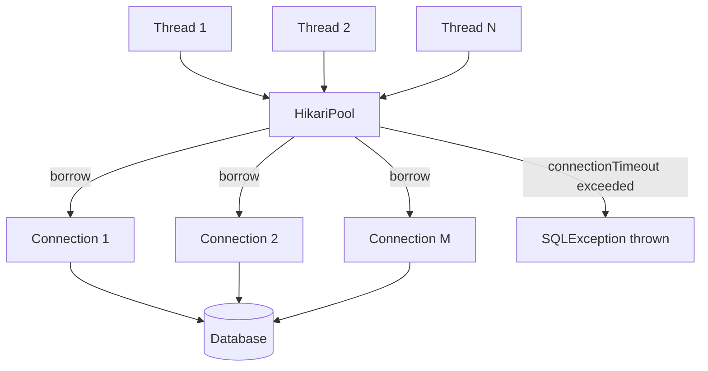
```mermaid
flowchart TD
    T1[Thread 1] --> P[HikariPool]
    T2[Thread 2] --> P
    T3[Thread N] --> P
    P -->|borrow| C1[Connection 1]
    P -->|borrow| C2[Connection 2]
    P -->|borrow| C3[Connection M]
    C1 --> DB[(Database)]
    C2 --> DB
    C3 --> DB
    P -->|connectionTimeout exceeded| E[SQLException thrown]
```

1. A thread calls `DataSource.getConnection()`. HikariCP checks the pool for an idle connection using a lock-free `ConcurrentBag`.
2. If an idle connection exists, it is validated (by default via `Connection.isValid()`) and returned in under a microsecond.
3. If no idle connection exists but the pool has not reached `maximumPoolSize`, a new physical connection is created and returned.
4. If the pool is at maximum capacity, the thread enters a bounded wait queue. It blocks for up to `connectionTimeout` milliseconds.
5. If no connection becomes available within the timeout, HikariCP throws a `SQLTransientConnectionException` - the single most common HikariCP error in production logs.
6. When a thread calls `connection.close()`, the connection is returned to the pool (not physically closed).

**The sizing formula that matters.** The PostgreSQL wiki and HikariCP author both recommend a pool much smaller than most teams configure. The formula is: `connections = (core_count * 2) + effective_spindle_count`. For a 4-core server with SSD storage, that yields roughly 10 connections. This counterintuitive result exists because database throughput degrades with excessive concurrent connections due to CPU context switching and lock contention. A pool of 10 connections often outperforms a pool of 50 on the same hardware.

**Key properties and what they actually control:**

```
spring.datasource.hikari.maximum-pool-size=10
spring.datasource.hikari.minimum-idle=10
spring.datasource.hikari.connection-timeout=30000
spring.datasource.hikari.max-lifetime=1800000
spring.datasource.hikari.idle-timeout=600000
spring.datasource.hikari.leak-detection-threshold=60000
```

Setting `minimumIdle` equal to `maximumPoolSize` creates a fixed-size pool, which HikariCP recommends for production. A fixed pool avoids the latency spike of creating new connections under load. `maxLifetime` should be set several minutes shorter than any database or infrastructure timeout (load balancer idle timeout, database `wait_timeout`) to ensure HikariCP retires connections before the infrastructure kills them.

**Monitoring with Micrometer.** Spring Boot auto-exposes HikariCP metrics when Micrometer is on the classpath. The critical metrics are `hikaricp.connections.active` (connections currently borrowed), `hikaricp.connections.pending` (threads waiting), and `hikaricp.connections.timeout` (timeout count). If `pending` stays above zero for sustained periods, the pool is undersized or queries are too slow.

### 🛠️ Worked Example

**BAD:**

```yaml
# application.yml - dangerous defaults
spring:
  datasource:
    url: jdbc:postgresql://db:5432/app
    hikari:
      maximum-pool-size: 50
      minimum-idle: 5
      connection-timeout: 60000
      # no maxLifetime set
      # no leak detection
```

Why it's wrong: pool size of 50 overwhelms a small database, `minimumIdle` of 5 causes connection storms under load as 45 new connections must be created simultaneously, 60-second timeout hides slow queries behind unresponsive threads, and missing `maxLifetime` means stale connections accumulate until the database kills them.

**GOOD:**

```yaml
spring:
  datasource:
    url: jdbc:postgresql://db:5432/app
    hikari:
      maximum-pool-size: 10
      minimum-idle: 10
      connection-timeout: 3000
      max-lifetime: 1740000
      idle-timeout: 600000
      leak-detection-threshold: 30000
      pool-name: app-pool
```

Why it works: fixed pool (min = max = 10) avoids connection creation storms. Short 3-second timeout fails fast so threads are not stuck. `maxLifetime` of 29 minutes stays under the typical 30-minute infrastructure timeout. Leak detection alerts at 30 seconds if a connection is not returned.

**Production pattern - alerting on pool exhaustion:**

```java
@Component
public class PoolHealthIndicator
    implements HealthIndicator {
  private final HikariDataSource ds;

  PoolHealthIndicator(DataSource dataSource) {
    this.ds = (HikariDataSource) dataSource;
  }

  @Override
  public Health health() {
    HikariPoolMXBean pool = ds.getHikariPoolMXBean();
    int pending = pool.getThreadsAwaitingConnection();
    if (pending > 0) {
      return Health.down()
        .withDetail("pending", pending)
        .build();
    }
    return Health.up()
      .withDetail("active", pool.getActiveConnections())
      .withDetail("idle", pool.getIdleConnections())
      .build();
  }
}
```

### ⚖️ Trade-offs

| Gain                                          | Cost                                  |
| --------------------------------------------- | ------------------------------------- |
| Fast fail on pool exhaustion (short timeout)  | Callers must handle connection errors |
| Fixed-size pool avoids creation latency       | Reserves memory even when idle        |
| Leak detection catches unreturned connections | Adds minor overhead per borrow        |
| Small pool improves DB throughput             | Requires accurate capacity planning   |

| Approach                 | Best for                         | Risk                                         |
| ------------------------ | -------------------------------- | -------------------------------------------- |
| Fixed pool (min = max)   | Production workloads             | Wastes resources if traffic is very bursty   |
| Dynamic pool (min < max) | Dev/staging environments         | Connection creation storms under sudden load |
| Large pool (>30)         | Extremely slow queries           | Database contention, worse throughput        |
| Small pool (<10)         | CPU-bound apps with fast queries | Exhaustion if query latency spikes           |

The most common production mistake is oversizing the pool. Teams assume 200 concurrent users means 200 connections. In reality, most requests hold a connection for a few milliseconds. With 5ms average query time and 10 connections, the pool can service 2,000 queries per second. Oversizing wastes database memory and creates contention on the database server's CPU scheduler.

### ⚡ Decision Snap

**USE WHEN:**

- You are running any Spring Boot application with a relational database
- You need predictable latency under load
- You must survive downstream database slowdowns without cascading failure

**AVOID WHEN:**

- Your application only uses reactive/non-blocking database access (use R2DBC pool instead)
- You are using an in-memory database for testing only (defaults are fine)

**PREFER connection pool monitoring WHEN:**

- Running in production with any SLA requirement
- Using container orchestration that restarts on failed health checks

### ⚠️ Top Traps

| Trap                                         | Why it bites                                                                                | Fix                                                                            |
| -------------------------------------------- | ------------------------------------------------------------------------------------------- | ------------------------------------------------------------------------------ |
| `maxLifetime` longer than DB/LB idle timeout | Database or load balancer kills the connection silently; next query gets a broken pipe      | Set `maxLifetime` 2-3 minutes shorter than the shortest infrastructure timeout |
| `connectionTimeout` set to 30+ seconds       | Threads pile up waiting, exhausting the servlet thread pool and making the app unresponsive | Set to 2-5 seconds; fail fast and let the caller retry or degrade              |
| No `leakDetectionThreshold`                  | A forgotten `close()` in a try-without-resources drains the pool over hours                 | Set to 30-60 seconds; watch logs for leak warnings                             |

### 🪜 Learning Ladder

- **Prerequisites:** SPR-027 Spring Data JPA Repository Abstraction (how Spring Boot acquires and uses DataSource), SPR-032 @ConfigurationProperties and Type-Safe Config (binding HikariCP properties from YAML).
- **THIS:** SPR-050 HikariCP Connection Pool Tuning - sizing, key properties, monitoring, failure modes.
- **Next steps:** SPR-053 Micrometer Metrics and Distributed Tracing (visualizing pool metrics in dashboards), SPR-058 Spring Performance Tuning Checklist (pool tuning as part of holistic performance strategy).

### 💡 The Surprising Truth

The HikariCP author's own recommendation is that most applications need a pool of 10 or fewer connections. The intuition that "more connections = more throughput" is exactly backwards for databases. A database with 10 connections doing sequential work will typically outperform the same database with 50 connections fighting for CPU, locks, and buffer pool pages. The pool's job is not to provide unlimited connections - it is to queue excess demand, apply back-pressure, and fail fast when the system is overloaded. Tuning a connection pool is not about making it bigger; it is about making it honest about capacity.

### 📇 Revision Card

- HikariCP sizing formula: `(core_count * 2) + spindle_count` - typically 10 connections handles thousands of QPS if queries are fast.
- Set `minimumIdle = maximumPoolSize` for a fixed pool in production; set `maxLifetime` shorter than any infrastructure idle timeout; set `connectionTimeout` to 2-5 seconds.
- Monitor `hikaricp.connections.pending` - if it stays above zero, either the pool is too small or queries are too slow.

---

---

# SPR-051 Database Migrations with Flyway and Liquibase

**TL;DR** - Flyway or Liquibase version-control your schema like Git versions code - Spring Boot auto-runs migrations at startup so schema and application deploy in lockstep.

### 🔥 The Problem in One Paragraph

A developer adds a `status` column to the `orders` table on their laptop. They tell the team in Slack. The staging environment gets the column via a manual `ALTER TABLE`. Production does not. The Friday deploy fails with `Unknown column 'status'` at 2 AM. Another developer adds the same column with a different type. The test database has `VARCHAR(20)`, production has `VARCHAR(50)`, and a third environment has neither. Nobody knows which database has which schema version. Rollback means guessing which `ALTER TABLE` statements to reverse. This is not a tooling gap - it is the absence of schema version control. Code has Git. Infrastructure has Terraform. Databases need Flyway or Liquibase.

### 📘 Textbook Definition

**Database migration tools** apply versioned, ordered, incremental changes to a database schema. **Flyway** uses sequentially numbered SQL files (e.g., `V1__create_users.sql`, `V2__add_email_column.sql`) tracked in a `flyway_schema_history` table. **Liquibase** uses a changelog file (XML, YAML, JSON, or SQL) with changesets identified by author and ID, tracked in a `DATABASECHANGELOG` table. Both tools compare the migration history table against available migration files, determine which migrations have not yet been applied, and execute them in order. Spring Boot auto-configures either tool when it detects the dependency on the classpath and migration files in the expected location.

### 🧠 Mental Model

> Think of database migrations as a numbered ledger at a bank.

- "Ledger entry" -> one migration file (V1, V2, V3)
- "Ledger book" -> history table (flyway_schema_history)
- "Auditor checksum" -> hash validation on applied migrations

**Where this analogy breaks down:** unlike a financial ledger, database migrations are not always reversible. An `ALTER TABLE DROP COLUMN` destroys data. Flyway Community edition has no built-in undo; rollback must be planned manually with compensating migrations.

### ⚙️ How It Works

```
  App starts
     |
  Spring Boot auto-config detects
  Flyway/Liquibase on classpath
     |
  Tool reads history table
  (flyway_schema_history /
   DATABASECHANGELOG)
     |
  Compares applied vs available
     |
  Runs pending migrations in order
     |
  App context continues loading
     |
  JPA/Hibernate validates schema
  (ddl-auto=validate)
```

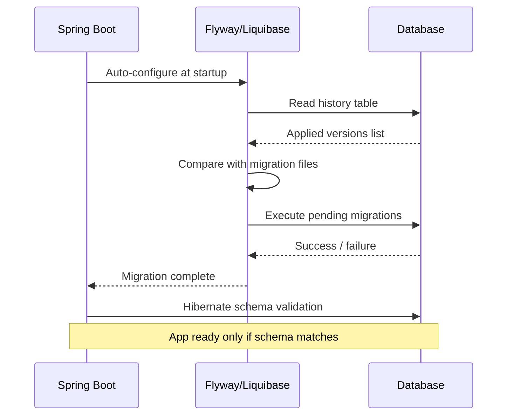
```mermaid
sequenceDiagram
    participant App as Spring Boot
    participant F as Flyway/Liquibase
    participant DB as Database

    App->>F: Auto-configure at startup
    F->>DB: Read history table
    DB-->>F: Applied versions list
    F->>F: Compare with migration files
    F->>DB: Execute pending migrations
    DB-->>F: Success / failure
    F-->>App: Migration complete
    App->>DB: Hibernate schema validation
    Note over App,DB: App ready only if schema matches
```

1. Spring Boot's `FlywayAutoConfiguration` (or `LiquibaseAutoConfiguration`) creates the migration bean before the `EntityManagerFactory` bean, ensuring the schema is current before Hibernate validates it.
2. Flyway scans `classpath:db/migration` for files matching `V{version}__{description}.sql` (double underscore). Versions are compared numerically.
3. For each pending migration, Flyway opens a transaction (if the database supports DDL transactions), executes the SQL, and records the version, description, checksum, and execution time in `flyway_schema_history`.
4. If a previously applied migration file has been modified, Flyway detects a checksum mismatch and refuses to start - this is the critical safety net against tampering.
5. Liquibase follows the same pattern but uses changeset IDs rather than version numbers, allowing multiple developers to add changesets without numbering conflicts.

**Flyway file naming convention:**

```
db/migration/
  V1__create_users_table.sql
  V2__add_email_to_users.sql
  V3__create_orders_table.sql
  R__refresh_reporting_view.sql
```

`V` = versioned (runs once, ordered). `R` = repeatable (re-runs when checksum changes, runs after all V migrations). The double underscore separates version from description.

**Liquibase changelog structure:**

```yaml
databaseChangeLog:
  - changeSet:
      id: 1
      author: dev-team
      changes:
        - createTable:
            tableName: users
            columns:
              - column:
                  name: id
                  type: bigint
                  autoIncrement: true
              - column:
                  name: email
                  type: varchar(255)
```

Liquibase's declarative format enables database-agnostic migrations. The same changelog can generate DDL for PostgreSQL, MySQL, and Oracle. Flyway's raw SQL approach gives full control over database-specific syntax.

### 🛠️ Worked Example

**BAD:**

```yaml
# application.yml - letting Hibernate manage schema
spring:
  jpa:
    hibernate:
      ddl-auto: update
```

```java
// No migration files. Schema "evolves" via
// Hibernate auto-DDL. Works on dev laptop.
// Fails in staging because Hibernate never
// drops columns, never renames - only adds.
// Schema diverges across environments.
```

Why it's wrong: `ddl-auto=update` silently adds columns but never removes them, never renames them, and never migrates data. It cannot drop a NOT NULL constraint, split a table, or backfill values. Production schema drifts from the entity model, and there is no record of what changed or when.

**GOOD:**

```yaml
# application.yml
spring:
  jpa:
    hibernate:
      ddl-auto: validate
  flyway:
    enabled: true
    locations: classpath:db/migration
    baseline-on-migrate: true
```

```sql
-- V1__create_users.sql
CREATE TABLE users (
  id BIGSERIAL PRIMARY KEY,
  email VARCHAR(255) NOT NULL UNIQUE,
  created_at TIMESTAMP NOT NULL
    DEFAULT NOW()
);

-- V2__add_status_to_users.sql
ALTER TABLE users
  ADD COLUMN status VARCHAR(20)
    NOT NULL DEFAULT 'ACTIVE';
```

Why it works: every schema change is an explicit, versioned, reviewed SQL file. `ddl-auto=validate` ensures Hibernate's entity model matches the migrated schema - if they diverge, the app fails at startup rather than silently producing wrong results.

**Production pattern - safe column addition:**

```sql
-- V3__add_phone_nullable_first.sql
-- Step 1: add as nullable (no lock on large table)
ALTER TABLE users
  ADD COLUMN phone VARCHAR(20);

-- V4__backfill_phone.sql
-- Step 2: backfill in batches (separate deploy)
UPDATE users SET phone = 'UNKNOWN'
  WHERE phone IS NULL;

-- V5__make_phone_not_null.sql
-- Step 3: add constraint after backfill
ALTER TABLE users
  ALTER COLUMN phone SET NOT NULL;
```

This three-migration pattern avoids holding exclusive locks on large tables during a single long-running `ALTER TABLE ... ADD COLUMN ... NOT NULL DEFAULT ...` on databases where that is not optimized.

### ⚖️ Trade-offs

| Gain                                     | Cost                                          |
| ---------------------------------------- | --------------------------------------------- |
| Versioned, auditable schema history      | Every schema change needs a migration file    |
| Identical schema across all environments | Broken migration blocks all deployments       |
| Checksum validation catches tampering    | Cannot edit applied migrations without repair |
| Spring Boot auto-runs at startup         | Startup time increases with migration count   |

| Tool                      | Best for                                         | Limitation                                       |
| ------------------------- | ------------------------------------------------ | ------------------------------------------------ |
| Flyway                    | Teams comfortable with raw SQL, single DB vendor | No built-in rollback (Community), SQL-per-vendor |
| Liquibase                 | Multi-database support, declarative changelogs   | More complex configuration, XML verbosity        |
| Hibernate ddl-auto=update | Rapid prototyping only                           | No history, no rollback, schema drift            |

Both tools solve the same fundamental problem. Flyway is simpler and more popular in Spring Boot projects. Liquibase offers more power for complex enterprise environments with multiple database vendors. The worst choice is neither - relying on manual scripts or `ddl-auto=update` in production.

### ⚡ Decision Snap

**USE WHEN:**

- Any application with a relational database that will run in more than one environment
- You need repeatable, auditable deployments
- Multiple developers modify the schema

**AVOID WHEN:**

- Prototyping with throwaway data (use `ddl-auto=create-drop` temporarily)
- Schema-less databases (MongoDB, DynamoDB)

**PREFER Flyway WHEN:**

- Single database vendor, team prefers raw SQL control
  **PREFER Liquibase WHEN:**
- Multiple database vendors, need declarative rollback, or enterprise governance requirements

### ⚠️ Top Traps

| Trap                                         | Why it bites                                                                                 | Fix                                                                           |
| -------------------------------------------- | -------------------------------------------------------------------------------------------- | ----------------------------------------------------------------------------- |
| Editing an applied migration file            | Flyway detects checksum mismatch and refuses to start; Liquibase marks changeset as modified | Never edit applied migrations; create a new migration for corrections         |
| Using `ddl-auto=update` alongside Flyway     | Hibernate silently adds columns outside Flyway's history, causing schema drift               | Set `ddl-auto=validate` in all non-prototype environments                     |
| Two developers using the same version number | Both create `V7__*.sql` independently; merge conflict is silent until startup                | Use timestamps as versions (`V20260516120000__desc.sql`) or coordinate via PR |

### 🪜 Learning Ladder

- **Prerequisites:** SPR-027 Spring Data JPA Repository Abstraction (understanding Spring's DataSource and JPA setup), SPR-039 Hibernate Persistence Context and Flush Timing (why schema must match entity model).
- **THIS:** SPR-051 Database Migrations with Flyway and Liquibase - versioned schema changes, auto-configuration, migration best practices.
- **Next steps:** SPR-052 Spring Boot Actuator and Health Endpoints (exposing migration status via health checks and info endpoint).

### 💡 The Surprising Truth

The rule "never edit an applied migration" feels restrictive until you realize it is the same rule Git enforces for published commits. Once a commit is pushed, you do not rewrite it - you add a new commit. Once a migration is applied, you do not modify it - you add a new migration. The teams that struggle most with database migrations are not the ones who find the tooling hard. They are the ones who treat schema changes as less important than code changes - skipping reviews, testing in production, and editing files after the fact. The tool is trivial. The discipline is everything.

### 📇 Revision Card

- Flyway uses `V{number}__{description}.sql` files in `db/migration/`, tracked in `flyway_schema_history`; Liquibase uses changesets in XML/YAML tracked in `DATABASECHANGELOG`.
- Set `ddl-auto=validate` in every non-prototype environment so Hibernate verifies the schema matches entities after migrations run.
- Never edit an applied migration - create a new one; use checksums as your safety net; split risky DDL (add nullable, backfill, add constraint) across multiple migrations.

---

---

# SPR-052 Spring Boot Actuator and Health Endpoints

**TL;DR** - Actuator exposes /health, /metrics, /env, and /loggers endpoints giving orchestrators and operators a live window into application state with one starter dependency.

### 🔥 The Problem in One Paragraph

You deploy a Spring Boot service and Kubernetes marks it "Ready" because the JVM opened port 8080. Three minutes later the database connection pool is exhausted, Redis is unreachable, and the disk is 98% full - yet the pod keeps receiving traffic because nothing told the orchestrator the app is unhealthy. Without a structured way to expose internal health, configuration, and runtime state, teams resort to custom /status endpoints that are inconsistent across services, miss failure modes, and rot faster than the code they monitor.

### 📘 Textbook Definition

Spring Boot Actuator is a sub-project that adds production-ready features to a Spring Boot application. It auto-configures HTTP (or JMX) endpoints that expose health checks, metrics, environment properties, bean definitions, configuration mappings, thread dumps, and more. Health indicators aggregate component status (UP, DOWN, OUT_OF_SERVICE, UNKNOWN) into a composite result. Endpoints are secured by default and must be explicitly exposed through configuration.

### 🧠 Mental Model

> Think of Actuator as the instrument cluster on a car dashboard.

- "Check-engine light" -> /health endpoint (single UP/DOWN)
- "OBD-II diagnostic port" -> /metrics endpoint (deep telemetry)
- "Dial and switch positions" -> /env endpoint (config values)

**Where this analogy breaks down:** a dashboard is read-only; Actuator endpoints like /loggers and /env can mutate state at runtime (change log levels, refresh config). That write capability demands security controls a passive dashboard never needs.

### ⚙️ How It Works

```
Request        Actuator        Health
  |            Endpoint        Indicators
  |            Filter          ----------
  |              |             | DB     |
  |   GET        |   aggregate | Disk   |
  +--/health---->+------------>| Redis  |
  |              |             | Custom |
  |   200 UP     |  composite  |________|
  |<-------------+<-result-----+
  |              |
```

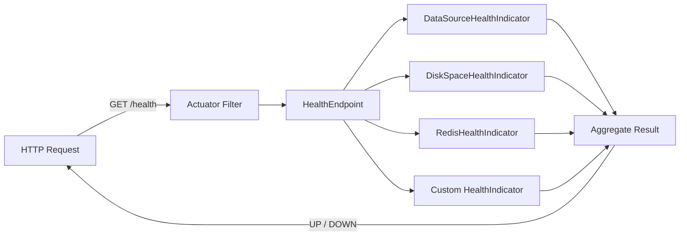
```mermaid
flowchart LR
    R[HTTP Request] -->|GET /health| F[Actuator Filter]
    F --> A[HealthEndpoint]
    A --> DB[DataSourceHealthIndicator]
    A --> DK[DiskSpaceHealthIndicator]
    A --> RD[RedisHealthIndicator]
    A --> CU[Custom HealthIndicator]
    DB --> AG[Aggregate Result]
    DK --> AG
    RD --> AG
    CU --> AG
    AG -->|UP / DOWN| R
```

**Step 1 - Add the starter.** `spring-boot-starter-actuator` brings in the actuator auto-configuration plus Micrometer core for metrics. No code changes required for basic operation.

**Step 2 - Expose endpoints.** By default only `/actuator/health` is exposed over HTTP. In `application.yml`:

```yaml
management:
  endpoints:
    web:
      exposure:
        include: health,info,metrics,loggers
  endpoint:
    health:
      show-details: when-authorized
```

**Step 3 - Health indicators auto-register.** Spring Boot detects beans on the classpath and registers matching indicators: `DataSource` triggers `DataSourceHealthIndicator`, `RedisConnectionFactory` triggers `RedisHealthIndicator`, and so on. The composite status uses a `StatusAggregator` that returns the worst status across all indicators.

**Step 4 - Kubernetes probes.** When running on Kubernetes, enable liveness and readiness groups:

```yaml
management:
  endpoint:
    health:
      group:
        readiness:
          include: db,redis
        liveness:
          include: ping
```

Kubernetes maps `/actuator/health/readiness` to the readiness probe and `/actuator/health/liveness` to the liveness probe. A DOWN readiness removes the pod from the Service; a DOWN liveness triggers a restart.

Health indicator execution runs on the request thread by default. A slow database check blocks the /health response, which can cascade into probe timeouts. From Spring Boot 2.6+ you can set `management.endpoint.health.validate-group-membership=true` and configure timeouts per group. For expensive checks, schedule an async refresh and cache the result rather than querying live on every probe hit.

Endpoint security uses the same Spring Security filter chain as your main application. Best practice is to host actuator on a separate management port (`management.server.port=9090`) so internal-only traffic never traverses the public ingress. This lets you firewall management traffic at the network level rather than relying solely on path-based security rules.

### 🛠️ Worked Example

**BAD:**

```java
// Hand-rolled /status - misses half the failure
// modes and drifts from actual infrastructure
@GetMapping("/status")
public String status() {
    return "OK"; // lies when DB is down
}
```

**GOOD:**

```java
@Component
public class PaymentGatewayHealthIndicator
        implements HealthIndicator {

    private final PaymentClient client;

    public PaymentGatewayHealthIndicator(
            PaymentClient client) {
        this.client = client;
    }

    @Override
    public Health health() {
        try {
            client.ping();
            return Health.up()
                .withDetail("gateway", "reachable")
                .build();
        } catch (Exception ex) {
            return Health.down(ex)
                .withDetail("gateway", "unreachable")
                .build();
        }
    }
}
```

**Production configuration:**

```yaml
management:
  server:
    port: 9090
  endpoints:
    web:
      exposure:
        include: health,info,metrics,prometheus
  endpoint:
    health:
      show-details: when-authorized
      group:
        readiness:
          include: db,paymentGateway
        liveness:
          include: ping
  info:
    env:
      enabled: true
    git:
      mode: full
```

This separates management traffic, exposes Prometheus scraping, maps readiness to real dependencies, and enriches /info with git commit data for traceability.

### ⚖️ Trade-offs

| Gain                                               | Cost                                                   |
| -------------------------------------------------- | ------------------------------------------------------ |
| Standardized health checks across all services     | Extra dependency and configuration surface             |
| Auto-detected indicators for common infrastructure | Indicators can mask slow-dependency cascades           |
| Kubernetes-native probe integration                | Misconfigured probes cause restarts or dropped traffic |
| Runtime log-level changes via /loggers             | Write-capable endpoints increase attack surface        |
| Consistent /metrics foundation for monitoring      | Endpoint data can leak internals if unsecured          |

Actuator gives you production observability essentially for free, but "for free" is deceptive if you skip security. An exposed /env endpoint leaks database passwords, API keys, and cloud credentials. An open /loggers endpoint lets an attacker set `root` to `TRACE` and flood your disk or stdout, potentially degrading the entire node. The management-port separation pattern plus Spring Security authorization on actuator paths is the minimum viable security posture.

### ⚡ Decision Snap

**USE WHEN:** You need health probes for orchestrators, standardized operational endpoints, or a foundation for metrics and monitoring.

**AVOID WHEN:** The application is a short-lived CLI tool or batch job where HTTP endpoints have no consumer.

**PREFER custom HealthIndicator WHEN:** Your service depends on an external system (payment gateway, message broker, partner API) that the built-in indicators do not cover.

### ⚠️ Top Traps

| Trap                                                        | Why it hurts                                                                     | Fix                                                       |
| ----------------------------------------------------------- | -------------------------------------------------------------------------------- | --------------------------------------------------------- |
| Exposing all endpoints with `include: "*"` on a public port | /env and /heapdump leak secrets and memory contents                              | Explicit include list + separate management port          |
| Heavy health checks on liveness probe                       | Kubernetes restarts pods when a slow DB query times out the probe                | Use liveness=ping only; dependency checks go in readiness |
| Forgetting `show-details: when-authorized`                  | Health details (connection strings, versions) visible to unauthenticated callers | Always require authorization for detail exposure          |

### 🪜 Learning Ladder

**Prerequisites:** SPR-007 (Spring Boot Auto-Configuration), SPR-034 (Application Properties and Profiles).
**THIS:** SPR-052 - Actuator endpoints, health indicators, probe groups, endpoint security.
**Next:** SPR-053 (Micrometer Metrics and Distributed Tracing), SPR-060 (Monitoring Spring Applications in Production).

### 💡 The Surprising Truth

Most teams enable Actuator for /health and ignore the rest. The real power is /loggers - the ability to switch a single logger to DEBUG in production, reproduce the issue, and switch back, without a redeploy. Combined with /metrics for quantitative data and /env for confirming which profile is actually active, Actuator replaces half the "let me SSH into the box" emergency playbook with a single HTTP call.

### 📇 Revision Card

- Actuator auto-registers health indicators for detected infrastructure (DB, Redis, disk); composite status returns the worst across all indicators.
- Separate management port + explicit endpoint include list + Spring Security authorization is the minimum security posture for production.
- Map liveness to lightweight checks (ping) and readiness to dependency checks (db, redis, custom) - never put slow checks on liveness or Kubernetes will restart healthy pods.

---

---

# SPR-053 Micrometer Metrics and Distributed Tracing

**TL;DR** - Micrometer is a vendor-neutral metrics facade that auto-instruments JVM, HTTP, and database metrics, shipping them to any backend without coupling code to a specific vendor.

### 🔥 The Problem in One Paragraph

Your Spring Boot service is in production and something is slow. Is it the database? The downstream HTTP call? GC pauses? You add `System.currentTimeMillis()` around suspect code, format the delta into a log line, deploy, grep logs, and compute percentiles in a spreadsheet. Next quarter the team switches from Graphite to Prometheus and every hand-rolled metric call must be rewritten. Meanwhile, a request spans three microservices and nobody can correlate the latency across them because each service logs independently with no shared identifier. You need a metrics abstraction that decouples instrumentation from backends, plus a tracing mechanism that threads a correlation ID through the entire call chain.

### 📘 Textbook Definition

Micrometer is a dimensional metrics facade for JVM-based applications. It provides meter primitives - Counter, Gauge, Timer, DistributionSummary, LongTaskTimer, and FunctionCounter - each decorated with key-value tags for dimensional analysis. A MeterRegistry binds these meters to a monitoring backend. Spring Boot auto-configures a CompositeMeterRegistry and registers dozens of built-in metrics (JVM memory, GC, Tomcat threads, HikariCP pool stats, HTTP server requests). Micrometer Tracing (the successor to Spring Cloud Sleuth) adds distributed tracing by propagating trace and span IDs across service boundaries, correlating metrics and logs within a single request flow.

### 🧠 Mental Model

> Micrometer is like a universal power adapter for metric plugs.

- "Your device plug" -> metric recording API (Timer, Counter, Gauge)
- "Adapter" -> MeterRegistry implementation per vendor
- "Wall socket" -> monitoring backend (Prometheus, Datadog, etc.)

**Where this analogy breaks down:** a power adapter is passive and stateless. Micrometer registries actively aggregate, buffer, and sometimes pre-compute histograms and percentiles. Misconfiguring the registry (wrong histogram buckets, excessive tag cardinality) causes memory bloat or misleading dashboards - problems a simple adapter never has.

### ⚙️ How It Works

```
App Code       Micrometer        Registry
  |            Facade            Backends
  |              |               ---------
  |  Timer       |               |Promeths|
  +--record()--->+--bind-------->|Datadog |
  |              |               |CloudWch|
  |  Counter     |  dimensional  |________|
  +--increment-->+--tags-------->|
  |              |               |
  |  Auto-       |  /actuator/   |
  |  instrumented+--/metrics---->| Scrape
  |              |               |
```

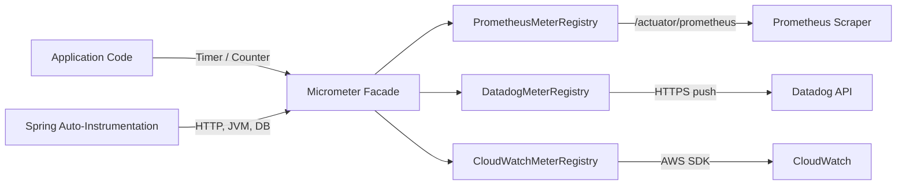
```mermaid
flowchart LR
    A[Application Code] -->|Timer / Counter| M[Micrometer Facade]
    S[Spring Auto-Instrumentation] -->|HTTP, JVM, DB| M
    M --> P[PrometheusMeterRegistry]
    M --> D[DatadogMeterRegistry]
    M --> C[CloudWatchMeterRegistry]
    P -->|/actuator/prometheus| SC[Prometheus Scraper]
    D -->|HTTPS push| DD[Datadog API]
    C -->|AWS SDK| CW[CloudWatch]
```

**Step 1 - Add a registry dependency.** Spring Boot Actuator includes Micrometer core. Add a registry implementation to ship metrics:

```xml
<dependency>
  <groupId>io.micrometer</groupId>
  <artifactId>micrometer-registry-prometheus</artifactId>
</dependency>
```

**Step 2 - Auto-instrumented metrics appear immediately.** With the starter on the classpath, Spring Boot registers metrics for JVM memory (`jvm.memory.used`), GC (`jvm.gc.pause`), HTTP server requests (`http.server.requests`), HikariCP (`hikaricp.connections.active`), and more. No code changes needed.

**Step 3 - Record custom metrics.** Inject the `MeterRegistry` and create meters:

```java
@Service
public class OrderService {
    private final Counter placed;
    private final Timer latency;

    public OrderService(MeterRegistry registry) {
        this.placed = Counter.builder("orders.placed")
            .tag("region", "us-east")
            .register(registry);
        this.latency = Timer.builder("orders.latency")
            .publishPercentiles(0.5, 0.95, 0.99)
            .register(registry);
    }

    public Order place(OrderRequest req) {
        return latency.record(() -> {
            Order o = process(req);
            placed.increment();
            return o;
        });
    }
}
```

**Step 4 - Distributed tracing.** Add Micrometer Tracing plus a tracer bridge (Brave or OpenTelemetry):

```xml
<dependency>
  <groupId>io.micrometer</groupId>
  <artifactId>micrometer-tracing-bridge-brave</artifactId>
</dependency>
<dependency>
  <groupId>io.zipkin.reporter2</groupId>
  <artifactId>zipkin-reporter-brave</artifactId>
</dependency>
```

Spring Boot auto-configures trace and span ID propagation through `RestClient`, `WebClient`, `RestTemplate`, Kafka, and RabbitMQ. The IDs appear in MDC so log lines carry `traceId` and `spanId` automatically.

Dimensional tags are the key to useful dashboards but also the primary footprint risk. Every unique combination of tag values creates a distinct time series. A tag like `userId` on a Timer produces one series per user - millions of series that overwhelm Prometheus and inflate storage costs. Use bounded, low-cardinality tags (region, status code, HTTP method, service name) and never tag with unbounded identifiers.

Percentile histograms deserve careful configuration. `publishPercentiles()` computes percentiles client-side - convenient but inaccurate when aggregating across instances. `publishPercentileHistogram()` publishes histogram buckets that the backend aggregates server-side, producing accurate cross-instance percentiles at the cost of more time series (typically 50-70 buckets per Timer).

### 🛠️ Worked Example

**BAD:**

```java
// Directly using Prometheus client - cannot
// switch to Datadog without rewriting everything
final Summary reqLatency = Summary.build()
    .name("http_request_latency")
    .help("Request latency")
    .register();
```

**GOOD:**

```java
@Bean
MeterRegistryCustomizer<MeterRegistry>
        commonTags() {
    return r -> r.config()
        .commonTags(
            "app", "order-service",
            "env", "prod"
        );
}
```

**Production application.yml:**

```yaml
management:
  endpoints:
    web:
      exposure:
        include: health,prometheus
  metrics:
    tags:
      application: order-service
    distribution:
      percentiles-histogram:
        http.server.requests: true
      slo:
        http.server.requests: 50ms,100ms,250ms,1s
  tracing:
    sampling:
      probability: 0.1
```

This enables server-side histogram aggregation for HTTP latency, defines SLO buckets for alerting, and samples 10% of traces to balance observability against overhead.

### ⚖️ Trade-offs

| Gain                                           | Cost                                                                          |
| ---------------------------------------------- | ----------------------------------------------------------------------------- |
| Vendor-neutral instrumentation                 | Abstraction layer to learn on top of backend specifics                        |
| Auto-instrumented JVM, HTTP, pool metrics      | High-cardinality tags silently explode time series count                      |
| Client-side percentiles with no backend config | Client-side percentiles are inaccurate across instances                       |
| Distributed tracing with zero-code propagation | Trace sampling rate is a precision-vs-cost trade-off                          |
| Single dependency swap to change backend       | Registry-specific features (exemplars, native histograms) may not map cleanly |

The facade pattern means you occasionally lose access to backend-native features. Prometheus native histograms and OpenTelemetry exemplars require specific Micrometer support. In practice, the portability benefit outweighs the gap for the vast majority of applications. If you need a backend-specific feature, you can register a backend-specific MeterFilter or access the underlying registry directly.

### ⚡ Decision Snap

**USE WHEN:** You need production metrics, SLO-based alerting, or distributed trace correlation in a Spring Boot application.

**AVOID WHEN:** The application is a single-execution CLI with no long-running process to observe.

**PREFER OpenTelemetry bridge WHEN:** Your organization has standardized on OTel collectors and you want OTel-native span export alongside Micrometer metrics.

### ⚠️ Top Traps

| Trap                                                             | Why it hurts                                                              | Fix                                                                                           |
| ---------------------------------------------------------------- | ------------------------------------------------------------------------- | --------------------------------------------------------------------------------------------- |
| Tagging metrics with high-cardinality values (userId, requestId) | Time series cardinality explosion - OOM in Prometheus, huge storage bills | Tag only with bounded values (status, method, region); use trace spans for per-request detail |
| Using `publishPercentiles()` and aggregating across instances    | Client-computed percentiles are mathematically non-aggregatable           | Use `publishPercentileHistogram()` for server-side aggregation                                |
| Setting trace sampling to 1.0 (100%) in production               | Massive trace volume overwhelms collector and storage                     | Use probability sampling (0.01-0.1) or rate-limiting sampler                                  |

### 🪜 Learning Ladder

**Prerequisites:** SPR-052 (Spring Boot Actuator and Health Endpoints).
**THIS:** SPR-053 - Micrometer meter types, dimensional tagging, registry backends, distributed tracing with Micrometer Tracing.
**Next:** SPR-060 (Monitoring Spring Applications in Production), SPR-058 (Spring Performance Tuning Checklist).

### 💡 The Surprising Truth

Most teams think of metrics and tracing as separate concerns - one for dashboards, the other for request debugging. Micrometer Tracing unifies them: a Timer recording latency and a Span recording the same operation share context. When an SLO alert fires on `http.server.requests` p99, you follow the exemplar link from the metric directly to the trace that breached the threshold. This metrics-to-traces bridge eliminates the "I see the spike but cannot find the request" gap that plagues teams running metrics and tracing as isolated systems.

### 📇 Revision Card

- Micrometer is a vendor-neutral metrics facade; swap the registry dependency (Prometheus, Datadog, CloudWatch) without changing application code. Spring Boot auto-instruments JVM, HTTP, and pool metrics out of the box.
- Use bounded, low-cardinality tags only; prefer `publishPercentileHistogram()` over `publishPercentiles()` for accurate cross-instance aggregation.
- Micrometer Tracing propagates traceId/spanId through RestClient, WebClient, Kafka, and RabbitMQ automatically; correlate metrics to traces via exemplars for rapid production debugging.

---

---

# SPR-054 Testcontainers for Integration Testing

**TL;DR** - Testcontainers spins up real databases, brokers, and services inside Docker during tests so your integration tests hit actual infrastructure instead of mocks or in-memory fakes.

### 🔥 The Problem in One Paragraph

Your unit tests pass. Your H2-based integration tests pass. You deploy to staging and the app explodes because PostgreSQL handles `JSONB` queries differently than H2, your Flyway migration uses a Postgres-specific `CREATE INDEX CONCURRENTLY`, and your Kafka consumer expects real partition rebalancing that an embedded broker never simulates. In-memory substitutes lie to you - they pass tests by being different software than production. You could maintain a shared test database, but then tests stomp on each other's data, flake on CI, and require manual cleanup. The fundamental tension is: you need real infrastructure for truthful tests but isolated, disposable infrastructure for reliable tests. Testcontainers resolves this by giving each test run its own containerized infrastructure that starts fresh and dies when the test ends.

### 📘 Textbook Definition

**Testcontainers** is a Java library that manages lightweight, throwaway Docker containers during JUnit test execution. In Spring Boot, the `@Testcontainers` and `@Container` annotations manage container lifecycle, `@DynamicPropertySource` injects runtime connection properties (host, port) into the Spring Environment, and `@ServiceConnection` (Boot 3.1+) auto-configures the connection by detecting the container type. Containers start before the test context loads and stop after tests complete, providing full isolation without shared state.

### 🧠 Mental Model

> Think of Testcontainers as a disposable lab for experiments.

- "Lab bench" -> Docker container (Postgres, Redis, Kafka)
- "Experiment" -> test class running against real infrastructure
- "Incinerate the bench" -> container destroyed after tests complete

**Where this analogy breaks down:** real labs take seconds to set up.
Docker containers take seconds too, but if you spin up a
new container per test method (not per class), the cumulative
startup time can dominate your test suite. Reuse strategies
(singleton containers, `@Testcontainers(parallel = true)`)
are essential at scale.

### ⚙️ How It Works

```
 Test JVM            Docker daemon
 --------            -------------
 @BeforeAll
    |
    +--> Start container ---------> [postgres:16]
    |    Wait for ready check         port 54321
    |
 @DynamicPropertySource
    |    spring.datasource.url
    |    = jdbc:postgresql://
    |      localhost:54321/test
    |
 Spring context loads
    |    DataSource connects to
    |    localhost:54321
    |
 @Test methods run
    |
 @AfterAll
    +--> Stop container ----------> [removed]
```

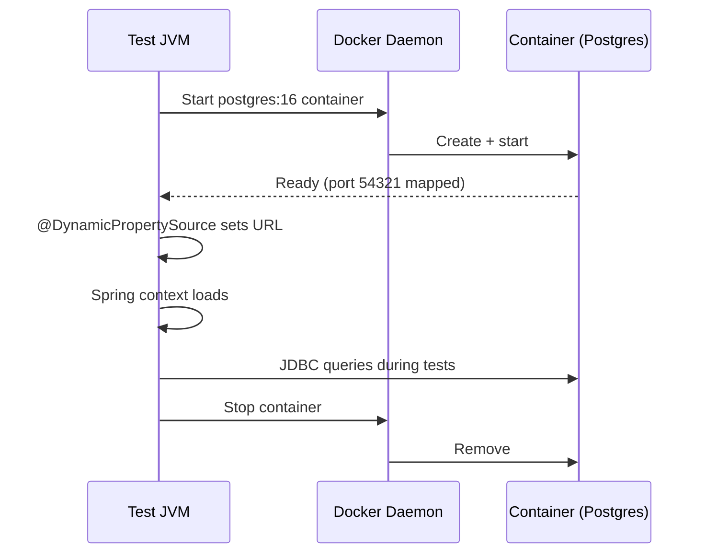
```mermaid
sequenceDiagram
    participant T as Test JVM
    participant D as Docker Daemon
    participant C as Container (Postgres)
    T->>D: Start postgres:16 container
    D->>C: Create + start
    C-->>T: Ready (port 54321 mapped)
    T->>T: @DynamicPropertySource sets URL
    T->>T: Spring context loads
    T->>C: JDBC queries during tests
    T->>D: Stop container
    D->>C: Remove
```

1. JUnit discovers `@Testcontainers` on the test class and delegates lifecycle management to the Testcontainers JUnit 5 extension.
2. Fields annotated with `@Container` are started before `@BeforeAll` methods run. The library pulls the Docker image (cached locally after first pull), creates a container, and waits for a readiness check (TCP port open, log message matched, or HTTP 200).
3. Docker maps the container's internal port to a random available host port. The test reads this dynamic port via `container.getMappedPort(5432)` or, with `@DynamicPropertySource`, injects it into Spring's `Environment` so `DataSource` auto-configuration picks it up.
4. Spring Boot 3.1+ introduced `@ServiceConnection`, which eliminates `@DynamicPropertySource` entirely. Annotate the `@Container` field with `@ServiceConnection` and Boot auto-detects the container type (Postgres, Redis, Kafka, etc.) and configures the matching connection factory.
5. After all tests complete, the extension stops and removes the container. If the JVM crashes, Testcontainers' Ryuk sidecar container (started automatically) reaps orphaned containers after a timeout.

**Singleton pattern for speed.** Starting a container per
test class is safe but slow when many test classes need the
same Postgres. The singleton container pattern declares a
`static` container in a base class, started once in a static
initializer block, and shared across all subclasses. The
container lives for the entire Gradle/Maven test task.
Combined with Spring's context caching
(`@SpringBootTest` reuses contexts with identical
configuration), this means one Postgres container serves
dozens of test classes.

**Ryuk is non-negotiable on CI.** Testcontainers starts a
helper container called `ryuk` that monitors the test JVM.
If the JVM dies without cleanup, Ryuk removes all containers
tagged with the session label. Disabling Ryuk (sometimes
done to avoid DinD permission issues) risks leaked
containers filling up CI disk. Fix permissions instead.

### 🛠️ Worked Example

**BAD:**

```java
// application-test.properties
spring.datasource.url=\
  jdbc:h2:mem:test;MODE=PostgreSQL
spring.jpa.database-platform=\
  org.hibernate.dialect.H2Dialect

// Test passes on H2 but FAILS on real
// Postgres: H2 MODE=PostgreSQL is partial.
// JSONB, array columns, window functions,
// and Flyway PG-specific DDL break silently.
```

**GOOD:**

```java
@SpringBootTest
@Testcontainers
class OrderRepositoryIT {

  @Container
  @ServiceConnection
  static PostgreSQLContainer<?> pg =
      new PostgreSQLContainer<>(
          "postgres:16-alpine");

  @Autowired
  OrderRepository orders;

  @Test
  void savesAndFindsOrder() {
    Order o = new Order("SKU-42", 3);
    orders.save(o);
    assertThat(orders.findBySku("SKU-42"))
        .isPresent()
        .get()
        .extracting(Order::quantity)
        .isEqualTo(3);
  }
}
```

**Production pattern - singleton container base class:**

```java
public abstract class IntegrationTestBase {

  static final PostgreSQLContainer<?> PG;
  static final KafkaContainer KAFKA;

  static {
    PG = new PostgreSQLContainer<>(
        "postgres:16-alpine");
    KAFKA = new KafkaContainer(
        DockerImageName.parse(
            "confluentinc/cp-kafka:7.6.0"));
    PG.start();
    KAFKA.start();
  }

  @DynamicPropertySource
  static void props(
      DynamicPropertyRegistry r) {
    r.add("spring.datasource.url",
        PG::getJdbcUrl);
    r.add("spring.datasource.username",
        PG::getUsername);
    r.add("spring.datasource.password",
        PG::getPassword);
    r.add("spring.kafka.bootstrap-servers",
        KAFKA::getBootstrapServers);
  }
}
```

All integration test classes extend `IntegrationTestBase`.
One Postgres and one Kafka container serve the entire test
suite. Ryuk cleans them up when the JVM exits.

### ⚖️ Trade-offs

**Gain:** tests run against real infrastructure, catching dialect mismatches, driver bugs, and schema migration errors that fakes miss.
**Cost:** requires Docker on every dev machine and CI runner; container startup adds seconds to test execution.

| Approach              | Fidelity | Speed    | CI setup     |
| --------------------- | -------- | -------- | ------------ |
| H2 / in-memory        | low      | fastest  | none         |
| Shared test DB        | high     | fast     | infra needed |
| Testcontainers        | high     | moderate | Docker only  |
| Embedded (e.g. Kafka) | medium   | moderate | none         |

Testcontainers wins when fidelity matters more than raw
speed. For repositories with hundreds of integration tests,
the singleton container pattern and Spring context caching
bring execution time close to a shared database while
maintaining full isolation.

### ⚡ Decision Snap

**USE WHEN:** your tests need real database dialect behavior,
schema migrations (Flyway/Liquibase), message broker
semantics, or any infrastructure where fakes diverge from
production.
**AVOID WHEN:** your CI environment cannot run Docker (some
locked-down corporate runners), or the test is purely
business logic with no infrastructure dependency.
**PREFER @ServiceConnection WHEN:** you are on Spring Boot
3.1+ and the container type has built-in support - it
eliminates boilerplate `@DynamicPropertySource` wiring.

### ⚠️ Top Traps

| #   | Misconception                                      | Reality                                                                                   |
| --- | -------------------------------------------------- | ----------------------------------------------------------------------------------------- |
| 1   | One container per test method is fine              | Startup cost compounds fast - use per-class or singleton containers and share via statics |
| 2   | Disabling Ryuk speeds up CI                        | It risks leaked containers that fill disk; fix Docker permissions instead                 |
| 3   | @DynamicPropertySource works on non-static methods | It must be a static method - non-static silently has no effect and tests fail at runtime  |

### 🪜 Learning Ladder

**Prerequisites:**

- SPR-035 @SpringBootTest and Slice Testing - test context loading and slicing
- SPR-027 @RestController and Request Mapping - understanding what the integration test exercises

**THIS:** SPR-054 Testcontainers for Integration Testing

**Next steps:**

- SPR-059 Testing Strategy for Spring Applications - where Testcontainers fits in the broader test pyramid

### 💡 The Surprising Truth

Testcontainers is not just for databases. The library
supports Redis, Elasticsearch, Kafka, RabbitMQ, LocalStack
(AWS services), Vault, Nginx, Selenium browsers, and any
arbitrary Docker image via `GenericContainer`. You can test
your entire infrastructure topology in isolation. The real
shift is philosophical: instead of "mock what you cannot
control," you think "containerize what you cannot mock
faithfully." Teams that adopt Testcontainers typically
delete their H2 compatibility layers entirely and discover
bugs they had been shipping for months - dialect-specific
SQL, driver version mismatches, and schema migration
ordering issues that no fake ever surfaced.

### 📇 Revision Card

1. `@Testcontainers` + `@Container` manage Docker container lifecycle per test class; `@ServiceConnection` (Boot 3.1+) auto-wires connection properties, replacing manual `@DynamicPropertySource`.
2. The singleton container pattern (static field + static initializer) shares one container across all test classes, cutting startup overhead from minutes to seconds.
3. Ryuk, the Testcontainers sidecar, reaps orphaned containers when the JVM exits unexpectedly - never disable it on CI without an alternative cleanup mechanism.

---

---

# SPR-055 Spring Boot Build Plugins (Maven and Gradle)

**TL;DR** - Spring Boot build plugins package your app into executable fat JARs, manage dependency versions via the BOM, and produce layered JARs for Docker.

### 🔥 The Problem in One Paragraph

You build a Spring Boot application and get a regular JAR that fails with `ClassNotFoundException` because your 50 transitive dependencies are not on the classpath. You try `maven-shade-plugin` and hit class relocations, broken `META-INF/services` files, and signature conflicts. You package everything into a Docker image and every code change rebuilds a 200 MB layer because all classes and libraries live in one flat directory. You manually manage Spring dependency versions and end up with jackson-databind 2.14 fighting spring-web 6.1 at runtime. These are packaging and build management problems that Spring Boot's build plugins solve with opinionated, tested defaults: fat JAR repackaging, layered JAR layout, BOM-driven dependency management, and integrated `bootRun`/`bootJar` tasks.

### 📘 Textbook Definition

The **spring-boot-maven-plugin** and **spring-boot-gradle-plugin** are build tool extensions that transform a standard JAR/WAR into an executable archive containing all dependencies (fat JAR), manage dependency versions through the `spring-boot-dependencies` BOM, support layered JAR layout for Docker layer caching, provide `bootRun` (Gradle) / `spring-boot:run` (Maven) for development execution, and integrate AOT processing for GraalVM native-image compilation. They are included automatically when you inherit from `spring-boot-starter-parent` (Maven) or apply the `org.springframework.boot` plugin (Gradle).

### 🧠 Mental Model

> Think of the build plugin as a shipping department for your application.

- "Packing into one crate" -> fat JAR (all deps bundled)
- "Manifest label" -> executable JAR entry point (JarLauncher)
- "Layered pallet" -> layered JAR for Docker layer caching

**Where this analogy breaks down:** the shipping analogy does not
capture the plugin's role in dependency version management.
The BOM (Bill of Materials) is more like a compatibility
chart - it says "these exact part versions are tested
together." That aspect is pre-build, not packaging.

### ⚙️ How It Works

```
 Source code + dependencies
          |
  [mvn package / gradle bootJar]
          |
  Compile + resolve deps
          |
  Repackage into fat JAR:
    my-app.jar
    +-- BOOT-INF/
    |   +-- classes/    (your .class files)
    |   +-- lib/        (dependency JARs)
    +-- META-INF/
    |   +-- MANIFEST.MF
    |       Main-Class: JarLauncher
    |       Start-Class: com.example.App
    +-- org/springframework/boot/loader/
        (Spring Boot loader classes)
```

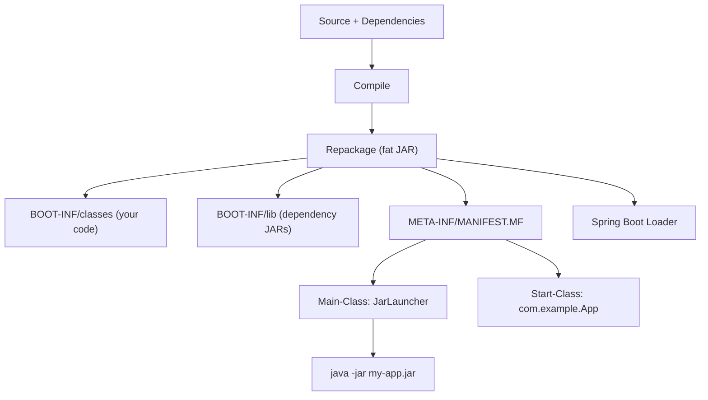
```mermaid
flowchart TD
    A["Source + Dependencies"] --> B["Compile"]
    B --> C["Repackage (fat JAR)"]
    C --> D["BOOT-INF/classes (your code)"]
    C --> E["BOOT-INF/lib (dependency JARs)"]
    C --> F["META-INF/MANIFEST.MF"]
    C --> G["Spring Boot Loader"]
    F --> H["Main-Class: JarLauncher"]
    F --> I["Start-Class: com.example.App"]
    H --> J["java -jar my-app.jar"]
```

1. When you run `mvn package` (Maven) or `gradle bootJar` (Gradle), the plugin first executes the standard compile and packaging phase, producing a regular JAR.
2. The `repackage` goal (Maven) or `bootJar` task (Gradle) transforms this JAR into an executable fat JAR. It nests all dependency JARs under `BOOT-INF/lib/` and your compiled classes under `BOOT-INF/classes/`. The original JAR is saved as `.jar.original`.
3. The `MANIFEST.MF` sets `Main-Class` to `org.springframework.boot.loader.JarLauncher` (or `WarLauncher`). `JarLauncher` is a custom class loader that knows how to load classes from nested JARs - unlike the standard `java -jar` mechanism, which cannot read JARs inside JARs.
4. `Start-Class` points to your `@SpringBootApplication` class. `JarLauncher` delegates to it after setting up the class loader.
5. The BOM (`spring-boot-dependencies`) declares tested, compatible versions for hundreds of libraries (Jackson, Hibernate, Tomcat, Logback, etc.). When you inherit `spring-boot-starter-parent` or import the BOM, you omit `<version>` tags and get guaranteed compatibility.

**Layered JARs for Docker efficiency.** Since Spring Boot
2.3, the plugin supports a layered layout that splits the
fat JAR into four layers: `dependencies`,
`spring-boot-loader`, `snapshot-dependencies`, and
`application`. Each layer maps to a Docker image layer.
Because `dependencies` (stable, large) rarely changes, Docker
caches it. Only the `application` layer (your code, small)
rebuilds on each push. This turns a 200 MB rebuild into a
2 MB layer push.

To extract layers for a Dockerfile:

```dockerfile
FROM eclipse-temurin:21-jre AS builder
COPY my-app.jar app.jar
RUN java -Djarmode=layertools \
    -jar app.jar extract

FROM eclipse-temurin:21-jre
COPY --from=builder /dependencies/ ./
COPY --from=builder \
    /spring-boot-loader/ ./
COPY --from=builder \
    /snapshot-dependencies/ ./
COPY --from=builder /application/ ./
ENTRYPOINT ["java", \
    "org.springframework.boot.loader.\
JarLauncher"]
```

**AOT processing.** Spring Boot 3.x plugins include
`process-aot` (Maven) / `processAot` (Gradle) goals that
run ahead-of-time transformations - generating bean
definitions, configuration metadata, and proxy hints.
This is required for GraalVM native-image compilation
and also reduces startup time for standard JVM execution.

### 🛠️ Worked Example

**BAD:**

```xml
<!-- pom.xml -->
<plugin>
  <groupId>
    org.apache.maven.plugins
  </groupId>
  <artifactId>
    maven-shade-plugin
  </artifactId>
  <configuration>
    <transformers>
      <transformer implementation=
        "org.apache.maven.plugins.shade
        .resource
        .ManifestResourceTransformer">
        <mainClass>
          com.example.App
        </mainClass>
      </transformer>
    </transformers>
  </configuration>
</plugin>
<!-- Breaks: META-INF/services files
     from multiple JARs overwrite each
     other. Signed JARs fail verification.
     No nested JAR support. -->
```

**GOOD:**

```xml
<!-- pom.xml -->
<parent>
  <groupId>
    org.springframework.boot
  </groupId>
  <artifactId>
    spring-boot-starter-parent
  </artifactId>
  <version>3.3.0</version>
</parent>

<build>
  <plugins>
    <plugin>
      <groupId>
        org.springframework.boot
      </groupId>
      <artifactId>
        spring-boot-maven-plugin
      </artifactId>
      <configuration>
        <layers>
          <enabled>true</enabled>
        </layers>
      </configuration>
    </plugin>
  </plugins>
</build>
<!-- mvn package produces executable JAR.
     Layers enabled for Docker. BOM manages
     all dependency versions. -->
```

**Production - Gradle with buildInfo and AOT:**

```kotlin
// build.gradle.kts
plugins {
  id("org.springframework.boot")
      version "3.3.0"
  id("io.spring.dependency-management")
      version "1.1.5"
  kotlin("jvm") version "1.9.24"
}

springBoot {
  buildInfo()  // META-INF/build-info
}

tasks.bootJar {
  layered {
    enabled.set(true)
  }
}

// ./gradlew bootJar -> fat JAR
// ./gradlew bootRun -> run in dev
// ./gradlew processAot -> AOT hints
```

`buildInfo()` generates `META-INF/build-info.properties`
with artifact name, version, and build time - exposed via
the `/actuator/info` endpoint in production.

### ⚖️ Trade-offs

**Gain:** single-artifact deployment, tested dependency versions, efficient Docker layers, integrated dev-run and AOT.
**Cost:** fat JARs are large (50-200 MB); the nested JAR class loader adds marginal startup overhead; layered extraction adds a Dockerfile build step.

| Feature        | Maven plugin         | Gradle plugin        |
| -------------- | -------------------- | -------------------- |
| Fat JAR        | `repackage` goal     | `bootJar` task       |
| Dev run        | `spring-boot:run`    | `bootRun`            |
| Layered JAR    | `<layers>` config    | `layered {}` block   |
| AOT processing | `process-aot` goal   | `processAot` task    |
| Build info     | `<executions>` block | `buildInfo()` method |
| BOM management | via starter-parent   | via dependency-mgmt  |

Both plugins are feature-equivalent. The choice follows your
build tool, not the plugin's capabilities.

### ⚡ Decision Snap

**USE WHEN:** you are building any Spring Boot application -
the plugin is effectively required for executable packaging
and dependency management.
**AVOID WHEN:** you are building a library JAR that other
projects consume - libraries should not be fat JARs.
**PREFER layered JARs WHEN:** you deploy via Docker images
and want to minimize image push size and layer cache
invalidation on code-only changes.

### ⚠️ Top Traps

| #   | Misconception                                           | Reality                                                                                          |
| --- | ------------------------------------------------------- | ------------------------------------------------------------------------------------------------ |
| 1   | Fat JARs work like regular JARs on the classpath        | They use a custom class loader (JarLauncher) - you cannot add them as dependencies to other JARs |
| 2   | Omitting `<version>` without the BOM uses latest        | Without the BOM, Maven/Gradle requires explicit versions - omitting them causes build failure    |
| 3   | `bootRun` / `spring-boot:run` uses the packaged fat JAR | It runs from compiled classes directly with a forked JVM - no repackaging step is involved       |

### 🪜 Learning Ladder

**Prerequisites:**

- SPR-007 Your First Spring Boot Application (Hands-On) - basic project structure and running the app

**THIS:** SPR-055 Spring Boot Build Plugins (Maven and Gradle)

**Next steps:**

- SPR-058 Spring Performance Tuning Checklist - how build choices (AOT, layered JARs) affect runtime performance

### 💡 The Surprising Truth

A Spring Boot fat JAR is not a traditional Java JAR with
unpacked classes merged together (like shade/shadow plugins
produce). It is a JAR containing other JARs - nested,
intact, in their original form inside `BOOT-INF/lib/`. This
is unusual because the JVM's default `URLClassLoader` cannot
read JARs inside JARs. Spring Boot ships its own class
loader (`LaunchedURLClassLoader`) that registers custom URL
handlers for the `jar:nested:` protocol. This design
preserves original JAR signatures, avoids class relocation
conflicts, and keeps `META-INF/services` files from
different libraries separate. The tradeoff is that tools
expecting flat classpath JARs (some APM agents, security
scanners) need special configuration to inspect the nested
structure.

### 📇 Revision Card

1. The `repackage` goal (Maven) / `bootJar` task (Gradle) transforms a regular JAR into an executable fat JAR with nested dependency JARs under `BOOT-INF/lib/` and a custom `JarLauncher` class loader.
2. Layered JARs split the fat JAR into four Docker-friendly layers (`dependencies`, `spring-boot-loader`, `snapshot-dependencies`, `application`) so code changes only rebuild the smallest layer.
3. The `spring-boot-dependencies` BOM declares compatible versions for hundreds of libraries - omitting `<version>` tags is safe only when the BOM is imported via `starter-parent` or `dependency-management` plugin.

---

---

# SPR-056 @Transactional Self-Invocation Anti-Pattern

**TL;DR** - Calling a `@Transactional` method from within the same class bypasses the proxy, silently ignoring the transaction - the most common Spring transaction bug.

### 🔥 The Problem in One Paragraph

You annotate a method with `@Transactional`, write a test that calls it directly, and the transaction works. Then you add an internal helper in the same class that calls that transactional method, and suddenly the transaction silently disappears. No exception, no warning, no log entry - the annotation is simply ignored. Data inconsistency follows: partial writes commit, rollback rules never fire, and isolation guarantees vanish. This is the self-invocation anti-pattern, and it catches every Spring developer at least once because the proxy mechanism that powers `@Transactional` is invisible in source code. The method signature looks annotated. The code compiles. The unit test passes. But in production, the call path through the same class skips the proxy entirely.

### 📘 Textbook Definition

**Self-invocation** occurs when a method on a Spring-managed bean calls another method on the same bean instance using `this` (explicitly or implicitly). Because Spring's default AOP mechanism uses JDK dynamic proxies or CGLIB subclass proxies that wrap the bean externally, internal calls bypass the proxy. Any advice attached to the target method - `@Transactional`, `@Cacheable`, `@Async`, `@Retryable` - is not applied. The proxy only intercepts calls that arrive through the proxy reference, which means calls from external beans. A `this.doSomething()` call goes directly to the target object, never touching the proxy's interceptor chain.

### 🧠 Mental Model

> Picture a security checkpoint at a building entrance.

- "Visitor" -> external caller going through the proxy
- "Checkpoint guard" -> TransactionInterceptor (begin/commit/rollback)
- "Internal corridor" -> self-invocation bypassing the proxy

**Where this analogy breaks down:** unlike a real building, you can restructure the code so that every "room" is in a separate building, forcing every call through a checkpoint. The analogy also does not capture that the proxy is a separate object wrapping the target - it is not a gate on a shared entrance.

### ⚙️ How It Works

```
  External caller
       |
       v
 +-------------+     delegates     +-----------+
 | Proxy       | ----------------> | Target    |
 | (CGLIB/JDK) |   begin TX       | Object    |
 | intercepts  |   commit/rollback |           |
 | @Transact.  |                   | methodA() |
 +-------------+                   |   |       |
                                   |   | this. |
                                   |   v       |
                                   | methodB() |
                                   | (NO PROXY)|
                                   +-----------+
```

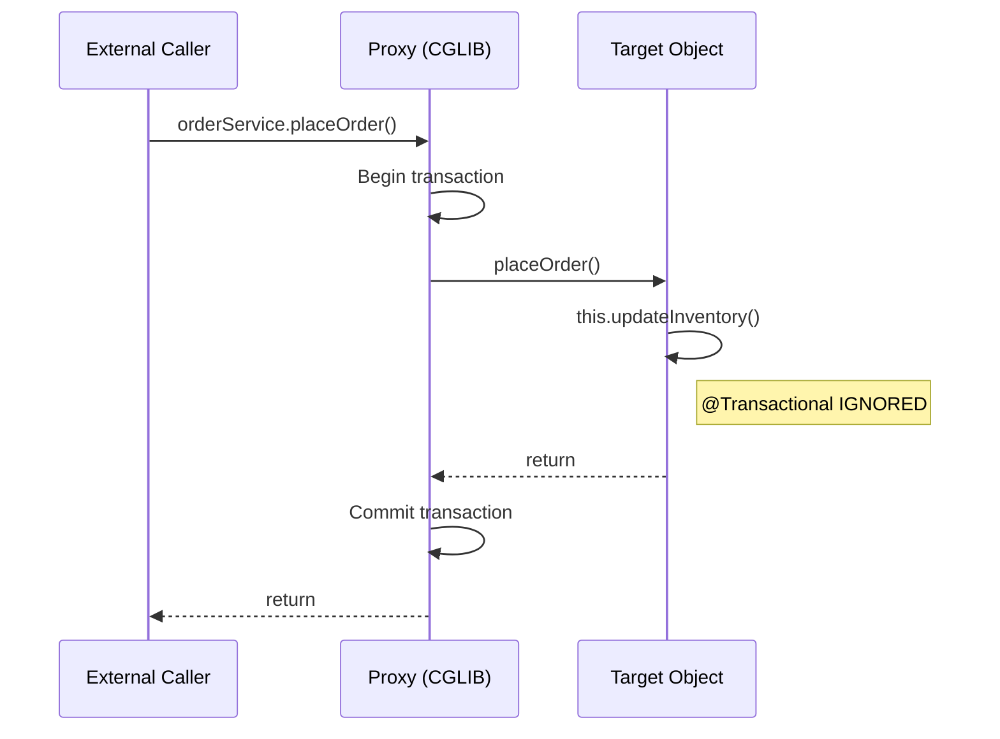
```mermaid
sequenceDiagram
    participant C as External Caller
    participant P as Proxy (CGLIB)
    participant T as Target Object
    C->>P: orderService.placeOrder()
    P->>P: Begin transaction
    P->>T: placeOrder()
    T->>T: this.updateInventory()
    Note right of T: @Transactional IGNORED
    T-->>P: return
    P->>P: Commit transaction
    P-->>C: return
```

1. Spring creates a proxy (CGLIB subclass or JDK dynamic proxy) at bean creation time during `BeanPostProcessor.postProcessAfterInitialization`. The proxy holds a reference to the target object.
2. When an external bean calls a method on the proxy, the proxy's `TransactionInterceptor` checks for `@Transactional`, opens a connection, sets auto-commit to false, and delegates to the target.
3. Inside the target, any call to `this.someMethod()` goes directly to the target object. Java's `this` keyword refers to the actual object, not the proxy wrapper. The proxy is never in the call path.
4. The transactional advice on `someMethod()` never fires. If `someMethod()` was supposed to run in a new transaction (`REQUIRES_NEW`) or had different rollback rules, those are silently lost.

**Why this is specific to proxy-based AOP.** Spring's default AOP uses proxies - separate wrapper objects that intercept external calls. This is fundamentally different from AspectJ's compile-time or load-time weaving, which modifies the bytecode of the target class itself. With AspectJ weaving, `this.someMethod()` does pass through the advice because the advice is woven directly into the method body. The proxy approach was chosen for simplicity (no special compiler, no agent), but self-invocation is the price.

**Detection is the hard part.** The code compiles, runs, and produces no error. The only symptoms are data inconsistency or missing rollback behavior. You can detect self-invocation by enabling `spring.aop.proxy-target-class=true` with debug logging on `org.springframework.transaction.interceptor`, then checking whether transaction boundaries appear in logs for the suspected method. If the log shows no "Creating new transaction" entry for the inner call, self-invocation is confirmed.

### 🛠️ Worked Example

**BAD:**

```java
@Service
public class OrderService {

  @Autowired
  private OrderRepository orderRepo;
  @Autowired
  private InventoryRepository inventoryRepo;

  @Transactional
  public void placeOrder(Order order) {
    orderRepo.save(order);
    // Self-invocation: bypasses proxy
    this.updateInventory(order);
  }

  @Transactional(propagation = REQUIRES_NEW)
  public void updateInventory(Order order) {
    // REQUIRES_NEW is IGNORED here
    // Runs in placeOrder's transaction
    inventoryRepo.deduct(order.getItems());
  }
}
```

Why it fails: `placeOrder` calls `this.updateInventory()` internally. The `REQUIRES_NEW` propagation never activates because the `TransactionInterceptor` on the proxy is never consulted. If `updateInventory` throws, the rollback rules of `REQUIRES_NEW` do not apply.

**GOOD:**

```java
@Service
public class OrderService {
  @Autowired
  private InventoryService inventoryService;
  @Autowired
  private OrderRepository orderRepo;

  @Transactional
  public void placeOrder(Order order) {
    orderRepo.save(order);
    // External call: goes through proxy
    inventoryService.updateInventory(order);
  }
}

@Service
public class InventoryService {
  @Autowired
  private InventoryRepository inventoryRepo;

  @Transactional(propagation = REQUIRES_NEW)
  public void updateInventory(Order order) {
    // REQUIRES_NEW works correctly
    inventoryRepo.deduct(order.getItems());
  }
}
```

**Production example (Fix 2 - TransactionTemplate):**

```java
@Service
public class OrderService {
  private final TransactionTemplate txTemplate;
  private final OrderRepository orderRepo;
  private final InventoryRepository invRepo;

  OrderService(
      PlatformTransactionManager txMgr,
      OrderRepository orderRepo,
      InventoryRepository invRepo) {
    this.txTemplate = new TransactionTemplate(
        txMgr);
    this.txTemplate.setPropagationBehavior(
        PROPAGATION_REQUIRES_NEW);
    this.orderRepo = orderRepo;
    this.invRepo = invRepo;
  }

  @Transactional
  public void placeOrder(Order order) {
    orderRepo.save(order);
    txTemplate.executeWithoutResult(status ->
        invRepo.deduct(order.getItems())
    );
  }
}
```

`TransactionTemplate` does not rely on proxy interception. It programmatically begins and commits the transaction, so self-invocation is irrelevant. This is the preferred fix when extracting to a separate bean would create an artificial service split.

### ⚖️ Trade-offs

**Gain:** fixing self-invocation restores correct transaction boundaries, rollback isolation, and propagation behavior.
**Cost:** every fix adds structural complexity - an extra bean, a template, an injected self-reference, or a build-time weaving step.

| Fix approach        | Complexity | Proxy needed | Drawback               |
| ------------------- | ---------- | ------------ | ---------------------- |
| Extract to bean     | Low        | Yes          | Artificial class split |
| TransactionTemplate | Medium     | No           | Verbose programmatic   |
| Inject self         | Low        | Yes          | Circular ref risk      |
| AspectJ weaving     | High       | No           | Build tooling overhead |

Extract-to-separate-bean is the recommended default because it aligns with single responsibility and is the most maintainable. `TransactionTemplate` is best when the transactional logic is a small internal step that does not justify a new class. Self-injection (`@Autowired` of the same type) works but creates a circular dependency that requires `@Lazy` or setter injection. AspectJ load-time weaving eliminates the problem entirely but adds a Java agent, complicates builds, and makes debugging harder because the bytecode no longer matches the source.

### ⚡ Decision Snap

**USE WHEN:** you see a `@Transactional` method called from within the same class and the transaction semantics must be honored - especially `REQUIRES_NEW`, isolation level, or rollback rules.
**AVOID WHEN:** the inner method does not need its own transaction boundary and running in the caller's transaction is correct behavior.
**PREFER extract-to-bean WHEN:** the inner logic represents a distinct responsibility. **PREFER TransactionTemplate WHEN:** extracting a class would be purely mechanical with no real separation of concerns.

### ⚠️ Top Traps

| #   | Trap                                              | Reality                                                                                               |
| --- | ------------------------------------------------- | ----------------------------------------------------------------------------------------------------- |
| 1   | "My test passes so the transaction works"         | Tests calling the method directly go through the proxy; the bug only appears on internal call paths   |
| 2   | "I injected self with @Autowired, problem solved" | This creates a circular dependency - use @Lazy or setter injection and verify with integration tests  |
| 3   | "Only @Transactional is affected"                 | Every proxy-based annotation is affected: @Cacheable, @Async, @Retryable, @Secured, custom AOP advice |

### 🪜 Learning Ladder

**Prerequisites:**

- SPR-046 @Transactional Proxy Mechanism and Pitfalls - proxy fundamentals
- SPR-032 Spring Data JPA Repository Abstractions - repository context

**THIS:** SPR-056 @Transactional Self-Invocation Anti-Pattern

**Next steps:**

- SPR-063 "Spring Beans Are Thread-Safe" is Wrong - Singleton Scope - another critical misconception about Spring internals

### 💡 The Surprising Truth

The self-invocation problem is not a bug in Spring - it is an inherent limitation of the proxy pattern that Spring chose for simplicity. The framework developers considered this an acceptable trade-off because it avoids requiring a special compiler (AspectJ) or Java agent for basic usage. The Spring documentation explicitly warns about it, yet it remains the single most frequently reported "my transaction does not work" issue on Stack Overflow year after year - because developers read annotations as instructions to the JVM, not as metadata for an external proxy wrapper.

### 📇 Revision Card

- Self-invocation (`this.method()`) bypasses the Spring proxy, silently ignoring `@Transactional`, `@Cacheable`, `@Async`, and all proxy-based advice
- Four fixes: extract to separate bean (preferred), `TransactionTemplate` (programmatic), inject self with `@Lazy` (circular ref risk), AspectJ weaving (build complexity)
- Detection: enable `DEBUG` logging on `org.springframework.transaction.interceptor` and check whether the inner method shows "Creating new transaction" - if absent, self-invocation is confirmed

---

---

# SPR-057 N+1 Query Anti-Pattern in Spring Data JPA

**TL;DR** - N+1 fires one query for parents plus N queries for children during iteration, turning a list fetch into hundreds of database round-trips.

### 🔥 The Problem in One Paragraph

You load a list of 100 orders from the database. Each order has a `customer` field marked `@ManyToOne(fetch = LAZY)`. You iterate the list and call `order.getCustomer().getName()` in a loop. Hibernate fires 1 query to fetch all orders, then 100 individual queries to load each customer one by one. What should have been 1 or 2 queries becomes 101. At 10,000 orders, it becomes 10,001 queries. Response times explode, connection pools saturate, and database CPU spikes - all from code that looks like a simple getter call in a for-each loop. The N+1 problem is the single most common performance issue in Spring Data JPA applications, and it is invisible in source code because Hibernate's lazy proxy triggers the extra queries behind a method call that looks like in-memory field access.

### 📘 Textbook Definition

The **N+1 query problem** is a data access anti-pattern where an ORM executes 1 query to load a collection of N parent entities, then executes N additional queries to load a related association for each parent as it is accessed. It occurs when a relationship is fetched lazily (`FetchType.LAZY`) and the related entity is accessed during iteration. The total query count is `1 + N`, where N is the number of parent rows. The performance cost scales linearly with result set size and is amplified by network latency between the application and database.

### 🧠 Mental Model

> Imagine ordering food for a table of 20 at a restaurant.

- "One combined order" -> JOIN FETCH (single query)
- "20 separate trips" -> N+1 lazy loading (1 + N queries)
- "Kitchen capacity" -> connection pool slots consumed per trip

**Where this analogy breaks down:** unlike a restaurant, database round-trips also consume connection pool slots, create lock contention, and generate query parsing overhead on top of the raw latency. The real cost is worse than linear due to resource contention under load.

### ⚙️ How It Works

```
  repo.findAll()
       |
       v
  SELECT * FROM orders        (1 query)
       |
       v
  for each order:
    order.getCustomer()
       |
       v
    SELECT * FROM customers    (N queries)
    WHERE id = ?
       |
  Total: 1 + N queries
```

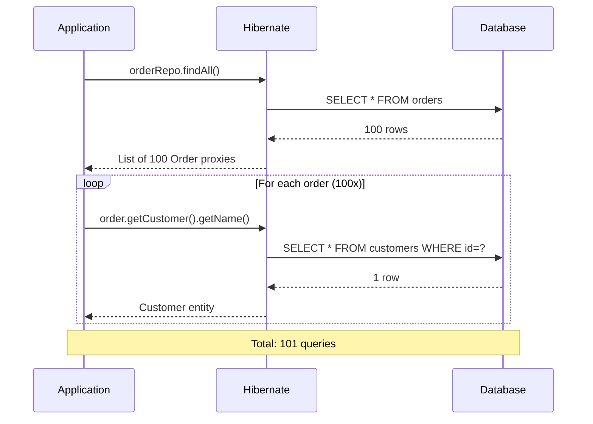
```mermaid
sequenceDiagram
    participant App as Application
    participant H as Hibernate
    participant DB as Database
    App->>H: orderRepo.findAll()
    H->>DB: SELECT * FROM orders
    DB-->>H: 100 rows
    H-->>App: List of 100 Order proxies
    loop For each order (100x)
        App->>H: order.getCustomer().getName()
        H->>DB: SELECT * FROM customers WHERE id=?
        DB-->>H: 1 row
        H-->>App: Customer entity
    end
    Note over App,DB: Total: 101 queries
```

1. The repository method (`findAll()`, a custom `@Query`, or a derived query) executes one SQL statement and returns a list of parent entities. For `LAZY` associations, Hibernate returns proxy objects for the related entities instead of loading them immediately.
2. When application code accesses a lazy proxy (e.g., `order.getCustomer().getName()`), Hibernate intercepts the call and fires a SELECT to load that single related entity. This happens transparently inside the getter.
3. In a loop, each iteration triggers a separate SELECT because Hibernate loads lazy associations one at a time by default. The first-level cache (persistence context) prevents duplicate loads for the same ID, but if each parent references a different child, every access is a cache miss.
4. The total cost is `1 + U` queries where U is the number of unique related entity IDs. In the worst case (all distinct), U = N.

**Why LAZY fetch does not prevent the problem - it just defers it.** `FetchType.LAZY` is the correct default because it avoids loading associations you never access. The N+1 problem only manifests when you access the lazy association during iteration. If you load orders and never touch `getCustomer()`, no extra queries fire. The problem is not LAZY fetch itself - it is accessing a lazy association in a loop without telling Hibernate to load them all at once.

**Detection with Hibernate SQL logging.** Set `spring.jpa.show-sql=true` or `logging.level.org.hibernate.SQL=DEBUG` with `logging.level.org.hibernate.orm.jdbc.bind=TRACE` for parameter values. In the log output, look for repeated SELECT patterns with different bind parameter values. A sequence of identical SELECTs differing only in the WHERE clause parameter is the signature of N+1. Libraries like `datasource-proxy` or `Hibernate Statistics` can count queries per request for automated detection.

### 🛠️ Worked Example

**BAD:**

```java
@Entity
public class Order {
  @Id
  private Long id;

  @ManyToOne(fetch = LAZY)
  private Customer customer;
  // getters omitted
}

// In a service method:
List<Order> orders = orderRepo.findAll();
for (Order o : orders) {
  // Triggers N extra queries
  log.info("Order {} by {}",
      o.getId(),
      o.getCustomer().getName());
}
```

**GOOD:**

```java
public interface OrderRepository
    extends JpaRepository<Order, Long> {

  @Query("SELECT o FROM Order o "
       + "JOIN FETCH o.customer")
  List<Order> findAllWithCustomers();
}

// Single query with JOIN
List<Order> orders =
    orderRepo.findAllWithCustomers();
for (Order o : orders) {
  // Already loaded - no extra query
  log.info("Order {} by {}",
      o.getId(),
      o.getCustomer().getName());
}
```

**Production example (Fix 2 - @EntityGraph):**

```java
public interface OrderRepository
    extends JpaRepository<Order, Long> {

  @EntityGraph(attributePaths = {"customer"})
  List<Order> findAll();

  @EntityGraph(attributePaths = {
      "customer", "items", "items.product"
  })
  List<Order> findByStatus(OrderStatus status);
}
```

`@EntityGraph` tells Spring Data JPA to generate a JOIN FETCH for the specified paths without requiring a custom JPQL query. This keeps the derived query method name pattern while solving N+1. For multi-level associations (`items.product`), nested attribute paths load the entire object graph in one query. Watch for Cartesian product growth when joining multiple `@OneToMany` collections - Hibernate's `WARN HHH90003004` log message signals this.

### ⚖️ Trade-offs

**Gain:** reducing N+1 queries to 1-2 queries eliminates per-row database round-trips, typically improving response times by 10-100x for large result sets.
**Cost:** eager fetching via JOINs increases the size of individual SQL result sets and can produce Cartesian products when multiple collections are joined.

| Fix               | Query count      | Result set size | Complexity         |
| ----------------- | ---------------- | --------------- | ------------------ |
| JOIN FETCH (JPQL) | 1                | May have dupes  | JPQL knowledge     |
| @EntityGraph      | 1                | May have dupes  | Annotation config  |
| @BatchSize        | 1 + ceil(N/size) | Normal          | Global or per-assn |
| DTO Projection    | 1                | Minimal - flat  | Extra DTO class    |

`JOIN FETCH` and `@EntityGraph` are the primary fixes for `@ManyToOne` and `@OneToOne`. For `@OneToMany` collections, `@BatchSize(size = 50)` on the association (or globally via `spring.jpa.properties.hibernate.default_batch_fetch_size=50`) reduces N queries to `ceil(N/50)` without Cartesian product risk. DTO projections (interface or class-based) bypass entity loading entirely and are the best option when you only need specific columns.

### ⚡ Decision Snap

**USE JOIN FETCH WHEN:** loading a `@ManyToOne` or `@OneToOne` association that you will always access - the Cartesian product risk is minimal for to-one relationships.
**USE @BatchSize WHEN:** loading `@OneToMany` collections where JOIN FETCH would create a Cartesian explosion across multiple bag-typed collections.
**USE DTO Projection WHEN:** you need a read-only view with specific columns and do not need managed entity instances.
**AVOID WHEN:** the association is truly optional and accessed in less than 10% of code paths - LAZY fetch with no pre-loading is correct in that case.

### ⚠️ Top Traps

| #   | Trap                                 | Reality                                                                                                   |
| --- | ------------------------------------ | --------------------------------------------------------------------------------------------------------- |
| 1   | "Switching to EAGER fetch fixes N+1" | EAGER loads the association on every query, even when unused - it trades N+1 for unnecessary data loading |
| 2   | "JOIN FETCH is always safe"          | Joining two @OneToMany collections causes a Cartesian product and duplicate parent rows in the result     |
| 3   | "show-sql is enough for detection"   | Console logs are hard to scan at scale - use Hibernate Statistics or datasource-proxy for query counting  |

### 🪜 Learning Ladder

**Prerequisites:**

- SPR-049 Spring Data JPA Fetch Strategies and Projections - fetch types and entity graphs
- SPR-027 Spring Data JPA and Hibernate Essentials - JPA foundations

**THIS:** SPR-057 N+1 Query Anti-Pattern in Spring Data JPA

**Next steps:**

- SPR-058 Spring Performance Tuning Checklist - broader performance optimization patterns

### 💡 The Surprising Truth

The N+1 problem is not a Hibernate bug - it is the mathematically correct behavior of lazy loading. Hibernate does exactly what LAZY semantics promise: load the association when first accessed. The problem is that developers mentally batch their intent ("load all customers for these orders") while the code expresses it one entity at a time. The real fix is not to fight lazy loading but to explicitly tell the persistence layer your access pattern - JOIN FETCH for always-needed associations, batch fetching for collections, and projections for read-only views. The most performant Spring Data JPA applications are the ones where every repository method has a deliberately chosen fetch strategy instead of relying on entity-level defaults.

### 📇 Revision Card

- N+1 fires 1 query for parents + N queries for children when a LAZY association is accessed in a loop - total cost scales linearly with result set size
- Four fixes: `JOIN FETCH` in JPQL (best for to-one), `@EntityGraph` (annotation-based), `@BatchSize` (best for to-many collections), DTO projection (best for read-only)
- Detect with `spring.jpa.properties.hibernate.generate_statistics=true` or `datasource-proxy` - look for repeated identical SELECTs differing only in bind parameters

---

---

# SPR-058 Spring Performance Tuning Checklist

**TL;DR** - Ten high-impact performance levers from pool sizing to GC tuning - walk them systematically before scaling hardware, because most Spring Boot bottlenecks are configuration problems.

### 🔥 The Problem in One Paragraph

Your Spring Boot service hits a latency wall at 200 requests per second. The team's instinct is to add more pods. Nobody checks that `spring.jpa.open-in-view` is still `true`, holding database connections open through entire HTTP responses. Nobody notices HikariCP's pool is stuck at the default 10 connections while Tomcat spawns 200 threads. Nobody realizes response compression is off, so every JSON payload ships uncompressed over the wire. These are not exotic optimizations - they are default settings that silently throttle throughput. Without a systematic checklist, teams chase random metrics, apply cargo-cult fixes, and waste weeks before stumbling onto the one property that actually matters.

### 📘 Textbook Definition

A **Spring Performance Tuning Checklist** is a prioritized sequence of configuration review points covering the layers a request traverses - HTTP server, connection pool, ORM, serialization, JVM, and observability. Each item targets a known default that degrades throughput or latency under load. The checklist is ordered by typical impact: fix the highest-leverage items first (connection pool, open-in-view, N+1 queries) before moving to lower-leverage ones (compression, GC flags).

### 🧠 Mental Model

> Think of a Spring Boot application as a multi-lane highway.

- "Lanes" -> Tomcat threads handling requests
- "Toll booths" -> database connection pool
- "Speed limit sign" -> JVM heap / GC configuration

**Where this analogy breaks down:** unlike a highway where lanes are independent, Spring threads share the connection pool, heap, and CPU. Fixing one bottleneck can shift pressure to another, so you re-measure after each change rather than applying all fixes blindly.

### ⚙️ How It Works

```
Request Flow Through Tuning Points
===================================

  Client
    |
    v
[1. Tomcat Thread Pool]---max-threads
    |
    v
[2. Response Compression]---min-size
    |
    v
[3. Open-in-View OFF]---release conn
    |
    v
[4. HikariCP Pool]---max-pool-size
    |
    v
[5. JPA / N+1 Fix]---fetch joins
    |
    v
[6. Lazy Init]---startup only
    |
    v
[7. JVM Heap + GC]----Xmx, GC algo
    |
    v
[8. Actuator Guard]---expose minimal
    |
    v
[9. Graceful Shutdown]---drain period
    |
    v
[10. Measure]---Micrometer + APM
```

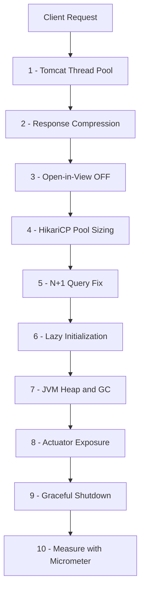
```mermaid
flowchart TD
    A[Client Request] --> B["1 - Tomcat Thread Pool"]
    B --> C["2 - Response Compression"]
    C --> D["3 - Open-in-View OFF"]
    D --> E["4 - HikariCP Pool Sizing"]
    E --> F["5 - N+1 Query Fix"]
    F --> G["6 - Lazy Initialization"]
    G --> H["7 - JVM Heap and GC"]
    H --> I["8 - Actuator Exposure"]
    I --> J["9 - Graceful Shutdown"]
    J --> K["10 - Measure with Micrometer"]
```

**The Ten Levers in Order:**

1. **Connection pool sizing** - HikariCP defaults to `maximumPoolSize=10`. Formula: `connections = (core_count * 2) + effective_spindle_count`. For most cloud deployments with SSDs, start at `(vCPU * 2) + 1`. Too many connections cause database-side contention; too few cause thread starvation.

2. **Disable open-in-view** - `spring.jpa.open-in-view=false`. The default `true` keeps a database connection for the entire HTTP request lifecycle, including view rendering and JSON serialization. This silently starves the pool under load.

3. **Fix N+1 queries** - Use `@EntityGraph`, `JOIN FETCH` in JPQL, or DTO projections. A single list endpoint can fire hundreds of queries. Enable `spring.jpa.properties.hibernate.generate_statistics=true` temporarily to count queries per request.

4. **JVM heap sizing** - Set `-Xms` equal to `-Xmx` to avoid resize pauses. Container deployments: set `-XX:MaxRAMPercentage=75.0` instead of hard `-Xmx` values. Leave headroom for metaspace, thread stacks, and native memory.

5. **Tomcat thread pool** - `server.tomcat.threads.max` defaults to 200. Match this to your expected concurrency, not peak traffic. If most threads block on I/O, increase the pool. If CPU-bound, keep it near core count. Threads beyond pool size queue in the acceptor.

6. **Response compression** - `server.compression.enabled=true` with `server.compression.min-response-size=1024`. Compresses JSON and text responses. Reduces bandwidth at the cost of marginal CPU. Typically 60-80% size reduction on JSON payloads.

7. **Lazy initialization** - `spring.main.lazy-initialization=true` defers bean creation until first use. Dramatically speeds up startup but shifts latency to the first request. Suitable for dev/test; in production, combine with `@Lazy(false)` on critical beans.

8. **Graceful shutdown** - `server.shutdown=graceful` with `spring.lifecycle.timeout-per-shutdown-phase=30s`. Without this, in-flight requests are killed during deployments. The drain period lets active connections complete before the JVM exits.

9. **GC tuning** - For low-latency services, G1GC (default in JDK 17+) with `-XX:MaxGCPauseMillis=200` is a reasonable baseline. For heap sizes above 8 GB, evaluate ZGC (`-XX:+UseZGC`) for sub-millisecond pauses. Avoid tuning GC before profiling actual pause patterns.

10. **Actuator overhead** - Expose only the endpoints you monitor: `management.endpoints.web.exposure.include=health,info,prometheus`. Each enabled endpoint adds memory and CPU overhead. Metrics collection via Micrometer is lightweight, but exporting every metric at high cardinality is not.

**Deeper: the measurement trap.** Teams often apply all ten changes simultaneously and declare victory. This is dangerous because changes can mask each other. Disabling open-in-view might fix your latency entirely, but if you also doubled the thread pool, you will not know which change mattered. Apply one lever, measure under realistic load, then proceed to the next. Use Micrometer metrics (`hikaricp.connections.active`, `http.server.requests`, `jvm.gc.pause`) as your feedback loop.

**Deeper: the container dimension.** In Kubernetes, JVM ergonomics detect container CPU limits since JDK 10+. But `-XX:ActiveProcessorCount` can override detection when the container CPU limit is fractional. A container with `cpu: 500m` reports 1 processor, which affects thread pool defaults and GC parallelism. Always verify `Runtime.getRuntime().availableProcessors()` inside your actual container.

### 🛠️ Worked Example

**BAD:**

```yaml
# application.yml - no tuning at all
spring:
  datasource:
    url: jdbc:postgresql://db:5432/app
# open-in-view: true (silent default)
# hikari.maximum-pool-size: 10 (default)
# server.tomcat.threads.max: 200 (default)
# compression: off (default)
```

**GOOD:**

```yaml
spring:
  jpa:
    open-in-view: false
  datasource:
    hikari:
      maximum-pool-size: 20
      minimum-idle: 5
      connection-timeout: 5000
  main:
    lazy-initialization: false

server:
  tomcat:
    threads:
      max: 100
      min-spare: 10
  compression:
    enabled: true
    min-response-size: 1024
  shutdown: graceful

spring.lifecycle:
  timeout-per-shutdown-phase: 30s

management:
  endpoints:
    web:
      exposure:
        include: health,prometheus
```

**Production pattern - JVM flags in Dockerfile:**

```dockerfile
ENV JAVA_OPTS="-Xms512m -Xmx512m \
  -XX:+UseG1GC \
  -XX:MaxGCPauseMillis=200 \
  -XX:+UseStringDeduplication"
ENTRYPOINT ["sh", "-c", \
  "java $JAVA_OPTS -jar /app.jar"]
```

### ⚖️ Trade-offs

| Gain                            | Cost                              |
| ------------------------------- | --------------------------------- |
| Predictable latency under load  | Configuration complexity          |
| Efficient resource utilization  | Must re-measure after each change |
| Faster startup (lazy init)      | First-request latency penalty     |
| Reduced bandwidth (compression) | CPU overhead per response         |
| Graceful deployments            | Longer shutdown drain period      |

| Approach             | Best For        | Watch Out                     |
| -------------------- | --------------- | ----------------------------- |
| Tune defaults first  | Most teams      | Requires load test validation |
| Profile then tune    | Complex systems | Profiling tooling overhead    |
| Scale hardware first | Emergency fixes | Hides root cause indefinitely |

The checklist is not a one-time exercise. Configuration drifts as features ship, traffic patterns change, and dependencies upgrade. Revisit the checklist quarterly or after major releases. The most common failure mode is "we tuned it once two years ago" while the application's profile has changed entirely.

### ⚡ Decision Snap

- **USE WHEN:** launching a new service, investigating latency regressions, preparing for load tests, reviewing configuration before production deployment.
- **AVOID WHEN:** the application is not yet functionally complete - premature optimization obscures bugs.
- **PREFER profiling over checklist WHEN:** the bottleneck is in application logic (algorithms, data structures) rather than framework configuration.

### ⚠️ Top Traps

| Trap                                              | Why It Hurts                                                                    | Fix                                                             |
| ------------------------------------------------- | ------------------------------------------------------------------------------- | --------------------------------------------------------------- |
| Tuning pool size without measuring                | Over-sized pools cause database contention, under-sized cause thread starvation | Use `hikaricp.connections.*` metrics to find actual utilization |
| Leaving open-in-view on "because it works in dev" | Dev has 1 user; production has 1000 concurrent connections exhausting the pool  | Set `spring.jpa.open-in-view=false` from day one                |
| Setting `-Xmx` larger than container memory       | OOM-killer terminates the pod with no heap dump                                 | Use `-XX:MaxRAMPercentage=75.0` and verify with `jcmd`          |

### 🪜 Learning Ladder

- **Prerequisites:** SPR-050 HikariCP Connection Pool Tuning (deep-dive on pool mechanics), SPR-057 N+1 Query Anti-Pattern (query-level optimization), SPR-053 Micrometer Metrics (measuring impact).
- **THIS:** SPR-058 Spring Performance Tuning Checklist - systematic walkthrough of the ten highest-impact configuration levers.
- **Next steps:** SPR-068 Spring Performance Tuning Kata (hands-on practice applying this checklist under load).

### 💡 The Surprising Truth

Most Spring Boot performance problems are not code problems - they are default-configuration problems. The framework ships with safe, conservative defaults optimized for correctness and developer convenience (open-in-view enabled, small connection pools, no compression). These defaults are correct for development but silently degrade under production load. The single highest-impact change for most applications is a one-line property: `spring.jpa.open-in-view=false`.

### 📇 Revision Card

- Walk the request path layer by layer: Tomcat threads, compression, open-in-view, connection pool, N+1 queries, JVM, GC, actuator endpoints.
- Change one lever at a time and measure with Micrometer metrics before and after - simultaneous changes hide root causes.
- Set `-Xms` equal to `-Xmx`, disable open-in-view from day one, and expose only the actuator endpoints you actually monitor.

---

---

# SPR-059 Testing Strategy for Spring Applications

**TL;DR** - Structure Spring tests as a pyramid: 70% unit tests, 20% slice tests loading one layer, 10% integration tests - fast feedback without sacrificing wiring confidence.

### 🔥 The Problem in One Paragraph

Your team has 400 tests. Every single one uses `@SpringBootTest`. The suite takes 14 minutes. Developers stop running tests locally. CI becomes the only feedback loop, and it is 20 minutes behind every push. When a test fails, you cannot tell whether the bug is in business logic, Spring wiring, or database schema - because every test loads everything. Someone suggests "just use `@MockBean` more," which makes tests faster but now the mocks drift from real behavior and bugs slip to production. The root cause is not the test framework - it is the absence of a deliberate strategy for which test type covers which risk.

### 📘 Textbook Definition

A **testing strategy for Spring applications** maps each category of risk (logic errors, wiring errors, integration errors, contract errors) to the cheapest test type that catches it. The **test pyramid** places fast, isolated unit tests at the base, Spring slice tests (`@WebMvcTest`, `@DataJpaTest`, `@JsonTest`) in the middle, full `@SpringBootTest` integration tests above, and end-to-end tests at the tip. Each layer has a different cost (speed, complexity, maintenance) and catches a different class of bug. The strategy defines how many tests belong in each layer and what each layer is responsible for proving.

### 🧠 Mental Model

> Think of testing layers as quality gates in a factory.

- "Caliper check" -> unit tests (fast, catches 70% of defects)
- "Subsystem test bench" -> slice tests (one Spring layer)
- "Full product run" -> integration tests (entire context)

**Where this analogy breaks down:** unlike a factory where defects are physical and visible, software defects can hide in interactions between layers that no single test type covers. The pyramid is a heuristic, not a guarantee - you still need judgment about which interactions matter most.

### ⚙️ How It Works

```
Test Pyramid for Spring
===================================

            /  E2E  \        ~2-5 tests
           /  (slow) \       full deploy
          /____________\
         / Integration  \    ~10% of suite
        / @SpringBootTest\   full context
       /__________________\
      /   Slice Tests      \  ~20% of suite
     / @WebMvcTest          \ one layer
    / @DataJpaTest           \
   /  @JsonTest               \
  /____________________________\
 /       Unit Tests             \ ~70%
/ plain JUnit, no Spring context \ fast
/________________________________\
```

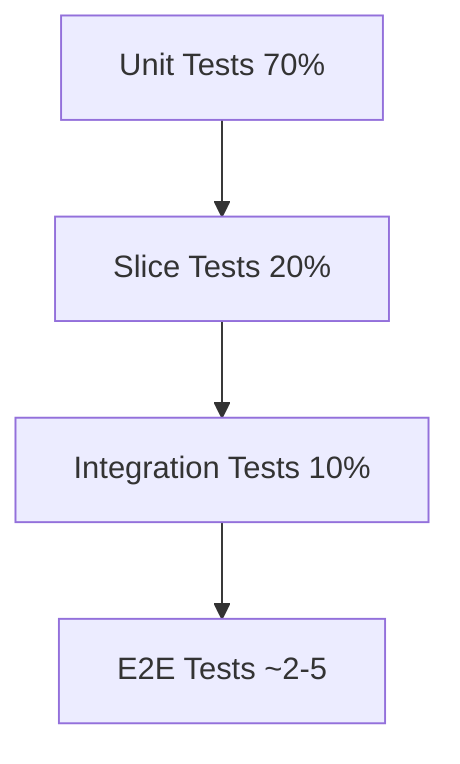
```mermaid
flowchart TD
    A["Unit Tests 70%"] --> B["Slice Tests 20%"]
    B --> C["Integration Tests 10%"]
    C --> D["E2E Tests ~2-5"]
```

**Layer-by-layer breakdown:**

1. **Unit tests (70%)** - No Spring context. Plain JUnit 5 with Mockito. Test business logic, domain rules, validation, utility functions. These run in milliseconds. The service class under test receives mocked dependencies via constructor injection. If you need `@MockBean`, you are not writing a unit test - you are writing a slow unit test that loads Spring.

2. **Slice tests (20%)** - Load only one slice of the Spring context. `@WebMvcTest` loads controllers, converters, and the security filter chain but not services or repositories. `@DataJpaTest` loads JPA repositories, Hibernate, and an embedded database but not controllers. `@JsonTest` loads Jackson serialization. Each slice test proves that one layer's Spring wiring is correct.

3. **Integration tests (10%)** - `@SpringBootTest` loads the full application context. These test that all layers wire together correctly, that properties resolve, that Flyway migrations run, and that transactional boundaries behave as expected. Use `@Testcontainers` to run against real databases. These are slow - keep them to critical paths only.

4. **E2E tests (2-5 total)** - Deploy the full application and hit it over HTTP. These prove the deployment artifact works, including packaging, property files, and Docker configuration. They are fragile and slow. Keep the count minimal - cover the critical user journey, not every endpoint.

**Deeper: the shared-context optimization.** Spring caches application contexts across tests that share the same configuration. If 50 tests all use `@SpringBootTest` with identical properties, they share one context. But a single `@MockBean` in one test class creates a new context. To maximize cache hits: isolate `@MockBean` usage into dedicated test classes, use `@DirtiesContext` only when absolutely necessary, and keep test properties consistent via a shared `application-test.yml`.

**Deeper: slice test boundaries.** `@WebMvcTest(OrderController.class)` loads only that controller. You provide service dependencies via `@MockBean`. This tests: request mapping, input validation, serialization, error handling, and security annotations - without touching the database. If the controller test passes but integration fails, the bug is in wiring between service and controller, which narrows diagnosis immediately.

**Deeper: the speed multiplier.** A well-structured pyramid with 1000 tests might run as: 700 unit tests (5 seconds), 200 slice tests (40 seconds), 100 integration tests (3 minutes). Total: under 4 minutes. The same 1000 tests all written as `@SpringBootTest` would take 15-20 minutes because each context load is expensive even with caching.

### 🛠️ Worked Example

**BAD:**

```java
@SpringBootTest
class OrderServiceTest {
  @Autowired OrderService service;
  @MockBean PaymentGateway gateway;

  @Test
  void calculatesTotal() {
    // loads ENTIRE context to test math
    when(gateway.charge(any()))
        .thenReturn(success());
    var total = service.calculateTotal(
        List.of(item(10), item(20)));
    assertEquals(30, total);
  }
}
```

**GOOD:**

```java
// Unit test - no Spring, milliseconds
class OrderServiceTest {
  OrderService service = new OrderService(
      mock(PaymentGateway.class),
      mock(OrderRepository.class));

  @Test
  void calculatesTotal() {
    var total = service.calculateTotal(
        List.of(item(10), item(20)));
    assertEquals(30, total);
  }
}

// Slice test - controller wiring only
@WebMvcTest(OrderController.class)
class OrderControllerTest {
  @Autowired MockMvc mvc;
  @MockBean OrderService service;

  @Test
  void returnsOrder() throws Exception {
    when(service.findById(1L))
        .thenReturn(Optional.of(order()));
    mvc.perform(get("/orders/1"))
        .andExpect(status().isOk())
        .andExpect(jsonPath("$.id").value(1));
  }
}
```

**Production pattern - integration with Testcontainers:**

```java
@SpringBootTest
@Testcontainers
class OrderIntegrationTest {
  @Container
  static PostgreSQLContainer<?> pg =
      new PostgreSQLContainer<>("postgres:16");

  @DynamicPropertySource
  static void props(
      DynamicPropertyRegistry r) {
    r.add("spring.datasource.url",
        pg::getJdbcUrl);
    r.add("spring.datasource.username",
        pg::getUsername);
    r.add("spring.datasource.password",
        pg::getPassword);
  }

  @Autowired OrderRepository repo;

  @Test
  void persistsOrder() {
    var saved = repo.save(new Order("A1"));
    assertNotNull(saved.getId());
  }
}
```

### ⚖️ Trade-offs

| Gain                                        | Cost                                               |
| ------------------------------------------- | -------------------------------------------------- |
| Fast feedback (unit tests in seconds)       | Must maintain test doubles                         |
| Precise failure diagnosis (layer isolation) | More test classes to organize                      |
| Confidence in wiring (slice tests)          | Slice-specific annotations to learn                |
| Real database coverage (Testcontainers)     | Container startup time per suite                   |
| Shared context caching                      | Cache invalidation by @MockBean or @DirtiesContext |

| Approach                    | Best For                           | Watch Out                                               |
| --------------------------- | ---------------------------------- | ------------------------------------------------------- |
| 70/20/10 pyramid            | Most Spring Boot services          | Requires discipline to not drift toward all-integration |
| Heavy integration (diamond) | Legacy apps with weak domain layer | Slow suites, vague failures                             |
| Heavy unit (inverted)       | Pure domain logic (DDD)            | Misses wiring and config bugs                           |

The 70/20/10 ratio is a guideline, not a law. A CRUD-heavy service with little business logic might shift toward 50/30/20. A domain-rich service with complex rules might go 80/15/5. The principle holds: push tests down to the cheapest layer that catches the risk.

### ⚡ Decision Snap

- **USE WHEN:** starting a new Spring Boot project (establish the pyramid from day one), inheriting a slow test suite (refactor toward the pyramid), or choosing between `@SpringBootTest` and a slice annotation for a new test.
- **AVOID WHEN:** you have fewer than 20 tests total - the overhead of organizing layers is not worth it yet.
- **PREFER plain unit tests WHEN:** the class under test has no Spring annotations and receives dependencies via constructor injection.

### ⚠️ Top Traps

| Trap                                                   | Why It Hurts                                                                                  | Fix                                                                                  |
| ------------------------------------------------------ | --------------------------------------------------------------------------------------------- | ------------------------------------------------------------------------------------ |
| Using `@SpringBootTest` for logic tests                | 2-second context load for a 1ms assertion; 100 such tests = 3+ minutes wasted                 | Extract logic into plain classes, test with JUnit + Mockito                          |
| Overusing `@MockBean` in integration tests             | Each unique `@MockBean` combination creates a new cached context                              | Group `@MockBean` usage in dedicated test classes, or use constructor-injected fakes |
| No slice tests - jumping from unit to full integration | Wiring bugs (wrong `@RequestBody`, missing `@Valid`) are caught late and are hard to diagnose | Add `@WebMvcTest` for controllers, `@DataJpaTest` for repositories                   |

### 🪜 Learning Ladder

- **Prerequisites:** SPR-035 Spring Boot Starter Dependencies and Auto-configuration (understanding what `@SpringBootTest` loads), SPR-036 Controller-Service-Repository Layered Architecture (the layers you test separately), SPR-054 Testcontainers for Integration Testing (real database testing).
- **THIS:** SPR-059 Testing Strategy for Spring Applications - the pyramid structure, when to use each test type, and the 70/20/10 ratio.
- **Next steps:** SPR-066 Spring System Design Interview Patterns (testing strategies as part of system design discussions).

### 💡 The Surprising Truth

The slowest test suites are not the ones with the most tests - they are the ones where every test loads the full Spring context because nobody made a deliberate decision about which layer each test belongs to. A 2000-test suite organized as a pyramid runs faster than a 500-test suite where everything is `@SpringBootTest`, because context loading dominates execution time, not assertion count.

### 📇 Revision Card

- The pyramid: 70% unit (plain JUnit, no Spring), 20% slice (`@WebMvcTest`, `@DataJpaTest`), 10% integration (`@SpringBootTest` + Testcontainers).
- Push each test to the cheapest layer that catches its risk - logic bugs in unit tests, wiring bugs in slice tests, system bugs in integration tests.
- Maximize Spring context cache hits by grouping `@MockBean` usage, avoiding `@DirtiesContext`, and sharing a common `application-test.yml`.

---

---

# SPR-060 Monitoring Spring Applications in Production

**TL;DR** - Combine Actuator health probes, Micrometer metrics, structured SLF4J logs, and distributed traces to observe the four golden signals and detect failures before users notice.

### 🔥 The Problem in One Paragraph

Your Spring service runs fine in staging. In production, a downstream dependency starts timing out under load. CPU stays below 40%, memory looks normal, and no exceptions appear in the log until customers start filing tickets 45 minutes later. By then, the connection pool is exhausted, retry storms have amplified the problem, and three other services are cascading. The team spends two hours guessing because there are no dashboards, no alerts on latency percentiles, and no trace correlation between services. Every production outage follows the same pattern: the system had all the information needed to alert early, but nobody wired the signals into a coherent observability layer. This is exactly why monitoring Spring applications in production requires deliberate instrumentation across metrics, logs, and traces - not just deploying Actuator and hoping for the best.

### 📘 Textbook Definition

**Monitoring Spring applications in production** means instrumenting a Spring Boot service with the three pillars of observability - metrics (numeric measurements over time via Micrometer), logs (structured event records via SLF4J/Logback), and traces (request-scoped spans via Micrometer Tracing or OpenTelemetry) - then exposing health probes through Actuator for orchestrator liveness/readiness checks, and alerting on the four golden signals: latency, traffic, errors, and saturation.

### 🧠 Mental Model

> Think of monitoring like the instrument panel in an aircraft cockpit. Altimeter (latency), airspeed (traffic), engine warning lights (errors), and fuel gauge (saturation) are always visible. No pilot flies blind. The autopilot (alerting) sounds alarms when any reading crosses a threshold, long before the plane is in danger. The flight recorder (traces) captures the full sequence of events for post-incident investigation.

- "Altimeter" -> p99 latency metric
- "Airspeed indicator" -> requests-per-second counter
- "Engine warning light" -> 5xx error rate alert
- "Fuel gauge" -> thread pool / connection pool saturation

**Where this analogy breaks down:** aircraft instruments are hardware-fixed; in software, you choose which signals to expose, and missing instrumentation means the gauge simply does not exist - there is no default cockpit.

### ⚙️ How It Works

```
  Spring Boot Application
  +-----------------------------------------+
  |  App Code                               |
  |    |                                    |
  |    v                                    |
  |  Micrometer MeterRegistry               |
  |    |          |          |              |
  |    v          v          v              |
  |  Timers   Counters   Gauges            |
  |    |          |          |              |
  +----|----------|----------|------+       |
       |          |          |      |       |
       v          v          v      v       |
  Prometheus   SLF4J/     Actuator |       |
  /metrics     Logback    /health  |       |
  endpoint     JSON logs  probes   |       |
       |          |          |     |       |
       v          v          v     v       |
  Grafana     Log Agg     K8s   Traces    |
  Dashboard   (ELK/Loki)  Probe  Tempo    |
                           Check          |
  +-----------------------------------------+
```

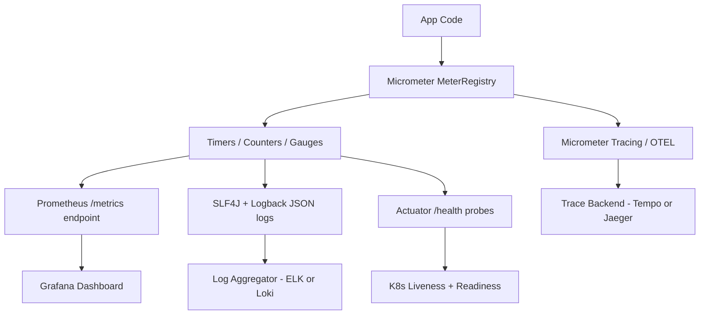
```mermaid
flowchart TD
    A[App Code] --> B[Micrometer MeterRegistry]
    B --> C[Timers / Counters / Gauges]
    C --> D[Prometheus /metrics endpoint]
    C --> E[SLF4J + Logback JSON logs]
    C --> F[Actuator /health probes]
    B --> G[Micrometer Tracing / OTEL]
    D --> H[Grafana Dashboard]
    E --> I[Log Aggregator - ELK or Loki]
    F --> J[K8s Liveness + Readiness]
    G --> K[Trace Backend - Tempo or Jaeger]
```

1. **Metrics pipeline.** Micrometer auto-configures a `MeterRegistry` (typically `PrometheusMeterRegistry`) that collects timers, counters, and gauges. Spring Boot auto-instruments HTTP server requests (`http.server.requests`), JVM memory, GC pauses, HikariCP pool stats, and Logback log counts. Custom business metrics use `@Timed` or inject `MeterRegistry` directly.
2. **Health probes.** Actuator exposes `/actuator/health/liveness` and `/actuator/health/readiness` mapped to Kubernetes probe endpoints. Liveness checks if the JVM is functional; readiness checks if dependencies (database, message broker) are reachable. A failing readiness probe removes the pod from the Service load balancer without killing it.
3. **Structured logging.** SLF4J with Logback outputs JSON-formatted log events including a `traceId` field injected by Micrometer Tracing. This enables log aggregators to correlate log lines to a specific distributed trace.
4. **Distributed traces.** Micrometer Tracing (or direct OpenTelemetry SDK) propagates trace context across HTTP headers (`traceparent`). Each span records latency, status, and metadata. The trace backend visualizes the full call chain across services.
5. **Alerting on golden signals.** Prometheus rules (or Grafana alerting) fire when: p99 latency exceeds the SLO, error rate crosses a threshold, request rate drops unexpectedly (indicating upstream failure), or saturation (thread pool active / max) exceeds 80%.

### 🛠️ Worked Example

**BAD:**

```yaml
# application.yml - no monitoring config
management:
  endpoints:
    web:
      exposure:
        include: "info"
```

```java
@RestController
public class OrderController {
  @PostMapping("/orders")
  public Order create(@RequestBody Order order) {
    // No metrics, no trace context, no
    // structured logging
    System.out.println("Order created");
    return orderService.create(order);
  }
}
```

Why it fails: Actuator exposes only `/info`. No health probes for Kubernetes. No metrics endpoint for Prometheus. `System.out.println` produces unstructured output with no trace correlation. When latency spikes, there is zero visibility.

**GOOD:**

```yaml
# application.yml
management:
  endpoints:
    web:
      exposure:
        include: >
          health,prometheus,info
  endpoint:
    health:
      probes:
        enabled: true
      show-details: when_authorized
  health:
    livenessState:
      enabled: true
    readinessState:
      enabled: true
  metrics:
    tags:
      application: order-service
  tracing:
    sampling:
      probability: 0.1
```

```java
@RestController
public class OrderController {
  private static final Logger log =
      LoggerFactory.getLogger(
          OrderController.class);
  private final Timer orderTimer;

  OrderController(MeterRegistry registry) {
    this.orderTimer = Timer.builder(
            "orders.create.duration")
        .description("Order creation latency")
        .register(registry);
  }

  @PostMapping("/orders")
  public Order create(
      @RequestBody Order order) {
    return orderTimer.record(() -> {
      log.info("Order created id={}",
          order.getId());
      return orderService.create(order);
    });
  }
}
```

**Production - Kubernetes probe config:**

```yaml
# deployment.yml
livenessProbe:
  httpGet:
    path: /actuator/health/liveness
    port: 8080
  initialDelaySeconds: 30
  periodSeconds: 10
readinessProbe:
  httpGet:
    path: /actuator/health/readiness
    port: 8080
  initialDelaySeconds: 10
  periodSeconds: 5
```

The readiness probe path ensures traffic stops flowing to the pod before its database connection is verified, preventing 503 errors during rolling deployments.

### ⚖️ Trade-offs

**Gain:** early detection of latency degradation, error spikes, and saturation before users are impacted; trace correlation across services for fast root-cause analysis; automated Kubernetes remediation via health probes.
**Cost:** cardinality explosion risk if high-cardinality labels (user ID, request ID) are added to metrics; sampling reduces trace completeness; additional infrastructure (Prometheus, Grafana, trace backend) to operate.

| Aspect             | Spring Actuator + Micrometer  | OpenTelemetry SDK direct        |
| ------------------ | ----------------------------- | ------------------------------- |
| Setup effort       | Auto-configured, minimal code | Manual SDK init, more wiring    |
| Spring integration | Native, auto-instruments Boot | Requires agent or manual spans  |
| Vendor lock-in     | Micrometer abstracts backends | OTEL is vendor-neutral standard |
| Trace propagation  | Micrometer Tracing (Bridge)   | Native W3C TraceContext         |

For most Spring Boot applications, Actuator plus Micrometer is the path of least resistance. Direct OpenTelemetry SDK is better when the organization has standardized on OTEL across non-Java services and needs a single instrumentation API.

### ⚡ Decision Snap

**USE WHEN:** any Spring Boot service runs in production - monitoring is not optional, it is infrastructure.
**AVOID WHEN:** local development or throwaway prototypes where the overhead adds no value.
**PREFER OpenTelemetry agent WHEN:** the organization mandates a single vendor-neutral instrumentation standard across polyglot services and you need automatic instrumentation without code changes.

### ⚠️ Top Traps

| #   | Misconception                               | Reality                                                                                                               |
| --- | ------------------------------------------- | --------------------------------------------------------------------------------------------------------------------- |
| 1   | "Actuator is monitoring"                    | Actuator exposes data; without a scraper (Prometheus), alerting (Grafana), and dashboards, the data sits unread       |
| 2   | "Log every request at DEBUG for visibility" | High-volume DEBUG logging saturates disk I/O and log aggregator ingest; use metrics for volume, traces for detail     |
| 3   | "100% trace sampling gives full visibility" | At scale, 100% sampling overwhelms the trace backend and network; sample 1-10% and use tail-based sampling for errors |

### 🪜 Learning Ladder

**Prerequisites:**

- SPR-052 Spring Boot Actuator and Health Endpoints - how Actuator exposes operational data
- SPR-053 Micrometer Metrics and Distributed Tracing - the metrics and tracing abstraction layer
- SPR-034 Externalized Configuration and Profiles - how to configure monitoring per environment

**THIS:** SPR-060 Monitoring Spring Applications in Production

**Next steps:**

- SPR-068 Spring Performance Tuning Kata - apply monitoring to identify and fix performance bottlenecks

### 💡 The Surprising Truth

The single highest-value monitoring investment is not dashboards, traces, or fancy alerting rules - it is the `readinessProbe` pointing at `/actuator/health/readiness`. This one line of Kubernetes YAML prevents more outages than any Grafana dashboard because it automatically removes unhealthy pods from the load balancer before users see errors. Most teams invest weeks in dashboard design but skip the five-minute probe configuration that provides the highest reliability return.

### 📇 Revision Card

- Four golden signals: latency (p99 timer), traffic (request counter), errors (5xx rate), saturation (pool active/max gauge) - alert on all four, not just errors.
- Actuator exposes data, Micrometer collects it, Prometheus scrapes it, Grafana visualizes it, alerting rules act on it - each layer is necessary; skipping one breaks the chain.
- The highest-ROI monitoring config is a Kubernetes readiness probe on `/actuator/health/readiness` - it auto-heals traffic routing before any dashboard is even checked.

---

---

# SPR-061 Spring Boot 2.x to 3.x Migration Guide

**TL;DR** - Spring Boot 2.x to 3.x migration requires Java 17, javax-to-jakarta rename, Security 6 DSL changes, and property updates - plan it as a phased project.

### 🔥 The Problem in One Paragraph

Your team runs a Spring Boot 2.7 application in production. Java 17 LTS is now the baseline, Spring Boot 2.x has reached end of open-source support, and security patches only land on the 3.x line. You attempt a version bump from `spring-boot-starter-parent:2.7.x` to `3.x` and the build produces hundreds of compilation errors: every `javax.servlet`, `javax.persistence`, and `javax.validation` import is unresolved. The Spring Security configuration class no longer compiles because `WebSecurityConfigurerAdapter` was removed. Property keys like `spring.redis.*` are now `spring.data.redis.*`. Half the auto-configuration classes have moved packages. The migration is not a version bump - it is a coordinated update across the Java platform, Jakarta EE, Spring Framework 6, and Spring Security 6 simultaneously. Without a structured plan, teams stall for weeks or ship half-migrated code with runtime failures.
grand_parent: "Learn"

### 📘 Textbook Definition

The **Spring Boot 2.x to 3.x migration** is a major-version upgrade that transitions an application from Spring Framework 5 / Jakarta EE 8 (javax namespace) to Spring Framework 6 / Jakarta EE 9+ (jakarta namespace), requiring Java 17 as the minimum runtime, adopting the new Spring Security 6 component-based configuration DSL, updating renamed configuration properties, and replacing removed deprecated APIs. It is the largest breaking change in Spring Boot's history.

### 🧠 Mental Model

> Think of the migration like moving a house from one foundation to another. You cannot just lift the house (your code) - you must also re-route every pipe (javax to jakarta), rewire the electrical panel (Security DSL), update the address on every piece of mail (property renames), and verify the new foundation supports the load (Java 17). Doing it room by room is safer than demolishing and rebuilding.

- "Foundation" -> Java 17 baseline + Jakarta EE 9+
- "Pipes" -> javax._ to jakarta._ package renames
- "Electrical panel" -> Spring Security 6 config DSL
- "Mail address" -> renamed configuration properties

**Where this analogy breaks down:** unlike a physical house, you can run the old and new builds in parallel branches, use automated migration tools, and roll back with a `git revert` - the cost of trying is much lower than a real move.

### ⚙️ How It Works

```
  Migration Phases
  +----------------------------+
  | Phase 0: Prepare on 2.7   |
  |  - Java 17, fix warnings  |
  |  - Remove deprecated APIs |
  +----------------------------+
         |
         v
  +----------------------------+
  | Phase 1: Bump to 3.x      |
  |  - Parent POM / Gradle    |
  |  - javax -> jakarta        |
  +----------------------------+
         |
         v
  +----------------------------+
  | Phase 2: Security DSL     |
  |  - Remove Adapter class   |
  |  - SecurityFilterChain    |
  +----------------------------+
         |
         v
  +----------------------------+
  | Phase 3: Properties/APIs  |
  |  - Renamed keys           |
  |  - Removed auto-configs   |
  +----------------------------+
         |
         v
  +----------------------------+
  | Phase 4: Test + Deploy    |
  |  - Full test suite        |
  |  - Canary rollout         |
  +----------------------------+
```

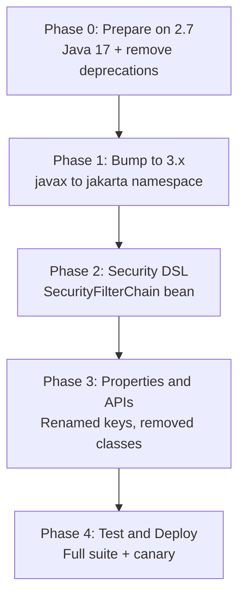
```mermaid
flowchart TD
    P0["Phase 0: Prepare on 2.7\nJava 17 + remove deprecations"]
    P1["Phase 1: Bump to 3.x\njavax to jakarta namespace"]
    P2["Phase 2: Security DSL\nSecurityFilterChain bean"]
    P3["Phase 3: Properties and APIs\nRenamed keys, removed classes"]
    P4["Phase 4: Test and Deploy\nFull suite + canary"]
    P0 --> P1 --> P2 --> P3 --> P4
```

1. **Phase 0 - prepare while still on 2.7.** Upgrade to Java 17 (Boot 2.7 supports it). Enable `-Werror` for deprecation warnings. Replace every deprecated API call with its recommended successor. Run the full test suite on Java 17 before touching the Boot version. This phase is safe because Boot 2.7 + Java 17 is a supported combination.
2. **Phase 1 - version bump and namespace migration.** Change the parent POM or Gradle plugin to 3.x. Run OpenRewrite recipe `org.openrewrite.java.migrate.jakarta.JavaxMigrationToJakarta` to bulk-rename `javax.servlet.*`, `javax.persistence.*`, `javax.validation.*`, `javax.annotation.*` to their `jakarta.*` equivalents. Third-party libraries that bundle `javax` classes need version bumps to their Jakarta-compatible releases.
3. **Phase 2 - Spring Security 6 DSL.** `WebSecurityConfigurerAdapter` is removed. Replace `extends WebSecurityConfigurerAdapter` with a `@Bean SecurityFilterChain` method. The `authorizeRequests()` DSL becomes `authorizeHttpRequests()`. `antMatchers()` becomes `requestMatchers()`. CSRF, CORS, and session config move to lambda DSL style.
4. **Phase 3 - property renames and removed APIs.** `spring.redis.*` becomes `spring.data.redis.*`. `spring.flyway.*` becomes `spring.flyway.*` (some sub-keys changed). `spring-configuration-metadata.json` flags most renames. Auto-configuration classes moved from `org.springframework.boot.autoconfigure` subpackages - update any `@ImportAutoConfiguration` references.
5. **Phase 4 - test and deploy.** Run the full test suite. Pay special attention to integration tests that use `MockMvc` (the `print()` output format changed) and `@SpringBootTest` with embedded servers. Deploy via canary or blue-green to catch runtime issues that compilation missed.

### 🛠️ Worked Example

**BAD:**

```java
@Configuration
@EnableWebSecurity
public class SecurityConfig
    extends WebSecurityConfigurerAdapter {

  @Override
  protected void configure(
      HttpSecurity http) throws Exception {
    http.authorizeRequests()
        .antMatchers("/public/**").permitAll()
        .anyRequest().authenticated()
        .and()
        .oauth2Login();
  }
}
```

Why it fails: `WebSecurityConfigurerAdapter` is deleted in Spring Security 6. `authorizeRequests()` and `antMatchers()` are removed.

**GOOD:**

```java
@Configuration
@EnableWebSecurity
public class SecurityConfig {

  @Bean
  SecurityFilterChain filterChain(
      HttpSecurity http) throws Exception {
    http
      .authorizeHttpRequests(auth -> auth
        .requestMatchers("/public/**")
          .permitAll()
        .anyRequest().authenticated()
      )
      .oauth2Login(Customizer.withDefaults());
    return http.build();
  }
}
```

**Production - OpenRewrite migration recipe (pom.xml):**

```xml
<plugin>
  <groupId>
    org.openrewrite.maven
  </groupId>
  <artifactId>
    rewrite-maven-plugin
  </artifactId>
  <version>5.42.0</version>
  <configuration>
    <activeRecipes>
      <recipe>
        org.openrewrite.java.spring
          .boot3.UpgradeSpringBoot_3_0
      </recipe>
    </activeRecipes>
  </configuration>
  <dependencies>
    <dependency>
      <groupId>
        org.openrewrite.recipe
      </groupId>
      <artifactId>
        rewrite-spring
      </artifactId>
      <version>5.22.0</version>
    </dependency>
  </dependencies>
</plugin>
```

Run `mvn rewrite:run` to apply the bulk migration. OpenRewrite handles namespace renames, property key updates, and many Security DSL transformations automatically. Review the diff carefully - automated tools handle roughly 70-80% of changes; the remainder requires manual attention, especially custom `WebSecurityConfigurerAdapter` subclasses with complex filter logic.

### ⚖️ Trade-offs

**Gain:** continued security patches, Java 17+ performance features (records, sealed classes, virtual threads readiness), Jakarta EE alignment with the broader Java ecosystem, access to Spring Boot 3.x features (GraalVM native image support, improved observability).
**Cost:** significant one-time migration effort, potential dependency incompatibilities with libraries that have not released Jakarta-compatible versions, test suite updates, team learning curve for the new Security DSL.

| Aspect           | Stay on Boot 2.7     | Migrate to Boot 3.x             |
| ---------------- | -------------------- | ------------------------------- |
| Security patches | OSS support ended    | Active LTS releases             |
| Java version     | Java 8-17            | Java 17+ required               |
| Namespace        | javax.\*             | jakarta.\*                      |
| Native image     | Experimental at best | First-class GraalVM support     |
| Migration effort | Zero                 | Days to weeks depending on size |

Staying on 2.7 is viable short-term but accumulates security debt. The longer you wait, the harder the migration becomes as dependencies diverge further.

### ⚡ Decision Snap

**USE WHEN:** your application must remain supported with security patches, you want access to Java 17+ language features in Spring code, or you need GraalVM native image compilation.
**AVOID WHEN:** you have a legacy application approaching end-of-life with no active development - the migration cost is not justified if the service will be decommissioned.
**PREFER incremental migration WHEN:** the codebase is large - migrate module by module in a multi-module project, keeping shared libraries compatible with both versions during the transition.

### ⚠️ Top Traps

| #   | Misconception                                           | Reality                                                                                                                                      |
| --- | ------------------------------------------------------- | -------------------------------------------------------------------------------------------------------------------------------------------- |
| 1   | "Just bump the version and fix compile errors"          | Runtime failures hide in reflection-based code, property renames, and auto-config changes that compile fine but fail at startup              |
| 2   | "OpenRewrite handles everything automatically"          | OpenRewrite covers roughly 70-80% of changes; custom Security configs, third-party library updates, and test adjustments require manual work |
| 3   | "We can migrate javax to jakarta with find-and-replace" | Simple text replacement breaks string literals, XML namespaces, and third-party JARs that still bundle javax classes internally              |

### 🪜 Learning Ladder

**Prerequisites:**

- SPR-007 Spring Boot Auto-Configuration Magic - understanding what Boot configures automatically and what changes in 3.x
- SPR-047 Spring Security Filter Chain Architecture - the Security model that replaces WebSecurityConfigurerAdapter

**THIS:** SPR-061 Spring Boot 2.x to 3.x Migration Guide

**Next steps:**

- SPR-062 Jakarta EE Namespace Migration (javax to jakarta) - deep dive into the namespace transition mechanics

### 💡 The Surprising Truth

The hardest part of the Boot 2-to-3 migration is not your own code - it is your third-party dependencies. Libraries like Springfox (Swagger), older Hibernate versions, and niche Spring integrations may not have Jakarta-compatible releases. The actual javax-to-jakarta rename in your source files takes an afternoon with OpenRewrite. Waiting for every transitive dependency to publish a compatible version is what turns a week-long migration into a month-long one. Check dependency compatibility first, before writing a single line of migration code.

### 📇 Revision Card

- Phase the migration: prepare on 2.7 (Java 17, remove deprecations), bump to 3.x (jakarta namespace via OpenRewrite), update Security DSL (`SecurityFilterChain` bean), fix properties, then run full tests.
- The three biggest breaks: javax-to-jakarta namespace, `WebSecurityConfigurerAdapter` removal, and `spring.redis.*` to `spring.data.redis.*` property rename - handle these first and 80% of compile errors disappear.
- Check third-party dependency Jakarta compatibility before starting - your code migrates in a day, but waiting for library updates is what stalls the project for weeks.

---

---

# SPR-062 Jakarta EE Namespace Migration (javax to jakarta)

**TL;DR** - Spring Boot 3 requires Jakarta EE 9+ namespaces - every `javax.servlet` and `javax.persistence` import becomes `jakarta.*`, but Java SE packages like `javax.sql` stay unchanged.

### 🔥 The Problem in One Paragraph

You upgrade Spring Boot from 2.7 to 3.0 and the project explodes with hundreds of compilation errors. Every `import javax.servlet.*` is unresolved. Every `@javax.persistence.Entity` annotation fails. Your `javax.validation.constraints` imports are gone. You start find-and-replacing `javax` with `jakarta` and accidentally break `javax.sql.DataSource`, which never moved. The real confusion: some `javax` packages changed and some did not, the split follows a legal boundary (Oracle trademark), not a technical one, and no compiler error tells you which is which. Without understanding exactly what moved and what stayed, you either break working code or miss imports that needed to change - both producing runtime failures that surface only when a specific code path executes.

### 📘 Textbook Definition

The **Jakarta EE namespace migration** is the bulk package rename from `javax.*` to `jakarta.*` for all specifications originally governed by the Java Community Process (JCP) and transferred to the Eclipse Foundation in 2017. Oracle retained the `javax` trademark, so the Eclipse Foundation could not release new versions under `javax.*`. Starting with Jakarta EE 9 (2020), all EE specifications - Servlet, JPA, Bean Validation, CDI, JSON-P, JSON-B, JAX-RS, and others - adopted the `jakarta.*` root package. Java SE packages (`javax.sql`, `javax.crypto`, `javax.swing`, `javax.net`, `javax.xml.parsers`) remain under `javax` because they are part of the JDK itself and were never transferred.

### 🧠 Mental Model

> Imagine a company splits into two firms after a trademark dispute.

- "Firm A offices" -> Java SE packages (javax.sql stays)
- "Firm B re-labeled doors" -> Jakarta EE renames (javax.servlet -> jakarta.servlet)
- "Mail address on envelopes" -> import statements in source code

**Where this analogy breaks down:** unlike a simple rename,
some libraries ship "bridge" artifacts that include both
old and new packages, which does not map to the
two-firm analogy.

### ⚙️ How It Works

```
  Java SE (unchanged)       Jakarta EE (renamed)
 +---------------------+  +------------------------+
 | javax.sql            |  | javax.servlet          |
 | javax.crypto         |  |   --> jakarta.servlet   |
 | javax.net.ssl        |  | javax.persistence      |
 | javax.xml.parsers    |  |   --> jakarta.persistence|
 | javax.swing          |  | javax.validation       |
 | javax.management     |  |   --> jakarta.validation |
 | javax.naming (JNDI)  |  | javax.inject           |
 |                     |  |   --> jakarta.inject     |
 | STAYS javax.*       |  | javax.annotation       |
 |                     |  |   --> jakarta.annotation |
 +---------------------+  +------------------------+
    Owned by Oracle/JDK       Owned by Eclipse Fdn
```

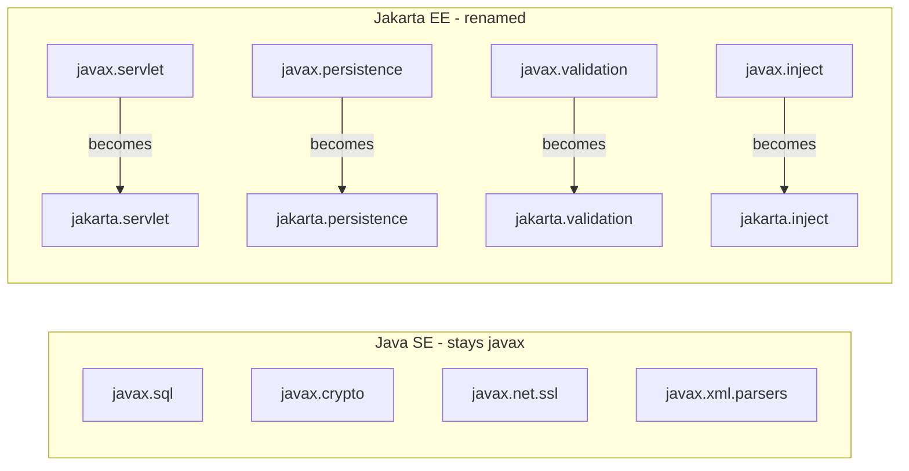
```mermaid
flowchart LR
    subgraph JavaSE["Java SE - stays javax"]
        A["javax.sql"]
        B["javax.crypto"]
        C["javax.net.ssl"]
        D["javax.xml.parsers"]
    end
    subgraph JakartaEE["Jakarta EE - renamed"]
        E["javax.servlet"] -->|becomes| F["jakarta.servlet"]
        G["javax.persistence"] -->|becomes| H["jakarta.persistence"]
        I["javax.validation"] -->|becomes| J["jakarta.validation"]
        K["javax.inject"] -->|becomes| L["jakarta.inject"]
    end
```

**Step-by-step migration path:**

1. **Identify the boundary.** Java SE packages (`javax.sql`,
   `javax.crypto`, `javax.net`, `javax.xml.parsers`,
   `javax.naming`, `javax.management`, `javax.swing`) never
   change. Every EE specification package changes.

2. **Upgrade dependencies first.** Hibernate 6+, Tomcat 10+,
   Jetty 12+, Jersey 3+, and EclipseLink 4+ ship with
   `jakarta.*`. Older major versions do not.

3. **Run OpenRewrite migration recipe.** The recipe
   `org.openrewrite.java.migrate.jakarta.JavaxMigrationTo
Jakarta` handles import rewrites, XML namespace changes
   in `persistence.xml` and `web.xml`, and annotation
   processor references.

4. **Fix remaining references manually.** String literals
   containing `"javax.persistence"` (JPQL provider hints,
   property keys) are not caught by import rewriting.
   Search the codebase for the literal string `javax.` in
   `.java`, `.xml`, `.properties`, and `.yml` files.

5. **Update test dependencies.** Test libraries like
   `javax.servlet-api` become `jakarta.servlet-api`. Mock
   objects referencing `javax.servlet.http.HttpServlet
Request` must switch.

**Key packages that changed:**

| Old (`javax.*`)     | New (`jakarta.*`)     | Spec        |
| ------------------- | --------------------- | ----------- |
| `javax.servlet`     | `jakarta.servlet`     | Servlet     |
| `javax.persistence` | `jakarta.persistence` | JPA         |
| `javax.validation`  | `jakarta.validation`  | Bean Valid. |
| `javax.inject`      | `jakarta.inject`      | CDI/Inject  |
| `javax.annotation`  | `jakarta.annotation`  | Common Ann. |
| `javax.ws.rs`       | `jakarta.ws.rs`       | JAX-RS      |
| `javax.json`        | `jakarta.json`        | JSON-P      |
| `javax.websocket`   | `jakarta.websocket`   | WebSocket   |
| `javax.mail`        | `jakarta.mail`        | JavaMail    |
| `javax.transaction` | `jakarta.transaction` | JTA         |

**Packages that did NOT change (Java SE, still `javax.*`):**

`javax.sql`, `javax.crypto`, `javax.net`, `javax.security
.auth`, `javax.xml.parsers`, `javax.xml.transform`,
`javax.naming`, `javax.management`, `javax.swing`,
`javax.imageio`, `javax.sound`.

The rule: if the JDK javadoc includes it under `java.base`,
`java.sql`, `java.naming`, or `java.management` modules,
it stays `javax`. If it required a separate EE dependency
(servlet-api, persistence-api, etc.), it moves to `jakarta`.

### 🛠️ Worked Example

**BAD:**

```java
// Someone ran s/javax/jakarta/g globally
import jakarta.sql.DataSource;    // WRONG
import jakarta.crypto.Cipher;     // WRONG
import jakarta.servlet.Filter;    // correct
import jakarta.persistence.Entity; // correct
// DataSource and Cipher are Java SE -
// they must remain javax.*
```

**GOOD:**

```java
import javax.sql.DataSource;       // Java SE: keep
import javax.crypto.Cipher;        // Java SE: keep
import jakarta.servlet.Filter;     // EE: migrated
import jakarta.persistence.Entity; // EE: migrated
import jakarta.validation
    .constraints.NotNull;          // EE: migrated
```

**Production pattern - OpenRewrite in `pom.xml`:**

```xml
<plugin>
  <groupId>
    org.openrewrite.maven
  </groupId>
  <artifactId>
    rewrite-maven-plugin
  </artifactId>
  <version>5.40.0</version>
  <configuration>
    <activeRecipes>
      <recipe>
        org.openrewrite.java.migrate
        .jakarta.JavaxMigrationToJakarta
      </recipe>
    </activeRecipes>
  </configuration>
  <dependencies>
    <dependency>
      <groupId>
        org.openrewrite.recipe
      </groupId>
      <artifactId>
        rewrite-migrate-java
      </artifactId>
      <version>2.24.0</version>
    </dependency>
  </dependencies>
</plugin>
```

Run `mvn rewrite:run` and review the diff. OpenRewrite
handles imports, annotations, XML namespaces, and most
string literals referencing EE package names.

### ⚖️ Trade-offs

| Gain                          | Cost                            |
| ----------------------------- | ------------------------------- |
| Access to Spring Boot 3+      | Every EE import must change     |
| Jakarta EE 10/11 new features | Third-party lib compatibility   |
| Long-term support alignment   | persistence.xml / web.xml edits |
| Cleaner dependency tree       | Test dependency updates         |
| Tooling actively maintained   | String literal references break |

**Big-bang vs. incremental:** a big-bang migration works for
most projects because the namespace change is a compile-time
break - you cannot "partially" migrate within one module.
Either all imports in a compilation unit use `jakarta` or
`javax`. Multi-module projects can migrate module-by-module
if each module compiles independently.

**OpenRewrite vs. IDE refactoring:** OpenRewrite handles
XML namespaces, property files, and cross-cutting changes
that IDE refactoring misses. IDE rename refactoring only
covers `.java` files and may miss string literals.

### ⚡ Decision Snap

- Upgrading to Spring Boot 3.x? Migration is mandatory.
- Staying on Spring Boot 2.7? No namespace change needed,
  but you lose security patches after November 2025.
- Using OpenRewrite? Yes - always prefer automated tooling
  over manual find-and-replace for namespace migration.

### ⚠️ Top Traps

| Trap                                 | Why it bites                                    | Fix                                         |
| ------------------------------------ | ----------------------------------------------- | ------------------------------------------- |
| Replacing ALL `javax` with `jakarta` | Breaks `javax.sql`, `javax.crypto`, `javax.net` | Only replace EE packages, not Java SE       |
| Missing string literals              | `"javax.persistence.provider"` in properties    | Grep for literal `javax.` in all file types |
| Outdated third-party JARs            | Library still ships `javax.*` classes           | Check compatibility matrix before migrating |

### 🪜 Learning Ladder

- **Before this:** SPR-061 Spring Boot 2.x to 3.x Migration
  Guide - understand the broader migration context.
- **After this:** SPR-064 Spring Security OWASP Top 10
  Alignment - security patterns in the post-migration world.
- **Deeper:** the Eclipse Foundation's Jakarta EE specification
  documents define the full scope of migrated APIs.

### 💡 The Surprising Truth

The migration looks massive (hundreds of import changes) but
is almost entirely mechanical. Projects that use OpenRewrite
report the actual code change taking under an hour. The real
time sink is waiting for third-party libraries to release
Jakarta-compatible versions - your code is ready long before
your dependency tree is.

### 📇 Revision Card

- **What moved:** every Java EE specification package
  (`servlet`, `persistence`, `validation`, `inject`,
  `annotation`, `ws.rs`, `json`, `websocket`, `mail`,
  `transaction`) went from `javax.*` to `jakarta.*`.
- **What stayed:** all Java SE packages (`javax.sql`,
  `javax.crypto`, `javax.net`, `javax.xml.parsers`,
  `javax.naming`, `javax.swing`) remain `javax.*`.
- **How to migrate:** run OpenRewrite's Jakarta migration
  recipe, then grep for residual `javax.` literals in
  XML, properties, and YAML files.

---

---

# SPR-063 "Spring Beans Are Thread-Safe" is Wrong - Singleton Scope

**TL;DR** - Spring's singleton scope means one instance per container, not thread-safe; any mutable field on a singleton bean is a shared-state concurrency bug waiting to happen.

### 🔥 The Problem in One Paragraph

A developer creates a `@Service` class with an instance field that accumulates request counts. It works perfectly in local testing because there is only one request at a time. In production, two threads modify the field simultaneously, the count drifts, and intermittent wrong results appear - sometimes. The bug is not reproducible on demand because it depends on thread interleaving. The developer stares at the code and concludes "it should be fine, Spring manages the bean." This is the most common concurrency misconception in Spring: singleton scope guarantees exactly one instance exists in the application context, but it provides zero thread-safety guarantees. Every thread that calls a method on that bean shares the same object, the same fields, the same mutable state. If you write to a field without synchronization, you have a data race, and the JVM memory model offers no protection.

### 📘 Textbook Definition

**Singleton scope** in Spring means the IoC container creates exactly one instance of the bean definition and returns that same instance for every injection point and every `getBean()` call. This is an object lifecycle policy, not a concurrency policy. Thread safety is a property of how a class manages its mutable state - through immutability, confinement, synchronization, or atomic operations. Spring does not add synchronization to your bean methods, does not protect your fields, and does not create per-thread copies. A singleton bean is shared across all threads by design, making the developer solely responsible for thread safety.

### 🧠 Mental Model

> A singleton bean is like a single whiteboard in a shared office.

- "One whiteboard" -> singleton instance shared by all threads
- "Two people writing at once" -> concurrent field mutation (data race)
- "Office manager" -> Spring container (creates one instance, no guard)

**Where this analogy breaks down:** some beans are genuinely
stateless (no whiteboard content to corrupt), which is
why many singleton services work fine without explicit
synchronization. The analogy overemphasizes the danger
for stateless beans.

### ⚙️ How It Works

```
 Thread-1 ---+
              |     +------------------+
              +---->| Singleton Bean   |
              |     |                  |
 Thread-2 ---+     |  mutableField: ? |
              |     |                  |
 Thread-3 ---+---->| (ONE instance)   |
                    +------------------+
                    All threads share the
                    SAME object and fields.

 Stateless bean:   no fields to corrupt
 Stateful bean:    data race on every write
```

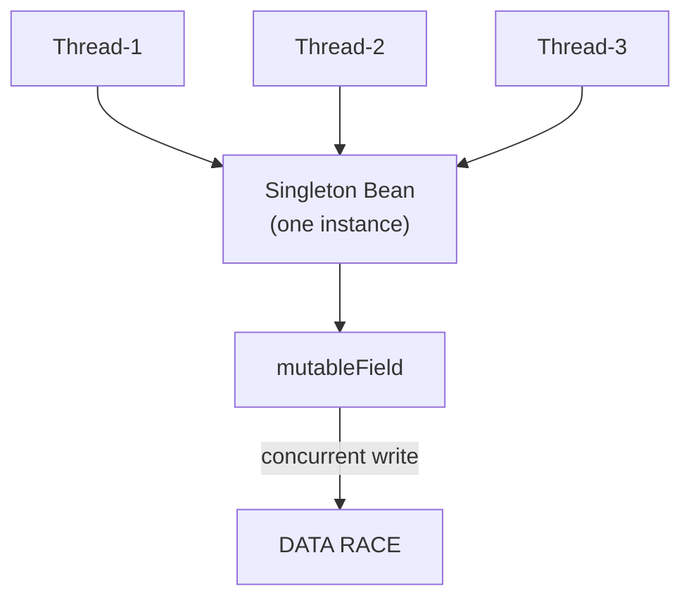
```mermaid
flowchart TD
    T1["Thread-1"] --> B["Singleton Bean\n(one instance)"]
    T2["Thread-2"] --> B
    T3["Thread-3"] --> B
    B --> F["mutableField"]
    F -->|"concurrent write"| RACE["DATA RACE"]
```

**What the container actually does:**

1. **Instantiation.** Spring creates one instance of the
   bean at context startup (eager) or first access (lazy).

2. **Registration.** The instance is stored in the singleton
   registry (`DefaultSingletonBeanRegistry`). All subsequent
   requests return this exact object reference.

3. **Injection.** Every `@Autowired` field, constructor
   parameter, or `getBean()` call receives the same pointer.
   There is no cloning, proxying for thread isolation, or
   copy-on-write.

4. **Concurrent access.** When a web server dispatches
   requests, each request runs on a separate thread from
   the thread pool. All threads call methods on the same
   bean instance simultaneously.

5. **No built-in guard.** Spring does not wrap your methods
   in `synchronized` blocks, does not use `ReentrantLock`,
   and does not apply any memory barrier beyond what the
   JVM provides for final fields in constructors.

**Stateless vs. stateful beans:**

A **stateless** bean has no mutable instance fields. All
data flows through method parameters, local variables, and
return values. Local variables live on the thread's stack
and are inherently thread-confined. This is why most
`@Service` and `@Repository` beans work correctly as
singletons - they are stateless by convention.

A **stateful** bean stores data in instance fields that
change after construction. A request counter, a cached
result, a `SimpleDateFormat` instance, a mutable collection

- any of these make the bean stateful and therefore unsafe
  under concurrent access without explicit synchronization.

### 🛠️ Worked Example

**BAD:**

```java
@Service
public class OrderService {
    // DANGER: shared mutable state
    private int orderCount = 0;
    private SimpleDateFormat sdf =
        new SimpleDateFormat("yyyy-MM-dd");

    public String placeOrder(Order order) {
        orderCount++;  // NOT atomic
        // Two threads can read the same value,
        // increment, and write back - losing a
        // count. Classic lost-update race.
        return sdf.format(new Date());
        // SimpleDateFormat is NOT thread-safe.
        // Concurrent calls corrupt internal
        // Calendar state -> wrong dates or
        // NumberFormatException.
    }
}
```

**GOOD:**

```java
@Service
public class OrderService {
    // No mutable instance fields.
    // Counter moved to AtomicLong or database.
    private final AtomicLong orderCount =
        new AtomicLong(0);

    // DateTimeFormatter is immutable and
    // thread-safe (java.time API).
    private static final DateTimeFormatter FMT =
        DateTimeFormatter.ISO_LOCAL_DATE;

    public String placeOrder(Order order) {
        orderCount.incrementAndGet(); // atomic
        return FMT.format(LocalDate.now());
        // Immutable formatter, safe to share.
    }
}
```

**Production pattern - when you truly need per-request state:**

```java
@Component
@Scope(value = WebApplicationContext
    .SCOPE_REQUEST,
    proxyMode = ScopedProxyMode.TARGET_CLASS)
public class RequestContext {
    private String traceId;
    private Instant startTime;

    // Each HTTP request gets its own instance.
    // No sharing between threads.
    public void init(String traceId) {
        this.traceId = traceId;
        this.startTime = Instant.now();
    }
    // getters...
}
```

Alternatively, use `ThreadLocal` when request scope is
not available (non-web contexts, async processing):

```java
@Service
public class AuditService {
    private static final ThreadLocal<String>
        CURRENT_USER = new ThreadLocal<>();

    public void setUser(String user) {
        CURRENT_USER.set(user);
    }
    public String getUser() {
        return CURRENT_USER.get();
    }
    public void clear() {
        CURRENT_USER.remove(); // prevent leaks
    }
}
```

### ⚖️ Trade-offs

| Gain                            | Cost                            |
| ------------------------------- | ------------------------------- |
| Singleton: one instance, low GC | All threads share mutable state |
| Stateless design: zero locking  | Requires discipline, no fields  |
| AtomicLong/ConcurrentHashMap    | Slight overhead per operation   |
| Request/prototype scope         | More object creation, more GC   |
| ThreadLocal                     | Must remove() to prevent leaks  |

**Singleton + stateless** is the dominant pattern because
Spring applications are overwhelmingly request-response:
data arrives as a method argument, is processed, and
returned. No instance state required.

**Prototype scope** creates a new instance per injection
point, not per method call. It does not solve thread
safety if the same prototype instance is used across
threads (for example, injected into a singleton).

**Request scope** genuinely isolates state per HTTP request
but only works in a web-aware application context and
requires a scoped proxy for injection into singletons.

### ⚡ Decision Snap

- Bean has no mutable fields? Singleton is safe. Done.
- Bean has mutable fields? First choice: remove them
  (pass data through method params). Second choice: use
  `AtomicLong`, `ConcurrentHashMap`, or immutable types.
  Third choice: request scope or `ThreadLocal`.
- Never use `synchronized` on a `@Controller` method -
  it serializes all requests through one thread.

### ⚠️ Top Traps

| Trap                                 | Why it bites                                                | Fix                                    |
| ------------------------------------ | ----------------------------------------------------------- | -------------------------------------- |
| `SimpleDateFormat` as instance field | Internal `Calendar` mutated on every `format()` call        | Use `DateTimeFormatter` (immutable)    |
| `HashMap` used as a cache field      | Concurrent `put()` causes infinite loop or corruption       | Use `ConcurrentHashMap`                |
| `ThreadLocal` without `remove()`     | Thread pool reuses threads, old values leak across requests | Always `remove()` in a `finally` block |

### 🪜 Learning Ladder

- **Before this:** SPR-003 (IoC and DI) for understanding
  why beans are singletons by default. SPR-044 (Bean
  Lifecycle) for initialization guarantees.
- **After this:** SPR-064 (Security OWASP Alignment) -
  thread-safety bugs in security filters are especially
  dangerous.
- **Deeper:** Java Memory Model (JLS chapter 17.4) defines
  happens-before relationships that govern when field
  writes become visible to other threads.

### 💡 The Surprising Truth

Most Spring applications are accidentally thread-safe, not
intentionally. The convention of injecting stateless services
that pass data through method arguments means there is no
shared mutable state to corrupt. The danger appears the
moment someone adds a "harmless" instance field - a counter,
a cache, a date formatter - without realizing that 200
concurrent request threads are about to share it.

### 📇 Revision Card

- **Singleton scope = one instance**, not thread-safe. Spring
  creates one object and hands the same reference to every
  thread. No synchronization is added.
- **Stateless beans are safe by design.** No mutable fields
  means no data races. This is why the
  service/repository pattern works as singleton.
- **Mutable state needs explicit protection.** Use
  `AtomicLong`, `ConcurrentHashMap`, immutable types,
  request scope, or `ThreadLocal` with mandatory
  `remove()` cleanup.

---

---

# SPR-064 Spring Security OWASP Top 10 Alignment

**TL;DR** - Spring Security maps to most OWASP Top 10 categories with built-in defenses, but you must understand which features cover which threats and where gaps remain.

### 🔥 The Problem in One Paragraph

The OWASP Top 10 is the industry-standard checklist for web application security risks, yet most Spring developers treat security as "add Spring Security and we are done." This is dangerous. Spring Security covers access control, CSRF, session management, and password hashing out of the box - but it does nothing about injection if you write raw SQL, nothing about XSS if you bypass Thymeleaf's auto-escaping, and nothing about insecure deserialization if you accept arbitrary object streams. Without a systematic mapping from each OWASP category to the specific Spring feature (or manual discipline) that addresses it, teams ship applications with blind spots they never audited.

### 📘 Textbook Definition

OWASP Top 10 alignment means systematically mapping each of the ten most critical web application security risk categories (as defined by the Open Worldwide Application Security Project) to the framework features, configurations, and coding practices that mitigate them. For Spring, this means identifying which Spring Security filters, Spring MVC defaults, Spring Data behaviors, and developer responsibilities address each category.

### 🧠 Mental Model

> Think of the OWASP Top 10 as a building inspection checklist.

- "Fire-rated doors" -> built-in defenses (CSRF tokens, security headers)
- "Smoke detector placement" -> explicit config (@PreAuthorize, CORS)
- "Items not in building code" -> gaps Spring cannot cover (A04 Insecure Design)

**Where this analogy breaks down:** a building code is static; the OWASP Top 10 changes every few years as the threat landscape shifts. Spring Security features may cover today's checklist but not tomorrow's additions.

### ⚙️ How It Works

```
OWASP Top 10            Spring Feature
--------------------------------------------
A01 Broken Access     -> @PreAuthorize,
     Control             SecurityFilterChain
A02 Crypto Failures   -> BCryptPasswordEncoder,
                         TLS config
A03 Injection         -> JPA parameterized
                         queries, validation
A04 Insecure Design   -> Threat modeling
                         (manual discipline)
A05 Security Misconf  -> Security headers,
                         CSRF token, defaults
A06 Vuln Components   -> Dependency scanning
                         (external tooling)
A07 Auth Failures     -> Session fixation
                         protection, OAuth2
A08 Software/Data     -> Jackson type checks,
     Integrity           signed JWTs
A09 Logging Failures  -> Spring Boot Actuator
                         + audit events
A10 SSRF              -> URL validation
                         (manual discipline)
```

```mermaid
flowchart LR
  subgraph OWASP["OWASP Top 10"]
    A01[A01 Broken Access]
    A02[A02 Crypto Failures]
    A03[A03 Injection]
    A05[A05 Misconfig]
    A07[A07 Auth Failures]
  end
  subgraph Spring["Spring Security"]
    PA["@PreAuthorize"]
    BC[BCryptPasswordEncoder]
    JPA[Parameterized Queries]
    CSRF[CSRF + Headers]
    SESS[Session Fixation Protection]
  end
  A01 --> PA
  A02 --> BC
  A03 --> JPA
  A05 --> CSRF
  A07 --> SESS
```

**1. A01 Broken Access Control.** Spring Security's `SecurityFilterChain` enforces URL-level access rules. Method-level security via `@PreAuthorize("hasRole('ADMIN')")` adds a second layer. The critical discipline: deny by default. Every endpoint must be explicitly permitted or denied - never rely on "nothing matched so it passes through."

**2. A02 Cryptographic Failures.** `BCryptPasswordEncoder` (or `Argon2PasswordEncoder`) handles password hashing with adaptive cost factors. For data in transit, Spring Boot's `server.ssl.*` properties configure TLS. The gap: encrypting sensitive data at rest (database columns, files) is your responsibility - Spring provides no automatic column-level encryption.

**3. A03 Injection.** Spring Data JPA's derived queries and `@Query` with named parameters produce parameterized SQL by default. The danger zone is `@Query(nativeQuery = true)` with string concatenation, or using `JdbcTemplate` with raw string formatting. Bean Validation (`@Valid`, `@Pattern`) on controller inputs adds a defense layer before data reaches the persistence tier.

**4. A05 Security Misconfiguration.** Spring Security adds secure defaults: `X-Content-Type-Options: nosniff`, `X-Frame-Options: DENY`, `Cache-Control: no-store` on authenticated responses, and CSRF tokens on state-changing requests. Disabling CSRF for a REST API that uses token-based authentication is valid - disabling it because "the form stopped working" is a misconfiguration.

**5. A07 Identification and Authentication Failures.** Spring Security protects against session fixation by migrating the session ID after login. Rate limiting login attempts requires additional work (a custom `AuthenticationFailureHandler` with a counter, or an external WAF). OAuth 2.0 / OIDC integration via `spring-boot-starter-oauth2-client` delegates credential management to identity providers.

### 🛠️ Worked Example

**BAD:**

```java
// No @PreAuthorize - any authenticated user
// can delete any account
@DeleteMapping("/admin/users/{id}")
public void deleteUser(@PathVariable Long id) {
    userService.delete(id);
}
```

**GOOD:**

```java
@PreAuthorize("hasRole('ADMIN')")
@DeleteMapping("/admin/users/{id}")
public void deleteUser(@PathVariable Long id) {
    userService.delete(id);
}
```

```java
// SecurityFilterChain - deny by default
@Bean
SecurityFilterChain filterChain(HttpSecurity http)
    throws Exception {
  return http
    .authorizeHttpRequests(auth -> auth
      .requestMatchers("/public/**").permitAll()
      .requestMatchers("/admin/**")
        .hasRole("ADMIN")
      .anyRequest().authenticated()
    )
    .build();
}
```

**Production configuration** combining multiple OWASP defenses:

```java
@Bean
SecurityFilterChain securityChain(HttpSecurity http)
    throws Exception {
  return http
    .headers(h -> h
      .contentSecurityPolicy(csp -> csp
        .policyDirectives(
          "default-src 'self'; "
          + "script-src 'self'"
        ))
      .referrerPolicy(r -> r.policy(
        ReferrerPolicyHeaderWriter
          .ReferrerPolicy.SAME_ORIGIN))
    )
    .csrf(Customizer.withDefaults())
    .sessionManagement(s -> s
      .sessionFixation().migrateSession()
      .maximumSessions(1))
    .authorizeHttpRequests(auth -> auth
      .anyRequest().authenticated())
    .build();
}
```

### ⚖️ Trade-offs

| Gain                                     | Cost                                       |
| ---------------------------------------- | ------------------------------------------ |
| Systematic threat coverage               | Requires OWASP knowledge beyond Spring     |
| Built-in defaults for A01, A02, A05, A07 | A04, A06, A10 need external tooling        |
| Method-level security granularity        | Performance cost of proxy-based checks     |
| Secure headers by default                | Custom headers may conflict with CDN/proxy |

Spring Security handles roughly six of the ten categories well out of the box. A04 (Insecure Design) is architectural - no framework prevents bad design. A06 (Vulnerable Components) requires dependency scanning tools like OWASP Dependency-Check or Snyk. A08 (Software and Data Integrity) is partially covered by signed JWTs but not by artifact verification. A10 (SSRF) requires manual URL validation. The honest assessment: Spring gives you strong building blocks for the access-control and authentication categories but leaves data integrity, supply chain, and design-level risks to your engineering discipline.

### ⚡ Decision Snap

- Use `SecurityFilterChain` with deny-by-default for every application - no exceptions.
- Use `@PreAuthorize` for business-rule authorization beyond URL patterns.
- Use `BCryptPasswordEncoder` or `Argon2PasswordEncoder` - never MD5, never SHA-256 for passwords.
- Add OWASP Dependency-Check to your CI pipeline for A06 coverage.
- Review your OWASP alignment quarterly, not just at launch.

### ⚠️ Top Traps

| Trap                                            | Why It Hurts                                                                | Fix                                                           |
| ----------------------------------------------- | --------------------------------------------------------------------------- | ------------------------------------------------------------- |
| Disabling CSRF "because Postman fails"          | Exposes state-changing endpoints to cross-site attacks                      | Use token-based auth for APIs, keep CSRF for browser sessions |
| Relying only on URL patterns for access control | Missing method-level checks lets privilege escalation through service calls | Layer `@PreAuthorize` on service methods                      |
| Using `nativeQuery` with string concatenation   | Bypasses JPA's parameterization, opens SQL injection                        | Use named parameters `:param` in native queries               |

### 🪜 Learning Ladder

- **Before this**: SPR-047 Spring Security Filter Chain Architecture, SPR-031 Spring Web fundamentals.
- **THIS:** SPR-064 Spring Security OWASP Top 10 Alignment
- **After this**: SPR-067 REST API Phase 3 - Security and OAuth for hands-on implementation.

### 💡 The Surprising Truth

Spring Security's greatest vulnerability is not what it fails to do - it is what developers disable. Session fixation protection, CSRF tokens, secure headers - all ship enabled by default. Most real-world Spring security breaches trace back to a developer writing `.csrf().disable()` or `.headers().disable()` during development and never re-enabling them. The framework already solved the problem; the human undid the solution.

### 📇 Revision Card

- Spring Security provides built-in coverage for OWASP A01 (access control), A02 (crypto), A03 (injection via JPA), A05 (headers/CSRF), and A07 (session/auth) - but A04, A06, A08, A10 require external tooling or manual discipline.
- Deny-by-default in `SecurityFilterChain` plus `@PreAuthorize` on service methods creates layered defense against broken access control.
- The most common real-world failures come from disabling defaults (CSRF, headers, session fixation) during development and shipping those overrides to production.

---

---

# SPR-065 Explain Spring DI at Every Level

**TL;DR** - Spring DI means the framework wires objects so code declares dependencies rather than building them - one idea that looks different at every experience level.

### 🔥 The Problem in One Paragraph

Dependency Injection is the single most important concept in Spring, yet it is explained poorly at almost every level. Beginners get "the container manages your beans" without understanding why that matters. Mid-level developers memorize `@Autowired` without grasping the inversion of control principle underneath. Seniors understand the mechanics but cannot articulate the architectural consequences. Principal engineers know the theory but struggle to explain it simply. The result is that DI becomes tribal knowledge - everyone "knows" it, but few can explain it clearly to someone one level below or above them. This keyword walks through five levels of explanation, each building on the last.

### 📘 Textbook Definition

Dependency Injection is a design pattern where an object receives its dependencies from an external source rather than creating them internally. In Spring, the IoC (Inversion of Control) container acts as that external source: it instantiates beans, resolves their dependencies via constructor parameters or setter methods, and manages their lifecycle. The container owns the object graph; your code owns the business logic.

### 🧠 Mental Model

> Imagine ordering food at a restaurant instead of cooking it yourself.

- "Waiter" -> Spring container (delivers dependencies)
- "Menu order" -> constructor parameter (declares what you need)
- "Kitchen" -> BeanFactory (creates and wires beans)

**Where this analogy breaks down:** in a restaurant, you choose from a fixed menu. With DI, the container can auto-discover implementations, resolve conflicts with @Qualifier, and even proxy the meal (AOP) before it reaches your table.

### ⚙️ How It Works

```
Level 1 (Child):
  "Someone else gets the parts for you"

Level 2 (Junior):
  class -> @Autowired -> Spring finds bean

Level 3 (Mid):
  Constructor injection
    -> immutable fields
    -> testable with mocks

Level 4 (Senior):
  BeanDefinition -> BeanFactory
    -> post-processors -> proxy wrapping

Level 5 (Architect):
  Module boundaries -> interface contracts
    -> runtime composition
    -> zero coupling between modules
```

```mermaid
flowchart TB
  L1["Level 1: Someone gets parts for you"]
  L2["Level 2: @Autowired finds the bean"]
  L3["Level 3: Constructor injection + testing"]
  L4["Level 4: BeanFactory + post-processors"]
  L5["Level 5: Module boundaries + composition"]
  L1 --> L2 --> L3 --> L4 --> L5
```

**Level 1 - Explain to a child.** You are building with LEGO. Instead of searching through a giant box for every piece you need, your parent hands you exactly the pieces you asked for. You say "I need a red 2x4 brick" and it appears in your hand. That is what Spring does for your code. Your class says "I need a UserRepository" and Spring hands it over. You never search for it, never build it yourself. You just use it.

**Level 2 - Explain to a junior developer.** Without DI, your `OrderService` would create its own `PaymentGateway`:

```java
// Tight coupling - OrderService decides
// which PaymentGateway to use
class OrderService {
  private PaymentGateway gw =
      new StripeGateway();
}
```

With DI, Spring creates the `PaymentGateway` and passes it in:

```java
@Service
class OrderService {
  private final PaymentGateway gw;
  OrderService(PaymentGateway gw) {
    this.gw = gw;
  }
}
```

Now `OrderService` does not know or care whether `gw` is Stripe, PayPal, or a test fake. Spring picks the right one based on what beans are registered. The `@Service` annotation tells Spring to manage this class. The constructor parameter tells Spring what to inject.

**Level 3 - Explain to a mid-level developer.** Constructor injection is preferred over field injection for three reasons. First, the dependency is `final` - the object is immutable after construction and safe to share across threads in a singleton scope. Second, the compiler enforces that every dependency is provided - you cannot accidentally create an `OrderService` without a `PaymentGateway`. Third, testing becomes trivial: pass a mock directly in the constructor without needing `@SpringBootTest` or reflection.

The container resolves dependencies by type. If two beans implement `PaymentGateway`, you disambiguate with `@Qualifier` or `@Primary`. If zero beans match, startup fails fast with a `NoSuchBeanDefinitionException` - better than a `NullPointerException` at runtime.

**Level 4 - Explain to a senior developer.** Under the hood, Spring creates a `BeanDefinition` for every managed class - a metadata object describing the class, its scope, constructor arguments, and init/destroy callbacks. The `BeanFactory` (typically `DefaultListableBeanFactory`) reads these definitions and instantiates beans in dependency order.

`BeanPostProcessor` instances modify beans after instantiation. This is how `@Transactional` works: `AbstractAutoProxyCreator` wraps your bean in a CGLIB proxy that intercepts method calls to begin/commit/rollback transactions. Your "bean" is not your class - it is a proxy around your class. This is why self-invocation bypasses `@Transactional`: the proxy never intercepts a call from `this`.

**Level 5 - Explain to a principal/architect.** At the architectural level, DI is the mechanism that enforces module boundaries in a monolith with the same rigor that network boundaries enforce in microservices. When Module A depends on an interface from Module B, and Spring wires the concrete implementation at runtime, you get compile-time decoupling with runtime composition.

This enables strategies that would be impossible with hard-wired dependencies: feature flags via conditional bean registration (`@ConditionalOnProperty`), environment-specific wiring (`@Profile`), and runtime decoration via ordered post-processors. The container becomes a composition root - the single place where the entire object graph is assembled. Everything else is pure logic with declared inputs.

### 🛠️ Worked Example

**BAD:**

```java
@Service
class ReportService {
  @Autowired
  private UserRepository users;
  @Autowired
  private PdfGenerator pdf;
  @Autowired
  private EmailSender email;
  // Which dependencies does this need?
  // Only reflection can tell.
}
```

**GOOD:**

```java
@Service
class ReportService {
  private final UserRepository users;
  private final PdfGenerator pdf;
  private final EmailSender email;

  ReportService(UserRepository users,
                PdfGenerator pdf,
                EmailSender email) {
    this.users = users;
    this.pdf = pdf;
    this.email = email;
  }
}
```

**Production - testable without Spring context:**

```java
@Test
void generateReport_sendsEmail() {
  var users = new FakeUserRepository(
      List.of(testUser()));
  var pdf = new FakePdfGenerator();
  var email = new FakeEmailSender();
  var svc = new ReportService(
      users, pdf, email);

  svc.generateMonthlyReport();

  assertThat(email.sent()).hasSize(1);
}
```

### ⚖️ Trade-offs

| Gain                                        | Cost                                                                |
| ------------------------------------------- | ------------------------------------------------------------------- |
| Loose coupling between components           | Indirection makes call chains harder to trace                       |
| Trivial unit testing with mocks/fakes       | Container startup time grows with bean count                        |
| Centralized object graph management         | Debugging "which bean was injected?" requires context knowledge     |
| Runtime composition via profiles/conditions | Over-use of interfaces creates abstraction layers that add no value |

The deepest trade-off is cognitive: DI makes the runtime behavior invisible in the source code. When you read `OrderService`, you see a `PaymentGateway` interface - not which implementation runs in production. This is a feature when you have two implementations, and a cost when you have exactly one and the interface exists "for testability" that could be achieved by simply subclassing. Use DI to manage real variability, not hypothetical variability.

### ⚡ Decision Snap

- Always use constructor injection - field injection is for legacy code only.
- If a class has more than 7 constructor parameters, it has too many responsibilities - split it.
- Use `@Qualifier` when multiple beans of the same type exist; prefer `@Primary` for the default.
- Use `@Profile` for environment-specific beans, `@ConditionalOnProperty` for feature flags.
- If you create an interface with exactly one implementation and no test fake, question whether you need the interface at all.

### ⚠️ Top Traps

| Trap                                      | Why It Hurts                                                    | Fix                                                                 |
| ----------------------------------------- | --------------------------------------------------------------- | ------------------------------------------------------------------- |
| Field injection with `@Autowired`         | Hides dependencies, prevents `final`, breaks plain-unit testing | Switch to constructor injection                                     |
| Circular dependencies between beans       | Startup fails or requires fragile `@Lazy` workarounds           | Redesign - extract shared logic into a third bean                   |
| Creating interfaces for every single bean | Adds abstraction without value, clutters codebase               | Only create interfaces when multiple implementations or fakes exist |

### 🪜 Learning Ladder

- **Before this**: SPR-001 What is Spring Framework, SPR-003 Dependency Injection, SPR-041 core concepts.
- **THIS:** SPR-065 Explain Spring DI at Every Level
- **After this**: SPR-066 Spring System Design Interview Patterns for applying DI in architecture discussions.

### 💡 The Surprising Truth

The real value of DI is not testability - mocking frameworks can inject fakes into nearly anything. The real value is that DI forces you to declare your dependencies explicitly. A constructor with eight parameters is a code smell you can see. A class with eight `new` statements buried in private methods hides the same coupling where no one reviews it. DI does not reduce coupling - it makes coupling visible. And visible coupling gets fixed.

### 📇 Revision Card

- DI means objects declare what they need and the container delivers it - the class never creates its own dependencies. Constructor injection is preferred because it enables `final` fields, compiler-enforced completeness, and plain-unit testing.
- Under the hood, Spring reads `BeanDefinition` metadata, resolves the dependency graph, instantiates beans in order, and wraps them in proxies via `BeanPostProcessor` - which is why self-invocation bypasses `@Transactional`.
- At the architectural level, DI is a composition mechanism: `@Profile`, `@ConditionalOnProperty`, and interface-based wiring let you assemble different object graphs for different environments from the same codebase without changing business logic.

---

---

# SPR-066 Spring System Design Interview Patterns

**TL;DR** - Five recurring Spring patterns - REST+DB, events, caching, security, monitoring - form the backbone of nearly every system design interview answer for Java backends.

### 🔥 The Problem in One Paragraph

You are forty minutes into a system design interview. You have drawn boxes on the whiteboard - API gateway, service layer, database - but when the interviewer asks "how would you actually build the service layer?", you freeze. You know Spring, you have used it daily for years, but you cannot articulate the five patterns that solve 80% of system design questions: a REST API backed by a connection-pooled database, event-driven processing for decoupled workflows, a caching layer that prevents database overload, an OAuth 2.0 security boundary that protects resources, and a monitoring surface that proves the system is healthy. Each pattern maps directly to Spring components you already know, yet without deliberate practice connecting architecture diagrams to implementation details, the interview answer stays vague. This keyword gives you the five patterns, the Spring components behind each, and the exact talking points interviewers expect.

### 📘 Textbook Definition

A **system design interview pattern** is a reusable architectural building block that solves a well-understood problem (data access, asynchrony, caching, security, observability) with a known set of trade-offs. In the Spring ecosystem, each pattern maps to a specific combination of starters, annotations, and configuration properties. Mastering these mappings lets you move fluidly between a high-level whiteboard diagram and a concrete implementation plan during an interview or architecture review.

### 🧠 Mental Model

> Think of these five patterns as tools in a mechanic's toolbox.

- "Wrench" -> REST+DB (reach for it on every job)
- "Torque multiplier" -> event-driven (async heavy lifting)
- "Diagnostic scanner" -> monitoring (healthy or about to fail)

**Where this analogy breaks down:** real systems combine all five simultaneously and the interactions between them (cache invalidation after events, security on async endpoints) matter more than each pattern in isolation.

### ⚙️ How It Works

```
  Client
    |
    v
+------------------+
| REST Controller  |  Pattern 1: REST + DB
| @RestController  |
+--------+---------+
         |
    +----+----+
    |         |
    v         v
 Service   @Cacheable    Pattern 3: Cache
    |       (Redis)
    v
 JPA Repo
    |
    v
 HikariCP -----> DB      Pattern 1: Pool
    |
    v
 @Async / Broker          Pattern 2: Events
    |
    v
 SecurityFilterChain      Pattern 4: OAuth
    |
    v
 Actuator + Micrometer    Pattern 5: Monitor
```

```mermaid
flowchart TB
  C[Client] --> R["REST Controller<br/>@RestController"]
  R --> S[Service Layer]
  S --> CA["@Cacheable<br/>Redis"]
  S --> JPA["JPA Repository"]
  JPA --> H["HikariCP Pool"]
  H --> DB[(Database)]
  S --> EV["@Async / Broker<br/>Event-Driven"]
  R --> SEC["SecurityFilterChain<br/>OAuth 2.0 JWT"]
  R --> MON["Actuator<br/>Micrometer"]
```

**Pattern 1 - REST API + Connection-Pooled Database.** This is the foundation. A `@RestController` exposes HTTP endpoints. A `@Service` layer holds business logic. Spring Data JPA repositories handle persistence. HikariCP manages the connection pool. The interview talking point: "I would size the HikariCP pool to roughly match the number of threads handling requests. A pool of 10 connections with a 30-second timeout handles most OLTP workloads. I tune `maximumPoolSize`, `connectionTimeout`, and `idleTimeout` in `application.yml`." Mention that under-provisioning the pool causes request queuing while over-provisioning wastes database connections that have real memory cost on the server side.

**Pattern 2 - Event-Driven with @Async and Message Brokers.** When a request triggers work that does not need to complete before the response (sending emails, generating reports, updating search indexes), you decouple it. At the simplest level, `@Async` on a void method offloads work to a thread pool. For durability and cross-service communication, a message broker (RabbitMQ, Kafka) replaces `@Async`. The talking point: "I would use `@Async` with a bounded `ThreadPoolTaskExecutor` for in-process background work, and a message broker when the consumer is a separate service or the message must survive a restart."

**Pattern 3 - Caching with Redis and @Cacheable.** The database is almost always the bottleneck. `@Cacheable` on a service method tells Spring to check a cache (typically Redis) before executing the method. `@CacheEvict` invalidates stale entries. The talking point: "I would cache read-heavy, rarely-changing data with a TTL that matches the staleness tolerance - 60 seconds for product catalogs, 5 minutes for user profiles. I would use `@CacheEvict` on writes and monitor cache hit ratio via Micrometer." Mention that caching without eviction strategy leads to stale reads, and caching without TTL leads to unbounded memory growth.

**Pattern 4 - Security with OAuth 2.0 Resource Server.** Every API needs authentication and authorization. Spring Security's `oauth2-resource-server` starter configures JWT validation with a single property pointing to the issuer URI. A `SecurityFilterChain` bean defines which endpoints require which roles. The talking point: "I would configure the service as an OAuth 2.0 resource server validating JWTs issued by our identity provider. Role-based access uses `hasAuthority()` in the filter chain. No session state - the JWT carries the claims."

**Pattern 5 - Monitoring with Actuator and Micrometer.** A system that cannot be observed cannot be operated. Spring Boot Actuator exposes `/health`, `/info`, and `/metrics` endpoints. Micrometer exports metrics (request latency, error rate, pool utilization) to Prometheus, Datadog, or other backends. The talking point: "I would expose a health endpoint for the load balancer, custom health indicators for downstream dependencies, and Micrometer counters/timers on every service method. Alerting fires on p99 latency breaches and error rate spikes."

### 🛠️ Worked Example

**BAD:**

```
"I would use Spring Boot with a database
 and some caching. Security would be handled
 by Spring Security. We would monitor it."
```

This tells the interviewer nothing. No component names, no configuration details, no trade-off awareness.

**GOOD:**

```
"The service is a Spring Boot app exposing
 a REST API via @RestController. Persistence
 uses Spring Data JPA with HikariCP sized to
 20 connections matching our Tomcat thread
 pool. Read-heavy queries use @Cacheable
 backed by Redis with a 60s TTL. Order
 confirmation emails are sent via @Async
 with a bounded executor of 5 threads.
 Authentication is JWT-based - the app is
 an OAuth 2.0 resource server validating
 tokens from our IdP. Actuator exposes
 /health for the ALB and Micrometer
 pushes p99 latency and error rates
 to Prometheus."
```

**Production configuration sketch:**

```yaml
# application.yml (key properties)
spring:
  datasource:
    hikari:
      maximum-pool-size: 20
      connection-timeout: 30000
  cache:
    type: redis
  redis:
    host: redis.internal
    port: 6379
  security:
    oauth2:
      resourceserver:
        jwt:
          issuer-uri: https://idp.example.com
management:
  endpoints:
    web:
      exposure:
        include: health,info,metrics,prometheus
  metrics:
    export:
      prometheus:
        enabled: true
```

### ⚖️ Trade-offs

| Gain                                            | Cost                                                                                                      |
| ----------------------------------------------- | --------------------------------------------------------------------------------------------------------- |
| Structured answer impresses interviewers        | Memorizing five patterns is not the same as understanding them deeply                                     |
| Maps whiteboard boxes to real Spring components | Real systems have cross-cutting concerns (cache invalidation on events) that patterns in isolation ignore |
| Covers 80% of backend system design questions   | The remaining 20% (CQRS, saga, sharding) requires deeper patterns                                         |
| Demonstrates production awareness               | Over-engineering small systems with all five patterns adds unnecessary complexity                         |

The core tension is depth versus breadth. In a 45-minute interview, you cannot deep-dive all five patterns. The strategy is to name all five briefly in your initial design, then deep-dive into whichever pattern the interviewer probes. Knowing the Spring configuration details for each pattern gives you the depth when probed.

### ⚡ Decision Snap

- Start every system design answer by sketching the REST+DB foundation - it is always present.
- Add caching only when you identify a read-heavy access pattern with tolerance for staleness.
- Add async/events when work can be deferred past the HTTP response boundary.
- Always include the security layer - forgetting it signals a blind spot.
- Always include monitoring - "how would you know this is broken?" is a guaranteed follow-up.

### ⚠️ Top Traps

| Trap                                                  | Why It Hurts                                                                                       | Fix                                                                                                                  |
| ----------------------------------------------------- | -------------------------------------------------------------------------------------------------- | -------------------------------------------------------------------------------------------------------------------- |
| Jumping straight to microservices                     | Interviewer asked for a service, not a distributed system - over-engineering signals poor judgment | Start with a well-structured monolith, mention extraction criteria                                                   |
| Forgetting to mention connection pool sizing          | Shows you have never operated a database under load                                                | State pool size, timeout, and reasoning (match thread count)                                                         |
| Describing security as "we would add Spring Security" | Too vague - interviewer wants to hear JWT, OAuth 2.0, filter chain                                 | Name the protocol (OAuth 2.0 resource server), the token format (JWT), and the authorization mechanism (role claims) |

### 🪜 Learning Ladder

- **Before this**: SPR-042 REST Controller basics, SPR-050 HikariCP tuning, SPR-048 OAuth 2.0.
- **THIS:** SPR-066 Spring System Design Interview Patterns
- **After this**: SPR-069 Spring Self-Assessment Checkpoint to verify you can articulate each pattern under time pressure.

### 💡 The Surprising Truth

The pattern that separates good answers from great answers is not caching or security - it is monitoring. Most candidates forget it entirely. When you proactively say "I would expose a `/health` endpoint for the load balancer and push p99 latency metrics to Prometheus," you signal that you have operated systems in production, not just built them. Interviewers who have been on-call notice this immediately. The five patterns are not five separate skills - they are one skill: thinking about a backend as something that must be built, secured, observed, and operated as a unit.

### 📇 Revision Card

- Five patterns cover 80% of Spring backend system design answers: REST+DB with HikariCP pool sizing, event-driven with `@Async` or message brokers, caching with Redis and `@Cacheable`, security with OAuth 2.0 JWT resource server, and monitoring with Actuator and Micrometer.
- The interview strategy is to sketch all five in your initial design, then deep-dive into whichever the interviewer probes - knowing Spring configuration details (pool size, TTL, issuer-uri, endpoint exposure) provides the depth that generic answers lack.
- The pattern most candidates forget - monitoring - is the one that most strongly signals production experience. Always include `/health` for load balancers, custom health indicators for dependencies, and Micrometer metrics exported to your observability stack.

---

---

# SPR-067 REST API Phase 3 - Security and OAuth

**TL;DR** - Add Spring Security as an OAuth 2.0 JWT resource server to your CRUD API - SecurityFilterChain, JWT validation, role-based access, and zero-IdP tests.

### 🔥 The Problem in One Paragraph

Your Phase 2 API is functional: CRUD endpoints, validation, error handling, pagination. But every endpoint is wide open. Anyone with `curl` can delete records. In production, this is a critical vulnerability. You need authentication (who is calling?) and authorization (are they allowed?). Spring Security solves both, but its filter chain architecture intimidates developers who have never configured it from scratch. The common mistake is copying a security configuration from a blog post without understanding which filter does what, ending up with an app that either blocks everything (403 on every request) or blocks nothing (the security dependency is on the classpath but no filter chain is defined, so defaults apply inconsistently). This phase walks through adding OAuth 2.0 JWT resource server security to the Phase 2 API, step by step, with tests at every stage.

### 📘 Textbook Definition

An **OAuth 2.0 Resource Server** is an application that accepts access tokens (typically JWTs) issued by an Authorization Server and uses the claims within those tokens to authenticate requests and enforce access control. In Spring Security, the `spring-boot-starter-oauth2-resource-server` auto-configures a `BearerTokenAuthenticationFilter` that extracts the JWT from the `Authorization: Bearer <token>` header, validates its signature against the issuer's public keys, and populates the `SecurityContext` with the authenticated principal and granted authorities.

### 🧠 Mental Model

> Think of your API as a building with a security guard at the entrance.

- "ID badge" -> JWT token (signed, scoped, time-limited)
- "Guard" -> SecurityFilterChain (validates badge, checks role)
- "Written policy" -> SecurityFilterChain bean configuration

**Where this analogy breaks down:** unlike a physical guard, the filter chain runs as a series of servlet filters in a fixed order, and misconfiguring one filter (such as placing a permit-all rule before a role check) silently undermines the entire policy.

### ⚙️ How It Works

```
  HTTP Request
    |
    v
+------------------------+
| SecurityFilterChain    |
|  |                     |
|  +-> CsrfFilter        |
|  +-> CorsFilter        |
|  +-> BearerTokenFilter |
|       |                |
|       v                |
|  JWT Decoder           |
|  (validate signature,  |
|   check exp, iss)      |
|       |                |
|       v                |
|  AuthorizationFilter   |
|  (check roles/scopes)  |
+----------+-------------+
           |
           v
     Controller method
```

```mermaid
flowchart TB
  REQ[HTTP Request] --> SF[SecurityFilterChain]
  SF --> CSRF[CsrfFilter - disabled for API]
  CSRF --> CORS[CorsFilter]
  CORS --> BT["BearerTokenAuthenticationFilter<br/>extracts JWT"]
  BT --> DEC["JwtDecoder<br/>validates signature + claims"]
  DEC --> AZ["AuthorizationFilter<br/>checks roles/scopes"]
  AZ --> CTL[Controller Method]
```

**Step 1 - Add the dependency.** The `spring-boot-starter-oauth2-resource-server` starter brings in the JWT decoder, bearer token filter, and Nimbus JOSE library for signature validation.

```xml
<dependency>
  <groupId>
    org.springframework.boot
  </groupId>
  <artifactId>
    spring-boot-starter-oauth2-resource-server
  </artifactId>
</dependency>
```

**Step 2 - Configure the issuer URI.** A single property tells Spring where to find the identity provider's public keys (via the `.well-known/openid-configuration` endpoint). Spring fetches the JWKS (JSON Web Key Set) at startup and uses it to validate token signatures.

```yaml
spring:
  security:
    oauth2:
      resourceserver:
        jwt:
          issuer-uri: https://idp.example.com
```

**Step 3 - Define the SecurityFilterChain bean.** This is the core of the security configuration. You disable CSRF (not needed for stateless JWT APIs), enable CORS if the API serves browser clients, configure OAuth 2.0 resource server JWT support, and define authorization rules.

```java
@Configuration
@EnableWebSecurity
public class SecurityConfig {

  @Bean
  SecurityFilterChain filterChain(
      HttpSecurity http) throws Exception {
    return http
      .csrf(c -> c.disable())
      .authorizeHttpRequests(a -> a
        .requestMatchers("/api/admin/**")
          .hasAuthority("SCOPE_admin")
        .requestMatchers(HttpMethod.GET,
          "/api/items/**")
          .permitAll()
        .requestMatchers("/api/**")
          .authenticated()
        .anyRequest().denyAll()
      )
      .oauth2ResourceServer(o ->
        o.jwt(Customizer.withDefaults())
      )
      .build();
  }
}
```

**Step 4 - Understand rule ordering.** Spring Security evaluates `requestMatchers` top to bottom and uses the first match. Place specific rules (like `/api/admin/**`) before general rules (like `/api/**`). A common mistake is placing `.anyRequest().permitAll()` first, which short-circuits every rule below it.

**Step 5 - Map JWT claims to authorities.** By default, Spring maps the `scope` claim to authorities prefixed with `SCOPE_`. If your IdP uses a custom `roles` claim, provide a custom `JwtAuthenticationConverter`:

```java
@Bean
JwtAuthenticationConverter jwtConverter() {
  var conv = new JwtGrantedAuthoritiesConverter();
  conv.setAuthoritiesClaimName("roles");
  conv.setAuthorityPrefix("ROLE_");
  var jwtConv =
      new JwtAuthenticationConverter();
  jwtConv
    .setJwtGrantedAuthoritiesConverter(conv);
  return jwtConv;
}
```

### 🛠️ Worked Example

**BAD:**

```java
@Bean
SecurityFilterChain broken(
    HttpSecurity http) throws Exception {
  // Forgot to configure oauth2ResourceServer
  // so no JWT processing happens - every
  // request gets 401 Unauthorized
  return http
    .authorizeHttpRequests(a -> a
      .anyRequest().authenticated()
    )
    .build();
}
```

Without `.oauth2ResourceServer(...)`, there is no mechanism to process the Bearer token. Every request arrives unauthenticated and gets rejected.

**GOOD:**

```java
@Bean
SecurityFilterChain api(
    HttpSecurity http) throws Exception {
  return http
    .csrf(c -> c.disable())
    .sessionManagement(s ->
      s.sessionCreationPolicy(STATELESS))
    .authorizeHttpRequests(a -> a
      .requestMatchers(HttpMethod.GET,
        "/api/items/**").permitAll()
      .requestMatchers(HttpMethod.DELETE,
        "/api/items/**")
        .hasAuthority("SCOPE_admin")
      .requestMatchers("/api/**")
        .authenticated()
      .anyRequest().denyAll()
    )
    .oauth2ResourceServer(o ->
      o.jwt(Customizer.withDefaults())
    )
    .build();
}
```

**Production - testing with mock JWT:**

```java
@WebMvcTest(ItemController.class)
@Import(SecurityConfig.class)
class ItemSecurityTest {

  @Autowired MockMvc mvc;
  @MockBean ItemService itemService;

  @Test
  void getItems_noToken_returns200()
      throws Exception {
    mvc.perform(get("/api/items"))
       .andExpect(status().isOk());
  }

  @Test
  void deleteItem_noToken_returns401()
      throws Exception {
    mvc.perform(delete("/api/items/1"))
       .andExpect(status().isUnauthorized());
  }

  @Test
  @WithMockUser
  void deleteItem_noAdminScope_returns403()
      throws Exception {
    mvc.perform(delete("/api/items/1"))
       .andExpect(status().isForbidden());
  }

  @Test
  void deleteItem_withAdminJwt_returns204()
      throws Exception {
    mvc.perform(delete("/api/items/1")
       .with(jwt().authorities(
         new SimpleGrantedAuthority(
           "SCOPE_admin"))))
       .andExpect(status()
         .isNoContent());
  }
}
```

The `jwt()` request post-processor from `spring-security-test` creates a mock JWT with the specified authorities, bypassing the need for a real identity provider in tests.

### ⚖️ Trade-offs

| Gain                                               | Cost                                                                                                                       |
| -------------------------------------------------- | -------------------------------------------------------------------------------------------------------------------------- |
| Stateless auth - no server-side sessions to manage | JWT cannot be revoked before expiry without extra infrastructure (token blocklist)                                         |
| Standard protocol - any OAuth 2.0 IdP works        | JWKS endpoint dependency at startup - if IdP is down, app cannot start                                                     |
| Fine-grained role/scope authorization              | Claim mapping between IdP and Spring often requires custom converter code                                                  |
| Testable without running IdP                       | `@WithMockUser` does not test real JWT parsing - integration tests with actual tokens are still needed for full confidence |

The fundamental trade-off of JWT-based resource servers is statelessness versus revocation. JWTs are self-contained - the server validates them without checking a database - which eliminates session storage. But this means a compromised token is valid until it expires. Short-lived tokens (5-15 minutes) with refresh tokens are the standard mitigation. For Phase 3 of a learning project, accepting this trade-off is appropriate; production systems add token introspection or blocklists when revocation is critical.

### ⚡ Decision Snap

- Always set `sessionCreationPolicy(STATELESS)` for JWT APIs - sessions waste memory and break horizontal scaling.
- Always disable CSRF for stateless APIs - CSRF protection is for cookie-based auth, not Bearer tokens.
- Place specific `requestMatchers` before general ones - first match wins.
- Use `spring-security-test` with `jwt()` post-processor for security tests - do not start a real IdP in unit tests.
- Map IdP claims to Spring authorities explicitly - do not rely on defaults if your IdP uses custom claim names.

### ⚠️ Top Traps

| Trap                                                                 | Why It Hurts                                                                                                            | Fix                                                                               |
| -------------------------------------------------------------------- | ----------------------------------------------------------------------------------------------------------------------- | --------------------------------------------------------------------------------- |
| Forgetting `.oauth2ResourceServer(o -> o.jwt(...))`                  | No filter processes the Bearer token, so every request is unauthenticated and gets 401                                  | Always chain `oauth2ResourceServer` in the filter chain definition                |
| Ordering `permitAll()` before `authenticated()` on overlapping paths | The broad permit-all rule matches first, bypassing auth for paths you intended to protect                               | Order matchers from most specific to least specific                               |
| Testing only with `@WithMockUser` and never with `jwt()`             | `@WithMockUser` bypasses JWT parsing entirely - it will not catch claim mapping bugs or missing converter configuration | Use `jwt().authorities(...)` to simulate real token-based authentication in tests |

### 🪜 Learning Ladder

- **Before this**: SPR-039 Spring Web MVC, SPR-048 OAuth 2.0 and OIDC, SPR-064 Spring Security OWASP alignment.
- **THIS:** SPR-067 Securing the REST API (Phase 3) - adding OAuth 2.0 JWT resource server security to a CRUD API with role-based access and tests.
- **After this**: SPR-068 Spring Performance Tuning Kata to optimize the secured API under load.

### 💡 The Surprising Truth

The hardest part of adding Spring Security is not the configuration - it is testing it correctly. Most teams test the happy path (authenticated user gets 200) and skip the negative paths (no token gets 401, wrong role gets 403, expired token gets 401). In production, the negative paths are what prevent breaches. The `spring-security-test` module with `jwt()`, `@WithMockUser`, and `MockMvc` makes negative-path testing trivial, yet most tutorials never show these tests. Phase 3 is not complete when the security filter works - it is complete when you have tests proving every permutation of token presence, validity, and authority grants.

### 📇 Revision Card

- Add `spring-boot-starter-oauth2-resource-server`, set `spring.security.oauth2.resourceserver.jwt.issuer-uri`, and define a `SecurityFilterChain` bean with `oauth2ResourceServer(o -> o.jwt(...))` to make your API validate JWTs on every request.
- Authorization rules in `requestMatchers` are evaluated top-to-bottom, first match wins - put specific paths (`/api/admin/**`) before general paths (`/api/**`), and always end with `.anyRequest().denyAll()` as a catch-all safety net.
- Test every security path: `MockMvc` with no token (expect 401), with `@WithMockUser` or `jwt()` without the required scope (expect 403), and with `jwt().authorities(...)` carrying the correct scope (expect success) - the `spring-security-test` module makes this zero-infrastructure.

---

---

# SPR-068 Spring Performance Tuning Kata

**TL;DR** - Take a deliberately slow Spring Boot app, apply the performance checklist step by step, measure each improvement with Actuator metrics, and build profiling discipline.

### 🔥 The Problem in One Paragraph

Reading a performance checklist is not the same as applying one. Engineers read SPR-058, nod along, then go back to production and apply optimizations in random order without measuring before or after. They turn off `open-in-view` and assume they fixed everything. They add a cache but never verify it gets hit. They shrink the connection pool without watching for connection-wait timeouts under load. The gap between knowing and doing is where performance regressions survive. This kata bridges that gap: you start with a deliberately broken Spring Boot app, apply one fix at a time, measure the delta after each fix, and build the muscle memory of the profile-measure-fix-measure cycle.

### 📘 Textbook Definition

A **performance tuning kata** is a repeatable hands-on exercise where you practice identifying, measuring, fixing, and verifying performance problems in a controlled environment. The term "kata" comes from martial arts - a choreographed pattern practiced until the movements become automatic. In software, the kata codifies the discipline of never optimizing without a measurement baseline and never declaring a fix without a measurement delta.

### 🧠 Mental Model

> Think of this kata as a cooking class with a deliberately ruined dish.

- "Fix one problem at a time" -> change one config, measure
- "Taste after each fix" -> re-run load test, check p99 latency
- "Record impact" -> before/after Actuator metrics per fix

**Where this analogy breaks down:** unlike cooking, software
performance fixes can interact. Fixing N+1 queries may
reduce connection pool pressure so much that pool tuning
becomes unnecessary. Always re-measure after each fix
because the landscape shifts.

### ⚙️ How It Works

```
  Broken App (6 problems)
       |
  [1] Measure baseline (p50, p99, QPS)
       |
  [2] Fix open-in-view --------> measure
       |
  [3] Fix N+1 queries ---------> measure
       |
  [4] Right-size pool ----------> measure
       |
  [5] Add caching --------------> measure
       |
  [6] Tune logging level -------> measure
       |
  [7] Compare baseline vs final
       |
  Report: delta per fix, total gain
```

```mermaid
flowchart TD
    A["Broken App: 6 problems"] --> B["Measure baseline"]
    B --> C["Fix open-in-view"]
    C --> D["Measure delta"]
    D --> E["Fix N+1 queries"]
    E --> F["Measure delta"]
    F --> G["Right-size connection pool"]
    G --> H["Measure delta"]
    H --> I["Add caching layer"]
    I --> J["Measure delta"]
    J --> K["Tune logging level"]
    K --> L["Measure delta"]
    L --> M["Compare baseline vs final"]
    M --> N["Report: delta per fix"]
```

**The broken app setup.** You have a Spring Boot 3.x app
with a `Product` entity that has a `@OneToMany` relationship
to `Review` entities. The `/api/products` endpoint returns
all products with their reviews. The app has these six
deliberate problems:

1. `spring.jpa.open-in-view=true` (default) - the Hibernate session stays open through the entire HTTP request, hiding lazy-loading exceptions but causing queries to fire during JSON serialization in the controller layer.
2. No `@EntityGraph` or `JOIN FETCH` - each product triggers a separate query for its reviews (N+1 pattern from SPR-057).
3. HikariCP `maximum-pool-size=50` on an app that needs 5-10 connections - wastes database connections and memory.
4. No caching - identical product lookups hit the database on every request.
5. Logging level set to `DEBUG` for `org.hibernate.SQL` and `org.springframework.web` - floods stdout with thousands of lines per request.
6. No Actuator metrics endpoint enabled - you cannot measure anything until you enable it.

**Step-by-step execution:**

**Step 1 - Enable measurement.** Add `spring-boot-starter-actuator` and expose the `/actuator/metrics` and `/actuator/prometheus` endpoints. Set `management.endpoints.web.exposure.include=health,metrics,prometheus`. Without this, you are tuning blind. Run a baseline load test: 100 requests to `GET /api/products` using a tool like `hey`, `wrk`, or `ab`. Record p50 latency, p99 latency, and throughput (requests per second).

**Step 2 - Disable open-in-view.** Set `spring.jpa.open-in-view=false` in `application.properties`. This forces all database access to happen inside `@Transactional` service methods. If your code was relying on lazy loading in the controller, it will now throw `LazyInitializationException` - which is the correct signal that your fetch strategy is wrong. Re-run the load test. Record the delta.

**Step 3 - Fix the N+1 query.** In your repository, add a `@Query` with `JOIN FETCH` or use `@EntityGraph(attributePaths = "reviews")` on the `findAll` method. This collapses N+1 queries into a single query. Re-run the load test. This fix typically produces the largest single improvement.

**Step 4 - Right-size the connection pool.** Change `spring.datasource.hikari.maximum-pool-size` from 50 to a value matching your workload. A common starting formula: `pool_size = (2 * CPU_cores) + disk_spindles`. For a 4-core dev machine with SSD, 10 is reasonable. Add `spring.datasource.hikari.connection-timeout=5000` and watch the `hikaricp.connections.active` metric. Re-run the load test.

**Step 5 - Add caching.** Add `spring-boot-starter-cache`, annotate your main configuration with `@EnableCaching`, and annotate the service method with `@Cacheable("products")`. Use the default `ConcurrentMapCache` for this kata. After the load test, check `cache.gets{cache=products,result=hit}` in Actuator metrics to verify the cache is actually being used.

**Step 6 - Tune logging.** Set `logging.level.org.hibernate.SQL=WARN` and `logging.level.org.springframework.web=INFO`. Debug logging in Hibernate generates one log line per SQL parameter binding - under load, this can be hundreds of thousands of lines per second, blocking the application thread on I/O. Re-run the load test.

### 🛠️ Worked Example

**BAD:**

```java
// "I think caching will help" - adds cache
// without baseline measurement
@Cacheable("products")
public List<Product> getAll() {
    return repo.findAll(); // still has N+1
}
// Deploys. Claims "we optimized performance."
// No before/after numbers. No proof.
```

**GOOD:**

```java
// Step 1: baseline (measured via Actuator)
// p50=320ms, p99=1200ms, QPS=45

// Step 3 fix: add JOIN FETCH
@Query("SELECT p FROM Product p "
     + "JOIN FETCH p.reviews")
List<Product> findAllWithReviews();

// Step 3 result: p50=45ms, p99=180ms, QPS=310
// Delta: 86% reduction in p50 latency
```

**Production measurement pattern:**

```properties
# application.properties - measurement infra
management.endpoints.web.exposure\
  .include=health,metrics,prometheus
management.metrics.tags.application=product-svc
spring.jpa.open-in-view=false
spring.datasource.hikari.maximum-pool-size=10
logging.level.org.hibernate.SQL=WARN
```

```java
// Record per-endpoint latency automatically
// via Micrometer's WebMvcMetricsFilter
// Query: http_server_requests_seconds{uri=
// "/api/products",quantile="0.99"}
```

### ⚖️ Trade-offs

| Gain                                 | Cost                             |
| ------------------------------------ | -------------------------------- |
| Builds measurement discipline        | Takes 30-60 min to complete      |
| Makes checklist knowledge actionable | Requires local tooling setup     |
| Reveals fix interaction effects      | Results vary by hardware         |
| Creates personal benchmark reference | Controlled env differs from prod |

**Measurement vs intuition.** Engineers with experience
often skip measurement because they "know" the fix. The
kata forces the discipline of measuring even when you think
you know the answer. This matters because in real systems,
the biggest bottleneck is often not what you expect. The
N+1 fix might give you 80% of the improvement, making
the other five fixes nearly irrelevant - but you only
know that if you measure each step.

**Controlled environment vs production.** This kata runs on
a local machine with small data sets. Real production
performance depends on network latency, concurrent users,
database size, and resource contention. The kata teaches
the methodology - the specific numbers are not transferable.

### ⚡ Decision Snap

- **When to run this kata:** after reading SPR-058 (the
  checklist) and before tuning a real application. Also
  useful when onboarding to a team that owns a Spring Boot
  service - run the kata first, then profile the real app
  using the same methodology.
- **When to skip:** if you have already profiled and tuned
  a real Spring Boot app in production and have measurement
  logs to prove it.

### ⚠️ Top Traps

| Trap                            | Why it hurts                                                | Fix                                                       |
| ------------------------------- | ----------------------------------------------------------- | --------------------------------------------------------- |
| Applying all fixes at once      | Cannot attribute improvement to any single fix              | One fix at a time, measure between each                   |
| Skipping the baseline           | No reference point - "faster" means nothing without numbers | Always record p50, p99, QPS before first change           |
| Measuring with DEBUG logging on | Logging I/O dominates latency, masking real bottlenecks     | Set logging to WARN before baseline, or fix logging first |

### 🪜 Learning Ladder

- **Before this:** SPR-058 Spring Performance Tuning Checklist (the theory), SPR-057 N+1 Query Anti-Pattern (the single biggest fix), SPR-050 HikariCP Connection Pool Tuning (pool sizing).
- **After this:** SPR-069 Spring Self-Assessment Checkpoint to validate your understanding of all L3 topics.
- **Builds on:** Actuator (SPR-052) for measurement, Micrometer (SPR-053) for metrics collection.

### 💡 The Surprising Truth

The single biggest performance improvement in most Spring Boot apps is fixing N+1 queries - not caching, not pool tuning, not logging. In this kata, the JOIN FETCH fix alone typically accounts for 70-85% of the total latency improvement. Caching helps, but only after the underlying queries are efficient - caching a slow query just delays the pain until the cache misses. The kata teaches this hierarchy of impact through direct measurement, which is far more convincing than reading it in a checklist. The second surprise: disabling `open-in-view` often causes the app to crash with `LazyInitializationException`, which feels like a regression but is actually the framework forcing you to confront a design problem you were ignoring.

### 📇 Revision Card

- Start every tuning session by enabling Actuator metrics and recording a baseline (p50, p99, QPS) before touching any code - optimizing without a baseline is guessing, not engineering.
- Apply exactly one fix at a time and re-measure after each fix - the measurement delta tells you which fixes matter and which are noise; in most Spring Boot apps, fixing N+1 queries alone delivers the majority of the improvement.
- The kata builds muscle memory for the profile-measure-fix-measure cycle so that when you face a real production performance incident, the methodology is automatic and you do not waste time on low-impact changes.

---

---

# SPR-069 Spring Self-Assessment Checkpoint

**TL;DR** - Fifteen questions covering every L3 Internals and Design topic with expected answers and keywords to revisit - identify exactly which concepts need work before L4.

### 🔥 The Problem in One Paragraph

You have read 25 keywords covering bean lifecycle, AOP, proxies, security, JPA, connection pools, migrations, Actuator, metrics, testing, build plugins, anti-patterns, performance, migration guides, and thread safety. You feel like you understand them. But feeling is not knowing. Without deliberate recall testing, you cannot distinguish "I recognize this when I see it" from "I can explain this from memory and apply it." This checkpoint forces active recall: you read a question, attempt an answer before looking at the solution, and the gap between your answer and the expected answer tells you exactly which keyword to revisit. Spaced retrieval is the most effective learning technique - this checkpoint is the retrieval event.

### 📘 Textbook Definition

A **self-assessment checkpoint** is a structured set of questions that tests recall and application of previously studied material. Unlike an exam, the goal is not scoring - it is identifying gaps. Each question targets a specific concept, and the expected answer includes enough detail to distinguish superficial recognition from genuine understanding. The checkpoint also maps each question to its source keyword, creating a direct feedback loop: wrong answer leads to targeted review, not re-reading everything.

### 🧠 Mental Model

> Think of this checkpoint as a pilot's pre-flight checklist.

- "Check each system" -> answer one question per L3 topic
- "Failed check" -> weak answer (revisit that keyword)
- "Grounded until fixed" -> do not move to L4 until gaps close

**Where this analogy breaks down:** unlike a binary pass/fail on
a physical system, conceptual understanding exists on a
spectrum. A partial answer may indicate you need a quick
refresher rather than a full re-read. Use the depth of
your gap to decide how much review is needed.

### ⚙️ How It Works

```
  For each of 15 questions:
       |
  [1] Read the question
       |
  [2] Write your answer (no peeking)
       |
  [3] Compare to expected answer
       |
  [4] If gap exists --> note keyword ID
       |
  [5] After all 15: review flagged keywords
       |
  [6] Re-attempt flagged questions
```

```mermaid
flowchart TD
    A["Read question"] --> B["Write your answer"]
    B --> C["Compare to expected answer"]
    C --> D{"Gap?"}
    D -- Yes --> E["Flag keyword for review"]
    D -- No --> F["Move to next question"]
    E --> F
    F --> G{"More questions?"}
    G -- Yes --> A
    G -- No --> H["Review flagged keywords"]
    H --> I["Re-attempt flagged questions"]
```

**The 15 questions and expected answers:**

**Q1. Name the exact order of initialization callbacks
after property population.** (SPR-044)

Expected: BPP `postProcessBefore` -> `@PostConstruct` ->
`afterPropertiesSet()` -> custom `init-method` -> BPP
`postProcessAfter`. `@PostConstruct` runs inside the
`postProcessBefore` phase via `CommonAnnotationBeanPostProcessor`.

**Q2. JDK dynamic proxy vs CGLIB proxy in Spring AOP?**
(SPR-045)

Expected: JDK proxy requires an interface; CGLIB subclasses
the target directly (works without interfaces, cannot proxy
`final`). Boot defaults to CGLIB since 2.x.

**Q3. Why does self-invocation bypass `@Transactional`?**
(SPR-046, SPR-056)

Expected: `this.method()` calls the raw target, not the
proxy. The transaction interceptor never fires. Fix: inject
self, extract to separate bean, or `AopContext.currentProxy()`.

**Q4. What happens when no `SecurityFilterChain` matches a
request?** (SPR-047)

Expected: `FilterChainProxy` finds no matching chain, so
no security filters apply. Always end with
`.anyRequest().denyAll()` or `.anyRequest().authenticated()`.

**Q5. Three pieces of config for a Spring Boot JWT resource
server?** (SPR-048, SPR-067)

Expected: (1) `spring-boot-starter-oauth2-resource-server`
dependency. (2) `jwt.issuer-uri` property. (3)
`SecurityFilterChain` with `oauth2ResourceServer(o -> o.jwt(...))`.

**Q6. N+1 query problem and how `@EntityGraph` solves it?**
(SPR-049, SPR-057)

Expected: 1 parent query + N child queries. `@EntityGraph`
tells JPA to `LEFT JOIN FETCH` in a single query. Alternative:
JPQL with explicit `JOIN FETCH`.

**Q7. Starting formula for HikariCP `maximum-pool-size`?**
(SPR-050)

Expected: `(2 * CPU_cores) + disk_spindles`. For 4-core SSD,
start with 10. Monitor `hikaricp.connections.pending` - zero
means pool is large enough.

**Q8. One advantage of Flyway over Liquibase and vice
versa?** (SPR-051)

Expected: Flyway uses plain SQL (DBA-readable). Liquibase
uses database-agnostic changelog format (multi-dialect from
one source).

**Q9. How to add a custom health indicator?** (SPR-052)

Expected: Implement `HealthIndicator`, override `health()`,
register as `@Component`. Appears in `/actuator/health`
automatically.

**Q10. Micrometer type for currently active HTTP requests?**
(SPR-053)

Expected: `Gauge` (current value, goes up/down). Not
`Counter` (only increases) or `Timer` (latency distributions).

**Q11. Why Testcontainers over H2?** (SPR-054)

Expected: H2 has dialect differences from production databases.
Testcontainers runs the actual engine in Docker, validating
real behavior. Trade-off: slower startup.

**Q12. `spring-boot:repackage` vs standard `mvn package`?**
(SPR-055)

Expected: `mvn package` creates a standard JAR. `repackage`
creates a fat JAR with all deps in `BOOT-INF/lib/` and
`JarLauncher` as main class.

**Q13. How to structure unit, slice, and integration tests?**
(SPR-059)

Expected: Unit (no Spring) for logic. Slice (`@WebMvcTest`,
`@DataJpaTest`) for one layer. `@SpringBootTest` for
end-to-end. Pyramid: many unit, fewer slice, fewest full.

**Q14. Key `javax` to `jakarta` migration change?**
(SPR-061, SPR-062)

Expected: Boot 3.x requires Jakarta EE 9+. All `javax.*`
EE packages become `jakarta.*`. Compile-breaking change.
OpenRewrite automates it. Java SE `javax.*` stays.

**Q15. Why is "Spring beans are thread-safe" wrong?**
(SPR-063)

Expected: Singleton beans are shared across threads with
no synchronization. Mutable fields cause race conditions.
Fix: stateless beans, prototype scope, `ThreadLocal`, or
explicit synchronization.

### 🛠️ Worked Example

**BAD:**

```text
Read keyword SPR-046 again.
Think "yes, I know about proxy self-invocation."
Move on. No recall tested.
Encounter the same bug in production 3 months
later because recognition != recall.
```

**GOOD:**

```text
Q3: "Why does @Transactional self-invocation
    fail?"
My answer: "Something about proxies... the
    method does not go through the proxy?"
Expected: Proxy wrapper is bypassed when
    calling this.method() directly. The
    transaction interceptor never fires.
    Fix: inject self, extract to separate
    bean, or use AopContext.currentProxy().
Gap: I forgot the three fix strategies.
Action: Re-read SPR-056 fix section only.
```

### ⚖️ Trade-offs

| Gain                               | Cost                               |
| ---------------------------------- | ---------------------------------- |
| Identifies specific knowledge gaps | Requires honest self-assessment    |
| Creates targeted review plan       | Takes 20-30 min to complete        |
| Reinforces long-term retention     | Uncomfortable when gaps appear     |
| Maps gaps to specific keywords     | Questions cover breadth, not depth |

**Active recall vs re-reading.** Testing yourself produces
stronger retention than re-reading. The discomfort of not
remembering is the signal that your brain is forming a
stronger memory trace.

**Breadth vs depth.** Fifteen questions test core concepts
you should explain without notes. For deeper understanding,
revisit the specific keyword's Worked Example.

### ⚡ Decision Snap

- **When to take this checkpoint:** after completing all
  keywords SPR-044 through SPR-068. Take it once without
  notes, flag gaps, review flagged keywords, then re-take
  the flagged questions one week later for spaced repetition.
- **When to skip:** if you are returning to a single keyword
  for reference rather than studying the full L3 tier.

### ⚠️ Top Traps

| Trap                                          | Why it hurts                                              | Fix                                                                |
| --------------------------------------------- | --------------------------------------------------------- | ------------------------------------------------------------------ |
| Looking at answers before attempting your own | Triggers recognition, not recall - you feel you "knew" it | Cover the expected answer, write yours first                       |
| Skipping questions you "obviously know"       | Obvious knowledge is the most likely to be shallow        | Answer every question - if it is truly easy, it takes 30 seconds   |
| Reviewing all keywords after any failure      | Wastes time on material you already know                  | Only revisit the specific keyword(s) flagged by your wrong answers |

### 🪜 Learning Ladder

- **Before this:** All L3 keywords SPR-044 through SPR-068, especially the performance kata (SPR-068) which applies the checklist hands-on.
- **After this:** SPR-070 and the Production and Cloud file - L4 topics that assume solid L3 foundations.
- **If gaps found:** Revisit only the flagged keywords. Use the keyword ID next to each question to navigate directly.

### 💡 The Surprising Truth

Most engineers overestimate their understanding of topics they have recently read - the "illusion of competence." The only reliable way to distinguish recognition from recall is to test yourself without notes. These questions use "explain" and "name" (free recall) rather than "choose from options" because free recall is harder and more honest. Scoring below 12/15 on the first attempt is normal - it means the checkpoint is working, and targeted review will produce durable understanding.

### 📇 Revision Card

- Take the 15-question checkpoint after completing all L3 keywords (SPR-044 through SPR-068), answering each question from memory before checking the expected answer - the gap between your answer and the expected answer identifies exactly which keywords to revisit.
- Each question maps to a specific keyword ID, so a wrong answer on Q7 means "re-read SPR-050 HikariCP Connection Pool Tuning" - not "re-read everything" - this turns a vague sense of uncertainty into a precise, targeted review plan.
- Re-take only the flagged questions one week later to trigger spaced retrieval, which research consistently shows produces stronger long-term retention than re-reading the same material multiple times.
