## Keywords

1. [SPR-080 Spring Cloud Gateway and Rate Limiting](#spr-080-spring-cloud-gateway-and-rate-limiting)
2. [SPR-081 Resilience4j Circuit Breaker with Spring](#spr-081-resilience4j-circuit-breaker-with-spring)
3. [SPR-082 Spring Batch for Large-Scale Processing](#spr-082-spring-batch-for-large-scale-processing)
4. [SPR-083 Debugging Spring Auto-Configuration Failures](#spr-083-debugging-spring-auto-configuration-failures)
5. [SPR-084 Circular Dependency Trap Anti-Pattern](#spr-084-circular-dependency-trap-anti-pattern)
6. [SPR-085 Fat ApplicationContext Anti-Pattern](#spr-085-fat-applicationcontext-anti-pattern)
7. [SPR-086 Spring Deep-Dive Interview Questions](#spr-086-spring-deep-dive-interview-questions)
8. [SPR-087 REST API Phase 4 - Observability and Resilience](#spr-087-rest-api-phase-4---observability-and-resilience)
9. [SPR-088 Production Incident Simulation with Spring](#spr-088-production-incident-simulation-with-spring)
10. [SPR-089 Spring Mastery Verification](#spr-089-spring-mastery-verification)

---

---

# SPR-080 Spring Cloud Gateway and Rate Limiting

**TL;DR** - Spring Cloud Gateway routes, filters, and rate-limits API traffic on a reactive Netty stack replacing Zuul.

### 🔥 Problem Statement

Every microservice architecture eventually needs a single entry point that handles routing, authentication, rate limiting, and cross-cutting concerns. Without a gateway, each service duplicates security checks, clients must know individual service addresses, and there is no central place to enforce throughput limits. Netflix Zuul 1 solved this on a blocking Servlet stack, but its thread-per-request model collapsed under high fan-out. Teams need a non-blocking gateway that integrates natively with Spring Cloud service discovery, supports declarative route definitions, and provides pluggable rate limiting without custom infrastructure.

### 📜 Historical Context

Netflix open-sourced Zuul 1 in 2013 as a JVM gateway built on Servlet blocking I/O. Spring Cloud Netflix wrapped it with `@EnableZuulProxy`, making it the default gateway for Spring Cloud until 2018. Zuul 2 rewrote the core on Netty with async I/O, but Netflix delayed its open-source release and Spring never officially integrated it. Spring Cloud Gateway 2.0 (2018) was built from scratch on Project Reactor and Netty, providing a first-class reactive gateway within the Spring ecosystem. The 3.x line (Spring Boot 3+) moved to Jakarta EE 9 namespaces and added support for gRPC proxying. The `RequestRateLimiter` filter shipped from 1.0 with a Redis-backed token bucket implementation, and the circuit breaker filter was added in 2.1 to integrate with Resilience4j as Hystrix entered maintenance mode.

### 🔩 First Principles

**CORE INVARIANTS:**

1. A route is a predicate-filter chain: if the predicate matches the request, the filter chain processes it - no match means no processing
2. Filters are ordered and composable: pre-filters modify requests, post-filters modify responses, and global filters apply to every route
3. Rate limiting is a token bucket contract: each client key maps to a bucket that refills at a fixed rate and holds a fixed burst capacity

**DERIVED DESIGN:**
Because routes are predicate-filter compositions, you can express complex routing logic without code - predicates match on path, header, host, method, query param, or cookie. Because filters are ordered, you can layer concerns (auth before rate limit before circuit breaker) with deterministic execution. The token bucket invariant means rate limiting is stateless per request - Redis holds the bucket state, so any gateway instance can enforce the same limits without coordination.

### 🧠 Mental Model

> Think of Spring Cloud Gateway as an airport terminal. Arriving flights (requests) hit passport control (predicates) that checks which gate (route) they belong to. Each gate has a security lane (filter chain) with ordered checkpoints: ID check, baggage scan, boarding pass validation. The rate limiter is the gate capacity sign - only N passengers per minute can board.

- "passport control" -> route predicates matching path, headers
- "security lane checkpoints" -> ordered pre/post filters
- "gate capacity sign" -> `RequestRateLimiter` with Redis bucket
- "connecting flights" -> load-balanced forwarding to services

**Where this analogy breaks down:** Unlike an airport where gates are physical, gateway routes are evaluated in priority order and the first full match wins. There is no "waiting area" - rejected requests get an immediate 429 or 503 response.

### 🧩 Components

```
+--------------------------------------------------+
|             Spring Cloud Gateway                  |
|                                                   |
|  Request                                          |
|    |                                              |
|    v                                              |
|  [Route Predicate Matching]                       |
|    |                                              |
|    v (matched route)                              |
|  [Pre-Filters: Auth, RateLimit, Rewrite]          |
|    |                                              |
|    v                                              |
|  [Netty HTTP Client -> Downstream Service]        |
|    |                                              |
|    v                                              |
|  [Post-Filters: Headers, Logging, Metrics]        |
|    |                                              |
|    v                                              |
|  Response                                         |
+--------------------------------------------------+
|  Redis (token buckets)  |  Discovery (Eureka)    |
+--------------------------------------------------+
```

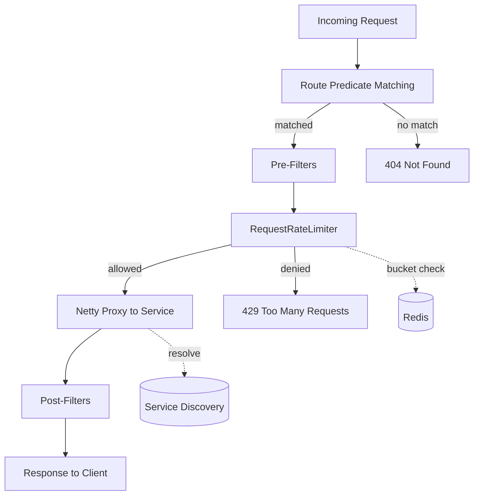
```mermaid
flowchart TD
    REQ[Incoming Request] --> PRED[Route Predicate Matching]
    PRED -->|matched| PRE[Pre-Filters]
    PRED -->|no match| R404[404 Not Found]
    PRE --> RATE[RequestRateLimiter]
    RATE -->|allowed| PROXY[Netty Proxy to Service]
    RATE -->|denied| R429[429 Too Many Requests]
    PROXY --> POST[Post-Filters]
    POST --> RESP[Response to Client]
    RATE -.->|bucket check| REDIS[(Redis)]
    PROXY -.->|resolve| DISC[(Service Discovery)]
```

### 📶 Gradual Depth

**Level 1 - Basic Route Definition:**
A route maps a path to a downstream URI. In `application.yml`:

```yaml
spring:
  cloud:
    gateway:
      routes:
        - id: order-service
          uri: lb://order-service
          predicates:
            - Path=/api/orders/**
          filters:
            - StripPrefix=1
```

`lb://` tells the gateway to use the load balancer (service discovery) to resolve `order-service`. `StripPrefix=1` removes `/api` before forwarding. The predicate matches any request starting with `/api/orders/`.

**Level 2 - Rate Limiting with Redis:**
The built-in `RequestRateLimiter` uses a Redis-backed token bucket. You need `spring-boot-starter-data-redis-reactive` on the classpath:

```yaml
filters:
  - name: RequestRateLimiter
    args:
      redis-rate-limiter.replenishRate: 10
      redis-rate-limiter.burstCapacity: 20
      redis-rate-limiter.requestedTokens: 1
      key-resolver: "#{@userKeyResolver}"
```

```java
@Bean
public KeyResolver userKeyResolver() {
    return exchange -> Mono.justOrEmpty(
        exchange.getRequest()
            .getHeaders()
            .getFirst("X-User-Id")
    ).defaultIfEmpty("anonymous");
}
```

`replenishRate` is tokens per second. `burstCapacity` is max bucket size. The key resolver determines the bucket key per request - typically user ID, API key, or IP address.

**Level 3 - Circuit Breaker Filter:**
Gateway integrates with Resilience4j via the `CircuitBreaker` filter:

```yaml
filters:
  - name: CircuitBreaker
    args:
      name: orderCircuitBreaker
      fallbackUri: forward:/fallback/orders
```

When the downstream service fails beyond the configured threshold, the circuit opens and requests route to the fallback URI instead of timing out. This prevents cascade failures and gives clients a degraded but functional response.

**Level 4 - Custom Global Filter:**

```java
@Component
public class RequestTimingFilter
    implements GlobalFilter, Ordered {

    @Override
    public Mono<Void> filter(
        ServerWebExchange exchange,
        GatewayFilterChain chain) {
        long start = System.nanoTime();
        return chain.filter(exchange).then(
            Mono.fromRunnable(() -> {
                long ms = (System.nanoTime() - start)
                    / 1_000_000;
                exchange.getResponse().getHeaders()
                    .add("X-Response-Time",
                        ms + "ms");
            })
        );
    }

    @Override
    public int getOrder() {
        return -1; // run before other filters
    }
}
```

### ⚙️ How It Works

```
Request arrives at Netty (port 8080)
  |
  v
HandlerMapping: iterate routes by priority
  |
  v
Route matched? -- No --> 404
  |
  Yes
  v
Build GatewayFilterChain (route + global)
  |
  v
Execute pre-filters in order:
  [Auth] -> [RateLimit] -> [Rewrite]
  |
  v
RateLimit: EVAL redis_script.lua
  bucket = key(user-id)
  tokens = GET bucket.tokens
  if tokens >= requested:
    DECR bucket.tokens
    allow
  else:
    return 429
  |
  v (allowed)
NettyRoutingFilter: async HTTP to downstream
  |
  v
Response flows back through post-filters
  [AddHeader] -> [Logging]
  |
  v
Response sent to client
```

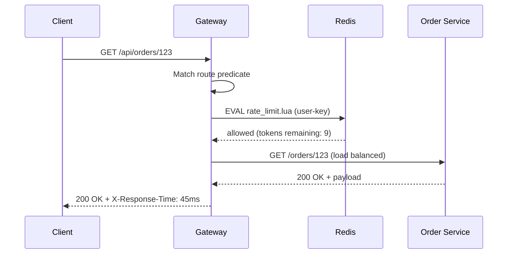
```mermaid
sequenceDiagram
    participant C as Client
    participant G as Gateway
    participant R as Redis
    participant S as Order Service

    C->>G: GET /api/orders/123
    G->>G: Match route predicate
    G->>R: EVAL rate_limit.lua (user-key)
    R-->>G: allowed (tokens remaining: 9)
    G->>S: GET /orders/123 (load balanced)
    S-->>G: 200 OK + payload
    G-->>C: 200 OK + X-Response-Time: 45ms
```

### 🚨 Failure Modes

**Failure 1 - Redis Unavailable:**
When Redis is down, the rate limiter cannot check or decrement tokens. The default behavior is to deny all requests (fail-closed), returning 429 to every client.

**Diagnostic:** Check gateway logs for `RedisConnectionException`. Monitor Redis connectivity with `spring.redis.health` actuator endpoint. Sudden spike in 429 responses across all users indicates Redis failure, not actual overload.

**Fix:** Configure `spring.cloud.gateway.redis-rate-limiter.deny-empty-key=false` and implement a custom `RateLimiter` that falls back to in-memory limiting when Redis is unreachable. For critical paths, consider a local Caffeine cache as secondary limiter.

**Failure 2 - Route Ordering Conflicts:**
Two routes with overlapping predicates where the wrong one matches first. Example: `/api/users/{id}` matches before `/api/users/admin` because it was defined first.

**Diagnostic:** Enable `logging.level.org.springframework.cloud.gateway=TRACE` to see which route matched. Check route evaluation order in actuator endpoint `GET /actuator/gateway/routes`.

**Fix:** Use the `order` property on route definitions. Lower values match first. Place more specific routes (exact paths) before wildcard routes. Use multiple predicates (path + header) to disambiguate.

**Failure 3 - Memory Leak from Large Request Bodies:**
Gateway buffers request bodies in memory by default. Large file uploads through the gateway exhaust Netty direct memory, causing `OutOfDirectMemoryError`.

**Diagnostic:** Monitor `netty_allocator_memory_used` metric. Check for `io.netty.util.internal.OutOfDirectMemoryError` in logs.

**Fix:** Set `spring.codec.max-in-memory-size=256KB` for bounded buffering. For file upload routes, use streaming: configure `spring.cloud.gateway.proxy.streaming-media-types` and route uploads to a service that handles multipart directly.

### 🔬 Production Reality

At scale, the gateway becomes the most critical single point in your architecture. Production lessons:

**Connection pooling matters enormously.** Default Netty connection pool settings work for moderate traffic, but at 10K+ RPS you need explicit tuning: `spring.cloud.gateway.httpclient.pool.max-connections=1000` and `spring.cloud.gateway.httpclient.pool.acquire-timeout=1000`. Monitor `gateway.httpclient.pool.active` and `gateway.httpclient.pool.idle` metrics.

**Redis rate limiter uses Lua scripts atomically.** Each rate limit check is a single `EVAL` call, so there is no race condition between read and decrement. However, Redis single-threaded execution means your rate limit throughput is bounded by Redis throughput - typically 100K-200K ops/sec on a single node. At higher rates, use Redis Cluster with key-based sharding.

**Health checks must be separate from traffic routes.** Configure a dedicated health route that bypasses rate limiting and circuit breakers: predicates on `Path=/health` with no filters. Load balancers must hit this endpoint, not a rate-limited path.

**Gateway metrics are your first alert.** Instrument with Micrometer: `spring.cloud.gateway.metrics.enabled=true` gives you per-route latency, status code distribution, and rate limit rejection counts. Alert on p99 latency spikes at the gateway - they indicate downstream degradation before service-level alerts fire.

### ⚖️ Trade-offs & Alternatives

**BAD:**

```java
// Building rate limiting in each microservice
@RestController
public class OrderController {
    private final RateLimiter limiter =
        RateLimiter.create(10.0); // Guava
    @GetMapping("/orders/{id}")
    public Order getOrder(@PathVariable long id) {
        if (!limiter.tryAcquire()) {
            throw new TooManyRequestsException();
        }
        return orderService.find(id);
    }
}
// Problem: each service has different limits,
// no global view, no central control
```

**GOOD:**

```yaml
# Centralized rate limiting at gateway
spring:
  cloud:
    gateway:
      routes:
        - id: order-service
          uri: lb://order-service
          predicates:
            - Path=/api/orders/**
          filters:
            - name: RequestRateLimiter
              args:
                redis-rate-limiter.replenishRate: 50
                redis-rate-limiter.burstCapacity: 100
                key-resolver: "#{@apiKeyResolver}"
# Single config, global enforcement, observable
```

| Aspect            | Spring Cloud Gateway  | Kong / NGINX        | AWS API Gateway        |
| ----------------- | --------------------- | ------------------- | ---------------------- |
| Stack             | Reactive (Netty)      | Native C / Lua      | Managed service        |
| Rate limiting     | Redis token bucket    | Plugin-based        | Built-in per-stage     |
| Circuit breaker   | Resilience4j filter   | Lua plugin          | No native support      |
| Service discovery | Eureka, Consul native | DNS or plugin       | CloudMap integration   |
| Customization     | Java filters          | Lua / Go plugins    | Lambda authorizers     |
| Operational cost  | Self-managed JVM      | Self-managed binary | Zero ops, pay-per-call |

### ⚡ Decision Snap

Use Spring Cloud Gateway when: you are already in the Spring Cloud ecosystem, need tight integration with Eureka/Consul discovery, want Java-native custom filters, and your team can operate a JVM gateway. Choose Kong or NGINX when: you need language-agnostic gateway with plugin ecosystem and want battle-tested native performance. Choose AWS API Gateway when: you want zero operational overhead and your services are already on AWS with moderate traffic volumes.

### ⚠️ Top Traps

| #   | Trap                                  | Why it bites                                                                              | Escape                                                              |
| --- | ------------------------------------- | ----------------------------------------------------------------------------------------- | ------------------------------------------------------------------- |
| 1   | Blocking calls in filters             | Netty event loop freezes, latency spikes for all routes                                   | Use `Mono.fromCallable().subscribeOn(Schedulers.boundedElastic())`  |
| 2   | Missing key resolver                  | Default resolver uses remote address - shared NAT means one bucket for thousands of users | Always define explicit `KeyResolver` using user ID or API key       |
| 3   | No fallback on circuit open           | Open circuit returns raw 503 with no body, confusing clients                              | Always set `fallbackUri` to a controller returning structured error |
| 4   | Rate limit without Redis cluster      | Single Redis node is SPOF and throughput ceiling                                          | Use Redis Sentinel or Cluster for HA and sharding                   |
| 5   | Testing routes with `@SpringBootTest` | Full gateway context is slow and flaky                                                    | Use `WebTestClient` with route builder directly                     |

### 🪜 Learning Ladder

**Prerequisites:**

- SPR-078 Spring Cloud Service Discovery (Eureka and Consul) - gateway routes to discovered service instances
- SPR-079 Spring Cloud Config Server - gateway route config managed centrally

**THIS:** SPR-080 Spring Cloud Gateway and Rate Limiting - reactive API gateway with declarative routing, filtering, and token-bucket rate limiting

**Next steps:**

- SPR-081 Resilience4j Circuit Breaker with Spring - circuit breaker filters inside gateway routes
- SPR-087 REST API Phase 4 - Observability and Resilience - applying gateway patterns to a complete API

**The Surprising Truth:** The biggest production issue with Spring Cloud Gateway is not performance - Netty handles 50K+ RPS easily. It is operational: teams forget that the gateway is a JVM application that needs its own memory tuning, GC configuration, and health monitoring. The gateway that protects your services needs protection itself.

**Further Reading:**

1. Spring Cloud Gateway official documentation
2. Token bucket algorithm (RFC 2697)
3. Stripe engineering blog on rate limiter patterns

**Revision Card:**

1. The default `RequestRateLimiter` filter uses Redis with Lua scripts for atomic token bucket operations.
2. When a gateway route has a `CircuitBreaker` filter and the circuit opens, requests route to the configured `fallbackUri` instead of the downstream service.
3. Routes evaluate in definition order (or explicit `order` value); first full predicate match wins.

---

---

# SPR-081 Resilience4j Circuit Breaker with Spring

**TL;DR** - Resilience4j wraps remote calls in a state machine that opens on failure bursts and recovers automatically.

### 🔥 Problem Statement

Distributed systems fail partially. When a downstream service degrades - slow responses, connection timeouts, 500 errors - callers keep sending requests, exhausting their own thread pools and propagating the failure upstream. This cascade turns a single service outage into a system-wide collapse. Teams need a mechanism that detects when a dependency is unhealthy, stops sending doomed requests, and periodically probes for recovery - without manual intervention and without blocking caller threads during the detection window.

### 📜 Historical Context

Netflix created the circuit breaker library Hystrix in 2011, shipping it as the standard resilience layer in the Netflix OSS stack. Spring Cloud Netflix wrapped Hystrix with `@HystrixCommand`, making it the default choice for Spring Cloud applications from 2015 to 2018. Netflix announced Hystrix maintenance mode in November 2018, recommending Resilience4j as the successor. Resilience4j 1.0 (2019) was designed from scratch as a lightweight, modular library with no external dependencies beyond Vavr. It embraced Java 8 functional composition rather than Hystrix's thread-isolation-heavy approach. Spring Cloud Circuit Breaker abstraction (2019) provided a vendor-neutral API, with Resilience4j as the primary implementation. Spring Boot auto-configuration for Resilience4j (via `resilience4j-spring-boot3` starter) added annotation-driven circuit breakers, removing the need for manual factory wiring.

### 🔩 First Principles

**CORE INVARIANTS:**

1. The circuit breaker is a finite state machine with exactly three states: CLOSED (allowing calls), OPEN (rejecting calls), and HALF_OPEN (probing with limited calls)
2. State transitions are driven by failure rate or slow call rate measured over a sliding window - not individual failures
3. The OPEN state has a fixed wait duration before transitioning to HALF_OPEN - this is the backoff period that gives the downstream service time to recover

**DERIVED DESIGN:**
Because transitions depend on aggregate metrics over a window (not single failures), transient errors do not trigger the circuit. Because HALF_OPEN limits concurrent probe calls, recovery detection does not flood a struggling service. Because the state machine is per-instance and per-name, each remote dependency gets independent protection. The functional design means circuit breakers compose with retries, bulkheads, and rate limiters through decorator chaining.

### 🧠 Mental Model

> Think of a circuit breaker as an electrical breaker in your home panel. Under normal load (CLOSED), current flows freely. When the circuit detects overload - too many failures in the measurement window - it trips (OPEN), cutting all current to protect the wiring. After a cooldown period, someone flips the breaker halfway (HALF_OPEN) and tests with a single appliance. If it holds, the breaker resets to CLOSED. If it trips again, back to OPEN.

- "current flowing" -> requests passing to downstream service
- "overload detection" -> failure rate exceeding threshold in sliding window
- "cooldown period" -> `waitDurationInOpenState` configuration
- "testing with one appliance" -> limited permitted calls in HALF_OPEN

**Where this analogy breaks down:** Electrical breakers trip on a single overload event, while Resilience4j circuit breakers aggregate failures over a configurable window. Also, electrical breakers require manual reset, while software circuit breakers auto-transition to HALF_OPEN after the wait duration.

### 🧩 Components

```
+--------------------------------------------------+
|          Resilience4j Circuit Breaker             |
|                                                   |
|  [Sliding Window]                                 |
|    - COUNT_BASED: last N calls                    |
|    - TIME_BASED: last N seconds                   |
|                                                   |
|  States:                                          |
|    CLOSED ---(failure rate >= threshold)--->       |
|    OPEN   ---(wait duration expires)------->      |
|    HALF_OPEN -(probe succeeds)---> CLOSED         |
|              -(probe fails)-----> OPEN            |
|                                                   |
|  Decorators: retry, bulkhead, ratelimiter,        |
|    timelimiter compose around the breaker         |
+--------------------------------------------------+
|  Metrics Registry (Micrometer)                    |
+--------------------------------------------------+
```

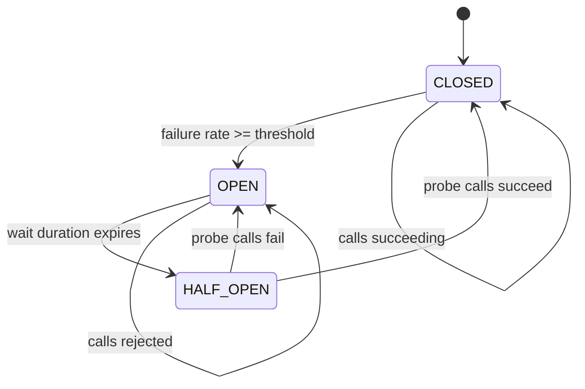
```mermaid
stateDiagram-v2
    [*] --> CLOSED
    CLOSED --> OPEN : failure rate >= threshold
    OPEN --> HALF_OPEN : wait duration expires
    HALF_OPEN --> CLOSED : probe calls succeed
    HALF_OPEN --> OPEN : probe calls fail
    CLOSED --> CLOSED : calls succeeding
    OPEN --> OPEN : calls rejected
```

### 📶 Gradual Depth

**Level 1 - Annotation-Driven Circuit Breaker:**
Add `resilience4j-spring-boot3` dependency and annotate:

```java
@Service
public class OrderClient {

    @CircuitBreaker(
        name = "orderService",
        fallbackMethod = "fallbackGetOrder"
    )
    public Order getOrder(Long id) {
        return restClient.get()
            .uri("/orders/{id}", id)
            .retrieve()
            .body(Order.class);
    }

    private Order fallbackGetOrder(
        Long id, Throwable t) {
        return Order.cached(id);
    }
}
```

The fallback method must have the same return type plus a `Throwable` parameter. It executes when the circuit is OPEN or the call fails.

**Level 2 - Configuration Properties:**

```yaml
resilience4j:
  circuitbreaker:
    instances:
      orderService:
        sliding-window-type: COUNT_BASED
        sliding-window-size: 100
        failure-rate-threshold: 50
        wait-duration-in-open-state: 30s
        permitted-number-of-calls-in-half-open-state: 10
        minimum-number-of-calls: 20
        record-exceptions:
          - java.io.IOException
          - java.util.concurrent.TimeoutException
        ignore-exceptions:
          - com.app.BusinessValidationException
```

`sliding-window-size: 100` means the last 100 calls are measured. `failure-rate-threshold: 50` means the circuit opens when 50% or more of those 100 calls fail. `minimum-number-of-calls: 20` prevents the circuit from tripping on the first few failures during startup.

**Level 3 - Composing with Retry and Bulkhead:**

```java
@CircuitBreaker(name = "paymentService",
    fallbackMethod = "paymentFallback")
@Retry(name = "paymentService")
@Bulkhead(name = "paymentService")
public Payment processPayment(PaymentRequest req) {
    return paymentClient.charge(req);
}
```

Decoration order matters. Default: `Bulkhead -> TimeLimiter -> RateLimiter -> CircuitBreaker -> Retry`. The retry wraps the circuit breaker, so each retry attempt is recorded by the circuit. This means retried failures count toward the failure rate. Configure retry carefully to avoid inflating the failure count.

**Level 4 - Programmatic Composition:**

```java
CircuitBreaker cb = CircuitBreaker.of(
    "inventory",
    CircuitBreakerConfig.custom()
        .failureRateThreshold(60)
        .slowCallRateThreshold(80)
        .slowCallDurationThreshold(
            Duration.ofSeconds(2))
        .slidingWindowSize(50)
        .build()
);

Retry retry = Retry.of("inventory",
    RetryConfig.custom()
        .maxAttempts(3)
        .waitDuration(Duration.ofMillis(500))
        .build()
);

Supplier<Inventory> decorated =
    Decorators.ofSupplier(() ->
            inventoryClient.check(sku))
        .withCircuitBreaker(cb)
        .withRetry(retry)
        .withFallback(List.of(
            CallNotPermittedException.class),
            e -> Inventory.unknown(sku))
        .decorate();
```

### ⚙️ How It Works

```
Call enters circuit breaker decorator
  |
  v
Check state:
  OPEN? --> throw CallNotPermittedException
           --> fallback method executes
  |
  CLOSED or HALF_OPEN:
  v
Execute actual call
  |
  v
Record outcome in sliding window:
  - success: record success
  - exception in record-exceptions: record failure
  - exception in ignore-exceptions: not recorded
  - slow call (> threshold): record slow
  |
  v
Evaluate aggregate metrics:
  failure rate = failures / window size
  slow call rate = slow calls / window size
  |
  v
  failure rate >= threshold?
    YES --> transition to OPEN
            start wait duration timer
    NO  --> remain CLOSED
  |
  v (in HALF_OPEN after wait expires)
  permitted calls exhausted?
    YES --> evaluate: success rate OK?
            YES --> transition to CLOSED
            NO  --> transition to OPEN
```

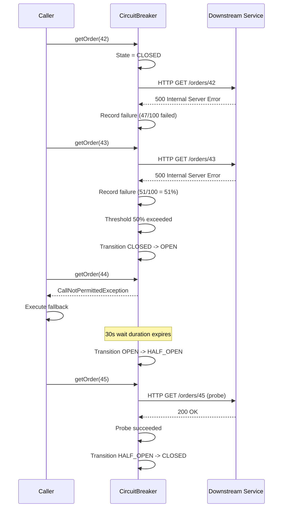
```mermaid
sequenceDiagram
    participant C as Caller
    participant CB as CircuitBreaker
    participant S as Downstream Service

    C->>CB: getOrder(42)
    CB->>CB: State = CLOSED
    CB->>S: HTTP GET /orders/42
    S-->>CB: 500 Internal Server Error
    CB->>CB: Record failure (47/100 failed)

    C->>CB: getOrder(43)
    CB->>S: HTTP GET /orders/43
    S-->>CB: 500 Internal Server Error
    CB->>CB: Record failure (51/100 = 51%)
    CB->>CB: Threshold 50% exceeded
    CB->>CB: Transition CLOSED -> OPEN

    C->>CB: getOrder(44)
    CB-->>C: CallNotPermittedException
    C->>C: Execute fallback

    Note over CB: 30s wait duration expires
    CB->>CB: Transition OPEN -> HALF_OPEN

    C->>CB: getOrder(45)
    CB->>S: HTTP GET /orders/45 (probe)
    S-->>CB: 200 OK
    CB->>CB: Probe succeeded
    CB->>CB: Transition HALF_OPEN -> CLOSED
```

### 🚨 Failure Modes

**Failure 1 - Circuit Never Opens (Threshold Too High):**
Setting `failure-rate-threshold: 95` means the circuit only opens when 95% of calls fail. By the time 95% of calls fail, the caller's thread pool is already exhausted from waiting on timeouts. The circuit breaker is effectively useless.

**Diagnostic:** Check `resilience4j.circuitbreaker.calls` metric grouped by outcome. If you see a high failure count but the state remains CLOSED, the threshold is too lenient. Compare failure rate against configured threshold in `/actuator/circuitbreakers`.

**Fix:** Set `failure-rate-threshold` between 50-70 for most services. Also configure `slow-call-rate-threshold` (typically 80-90) with `slow-call-duration-threshold` (typically 2-5 seconds) to catch degradation before failures spike.

**Failure 2 - Circuit Oscillates (CLOSED-OPEN-HALF_OPEN Loop):**
The downstream service is partially healthy - enough to pass HALF_OPEN probes but not enough to sustain full traffic. The circuit closes, traffic floods back, failures spike, and the circuit opens again. This oscillation causes inconsistent behavior and makes monitoring noisy.

**Diagnostic:** Plot circuit breaker state transitions over time in Grafana. If you see rapid CLOSED-OPEN cycles (every 30-60 seconds), the service cannot handle full load after recovery.

**Fix:** Increase `permitted-number-of-calls-in-half-open-state` to probe with more traffic before closing. Combine with a bulkhead that limits concurrent calls even in CLOSED state. Consider using `slow-call-rate-threshold` to detect partial degradation before full failure.

**Failure 3 - Fallback Hides Permanent Failures:**
The fallback returns cached or default data. The downstream service is permanently broken, but the circuit breaker masks it - the system appears functional while serving stale data indefinitely.

**Diagnostic:** Alert on the circuit OPEN state duration. If a circuit remains OPEN for more than 5 minutes, it is likely a permanent failure, not a transient blip. Monitor `resilience4j.circuitbreaker.state` metric.

**Fix:** Set up alerts on sustained OPEN state. Log at WARN in fallback methods with correlation IDs. Implement fallback staleness checks - if cached data is older than a threshold, return a degraded response that informs the client, not silently stale data.

### 🔬 Production Reality

In production, circuit breaker tuning is iterative, not prescriptive. Real-world lessons:

**Sliding window type matters at scale.** COUNT_BASED windows (last N calls) react faster under high traffic but can thrash during low traffic when a few failures skew the percentage. TIME_BASED windows (last N seconds) provide smoother measurement but react slower. For high-RPS services (1000+ RPS), use COUNT_BASED with a large window (100-200). For low-RPS services (< 10 RPS), use TIME_BASED with 60-second windows.

**The `minimumNumberOfCalls` setting prevents startup storms.** Without it, a circuit breaker with `slidingWindowSize: 100` and `failureRateThreshold: 50` would trip after 1 failure out of 2 calls during startup. Set `minimumNumberOfCalls` to at least 20-50 to require statistical significance before tripping.

**Retry inside circuit breaker inflates failure counts.** With 3 retries and a failing call, the circuit records 3 failures, not 1. If your window size is 100, three users hitting the same broken endpoint contribute 9 failures. Account for retry multiplication when setting thresholds, or place retry outside the circuit breaker if you want each logical call to count once.

**Monitor four key metrics per circuit:** state (closed/open/half_open), failure rate, slow call rate, and not-permitted call count. The not-permitted count tells you how many requests the circuit breaker saved from hitting a broken service - this is your ROI metric for circuit breaker adoption.

### ⚖️ Trade-offs & Alternatives

**BAD:**

```java
// Manual retry with no circuit breaking
public Order getOrder(Long id) {
    for (int i = 0; i < 3; i++) {
        try {
            return restClient.get()
                .uri("/orders/{id}", id)
                .retrieve()
                .body(Order.class);
        } catch (Exception e) {
            if (i == 2) throw e;
            Thread.sleep(1000);
        }
    }
    throw new RuntimeException("unreachable");
}
// Problem: retries pound a failing service,
// no backoff, no failure memory, no metrics
```

**GOOD:**

```java
@CircuitBreaker(name = "orderService",
    fallbackMethod = "cachedOrder")
@Retry(name = "orderService")
public Order getOrder(Long id) {
    return restClient.get()
        .uri("/orders/{id}", id)
        .retrieve()
        .body(Order.class);
}
// Circuit stops retries when service is down,
// fallback serves cached data, metrics exported
```

| Aspect      | Resilience4j           | Hystrix (legacy)       | Sentinel (Alibaba)   |
| ----------- | ---------------------- | ---------------------- | -------------------- |
| Status      | Active, 2.x            | Maintenance since 2018 | Active, cloud-native |
| Isolation   | Semaphore (default)    | Thread pool (default)  | Semaphore + thread   |
| Composition | Functional decorators  | Annotation + command   | Rule-based dashboard |
| Overhead    | ~0.1ms per call        | ~1ms (thread hop)      | ~0.1ms per call      |
| Config      | Properties or code     | Properties or Archaius | Dashboard or code    |
| Reactive    | Native Reactor support | RxJava 1.x only        | Limited              |
| Ecosystem   | Spring Boot starter    | Spring Cloud Netflix   | Spring Cloud Alibaba |

### ⚡ Decision Snap

Use Resilience4j when: you need composable resilience patterns (circuit breaker + retry + bulkhead + rate limiter) in a Spring Boot application with minimal overhead. Use Sentinel when: you need a dashboard-driven approach with flow control and system adaptive protection, especially in Alibaba Cloud environments. Avoid circuit breakers when: the downstream is a local cache or in-process call with no network boundary - the overhead of state tracking adds no value.

### ⚠️ Top Traps

| #   | Trap                         | Why it bites                                                              | Escape                                                    |
| --- | ---------------------------- | ------------------------------------------------------------------------- | --------------------------------------------------------- |
| 1   | Fallback signature mismatch  | Method not found at runtime, no compile-time check                        | Fallback must have same params + `Throwable` last         |
| 2   | Recording all exceptions     | Business validation errors (400s) count as failures and trip the circuit  | Use `ignore-exceptions` for non-transient errors          |
| 3   | Tiny sliding window          | Window of 10 calls trips on 5 failures - too sensitive for bursty traffic | Use 50-200 for COUNT_BASED, 30-60s for TIME_BASED         |
| 4   | No `minimumNumberOfCalls`    | Circuit trips on first few failures during cold start                     | Set to 20+ to require statistical significance            |
| 5   | Retry inside circuit breaker | 3 retries \* N failing calls fills window 3x faster than expected         | Account for multiplier in threshold or reorder decorators |

### 🪜 Learning Ladder

**Prerequisites:**

- SPR-080 Spring Cloud Gateway and Rate Limiting - circuit breaker filters used inside gateway routes
- SPR-052 Spring REST Basics - understanding remote service calls that need resilience wrapping

**THIS:** SPR-081 Resilience4j Circuit Breaker with Spring - state-machine wrapping remote calls to detect failure bursts and auto-recover

**Next steps:**

- SPR-082 Spring Batch for Large-Scale Processing - resilience patterns applied to batch job steps
- SPR-087 REST API Phase 4 - Observability and Resilience - circuit breaker integrated into production API

**The Surprising Truth:** Circuit breakers do not prevent failures - they prevent cascading failures. Your service will still experience errors; the circuit breaker's job is to ensure those errors do not propagate into thread pool exhaustion, memory pressure, and cascading timeouts across the entire call graph. The most important metric is not "how often the circuit opens" but "how many requests were saved from hitting a dead service."

**Further Reading:**

1. Resilience4j official documentation (resilience4j.readme.io)
2. Michael Nygard, "Release It!" (circuit breaker pattern origin)
3. Martin Fowler's CircuitBreaker article

**Revision Card:**

1. `minimumNumberOfCalls` prevents the circuit from tripping during startup by requiring a minimum sample size before evaluating failure rate.
2. Default decoration order when using annotations: Bulkhead, TimeLimiter, RateLimiter, CircuitBreaker, Retry (outermost to innermost).
3. Resilience4j throws `CallNotPermittedException` when the circuit is OPEN.

---

---

# SPR-082 Spring Batch for Large-Scale Processing

**Prerequisites:** SPR-032 (Spring Data JDBC and JPA), SPR-051 (Transaction Management). **Next:** SPR-088 (Production Incident Simulation).

**TL;DR** - Spring Batch reads, processes, and writes data in restartable, chunk-oriented steps with built-in fault tolerance and parallel partitioning.

### 🔥 Problem Statement

Processing millions of records - nightly billing runs, ETL feeds, regulatory reports - cannot happen inside a web request or a simple loop. Naive approaches load entire datasets into memory, offer no restart capability after failure, provide no progress tracking, and force teams to hand-roll retry logic. The core pain: large-scale data processing demands transactional chunking, checkpoint persistence, fault tolerance, and parallelism - all concerns that are orthogonal to your actual business logic. Without a framework, every batch job reinvents the same infrastructure plumbing.

### 📜 Historical Context

Batch processing frameworks existed in mainframe COBOL shops for decades before Java adopted the pattern. JSR 352 (Batch Applications for the Java Platform) standardized the Job/Step/Chunk model in Java EE 7, but its reference implementation saw limited adoption. Spring Batch predated JSR 352, launching in 2007 as a collaboration between SpringSource and Accenture. It influenced the JSR but kept its own richer API. Spring Batch 3.0 aligned with Spring 4 and added JSR 352 compatibility. Spring Batch 4.0 moved to Spring 5 with Builder-pattern APIs. Spring Batch 5.0 (2023, with Spring Boot 3) dropped the XML configuration path, migrated to Jakarta namespace, required a `@EnableBatchProcessing` opt-in model change, and made `JobRepository` default to JDBC rather than Map-based. The framework remains the de facto standard for JVM batch processing in enterprise environments.

### 🔩 First Principles

**CORE INVARIANTS:**

1. A Job is a finite state machine of Steps - each Step either completes, fails, or is marked for restart at its last committed chunk
2. Chunk-oriented processing commits in transactional windows of N items - the commit-interval is both the unit of work and the unit of recovery
3. The JobRepository is the single source of truth for execution state - without it, restartability and idempotency are impossible

**DERIVED DESIGN:**
These invariants mean every batch job is inherently restartable at chunk granularity. The JobRepository records which chunks committed, so a restart skips completed chunks. Because each chunk is a transaction, failure mid-chunk rolls back only that chunk's items. ItemReader, ItemProcessor, and ItemWriter are separate concerns - you can swap a flat-file reader for a database reader without touching processing or writing logic. Partitioning extends this: the same Step definition runs across multiple threads or nodes, each with its own chunk boundaries tracked in the JobRepository.

### 🧠 Mental Model

> Think of Spring Batch as a factory assembly line. Raw materials (data) arrive on a conveyor belt (ItemReader), pass through quality inspection stations (ItemProcessor), and get packaged into shipping boxes (ItemWriter). A supervisor (JobRepository) checks off each completed box on a clipboard. If the line stops mid-shift, the supervisor knows exactly which box was last completed and restarts from the next one.

- "conveyor belt" -> ItemReader pulling records one at a time
- "quality inspection" -> ItemProcessor transforming/filtering each item
- "shipping boxes" -> ItemWriter flushing chunks of N items
- "supervisor clipboard" -> JobRepository persisting execution metadata

**Where this analogy breaks down:** Unlike a physical assembly line where items flow continuously, Spring Batch reads items one-by-one into memory, accumulates a chunk, then writes the entire chunk in a single transaction. The "box" is not filled item by item at the writer - the writer receives the full chunk at once.

### 🧩 Components

```
+-------------------------------------------+
|                   JOB                     |
|  +--------+  +--------+  +--------+      |
|  | Step 1 |->| Step 2 |->| Step 3 |      |
|  +--------+  +--------+  +--------+      |
|      |            |            |          |
|  +---v---+   +----v----+  +---v---+      |
|  |Tasklet|   |Chunk<I,O>|  |Tasklet|      |
|  +-------+   +----+----+  +-------+      |
|              |    |    |                  |
|           Reader Proc Writer              |
|                                           |
|  +-------------------------------------+ |
|  |         JobRepository (DB)           | |
|  | execution_id | step | status | chunk | |
|  +-------------------------------------+ |
+-------------------------------------------+
```

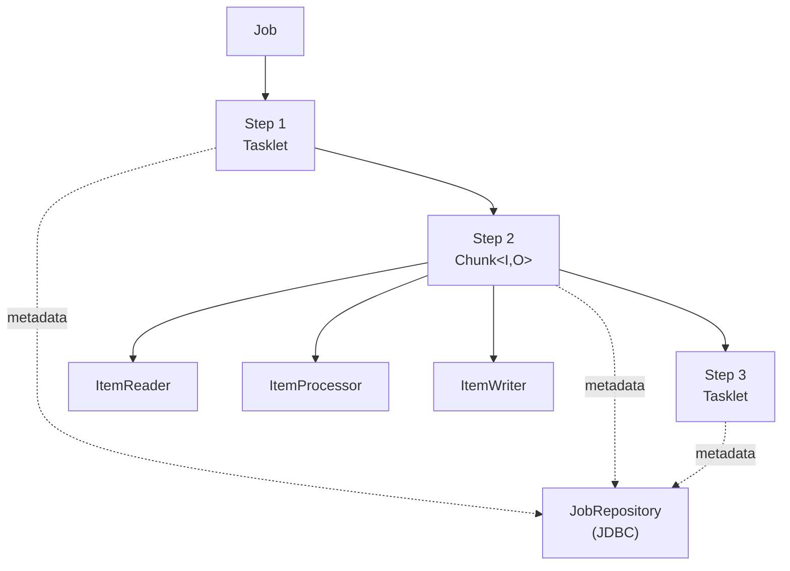
```mermaid
flowchart TB
    Job["Job"]
    S1["Step 1<br/>Tasklet"]
    S2["Step 2<br/>Chunk&lt;I,O&gt;"]
    S3["Step 3<br/>Tasklet"]
    R["ItemReader"]
    P["ItemProcessor"]
    W["ItemWriter"]
    JR["JobRepository<br/>(JDBC)"]

    Job --> S1 --> S2 --> S3
    S2 --> R
    S2 --> P
    S2 --> W
    S1 -.->|metadata| JR
    S2 -.->|metadata| JR
    S3 -.->|metadata| JR
```

### 📶 Gradual Depth

**Layer 1 - Single Step Job:** One Step with a chunk-oriented reader/processor/writer. Reads a CSV, transforms rows, writes to a database. The commit-interval controls how many items per transaction. Spring Boot auto-configures the JobRepository and JobLauncher.

**Layer 2 - Multi-Step with Flow:** Jobs chain Steps with conditional transitions. Step 1 validates input, Step 2 processes, Step 3 generates reports. `on("FAILED").to(errorStep)` routes failures. `JobExecutionDecider` enables dynamic branching based on runtime state.

**Layer 3 - Fault Tolerance:** Skip policies let the job continue past bad records: `faultTolerant().skip(FlatFileParseException.class).skipLimit(100)`. Retry policies re-attempt transient failures: `retry(DeadlockLoserException.class).retryLimit(3)`. Skip and retry listeners log bad records for downstream reconciliation.

**Layer 4 - Partitioning:** A master Step splits work into partitions. Each partition runs as an independent StepExecution with its own reader range. `TaskExecutorPartitionHandler` runs partitions in local threads. `MessageChannelPartitionHandler` distributes across remote workers. The Partitioner interface defines how to split - by ID range, by file, or by any custom logic.

**Layer 5 - Production Hardening:** Custom `JobParametersIncrementer` for scheduled re-runs. `JobOperator` for runtime stop/restart. Chunk-scoped beans for thread safety in partitioned steps. `ExecutionContext` promotion from Step to Job scope for inter-step data sharing. Monitoring via Micrometer metrics: `spring.batch.job.active`, `spring.batch.step.read.count`.

### ⚙️ How It Works

```
JobLauncher.run(job, params)
  |
  v
JobRepository: INSERT job_execution
  |
  v
Step 1: BEGIN
  |
  +---> Reader.read() x chunk-size
  |       (returns null = step done)
  +---> Processor.process() x chunk-size
  |       (returns null = skip item)
  +---> Writer.write(List<O>)
  |
  +---> TX COMMIT
  +---> JobRepository: UPDATE step_execution
  |       (read_count, write_count, commit_count)
  |
  +---> Repeat until reader exhausted
  |
  v
JobRepository: UPDATE job_execution = COMPLETED
```

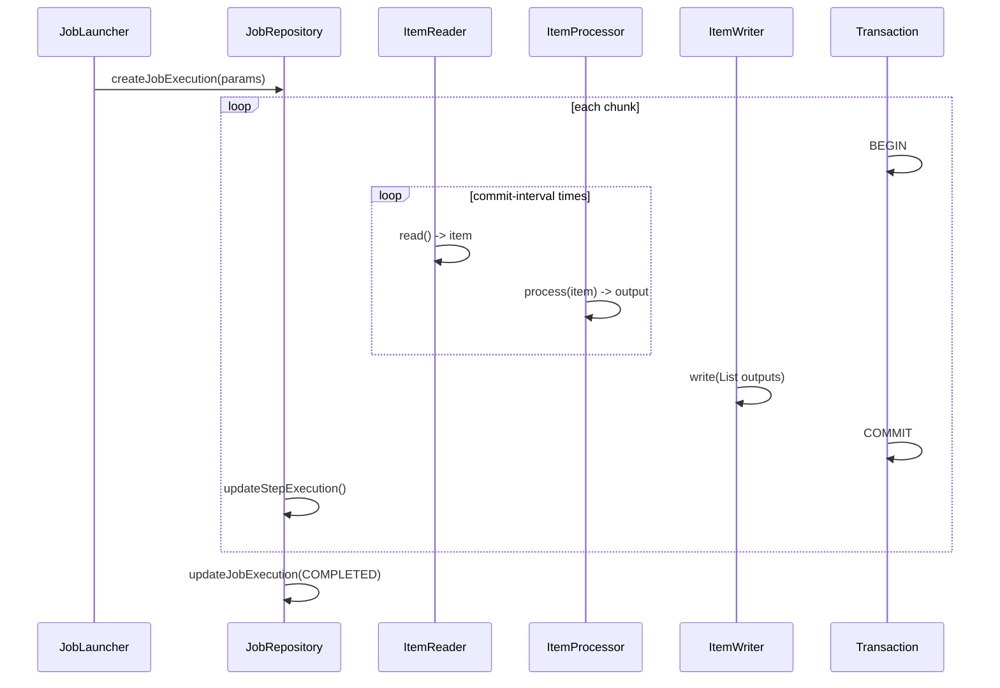
```mermaid
sequenceDiagram
    participant JL as JobLauncher
    participant JR as JobRepository
    participant R as ItemReader
    participant P as ItemProcessor
    participant W as ItemWriter
    participant TX as Transaction

    JL->>JR: createJobExecution(params)
    loop each chunk
        TX->>TX: BEGIN
        loop commit-interval times
            R->>R: read() -> item
            P->>P: process(item) -> output
        end
        W->>W: write(List outputs)
        TX->>TX: COMMIT
        JR->>JR: updateStepExecution()
    end
    JR->>JR: updateJobExecution(COMPLETED)
```

### 🚨 Failure Modes

**Failure 1 - Poison Record Crashes Entire Job:**
A single malformed CSV row throws an exception during read. Without a skip policy, the entire Step fails and the Job stops. If the bad record is at row 5 million out of 10 million, you lose all progress.
**Diagnostic:** Check `BATCH_STEP_EXECUTION` table: `EXIT_MESSAGE` contains the exception. `READ_COUNT` shows how far the job progressed.
**Fix:** Add `.faultTolerant().skip(FlatFileParseException.class).skipLimit(100)`. Register a `SkipListener` to log skipped items to a dead-letter table for manual review.

**Failure 2 - JobRepository Deadlock Under Partitioning:**
Multiple partitioned threads update `BATCH_STEP_EXECUTION` simultaneously. With aggressive chunk sizes and many partitions, database lock contention causes `DeadlockLoserException` cascades.
**Diagnostic:** Database slow-query logs show lock waits on `BATCH_STEP_EXECUTION`. Thread dumps show threads blocked on JDBC commit.
**Fix:** Increase `throttle-limit` to reduce concurrent partitions. Use `isolation-level-for-create` at `ISOLATION_READ_COMMITTED`. Consider using separate `TaskExecutor` thread pools with bounded concurrency.

**Failure 3 - Restart Processes Duplicate Records:**
A job fails at chunk 500, restarts, but the writer is not idempotent. Chunk 500 was partially written before rollback, and the restart re-processes it - inserting duplicates.
**Diagnostic:** `WRITE_COUNT` in the step execution does not match the target table row count. Duplicate primary key violations appear in logs after restart.
**Fix:** Use database upsert (MERGE/ON CONFLICT) in the writer. Alternatively, use `JdbcBatchItemWriter` with `assertUpdates(true)` to detect mismatches. For file outputs, use the restart-aware `FlatFileItemWriter` which tracks byte offsets.

### 🔬 Production Reality

At scale, Spring Batch jobs are scheduled via Spring Cloud Task, Kubernetes CronJobs, or enterprise schedulers (Control-M, Autosys). A nightly billing job processing 50M records typically partitions by customer-ID range into 16-32 partitions, each reading from a database partition or file segment. Chunk sizes of 500-2000 balance transaction overhead against memory. The JobRepository runs on a dedicated schema - never the application's business schema - to isolate batch metadata from business data contention. Teams monitor via Micrometer counters exported to Prometheus: `spring_batch_job_seconds`, `spring_batch_step_read_count`. Alerting triggers on `EXIT_CODE != COMPLETED` or `SKIP_COUNT > threshold`. Mature teams version their job parameters and use `preventRestart()` for one-shot jobs versus `allowStartIfComplete(true)` for re-runnable extract jobs.

### ⚖️ Trade-offs & Alternatives

**BAD:**

```java
// Loading entire dataset into memory
List<Record> all = repo.findAll();
all.forEach(r -> process(r)); // no restart
// OOM at 10M records, no progress
// tracking, no fault tolerance
```

**GOOD:**

```java
@Bean
public Step processStep(
    JobRepository jobRepo,
    PlatformTransactionManager txMgr,
    ItemReader<Record> reader,
    ItemProcessor<Record, Output> proc,
    ItemWriter<Output> writer) {
  return new StepBuilder("process", jobRepo)
    .<Record, Output>chunk(1000, txMgr)
    .reader(reader)
    .processor(proc)
    .writer(writer)
    .faultTolerant()
    .skip(ParseException.class)
    .skipLimit(50)
    .build();
}
```

| Concern         | Spring Batch        | Plain JDBC Loop   | Spark              |
| --------------- | ------------------- | ----------------- | ------------------ |
| Restart         | Chunk-level         | Manual            | Stage-level        |
| Fault tolerance | Built-in skip/retry | Manual            | Built-in           |
| Memory          | Chunk-sized         | Entire result set | Distributed        |
| Learning curve  | Moderate            | Low               | High               |
| Deployment      | JVM app server      | JVM               | Cluster            |
| Best fit        | Enterprise ETL      | Simple scripts    | Big data analytics |

### ⚡ Decision Snap

- Need chunk-level restart + fault tolerance in a JVM process -> Spring Batch
- Processing < 10K records with no restart needs -> plain JDBC loop
- Processing TB-scale across a cluster with shuffle/join -> Spark/Flink
- Need real-time stream processing -> Spring Cloud Stream or Kafka Streams, not Batch
- Already running on Kubernetes with no persistent JobRepository -> consider Spring Cloud Task wrapping Batch with external DB

### ⚠️ Top Traps

| #   | Trap                                    | Why It Hurts                                   | Prevention                                                   |
| --- | --------------------------------------- | ---------------------------------------------- | ------------------------------------------------------------ |
| 1   | Map-based JobRepository in production   | No restart, no monitoring, lost on JVM restart | Always use JDBC JobRepository with dedicated schema          |
| 2   | Non-idempotent writer with restart      | Duplicate records after failure recovery       | Use MERGE/upsert or restart-aware writers                    |
| 3   | Chunk size = 1                          | One transaction per record, 100x slower        | Start at 500-1000, tune based on TX overhead                 |
| 4   | Sharing mutable state across partitions | Race conditions in partitioned steps           | Use step-scoped beans (`@StepScope`) for stateful components |
| 5   | Skipping without a SkipListener         | Bad records vanish silently                    | Always log skipped items to a dead-letter table              |

### 🪜 Learning Ladder

**Prerequisites:**

- SPR-032 Spring Data JDBC and JPA - understanding data access layer that Batch wraps in chunk transactions
- SPR-051 Transaction Management - transaction boundaries that chunk processing relies on

**THIS:** SPR-082 Spring Batch for Large-Scale Processing - chunk-oriented, restartable batch jobs with skip/retry, partitioning, and monitoring

**Next steps:**

- SPR-088 Production Incident Simulation with Spring - diagnosing batch job failures in production scenarios

**The Surprising Truth:** The most common Spring Batch performance bottleneck is not read or processing speed - it is the writer's transaction commit latency. A job reading 10M records with chunk-size=100 executes 100,000 commits. Switching from auto-commit JDBC to batch-mode inserts (`rewriteBatchedStatements=true` on MySQL, `batch_size` on Hibernate) often delivers 5-10x throughput improvement without touching any Batch framework configuration.

**Further Reading:**

1. Spring Batch Reference Documentation
2. "The Definitive Guide to Spring Batch" by Michael Minella (Apress)
3. JSR 352 Specification (Jakarta Batch)

**Revision Card:**

1. The unit of restart in Spring Batch is the chunk - the JobRepository tracks the last committed chunk offset per StepExecution.
2. When ItemProcessor returns null, the item is filtered (skipped from the write phase) but not counted as a skip-error.
3. Partitioning creates separate StepExecutions with independent readers per partition. Multi-threaded Step shares a single reader across threads (reader must be thread-safe).

---

---

# SPR-083 Debugging Spring Auto-Configuration Failures

**TL;DR** - Use the conditions evaluation report, FailureAnalyzer output, and systematic condition checking to diagnose why auto-configuration silently skipped or failed.

### 🔥 Problem Statement

A Spring Boot application starts but a feature is missing - no DataSource, no security filter, no actuator endpoints. Or worse, it fails at startup with a cryptic `UnsatisfiedDependencyException` three stack frames deep from an auto-configuration class you never wrote. The core pain: auto-configuration is invisible by design. When it works, you never think about it. When it fails, you have no idea which condition evaluated to false, which bean was missing, or which classpath entry was absent. Without a systematic diagnostic approach, teams resort to random dependency additions, property guessing, and Stack Overflow copy-paste - often making the problem worse.

### 📜 Historical Context

Early Spring Boot (1.x) provided limited visibility into auto-configuration decisions. The `--debug` flag was added early to dump condition evaluations to the log, but the output was verbose and hard to parse. Spring Boot 1.4 introduced the `FailureAnalyzer` SPI - a way for auto-configuration modules to translate cryptic exceptions into human-readable messages with actions. Spring Boot 2.0 expanded FailureAnalyzers to cover most common startup failures (port conflicts, missing beans, database connectivity). The Actuator `/conditions` endpoint (formerly `/autoconfig`) was added to expose condition evaluation at runtime. Spring Boot 2.1 added `ConditionEvaluationReportMessage` for structured logging. By Spring Boot 3.x, the FailureAnalyzer framework covers 30+ common failure scenarios and is extensible for custom auto-configuration modules.

### 🔩 First Principles

**CORE INVARIANTS:**

1. Every auto-configuration class is guarded by `@Conditional` annotations - a feature absent means a condition evaluated to false, never a framework bug as first assumption
2. The `ConditionEvaluationReport` records every condition check (match and non-match) for every auto-configuration class - the truth is always in this report
3. `FailureAnalyzer` transforms raw exceptions into structured diagnosis - if the error message is readable, a FailureAnalyzer produced it

**DERIVED DESIGN:**
These invariants produce a deterministic debugging workflow. Since conditions are the gatekeepers, every absent feature traces back to a specific `@ConditionalOn*` that returned false. The evaluation report captures all decisions, so enabling `--debug` (or querying `/conditions`) reveals the exact reason. FailureAnalyzers intercept exceptions before they reach the user, so when you see a well-formatted "Description / Action" error, the framework already diagnosed it. When you see a raw stack trace, no FailureAnalyzer matched - and you need the conditions report.

### 🧠 Mental Model

> Think of auto-configuration debugging as airport security screening. Each auto-configuration class is a passenger trying to board (activate). Security checkpoints (`@Conditional` annotations) verify documents (classpath classes), boarding passes (properties), and prior clearances (existing beans). If a passenger is denied, the security log (ConditionEvaluationReport) records exactly which checkpoint rejected them. A help desk agent (FailureAnalyzer) translates the rejection code into plain language for the passenger.

- "security checkpoints" -> `@ConditionalOnClass`, `@ConditionalOnProperty`, `@ConditionalOnMissingBean`
- "security log" -> `ConditionEvaluationReport` via `--debug`
- "help desk agent" -> `FailureAnalyzer` producing human-readable messages
- "denied passenger" -> auto-configuration class with unmatched conditions

**Where this analogy breaks down:** Unlike airport security where each passenger is independent, auto-configuration classes have ordering dependencies. `DataSourceAutoConfiguration` failing can cascade to `JpaAutoConfiguration`, `FlywayAutoConfiguration`, and 10 other classes failing - a single denial causes a chain of downstream rejections.

### 🧩 Components

```
+-------------------------------------------+
|          Startup Diagnostic Stack          |
|                                           |
|  +-------------------------------------+ |
|  | ConditionEvaluationReport            | |
|  |  - positiveMatches[]                 | |
|  |  - negativeMatches[]                 | |
|  |  - exclusions[]                      | |
|  +-------------------------------------+ |
|                    |                      |
|  +-------------------------------------+ |
|  | FailureAnalyzer Chain                | |
|  |  analyzer1 -> analyzer2 -> ...       | |
|  |  first match wins                    | |
|  +-------------------------------------+ |
|                    |                      |
|  +-------------------------------------+ |
|  | Output: Description + Action         | |
|  | or: Raw StackTrace (no match)        | |
|  +-------------------------------------+ |
+-------------------------------------------+
```

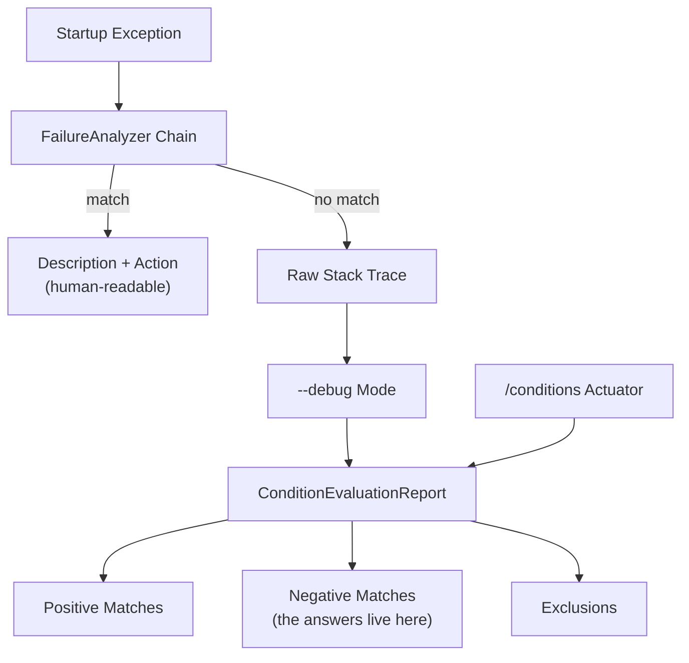
```mermaid
flowchart TB
    EX["Startup Exception"]
    FA["FailureAnalyzer Chain"]
    CER["ConditionEvaluationReport"]
    DM["--debug Mode"]
    ACT["/conditions Actuator"]

    EX --> FA
    FA -->|match| MSG["Description + Action<br/>(human-readable)"]
    FA -->|no match| RAW["Raw Stack Trace"]
    RAW --> DM
    DM --> CER
    CER --> POS["Positive Matches"]
    CER --> NEG["Negative Matches<br/>(the answers live here)"]
    CER --> EXCL["Exclusions"]
    ACT --> CER
```

### 📶 Gradual Depth

**Layer 1 - Read the FailureAnalyzer Output:** When Spring Boot fails to start, look for the `***************************` banner and the "Description" / "Action" block. This is a FailureAnalyzer speaking. Example: "Web server failed to start. Port 8080 was already in use. Action: Identify and stop the process listening on port 8080." Follow the action.

**Layer 2 - Enable the Debug Report:** When no FailureAnalyzer fires (raw stack trace), restart with `--debug` or set `debug=true` in `application.properties`. Scroll to `CONDITIONS EVALUATION REPORT`. Find your missing auto-configuration class in "Negative matches." The report shows which `@Conditional` failed: `@ConditionalOnClass did not find required class 'javax.sql.DataSource'`.

**Layer 3 - Understand Common Conditions:** Master the five most common conditions: `@ConditionalOnClass` (classpath check), `@ConditionalOnMissingBean` (user override detection), `@ConditionalOnProperty` (property toggle), `@ConditionalOnBean` (dependency bean exists), `@ConditionalOnWebApplication` (web environment check). Each maps to a specific fix: add a dependency, set a property, or define a bean.

**Layer 4 - Trace Cascading Failures:** When 15 auto-configuration classes show in negative matches, find the root. `DataSourceAutoConfiguration` failed because no JDBC driver was on the classpath. That caused `JpaAutoConfiguration`, `FlywayAutoConfiguration`, `LiquibaseAutoConfiguration`, and `JdbcTemplateAutoConfiguration` to all fail on `@ConditionalOnBean(DataSource.class)`. Fix the root (add the JDBC driver), and all dependents resolve.

**Layer 5 - Write Custom FailureAnalyzers:** For your own auto-configuration modules, extend `AbstractFailureAnalyzer<T>` parameterized to your expected exception type. Override `analyze()` to return a `FailureAnalysis` with description, action, and cause. Register in `META-INF/spring.factories` (Boot 2.x) or `META-INF/spring/org.springframework.boot.diagnostics.FailureAnalyzer` (Boot 3.x).

### ⚙️ How It Works

```
Application.run()
  |
  v
AutoConfigurationImportSelector
  |-> load AutoConfiguration.imports
  |-> for each class:
  |     evaluate @Conditional annotations
  |     record result in ConditionEvalReport
  |
  v
Context refresh
  |-> bean creation
  |-> exception thrown?
  |     |
  |     +--YES--> FailureAnalyzerRunner
  |     |           |-> iterate analyzers
  |     |           |-> first match: print
  |     |           |     Description + Action
  |     |           |-> no match: print stack
  |     |
  |     +--NO---> startup complete
  |                 |-> /conditions endpoint
  |                 |     serves the report
```

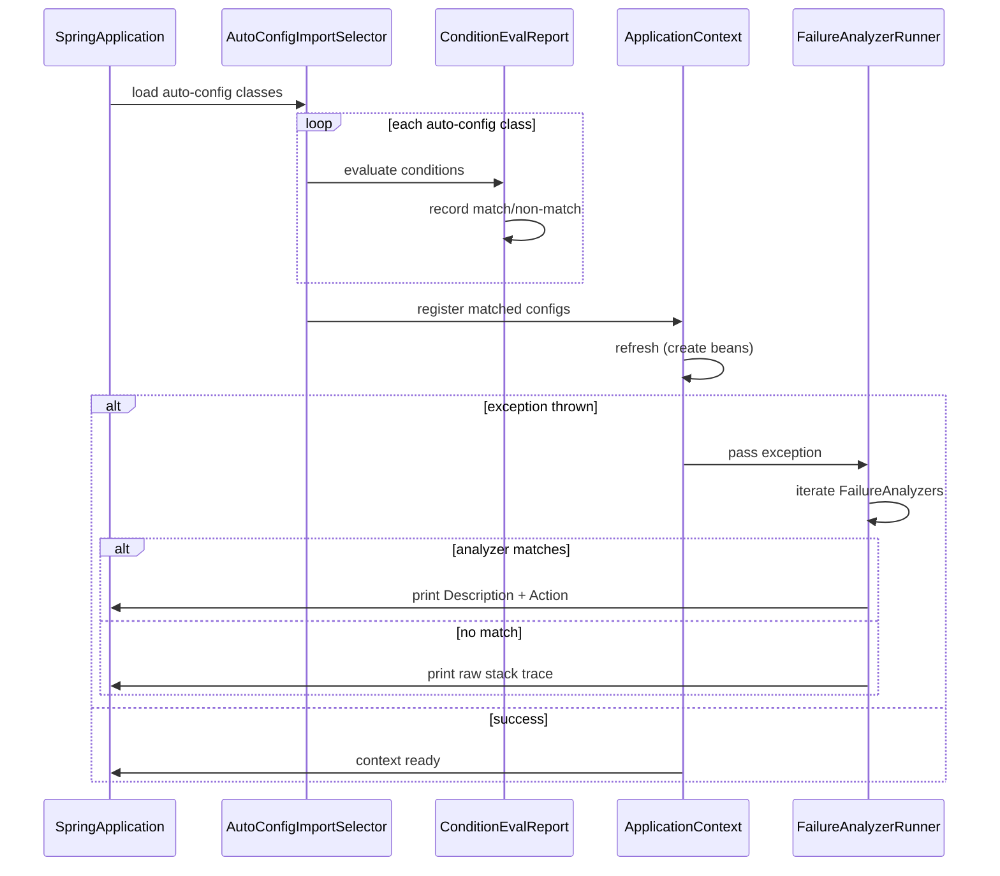
```mermaid
sequenceDiagram
    participant App as SpringApplication
    participant ACI as AutoConfigImportSelector
    participant CER as ConditionEvalReport
    participant CTX as ApplicationContext
    participant FAR as FailureAnalyzerRunner

    App->>ACI: load auto-config classes
    loop each auto-config class
        ACI->>CER: evaluate conditions
        CER->>CER: record match/non-match
    end
    ACI->>CTX: register matched configs
    CTX->>CTX: refresh (create beans)
    alt exception thrown
        CTX->>FAR: pass exception
        FAR->>FAR: iterate FailureAnalyzers
        alt analyzer matches
            FAR->>App: print Description + Action
        else no match
            FAR->>App: print raw stack trace
        end
    else success
        CTX->>App: context ready
    end
```

### 🚨 Failure Modes

**Failure 1 - Silent Feature Absence:**
The application starts successfully, but a feature (e.g., security filters, caching, actuator endpoints) is silently missing. No error, no warning. The auto-configuration class evaluated its conditions and quietly skipped because a required class was not on the classpath or a property was not set.
**Diagnostic:** Enable `--debug` and search for the auto-configuration class name in "Negative matches." The condition that returned false reveals the cause: missing dependency, wrong property, or an existing user bean that triggered `@ConditionalOnMissingBean`.
**Fix:** Add the missing dependency (e.g., `spring-boot-starter-actuator`), set the required property (e.g., `spring.cache.type=redis`), or remove the conflicting user bean that suppressed auto-configuration.

**Failure 2 - Cryptic BeanCreationException Chain:**
Startup fails with `UnsatisfiedDependencyException` -> `BeanCreationException` -> `NoSuchBeanDefinitionException`. The stack trace references an auto-configuration inner class three levels deep. No FailureAnalyzer fires because the exception is a generic bean wiring failure, not one of the known failure patterns.
**Diagnostic:** The stack trace names the auto-configuration class. Find it in the conditions report - it matched (positive match) but a downstream bean it tried to inject was not created. Trace the missing bean back to its own auto-configuration class in negative matches.
**Fix:** Resolve the root missing bean. Typically a transitive dependency is absent. Adding the correct starter (e.g., `spring-boot-starter-data-jpa` instead of just `spring-data-jpa`) pulls in the full dependency tree.

**Failure 3 - Conflicting Auto-Configuration After Upgrade:**
After a Spring Boot version upgrade, a previously working application fails because a new auto-configuration class was added that conflicts with existing user configuration. A user-defined `ObjectMapper` bean now collides with `JacksonAutoConfiguration` changes, or a new health indicator auto-configures and fails due to missing infrastructure.
**Diagnostic:** Compare the conditions report before and after upgrade. New positive matches reveal newly-activated auto-configuration classes. Check the Spring Boot release notes for auto-configuration changes.
**Fix:** Exclude the conflicting auto-configuration: `@SpringBootApplication(exclude = {JacksonAutoConfiguration.class})`. Or align user configuration with the new auto-configuration expectations.

### 🔬 Production Reality

In production Spring Boot applications, auto-configuration debugging is a startup-time activity - you rarely debug conditions at runtime. The most common trigger is dependency upgrades: a new Spring Boot minor version adds or changes auto-configuration classes, and previously-working apps break. Mature teams run `--debug` in CI as part of integration tests to capture condition reports and diff them across versions. The `/conditions` Actuator endpoint is typically disabled in production (`management.endpoint.conditions.enabled=false`) but enabled in staging for diagnostics. Custom FailureAnalyzers are standard practice for internal platform teams that ship shared starters - they translate internal library exceptions into actionable messages for application teams. The most impactful debugging technique is understanding the condition dependency chain: start from the missing feature, trace back through conditions to find the root missing dependency, and fix that single root cause rather than shotgunning dependencies.

### ⚖️ Trade-offs & Alternatives

**BAD:**

```java
// Shotgun debugging: adding random
// dependencies until it works
// pom.xml grows, classpath conflicts
// multiply, startup slows down
// Root cause never identified
```

**GOOD:**

```java
// Systematic: enable debug report
// application.properties
// debug=true

// Find the negative match:
// DataSourceAutoConfig:
//   @ConditionalOnClass did not find
//   'io.r2dbc.spi.ConnectionFactory'
// Action: add spring-boot-starter-data-r2dbc

// Or exclude unwanted auto-config:
@SpringBootApplication(exclude = {
  DataSourceAutoConfiguration.class
})
public class MyApp {}
```

| Approach                    | Speed   | Accuracy  | Scales  |
| --------------------------- | ------- | --------- | ------- |
| Read FailureAnalyzer output | Seconds | High      | Always  |
| `--debug` conditions report | Minutes | Very high | Always  |
| Stack Overflow copy-paste   | Minutes | Low       | Rarely  |
| Random dependency additions | Hours   | Very low  | Never   |
| `/conditions` endpoint      | Seconds | Very high | Runtime |

### ⚡ Decision Snap

- Application fails with formatted Description/Action banner -> read and follow the FailureAnalyzer output directly
- Application fails with raw stack trace -> enable `--debug`, find the negative match for the auto-config class in the stack
- Feature silently missing, no error -> enable `--debug`, search negative matches for the expected auto-configuration class name
- Need runtime condition inspection -> enable `/conditions` Actuator endpoint in non-production
- Building a shared starter for other teams -> write a custom FailureAnalyzer for your library's common misconfigurations

### ⚠️ Top Traps

| #   | Trap                                             | Why It Hurts                                                                                               | Prevention                                                                              |
| --- | ------------------------------------------------ | ---------------------------------------------------------------------------------------------------------- | --------------------------------------------------------------------------------------- |
| 1   | Ignoring FailureAnalyzer output                  | The framework already diagnosed the problem - reading past it wastes hours                                 | Always read the Description/Action banner first before looking at stack traces          |
| 2   | Treating symptoms instead of root cause          | Fixing one `NoSuchBeanDefinition` reveals another because the root auto-config was the actual failure      | Trace the condition chain to the first negative match                                   |
| 3   | Adding `exclude` without understanding why       | Excluding auto-configuration hides the real issue and may disable features you need later                  | Only exclude after confirming the auto-config is genuinely unwanted                     |
| 4   | Not checking classpath for duplicate versions    | Two versions of the same library cause `@ConditionalOnClass` to match but class loading to fail at runtime | Run `mvn dependency:tree` or `gradle dependencies` to check for conflicts               |
| 5   | Forgetting `@ConditionalOnMissingBean` semantics | Defining a bean of the same type as an auto-configured one silently disables the auto-configuration        | Intentional override is fine, but accidental override causes mysterious feature absence |

### 🪜 Learning Ladder

**Prerequisites:**

- SPR-070 Spring Boot Auto-Configuration Internals - understanding condition evaluation that drives the debug report
- SPR-043 Component Scanning and Stereotype Annotations - understanding how beans are discovered

**THIS:** SPR-083 Debugging Spring Auto-Configuration Failures - reading conditions reports, tracing cascading negative matches, and writing custom FailureAnalyzers

**Next steps:**

- SPR-084 Circular Dependency Trap Anti-Pattern - another startup failure mode with different diagnostic approach

**The Surprising Truth:** Most auto-configuration "failures" are not failures at all - they are intentional non-activation. Spring Boot ships over 150 auto-configuration classes, and a typical application activates only 20-40 of them. The negative matches section is always longer than positive matches. The real debugging skill is not finding what went wrong, but understanding that the conditions evaluation report is a complete, deterministic record of every decision the framework made - and learning to read it as a decision log rather than an error log.

**Further Reading:**

1. Spring Boot Reference: "Auto-configuration" and "Failure Analyzers" chapters
2. `ConditionEvaluationReport` Javadoc (spring-boot-autoconfigure)
3. Spring Boot Actuator `/conditions` endpoint documentation

**Revision Card:**

1. `--debug` command-line argument or `debug=true` in application.properties enables the full conditions evaluation report at startup.
2. To create a custom failure analyzer, implement `FailureAnalyzer` or extend `AbstractFailureAnalyzer<T>` parameterized to your exception type.
3. An auto-configuration class can appear in positive matches but still cause a startup failure because conditions gate activation, not successful bean creation.

---

---

# SPR-084 Circular Dependency Trap Anti-Pattern

**TL;DR** - Circular bean dependencies hide design flaws; constructor injection exposes them at startup so you fix the architecture.

### 🔥 Problem Statement

Service A needs Service B in its constructor. Service B needs Service A. Spring cannot create either without the other already existing. With constructor injection, the application fails immediately at startup - the honest outcome. With field or setter injection, Spring silently creates proxies that defer resolution. The cycle exists but stays hidden until a random initialization-order bug or NPE surfaces in production under load. The core pain: circular dependencies are not a wiring problem. They are an architectural smell signaling tangled responsibilities. Teams that suppress the symptom with `@Lazy`, setter injection workarounds, or the `allow-circular-references` flag preserve the design flaw and accumulate coupling debt that makes every refactor, test, and deployment progressively harder.

### 📜 Historical Context

Spring Framework has always supported circular references for setter-injected and field-injected singleton beans through a three-level cache (`singletonFactories`, `earlySingletonObjects`, `singletonObjects`). This mechanism allowed partially-constructed beans to satisfy dependencies before full initialization completed. Constructor injection cycles have always thrown `BeanCurrentlyInCreationException` because the bean does not exist in any form until the constructor returns. Spring Boot 2.6 (November 2021) changed the default: circular references became prohibited even for setter and field injection (`spring.main.allow-circular-references` defaulted to `false`). This was a deliberate breaking change. The Spring team's rationale: circular dependencies cause unpredictable initialization ordering, make testing difficult, and indicate poor separation of concerns. Teams upgrading to Boot 2.6+ discovered dozens of previously-hidden cycles in their codebases. The backlash was significant, but the Spring team held firm - the flag exists as a migration bridge, not a permanent solution.

### 🔩 First Principles

**CORE INVARIANTS:**

1. A bean must be fully constructed before it can be injected into another bean - constructor injection enforces this by requiring all dependencies at creation time
2. Circular dependencies between beans always indicate shared or tangled responsibilities - two classes that mutually depend on each other are doing work that belongs in a third class or an event
3. The Spring three-level singleton cache is a resolution mechanism for backward compatibility, not an architectural endorsement - it exists because removing it would break millions of applications

**DERIVED DESIGN:**
These invariants mean constructor injection is the honest injection style - it makes impossible states impossible by failing fast on cycles. Field and setter injection merely postpone the failure. The `@Lazy` annotation creates a proxy that defers resolution to the first method call, converting a startup failure into a potential runtime failure. The only genuine fix is breaking the cycle through architectural redesign: extract shared logic into a third service, replace synchronous calls with events, or introduce a mediator.

### 🧠 Mental Model

> Think of circular dependencies as two people each holding a door open for the other. Neither can walk through because both are waiting. Constructor injection is a doorman who announces the deadlock immediately. Field injection is a polite bystander who says nothing and hopes they sort it out eventually.

- "holding the door" -> waiting for the other bean to be fully constructed before proceeding
- "doorman announces deadlock" -> `BeanCurrentlyInCreationException` at startup
- "polite bystander" -> proxy-based resolution hiding the cycle via the three-level cache
- "sort it out eventually" -> deferred resolution that may fail at runtime under specific conditions

**Where this analogy breaks down:** In Spring's three-level cache, field-injected cycles do resolve successfully - the proxy eventually points to the real bean. The problem is not a permanent deadlock but unpredictable initialization order and hidden coupling. The door gets opened, but the building's floor plan is still architecturally wrong.

### 🧩 Components

```
+-----------------------------------------------+
|    Circular Dependency Detection Stack         |
|                                               |
|  +------------------------------------------+ |
|  | DefaultSingletonBeanRegistry              | |
|  |  L1: singletonObjects (fully init)       | |
|  |  L2: earlySingletonObjects (partial)     | |
|  |  L3: singletonFactories (ObjectFactory)  | |
|  +------------------------------------------+ |
|                    |                           |
|  +------------------------------------------+ |
|  | AbstractAutowireCapableBeanFactory        | |
|  |  singletonsCurrentlyInCreation (Set)     | |
|  |  detect cycle on second create attempt   | |
|  +------------------------------------------+ |
|                    |                           |
|  +------------------------------------------+ |
|  | BeanCurrentlyInCreationException          | |
|  |  (constructor injection cycles)          | |
|  +------------------------------------------+ |
+-----------------------------------------------+
```

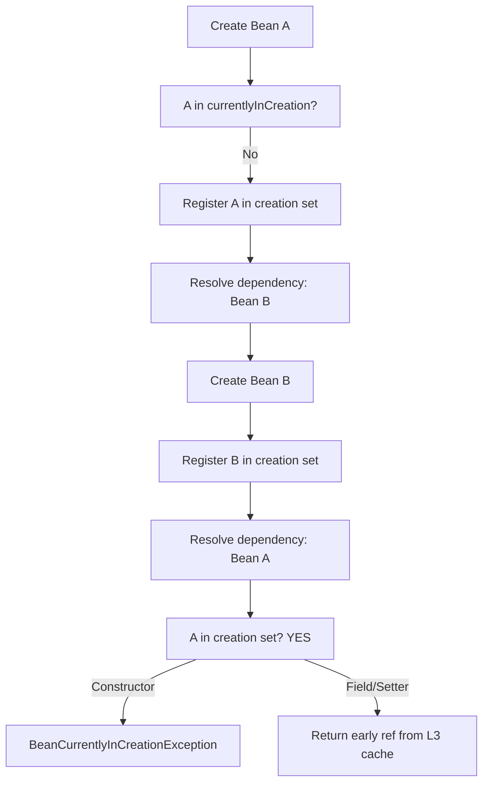
```mermaid
flowchart TB
    CR["Create Bean A"]
    CHK["A in currentlyInCreation?"]
    REG["Register A in creation set"]
    DEP["Resolve dependency: Bean B"]
    CRB["Create Bean B"]
    REGB["Register B in creation set"]
    DEPB["Resolve dependency: Bean A"]
    CHKA["A in creation set? YES"]

    CR --> CHK
    CHK -->|No| REG
    REG --> DEP
    DEP --> CRB
    CRB --> REGB
    REGB --> DEPB
    DEPB --> CHKA
    CHKA -->|Constructor| ERR["BeanCurrentlyInCreationException"]
    CHKA -->|Field/Setter| L3["Return early ref from L3 cache"]
```

### 📶 Gradual Depth

**Layer 1 - The Symptom:** Application fails at startup with `BeanCurrentlyInCreationException: Error creating bean 'serviceA': Requested bean is currently in creation: Is there an unresolvable circular reference?` This happens with constructor injection. Switching to field injection makes the error vanish - but the design problem remains.

**Layer 2 - The Three-Level Cache:** Spring resolves singleton cycles via three maps. When creating Bean A, Spring registers an `ObjectFactory` in L3 (singletonFactories) before populating properties. When Bean B needs A, Spring calls the factory to get an early (partially initialized) reference, promoting it to L2. After A finishes initialization, it moves to L1 (singletonObjects). Constructor injection bypasses this because the bean does not exist in any form until the constructor completes - there is nothing to put in L3.

**Layer 3 - @Lazy as a Band-Aid:** Adding `@Lazy` to one side of the cycle injects a proxy instead of the real bean. The proxy does not trigger creation until the first method call. This breaks the startup cycle but introduces a runtime dependency on initialization order. If the proxy target is accessed during a `@PostConstruct` method, the cycle reappears at a harder-to-debug point.

**Layer 4 - Architectural Root Causes:** Circular dependencies arise from three patterns: (a) bidirectional associations where services call each other synchronously, (b) layer violations where a lower layer calls back into a higher layer, (c) god services that accumulate unrelated responsibilities until they depend on everything. Each has a specific refactoring: extract shared logic, introduce an event bus, or decompose the god service.

**Layer 5 - Detection at Scale:** In large codebases with 500+ beans, manual cycle detection is impractical. ArchUnit enforces dependency rules via architecture tests. Spring's `ConditionEvaluationReport` shows bean creation order. JDepend and structure analysis plugins visualize package-level cycles. The strongest prevention is enforcing constructor injection project-wide and running `allow-circular-references=false` in CI integration tests.

### ⚙️ How It Works

```
createBean(A)
  |-> currentlyInCreation.add(A)
  |-> constructor injection?
  |     YES -> resolve B -> createBean(B)
  |       |-> currentlyInCreation.add(B)
  |       |-> resolve A -> A in creation!
  |       |-> THROW BeanCurrentlyInCreation
  |     NO (field) -> create A (empty)
  |       |-> singletonFactories.put(A, ...)
  |       |-> populate fields -> resolve B
  |       |-> createBean(B)
  |         |-> resolve A -> factory.get()
  |         |-> earlySingletonObjs.put(A)
  |         |-> B completes -> L1
  |       |-> A completes -> L1
```

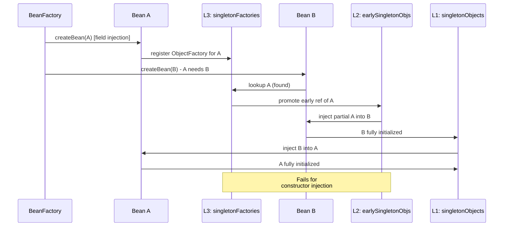
```mermaid
sequenceDiagram
    participant BF as BeanFactory
    participant A as Bean A
    participant L3 as L3: singletonFactories
    participant B as Bean B
    participant L2 as L2: earlySingletonObjs
    participant L1 as L1: singletonObjects

    BF->>A: createBean(A) [field injection]
    A->>L3: register ObjectFactory for A
    BF->>B: createBean(B) - A needs B
    B->>L3: lookup A (found)
    L3->>L2: promote early ref of A
    L2->>B: inject partial A into B
    B->>L1: B fully initialized
    L1->>A: inject B into A
    A->>L1: A fully initialized
    Note over L3,L2: Fails for<br/>constructor injection
```

### 🚨 Failure Modes

**Failure 1 - Hidden Cycle Breaks After Boot 2.6 Upgrade:**
Application ran fine on Boot 2.5. After upgrading to 2.6+, startup fails with `The dependencies of some of the beans in the application context form a cycle`. The cycle existed for years but was silently resolved through the three-level cache.
**Diagnostic:** The error message lists the full cycle path: `serviceA -> serviceB -> serviceA`. Read the chain to identify the participating beans.
**Fix:** Do not set `spring.main.allow-circular-references=true` as a permanent fix. Use it only as a temporary bridge while refactoring. Break the cycle by extracting shared logic into a new service, using `ApplicationEventPublisher` for one direction, or introducing a mediator.

**Failure 2 - @Lazy Proxy NPE in @PostConstruct:**
A `@Lazy`-injected dependency is accessed in a `@PostConstruct` method. The proxy tries to resolve the target bean, which triggers the cycle during initialization before the context is fully ready.
**Diagnostic:** Stack trace shows NPE or `BeanCreationException` inside a `@PostConstruct` method with the cause being the lazy-resolved bean unavailable.
**Fix:** Move the `@PostConstruct` logic to an `ApplicationRunner` or `@EventListener(ApplicationReadyEvent.class)` that runs after the full context initializes.

**Failure 3 - Prototype-Scoped Cycle Stack Overflow:**
Two prototype-scoped beans reference each other. Prototypes are not cached, so each request creates a new instance that requests another new instance of the other - infinite recursion until `StackOverflowError`.
**Diagnostic:** `StackOverflowError` during bean creation with repeated `createBean` frames in the stack trace.
**Fix:** Prototype beans cannot participate in cycles. Inject an `ObjectProvider<T>` or `Provider<T>` instead to break eager resolution.

### 🔬 Production Reality

In production codebases, circular dependencies are the most common symptom of organic service growth without architectural governance. A typical 200-bean application that evolved over 3+ years harbors 5-15 hidden cycles. Teams only discover them during the Spring Boot 2.6+ upgrade. The immediate instinct - setting `allow-circular-references=true` - is the most widespread mistake. Production data from teams that tracked coupling metrics shows that applications with unresolved cycles have 2-3x higher afferent/efferent coupling ratios and significantly longer build times because test slices cannot isolate components. The most effective prevention strategy is enforcing constructor injection organization-wide via an ArchUnit rule: `noClasses().should().haveFieldsAnnotated(Autowired.class)` combined with code review policy that rejects `@Autowired` on fields. Teams that adopt this rule report zero new circular dependencies introduced after enforcement begins.

### ⚖️ Trade-offs & Alternatives

**BAD:**

```java
// Suppress the symptom permanently
// application.properties
spring.main.allow-circular-references=true

// Or hide it with field injection
@Service
public class OrderService {
    @Autowired  // hides the cycle
    private PaymentService payment;
}
```

**GOOD:**

```java
// Break the cycle with events
@Service
public class OrderService {
    private final ApplicationEventPublisher
        events;

    public OrderService(
            ApplicationEventPublisher pub) {
        this.events = pub;
    }

    public void complete(Order order) {
        // Instead of paymentService.charge()
        events.publishEvent(
            new OrderCompletedEvent(order));
    }
}

@Service
public class PaymentService {
    @EventListener
    public void onOrderCompleted(
            OrderCompletedEvent event) {
        charge(event.getOrder());
    }
}
```

| Strategy                   | Cycle Broken | Coupling    | Testability | Effort |
| -------------------------- | ------------ | ----------- | ----------- | ------ |
| allow-circular-references  | No (hidden)  | High        | Poor        | None   |
| @Lazy proxy                | Deferred     | High        | Poor        | Low    |
| Extract shared service     | Yes          | Reduced     | Good        | Medium |
| Event-driven decoupling    | Yes          | Minimal     | Excellent   | Medium |
| Mediator pattern           | Yes          | Centralized | Good        | Medium |
| Module boundary (Modulith) | Yes          | Enforced    | Excellent   | High   |

### ⚡ Decision Snap

- Startup fails with circular reference after Boot 2.6 upgrade -> extract shared logic or use events; do not re-enable the flag permanently
- Two services call each other synchronously -> convert one direction to an async event
- God service depends on 15+ other services -> decompose by business capability
- Need a temporary bridge during refactoring -> `@Lazy` on one side with a tracked tech-debt ticket
- Want to prevent all future cycles -> enforce constructor injection via ArchUnit test in CI

### ⚠️ Top Traps

| #   | Trap                                                 | Why It Hurts                                                                            | Prevention                                                                   |
| --- | ---------------------------------------------------- | --------------------------------------------------------------------------------------- | ---------------------------------------------------------------------------- |
| 1   | Setting `allow-circular-references=true` permanently | Preserves all hidden cycles, blocks future Boot upgrades, coupling grows silently       | Use only as a temporary migration flag with a hard deadline                  |
| 2   | Using `@Lazy` without understanding proxy timing     | Converts startup failure to runtime NPE when proxy accessed during early init           | Never access `@Lazy` beans in `@PostConstruct`; use `ApplicationRunner`      |
| 3   | Breaking the cycle by switching to field injection   | Hides the architectural problem without fixing it; tests remain tightly coupled         | Enforce constructor injection project-wide via ArchUnit or linter            |
| 4   | Ignoring the cycle because "it works in production"  | Unpredictable initialization order causes intermittent test failures and startup flakes | Integration test that verifies context loads with constructor injection only |
| 5   | Event bus for every dependency                       | Not every dependency is a cycle; events add async complexity and debugging difficulty   | Use events only when the call direction is genuinely one-way notification    |

### 🪜 Learning Ladder

**Prerequisites:**

- SPR-056 Constructor vs Setter Injection Trade-offs - injection styles that determine cycle detection behavior
- SPR-041 Spring IoC Container and Dependency Injection Fundamentals - container lifecycle that governs bean creation order

**THIS:** SPR-084 Circular Dependency Trap Anti-Pattern - why circular bean dependencies hide design flaws and how constructor injection exposes them

**Next steps:**

- SPR-085 Fat ApplicationContext Anti-Pattern - another structural anti-pattern affecting startup and test performance

**The Surprising Truth:** The three-level singleton cache that resolves circular dependencies was never intended as a feature - it was a side effect of how Spring initializes singletons. The Spring team considered removing it multiple times but kept it for backward compatibility. When Boot 2.6 finally disabled it by default, the backlash revealed how many production applications unknowingly depended on a design accident. The lesson: any framework behavior that silently tolerates bad design will eventually be exploited at scale, and disabling it years later causes more pain than never allowing it.

**Further Reading:**

1. Spring Framework Reference: "Circular Dependencies" section
2. Spring Boot 2.6 Release Notes: circular references default change
3. ArchUnit User Guide: architecture rule enforcement for Spring

**Revision Card:**

1. Constructor injection detects circular dependencies because it requires a fully constructed bean before passing it as an argument. Field injection allows partial instance creation via the three-level cache, resolving the cycle with an early reference.
2. Spring Boot 2.6 changed `spring.main.allow-circular-references` from `true` to `false`, causing previously-hidden field/setter-injected cycles to fail at startup.
3. `@Lazy` injects a proxy that defers resolution to the first method call, hiding the cycle from startup detection without removing the underlying coupling.

---

---

# SPR-085 Fat ApplicationContext Anti-Pattern

**TL;DR** - Scanning too many packages and auto-configuring unused features inflates startup time, memory, and test duration - trim ruthlessly.

### 🔥 Problem Statement

A Spring Boot application that should start in 3 seconds takes 25. Tests that should run in 10 seconds take 90. Heap usage at idle sits at 512 MB for a service processing 50 requests per minute. The root cause: the ApplicationContext loads hundreds of beans the application never uses. Over-broad `@ComponentScan`, default auto-configuration that activates everything on the classpath, and "just in case" dependencies create a context bloated far beyond actual runtime needs. The pain compounds in microservice architectures where 30 services each carry the same bloated context, multiplying wasted memory and startup latency across the entire fleet.

### 📜 Historical Context

Early Spring applications used explicit XML bean definitions - you loaded only what you declared. When annotation-driven configuration and component scanning arrived (Spring 2.5+), convenience replaced discipline. `@ComponentScan("com.company")` became the standard, scanning the entire company package tree. Spring Boot's auto-configuration (2014) added another layer: every starter on the classpath triggers conditional bean registration. By Spring Boot 2.x, a typical web application with JPA, Security, Actuator, and a messaging starter loads 300-500 beans at startup, many never invoked at runtime. Spring Boot 2.7+ added startup metrics (`ApplicationStartup` with `BufferingApplicationStartup`) to diagnose slow initialization. Spring Framework 6 and Boot 3 introduced AOT (Ahead-of-Time) compilation and GraalVM native image support, where fat contexts become an even bigger problem - every bean scanned at build time increases native image compilation time and binary size.

### 🔩 First Principles

**CORE INVARIANTS:**

1. Every bean in the ApplicationContext consumes memory (metadata, instance, proxy) and startup time (instantiation, dependency resolution, initialization callbacks) whether it is ever used or not
2. Component scanning complexity is O(n) in the number of classes on the scanned path - broader base packages mean more classes inspected and more annotation metadata parsed
3. Auto-configuration activates based on classpath presence, not runtime usage - a dependency in `pom.xml` is sufficient to trigger bean registration even if no code ever calls it

**DERIVED DESIGN:**
These invariants mean the default "scan everything, auto-configure everything" posture optimizes for developer convenience at the expense of runtime efficiency. In development, the trade-off is acceptable - fast iteration matters more than startup speed. In production, especially in containerized environments with cold-start sensitivity (Kubernetes pod scaling, serverless), the trade-off inverts. The fix is not abandoning auto-configuration but narrowing its scope: scan only necessary packages, exclude unused auto-configuration classes, and split monolithic contexts into modules.

### 🧠 Mental Model

> Think of a fat ApplicationContext as a restaurant kitchen that prepares every dish on the menu at opening time, regardless of what customers will order. Most food sits untouched, the kitchen is overwhelmed at startup, and the walk-in fridge overflows. A lean kitchen prepares station mise en place for the day's expected orders only.

- "every dish on the menu" -> every bean from broad scanning and full auto-configuration
- "sits untouched" -> beans instantiated but never invoked at runtime
- "overwhelmed at startup" -> slow context refresh from unnecessary bean creation
- "walk-in fridge overflows" -> heap consumed by unused bean instances and metadata

**Where this analogy breaks down:** Unlike a restaurant where unused food is wasted immediately, unused Spring beans persist for the application lifetime, continuously consuming heap. The cost is not one-time but ongoing - every GC cycle must traverse unused bean graphs, and every `@Scheduled` or `@EventListener` on unused beans fires silently in the background.

### 🧩 Components

```
+-----------------------------------------------+
|         Fat Context Anatomy                    |
|                                               |
|  +------------------------------------------+ |
|  | Component Scan                            | |
|  |  @ComponentScan("com.company")           | |
|  |  -> 800 classes scanned                  | |
|  |  -> 350 @Component beans registered      | |
|  +------------------------------------------+ |
|                    +                           |
|  +------------------------------------------+ |
|  | Auto-Configuration                        | |
|  |  130 auto-config classes evaluated       | |
|  |  -> 45 activated (classpath match)       | |
|  |  -> 150+ beans from starters            | |
|  +------------------------------------------+ |
|                    =                           |
|  +------------------------------------------+ |
|  | ApplicationContext: 500+ beans total      | |
|  |  ~200 actually invoked at runtime        | |
|  |  ~300 never touched                      | |
|  +------------------------------------------+ |
+-----------------------------------------------+
```

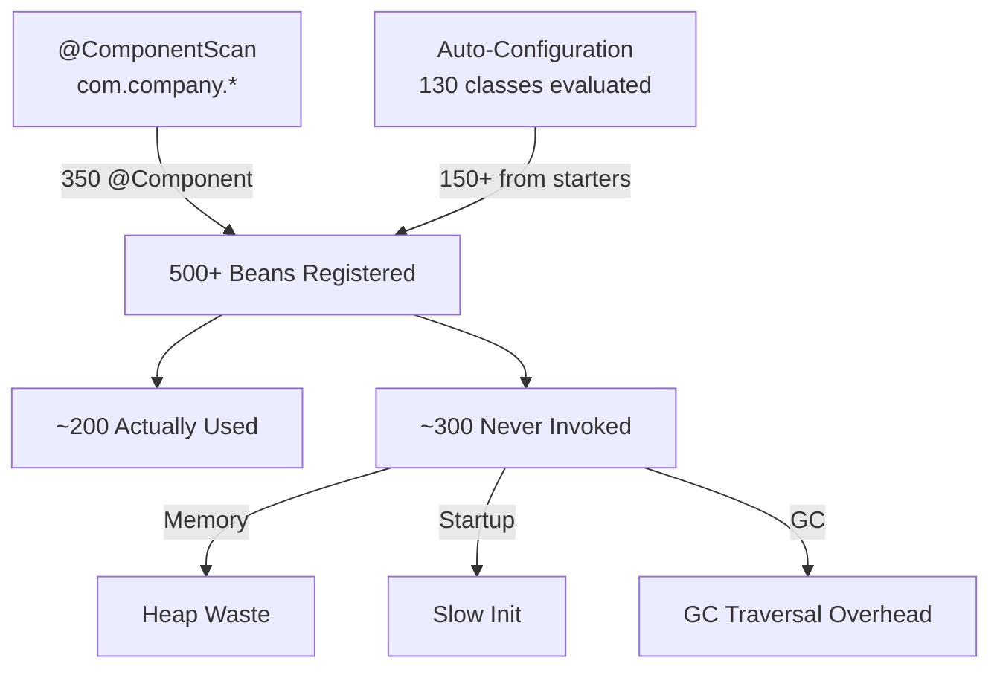
```mermaid
flowchart TB
    CS["@ComponentScan<br/>com.company.*"]
    AC["Auto-Configuration<br/>130 classes evaluated"]
    BEANS["500+ Beans Registered"]
    USED["~200 Actually Used"]
    WASTE["~300 Never Invoked"]

    CS -->|"350 @Component"| BEANS
    AC -->|"150+ from starters"| BEANS
    BEANS --> USED
    BEANS --> WASTE

    WASTE -->|"Memory"| MEM["Heap Waste"]
    WASTE -->|"Startup"| SLOW["Slow Init"]
    WASTE -->|"GC"| GC["GC Traversal Overhead"]
```

### 📶 Gradual Depth

**Layer 1 - Measure the Problem:** Add `BufferingApplicationStartup` to capture bean creation times: set `spring.application.startup=buffering` or configure it programmatically. Query the `/actuator/startup` endpoint to see which beans take the longest to initialize. Alternatively, set `spring.main.lazy-initialization=true` temporarily and observe which beans are never created during a full integration test run.

**Layer 2 - Narrow Component Scanning:** Replace `@ComponentScan("com.company")` with explicit packages: `@ComponentScan({"com.company.order", "com.company.payment", "com.company.shared"})`. Each additional base package scanned adds class inspection overhead. In a monorepo with 50 modules, scanning the root package pulls in beans from every module whether the service needs them or not.

**Layer 3 - Exclude Unused Auto-Configuration:** Run with `--debug` and examine the conditions evaluation report. Every positive match that your application does not use is a candidate for exclusion. Common targets: `DataSourceAutoConfiguration` when using R2DBC only, `SecurityAutoConfiguration` in internal services behind a mesh, `JmxAutoConfiguration` in containerized deployments. Exclude via `@SpringBootApplication(exclude = {...})` or `spring.autoconfigure.exclude` in properties.

**Layer 4 - Remove Unused Starters:** Excluding auto-configuration classes still leaves transitive dependencies on the classpath. Removing the starter entirely from `pom.xml` or `build.gradle` eliminates both the beans and the classes. Audit starters quarterly: if no production code imports a class from a starter, remove it.

**Layer 5 - Modular Contexts with Spring Modulith:** For large applications, use Spring Modulith to define module boundaries with explicit APIs. Each module exposes only its public interface. Cross-module scanning is prohibited. This prevents a change in module A from pulling in beans from module B through transitive component scanning. Modulith's `ApplicationModules.verify()` enforces boundaries at test time.

### ⚙️ How It Works

```
Application Startup
  |
  v
ClassPathBeanDefinitionScanner
  |-> scan base packages
  |-> for each .class file:
  |     read annotation metadata (ASM)
  |     match @Component stereotype?
  |     register BeanDefinition
  |
  v
AutoConfigurationImportSelector
  |-> load AutoConfiguration.imports
  |-> evaluate @Conditional per class
  |-> register matched BeanDefinitions
  |
  v
AbstractApplicationContext.refresh()
  |-> instantiate all singletons
  |-> resolve dependencies (DI)
  |-> call @PostConstruct
  |-> call afterPropertiesSet()
  |-> publish ContextRefreshedEvent
  |
  v
Context Ready (all beans in heap)
```

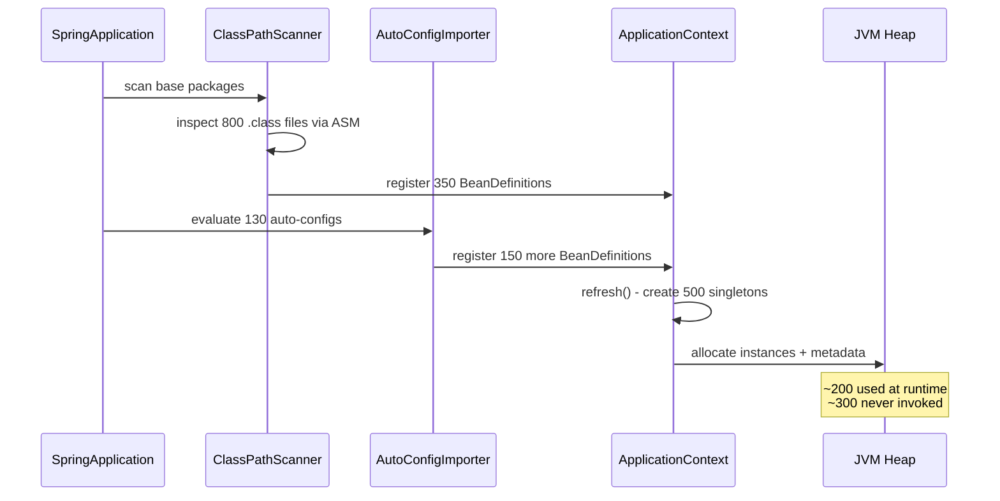
```mermaid
sequenceDiagram
    participant App as SpringApplication
    participant Scan as ClassPathScanner
    participant AC as AutoConfigImporter
    participant CTX as ApplicationContext
    participant Heap as JVM Heap

    App->>Scan: scan base packages
    Scan->>Scan: inspect 800 .class files via ASM
    Scan->>CTX: register 350 BeanDefinitions
    App->>AC: evaluate 130 auto-configs
    AC->>CTX: register 150 more BeanDefinitions
    CTX->>CTX: refresh() - create 500 singletons
    CTX->>Heap: allocate instances + metadata
    Note over Heap: ~200 used at runtime<br/>~300 never invoked
```

### 🚨 Failure Modes

**Failure 1 - Startup Timeout in Kubernetes:**
Kubernetes liveness probe fires at 30 seconds. The fat context takes 35 seconds to refresh. Pod enters `CrashLoopBackOff`. The HPA sees pods failing and does not scale, causing cascading failures during traffic spikes.
**Diagnostic:** `ApplicationStartup` metrics show the majority of time in `BeanFactory.instantiateSingletons`. Bean count in `/actuator/beans` exceeds 400. Many beans belong to unused features (JMX, Batch, Mail).
**Fix:** Exclude unused auto-configuration classes. Narrow component scan to only required packages. Increase probe `initialDelaySeconds` as a temporary bridge, but fix the root cause - a microservice context should start in under 10 seconds.

**Failure 2 - Test Suite Takes 15 Minutes:**
Each `@SpringBootTest` loads the full ApplicationContext. With 200 integration tests across 8 test classes, the context loads 8 times (not shared due to different `@MockBean` combinations). Each load takes 25 seconds. Total context initialization alone exceeds 3 minutes.
**Diagnostic:** Test logs show `Started MyApplicationTests in 25.3 seconds`. Different `@MockBean` sets across test classes prevent Spring's test context caching from reusing contexts.
**Fix:** Use `@SpringBootTest` sparingly. Prefer `@WebMvcTest`, `@DataJpaTest`, and other test slices that load minimal contexts. Standardize `@MockBean` sets across test classes to maximize context caching. Consider `@ContextConfiguration` with explicit configuration classes.

**Failure 3 - Memory Pressure in Containerized Fleet:**
Each microservice runs in a 512 MB container. The fat context consumes 280 MB at idle (bean instances, proxy classes, reflection metadata, annotation caches). Under load, the remaining 232 MB is insufficient for request processing, triggering frequent GC pauses and eventual OOMKills.
**Diagnostic:** Heap dump analysis shows `DefaultListableBeanFactory` and its `beanDefinitionMap` consuming significant memory. Many `BeanDefinition` objects reference classes from features the service does not use.
**Fix:** Profile with `jcmd <pid> GC.heap_info` and heap dump analysis. Remove unnecessary starters from the dependency tree entirely - not just auto-configuration exclusion. Every starter removed reduces both bean count and transitive classpath size.

### 🔬 Production Reality

In production microservice fleets, fat contexts are the number one contributor to infrastructure cost overruns that teams fail to attribute. A 30-service fleet where each service loads 300 unnecessary beans at roughly 1 KB per instance sounds small. The real cost is in proxy classes, CGLIB subclasses, annotation metadata caches, and BeanDefinition objects, which together consume 50-150 MB per service. Across 30 services with 3 replicas each, that amounts to 4.5-13.5 GB of wasted RAM. Mature platform teams measure bean count as a key metric in CI pipelines: `/actuator/beans | jq '.contexts[].beans | length'`. Teams that enforce bean budgets (maximum 200 beans for a microservice) report 40-60% reduction in startup time, 30-50% reduction in heap usage, and 3-5x improvement in test suite speed from better test slice adoption. Spring Modulith adoption in 2024-2025 has given teams a structured way to enforce module boundaries that naturally prevent fat contexts through build-time verification.

### ⚖️ Trade-offs & Alternatives

**BAD:**

```java
// Scan everything, configure everything
@SpringBootApplication
@ComponentScan("com.company")
public class MyApp {}
// Loads beans from all 50 modules
// 500+ beans, 25-second startup
```

**GOOD:**

```java
// Narrow scanning, explicit exclusions
@SpringBootApplication(
    scanBasePackages = {
        "com.company.order",
        "com.company.shared"
    },
    exclude = {
        JmxAutoConfiguration.class,
        BatchAutoConfiguration.class,
        MailSenderAutoConfiguration.class
    }
)
public class OrderServiceApp {}
// 180 beans, 6-second startup
```

| Strategy                  | Startup       | Memory        | Effort | Risk   |
| ------------------------- | ------------- | ------------- | ------ | ------ |
| Narrow `@ComponentScan`   | 20-40% faster | 10-20% less   | Low    | Low    |
| Exclude auto-config       | 10-30% faster | 10-15% less   | Low    | Medium |
| Remove unused starters    | 15-40% faster | 20-40% less   | Medium | Medium |
| Test slices over full ctx | N/A (tests)   | N/A           | Medium | Low    |
| Spring Modulith           | 30-50% faster | 25-40% less   | High   | Low    |
| Lazy initialization       | 50-70% faster | Deferred only | Low    | High   |
| GraalVM native image      | 90%+ faster   | 60-80% less   | High   | High   |

### ⚡ Decision Snap

- Microservice starts in > 15 seconds -> profile with `ApplicationStartup`, narrow scan, exclude unused auto-configs
- Test suite > 5 minutes -> adopt test slices (`@WebMvcTest`, `@DataJpaTest`) and standardize `@MockBean` sets
- Bean count > 300 for a focused microservice -> audit with `/actuator/beans`, remove unneeded starters
- Kubernetes pods in `CrashLoopBackOff` on deploy -> immediate: increase probe delay; root fix: trim context
- Monolith with 1000+ beans, teams colliding -> adopt Spring Modulith for module isolation
- Targeting GraalVM native image -> mandatory: minimize scanning, eliminate reflection-heavy beans

### ⚠️ Top Traps

| #   | Trap                                                 | Why It Hurts                                                                                    | Prevention                                                           |
| --- | ---------------------------------------------------- | ----------------------------------------------------------------------------------------------- | -------------------------------------------------------------------- |
| 1   | `@ComponentScan` on root package                     | Scans every class in the project including test utilities, unused modules, generated code       | Always specify leaf packages explicitly                              |
| 2   | `spring.main.lazy-initialization=true` in production | Moves startup cost to first request, causes timeout on first user, hides missing bean errors    | Use lazy init only for profiling; never deploy it to production      |
| 3   | Excluding auto-configuration without testing         | Removing `DataSourceAutoConfiguration` when a health check depends on it causes runtime failure | Run full integration test suite after every exclusion change         |
| 4   | Adding starters "just in case"                       | Each starter adds 10-50 beans and transitive dependencies; 5 unused starters can add 200 beans  | Audit `pom.xml` quarterly; remove starters with zero runtime callers |
| 5   | Ignoring test context load time                      | 8 test classes loading full context at 25s each adds 3+ minutes of pure waste to every CI build | Enforce test slices via code review; track context caching metrics   |

### 🪜 Learning Ladder

**Prerequisites:**

- SPR-072 Spring Context Startup Optimization - techniques for reducing context initialization cost
- SPR-075 Spring Boot Memory Footprint Analysis - understanding heap impact of excessive bean loading

**THIS:** SPR-085 Fat ApplicationContext Anti-Pattern - diagnosing and trimming bloated contexts that inflate startup, memory, and test duration

**Next steps:**

- SPR-086 Spring Deep-Dive Interview Questions - applying anti-pattern knowledge in interview scenarios

**The Surprising Truth:** The biggest contributor to fat contexts is not auto-configuration - it is transitive component scanning of test-scoped and build-generated classes. Teams using `@ComponentScan("com.company")` unknowingly scan test configuration classes, code generators, and build tool output that happen to carry `@Component`. A single `@TestConfiguration` class left in the main source tree (a common copy-paste error) can pull mock beans, test stubs, and in-memory database configurations into the production context. The first optimization should always be verifying that your scan path contains only production classes.

**Further Reading:**

1. Spring Boot Reference: "Startup Tracking" and "Lazy Initialization"
2. Spring Modulith Reference Documentation
3. Spring Boot Actuator `/beans` and `/startup` endpoints documentation

**Revision Card:**

1. The default behavior of `@ComponentScan` without a base package argument is to scan the package of the declaring class and all sub-packages recursively.
2. Auto-configuration decides which features to activate by evaluating `@Conditional` annotations: `@ConditionalOnClass` (classpath), `@ConditionalOnProperty` (configuration), and `@ConditionalOnMissingBean` (user overrides).
3. `spring.main.lazy-initialization=true` reduces startup time by deferring bean creation to first access, but total steady-state memory is unchanged once all beans are accessed.

---

---

# SPR-086 Spring Deep-Dive Interview Questions

**TL;DR** - Ten advanced Spring questions that probe internals, failure modes, and production trade-offs beyond surface-level API knowledge.

### 🔥 Problem Statement

Senior Spring interviews fail when candidates memorize annotations without understanding the machinery underneath. Interviewers ask "how does `@Transactional` actually work?" and get blank stares. They ask about circular dependency resolution and hear "Spring handles it." They ask about SecurityFilterChain ordering and candidates guess randomly. The gap: knowing what Spring does vs. knowing why it does it, how it breaks, and what you do when it breaks. This keyword covers ten questions that separate engineers who use Spring from engineers who understand Spring.

### 📜 Historical Context

Spring interview culture evolved through three phases. Phase one (2005-2012): XML configuration trivia. Phase two (2013-2018): annotation knowledge - "@Autowired vs @Inject." Phase three (2019-present): production depth - "walk me through what happens when a `@Transactional` method calls another `@Transactional` method on the same bean." Modern interviews probe auto-configuration mechanics, security filter ordering, connection pool behavior under load, and CVE response. The shift reflects that production failures are about proxy boundaries, lifecycle hooks, and configuration precedence - not syntax.

### 🔩 First Principles

**CORE INVARIANTS:**

1. Spring is a proxy-based framework - understanding proxy boundaries explains 80% of "weird" behavior in transactions, security, and AOP
2. Bean lifecycle has a strict ordering (instantiation, population, initialization, destruction) - lifecycle hooks only make sense within this sequence
3. Auto-configuration is condition-driven class loading, not magic - every "it just works" feature has an explicit `@Conditional` guard

**DERIVED DESIGN:**
Interview questions that probe these invariants reveal whether a candidate has a mental model of Spring's runtime or just memorized its API surface. Proxy awareness predicts whether someone will debug self-invocation bugs. Lifecycle understanding predicts whether someone can write correct `BeanPostProcessor` logic. Condition awareness predicts whether someone can troubleshoot auto-configuration failures.

### 🧠 Mental Model

> Think of a deep Spring interview as a building inspection. A surface inspector checks that doors open and lights turn on. A structural inspector checks load-bearing walls, wiring gauge, plumbing pressure, and fire exits. Both inspectors walk the same building, but the structural inspector finds the problems that cause failures at scale.

- "doors open" -> annotations compile and beans inject
- "load-bearing walls" -> proxy mechanics and lifecycle ordering
- "wiring gauge" -> connection pool sizing and thread models
- "fire exits" -> CVE response and security filter ordering

**Where this analogy breaks down:** Buildings are static after construction. Spring applications change at runtime - bean scopes create and destroy instances, context refreshes reload configuration, and reactive stacks fundamentally alter the threading model.

### 🧩 Components

```
+-------------------------------------------+
| TEN INTERVIEW QUESTIONS                   |
+-------------------------------------------+
| Q1  Auto-Config Internals      [L4-ARCH] |
| Q2  BPP vs BFPP                [L4-LIFE] |
| Q3  Circular Dependency        [L4-LIFE] |
| Q4  @Transactional Pitfalls    [L4-PRXY] |
| Q5  SecurityFilterChain Order  [L4-SECU] |
| Q6  Connection Pool Sizing     [L5-PERF] |
| Q7  Reactive vs Servlet        [L5-ARCH] |
| Q8  CVE Response Process       [L5-SEC]  |
| Q9  Context Optimization       [L4-PERF] |
| Q10 Bean Scoping               [L4-LIFE] |
+-------------------------------------------+
| DEPTH AXIS: WHY -> HOW -> BREAKS -> FIX  |
+-------------------------------------------+
```

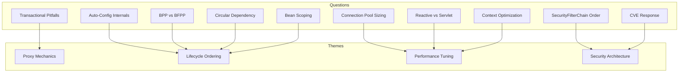
```mermaid
flowchart TB
  subgraph Questions
    Q1[Auto-Config Internals]
    Q2[BPP vs BFPP]
    Q3[Circular Dependency]
    Q4[Transactional Pitfalls]
    Q5[SecurityFilterChain Order]
    Q6[Connection Pool Sizing]
    Q7[Reactive vs Servlet]
    Q8[CVE Response]
    Q9[Context Optimization]
    Q10[Bean Scoping]
  end
  subgraph Themes
    PROXY[Proxy Mechanics]
    LIFE[Lifecycle Ordering]
    PERF[Performance Tuning]
    SEC[Security Architecture]
  end
  Q1 --> LIFE
  Q2 --> LIFE
  Q3 --> LIFE
  Q4 --> PROXY
  Q5 --> SEC
  Q6 --> PERF
  Q7 --> PERF
  Q8 --> SEC
  Q9 --> PERF
  Q10 --> LIFE
```

### 📶 Gradual Depth

**Layer 1 - Anyone:** These questions test whether you understand Spring's internal machinery, not just its API. Each question has a surface answer and a deep answer. Interviewers want the deep one.

**Layer 2 - Junior:** You should know that `@Transactional` uses proxies, that auto-configuration checks classpath conditions, and that `BeanPostProcessor` runs after instantiation. Focus on the "what happens" level.

**Layer 3 - Mid-level:** You should explain proxy self-invocation bugs, circular dependency resolution via three-level caches, and why `@Order` on security filters matters. Focus on the "why it breaks" level.

**Layer 4 - Senior:** You should discuss connection pool sizing formulas, reactive vs servlet trade-offs with throughput numbers, CVE triage processes, and context startup optimization strategies. Focus on production decisions.

### ⚙️ How It Works

Ten questions with deep answers follow. Each answer covers mechanism, failure mode, and production relevance.

```
Q1: AUTO-CONFIG INTERNALS
+---------------------------------------+
| SpringApplication.run()               |
|   -> AutoConfigImportSelector         |
|     -> reads .imports file            |
|       -> evaluates @Conditional       |
|         -> registers matching beans   |
+---------------------------------------+
| Debug: --debug flag prints report     |
| Override: user @Bean wins always      |
+---------------------------------------+
```

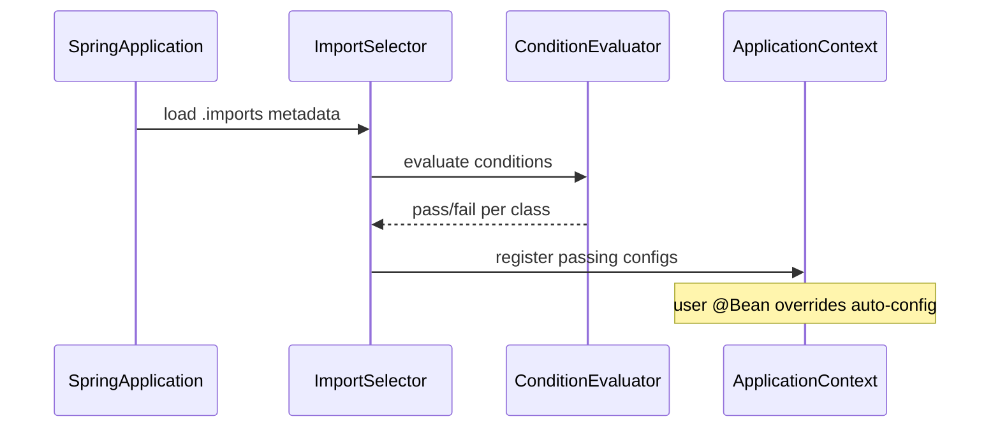
```mermaid
sequenceDiagram
  participant App as SpringApplication
  participant Sel as ImportSelector
  participant Cond as ConditionEvaluator
  participant Ctx as ApplicationContext
  App->>Sel: load .imports metadata
  Sel->>Cond: evaluate conditions
  Cond-->>Sel: pass/fail per class
  Sel->>Ctx: register passing configs
  Note over Ctx: user @Bean overrides auto-config
```

**Q1 - How does Spring Boot auto-configuration actually work?**
Spring Boot reads `META-INF/spring/...AutoConfiguration.imports` to discover configuration classes. Each class carries `@Conditional` annotations - `@ConditionalOnClass` checks the classpath, `@ConditionalOnProperty` checks config values, `@ConditionalOnMissingBean` defers to user-defined beans. The `AutoConfigurationImportSelector` filters this list at startup. Use `--debug` to print the conditions evaluation report. The key insight: auto-configuration is not scanning your code - it is evaluating its own shipped configurations against your environment.

**Q2 - BeanPostProcessor vs BeanFactoryPostProcessor?**
`BeanFactoryPostProcessor` (BFPP) runs before any bean is instantiated - it modifies bean definitions (metadata). `PropertySourcesPlaceholderConfigurer` is the classic example: it resolves `${...}` placeholders in definitions. `BeanPostProcessor` (BPP) runs after each bean is instantiated - it modifies or wraps bean instances. `AutowiredAnnotationBeanPostProcessor` injects `@Autowired` dependencies. Critical ordering: BFPP modifies the blueprint, BPP modifies the building. Declaring a BPP inside a `@Configuration` class that also defines other beans forces early instantiation of that config class - the BPP must exist before other beans can be post-processed.

**Q3 - How does Spring resolve circular dependencies?**
Spring uses a three-level cache: `singletonObjects` (fully initialized), `earlySingletonObjects` (partially initialized), and `singletonFactories` (ObjectFactory lambdas). When bean A needs bean B, and B needs A, Spring exposes A's early reference via the factory cache before A is fully initialized. B gets A's proxy/reference and completes. Then A completes. This only works for singleton scope with setter/field injection. Constructor injection circular dependencies fail immediately - Spring cannot expose an early reference before the constructor finishes. Spring Boot 2.6+ disables circular dependencies by default.

**Q4 - What are the common `@Transactional` proxy pitfalls?**
Self-invocation is the top trap: when method A on a bean calls method B on the same bean, the call bypasses the proxy - B's `@Transactional` annotation has no effect. Fix: extract B to a separate bean, or inject the bean into itself. Second pitfall: `@Transactional` on private methods is silently ignored by CGLIB proxies. Third: checked exceptions do not trigger rollback by default - only `RuntimeException` and `Error` do. Use `rollbackFor = Exception.class` for checked exceptions. Fourth: `@Transactional(readOnly = true)` does not prevent writes at the Spring level - it hints to the JDBC driver and database for optimization.

**Q5 - How does SecurityFilterChain ordering work?**
Spring Security registers a `DelegatingFilterProxy` in the servlet filter chain, which delegates to a `FilterChainProxy`. The `FilterChainProxy` holds an ordered list of `SecurityFilterChain` beans. Each chain has a request matcher and a list of security filters. Chains are evaluated in `@Order` sequence - the first matching chain handles the request; remaining chains are skipped. Within a chain, filters execute in a fixed internal order defined by `FilterOrderRegistration`. Common mistake: defining two chains without explicit `@Order` - Spring picks an arbitrary order, causing intermittent auth failures.

**Q6 - How do you size a connection pool?**
The formula from the HikariCP wiki: `connections = ((core_count * 2) + effective_spindle_count)`. For SSDs, spindle count is typically 1. A 4-core server needs roughly 9-10 connections for optimal throughput. More connections increase context switching and lock contention at the database. HikariCP defaults to `maximumPoolSize=10`, which is reasonable for most services. The `minimumIdle` setting (default equals `maximumPoolSize`) controls whether idle connections are released. Under microservices with 20 instances, 10 connections each means 200 database connections - most databases default to 100-150 max connections, requiring either pool reduction or PgBouncer/ProxySQL.

**Q7 - When do you choose reactive over servlet?**
Choose reactive (WebFlux) when: many concurrent connections with high I/O wait, team understands reactive, and entire dependency chain is non-blocking. Choose servlet (MVC) when: CPU-bound workloads, blocking libraries, or team lacks reactive experience. A partially reactive stack performs worse than pure servlet because it blocks the small event-loop pool.

**Q8 - What is your CVE response process for Spring?**
Step 1: Subscribe to spring.io/security and monitor CVE databases. Step 2: When a CVE drops, assess impact by checking whether affected versions match your deployments. Step 3: Read the advisory for mitigation - some CVEs have workarounds (WAF rules, property toggles) while patches deploy. Step 4: Upgrade the affected dependency using `./gradlew dependencyUpdates` or Maven versions plugin. Step 5: Run the full test suite. Step 6: Deploy to staging, validate, promote to production. For critical CVEs like Spring4Shell (CVE-2022-22965), compress this to hours, not days. Key: maintain a software bill of materials (SBOM) so you know immediately which services run affected versions.

**Q9 - How do you optimize Spring context startup?**
Measure first: `spring.main.log-startup-info=true` and `ApplicationStartup` with `BufferingApplicationStartup` capture timing data. Biggest wins: enable lazy initialization (`spring.main.lazy-initialization=true`) for non-critical beans, use `@Lazy` selectively, exclude unused auto-configurations via `spring.autoconfigure.exclude`, scan only necessary packages (avoid root-package `@ComponentScan`), and use Spring Boot 3.2+ AOT processing for GraalVM native images. Functional bean registration (`SpringApplicationBuilder.initializers`) avoids reflection cost. Index-based scanning (`spring-context-indexer`) replaces runtime classpath scanning with a compile-time index.

**Q10 - Explain bean scoping beyond singleton and prototype.**
`singleton` (default): one instance per ApplicationContext. `prototype`: new instance per injection point and `getBean()` call - Spring does not manage the full lifecycle (no `@PreDestroy`). `request`: one instance per HTTP request (stored in `RequestAttributes`). `session`: one instance per HTTP session. `application`: one instance per `ServletContext` (similar to singleton but explicit for web scope). Injecting a shorter-scoped bean into a longer-scoped bean requires a scoped proxy (`@Scope(proxyMode = ScopedProxyMode.TARGET_CLASS)`) or `ObjectProvider<T>` - otherwise the shorter-scoped bean is resolved once and never refreshed.

### 🚨 Failure Modes

**Failure 1 - Self-Invocation Bypass:**
A `@Service` method annotated `@Transactional` calls another `@Transactional` method on the same class. The inner method runs without a transaction because the call never passes through the proxy.

**Diagnostic:** Enable `logging.level.org.springframework.transaction=TRACE`. Look for "Creating new transaction" log entries. If the inner method lacks this entry, self-invocation is confirmed.

**Fix:** Extract the inner method to a separate `@Service` bean. Alternatively, inject `TransactionTemplate` and wrap the call programmatically. Avoid the self-injection pattern (`@Lazy @Autowired private MyService self`) - it works but hides the design problem.

**Failure 2 - Connection Pool Exhaustion:**
Under load, requests hang with increasing latency. Thread dumps show all threads blocked at `HikariPool.getConnection()` with 30-second timeout. The pool is exhausted because transactions hold connections while waiting for external HTTP calls inside the transaction boundary.

**Diagnostic:** Enable HikariCP metrics: `spring.datasource.hikari.register-mbeans=true`. Monitor `hikaricp_connections_active` and `hikaricp_connections_pending` via Micrometer. Active equals max while pending grows means pool exhaustion.

**Fix:** Move external HTTP calls outside the `@Transactional` boundary. Reduce `maximumPoolSize` to force early detection in testing. Set `connectionTimeout` to 5 seconds (fail fast) rather than the 30-second default.

**Failure 3 - SecurityFilterChain Ordering Collision:**
Two `SecurityFilterChain` beans exist without explicit `@Order`. API endpoints intermittently return 401 because the wrong chain matches first. The order depends on bean registration sequence, which varies between JVM restarts.

**Diagnostic:** Enable `logging.level.org.springframework.security=DEBUG`. Look for "Checking match of request" entries. If the wrong chain matches, ordering is the cause.

**Fix:** Add explicit `@Order` annotations. Use `securityMatcher()` to narrow each chain's request scope. Place the most specific matcher first (lowest `@Order` value).

### 🔬 Production Reality

In production interviews, Q4 (self-invocation) and Q6 (pool sizing) produce the most "aha" moments. Candidates who explain the three-level cache (Q3) stand out because few read `DefaultSingletonBeanRegistry` source. The reactive vs servlet question (Q7) separates architects from developers. CVE response (Q8) is increasingly asked at staff-level because it tests operational maturity. Companies running 200+ Spring Boot microservices care about startup time (Q9) because 30-second startup across 200 services means hours-long deployments.

### ⚖️ Trade-offs & Alternatives

**BAD:**

```java
// Memorized surface answer
// "BeanPostProcessor processes beans"
// No mechanism, no ordering, no failure mode
```

**GOOD:**

```java
// Deep answer with mechanism
// "BFPP modifies definitions BEFORE instantiation
//  - e.g., PropertySourcesPlaceholderConfigurer
//  BPP modifies instances AFTER instantiation
//  - e.g., AutowiredAnnotationBeanPostProcessor
//  Declaring BPP in @Configuration forces early
//  init of that config class - a subtle ordering
//  trap that causes injection failures."
```

| Dimension    | Surface Answer           | Deep Answer                     |
| ------------ | ------------------------ | ------------------------------- |
| Auto-config  | "It just works"          | Condition evaluation + .imports |
| Transactions | "Add @Transactional"     | Proxy boundary + rollback rules |
| Security     | "Configure HttpSecurity" | FilterChain ordering + matchers |
| Pool sizing  | "Use defaults"           | Formula + instance count math   |
| Reactive     | "It's faster"            | I/O-bound only + full stack req |

### ⚡ Decision Snap

Use this keyword when you can answer all ten questions at the "mechanism + failure mode" level. If you can only give surface answers, revisit prerequisite keywords (SPR-070 for auto-config, SPR-071 for BPP/BFPP, SPR-046 for `@Transactional`, SPR-077 for reactive vs servlet).

### ⚠️ Top Traps

| #   | Trap                                           | Why It Bites                                    | Fix                                       |
| --- | ---------------------------------------------- | ----------------------------------------------- | ----------------------------------------- |
| 1   | Memorizing annotations without proxy awareness | Self-invocation bugs in production              | Study CGLIB proxy generation              |
| 2   | Ignoring connection pool math in microservices | 200 instances x 10 connections > DB max         | Calculate total pool across fleet         |
| 3   | Claiming reactive is "always faster"           | Partially reactive stacks perform worse         | Explain the full-stack requirement        |
| 4   | Not knowing circular dependency resolution     | Cannot debug "BeanCurrentlyInCreationException" | Read DefaultSingletonBeanRegistry         |
| 5   | Skipping CVE response question as "ops work"   | Staff interviews test operational maturity      | Prepare a concrete incident response flow |

### 🪜 Learning Ladder

**Prerequisites:**

- SPR-070 Spring Boot Auto-Configuration Internals - auto-configuration mechanics tested in Q1
- SPR-071 BeanPostProcessor and BeanFactoryPostProcessor - lifecycle ordering tested in Q2-Q3

**THIS:** SPR-086 Spring Deep-Dive Interview Questions - ten advanced questions probing internals, failure modes, and production trade-offs

**Next steps:**

- SPR-089 Spring Mastery Verification - comprehensive self-assessment across all Production and Cloud topics

**The Surprising Truth:** The question that eliminates the most candidates is not the hardest one technically - it is Q4 (self-invocation). Most developers have used `@Transactional` for years without realizing that calling another method on the same bean bypasses the proxy entirely. The fix is trivial; the diagnostic awareness is what matters.

**Further Reading:**

1. Spring Framework source: `DefaultSingletonBeanRegistry.java` (three-level cache)
2. HikariCP wiki: "About Pool Sizing" (connection formula)
3. Spring Security reference: "Security Filter Chain" architecture section

**Revision Card:**

1. Calling a `@Transactional` method from the same bean skips the transaction because the call goes directly to the target method, bypassing the CGLIB/JDK proxy that intercepts external calls.
2. The three-level cache: `singletonObjects` (complete beans), `earlySingletonObjects` (partially initialized), and `singletonFactories` (ObjectFactory lambdas exposing early references).
3. The HikariCP pool sizing formula `(core_count * 2) + spindle_count` accounts for CPU parallelism, I/O wait overlap, and physical disk parallelism.

---

---

# SPR-087 REST API Phase 4 - Observability and Resilience

**TL;DR** - Add Actuator health probes, Micrometer metrics, Resilience4j circuit breakers, structured logging, and Kubernetes probes to the Phase 3 API.

### 🔥 Problem Statement

A secured REST API (Phase 3) that works in development will fail silently in production. Without health probes, Kubernetes routes traffic to unhealthy pods. Without metrics, you cannot detect latency degradation until users complain. Without circuit breakers, a slow downstream service cascades into full system failure. Without structured logging with correlation IDs, tracing a request across services requires grep heroics. Without readiness/liveness separation, deployments cause unnecessary restarts. Phase 4 solves these five gaps by layering observability and resilience onto the existing API without rewriting business logic.

### 📜 Historical Context

Early Spring Boot (1.x) shipped Actuator with basic `/health` and `/metrics` endpoints backed by Dropwizard Metrics. Spring Boot 2.0 replaced Dropwizard with Micrometer, providing a vendor-neutral metrics facade (similar to SLF4J for logging). Resilience4j emerged in 2018 as the successor to Netflix Hystrix (maintenance mode since 2018), offering a lighter, functional, and modular approach to circuit breaking, rate limiting, and retries. Spring Boot 2.4 introduced Kubernetes-specific probe support (`/actuator/health/liveness` and `/actuator/health/readiness`) that auto-activate when the `KUBERNETES_SERVICE_HOST` environment variable is present. Spring Boot 3.x and Micrometer 1.10+ added Observation API, unifying metrics and tracing under a single abstraction. Structured logging (JSON format) became a first-class Boot feature in Spring Boot 3.4 with `logging.structured.format.console`.

### 🔩 First Principles

**CORE INVARIANTS:**

1. Observability requires three pillars - metrics (what happened numerically), logs (what happened contextually), and traces (what happened across services) - each answers different production questions
2. Circuit breakers protect the caller, not the callee - they prevent resource exhaustion in the calling service when a downstream dependency fails
3. Health probes must distinguish liveness (is the process stuck?) from readiness (can it serve traffic?) - conflating them causes unnecessary pod kills during transient failures

**DERIVED DESIGN:**
Actuator provides the health probe infrastructure. Micrometer provides the metrics pillar. Structured logging with correlation IDs bridges the logs and traces pillars. Resilience4j provides circuit breaking at the integration boundary. Kubernetes probes consume Actuator health groups to make scheduling decisions. Each component is independently useful but together they form a complete production observability and resilience layer.

### 🧠 Mental Model

> Think of Phase 4 as installing a car dashboard, airbags, and crumple zones on a car that already has an engine and locks (Phase 3). The dashboard (Actuator + Micrometer) tells you speed, fuel, and engine temperature. The airbags (circuit breakers) prevent a collision from killing the whole system. The crumple zones (structured logging) preserve evidence for crash investigation.

- "dashboard gauges" -> Micrometer metrics + Actuator endpoints
- "airbags" -> Resilience4j circuit breaker on external calls
- "crumple zones" -> structured JSON logs with correlation IDs
- "safety inspection sticker" -> Kubernetes readiness/liveness probes

**Where this analogy breaks down:** Car safety features are passive until a crash. Circuit breakers are active - they preemptively reject requests when failure thresholds are crossed, which has no automotive equivalent. A closer match would be an engine governor that cuts fuel when temperature exceeds a threshold.

### 🧩 Components

```
+--------------------------------------------------+
| PHASE 4 OBSERVABILITY + RESILIENCE STACK         |
+--------------------------------------------------+
| Kubernetes                                       |
|   /health/liveness  -> LivenessStateHealthInd.  |
|   /health/readiness -> ReadinessStateHealthInd. |
+--------------------------------------------------+
| Actuator            | Micrometer                |
|   /health           |   Timer, Counter, Gauge   |
|   /info             |   MeterRegistry           |
|   /prometheus       |   @Timed, @Counted        |
+--------------------------------------------------+
| Resilience4j                                     |
|   CircuitBreaker -> external HTTP calls          |
|   fallback method -> graceful degradation        |
+--------------------------------------------------+
| Structured Logging                               |
|   JSON format + correlationId MDC                |
|   request traceId propagation                    |
+--------------------------------------------------+
```

```mermaid
flowchart TB
  K8S[Kubernetes Scheduler]
  K8S -->|liveness probe| LIVE[/health/liveness]
  K8S -->|readiness probe| READY[/health/readiness]
  subgraph Spring Boot App
    ACT[Actuator Endpoints]
    LIVE --> ACT
    READY --> ACT
    MIC[Micrometer Metrics]
    ACT --> MIC
    LOG[Structured Logger]
    CB[Resilience4j CircuitBreaker]
    API[REST Controllers]
    API --> CB
    CB -->|closed| EXT[External Service]
    CB -->|open| FB[Fallback Response]
    API --> LOG
    API --> MIC
  end
  PROM[Prometheus] -->|scrape| MIC
```

### 📶 Gradual Depth

**Layer 1 - Anyone:** Production APIs need monitoring (know when things break), resilience (survive when dependencies break), and structured logs (investigate after things break). Phase 4 adds all three.

**Layer 2 - Junior:** Add `spring-boot-starter-actuator` for health endpoints. Add `micrometer-registry-prometheus` to expose metrics at `/actuator/prometheus`. Add `resilience4j-spring-boot3` to wrap external calls in circuit breakers. Configure JSON logging for structured output.

**Layer 3 - Mid-level:** Customize health indicators for database, cache, and external services. Create custom Micrometer `Timer` and `Counter` metrics for business operations. Configure Resilience4j with sliding window, failure rate threshold, and wait duration. Add correlation ID propagation via MDC and `OncePerRequestFilter`.

**Layer 4 - Senior:** Tune circuit breaker parameters based on observed failure rates and SLO budgets. Separate liveness from readiness health groups so database outages cause traffic drainage, not pod kills. Build Grafana dashboards from Prometheus metrics with RED method (rate, errors, duration). Configure alerting rules on p99 latency thresholds.

### ⚙️ How It Works

```
REQUEST FLOW WITH OBSERVABILITY
+---------------------------------------+
| 1. Request arrives                    |
| 2. Filter sets correlationId in MDC   |
| 3. Controller handles request         |
| 4. Timer.record() wraps execution     |
| 5. External call goes through CB      |
|    5a. CB CLOSED: call proceeds       |
|    5b. CB OPEN: fallback returns      |
| 6. Response logged with correlationId |
| 7. Metrics exported to /prometheus    |
+---------------------------------------+
```

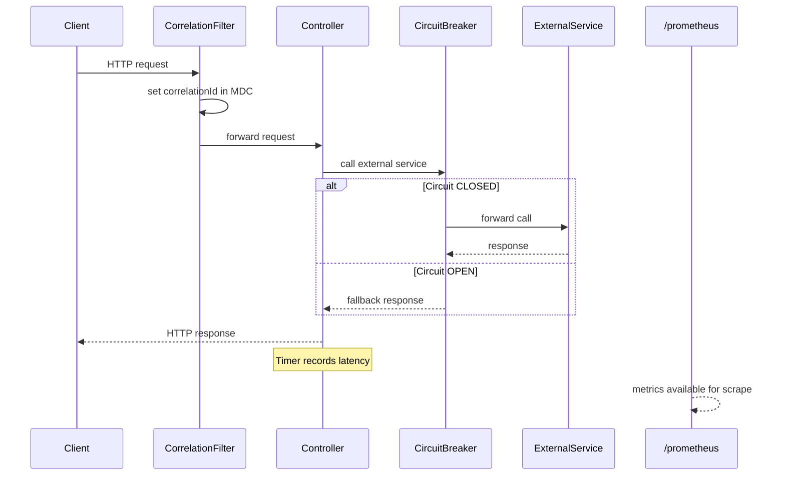
```mermaid
sequenceDiagram
  participant Client
  participant Filter as CorrelationFilter
  participant Ctrl as Controller
  participant CB as CircuitBreaker
  participant Ext as ExternalService
  participant Prom as /prometheus

  Client->>Filter: HTTP request
  Filter->>Filter: set correlationId in MDC
  Filter->>Ctrl: forward request
  Ctrl->>CB: call external service
  alt Circuit CLOSED
    CB->>Ext: forward call
    Ext-->>CB: response
  else Circuit OPEN
    CB-->>Ctrl: fallback response
  end
  Ctrl-->>Client: HTTP response
  Note over Ctrl: Timer records latency
  Prom-->>Prom: metrics available for scrape
```

**Step 1 - Dependencies:**

```xml
<!-- pom.xml additions -->
<dependency>
  <groupId>
    org.springframework.boot
  </groupId>
  <artifactId>
    spring-boot-starter-actuator
  </artifactId>
</dependency>
<dependency>
  <groupId>io.micrometer</groupId>
  <artifactId>
    micrometer-registry-prometheus
  </artifactId>
</dependency>
<dependency>
  <groupId>io.github.resilience4j</groupId>
  <artifactId>
    resilience4j-spring-boot3
  </artifactId>
</dependency>
```

**Step 2 - Actuator and Health Probes:**

```yaml
# application.yml
management:
  endpoints:
    web:
      exposure:
        include: health,info,prometheus
  endpoint:
    health:
      show-details: when-authorized
      probes:
        enabled: true
  health:
    livenessstate:
      enabled: true
    readinessstate:
      enabled: true
```

Liveness checks whether the JVM is stuck (deadlock detection). Readiness checks whether the app can serve traffic (database up, caches warm). Kubernetes uses these to decide restarts vs traffic draining.

**Step 3 - Custom Micrometer Metrics:**

```java
@RestController
@RequiredArgsConstructor
public class OrderController {

  private final MeterRegistry registry;
  private final OrderService orderService;

  @PostMapping("/orders")
  public ResponseEntity<Order> create(
      @RequestBody OrderRequest req) {
    return registry
        .timer("orders.create")
        .record(() -> {
          Order order =
              orderService.create(req);
          registry.counter(
              "orders.total",
              "status", "created"
          ).increment();
          return ResponseEntity
              .status(201)
              .body(order);
        });
  }
}
```

**Step 4 - Resilience4j Circuit Breaker:**

```yaml
# application.yml
resilience4j:
  circuitbreaker:
    instances:
      paymentService:
        sliding-window-size: 10
        failure-rate-threshold: 50
        wait-duration-in-open-state: 10s
        permitted-number-of-calls-in-half-open-state: 3
```

```java
@Service
@RequiredArgsConstructor
public class PaymentClient {

  private final RestClient restClient;

  @CircuitBreaker(
      name = "paymentService",
      fallbackMethod = "paymentFallback")
  public PaymentResult charge(
      PaymentRequest req) {
    return restClient.post()
        .uri("/payments")
        .body(req)
        .retrieve()
        .body(PaymentResult.class);
  }

  private PaymentResult paymentFallback(
      PaymentRequest req, Throwable t) {
    return PaymentResult.pending(
        "Payment service unavailable");
  }
}
```

**Step 5 - Structured Logging with Correlation ID:**

```java
@Component
public class CorrelationFilter
    extends OncePerRequestFilter {

  @Override
  protected void doFilterInternal(
      HttpServletRequest req,
      HttpServletResponse resp,
      FilterChain chain)
      throws ServletException, IOException {
    String corrId = req.getHeader(
        "X-Correlation-ID");
    if (corrId == null) {
      corrId = UUID.randomUUID().toString();
    }
    MDC.put("correlationId", corrId);
    resp.setHeader(
        "X-Correlation-ID", corrId);
    try {
      chain.doFilter(req, resp);
    } finally {
      MDC.remove("correlationId");
    }
  }
}
```

```yaml
# application.yml (Spring Boot 3.4+)
logging:
  structured:
    format:
      console: logfmt
  pattern:
    level: "%5p [%X{correlationId}]"
```

**Step 6 - Kubernetes Deployment Probes:**

```yaml
# k8s deployment excerpt
livenessProbe:
  httpGet:
    path: /actuator/health/liveness
    port: 8080
  initialDelaySeconds: 30
  periodSeconds: 10
readinessProbe:
  httpGet:
    path: /actuator/health/readiness
    port: 8080
  initialDelaySeconds: 10
  periodSeconds: 5
```

### 🚨 Failure Modes

**Failure 1 - Conflated Liveness and Readiness:**
A single `/health` endpoint checks both database connectivity and JVM liveness. When the database has a 30-second blip, Kubernetes kills the pod (liveness failure) instead of draining traffic (readiness failure). Every pod restarts, causing a cascade.

**Diagnostic:** Check Kubernetes events: `kubectl describe pod`. If `Liveness probe failed` appears during a transient dependency outage, probes are conflated.

**Fix:** Separate health groups. Liveness includes only JVM-level checks (deadlock, memory). Readiness includes dependency checks (database, cache, downstream services). Configure `management.endpoint.health.group.liveness.include=livenessState` and `management.endpoint.health.group.readiness.include=readinessState,db`.

**Failure 2 - Circuit Breaker Never Opens:**
The sliding window size is 100 but the service receives only 5 requests per minute to the downstream dependency. The failure rate never reaches the threshold because the window never fills. Failures accumulate silently.

**Diagnostic:** Check Resilience4j metrics: `resilience4j_circuitbreaker_state`. If the state remains `CLOSED` while downstream errors are logged, the window is too large for the traffic volume.

**Fix:** Reduce `sliding-window-size` to match realistic traffic volume. For low-traffic paths, use `count-based` sliding window with a small size (5-10) rather than `time-based`. Also set `minimum-number-of-calls` lower than the window size.

**Failure 3 - Missing Correlation ID Across Services:**
Logs show correlation IDs within a single service but downstream services generate new IDs. Cross-service tracing requires manual timestamp correlation.

**Diagnostic:** Search logs in two services for the same request. If correlation IDs differ, propagation is missing.

**Fix:** The `CorrelationFilter` sets the outgoing header, but the `RestClient` or `WebClient` must propagate it. Add a `ClientHttpRequestInterceptor` that reads the correlation ID from MDC and sets `X-Correlation-ID` on outgoing requests.

### 🔬 Production Reality

At scale, the most impactful component is the liveness/readiness separation. Teams that conflate them experience cascading restarts during every database maintenance window. Connection pool health should be part of readiness, not liveness. Circuit breaker tuning requires production traffic data - start with conservative thresholds (50% failure rate, 10-request window) and adjust based on observed patterns. Prometheus scrape intervals (typically 15-30 seconds) create a metrics blind spot - short-lived spikes may not appear in dashboards. Correlation IDs become essential once you operate more than two services - without them, incident investigation time grows exponentially with service count. The structured logging format (JSON or logfmt) matters less than consistency - pick one format across all services.

### ⚖️ Trade-offs & Alternatives

**BAD:**

```java
// No resilience - cascading failure
public PaymentResult charge(
    PaymentRequest req) {
  // If payment service is down,
  // this blocks for 30s (socket timeout)
  // while holding a thread and
  // a database connection
  return restClient.post()
      .uri("/payments")
      .body(req)
      .retrieve()
      .body(PaymentResult.class);
}
```

**GOOD:**

```java
// Circuit breaker prevents cascade
@CircuitBreaker(
    name = "paymentService",
    fallbackMethod = "paymentFallback")
public PaymentResult charge(
    PaymentRequest req) {
  return restClient.post()
      .uri("/payments")
      .body(req)
      .retrieve()
      .body(PaymentResult.class);
}
// Fails fast when circuit opens
// Returns graceful degradation
```

| Dimension          | Without Phase 4       | With Phase 4          |
| ------------------ | --------------------- | --------------------- |
| Failure detection  | User reports          | Automated alerts      |
| Downstream failure | 30s timeout cascade   | Circuit opens in ms   |
| Log investigation  | grep + timestamps     | correlationId filter  |
| K8s stability      | Pod restarts on blips | Traffic draining only |
| Metric visibility  | None                  | RED method dashboards |

### ⚡ Decision Snap

Implement Phase 4 when your API moves from development to staging or production. Actuator and health probes are non-negotiable for any Kubernetes deployment. Add Micrometer metrics for any endpoint that has an SLO. Add Resilience4j circuit breakers on every external HTTP call - the cost is one annotation and a fallback method. Add structured logging before you operate more than one service. Skip Phase 4 only for throwaway prototypes that will never see production traffic.

### ⚠️ Top Traps

| #   | Trap                                                     | Why It Bites                            | Fix                                             |
| --- | -------------------------------------------------------- | --------------------------------------- | ----------------------------------------------- |
| 1   | Using `/health` for both liveness and readiness          | DB blip kills all pods                  | Separate health groups with distinct indicators |
| 2   | Circuit breaker window too large for traffic             | Never opens on low-traffic paths        | Size window to realistic request volume         |
| 3   | Forgetting to propagate correlation ID to outgoing calls | Cross-service tracing breaks            | Add interceptor to RestClient/WebClient         |
| 4   | Exposing all Actuator endpoints in production            | Security risk (env, beans, configprops) | Whitelist only health, info, prometheus         |
| 5   | Not setting `initialDelaySeconds` on K8s probes          | Pod killed before Spring context loads  | Set delay >= app startup time                   |

### 🪜 Learning Ladder

**Prerequisites:**

- SPR-067 REST API Phase 1 - CRUD and Validation - the base API this phase extends with observability
- SPR-081 Resilience4j Circuit Breaker with Spring - circuit breaker mechanics applied to API calls

**THIS:** SPR-087 REST API Phase 4 - Observability and Resilience - adding Actuator probes, Micrometer metrics, circuit breakers, and structured logging to the Phase 3 API

**Next steps:**

- SPR-088 Production Incident Simulation with Spring - practicing diagnosis of failures in the observable API

**The Surprising Truth:** The single highest-ROI observability investment is not metrics or tracing - it is separating liveness from readiness probes. This five-minute configuration change prevents the most common production incident pattern in Kubernetes: cascading pod restarts during transient dependency failures. Teams often skip it because the default `/health` endpoint "works" until the first database maintenance window.

**Further Reading:**

1. Spring Boot reference: "Production-ready Features" (Actuator chapter)
2. Micrometer documentation: "Concepts" and "Prometheus" sections
3. Kubernetes documentation: "Configure Liveness, Readiness and Startup Probes"

**Revision Card:**

1. Liveness and readiness probes must be separate health groups because liveness failure kills the pod while readiness failure only drains traffic. A transient database outage should drain traffic, not trigger cascading pod restarts.
2. When a Resilience4j circuit breaker opens, subsequent calls immediately execute the fallback method. After `wait-duration-in-open-state` expires, the circuit transitions to half-open for trial calls.
3. A correlation ID propagated via MDC attaches to all log statements within the current thread, while the HTTP header propagates it to downstream services, enabling end-to-end request tracing.

---

---

# SPR-088 Production Incident Simulation with Spring

**TL;DR** - Practice diagnosing five real production incidents in Spring apps to build muscle memory for outage response.

### 🔥 Problem Statement

Production incidents do not announce themselves with clear error messages. A connection pool exhaustion looks like random 500 errors. A memory leak manifests hours after deployment as increasing GC pauses. A missing circuit breaker causes a single slow dependency to bring down the entire platform. A fat application context adds minutes to rolling deployments. A security misconfiguration silently exposes admin endpoints.

Engineers who have never practiced diagnosing these failures under pressure default to restarting pods and hoping the problem goes away. This exercise builds the pattern-matching skills that separate responders who resolve incidents in minutes from those who escalate after hours of thrashing.

### 📜 Historical Context

Google's Site Reliability Engineering book (2016) formalized "Wheel of Misfortune" exercises where teams simulate production incidents using scripted scenarios. Netflix's Chaos Engineering practice (pioneered with Chaos Monkey around 2011) proved that injecting failures in controlled conditions dramatically reduces mean-time-to-recovery (MTTR) during real outages. AWS GameDay events follow the same principle.

In Spring Boot ecosystems, the five most common production incidents are connection pool exhaustion (HikariCP misconfiguration), memory leaks from unbounded caches, cascading failures from missing resilience patterns, slow startups blocking rolling deployments, and security misconfigurations exposing actuator endpoints. These five account for the majority of P1/P2 incidents in Spring-based microservice architectures.

### 🔩 First Principles

**CORE INVARIANTS:**

1. **Resource pools are bounded** - every connection pool, thread pool, and cache has a maximum size. Exceeding that maximum causes either rejection or unbounded queuing, both of which produce cascading failures.
2. **Memory is finite and GC is not magic** - any data structure that grows without bound will eventually trigger OutOfMemoryError. GC can reclaim unreachable objects but cannot help when your code holds strong references indefinitely.
3. **Failure propagation follows dependency chains** - when Service A calls Service B, and B is slow, A's threads block waiting. Without timeouts and circuit breakers, B's slowness becomes A's outage, then C's outage, then the whole platform's outage.

**DERIVED DESIGN:**

From invariant 1: size connection pools based on measured concurrency, not arbitrary defaults. From invariant 2: every cache needs an eviction policy with a maximum size. From invariant 3: every remote call needs a timeout, and frequently-failing calls need circuit breakers.

### 🧠 Mental Model

> Think of production incident diagnosis like emergency medicine triage. Symptoms (metrics, logs, errors) are vital signs. You do not treat the symptom directly - you diagnose the underlying organ system failure, stabilize, then fix the root cause.

- Elevated response times -> check thread pools and connection pools (circulation)
- Growing heap usage -> check caches and object retention (internal bleeding)
- Cascading 503 errors -> check dependency health and circuit breakers (organ failure chain)
- Slow startup -> check bean initialization and context scanning (slow recovery from surgery)
- Unauthorized access in logs -> check security filter chain (compromised immune system)

**Where this analogy breaks down:** Medical triage is sequential and resource-constrained. Production incidents allow parallel investigation: you can check metrics dashboards, thread dumps, and heap histograms simultaneously. Also, in medicine you cannot "roll back" a patient to a previous state, but in software you can revert deployments.

### 🧩 Components

```
+---------------------------------------------------+
|       Five Production Incident Scenarios           |
|                                                    |
|  Scenario 1: Connection Pool Exhaustion            |
|  [HikariCP] -> maxPoolSize=10, demand=50           |
|  Symptom: SQLTransientConnectionException          |
|                                                    |
|  Scenario 2: Memory Leak                           |
|  [@Cacheable] -> no maxSize, unbounded growth      |
|  Symptom: GC overhead, eventual OOM                |
|                                                    |
|  Scenario 3: Cascading Failure                     |
|  [Service A] -> [Service B slow] -> timeout        |
|  Symptom: thread pool saturation, 503s             |
|                                                    |
|  Scenario 4: Fat Context Startup                   |
|  [600 beans] -> classpath scanning everything      |
|  Symptom: 90s startup, failed K8s probes           |
|                                                    |
|  Scenario 5: Security Misconfiguration             |
|  [/actuator/**] -> exposed without auth            |
|  Symptom: env dump in access logs                  |
+---------------------------------------------------+
```

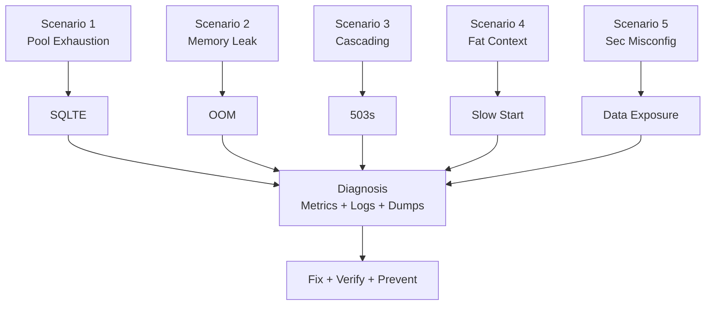
```mermaid
flowchart TD
    I1[Scenario 1\nPool Exhaustion] --> S1[SQLTE]
    I2[Scenario 2\nMemory Leak] --> S2[OOM]
    I3[Scenario 3\nCascading] --> S3[503s]
    I4[Scenario 4\nFat Context] --> S4[Slow Start]
    I5[Scenario 5\nSec Misconfig] --> S5[Data Exposure]
    S1 --> D[Diagnosis\nMetrics + Logs + Dumps]
    S2 --> D
    S3 --> D
    S4 --> D
    S5 --> D
    D --> F[Fix + Verify + Prevent]
```

### 📶 Gradual Depth

**Level 1 - What these scenarios teach:** Each scenario represents a class of production failure that every Spring Boot application can encounter. You learn to map symptoms to root causes and apply targeted fixes rather than guessing.

**Level 2 - Scenario 1: Connection Pool Exhaustion.** HikariCP defaults to `maximumPoolSize=10`. An application handling 50 concurrent requests where each holds a connection for 200ms needs at least 10 connections. But if a slow query takes 2 seconds, those 10 connections are held 10x longer, and the 11th request blocks until `connectionTimeout` (30s default) expires, throwing `SQLTransientConnectionException`.

```yaml
# application.yml - diagnosing pool exhaustion
spring:
  datasource:
    hikari:
      maximum-pool-size: 10 # too small
      connection-timeout: 30000
      # enable leak detection
      leak-detection-threshold: 10000
      # expose metrics
      register-mbeans: true
```

Diagnosis: check `hikaricp_connections_active` metric. If it equals `maximumPoolSize` while `hikaricp_connections_pending` climbs, the pool is exhausted. Check `hikaricp_connections_usage_seconds` to find slow queries.

**Level 3 - Scenario 2: Unbounded @Cacheable Memory Leak.** A `@Cacheable` method backed by `ConcurrentMapCacheManager` (the default) has no eviction policy. Every unique cache key adds an entry that is never removed. With high-cardinality keys (user IDs, session tokens), the cache grows until the JVM runs out of heap.

```java
// BAD: unbounded cache, grows forever
@Cacheable("users")
public User findById(Long id) {
    return userRepository.findById(id)
        .orElseThrow();
}
```

```java
// GOOD: Caffeine cache with bounded size
// and time-based eviction
@Bean
public CacheManager cacheManager() {
    CaffeineCacheManager mgr =
        new CaffeineCacheManager("users");
    mgr.setCaffeine(Caffeine.newBuilder()
        .maximumSize(10_000)
        .expireAfterWrite(Duration.ofMinutes(15))
        .recordStats());
    return mgr;
}
```

Diagnosis: heap histogram (`jmap -histo:live <pid>` or `/actuator/heapdump`). Look for the cache map dominating retained size.

**Level 4 - Scenario 3: Cascading Failure Without Circuit Breaker.** Service A calls Service B with `RestTemplate` and no timeout. Service B develops a database problem and responds in 30 seconds instead of 50ms. Each of Service A's 200 Tomcat threads gets stuck waiting. Within minutes, Service A cannot serve any traffic - including health checks. Kubernetes marks the pod unhealthy and restarts it, but the new pod immediately fills its thread pool again.

```java
// BAD: no timeout, no circuit breaker
@Service
public class OrderService {
    public Order create(OrderRequest req) {
        // blocks indefinitely if inventory slow
        Inventory inv = restTemplate
            .getForObject(inventoryUrl, Inv.class);
        return processOrder(req, inv);
    }
}
```

```java
// GOOD: timeout + circuit breaker + fallback
@Service
public class OrderService {
    @CircuitBreaker(name = "inventory",
        fallbackMethod = "fallbackInventory")
    @TimeLimiter(name = "inventory")
    public CompletableFuture<Order> create(
            OrderRequest req) {
        return CompletableFuture.supplyAsync(() -> {
            Inventory inv = restClient
                .get()
                .uri(inventoryUrl)
                .retrieve()
                .body(Inventory.class);
            return processOrder(req, inv);
        });
    }
}
```

**Level 5 - Scenario 4: Fat Context Blocking Deployments.** A monolithic Spring context with `@SpringBootApplication` scanning 600+ beans across 40 packages takes 90 seconds to start. In Kubernetes with a `startupProbe` of 60 seconds, the pod is killed before it finishes starting. The rolling deployment stalls because new pods never become ready while old pods are being terminated.

Diagnosis: enable startup actuator (`spring.boot.admin.startup.enabled=true`) and examine the `/actuator/startup` endpoint. Look for beans with initialization times over 1 second. Common culpror: Hibernate metadata build, Flyway migrations, Redis connection retries.

Fix: narrow `@ComponentScan` to required packages, use `@Lazy` on infrequently-used beans, move Flyway to a separate init container, increase `startupProbe.failureThreshold`.

**Level 6 - Scenario 5: Security Misconfiguration.** Spring Boot Actuator endpoints like `/actuator/env`, `/actuator/configprops`, and `/actuator/heapdump` expose database credentials, API keys, and full heap contents. The default in Spring Boot 3.x exposes only `/actuator/health`, but adding `management.endpoints.web.exposure.include=*` for development and forgetting to remove it in production is a common mistake.

```yaml
# BAD: exposes everything including secrets
management:
  endpoints:
    web:
      exposure:
        include: "*"

# GOOD: explicit allowlist, separate port
management:
  endpoints:
    web:
      exposure:
        include: health,info,metrics,prometheus
  server:
    port: 8081  # internal-only port
  endpoint:
    env:
      show-values: WHEN_AUTHORIZED
    health:
      show-details: WHEN_AUTHORIZED
```

### ⚙️ How It Works

```
+---------------------------------------------------+
|     Incident Simulation Workflow                   |
|                                                    |
|  Phase 1: Inject Fault                             |
|  - Reduce pool size / add load / slow dep          |
|  - Deploy misconfigured version                    |
|                                                    |
|  Phase 2: Observe Symptoms                         |
|  - Grafana dashboards: latency, errors, sat.       |
|  - Application logs: exceptions, warnings          |
|  - Kubernetes events: restarts, probe failures     |
|                                                    |
|  Phase 3: Diagnose                                 |
|  - Thread dump: blocked threads, lock contention   |
|  - Heap dump: retained objects, GC roots            |
|  - Metrics: pool active, pending, timeout count    |
|  - Startup endpoint: slow bean init                |
|                                                    |
|  Phase 4: Fix and Verify                           |
|  - Apply targeted fix (config or code)             |
|  - Verify metrics return to baseline               |
|  - Add regression test / alert                     |
|                                                    |
|  Phase 5: Document and Prevent                     |
|  - Write postmortem                                |
|  - Add monitoring alert for early detection        |
|  - Update runbooks                                 |
+---------------------------------------------------+
```

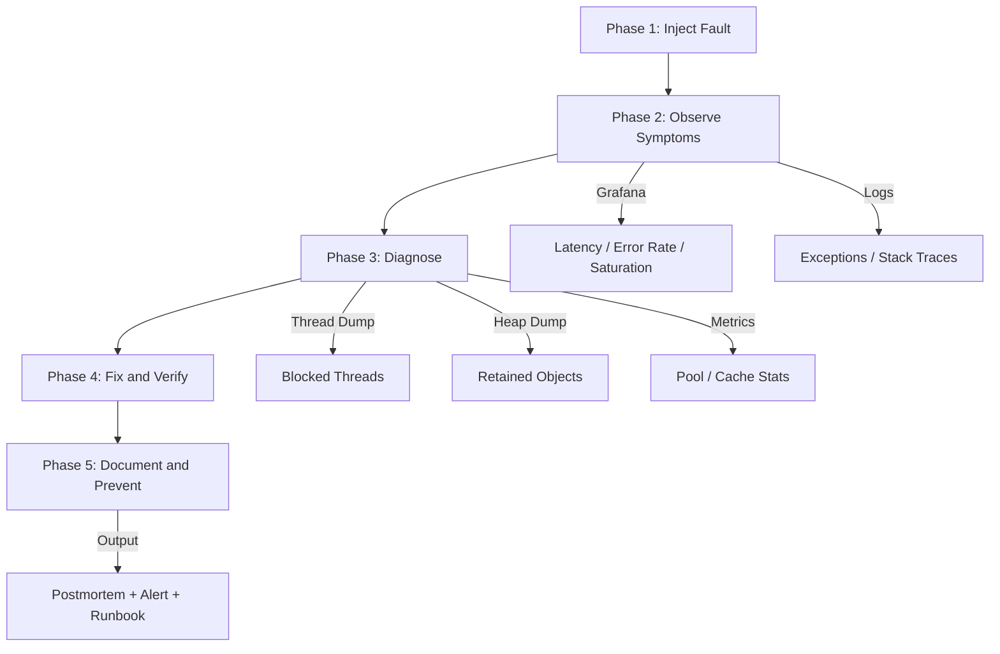
```mermaid
flowchart TD
    P1[Phase 1: Inject Fault] --> P2[Phase 2: Observe Symptoms]
    P2 --> P3[Phase 3: Diagnose]
    P3 --> P4[Phase 4: Fix and Verify]
    P4 --> P5[Phase 5: Document and Prevent]
    P2 -->|Grafana| M1[Latency / Error Rate / Saturation]
    P2 -->|Logs| M2[Exceptions / Stack Traces]
    P3 -->|Thread Dump| D1[Blocked Threads]
    P3 -->|Heap Dump| D2[Retained Objects]
    P3 -->|Metrics| D3[Pool / Cache Stats]
    P5 -->|Output| PM[Postmortem + Alert + Runbook]
```

### 🚨 Failure Modes

**Failure 1 - Misdiagnosis Due to Symptom Chasing:**

Engineers see `SQLTransientConnectionException` and increase `maximumPoolSize` to 100. The real problem is a missing database index causing queries to take 5 seconds instead of 5ms. With 100 connections all running 5-second queries, the database server itself becomes overwhelmed.

**Diagnostic:** Check `hikaricp_connections_usage_seconds` p99. If connection hold time is high, the problem is query performance, not pool size. Cross-reference with slow query logs.

**Fix:** Identify and fix the slow query first. Then right-size the pool based on actual concurrency needs. Formula: `connections = (core_count * 2) + effective_spindle_count` (HikariCP wiki recommendation for OLTP workloads).

**Failure 2 - Circuit Breaker Configured But Never Tested:**

A circuit breaker is added with default thresholds (`failureRateThreshold=50`, `slidingWindowSize=100`). In production, the downstream service returns errors at 40% rate - just below the threshold. The circuit never opens, and 40% of user requests fail continuously for hours.

**Diagnostic:** Check `resilience4j_circuitbreaker_failure_rate` metric. If it is consistently high but the circuit remains closed, the threshold is too lenient or the sliding window is too large for the traffic volume.

**Fix:** Tune thresholds based on actual SLO. If your SLO requires 99.5% success, set `failureRateThreshold=5` with a smaller `slidingWindowSize=20` for faster detection. Test with controlled failure injection.

**Failure 3 - Heap Dump Triggers Worse Outage:**

Engineer takes a heap dump on a production pod running with 8GB heap. The dump process pauses the JVM for 15-30 seconds (full GC + write). During this pause, health checks fail, Kubernetes kills the pod, and the remaining pods absorb the traffic spike.

**Diagnostic:** Monitor pod count and traffic distribution during diagnostic procedures.

**Fix:** Use `jcmd <pid> GC.heap_info` for lightweight heap summary first. If a full dump is needed, drain the pod from the load balancer first (`readinessProbe` failure or manual endpoint), then take the dump. Or use async heap dump tools like `jcmd <pid> GC.heap_dump` on a pod with increased probe timeouts.

### 🔬 Production Reality

**Scenario 1 metrics to monitor:**

- `hikaricp_connections_active` - should never equal max
- `hikaricp_connections_pending` - should be near zero
- `hikaricp_connections_usage_seconds` - p99 under 100ms for OLTP

**Scenario 2 metrics to monitor:**

- `jvm_memory_used_bytes{area="heap"}` - should not trend upward across GC cycles
- `cache_size` (Caffeine) - should plateau at `maximumSize`
- `cache_eviction_count` - should be non-zero (proves eviction works)

**Scenario 3 metrics to monitor:**

- `resilience4j_circuitbreaker_state` - 0=closed, 1=open, 2=half-open
- `http_server_requests_seconds{status="503"}` - cascading failures show as 503 spikes
- `tomcat_threads_busy` - should never approach `tomcat_threads_config_max`

**Scenario 4 metrics to monitor:**

- `application_started_time_seconds` - target under 30s
- Kubernetes pod `restartCount` - should be 0
- `/actuator/startup` - identify beans taking over 1s

**Scenario 5 checks:**

- `curl -s http://service:8080/actuator | jq .` - should only list allowed endpoints
- Verify management port is not exposed via public ingress
- Check for `management.endpoints.web.exposure.include=*` in all config sources

### ⚖️ Trade-offs & Alternatives

**BAD:**

```yaml
# "Fix" pool exhaustion by making pool huge
spring:
  datasource:
    hikari:
      maximum-pool-size: 200 # masks slow queries
```

**GOOD:**

```yaml
# Right-size pool + fix root cause
spring:
  datasource:
    hikari:
      maximum-pool-size: 20
      leak-detection-threshold: 5000
      connection-timeout: 5000
# AND fix the slow query with proper index
```

| Approach               | Pros                       | Cons                                    |
| ---------------------- | -------------------------- | --------------------------------------- |
| Increase pool size     | Quick fix, no code change  | Masks root cause, wastes DB connections |
| Fix slow queries       | Addresses root cause       | Requires investigation time             |
| Add circuit breaker    | Prevents cascading failure | Adds complexity, needs tuning           |
| Add cache eviction     | Prevents memory leak       | May increase cache misses               |
| Narrow component scan  | Faster startup             | Must maintain explicit package list     |
| Separate actuator port | Security isolation         | Extra port in network config            |

### ⚡ Decision Snap

- Seeing `SQLTransientConnectionException` -> check connection hold time before increasing pool size
- Heap growing across GC cycles -> check caches and session-scoped beans for unbounded retention
- One slow dependency causing platform-wide errors -> add circuit breaker with fallback, not just retry
- Startup exceeds 60s in Kubernetes -> profile with `/actuator/startup`, narrow scan, add `@Lazy`
- Actuator endpoints exposed publicly -> switch to explicit allowlist on a separate management port

### ⚠️ Top Traps

| #   | Trap                                              | Why It Hurts                                                                          | Prevention                                                    |
| --- | ------------------------------------------------- | ------------------------------------------------------------------------------------- | ------------------------------------------------------------- |
| 1   | Increasing pool size without finding slow queries | Shifts bottleneck to database, causes DB connection exhaustion                        | Always check query performance metrics first                  |
| 2   | Using ConcurrentMapCacheManager in production     | No eviction, no size limit, guaranteed memory leak with high-cardinality keys         | Use Caffeine or Redis with explicit maximumSize               |
| 3   | Adding timeouts without circuit breakers          | Timeout fires, request retries, downstream gets hammered with retries                 | Pair every timeout with a circuit breaker                     |
| 4   | Taking heap dumps on live traffic pods            | JVM pause causes health check failures, pod restarts, traffic spike on remaining pods | Drain pod from load balancer before dumping                   |
| 5   | Setting `exposure.include=*` in any profile       | Development config bleeds to production via config precedence or oversight            | Use explicit allowlist in default profile, never use wildcard |

### 🪜 Learning Ladder

**Prerequisites:**

- SPR-087 REST API Phase 4 - Observability and Resilience - the observable API that incident simulation exercises
- SPR-081 Resilience4j Circuit Breaker with Spring - circuit breaker patterns exercised in scenario 3

**THIS:** SPR-088 Production Incident Simulation with Spring - five hands-on exercises diagnosing pool exhaustion, memory leaks, cascading failures, fat contexts, and security misconfiguration

**Next steps:**

- SPR-089 Spring Mastery Verification - self-assessment across all Production and Cloud topics

**The Surprising Truth:** The most valuable outcome of incident simulation is not faster diagnosis - it is discovering that your monitoring has blind spots. Teams consistently find that the metrics they assumed were being collected are either missing, misconfigured, or alert thresholds are set so high they never fire. The simulation itself is a monitoring audit.

**Further Reading:**

1. HikariCP wiki: "About Pool Sizing"
2. Google SRE Book: Chapter 28 "Accelerating SREs to On-Call and Beyond" (Wheel of Misfortune)
3. Spring Boot Actuator reference: "Endpoints" security configuration

**Revision Card:**

1. First metric to check before changing pool size for `SQLTransientConnectionException`: `hikaricp_connections_usage_seconds` (connection hold time). High p99 means slow queries, not insufficient pool size.
2. `ConcurrentMapCacheManager` causes memory leaks because it uses an unbounded `ConcurrentHashMap` with no eviction. `CaffeineCacheManager` supports `maximumSize` and `expireAfterWrite`, bounding memory.
3. Taking a heap dump on a live-traffic pod pauses the JVM for a full GC + disk write. Health checks fail during the pause, Kubernetes may kill the pod, shifting traffic to remaining pods.

---

---

# SPR-089 Spring Mastery Verification

**TL;DR** - Fifteen questions that verify mastery of every L4 Production and Cloud concept with answers and review pointers.

### 🔥 Problem Statement

Completing 20 keywords does not guarantee retention. Engineers frequently "understand when reading" but fail to recall concepts during incident response or design interviews. Without active recall testing, knowledge decays within weeks.

This self-assessment forces active retrieval across all topics. Each question targets one production-relevant concept. A score below 12/15 signals gaps with keyword references for review.

### 📜 Historical Context

The testing effect (Roediger and Karpicke, 2006) demonstrated that retrieval practice produces better long-term retention than re-reading. In software engineering, the difference between "I read about circuit breakers" and "I can configure one under pressure" is the difference between knowledge and skill. Questions follow Bloom's Taxonomy: comprehension, then application, then analysis.

### 🔩 First Principles

**CORE INVARIANTS:**

1. **Retrieval strengthens memory** - the act of recalling information strengthens neural pathways more than re-reading. Each retrieval attempt, even unsuccessful ones, improves subsequent recall.
2. **Misconceptions persist until confronted** - passive reading confirms existing mental models even when they are wrong. Only active testing with immediate feedback reveals and corrects misconceptions.
3. **Transfer requires abstraction** - answering a question about circuit breakers in a new context (not the exact example you studied) proves you understand the principle, not just the example.

**DERIVED DESIGN:**

From invariant 1: answer each question before reading the expected answer. From invariant 2: when your answer differs from expected, re-read the referenced keyword. From invariant 3: questions deliberately use different examples than the source keywords.

### 🧠 Mental Model

> Think of this verification as a flight simulator check-ride. Pilots do not just read manuals - they prove they can handle engine failures, instrument malfunctions, and severe weather in a simulator before they fly passengers. These 15 questions are your Spring production check-ride.

- Question answered correctly from memory -> cleared for that maneuver
- Question answered partially -> needs practice under supervision (re-read keyword)
- Question answered incorrectly -> grounded until retrained (study keyword deeply)
- All 15 correct -> cleared for production responsibility

**Where this analogy breaks down:** This self-assessment has no external enforcement. The value depends entirely on honest self-evaluation.

### 🧩 Components

```
+---------------------------------------------------+
|         Mastery Verification Structure             |
|                                                    |
|  Questions 1-5: Core Mechanisms                    |
|  [Auto-config, BeanPostProcessor, startup,         |
|   security CVEs, memory footprint]                 |
|                                                    |
|  Questions 6-10: Cloud and Resilience              |
|  [WebFlux, reactive vs servlet, discovery,         |
|   config server, circuit breaker]                  |
|                                                    |
|  Questions 11-15: Production Practice              |
|  [Batch, debugging, anti-patterns, observability,  |
|   incident response]                               |
|                                                    |
|  Scoring: 15/15 = mastery                          |
|           12-14 = review flagged keywords           |
|           <12   = revisit entire file               |
+---------------------------------------------------+
```

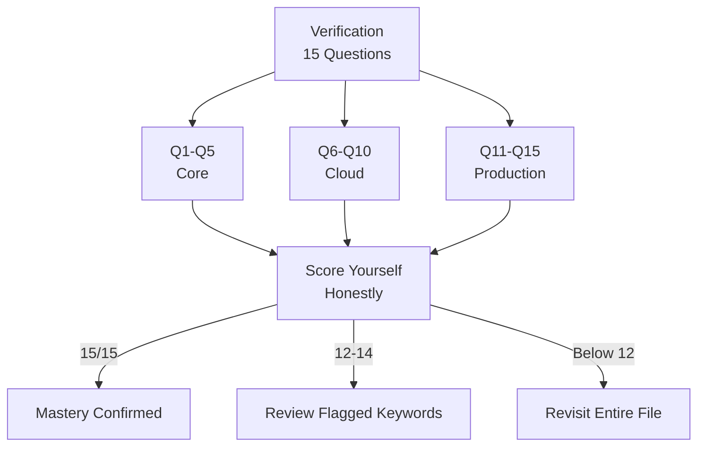
```mermaid
flowchart TD
    V[Verification\n15 Questions]
    V --> G1[Q1-Q5\nCore]
    V --> G2[Q6-Q10\nCloud]
    V --> G3[Q11-Q15\nProduction]
    G1 --> S[Score Yourself\nHonestly]
    G2 --> S
    G3 --> S
    S -->|15/15| M[Mastery Confirmed]
    S -->|12-14| R1[Review Flagged Keywords]
    S -->|Below 12| R2[Revisit Entire File]
```

### 📶 Gradual Depth

**How to use this assessment:**

1. Set a 45-minute timer. No notes, no searching.
2. Write your answer before reading the expected answer.
3. Score: full credit only for answers matching the key concept.
4. Note referenced keywords for missed questions.
5. Repeat missed questions after 3 days (spaced retrieval).

**Question 1 - Auto-Configuration Ordering (SPR-070):** Spring Boot finds a class `com.example.MyAutoConfiguration` annotated with `@AutoConfiguration(after = DataSourceAutoConfiguration.class)`. The class is listed in `META-INF/spring/org.springframework.boot.autoconfigure.AutoConfiguration.imports`. Explain the three conditions that must all be true for this class to contribute beans to the application context.

**Expected answer:** (1) Listed in `.imports` file for discovery. (2) All `@Conditional` annotations evaluate true (`@ConditionalOnClass`, `@ConditionalOnMissingBean`, `@ConditionalOnProperty`). (3) `after` ordering ensures `DataSourceAutoConfiguration` processes first, making its beans visible to condition checks.

**Question 2 - BeanPostProcessor vs BeanFactoryPostProcessor (SPR-071):** Your custom `BeanPostProcessor` needs to inject a value from `@Value("${app.feature.flag}")`. During startup, the value is always `null`. Why?

**Expected answer:** `BeanPostProcessor` is created before `PropertySourcesPlaceholderConfigurer` (a BFPP) resolves placeholders. A BPP should not use `@Value` injection. Use `Environment.getProperty()` or implement `EnvironmentAware`.

**Question 3 - Startup Optimization (SPR-072):** A Spring Boot app takes 45 seconds to start. The `/actuator/startup` endpoint shows `HibernateJpaAutoConfiguration` taking 20 seconds. Name two strategies to reduce this without removing JPA.

**Expected answer:** (1) Set `hibernate.temp.use_jdbc_metadata_defaults=false` and specify dialect explicitly to skip database metadata query. (2) Use `spring.jpa.defer-datasource-initialization=true` with `@Lazy` on repositories so Hibernate initializes on first query. Also: disable `ddl-auto` validation in production (use Flyway), use `bootstrap-mode=lazy`.

**Question 4 - Spring4Shell Mechanism (SPR-073):** Explain why Spring4Shell (CVE-2022-22965) required both Spring MVC parameter binding AND deployment on Tomcat with JDK 9+ to be exploitable.

**Expected answer:** Spring MVC data binding allows nested property access via `class.module.classLoader...`. JDK 9+ added `getModule()` to `Class`, creating a path to Tomcat's `AccessLogValve`: `class.module.classLoader.resources.context.parent.pipeline.first...`. Attackers set AccessLogValve properties to write a JSP webshell. JDK 8 lacked `getModule()`, blocking traversal. Non-Tomcat servers lacked the specific AccessLogValve path.

**Question 5 - Memory Footprint (SPR-075):** A Spring Boot application runs with 512MB heap but only uses 180MB after startup. Should you reduce `-Xmx` to 256MB? Explain the risks.

**Expected answer:** No. The 180MB is startup footprint. Under load, request objects, result sets, and serialization buffers consume more heap. With 256MB, you risk frequent GC and OOM under spikes. Measure peak heap under realistic load before sizing. Account for metaspace (outside `-Xmx`).

**Question 6 - WebFlux Threading (SPR-076):** A WebFlux handler calls a blocking JDBC query inside a reactive pipeline without `subscribeOn(Schedulers.boundedElastic())`. What happens and why is it dangerous?

**Expected answer:** The blocking call runs on a Netty event loop thread (typically CPU-core count threads). While blocked, that thread cannot process other requests. With 4 cores, 4 concurrent blocking queries stall all processing. Worse than servlet: Tomcat has 200 threads by default, Netty has a handful.

**Question 7 - Reactive vs Servlet Decision (SPR-077):** Your team is building a CRUD REST API with PostgreSQL. The team has no reactive experience. Would you choose WebFlux or Spring MVC? Justify with two specific reasons.

**Expected answer:** Spring MVC. (1) PostgreSQL JDBC is blocking - WebFlux requires `Schedulers.boundedElastic()` wrappers everywhere, negating the advantage. R2DBC has fewer features than JPA. (2) No reactive experience means the Reactor learning curve slows development without throughput benefit for a CRUD API bottlenecked by database I/O.

**Question 8 - Service Discovery Health (SPR-078):** A Eureka-registered service instance crashes without deregistering. How long does it take for other services to stop routing to the dead instance, and why?

**Expected answer:** Up to 90 seconds for server eviction (default heartbeat 30s, eviction check 60s, `lease-expiration-duration-in-seconds=90`). Clients cache locally and refresh every 30s. Worst case: 90s eviction + 30s client refresh = 120 seconds routing to a dead instance. Retry patterns handle some of this gap.

**Question 9 - Config Server Encryption (SPR-079):** Your Config Server stores `{cipher}AQB...` values in Git. A developer clones the Git repo directly. Can they decrypt the values? Why or why not?

**Expected answer:** No. The `{cipher}` prefix signals Config Server to decrypt using its configured key before serving to clients. Git contains only ciphertext. Without the encryption key (in Config Server's `encrypt.key` or keystore), ciphertext is useless. The key must never be in the same repo.

**Question 10 - Circuit Breaker States (SPR-081):** A Resilience4j circuit breaker is in HALF_OPEN state with `permittedNumberOfCallsInHalfOpenState=3`. Two of the three trial calls succeed and one fails. What state does the circuit transition to?

**Expected answer:** Depends on `failureRateThreshold`. Default 50%: 1/3 = 33.3% failure rate, below threshold, circuit returns to CLOSED. With threshold 30%, the 33.3% exceeds it and circuit returns to OPEN.

**Question 11 - Spring Batch Restartability (SPR-082):** A Spring Batch job processing 1 million records fails at record 600,000. You fix the data issue and restart the job. Does it start from record 1 or record 600,001? What mechanism enables this?

**Expected answer:** From record 600,001 (last committed chunk boundary). Spring Batch stores execution state in `JobRepository` metadata tables. The `ItemReader` records its position. On restart with the same `JobParameters`, it resumes from the last committed step execution.

**Question 12 - Auto-Configuration Debug (SPR-083):** You add `spring-boot-starter-data-redis` but `RedisTemplate` is not available for injection. Name the first two diagnostic steps.

**Expected answer:** (1) Run with `--debug` and check "CONDITIONS EVALUATION REPORT" for `RedisAutoConfiguration` under "Negative matches" - shows which condition failed (e.g., missing Lettuce/Jedis client). (2) Check for a user-defined `RedisTemplate` or `RedisConnectionFactory` bean that triggers `@ConditionalOnMissingBean`.

**Question 13 - Circular Dependency (SPR-084):** Spring Boot 3.x throws `BeanCurrentlyInCreationException` for circular dependencies instead of silently resolving them. Why did the Spring team make this breaking change?

**Expected answer:** Silent circular dependency resolution via early proxy exposure masked architectural problems. Circular dependencies mean tight coupling - neither bean can exist independently, making testing and refactoring harder. Throwing an exception forces redesign: extract shared logic, use `@Lazy` consciously, or use events for decoupling. Explicit failure beats hidden structural debt.

**Question 14 - Observability Correlation (SPR-087):** You see a slow request in Grafana (high latency on the `order-service` RED dashboard). How do you trace it to the specific downstream call causing the slowness? Name the three observability signals you would use in order.

**Expected answer:** (1) **Metrics** - RED dashboard shows which endpoint is slow (`http_server_requests_seconds` + `uri` tag). (2) **Traces** - use trace ID (via `traceparent` / Micrometer Tracing) in Zipkin/Jaeger to find the slow downstream span. (3) **Logs** - filter by trace ID (MDC) for exact request parameters and error messages. Traces show WHERE; logs explain WHY.

**Question 15 - Incident Response Synthesis (SPR-088):** At 3 AM, your dashboard shows: `hikaricp_connections_active` equals `maximum-pool-size` (10), `hikaricp_connections_pending` is climbing to 50, and `http_server_requests_seconds` p99 has jumped from 200ms to 25 seconds. No recent deployments. What is your diagnosis and what are your first three actions?

**Expected answer:** **Diagnosis:** Connection pool exhaustion - active equals max, requests queuing, latency spiked. No deployment means database issue (slow queries or locks). **Actions:** (1) Check `hikaricp_connections_usage_seconds` for spiked hold time indicating database slowness. (2) Check database slow query log or `pg_stat_activity` for blocked queries. (3) If a query holds locks, consider killing it. Do NOT increase pool size - that sends more load to a struggling database.

### ⚙️ How It Works

```
+---------------------------------------------------+
|        Self-Assessment Scoring Process             |
|                                                    |
|  Step 1: Answer all 15 questions (no peeking)     |
|  Step 2: Compare with expected answers             |
|  Step 3: Score each question                       |
|    - Full match on key concept: 1 point            |
|    - Partial / vague: 0.5 points                   |
|    - Wrong or blank: 0 points                      |
|  Step 4: Calculate total                           |
|    - 15/15: Production-ready mastery               |
|    - 12-14: Review flagged keyword references      |
|    - 9-11:  Re-study weak areas, retest in 1 week  |
|    - <9:    Full file review recommended            |
|  Step 5: Schedule spaced review                    |
|    - Day 3: Retry missed questions only            |
|    - Day 7: Retry all 15                           |
|    - Day 30: Final verification                    |
+---------------------------------------------------+
```

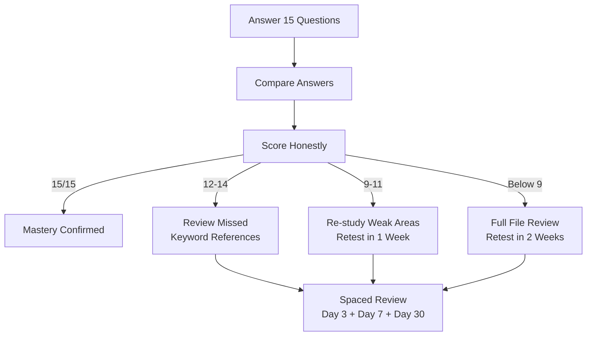
```mermaid
flowchart TD
    A[Answer 15 Questions] --> C[Compare Answers]
    C --> S[Score Honestly]
    S -->|15/15| M[Mastery Confirmed]
    S -->|12-14| R1[Review Missed\nKeyword References]
    S -->|9-11| R2[Re-study Weak Areas\nRetest in 1 Week]
    S -->|Below 9| R3[Full File Review\nRetest in 2 Weeks]
    R1 --> SP[Spaced Review\nDay 3 + Day 7 + Day 30]
    R2 --> SP
    R3 --> SP
```

### 🚨 Failure Modes

**Failure 1 - Reading Answers Before Attempting:**

Reading the expected answer first creates an illusion of understanding without activating retrieval. Produces near-zero long-term retention.

**Diagnostic:** Scored 14-15/15 on first attempt but cannot answer the same questions a week later.

**Fix:** Cover expected answers physically. Write your answer before scrolling. The discomfort of not knowing signals learning.

**Failure 2 - Giving Partial Credit Too Generously:**

Marking "I kind of knew that" as full credit. In production, "kind of knowing" circuit breaker tuning means wrong thresholds during incidents.

**Diagnostic:** Have a colleague score your answers independently. Score gaps indicate generous self-grading.

**Fix:** Full credit requires the specific mechanism. "Use a circuit breaker" is partial. "Set failureRateThreshold based on SLO with appropriate slidingWindowSize" is full credit.

### 🔬 Production Reality

**On-call engineer:** Q1, 5, 6, 8, 15 test incident response - pool diagnosis, memory analysis, threading, discovery lag, incident synthesis.

**System designer:** Q4, 7, 9, 10, 13 test architectural decisions - security vulnerabilities, technology selection, encryption, resilience, dependency management.

**Build engineer:** Q2, 3, 11, 12, 14 test framework depth - lifecycle ordering, startup optimization, batch restartability, auto-config debugging, observability.

A senior Spring engineer should score 13+. A principal engineer should score 15/15 and explain the reasoning behind each answer.

### ⚖️ Trade-offs & Alternatives

**BAD:**

```
# Re-reading keywords passively
# Feels productive, near-zero retention
```

**GOOD:**

```
# Active retrieval: attempt all questions
# no notes, score honestly, review gaps
# 45 min, lasting retention
```

| Study Method                 | Short-term      | Long-term |
| ---------------------------- | --------------- | --------- |
| Re-reading keywords          | High (illusion) | Very low  |
| Active retrieval (this quiz) | Medium          | Very high |
| Teaching concepts to others  | High            | Very high |

### ⚡ Decision Snap

- Scored 15/15 -> proceed to Architecture and META topics (SPR-090+)
- Scored 12-14 -> review the specific keywords referenced in missed questions, retest those questions in 3 days
- Scored 9-11 -> re-read relevant keyword groups, retest in 1 week
- Scored below 9 -> revisit entire file, retest in 2 weeks
- Cannot answer a question -> that keyword needs deep study

### ⚠️ Top Traps

| #   | Trap                                        | Why It Hurts                                           | Prevention                                                   |
| --- | ------------------------------------------- | ------------------------------------------------------ | ------------------------------------------------------------ |
| 1   | Reading answers before attempting           | Eliminates retrieval benefit, creates false confidence | Cover answers physically, write yours first                  |
| 2   | Generous self-scoring                       | Masks real knowledge gaps until production incident    | Full credit only for specific mechanisms, not vague concepts |
| 3   | Skipping questions you "already know"       | Retrieval of known items strengthens memory too        | Answer every question, even confident ones                   |
| 4   | One-time assessment without spaced review   | Forgetting curve erases gains within 2 weeks           | Schedule Day 3, Day 7, Day 30 retests                        |
| 5   | Memorizing answers instead of understanding | Same question worded differently will fail             | Explain WHY to yourself, not just WHAT                       |

### 🪜 Learning Ladder

**Prerequisites:**

- SPR-088 Production Incident Simulation with Spring - hands-on incident diagnosis this assessment tests
- SPR-086 Spring Deep-Dive Interview Questions - advanced interview knowledge verified here

**THIS:** SPR-089 Spring Mastery Verification - fifteen active-recall questions validating mastery across all Production and Cloud topics

**Next steps:**

- SPR-090 Spring Architecture and META - advancing to architecture-level Spring patterns

**The Surprising Truth:** The questions you get wrong are more valuable than the ones you get right. Research on "desirable difficulty" (Bjork, 1994) shows that the struggle of failed retrieval, followed by studying the correct answer, produces stronger memory traces than easy correct retrieval. If you scored 15/15 on the first attempt, the assessment was too easy for you and provided minimal learning benefit. The real value is in the 2-3 questions that expose genuine gaps.

**Further Reading:**

1. Roediger & Karpicke (2006): "Test-Enhanced Learning"
2. Brown, Roediger & McDaniel (2014): "Make It Stick"
3. Spring Boot Reference Documentation: all chapters covered by this assessment

**Revision Card:**

1. Active retrieval strengthens neural pathways more than re-reading. Failed retrieval attempts followed by review produce even stronger memory traces (desirable difficulty, Bjork 1994).
2. Recommended spaced review schedule: Day 3 (retry missed questions), Day 7 (retry all 15), Day 30 (final verification). Increasing intervals maximize long-term retention.
3. A score below 12 indicates gaps across multiple topics. Revisit the entire file rather than individual keywords since gaps likely reflect missing foundational understanding.
