## Keywords

1. [SPR-070 Spring Boot Auto-Configuration Internals](#spr-070-spring-boot-auto-configuration-internals)
2. [SPR-071 BeanPostProcessor and BeanFactoryPostProcessor](#spr-071-beanpostprocessor-and-beanfactorypostprocessor)
3. [SPR-072 Spring Context Startup Optimization](#spr-072-spring-context-startup-optimization)
4. [SPR-073 Spring4Shell (CVE-2022-22965)](#spr-073-spring4shell-cve-2022-22965)
5. [SPR-074 Spring Cloud Function SpEL Injection (2022)](#spr-074-spring-cloud-function-spel-injection-2022)
6. [SPR-075 Spring Boot Memory Footprint Analysis](#spr-075-spring-boot-memory-footprint-analysis)
7. [SPR-076 Spring WebFlux and Project Reactor](#spr-076-spring-webflux-and-project-reactor)
8. [SPR-077 Reactive vs Servlet Stack Decision Framework](#spr-077-reactive-vs-servlet-stack-decision-framework)
9. [SPR-078 Spring Cloud Service Discovery (Eureka and Consul)](#spr-078-spring-cloud-service-discovery-eureka-and-consul)
10. [SPR-079 Spring Cloud Config Server](#spr-079-spring-cloud-config-server)
11. [SPR-080 Spring Cloud Gateway and Rate Limiting](#spr-080-spring-cloud-gateway-and-rate-limiting)
12. [SPR-081 Resilience4j Circuit Breaker with Spring](#spr-081-resilience4j-circuit-breaker-with-spring)
13. [SPR-082 Spring Batch for Large-Scale Processing](#spr-082-spring-batch-for-large-scale-processing)
14. [SPR-083 Debugging Spring Auto-Configuration Failures](#spr-083-debugging-spring-auto-configuration-failures)
15. [SPR-084 Circular Dependency Trap Anti-Pattern](#spr-084-circular-dependency-trap-anti-pattern)
16. [SPR-085 Fat ApplicationContext Anti-Pattern](#spr-085-fat-applicationcontext-anti-pattern)
17. [SPR-086 Spring Deep-Dive Interview Questions](#spr-086-spring-deep-dive-interview-questions)
18. [SPR-087 REST API Phase 4 - Observability and Resilience](#spr-087-rest-api-phase-4---observability-and-resilience)
19. [SPR-088 Production Incident Simulation with Spring](#spr-088-production-incident-simulation-with-spring)
20. [SPR-089 Spring Mastery Verification](#spr-089-spring-mastery-verification)

---

# SPR-070 Spring Boot Auto-Configuration Internals

**TL;DR** - Spring Boot scans conditional metadata at startup to wire only the beans your classpath and config actually need.

### 🔥 Problem Statement

Manually wiring hundreds of beans for every Spring application is fragile, repetitive, and error-prone. Teams copy-paste XML or `@Configuration` classes across projects, drift from tested defaults, and spend hours debugging why a DataSource or WebMvc stack "stopped working" after an upgrade. The core pain: configuration volume grows linearly with dependencies while most apps need the same sensible defaults. Without a discovery-and-condition engine, every project reinvents infrastructure wiring.

### 📜 Historical Context

Before Spring Boot (pre-2014), Spring apps relied on explicit XML or `@Configuration` classes. Convention-over-configuration frameworks like Grails and Dropwizard proved that opinionated defaults eliminate boilerplate. Spring Boot 1.0 introduced `spring.factories` with `EnableAutoConfiguration` entries - a flat list of configuration classes evaluated at startup. Spring Boot 2.7 added `META-INF/spring/org.springframework.boot.autoconfigure.AutoConfiguration.imports` as a replacement, deprecating `spring.factories` for auto-configuration. Spring Boot 3.0 removed `spring.factories` support for auto-configuration entirely. The `@AutoConfiguration` annotation (2.7+) formalized ordering via `before`/`after` attributes, replacing fragile `@AutoConfigureBefore`/`@AutoConfigureAfter` on plain `@Configuration` classes.

### 🔩 First Principles

**CORE INVARIANTS:**

1. Auto-configuration classes are regular `@Configuration` classes discovered through a well-known metadata file - not magic, just convention
2. Every auto-configuration is guarded by one or more `@Conditional` annotations - nothing activates unconditionally
3. User-defined beans always win over auto-configured beans - the framework defers to explicit intent

**DERIVED DESIGN:**
These invariants produce a system where the framework ships hundreds of configuration classes, but only the subset matching your runtime conditions activates. Because user beans take priority (`@ConditionalOnMissingBean`), auto-configuration provides defaults you can override without touching framework code. The metadata file makes discovery explicit and toolable - IDEs and build plugins can analyze it statically.

### 🧠 Mental Model

> Think of auto-configuration as a hotel concierge desk. Every service (restaurant, spa, car) is listed in the concierge directory. When you check in, the concierge looks at your reservation (classpath), your preferences (properties), and what you already arranged yourself (user beans). Services you already booked are skipped. Services whose prerequisites are missing (no pool = no swim lesson) are skipped. Only matching, unmet services activate.

- "concierge directory" -> `AutoConfiguration.imports` file
- "reservation + preferences" -> classpath + `application.properties`
- "already arranged yourself" -> user-defined `@Bean` methods

**Where this analogy breaks down:** Unlike a hotel where services are independent, auto-configuration classes can depend on each other's ordering. `DataSourceAutoConfiguration` must run before `JpaAutoConfiguration` - the concierge has a strict task dependency graph.

### 🧩 Components

```text
+---------------------------------------------+
|         @SpringBootApplication              |
|           |                                 |
|  @EnableAutoConfiguration                   |
|           |                                 |
|  AutoConfigurationImportSelector            |
|           |                                 |
|  reads AutoConfiguration.imports            |
|           |                                 |
|  +-- filter: OnClassCondition (bulk)        |
|  +-- filter: OnBeanCondition                |
|  +-- filter: OnPropertyCondition            |
|  +-- filter: OnWebApplicationCondition      |
|           |                                 |
|  surviving configs -> bean definitions      |
+---------------------------------------------+
```

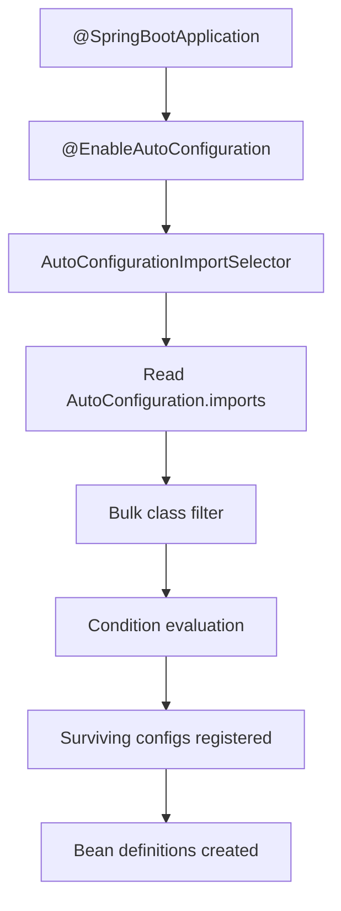
```mermaid
flowchart TD
    A["@SpringBootApplication"] --> B["@EnableAutoConfiguration"]
    B --> C["AutoConfigurationImportSelector"]
    C --> D["Read AutoConfiguration.imports"]
    D --> E["Bulk class filter"]
    E --> F["Condition evaluation"]
    F --> G["Surviving configs registered"]
    G --> H["Bean definitions created"]
```

**AutoConfigurationImportSelector** is the engine. Triggered by `@EnableAutoConfiguration` (composed into `@SpringBootApplication`), it reads the `.imports` file from every jar on the classpath, collects candidate class names, applies exclusions, runs bulk class-presence filters (fast path), then lets the remaining candidates go through full condition evaluation during `ConfigurationClassParser` processing.

### 📶 Gradual Depth

**Surface:** `@SpringBootApplication` triggers auto-configuration. Add a dependency, get beans configured automatically.

**One level down:** `AutoConfigurationImportSelector` implements `DeferredImportSelector`, meaning it runs after all user `@Configuration` classes are processed. This is how user beans get priority - they are already registered when `@ConditionalOnMissingBean` evaluates.

**Deeper:** Condition evaluation happens in two phases. First, `AutoConfigurationImportFilter` implementations (like `OnBeanCondition`, `OnClassCondition`, `OnWebApplicationCondition`) run as bulk filters on class metadata without loading the classes. This is a performance optimization - filtering 150+ candidates by checking `ClassLoader.getResource()` is far cheaper than loading and parsing each class. Second, the surviving candidates are processed as `@Configuration` classes where `@Conditional` annotations on individual `@Bean` methods are evaluated by the `ConditionEvaluator`.

**Internal detail:** The ordering engine resolves `@AutoConfiguration(before=..., after=...)` into a topological sort. Cycles are detected and reported at startup. The `AutoConfigurationSorter` reads `@AutoConfigureOrder` values and dependency declarations to produce a deterministic processing sequence.

### ⚙️ How It Works

```text
SpringApplication.run()
  |
  refreshContext()
    |
    ConfigurationClassPostProcessor
      |
      parse user @Configuration classes FIRST
      |
      process DeferredImportSelectors
        |
        AutoConfigurationImportSelector
          |
          1. read META-INF/spring/...imports
          2. remove exclusions
          3. bulk filter (class presence)
          4. sort (topological order)
          5. return candidates
        |
      parse each candidate as @Configuration
        |
        evaluate @Conditional per class
        evaluate @Conditional per @Bean
          |
        register surviving bean definitions
```

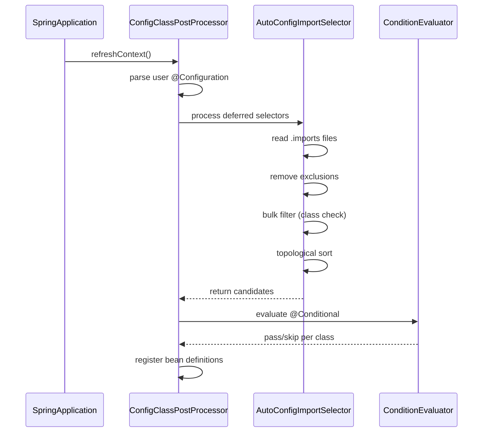
```mermaid
sequenceDiagram
    participant App as SpringApplication
    participant CPP as ConfigClassPostProcessor
    participant Sel as AutoConfigImportSelector
    participant Cond as ConditionEvaluator

    App->>CPP: refreshContext()
    CPP->>CPP: parse user @Configuration
    CPP->>Sel: process deferred selectors
    Sel->>Sel: read .imports files
    Sel->>Sel: remove exclusions
    Sel->>Sel: bulk filter (class check)
    Sel->>Sel: topological sort
    Sel-->>CPP: return candidates
    CPP->>Cond: evaluate @Conditional
    Cond-->>CPP: pass/skip per class
    CPP->>CPP: register bean definitions
```

**Step 1 - Discovery:** `AutoConfigurationImportSelector.getCandidateConfigurations()` calls `ImportCandidates.load()` which reads every `META-INF/spring/org.springframework.boot.autoconfigure.AutoConfiguration.imports` file from the classpath. A typical Spring Boot web app has 140-160 candidates.

**Step 2 - Exclusion:** Explicit exclusions via `@SpringBootApplication(exclude=...)` or `spring.autoconfigure.exclude` property remove candidates before any condition runs.

**Step 3 - Bulk filtering:** `AutoConfigurationImportFilter` beans (registered in `spring.factories` as filters) pre-screen candidates. `OnClassCondition` checks if required classes exist using ASM metadata - no class loading. This eliminates 60-70% of candidates cheaply.

**Step 4 - Sorting:** Remaining candidates are ordered via `@AutoConfiguration(after=..., before=...)` and `@AutoConfigureOrder`. This ensures `DataSourceAutoConfiguration` runs before `HibernateJpaAutoConfiguration`.

**Step 5 - Full evaluation:** Each surviving candidate is parsed as a `@Configuration` class. Class-level `@Conditional` annotations are checked first (fail-fast). Then each `@Bean` method's conditions are evaluated individually. A class may partially activate - some beans created, others skipped.

### 🚨 Failure Modes

**Failure 1 - Bean not created despite dependency on classpath:**
The auto-configuration class condition passed, but the specific `@Bean` method has `@ConditionalOnMissingBean` and a user-defined bean of that type already exists, or a `@ConditionalOnProperty` check fails silently.
**Diagnostic:** Run with `--debug` or set `debug=true` to get the auto-configuration report. Look for the bean's configuration class under "Negative matches" and read the condition that failed.
**Fix:** Check `CONDITIONS EVALUATION REPORT` output. Either add the missing property, remove the conflicting user bean, or explicitly define the bean yourself.

**Failure 2 - Ordering conflict causing initialization errors:**
`JpaAutoConfiguration` runs before `DataSourceAutoConfiguration` because a custom auto-configuration disrupted topological sort, causing "No qualifying bean of type DataSource."
**Diagnostic:** Check `@AutoConfiguration(after=...)` declarations. Run with `--debug` and look at the ordering in the report. Check for circular `before`/`after` references.
**Fix:** Add explicit `@AutoConfiguration(after = DataSourceAutoConfiguration.class)` to your custom auto-configuration. Never use `@Order` for auto-configuration sequencing - it does not affect `ConfigurationClassPostProcessor` ordering.

### 🔬 Production Reality

The auto-configuration report (`--debug`) is your most valuable diagnostic tool. In production, set `logging.level.org.springframework.boot.autoconfigure=DEBUG` selectively - not globally. The `ConditionEvaluationReportLogger` writes the full positive/negative match report at DEBUG level.

Startup cost is measurable: bulk filtering is sub-millisecond, but full condition evaluation of 50-60 surviving candidates touches the `BeanFactory`, reads properties, and resolves types. In large apps (300+ beans), auto-configuration adds 200-800ms to startup. For serverless/GraalVM native images, Spring AOT pre-computes condition evaluation at build time, collapsing runtime cost to near-zero.

Custom auto-configurations in shared libraries should always ship with an `.imports` file and thorough `@Conditional` guards. A missing condition means your configuration activates in every consumer, including test contexts where it breaks isolation.

### ⚖️ Trade-offs & Alternatives

**BAD:**

```java
@Configuration
public class MyAutoConfig {
    @Bean
    public MyService myService() {
        // No conditions - activates everywhere
        // Breaks apps that define their own MyService
        return new MyService();
    }
}
```

Why it's wrong: No `@Conditional` guard means this bean always registers, colliding with user-defined beans and activating in test contexts.

**GOOD:**

```java
@AutoConfiguration(
    after = DataSourceAutoConfiguration.class
)
@ConditionalOnClass(MyService.class)
@ConditionalOnProperty(
    prefix = "my.service",
    name = "enabled",
    havingValue = "true",
    matchIfMissing = true
)
public class MyAutoConfig {
    @Bean
    @ConditionalOnMissingBean
    public MyService myService() {
        return new MyService();
    }
}
```

| Aspect      | Auto-Configuration       | Explicit @Configuration |
| ----------- | ------------------------ | ----------------------- |
| Effort      | Zero for defaults        | Manual wiring per app   |
| Control     | Override via beans/props | Full, direct control    |
| Debugging   | Condition report         | Straightforward         |
| Startup     | Condition eval cost      | No filtering overhead   |
| Reusability | High (shared libs)       | Copy-paste per project  |

### ⚡ Decision Snap

**USE WHEN:** building shared starters/libraries consumed by multiple apps - auto-configuration is the distribution mechanism.

**AVOID WHEN:** your app has one deployment target with fixed infrastructure - explicit `@Configuration` is simpler and more transparent.

**PREFER explicit @Bean WHEN:** you need fine-grained control over initialization order within a single application, or the conditional logic would be more complex than just writing the bean definition.

### ⚠️ Top Traps

| #   | Misconception                                              | Reality                                                                                                                                                        |
| --- | ---------------------------------------------------------- | -------------------------------------------------------------------------------------------------------------------------------------------------------------- |
| 1   | Auto-configuration is magic annotation processing          | It is plain `@Configuration` + `DeferredImportSelector` + metadata file discovery - no bytecode generation or annotation processing involved                   |
| 2   | `@Order` controls auto-configuration sequencing            | `@Order` affects bean injection ranking, not configuration class processing order - use `@AutoConfiguration(before/after)`                                     |
| 3   | Auto-configured beans cannot be overridden                 | `@ConditionalOnMissingBean` means any user-defined bean of the same type silently wins                                                                         |
| 4   | `spring.factories` still works for auto-config in Boot 3.x | Boot 3.0 removed `spring.factories` support for auto-configuration - only `.imports` file works                                                                |
| 5   | Conditions are evaluated once at startup and cached        | Class-level conditions run during config parsing, but `@Bean`-level conditions run when the bean definition is processed - different phases, different context |

### 🪜 Learning Ladder

**Prerequisites:**

- SPR-015 Spring Boot Auto-Configuration Basics - what auto-configuration does from a user perspective
- SPR-044 Spring IoC Container Internals - how the container processes `@Configuration` classes and bean definitions

**THIS:** SPR-070 Spring Boot Auto-Configuration Internals - the discovery, filtering, ordering, and condition evaluation engine

**Next steps:**

- SPR-071 BeanPostProcessor and BeanFactoryPostProcessor - the extension points auto-configuration classes use to customize bean creation
- SPR-083 Custom Spring Boot Starter - applying auto-configuration knowledge to build reusable starters

**The Surprising Truth:** Auto-configuration's biggest performance trick is not evaluating conditions cleverly - it is avoiding class loading entirely. The bulk `OnClassCondition` filter uses ASM to read class metadata from jar files without triggering `ClassLoader.loadClass()`, eliminating 60-70% of candidates before the JVM loads a single auto-configuration class.

**Further Reading:**

1. [Spring Boot Reference - Auto-configuration](https://docs.spring.io/spring-boot/reference/using/auto-configuration.html)
2. [Spring Boot Reference - Creating Your Own Auto-configuration](https://docs.spring.io/spring-boot/reference/features/developing-auto-configuration.html)
3. `AutoConfigurationImportSelector` source in `spring-boot-autoconfigure`

**Revision Card:**

1. Auto-configuration uses `DeferredImportSelector` to run after user configs, ensuring user beans win via `@ConditionalOnMissingBean`
2. Discovery reads `.imports` files (Boot 3.x), bulk filters by class presence using ASM (no class loading), then evaluates full conditions on survivors
3. The `--debug` flag prints the conditions evaluation report - the single most useful diagnostic for "why did/didn't this bean get created"

---

---

# SPR-071 BeanPostProcessor and BeanFactoryPostProcessor

**TL;DR** - BeanFactoryPostProcessor rewrites bean definitions before instantiation; BeanPostProcessor transforms bean instances after creation.

### 🔥 Problem Statement

Spring's IoC container creates beans from definitions and wires them together. But what if you need to modify those definitions before any bean exists - replacing `${placeholder}` tokens in property values, changing scope, or altering class names? And what if you need to modify every bean instance after creation - injecting `@Autowired` fields, wrapping beans in proxies for `@Transactional`, or registering MBeans? Without dedicated extension hooks at both levels (definition-time and instance-time), customization requires forking framework code or brittle subclassing.

### 📜 Historical Context

Spring 1.0 (2004) shipped `BeanFactoryPostProcessor` and `BeanPostProcessor` as the two foundational container extension points. `PropertyPlaceholderConfigurer` was the original `BeanFactoryPostProcessor` - resolving `${...}` tokens in XML bean definitions before instantiation. Spring 2.0 added annotation-driven injection via `AutowiredAnnotationBeanPostProcessor`, making `BeanPostProcessor` the engine behind `@Autowired`. Spring 3.1 introduced `PropertySourcesPlaceholderConfigurer` to replace the legacy version, integrating with the `Environment` abstraction. Spring AOP's proxy creation has always been a `BeanPostProcessor` (`AbstractAutoProxyCreator`), making these two interfaces the backbone of virtually every framework feature that modifies beans transparently.

### 🔩 First Principles

**CORE INVARIANTS:**

1. `BeanFactoryPostProcessor` operates on `BeanDefinition` metadata before any singleton bean is instantiated - it changes the blueprint, not the building
2. `BeanPostProcessor` intercepts every bean instance at two lifecycle points: after population (before init) and after initialization (after init)
3. The container detects both processor types through bean definitions and instantiates them before all other beans - processors must exist before their targets
4. `BeanPostProcessor` methods receive the raw bean and can return a different object entirely - this is how AOP proxies replace originals transparently

**DERIVED DESIGN:**
Because definition-level processing runs first and instance-level processing runs second, the two interfaces form a pipeline: `BeanFactoryPostProcessor` shapes what will be created, `BeanPostProcessor` shapes what was created. Ordering via `Ordered`/`PriorityOrdered` within each phase ensures predictable composition. The return-value contract in `BeanPostProcessor` enables transparent wrapping (proxies, decorators) without callers knowing the original was replaced.

### 🧠 Mental Model

> Think of building a house. `BeanFactoryPostProcessor` is the architect who revises blueprints before construction starts - changing room dimensions, swapping materials, updating addresses. `BeanPostProcessor` is the interior designer who enters each room after framing and installs fixtures, paints walls, and adds security cameras (proxies) before handing keys to the owner.

- "revise blueprints" -> modify `BeanDefinition` properties
- "installs fixtures" -> `@Autowired` field injection
- "adds security cameras" -> AOP proxy wrapping
- "before construction starts" -> before `getBean()` instantiation

**Where this analogy breaks down:** Unlike a house built once, `BeanPostProcessor` runs on every bean the container creates, including other post-processors. A processor that depends on an autowired bean may miss processing that bean's creation, creating ordering subtleties the house analogy hides.

### 🧩 Components

```text
+---------------------------------------------------------+
| BeanFactoryPostProcessor                                |
|   INPUT:  ConfigurableListableBeanFactory               |
|   ACCESS: all BeanDefinition objects                    |
|   TIMING: before any bean instantiation                 |
|   KEY IMPL: PropertySourcesPlaceholderConfigurer        |
+---------------------------------------------------------+
| BeanPostProcessor                                       |
|   INPUT:  Object bean + String beanName                 |
|   METHODS: postProcessBefore/AfterInitialization        |
|   TIMING: around each bean's init lifecycle             |
|   KEY IMPL: AutowiredAnnotationBeanPostProcessor        |
+---------------------------------------------------------+
```

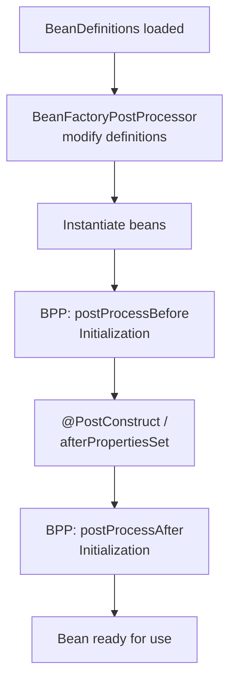
```mermaid
flowchart TD
    BD["BeanDefinitions loaded"] --> BFPP
    BFPP["BeanFactoryPostProcessor\nmodify definitions"]
    BFPP --> INST["Instantiate beans"]
    INST --> BPP1["BPP: postProcessBefore\nInitialization"]
    BPP1 --> INIT["@PostConstruct /\nafterPropertiesSet"]
    INIT --> BPP2["BPP: postProcessAfter\nInitialization"]
    BPP2 --> READY["Bean ready for use"]
```

**BeanFactoryPostProcessor** receives the entire `ConfigurableListableBeanFactory`, giving read-write access to every `BeanDefinition` registered so far. It can add, modify, or remove definitions. The container calls `postProcessBeanFactory()` exactly once per processor.

**BeanPostProcessor** is called per bean instance. `postProcessBeforeInitialization()` runs after dependency injection but before `@PostConstruct`/`InitializingBean`. `postProcessAfterInitialization()` runs after init callbacks - this is where AOP creates proxies.

### 📶 Gradual Depth

**Surface:** `BeanFactoryPostProcessor` modifies bean configuration metadata. `BeanPostProcessor` modifies bean instances. Both run automatically when registered as beans.

**One level down:** `BeanFactoryPostProcessor` can rewrite property values in definitions (placeholder resolution), change bean class names, alter scope, or register entirely new definitions. `BeanPostProcessor` powers `@Autowired` injection (`AutowiredAnnotationBeanPostProcessor`), `@Scheduled` registration (`ScheduledAnnotationBeanPostProcessor`), and AOP proxying (`AbstractAutoProxyCreator`). The `postProcessAfterInitialization` return value is the actual object stored in the container - returning a proxy replaces the original.

**Deeper:** Processors implementing `PriorityOrdered` run before `Ordered`, which run before unordered processors. `AutowiredAnnotationBeanPostProcessor` implements `PriorityOrdered` because injection must happen before most other processing. This ordering is critical: if an AOP processor runs before the autowiring processor, it wraps a bean with null fields.

**Internal detail:** The container uses `getBeanNamesForType(BeanFactoryPostProcessor.class)` to discover processors, then instantiates them eagerly via `getBean()`. This means BFPP beans and their dependencies are created before all other beans and are not eligible for processing by `BeanPostProcessor`. If your BFPP depends on a bean that needs `@Autowired`, that injection silently fails - the `AutowiredAnnotationBeanPostProcessor` has not run yet.

### ⚙️ How It Works

```text
AbstractApplicationContext.refresh()
  |
  invokeBeanFactoryPostProcessors()
    |
    1. PriorityOrdered BFPPs (sorted, invoked)
    2. Ordered BFPPs (sorted, invoked)
    3. Remaining BFPPs (invoked)
    |
  registerBeanPostProcessors()
    |
    1. PriorityOrdered BPPs instantiated+sorted
    2. Ordered BPPs instantiated+sorted
    3. Remaining BPPs instantiated
    4. All registered in BeanFactory
    |
  finishBeanFactoryInitialization()
    |
    for each singleton bean:
      createBean()
        instantiate -> populate (DI)
        -> BPP.postProcessBeforeInit
        -> invokeInitMethods (@PostConstruct)
        -> BPP.postProcessAfterInit
        -> bean stored in singletonObjects
```

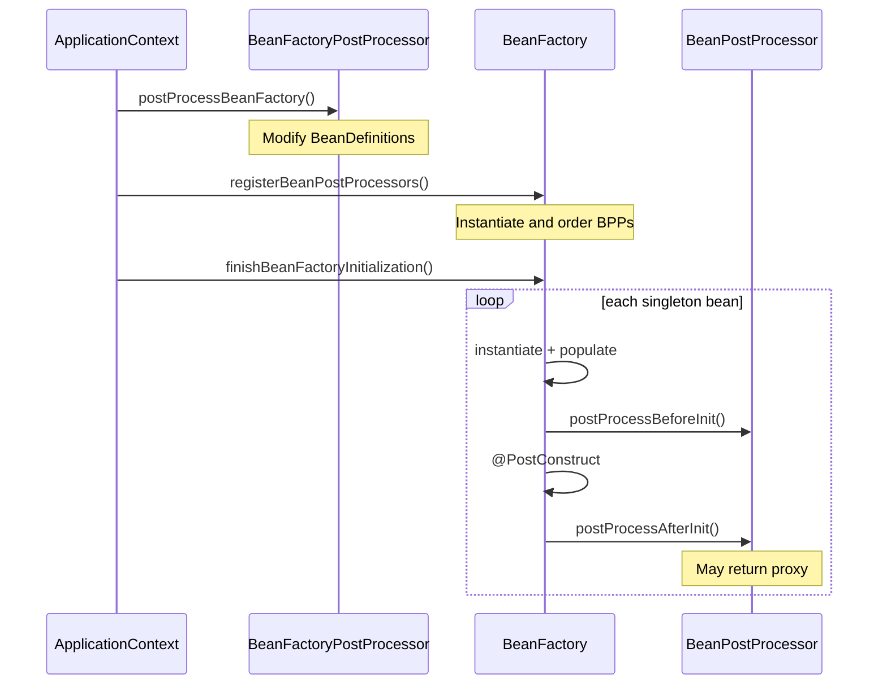
```mermaid
sequenceDiagram
    participant Ctx as ApplicationContext
    participant BFPP as BeanFactoryPostProcessor
    participant BF as BeanFactory
    participant BPP as BeanPostProcessor

    Ctx->>BFPP: postProcessBeanFactory()
    Note over BFPP: Modify BeanDefinitions
    Ctx->>BF: registerBeanPostProcessors()
    Note over BF: Instantiate and order BPPs
    Ctx->>BF: finishBeanFactoryInitialization()
    loop each singleton bean
        BF->>BF: instantiate + populate
        BF->>BPP: postProcessBeforeInit()
        BF->>BF: @PostConstruct
        BF->>BPP: postProcessAfterInit()
        Note over BPP: May return proxy
    end
```

**Phase 1 - Definition processing:** `PostProcessorRegistrationDelegate.invokeBeanFactoryPostProcessors()` sorts discovered BFPPs by `PriorityOrdered`, `Ordered`, then unordered. Each receives the `BeanFactory` and can mutate any `BeanDefinition`. `ConfigurationClassPostProcessor` (a `BeanDefinitionRegistryPostProcessor` subtype) runs here to process `@Configuration` classes, `@ComponentScan`, and `@Import`.

**Phase 2 - Processor registration:** `registerBeanPostProcessors()` instantiates all `BeanPostProcessor` beans and registers them with the `BeanFactory` in priority order. They do not process each other during this phase - they are simply instantiated and stored in an ordered list.

**Phase 3 - Bean creation:** For every subsequent singleton, the `BeanFactory` runs the full BPP chain. `postProcessBeforeInitialization` fires after field injection but before init methods. `postProcessAfterInitialization` fires after init methods. If a BPP returns `null`, the original bean is used. If it returns a different object, that object replaces the original in the container.

### 🚨 Failure Modes

**Failure 1 - BFPP with @Autowired dependencies:**
A `BeanFactoryPostProcessor` bean declares `@Autowired` fields. Those dependencies are instantiated eagerly to satisfy the BFPP, bypassing all `BeanPostProcessor` processing including `@Autowired` resolution on the dependency itself.
**Diagnostic:** Spring logs a warning: "Bean 'X' of type [BFPP] is not eligible for getting processed by all BeanPostProcessors." Check startup logs for this message.
**Fix:** Keep BFPP beans self-contained. Use `@Bean static` methods in `@Configuration` classes to avoid eager initialization of the enclosing configuration. Inject via constructor parameters resolved directly from the `BeanFactory`.

**Failure 2 - BPP ordering causes null fields:**
A custom `BeanPostProcessor` wraps beans in a decorator but runs before `AutowiredAnnotationBeanPostProcessor`. The decorator copies the original bean, but the original has null `@Autowired` fields because injection has not happened yet.
**Diagnostic:** Inspect processor ordering. Check if your BPP implements `PriorityOrdered` (it probably should not). Enable DEBUG logging for `PostProcessorRegistrationDelegate` to see the BPP registration order.
**Fix:** Implement `Ordered` (not `PriorityOrdered`) with a high order value (e.g., `Ordered.LOWEST_PRECEDENCE`). Move wrapping logic to `postProcessAfterInitialization` where injection is guaranteed complete.

**Failure 3 - Proxy replaces original, breaks identity:**
`AbstractAutoProxyCreator` returns a CGLIB proxy from `postProcessAfterInitialization`. Code that cached the raw bean reference during `postProcessBeforeInitialization` now holds a stale reference. Equality checks fail.
**Diagnostic:** Compare `System.identityHashCode()` of the bean in before-init vs after-init. If they differ, a proxy replacement occurred.
**Fix:** Never cache bean references in `postProcessBeforeInitialization`. Perform all reference-sensitive work in `postProcessAfterInitialization` after proxy creation is complete.

### 🔬 Production Reality

In a typical Spring Boot application, 15-25 `BeanPostProcessor` instances are active. `AutowiredAnnotationBeanPostProcessor` handles `@Autowired`/`@Value`. `CommonAnnotationBeanPostProcessor` handles `@PostConstruct`, `@PreDestroy`, and `@Resource`. `AbstractAutoProxyCreator` subclasses handle `@Transactional`, `@Async`, `@Cacheable` proxying. `ScheduledAnnotationBeanPostProcessor` registers `@Scheduled` methods with the `TaskScheduler`.

For `BeanFactoryPostProcessor`, the dominant implementations are `ConfigurationClassPostProcessor` (processes `@Configuration`, `@Bean`, `@ComponentScan`) and `PropertySourcesPlaceholderConfigurer` (resolves `${...}` in bean definitions). In Spring Boot, `EventListenerMethodProcessor` discovers `@EventListener` annotations.

Performance impact scales with bean count times processor count. An app with 500 beans and 20 BPPs executes 10,000 processor invocations during startup. Each call is typically sub-microsecond for processors that skip non-matching beans, but `AutowiredAnnotationBeanPostProcessor` performs reflection-heavy injection and is typically the largest single contributor to bean creation time in profiling.

### ⚖️ Trade-offs & Alternatives

**BAD:**

```java
@Component
public class AuditProcessor
    implements BeanFactoryPostProcessor {

    @Autowired  // DANGEROUS in BFPP
    private AuditService auditService;

    @Override
    public void postProcessBeanFactory(
        ConfigurableListableBeanFactory bf) {
        // auditService may be null or
        // unprocessed by other BPPs
        auditService.log("processing");
    }
}
```

Why it is wrong: `@Autowired` on a BFPP causes early bean instantiation that bypasses other post-processors. The dependency may be incompletely initialized.

**GOOD:**

```java
@Configuration
public class AuditConfig {

    @Bean
    static BeanFactoryPostProcessor auditBfpp() {
        // static: avoids eager init of
        // enclosing @Configuration class
        return factory -> {
            String[] names =
                factory.getBeanDefinitionNames();
            for (String name : names) {
                BeanDefinition bd =
                    factory.getBeanDefinition(name);
                // operate on definitions only
                bd.setAttribute("audited", "true");
            }
        };
    }
}
```

| Aspect      | BeanFactoryPostProcessor | BeanPostProcessor   |
| ----------- | ------------------------ | ------------------- |
| Operates on | BeanDefinition metadata  | Bean instances      |
| Timing      | Before instantiation     | After instantiation |
| Scope       | Entire BeanFactory, once | Per bean, twice     |
| Can replace | Definition properties    | Entire bean object  |
| Key use     | Placeholder resolution   | Proxy, injection    |
| Risk        | Eager bean instantiation | Ordering bugs       |

### ⚡ Decision Snap

**USE BeanFactoryPostProcessor WHEN:** you need to modify, add, or remove bean definitions before any bean is created - property resolution, conditional definition removal, scope changes.

**USE BeanPostProcessor WHEN:** you need to inspect or modify bean instances after creation - custom annotation processing, wrapping, registration with external systems.

**AVOID custom processors WHEN:** existing framework processors already handle your use case. Before writing a BPP, check if `@Autowired`, `@PostConstruct`, `@EventListener`, `@Scheduled`, or AOP annotations already solve the problem.

### ⚠️ Top Traps

| #   | Misconception                                               | Reality                                                                                                                              |
| --- | ----------------------------------------------------------- | ------------------------------------------------------------------------------------------------------------------------------------ |
| 1   | BFPP can safely use `@Autowired`                            | BFPP beans are created before BPPs run - `@Autowired` dependencies bypass processing and may be incomplete                           |
| 2   | `BeanPostProcessor` only runs on user beans                 | It runs on every bean including other BPPs (except those registered before it) and infrastructure beans                              |
| 3   | Returning `null` from BPP replaces the bean with null       | Returning `null` is treated as "keep original" by `AbstractAutowireCapableBeanFactory` - the bean is not nullified                   |
| 4   | BPP ordering does not matter                                | Ordering is critical - autowiring must complete before proxy creation, or proxies wrap beans with null fields                        |
| 5   | `BeanFactoryPostProcessor` can safely create bean instances | It can call `getBean()`, but this forces premature instantiation bypassing other BFPPs and all BPPs - a common source of subtle bugs |

### 🪜 Learning Ladder

**Prerequisites:**

- SPR-044 Spring IoC Container Internals - how the container manages bean definitions and lifecycle
- SPR-070 Spring Boot Auto-Configuration Internals - how auto-configuration discovers and registers bean definitions that processors then modify

**THIS:** SPR-071 BeanPostProcessor and BeanFactoryPostProcessor - the two extension hooks for modifying bean definitions and bean instances

**Next steps:**

- SPR-072 Spring Context Startup Optimization - reducing the cost of processing hundreds of beans through these extension points

**The Surprising Truth:** Almost every "magical" Spring behavior - `@Autowired` injection, `@Transactional` proxying, `@Scheduled` registration, `@Value` resolution - is implemented through `BeanPostProcessor`. The container itself is intentionally simple; the rich behavior you associate with Spring is layered on through these processor interfaces, making the framework composable rather than monolithic.

**Further Reading:**

1. [Spring Framework Reference - Container Extension Points](https://docs.spring.io/spring-framework/reference/core/beans/factory-extension.html)
2. [Spring Framework Reference - BeanPostProcessor](https://docs.spring.io/spring-framework/reference/core/beans/factory-extension.html#beans-factory-extension-bpp)
3. `AbstractAutowireCapableBeanFactory.initializeBean()` source code

**Revision Card:**

1. `BeanFactoryPostProcessor` modifies `BeanDefinition` metadata before any bean is created; `BeanPostProcessor` modifies bean instances after creation at two lifecycle hooks (before-init and after-init)
2. BFPP beans must avoid `@Autowired` dependencies because they are instantiated before any BPP runs - use static `@Bean` methods and operate only on definitions
3. `postProcessAfterInitialization` is where AOP proxies replace original beans - the returned object becomes the container's reference, which is why `@Transactional` works transparently

---

---

# SPR-072 Spring Context Startup Optimization

**TL;DR** - Reduce Spring startup time through lazy init, classpath indexing, AOT processing, and conditional bean exclusion.

### 🔥 Problem Statement

Spring Boot applications scan hundreds of classes, evaluate conditions on 150+ auto-configurations, and instantiate 300-500 beans at startup. For monolithic deployments, 5-15 second startup is tolerable. For serverless (AWS Lambda, Azure Functions), Kubernetes scale-to-zero, or integration test suites running thousands of context loads, every second compounds into minutes of wasted compute. The container does three expensive things at startup: classpath scanning (reflection + jar traversal), condition evaluation (class checks + property resolution), and eager singleton instantiation. Each is attackable independently. Without deliberate optimization, startup time grows linearly with dependency count and bean count.

### 📜 Historical Context

Spring Framework has always eagerly instantiated singletons - by design, to fail fast on wiring errors. Spring 4.0 introduced `@Conditional` (2013), adding evaluation cost per bean. Spring 5.0 added the `spring-context-indexer` annotation processor (2017) to eliminate runtime classpath scanning by pre-computing candidate component indices at compile time. Spring Boot 2.2 (2019) introduced `spring.main.lazy-initialization=true` as a global lazy init toggle. Spring Framework 6.0 / Spring Boot 3.0 (2022) introduced Spring AOT (Ahead-of-Time) processing - generating optimized bean definitions, condition evaluations, and reflection hints at build time for GraalVM native images and faster JVM startup. Spring Boot 3.2 added virtual thread support, but startup remains single-threaded for context refresh.

### 🔩 First Principles

**CORE INVARIANTS:**

1. Startup cost = classpath scanning + condition evaluation + bean instantiation - these three phases are independently optimizable
2. Any optimization that defers work to runtime request time trades startup latency for first-request latency - lazy init is not free
3. AOT processing shifts computation from runtime to build time - the total work is identical, only when it executes changes

**DERIVED DESIGN:**
Each optimization targets a different phase. The context indexer eliminates scanning. `@Profile` and `@ConditionalOnProperty` reduce the number of candidates entering condition evaluation. Lazy initialization defers bean creation to first access. AOT pre-computes the entire wiring plan at build time. Combining them is additive - they operate on different pipeline stages.

### 🧠 Mental Model

> Think of startup as a restaurant opening for the day. Classpath scanning is reading every recipe book in the library to find today's menu. Condition evaluation is checking which ingredients are actually in the pantry. Bean instantiation is pre-cooking every dish before the first customer arrives. Optimization means: pre-printing the menu (indexer), removing recipe books for cuisines you never serve (@Profile), and cooking dishes only when ordered (lazy init).

- "pre-printed menu" -> compile-time component index
- "removing recipe books" -> @Profile exclusion of irrelevant configs
- "cooking when ordered" -> lazy initialization
- "pre-cooked frozen meals" -> AOT-generated bean definitions

**Where this analogy breaks down:** AOT does not just pre-cook - it rewrites the recipes into simpler instructions that skip decision points entirely. The runtime does not evaluate conditions; it executes a pre-computed plan. This is closer to a vending machine than a kitchen.

### 🧩 Components

```text
+-----------------------------------------------+
| STARTUP PIPELINE                              |
|                                               |
| 1. Classpath Scan                             |
|    OPT: spring-context-indexer (build-time)   |
|                                               |
| 2. Configuration Class Parsing                |
|    OPT: @Profile exclusion, fewer @Imports    |
|                                               |
| 3. Auto-Config Condition Evaluation           |
|    OPT: exclude unused starters               |
|                                               |
| 4. Bean Instantiation                         |
|    OPT: lazy-init, AOT pre-computation        |
|                                               |
| 5. Post-Processing (BPP chain)               |
|    OPT: reduce processor count                |
+-----------------------------------------------+
```

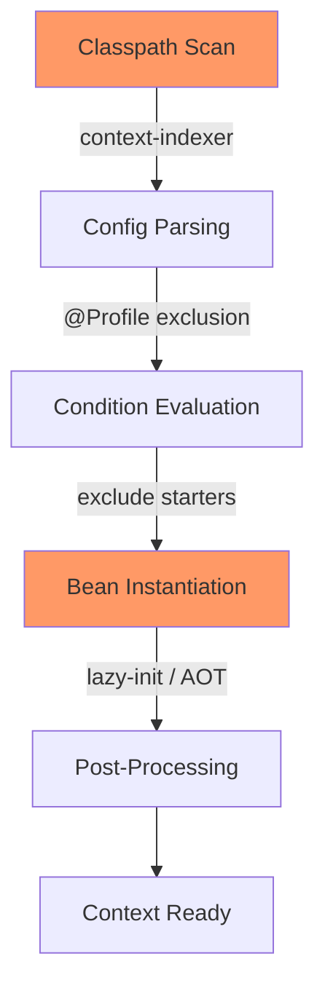
```mermaid
flowchart TD
    A["Classpath Scan"]
    A -->|"context-indexer"| B["Config Parsing"]
    B -->|"@Profile exclusion"| C["Condition Evaluation"]
    C -->|"exclude starters"| D["Bean Instantiation"]
    D -->|"lazy-init / AOT"| E["Post-Processing"]
    E --> F["Context Ready"]
    style A fill:#f96
    style D fill:#f96
```

**spring-context-indexer:** An annotation processor that generates `META-INF/spring.components` at compile time. Lists every `@Component`, `@Entity`, and `@ManagedBean` with its stereotype. At runtime, `CandidateComponentsIndex` reads this file instead of scanning jars with ASM. Saves 100-500ms on classpath-heavy applications.

**Lazy initialization:** When enabled globally (`spring.main.lazy-initialization=true`) or per-bean (`@Lazy`), the container registers bean definitions but defers `getBean()` until first dependency injection or explicit lookup. Cuts startup time proportional to the number of beans, but shifts instantiation errors to runtime.

**Spring AOT:** At build time, the AOT engine runs `BeanFactoryInitializationAotProcessor` and `BeanRegistrationAotProcessor` to generate Java source that directly registers beans without reflection, condition evaluation, or classpath scanning. The generated `ApplicationContextInitializer` replaces the entire `refresh()` pipeline with pre-computed wiring.

### 📶 Gradual Depth

**Surface:** Add `spring.main.lazy-initialization=true` to `application.properties`. Startup drops proportionally to bean count because instantiation is deferred.

**One level down:** Combine lazy init with the context indexer. Add `spring-context-indexer` as an annotation processor dependency. At compile time, it writes `META-INF/spring.components` listing all stereotype-annotated classes. At runtime, `ClassPathBeanDefinitionScanner` checks for this file first and skips jar-by-jar ASM scanning if present.

**Deeper:** Use `@Profile` to segregate beans by environment. A `@Profile("cloud")` configuration class and all its beans are completely skipped when the active profile is `local`. This is not just condition-skipping - the `ConfigurationClassParser` never processes the class at all when the profile does not match. For applications with heavy cloud-specific beans (messaging, caching, tracing), profile exclusion can eliminate 20-30% of bean definitions.

**Internal detail:** Spring AOT generates three artifact types at build time: (1) `BeanRegistrationAotContribution` - Java code that calls `registerBean()` directly, (2) reflection hints for GraalVM native-image, (3) proxy class definitions. The generated `__BeanDefinitions` classes replace `ConfigurationClassPostProcessor` entirely. Condition evaluation results are baked into the generated code as `if/else` branches resolved at build time.

### ⚙️ How It Works

```text
Standard JVM Startup:
  ClassPathScan(jars) -----> 200-600ms
  ConfigClassParsing ------> 100-300ms
  ConditionEvaluation -----> 100-400ms
  BeanInstantiation -------> 500-3000ms
  PostProcessing ----------> 100-500ms
  TOTAL: 1-5 seconds

With All Optimizations:
  IndexRead(file) ---------> 5-20ms
  ProfileFilteredParsing --> 50-100ms
  AOT(pre-computed) -------> 10-50ms
  LazyInit(deferred) ------> 50-200ms
  MinimalPostProcessing ---> 50-100ms
  TOTAL: 200-500ms
```

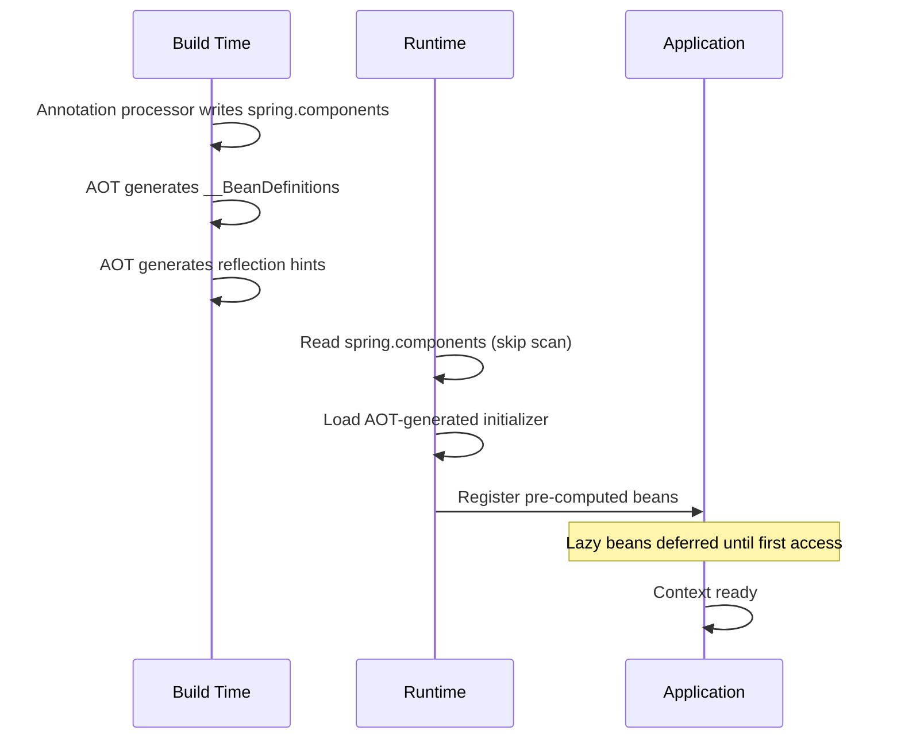
```mermaid
sequenceDiagram
    participant Build as Build Time
    participant RT as Runtime
    participant App as Application

    Build->>Build: Annotation processor writes spring.components
    Build->>Build: AOT generates __BeanDefinitions
    Build->>Build: AOT generates reflection hints
    RT->>RT: Read spring.components (skip scan)
    RT->>RT: Load AOT-generated initializer
    RT->>App: Register pre-computed beans
    Note over App: Lazy beans deferred until first access
    App->>App: Context ready
```

**Measurement:** Spring Boot Actuator's `startup` endpoint (`/actuator/startup`) records `StartupTimeline` events with nanosecond precision. Enable it with `spring.application.admin.enabled=true` and buffer events with `BufferingApplicationStartup`:

```java
SpringApplication app =
    new SpringApplication(MyApp.class);
app.setApplicationStartup(
    new BufferingApplicationStartup(2048)
);
app.run(args);
```

This captures every `ApplicationStartup` step: `spring.beans.instantiate`, `spring.context.config-classes.parse`, `spring.context.beandef-registry.post-process`. Query `/actuator/startup` for a sorted breakdown of where time is spent.

**ApplicationStartup with FlightRecorder:** For deeper profiling, use `FlightRecorderApplicationStartup` which emits JFR events consumable by JDK Mission Control. This integrates startup measurement into your standard JVM profiling workflow without custom code.

### 🚨 Failure Modes

**Failure 1 - Lazy init hides wiring errors:**
With global lazy initialization, a misspelled bean name or missing dependency is not discovered until the bean is first requested - typically on the first HTTP request in production. The app starts successfully but fails at runtime.
**Diagnostic:** Errors appear as `NoSuchBeanDefinitionException` or `UnsatisfiedDependencyException` on first request, not at startup. Check logs for delayed initialization failures.
**Fix:** Never use global lazy init in production without a compensating integration test that forces eager initialization. Run `ApplicationContext.getBeansOfType(Object.class)` in a test to validate all wiring. Use `@Lazy(false)` on critical beans that must fail fast.

**Failure 2 - Context indexer stale after refactoring:**
The `spring.components` file was generated before a class was moved or renamed. The index references a non-existent class, causing `ClassNotFoundException` at startup.
**Diagnostic:** Exception references a class in `META-INF/spring.components` that no longer exists. Check the file contents against current source.
**Fix:** Clean build (`mvn clean compile` or `gradle clean build`). The annotation processor regenerates the index from scratch. In CI, always run clean builds. In IDE incremental builds, verify the annotation processor runs on every compile.

**Failure 3 - AOT-generated code incompatible with runtime conditions:**
AOT bakes condition evaluation results at build time. If a property value differs between build environment and production environment, the wrong beans activate.
**Diagnostic:** Beans expected from `@ConditionalOnProperty` are missing despite the property being set at runtime, because AOT resolved the condition at build time with a different value.
**Fix:** AOT conditions must be resolved using the same property sources as production. Use build profiles that match deployment targets, or mark environment-specific beans with `@ImportRuntimeHints` to indicate they need runtime evaluation.

### 🔬 Production Reality

Startup time measurement should be a CI metric. Add a startup test that asserts maximum acceptable duration:

```java
@SpringBootTest
class StartupTimeTest {
    @Test
    void contextLoadsWithinBudget(
        @Autowired ApplicationContext ctx) {
        // Context loaded - assert timing via
        // BufferingApplicationStartup
        assertNotNull(ctx);
    }
}
```

Real-world optimization results from production applications: a 400-bean Spring Boot web app reduced startup from 4.2s to 1.8s with lazy init alone, to 1.3s with context indexer added, and to 0.4s with AOT on GraalVM native. The largest gains come from deferring bean instantiation (lazy init) and eliminating classpath scanning (indexer) - these two changes alone cover 70-80% of achievable improvement on the JVM.

For Kubernetes readiness probes, remember that lazy init means `readinessProbe` succeeds before all beans are created. The first few requests trigger bean creation storms. Mitigate with a startup probe (`startupProbe`) that allows longer initialization, or use `SmartInitializingSingleton` to force critical path beans to initialize eagerly.

### ⚖️ Trade-offs & Alternatives

**BAD:**

```properties
# application.properties in PRODUCTION
spring.main.lazy-initialization=true
# No compensating test, no startup probe
# First request triggers 200 bean creations
# 10-second response time on first request
```

Why it is wrong: global lazy init without safeguards hides wiring errors and causes first-request latency spikes in production.

**GOOD:**

```properties
# application.properties
spring.main.lazy-initialization=false

# Test profile only
# application-test.properties
spring.main.lazy-initialization=true
```

```java
// Critical beans force eager init
@Component
@Lazy(false)
public class PaymentGateway {
    // Always initialized at startup
    // Wiring errors caught immediately
}
```

| Technique              | Startup Gain | Risk                   | Complexity |
| ---------------------- | ------------ | ---------------------- | ---------- |
| Lazy init (global)     | 30-60%       | Hidden wiring bugs     | Low        |
| Lazy init (selective)  | 10-30%       | Minimal                | Low        |
| Context indexer        | 10-25%       | Stale index            | Low        |
| @Profile exclusion     | 10-30%       | Profile misconfig      | Low        |
| AOT processing         | 50-90%       | Build/runtime mismatch | High       |
| GraalVM native         | 90-99%       | Reflection limits      | High       |
| Remove unused starters | 5-15%        | None                   | Low        |

### ⚡ Decision Snap

**START WITH:** removing unused starters and adding `spring-context-indexer`. Zero risk, immediate gain.

**ADD NEXT:** selective `@Lazy` on heavy beans (connection pools, caches) that are not needed in every request path.

**USE AOT WHEN:** targeting GraalVM native images or serverless with sub-second startup requirements.

**AVOID global lazy init in production WHEN:** you lack comprehensive integration tests and startup probes.

### ⚠️ Top Traps

| #   | Misconception                                            | Reality                                                                                                                                                    |
| --- | -------------------------------------------------------- | ---------------------------------------------------------------------------------------------------------------------------------------------------------- |
| 1   | Lazy init eliminates startup cost                        | It defers cost to first access - total initialization work is unchanged, just redistributed across early requests                                          |
| 2   | Context indexer always helps                             | It only helps when classpath scanning is a bottleneck (many jars) - small apps with few components see negligible gain                                     |
| 3   | AOT works with all Spring features                       | AOT requires closed-world assumptions - runtime bean registration, `@Profile`-switching at deploy time, and reflection-heavy libraries need explicit hints |
| 4   | `spring.main.lazy-initialization` is safe for production | Without integration tests forcing eager init, wiring errors hide until runtime traffic triggers bean creation                                              |
| 5   | Startup time equals time-to-first-request                | With lazy init, context reports "ready" but first request pays deferred initialization - measure end-to-end latency, not just startup log                  |

### 🪜 Learning Ladder

**Prerequisites:**

- SPR-070 Spring Boot Auto-Configuration Internals - understanding condition evaluation cost during startup
- SPR-071 BeanPostProcessor and BeanFactoryPostProcessor - understanding post-processing overhead per bean

**THIS:** SPR-072 Spring Context Startup Optimization - techniques to reduce classpath scanning, condition evaluation, and bean instantiation time

**Next steps:**

- SPR-075 Spring Boot Memory Footprint Analysis - complementary to startup optimization, reducing heap usage for containerized deployments

**The Surprising Truth:** The single largest startup optimization for most Spring Boot applications is not a framework feature at all - it is removing unused starter dependencies. Each starter adds auto-configuration candidates that must be evaluated even if conditions ultimately reject them. Removing `spring-boot-starter-mail` from an app that never sends email saves more time than any amount of lazy initialization tuning.

**Further Reading:**

1. [Spring Boot Reference - Lazy Initialization](https://docs.spring.io/spring-boot/reference/features/spring-application.html#features.spring-application.lazy-initialization)
2. [Spring Framework - Ahead of Time Processing](https://docs.spring.io/spring-framework/reference/core/aot.html)
3. [Spring Boot Actuator - Application Startup](https://docs.spring.io/spring-boot/reference/actuator/endpoints.html#actuator.endpoints.startup)

**Revision Card:**

1. Startup cost decomposes into classpath scanning, condition evaluation, and bean instantiation - each optimizable independently with context indexer, profile exclusion, and lazy init respectively
2. Global lazy initialization trades startup speed for first-request latency and hidden wiring errors - use selectively in production with compensating integration tests
3. Spring AOT shifts the entire wiring computation to build time, generating direct `registerBean()` calls that bypass scanning, parsing, and condition evaluation at runtime

---

---

# SPR-073 Spring4Shell (CVE-2022-22965)

**TL;DR** - A data binding bypass on JDK 9+ let attackers write webshells through Tomcat's ClassLoader, fixed by tightening property access rules.

### 🔥 Problem Statement

Spring MVC's data binding automatically maps HTTP request parameters to Java object properties using nested property paths like `user.address.city`. This convenience becomes dangerous when attackers can traverse into internal JVM objects. On JDK 9+, the Module system added a new path from `Class` to `ClassLoader` via `class.module.classLoader` - bypassing Spring's existing restriction on `class.classLoader` (added after CVE-2010-1622). Combined with Apache Tomcat's `AccessLogValve` being reachable through the ClassLoader's resource chain, an attacker could write arbitrary JSP files to the web root - achieving remote code execution with a single HTTP request.

### 📜 Historical Context

The ancestor vulnerability is CVE-2010-1622 (Spring Framework 2.x). That attack used `class.classLoader` to reach Tomcat internals and plant a webshell. Spring fixed it by adding `class.classLoader` and `class.protectionDomain` to the binding denylist in `CachedIntrospectionResults`. For 12 years, this fix held. JDK 9 (2017) introduced the Module system, adding `Class.getModule()` which returns a `Module` object with `getClassLoader()`. This created a new traversal path: `class.module.classLoader` - which was not on the denylist. The bypass was publicly disclosed on March 29, 2022, and Spring issued CVE-2022-22965 with patches on March 31, 2022 (Spring Framework 5.3.18 and 5.2.20). Spring Boot 2.6.6 and 2.5.12 bundled the fix.

### 🔩 First Principles

**CORE INVARIANTS:**

1. Data binding maps untrusted input to object property paths using JavaBeans introspection - any reachable getter/setter chain is a potential attack surface
2. Denylist-based security is brittle - it must be updated whenever the reachable object graph changes (new JDK APIs, new container APIs)
3. The exploit required a specific deployment topology (WAR on Tomcat + JDK 9+) - not all Spring applications were vulnerable, but those that were faced unauthenticated RCE

**DERIVED DESIGN:**
The fix shifted from denylisting specific paths (`class.classLoader`) to a more comprehensive approach: disallowing binding to any property path that reaches `ClassLoader` through any intermediate object, including the new `Module` chain. The patch in `CachedIntrospectionResults` rejects property descriptors where the declaring class is `Class` and the property type is assignable to `ClassLoader`, `Module`, or `ProtectionDomain`.

### 🧠 Mental Model

> Think of data binding as a GPS navigator that can reach any destination by following roads (property paths). The 2010 fix blocked one specific road (`class.classLoader`) to a dangerous neighborhood (ClassLoader). JDK 9 built a new highway (`class.module.classLoader`) that the road block did not cover. The attacker used the new highway to reach the same dangerous destination and plant a bomb (webshell). The 2022 fix blocked the entire neighborhood regardless of which roads lead there.

- "GPS navigator" -> Spring's `BeanWrapperImpl` property traversal
- "blocked road" -> denylist entry for `class.classLoader`
- "new highway" -> JDK 9 Module API: `class.module.classLoader`
- "blocked neighborhood" -> type-based restriction on ClassLoader access

**Where this analogy breaks down:** The "neighborhood" has legitimate residents - some frameworks need ClassLoader access for valid reasons. The fix specifically targets data binding from untrusted input, not all ClassLoader access within the application.

### 🧩 Components

```text
Attack Chain:
+-----------------------------------------+
| HTTP Request                            |
| class.module.classLoader.resources      |
|   .context.parent.pipeline.first        |
|   .pattern=%{...}                       |
|   .suffix=.jsp                          |
|   .directory=webapps/ROOT               |
|   .prefix=shell                         |
|         |                               |
| BeanWrapperImpl.setPropertyValue()      |
|         |                               |
| Tomcat AccessLogValve reconfigured      |
|         |                               |
| JSP webshell written to disk            |
+-----------------------------------------+
```

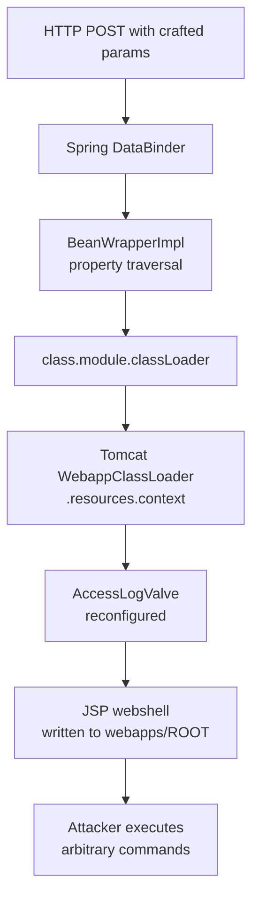
```mermaid
flowchart TD
    A["HTTP POST with crafted params"] --> B["Spring DataBinder"]
    B --> C["BeanWrapperImpl\nproperty traversal"]
    C --> D["class.module.classLoader"]
    D --> E["Tomcat WebappClassLoader\n.resources.context"]
    E --> F["AccessLogValve\nreconfigured"]
    F --> G["JSP webshell\nwritten to webapps/ROOT"]
    G --> H["Attacker executes\narbitrary commands"]
```

**BeanWrapperImpl:** Spring's property accessor that implements `PropertyAccessor`. It resolves nested property paths like `a.b.c` by calling `getA()` on the target, then `getB()` on the result, then `setC()` on that. Each step follows standard JavaBeans introspection. The vulnerability exists because this traversal has no inherent depth or type boundary other than the denylist.

**CachedIntrospectionResults:** Caches `PropertyDescriptor` arrays for Java classes. The denylist filtering happens here - before the 2022 fix, it only checked for `classLoader` and `protectionDomain` as direct property names on `Class`. After the fix, it checks property return types against a broader set of restricted types.

### 📶 Gradual Depth

**Surface:** Attackers sent HTTP parameters that navigated through Java's class hierarchy to reach Tomcat's log configuration and wrote a JSP webshell. Fixed by patching Spring Framework.

**One level down:** The specific property chain was `class.module.classLoader.resources.context.parent.pipeline.first.*`. On JDK 9+, `Object.getClass().getModule().getClassLoader()` returns the `ClassLoader`. On Tomcat, that ClassLoader is a `WebappClassLoaderBase` whose `getResources()` returns a `WebResourceRoot`, which gives access to the `StandardContext`, then up to the `StandardHost` parent, then to its `Pipeline`, then to the `AccessLogValve` (the first valve). The attacker set the valve's `pattern`, `suffix`, `directory`, and `prefix` properties to write a file with JSP content to the web root.

**Deeper:** The webshell payload was embedded in the `pattern` property of `AccessLogValve`. Tomcat's access log writes each request using the configured pattern. The attacker crafted the pattern to contain JSP code that executes runtime commands via `Runtime.getRuntime().exec()`. The parameters were sent as POST form data or GET query parameters - no authentication required.

**Internal detail:** Spring's pre-2022 denylist in `CachedIntrospectionResults` only checked `if (property.getName().equals("classLoader") || property.getName().equals("protectionDomain"))` for properties on `java.lang.Class`. The JDK 9 `module` property returned `java.lang.Module` (not `ClassLoader`), so it passed the denylist. The fix changed the check to examine the property descriptor's return type: if it is assignable to `ClassLoader`, the property is rejected regardless of its name or the intermediate path.

### ⚙️ How It Works

```text
Pre-fix property resolution (vulnerable):

request: class.module.classLoader.resources
  |
Object.getClass()       -> Class
  .getModule()          -> Module     (JDK 9+)
  .getClassLoader()     -> ClassLoader
  .getResources()       -> WebResourceRoot
  ... traversal continues to AccessLogValve

Denylist check (pre-fix):
  "classLoader" on Class?
    -> class.classLoader blocked
  "module" on Class?
    -> NOT blocked (not in list)
  "classLoader" on Module?
    -> NOT checked (only checks Class)

Post-fix property resolution (safe):
  "module" on Class?
    -> return type: Module
    -> Module not in allowed types
    -> BLOCKED
```

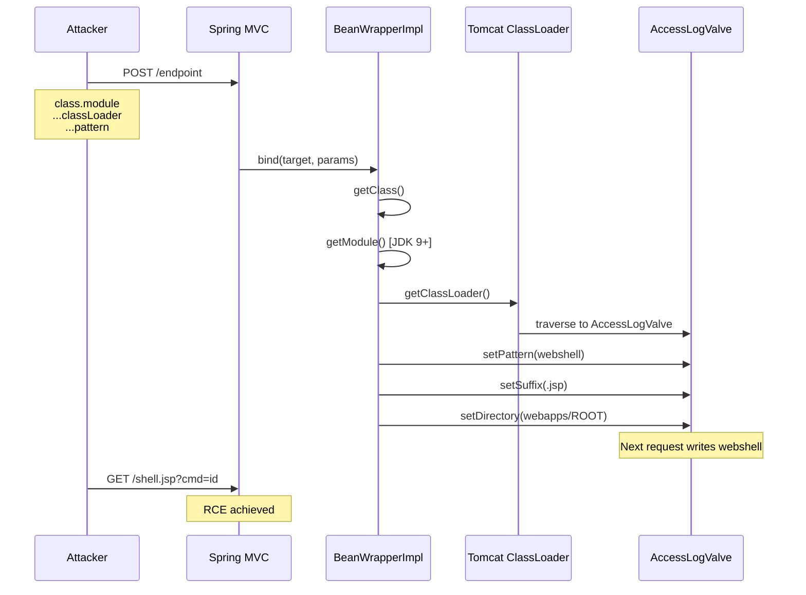
```mermaid
sequenceDiagram
    participant Attacker
    participant Spring as Spring MVC
    participant BW as BeanWrapperImpl
    participant TomcatCL as Tomcat ClassLoader
    participant Valve as AccessLogValve

    Attacker->>Spring: POST /endpoint
    Note over Attacker: class.module<br/>...classLoader<br/>...pattern
    Spring->>BW: bind(target, params)
    BW->>BW: getClass()
    BW->>BW: getModule() [JDK 9+]
    BW->>TomcatCL: getClassLoader()
    TomcatCL->>Valve: traverse to AccessLogValve
    BW->>Valve: setPattern(webshell)
    BW->>Valve: setSuffix(.jsp)
    BW->>Valve: setDirectory(webapps/ROOT)
    Note over Valve: Next request writes webshell
    Attacker->>Spring: GET /shell.jsp?cmd=id
    Note over Spring: RCE achieved
```

**Step 1 - Request arrives:** An unauthenticated HTTP request (POST or GET) sends parameters with nested property paths targeting the command/form object.

**Step 2 - Data binding:** `ServletRequestDataBinder` calls `BeanWrapperImpl.setPropertyValue()` for each parameter. The wrapper resolves nested paths by calling getter methods recursively.

**Step 3 - ClassLoader traversal:** `class.module.classLoader` navigates from `Object.getClass()` through `Class.getModule()` (JDK 9+) to `Module.getClassLoader()`. On Tomcat, this returns `WebappClassLoaderBase`.

**Step 4 - Tomcat internal traversal:** From the ClassLoader, the path `.resources.context.parent.pipeline.first` reaches `AccessLogValve` - the first valve in the host pipeline that writes access logs to files.

**Step 5 - Valve reconfiguration:** The attacker sets `pattern` (JSP code), `suffix` (.jsp), `directory` (webapps/ROOT), and `prefix` (filename). On the next logged request, Tomcat writes the webshell file.

**Step 6 - Execution:** The attacker requests the written JSP file. Tomcat compiles and executes it, providing arbitrary command execution.

### 🚨 Failure Modes

**Failure 1 - False sense of security from deployment model:**
Teams running Spring Boot with embedded Tomcat (JAR deployment) assumed they were safe because early advisories emphasized WAR deployment. While the primary documented exploit chain targets WAR-on-Tomcat, the underlying data binding vulnerability exists regardless - other ClassLoader implementations may expose different but equally dangerous property chains.
**Diagnostic:** Check Spring Framework version, not just deployment topology. Any version 5.3.0-5.3.17 or 5.2.0-5.2.19 has the vulnerable data binding code.
**Fix:** Upgrade Spring Framework to 5.3.18+ or 5.2.20+ regardless of deployment model. The fix hardens the data binding denylist universally.

**Failure 2 - WAF bypass through parameter encoding:**
Web Application Firewalls blocking `class.module.classLoader` as a string pattern were bypassed through URL encoding, parameter array syntax (`class[module][classLoader]`), or multipart form data where the WAF did not inspect nested parameter names.
**Diagnostic:** Check WAF logs for encoded variants. Test with URL-encoded and array-syntax variants of the parameter names.
**Fix:** WAF rules are a temporary mitigation, not a fix. Upgrade the framework. If upgrade is delayed, use Spring's `WebDataBinder.setDisallowedFields()` as a defense-in-depth measure in a `@ControllerAdvice` `@InitBinder` method.

### 🔬 Production Reality

The vulnerability was assigned CVSS 9.8 (Critical) by NIST NVD. Conditions for exploitability were specific but common in enterprise environments: JDK 9+ (standard by 2022), Spring MVC with data binding (most web apps), WAR packaging on Apache Tomcat (common in enterprise deployments). Spring Boot's default embedded Tomcat with JAR packaging was not directly exploitable through the documented attack chain, but the underlying binding flaw still warranted patching.

Detection in production involved searching for: (1) unusual access log patterns in Tomcat containing JSP code fragments, (2) unexpected `.jsp` files in `webapps/ROOT`, (3) HTTP requests with `class.module.classLoader` in parameter names visible in access logs or WAF logs.

Organizations that maintained current dependency versions had a 48-hour patch cycle. Organizations running older Spring Framework versions faced a harder upgrade path. The incident accelerated adoption of automated dependency scanning (Dependabot, Snyk, Renovate) across Java ecosystems and reinforced that denylist-based security controls require continuous maintenance as platform APIs evolve.

### ⚖️ Trade-offs & Alternatives

**BAD:**

```java
// Relying on WAF rules only - no framework fix
// WAF rule: block "class.module.classLoader"
// Bypassed by encoding, arrays, multipart

@Controller
public class UserController {
    @PostMapping("/user")
    public String update(UserForm form) {
        // No @InitBinder restrictions
        // Full property traversal exposed
        return "success";
    }
}
```

Why it is wrong: WAF rules are bypassable and do not address the root cause. The data binding code remains vulnerable.

**GOOD:**

```java
// Defense-in-depth: upgrade + @InitBinder
@ControllerAdvice
public class BinderSecurity {
    @InitBinder
    public void initBinder(
        WebDataBinder binder) {
        binder.setDisallowedFields(
            "class.*", "Class.*",
            "*.class.*", "*.Class.*"
        );
    }
}
```

```xml
<!-- Primary fix: upgrade Spring Framework -->
<dependency>
    <groupId>org.springframework</groupId>
    <artifactId>spring-beans</artifactId>
    <version>5.3.18</version>
    <!-- or later -->
</dependency>
```

| Mitigation                   | Effectiveness      | Risk                     | Effort |
| ---------------------------- | ------------------ | ------------------------ | ------ |
| Upgrade Spring Framework     | Complete           | Low                      | Medium |
| Upgrade Spring Boot          | Complete           | Low                      | Low    |
| @InitBinder disallowedFields | High               | May break legit bindings | Low    |
| WAF rules                    | Partial            | Bypass risk              | Low    |
| Downgrade to JDK 8           | Blocks this chain  | Loses JDK features       | High   |
| Switch to JAR packaging      | Blocks known chain | Other chains possible    | Medium |

### ⚡ Decision Snap

**IMMEDIATE:** Upgrade Spring Framework to 5.3.18+ or Spring Boot to 2.6.6+ / 2.5.12+. This is the only complete fix.

**TEMPORARY (if upgrade is delayed):** Add `@InitBinder` with `setDisallowedFields("class.*", ...)` globally via `@ControllerAdvice`.

**LONG-TERM:** Adopt automated dependency scanning, enforce maximum patch age policies, and treat data binding surface area as security-critical configuration.

### ⚠️ Top Traps

| #   | Misconception                                 | Reality                                                                                                                                                                |
| --- | --------------------------------------------- | ---------------------------------------------------------------------------------------------------------------------------------------------------------------------- |
| 1   | Only WAR-on-Tomcat is vulnerable              | The data binding flaw exists in all deployment modes - the documented RCE chain targets WAR-on-Tomcat, but other containers may have analogous paths                   |
| 2   | JDK 8 applications are safe from all variants | JDK 8 lacks the Module API so this specific bypass fails, but the 2010-era `class.classLoader` fix was also incomplete - upgrade Spring regardless                     |
| 3   | Spring Boot embedded Tomcat is fully immune   | Embedded Tomcat did not expose the same ClassLoader traversal in documented exploits, but the binding restriction was still missing - patch to prevent future variants |
| 4   | WAF rules fully mitigate the issue            | Parameter encoding, array syntax, and multipart boundaries bypass string-matching WAF rules - framework-level fix is required                                          |
| 5   | This was unprecedented with no warning signs  | CVE-2010-1622 demonstrated the exact same attack pattern 12 years earlier - denylist-based binding protection was a known fragile approach                             |

### 🪜 Learning Ladder

**Prerequisites:**

- SPR-070 Spring Boot Auto-Configuration Internals - understanding how Spring MVC auto-configures data binding
- SPR-064 Spring MVC Request Lifecycle - understanding how request parameters reach data binding

**THIS:** SPR-073 Spring4Shell (CVE-2022-22965) - the ClassLoader traversal RCE via data binding on JDK 9+ with Tomcat

**Next steps:**

- SPR-074 Spring Cloud Function SpEL Injection (2022) - another 2022 Spring CVE, this time through expression language injection

**The Surprising Truth:** Spring4Shell was not a novel attack technique - it was a 12-year-old attack (CVE-2010-1622) that worked again because JDK 9's Module system added a new path to ClassLoader that the original denylist did not anticipate. The lesson is not "Spring had a bug" but "denylist-based security silently degrades when the underlying platform evolves."

**Further Reading:**

1. [Spring Framework CVE-2022-22965 Advisory](https://spring.io/security/cve-2022-22965)
2. [Spring Blog - Spring Framework RCE Announcement](https://spring.io/blog/2022/03/31/spring-framework-rce-early-announcement)
3. [NIST NVD CVE-2022-22965](https://nvd.nist.gov/vuln/detail/CVE-2022-22965)

**Revision Card:**

1. Spring4Shell exploited JDK 9's Module API to bypass Spring's 2010-era denylist on `class.classLoader` - the path `class.module.classLoader` reached Tomcat's AccessLogValve to write JSP webshells
2. The fix in Spring 5.3.18 changed the denylist from name-based (`classLoader`) to type-based (reject any property returning `ClassLoader`, `Module`, or `ProtectionDomain`) - closing current and future traversal paths
3. Denylist-based input validation silently breaks when the reachable object graph changes - platform upgrades (JDK 9 Module), container changes, or new library dependencies can all introduce new traversal paths

---

---

# SPR-074 Spring Cloud Function SpEL Injection (2022)

**TL;DR** - Unvalidated HTTP headers were evaluated as SpEL expressions in Spring Cloud Function routing, enabling unauthenticated remote code execution.

### 🔥 Problem Statement

Spring Cloud Function 3.1.6 and 3.2.2 (and earlier) accepted a `spring.cloud.function.routing-expression` HTTP header that was passed directly to the Spring Expression Language (SpEL) evaluator. Because SpEL can invoke arbitrary Java methods - including `Runtime.getRuntime().exec()` - any unauthenticated HTTP client could achieve remote code execution by sending a single crafted request. The root cause: a routing convenience feature treated untrusted network input as trusted code. No authentication, no sandboxing, no validation stood between the HTTP header and the expression evaluator.

### 📜 Historical Context

Spring Cloud Function was created to provide a uniform programming model for serverless functions across AWS Lambda, Azure Functions, and standalone Spring Boot deployments. Version 3.0 (2020) introduced function routing - the ability to select which function bean handles a request based on HTTP headers or message headers. The `spring.cloud.function.routing-expression` header was added to support dynamic routing via SpEL, enabling patterns like routing based on message content. This feature was designed for trusted internal messaging systems (Spring Cloud Stream, RabbitMQ, Kafka) where headers originate from controlled producers. However, when exposed over HTTP through `spring-cloud-function-web`, those same headers arrive from untrusted clients. The vulnerability was disclosed on March 29, 2022 (the same week as Spring4Shell), assigned CVE-2022-22963, and patched in Spring Cloud Function 3.1.7 and 3.2.3 on March 29, 2022. NIST assigned CVSS 9.8 (Critical).

### 🔩 First Principles

**CORE INVARIANTS:**

1. Expression languages (SpEL, OGNL, EL, MVEL) are code execution engines - feeding untrusted input into them is equivalent to `eval()` on user input
2. Security boundaries must match deployment boundaries - features designed for trusted messaging contexts are dangerous when reachable over HTTP
3. The safest fix for expression injection is removing expression evaluation from the untrusted path entirely, not attempting to sandbox or restrict the expression language

**DERIVED DESIGN:**
The fix in Spring Cloud Function 3.1.7 and 3.2.3 disabled SpEL evaluation of the routing expression header from HTTP requests. The `RoutingFunction` still supports routing, but the expression-based routing path rejects expressions arriving via HTTP headers. This follows the principle that the fix should eliminate the attack surface rather than attempt to filter dangerous expressions - because SpEL is Turing-complete, no filter can reliably distinguish safe from unsafe expressions.

### 🧠 Mental Model

> Think of SpEL evaluation as a command-line terminal inside your application. The routing-expression header was like a sticky note on the front door that said "write any command here and we will run it." Internal staff (trusted message brokers) writing commands is one thing. Putting that sticky note on a public-facing door (HTTP endpoint) means anyone walking by can write `rm -rf /`.

- "command-line terminal" -> SpEL `ExpressionParser.parseExpression()`
- "sticky note on front door" -> HTTP header `spring.cloud.function.routing-expression`
- "internal staff" -> trusted message broker headers (Kafka, RabbitMQ)
- "anyone walking by" -> unauthenticated HTTP client

**Where this analogy breaks down:** Unlike a terminal with user sessions and audit logs, SpEL evaluation happened silently inside request processing with no logging, no authentication check, and no rate limiting. There was no trail indicating that expressions were being evaluated from headers.

### 🧩 Components

```text
Spring Cloud Function Routing Architecture:

+---------------------+
| HTTP Request        |
| Header:             |
|  routing-expression |
|  = <SpEL payload>   |
+---------+-----------+
          |
+---------v-----------+
| FunctionWebRequest  |
| HeadersAdapter      |
+---------+-----------+
          |
+---------v-----------+
| RoutingFunction     |
|  .route(message)    |
+---------+-----------+
          |
+---------v-----------+
| SpEL Evaluator      |
|  StandardEvaluation |
|  Context            |
+---------+-----------+
          |
+---------v-----------+
| Runtime.exec() or   |
| ProcessBuilder       |
| (attacker payload)  |
+---------------------+
```

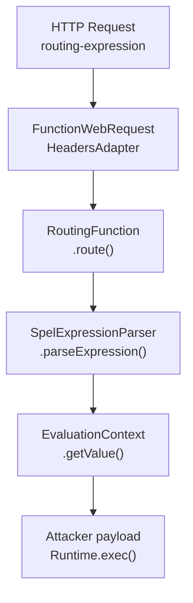
```mermaid
flowchart TD
    A["HTTP Request\nrouting-expression"]
    A --> B["FunctionWebRequest\nHeadersAdapter"]
    B --> C["RoutingFunction\n.route()"]
    C --> D["SpelExpressionParser\n.parseExpression()"]
    D --> E["EvaluationContext\n.getValue()"]
    E --> F["Attacker payload\nRuntime.exec()"]
```

**RoutingFunction:** A special Spring Cloud Function bean that dispatches incoming messages to other function beans based on routing rules. It reads the target function name from headers (`spring.cloud.function.definition`) or evaluates a SpEL expression from `spring.cloud.function.routing-expression` to compute the target dynamically.

**StandardEvaluationContext:** The SpEL evaluation context that provides access to the full Java type system. Unlike `SimpleEvaluationContext` (which restricts type access), `StandardEvaluationContext` allows invoking any public method on any class - including `Runtime`, `ProcessBuilder`, `Class.forName()`, and reflection APIs.

**FunctionWebRequestAdapter:** Bridges HTTP request headers into Spring Messaging `MessageHeaders`. This adapter directly mapped HTTP header values into the message header map without sanitization, making HTTP headers indistinguishable from trusted broker headers inside `RoutingFunction`.

### 📶 Gradual Depth

**Surface:** An HTTP header named `spring.cloud.function.routing-expression` was evaluated as a SpEL expression. Attackers sent expressions that executed system commands. Fixed by disabling SpEL evaluation from HTTP headers.

**One level down:** The `RoutingFunction` class checked for a header named `spring.cloud.function.routing-expression`. If present, it passed the raw header value to `SpelExpressionParser.parseExpression()` and evaluated it against a `StandardEvaluationContext` with the incoming `Message` as the root object. Because `StandardEvaluationContext` grants full Java type access, expressions like `T(java.lang.Runtime).getRuntime().exec('id')` executed arbitrary OS commands.

**Deeper:** The exploit required only a single HTTP request. A minimal proof-of-concept:

```bash
curl -X POST http://target:8080/functionRouter \
  -H "spring.cloud.function.routing-expression:\
T(java.lang.Runtime).getRuntime()\
.exec('touch /tmp/pwned')" \
  -d "test"
```

The `/functionRouter` endpoint is auto-configured by `spring-cloud-function-web` when function routing is enabled. No specific function needs to be deployed - the routing expression is evaluated before function dispatch.

**Internal detail:** The vulnerability existed in `RoutingFunction.functionFromExpression()`. Pre-fix code:

```java
// Vulnerable: raw header -> SpEL evaluation
String expression = message.getHeaders()
    .get("spring.cloud.function.routing-expression",
         String.class);
Expression expr = spelParser
    .parseExpression(expression);
// StandardEvaluationContext = full access
Object result = expr.getValue(
    evalContext, message);
```

The fix removed SpEL evaluation for messages arriving via HTTP. The routing-expression header is now only honored from internal messaging channels where headers originate from trusted producers.

### ⚙️ How It Works

```text
Attack flow (pre-fix):

1. Attacker -> POST /functionRouter
   Header: spring.cloud.function
     .routing-expression:
     T(java.lang.Runtime)
       .getRuntime().exec('cmd')

2. DispatcherServlet
   -> FunctionController
   -> FunctionWebRequestAdapter

3. HTTP headers -> MessageHeaders
   (no filtering, no validation)

4. RoutingFunction.route(message)
   -> reads routing-expression header
   -> SpelExpressionParser.parseExpression()
   -> StandardEvaluationContext.getValue()

5. SpEL evaluates T(java.lang.Runtime)
   -> resolves java.lang.Runtime class
   -> calls getRuntime()
   -> calls exec('cmd')

6. OS command executes as app user
```

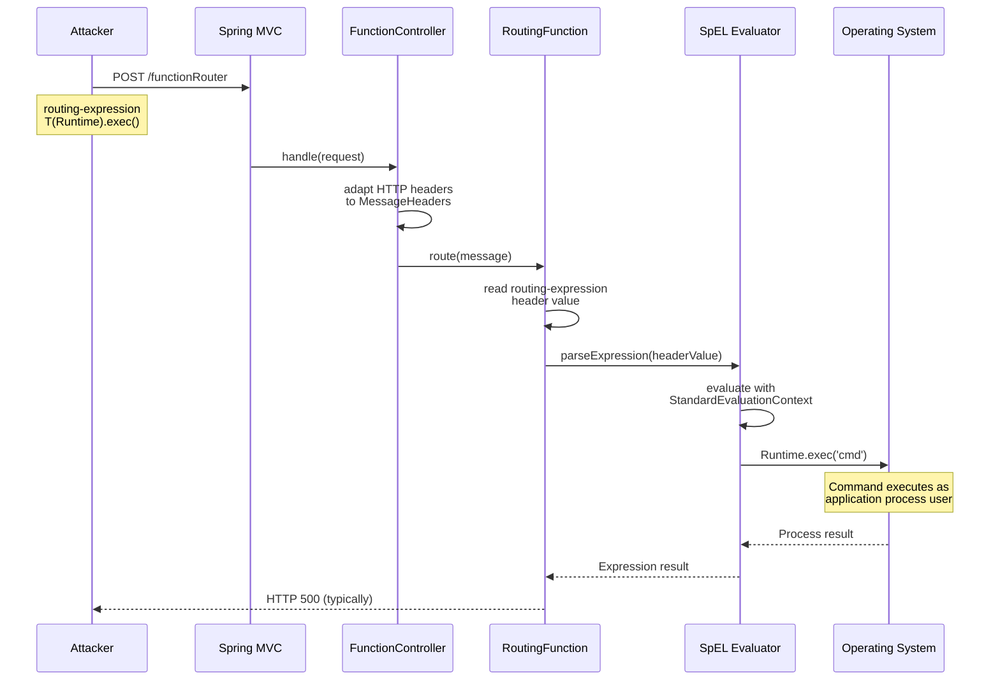
```mermaid
sequenceDiagram
    participant A as Attacker
    participant S as Spring MVC
    participant F as FunctionController
    participant R as RoutingFunction
    participant E as SpEL Evaluator
    participant OS as Operating System

    A->>S: POST /functionRouter
    Note over A: routing-expression<br/>T(Runtime).exec()
    S->>F: handle(request)
    F->>F: adapt HTTP headers<br/>to MessageHeaders
    F->>R: route(message)
    R->>R: read routing-expression<br/>header value
    R->>E: parseExpression(headerValue)
    E->>E: evaluate with<br/>StandardEvaluationContext
    E->>OS: Runtime.exec('cmd')
    Note over OS: Command executes as<br/>application process user
    OS-->>E: Process result
    E-->>R: Expression result
    R-->>A: HTTP 500 (typically)
```

**Step 1 - Request arrival:** An HTTP POST to `/functionRouter` (the default function routing endpoint) carries the malicious header. No authentication is required. The endpoint exists whenever `spring-cloud-function-web` is on the classpath with routing enabled.

**Step 2 - Header adaptation:** `FunctionWebRequestAdapter` converts all HTTP headers into `MessageHeaders`. The routing-expression header passes through without any inspection.

**Step 3 - Expression evaluation:** `RoutingFunction` detects the `spring.cloud.function.routing-expression` header and passes its value to `SpelExpressionParser.parseExpression()`. The parsed expression is evaluated using `StandardEvaluationContext`, which provides full access to the Java type system via the `T()` operator.

**Step 4 - Code execution:** The SpEL engine resolves `T(java.lang.Runtime)` to the `java.lang.Runtime` class, invokes `getRuntime()` to obtain the singleton instance, and calls `exec()` with the attacker's command string. The process runs with the privileges of the JVM process.

**Step 5 - Response:** The function routing typically fails (the expression result is not a valid function name), so the server returns an error response. But the side effect (command execution) has already occurred.

### 🚨 Failure Modes

**Failure 1 - Dependency on WAF header filtering:**
Organizations deployed WAF rules to block headers containing `T(java.lang.Runtime)` or `exec(`. Attackers bypassed these filters using SpEL string concatenation (`'Runt'+'ime'`), reflection (`T(Class).forName('java.lang.Runtime')`), or character encoding. SpEL is expressive enough to construct any class name or method call through indirect means.
**Diagnostic:** Test WAF rules with obfuscated SpEL payloads: `T(String).class.forName('java.lang.Ru'+'ntime')`, `new String(new byte[]{82,117,110,...})`. If any variant passes the WAF, the rule is insufficient.
**Fix:** Upgrade Spring Cloud Function to 3.1.7+ or 3.2.3+. WAF rules are a temporary delay tactic, not a remediation. Expression language injection cannot be reliably filtered because the language is Turing-complete.

**Failure 2 - Unrecognized exposure through transitive dependencies:**
Teams using Spring Cloud Stream (Kafka/RabbitMQ bindings) did not realize that adding `spring-cloud-function-web` to their classpath for health endpoints or testing also exposed the `/functionRouter` HTTP endpoint. The routing expression feature intended for broker headers became reachable from the network.
**Diagnostic:** Check for `spring-cloud-function-web` in the dependency tree: `mvn dependency:tree | grep function-web`. If present, the HTTP routing endpoint is active regardless of whether you explicitly use it.
**Fix:** Remove `spring-cloud-function-web` if HTTP function invocation is not needed. If it is needed, upgrade and restrict the endpoint with Spring Security.

**Failure 3 - Incomplete patching in custom builds:**
Organizations that pinned Spring Cloud Function versions in BOMs or override properties sometimes upgraded Spring Boot (addressing Spring4Shell) but left Spring Cloud Function at the vulnerable version because it was managed by a separate Spring Cloud BOM version.
**Diagnostic:** Check `spring-cloud-function-context` version directly: `mvn dependency:tree | grep spring-cloud-function-context`. Versions before 3.1.7 or 3.2.3 are vulnerable.
**Fix:** Upgrade the Spring Cloud BOM or explicitly override `spring-cloud-function-context` version to 3.1.7+ or 3.2.3+.

### 🔬 Production Reality

CVE-2022-22963 was disclosed the same week as CVE-2022-22965 (Spring4Shell), causing confusion in incident response teams who conflated the two. They are entirely different vulnerabilities: Spring4Shell exploits data binding property traversal; CVE-2022-22963 exploits SpEL expression evaluation. Both require separate patches.

Exploitation in the wild was confirmed by multiple threat intelligence sources within days of disclosure. The attack required zero authentication, zero prior knowledge of the application, and a single HTTP request. Automated scanners incorporated the exploit rapidly. Organizations running Spring Cloud Function with the web adapter on public-facing services were at immediate risk.

The vulnerability highlighted a recurring pattern in Spring ecosystem security: features designed for trusted internal contexts (message broker routing) become dangerous when exposed to untrusted contexts (HTTP) without re-evaluating the trust model. The same pattern appears in Spring Cloud Gateway (CVE-2022-22947, SpEL injection in route filters) disclosed the same month.

Detection involved searching for: (1) HTTP requests with `spring.cloud.function.routing-expression` headers in access logs, (2) unexpected processes spawned by the JVM process, (3) `functionRouter` endpoint access patterns.

### ⚖️ Trade-offs & Alternatives

**BAD:**

```java
// Attempting to sanitize SpEL input
// instead of disabling evaluation
String expr = header.replaceAll(
    "T\\(.*Runtime.*\\)", "");
// BROKEN: infinite bypass variations
// T(Class).forName(...) still works
// Reflection chains still work
// String concatenation still works
```

Why it is wrong: SpEL is Turing-complete. Any filter based on pattern matching can be bypassed through expression composition, reflection, string manipulation, or alternative class loading paths.

**GOOD:**

```xml
<!-- Primary fix: upgrade -->
<dependency>
    <groupId>org.springframework.cloud</groupId>
    <artifactId>
        spring-cloud-function-context
    </artifactId>
    <version>3.2.3</version>
</dependency>
```

```java
// Defense-in-depth: restrict endpoint
@Configuration
public class FunctionSecurity {
    @Bean
    SecurityFilterChain functionChain(
        HttpSecurity http) throws Exception {
        http.authorizeHttpRequests(auth ->
            auth.requestMatchers(
                "/functionRouter")
                .authenticated()
        );
        return http.build();
    }
}
```

| Mitigation                             | Effectiveness            | Risk                    | Effort |
| -------------------------------------- | ------------------------ | ----------------------- | ------ |
| Upgrade Spring Cloud Function          | Complete                 | Low                     | Low    |
| Remove spring-cloud-function-web       | Complete (if not needed) | Feature loss            | Low    |
| Restrict /functionRouter with Security | High                     | Config error risk       | Medium |
| WAF header filtering                   | Partial                  | Bypass via obfuscation  | Low    |
| SimpleEvaluationContext                | High                     | May break routing logic | Medium |
| Disable function routing entirely      | Complete                 | Feature loss            | Low    |

### ⚡ Decision Snap

**IMMEDIATE:** Upgrade Spring Cloud Function to 3.1.7+ or 3.2.3+. If upgrade is delayed, remove `spring-cloud-function-web` from the classpath or block `/functionRouter` at the reverse proxy.

**SHORT-TERM:** Audit all Spring Cloud dependencies for expression-language exposure. Check for CVE-2022-22947 (Spring Cloud Gateway SpEL injection) in the same audit cycle.

**LONG-TERM:** Treat any feature that evaluates expressions from headers, parameters, or message properties as a security-critical surface. Default to `SimpleEvaluationContext` for any SpEL evaluation that might receive external input. Require explicit opt-in for `StandardEvaluationContext`.

### ⚠️ Top Traps

| #   | Misconception                                              | Reality                                                                                                                                                                      |
| --- | ---------------------------------------------------------- | ---------------------------------------------------------------------------------------------------------------------------------------------------------------------------- |
| 1   | Only apps explicitly using function routing are vulnerable | The `/functionRouter` endpoint is auto-configured when `spring-cloud-function-web` is on the classpath - no explicit routing config needed                                   |
| 2   | WAF rules blocking `Runtime.exec` are sufficient           | SpEL supports reflection, string concatenation, and class loading - any blocklist is bypassable                                                                              |
| 3   | This is the same as Spring4Shell                           | CVE-2022-22963 (SpEL injection) and CVE-2022-22965 (data binding traversal) are completely different vulnerabilities requiring separate patches                              |
| 4   | SimpleEvaluationContext prevents all SpEL attacks          | SimpleEvaluationContext restricts type access but still allows property access and method calls on the root object - it reduces attack surface but is not a complete sandbox |
| 5   | Internal-only services do not need the patch               | Network segmentation failures, SSRF from other services, and lateral movement make internal services exploitable - patch regardless of network position                      |

### 🪜 Learning Ladder

**Prerequisites:**

- SPR-073 Spring4Shell (CVE-2022-22965) - understanding Spring security vulnerability patterns and the data binding attack from the same time period
- SPR-064 Spring MVC Request Lifecycle - understanding how HTTP headers reach application code

**THIS:** SPR-074 Spring Cloud Function SpEL Injection (2022) - unauthenticated RCE via SpEL expression evaluation of untrusted HTTP headers in function routing

**Next steps:**

- SPR-083 Debugging Spring Auto-Configuration Failures - understanding how auto-configured endpoints like `/functionRouter` appear unexpectedly on the classpath

**The Surprising Truth:** The most dangerous aspect of CVE-2022-22963 was not the SpEL evaluation itself but the invisible attack surface. Teams that added `spring-cloud-function-web` as a transitive dependency for testing or health checks unknowingly exposed `/functionRouter` to the network. The vulnerability is a case study in how auto-configuration convenience creates security risk: features activate silently based on classpath presence, and security-critical endpoints appear without explicit opt-in.

**Further Reading:**

1. [Spring Security Advisory CVE-2022-22963](https://spring.io/security/cve-2022-22963)
2. [NIST NVD CVE-2022-22963](https://nvd.nist.gov/vuln/detail/CVE-2022-22963)
3. [Spring Cloud Function Reference - Function Routing](https://docs.spring.io/spring-cloud-function/reference/spring-cloud-function/function-routing.html)

**Revision Card:**

1. CVE-2022-22963 allowed unauthenticated RCE by evaluating HTTP header values as SpEL expressions in Spring Cloud Function's routing mechanism - `StandardEvaluationContext` gave full Java type system access including `Runtime.exec()`
2. The fix disabled SpEL evaluation for routing expressions arriving via HTTP headers - the correct response to expression injection is removing evaluation from the untrusted path, not filtering expressions
3. Expression language injection (SpEL, OGNL, EL) is equivalent to code injection - any feature that evaluates expressions from untrusted sources must use `SimpleEvaluationContext` at minimum, or preferably avoid expression evaluation entirely

---

---

# SPR-075 Spring Boot Memory Footprint Analysis

**TL;DR** - Spring Boot memory consumption spans heap, metaspace, thread stacks, and direct buffers - each requiring distinct measurement and optimization strategies.

### 🔥 Problem Statement

A "simple" Spring Boot microservice with Spring Web, JPA, and Actuator routinely consumes 300-500 MB of RSS memory in production. Teams setting Kubernetes memory limits to 256 MB see OOMKilled pods. Teams setting limits to 1 GB waste cluster resources. The confusion stems from the JVM's multi-region memory model: heap is only one component. Metaspace holds class metadata for every loaded class (Spring loads thousands through reflection and proxying). Each thread stack consumes 1 MB by default. Direct ByteBuffers for NIO bypass heap accounting. Without understanding where memory goes, teams either over-provision (wasting money) or under-provision (causing crashes). The problem intensifies at scale: 50 microservices each wasting 256 MB costs real infrastructure budget.

### 📜 Historical Context

Early Spring applications (pre-Boot era) ran as WARs inside shared application servers where memory was the server's concern. Spring Boot's embedded server model (2014+) shifted memory ownership to each application. The default JVM ergonomics (selecting heap size based on container memory) often chose values too large for containerized deployments. JDK 8u131 (2017) added `-XX:+UseContainerSupport` to respect cgroup memory limits, and JDK 10 made it the default - but this only affected heap sizing, not total RSS. Spring Boot 2.0-2.7 added features that increased baseline memory: conditional evaluation of hundreds of auto-configuration classes, Hibernate metadata model, Micrometer metric registries, and the Actuator endpoint infrastructure. Spring Boot 3.0 introduced AOT processing and GraalVM native image support as the primary answer to memory concerns - trading runtime flexibility for dramatically lower footprint (typically 50-100 MB RSS). Spring Framework 6.1+ added virtual thread support, changing the thread stack memory calculus entirely.

### 🔩 First Principles

**CORE INVARIANTS:**

1. JVM process RSS = heap + metaspace + thread stacks + direct buffers + native code + JVM overhead - measuring only heap misses 40-60% of actual memory consumption
2. Every loaded class costs metaspace (roughly 5-10 KB per class) and every Spring bean requires at least one class - reducing bean count reduces metaspace
3. Memory optimization is a trade-off against startup time, runtime flexibility, and developer experience - there is no free optimization

**DERIVED DESIGN:**
Effective memory management requires measuring each region independently, identifying the dominant contributor, and applying region-specific optimizations. Heap issues need GC tuning. Metaspace issues need classpath reduction. Thread stack issues need pool sizing or virtual threads. Treating "memory" as a single number leads to ineffective optimization.

### 🧠 Mental Model

> Think of a Spring Boot application's memory as an office building. The heap is the open-plan workspace where employees (objects) work and leave when done (GC). Metaspace is the filing cabinet room that stores a folder for every type of employee ever hired (loaded classes) - folders accumulate and rarely get removed. Thread stacks are individual phone booths - each reserved at full size whether occupied or not. Direct buffers are the parking garage - managed separately from the building's interior space.

- "open-plan workspace" -> heap (GC-managed, dynamic)
- "filing cabinet room" -> metaspace (class metadata, grows with classpath)
- "phone booths" -> thread stacks (fixed per-thread, 1 MB default)
- "parking garage" -> direct ByteBuffers (off-heap, NIO)

**Where this analogy breaks down:** Unlike physical rooms with visible occupancy, JVM memory regions are invisible without explicit tooling. The "building" (RSS) also includes the JVM's own infrastructure (JIT compiler buffers, GC data structures, symbol tables) that has no direct office analogy - it is more like the building's HVAC and electrical systems.

### 🧩 Components

```text
JVM Process Memory Layout (RSS):

+-------------------------------------------+
| Heap (controlled by -Xmx)                |
|  +-------+ +----------+ +---------+      |
|  | Young | | Old Gen  | | Humong- |      |
|  | Gen   | |          | | ous     |      |
|  +-------+ +----------+ +---------+      |
+-------------------------------------------+
| Metaspace (-XX:MaxMetaspaceSize)          |
|  Class metadata, method bytecode, CP      |
+-------------------------------------------+
| Thread Stacks (-Xss * thread_count)       |
|  1 MB default per thread                  |
+-------------------------------------------+
| Direct Buffers (-XX:MaxDirectMemorySize)  |
|  NIO ByteBuffers, Netty pooled alloc      |
+-------------------------------------------+
| JVM Internal (CodeCache, GC, Symbols)     |
|  JIT compiled code, GC structures         |
+-------------------------------------------+
| Native Libraries (JNI, OS mappings)       |
+-------------------------------------------+
```

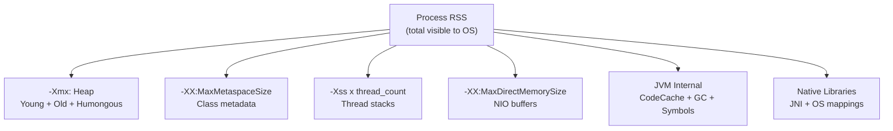
```mermaid
flowchart TD
    RSS["Process RSS\n(total visible to OS)"]
    RSS --> Heap["-Xmx: Heap\nYoung + Old + Humongous"]
    RSS --> Meta["-XX:MaxMetaspaceSize\nClass metadata"]
    RSS --> Stacks["-Xss x thread_count\nThread stacks"]
    RSS --> Direct["-XX:MaxDirectMemorySize\nNIO buffers"]
    RSS --> Internal["JVM Internal\nCodeCache + GC + Symbols"]
    RSS --> Native["Native Libraries\nJNI + OS mappings"]
```

**Heap:** The GC-managed region where all Java objects live. Controlled by `-Xms` (initial) and `-Xmx` (maximum). Spring Boot applications store bean instances, HTTP request/response objects, JPA entity caches, and application data here. G1GC (default since JDK 9) manages heap in fixed-size regions.

**Metaspace:** Replaced PermGen in JDK 8. Stores class metadata, method bytecodes, constant pools, and annotation data. Spring applications load significantly more classes than plain Java applications due to CGLIB proxies, AOP advice classes, reflection-generated accessor classes, and auto-configuration evaluation. Unbounded by default - set `-XX:MaxMetaspaceSize` explicitly.

**Thread Stacks:** Each thread reserves `-Xss` bytes (default 1 MB on 64-bit Linux). A Spring Boot web application with Tomcat defaults to 200 max threads = 200 MB reserved for thread stacks alone. Platform threads are expensive; virtual threads (JDK 21+) use heap-allocated continuations instead of fixed OS stacks.

**Direct Buffers:** Off-heap memory allocated via `ByteBuffer.allocateDirect()`. Used by NIO channels, Netty (if using WebFlux), and some serialization libraries. Not counted in `-Xmx` but counted in RSS.

### 📶 Gradual Depth

**Surface:** A Spring Boot app uses more memory than `-Xmx` because the JVM has memory regions beyond the heap. Measure RSS, not just heap, and set container limits accordingly.

**One level down:** Typical breakdown for a Spring Boot web + JPA app with default settings: heap 40-50% of RSS, metaspace 10-15%, thread stacks 15-20%, direct buffers 5-10%, JVM internals 10-15%. The dominant contributor varies by workload - a thread-heavy synchronous app spends more on stacks; a Netty-based reactive app spends more on direct buffers.

**Deeper:** Spring-specific memory costs include: (1) `DefaultListableBeanFactory` holds a `ConcurrentHashMap` of all bean definitions and singleton instances - 500 beans at 2-5 KB metadata each = 1-2.5 MB just for the registry; (2) each CGLIB proxy class generates a synthetic subclass loaded into metaspace - a service with 200 proxied beans adds 200 extra classes; (3) Spring's `ReflectionUtils` caches `Method` and `Field` arrays per class; (4) Hibernate's `SessionFactory` builds an in-memory metamodel of all entities, relationships, and SQL templates.

**Internal detail:** Native Memory Tracking (NMT) categorizes JVM allocations into: Java Heap, Class (metaspace), Thread, Code (JIT), GC, Compiler, Internal, Symbol, Native Memory Tracking overhead, and Arena. Enable with `-XX:NativeMemoryTracking=summary` and query with `jcmd <pid> VM.native_memory summary`. NMT adds 5-10% overhead and should not be used in performance-sensitive production environments permanently, but is essential for diagnosis.

### ⚙️ How It Works

```text
Memory measurement workflow:

1. Enable NMT at startup:
   -XX:NativeMemoryTracking=summary

2. Baseline after startup:
   jcmd <pid> VM.native_memory baseline

3. After steady-state traffic:
   jcmd <pid> VM.native_memory summary.diff

4. Identify dominant region:
   Heap >> Metaspace >> Thread >> Direct

5. Apply region-specific optimization:
   Heap:    -Xmx, GC tuning, object reuse
   Meta:    classpath reduction, bean count
   Thread:  pool sizing, virtual threads
   Direct:  buffer pool config, leak check

6. Validate with container metrics:
   RSS == sum of all JVM regions + overhead
   Container limit >= RSS peak * 1.2
```

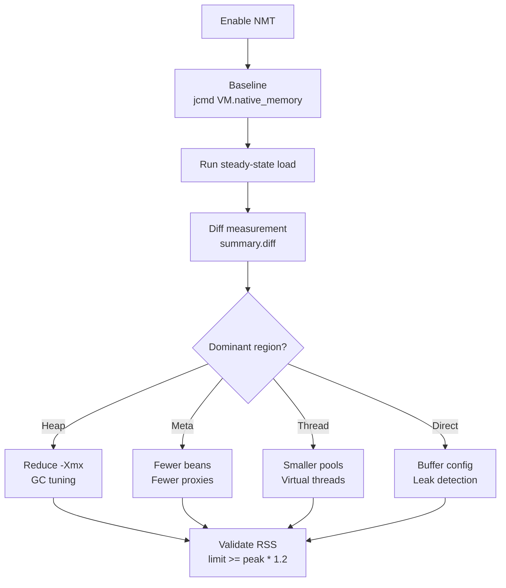
```mermaid
flowchart TD
    A["Enable NMT"] --> B["Baseline\njcmd VM.native_memory"]
    B --> C["Run steady-state load"]
    C --> D["Diff measurement\nsummary.diff"]
    D --> E{"Dominant region?"}
    E -->|Heap| F["Reduce -Xmx\nGC tuning"]
    E -->|Meta| G["Fewer beans\nFewer proxies"]
    E -->|Thread| H["Smaller pools\nVirtual threads"]
    E -->|Direct| I["Buffer config\nLeak detection"]
    F --> J["Validate RSS\nlimit >= peak * 1.2"]
    G --> J
    H --> J
    I --> J
```

**Step 1 - Measure total RSS:** Use `ps -o rss` (Linux), `jcmd <pid> VM.native_memory summary`, or Kubernetes `container_memory_rss` metric. Do not rely on `-Xmx` as a proxy for total memory.

**Step 2 - Decompose by region with NMT:**

```bash
# Start with NMT enabled
java -XX:NativeMemoryTracking=summary \
  -jar app.jar

# After warmup, take baseline
jcmd $(pgrep -f app.jar) \
  VM.native_memory baseline

# After load test, measure diff
jcmd $(pgrep -f app.jar) \
  VM.native_memory summary.diff
```

Output shows each region's committed and reserved bytes with delta from baseline.

**Step 3 - Analyze heap with JFR:**

```bash
# Record allocation profiling
jcmd <pid> JFR.start \
  name=mem duration=60s \
  settings=profile \
  filename=mem.jfr
```

JFR captures `jdk.ObjectAllocationInNewTLAB` and `jdk.ObjectAllocationOutsideTLAB` events showing which classes allocate the most heap memory.

**Step 4 - Analyze metaspace with class histograms:**

```bash
# Count loaded classes and sizes
jcmd <pid> GC.class_stats
# Or simpler: class histogram
jcmd <pid> GC.class_histogram
```

Look for CGLIB-generated classes (`$$EnhancerBySpringCGLIB$$`), JPA metamodel classes, and reflection accessor classes. High counts indicate proxy or classpath bloat.

**Step 5 - Analyze thread memory:**

```bash
# Count live threads
jcmd <pid> Thread.print | grep -c "tid="
# Thread stack memory = count * -Xss
```

A Tomcat thread pool at `max-threads=200` with default `-Xss` (1 MB) reserves 200 MB for stacks. Reducing `max-threads` to 50 saves 150 MB.

**Step 6 - Apply Spring-specific optimizations:**

```properties
# application.properties

# Reduce Tomcat threads (default: 200)
server.tomcat.threads.max=50
server.tomcat.threads.min-spare=5

# Lazy initialization (defer unused beans)
spring.main.lazy-initialization=true

# Disable unused auto-configurations
spring.autoconfigure.exclude=\
  org.springframework.boot.autoconfigure\
  .mail.MailSenderAutoConfiguration,\
  org.springframework.boot.autoconfigure\
  .jms.JmsAutoConfiguration
```

### 🚨 Failure Modes

**Failure 1 - Container OOMKilled despite heap within limits:**
Kubernetes kills the pod because RSS exceeds the container memory limit, but heap usage (reported by GC logs or JMX) shows ample free space. The cause is non-heap memory: metaspace growth, thread stack accumulation, or direct buffer leaks that push total RSS beyond the cgroup limit.
**Diagnostic:** Compare `jcmd VM.native_memory summary` total committed vs container memory limit. Check `container_memory_rss` metric against `container_spec_memory_limit_bytes`. The difference between heap max and RSS reveals non-heap consumption.
**Fix:** Set container memory limit = `-Xmx` + metaspace estimate (100-250 MB for typical Spring Boot) + thread stacks (thread count _ `-Xss`) + 100 MB JVM overhead buffer. Formula: `limit >= Xmx + 250MB + (threads _ Xss) + 100MB`.

**Failure 2 - Metaspace exhaustion from dynamic proxy generation:**
`OutOfMemoryError: Metaspace` occurs under sustained load. Each unique combination of interfaces proxied by Spring AOP, JPA lazy loading, or transaction management generates a distinct proxy class loaded into metaspace. In applications with many entity types and repository interfaces, proxy class count grows significantly.
**Diagnostic:** Enable `-XX:+TraceClassLoading` and grep for `CGLIB` or `$Proxy` patterns. Use `jcmd GC.class_stats` to identify the largest metaspace consumers.
**Fix:** Set `-XX:MaxMetaspaceSize=256m` to fail fast instead of consuming all native memory. Reduce proxy generation by using `proxyTargetClass=false` where possible, minimizing `@Transactional` scope, and using DTO projections instead of lazy-loaded entity graphs.

**Failure 3 - Direct buffer leak causing RSS growth:**
RSS grows steadily over days while heap usage remains stable. `jcmd VM.native_memory` shows increasing "Internal" or "Other" memory. Cause: direct ByteBuffers allocated by NIO or Netty are not being released because their backing `Cleaner` references are not collected (GC does not see direct buffer memory pressure).
**Diagnostic:** Monitor `jmx_buffer_pool_used_bytes{pool="direct"}` metric. Compare direct buffer usage with `-XX:MaxDirectMemorySize`. Enable `-Dio.netty.leakDetection.level=paranoid` for Netty-based applications.
**Fix:** Set `-XX:MaxDirectMemorySize` explicitly. For Netty/WebFlux, configure pooled allocator limits. Ensure GC runs frequently enough to clean `Cleaner` references (reduce `-Xmx` to increase GC pressure if heap utilization is low).

### 🔬 Production Reality

A typical Spring Boot microservice (Web + JPA + Actuator + Micrometer) with default settings shows this approximate breakdown at idle after warmup:

| Region           | Typical Size   | Controls                          |
| ---------------- | -------------- | --------------------------------- |
| Heap (committed) | 150-300 MB     | -Xmx                              |
| Metaspace        | 80-150 MB      | -XX:MaxMetaspaceSize              |
| Thread stacks    | 50-200 MB      | server.tomcat.threads.max \* -Xss |
| Code cache       | 40-60 MB       | -XX:ReservedCodeCacheSize         |
| Direct buffers   | 10-50 MB       | -XX:MaxDirectMemorySize           |
| GC structures    | 20-50 MB       | GC algorithm choice               |
| Other JVM        | 30-50 MB       | Not directly tunable              |
| **Total RSS**    | **400-800 MB** | **Sum of above**                  |

GraalVM native image reduces this dramatically: the same application typically runs at 50-100 MB RSS because there is no JIT compiler, no class loading, minimal reflection metadata, and the heap starts small. The cost: longer build times (minutes vs seconds), no runtime class loading, and restrictions on reflection and dynamic proxies (requiring build-time hint configuration).

Spring Boot 3.x with AOT processing (without native image) provides a middle ground: class-path scanning and condition evaluation happen at build time, reducing startup metaspace churn, but the runtime is still a full JVM with JIT and standard GC.

The most impactful single optimization for most Spring Boot applications is reducing the Tomcat thread pool from 200 (default) to the actual concurrency needed. Most microservices handle 10-50 concurrent requests - reducing `max-threads` to 50 saves 150 MB of thread stack space immediately.

### ⚖️ Trade-offs & Alternatives

**BAD:**

```bash
# Setting only -Xmx and hoping for the best
java -Xmx512m -jar app.jar
# Container limit: 512m
# RESULT: OOMKilled because RSS = 800MB
# Heap is 512m but metaspace + threads
# + direct + JVM = another 300MB
```

Why it is wrong: Container memory limit must account for all JVM memory regions, not just heap. Setting limit equal to `-Xmx` guarantees OOM kills under load.

**GOOD:**

```bash
# Comprehensive memory configuration
java \
  -Xmx256m \
  -Xms256m \
  -XX:MaxMetaspaceSize=128m \
  -XX:MaxDirectMemorySize=64m \
  -XX:ReservedCodeCacheSize=64m \
  -Xss512k \
  -XX:+UseContainerSupport \
  -jar app.jar
# Container limit: 700m
# Budget: 256+128+64+64+(50*0.5)+50 = 587m
# 700m gives ~20% headroom
```

| Optimization              | Memory Saved         | Trade-off                      | Complexity |
| ------------------------- | -------------------- | ------------------------------ | ---------- |
| Reduce -Xmx               | Heap MB saved        | More frequent GC               | Low        |
| Reduce max-threads        | threads \* 1MB       | Lower max concurrency          | Low        |
| Reduce -Xss (512k)        | threads \* 0.5MB     | Deep recursion risk            | Low        |
| Lazy initialization       | Deferred heap/meta   | First-request latency          | Low        |
| Remove unused starters    | 10-50 MB metaspace   | May lose features              | Medium     |
| Spring Context Indexer    | Startup metaspace    | Build time increase            | Low        |
| GraalVM native image      | 300-600 MB RSS       | Build complexity, restrictions | High       |
| Virtual threads (JDK 21+) | Thread stack savings | Platform maturity              | Medium     |

### ⚡ Decision Snap

**IMMEDIATE (low effort):** Reduce `server.tomcat.threads.max` to actual concurrency needs. Set `-Xss512k`. Set explicit `-XX:MaxMetaspaceSize`.

**SHORT-TERM:** Audit `spring-boot-starter-*` dependencies and remove unused ones. Enable `-XX:NativeMemoryTracking=summary` in staging to measure actual breakdown.

**LONG-TERM:** Evaluate GraalVM native image for memory-constrained deployments. Adopt virtual threads (JDK 21+) to eliminate thread stack overhead. Use Spring Boot 3.x AOT processing for build-time optimization without full native image restrictions.

### ⚠️ Top Traps

| #   | Misconception                                   | Reality                                                                                                                                         |
| --- | ----------------------------------------------- | ----------------------------------------------------------------------------------------------------------------------------------------------- |
| 1   | -Xmx controls total memory usage                | Heap is typically 40-60% of RSS - metaspace, threads, direct buffers, and JVM internals consume the rest                                        |
| 2   | Spring Boot apps need 512 MB minimum            | With tuned settings (reduced threads, smaller heap, classpath trimming), 200-300 MB RSS is achievable for simple services                       |
| 3   | GraalVM native image solves all memory problems | Native image trades runtime flexibility for lower footprint - reflection, dynamic proxies, and classpath scanning need build-time configuration |
| 4   | Lazy initialization reduces total memory        | It defers allocation to first use but does not reduce peak memory - all beans still load eventually under production traffic                    |
| 5   | Container memory limit should equal -Xmx        | Setting limit = Xmx guarantees OOMKilled - limit must cover heap + metaspace + threads + direct + JVM overhead with 15-20% headroom             |

### 🪜 Learning Ladder

**Prerequisites:**

- SPR-072 Spring Context Startup Optimization - understanding classpath scanning and bean instantiation costs that also affect memory
- SPR-070 Spring Boot Auto-Configuration Internals - understanding how auto-configuration increases loaded class count and metaspace usage

**THIS:** SPR-075 Spring Boot Memory Footprint Analysis - measuring and optimizing JVM memory regions for containerized Spring Boot deployments

**Next steps:**

- SPR-076 Spring WebFlux and Project Reactor - understanding reactive stack memory model (fewer threads, more direct buffers) as an alternative to servlet stack

**The Surprising Truth:** The default Tomcat thread pool (`max-threads=200`) is the single largest non-heap memory consumer in most Spring Boot applications - 200 threads at 1 MB each reserves 200 MB just for stacks. Most microservices behind a load balancer never see 200 concurrent requests. Reducing `max-threads` to 50 and `-Xss` to 512 KB saves 175 MB of RSS with zero code changes - more than most complex optimization efforts achieve.

**Further Reading:**

1. [Spring Boot Reference - Container Memory](https://docs.spring.io/spring-boot/reference/packaging/efficient.html)
2. [JDK Documentation - Native Memory Tracking](https://docs.oracle.com/en/java/javase/21/vm/native-memory-tracking.html)
3. [Spring Boot Reference - GraalVM Native Image](https://docs.spring.io/spring-boot/reference/packaging/native-image/index.html)

**Revision Card:**

1. JVM process RSS = heap + metaspace + thread stacks + direct buffers + code cache + GC structures + JVM overhead - container memory limits must account for all regions, not just `-Xmx`
2. Spring Boot's default Tomcat thread pool (200 threads at 1 MB each) is typically the largest non-heap memory consumer - reducing to actual concurrency needs is the highest-impact single optimization
3. Native Memory Tracking (`-XX:NativeMemoryTracking=summary` + `jcmd VM.native_memory`) is the definitive tool for decomposing JVM memory by region - heap-only metrics miss 40-60% of actual consumption

---

---

# SPR-076 Spring WebFlux and Project Reactor

**TL;DR** - WebFlux uses non-blocking I/O with Mono/Flux types so few threads serve thousands of concurrent connections without blocking.

### 🔥 Problem Statement

Traditional servlet-based Spring MVC assigns one thread per HTTP request. When that request calls a database, another microservice, or any I/O operation, the thread blocks - it sits idle consuming 1 MB of stack memory while waiting for bytes on a socket. Under high concurrency (thousands of simultaneous requests), thread pool exhaustion becomes the bottleneck: all 200 Tomcat threads are parked waiting for downstream responses, new requests queue up, latency spikes, and the system either rejects connections or crashes. The core pain is not CPU - it is wasted threads sleeping on I/O. Reactive programming replaces thread-per-request with event-loop-per-core, allowing a handful of threads to multiplex thousands of in-flight operations through non-blocking callbacks.

### 📜 Historical Context

Asynchronous I/O existed in Java since NIO (JDK 1.4, 2002), but the programming model was painful - raw selectors, buffers, and state machines. Netty (2004+) wrapped NIO into a usable event-loop framework that powered high-throughput servers. The Reactive Streams specification (2013-2015, JSR 166) standardized the Publisher/Subscriber/Subscription/Processor interfaces to ensure interoperability and backpressure across libraries. Project Reactor (2015, Pivotal) implemented Reactive Streams with Mono (0..1 elements) and Flux (0..N elements) as its core types. Spring Framework 5.0 (2017) introduced Spring WebFlux as a fully reactive web framework alongside the existing Spring MVC, sharing annotation support but running on a non-blocking runtime. Spring WebFlux defaults to Netty as its embedded server, though it can also run on Undertow or Servlet 3.1+ containers in async mode. Spring Boot 2.0 made WebFlux a first-class starter (`spring-boot-starter-webflux`). Spring Boot 3.x continued refinements, particularly around virtual threads (JDK 21) which offer an alternative concurrency model.

### 🔩 First Principles

**CORE INVARIANTS:**

1. A non-blocking thread never waits for I/O completion - it registers a callback and moves to the next task, so one thread handles many concurrent operations
2. Backpressure propagates demand signals upstream so producers do not overwhelm consumers - this is built into the Reactive Streams contract, not an afterthought
3. Nothing happens until someone subscribes - reactive pipelines are lazy assembly instructions, not eager execution
4. Schedulers control which thread runs which stage - blocking code on the wrong scheduler poisons the entire event loop

**DERIVED DESIGN:**
These invariants produce a model where HTTP request handling is a pipeline of transformations declared with operators (map, flatMap, zip) that the runtime schedules across a small fixed thread pool. Because nothing blocks, a 4-thread event loop can sustain the concurrency that would require hundreds of servlet threads. Backpressure ensures that a fast producer (network ingress) does not flood a slow consumer (database write) by letting the consumer signal how many items it can accept. The lazy execution model means constructing a `Mono` chain costs almost nothing - actual I/O happens only when the framework subscribes at the HTTP response boundary.

### 🧠 Mental Model

> Think of WebFlux as a restaurant kitchen with 4 expert chefs (event loop threads) and hundreds of orders (requests). In the servlet model, each order gets a dedicated chef who stands idle while waiting for the oven (I/O). In the reactive model, each chef starts an order, puts it in the oven, immediately picks up the next order, and returns to plate it when the oven timer rings.

- "oven timer rings" -> I/O completion callback triggers continuation
- "4 expert chefs" -> Netty event loop threads (one per CPU core)
- "hundreds of orders" -> concurrent HTTP requests multiplexed across few threads
- "standing idle at the oven" -> thread blocked on `InputStream.read()` or JDBC call

**Where this analogy breaks down:** Real event loops process tasks in a strict single-threaded-per-loop fashion (no context switching within a loop), while chefs can physically move between stations. Also, if a chef does heavy computation (CPU-bound work), the entire queue stalls - event loops have the same vulnerability to CPU-intensive tasks.

### 🧩 Components

```
+---------------------------------------------------+
|              Spring WebFlux Stack                  |
+---------------------------------------------------+
| @Controller / @RestController / RouterFunction     |
+---------------------------------------------------+
| HttpHandler (reactive request/response)            |
+---------------------------------------------------+
| Reactor Netty (HttpServer)                         |
| +-----------------------------------------------+ |
| | Boss EventLoopGroup (accept connections)       | |
| +-----------------------------------------------+ |
| | Worker EventLoopGroup (process I/O)            | |
| | [Thread-1] [Thread-2] [Thread-3] [Thread-4]   | |
| +-----------------------------------------------+ |
+---------------------------------------------------+
| Reactive Streams (Publisher/Subscriber)            |
| +---------------------+  +---------------------+ |
| | Mono<T> (0..1)      |  | Flux<T> (0..N)      | |
| +---------------------+  +---------------------+ |
+---------------------------------------------------+
| Non-blocking I/O drivers                           |
| (R2DBC, WebClient, ReactiveRedis, RSocket)         |
+---------------------------------------------------+
```

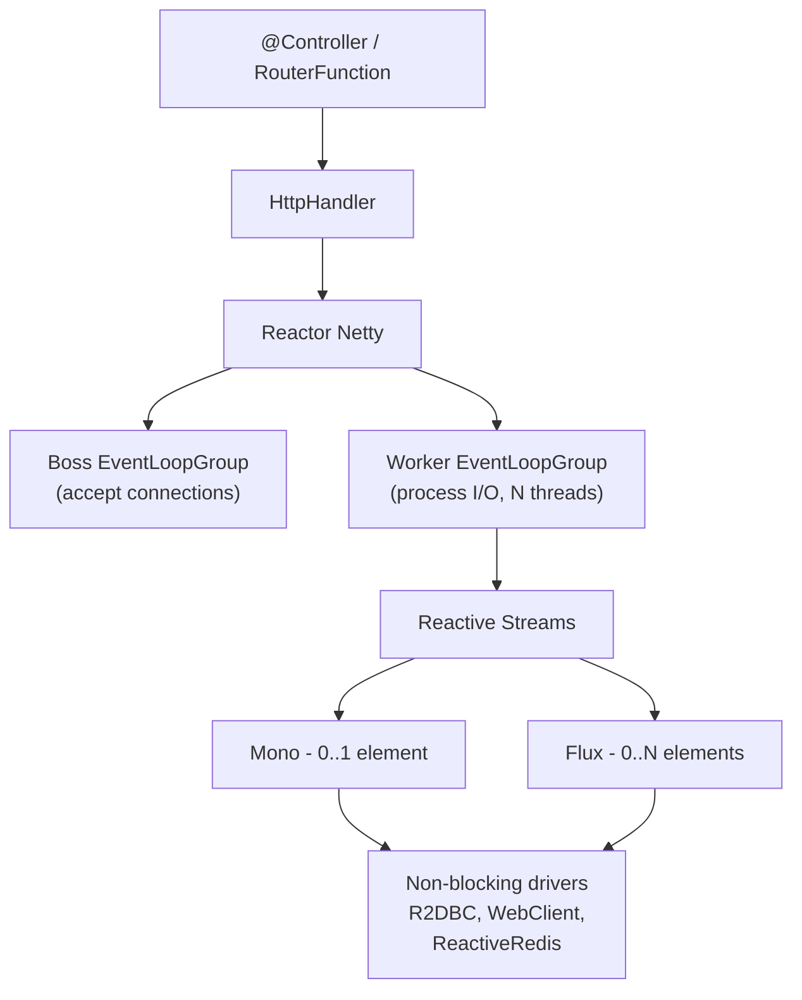
```mermaid
flowchart TB
    A["@Controller / RouterFunction"] --> B["HttpHandler"]
    B --> C["Reactor Netty"]
    C --> D["Boss EventLoopGroup\n(accept connections)"]
    C --> E["Worker EventLoopGroup\n(process I/O, N threads)"]
    E --> F["Reactive Streams"]
    F --> G["Mono - 0..1 element"]
    F --> H["Flux - 0..N elements"]
    G --> I["Non-blocking drivers\nR2DBC, WebClient,\nReactiveRedis"]
    H --> I
```

### 📶 Gradual Depth

**Layer 1 (anyone):** WebFlux lets your server handle thousands of users simultaneously using only a few threads, because those threads never sit idle waiting - they always move to the next task.

**Layer 2 (junior dev):** Instead of returning a `User` object directly, a WebFlux controller returns `Mono<User>` - a promise that a user will be available later. The framework subscribes to this Mono, and when the database responds, the result flows through transformation operators to the HTTP response. No thread blocks during the database call.

**Layer 3 (mid-level dev):** The Mono/Flux types are pipelines assembled from operators. `flatMap` is the key operator for async composition - it subscribes to an inner publisher and merges results. Operators like `map` (synchronous transform), `zip` (combine multiple sources), `switchIfEmpty` (fallback), and `onErrorResume` (error recovery) compose into complex workflows. The critical rule: never call `.block()` on an event loop thread, because it defeats the entire model.

**Layer 4 (senior dev):** Reactor's scheduler model determines execution context. `Schedulers.boundedElastic()` offloads blocking calls (legacy JDBC, file I/O) to a separate thread pool, protecting the event loop. `publishOn` switches downstream execution to a different scheduler. `subscribeOn` controls which scheduler runs the subscription signal. Understanding the difference prevents the most common WebFlux bugs: blocking on the event loop and thread starvation.

**Layer 5 (staff+ engineer):** Backpressure in HTTP scenarios works through TCP flow control and Reactor's internal request(N) protocol. `Flux.create` with `OverflowStrategy` handles sources that do not natively support backpressure (hot sources). In production, the most impactful tuning points are connection pool sizing for R2DBC (`max-size` matching event loop thread count), WebClient connection provider configuration, and careful use of `limitRate()` to control downstream demand.

### ⚙️ How It Works

```
Request arrives at Netty:

[Client] --HTTP--> [Boss Loop: accept]
                        |
                   [Worker Loop-1]
                        |
            +-----------+-----------+
            | Decode HTTP request   |
            | Route to handler      |
            | Build Mono/Flux chain |
            | Subscribe             |
            +-----------+-----------+
                        |
              (async I/O: R2DBC query)
                        |
            [Worker Loop-1 is FREE]
            [handles other requests]
                        |
              ...database responds...
                        |
            [Worker Loop-2 picks up]
            +-----------+-----------+
            | Transform result      |
            | Encode HTTP response  |
            | Flush to client       |
            +-----------+-----------+
```

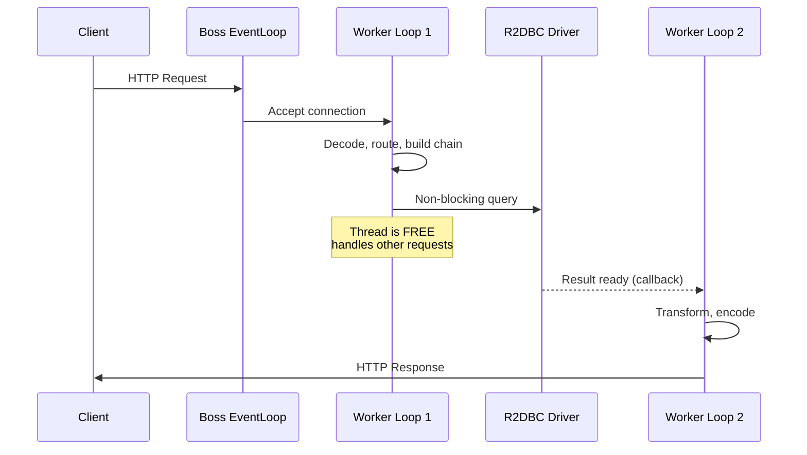
```mermaid
sequenceDiagram
    participant C as Client
    participant B as Boss EventLoop
    participant W1 as Worker Loop 1
    participant DB as R2DBC Driver
    participant W2 as Worker Loop 2

    C->>B: HTTP Request
    B->>W1: Accept connection
    W1->>W1: Decode, route, build chain
    W1->>DB: Non-blocking query
    Note over W1: Thread is FREE<br/>handles other requests
    DB-->>W2: Result ready (callback)
    W2->>W2: Transform, encode
    W2->>C: HTTP Response
```

The key mechanism: when `W1` issues the R2DBC query, it does not block. It registers a completion handler with the I/O subsystem and returns immediately to the event loop to process other events. When the database responds, an I/O event fires, and whichever worker loop thread picks it up (could be `W1` again or any other) executes the continuation. This is why reactive code must never hold thread-local state across async boundaries - the continuation may run on a different thread.

A typical handler:

```java
@GetMapping("/users/{id}")
Mono<ResponseEntity<User>> getUser(
    @PathVariable String id) {
  return userRepository.findById(id)
      .map(ResponseEntity::ok)
      .defaultIfEmpty(
          ResponseEntity.notFound().build());
}
```

The `findById` returns `Mono<User>` (non-blocking R2DBC call). `map` transforms the result synchronously. `defaultIfEmpty` provides a fallback when the Mono is empty. The framework subscribes at the response boundary - nothing executes until then.

Composing multiple async calls:

```java
Mono<OrderSummary> summary(String userId) {
  Mono<User> user =
      userClient.getUser(userId);
  Mono<List<Order>> orders =
      orderClient.getOrders(userId);

  return Mono.zip(user, orders)
      .map(tuple -> new OrderSummary(
          tuple.getT1(), tuple.getT2()));
}
```

`Mono.zip` subscribes to both publishers concurrently and waits for both to complete. This is parallel fan-out without managing threads manually.

### 🚨 Failure Modes

**Failure 1 - Blocking call on event loop thread:**
A developer calls `repository.findById(id)` using a blocking JPA/JDBC repository inside a WebFlux handler. The event loop thread blocks on the JDBC socket read. Because Netty uses only 4-8 event loop threads, blocking even one for 50ms under load cascades: request queues grow, all event loops stall, and the entire server becomes unresponsive. This is the most common and most devastating WebFlux bug.
**Diagnostic:** Enable Reactor's `BlockHound` agent in tests and staging. It throws an exception when blocking calls occur on non-blocking threads. Monitor `reactor.netty.eventloop.pending.tasks` metric - a growing queue indicates event loop starvation. Thread dumps show event loop threads parked in `java.net.SocketInputStream.read()` or `sun.nio.ch.EPollArrayWrapper.poll()`.
**Fix:** Replace blocking drivers with reactive alternatives: R2DBC instead of JDBC, `WebClient` instead of `RestTemplate`, `ReactiveRedisTemplate` instead of `RedisTemplate`. If a blocking call is unavoidable, offload it: `Mono.fromCallable(() -> blockingCall()).subscribeOn(Schedulers.boundedElastic())`.

**Failure 2 - Memory exhaustion from unbounded Flux:**
A WebFlux endpoint streams data from a fast source (in-memory list, cached results) to a slow consumer (client on a poor network). Without backpressure limits, Reactor buffers items in memory waiting for the consumer to drain them. A `Flux.fromIterable(millionItems)` with a slow SSE consumer can accumulate hundreds of MB in operator buffers.
**Diagnostic:** Monitor JVM heap usage during streaming endpoints. Watch for `reactor.core.Exceptions$OverflowException` with the message "Queue is full". Heap dumps show large `reactor.core.publisher.FluxMapFuseable` or `UnicastProcessor` queues.
**Fix:** Apply `limitRate(256)` to control prefetch. Use `Flux.create()` with `OverflowStrategy.DROP` or `LATEST` for hot sources. For SSE endpoints, use `Flux.interval()` for periodic push rather than dumping a collection.

**Failure 3 - Context loss across async boundaries:**
MDC (Mapped Diagnostic Context) for logging, `SecurityContext` for authentication, or `ThreadLocal`-based state disappears mid-request because reactive execution hops between threads. Logs show `null` trace IDs. Security checks fail intermittently. This happens because Reactor does not propagate ThreadLocal values across scheduler boundaries.
**Diagnostic:** Logs missing correlation IDs after the first async operator. `SecurityContextHolder.getContext()` returns anonymous after a `flatMap` that switches schedulers.
**Fix:** Use Reactor Context (`Mono.deferContextual`, `contextWrite`) to propagate request-scoped state. For MDC, use `Hooks.onEachOperator(...)` with `Context` to restore MDC values. For Spring Security, configure `ReactiveSecurityContextHolder` instead of the thread-local version.

### 🔬 Production Reality

A Spring WebFlux application on Netty with default settings runs 4 event loop threads (matching `Runtime.getRuntime().availableProcessors()`) and handles 10,000+ concurrent connections with under 100 MB of thread stack memory. The equivalent Spring MVC application would need 10,000 Tomcat threads (10 GB of stack space) to handle the same concurrency - obviously impractical, which is why MVC relies on thread pool limits and request queuing.

Typical production metrics for a WebFlux gateway service:

| Metric               | WebFlux (Netty) | MVC (Tomcat)     |
| -------------------- | --------------- | ---------------- |
| Threads under load   | 4-8             | 200-500          |
| Thread stack memory  | 4-8 MB          | 200-500 MB       |
| Max concurrent conns | 10,000+         | 200-500          |
| Per-request overhead | Callback chain  | Full thread      |
| Latency at low load  | Slightly higher | Slightly lower   |
| Latency at high load | Stable          | Degrades sharply |

However, the debugging experience is significantly worse. Stack traces in reactive code show Reactor operator internals (`FluxMap`, `MonoFlatMap`, `FluxOnAssembly`) rather than meaningful call sites. Production incidents require Reactor's debug mode (`Hooks.onOperatorDebug()`) or the `reactor-tools` agent for assembly-time stack capture, which adds measurable overhead (5-15%).

Connection pool sizing for R2DBC is critical and counterintuitive. The optimal pool size for a non-blocking application is close to the number of event loop threads (4-8), not the 20-50 typical of JDBC pools. Oversizing the R2DBC pool wastes database connections with no throughput benefit because the event loop cannot drive more concurrent queries than it has threads.

### ⚖️ Trade-offs & Alternatives

**BAD:**

```java
// Blocking JDBC inside WebFlux handler
@GetMapping("/users/{id}")
Mono<User> getUser(@PathVariable Long id) {
  // jdbcRepository.findById() blocks
  // the event loop thread!
  User user = jdbcRepository.findById(id)
      .orElseThrow();
  return Mono.just(user);
}
// Looks reactive (returns Mono) but blocks
// the event loop - worst of both worlds
```

Why it is wrong: Wrapping a blocking result in `Mono.just()` does not make it non-blocking. The JDBC call already blocked the event loop thread before the Mono was created.

**GOOD:**

```java
// Non-blocking R2DBC inside WebFlux handler
@GetMapping("/users/{id}")
Mono<User> getUser(@PathVariable Long id) {
  return r2dbcRepository.findById(id)
      .switchIfEmpty(Mono.error(
          new NotFoundException(id)));
}

// Or with unavoidable blocking call:
@GetMapping("/legacy/{id}")
Mono<Legacy> getLegacy(
    @PathVariable Long id) {
  return Mono.fromCallable(() ->
      legacyJdbcRepo.findById(id)
          .orElseThrow())
    .subscribeOn(
        Schedulers.boundedElastic());
}
```

| Approach                        | Concurrency          | Debugging                   | Ecosystem                     | Learning Curve |
| ------------------------------- | -------------------- | --------------------------- | ----------------------------- | -------------- |
| Spring MVC (servlet)            | Thread-limited       | Excellent (stack traces)    | Full (JDBC, JPA, all libs)    | Low            |
| Spring WebFlux (Netty)          | Event-loop, high     | Difficult (operator traces) | Reactive-only drivers         | High           |
| MVC + Virtual Threads (JDK 21+) | High (cheap threads) | Excellent (stack traces)    | Full (existing blocking code) | Low            |
| Vert.x                          | Event-loop, high     | Moderate                    | Vert.x ecosystem              | Medium         |
| Quarkus Reactive                | Event-loop, high     | Moderate (Mutiny)           | SmallRye Mutiny               | Medium         |

### ⚡ Decision Snap

**Use WebFlux when:** You have high-concurrency I/O-bound workloads (API gateways, streaming endpoints, real-time notifications), your entire I/O stack is non-blocking (R2DBC, WebClient, reactive Redis/Mongo), and your team has reactive programming experience.

**Use MVC when:** Your I/O stack includes blocking components (JDBC, JPA, file system), your concurrency requirements are moderate (under 500 concurrent requests), or your team is not experienced with reactive debugging.

**Consider MVC + Virtual Threads when:** You want high concurrency with blocking code, your team prefers imperative style, and you run JDK 21+.

### ⚠️ Top Traps

| #   | Misconception                                            | Reality                                                                                                                           |
| --- | -------------------------------------------------------- | --------------------------------------------------------------------------------------------------------------------------------- |
| 1   | Returning `Mono.just(blockingResult)` is reactive        | The blocking call already executed before wrapping - use `Mono.fromCallable` with `subscribeOn(boundedElastic)` for blocking code |
| 2   | WebFlux is always faster than MVC                        | At low concurrency, MVC often has lower latency - WebFlux advantage appears under high concurrent load with I/O waits             |
| 3   | You can mix JDBC and WebFlux freely                      | JDBC blocks the event loop, negating all benefits - you need R2DBC, or offload to `boundedElastic` scheduler at minimum           |
| 4   | Thread-local context (MDC, Security) works automatically | Reactive execution hops threads - use Reactor Context and `contextWrite` for cross-operator state propagation                     |
| 5   | More event loop threads = more throughput                | Event loops are CPU-bound schedulers - adding more than CPU core count causes context switching overhead with no I/O benefit      |

### 🪜 Learning Ladder

**Prerequisites:**

- SPR-024 Spring MVC Request Lifecycle - understanding the servlet thread-per-request model that WebFlux replaces
- SPR-075 Spring Boot Memory Footprint Analysis - understanding thread memory costs that motivate the reactive model

**THIS:** SPR-076 Spring WebFlux and Project Reactor - non-blocking reactive web framework using Mono/Flux, event loop architecture, and Netty runtime

**Next steps:**

- SPR-077 Reactive vs Servlet Stack Decision Framework - structured decision guide for choosing between MVC, WebFlux, and virtual threads

**The Surprising Truth:** The biggest productivity cost of WebFlux is not the learning curve for Mono/Flux operators - it is the debugging experience. When a reactive pipeline fails in production, the stack trace shows 40 lines of Reactor internals (`FluxMapFuseable`, `MonoFlatMap$FlatMapMain`, `FluxOnAssembly`) with no indication of where in your code the pipeline was assembled. `Hooks.onOperatorDebug()` captures assembly-time traces but adds 10-15% overhead. This debugging tax is permanent and affects every production incident for the life of the application.

**Further Reading:**

1. [Project Reactor Reference](https://projectreactor.io/docs/core/release/reference/)
2. [Spring WebFlux Reference](https://docs.spring.io/spring-framework/reference/web/webflux.html)
3. [Reactive Streams Specification](https://www.reactive-streams.org/)

**Revision Card:**

1. WebFlux replaces thread-per-request with event-loop-per-core - a 4-thread Netty event loop handles 10,000+ concurrent connections because threads never block on I/O, they register callbacks and move to the next task
2. The cardinal sin is blocking on the event loop thread (JDBC, Thread.sleep, synchronized) - even 50ms of blocking under load cascades into full server starvation because there are only 4-8 event loop threads total
3. Nothing executes until subscription - Mono/Flux chains are lazy assembly instructions, and the framework subscribes at the HTTP response boundary, which means constructing a chain and never subscribing silently does nothing

---

---

# SPR-077 Reactive vs Servlet Stack Decision Framework

**TL;DR** - Most applications should use Spring MVC; reserve WebFlux for genuinely high-concurrency I/O-bound workloads with a fully non-blocking stack.

### 🔥 Problem Statement

Teams adopting Spring for new projects face a binary architectural choice: servlet stack (Spring MVC on Tomcat) or reactive stack (Spring WebFlux on Netty). This decision is difficult to reverse because it determines the programming model, the driver ecosystem (JDBC vs R2DBC), the debugging experience, and the pool of developers who can maintain the code. The industry hype cycle around reactive programming (2017-2022) led many teams to adopt WebFlux without the workload characteristics or team expertise to benefit from it, resulting in code that is harder to debug, harder to hire for, and no faster than MVC would have been. The core pain: there is no clear, honest decision framework - most guidance is either "reactive is the future" advocacy or "just use MVC" dismissal, neither addressing the specific conditions where each choice genuinely wins.

### 📜 Historical Context

Java's servlet specification (1997) established the one-thread-per-request model. Servlet 3.0 (2009) added async support, and Servlet 3.1 (2013) added non-blocking I/O, but adoption was limited because JDBC and most libraries remained blocking. Node.js (2009) popularized event-loop servers. The Reactive Streams specification (2015) formalized reactive in the JVM ecosystem. Spring Framework 5.0 (2017) introduced WebFlux with Project Reactor. Between 2017 and 2022, reactive adoption grew but so did war stories: 2-3x debugging times, hiring difficulty, and performance matching MVC for typical CRUD workloads. JDK 21 (2023) introduced virtual threads - high concurrency with the blocking model. Spring Boot 3.2 added first-class virtual thread support, providing a third option combining MVC's simplicity with reactive-level concurrency.

### 🔩 First Principles

**CORE INVARIANTS:**

1. Thread-per-request concurrency is limited by thread count times per-request duration - when all threads are blocked on I/O, new requests must wait regardless of available CPU
2. Non-blocking I/O eliminates thread blocking but requires the ENTIRE call chain to be non-blocking - one blocking call on the event loop negates the benefit
3. The programming model (imperative vs reactive) affects every line of business logic, error handling, testing, and debugging - it is not an infrastructure detail hidden behind an abstraction
4. Throughput under high concurrency depends on the bottleneck resource - if the bottleneck is CPU or a connection-limited database, switching from blocking to non-blocking threads does not help

**DERIVED DESIGN:**
These invariants produce a decision space where the reactive stack genuinely wins only when: (a) concurrency demand exceeds what thread pools can serve, (b) the workload is I/O-bound with significant wait times, (c) the entire I/O chain can be non-blocking, and (d) the team can absorb the debugging and maintenance cost. When any condition is missing, the servlet stack with appropriately sized thread pools (or virtual threads on JDK 21+) delivers equivalent throughput with simpler code.

### 🧠 Mental Model

> Think of this decision as choosing between a fleet of taxis (servlet threads) and a bus rapid transit system (event loop). Taxis are simple: one passenger per car, easy to understand, works everywhere. BRT is efficient: one vehicle carries many passengers, but requires dedicated lanes (non-blocking drivers), specialized stations (reactive operators), and trained drivers (experienced team). If your city has moderate traffic (typical web app), taxis work fine. If you have 50,000 commuters per hour (API gateway, streaming), BRT is essential. If you buy buses but run them on regular streets (blocking JDBC), you get worse performance than taxis.

- "dedicated lanes" -> fully non-blocking I/O stack (R2DBC, WebClient, reactive Redis)
- "specialized stations" -> reactive operators replacing imperative flow control
- "trained drivers" -> team experienced in reactive debugging and Reactor internals
- "50,000 commuters per hour" -> 10,000+ concurrent connections with I/O waits

**Where this analogy breaks down:** Virtual threads (JDK 21+) are like giving every taxi passenger a teleporter - the taxi is cheap enough that you can have thousands, removing the original resource constraint. This third option did not exist when the servlet-vs-reactive debate began.

### 🧩 Components

```
Decision Inputs:
+---------------------------------------------------+
| Workload          | I/O-bound? Concurrency level? |
+---------------------------------------------------+
| I/O Stack         | All non-blocking available?    |
+---------------------------------------------------+
| Team              | Reactive experience?           |
+---------------------------------------------------+
| JDK Version       | 21+ available? (virt threads)  |
+---------------------------------------------------+
|                   v                                |
| +-----------------------------------------------+ |
| | Decision Matrix                               | |
| | High conc + all non-blocking -> WebFlux       | |
| | High conc + blocking deps   -> MVC + VT       | |
| | Moderate conc               -> MVC            | |
| | Streaming/SSE               -> WebFlux        | |
| +-----------------------------------------------+ |
+---------------------------------------------------+
```

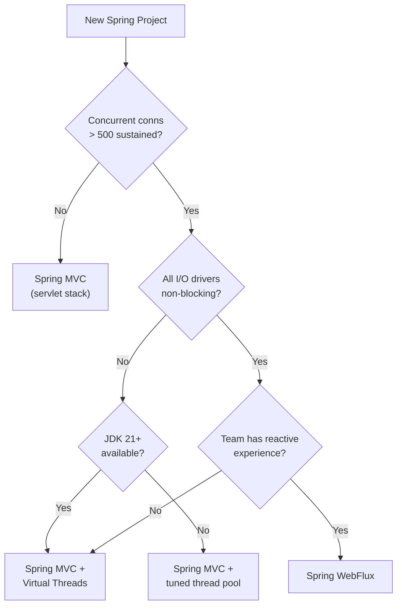
```mermaid
flowchart TD
    A["New Spring Project"]
    A --> B{"Concurrent conns\n> 500 sustained?"}
    B -->|No| C["Spring MVC\n(servlet stack)"]
    B -->|Yes| D{"All I/O drivers\nnon-blocking?"}
    D -->|No| E{"JDK 21+\navailable?"}
    D -->|Yes| F{"Team has reactive\nexperience?"}
    E -->|Yes| G["Spring MVC +\nVirtual Threads"]
    E -->|No| H["Spring MVC +\ntuned thread pool"]
    F -->|Yes| I["Spring WebFlux"]
    F -->|No| G
```

### 📶 Gradual Depth

**Layer 1 (anyone):** Spring MVC handles one request per thread, like a bank with one teller per customer. Spring WebFlux handles many requests per thread, like one teller juggling multiple customers who are waiting for paperwork. Most banks (applications) do not need the juggling teller - regular tellers work fine.

**Layer 2 (junior dev):** The key difference is blocking vs non-blocking. In MVC, when your code calls a database, the thread waits. In WebFlux, the thread moves to another request while the database processes the query. WebFlux helps when you have many simultaneous users all waiting on slow external calls.

**Layer 3 (mid-level dev):** The decision hinges on the thread exhaustion problem. Tomcat defaults to 200 threads. If each request takes 200ms (including I/O waits), maximum throughput is 200/0.2 = 1,000 requests/second. If request time rises to 2 seconds (slow downstream service), throughput drops to 100 req/s. WebFlux decouples concurrency from thread count, maintaining throughput as I/O latency increases. But this only works if every I/O call in the chain is non-blocking.

**Layer 4 (senior dev):** Virtual threads (JDK 21+) change the equation fundamentally. They are cheap (few KB of stack vs 1 MB), can number in millions, and allow blocking code. With `spring.threads.virtual.enabled=true`, Spring MVC on virtual threads achieves WebFlux-level concurrency while keeping the imperative programming model, full JDBC/JPA compatibility, familiar stack traces, and simple debugging. The remaining advantage of WebFlux is backpressure for streaming scenarios and slightly lower memory overhead per connection.

**Layer 5 (staff+ engineer):** The honest assessment in 2024+: WebFlux's sweet spot has narrowed to API gateways, streaming endpoints (SSE, WebSocket), and systems that are architecturally committed to reactive (existing Reactor codebase). For new greenfield projects on JDK 21+, MVC with virtual threads is the pragmatic default. The reactive programming model's costs (debugging difficulty, ecosystem constraints, hiring pool, learning curve) are justified only when backpressure semantics or Reactor's operator composition are genuine requirements, not just concurrency.

### ⚙️ How It Works

The thread exhaustion problem in detail:

```
Servlet stack (Spring MVC, 200 threads):

Time -->
Thread-1: [====REQ-A====|...IO wait...|==finish==]
Thread-2: [====REQ-B====|...IO wait...|==finish==]
  ...
Thread-200: [==REQ-200==|...IO wait...|==finish==]
Thread-???: REQ-201 QUEUED (no thread available)

If IO wait = 1 second, each thread handles
1 req/sec. 200 threads = 200 req/sec max.

Reactive stack (WebFlux, 4 threads):

Thread-1: [A-start][B-start][C-start]...[A-done]
Thread-2: [D-start][E-start]...[B-done][F-start]

Threads never wait. 4 threads multiplex
thousands of in-flight requests.
```

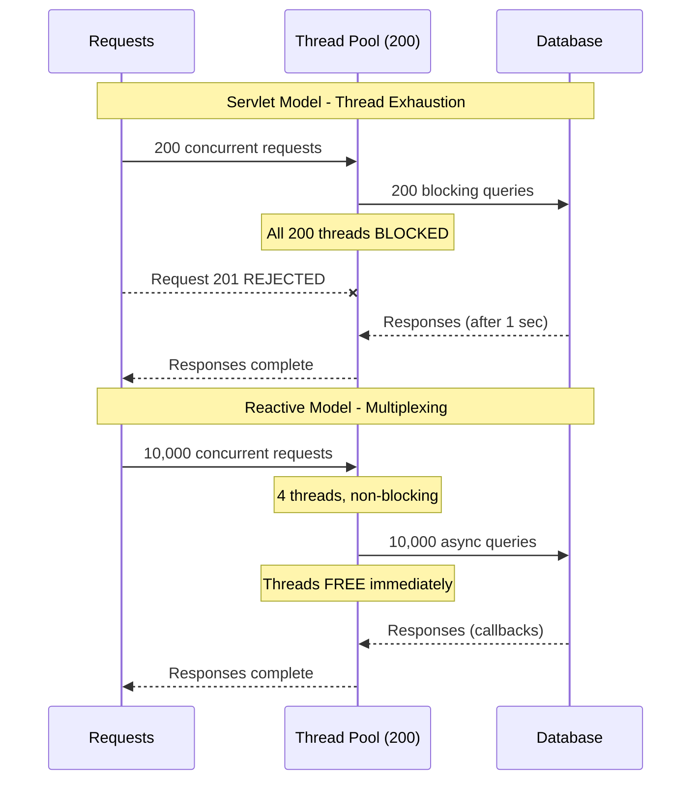
```mermaid
sequenceDiagram
    participant R as Requests
    participant TP as Thread Pool (200)
    participant DB as Database

    Note over R,DB: Servlet Model - Thread Exhaustion
    R->>TP: 200 concurrent requests
    TP->>DB: 200 blocking queries
    Note over TP: All 200 threads BLOCKED
    R--xTP: Request 201 REJECTED
    DB-->>TP: Responses (after 1 sec)
    TP-->>R: Responses complete

    Note over R,DB: Reactive Model - Multiplexing
    R->>TP: 10,000 concurrent requests
    Note over TP: 4 threads, non-blocking
    TP->>DB: 10,000 async queries
    Note over TP: Threads FREE immediately
    DB-->>TP: Responses (callbacks)
    TP-->>R: Responses complete
```

The blocking I/O chain problem:

```
WebFlux handler:
  getUserById(id)         <- non-blocking (R2DBC)
    .flatMap(user ->
      getOrderHistory(id) <- non-blocking (WebClient)
        .flatMap(orders ->
          auditLog(user)  <- BLOCKING (JDBC)!
          // ONE blocking call poisons
          // the entire pipeline
        ))

Fix: offload blocking call
  auditLog(user)
    .subscribeOn(
      Schedulers.boundedElastic())
```

The "90% rule" quantified: dependency analysis of Maven Central shows approximately 90% of Spring Boot apps use `spring-boot-starter-web` (servlet) vs 10% using `spring-boot-starter-webflux`. Of WebFlux adopters, many still use blocking JDBC/JPA underneath, undermining the benefit. Most business applications are CRUD services with moderate concurrency where the database is the bottleneck.

### 🚨 Failure Modes

**Failure 1 - WebFlux adopted with blocking database:**
Team chooses WebFlux for a new microservice because "reactive is modern." The service uses PostgreSQL with JPA/JDBC because the team is familiar with it and R2DBC lacks feature parity. Result: every database call blocks an event loop thread. With 4 event loop threads and 50ms average query time, effective throughput is lower than MVC because MVC's 200-thread pool would handle the same queries in parallel. The team gets reactive complexity with servlet-level (or worse) performance.
**Diagnostic:** Compare throughput (requests/second) under load between the WebFlux service and an equivalent MVC service. If WebFlux throughput is equal or lower, blocking I/O is likely the cause. Thread dumps show event loop threads blocked in JDBC calls. `BlockHound` detects violations.
**Fix:** Either migrate to R2DBC (significant effort if using JPA features), offload all JDBC calls to `Schedulers.boundedElastic()` (partial fix with added complexity), or switch to MVC (simplest, often best).

**Failure 2 - Virtual thread adoption without connection pool adjustment:**
Team enables `spring.threads.virtual.enabled=true` on JDK 21+ expecting immediate high concurrency. Under load, the database connection pool becomes the bottleneck: 10,000 virtual threads each try to acquire a connection from a pool sized at 10, causing massive queuing and timeout exceptions. Virtual threads removed the thread limit but did not remove the connection limit.
**Diagnostic:** Monitor HikariCP metrics: `hikaricp_connections_pending` spikes while `hikaricp_connections_active` stays at `maximumPoolSize`. Application logs show `SQLTransientConnectionException: Connection is not available, request timed out`.
**Fix:** Virtual threads shift the bottleneck from thread pool to connection pool. Size the database connection pool based on actual database capacity, not thread count. Use semaphores or `Bulkhead` patterns to limit concurrent database access to what the database can handle.

**Failure 3 - Reactive adopted for CPU-bound workload:**
Team builds a data processing service with WebFlux because it handles many concurrent requests. The requests involve heavy JSON parsing, business rule evaluation, and in-memory computation with minimal I/O. WebFlux provides no benefit: CPU-bound work cannot be multiplexed because the thread must execute the computation. Worse, the reactive overhead (operator allocation, context switching) adds latency compared to direct imperative code.
**Diagnostic:** CPU profiling shows threads spending 90%+ time in application code (computation, serialization) rather than parked on I/O. Switching to MVC shows equal or better throughput.
**Fix:** Use MVC for CPU-bound workloads. The event-loop model only helps when threads spend time waiting for I/O. For CPU-bound work, the optimal thread count is approximately equal to CPU core count regardless of programming model.

### 🔬 Production Reality

Decision outcomes observed across organizations:

Teams that benefit from WebFlux: API gateways (Spring Cloud Gateway is WebFlux-based), notification services pushing SSE/WebSocket to thousands of clients, aggregation services with fan-out concurrency, and services with existing Reactor codebases.

Teams that regret WebFlux: CRUD microservices with relational databases (database is the bottleneck), services where the team had no reactive experience (3-6 month learning curve, 2-3x debugging time), and services needing JPA features unavailable in R2DBC.

Concrete performance comparison (typical CRUD microservice, 4-core server, PostgreSQL):

| Metric                      | MVC (Tomcat)         | MVC + VT (JDK 21) | WebFlux (R2DBC) |
| --------------------------- | -------------------- | ----------------- | --------------- |
| Throughput at 100 conc      | 2,000 rps            | 2,000 rps         | 2,000 rps       |
| Throughput at 1,000 conc    | 1,800 rps            | 2,000 rps         | 2,000 rps       |
| Throughput at 10,000 conc   | Degrades (pool full) | 1,900 rps         | 1,950 rps       |
| P99 latency at 100 conc     | 15 ms                | 15 ms             | 18 ms           |
| P99 latency at 10,000 conc  | 5,000 ms+            | 50 ms             | 45 ms           |
| Thread memory at 10K conc   | N/A (rejected)       | ~50 MB            | ~8 MB           |
| Debug time (production bug) | Baseline             | Baseline          | 2-3x baseline   |
| Team onboarding time        | Baseline             | Baseline          | 3-6 months      |

The numbers converge at moderate concurrency because the database connection pool (typically 10-20 connections) is the real bottleneck. No amount of non-blocking threads changes how fast PostgreSQL processes queries.

### ⚖️ Trade-offs & Alternatives

**BAD:**

```java
// Choosing WebFlux "because it's modern"
// with blocking dependencies
@SpringBootApplication
public class OrderService {
  // spring-boot-starter-webflux
  // spring-boot-starter-data-jpa  <-- JDBC!
  // spring-boot-starter-mail      <-- blocks!
}
// Result: reactive complexity with zero
// reactive benefit. Worse debugging,
// same performance.
```

Why it is wrong: WebFlux only helps when the entire I/O chain is non-blocking. Mixing reactive handlers with blocking JPA and JavaMail means event loop threads block anyway, and you pay the full reactive complexity tax for no concurrency gain.

**GOOD:**

```java
// Choose based on actual requirements
// Option A: Most services (moderate concurrency)
@SpringBootApplication  // MVC
public class OrderService {
  // spring-boot-starter-web
  // spring-boot-starter-data-jpa
  // Simple, debuggable, full ecosystem
}

// Option B: JDK 21+, high concurrency needed
// application.properties:
// spring.threads.virtual.enabled=true

// Option C: Genuine reactive requirement
@SpringBootApplication  // WebFlux
public class GatewayService {
  // spring-boot-starter-webflux
  // spring-boot-starter-data-r2dbc
  // Full non-blocking stack, team trained
}
```

| Criterion            | MVC            | MVC + Virtual Threads | WebFlux           |
| -------------------- | -------------- | --------------------- | ----------------- |
| Max concurrency      | ~200-500       | ~100,000+             | ~100,000+         |
| Blocking I/O support | Full           | Full                  | None (event loop) |
| Database drivers     | JDBC, JPA, all | JDBC, JPA, all        | R2DBC only        |
| Debugging            | Excellent      | Excellent             | Difficult         |
| Stack traces         | Clear          | Clear                 | Reactor internals |
| Learning curve       | Low            | Low                   | High              |
| Backpressure         | Manual         | Manual                | Built-in          |
| Streaming (SSE)      | Limited        | Limited               | Native            |
| Hiring pool          | Large          | Large                 | Small             |
| JDK requirement      | 8+             | 21+                   | 8+                |

### ⚡ Decision Snap

**Default choice:** Spring MVC. It covers 90% of web applications with the simplest programming model, best debugging, and full ecosystem access.

**High concurrency with blocking I/O:** Spring MVC + virtual threads (JDK 21+). Enables massive concurrency without changing programming model or driver ecosystem.

**High concurrency with streaming/backpressure:** Spring WebFlux. Genuine advantage when you need SSE, WebSocket fan-out, or Reactor's operator composition - AND the entire I/O stack is non-blocking.

**Migrating:** Do not rewrite MVC services to WebFlux unless thread exhaustion is a measured problem. Migration cost (code rewrite, driver replacement, team training) rarely justifies the delta.

### ⚠️ Top Traps

| #   | Misconception                                      | Reality                                                                                                                                                          |
| --- | -------------------------------------------------- | ---------------------------------------------------------------------------------------------------------------------------------------------------------------- |
| 1   | WebFlux is faster than MVC                         | At moderate concurrency (under 500), MVC often has lower latency - WebFlux advantage only appears when thread pools are exhausted                                |
| 2   | Reactive is the future, MVC is legacy              | Virtual threads (JDK 21+) give MVC reactive-level concurrency with imperative code - both models will coexist indefinitely                                       |
| 3   | You can incrementally adopt WebFlux                | The programming model infects the entire call chain - one blocking call on the event loop negates the architecture, making partial adoption counterproductive    |
| 4   | R2DBC is a drop-in replacement for JDBC            | R2DBC lacks JPA, stored procedure support, bulk operations, and many JDBC features - migration requires significant redesign                                     |
| 5   | More threads always solves the concurrency problem | Threads are cheap with virtual threads but database connections are not - the bottleneck shifts from thread pool to connection pool, requiring bulkhead patterns |

### 🪜 Learning Ladder

**Prerequisites:**

- SPR-076 Spring WebFlux and Project Reactor - understanding the reactive programming model, Mono/Flux, and event loop architecture this framework evaluates

**THIS:** SPR-077 Reactive vs Servlet Stack Decision Framework - structured decision guide for choosing between Spring MVC, WebFlux, and virtual threads

**Next steps:**

- SPR-078 Spring Cloud Service Discovery (Eureka and Consul) - infrastructure patterns that apply to both servlet and reactive stacks

**The Surprising Truth:** The strongest argument against WebFlux for most teams is not performance - it is hiring and maintenance cost. Reactive programming requires fundamentally different debugging skills (reading Reactor operator traces instead of stack traces), different testing patterns (StepVerifier instead of straightforward assertions), and different mental models for error handling (onErrorResume chains instead of try-catch). In a market where most Java developers have servlet experience, choosing WebFlux means either investing 3-6 months in team training or restricting your hiring pool to the ~10% of Java developers with production reactive experience. This organizational cost often exceeds the infrastructure cost that WebFlux was meant to reduce.

**Further Reading:**

1. [Spring Framework - Web on Reactive Stack](https://docs.spring.io/spring-framework/reference/web/webflux.html)
2. [Spring Boot - Virtual Threads](https://docs.spring.io/spring-boot/reference/features/spring-application.html#features.spring-application.virtual-threads)
3. [Project Loom JEP 444](https://openjdk.org/jeps/444)

**Revision Card:**

1. The decision is NOT "reactive vs blocking" - it is "where is my concurrency bottleneck?" If the bottleneck is thread count, WebFlux or virtual threads help. If the bottleneck is database connections, CPU, or downstream service capacity, neither helps.
2. Virtual threads (JDK 21+) collapse the decision space: they give MVC reactive-level concurrency while keeping imperative code, full JDBC/JPA support, clear stack traces, and simple debugging - making WebFlux's sweet spot much narrower (streaming, backpressure, existing Reactor codebases).
3. The "90% rule" holds in practice: approximately 90% of Spring Boot applications use the servlet stack, and for most of them, that is the correct choice because their bottleneck is database throughput, not thread availability.

---

---

# SPR-078 Spring Cloud Service Discovery (Eureka and Consul)

**TL;DR** - Service discovery replaces hardcoded URLs with a live registry so microservices find each other dynamically at runtime.

### 🔥 Problem Statement

In a monolith, components call each other via in-process method invocation. In a microservice architecture, services run on different hosts with ephemeral IPs and ports - containers restart, autoscalers add instances, blue-green deploys swap entire clusters. Hardcoding `http://order-service:8080` in application properties breaks the moment that host changes. DNS-based solutions lag behind container orchestration speed: TTL caches serve stale records for seconds or minutes while containers cycle in milliseconds. Teams need a mechanism that answers "where is order-service right now?" with sub-second accuracy, health awareness, and zero manual config changes per deployment.

### 📜 Historical Context

Service discovery predates microservices. DNS SRV records (RFC 2782, 2000) solved host lookup for distributed systems. Netflix pioneered application-level discovery with Eureka (open-sourced 2012) because AWS Classic did not provide native service discovery. Eureka was purpose-built for the Netflix microservice ecosystem: AP-favoring (availability over consistency), client-side caching, and self-preservation during network partitions. HashiCorp released Consul (2014) as a multi-datacenter service mesh with CP-favoring discovery, health checking, and KV store built in. Spring Cloud Netflix (2015) integrated Eureka into the Spring ecosystem. Spring Cloud Consul followed shortly after. Spring Cloud 2020.0 (Ilford) deprecated Ribbon in favor of Spring Cloud LoadBalancer, decoupling load balancing from discovery. Spring Cloud 2022.0 (Kilburn) further streamlined the DiscoveryClient abstraction, making the backing registry swappable without code changes. Kubernetes native discovery (CoreDNS + Service objects) now competes with application-level solutions, but Spring Cloud discovery remains essential for non-Kubernetes deployments and hybrid environments.

### 🔩 First Principles

**CORE INVARIANTS:**

1. A service registry is a distributed database of network locations - every running instance must register itself and deregister on shutdown
2. Stale registry entries are inevitable in distributed systems - heartbeats and health checks bound staleness but never eliminate it
3. Discovery must be AP or CP, never both - the CAP trade-off determines behavior during network partitions

**DERIVED DESIGN:**
Eureka chooses AP: during a partition, clients still resolve instances from their local cache even if the registry is unreachable. This means calls may route to dead instances (handled by retries and circuit breakers) but discovery never becomes a single point of failure. Consul chooses CP by default: its Raft consensus ensures consistent reads but blocks during leader elections. Spring Cloud abstracts both behind `DiscoveryClient`, so application code never couples to the registry implementation. The `@LoadBalanced` annotation layers client-side load balancing on top of discovery, turning a logical service name into a resolved HTTP call.

### 🧠 Mental Model

> Think of service discovery as an airport arrivals board. Each flight (service instance) lands at a gate (host:port) and the board updates in near real-time. Passengers (client services) check the board to find which gate to go to. If the board goes offline, passengers use the last snapshot they saw. Flights that stop sending updates get removed from the board after a timeout.

- "flight lands" -> instance registers with the registry
- "board updates" -> registry replicates state across nodes
- "passenger checks board" -> client calls DiscoveryClient
- "board offline, use last snapshot" -> client-side cache (Eureka AP behavior)

**Where this analogy breaks down:** Unlike an arrivals board that is passively read, service registries actively evict instances that miss heartbeats. Also, in Eureka's self-preservation mode, the registry deliberately stops evicting instances when it detects widespread heartbeat failures - assuming a network partition rather than mass instance death.

### 🧩 Components

```
+---------------------------------------------------+
|              Service Discovery Flow                |
|                                                    |
|  +----------+  register   +---------+             |
|  | Service  | ----------> | Registry|             |
|  | Instance |  heartbeat  | (Eureka |             |
|  +----------+ ----------> |  Server)|             |
|                           +---------+             |
|                            |  ^                    |
|                   fetch    |  | replicate          |
|                   registry |  | (peer-to-peer)     |
|                            v  |                    |
|  +----------+  resolve   +---------+              |
|  | Client   | <--------- | Registry|              |
|  | Service  |            | Replica |              |
|  +----------+            +---------+              |
|       |                                            |
|       | load-balanced call                         |
|       v                                            |
|  +----------+                                      |
|  | Resolved |                                      |
|  | Instance |                                      |
|  +----------+                                      |
+---------------------------------------------------+
```

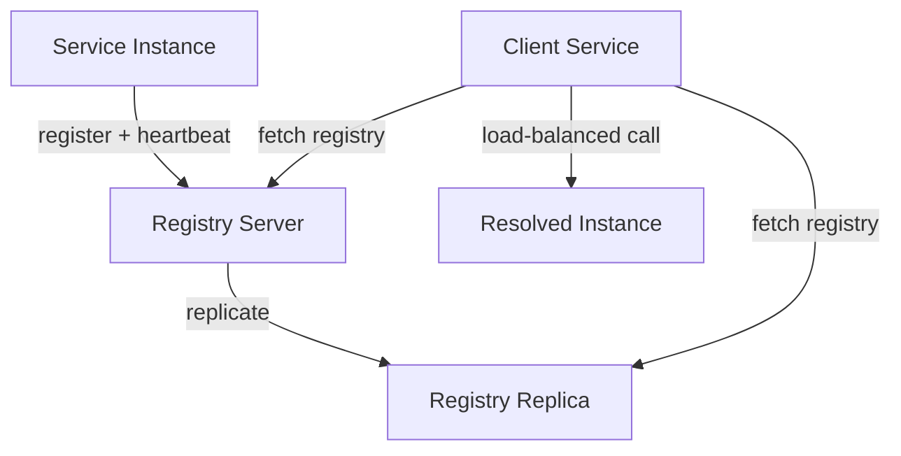
```mermaid
flowchart TD
    SI[Service Instance] -->|register + heartbeat| RS[Registry Server]
    RS -->|replicate| RR[Registry Replica]
    CS[Client Service] -->|fetch registry| RS
    CS -->|fetch registry| RR
    CS -->|load-balanced call| RI[Resolved Instance]
```

### 📶 Gradual Depth

**Level 1 - What it does:** Service discovery lets microservices find each other by name instead of hardcoded URLs. You call `order-service` and the framework resolves it to `192.168.1.42:8080`.

**Level 2 - How registration works:** Each service instance starts, registers its name, host, and port with a central registry, and sends periodic heartbeats (default: every 30 seconds in Eureka). The registry evicts instances that miss heartbeats (default: 90 seconds without heartbeat). Clients fetch the registry periodically (default: every 30 seconds) and cache it locally.

**Level 3 - Eureka vs Consul architecture:** Eureka uses peer-to-peer replication with no leader election. Every Eureka server node is equal - writes go to any node and replicate asynchronously. This is AP: during a partition, both sides serve (possibly divergent) registries. Consul uses Raft consensus with a single leader. Writes go through the leader and replicate to followers. This is CP: during a leader election, writes block until a new leader is elected (typically under 5 seconds).

**Level 4 - Spring Cloud abstraction layer:** `DiscoveryClient` is the SPI (Service Provider Interface). Eureka, Consul, Zookeeper, and Kubernetes all implement it. `@LoadBalanced` on a `RestTemplate` or `WebClient.Builder` bean activates `ReactorLoadBalancerExchangeFilterFunction`, which intercepts calls using logical service names, resolves them via `DiscoveryClient`, and applies a load balancing strategy (round-robin by default).

```java
@Bean
@LoadBalanced
public RestTemplate restTemplate() {
    return new RestTemplate();
}

// "order-service" resolved via discovery
restTemplate.getForObject(
    "http://order-service/api/orders",
    Order[].class
);
```

**Level 5 - Self-preservation and consistency trade-offs:** Eureka's self-preservation mode activates when the renewal rate drops below a threshold (default: 85% of expected renewals in 15 minutes). When active, Eureka stops evicting instances - it assumes a network partition rather than mass failures. This prevents cascading failures where a network blip causes Eureka to evict healthy instances, which causes clients to lose all targets. The cost: stale entries persist longer. Consul's anti-entropy sync and gossip protocol (Serf) detect failures faster but at the cost of availability during leader elections.

### ⚙️ How It Works

```
+---------------------------------------------------+
|   Client-Side Discovery (Spring Cloud Default)     |
|                                                    |
|  1. App starts                                     |
|     -> EurekaAutoConfiguration activates           |
|     -> EurekaClient registers with server          |
|                                                    |
|  2. Heartbeat loop (every 30s)                     |
|     -> POST /eureka/apps/{appId}                   |
|     -> Server renews lease                         |
|                                                    |
|  3. Registry fetch (every 30s)                     |
|     -> GET /eureka/apps (full)                     |
|     -> GET /eureka/apps/delta (incremental)        |
|     -> Client caches locally                       |
|                                                    |
|  4. @LoadBalanced call                             |
|     -> Intercept "http://svc-name/path"            |
|     -> Resolve via local cache                     |
|     -> Round-robin select instance                 |
|     -> Rewrite URL to "http://host:port/path"      |
|     -> Execute HTTP call                           |
|                                                    |
|  5. Shutdown                                       |
|     -> DELETE /eureka/apps/{appId}/{id}            |
|     -> Graceful deregistration                     |
+---------------------------------------------------+
```

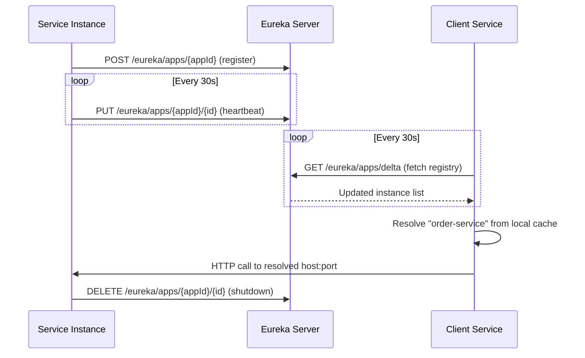
```mermaid
sequenceDiagram
    participant App as Service Instance
    participant ES as Eureka Server
    participant CL as Client Service
    App->>ES: POST /eureka/apps/{appId} (register)
    loop Every 30s
        App->>ES: PUT /eureka/apps/{appId}/{id} (heartbeat)
    end
    loop Every 30s
        CL->>ES: GET /eureka/apps/delta (fetch registry)
        ES-->>CL: Updated instance list
    end
    CL->>CL: Resolve "order-service" from local cache
    CL->>App: HTTP call to resolved host:port
    App->>ES: DELETE /eureka/apps/{appId}/{id} (shutdown)
```

**Registration deep dive:** `EurekaInstanceConfigBean` builds instance metadata from `spring.application.name`, `server.port`, and `eureka.instance.*` properties. The `EurekaAutoServiceRegistration` bean implements `SmartLifecycle` and registers the instance during `start()` phase. Registration is a REST call to the Eureka server: `POST /eureka/apps/{appName}` with instance metadata as JSON/XML payload.

**Health check integration:** By default, Eureka relies solely on heartbeats for liveness. Adding `eureka.client.healthcheck.enabled=true` makes Eureka delegate to Spring Boot's `/actuator/health` endpoint. If the health check returns DOWN, the instance status in the registry changes to DOWN even though heartbeats continue - preventing traffic routing to an unhealthy instance that is still running.

```properties
# Eureka server
eureka.client.register-with-eureka=false
eureka.client.fetch-registry=false
eureka.server.enable-self-preservation=true

# Eureka client
eureka.client.service-url.defaultZone=\
  http://eureka1:8761/eureka,\
  http://eureka2:8762/eureka
eureka.instance.prefer-ip-address=true
eureka.client.healthcheck.enabled=true
```

### 🚨 Failure Modes

**Failure 1 - Stale Registry After Network Partition:**
Eureka self-preservation activates during a network split, keeping all instances registered even if some are down. Clients route traffic to dead instances.

**Diagnostic:** Monitor `eureka.server.numOfRenewsPerMinThreshold` vs actual renewals in Eureka dashboard. Self-preservation activates when renewals drop below the threshold. Check `/actuator/health` of individual instances.

**Fix:** Do not disable self-preservation in production - it protects against cascading failures. Instead, pair discovery with circuit breakers (Resilience4j) and retry logic. Tune `eureka.server.renewal-percent-threshold` (default 0.85) downward only if your instance count is very small (fewer than 10) where a single instance failure triggers self-preservation.

**Failure 2 - Registration Storm After Eureka Server Restart:**
When a Eureka server restarts, all clients simultaneously re-register and fetch the full registry, creating a thundering herd. CPU and network spike on the Eureka server.

**Diagnostic:** Monitor Eureka server CPU, memory, and request latency during restarts. Look for `SocketTimeoutException` in client logs.

**Fix:** Deploy Eureka servers in a peer-aware cluster (minimum 2 nodes). Clients have local caches that survive server restarts. Add jitter to client fetch intervals: `eureka.client.registry-fetch-interval-seconds` with small random offset per instance. Use `eureka.server.response-cache-update-interval-ms` to batch responses.

**Failure 3 - Cross-Zone Discovery Latency:**
In multi-AZ deployments, clients discover instances in all zones but prefer the local zone. Misconfigured zone affinity causes cross-AZ traffic, increasing latency and cost.

**Diagnostic:** Check `eureka.instance.metadata-map.zone` on all instances. Verify `eureka.client.prefer-same-zone-eureka=true`. Monitor cross-AZ network transfer in cloud provider billing.

**Fix:** Explicitly set zone metadata on every instance. Configure zone-aware load balancing in Spring Cloud LoadBalancer with `spring.cloud.loadbalancer.zone` property.

### 🔬 Production Reality

At scale (hundreds of microservices, thousands of instances), Eureka's AP design shines: partial failures degrade gracefully because clients always have a local cache. Netflix ran Eureka at this scale for years. The critical production insight is that discovery is only half the story - you need circuit breakers, retries, and timeouts layered on top because the registry will always have some degree of staleness.

Consul's CP design provides stronger consistency guarantees but introduces operational complexity: Raft leader elections, quorum requirements, and the need for odd-numbered server clusters (3 or 5 nodes). Consul's built-in health checking (TCP, HTTP, gRPC, script-based) is more sophisticated than Eureka's heartbeat model.

For Kubernetes deployments, consider whether you need application-level discovery at all. Kubernetes Services + CoreDNS provide server-side discovery natively. Spring Cloud Kubernetes integrates with the Kubernetes API server directly. Application-level discovery adds value in hybrid environments (some services in Kubernetes, others on VMs) or when you need features Kubernetes DNS does not provide (instance metadata, custom health checks, weighted routing).

### ⚖️ Trade-offs & Alternatives

**BAD:**

```java
// Hardcoded URL - breaks on any topology change
@Value("${order.service.url}")
private String orderUrl;
// Every deployment needs config updates
// No health awareness - calls dead instances
```

**GOOD:**

```java
@Bean
@LoadBalanced
public WebClient.Builder webClient() {
    return WebClient.builder();
}
// Logical name resolved at call time
// Health-aware, load-balanced, cache-backed
Mono<Order> order = webClient.build()
    .get()
    .uri("http://order-service/api/orders/1")
    .retrieve()
    .bodyToMono(Order.class);
```

| Criterion          | Eureka      | Consul          | K8s DNS       |
| ------------------ | ----------- | --------------- | ------------- |
| CAP preference     | AP          | CP              | CP (etcd)     |
| Health checking    | Heartbeat   | Multi-protocol  | Liveness      |
| Multi-datacenter   | Limited     | Native          | Federation    |
| Operational burden | Low         | Medium          | High (K8s)    |
| Spring integration | First-class | First-class     | First-class   |
| KV store           | No          | Yes             | ConfigMap     |
| Service mesh       | No          | Connect (Envoy) | Istio/Linkerd |
| Consistency        | Eventual    | Strong (leader) | Strong (etcd) |

### ⚡ Decision Snap

Use Eureka when: you need AP discovery, your infrastructure is not Kubernetes-native, you want minimal operational overhead, and you already use Spring Cloud Netflix components.

Use Consul when: you need multi-datacenter discovery, built-in KV store, sophisticated health checks, or you are building a service mesh with Consul Connect.

Use Kubernetes DNS when: all services run in Kubernetes and you do not need instance-level metadata or custom health semantics beyond liveness/readiness probes.

Skip application-level discovery entirely when: you have fewer than 5 services, deployments are infrequent, and a simple load balancer or DNS suffices.

### ⚠️ Top Traps

| #   | Trap                                | Why It Hurts                          | Prevention                            |
| --- | ----------------------------------- | ------------------------------------- | ------------------------------------- |
| 1   | Disabling self-preservation in prod | Cascading evictions during partitions | Keep enabled; add circuit breakers    |
| 2   | Single Eureka server (no peers)     | SPOF for all service resolution       | Minimum 2-node peer-aware cluster     |
| 3   | Missing health check integration    | Heartbeat alive but app is broken     | Set healthcheck.enabled=true          |
| 4   | Ignoring zone affinity config       | Cross-AZ latency and cost explosion   | Set zone metadata on every instance   |
| 5   | Not caching DiscoveryClient results | Hammering registry on every call      | @LoadBalanced caches; trust the cache |

### 🪜 Learning Ladder

**Prerequisites:**

- SPR-052 Spring REST Basics - understanding REST communication patterns between microservices
- SPR-060 Spring Boot Actuator Health - health endpoints that feed into discovery liveness checks

**THIS:** SPR-078 Spring Cloud Service Discovery (Eureka and Consul) - live registry replacing hardcoded URLs for dynamic microservice resolution

**Next steps:**

- SPR-079 Spring Cloud Config Server - centralized externalized configuration across microservices
- SPR-081 Resilience4j Circuit Breaker with Spring - fault tolerance layered on top of service discovery

**The Surprising Truth:** The biggest production risk with service discovery is not the registry going down - Eureka's client-side cache makes it remarkably resilient. The real risk is trusting the registry too much: treating a registered instance as healthy without circuit breakers, retries, and timeouts. Discovery tells you where a service was recently. Only the actual call tells you if it is alive right now.

**Further Reading:**

1. Netflix Eureka Wiki (GitHub: Netflix/eureka/wiki)
2. HashiCorp Consul Architecture documentation
3. Spring Cloud Netflix reference documentation

**Revision Card:**

1. Eureka is AP (available during partitions, eventually consistent). Consul is CP (consistent via Raft, unavailable during leader elections). This CAP choice determines every behavioral difference between them.
2. Self-preservation is Eureka's most misunderstood feature: when heartbeat renewals drop below 85% of expected, Eureka stops evicting instances. This prevents network blips from causing mass eviction. Never disable it in production.
3. `@LoadBalanced` on RestTemplate/WebClient.Builder activates client-side load balancing through Spring Cloud LoadBalancer. It intercepts calls using logical service names, resolves via the local registry cache, and rewrites the URL to the selected instance's host:port.

---

---

# SPR-079 Spring Cloud Config Server

**TL;DR** - Config Server centralizes externalized configuration across all microservices, backed by Git, Vault, or filesystem with runtime refresh.

### 🔥 Problem Statement

In a microservice architecture with dozens or hundreds of services, configuration management becomes a distributed systems problem. Each service has its own `application.yml` with database URLs, feature flags, timeouts, and secrets. When you need to change a timeout across 30 services, you face 30 PRs, 30 builds, and 30 deployments. Secrets embedded in config files end up in Git history. Environment-specific config (dev, staging, production) multiplies the problem. Teams need a single source of truth for configuration that supports versioning, encryption, environment isolation, and runtime updates without redeployment.

### 📜 Historical Context

Externalized configuration is an old idea. Unix environment variables, Java system properties, and JNDI have served this purpose for decades. The Twelve-Factor App (2011) codified "store config in the environment" as a best practice. But environment variables do not version, audit, or encrypt well. Netflix created Archaius (2012) for dynamic configuration, integrated with its Eureka-based ecosystem. Spring Cloud Config (2015) took a different approach: a dedicated HTTP server that serves configuration from a versioned backend (Git by default). This design leverages Git's strengths - versioning, branching, audit trail, pull requests - for configuration management. Spring Cloud Config 2.x added Vault backend support for secrets. Spring Cloud 2020.0 added Spring Cloud Bus integration for push-based config propagation. Spring Cloud 2022.0 introduced improved bootstrap context handling with `spring.config.import` replacing the legacy `bootstrap.yml` approach. Spring Boot 3.x and Spring Cloud 2023.0+ encourage the import-based approach as the default pattern.

### 🔩 First Principles

**CORE INVARIANTS:**

1. Configuration is data, not code - it changes independently of application logic and must be manageable without recompilation or redeployment
2. A configuration system must resolve the right value for a given application, profile, and label (version/branch) - the resolution order must be deterministic and documented
3. Secrets are configuration with stricter access control - they require encryption at rest, in transit, and in the backend, with key rotation support

**DERIVED DESIGN:**
Config Server serves configuration over HTTP using a well-defined URL pattern: `/{application}/{profile}/{label}`. The application name maps to the service name (`spring.application.name`). The profile maps to the Spring active profile (dev, prod). The label maps to a Git branch or tag. This three-dimensional resolution provides environment isolation (profiles), versioning (labels), and multi-tenancy (application names) in a single, auditable system. Encryption endpoints (`/encrypt`, `/decrypt`) handle secrets without exposing plaintext in the backend.

### 🧠 Mental Model

> Think of Config Server as a library's reference desk. Each book (configuration file) is organized by title (application name), edition (profile), and revision (Git branch/label). When a microservice needs its config, it walks up to the desk, states its name, edition, and revision, and the librarian retrieves exactly the right version. If the book is updated, the librarian can notify all current readers (Spring Cloud Bus) to pick up the new edition without leaving the building (without restart).

- "book title" -> `spring.application.name`
- "edition" -> active Spring profile (dev, prod)
- "revision" -> Git branch or tag (label)
- "librarian notifies readers" -> Spring Cloud Bus + `@RefreshScope`

**Where this analogy breaks down:** Unlike a library where you get the whole book, Config Server returns merged properties from multiple sources with a specific precedence order. Application-specific config overrides shared config. Profile-specific overrides non-profile. This merge behavior has no clean library equivalent.

### 🧩 Components

```
+---------------------------------------------------+
|           Spring Cloud Config Architecture         |
|                                                    |
|  +-----------+    HTTP     +---------------+      |
|  | Config    | <---------> | Config Server |      |
|  | Client    |   /app/prof | (Spring Boot  |      |
|  | (service) |   /label    |  application) |      |
|  +-----------+             +-------+-------+      |
|       |                            |               |
|       | @RefreshScope              | backend       |
|       | beans reloaded             |               |
|       v                    +-------+-------+      |
|  +-----------+             |  Git / Vault  |      |
|  | Refreshed |             |  / Filesystem |      |
|  | Config    |             +---------------+      |
|  +-----------+                     |               |
|                                    |               |
|  +-----------+   Bus event  +------+------+       |
|  | Other     | <----------- | Spring Cloud|       |
|  | Clients   |  /bus/refresh| Bus (AMQP/  |       |
|  +-----------+              | Kafka)      |       |
|                             +-------------+       |
+---------------------------------------------------+
```

```mermaid
flowchart TD
    CC[Config Client] -->|GET /app/profile/label| CS[Config Server]
    CS -->|read config| GB[Git / Vault / FS Backend]
    BUS[Spring Cloud Bus] -->|RefreshRemoteApplicationEvent| CC
    BUS -->|RefreshRemoteApplicationEvent| CC2[Other Config Clients]
    CS -->|push refresh| BUS
    CC -->|@RefreshScope reload| RB[Refreshed Beans]
```

### 📶 Gradual Depth

**Level 1 - What it does:** Config Server is a Spring Boot app that serves configuration properties to other services over HTTP. Instead of each service bundling its own config, they all fetch from one central server backed by a Git repository.

**Level 2 - How resolution works:** A client service named `order-service` running with profile `prod` requests `GET /order-service/prod/main`. Config Server looks in the Git repo for files in this precedence (highest to lowest): `order-service-prod.yml`, `order-service.yml`, `application-prod.yml`, `application.yml`. Properties from higher-precedence files override lower ones. The merged result is returned as JSON.

**Level 3 - Bootstrap vs import:** The legacy approach used `bootstrap.yml` (loaded before `application.yml`) to configure Config Server connection details. Spring Cloud 2022.0+ replaces this with `spring.config.import=configserver:http://config:8888` in `application.yml`. The import approach integrates with Spring Boot's native config processing, supports retry and failfast natively, and eliminates the separate bootstrap context.

```yaml
# Modern approach (application.yml)
spring:
  application:
    name: order-service
  config:
    import: "configserver:http://config:8888"
  cloud:
    config:
      fail-fast: true
      retry:
        max-attempts: 6
        initial-interval: 1000
```

**Level 4 - @RefreshScope and runtime updates:** Beans annotated with `@RefreshScope` are proxied. When a `RefreshScopeRefreshedEvent` fires (triggered by `POST /actuator/refresh`), the proxy destroys the current bean instance and creates a new one with updated configuration. This enables runtime config changes without restart. Caveat: only `@RefreshScope` beans re-read config. `@Value` injections in non-refresh-scoped beans retain their startup values.

**Level 5 - Spring Cloud Bus propagation:** In a system with 50 instances of `order-service`, calling `/actuator/refresh` on each one is impractical. Spring Cloud Bus uses a message broker (RabbitMQ or Kafka) to broadcast refresh events. A single `POST /actuator/busrefresh` to any instance (or the Config Server itself) publishes a `RefreshRemoteApplicationEvent` to the bus. All subscribed instances receive it and refresh their `@RefreshScope` beans. Targeted refresh is possible: `POST /actuator/busrefresh/order-service:**` refreshes only order-service instances.

### ⚙️ How It Works

```
+---------------------------------------------------+
|     Config Resolution and Refresh Flow             |
|                                                    |
|  1. Service starts                                 |
|     -> spring.config.import triggers               |
|     -> ConfigServerConfigDataLoader activates      |
|     -> GET /order-service/prod/main                |
|                                                    |
|  2. Config Server resolves                         |
|     -> Clones/pulls Git repo (cached)              |
|     -> Reads: order-service-prod.yml               |
|              order-service.yml                      |
|              application-prod.yml                   |
|              application.yml                        |
|     -> Merges with precedence order                |
|     -> Decrypts {cipher} values                    |
|     -> Returns JSON response                       |
|                                                    |
|  3. Client applies config                          |
|     -> Properties merged into Environment          |
|     -> @Value and @ConfigurationProperties bind    |
|     -> @RefreshScope beans created lazily          |
|                                                    |
|  4. Config change pushed to Git                    |
|     -> Webhook calls /monitor endpoint             |
|     -> Config Server fires bus event               |
|     -> All clients receive refresh event           |
|     -> @RefreshScope beans destroyed + recreated   |
+---------------------------------------------------+
```

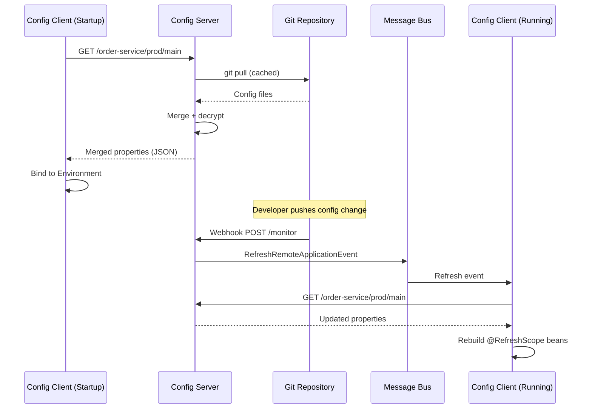
```mermaid
sequenceDiagram
    participant CS as Config Client (Startup)
    participant SV as Config Server
    participant GIT as Git Repository
    participant BUS as Message Bus
    participant CS2 as Config Client (Running)
    CS->>SV: GET /order-service/prod/main
    SV->>GIT: git pull (cached)
    GIT-->>SV: Config files
    SV->>SV: Merge + decrypt
    SV-->>CS: Merged properties (JSON)
    CS->>CS: Bind to Environment
    Note over GIT: Developer pushes config change
    GIT->>SV: Webhook POST /monitor
    SV->>BUS: RefreshRemoteApplicationEvent
    BUS->>CS2: Refresh event
    CS2->>SV: GET /order-service/prod/main
    SV-->>CS2: Updated properties
    CS2->>CS2: Rebuild @RefreshScope beans
```

**Encryption and secrets:** Config Server provides `/encrypt` and `/decrypt` endpoints. Encrypted values in config files use the `{cipher}` prefix. When Config Server reads `db.password: {cipher}AQA...`, it decrypts the value before returning it to the client. Encryption uses symmetric (shared secret) or asymmetric (RSA keypair) keys configured via `encrypt.key` or a keystore. The plaintext never appears in Git - only the `{cipher}` value is committed.

```yaml
# In Git repo: order-service-prod.yml
spring:
  datasource:
    url: jdbc:postgresql://prod-db:5432/orders
    username: order_svc
    # Encrypted - decrypted by Config Server
    password: "{cipher}AQBkN3L2x9..."

# Config Server application.yml
encrypt:
  key: ${ENCRYPT_KEY} # from env or Vault
```

**Vault backend:** For organizations that require a dedicated secrets manager, Config Server supports HashiCorp Vault as a backend. Config Server authenticates with Vault using a token, AppRole, or Kubernetes auth, then reads secrets from Vault's KV engine. The Vault backend can be combined with Git: Git serves non-sensitive config, Vault serves secrets. Config Server merges both sources transparently.

```yaml
# Config Server with composite backend
spring:
  profiles:
    active: git, vault
  cloud:
    config:
      server:
        git:
          uri: https://github.com/org/config-repo
        vault:
          host: vault.internal
          port: 8200
          authentication: APPROLE
```

### 🚨 Failure Modes

**Failure 1 - Config Server Unavailable at Startup:**
If Config Server is down when a client starts, the client cannot fetch its configuration. By default, the client starts with whatever local config it has, which may be incomplete or wrong for the environment.

**Diagnostic:** Client logs show `Could not locate PropertySource` warnings. Application starts but behaves incorrectly (wrong database URL, missing feature flags). Check Config Server health at `/actuator/health`.

**Fix:** Set `spring.cloud.config.fail-fast=true` so the client fails to start instead of running with bad config. Add retry configuration: `spring.cloud.config.retry.max-attempts=6` with exponential backoff. Ensure Config Server is highly available (multiple instances behind a load balancer). For extreme resilience, use `spring.cloud.config.allow-override=true` with local fallback config.

**Failure 2 - Refresh Scope Bean Initialization Error:**
A config change pushed via Git webhook triggers a bus refresh. A `@RefreshScope` bean fails to reinitialize because the new config value is invalid (wrong URL format, missing required property). The bean is destroyed but not recreated.

**Diagnostic:** Application logs show `BeanCreationException` during refresh. The affected endpoint returns 500 errors. Other non-refresh-scoped beans continue working normally.

**Fix:** Validate config values in `@ConfigurationProperties` classes using JSR-303 annotations (`@NotNull`, `@URL`, `@Pattern`). This fails fast on invalid config during refresh rather than producing a broken bean. Test config changes in a lower environment first. Use Git branch labels to roll back: point clients to a previous commit via the label parameter.

**Failure 3 - Git Clone Timeout Under Load:**
Config Server clones the Git repo on first request and pulls on subsequent requests. If the Git server is slow or the repo is large, clone operations timeout. Under high load (many services starting simultaneously), Git operations queue and clients timeout.

**Diagnostic:** Config Server logs show `TransportException: Connection timed out` or `org.eclipse.jgit.api.errors.GitAPIException`. Client logs show connection timeouts to Config Server.

**Fix:** Set `spring.cloud.config.server.git.clone-on-start=true` to clone at startup rather than on first request. Use `spring.cloud.config.server.git.force-pull=true` to avoid merge conflicts. Set reasonable timeouts: `spring.cloud.config.server.git.timeout=10`. Keep the config repo small - do not store application code in it. Use a local Git mirror for reliability.

### 🔬 Production Reality

In production, Config Server becomes critical infrastructure - every service depends on it at startup. Treat it with the same rigor as your database: high availability, monitoring, and disaster recovery. Deploy at least two instances behind a load balancer. Use `clone-on-start` to front-load Git operations. Monitor the Git backend's availability independently.

The refresh mechanism is powerful but dangerous. A bad config change propagated via Spring Cloud Bus affects all instances simultaneously. Production-grade setups use staged rollouts: refresh one instance, verify health, then refresh the rest. Some teams disable automatic bus propagation and trigger refreshes manually per service or per instance group.

Encryption via Config Server's `/encrypt` endpoint is convenient but not enterprise-grade secrets management. For production secrets, prefer HashiCorp Vault or cloud-native solutions (AWS Secrets Manager, Azure Key Vault) as Config Server backends. Config Server then acts as a unified facade - services do not need to know which backend stores which values.

A common architecture at scale: Git backend for application config (feature flags, timeouts, URLs), Vault backend for secrets (database passwords, API keys, certificates), and Spring Cloud Bus (Kafka-backed) for propagation. This separates concerns: developers manage config via Git PRs with code review, security teams manage secrets via Vault policies, and operations trigger refreshes via bus endpoints.

### ⚖️ Trade-offs & Alternatives

**BAD:**

```properties
# Secrets in application.yml committed to Git
spring.datasource.password=SuperSecret123
# Same config duplicated across 30 services
# Changing a timeout requires 30 deployments
```

**GOOD:**

```yaml
# Config client - single import line
spring:
  config:
    import: "configserver:http://config:8888"
# Secrets encrypted or in Vault
# Shared config in application.yml (config repo)
# Service-specific in {app}.yml (config repo)
# Runtime refresh via @RefreshScope + Bus
```

| Criterion          | Config Server    | K8s ConfigMap    | Consul KV        |
| ------------------ | ---------------- | ---------------- | ---------------- |
| Versioning         | Git-native       | kubectl/GitOps   | Manual/API       |
| Encryption         | Built-in         | Sealed Secrets   | Vault transit    |
| Runtime refresh    | @RefreshScope    | Volume mount     | Watch/blocking   |
| Audit trail        | Git log          | etcd audit       | Audit log        |
| Spring integration | Native           | Via spring-cloud | Via spring-cloud |
| Secrets management | Vault backend    | External Secrets | Vault Connect    |
| Operational cost   | Dedicated server | K8s included     | Consul cluster   |
| Scalability        | LB + replicas    | etcd-backed      | Raft cluster     |

### ⚡ Decision Snap

Use Spring Cloud Config Server when: you have multiple Spring Boot microservices, need versioned configuration with Git audit trail, require runtime refresh without redeployment, and want a Spring-native solution.

Use Kubernetes ConfigMaps/Secrets when: all services run in Kubernetes, you use GitOps (ArgoCD/Flux) for declarative config, and you do not need `@RefreshScope`-style dynamic refresh.

Use Consul KV when: you already use Consul for service discovery and want a single tool for both discovery and configuration.

Skip centralized config when: you have fewer than 5 services, config changes are rare, and environment variables or local files suffice.

### ⚠️ Top Traps

| #   | Trap                                 | Why It Hurts                           | Prevention                                               |
| --- | ------------------------------------ | -------------------------------------- | -------------------------------------------------------- |
| 1   | Single Config Server, no HA          | Every service fails to start on outage | Deploy 2+ instances behind load balancer                 |
| 2   | Plaintext secrets in Git config repo | Credential exposure in repo history    | Use {cipher} prefix or Vault backend                     |
| 3   | Missing fail-fast on clients         | Services start with wrong/empty config | Set spring.cloud.config.fail-fast=true                   |
| 4   | Bus refresh without staged rollout   | Bad config takes down all instances    | Refresh one instance, verify, then all                   |
| 5   | @RefreshScope on critical beans      | Refresh failure breaks running service | Validate config; use @ConfigurationProperties validation |

### 🪜 Learning Ladder

**Prerequisites:**

- SPR-078 Spring Cloud Service Discovery (Eureka and Consul) - services must find each other before they can share config
- SPR-028 Spring Profiles and Configuration - understanding profile-based property resolution

**THIS:** SPR-079 Spring Cloud Config Server - centralized Git/Vault-backed configuration with runtime refresh across microservices

**Next steps:**

- SPR-080 Spring Cloud Gateway and Rate Limiting - API gateway consuming config from a central server
- SPR-081 Resilience4j Circuit Breaker with Spring - resilience when config server or services fail

**The Surprising Truth:** The hardest part of Config Server is not the technology - it is the organizational discipline. Config Server works perfectly when teams follow conventions: shared properties in `application.yml`, service-specific in `{app-name}.yml`, secrets encrypted or in Vault, changes reviewed via Git PRs. It falls apart when teams dump everything in one file, commit plaintext secrets, or bypass the refresh mechanism by restarting services manually. Config Server is an organizational pattern enforced by technology, not the other way around.

**Further Reading:**

1. Spring Cloud Config reference documentation
2. Spring Cloud Bus reference documentation
3. HashiCorp Vault Spring Cloud integration guide

**Revision Card:**

1. Config Server resolves configuration via three dimensions: application name, profile, and label (Git branch/tag). The URL pattern `/{app}/{profile}/{label}` maps directly to files in the Git repository with a deterministic precedence order.
2. `@RefreshScope` beans are proxied and destroyed/recreated on refresh events. Only beans explicitly annotated with `@RefreshScope` pick up config changes at runtime - all other beans retain their startup values until the application restarts.
3. Spring Cloud Bus broadcasts refresh events via a message broker (RabbitMQ or Kafka). A single `POST /actuator/busrefresh` propagates a config change to all subscribed service instances without individual restart or manual refresh calls.

---

---

# SPR-080 Spring Cloud Gateway and Rate Limiting

**TL;DR** - Spring Cloud Gateway routes, filters, and rate-limits API traffic on a reactive Netty stack replacing Zuul.

### 🔥 Problem Statement

Every microservice architecture eventually needs a single entry point that handles routing, authentication, rate limiting, and cross-cutting concerns. Without a gateway, each service duplicates security checks, clients must know individual service addresses, and there is no central place to enforce throughput limits. Netflix Zuul 1 solved this on a blocking Servlet stack, but its thread-per-request model collapsed under high fan-out. Teams need a non-blocking gateway that integrates natively with Spring Cloud service discovery, supports declarative route definitions, and provides pluggable rate limiting without custom infrastructure.

### 📜 Historical Context

Netflix open-sourced Zuul 1 in 2013 as a JVM gateway built on Servlet blocking I/O. Spring Cloud Netflix wrapped it with `@EnableZuulProxy`, making it the default gateway for Spring Cloud until 2018. Zuul 2 rewrote the core on Netty with async I/O, but Netflix delayed its open-source release and Spring never officially integrated it. Spring Cloud Gateway 2.0 (2018) was built from scratch on Project Reactor and Netty, providing a first-class reactive gateway within the Spring ecosystem. The 3.x line (Spring Boot 3+) moved to Jakarta EE 9 namespaces and added support for gRPC proxying. The `RequestRateLimiter` filter shipped from 1.0 with a Redis-backed token bucket implementation, and the circuit breaker filter was added in 2.1 to integrate with Resilience4j as Hystrix entered maintenance mode.

### 🔩 First Principles

**CORE INVARIANTS:**

1. A route is a predicate-filter chain: if the predicate matches the request, the filter chain processes it - no match means no processing
2. Filters are ordered and composable: pre-filters modify requests, post-filters modify responses, and global filters apply to every route
3. Rate limiting is a token bucket contract: each client key maps to a bucket that refills at a fixed rate and holds a fixed burst capacity

**DERIVED DESIGN:**
Because routes are predicate-filter compositions, you can express complex routing logic without code - predicates match on path, header, host, method, query param, or cookie. Because filters are ordered, you can layer concerns (auth before rate limit before circuit breaker) with deterministic execution. The token bucket invariant means rate limiting is stateless per request - Redis holds the bucket state, so any gateway instance can enforce the same limits without coordination.

### 🧠 Mental Model

> Think of Spring Cloud Gateway as an airport terminal. Arriving flights (requests) hit passport control (predicates) that checks which gate (route) they belong to. Each gate has a security lane (filter chain) with ordered checkpoints: ID check, baggage scan, boarding pass validation. The rate limiter is the gate capacity sign - only N passengers per minute can board.

- "passport control" -> route predicates matching path, headers
- "security lane checkpoints" -> ordered pre/post filters
- "gate capacity sign" -> `RequestRateLimiter` with Redis bucket
- "connecting flights" -> load-balanced forwarding to services

**Where this analogy breaks down:** Unlike an airport where gates are physical, gateway routes are evaluated in priority order and the first full match wins. There is no "waiting area" - rejected requests get an immediate 429 or 503 response.

### 🧩 Components

```
+--------------------------------------------------+
|             Spring Cloud Gateway                  |
|                                                   |
|  Request                                          |
|    |                                              |
|    v                                              |
|  [Route Predicate Matching]                       |
|    |                                              |
|    v (matched route)                              |
|  [Pre-Filters: Auth, RateLimit, Rewrite]          |
|    |                                              |
|    v                                              |
|  [Netty HTTP Client -> Downstream Service]        |
|    |                                              |
|    v                                              |
|  [Post-Filters: Headers, Logging, Metrics]        |
|    |                                              |
|    v                                              |
|  Response                                         |
+--------------------------------------------------+
|  Redis (token buckets)  |  Discovery (Eureka)    |
+--------------------------------------------------+
```

```mermaid
flowchart TD
    REQ[Incoming Request] --> PRED[Route Predicate Matching]
    PRED -->|matched| PRE[Pre-Filters]
    PRED -->|no match| R404[404 Not Found]
    PRE --> RATE[RequestRateLimiter]
    RATE -->|allowed| PROXY[Netty Proxy to Service]
    RATE -->|denied| R429[429 Too Many Requests]
    PROXY --> POST[Post-Filters]
    POST --> RESP[Response to Client]
    RATE -.->|bucket check| REDIS[(Redis)]
    PROXY -.->|resolve| DISC[(Service Discovery)]
```

### 📶 Gradual Depth

**Level 1 - Basic Route Definition:**
A route maps a path to a downstream URI. In `application.yml`:

```yaml
spring:
  cloud:
    gateway:
      routes:
        - id: order-service
          uri: lb://order-service
          predicates:
            - Path=/api/orders/**
          filters:
            - StripPrefix=1
```

`lb://` tells the gateway to use the load balancer (service discovery) to resolve `order-service`. `StripPrefix=1` removes `/api` before forwarding. The predicate matches any request starting with `/api/orders/`.

**Level 2 - Rate Limiting with Redis:**
The built-in `RequestRateLimiter` uses a Redis-backed token bucket. You need `spring-boot-starter-data-redis-reactive` on the classpath:

```yaml
filters:
  - name: RequestRateLimiter
    args:
      redis-rate-limiter.replenishRate: 10
      redis-rate-limiter.burstCapacity: 20
      redis-rate-limiter.requestedTokens: 1
      key-resolver: "#{@userKeyResolver}"
```

```java
@Bean
public KeyResolver userKeyResolver() {
    return exchange -> Mono.justOrEmpty(
        exchange.getRequest()
            .getHeaders()
            .getFirst("X-User-Id")
    ).defaultIfEmpty("anonymous");
}
```

`replenishRate` is tokens per second. `burstCapacity` is max bucket size. The key resolver determines the bucket key per request - typically user ID, API key, or IP address.

**Level 3 - Circuit Breaker Filter:**
Gateway integrates with Resilience4j via the `CircuitBreaker` filter:

```yaml
filters:
  - name: CircuitBreaker
    args:
      name: orderCircuitBreaker
      fallbackUri: forward:/fallback/orders
```

When the downstream service fails beyond the configured threshold, the circuit opens and requests route to the fallback URI instead of timing out. This prevents cascade failures and gives clients a degraded but functional response.

**Level 4 - Custom Global Filter:**

```java
@Component
public class RequestTimingFilter
    implements GlobalFilter, Ordered {

    @Override
    public Mono<Void> filter(
        ServerWebExchange exchange,
        GatewayFilterChain chain) {
        long start = System.nanoTime();
        return chain.filter(exchange).then(
            Mono.fromRunnable(() -> {
                long ms = (System.nanoTime() - start)
                    / 1_000_000;
                exchange.getResponse().getHeaders()
                    .add("X-Response-Time",
                        ms + "ms");
            })
        );
    }

    @Override
    public int getOrder() {
        return -1; // run before other filters
    }
}
```

### ⚙️ How It Works

```
Request arrives at Netty (port 8080)
  |
  v
HandlerMapping: iterate routes by priority
  |
  v
Route matched? -- No --> 404
  |
  Yes
  v
Build GatewayFilterChain (route + global)
  |
  v
Execute pre-filters in order:
  [Auth] -> [RateLimit] -> [Rewrite]
  |
  v
RateLimit: EVAL redis_script.lua
  bucket = key(user-id)
  tokens = GET bucket.tokens
  if tokens >= requested:
    DECR bucket.tokens
    allow
  else:
    return 429
  |
  v (allowed)
NettyRoutingFilter: async HTTP to downstream
  |
  v
Response flows back through post-filters
  [AddHeader] -> [Logging]
  |
  v
Response sent to client
```

```mermaid
sequenceDiagram
    participant C as Client
    participant G as Gateway
    participant R as Redis
    participant S as Order Service

    C->>G: GET /api/orders/123
    G->>G: Match route predicate
    G->>R: EVAL rate_limit.lua (user-key)
    R-->>G: allowed (tokens remaining: 9)
    G->>S: GET /orders/123 (load balanced)
    S-->>G: 200 OK + payload
    G-->>C: 200 OK + X-Response-Time: 45ms
```

### 🚨 Failure Modes

**Failure 1 - Redis Unavailable:**
When Redis is down, the rate limiter cannot check or decrement tokens. The default behavior is to deny all requests (fail-closed), returning 429 to every client.

**Diagnostic:** Check gateway logs for `RedisConnectionException`. Monitor Redis connectivity with `spring.redis.health` actuator endpoint. Sudden spike in 429 responses across all users indicates Redis failure, not actual overload.

**Fix:** Configure `spring.cloud.gateway.redis-rate-limiter.deny-empty-key=false` and implement a custom `RateLimiter` that falls back to in-memory limiting when Redis is unreachable. For critical paths, consider a local Caffeine cache as secondary limiter.

**Failure 2 - Route Ordering Conflicts:**
Two routes with overlapping predicates where the wrong one matches first. Example: `/api/users/{id}` matches before `/api/users/admin` because it was defined first.

**Diagnostic:** Enable `logging.level.org.springframework.cloud.gateway=TRACE` to see which route matched. Check route evaluation order in actuator endpoint `GET /actuator/gateway/routes`.

**Fix:** Use the `order` property on route definitions. Lower values match first. Place more specific routes (exact paths) before wildcard routes. Use multiple predicates (path + header) to disambiguate.

**Failure 3 - Memory Leak from Large Request Bodies:**
Gateway buffers request bodies in memory by default. Large file uploads through the gateway exhaust Netty direct memory, causing `OutOfDirectMemoryError`.

**Diagnostic:** Monitor `netty_allocator_memory_used` metric. Check for `io.netty.util.internal.OutOfDirectMemoryError` in logs.

**Fix:** Set `spring.codec.max-in-memory-size=256KB` for bounded buffering. For file upload routes, use streaming: configure `spring.cloud.gateway.proxy.streaming-media-types` and route uploads to a service that handles multipart directly.

### 🔬 Production Reality

At scale, the gateway becomes the most critical single point in your architecture. Production lessons:

**Connection pooling matters enormously.** Default Netty connection pool settings work for moderate traffic, but at 10K+ RPS you need explicit tuning: `spring.cloud.gateway.httpclient.pool.max-connections=1000` and `spring.cloud.gateway.httpclient.pool.acquire-timeout=1000`. Monitor `gateway.httpclient.pool.active` and `gateway.httpclient.pool.idle` metrics.

**Redis rate limiter uses Lua scripts atomically.** Each rate limit check is a single `EVAL` call, so there is no race condition between read and decrement. However, Redis single-threaded execution means your rate limit throughput is bounded by Redis throughput - typically 100K-200K ops/sec on a single node. At higher rates, use Redis Cluster with key-based sharding.

**Health checks must be separate from traffic routes.** Configure a dedicated health route that bypasses rate limiting and circuit breakers: predicates on `Path=/health` with no filters. Load balancers must hit this endpoint, not a rate-limited path.

**Gateway metrics are your first alert.** Instrument with Micrometer: `spring.cloud.gateway.metrics.enabled=true` gives you per-route latency, status code distribution, and rate limit rejection counts. Alert on p99 latency spikes at the gateway - they indicate downstream degradation before service-level alerts fire.

### ⚖️ Trade-offs & Alternatives

**BAD:**

```java
// Building rate limiting in each microservice
@RestController
public class OrderController {
    private final RateLimiter limiter =
        RateLimiter.create(10.0); // Guava
    @GetMapping("/orders/{id}")
    public Order getOrder(@PathVariable long id) {
        if (!limiter.tryAcquire()) {
            throw new TooManyRequestsException();
        }
        return orderService.find(id);
    }
}
// Problem: each service has different limits,
// no global view, no central control
```

**GOOD:**

```yaml
# Centralized rate limiting at gateway
spring:
  cloud:
    gateway:
      routes:
        - id: order-service
          uri: lb://order-service
          predicates:
            - Path=/api/orders/**
          filters:
            - name: RequestRateLimiter
              args:
                redis-rate-limiter.replenishRate: 50
                redis-rate-limiter.burstCapacity: 100
                key-resolver: "#{@apiKeyResolver}"
# Single config, global enforcement, observable
```

| Aspect            | Spring Cloud Gateway  | Kong / NGINX        | AWS API Gateway        |
| ----------------- | --------------------- | ------------------- | ---------------------- |
| Stack             | Reactive (Netty)      | Native C / Lua      | Managed service        |
| Rate limiting     | Redis token bucket    | Plugin-based        | Built-in per-stage     |
| Circuit breaker   | Resilience4j filter   | Lua plugin          | No native support      |
| Service discovery | Eureka, Consul native | DNS or plugin       | CloudMap integration   |
| Customization     | Java filters          | Lua / Go plugins    | Lambda authorizers     |
| Operational cost  | Self-managed JVM      | Self-managed binary | Zero ops, pay-per-call |

### ⚡ Decision Snap

Use Spring Cloud Gateway when: you are already in the Spring Cloud ecosystem, need tight integration with Eureka/Consul discovery, want Java-native custom filters, and your team can operate a JVM gateway. Choose Kong or NGINX when: you need language-agnostic gateway with plugin ecosystem and want battle-tested native performance. Choose AWS API Gateway when: you want zero operational overhead and your services are already on AWS with moderate traffic volumes.

### ⚠️ Top Traps

| #   | Trap                                  | Why it bites                                                                              | Escape                                                              |
| --- | ------------------------------------- | ----------------------------------------------------------------------------------------- | ------------------------------------------------------------------- |
| 1   | Blocking calls in filters             | Netty event loop freezes, latency spikes for all routes                                   | Use `Mono.fromCallable().subscribeOn(Schedulers.boundedElastic())`  |
| 2   | Missing key resolver                  | Default resolver uses remote address - shared NAT means one bucket for thousands of users | Always define explicit `KeyResolver` using user ID or API key       |
| 3   | No fallback on circuit open           | Open circuit returns raw 503 with no body, confusing clients                              | Always set `fallbackUri` to a controller returning structured error |
| 4   | Rate limit without Redis cluster      | Single Redis node is SPOF and throughput ceiling                                          | Use Redis Sentinel or Cluster for HA and sharding                   |
| 5   | Testing routes with `@SpringBootTest` | Full gateway context is slow and flaky                                                    | Use `WebTestClient` with route builder directly                     |

### 🪜 Learning Ladder

**Prerequisites:**

- SPR-078 Spring Cloud Service Discovery (Eureka and Consul) - gateway routes to discovered service instances
- SPR-079 Spring Cloud Config Server - gateway route config managed centrally

**THIS:** SPR-080 Spring Cloud Gateway and Rate Limiting - reactive API gateway with declarative routing, filtering, and token-bucket rate limiting

**Next steps:**

- SPR-081 Resilience4j Circuit Breaker with Spring - circuit breaker filters inside gateway routes
- SPR-087 REST API Phase 4 - Observability and Resilience - applying gateway patterns to a complete API

**The Surprising Truth:** The biggest production issue with Spring Cloud Gateway is not performance - Netty handles 50K+ RPS easily. It is operational: teams forget that the gateway is a JVM application that needs its own memory tuning, GC configuration, and health monitoring. The gateway that protects your services needs protection itself.

**Further Reading:**

1. Spring Cloud Gateway official documentation
2. Token bucket algorithm (RFC 2697)
3. Stripe engineering blog on rate limiter patterns

**Revision Card:**

1. The default `RequestRateLimiter` filter uses Redis with Lua scripts for atomic token bucket operations.
2. When a gateway route has a `CircuitBreaker` filter and the circuit opens, requests route to the configured `fallbackUri` instead of the downstream service.
3. Routes evaluate in definition order (or explicit `order` value); first full predicate match wins.

---

---

# SPR-081 Resilience4j Circuit Breaker with Spring

**TL;DR** - Resilience4j wraps remote calls in a state machine that opens on failure bursts and recovers automatically.

### 🔥 Problem Statement

Distributed systems fail partially. When a downstream service degrades - slow responses, connection timeouts, 500 errors - callers keep sending requests, exhausting their own thread pools and propagating the failure upstream. This cascade turns a single service outage into a system-wide collapse. Teams need a mechanism that detects when a dependency is unhealthy, stops sending doomed requests, and periodically probes for recovery - without manual intervention and without blocking caller threads during the detection window.

### 📜 Historical Context

Netflix created the circuit breaker library Hystrix in 2011, shipping it as the standard resilience layer in the Netflix OSS stack. Spring Cloud Netflix wrapped Hystrix with `@HystrixCommand`, making it the default choice for Spring Cloud applications from 2015 to 2018. Netflix announced Hystrix maintenance mode in November 2018, recommending Resilience4j as the successor. Resilience4j 1.0 (2019) was designed from scratch as a lightweight, modular library with no external dependencies beyond Vavr. It embraced Java 8 functional composition rather than Hystrix's thread-isolation-heavy approach. Spring Cloud Circuit Breaker abstraction (2019) provided a vendor-neutral API, with Resilience4j as the primary implementation. Spring Boot auto-configuration for Resilience4j (via `resilience4j-spring-boot3` starter) added annotation-driven circuit breakers, removing the need for manual factory wiring.

### 🔩 First Principles

**CORE INVARIANTS:**

1. The circuit breaker is a finite state machine with exactly three states: CLOSED (allowing calls), OPEN (rejecting calls), and HALF_OPEN (probing with limited calls)
2. State transitions are driven by failure rate or slow call rate measured over a sliding window - not individual failures
3. The OPEN state has a fixed wait duration before transitioning to HALF_OPEN - this is the backoff period that gives the downstream service time to recover

**DERIVED DESIGN:**
Because transitions depend on aggregate metrics over a window (not single failures), transient errors do not trigger the circuit. Because HALF_OPEN limits concurrent probe calls, recovery detection does not flood a struggling service. Because the state machine is per-instance and per-name, each remote dependency gets independent protection. The functional design means circuit breakers compose with retries, bulkheads, and rate limiters through decorator chaining.

### 🧠 Mental Model

> Think of a circuit breaker as an electrical breaker in your home panel. Under normal load (CLOSED), current flows freely. When the circuit detects overload - too many failures in the measurement window - it trips (OPEN), cutting all current to protect the wiring. After a cooldown period, someone flips the breaker halfway (HALF_OPEN) and tests with a single appliance. If it holds, the breaker resets to CLOSED. If it trips again, back to OPEN.

- "current flowing" -> requests passing to downstream service
- "overload detection" -> failure rate exceeding threshold in sliding window
- "cooldown period" -> `waitDurationInOpenState` configuration
- "testing with one appliance" -> limited permitted calls in HALF_OPEN

**Where this analogy breaks down:** Electrical breakers trip on a single overload event, while Resilience4j circuit breakers aggregate failures over a configurable window. Also, electrical breakers require manual reset, while software circuit breakers auto-transition to HALF_OPEN after the wait duration.

### 🧩 Components

```
+--------------------------------------------------+
|          Resilience4j Circuit Breaker             |
|                                                   |
|  [Sliding Window]                                 |
|    - COUNT_BASED: last N calls                    |
|    - TIME_BASED: last N seconds                   |
|                                                   |
|  States:                                          |
|    CLOSED ---(failure rate >= threshold)--->       |
|    OPEN   ---(wait duration expires)------->      |
|    HALF_OPEN -(probe succeeds)---> CLOSED         |
|              -(probe fails)-----> OPEN            |
|                                                   |
|  Decorators: retry, bulkhead, ratelimiter,        |
|    timelimiter compose around the breaker         |
+--------------------------------------------------+
|  Metrics Registry (Micrometer)                    |
+--------------------------------------------------+
```

```mermaid
stateDiagram-v2
    [*] --> CLOSED
    CLOSED --> OPEN : failure rate >= threshold
    OPEN --> HALF_OPEN : wait duration expires
    HALF_OPEN --> CLOSED : probe calls succeed
    HALF_OPEN --> OPEN : probe calls fail
    CLOSED --> CLOSED : calls succeeding
    OPEN --> OPEN : calls rejected
```

### 📶 Gradual Depth

**Level 1 - Annotation-Driven Circuit Breaker:**
Add `resilience4j-spring-boot3` dependency and annotate:

```java
@Service
public class OrderClient {

    @CircuitBreaker(
        name = "orderService",
        fallbackMethod = "fallbackGetOrder"
    )
    public Order getOrder(Long id) {
        return restClient.get()
            .uri("/orders/{id}", id)
            .retrieve()
            .body(Order.class);
    }

    private Order fallbackGetOrder(
        Long id, Throwable t) {
        return Order.cached(id);
    }
}
```

The fallback method must have the same return type plus a `Throwable` parameter. It executes when the circuit is OPEN or the call fails.

**Level 2 - Configuration Properties:**

```yaml
resilience4j:
  circuitbreaker:
    instances:
      orderService:
        sliding-window-type: COUNT_BASED
        sliding-window-size: 100
        failure-rate-threshold: 50
        wait-duration-in-open-state: 30s
        permitted-number-of-calls-in-half-open-state: 10
        minimum-number-of-calls: 20
        record-exceptions:
          - java.io.IOException
          - java.util.concurrent.TimeoutException
        ignore-exceptions:
          - com.app.BusinessValidationException
```

`sliding-window-size: 100` means the last 100 calls are measured. `failure-rate-threshold: 50` means the circuit opens when 50% or more of those 100 calls fail. `minimum-number-of-calls: 20` prevents the circuit from tripping on the first few failures during startup.

**Level 3 - Composing with Retry and Bulkhead:**

```java
@CircuitBreaker(name = "paymentService",
    fallbackMethod = "paymentFallback")
@Retry(name = "paymentService")
@Bulkhead(name = "paymentService")
public Payment processPayment(PaymentRequest req) {
    return paymentClient.charge(req);
}
```

Decoration order matters. Default: `Bulkhead -> TimeLimiter -> RateLimiter -> CircuitBreaker -> Retry`. The retry wraps the circuit breaker, so each retry attempt is recorded by the circuit. This means retried failures count toward the failure rate. Configure retry carefully to avoid inflating the failure count.

**Level 4 - Programmatic Composition:**

```java
CircuitBreaker cb = CircuitBreaker.of(
    "inventory",
    CircuitBreakerConfig.custom()
        .failureRateThreshold(60)
        .slowCallRateThreshold(80)
        .slowCallDurationThreshold(
            Duration.ofSeconds(2))
        .slidingWindowSize(50)
        .build()
);

Retry retry = Retry.of("inventory",
    RetryConfig.custom()
        .maxAttempts(3)
        .waitDuration(Duration.ofMillis(500))
        .build()
);

Supplier<Inventory> decorated =
    Decorators.ofSupplier(() ->
            inventoryClient.check(sku))
        .withCircuitBreaker(cb)
        .withRetry(retry)
        .withFallback(List.of(
            CallNotPermittedException.class),
            e -> Inventory.unknown(sku))
        .decorate();
```

### ⚙️ How It Works

```
Call enters circuit breaker decorator
  |
  v
Check state:
  OPEN? --> throw CallNotPermittedException
           --> fallback method executes
  |
  CLOSED or HALF_OPEN:
  v
Execute actual call
  |
  v
Record outcome in sliding window:
  - success: record success
  - exception in record-exceptions: record failure
  - exception in ignore-exceptions: not recorded
  - slow call (> threshold): record slow
  |
  v
Evaluate aggregate metrics:
  failure rate = failures / window size
  slow call rate = slow calls / window size
  |
  v
  failure rate >= threshold?
    YES --> transition to OPEN
            start wait duration timer
    NO  --> remain CLOSED
  |
  v (in HALF_OPEN after wait expires)
  permitted calls exhausted?
    YES --> evaluate: success rate OK?
            YES --> transition to CLOSED
            NO  --> transition to OPEN
```

```mermaid
sequenceDiagram
    participant C as Caller
    participant CB as CircuitBreaker
    participant S as Downstream Service

    C->>CB: getOrder(42)
    CB->>CB: State = CLOSED
    CB->>S: HTTP GET /orders/42
    S-->>CB: 500 Internal Server Error
    CB->>CB: Record failure (47/100 failed)

    C->>CB: getOrder(43)
    CB->>S: HTTP GET /orders/43
    S-->>CB: 500 Internal Server Error
    CB->>CB: Record failure (51/100 = 51%)
    CB->>CB: Threshold 50% exceeded
    CB->>CB: Transition CLOSED -> OPEN

    C->>CB: getOrder(44)
    CB-->>C: CallNotPermittedException
    C->>C: Execute fallback

    Note over CB: 30s wait duration expires
    CB->>CB: Transition OPEN -> HALF_OPEN

    C->>CB: getOrder(45)
    CB->>S: HTTP GET /orders/45 (probe)
    S-->>CB: 200 OK
    CB->>CB: Probe succeeded
    CB->>CB: Transition HALF_OPEN -> CLOSED
```

### 🚨 Failure Modes

**Failure 1 - Circuit Never Opens (Threshold Too High):**
Setting `failure-rate-threshold: 95` means the circuit only opens when 95% of calls fail. By the time 95% of calls fail, the caller's thread pool is already exhausted from waiting on timeouts. The circuit breaker is effectively useless.

**Diagnostic:** Check `resilience4j.circuitbreaker.calls` metric grouped by outcome. If you see a high failure count but the state remains CLOSED, the threshold is too lenient. Compare failure rate against configured threshold in `/actuator/circuitbreakers`.

**Fix:** Set `failure-rate-threshold` between 50-70 for most services. Also configure `slow-call-rate-threshold` (typically 80-90) with `slow-call-duration-threshold` (typically 2-5 seconds) to catch degradation before failures spike.

**Failure 2 - Circuit Oscillates (CLOSED-OPEN-HALF_OPEN Loop):**
The downstream service is partially healthy - enough to pass HALF_OPEN probes but not enough to sustain full traffic. The circuit closes, traffic floods back, failures spike, and the circuit opens again. This oscillation causes inconsistent behavior and makes monitoring noisy.

**Diagnostic:** Plot circuit breaker state transitions over time in Grafana. If you see rapid CLOSED-OPEN cycles (every 30-60 seconds), the service cannot handle full load after recovery.

**Fix:** Increase `permitted-number-of-calls-in-half-open-state` to probe with more traffic before closing. Combine with a bulkhead that limits concurrent calls even in CLOSED state. Consider using `slow-call-rate-threshold` to detect partial degradation before full failure.

**Failure 3 - Fallback Hides Permanent Failures:**
The fallback returns cached or default data. The downstream service is permanently broken, but the circuit breaker masks it - the system appears functional while serving stale data indefinitely.

**Diagnostic:** Alert on the circuit OPEN state duration. If a circuit remains OPEN for more than 5 minutes, it is likely a permanent failure, not a transient blip. Monitor `resilience4j.circuitbreaker.state` metric.

**Fix:** Set up alerts on sustained OPEN state. Log at WARN in fallback methods with correlation IDs. Implement fallback staleness checks - if cached data is older than a threshold, return a degraded response that informs the client, not silently stale data.

### 🔬 Production Reality

In production, circuit breaker tuning is iterative, not prescriptive. Real-world lessons:

**Sliding window type matters at scale.** COUNT_BASED windows (last N calls) react faster under high traffic but can thrash during low traffic when a few failures skew the percentage. TIME_BASED windows (last N seconds) provide smoother measurement but react slower. For high-RPS services (1000+ RPS), use COUNT_BASED with a large window (100-200). For low-RPS services (< 10 RPS), use TIME_BASED with 60-second windows.

**The `minimumNumberOfCalls` setting prevents startup storms.** Without it, a circuit breaker with `slidingWindowSize: 100` and `failureRateThreshold: 50` would trip after 1 failure out of 2 calls during startup. Set `minimumNumberOfCalls` to at least 20-50 to require statistical significance before tripping.

**Retry inside circuit breaker inflates failure counts.** With 3 retries and a failing call, the circuit records 3 failures, not 1. If your window size is 100, three users hitting the same broken endpoint contribute 9 failures. Account for retry multiplication when setting thresholds, or place retry outside the circuit breaker if you want each logical call to count once.

**Monitor four key metrics per circuit:** state (closed/open/half_open), failure rate, slow call rate, and not-permitted call count. The not-permitted count tells you how many requests the circuit breaker saved from hitting a broken service - this is your ROI metric for circuit breaker adoption.

### ⚖️ Trade-offs & Alternatives

**BAD:**

```java
// Manual retry with no circuit breaking
public Order getOrder(Long id) {
    for (int i = 0; i < 3; i++) {
        try {
            return restClient.get()
                .uri("/orders/{id}", id)
                .retrieve()
                .body(Order.class);
        } catch (Exception e) {
            if (i == 2) throw e;
            Thread.sleep(1000);
        }
    }
    throw new RuntimeException("unreachable");
}
// Problem: retries pound a failing service,
// no backoff, no failure memory, no metrics
```

**GOOD:**

```java
@CircuitBreaker(name = "orderService",
    fallbackMethod = "cachedOrder")
@Retry(name = "orderService")
public Order getOrder(Long id) {
    return restClient.get()
        .uri("/orders/{id}", id)
        .retrieve()
        .body(Order.class);
}
// Circuit stops retries when service is down,
// fallback serves cached data, metrics exported
```

| Aspect      | Resilience4j           | Hystrix (legacy)       | Sentinel (Alibaba)   |
| ----------- | ---------------------- | ---------------------- | -------------------- |
| Status      | Active, 2.x            | Maintenance since 2018 | Active, cloud-native |
| Isolation   | Semaphore (default)    | Thread pool (default)  | Semaphore + thread   |
| Composition | Functional decorators  | Annotation + command   | Rule-based dashboard |
| Overhead    | ~0.1ms per call        | ~1ms (thread hop)      | ~0.1ms per call      |
| Config      | Properties or code     | Properties or Archaius | Dashboard or code    |
| Reactive    | Native Reactor support | RxJava 1.x only        | Limited              |
| Ecosystem   | Spring Boot starter    | Spring Cloud Netflix   | Spring Cloud Alibaba |

### ⚡ Decision Snap

Use Resilience4j when: you need composable resilience patterns (circuit breaker + retry + bulkhead + rate limiter) in a Spring Boot application with minimal overhead. Use Sentinel when: you need a dashboard-driven approach with flow control and system adaptive protection, especially in Alibaba Cloud environments. Avoid circuit breakers when: the downstream is a local cache or in-process call with no network boundary - the overhead of state tracking adds no value.

### ⚠️ Top Traps

| #   | Trap                         | Why it bites                                                              | Escape                                                    |
| --- | ---------------------------- | ------------------------------------------------------------------------- | --------------------------------------------------------- |
| 1   | Fallback signature mismatch  | Method not found at runtime, no compile-time check                        | Fallback must have same params + `Throwable` last         |
| 2   | Recording all exceptions     | Business validation errors (400s) count as failures and trip the circuit  | Use `ignore-exceptions` for non-transient errors          |
| 3   | Tiny sliding window          | Window of 10 calls trips on 5 failures - too sensitive for bursty traffic | Use 50-200 for COUNT_BASED, 30-60s for TIME_BASED         |
| 4   | No `minimumNumberOfCalls`    | Circuit trips on first few failures during cold start                     | Set to 20+ to require statistical significance            |
| 5   | Retry inside circuit breaker | 3 retries \* N failing calls fills window 3x faster than expected         | Account for multiplier in threshold or reorder decorators |

### 🪜 Learning Ladder

**Prerequisites:**

- SPR-080 Spring Cloud Gateway and Rate Limiting - circuit breaker filters used inside gateway routes
- SPR-052 Spring REST Basics - understanding remote service calls that need resilience wrapping

**THIS:** SPR-081 Resilience4j Circuit Breaker with Spring - state-machine wrapping remote calls to detect failure bursts and auto-recover

**Next steps:**

- SPR-082 Spring Batch for Large-Scale Processing - resilience patterns applied to batch job steps
- SPR-087 REST API Phase 4 - Observability and Resilience - circuit breaker integrated into production API

**The Surprising Truth:** Circuit breakers do not prevent failures - they prevent cascading failures. Your service will still experience errors; the circuit breaker's job is to ensure those errors do not propagate into thread pool exhaustion, memory pressure, and cascading timeouts across the entire call graph. The most important metric is not "how often the circuit opens" but "how many requests were saved from hitting a dead service."

**Further Reading:**

1. Resilience4j official documentation (resilience4j.readme.io)
2. Michael Nygard, "Release It!" (circuit breaker pattern origin)
3. Martin Fowler's CircuitBreaker article

**Revision Card:**

1. `minimumNumberOfCalls` prevents the circuit from tripping during startup by requiring a minimum sample size before evaluating failure rate.
2. Default decoration order when using annotations: Bulkhead, TimeLimiter, RateLimiter, CircuitBreaker, Retry (outermost to innermost).
3. Resilience4j throws `CallNotPermittedException` when the circuit is OPEN.

---

---

# SPR-082 Spring Batch for Large-Scale Processing

**Prerequisites:** SPR-032 (Spring Data JDBC and JPA), SPR-051 (Transaction Management). **Next:** SPR-088 (Production Incident Simulation).

**TL;DR** - Spring Batch reads, processes, and writes data in restartable, chunk-oriented steps with built-in fault tolerance and parallel partitioning.

### 🔥 Problem Statement

Processing millions of records - nightly billing runs, ETL feeds, regulatory reports - cannot happen inside a web request or a simple loop. Naive approaches load entire datasets into memory, offer no restart capability after failure, provide no progress tracking, and force teams to hand-roll retry logic. The core pain: large-scale data processing demands transactional chunking, checkpoint persistence, fault tolerance, and parallelism - all concerns that are orthogonal to your actual business logic. Without a framework, every batch job reinvents the same infrastructure plumbing.

### 📜 Historical Context

Batch processing frameworks existed in mainframe COBOL shops for decades before Java adopted the pattern. JSR 352 (Batch Applications for the Java Platform) standardized the Job/Step/Chunk model in Java EE 7, but its reference implementation saw limited adoption. Spring Batch predated JSR 352, launching in 2007 as a collaboration between SpringSource and Accenture. It influenced the JSR but kept its own richer API. Spring Batch 3.0 aligned with Spring 4 and added JSR 352 compatibility. Spring Batch 4.0 moved to Spring 5 with Builder-pattern APIs. Spring Batch 5.0 (2023, with Spring Boot 3) dropped the XML configuration path, migrated to Jakarta namespace, required a `@EnableBatchProcessing` opt-in model change, and made `JobRepository` default to JDBC rather than Map-based. The framework remains the de facto standard for JVM batch processing in enterprise environments.

### 🔩 First Principles

**CORE INVARIANTS:**

1. A Job is a finite state machine of Steps - each Step either completes, fails, or is marked for restart at its last committed chunk
2. Chunk-oriented processing commits in transactional windows of N items - the commit-interval is both the unit of work and the unit of recovery
3. The JobRepository is the single source of truth for execution state - without it, restartability and idempotency are impossible

**DERIVED DESIGN:**
These invariants mean every batch job is inherently restartable at chunk granularity. The JobRepository records which chunks committed, so a restart skips completed chunks. Because each chunk is a transaction, failure mid-chunk rolls back only that chunk's items. ItemReader, ItemProcessor, and ItemWriter are separate concerns - you can swap a flat-file reader for a database reader without touching processing or writing logic. Partitioning extends this: the same Step definition runs across multiple threads or nodes, each with its own chunk boundaries tracked in the JobRepository.

### 🧠 Mental Model

> Think of Spring Batch as a factory assembly line. Raw materials (data) arrive on a conveyor belt (ItemReader), pass through quality inspection stations (ItemProcessor), and get packaged into shipping boxes (ItemWriter). A supervisor (JobRepository) checks off each completed box on a clipboard. If the line stops mid-shift, the supervisor knows exactly which box was last completed and restarts from the next one.

- "conveyor belt" -> ItemReader pulling records one at a time
- "quality inspection" -> ItemProcessor transforming/filtering each item
- "shipping boxes" -> ItemWriter flushing chunks of N items
- "supervisor clipboard" -> JobRepository persisting execution metadata

**Where this analogy breaks down:** Unlike a physical assembly line where items flow continuously, Spring Batch reads items one-by-one into memory, accumulates a chunk, then writes the entire chunk in a single transaction. The "box" is not filled item by item at the writer - the writer receives the full chunk at once.

### 🧩 Components

```
+-------------------------------------------+
|                   JOB                     |
|  +--------+  +--------+  +--------+      |
|  | Step 1 |->| Step 2 |->| Step 3 |      |
|  +--------+  +--------+  +--------+      |
|      |            |            |          |
|  +---v---+   +----v----+  +---v---+      |
|  |Tasklet|   |Chunk<I,O>|  |Tasklet|      |
|  +-------+   +----+----+  +-------+      |
|              |    |    |                  |
|           Reader Proc Writer              |
|                                           |
|  +-------------------------------------+ |
|  |         JobRepository (DB)           | |
|  | execution_id | step | status | chunk | |
|  +-------------------------------------+ |
+-------------------------------------------+
```

```mermaid
flowchart TB
    Job["Job"]
    S1["Step 1<br/>Tasklet"]
    S2["Step 2<br/>Chunk&lt;I,O&gt;"]
    S3["Step 3<br/>Tasklet"]
    R["ItemReader"]
    P["ItemProcessor"]
    W["ItemWriter"]
    JR["JobRepository<br/>(JDBC)"]

    Job --> S1 --> S2 --> S3
    S2 --> R
    S2 --> P
    S2 --> W
    S1 -.->|metadata| JR
    S2 -.->|metadata| JR
    S3 -.->|metadata| JR
```

### 📶 Gradual Depth

**Layer 1 - Single Step Job:** One Step with a chunk-oriented reader/processor/writer. Reads a CSV, transforms rows, writes to a database. The commit-interval controls how many items per transaction. Spring Boot auto-configures the JobRepository and JobLauncher.

**Layer 2 - Multi-Step with Flow:** Jobs chain Steps with conditional transitions. Step 1 validates input, Step 2 processes, Step 3 generates reports. `on("FAILED").to(errorStep)` routes failures. `JobExecutionDecider` enables dynamic branching based on runtime state.

**Layer 3 - Fault Tolerance:** Skip policies let the job continue past bad records: `faultTolerant().skip(FlatFileParseException.class).skipLimit(100)`. Retry policies re-attempt transient failures: `retry(DeadlockLoserException.class).retryLimit(3)`. Skip and retry listeners log bad records for downstream reconciliation.

**Layer 4 - Partitioning:** A master Step splits work into partitions. Each partition runs as an independent StepExecution with its own reader range. `TaskExecutorPartitionHandler` runs partitions in local threads. `MessageChannelPartitionHandler` distributes across remote workers. The Partitioner interface defines how to split - by ID range, by file, or by any custom logic.

**Layer 5 - Production Hardening:** Custom `JobParametersIncrementer` for scheduled re-runs. `JobOperator` for runtime stop/restart. Chunk-scoped beans for thread safety in partitioned steps. `ExecutionContext` promotion from Step to Job scope for inter-step data sharing. Monitoring via Micrometer metrics: `spring.batch.job.active`, `spring.batch.step.read.count`.

### ⚙️ How It Works

```
JobLauncher.run(job, params)
  |
  v
JobRepository: INSERT job_execution
  |
  v
Step 1: BEGIN
  |
  +---> Reader.read() x chunk-size
  |       (returns null = step done)
  +---> Processor.process() x chunk-size
  |       (returns null = skip item)
  +---> Writer.write(List<O>)
  |
  +---> TX COMMIT
  +---> JobRepository: UPDATE step_execution
  |       (read_count, write_count, commit_count)
  |
  +---> Repeat until reader exhausted
  |
  v
JobRepository: UPDATE job_execution = COMPLETED
```

```mermaid
sequenceDiagram
    participant JL as JobLauncher
    participant JR as JobRepository
    participant R as ItemReader
    participant P as ItemProcessor
    participant W as ItemWriter
    participant TX as Transaction

    JL->>JR: createJobExecution(params)
    loop each chunk
        TX->>TX: BEGIN
        loop commit-interval times
            R->>R: read() -> item
            P->>P: process(item) -> output
        end
        W->>W: write(List outputs)
        TX->>TX: COMMIT
        JR->>JR: updateStepExecution()
    end
    JR->>JR: updateJobExecution(COMPLETED)
```

### 🚨 Failure Modes

**Failure 1 - Poison Record Crashes Entire Job:**
A single malformed CSV row throws an exception during read. Without a skip policy, the entire Step fails and the Job stops. If the bad record is at row 5 million out of 10 million, you lose all progress.
**Diagnostic:** Check `BATCH_STEP_EXECUTION` table: `EXIT_MESSAGE` contains the exception. `READ_COUNT` shows how far the job progressed.
**Fix:** Add `.faultTolerant().skip(FlatFileParseException.class).skipLimit(100)`. Register a `SkipListener` to log skipped items to a dead-letter table for manual review.

**Failure 2 - JobRepository Deadlock Under Partitioning:**
Multiple partitioned threads update `BATCH_STEP_EXECUTION` simultaneously. With aggressive chunk sizes and many partitions, database lock contention causes `DeadlockLoserException` cascades.
**Diagnostic:** Database slow-query logs show lock waits on `BATCH_STEP_EXECUTION`. Thread dumps show threads blocked on JDBC commit.
**Fix:** Increase `throttle-limit` to reduce concurrent partitions. Use `isolation-level-for-create` at `ISOLATION_READ_COMMITTED`. Consider using separate `TaskExecutor` thread pools with bounded concurrency.

**Failure 3 - Restart Processes Duplicate Records:**
A job fails at chunk 500, restarts, but the writer is not idempotent. Chunk 500 was partially written before rollback, and the restart re-processes it - inserting duplicates.
**Diagnostic:** `WRITE_COUNT` in the step execution does not match the target table row count. Duplicate primary key violations appear in logs after restart.
**Fix:** Use database upsert (MERGE/ON CONFLICT) in the writer. Alternatively, use `JdbcBatchItemWriter` with `assertUpdates(true)` to detect mismatches. For file outputs, use the restart-aware `FlatFileItemWriter` which tracks byte offsets.

### 🔬 Production Reality

At scale, Spring Batch jobs are scheduled via Spring Cloud Task, Kubernetes CronJobs, or enterprise schedulers (Control-M, Autosys). A nightly billing job processing 50M records typically partitions by customer-ID range into 16-32 partitions, each reading from a database partition or file segment. Chunk sizes of 500-2000 balance transaction overhead against memory. The JobRepository runs on a dedicated schema - never the application's business schema - to isolate batch metadata from business data contention. Teams monitor via Micrometer counters exported to Prometheus: `spring_batch_job_seconds`, `spring_batch_step_read_count`. Alerting triggers on `EXIT_CODE != COMPLETED` or `SKIP_COUNT > threshold`. Mature teams version their job parameters and use `preventRestart()` for one-shot jobs versus `allowStartIfComplete(true)` for re-runnable extract jobs.

### ⚖️ Trade-offs & Alternatives

**BAD:**

```java
// Loading entire dataset into memory
List<Record> all = repo.findAll();
all.forEach(r -> process(r)); // no restart
// OOM at 10M records, no progress
// tracking, no fault tolerance
```

**GOOD:**

```java
@Bean
public Step processStep(
    JobRepository jobRepo,
    PlatformTransactionManager txMgr,
    ItemReader<Record> reader,
    ItemProcessor<Record, Output> proc,
    ItemWriter<Output> writer) {
  return new StepBuilder("process", jobRepo)
    .<Record, Output>chunk(1000, txMgr)
    .reader(reader)
    .processor(proc)
    .writer(writer)
    .faultTolerant()
    .skip(ParseException.class)
    .skipLimit(50)
    .build();
}
```

| Concern         | Spring Batch        | Plain JDBC Loop   | Spark              |
| --------------- | ------------------- | ----------------- | ------------------ |
| Restart         | Chunk-level         | Manual            | Stage-level        |
| Fault tolerance | Built-in skip/retry | Manual            | Built-in           |
| Memory          | Chunk-sized         | Entire result set | Distributed        |
| Learning curve  | Moderate            | Low               | High               |
| Deployment      | JVM app server      | JVM               | Cluster            |
| Best fit        | Enterprise ETL      | Simple scripts    | Big data analytics |

### ⚡ Decision Snap

- Need chunk-level restart + fault tolerance in a JVM process -> Spring Batch
- Processing < 10K records with no restart needs -> plain JDBC loop
- Processing TB-scale across a cluster with shuffle/join -> Spark/Flink
- Need real-time stream processing -> Spring Cloud Stream or Kafka Streams, not Batch
- Already running on Kubernetes with no persistent JobRepository -> consider Spring Cloud Task wrapping Batch with external DB

### ⚠️ Top Traps

| #   | Trap                                    | Why It Hurts                                   | Prevention                                                   |
| --- | --------------------------------------- | ---------------------------------------------- | ------------------------------------------------------------ |
| 1   | Map-based JobRepository in production   | No restart, no monitoring, lost on JVM restart | Always use JDBC JobRepository with dedicated schema          |
| 2   | Non-idempotent writer with restart      | Duplicate records after failure recovery       | Use MERGE/upsert or restart-aware writers                    |
| 3   | Chunk size = 1                          | One transaction per record, 100x slower        | Start at 500-1000, tune based on TX overhead                 |
| 4   | Sharing mutable state across partitions | Race conditions in partitioned steps           | Use step-scoped beans (`@StepScope`) for stateful components |
| 5   | Skipping without a SkipListener         | Bad records vanish silently                    | Always log skipped items to a dead-letter table              |

### 🪜 Learning Ladder

**Prerequisites:**

- SPR-032 Spring Data JDBC and JPA - understanding data access layer that Batch wraps in chunk transactions
- SPR-051 Transaction Management - transaction boundaries that chunk processing relies on

**THIS:** SPR-082 Spring Batch for Large-Scale Processing - chunk-oriented, restartable batch jobs with skip/retry, partitioning, and monitoring

**Next steps:**

- SPR-088 Production Incident Simulation with Spring - diagnosing batch job failures in production scenarios

**The Surprising Truth:** The most common Spring Batch performance bottleneck is not read or processing speed - it is the writer's transaction commit latency. A job reading 10M records with chunk-size=100 executes 100,000 commits. Switching from auto-commit JDBC to batch-mode inserts (`rewriteBatchedStatements=true` on MySQL, `batch_size` on Hibernate) often delivers 5-10x throughput improvement without touching any Batch framework configuration.

**Further Reading:**

1. Spring Batch Reference Documentation
2. "The Definitive Guide to Spring Batch" by Michael Minella (Apress)
3. JSR 352 Specification (Jakarta Batch)

**Revision Card:**

1. The unit of restart in Spring Batch is the chunk - the JobRepository tracks the last committed chunk offset per StepExecution.
2. When ItemProcessor returns null, the item is filtered (skipped from the write phase) but not counted as a skip-error.
3. Partitioning creates separate StepExecutions with independent readers per partition. Multi-threaded Step shares a single reader across threads (reader must be thread-safe).

---

---

# SPR-083 Debugging Spring Auto-Configuration Failures

**TL;DR** - Use the conditions evaluation report, FailureAnalyzer output, and systematic condition checking to diagnose why auto-configuration silently skipped or failed.

### 🔥 Problem Statement

A Spring Boot application starts but a feature is missing - no DataSource, no security filter, no actuator endpoints. Or worse, it fails at startup with a cryptic `UnsatisfiedDependencyException` three stack frames deep from an auto-configuration class you never wrote. The core pain: auto-configuration is invisible by design. When it works, you never think about it. When it fails, you have no idea which condition evaluated to false, which bean was missing, or which classpath entry was absent. Without a systematic diagnostic approach, teams resort to random dependency additions, property guessing, and Stack Overflow copy-paste - often making the problem worse.

### 📜 Historical Context

Early Spring Boot (1.x) provided limited visibility into auto-configuration decisions. The `--debug` flag was added early to dump condition evaluations to the log, but the output was verbose and hard to parse. Spring Boot 1.4 introduced the `FailureAnalyzer` SPI - a way for auto-configuration modules to translate cryptic exceptions into human-readable messages with actions. Spring Boot 2.0 expanded FailureAnalyzers to cover most common startup failures (port conflicts, missing beans, database connectivity). The Actuator `/conditions` endpoint (formerly `/autoconfig`) was added to expose condition evaluation at runtime. Spring Boot 2.1 added `ConditionEvaluationReportMessage` for structured logging. By Spring Boot 3.x, the FailureAnalyzer framework covers 30+ common failure scenarios and is extensible for custom auto-configuration modules.

### 🔩 First Principles

**CORE INVARIANTS:**

1. Every auto-configuration class is guarded by `@Conditional` annotations - a feature absent means a condition evaluated to false, never a framework bug as first assumption
2. The `ConditionEvaluationReport` records every condition check (match and non-match) for every auto-configuration class - the truth is always in this report
3. `FailureAnalyzer` transforms raw exceptions into structured diagnosis - if the error message is readable, a FailureAnalyzer produced it

**DERIVED DESIGN:**
These invariants produce a deterministic debugging workflow. Since conditions are the gatekeepers, every absent feature traces back to a specific `@ConditionalOn*` that returned false. The evaluation report captures all decisions, so enabling `--debug` (or querying `/conditions`) reveals the exact reason. FailureAnalyzers intercept exceptions before they reach the user, so when you see a well-formatted "Description / Action" error, the framework already diagnosed it. When you see a raw stack trace, no FailureAnalyzer matched - and you need the conditions report.

### 🧠 Mental Model

> Think of auto-configuration debugging as airport security screening. Each auto-configuration class is a passenger trying to board (activate). Security checkpoints (`@Conditional` annotations) verify documents (classpath classes), boarding passes (properties), and prior clearances (existing beans). If a passenger is denied, the security log (ConditionEvaluationReport) records exactly which checkpoint rejected them. A help desk agent (FailureAnalyzer) translates the rejection code into plain language for the passenger.

- "security checkpoints" -> `@ConditionalOnClass`, `@ConditionalOnProperty`, `@ConditionalOnMissingBean`
- "security log" -> `ConditionEvaluationReport` via `--debug`
- "help desk agent" -> `FailureAnalyzer` producing human-readable messages
- "denied passenger" -> auto-configuration class with unmatched conditions

**Where this analogy breaks down:** Unlike airport security where each passenger is independent, auto-configuration classes have ordering dependencies. `DataSourceAutoConfiguration` failing can cascade to `JpaAutoConfiguration`, `FlywayAutoConfiguration`, and 10 other classes failing - a single denial causes a chain of downstream rejections.

### 🧩 Components

```
+-------------------------------------------+
|          Startup Diagnostic Stack          |
|                                           |
|  +-------------------------------------+ |
|  | ConditionEvaluationReport            | |
|  |  - positiveMatches[]                 | |
|  |  - negativeMatches[]                 | |
|  |  - exclusions[]                      | |
|  +-------------------------------------+ |
|                    |                      |
|  +-------------------------------------+ |
|  | FailureAnalyzer Chain                | |
|  |  analyzer1 -> analyzer2 -> ...       | |
|  |  first match wins                    | |
|  +-------------------------------------+ |
|                    |                      |
|  +-------------------------------------+ |
|  | Output: Description + Action         | |
|  | or: Raw StackTrace (no match)        | |
|  +-------------------------------------+ |
+-------------------------------------------+
```

```mermaid
flowchart TB
    EX["Startup Exception"]
    FA["FailureAnalyzer Chain"]
    CER["ConditionEvaluationReport"]
    DM["--debug Mode"]
    ACT["/conditions Actuator"]

    EX --> FA
    FA -->|match| MSG["Description + Action<br/>(human-readable)"]
    FA -->|no match| RAW["Raw Stack Trace"]
    RAW --> DM
    DM --> CER
    CER --> POS["Positive Matches"]
    CER --> NEG["Negative Matches<br/>(the answers live here)"]
    CER --> EXCL["Exclusions"]
    ACT --> CER
```

### 📶 Gradual Depth

**Layer 1 - Read the FailureAnalyzer Output:** When Spring Boot fails to start, look for the `***************************` banner and the "Description" / "Action" block. This is a FailureAnalyzer speaking. Example: "Web server failed to start. Port 8080 was already in use. Action: Identify and stop the process listening on port 8080." Follow the action.

**Layer 2 - Enable the Debug Report:** When no FailureAnalyzer fires (raw stack trace), restart with `--debug` or set `debug=true` in `application.properties`. Scroll to `CONDITIONS EVALUATION REPORT`. Find your missing auto-configuration class in "Negative matches." The report shows which `@Conditional` failed: `@ConditionalOnClass did not find required class 'javax.sql.DataSource'`.

**Layer 3 - Understand Common Conditions:** Master the five most common conditions: `@ConditionalOnClass` (classpath check), `@ConditionalOnMissingBean` (user override detection), `@ConditionalOnProperty` (property toggle), `@ConditionalOnBean` (dependency bean exists), `@ConditionalOnWebApplication` (web environment check). Each maps to a specific fix: add a dependency, set a property, or define a bean.

**Layer 4 - Trace Cascading Failures:** When 15 auto-configuration classes show in negative matches, find the root. `DataSourceAutoConfiguration` failed because no JDBC driver was on the classpath. That caused `JpaAutoConfiguration`, `FlywayAutoConfiguration`, `LiquibaseAutoConfiguration`, and `JdbcTemplateAutoConfiguration` to all fail on `@ConditionalOnBean(DataSource.class)`. Fix the root (add the JDBC driver), and all dependents resolve.

**Layer 5 - Write Custom FailureAnalyzers:** For your own auto-configuration modules, extend `AbstractFailureAnalyzer<T>` parameterized to your expected exception type. Override `analyze()` to return a `FailureAnalysis` with description, action, and cause. Register in `META-INF/spring.factories` (Boot 2.x) or `META-INF/spring/org.springframework.boot.diagnostics.FailureAnalyzer` (Boot 3.x).

### ⚙️ How It Works

```
Application.run()
  |
  v
AutoConfigurationImportSelector
  |-> load AutoConfiguration.imports
  |-> for each class:
  |     evaluate @Conditional annotations
  |     record result in ConditionEvalReport
  |
  v
Context refresh
  |-> bean creation
  |-> exception thrown?
  |     |
  |     +--YES--> FailureAnalyzerRunner
  |     |           |-> iterate analyzers
  |     |           |-> first match: print
  |     |           |     Description + Action
  |     |           |-> no match: print stack
  |     |
  |     +--NO---> startup complete
  |                 |-> /conditions endpoint
  |                 |     serves the report
```

```mermaid
sequenceDiagram
    participant App as SpringApplication
    participant ACI as AutoConfigImportSelector
    participant CER as ConditionEvalReport
    participant CTX as ApplicationContext
    participant FAR as FailureAnalyzerRunner

    App->>ACI: load auto-config classes
    loop each auto-config class
        ACI->>CER: evaluate conditions
        CER->>CER: record match/non-match
    end
    ACI->>CTX: register matched configs
    CTX->>CTX: refresh (create beans)
    alt exception thrown
        CTX->>FAR: pass exception
        FAR->>FAR: iterate FailureAnalyzers
        alt analyzer matches
            FAR->>App: print Description + Action
        else no match
            FAR->>App: print raw stack trace
        end
    else success
        CTX->>App: context ready
    end
```

### 🚨 Failure Modes

**Failure 1 - Silent Feature Absence:**
The application starts successfully, but a feature (e.g., security filters, caching, actuator endpoints) is silently missing. No error, no warning. The auto-configuration class evaluated its conditions and quietly skipped because a required class was not on the classpath or a property was not set.
**Diagnostic:** Enable `--debug` and search for the auto-configuration class name in "Negative matches." The condition that returned false reveals the cause: missing dependency, wrong property, or an existing user bean that triggered `@ConditionalOnMissingBean`.
**Fix:** Add the missing dependency (e.g., `spring-boot-starter-actuator`), set the required property (e.g., `spring.cache.type=redis`), or remove the conflicting user bean that suppressed auto-configuration.

**Failure 2 - Cryptic BeanCreationException Chain:**
Startup fails with `UnsatisfiedDependencyException` -> `BeanCreationException` -> `NoSuchBeanDefinitionException`. The stack trace references an auto-configuration inner class three levels deep. No FailureAnalyzer fires because the exception is a generic bean wiring failure, not one of the known failure patterns.
**Diagnostic:** The stack trace names the auto-configuration class. Find it in the conditions report - it matched (positive match) but a downstream bean it tried to inject was not created. Trace the missing bean back to its own auto-configuration class in negative matches.
**Fix:** Resolve the root missing bean. Typically a transitive dependency is absent. Adding the correct starter (e.g., `spring-boot-starter-data-jpa` instead of just `spring-data-jpa`) pulls in the full dependency tree.

**Failure 3 - Conflicting Auto-Configuration After Upgrade:**
After a Spring Boot version upgrade, a previously working application fails because a new auto-configuration class was added that conflicts with existing user configuration. A user-defined `ObjectMapper` bean now collides with `JacksonAutoConfiguration` changes, or a new health indicator auto-configures and fails due to missing infrastructure.
**Diagnostic:** Compare the conditions report before and after upgrade. New positive matches reveal newly-activated auto-configuration classes. Check the Spring Boot release notes for auto-configuration changes.
**Fix:** Exclude the conflicting auto-configuration: `@SpringBootApplication(exclude = {JacksonAutoConfiguration.class})`. Or align user configuration with the new auto-configuration expectations.

### 🔬 Production Reality

In production Spring Boot applications, auto-configuration debugging is a startup-time activity - you rarely debug conditions at runtime. The most common trigger is dependency upgrades: a new Spring Boot minor version adds or changes auto-configuration classes, and previously-working apps break. Mature teams run `--debug` in CI as part of integration tests to capture condition reports and diff them across versions. The `/conditions` Actuator endpoint is typically disabled in production (`management.endpoint.conditions.enabled=false`) but enabled in staging for diagnostics. Custom FailureAnalyzers are standard practice for internal platform teams that ship shared starters - they translate internal library exceptions into actionable messages for application teams. The most impactful debugging technique is understanding the condition dependency chain: start from the missing feature, trace back through conditions to find the root missing dependency, and fix that single root cause rather than shotgunning dependencies.

### ⚖️ Trade-offs & Alternatives

**BAD:**

```java
// Shotgun debugging: adding random
// dependencies until it works
// pom.xml grows, classpath conflicts
// multiply, startup slows down
// Root cause never identified
```

**GOOD:**

```java
// Systematic: enable debug report
// application.properties
// debug=true

// Find the negative match:
// DataSourceAutoConfig:
//   @ConditionalOnClass did not find
//   'io.r2dbc.spi.ConnectionFactory'
// Action: add spring-boot-starter-data-r2dbc

// Or exclude unwanted auto-config:
@SpringBootApplication(exclude = {
  DataSourceAutoConfiguration.class
})
public class MyApp {}
```

| Approach                    | Speed   | Accuracy  | Scales  |
| --------------------------- | ------- | --------- | ------- |
| Read FailureAnalyzer output | Seconds | High      | Always  |
| `--debug` conditions report | Minutes | Very high | Always  |
| Stack Overflow copy-paste   | Minutes | Low       | Rarely  |
| Random dependency additions | Hours   | Very low  | Never   |
| `/conditions` endpoint      | Seconds | Very high | Runtime |

### ⚡ Decision Snap

- Application fails with formatted Description/Action banner -> read and follow the FailureAnalyzer output directly
- Application fails with raw stack trace -> enable `--debug`, find the negative match for the auto-config class in the stack
- Feature silently missing, no error -> enable `--debug`, search negative matches for the expected auto-configuration class name
- Need runtime condition inspection -> enable `/conditions` Actuator endpoint in non-production
- Building a shared starter for other teams -> write a custom FailureAnalyzer for your library's common misconfigurations

### ⚠️ Top Traps

| #   | Trap                                             | Why It Hurts                                                                                               | Prevention                                                                              |
| --- | ------------------------------------------------ | ---------------------------------------------------------------------------------------------------------- | --------------------------------------------------------------------------------------- |
| 1   | Ignoring FailureAnalyzer output                  | The framework already diagnosed the problem - reading past it wastes hours                                 | Always read the Description/Action banner first before looking at stack traces          |
| 2   | Treating symptoms instead of root cause          | Fixing one `NoSuchBeanDefinition` reveals another because the root auto-config was the actual failure      | Trace the condition chain to the first negative match                                   |
| 3   | Adding `exclude` without understanding why       | Excluding auto-configuration hides the real issue and may disable features you need later                  | Only exclude after confirming the auto-config is genuinely unwanted                     |
| 4   | Not checking classpath for duplicate versions    | Two versions of the same library cause `@ConditionalOnClass` to match but class loading to fail at runtime | Run `mvn dependency:tree` or `gradle dependencies` to check for conflicts               |
| 5   | Forgetting `@ConditionalOnMissingBean` semantics | Defining a bean of the same type as an auto-configured one silently disables the auto-configuration        | Intentional override is fine, but accidental override causes mysterious feature absence |

### 🪜 Learning Ladder

**Prerequisites:**

- SPR-070 Spring Boot Auto-Configuration Internals - understanding condition evaluation that drives the debug report
- SPR-043 Component Scanning and Stereotype Annotations - understanding how beans are discovered

**THIS:** SPR-083 Debugging Spring Auto-Configuration Failures - reading conditions reports, tracing cascading negative matches, and writing custom FailureAnalyzers

**Next steps:**

- SPR-084 Circular Dependency Trap Anti-Pattern - another startup failure mode with different diagnostic approach

**The Surprising Truth:** Most auto-configuration "failures" are not failures at all - they are intentional non-activation. Spring Boot ships over 150 auto-configuration classes, and a typical application activates only 20-40 of them. The negative matches section is always longer than positive matches. The real debugging skill is not finding what went wrong, but understanding that the conditions evaluation report is a complete, deterministic record of every decision the framework made - and learning to read it as a decision log rather than an error log.

**Further Reading:**

1. Spring Boot Reference: "Auto-configuration" and "Failure Analyzers" chapters
2. `ConditionEvaluationReport` Javadoc (spring-boot-autoconfigure)
3. Spring Boot Actuator `/conditions` endpoint documentation

**Revision Card:**

1. `--debug` command-line argument or `debug=true` in application.properties enables the full conditions evaluation report at startup.
2. To create a custom failure analyzer, implement `FailureAnalyzer` or extend `AbstractFailureAnalyzer<T>` parameterized to your exception type.
3. An auto-configuration class can appear in positive matches but still cause a startup failure because conditions gate activation, not successful bean creation.

---

---

# SPR-084 Circular Dependency Trap Anti-Pattern

**TL;DR** - Circular bean dependencies hide design flaws; constructor injection exposes them at startup so you fix the architecture.

### 🔥 Problem Statement

Service A needs Service B in its constructor. Service B needs Service A. Spring cannot create either without the other already existing. With constructor injection, the application fails immediately at startup - the honest outcome. With field or setter injection, Spring silently creates proxies that defer resolution. The cycle exists but stays hidden until a random initialization-order bug or NPE surfaces in production under load. The core pain: circular dependencies are not a wiring problem. They are an architectural smell signaling tangled responsibilities. Teams that suppress the symptom with `@Lazy`, setter injection workarounds, or the `allow-circular-references` flag preserve the design flaw and accumulate coupling debt that makes every refactor, test, and deployment progressively harder.

### 📜 Historical Context

Spring Framework has always supported circular references for setter-injected and field-injected singleton beans through a three-level cache (`singletonFactories`, `earlySingletonObjects`, `singletonObjects`). This mechanism allowed partially-constructed beans to satisfy dependencies before full initialization completed. Constructor injection cycles have always thrown `BeanCurrentlyInCreationException` because the bean does not exist in any form until the constructor returns. Spring Boot 2.6 (November 2021) changed the default: circular references became prohibited even for setter and field injection (`spring.main.allow-circular-references` defaulted to `false`). This was a deliberate breaking change. The Spring team's rationale: circular dependencies cause unpredictable initialization ordering, make testing difficult, and indicate poor separation of concerns. Teams upgrading to Boot 2.6+ discovered dozens of previously-hidden cycles in their codebases. The backlash was significant, but the Spring team held firm - the flag exists as a migration bridge, not a permanent solution.

### 🔩 First Principles

**CORE INVARIANTS:**

1. A bean must be fully constructed before it can be injected into another bean - constructor injection enforces this by requiring all dependencies at creation time
2. Circular dependencies between beans always indicate shared or tangled responsibilities - two classes that mutually depend on each other are doing work that belongs in a third class or an event
3. The Spring three-level singleton cache is a resolution mechanism for backward compatibility, not an architectural endorsement - it exists because removing it would break millions of applications

**DERIVED DESIGN:**
These invariants mean constructor injection is the honest injection style - it makes impossible states impossible by failing fast on cycles. Field and setter injection merely postpone the failure. The `@Lazy` annotation creates a proxy that defers resolution to the first method call, converting a startup failure into a potential runtime failure. The only genuine fix is breaking the cycle through architectural redesign: extract shared logic into a third service, replace synchronous calls with events, or introduce a mediator.

### 🧠 Mental Model

> Think of circular dependencies as two people each holding a door open for the other. Neither can walk through because both are waiting. Constructor injection is a doorman who announces the deadlock immediately. Field injection is a polite bystander who says nothing and hopes they sort it out eventually.

- "holding the door" -> waiting for the other bean to be fully constructed before proceeding
- "doorman announces deadlock" -> `BeanCurrentlyInCreationException` at startup
- "polite bystander" -> proxy-based resolution hiding the cycle via the three-level cache
- "sort it out eventually" -> deferred resolution that may fail at runtime under specific conditions

**Where this analogy breaks down:** In Spring's three-level cache, field-injected cycles do resolve successfully - the proxy eventually points to the real bean. The problem is not a permanent deadlock but unpredictable initialization order and hidden coupling. The door gets opened, but the building's floor plan is still architecturally wrong.

### 🧩 Components

```
+-----------------------------------------------+
|    Circular Dependency Detection Stack         |
|                                               |
|  +------------------------------------------+ |
|  | DefaultSingletonBeanRegistry              | |
|  |  L1: singletonObjects (fully init)       | |
|  |  L2: earlySingletonObjects (partial)     | |
|  |  L3: singletonFactories (ObjectFactory)  | |
|  +------------------------------------------+ |
|                    |                           |
|  +------------------------------------------+ |
|  | AbstractAutowireCapableBeanFactory        | |
|  |  singletonsCurrentlyInCreation (Set)     | |
|  |  detect cycle on second create attempt   | |
|  +------------------------------------------+ |
|                    |                           |
|  +------------------------------------------+ |
|  | BeanCurrentlyInCreationException          | |
|  |  (constructor injection cycles)          | |
|  +------------------------------------------+ |
+-----------------------------------------------+
```

```mermaid
flowchart TB
    CR["Create Bean A"]
    CHK["A in currentlyInCreation?"]
    REG["Register A in creation set"]
    DEP["Resolve dependency: Bean B"]
    CRB["Create Bean B"]
    REGB["Register B in creation set"]
    DEPB["Resolve dependency: Bean A"]
    CHKA["A in creation set? YES"]

    CR --> CHK
    CHK -->|No| REG
    REG --> DEP
    DEP --> CRB
    CRB --> REGB
    REGB --> DEPB
    DEPB --> CHKA
    CHKA -->|Constructor| ERR["BeanCurrentlyInCreationException"]
    CHKA -->|Field/Setter| L3["Return early ref from L3 cache"]
```

### 📶 Gradual Depth

**Layer 1 - The Symptom:** Application fails at startup with `BeanCurrentlyInCreationException: Error creating bean 'serviceA': Requested bean is currently in creation: Is there an unresolvable circular reference?` This happens with constructor injection. Switching to field injection makes the error vanish - but the design problem remains.

**Layer 2 - The Three-Level Cache:** Spring resolves singleton cycles via three maps. When creating Bean A, Spring registers an `ObjectFactory` in L3 (singletonFactories) before populating properties. When Bean B needs A, Spring calls the factory to get an early (partially initialized) reference, promoting it to L2. After A finishes initialization, it moves to L1 (singletonObjects). Constructor injection bypasses this because the bean does not exist in any form until the constructor completes - there is nothing to put in L3.

**Layer 3 - @Lazy as a Band-Aid:** Adding `@Lazy` to one side of the cycle injects a proxy instead of the real bean. The proxy does not trigger creation until the first method call. This breaks the startup cycle but introduces a runtime dependency on initialization order. If the proxy target is accessed during a `@PostConstruct` method, the cycle reappears at a harder-to-debug point.

**Layer 4 - Architectural Root Causes:** Circular dependencies arise from three patterns: (a) bidirectional associations where services call each other synchronously, (b) layer violations where a lower layer calls back into a higher layer, (c) god services that accumulate unrelated responsibilities until they depend on everything. Each has a specific refactoring: extract shared logic, introduce an event bus, or decompose the god service.

**Layer 5 - Detection at Scale:** In large codebases with 500+ beans, manual cycle detection is impractical. ArchUnit enforces dependency rules via architecture tests. Spring's `ConditionEvaluationReport` shows bean creation order. JDepend and structure analysis plugins visualize package-level cycles. The strongest prevention is enforcing constructor injection project-wide and running `allow-circular-references=false` in CI integration tests.

### ⚙️ How It Works

```
createBean(A)
  |-> currentlyInCreation.add(A)
  |-> constructor injection?
  |     YES -> resolve B -> createBean(B)
  |       |-> currentlyInCreation.add(B)
  |       |-> resolve A -> A in creation!
  |       |-> THROW BeanCurrentlyInCreation
  |     NO (field) -> create A (empty)
  |       |-> singletonFactories.put(A, ...)
  |       |-> populate fields -> resolve B
  |       |-> createBean(B)
  |         |-> resolve A -> factory.get()
  |         |-> earlySingletonObjs.put(A)
  |         |-> B completes -> L1
  |       |-> A completes -> L1
```

```mermaid
sequenceDiagram
    participant BF as BeanFactory
    participant A as Bean A
    participant L3 as L3: singletonFactories
    participant B as Bean B
    participant L2 as L2: earlySingletonObjs
    participant L1 as L1: singletonObjects

    BF->>A: createBean(A) [field injection]
    A->>L3: register ObjectFactory for A
    BF->>B: createBean(B) - A needs B
    B->>L3: lookup A (found)
    L3->>L2: promote early ref of A
    L2->>B: inject partial A into B
    B->>L1: B fully initialized
    L1->>A: inject B into A
    A->>L1: A fully initialized
    Note over L3,L2: Fails for<br/>constructor injection
```

### 🚨 Failure Modes

**Failure 1 - Hidden Cycle Breaks After Boot 2.6 Upgrade:**
Application ran fine on Boot 2.5. After upgrading to 2.6+, startup fails with `The dependencies of some of the beans in the application context form a cycle`. The cycle existed for years but was silently resolved through the three-level cache.
**Diagnostic:** The error message lists the full cycle path: `serviceA -> serviceB -> serviceA`. Read the chain to identify the participating beans.
**Fix:** Do not set `spring.main.allow-circular-references=true` as a permanent fix. Use it only as a temporary bridge while refactoring. Break the cycle by extracting shared logic into a new service, using `ApplicationEventPublisher` for one direction, or introducing a mediator.

**Failure 2 - @Lazy Proxy NPE in @PostConstruct:**
A `@Lazy`-injected dependency is accessed in a `@PostConstruct` method. The proxy tries to resolve the target bean, which triggers the cycle during initialization before the context is fully ready.
**Diagnostic:** Stack trace shows NPE or `BeanCreationException` inside a `@PostConstruct` method with the cause being the lazy-resolved bean unavailable.
**Fix:** Move the `@PostConstruct` logic to an `ApplicationRunner` or `@EventListener(ApplicationReadyEvent.class)` that runs after the full context initializes.

**Failure 3 - Prototype-Scoped Cycle Stack Overflow:**
Two prototype-scoped beans reference each other. Prototypes are not cached, so each request creates a new instance that requests another new instance of the other - infinite recursion until `StackOverflowError`.
**Diagnostic:** `StackOverflowError` during bean creation with repeated `createBean` frames in the stack trace.
**Fix:** Prototype beans cannot participate in cycles. Inject an `ObjectProvider<T>` or `Provider<T>` instead to break eager resolution.

### 🔬 Production Reality

In production codebases, circular dependencies are the most common symptom of organic service growth without architectural governance. A typical 200-bean application that evolved over 3+ years harbors 5-15 hidden cycles. Teams only discover them during the Spring Boot 2.6+ upgrade. The immediate instinct - setting `allow-circular-references=true` - is the most widespread mistake. Production data from teams that tracked coupling metrics shows that applications with unresolved cycles have 2-3x higher afferent/efferent coupling ratios and significantly longer build times because test slices cannot isolate components. The most effective prevention strategy is enforcing constructor injection organization-wide via an ArchUnit rule: `noClasses().should().haveFieldsAnnotated(Autowired.class)` combined with code review policy that rejects `@Autowired` on fields. Teams that adopt this rule report zero new circular dependencies introduced after enforcement begins.

### ⚖️ Trade-offs & Alternatives

**BAD:**

```java
// Suppress the symptom permanently
// application.properties
spring.main.allow-circular-references=true

// Or hide it with field injection
@Service
public class OrderService {
    @Autowired  // hides the cycle
    private PaymentService payment;
}
```

**GOOD:**

```java
// Break the cycle with events
@Service
public class OrderService {
    private final ApplicationEventPublisher
        events;

    public OrderService(
            ApplicationEventPublisher pub) {
        this.events = pub;
    }

    public void complete(Order order) {
        // Instead of paymentService.charge()
        events.publishEvent(
            new OrderCompletedEvent(order));
    }
}

@Service
public class PaymentService {
    @EventListener
    public void onOrderCompleted(
            OrderCompletedEvent event) {
        charge(event.getOrder());
    }
}
```

| Strategy                   | Cycle Broken | Coupling    | Testability | Effort |
| -------------------------- | ------------ | ----------- | ----------- | ------ |
| allow-circular-references  | No (hidden)  | High        | Poor        | None   |
| @Lazy proxy                | Deferred     | High        | Poor        | Low    |
| Extract shared service     | Yes          | Reduced     | Good        | Medium |
| Event-driven decoupling    | Yes          | Minimal     | Excellent   | Medium |
| Mediator pattern           | Yes          | Centralized | Good        | Medium |
| Module boundary (Modulith) | Yes          | Enforced    | Excellent   | High   |

### ⚡ Decision Snap

- Startup fails with circular reference after Boot 2.6 upgrade -> extract shared logic or use events; do not re-enable the flag permanently
- Two services call each other synchronously -> convert one direction to an async event
- God service depends on 15+ other services -> decompose by business capability
- Need a temporary bridge during refactoring -> `@Lazy` on one side with a tracked tech-debt ticket
- Want to prevent all future cycles -> enforce constructor injection via ArchUnit test in CI

### ⚠️ Top Traps

| #   | Trap                                                 | Why It Hurts                                                                            | Prevention                                                                   |
| --- | ---------------------------------------------------- | --------------------------------------------------------------------------------------- | ---------------------------------------------------------------------------- |
| 1   | Setting `allow-circular-references=true` permanently | Preserves all hidden cycles, blocks future Boot upgrades, coupling grows silently       | Use only as a temporary migration flag with a hard deadline                  |
| 2   | Using `@Lazy` without understanding proxy timing     | Converts startup failure to runtime NPE when proxy accessed during early init           | Never access `@Lazy` beans in `@PostConstruct`; use `ApplicationRunner`      |
| 3   | Breaking the cycle by switching to field injection   | Hides the architectural problem without fixing it; tests remain tightly coupled         | Enforce constructor injection project-wide via ArchUnit or linter            |
| 4   | Ignoring the cycle because "it works in production"  | Unpredictable initialization order causes intermittent test failures and startup flakes | Integration test that verifies context loads with constructor injection only |
| 5   | Event bus for every dependency                       | Not every dependency is a cycle; events add async complexity and debugging difficulty   | Use events only when the call direction is genuinely one-way notification    |

### 🪜 Learning Ladder

**Prerequisites:**

- SPR-056 Constructor vs Setter Injection Trade-offs - injection styles that determine cycle detection behavior
- SPR-041 Spring IoC Container and Dependency Injection Fundamentals - container lifecycle that governs bean creation order

**THIS:** SPR-084 Circular Dependency Trap Anti-Pattern - why circular bean dependencies hide design flaws and how constructor injection exposes them

**Next steps:**

- SPR-085 Fat ApplicationContext Anti-Pattern - another structural anti-pattern affecting startup and test performance

**The Surprising Truth:** The three-level singleton cache that resolves circular dependencies was never intended as a feature - it was a side effect of how Spring initializes singletons. The Spring team considered removing it multiple times but kept it for backward compatibility. When Boot 2.6 finally disabled it by default, the backlash revealed how many production applications unknowingly depended on a design accident. The lesson: any framework behavior that silently tolerates bad design will eventually be exploited at scale, and disabling it years later causes more pain than never allowing it.

**Further Reading:**

1. Spring Framework Reference: "Circular Dependencies" section
2. Spring Boot 2.6 Release Notes: circular references default change
3. ArchUnit User Guide: architecture rule enforcement for Spring

**Revision Card:**

1. Constructor injection detects circular dependencies because it requires a fully constructed bean before passing it as an argument. Field injection allows partial instance creation via the three-level cache, resolving the cycle with an early reference.
2. Spring Boot 2.6 changed `spring.main.allow-circular-references` from `true` to `false`, causing previously-hidden field/setter-injected cycles to fail at startup.
3. `@Lazy` injects a proxy that defers resolution to the first method call, hiding the cycle from startup detection without removing the underlying coupling.

---

---

# SPR-085 Fat ApplicationContext Anti-Pattern

**TL;DR** - Scanning too many packages and auto-configuring unused features inflates startup time, memory, and test duration - trim ruthlessly.

### 🔥 Problem Statement

A Spring Boot application that should start in 3 seconds takes 25. Tests that should run in 10 seconds take 90. Heap usage at idle sits at 512 MB for a service processing 50 requests per minute. The root cause: the ApplicationContext loads hundreds of beans the application never uses. Over-broad `@ComponentScan`, default auto-configuration that activates everything on the classpath, and "just in case" dependencies create a context bloated far beyond actual runtime needs. The pain compounds in microservice architectures where 30 services each carry the same bloated context, multiplying wasted memory and startup latency across the entire fleet.

### 📜 Historical Context

Early Spring applications used explicit XML bean definitions - you loaded only what you declared. When annotation-driven configuration and component scanning arrived (Spring 2.5+), convenience replaced discipline. `@ComponentScan("com.company")` became the standard, scanning the entire company package tree. Spring Boot's auto-configuration (2014) added another layer: every starter on the classpath triggers conditional bean registration. By Spring Boot 2.x, a typical web application with JPA, Security, Actuator, and a messaging starter loads 300-500 beans at startup, many never invoked at runtime. Spring Boot 2.7+ added startup metrics (`ApplicationStartup` with `BufferingApplicationStartup`) to diagnose slow initialization. Spring Framework 6 and Boot 3 introduced AOT (Ahead-of-Time) compilation and GraalVM native image support, where fat contexts become an even bigger problem - every bean scanned at build time increases native image compilation time and binary size.

### 🔩 First Principles

**CORE INVARIANTS:**

1. Every bean in the ApplicationContext consumes memory (metadata, instance, proxy) and startup time (instantiation, dependency resolution, initialization callbacks) whether it is ever used or not
2. Component scanning complexity is O(n) in the number of classes on the scanned path - broader base packages mean more classes inspected and more annotation metadata parsed
3. Auto-configuration activates based on classpath presence, not runtime usage - a dependency in `pom.xml` is sufficient to trigger bean registration even if no code ever calls it

**DERIVED DESIGN:**
These invariants mean the default "scan everything, auto-configure everything" posture optimizes for developer convenience at the expense of runtime efficiency. In development, the trade-off is acceptable - fast iteration matters more than startup speed. In production, especially in containerized environments with cold-start sensitivity (Kubernetes pod scaling, serverless), the trade-off inverts. The fix is not abandoning auto-configuration but narrowing its scope: scan only necessary packages, exclude unused auto-configuration classes, and split monolithic contexts into modules.

### 🧠 Mental Model

> Think of a fat ApplicationContext as a restaurant kitchen that prepares every dish on the menu at opening time, regardless of what customers will order. Most food sits untouched, the kitchen is overwhelmed at startup, and the walk-in fridge overflows. A lean kitchen prepares station mise en place for the day's expected orders only.

- "every dish on the menu" -> every bean from broad scanning and full auto-configuration
- "sits untouched" -> beans instantiated but never invoked at runtime
- "overwhelmed at startup" -> slow context refresh from unnecessary bean creation
- "walk-in fridge overflows" -> heap consumed by unused bean instances and metadata

**Where this analogy breaks down:** Unlike a restaurant where unused food is wasted immediately, unused Spring beans persist for the application lifetime, continuously consuming heap. The cost is not one-time but ongoing - every GC cycle must traverse unused bean graphs, and every `@Scheduled` or `@EventListener` on unused beans fires silently in the background.

### 🧩 Components

```
+-----------------------------------------------+
|         Fat Context Anatomy                    |
|                                               |
|  +------------------------------------------+ |
|  | Component Scan                            | |
|  |  @ComponentScan("com.company")           | |
|  |  -> 800 classes scanned                  | |
|  |  -> 350 @Component beans registered      | |
|  +------------------------------------------+ |
|                    +                           |
|  +------------------------------------------+ |
|  | Auto-Configuration                        | |
|  |  130 auto-config classes evaluated       | |
|  |  -> 45 activated (classpath match)       | |
|  |  -> 150+ beans from starters            | |
|  +------------------------------------------+ |
|                    =                           |
|  +------------------------------------------+ |
|  | ApplicationContext: 500+ beans total      | |
|  |  ~200 actually invoked at runtime        | |
|  |  ~300 never touched                      | |
|  +------------------------------------------+ |
+-----------------------------------------------+
```

```mermaid
flowchart TB
    CS["@ComponentScan<br/>com.company.*"]
    AC["Auto-Configuration<br/>130 classes evaluated"]
    BEANS["500+ Beans Registered"]
    USED["~200 Actually Used"]
    WASTE["~300 Never Invoked"]

    CS -->|"350 @Component"| BEANS
    AC -->|"150+ from starters"| BEANS
    BEANS --> USED
    BEANS --> WASTE

    WASTE -->|"Memory"| MEM["Heap Waste"]
    WASTE -->|"Startup"| SLOW["Slow Init"]
    WASTE -->|"GC"| GC["GC Traversal Overhead"]
```

### 📶 Gradual Depth

**Layer 1 - Measure the Problem:** Add `BufferingApplicationStartup` to capture bean creation times: set `spring.application.startup=buffering` or configure it programmatically. Query the `/actuator/startup` endpoint to see which beans take the longest to initialize. Alternatively, set `spring.main.lazy-initialization=true` temporarily and observe which beans are never created during a full integration test run.

**Layer 2 - Narrow Component Scanning:** Replace `@ComponentScan("com.company")` with explicit packages: `@ComponentScan({"com.company.order", "com.company.payment", "com.company.shared"})`. Each additional base package scanned adds class inspection overhead. In a monorepo with 50 modules, scanning the root package pulls in beans from every module whether the service needs them or not.

**Layer 3 - Exclude Unused Auto-Configuration:** Run with `--debug` and examine the conditions evaluation report. Every positive match that your application does not use is a candidate for exclusion. Common targets: `DataSourceAutoConfiguration` when using R2DBC only, `SecurityAutoConfiguration` in internal services behind a mesh, `JmxAutoConfiguration` in containerized deployments. Exclude via `@SpringBootApplication(exclude = {...})` or `spring.autoconfigure.exclude` in properties.

**Layer 4 - Remove Unused Starters:** Excluding auto-configuration classes still leaves transitive dependencies on the classpath. Removing the starter entirely from `pom.xml` or `build.gradle` eliminates both the beans and the classes. Audit starters quarterly: if no production code imports a class from a starter, remove it.

**Layer 5 - Modular Contexts with Spring Modulith:** For large applications, use Spring Modulith to define module boundaries with explicit APIs. Each module exposes only its public interface. Cross-module scanning is prohibited. This prevents a change in module A from pulling in beans from module B through transitive component scanning. Modulith's `ApplicationModules.verify()` enforces boundaries at test time.

### ⚙️ How It Works

```
Application Startup
  |
  v
ClassPathBeanDefinitionScanner
  |-> scan base packages
  |-> for each .class file:
  |     read annotation metadata (ASM)
  |     match @Component stereotype?
  |     register BeanDefinition
  |
  v
AutoConfigurationImportSelector
  |-> load AutoConfiguration.imports
  |-> evaluate @Conditional per class
  |-> register matched BeanDefinitions
  |
  v
AbstractApplicationContext.refresh()
  |-> instantiate all singletons
  |-> resolve dependencies (DI)
  |-> call @PostConstruct
  |-> call afterPropertiesSet()
  |-> publish ContextRefreshedEvent
  |
  v
Context Ready (all beans in heap)
```

```mermaid
sequenceDiagram
    participant App as SpringApplication
    participant Scan as ClassPathScanner
    participant AC as AutoConfigImporter
    participant CTX as ApplicationContext
    participant Heap as JVM Heap

    App->>Scan: scan base packages
    Scan->>Scan: inspect 800 .class files via ASM
    Scan->>CTX: register 350 BeanDefinitions
    App->>AC: evaluate 130 auto-configs
    AC->>CTX: register 150 more BeanDefinitions
    CTX->>CTX: refresh() - create 500 singletons
    CTX->>Heap: allocate instances + metadata
    Note over Heap: ~200 used at runtime<br/>~300 never invoked
```

### 🚨 Failure Modes

**Failure 1 - Startup Timeout in Kubernetes:**
Kubernetes liveness probe fires at 30 seconds. The fat context takes 35 seconds to refresh. Pod enters `CrashLoopBackOff`. The HPA sees pods failing and does not scale, causing cascading failures during traffic spikes.
**Diagnostic:** `ApplicationStartup` metrics show the majority of time in `BeanFactory.instantiateSingletons`. Bean count in `/actuator/beans` exceeds 400. Many beans belong to unused features (JMX, Batch, Mail).
**Fix:** Exclude unused auto-configuration classes. Narrow component scan to only required packages. Increase probe `initialDelaySeconds` as a temporary bridge, but fix the root cause - a microservice context should start in under 10 seconds.

**Failure 2 - Test Suite Takes 15 Minutes:**
Each `@SpringBootTest` loads the full ApplicationContext. With 200 integration tests across 8 test classes, the context loads 8 times (not shared due to different `@MockBean` combinations). Each load takes 25 seconds. Total context initialization alone exceeds 3 minutes.
**Diagnostic:** Test logs show `Started MyApplicationTests in 25.3 seconds`. Different `@MockBean` sets across test classes prevent Spring's test context caching from reusing contexts.
**Fix:** Use `@SpringBootTest` sparingly. Prefer `@WebMvcTest`, `@DataJpaTest`, and other test slices that load minimal contexts. Standardize `@MockBean` sets across test classes to maximize context caching. Consider `@ContextConfiguration` with explicit configuration classes.

**Failure 3 - Memory Pressure in Containerized Fleet:**
Each microservice runs in a 512 MB container. The fat context consumes 280 MB at idle (bean instances, proxy classes, reflection metadata, annotation caches). Under load, the remaining 232 MB is insufficient for request processing, triggering frequent GC pauses and eventual OOMKills.
**Diagnostic:** Heap dump analysis shows `DefaultListableBeanFactory` and its `beanDefinitionMap` consuming significant memory. Many `BeanDefinition` objects reference classes from features the service does not use.
**Fix:** Profile with `jcmd <pid> GC.heap_info` and heap dump analysis. Remove unnecessary starters from the dependency tree entirely - not just auto-configuration exclusion. Every starter removed reduces both bean count and transitive classpath size.

### 🔬 Production Reality

In production microservice fleets, fat contexts are the number one contributor to infrastructure cost overruns that teams fail to attribute. A 30-service fleet where each service loads 300 unnecessary beans at roughly 1 KB per instance sounds small. The real cost is in proxy classes, CGLIB subclasses, annotation metadata caches, and BeanDefinition objects, which together consume 50-150 MB per service. Across 30 services with 3 replicas each, that amounts to 4.5-13.5 GB of wasted RAM. Mature platform teams measure bean count as a key metric in CI pipelines: `/actuator/beans | jq '.contexts[].beans | length'`. Teams that enforce bean budgets (maximum 200 beans for a microservice) report 40-60% reduction in startup time, 30-50% reduction in heap usage, and 3-5x improvement in test suite speed from better test slice adoption. Spring Modulith adoption in 2024-2025 has given teams a structured way to enforce module boundaries that naturally prevent fat contexts through build-time verification.

### ⚖️ Trade-offs & Alternatives

**BAD:**

```java
// Scan everything, configure everything
@SpringBootApplication
@ComponentScan("com.company")
public class MyApp {}
// Loads beans from all 50 modules
// 500+ beans, 25-second startup
```

**GOOD:**

```java
// Narrow scanning, explicit exclusions
@SpringBootApplication(
    scanBasePackages = {
        "com.company.order",
        "com.company.shared"
    },
    exclude = {
        JmxAutoConfiguration.class,
        BatchAutoConfiguration.class,
        MailSenderAutoConfiguration.class
    }
)
public class OrderServiceApp {}
// 180 beans, 6-second startup
```

| Strategy                  | Startup       | Memory        | Effort | Risk   |
| ------------------------- | ------------- | ------------- | ------ | ------ |
| Narrow `@ComponentScan`   | 20-40% faster | 10-20% less   | Low    | Low    |
| Exclude auto-config       | 10-30% faster | 10-15% less   | Low    | Medium |
| Remove unused starters    | 15-40% faster | 20-40% less   | Medium | Medium |
| Test slices over full ctx | N/A (tests)   | N/A           | Medium | Low    |
| Spring Modulith           | 30-50% faster | 25-40% less   | High   | Low    |
| Lazy initialization       | 50-70% faster | Deferred only | Low    | High   |
| GraalVM native image      | 90%+ faster   | 60-80% less   | High   | High   |

### ⚡ Decision Snap

- Microservice starts in > 15 seconds -> profile with `ApplicationStartup`, narrow scan, exclude unused auto-configs
- Test suite > 5 minutes -> adopt test slices (`@WebMvcTest`, `@DataJpaTest`) and standardize `@MockBean` sets
- Bean count > 300 for a focused microservice -> audit with `/actuator/beans`, remove unneeded starters
- Kubernetes pods in `CrashLoopBackOff` on deploy -> immediate: increase probe delay; root fix: trim context
- Monolith with 1000+ beans, teams colliding -> adopt Spring Modulith for module isolation
- Targeting GraalVM native image -> mandatory: minimize scanning, eliminate reflection-heavy beans

### ⚠️ Top Traps

| #   | Trap                                                 | Why It Hurts                                                                                    | Prevention                                                           |
| --- | ---------------------------------------------------- | ----------------------------------------------------------------------------------------------- | -------------------------------------------------------------------- |
| 1   | `@ComponentScan` on root package                     | Scans every class in the project including test utilities, unused modules, generated code       | Always specify leaf packages explicitly                              |
| 2   | `spring.main.lazy-initialization=true` in production | Moves startup cost to first request, causes timeout on first user, hides missing bean errors    | Use lazy init only for profiling; never deploy it to production      |
| 3   | Excluding auto-configuration without testing         | Removing `DataSourceAutoConfiguration` when a health check depends on it causes runtime failure | Run full integration test suite after every exclusion change         |
| 4   | Adding starters "just in case"                       | Each starter adds 10-50 beans and transitive dependencies; 5 unused starters can add 200 beans  | Audit `pom.xml` quarterly; remove starters with zero runtime callers |
| 5   | Ignoring test context load time                      | 8 test classes loading full context at 25s each adds 3+ minutes of pure waste to every CI build | Enforce test slices via code review; track context caching metrics   |

### 🪜 Learning Ladder

**Prerequisites:**

- SPR-072 Spring Context Startup Optimization - techniques for reducing context initialization cost
- SPR-075 Spring Boot Memory Footprint Analysis - understanding heap impact of excessive bean loading

**THIS:** SPR-085 Fat ApplicationContext Anti-Pattern - diagnosing and trimming bloated contexts that inflate startup, memory, and test duration

**Next steps:**

- SPR-086 Spring Deep-Dive Interview Questions - applying anti-pattern knowledge in interview scenarios

**The Surprising Truth:** The biggest contributor to fat contexts is not auto-configuration - it is transitive component scanning of test-scoped and build-generated classes. Teams using `@ComponentScan("com.company")` unknowingly scan test configuration classes, code generators, and build tool output that happen to carry `@Component`. A single `@TestConfiguration` class left in the main source tree (a common copy-paste error) can pull mock beans, test stubs, and in-memory database configurations into the production context. The first optimization should always be verifying that your scan path contains only production classes.

**Further Reading:**

1. Spring Boot Reference: "Startup Tracking" and "Lazy Initialization"
2. Spring Modulith Reference Documentation
3. Spring Boot Actuator `/beans` and `/startup` endpoints documentation

**Revision Card:**

1. The default behavior of `@ComponentScan` without a base package argument is to scan the package of the declaring class and all sub-packages recursively.
2. Auto-configuration decides which features to activate by evaluating `@Conditional` annotations: `@ConditionalOnClass` (classpath), `@ConditionalOnProperty` (configuration), and `@ConditionalOnMissingBean` (user overrides).
3. `spring.main.lazy-initialization=true` reduces startup time by deferring bean creation to first access, but total steady-state memory is unchanged once all beans are accessed.

---

---

# SPR-086 Spring Deep-Dive Interview Questions

**TL;DR** - Ten advanced Spring questions that probe internals, failure modes, and production trade-offs beyond surface-level API knowledge.

### 🔥 Problem Statement

Senior Spring interviews fail when candidates memorize annotations without understanding the machinery underneath. Interviewers ask "how does `@Transactional` actually work?" and get blank stares. They ask about circular dependency resolution and hear "Spring handles it." They ask about SecurityFilterChain ordering and candidates guess randomly. The gap: knowing what Spring does vs. knowing why it does it, how it breaks, and what you do when it breaks. This keyword covers ten questions that separate engineers who use Spring from engineers who understand Spring.

### 📜 Historical Context

Spring interview culture evolved through three phases. Phase one (2005-2012): XML configuration trivia. Phase two (2013-2018): annotation knowledge - "@Autowired vs @Inject." Phase three (2019-present): production depth - "walk me through what happens when a `@Transactional` method calls another `@Transactional` method on the same bean." Modern interviews probe auto-configuration mechanics, security filter ordering, connection pool behavior under load, and CVE response. The shift reflects that production failures are about proxy boundaries, lifecycle hooks, and configuration precedence - not syntax.

### 🔩 First Principles

**CORE INVARIANTS:**

1. Spring is a proxy-based framework - understanding proxy boundaries explains 80% of "weird" behavior in transactions, security, and AOP
2. Bean lifecycle has a strict ordering (instantiation, population, initialization, destruction) - lifecycle hooks only make sense within this sequence
3. Auto-configuration is condition-driven class loading, not magic - every "it just works" feature has an explicit `@Conditional` guard

**DERIVED DESIGN:**
Interview questions that probe these invariants reveal whether a candidate has a mental model of Spring's runtime or just memorized its API surface. Proxy awareness predicts whether someone will debug self-invocation bugs. Lifecycle understanding predicts whether someone can write correct `BeanPostProcessor` logic. Condition awareness predicts whether someone can troubleshoot auto-configuration failures.

### 🧠 Mental Model

> Think of a deep Spring interview as a building inspection. A surface inspector checks that doors open and lights turn on. A structural inspector checks load-bearing walls, wiring gauge, plumbing pressure, and fire exits. Both inspectors walk the same building, but the structural inspector finds the problems that cause failures at scale.

- "doors open" -> annotations compile and beans inject
- "load-bearing walls" -> proxy mechanics and lifecycle ordering
- "wiring gauge" -> connection pool sizing and thread models
- "fire exits" -> CVE response and security filter ordering

**Where this analogy breaks down:** Buildings are static after construction. Spring applications change at runtime - bean scopes create and destroy instances, context refreshes reload configuration, and reactive stacks fundamentally alter the threading model.

### 🧩 Components

```
+-------------------------------------------+
| TEN INTERVIEW QUESTIONS                   |
+-------------------------------------------+
| Q1  Auto-Config Internals      [L4-ARCH] |
| Q2  BPP vs BFPP                [L4-LIFE] |
| Q3  Circular Dependency        [L4-LIFE] |
| Q4  @Transactional Pitfalls    [L4-PRXY] |
| Q5  SecurityFilterChain Order  [L4-SECU] |
| Q6  Connection Pool Sizing     [L5-PERF] |
| Q7  Reactive vs Servlet        [L5-ARCH] |
| Q8  CVE Response Process       [L5-SEC]  |
| Q9  Context Optimization       [L4-PERF] |
| Q10 Bean Scoping               [L4-LIFE] |
+-------------------------------------------+
| DEPTH AXIS: WHY -> HOW -> BREAKS -> FIX  |
+-------------------------------------------+
```

```mermaid
flowchart TB
  subgraph Questions
    Q1[Auto-Config Internals]
    Q2[BPP vs BFPP]
    Q3[Circular Dependency]
    Q4[Transactional Pitfalls]
    Q5[SecurityFilterChain Order]
    Q6[Connection Pool Sizing]
    Q7[Reactive vs Servlet]
    Q8[CVE Response]
    Q9[Context Optimization]
    Q10[Bean Scoping]
  end
  subgraph Themes
    PROXY[Proxy Mechanics]
    LIFE[Lifecycle Ordering]
    PERF[Performance Tuning]
    SEC[Security Architecture]
  end
  Q1 --> LIFE
  Q2 --> LIFE
  Q3 --> LIFE
  Q4 --> PROXY
  Q5 --> SEC
  Q6 --> PERF
  Q7 --> PERF
  Q8 --> SEC
  Q9 --> PERF
  Q10 --> LIFE
```

### 📶 Gradual Depth

**Layer 1 - Anyone:** These questions test whether you understand Spring's internal machinery, not just its API. Each question has a surface answer and a deep answer. Interviewers want the deep one.

**Layer 2 - Junior:** You should know that `@Transactional` uses proxies, that auto-configuration checks classpath conditions, and that `BeanPostProcessor` runs after instantiation. Focus on the "what happens" level.

**Layer 3 - Mid-level:** You should explain proxy self-invocation bugs, circular dependency resolution via three-level caches, and why `@Order` on security filters matters. Focus on the "why it breaks" level.

**Layer 4 - Senior:** You should discuss connection pool sizing formulas, reactive vs servlet trade-offs with throughput numbers, CVE triage processes, and context startup optimization strategies. Focus on production decisions.

### ⚙️ How It Works

Ten questions with deep answers follow. Each answer covers mechanism, failure mode, and production relevance.

```
Q1: AUTO-CONFIG INTERNALS
+---------------------------------------+
| SpringApplication.run()               |
|   -> AutoConfigImportSelector         |
|     -> reads .imports file            |
|       -> evaluates @Conditional       |
|         -> registers matching beans   |
+---------------------------------------+
| Debug: --debug flag prints report     |
| Override: user @Bean wins always      |
+---------------------------------------+
```

```mermaid
sequenceDiagram
  participant App as SpringApplication
  participant Sel as ImportSelector
  participant Cond as ConditionEvaluator
  participant Ctx as ApplicationContext
  App->>Sel: load .imports metadata
  Sel->>Cond: evaluate conditions
  Cond-->>Sel: pass/fail per class
  Sel->>Ctx: register passing configs
  Note over Ctx: user @Bean overrides auto-config
```

**Q1 - How does Spring Boot auto-configuration actually work?**
Spring Boot reads `META-INF/spring/...AutoConfiguration.imports` to discover configuration classes. Each class carries `@Conditional` annotations - `@ConditionalOnClass` checks the classpath, `@ConditionalOnProperty` checks config values, `@ConditionalOnMissingBean` defers to user-defined beans. The `AutoConfigurationImportSelector` filters this list at startup. Use `--debug` to print the conditions evaluation report. The key insight: auto-configuration is not scanning your code - it is evaluating its own shipped configurations against your environment.

**Q2 - BeanPostProcessor vs BeanFactoryPostProcessor?**
`BeanFactoryPostProcessor` (BFPP) runs before any bean is instantiated - it modifies bean definitions (metadata). `PropertySourcesPlaceholderConfigurer` is the classic example: it resolves `${...}` placeholders in definitions. `BeanPostProcessor` (BPP) runs after each bean is instantiated - it modifies or wraps bean instances. `AutowiredAnnotationBeanPostProcessor` injects `@Autowired` dependencies. Critical ordering: BFPP modifies the blueprint, BPP modifies the building. Declaring a BPP inside a `@Configuration` class that also defines other beans forces early instantiation of that config class - the BPP must exist before other beans can be post-processed.

**Q3 - How does Spring resolve circular dependencies?**
Spring uses a three-level cache: `singletonObjects` (fully initialized), `earlySingletonObjects` (partially initialized), and `singletonFactories` (ObjectFactory lambdas). When bean A needs bean B, and B needs A, Spring exposes A's early reference via the factory cache before A is fully initialized. B gets A's proxy/reference and completes. Then A completes. This only works for singleton scope with setter/field injection. Constructor injection circular dependencies fail immediately - Spring cannot expose an early reference before the constructor finishes. Spring Boot 2.6+ disables circular dependencies by default.

**Q4 - What are the common `@Transactional` proxy pitfalls?**
Self-invocation is the top trap: when method A on a bean calls method B on the same bean, the call bypasses the proxy - B's `@Transactional` annotation has no effect. Fix: extract B to a separate bean, or inject the bean into itself. Second pitfall: `@Transactional` on private methods is silently ignored by CGLIB proxies. Third: checked exceptions do not trigger rollback by default - only `RuntimeException` and `Error` do. Use `rollbackFor = Exception.class` for checked exceptions. Fourth: `@Transactional(readOnly = true)` does not prevent writes at the Spring level - it hints to the JDBC driver and database for optimization.

**Q5 - How does SecurityFilterChain ordering work?**
Spring Security registers a `DelegatingFilterProxy` in the servlet filter chain, which delegates to a `FilterChainProxy`. The `FilterChainProxy` holds an ordered list of `SecurityFilterChain` beans. Each chain has a request matcher and a list of security filters. Chains are evaluated in `@Order` sequence - the first matching chain handles the request; remaining chains are skipped. Within a chain, filters execute in a fixed internal order defined by `FilterOrderRegistration`. Common mistake: defining two chains without explicit `@Order` - Spring picks an arbitrary order, causing intermittent auth failures.

**Q6 - How do you size a connection pool?**
The formula from the HikariCP wiki: `connections = ((core_count * 2) + effective_spindle_count)`. For SSDs, spindle count is typically 1. A 4-core server needs roughly 9-10 connections for optimal throughput. More connections increase context switching and lock contention at the database. HikariCP defaults to `maximumPoolSize=10`, which is reasonable for most services. The `minimumIdle` setting (default equals `maximumPoolSize`) controls whether idle connections are released. Under microservices with 20 instances, 10 connections each means 200 database connections - most databases default to 100-150 max connections, requiring either pool reduction or PgBouncer/ProxySQL.

**Q7 - When do you choose reactive over servlet?**
Choose reactive (WebFlux) when: many concurrent connections with high I/O wait, team understands reactive, and entire dependency chain is non-blocking. Choose servlet (MVC) when: CPU-bound workloads, blocking libraries, or team lacks reactive experience. A partially reactive stack performs worse than pure servlet because it blocks the small event-loop pool.

**Q8 - What is your CVE response process for Spring?**
Step 1: Subscribe to spring.io/security and monitor CVE databases. Step 2: When a CVE drops, assess impact by checking whether affected versions match your deployments. Step 3: Read the advisory for mitigation - some CVEs have workarounds (WAF rules, property toggles) while patches deploy. Step 4: Upgrade the affected dependency using `./gradlew dependencyUpdates` or Maven versions plugin. Step 5: Run the full test suite. Step 6: Deploy to staging, validate, promote to production. For critical CVEs like Spring4Shell (CVE-2022-22965), compress this to hours, not days. Key: maintain a software bill of materials (SBOM) so you know immediately which services run affected versions.

**Q9 - How do you optimize Spring context startup?**
Measure first: `spring.main.log-startup-info=true` and `ApplicationStartup` with `BufferingApplicationStartup` capture timing data. Biggest wins: enable lazy initialization (`spring.main.lazy-initialization=true`) for non-critical beans, use `@Lazy` selectively, exclude unused auto-configurations via `spring.autoconfigure.exclude`, scan only necessary packages (avoid root-package `@ComponentScan`), and use Spring Boot 3.2+ AOT processing for GraalVM native images. Functional bean registration (`SpringApplicationBuilder.initializers`) avoids reflection cost. Index-based scanning (`spring-context-indexer`) replaces runtime classpath scanning with a compile-time index.

**Q10 - Explain bean scoping beyond singleton and prototype.**
`singleton` (default): one instance per ApplicationContext. `prototype`: new instance per injection point and `getBean()` call - Spring does not manage the full lifecycle (no `@PreDestroy`). `request`: one instance per HTTP request (stored in `RequestAttributes`). `session`: one instance per HTTP session. `application`: one instance per `ServletContext` (similar to singleton but explicit for web scope). Injecting a shorter-scoped bean into a longer-scoped bean requires a scoped proxy (`@Scope(proxyMode = ScopedProxyMode.TARGET_CLASS)`) or `ObjectProvider<T>` - otherwise the shorter-scoped bean is resolved once and never refreshed.

### 🚨 Failure Modes

**Failure 1 - Self-Invocation Bypass:**
A `@Service` method annotated `@Transactional` calls another `@Transactional` method on the same class. The inner method runs without a transaction because the call never passes through the proxy.

**Diagnostic:** Enable `logging.level.org.springframework.transaction=TRACE`. Look for "Creating new transaction" log entries. If the inner method lacks this entry, self-invocation is confirmed.

**Fix:** Extract the inner method to a separate `@Service` bean. Alternatively, inject `TransactionTemplate` and wrap the call programmatically. Avoid the self-injection pattern (`@Lazy @Autowired private MyService self`) - it works but hides the design problem.

**Failure 2 - Connection Pool Exhaustion:**
Under load, requests hang with increasing latency. Thread dumps show all threads blocked at `HikariPool.getConnection()` with 30-second timeout. The pool is exhausted because transactions hold connections while waiting for external HTTP calls inside the transaction boundary.

**Diagnostic:** Enable HikariCP metrics: `spring.datasource.hikari.register-mbeans=true`. Monitor `hikaricp_connections_active` and `hikaricp_connections_pending` via Micrometer. Active equals max while pending grows means pool exhaustion.

**Fix:** Move external HTTP calls outside the `@Transactional` boundary. Reduce `maximumPoolSize` to force early detection in testing. Set `connectionTimeout` to 5 seconds (fail fast) rather than the 30-second default.

**Failure 3 - SecurityFilterChain Ordering Collision:**
Two `SecurityFilterChain` beans exist without explicit `@Order`. API endpoints intermittently return 401 because the wrong chain matches first. The order depends on bean registration sequence, which varies between JVM restarts.

**Diagnostic:** Enable `logging.level.org.springframework.security=DEBUG`. Look for "Checking match of request" entries. If the wrong chain matches, ordering is the cause.

**Fix:** Add explicit `@Order` annotations. Use `securityMatcher()` to narrow each chain's request scope. Place the most specific matcher first (lowest `@Order` value).

### 🔬 Production Reality

In production interviews, Q4 (self-invocation) and Q6 (pool sizing) produce the most "aha" moments. Candidates who explain the three-level cache (Q3) stand out because few read `DefaultSingletonBeanRegistry` source. The reactive vs servlet question (Q7) separates architects from developers. CVE response (Q8) is increasingly asked at staff-level because it tests operational maturity. Companies running 200+ Spring Boot microservices care about startup time (Q9) because 30-second startup across 200 services means hours-long deployments.

### ⚖️ Trade-offs & Alternatives

**BAD:**

```java
// Memorized surface answer
// "BeanPostProcessor processes beans"
// No mechanism, no ordering, no failure mode
```

**GOOD:**

```java
// Deep answer with mechanism
// "BFPP modifies definitions BEFORE instantiation
//  - e.g., PropertySourcesPlaceholderConfigurer
//  BPP modifies instances AFTER instantiation
//  - e.g., AutowiredAnnotationBeanPostProcessor
//  Declaring BPP in @Configuration forces early
//  init of that config class - a subtle ordering
//  trap that causes injection failures."
```

| Dimension    | Surface Answer           | Deep Answer                     |
| ------------ | ------------------------ | ------------------------------- |
| Auto-config  | "It just works"          | Condition evaluation + .imports |
| Transactions | "Add @Transactional"     | Proxy boundary + rollback rules |
| Security     | "Configure HttpSecurity" | FilterChain ordering + matchers |
| Pool sizing  | "Use defaults"           | Formula + instance count math   |
| Reactive     | "It's faster"            | I/O-bound only + full stack req |

### ⚡ Decision Snap

Use this keyword when you can answer all ten questions at the "mechanism + failure mode" level. If you can only give surface answers, revisit prerequisite keywords (SPR-070 for auto-config, SPR-071 for BPP/BFPP, SPR-046 for `@Transactional`, SPR-077 for reactive vs servlet).

### ⚠️ Top Traps

| #   | Trap                                           | Why It Bites                                    | Fix                                       |
| --- | ---------------------------------------------- | ----------------------------------------------- | ----------------------------------------- |
| 1   | Memorizing annotations without proxy awareness | Self-invocation bugs in production              | Study CGLIB proxy generation              |
| 2   | Ignoring connection pool math in microservices | 200 instances x 10 connections > DB max         | Calculate total pool across fleet         |
| 3   | Claiming reactive is "always faster"           | Partially reactive stacks perform worse         | Explain the full-stack requirement        |
| 4   | Not knowing circular dependency resolution     | Cannot debug "BeanCurrentlyInCreationException" | Read DefaultSingletonBeanRegistry         |
| 5   | Skipping CVE response question as "ops work"   | Staff interviews test operational maturity      | Prepare a concrete incident response flow |

### 🪜 Learning Ladder

**Prerequisites:**

- SPR-070 Spring Boot Auto-Configuration Internals - auto-configuration mechanics tested in Q1
- SPR-071 BeanPostProcessor and BeanFactoryPostProcessor - lifecycle ordering tested in Q2-Q3

**THIS:** SPR-086 Spring Deep-Dive Interview Questions - ten advanced questions probing internals, failure modes, and production trade-offs

**Next steps:**

- SPR-089 Spring Mastery Verification - comprehensive self-assessment across all Production and Cloud topics

**The Surprising Truth:** The question that eliminates the most candidates is not the hardest one technically - it is Q4 (self-invocation). Most developers have used `@Transactional` for years without realizing that calling another method on the same bean bypasses the proxy entirely. The fix is trivial; the diagnostic awareness is what matters.

**Further Reading:**

1. Spring Framework source: `DefaultSingletonBeanRegistry.java` (three-level cache)
2. HikariCP wiki: "About Pool Sizing" (connection formula)
3. Spring Security reference: "Security Filter Chain" architecture section

**Revision Card:**

1. Calling a `@Transactional` method from the same bean skips the transaction because the call goes directly to the target method, bypassing the CGLIB/JDK proxy that intercepts external calls.
2. The three-level cache: `singletonObjects` (complete beans), `earlySingletonObjects` (partially initialized), and `singletonFactories` (ObjectFactory lambdas exposing early references).
3. The HikariCP pool sizing formula `(core_count * 2) + spindle_count` accounts for CPU parallelism, I/O wait overlap, and physical disk parallelism.

---

---

# SPR-087 REST API Phase 4 - Observability and Resilience

**TL;DR** - Add Actuator health probes, Micrometer metrics, Resilience4j circuit breakers, structured logging, and Kubernetes probes to the Phase 3 API.

### 🔥 Problem Statement

A secured REST API (Phase 3) that works in development will fail silently in production. Without health probes, Kubernetes routes traffic to unhealthy pods. Without metrics, you cannot detect latency degradation until users complain. Without circuit breakers, a slow downstream service cascades into full system failure. Without structured logging with correlation IDs, tracing a request across services requires grep heroics. Without readiness/liveness separation, deployments cause unnecessary restarts. Phase 4 solves these five gaps by layering observability and resilience onto the existing API without rewriting business logic.

### 📜 Historical Context

Early Spring Boot (1.x) shipped Actuator with basic `/health` and `/metrics` endpoints backed by Dropwizard Metrics. Spring Boot 2.0 replaced Dropwizard with Micrometer, providing a vendor-neutral metrics facade (similar to SLF4J for logging). Resilience4j emerged in 2018 as the successor to Netflix Hystrix (maintenance mode since 2018), offering a lighter, functional, and modular approach to circuit breaking, rate limiting, and retries. Spring Boot 2.4 introduced Kubernetes-specific probe support (`/actuator/health/liveness` and `/actuator/health/readiness`) that auto-activate when the `KUBERNETES_SERVICE_HOST` environment variable is present. Spring Boot 3.x and Micrometer 1.10+ added Observation API, unifying metrics and tracing under a single abstraction. Structured logging (JSON format) became a first-class Boot feature in Spring Boot 3.4 with `logging.structured.format.console`.

### 🔩 First Principles

**CORE INVARIANTS:**

1. Observability requires three pillars - metrics (what happened numerically), logs (what happened contextually), and traces (what happened across services) - each answers different production questions
2. Circuit breakers protect the caller, not the callee - they prevent resource exhaustion in the calling service when a downstream dependency fails
3. Health probes must distinguish liveness (is the process stuck?) from readiness (can it serve traffic?) - conflating them causes unnecessary pod kills during transient failures

**DERIVED DESIGN:**
Actuator provides the health probe infrastructure. Micrometer provides the metrics pillar. Structured logging with correlation IDs bridges the logs and traces pillars. Resilience4j provides circuit breaking at the integration boundary. Kubernetes probes consume Actuator health groups to make scheduling decisions. Each component is independently useful but together they form a complete production observability and resilience layer.

### 🧠 Mental Model

> Think of Phase 4 as installing a car dashboard, airbags, and crumple zones on a car that already has an engine and locks (Phase 3). The dashboard (Actuator + Micrometer) tells you speed, fuel, and engine temperature. The airbags (circuit breakers) prevent a collision from killing the whole system. The crumple zones (structured logging) preserve evidence for crash investigation.

- "dashboard gauges" -> Micrometer metrics + Actuator endpoints
- "airbags" -> Resilience4j circuit breaker on external calls
- "crumple zones" -> structured JSON logs with correlation IDs
- "safety inspection sticker" -> Kubernetes readiness/liveness probes

**Where this analogy breaks down:** Car safety features are passive until a crash. Circuit breakers are active - they preemptively reject requests when failure thresholds are crossed, which has no automotive equivalent. A closer match would be an engine governor that cuts fuel when temperature exceeds a threshold.

### 🧩 Components

```
+--------------------------------------------------+
| PHASE 4 OBSERVABILITY + RESILIENCE STACK         |
+--------------------------------------------------+
| Kubernetes                                       |
|   /health/liveness  -> LivenessStateHealthInd.  |
|   /health/readiness -> ReadinessStateHealthInd. |
+--------------------------------------------------+
| Actuator            | Micrometer                |
|   /health           |   Timer, Counter, Gauge   |
|   /info             |   MeterRegistry           |
|   /prometheus       |   @Timed, @Counted        |
+--------------------------------------------------+
| Resilience4j                                     |
|   CircuitBreaker -> external HTTP calls          |
|   fallback method -> graceful degradation        |
+--------------------------------------------------+
| Structured Logging                               |
|   JSON format + correlationId MDC                |
|   request traceId propagation                    |
+--------------------------------------------------+
```

```mermaid
flowchart TB
  K8S[Kubernetes Scheduler]
  K8S -->|liveness probe| LIVE[/health/liveness]
  K8S -->|readiness probe| READY[/health/readiness]
  subgraph Spring Boot App
    ACT[Actuator Endpoints]
    LIVE --> ACT
    READY --> ACT
    MIC[Micrometer Metrics]
    ACT --> MIC
    LOG[Structured Logger]
    CB[Resilience4j CircuitBreaker]
    API[REST Controllers]
    API --> CB
    CB -->|closed| EXT[External Service]
    CB -->|open| FB[Fallback Response]
    API --> LOG
    API --> MIC
  end
  PROM[Prometheus] -->|scrape| MIC
```

### 📶 Gradual Depth

**Layer 1 - Anyone:** Production APIs need monitoring (know when things break), resilience (survive when dependencies break), and structured logs (investigate after things break). Phase 4 adds all three.

**Layer 2 - Junior:** Add `spring-boot-starter-actuator` for health endpoints. Add `micrometer-registry-prometheus` to expose metrics at `/actuator/prometheus`. Add `resilience4j-spring-boot3` to wrap external calls in circuit breakers. Configure JSON logging for structured output.

**Layer 3 - Mid-level:** Customize health indicators for database, cache, and external services. Create custom Micrometer `Timer` and `Counter` metrics for business operations. Configure Resilience4j with sliding window, failure rate threshold, and wait duration. Add correlation ID propagation via MDC and `OncePerRequestFilter`.

**Layer 4 - Senior:** Tune circuit breaker parameters based on observed failure rates and SLO budgets. Separate liveness from readiness health groups so database outages cause traffic drainage, not pod kills. Build Grafana dashboards from Prometheus metrics with RED method (rate, errors, duration). Configure alerting rules on p99 latency thresholds.

### ⚙️ How It Works

```
REQUEST FLOW WITH OBSERVABILITY
+---------------------------------------+
| 1. Request arrives                    |
| 2. Filter sets correlationId in MDC   |
| 3. Controller handles request         |
| 4. Timer.record() wraps execution     |
| 5. External call goes through CB      |
|    5a. CB CLOSED: call proceeds       |
|    5b. CB OPEN: fallback returns      |
| 6. Response logged with correlationId |
| 7. Metrics exported to /prometheus    |
+---------------------------------------+
```

```mermaid
sequenceDiagram
  participant Client
  participant Filter as CorrelationFilter
  participant Ctrl as Controller
  participant CB as CircuitBreaker
  participant Ext as ExternalService
  participant Prom as /prometheus

  Client->>Filter: HTTP request
  Filter->>Filter: set correlationId in MDC
  Filter->>Ctrl: forward request
  Ctrl->>CB: call external service
  alt Circuit CLOSED
    CB->>Ext: forward call
    Ext-->>CB: response
  else Circuit OPEN
    CB-->>Ctrl: fallback response
  end
  Ctrl-->>Client: HTTP response
  Note over Ctrl: Timer records latency
  Prom-->>Prom: metrics available for scrape
```

**Step 1 - Dependencies:**

```xml
<!-- pom.xml additions -->
<dependency>
  <groupId>
    org.springframework.boot
  </groupId>
  <artifactId>
    spring-boot-starter-actuator
  </artifactId>
</dependency>
<dependency>
  <groupId>io.micrometer</groupId>
  <artifactId>
    micrometer-registry-prometheus
  </artifactId>
</dependency>
<dependency>
  <groupId>io.github.resilience4j</groupId>
  <artifactId>
    resilience4j-spring-boot3
  </artifactId>
</dependency>
```

**Step 2 - Actuator and Health Probes:**

```yaml
# application.yml
management:
  endpoints:
    web:
      exposure:
        include: health,info,prometheus
  endpoint:
    health:
      show-details: when-authorized
      probes:
        enabled: true
  health:
    livenessstate:
      enabled: true
    readinessstate:
      enabled: true
```

Liveness checks whether the JVM is stuck (deadlock detection). Readiness checks whether the app can serve traffic (database up, caches warm). Kubernetes uses these to decide restarts vs traffic draining.

**Step 3 - Custom Micrometer Metrics:**

```java
@RestController
@RequiredArgsConstructor
public class OrderController {

  private final MeterRegistry registry;
  private final OrderService orderService;

  @PostMapping("/orders")
  public ResponseEntity<Order> create(
      @RequestBody OrderRequest req) {
    return registry
        .timer("orders.create")
        .record(() -> {
          Order order =
              orderService.create(req);
          registry.counter(
              "orders.total",
              "status", "created"
          ).increment();
          return ResponseEntity
              .status(201)
              .body(order);
        });
  }
}
```

**Step 4 - Resilience4j Circuit Breaker:**

```yaml
# application.yml
resilience4j:
  circuitbreaker:
    instances:
      paymentService:
        sliding-window-size: 10
        failure-rate-threshold: 50
        wait-duration-in-open-state: 10s
        permitted-number-of-calls-in-half-open-state: 3
```

```java
@Service
@RequiredArgsConstructor
public class PaymentClient {

  private final RestClient restClient;

  @CircuitBreaker(
      name = "paymentService",
      fallbackMethod = "paymentFallback")
  public PaymentResult charge(
      PaymentRequest req) {
    return restClient.post()
        .uri("/payments")
        .body(req)
        .retrieve()
        .body(PaymentResult.class);
  }

  private PaymentResult paymentFallback(
      PaymentRequest req, Throwable t) {
    return PaymentResult.pending(
        "Payment service unavailable");
  }
}
```

**Step 5 - Structured Logging with Correlation ID:**

```java
@Component
public class CorrelationFilter
    extends OncePerRequestFilter {

  @Override
  protected void doFilterInternal(
      HttpServletRequest req,
      HttpServletResponse resp,
      FilterChain chain)
      throws ServletException, IOException {
    String corrId = req.getHeader(
        "X-Correlation-ID");
    if (corrId == null) {
      corrId = UUID.randomUUID().toString();
    }
    MDC.put("correlationId", corrId);
    resp.setHeader(
        "X-Correlation-ID", corrId);
    try {
      chain.doFilter(req, resp);
    } finally {
      MDC.remove("correlationId");
    }
  }
}
```

```yaml
# application.yml (Spring Boot 3.4+)
logging:
  structured:
    format:
      console: logfmt
  pattern:
    level: "%5p [%X{correlationId}]"
```

**Step 6 - Kubernetes Deployment Probes:**

```yaml
# k8s deployment excerpt
livenessProbe:
  httpGet:
    path: /actuator/health/liveness
    port: 8080
  initialDelaySeconds: 30
  periodSeconds: 10
readinessProbe:
  httpGet:
    path: /actuator/health/readiness
    port: 8080
  initialDelaySeconds: 10
  periodSeconds: 5
```

### 🚨 Failure Modes

**Failure 1 - Conflated Liveness and Readiness:**
A single `/health` endpoint checks both database connectivity and JVM liveness. When the database has a 30-second blip, Kubernetes kills the pod (liveness failure) instead of draining traffic (readiness failure). Every pod restarts, causing a cascade.

**Diagnostic:** Check Kubernetes events: `kubectl describe pod`. If `Liveness probe failed` appears during a transient dependency outage, probes are conflated.

**Fix:** Separate health groups. Liveness includes only JVM-level checks (deadlock, memory). Readiness includes dependency checks (database, cache, downstream services). Configure `management.endpoint.health.group.liveness.include=livenessState` and `management.endpoint.health.group.readiness.include=readinessState,db`.

**Failure 2 - Circuit Breaker Never Opens:**
The sliding window size is 100 but the service receives only 5 requests per minute to the downstream dependency. The failure rate never reaches the threshold because the window never fills. Failures accumulate silently.

**Diagnostic:** Check Resilience4j metrics: `resilience4j_circuitbreaker_state`. If the state remains `CLOSED` while downstream errors are logged, the window is too large for the traffic volume.

**Fix:** Reduce `sliding-window-size` to match realistic traffic volume. For low-traffic paths, use `count-based` sliding window with a small size (5-10) rather than `time-based`. Also set `minimum-number-of-calls` lower than the window size.

**Failure 3 - Missing Correlation ID Across Services:**
Logs show correlation IDs within a single service but downstream services generate new IDs. Cross-service tracing requires manual timestamp correlation.

**Diagnostic:** Search logs in two services for the same request. If correlation IDs differ, propagation is missing.

**Fix:** The `CorrelationFilter` sets the outgoing header, but the `RestClient` or `WebClient` must propagate it. Add a `ClientHttpRequestInterceptor` that reads the correlation ID from MDC and sets `X-Correlation-ID` on outgoing requests.

### 🔬 Production Reality

At scale, the most impactful component is the liveness/readiness separation. Teams that conflate them experience cascading restarts during every database maintenance window. Connection pool health should be part of readiness, not liveness. Circuit breaker tuning requires production traffic data - start with conservative thresholds (50% failure rate, 10-request window) and adjust based on observed patterns. Prometheus scrape intervals (typically 15-30 seconds) create a metrics blind spot - short-lived spikes may not appear in dashboards. Correlation IDs become essential once you operate more than two services - without them, incident investigation time grows exponentially with service count. The structured logging format (JSON or logfmt) matters less than consistency - pick one format across all services.

### ⚖️ Trade-offs & Alternatives

**BAD:**

```java
// No resilience - cascading failure
public PaymentResult charge(
    PaymentRequest req) {
  // If payment service is down,
  // this blocks for 30s (socket timeout)
  // while holding a thread and
  // a database connection
  return restClient.post()
      .uri("/payments")
      .body(req)
      .retrieve()
      .body(PaymentResult.class);
}
```

**GOOD:**

```java
// Circuit breaker prevents cascade
@CircuitBreaker(
    name = "paymentService",
    fallbackMethod = "paymentFallback")
public PaymentResult charge(
    PaymentRequest req) {
  return restClient.post()
      .uri("/payments")
      .body(req)
      .retrieve()
      .body(PaymentResult.class);
}
// Fails fast when circuit opens
// Returns graceful degradation
```

| Dimension          | Without Phase 4       | With Phase 4          |
| ------------------ | --------------------- | --------------------- |
| Failure detection  | User reports          | Automated alerts      |
| Downstream failure | 30s timeout cascade   | Circuit opens in ms   |
| Log investigation  | grep + timestamps     | correlationId filter  |
| K8s stability      | Pod restarts on blips | Traffic draining only |
| Metric visibility  | None                  | RED method dashboards |

### ⚡ Decision Snap

Implement Phase 4 when your API moves from development to staging or production. Actuator and health probes are non-negotiable for any Kubernetes deployment. Add Micrometer metrics for any endpoint that has an SLO. Add Resilience4j circuit breakers on every external HTTP call - the cost is one annotation and a fallback method. Add structured logging before you operate more than one service. Skip Phase 4 only for throwaway prototypes that will never see production traffic.

### ⚠️ Top Traps

| #   | Trap                                                     | Why It Bites                            | Fix                                             |
| --- | -------------------------------------------------------- | --------------------------------------- | ----------------------------------------------- |
| 1   | Using `/health` for both liveness and readiness          | DB blip kills all pods                  | Separate health groups with distinct indicators |
| 2   | Circuit breaker window too large for traffic             | Never opens on low-traffic paths        | Size window to realistic request volume         |
| 3   | Forgetting to propagate correlation ID to outgoing calls | Cross-service tracing breaks            | Add interceptor to RestClient/WebClient         |
| 4   | Exposing all Actuator endpoints in production            | Security risk (env, beans, configprops) | Whitelist only health, info, prometheus         |
| 5   | Not setting `initialDelaySeconds` on K8s probes          | Pod killed before Spring context loads  | Set delay >= app startup time                   |

### 🪜 Learning Ladder

**Prerequisites:**

- SPR-067 REST API Phase 1 - CRUD and Validation - the base API this phase extends with observability
- SPR-081 Resilience4j Circuit Breaker with Spring - circuit breaker mechanics applied to API calls

**THIS:** SPR-087 REST API Phase 4 - Observability and Resilience - adding Actuator probes, Micrometer metrics, circuit breakers, and structured logging to the Phase 3 API

**Next steps:**

- SPR-088 Production Incident Simulation with Spring - practicing diagnosis of failures in the observable API

**The Surprising Truth:** The single highest-ROI observability investment is not metrics or tracing - it is separating liveness from readiness probes. This five-minute configuration change prevents the most common production incident pattern in Kubernetes: cascading pod restarts during transient dependency failures. Teams often skip it because the default `/health` endpoint "works" until the first database maintenance window.

**Further Reading:**

1. Spring Boot reference: "Production-ready Features" (Actuator chapter)
2. Micrometer documentation: "Concepts" and "Prometheus" sections
3. Kubernetes documentation: "Configure Liveness, Readiness and Startup Probes"

**Revision Card:**

1. Liveness and readiness probes must be separate health groups because liveness failure kills the pod while readiness failure only drains traffic. A transient database outage should drain traffic, not trigger cascading pod restarts.
2. When a Resilience4j circuit breaker opens, subsequent calls immediately execute the fallback method. After `wait-duration-in-open-state` expires, the circuit transitions to half-open for trial calls.
3. A correlation ID propagated via MDC attaches to all log statements within the current thread, while the HTTP header propagates it to downstream services, enabling end-to-end request tracing.

---

---

# SPR-088 Production Incident Simulation with Spring

**TL;DR** - Practice diagnosing five real production incidents in Spring apps to build muscle memory for outage response.

### 🔥 Problem Statement

Production incidents do not announce themselves with clear error messages. A connection pool exhaustion looks like random 500 errors. A memory leak manifests hours after deployment as increasing GC pauses. A missing circuit breaker causes a single slow dependency to bring down the entire platform. A fat application context adds minutes to rolling deployments. A security misconfiguration silently exposes admin endpoints.

Engineers who have never practiced diagnosing these failures under pressure default to restarting pods and hoping the problem goes away. This exercise builds the pattern-matching skills that separate responders who resolve incidents in minutes from those who escalate after hours of thrashing.

### 📜 Historical Context

Google's Site Reliability Engineering book (2016) formalized "Wheel of Misfortune" exercises where teams simulate production incidents using scripted scenarios. Netflix's Chaos Engineering practice (pioneered with Chaos Monkey around 2011) proved that injecting failures in controlled conditions dramatically reduces mean-time-to-recovery (MTTR) during real outages. AWS GameDay events follow the same principle.

In Spring Boot ecosystems, the five most common production incidents are connection pool exhaustion (HikariCP misconfiguration), memory leaks from unbounded caches, cascading failures from missing resilience patterns, slow startups blocking rolling deployments, and security misconfigurations exposing actuator endpoints. These five account for the majority of P1/P2 incidents in Spring-based microservice architectures.

### 🔩 First Principles

**CORE INVARIANTS:**

1. **Resource pools are bounded** - every connection pool, thread pool, and cache has a maximum size. Exceeding that maximum causes either rejection or unbounded queuing, both of which produce cascading failures.
2. **Memory is finite and GC is not magic** - any data structure that grows without bound will eventually trigger OutOfMemoryError. GC can reclaim unreachable objects but cannot help when your code holds strong references indefinitely.
3. **Failure propagation follows dependency chains** - when Service A calls Service B, and B is slow, A's threads block waiting. Without timeouts and circuit breakers, B's slowness becomes A's outage, then C's outage, then the whole platform's outage.

**DERIVED DESIGN:**

From invariant 1: size connection pools based on measured concurrency, not arbitrary defaults. From invariant 2: every cache needs an eviction policy with a maximum size. From invariant 3: every remote call needs a timeout, and frequently-failing calls need circuit breakers.

### 🧠 Mental Model

> Think of production incident diagnosis like emergency medicine triage. Symptoms (metrics, logs, errors) are vital signs. You do not treat the symptom directly - you diagnose the underlying organ system failure, stabilize, then fix the root cause.

- Elevated response times -> check thread pools and connection pools (circulation)
- Growing heap usage -> check caches and object retention (internal bleeding)
- Cascading 503 errors -> check dependency health and circuit breakers (organ failure chain)
- Slow startup -> check bean initialization and context scanning (slow recovery from surgery)
- Unauthorized access in logs -> check security filter chain (compromised immune system)

**Where this analogy breaks down:** Medical triage is sequential and resource-constrained. Production incidents allow parallel investigation: you can check metrics dashboards, thread dumps, and heap histograms simultaneously. Also, in medicine you cannot "roll back" a patient to a previous state, but in software you can revert deployments.

### 🧩 Components

```
+---------------------------------------------------+
|       Five Production Incident Scenarios           |
|                                                    |
|  Scenario 1: Connection Pool Exhaustion            |
|  [HikariCP] -> maxPoolSize=10, demand=50           |
|  Symptom: SQLTransientConnectionException          |
|                                                    |
|  Scenario 2: Memory Leak                           |
|  [@Cacheable] -> no maxSize, unbounded growth      |
|  Symptom: GC overhead, eventual OOM                |
|                                                    |
|  Scenario 3: Cascading Failure                     |
|  [Service A] -> [Service B slow] -> timeout        |
|  Symptom: thread pool saturation, 503s             |
|                                                    |
|  Scenario 4: Fat Context Startup                   |
|  [600 beans] -> classpath scanning everything      |
|  Symptom: 90s startup, failed K8s probes           |
|                                                    |
|  Scenario 5: Security Misconfiguration             |
|  [/actuator/**] -> exposed without auth            |
|  Symptom: env dump in access logs                  |
+---------------------------------------------------+
```

```mermaid
flowchart TD
    I1[Scenario 1\nPool Exhaustion] --> S1[SQLTE]
    I2[Scenario 2\nMemory Leak] --> S2[OOM]
    I3[Scenario 3\nCascading] --> S3[503s]
    I4[Scenario 4\nFat Context] --> S4[Slow Start]
    I5[Scenario 5\nSec Misconfig] --> S5[Data Exposure]
    S1 --> D[Diagnosis\nMetrics + Logs + Dumps]
    S2 --> D
    S3 --> D
    S4 --> D
    S5 --> D
    D --> F[Fix + Verify + Prevent]
```

### 📶 Gradual Depth

**Level 1 - What these scenarios teach:** Each scenario represents a class of production failure that every Spring Boot application can encounter. You learn to map symptoms to root causes and apply targeted fixes rather than guessing.

**Level 2 - Scenario 1: Connection Pool Exhaustion.** HikariCP defaults to `maximumPoolSize=10`. An application handling 50 concurrent requests where each holds a connection for 200ms needs at least 10 connections. But if a slow query takes 2 seconds, those 10 connections are held 10x longer, and the 11th request blocks until `connectionTimeout` (30s default) expires, throwing `SQLTransientConnectionException`.

```yaml
# application.yml - diagnosing pool exhaustion
spring:
  datasource:
    hikari:
      maximum-pool-size: 10 # too small
      connection-timeout: 30000
      # enable leak detection
      leak-detection-threshold: 10000
      # expose metrics
      register-mbeans: true
```

Diagnosis: check `hikaricp_connections_active` metric. If it equals `maximumPoolSize` while `hikaricp_connections_pending` climbs, the pool is exhausted. Check `hikaricp_connections_usage_seconds` to find slow queries.

**Level 3 - Scenario 2: Unbounded @Cacheable Memory Leak.** A `@Cacheable` method backed by `ConcurrentMapCacheManager` (the default) has no eviction policy. Every unique cache key adds an entry that is never removed. With high-cardinality keys (user IDs, session tokens), the cache grows until the JVM runs out of heap.

```java
// BAD: unbounded cache, grows forever
@Cacheable("users")
public User findById(Long id) {
    return userRepository.findById(id)
        .orElseThrow();
}
```

```java
// GOOD: Caffeine cache with bounded size
// and time-based eviction
@Bean
public CacheManager cacheManager() {
    CaffeineCacheManager mgr =
        new CaffeineCacheManager("users");
    mgr.setCaffeine(Caffeine.newBuilder()
        .maximumSize(10_000)
        .expireAfterWrite(Duration.ofMinutes(15))
        .recordStats());
    return mgr;
}
```

Diagnosis: heap histogram (`jmap -histo:live <pid>` or `/actuator/heapdump`). Look for the cache map dominating retained size.

**Level 4 - Scenario 3: Cascading Failure Without Circuit Breaker.** Service A calls Service B with `RestTemplate` and no timeout. Service B develops a database problem and responds in 30 seconds instead of 50ms. Each of Service A's 200 Tomcat threads gets stuck waiting. Within minutes, Service A cannot serve any traffic - including health checks. Kubernetes marks the pod unhealthy and restarts it, but the new pod immediately fills its thread pool again.

```java
// BAD: no timeout, no circuit breaker
@Service
public class OrderService {
    public Order create(OrderRequest req) {
        // blocks indefinitely if inventory slow
        Inventory inv = restTemplate
            .getForObject(inventoryUrl, Inv.class);
        return processOrder(req, inv);
    }
}
```

```java
// GOOD: timeout + circuit breaker + fallback
@Service
public class OrderService {
    @CircuitBreaker(name = "inventory",
        fallbackMethod = "fallbackInventory")
    @TimeLimiter(name = "inventory")
    public CompletableFuture<Order> create(
            OrderRequest req) {
        return CompletableFuture.supplyAsync(() -> {
            Inventory inv = restClient
                .get()
                .uri(inventoryUrl)
                .retrieve()
                .body(Inventory.class);
            return processOrder(req, inv);
        });
    }
}
```

**Level 5 - Scenario 4: Fat Context Blocking Deployments.** A monolithic Spring context with `@SpringBootApplication` scanning 600+ beans across 40 packages takes 90 seconds to start. In Kubernetes with a `startupProbe` of 60 seconds, the pod is killed before it finishes starting. The rolling deployment stalls because new pods never become ready while old pods are being terminated.

Diagnosis: enable startup actuator (`spring.boot.admin.startup.enabled=true`) and examine the `/actuator/startup` endpoint. Look for beans with initialization times over 1 second. Common culpror: Hibernate metadata build, Flyway migrations, Redis connection retries.

Fix: narrow `@ComponentScan` to required packages, use `@Lazy` on infrequently-used beans, move Flyway to a separate init container, increase `startupProbe.failureThreshold`.

**Level 6 - Scenario 5: Security Misconfiguration.** Spring Boot Actuator endpoints like `/actuator/env`, `/actuator/configprops`, and `/actuator/heapdump` expose database credentials, API keys, and full heap contents. The default in Spring Boot 3.x exposes only `/actuator/health`, but adding `management.endpoints.web.exposure.include=*` for development and forgetting to remove it in production is a common mistake.

```yaml
# BAD: exposes everything including secrets
management:
  endpoints:
    web:
      exposure:
        include: "*"

# GOOD: explicit allowlist, separate port
management:
  endpoints:
    web:
      exposure:
        include: health,info,metrics,prometheus
  server:
    port: 8081  # internal-only port
  endpoint:
    env:
      show-values: WHEN_AUTHORIZED
    health:
      show-details: WHEN_AUTHORIZED
```

### ⚙️ How It Works

```
+---------------------------------------------------+
|     Incident Simulation Workflow                   |
|                                                    |
|  Phase 1: Inject Fault                             |
|  - Reduce pool size / add load / slow dep          |
|  - Deploy misconfigured version                    |
|                                                    |
|  Phase 2: Observe Symptoms                         |
|  - Grafana dashboards: latency, errors, sat.       |
|  - Application logs: exceptions, warnings          |
|  - Kubernetes events: restarts, probe failures     |
|                                                    |
|  Phase 3: Diagnose                                 |
|  - Thread dump: blocked threads, lock contention   |
|  - Heap dump: retained objects, GC roots            |
|  - Metrics: pool active, pending, timeout count    |
|  - Startup endpoint: slow bean init                |
|                                                    |
|  Phase 4: Fix and Verify                           |
|  - Apply targeted fix (config or code)             |
|  - Verify metrics return to baseline               |
|  - Add regression test / alert                     |
|                                                    |
|  Phase 5: Document and Prevent                     |
|  - Write postmortem                                |
|  - Add monitoring alert for early detection        |
|  - Update runbooks                                 |
+---------------------------------------------------+
```

```mermaid
flowchart TD
    P1[Phase 1: Inject Fault] --> P2[Phase 2: Observe Symptoms]
    P2 --> P3[Phase 3: Diagnose]
    P3 --> P4[Phase 4: Fix and Verify]
    P4 --> P5[Phase 5: Document and Prevent]
    P2 -->|Grafana| M1[Latency / Error Rate / Saturation]
    P2 -->|Logs| M2[Exceptions / Stack Traces]
    P3 -->|Thread Dump| D1[Blocked Threads]
    P3 -->|Heap Dump| D2[Retained Objects]
    P3 -->|Metrics| D3[Pool / Cache Stats]
    P5 -->|Output| PM[Postmortem + Alert + Runbook]
```

### 🚨 Failure Modes

**Failure 1 - Misdiagnosis Due to Symptom Chasing:**

Engineers see `SQLTransientConnectionException` and increase `maximumPoolSize` to 100. The real problem is a missing database index causing queries to take 5 seconds instead of 5ms. With 100 connections all running 5-second queries, the database server itself becomes overwhelmed.

**Diagnostic:** Check `hikaricp_connections_usage_seconds` p99. If connection hold time is high, the problem is query performance, not pool size. Cross-reference with slow query logs.

**Fix:** Identify and fix the slow query first. Then right-size the pool based on actual concurrency needs. Formula: `connections = (core_count * 2) + effective_spindle_count` (HikariCP wiki recommendation for OLTP workloads).

**Failure 2 - Circuit Breaker Configured But Never Tested:**

A circuit breaker is added with default thresholds (`failureRateThreshold=50`, `slidingWindowSize=100`). In production, the downstream service returns errors at 40% rate - just below the threshold. The circuit never opens, and 40% of user requests fail continuously for hours.

**Diagnostic:** Check `resilience4j_circuitbreaker_failure_rate` metric. If it is consistently high but the circuit remains closed, the threshold is too lenient or the sliding window is too large for the traffic volume.

**Fix:** Tune thresholds based on actual SLO. If your SLO requires 99.5% success, set `failureRateThreshold=5` with a smaller `slidingWindowSize=20` for faster detection. Test with controlled failure injection.

**Failure 3 - Heap Dump Triggers Worse Outage:**

Engineer takes a heap dump on a production pod running with 8GB heap. The dump process pauses the JVM for 15-30 seconds (full GC + write). During this pause, health checks fail, Kubernetes kills the pod, and the remaining pods absorb the traffic spike.

**Diagnostic:** Monitor pod count and traffic distribution during diagnostic procedures.

**Fix:** Use `jcmd <pid> GC.heap_info` for lightweight heap summary first. If a full dump is needed, drain the pod from the load balancer first (`readinessProbe` failure or manual endpoint), then take the dump. Or use async heap dump tools like `jcmd <pid> GC.heap_dump` on a pod with increased probe timeouts.

### 🔬 Production Reality

**Scenario 1 metrics to monitor:**

- `hikaricp_connections_active` - should never equal max
- `hikaricp_connections_pending` - should be near zero
- `hikaricp_connections_usage_seconds` - p99 under 100ms for OLTP

**Scenario 2 metrics to monitor:**

- `jvm_memory_used_bytes{area="heap"}` - should not trend upward across GC cycles
- `cache_size` (Caffeine) - should plateau at `maximumSize`
- `cache_eviction_count` - should be non-zero (proves eviction works)

**Scenario 3 metrics to monitor:**

- `resilience4j_circuitbreaker_state` - 0=closed, 1=open, 2=half-open
- `http_server_requests_seconds{status="503"}` - cascading failures show as 503 spikes
- `tomcat_threads_busy` - should never approach `tomcat_threads_config_max`

**Scenario 4 metrics to monitor:**

- `application_started_time_seconds` - target under 30s
- Kubernetes pod `restartCount` - should be 0
- `/actuator/startup` - identify beans taking over 1s

**Scenario 5 checks:**

- `curl -s http://service:8080/actuator | jq .` - should only list allowed endpoints
- Verify management port is not exposed via public ingress
- Check for `management.endpoints.web.exposure.include=*` in all config sources

### ⚖️ Trade-offs & Alternatives

**BAD:**

```yaml
# "Fix" pool exhaustion by making pool huge
spring:
  datasource:
    hikari:
      maximum-pool-size: 200 # masks slow queries
```

**GOOD:**

```yaml
# Right-size pool + fix root cause
spring:
  datasource:
    hikari:
      maximum-pool-size: 20
      leak-detection-threshold: 5000
      connection-timeout: 5000
# AND fix the slow query with proper index
```

| Approach               | Pros                       | Cons                                    |
| ---------------------- | -------------------------- | --------------------------------------- |
| Increase pool size     | Quick fix, no code change  | Masks root cause, wastes DB connections |
| Fix slow queries       | Addresses root cause       | Requires investigation time             |
| Add circuit breaker    | Prevents cascading failure | Adds complexity, needs tuning           |
| Add cache eviction     | Prevents memory leak       | May increase cache misses               |
| Narrow component scan  | Faster startup             | Must maintain explicit package list     |
| Separate actuator port | Security isolation         | Extra port in network config            |

### ⚡ Decision Snap

- Seeing `SQLTransientConnectionException` -> check connection hold time before increasing pool size
- Heap growing across GC cycles -> check caches and session-scoped beans for unbounded retention
- One slow dependency causing platform-wide errors -> add circuit breaker with fallback, not just retry
- Startup exceeds 60s in Kubernetes -> profile with `/actuator/startup`, narrow scan, add `@Lazy`
- Actuator endpoints exposed publicly -> switch to explicit allowlist on a separate management port

### ⚠️ Top Traps

| #   | Trap                                              | Why It Hurts                                                                          | Prevention                                                    |
| --- | ------------------------------------------------- | ------------------------------------------------------------------------------------- | ------------------------------------------------------------- |
| 1   | Increasing pool size without finding slow queries | Shifts bottleneck to database, causes DB connection exhaustion                        | Always check query performance metrics first                  |
| 2   | Using ConcurrentMapCacheManager in production     | No eviction, no size limit, guaranteed memory leak with high-cardinality keys         | Use Caffeine or Redis with explicit maximumSize               |
| 3   | Adding timeouts without circuit breakers          | Timeout fires, request retries, downstream gets hammered with retries                 | Pair every timeout with a circuit breaker                     |
| 4   | Taking heap dumps on live traffic pods            | JVM pause causes health check failures, pod restarts, traffic spike on remaining pods | Drain pod from load balancer before dumping                   |
| 5   | Setting `exposure.include=*` in any profile       | Development config bleeds to production via config precedence or oversight            | Use explicit allowlist in default profile, never use wildcard |

### 🪜 Learning Ladder

**Prerequisites:**

- SPR-087 REST API Phase 4 - Observability and Resilience - the observable API that incident simulation exercises
- SPR-081 Resilience4j Circuit Breaker with Spring - circuit breaker patterns exercised in scenario 3

**THIS:** SPR-088 Production Incident Simulation with Spring - five hands-on exercises diagnosing pool exhaustion, memory leaks, cascading failures, fat contexts, and security misconfiguration

**Next steps:**

- SPR-089 Spring Mastery Verification - self-assessment across all Production and Cloud topics

**The Surprising Truth:** The most valuable outcome of incident simulation is not faster diagnosis - it is discovering that your monitoring has blind spots. Teams consistently find that the metrics they assumed were being collected are either missing, misconfigured, or alert thresholds are set so high they never fire. The simulation itself is a monitoring audit.

**Further Reading:**

1. HikariCP wiki: "About Pool Sizing"
2. Google SRE Book: Chapter 28 "Accelerating SREs to On-Call and Beyond" (Wheel of Misfortune)
3. Spring Boot Actuator reference: "Endpoints" security configuration

**Revision Card:**

1. First metric to check before changing pool size for `SQLTransientConnectionException`: `hikaricp_connections_usage_seconds` (connection hold time). High p99 means slow queries, not insufficient pool size.
2. `ConcurrentMapCacheManager` causes memory leaks because it uses an unbounded `ConcurrentHashMap` with no eviction. `CaffeineCacheManager` supports `maximumSize` and `expireAfterWrite`, bounding memory.
3. Taking a heap dump on a live-traffic pod pauses the JVM for a full GC + disk write. Health checks fail during the pause, Kubernetes may kill the pod, shifting traffic to remaining pods.

---

---

# SPR-089 Spring Mastery Verification

**TL;DR** - Fifteen questions that verify mastery of every L4 Production and Cloud concept with answers and review pointers.

### 🔥 Problem Statement

Completing 20 keywords does not guarantee retention. Engineers frequently "understand when reading" but fail to recall concepts during incident response or design interviews. Without active recall testing, knowledge decays within weeks.

This self-assessment forces active retrieval across all topics. Each question targets one production-relevant concept. A score below 12/15 signals gaps with keyword references for review.

### 📜 Historical Context

The testing effect (Roediger and Karpicke, 2006) demonstrated that retrieval practice produces better long-term retention than re-reading. In software engineering, the difference between "I read about circuit breakers" and "I can configure one under pressure" is the difference between knowledge and skill. Questions follow Bloom's Taxonomy: comprehension, then application, then analysis.

### 🔩 First Principles

**CORE INVARIANTS:**

1. **Retrieval strengthens memory** - the act of recalling information strengthens neural pathways more than re-reading. Each retrieval attempt, even unsuccessful ones, improves subsequent recall.
2. **Misconceptions persist until confronted** - passive reading confirms existing mental models even when they are wrong. Only active testing with immediate feedback reveals and corrects misconceptions.
3. **Transfer requires abstraction** - answering a question about circuit breakers in a new context (not the exact example you studied) proves you understand the principle, not just the example.

**DERIVED DESIGN:**

From invariant 1: answer each question before reading the expected answer. From invariant 2: when your answer differs from expected, re-read the referenced keyword. From invariant 3: questions deliberately use different examples than the source keywords.

### 🧠 Mental Model

> Think of this verification as a flight simulator check-ride. Pilots do not just read manuals - they prove they can handle engine failures, instrument malfunctions, and severe weather in a simulator before they fly passengers. These 15 questions are your Spring production check-ride.

- Question answered correctly from memory -> cleared for that maneuver
- Question answered partially -> needs practice under supervision (re-read keyword)
- Question answered incorrectly -> grounded until retrained (study keyword deeply)
- All 15 correct -> cleared for production responsibility

**Where this analogy breaks down:** This self-assessment has no external enforcement. The value depends entirely on honest self-evaluation.

### 🧩 Components

```
+---------------------------------------------------+
|         Mastery Verification Structure             |
|                                                    |
|  Questions 1-5: Core Mechanisms                    |
|  [Auto-config, BeanPostProcessor, startup,         |
|   security CVEs, memory footprint]                 |
|                                                    |
|  Questions 6-10: Cloud and Resilience              |
|  [WebFlux, reactive vs servlet, discovery,         |
|   config server, circuit breaker]                  |
|                                                    |
|  Questions 11-15: Production Practice              |
|  [Batch, debugging, anti-patterns, observability,  |
|   incident response]                               |
|                                                    |
|  Scoring: 15/15 = mastery                          |
|           12-14 = review flagged keywords           |
|           <12   = revisit entire file               |
+---------------------------------------------------+
```

```mermaid
flowchart TD
    V[Verification\n15 Questions]
    V --> G1[Q1-Q5\nCore]
    V --> G2[Q6-Q10\nCloud]
    V --> G3[Q11-Q15\nProduction]
    G1 --> S[Score Yourself\nHonestly]
    G2 --> S
    G3 --> S
    S -->|15/15| M[Mastery Confirmed]
    S -->|12-14| R1[Review Flagged Keywords]
    S -->|Below 12| R2[Revisit Entire File]
```

### 📶 Gradual Depth

**How to use this assessment:**

1. Set a 45-minute timer. No notes, no searching.
2. Write your answer before reading the expected answer.
3. Score: full credit only for answers matching the key concept.
4. Note referenced keywords for missed questions.
5. Repeat missed questions after 3 days (spaced retrieval).

**Question 1 - Auto-Configuration Ordering (SPR-070):** Spring Boot finds a class `com.example.MyAutoConfiguration` annotated with `@AutoConfiguration(after = DataSourceAutoConfiguration.class)`. The class is listed in `META-INF/spring/org.springframework.boot.autoconfigure.AutoConfiguration.imports`. Explain the three conditions that must all be true for this class to contribute beans to the application context.

**Expected answer:** (1) Listed in `.imports` file for discovery. (2) All `@Conditional` annotations evaluate true (`@ConditionalOnClass`, `@ConditionalOnMissingBean`, `@ConditionalOnProperty`). (3) `after` ordering ensures `DataSourceAutoConfiguration` processes first, making its beans visible to condition checks.

**Question 2 - BeanPostProcessor vs BeanFactoryPostProcessor (SPR-071):** Your custom `BeanPostProcessor` needs to inject a value from `@Value("${app.feature.flag}")`. During startup, the value is always `null`. Why?

**Expected answer:** `BeanPostProcessor` is created before `PropertySourcesPlaceholderConfigurer` (a BFPP) resolves placeholders. A BPP should not use `@Value` injection. Use `Environment.getProperty()` or implement `EnvironmentAware`.

**Question 3 - Startup Optimization (SPR-072):** A Spring Boot app takes 45 seconds to start. The `/actuator/startup` endpoint shows `HibernateJpaAutoConfiguration` taking 20 seconds. Name two strategies to reduce this without removing JPA.

**Expected answer:** (1) Set `hibernate.temp.use_jdbc_metadata_defaults=false` and specify dialect explicitly to skip database metadata query. (2) Use `spring.jpa.defer-datasource-initialization=true` with `@Lazy` on repositories so Hibernate initializes on first query. Also: disable `ddl-auto` validation in production (use Flyway), use `bootstrap-mode=lazy`.

**Question 4 - Spring4Shell Mechanism (SPR-073):** Explain why Spring4Shell (CVE-2022-22965) required both Spring MVC parameter binding AND deployment on Tomcat with JDK 9+ to be exploitable.

**Expected answer:** Spring MVC data binding allows nested property access via `class.module.classLoader...`. JDK 9+ added `getModule()` to `Class`, creating a path to Tomcat's `AccessLogValve`: `class.module.classLoader.resources.context.parent.pipeline.first...`. Attackers set AccessLogValve properties to write a JSP webshell. JDK 8 lacked `getModule()`, blocking traversal. Non-Tomcat servers lacked the specific AccessLogValve path.

**Question 5 - Memory Footprint (SPR-075):** A Spring Boot application runs with 512MB heap but only uses 180MB after startup. Should you reduce `-Xmx` to 256MB? Explain the risks.

**Expected answer:** No. The 180MB is startup footprint. Under load, request objects, result sets, and serialization buffers consume more heap. With 256MB, you risk frequent GC and OOM under spikes. Measure peak heap under realistic load before sizing. Account for metaspace (outside `-Xmx`).

**Question 6 - WebFlux Threading (SPR-076):** A WebFlux handler calls a blocking JDBC query inside a reactive pipeline without `subscribeOn(Schedulers.boundedElastic())`. What happens and why is it dangerous?

**Expected answer:** The blocking call runs on a Netty event loop thread (typically CPU-core count threads). While blocked, that thread cannot process other requests. With 4 cores, 4 concurrent blocking queries stall all processing. Worse than servlet: Tomcat has 200 threads by default, Netty has a handful.

**Question 7 - Reactive vs Servlet Decision (SPR-077):** Your team is building a CRUD REST API with PostgreSQL. The team has no reactive experience. Would you choose WebFlux or Spring MVC? Justify with two specific reasons.

**Expected answer:** Spring MVC. (1) PostgreSQL JDBC is blocking - WebFlux requires `Schedulers.boundedElastic()` wrappers everywhere, negating the advantage. R2DBC has fewer features than JPA. (2) No reactive experience means the Reactor learning curve slows development without throughput benefit for a CRUD API bottlenecked by database I/O.

**Question 8 - Service Discovery Health (SPR-078):** A Eureka-registered service instance crashes without deregistering. How long does it take for other services to stop routing to the dead instance, and why?

**Expected answer:** Up to 90 seconds for server eviction (default heartbeat 30s, eviction check 60s, `lease-expiration-duration-in-seconds=90`). Clients cache locally and refresh every 30s. Worst case: 90s eviction + 30s client refresh = 120 seconds routing to a dead instance. Retry patterns handle some of this gap.

**Question 9 - Config Server Encryption (SPR-079):** Your Config Server stores `{cipher}AQB...` values in Git. A developer clones the Git repo directly. Can they decrypt the values? Why or why not?

**Expected answer:** No. The `{cipher}` prefix signals Config Server to decrypt using its configured key before serving to clients. Git contains only ciphertext. Without the encryption key (in Config Server's `encrypt.key` or keystore), ciphertext is useless. The key must never be in the same repo.

**Question 10 - Circuit Breaker States (SPR-081):** A Resilience4j circuit breaker is in HALF_OPEN state with `permittedNumberOfCallsInHalfOpenState=3`. Two of the three trial calls succeed and one fails. What state does the circuit transition to?

**Expected answer:** Depends on `failureRateThreshold`. Default 50%: 1/3 = 33.3% failure rate, below threshold, circuit returns to CLOSED. With threshold 30%, the 33.3% exceeds it and circuit returns to OPEN.

**Question 11 - Spring Batch Restartability (SPR-082):** A Spring Batch job processing 1 million records fails at record 600,000. You fix the data issue and restart the job. Does it start from record 1 or record 600,001? What mechanism enables this?

**Expected answer:** From record 600,001 (last committed chunk boundary). Spring Batch stores execution state in `JobRepository` metadata tables. The `ItemReader` records its position. On restart with the same `JobParameters`, it resumes from the last committed step execution.

**Question 12 - Auto-Configuration Debug (SPR-083):** You add `spring-boot-starter-data-redis` but `RedisTemplate` is not available for injection. Name the first two diagnostic steps.

**Expected answer:** (1) Run with `--debug` and check "CONDITIONS EVALUATION REPORT" for `RedisAutoConfiguration` under "Negative matches" - shows which condition failed (e.g., missing Lettuce/Jedis client). (2) Check for a user-defined `RedisTemplate` or `RedisConnectionFactory` bean that triggers `@ConditionalOnMissingBean`.

**Question 13 - Circular Dependency (SPR-084):** Spring Boot 3.x throws `BeanCurrentlyInCreationException` for circular dependencies instead of silently resolving them. Why did the Spring team make this breaking change?

**Expected answer:** Silent circular dependency resolution via early proxy exposure masked architectural problems. Circular dependencies mean tight coupling - neither bean can exist independently, making testing and refactoring harder. Throwing an exception forces redesign: extract shared logic, use `@Lazy` consciously, or use events for decoupling. Explicit failure beats hidden structural debt.

**Question 14 - Observability Correlation (SPR-087):** You see a slow request in Grafana (high latency on the `order-service` RED dashboard). How do you trace it to the specific downstream call causing the slowness? Name the three observability signals you would use in order.

**Expected answer:** (1) **Metrics** - RED dashboard shows which endpoint is slow (`http_server_requests_seconds` + `uri` tag). (2) **Traces** - use trace ID (via `traceparent` / Micrometer Tracing) in Zipkin/Jaeger to find the slow downstream span. (3) **Logs** - filter by trace ID (MDC) for exact request parameters and error messages. Traces show WHERE; logs explain WHY.

**Question 15 - Incident Response Synthesis (SPR-088):** At 3 AM, your dashboard shows: `hikaricp_connections_active` equals `maximum-pool-size` (10), `hikaricp_connections_pending` is climbing to 50, and `http_server_requests_seconds` p99 has jumped from 200ms to 25 seconds. No recent deployments. What is your diagnosis and what are your first three actions?

**Expected answer:** **Diagnosis:** Connection pool exhaustion - active equals max, requests queuing, latency spiked. No deployment means database issue (slow queries or locks). **Actions:** (1) Check `hikaricp_connections_usage_seconds` for spiked hold time indicating database slowness. (2) Check database slow query log or `pg_stat_activity` for blocked queries. (3) If a query holds locks, consider killing it. Do NOT increase pool size - that sends more load to a struggling database.

### ⚙️ How It Works

```
+---------------------------------------------------+
|        Self-Assessment Scoring Process             |
|                                                    |
|  Step 1: Answer all 15 questions (no peeking)     |
|  Step 2: Compare with expected answers             |
|  Step 3: Score each question                       |
|    - Full match on key concept: 1 point            |
|    - Partial / vague: 0.5 points                   |
|    - Wrong or blank: 0 points                      |
|  Step 4: Calculate total                           |
|    - 15/15: Production-ready mastery               |
|    - 12-14: Review flagged keyword references      |
|    - 9-11:  Re-study weak areas, retest in 1 week  |
|    - <9:    Full file review recommended            |
|  Step 5: Schedule spaced review                    |
|    - Day 3: Retry missed questions only            |
|    - Day 7: Retry all 15                           |
|    - Day 30: Final verification                    |
+---------------------------------------------------+
```

```mermaid
flowchart TD
    A[Answer 15 Questions] --> C[Compare Answers]
    C --> S[Score Honestly]
    S -->|15/15| M[Mastery Confirmed]
    S -->|12-14| R1[Review Missed\nKeyword References]
    S -->|9-11| R2[Re-study Weak Areas\nRetest in 1 Week]
    S -->|Below 9| R3[Full File Review\nRetest in 2 Weeks]
    R1 --> SP[Spaced Review\nDay 3 + Day 7 + Day 30]
    R2 --> SP
    R3 --> SP
```

### 🚨 Failure Modes

**Failure 1 - Reading Answers Before Attempting:**

Reading the expected answer first creates an illusion of understanding without activating retrieval. Produces near-zero long-term retention.

**Diagnostic:** Scored 14-15/15 on first attempt but cannot answer the same questions a week later.

**Fix:** Cover expected answers physically. Write your answer before scrolling. The discomfort of not knowing signals learning.

**Failure 2 - Giving Partial Credit Too Generously:**

Marking "I kind of knew that" as full credit. In production, "kind of knowing" circuit breaker tuning means wrong thresholds during incidents.

**Diagnostic:** Have a colleague score your answers independently. Score gaps indicate generous self-grading.

**Fix:** Full credit requires the specific mechanism. "Use a circuit breaker" is partial. "Set failureRateThreshold based on SLO with appropriate slidingWindowSize" is full credit.

### 🔬 Production Reality

**On-call engineer:** Q1, 5, 6, 8, 15 test incident response - pool diagnosis, memory analysis, threading, discovery lag, incident synthesis.

**System designer:** Q4, 7, 9, 10, 13 test architectural decisions - security vulnerabilities, technology selection, encryption, resilience, dependency management.

**Build engineer:** Q2, 3, 11, 12, 14 test framework depth - lifecycle ordering, startup optimization, batch restartability, auto-config debugging, observability.

A senior Spring engineer should score 13+. A principal engineer should score 15/15 and explain the reasoning behind each answer.

### ⚖️ Trade-offs & Alternatives

**BAD:**

```
# Re-reading keywords passively
# Feels productive, near-zero retention
```

**GOOD:**

```
# Active retrieval: attempt all questions
# no notes, score honestly, review gaps
# 45 min, lasting retention
```

| Study Method                 | Short-term      | Long-term |
| ---------------------------- | --------------- | --------- |
| Re-reading keywords          | High (illusion) | Very low  |
| Active retrieval (this quiz) | Medium          | Very high |
| Teaching concepts to others  | High            | Very high |

### ⚡ Decision Snap

- Scored 15/15 -> proceed to Architecture and META topics (SPR-090+)
- Scored 12-14 -> review the specific keywords referenced in missed questions, retest those questions in 3 days
- Scored 9-11 -> re-read relevant keyword groups, retest in 1 week
- Scored below 9 -> revisit entire file, retest in 2 weeks
- Cannot answer a question -> that keyword needs deep study

### ⚠️ Top Traps

| #   | Trap                                        | Why It Hurts                                           | Prevention                                                   |
| --- | ------------------------------------------- | ------------------------------------------------------ | ------------------------------------------------------------ |
| 1   | Reading answers before attempting           | Eliminates retrieval benefit, creates false confidence | Cover answers physically, write yours first                  |
| 2   | Generous self-scoring                       | Masks real knowledge gaps until production incident    | Full credit only for specific mechanisms, not vague concepts |
| 3   | Skipping questions you "already know"       | Retrieval of known items strengthens memory too        | Answer every question, even confident ones                   |
| 4   | One-time assessment without spaced review   | Forgetting curve erases gains within 2 weeks           | Schedule Day 3, Day 7, Day 30 retests                        |
| 5   | Memorizing answers instead of understanding | Same question worded differently will fail             | Explain WHY to yourself, not just WHAT                       |

### 🪜 Learning Ladder

**Prerequisites:**

- SPR-088 Production Incident Simulation with Spring - hands-on incident diagnosis this assessment tests
- SPR-086 Spring Deep-Dive Interview Questions - advanced interview knowledge verified here

**THIS:** SPR-089 Spring Mastery Verification - fifteen active-recall questions validating mastery across all Production and Cloud topics

**Next steps:**

- SPR-090 Spring Architecture and META - advancing to architecture-level Spring patterns

**The Surprising Truth:** The questions you get wrong are more valuable than the ones you get right. Research on "desirable difficulty" (Bjork, 1994) shows that the struggle of failed retrieval, followed by studying the correct answer, produces stronger memory traces than easy correct retrieval. If you scored 15/15 on the first attempt, the assessment was too easy for you and provided minimal learning benefit. The real value is in the 2-3 questions that expose genuine gaps.

**Further Reading:**

1. Roediger & Karpicke (2006): "Test-Enhanced Learning"
2. Brown, Roediger & McDaniel (2014): "Make It Stick"
3. Spring Boot Reference Documentation: all chapters covered by this assessment

**Revision Card:**

1. Active retrieval strengthens neural pathways more than re-reading. Failed retrieval attempts followed by review produce even stronger memory traces (desirable difficulty, Bjork 1994).
2. Recommended spaced review schedule: Day 3 (retry missed questions), Day 7 (retry all 15), Day 30 (final verification). Increasing intervals maximize long-term retention.
3. A score below 12 indicates gaps across multiple topics. Revisit the entire file rather than individual keywords since gaps likely reflect missing foundational understanding.
