## Keywords

1. [SPR-070 Spring Boot Auto-Configuration Internals](#spr-070-spring-boot-auto-configuration-internals)
2. [SPR-071 BeanPostProcessor and BeanFactoryPostProcessor](#spr-071-beanpostprocessor-and-beanfactorypostprocessor)
3. [SPR-072 Spring Context Startup Optimization](#spr-072-spring-context-startup-optimization)
4. [SPR-073 Spring4Shell (CVE-2022-22965)](#spr-073-spring4shell-cve-2022-22965)
5. [SPR-074 Spring Cloud Function SpEL Injection (2022)](#spr-074-spring-cloud-function-spel-injection-2022)
6. [SPR-075 Spring Boot Memory Footprint Analysis](#spr-075-spring-boot-memory-footprint-analysis)
7. [SPR-076 Spring WebFlux and Project Reactor](#spr-076-spring-webflux-and-project-reactor)
8. [SPR-077 Reactive vs Servlet Stack Decision Framework](#spr-077-reactive-vs-servlet-stack-decision-framework)
9. [SPR-078 Spring Cloud Service Discovery (Eureka and Consul)](#spr-078-spring-cloud-service-discovery-eureka-and-consul)
10. [SPR-079 Spring Cloud Config Server](#spr-079-spring-cloud-config-server)
11. [SPR-080 Spring Cloud Gateway and Rate Limiting](#spr-080-spring-cloud-gateway-and-rate-limiting)
12. [SPR-081 Resilience4j Circuit Breaker with Spring](#spr-081-resilience4j-circuit-breaker-with-spring)
13. [SPR-082 Spring Batch for Large-Scale Processing](#spr-082-spring-batch-for-large-scale-processing)
14. [SPR-083 Debugging Spring Auto-Configuration Failures](#spr-083-debugging-spring-auto-configuration-failures)
15. [SPR-084 Circular Dependency Trap Anti-Pattern](#spr-084-circular-dependency-trap-anti-pattern)
16. [SPR-085 Fat ApplicationContext Anti-Pattern](#spr-085-fat-applicationcontext-anti-pattern)
17. [SPR-086 Spring Deep-Dive Interview Questions](#spr-086-spring-deep-dive-interview-questions)
18. [SPR-087 REST API Phase 4 - Observability and Resilience](#spr-087-rest-api-phase-4---observability-and-resilience)
19. [SPR-088 Production Incident Simulation with Spring](#spr-088-production-incident-simulation-with-spring)
20. [SPR-089 Spring Mastery Verification](#spr-089-spring-mastery-verification)

---

# SPR-070 Spring Boot Auto-Configuration Internals

**TL;DR** - Spring Boot scans conditional metadata at startup to wire only the beans your classpath and config actually need.

### 🔥 Problem Statement

Manually wiring hundreds of beans for every Spring application is fragile, repetitive, and error-prone. Teams copy-paste XML or `@Configuration` classes across projects, drift from tested defaults, and spend hours debugging why a DataSource or WebMvc stack "stopped working" after an upgrade. The core pain: configuration volume grows linearly with dependencies while most apps need the same sensible defaults. Without a discovery-and-condition engine, every project reinvents infrastructure wiring.

### 📜 Historical Context

Before Spring Boot (pre-2014), Spring apps relied on explicit XML or `@Configuration` classes. Convention-over-configuration frameworks like Grails and Dropwizard proved that opinionated defaults eliminate boilerplate. Spring Boot 1.0 introduced `spring.factories` with `EnableAutoConfiguration` entries - a flat list of configuration classes evaluated at startup. Spring Boot 2.7 added `META-INF/spring/org.springframework.boot.autoconfigure.AutoConfiguration.imports` as a replacement, deprecating `spring.factories` for auto-configuration. Spring Boot 3.0 removed `spring.factories` support for auto-configuration entirely. The `@AutoConfiguration` annotation (2.7+) formalized ordering via `before`/`after` attributes, replacing fragile `@AutoConfigureBefore`/`@AutoConfigureAfter` on plain `@Configuration` classes.

### 🔩 First Principles

**CORE INVARIANTS:**

1. Auto-configuration classes are regular `@Configuration` classes discovered through a well-known metadata file - not magic, just convention
2. Every auto-configuration is guarded by one or more `@Conditional` annotations - nothing activates unconditionally
3. User-defined beans always win over auto-configured beans - the framework defers to explicit intent

**DERIVED DESIGN:**
These invariants produce a system where the framework ships hundreds of configuration classes, but only the subset matching your runtime conditions activates. Because user beans take priority (`@ConditionalOnMissingBean`), auto-configuration provides defaults you can override without touching framework code. The metadata file makes discovery explicit and toolable - IDEs and build plugins can analyze it statically.

### 🧠 Mental Model

> Think of auto-configuration as a hotel concierge desk. Every service (restaurant, spa, car) is listed in the concierge directory. When you check in, the concierge looks at your reservation (classpath), your preferences (properties), and what you already arranged yourself (user beans). Services you already booked are skipped. Services whose prerequisites are missing (no pool = no swim lesson) are skipped. Only matching, unmet services activate.

- "concierge directory" -> `AutoConfiguration.imports` file
- "reservation + preferences" -> classpath + `application.properties`
- "already arranged yourself" -> user-defined `@Bean` methods

**Where this analogy breaks down:** Unlike a hotel where services are independent, auto-configuration classes can depend on each other's ordering. `DataSourceAutoConfiguration` must run before `JpaAutoConfiguration` - the concierge has a strict task dependency graph.

### 🧩 Components

```text
+---------------------------------------------+
|         @SpringBootApplication              |
|           |                                 |
|  @EnableAutoConfiguration                   |
|           |                                 |
|  AutoConfigurationImportSelector            |
|           |                                 |
|  reads AutoConfiguration.imports            |
|           |                                 |
|  +-- filter: OnClassCondition (bulk)        |
|  +-- filter: OnBeanCondition                |
|  +-- filter: OnPropertyCondition            |
|  +-- filter: OnWebApplicationCondition      |
|           |                                 |
|  surviving configs -> bean definitions      |
+---------------------------------------------+
```

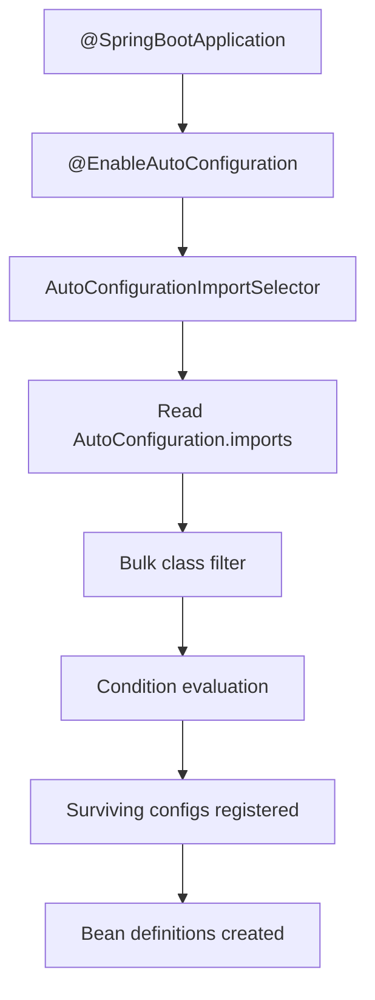
```mermaid
flowchart TD
    A["@SpringBootApplication"] --> B["@EnableAutoConfiguration"]
    B --> C["AutoConfigurationImportSelector"]
    C --> D["Read AutoConfiguration.imports"]
    D --> E["Bulk class filter"]
    E --> F["Condition evaluation"]
    F --> G["Surviving configs registered"]
    G --> H["Bean definitions created"]
```

**AutoConfigurationImportSelector** is the engine. Triggered by `@EnableAutoConfiguration` (composed into `@SpringBootApplication`), it reads the `.imports` file from every jar on the classpath, collects candidate class names, applies exclusions, runs bulk class-presence filters (fast path), then lets the remaining candidates go through full condition evaluation during `ConfigurationClassParser` processing.

### 📶 Gradual Depth

**Surface:** `@SpringBootApplication` triggers auto-configuration. Add a dependency, get beans configured automatically.

**One level down:** `AutoConfigurationImportSelector` implements `DeferredImportSelector`, meaning it runs after all user `@Configuration` classes are processed. This is how user beans get priority - they are already registered when `@ConditionalOnMissingBean` evaluates.

**Deeper:** Condition evaluation happens in two phases. First, `AutoConfigurationImportFilter` implementations (like `OnBeanCondition`, `OnClassCondition`, `OnWebApplicationCondition`) run as bulk filters on class metadata without loading the classes. This is a performance optimization - filtering 150+ candidates by checking `ClassLoader.getResource()` is far cheaper than loading and parsing each class. Second, the surviving candidates are processed as `@Configuration` classes where `@Conditional` annotations on individual `@Bean` methods are evaluated by the `ConditionEvaluator`.

**Internal detail:** The ordering engine resolves `@AutoConfiguration(before=..., after=...)` into a topological sort. Cycles are detected and reported at startup. The `AutoConfigurationSorter` reads `@AutoConfigureOrder` values and dependency declarations to produce a deterministic processing sequence.

### ⚙️ How It Works

```text
SpringApplication.run()
  |
  refreshContext()
    |
    ConfigurationClassPostProcessor
      |
      parse user @Configuration classes FIRST
      |
      process DeferredImportSelectors
        |
        AutoConfigurationImportSelector
          |
          1. read META-INF/spring/...imports
          2. remove exclusions
          3. bulk filter (class presence)
          4. sort (topological order)
          5. return candidates
        |
      parse each candidate as @Configuration
        |
        evaluate @Conditional per class
        evaluate @Conditional per @Bean
          |
        register surviving bean definitions
```

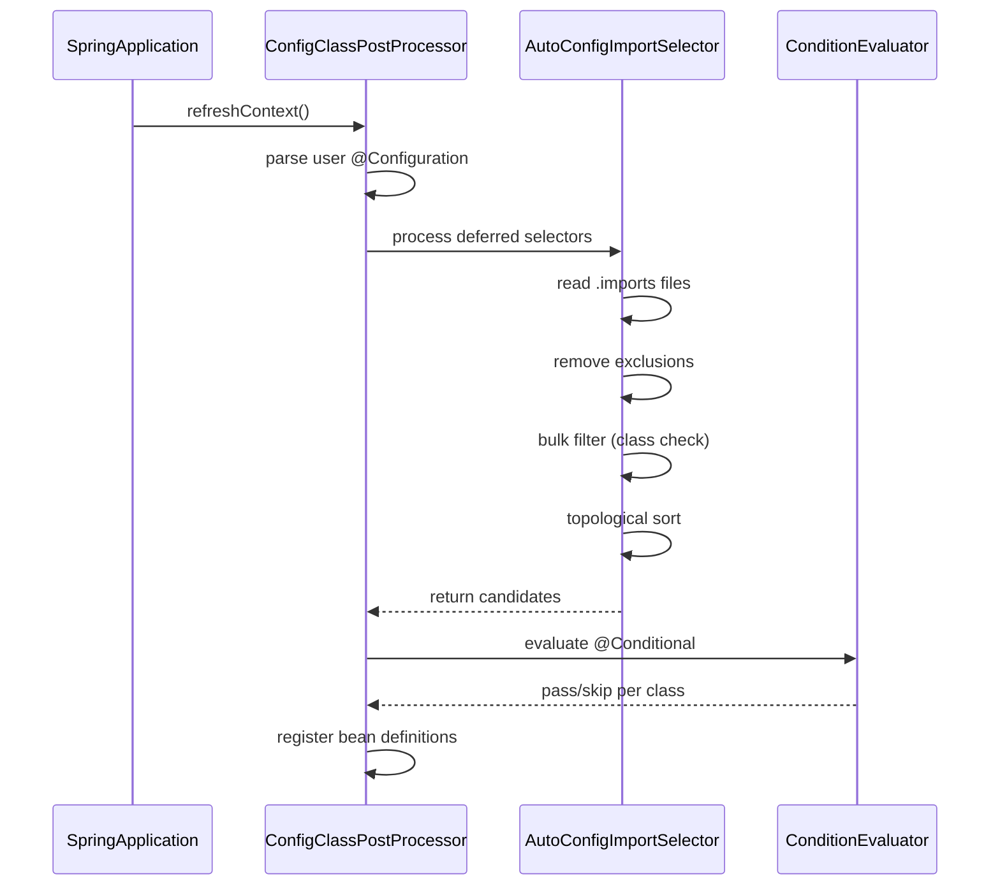
```mermaid
sequenceDiagram
    participant App as SpringApplication
    participant CPP as ConfigClassPostProcessor
    participant Sel as AutoConfigImportSelector
    participant Cond as ConditionEvaluator

    App->>CPP: refreshContext()
    CPP->>CPP: parse user @Configuration
    CPP->>Sel: process deferred selectors
    Sel->>Sel: read .imports files
    Sel->>Sel: remove exclusions
    Sel->>Sel: bulk filter (class check)
    Sel->>Sel: topological sort
    Sel-->>CPP: return candidates
    CPP->>Cond: evaluate @Conditional
    Cond-->>CPP: pass/skip per class
    CPP->>CPP: register bean definitions
```

**Step 1 - Discovery:** `AutoConfigurationImportSelector.getCandidateConfigurations()` calls `ImportCandidates.load()` which reads every `META-INF/spring/org.springframework.boot.autoconfigure.AutoConfiguration.imports` file from the classpath. A typical Spring Boot web app has 140-160 candidates.

**Step 2 - Exclusion:** Explicit exclusions via `@SpringBootApplication(exclude=...)` or `spring.autoconfigure.exclude` property remove candidates before any condition runs.

**Step 3 - Bulk filtering:** `AutoConfigurationImportFilter` beans (registered in `spring.factories` as filters) pre-screen candidates. `OnClassCondition` checks if required classes exist using ASM metadata - no class loading. This eliminates 60-70% of candidates cheaply.

**Step 4 - Sorting:** Remaining candidates are ordered via `@AutoConfiguration(after=..., before=...)` and `@AutoConfigureOrder`. This ensures `DataSourceAutoConfiguration` runs before `HibernateJpaAutoConfiguration`.

**Step 5 - Full evaluation:** Each surviving candidate is parsed as a `@Configuration` class. Class-level `@Conditional` annotations are checked first (fail-fast). Then each `@Bean` method's conditions are evaluated individually. A class may partially activate - some beans created, others skipped.

### 🚨 Failure Modes

**Failure 1 - Bean not created despite dependency on classpath:**
The auto-configuration class condition passed, but the specific `@Bean` method has `@ConditionalOnMissingBean` and a user-defined bean of that type already exists, or a `@ConditionalOnProperty` check fails silently.
**Diagnostic:** Run with `--debug` or set `debug=true` to get the auto-configuration report. Look for the bean's configuration class under "Negative matches" and read the condition that failed.
**Fix:** Check `CONDITIONS EVALUATION REPORT` output. Either add the missing property, remove the conflicting user bean, or explicitly define the bean yourself.

**Failure 2 - Ordering conflict causing initialization errors:**
`JpaAutoConfiguration` runs before `DataSourceAutoConfiguration` because a custom auto-configuration disrupted topological sort, causing "No qualifying bean of type DataSource."
**Diagnostic:** Check `@AutoConfiguration(after=...)` declarations. Run with `--debug` and look at the ordering in the report. Check for circular `before`/`after` references.
**Fix:** Add explicit `@AutoConfiguration(after = DataSourceAutoConfiguration.class)` to your custom auto-configuration. Never use `@Order` for auto-configuration sequencing - it does not affect `ConfigurationClassPostProcessor` ordering.

### 🔬 Production Reality

The auto-configuration report (`--debug`) is your most valuable diagnostic tool. In production, set `logging.level.org.springframework.boot.autoconfigure=DEBUG` selectively - not globally. The `ConditionEvaluationReportLogger` writes the full positive/negative match report at DEBUG level.

Startup cost is measurable: bulk filtering is sub-millisecond, but full condition evaluation of 50-60 surviving candidates touches the `BeanFactory`, reads properties, and resolves types. In large apps (300+ beans), auto-configuration adds 200-800ms to startup. For serverless/GraalVM native images, Spring AOT pre-computes condition evaluation at build time, collapsing runtime cost to near-zero.

Custom auto-configurations in shared libraries should always ship with an `.imports` file and thorough `@Conditional` guards. A missing condition means your configuration activates in every consumer, including test contexts where it breaks isolation.

### ⚖️ Trade-offs & Alternatives

**BAD:**

```java
@Configuration
public class MyAutoConfig {
    @Bean
    public MyService myService() {
        // No conditions - activates everywhere
        // Breaks apps that define their own MyService
        return new MyService();
    }
}
```

Why it's wrong: No `@Conditional` guard means this bean always registers, colliding with user-defined beans and activating in test contexts.

**GOOD:**

```java
@AutoConfiguration(
    after = DataSourceAutoConfiguration.class
)
@ConditionalOnClass(MyService.class)
@ConditionalOnProperty(
    prefix = "my.service",
    name = "enabled",
    havingValue = "true",
    matchIfMissing = true
)
public class MyAutoConfig {
    @Bean
    @ConditionalOnMissingBean
    public MyService myService() {
        return new MyService();
    }
}
```

| Aspect      | Auto-Configuration       | Explicit @Configuration |
| ----------- | ------------------------ | ----------------------- |
| Effort      | Zero for defaults        | Manual wiring per app   |
| Control     | Override via beans/props | Full, direct control    |
| Debugging   | Condition report         | Straightforward         |
| Startup     | Condition eval cost      | No filtering overhead   |
| Reusability | High (shared libs)       | Copy-paste per project  |

### ⚡ Decision Snap

**USE WHEN:** building shared starters/libraries consumed by multiple apps - auto-configuration is the distribution mechanism.

**AVOID WHEN:** your app has one deployment target with fixed infrastructure - explicit `@Configuration` is simpler and more transparent.

**PREFER explicit @Bean WHEN:** you need fine-grained control over initialization order within a single application, or the conditional logic would be more complex than just writing the bean definition.

### ⚠️ Top Traps

| #   | Misconception                                              | Reality                                                                                                                                                        |
| --- | ---------------------------------------------------------- | -------------------------------------------------------------------------------------------------------------------------------------------------------------- |
| 1   | Auto-configuration is magic annotation processing          | It is plain `@Configuration` + `DeferredImportSelector` + metadata file discovery - no bytecode generation or annotation processing involved                   |
| 2   | `@Order` controls auto-configuration sequencing            | `@Order` affects bean injection ranking, not configuration class processing order - use `@AutoConfiguration(before/after)`                                     |
| 3   | Auto-configured beans cannot be overridden                 | `@ConditionalOnMissingBean` means any user-defined bean of the same type silently wins                                                                         |
| 4   | `spring.factories` still works for auto-config in Boot 3.x | Boot 3.0 removed `spring.factories` support for auto-configuration - only `.imports` file works                                                                |
| 5   | Conditions are evaluated once at startup and cached        | Class-level conditions run during config parsing, but `@Bean`-level conditions run when the bean definition is processed - different phases, different context |

### 🪜 Learning Ladder

**Prerequisites:**

- SPR-015 Spring Boot Auto-Configuration Basics - what auto-configuration does from a user perspective
- SPR-044 Spring IoC Container Internals - how the container processes `@Configuration` classes and bean definitions

**THIS:** SPR-070 Spring Boot Auto-Configuration Internals - the discovery, filtering, ordering, and condition evaluation engine

**Next steps:**

- SPR-071 BeanPostProcessor and BeanFactoryPostProcessor - the extension points auto-configuration classes use to customize bean creation
- SPR-083 Custom Spring Boot Starter - applying auto-configuration knowledge to build reusable starters

**The Surprising Truth:** Auto-configuration's biggest performance trick is not evaluating conditions cleverly - it is avoiding class loading entirely. The bulk `OnClassCondition` filter uses ASM to read class metadata from jar files without triggering `ClassLoader.loadClass()`, eliminating 60-70% of candidates before the JVM loads a single auto-configuration class.

**Further Reading:**

- [Spring Boot Reference - Auto-configuration](https://docs.spring.io/spring-boot/reference/using/auto-configuration.html) - official docs
- [Spring Boot Reference - Creating Your Own Auto-configuration](https://docs.spring.io/spring-boot/reference/features/developing-auto-configuration.html) - starter authoring guide
- `AutoConfigurationImportSelector` source in `spring-boot-autoconfigure` - the actual engine

**Revision Card:**

1. Auto-configuration uses `DeferredImportSelector` to run after user configs, ensuring user beans win via `@ConditionalOnMissingBean`
2. Discovery reads `.imports` files (Boot 3.x), bulk filters by class presence using ASM (no class loading), then evaluates full conditions on survivors
3. The `--debug` flag prints the conditions evaluation report - the single most useful diagnostic for "why did/didn't this bean get created"

---

---

# SPR-071 BeanPostProcessor and BeanFactoryPostProcessor

**TL;DR** - BeanFactoryPostProcessor rewrites bean definitions before instantiation; BeanPostProcessor transforms bean instances after creation.

### 🔥 Problem Statement

Spring's IoC container creates beans from definitions and wires them together. But what if you need to modify those definitions before any bean exists - replacing `${placeholder}` tokens in property values, changing scope, or altering class names? And what if you need to modify every bean instance after creation - injecting `@Autowired` fields, wrapping beans in proxies for `@Transactional`, or registering MBeans? Without dedicated extension hooks at both levels (definition-time and instance-time), customization requires forking framework code or brittle subclassing.

### 📜 Historical Context

Spring 1.0 (2004) shipped `BeanFactoryPostProcessor` and `BeanPostProcessor` as the two foundational container extension points. `PropertyPlaceholderConfigurer` was the original `BeanFactoryPostProcessor` - resolving `${...}` tokens in XML bean definitions before instantiation. Spring 2.0 added annotation-driven injection via `AutowiredAnnotationBeanPostProcessor`, making `BeanPostProcessor` the engine behind `@Autowired`. Spring 3.1 introduced `PropertySourcesPlaceholderConfigurer` to replace the legacy version, integrating with the `Environment` abstraction. Spring AOP's proxy creation has always been a `BeanPostProcessor` (`AbstractAutoProxyCreator`), making these two interfaces the backbone of virtually every framework feature that modifies beans transparently.

### 🔩 First Principles

**CORE INVARIANTS:**

1. `BeanFactoryPostProcessor` operates on `BeanDefinition` metadata before any singleton bean is instantiated - it changes the blueprint, not the building
2. `BeanPostProcessor` intercepts every bean instance at two lifecycle points: after population (before init) and after initialization (after init)
3. The container detects both processor types through bean definitions and instantiates them before all other beans - processors must exist before their targets
4. `BeanPostProcessor` methods receive the raw bean and can return a different object entirely - this is how AOP proxies replace originals transparently

**DERIVED DESIGN:**
Because definition-level processing runs first and instance-level processing runs second, the two interfaces form a pipeline: `BeanFactoryPostProcessor` shapes what will be created, `BeanPostProcessor` shapes what was created. Ordering via `Ordered`/`PriorityOrdered` within each phase ensures predictable composition. The return-value contract in `BeanPostProcessor` enables transparent wrapping (proxies, decorators) without callers knowing the original was replaced.

### 🧠 Mental Model

> Think of building a house. `BeanFactoryPostProcessor` is the architect who revises blueprints before construction starts - changing room dimensions, swapping materials, updating addresses. `BeanPostProcessor` is the interior designer who enters each room after framing and installs fixtures, paints walls, and adds security cameras (proxies) before handing keys to the owner.

- "revise blueprints" -> modify `BeanDefinition` properties
- "installs fixtures" -> `@Autowired` field injection
- "adds security cameras" -> AOP proxy wrapping
- "before construction starts" -> before `getBean()` instantiation

**Where this analogy breaks down:** Unlike a house built once, `BeanPostProcessor` runs on every bean the container creates, including other post-processors. A processor that depends on an autowired bean may miss processing that bean's creation, creating ordering subtleties the house analogy hides.

### 🧩 Components

```text
+---------------------------------------------------------+
| BeanFactoryPostProcessor                                |
|   INPUT:  ConfigurableListableBeanFactory               |
|   ACCESS: all BeanDefinition objects                    |
|   TIMING: before any bean instantiation                 |
|   KEY IMPL: PropertySourcesPlaceholderConfigurer        |
+---------------------------------------------------------+
| BeanPostProcessor                                       |
|   INPUT:  Object bean + String beanName                 |
|   METHODS: postProcessBefore/AfterInitialization        |
|   TIMING: around each bean's init lifecycle             |
|   KEY IMPL: AutowiredAnnotationBeanPostProcessor        |
+---------------------------------------------------------+
```

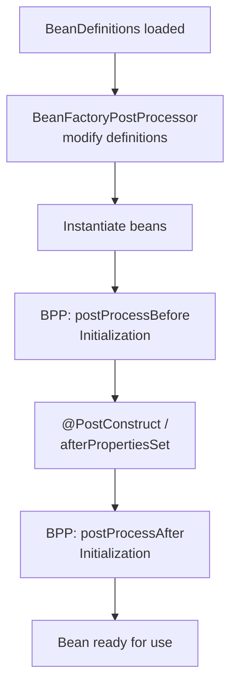
```mermaid
flowchart TD
    BD["BeanDefinitions loaded"] --> BFPP
    BFPP["BeanFactoryPostProcessor\nmodify definitions"]
    BFPP --> INST["Instantiate beans"]
    INST --> BPP1["BPP: postProcessBefore\nInitialization"]
    BPP1 --> INIT["@PostConstruct /\nafterPropertiesSet"]
    INIT --> BPP2["BPP: postProcessAfter\nInitialization"]
    BPP2 --> READY["Bean ready for use"]
```

**BeanFactoryPostProcessor** receives the entire `ConfigurableListableBeanFactory`, giving read-write access to every `BeanDefinition` registered so far. It can add, modify, or remove definitions. The container calls `postProcessBeanFactory()` exactly once per processor.

**BeanPostProcessor** is called per bean instance. `postProcessBeforeInitialization()` runs after dependency injection but before `@PostConstruct`/`InitializingBean`. `postProcessAfterInitialization()` runs after init callbacks - this is where AOP creates proxies.

### 📶 Gradual Depth

**Surface:** `BeanFactoryPostProcessor` modifies bean configuration metadata. `BeanPostProcessor` modifies bean instances. Both run automatically when registered as beans.

**One level down:** `BeanFactoryPostProcessor` can rewrite property values in definitions (placeholder resolution), change bean class names, alter scope, or register entirely new definitions. `BeanPostProcessor` powers `@Autowired` injection (`AutowiredAnnotationBeanPostProcessor`), `@Scheduled` registration (`ScheduledAnnotationBeanPostProcessor`), and AOP proxying (`AbstractAutoProxyCreator`). The `postProcessAfterInitialization` return value is the actual object stored in the container - returning a proxy replaces the original.

**Deeper:** Processors implementing `PriorityOrdered` run before `Ordered`, which run before unordered processors. `AutowiredAnnotationBeanPostProcessor` implements `PriorityOrdered` because injection must happen before most other processing. This ordering is critical: if an AOP processor runs before the autowiring processor, it wraps a bean with null fields.

**Internal detail:** The container uses `getBeanNamesForType(BeanFactoryPostProcessor.class)` to discover processors, then instantiates them eagerly via `getBean()`. This means BFPP beans and their dependencies are created before all other beans and are not eligible for processing by `BeanPostProcessor`. If your BFPP depends on a bean that needs `@Autowired`, that injection silently fails - the `AutowiredAnnotationBeanPostProcessor` has not run yet.

### ⚙️ How It Works

```text
AbstractApplicationContext.refresh()
  |
  invokeBeanFactoryPostProcessors()
    |
    1. PriorityOrdered BFPPs (sorted, invoked)
    2. Ordered BFPPs (sorted, invoked)
    3. Remaining BFPPs (invoked)
    |
  registerBeanPostProcessors()
    |
    1. PriorityOrdered BPPs instantiated+sorted
    2. Ordered BPPs instantiated+sorted
    3. Remaining BPPs instantiated
    4. All registered in BeanFactory
    |
  finishBeanFactoryInitialization()
    |
    for each singleton bean:
      createBean()
        instantiate -> populate (DI)
        -> BPP.postProcessBeforeInit
        -> invokeInitMethods (@PostConstruct)
        -> BPP.postProcessAfterInit
        -> bean stored in singletonObjects
```

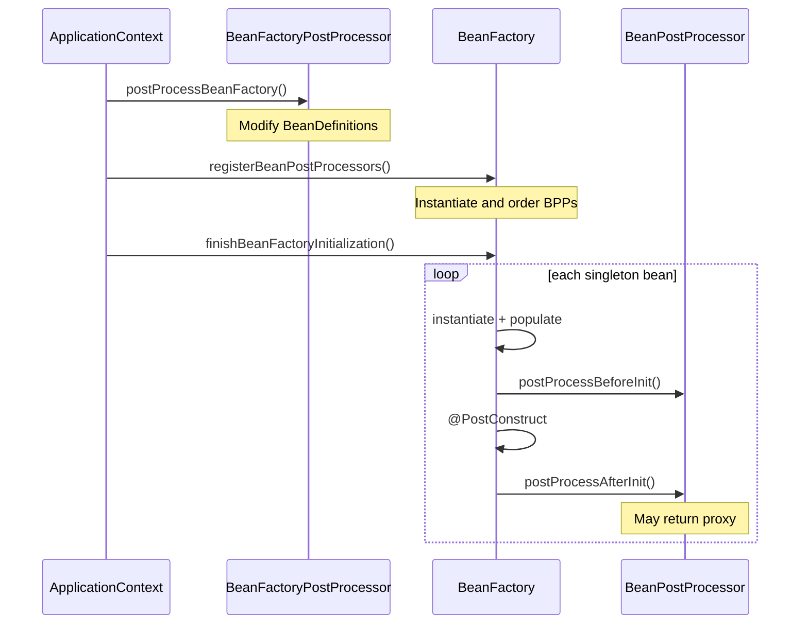
```mermaid
sequenceDiagram
    participant Ctx as ApplicationContext
    participant BFPP as BeanFactoryPostProcessor
    participant BF as BeanFactory
    participant BPP as BeanPostProcessor

    Ctx->>BFPP: postProcessBeanFactory()
    Note over BFPP: Modify BeanDefinitions
    Ctx->>BF: registerBeanPostProcessors()
    Note over BF: Instantiate and order BPPs
    Ctx->>BF: finishBeanFactoryInitialization()
    loop each singleton bean
        BF->>BF: instantiate + populate
        BF->>BPP: postProcessBeforeInit()
        BF->>BF: @PostConstruct
        BF->>BPP: postProcessAfterInit()
        Note over BPP: May return proxy
    end
```

**Phase 1 - Definition processing:** `PostProcessorRegistrationDelegate.invokeBeanFactoryPostProcessors()` sorts discovered BFPPs by `PriorityOrdered`, `Ordered`, then unordered. Each receives the `BeanFactory` and can mutate any `BeanDefinition`. `ConfigurationClassPostProcessor` (a `BeanDefinitionRegistryPostProcessor` subtype) runs here to process `@Configuration` classes, `@ComponentScan`, and `@Import`.

**Phase 2 - Processor registration:** `registerBeanPostProcessors()` instantiates all `BeanPostProcessor` beans and registers them with the `BeanFactory` in priority order. They do not process each other during this phase - they are simply instantiated and stored in an ordered list.

**Phase 3 - Bean creation:** For every subsequent singleton, the `BeanFactory` runs the full BPP chain. `postProcessBeforeInitialization` fires after field injection but before init methods. `postProcessAfterInitialization` fires after init methods. If a BPP returns `null`, the original bean is used. If it returns a different object, that object replaces the original in the container.

### 🚨 Failure Modes

**Failure 1 - BFPP with @Autowired dependencies:**
A `BeanFactoryPostProcessor` bean declares `@Autowired` fields. Those dependencies are instantiated eagerly to satisfy the BFPP, bypassing all `BeanPostProcessor` processing including `@Autowired` resolution on the dependency itself.
**Diagnostic:** Spring logs a warning: "Bean 'X' of type [BFPP] is not eligible for getting processed by all BeanPostProcessors." Check startup logs for this message.
**Fix:** Keep BFPP beans self-contained. Use `@Bean static` methods in `@Configuration` classes to avoid eager initialization of the enclosing configuration. Inject via constructor parameters resolved directly from the `BeanFactory`.

**Failure 2 - BPP ordering causes null fields:**
A custom `BeanPostProcessor` wraps beans in a decorator but runs before `AutowiredAnnotationBeanPostProcessor`. The decorator copies the original bean, but the original has null `@Autowired` fields because injection has not happened yet.
**Diagnostic:** Inspect processor ordering. Check if your BPP implements `PriorityOrdered` (it probably should not). Enable DEBUG logging for `PostProcessorRegistrationDelegate` to see the BPP registration order.
**Fix:** Implement `Ordered` (not `PriorityOrdered`) with a high order value (e.g., `Ordered.LOWEST_PRECEDENCE`). Move wrapping logic to `postProcessAfterInitialization` where injection is guaranteed complete.

**Failure 3 - Proxy replaces original, breaks identity:**
`AbstractAutoProxyCreator` returns a CGLIB proxy from `postProcessAfterInitialization`. Code that cached the raw bean reference during `postProcessBeforeInitialization` now holds a stale reference. Equality checks fail.
**Diagnostic:** Compare `System.identityHashCode()` of the bean in before-init vs after-init. If they differ, a proxy replacement occurred.
**Fix:** Never cache bean references in `postProcessBeforeInitialization`. Perform all reference-sensitive work in `postProcessAfterInitialization` after proxy creation is complete.

### 🔬 Production Reality

In a typical Spring Boot application, 15-25 `BeanPostProcessor` instances are active. `AutowiredAnnotationBeanPostProcessor` handles `@Autowired`/`@Value`. `CommonAnnotationBeanPostProcessor` handles `@PostConstruct`, `@PreDestroy`, and `@Resource`. `AbstractAutoProxyCreator` subclasses handle `@Transactional`, `@Async`, `@Cacheable` proxying. `ScheduledAnnotationBeanPostProcessor` registers `@Scheduled` methods with the `TaskScheduler`.

For `BeanFactoryPostProcessor`, the dominant implementations are `ConfigurationClassPostProcessor` (processes `@Configuration`, `@Bean`, `@ComponentScan`) and `PropertySourcesPlaceholderConfigurer` (resolves `${...}` in bean definitions). In Spring Boot, `EventListenerMethodProcessor` discovers `@EventListener` annotations.

Performance impact scales with bean count times processor count. An app with 500 beans and 20 BPPs executes 10,000 processor invocations during startup. Each call is typically sub-microsecond for processors that skip non-matching beans, but `AutowiredAnnotationBeanPostProcessor` performs reflection-heavy injection and is typically the largest single contributor to bean creation time in profiling.

### ⚖️ Trade-offs & Alternatives

**BAD:**

```java
@Component
public class AuditProcessor
    implements BeanFactoryPostProcessor {

    @Autowired  // DANGEROUS in BFPP
    private AuditService auditService;

    @Override
    public void postProcessBeanFactory(
        ConfigurableListableBeanFactory bf) {
        // auditService may be null or
        // unprocessed by other BPPs
        auditService.log("processing");
    }
}
```

Why it is wrong: `@Autowired` on a BFPP causes early bean instantiation that bypasses other post-processors. The dependency may be incompletely initialized.

**GOOD:**

```java
@Configuration
public class AuditConfig {

    @Bean
    static BeanFactoryPostProcessor auditBfpp() {
        // static: avoids eager init of
        // enclosing @Configuration class
        return factory -> {
            String[] names =
                factory.getBeanDefinitionNames();
            for (String name : names) {
                BeanDefinition bd =
                    factory.getBeanDefinition(name);
                // operate on definitions only
                bd.setAttribute("audited", "true");
            }
        };
    }
}
```

| Aspect      | BeanFactoryPostProcessor | BeanPostProcessor   |
| ----------- | ------------------------ | ------------------- |
| Operates on | BeanDefinition metadata  | Bean instances      |
| Timing      | Before instantiation     | After instantiation |
| Scope       | Entire BeanFactory, once | Per bean, twice     |
| Can replace | Definition properties    | Entire bean object  |
| Key use     | Placeholder resolution   | Proxy, injection    |
| Risk        | Eager bean instantiation | Ordering bugs       |

### ⚡ Decision Snap

**USE BeanFactoryPostProcessor WHEN:** you need to modify, add, or remove bean definitions before any bean is created - property resolution, conditional definition removal, scope changes.

**USE BeanPostProcessor WHEN:** you need to inspect or modify bean instances after creation - custom annotation processing, wrapping, registration with external systems.

**AVOID custom processors WHEN:** existing framework processors already handle your use case. Before writing a BPP, check if `@Autowired`, `@PostConstruct`, `@EventListener`, `@Scheduled`, or AOP annotations already solve the problem.

### ⚠️ Top Traps

| #   | Misconception                                               | Reality                                                                                                                              |
| --- | ----------------------------------------------------------- | ------------------------------------------------------------------------------------------------------------------------------------ |
| 1   | BFPP can safely use `@Autowired`                            | BFPP beans are created before BPPs run - `@Autowired` dependencies bypass processing and may be incomplete                           |
| 2   | `BeanPostProcessor` only runs on user beans                 | It runs on every bean including other BPPs (except those registered before it) and infrastructure beans                              |
| 3   | Returning `null` from BPP replaces the bean with null       | Returning `null` is treated as "keep original" by `AbstractAutowireCapableBeanFactory` - the bean is not nullified                   |
| 4   | BPP ordering does not matter                                | Ordering is critical - autowiring must complete before proxy creation, or proxies wrap beans with null fields                        |
| 5   | `BeanFactoryPostProcessor` can safely create bean instances | It can call `getBean()`, but this forces premature instantiation bypassing other BFPPs and all BPPs - a common source of subtle bugs |

### 🪜 Learning Ladder

**Prerequisites:**

- SPR-044 Spring IoC Container Internals - how the container manages bean definitions and lifecycle
- SPR-070 Spring Boot Auto-Configuration Internals - how auto-configuration discovers and registers bean definitions that processors then modify

**THIS:** SPR-071 BeanPostProcessor and BeanFactoryPostProcessor - the two extension hooks for modifying bean definitions and bean instances

**Next steps:**

- SPR-072 Spring Context Startup Optimization - reducing the cost of processing hundreds of beans through these extension points

**The Surprising Truth:** Almost every "magical" Spring behavior - `@Autowired` injection, `@Transactional` proxying, `@Scheduled` registration, `@Value` resolution - is implemented through `BeanPostProcessor`. The container itself is intentionally simple; the rich behavior you associate with Spring is layered on through these processor interfaces, making the framework composable rather than monolithic.

**Further Reading:**

- [Spring Framework Reference - Container Extension Points](https://docs.spring.io/spring-framework/reference/core/beans/factory-extension.html) - official docs on both interfaces
- [Spring Framework Reference - BeanPostProcessor](https://docs.spring.io/spring-framework/reference/core/beans/factory-extension.html#beans-factory-extension-bpp) - lifecycle callbacks and ordering
- `AbstractAutowireCapableBeanFactory.initializeBean()` source - where BPP methods are invoked during bean creation

**Revision Card:**

1. `BeanFactoryPostProcessor` modifies `BeanDefinition` metadata before any bean is created; `BeanPostProcessor` modifies bean instances after creation at two lifecycle hooks (before-init and after-init)
2. BFPP beans must avoid `@Autowired` dependencies because they are instantiated before any BPP runs - use static `@Bean` methods and operate only on definitions
3. `postProcessAfterInitialization` is where AOP proxies replace original beans - the returned object becomes the container's reference, which is why `@Transactional` works transparently

---

---

# SPR-072 Spring Context Startup Optimization

**TL;DR** - Reduce Spring startup time through lazy init, classpath indexing, AOT processing, and conditional bean exclusion.

### 🔥 Problem Statement

Spring Boot applications scan hundreds of classes, evaluate conditions on 150+ auto-configurations, and instantiate 300-500 beans at startup. For monolithic deployments, 5-15 second startup is tolerable. For serverless (AWS Lambda, Azure Functions), Kubernetes scale-to-zero, or integration test suites running thousands of context loads, every second compounds into minutes of wasted compute. The container does three expensive things at startup: classpath scanning (reflection + jar traversal), condition evaluation (class checks + property resolution), and eager singleton instantiation. Each is attackable independently. Without deliberate optimization, startup time grows linearly with dependency count and bean count.

### 📜 Historical Context

Spring Framework has always eagerly instantiated singletons - by design, to fail fast on wiring errors. Spring 4.0 introduced `@Conditional` (2013), adding evaluation cost per bean. Spring 5.0 added the `spring-context-indexer` annotation processor (2017) to eliminate runtime classpath scanning by pre-computing candidate component indices at compile time. Spring Boot 2.2 (2019) introduced `spring.main.lazy-initialization=true` as a global lazy init toggle. Spring Framework 6.0 / Spring Boot 3.0 (2022) introduced Spring AOT (Ahead-of-Time) processing - generating optimized bean definitions, condition evaluations, and reflection hints at build time for GraalVM native images and faster JVM startup. Spring Boot 3.2 added virtual thread support, but startup remains single-threaded for context refresh.

### 🔩 First Principles

**CORE INVARIANTS:**

1. Startup cost = classpath scanning + condition evaluation + bean instantiation - these three phases are independently optimizable
2. Any optimization that defers work to runtime request time trades startup latency for first-request latency - lazy init is not free
3. AOT processing shifts computation from runtime to build time - the total work is identical, only when it executes changes

**DERIVED DESIGN:**
Each optimization targets a different phase. The context indexer eliminates scanning. `@Profile` and `@ConditionalOnProperty` reduce the number of candidates entering condition evaluation. Lazy initialization defers bean creation to first access. AOT pre-computes the entire wiring plan at build time. Combining them is additive - they operate on different pipeline stages.

### 🧠 Mental Model

> Think of startup as a restaurant opening for the day. Classpath scanning is reading every recipe book in the library to find today's menu. Condition evaluation is checking which ingredients are actually in the pantry. Bean instantiation is pre-cooking every dish before the first customer arrives. Optimization means: pre-printing the menu (indexer), removing recipe books for cuisines you never serve (@Profile), and cooking dishes only when ordered (lazy init).

- "pre-printed menu" -> compile-time component index
- "removing recipe books" -> @Profile exclusion of irrelevant configs
- "cooking when ordered" -> lazy initialization
- "pre-cooked frozen meals" -> AOT-generated bean definitions

**Where this analogy breaks down:** AOT does not just pre-cook - it rewrites the recipes into simpler instructions that skip decision points entirely. The runtime does not evaluate conditions; it executes a pre-computed plan. This is closer to a vending machine than a kitchen.

### 🧩 Components

```text
+-----------------------------------------------+
| STARTUP PIPELINE                              |
|                                               |
| 1. Classpath Scan                             |
|    OPT: spring-context-indexer (build-time)   |
|                                               |
| 2. Configuration Class Parsing                |
|    OPT: @Profile exclusion, fewer @Imports    |
|                                               |
| 3. Auto-Config Condition Evaluation           |
|    OPT: exclude unused starters               |
|                                               |
| 4. Bean Instantiation                         |
|    OPT: lazy-init, AOT pre-computation        |
|                                               |
| 5. Post-Processing (BPP chain)               |
|    OPT: reduce processor count                |
+-----------------------------------------------+
```

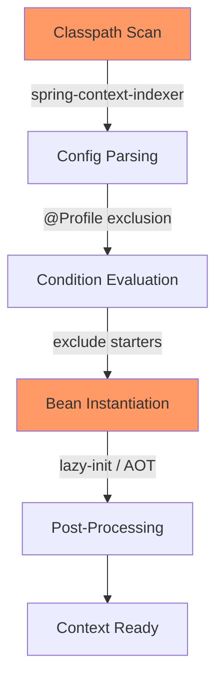
```mermaid
flowchart TD
    A["Classpath Scan"] -->|"spring-context-indexer"| B["Config Parsing"]
    B -->|"@Profile exclusion"| C["Condition Evaluation"]
    C -->|"exclude starters"| D["Bean Instantiation"]
    D -->|"lazy-init / AOT"| E["Post-Processing"]
    E --> F["Context Ready"]
    style A fill:#f96
    style D fill:#f96
```

**spring-context-indexer:** An annotation processor that generates `META-INF/spring.components` at compile time. Lists every `@Component`, `@Entity`, and `@ManagedBean` with its stereotype. At runtime, `CandidateComponentsIndex` reads this file instead of scanning jars with ASM. Saves 100-500ms on classpath-heavy applications.

**Lazy initialization:** When enabled globally (`spring.main.lazy-initialization=true`) or per-bean (`@Lazy`), the container registers bean definitions but defers `getBean()` until first dependency injection or explicit lookup. Cuts startup time proportional to the number of beans, but shifts instantiation errors to runtime.

**Spring AOT:** At build time, the AOT engine runs `BeanFactoryInitializationAotProcessor` and `BeanRegistrationAotProcessor` to generate Java source that directly registers beans without reflection, condition evaluation, or classpath scanning. The generated `ApplicationContextInitializer` replaces the entire `refresh()` pipeline with pre-computed wiring.

### 📶 Gradual Depth

**Surface:** Add `spring.main.lazy-initialization=true` to `application.properties`. Startup drops proportionally to bean count because instantiation is deferred.

**One level down:** Combine lazy init with the context indexer. Add `spring-context-indexer` as an annotation processor dependency. At compile time, it writes `META-INF/spring.components` listing all stereotype-annotated classes. At runtime, `ClassPathBeanDefinitionScanner` checks for this file first and skips jar-by-jar ASM scanning if present.

**Deeper:** Use `@Profile` to segregate beans by environment. A `@Profile("cloud")` configuration class and all its beans are completely skipped when the active profile is `local`. This is not just condition-skipping - the `ConfigurationClassParser` never processes the class at all when the profile does not match. For applications with heavy cloud-specific beans (messaging, caching, tracing), profile exclusion can eliminate 20-30% of bean definitions.

**Internal detail:** Spring AOT generates three artifact types at build time: (1) `BeanRegistrationAotContribution` - Java code that calls `registerBean()` directly, (2) reflection hints for GraalVM native-image, (3) proxy class definitions. The generated `__BeanDefinitions` classes replace `ConfigurationClassPostProcessor` entirely. Condition evaluation results are baked into the generated code as `if/else` branches resolved at build time.

### ⚙️ How It Works

```text
Standard JVM Startup:
  ClassPathScan(jars) -----> 200-600ms
  ConfigClassParsing ------> 100-300ms
  ConditionEvaluation -----> 100-400ms
  BeanInstantiation -------> 500-3000ms
  PostProcessing ----------> 100-500ms
  TOTAL: 1-5 seconds

With All Optimizations:
  IndexRead(file) ---------> 5-20ms
  ProfileFilteredParsing --> 50-100ms
  AOT(pre-computed) -------> 10-50ms
  LazyInit(deferred) ------> 50-200ms
  MinimalPostProcessing ---> 50-100ms
  TOTAL: 200-500ms
```

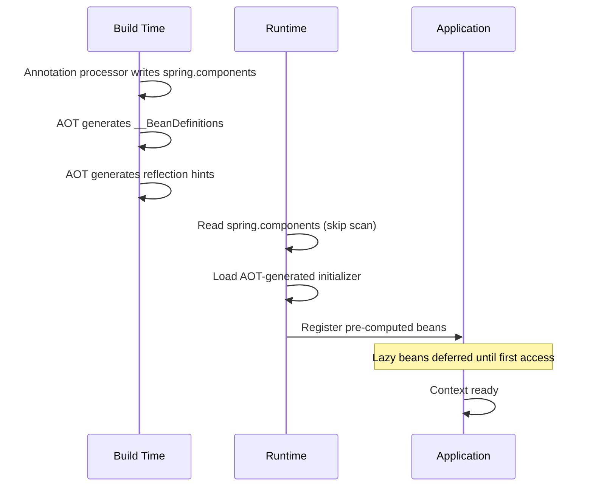
```mermaid
sequenceDiagram
    participant Build as Build Time
    participant RT as Runtime
    participant App as Application

    Build->>Build: Annotation processor writes spring.components
    Build->>Build: AOT generates __BeanDefinitions
    Build->>Build: AOT generates reflection hints
    RT->>RT: Read spring.components (skip scan)
    RT->>RT: Load AOT-generated initializer
    RT->>App: Register pre-computed beans
    Note over App: Lazy beans deferred until first access
    App->>App: Context ready
```

**Measurement:** Spring Boot Actuator's `startup` endpoint (`/actuator/startup`) records `StartupTimeline` events with nanosecond precision. Enable it with `spring.application.admin.enabled=true` and buffer events with `BufferingApplicationStartup`:

```java
SpringApplication app =
    new SpringApplication(MyApp.class);
app.setApplicationStartup(
    new BufferingApplicationStartup(2048)
);
app.run(args);
```

This captures every `ApplicationStartup` step: `spring.beans.instantiate`, `spring.context.config-classes.parse`, `spring.context.beandef-registry.post-process`. Query `/actuator/startup` for a sorted breakdown of where time is spent.

**ApplicationStartup with FlightRecorder:** For deeper profiling, use `FlightRecorderApplicationStartup` which emits JFR events consumable by JDK Mission Control. This integrates startup measurement into your standard JVM profiling workflow without custom code.

### 🚨 Failure Modes

**Failure 1 - Lazy init hides wiring errors:**
With global lazy initialization, a misspelled bean name or missing dependency is not discovered until the bean is first requested - typically on the first HTTP request in production. The app starts successfully but fails at runtime.
**Diagnostic:** Errors appear as `NoSuchBeanDefinitionException` or `UnsatisfiedDependencyException` on first request, not at startup. Check logs for delayed initialization failures.
**Fix:** Never use global lazy init in production without a compensating integration test that forces eager initialization. Run `ApplicationContext.getBeansOfType(Object.class)` in a test to validate all wiring. Use `@Lazy(false)` on critical beans that must fail fast.

**Failure 2 - Context indexer stale after refactoring:**
The `spring.components` file was generated before a class was moved or renamed. The index references a non-existent class, causing `ClassNotFoundException` at startup.
**Diagnostic:** Exception references a class in `META-INF/spring.components` that no longer exists. Check the file contents against current source.
**Fix:** Clean build (`mvn clean compile` or `gradle clean build`). The annotation processor regenerates the index from scratch. In CI, always run clean builds. In IDE incremental builds, verify the annotation processor runs on every compile.

**Failure 3 - AOT-generated code incompatible with runtime conditions:**
AOT bakes condition evaluation results at build time. If a property value differs between build environment and production environment, the wrong beans activate.
**Diagnostic:** Beans expected from `@ConditionalOnProperty` are missing despite the property being set at runtime, because AOT resolved the condition at build time with a different value.
**Fix:** AOT conditions must be resolved using the same property sources as production. Use build profiles that match deployment targets, or mark environment-specific beans with `@ImportRuntimeHints` to indicate they need runtime evaluation.

### 🔬 Production Reality

Startup time measurement should be a CI metric. Add a startup test that asserts maximum acceptable duration:

```java
@SpringBootTest
class StartupTimeTest {
    @Test
    void contextLoadsWithinBudget(
        @Autowired ApplicationContext ctx) {
        // Context loaded - assert timing via
        // BufferingApplicationStartup
        assertNotNull(ctx);
    }
}
```

Real-world optimization results from production applications: a 400-bean Spring Boot web app reduced startup from 4.2s to 1.8s with lazy init alone, to 1.3s with context indexer added, and to 0.4s with AOT on GraalVM native. The largest gains come from deferring bean instantiation (lazy init) and eliminating classpath scanning (indexer) - these two changes alone cover 70-80% of achievable improvement on the JVM.

For Kubernetes readiness probes, remember that lazy init means `readinessProbe` succeeds before all beans are created. The first few requests trigger bean creation storms. Mitigate with a startup probe (`startupProbe`) that allows longer initialization, or use `SmartInitializingSingleton` to force critical path beans to initialize eagerly.

### ⚖️ Trade-offs & Alternatives

**BAD:**

```properties
# application.properties in PRODUCTION
spring.main.lazy-initialization=true
# No compensating test, no startup probe
# First request triggers 200 bean creations
# 10-second response time on first request
```

Why it is wrong: global lazy init without safeguards hides wiring errors and causes first-request latency spikes in production.

**GOOD:**

```properties
# application.properties
spring.main.lazy-initialization=false

# Test profile only
# application-test.properties
spring.main.lazy-initialization=true
```

```java
// Critical beans force eager init
@Component
@Lazy(false)
public class PaymentGateway {
    // Always initialized at startup
    // Wiring errors caught immediately
}
```

| Technique              | Startup Gain | Risk                   | Complexity |
| ---------------------- | ------------ | ---------------------- | ---------- |
| Lazy init (global)     | 30-60%       | Hidden wiring bugs     | Low        |
| Lazy init (selective)  | 10-30%       | Minimal                | Low        |
| Context indexer        | 10-25%       | Stale index            | Low        |
| @Profile exclusion     | 10-30%       | Profile misconfig      | Low        |
| AOT processing         | 50-90%       | Build/runtime mismatch | High       |
| GraalVM native         | 90-99%       | Reflection limits      | High       |
| Remove unused starters | 5-15%        | None                   | Low        |

### ⚡ Decision Snap

**START WITH:** removing unused starters and adding `spring-context-indexer`. Zero risk, immediate gain.

**ADD NEXT:** selective `@Lazy` on heavy beans (connection pools, caches) that are not needed in every request path.

**USE AOT WHEN:** targeting GraalVM native images or serverless with sub-second startup requirements.

**AVOID global lazy init in production WHEN:** you lack comprehensive integration tests and startup probes.

### ⚠️ Top Traps

| #   | Misconception                                            | Reality                                                                                                                                                    |
| --- | -------------------------------------------------------- | ---------------------------------------------------------------------------------------------------------------------------------------------------------- |
| 1   | Lazy init eliminates startup cost                        | It defers cost to first access - total initialization work is unchanged, just redistributed across early requests                                          |
| 2   | Context indexer always helps                             | It only helps when classpath scanning is a bottleneck (many jars) - small apps with few components see negligible gain                                     |
| 3   | AOT works with all Spring features                       | AOT requires closed-world assumptions - runtime bean registration, `@Profile`-switching at deploy time, and reflection-heavy libraries need explicit hints |
| 4   | `spring.main.lazy-initialization` is safe for production | Without integration tests forcing eager init, wiring errors hide until runtime traffic triggers bean creation                                              |
| 5   | Startup time equals time-to-first-request                | With lazy init, context reports "ready" but first request pays deferred initialization - measure end-to-end latency, not just startup log                  |

### 🪜 Learning Ladder

**Prerequisites:**

- SPR-070 Spring Boot Auto-Configuration Internals - understanding condition evaluation cost during startup
- SPR-071 BeanPostProcessor and BeanFactoryPostProcessor - understanding post-processing overhead per bean

**THIS:** SPR-072 Spring Context Startup Optimization - techniques to reduce classpath scanning, condition evaluation, and bean instantiation time

**Next steps:**

- SPR-075 Spring Boot Memory Footprint Analysis - complementary to startup optimization, reducing heap usage for containerized deployments

**The Surprising Truth:** The single largest startup optimization for most Spring Boot applications is not a framework feature at all - it is removing unused starter dependencies. Each starter adds auto-configuration candidates that must be evaluated even if conditions ultimately reject them. Removing `spring-boot-starter-mail` from an app that never sends email saves more time than any amount of lazy initialization tuning.

**Further Reading:**

- [Spring Boot Reference - Lazy Initialization](https://docs.spring.io/spring-boot/reference/features/spring-application.html#features.spring-application.lazy-initialization) - official lazy init docs
- [Spring Framework - Ahead of Time Processing](https://docs.spring.io/spring-framework/reference/core/aot.html) - AOT engine documentation
- [Spring Boot Actuator - Application Startup](https://docs.spring.io/spring-boot/reference/actuator/endpoints.html#actuator.endpoints.startup) - startup timeline endpoint

**Revision Card:**

1. Startup cost decomposes into classpath scanning, condition evaluation, and bean instantiation - each optimizable independently with context indexer, profile exclusion, and lazy init respectively
2. Global lazy initialization trades startup speed for first-request latency and hidden wiring errors - use selectively in production with compensating integration tests
3. Spring AOT shifts the entire wiring computation to build time, generating direct `registerBean()` calls that bypass scanning, parsing, and condition evaluation at runtime

---

---

# SPR-073 Spring4Shell (CVE-2022-22965)

**TL;DR** - A data binding bypass on JDK 9+ let attackers write webshells through Tomcat's ClassLoader, fixed by tightening property access rules.

### 🔥 Problem Statement

Spring MVC's data binding automatically maps HTTP request parameters to Java object properties using nested property paths like `user.address.city`. This convenience becomes dangerous when attackers can traverse into internal JVM objects. On JDK 9+, the Module system added a new path from `Class` to `ClassLoader` via `class.module.classLoader` - bypassing Spring's existing restriction on `class.classLoader` (added after CVE-2010-1622). Combined with Apache Tomcat's `AccessLogValve` being reachable through the ClassLoader's resource chain, an attacker could write arbitrary JSP files to the web root - achieving remote code execution with a single HTTP request.

### 📜 Historical Context

The ancestor vulnerability is CVE-2010-1622 (Spring Framework 2.x). That attack used `class.classLoader` to reach Tomcat internals and plant a webshell. Spring fixed it by adding `class.classLoader` and `class.protectionDomain` to the binding denylist in `CachedIntrospectionResults`. For 12 years, this fix held. JDK 9 (2017) introduced the Module system, adding `Class.getModule()` which returns a `Module` object with `getClassLoader()`. This created a new traversal path: `class.module.classLoader` - which was not on the denylist. The bypass was publicly disclosed on March 29, 2022, and Spring issued CVE-2022-22965 with patches on March 31, 2022 (Spring Framework 5.3.18 and 5.2.20). Spring Boot 2.6.6 and 2.5.12 bundled the fix.

### 🔩 First Principles

**CORE INVARIANTS:**

1. Data binding maps untrusted input to object property paths using JavaBeans introspection - any reachable getter/setter chain is a potential attack surface
2. Denylist-based security is brittle - it must be updated whenever the reachable object graph changes (new JDK APIs, new container APIs)
3. The exploit required a specific deployment topology (WAR on Tomcat + JDK 9+) - not all Spring applications were vulnerable, but those that were faced unauthenticated RCE

**DERIVED DESIGN:**
The fix shifted from denylisting specific paths (`class.classLoader`) to a more comprehensive approach: disallowing binding to any property path that reaches `ClassLoader` through any intermediate object, including the new `Module` chain. The patch in `CachedIntrospectionResults` rejects property descriptors where the declaring class is `Class` and the property type is assignable to `ClassLoader`, `Module`, or `ProtectionDomain`.

### 🧠 Mental Model

> Think of data binding as a GPS navigator that can reach any destination by following roads (property paths). The 2010 fix blocked one specific road (`class.classLoader`) to a dangerous neighborhood (ClassLoader). JDK 9 built a new highway (`class.module.classLoader`) that the road block did not cover. The attacker used the new highway to reach the same dangerous destination and plant a bomb (webshell). The 2022 fix blocked the entire neighborhood regardless of which roads lead there.

- "GPS navigator" -> Spring's `BeanWrapperImpl` property traversal
- "blocked road" -> denylist entry for `class.classLoader`
- "new highway" -> JDK 9 Module API: `class.module.classLoader`
- "blocked neighborhood" -> type-based restriction on ClassLoader access

**Where this analogy breaks down:** The "neighborhood" has legitimate residents - some frameworks need ClassLoader access for valid reasons. The fix specifically targets data binding from untrusted input, not all ClassLoader access within the application.

### 🧩 Components

```text
Attack Chain:
+-----------------------------------------+
| HTTP Request                            |
| class.module.classLoader.resources      |
|   .context.parent.pipeline.first        |
|   .pattern=%{...}                       |
|   .suffix=.jsp                          |
|   .directory=webapps/ROOT               |
|   .prefix=shell                         |
|         |                               |
| BeanWrapperImpl.setPropertyValue()      |
|         |                               |
| Tomcat AccessLogValve reconfigured      |
|         |                               |
| JSP webshell written to disk            |
+-----------------------------------------+
```

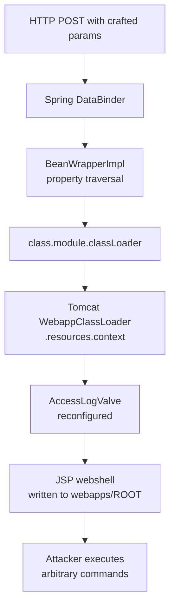
```mermaid
flowchart TD
    A["HTTP POST with crafted params"] --> B["Spring DataBinder"]
    B --> C["BeanWrapperImpl\nproperty traversal"]
    C --> D["class.module.classLoader"]
    D --> E["Tomcat WebappClassLoader\n.resources.context"]
    E --> F["AccessLogValve\nreconfigured"]
    F --> G["JSP webshell\nwritten to webapps/ROOT"]
    G --> H["Attacker executes\narbitrary commands"]
```

**BeanWrapperImpl:** Spring's property accessor that implements `PropertyAccessor`. It resolves nested property paths like `a.b.c` by calling `getA()` on the target, then `getB()` on the result, then `setC()` on that. Each step follows standard JavaBeans introspection. The vulnerability exists because this traversal has no inherent depth or type boundary other than the denylist.

**CachedIntrospectionResults:** Caches `PropertyDescriptor` arrays for Java classes. The denylist filtering happens here - before the 2022 fix, it only checked for `classLoader` and `protectionDomain` as direct property names on `Class`. After the fix, it checks property return types against a broader set of restricted types.

### 📶 Gradual Depth

**Surface:** Attackers sent HTTP parameters that navigated through Java's class hierarchy to reach Tomcat's log configuration and wrote a JSP webshell. Fixed by patching Spring Framework.

**One level down:** The specific property chain was `class.module.classLoader.resources.context.parent.pipeline.first.*`. On JDK 9+, `Object.getClass().getModule().getClassLoader()` returns the `ClassLoader`. On Tomcat, that ClassLoader is a `WebappClassLoaderBase` whose `getResources()` returns a `WebResourceRoot`, which gives access to the `StandardContext`, then up to the `StandardHost` parent, then to its `Pipeline`, then to the `AccessLogValve` (the first valve). The attacker set the valve's `pattern`, `suffix`, `directory`, and `prefix` properties to write a file with JSP content to the web root.

**Deeper:** The webshell payload was embedded in the `pattern` property of `AccessLogValve`. Tomcat's access log writes each request using the configured pattern. The attacker crafted the pattern to contain JSP code that executes runtime commands via `Runtime.getRuntime().exec()`. The parameters were sent as POST form data or GET query parameters - no authentication required.

**Internal detail:** Spring's pre-2022 denylist in `CachedIntrospectionResults` only checked `if (property.getName().equals("classLoader") || property.getName().equals("protectionDomain"))` for properties on `java.lang.Class`. The JDK 9 `module` property returned `java.lang.Module` (not `ClassLoader`), so it passed the denylist. The fix changed the check to examine the property descriptor's return type: if it is assignable to `ClassLoader`, the property is rejected regardless of its name or the intermediate path.

### ⚙️ How It Works

```text
Pre-fix property resolution (vulnerable):

request: class.module.classLoader.resources
  |
Object.getClass()       -> Class
  .getModule()          -> Module     (JDK 9+)
  .getClassLoader()     -> ClassLoader
  .getResources()       -> WebResourceRoot
  ... traversal continues to AccessLogValve

Denylist check (pre-fix):
  "classLoader" on Class?
    -> class.classLoader blocked
  "module" on Class?
    -> NOT blocked (not in list)
  "classLoader" on Module?
    -> NOT checked (only checks Class)

Post-fix property resolution (safe):
  "module" on Class?
    -> return type: Module
    -> Module not in allowed types
    -> BLOCKED
```

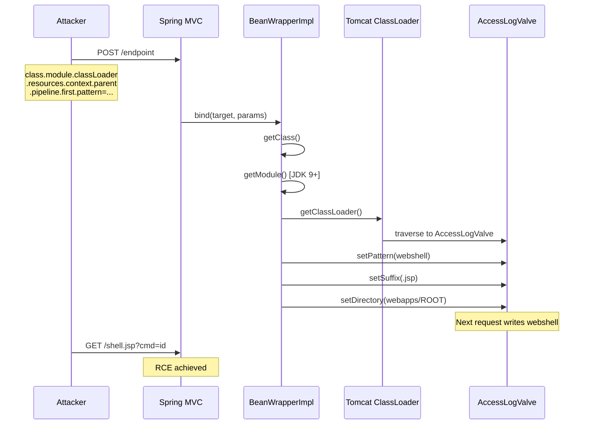
```mermaid
sequenceDiagram
    participant Attacker
    participant Spring as Spring MVC
    participant BW as BeanWrapperImpl
    participant TomcatCL as Tomcat ClassLoader
    participant Valve as AccessLogValve

    Attacker->>Spring: POST /endpoint
    Note over Attacker: class.module.classLoader<br/>.resources.context.parent<br/>.pipeline.first.pattern=...
    Spring->>BW: bind(target, params)
    BW->>BW: getClass()
    BW->>BW: getModule() [JDK 9+]
    BW->>TomcatCL: getClassLoader()
    TomcatCL->>Valve: traverse to AccessLogValve
    BW->>Valve: setPattern(webshell)
    BW->>Valve: setSuffix(.jsp)
    BW->>Valve: setDirectory(webapps/ROOT)
    Note over Valve: Next request writes webshell
    Attacker->>Spring: GET /shell.jsp?cmd=id
    Note over Spring: RCE achieved
```

**Step 1 - Request arrives:** An unauthenticated HTTP request (POST or GET) sends parameters with nested property paths targeting the command/form object.

**Step 2 - Data binding:** `ServletRequestDataBinder` calls `BeanWrapperImpl.setPropertyValue()` for each parameter. The wrapper resolves nested paths by calling getter methods recursively.

**Step 3 - ClassLoader traversal:** `class.module.classLoader` navigates from `Object.getClass()` through `Class.getModule()` (JDK 9+) to `Module.getClassLoader()`. On Tomcat, this returns `WebappClassLoaderBase`.

**Step 4 - Tomcat internal traversal:** From the ClassLoader, the path `.resources.context.parent.pipeline.first` reaches `AccessLogValve` - the first valve in the host pipeline that writes access logs to files.

**Step 5 - Valve reconfiguration:** The attacker sets `pattern` (JSP code), `suffix` (.jsp), `directory` (webapps/ROOT), and `prefix` (filename). On the next logged request, Tomcat writes the webshell file.

**Step 6 - Execution:** The attacker requests the written JSP file. Tomcat compiles and executes it, providing arbitrary command execution.

### 🚨 Failure Modes

**Failure 1 - False sense of security from deployment model:**
Teams running Spring Boot with embedded Tomcat (JAR deployment) assumed they were safe because early advisories emphasized WAR deployment. While the primary documented exploit chain targets WAR-on-Tomcat, the underlying data binding vulnerability exists regardless - other ClassLoader implementations may expose different but equally dangerous property chains.
**Diagnostic:** Check Spring Framework version, not just deployment topology. Any version 5.3.0-5.3.17 or 5.2.0-5.2.19 has the vulnerable data binding code.
**Fix:** Upgrade Spring Framework to 5.3.18+ or 5.2.20+ regardless of deployment model. The fix hardens the data binding denylist universally.

**Failure 2 - WAF bypass through parameter encoding:**
Web Application Firewalls blocking `class.module.classLoader` as a string pattern were bypassed through URL encoding, parameter array syntax (`class[module][classLoader]`), or multipart form data where the WAF did not inspect nested parameter names.
**Diagnostic:** Check WAF logs for encoded variants. Test with URL-encoded and array-syntax variants of the parameter names.
**Fix:** WAF rules are a temporary mitigation, not a fix. Upgrade the framework. If upgrade is delayed, use Spring's `WebDataBinder.setDisallowedFields()` as a defense-in-depth measure in a `@ControllerAdvice` `@InitBinder` method.

### 🔬 Production Reality

The vulnerability was assigned CVSS 9.8 (Critical) by NIST NVD. Conditions for exploitability were specific but common in enterprise environments: JDK 9+ (standard by 2022), Spring MVC with data binding (most web apps), WAR packaging on Apache Tomcat (common in enterprise deployments). Spring Boot's default embedded Tomcat with JAR packaging was not directly exploitable through the documented attack chain, but the underlying binding flaw still warranted patching.

Detection in production involved searching for: (1) unusual access log patterns in Tomcat containing JSP code fragments, (2) unexpected `.jsp` files in `webapps/ROOT`, (3) HTTP requests with `class.module.classLoader` in parameter names visible in access logs or WAF logs.

Organizations that maintained current dependency versions had a 48-hour patch cycle. Organizations running older Spring Framework versions faced a harder upgrade path. The incident accelerated adoption of automated dependency scanning (Dependabot, Snyk, Renovate) across Java ecosystems and reinforced that denylist-based security controls require continuous maintenance as platform APIs evolve.

### ⚖️ Trade-offs & Alternatives

**BAD:**

```java
// Relying on WAF rules only - no framework fix
// WAF rule: block "class.module.classLoader"
// Bypassed by encoding, arrays, multipart

@Controller
public class UserController {
    @PostMapping("/user")
    public String update(UserForm form) {
        // No @InitBinder restrictions
        // Full property traversal exposed
        return "success";
    }
}
```

Why it is wrong: WAF rules are bypassable and do not address the root cause. The data binding code remains vulnerable.

**GOOD:**

```java
// Defense-in-depth: upgrade + @InitBinder
@ControllerAdvice
public class BinderSecurity {
    @InitBinder
    public void initBinder(
        WebDataBinder binder) {
        binder.setDisallowedFields(
            "class.*", "Class.*",
            "*.class.*", "*.Class.*"
        );
    }
}
```

```xml
<!-- Primary fix: upgrade Spring Framework -->
<dependency>
    <groupId>org.springframework</groupId>
    <artifactId>spring-beans</artifactId>
    <version>5.3.18</version>
    <!-- or later -->
</dependency>
```

| Mitigation                   | Effectiveness      | Risk                     | Effort |
| ---------------------------- | ------------------ | ------------------------ | ------ |
| Upgrade Spring Framework     | Complete           | Low                      | Medium |
| Upgrade Spring Boot          | Complete           | Low                      | Low    |
| @InitBinder disallowedFields | High               | May break legit bindings | Low    |
| WAF rules                    | Partial            | Bypass risk              | Low    |
| Downgrade to JDK 8           | Blocks this chain  | Loses JDK features       | High   |
| Switch to JAR packaging      | Blocks known chain | Other chains possible    | Medium |

### ⚡ Decision Snap

**IMMEDIATE:** Upgrade Spring Framework to 5.3.18+ or Spring Boot to 2.6.6+ / 2.5.12+. This is the only complete fix.

**TEMPORARY (if upgrade is delayed):** Add `@InitBinder` with `setDisallowedFields("class.*", ...)` globally via `@ControllerAdvice`.

**LONG-TERM:** Adopt automated dependency scanning, enforce maximum patch age policies, and treat data binding surface area as security-critical configuration.

### ⚠️ Top Traps

| #   | Misconception                                 | Reality                                                                                                                                                                |
| --- | --------------------------------------------- | ---------------------------------------------------------------------------------------------------------------------------------------------------------------------- |
| 1   | Only WAR-on-Tomcat is vulnerable              | The data binding flaw exists in all deployment modes - the documented RCE chain targets WAR-on-Tomcat, but other containers may have analogous paths                   |
| 2   | JDK 8 applications are safe from all variants | JDK 8 lacks the Module API so this specific bypass fails, but the 2010-era `class.classLoader` fix was also incomplete - upgrade Spring regardless                     |
| 3   | Spring Boot embedded Tomcat is fully immune   | Embedded Tomcat did not expose the same ClassLoader traversal in documented exploits, but the binding restriction was still missing - patch to prevent future variants |
| 4   | WAF rules fully mitigate the issue            | Parameter encoding, array syntax, and multipart boundaries bypass string-matching WAF rules - framework-level fix is required                                          |
| 5   | This was unprecedented with no warning signs  | CVE-2010-1622 demonstrated the exact same attack pattern 12 years earlier - denylist-based binding protection was a known fragile approach                             |

### 🪜 Learning Ladder

**Prerequisites:**

- SPR-070 Spring Boot Auto-Configuration Internals - understanding how Spring MVC auto-configures data binding
- SPR-064 Spring MVC Request Lifecycle - understanding how request parameters reach data binding

**THIS:** SPR-073 Spring4Shell (CVE-2022-22965) - the ClassLoader traversal RCE via data binding on JDK 9+ with Tomcat

**Next steps:**

- SPR-074 Spring Cloud Function SpEL Injection (2022) - another 2022 Spring CVE, this time through expression language injection

**The Surprising Truth:** Spring4Shell was not a novel attack technique - it was a 12-year-old attack (CVE-2010-1622) that worked again because JDK 9's Module system added a new path to ClassLoader that the original denylist did not anticipate. The lesson is not "Spring had a bug" but "denylist-based security silently degrades when the underlying platform evolves."

**Further Reading:**

- [Spring Framework CVE-2022-22965 Advisory](https://spring.io/security/cve-2022-22965) - official Spring advisory
- [Spring Blog - Spring Framework RCE Announcement](https://spring.io/blog/2022/03/31/spring-framework-rce-early-announcement) - early announcement and guidance
- [NIST NVD CVE-2022-22965](https://nvd.nist.gov/vuln/detail/CVE-2022-22965) - CVSS scoring and references

**Revision Card:**

1. Spring4Shell exploited JDK 9's Module API to bypass Spring's 2010-era denylist on `class.classLoader` - the path `class.module.classLoader` reached Tomcat's AccessLogValve to write JSP webshells
2. The fix in Spring 5.3.18 changed the denylist from name-based (`classLoader`) to type-based (reject any property returning `ClassLoader`, `Module`, or `ProtectionDomain`) - closing current and future traversal paths
3. Denylist-based input validation silently breaks when the reachable object graph changes - platform upgrades (JDK 9 Module), container changes, or new library dependencies can all introduce new traversal paths

---

---

# SPR-074 Spring Cloud Function SpEL Injection (2022)

**TL;DR** - Unvalidated HTTP headers were evaluated as SpEL expressions in Spring Cloud Function routing, enabling unauthenticated remote code execution.

### 🔥 Problem Statement

Spring Cloud Function 3.1.6 and 3.2.2 (and earlier) accepted a `spring.cloud.function.routing-expression` HTTP header that was passed directly to the Spring Expression Language (SpEL) evaluator. Because SpEL can invoke arbitrary Java methods - including `Runtime.getRuntime().exec()` - any unauthenticated HTTP client could achieve remote code execution by sending a single crafted request. The root cause: a routing convenience feature treated untrusted network input as trusted code. No authentication, no sandboxing, no validation stood between the HTTP header and the expression evaluator.

### 📜 Historical Context

Spring Cloud Function was created to provide a uniform programming model for serverless functions across AWS Lambda, Azure Functions, and standalone Spring Boot deployments. Version 3.0 (2020) introduced function routing - the ability to select which function bean handles a request based on HTTP headers or message headers. The `spring.cloud.function.routing-expression` header was added to support dynamic routing via SpEL, enabling patterns like routing based on message content. This feature was designed for trusted internal messaging systems (Spring Cloud Stream, RabbitMQ, Kafka) where headers originate from controlled producers. However, when exposed over HTTP through `spring-cloud-function-web`, those same headers arrive from untrusted clients. The vulnerability was disclosed on March 29, 2022 (the same week as Spring4Shell), assigned CVE-2022-22963, and patched in Spring Cloud Function 3.1.7 and 3.2.3 on March 29, 2022. NIST assigned CVSS 9.8 (Critical).

### 🔩 First Principles

**CORE INVARIANTS:**

1. Expression languages (SpEL, OGNL, EL, MVEL) are code execution engines - feeding untrusted input into them is equivalent to `eval()` on user input
2. Security boundaries must match deployment boundaries - features designed for trusted messaging contexts are dangerous when reachable over HTTP
3. The safest fix for expression injection is removing expression evaluation from the untrusted path entirely, not attempting to sandbox or restrict the expression language

**DERIVED DESIGN:**
The fix in Spring Cloud Function 3.1.7 and 3.2.3 disabled SpEL evaluation of the routing expression header from HTTP requests. The `RoutingFunction` still supports routing, but the expression-based routing path rejects expressions arriving via HTTP headers. This follows the principle that the fix should eliminate the attack surface rather than attempt to filter dangerous expressions - because SpEL is Turing-complete, no filter can reliably distinguish safe from unsafe expressions.

### 🧠 Mental Model

> Think of SpEL evaluation as a command-line terminal inside your application. The routing-expression header was like a sticky note on the front door that said "write any command here and we will run it." Internal staff (trusted message brokers) writing commands is one thing. Putting that sticky note on a public-facing door (HTTP endpoint) means anyone walking by can write `rm -rf /`.

- "command-line terminal" -> SpEL `ExpressionParser.parseExpression()`
- "sticky note on front door" -> HTTP header `spring.cloud.function.routing-expression`
- "internal staff" -> trusted message broker headers (Kafka, RabbitMQ)
- "anyone walking by" -> unauthenticated HTTP client

**Where this analogy breaks down:** Unlike a terminal with user sessions and audit logs, SpEL evaluation happened silently inside request processing with no logging, no authentication check, and no rate limiting. There was no trail indicating that expressions were being evaluated from headers.

### 🧩 Components

```text
Spring Cloud Function Routing Architecture:

+---------------------+
| HTTP Request        |
| Header:             |
|  routing-expression |
|  = <SpEL payload>   |
+---------+-----------+
          |
+---------v-----------+
| FunctionWebRequest  |
| HeadersAdapter      |
+---------+-----------+
          |
+---------v-----------+
| RoutingFunction     |
|  .route(message)    |
+---------+-----------+
          |
+---------v-----------+
| SpEL Evaluator      |
|  StandardEvaluation |
|  Context            |
+---------+-----------+
          |
+---------v-----------+
| Runtime.exec() or   |
| ProcessBuilder       |
| (attacker payload)  |
+---------------------+
```

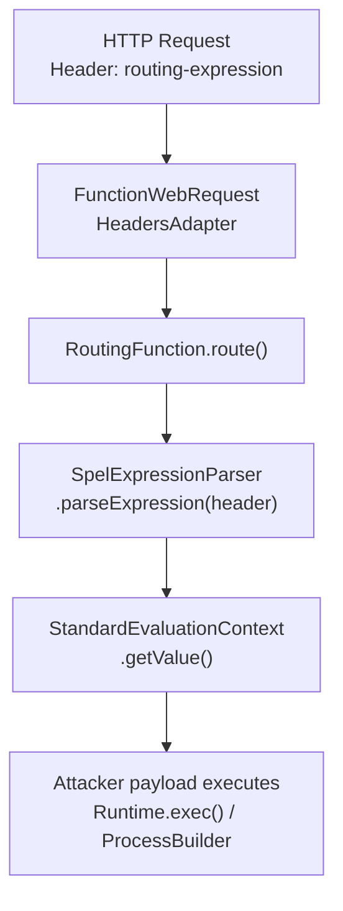
```mermaid
flowchart TD
    A["HTTP Request\nHeader: routing-expression"] --> B["FunctionWebRequest\nHeadersAdapter"]
    B --> C["RoutingFunction.route()"]
    C --> D["SpelExpressionParser\n.parseExpression(header)"]
    D --> E["StandardEvaluationContext\n.getValue()"]
    E --> F["Attacker payload executes\nRuntime.exec() / ProcessBuilder"]
```

**RoutingFunction:** A special Spring Cloud Function bean that dispatches incoming messages to other function beans based on routing rules. It reads the target function name from headers (`spring.cloud.function.definition`) or evaluates a SpEL expression from `spring.cloud.function.routing-expression` to compute the target dynamically.

**StandardEvaluationContext:** The SpEL evaluation context that provides access to the full Java type system. Unlike `SimpleEvaluationContext` (which restricts type access), `StandardEvaluationContext` allows invoking any public method on any class - including `Runtime`, `ProcessBuilder`, `Class.forName()`, and reflection APIs.

**FunctionWebRequestAdapter:** Bridges HTTP request headers into Spring Messaging `MessageHeaders`. This adapter directly mapped HTTP header values into the message header map without sanitization, making HTTP headers indistinguishable from trusted broker headers inside `RoutingFunction`.

### 📶 Gradual Depth

**Surface:** An HTTP header named `spring.cloud.function.routing-expression` was evaluated as a SpEL expression. Attackers sent expressions that executed system commands. Fixed by disabling SpEL evaluation from HTTP headers.

**One level down:** The `RoutingFunction` class checked for a header named `spring.cloud.function.routing-expression`. If present, it passed the raw header value to `SpelExpressionParser.parseExpression()` and evaluated it against a `StandardEvaluationContext` with the incoming `Message` as the root object. Because `StandardEvaluationContext` grants full Java type access, expressions like `T(java.lang.Runtime).getRuntime().exec('id')` executed arbitrary OS commands.

**Deeper:** The exploit required only a single HTTP request. A minimal proof-of-concept:

```bash
curl -X POST http://target:8080/functionRouter \
  -H "spring.cloud.function.routing-expression:\
T(java.lang.Runtime).getRuntime()\
.exec('touch /tmp/pwned')" \
  -d "test"
```

The `/functionRouter` endpoint is auto-configured by `spring-cloud-function-web` when function routing is enabled. No specific function needs to be deployed - the routing expression is evaluated before function dispatch.

**Internal detail:** The vulnerability existed in `RoutingFunction.functionFromExpression()`. Pre-fix code:

```java
// Vulnerable: raw header -> SpEL evaluation
String expression = message.getHeaders()
    .get("spring.cloud.function.routing-expression",
         String.class);
Expression expr = spelParser
    .parseExpression(expression);
// StandardEvaluationContext = full access
Object result = expr.getValue(
    evalContext, message);
```

The fix removed SpEL evaluation for messages arriving via HTTP. The routing-expression header is now only honored from internal messaging channels where headers originate from trusted producers.

### ⚙️ How It Works

```text
Attack flow (pre-fix):

1. Attacker -> POST /functionRouter
   Header: spring.cloud.function
     .routing-expression:
     T(java.lang.Runtime)
       .getRuntime().exec('cmd')

2. DispatcherServlet
   -> FunctionController
   -> FunctionWebRequestAdapter

3. HTTP headers -> MessageHeaders
   (no filtering, no validation)

4. RoutingFunction.route(message)
   -> reads routing-expression header
   -> SpelExpressionParser.parseExpression()
   -> StandardEvaluationContext.getValue()

5. SpEL evaluates T(java.lang.Runtime)
   -> resolves java.lang.Runtime class
   -> calls getRuntime()
   -> calls exec('cmd')

6. OS command executes as app user
```

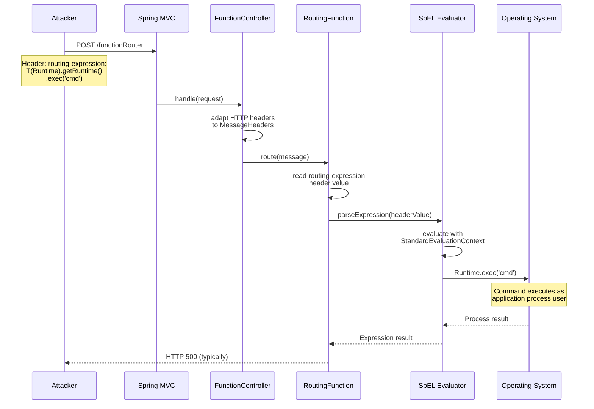
```mermaid
sequenceDiagram
    participant A as Attacker
    participant S as Spring MVC
    participant F as FunctionController
    participant R as RoutingFunction
    participant E as SpEL Evaluator
    participant OS as Operating System

    A->>S: POST /functionRouter
    Note over A: Header: routing-expression:<br/>T(Runtime).getRuntime()<br/>.exec('cmd')
    S->>F: handle(request)
    F->>F: adapt HTTP headers<br/>to MessageHeaders
    F->>R: route(message)
    R->>R: read routing-expression<br/>header value
    R->>E: parseExpression(headerValue)
    E->>E: evaluate with<br/>StandardEvaluationContext
    E->>OS: Runtime.exec('cmd')
    Note over OS: Command executes as<br/>application process user
    OS-->>E: Process result
    E-->>R: Expression result
    R-->>A: HTTP 500 (typically)
```

**Step 1 - Request arrival:** An HTTP POST to `/functionRouter` (the default function routing endpoint) carries the malicious header. No authentication is required. The endpoint exists whenever `spring-cloud-function-web` is on the classpath with routing enabled.

**Step 2 - Header adaptation:** `FunctionWebRequestAdapter` converts all HTTP headers into `MessageHeaders`. The routing-expression header passes through without any inspection.

**Step 3 - Expression evaluation:** `RoutingFunction` detects the `spring.cloud.function.routing-expression` header and passes its value to `SpelExpressionParser.parseExpression()`. The parsed expression is evaluated using `StandardEvaluationContext`, which provides full access to the Java type system via the `T()` operator.

**Step 4 - Code execution:** The SpEL engine resolves `T(java.lang.Runtime)` to the `java.lang.Runtime` class, invokes `getRuntime()` to obtain the singleton instance, and calls `exec()` with the attacker's command string. The process runs with the privileges of the JVM process.

**Step 5 - Response:** The function routing typically fails (the expression result is not a valid function name), so the server returns an error response. But the side effect (command execution) has already occurred.

### 🚨 Failure Modes

**Failure 1 - Dependency on WAF header filtering:**
Organizations deployed WAF rules to block headers containing `T(java.lang.Runtime)` or `exec(`. Attackers bypassed these filters using SpEL string concatenation (`'Runt'+'ime'`), reflection (`T(Class).forName('java.lang.Runtime')`), or character encoding. SpEL is expressive enough to construct any class name or method call through indirect means.
**Diagnostic:** Test WAF rules with obfuscated SpEL payloads: `T(String).class.forName('java.lang.Ru'+'ntime')`, `new String(new byte[]{82,117,110,...})`. If any variant passes the WAF, the rule is insufficient.
**Fix:** Upgrade Spring Cloud Function to 3.1.7+ or 3.2.3+. WAF rules are a temporary delay tactic, not a remediation. Expression language injection cannot be reliably filtered because the language is Turing-complete.

**Failure 2 - Unrecognized exposure through transitive dependencies:**
Teams using Spring Cloud Stream (Kafka/RabbitMQ bindings) did not realize that adding `spring-cloud-function-web` to their classpath for health endpoints or testing also exposed the `/functionRouter` HTTP endpoint. The routing expression feature intended for broker headers became reachable from the network.
**Diagnostic:** Check for `spring-cloud-function-web` in the dependency tree: `mvn dependency:tree | grep function-web`. If present, the HTTP routing endpoint is active regardless of whether you explicitly use it.
**Fix:** Remove `spring-cloud-function-web` if HTTP function invocation is not needed. If it is needed, upgrade and restrict the endpoint with Spring Security.

**Failure 3 - Incomplete patching in custom builds:**
Organizations that pinned Spring Cloud Function versions in BOMs or override properties sometimes upgraded Spring Boot (addressing Spring4Shell) but left Spring Cloud Function at the vulnerable version because it was managed by a separate Spring Cloud BOM version.
**Diagnostic:** Check `spring-cloud-function-context` version directly: `mvn dependency:tree | grep spring-cloud-function-context`. Versions before 3.1.7 or 3.2.3 are vulnerable.
**Fix:** Upgrade the Spring Cloud BOM or explicitly override `spring-cloud-function-context` version to 3.1.7+ or 3.2.3+.

### 🔬 Production Reality

CVE-2022-22963 was disclosed the same week as CVE-2022-22965 (Spring4Shell), causing confusion in incident response teams who conflated the two. They are entirely different vulnerabilities: Spring4Shell exploits data binding property traversal; CVE-2022-22963 exploits SpEL expression evaluation. Both require separate patches.

Exploitation in the wild was confirmed by multiple threat intelligence sources within days of disclosure. The attack required zero authentication, zero prior knowledge of the application, and a single HTTP request. Automated scanners incorporated the exploit rapidly. Organizations running Spring Cloud Function with the web adapter on public-facing services were at immediate risk.

The vulnerability highlighted a recurring pattern in Spring ecosystem security: features designed for trusted internal contexts (message broker routing) become dangerous when exposed to untrusted contexts (HTTP) without re-evaluating the trust model. The same pattern appears in Spring Cloud Gateway (CVE-2022-22947, SpEL injection in route filters) disclosed the same month.

Detection involved searching for: (1) HTTP requests with `spring.cloud.function.routing-expression` headers in access logs, (2) unexpected processes spawned by the JVM process, (3) `functionRouter` endpoint access patterns.

### ⚖️ Trade-offs & Alternatives

**BAD:**

```java
// Attempting to sanitize SpEL input
// instead of disabling evaluation
String expr = header.replaceAll(
    "T\\(.*Runtime.*\\)", "");
// BROKEN: infinite bypass variations
// T(Class).forName(...) still works
// Reflection chains still work
// String concatenation still works
```

Why it is wrong: SpEL is Turing-complete. Any filter based on pattern matching can be bypassed through expression composition, reflection, string manipulation, or alternative class loading paths.

**GOOD:**

```xml
<!-- Primary fix: upgrade -->
<dependency>
    <groupId>org.springframework.cloud</groupId>
    <artifactId>
        spring-cloud-function-context
    </artifactId>
    <version>3.2.3</version>
</dependency>
```

```java
// Defense-in-depth: restrict endpoint
@Configuration
public class FunctionSecurity {
    @Bean
    SecurityFilterChain functionChain(
        HttpSecurity http) throws Exception {
        http.authorizeHttpRequests(auth ->
            auth.requestMatchers(
                "/functionRouter")
                .authenticated()
        );
        return http.build();
    }
}
```

| Mitigation                             | Effectiveness            | Risk                    | Effort |
| -------------------------------------- | ------------------------ | ----------------------- | ------ |
| Upgrade Spring Cloud Function          | Complete                 | Low                     | Low    |
| Remove spring-cloud-function-web       | Complete (if not needed) | Feature loss            | Low    |
| Restrict /functionRouter with Security | High                     | Config error risk       | Medium |
| WAF header filtering                   | Partial                  | Bypass via obfuscation  | Low    |
| SimpleEvaluationContext                | High                     | May break routing logic | Medium |
| Disable function routing entirely      | Complete                 | Feature loss            | Low    |

### ⚡ Decision Snap

**IMMEDIATE:** Upgrade Spring Cloud Function to 3.1.7+ or 3.2.3+. If upgrade is delayed, remove `spring-cloud-function-web` from the classpath or block `/functionRouter` at the reverse proxy.

**SHORT-TERM:** Audit all Spring Cloud dependencies for expression-language exposure. Check for CVE-2022-22947 (Spring Cloud Gateway SpEL injection) in the same audit cycle.

**LONG-TERM:** Treat any feature that evaluates expressions from headers, parameters, or message properties as a security-critical surface. Default to `SimpleEvaluationContext` for any SpEL evaluation that might receive external input. Require explicit opt-in for `StandardEvaluationContext`.

### ⚠️ Top Traps

| #   | Misconception                                              | Reality                                                                                                                                                                      |
| --- | ---------------------------------------------------------- | ---------------------------------------------------------------------------------------------------------------------------------------------------------------------------- |
| 1   | Only apps explicitly using function routing are vulnerable | The `/functionRouter` endpoint is auto-configured when `spring-cloud-function-web` is on the classpath - no explicit routing config needed                                   |
| 2   | WAF rules blocking `Runtime.exec` are sufficient           | SpEL supports reflection, string concatenation, and class loading - any blocklist is bypassable                                                                              |
| 3   | This is the same as Spring4Shell                           | CVE-2022-22963 (SpEL injection) and CVE-2022-22965 (data binding traversal) are completely different vulnerabilities requiring separate patches                              |
| 4   | SimpleEvaluationContext prevents all SpEL attacks          | SimpleEvaluationContext restricts type access but still allows property access and method calls on the root object - it reduces attack surface but is not a complete sandbox |
| 5   | Internal-only services do not need the patch               | Network segmentation failures, SSRF from other services, and lateral movement make internal services exploitable - patch regardless of network position                      |

### 🪜 Learning Ladder

**Prerequisites:**

- SPR-073 Spring4Shell (CVE-2022-22965) - understanding Spring security vulnerability patterns and the data binding attack from the same time period
- SPR-064 Spring MVC Request Lifecycle - understanding how HTTP headers reach application code

**THIS:** SPR-074 Spring Cloud Function SpEL Injection (2022) - unauthenticated RCE via SpEL expression evaluation of untrusted HTTP headers in function routing

**Next steps:**

- SPR-083 Debugging Spring Auto-Configuration Failures - understanding how auto-configured endpoints like `/functionRouter` appear unexpectedly on the classpath

**The Surprising Truth:** The most dangerous aspect of CVE-2022-22963 was not the SpEL evaluation itself but the invisible attack surface. Teams that added `spring-cloud-function-web` as a transitive dependency for testing or health checks unknowingly exposed `/functionRouter` to the network. The vulnerability is a case study in how auto-configuration convenience creates security risk: features activate silently based on classpath presence, and security-critical endpoints appear without explicit opt-in.

**Further Reading:**

- [Spring Security Advisory CVE-2022-22963](https://spring.io/security/cve-2022-22963) - official Spring advisory with affected versions
- [NIST NVD CVE-2022-22963](https://nvd.nist.gov/vuln/detail/CVE-2022-22963) - CVSS scoring and technical references
- [Spring Cloud Function Reference - Function Routing](https://docs.spring.io/spring-cloud-function/reference/spring-cloud-function/function-routing.html) - official routing documentation

**Revision Card:**

1. CVE-2022-22963 allowed unauthenticated RCE by evaluating HTTP header values as SpEL expressions in Spring Cloud Function's routing mechanism - `StandardEvaluationContext` gave full Java type system access including `Runtime.exec()`
2. The fix disabled SpEL evaluation for routing expressions arriving via HTTP headers - the correct response to expression injection is removing evaluation from the untrusted path, not filtering expressions
3. Expression language injection (SpEL, OGNL, EL) is equivalent to code injection - any feature that evaluates expressions from untrusted sources must use `SimpleEvaluationContext` at minimum, or preferably avoid expression evaluation entirely

---

---

# SPR-075 Spring Boot Memory Footprint Analysis

**TL;DR** - Spring Boot memory consumption spans heap, metaspace, thread stacks, and direct buffers - each requiring distinct measurement and optimization strategies.

### 🔥 Problem Statement

A "simple" Spring Boot microservice with Spring Web, JPA, and Actuator routinely consumes 300-500 MB of RSS memory in production. Teams setting Kubernetes memory limits to 256 MB see OOMKilled pods. Teams setting limits to 1 GB waste cluster resources. The confusion stems from the JVM's multi-region memory model: heap is only one component. Metaspace holds class metadata for every loaded class (Spring loads thousands through reflection and proxying). Each thread stack consumes 1 MB by default. Direct ByteBuffers for NIO bypass heap accounting. Without understanding where memory goes, teams either over-provision (wasting money) or under-provision (causing crashes). The problem intensifies at scale: 50 microservices each wasting 256 MB costs real infrastructure budget.

### 📜 Historical Context

Early Spring applications (pre-Boot era) ran as WARs inside shared application servers where memory was the server's concern. Spring Boot's embedded server model (2014+) shifted memory ownership to each application. The default JVM ergonomics (selecting heap size based on container memory) often chose values too large for containerized deployments. JDK 8u131 (2017) added `-XX:+UseContainerSupport` to respect cgroup memory limits, and JDK 10 made it the default - but this only affected heap sizing, not total RSS. Spring Boot 2.0-2.7 added features that increased baseline memory: conditional evaluation of hundreds of auto-configuration classes, Hibernate metadata model, Micrometer metric registries, and the Actuator endpoint infrastructure. Spring Boot 3.0 introduced AOT processing and GraalVM native image support as the primary answer to memory concerns - trading runtime flexibility for dramatically lower footprint (typically 50-100 MB RSS). Spring Framework 6.1+ added virtual thread support, changing the thread stack memory calculus entirely.

### 🔩 First Principles

**CORE INVARIANTS:**

1. JVM process RSS = heap + metaspace + thread stacks + direct buffers + native code + JVM overhead - measuring only heap misses 40-60% of actual memory consumption
2. Every loaded class costs metaspace (roughly 5-10 KB per class) and every Spring bean requires at least one class - reducing bean count reduces metaspace
3. Memory optimization is a trade-off against startup time, runtime flexibility, and developer experience - there is no free optimization

**DERIVED DESIGN:**
Effective memory management requires measuring each region independently, identifying the dominant contributor, and applying region-specific optimizations. Heap issues need GC tuning. Metaspace issues need classpath reduction. Thread stack issues need pool sizing or virtual threads. Treating "memory" as a single number leads to ineffective optimization.

### 🧠 Mental Model

> Think of a Spring Boot application's memory as an office building. The heap is the open-plan workspace where employees (objects) work and leave when done (GC). Metaspace is the filing cabinet room that stores a folder for every type of employee ever hired (loaded classes) - folders accumulate and rarely get removed. Thread stacks are individual phone booths - each reserved at full size whether occupied or not. Direct buffers are the parking garage - managed separately from the building's interior space.

- "open-plan workspace" -> heap (GC-managed, dynamic)
- "filing cabinet room" -> metaspace (class metadata, grows with classpath)
- "phone booths" -> thread stacks (fixed per-thread, 1 MB default)
- "parking garage" -> direct ByteBuffers (off-heap, NIO)

**Where this analogy breaks down:** Unlike physical rooms with visible occupancy, JVM memory regions are invisible without explicit tooling. The "building" (RSS) also includes the JVM's own infrastructure (JIT compiler buffers, GC data structures, symbol tables) that has no direct office analogy - it is more like the building's HVAC and electrical systems.

### 🧩 Components

```text
JVM Process Memory Layout (RSS):

+-------------------------------------------+
| Heap (controlled by -Xmx)                |
|  +-------+ +----------+ +---------+      |
|  | Young | | Old Gen  | | Humong- |      |
|  | Gen   | |          | | ous     |      |
|  +-------+ +----------+ +---------+      |
+-------------------------------------------+
| Metaspace (-XX:MaxMetaspaceSize)          |
|  Class metadata, method bytecode, CP      |
+-------------------------------------------+
| Thread Stacks (-Xss * thread_count)       |
|  1 MB default per thread                  |
+-------------------------------------------+
| Direct Buffers (-XX:MaxDirectMemorySize)  |
|  NIO ByteBuffers, Netty pooled alloc      |
+-------------------------------------------+
| JVM Internal (CodeCache, GC, Symbols)     |
|  JIT compiled code, GC structures         |
+-------------------------------------------+
| Native Libraries (JNI, OS mappings)       |
+-------------------------------------------+
```

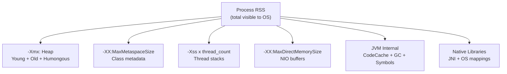
```mermaid
flowchart TD
    RSS["Process RSS\n(total visible to OS)"]
    RSS --> Heap["-Xmx: Heap\nYoung + Old + Humongous"]
    RSS --> Meta["-XX:MaxMetaspaceSize\nClass metadata"]
    RSS --> Stacks["-Xss x thread_count\nThread stacks"]
    RSS --> Direct["-XX:MaxDirectMemorySize\nNIO buffers"]
    RSS --> Internal["JVM Internal\nCodeCache + GC + Symbols"]
    RSS --> Native["Native Libraries\nJNI + OS mappings"]
```

**Heap:** The GC-managed region where all Java objects live. Controlled by `-Xms` (initial) and `-Xmx` (maximum). Spring Boot applications store bean instances, HTTP request/response objects, JPA entity caches, and application data here. G1GC (default since JDK 9) manages heap in fixed-size regions.

**Metaspace:** Replaced PermGen in JDK 8. Stores class metadata, method bytecodes, constant pools, and annotation data. Spring applications load significantly more classes than plain Java applications due to CGLIB proxies, AOP advice classes, reflection-generated accessor classes, and auto-configuration evaluation. Unbounded by default - set `-XX:MaxMetaspaceSize` explicitly.

**Thread Stacks:** Each thread reserves `-Xss` bytes (default 1 MB on 64-bit Linux). A Spring Boot web application with Tomcat defaults to 200 max threads = 200 MB reserved for thread stacks alone. Platform threads are expensive; virtual threads (JDK 21+) use heap-allocated continuations instead of fixed OS stacks.

**Direct Buffers:** Off-heap memory allocated via `ByteBuffer.allocateDirect()`. Used by NIO channels, Netty (if using WebFlux), and some serialization libraries. Not counted in `-Xmx` but counted in RSS.

### 📶 Gradual Depth

**Surface:** A Spring Boot app uses more memory than `-Xmx` because the JVM has memory regions beyond the heap. Measure RSS, not just heap, and set container limits accordingly.

**One level down:** Typical breakdown for a Spring Boot web + JPA app with default settings: heap 40-50% of RSS, metaspace 10-15%, thread stacks 15-20%, direct buffers 5-10%, JVM internals 10-15%. The dominant contributor varies by workload - a thread-heavy synchronous app spends more on stacks; a Netty-based reactive app spends more on direct buffers.

**Deeper:** Spring-specific memory costs include: (1) `DefaultListableBeanFactory` holds a `ConcurrentHashMap` of all bean definitions and singleton instances - 500 beans at 2-5 KB metadata each = 1-2.5 MB just for the registry; (2) each CGLIB proxy class generates a synthetic subclass loaded into metaspace - a service with 200 proxied beans adds 200 extra classes; (3) Spring's `ReflectionUtils` caches `Method` and `Field` arrays per class; (4) Hibernate's `SessionFactory` builds an in-memory metamodel of all entities, relationships, and SQL templates.

**Internal detail:** Native Memory Tracking (NMT) categorizes JVM allocations into: Java Heap, Class (metaspace), Thread, Code (JIT), GC, Compiler, Internal, Symbol, Native Memory Tracking overhead, and Arena. Enable with `-XX:NativeMemoryTracking=summary` and query with `jcmd <pid> VM.native_memory summary`. NMT adds 5-10% overhead and should not be used in performance-sensitive production environments permanently, but is essential for diagnosis.

### ⚙️ How It Works

```text
Memory measurement workflow:

1. Enable NMT at startup:
   -XX:NativeMemoryTracking=summary

2. Baseline after startup:
   jcmd <pid> VM.native_memory baseline

3. After steady-state traffic:
   jcmd <pid> VM.native_memory summary.diff

4. Identify dominant region:
   Heap >> Metaspace >> Thread >> Direct

5. Apply region-specific optimization:
   Heap:    -Xmx, GC tuning, object reuse
   Meta:    classpath reduction, bean count
   Thread:  pool sizing, virtual threads
   Direct:  buffer pool config, leak check

6. Validate with container metrics:
   RSS == sum of all JVM regions + overhead
   Container limit >= RSS peak * 1.2
```

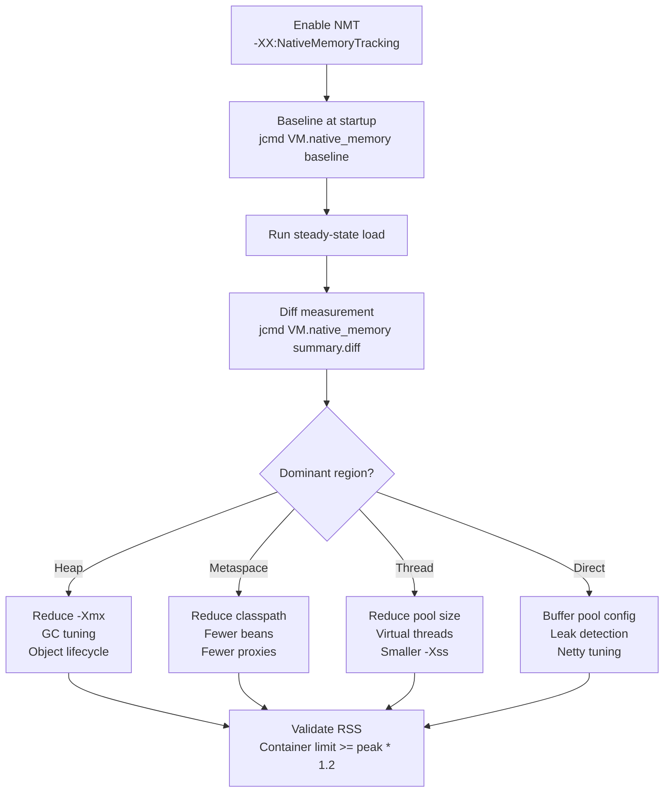
```mermaid
flowchart TD
    A["Enable NMT\n-XX:NativeMemoryTracking"] --> B["Baseline at startup\njcmd VM.native_memory baseline"]
    B --> C["Run steady-state load"]
    C --> D["Diff measurement\njcmd VM.native_memory summary.diff"]
    D --> E{"Dominant region?"}
    E -->|Heap| F["Reduce -Xmx\nGC tuning\nObject lifecycle"]
    E -->|Metaspace| G["Reduce classpath\nFewer beans\nFewer proxies"]
    E -->|Thread| H["Reduce pool size\nVirtual threads\nSmaller -Xss"]
    E -->|Direct| I["Buffer pool config\nLeak detection\nNetty tuning"]
    F --> J["Validate RSS\nContainer limit >= peak * 1.2"]
    G --> J
    H --> J
    I --> J
```

**Step 1 - Measure total RSS:** Use `ps -o rss` (Linux), `jcmd <pid> VM.native_memory summary`, or Kubernetes `container_memory_rss` metric. Do not rely on `-Xmx` as a proxy for total memory.

**Step 2 - Decompose by region with NMT:**

```bash
# Start with NMT enabled
java -XX:NativeMemoryTracking=summary \
  -jar app.jar

# After warmup, take baseline
jcmd $(pgrep -f app.jar) \
  VM.native_memory baseline

# After load test, measure diff
jcmd $(pgrep -f app.jar) \
  VM.native_memory summary.diff
```

Output shows each region's committed and reserved bytes with delta from baseline.

**Step 3 - Analyze heap with JFR:**

```bash
# Record allocation profiling
jcmd <pid> JFR.start \
  name=mem duration=60s \
  settings=profile \
  filename=mem.jfr
```

JFR captures `jdk.ObjectAllocationInNewTLAB` and `jdk.ObjectAllocationOutsideTLAB` events showing which classes allocate the most heap memory.

**Step 4 - Analyze metaspace with class histograms:**

```bash
# Count loaded classes and sizes
jcmd <pid> GC.class_stats
# Or simpler: class histogram
jcmd <pid> GC.class_histogram
```

Look for CGLIB-generated classes (`$$EnhancerBySpringCGLIB$$`), JPA metamodel classes, and reflection accessor classes. High counts indicate proxy or classpath bloat.

**Step 5 - Analyze thread memory:**

```bash
# Count live threads
jcmd <pid> Thread.print | grep -c "tid="
# Thread stack memory = count * -Xss
```

A Tomcat thread pool at `max-threads=200` with default `-Xss` (1 MB) reserves 200 MB for stacks. Reducing `max-threads` to 50 saves 150 MB.

**Step 6 - Apply Spring-specific optimizations:**

```properties
# application.properties

# Reduce Tomcat threads (default: 200)
server.tomcat.threads.max=50
server.tomcat.threads.min-spare=5

# Lazy initialization (defer unused beans)
spring.main.lazy-initialization=true

# Disable unused auto-configurations
spring.autoconfigure.exclude=\
  org.springframework.boot.autoconfigure\
  .mail.MailSenderAutoConfiguration,\
  org.springframework.boot.autoconfigure\
  .jms.JmsAutoConfiguration
```

### 🚨 Failure Modes

**Failure 1 - Container OOMKilled despite heap within limits:**
Kubernetes kills the pod because RSS exceeds the container memory limit, but heap usage (reported by GC logs or JMX) shows ample free space. The cause is non-heap memory: metaspace growth, thread stack accumulation, or direct buffer leaks that push total RSS beyond the cgroup limit.
**Diagnostic:** Compare `jcmd VM.native_memory summary` total committed vs container memory limit. Check `container_memory_rss` metric against `container_spec_memory_limit_bytes`. The difference between heap max and RSS reveals non-heap consumption.
**Fix:** Set container memory limit = `-Xmx` + metaspace estimate (100-250 MB for typical Spring Boot) + thread stacks (thread count _ `-Xss`) + 100 MB JVM overhead buffer. Formula: `limit >= Xmx + 250MB + (threads _ Xss) + 100MB`.

**Failure 2 - Metaspace exhaustion from dynamic proxy generation:**
`OutOfMemoryError: Metaspace` occurs under sustained load. Each unique combination of interfaces proxied by Spring AOP, JPA lazy loading, or transaction management generates a distinct proxy class loaded into metaspace. In applications with many entity types and repository interfaces, proxy class count grows significantly.
**Diagnostic:** Enable `-XX:+TraceClassLoading` and grep for `CGLIB` or `$Proxy` patterns. Use `jcmd GC.class_stats` to identify the largest metaspace consumers.
**Fix:** Set `-XX:MaxMetaspaceSize=256m` to fail fast instead of consuming all native memory. Reduce proxy generation by using `proxyTargetClass=false` where possible, minimizing `@Transactional` scope, and using DTO projections instead of lazy-loaded entity graphs.

**Failure 3 - Direct buffer leak causing RSS growth:**
RSS grows steadily over days while heap usage remains stable. `jcmd VM.native_memory` shows increasing "Internal" or "Other" memory. Cause: direct ByteBuffers allocated by NIO or Netty are not being released because their backing `Cleaner` references are not collected (GC does not see direct buffer memory pressure).
**Diagnostic:** Monitor `jmx_buffer_pool_used_bytes{pool="direct"}` metric. Compare direct buffer usage with `-XX:MaxDirectMemorySize`. Enable `-Dio.netty.leakDetection.level=paranoid` for Netty-based applications.
**Fix:** Set `-XX:MaxDirectMemorySize` explicitly. For Netty/WebFlux, configure pooled allocator limits. Ensure GC runs frequently enough to clean `Cleaner` references (reduce `-Xmx` to increase GC pressure if heap utilization is low).

### 🔬 Production Reality

A typical Spring Boot microservice (Web + JPA + Actuator + Micrometer) with default settings shows this approximate breakdown at idle after warmup:

| Region           | Typical Size   | Controls                          |
| ---------------- | -------------- | --------------------------------- |
| Heap (committed) | 150-300 MB     | -Xmx                              |
| Metaspace        | 80-150 MB      | -XX:MaxMetaspaceSize              |
| Thread stacks    | 50-200 MB      | server.tomcat.threads.max \* -Xss |
| Code cache       | 40-60 MB       | -XX:ReservedCodeCacheSize         |
| Direct buffers   | 10-50 MB       | -XX:MaxDirectMemorySize           |
| GC structures    | 20-50 MB       | GC algorithm choice               |
| Other JVM        | 30-50 MB       | Not directly tunable              |
| **Total RSS**    | **400-800 MB** | **Sum of above**                  |

GraalVM native image reduces this dramatically: the same application typically runs at 50-100 MB RSS because there is no JIT compiler, no class loading, minimal reflection metadata, and the heap starts small. The cost: longer build times (minutes vs seconds), no runtime class loading, and restrictions on reflection and dynamic proxies (requiring build-time hint configuration).

Spring Boot 3.x with AOT processing (without native image) provides a middle ground: class-path scanning and condition evaluation happen at build time, reducing startup metaspace churn, but the runtime is still a full JVM with JIT and standard GC.

The most impactful single optimization for most Spring Boot applications is reducing the Tomcat thread pool from 200 (default) to the actual concurrency needed. Most microservices handle 10-50 concurrent requests - reducing `max-threads` to 50 saves 150 MB of thread stack space immediately.

### ⚖️ Trade-offs & Alternatives

**BAD:**

```bash
# Setting only -Xmx and hoping for the best
java -Xmx512m -jar app.jar
# Container limit: 512m
# RESULT: OOMKilled because RSS = 800MB
# Heap is 512m but metaspace + threads
# + direct + JVM = another 300MB
```

Why it is wrong: Container memory limit must account for all JVM memory regions, not just heap. Setting limit equal to `-Xmx` guarantees OOM kills under load.

**GOOD:**

```bash
# Comprehensive memory configuration
java \
  -Xmx256m \
  -Xms256m \
  -XX:MaxMetaspaceSize=128m \
  -XX:MaxDirectMemorySize=64m \
  -XX:ReservedCodeCacheSize=64m \
  -Xss512k \
  -XX:+UseContainerSupport \
  -jar app.jar
# Container limit: 700m
# Budget: 256+128+64+64+(50*0.5)+50 = 587m
# 700m gives ~20% headroom
```

| Optimization              | Memory Saved         | Trade-off                      | Complexity |
| ------------------------- | -------------------- | ------------------------------ | ---------- |
| Reduce -Xmx               | Heap MB saved        | More frequent GC               | Low        |
| Reduce max-threads        | threads \* 1MB       | Lower max concurrency          | Low        |
| Reduce -Xss (512k)        | threads \* 0.5MB     | Deep recursion risk            | Low        |
| Lazy initialization       | Deferred heap/meta   | First-request latency          | Low        |
| Remove unused starters    | 10-50 MB metaspace   | May lose features              | Medium     |
| Spring Context Indexer    | Startup metaspace    | Build time increase            | Low        |
| GraalVM native image      | 300-600 MB RSS       | Build complexity, restrictions | High       |
| Virtual threads (JDK 21+) | Thread stack savings | Platform maturity              | Medium     |

### ⚡ Decision Snap

**IMMEDIATE (low effort):** Reduce `server.tomcat.threads.max` to actual concurrency needs. Set `-Xss512k`. Set explicit `-XX:MaxMetaspaceSize`.

**SHORT-TERM:** Audit `spring-boot-starter-*` dependencies and remove unused ones. Enable `-XX:NativeMemoryTracking=summary` in staging to measure actual breakdown.

**LONG-TERM:** Evaluate GraalVM native image for memory-constrained deployments. Adopt virtual threads (JDK 21+) to eliminate thread stack overhead. Use Spring Boot 3.x AOT processing for build-time optimization without full native image restrictions.

### ⚠️ Top Traps

| #   | Misconception                                   | Reality                                                                                                                                         |
| --- | ----------------------------------------------- | ----------------------------------------------------------------------------------------------------------------------------------------------- |
| 1   | -Xmx controls total memory usage                | Heap is typically 40-60% of RSS - metaspace, threads, direct buffers, and JVM internals consume the rest                                        |
| 2   | Spring Boot apps need 512 MB minimum            | With tuned settings (reduced threads, smaller heap, classpath trimming), 200-300 MB RSS is achievable for simple services                       |
| 3   | GraalVM native image solves all memory problems | Native image trades runtime flexibility for lower footprint - reflection, dynamic proxies, and classpath scanning need build-time configuration |
| 4   | Lazy initialization reduces total memory        | It defers allocation to first use but does not reduce peak memory - all beans still load eventually under production traffic                    |
| 5   | Container memory limit should equal -Xmx        | Setting limit = Xmx guarantees OOMKilled - limit must cover heap + metaspace + threads + direct + JVM overhead with 15-20% headroom             |

### 🪜 Learning Ladder

**Prerequisites:**

- SPR-072 Spring Context Startup Optimization - understanding classpath scanning and bean instantiation costs that also affect memory
- SPR-070 Spring Boot Auto-Configuration Internals - understanding how auto-configuration increases loaded class count and metaspace usage

**THIS:** SPR-075 Spring Boot Memory Footprint Analysis - measuring and optimizing JVM memory regions for containerized Spring Boot deployments

**Next steps:**

- SPR-076 Spring WebFlux and Project Reactor - understanding reactive stack memory model (fewer threads, more direct buffers) as an alternative to servlet stack

**The Surprising Truth:** The default Tomcat thread pool (`max-threads=200`) is the single largest non-heap memory consumer in most Spring Boot applications - 200 threads at 1 MB each reserves 200 MB just for stacks. Most microservices behind a load balancer never see 200 concurrent requests. Reducing `max-threads` to 50 and `-Xss` to 512 KB saves 175 MB of RSS with zero code changes - more than most complex optimization efforts achieve.

**Further Reading:**

- [Spring Boot Reference - Container Memory](https://docs.spring.io/spring-boot/reference/packaging/efficient.html) - official guidance on container deployment
- [JDK Documentation - Native Memory Tracking](https://docs.oracle.com/en/java/javase/21/vm/native-memory-tracking.html) - NMT reference for diagnosing JVM memory regions
- [Spring Boot Reference - GraalVM Native Image](https://docs.spring.io/spring-boot/reference/packaging/native-image/index.html) - native image support documentation

**Revision Card:**

1. JVM process RSS = heap + metaspace + thread stacks + direct buffers + code cache + GC structures + JVM overhead - container memory limits must account for all regions, not just `-Xmx`
2. Spring Boot's default Tomcat thread pool (200 threads at 1 MB each) is typically the largest non-heap memory consumer - reducing to actual concurrency needs is the highest-impact single optimization
3. Native Memory Tracking (`-XX:NativeMemoryTracking=summary` + `jcmd VM.native_memory`) is the definitive tool for decomposing JVM memory by region - heap-only metrics miss 40-60% of actual consumption

---

---

# SPR-076 Spring WebFlux and Project Reactor

**TL;DR** - WebFlux uses non-blocking I/O with Mono/Flux types so few threads serve thousands of concurrent connections without blocking.

### 🔥 Problem Statement

Traditional servlet-based Spring MVC assigns one thread per HTTP request. When that request calls a database, another microservice, or any I/O operation, the thread blocks - it sits idle consuming 1 MB of stack memory while waiting for bytes on a socket. Under high concurrency (thousands of simultaneous requests), thread pool exhaustion becomes the bottleneck: all 200 Tomcat threads are parked waiting for downstream responses, new requests queue up, latency spikes, and the system either rejects connections or crashes. The core pain is not CPU - it is wasted threads sleeping on I/O. Reactive programming replaces thread-per-request with event-loop-per-core, allowing a handful of threads to multiplex thousands of in-flight operations through non-blocking callbacks.

### 📜 Historical Context

Asynchronous I/O existed in Java since NIO (JDK 1.4, 2002), but the programming model was painful - raw selectors, buffers, and state machines. Netty (2004+) wrapped NIO into a usable event-loop framework that powered high-throughput servers. The Reactive Streams specification (2013-2015, JSR 166) standardized the Publisher/Subscriber/Subscription/Processor interfaces to ensure interoperability and backpressure across libraries. Project Reactor (2015, Pivotal) implemented Reactive Streams with Mono (0..1 elements) and Flux (0..N elements) as its core types. Spring Framework 5.0 (2017) introduced Spring WebFlux as a fully reactive web framework alongside the existing Spring MVC, sharing annotation support but running on a non-blocking runtime. Spring WebFlux defaults to Netty as its embedded server, though it can also run on Undertow or Servlet 3.1+ containers in async mode. Spring Boot 2.0 made WebFlux a first-class starter (`spring-boot-starter-webflux`). Spring Boot 3.x continued refinements, particularly around virtual threads (JDK 21) which offer an alternative concurrency model.

### 🔩 First Principles

**CORE INVARIANTS:**

1. A non-blocking thread never waits for I/O completion - it registers a callback and moves to the next task, so one thread handles many concurrent operations
2. Backpressure propagates demand signals upstream so producers do not overwhelm consumers - this is built into the Reactive Streams contract, not an afterthought
3. Nothing happens until someone subscribes - reactive pipelines are lazy assembly instructions, not eager execution
4. Schedulers control which thread runs which stage - blocking code on the wrong scheduler poisons the entire event loop

**DERIVED DESIGN:**
These invariants produce a model where HTTP request handling is a pipeline of transformations declared with operators (map, flatMap, zip) that the runtime schedules across a small fixed thread pool. Because nothing blocks, a 4-thread event loop can sustain the concurrency that would require hundreds of servlet threads. Backpressure ensures that a fast producer (network ingress) does not flood a slow consumer (database write) by letting the consumer signal how many items it can accept. The lazy execution model means constructing a `Mono` chain costs almost nothing - actual I/O happens only when the framework subscribes at the HTTP response boundary.

### 🧠 Mental Model

> Think of WebFlux as a restaurant kitchen with 4 expert chefs (event loop threads) and hundreds of orders (requests). In the servlet model, each order gets a dedicated chef who stands idle while waiting for the oven (I/O). In the reactive model, each chef starts an order, puts it in the oven, immediately picks up the next order, and returns to plate it when the oven timer rings.

- "oven timer rings" -> I/O completion callback triggers continuation
- "4 expert chefs" -> Netty event loop threads (one per CPU core)
- "hundreds of orders" -> concurrent HTTP requests multiplexed across few threads
- "standing idle at the oven" -> thread blocked on `InputStream.read()` or JDBC call

**Where this analogy breaks down:** Real event loops process tasks in a strict single-threaded-per-loop fashion (no context switching within a loop), while chefs can physically move between stations. Also, if a chef does heavy computation (CPU-bound work), the entire queue stalls - event loops have the same vulnerability to CPU-intensive tasks.

### 🧩 Components

```
+---------------------------------------------------+
|              Spring WebFlux Stack                  |
+---------------------------------------------------+
| @Controller / @RestController / RouterFunction     |
+---------------------------------------------------+
| HttpHandler (reactive request/response)            |
+---------------------------------------------------+
| Reactor Netty (HttpServer)                         |
| +-----------------------------------------------+ |
| | Boss EventLoopGroup (accept connections)       | |
| +-----------------------------------------------+ |
| | Worker EventLoopGroup (process I/O)            | |
| | [Thread-1] [Thread-2] [Thread-3] [Thread-4]   | |
| +-----------------------------------------------+ |
+---------------------------------------------------+
| Reactive Streams (Publisher/Subscriber)            |
| +---------------------+  +---------------------+ |
| | Mono<T> (0..1)      |  | Flux<T> (0..N)      | |
| +---------------------+  +---------------------+ |
+---------------------------------------------------+
| Non-blocking I/O drivers                           |
| (R2DBC, WebClient, ReactiveRedis, RSocket)         |
+---------------------------------------------------+
```

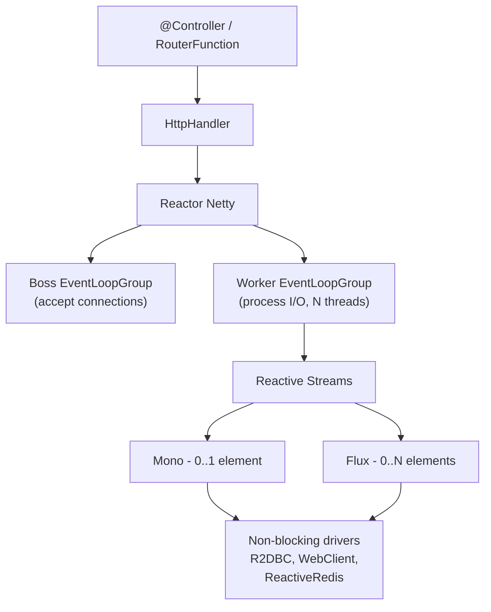
```mermaid
flowchart TB
    A["@Controller / RouterFunction"] --> B["HttpHandler"]
    B --> C["Reactor Netty"]
    C --> D["Boss EventLoopGroup\n(accept connections)"]
    C --> E["Worker EventLoopGroup\n(process I/O, N threads)"]
    E --> F["Reactive Streams"]
    F --> G["Mono - 0..1 element"]
    F --> H["Flux - 0..N elements"]
    G --> I["Non-blocking drivers\nR2DBC, WebClient,\nReactiveRedis"]
    H --> I
```

### 📶 Gradual Depth

**Layer 1 (anyone):** WebFlux lets your server handle thousands of users simultaneously using only a few threads, because those threads never sit idle waiting - they always move to the next task.

**Layer 2 (junior dev):** Instead of returning a `User` object directly, a WebFlux controller returns `Mono<User>` - a promise that a user will be available later. The framework subscribes to this Mono, and when the database responds, the result flows through transformation operators to the HTTP response. No thread blocks during the database call.

**Layer 3 (mid-level dev):** The Mono/Flux types are pipelines assembled from operators. `flatMap` is the key operator for async composition - it subscribes to an inner publisher and merges results. Operators like `map` (synchronous transform), `zip` (combine multiple sources), `switchIfEmpty` (fallback), and `onErrorResume` (error recovery) compose into complex workflows. The critical rule: never call `.block()` on an event loop thread, because it defeats the entire model.

**Layer 4 (senior dev):** Reactor's scheduler model determines execution context. `Schedulers.boundedElastic()` offloads blocking calls (legacy JDBC, file I/O) to a separate thread pool, protecting the event loop. `publishOn` switches downstream execution to a different scheduler. `subscribeOn` controls which scheduler runs the subscription signal. Understanding the difference prevents the most common WebFlux bugs: blocking on the event loop and thread starvation.

**Layer 5 (staff+ engineer):** Backpressure in HTTP scenarios works through TCP flow control and Reactor's internal request(N) protocol. `Flux.create` with `OverflowStrategy` handles sources that do not natively support backpressure (hot sources). In production, the most impactful tuning points are connection pool sizing for R2DBC (`max-size` matching event loop thread count), WebClient connection provider configuration, and careful use of `limitRate()` to control downstream demand.

### ⚙️ How It Works

```
Request arrives at Netty:

[Client] --HTTP--> [Boss Loop: accept]
                        |
                   [Worker Loop-1]
                        |
            +-----------+-----------+
            | Decode HTTP request   |
            | Route to handler      |
            | Build Mono/Flux chain |
            | Subscribe             |
            +-----------+-----------+
                        |
              (async I/O: R2DBC query)
                        |
            [Worker Loop-1 is FREE]
            [handles other requests]
                        |
              ...database responds...
                        |
            [Worker Loop-2 picks up]
            +-----------+-----------+
            | Transform result      |
            | Encode HTTP response  |
            | Flush to client       |
            +-----------+-----------+
```

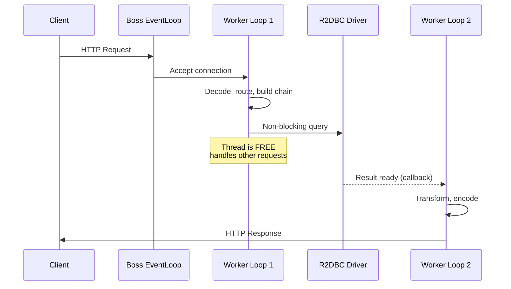
```mermaid
sequenceDiagram
    participant C as Client
    participant B as Boss EventLoop
    participant W1 as Worker Loop 1
    participant DB as R2DBC Driver
    participant W2 as Worker Loop 2

    C->>B: HTTP Request
    B->>W1: Accept connection
    W1->>W1: Decode, route, build chain
    W1->>DB: Non-blocking query
    Note over W1: Thread is FREE<br/>handles other requests
    DB-->>W2: Result ready (callback)
    W2->>W2: Transform, encode
    W2->>C: HTTP Response
```

The key mechanism: when `W1` issues the R2DBC query, it does not block. It registers a completion handler with the I/O subsystem and returns immediately to the event loop to process other events. When the database responds, an I/O event fires, and whichever worker loop thread picks it up (could be `W1` again or any other) executes the continuation. This is why reactive code must never hold thread-local state across async boundaries - the continuation may run on a different thread.

A typical handler:

```java
@GetMapping("/users/{id}")
Mono<ResponseEntity<User>> getUser(
    @PathVariable String id) {
  return userRepository.findById(id)
      .map(ResponseEntity::ok)
      .defaultIfEmpty(
          ResponseEntity.notFound().build());
}
```

The `findById` returns `Mono<User>` (non-blocking R2DBC call). `map` transforms the result synchronously. `defaultIfEmpty` provides a fallback when the Mono is empty. The framework subscribes at the response boundary - nothing executes until then.

Composing multiple async calls:

```java
Mono<OrderSummary> summary(String userId) {
  Mono<User> user =
      userClient.getUser(userId);
  Mono<List<Order>> orders =
      orderClient.getOrders(userId);

  return Mono.zip(user, orders)
      .map(tuple -> new OrderSummary(
          tuple.getT1(), tuple.getT2()));
}
```

`Mono.zip` subscribes to both publishers concurrently and waits for both to complete. This is parallel fan-out without managing threads manually.

### 🚨 Failure Modes

**Failure 1 - Blocking call on event loop thread:**
A developer calls `repository.findById(id)` using a blocking JPA/JDBC repository inside a WebFlux handler. The event loop thread blocks on the JDBC socket read. Because Netty uses only 4-8 event loop threads, blocking even one for 50ms under load cascades: request queues grow, all event loops stall, and the entire server becomes unresponsive. This is the most common and most devastating WebFlux bug.
**Diagnostic:** Enable Reactor's `BlockHound` agent in tests and staging. It throws an exception when blocking calls occur on non-blocking threads. Monitor `reactor.netty.eventloop.pending.tasks` metric - a growing queue indicates event loop starvation. Thread dumps show event loop threads parked in `java.net.SocketInputStream.read()` or `sun.nio.ch.EPollArrayWrapper.poll()`.
**Fix:** Replace blocking drivers with reactive alternatives: R2DBC instead of JDBC, `WebClient` instead of `RestTemplate`, `ReactiveRedisTemplate` instead of `RedisTemplate`. If a blocking call is unavoidable, offload it: `Mono.fromCallable(() -> blockingCall()).subscribeOn(Schedulers.boundedElastic())`.

**Failure 2 - Memory exhaustion from unbounded Flux:**
A WebFlux endpoint streams data from a fast source (in-memory list, cached results) to a slow consumer (client on a poor network). Without backpressure limits, Reactor buffers items in memory waiting for the consumer to drain them. A `Flux.fromIterable(millionItems)` with a slow SSE consumer can accumulate hundreds of MB in operator buffers.
**Diagnostic:** Monitor JVM heap usage during streaming endpoints. Watch for `reactor.core.Exceptions$OverflowException` with the message "Queue is full". Heap dumps show large `reactor.core.publisher.FluxMapFuseable` or `UnicastProcessor` queues.
**Fix:** Apply `limitRate(256)` to control prefetch. Use `Flux.create()` with `OverflowStrategy.DROP` or `LATEST` for hot sources. For SSE endpoints, use `Flux.interval()` for periodic push rather than dumping a collection.

**Failure 3 - Context loss across async boundaries:**
MDC (Mapped Diagnostic Context) for logging, `SecurityContext` for authentication, or `ThreadLocal`-based state disappears mid-request because reactive execution hops between threads. Logs show `null` trace IDs. Security checks fail intermittently. This happens because Reactor does not propagate ThreadLocal values across scheduler boundaries.
**Diagnostic:** Logs missing correlation IDs after the first async operator. `SecurityContextHolder.getContext()` returns anonymous after a `flatMap` that switches schedulers.
**Fix:** Use Reactor Context (`Mono.deferContextual`, `contextWrite`) to propagate request-scoped state. For MDC, use `Hooks.onEachOperator(...)` with `Context` to restore MDC values. For Spring Security, configure `ReactiveSecurityContextHolder` instead of the thread-local version.

### 🔬 Production Reality

A Spring WebFlux application on Netty with default settings runs 4 event loop threads (matching `Runtime.getRuntime().availableProcessors()`) and handles 10,000+ concurrent connections with under 100 MB of thread stack memory. The equivalent Spring MVC application would need 10,000 Tomcat threads (10 GB of stack space) to handle the same concurrency - obviously impractical, which is why MVC relies on thread pool limits and request queuing.

Typical production metrics for a WebFlux gateway service:

| Metric               | WebFlux (Netty) | MVC (Tomcat)     |
| -------------------- | --------------- | ---------------- |
| Threads under load   | 4-8             | 200-500          |
| Thread stack memory  | 4-8 MB          | 200-500 MB       |
| Max concurrent conns | 10,000+         | 200-500          |
| Per-request overhead | Callback chain  | Full thread      |
| Latency at low load  | Slightly higher | Slightly lower   |
| Latency at high load | Stable          | Degrades sharply |

However, the debugging experience is significantly worse. Stack traces in reactive code show Reactor operator internals (`FluxMap`, `MonoFlatMap`, `FluxOnAssembly`) rather than meaningful call sites. Production incidents require Reactor's debug mode (`Hooks.onOperatorDebug()`) or the `reactor-tools` agent for assembly-time stack capture, which adds measurable overhead (5-15%).

Connection pool sizing for R2DBC is critical and counterintuitive. The optimal pool size for a non-blocking application is close to the number of event loop threads (4-8), not the 20-50 typical of JDBC pools. Oversizing the R2DBC pool wastes database connections with no throughput benefit because the event loop cannot drive more concurrent queries than it has threads.

### ⚖️ Trade-offs & Alternatives

**BAD:**

```java
// Blocking JDBC inside WebFlux handler
@GetMapping("/users/{id}")
Mono<User> getUser(@PathVariable Long id) {
  // jdbcRepository.findById() blocks
  // the event loop thread!
  User user = jdbcRepository.findById(id)
      .orElseThrow();
  return Mono.just(user);
}
// Looks reactive (returns Mono) but blocks
// the event loop - worst of both worlds
```

Why it is wrong: Wrapping a blocking result in `Mono.just()` does not make it non-blocking. The JDBC call already blocked the event loop thread before the Mono was created.

**GOOD:**

```java
// Non-blocking R2DBC inside WebFlux handler
@GetMapping("/users/{id}")
Mono<User> getUser(@PathVariable Long id) {
  return r2dbcRepository.findById(id)
      .switchIfEmpty(Mono.error(
          new NotFoundException(id)));
}

// Or with unavoidable blocking call:
@GetMapping("/legacy/{id}")
Mono<Legacy> getLegacy(
    @PathVariable Long id) {
  return Mono.fromCallable(() ->
      legacyJdbcRepo.findById(id)
          .orElseThrow())
    .subscribeOn(
        Schedulers.boundedElastic());
}
```

| Approach                        | Concurrency          | Debugging                   | Ecosystem                     | Learning Curve |
| ------------------------------- | -------------------- | --------------------------- | ----------------------------- | -------------- |
| Spring MVC (servlet)            | Thread-limited       | Excellent (stack traces)    | Full (JDBC, JPA, all libs)    | Low            |
| Spring WebFlux (Netty)          | Event-loop, high     | Difficult (operator traces) | Reactive-only drivers         | High           |
| MVC + Virtual Threads (JDK 21+) | High (cheap threads) | Excellent (stack traces)    | Full (existing blocking code) | Low            |
| Vert.x                          | Event-loop, high     | Moderate                    | Vert.x ecosystem              | Medium         |
| Quarkus Reactive                | Event-loop, high     | Moderate (Mutiny)           | SmallRye Mutiny               | Medium         |

### ⚡ Decision Snap

**Use WebFlux when:** You have high-concurrency I/O-bound workloads (API gateways, streaming endpoints, real-time notifications), your entire I/O stack is non-blocking (R2DBC, WebClient, reactive Redis/Mongo), and your team has reactive programming experience.

**Use MVC when:** Your I/O stack includes blocking components (JDBC, JPA, file system), your concurrency requirements are moderate (under 500 concurrent requests), or your team is not experienced with reactive debugging.

**Consider MVC + Virtual Threads when:** You want high concurrency with blocking code, your team prefers imperative style, and you run JDK 21+.

### ⚠️ Top Traps

| #   | Misconception                                            | Reality                                                                                                                           |
| --- | -------------------------------------------------------- | --------------------------------------------------------------------------------------------------------------------------------- |
| 1   | Returning `Mono.just(blockingResult)` is reactive        | The blocking call already executed before wrapping - use `Mono.fromCallable` with `subscribeOn(boundedElastic)` for blocking code |
| 2   | WebFlux is always faster than MVC                        | At low concurrency, MVC often has lower latency - WebFlux advantage appears under high concurrent load with I/O waits             |
| 3   | You can mix JDBC and WebFlux freely                      | JDBC blocks the event loop, negating all benefits - you need R2DBC, or offload to `boundedElastic` scheduler at minimum           |
| 4   | Thread-local context (MDC, Security) works automatically | Reactive execution hops threads - use Reactor Context and `contextWrite` for cross-operator state propagation                     |
| 5   | More event loop threads = more throughput                | Event loops are CPU-bound schedulers - adding more than CPU core count causes context switching overhead with no I/O benefit      |

### 🪜 Learning Ladder

**Prerequisites:**

- SPR-024 Spring MVC Request Lifecycle - understanding the servlet thread-per-request model that WebFlux replaces
- SPR-075 Spring Boot Memory Footprint Analysis - understanding thread memory costs that motivate the reactive model

**THIS:** SPR-076 Spring WebFlux and Project Reactor - non-blocking reactive web framework using Mono/Flux, event loop architecture, and Netty runtime

**Next steps:**

- SPR-077 Reactive vs Servlet Stack Decision Framework - structured decision guide for choosing between MVC, WebFlux, and virtual threads

**The Surprising Truth:** The biggest productivity cost of WebFlux is not the learning curve for Mono/Flux operators - it is the debugging experience. When a reactive pipeline fails in production, the stack trace shows 40 lines of Reactor internals (`FluxMapFuseable`, `MonoFlatMap$FlatMapMain`, `FluxOnAssembly`) with no indication of where in your code the pipeline was assembled. `Hooks.onOperatorDebug()` captures assembly-time traces but adds 10-15% overhead. This debugging tax is permanent and affects every production incident for the life of the application.

**Further Reading:**

- [Project Reactor Reference](https://projectreactor.io/docs/core/release/reference/) - official Mono/Flux operator documentation and threading model
- [Spring WebFlux Reference](https://docs.spring.io/spring-framework/reference/web/webflux.html) - official WebFlux documentation including annotated and functional endpoint styles
- [Reactive Streams Specification](https://www.reactive-streams.org/) - the Publisher/Subscriber/Subscription contract that underpins Reactor

**Revision Card:**

1. WebFlux replaces thread-per-request with event-loop-per-core - a 4-thread Netty event loop handles 10,000+ concurrent connections because threads never block on I/O, they register callbacks and move to the next task
2. The cardinal sin is blocking on the event loop thread (JDBC, Thread.sleep, synchronized) - even 50ms of blocking under load cascades into full server starvation because there are only 4-8 event loop threads total
3. Nothing executes until subscription - Mono/Flux chains are lazy assembly instructions, and the framework subscribes at the HTTP response boundary, which means constructing a chain and never subscribing silently does nothing

---

---

# SPR-077 Reactive vs Servlet Stack Decision Framework

**TL;DR** - Most applications should use Spring MVC; reserve WebFlux for genuinely high-concurrency I/O-bound workloads with a fully non-blocking stack.

### 🔥 Problem Statement

Teams adopting Spring for new projects face a binary architectural choice: servlet stack (Spring MVC on Tomcat) or reactive stack (Spring WebFlux on Netty). This decision is difficult to reverse because it determines the programming model, the driver ecosystem (JDBC vs R2DBC), the debugging experience, and the pool of developers who can maintain the code. The industry hype cycle around reactive programming (2017-2022) led many teams to adopt WebFlux without the workload characteristics or team expertise to benefit from it, resulting in code that is harder to debug, harder to hire for, and no faster than MVC would have been. The core pain: there is no clear, honest decision framework - most guidance is either "reactive is the future" advocacy or "just use MVC" dismissal, neither addressing the specific conditions where each choice genuinely wins.

### 📜 Historical Context

Java's servlet specification (1997) established the one-thread-per-request model that powered web applications for two decades. Servlet 3.0 (2009) added async support, and Servlet 3.1 (2013) added non-blocking I/O, but adoption was limited because the programming model was complex and the ecosystem (JDBC, JPA, most libraries) remained blocking. Node.js (2009) popularized event-loop-based servers and proved that non-blocking I/O could handle massive concurrency with minimal resources. The Reactive Manifesto (2013) and Reactive Streams specification (2015) formalized the reactive approach in the JVM ecosystem. Spring Framework 5.0 (2017) introduced WebFlux as a peer to MVC, and Project Reactor became Spring's reactive foundation. Between 2017 and 2022, reactive adoption grew but so did production war stories: teams reported 2-3x longer debugging times, difficulty hiring reactive-experienced developers, and performance that matched or was worse than MVC for typical CRUD workloads. JDK 21 (2023) introduced virtual threads, which offer high concurrency with the familiar blocking programming model - fundamentally changing the calculus. Spring Framework 6.1 and Spring Boot 3.2 added first-class virtual thread support, providing a third option that combines MVC's simplicity with reactive-level concurrency.

### 🔩 First Principles

**CORE INVARIANTS:**

1. Thread-per-request concurrency is limited by thread count times per-request duration - when all threads are blocked on I/O, new requests must wait regardless of available CPU
2. Non-blocking I/O eliminates thread blocking but requires the ENTIRE call chain to be non-blocking - one blocking call on the event loop negates the benefit
3. The programming model (imperative vs reactive) affects every line of business logic, error handling, testing, and debugging - it is not an infrastructure detail hidden behind an abstraction
4. Throughput under high concurrency depends on the bottleneck resource - if the bottleneck is CPU or a connection-limited database, switching from blocking to non-blocking threads does not help

**DERIVED DESIGN:**
These invariants produce a decision space where the reactive stack genuinely wins only when: (a) concurrency demand exceeds what thread pools can serve, (b) the workload is I/O-bound with significant wait times, (c) the entire I/O chain can be non-blocking, and (d) the team can absorb the debugging and maintenance cost. When any condition is missing, the servlet stack with appropriately sized thread pools (or virtual threads on JDK 21+) delivers equivalent throughput with simpler code.

### 🧠 Mental Model

> Think of this decision as choosing between a fleet of taxis (servlet threads) and a bus rapid transit system (event loop). Taxis are simple: one passenger per car, easy to understand, works everywhere. BRT is efficient: one vehicle carries many passengers, but requires dedicated lanes (non-blocking drivers), specialized stations (reactive operators), and trained drivers (experienced team). If your city has moderate traffic (typical web app), taxis work fine. If you have 50,000 commuters per hour (API gateway, streaming), BRT is essential. If you buy buses but run them on regular streets (blocking JDBC), you get worse performance than taxis.

- "dedicated lanes" -> fully non-blocking I/O stack (R2DBC, WebClient, reactive Redis)
- "specialized stations" -> reactive operators replacing imperative flow control
- "trained drivers" -> team experienced in reactive debugging and Reactor internals
- "50,000 commuters per hour" -> 10,000+ concurrent connections with I/O waits

**Where this analogy breaks down:** Virtual threads (JDK 21+) are like giving every taxi passenger a teleporter - the taxi is cheap enough that you can have thousands, removing the original resource constraint. This third option did not exist when the servlet-vs-reactive debate began.

### 🧩 Components

```
Decision Inputs:
+---------------------------------------------------+
| Workload          | I/O-bound? Concurrency level? |
+---------------------------------------------------+
| I/O Stack         | All non-blocking available?    |
+---------------------------------------------------+
| Team              | Reactive experience?           |
+---------------------------------------------------+
| JDK Version       | 21+ available? (virt threads)  |
+---------------------------------------------------+
|                   v                                |
| +-----------------------------------------------+ |
| | Decision Matrix                               | |
| | High conc + all non-blocking -> WebFlux       | |
| | High conc + blocking deps   -> MVC + VT       | |
| | Moderate conc               -> MVC            | |
| | Streaming/SSE               -> WebFlux        | |
| +-----------------------------------------------+ |
+---------------------------------------------------+
```

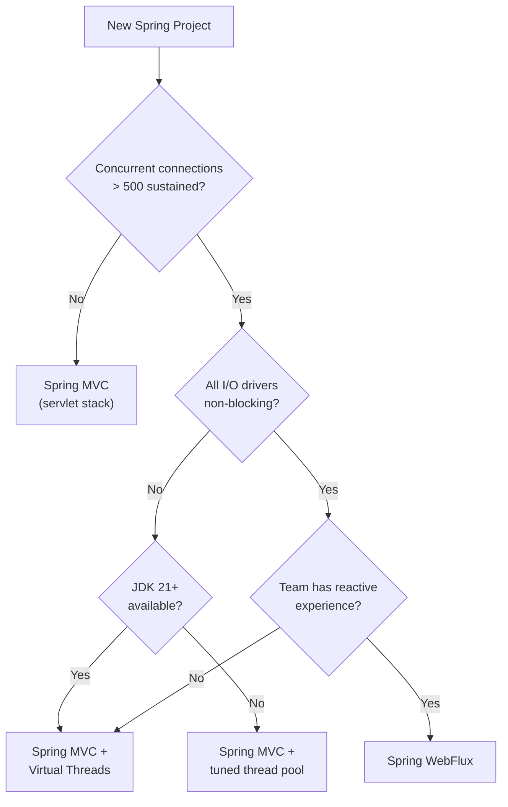
```mermaid
flowchart TD
    A["New Spring Project"] --> B{"Concurrent connections\n> 500 sustained?"}
    B -->|No| C["Spring MVC\n(servlet stack)"]
    B -->|Yes| D{"All I/O drivers\nnon-blocking?"}
    D -->|No| E{"JDK 21+\navailable?"}
    D -->|Yes| F{"Team has reactive\nexperience?"}
    E -->|Yes| G["Spring MVC +\nVirtual Threads"]
    E -->|No| H["Spring MVC +\ntuned thread pool"]
    F -->|Yes| I["Spring WebFlux"]
    F -->|No| G
```

### 📶 Gradual Depth

**Layer 1 (anyone):** Spring MVC handles one request per thread, like a bank with one teller per customer. Spring WebFlux handles many requests per thread, like one teller juggling multiple customers who are waiting for paperwork. Most banks (applications) do not need the juggling teller - regular tellers work fine.

**Layer 2 (junior dev):** The key difference is blocking vs non-blocking. In MVC, when your code calls a database, the thread waits. In WebFlux, the thread moves to another request while the database processes the query. WebFlux helps when you have many simultaneous users all waiting on slow external calls.

**Layer 3 (mid-level dev):** The decision hinges on the thread exhaustion problem. Tomcat defaults to 200 threads. If each request takes 200ms (including I/O waits), maximum throughput is 200/0.2 = 1,000 requests/second. If request time rises to 2 seconds (slow downstream service), throughput drops to 100 req/s. WebFlux decouples concurrency from thread count, maintaining throughput as I/O latency increases. But this only works if every I/O call in the chain is non-blocking.

**Layer 4 (senior dev):** Virtual threads (JDK 21+) change the equation fundamentally. They are cheap (few KB of stack vs 1 MB), can number in millions, and allow blocking code. With `spring.threads.virtual.enabled=true`, Spring MVC on virtual threads achieves WebFlux-level concurrency while keeping the imperative programming model, full JDBC/JPA compatibility, familiar stack traces, and simple debugging. The remaining advantage of WebFlux is backpressure for streaming scenarios and slightly lower memory overhead per connection.

**Layer 5 (staff+ engineer):** The honest assessment in 2024+: WebFlux's sweet spot has narrowed to API gateways, streaming endpoints (SSE, WebSocket), and systems that are architecturally committed to reactive (existing Reactor codebase). For new greenfield projects on JDK 21+, MVC with virtual threads is the pragmatic default. The reactive programming model's costs (debugging difficulty, ecosystem constraints, hiring pool, learning curve) are justified only when backpressure semantics or Reactor's operator composition are genuine requirements, not just concurrency.

### ⚙️ How It Works

The thread exhaustion problem in detail:

```
Servlet stack (Spring MVC, 200 threads):

Time -->
Thread-1: [====REQ-A====|...IO wait...|==finish==]
Thread-2: [====REQ-B====|...IO wait...|==finish==]
  ...
Thread-200: [==REQ-200==|...IO wait...|==finish==]
Thread-???: REQ-201 QUEUED (no thread available)

If IO wait = 1 second, each thread handles
1 req/sec. 200 threads = 200 req/sec max.

Reactive stack (WebFlux, 4 threads):

Thread-1: [A-start][B-start][C-start]...[A-done]
Thread-2: [D-start][E-start]...[B-done][F-start]

Threads never wait. 4 threads multiplex
thousands of in-flight requests.
```

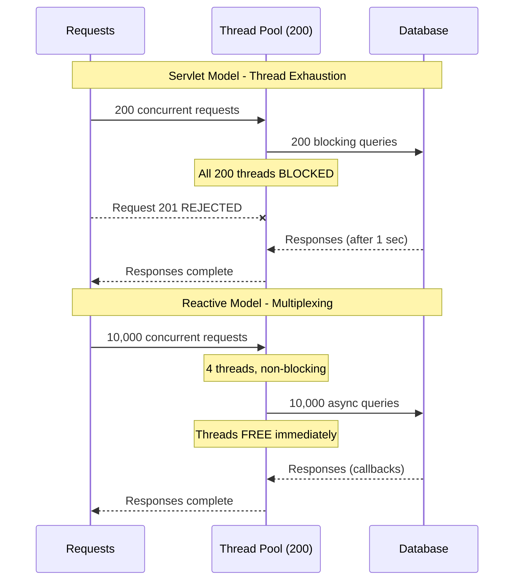
```mermaid
sequenceDiagram
    participant R as Requests
    participant TP as Thread Pool (200)
    participant DB as Database

    Note over R,DB: Servlet Model - Thread Exhaustion
    R->>TP: 200 concurrent requests
    TP->>DB: 200 blocking queries
    Note over TP: All 200 threads BLOCKED
    R--xTP: Request 201 REJECTED
    DB-->>TP: Responses (after 1 sec)
    TP-->>R: Responses complete

    Note over R,DB: Reactive Model - Multiplexing
    R->>TP: 10,000 concurrent requests
    Note over TP: 4 threads, non-blocking
    TP->>DB: 10,000 async queries
    Note over TP: Threads FREE immediately
    DB-->>TP: Responses (callbacks)
    TP-->>R: Responses complete
```

The blocking I/O chain problem:

```
WebFlux handler:
  getUserById(id)         <- non-blocking (R2DBC)
    .flatMap(user ->
      getOrderHistory(id) <- non-blocking (WebClient)
        .flatMap(orders ->
          auditLog(user)  <- BLOCKING (JDBC)!
          // ONE blocking call poisons
          // the entire pipeline
        ))

Fix: offload blocking call
  auditLog(user)
    .subscribeOn(
      Schedulers.boundedElastic())
```

The "90% rule" quantified: surveys of Spring Boot applications in production (based on dependency analysis of Maven Central and public repositories) show that approximately 90% use `spring-boot-starter-web` (servlet) vs 10% using `spring-boot-starter-webflux`. Of the WebFlux adopters, a significant portion still use blocking JDBC/JPA underneath, undermining the non-blocking benefit. The pragmatic reality: most business applications are CRUD services with moderate concurrency where the database is the bottleneck, not thread availability.

### 🚨 Failure Modes

**Failure 1 - WebFlux adopted with blocking database:**
Team chooses WebFlux for a new microservice because "reactive is modern." The service uses PostgreSQL with JPA/JDBC because the team is familiar with it and R2DBC lacks feature parity. Result: every database call blocks an event loop thread. With 4 event loop threads and 50ms average query time, effective throughput is lower than MVC because MVC's 200-thread pool would handle the same queries in parallel. The team gets reactive complexity with servlet-level (or worse) performance.
**Diagnostic:** Compare throughput (requests/second) under load between the WebFlux service and an equivalent MVC service. If WebFlux throughput is equal or lower, blocking I/O is likely the cause. Thread dumps show event loop threads blocked in JDBC calls. `BlockHound` detects violations.
**Fix:** Either migrate to R2DBC (significant effort if using JPA features), offload all JDBC calls to `Schedulers.boundedElastic()` (partial fix with added complexity), or switch to MVC (simplest, often best).

**Failure 2 - Virtual thread adoption without connection pool adjustment:**
Team enables `spring.threads.virtual.enabled=true` on JDK 21+ expecting immediate high concurrency. Under load, the database connection pool becomes the bottleneck: 10,000 virtual threads each try to acquire a connection from a pool sized at 10, causing massive queuing and timeout exceptions. Virtual threads removed the thread limit but did not remove the connection limit.
**Diagnostic:** Monitor HikariCP metrics: `hikaricp_connections_pending` spikes while `hikaricp_connections_active` stays at `maximumPoolSize`. Application logs show `SQLTransientConnectionException: Connection is not available, request timed out`.
**Fix:** Virtual threads shift the bottleneck from thread pool to connection pool. Size the database connection pool based on actual database capacity, not thread count. Use semaphores or `Bulkhead` patterns to limit concurrent database access to what the database can handle.

**Failure 3 - Reactive adopted for CPU-bound workload:**
Team builds a data processing service with WebFlux because it handles many concurrent requests. The requests involve heavy JSON parsing, business rule evaluation, and in-memory computation with minimal I/O. WebFlux provides no benefit: CPU-bound work cannot be multiplexed because the thread must execute the computation. Worse, the reactive overhead (operator allocation, context switching) adds latency compared to direct imperative code.
**Diagnostic:** CPU profiling shows threads spending 90%+ time in application code (computation, serialization) rather than parked on I/O. Switching to MVC shows equal or better throughput.
**Fix:** Use MVC for CPU-bound workloads. The event-loop model only helps when threads spend time waiting for I/O. For CPU-bound work, the optimal thread count is approximately equal to CPU core count regardless of programming model.

### 🔬 Production Reality

Decision outcomes observed across organizations:

Teams that benefit most from WebFlux: API gateways (Spring Cloud Gateway is WebFlux-based), notification services pushing SSE/WebSocket to thousands of clients, aggregation services calling 5-10 downstream APIs per request where fan-out concurrency matters, and services with existing Reactor codebases where switching would be costly.

Teams that regret WebFlux adoption: CRUD microservices with PostgreSQL/MySQL (database is the bottleneck, not threads), services where the team had no reactive experience (3-6 month learning curve, 2-3x debugging time), and services that needed JPA features unavailable in R2DBC (complex joins, stored procedures, bulk operations).

Concrete performance comparison (typical CRUD microservice, 4-core server, PostgreSQL):

| Metric                      | MVC (Tomcat)         | MVC + VT (JDK 21) | WebFlux (R2DBC) |
| --------------------------- | -------------------- | ----------------- | --------------- |
| Throughput at 100 conc      | 2,000 rps            | 2,000 rps         | 2,000 rps       |
| Throughput at 1,000 conc    | 1,800 rps            | 2,000 rps         | 2,000 rps       |
| Throughput at 10,000 conc   | Degrades (pool full) | 1,900 rps         | 1,950 rps       |
| P99 latency at 100 conc     | 15 ms                | 15 ms             | 18 ms           |
| P99 latency at 10,000 conc  | 5,000 ms+            | 50 ms             | 45 ms           |
| Thread memory at 10K conc   | N/A (rejected)       | ~50 MB            | ~8 MB           |
| Debug time (production bug) | Baseline             | Baseline          | 2-3x baseline   |
| Team onboarding time        | Baseline             | Baseline          | 3-6 months      |

The numbers converge at moderate concurrency because the database connection pool (typically 10-20 connections) is the real bottleneck. No amount of non-blocking threads changes how fast PostgreSQL processes queries.

### ⚖️ Trade-offs & Alternatives

**BAD:**

```java
// Choosing WebFlux "because it's modern"
// with blocking dependencies
@SpringBootApplication
public class OrderService {
  // spring-boot-starter-webflux
  // spring-boot-starter-data-jpa  <-- JDBC!
  // spring-boot-starter-mail      <-- blocks!
}
// Result: reactive complexity with zero
// reactive benefit. Worse debugging,
// same performance.
```

Why it is wrong: WebFlux only helps when the entire I/O chain is non-blocking. Mixing reactive handlers with blocking JPA and JavaMail means event loop threads block anyway, and you pay the full reactive complexity tax for no concurrency gain.

**GOOD:**

```java
// Choose based on actual requirements
// Option A: Most services (moderate concurrency)
@SpringBootApplication  // MVC
public class OrderService {
  // spring-boot-starter-web
  // spring-boot-starter-data-jpa
  // Simple, debuggable, full ecosystem
}

// Option B: JDK 21+, high concurrency needed
// application.properties:
// spring.threads.virtual.enabled=true

// Option C: Genuine reactive requirement
@SpringBootApplication  // WebFlux
public class GatewayService {
  // spring-boot-starter-webflux
  // spring-boot-starter-data-r2dbc
  // Full non-blocking stack, team trained
}
```

| Criterion            | MVC            | MVC + Virtual Threads | WebFlux           |
| -------------------- | -------------- | --------------------- | ----------------- |
| Max concurrency      | ~200-500       | ~100,000+             | ~100,000+         |
| Blocking I/O support | Full           | Full                  | None (event loop) |
| Database drivers     | JDBC, JPA, all | JDBC, JPA, all        | R2DBC only        |
| Debugging            | Excellent      | Excellent             | Difficult         |
| Stack traces         | Clear          | Clear                 | Reactor internals |
| Learning curve       | Low            | Low                   | High              |
| Backpressure         | Manual         | Manual                | Built-in          |
| Streaming (SSE)      | Limited        | Limited               | Native            |
| Hiring pool          | Large          | Large                 | Small             |
| JDK requirement      | 8+             | 21+                   | 8+                |

### ⚡ Decision Snap

**Default choice:** Spring MVC. It covers 90% of web applications with the simplest programming model, best debugging, and full ecosystem access.

**High concurrency with blocking I/O:** Spring MVC + virtual threads (JDK 21+). Enables massive concurrency without changing programming model or driver ecosystem.

**High concurrency with streaming/backpressure:** Spring WebFlux. Genuine advantage when you need SSE, WebSocket fan-out, or Reactor's operator composition - AND the entire I/O stack is non-blocking.

**Migrating:** Do not rewrite MVC services to WebFlux unless thread exhaustion is a measured, documented problem. The migration cost (code rewrite, driver replacement, team training, new debugging practices) rarely justifies the performance delta.

### ⚠️ Top Traps

| #   | Misconception                                      | Reality                                                                                                                                                          |
| --- | -------------------------------------------------- | ---------------------------------------------------------------------------------------------------------------------------------------------------------------- |
| 1   | WebFlux is faster than MVC                         | At moderate concurrency (under 500), MVC often has lower latency - WebFlux advantage only appears when thread pools are exhausted                                |
| 2   | Reactive is the future, MVC is legacy              | Virtual threads (JDK 21+) give MVC reactive-level concurrency with imperative code - both models will coexist indefinitely                                       |
| 3   | You can incrementally adopt WebFlux                | The programming model infects the entire call chain - one blocking call on the event loop negates the architecture, making partial adoption counterproductive    |
| 4   | R2DBC is a drop-in replacement for JDBC            | R2DBC lacks JPA, stored procedure support, bulk operations, and many JDBC features - migration requires significant redesign                                     |
| 5   | More threads always solves the concurrency problem | Threads are cheap with virtual threads but database connections are not - the bottleneck shifts from thread pool to connection pool, requiring bulkhead patterns |

### 🪜 Learning Ladder

**Prerequisites:**

- SPR-076 Spring WebFlux and Project Reactor - understanding the reactive programming model, Mono/Flux, and event loop architecture this framework evaluates

**THIS:** SPR-077 Reactive vs Servlet Stack Decision Framework - structured decision guide for choosing between Spring MVC, WebFlux, and virtual threads

**Next steps:**

- SPR-078 Spring Cloud Service Discovery (Eureka and Consul) - infrastructure patterns that apply to both servlet and reactive stacks

**The Surprising Truth:** The strongest argument against WebFlux for most teams is not performance - it is hiring and maintenance cost. Reactive programming requires fundamentally different debugging skills (reading Reactor operator traces instead of stack traces), different testing patterns (StepVerifier instead of straightforward assertions), and different mental models for error handling (onErrorResume chains instead of try-catch). In a market where most Java developers have servlet experience, choosing WebFlux means either investing 3-6 months in team training or restricting your hiring pool to the ~10% of Java developers with production reactive experience. This organizational cost often exceeds the infrastructure cost that WebFlux was meant to reduce.

**Further Reading:**

- [Spring Framework - Web on Reactive Stack](https://docs.spring.io/spring-framework/reference/web/webflux.html) - official comparison of MVC and WebFlux architectures
- [Spring Boot - Virtual Threads](https://docs.spring.io/spring-boot/reference/features/spring-application.html#features.spring-application.virtual-threads) - virtual thread configuration for Spring Boot 3.2+
- [Project Loom JEP 444](https://openjdk.org/jeps/444) - virtual threads specification that changes the MVC-vs-WebFlux calculus

**Revision Card:**

1. The decision is NOT "reactive vs blocking" - it is "where is my concurrency bottleneck?" If the bottleneck is thread count, WebFlux or virtual threads help. If the bottleneck is database connections, CPU, or downstream service capacity, neither helps.
2. Virtual threads (JDK 21+) collapse the decision space: they give MVC reactive-level concurrency while keeping imperative code, full JDBC/JPA support, clear stack traces, and simple debugging - making WebFlux's sweet spot much narrower (streaming, backpressure, existing Reactor codebases).
3. The "90% rule" holds in practice: approximately 90% of Spring Boot applications use the servlet stack, and for most of them, that is the correct choice because their bottleneck is database throughput, not thread availability.

---

# SPR-078 Spring Cloud Service Discovery (Eureka and Consul)

**TL;DR** - Service discovery replaces hardcoded URLs with a live registry so microservices find each other dynamically at runtime.

### 🔥 Problem Statement

In a monolith, components call each other via in-process method invocation. In a microservice architecture, services run on different hosts with ephemeral IPs and ports - containers restart, autoscalers add instances, blue-green deploys swap entire clusters. Hardcoding `http://order-service:8080` in application properties breaks the moment that host changes. DNS-based solutions lag behind container orchestration speed: TTL caches serve stale records for seconds or minutes while containers cycle in milliseconds. Teams need a mechanism that answers "where is order-service right now?" with sub-second accuracy, health awareness, and zero manual config changes per deployment.

### 📜 Historical Context

Service discovery predates microservices. DNS SRV records (RFC 2782, 2000) solved host lookup for distributed systems. Netflix pioneered application-level discovery with Eureka (open-sourced 2012) because AWS Classic did not provide native service discovery. Eureka was purpose-built for the Netflix microservice ecosystem: AP-favoring (availability over consistency), client-side caching, and self-preservation during network partitions. HashiCorp released Consul (2014) as a multi-datacenter service mesh with CP-favoring discovery, health checking, and KV store built in. Spring Cloud Netflix (2015) integrated Eureka into the Spring ecosystem. Spring Cloud Consul followed shortly after. Spring Cloud 2020.0 (Ilford) deprecated Ribbon in favor of Spring Cloud LoadBalancer, decoupling load balancing from discovery. Spring Cloud 2022.0 (Kilburn) further streamlined the DiscoveryClient abstraction, making the backing registry swappable without code changes. Kubernetes native discovery (CoreDNS + Service objects) now competes with application-level solutions, but Spring Cloud discovery remains essential for non-Kubernetes deployments and hybrid environments.

### 🔩 First Principles

**CORE INVARIANTS:**

1. A service registry is a distributed database of network locations - every running instance must register itself and deregister on shutdown
2. Stale registry entries are inevitable in distributed systems - heartbeats and health checks bound staleness but never eliminate it
3. Discovery must be AP or CP, never both - the CAP trade-off determines behavior during network partitions

**DERIVED DESIGN:**
Eureka chooses AP: during a partition, clients still resolve instances from their local cache even if the registry is unreachable. This means calls may route to dead instances (handled by retries and circuit breakers) but discovery never becomes a single point of failure. Consul chooses CP by default: its Raft consensus ensures consistent reads but blocks during leader elections. Spring Cloud abstracts both behind `DiscoveryClient`, so application code never couples to the registry implementation. The `@LoadBalanced` annotation layers client-side load balancing on top of discovery, turning a logical service name into a resolved HTTP call.

### 🧠 Mental Model

> Think of service discovery as an airport arrivals board. Each flight (service instance) lands at a gate (host:port) and the board updates in near real-time. Passengers (client services) check the board to find which gate to go to. If the board goes offline, passengers use the last snapshot they saw. Flights that stop sending updates get removed from the board after a timeout.

- "flight lands" -> instance registers with the registry
- "board updates" -> registry replicates state across nodes
- "passenger checks board" -> client calls DiscoveryClient
- "board offline, use last snapshot" -> client-side cache (Eureka AP behavior)

**Where this analogy breaks down:** Unlike an arrivals board that is passively read, service registries actively evict instances that miss heartbeats. Also, in Eureka's self-preservation mode, the registry deliberately stops evicting instances when it detects widespread heartbeat failures - assuming a network partition rather than mass instance death.

### 🧩 Components

```
+---------------------------------------------------+
|              Service Discovery Flow                |
|                                                    |
|  +----------+  register   +---------+             |
|  | Service  | ----------> | Registry|             |
|  | Instance |  heartbeat  | (Eureka |             |
|  +----------+ ----------> |  Server)|             |
|                           +---------+             |
|                            |  ^                    |
|                   fetch    |  | replicate          |
|                   registry |  | (peer-to-peer)     |
|                            v  |                    |
|  +----------+  resolve   +---------+              |
|  | Client   | <--------- | Registry|              |
|  | Service  |            | Replica |              |
|  +----------+            +---------+              |
|       |                                            |
|       | load-balanced call                         |
|       v                                            |
|  +----------+                                      |
|  | Resolved |                                      |
|  | Instance |                                      |
|  +----------+                                      |
+---------------------------------------------------+
```

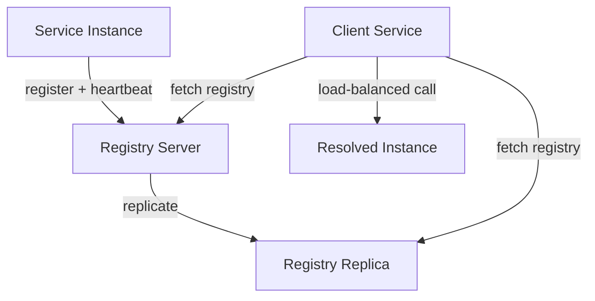
```mermaid
flowchart TD
    SI[Service Instance] -->|register + heartbeat| RS[Registry Server]
    RS -->|replicate| RR[Registry Replica]
    CS[Client Service] -->|fetch registry| RS
    CS -->|fetch registry| RR
    CS -->|load-balanced call| RI[Resolved Instance]
```

### 📶 Gradual Depth

**Level 1 - What it does:** Service discovery lets microservices find each other by name instead of hardcoded URLs. You call `order-service` and the framework resolves it to `192.168.1.42:8080`.

**Level 2 - How registration works:** Each service instance starts, registers its name, host, and port with a central registry, and sends periodic heartbeats (default: every 30 seconds in Eureka). The registry evicts instances that miss heartbeats (default: 90 seconds without heartbeat). Clients fetch the registry periodically (default: every 30 seconds) and cache it locally.

**Level 3 - Eureka vs Consul architecture:** Eureka uses peer-to-peer replication with no leader election. Every Eureka server node is equal - writes go to any node and replicate asynchronously. This is AP: during a partition, both sides serve (possibly divergent) registries. Consul uses Raft consensus with a single leader. Writes go through the leader and replicate to followers. This is CP: during a leader election, writes block until a new leader is elected (typically under 5 seconds).

**Level 4 - Spring Cloud abstraction layer:** `DiscoveryClient` is the SPI (Service Provider Interface). Eureka, Consul, Zookeeper, and Kubernetes all implement it. `@LoadBalanced` on a `RestTemplate` or `WebClient.Builder` bean activates `ReactorLoadBalancerExchangeFilterFunction`, which intercepts calls using logical service names, resolves them via `DiscoveryClient`, and applies a load balancing strategy (round-robin by default).

```java
@Bean
@LoadBalanced
public RestTemplate restTemplate() {
    return new RestTemplate();
}

// "order-service" resolved via discovery
restTemplate.getForObject(
    "http://order-service/api/orders",
    Order[].class
);
```

**Level 5 - Self-preservation and consistency trade-offs:** Eureka's self-preservation mode activates when the renewal rate drops below a threshold (default: 85% of expected renewals in 15 minutes). When active, Eureka stops evicting instances - it assumes a network partition rather than mass failures. This prevents cascading failures where a network blip causes Eureka to evict healthy instances, which causes clients to lose all targets. The cost: stale entries persist longer. Consul's anti-entropy sync and gossip protocol (Serf) detect failures faster but at the cost of availability during leader elections.

### ⚙️ How It Works

```
+---------------------------------------------------+
|   Client-Side Discovery (Spring Cloud Default)     |
|                                                    |
|  1. App starts                                     |
|     -> EurekaAutoConfiguration activates           |
|     -> EurekaClient registers with server          |
|                                                    |
|  2. Heartbeat loop (every 30s)                     |
|     -> POST /eureka/apps/{appId}                   |
|     -> Server renews lease                         |
|                                                    |
|  3. Registry fetch (every 30s)                     |
|     -> GET /eureka/apps (full)                     |
|     -> GET /eureka/apps/delta (incremental)        |
|     -> Client caches locally                       |
|                                                    |
|  4. @LoadBalanced call                             |
|     -> Intercept "http://svc-name/path"            |
|     -> Resolve via local cache                     |
|     -> Round-robin select instance                 |
|     -> Rewrite URL to "http://host:port/path"      |
|     -> Execute HTTP call                           |
|                                                    |
|  5. Shutdown                                       |
|     -> DELETE /eureka/apps/{appId}/{id}            |
|     -> Graceful deregistration                     |
+---------------------------------------------------+
```

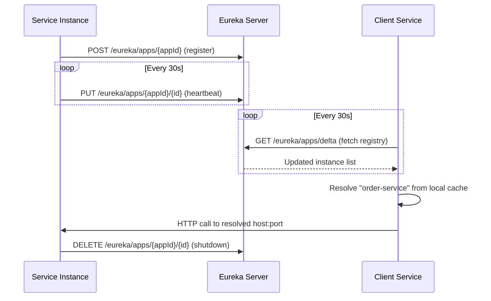
```mermaid
sequenceDiagram
    participant App as Service Instance
    participant ES as Eureka Server
    participant CL as Client Service
    App->>ES: POST /eureka/apps/{appId} (register)
    loop Every 30s
        App->>ES: PUT /eureka/apps/{appId}/{id} (heartbeat)
    end
    loop Every 30s
        CL->>ES: GET /eureka/apps/delta (fetch registry)
        ES-->>CL: Updated instance list
    end
    CL->>CL: Resolve "order-service" from local cache
    CL->>App: HTTP call to resolved host:port
    App->>ES: DELETE /eureka/apps/{appId}/{id} (shutdown)
```

**Registration deep dive:** `EurekaInstanceConfigBean` builds instance metadata from `spring.application.name`, `server.port`, and `eureka.instance.*` properties. The `EurekaAutoServiceRegistration` bean implements `SmartLifecycle` and registers the instance during `start()` phase. Registration is a REST call to the Eureka server: `POST /eureka/apps/{appName}` with instance metadata as JSON/XML payload.

**Health check integration:** By default, Eureka relies solely on heartbeats for liveness. Adding `eureka.client.healthcheck.enabled=true` makes Eureka delegate to Spring Boot's `/actuator/health` endpoint. If the health check returns DOWN, the instance status in the registry changes to DOWN even though heartbeats continue - preventing traffic routing to an unhealthy instance that is still running.

```properties
# Eureka server
eureka.client.register-with-eureka=false
eureka.client.fetch-registry=false
eureka.server.enable-self-preservation=true

# Eureka client
eureka.client.service-url.defaultZone=\
  http://eureka1:8761/eureka,\
  http://eureka2:8762/eureka
eureka.instance.prefer-ip-address=true
eureka.client.healthcheck.enabled=true
```

### 🚨 Failure Modes

**Failure 1 - Stale Registry After Network Partition:**
Eureka self-preservation activates during a network split, keeping all instances registered even if some are down. Clients route traffic to dead instances.

**Diagnostic:** Monitor `eureka.server.numOfRenewsPerMinThreshold` vs actual renewals in Eureka dashboard. Self-preservation activates when renewals drop below the threshold. Check `/actuator/health` of individual instances.

**Fix:** Do not disable self-preservation in production - it protects against cascading failures. Instead, pair discovery with circuit breakers (Resilience4j) and retry logic. Tune `eureka.server.renewal-percent-threshold` (default 0.85) downward only if your instance count is very small (fewer than 10) where a single instance failure triggers self-preservation.

**Failure 2 - Registration Storm After Eureka Server Restart:**
When a Eureka server restarts, all clients simultaneously re-register and fetch the full registry, creating a thundering herd. CPU and network spike on the Eureka server.

**Diagnostic:** Monitor Eureka server CPU, memory, and request latency during restarts. Look for `SocketTimeoutException` in client logs.

**Fix:** Deploy Eureka servers in a peer-aware cluster (minimum 2 nodes). Clients have local caches that survive server restarts. Add jitter to client fetch intervals: `eureka.client.registry-fetch-interval-seconds` with small random offset per instance. Use `eureka.server.response-cache-update-interval-ms` to batch responses.

**Failure 3 - Cross-Zone Discovery Latency:**
In multi-AZ deployments, clients discover instances in all zones but prefer the local zone. Misconfigured zone affinity causes cross-AZ traffic, increasing latency and cost.

**Diagnostic:** Check `eureka.instance.metadata-map.zone` on all instances. Verify `eureka.client.prefer-same-zone-eureka=true`. Monitor cross-AZ network transfer in cloud provider billing.

**Fix:** Explicitly set zone metadata on every instance. Configure zone-aware load balancing in Spring Cloud LoadBalancer with `spring.cloud.loadbalancer.zone` property.

### 🔬 Production Reality

At scale (hundreds of microservices, thousands of instances), Eureka's AP design shines: partial failures degrade gracefully because clients always have a local cache. Netflix ran Eureka at this scale for years. The critical production insight is that discovery is only half the story - you need circuit breakers, retries, and timeouts layered on top because the registry will always have some degree of staleness.

Consul's CP design provides stronger consistency guarantees but introduces operational complexity: Raft leader elections, quorum requirements, and the need for odd-numbered server clusters (3 or 5 nodes). Consul's built-in health checking (TCP, HTTP, gRPC, script-based) is more sophisticated than Eureka's heartbeat model.

For Kubernetes deployments, consider whether you need application-level discovery at all. Kubernetes Services + CoreDNS provide server-side discovery natively. Spring Cloud Kubernetes integrates with the Kubernetes API server directly. Application-level discovery adds value in hybrid environments (some services in Kubernetes, others on VMs) or when you need features Kubernetes DNS does not provide (instance metadata, custom health checks, weighted routing).

### ⚖️ Trade-offs & Alternatives

**BAD:**
```java
// Hardcoded URL - breaks on any topology change
@Value("${order.service.url}")
private String orderUrl;
// Every deployment needs config updates
// No health awareness - calls dead instances
```

**GOOD:**
```java
@Bean
@LoadBalanced
public WebClient.Builder webClient() {
    return WebClient.builder();
}
// Logical name resolved at call time
// Health-aware, load-balanced, cache-backed
Mono<Order> order = webClient.build()
    .get()
    .uri("http://order-service/api/orders/1")
    .retrieve()
    .bodyToMono(Order.class);
```

| Criterion           | Eureka        | Consul          | K8s DNS      |
|---------------------|---------------|-----------------|--------------|
| CAP preference      | AP            | CP              | CP (etcd)    |
| Health checking     | Heartbeat     | Multi-protocol  | Liveness     |
| Multi-datacenter    | Limited       | Native          | Federation   |
| Operational burden  | Low           | Medium          | High (K8s)   |
| Spring integration  | First-class   | First-class     | First-class  |
| KV store            | No            | Yes             | ConfigMap    |
| Service mesh        | No            | Connect (Envoy) | Istio/Linkerd|
| Consistency         | Eventual      | Strong (leader) | Strong (etcd)|

### ⚡ Decision Snap

Use Eureka when: you need AP discovery, your infrastructure is not Kubernetes-native, you want minimal operational overhead, and you already use Spring Cloud Netflix components.

Use Consul when: you need multi-datacenter discovery, built-in KV store, sophisticated health checks, or you are building a service mesh with Consul Connect.

Use Kubernetes DNS when: all services run in Kubernetes and you do not need instance-level metadata or custom health semantics beyond liveness/readiness probes.

Skip application-level discovery entirely when: you have fewer than 5 services, deployments are infrequent, and a simple load balancer or DNS suffices.

### ⚠️ Top Traps

| # | Trap                                | Why It Hurts                          | Prevention                              |
|---|-------------------------------------|---------------------------------------|-----------------------------------------|
| 1 | Disabling self-preservation in prod | Cascading evictions during partitions | Keep enabled; add circuit breakers      |
| 2 | Single Eureka server (no peers)     | SPOF for all service resolution       | Minimum 2-node peer-aware cluster       |
| 3 | Missing health check integration    | Heartbeat alive but app is broken     | Set healthcheck.enabled=true            |
| 4 | Ignoring zone affinity config       | Cross-AZ latency and cost explosion   | Set zone metadata on every instance     |
| 5 | Not caching DiscoveryClient results | Hammering registry on every call      | @LoadBalanced caches; trust the cache   |

### 🪜 Learning Ladder

- **Prerequisites:** SPR-052 (Spring REST basics), SPR-060 (Spring Boot Actuator Health)
- **Current:** SPR-078 - Service Discovery with Eureka and Consul
- **Next:** SPR-079 (Spring Cloud Config Server) - externalized config across services
- **Related:** SPR-081 (Resilience4j Circuit Breaker) - fault tolerance layered on discovery

**The Surprising Truth:** The biggest production risk with service discovery is not the registry going down - Eureka's client-side cache makes it remarkably resilient. The real risk is trusting the registry too much: treating a registered instance as healthy without circuit breakers, retries, and timeouts. Discovery tells you where a service was recently. Only the actual call tells you if it is alive right now.

**Further Reading:**
- Netflix Eureka Wiki (GitHub: Netflix/eureka/wiki)
- HashiCorp Consul Architecture documentation
- Spring Cloud Netflix reference documentation
- Spring Cloud Commons DiscoveryClient reference

**Revision Card:**
1. Eureka is AP (available during partitions, eventually consistent). Consul is CP (consistent via Raft, unavailable during leader elections). This CAP choice determines every behavioral difference between them.
2. Self-preservation is Eureka's most misunderstood feature: when heartbeat renewals drop below 85% of expected, Eureka stops evicting instances. This prevents network blips from causing mass eviction. Never disable it in production.
3. `@LoadBalanced` on RestTemplate/WebClient.Builder activates client-side load balancing through Spring Cloud LoadBalancer. It intercepts calls using logical service names, resolves via the local registry cache, and rewrites the URL to the selected instance's host:port.

---

# SPR-079 Spring Cloud Config Server

**TL;DR** - Config Server centralizes externalized configuration across all microservices, backed by Git, Vault, or filesystem with runtime refresh.

### 🔥 Problem Statement

In a microservice architecture with dozens or hundreds of services, configuration management becomes a distributed systems problem. Each service has its own `application.yml` with database URLs, feature flags, timeouts, and secrets. When you need to change a timeout across 30 services, you face 30 PRs, 30 builds, and 30 deployments. Secrets embedded in config files end up in Git history. Environment-specific config (dev, staging, production) multiplies the problem. Teams need a single source of truth for configuration that supports versioning, encryption, environment isolation, and runtime updates without redeployment.

### 📜 Historical Context

Externalized configuration is an old idea. Unix environment variables, Java system properties, and JNDI have served this purpose for decades. The Twelve-Factor App (2011) codified "store config in the environment" as a best practice. But environment variables do not version, audit, or encrypt well. Netflix created Archaius (2012) for dynamic configuration, integrated with its Eureka-based ecosystem. Spring Cloud Config (2015) took a different approach: a dedicated HTTP server that serves configuration from a versioned backend (Git by default). This design leverages Git's strengths - versioning, branching, audit trail, pull requests - for configuration management. Spring Cloud Config 2.x added Vault backend support for secrets. Spring Cloud 2020.0 added Spring Cloud Bus integration for push-based config propagation. Spring Cloud 2022.0 introduced improved bootstrap context handling with `spring.config.import` replacing the legacy `bootstrap.yml` approach. Spring Boot 3.x and Spring Cloud 2023.0+ encourage the import-based approach as the default pattern.

### 🔩 First Principles

**CORE INVARIANTS:**

1. Configuration is data, not code - it changes independently of application logic and must be manageable without recompilation or redeployment
2. A configuration system must resolve the right value for a given application, profile, and label (version/branch) - the resolution order must be deterministic and documented
3. Secrets are configuration with stricter access control - they require encryption at rest, in transit, and in the backend, with key rotation support

**DERIVED DESIGN:**
Config Server serves configuration over HTTP using a well-defined URL pattern: `/{application}/{profile}/{label}`. The application name maps to the service name (`spring.application.name`). The profile maps to the Spring active profile (dev, prod). The label maps to a Git branch or tag. This three-dimensional resolution provides environment isolation (profiles), versioning (labels), and multi-tenancy (application names) in a single, auditable system. Encryption endpoints (`/encrypt`, `/decrypt`) handle secrets without exposing plaintext in the backend.

### 🧠 Mental Model

> Think of Config Server as a library's reference desk. Each book (configuration file) is organized by title (application name), edition (profile), and revision (Git branch/label). When a microservice needs its config, it walks up to the desk, states its name, edition, and revision, and the librarian retrieves exactly the right version. If the book is updated, the librarian can notify all current readers (Spring Cloud Bus) to pick up the new edition without leaving the building (without restart).

- "book title" -> `spring.application.name`
- "edition" -> active Spring profile (dev, prod)
- "revision" -> Git branch or tag (label)
- "librarian notifies readers" -> Spring Cloud Bus + `@RefreshScope`

**Where this analogy breaks down:** Unlike a library where you get the whole book, Config Server returns merged properties from multiple sources with a specific precedence order. Application-specific config overrides shared config. Profile-specific overrides non-profile. This merge behavior has no clean library equivalent.

### 🧩 Components

```
+---------------------------------------------------+
|           Spring Cloud Config Architecture         |
|                                                    |
|  +-----------+    HTTP     +---------------+      |
|  | Config    | <---------> | Config Server |      |
|  | Client    |   /app/prof | (Spring Boot  |      |
|  | (service) |   /label    |  application) |      |
|  +-----------+             +-------+-------+      |
|       |                            |               |
|       | @RefreshScope              | backend       |
|       | beans reloaded             |               |
|       v                    +-------+-------+      |
|  +-----------+             |  Git / Vault  |      |
|  | Refreshed |             |  / Filesystem |      |
|  | Config    |             +---------------+      |
|  +-----------+                     |               |
|                                    |               |
|  +-----------+   Bus event  +------+------+       |
|  | Other     | <----------- | Spring Cloud|       |
|  | Clients   |  /bus/refresh| Bus (AMQP/  |       |
|  +-----------+              | Kafka)      |       |
|                             +-------------+       |
+---------------------------------------------------+
```

```mermaid
flowchart TD
    CC[Config Client] -->|GET /app/profile/label| CS[Config Server]
    CS -->|read config| GB[Git / Vault / FS Backend]
    BUS[Spring Cloud Bus] -->|RefreshRemoteApplicationEvent| CC
    BUS -->|RefreshRemoteApplicationEvent| CC2[Other Config Clients]
    CS -->|push refresh| BUS
    CC -->|@RefreshScope reload| RB[Refreshed Beans]
```

### 📶 Gradual Depth

**Level 1 - What it does:** Config Server is a Spring Boot app that serves configuration properties to other services over HTTP. Instead of each service bundling its own config, they all fetch from one central server backed by a Git repository.

**Level 2 - How resolution works:** A client service named `order-service` running with profile `prod` requests `GET /order-service/prod/main`. Config Server looks in the Git repo for files in this precedence (highest to lowest): `order-service-prod.yml`, `order-service.yml`, `application-prod.yml`, `application.yml`. Properties from higher-precedence files override lower ones. The merged result is returned as JSON.

**Level 3 - Bootstrap vs import:** The legacy approach used `bootstrap.yml` (loaded before `application.yml`) to configure Config Server connection details. Spring Cloud 2022.0+ replaces this with `spring.config.import=configserver:http://config:8888` in `application.yml`. The import approach integrates with Spring Boot's native config processing, supports retry and failfast natively, and eliminates the separate bootstrap context.

```yaml
# Modern approach (application.yml)
spring:
  application:
    name: order-service
  config:
    import: "configserver:http://config:8888"
  cloud:
    config:
      fail-fast: true
      retry:
        max-attempts: 6
        initial-interval: 1000
```

**Level 4 - @RefreshScope and runtime updates:** Beans annotated with `@RefreshScope` are proxied. When a `RefreshScopeRefreshedEvent` fires (triggered by `POST /actuator/refresh`), the proxy destroys the current bean instance and creates a new one with updated configuration. This enables runtime config changes without restart. Caveat: only `@RefreshScope` beans re-read config. `@Value` injections in non-refresh-scoped beans retain their startup values.

**Level 5 - Spring Cloud Bus propagation:** In a system with 50 instances of `order-service`, calling `/actuator/refresh` on each one is impractical. Spring Cloud Bus uses a message broker (RabbitMQ or Kafka) to broadcast refresh events. A single `POST /actuator/busrefresh` to any instance (or the Config Server itself) publishes a `RefreshRemoteApplicationEvent` to the bus. All subscribed instances receive it and refresh their `@RefreshScope` beans. Targeted refresh is possible: `POST /actuator/busrefresh/order-service:**` refreshes only order-service instances.

### ⚙️ How It Works

```
+---------------------------------------------------+
|     Config Resolution and Refresh Flow             |
|                                                    |
|  1. Service starts                                 |
|     -> spring.config.import triggers               |
|     -> ConfigServerConfigDataLoader activates      |
|     -> GET /order-service/prod/main                |
|                                                    |
|  2. Config Server resolves                         |
|     -> Clones/pulls Git repo (cached)              |
|     -> Reads: order-service-prod.yml               |
|              order-service.yml                      |
|              application-prod.yml                   |
|              application.yml                        |
|     -> Merges with precedence order                |
|     -> Decrypts {cipher} values                    |
|     -> Returns JSON response                       |
|                                                    |
|  3. Client applies config                          |
|     -> Properties merged into Environment          |
|     -> @Value and @ConfigurationProperties bind    |
|     -> @RefreshScope beans created lazily          |
|                                                    |
|  4. Config change pushed to Git                    |
|     -> Webhook calls /monitor endpoint             |
|     -> Config Server fires bus event               |
|     -> All clients receive refresh event           |
|     -> @RefreshScope beans destroyed + recreated   |
+---------------------------------------------------+
```

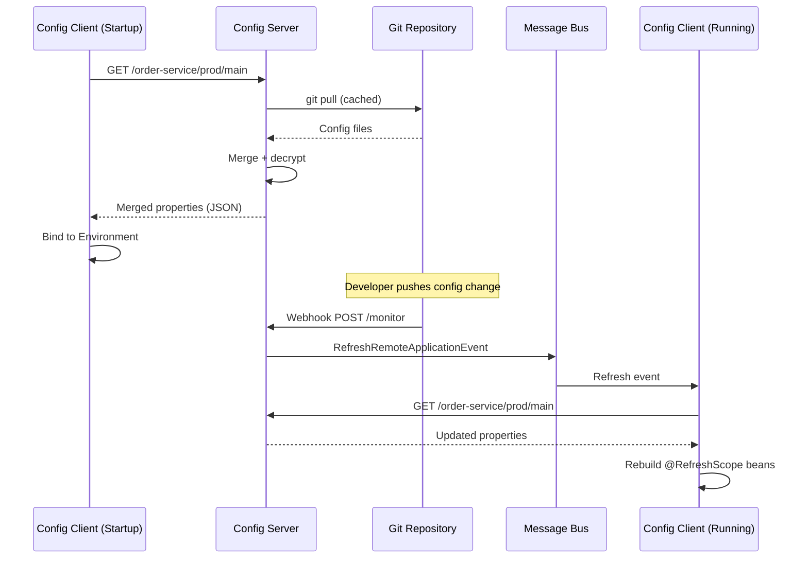
```mermaid
sequenceDiagram
    participant CS as Config Client (Startup)
    participant SV as Config Server
    participant GIT as Git Repository
    participant BUS as Message Bus
    participant CS2 as Config Client (Running)
    CS->>SV: GET /order-service/prod/main
    SV->>GIT: git pull (cached)
    GIT-->>SV: Config files
    SV->>SV: Merge + decrypt
    SV-->>CS: Merged properties (JSON)
    CS->>CS: Bind to Environment
    Note over GIT: Developer pushes config change
    GIT->>SV: Webhook POST /monitor
    SV->>BUS: RefreshRemoteApplicationEvent
    BUS->>CS2: Refresh event
    CS2->>SV: GET /order-service/prod/main
    SV-->>CS2: Updated properties
    CS2->>CS2: Rebuild @RefreshScope beans
```

**Encryption and secrets:** Config Server provides `/encrypt` and `/decrypt` endpoints. Encrypted values in config files use the `{cipher}` prefix. When Config Server reads `db.password: {cipher}AQA...`, it decrypts the value before returning it to the client. Encryption uses symmetric (shared secret) or asymmetric (RSA keypair) keys configured via `encrypt.key` or a keystore. The plaintext never appears in Git - only the `{cipher}` value is committed.

```yaml
# In Git repo: order-service-prod.yml
spring:
  datasource:
    url: jdbc:postgresql://prod-db:5432/orders
    username: order_svc
    # Encrypted - decrypted by Config Server
    password: "{cipher}AQBkN3L2x9..."

# Config Server application.yml
encrypt:
  key: ${ENCRYPT_KEY}  # from env or Vault
```

**Vault backend:** For organizations that require a dedicated secrets manager, Config Server supports HashiCorp Vault as a backend. Config Server authenticates with Vault using a token, AppRole, or Kubernetes auth, then reads secrets from Vault's KV engine. The Vault backend can be combined with Git: Git serves non-sensitive config, Vault serves secrets. Config Server merges both sources transparently.

```yaml
# Config Server with composite backend
spring:
  profiles:
    active: git, vault
  cloud:
    config:
      server:
        git:
          uri: https://github.com/org/config-repo
        vault:
          host: vault.internal
          port: 8200
          authentication: APPROLE
```

### 🚨 Failure Modes

**Failure 1 - Config Server Unavailable at Startup:**
If Config Server is down when a client starts, the client cannot fetch its configuration. By default, the client starts with whatever local config it has, which may be incomplete or wrong for the environment.

**Diagnostic:** Client logs show `Could not locate PropertySource` warnings. Application starts but behaves incorrectly (wrong database URL, missing feature flags). Check Config Server health at `/actuator/health`.

**Fix:** Set `spring.cloud.config.fail-fast=true` so the client fails to start instead of running with bad config. Add retry configuration: `spring.cloud.config.retry.max-attempts=6` with exponential backoff. Ensure Config Server is highly available (multiple instances behind a load balancer). For extreme resilience, use `spring.cloud.config.allow-override=true` with local fallback config.

**Failure 2 - Refresh Scope Bean Initialization Error:**
A config change pushed via Git webhook triggers a bus refresh. A `@RefreshScope` bean fails to reinitialize because the new config value is invalid (wrong URL format, missing required property). The bean is destroyed but not recreated.

**Diagnostic:** Application logs show `BeanCreationException` during refresh. The affected endpoint returns 500 errors. Other non-refresh-scoped beans continue working normally.

**Fix:** Validate config values in `@ConfigurationProperties` classes using JSR-303 annotations (`@NotNull`, `@URL`, `@Pattern`). This fails fast on invalid config during refresh rather than producing a broken bean. Test config changes in a lower environment first. Use Git branch labels to roll back: point clients to a previous commit via the label parameter.

**Failure 3 - Git Clone Timeout Under Load:**
Config Server clones the Git repo on first request and pulls on subsequent requests. If the Git server is slow or the repo is large, clone operations timeout. Under high load (many services starting simultaneously), Git operations queue and clients timeout.

**Diagnostic:** Config Server logs show `TransportException: Connection timed out` or `org.eclipse.jgit.api.errors.GitAPIException`. Client logs show connection timeouts to Config Server.

**Fix:** Set `spring.cloud.config.server.git.clone-on-start=true` to clone at startup rather than on first request. Use `spring.cloud.config.server.git.force-pull=true` to avoid merge conflicts. Set reasonable timeouts: `spring.cloud.config.server.git.timeout=10`. Keep the config repo small - do not store application code in it. Use a local Git mirror for reliability.

### 🔬 Production Reality

In production, Config Server becomes critical infrastructure - every service depends on it at startup. Treat it with the same rigor as your database: high availability, monitoring, and disaster recovery. Deploy at least two instances behind a load balancer. Use `clone-on-start` to front-load Git operations. Monitor the Git backend's availability independently.

The refresh mechanism is powerful but dangerous. A bad config change propagated via Spring Cloud Bus affects all instances simultaneously. Production-grade setups use staged rollouts: refresh one instance, verify health, then refresh the rest. Some teams disable automatic bus propagation and trigger refreshes manually per service or per instance group.

Encryption via Config Server's `/encrypt` endpoint is convenient but not enterprise-grade secrets management. For production secrets, prefer HashiCorp Vault or cloud-native solutions (AWS Secrets Manager, Azure Key Vault) as Config Server backends. Config Server then acts as a unified facade - services do not need to know which backend stores which values.

A common architecture at scale: Git backend for application config (feature flags, timeouts, URLs), Vault backend for secrets (database passwords, API keys, certificates), and Spring Cloud Bus (Kafka-backed) for propagation. This separates concerns: developers manage config via Git PRs with code review, security teams manage secrets via Vault policies, and operations trigger refreshes via bus endpoints.

### ⚖️ Trade-offs & Alternatives

**BAD:**
```properties
# Secrets in application.yml committed to Git
spring.datasource.password=SuperSecret123
# Same config duplicated across 30 services
# Changing a timeout requires 30 deployments
```

**GOOD:**
```yaml
# Config client - single import line
spring:
  config:
    import: "configserver:http://config:8888"
# Secrets encrypted or in Vault
# Shared config in application.yml (config repo)
# Service-specific in {app}.yml (config repo)
# Runtime refresh via @RefreshScope + Bus
```

| Criterion          | Config Server   | K8s ConfigMap   | Consul KV       |
|--------------------|-----------------|-----------------|-----------------|
| Versioning         | Git-native      | kubectl/GitOps  | Manual/API      |
| Encryption         | Built-in        | Sealed Secrets  | Vault transit   |
| Runtime refresh    | @RefreshScope   | Volume mount    | Watch/blocking  |
| Audit trail        | Git log         | etcd audit      | Audit log       |
| Spring integration | Native          | Via spring-cloud| Via spring-cloud|
| Secrets management | Vault backend   | External Secrets| Vault Connect   |
| Operational cost   | Dedicated server| K8s included    | Consul cluster  |
| Scalability        | LB + replicas   | etcd-backed     | Raft cluster    |

### ⚡ Decision Snap

Use Spring Cloud Config Server when: you have multiple Spring Boot microservices, need versioned configuration with Git audit trail, require runtime refresh without redeployment, and want a Spring-native solution.

Use Kubernetes ConfigMaps/Secrets when: all services run in Kubernetes, you use GitOps (ArgoCD/Flux) for declarative config, and you do not need `@RefreshScope`-style dynamic refresh.

Use Consul KV when: you already use Consul for service discovery and want a single tool for both discovery and configuration.

Skip centralized config when: you have fewer than 5 services, config changes are rare, and environment variables or local files suffice.

### ⚠️ Top Traps

| # | Trap                                  | Why It Hurts                           | Prevention                                |
|---|---------------------------------------|----------------------------------------|-------------------------------------------|
| 1 | Single Config Server, no HA           | Every service fails to start on outage | Deploy 2+ instances behind load balancer  |
| 2 | Plaintext secrets in Git config repo  | Credential exposure in repo history    | Use {cipher} prefix or Vault backend      |
| 3 | Missing fail-fast on clients          | Services start with wrong/empty config | Set spring.cloud.config.fail-fast=true    |
| 4 | Bus refresh without staged rollout    | Bad config takes down all instances    | Refresh one instance, verify, then all    |
| 5 | @RefreshScope on critical beans       | Refresh failure breaks running service | Validate config; use @ConfigurationProperties validation |

### 🪜 Learning Ladder

- **Prerequisites:** SPR-028 (Spring Profiles and Configuration), SPR-029 (Spring Boot Properties and YAML)
- **Current:** SPR-079 - Spring Cloud Config Server
- **Next:** SPR-080 (Spring Cloud Gateway and Rate Limiting) - API gateway with centralized routing
- **Related:** SPR-078 (Service Discovery) - services find each other; SPR-081 (Circuit Breaker) - resilience when config or services fail

**The Surprising Truth:** The hardest part of Config Server is not the technology - it is the organizational discipline. Config Server works perfectly when teams follow conventions: shared properties in `application.yml`, service-specific in `{app-name}.yml`, secrets encrypted or in Vault, changes reviewed via Git PRs. It falls apart when teams dump everything in one file, commit plaintext secrets, or bypass the refresh mechanism by restarting services manually. Config Server is an organizational pattern enforced by technology, not the other way around.

**Further Reading:**
- Spring Cloud Config reference documentation
- Spring Cloud Bus reference documentation
- HashiCorp Vault Spring Cloud integration guide
- Twelve-Factor App, Factor III: Config

**Revision Card:**
1. Config Server resolves configuration via three dimensions: application name, profile, and label (Git branch/tag). The URL pattern `/{app}/{profile}/{label}` maps directly to files in the Git repository with a deterministic precedence order.
2. `@RefreshScope` beans are proxied and destroyed/recreated on refresh events. Only beans explicitly annotated with `@RefreshScope` pick up config changes at runtime - all other beans retain their startup values until the application restarts.
3. Spring Cloud Bus broadcasts refresh events via a message broker (RabbitMQ or Kafka). A single `POST /actuator/busrefresh` propagates a config change to all subscribed service instances without individual restart or manual refresh calls.

---

# SPR-080 Spring Cloud Gateway and Rate Limiting

> Entry stub. Generate full content using LEARN_PROMPT.md v1.0. Template: COMPLEX.

---

---

# SPR-081 Resilience4j Circuit Breaker with Spring

> Entry stub. Generate full content using LEARN_PROMPT.md v1.0. Template: COMPLEX.

---

---

# SPR-082 Spring Batch for Large-Scale Processing

> Entry stub. Generate full content using LEARN_PROMPT.md v1.0. Template: COMPLEX.

---

---

# SPR-083 Debugging Spring Auto-Configuration Failures

> Entry stub. Generate full content using LEARN_PROMPT.md v1.0. Template: COMPLEX.

---

---

# SPR-084 Circular Dependency Trap Anti-Pattern

> Entry stub. Generate full content using LEARN_PROMPT.md v1.0. Template: COMPLEX.

---

---

# SPR-085 Fat ApplicationContext Anti-Pattern

> Entry stub. Generate full content using LEARN_PROMPT.md v1.0. Template: COMPLEX.

---

---

# SPR-086 Spring Deep-Dive Interview Questions

> Entry stub. Generate full content using LEARN_PROMPT.md v1.0. Template: COMPLEX.

---

---

# SPR-087 REST API Phase 4 - Observability and Resilience

> Entry stub. Generate full content using LEARN_PROMPT.md v1.0. Template: COMPLEX.

---

---

# SPR-088 Production Incident Simulation with Spring

> Entry stub. Generate full content using LEARN_PROMPT.md v1.0. Template: COMPLEX.

---

---

# SPR-089 Spring Mastery Verification

> Entry stub. Generate full content using LEARN_PROMPT.md v1.0. Template: COMPLEX.
