## Keywords

1. [SPR-024 @RestController and Request Mapping](#spr-024-restcontroller-and-request-mapping)
2. [SPR-025 Request and Response DTOs with Bean Validation](#spr-025-request-and-response-dtos-with-bean-validation)
3. [SPR-026 Global Exception Handling (@ControllerAdvice)](#spr-026-global-exception-handling-controlleradvice)
4. [SPR-027 Spring Data JPA - Repository Pattern](#spr-027-spring-data-jpa---repository-pattern)
5. [SPR-028 Spring Profiles and Environment Abstraction](#spr-028-spring-profiles-and-environment-abstraction)
6. [SPR-029 @ConfigurationProperties - Typed Configuration](#spr-029-configurationproperties---typed-configuration)
7. [SPR-030 Spring Security Authentication Basics](#spr-030-spring-security-authentication-basics)
8. [SPR-031 Spring Security Authorization (RBAC)](#spr-031-spring-security-authorization-rbac)
9. [SPR-032 @Transactional Basics](#spr-032-transactional-basics)
10. [SPR-033 Spring Cache Abstraction (@Cacheable)](#spr-033-spring-cache-abstraction-cacheable)
11. [SPR-034 Logging in Spring Boot (SLF4J and Logback)](#spr-034-logging-in-spring-boot-slf4j-and-logback)
12. [SPR-035 Spring Boot Testing (@SpringBootTest)](#spr-035-spring-boot-testing-springboottest)
13. [SPR-036 MockMvc and Slice Testing (@WebMvcTest)](#spr-036-mockmvc-and-slice-testing-webmvctest)
14. [SPR-037 Repository vs @Query vs Native SQL Decision Guide](#spr-037-repository-vs-query-vs-native-sql-decision-guide)
15. [SPR-038 Build a CRUD REST Service Exercise](#spr-038-build-a-crud-rest-service-exercise)
16. [SPR-039 REST API Phase 2 - Data Layer and Validation](#spr-039-rest-api-phase-2---data-layer-and-validation)
17. [SPR-040 Spring Quick Recall Card](#spr-040-spring-quick-recall-card)
18. [SPR-041 Field Injection Anti-Pattern](#spr-041-field-injection-anti-pattern)
19. [SPR-042 Spring Interview Essentials - Working Level](#spr-042-spring-interview-essentials---working-level)
20. [SPR-043 Debugging Spring Startup Errors Exercise](#spr-043-debugging-spring-startup-errors-exercise)

---

# SPR-024 @RestController and Request Mapping

**TL;DR** - `@RestController` pairs with `@RequestMapping` to route HTTP requests to handler methods that return serialized objects.

### 🔥 The Problem in One Paragraph

A web application receives HTTP requests at various paths with different verbs, headers, content types, and parameters. Without a routing framework, you write raw servlet code: parse the URL yourself, check the HTTP method, deserialize JSON manually, serialize the response, set headers, handle content negotiation. For 50 endpoints, that is 50 blocks of repetitive routing and serialization code with no consistency, no validation, and no discoverability. This is exactly why **@RestController and request mapping** were created.

### 📘 Textbook Definition

**@RestController** is a Spring stereotype annotation that combines `@Controller` and `@ResponseBody`. Every handler method's return value is serialized directly to the HTTP response body (typically JSON via Jackson). **@RequestMapping** (and its composed variants `@GetMapping`, `@PostMapping`, etc.) declares which HTTP method and URI pattern a handler method responds to.

### 🧠 Mental Model

> A `@RestController` is a postal sorting office. Each `@GetMapping("/orders/{id}")` is a sorting slot. When a letter (HTTP request) arrives, the office matches the address (URI) and stamp type (HTTP method) to the right slot, then routes it to the handler.

- "Sorting slot" -> `@GetMapping`, `@PostMapping`, etc.
- "Address on envelope" -> URI path and path variables
- "Stamp type" -> HTTP method (GET, POST, PUT, DELETE)
  **Where this analogy breaks down:** real request mapping also considers headers, params, and content type - not just path and method.

### ⚙️ How It Works

```
  HTTP Request
       |
       v
+------------------+
| DispatcherServlet|
+--------+---------+
         |
   match path + verb
         |
         v
+------------------+
| HandlerMapping   |
+--------+---------+
         |
   invoke method
         |
         v
+------------------+
| @RestController  |
| handler method   |
+--------+---------+
         |
   serialize return
         |
         v
+------------------+
| HttpMessageConv  |
| (Jackson JSON)   |
+------------------+
```

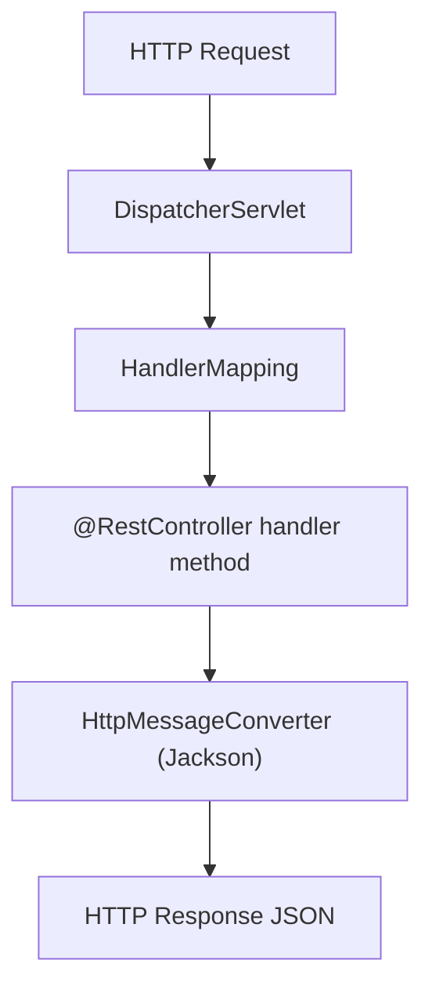
```mermaid
flowchart TD
    A[HTTP Request] --> B[DispatcherServlet]
    B --> C[HandlerMapping]
    C --> D["@RestController handler method"]
    D --> E["HttpMessageConverter (Jackson)"]
    E --> F[HTTP Response JSON]
```

1. `DispatcherServlet` receives every request.
2. `HandlerMapping` matches the request URI and method to a `@RequestMapping` annotation.
3. The matched handler method executes, receiving deserialized parameters.
4. The return value passes through `HttpMessageConverter` (Jackson) for JSON serialization.
5. The serialized response is written with the appropriate Content-Type header.

**Argument resolution** is where the framework earns its keep.
Before invoking the handler method, Spring inspects each
parameter. A `@PathVariable Long id` triggers a path segment
extraction and type conversion. A `@RequestBody OrderDto dto`
triggers Jackson deserialization of the entire request body.
A `@RequestParam String status` reads a query parameter.
Each parameter type has a dedicated `HandlerMethodArgumentResolver`
that knows how to populate it. If conversion fails (e.g.,
"abc" for a Long), Spring returns 400 before your code runs.

**Content negotiation** determines the response format.
Spring checks the `Accept` header against registered
`HttpMessageConverter` instances. With Jackson on the
classpath, `MappingJackson2HttpMessageConverter` handles
`application/json`. If you add `jackson-dataformat-xml`,
the same endpoint can return XML when the client sends
`Accept: application/xml` - zero code changes required.
The converter selection happens automatically in
`AbstractMessageConverterMethodProcessor`.

**Jackson integration** is not magic - it is a configured
default. Spring Boot auto-configures an `ObjectMapper` with
sensible defaults (no timestamps for dates, no null fields
if configured). You can customize it via
`spring.jackson.*` properties or by declaring an
`ObjectMapper` bean. Every `@RestController` return value
passes through this single ObjectMapper instance, so a
misconfiguration affects all endpoints simultaneously.

### 🛠️ Worked Example

**BAD:**

```java
@RestController
public class OrderCtrl {
  // Generic catch-all mapping
  @RequestMapping("/orders")
  Object handle(HttpServletRequest req) {
    if ("GET".equals(req.getMethod())) {
      return service.findAll();
    } else if ("POST".equals(
        req.getMethod())) {
      // manual JSON parsing...
      return null;
    }
    return null;
  }
}
```

Why it's wrong: manual method dispatch, no type safety, no automatic deserialization, returns null on unknown verbs.

**GOOD:**

```java
@RestController
@RequestMapping("/api/v1/orders")
public class OrderController {
  private final OrderService service;

  OrderController(OrderService service) {
    this.service = service;
  }

  @GetMapping
  List<OrderDto> list() {
    return service.findAll();
  }

  @GetMapping("/{id}")
  ResponseEntity<OrderDto> get(
      @PathVariable Long id) {
    return service.find(id)
        .map(ResponseEntity::ok)
        .orElse(ResponseEntity
            .notFound().build());
  }

  @PostMapping
  @ResponseStatus(HttpStatus.CREATED)
  OrderDto create(
      @RequestBody OrderDto dto) {
    return service.create(dto);
  }
}
```

**Production config:**

```properties
# Versioned base path, JSON defaults
spring.jackson.default-property-inclusion=\
  non_null
spring.jackson.serialization.\
  write-dates-as-timestamps=false
server.servlet.context-path=/api
```

### ⚖️ Trade-offs

**Gain:** declarative routing, automatic serialization, type-safe parameters, testable with MockMvc.
**Cost:** hidden request processing pipeline (DispatcherServlet, converters, interceptors) that must be understood to debug.

| Aspect        | @RestController        | Raw Servlet              | JAX-RS (@Path)        |
| ------------- | ---------------------- | ------------------------ | --------------------- |
| Routing       | annotation-based       | manual                   | annotation-based      |
| Serialization | automatic (Jackson)    | manual                   | automatic             |
| Testing       | MockMvc, WebTestClient | HttpServletRequest mocks | Jersey test framework |
| Ecosystem     | Spring-native          | Java EE standard         | Jakarta EE standard   |

The hidden cost of `@RestController` is the invisible
pipeline between the request and your handler. When
serialization fails, the error originates inside Jackson
or a message converter - not your code. When path matching
behaves unexpectedly, the cause is in `RequestMappingHandlerMapping`
configuration. Debugging requires understanding the chain:
filters, interceptors, argument resolvers, converters.
The declarative style trades explicit control for
convention, which is a net win for 90% of endpoints but
demands deeper framework knowledge for the remaining 10%.

### ⚡ Decision Snap

**USE WHEN:** building any REST API with Spring Boot, you need
content negotiation (JSON/XML), you want testability with
MockMvc, or you need fine-grained URI mapping with path
variables and query parameters.
**AVOID WHEN:** serving HTML templates (use `@Controller`
with views), handling binary streams directly (use
`StreamingResponseBody`), or building WebSocket-only services
where HTTP request-response is not the interaction model.
**PREFER JAX-RS WHEN:** your project is Jakarta EE native
and you need vendor portability across application servers.

**Versioning consideration:** place `@RequestMapping` at
the class level with a versioned prefix like `/api/v1`.
This makes version bumps a single-line change per
controller rather than editing every method annotation.

### ⚠️ Top Traps

| #   | Misconception                                               | Reality                                                                               |
| --- | ----------------------------------------------------------- | ------------------------------------------------------------------------------------- |
| 1   | `@Controller` and `@RestController` are interchangeable     | `@Controller` returns view names; `@RestController` serializes return values directly |
| 2   | Path matching is case-sensitive by default                  | Spring MVC path matching is case-insensitive by default (configurable)                |
| 3   | `@RequestMapping` on a class replaces method-level mappings | Class-level mapping is a prefix - method mappings are appended to it                  |

### 🪜 Learning Ladder

**Prerequisites:**

- SPR-022 REST API Phase 1 - Spring Boot CRUD - basic endpoint creation
  **THIS:** SPR-024 @RestController and Request Mapping
  **Next steps:**
- SPR-025 Request and Response DTOs with Bean Validation - type-safe request handling

### 💡 The Surprising Truth

Spring MVC's `DispatcherServlet` was designed in 2003 and
remains the single entry point for all request processing
in Spring Boot today. Despite 20+ years of evolution, its
core dispatching pattern has not fundamentally changed -
a testament to the original front-controller design.

What changed is the annotation layer on top. Before Spring
2.5, controllers implemented `Controller` or extended
`AbstractCommandController` - verbose, class-per-endpoint
designs. The `@RequestMapping` annotation (Spring 2.5)
and `@RestController` (Spring 4.0) are purely metadata;
the underlying `DispatcherServlet` -> `HandlerMapping` ->
`HandlerAdapter` -> `ViewResolver` pipeline remains
identical. Understanding this layering explains why
fragments of the old XML and interface-based configuration
still work alongside modern annotation-driven controllers.

### 📇 Revision Card

1. `@RestController` = `@Controller` + `@ResponseBody` on every method
2. DispatcherServlet routes to handlers via HandlerMapping; Jackson serializes the return value
3. Use composed annotations (`@GetMapping`) over `@RequestMapping(method=...)` for clarity

---

---

# SPR-025 Request and Response DTOs with Bean Validation

**TL;DR** - DTOs decouple your API contract from internal entities; Bean Validation rejects bad input at the boundary.

### 🔥 The Problem in One Paragraph

Exposing JPA entities directly as REST request/response objects creates three problems: internal schema changes break the API contract, clients can set fields they should not (mass assignment), and there is no validation before data reaches the service layer. A malicious or buggy client sends `{"email": null, "age": -5}` and the service blindly persists it. Validation errors surface as obscure database constraint violations instead of clear 400 Bad Request responses. This is exactly why **DTOs with Bean Validation** were created.

### 📘 Textbook Definition

A **Data Transfer Object (DTO)** is a plain Java class that defines the shape of data crossing an API boundary - separate from the internal domain model. **Bean Validation** (JSR 380, `jakarta.validation`) provides constraint annotations (`@NotNull`, `@Size`, `@Min`, `@Email`) that Spring validates automatically when `@Valid` is placed on a `@RequestBody` parameter.

### 🧠 Mental Model

> A DTO is a customs declaration form at the border. You declare exactly what is entering the country (your service). Customs (Bean Validation) checks every field against the rules before it crosses. If anything is contraband (invalid), it is rejected at the border - not discovered inside the warehouse (database).

- "Customs form" -> DTO class
- "Customs officer" -> `@Valid` + Bean Validation
- "Border" -> controller method parameter
  **Where this analogy breaks down:** DTOs also shape outgoing responses (customs does not check exports the same way).

### ⚙️ How It Works

```
Client JSON
     |
     v
+-----------+
| Jackson   | deserialize
+-----------+
     |
     v
+-----------+
| @Valid    | Bean Validation
+-----------+
     |  fail? -> 400 + errors
     v
+-----------+
| Controller| map DTO -> Entity
+-----------+
     |
     v
+-----------+
| Service   |
+-----------+
```

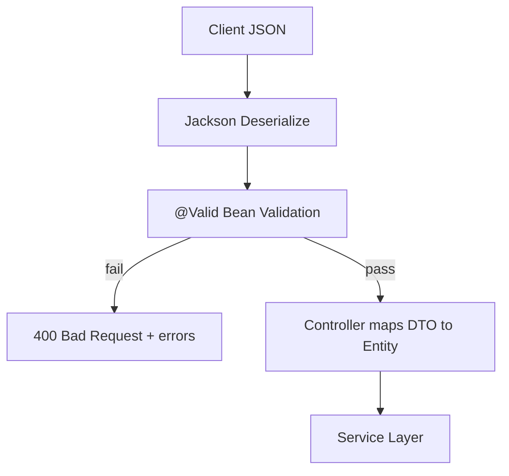
```mermaid
flowchart TD
    A[Client JSON] --> B[Jackson Deserialize]
    B --> C["@Valid Bean Validation"]
    C -->|fail| D[400 Bad Request + errors]
    C -->|pass| E[Controller maps DTO to Entity]
    E --> F[Service Layer]
```

1. Jackson deserializes the JSON body into the DTO class.
2. Spring's `MethodValidationInterceptor` runs Bean Validation constraints.
3. If validation fails, Spring throws `MethodArgumentNotValidException` (default: 400 response).
4. If validation passes, the controller maps the DTO to the domain entity.
5. The response DTO shapes the outbound JSON, hiding internal fields.

When you annotate a `@RequestBody` parameter with `@Valid`, Spring's `RequestResponseBodyMethodProcessor` resolves the argument and delegates to a `Validator` instance. Spring Boot auto-configures this `Validator` by detecting Hibernate Validator on the classpath (pulled in by `spring-boot-starter-validation`). The validator walks every constraint annotation on the DTO's fields - or constructor parameters for records - collects all violations into a `Set<ConstraintViolation>`, and if that set is non-empty, wraps them in a `BindingResult` attached to a `MethodArgumentNotValidException`. This happens before your controller method body executes, so invalid data never reaches your business logic.

Validation groups let you reuse one DTO across different operations with different rules. Define marker interfaces like `OnCreate` and `OnUpdate`, then annotate constraints with `groups`: `@NotNull(groups = OnCreate.class)`. In the controller, replace `@Valid` with `@Validated(OnCreate.class)` to activate only that group's constraints. This avoids duplicating near-identical DTOs that differ by one or two required fields - a common source of class explosion in mature APIs.

Custom constraints follow the same pipeline. Implement `ConstraintValidator<YourAnnotation, FieldType>`, define the annotation with `@Constraint(validatedBy = ...)`, and the validator picks it up automatically. This is how you enforce domain rules like "phone number matches country format" at the DTO boundary without polluting the service layer with format checks.

### 🛠️ Worked Example

**BAD:**

```java
// Exposing JPA entity directly
@PostMapping("/users")
User create(@RequestBody User user) {
  // user.setRole("ADMIN") from client!
  // No validation - null email persisted
  return repo.save(user);
}
```

Why it's wrong: mass assignment risk (client sets `role`), no input validation, internal schema exposed.

**GOOD:**

```java
public record CreateUserRequest(
    @NotBlank String name,
    @Email @NotNull String email,
    @Min(18) int age
) {}

public record UserResponse(
    Long id, String name, String email
) {}

@PostMapping("/users")
@ResponseStatus(HttpStatus.CREATED)
UserResponse create(
    @Valid @RequestBody
    CreateUserRequest req) {
  User entity = new User(
      req.name(), req.email(), req.age());
  User saved = repo.save(entity);
  return new UserResponse(
      saved.getId(),
      saved.getName(),
      saved.getEmail());
}
```

The GOOD example uses Java records as DTOs. Records are ideal for this role because they are immutable by construction - every field is `final`, there are no setters, and the canonical constructor is the only way to create an instance. Immutability means a DTO cannot be accidentally mutated between validation and persistence, eliminating an entire class of concurrency and state bugs. Records also generate `equals()`, `hashCode()`, and `toString()` from the component list, which simplifies logging and testing. The trade-off is that records cannot extend other classes, so if you need DTO inheritance (rare and usually a design smell), stick with plain classes.

**Production pattern - global error format:**

```java
@RestControllerAdvice
public class ValidationHandler {
  @ExceptionHandler(
      MethodArgumentNotValidException.class)
  @ResponseStatus(HttpStatus.BAD_REQUEST)
  Map<String, String> handle(
      MethodArgumentNotValidException ex) {
    return ex.getBindingResult()
        .getFieldErrors().stream()
        .collect(Collectors.toMap(
            FieldError::getField,
            FieldError::getDefaultMessage));
  }
}
```

### ⚖️ Trade-offs

**Gain:** API contract decoupled from internals, input validated at boundary, mass assignment prevented.
**Cost:** more classes to maintain (request DTO, response DTO, entity), mapping boilerplate.

| Aspect                 | DTO + Validation             | Expose Entity | JSON Schema Validation |
| ---------------------- | ---------------------------- | ------------- | ---------------------- |
| Decoupling             | full                         | none          | partial                |
| Validation             | annotation-based, composable | manual        | external tool          |
| Mass assignment safety | safe by construction         | vulnerable    | depends on schema      |

The mapping boilerplate is the most common objection. In practice, libraries like MapStruct generate compile-time mapping code with zero runtime overhead - you declare an interface and the annotation processor writes the implementation. For simpler cases, a static factory method on the DTO (`UserResponse.from(User entity)`) keeps mapping logic colocated and testable without adding a dependency. The class count concern fades once you realize that each DTO is small, often a record, and acts as a living contract document. When an API field changes, you change the DTO and the compiler tells you every call site affected - something that silently breaks when entities are exposed directly.

### ⚡ Decision Snap

**USE WHEN:** any public REST API endpoint, any endpoint accepting user input, any endpoint returning data to external clients.
**AVOID WHEN:** internal service-to-service calls where both sides share the same domain model (but even then, DTOs are safer).
**PREFER JSON Schema validation WHEN:** validating payloads before they reach Java (API gateway level).

### ⚠️ Top Traps

| #   | Misconception                                    | Reality                                                                                             |
| --- | ------------------------------------------------ | --------------------------------------------------------------------------------------------------- |
| 1   | `@Valid` validates nested objects automatically  | Nested objects need `@Valid` on the field too: `@Valid @NotNull Address address`                    |
| 2   | Bean Validation replaces all business validation | It handles format/constraint checks only; business rules (unique email) belong in the service layer |
| 3   | Java records cannot have validation annotations  | Records support Bean Validation annotations on constructor parameters since Java 16+                |

### 🪜 Learning Ladder

**Prerequisites:**

- SPR-024 @RestController and Request Mapping - routing and serialization
  **THIS:** SPR-025 Request and Response DTOs with Bean Validation
  **Next steps:**
- SPR-026 Global Exception Handling (@ControllerAdvice) - consistent error responses

### 💡 The Surprising Truth

Bean Validation annotations are not Spring-specific. They are a Jakarta EE standard (JSR 380) that works in any Java framework - Quarkus, Micronaut, plain Java. Your validation logic is portable even if you leave Spring. More surprisingly, Bean Validation works outside HTTP entirely. You can inject a `Validator` into a service or batch job and call `validator.validate(dto)` manually - the same annotations, the same constraint implementations, the same error structure. Teams that adopt this pattern validate data at every entry point (message consumers, file imports, CLI tools) using the same DTO constraints they wrote for REST endpoints, achieving consistent validation across all input channels with zero duplication.

### 📇 Revision Card

1. DTOs decouple API shape from internal entities - prevents mass assignment and schema leakage
2. `@Valid` on `@RequestBody` triggers Bean Validation before the method body executes
3. Nested objects require their own `@Valid` annotation - validation does not cascade automatically

---

---

# SPR-026 Global Exception Handling (@ControllerAdvice)

**TL;DR** - `@ControllerAdvice` centralizes exception-to-HTTP-response mapping so controllers stay clean and error formats stay consistent.

### 🔥 The Problem in One Paragraph

Without centralized error handling, every controller method wraps its body in try-catch blocks, each formatting error responses differently. One endpoint returns `{"error": "not found"}`, another returns `{"message": "Not Found", "code": 404}`, a third leaks a stack trace. Clients cannot parse errors reliably. Developers copy-paste error handling across 50 controllers. When the error format changes, 50 files need updating. This is exactly why **@ControllerAdvice** was created.

### 📘 Textbook Definition

**@ControllerAdvice** (or `@RestControllerAdvice`) is a Spring annotation that declares a class as a global exception handler, model attribute provider, or data binder initializer for all controllers. When combined with `@ExceptionHandler` methods, it intercepts exceptions thrown by any controller and maps them to structured HTTP responses.

### 🧠 Mental Model

> `@ControllerAdvice` is a safety net under a trapeze. Performers (controllers) focus on their act. If they fall (throw an exception), the net catches them and routes them safely to the ground (structured error response) instead of crashing onto the audience (raw stack trace to client).

- "Safety net" -> `@ControllerAdvice` class
- "Catch mechanism" -> `@ExceptionHandler` method per exception type
- "Safe landing" -> structured error response DTO
  **Where this analogy breaks down:** the net also handles non-error cross-cutting concerns (model attributes), not just falls.

### ⚙️ How It Works

```
Controller throws Exception
          |
          v
+-------------------+
| DispatcherServlet |
+--------+----------+
         |
   find matching
   @ExceptionHandler
         |
         v
+-------------------+
| @ControllerAdvice |
| handler method    |
+--------+----------+
         |
   return error DTO
         |
         v
+-------------------+
| Jackson serialize |
| -> HTTP 4xx/5xx   |
+-------------------+
```

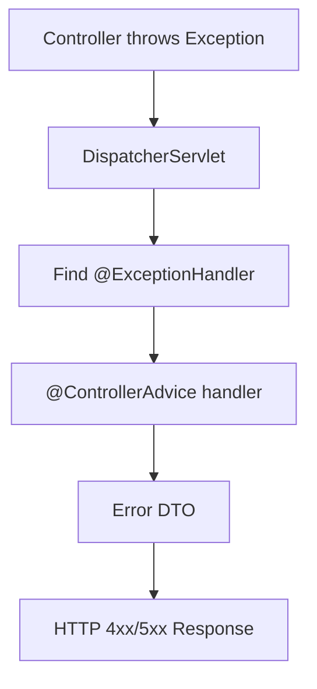
```mermaid
flowchart TD
    A[Controller throws Exception] --> B[DispatcherServlet]
    B --> C["Find @ExceptionHandler"]
    C --> D["@ControllerAdvice handler"]
    D --> E[Error DTO]
    E --> F["HTTP 4xx/5xx Response"]
```

1. A controller method throws an exception (or validation fails).
2. `DispatcherServlet` catches it and searches for a matching `@ExceptionHandler` - first in the controller, then in `@ControllerAdvice` classes.
3. The matched handler builds a structured error response.
4. Jackson serializes the response DTO with the appropriate HTTP status code.

**Resolution order matters.** When an exception is thrown, Spring first checks the throwing controller for a local `@ExceptionHandler` method that matches the exception type. Only if no local handler matches does Spring search registered `@ControllerAdvice` classes. Within a `@ControllerAdvice` class, Spring selects the handler whose declared exception type is the most specific match. If `ServiceException extends RuntimeException` and you declare handlers for both, throwing a `ServiceException` invokes the `ServiceException` handler, not the `RuntimeException` one. If two advice classes handle the same exception type, use `@Order` (lower value = higher priority) to break the tie - otherwise the winner is undefined and may vary between restarts.

**Scoping limits the blast radius.** By default, `@ControllerAdvice` applies to every controller in the application context. In larger codebases this is rarely what you want. You can restrict scope three ways: by base package (`@ControllerAdvice("com.acme.api.v2")`), by annotation (`@ControllerAdvice(annotations = RestController.class)`), or by assignable type (`@ControllerAdvice(assignableTypes = PaymentController.class)`). Scoped advice classes let different API modules return different error shapes without interfering with each other - a public REST API can return RFC 7807 while an internal admin API returns a simpler format.

### 🛠️ Worked Example

**BAD:**

```java
@GetMapping("/{id}")
ResponseEntity<?> get(@PathVariable Long id) {
  try {
    return ResponseEntity.ok(svc.find(id));
  } catch (NotFoundException e) {
    return ResponseEntity.status(404)
        .body(Map.of("err", e.getMessage()));
  } catch (Exception e) {
    return ResponseEntity.status(500)
        .body(Map.of("err", "Internal"));
  }
}
// Repeated in every controller method
```

Why it's wrong: duplicated, inconsistent error format, clutters business logic.

**GOOD:**

```java
@RestControllerAdvice
public class GlobalExceptionHandler {

  @ExceptionHandler(NotFoundException.class)
  @ResponseStatus(HttpStatus.NOT_FOUND)
  ErrorResponse handleNotFound(
      NotFoundException ex) {
    return new ErrorResponse(
        "NOT_FOUND", ex.getMessage());
  }

  @ExceptionHandler(
      MethodArgumentNotValidException.class)
  @ResponseStatus(HttpStatus.BAD_REQUEST)
  ErrorResponse handleValidation(
      MethodArgumentNotValidException ex) {
    String msg = ex.getBindingResult()
        .getFieldErrors().stream()
        .map(e -> e.getField()
            + ": " + e.getDefaultMessage())
        .collect(Collectors.joining("; "));
    return new ErrorResponse(
        "VALIDATION_FAILED", msg);
  }
}
```

**Production error DTO:**

```java
public record ErrorResponse(
    String code,
    String message,
    Instant timestamp
) {
  public ErrorResponse(
      String code, String message) {
    this(code, message, Instant.now());
  }
}
```

**RFC 7807 ProblemDetail (Spring 6+):**

```java
@ExceptionHandler(NotFoundException.class)
ProblemDetail handleNotFound(
    NotFoundException ex) {
  ProblemDetail pd = ProblemDetail
      .forStatusAndDetail(
          HttpStatus.NOT_FOUND,
          ex.getMessage());
  pd.setTitle("Resource Not Found");
  pd.setProperty(
      "correlationId",
      MDC.get("correlationId"));
  return pd;
}
```

`ProblemDetail` produces standard JSON (`type`, `title`, `status`, `detail`, `instance`) that any HTTP client library can parse without custom deserialization. The `setProperty` method adds extension fields - use it to attach correlation IDs so operations teams can trace errors back through distributed logs.

**Always log before returning:**

```java
@ExceptionHandler(Exception.class)
@ResponseStatus(HttpStatus.INTERNAL_SERVER_ERROR)
ErrorResponse handleUnexpected(
    Exception ex, HttpServletRequest req) {
  String cid = MDC.get("correlationId");
  log.error(
      "Unhandled [{}] {} cid={}",
      req.getMethod(),
      req.getRequestURI(), cid, ex);
  return new ErrorResponse(
      "INTERNAL_ERROR",
      "An unexpected error occurred. "
          + "Reference: " + cid);
}
```

Notice the handler logs the full stack trace server-side but returns only a safe message with a correlation ID to the client. This prevents stack trace leakage while keeping errors traceable.

### ⚖️ Trade-offs

**Gain:** single source of truth for error formatting, controllers stay clean, consistent API error contract.
**Cost:** exceptions become the control flow mechanism for error responses (performance cost of throwing is typically negligible for HTTP-scale operations).

| Aspect             | @ControllerAdvice | Per-controller try-catch | Spring ProblemDetail |
| ------------------ | ----------------- | ------------------------ | -------------------- |
| Centralization     | global            | scattered                | global (RFC 7807)    |
| Format consistency | enforced          | manual discipline        | enforced + standard  |
| Stack trace risk   | controlled        | easy to leak             | controlled           |

The hidden cost of `@ControllerAdvice` is that exceptions become the signaling mechanism for non-exceptional outcomes like "resource not found." In hot paths where a 404 is the common case (cache misses, lookup-before-create flows), constructing an exception object with a stack trace for every miss adds overhead. The stack trace itself is typically negligible at HTTP-request scale, but if you measure tens of thousands of 404s per second, consider returning `Optional.empty()` from the service layer and mapping it to a 404 in the controller directly, reserving `@ControllerAdvice` for genuinely unexpected failures.

### ⚡ Decision Snap

**USE WHEN:** any Spring MVC or WebFlux application with more than one controller, any public API needing consistent error responses.
**AVOID WHEN:** you have a single controller with one endpoint (overkill, but still a good habit).
**PREFER Spring ProblemDetail WHEN:** you want RFC 7807-compliant error responses (Spring 6+).

### ⚠️ Top Traps

| #   | Misconception                                                     | Reality                                                                                                                          |
| --- | ----------------------------------------------------------------- | -------------------------------------------------------------------------------------------------------------------------------- |
| 1   | `@ControllerAdvice` catches all exceptions including filter-level | It only catches exceptions from controller methods; filter exceptions need a separate `ErrorController` or filter-level handling |
| 2   | Handler method ordering does not matter                           | Spring matches the most specific exception type first; if ambiguous, declare `@Order`                                            |
| 3   | `@RestControllerAdvice` automatically logs exceptions             | It does not log anything - add explicit logging in your handler methods                                                          |

### 🪜 Learning Ladder

**Prerequisites:**

- SPR-025 Request and Response DTOs with Bean Validation - understanding validation exceptions
  **THIS:** SPR-026 Global Exception Handling (@ControllerAdvice)
  **Next steps:**
- SPR-027 Spring Data JPA - Repository Pattern - data layer integration

### 💡 The Surprising Truth

Spring Boot 3 / Spring 6 introduced built-in `ProblemDetail` support (RFC 7807) that auto-generates structured error responses without any `@ControllerAdvice`. Set `spring.mvc.problemdetails.enabled=true` and validation errors, type mismatches, and missing parameters return RFC-compliant JSON automatically.

What surprises most developers: the built-in `ResponseEntityExceptionHandler` (which `ProblemDetail` mode activates) already handles over a dozen Spring MVC exception types - `MethodArgumentNotValidException`, `HttpRequestMethodNotSupportedException`, `MissingServletRequestParameterException`, and more. If your `@ControllerAdvice` extends `ResponseEntityExceptionHandler`, you inherit all those mappings and only need to add handlers for your domain-specific exceptions. If your advice class does not extend it and you also enable `problemdetails`, both compete for the same exceptions - the local advice wins, but the behavior confuses teams who expect RFC 7807 responses everywhere. Pick one strategy and document it in your team's API guidelines.

### 📇 Revision Card

1. `@RestControllerAdvice` + `@ExceptionHandler` centralizes all error-to-response mapping
2. Filter-level exceptions bypass `@ControllerAdvice` - handle them separately in `ErrorController`
3. Spring 6+ supports RFC 7807 ProblemDetail natively with a single property toggle

---

---

# SPR-027 Spring Data JPA - Repository Pattern

**TL;DR** - Spring Data JPA generates CRUD implementations from interface declarations, eliminating boilerplate data access code.

### 🔥 The Problem in One Paragraph

Every JPA application needs the same CRUD operations: `save`, `findById`, `findAll`, `delete`. Writing these by hand for every entity means creating a DAO class, injecting `EntityManager`, writing JPQL queries, managing transactions, and handling exceptions. For 30 entities, that is 30 near-identical DAO classes with copy-pasted boilerplate. Derived query methods (find by name, find by status) add even more repetitive code. This is exactly why **Spring Data JPA's Repository pattern** was created.

### 📘 Textbook Definition

**Spring Data JPA** is a Spring Data module that provides a repository abstraction over JPA. By declaring an interface extending `JpaRepository<T, ID>`, Spring auto-generates the implementation at runtime. Method names following naming conventions (e.g., `findByEmailAndStatus`) are parsed into JPQL queries automatically.

### 🧠 Mental Model

> A Spring Data repository is a magic filing cabinet. You label the drawer (extend `JpaRepository<Order, Long>`) and the cabinet builds itself: save, find, delete are built-in. Write a label like `findByStatusAndCreatedAfter` on a new drawer and the cabinet creates the search logic from the label text.

- "Drawer label" -> method name convention
- "Filing cabinet" -> Spring Data proxy implementation
- "Built-in drawers" -> `save()`, `findById()`, `findAll()`, `delete()`
  **Where this analogy breaks down:** complex queries (joins, aggregations) cannot be expressed through method names alone - use `@Query`.

### ⚙️ How It Works

```
Interface declaration
        |
        v
+------------------+
| Spring Data      |
| proxy factory    |
+--------+---------+
         |
   generate impl
         |
         v
+------------------+
| SimpleJpaRepo    |
| (runtime proxy)  |
+--------+---------+
         |
   delegates to
         |
         v
+------------------+
| EntityManager    |
| (Hibernate)      |
+------------------+
```

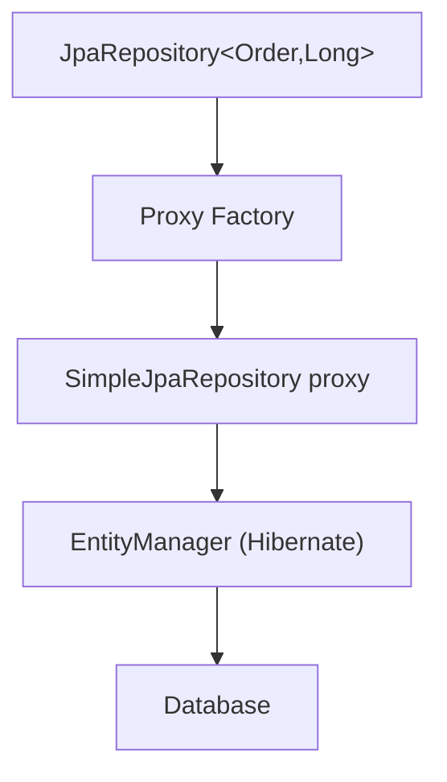
```mermaid
flowchart TD
    A["JpaRepository&lt;Order,Long&gt;"] --> B[Proxy Factory]
    B --> C[SimpleJpaRepository proxy]
    C --> D["EntityManager (Hibernate)"]
    D --> E[Database]
```

1. You declare an interface extending `JpaRepository<Entity, IdType>`.
2. At startup, Spring Data's `JpaRepositoryFactoryBean` creates a proxy implementation.
3. Standard methods (`save`, `findById`) delegate to `SimpleJpaRepository`.
4. Custom method names (`findByEmail`) are parsed into JPQL at startup.
5. `@Query` annotations bypass name parsing for complex queries.

The proxy creation mechanism runs during `ApplicationContext` refresh.
Spring Data scans for all interfaces extending `Repository` (or its
subtypes) in your base packages. For each interface it finds, it
creates a `JdkDynamicProxy` backed by `SimpleJpaRepository` as the
target. This proxy intercepts every method call: built-in methods
like `save()` and `findById()` route directly to the
`SimpleJpaRepository` implementation, which calls `EntityManager`
methods (`persist`, `merge`, `find`) under the hood.

For derived query methods, the startup parser splits the method name
into tokens using property names from your entity's metamodel. The
name `findByStatusAndCreatedAfter` becomes a `PartTree` structure:
property `status` with equality, AND junction, property `created`
with `After` comparison. Spring Data converts this tree into a
Criteria API query and caches the resulting `TypedQuery` factory.
Every subsequent call reuses the cached structure - there is no
name parsing at invocation time.

This is why adding a method `findByNonExistentField` causes a
startup failure, not a runtime error. The parser cannot resolve the
property against the entity metamodel, so it throws a
`PropertyReferenceException` during context initialization.

### 🛠️ Worked Example

**BAD:**

```java
// Manual DAO - boilerplate for every entity
@Repository
public class OrderDao {
  @PersistenceContext EntityManager em;

  public Order save(Order o) {
    em.persist(o);
    return o;
  }
  public Optional<Order> findById(Long id) {
    return Optional.ofNullable(
        em.find(Order.class, id));
  }
  public List<Order> findByStatus(
      String status) {
    return em.createQuery(
        "SELECT o FROM Order o "
        + "WHERE o.status = :s",
        Order.class)
        .setParameter("s", status)
        .getResultList();
  }
}
```

Why it's wrong: 25 lines of boilerplate that is identical for every entity.

**GOOD:**

```java
public interface OrderRepository
    extends JpaRepository<Order, Long> {

  List<Order> findByStatus(String status);

  @Query("SELECT o FROM Order o "
      + "WHERE o.total > :min "
      + "AND o.created > :since")
  List<Order> findExpensiveRecent(
      @Param("min") BigDecimal min,
      @Param("since") LocalDate since);
}
// Zero implementation code needed
```

**Pagination in production:**

```java
// Controller calls repository with Pageable
public Page<Order> listOrders(
    String status, Pageable pageable) {
  return orderRepository
      .findByStatus(status, pageable);
}

// Repository method signature
Page<Order> findByStatus(
    String status, Pageable pageable);
```

`Pageable` carries page number, page size, and `Sort` direction.
Spring Data appends `LIMIT` and `OFFSET` (or the dialect
equivalent) to the generated SQL and executes a separate
`COUNT(*)` query for total elements. Be aware: the count query
can become expensive on large tables without proper indexes.

Flush mode matters here. By default, Hibernate uses
`FlushModeType.AUTO`, which flushes pending changes to the
database before executing any query. If you call `save()` on
an entity and then immediately run `findByStatus()`, Hibernate
flushes the save before the select to ensure consistent results.
This is correct but can surprise you with unexpected `UPDATE`
statements in your SQL logs. If you see queries you did not
expect, check whether auto-flush is triggering dirty checking
on managed entities in the persistence context.

**Production config:**

```properties
spring.jpa.open-in-view=false
spring.jpa.hibernate.ddl-auto=validate
spring.jpa.show-sql=false
logging.level.org.hibernate.SQL=DEBUG
```

### ⚖️ Trade-offs

**Gain:** zero boilerplate CRUD, derived queries from method names, pagination and sorting built in.
**Cost:** abstraction hides generated SQL (N+1 queries are easy to miss), complex queries still need `@Query` or native SQL.

| Aspect         | Spring Data JPA        | Plain JPA (EntityManager) | JDBC Template  |
| -------------- | ---------------------- | ------------------------- | -------------- |
| Boilerplate    | minimal                | high                      | medium         |
| Query control  | method names + @Query  | full JPQL/Criteria        | full SQL       |
| N+1 visibility | hidden (needs logging) | visible                   | not applicable |

`JpaRepository` extends `ListCrudRepository`, `ListPagingAndSortingRepository`,
and `QueryByExampleExecutor`. If you only need `save`, `findById`, and
`delete` - use `CrudRepository` instead. It returns `Iterable` rather
than `List`, signaling a simpler contract. For read-heavy services where
you never call `flush()`, `deleteAllInBatch()`, or `getById()` (which
are `JpaRepository`-specific), `CrudRepository` is the right choice.
Reserve `JpaRepository` for when you genuinely need batch deletes,
`Example`-based queries, or explicit flush control. Choosing the
narrowest interface communicates intent and avoids exposing dangerous
operations like `deleteAllInBatch()` to code that should not use them.

### ⚡ Decision Snap

**USE WHEN:** building any CRUD-heavy Spring Boot application, you want derived queries and pagination out of the box.
**AVOID WHEN:** you need raw SQL performance tuning (consider `JdbcTemplate` or jOOQ), queries are primarily complex analytics.
**PREFER JdbcTemplate WHEN:** you want full SQL control without ORM overhead.

### ⚠️ Top Traps

| #   | Misconception                                          | Reality                                                                                                                  |
| --- | ------------------------------------------------------ | ------------------------------------------------------------------------------------------------------------------------ |
| 1   | Spring Data JPA generates efficient queries by default | Derived queries can produce N+1 problems; always check generated SQL with `show-sql` or SQL logging                      |
| 2   | `open-in-view=true` is safe                            | It keeps a DB connection open for the entire HTTP request, causing connection pool exhaustion under load. Set to `false` |
| 3   | You cannot use native SQL with Spring Data             | `@Query(nativeQuery = true)` supports native SQL when JPQL is insufficient                                               |

### 🪜 Learning Ladder

**Prerequisites:**

- SPR-024 @RestController and Request Mapping - web layer to call the repository
  **THIS:** SPR-027 Spring Data JPA - Repository Pattern
  **Next steps:**
- SPR-032 @Transactional Basics - transaction management for repository operations

### 💡 The Surprising Truth

Spring Data parses method names into query ASTs at application startup - not at call time. If a method name like `findByStatusAndCreatedAfterOrderByTotalDesc` has a typo or references a non-existent property, the application fails to start with a clear error. This fail-fast behavior catches query bugs before any request is served.

The same validation applies to `@Query` annotations with JPQL. At
startup, Hibernate parses every `@Query` string into an HQL AST and
validates entity names, property paths, and parameter bindings. A
misspelled column reference in `@Query("SELECT o FROM Order o WHERE
o.stauts = :s")` triggers a `QuerySyntaxException` before the
application accepts traffic. Native SQL queries (`nativeQuery = true`)
are the exception - they bypass this validation because Hibernate
cannot parse dialect-specific SQL. Native queries fail at first
execution, not at startup, so they need integration test coverage.

As queries grow complex - multiple joins, subselects, conditional
logic - derived method names become unreadable. A method named
`findByStatusInAndCreatedAfterAndTotalGreaterThanOrderByCreatedDesc`
technically works, but it is unmaintainable. The practical boundary
is roughly two to three conditions. Beyond that, switch to `@Query`
with explicit JPQL for readability, or to `Specification` for
dynamic filter combinations.

### 📇 Revision Card

1. Extend `JpaRepository<T, ID>` and get save/find/delete with zero implementation code
2. Set `spring.jpa.open-in-view=false` in production to avoid connection pool exhaustion
3. Method name queries are parsed at startup - typos cause fast, clear startup failures

---

---

# SPR-028 Spring Profiles and Environment Abstraction

**TL;DR** - Profiles activate environment-specific beans and configuration without changing code or build artifacts.

### 🔥 The Problem in One Paragraph

An application needs different database URLs, logging levels, and feature flags in development, staging, and production. Without profiles, developers maintain separate builds, use conditional logic in code (`if (env.equals("prod"))`), or manually swap configuration files before deployment. Every approach is fragile: wrong config in the wrong environment causes outages. The "build once, deploy anywhere" principle requires configuration to vary by environment without touching the artifact. This is exactly why **Spring Profiles** were created.

### 📘 Textbook Definition

A **Spring Profile** is a named grouping of bean definitions and configuration properties that is activated at runtime. Beans annotated `@Profile("prod")` are only registered when the `prod` profile is active. Profile-specific property files (`application-prod.properties`) override base properties. The **Environment abstraction** unifies profiles, property sources, and system properties into a single queryable interface.

### 🧠 Mental Model

> Profiles are like TV channels. The TV (application) is the same hardware, but switching the channel (profile) changes what you see (configuration). The remote control (activation mechanism) selects the channel at startup, not at build time.

- "Channel" -> profile name (dev, staging, prod)
- "TV hardware" -> same JAR artifact
- "What you see" -> active beans and properties
  **Where this analogy breaks down:** unlike TV channels, multiple profiles can be active simultaneously.

### ⚙️ How It Works

```
Startup
  |
  v
+--------------------+
| Read active profile|
| (env var, CLI arg) |
+---------+----------+
          |
          v
+--------------------+
| Load base props    |
| application.props  |
+---------+----------+
          |
          v
+--------------------+
| Overlay profile    |
| application-{p}.p  |
+---------+----------+
          |
          v
+--------------------+
| Register @Profile  |
| matched beans only |
+--------------------+
```

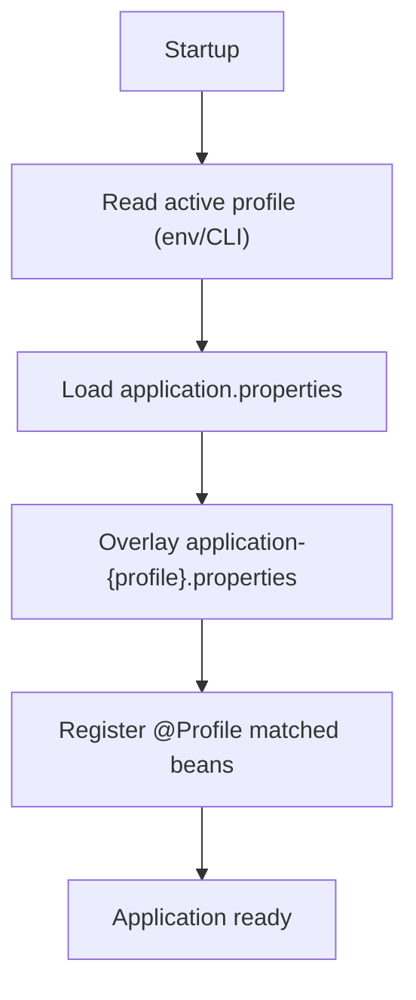
```mermaid
flowchart TD
    A[Startup] --> B["Read active profile (env/CLI)"]
    B --> C[Load application.properties]
    C --> D["Overlay application-{profile}.properties"]
    D --> E["Register @Profile matched beans"]
    E --> F[Application ready]
```

1. Active profile set via `SPRING_PROFILES_ACTIVE` env var, `--spring.profiles.active` CLI, or programmatically.
2. Spring loads `application.properties` (base config).
3. Spring overlays `application-{profile}.properties` on top.
4. Beans with `@Profile("prod")` are only registered when `prod` is active.
5. The `Environment` bean exposes `getActiveProfiles()` and `getProperty()` for runtime queries.

**Property source resolution order.** When Spring resolves a property key, it walks a priority chain: command-line arguments take highest precedence, then system properties (`-Dkey=value`), then OS environment variables (`SPRING_DATASOURCE_URL`), then profile-specific files (`application-prod.yml`), and finally the base `application.yml`. The first source that contains the key wins. This means you can set a safe default in `application.yml`, override it per environment in `application-prod.yml`, and still allow an operator to force a value through an environment variable without touching any file.

**How `@Profile` filters beans.** During the bean registration phase, Spring's `ConditionEvaluator` checks every `@Profile` annotation against the set of active profiles. A bean annotated `@Profile("dev")` is skipped entirely when `dev` is not active - its class is never instantiated, its dependencies are never resolved, and its `@PostConstruct` never fires. You can combine profiles with logical expressions: `@Profile({"cloud", "aws"})` means "active if cloud OR aws is active," while `@Profile("!local")` means "active unless local is active." This filtering happens at container startup, not at call time, so there is zero runtime cost after initialization.

**The `Environment` abstraction.** The `Environment` interface serves two roles: it tracks which profiles are active (`getActiveProfiles()`) and it provides unified property lookup across every property source (`getProperty(String key)`). Any bean can inject `Environment` and query it, but the recommended path for structured access is `@ConfigurationProperties` (see SPR-029). The `Environment` is also the integration point for custom property sources - you can register a `PropertySource` backed by a secrets manager, a database, or a remote config service, and it slots into the same resolution chain without any calling code knowing the difference.

### 🛠️ Worked Example

**BAD:**

```java
@Service
public class EmailService {
  public void send(String to, String body) {
    if (System.getenv("ENV")
        .equals("dev")) {
      log.info("Fake send to {}", to);
    } else {
      realSmtpClient.send(to, body);
    }
  }
}
```

Why it's wrong: environment logic pollutes business code, `ENV` is untyped, easy to misspell.

**GOOD:**

```java
public interface EmailService {
  void send(String to, String body);
}

@Service @Profile("dev")
class FakeEmailService
    implements EmailService {
  public void send(String to, String body) {
    log.info("DEV: would send to {}", to);
  }
}

@Service @Profile("prod")
class SmtpEmailService
    implements EmailService {
  public void send(String to, String body) {
    smtpClient.send(to, body);
  }
}
```

**Production activation:**

```bash
# Kubernetes deployment.yaml
env:
  - name: SPRING_PROFILES_ACTIVE
    value: "prod,cloud"
```

**Multi-profile config structure.** In a real project, you keep shared defaults in `application.yml` and override only what changes per environment:

```yaml
# application.yml (always loaded)
server:
  port: 8080
app:
  feature.audit-log: true

# application-dev.yml
spring.datasource:
  url: jdbc:h2:mem:devdb
logging.level.root: DEBUG

# application-prod.yml
spring.datasource:
  url: jdbc:postgresql://db-prod:5432/app
logging.level.root: WARN
```

With this layout, `server.port` and `app.feature.audit-log` are identical everywhere. Only the datasource URL and log level change. Adding staging means creating `application-staging.yml` with its own overrides - no duplication of shared values, no conditional logic in code.

### ⚖️ Trade-offs

**Gain:** same artifact in all environments, clean separation of environment concerns, multiple profiles composable.
**Cost:** profile sprawl (too many profiles become hard to reason about), accidental production behavior if wrong profile is active.

| Aspect         | Spring Profiles | Env vars only  | Feature flags |
| -------------- | --------------- | -------------- | ------------- |
| Bean swap      | yes             | no             | no            |
| Prop override  | yes             | yes            | limited       |
| Runtime toggle | restart needed  | restart needed | live          |
| Complexity     | low-medium      | low            | medium-high   |

Profile sprawl is the main long-term risk. Teams start with `dev` and `prod`, then add `staging`, `perf`, `local-docker`, `ci`, and `integration`. Each new profile means another property file to maintain and another combination to test. The practical ceiling is three to five profiles. Beyond that, consider extracting variable values into environment variables or a config server so the profile count stays small and the property files stay thin. Profiles should switch behavior (which beans load, which integration endpoints to call), not just property values - pure property differences are better handled by environment variables alone.

### ⚡ Decision Snap

**USE WHEN:** configuration differs by environment (dev/staging/prod), you need different bean implementations per environment.
**AVOID WHEN:** you need runtime feature toggling without restart (use feature flags instead).
**PREFER environment variables WHEN:** the only difference is property values and you do not need bean swapping.

### ⚠️ Top Traps

| #   | Misconception                                      | Reality                                                                             |
| --- | -------------------------------------------------- | ----------------------------------------------------------------------------------- |
| 1   | If no profile is set, no properties load           | Base `application.properties` always loads regardless of active profiles            |
| 2   | `@Profile("!prod")` means "only in dev"            | It means "any profile except prod" - including staging, test, or no profile at all  |
| 3   | Profile-specific files completely replace the base | They overlay: base loads first, profile-specific values override only matching keys |

### 🪜 Learning Ladder

**Prerequisites:**

- SPR-014 application.properties and application.yml - base configuration mechanism
  **THIS:** SPR-028 Spring Profiles and Environment Abstraction
  **Next steps:**
- SPR-029 @ConfigurationProperties - Typed Configuration - structured profile-aware config

### 💡 The Surprising Truth

Spring Boot supports profile groups (since 2.4): `spring.profiles.group.prod=proddb,prodmq,prodauth` activates three sub-profiles with a single `--spring.profiles.active=prod`. This replaces the common hack of comma-separated profile lists and makes profile composition declarative.

Two edge cases catch experienced developers off guard. First, if no profile is explicitly activated, Spring Boot activates a profile literally named `default`. You can place beans under `@Profile("default")` and they will only load when no other profile is set - useful for local development fallbacks that vanish the moment anyone sets `SPRING_PROFILES_ACTIVE`. Second, profile activation order matters when the same key appears in multiple profile-specific files. If you activate `prod,cloud` and both `application-prod.yml` and `application-cloud.yml` define `server.port`, the last profile listed wins. This ordering dependency is subtle and undocumented in many tutorials, yet it determines which value your application actually uses.

### 📇 Revision Card

1. Profiles activate environment-specific beans and properties without changing the artifact
2. Base properties always load; profile-specific files overlay matching keys only
3. Set profiles via `SPRING_PROFILES_ACTIVE` env var in deployment - never hardcode in code

---

---

# SPR-029 @ConfigurationProperties - Typed Configuration

**TL;DR** - `@ConfigurationProperties` binds property groups to type-safe POJOs with validation, IDE support, and documentation.

### 🔥 The Problem in One Paragraph

Using `@Value("${notification.api.url}")` for every property is fine for 2-3 values. For 15 related properties (notification URL, timeout, retry count, retry delay, enabled, sender name, template path...), `@Value` scatters configuration across multiple classes, provides no type safety (everything is a string until cast), offers no IDE auto-completion, and makes it impossible to validate that all required properties are set at startup. This is exactly why **@ConfigurationProperties** was created.

### 📘 Textbook Definition

**@ConfigurationProperties** is a Spring Boot annotation that binds a group of externalized properties (sharing a common prefix) to a structured Java class. The class is validated at startup with Bean Validation, documented in `META-INF/spring-configuration-metadata.json` for IDE support, and injectable as a regular Spring bean.

### 🧠 Mental Model

> `@Value` is reading sticky notes scattered around the office. `@ConfigurationProperties` is a structured form with labeled fields, required-field markers, and a secretary (Boot) who fills it in at startup and rejects it if any required field is missing.

- "Form" -> POJO class annotated with `@ConfigurationProperties`
- "Labeled fields" -> class properties matching config keys
- "Secretary" -> Boot's property binding engine
  **Where this analogy breaks down:** the form can also have default values pre-filled, unlike a truly blank form.

### ⚙️ How It Works

```
application.yml
  notification:
    api-url: https://...
    timeout-ms: 3000
       |
       v
+------------------+
| Binder engine    |
| relaxed binding  |
+--------+---------+
         |
         v
+------------------+
| @ConfigProperties|
| POJO instance    |
+--------+---------+
         |
   @Validated
         |
         v
+------------------+
| Bean Validation  |
| fail-fast start  |
+------------------+
```

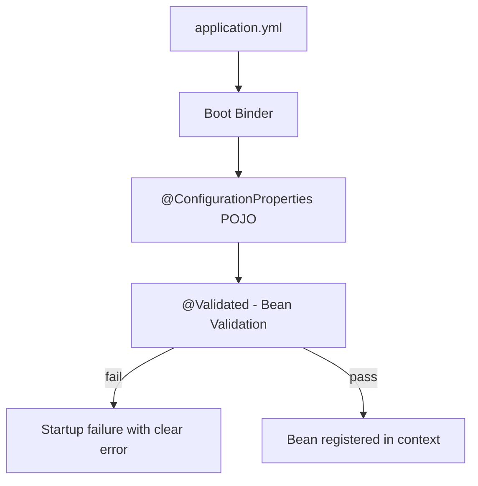
```mermaid
flowchart TD
    A["application.yml"] --> B[Boot Binder]
    B --> C["@ConfigurationProperties POJO"]
    C --> D["@Validated - Bean Validation"]
    D -->|fail| E[Startup failure with clear error]
    D -->|pass| F[Bean registered in context]
```

1. You annotate a class with `@ConfigurationProperties(prefix = "notification")`.
2. Boot's binder maps property keys to class fields using relaxed binding (`api-url` -> `apiUrl`).
3. If `@Validated` is present, Bean Validation runs on the bound object.
4. If validation fails, the application fails to start with a clear error.
5. The POJO is injectable anywhere as a regular bean.

**Relaxed binding rules.** Spring Boot normalizes property names before matching them to fields. Kebab-case (`api-url`), underscore (`api_url`), UPPER_SNAKE_CASE (`API_URL`), and camelCase (`apiUrl`) all resolve to the same field. The canonical form is kebab-case in YAML/properties files, and UPPER_SNAKE_CASE for OS environment variables. This means a single POJO works unchanged whether properties come from `application.yml`, Kubernetes ConfigMaps, Docker env vars, or JVM system properties - no per-source adaptation needed.

**Immutable binding with `@ConstructorBinding`.** By default, Boot binds via setters (mutable JavaBeans). Since Boot 2.2, you can bind through the constructor instead by using `@ConstructorBinding`. This enables truly immutable configuration objects - no setters, all fields `final`, thread-safe by construction. In Boot 3.x, a single-constructor class is automatically constructor-bound without the annotation. For records, constructor binding is the only option and works out of the box.

**Startup validation with `@Validated`.** Adding `@Validated` to the properties class activates JSR-380 Bean Validation at bind time. Constraints like `@NotBlank`, `@Min`, `@Max`, `@Pattern`, and `@Email` execute before the application context finishes loading. A missing or invalid property produces a clear `BindValidationException` naming the exact field and constraint - far more actionable than a `NullPointerException` ten minutes into runtime. For nested objects, use `@Valid` on the field to cascade validation into child properties.

### 🛠️ Worked Example

**BAD:**

```java
@Service
public class NotifyService {
  @Value("${notification.api-url}")
  private String url;
  @Value("${notification.timeout-ms}")
  private int timeout;
  @Value("${notification.retries}")
  private int retries;
  // 10 more @Value fields...
  // No validation, no grouping, no IDE help
}
```

Why it's wrong: scattered `@Value` strings, no type safety, no startup validation.

**GOOD:**

```java
@ConfigurationProperties(
    prefix = "notification")
@Validated
public class NotificationProps {
  @NotBlank private String apiUrl;
  @Min(100) private int timeoutMs = 5000;
  @Min(0) private int retries = 3;
  // getters + setters (or use record)
}
```

```java
@EnableConfigurationProperties(
    NotificationProps.class)
@Service
public class NotifyService {
  private final NotificationProps props;
  NotifyService(NotificationProps props) {
    this.props = props;
  }
}
```

**Production properties:**

```yaml
notification:
  api-url: https://api.notify.prod.com/v2
  timeout-ms: 3000
  retries: 2
```

**Nested properties and list binding:**

```java
@ConfigurationProperties(prefix = "app.mail")
@Validated
public class MailProps {
  @NotBlank private String host;
  @Min(1) private int port = 587;
  private boolean starttls = true;
  @Valid private Retry retry = new Retry();
  private List<String> ccRecipients =
      List.of();

  public static class Retry {
    @Min(0) private int maxAttempts = 3;
    @Min(100) private long delayMs = 1000;
    // getters + setters
  }
  // getters + setters
}
```

```yaml
app:
  mail:
    host: smtp.company.com
    port: 465
    starttls: false
    retry:
      max-attempts: 5
      delay-ms: 2000
    cc-recipients:
      - ops@company.com
      - alerts@company.com
```

Boot binds the nested `Retry` object, the `List<String>`, and scalar fields in one pass. Validation cascades into `Retry` because of `@Valid`.

### ⚖️ Trade-offs

**Gain:** type-safe, validated at startup, IDE auto-completion, self-documenting, testable as a POJO.
**Cost:** requires a dedicated class per property group, slightly more setup than `@Value`.

**When is `@ConfigurationProperties` overkill?** If your service reads exactly one property - say, a feature flag boolean - creating a dedicated class, registering it, and injecting it adds ceremony without benefit. `@Value("${feature.new-ui}")` on a single field is clearer. The crossover point is roughly three related properties: once you have a prefix with three or more keys, the type safety, validation, and IDE support of a properties class pays for the extra class. Between one and three, use judgment - if the values need validation or you expect the group to grow, start with `@ConfigurationProperties` early.

| Aspect      | @ConfigurationProperties | @Value     | Environment.getProperty |
| ----------- | ------------------------ | ---------- | ----------------------- |
| Type safety | full                     | cast-based | string only             |
| Validation  | Bean Validation          | none       | none                    |
| IDE support | auto-complete            | none       | none                    |
| Grouping    | by prefix                | scattered  | manual                  |

### ⚡ Decision Snap

**USE WHEN:** you have 3+ related properties, you need startup validation, you want IDE auto-completion.
**AVOID WHEN:** you have a single standalone property (use `@Value` for simplicity).
**PREFER `@Value` WHEN:** reading one or two unrelated properties that do not warrant a class.

### ⚠️ Top Traps

| #   | Misconception                                        | Reality                                                                                          |
| --- | ---------------------------------------------------- | ------------------------------------------------------------------------------------------------ |
| 1   | `@ConfigurationProperties` classes are auto-detected | You must use `@EnableConfigurationProperties` or `@ConfigurationPropertiesScan` to register them |
| 2   | Property names must match field names exactly        | Relaxed binding allows `api-url`, `apiUrl`, `API_URL` to all bind to `apiUrl`                    |
| 3   | Immutable records cannot be used                     | Since Boot 2.2, constructor binding supports records and immutable classes                       |

### 🪜 Learning Ladder

**Prerequisites:**

- SPR-028 Spring Profiles and Environment Abstraction - profiles feed into property resolution
  **THIS:** SPR-029 @ConfigurationProperties - Typed Configuration
  **Next steps:**
- SPR-030 Spring Security Authentication Basics - security config often uses typed properties

### 💡 The Surprising Truth

Spring Boot's relaxed binding is remarkably flexible. The property `notification.api-url` in YAML, `NOTIFICATION_API_URL` as an environment variable, and `notification.apiUrl` in `.properties` all bind to the same `apiUrl` field. This means the same code works across file-based config, Kubernetes env vars, and system properties without any adaptation.

The often-overlooked superpower is the **configuration metadata processor**. Adding `spring-boot-configuration-processor` as an annotation processor dependency causes the compiler to generate `META-INF/spring-configuration-metadata.json` at build time. This JSON file maps every `@ConfigurationProperties` field to its type, default value, and Javadoc description. IDEs (IntelliJ, VS Code with Spring extensions) read this file to provide auto-completion, type checking, and inline documentation when editing `application.yml`. You type `notification.` and the IDE lists `api-url`, `timeout-ms`, `retries` with their types and defaults - eliminating typo-driven misconfigurations entirely.

### 📇 Revision Card

1. `@ConfigurationProperties` binds a property prefix to a type-safe, validated POJO
2. Relaxed binding unifies kebab-case, camelCase, and UPPER_SNAKE_CASE automatically
3. Always add `@Validated` to fail fast at startup if required properties are missing

---

---

# SPR-030 Spring Security Authentication Basics

**TL;DR** - Spring Security intercepts every request through a filter chain that authenticates the caller before reaching your controller.

### 🔥 The Problem in One Paragraph

Every web application needs to know who is making a request. Without a security framework, developers hand-roll authentication: parse Authorization headers, validate tokens, query user stores, manage sessions, handle CSRF, and return proper 401/403 responses. Each implementation has different bugs, different bypass vulnerabilities, and different session handling. A single missed check exposes the entire application. This is exactly why **Spring Security's authentication** was created - to make secure-by-default the norm, not the exception.

### 📘 Textbook Definition

**Spring Security Authentication** is the process of verifying a caller's identity. Spring Security implements it as a chain of servlet filters (`SecurityFilterChain`) that intercept every HTTP request. The chain extracts credentials (session cookie, JWT, Basic auth), resolves the user via a `UserDetailsService`, and populates the `SecurityContext` with an `Authentication` object - all before the request reaches your controller.

### 🧠 Mental Model

> Spring Security is a building lobby with security guards at every door. A visitor (request) enters and passes through checkpoints (filters). The first guard checks the badge (extract credentials). The next guard verifies it against the employee database (UserDetailsService). If verified, the visitor gets a clearance sticker (Authentication object) and proceeds to the office (controller).

- "Security guards" -> filter chain
- "Badge" -> credentials (token, cookie, header)
- "Employee database" -> UserDetailsService
  **Where this analogy breaks down:** filters do more than authentication - they handle CORS, CSRF, session management, and logout too.

### ⚙️ How It Works

```
HTTP Request
     |
     v
+-----------+
| CSRF      | filter
+-----------+
     |
     v
+-----------+
| Auth      | filter (extract creds)
+-----------+
     |
     v
+-----------+
| UserDetail| Service (verify)
+-----------+
     |
     v
+-----------+
| Security  | Context (store auth)
+-----------+
     |
     v
+-----------+
| Controller|
+-----------+
```

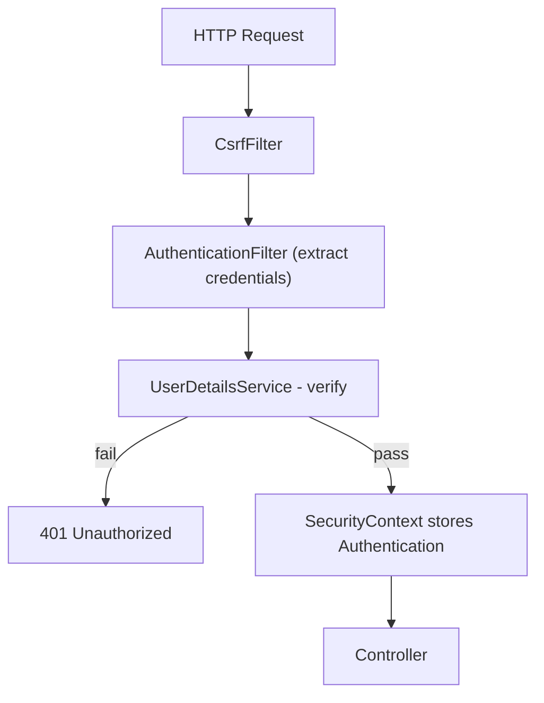
```mermaid
flowchart TD
    A[HTTP Request] --> B[CsrfFilter]
    B --> C["AuthenticationFilter (extract credentials)"]
    C --> D[UserDetailsService - verify]
    D -->|fail| E[401 Unauthorized]
    D -->|pass| F[SecurityContext stores Authentication]
    F --> G[Controller]
```

1. Request enters the `SecurityFilterChain` (typically 15+ filters).
2. `CsrfFilter` validates the CSRF token (for non-GET requests).
3. `UsernamePasswordAuthenticationFilter` (or `BearerTokenAuthenticationFilter`) extracts credentials.
4. `AuthenticationManager` delegates to `UserDetailsService` to load the user and verify the password.
5. On success, `SecurityContextHolder` stores the `Authentication` object for the request duration.

The filter chain architecture has three layers. The servlet container sees a single `DelegatingFilterProxy` registered under the name `springSecurityFilterChain`. This proxy delegates to a `FilterChainProxy` bean inside the Spring context, which holds one or more `SecurityFilterChain` instances. Each chain has a request matcher and an ordered list of filters. When a request arrives, `FilterChainProxy` picks the first chain whose matcher applies and runs its filters sequentially. This design lets you define different security rules for different URL patterns - one chain for `/api/**` with stateless JWT validation, another for `/admin/**` with session-based form login.

`UsernamePasswordAuthenticationFilter` handles form login by reading `username` and `password` from the POST body. It wraps them in a `UsernamePasswordAuthenticationToken` (an `Authentication` implementation with credentials but no authorities yet) and passes the token to the `AuthenticationManager`. The default implementation, `ProviderManager`, iterates through registered `AuthenticationProvider` instances until one supports the token type and either authenticates successfully or throws an `AuthenticationException`. For username/password flows, `DaoAuthenticationProvider` calls `UserDetailsService.loadUserByUsername()`, then uses a `PasswordEncoder` to compare the raw password against the stored hash. On success, it returns a fully populated `Authentication` with granted authorities. On failure, a `BadCredentialsException` triggers the `AuthenticationEntryPoint` to return a 401 response.

### 🛠️ Worked Example

**BAD:**

```java
// Hand-rolled auth in every controller
@GetMapping("/api/orders")
List<Order> list(
    HttpServletRequest req) {
  String token =
      req.getHeader("Authorization");
  if (token == null
      || !tokenService.isValid(token)) {
    throw new ResponseStatusException(
        HttpStatus.UNAUTHORIZED);
  }
  return orderService.findAll();
}
// Repeated in every secured endpoint
```

Why it's wrong: duplicated, easy to forget, inconsistent, no CSRF/session handling.

**GOOD:**

```java
@Configuration
@EnableWebSecurity
public class SecurityConfig {
  @Bean
  SecurityFilterChain filterChain(
      HttpSecurity http) throws Exception {
    return http
        .authorizeHttpRequests(auth -> auth
            .requestMatchers("/api/public/**")
                .permitAll()
            .anyRequest().authenticated())
        .httpBasic(Customizer.withDefaults())
        .build();
  }

  @Bean
  UserDetailsService users() {
    UserDetails user = User.builder()
        .username("admin")
        .password("{bcrypt}$2a$10$...")
        .roles("ADMIN")
        .build();
    return new InMemoryUserDetailsService(
        user);
  }
}
```

**Production: database-backed UserDetailsService:**

```java
@Service
public class DbUserDetailsService
    implements UserDetailsService {
  private final UserRepo repo;
  public UserDetails loadUserByUsername(
      String username) {
    return repo.findByUsername(username)
        .orElseThrow(() ->
            new UsernameNotFoundException(
                username));
  }
}
```

Password encoding is non-negotiable. Spring Security requires a `PasswordEncoder` bean and refuses to compare plain-text passwords at runtime. The `{bcrypt}` prefix in the example above is a delegating prefix - `DelegatingPasswordEncoder` reads it and routes to `BCryptPasswordEncoder`. This matters because you can migrate hashing algorithms without invalidating every stored password: old rows keep `{bcrypt}`, new rows use `{argon2}`, and the framework picks the right encoder per row. Always define a `PasswordEncoder` bean explicitly in production rather than relying on defaults.

The GOOD example uses `httpBasic()`, which sends credentials on every request via the `Authorization: Basic` header. Form login (`formLogin()`) uses a session cookie after the initial POST - better for browser apps because the password crosses the wire only once. Token-based auth with `oauth2ResourceServer()` validates a JWT or opaque token on each request without server-side session state - the standard choice for stateless APIs consumed by SPAs or mobile clients.

### ⚖️ Trade-offs

**Gain:** secure by default (all endpoints locked), filter chain handles CSRF/CORS/sessions, declarative config.
**Cost:** steep initial learning curve, filter chain ordering is complex, debugging requires understanding 15+ filters.

| Aspect           | Spring Security | Hand-rolled | Apache Shiro |
| ---------------- | --------------- | ----------- | ------------ |
| Default security | all locked      | none        | minimal      |
| Filter chain     | built-in        | manual      | basic        |
| OAuth 2.0 / OIDC | first-class     | DIY         | limited      |
| Community/docs   | massive         | N/A         | small        |

The cost side deserves emphasis. When authentication fails silently or redirects unexpectedly, the root cause is almost always filter ordering or a misconfigured `SecurityFilterChain`. Enable debug logging with `logging.level.org.springframework.security=DEBUG` to see every filter that fires and every authentication decision. The output is verbose but reveals exactly which filter rejected the request and why - this single setting saves hours of guesswork.

### ⚡ Decision Snap

**USE WHEN:** any Spring application handling user authentication, any API needing token or session-based auth.
**AVOID WHEN:** the application has zero security requirements (internal tool with network-level access control only).
**PREFER an API gateway WHEN:** authentication should happen before requests reach your service (zero-trust architecture with Envoy/Istio).

### ⚠️ Top Traps

| #   | Misconception                                                       | Reality                                                                                                         |
| --- | ------------------------------------------------------------------- | --------------------------------------------------------------------------------------------------------------- |
| 1   | Adding `spring-boot-starter-security` does nothing until configured | It immediately locks ALL endpoints with a generated password logged at startup                                  |
| 2   | `permitAll()` disables all security for a path                      | The request still passes through the filter chain (CSRF, headers) - it just skips authentication                |
| 3   | Passwords can be stored as plain text for testing                   | Spring Security refuses plain text by default; use `{noop}password` prefix for dev or `{bcrypt}` for production |

### 🪜 Learning Ladder

**Prerequisites:**

- SPR-024 @RestController and Request Mapping - endpoints to secure
  **THIS:** SPR-030 Spring Security Authentication Basics
  **Next steps:**
- SPR-031 Spring Security Authorization (RBAC) - what authenticated users are allowed to do

### 💡 The Surprising Truth

When you add `spring-boot-starter-security` with zero configuration, Spring Security generates a random UUID password and prints it to the console at startup. Every endpoint is immediately protected with HTTP Basic using username `user`. This "secure by default" behavior catches many developers off guard but is deliberate - it is safer to lock everything and open selectively than to leave everything open and forget to lock. The deeper insight is that `SecurityAutoConfiguration` registers a `SecurityFilterChain` with `.anyRequest().authenticated()` and `.formLogin()` plus `.httpBasic()`. Your custom `SecurityFilterChain` bean replaces this auto-configured one entirely - it does not merge with it. Understanding this replacement semantics prevents the common mistake of expecting custom rules to layer on top of defaults.

### 📇 Revision Card

1. Spring Security is a filter chain - 15+ filters execute before your controller method
2. Adding the starter immediately locks all endpoints - secure by default, open selectively
3. `SecurityContext` holds the `Authentication` object for the current request thread

---

---

# SPR-031 Spring Security Authorization (RBAC)

**TL;DR** - Authorization checks what an authenticated user is allowed to do, enforced via URL rules or method-level annotations.

### 🔥 The Problem in One Paragraph

Authentication answers "who are you?" but not "what can you do?" A regular user should not delete other users. A read-only API key should not modify data. Without authorization, every controller method checks roles manually: `if (!user.hasRole("ADMIN")) throw forbidden()`. This logic is scattered, inconsistent, and easy to forget on new endpoints. One missed check and a regular user deletes the production database. This is exactly why **Spring Security Authorization** was created.

### 📘 Textbook Definition

**Spring Security Authorization** determines whether an authenticated principal has permission to perform a specific action. It supports URL-based rules (configured in `SecurityFilterChain` via `authorizeHttpRequests`), method-level security (`@PreAuthorize`, `@Secured`, `@RolesAllowed`), and expression-based access control using Spring Expression Language (SpEL).

### 🧠 Mental Model

> Authentication is the ID badge that gets you into the building. Authorization is the key card that opens specific doors. A junior employee (USER role) can enter the cafeteria but not the server room. An admin (ADMIN role) can open all doors.

- "Key card" -> granted authorities / roles
- "Door lock" -> `hasRole("ADMIN")` check
- "Door" -> endpoint or method
  **Where this analogy breaks down:** Spring Security supports expression-based rules far more complex than simple role checks (ownership, time-based, custom logic).

### ⚙️ How It Works

```
Authenticated request
        |
        v
+----------------+
| Authorization  |
| Filter         |
+-------+--------+
        |
  check rules
        |
  +-----------+
  | URL rules |---> 403 Forbidden
  +-----------+
        |
        v
+----------------+
| Controller     |
+-------+--------+
        |
  @PreAuthorize
        |
  +-----------+
  | Method    |---> AccessDenied
  | security  |
  +-----------+
```

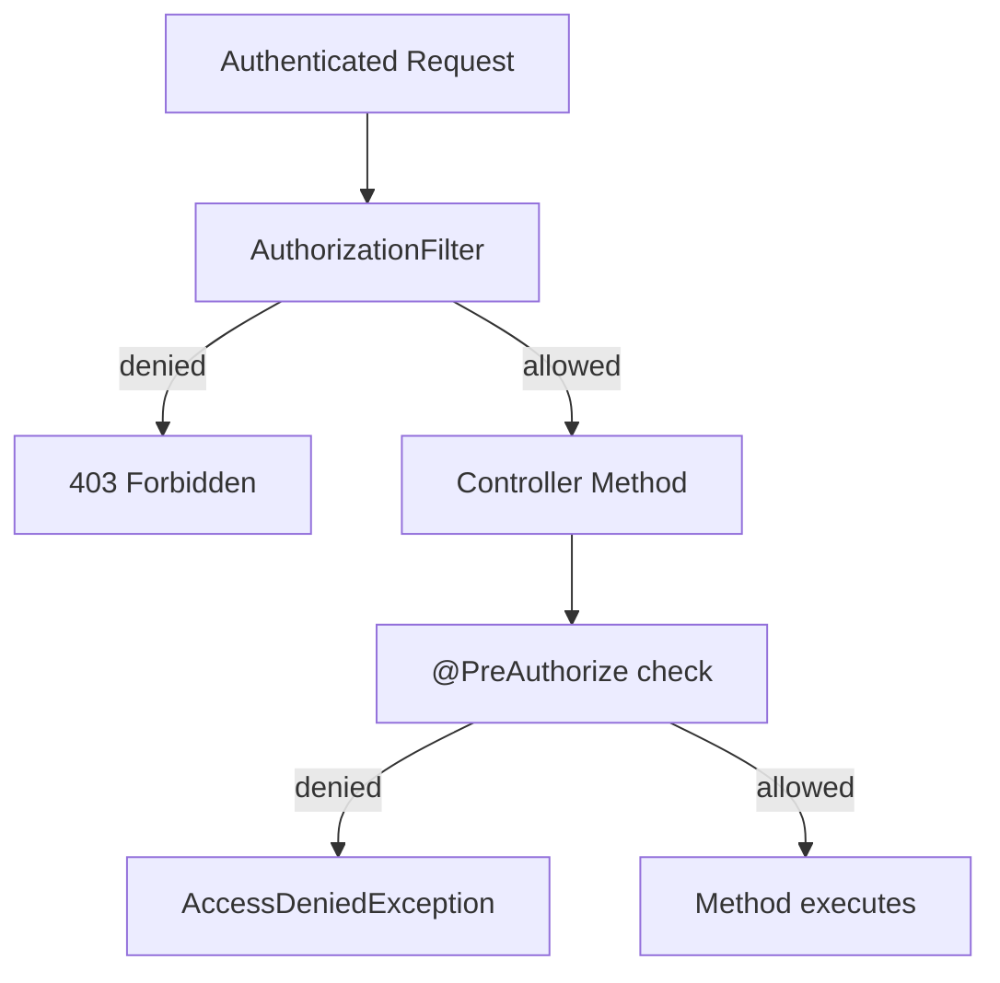
```mermaid
flowchart TD
    A[Authenticated Request] --> B[AuthorizationFilter]
    B -->|denied| C[403 Forbidden]
    B -->|allowed| D[Controller Method]
    D --> E["@PreAuthorize check"]
    E -->|denied| F[AccessDeniedException]
    E -->|allowed| G[Method executes]
```

1. `AuthorizationFilter` evaluates URL-based rules first.
2. If the URL rule denies access, a 403 response is returned immediately.
3. If URL rules pass, the request reaches the controller method.
4. `@PreAuthorize` (if present) evaluates SpEL expressions against the `Authentication` object.
5. If the SpEL expression returns false, `AccessDeniedException` is thrown.

**AuthorizationManager (Spring Security 6+)**

Spring Security 6 replaced the legacy `AccessDecisionVoter` chain with a single `AuthorizationManager` interface. The old model used three `AccessDecisionManager` strategies (`AffirmativeBased`, `ConsensusBased`, `UnanimousBased`) that polled a list of voters. This was powerful but hard to reason about - you had to understand voting semantics to predict outcomes. The new `AuthorizationManager` is a functional interface with one method: `check(Supplier<Authentication>, T object)`. It returns an `AuthorizationDecision` (granted or denied). URL-based authorization uses `RequestMatcherDelegatingAuthorizationManager`, which iterates through your `authorizeHttpRequests` rules in declaration order and delegates to the first matching `AuthorizationManager`. This is why rule ordering matters: a broad `.anyRequest().permitAll()` placed before a restrictive rule silently overrides it.

**Method security via AOP proxies**

Method-level annotations (`@PreAuthorize`, `@PostAuthorize`, `@Secured`) work through Spring AOP proxies - the same proxy mechanism that powers `@Transactional`. When you annotate a bean method, Spring wraps that bean in a proxy. Before the real method executes, an `AuthorizationManagerBeforeMethodInterceptor` evaluates the SpEL expression. This has the same proxy limitation as `@Transactional`: self-invocation (calling an annotated method from within the same class) bypasses the proxy and skips the security check entirely. If `serviceA.delete()` is secured but `serviceA.cleanup()` calls `this.delete()` internally, the security check never fires.

**URL-based vs method-based: when each applies**

URL rules and method security operate at different layers. URL rules run in the servlet filter chain before the request reaches Spring MVC. They see only the HTTP method, path, and authentication object. Method security runs after Spring MVC dispatches to the controller, so it can access method parameters, path variables, and domain objects. In practice, use URL rules as a coarse perimeter ("all of `/api/admin/**` requires ADMIN") and method security for business logic ("users can only delete their own resources").

### 🛠️ Worked Example

**BAD:**

```java
@DeleteMapping("/users/{id}")
void deleteUser(
    @PathVariable Long id,
    @AuthenticationPrincipal User user) {
  // Manual role check - easy to forget
  if (!user.getRoles().contains("ADMIN")) {
    throw new ResponseStatusException(
        HttpStatus.FORBIDDEN);
  }
  userService.delete(id);
}
```

Why it's wrong: manual role check per method, inconsistent exception type, no audit trail.

**GOOD:**

```java
// URL-level rules in SecurityFilterChain
http.authorizeHttpRequests(auth -> auth
    .requestMatchers(HttpMethod.DELETE,
        "/api/users/**")
        .hasRole("ADMIN")
    .requestMatchers("/api/**")
        .authenticated()
    .anyRequest().permitAll());

// Method-level for fine-grained control
@PreAuthorize("hasRole('ADMIN') or "
    + "#id == authentication.principal.id")
@DeleteMapping("/users/{id}")
void deleteUser(@PathVariable Long id) {
  userService.delete(id);
}
```

**Production: enable method security:**

```java
@Configuration
@EnableMethodSecurity  // Spring 6+
public class MethodSecurityConfig {}
```

**Production: custom permission evaluator:**

```java
// Domain-aware authorization
@PreAuthorize(
    "@docPermissions.canEdit(#id, authentication)")
@PutMapping("/documents/{id}")
DocumentDto update(
    @PathVariable Long id,
    @RequestBody DocumentDto dto) {
  return documentService.update(id, dto);
}

// Custom permission bean
@Component("docPermissions")
public class DocumentPermissions {
  private final DocumentRepository repo;

  public DocumentPermissions(
      DocumentRepository repo) {
    this.repo = repo;
  }

  public boolean canEdit(
      Long docId, Authentication auth) {
    Document doc = repo.findById(docId)
        .orElse(null);
    if (doc == null) return false;
    String username = auth.getName();
    return doc.getOwner().equals(username)
        || auth.getAuthorities().stream()
            .anyMatch(a -> a.getAuthority()
                .equals("ROLE_EDITOR"));
  }
}
```

The `@` prefix in SpEL references a Spring bean by name. This pattern keeps authorization logic testable and out of controllers - you unit-test `DocumentPermissions.canEdit()` directly without needing a full security context.

### ⚖️ Trade-offs

**Gain:** centralized access rules, SpEL expressions for complex logic, auditable, declarative.
**Cost:** SpEL expressions can become unreadable, URL rules and method rules can conflict, testing requires security context setup.

| Aspect      | URL rules   | @PreAuthorize | @Secured        |
| ----------- | ----------- | ------------- | --------------- |
| Granularity | path-level  | method-level  | method-level    |
| Expressions | limited     | full SpEL     | role names only |
| Readability | centralized | distributed   | simple          |

**RBAC vs ABAC:** Role-Based Access Control assigns permissions to roles, then roles to users. It works well when permissions map cleanly to job functions (ADMIN, EDITOR, VIEWER). Attribute-Based Access Control evaluates policies against arbitrary attributes of the user, the resource, and the environment (e.g., "authors can edit their own documents during business hours"). Spring Security's `@PreAuthorize` with SpEL and custom permission beans effectively supports ABAC patterns without a dedicated policy engine. However, once you have more than a handful of attribute-based rules, consider a dedicated policy engine (like Open Policy Agent) rather than spreading complex SpEL expressions across dozens of methods. The decision point: if your access rules fit in a role hierarchy table, RBAC is simpler. If rules depend on resource ownership, time, geography, or multi-attribute conditions, you are doing ABAC whether you call it that or not.

### ⚡ Decision Snap

**USE WHEN:** any application with multiple user roles, any API where endpoints have different access levels.
**AVOID WHEN:** all users have identical permissions (but still protect admin endpoints).
**PREFER URL rules WHEN:** authorization is purely path-based. **PREFER @PreAuthorize WHEN:** authorization depends on method parameters or domain objects.

### ⚠️ Top Traps

| #   | Misconception                                         | Reality                                                                                                         |
| --- | ----------------------------------------------------- | --------------------------------------------------------------------------------------------------------------- |
| 1   | `hasRole("ADMIN")` matches authority `ADMIN`          | It matches authority `ROLE_ADMIN` - Spring prepends `ROLE_` prefix. Use `hasAuthority("ADMIN")` for exact match |
| 2   | URL rules and method security are redundant           | They are complementary: URL rules are coarse-grained defense, method security is fine-grained                   |
| 3   | `@PreAuthorize` works without `@EnableMethodSecurity` | It is silently ignored without the enablement annotation (Spring 6+)                                            |

### 🪜 Learning Ladder

**Prerequisites:**

- SPR-030 Spring Security Authentication Basics - who the user is must be established first
  **THIS:** SPR-031 Spring Security Authorization (RBAC)
  **Next steps:**
- SPR-032 @Transactional Basics - securing data operations that span multiple steps

### 💡 The Surprising Truth

Spring Security's `ROLE_` prefix convention dates back to the original Acegi Security framework (2004). It exists because the original API distinguished "roles" (coarse-grained, prefixed) from "authorities" (fine-grained, unprefixed). Most modern applications use `hasAuthority()` to avoid confusion, but the prefix convention persists in tutorials and causes regular confusion.

Authorization evaluation order catches many developers off guard. URL rules in `authorizeHttpRequests` are evaluated in declaration order - the first matching rule wins. But `@PreAuthorize` on a method and `@PreAuthorize` on a class are both evaluated, and the method-level annotation does not replace the class-level one by default. In Spring Security 6, `@EnableMethodSecurity` processes `@PreAuthorize` before method execution and `@PostAuthorize` after, but before the response is serialized. If both URL rules and method security apply to the same request, both must pass - they are conjunctive, not alternatives. A request allowed by URL rules can still be denied by `@PreAuthorize`, and vice versa. This layered evaluation is the intended design: defense in depth, not redundancy.

### 📇 Revision Card

1. URL rules are coarse-grained (path-level); `@PreAuthorize` is fine-grained (method + SpEL)
2. `hasRole("X")` matches `ROLE_X` authority - use `hasAuthority("X")` for exact match
3. `@EnableMethodSecurity` is required or `@PreAuthorize` annotations are silently ignored

---

---

# SPR-032 @Transactional Basics

**TL;DR** - `@Transactional` wraps method execution in a database transaction managed by Spring's proxy mechanism.

### 🔥 The Problem in One Paragraph

A service method transfers money: debit account A, credit account B. If the credit fails after the debit succeeds, money vanishes. Without transaction management, every multi-step database operation risks partial completion. Manual transaction handling means writing `begin`, `commit`, `rollback` in every method, catching every exception correctly, and ensuring connections are released. One missed rollback corrupts data silently. This is exactly why **@Transactional** was created.

### 📘 Textbook Definition

**@Transactional** is a Spring annotation that declares transactional boundaries on a method or class. Spring creates a proxy around the bean that opens a transaction before the method executes, commits on successful return, and rolls back on unchecked exceptions. It delegates to the `PlatformTransactionManager` (e.g., `JpaTransactionManager`) for the actual database transaction lifecycle.

### 🧠 Mental Model

> `@Transactional` is an "all-or-nothing" delivery guarantee. Either the entire package (all DB operations in the method) arrives at the destination (committed), or nothing changes (rolled back). The delivery driver (proxy) handles the logistics.

- "Package" -> all database operations in the method
- "Delivery driver" -> Spring's AOP proxy
- "Destination" -> committed database state
  **Where this analogy breaks down:** propagation settings allow nested transactions and joining existing ones, which is more complex than simple delivery.

### ⚙️ How It Works

```
Caller
  |
  v
+------------------+
| Spring Proxy     |
| (CGLIB/JDK)      |
+--------+---------+
         |
   begin transaction
         |
         v
+------------------+
| Actual method    |
| (DB operations)  |
+--------+---------+
         |
   success? commit
   exception? rollback
         |
         v
+------------------+
| TransactionMgr   |
+------------------+
```

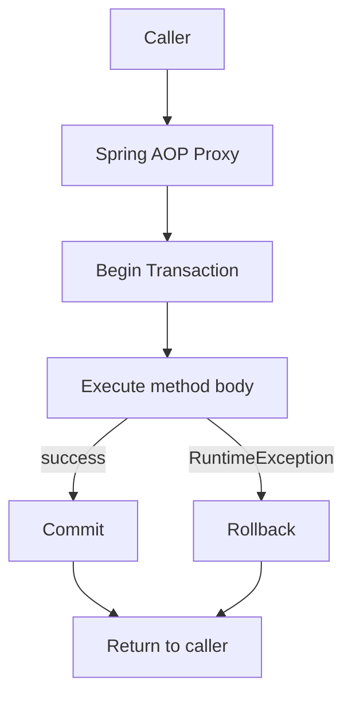
```mermaid
flowchart TD
    A[Caller] --> B[Spring AOP Proxy]
    B --> C[Begin Transaction]
    C --> D[Execute method body]
    D -->|success| E[Commit]
    D -->|RuntimeException| F[Rollback]
    E --> G[Return to caller]
    F --> G
```

1. Caller invokes a method on the Spring-managed bean (actually calls the proxy).
2. The proxy intercepts the call, opens a transaction via `PlatformTransactionManager`.
3. The actual method executes with all DB operations sharing one transaction.
4. On normal return, the proxy commits. On unchecked exception, it rolls back.
5. Checked exceptions do NOT trigger rollback by default (use `rollbackFor`).

**Propagation controls what happens when a transactional method calls another transactional method.** `REQUIRED` (default) joins the existing transaction or creates one if none exists - this is correct for most service methods. `REQUIRES_NEW` suspends the current transaction and creates a fresh one - use this for audit logging that must persist even if the outer transaction rolls back. `NESTED` creates a savepoint within the existing transaction - the inner work can roll back independently while the outer transaction continues. Choosing wrong propagation is a subtle bug: `REQUIRES_NEW` inside a loop creates N independent transactions, each holding a separate connection from the pool.

**Isolation levels define visibility rules between concurrent transactions.** `READ_COMMITTED` (the default on PostgreSQL and Oracle) prevents dirty reads but allows non-repeatable reads - a row you read once may change if another transaction commits between your two reads. `REPEATABLE_READ` (the default on MySQL/InnoDB) prevents non-repeatable reads by snapshotting the data at transaction start. `SERIALIZABLE` prevents phantom reads but imposes the highest lock contention. In practice, most Spring applications rely on the database default and only override isolation for specific methods that demand stricter guarantees, such as inventory reservation or balance checks.

**Spring creates transaction proxies using one of two mechanisms.** CGLIB (default in Spring Boot) generates a subclass of your bean at runtime - it works on concrete classes and does not require an interface. JDK dynamic proxies implement the bean's interface and delegate to the real object - they are used when `proxyTargetClass=false` and the bean implements at least one interface. The practical difference: CGLIB proxies cannot intercept `final` methods because subclassing cannot override them. JDK proxies only see methods declared on the interface. Both mechanisms share the same fundamental limitation: internal method calls within the same object bypass the proxy entirely.

### 🛠️ Worked Example

**BAD:**

```java
@Service
public class TransferService {
  @Autowired EntityManager em;
  public void transfer(Long from, Long to,
      BigDecimal amount) {
    em.getTransaction().begin();
    try {
      accountRepo.debit(from, amount);
      accountRepo.credit(to, amount);
      em.getTransaction().commit();
    } catch (Exception e) {
      em.getTransaction().rollback();
      throw e;
    }
  }
}
```

Why it's wrong: manual transaction management, verbose, error-prone, mixes infrastructure with business logic.

**GOOD:**

```java
@Service
public class TransferService {
  private final AccountRepo repo;

  TransferService(AccountRepo repo) {
    this.repo = repo;
  }

  @Transactional
  public void transfer(Long from, Long to,
      BigDecimal amount) {
    repo.debit(from, amount);
    repo.credit(to, amount);
    // Commits on success,
    // rolls back on RuntimeException
  }
}
```

**Production: explicit rollback rules:**

```java
@Transactional(
    rollbackFor = Exception.class,
    timeout = 5,
    readOnly = false)
public void transfer(Long from, Long to,
    BigDecimal amount) {
  // Rolls back on ALL exceptions now
}
```

**Production: readOnly optimization for queries:**

```java
@Transactional(readOnly = true)
public List<Order> findRecentOrders(
    Long customerId) {
  return orderRepo
      .findByCustomerIdAndCreatedAfter(
          customerId,
          Instant.now().minus(30, DAYS));
}
```

`readOnly = true` is not merely documentation. At the JDBC level, it calls `Connection.setReadOnly(true)`, which some drivers use to route queries to read replicas. At the Hibernate level, it sets the flush mode to `MANUAL`, which means Hibernate skips the dirty-checking pass at commit time - it never compares entity snapshots against current state because it knows nothing changed. For read-heavy methods loading dozens of entities, skipping dirty checking is a measurable performance win. The transaction still exists (reads are consistent within it), but the commit phase does almost no work.

### ⚖️ Trade-offs

**Gain:** declarative transaction management, clean business code, consistent rollback behavior.
**Cost:** proxy-based mechanism has gotchas (self-invocation, checked exceptions), transaction scope may be too broad.

| Aspect               | @Transactional | Manual TX | Programmatic TX |
| -------------------- | -------------- | --------- | --------------- |
| Boilerplate          | minimal        | high      | medium          |
| Self-invoke safety   | no             | yes       | yes             |
| Fine-grained control | limited        | full      | full            |
| Readability          | declarative    | cluttered | moderate        |

**Transaction scope is a design decision, not a default.** Placing `@Transactional` on every service class (class-level annotation) wraps every method - including read-only queries - in a read-write transaction. This holds a database connection for the entire method duration, including time spent calling external APIs or performing non-DB computation. Under load, this drains the connection pool. The opposite extreme - wrapping individual repository calls - loses atomicity across related writes. The disciplined approach: annotate at the method level, use `readOnly = true` for queries, and keep transactional methods focused on database work. Move HTTP calls, file I/O, and message publishing outside the transactional boundary.

### ⚡ Decision Snap

**USE WHEN:** any service method performing write operations, any method where atomicity is required across multiple DB calls.
**AVOID WHEN:** read-only queries that do not need atomicity guarantees (though `@Transactional(readOnly=true)` can optimize reads).
**PREFER programmatic TX WHEN:** you need fine-grained transaction boundaries within a single method.

### ⚠️ Top Traps

| #   | Misconception                                             | Reality                                                                                                                           |
| --- | --------------------------------------------------------- | --------------------------------------------------------------------------------------------------------------------------------- |
| 1   | Checked exceptions trigger rollback                       | By default, only unchecked exceptions (RuntimeException) trigger rollback. Use `rollbackFor = Exception.class` to include checked |
| 2   | Calling `@Transactional` method from the same class works | Self-invocation bypasses the proxy - no transaction is created. Call from another bean or use `TransactionTemplate`               |
| 3   | `@Transactional` on a private method works                | Spring proxies cannot intercept private methods - the annotation is silently ignored                                              |

### 🪜 Learning Ladder

**Prerequisites:**

- SPR-027 Spring Data JPA - Repository Pattern - data operations that need transactions
  **THIS:** SPR-032 @Transactional Basics
  **Next steps:**
- SPR-033 Spring Cache Abstraction (@Cacheable) - another proxy-based cross-cutting concern

### 💡 The Surprising Truth

The self-invocation trap is the single most common Spring transaction bug. When method A calls method B within the same class, and only B is annotated `@Transactional`, no transaction is created because the call bypasses the proxy. This happens because `this.methodB()` is a direct Java call on the actual object, not on the proxy wrapper. The call never passes through the interceptor chain that would open the transaction.

Three fixes exist, in order of preference. First, extract the transactional method into a separate `@Service` bean and inject it - this is the cleanest solution and makes the dependency explicit. Second, use `TransactionTemplate` for programmatic control:

```java
@Service
public class OrderService {
  private final TransactionTemplate txTemplate;

  OrderService(
      PlatformTransactionManager txMgr) {
    this.txTemplate =
        new TransactionTemplate(txMgr);
  }

  public void processOrder(Order order) {
    validate(order);
    txTemplate.executeWithoutResult(status -> {
      orderRepo.save(order);
      inventoryRepo.reserve(order.getItems());
    });
    notificationService.send(order);
  }
}
```

`TransactionTemplate` gives you explicit boundaries within a method, avoids the proxy trap entirely, and makes the transactional scope visible in the code. The third option - self-injection via `@Lazy` or `ApplicationContext.getBean()` - works but obscures intent and is generally a code smell.

### 📇 Revision Card

1. `@Transactional` uses AOP proxies - self-invocation within the same class bypasses the proxy
2. Only unchecked exceptions roll back by default - add `rollbackFor = Exception.class` for checked
3. Private methods are invisible to the proxy - `@Transactional` on private methods is silently ignored

---

---

# SPR-033 Spring Cache Abstraction (@Cacheable)

**TL;DR** - `@Cacheable` caches method return values transparently, avoiding repeated expensive computations or database queries.

### 🔥 The Problem in One Paragraph

A product catalog service queries the database on every request for the same product. Under load, 1,000 requests per second for the same product ID generate 1,000 identical database round-trips. The database becomes the bottleneck, latency spikes, and the service degrades. Manually implementing caching means choosing a cache library, writing get-or-compute logic in every method, handling eviction, and keeping cache and database in sync. This boilerplate is identical across methods. This is exactly why **Spring's Cache Abstraction** was created.

### 📘 Textbook Definition

The **Spring Cache Abstraction** provides annotation-driven caching (`@Cacheable`, `@CacheEvict`, `@CachePut`) that transparently stores method return values in a configurable cache (ConcurrentHashMap, Caffeine, Redis, Hazelcast). Like `@Transactional`, it uses AOP proxies to intercept method calls and serve cached results when available.

### 🧠 Mental Model

> `@Cacheable` is a librarian with perfect memory. The first time you ask for book #42, the librarian fetches it from the archive (database). Every subsequent request for #42 gets the copy from the librarian's desk (cache) without visiting the archive.

- "Librarian's desk" -> cache store
- "Archive" -> database or expensive computation
- "Book request" -> method call with cache key
  **Where this analogy breaks down:** cache entries expire and can be evicted, unlike a librarian's permanent memory.

### ⚙️ How It Works

```
Method call
     |
     v
+-----------+
| AOP Proxy | check cache
+-----------+
     |
   hit? return cached value
   miss?
     |
     v
+-----------+
| Execute   | actual method
+-----------+
     |
   store result in cache
     |
     v
+-----------+
| Return    |
+-----------+
```

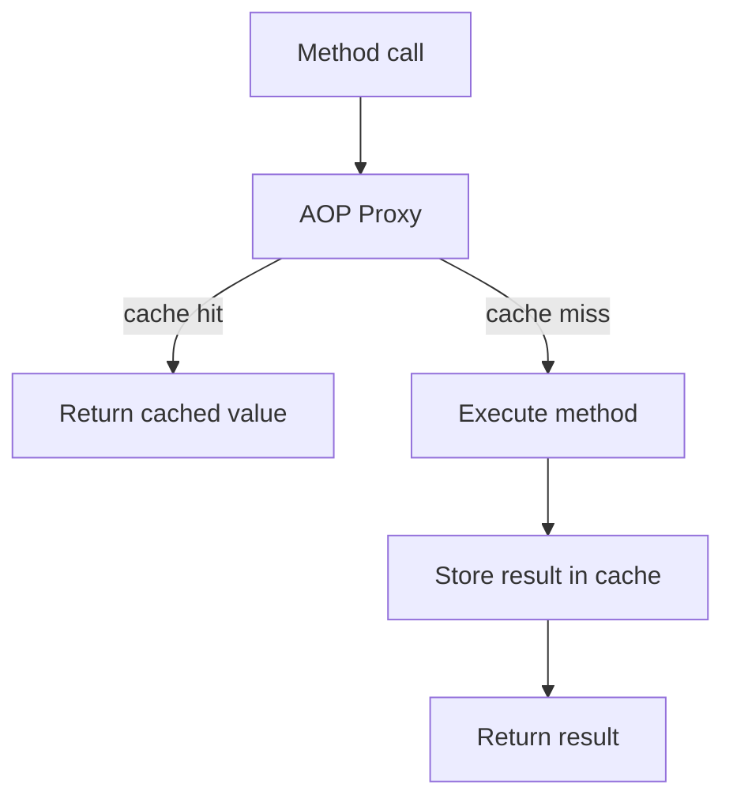
```mermaid
flowchart TD
    A[Method call] --> B[AOP Proxy]
    B -->|cache hit| C[Return cached value]
    B -->|cache miss| D[Execute method]
    D --> E[Store result in cache]
    E --> F[Return result]
```

1. Caller invokes a `@Cacheable` method on the proxy.
2. The proxy generates a cache key from method parameters.
3. If the key exists in the cache, the cached value is returned without executing the method.
4. If the key is missing, the method executes, and the result is stored in the cache.
5. `@CacheEvict` removes entries. `@CachePut` always executes and updates the cache.

**Cache key generation.** By default, Spring uses `SimpleKeyGenerator`, which builds keys from all method parameters via their `hashCode()` and `equals()`. A single-parameter method uses that parameter directly as the key. Multiple parameters are wrapped in a `SimpleKey` object. You can override this with SpEL expressions: `@Cacheable(key = "#user.id")` extracts a specific field, and `@Cacheable(key = "T(java.util.Objects).hash(#region, #id)")` builds composite keys. If your key logic is reused across methods, implement `KeyGenerator` and register it as a bean.

**CacheManager hierarchy.** The `CacheManager` interface is the SPI that plugs in the actual storage engine. Spring Boot auto-configures the implementation based on what is on the classpath: `ConcurrentMapCacheManager` (default, in-process), `CaffeineCacheManager` (in-process with size/TTL), `RedisCacheManager` (distributed), or `HazelcastCacheManager` (distributed). You select the backend via `spring.cache.type` or by declaring a `CacheManager` bean explicitly. In production, Caffeine is the standard choice for single-instance services; Redis or Hazelcast for multi-instance deployments where cache must be shared.

**Conditional caching.** Two SpEL attributes control when caching applies. `condition` is evaluated before method execution - if false, the method runs and the result is not cached: `@Cacheable(condition = "#id > 10")`. `unless` is evaluated after execution - if true, the result is not stored: `@Cacheable(unless = "#result == null")`. Combine both to avoid caching nulls or low-value entries that would waste cache space.

### 🛠️ Worked Example

**BAD:**

```java
@Service
public class ProductService {
  private final Map<Long, Product> cache =
      new ConcurrentHashMap<>();

  public Product findById(Long id) {
    if (cache.containsKey(id)) {
      return cache.get(id);
    }
    Product p = repo.findById(id).orElse(null);
    if (p != null) cache.put(id, p);
    return p;
    // No eviction, no TTL, grows forever
  }
}
```

Why it's wrong: manual cache, no eviction, no TTL, memory leak, duplicated in every service.

**GOOD:**

```java
@Service
public class ProductService {
  @Cacheable(value = "products",
      key = "#id")
  public Product findById(Long id) {
    return repo.findById(id).orElseThrow();
  }

  @CacheEvict(value = "products",
      key = "#id")
  public void update(Long id,
      ProductDto dto) {
    // evicts cache on update
    repo.save(toEntity(id, dto));
  }
}
```

**Production: Caffeine cache with TTL:**

```properties
spring.cache.type=caffeine
spring.cache.caffeine.spec=\
  maximumSize=1000,expireAfterWrite=10m
```

**Production: `@CachePut` and `@Caching` for composite operations:**

```java
@Service
public class ProductService {
  @CachePut(value = "products",
      key = "#dto.id")
  public Product update(ProductDto dto) {
    // always executes, then updates cache
    return repo.save(toEntity(dto));
  }

  @Caching(
    evict = {
      @CacheEvict(value = "products",
          key = "#id"),
      @CacheEvict(value = "productList",
          allEntries = true)
    }
  )
  public void delete(Long id) {
    repo.deleteById(id);
  }
}
```

`@CachePut` differs from `@Cacheable`: it always runs the method and writes the result, making it ideal for update operations where the cache must reflect the new value. `@Caching` groups multiple cache operations - here a delete evicts both the individual product entry and the entire product list cache.

### ⚖️ Trade-offs

**Gain:** transparent caching via annotation, pluggable backends, consistent eviction patterns.
**Cost:** stale data risk if eviction is not aligned with writes, proxy self-invocation trap (same as `@Transactional`).

**Cache consistency patterns.** Spring's abstraction implements **cache-aside** (lazy-load): the application checks the cache, falls back to the source on miss, and populates the cache. This is the simplest pattern but leaves a window where the database is updated and the cache still holds stale data. **Write-through** uses `@CachePut` on every write so the cache is updated atomically with the database - stronger consistency, but every write pays the cache-write cost. **Write-behind** (write-back) buffers writes and flushes to the database asynchronously - Spring's abstraction does not support this natively, but Hazelcast and Redis modules offer it. Choose cache-aside for read-heavy workloads with tolerant staleness, write-through when reads must reflect writes immediately, and write-behind only when write throughput matters more than durability.

| Aspect              | @Cacheable | Manual cache | Redis direct |
| ------------------- | ---------- | ------------ | ------------ |
| Boilerplate         | minimal    | high         | medium       |
| Backend flexibility | pluggable  | fixed        | Redis only   |
| Eviction control    | annotation | manual       | TTL + manual |
| Self-invoke safety  | no (proxy) | yes          | yes          |

### ⚡ Decision Snap

**USE WHEN:** read-heavy data that changes infrequently, expensive computations called repeatedly with the same inputs.
**AVOID WHEN:** data changes on every request, strong consistency is required (banking), cache key cardinality is extreme (millions of unique keys).
**PREFER Redis/Hazelcast WHEN:** multiple service instances need a shared cache (distributed).

### ⚠️ Top Traps

| #   | Misconception                                       | Reality                                                                             |
| --- | --------------------------------------------------- | ----------------------------------------------------------------------------------- |
| 1   | `@Cacheable` on void methods works                  | Void methods return null - there is nothing to cache. The annotation is meaningless |
| 2   | The cache evicts automatically when data changes    | Eviction is manual - you must use `@CacheEvict` on write methods or configure TTL   |
| 3   | Self-invocation within the same bean uses the cache | Same proxy trap as `@Transactional` - internal calls bypass the cache proxy         |

### 🪜 Learning Ladder

**Prerequisites:**

- SPR-032 @Transactional Basics - same proxy mechanism, same self-invocation trap
  **THIS:** SPR-033 Spring Cache Abstraction (@Cacheable)
  **Next steps:**
- SPR-034 Logging in Spring Boot (SLF4J and Logback) - observing cache hit/miss rates

### 💡 The Surprising Truth

Spring Boot auto-configures a `ConcurrentHashMap`-based cache when no other cache library is detected. This in-process cache has zero TTL and zero size limit - it grows without bound until the JVM runs out of memory. In a service with high-cardinality keys (user-specific responses, search queries), the default cache silently consumes heap until GC pauses spike and the service eventually hits `OutOfMemoryError`. The failure mode is insidious: everything works in development with 10 test users, then collapses weeks after production deployment when the cache has accumulated millions of entries. Heap dumps show the `ConcurrentHashMap` holding the majority of live objects, but nothing in the code points to it because the annotation hides the storage. In production, always configure Caffeine (local) or Redis (distributed) with explicit `maximumSize` and `expireAfterWrite`. Caffeine's `recordStats()` option exposes hit rate, eviction count, and load time via Micrometer - without these metrics, you are flying blind on whether the cache is helping or hurting.

### 📇 Revision Card

1. `@Cacheable` uses AOP proxies - same self-invocation trap as `@Transactional`
2. Default cache is unbounded ConcurrentHashMap - always configure Caffeine or Redis in production
3. Eviction is never automatic from data changes - use `@CacheEvict` or TTL-based expiry

---

---

# SPR-034 Logging in Spring Boot (SLF4J and Logback)

**TL;DR** - Spring Boot uses SLF4J as the logging facade and Logback as the default implementation, configured via properties.

### 🔥 The Problem in One Paragraph

A production Spring application with no structured logging is flying blind. When an order fails, developers SSH into the server and grep through unstructured console output. Different libraries use different logging frameworks (java.util.logging, Log4j, commons-logging) creating a format mess. Log levels are either too verbose (DEBUG in prod) or too quiet (missing ERROR details). Without a unified logging strategy, debugging production issues is slow and unreliable. This is exactly why **SLF4J with Logback** is Spring Boot's default logging setup.

### 📘 Textbook Definition

**SLF4J** (Simple Logging Facade for Java) is an API that decouples application logging code from the underlying implementation. **Logback** is SLF4J's native implementation and Spring Boot's default logging backend. Spring Boot auto-configures Logback with console output, sensible defaults, and property-based customization (`logging.level.*`, `logging.file.*`, `logging.pattern.*`).

### 🧠 Mental Model

> SLF4J is a universal power socket adapter. Your code plugs into SLF4J (the adapter), and the actual power source (Logback, Log4j2, or JUL) can be swapped without changing any plugs. Spring Boot pre-installs Logback as the power source.

- "Power socket adapter" -> SLF4J facade
- "Power source" -> Logback (default) or Log4j2
- "Plugs" -> `Logger` API calls in your code
  **Where this analogy breaks down:** unlike power sources, logging implementations have different performance characteristics and configuration formats.

### ⚙️ How It Works

```
Application code
  log.info("msg")
       |
       v
  +---------+
  | SLF4J   | facade API
  +---------+
       |
       v
  +---------+
  | Logback | impl
  +---------+
       |
       v
  +---------+
  | Appender| console/file/JSON
  +---------+
```

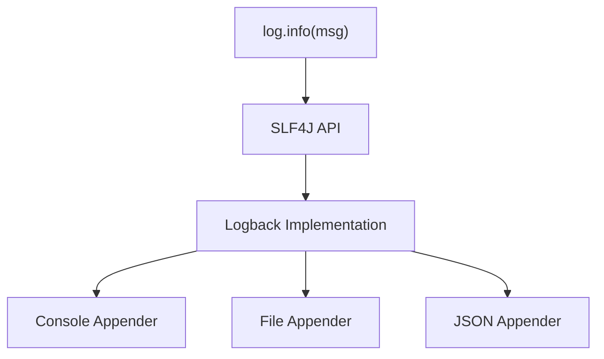
```mermaid
flowchart TD
    A["log.info(msg)"] --> B[SLF4J API]
    B --> C[Logback Implementation]
    C --> D[Console Appender]
    C --> E[File Appender]
    C --> F[JSON Appender]
```

1. Your code calls `log.info("Order {} created", orderId)` using the SLF4J API.
2. SLF4J routes the call to Logback (bound at startup via classpath detection).
3. Logback evaluates the log level against the configured threshold.
4. If the level passes, the message is formatted and sent to configured appenders (console, file, JSON).
5. Spring Boot's defaults: console appender, `INFO` level, date-time-level-logger-message format.

**Bridge modules.** Spring Boot includes bridge JARs that redirect other logging frameworks to SLF4J. `jcl-over-slf4j` captures commons-logging calls, `jul-to-slf4j` captures java.util.logging calls, and `log4j-over-slf4j` captures Log4j 1.x calls. This means every library in your classpath - Hibernate, Tomcat, Apache HTTP - funnels through one pipeline. Boot's `spring-boot-starter-logging` pulls these bridges automatically.

**Appender types.** Logback ships three core appenders. `ConsoleAppender` writes to stdout (default in Boot). `RollingFileAppender` writes to files with size-based or time-based rotation - critical for production where unbounded log files fill disks. `AsyncAppender` wraps another appender and offloads writes to a background thread, reducing latency on the calling thread at the cost of potential log loss during a hard crash (the in-memory queue may not flush).

**Structured JSON logging.** For log aggregation systems (ELK, Splunk, Datadog), plain-text logs require fragile regex parsing. Adding the Logstash Logback Encoder (`net.logstash.logback:logstash-logback-encoder`) to your classpath lets you configure a `LogstashEncoder` appender that emits each log event as a single JSON object with fields for timestamp, level, logger, message, MDC context, and stack traces. Spring Boot 3.4+ also supports structured logging natively via `logging.structured.format.console=ecs` or `logstash` in properties.

### 🛠️ Worked Example

**BAD:**

```java
public class OrderService {
  public Order create(OrderDto dto) {
    System.out.println(
        "Creating order: " + dto);
    // No level control, no structured
    // output, string concatenation always
    // evaluates even if logging is off
    return repo.save(toEntity(dto));
  }
}
```

Why it's wrong: `System.out.println` has no levels, no formatting, no file rotation, always evaluates the string.

**GOOD:**

```java
@Service
public class OrderService {
  private static final Logger log =
      LoggerFactory.getLogger(
          OrderService.class);

  public Order create(OrderDto dto) {
    log.info("Creating order for user={}",
        dto.userId());
    Order saved = repo.save(toEntity(dto));
    log.debug("Saved order id={}",
        saved.getId());
    return saved;
  }
}
```

**Production config:**

```properties
logging.level.root=WARN
logging.level.com.myapp=INFO
logging.level.org.hibernate.SQL=DEBUG
logging.file.name=/var/log/myapp/app.log
logging.logback.rollingpolicy.max-file-size=\
  50MB
logging.logback.rollingpolicy.max-history=30
```

**Production Logback XML** (`src/main/resources/logback-spring.xml`):

```xml
<configuration>
  <appender name="JSON"
    class="ch.qos.logback.core.rolling
           .RollingFileAppender">
    <file>/var/log/myapp/app.json</file>
    <rollingPolicy class="ch.qos.logback
        .core.rolling
        .SizeAndTimeBasedRollingPolicy">
      <fileNamePattern>
        /var/log/myapp/app-%d.%i.json.gz
      </fileNamePattern>
      <maxFileSize>50MB</maxFileSize>
      <maxHistory>30</maxHistory>
    </rollingPolicy>
    <encoder class="net.logstash.logback
        .encoder.LogstashEncoder">
      <includeMdcKeyName>traceId
      </includeMdcKeyName>
    </encoder>
  </appender>

  <appender name="ASYNC"
    class="ch.qos.logback.classic
           .AsyncAppender">
    <queueSize>1024</queueSize>
    <appender-ref ref="JSON" />
  </appender>

  <root level="WARN">
    <appender-ref ref="ASYNC" />
  </root>
  <logger name="com.myapp" level="INFO" />
</configuration>
```

This config writes JSON logs through an async appender with rolling file rotation. The `traceId` MDC key appears in every JSON object, enabling distributed trace correlation.

### ⚖️ Trade-offs

**Gain:** unified facade, swappable backends, level control per package, file rotation, structured output.
**Cost:** Logback XML config for advanced scenarios (JSON, custom patterns), SLF4J parameterized logging has a tiny overhead per call.

| Aspect              | SLF4J + Logback  | Log4j2        | java.util.logging |
| ------------------- | ---------------- | ------------- | ----------------- |
| Performance         | good             | best (async)  | basic             |
| Config              | properties + XML | XML/YAML/JSON | properties        |
| Spring Boot default | yes              | exclude + add | no                |

**Log aggregation changes the calculus.** When logs flow to a centralized system (ELK stack, Grafana Loki, Datadog), plain-text formats create parsing overhead and brittle pipelines. Structured JSON output becomes a hard requirement, not a nice-to-have. Logback handles this well with the Logstash encoder, but Log4j2 has a built-in `JsonTemplateLayout` that avoids the third-party dependency. If your team already uses Log4j2 elsewhere, or needs its garbage-free async loggers for ultra-low-latency paths (financial systems, game servers), the cost of switching - excluding `spring-boot-starter-logging`, adding `spring-boot-starter-log4j2`, and rewriting XML config - is justified. For most Spring Boot services, Logback with the Logstash encoder is sufficient.

### ⚡ Decision Snap

**USE WHEN:** any Spring Boot application (it is the default - just configure levels and output).
**AVOID WHEN:** you have a specific requirement for Log4j2 async logging (exclude Logback, add Log4j2 starter).
**PREFER structured JSON logging WHEN:** logs go to ELK, Splunk, or Datadog (add Logstash encoder).

### ⚠️ Top Traps

| #   | Misconception                                          | Reality                                                                                                             |
| --- | ------------------------------------------------------ | ------------------------------------------------------------------------------------------------------------------- |
| 1   | String concatenation in log messages is fine           | `log.debug("x=" + x)` evaluates the concatenation even when DEBUG is off. Use parameterized: `log.debug("x={}", x)` |
| 2   | `logging.level.root=DEBUG` is harmless in dev          | It enables DEBUG for all libraries (Hibernate, Spring, Tomcat) producing thousands of lines per request             |
| 3   | `System.out.println` is acceptable for quick debugging | It bypasses log levels, file rotation, and structured formatting - use `log.debug` instead                          |

### 🪜 Learning Ladder

**Prerequisites:**

- SPR-014 application.properties and application.yml - where logging config lives
  **THIS:** SPR-034 Logging in Spring Boot (SLF4J and Logback)
  **Next steps:**
- SPR-035 Spring Boot Testing (@SpringBootTest) - verifying behavior including log output

### 💡 The Surprising Truth

SLF4J's parameterized logging (`log.info("user={}", name)`) is not just about readability. When the log level is below the threshold, the parameters are never formatted into the string. String concatenation (`"user=" + name`) always evaluates the `toString()` method and builds the concatenated String object, even if the log line is immediately discarded. On a hot path with millions of calls, this difference is measurable - not from the string formatting itself, but from the garbage collector pressure created by millions of short-lived String objects that were never needed.

The cost compounds further when the parameter is expensive to compute. Consider `log.debug("state={}", repo.fetchFullState())` - the method call happens regardless of log level. The fix is a level guard: `if (log.isDebugEnabled()) { log.debug(...); }`. SLF4J 2.0 introduced fluent logging (`log.atDebug().addArgument(() -> repo.fetchFullState()).log("state={}")`) that accepts lambda suppliers, deferring evaluation entirely without manual guard checks.

### 📇 Revision Card

1. SLF4J is the facade (your code uses it), Logback is the default backend (Boot auto-configures it)
2. Always use parameterized logging `log.info("x={}", x)` - never string concatenation
3. Set `logging.level.root=WARN` and selectively enable `INFO` for your packages in production

---

---

# SPR-035 Spring Boot Testing (@SpringBootTest)

**TL;DR** - `@SpringBootTest` loads the full application context for integration tests that verify real bean wiring and behavior.

### 🔥 The Problem in One Paragraph

Unit tests verify individual classes in isolation, but they cannot catch wiring errors, auto-configuration failures, property binding bugs, or integration issues between layers. A service might work perfectly in a unit test with mocks but fail in production because a `@Transactional` proxy is misconfigured or a profile activates the wrong bean. Integration tests that boot the actual Spring context catch these issues but are slow and need careful setup. This is exactly why **@SpringBootTest** was created.

### 📘 Textbook Definition

**@SpringBootTest** is a Spring Boot test annotation that discovers the `@SpringBootApplication` class, loads the full `ApplicationContext`, and provides a test environment with auto-configuration, property resolution, and bean wiring. It supports `webEnvironment` modes (MOCK, RANDOM_PORT, DEFINED_PORT, NONE) to control whether an actual HTTP server starts.

### 🧠 Mental Model

> `@SpringBootTest` is a full dress rehearsal. Unit tests are individual line readings (each actor alone). `@SpringBootTest` puts the whole cast on stage, in costume, with lighting and sound - revealing issues that only appear when everything runs together.

- "Dress rehearsal" -> full context load
- "Individual line reading" -> unit test with mocks
- "Full cast" -> all beans wired and initialized
  **Where this analogy breaks down:** you can still mock specific actors (@MockBean) in the dress rehearsal - something real theater does not allow.

### ⚙️ How It Works

```
@SpringBootTest
       |
       v
+------------------+
| Find @SpringBoot |
| Application      |
+--------+---------+
         |
   load full context
         |
         v
+------------------+
| Auto-configure   |
| all beans        |
+--------+---------+
         |
  inject into test
         |
         v
+------------------+
| Test methods run |
+------------------+
```

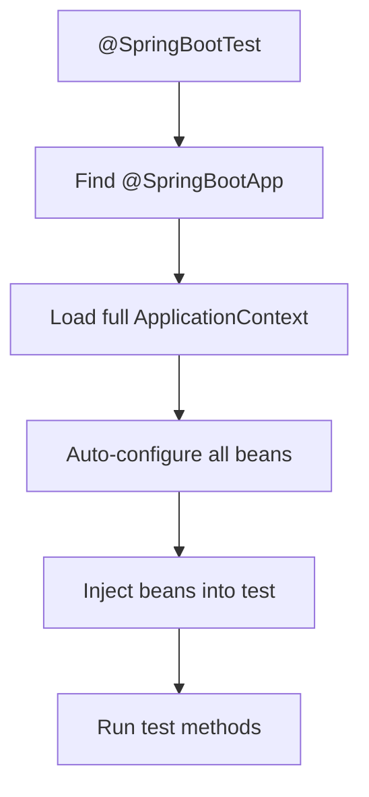
```mermaid
flowchart TD
    A["@SpringBootTest"] --> B["Find @SpringBootApp"]
    B --> C[Load full ApplicationContext]
    C --> D[Auto-configure all beans]
    D --> E[Inject beans into test]
    E --> F[Run test methods]
```

1. JUnit discovers the test class annotated with `@SpringBootTest`.
2. Spring Test searches for the nearest `@SpringBootApplication` class.
3. It loads the full `ApplicationContext` (or a subset if `classes` is specified).
4. Auto-configuration, property binding, and component scanning execute as in production.
5. Test methods run with `@Autowired` beans injected.

**Context caching.** Spring Test does not destroy the `ApplicationContext` after each test class. Instead, it caches contexts keyed by configuration: the set of component classes, active profiles, property sources, and `@MockBean` declarations. If two test classes share identical configuration, they share the same cached context. This means the expensive startup cost is paid once, and subsequent test classes reuse the warm context. The cache lives for the entire test suite run.

**webEnvironment modes.** The `webEnvironment` attribute controls the servlet environment:

- `MOCK` (default) - configures a mock servlet environment. No real HTTP server starts. Use with `MockMvc` for fast controller tests.
- `RANDOM_PORT` - starts an embedded server on a random available port. Use with `TestRestTemplate` or `WebTestClient` for real HTTP round-trip tests.
- `DEFINED_PORT` - starts the server on the port from `application.properties`. Rarely needed - prefer `RANDOM_PORT` to avoid port conflicts in CI.
- `NONE` - no web environment at all. Use for testing services, repositories, or batch jobs that have no web layer.

**Test-specific configuration.** `@TestPropertySource` overrides properties for a test class without modifying `application.properties`. Properties set this way have higher precedence than any other source. For dynamic values (database URLs from Testcontainers, for example), `@DynamicPropertySource` registers properties at runtime after the container has started.

### 🛠️ Worked Example

**BAD:**

```java
@SpringBootTest
class OrderServiceTest {
  @Autowired OrderService service;

  @Test
  void testCreate() {
    // Loads full context INCLUDING the
    // real database, email service,
    // payment gateway...
    service.create(new OrderDto("item", 1));
    // Slow, flaky, depends on external
    // systems
  }
}
```

Why it's wrong: full context with real external dependencies makes tests slow and non-deterministic.

**GOOD:**

```java
@SpringBootTest
class OrderServiceTest {
  @Autowired OrderService service;
  @MockBean PaymentGateway gateway;
  @MockBean EmailService email;

  @Test
  void createOrder_savesAndReturns() {
    when(gateway.charge(any()))
        .thenReturn(Result.success());
    OrderDto dto =
        new OrderDto("item", 1);

    Order result = service.create(dto);

    assertThat(result.getStatus())
        .isEqualTo("CREATED");
    verify(gateway).charge(any());
  }
}
```

**Production: test with real HTTP:**

```java
@SpringBootTest(
    webEnvironment = WebEnvironment
        .RANDOM_PORT)
class OrderApiTest {
  @Autowired TestRestTemplate rest;

  @Test
  void getOrder_returns200() {
    ResponseEntity<Order> resp =
        rest.getForEntity(
            "/api/orders/1", Order.class);
    assertThat(resp.getStatusCode())
        .isEqualTo(HttpStatus.OK);
  }
}
```

**Production: Testcontainers with dynamic properties:**

```java
@SpringBootTest
@Testcontainers
@TestPropertySource(properties = {
    "spring.jpa.hibernate.ddl-auto=create"
})
class OrderRepoIntegrationTest {
  @Container
  static PostgreSQLContainer<?> pg =
      new PostgreSQLContainer<>("postgres:16");

  @DynamicPropertySource
  static void dbProps(
      DynamicPropertyRegistry reg) {
    reg.add("spring.datasource.url",
        pg::getJdbcUrl);
    reg.add("spring.datasource.username",
        pg::getUsername);
    reg.add("spring.datasource.password",
        pg::getPassword);
  }

  @Autowired OrderRepository repo;

  @Test
  void save_persistsToRealPostgres() {
    Order saved = repo.save(
        new Order("item-1", 2));
    assertThat(saved.getId()).isNotNull();
    assertThat(
        repo.findById(saved.getId()))
        .isPresent();
  }
}
```

This pattern lets you test against a real database without hardcoding connection strings. The container starts before the context loads, `@DynamicPropertySource` injects the live URL, and Spring connects to it as if it were a normal datasource.

### ⚖️ Trade-offs

**Gain:** catches wiring, config, and integration bugs that unit tests miss, tests real auto-configuration.
**Cost:** slow (context load takes seconds), shares context state between tests if not careful, requires `@MockBean` for external services.

| Aspect        | @SpringBootTest | @WebMvcTest      | Plain JUnit |
| ------------- | --------------- | ---------------- | ----------- |
| Context       | full            | web slice only   | none        |
| Speed         | slow (2-10s)    | medium (1-3s)    | fast (ms)   |
| Scope         | all beans       | controllers only | one class   |
| External deps | need @MockBean  | auto-mocked      | manual mock |

**Test pyramid strategy.** Most tests in a well-structured Spring application should be plain JUnit + Mockito unit tests (fast, no framework overhead). Slice tests (`@WebMvcTest`, `@DataJpaTest`) form the middle layer - they verify one layer at a time with a partial context. `@SpringBootTest` sits at the top: fewer in number, run less frequently, but essential for catching the wiring and configuration bugs that lower layers cannot detect. A typical ratio is roughly 70% unit, 20% slice, 10% full integration. If your full-context tests outnumber your unit tests, the feedback loop slows and developers start skipping the test suite. If you have zero full-context tests, wiring bugs escape to production.

### ⚡ Decision Snap

**USE WHEN:** you need to verify real bean wiring, auto-configuration, or multi-layer integration.
**AVOID WHEN:** testing a single service class in isolation (use plain JUnit + Mockito).
**PREFER slice tests WHEN:** testing one layer only (`@WebMvcTest`, `@DataJpaTest`).

### ⚠️ Top Traps

| #   | Misconception                                        | Reality                                                                                                                     |
| --- | ---------------------------------------------------- | --------------------------------------------------------------------------------------------------------------------------- |
| 1   | Every test class needs `@SpringBootTest`             | Most tests should be plain unit tests. Use `@SpringBootTest` only for integration tests                                     |
| 2   | `@MockBean` replaces a bean only in the current test | It replaces the bean in the shared context - polluting other tests that share the same context                              |
| 3   | Context loads once per test suite automatically      | Context reloads when `@MockBean` or `@SpyBean` differ between test classes, creating a new context per unique configuration |

### 🪜 Learning Ladder

**Prerequisites:**

- SPR-015 Spring Boot Auto-Configuration Basics - understanding what the context loads
  **THIS:** SPR-035 Spring Boot Testing (@SpringBootTest)
  **Next steps:**
- SPR-036 MockMvc and Slice Testing (@WebMvcTest) - faster, focused tests per layer

### 💡 The Surprising Truth

Spring Test caches `ApplicationContext` instances between test classes that share the same configuration. If 10 test classes use the same `@SpringBootTest` setup with no `@MockBean`, the context loads once and is reused across all 10. Adding a single `@MockBean` to one class creates a new context. This is why test suites with varied `@MockBean` declarations are drastically slower than those with a consistent configuration.

The cache key includes: component classes, context initializers, active profiles, property sources, `@MockBean`/`@SpyBean` declarations, and `webEnvironment` mode. Change any one of these and you get a separate cached context. In large codebases, this can mean dozens of contexts loaded during a single CI run, each consuming memory and startup time. The practical fix is to standardize your integration test base classes: define a shared abstract test class with a fixed set of `@MockBean` declarations, and extend it everywhere. This forces all subclasses to share one cached context instead of each creating its own. If you must vary mocks per test, consider using Mockito's `reset()` in `@BeforeEach` on a shared mock rather than declaring different `@MockBean` sets across classes.

### 📇 Revision Card

1. `@SpringBootTest` loads the full context - use it for integration, not unit tests
2. `@MockBean` invalidates context caching - group tests with identical mock configurations
3. Prefer slice tests (`@WebMvcTest`, `@DataJpaTest`) over full context tests for speed

---

---

# SPR-036 MockMvc and Slice Testing (@WebMvcTest)

**TL;DR** - `@WebMvcTest` loads only the web layer for fast, focused controller testing without starting a full context.

### 🔥 The Problem in One Paragraph

Testing a controller with `@SpringBootTest` loads hundreds of beans - repositories, services, caches, message listeners - just to verify that `GET /api/orders` returns JSON. The test takes 5 seconds to start and requires `@MockBean` for every service dependency. For 50 controllers, that is 50 slow integration tests. Meanwhile, the controller logic itself (request mapping, validation, serialization) can be verified without any of those beans. This is exactly why **@WebMvcTest with MockMvc** was created.

### 📘 Textbook Definition

**@WebMvcTest** is a Spring Boot slice test annotation that loads only the web layer: controllers, `@ControllerAdvice`, filters, converters, and `WebMvcConfigurer` beans. All other beans (services, repositories) must be provided via `@MockBean`. **MockMvc** is a test utility that performs HTTP request simulation without starting a real HTTP server.

### 🧠 Mental Model

> `@SpringBootTest` is a full body MRI scan - thorough but slow. `@WebMvcTest` is an X-ray of one specific limb (the web layer) - fast and targeted. You do not scan the whole body to check a broken finger.

- "Full MRI" -> `@SpringBootTest` (all beans)
- "Targeted X-ray" -> `@WebMvcTest` (web layer only)
- "Broken finger" -> controller behavior to test
  **Where this analogy breaks down:** you can test multiple controllers in one slice, unlike a single-limb X-ray.

### ⚙️ How It Works

```
@WebMvcTest(OrderController)
          |
          v
+-------------------+
| Load web layer    |
| - Controllers     |
| - ControllerAdvice|
| - Filters         |
+---------+---------+
          |
  auto-mock services
          |
          v
+-------------------+
| MockMvc performs   |
| simulated HTTP     |
+---------+---------+
          |
  assert status,
  body, headers
```

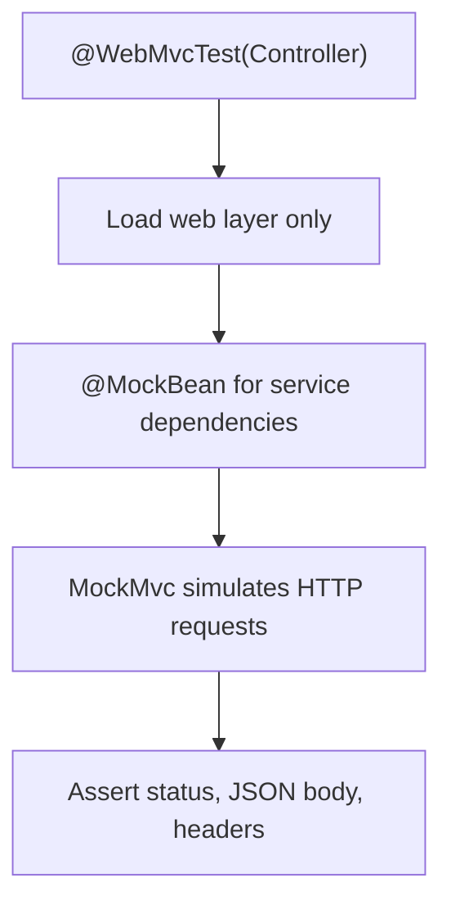
```mermaid
flowchart TD
    A["@WebMvcTest(Controller)"] --> B[Load web layer only]
    B --> C["@MockBean for service dependencies"]
    C --> D[MockMvc simulates HTTP requests]
    D --> E[Assert status, JSON body, headers]
```

1. `@WebMvcTest(OrderController.class)` loads only the web MVC infrastructure and the specified controller.
2. Service dependencies are provided via `@MockBean` (auto-configured as Mockito mocks).
3. `MockMvc` sends simulated HTTP requests through the DispatcherServlet.
4. The request passes through all filters, converters, and exception handlers.
5. Assertions verify status codes, response body (JSON), headers, and validation errors.

The auto-configured context includes more than just your controller. Spring Boot brings in Jackson `ObjectMapper` for JSON serialization, `HttpMessageConverter` implementations, `@ControllerAdvice` exception handlers, `WebMvcConfigurer` beans, JSR-303/380 `Validator`, content negotiation resolvers, and Spring Security filter chains. This matters because a serialization bug in a custom `ObjectMapper` or a missing `@ControllerAdvice` handler will surface in a `@WebMvcTest` - you get real converter and error-handling behavior without paying for repository or service initialization.

MockMvc itself wraps a fully initialized `DispatcherServlet`. When you call `mvc.perform(get("/api/orders/1"))`, Spring constructs a `MockHttpServletRequest`, pushes it through the servlet's `doDispatch()` method - handler mapping, interceptors, argument resolution, return value handling - and captures the result in a `MockHttpServletResponse`. No socket, no TCP, no thread pool. The DispatcherServlet is real; only the transport layer is simulated.

Other slice test annotations follow the same pattern. `@DataJpaTest` loads only JPA repositories, an embedded database, and Hibernate auto-configuration. `@JsonTest` loads only Jackson components for serialization round-trip testing. `@WebFluxTest` does the same for reactive controllers with `WebTestClient`. Each slice annotation has a defined set of auto-configurations it includes and excludes - documented in the Spring Boot reference under "Auto-configured Tests." You can combine them with `@Import` to pull in specific extra beans without reverting to a full context.

### 🛠️ Worked Example

**BAD:**

```java
// Full context test for a simple controller
@SpringBootTest
class OrderControllerTest {
  @Autowired TestRestTemplate rest;
  // Starts real Tomcat, loads all beans
  @Test
  void getOrder() {
    rest.getForEntity(
        "/api/orders/1", String.class);
  }
}
// 5+ seconds startup per test class
```

Why it's wrong: loads database, security, caching, messaging - none needed for controller testing.

**GOOD:**

```java
@WebMvcTest(OrderController.class)
class OrderControllerTest {
  @Autowired MockMvc mvc;
  @MockBean OrderService service;

  @Test
  void getOrder_returnsJson()
      throws Exception {
    when(service.find(1L))
        .thenReturn(Optional.of(
            new Order(1L, "Widget")));

    mvc.perform(get("/api/orders/1")
        .accept(MediaType.APPLICATION_JSON))
        .andExpect(status().isOk())
        .andExpect(
            jsonPath("$.name").value("Widget"))
        .andExpect(content().contentType(
            MediaType.APPLICATION_JSON));
  }

  @Test
  void getOrder_notFound()
      throws Exception {
    when(service.find(99L))
        .thenReturn(Optional.empty());

    mvc.perform(get("/api/orders/99"))
        .andExpect(status().isNotFound());
  }
}
```

**Production: testing validation errors:**

```java
@Test
void createOrder_invalidBody_returns400()
    throws Exception {
  mvc.perform(post("/api/orders")
      .contentType(
          MediaType.APPLICATION_JSON)
      .content("{\"name\":\"\"}"))
      .andExpect(status().isBadRequest())
      .andExpect(jsonPath("$.name")
          .exists());
}
```

**Production: testing multipart file upload:**

```java
@Test
void uploadDocument_returnsCreated()
    throws Exception {
  MockMultipartFile file =
      new MockMultipartFile(
          "file",
          "report.pdf",
          MediaType
              .APPLICATION_PDF_VALUE,
          "pdf-content".getBytes());

  when(docService.store(any()))
      .thenReturn(
          new DocRef("doc-42"));

  mvc.perform(
      multipart("/api/documents")
          .file(file)
          .param("category", "report"))
      .andExpect(
          status().isCreated())
      .andExpect(jsonPath("$.id")
          .value("doc-42"));
}
```

This verifies multipart parsing, parameter binding, and response serialization all within the web slice - no file system or storage service needed.

### ⚖️ Trade-offs

**Gain:** fast startup (1-2s vs 5-10s), focused on web layer, no external dependencies needed.
**Cost:** does not catch wiring or integration bugs beyond the web layer, requires `@MockBean` for every dependency.

| Aspect               | @WebMvcTest          | @SpringBootTest   | Plain MockMvc   |
| -------------------- | -------------------- | ----------------- | --------------- |
| Context size         | web layer only       | everything        | manual setup    |
| Startup time         | 1-2s                 | 5-10s             | ms              |
| Integration coverage | controller + filters | full stack        | controller only |
| Service deps         | @MockBean            | real or @MockBean | manual mock     |

Slice tests can give false confidence in a specific way: they prove that your controller correctly calls `service.find(1L)` and returns the result as JSON, but they cannot prove that `service.find(1L)` actually works against a real database with real transaction boundaries. If your `@MockBean` returns a perfectly shaped DTO but the real service throws a lazy-loading exception, the slice test passes while production fails. The remedy is not to abandon slice tests - it is to pair them with a smaller number of `@SpringBootTest` integration tests that exercise the critical paths end-to-end. Slice tests cover breadth (every endpoint, every validation rule, every error mapping); integration tests cover depth (the happy path from HTTP to database and back).

### ⚡ Decision Snap

**USE WHEN:** testing request routing, JSON serialization, validation, error handling, content negotiation.
**AVOID WHEN:** verifying end-to-end behavior including database and transaction semantics.
**PREFER @SpringBootTest WHEN:** you need to test the full request-to-database pipeline.

### ⚠️ Top Traps

| #   | Misconception                                  | Reality                                                                                                                      |
| --- | ---------------------------------------------- | ---------------------------------------------------------------------------------------------------------------------------- |
| 1   | `@WebMvcTest` loads all controllers            | It loads only the controller(s) specified in the annotation parameter. Omitting the parameter loads all controllers (slower) |
| 2   | MockMvc tests are not real HTTP tests          | MockMvc dispatches through the full DispatcherServlet, filters, and converters - it is real MVC processing without a socket  |
| 3   | Security filters are disabled in `@WebMvcTest` | Spring Security filters are active by default in `@WebMvcTest`. Use `@WithMockUser` or disable security explicitly           |

### 🪜 Learning Ladder

**Prerequisites:**

- SPR-035 Spring Boot Testing (@SpringBootTest) - understanding context-based testing
  **THIS:** SPR-036 MockMvc and Slice Testing (@WebMvcTest)
  **Next steps:**
- SPR-037 Repository vs @Query vs Native SQL Decision Guide - data layer choices

### 💡 The Surprising Truth

MockMvc does not open an HTTP socket. The entire HTTP request is simulated in-process through Spring's `DispatcherServlet`. This means response times in MockMvc tests are not representative of real HTTP latency, but every filter, interceptor, exception handler, and message converter executes exactly as in production.

The in-process simulation has blind spots that matter in production. MockMvc cannot test real HTTP header size limits enforced by Tomcat or Netty. It cannot reproduce connection timeout behavior, chunked transfer encoding edge cases, or SSL/TLS handshake failures. CORS preflight requests work differently because there is no actual cross-origin request - MockMvc just sets the `Origin` header on a local dispatch. If your controller relies on `HttpServletRequest.getRemoteAddr()` for rate limiting, MockMvc returns `127.0.0.1` regardless. For these scenarios, you need `@SpringBootTest(webEnvironment = RANDOM_PORT)` with `TestRestTemplate` or `WebTestClient` hitting a real embedded server. Know what the simulation covers and what it fakes - that boundary is where bugs hide.

### 📇 Revision Card

1. `@WebMvcTest` loads only the web layer - 3-5x faster than `@SpringBootTest`
2. Security filters are active by default - use `@WithMockUser` or `@AutoConfigureMockMvc(addFilters = false)`
3. MockMvc is in-process simulation, not real HTTP - full MVC pipeline without a socket

---

---

# SPR-037 Repository vs @Query vs Native SQL Decision Guide

**TL;DR** - Use derived queries for simple lookups, `@Query` JPQL for joins and aggregations, native SQL for DB-specific features.

### 🔥 The Problem in One Paragraph

Spring Data JPA offers three ways to query: derived method names (`findByStatusAndCreatedAfter`), `@Query` with JPQL, and `@Query` with native SQL. New developers default to derived queries for everything - producing 60-character method names that are unreadable and unmaintainable. Others jump straight to native SQL, losing portability and type safety. Without a decision framework, the choice is arbitrary and inconsistent across the codebase. This is exactly why **a decision guide** was created.

### 📘 Textbook Definition

**Derived queries** parse method names into JPQL at startup. **@Query JPQL** provides explicit JPA Query Language strings that are database-agnostic. **@Query nativeQuery** passes raw SQL to the database, enabling DB-specific functions, window functions, and CTEs. Each approach has different trade-offs in readability, portability, and power.

### 🧠 Mental Model

> Three travel options to the airport. Derived queries are Uber - you type the destination and the system picks the route. JPQL is a GPS with manual route selection - you choose the roads. Native SQL is driving yourself - full control but you better know the streets.

- "Uber" -> derived queries (automatic route from method name)
- "GPS manual mode" -> @Query JPQL (you choose the query)
- "Drive yourself" -> native SQL (full control, your responsibility)
  **Where this analogy breaks down:** unlike driving, native SQL also introduces database vendor lock-in.

### ⚙️ How It Works

```
Query need
     |
     v
+-----------------+
| Simple lookup?  |--yes--> Derived query
+-----------------+
     | no
     v
+-----------------+
| Standard SQL    |
| sufficient?     |--yes--> @Query JPQL
+-----------------+
     | no
     v
+-----------------+
| DB-specific     |
| features needed?|--yes--> Native SQL
+-----------------+
```

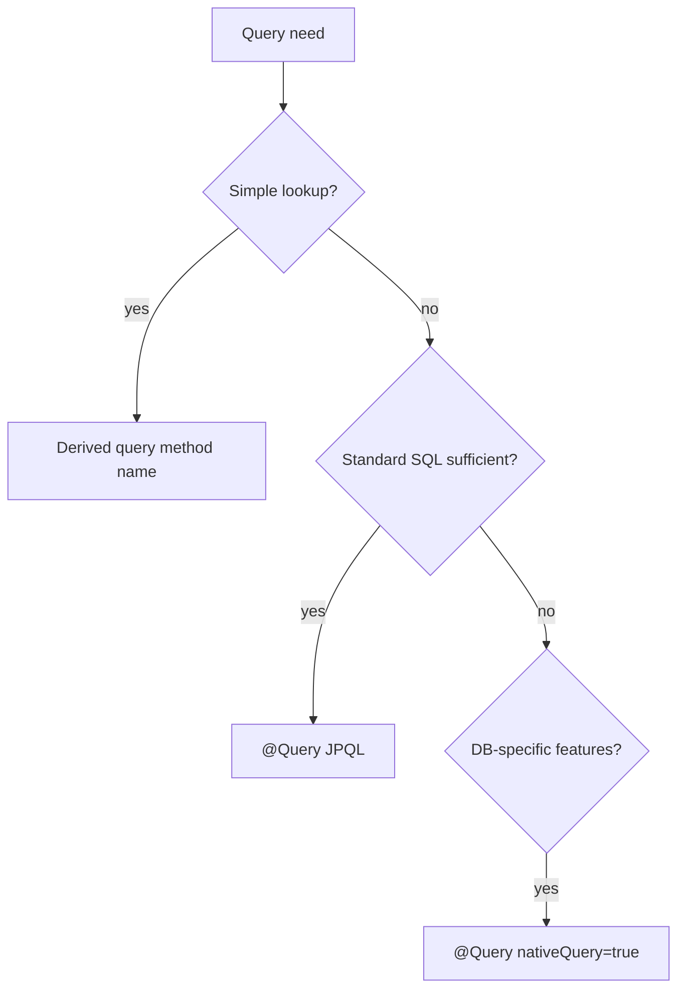
```mermaid
flowchart TD
    A[Query need] --> B{Simple lookup?}
    B -->|yes| C[Derived query method name]
    B -->|no| D{Standard SQL sufficient?}
    D -->|yes| E["@Query JPQL"]
    D -->|no| F{DB-specific features?}
    F -->|yes| G["@Query nativeQuery=true"]
```

1. **Derived query:** `findByStatus(String status)` - Spring parses the method name into `SELECT e FROM Entity e WHERE e.status = ?1`.
2. **@Query JPQL:** `@Query("SELECT o FROM Order o JOIN o.items i WHERE i.price > :min")` - explicit JPA query, database-agnostic.
3. **Native SQL:** `@Query(value = "SELECT * FROM orders WHERE created > NOW() - INTERVAL '7 days'", nativeQuery = true)` - raw SQL, DB-specific.

The decision tree above covers the common path, but three additional mechanisms fill the gaps between those tiers. **Specification API** (`JpaSpecificationExecutor`) handles dynamic where-clause composition - when filters arrive from a search form and you do not know at compile time which predicates apply. Instead of writing N repository methods or concatenating JPQL strings, you build `Specification` lambdas and combine them with `.and()` / `.or()`. The generated query is still JPQL under the hood, so startup validation of the entity model still applies.

**Projections** control the SELECT list. Interface-based projections declare getter methods matching entity fields; Spring generates a proxy that fetches only those columns. Class-based (DTO) projections use a constructor expression in JPQL. Both reduce data transfer when you need three columns from a twenty-column table. Projections work with all three query styles.

**@EntityGraph** controls fetch behavior independent of query style. Annotate a repository method with `@EntityGraph(attributePaths = {"items"})` to override lazy loading for that call. This avoids the classic N+1 problem without polluting the entity mapping with eager defaults. Combine `@EntityGraph` with derived queries or JPQL - it layers on top of the query mechanism rather than replacing it.

### 🛠️ Worked Example

**BAD:**

```java
// Derived query gone too far
List<Order> findByStatusAndCreatedAfterAnd
    TotalGreaterThanAndCustomerEmailContaining(
    String status, LocalDate after,
    BigDecimal min, String emailPart);
// Unreadable, unmaintainable
```

Why it's wrong: method name exceeds any reasonable readability threshold.

**GOOD:**

```java
// Simple: derived query
List<Order> findByStatus(String status);

// Medium: explicit JPQL
@Query("SELECT o FROM Order o "
    + "JOIN o.customer c "
    + "WHERE o.status = :status "
    + "AND o.total > :min "
    + "AND c.email LIKE %:email%")
List<Order> findFiltered(
    @Param("status") String status,
    @Param("min") BigDecimal min,
    @Param("email") String email);

// Complex: native SQL for DB feature
@Query(value = "SELECT * FROM orders "
    + "WHERE created > NOW() "
    + "- INTERVAL '7 days'",
    nativeQuery = true)
List<Order> findRecentNative();
```

**Production: pagination with JPQL:**

```java
@Query("SELECT o FROM Order o "
    + "WHERE o.status = :status")
Page<Order> findByStatus(
    @Param("status") String status,
    Pageable pageable);
```

**Production: dynamic filtering with Specification:**

```java
public interface OrderRepo extends
    JpaRepository<Order, Long>,
    JpaSpecificationExecutor<Order> {}

// Build specs per filter field
Specification<Order> spec = Specification
    .where(hasStatus(status))
    .and(createdAfter(startDate))
    .and(totalAbove(minAmount));
// Each method is null-safe; returns null
// to skip that predicate when filter is empty
Page<Order> results =
    orderRepo.findAll(spec, pageable);
```

This approach keeps the repository interface clean. Each `Specification` lambda is a single predicate, reusable across endpoints. The runtime composes only the predicates that the caller supplies - no branching, no string concatenation.

### ⚖️ Trade-offs

**Gain:** right tool for the right complexity level, readable codebase, maintainable queries.
**Cost:** team must agree on the decision boundary, JPQL and native SQL require manual testing.

| Aspect             | Derived query     | @Query JPQL        | Native SQL        |
| ------------------ | ----------------- | ------------------ | ----------------- |
| Readability        | method name       | explicit query     | raw SQL           |
| Max complexity     | 2-3 conditions    | joins, sub-selects | anything          |
| Portability        | database-agnostic | database-agnostic  | vendor-specific   |
| Startup validation | yes               | yes                | no (runtime only) |

Performance implications follow the same progression. Derived queries produce predictable, simple SQL that the database optimizer handles easily - plan caching is effective because the query shape never changes. JPQL queries give you control over joins and projections, so you can avoid SELECT \* and fetch only what you need, but you must verify the generated SQL (enable `spring.jpa.show-sql` or use p6spy) to catch unnecessary cross joins. Native SQL hands you full optimizer control - you can add index hints, use CTEs for readability, or invoke database-specific functions - but you also inherit responsibility for plan stability across schema changes. The general rule: start with the simplest tier that meets your need, and escalate only when you have measured evidence that the simpler approach underperforms.

### ⚡ Decision Snap

**USE derived queries WHEN:** 1-2 simple conditions, no joins, method name stays under 40 characters.
**USE @Query JPQL WHEN:** joins, aggregations, sub-selects, or method name would be unreadable.
**USE native SQL WHEN:** you need window functions, CTEs, full-text search, or DB-specific syntax.

### ⚠️ Top Traps

| #   | Misconception                               | Reality                                                                                                |
| --- | ------------------------------------------- | ------------------------------------------------------------------------------------------------------ |
| 1   | Derived queries are always more readable    | Past 2-3 conditions, method names become less readable than explicit JPQL                              |
| 2   | JPQL supports all SQL features              | JPQL lacks window functions, CTEs, LATERAL joins, and many DB-specific functions                       |
| 3   | Native SQL queries are validated at startup | Native queries are only validated at execution time - typos cause runtime errors, not startup failures |

### 🪜 Learning Ladder

**Prerequisites:**

- SPR-027 Spring Data JPA - Repository Pattern - basic repository usage
  **THIS:** SPR-037 Repository vs @Query vs Native SQL Decision Guide
  **Next steps:**
- SPR-038 Build a CRUD REST Service Exercise - applying the decision guide in practice

### 💡 The Surprising Truth

Spring Data validates derived query method names and JPQL `@Query` strings at application startup by parsing them against the entity metamodel. A typo in `findByStatsu` or a misspelled entity property in JPQL causes an immediate startup failure with a clear error. Native SQL, however, is only validated when first executed - making it the riskiest option for catching query bugs early.

The validation gap goes deeper than typos. JPQL startup validation catches references to non-existent entity properties, incorrect join paths, and type mismatches in parameters. If you rename an entity field and forget to update a JPQL query, the application refuses to start - a fast, obvious failure. Native SQL has no such safety net because Spring cannot parse vendor-specific SQL against the JPA metamodel. A renamed column in a native query compiles fine, passes startup, and only fails when a user hits that code path in production. This is why teams that rely on native SQL should pair every native query with an integration test that executes it against a real (or Testcontainers-backed) database during CI.

### 📇 Revision Card

1. Derived queries for simple lookups (1-2 conditions), JPQL for joins, native SQL for DB-specific features
2. Method names over 40 characters signal you should switch to @Query JPQL
3. Native SQL bypasses startup validation - typos become runtime errors

---

---

# SPR-038 Build a CRUD REST Service Exercise

**TL;DR** - Wire controller, service, repository, DTOs, validation, and error handling into a complete working REST API.

### 🔥 The Problem in One Paragraph

Individual keywords teach concepts in isolation: controllers, repositories, DTOs, validation, exception handling. But a real API requires all of them wired together correctly. Developers who learn each piece separately often struggle to connect them: where does validation go? Who catches exceptions? How do DTOs flow between layers? Building a complete CRUD service from scratch forces these integration decisions and reveals gaps in understanding. This is exactly why **a full CRUD exercise** exists.

### 📘 Textbook Definition

A **CRUD REST Service Exercise** is a hands-on project that implements Create, Read, Update, Delete operations for a domain entity using the full Spring Boot stack: `@RestController` for HTTP routing, `@Service` for business logic, `JpaRepository` for data access, DTOs for request/response shaping, Bean Validation for input checking, and `@ControllerAdvice` for error handling.

### 🧠 Mental Model

> Building a CRUD service is assembling a sandwich. The bread (controller) holds everything together. The filling (service) has the flavor (business logic). The wrapper (DTO) is what the customer sees. The quality check (validation) rejects bad ingredients before they reach the plate.

- "Bread" -> controller layer (routing)
- "Filling" -> service layer (logic)
- "Wrapper" -> DTO layer (API shape)
  **Where this analogy breaks down:** a sandwich does not have a persistence layer or error handling.

### ⚙️ How It Works

```
Client -> Controller -> Service
                |          |
                v          v
              DTO    Repository
              mapping     |
                          v
                       Database
```

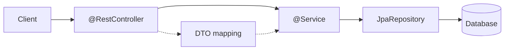
```mermaid
flowchart LR
    A[Client] --> B["@RestController"]
    B --> C["@Service"]
    C --> D[JpaRepository]
    D --> E[(Database)]
    B -.-> F[DTO mapping]
    F -.-> C
```

1. Controller receives HTTP request, validates the DTO.
2. Controller maps the request DTO to a service call.
3. Service applies business logic and calls the repository.
4. Repository performs the database operation.
5. Service returns the entity; controller maps it to a response DTO.

**Construction order matters.** Build bottom-up: entity first,
then repository, then service, then controller, then exception
handler, then DTOs. Each layer depends only on the layer below
it. If you start with the controller, you will invent method
signatures that do not match what the service can actually
provide. Starting from the entity forces you to think about
what data exists before deciding how to expose it.

**Integration tests tie the layers together.** A `@SpringBootTest`
with `TestRestTemplate` or `MockMvc` sends a real HTTP request
through every layer, proving that validation, mapping, persistence,
and error handling all cooperate. Slice tests (`@WebMvcTest`,
`@DataJpaTest`) verify each layer in isolation, but the integration
test is what catches wiring mistakes - a missing `@Valid`, a
wrong HTTP status, or a DTO field that does not map correctly.

**What the exercise teaches about boundaries.** The controller
never imports a JPA entity. The service never returns an HTTP
status code. The repository never knows about DTOs. These
boundary rules feel bureaucratic in a small project, but they
are the reason a 50-endpoint service remains navigable. Each
layer has exactly one job, and violations of that rule are
where bugs cluster in production.

### 🛠️ Worked Example

**BAD:**

```java
// God controller - everything in one class
@RestController
public class ProductCtrl {
  @Autowired JdbcTemplate jdbc;

  @PostMapping("/products")
  Map<String, Object> create(
      @RequestBody Map<String, Object> body) {
    jdbc.update("INSERT INTO products...",
        body.get("name"));
    return Map.of("ok", true);
  }
}
// No layers, no validation, no types
```

Why it's wrong: no separation of concerns, no type safety, no validation, SQL injection risk.

**GOOD:**

```java
// Layered architecture
@RestController
@RequestMapping("/api/products")
class ProductController {
  private final ProductService svc;

  ProductController(ProductService svc) {
    this.svc = svc;
  }

  @PostMapping
  @ResponseStatus(HttpStatus.CREATED)
  ProductResponse create(
      @Valid @RequestBody
      CreateProductRequest req) {
    return svc.create(req);
  }

  @GetMapping("/{id}")
  ProductResponse get(
      @PathVariable Long id) {
    return svc.findById(id);
  }
}
```

**Production: service + repo + DTO:**

```java
@Service
@Transactional
class ProductService {
  private final ProductRepo repo;

  ProductResponse create(
      CreateProductRequest req) {
    Product entity = new Product(
        req.name(), req.price());
    Product saved = repo.save(entity);
    return ProductResponse.from(saved);
  }

  @Transactional(readOnly = true)
  ProductResponse findById(Long id) {
    return repo.findById(id)
        .map(ProductResponse::from)
        .orElseThrow(() ->
            new NotFoundException(
                "Product", id));
  }
}
```

**Production: exception handler:**

```java
@RestControllerAdvice
class ApiExceptionHandler {

  @ExceptionHandler(NotFoundException.class)
  @ResponseStatus(HttpStatus.NOT_FOUND)
  ErrorResponse handleNotFound(
      NotFoundException ex) {
    return new ErrorResponse(
        "NOT_FOUND", ex.getMessage());
  }

  @ExceptionHandler(
      MethodArgumentNotValidException.class)
  @ResponseStatus(HttpStatus.BAD_REQUEST)
  ErrorResponse handleValidation(
      MethodArgumentNotValidException ex) {
    String msg = ex.getBindingResult()
        .getFieldErrors().stream()
        .map(f -> f.getField()
            + ": " + f.getDefaultMessage())
        .collect(Collectors.joining(", "));
    return new ErrorResponse(
        "VALIDATION_FAILED", msg);
  }
}
```

**Completing the CRUD - update and delete:**

```java
// In ProductController
@PutMapping("/{id}")
ProductResponse update(
    @PathVariable Long id,
    @Valid @RequestBody
    UpdateProductRequest req) {
  return svc.update(id, req);
}

@DeleteMapping("/{id}")
@ResponseStatus(HttpStatus.NO_CONTENT)
void delete(@PathVariable Long id) {
  svc.delete(id);
}
```

The delete returns 204 No Content - no response body. The
update reuses the same `NotFoundException` path if the ID
does not exist, so the exception handler covers both read
and write failures with zero duplication.

### ⚖️ Trade-offs

**Gain:** clean layer separation, testable at each layer, consistent API contract, validation at boundary.
**Cost:** more classes (controller, service, repo, DTOs, exception handler), mapping boilerplate.

| Aspect          | Layered CRUD | God controller  | CQRS     |
| --------------- | ------------ | --------------- | -------- |
| Complexity      | medium       | low (initially) | high     |
| Maintainability | high         | degrades fast   | high     |
| Test isolation  | per-layer    | difficult       | per-side |

When should you deviate from the standard three-layer pattern?
Two common cases. First, if every service method is a
one-liner that delegates directly to the repository, the
service layer is not earning its keep - consider calling
the repository from the controller for simple lookups and
introduce the service only when business logic appears.
Second, when a single request must orchestrate multiple
aggregates or external calls, an application-level
command handler (distinct from the domain service) keeps
the controller thin without overloading the domain service
with orchestration logic.

### ⚡ Decision Snap

**USE WHEN:** building any production REST API with Spring Boot.
**AVOID WHEN:** rapid prototyping where throwaway code is acceptable (but layer habits save time even then).
**PREFER CQRS WHEN:** read and write models diverge significantly.

### ⚠️ Top Traps

| #   | Misconception                                | Reality                                                                                                    |
| --- | -------------------------------------------- | ---------------------------------------------------------------------------------------------------------- |
| 1   | DTOs add unnecessary classes                 | DTOs prevent mass assignment, hide internal fields, and decouple API from schema                           |
| 2   | Validation in the controller is sufficient   | Format validation at the boundary, business validation in the service, constraint validation in the entity |
| 3   | You need a mapper library for DTO conversion | Simple `from(entity)` static factory methods are sufficient for most projects; MapStruct is optional       |

### 🪜 Learning Ladder

**Prerequisites:**

- SPR-027 Spring Data JPA - Repository Pattern - data access layer
- SPR-025 Request and Response DTOs with Bean Validation - DTO + validation pattern
  **THIS:** SPR-038 Build a CRUD REST Service Exercise
  **Next steps:**
- SPR-039 REST API Phase 2 - Data Layer and Validation - extending with persistence and validation

### 💡 The Surprising Truth

The most common bug in CRUD service exercises is returning the JPA entity directly from the controller, which works until a lazy-loaded collection triggers a `LazyInitializationException` after the transaction closes. DTOs are not just about API design - they prevent this entire class of serialization errors by eagerly mapping before the response leaves the service layer.

The lazy loading problem is subtle because it passes all unit
tests. The service method runs inside a `@Transactional`
context, so accessing `product.getReviews()` works perfectly
in a test that also runs inside a transaction. The exception
only surfaces when Jackson serializes the response after the
transaction commits - which happens in the controller layer,
outside the persistence context. A DTO `from(entity)` factory
method forces you to copy the fields you actually need while
the session is still open, making the transactional boundary
explicit rather than accidental. This single pattern -
eager mapping at the service boundary - eliminates the most
frequent Hibernate serialization bug in Spring Boot APIs.

### 📇 Revision Card

1. Layer separation: controller (routing) -> service (logic) -> repository (data) -> DTOs (API shape)
2. Validate at the boundary (controller), apply business rules in the service, enforce constraints in the entity
3. DTOs prevent LazyInitializationException by eagerly mapping before leaving the transactional context

---

---

# SPR-039 REST API Phase 2 - Data Layer and Validation

**TL;DR** - Phase 2 adds Spring Data JPA persistence, Bean Validation, and global error handling to the Phase 1 CRUD skeleton.

### 🔥 The Problem in One Paragraph

Phase 1 (SPR-022) built a controller-only CRUD skeleton with in-memory data. In production, data must survive restarts (persistence), bad input must be rejected before reaching the database (validation), and errors must return consistent HTTP responses (error handling). Adding these layers correctly requires understanding transaction boundaries, validation cascading, and exception mapping. This is exactly why **Phase 2** adds the data and validation layers.

### 📘 Textbook Definition

**REST API Phase 2** extends the Phase 1 CRUD controller with **Spring Data JPA** for database persistence, **Bean Validation** (`@Valid`, `@NotNull`, `@Size`) for input checking, and **@ControllerAdvice** for global exception-to-HTTP-response mapping. Together, these form the minimum viable production API stack.

### 🧠 Mental Model

> Phase 1 built the storefront (controller). Phase 2 adds the warehouse (database), the quality inspector (validation), and the customer service desk (error handling). Without the warehouse, the store forgets orders. Without quality inspection, defective products ship. Without customer service, complaints go unanswered.

- "Warehouse" -> Spring Data JPA repository
- "Quality inspector" -> Bean Validation
- "Customer service desk" -> @ControllerAdvice
  **Where this analogy breaks down:** in production, you also need caching, auth, and monitoring - but those are later phases.

### ⚙️ How It Works

```
POST /api/orders
  {name: "", qty: -1}
       |
       v
  +-----------+
  | @Valid    | reject -> 400
  +-----------+
       |
       v
  +-----------+
  | Service   |
  | @Transact |
  +-----------+
       |
       v
  +-----------+
  | JpaRepo   | save -> DB
  +-----------+
       |
   exception?
       v
  +-----------+
  | @CtrlAdv  | -> structured error
  +-----------+
```

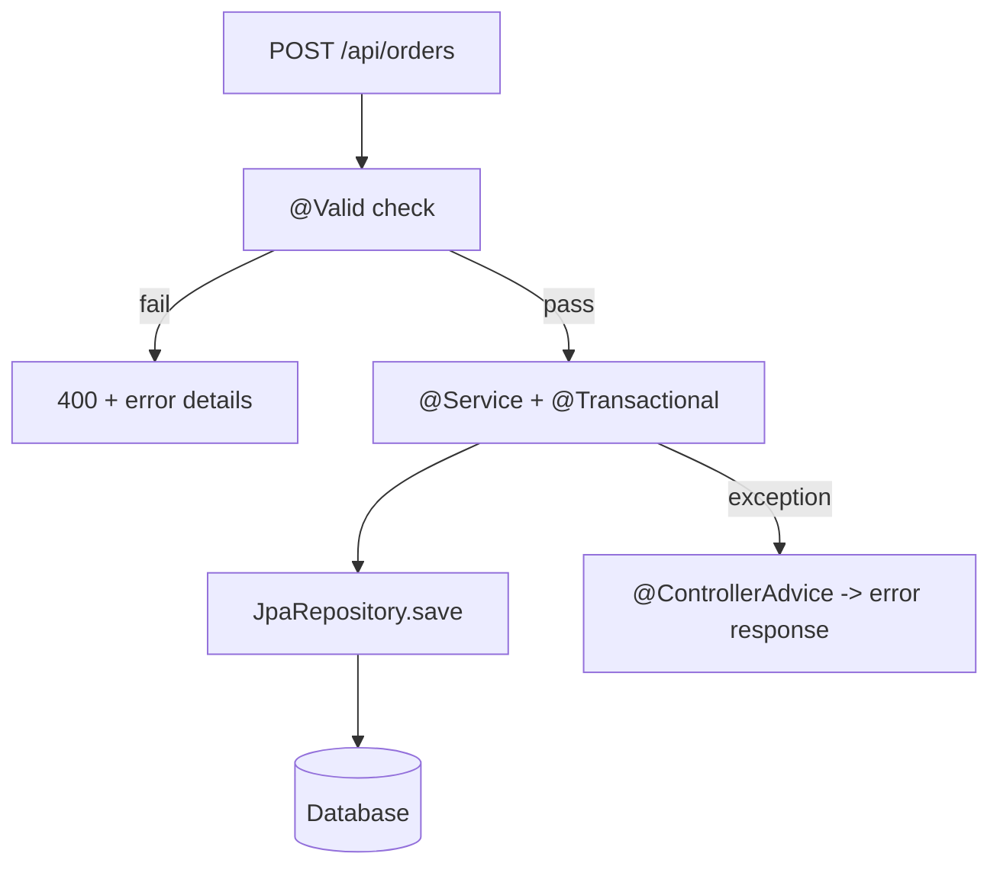
```mermaid
flowchart TD
    A["POST /api/orders"] --> B["@Valid check"]
    B -->|fail| C["400 + error details"]
    B -->|pass| D["@Service + @Transactional"]
    D --> E[JpaRepository.save]
    E --> F[(Database)]
    D -->|exception| G["@ControllerAdvice -> error response"]
```

1. Request body is deserialized and validated (`@Valid`).
2. If validation fails, `MethodArgumentNotValidException` is caught by `@ControllerAdvice`.
3. If validation passes, the service creates a transactional boundary.
4. The repository persists the entity to the database.
5. Any business or database exception is caught by `@ControllerAdvice` and returned as a structured error.

**Schema management replaces ddl-auto.** Phase 1 relied on
`ddl-auto=create-drop` for convenience. Phase 2 switches to
`ddl-auto=validate` and delegates schema changes to Flyway
or Liquibase. The application checks on startup that the
JPA model matches the actual database schema. If it does
not match, the app fails fast instead of silently altering
tables. Migration scripts live in `db/migration/` and run
in version order before the first query executes. This
means schema evolution is versioned, reviewable, and
reproducible across environments.

**Transaction boundaries wrap the service layer.** When
`@Transactional` annotates a service method, Spring creates
a proxy that opens a transaction before the method body and
commits after it returns. If any runtime exception escapes,
the proxy rolls back the entire unit of work. This is why
the controller should never carry `@Transactional` - you
want the transaction to cover exactly the business logic,
not the HTTP serialization. Checked exceptions do not
trigger rollback by default; you must declare
`rollbackFor = Exception.class` if you need that behavior.

**Entity lifecycle callbacks audit data changes.** JPA
provides `@PrePersist` and `@PreUpdate` callbacks that
fire automatically before the entity is written to the
database. A common pattern is setting `createdAt` and
`updatedAt` timestamps in these callbacks, ensuring every
row carries accurate audit metadata without requiring
callers to remember to set them.

### 🛠️ Worked Example

**BAD:**

```java
// No validation, no error handling
@PostMapping("/orders")
Order create(@RequestBody Order order) {
  return repo.save(order);
  // Null name -> ConstraintViolationExc
  // at DB level -> 500 + stack trace
}
```

Why it's wrong: no input validation, entity exposed directly, database errors leak to client.

**GOOD:**

```java
// DTO with validation
public record CreateOrderReq(
    @NotBlank String name,
    @Min(1) int quantity
) {}

// Controller
@PostMapping
@ResponseStatus(HttpStatus.CREATED)
OrderResponse create(
    @Valid @RequestBody
    CreateOrderReq req) {
  return service.create(req);
}

// Service
@Transactional
public OrderResponse create(
    CreateOrderReq req) {
  Order order = new Order(
      req.name(), req.quantity());
  return OrderResponse.from(
      repo.save(order));
}
```

**Production Flyway migration:**

```sql
-- V1__create_orders_table.sql
CREATE TABLE orders (
  id         BIGSERIAL PRIMARY KEY,
  name       VARCHAR(255) NOT NULL,
  quantity   INT NOT NULL
               CHECK (quantity > 0),
  created_at TIMESTAMP NOT NULL
               DEFAULT now(),
  updated_at TIMESTAMP NOT NULL
               DEFAULT now()
);
```

The `V1__` prefix tells Flyway this is version 1. Flyway
records applied migrations in a `flyway_schema_history`
table and never re-runs them. To add a column later, you
create `V2__add_status_column.sql` - never edit V1.

**Full lifecycle of a CREATE request:** the controller
deserializes JSON into `CreateOrderReq`, the `@Valid`
annotation triggers Bean Validation, and if any constraint
fails, Spring throws `MethodArgumentNotValidException`
before the service is ever called. On success, the service
opens a transaction, constructs the `Order` entity, calls
`repo.save()`, Hibernate flushes the INSERT, and the
transaction commits. The service maps the saved entity to
an `OrderResponse` DTO so the JPA entity never leaks into
the JSON response.

**Production: application properties:**

```properties
spring.datasource.url=\
  jdbc:postgresql://localhost:5432/orders
spring.jpa.hibernate.ddl-auto=validate
spring.jpa.open-in-view=false
spring.flyway.locations=\
  classpath:db/migration
```

### ⚖️ Trade-offs

**Gain:** data survives restarts, invalid input rejected at the boundary, consistent error responses.
**Cost:** more setup (database, JPA config, migration scripts), transaction semantics to understand.

| Aspect         | Phase 2 (JPA+Validation) | Phase 1 (in-memory)      | Full prod stack  |
| -------------- | ------------------------ | ------------------------ | ---------------- |
| Persistence    | database                 | memory (lost on restart) | database + cache |
| Validation     | Bean Validation          | none                     | multi-layer      |
| Error handling | @ControllerAdvice        | default Spring errors    | RFC 7807         |

**Evolution to Phase 3.** Phase 2 gives you a working API
that persists data and rejects bad input, but it is still
open to the world. Phase 3 adds Spring Security for
authentication and authorization, caching to reduce
database load, and structured logging for observability.
The key architectural insight: Phase 2 is deliberately
security-free so you can test the data layer in isolation.
Adding security later is straightforward because
`@ControllerAdvice` already handles `AccessDeniedException`
if you configure it. The Phase 2 error handling pattern
becomes the foundation that Phase 3 extends rather than
replaces.

### ⚡ Decision Snap

**USE WHEN:** any API that needs to persist data and reject bad input (virtually all production APIs).
**AVOID WHEN:** building a pure proxy/gateway service with no data persistence.
**PREFER Phase 3+ WHEN:** you also need security, caching, and monitoring.

### ⚠️ Top Traps

| #   | Misconception                            | Reality                                                                                                                   |
| --- | ---------------------------------------- | ------------------------------------------------------------------------------------------------------------------------- |
| 1   | `ddl-auto=update` is safe for production | It can drop columns, lose data, and cause irreversible schema changes. Use `validate` + Flyway/Liquibase                  |
| 2   | `open-in-view=true` is harmless          | It holds a database connection for the entire HTTP request, causing connection pool starvation under load                 |
| 3   | Bean Validation catches all bad data     | Bean Validation checks format constraints; uniqueness, referential integrity, and business rules need separate validation |

### 🪜 Learning Ladder

**Prerequisites:**

- SPR-022 REST API Phase 1 - Spring Boot CRUD - the controller skeleton
- SPR-027 Spring Data JPA - Repository Pattern - persistence layer
  **THIS:** SPR-039 REST API Phase 2 - Data Layer and Validation
  **Next steps:**
- SPR-030 Spring Security Authentication Basics - securing the API

### 💡 The Surprising Truth

`spring.jpa.open-in-view` defaults to `true` in Spring Boot, which means a database connection is held open for the entire HTTP request - including during JSON serialization. Boot logs a warning about this at startup, but most developers ignore it. In production under load, this silent default is one of the most common causes of connection pool exhaustion.

**How to detect it.** Search your startup logs for
`spring.jpa.open-in-view is enabled by default`. If you see
that line, the OSIV filter is active. You can also check
programmatically: inject `EntityManager` into a controller
method and call `em.isOpen()` - if it returns `true` inside
a controller with no `@Transactional`, OSIV is keeping the
session alive. The fix is one line in `application.properties`:
`spring.jpa.open-in-view=false`. After disabling it, any
lazy-loading outside a transaction throws
`LazyInitializationException`, which forces you to fetch
all needed data inside the service layer - exactly where
the transaction and the database connection belong.

### 📇 Revision Card

1. Phase 2 adds JPA (persistence), Bean Validation (input checking), and @ControllerAdvice (error handling)
2. Set `spring.jpa.open-in-view=false` and `ddl-auto=validate` for production safety
3. Bean Validation handles format constraints; uniqueness and business rules belong in the service layer

---

---

# SPR-040 Spring Quick Recall Card

**TL;DR** - A consolidated reference of the 15 most critical Spring Boot facts for rapid recall during coding and interviews.

### 🔥 The Problem in One Paragraph

After learning 39 Spring keywords, developers suffer information overload. During a coding session, they forget whether `@Transactional` rolls back on checked exceptions or only unchecked. In an interview, they blank on the difference between `@Component` and `@Bean`. The knowledge exists somewhere in memory but retrieval is slow and unreliable. A quick recall card compresses the most frequently needed facts into a single scannable reference. This is exactly why **a recall card** exists at this checkpoint.

### 📘 Textbook Definition

A **Quick Recall Card** is a consolidation keyword that distills the most critical, frequently confused, or interview-relevant facts from the preceding learning ladder into a rapid-access format. It is not new knowledge - it is retrieval practice for knowledge already learned, structured for spaced repetition.

### 🧠 Mental Model

> A quick recall card is the cheat sheet you would tape inside your laptop lid before a live coding interview. Not the full textbook, not comprehensive documentation, just the 15 facts that prevent the most mistakes and cover the most common questions.

- "Cheat sheet" -> curated, high-frequency facts
- "Laptop lid" -> always visible, instant access
- "Live coding interview" -> high-pressure, fast recall needed
  **Where this analogy breaks down:** a real cheat sheet is static, but recall cards should trigger active recall, not passive reading.

### ⚙️ How It Works

```
+-----------------------------+
| SPRING QUICK RECALL         |
+-----------------------------+
| IoC/DI                      |
|  - Container manages beans  |
|  - Constructor injection    |
+-----------------------------+
| Annotations                 |
|  - @Component = auto-detect |
|  - @Bean = manual factory   |
+-----------------------------+
| Proxy traps                 |
|  - Self-invoke = no proxy   |
|  - Private = invisible      |
+-----------------------------+
| Data                        |
|  - open-in-view=false       |
|  - ddl-auto=validate        |
+-----------------------------+
```

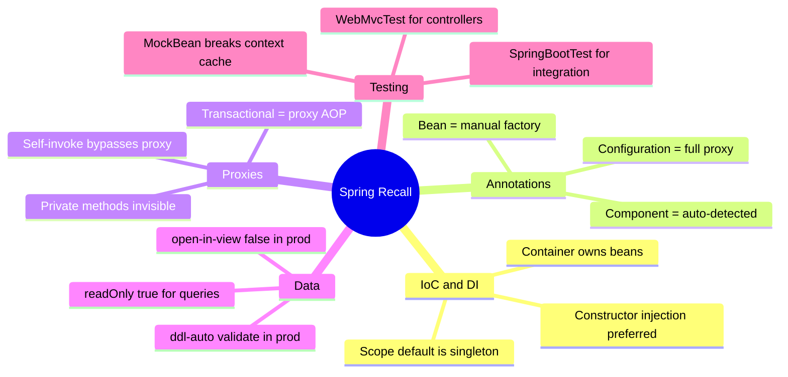
```mermaid
mindmap
  root((Spring Recall))
    IoC and DI
      Container owns beans
      Constructor injection preferred
      Scope default is singleton
    Annotations
      Component = auto-detected
      Bean = manual factory
      Configuration = full proxy
    Proxies
      Transactional = proxy AOP
      Self-invoke bypasses proxy
      Private methods invisible
    Data
      open-in-view false in prod
      ddl-auto validate in prod
      readOnly true for queries
    Testing
      WebMvcTest for controllers
      SpringBootTest for integration
      MockBean breaks context cache
```

**Recall categories and the critical facts:**

1. **IoC container:** Spring manages bean lifecycle - you declare, the container creates, wires, and destroys.
2. **Constructor injection:** the only recommended injection style - immutable, testable, no reflection.
3. **Singleton scope:** default bean scope - one instance per context, shared across all injection points.
4. **@Component vs @Bean:** `@Component` on the class for auto-detection, `@Bean` on a method for manual creation.
5. **@Configuration proxy:** `@Configuration` creates a CGLIB proxy so `@Bean` methods calling other `@Bean` methods return the singleton, not a new instance.
6. **@Transactional rollback default:** rolls back on unchecked exceptions (RuntimeException and subclasses) only. Checked exceptions commit by default. Override with `rollbackFor = Exception.class` when checked exceptions should also roll back.
7. **@Transactional readOnly:** set `readOnly = true` on query methods. Hibernate skips dirty checking and flush, the JDBC driver may route to a read replica, and the database can optimize locking.
8. **Propagation basics:** REQUIRED (default) joins the existing transaction or creates one. REQUIRES_NEW always suspends the current transaction and creates a fresh one - useful for audit logs that must persist even if the outer transaction rolls back.
9. **@WebMvcTest:** loads only the web slice - controllers, filters, `@ControllerAdvice`, converters. No `@Service` or `@Repository` beans. Wire dependencies with `@MockBean`.
10. **@SpringBootTest:** loads the full application context. Slow but necessary when you need real wiring across layers. Combine with `@Transactional` to auto-rollback test data.
11. **@MockBean context cost:** each unique set of `@MockBean` declarations creates a separate ApplicationContext. Standardize mocks across test classes to preserve context caching.
12. **open-in-view=false:** disables the OpenEntityManagerInViewInterceptor. Lazy collections accessed after the service layer throw `LazyInitializationException` - this is intentional. It forces explicit fetch strategies and prevents N+1 queries leaking into the view.
13. **ddl-auto=validate:** the only safe production value. `update` silently alters tables, `create` drops data. `validate` checks that entity mappings match the schema at startup and fails fast on drift.
14. **Graceful shutdown:** `server.shutdown=graceful` with `spring.lifecycle.timeout-per-shutdown-phase=30s` lets in-flight requests complete before the JVM exits. Essential for zero-downtime deployments behind a load balancer.
15. **Profile-guarded beans:** use `@Profile("!prod")` for dev-only beans (H2 console, seed data). Never rely on classpath tricks alone - an accidental dependency can activate dev behavior in production.

### 🛠️ Worked Example

**BAD:**

```java
// Common interview mistakes
@Service
class OrderSvc {
  @Autowired OrderRepo repo; // field inj
  @Transactional
  void processAndNotify(Order o) {
    save(o);
    notify(o); // self-invoke: no TX
  }
  @Transactional(propagation = REQUIRES_NEW)
  void notify(Order o) { /* ... */ }
}
```

Why it's wrong: field injection, self-invocation bypasses proxy, notify() runs without its own transaction.

**GOOD:**

```java
@Service
class OrderSvc {
  private final OrderRepo repo;
  private final NotifySvc notifier;

  OrderSvc(OrderRepo repo,
      NotifySvc notifier) {
    this.repo = repo;
    this.notifier = notifier;
  }

  @Transactional
  void process(Order o) { repo.save(o); }
}

@Service
class NotifySvc {
  @Transactional(
      propagation = REQUIRES_NEW)
  void notify(Order o) { /* ... */ }
}
```

**Production recall checklist:**

```properties
# Critical prod settings
spring.jpa.open-in-view=false
spring.jpa.hibernate.ddl-auto=validate
logging.level.root=WARN
logging.level.com.myapp=INFO
server.shutdown=graceful
```

### ⚖️ Trade-offs

**Gain:** fast retrieval of high-frequency facts, prevents common mistakes, interview preparation.
**Cost:** not comprehensive - covers only the most critical 15 facts from 39 keywords.

**How to use this card effectively:** passive re-reading creates an illusion of mastery. Instead, cover the right column of the table below and try to recall each key fact from the recall area alone. Score yourself honestly. Facts you cannot recall within five seconds go on a "weak list" for focused review. Schedule retrieval sessions using expanding intervals - day 1, day 3, day 7, day 21 - and shuffle the order each time so position cues do not substitute for real recall. When you can retrieve all 15 facts cold in under 90 seconds, the card has done its job and you can move to monthly maintenance reviews.

| Recall area | Key fact               | Common mistake             |
| ----------- | ---------------------- | -------------------------- |
| DI          | Constructor injection  | Field injection            |
| Proxy       | Self-invoke = no proxy | Calling within same class  |
| TX          | Unchecked = rollback   | Expecting checked rollback |
| JPA         | open-in-view=false     | Leaving default true       |
| Test        | @MockBean breaks cache | Different mocks per class  |

### ⚡ Decision Snap

**USE WHEN:** reviewing before an interview, debugging a proxy-related bug, onboarding to a Spring project.
**AVOID WHEN:** you need deep understanding of a specific topic (go to the dedicated keyword instead).
**PREFER the dedicated keyword WHEN:** the recall card fact is not detailed enough for your current problem.

### ⚠️ Top Traps

| #   | Misconception                                          | Reality                                                                                                                   |
| --- | ------------------------------------------------------ | ------------------------------------------------------------------------------------------------------------------------- |
| 1   | Reading the recall card replaces learning the keywords | Recall cards work only if you have already learned the underlying material - they are retrieval triggers, not substitutes |
| 2   | All 15 facts are equally important                     | Facts 1-5 (DI, proxy, TX) come up in >80% of Spring interviews and debugging sessions                                     |
| 3   | Once memorized, no review needed                       | Spaced repetition requires periodic review - schedule re-reading at 1, 7, and 30-day intervals                            |

### 🪜 Learning Ladder

**Prerequisites:**

- SPR-024 @RestController and Request Mapping - web layer knowledge
- SPR-032 @Transactional Basics - transaction behavior
  **THIS:** SPR-040 Spring Quick Recall Card
  **Next steps:**
- SPR-041 Field Injection Anti-Pattern - deep dive into the most common DI mistake

### 💡 The Surprising Truth

The five facts that prevent the most production bugs are all proxy-related: (1) self-invocation bypasses `@Transactional`, (2) self-invocation bypasses `@Cacheable`, (3) private methods are invisible to proxies, (4) `@Configuration` uses CGLIB proxies for `@Bean` inter-method calls, (5) `@MockBean` in tests replaces the proxy, not the target. Understanding Spring's proxy mechanism is the single highest-leverage knowledge for avoiding Spring bugs.

This is not coincidence. Spring chose proxy-based AOP as its core abstraction because it requires zero bytecode manipulation at the application level and integrates cleanly with standard Java semantics. But that design decision creates a fundamental gap: the proxy only intercepts calls that arrive through the proxy reference. Any call that bypasses the reference - self-invocation, private methods, final classes with JDK proxies - silently loses the cross-cutting behavior. Developers who internalize this one architectural constraint can predict the behavior of `@Transactional`, `@Cacheable`, `@Async`, `@Retryable`, and any future proxy-based annotation without memorizing each one separately. The proxy model is the skeleton key.

### 📇 Revision Card

1. Constructor injection only - field injection is untestable, allows incomplete objects, hides dependencies
2. Self-invocation bypasses ALL proxy-based annotations (@Transactional, @Cacheable, @Async)
3. Production settings: `open-in-view=false`, `ddl-auto=validate`, `logging.level.root=WARN`

---

---

# SPR-041 Field Injection Anti-Pattern

**TL;DR** - `@Autowired` on fields hides dependencies, prevents immutability, and makes classes untestable without Spring.

### 🔥 The Problem in One Paragraph

A service class has 8 `@Autowired` fields. In a unit test, you cannot construct it without starting Spring because there is no constructor. You cannot make the fields final because Spring sets them via reflection after construction. You cannot see the dependency count growing because each new `@Autowired` line is just one more annotation. The class accumulates dependencies silently until it violates the Single Responsibility Principle. This is exactly why **field injection is considered an anti-pattern** by the Spring team itself.

### 📘 Textbook Definition

**Field injection** is the practice of annotating instance fields with `@Autowired` (or `@Inject`) so the Spring container sets them via reflection after the object is constructed. It is classified as an anti-pattern because it hides dependencies, prevents immutability, couples the class to the DI framework, and makes unit testing without Spring impossible.

### 🧠 Mental Model

> Field injection is a package delivered through the window while you are out. You did not ask for it explicitly (no constructor parameter), you cannot refuse it (no way to validate), and you do not know what arrived until you open the box (runtime). Constructor injection is a registered delivery - you must be home, sign for it, and you see exactly what arrives.

- "Delivery through the window" -> reflection-based injection
- "Registered delivery" -> constructor parameter
- "Signing for it" -> compile-time dependency visibility
  **Where this analogy breaks down:** reflection injection always succeeds technically - the problem is design quality, not delivery failure.

### ⚙️ How It Works

```
Field injection:
  1. Spring creates object (no-arg ctor)
  2. Reflection sets @Autowired fields
  3. Object is "ready" (but was
     incomplete between 1 and 2)

Constructor injection:
  1. Spring calls constructor
     with ALL dependencies
  2. Object is immediately complete
  3. Fields can be final
```

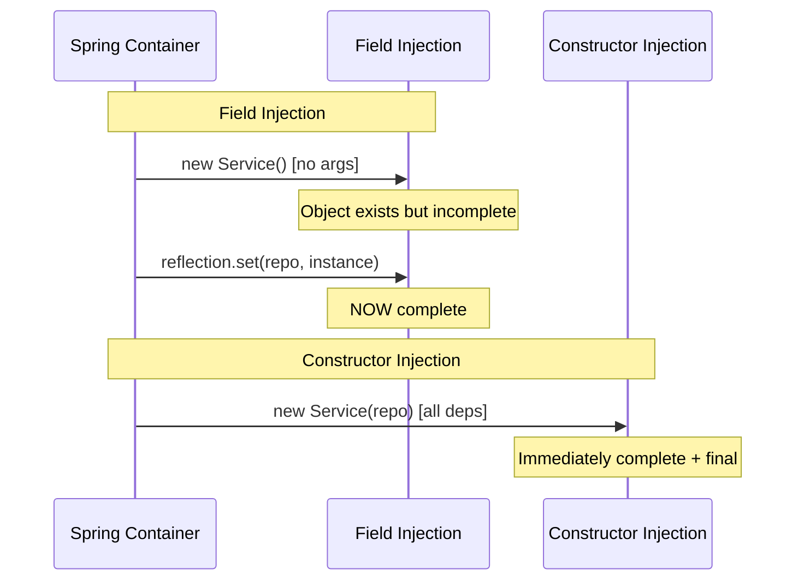
```mermaid
sequenceDiagram
    participant S as Spring Container
    participant F as Field Injection
    participant C as Constructor Injection

    Note over S,F: Field Injection
    S->>F: new Service() [no args]
    Note over F: Object exists but incomplete
    S->>F: reflection.set(repo, instance)
    Note over F: NOW complete

    Note over S,C: Constructor Injection
    S->>C: new Service(repo) [all deps]
    Note over C: Immediately complete + final
```

1. **Field injection:** Spring creates the object with a no-arg constructor, then uses reflection to set each `@Autowired` field. Between construction and injection, the object exists in an incomplete state.
2. **Constructor injection:** Spring resolves all dependencies first, then calls the constructor with all of them. The object is never in an incomplete state. Fields can be `final`.
3. **Why it matters:** constructor injection makes the dependency count visible at the constructor signature level, triggering refactoring when it grows too large.

**Reflection internals.** When Spring encounters an `@Autowired` field, it calls `java.lang.reflect.Field.setAccessible(true)` to bypass the `private` access modifier, then calls `field.set(bean, resolvedDependency)`. This means the JVM's encapsulation guarantees - the reason you declared the field `private` - are deliberately circumvented by the container. The field was never designed to be set from outside the class, yet reflection treats access modifiers as suggestions rather than rules. Under a `SecurityManager` (deprecated since Java 17, removed in Java 24), `setAccessible` requires explicit permission grants. Even without a `SecurityManager`, the pattern means your class's invariants depend on a framework calling private mutation methods in the right order - something the compiler cannot verify.

**Spring 4.3 eliminated the last convenience argument.** Before Spring 4.3 (released 2016), constructor injection required an explicit `@Autowired` annotation on the constructor, making it marginally more verbose than field injection. Spring 4.3 introduced implicit single-constructor autowiring: if a class has exactly one constructor, Spring uses it automatically with no annotation needed. This removed the only syntactic advantage field injection ever had. Combined with Lombok's `@RequiredArgsConstructor`, constructor injection now requires zero boilerplate beyond declaring `private final` fields - the same line count as field injection but with immutability and testability built in.

### 🛠️ Worked Example

**BAD:**

```java
@Service
public class OrderService {
  @Autowired private OrderRepo repo;
  @Autowired private PaymentGateway pay;
  @Autowired private EmailSender email;
  @Autowired private AuditLogger audit;
  @Autowired private InventoryClient inv;
  // 5 hidden dependencies, all mutable,
  // no way to construct without Spring
}
```

Why it's wrong: hidden dependencies, no immutability, impossible to unit test without Spring context or reflection hacks.

**GOOD:**

```java
@Service
public class OrderService {
  private final OrderRepo repo;
  private final PaymentGateway pay;

  // Constructor makes deps explicit
  // Spring auto-wires single constructor
  OrderService(OrderRepo repo,
      PaymentGateway pay) {
    this.repo = repo;
    this.pay = pay;
  }
  // 2 deps visible, both final,
  // easy to test:
  // new OrderService(mockRepo, mockPay)
}
```

**Production: Lombok shortcut:**

```java
@Service
@RequiredArgsConstructor
public class OrderService {
  private final OrderRepo repo;
  private final PaymentGateway pay;
  // Lombok generates the constructor
  // Same benefits, less boilerplate
}
```

**Test comparison - field injection vs constructor injection:**

```java
// Testing field-injected class: PAINFUL
// Option A: start entire Spring context
@SpringBootTest
class OrderServiceTest {
  @Autowired OrderService svc; // slow
}
// Option B: reflection hacks
OrderService svc = new OrderService();
Field f = OrderService.class
    .getDeclaredField("repo");
f.setAccessible(true);
f.set(svc, mockRepo); // fragile, ugly
```

```java
// Testing constructor-injected class: EASY
class OrderServiceTest {
  @Test
  void placesOrder() {
    var repo = mock(OrderRepo.class);
    var pay = mock(PaymentGateway.class);
    // Plain constructor - no Spring,
    // no reflection, no magic
    var svc = new OrderService(repo, pay);
    svc.place(new Order("item-1", 2));
    verify(repo).save(any());
  }
}
```

The constructor-injected test runs in milliseconds because it never starts Spring. The field-injected test either takes seconds (full context) or relies on brittle reflection that breaks when field names change.

### ⚖️ Trade-offs

**Gain:** constructor injection gives immutability, testability, explicit dependency graph, compile-time safety.
**Cost:** more constructor boilerplate (mitigated by Lombok or records), constructor parameter lists grow visibly (which is a feature, not a bug).

| Aspect                | Field injection            | Constructor injection | Setter injection      |
| --------------------- | -------------------------- | --------------------- | --------------------- |
| Testability           | needs Spring or reflection | plain `new` + mocks   | plain `new` + setters |
| Immutability          | no (non-final fields)      | yes (final fields)    | no                    |
| Dependency visibility | hidden                     | explicit in signature | semi-visible          |
| Framework coupling    | `@Autowired` required      | works without Spring  | works without Spring  |

### ⚡ Decision Snap

**USE constructor injection WHEN:** always. It is the Spring team's recommendation since Spring 4.3.
**USE setter injection WHEN:** optional dependencies that have a reasonable default (rare).
**NEVER USE field injection WHEN:** writing production code. Period.

### ⚠️ Top Traps

| #   | Misconception                                | Reality                                                                                                                               |
| --- | -------------------------------------------- | ------------------------------------------------------------------------------------------------------------------------------------- |
| 1   | Field injection is simpler                   | It is fewer characters, not simpler. Hidden complexity (reflection, mutability, framework coupling) is worse than visible boilerplate |
| 2   | `@Autowired` on the constructor is required  | Since Spring 4.3, a single constructor is auto-wired without any annotation                                                           |
| 3   | Lombok `@RequiredArgsConstructor` adds magic | Lombok generates a plain constructor at compile time - no runtime magic, no reflection, just regular Java bytecode                    |

### 🪜 Learning Ladder

**Prerequisites:**

- SPR-003 Dependency Injection Explained - how DI works
- SPR-040 Spring Quick Recall Card - field injection listed as top mistake
  **THIS:** SPR-041 Field Injection Anti-Pattern
  **Next steps:**
- SPR-042 Spring Interview Essentials - Working Level - field injection is a common interview topic

### 💡 The Surprising Truth

The Spring Framework documentation explicitly recommends constructor injection over field injection. IntelliJ IDEA shows a warning on `@Autowired` fields: "Field injection is not recommended." Yet in most enterprise codebases, field injection still dominates because it was the default in Spring tutorials for years. The Spring team changed the recommendation in 2016 (Spring 4.3), but legacy tutorials and Stack Overflow answers still teach the anti-pattern.

The persistence has three reinforcing causes. First, **tutorial inertia**: thousands of blog posts, Udemy courses, and Baeldung examples written between 2010 and 2016 use field injection because that was the idiomatic style when they were published. Search engines rank old content highly, so newcomers learn the anti-pattern first. Second, **path of least resistance in large codebases**: when an existing service already uses field injection, developers add one more `@Autowired` field rather than refactoring the constructor, especially under deadline pressure. Third, **invisible cost**: field injection's downsides only surface during testing, refactoring, or debugging circular dependencies - activities that happen after the code is written, not during. The feedback loop is too slow to change habits without team-level standards and static analysis rules enforcing constructor injection.

### 📇 Revision Card

1. Field injection hides dependencies, prevents `final`, couples to Spring, blocks unit testing
2. Constructor injection is the Spring team's recommendation since Spring 4.3 - no `@Autowired` needed on single constructors
3. A growing constructor parameter list is a design signal, not a problem - it tells you the class has too many responsibilities

---

---

# SPR-042 Spring Interview Essentials - Working Level

**TL;DR** - The 10 most common Spring interview questions at the working/mid-level, with concise, defensible answers.

### 🔥 The Problem in One Paragraph

A developer with 1-2 years of Spring experience walks into a mid-level interview. The interviewer asks "What happens when you call a `@Transactional` method from the same class?" The developer freezes - they have used `@Transactional` in production but never encountered the self-invocation trap. They lose the offer not because they cannot code, but because they cannot articulate how the framework they use daily actually works. This is exactly why **interview essentials** exist at this checkpoint.

### 📘 Textbook Definition

**Spring Interview Essentials** is a consolidation keyword that compiles the most frequently asked Spring questions at the mid/working level, paired with concise, technically accurate answers. It covers IoC, DI, proxy mechanism, `@Transactional`, scopes, testing, and common anti-patterns - the topics that interviewers use to gauge whether a candidate understands Spring beyond copy-paste usage.

### 🧠 Mental Model

> Interview preparation is not about memorizing answers. It is about having a mental index - knowing which drawer to open for which question. This keyword builds 10 labeled drawers, each containing a one-paragraph answer and one code example.

- "Labeled drawers" -> categorized Q&A pairs
- "One-paragraph answer" -> concise verbal response
- "Code example" -> proof you can back up theory
  **Where this analogy breaks down:** real interviews follow up with probing questions - you need the full keyword knowledge, not just the drawer label.

### ⚙️ How It Works

```
+----------------------------+
| Q1: IoC vs DI?             |
|   IoC = principle           |
|   DI = implementation       |
+----------------------------+
| Q2: @Component vs @Bean?   |
|   class-level vs method     |
+----------------------------+
| Q3: Self-invocation trap?   |
|   proxy bypassed            |
+----------------------------+
| Q4: Scopes?                |
|   singleton(def), prototype |
|   request, session          |
+----------------------------+
| Q5: @Transactional rollback?|
|   unchecked only by default |
+----------------------------+
| Q6: Field injection?       |
|   anti-pattern, use ctor   |
+----------------------------+
| Q7: Boot test vs WebMvc?   |
|   full context vs slice    |
+----------------------------+
| Q8: @Configuration proxy?  |
|   CGLIB ensures singletons |
+----------------------------+
| Q9: Spring profiles?       |
|   env-specific beans/config|
+----------------------------+
| Q10: @ControllerAdvice?    |
|   global exception handler |
+----------------------------+
```

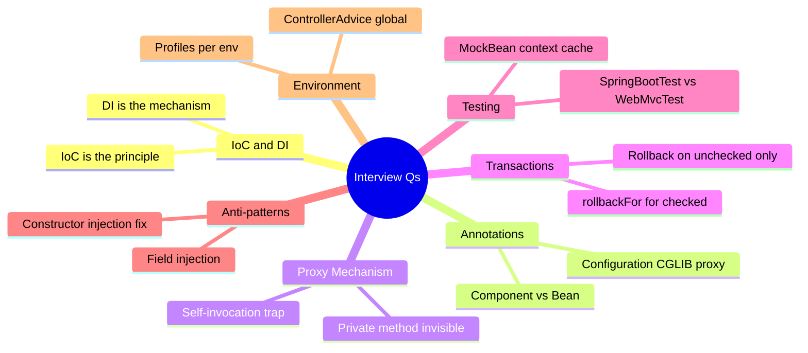
```mermaid
mindmap
  root((Interview Qs))
    IoC and DI
      IoC is the principle
      DI is the mechanism
    Annotations
      Component vs Bean
      Configuration CGLIB proxy
    Proxy Mechanism
      Self-invocation trap
      Private method invisible
    Transactions
      Rollback on unchecked only
      rollbackFor for checked
    Testing
      SpringBootTest vs WebMvcTest
      MockBean context cache
    Anti-patterns
      Field injection
      Constructor injection fix
    Environment
      Profiles per env
      ControllerAdvice global
```

**Top 10 Questions with Concise Answers:**

**Q1: What is IoC and how does DI implement it?**
IoC inverts control - the framework calls your code, not the other way around. DI is the specific IoC mechanism where the container provides dependencies to objects rather than objects creating their own.

**Q2: @Component vs @Bean - when to use which?**
`@Component` on the class for auto-detection via component scanning. `@Bean` on a method in a `@Configuration` class for manual creation, typically for third-party classes you cannot annotate.

**Q3: What happens when a @Transactional method calls another @Transactional method in the same class?**
The second method's `@Transactional` is ignored because the call bypasses the AOP proxy. The inner method runs within the outer transaction (or no transaction if the outer method is not transactional).

**Q4: What are Spring bean scopes?**
`singleton` (default, one per context), `prototype` (new instance per injection), `request` (one per HTTP request), `session` (one per HTTP session). Custom scopes are possible.

**Q5: When does @Transactional roll back?**
By default, only on unchecked exceptions (`RuntimeException` and `Error`). Checked exceptions commit. Use `rollbackFor = Exception.class` to include checked exceptions.

**Q6: Why is field injection considered an anti-pattern?**
Field injection (`@Autowired` on a field) hides dependencies, prevents immutable objects, and makes classes untestable without reflection. Constructor injection makes dependencies explicit, enables `final` fields, and lets plain unit tests pass dependencies directly without a Spring context.

**Q7: @SpringBootTest vs @WebMvcTest - when to use which?**
`@SpringBootTest` loads the full application context - use it for integration tests that need the real wiring. `@WebMvcTest` loads only the web layer (controllers, filters, advice) with a mock MVC environment - use it for fast, focused controller tests without database or service layer overhead.

**Q8: What does @Configuration CGLIB proxying do for @Bean methods?**
In a `@Configuration` class, Spring creates a CGLIB subclass so that `@Bean` methods calling other `@Bean` methods return the existing singleton, not a new instance. In a plain `@Component` with `@Bean` methods ("lite mode"), inter-method calls create new objects every time - a subtle source of bugs.

**Q9: What are Spring profiles and when do you use them?**
Profiles (`@Profile("dev")`, `spring.profiles.active=prod`) activate different beans or configuration per environment. Common use: separate datasource config for dev (H2 in-memory), staging (shared database), and production (connection pool tuned for load).

**Q10: What does @ControllerAdvice do?**
`@ControllerAdvice` is a global interceptor for controllers. Its primary use is centralized exception handling via `@ExceptionHandler` methods, but it also supports `@ModelAttribute` and `@InitBinder` across all controllers. It replaces scattered try-catch blocks in every controller with one consistent error response strategy.

### 🛠️ Worked Example

**BAD:**

```java
// Interview answer: "I think @Transactional
// rolls back on all exceptions"
// WRONG. Checked exceptions commit.
```

Why it's wrong: demonstrates incomplete understanding of a core Spring mechanism.

**GOOD:**

```java
// Interview answer with code proof:
@Transactional // rolls back on unchecked
void transfer(Long from, Long to,
    BigDecimal amt) {
  repo.debit(from, amt);
  repo.credit(to, amt);
  // RuntimeException -> rollback
  // IOException -> COMMIT (surprise!)
}

@Transactional(
    rollbackFor = Exception.class)
void safeTransfer(Long from, Long to,
    BigDecimal amt) throws IOException {
  // Now ALL exceptions -> rollback
}
```

**Production: demonstrating scope knowledge:**

```java
@Component
@Scope("prototype") // new instance each time
class RequestTracker {
  private final String id =
      UUID.randomUUID().toString();
}

@Component // singleton by default
class OrderService {
  // Same instance across all requests
}
```

### ⚖️ Trade-offs

**Gain:** fast recall of the top 10 questions, prevents interview blanks on core Spring topics.
**Cost:** concise answers lack nuance - follow-up questions require deeper keyword knowledge.

| Question area     | Quick answer           | Deep dive keyword |
| ----------------- | ---------------------- | ----------------- |
| IoC/DI            | principle vs mechanism | SPR-001, SPR-003  |
| Proxy self-invoke | bypasses AOP proxy     | SPR-032           |
| TX rollback       | unchecked only default | SPR-032           |
| Field injection   | anti-pattern, use ctor | SPR-041           |
| Testing           | slice vs full context  | SPR-035, SPR-036  |

### ⚡ Decision Snap

**USE WHEN:** preparing for a Spring interview within 24 hours, reviewing before a code review discussion.
**AVOID WHEN:** you have not studied the underlying keywords first - recall without understanding is fragile.
**PREFER full keyword study WHEN:** you have a week or more before the interview.

### ⚠️ Top Traps

| #   | Misconception                            | Reality                                                                                                               |
| --- | ---------------------------------------- | --------------------------------------------------------------------------------------------------------------------- |
| 1   | Memorizing answers is sufficient         | Interviewers follow up with "why" and "what if" - you need understanding, not recitation                              |
| 2   | All 10 questions are equally likely      | Questions 1-5 (IoC, DI, proxy, TX, scopes) appear in >90% of mid-level Spring interviews                              |
| 3   | Code examples are optional in interviews | Candidates who write code to demonstrate their answer score significantly higher than those who only explain verbally |

### 🪜 Learning Ladder

**Prerequisites:**

- SPR-040 Spring Quick Recall Card - the 15 critical facts
- SPR-041 Field Injection Anti-Pattern - common interview trap question
  **THIS:** SPR-042 Spring Interview Essentials - Working Level
  **Next steps:**
- SPR-043 Debugging Spring Startup Errors Exercise - practical debugging skill valued in interviews

### 💡 The Surprising Truth

The single question that most reliably separates "uses Spring" from "understands Spring" in interviews is the self-invocation trap. Candidates who can explain why calling a `@Transactional` method from within the same class does not create a transaction - and can draw the proxy diagram - demonstrate framework understanding that puts them ahead of 80% of candidates at the same level.

The ideal answer structure for the self-invocation question has four parts: (1) state that Spring uses proxies for AOP-based features, (2) explain that `this.method()` bypasses the proxy because the call never passes through the Spring-managed wrapper object, (3) name the fix - extract to a separate bean or inject the proxy via `ApplicationContext` or `@Lazy` self-injection, and (4) mention that this applies to all proxy-based annotations, not just `@Transactional` - it equally affects `@Cacheable`, `@Async`, and `@Secured`. Delivering all four parts in under 60 seconds signals genuine comprehension rather than memorized fragments.

### 📇 Revision Card

1. IoC is the principle (framework calls you), DI is the mechanism (container provides dependencies)
2. @Transactional self-invocation bypasses the proxy - the most revealing interview question
3. Default rollback is unchecked only - always specify `rollbackFor = Exception.class` for safety

---

---

# SPR-043 Debugging Spring Startup Errors Exercise

**TL;DR** - Diagnose and fix the five most common Spring Boot startup failures using stack traces and systematic reasoning.

### 🔥 The Problem in One Paragraph

A new developer runs their Spring Boot application and sees a wall of red stack trace text. `BeanCreationException`, `UnsatisfiedDependencyException`, `NoSuchBeanDefinitionException`, `DataSourceAutoConfigurationException` - the errors are verbose, nested, and intimidating. They copy the entire trace into a search engine, find a Stack Overflow answer for a different version, apply the fix, and create a new error. Without a systematic debugging approach, Spring startup errors become a frustrating trial-and-error process. This is exactly why **a debugging exercise** exists.

### 📘 Textbook Definition

**Spring startup errors** occur during `ApplicationContext` initialization when the container cannot create, wire, or configure beans. The five most common categories are: missing bean definitions, circular dependencies, misconfigured data sources, property binding failures, and auto-configuration conflicts. Each produces a distinct exception hierarchy with diagnostic information buried in the root cause.

### 🧠 Mental Model

> A Spring startup error is a crime scene investigation. The stack trace is the evidence chain. The root cause (at the bottom) is the actual crime. The nested exceptions above it are witnesses describing what they saw. Read from the bottom up, not top down.

- "Crime scene" -> startup failure
- "Evidence chain" -> nested exception stack
- "Actual crime" -> root cause (bottom of trace)
  **Where this analogy breaks down:** unlike crime scenes, Spring usually tells you exactly what went wrong - you just need to read the right line.

### ⚙️ How It Works

```
Application starts
       |
       v
+------------------+
| Component scan   |
| find @Component  |
+--------+---------+
         |
   create beans
         |
         v
+------------------+
| Wire deps        |
| @Autowired       |
+--------+---------+
         |
   missing bean?
   circular dep?
   bad property?
         |
         v
+------------------+
| BeanCreation     |
| Exception        |
+------------------+
```

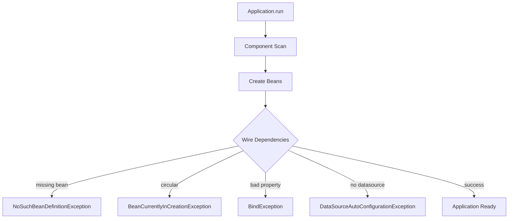
```mermaid
flowchart TD
    A[Application.run] --> B[Component Scan]
    B --> C[Create Beans]
    C --> D{Wire Dependencies}
    D -->|missing bean| E[NoSuchBeanDefinitionException]
    D -->|circular| F[BeanCurrentlyInCreationException]
    D -->|bad property| G[BindException]
    D -->|no datasource| H[DataSourceAutoConfigurationException]
    D -->|success| I[Application Ready]
```

**The Five Most Common Startup Errors:**

1. **NoSuchBeanDefinitionException:** a dependency cannot be found in the context (missing annotation, wrong package, missing dependency).
2. **BeanCurrentlyInCreationException:** circular dependency where A needs B and B needs A via constructor injection.
3. **BindException (ConfigurationProperties):** a property in `application.yml` has the wrong type or format.
4. **DataSource auto-config failure:** Spring detects a JDBC driver but no `spring.datasource.url` is configured.
5. **ConflictingBeanDefinitionException:** two beans with the same name but different classes.

**Enabling the auto-configuration debug report:**

Pass `--debug` as a command-line argument or set `debug=true` in `application.properties`. Spring Boot prints a **Conditions Evaluation Report** splitting every auto-configuration class into "Positive matches" (activated) and "Negative matches" (skipped with the exact condition that failed). When a `DataSourceAutoConfiguration` fires unexpectedly, this report tells you which condition matched - typically "@ConditionalOnClass found h2" - so you can exclude the auto-configuration or remove the transitive dependency. The report also lists "Unconditional classes" that always load, which helps you understand the baseline context even when no explicit configuration exists.

**FailureAnalyzer - Spring Boot's error translator:**

Before the raw stack trace reaches the console, Spring Boot passes the exception through a chain of `FailureAnalyzer` implementations. Each analyzer inspects the exception type, and if it recognizes the pattern, it produces a human-readable description with an "ACTION" section telling you exactly what to fix. For example, `PortInUseFailureAnalyzer` converts a `BindException` on port 8080 into "Web server failed to start. Port 8080 was already in use. ACTION: Identify and stop the process listening on port 8080 or configure this application to listen on another port." You see these formatted blocks *above* the stack trace. If no analyzer matches, you get the raw trace - which is your signal that this is an unusual failure requiring manual root-cause reading.

### 🛠️ Worked Example

**BAD:**

```java
// Debugging by guessing
// "I'll just add @ComponentScan everywhere"
@SpringBootApplication
@ComponentScan("com.myapp")
@ComponentScan("com.myapp.service")
@ComponentScan("com.myapp.repo")
// Still broken, now scanning duplicates
```

Why it's wrong: guessing without reading the root cause creates new problems.

**GOOD:**

```text
// Step 1: Read the ROOT CAUSE (bottom)
Caused by:
  NoSuchBeanDefinitionException:
  No qualifying bean of type
  'com.myapp.repo.OrderRepo'

// Step 2: Ask "Why is this bean missing?"
// - Is the class annotated?
// - Is it in a scanned package?
// - Is the dependency in pom.xml?

// Step 3: Check the package structure
com.myapp/         <-- @SpringBootApplication
com.myapp.service/ <-- scanned (sub-package)
com.other.repo/    <-- NOT scanned!

// Step 4: Fix - move to scanned package
//   or add explicit @ComponentScan
```

**Production: systematic debug checklist:**

```text
1. Scroll to BOTTOM of stack trace
2. Read "Caused by:" line
3. Identify error category:
   - NoSuchBean -> missing annotation
     or wrong package
   - Circular -> break with @Lazy
     or redesign
   - BindException -> fix property type
   - DataSource -> add url or exclude
     auto-config
4. Fix ONE thing, restart, repeat
```

**Debugging a circular dependency:**

```text
// The stack trace you see:
BeanCurrentlyInCreationException:
  Error creating bean 'orderService':
  Requested bean is currently in creation:
  Is there an unresolvable circular
  reference?

Caused by:
  UnsatisfiedDependencyException:
  Error creating bean 'paymentService'
  defined in file [...PaymentService.class]:
  Unsatisfied dependency expressed through
  constructor parameter 0:
  Error creating bean 'orderService'
```

```java
// The cause: constructor injection loop
@Service
public class OrderService {
    private final PaymentService payment;
    public OrderService(PaymentService p) {
        this.payment = p; // needs Payment
    }
}

@Service
public class PaymentService {
    private final OrderService order;
    public PaymentService(OrderService o) {
        this.order = o;   // needs Order
    }
}

// Fix: break the cycle with @Lazy
@Service
public class PaymentService {
    private final OrderService order;
    public PaymentService(
            @Lazy OrderService o) {
        this.order = o; // proxy injected
    }
}
// Better fix: extract shared logic into a
// third service that both depend on,
// eliminating the cycle entirely.
```

### ⚖️ Trade-offs

**Gain:** systematic debugging reduces fix time from hours to minutes, builds confidence with Spring internals.
**Cost:** requires understanding the bean lifecycle and auto-configuration to interpret root causes.

| Error type    | Root cause         | Quick fix      | Proper fix                          |
| ------------- | ------------------ | -------------- | ----------------------------------- |
| NoSuchBean    | wrong package      | @ComponentScan | move class to scanned package       |
| Circular      | constructor loop   | @Lazy          | redesign to break cycle             |
| BindException | wrong type in YAML | fix value      | add @Validated                      |
| DataSource    | no url configured  | add url        | exclude auto-config if no DB needed |

### ⚡ Decision Snap

**USE systematic debugging WHEN:** any Spring startup failure - always read root cause first.
**AVOID Stack Overflow copy-paste WHEN:** you have not identified the root cause exception class.
**PREFER `--debug` flag WHEN:** auto-configuration is confusing (`java -jar app.jar --debug` prints the auto-config report).

### ⚠️ Top Traps

| #   | Misconception                                             | Reality                                                                                                                      |
| --- | --------------------------------------------------------- | ---------------------------------------------------------------------------------------------------------------------------- |
| 1   | The first line of the stack trace is the error            | The root cause is at the BOTTOM. The first line is the outermost wrapper exception                                           |
| 2   | `@ComponentScan` fixes all NoSuchBean errors              | If the bean class itself is missing the annotation or the dependency is not in the classpath, `@ComponentScan` does not help |
| 3   | Circular dependency means bad code that must be rewritten | Sometimes `@Lazy` on one constructor parameter is sufficient. Full redesign is better but not always necessary               |

### 🪜 Learning Ladder

**Prerequisites:**

- SPR-007 @SpringBootApplication and Auto-Configuration - how the context initializes
- SPR-042 Spring Interview Essentials - Working Level - understanding core Spring concepts
  **THIS:** SPR-043 Debugging Spring Startup Errors Exercise
  **Next steps:**
- SPR-044 Bean Lifecycle Deep Dive - understanding the full initialization sequence

### 💡 The Surprising Truth

Spring Boot's `--debug` flag prints the **Conditions Evaluation Report** at startup - showing every auto-configuration class that was evaluated, which ones matched (activated), and which ones did not match (and why). This report answers the question "why did Spring configure X but not Y?" and is the single most powerful diagnostic tool for auto-configuration mysteries. Yet most developers do not know it exists.

Equally underused is the `FailureAnalyzer` extension point. Spring Boot ships with over a dozen built-in analyzers, but you can register your own by implementing `AbstractFailureAnalyzer<T>` parameterized on the exception type your analyzer handles. Register it in `META-INF/spring.factories` (or `META-INF/spring/org.springframework.boot.diagnostics.FailureAnalyzer` in Spring Boot 3.x) and your custom analyzer converts cryptic internal exceptions into actionable messages for your team. Organizations that build custom analyzers for their proprietary starters report dramatically faster onboarding - new developers see "ACTION: Add @EnableFeatureX to your configuration class" instead of a 200-line stack trace they cannot interpret.

### 📇 Revision Card

1. Always read the ROOT CAUSE at the bottom of the stack trace, not the first line
2. Five categories: NoSuchBean, Circular, BindException, DataSource, ConflictingBean - each has a distinct fix pattern
3. Use `--debug` flag to see the auto-configuration conditions report - it shows what matched and what did not
