# Spring Ecosystem

```text
═══════════════════════════════════════════════════════
CATEGORY:        Spring Ecosystem
CODE:            SPR
ARCHETYPE:       FRAMEWORK
MODE:            MODE_NEW
PROVENANCE:      user request via /learn: "spring ecosystem"
TIER:            tier-2-frameworks
FOLDER:          learn/spring/
LEVELS:          L0 + L1 + L2 + L3 + L4 + L5 + L6 + META
TOTAL:           115 keywords across 8 sub-topic files
GENERATED_FROM:  LEARN_KEYWORD_GENERATOR.md v1.0
═══════════════════════════════════════════════════════
```

Scope: the Spring Framework and Spring Boot ecosystem -
IoC/DI, Spring MVC, Spring Data JPA, Spring Security,
Spring Cloud, Spring WebFlux, Spring Batch, and operational
tooling (Actuator, Micrometer, GraalVM Native). The Java
language itself is covered in `learn/java/`. JVM internals
are covered in `learn/java-jvm/`. Concurrency primitives are
covered in `learn/java-concurrency/`. Cross-references appear
in Learning Ladder sections.

## Status

Stubs only. Each sub-topic file lists its keywords in YAML
frontmatter. Use `@learn-generate-entries` to fill content
per `LEARN_PROMPT.md` v1.0 (tri-template auto-routing).

## Sub-topic files

| File                                                                                          | Keywords | Levels         | Status |
| --------------------------------------------------------------------------------------------- | -------- | -------------- | ------ |
| [Spring - Core and Foundations](Spring%20-%20Core%20and%20Foundations.md)                     | 23       | L0 + L1        | stub   |
| [Spring - Web and Data](Spring%20-%20Web%20and%20Data.md)                                     | 20       | L2             | stub   |
| [Spring - Internals and Design](Spring%20-%20Internals%20and%20Design.md)                     | 26       | L3             | stub   |
| [Spring - Production and Cloud Part 1](Spring%20-%20Production%20and%20Cloud%20Part%201.md)   | 10       | L4             | stub   |
| [Spring - Production and Cloud Part 2](Spring%20-%20Production%20and%20Cloud%20Part%202.md)   | 10       | L4             | stub   |
| [Spring - Architecture and META Part 1](Spring%20-%20Architecture%20and%20META%20Part%201.md) | 9        | L5 + L6 + META | stub   |
| [Spring - Architecture and META Part 2](Spring%20-%20Architecture%20and%20META%20Part%202.md) | 9        | L5 + L6 + META | stub   |
| [Spring - Architecture and META Part 3](Spring%20-%20Architecture%20and%20META%20Part%203.md) | 8        | L5 + L6 + META | stub   |

## Keyword table

────────────────────────────────────────────────────
LEVEL 0 - ORIENTATION 🌱 (7 keywords)
────────────────────────────────────────────────────

| ID      | Keyword                                          | Lv  | Diff | template | Tags          |
| ------- | ------------------------------------------------ | --- | ---- | -------- | ------------- |
| SPR-001 | The Enterprise Java Problem Before Spring        | L0  | 🌱   | SIMPLE   |               |
| SPR-002 | What Is the Spring Ecosystem                     | L0  | 🌱   | SIMPLE   |               |
| SPR-003 | Spring vs Java EE (Jakarta EE) - The Big Picture | L0  | 🌱   | SIMPLE   |               |
| SPR-004 | Spring Project Landscape Map                     | L0  | 🌱   | SIMPLE   |               |
| SPR-005 | Spring Boot - What Problem It Solves             | L0  | 🌱   | SIMPLE   |               |
| SPR-006 | When Spring Is Overkill Anti-Pattern             | L0  | 🌱   | SIMPLE   | ⚠️ anti-minor |
| SPR-007 | Your First Spring Boot Application (Hands-On)    | L0  | 🌱   | SIMPLE   | 🏋️ 🔧         |

────────────────────────────────────────────────────
LEVEL 1 - FOUNDATIONAL ★☆☆ (16 keywords)
────────────────────────────────────────────────────

── CLUSTER: Core Container ─────────────────────────

| ID      | Keyword                                               | Lv  | Diff | template | Tags |
| ------- | ----------------------------------------------------- | --- | ---- | -------- | ---- |
| SPR-008 | Inversion of Control (IoC) Container                  | L1  | ★☆☆  | SIMPLE   | 🎯   |
| SPR-009 | Dependency Injection - Constructor vs Field vs Setter | L1  | ★☆☆  | SIMPLE   | 🎯   |
| SPR-010 | Spring Bean and Bean Scope                            | L1  | ★☆☆  | SIMPLE   |      |
| SPR-011 | ApplicationContext                                    | L1  | ★☆☆  | SIMPLE   |      |
| SPR-012 | Stereotype Annotations (@Component Family)            | L1  | ★☆☆  | SIMPLE   |      |

── CLUSTER: Spring Boot Basics ─────────────────────

| ID      | Keyword                                    | Lv  | Diff | template | Tags |
| ------- | ------------------------------------------ | --- | ---- | -------- | ---- |
| SPR-013 | Spring Boot Starters                       | L1  | ★☆☆  | SIMPLE   |      |
| SPR-014 | application.properties and application.yml | L1  | ★☆☆  | SIMPLE   |      |
| SPR-015 | Spring Boot Auto-Configuration Basics      | L1  | ★☆☆  | SIMPLE   |      |
| SPR-016 | Embedded Server (Tomcat, Jetty, Netty)     | L1  | ★☆☆  | SIMPLE   | 🔧   |
| SPR-017 | Spring Initializr (start.spring.io)        | L1  | ★☆☆  | SIMPLE   | 🔧   |

── CLUSTER: Beliefs and Practice ───────────────────

| ID      | Keyword                                                      | Lv  | Diff | template | Tags          |
| ------- | ------------------------------------------------------------ | --- | ---- | -------- | ------------- |
| SPR-018 | "Spring Does Magic" is Wrong - Convention over Configuration | L1  | ★☆☆  | SIMPLE   | 💥            |
| SPR-019 | Hardcoded Configuration Anti-Pattern                         | L1  | ★☆☆  | SIMPLE   | ⚠️ anti-minor |
| SPR-020 | Top 10 Spring Interview Questions (Basics)                   | L1  | ★☆☆  | SIMPLE   | 🎯            |
| SPR-021 | Spring Boot DevTools and Live Reload                         | L1  | ★☆☆  | SIMPLE   | 🔧            |
| SPR-022 | REST API Phase 1 - Spring Boot CRUD                          | L1  | ★☆☆  | SIMPLE   | 🔨            |
| SPR-023 | Spring Boot Project Setup Exercise                           | L1  | ★☆☆  | SIMPLE   | 🏋️            |

────────────────────────────────────────────────────
LEVEL 2 - WORKING ★★☆ (20 keywords)
────────────────────────────────────────────────────

── CLUSTER: Web Layer ──────────────────────────────

| ID      | Keyword                                        | Lv  | Diff | template     | Tags |
| ------- | ---------------------------------------------- | --- | ---- | ------------ | ---- |
| SPR-024 | @RestController and Request Mapping            | L2  | ★★☆  | INTERMEDIATE |      |
| SPR-025 | Request and Response DTOs with Bean Validation | L2  | ★★☆  | INTERMEDIATE |      |
| SPR-026 | Global Exception Handling (@ControllerAdvice)  | L2  | ★★☆  | INTERMEDIATE |      |

── CLUSTER: Data Access ────────────────────────────

| ID      | Keyword                                        | Lv  | Diff | template     | Tags |
| ------- | ---------------------------------------------- | --- | ---- | ------------ | ---- |
| SPR-027 | Spring Data JPA - Repository Pattern           | L2  | ★★☆  | INTERMEDIATE | 🎯   |
| SPR-028 | Spring Profiles and Environment Abstraction    | L2  | ★★☆  | INTERMEDIATE |      |
| SPR-029 | @ConfigurationProperties - Typed Configuration | L2  | ★★☆  | INTERMEDIATE |      |

── CLUSTER: Security and Transactions ──────────────

| ID      | Keyword                               | Lv  | Diff | template     | Tags |
| ------- | ------------------------------------- | --- | ---- | ------------ | ---- |
| SPR-030 | Spring Security Authentication Basics | L2  | ★★☆  | INTERMEDIATE |      |
| SPR-031 | Spring Security Authorization (RBAC)  | L2  | ★★☆  | INTERMEDIATE |      |
| SPR-032 | @Transactional Basics                 | L2  | ★★☆  | INTERMEDIATE | 🎯   |
| SPR-033 | Spring Cache Abstraction (@Cacheable) | L2  | ★★☆  | INTERMEDIATE |      |

── CLUSTER: Testing and Tooling ────────────────────

| ID      | Keyword                                           | Lv  | Diff | template     | Tags |
| ------- | ------------------------------------------------- | --- | ---- | ------------ | ---- |
| SPR-034 | Logging in Spring Boot (SLF4J and Logback)        | L2  | ★★☆  | INTERMEDIATE | 🔧   |
| SPR-035 | Spring Boot Testing (@SpringBootTest)             | L2  | ★★☆  | INTERMEDIATE | 🧪   |
| SPR-036 | MockMvc and Slice Testing (@WebMvcTest)           | L2  | ★★☆  | INTERMEDIATE | 🔧   |
| SPR-037 | Repository vs @Query vs Native SQL Decision Guide | L2  | ★★☆  | INTERMEDIATE | 🧭   |

── CLUSTER: Practice and Retention ─────────────────

| ID      | Keyword                                      | Lv  | Diff | template     | Tags          |
| ------- | -------------------------------------------- | --- | ---- | ------------ | ------------- |
| SPR-038 | Build a CRUD REST Service Exercise           | L2  | ★★☆  | INTERMEDIATE | 🏋️            |
| SPR-039 | REST API Phase 2 - Data Layer and Validation | L2  | ★★☆  | INTERMEDIATE | 🔨            |
| SPR-040 | Spring Quick Recall Card                     | L2  | ★★☆  | INTERMEDIATE | 🔁            |
| SPR-041 | Field Injection Anti-Pattern                 | L2  | ★★☆  | INTERMEDIATE | ⚠️ anti-minor |
| SPR-042 | Spring Interview Essentials - Working Level  | L2  | ★★☆  | INTERMEDIATE | 🎯            |
| SPR-043 | Debugging Spring Startup Errors Exercise     | L2  | ★★☆  | INTERMEDIATE | 🏋️            |

────────────────────────────────────────────────────
LEVEL 3 - INTERMEDIATE ★★☆ (26 keywords)
────────────────────────────────────────────────────

── CLUSTER: Container Internals ────────────────────

| ID      | Keyword                                     | Lv  | Diff | template     | Tags |
| ------- | ------------------------------------------- | --- | ---- | ------------ | ---- |
| SPR-044 | Bean Lifecycle and Initialization Callbacks | L3  | ★★☆  | INTERMEDIATE | 🎯   |
| SPR-045 | AOP - Aspect-Oriented Programming in Spring | L3  | ★★☆  | INTERMEDIATE |      |
| SPR-046 | @Transactional Proxy Mechanism and Pitfalls | L3  | ★★☆  | INTERMEDIATE | 🧭   |

── CLUSTER: Security and Identity ──────────────────

| ID      | Keyword                                   | Lv  | Diff | template     | Tags |
| ------- | ----------------------------------------- | --- | ---- | ------------ | ---- |
| SPR-047 | Spring Security Filter Chain Architecture | L3  | ★★☆  | INTERMEDIATE | 🎯   |
| SPR-048 | OAuth 2.0 and OIDC with Spring Security   | L3  | ★★☆  | INTERMEDIATE |      |

── CLUSTER: Data Layer Depth ───────────────────────

| ID      | Keyword                                          | Lv  | Diff | template     | Tags  |
| ------- | ------------------------------------------------ | --- | ---- | ------------ | ----- |
| SPR-049 | Spring Data JPA Fetch Strategies and Projections | L3  | ★★☆  | INTERMEDIATE | 🧭    |
| SPR-050 | HikariCP Connection Pool Tuning                  | L3  | ★★☆  | INTERMEDIATE | 🔧 ⚡ |
| SPR-051 | Database Migrations with Flyway and Liquibase    | L3  | ★★☆  | INTERMEDIATE | 🔧 🔄 |

── CLUSTER: Observability and Testing ──────────────

| ID      | Keyword                                      | Lv  | Diff | template     | Tags  |
| ------- | -------------------------------------------- | --- | ---- | ------------ | ----- |
| SPR-052 | Spring Boot Actuator and Health Endpoints    | L3  | ★★☆  | INTERMEDIATE | 🔧 📊 |
| SPR-053 | Micrometer Metrics and Distributed Tracing   | L3  | ★★☆  | INTERMEDIATE | 🔧 📊 |
| SPR-054 | Testcontainers for Integration Testing       | L3  | ★★☆  | INTERMEDIATE | 🔧 🧪 |
| SPR-055 | Spring Boot Build Plugins (Maven and Gradle) | L3  | ★★☆  | INTERMEDIATE | 🔧    |

── CLUSTER: Anti-Patterns and Performance ──────────

| ID      | Keyword                                      | Lv  | Diff | template     | Tags          |
| ------- | -------------------------------------------- | --- | ---- | ------------ | ------------- |
| SPR-056 | @Transactional Self-Invocation Anti-Pattern  | L3  | ★★☆  | INTERMEDIATE | ⚠️ anti-major |
| SPR-057 | N+1 Query Anti-Pattern in Spring Data JPA    | L3  | ★★☆  | INTERMEDIATE | ⚠️ anti-major |
| SPR-058 | Spring Performance Tuning Checklist          | L3  | ★★☆  | INTERMEDIATE | ⚡            |
| SPR-059 | Testing Strategy for Spring Applications     | L3  | ★★☆  | INTERMEDIATE | 🧪            |
| SPR-060 | Monitoring Spring Applications in Production | L3  | ★★☆  | INTERMEDIATE | 📊            |

── CLUSTER: Migration and Compliance ───────────────

| ID      | Keyword                                                   | Lv  | Diff | template     | Tags |
| ------- | --------------------------------------------------------- | --- | ---- | ------------ | ---- |
| SPR-061 | Spring Boot 2.x to 3.x Migration Guide                    | L3  | ★★☆  | INTERMEDIATE | 🔄   |
| SPR-062 | Jakarta EE Namespace Migration (javax to jakarta)         | L3  | ★★☆  | INTERMEDIATE | 🔄   |
| SPR-063 | "Spring Beans Are Thread-Safe" is Wrong - Singleton Scope | L3  | ★★☆  | INTERMEDIATE | 💥   |
| SPR-064 | Spring Security OWASP Top 10 Alignment                    | L3  | ★★☆  | INTERMEDIATE | 📋   |

── CLUSTER: Teaching, Interview, Practice ──────────

| ID      | Keyword                                 | Lv  | Diff | template     | Tags |
| ------- | --------------------------------------- | --- | ---- | ------------ | ---- |
| SPR-065 | Explain Spring DI at Every Level        | L3  | ★★☆  | INTERMEDIATE | 🎓   |
| SPR-066 | Spring System Design Interview Patterns | L3  | ★★☆  | INTERMEDIATE | 🎯   |
| SPR-067 | REST API Phase 3 - Security and OAuth   | L3  | ★★☆  | INTERMEDIATE | 🔨   |
| SPR-068 | Spring Performance Tuning Kata          | L3  | ★★☆  | INTERMEDIATE | 🏋️   |
| SPR-069 | Spring Self-Assessment Checkpoint       | L3  | ★★☆  | INTERMEDIATE | 🔁   |

────────────────────────────────────────────────────
LEVEL 4 - EXPERT ★★★ (20 keywords)
────────────────────────────────────────────────────

── CLUSTER: Auto-Configuration and Container ───────

| ID      | Keyword                                        | Lv  | Diff | template | Tags |
| ------- | ---------------------------------------------- | --- | ---- | -------- | ---- |
| SPR-070 | Spring Boot Auto-Configuration Internals       | L4  | ★★★  | COMPLEX  |      |
| SPR-071 | BeanPostProcessor and BeanFactoryPostProcessor | L4  | ★★★  | COMPLEX  | 🎯   |
| SPR-072 | Spring Context Startup Optimization            | L4  | ★★★  | COMPLEX  | ⚡   |

── CLUSTER: Security Incidents ─────────────────────

| ID      | Keyword                                     | Lv  | Diff | template | Tags |
| ------- | ------------------------------------------- | --- | ---- | -------- | ---- |
| SPR-073 | Spring4Shell (CVE-2022-22965)               | L4  | ★★★  | COMPLEX  | 🔴   |
| SPR-074 | Spring Cloud Function SpEL Injection (2022) | L4  | ★★★  | COMPLEX  | 🔴   |
| SPR-075 | Spring Boot Memory Footprint Analysis       | L4  | ★★★  | COMPLEX  | 📊   |

── CLUSTER: Reactive and WebFlux ───────────────────

| ID      | Keyword                                      | Lv  | Diff | template | Tags |
| ------- | -------------------------------------------- | --- | ---- | -------- | ---- |
| SPR-076 | Spring WebFlux and Project Reactor           | L4  | ★★★  | COMPLEX  |      |
| SPR-077 | Reactive vs Servlet Stack Decision Framework | L4  | ★★★  | COMPLEX  | 🧭   |

── CLUSTER: Spring Cloud ───────────────────────────

| ID      | Keyword                                            | Lv  | Diff | template | Tags |
| ------- | -------------------------------------------------- | --- | ---- | -------- | ---- |
| SPR-078 | Spring Cloud Service Discovery (Eureka and Consul) | L4  | ★★★  | COMPLEX  | 🔧   |
| SPR-079 | Spring Cloud Config Server                         | L4  | ★★★  | COMPLEX  | 🔧   |
| SPR-080 | Spring Cloud Gateway and Rate Limiting             | L4  | ★★★  | COMPLEX  |      |
| SPR-081 | Resilience4j Circuit Breaker with Spring           | L4  | ★★★  | COMPLEX  | 🔧   |
| SPR-082 | Spring Batch for Large-Scale Processing            | L4  | ★★★  | COMPLEX  |      |

── CLUSTER: Debugging and Anti-Patterns ────────────

| ID      | Keyword                                      | Lv  | Diff | template | Tags          |
| ------- | -------------------------------------------- | --- | ---- | -------- | ------------- |
| SPR-083 | Debugging Spring Auto-Configuration Failures | L4  | ★★★  | COMPLEX  | 🚨            |
| SPR-084 | Circular Dependency Trap Anti-Pattern        | L4  | ★★★  | COMPLEX  | ⚠️ anti-major |
| SPR-085 | Fat ApplicationContext Anti-Pattern          | L4  | ★★★  | COMPLEX  | ⚠️ anti-minor |

── CLUSTER: Practice and Mastery Check ─────────────

| ID      | Keyword                                         | Lv  | Diff | template | Tags |
| ------- | ----------------------------------------------- | --- | ---- | -------- | ---- |
| SPR-086 | Spring Deep-Dive Interview Questions            | L4  | ★★★  | COMPLEX  | 🎯   |
| SPR-087 | REST API Phase 4 - Observability and Resilience | L4  | ★★★  | COMPLEX  | 🔨   |
| SPR-088 | Production Incident Simulation with Spring      | L4  | ★★★  | COMPLEX  | 🏋️   |
| SPR-089 | Spring Mastery Verification                     | L4  | ★★★  | COMPLEX  | 🔁   |

────────────────────────────────────────────────────
LEVEL 5 - ARCHITECT 🔥 (14 keywords)
────────────────────────────────────────────────────

── CLUSTER: System Architecture ────────────────────

| ID      | Keyword                                                | Lv  | Diff | template | Tags |
| ------- | ------------------------------------------------------ | --- | ---- | -------- | ---- |
| SPR-090 | Spring-Based Microservice Architecture                 | L5  | 🔥   | COMPLEX  |      |
| SPR-091 | Event-Driven Architecture with Spring (Kafka and AMQP) | L5  | 🔥   | COMPLEX  | 🔧   |
| SPR-092 | Spring Cloud Kubernetes Integration                    | L5  | 🔥   | COMPLEX  | 🔧   |
| SPR-093 | Multi-Tenant SaaS with Spring Boot                     | L5  | 🔥   | COMPLEX  |      |

── CLUSTER: Governance and Evaluation ──────────────

| ID      | Keyword                                           | Lv  | Diff | template | Tags |
| ------- | ------------------------------------------------- | --- | ---- | -------- | ---- |
| SPR-094 | Spring Boot Fleet Standardization                 | L5  | 🔥   | COMPLEX  |      |
| SPR-095 | Spring Framework Version Governance Strategy      | L5  | 🔥   | COMPLEX  | 🔄   |
| SPR-096 | Spring vs Quarkus vs Micronaut Decision Framework | L5  | 🔥   | COMPLEX  | 🧭   |

── CLUSTER: Platform and Strategy ──────────────────

| ID      | Keyword                                      | Lv  | Diff | template | Tags          |
| ------- | -------------------------------------------- | --- | ---- | -------- | ------------- |
| SPR-097 | Custom Spring Boot Starter Design            | L5  | 🔥   | COMPLEX  | 🏋️            |
| SPR-098 | Platform Engineering with Spring Boot        | L5  | 🔥   | COMPLEX  |               |
| SPR-099 | Spring Native and GraalVM AOT Strategy       | L5  | 🔥   | COMPLEX  |               |
| SPR-100 | Distributed Monolith Anti-Pattern            | L5  | 🔥   | COMPLEX  | ⚠️ anti-major |
| SPR-101 | REST API Phase 5 - Platform and Multi-Region | L5  | 🔥   | COMPLEX  | 🔨            |
| SPR-102 | Spring Staff-Level Interview Scenarios       | L5  | 🔥   | COMPLEX  | 🎯            |
| SPR-103 | Architecture Decision Records for Spring     | L5  | 🔥   | COMPLEX  | 🎓            |

────────────────────────────────────────────────────
LEVEL 6 - CREATOR 🔬 (7 keywords)
────────────────────────────────────────────────────

| ID      | Keyword                                             | Lv  | Diff | template | Tags |
| ------- | --------------------------------------------------- | --- | ---- | -------- | ---- |
| SPR-104 | Spring Framework Source Code Architecture           | L6  | 🔬   | COMPLEX  |      |
| SPR-105 | Writing a Custom BeanDefinitionRegistrar            | L6  | 🔬   | COMPLEX  | 🏋️   |
| SPR-106 | Spring AOT Engine and Build-Time Metadata           | L6  | 🔬   | COMPLEX  |      |
| SPR-107 | Designing a Configuration DSL with Spring           | L6  | 🔬   | COMPLEX  |      |
| SPR-108 | The DI Pattern - Academic Foundations (Fowler 2004) | L6  | 🔬   | COMPLEX  |      |
| SPR-109 | Proxy Pattern Evolution in Framework Design         | L6  | 🔬   | COMPLEX  |      |
| SPR-110 | Contributing to Spring Framework Open Source        | L6  | 🔬   | COMPLEX  | 🏋️   |

────────────────────────────────────────────────────
META - META-SKILLS 🧠 (5 keywords)
────────────────────────────────────────────────────

| ID      | Keyword                                                 | Lv   | Diff | template | Tags |
| ------- | ------------------------------------------------------- | ---- | ---- | -------- | ---- |
| SPR-111 | What OS Process Isolation Teaches Spring IoC            | META | 🧠   | COMPLEX  | 🧠   |
| SPR-112 | What Electrical Circuit Breakers Teach Resilience       | META | 🧠   | COMPLEX  | 🧠   |
| SPR-113 | Convention over Configuration - Cross-Framework Pattern | META | 🧠   | COMPLEX  | 🧠   |
| SPR-114 | The IoC Principle Beyond Spring                         | META | 🧠   | COMPLEX  | 🧠   |
| SPR-115 | Framework Lock-In vs Leverage Decision Pattern          | META | 🧠   | COMPLEX  | 🧠   |

## Summary

| Level | Name         | Count | ID Range         |
| ----- | ------------ | ----- | ---------------- |
| L0    | Orientation  | 7     | SPR-001..SPR-007 |
| L1    | Foundational | 16    | SPR-008..SPR-023 |
| L2    | Working      | 20    | SPR-024..SPR-043 |
| L3    | Intermediate | 26    | SPR-044..SPR-069 |
| L4    | Expert       | 20    | SPR-070..SPR-089 |
| L5    | Architect    | 14    | SPR-090..SPR-103 |
| L6    | Creator      | 7     | SPR-104..SPR-110 |
| META  | Meta-Skills  | 5     | SPR-111..SPR-115 |
| TOTAL |              | 115   | SPR-001..SPR-115 |

TAG COVERAGE:

| Tag        | Count | % of Total |
| ---------- | ----- | ---------- |
| 🎯 ivw     | 10    | 9%         |
| ⚠️ anti    | 8     | 7%         |
| 🔧 tool    | 16    | 14%        |
| 🔴 inc     | 2     | 2%         |
| 🔄 mig     | 4     | 3%         |
| 📋 cpl     | 1     | 1%         |
| 🧪 test    | 3     | 3%         |
| 📊 obs     | 4     | 3%         |
| ⚡ perf    | 3     | 3%         |
| 🧭 dec     | 4     | 3%         |
| 🏋️ prac    | 7     | 6%         |
| 🔨 proj    | 5     | 4%         |
| 🎓 teach   | 2     | 2%         |
| 🔁 ret     | 4     | 3%         |
| 💥 unlearn | 2     | 2%         |
| 🚨 triage  | 1     | 1%         |

## Confusion pairs

| Concept A                      | Concept B                | Level | Key Difference                                 |
| ------------------------------ | ------------------------ | ----- | ---------------------------------------------- |
| @Component                     | @Bean                    | L1    | class-level stereotype vs method-level factory |
| @Autowired                     | @Inject                  | L1    | Spring-specific vs Jakarta CDI standard        |
| @Controller                    | @RestController          | L2    | view-returning vs response-body default        |
| @SpringBootTest                | @WebMvcTest              | L2    | full context vs web slice only                 |
| @Transactional (Spring)        | @Transactional (Jakarta) | L3    | org.springframework vs jakarta.transaction     |
| Spring Security authentication | authorization            | L2    | who you are vs what you can do                 |
| Spring MVC                     | Spring WebFlux           | L4    | thread-per-request vs reactive non-blocking    |
| ApplicationContext             | BeanFactory              | L3    | full-featured vs lazy minimal                  |
| EAGER fetch                    | LAZY fetch               | L3    | load immediately vs load on access             |
| Spring Cloud Gateway           | Zuul                     | L4    | reactive non-blocking vs servlet blocking      |

<!-- ROADMAP-TREE:START -->

## Roadmap

```text
ROADMAP TREE - Spring Ecosystem
===========================================================
L0 Orientation
 +-- SPR-001 Enterprise Java Problem
 +-- SPR-002 What Is Spring Ecosystem
 +-- SPR-003 Spring vs Java EE
 +-- SPR-004 Project Landscape Map
 +-- SPR-005 Spring Boot Problem
 +-- SPR-006 When Spring Is Overkill
 +-- SPR-007 First Spring Boot App
L1 Foundational
 +-- CLUSTER: Core Container
 |    +-- SPR-008 IoC Container
 |    +-- SPR-009 Dependency Injection
 |    +-- SPR-010 Bean and Bean Scope
 |    +-- SPR-011 ApplicationContext
 |    +-- SPR-012 Stereotype Annotations
 +-- CLUSTER: Spring Boot Basics
 |    +-- SPR-013 Boot Starters
 |    +-- SPR-014 Properties and YAML
 |    +-- SPR-015 Auto-Configuration Basics
 |    +-- SPR-016 Embedded Server
 |    +-- SPR-017 Spring Initializr
 +-- CLUSTER: Beliefs and Practice
      +-- SPR-018 Spring Magic Myth
      +-- SPR-019 Hardcoded Config Anti
      +-- SPR-020 Top 10 Interview Questions
      +-- SPR-021 DevTools Live Reload
      +-- SPR-022 REST API Phase 1
      +-- SPR-023 Project Setup Exercise
L2 Working
 +-- CLUSTER: Web Layer
 |    +-- SPR-024 RestController Mapping
 |    +-- SPR-025 DTOs and Bean Validation
 |    +-- SPR-026 ControllerAdvice
 +-- CLUSTER: Data Access
 |    +-- SPR-027 Spring Data JPA
 |    +-- SPR-028 Profiles and Environment
 |    +-- SPR-029 ConfigurationProperties
 +-- CLUSTER: Security and Transactions
 |    +-- SPR-030 Security Auth Basics
 |    +-- SPR-031 Security Authorization
 |    +-- SPR-032 Transactional Basics
 |    +-- SPR-033 Cache Abstraction
 +-- CLUSTER: Testing and Tooling
 |    +-- SPR-034 Logging SLF4J Logback
 |    +-- SPR-035 SpringBootTest
 |    +-- SPR-036 MockMvc and WebMvcTest
 |    +-- SPR-037 Query Type Decision Guide
 +-- CLUSTER: Practice and Retention
      +-- SPR-038 CRUD REST Exercise
      +-- SPR-039 REST API Phase 2
      +-- SPR-040 Quick Recall Card
      +-- SPR-041 Field Injection Anti
      +-- SPR-042 Interview Working Level
      +-- SPR-043 Startup Errors Exercise
L3 Intermediate
 +-- CLUSTER: Container Internals
 |    +-- SPR-044 Bean Lifecycle Callbacks
 |    +-- SPR-045 AOP in Spring
 |    +-- SPR-046 Transactional Proxy
 +-- CLUSTER: Security and Identity
 |    +-- SPR-047 Security Filter Chain
 |    +-- SPR-048 OAuth 2.0 and OIDC
 +-- CLUSTER: Data Layer Depth
 |    +-- SPR-049 Fetch Strategies
 |    +-- SPR-050 HikariCP Tuning
 |    +-- SPR-051 Flyway and Liquibase
 +-- CLUSTER: Observability and Testing
 |    +-- SPR-052 Actuator Health
 |    +-- SPR-053 Micrometer Tracing
 |    +-- SPR-054 Testcontainers
 |    +-- SPR-055 Build Plugins
 +-- CLUSTER: Anti-Patterns and Performance
 |    +-- SPR-056 Self-Invocation Anti
 |    +-- SPR-057 N+1 Query Anti-Pattern
 |    +-- SPR-058 Performance Tuning
 |    +-- SPR-059 Testing Strategy
 |    +-- SPR-060 Monitoring Production
 +-- CLUSTER: Migration and Compliance
 |    +-- SPR-061 Boot 2.x to 3.x
 |    +-- SPR-062 Jakarta Namespace
 |    +-- SPR-063 Thread-Safe Myth
 |    +-- SPR-064 OWASP Top 10
 +-- CLUSTER: Teaching and Practice
      +-- SPR-065 Explain DI Levels
      +-- SPR-066 System Design Interview
      +-- SPR-067 REST API Phase 3
      +-- SPR-068 Performance Kata
      +-- SPR-069 Self-Assessment
L4 Expert
 +-- CLUSTER: Auto-Config and Container
 |    +-- SPR-070 Auto-Config Internals
 |    +-- SPR-071 BeanPostProcessor
 |    +-- SPR-072 Startup Optimization
 +-- CLUSTER: Security Incidents
 |    +-- SPR-073 Spring4Shell
 |    +-- SPR-074 SpEL Injection 2022
 |    +-- SPR-075 Memory Footprint
 +-- CLUSTER: Reactive and WebFlux
 |    +-- SPR-076 WebFlux and Reactor
 |    +-- SPR-077 Reactive vs Servlet
 +-- CLUSTER: Spring Cloud
 |    +-- SPR-078 Service Discovery
 |    +-- SPR-079 Config Server
 |    +-- SPR-080 Cloud Gateway
 |    +-- SPR-081 Resilience4j
 |    +-- SPR-082 Spring Batch
 +-- CLUSTER: Debug and Anti-Patterns
 |    +-- SPR-083 Debug Auto-Config
 |    +-- SPR-084 Circular Dependency
 |    +-- SPR-085 Fat Context Anti
 +-- CLUSTER: Practice and Mastery
      +-- SPR-086 Deep-Dive Interview
      +-- SPR-087 REST API Phase 4
      +-- SPR-088 Incident Simulation
      +-- SPR-089 Mastery Verification
L5 Architect
 +-- CLUSTER: System Architecture
 |    +-- SPR-090 Microservice Arch
 |    +-- SPR-091 Event-Driven Arch
 |    +-- SPR-092 Cloud Kubernetes
 |    +-- SPR-093 Multi-Tenant SaaS
 +-- CLUSTER: Governance and Evaluation
 |    +-- SPR-094 Fleet Standardization
 |    +-- SPR-095 Version Governance
 |    +-- SPR-096 Spring vs Quarkus vs...
 +-- CLUSTER: Platform and Strategy
      +-- SPR-097 Custom Starter Design
      +-- SPR-098 Platform Engineering
      +-- SPR-099 Native GraalVM AOT
      +-- SPR-100 Distributed Monolith Anti
      +-- SPR-101 REST API Phase 5
      +-- SPR-102 Staff-Level Interview
      +-- SPR-103 Architecture Decision Records
L6 Creator
 +-- SPR-104 Source Code Architecture
 +-- SPR-105 Custom BeanDefRegistrar
 +-- SPR-106 AOT Engine Metadata
 +-- SPR-107 Configuration DSL Design
 +-- SPR-108 DI Academic Foundations
 +-- SPR-109 Proxy Pattern Evolution
 +-- SPR-110 Contributing Open Source
META Meta-Skills
 +-- SPR-111 OS Isolation -> IoC
 +-- SPR-112 Circuit Breakers -> Resilience
 +-- SPR-113 Convention over Config Pattern
 +-- SPR-114 IoC Beyond Spring
 +-- SPR-115 Lock-In vs Leverage
```



<!-- ROADMAP-TREE:END -->

```mermaid
mindmap
  root((Spring Ecosystem))
    L0 Orientation
      SPR-001 Enterprise Java Problem
      SPR-002 What Is Spring
      SPR-003 Spring vs Java EE
      SPR-004 Landscape Map
      SPR-005 Boot Problem It Solves
      SPR-006 When Spring Is Overkill
      SPR-007 First Boot App
    L1 Foundational
      Core Container
        SPR-008 IoC Container
        SPR-009 DI Constructor Field Setter
        SPR-010 Bean and Bean Scope
        SPR-011 ApplicationContext
        SPR-012 Stereotype Annotations
      Boot Basics
        SPR-013 Starters
        SPR-014 Properties and YAML
        SPR-015 Auto-Config Basics
        SPR-016 Embedded Server
        SPR-017 Initializr
      Beliefs and Practice
        SPR-018 Spring Magic Myth
        SPR-019 Hardcoded Config Anti
        SPR-020 Top 10 Interview
        SPR-021 DevTools
        SPR-022 REST API Phase 1
        SPR-023 Setup Exercise
    L2 Working
      Web Layer
        SPR-024 RestController
        SPR-025 DTOs Validation
        SPR-026 ControllerAdvice
      Data Access
        SPR-027 Spring Data JPA
        SPR-028 Profiles Environment
        SPR-029 ConfigurationProperties
      Security and Transactions
        SPR-030 Auth Basics
        SPR-031 Authorization RBAC
        SPR-032 Transactional Basics
        SPR-033 Cache Abstraction
      Testing and Tooling
        SPR-034 Logging SLF4J
        SPR-035 SpringBootTest
        SPR-036 MockMvc
        SPR-037 Query Decision Guide
      Practice and Retention
        SPR-038 CRUD Exercise
        SPR-039 REST API Phase 2
        SPR-040 Quick Recall
        SPR-041 Field Injection Anti
        SPR-042 Interview Working
        SPR-043 Startup Errors Exercise
    L3 Intermediate
      Container Internals
        SPR-044 Bean Lifecycle
        SPR-045 AOP
        SPR-046 Transactional Proxy
      Security Identity
        SPR-047 Filter Chain
        SPR-048 OAuth OIDC
      Data Depth
        SPR-049 Fetch Strategies
        SPR-050 HikariCP
        SPR-051 Flyway Liquibase
      Observability Testing
        SPR-052 Actuator
        SPR-053 Micrometer
        SPR-054 Testcontainers
        SPR-055 Build Plugins
      Anti-Patterns Performance
        SPR-056 Self-Invocation
        SPR-057 N+1 Query
        SPR-058 Perf Tuning
        SPR-059 Testing Strategy
        SPR-060 Monitoring
      Migration Compliance
        SPR-061 Boot 2 to 3
        SPR-062 Jakarta Namespace
        SPR-063 Thread-Safe Myth
        SPR-064 OWASP Top 10
      Teaching Practice
        SPR-065 Explain DI
        SPR-066 System Design Interview
        SPR-067 REST API Phase 3
        SPR-068 Perf Kata
        SPR-069 Self-Assessment
    L4 Expert
      Auto-Config Container
        SPR-070 Auto-Config Internals
        SPR-071 BeanPostProcessor
        SPR-072 Startup Optimization
      Security Incidents
        SPR-073 Spring4Shell
        SPR-074 SpEL Injection
        SPR-075 Memory Footprint
      Reactive WebFlux
        SPR-076 WebFlux Reactor
        SPR-077 Reactive vs Servlet
      Spring Cloud
        SPR-078 Service Discovery
        SPR-079 Config Server
        SPR-080 Cloud Gateway
        SPR-081 Resilience4j
        SPR-082 Spring Batch
      Debug Anti-Patterns
        SPR-083 Debug Auto-Config
        SPR-084 Circular Dependency
        SPR-085 Fat Context
      Practice Mastery
        SPR-086 Deep-Dive Interview
        SPR-087 REST API Phase 4
        SPR-088 Incident Simulation
        SPR-089 Mastery Verification
    L5 Architect
      System Architecture
        SPR-090 Microservice Arch
        SPR-091 Event-Driven
        SPR-092 Cloud Kubernetes
        SPR-093 Multi-Tenant SaaS
      Governance Evaluation
        SPR-094 Fleet Standardization
        SPR-095 Version Governance
        SPR-096 Spring vs Quarkus
      Platform Strategy
        SPR-097 Custom Starter
        SPR-098 Platform Engineering
        SPR-099 Native GraalVM
        SPR-100 Distributed Monolith
        SPR-101 REST API Phase 5
        SPR-102 Staff Interview
        SPR-103 ADR for Spring
    L6 Creator
      SPR-104 Source Architecture
      SPR-105 BeanDefRegistrar
      SPR-106 AOT Engine
      SPR-107 Config DSL
      SPR-108 DI Academic
      SPR-109 Proxy Evolution
      SPR-110 Open Source Contrib
    META
      SPR-111 OS Isolation to IoC
      SPR-112 Circuit Breakers to Resilience
      SPR-113 Convention over Config
      SPR-114 IoC Beyond Spring
      SPR-115 Lock-In vs Leverage
```

## Learning path

PREREQUISITE TOPICS:

- `learn/java/` (at least L0-L2: Java syntax, collections,
  generics, exceptions, build tooling).

PARALLEL TOPICS:

- `learn/java-jvm/` (start at L3+ alongside SPR-058 perf tuning).
- `learn/java-concurrency/` (start alongside SPR-076 WebFlux).

NEXT TOPICS:

- Kubernetes / Container Orchestration (after SPR-092).
- Kafka / Event Streaming (after SPR-091).

ENTRY POINT FOR NEW LEARNERS: SPR-001
JUMP IN FOR PRACTITIONERS: SPR-044
FAST TRACK FOR EXPERTS: SPR-070

ESTIMATED TIME BY TRACK:

| Track                       | Keywords | Est. Time           |
| --------------------------- | -------- | ------------------- |
| Full journey (L0-L6 + META) | 115      | 18-22 weeks @ 10h/w |
| Practitioner (L2-L4)        | 66       | 10-14 weeks @ 10h/w |
| Expert fast-track (L3-L6)   | 67       | 11-15 weeks @ 10h/w |
| Triage/Incident (🚨 only)   | 1        | 2 hours             |

CROSS-CATEGORY DEPENDENCIES:

| This Keyword                  | Depends On                              | Category         |
| ----------------------------- | --------------------------------------- | ---------------- |
| SPR-032 @Transactional Basics | JLG-031 Lambdas                         | Java Language    |
| SPR-046 Proxy Mechanism       | JLG-044 Module System                   | Java Language    |
| SPR-072 Startup Optimization  | JVM-061 GC Tuning Methodology           | Java JVM         |
| SPR-076 WebFlux               | JCC-073 Reactive Streams vs VT Decision | Java Concurrency |
