## Keywords

1. [SQL-113 Sharding Strategies - Application vs Proxy](#sql-113-sharding-strategies---application-vs-proxy)
2. [SQL-114 Multi-Database Topology Design](#sql-114-multi-database-topology-design)
3. [SQL-115 Cross-Database Query Federation (FDW, Trino)](#sql-115-cross-database-query-federation-fdw-trino)
4. [SQL-116 CQRS and Read/Write Separation Architecture](#sql-116-cqrs-and-readwrite-separation-architecture)
5. [SQL-117 Database Version Migration Strategy at Scale](#sql-117-database-version-migration-strategy-at-scale)
6. [SQL-118 PostgreSQL to Cloud-Managed Migration](#sql-118-postgresql-to-cloud-managed-migration)
7. [SQL-119 Connection Routing and Proxy Architecture](#sql-119-connection-routing-and-proxy-architecture)
8. [SQL-120 GDPR and Right-to-Erasure in SQL Systems](#sql-120-gdpr-and-right-to-erasure-in-sql-systems)
9. [SQL-121 Observability for Database Fleets](#sql-121-observability-for-database-fleets)
10. [SQL-122 Database Capacity Planning and Growth Modeling](#sql-122-database-capacity-planning-and-growth-modeling)

---

---

# SQL-113 Sharding Strategies - Application vs Proxy

**TL;DR** - Sharding splits data across multiple instances by partition key; the key architectural choice is whether routing lives in application code or in a proxy layer.

---

### 🔥 Problem Statement

A single PostgreSQL instance handles roughly 10,000-50,000 transactions per second on modern hardware, depending on workload. When write volume, data size, or connection count exceeds what vertical scaling can deliver, you need horizontal partitioning - sharding. But splitting data is the easy part. The hard part is routing: which shard holds the row a query needs? Two fundamentally different architectures exist. Application-level sharding embeds routing logic in your service code. Proxy-level sharding places a middleware layer (Vitess, ProxySQL, Citus, PgBouncer with routing rules) between the application and the databases. Choosing wrong means years of accidental complexity, cross-shard query nightmares, and resharding projects that consume entire quarters.

---

### 📜 Historical Context

Early internet companies sharded manually in application code - LiveJournal (2004) and Flickr (2006) famously described their hand-rolled sharding. As the pattern matured, proxy-based solutions emerged: YouTube built Vitess (open-sourced 2012) to shard MySQL because application-level routing became unmaintainable across hundreds of microservices. PostgreSQL's Citus extension (2016) brought transparent sharding into the database layer itself. The trend has moved from application-level toward proxy/extension-level, but both patterns remain widely deployed.

---

### 🔩 First Principles

**CORE INVARIANTS:**

1. Every row must map to exactly one shard via a deterministic function of the partition key
2. Cross-shard queries require coordination (scatter-gather or distributed joins) and are always slower than single-shard queries
3. Resharding (changing shard count or key) requires data movement and is operationally expensive

**DERIVED DESIGN:**
These invariants force two consequences: the partition key must align with your dominant access pattern (or cross-shard queries dominate), and the routing layer must be consistent across all clients (or rows get lost). Application sharding gives each service full control but risks inconsistent routing. Proxy sharding centralizes routing but adds a network hop and a single point of failure.

**THE TRADE-OFF:**
**Gain:** Horizontal write scalability beyond single-node limits; data isolation for compliance or tenancy.
**Cost:** Operational complexity of managing multiple database instances; loss of cross-shard transactional guarantees; resharding pain.

---

### 🧠 Mental Model

> Think of a post office sorting facility. Application sharding is like every mail carrier memorizing which truck goes to which zip code. Proxy sharding is like putting a sorting machine at the facility entrance that reads the zip code and routes the letter automatically.

- "Mail carrier memorizing routes" -> application code with shard map
- "Sorting machine" -> proxy layer (Vitess, Citus, ProxySQL)
- "Zip code" -> partition key (tenant_id, user_id, region)

**Where this analogy breaks down:** Unlike physical mail, database queries sometimes need data from multiple shards simultaneously, and no sorting machine can avoid the scatter-gather cost of that.

---

### 🧩 Components

- **Partition key** - the column whose value determines shard assignment (tenant_id, user_id, hash of primary key)
- **Shard map** - lookup structure mapping key ranges or hash buckets to physical database instances
- **Router** - the component (application code or proxy) that directs each query to the correct shard
- **Coordinator** - handles cross-shard queries by fanning out to multiple shards and merging results
- **Rebalancer** - moves data between shards when adding nodes or correcting hot spots

```
  Application-Level         Proxy-Level
  +-------+                 +-------+
  | App   | -- shard map -> | App   |
  | (has  |    embedded     | (no   |
  | logic)|                 | logic)|
  +---+---+                 +---+---+
      |                         |
  +---+---+---+           +----+----+
  |DB1|DB2|DB3|           | Proxy   |
  +---+---+---+           | (Vitess)|
                          +--+--+---+
                          |DB1|DB2|DB3|
                          +---+---+---+
```

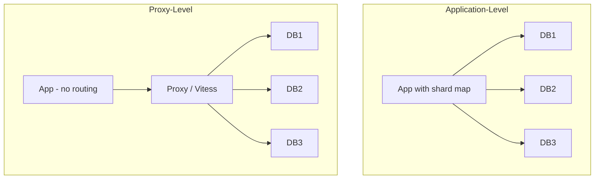
```mermaid
flowchart TD
    subgraph AppLevel["Application-Level"]
        A1[App with shard map] --> D1[DB1]
        A1 --> D2[DB2]
        A1 --> D3[DB3]
    end
    subgraph ProxyLevel["Proxy-Level"]
        A2[App - no routing] --> P[Proxy / Vitess]
        P --> D4[DB1]
        P --> D5[DB2]
        P --> D6[DB3]
    end
```

---

### 📶 Gradual Depth

**Level 1 - What it is:**
Sharding splits a database into multiple smaller databases, each holding a subset of the data. The partition key determines which shard holds a given row. The routing decision is either made by the application or by a proxy sitting between the application and the databases.

**Level 2 - How to use it:**
Choose a partition key that matches your primary query pattern - typically tenant_id for SaaS or user_id for social platforms. With application sharding, maintain a shard map in your service and route connections accordingly. With proxy sharding, configure the proxy (Vitess, Citus, ProxySQL) with the sharding scheme and let it handle routing transparently.

**Level 3 - How it works:**
Hash-based sharding applies a hash function to the partition key and uses modulo arithmetic to assign shards. Range-based sharding assigns contiguous key ranges to each shard. The router intercepts every query, extracts the partition key value, and directs it to the correct backend. Cross-shard queries trigger scatter-gather: the coordinator sends the query to all relevant shards, collects results, and merges them - losing push-down optimizations.

**Level 4 - Production mastery:**
Hot shards emerge when the partition key has skewed distribution. Monitor per-shard query rates and connection counts. Resharding requires a double-write or logical replication migration period. Proxy-level sharding simplifies client upgrades but introduces a latency hop (typically 0.5-2ms) and a failure domain. Application-level sharding avoids that hop but requires every service to stay synchronized on shard map changes - a coordination problem that scales poorly beyond 10-15 services.

---

### ⚙️ How It Works

**Phase 1 - Key extraction:** The router (app code or proxy) parses the query to extract the partition key value from WHERE clauses or INSERT values.

**Phase 2 - Shard resolution:** The key is hashed (or range-matched) against the shard map to identify the target shard.

**Phase 3 - Query routing:** The query is forwarded to the target shard's connection pool. If no partition key is present, the query fans out to all shards (scatter).

**Phase 4 - Result aggregation:** For scatter queries, the coordinator collects partial results, applies ORDER BY/LIMIT/aggregation, and returns the merged result set.

```
  Query: WHERE tenant_id = 42
    |
    v
  Extract key: 42
    |
    v
  hash(42) % 4 = 2 -> Shard 2
    |
    v
  Route to DB-shard-2
    |
    v
  Return result (single shard, fast)
```

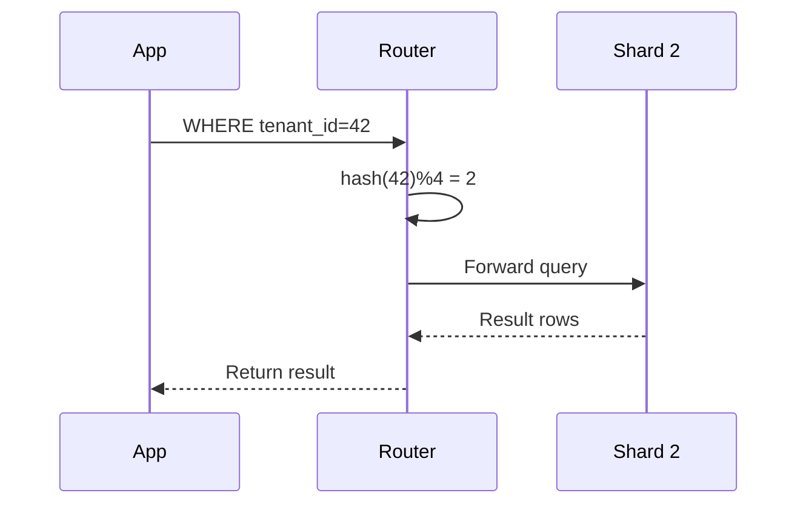
```mermaid
sequenceDiagram
    participant App
    participant Router
    participant S2 as Shard 2
    App->>Router: WHERE tenant_id=42
    Router->>Router: hash(42)%4 = 2
    Router->>S2: Forward query
    S2-->>Router: Result rows
    Router-->>App: Return result
```

**BAD:**

```sql
-- No partition key in query = full scatter
SELECT * FROM orders
WHERE created_at > '2025-01-01'
ORDER BY total DESC LIMIT 10;
-- Hits ALL shards, merges in coordinator
```

**GOOD:**

```sql
-- Partition key in WHERE = single shard
SELECT * FROM orders
WHERE tenant_id = 42
  AND created_at > '2025-01-01'
ORDER BY total DESC LIMIT 10;
```

---

### 🚨 Failure Modes

**Failure 1 - Hot shard from skewed partition key:**
**Symptom:** One shard shows 10x the CPU and I/O of others; connection pool exhaustion on that shard; p99 latency spikes.
**Root cause:** Partition key distribution is uneven (one large tenant, viral user, or popular region dominates a single shard).
**Diagnostic:**

```sql
SELECT shard_id, count(*) AS row_count
FROM shard_metadata
GROUP BY shard_id ORDER BY row_count DESC;
-- Or per-shard: pg_stat_activity connection count
```

**Fix:** Introduce composite partition keys (tenant_id + secondary hash), or move the hot tenant to a dedicated shard. Vitess supports shard splitting for this scenario.

**Failure 2 - Stale shard map during resharding:**
**Symptom:** Queries return empty results or "row not found" errors during a resharding migration.
**Root cause:** Application instances have cached an old shard map while data is being moved to new shards.
**Diagnostic:**

```
-- Check shard map version across app instances
grep "shard_map_version" /app/config/status
-- Compare with coordinator's current version
```

**Fix:** Use a versioned shard map with atomic switchover. Proxy-based systems handle this centrally. For application sharding, use a distributed config store (etcd, Consul) with watch notifications.

---

### 🔬 Production Reality

A common pattern in multi-tenant SaaS: a company starts with a single PostgreSQL instance. At 500 GB, they add read replicas. At 2 TB and 50,000 write TPS, they shard by tenant_id into 16 shards. The initial application-level sharding works for 3 services. By the time 20 services exist, shard map synchronization failures cause routing errors weekly. The team migrates to Citus (proxy-level, PostgreSQL-native) to centralize routing. The migration itself takes months because cross-shard foreign keys must be eliminated first. The lesson: if you expect more than a handful of services to query sharded data, start with proxy-level sharding.

---

### ⚖️ Trade-offs & Alternatives

| Aspect               | App-Level Sharding   | Proxy (Vitess)   | Extension (Citus)  |
| -------------------- | -------------------- | ---------------- | ------------------ |
| Latency overhead     | None (direct)        | +0.5-2ms per hop | Minimal (in-proc)  |
| Routing consistency  | Manual coordination  | Centralized      | Centralized        |
| Cross-shard queries  | Custom code          | Built-in scatter | Built-in scatter   |
| Resharding           | Manual migration     | Online splitting | Online rebalance   |
| Operational overhead | Low infra, high code | Proxy cluster    | Extension per node |
| Client transparency  | None                 | Full             | Full               |

---

### ⚡ Decision Snap

**USE WHEN:**

- Write volume or data size exceeds single-node capacity
- Multi-tenant isolation requires physical separation
- Geographic data residency mandates regional shards

**AVOID WHEN:**

- Read replicas and connection pooling still have headroom
- Workload is read-heavy and cacheable

**PREFER proxy/extension sharding WHEN:**

- More than 5 services query the sharded database
- You need online resharding without application downtime

---

### ⚠️ Top Traps

| #   | Misconception                                 | Reality                                                                                                                          |
| --- | --------------------------------------------- | -------------------------------------------------------------------------------------------------------------------------------- |
| 1   | Sharding solves all scaling problems          | Sharding only scales writes and data volume; read scaling is cheaper with replicas                                               |
| 2   | You can shard later with minimal effort       | Retrofitting sharding into an existing schema requires eliminating cross-shard foreign keys, rewriting joins, and migrating data |
| 3   | Hash sharding guarantees even distribution    | Hash distribution is only as uniform as the key cardinality; low-cardinality keys still create hot shards                        |
| 4   | Cross-shard transactions work like local ones | Distributed transactions require two-phase commit, adding latency and failure modes absent in single-node                        |
| 5   | The partition key choice is reversible        | Changing the partition key means moving every row - effectively a full data migration                                            |

---

### 🪜 Learning Ladder

**Prerequisites:**

- SQL-098 Table Partitioning - Range, List, Hash - single-node partitioning that sharding extends across machines
- SQL-102 Connection Pooling - PgBouncer and HikariCP - connection management that sharding multiplies
- SQL-101 Read Replicas - Scaling Reads - the simpler scaling step before sharding

**THIS:** SQL-113 Sharding Strategies - Application vs Proxy

**Next steps:**

- SQL-114 Multi-Database Topology Design - broader architecture patterns for multi-instance deployments
- SQL-119 Connection Routing and Proxy Architecture - the proxy layer that sharding relies on
- SQL-115 Cross-Database Query Federation (FDW, Trino) - querying across shards and heterogeneous databases

**The Surprising Truth:**
Most teams shard too early. The majority of PostgreSQL workloads that appear to need sharding actually need better indexing, connection pooling, and read replicas - interventions that are 10x cheaper and fully reversible.

**Further Reading:**

- Corbett, J. et al. "Spanner: Google's Globally-Distributed Database", OSDI 2012
- Vitess Documentation: "Sharding" (vitess.io/docs/concepts/shard/)
- PostgreSQL Wiki: "Horizontal Scaling" (wiki.postgresql.org/wiki/Horizontal_Scaling)

**Revision Card:**

1. Sharding splits data by partition key; the key choice is the most consequential and least reversible decision
2. Application-level routing is simpler to start but fails at coordination scale; proxy-level centralizes routing at a latency cost
3. Cross-shard queries are always expensive - design the partition key so 95%+ of queries hit a single shard

---

---

# SQL-114 Multi-Database Topology Design

**TL;DR** - Multi-database topology defines how primary, replica, analytical, and archive database instances are organized, connected, and routed to serve different workload classes simultaneously.

---

### 🔥 Problem Statement

A single database instance cannot optimally serve OLTP writes, analytical reads, full-text search, and long-term archival simultaneously. OLTP needs low-latency random access. Analytics needs sequential scans over large datasets. Search needs inverted indexes. Running all on one instance creates resource contention: a reporting query consumes buffer pool pages that OLTP needs, autovacuum competes with write throughput, and connection limits force trade-offs between workloads. At production scale, you need a topology - a deliberate arrangement of specialized instances with clear routing rules that send each query class to the instance optimized for it.

---

### 📜 Historical Context

Early database deployments used a single primary for everything. Read replicas emerged in the 2000s as a scaling pattern (MySQL replication, PostgreSQL streaming replication). The separation of OLTP and OLAP into dedicated systems became formalized as the "polyglot persistence" pattern around 2011 (coined by Martin Fowler). Cloud managed databases (Aurora, Cloud SQL, AlloyDB) have simplified topology management by offering built-in read replicas and analytical endpoints, but the architectural decisions remain the same.

---

### 🔩 First Principles

**CORE INVARIANTS:**

1. Different workload classes (OLTP, OLAP, search, archive) have conflicting resource requirements that a single instance cannot satisfy simultaneously
2. Data flows between topology nodes via replication, and replication lag introduces consistency trade-offs at every boundary
3. Routing correctness requires that write-after-read semantics respect the lag between primary and replicas

**DERIVED DESIGN:**
These invariants force a topology where one primary handles writes, dedicated replicas serve reads (accepting lag), and specialized instances (columnar for analytics, Elasticsearch for search) receive data via change data capture or logical replication. Each node type is tuned independently: the primary optimizes for WAL throughput, replicas for buffer pool hit ratio, analytics for scan bandwidth.

**THE TRADE-OFF:**
**Gain:** Each workload class gets optimal resource allocation; failures in one tier do not cascade to others.
**Cost:** Operational complexity; replication lag management; data consistency windows between tiers.

---

### 🧠 Mental Model

> Think of a hospital with specialized departments. The ER (primary) handles urgent cases. The lab (analytics replica) runs slow but thorough tests. The pharmacy (search) has its own optimized index. The archive room stores old records. Patients (data) flow between departments, but each is staffed and equipped for its purpose.

- "ER" -> primary database (writes + critical reads)
- "Lab" -> analytical replica or data warehouse
- "Pharmacy index" -> search engine (Elasticsearch)
- "Patient transfer" -> replication / CDC

**Where this analogy breaks down:** Unlike hospital departments that operate independently, database topology nodes must handle the case where a "patient" just transferred (written to primary) but has not yet "arrived" (replicated) at the lab - the replication lag problem.

---

### 🧩 Components

- **Primary instance** - single source of truth for writes; streams WAL to replicas
- **Synchronous replica** - zero-lag follower for high-availability failover
- **Asynchronous read replicas** - lag-tolerant copies serving read queries
- **Analytical replica/warehouse** - columnar or tuned instance for OLAP workloads
- **Search tier** - Elasticsearch or similar, fed by CDC or logical replication
- **Archive tier** - cold storage (S3 + Parquet, or partitioned tables) for historical data
- **Connection router** - proxy or application logic directing queries to the appropriate tier

```
              Writes
  App -------> [Primary]
    |             |
    |        WAL Stream
    |          /     \
    |   [Sync       [Async
    |   Replica]    Replicas]
    |                  |
    |           Logical Repl / CDC
    |              /         \
    |    [Analytics]    [Search Tier]
    |
    +-----> [Archive / Cold Storage]
```

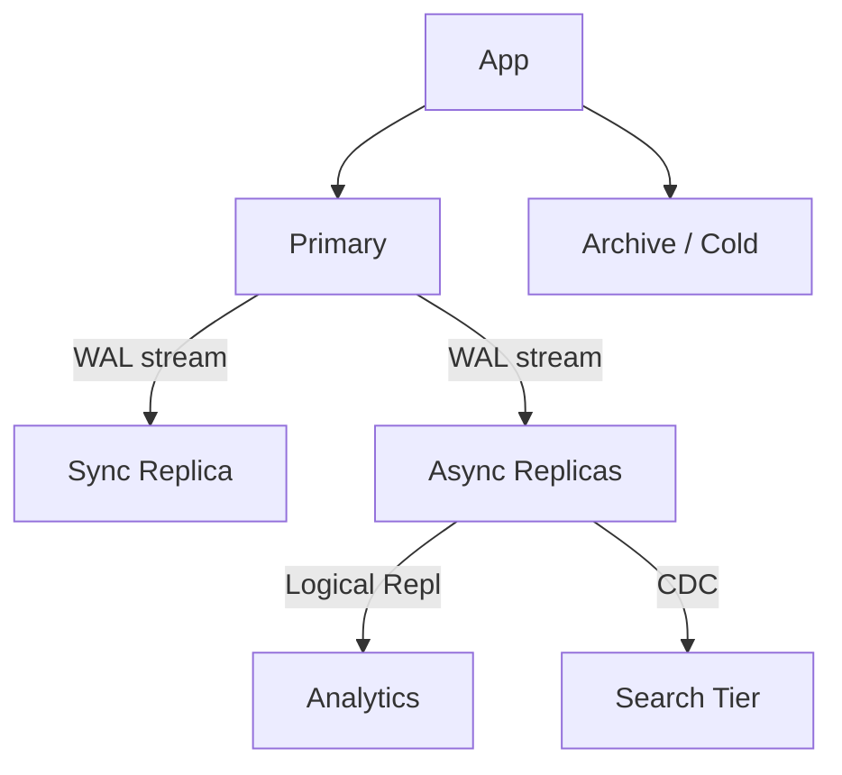
```mermaid
flowchart TD
    App --> Primary
    Primary -->|WAL stream| Sync[Sync Replica]
    Primary -->|WAL stream| Async[Async Replicas]
    Async -->|Logical Repl| Analytics
    Async -->|CDC| Search[Search Tier]
    App --> Archive[Archive / Cold]
```

---

### 📶 Gradual Depth

**Level 1 - What it is:**
Multi-database topology is the architectural blueprint that places different database instances in specialized roles - primary for writes, replicas for reads, and dedicated systems for analytics, search, and archival.

**Level 2 - How to use it:**
Start with a primary and one synchronous replica for HA failover. Add asynchronous replicas when read traffic exceeds what the primary can serve. Route reads to replicas at the application or proxy level. Introduce CDC (Debezium, pg_logical) to feed analytics or search tiers when those workloads emerge.

**Level 3 - How it works:**
The primary writes WAL records. Synchronous replicas acknowledge WAL receipt before the primary confirms the commit (zero data loss, higher commit latency). Asynchronous replicas apply WAL in the background (data loss window equals lag). Logical replication decodes WAL into row-level changes that feed heterogeneous subscribers. The router must know which queries tolerate lag and which must go to the primary.

**Level 4 - Production mastery:**
Monitor replication lag on every replica (`pg_stat_replication.replay_lag`). Set application-level lag tolerance: after a write, read from the primary for N seconds, then fall back to replicas. Use connection-level routing hints (e.g., `target_session_attrs=read-write` in libpq) to avoid accidental writes to replicas. Capacity plan each tier independently - the analytics tier may need 4x the storage but 0.1x the IOPS of the primary.

---

### ⚙️ How It Works

**Phase 1 - Write path:** Application connects to the primary (via router or direct). The primary executes the write, writes WAL, and returns confirmation.

**Phase 2 - Replication fan-out:** WAL streams to synchronous replica (blocking until ACK) and asynchronous replicas (non-blocking). Logical replication slots decode WAL for downstream consumers.

**Phase 3 - Read routing:** The connection router classifies incoming queries. Writes and read-after-write go to the primary. Stale-tolerant reads go to replicas. Analytical queries go to the analytics tier.

**Phase 4 - Tiered data lifecycle:** Partitioned tables on the primary drop or detach old partitions. Archived data moves to cold storage (S3 + Parquet) via scheduled jobs. The analytics tier may retain historical data longer than the primary.

```
  WRITE: App -> Router -> Primary
  READ:  App -> Router -> check lag
            |-> lag < threshold -> Replica
            |-> lag > threshold -> Primary
  OLAP:  App -> Router -> Analytics Tier
```

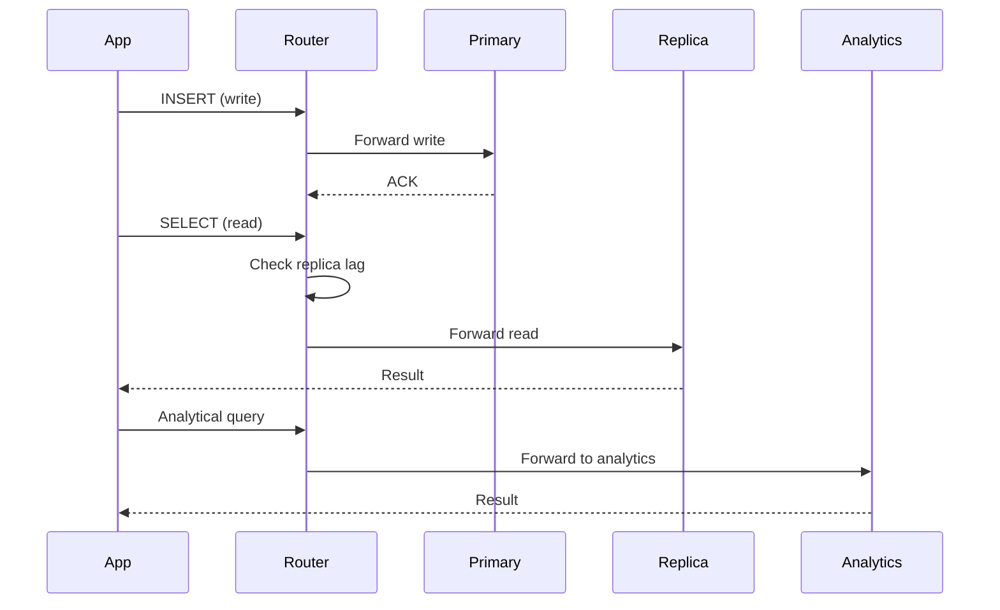
```mermaid
sequenceDiagram
    participant App
    participant Router
    participant Primary
    participant Replica
    participant OLAP as Analytics
    App->>Router: INSERT (write)
    Router->>Primary: Forward write
    Primary-->>Router: ACK
    App->>Router: SELECT (read)
    Router->>Router: Check replica lag
    Router->>Replica: Forward read
    Replica-->>App: Result
    App->>Router: Analytical query
    Router->>OLAP: Forward to analytics
    OLAP-->>App: Result
```

**BAD:**

```yaml
# All traffic to one instance
connection:
  host: primary.db.internal
  # Analytics queries compete with OLTP
  # Reporting locks block writes
```

**GOOD:**

```yaml
# Routed by workload class
connections:
  write: primary.db.internal
  read: replica.db.internal
  analytics: analytics.db.internal
  search: elasticsearch.internal
```

---

### 🚨 Failure Modes

**Failure 1 - Replica lag causes stale reads after writes:**
**Symptom:** User creates an order, immediately views their orders, and the new order is missing.
**Root cause:** The read was routed to a replica that has not yet applied the WAL record for the INSERT.
**Diagnostic:**

```sql
SELECT client_addr,
       replay_lag
FROM pg_stat_replication;
```

**Fix:** Implement read-your-writes consistency: after a write, pin subsequent reads to the primary for a configurable window (e.g., 5 seconds), then fall back to replicas.

**Failure 2 - Replication slot bloat halts primary:**
**Symptom:** Primary disk fills up; `pg_wal` directory grows unbounded; WAL segments are not recycled.
**Root cause:** A logical replication slot's consumer (CDC pipeline, analytics subscriber) is down, and the primary retains all WAL since the slot's last confirmed LSN.
**Diagnostic:**

```sql
SELECT slot_name, active,
       pg_wal_lsn_diff(
         pg_current_wal_lsn(),
         confirmed_flush_lsn
       ) AS lag_bytes
FROM pg_replication_slots;
```

**Fix:** Set `max_slot_wal_keep_size` to cap retained WAL. Monitor slot lag and alert when it exceeds a threshold. Drop orphaned slots.

---

### 🔬 Production Reality

A common incident pattern: a team adds a Debezium CDC connector to feed Elasticsearch from the primary via a logical replication slot. The Kafka consumer falls behind due to a schema change, and the slot retains WAL. Over 48 hours, `pg_wal` grows from 2 GB to 200 GB. The primary's disk fills, transactions begin failing, and the OLTP workload halts. The fix is dropping the slot - but that means the Elasticsearch index must be rebuilt from scratch. The lesson: every replication slot is a ticking bomb without lag monitoring and automatic slot eviction policies.

---

### ⚖️ Trade-offs & Alternatives

| Aspect                | Separate Instances  | Aurora Multi-AZ     | AlloyDB (Google)    |
| --------------------- | ------------------- | ------------------- | ------------------- |
| Replication lag       | Configurable        | Near-zero (storage) | Near-zero (storage) |
| Operational overhead  | High (self-managed) | Low (managed)       | Low (managed)       |
| Cost control          | Fine-grained        | Cloud pricing       | Cloud pricing       |
| Cross-tier routing    | Manual / proxy      | Endpoint-based      | Endpoint-based      |
| Analytics integration | CDC + warehouse     | Aurora ML / export  | AlloyDB AI          |
| Vendor lock-in        | None                | High (AWS)          | High (GCP)          |

---

### ⚡ Decision Snap

**USE WHEN:**

- OLTP and analytics workloads compete for resources on a single instance
- Read traffic exceeds primary capacity
- Compliance requires data tiering (hot/warm/cold)

**AVOID WHEN:**

- A single instance handles all workloads within resource limits
- The operational team cannot manage multi-instance replication

**PREFER managed multi-AZ (Aurora, AlloyDB) WHEN:**

- Storage-level replication is acceptable
- Minimizing operational overhead outweighs vendor lock-in risk

---

### ⚠️ Top Traps

| #   | Misconception                                 | Reality                                                                                                            |
| --- | --------------------------------------------- | ------------------------------------------------------------------------------------------------------------------ |
| 1   | Replicas are free scaling                     | Each replica consumes WAL bandwidth and adds monitoring overhead; diminishing returns beyond 5-7 replicas          |
| 2   | Replication lag is always small               | Network partitions, long-running queries on replicas, and VACUUM on replicas can spike lag to minutes              |
| 3   | Logical replication = physical replication    | Logical replication decodes WAL into row changes and skips DDL; it has different failure modes and higher overhead |
| 4   | Adding a search tier eliminates database load | CDC pipelines add replication slots to the primary, which retain WAL and consume I/O                               |
| 5   | All reads can go to replicas                  | Reads that follow writes must go to the primary unless the application implements lag-aware routing                |

---

### 🪜 Learning Ladder

**Prerequisites:**

- SQL-100 Logical Replication and Physical Replication - how data flows between topology nodes
- SQL-101 Read Replicas - Scaling Reads - the simplest topology expansion
- SQL-102 Connection Pooling - PgBouncer and HikariCP - connection management at each tier

**THIS:** SQL-114 Multi-Database Topology Design

**Next steps:**

- SQL-116 CQRS and Read/Write Separation Architecture - formalizing the read/write split as an architectural pattern
- SQL-119 Connection Routing and Proxy Architecture - the routing layer that directs traffic across the topology
- SQL-121 Observability for Database Fleets - monitoring the health of a multi-instance deployment

**The Surprising Truth:**
The hardest part of multi-database topology is not setting up replication - it is the routing logic that decides which instance handles each query, because getting that wrong silently serves stale data or accidentally sends writes to read-only replicas.

**Further Reading:**

- Kleppmann, M. "Designing Data-Intensive Applications", Chapter 5: Replication. O'Reilly, 2017
- PostgreSQL Documentation: "High Availability, Load Balancing, and Replication" (postgresql.org/docs/current/high-availability.html)
- Verbitski, A. et al. "Amazon Aurora: Design Considerations for High Throughput Cloud-Native Relational Databases", SIGMOD 2017

**Revision Card:**

1. Separate OLTP, analytics, search, and archive into dedicated tiers - each tuned for its workload class
2. Every replication boundary introduces a consistency window; route queries according to their staleness tolerance
3. Replication slots without lag monitoring are the most common cause of primary disk exhaustion

---

---

# SQL-115 Cross-Database Query Federation (FDW, Trino)

**TL;DR** - Query federation lets a single SQL query access data across multiple heterogeneous databases using foreign data wrappers (FDW) or federated query engines like Trino, without moving data first.

---

### 🔥 Problem Statement

Production systems accumulate data across multiple databases: transactional data in PostgreSQL, user events in ClickHouse, logs in Elasticsearch, files in S3. Business queries frequently need to join data across these boundaries - "show me all orders from customers whose support tickets are in Zendesk and whose clickstream is in BigQuery." Without federation, teams build ETL pipelines to copy data into a single warehouse, adding hours of latency, storage costs, and pipeline maintenance. Federation queries data in place. But federation introduces network round-trips, data type mismatches, and optimizer blind spots that make naive federated queries catastrophically slow.

---

### 📜 Historical Context

SQL/MED (Management of External Data) was added to the SQL:2003 standard, defining the concept of foreign data wrappers. PostgreSQL implemented FDW support in version 9.1 (2011), starting with `file_fdw` and rapidly expanding to `postgres_fdw`, `mysql_fdw`, and dozens of community wrappers. Facebook's Presto (2013, later forked as Trino in 2020) took a different approach: a distributed SQL engine that connects to multiple data sources as catalogs, pushing computation down where possible. Both approaches solve the same problem from different sides - database-native (FDW) vs. engine-native (Trino).

---

### 🔩 First Principles

**CORE INVARIANTS:**

1. Federated queries always pay a network transfer cost proportional to the data pulled from remote sources
2. The local optimizer cannot accurately estimate selectivity or cost for remote tables unless statistics are explicitly imported
3. Push-down capability (filtering, aggregation at the remote source) determines whether federation is practical or catastrophically slow

**DERIVED DESIGN:**
These invariants force the design toward maximum push-down: send filters and aggregations to the remote source, transfer only the minimal result. FDW achieves this through `use_remote_estimate` and push-down of WHERE, JOIN, and aggregate clauses. Trino achieves it through connector-level push-down predicates. Without push-down, federation devolves into "pull everything, filter locally" - the N+1 query problem at the database topology level.

**THE TRADE-OFF:**
**Gain:** Query data in place without ETL; single SQL interface across heterogeneous sources; real-time access to remote data.
**Cost:** Network latency per query; limited optimizer intelligence on remote tables; operational dependency on remote source availability.

---

### 🧠 Mental Model

> Think of a library consortium where your local library can request books from partner libraries. You search one catalog, and books arrive from whichever library holds them. Fast when you need one specific book (push-down - the remote library finds it). Catastrophically slow when you request "all books published before 1950" from every library (full scan, ship everything).

- "Local library catalog" -> local PostgreSQL with foreign tables
- "Partner library" -> remote database (MySQL, ClickHouse, S3)
- "Specific book request" -> pushed-down WHERE clause
- "Ship all books" -> no push-down, full remote scan

**Where this analogy breaks down:** Libraries ship physical books serially; federated queries can parallelize data transfer across multiple remote sources simultaneously (especially Trino).

---

### 🧩 Components

- **Foreign data wrapper (FDW)** - PostgreSQL extension that maps remote tables into the local catalog as "foreign tables"
- **Foreign server** - connection definition pointing to a remote data source
- **Foreign table** - local schema definition that proxies a remote table
- **User mapping** - credentials used to authenticate against the remote source
- **Federated query engine (Trino)** - standalone engine that connects to multiple catalogs and executes distributed SQL
- **Connector** - Trino plugin for each data source type (PostgreSQL, Hive, S3, Elasticsearch)

```
  PostgreSQL FDW Approach:
  +-------------------+
  | Local PostgreSQL  |
  |  local_table  <---+--- native
  |  foreign_table <--+--- postgres_fdw -> Remote PG
  |  s3_table     <---+--- parquet_s3_fdw -> S3
  +-------------------+

  Trino Approach:
  +--------+
  | Trino  |--- pg connector --> PostgreSQL
  | Engine |--- hive connector -> S3/Parquet
  |        |--- elastic conn --> Elasticsearch
  +--------+
```

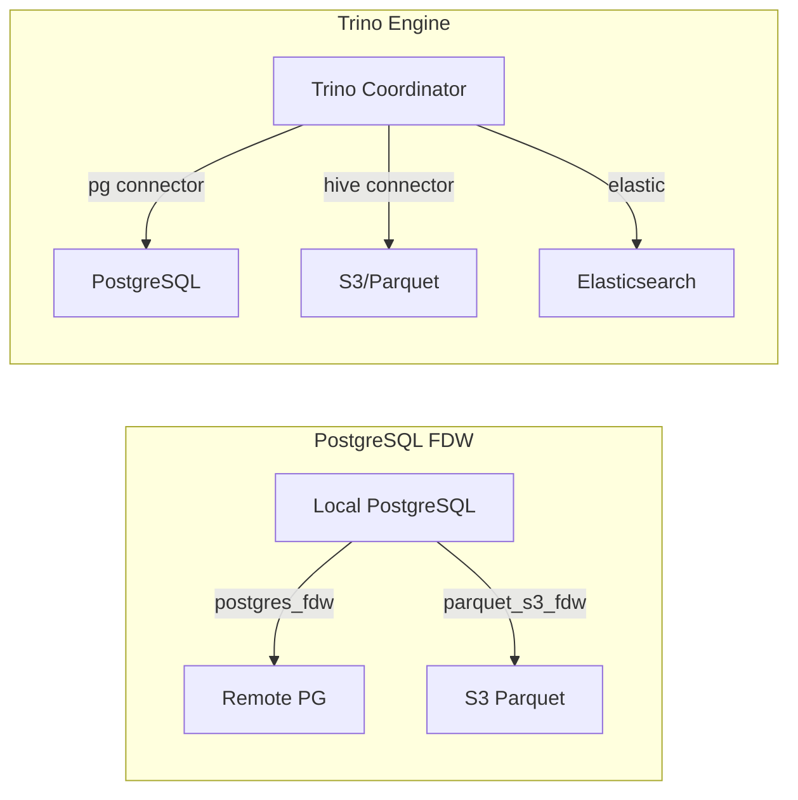
```mermaid
flowchart LR
    subgraph FDW["PostgreSQL FDW"]
        PG[Local PostgreSQL]
        PG -->|postgres_fdw| RPG[Remote PG]
        PG -->|parquet_s3_fdw| S3[S3 Parquet]
    end
    subgraph Trino["Trino Engine"]
        T[Trino Coordinator]
        T -->|pg connector| PG2[PostgreSQL]
        T -->|hive connector| S32[S3/Parquet]
        T -->|elastic| ES[Elasticsearch]
    end
```

---

### 📶 Gradual Depth

**Level 1 - What it is:**
Query federation lets you write a single SQL query that accesses tables in different databases - even different database engines - without copying data into one place first.

**Level 2 - How to use it:**
In PostgreSQL, create a foreign server and foreign table using `postgres_fdw`, then query the foreign table like a local table. In Trino, configure catalogs in `etc/catalog/` and write queries referencing `catalog.schema.table`. Start with simple SELECT queries before attempting cross-source JOINs.

**Level 3 - How it works:**
When PostgreSQL plans a query involving a foreign table, it calls the FDW's planning callbacks to determine what can be pushed down remotely. `postgres_fdw` can push down WHERE clauses, JOINs between tables on the same remote server, sorts, and aggregates. The remote server executes the pushed-down portion and returns only the needed rows. Trino's optimizer does similar push-down analysis per connector, then coordinates distributed execution across workers.

**Level 4 - Production mastery:**
Always set `use_remote_estimate = true` on foreign servers so the local planner uses remote ANALYZE statistics. Monitor federation query plans with `EXPLAIN (VERBOSE)` to verify push-down. Never join a large remote table with a large local table without a pushed-down filter - the planner will fetch the entire remote table. For large-scale analytics across 3+ sources, Trino typically outperforms FDW because it parallelizes execution and handles heterogeneous JOINs natively.

---

### ⚙️ How It Works

**Phase 1 - Schema mapping:** Define foreign servers and foreign tables that mirror remote schema structures in the local catalog.

**Phase 2 - Query planning:** The planner identifies foreign tables in the query. For each, it invokes the FDW to determine push-down eligibility (WHERE, JOIN, ORDER BY, LIMIT, aggregates).

**Phase 3 - Remote execution:** The FDW opens a connection to the remote server, sends the pushed-down SQL fragment, and reads the result set.

**Phase 4 - Local assembly:** Results from remote fragments are combined with local table data. JOINs, sorting, and aggregation that could not be pushed down execute locally.

```
  SELECT o.id, c.name
  FROM orders o          -- local table
  JOIN remote_customers c -- foreign table
    ON o.cust_id = c.id
  WHERE c.region = 'EU'

  Plan:
  1. Push WHERE region='EU' to remote
  2. Remote returns EU customers only
  3. Local hash join with orders
```

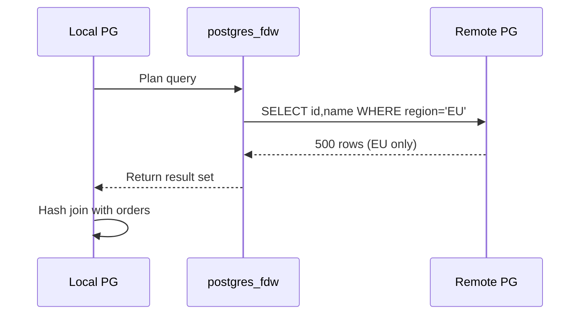
```mermaid
sequenceDiagram
    participant Local as Local PG
    participant FDW as postgres_fdw
    participant Remote as Remote PG
    Local->>FDW: Plan query
    FDW->>Remote: SELECT id,name WHERE region='EU'
    Remote-->>FDW: 500 rows (EU only)
    FDW-->>Local: Return result set
    Local->>Local: Hash join with orders
```

**BAD:**

```sql
-- No pushable filter on remote table
SELECT * FROM local_orders o
JOIN remote_customers c ON o.cust_id = c.id;
-- Fetches ALL remote customers (millions)
```

**GOOD:**

```sql
-- Filter pushed to remote source
SELECT o.id, c.name
FROM local_orders o
JOIN remote_customers c ON o.cust_id = c.id
WHERE c.region = 'EU' AND o.created > now()
  - interval '30 days';
```

---

### 🚨 Failure Modes

**Failure 1 - Full remote table scan due to missing push-down:**
**Symptom:** Federation query takes minutes instead of seconds; network bandwidth saturated; remote server under heavy load.
**Root cause:** The WHERE clause uses a function or type cast that the FDW cannot push down, so it fetches all rows and filters locally.
**Diagnostic:**

```sql
EXPLAIN (VERBOSE, COSTS)
SELECT * FROM foreign_table
WHERE lower(email) = 'user@example.com';
-- Check "Remote SQL" - if no WHERE, no push-down
```

**Fix:** Rewrite the query to use pushable expressions. Create a functional index on the remote side. Or use `fetch_size` to limit memory impact while accepting the slow scan.

**Failure 2 - Remote server unavailability halts local queries:**
**Symptom:** Queries referencing foreign tables hang or error with "could not connect to server"; local-only queries unaffected.
**Root cause:** The remote database is down or unreachable, and the FDW connection attempt blocks.
**Diagnostic:**

```sql
-- Check for stuck backends
SELECT pid, state, query, wait_event
FROM pg_stat_activity
WHERE query LIKE '%foreign_table%';
```

**Fix:** Set `connect_timeout` and `statement_timeout` on the foreign server definition. Design queries so foreign table access is optional (LEFT JOIN with COALESCE fallback) where possible.

---

### 🔬 Production Reality

A typical federation failure pattern: an analytics team creates a foreign table pointing to a 500-million-row production table on another PostgreSQL instance. They run a JOIN with a local dimension table. The FDW pushes down the WHERE clause but cannot push down the JOIN itself (different servers). It fetches 500 million rows over the network. The remote server's connection pool is saturated. The local instance's memory spikes. Both production and analytics workloads degrade. The fix: materialize the remote table's filtered subset locally (a nightly `INSERT INTO local_copy SELECT ... FROM foreign_table WHERE ...`), or move the analytical query to Trino where cross-source JOINs execute distributedly.

---

### ⚖️ Trade-offs & Alternatives

| Aspect               | PostgreSQL FDW      | Trino / Presto      | ETL to Warehouse    |
| -------------------- | ------------------- | ------------------- | ------------------- |
| Query latency        | Network-bound       | Parallel, faster    | Local (pre-copied)  |
| Data freshness       | Real-time           | Real-time           | Batch lag (hours)   |
| Setup complexity     | Low (extension)     | Medium (cluster)    | High (pipeline)     |
| Cross-source JOINs   | Limited (same srv)  | Native              | Native (local)      |
| Push-down quality    | Good (postgres_fdw) | Varies by connector | N/A (data is local) |
| Operational overhead | Low                 | Trino cluster       | ETL pipeline ops    |

---

### ⚡ Decision Snap

**USE WHEN:**

- Queries need fresh data from 2-3 heterogeneous sources
- Data volumes are small enough that network transfer is acceptable
- ETL pipeline latency is unacceptable for the use case

**AVOID WHEN:**

- Queries routinely scan millions of rows from remote sources
- Remote source availability is unreliable

**PREFER ETL to warehouse WHEN:**

- Analytics queries are repeatable and can tolerate batch latency
- Join patterns span 4+ heterogeneous sources

---

### ⚠️ Top Traps

| #   | Misconception                                     | Reality                                                                                                                 |
| --- | ------------------------------------------------- | ----------------------------------------------------------------------------------------------------------------------- |
| 1   | FDW makes remote tables "feel local"              | Performance is fundamentally different; every query pays network latency and may miss push-down                         |
| 2   | The local optimizer handles foreign tables well   | Without `use_remote_estimate`, the planner assumes default selectivity and produces terrible plans                      |
| 3   | Trino eliminates the need for a data warehouse    | Trino queries data in place, which is slower than querying pre-optimized warehouse tables for repetitive analytics      |
| 4   | Foreign table JOINs push down automatically       | JOINs only push down when both foreign tables are on the same remote server; cross-server JOINs execute locally         |
| 5   | Federation handles schema evolution automatically | When the remote schema changes, foreign table definitions become stale and queries break silently or return wrong types |

---

### 🪜 Learning Ladder

**Prerequisites:**

- SQL-094 Query Planner and Cost-Based Optimization - how the planner estimates costs, which federation disrupts
- SQL-100 Logical Replication and Physical Replication - the alternative: replicate data locally instead of federating
- SQL-113 Sharding Strategies - Application vs Proxy - routing queries to the right database

**THIS:** SQL-115 Cross-Database Query Federation (FDW, Trino)

**Next steps:**

- SQL-114 Multi-Database Topology Design - the broader architecture that federation operates within
- SQL-116 CQRS and Read/Write Separation Architecture - separating read paths that may include federated queries
- SQL-133 Column-Store vs Row-Store Engine Design - understanding why analytical sources use different storage

**The Surprising Truth:**
The most common federation performance disaster is not slow networks - it is the local optimizer making terrible decisions because it has no statistics for foreign tables, producing plans that are orders of magnitude worse than the same query executed directly on the remote source.

**Further Reading:**

- ISO/IEC 9075-9: SQL/MED (Management of External Data), SQL:2003 Standard
- PostgreSQL Documentation: "postgres_fdw" (postgresql.org/docs/current/postgres-fdw.html)
- Sethi, R. et al. "Presto: SQL on Everything", ICDE 2019

**Revision Card:**

1. Federation queries data in place without ETL, but pays network transfer cost proportional to un-pushed data
2. Push-down is the critical performance lever - verify with EXPLAIN VERBOSE that filters reach the remote source
3. Without remote statistics (`use_remote_estimate`), the local planner is effectively blind on foreign tables

---

---

# SQL-116 CQRS and Read/Write Separation Architecture

**TL;DR** - CQRS separates the write model (commands) from the read model (queries) into distinct data paths, enabling each to be optimized, scaled, and evolved independently.

---

### 🔥 Problem Statement

Traditional CRUD architectures use a single data model for both reads and writes. This works until reads and writes have fundamentally different shapes. Writes are normalized, transactional, and consistency-critical. Reads are often denormalized, join-heavy, and latency-sensitive. A product page needs data from orders, inventory, reviews, and recommendations - a 5-table JOIN that cripples write throughput when indexed to support it. At scale, the read-to-write ratio is often 100:1 or higher, yet a single schema forces both paths through the same tables, indexes, and connection pools. CQRS lets you build a write model optimized for data integrity and a read model optimized for query speed.

---

### 📜 Historical Context

The term CQRS (Command Query Responsibility Segregation) was coined by Greg Young around 2010, building on Bertrand Meyer's Command-Query Separation (CQS) principle from the 1980s. CQS is a method-level concern: a method either changes state or returns data, never both. CQRS elevates this to an architectural concern: the system that processes commands is separate from the system that answers queries. The pattern gained traction alongside event sourcing and domain-driven design communities. Martin Fowler documented its trade-offs in a widely-cited 2011 article cautioning against applying CQRS universally.

---

### 🔩 First Principles

**CORE INVARIANTS:**

1. Commands (writes) and queries (reads) have different consistency, latency, and throughput requirements that a single model cannot simultaneously optimize
2. Separating the write model from the read model introduces eventual consistency between them - the read model lags behind the write model
3. The synchronization mechanism between write and read models (events, CDC, replication) becomes a critical reliability concern

**DERIVED DESIGN:**
Commands flow through a write-optimized model (normalized, transactionally consistent). Changes are published as events or captured via CDC. The read model consumes these events and maintains denormalized, pre-joined projections optimized for each query pattern. Multiple read models can coexist - one for API responses, another for search, another for analytics - each shaped to its consumer.

**THE TRADE-OFF:**
**Gain:** Independent scaling and optimization of reads and writes; read models tailored to specific query patterns; write model free from read-driven index bloat.
**Cost:** Eventual consistency complexity; event synchronization pipeline to build and maintain; increased system surface area.

---

### 🧠 Mental Model

> Think of a restaurant kitchen (write side) and menu board (read side). The kitchen takes orders (commands) and updates ingredient inventory. The menu board (read model) is a pre-composed view of what is available, updated whenever the kitchen finishes a dish or runs out of an ingredient. Customers never walk into the kitchen to check stock - they read the board.

- "Kitchen" -> write model (normalized, transactional)
- "Menu board" -> read model (denormalized projection)
- "Updating the board" -> event/CDC pipeline
- "Board is slightly behind" -> eventual consistency

**Where this analogy breaks down:** Unlike a menu board that updates instantly when the kitchen calls out, real CQRS read models can lag by seconds to minutes, and consumers must handle the possibility that their read is stale.

---

### 🧩 Components

- **Command handler** - validates and executes write operations against the write model
- **Write store** - normalized database optimized for transactional integrity (PostgreSQL, typically)
- **Event publisher** - emits domain events or change notifications after each write (outbox pattern, CDC, or direct publish)
- **Event bus** - transport layer (Kafka, RabbitMQ, or logical replication) delivering events to consumers
- **Projection builder** - consumes events and maintains the read model (materialized views, denormalized tables, search indexes)
- **Read store** - denormalized database or cache optimized for query speed (PostgreSQL read replica, Redis, Elasticsearch)
- **Query handler** - serves read requests from the read store

```
  Command Flow:
  App -> Command Handler -> Write DB
              |
         Event Published
              |
              v
         Event Bus (Kafka / CDC)
              |
              v
  Projection Builder -> Read DB

  Query Flow:
  App -> Query Handler -> Read DB
```

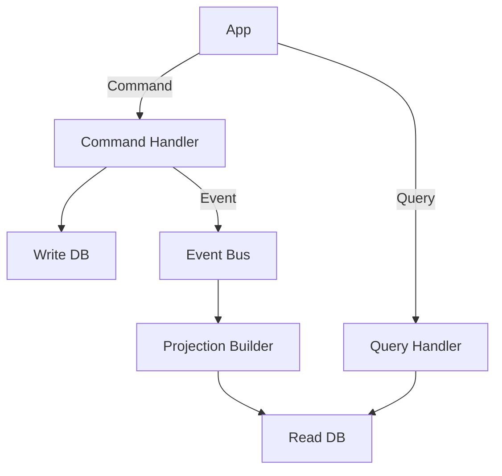
```mermaid
flowchart TD
    App -->|Command| CH[Command Handler]
    CH --> WDB[Write DB]
    CH -->|Event| EB[Event Bus]
    EB --> PB[Projection Builder]
    PB --> RDB[Read DB]
    App -->|Query| QH[Query Handler]
    QH --> RDB
```

---

### 📶 Gradual Depth

**Level 1 - What it is:**
CQRS is an architecture where writes go through one path (command side) and reads go through a separate path (query side), each with its own data model optimized for its purpose.

**Level 2 - How to use it:**
On the write side, use a normalized PostgreSQL schema with strict constraints. After each write, publish an event (via transactional outbox or CDC). On the read side, consume events to build denormalized projections - pre-joined tables, materialized views, or Elasticsearch indexes. Serve all read API endpoints from the read store.

**Level 3 - How it works:**
The write side processes commands transactionally and emits events. The event bus (Kafka, Debezium CDC) delivers events to projection builders. Each projection builder maintains a specific read model - for example, an "order summary" view that pre-joins orders, customers, and products into a single table. The read store answers queries with simple lookups instead of complex JOINs. Consistency between write and read stores is eventual, bounded by event pipeline throughput and consumer lag.

**Level 4 - Production mastery:**
The critical production concern is projection rebuild. When the read model schema changes, you must replay all historical events to rebuild the projection from scratch. This requires events to be retained (Kafka retention or event store). Monitor consumer lag as the primary health metric. Use idempotent event handlers to tolerate at-least-once delivery. The transactional outbox pattern (write event to a DB table in the same transaction as the command, then relay asynchronously) prevents the dual-write problem where a command succeeds but event publishing fails.

---

### ⚙️ How It Works

**Phase 1 - Command processing:** The application sends a command (e.g., "place order"). The command handler validates business rules, writes to the normalized write store, and atomically inserts an event record into the outbox table.

**Phase 2 - Event relay:** A CDC connector (Debezium) or polling process reads the outbox table and publishes events to Kafka.

**Phase 3 - Projection update:** A consumer reads events from Kafka and updates the read store (e.g., inserts a denormalized `order_summary` row with customer name, product details, and totals pre-computed).

**Phase 4 - Query serving:** Read API endpoints query the read store with simple `SELECT` statements - no JOINs, no aggregations at query time.

```
  1. INSERT INTO orders (...) VALUES (...)
  2. INSERT INTO outbox (event_type, payload)
       VALUES ('OrderPlaced', '{...}')
     -- same transaction
  3. CDC reads outbox -> publishes to Kafka
  4. Consumer reads Kafka -> writes to
     order_summary (denormalized)
  5. GET /orders/123 -> SELECT * FROM
     order_summary WHERE id = 123
```

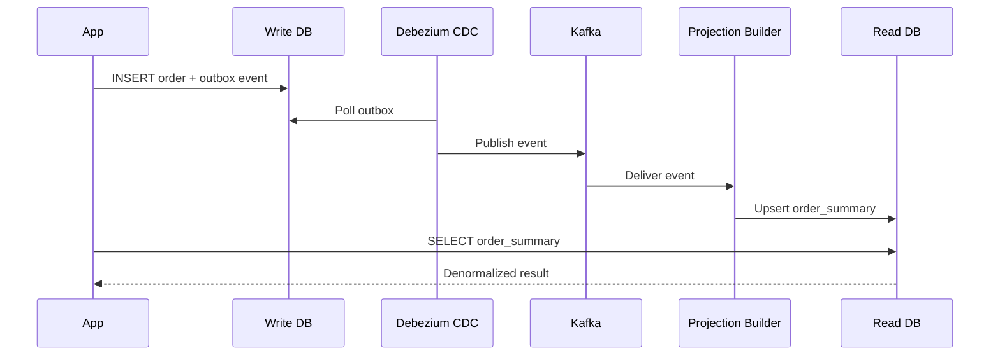
```mermaid
sequenceDiagram
    participant App
    participant WritePG as Write DB
    participant CDC as Debezium CDC
    participant Kafka
    participant Proj as Projection Builder
    participant ReadDB as Read DB
    App->>WritePG: INSERT order + outbox event
    CDC->>WritePG: Poll outbox
    CDC->>Kafka: Publish event
    Kafka->>Proj: Deliver event
    Proj->>ReadDB: Upsert order_summary
    App->>ReadDB: SELECT order_summary
    ReadDB-->>App: Denormalized result
```

**BAD:**

```sql
-- Single model: read query with 5 JOINs
SELECT o.id, c.name, p.title, r.avg_rating
FROM orders o
JOIN customers c ON o.cust_id = c.id
JOIN order_items i ON o.id = i.order_id
JOIN products p ON i.product_id = p.id
JOIN reviews r ON p.id = r.product_id
WHERE o.id = 123;
```

**GOOD:**

```sql
-- CQRS read model: pre-joined projection
SELECT id, customer_name, product_title,
       avg_rating, total_amount
FROM order_summary
WHERE id = 123;
-- Single table, no JOINs, sub-ms response
```

---

### 🚨 Failure Modes

**Failure 1 - Event consumer falls behind (lag):**
**Symptom:** Read model shows data minutes or hours behind write model; users report missing recent entries.
**Root cause:** Consumer throughput is lower than event production rate - typically due to slow projection writes or unpartitioned Kafka topics.
**Diagnostic:**

```bash
# Kafka consumer group lag
kafka-consumer-groups.sh \
  --bootstrap-server kafka:9092 \
  --describe --group order-projector
```

**Fix:** Increase consumer parallelism (partition count). Batch projection writes. Use upsert (ON CONFLICT DO UPDATE) instead of read-then-write.

**Failure 2 - Dual-write inconsistency (lost events):**
**Symptom:** Some writes appear in the write store but never reach the read model; read model is permanently missing records.
**Root cause:** The application wrote to the database and then published to Kafka in two separate operations; the Kafka publish failed but the DB write committed.
**Diagnostic:**

```sql
-- Find orders missing from read model
SELECT o.id FROM orders o
LEFT JOIN order_summary s ON o.id = s.id
WHERE s.id IS NULL
  AND o.created_at < now() - interval '1 hour';
```

**Fix:** Use the transactional outbox pattern: write the event to an outbox table in the same database transaction as the command. A CDC connector or poller relays events to Kafka.

---

### 🔬 Production Reality

A common CQRS incident: a team evolves the order schema, adding a `discount_amount` column. The event schema must also change, and the projection builder must be updated. But historical events in Kafka do not have `discount_amount`. Rebuilding the projection from the beginning produces rows with NULL discounts for old orders, breaking downstream reports. The fix requires a backfill job that reads old orders from the write store and synthesizes enriched events. The lesson: event schema evolution is the hidden tax of CQRS - plan for schema versioning (Avro with schema registry, or explicit version fields in events) from day one.

---

### ⚖️ Trade-offs & Alternatives

| Aspect             | Single Model (CRUD) | CQRS                      | CQRS + Event Sourcing |
| ------------------ | ------------------- | ------------------------- | --------------------- |
| Complexity         | Low                 | Medium                    | High                  |
| Read performance   | JOIN-dependent      | Pre-computed, fast        | Pre-computed, fast    |
| Consistency        | Strong              | Eventual                  | Eventual              |
| Schema evolution   | Simple ALTER TABLE  | Event schema + projection | Event versioning      |
| Audit trail        | Manual logging      | Events optional           | Events ARE the record |
| Rebuild capability | N/A                 | Replay events             | Replay from event log |

---

### ⚡ Decision Snap

**USE WHEN:**

- Read and write patterns are fundamentally different in shape and scale
- Read-to-write ratio exceeds 10:1 and read latency is critical
- Multiple read representations are needed (API, search, analytics)

**AVOID WHEN:**

- Read and write patterns use the same data shape (simple CRUD)
- Eventual consistency is unacceptable for the domain

**PREFER simple read replicas WHEN:**

- Reads are the same JOINs as writes, just need more throughput
- The team does not have event infrastructure (Kafka, CDC)

---

### ⚠️ Top Traps

| #   | Misconception                             | Reality                                                                                                                                |
| --- | ----------------------------------------- | -------------------------------------------------------------------------------------------------------------------------------------- |
| 1   | CQRS requires event sourcing              | CQRS is independent of event sourcing; you can use CDC from a normal relational write store                                            |
| 2   | Eventual consistency is always acceptable | Users expect to see their own writes immediately; read-your-writes consistency requires routing recent reads to the write store        |
| 3   | The projection is always in sync          | Consumer lag, failures, and retries mean the read model can be minutes behind; monitor lag as a primary SLI                            |
| 4   | One read model is enough                  | Different consumers need different projections; forcing one denormalized model to serve all queries recreates the single-model problem |
| 5   | Schema changes are simpler with CQRS      | Schema changes propagate through event schema, projection builder, and read store - three places instead of one                        |

---

### 🪜 Learning Ladder

**Prerequisites:**

- SQL-100 Logical Replication and Physical Replication - replication feeds the read side
- SQL-101 Read Replicas - Scaling Reads - the simpler alternative to CQRS for read scaling
- SQL-104 Zero-Downtime Schema Migrations - schema changes become harder with CQRS

**THIS:** SQL-116 CQRS and Read/Write Separation Architecture

**Next steps:**

- SQL-114 Multi-Database Topology Design - the broader topology CQRS operates within
- SQL-119 Connection Routing and Proxy Architecture - routing reads and writes to different stores
- SQL-121 Observability for Database Fleets - monitoring the health of separated read/write paths

**The Surprising Truth:**
Most systems that adopt CQRS do not need it. A well-indexed PostgreSQL instance with read replicas handles the vast majority of read/write separation needs. CQRS earns its complexity only when the read and write data models are genuinely different shapes - not just different scales.

**Further Reading:**

- Young, G. "CQRS Documents", 2010 (cqrs.files.wordpress.com/2010/11/cqrs_documents.pdf)
- Fowler, M. "CQRS", martinfowler.com/bliki/CQRS.html, 2011
- Kleppmann, M. "Designing Data-Intensive Applications", Chapter 11: Stream Processing. O'Reilly, 2017

**Revision Card:**

1. CQRS separates write model (normalized, transactional) from read model (denormalized, fast) - each optimized independently
2. The synchronization pipeline (events/CDC) is the critical reliability concern; use transactional outbox to avoid dual-write failures
3. Eventual consistency is the fundamental cost - design for read-your-writes where users expect to see their own changes immediately

---

---

# SQL-117 Database Version Migration Strategy at Scale

**TL;DR** - Database migration at scale requires versioned, idempotent schema changes applied through automated pipelines with rollback strategies, because manual DDL on large tables causes outages.

---

### 🔥 Problem Statement

A startup runs `ALTER TABLE ADD COLUMN` in a psql session. It takes milliseconds. The same command on a 500-million-row production table acquires an ACCESS EXCLUSIVE lock, blocking all reads and writes for minutes to hours. Every team that scales past a few million rows discovers this the hard way. Database migrations at scale require careful orchestration: versioned migration files, lock-safe DDL patterns, expand-and-contract deployment, and automated rollback. Without a strategy, schema changes become the most dangerous deployment step - the one that causes outages when everything else succeeds.

---

### 📜 Historical Context

Early web applications applied schema changes manually via SQL scripts. Rails ActiveRecord introduced timestamped migration files in 2005, establishing the pattern of ordered, versioned schema changes. Flyway (2010) and Liquibase (2006) brought the pattern to the JVM ecosystem. The "expand and contract" pattern emerged from continuous delivery practices at companies like Facebook and GitHub, where zero-downtime deployments require schema changes to be backward-compatible at every step. PostgreSQL-specific tools like `pg_repack` and `pgroll` address the lock problem directly.

---

### 🔩 First Principles

**CORE INVARIANTS:**

1. Schema changes must be versioned, ordered, and idempotent - re-running a migration on an already-migrated database must be safe
2. Any DDL that acquires an ACCESS EXCLUSIVE lock on a large table will block all concurrent queries for the duration of the operation
3. Backward-compatible schema changes (expand-and-contract) are the only safe pattern for zero-downtime deployments

**DERIVED DESIGN:**
These invariants force a pipeline where each migration file has a unique version number, is applied in order, and recorded in a tracking table. Lock-dangerous operations (adding columns with defaults before PG 11, rewriting tables) must use safe alternatives: `CREATE INDEX CONCURRENTLY`, `ALTER TABLE ... ADD COLUMN` without volatile defaults, background table rewrites via `pg_repack`. The expand-and-contract pattern splits every breaking change into three deployments: add new (expand), migrate code, remove old (contract).

**THE TRADE-OFF:**
**Gain:** Zero-downtime schema evolution; safe rollback; auditable change history.
**Cost:** Slower change velocity (3-step deployment); migration pipeline maintenance; operational complexity for large-table DDL.

---

### 🧠 Mental Model

> Think of renovating a busy highway while traffic flows. You cannot close all lanes at once (ACCESS EXCLUSIVE lock). Instead, you build a new lane alongside the old one (expand), gradually redirect traffic (code migration), then close the old lane (contract). Each construction phase has a sign-off checkpoint (migration version).

- "Closing all lanes" -> locking the table for ALTER TABLE
- "Building alongside" -> adding new column, backfilling in batches
- "Redirecting traffic" -> deploying code that uses new column
- "Closing old lane" -> dropping the old column

**Where this analogy breaks down:** Highway lanes are physical; database columns can coexist invisibly for much longer, and the "redirect traffic" step is a code deployment, not a physical switch.

---

### 🧩 Components

- **Migration file** - versioned SQL or code file containing a single schema change (V001\_\_add_email_column.sql)
- **Migration runner** - tool (Flyway, Liquibase, Alembic, Rails migrations) that applies pending files in order
- **Schema history table** - tracks which versions have been applied (flyway_schema_history)
- **Lock-safe DDL** - patterns that avoid ACCESS EXCLUSIVE locks (CONCURRENTLY, batched backfills)
- **Expand-and-contract** - 3-phase deployment: add new structure, dual-write/read, remove old structure
- **Rollback strategy** - reverse migration file or compensating operation

```
  Migration Pipeline:
  +--------+    +---------+    +----------+
  | V001   | -> | V002    | -> | V003     |
  | add col|    | backfill|    | drop old |
  +--------+    +---------+    +----------+
       |             |              |
       v             v              v
  [schema_history: V001, V002, V003]
```

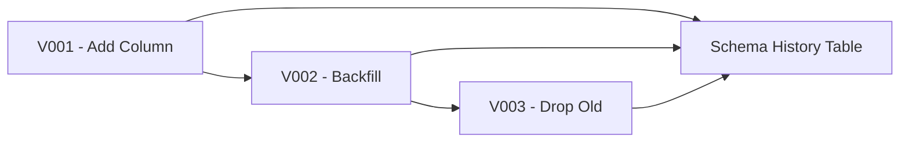
```mermaid
flowchart LR
    V1[V001 - Add Column] --> V2[V002 - Backfill]
    V2 --> V3[V003 - Drop Old]
    V1 --> SH[Schema History Table]
    V2 --> SH
    V3 --> SH
```

---

### 📶 Gradual Depth

**Level 1 - What it is:**
Database migration is a versioned, ordered process for changing the database schema (tables, columns, indexes) in a controlled and repeatable way, tracked in a history table.

**Level 2 - How to use it:**
Write each schema change as a numbered SQL file. Use Flyway or Liquibase to apply pending migrations automatically at deployment time. Never run DDL manually in production. Always test migrations against a copy of production data size.

**Level 3 - How it works:**
The migration runner reads the schema history table to find the last applied version. It scans the migration directory for files with higher version numbers. Each file is applied in a transaction (for DDL-transactional databases like PostgreSQL). The version and checksum are recorded in the history table. If a migration fails, the transaction rolls back and no version is recorded.

**Level 4 - Production mastery:**
On tables with hundreds of millions of rows, `CREATE INDEX CONCURRENTLY` avoids locking but takes longer and cannot run inside a transaction. Adding a column with a default (PostgreSQL 11+) is metadata-only and instant, but adding a NOT NULL constraint with a CHECK requires a full table scan. Backfills should run in batches (1,000-10,000 rows per transaction) with `pg_sleep` between batches to avoid overwhelming replication. Monitor lock wait times during migrations with `pg_stat_activity` and `pg_locks`. Always have a rollback migration ready.

---

### ⚙️ How It Works

**Phase 1 - Expand:** Add new column (nullable, no default) or new table. Deploy application code that writes to both old and new structures.

**Phase 2 - Backfill:** Batch-update existing rows to populate the new column from old data. Run during low-traffic periods.

**Phase 3 - Cutover:** Deploy code that reads from the new structure. Stop writing to the old structure.

**Phase 4 - Contract:** Drop the old column or table. Remove dual-write code.

```
  Expand:  ALTER TABLE orders
             ADD COLUMN email TEXT;
  Backfill: UPDATE orders SET email = c.email
             FROM customers c
             WHERE orders.cust_id = c.id
             AND orders.id BETWEEN $1 AND $2;
             -- batched, 10k rows per TX
  Cutover: Deploy code using orders.email
  Contract: ALTER TABLE orders
              DROP COLUMN old_email_ref;
```

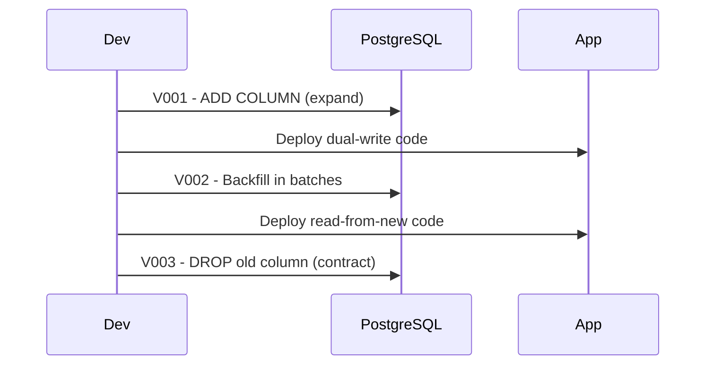
```mermaid
sequenceDiagram
    participant Dev
    participant DB as PostgreSQL
    participant App
    Dev->>DB: V001 - ADD COLUMN (expand)
    Dev->>App: Deploy dual-write code
    Dev->>DB: V002 - Backfill in batches
    Dev->>App: Deploy read-from-new code
    Dev->>DB: V003 - DROP old column (contract)
```

**BAD:**

```sql
-- Lock-dangerous: rewrites entire table
ALTER TABLE orders
  ADD COLUMN email TEXT DEFAULT 'none'
  NOT NULL;
-- Pre-PG11: full table rewrite + lock
```

**GOOD:**

```sql
-- Safe: metadata-only in PG 11+
ALTER TABLE orders ADD COLUMN email TEXT;
-- Backfill in batches
UPDATE orders SET email = (
  SELECT c.email FROM customers c
  WHERE c.id = orders.cust_id)
WHERE id BETWEEN 1 AND 10000;
-- Then add constraint
ALTER TABLE orders
  ALTER COLUMN email SET NOT NULL;
```

---

### 🚨 Failure Modes

**Failure 1 - Migration locks table during peak traffic:**
**Symptom:** All queries to the table queue behind a lock; application connection pool exhausts; cascading timeouts across services.
**Root cause:** `ALTER TABLE` acquired ACCESS EXCLUSIVE lock; concurrent queries wait indefinitely.
**Diagnostic:**

```sql
SELECT blocked.pid, blocked.query,
       blocking.pid AS blocker_pid,
       blocking.query AS blocker_query
FROM pg_stat_activity blocked
JOIN pg_locks bl ON bl.pid = blocked.pid
JOIN pg_locks lk
  ON lk.locktype = bl.locktype
  AND lk.relation = bl.relation
  AND lk.pid != bl.pid
JOIN pg_stat_activity blocking
  ON blocking.pid = lk.pid
WHERE NOT bl.granted;
```

**Fix:** Set `lock_timeout` before DDL (`SET lock_timeout = '3s'`). If the lock is not acquired within the timeout, abort and retry during low traffic. Use `CREATE INDEX CONCURRENTLY` for index creation.

**Failure 2 - Partial backfill leaves inconsistent data:**
**Symptom:** Some rows have the new column populated; others are NULL. Application reads produce mixed results.
**Root cause:** Backfill batch job failed midway; no tracking of progress; re-running starts from the beginning.
**Diagnostic:**

```sql
SELECT count(*) FILTER (WHERE email IS NULL)
       AS unfilled,
       count(*) FILTER (WHERE email IS NOT NULL)
       AS filled
FROM orders;
```

**Fix:** Track backfill progress by recording the last processed ID. Use batched updates with explicit ID ranges. Ensure idempotency so re-running is safe.

---

### 🔬 Production Reality

A typical incident: a team runs `CREATE INDEX` (not CONCURRENTLY) on a 200-million-row table during business hours. The command acquires a SHARE lock, blocking all INSERTs and UPDATEs for 45 minutes. The application's connection pool fills, healthchecks fail, and the load balancer removes all application instances. The index creation eventually completes, but by then the queue of blocked writes has grown so large that replaying them takes another 20 minutes. The total outage is over an hour. The fix was a one-word change: `CREATE INDEX CONCURRENTLY`. The lesson: every DDL statement's locking behavior must be verified against the PostgreSQL lock documentation before running on any table larger than a few million rows.

---

### ⚖️ Trade-offs & Alternatives

| Aspect            | Flyway (versioned SQL) | Liquibase (XML/YAML) | Rails Migrations   |
| ----------------- | ---------------------- | -------------------- | ------------------ |
| Language          | Raw SQL                | Abstracted DSL       | Ruby DSL           |
| Rollback support  | Manual reverse file    | Auto-rollback tags   | Reversible blocks  |
| Lock-safe DDL     | Manual patterns        | Manual patterns      | strong_migrations  |
| Multi-DB support  | Good                   | Excellent            | Rails-only         |
| CI/CD integration | Native                 | Native               | Rails deploy hooks |
| Learning curve    | Low (just SQL)         | Medium               | Medium             |

---

### ⚡ Decision Snap

**USE WHEN:**

- Schema changes must be applied repeatably across dev, staging, and production
- Tables exceed a few million rows and DDL locking is a concern
- Zero-downtime deployments are required

**AVOID WHEN:**

- Prototyping or early-stage where schema is changing rapidly and data is disposable
- Embedded databases without concurrent access

**PREFER expand-and-contract WHEN:**

- Multiple application versions run simultaneously (rolling deploys)
- Breaking schema changes cannot be applied atomically

---

### ⚠️ Top Traps

| #   | Misconception                                        | Reality                                                                                                                                  |
| --- | ---------------------------------------------------- | ---------------------------------------------------------------------------------------------------------------------------------------- |
| 1   | ALTER TABLE is always fast in PostgreSQL             | Adding columns with volatile defaults, adding constraints, or changing types can rewrite the entire table and lock it                    |
| 2   | Migrations run in transactions so they are safe      | DDL that cannot run inside transactions (CREATE INDEX CONCURRENTLY) requires special handling outside the migration runner's transaction |
| 3   | Rollback means reverting to the previous schema      | Rollback must also handle data; if a backfill populated new columns, the reverse migration must decide what happens to that data         |
| 4   | Testing on an empty database validates the migration | Lock behavior and execution time depend on table size; always test against production-sized data                                         |
| 5   | One migration per deployment is fine                 | Large migrations should be split into small, independently deployable steps to reduce blast radius                                       |

---

### 🪜 Learning Ladder

**Prerequisites:**

- SQL-104 Zero-Downtime Schema Migrations - the specific DDL patterns that avoid locks
- SQL-090 Row-Level vs Table-Level Locking - understanding what locks DDL acquires
- SQL-103 Backup and Point-in-Time Recovery (PITR) - safety net before running migrations

**THIS:** SQL-117 Database Version Migration Strategy at Scale

**Next steps:**

- SQL-118 PostgreSQL to Cloud-Managed Migration - migrating the entire database, not just schema
- SQL-113 Sharding Strategies - Application vs Proxy - migrations become harder across shards
- SQL-122 Database Capacity Planning and Growth Modeling - predicting when migrations will become slow

**The Surprising Truth:**
The most dangerous database migrations are not the complex ones - they are the simple `ALTER TABLE ADD COLUMN` or `CREATE INDEX` statements that take milliseconds on development databases but acquire table-wide locks that cascade into full outages on production tables with hundreds of millions of rows.

**Further Reading:**

- PostgreSQL Documentation: "ALTER TABLE" lock levels (postgresql.org/docs/current/sql-altertable.html)
- Percona Blog: "pt-online-schema-change" and online DDL patterns
- Skeema.io: "Tengo" (skeema.io) schema diff and migration tool

**Revision Card:**

1. Every schema change must be versioned, ordered, idempotent, and tracked in a history table
2. ACCESS EXCLUSIVE locks are the primary risk; use CONCURRENTLY indexes, batch backfills, and lock_timeout
3. Expand-and-contract is the only safe pattern for breaking changes under zero-downtime constraints

---

---

# SQL-118 PostgreSQL to Cloud-Managed Migration

**TL;DR** - Migrating from self-managed PostgreSQL to a cloud-managed service (RDS, Cloud SQL, AlloyDB) requires logical replication for cutover, extension audit, connection string rotation, and operational trade-off acceptance.

---

### 🔥 Problem Statement

Self-managed PostgreSQL gives you full control: you choose the version, configure kernel parameters, install any extension, and access the filesystem directly. But that control comes with operational cost - patching, HA failover, backup verification, monitoring, and capacity planning are all your responsibility. Cloud-managed services (AWS RDS, Google Cloud SQL, Azure Flexible Server, AlloyDB) handle these concerns but impose constraints: restricted superuser access, limited extension support, no filesystem access, opaque parameter tuning. The migration itself is the hardest part - moving a multi-terabyte production database with minimal downtime requires careful planning around replication, schema compatibility, extension audit, and connection cutover.

---

### 📜 Historical Context

Cloud-managed PostgreSQL began with AWS RDS PostgreSQL support in 2013. Google Cloud SQL for PostgreSQL followed in 2017. Azure Database for PostgreSQL in 2018. Amazon Aurora PostgreSQL (2017) introduced a storage-compute separated architecture. Google AlloyDB (2022) brought a similar separation with claimed analytical performance improvements. Each generation has expanded extension support and reduced the gap with self-managed PostgreSQL, but restrictions remain. The Database Migration Service (DMS) pattern - using logical replication for online migration with minimal downtime - has become the standard approach across all cloud providers.

---

### 🔩 First Principles

**CORE INVARIANTS:**

1. Cloud-managed services restrict superuser access, filesystem access, and extension installation - you must audit compatibility before migrating
2. Minimal-downtime migration requires logical replication (or equivalent) to keep source and target synchronized until cutover
3. Connection string rotation and DNS-based cutover determine the actual downtime window

**DERIVED DESIGN:**
These invariants force a phased approach: audit extensions and configuration, set up logical replication from source to target, run the target in shadow mode to validate performance, then perform a cutover during a maintenance window by switching DNS or connection strings. The downtime is bounded by replication catch-up time (the lag when source writes stop and target finishes applying pending changes).

**THE TRADE-OFF:**
**Gain:** Managed patching, automated backups, built-in HA, reduced operational toil.
**Cost:** Restricted superuser and extension access; vendor lock-in; potential performance differences from opaque tuning; cloud pricing model.

---

### 🧠 Mental Model

> Think of moving from a house you own to a managed apartment. You get maintenance, security, and repairs included, but you cannot knock down walls, install custom wiring, or access the boiler room. The move itself requires running two households in parallel until moving day.

- "Custom wiring" -> custom extensions, kernel tuning
- "Maintenance included" -> managed patching, backups, HA
- "Two households in parallel" -> logical replication during migration
- "Moving day" -> DNS cutover

**Where this analogy breaks down:** Unlike a physical move, database migration can run in parallel for weeks, and you can "move back" (reverse replication) if the new environment has problems - a luxury physical moves do not offer.

---

### 🧩 Components

- **Source audit** - inventory of extensions, custom configurations, superuser-dependent features, and data types used
- **Logical replication setup** - `pglogical` or native logical replication streaming changes from source to target
- **Cloud DMS** - provider-specific migration service (AWS DMS, Google DMS) that automates replication setup
- **Extension compatibility matrix** - mapping of source extensions to cloud-supported equivalents
- **Shadow validation** - running production-like queries against the target to verify plans and performance
- **DNS-based cutover** - switching the connection endpoint from source to target with minimal TTL
- **Reverse replication** - optional logical replication from target back to source as a rollback mechanism

```
  Migration Timeline:
  1. Audit     2. Setup Repl  3. Shadow
  [Source PG] --> [Cloud PG]  [Validate]
       |              ^
       +-logical repl-+
  4. Cutover: DNS switch
  5. (Optional) Reverse repl for rollback
```

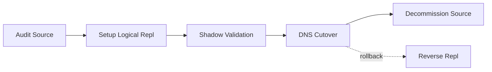
```mermaid
flowchart LR
    A[Audit Source] --> B[Setup Logical Repl]
    B --> C[Shadow Validation]
    C --> D[DNS Cutover]
    D --> E[Decommission Source]
    D -.->|rollback| F[Reverse Repl]
```

---

### 📶 Gradual Depth

**Level 1 - What it is:**
Migrating from self-managed PostgreSQL to a cloud-managed service like AWS RDS or Google Cloud SQL, where the cloud provider handles patching, backups, and high availability, but you give up some control.

**Level 2 - How to use it:**
Start with an extension and configuration audit: list all extensions (`SELECT * FROM pg_extension`) and compare against the cloud provider's supported list. Set up logical replication from source to target. Validate query performance on the target. Cut over by switching DNS or connection pool configuration.

**Level 3 - How it works:**
Logical replication streams row-level changes from source to target in near-real-time. The target stays synchronized while you validate. During cutover, stop writes to the source, wait for replication to catch up (seconds), switch the connection endpoint, and resume writes on the target. Sequences must be synchronized manually (`SELECT setval()`). Large objects and certain data types may require special handling.

**Level 4 - Production mastery:**
The hidden risks are in edge cases: `pg_cron` does not exist on most managed services (use cloud-native schedulers). `pg_stat_statements` may have different behavior. `COPY ... FROM '/path'` fails because you have no filesystem access - use `\copy` or S3 import. Connection limits differ (RDS has instance-class-based limits). Parameter groups replace `postgresql.conf` but not all parameters are exposed. Always run a shadow traffic test: replay production query logs against the target and compare execution plans.

---

### ⚙️ How It Works

**Phase 1 - Audit:** Inventory extensions, custom types, cron jobs, filesystem dependencies, and superuser-dependent operations. Map each to a cloud equivalent or identify blockers.

**Phase 2 - Provision and replicate:** Create the cloud instance matching the source's version and configuration. Set up logical replication. Perform initial data sync (full table copy), then stream ongoing changes.

**Phase 3 - Validate:** Run production query workloads against the target. Compare execution plans and latency. Verify that application connection pooling works with the managed endpoint.

**Phase 4 - Cutover:** During a maintenance window, stop application writes to the source. Wait for replication lag to reach zero. Switch DNS or connection strings to the cloud endpoint. Resume application traffic. Monitor for errors.

```
  Audit:
    pg_extension, postgresql.conf,
    crontab, filesystem deps
        |
  Replicate:
    Source -> pglogical -> Cloud PG
    (initial copy + streaming)
        |
  Validate:
    Replay query logs on Cloud PG
    Compare EXPLAIN plans
        |
  Cutover:
    Stop writes -> drain lag -> DNS switch
```

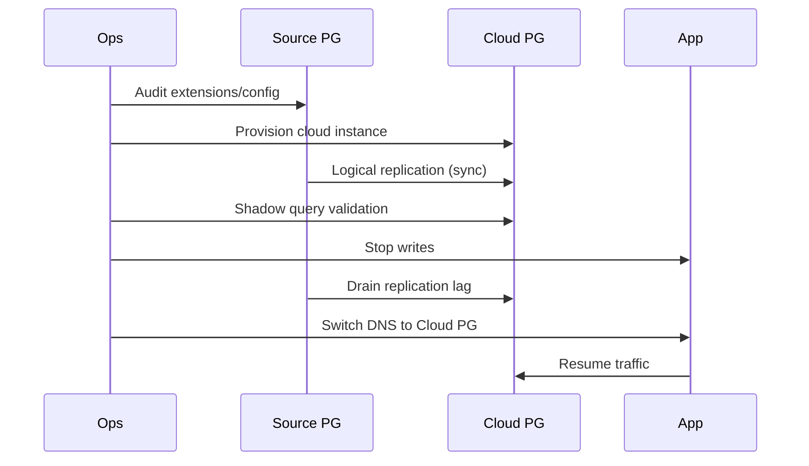
```mermaid
sequenceDiagram
    participant Ops
    participant Src as Source PG
    participant Tgt as Cloud PG
    participant App
    Ops->>Src: Audit extensions/config
    Ops->>Tgt: Provision cloud instance
    Src->>Tgt: Logical replication (sync)
    Ops->>Tgt: Shadow query validation
    Ops->>App: Stop writes
    Src->>Tgt: Drain replication lag
    Ops->>App: Switch DNS to Cloud PG
    App->>Tgt: Resume traffic
```

**BAD:**

```bash
# Dump and restore: hours of downtime
pg_dump -h source | psql -h cloud-target
# Application offline during entire transfer
```

**GOOD:**

```bash
# Logical replication: minutes of downtime
# 1. Setup replication (runs for days/weeks)
# 2. Cutover: stop writes, drain lag, switch
psql -h cloud-target -c "
  SELECT pg_replication_origin_advance(
    'migration', pg_current_wal_lsn()
  );"
# Switch connection string
# Downtime: seconds to minutes
```

---

### 🚨 Failure Modes

**Failure 1 - Unsupported extension blocks migration:**
**Symptom:** Application fails on the cloud instance with "extension not available" errors.
**Root cause:** Extensions like `pgaudit`, `timescaledb`, or custom C extensions are not supported on the target cloud platform.
**Diagnostic:**

```sql
-- Source: list all extensions
SELECT extname, extversion
FROM pg_extension
ORDER BY extname;
-- Compare with cloud provider's supported list
```

**Fix:** Replace unsupported extensions with cloud-native equivalents (e.g., cloud provider audit logging instead of `pgaudit`). If no equivalent exists, this may be a migration blocker.

**Failure 2 - Sequence values not synchronized at cutover:**
**Symptom:** After cutover, INSERT operations fail with duplicate key errors or new IDs overlap with existing data.
**Root cause:** Logical replication replicates row data but does not replicate sequence state. Sequences on the target start from their initial value.
**Diagnostic:**

```sql
-- Check sequence current values on target
SELECT sequencename, last_value
FROM pg_sequences
WHERE schemaname = 'public';
```

**Fix:** Before cutover, synchronize all sequences: `SELECT setval('seq_name', (SELECT max(id) FROM table_name))` for every sequence.

---

### 🔬 Production Reality

A common migration failure: a team completes logical replication setup and validates queries. At cutover, they switch DNS with a 300-second TTL. But some connection pools cache DNS results for longer (JVM default DNS caching is indefinite in some configurations). Old application instances continue writing to the source for 15 minutes after cutover. The source and target diverge. Reconciliation requires comparing every table row-by-row. The fix: set DNS TTL to 60 seconds or lower days before cutover, and configure connection pools to respect TTL (`networkaddress.cache.ttl` in JVM). Better yet, use connection proxy (PgBouncer) configuration changes instead of DNS for instant cutover.

---

### ⚖️ Trade-offs & Alternatives

| Aspect              | Self-Managed PG     | AWS RDS PostgreSQL      | Google AlloyDB      |
| ------------------- | ------------------- | ----------------------- | ------------------- |
| Extension freedom   | Full                | ~60 supported           | ~50 supported       |
| Superuser access    | Yes                 | rds_superuser (limited) | cloudsqlsuperuser   |
| Filesystem access   | Yes                 | No                      | No                  |
| HA failover         | Manual/Patroni      | Multi-AZ automatic      | Regional automatic  |
| Patching            | Manual              | Maintenance windows     | Maintenance windows |
| Cost predictability | Hardware + ops team | Pay-per-instance        | Pay-per-instance    |
| Vendor lock-in      | None                | Moderate                | High (AlloyDB APIs) |

---

### ⚡ Decision Snap

**USE WHEN:**

- Operational overhead of self-managed PostgreSQL exceeds team capacity
- HA, backups, and patching must be automated without dedicated DBA staff
- The application does not depend on unsupported extensions

**AVOID WHEN:**

- Custom extensions or kernel tuning are critical to the workload
- Regulatory requirements mandate on-premises data residency
- Cost modeling shows cloud-managed pricing exceeds self-managed at current scale

**PREFER AlloyDB/Aurora WHEN:**

- Mixed OLTP+OLAP workloads benefit from storage-compute separation
- Near-zero replication lag is required for read replicas

---

### ⚠️ Top Traps

| #   | Misconception                                  | Reality                                                                                                                         |
| --- | ---------------------------------------------- | ------------------------------------------------------------------------------------------------------------------------------- |
| 1   | Cloud-managed PG is identical to self-managed  | Restricted superuser, limited extensions, no filesystem, and opaque parameter tuning create real behavioral differences         |
| 2   | pg_dump/pg_restore is sufficient for migration | Dump/restore means hours of downtime for multi-terabyte databases; logical replication reduces downtime to minutes              |
| 3   | DNS cutover is instant                         | DNS TTL and client-side caching mean some clients may not switch for minutes; use connection proxy changes for instant cutover  |
| 4   | Logical replication handles everything         | Sequences, large objects, DDL changes during migration, and some data types require manual synchronization                      |
| 5   | Cloud costs are always lower than self-managed | At large scale (multi-TB, high IOPS), cloud-managed can be significantly more expensive than dedicated hardware with a DBA team |

---

### 🪜 Learning Ladder

**Prerequisites:**

- SQL-100 Logical Replication and Physical Replication - the mechanism powering online migration
- SQL-102 Connection Pooling - PgBouncer and HikariCP - connection management during cutover
- SQL-103 Backup and Point-in-Time Recovery (PITR) - backup strategy changes on managed services

**THIS:** SQL-118 PostgreSQL to Cloud-Managed Migration

**Next steps:**

- SQL-119 Connection Routing and Proxy Architecture - routing changes during and after migration
- SQL-121 Observability for Database Fleets - monitoring changes when moving to cloud-managed
- SQL-122 Database Capacity Planning and Growth Modeling - cloud capacity planning differs from on-premises

**The Surprising Truth:**
The hardest part of migrating to cloud-managed PostgreSQL is rarely the data transfer - it is discovering that your application depends on dozens of small superuser-only features, filesystem operations, and obscure extensions that you never realized you were using until they are gone.

**Further Reading:**

- AWS Documentation: "Best practices for migrating PostgreSQL to Amazon RDS" (docs.aws.amazon.com/dms/latest/userguide/CHAP_Source.PostgreSQL.html)
- PostgreSQL Documentation: "Logical Replication" (postgresql.org/docs/current/logical-replication.html)
- Google Cloud: "Migrating to AlloyDB" (cloud.google.com/alloydb/docs/migrate)

**Revision Card:**

1. Audit extensions and superuser dependencies before committing to migration - unsupported extensions are the top blocker
2. Use logical replication for online migration; cutover downtime is bounded by replication drain time
3. Synchronize sequences manually and verify DNS/connection pool caching to avoid split-brain during cutover

---

---

# SQL-119 Connection Routing and Proxy Architecture

**TL;DR** - Connection proxies (PgBouncer, HAProxy, ProxySQL) sit between applications and databases, multiplexing connections, routing reads to replicas, and enabling transparent failover without application changes.

---

### 🔥 Problem Statement

PostgreSQL forks a backend process for every connection. Each backend consumes roughly 5-10 MB of memory. At 500 connections, that is 2.5-5 GB consumed before a single query runs. Applications with hundreds of microservices and connection pools per service can demand thousands of connections - far beyond what a single PostgreSQL instance can handle efficiently. Beyond connection multiplexing, production topologies need routing: writes to the primary, reads to replicas, failover from a dead primary to a standby. Without a proxy layer, every application must implement connection pooling, read/write splitting, and failover logic independently - duplicating critical infrastructure across dozens of services.

---

### 📜 Historical Context

PgBouncer was created in 2007 by Skype to solve connection exhaustion on their PostgreSQL clusters. It remains the dominant PostgreSQL connection pooler. HAProxy, originally a TCP/HTTP load balancer, was adapted for database routing in the 2010s. ProxySQL (2015) brought query-aware routing to MySQL. Odyssey (Yandex, 2019) added multi-threaded connection pooling for PostgreSQL. Cloud providers built proxy-like functionality into their offerings: AWS RDS Proxy (2020), Google Cloud SQL Auth Proxy. The trend is toward application-transparent proxies that handle pooling, routing, and failover as infrastructure concerns.

---

### 🔩 First Principles

**CORE INVARIANTS:**

1. PostgreSQL's process-per-connection model makes connection count the first bottleneck at scale
2. Read/write routing requires the proxy to either parse SQL or rely on explicit routing hints from the application
3. Failover transparency requires the proxy to detect primary failure and redirect connections to the new primary before application timeouts expire

**DERIVED DESIGN:**
These invariants force a proxy that multiplexes many client connections onto fewer server connections (pooling), inspects or labels queries to route reads vs. writes (routing), and monitors backend health to switch traffic on failure (failover). The pooling mode determines the trade-off: transaction-level pooling maximizes multiplexing but breaks session-level state (prepared statements, SET commands). Session-level pooling preserves state but limits multiplexing.

**THE TRADE-OFF:**
**Gain:** Dramatic reduction in backend connections; transparent failover; centralized read/write routing.
**Cost:** Added network hop latency; proxy becomes a single point of failure (must be HA itself); transaction-level pooling breaks session state.

---

### 🧠 Mental Model

> Think of a hotel switchboard operator (proxy) who connects guest calls (application connections) to hotel rooms (database backends). Guests do not dial rooms directly. The operator multiplexes many calls onto a few phone lines (connection pooling), knows which room handles which requests (routing), and reroutes calls when a room is unavailable (failover).

- "Switchboard operator" -> PgBouncer / HAProxy
- "Phone lines to rooms" -> server-side connections
- "Guest calls" -> client connections from applications
- "Rerouting on room unavailable" -> failover to standby

**Where this analogy breaks down:** A switchboard operator handles one call at a time per line; PgBouncer handles transaction-level multiplexing where one server connection serves many clients in rapid succession.

---

### 🧩 Components

- **PgBouncer** - lightweight single-threaded connection pooler for PostgreSQL with session, transaction, and statement pooling modes
- **Odyssey** - multi-threaded connection pooler (Yandex) with better CPU utilization on high-connection workloads
- **HAProxy** - TCP/HTTP load balancer used for read/write routing and health-check-based failover
- **Patroni** - HA cluster manager that updates proxy configuration on failover
- **Connection pool mode** - session (1:1 client:server), transaction (shared between transactions), statement (shared between statements)
- **Health check** - periodic probe determining if a backend is primary, replica, or down

```
  Apps (1000 connections)
       |
  [PgBouncer - transaction mode]
  (50 server connections)
       |
  +----+----+
  |         |
  Primary  Replicas (via HAProxy)
```

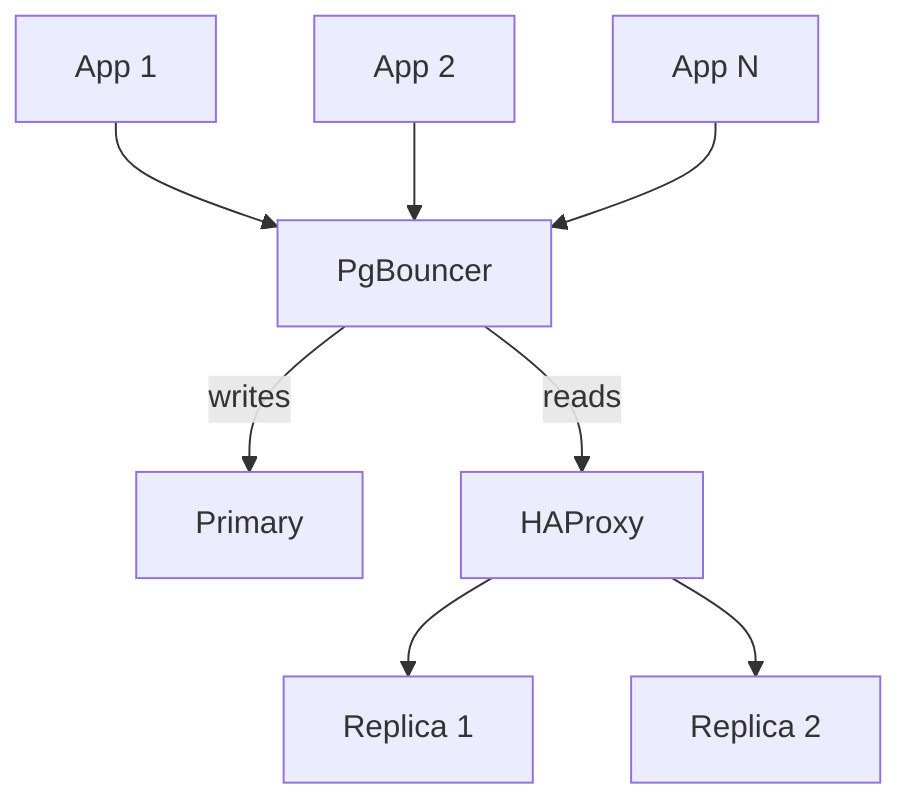
```mermaid
flowchart TD
    A1[App 1] --> PB[PgBouncer]
    A2[App 2] --> PB
    A3[App N] --> PB
    PB -->|writes| Primary
    PB -->|reads| HAP[HAProxy]
    HAP --> R1[Replica 1]
    HAP --> R2[Replica 2]
```

---

### 📶 Gradual Depth

**Level 1 - What it is:**
A connection proxy sits between your application and PostgreSQL, managing connection pooling (sharing fewer database connections among many clients), routing (sending reads to replicas and writes to the primary), and failover (switching to a new primary when the old one fails).

**Level 2 - How to use it:**
Deploy PgBouncer in front of PostgreSQL. Configure `pool_mode = transaction` for maximum multiplexing. Point your application's connection string at PgBouncer instead of PostgreSQL directly. For read/write splitting, use HAProxy with health checks that detect primary vs. replica status.

**Level 3 - How it works:**
In transaction pooling mode, PgBouncer assigns a server connection to a client only for the duration of a transaction. Between transactions, the server connection returns to the pool and can serve another client. This means 1,000 client connections can share 50 server connections if most clients are idle between transactions. Read/write routing uses HAProxy backends with `pg_isready` or custom SQL health checks (`SELECT pg_is_in_recovery()`) to distinguish primaries from replicas.

**Level 4 - Production mastery:**
Transaction pooling breaks prepared statements (they are session-scoped in PostgreSQL). Use `DEALLOCATE ALL` or `DISCARD ALL` between transactions, or use `prepared_statement_name_lookup` in PgBouncer 1.21+. Monitor PgBouncer with `SHOW POOLS` and `SHOW STATS` - watch `sv_active`, `sv_idle`, `cl_waiting` to detect pool saturation. Deploy PgBouncer as a sidecar (per-pod) or centralized (shared fleet). Centralized is simpler to manage; sidecar eliminates the proxy as a shared SPOF. Patroni writes the current primary to etcd/Consul; HAProxy reads it for failover routing.

---

### ⚙️ How It Works

**Phase 1 - Client connects:** Application opens a connection to PgBouncer's port. PgBouncer authenticates the client (using its own auth file or passthrough to PostgreSQL).

**Phase 2 - Transaction assignment:** When the client issues `BEGIN` (or any query in autocommit), PgBouncer assigns an idle server connection from the pool.

**Phase 3 - Query execution:** All queries within the transaction flow through the assigned server connection. PostgreSQL processes them normally.

**Phase 4 - Connection return:** On `COMMIT` or `ROLLBACK`, PgBouncer returns the server connection to the pool. The client retains its PgBouncer connection but releases the server-side resource.

```
  Client 1: BEGIN -> assigned conn S1
  Client 2: BEGIN -> assigned conn S2
  Client 1: COMMIT -> S1 returned to pool
  Client 3: BEGIN -> gets S1 (recycled)
  Client 2: COMMIT -> S2 returned to pool
```

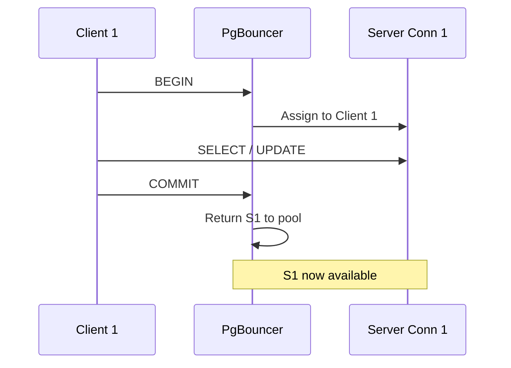
```mermaid
sequenceDiagram
    participant C1 as Client 1
    participant PB as PgBouncer
    participant S1 as Server Conn 1
    C1->>PB: BEGIN
    PB->>S1: Assign to Client 1
    C1->>S1: SELECT / UPDATE
    C1->>PB: COMMIT
    PB->>PB: Return S1 to pool
    Note over PB,S1: S1 now available
```

**BAD:**

```python
# Direct connection: 1 backend per client
conn = psycopg2.connect(
    host="primary.db.internal",
    # 500 services x 20 pool = 10,000 backends
)
```

**GOOD:**

```python
# Via PgBouncer: multiplexed
conn = psycopg2.connect(
    host="pgbouncer.internal",
    port=6432,
    # 10,000 clients share 200 backends
)
```

---

### 🚨 Failure Modes

**Failure 1 - Prepared statement errors in transaction pooling:**
**Symptom:** Application errors: "prepared statement does not exist" or "unnamed prepared statement already exists."
**Root cause:** Transaction pooling assigns a different server connection per transaction; prepared statements created in a previous transaction no longer exist.
**Diagnostic:**

```sql
-- PgBouncer admin console
SHOW POOLS;
-- Check pool_mode
SHOW CONFIG;
-- Look for pool_mode = transaction
```

**Fix:** Disable server-side prepared statements in the application driver (`prepareThreshold=0` in JDBC, `statement_cache_size=0` in pgx). Or use PgBouncer 1.21+ with prepared statement tracking.

**Failure 2 - PgBouncer pool saturation:**
**Symptom:** Application connections hang on query execution; `cl_waiting` in PgBouncer `SHOW POOLS` is non-zero and growing.
**Root cause:** All server connections are assigned to active transactions; new client transactions wait for a server connection to become available.
**Diagnostic:**

```
-- PgBouncer admin console
SHOW POOLS;
-- cl_waiting > 0 means clients are queued
-- sv_active = max_pool_size means saturated
```

**Fix:** Increase `default_pool_size` in PgBouncer (if PostgreSQL can handle more connections). Reduce application `idle_in_transaction_session_timeout`. Find and fix long-running transactions holding server connections.

---

### 🔬 Production Reality

A frequent incident: a team deploys PgBouncer in transaction pooling mode. The application uses Django ORM, which sets session variables (`SET timezone`, `SET search_path`) at connection establishment. In transaction pooling, these settings are lost between transactions because the next transaction may get a different server connection. Queries silently run with the wrong timezone or search path, producing incorrect results. The fix: move session configuration into each transaction (`SET LOCAL timezone = 'UTC'`) or switch to session pooling (sacrificing multiplexing). The lesson: transaction pooling requires the application to be stateless at the session level - no SET commands, no prepared statements, no advisory locks outside transactions.

---

### ⚖️ Trade-offs & Alternatives

| Aspect             | PgBouncer          | Odyssey        | HAProxy             |
| ------------------ | ------------------ | -------------- | ------------------- |
| Pooling modes      | Session/TX/Stmt    | Session/TX     | None (TCP only)     |
| Threading          | Single-threaded    | Multi-threaded | Multi-threaded      |
| Read/write routing | No (pool only)     | No (pool only) | Yes (health checks) |
| SQL awareness      | Minimal            | Minimal        | None (TCP level)    |
| Failover handling  | Via Patroni/consul | Built-in       | Health check based  |
| Resource overhead  | Very low (~5 MB)   | Low (~50 MB)   | Low (~20 MB)        |

---

### ⚡ Decision Snap

**USE WHEN:**

- Application connection count exceeds PostgreSQL's comfortable backend limit (typically 200-500)
- Multiple services share a PostgreSQL cluster and need centralized pooling
- Transparent failover is required without application-level retry logic

**AVOID WHEN:**

- A single application with a well-tuned internal connection pool (HikariCP) is the only client
- The application heavily uses session-level features (prepared statements, advisory locks, SET commands)

**PREFER Odyssey over PgBouncer WHEN:**

- High connection counts saturate PgBouncer's single-threaded event loop
- Multi-threaded pooling is needed for CPU-bound TLS termination

---

### ⚠️ Top Traps

| #   | Misconception                                               | Reality                                                                                                            |
| --- | ----------------------------------------------------------- | ------------------------------------------------------------------------------------------------------------------ |
| 1   | Transaction pooling is always safe                          | It breaks prepared statements, session variables, LISTEN/NOTIFY, and advisory locks held across transactions       |
| 2   | PgBouncer eliminates the need for application-level pooling | Applications should still pool locally (HikariCP) to avoid opening/closing PgBouncer connections per query         |
| 3   | More server connections = better performance                | Beyond PostgreSQL's optimal backend count (CPU-dependent), more connections cause contention and reduce throughput |
| 4   | The proxy handles failover automatically                    | PgBouncer does not detect failover; it requires an external tool (Patroni) to update its configuration             |
| 5   | Proxy latency is negligible                                 | TLS termination at the proxy adds measurable latency; for latency-sensitive workloads, consider sidecar deployment |

---

### 🪜 Learning Ladder

**Prerequisites:**

- SQL-102 Connection Pooling - PgBouncer and HikariCP - foundational pooling concepts
- SQL-101 Read Replicas - Scaling Reads - the replicas that routing directs read traffic to
- SQL-100 Logical Replication and Physical Replication - replication powers the topology proxies route across

**THIS:** SQL-119 Connection Routing and Proxy Architecture

**Next steps:**

- SQL-113 Sharding Strategies - Application vs Proxy - proxies can also route to shards
- SQL-114 Multi-Database Topology Design - the full topology that proxies connect
- SQL-121 Observability for Database Fleets - monitoring proxy health and pool metrics

**The Surprising Truth:**
The most common PgBouncer misconfiguration is not pool size - it is using transaction pooling with an ORM that silently depends on session state, producing queries that succeed but return wrong results because they ran with the wrong search_path, timezone, or role from a recycled connection.

**Further Reading:**

- PgBouncer Documentation (pgbouncer.github.io/pgbouncer/)
- Patroni Documentation: "HAProxy and Patroni" (patroni.readthedocs.io)
- Percona Blog: "Scaling PostgreSQL with PgBouncer" (percona.com/blog)

**Revision Card:**

1. Connection proxies multiplex many client connections onto fewer server connections, making PostgreSQL scale beyond its process-per-connection limit
2. Transaction pooling maximizes multiplexing but breaks session-level state - applications must be session-stateless
3. Failover routing requires an external HA manager (Patroni) to update the proxy's backend configuration

---

---

# SQL-120 GDPR and Right-to-Erasure in SQL Systems

**TL;DR** - GDPR Article 17 requires deleting all personal data for an individual across every table, backup, and replica - a structural problem SQL was not designed to solve.

---

### 🔥 Problem Statement

Article 17 of the GDPR grants individuals the right to request deletion of their personal data. For a SQL database, this means finding and removing every row, column, and reference containing that person's data - across normalized tables with foreign keys, denormalized caches, replicas, backups, WAL archives, and downstream CDC consumers. A simple `DELETE FROM users WHERE id = 42` leaves orphaned references in orders, logs, audit trails, and analytics tables. Foreign keys may CASCADE (deleting business data you need to retain) or RESTRICT (blocking the delete entirely). Backups contain the deleted data for years. The problem is not technical difficulty - it is architectural: SQL schemas are designed for data integrity, not data erasure.

---

### 📜 Historical Context

The EU General Data Protection Regulation (GDPR) took effect on May 25, 2018. Article 17 codifies the "right to be forgotten," building on the 2014 European Court of Justice ruling (Google Spain v. AEPD). Similar regulations followed: CCPA (California, 2020), LGPD (Brazil, 2020), POPIA (South Africa, 2021). The database industry responded with patterns: soft deletes with scheduled purges, pseudonymization, crypto-shredding (encrypting personal data with per-user keys and destroying the key). No standard SQL feature directly supports compliance; it remains an application architecture concern.

---

### 🔩 First Principles

**CORE INVARIANTS:**

1. Personal data may be scattered across many tables, and foreign key relationships create cascading dependencies that either block deletion or destroy business data
2. Erasure must propagate to every copy: replicas, backups, CDC downstream systems, caches, and search indexes
3. Some data must be retained for legal obligations (invoices, tax records) even after an erasure request - requiring selective anonymization rather than full deletion

**DERIVED DESIGN:**
These invariants force a data architecture where personal data is isolated from business data - either in dedicated columns that can be NULLed, in a separate table joined by foreign key, or encrypted with per-user keys (crypto-shredding). A data map (inventory of every table/column containing personal data) is a prerequisite. Deletion becomes a multi-step process: anonymize personal columns, cascade through related tables, propagate to downstream systems, and handle backups through retention-based expiry.

**THE TRADE-OFF:**
**Gain:** Legal compliance; user trust; regulatory penalty avoidance (fines up to 4% of global revenue).
**Cost:** Schema complexity (separating personal from business data); operational complexity (multi-system deletion propagation); inability to use personal data in backups for point-in-time forensics after erasure.

---

### 🧠 Mental Model

> Think of a library that must remove all records of a specific patron - not just their library card, but every checkout log, fine record, inter-library loan reference, and microfilm copy of old receipts. Some records (book inventory) must stay; only the patron's name on them needs to be blanked out.

- "Library card" -> users table row
- "Checkout logs with patron name" -> orders, logs, audit tables
- "Microfilm copies" -> database backups
- "Blanking out the name" -> pseudonymization / anonymization

**Where this analogy breaks down:** Libraries are a single system; production databases feed replicas, caches, search indexes, analytics warehouses, and third-party integrations - each requiring independent erasure.

---

### 🧩 Components

- **Data map** - inventory of every table and column containing personal data, classified by sensitivity
- **Erasure API** - service endpoint that receives deletion requests and orchestrates multi-table cleanup
- **Pseudonymization** - replacing identifying data with irreversible tokens while preserving referential integrity
- **Crypto-shredding** - encrypting personal data with per-user keys; erasure = destroying the key
- **Cascade strategy** - per-table decision: DELETE, SET NULL, anonymize, or retain with legal basis
- **Downstream propagation** - CDC events, API calls, or scheduled jobs that propagate erasure to replicas, search indexes, and warehouses
- **Audit log** - proof that erasure was performed, without retaining the erased data itself

```
  Erasure Request Flow:
  User -> Erasure API
            |
    +-------+--------+
    |       |        |
  users  orders   logs
  DELETE  SET NULL  anonymize
    |       |        |
    v       v        v
  Replicas, CDC, Search, Backups
  (propagate / expire)
```

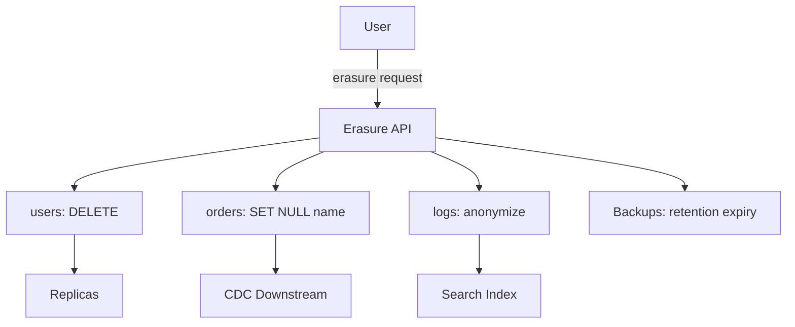
```mermaid
flowchart TD
    User -->|erasure request| API[Erasure API]
    API --> U[users: DELETE]
    API --> O[orders: SET NULL name]
    API --> L[logs: anonymize]
    U --> R[Replicas]
    O --> CDC[CDC Downstream]
    L --> S[Search Index]
    API --> B[Backups: retention expiry]
```

---

### 📶 Gradual Depth

**Level 1 - What it is:**
GDPR's right-to-erasure means a user can ask you to delete all their personal data from your systems. In SQL databases, this means removing or anonymizing their data across every table that references them.

**Level 2 - How to use it:**
Build a data map listing every table and column with personal data. For each table, decide the erasure strategy: DELETE the row, SET the personal column to NULL, replace with a pseudonym, or retain with legal basis documentation. Implement an erasure API that executes these strategies in the correct order (respect foreign key dependencies).

**Level 3 - How it works:**
The erasure API receives a user ID. It queries the data map to determine affected tables. It executes deletions and anonymizations in dependency order (child tables before parent, or using SET NULL on foreign keys). It then publishes erasure events to CDC/Kafka so downstream systems (Elasticsearch, analytics warehouse, caches) perform their own cleanup. Backups are handled through retention policies - once the backup containing the user's data expires, the data is gone.

**Level 4 - Production mastery:**
Crypto-shredding is the most scalable approach for large systems: encrypt each user's personal data columns with a per-user key stored in a key management service. Erasure becomes `DELETE FROM user_keys WHERE user_id = 42` - all encrypted personal data across all tables becomes unreadable. This avoids touching millions of rows across dozens of tables. However, it requires encrypting at write time, which adds latency and prevents querying encrypted columns. Monitor erasure request SLAs (GDPR allows 30 days). Log the erasure action itself (timestamp, user ID, tables affected) without logging the deleted data.

---

### ⚙️ How It Works

**Phase 1 - Request intake:** User submits erasure request. The system verifies identity and checks for legal retention obligations (active orders, tax records, fraud investigations).

**Phase 2 - Data map lookup:** The erasure service consults the data map to identify all tables and columns containing the user's personal data.

**Phase 3 - Ordered execution:** Erasure executes in dependency order. Tables with no dependencies are cleaned first. Foreign key references are SET NULL or CASCADEd. Personal columns in retained rows are anonymized.

**Phase 4 - Downstream propagation:** Erasure events propagate to replicas (via replication), search indexes (via API call or CDC), analytics warehouse (via scheduled purge job), and caches (via TTL expiry or explicit invalidation).

```
  1. Verify identity + legal holds
  2. Lookup data map for user_id = 42
  3. orders: SET customer_name = NULL
  4. logs: UPDATE SET email = 'ERASED'
  5. users: DELETE WHERE id = 42
  6. Publish erasure event to Kafka
  7. Search: delete user document
  8. Analytics: purge user rows
  9. Log: "user 42 erased at <timestamp>"
```

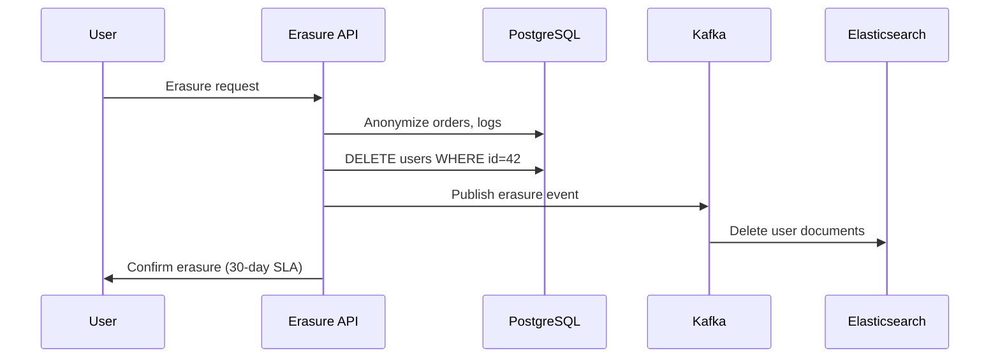
```mermaid
sequenceDiagram
    participant U as User
    participant API as Erasure API
    participant DB as PostgreSQL
    participant K as Kafka
    participant ES as Elasticsearch
    U->>API: Erasure request
    API->>DB: Anonymize orders, logs
    API->>DB: DELETE users WHERE id=42
    API->>K: Publish erasure event
    K->>ES: Delete user documents
    API->>U: Confirm erasure (30-day SLA)
```

**BAD:**

```sql
-- Naive delete: breaks foreign keys
DELETE FROM users WHERE id = 42;
-- ERROR: violates FK on orders.customer_id
-- Or: CASCADE deletes orders (losing data)
```

**GOOD:**

```sql
-- Step 1: anonymize referencing tables
UPDATE orders SET customer_name = NULL,
  customer_email = NULL
WHERE customer_id = 42;
-- Step 2: anonymize logs
UPDATE audit_log
SET email = 'REDACTED'
WHERE user_id = 42;
-- Step 3: delete the user record
DELETE FROM users WHERE id = 42;
```

---

### 🚨 Failure Modes

**Failure 1 - Incomplete data map misses personal data:**
**Symptom:** After erasure, personal data is discovered in a table not covered by the data map (error logs, analytics snapshots, third-party integrations).
**Root cause:** The data map was created manually and not updated when new tables were added.
**Diagnostic:**

```sql
-- Search for user data across all tables
SELECT table_name, column_name
FROM information_schema.columns
WHERE column_name LIKE '%email%'
   OR column_name LIKE '%name%'
   OR column_name LIKE '%phone%';
```

**Fix:** Automate data map generation from schema metadata. Tag columns with `COMMENT` annotations indicating personal data classification. Run periodic audits.

**Failure 2 - Backup retention defeats erasure:**
**Symptom:** Erased user's data is recoverable from backups, creating a compliance gap.
**Root cause:** Backups retain data indefinitely; point-in-time recovery can restore erased records.
**Diagnostic:**

```bash
# Check backup retention policy
pg_basebackup --list
# Review WAL archive retention
ls -lt /archive/wal/
```

**Fix:** Set backup retention to the minimum legally required period. Document that backups may contain erased data until expiry. Use crypto-shredding so backup data becomes unreadable after key deletion.

---

### 🔬 Production Reality

A common compliance gap: a team implements erasure for the primary database but forgets that Debezium CDC replicates every row change to Kafka. Kafka retains events for 30 days. The erased user's original data persists in Kafka topics as historical INSERT events. The analytics warehouse, which consumes those topics, has a copy too. The erasure is incomplete across 3 out of 5 systems. The fix requires: (1) publishing explicit "tombstone" erasure events to Kafka, (2) building CDC consumers that process tombstones by deleting downstream records, and (3) configuring Kafka compaction so tombstones eventually remove the original events. The lesson: erasure is a distributed systems problem, not a SQL problem.

---

### ⚖️ Trade-offs & Alternatives

| Aspect              | Row Deletion        | Pseudonymization  | Crypto-Shredding             |
| ------------------- | ------------------- | ----------------- | ---------------------------- |
| Implementation cost | Low (DELETE/UPDATE) | Medium            | High (key mgmt)              |
| Performance impact  | Per-request I/O     | Per-request I/O   | Minimal (key only)           |
| Backup handling     | Data persists       | Data persists     | Data unreadable              |
| Analytics impact    | Rows lost           | Rows preserved    | Rows preserved               |
| Scale (many tables) | Linear in tables    | Linear in tables  | Constant (one key)           |
| Query-ability       | Full                | Full (anonymized) | No queries on encrypted cols |

---

### ⚡ Decision Snap

**USE WHEN:**

- Your system stores personal data of EU residents (or residents of other GDPR-like jurisdictions)
- Users can create accounts or provide personal information through any interface
- Downstream systems (analytics, search, caches) consume personal data via replication or CDC

**AVOID WHEN:**

- The system processes no personal data (purely machine-generated telemetry)
- All data is already anonymized at ingestion

**PREFER crypto-shredding WHEN:**

- Personal data is spread across dozens of tables
- Per-row deletion at scale is operationally expensive
- Backup-level erasure is a compliance requirement

---

### ⚠️ Top Traps

| #   | Misconception                                   | Reality                                                                                                                        |
| --- | ----------------------------------------------- | ------------------------------------------------------------------------------------------------------------------------------ |
| 1   | DELETE FROM users is sufficient for GDPR        | Personal data exists in orders, logs, audit trails, replicas, backups, CDC streams, and search indexes                         |
| 2   | Soft delete (is_deleted flag) satisfies erasure | GDPR requires actual deletion or anonymization; a soft delete still retains personal data in the database                      |
| 3   | Backups are exempt from erasure requirements    | Regulators expect a documented retention policy and evidence that erased data becomes inaccessible within the retention window |
| 4   | Anonymization is always irreversible            | Poor anonymization (e.g., hashing email without salt) can be reversed; use irreversible techniques with sufficient entropy     |
| 5   | The 30-day SLA starts at receipt of request     | The GDPR clock starts when the request is received AND identity is verified - but verification delays are scrutinized          |

---

### 🪜 Learning Ladder

**Prerequisites:**

- SQL-039 ACID Properties - What They Actually Mean - understanding transactional guarantees around deletion
- SQL-112 PCI-DSS and Data-at-Rest Encryption - related compliance pattern for sensitive data
- SQL-100 Logical Replication and Physical Replication - erasure must propagate through replication

**THIS:** SQL-120 GDPR and Right-to-Erasure in SQL Systems

**Next steps:**

- SQL-121 Observability for Database Fleets - monitoring erasure completeness across systems
- SQL-116 CQRS and Read/Write Separation Architecture - erasure must reach read models
- SQL-103 Backup and Point-in-Time Recovery (PITR) - backup retention intersects with erasure

**The Surprising Truth:**
The hardest part of GDPR erasure is not deleting data from the primary database - it is discovering all the places personal data has been copied to: CDC streams, search indexes, analytics warehouses, error logs, APM tools, and third-party integrations that were never designed with erasure in mind.

**Further Reading:**

- Regulation (EU) 2016/679 (GDPR), Article 17: Right to Erasure (eur-lex.europa.eu)
- ICO (UK Information Commissioner's Office): "Right to Erasure" guidance (ico.org.uk)
- Byun, J. et al. "Purpose Based Access Control for Privacy Protection in Relational Database Systems", VLDB Journal, 2005

**Revision Card:**

1. GDPR erasure requires removing personal data from every table, replica, backup, cache, and downstream system - not just the users table
2. Crypto-shredding (per-user encryption key destruction) is the most scalable erasure pattern for complex schemas
3. Erasure is a distributed systems problem: every CDC consumer, search index, and analytics warehouse must process deletion events

---

---

# SQL-121 Observability for Database Fleets

**TL;DR** - Database fleet observability means collecting, correlating, and alerting on metrics, logs, and query performance across all database instances to detect problems before users notice them.

---

### 🔥 Problem Statement

A single PostgreSQL instance is observable with `pg_stat_*` views and server logs. But production systems run fleets: a primary, two synchronous replicas, four async replicas, a PgBouncer pool, and a CDC pipeline. When a query slows down, is it the primary's CPU? Replication lag on a replica? PgBouncer pool saturation? A missing index after a migration? A vacuum that has not run? Without fleet-wide observability, debugging becomes a manual tour of dashboards. At scale, with dozens of instances across regions, the team that cannot answer "which instance is unhealthy and why" within 60 seconds will lose hours per incident.

---

### 📜 Historical Context

Early database monitoring meant checking `vmstat` and slow query logs manually. Nagios and Zabbix provided threshold-based alerting in the 2000s. The Prometheus + Grafana stack (2015+) brought pull-based metrics collection with flexible dashboarding. `postgres_exporter` (community project) exports `pg_stat_*` views as Prometheus metrics. `pg_stat_statements` (bundled extension since PostgreSQL 8.4) provides per-query performance statistics. Cloud-managed services add their own monitoring (CloudWatch for RDS, Cloud Monitoring for Cloud SQL), but fleet-wide correlation still requires custom dashboarding or tools like Datadog, pganalyze, or Percona Monitoring and Management (PMM).

---

### 🔩 First Principles

**CORE INVARIANTS:**

1. Every database problem manifests in at least one of three signals: metrics (quantitative), logs (qualitative), or query performance changes (behavioral)
2. Fleet-level problems require correlation across instances - a metric anomaly on one instance is noise; the same anomaly across all replicas is a systemic issue
3. Alert fatigue kills observability - alerts must be actionable, with clear severity and runbooks, or they will be ignored

**DERIVED DESIGN:**
These invariants force a three-layer stack: metrics collection (Prometheus + postgres_exporter), log aggregation (Loki, Elasticsearch), and query performance tracking (pg_stat_statements, pganalyze). Dashboards must show fleet-wide views with drill-down to individual instances. Alerts fire on rate-of-change (anomaly) rather than static thresholds where possible, because absolute thresholds do not account for workload variation.

**THE TRADE-OFF:**
**Gain:** Rapid incident detection and diagnosis; capacity planning from historical trends; proactive identification of slow queries and bloat.
**Cost:** Monitoring infrastructure overhead (Prometheus, Grafana, storage); pg_stat_statements memory consumption; operational effort to maintain dashboards and alert rules.

---

### 🧠 Mental Model

> Think of a hospital's centralized patient monitoring room. Each patient (database instance) has vital signs displayed on a screen. A nurse (on-call engineer) watches the wall of screens. Normal vitals are green. A single yellow alert is investigated. Multiple patients showing the same anomaly simultaneously triggers a code blue (systemic incident).

- "Vital signs" -> metrics (CPU, connections, replication lag, cache hit ratio)
- "Patient monitor" -> Grafana dashboard per instance
- "Wall of screens" -> fleet-wide dashboard
- "Code blue" -> correlated alert across instances

**Where this analogy breaks down:** Hospital monitors are passive displays; database observability systems can also perform automated remediation (e.g., killing long-running queries, triggering VACUUM).

---

### 🧩 Components

- **postgres_exporter** - Prometheus exporter that scrapes `pg_stat_*` views and exposes them as metrics
- **pg_stat_statements** - extension tracking execution statistics (calls, total_time, rows) per normalized query
- **pg_stat_activity** - live view of all current connections, their state, and running queries
- **pg_stat_replication** - replication lag and WAL send/receive/apply positions per replica
- **Prometheus** - time-series metrics storage with PromQL query language
- **Grafana** - dashboarding and alerting frontend
- **pganalyze** - SaaS tool for query performance analysis, index recommendations, and VACUUM monitoring
- **Log aggregation** - centralized logging (Loki, Elasticsearch) for PostgreSQL server logs and slow query logs

```
  Fleet Observability Stack:
  [PG Primary] -> postgres_exporter -> Prometheus
  [PG Replica1]-> postgres_exporter -> Prometheus
  [PG Replica2]-> postgres_exporter -> Prometheus
  [PgBouncer]  -> metrics endpoint  -> Prometheus
       |
       v
    Grafana (dashboards + alerts)
       |
       v
    PagerDuty / Slack (notifications)
```

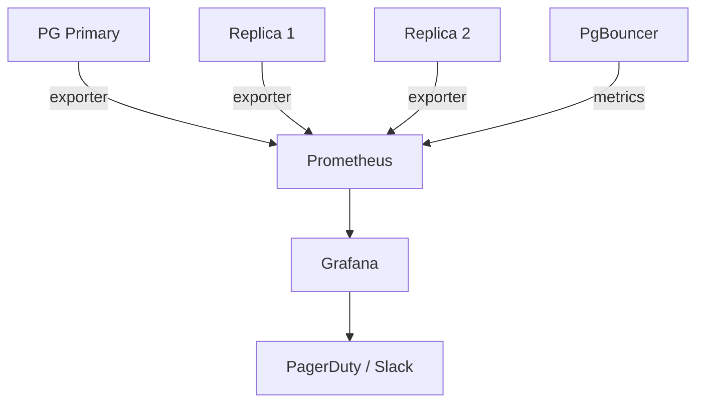
```mermaid
flowchart TD
    P[PG Primary] -->|exporter| Prom[Prometheus]
    R1[Replica 1] -->|exporter| Prom
    R2[Replica 2] -->|exporter| Prom
    PB[PgBouncer] -->|metrics| Prom
    Prom --> G[Grafana]
    G --> PD[PagerDuty / Slack]
```

---

### 📶 Gradual Depth

**Level 1 - What it is:**
Database observability is the practice of collecting metrics, logs, and query performance data from all your database instances so you can detect and diagnose problems quickly.

**Level 2 - How to use it:**
Install `postgres_exporter` on each instance. Enable `pg_stat_statements` (`shared_preload_libraries`). Configure Prometheus to scrape exporters. Build Grafana dashboards showing connections, cache hit ratio, replication lag, transaction rate, and top queries by time. Set alerts for replication lag > 30s, connection count > 80% of max, and cache hit ratio < 99%.

**Level 3 - How it works:**
`postgres_exporter` connects to PostgreSQL and runs SQL queries against `pg_stat_*` views on a configurable interval. It exposes the results as Prometheus metrics at an HTTP endpoint. Prometheus scrapes these endpoints and stores time-series data. Grafana queries Prometheus via PromQL and renders dashboards. Alert rules in Prometheus or Grafana evaluate conditions and fire notifications.

**Level 4 - Production mastery:**
The most valuable metric is `pg_stat_statements` mean execution time per query, trended over time. A query whose mean time doubles after a deployment indicates a plan regression. Use `pg_stat_user_tables` to track `n_dead_tup` and `last_autovacuum` to detect bloat before it affects performance. Monitor `pg_stat_bgwriter` for `buffers_backend` (direct I/O bypassing shared buffers - a sign of buffer pool pressure). For fleet-wide views, use Prometheus labels (`instance`, `role=primary|replica`) and Grafana variables to build drill-down dashboards.

---

### ⚙️ How It Works

**Phase 1 - Collection:** postgres*exporter scrapes `pg_stat*\*` views every 15-60 seconds. PostgreSQL logs slow queries (log_min_duration_statement). PgBouncer exposes pool stats via its admin console.

**Phase 2 - Storage:** Prometheus stores metrics as time series. Logs flow to Loki or Elasticsearch. pg_stat_statements data is optionally exported to pganalyze for deeper analysis.

**Phase 3 - Visualization:** Grafana dashboards render fleet-wide panels (all instances) and per-instance drill-downs. Key panels: TPS, active connections, replication lag, cache hit ratio, top 10 queries by total time.

**Phase 4 - Alerting:** Alert rules fire on sustained anomalies: replication lag > 30s for 5 minutes, connection waiters > 0 for 2 minutes, autovacuum not run in 24 hours on a high-churn table.

```
  Metric flow:
  pg_stat_* -> postgres_exporter -> Prometheus
       |
  pg_stat_statements -> pganalyze (optional)
       |
  postgresql.log -> Loki / Elasticsearch
       |
  All -> Grafana (dashboards + alerts)
```

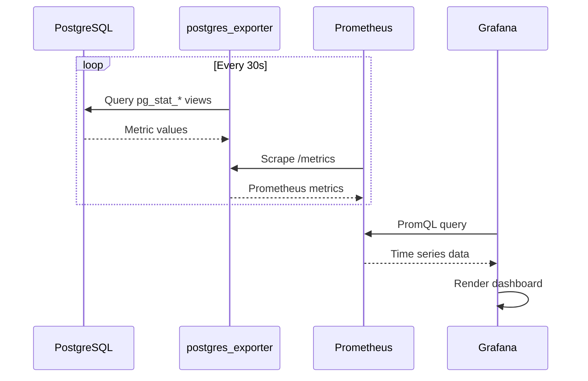
```mermaid
sequenceDiagram
    participant PG as PostgreSQL
    participant Exp as postgres_exporter
    participant Prom as Prometheus
    participant Graf as Grafana
    loop Every 30s
        Exp->>PG: Query pg_stat_* views
        PG-->>Exp: Metric values
        Prom->>Exp: Scrape /metrics
        Exp-->>Prom: Prometheus metrics
    end
    Graf->>Prom: PromQL query
    Prom-->>Graf: Time series data
    Graf->>Graf: Render dashboard
```

**BAD:**

```sql
-- Manual monitoring: check one instance
SELECT * FROM pg_stat_activity;
-- Repeat for every instance manually
-- No trending, no alerting, no correlation
```

**GOOD:**

```yaml
# postgres_exporter custom query
pg_stat_statements:
  query: |
    SELECT queryid, calls, total_exec_time,
           mean_exec_time, rows
    FROM pg_stat_statements
    ORDER BY total_exec_time DESC
    LIMIT 20
  metrics:
    - queryid: { usage: "LABEL" }
    - calls: { usage: "COUNTER" }
    - total_exec_time: { usage: "COUNTER" }
    - mean_exec_time: { usage: "GAUGE" }
```

---

### 🚨 Failure Modes

**Failure 1 - Alert fatigue from noisy thresholds:**
**Symptom:** On-call engineers ignore alerts because most are false positives; real incidents are missed.
**Root cause:** Static threshold alerts (e.g., "CPU > 80%") fire during normal traffic spikes, not just genuine problems.
**Diagnostic:**

```
# Review alert firing frequency
# In Grafana: Alerting -> Alert Rules
# Look for rules firing > 5 times/day
```

**Fix:** Replace static thresholds with rate-of-change alerts or anomaly detection. Alert on symptoms (query latency increase) rather than causes (CPU usage). Add severity levels: warning (Slack) vs. critical (PagerDuty page).

**Failure 2 - pg_stat_statements bloat hides slow queries:**
**Symptom:** `pg_stat_statements` view shows only common queries; rare but extremely slow queries are evicted.
**Root cause:** `pg_stat_statements.max` is set too low (default 5000); high-cardinality queries (with literal values instead of parameters) fill the entries.
**Diagnostic:**

```sql
SELECT count(*) FROM pg_stat_statements;
-- If close to pg_stat_statements.max,
-- entries are being evicted
SHOW pg_stat_statements.max;
```

**Fix:** Increase `pg_stat_statements.max` to 10000+. Ensure the application uses parameterized queries so statements are normalized. Periodically `SELECT pg_stat_statements_reset()` to clear stale entries.

---

### 🔬 Production Reality

A common incident pattern: a deployment introduces a new query with a missing index. The query runs in 200ms on staging (small data) but 15 seconds on production (large tables). pg_stat_statements shows the query's mean_exec_time climbing, but no alert fires because the team only monitors total TPS and connection count - not per-query latency trends. Users experience timeouts for 2 hours before someone manually checks the slow query log. The fix: alert on `pg_stat_statements` mean_exec_time for the top 20 queries when it exceeds 2x its rolling 7-day average.

---

### ⚖️ Trade-offs & Alternatives

| Aspect                | Prometheus + Grafana   | Datadog             | pganalyze            |
| --------------------- | ---------------------- | ------------------- | -------------------- |
| Cost                  | Free (self-hosted)     | Per-host pricing    | Per-instance pricing |
| Setup effort          | Medium                 | Low (agent install) | Low (agent install)  |
| Query analysis        | Basic (custom queries) | Good                | Excellent (EXPLAIN)  |
| Fleet correlation     | PromQL labels          | Native tagging      | Limited              |
| Index recommendations | None                   | Limited             | Built-in             |
| Customization         | Full (PromQL)          | Good                | Limited              |

---

### ⚡ Decision Snap

**USE WHEN:**

- Running more than 2 PostgreSQL instances (primary + replicas)
- Multiple teams depend on database health
- Incident response time must be under 15 minutes

**AVOID WHEN:**

- Single development instance with no uptime requirements
- Cloud provider's built-in monitoring is sufficient for the workload

**PREFER SaaS (Datadog, pganalyze) WHEN:**

- The team lacks capacity to maintain Prometheus infrastructure
- Query-level analysis and index recommendations are a priority

---

### ⚠️ Top Traps

| #   | Misconception                           | Reality                                                                                                           |
| --- | --------------------------------------- | ----------------------------------------------------------------------------------------------------------------- |
| 1   | Cloud provider monitoring is sufficient | CloudWatch and Cloud Monitoring lack pg_stat_statements integration and fleet-wide correlation                    |
| 2   | Monitoring connection count is enough   | Connections can be within limits while query latency degrades due to lock contention or plan regression           |
| 3   | pg_stat_statements has no overhead      | It consumes shared memory proportional to max entries and adds minor overhead per query execution                 |
| 4   | Dashboards replace alerts               | Dashboards require someone watching; alerts must fire proactively when no one is looking                          |
| 5   | One dashboard fits all roles            | Developers need query-level dashboards; DBAs need instance-level; SREs need fleet-level - build for each audience |

---

### 🪜 Learning Ladder

**Prerequisites:**

- SQL-097 Plan Regression and pg_stat_statements - the primary data source for query observability
- SQL-102 Connection Pooling - PgBouncer and HikariCP - pool metrics are critical observability signals
- SQL-089 VACUUM and Bloat Management (PostgreSQL) - bloat metrics drive proactive maintenance

**THIS:** SQL-121 Observability for Database Fleets

**Next steps:**

- SQL-122 Database Capacity Planning and Growth Modeling - observability data feeds capacity models
- SQL-119 Connection Routing and Proxy Architecture - proxy metrics complete the observability picture
- SQL-114 Multi-Database Topology Design - fleet topology determines what to monitor

**The Surprising Truth:**
The most valuable database observability metric is not CPU, memory, or disk - it is the per-query mean execution time from pg_stat_statements trended over time, because it detects plan regressions, missing indexes, and bloat weeks before aggregate metrics show any anomaly.

**Further Reading:**

- PostgreSQL Documentation: "The Statistics Collector" (postgresql.org/docs/current/monitoring-stats.html)
- Prometheus postgres_exporter GitHub (github.com/prometheus-community/postgres_exporter)
- Cary Millsap, "Optimizing Oracle Performance", Method R: response-time-based monitoring methodology applicable to any RDBMS

**Revision Card:**

1. Fleet observability requires three signals: metrics (Prometheus), logs (Loki), and query performance (pg_stat_statements) - correlated across all instances
2. Alert on symptoms (query latency increase) not causes (CPU spike) to avoid alert fatigue
3. pg_stat_statements mean_exec_time trended over time is the single most valuable metric for detecting query regressions

---

---

# SQL-122 Database Capacity Planning and Growth Modeling

**TL;DR** - Capacity planning predicts when a database will exhaust CPU, memory, storage, or connections by modeling growth trends from historical metrics and workload projections.

---

### 🔥 Problem Statement

Databases do not fail gradually - they cliff. A PostgreSQL instance running comfortably at 70% CPU can hit 100% overnight when a new feature doubles write volume. Storage fills after months of steady growth, then a marketing campaign accelerates data creation by 5x in a week. Connection pools that handled 200 connections hit 500 when three new microservices deploy simultaneously. Without capacity planning, every scaling event is an emergency. The team scrambles to provision larger instances, add replicas, or archive data under production pressure. Capacity planning replaces reactive firefighting with predictive budgeting: modeling when each resource will be exhausted and provisioning ahead of that date.

---

### 📜 Historical Context

Capacity planning in computing traces back to mainframe era sizing models in the 1970s. Relational database capacity planning became critical in the 1990s as enterprise systems scaled. The move to cloud infrastructure in the 2010s shifted capacity planning from "buy hardware 6 months ahead" to "right-size instances continuously." Tools like pganalyze, Datadog, and Prometheus-based trend analysis replaced spreadsheet models. Despite cloud elasticity, capacity planning remains essential because database scaling is not instantaneous - adding replicas takes minutes, resharding takes months, and running out of storage causes immediate outages.

---

### 🔩 First Principles

**CORE INVARIANTS:**

1. Database resource consumption grows with data volume, query complexity, and connection count - all three must be modeled independently
2. Growth is rarely linear; feature launches, marketing campaigns, and seasonal patterns create step functions and spikes
3. The time to remediate a capacity problem (add replica, resize instance, archive data) is always longer than the time to detect it

**DERIVED DESIGN:**
These invariants force a model that tracks four resources (CPU, memory, storage, connections) over time, projects exhaustion dates using regression on historical data, and adds buffer for step-function events. The planning cycle must run regularly (monthly) and trigger action when projected exhaustion is within the remediation window (e.g., 90 days for hardware, 30 days for cloud resize).

**THE TRADE-OFF:**
**Gain:** Predictable scaling; budget forecasting; avoidance of capacity-related outages.
**Cost:** Engineering time for modeling; over-provisioning cost when models are conservative; model inaccuracy when growth patterns change.

---

### 🧠 Mental Model

> Think of monitoring fuel in a fleet of delivery trucks. You track miles driven per day, fuel consumption rate, and tank size. You do not wait for the fuel light - you predict which trucks will need refueling tomorrow based on today's route and consumption trend. Step-function events (a new delivery route) require model updates.

- "Fuel level" -> storage remaining
- "Miles per day" -> data growth rate
- "New delivery route" -> feature launch changing growth pattern
- "Refueling time" -> provisioning lead time

**Where this analogy breaks down:** Trucks can refuel in minutes at any gas station; databases cannot scale storage instantly, and some remediation (resharding) takes weeks to months.

---

### 🧩 Components

- **Resource metrics** - CPU utilization, memory usage, storage consumed, connection count (from pg*stat*\* and OS metrics)
- **Growth rate** - data volume growth (bytes/day), query rate growth (TPS trend), connection growth per service
- **Projection model** - linear regression or exponential fit on historical resource metrics to predict exhaustion date
- **Headroom threshold** - minimum buffer before exhaustion that triggers provisioning (e.g., 30% remaining)
- **Step-function calendar** - scheduled events (feature launches, marketing campaigns, seasonal peaks) overlaid on linear projections
- **Capacity review** - monthly meeting reviewing projections and triggering provisioning decisions

```
  Capacity Model:
  Metric history -> Trend projection
       |
  +----+----+
  |    |    |
  CPU  Disk  Conn
  80%  70%  60%
  @90d @120d @60d <- days to exhaustion
       |
  Threshold: act if < 90 days
```

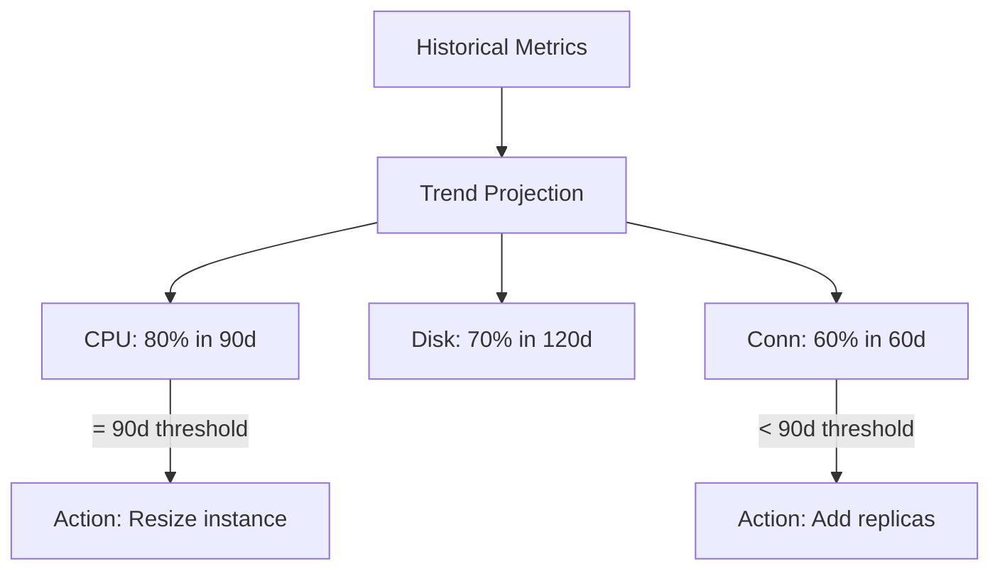
```mermaid
flowchart TD
    M[Historical Metrics] --> T[Trend Projection]
    T --> CPU["CPU: 80% in 90d"]
    T --> Disk["Disk: 70% in 120d"]
    T --> Conn["Conn: 60% in 60d"]
    Conn -->|"< 90d threshold"| A[Action: Add replicas]
    CPU -->|"= 90d threshold"| B[Action: Resize instance]
```

---

### 📶 Gradual Depth

**Level 1 - What it is:**
Capacity planning is predicting when your database will run out of CPU, memory, storage, or connections, so you can scale before it becomes an emergency.

**Level 2 - How to use it:**
Collect weekly snapshots of storage used, peak CPU, peak connections, and TPS from Prometheus or CloudWatch. Plot trends in a spreadsheet or Grafana. Extrapolate linearly to estimate when each resource hits 80% utilization. Schedule provisioning actions before that date.

**Level 3 - How it works:**
Fit a regression line to 90 days of historical resource utilization data. The slope gives the growth rate; the intercept with the capacity limit gives the exhaustion date. For storage, also model data retention: if you archive data older than 1 year, the effective growth rate is the difference between ingestion and archival. For connections, model per-service connection count and multiply by planned service deployments.

**Level 4 - Production mastery:**
Linear models break on step functions. Maintain a "capacity events calendar" listing upcoming feature launches with estimated impact (e.g., "new payment service: +50 connections, +2,000 TPS"). Apply the step function to the linear projection. Use percentile-based metrics (p95 CPU, p99 connection count) rather than averages, because averages hide peaks that cause outages. For PostgreSQL-specific planning: model bloat growth separately from data growth (`pg_total_relation_size` includes dead tuples), and model WAL volume for replication bandwidth planning.

---

### ⚙️ How It Works

**Phase 1 - Baseline:** Collect 90 days of daily metrics: peak CPU, peak memory, storage used, max connections, TPS, and pg_stat_statements top query times.

**Phase 2 - Trend analysis:** Fit linear regression to each metric. Calculate the slope (growth rate per day) and project the date when each metric crosses the threshold (e.g., 80% of limit).

**Phase 3 - Event overlay:** Review the capacity events calendar. Add step-function adjustments for known upcoming changes (feature launches, service deployments, marketing campaigns).

**Phase 4 - Action planning:** For each resource projected to hit threshold within the remediation window, plan the scaling action (resize instance, add replicas, archive data, optimize queries) and schedule it.

```
  Storage example:
  Current: 500 GB used / 1 TB disk
  Growth: 2 GB/day (linear fit)
  Time to 80%: (800-500) / 2 = 150 days
  Event: new feature in 60 days (+5 GB/day)
  Adjusted: 150 days -> ~55 days
  Action: expand disk before day 50
```

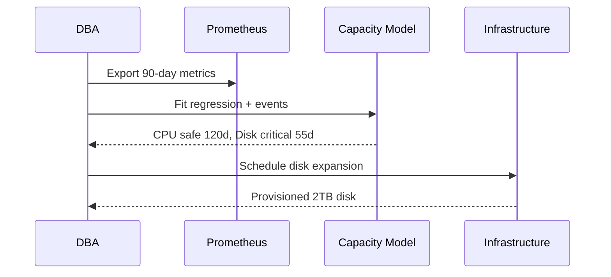
```mermaid
sequenceDiagram
    participant DBA
    participant Prom as Prometheus
    participant Model as Capacity Model
    participant Infra as Infrastructure
    DBA->>Prom: Export 90-day metrics
    DBA->>Model: Fit regression + events
    Model-->>DBA: CPU safe 120d, Disk critical 55d
    DBA->>Infra: Schedule disk expansion
    Infra-->>DBA: Provisioned 2TB disk
```

**BAD:**

```sql
-- Reactive: wait for disk full alert
-- "PANIC: could not write to file"
-- Emergency resize under production pressure
```

**GOOD:**

```sql
-- Proactive: monthly capacity check
SELECT pg_database_size('mydb')
       / (1024*1024*1024.0) AS gb_used,
       current_setting(
         'data_directory'
       ) AS data_dir;
-- Feed into regression model
-- Project exhaustion date
```

---

### 🚨 Failure Modes

**Failure 1 - Storage exhaustion crashes the database:**
**Symptom:** PostgreSQL stops accepting writes; error logs show "No space left on device"; WAL archiving fails.
**Root cause:** Data growth exceeded projections; no capacity model or model not updated after a growth event.
**Diagnostic:**

```bash
df -h /var/lib/postgresql/data
du -sh /var/lib/postgresql/data/pg_wal/
```

**Fix:** Immediately free space (drop temp tables, archive old partitions, clear pg_wal if replication slots are orphaned). Then implement proactive capacity monitoring with alerts at 70% and 85% thresholds.

**Failure 2 - Connection exhaustion during peak:**
**Symptom:** Application errors "too many connections"; new connection attempts rejected; PgBouncer `cl_waiting` spikes.
**Root cause:** New services deployed without accounting for their connection requirements; total demand exceeds `max_connections`.
**Diagnostic:**

```sql
SELECT count(*), state
FROM pg_stat_activity
GROUP BY state;
SHOW max_connections;
```

**Fix:** Increase `max_connections` (requires restart). Deploy PgBouncer if not present. Require every service to register its connection budget in the capacity model.

---

### 🔬 Production Reality

A common capacity planning failure: a team models storage growth linearly at 1 GB/day based on 6 months of history. A marketing campaign launches, driving 10x user signups for two weeks. Data growth jumps to 10 GB/day. The 1 TB disk, projected to last 500 more days, fills in 50. The team discovers the problem when WAL archiving fails (disk full), which blocks replication, which causes replica lag alerts. By then, the primary is minutes from halting writes. The fix: maintain a capacity events calendar linked to the product roadmap, and model step-function growth for every major launch.

---

### ⚖️ Trade-offs & Alternatives

| Aspect           | Spreadsheet Model   | Prometheus Trending | pganalyze / SaaS |
| ---------------- | ------------------- | ------------------- | ---------------- |
| Setup effort     | Low                 | Medium              | Low              |
| Accuracy         | Manual, error-prone | Automated, good     | Automated, good  |
| Event overlay    | Manual              | Manual              | Some built-in    |
| Automation       | None                | PromQL alerts       | Built-in alerts  |
| Cost             | Free                | Infra cost          | SaaS pricing     |
| Historical depth | Limited             | Retention-dependent | Provider-managed |

---

### ⚡ Decision Snap

**USE WHEN:**

- Database fleet has more than 2 instances
- Data growth rate is non-trivial (>1 GB/day)
- Capacity-related outages have occurred in the past

**AVOID WHEN:**

- Prototype or development environment with no uptime requirements
- Cloud auto-scaling handles all resources (rare for databases)

**PREFER SaaS tools (pganalyze, Datadog) WHEN:**

- The team lacks time to build custom regression models
- Automated recommendations (index, VACUUM, sizing) are valuable

---

### ⚠️ Top Traps

| #   | Misconception                                | Reality                                                                                                     |
| --- | -------------------------------------------- | ----------------------------------------------------------------------------------------------------------- |
| 1   | Linear growth models are always sufficient   | Feature launches and marketing campaigns create step functions that invalidate linear projections overnight |
| 2   | Cloud auto-scaling handles database capacity | Database scaling (resize, add replicas) is not instantaneous; it requires planning and maintenance windows  |
| 3   | Storage is the only resource that matters    | Connection count, CPU (from query complexity), and memory (from working set size) also hit limits           |
| 4   | Averages are good enough for planning        | Use p95/p99 metrics; averages hide peaks that cause outages during daily traffic spikes                     |
| 5   | Capacity planning is a one-time exercise     | Models drift as workloads change; review monthly and after every significant product change                 |

---

### 🪜 Learning Ladder

**Prerequisites:**

- SQL-121 Observability for Database Fleets - metrics collection that feeds capacity models
- SQL-089 VACUUM and Bloat Management (PostgreSQL) - bloat contributes to storage growth beyond raw data
- SQL-102 Connection Pooling - PgBouncer and HikariCP - connection management is a capacity concern

**THIS:** SQL-122 Database Capacity Planning and Growth Modeling

**Next steps:**

- SQL-113 Sharding Strategies - Application vs Proxy - the scaling action when single-node capacity is exhausted
- SQL-114 Multi-Database Topology Design - fleet architecture decisions driven by capacity needs
- SQL-098 Table Partitioning - Range, List, Hash - partitioning as a capacity management tool

**The Surprising Truth:**
The most common capacity planning failure is not bad math - it is the complete absence of a capacity events calendar linked to the product roadmap. The database team learns about a 10x traffic event from the outage, not from the product launch announcement.

**Further Reading:**

- Gunther, N. "Guerrilla Capacity Planning", Springer, 2007
- PostgreSQL Documentation: "Monitoring Database Activity" (postgresql.org/docs/current/monitoring.html)
- Google SRE Book: "Software Engineering at Google", Chapter on Capacity Planning

**Revision Card:**

1. Model four resources independently: CPU, memory, storage, connections - each has different growth patterns and remediation timelines
2. Overlay step-function events (feature launches, campaigns) on linear projections - they are the primary source of model failure
3. Act when projected exhaustion is within the remediation window (90 days for hardware, 30 days for cloud resize)
