## Keywords

1. [SQL-123 ORM Impedance Mismatch Anti-Pattern](#sql-123-orm-impedance-mismatch-anti-pattern)
2. [SQL-124 Online Store DB - Phase 5 (Multi-Region Strategy)](#sql-124-online-store-db---phase-5-multi-region-strategy)
3. [SQL-125 SQL Staff-Level Interview Scenarios](#sql-125-sql-staff-level-interview-scenarios)
4. [SQL-126 Teaching Transaction Isolation - Common Confusions](#sql-126-teaching-transaction-isolation---common-confusions)
5. [SQL-127 Relational Algebra - The Theory Behind SQL](#sql-127-relational-algebra---the-theory-behind-sql)
6. [SQL-128 Codd's 12 Rules and Relational Completeness](#sql-128-codds-12-rules-and-relational-completeness)
7. [SQL-129 SQL Standard Evolution - SQL-92 to SQL:2023](#sql-129-sql-standard-evolution---sql-92-to-sql2023)
8. [SQL-130 Query Optimization Theory - Selinger Optimizer](#sql-130-query-optimization-theory---selinger-optimizer)
9. [SQL-131 Isolation Formalism - Adya, Liskov, O'Neil (1999)](#sql-131-isolation-formalism---adya-liskov-oneil-1999)
10. [SQL-132 LSM-Trees vs B-Trees - Storage Engine Design](#sql-132-lsm-trees-vs-b-trees---storage-engine-design)

---

---

# SQL-123 ORM Impedance Mismatch Anti-Pattern

**TL;DR** - ORM impedance mismatch is the fundamental conflict between object-oriented models (graphs of mutable objects) and relational models (normalized sets of immutable tuples), causing N+1 queries, entity bloat, and hidden SQL.

---

### 🔥 Problem Statement

Object-Relational Mappers (Hibernate, SQLAlchemy, ActiveRecord, Entity Framework) promise to eliminate the gap between objects and tables. In practice, they mask it. A developer loads an `Order` object that lazy-loads `Customer`, which lazy-loads `Address`, which triggers three separate SQL queries per order - the N+1 problem. A `User` entity with 40 columns gets fetched entirely when only `name` and `email` are needed. A complex business query that a DBA would write as a single SQL statement with window functions becomes a chain of ORM method calls that generates 15 queries. The impedance mismatch is not a bug in the ORM - it is a fundamental conflict between two incompatible data models that the ORM can only hide, not solve.

---

### 📜 Historical Context

The term "object-relational impedance mismatch" was coined in the 1990s as OOP languages gained dominance. Ted Neward famously called it the "Vietnam of Computer Science" in a 2006 essay, arguing that the problem was fundamentally unsolvable. Hibernate (2001) and ActiveRecord (2004, Ruby on Rails) became dominant ORMs by trading SQL visibility for developer productivity. The JPA specification (2006) standardized the Java ORM interface. Despite decades of evolution, the core mismatch persists: objects have identity, inheritance, and encapsulation; relations have sets, normalization, and declarative queries. Every ORM chooses which side to favor, and the other side suffers.

---

### 🔩 First Principles

**CORE INVARIANTS:**

1. Objects are graphs with identity, state, and behavior; relations are sets of tuples without identity, state, or behavior - these are fundamentally different data models
2. ORMs must translate between graph traversal (object navigation) and set operations (SQL joins) - this translation always loses information or performance
3. The ORM's unit-of-work and identity map create an in-memory cache that diverges from the database state, producing stale reads and subtle concurrency bugs

**DERIVED DESIGN:**
These invariants force every ORM interaction to make a trade-off: eager loading (join everything upfront, potentially fetching unused data) vs. lazy loading (fetch on access, risking N+1 queries). The optimal strategy depends on the access pattern, which the ORM cannot predict at mapping time. This is why the anti-pattern manifests: developers write object-navigation code assuming in-memory cost, while the ORM silently issues SQL with network-round-trip cost.

**THE TRADE-OFF:**
**Gain:** Reduced boilerplate; domain model expressed in objects; database portability (in theory).
**Cost:** Hidden query patterns; N+1 performance traps; entity bloat; difficulty expressing set-based operations; SQL debugging is obfuscated.

---

### 🧠 Mental Model

> Think of a simultaneous translator between two speakers of different languages. The translator (ORM) can handle simple phrases well, but complex ideas lose nuance in translation. When one speaker uses an idiom (SQL window function), the translator either paraphrases awkwardly (multiple queries) or gives up (requires native SQL). The conversation works for small talk but breaks down for technical discussion.

- "Simple phrases" -> basic CRUD operations
- "Complex idioms" -> JOINs, window functions, CTEs
- "Awkward paraphrase" -> N+1 queries, entity over-fetching
- "Giving up" -> `@Query` with native SQL

**Where this analogy breaks down:** Unlike human translators who improve with practice, ORMs have a fixed translation capability determined by their design - they cannot learn new SQL patterns at runtime.

---

### 🧩 Components

- **Entity mapping** - annotations or configuration that map object classes to database tables and columns
- **Identity map** - per-session cache that ensures each database row maps to exactly one object instance
- **Unit of work** - tracks dirty objects and flushes changes to the database at transaction commit
- **Lazy loading proxy** - dynamically generated subclass that fetches related objects on first access
- **N+1 query problem** - pattern where loading N parent objects triggers N additional queries for child collections
- **Eager fetch strategy** - JOIN-based loading that fetches related objects in a single query
- **DTO projection** - pattern of selecting specific columns into a flat data structure instead of full entity

```
  ORM Abstraction Layers:
  +-------------------+
  | Application Code  |
  | order.getCustomer |
  +-------------------+
         |
  +-------------------+
  | ORM (Hibernate)   |
  | entity -> SQL     |
  +-------------------+
         |
  +-------------------+
  | JDBC / Driver     |
  +-------------------+
         |
  +-------------------+
  | PostgreSQL        |
  +-------------------+
```

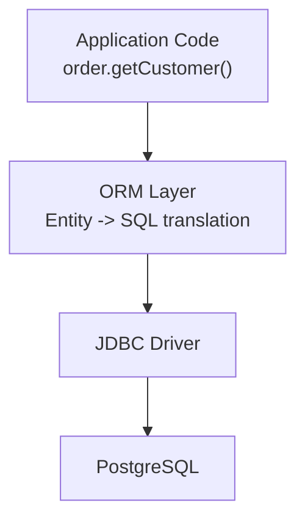

---

### 📶 Gradual Depth

**Level 1 - What it is:**
ORM impedance mismatch is the fundamental conflict between how objects work (graphs with behavior) and how relational databases work (sets of tuples with constraints). ORMs translate between them, but the translation is always imperfect.

**Level 2 - How to use it:**
Recognize the anti-pattern by monitoring SQL output. Enable SQL logging in your ORM (`hibernate.show_sql`, Django `DEBUG` logging). Watch for N+1 patterns: one query to load a list, then one query per item to load a related object. Use eager fetching (`JOIN FETCH` in JPA) for known access patterns and DTO projections for read-heavy endpoints.

**Level 3 - How it works:**
When you call `order.getCustomer()`, Hibernate checks the identity map. If the customer is not cached, it issues `SELECT * FROM customers WHERE id = ?`. If you iterate over 100 orders, that is 100 individual SELECTs. With `JOIN FETCH`, Hibernate rewrites the query to `SELECT o.*, c.* FROM orders o JOIN customers c ON o.customer_id = c.id`, loading everything in one round trip. But eager fetching applied globally causes cartesian products when entities have multiple collections.

**Level 4 - Production mastery:**
The most effective mitigation is not fixing the ORM - it is bypassing it for read paths. Use DTO projections (JPA `@Query` returning interfaces or records, SQLAlchemy `query.with_entities()`) for API responses and reports. Reserve full entity loading for write operations where the unit-of-work pattern adds value. For complex queries (window functions, recursive CTEs, lateral joins), use native SQL or a query builder (JOOQ, Exposed). Monitor query count per request in production (Spring Boot Actuator, Hibernate statistics) and set a budget (e.g., max 10 queries per API call).

---

### ⚙️ How It Works

**Phase 1 - Entity loading:** The application requests an object. The ORM checks the identity map (first-level cache). If absent, it generates a SELECT and maps the result to an entity.

**Phase 2 - Graph navigation:** The application accesses a related object. The ORM detects the proxy and issues another SELECT (lazy load) or has already fetched it (eager load).

**Phase 3 - Modification tracking:** The unit of work tracks field changes on managed entities. At flush time, it generates UPDATE statements for dirty fields.

**Phase 4 - Flush and commit:** The ORM issues all pending INSERTs, UPDATEs, and DELETEs in dependency order, then commits the transaction.

```
  N+1 Pattern:
  SELECT * FROM orders;           -- 1 query
  -- For each of 100 orders:
  SELECT * FROM customers          -- 100 queries
  WHERE id = ?;                    -- TOTAL: 101

  Fixed with JOIN FETCH:
  SELECT o.*, c.* FROM orders o   -- 1 query
  JOIN customers c
  ON o.customer_id = c.id;        -- TOTAL: 1
```

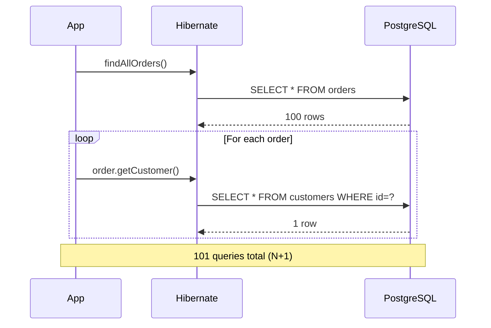

**BAD:**

```java
// N+1: 101 queries for 100 orders
List<Order> orders = repo.findAll();
for (Order o : orders) {
    // Triggers lazy load per order
    log.info(o.getCustomer().getName());
}
```

**GOOD:**

```java
// 1 query with JOIN FETCH
@Query("SELECT o FROM Order o "
     + "JOIN FETCH o.customer")
List<Order> findAllWithCustomer();

// Or: DTO projection (no entity overhead)
@Query("SELECT o.id, c.name "
     + "FROM Order o JOIN o.customer c")
List<OrderSummary> findSummaries();
```

---

### 🚨 Failure Modes

**Failure 1 - N+1 queries in a loop:**
**Symptom:** API endpoint takes 5 seconds to respond; SQL logging shows hundreds of nearly identical SELECT statements per request.
**Root cause:** Lazy-loaded collection accessed inside a loop; ORM issues one query per iteration.
**Diagnostic:**

```java
// Enable Hibernate statistics
Statistics stats = sessionFactory
    .getStatistics();
stats.setStatisticsEnabled(true);
// After request:
log.info("Queries: {}",
    stats.getQueryExecutionCount());
```

**Fix:** Use `JOIN FETCH` in JPQL, or `@EntityGraph` annotations, or DTO projections. Set a query count budget per request and alert when exceeded.

**Failure 2 - Entity bloat over-fetching:**
**Symptom:** Memory usage spikes; GC pauses increase; response payload is 10x larger than needed.
**Root cause:** Full entity with 40 columns loaded when only 3 are needed; ORM hydrates all fields including LOBs and eagerly fetched collections.
**Diagnostic:**

```sql
-- Check what ORM actually selects
-- Enable SQL logging:
-- hibernate.show_sql=true
-- hibernate.format_sql=true
-- Look for SELECT with many columns
```

**Fix:** Use DTO projections (`SELECT new OrderDTO(...)`) or interface-based projections. Map only the columns the consumer needs.

---

### 🔬 Production Reality

A typical ORM incident: a team builds an admin dashboard showing a list of 500 orders with customer names and product counts. The ORM loads 500 `Order` entities, each with a lazy `Customer` (500 more queries) and a lazy `OrderItems` collection (500 more queries, each returning multiple rows). Total: 1,501 queries, 8 seconds response time. A single SQL query with JOINs and COUNT would take 50ms. The fix is not "tune the ORM" - it is recognizing that read paths should bypass the entity model entirely and use projections or native SQL.

---

### ⚖️ Trade-offs & Alternatives

| Aspect                | Full ORM (Hibernate) | Query Builder (JOOQ)      | Raw SQL / JDBC |
| --------------------- | -------------------- | ------------------------- | -------------- |
| Boilerplate           | Low                  | Medium                    | High           |
| SQL visibility        | Low (generated)      | High (type-safe)          | Full           |
| N+1 risk              | High                 | None                      | None           |
| Complex query support | Limited              | Full SQL in type-safe DSL | Full           |
| Write convenience     | High (unit of work)  | Medium                    | Low            |
| Learning curve        | Medium               | Medium                    | Low            |

---

### ⚡ Decision Snap

**USE WHEN (full ORM):**

- Write-heavy CRUD operations where unit-of-work tracking reduces boilerplate
- Domain model maps cleanly to tables (1:1 entity-table)
- Team prioritizes development speed over query performance

**AVOID WHEN (full ORM):**

- Read-heavy workloads with complex joins, window functions, or CTEs
- Performance-critical paths where query count and shape must be controlled

**PREFER query builders (JOOQ) or projections WHEN:**

- SQL visibility and type-safety matter
- Queries involve aggregations, subqueries, or analytical functions

---

### ⚠️ Top Traps

| #   | Misconception                               | Reality                                                                                                          |
| --- | ------------------------------------------- | ---------------------------------------------------------------------------------------------------------------- |
| 1   | ORMs eliminate the need to understand SQL   | ORMs generate SQL; understanding the generated SQL is essential for diagnosing performance problems              |
| 2   | Eager fetching fixes N+1                    | Global eager fetching causes cartesian products and over-fetching; it must be applied per-query, not per-mapping |
| 3   | The ORM handles optimization automatically  | ORMs generate correct SQL, not optimal SQL; the planner sees the generated query, not your intent                |
| 4   | Entity models are good for reads and writes | Entities are optimized for writes (change tracking); reads are better served by projections                      |
| 5   | Switching ORMs fixes the impedance mismatch | The mismatch is between objects and relations, not between your code and a specific ORM library                  |

---

### 🪜 Learning Ladder

**Prerequisites:**

- SQL-060 Execution Plans Deep Dive - EXPLAIN ANALYZE - understanding the SQL that ORMs generate
- SQL-094 Query Planner and Cost-Based Optimization - why ORM-generated queries may get bad plans
- SQL-064 Query Performance Tuning Patterns - optimizing the queries you find in ORM output

**THIS:** SQL-123 ORM Impedance Mismatch Anti-Pattern

**Next steps:**

- SQL-107 Unindexed Foreign Key Anti-Pattern - common in ORM-generated schemas
- SQL-108 OFFSET Pagination at Scale Anti-Pattern - ORMs default to OFFSET pagination
- SQL-139 Set-Based Thinking vs Procedural Thinking - the root cause of ORM misuse

**The Surprising Truth:**
The best ORM strategy is not choosing between ORM and raw SQL - it is using the ORM for writes (where change tracking adds value) and bypassing it for reads (where projections and native SQL outperform entity loading by orders of magnitude).

**Further Reading:**

- Neward, T. "The Vietnam of Computer Science" (2006) essay on ORM impedance mismatch
- King, G. et al. "Java Persistence with Hibernate", Manning, 2nd Edition
- JOOQ Blog: "10 Common Mistakes Java Developers Make when Writing SQL" (jooq.org/blog)

**Revision Card:**

1. ORM impedance mismatch is fundamental: objects are graphs, relations are sets - no ORM can fully bridge this gap
2. The N+1 query pattern is the most common symptom; fix with JOIN FETCH, entity graphs, or DTO projections
3. Use the ORM for writes (unit-of-work value) and bypass it for reads (projection/native SQL for performance)

---

---

# SQL-124 Online Store DB - Phase 5 (Multi-Region Strategy)

**TL;DR** - Phase 5 evolves the online store database to multi-region by introducing geographic sharding, regional read replicas, conflict resolution for multi-primary writes, and data residency compliance.

---

### 🔥 Problem Statement

The online store has grown from a single-region deployment to global reach. Users in Europe experience 200ms+ latency querying a US-based primary. GDPR requires EU user data to reside in EU data centers. A US-region outage means the entire store is unavailable globally. Multi-region architecture addresses all three: place data close to users (latency), keep data in the correct jurisdiction (compliance), and survive regional failures (availability). But multi-region databases introduce the hardest distributed systems problems: cross-region replication lag, conflict resolution for concurrent writes, and the CAP theorem forcing trade-offs between consistency and availability during network partitions.

---

### 📜 Historical Context

Early global services used a single primary database with CDN caching for reads. Google Spanner (2012) demonstrated globally consistent multi-region transactions using TrueTime. CockroachDB (2015) and YugabyteDB (2016) brought Spanner-inspired multi-region SQL to open-source. PostgreSQL supports multi-region through replication and Citus, though without built-in global consistency. The online store's Phase 5 models a typical progression: from single-region with replicas to geographically sharded data with regional autonomy.

---

### 🔩 First Principles

**CORE INVARIANTS:**

1. Cross-region network latency (50-200ms round trip) makes synchronous replication expensive and asynchronous replication eventually consistent
2. Data residency laws (GDPR, data sovereignty) require certain data to be stored in specific geographic regions
3. Multi-primary writes to the same row from different regions require conflict resolution - last-write-wins, application-level merge, or CRDT-based resolution

**DERIVED DESIGN:**
These invariants force geographic sharding by region: EU users' data lives in an EU PostgreSQL cluster, US users' data in a US cluster. Global reference data (product catalog) replicates to all regions as read replicas. Writes for region-local data go to the regional primary. Cross-region queries (global analytics, global search) use federated queries or a replicated analytics warehouse. Conflict resolution is avoided by ensuring each row has a single authoritative region.

**THE TRADE-OFF:**
**Gain:** Low-latency reads and writes per region; data residency compliance; regional failure isolation.
**Cost:** Complexity of cross-region coordination; eventual consistency for global views; operational overhead of managing multiple clusters.

---

### 🧠 Mental Model

> Think of a franchise restaurant chain. Each regional kitchen (database cluster) handles local orders independently. The corporate menu (product catalog) is distributed to all locations. A customer in Paris orders from the Paris kitchen, not from New York. Global sales reports aggregate across all kitchens nightly.

- "Regional kitchen" -> regional PostgreSQL primary + replicas
- "Corporate menu" -> globally replicated reference data
- "Local order" -> regional write to local primary
- "Global sales report" -> cross-region analytics aggregation

**Where this analogy breaks down:** Restaurant orders do not need conflict resolution; database rows accessed from two regions simultaneously (e.g., a user who travels) require explicit routing rules.

---

### 🧩 Components

- **Regional primary clusters** - PostgreSQL primary + replicas per geographic region (US, EU, APAC)
- **Geographic shard key** - `region` column on user-owned tables determining which cluster owns the data
- **Global reference data** - product catalog, configuration tables replicated to all regions (read-only locally)
- **Regional connection router** - proxy or application logic directing queries to the correct regional cluster based on user's region
- **Cross-region replication** - logical replication from each regional primary to a central analytics warehouse
- **Conflict resolution policy** - rules for handling writes to the same logical entity from multiple regions (typically: single-owner region per entity)
- **Data residency metadata** - tagging system ensuring regulated data stays within its required jurisdiction

```
  Multi-Region Online Store:
  +----------+     +----------+     +----------+
  | US       |     | EU       |     | APAC     |
  | Primary  |     | Primary  |     | Primary  |
  | +Replicas|     | +Replicas|     | +Replicas|
  +----+-----+     +----+-----+     +----+-----+
       |                |                |
       +------+----+----+------+---------+
              |              |
        [Product Catalog   [Analytics
         Replicated to     Warehouse
         all regions]      (aggregated)]
```

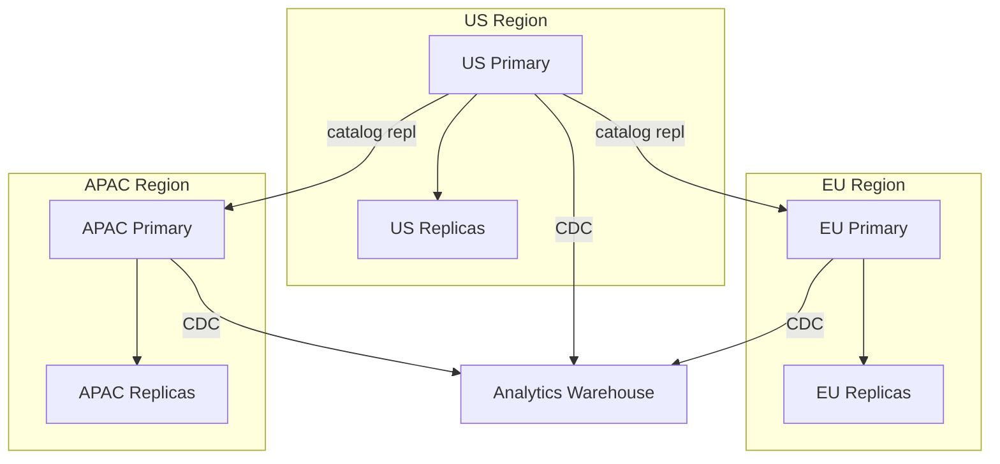

---

### 📶 Gradual Depth

**Level 1 - What it is:**
Multi-region database strategy places separate database clusters in each geographic region so users get low-latency access, data residency laws are satisfied, and regional failures do not take down the global service.

**Level 2 - How to use it:**
Add a `region` column to user and order tables. Route each user's writes to their region's primary. Replicate the product catalog from a central source to all regions. Use a regional connection router (application-level or proxy) that reads the user's region from their profile and directs the connection accordingly.

**Level 3 - How it works:**
Each region runs an independent PostgreSQL cluster (primary + replicas). User data is sharded by region: a Paris user's orders exist only in the EU cluster. Global data (products, categories) is replicated from a central primary to all regional clusters using logical replication. Cross-region queries (global revenue report) are answered by an analytics warehouse that consumes CDC streams from all regions. Failover within a region is handled by Patroni; cross-region failover requires DNS-based rerouting.

**Level 4 - Production mastery:**
The hardest problem is users who change regions (relocation, travel). Options: (1) keep data in the original region and proxy reads from the new region (higher latency), (2) migrate data to the new region (complex, requires coordination), or (3) dual-write during transition (conflict-prone). For the online store, option 1 is simplest - a user in the EU temporarily visiting the US gets slightly higher latency but data stays compliant. Monitor cross-region replication lag for the product catalog; stale catalog data means a US product price change is not visible in EU for seconds to minutes.

---

### ⚙️ How It Works

**Phase 1 - Regional schema setup:** Deploy PostgreSQL clusters in US, EU, and APAC regions. Add `region` column to users, orders, and related tables. Populate existing data with region assignments.

**Phase 2 - Catalog replication:** Set up logical replication from the catalog-primary (e.g., US) to EU and APAC clusters. Products, categories, and pricing tables replicate as read-only subscriptions.

**Phase 3 - Connection routing:** Deploy a regional router (application middleware or proxy). When a user authenticates, the router reads their `region` attribute and directs all their queries to the corresponding cluster.

**Phase 4 - Analytics aggregation:** Deploy CDC connectors (Debezium) on each regional primary. Stream order events to a central analytics warehouse (Redshift, BigQuery, or a dedicated PostgreSQL instance) for global reporting.

```
  User (EU) places order:
  1. App reads user.region = 'EU'
  2. Router -> EU Primary
  3. INSERT INTO orders (region='EU', ...)
  4. CDC -> Analytics Warehouse

  Admin views global revenue:
  1. Query analytics warehouse
  2. Aggregates across US + EU + APAC data
```

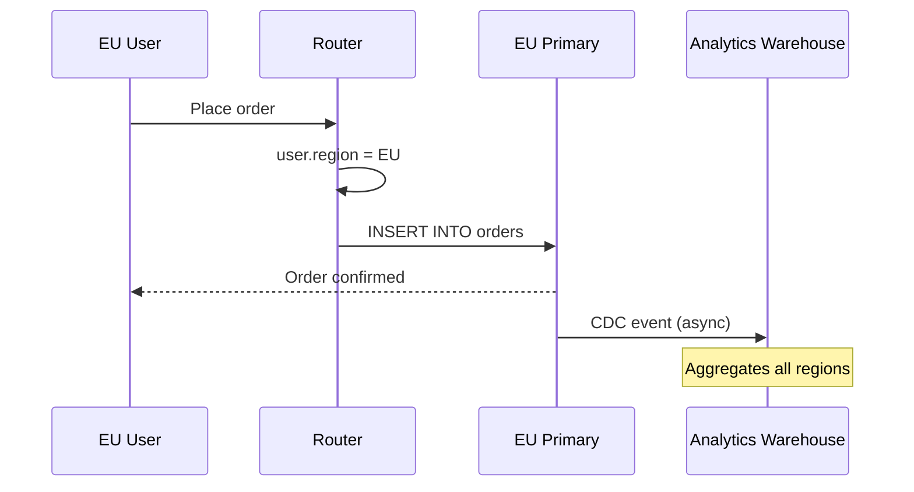

**BAD:**

```sql
-- Single global primary: high latency for EU
-- EU user -> US primary -> 200ms RTT per query
INSERT INTO orders (user_id, product_id, total)
VALUES (42, 101, 79.99);
-- EU user waits 200ms+ for write confirmation
```

**GOOD:**

```sql
-- Regional primary: low latency for EU
-- EU user -> EU primary -> 5ms RTT
INSERT INTO orders (
  user_id, product_id, total, region
) VALUES (42, 101, 79.99, 'EU');
-- Write confirmed in <10ms
```

---

### 🚨 Failure Modes

**Failure 1 - Stale product catalog after cross-region replication lag:**
**Symptom:** EU users see outdated product prices or unavailable products after a US-side catalog update.
**Root cause:** Logical replication from US catalog-primary to EU subscriber lags due to network latency or subscriber apply delay.
**Diagnostic:**

```sql
-- On EU subscriber
SELECT * FROM pg_stat_subscription;
-- Check latest_end_lsn vs remote LSN
```

**Fix:** Monitor catalog replication lag and alert if > 30 seconds. For price changes, use effective_date columns so price updates are not dependent on replication timing.

**Failure 2 - User region migration causes data inconsistency:**
**Symptom:** A user who relocated from US to EU sees some orders in one region and some in another; analytics double-counts.
**Root cause:** User's region was updated without migrating historical data; orders exist in both US and EU clusters.
**Diagnostic:**

```sql
-- Check for split data
SELECT region, count(*)
FROM orders
WHERE user_id = 42
GROUP BY region;
-- If multiple regions: data is split
```

**Fix:** Implement a region migration process: copy historical data to the new region, update the user's region attribute, then delete from the old region - all within a coordinated transaction or with idempotent reconciliation.

---

### 🔬 Production Reality

A common multi-region incident: the product team updates prices in the US catalog. Logical replication to EU takes 45 seconds during peak load. During that window, EU users see the old price, add items to their cart, and check out at the old price. The order total is calculated using the EU-local catalog (old price), not the US-updated price. The business loses revenue on discounted prices or overcharges on increased prices. The fix: decouple pricing from the catalog replication path. Use a pricing service with its own synchronous API call at checkout time, or embed prices at cart-creation time and validate at checkout against the canonical source.

---

### ⚖️ Trade-offs & Alternatives

| Aspect                   | Regional Sharding (PG)           | CockroachDB Multi-Region     | Spanner                  |
| ------------------------ | -------------------------------- | ---------------------------- | ------------------------ |
| Consistency model        | Regional strong, global eventual | Global strong (configurable) | Global strong (TrueTime) |
| Cross-region latency     | Async repl (low local)           | Sync for quorum (higher)     | Sync for quorum (higher) |
| Data residency           | Explicit by shard                | TABLE LOCALITY config        | Placement policies       |
| Operational complexity   | High (manual)                    | Medium (built-in)            | Low (managed)            |
| Cost                     | PostgreSQL license (free)        | Enterprise license           | GCP pricing              |
| PostgreSQL compatibility | Native                           | Wire-compatible              | Spanner SQL dialect      |

---

### ⚡ Decision Snap

**USE WHEN:**

- Users span multiple continents and latency matters
- Data residency regulations (GDPR) mandate geographic storage
- Regional failure isolation is a business requirement

**AVOID WHEN:**

- All users are in one geographic region
- Data volume and latency are manageable from a single region with CDN caching

**PREFER CockroachDB/Spanner WHEN:**

- Global strong consistency is required across regions
- The team cannot manage multi-cluster PostgreSQL replication operationally

---

### ⚠️ Top Traps

| #   | Misconception                                         | Reality                                                                                                                   |
| --- | ----------------------------------------------------- | ------------------------------------------------------------------------------------------------------------------------- |
| 1   | CDN caching solves multi-region for databases         | CDNs cache static content; database writes and personalized reads still need regional proximity                           |
| 2   | Cross-region replication is fast enough for real-time | Cross-region latency (50-200ms) makes synchronous replication expensive; async replication introduces consistency windows |
| 3   | Region assignment is static forever                   | Users relocate, travel, and access from unexpected regions; the architecture must handle region mobility                  |
| 4   | Global analytics just queries all regions             | Federated queries across regions are slow; use a replicated analytics warehouse for global reports                        |
| 5   | Multi-region means multi-primary writes               | Safest approach is single-owner-per-row; multi-primary writes to the same row require complex conflict resolution         |

---

### 🪜 Learning Ladder

**Prerequisites:**

- SQL-109 Online Store DB - Phase 4 (Internals and Tuning) - the single-region optimized store this phase extends
- SQL-113 Sharding Strategies - Application vs Proxy - geographic sharding builds on sharding fundamentals
- SQL-100 Logical Replication and Physical Replication - catalog replication between regions

**THIS:** SQL-124 Online Store DB - Phase 5 (Multi-Region Strategy)

**Next steps:**

- SQL-120 GDPR and Right-to-Erasure in SQL Systems - data residency and erasure in multi-region
- SQL-114 Multi-Database Topology Design - the broader topology pattern
- SQL-122 Database Capacity Planning and Growth Modeling - capacity planning per region

**The Surprising Truth:**
The hardest multi-region problem is not replication technology - it is the business logic for handling entities that cross region boundaries (users who travel, orders with multi-region fulfillment, global inventory counts) where no clean geographic partition exists.

**Further Reading:**

- Corbett, J. et al. "Spanner: Google's Globally-Distributed Database", OSDI 2012
- CockroachDB Documentation: "Multi-Region Capabilities" (cockroachlabs.com/docs/stable/multiregion-overview.html)
- PostgreSQL Documentation: "Logical Replication" (postgresql.org/docs/current/logical-replication.html)

**Revision Card:**

1. Multi-region shards by geography: each region's data lives in its local cluster for low latency and compliance
2. Global reference data (catalog) replicates to all regions; user data stays in its home region
3. Cross-region consistency is eventual; decouple latency-sensitive operations (pricing, inventory) from replication timing

---

---

# SQL-125 SQL Staff-Level Interview Scenarios

**TL;DR** - Staff-level SQL interviews test architectural reasoning, trade-off analysis, and production debugging - not syntax recall - through open-ended system design and incident response scenarios.

---

### 🔥 Problem Statement

Senior and staff engineer interviews test a fundamentally different skill than coding interviews. A candidate who can write a perfect window function query may fail when asked: "Your database is experiencing 10x latency increase after a deployment - walk me through diagnosis." Staff-level interviews evaluate architectural judgment (when to shard vs. replicate), trade-off reasoning (consistency vs. availability), incident response (systematic debugging under pressure), and system design (schema decisions that survive 100x growth). Candidates fail not because they lack SQL knowledge, but because they cannot apply that knowledge to ambiguous, multi-constraint production scenarios.

---

### 📜 Historical Context

Database interview questions have evolved through three eras. The 1990s-2000s focused on syntax: "Write a self-join." The 2010s shifted to query optimization: "Why is this query slow?" The current staff-level bar tests system reasoning: "Design the data layer for a multi-region e-commerce platform handling GDPR compliance." This evolution mirrors the industry shift from individual database servers to distributed database architectures where a single schema decision affects latency, compliance, and failure modes across dozens of services.

---

### 🔩 First Principles

**CORE INVARIANTS:**

1. Staff-level interviews evaluate decision-making under ambiguity, not knowledge recall - the candidate must identify constraints before proposing solutions
2. Every architectural decision has trade-offs; articulating what you sacrifice is as important as what you gain
3. Production debugging requires systematic narrowing (metrics -> queries -> plans -> root cause), not pattern-matching to memorized scenarios

**DERIVED DESIGN:**
These invariants force interview scenarios that are deliberately ambiguous. The interviewer provides a vague problem ("the database is slow") and evaluates the candidate's ability to ask clarifying questions, narrow the search space, propose multiple solutions with trade-offs, and justify a recommendation. The best answers demonstrate: "Here is what I would check first, here is why, here are two approaches with their trade-offs, and here is which I would choose given these constraints."

**THE TRADE-OFF:**
**Gain:** Identifies engineers who can make sound database architecture decisions in production.
**Cost:** Preparation requires broad and deep understanding of database internals, not just interview-specific practice.

---

### 🧠 Mental Model

> Think of a staff-level interview as a architecture review meeting, not an exam. The interviewer is a colleague asking: "How should we solve this?" The answer is evaluated on reasoning quality, trade-off awareness, and communication clarity - not on arriving at a specific "correct" answer.

- "Architecture review" -> open-ended scenario discussion
- "Colleague asking" -> collaborative problem-solving, not adversarial testing
- "Reasoning quality" -> systematic approach, first-principles thinking
- "No single correct answer" -> multiple valid approaches with different trade-offs

**Where this analogy breaks down:** Unlike real architecture reviews, interview scenarios have time pressure and the interviewer may push back on your approach to test your conviction and adaptability.

---

### 🧩 Components

- **System design scenario** - open-ended problem requiring schema design, scaling strategy, and trade-off discussion
- **Incident response scenario** - simulated production problem requiring systematic debugging from symptoms to root cause
- **Trade-off analysis** - comparing two or more approaches with explicit gains and costs
- **Schema evolution scenario** - adding features or compliance requirements to an existing schema without breaking production
- **Capacity reasoning** - estimating data volume, query rates, and resource requirements from requirements

```
  Staff Interview Structure:
  +-------------------------+
  | 1. Problem statement    | (5 min)
  |    (deliberately vague) |
  +-------------------------+
  | 2. Clarifying questions | (10 min)
  |    (candidate drives)   |
  +-------------------------+
  | 3. Solution design      | (20 min)
  |    (with trade-offs)    |
  +-------------------------+
  | 4. Deep dive / pushback | (10 min)
  |    (failure modes, edge)|
  +-------------------------+
  | 5. Reflection           | (5 min)
  |    (what would change)  |
  +-------------------------+
```

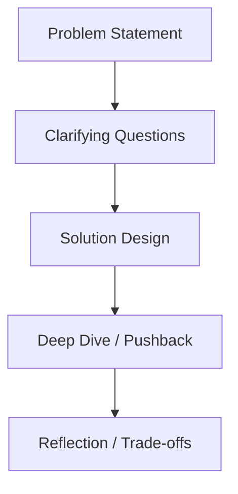

---

### 📶 Gradual Depth

**Level 1 - What it is:**
Staff-level SQL interviews use open-ended scenarios to evaluate your ability to design database architectures, debug production problems, and reason about trade-offs - skills that syntax-focused interviews miss.

**Level 2 - How to use it:**
Practice by working through scenario prompts: "Design the data layer for X." For each, practice the sequence: clarify requirements -> estimate scale -> propose schema -> discuss trade-offs -> address failure modes. Time yourself to 45 minutes per scenario.

**Level 3 - How it works:**
Interviewers evaluate five dimensions: (1) Do you ask the right clarifying questions? (2) Does your design handle the stated scale? (3) Can you articulate trade-offs between alternatives? (4) Do you anticipate failure modes? (5) Can you evolve the design when requirements change? Strong candidates naturally touch all five; weak candidates jump to a solution without clarifying constraints.

**Level 4 - Production mastery:**
The differentiator at staff level is production intuition: knowing which theoretical solutions fail in practice. When someone proposes SERIALIZABLE isolation, you ask about throughput impact. When someone proposes sharding, you ask about cross-shard join patterns. When someone proposes CQRS, you ask about event schema evolution. This intuition comes from operating databases at scale, which is why staff interviews favor candidates with production experience over those with only theoretical knowledge.

---

### ⚙️ How It Works

**Phase 1 - Requirements gathering:** The interviewer describes a vague problem. The candidate must ask: What is the read/write ratio? What is the data volume? What are the consistency requirements? What are the latency SLAs? What compliance constraints exist?

**Phase 2 - Schema and architecture:** Based on clarified requirements, the candidate proposes: table design (normalized? denormalized?), indexing strategy, scaling approach (replicas? shards? CQRS?), and connection architecture.

**Phase 3 - Trade-off discussion:** The interviewer challenges the design: "What if traffic is 10x? What about GDPR? What if the primary fails?" The candidate must adapt the design or articulate why the current approach is sufficient.

**Phase 4 - Incident scenario:** "Users report that order creation is taking 30 seconds. Walk me through diagnosis." The candidate demonstrates systematic debugging: check pg_stat_activity for locks, check pg_stat_statements for plan regressions, check replication lag, check recent deployments.

```
  Scenario: "Design the database layer for
  a global e-commerce platform."

  Strong candidate flow:
  1. "How many regions? Users? Orders/day?"
  2. "Read/write ratio? Consistency needs?"
  3. "GDPR or data residency requirements?"
  4. Proposes: regional sharding by user,
     replicated product catalog, CDC to
     analytics warehouse
  5. Discusses: cross-region consistency
     trade-off, user migration between
     regions, pricing consistency
```

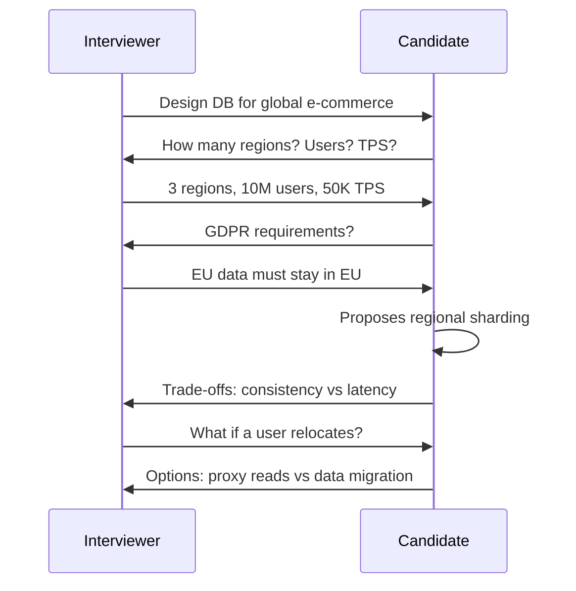

**BAD:**

```
Candidate: "I would use PostgreSQL with
read replicas."
(No clarifying questions, no trade-offs,
no failure mode discussion, no scale
reasoning)
```

**GOOD:**

```
Candidate: "Before designing, I need to
understand: what is the read/write ratio?
What are the consistency requirements per
operation? Are there data residency
constraints? What is the expected growth
rate? Let me sketch two approaches and
compare their trade-offs..."
```

---

### 🚨 Failure Modes

**Failure 1 - Jumping to solution without clarifying requirements:**
**Symptom:** Candidate immediately proposes a technology ("use Cassandra") without understanding the access patterns or constraints.
**Root cause:** Pattern-matching to memorized architectures instead of reasoning from requirements.
**Diagnostic:**

```
Interviewer signal: "What assumptions
are you making?"
If candidate cannot list assumptions:
RED FLAG
```

**Fix:** Practice the discipline of spending the first 10 minutes exclusively on clarifying questions. Write down requirements before sketching any architecture.

**Failure 2 - Presenting only one solution without trade-offs:**
**Symptom:** Candidate describes a single architecture as "the best" without acknowledging alternatives or costs.
**Root cause:** Lack of exposure to multiple approaches; inability to reason about when an approach is inappropriate.
**Diagnostic:**

```
Interviewer signal: "What would you
do differently if [constraint changed]?"
If candidate cannot adapt: RED FLAG
```

**Fix:** For every architecture decision, practice naming at least one alternative and articulating: "I chose X over Y because of [constraint]. If that constraint changed, Y would be better because [reason]."

---

### 🔬 Production Reality

A common staff-level interview failure: the candidate designs a clean CQRS architecture with event sourcing, sharding, and multi-region replication. When the interviewer asks "How would your team of 5 engineers operate this?", the candidate has no answer. The design is technically sound but operationally impractical. Staff-level evaluation includes operational judgment: the best architecture is the one the team can actually build, deploy, monitor, and debug. Over-engineering for theoretical scale at the cost of operational simplicity is a staff-level anti-pattern.

---

### ⚖️ Trade-offs & Alternatives

| Aspect              | Syntax-Focused Interview | System Design Interview | Incident Response Interview |
| ------------------- | ------------------------ | ----------------------- | --------------------------- |
| Tests for           | SQL knowledge            | Architectural reasoning | Debugging methodology       |
| Format              | Write a query            | Design a system         | Diagnose a problem          |
| Seniority signal    | Junior-Mid               | Mid-Staff               | Senior-Staff                |
| Preparation         | Practice problems        | Study architectures     | Study real incidents        |
| Evaluation criteria | Correctness              | Trade-off quality       | Systematic approach         |

---

### ⚡ Decision Snap

**USE WHEN (interviewing):**

- Evaluating staff/principal-level candidates
- The role requires database architecture ownership
- Production debugging is a critical job function

**AVOID WHEN (interviewing):**

- Evaluating junior candidates who need syntax assessment
- The role is application-focused with minimal database work

**PREFER incident scenarios WHEN:**

- The role is SRE or DBA-focused
- On-call debugging is a primary responsibility

---

### ⚠️ Top Traps

| #   | Misconception                                      | Reality                                                                                                                         |
| --- | -------------------------------------------------- | ------------------------------------------------------------------------------------------------------------------------------- |
| 1   | Memorizing architectures is sufficient preparation | Interviewers test reasoning, not recall; memorized answers fail under pushback and changing constraints                         |
| 2   | There is one correct answer to design questions    | Multiple valid approaches exist; the evaluation is on trade-off reasoning, not on matching the interviewer's preferred solution |
| 3   | More complex designs score higher                  | Over-engineering for imagined scale is a negative signal; the simplest design that meets requirements wins                      |
| 4   | Syntax perfection matters at staff level           | Minor syntax errors are irrelevant; architectural judgment and trade-off analysis are the evaluation criteria                   |
| 5   | You should never say "I don't know"                | Admitting uncertainty with a systematic plan to resolve it ("I would check X to verify") is stronger than fabricating an answer |

---

### 🪜 Learning Ladder

**Prerequisites:**

- SQL-111 SQL Deep-Dive Interview Questions - expert-level query and performance questions
- SQL-110 SQL Expert-Level Mastery Verification - self-assessment of deep SQL knowledge
- SQL-113 Sharding Strategies - Application vs Proxy - common staff-level design discussion topic

**THIS:** SQL-125 SQL Staff-Level Interview Scenarios

**Next steps:**

- SQL-116 CQRS and Read/Write Separation Architecture - frequent staff-level design topic
- SQL-114 Multi-Database Topology Design - system design scenario standard topic
- SQL-124 Online Store DB - Phase 5 (Multi-Region Strategy) - end-to-end design exercise

**The Surprising Truth:**
The most effective staff-level interview preparation is not studying more architectures - it is practicing the skill of reasoning aloud under ambiguity, because interviewers evaluate your thought process more than your conclusion.

**Further Reading:**

- Kleppmann, M. "Designing Data-Intensive Applications", O'Reilly, 2017 (the most cited reference for system design interviews)
- Xu, A. "System Design Interview: An Insider's Guide", Volume 1 and 2
- Google SRE Book: "Site Reliability Engineering", Chapters on Debugging and Capacity Planning

**Revision Card:**

1. Staff interviews test architectural reasoning and trade-off analysis, not syntax recall - ask clarifying questions before proposing solutions
2. Always present at least two approaches with explicit trade-offs; the simplest design that meets requirements is usually the best answer
3. Production intuition (knowing what fails in practice) is the differentiator; over-engineering for imagined scale is a negative signal

---

---

# SQL-126 Teaching Transaction Isolation - Common Confusions

**TL;DR** - Transaction isolation is the most misunderstood SQL concept because the standard defines anomalies imprecisely, implementations diverge from the spec, and developers confuse isolation levels with locking behavior.

---

### 🔥 Problem Statement

Ask ten developers what REPEATABLE READ prevents, and you will get ten different answers. The SQL standard defines isolation levels by which anomalies they prevent (dirty reads, non-repeatable reads, phantoms), but the definitions are ambiguous enough that PostgreSQL, MySQL, and Oracle implement "REPEATABLE READ" with fundamentally different behaviors. PostgreSQL's REPEATABLE READ uses snapshots and allows write skew; MySQL's uses next-key locking and prevents phantoms. A developer who learned isolation on MySQL will write subtly broken code on PostgreSQL, and vice versa. The confusion is not laziness - it is that the standard itself is insufficient, and every database fills the gaps differently.

---

### 📜 Historical Context

The SQL-92 standard defined four isolation levels (READ UNCOMMITTED, READ COMMITTED, REPEATABLE READ, SERIALIZABLE) in terms of three phenomena (dirty read, non-repeatable read, phantom). Berenson et al.'s landmark 1995 paper "A Critique of ANSI SQL Isolation Levels" demonstrated that this definition is both ambiguous and incomplete - it misses anomalies like write skew and read-only anomalies that occur in MVCC-based implementations. Adya, Liskov, and O'Neil (1999) proposed a formal taxonomy using dependency graphs. Despite these critiques, the SQL standard has not been updated, and implementations continue to diverge.

---

### 🔩 First Principles

**CORE INVARIANTS:**

1. The SQL standard defines isolation levels by phenomena prevented, but does not specify the implementation mechanism (locks vs. MVCC vs. optimistic) - leaving room for divergent behavior
2. MVCC-based isolation (PostgreSQL) and lock-based isolation (MySQL/InnoDB) prevent different anomaly sets at the same named level
3. SERIALIZABLE is the only level with a formal guarantee (equivalent to serial execution), but its implementation varies: PostgreSQL uses Serializable Snapshot Isolation (SSI), MySQL uses lock-based two-phase locking

**DERIVED DESIGN:**
These invariants mean that teaching isolation requires teaching three things simultaneously: the standard's definitions (what the spec says), the implementation's behavior (what the database actually does), and the gap between them (where bugs hide). Effective teaching uses concrete examples showing the same transaction sequence producing different results on PostgreSQL vs. MySQL, making the divergence tangible.

**THE TRADE-OFF:**
**Gain:** Deep understanding of isolation prevents subtle concurrency bugs that are nearly impossible to reproduce in testing.
**Cost:** Teaching effort is high because the topic requires understanding both theory and implementation, and the standard is a misleading starting point.

---

### 🧠 Mental Model

> Think of isolation levels as noise-canceling headphones with different settings. "READ COMMITTED" cancels most background noise (dirty reads) but lets some through. "REPEATABLE READ" cancels more (non-repeatable reads) but the remaining noise depends on the headphone brand (database engine). "SERIALIZABLE" cancels all noise, but you pay for it with battery life (performance).

- "Headphone brand" -> database engine (PostgreSQL vs. MySQL)
- "Same setting, different noise cancellation" -> same level name, different anomaly prevention
- "Battery life" -> performance cost of stronger isolation

**Where this analogy breaks down:** Noise cancellation is a spectrum; isolation anomalies are discrete categories that either occur or do not - and different engines prevent entirely different anomaly types at the same named level.

---

### 🧩 Components

- **Dirty read** - reading uncommitted data from another transaction (prevented by READ COMMITTED and above)
- **Non-repeatable read** - reading the same row twice yields different values because another transaction committed between reads
- **Phantom** - re-executing a range query yields different rows because another transaction inserted/deleted rows matching the predicate
- **Write skew** - two transactions read overlapping data, make disjoint writes based on what they read, and the combined result is inconsistent (NOT prevented by PostgreSQL REPEATABLE READ)
- **Snapshot Isolation (SI)** - each transaction sees a consistent snapshot; PostgreSQL's REPEATABLE READ is actually SI
- **Serializable Snapshot Isolation (SSI)** - PostgreSQL's SERIALIZABLE; detects serialization conflicts and aborts one transaction

```
  Anomaly Prevention Matrix:
                        Dirty  Non-Rep  Phantom  Write
                        Read   Read     Read     Skew
  READ COMMITTED (PG)   NO     YES      YES      YES
  REPEATABLE READ (PG)  NO     NO       NO       YES
  REPEATABLE READ (My)  NO     NO       NO       YES
  SERIALIZABLE (PG/SSI) NO     NO       NO       NO
  SERIALIZABLE (My/2PL) NO     NO       NO       NO
  (YES = anomaly possible, NO = prevented)
```

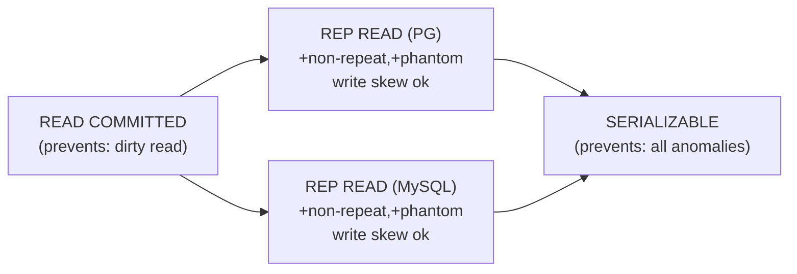

---

### 📶 Gradual Depth

**Level 1 - What it is:**
Transaction isolation levels control how much of other transactions' work your transaction can see. Higher levels prevent more anomalies but cost more performance. The confusion is that different databases implement the same level name differently.

**Level 2 - How to use it:**
Default to READ COMMITTED for most workloads (PostgreSQL's default). Use REPEATABLE READ when you need a consistent snapshot for a multi-statement read. Use SERIALIZABLE only when write skew would produce incorrect results (e.g., double-booking, constraint enforcement across rows). Always test isolation behavior on your specific database engine, not from the SQL standard.

**Level 3 - How it works:**
PostgreSQL implements READ COMMITTED by taking a new snapshot at each statement. REPEATABLE READ takes one snapshot at transaction start and uses it for all statements. SERIALIZABLE adds predicate tracking (SSI) that detects read-write conflicts and aborts one transaction. MySQL implements REPEATABLE READ with next-key locking (gap locks) that physically prevent other transactions from inserting into locked ranges, preventing phantoms through locks rather than snapshots.

**Level 4 - Production mastery:**
Write skew is the critical gap. Two transactions each read that a constraint is satisfied, then each writes a change that individually is fine but together violates the constraint. Example: two on-call doctors each check "at least one doctor is on call," then each removes themselves - leaving zero on call. PostgreSQL REPEATABLE READ allows this because each transaction's snapshot does not see the other's uncommitted write. Only SERIALIZABLE (SSI) detects and aborts one. In MySQL, gap locking at REPEATABLE READ may prevent some write skew patterns but not all. The only portable guarantee is SERIALIZABLE.

---

### ⚙️ How It Works

**Phase 1 - Transaction start:** The isolation level is set at BEGIN (`BEGIN ISOLATION LEVEL REPEATABLE READ`). PostgreSQL acquires a snapshot; MySQL establishes lock scoping rules.

**Phase 2 - Read execution:** PostgreSQL evaluates visibility using snapshot (xmin/xmax checks). MySQL acquires shared read locks (or uses snapshots depending on query type and isolation).

**Phase 3 - Write execution:** PostgreSQL checks for write-write conflicts (two transactions modifying the same row at REPEATABLE READ fail with serialization error). MySQL acquires exclusive row and gap locks.

**Phase 4 - Commit or abort:** PostgreSQL SSI (SERIALIZABLE) checks the dependency graph for cycles and aborts one transaction if detected. MySQL releases locks at commit.

```
  Write Skew Example:
  Table: doctors (name, on_call)
  Invariant: count(on_call=true) >= 1

  TX1 (REPEATABLE READ):
    SELECT count(*) FROM doctors
    WHERE on_call = true;      -- sees 2
    UPDATE doctors SET on_call = false
    WHERE name = 'Alice';

  TX2 (REPEATABLE READ):
    SELECT count(*) FROM doctors
    WHERE on_call = true;      -- sees 2
    UPDATE doctors SET on_call = false
    WHERE name = 'Bob';

  Both commit. on_call doctors = 0.
  Invariant VIOLATED.
```

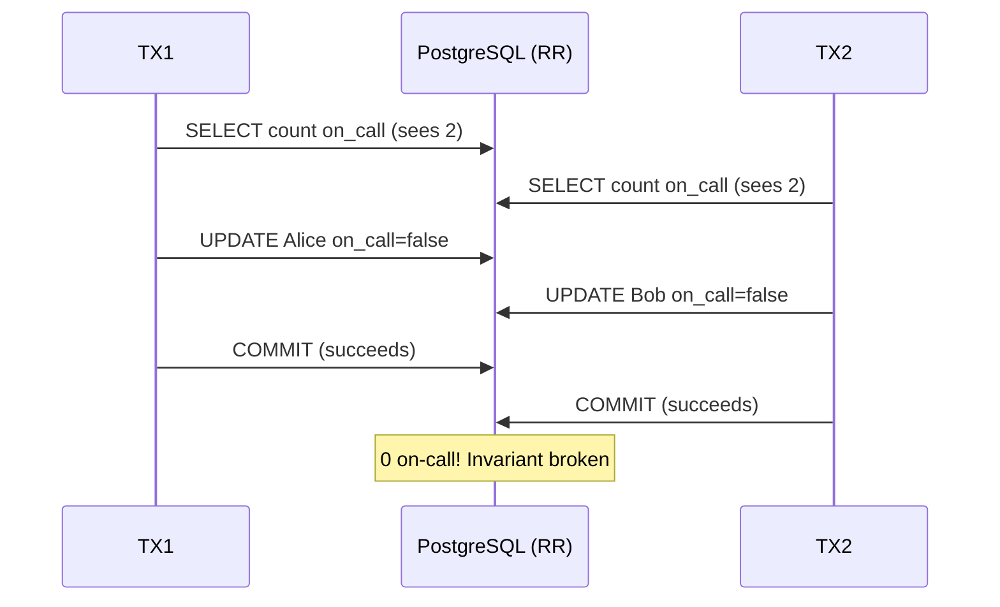

**BAD:**

```sql
-- Assumes RR prevents write skew
BEGIN ISOLATION LEVEL REPEATABLE READ;
SELECT count(*) FROM doctors
WHERE on_call = true;
-- Sees 2, proceeds to remove one
UPDATE doctors SET on_call = false
WHERE name = 'Alice';
COMMIT;
-- Both TXs succeed: 0 on-call
```

**GOOD:**

```sql
-- Use SERIALIZABLE to prevent write skew
BEGIN ISOLATION LEVEL SERIALIZABLE;
SELECT count(*) FROM doctors
WHERE on_call = true;
UPDATE doctors SET on_call = false
WHERE name = 'Alice';
COMMIT;
-- SSI detects conflict, aborts one TX
-- Application retries the aborted TX
```

---

### 🚨 Failure Modes

**Failure 1 - Write skew in REPEATABLE READ producing inconsistent data:**
**Symptom:** Business invariant violated (double-booking, overselling, constraint violation across rows) despite using REPEATABLE READ.
**Root cause:** REPEATABLE READ (snapshot isolation) does not detect read-write dependency cycles; write skew goes undetected.
**Diagnostic:**

```sql
-- Check if the application uses RR
SHOW default_transaction_isolation;
-- Look for patterns where two TXs read
-- overlapping data and write disjoint rows
```

**Fix:** Use SERIALIZABLE isolation for transactions that enforce cross-row invariants. Implement application-level retry for serialization failures (`SQLSTATE 40001`).

**Failure 2 - MySQL-to-PostgreSQL migration exposes new anomalies:**
**Symptom:** Application that worked correctly on MySQL exhibits subtle data inconsistencies on PostgreSQL.
**Root cause:** MySQL's REPEATABLE READ uses gap locking that prevented certain anomalies; PostgreSQL's snapshot-based RR does not.
**Diagnostic:**

```sql
-- Compare behavior:
-- MySQL RR: gap locks prevent phantom inserts
-- PostgreSQL RR: snapshots hide new rows but
--   allow concurrent inserts that commit after
--   the snapshot
```

**Fix:** Audit all transaction isolation assumptions in the application. Test concurrent scenarios on PostgreSQL specifically. Consider upgrading critical transactions to SERIALIZABLE.

---

### 🔬 Production Reality

A common isolation confusion incident: a team implements an inventory reservation system using REPEATABLE READ. Two concurrent requests each check `WHERE quantity >= requested_amount`, see sufficient stock, and each decrements quantity. Both commit. Inventory goes negative. The team assumes REPEATABLE READ prevents this because "it sees a consistent snapshot." But consistent snapshots do not prevent write skew - both transactions see the same pre-decrement value and both succeed. The fix: use SERIALIZABLE, or use explicit locking (`SELECT ... FOR UPDATE`), or use atomic operations (`UPDATE ... SET quantity = quantity - $1 WHERE quantity >= $1`).

---

### ⚖️ Trade-offs & Alternatives

| Aspect                   | READ COMMITTED      | REPEATABLE READ (PG)        | SERIALIZABLE (PG)            |
| ------------------------ | ------------------- | --------------------------- | ---------------------------- |
| Anomalies prevented      | Dirty read          | + non-repeatable, phantom   | All (incl. write skew)       |
| Performance overhead     | Lowest              | Snapshot maintenance        | SSI tracking overhead        |
| Abort risk               | None (no conflicts) | Write-write conflicts       | Read-write conflicts         |
| Application retry needed | No                  | Sometimes (write conflicts) | Yes (serialization failures) |
| PostgreSQL default       | Yes                 | No                          | No                           |

---

### ⚡ Decision Snap

**USE READ COMMITTED WHEN:**

- Workload is mostly independent transactions without multi-statement reads
- Application logic handles stale reads via optimistic locking

**USE REPEATABLE READ WHEN:**

- Multi-statement transactions need a consistent snapshot (reports within a transaction)
- Write skew is not a concern for this workload

**USE SERIALIZABLE WHEN:**

- Business invariants span multiple rows (booking, inventory, balances)
- Correctness is more important than throughput
- The application can retry aborted transactions

---

### ⚠️ Top Traps

| #   | Misconception                                              | Reality                                                                                                                                        |
| --- | ---------------------------------------------------------- | ---------------------------------------------------------------------------------------------------------------------------------------------- |
| 1   | REPEATABLE READ prevents all anomalies except phantoms     | PostgreSQL's RR allows write skew; the SQL standard's phantom definition is ambiguous                                                          |
| 2   | Isolation level names mean the same thing across databases | PostgreSQL, MySQL, and Oracle implement the same named levels with different anomaly prevention                                                |
| 3   | SERIALIZABLE is too slow for production                    | PostgreSQL's SSI is optimistic (no blocking); overhead is moderate, and for many workloads it is negligible                                    |
| 4   | SELECT FOR UPDATE and SERIALIZABLE are interchangeable     | FOR UPDATE prevents concurrent modifications to selected rows; SERIALIZABLE detects all serialization anomalies including read-write conflicts |
| 5   | Testing catches isolation bugs                             | Isolation bugs require specific interleaving of concurrent transactions; they are nearly impossible to reproduce reliably in testing           |

---

### 🪜 Learning Ladder

**Prerequisites:**

- SQL-067 Transaction Isolation Levels - foundational understanding of the four levels
- SQL-085 MVCC Internals - How Concurrent Reads Work - how PostgreSQL implements snapshot isolation
- SQL-069 Optimistic vs Pessimistic Locking - locking as an alternative to higher isolation levels

**THIS:** SQL-126 Teaching Transaction Isolation - Common Confusions

**Next steps:**

- SQL-131 Isolation Formalism - Adya, Liskov, O'Neil (1999) - formal theory beyond the SQL standard
- SQL-092 Deadlock Detection and Resolution - what happens when lock-based isolation creates cycles
- SQL-127 Relational Algebra - The Theory Behind SQL - foundational theory connecting to formal isolation models

**The Surprising Truth:**
PostgreSQL's REPEATABLE READ is actually Snapshot Isolation - a level not defined in the SQL standard at all. The standard has no name for it. PostgreSQL calls it REPEATABLE READ because it is strictly stronger than the standard's definition, but weaker than SERIALIZABLE - a subtlety that trips up even experienced engineers.

**Further Reading:**

- Berenson, H. et al. "A Critique of ANSI SQL Isolation Levels", ACM SIGMOD 1995
- Ports, D. and Grittner, K. "Serializable Snapshot Isolation in PostgreSQL", VLDB 2012
- PostgreSQL Documentation: "Transaction Isolation" (postgresql.org/docs/current/transaction-iso.html)

**Revision Card:**

1. Isolation level names are not portable - PostgreSQL, MySQL, and Oracle implement the same names with different anomaly prevention
2. Write skew is the critical gap: REPEATABLE READ allows it on PostgreSQL; only SERIALIZABLE (SSI) prevents it
3. The SQL standard defines isolation incompletely; always test concurrent behavior on your specific database engine

---

---

# SQL-127 Relational Algebra - The Theory Behind SQL

**TL;DR** - Relational algebra is SQL's mathematical foundation: the set of operations the query planner uses to transform your declaration into an optimal execution plan.

---

### 🔥 Problem Statement

SQL is a declarative language - you say what you want, not how to get it. But the database must translate your declaration into a sequence of physical operations (scan a table, build a hash, probe an index). Relational algebra is the intermediate representation: a formal set of operations on relations (sets of tuples) that is equivalent in expressive power to SQL. Every SQL query is first translated into a relational algebra expression tree, and then the optimizer transforms that tree using algebraic equivalences (commutativity, associativity, push-down) to find the cheapest execution plan. Without understanding relational algebra, you cannot understand why the planner chooses one plan over another, why certain query rewrites improve performance, or why some queries are fundamentally impossible to optimize.

---

### 📜 Historical Context

Edgar F. Codd introduced the relational model and relational algebra in his 1970 paper "A Relational Model of Data for Large Shared Data Banks" at IBM. Codd defined six primitive operations (selection, projection, Cartesian product, union, set difference, rename) and proved that they are sufficient to express any query on relations. The SQL language (originally SEQUEL, IBM 1974) was designed as a user-friendly syntax for relational algebra. The Selinger optimizer (System R, 1979) was the first cost-based optimizer to use algebraic equivalences for plan optimization, establishing the approach that every modern RDBMS follows.

---

### 🔩 First Principles

**CORE INVARIANTS:**

1. Relations are sets of tuples (no duplicates, no order); every relational algebra operation takes one or more relations as input and produces a relation as output (closure property)
2. Selection (sigma) filters rows, projection (pi) filters columns, and join combines relations - these three operations correspond directly to WHERE, SELECT column list, and JOIN in SQL
3. Algebraic equivalences (e.g., pushing selection before join, reordering joins) are the foundation of query optimization - they guarantee the same result with potentially different performance

**DERIVED DESIGN:**
The closure property means operations can be composed: the output of one operation is the input to another, forming expression trees. The optimizer transforms these trees using equivalences: pushing sigma (filter) below join (reducing the number of rows joined) is always safe and usually faster. Join reordering uses commutativity and associativity to find the cheapest join order. Understanding these equivalences explains why adding a WHERE clause can make a query faster even when it returns the same rows (because it changes the algebra tree).

**THE TRADE-OFF:**
**Gain:** Formal foundation for query optimization; understanding why query plans change; ability to write optimizer-friendly SQL.
**Cost:** Abstract mathematics that requires effort to connect to practical SQL; the algebra operates on sets, but SQL operates on bags (multisets with duplicates) - a divergence that causes confusion.

---

### 🧠 Mental Model

> Think of relational algebra as a recipe system where each instruction (chop, mix, filter) takes ingredients (relations) and produces new ingredients (new relations). The chef (optimizer) can reorder instructions - filtering before mixing is faster than mixing everything and filtering afterward, but the dish (result) tastes the same.

- "Filtering before mixing" -> pushing selection below join
- "Recipe reordering" -> algebraic equivalences
- "Same dish" -> same query result
- "Chef choosing order" -> cost-based optimizer

**Where this analogy breaks down:** Cooking operations are not always reorderable (you cannot unbake a cake); relational algebra operations have formal equivalences that guarantee identical results regardless of order.

---

### 🧩 Components

- **Selection (sigma)** - filters rows matching a predicate: `sigma_{age > 30}(Employees)` = `WHERE age > 30`
- **Projection (pi)** - selects specific columns: `pi_{name, salary}(Employees)` = `SELECT name, salary`
- **Cartesian product (x)** - all combinations of rows from two relations (rarely used directly; join = product + selection)
- **Join (bowtie)** - combines rows from two relations where a condition holds: `R bowtie_{R.id = S.fk} S` = `R JOIN S ON R.id = S.fk`
- **Union** - combines rows from two relations with the same schema (SQL UNION)
- **Set difference** - rows in R but not in S (SQL EXCEPT)
- **Rename (rho)** - renames attributes or relations (SQL AS)

```
  SQL -> Relational Algebra -> Plan:

  SELECT e.name, d.dept_name
  FROM employees e
  JOIN departments d ON e.dept_id = d.id
  WHERE e.salary > 100000

  Algebra tree:
      pi(name, dept_name)
           |
      sigma(salary > 100000)
           |
       bowtie(dept_id = id)
        /         \
  employees    departments

  Optimized (push sigma down):
      pi(name, dept_name)
           |
       bowtie(dept_id = id)
        /         \
  sigma(salary>100k)  departments
       |
  employees
```

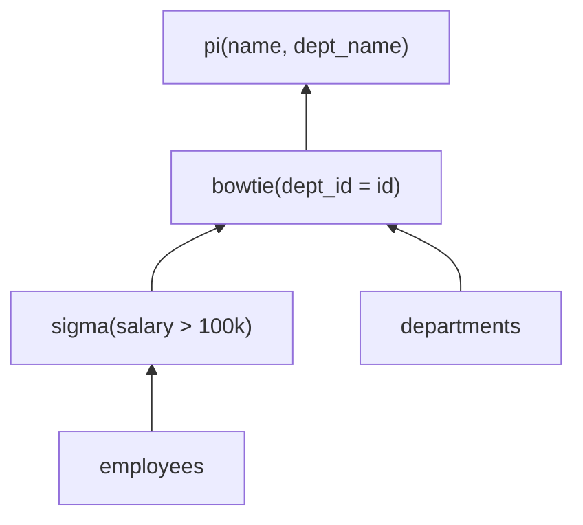

---

### 📶 Gradual Depth

**Level 1 - What it is:**
Relational algebra is the mathematical language behind SQL. Every SQL query translates to a combination of relational algebra operations (filter rows, pick columns, combine tables) that the database engine executes.

**Level 2 - How to use it:**
Understanding relational algebra helps you write better SQL. When you see that `WHERE` corresponds to selection (which can be pushed early) and `JOIN` corresponds to a join operation (which is expensive), you understand why adding filters reduces join cost. Think of every query as an operation tree that the optimizer rearranges.

**Level 3 - How it works:**
The parser converts SQL to an abstract syntax tree (AST). The planner converts the AST to an initial relational algebra expression tree. The optimizer applies algebraic equivalences: push selections down (reduce rows early), push projections down (reduce columns early), reorder joins (cheapest join order via dynamic programming). The result is a physical plan with specific algorithms (hash join, merge join, index scan) chosen for each algebraic operation.

**Level 4 - Production mastery:**
The key optimizer transformations to understand: (1) selection push-down - filters move below joins, reducing intermediate result sizes; (2) join reordering - the optimizer tests multiple join orderings and picks the cheapest by estimated cost; (3) projection push-down - unused columns are dropped early to reduce I/O and memory; (4) subquery decorrelation - correlated subqueries are rewritten as joins using algebraic equivalences. When EXPLAIN shows a suboptimal plan, understanding these transformations tells you what the optimizer failed to do and how to rewrite the query to help it.

---

### ⚙️ How It Works

**Phase 1 - Parsing:** SQL text is parsed into an AST. Table references, column names, and predicates are identified.

**Phase 2 - Algebraic translation:** The AST is converted to a canonical relational algebra tree. Each SQL clause maps to an operation: FROM -> leaf relations, WHERE -> selection, SELECT -> projection, JOIN -> join operator.

**Phase 3 - Algebraic optimization:** The optimizer applies equivalence rules: push selection below join, reorder joins, eliminate redundant projections, merge adjacent selections. This phase operates purely on the algebra, not on physical costs.

**Phase 4 - Physical planning:** Each algebraic operation is mapped to a physical algorithm (sequential scan, index scan, hash join, merge join) based on cost estimates from table statistics.

```
  Equivalence rules:
  1. sigma(A AND B)(R) =
     sigma(A)(sigma(B)(R))
     [split conjunctive predicates]

  2. sigma(A)(R bowtie S) =
     sigma(A)(R) bowtie S
     [push selection below join
      if A references only R]

  3. R bowtie S = S bowtie R
     [join commutativity]

  4. (R bowtie S) bowtie T =
     R bowtie (S bowtie T)
     [join associativity]
```

```mermaid
sequenceDiagram
    participant SQL as SQL Query
    participant Parser
    participant Algebra as Algebra Tree
    participant Opt as Optimizer
    participant Plan as Physical Plan
    SQL->>Parser: Parse SQL text
    Parser->>Algebra: Build initial tree
    Algebra->>Opt: Apply equivalences
    Opt->>Opt: Push selections down
    Opt->>Opt: Reorder joins
    Opt->>Plan: Map to physical ops
    Plan->>Plan: Choose algorithms
```

**BAD:**

```sql
-- Cartesian product then filter (manual)
SELECT e.name, d.dept_name
FROM employees e, departments d
WHERE e.dept_id = d.id
  AND e.salary > 100000;
-- Older syntax; optimizer treats identically,
-- but harder for humans to read
```

**GOOD:**

```sql
-- Explicit JOIN: maps directly to algebra
SELECT e.name, d.dept_name
FROM employees e
JOIN departments d ON e.dept_id = d.id
WHERE e.salary > 100000;
-- Optimizer pushes salary filter below join
-- Same plan, clearer intent
```

---

### 🚨 Failure Modes

**Failure 1 - Optimizer cannot push selection below a view or CTE:**
**Symptom:** Query against a view is slow; EXPLAIN shows a full scan of the view's underlying query before applying the outer WHERE clause.
**Root cause:** The view or CTE materializes all rows before the outer predicate is applied; the optimizer cannot "see through" the barrier to push the selection down.
**Diagnostic:**

```sql
EXPLAIN ANALYZE
SELECT * FROM my_view
WHERE customer_id = 42;
-- Look for: full scan of view subquery
-- without customer_id filter pushed down
```

**Fix:** Rewrite the view as an inline subquery or use a lateral join. In PostgreSQL 12+, CTEs are inlined by default (no materialization barrier) unless `MATERIALIZED` is specified.

**Failure 2 - Join reordering chooses wrong order due to cardinality misestimate:**
**Symptom:** A multi-table JOIN query is slow; EXPLAIN shows an early join producing millions of rows that a later filter would have reduced.
**Root cause:** The optimizer estimated low selectivity for a predicate (e.g., because column statistics are stale or correlated columns are treated as independent) and chose a join order that processes too many rows.
**Diagnostic:**

```sql
EXPLAIN ANALYZE SELECT ...
-- Compare "rows" (estimated) vs "actual rows"
-- Large discrepancy = cardinality misestimate
```

**Fix:** Run `ANALYZE` on affected tables to refresh statistics. Use `CREATE STATISTICS` for correlated columns (PostgreSQL 10+). As a last resort, use `join_collapse_limit` or explicit join order hints.

---

### 🔬 Production Reality

A typical algebra-related performance issue: a developer writes a query with a subquery in the SELECT list: `SELECT (SELECT name FROM departments WHERE id = e.dept_id) FROM employees e`. The optimizer cannot decorrelate this into a join because of a function call inside the subquery. The result: one subquery execution per row, turning a 100ms join into a 10-second correlated subquery scan on 100,000 rows. Understanding the algebra makes the fix obvious: rewrite as an explicit JOIN so the optimizer can apply join algorithms instead of per-row subquery evaluation.

---

### ⚖️ Trade-offs & Alternatives

| Aspect         | Relational Algebra | Datalog                | Map-Reduce                 |
| -------------- | ------------------ | ---------------------- | -------------------------- |
| Foundation     | Set theory (Codd)  | Logic programming      | Functional (Dean/Ghemawat) |
| Optimization   | Equivalence rules  | Rule rewriting         | Partition + shuffle        |
| Expressiveness | First-order        | Recursive (fixpoint)   | Arbitrary code             |
| Use in RDBMS   | Universal          | Rare (Datalog engines) | Not applicable             |
| Learning curve | Moderate           | High                   | Low (for developers)       |

---

### ⚡ Decision Snap

**USE relational algebra knowledge WHEN:**

- Debugging why a query plan is suboptimal
- Rewriting queries for performance (subquery to join, filter push-down)
- Understanding EXPLAIN output and optimizer behavior

**NOT NEEDED WHEN:**

- Writing simple CRUD queries
- Schema design (ERD and normalization theory are more relevant)

**PREFER formal study WHEN:**

- Building a query optimizer or custom SQL engine
- Working on database internals or extensions

---

### ⚠️ Top Traps

| #   | Misconception                                | Reality                                                                                                                                                    |
| --- | -------------------------------------------- | ---------------------------------------------------------------------------------------------------------------------------------------------------------- |
| 1   | SQL and relational algebra are the same      | SQL operates on bags (multisets with duplicates); relational algebra operates on sets; this causes differences with DISTINCT, UNION ALL, and NULL handling |
| 2   | The optimizer always finds the best plan     | The optimizer uses heuristics and cost estimates; stale statistics, correlated columns, and complex subqueries can prevent optimal transformations         |
| 3   | Relational algebra is only academic          | Every EXPLAIN plan is a physical realization of an algebraic expression; understanding algebra explains plan choices                                       |
| 4   | JOIN order in SQL determines execution order | The optimizer is free to reorder joins using commutativity and associativity; SQL join order is a suggestion, not a command                                |
| 5   | CTEs always materialize                      | PostgreSQL 12+ inlines CTEs by default; only `MATERIALIZED` CTEs create optimization barriers                                                              |

---

### 🪜 Learning Ladder

**Prerequisites:**

- SQL-094 Query Planner and Cost-Based Optimization - how the optimizer uses algebraic transformations
- SQL-060 Execution Plans Deep Dive - EXPLAIN ANALYZE - reading the physical plans that algebra produces
- SQL-033 Subqueries - Scalar, Row, Table - SQL constructs that map to algebraic operations

**THIS:** SQL-127 Relational Algebra - The Theory Behind SQL

**Next steps:**

- SQL-130 Query Optimization Theory - Selinger Optimizer - the original cost-based optimizer using relational algebra
- SQL-128 Codd's 12 Rules and Relational Completeness - the completeness criteria for relational systems
- SQL-135 The Volcano (Iterator) Execution Model - how algebraic operators become physical iterators

**The Surprising Truth:**
The comma-separated FROM clause syntax (`FROM a, b WHERE a.id = b.fk`) and the explicit JOIN syntax (`FROM a JOIN b ON a.id = b.fk`) produce identical relational algebra trees and identical execution plans - the optimizer does not care about your syntax preference, only about the algebraic structure.

**Further Reading:**

- Codd, E.F. "A Relational Model of Data for Large Shared Data Banks", Communications of the ACM, 1970
- Selinger, P.G. et al. "Access Path Selection in a Relational Database Management System", ACM SIGMOD 1979
- Garcia-Molina, H. et al. "Database Systems: The Complete Book", Chapter 5: Algebraic and Logical Query Languages

**Revision Card:**

1. Relational algebra is the intermediate language between SQL and execution plans - every query is an algebra tree that the optimizer transforms
2. Selection push-down (filter early) and join reordering (cheapest order) are the two most impactful optimizer transformations
3. SQL operates on bags (duplicates allowed), not sets - this divergence from pure relational algebra explains DISTINCT, UNION ALL, and NULL behavior

---

---

# SQL-128 Codd's 12 Rules and Relational Completeness

**TL;DR** - Codd's 12 rules define what a truly relational database must provide; no commercial system fully satisfies them, revealing the gap between relational ideal and implementation reality.

---

### 🔥 Problem Statement

How do you know whether a database that calls itself
"relational" actually is? In 1985, Edgar Codd published 12
rules precisely because vendors were marketing products as
"relational" while omitting fundamental properties the model
requires. Without a formal definition, "relational" became a
marketing term. Engineers could not reliably reason about
portability, correctness guarantees, or optimization
potential. The 12 rules define a minimum bar. A system that
violates Rule 3 (systematic NULL treatment) produces silent
data integrity bugs. A system that violates Rule 6 (view
updatability) forces engineers to maintain parallel write
paths. Understanding the rules is understanding exactly why
certain SQL behaviors surprise you.

---

### 📜 Historical Context

Edgar Codd introduced the relational model in his 1970 paper
"A Relational Model of Data for Large Shared Data Banks"
(Communications of the ACM, vol. 13, no. 6). By the early
1980s, IBM, Oracle, and others shipped products labeled
"relational" that omitted critical properties - no systematic
NULL handling, incomplete transaction semantics, non-updatable
views. In 1985, Codd published a two-part Computerworld
article enumerating 12 rules to distinguish genuine relational
systems from impostors. The publication was partly political:
IBM's own products were being marketed as "relational" while
omitting features Codd's own team had designed. No commercial
database fully satisfies all 12 rules to this day.

---

### 🔩 First Principles

**CORE INVARIANTS:**

1. Data is represented exclusively as values in named
   relations - no pointers, no ordered row access, no
   implicit hidden row IDs visible to queries.
2. Every piece of data, including schema metadata, must be
   accessible through the same relational operators; the
   system catalog is itself a set of queryable relations.
3. The system must handle UNKNOWN (NULL) as a first-class
   value distinct from zero or empty string, implementing
   three-valued logic consistently across all operators.

**DERIVED DESIGN:**

These invariants force specific conclusions. No pointers means
all access must go through declarative queries over named
columns. Catalog-as-relation means `information_schema`
queries must work. First-class NULL means every operator must
define three-valued behavior. Every real database makes
pragmatic compromises on at least one of these.

**THE TRADE-OFF:**

**Gain:** A fully rule-compliant system is predictable,
portable, and fully algebraically optimizable without
application-level hints.

**Cost:** Full compliance is expensive to implement.
View updatability requires reversing application intent.
NULL semantics add planning complexity. Every real database
chooses pragmatic compromises.

---

### 🧠 Mental Model

> Codd's rules are a building code for databases. A house
> built to code does not collapse in a storm - every
> requirement has a structural reason. A house that fails
> rule 6 (view updatability) works 95% of the time but
> fails when the engineer relies on it.

- "Building code" -> the 12 rules as minimum structural
  requirements for a genuine relational system
- "House inspection" -> testing a database engine against
  each rule
- "Failing rule 6" -> views are read-only when the model
  says they should be updatable
- "95% works" -> pragmatic compliance vs. relational ideal

**Where this analogy breaks down:** Building code pass/fail
is binary and enforced. SQL standard compliance is
self-reported and partial; vendors describe their own
conformance level.

---

### 🧩 Components

- **Rule 0 (Foundation):** Any system claiming to be
  relational must manage its data exclusively through
  relational capabilities.
- **Rules 1-2 (Representation):** Tabular structure; every
  datum accessible via table name, primary key, and column
  name.
- **Rule 3 (NULL):** Systematic NULL treatment distinct from
  zero, empty string, or any sentinel value.
- **Rule 4 (Catalog):** Schema accessible through the same
  relational language as data (information_schema).
- **Rule 5 (Language):** The data language must support DDL,
  DML, constraints, views, and transactions.
- **Rule 6 (View Updatability):** All theoretically
  updatable views must be updatable in practice.
- **Rules 7-8 (High-Level Ops):** INSERT/UPDATE/DELETE on
  sets; physical and logical data independence.
- **Rules 9-12 (Independence):** Logical, physical, and
  integrity independence; no low-level bypass of
  constraints.

```
Rule 0: Relational Foundation
  |
  +-> Rules 1-2: Tabular representation + PK access
  +-> Rule 3:    NULL as first-class UNKNOWN
  +-> Rule 4:    Catalog as queryable relation
  +-> Rules 5-8: Language + set-level operations
  +-> Rules 9-11: Physical + logical independence
  +-> Rule 12:   No low-level constraint bypass
```

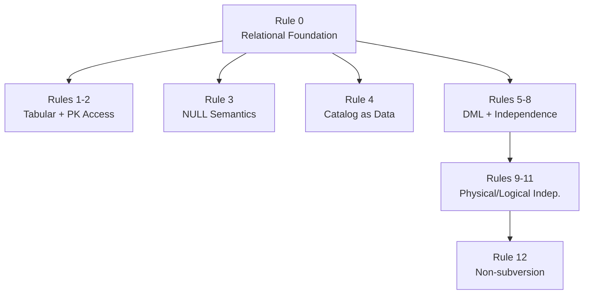

---

### 📶 Gradual Depth

**Level 1 - What it is:**
Codd's 12 rules define "relational." Most databases satisfy
some but not all, making them partially relational.

**Level 2 - How to use it:**
Use the rules as a checklist when a SQL behavior surprises
you. Rule 3 (NULL) explains NOT IN trap with NULL subqueries.
Rule 6 (view updatability) explains why some views reject
inserts. Rule 4 (catalog) explains why
`information_schema.tables` works.

**Level 3 - How it works:**
PostgreSQL satisfies Rules 1-5 well. Rule 3 is mostly
correct with documented exceptions (NOT IN + NULL). Rule 6
is partial - simple views are auto-updatable since
PostgreSQL 9.3; complex views need INSTEAD OF triggers.
The `information_schema` and `pg_catalog` satisfy Rule 4.
Rule 8 (physical independence) is strong - query plans
change without rewriting application code.

**Level 4 - Production mastery:**
Rule 6 violations surface late, during the data-write step
nobody tested because views "looked like tables." A team
builds a reporting layer on views, then discovers analysts
need to INSERT through them. Simple views work. Aggregate
views cannot accept INSERT because the engine cannot reverse
the aggregation. Engineers must redesign the data load
pipeline to insert directly into source tables - a
discovery that turns a two-week project into two months.

---

### ⚙️ How It Works

**Phase 1 - Rule 0 check:** Does every data operation go
through relational operators? PostgreSQL: yes for SQL access.

**Phase 2 - Rule 3 check:** Does the system treat NULL as
UNKNOWN consistently? PostgreSQL: yes, with one practical
trap: `WHERE id NOT IN (SELECT id FROM t)` returns empty
set when t contains NULL - technically correct under
three-valued logic but practically surprising.

**Phase 3 - Rule 4 check:** Is the catalog queryable?
`SELECT table_name FROM information_schema.tables WHERE
table_schema = 'public'` works in PostgreSQL.

**Phase 4 - Rule 6 check:** Are updatable views updatable?
Simple single-table views with no aggregation: auto-updatable.
Complex views: require INSTEAD OF triggers.

```
SQL query
    |
[Parser] -> relational algebra tree
    |
[Optimizer] -> physical plan (Rule 5 enables this)
    |
[Executor] -> result set (Rules 1+2 guarantee access)
    |
[Catalog] -> metadata (Rule 4: same language)
```

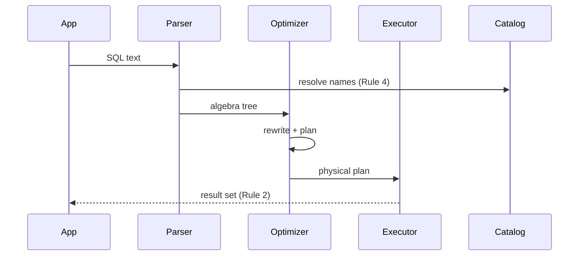

**BAD:**

```sql
-- Violates Rule 2: accessing data
-- by physical row number, not relation
SELECT ctid, * FROM customers
ORDER BY ctid LIMIT 10;
```

**GOOD:**

```sql
-- Rule 2: every value via table+column+key
SELECT id, name
FROM customers
ORDER BY id LIMIT 10;
```

---

### 🚨 Failure Modes

**Failure 1 - NOT IN with NULL subquery (Rule 3)**

**Diagnostic:** `SELECT id FROM a WHERE id NOT IN
(SELECT id FROM b)` returns 0 rows when b contains any NULL.

**Fix:** Rewrite as `NOT EXISTS (SELECT 1 FROM b WHERE
b.id = a.id)`. NOT EXISTS handles NULL rows correctly
because it tests row existence, not value equality.

**Failure 2 - Non-updatable view (Rule 6 partial)**

**Diagnostic:** `INSERT INTO my_view VALUES (...)` fails
with "cannot insert into view" when view contains JOIN,
aggregate, or DISTINCT.

**Fix:** Create an INSTEAD OF trigger performing the correct
underlying INSERT. Or reconsider whether the view
abstraction is appropriate for the write path.

---

### 🔬 Production Reality

A fintech team built a reporting layer entirely on database
views. Analysts wrote INSERTs through "staging views" to
load corrections. Four of seven views were complex joins
and silently rejected writes. Three got INSTEAD OF triggers.
The fourth was an aggregated summary view - no trigger can
make an aggregate view accept an INSERT because the engine
cannot reverse-engineer which source rows to modify. The
data load pipeline had to be redesigned to insert directly
into source tables. Root cause: the team treated Rule 6
as guaranteed when it is actually partial in every real
database.

---

### ⚖️ Trade-offs & Alternatives

| Rule                     | PostgreSQL               | MongoDB         | Cassandra            |
| ------------------------ | ------------------------ | --------------- | -------------------- |
| Rule 3 (NULL)            | Yes (with traps)         | No NULL concept | Absent field != NULL |
| Rule 4 (Catalog)         | Yes (information_schema) | Partial         | Partial              |
| Rule 6 (Views)           | Partial (INSTEAD OF)     | No views        | No views             |
| Rule 12 (Non-subversion) | Mostly                   | Weak            | Weak                 |

No database fully satisfies all 12 rules. The question is
which rules your use case depends on.

---

### ⚡ Decision Snap

**USE WHEN:**

- Auditing whether a "relational" database provides the
  features your application depends on
- Diagnosing unexpected NULL behavior, view update failures,
  or cross-database portability issues
- Teaching SQL engineers why specific behaviors exist, not
  just that they exist

**AVOID WHEN:**

- Selecting a database purely on rule compliance score;
  compliance does not equal performance or operational fit
- Treating the rules as a binary pass/fail checklist;
  partial compliance is universal among real databases

**PREFER NOSQL WHEN:**

- Horizontal write scale exceeds what a rule-compliant
  relational system can provide
- Schema flexibility matters more than constraint enforcement

---

### ⚠️ Top Traps

| #   | Misconception                        | Reality                                                                                                        |
| --- | ------------------------------------ | -------------------------------------------------------------------------------------------------------------- |
| 1   | PostgreSQL is fully relational       | No database fully satisfies all 12 rules; Rule 6 and Rule 12 are universally partial                           |
| 2   | NULL = empty string                  | NULL is UNKNOWN; empty string is a known zero-length value - they are never equal                              |
| 3   | Rule 12 means SQL only               | Rule 12 prohibits bypassing constraints; extensions and file-level access can weaken this                      |
| 4   | View updatability is a minor feature | Rule 6 failures force schema coupling that makes refactoring expensive months after initial design             |
| 5   | The rules are historical curiosity   | They predict exactly which SQL surprises engineers encounter: NULL NOT IN traps, view updates, catalog queries |

---

### 🪜 Learning Ladder

**Prerequisites:**

- SQL-002 The Relational Model - How Tables Think - the
  mathematical model the rules formalize
- SQL-018 NULL - The Three-Valued Logic Trap - Rule 3
  requires deep NULL understanding

**THIS:** SQL-128 Codd's 12 Rules and Relational Completeness

**Next steps:**

- SQL-129 SQL Standard Evolution - SQL-92 to SQL:2023 -
  how ANSI codified and extended Codd's rules
- SQL-130 Query Optimization Theory - Selinger Optimizer -
  Rule 5 completeness enables algebraic rewriting

---

**The Surprising Truth:**

Codd published the 12 rules not as theory but as a political
act. IBM was marketing its own products as "relational" while
omitting features Codd's team had designed. The rules were a
public specification written to embarrass IBM's sales
department and force the industry toward the full model.

**Further Reading:**

1. E.F. Codd, "A Relational Model of Data for Large Shared
   Data Banks," _Communications of the ACM_, vol. 13, no. 6,
   June 1970.
2. E.F. Codd, "Is Your DBMS Really Relational?",
   _Computerworld_, October 14, 1985.
3. C.J. Date, _An Introduction to Database Systems_
   (8th ed.), Addison-Wesley - comprehensive treatment of
   all 12 rules with worked examples.

**Revision Card:**

1. Rule 0 subsumes all others: any system claiming to be
   relational must manage data exclusively through relational
   operations.
2. No commercial database fully satisfies all 12 rules;
   Rule 6 (view updatability) and Rule 12 (non-subversion)
   are the most commonly violated.
3. Rules 3, 6, and 4 predict exactly the SQL surprises
   engineers encounter: NOT IN NULL trap, non-updatable
   views, and catalog queries via information_schema.

---

---

# SQL-129 SQL Standard Evolution - SQL-92 to SQL:2023

**TL;DR** - Each SQL standard revision added features the community needed; SQL:2003 added window functions and XML; SQL:2016 added JSON; SQL:2023 added property graphs.

---

### 🔥 Problem Statement

SQL was invented at IBM in the early 1970s. ANSI SQL-86
formalized the basics. But a 1986 standard cannot anticipate
window functions for time-series analysis, recursive CTEs for
hierarchical data, or JSON document storage. Without standard
evolution, the database community fragments into incompatible
vendor dialects: MySQL invents GROUP_CONCAT, PostgreSQL adds
LATERAL, Oracle adds CONNECT BY. Application code becomes
vendor-locked and non-portable. Engineers who migrate from
Oracle to PostgreSQL discover 47 queries using DECODE(), 23
using CONNECT BY, and 12 using ROWNUM - none portable. The
SQL standard exists to codify proven features so code can
run on multiple databases with minimal changes.

---

### 📜 Historical Context

SEQUEL (Structured English Query Language) was designed by
Chamberlin and Boyce at IBM in 1974. System R proved the
concept. ANSI SQL-86 formalized SELECT/DML basics. SQL-89
added referential integrity. SQL-92 (SQL-2) was the major
working baseline: outer joins, subqueries, CASE, transaction
isolation levels. SQL:1999 (SQL-3) added recursive queries
(WITH RECURSIVE), user-defined types, and triggers.
SQL:2003 introduced window functions (ROW_NUMBER, LAG, LEAD)
and the XML type. SQL:2008 added TRUNCATE and standard FETCH
FIRST (replacing vendor LIMIT/ROWNUM). SQL:2016 added JSON.
SQL:2023 added SQL/PGQ property graph queries. Each revision
reflects what real workloads needed - standards document
practice, not pure theory.

---

### 🔩 First Principles

**CORE INVARIANTS:**

1. The standard defines syntax and semantics, not
   implementation; vendors conform at their own pace and
   depth (Core, Level 1, or full conformance).
2. New features enter the standard only after proving
   viability in real workloads; standardization documents
   existing practice, not academic proposals.
3. Vendor-specific extensions become standard features once
   multiple vendors independently implement them and agree
   on semantics.

**DERIVED DESIGN:**

Because vendors implement conformance independently, a
feature may be in the standard for a decade before all
databases support it identically. PostgreSQL 8.4 (2009)
shipped full window functions; MySQL's partial
implementation came much later. This gap forces engineers
to know both the standard version and the specific database
version they are targeting - they are not the same.

**THE TRADE-OFF:**

**Gain:** Portable SQL that runs across PostgreSQL, MySQL,
Oracle, and SQL Server with minimal changes.

**Cost:** The standard lags real innovation by years;
cutting-edge features live in vendor extensions until
standardized, creating a portability-vs-capability tension.

---

### 🧠 Mental Model

> The SQL standard is like road regulations across countries.
> Each country drives on its own roads (vendor databases)
> but the rules for traffic signals and lane markings (core
> SQL) are standardized so a licensed driver (SQL engineer)
> can drive anywhere.

- "Road regulations" -> the SQL standard
- "Driving on local roads" -> vendor-specific SQL extensions
- "International driving license" -> ANSI SQL knowledge
- "Traffic rules vary by state" -> behavior differences
  between MySQL, PostgreSQL, Oracle at the same standard
  level

**Where this analogy breaks down:** Road regulations are
enforced uniformly. SQL conformance is voluntary and
self-reported; a vendor can claim compliance while
implementing only a subset.

---

### 🧩 Components

- **SQL-86/89** - Core SELECT/DML + foreign keys: the
  minimum all databases share.
- **SQL-92 (SQL-2)** - Outer joins, subqueries, CASE,
  isolation levels: the practical portability baseline.
- **SQL:1999 (SQL-3)** - Recursive CTEs (WITH RECURSIVE),
  user-defined types, triggers.
- **SQL:2003** - Window functions (ROW_NUMBER, RANK, LAG),
  MERGE, XML data type.
- **SQL:2008** - TRUNCATE TABLE, FETCH FIRST (standard
  LIMIT).
- **SQL:2016** - JSON_VALUE, JSON_TABLE, JSON_OBJECT.
- **SQL:2023** - SQL/PGQ property graph queries, new JSON
  path functions.

```
SQL-86   SQL-92   SQL:1999  SQL:2003  SQL:2016  SQL:2023
  |         |         |         |         |         |
Core    OUTER    RECURSIVE  WINDOW    JSON     GRAPH
SELECT  JOINs    CTEs       FUNCS     SUPPORT  QUERIES
```

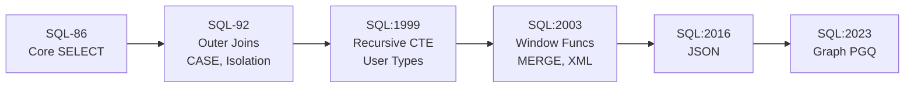

---

### 📶 Gradual Depth

**Level 1 - What it is:**
SQL is standardized by ANSI and ISO. Each revision adds
features. The version you need depends on which features
your query uses and which database version you are on.

**Level 2 - How to use it:**
Before using WITH RECURSIVE, verify SQL:1999 support.
Before using ROW_NUMBER() OVER(), verify SQL:2003. Before
using JSON_VALUE(), verify SQL:2016. PostgreSQL 14+ and
MySQL 8.0+ support most SQL:2016 features. Always test on
the actual target version.

**Level 3 - How it works:**
Vendor conformance is tested against community test suites.
PostgreSQL publishes a conformance table in its docs. MySQL
tracks SQL mode settings toggling standard vs. MySQL-specific
behavior. Oracle maintains its own extensions (CONNECT BY,
ROWNUM) alongside standard equivalents (WITH RECURSIVE,
FETCH FIRST).

**Level 4 - Production mastery:**
The SQL:2003 window functions are the highest-leverage
addition for analytics. Before them, computing running
totals or row-over-row differences required self-joins or
correlated subqueries - O(n^2) patterns that destroyed
performance on million-row tables. Window functions compute
these in a single pass. An engineer who uses a correlated
subquery for what should be LAG() is paying a 100x
performance penalty for missing one SQL:2003 feature.

---

### ⚙️ How It Works

**Phase 1 - Feature request:** A vendor or community
identifies a pattern that SQL handles poorly (e.g., running
totals, recursive traversal, JSON storage).

**Phase 2 - Vendor prototype:** One or more vendors
implement an experimental version with their own syntax.

**Phase 3 - Standardization:** The ISO JTC1/SC32/WG3
working group reviews the feature, harmonizes syntax across
competing implementations, and publishes it in the next
revision (typically 4-7 years after first implementation).

**Phase 4 - Vendor adoption:** Each vendor implements the
standard syntax, often maintaining proprietary syntax for
backward compatibility.

```
Vendor A        Vendor B        ISO WG3
  |                 |               |
CONNECT BY     WITH RECURSIVE   Harmonize
(Oracle-1979)  (Sybase-1990s)   -> SQL:1999
               |                   |
               Vendor C adopts     |
               WITH RECURSIVE   Standard
```

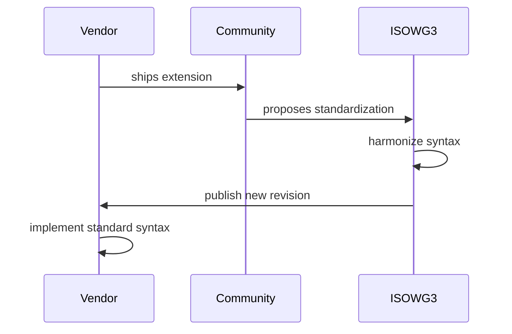

**BAD:**

```sql
-- MySQL non-standard: non-aggregated col
-- without GROUP BY (MySQL 5.x extension)
SELECT dept, name, MAX(salary)
FROM employees;
```

**GOOD:**

```sql
-- SQL standard: all non-agg cols in GROUP BY
SELECT dept, MAX(salary)
FROM employees
GROUP BY dept;
```

---

### 🚨 Failure Modes

**Failure 1 - Standard-version mismatch**

**Diagnostic:** `ROW_NUMBER() OVER (PARTITION BY ...)` fails
on MySQL 5.7 with "syntax error near OVER". Run
`SELECT VERSION()` - MySQL 5.7 predates window function
support (added in MySQL 8.0).

**Fix:** Upgrade to MySQL 8.0+ or rewrite using correlated
subqueries (expensive but compatible). Establish a minimum
database version policy that tracks required standard
features.

**Failure 2 - Non-portable vendor syntax in production**

**Diagnostic:** Oracle-to-PostgreSQL migration fails because
`CONNECT BY PRIOR parent_id = id` has no direct PostgreSQL
equivalent.

**Fix:** Rewrite Oracle CONNECT BY as PostgreSQL WITH
RECURSIVE. Mapping: `START WITH` = initial row filter,
`CONNECT BY PRIOR` = recursive join condition.

---

### 🔬 Production Reality

A team migrating a legacy Oracle OLAP system to PostgreSQL
discovered 47 queries using DECODE() instead of standard
CASE, 12 using ROWNUM instead of FETCH FIRST, and 23 using
CONNECT BY for org-chart traversal. None ran on PostgreSQL
unchanged. The migration grew from two weeks to four months.
Root cause: developers treated Oracle SQL as "just SQL"
rather than distinguishing standard features from
extensions. A pre-migration ANSI compliance audit would have
surfaced the full scope in week one.

---

### ⚖️ Trade-offs & Alternatives

| Feature          | Standard Version | PostgreSQL | MySQL      | Oracle     |
| ---------------- | ---------------- | ---------- | ---------- | ---------- |
| OUTER JOIN       | SQL-92           | Yes        | Yes        | Yes        |
| WITH RECURSIVE   | SQL:1999         | Yes (8.4+) | Yes (8.0+) | Yes        |
| Window functions | SQL:2003         | Yes (8.4+) | Yes (8.0+) | Yes        |
| FETCH FIRST      | SQL:2008         | Yes (8.4+) | Yes (8.0+) | Yes (12c+) |
| JSON_VALUE       | SQL:2016         | Yes (12+)  | Yes (8.0+) | Yes (21c+) |

---

### ⚡ Decision Snap

**USE WHEN:**

- Auditing a query for portability before a database
  migration
- Choosing which SQL features to use in a product targeting
  multiple database engines
- Diagnosing "this works in PostgreSQL but fails in MySQL"

**AVOID WHEN:**

- Using the standard as the sole performance guide; vendor
  hints can outperform standard-compliant equivalents
- Assuming "in the standard" means "supported by your
  specific database version"

**PREFER VENDOR EXTENSIONS WHEN:**

- Standard syntax performs measurably worse on the target
  database for a specific query pattern
- The standard feature was added after your minimum
  required database version

---

### ⚠️ Top Traps

| #   | Misconception                                    | Reality                                                                                                                |
| --- | ------------------------------------------------ | ---------------------------------------------------------------------------------------------------------------------- |
| 1   | "SQL is SQL" - same query runs everywhere        | Core SQL is portable; window functions, CTEs, JSON depend on database version                                          |
| 2   | The current SQL standard is SQL:2011             | The latest published standard is SQL:2023; standards update roughly every 4-7 years                                    |
| 3   | Vendor-specific SQL is always wrong              | Extensions often solve real problems faster than waiting for standardization; the risk is portability, not correctness |
| 4   | Standard conformance means identical behavior    | Conformance is partial and self-reported; edge cases differ across implementations                                     |
| 5   | Migrating databases requires only syntax changes | Semantic differences (NULL handling, isolation defaults) require behavioral testing, not just syntax translation       |

---

### 🪜 Learning Ladder

**Prerequisites:**

- SQL-006 ANSI SQL vs Vendor Dialects - the practical
  difference between standard and extension SQL
- SQL-128 Codd's 12 Rules and Relational Completeness -
  the theoretical foundation the standard codifies

**THIS:** SQL-129 SQL Standard Evolution - SQL-92 to SQL:2023

**Next steps:**

- SQL-055 Window Functions - ROW_NUMBER, RANK, DENSE_RANK -
  the SQL:2003 feature with highest engineering leverage
- SQL-053 Common Table Expressions (CTEs) - the SQL:1999
  feature for recursive and compositional queries

---

**The Surprising Truth:**

SQL:1999 added object-relational features (user-defined
types, table inheritance, nested tables) to compete with
object-oriented databases. Almost no production system uses
them. The features that became universally adopted were
WITH RECURSIVE and triggers - the pragmatic ones, not the
theoretical ones. Standards predict what will be needed;
the market selects what will be used.

**Further Reading:**

1. C.J. Date and Hugh Darwen, _A Guide to the SQL Standard_
   (4th ed.), Addison-Wesley, 1997 - covers SQL-92 through
   SQL:1999 comprehensively.
2. ISO/IEC 9075:2023, _Information Technology - Database
   Languages - SQL_, ISO, 2023 - the authoritative standard.
3. PostgreSQL documentation, "SQL Conformance" appendix -
   specific features and PostgreSQL's conformance status.

**Revision Card:**

1. SQL-92 is the portability baseline; window functions
   (SQL:2003) and recursive CTEs (SQL:1999) are the
   highest-leverage additions.
2. Standards lag real innovation by years; cutting-edge
   features live in vendor extensions until standardized.
3. Vendor extensions are not inherently wrong - the risk
   is portability debt, not technical incorrectness.

---

---

# SQL-130 Query Optimization Theory - Selinger Optimizer

**TL;DR** - The Selinger optimizer (1979) defined cost-based query optimization: it estimates join orders and access paths to find the cheapest execution plan without exhaustive search.

---

### 🔥 Problem Statement

A five-table join has 5! = 120 possible orderings; a
ten-table join has 3,628,800. Evaluating every ordering's
cost is computationally impossible. Before 1979, databases
used hard-coded heuristics: always apply filters first,
always use the most selective index. These produced
catastrophic plans when heuristics failed. Patricia Selinger
and colleagues at IBM's System R introduced cost-based
optimization using dynamic programming: estimate the cost
of each access path using table statistics, build optimal
sub-plans bottom-up, and combine them. Every modern query
planner - PostgreSQL's, Oracle's, SQL Server's - descends
from this approach. EXPLAIN makes no sense without it.

---

### 📜 Historical Context

System R was IBM's experimental relational system (1974-
1979). Before Selinger's paper, query execution relied on
hard-coded heuristics that worked on small datasets but
produced catastrophic plans at medium sizes. Selinger et
al.'s 1979 paper "Access Path Selection in a Relational
Database Management System" introduced dynamic programming
over join orderings, cost estimation via table statistics
(cardinality, page count, index selectivity), and
"interesting orderings" - plans producing sorted output
useful for downstream merge joins. This paper is the direct
ancestor of PostgreSQL's planner. Modern planners extend it
with genetic algorithms (GEQO) for large join counts and
histogram-based cardinality estimation.

---

### 🔩 First Principles

**CORE INVARIANTS:**

1. Query execution cost is dominated by I/O (disk reads)
   and intermediate result size; the optimizer minimizes
   estimated cost, not guaranteed cost.
2. Cost estimation requires statistics: table row counts,
   column cardinality, value distribution histograms.
   Stale statistics produce wrong estimates and bad plans.
3. Join ordering is the dominant optimization problem;
   for n tables there are n! orderings but dynamic
   programming reduces this to O(2^n) subproblems by
   reusing optimal sub-plan costs.

**DERIVED DESIGN:**

The optimizer is only as good as its statistics. ANALYZE
(PostgreSQL) must run after data loads. Beyond ~8 tables,
n! grows unmanageably, so planners switch to genetic
algorithms (PostgreSQL: GEQO at join_collapse_limit)
trading optimality for tractability.

**THE TRADE-OFF:**

**Gain:** Execution plans within an order of magnitude of
optimal without evaluating all possibilities.

**Cost:** Bad statistics produce confident wrong estimates;
the optimizer gives no feedback that it was wrong until
you measure execution time.

---

### 🧠 Mental Model

> The Selinger optimizer is a GPS route planner. It does
> not try every possible route - it uses a cost model
> (distance, traffic) and dynamic programming to find the
> best path from a tractable subset. Wrong traffic data
> (stale statistics) sends you into a traffic jam with
> total confidence.

- "Route planner" -> the query optimizer
- "Traffic data" -> table statistics (cardinality,
  histograms)
- "Dynamic programming" -> build optimal sub-paths to
  assemble the optimal full path
- "GPS confident despite wrong data" -> stale statistics
  produce plausible-looking but wrong plans

**Where this analogy breaks down:** A GPS re-routes in
real time. A query plan is fixed at parse time; stale
statistics require explicit ANALYZE, not automatic
mid-execution re-planning.

---

### 🧩 Components

- **Parser** - Converts SQL text to a parse tree.
- **Binder** - Resolves names against the catalog;
  produces a logical plan.
- **Statistics (pg_statistic)** - Per-column histograms,
  most common values, cardinality estimates.
- **Cost estimator** - Computes estimated rows, page
  fetches, and CPU cost for each plan node.
- **Dynamic programming layer** - Builds optimal join
  order bottom-up using Selinger's algorithm.
- **Plan space** - All access paths (SeqScan, IndexScan,
  BitmapScan) and join algorithms (Hash, Merge, Nested
  Loop).
- **Physical plan** - The operator tree sent to the
  executor.

```
SQL text
  |
[Parser] -> parse tree
  |
[Binder] -> logical plan
  |
[Statistics] -> estimates
  |
[DP Optimizer] -> cheapest plan
  |
[Executor] -> result set
```

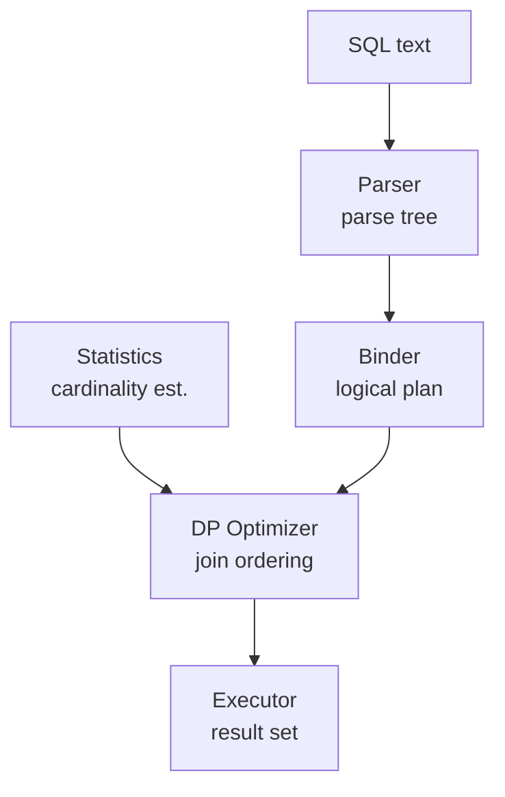

---

### 📶 Gradual Depth

**Level 1 - What it is:**
The optimizer reads your SQL, uses table statistics to
estimate costs, and picks the cheapest execution plan.
EXPLAIN shows the plan it chose.

**Level 2 - How to use it:**
Run EXPLAIN ANALYZE to see the plan and actual costs. If
estimated rows differ wildly from actual rows, run ANALYZE
on the table. Use `SET enable_seqscan = off` in a test
session to force index use and compare costs.

**Level 3 - How it works:**
For a 3-table join, the optimizer evaluates 6 orderings,
each with multiple access path choices. It builds the
3-table plan by combining the cheapest 2-table sub-plans.
"Interesting orderings" carry plans producing pre-sorted
output useful for later merge joins or GROUP BY even if
they are not the cheapest standalone step.

**Level 4 - Production mastery:**
The single most common optimizer failure is stale statistics
after a large data load. A table growing from 1,000 to
10,000,000 rows without ANALYZE still looks like 1,000
rows to the planner. Index scans are chosen on large tables
because the planner thinks they are small. Fix: set
`autovacuum_analyze_scale_factor = 0.01` for large tables,
and run ANALYZE manually after bulk loads.

---

### ⚙️ How It Works

**Phase 1 - Access path enumeration:** For each table,
enumerate all access methods: sequential scan, available
index scans, bitmap scans. Estimate cost using pg_statistic.

**Phase 2 - Two-table join cost estimation:** Compute
nested loop, hash join, and merge join costs for each pair.
Select cheapest per pair.

**Phase 3 - n-table DP:** Build join order bottom-up.
Best(T1,T2) becomes a building block for Best(T1,T2,T3).
Prune dominated plans at each step.

**Phase 4 - Physical plan:** Apply aggregate, sort, and
limit nodes on top of the join tree. Emit the complete
plan to the executor.

```
Tables: A, B, C - 6 orderings evaluated:
  (A x B) x C    A x (B x C)
  (A x C) x B    B x (A x C)
  (B x C) x A    C x (A x B)
Best(A,B) cost: 100
Best(B,C) cost: 200
(A,B)+C cost:   250  <- chosen
(B,C)+A cost:   350
```

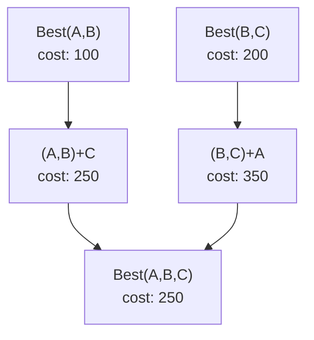

**BAD:**

```sql
-- Correlated subquery: optimizer cannot
-- choose join algorithm
SELECT id,
  (SELECT MAX(price) FROM p
   WHERE p.cat = o.cat)
FROM orders o;
```

**GOOD:**

```sql
-- Explicit join: optimizer picks plan
SELECT o.id, p.max_price
FROM orders o
JOIN (SELECT cat, MAX(price) AS max_price
      FROM products
      GROUP BY cat) p
  ON p.cat = o.cat;
```

---

### 🚨 Failure Modes

**Failure 1 - Stale statistics force wrong join order**

**Diagnostic:** `EXPLAIN ANALYZE` shows `rows=100
(estimated) vs rows=2000000 (actual)` with a Nested Loop
chosen over a Hash Join on a large table.

**Fix:** Run `ANALYZE tablename` immediately after bulk
data loads. Set `autovacuum_analyze_scale_factor = 0.01`
for large tables. For skewed distributions, use
`ALTER TABLE ... ALTER COLUMN ... SET STATISTICS 500` to
build finer histograms.

**Failure 2 - GEQO misses optimal plan on large join count**

**Diagnostic:** Query joins 12+ tables and EXPLAIN shows
a suboptimal plan with a Nested Loop on the largest table.
PostgreSQL switches from DP to GEQO (genetic algorithm)
at `join_collapse_limit = 8` by default.

**Fix:** Increase `join_collapse_limit` to allow DP for
larger join counts, at the cost of longer planning time.
Or restructure the query with CTEs to reduce the join
count seen by the planner.

---

### 🔬 Production Reality

A reporting service joined 9 tables and ran in 800ms on a
test database (100K rows) but degraded to 45 seconds in
production (50M rows). EXPLAIN ANALYZE showed GEQO had
chosen a Nested Loop on the largest table. Setting
`SET join_collapse_limit = 12` in the session caused the
DP planner to engage and find a Hash Join plan running in
400ms. Root cause: GEQO's probabilistic search had found
a local minimum. Rule of thumb: profile queries with > 6
tables in production before release - GEQO is probabilistic
and can miss the optimal plan.

---

### ⚖️ Trade-offs & Alternatives

| Aspect          | Selinger DP      | GEQO             | Rule-based             |
| --------------- | ---------------- | ---------------- | ---------------------- |
| Join count      | Optimal up to ~8 | Tractable to 30+ | No join optimization   |
| Plan quality    | Near-optimal     | Probabilistic    | Heuristic, often wrong |
| Planning time   | O(2^n)           | O(iterations)    | Fast                   |
| Statistics dep. | High             | High             | None                   |

---

### ⚡ Decision Snap

**USE WHEN:**

- Diagnosing slow queries: EXPLAIN ANALYZE reveals where
  the optimizer's statistics estimates were wrong
- Tuning autovacuum settings for tables that change
  rapidly
- Query has fewer than 8 joins and DP finds the optimal
  plan

**AVOID WHEN:**

- Overriding the optimizer without statistical evidence;
  use hints only when EXPLAIN ANALYZE proves it wrong
- Relying on default statistics for rapidly growing
  production tables

**PREFER MANUAL PLAN HINTS WHEN:**

- Optimizer consistently chooses wrong plan despite fresh
  statistics (use pg_hint_plan or CTEs to force order)

---

### ⚠️ Top Traps

| #   | Misconception                            | Reality                                                                                                     |
| --- | ---------------------------------------- | ----------------------------------------------------------------------------------------------------------- |
| 1   | EXPLAIN shows what the query does        | EXPLAIN shows the plan; EXPLAIN ANALYZE shows both plan and actual execution - they can differ dramatically |
| 2   | The optimizer is always right            | The optimizer minimizes estimated cost; stale statistics make estimates wrong and plans suboptimal          |
| 3   | Adding an index always helps             | The optimizer may ignore an index if statistics suggest a sequential scan is cheaper; verify with EXPLAIN   |
| 4   | Large join counts use the best algorithm | PostgreSQL switches to GEQO at 8+ tables; GEQO is probabilistic and may miss the optimal plan               |
| 5   | Planning time is always negligible       | On complex multi-join queries, planning can take >100ms; use prepared statements to cache plans             |

---

### 🪜 Learning Ladder

**Prerequisites:**

- SQL-042 EXPLAIN - Reading Your First Query Plan -
  understand plan output before the theory behind it
- SQL-040 Indexes - What They Are and Why They Matter -
  access paths the optimizer chooses from
- SQL-060 Execution Plans Deep Dive - EXPLAIN ANALYZE -
  the diagnostic tool for optimizer failures

**THIS:** SQL-130 Query Optimization Theory - Selinger
Optimizer

**Next steps:**

- SQL-135 The Volcano (Iterator) Execution Model - how
  the chosen plan is actually executed
- SQL-136 Vectorized vs Pipelined Query Execution -
  modern alternatives to tuple-at-a-time execution

---

**The Surprising Truth:**

The Selinger optimizer does not guarantee the optimal plan.
It guarantees the cheapest plan given its statistics and
cost model. A plan built on wrong statistics can cost
1,000x more than the optimal plan and the optimizer
presents it with total confidence. The optimizer is only
as wise as its statistics.

**Further Reading:**

1. P. Selinger et al., "Access Path Selection in a
   Relational Database Management System," _ACM SIGMOD_,
   1979 - the original paper; mandatory for anyone who
   reads EXPLAIN output professionally.
2. PostgreSQL documentation, "Planner/Optimizer" chapter -
   how PostgreSQL extends Selinger's algorithm.
3. G. Moerkotte, _Building Query Compilers_, draft
   textbook (available online) - comprehensive treatment
   of DP and GEQO variants in modern query optimization.

**Revision Card:**

1. The optimizer uses DP to find the cheapest join order;
   stale statistics are the primary cause of bad plans in
   production.
2. PostgreSQL switches to GEQO at join_collapse_limit = 8
   tables - probabilistic, may produce suboptimal plans.
3. EXPLAIN shows estimates; EXPLAIN ANALYZE shows reality -
   the gap between them reveals where statistics are
   wrong.

---

---

# SQL-131 Isolation Formalism - Adya, Liskov, O'Neil (1999)

**TL;DR** - Adya's 1999 formalism defines isolation levels by the anomalies they permit rather than by implementation mechanism, enabling precise cross-database reasoning about isolation.

---

### 🔥 Problem Statement

The ANSI SQL-92 isolation level definitions are stated in
terms of specific anomalies (dirty reads, non-repeatable
reads, phantom reads). But these definitions are coupled to
locking implementations and miss anomalies that
snapshot-based systems produce. Write skew - two concurrent
transactions each reading a consistent state and each writing
a change that is individually valid but together violate a
constraint - appears under ANSI REPEATABLE READ but is not
named in SQL-92. Engineers reading "REPEATABLE READ prevents
phantoms" migrate from MySQL to PostgreSQL and discover
different behavior because PostgreSQL's REPEATABLE READ uses
snapshots while MySQL's uses gap locks - same level name,
different anomaly profile. The Adya formalism solves this by
defining isolation in terms of dependency graphs, not
implementation mechanisms.

---

### 📜 Historical Context

Jim Gray and Andreas Reuter's 1992 book "Transaction
Processing: Concepts and Techniques" established the
foundation. The ANSI SQL-92 standard defined isolation levels
via prohibited phenomena but used imprecise English prose
open to multiple interpretations. In 1995, Berenson et al.
published "A Critique of ANSI SQL Isolation Levels" showing
the ANSI definitions were ambiguous and missed anomalies
present in snapshot isolation. Atul Adya, Barbara Liskov, and
Patrick O'Neil's 1999 paper "Generalized Isolation Level
Definitions" formalized isolation using dependency histories
(direct serialization graphs, version graphs) that are
implementation-independent. This formalism became the
foundation for reasoning about isolation in snapshot-based
systems like PostgreSQL and CockroachDB.

---

### 🔩 First Principles

**CORE INVARIANTS:**

1. An isolation level is defined by the set of anomalies it
   permits, not by the mechanism (locking vs. snapshots)
   used to prevent them.
2. Every transaction produces a read-write dependency graph;
   an execution is serializable if and only if that graph
   has no cycles.
3. Write skew is an anomaly that is invisible to the ANSI
   SQL-92 definition but visible in the Adya formalism -
   it requires predicate tracking (SSI) to prevent.

**DERIVED DESIGN:**

Because isolation is defined by anomalies, the same
isolation level can be implemented by either locking or
snapshot mechanisms, and the correctness claim is the
same. This is what allows PostgreSQL's SSI implementation
(snapshot-based) to be claimed equivalent to two-phase
locking serializable.

**THE TRADE-OFF:**

**Gain:** Precise, implementation-independent reasoning
about what anomalies each isolation level permits on any
database engine.

**Cost:** The formalism requires understanding dependency
graphs and predicate reads - more mathematical than the
intuitive "which phenomena are prevented" model.

---

### 🧠 Mental Model

> Isolation levels are contracts. The contract specifies
> what bad things cannot happen to your transaction, not
> how the database prevents them. Two employees (locking
> and snapshot) enforce the same non-disclosure contract
> through different mechanisms - both are valid.

- "Contract" -> isolation level definition as anomaly set
- "Two employees" -> locking vs. snapshot implementation
- "Non-disclosure" -> preventing specific read/write
  anomalies
- "Both valid" -> either mechanism satisfies the same
  level's contract

**Where this analogy breaks down:** The "same contract"
claim holds for named anomalies, but write skew sits in
a gap that the ANSI contract never named. Different
databases prevent different undocumented anomalies under
the same level name.

---

### 🧩 Components

- **Read phenomena (ANSI):** Dirty read, non-repeatable
  read, phantom read - the three anomalies SQL-92
  standardized.
- **Write skew:** Two transactions each read-then-write
  based on a consistent snapshot; together they violate
  a constraint neither violated alone.
- **Anti-dependency (rw-dependency):** Transaction T2
  reads a version that T1 later overwrites - the source
  of most serialization failures.
- **Serialization graph (DSG):** Directed graph of
  transaction dependencies; a cycle means the execution
  is not serializable.
- **SSI (Serializable Snapshot Isolation):** PostgreSQL's
  implementation (since 9.1) that detects dangerous
  rw-dependency cycles and aborts one conflicting
  transaction.

```
ANOMALY CONTAINMENT:

READ UNCOMMITTED  <-- allows: dirty, non-rep, phantom,
                         write skew
READ COMMITTED    <-- allows: non-rep, phantom, write skew
REPEATABLE READ   <-- allows: write skew
SERIALIZABLE      <-- allows: none
```

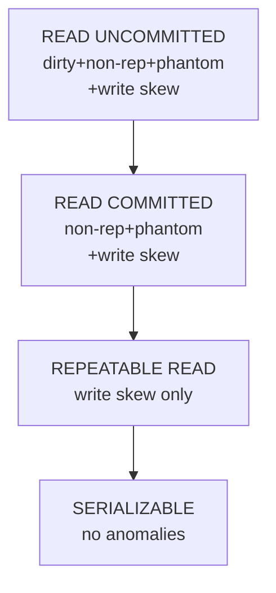

---

### 📶 Gradual Depth

**Level 1 - What it is:**
Isolation levels control which transaction anomalies are
possible. Higher levels prevent more anomalies but cost
more performance. The Adya formalism defines them by
anomaly set, not by implementation.

**Level 2 - How to use it:**
Use READ COMMITTED (PostgreSQL default) for most workloads.
Use REPEATABLE READ when you need a consistent snapshot
across multiple statements. Use SERIALIZABLE only when
write skew would produce incorrect business results (e.g.,
double-booking, cross-row constraint enforcement).

**Level 3 - How it works:**
PostgreSQL READ COMMITTED takes a fresh snapshot per
statement. REPEATABLE READ takes one snapshot at
transaction start and uses it for all statements.
SERIALIZABLE adds predicate tracking (SSI) detecting
rw-dependency cycles and aborting one transaction when
a cycle is detected.

**Level 4 - Production mastery:**
Write skew is the critical gap that trips production
systems. Two on-call doctors each check "at least one
doctor is on call," then each removes themselves - leaving
zero on call. Both transactions read a consistent state;
each write is individually valid; together they violate
the constraint. PostgreSQL REPEATABLE READ allows this.
Only SERIALIZABLE (SSI) detects and aborts one. Code that
assumes REPEATABLE READ prevents all problems will have
this class of bug in production.

---

### ⚙️ How It Works

**Phase 1 - Transaction start:** Isolation level is set at
BEGIN. PostgreSQL acquires a snapshot; MySQL establishes
lock scoping rules.

**Phase 2 - Read execution:** PostgreSQL checks visibility
using snapshot (xmin/xmax). MySQL acquires shared read
locks or uses snapshots depending on isolation level.

**Phase 3 - Write execution:** PostgreSQL checks for
write-write conflicts (serialization error if two
transactions modify the same row at REPEATABLE READ).
MySQL acquires exclusive row and gap locks.

**Phase 4 - Commit / abort:** PostgreSQL SSI checks the
rw-dependency graph for cycles at commit. If a dangerous
cycle is found, one transaction receives a serialization
failure and must retry.

```
T1 reads row R (v1)    T2 reads row R (v1)
T1 writes row R (v2)   T2 writes row S (v2)
T2 commits             T1 commits
Result: write skew if T2 depended on R staying v1
SSI: detects rw-cycle, aborts T1 or T2
```

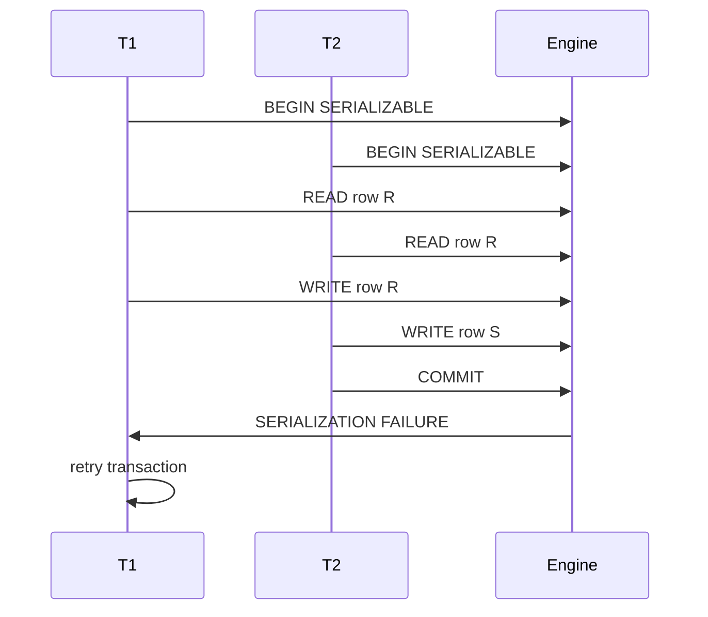

**BAD:**

```sql
-- REPEATABLE READ allows write skew
-- for seat booking (double booking)
BEGIN ISOLATION LEVEL REPEATABLE READ;
  SELECT count(*) FROM bookings
  WHERE seat = 'A1';
  -- both T1 and T2 see 0 -> both INSERT
COMMIT;
```

**GOOD:**

```sql
-- SERIALIZABLE prevents write skew
BEGIN ISOLATION LEVEL SERIALIZABLE;
  SELECT count(*) FROM bookings
  WHERE seat = 'A1';
  INSERT INTO bookings VALUES ('A1', ...);
COMMIT;
-- one transaction retries on conflict
```

---

### 🚨 Failure Modes

**Failure 1 - Write skew at REPEATABLE READ**

**Diagnostic:** Two concurrent transactions both pass a
"constraint check" read, then both write, violating the
constraint together. No error; data is silently corrupted.
Classic examples: double-booking seats, two users both
seeing "slot available" and taking it.

**Fix:** Use SERIALIZABLE isolation for these transactions.
Or implement the constraint as a database-level CHECK or
trigger that fires per-row, not per-transaction.

**Failure 2 - Serialization failure storms under SSI**

**Diagnostic:** Application receives `ERROR: could not
serialize access due to concurrent update` (SQLSTATE 40001) under high concurrency at SERIALIZABLE level.
Retry logic is absent or breaks application correctness.

**Fix:** All code using SERIALIZABLE must implement retry
logic: catch serialization failure, retry the full
transaction. PostgreSQL guarantees that at least one of
two conflicting transactions succeeds; the aborted one
must simply retry.

---

### 🔬 Production Reality

A SaaS scheduling system used REPEATABLE READ for
appointment booking. Two concurrent booking transactions
both read "slot 14:00 is free" in their snapshots, both
wrote "slot 14:00 = booked by user A" and "slot 14:00 =
booked by user B." Both committed. The slot was
double-booked. The team switched to SERIALIZABLE and added
transaction retry logic. One of every ~200 booking
transactions under contention received a serialization
failure and retried successfully. User-visible latency
increased by <5ms. The write skew was eliminated
completely.

---

### ⚖️ Trade-offs & Alternatives

| Aspect               | READ COMMITTED | REPEATABLE READ | SERIALIZABLE (SSI)      |
| -------------------- | -------------- | --------------- | ----------------------- |
| Dirty reads          | No             | No              | No                      |
| Non-repeatable reads | Yes            | No              | No                      |
| Phantom reads        | Yes            | No (PG)         | No                      |
| Write skew           | Yes            | Yes             | No                      |
| Performance cost     | Low            | Medium          | Medium+ retry overhead  |
| Retry requirement    | Rare           | Rare            | Common under contention |

---

### ⚡ Decision Snap

**USE WHEN:**

- SERIALIZABLE: any multi-statement transaction that reads
  and writes based on aggregate state (booking, inventory
  reservation, constraint enforcement across rows)
- REPEATABLE READ: consistent snapshot across a long
  multi-statement read with no cross-row write logic
- READ COMMITTED: single-statement transactions or
  workloads where each statement is independently correct

**AVOID WHEN:**

- SERIALIZABLE with high write contention and no retry
  logic - serialization failures will crash the app
- READ UNCOMMITTED in any production system - there is no
  performance benefit in PostgreSQL (it maps to READ
  COMMITTED) and correctness is undefined on other
  databases

**PREFER READ COMMITTED + APPLICATION LOCKS WHEN:**

- Contention is high and retry overhead under SERIALIZABLE
  is measurably impacting throughput

---

### ⚠️ Top Traps

| #   | Misconception                                      | Reality                                                                                                                 |
| --- | -------------------------------------------------- | ----------------------------------------------------------------------------------------------------------------------- |
| 1   | REPEATABLE READ prevents all phantoms              | PostgreSQL REPEATABLE READ prevents phantoms via MVCC; MySQL uses gap locks; both prevent phantoms but allow write skew |
| 2   | Write skew requires a bug in the database          | Write skew is correct behavior under REPEATABLE READ per the ANSI standard; only SERIALIZABLE prevents it               |
| 3   | SERIALIZABLE is always too slow for production     | PostgreSQL SSI uses snapshot isolation with cycle detection; typical overhead is 5-15% vs. REPEATABLE READ              |
| 4   | Isolation level is a global setting                | Isolation level can be set per transaction (`BEGIN ISOLATION LEVEL SERIALIZABLE`)                                       |
| 5   | Serialization failures mean the transaction failed | Serialization failures (SQLSTATE 40001) must be retried; the transaction did not corrupt data - it was safely aborted   |

---

### 🪜 Learning Ladder

**Prerequisites:**

- SQL-038 Transactions - BEGIN, COMMIT, ROLLBACK -
  transaction mechanics before isolation semantics
- SQL-067 Transaction Isolation Levels - the practical
  use of isolation levels before the formalism
- SQL-068 Read Phenomena - Dirty, Non-Repeatable, Phantom -
  the ANSI phenomena the formalism extends

**THIS:** SQL-131 Isolation Formalism - Adya, Liskov,
O'Neil (1999)

**Next steps:**

- SQL-069 Optimistic vs Pessimistic Locking - the
  implementation strategies that implement isolation
- SQL-128 Codd's 12 Rules and Relational Completeness -
  how isolation fits into the relational model's
  correctness guarantees

---

**The Surprising Truth:**

The ANSI SQL-92 isolation level definitions were critiqued
in 1995 as ambiguous and incomplete. Adya's 1999 formalism
was published before snapshot isolation was widely
understood. Yet PostgreSQL's SSI implementation (2012)
is one of the first production implementations provably
correct against the Adya formalism. It took 13 years from
the formalism to a production-ready implementation.

**Further Reading:**

1. A. Adya, B. Liskov, P. O'Neil, "Generalized Isolation
   Level Definitions," _ICDE 2000_ (submitted 1999) - the
   paper defining isolation via dependency graphs.
2. M. Berenson et al., "A Critique of ANSI SQL Isolation
   Levels," _ACM SIGMOD_, 1995 - exposes the ambiguity in
   ANSI definitions and motivates Adya's work.
3. D. Ports, K. Grittner, "Serializable Snapshot Isolation
   in PostgreSQL," _VLDB_, 2012 - the production
   implementation of SSI in PostgreSQL 9.1.

**Revision Card:**

1. Write skew is permitted under REPEATABLE READ and is
   the most common isolation bug in production; only
   SERIALIZABLE prevents it.
2. Adya defines isolation by anomaly set, not by locking
   vs. snapshots - the same level name has different
   anomaly profiles on different databases.
3. SERIALIZABLE requires retry logic: catch SQLSTATE 40001
   and retry the full transaction.

---

---

# SQL-132 LSM-Trees vs B-Trees - Storage Engine Design

**TL;DR** - B-trees optimize read performance at the cost of write amplification; LSM-trees invert this, batching writes in memory and merging to disk sequentially for higher write throughput.

---

### 🔥 Problem Statement

A B-tree index handles a random write by reading the target
page from disk, modifying it in memory, and writing it back.
For a workload generating 100,000 writes per second to
random keys, every write incurs a random disk read - the
most expensive I/O operation on spinning disks. SSDs improve
random read latency but not write amplification: a single
logical write can trigger dozens of physical pages to be
rewritten due to B-tree page splits and balance operations.
At high write throughput, B-trees saturate I/O capacity.
LSM-trees (Log-Structured Merge-Trees) solve this by
converting random writes into sequential writes - the fastest
I/O operation on any storage medium. The trade-off is read
performance: reads must check multiple sorted layers
(SSTables) and merge their results, which is slower than a
single B-tree traversal.

---

### 📜 Historical Context

The B-tree was introduced by Bayer and McCreight in 1972
and remains the dominant index structure in relational
databases (PostgreSQL, MySQL InnoDB). The LSM-tree was
proposed by O'Neil et al. in their 1996 paper "The
Log-Structured Merge-Tree" as a solution for write-heavy
workloads. Google's Bigtable (2006) popularized SSTable-
based LSM implementations. LevelDB (2011) and RocksDB
(2013) made LSM-trees mainstream as embedded storage
engines. Cassandra, ScyllaDB, and CockroachDB (for certain
workloads) use LSM-based storage. PostgreSQL uses a B-tree
with a heap-based table storage; InnoDB uses a B-tree
clustered index.

---

### 🔩 First Principles

**CORE INVARIANTS:**

1. Write performance is maximized by sequential I/O; random
   I/O is the fundamental bottleneck for high write
   throughput on any storage medium.
2. In B-trees, every write is in-place, requiring a read-
   modify-write cycle on the target page; write
   amplification scales with tree depth.
3. In LSM-trees, writes go to an in-memory buffer
   (MemTable), are flushed to immutable on-disk files
   (SSTables), and are periodically compacted; all disk
   writes are sequential.

**DERIVED DESIGN:**

Because LSM-trees never modify existing files, they
inherently support lock-free writes to the MemTable and
parallel reads from multiple SSTable levels. The price is
compaction: background threads must periodically merge
SSTable levels to bound read amplification, consuming I/O
and CPU.

**THE TRADE-OFF:**

**Gain:** LSM-trees achieve 10-100x higher sustained write
throughput on SSDs vs. B-trees for random key workloads.

**Cost:** Read amplification - a point read must check the
MemTable plus every SSTable level. Bloom filters amortize
this but do not eliminate it. Space amplification: data
exists in multiple SSTable levels until compaction.

---

### 🧠 Mental Model

> B-tree is a filing cabinet: every document lives in one
> precise folder. To file or retrieve, you navigate to the
> exact folder. Fast retrieval, but filing in the middle
> requires reshuffling.
>
> LSM-tree is a receipts pile: you throw every new receipt
> on top of a pile. Periodically you sort all receipts.
> Filing is instant; finding one requires scanning multiple
> piles.

- "Precise folder" -> B-tree page at a specific disk location
- "Navigate to exact folder" -> O(log n) page reads
- "Receipts pile" -> MemTable + sorted SSTables
- "Sorting receipts" -> compaction process

**Where this analogy breaks down:** Modern B-trees use
buffer pools to batch writes, partially mimicking LSM
behavior. Modern LSM-trees use Bloom filters to make reads
near O(1) for non-existent keys.

---

### 🧩 Components

- **MemTable (LSM):** In-memory sorted tree; absorbs all
  recent writes. Typically 64-128 MB.
- **SSTables (LSM):** Immutable sorted files on disk;
  created by flushing the MemTable.
- **Bloom filter (LSM):** Per-SSTable probabilistic set
  filter; answers "is key K in this SSTable?" in O(1)
  with false-positive rate ~1%.
- **Compaction (LSM):** Background process merging
  SSTable levels to bound space and read amplification.
- **B-tree leaf page:** Fixed-size disk page holding
  sorted key-value pairs; modified in place.
- **Write-Ahead Log (both):** Sequential log ensuring
  crash recovery for both B-tree and LSM engines.

```
LSM write path:
  Write -> MemTable (RAM)
    |
    v (flush at threshold)
  Level 0 SSTables (disk, sequential)
    |
    v (compact to bound read amp)
  Level 1+ SSTables (disk, sorted, larger)

B-tree write path:
  Write -> WAL (sequential)
    |
    v
  Buffer pool -> target page (random read if not cached)
    |
    v
  Modified page written back (random write)
```

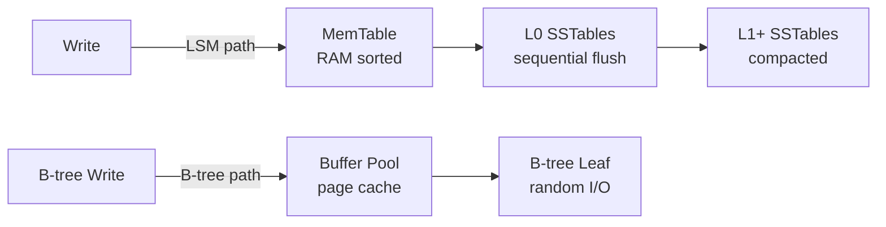

---

### 📶 Gradual Depth

**Level 1 - What it is:**
B-trees modify data in place; reads are fast (O(log n)).
LSM-trees write sequentially to memory then disk; writes
are fast but reads check multiple layers.

**Level 2 - How to use it:**
Choose LSM for write-heavy workloads (IoT, event logs,
time-series). Choose B-trees for read-heavy, mixed OLTP
workloads with balanced read/write. PostgreSQL and MySQL
InnoDB use B-trees; Cassandra, RocksDB use LSM.

**Level 3 - How it works:**
An LSM write goes to the MemTable (skip list or red-black
tree in RAM). When the MemTable reaches its size threshold,
it is flushed as an immutable Level-0 SSTable. Compaction
merges L0 files into L1, L1 into L2, etc. Read requires
checking MemTable + each level; Bloom filters skip most
SSTable checks for non-existent keys.

**Level 4 - Production mastery:**
Compaction stalls are the production failure mode for LSM
engines. When writes outpace compaction, L0 SSTable count
grows, read amplification explodes, and the engine stalls
writes to allow compaction to catch up. Tune RocksDB
`level0_slowdown_writes_trigger` and
`level0_stop_writes_trigger`. Monitor L0 file count as a
leading indicator of compaction lag.

---

### ⚙️ How It Works

**Phase 1 - Write (LSM):** Key-value pair enters MemTable
(sorted). Also appended to WAL for crash recovery.

**Phase 2 - Flush:** MemTable reaches threshold; flushed
to Level-0 SSTable (immutable, sorted, on disk).

**Phase 3 - Compaction:** Background thread picks
overlapping SSTables across levels, merges them into a
new larger SSTable, removes duplicate/deleted keys.

**Phase 4 - Read (LSM):** Check MemTable first. Then check
each level using Bloom filter to skip SSTables that
cannot contain the key. Merge results from all levels.

```
LSM Read Amplification:
  MemTable check: O(log n) in RAM
  Per level: Bloom filter O(1) + SSTable scan if hit
  Worst case: check all levels (L0 is worst)
  Practical: Bloom filters reduce to ~1.1 disk reads

B-tree Read:
  Buffer pool check O(1)
  If miss: O(log n) page reads from disk
  Typical: 3-4 I/Os for a 4-level tree
```

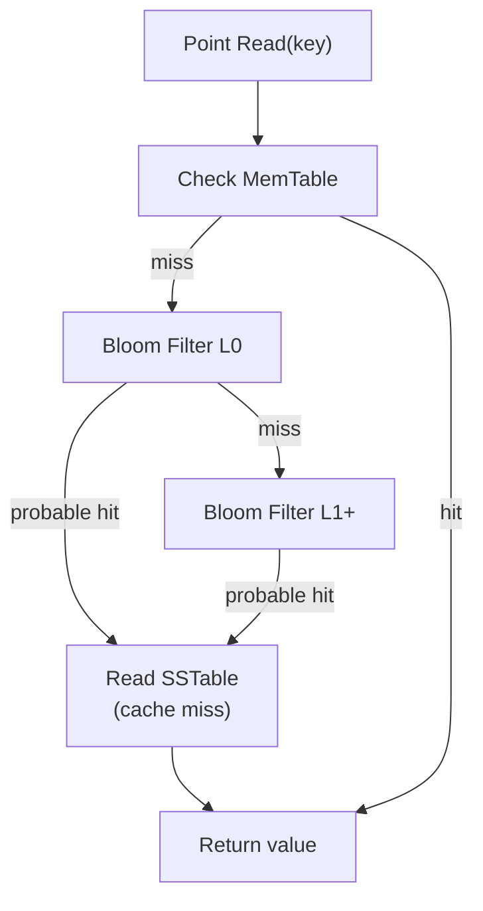

**BAD:**

```sql
-- Wide row read: forces many SSTable
-- lookups in LSM store (high read amp)
SELECT * FROM events
WHERE user_id = 12345;
```

**GOOD:**

```sql
-- Targeted narrow read: fewer SSTable
-- lookups, less read amplification
SELECT event_type, ts
FROM events
WHERE user_id = 12345
  AND ts > NOW() - INTERVAL '1 day';
```

---

### 🚨 Failure Modes

**Failure 1 - Compaction stall under sustained write load**

**Diagnostic:** RocksDB/Cassandra write latency spikes;
L0 file count exceeds `level0_slowdown_writes_trigger`
(default 20). Monitor: `rocksdb.num-files-at-level0`.

**Fix:** Increase compaction thread count. Tune
`max_bytes_for_level_base` to allow larger L1. Reduce
write burst rate. For Cassandra: increase
`concurrent_compactors`.

**Failure 2 - Space amplification on large value updates**

**Diagnostic:** Database size grows far beyond logical
data size after many updates to the same keys. Old
versions exist in multiple SSTable levels before
compaction removes them.

**Fix:** Force manual compaction during low-traffic
windows. Tune compaction style (LevelDB uses Leveled;
RocksDB supports Universal for space efficiency).

---

### 🔬 Production Reality

A time-series metrics system used PostgreSQL with a B-tree
index on (host, timestamp). At 500,000 inserts per second,
WAL write throughput saturated at 80% disk I/O capacity.
A migration to a RocksDB-backed store (same SQL interface
via CockroachDB) reduced write I/O by 65% at the same
insert rate. The B-tree's random write pattern had been
creating I/O contention between the index updates and WAL
writes. LSM's sequential write pattern decoupled them.
Reads on the RocksDB store were 20% slower on point
lookups - an acceptable trade-off for a write-dominant
workload.

---

### ⚖️ Trade-offs & Alternatives

| Aspect                 | B-tree (PostgreSQL) | LSM (RocksDB/Cassandra)    |
| ---------------------- | ------------------- | -------------------------- |
| Write throughput       | Medium              | High                       |
| Random read latency    | Low (O(log n))      | Medium (Bloom + levels)    |
| Space amplification    | Low                 | Medium (until compaction)  |
| Write amplification    | High (in-place)     | Medium (compaction)        |
| Operational complexity | Low                 | Medium (compaction tuning) |

---

### ⚡ Decision Snap

**USE B-TREE WHEN:**

- Mixed read/write OLTP workloads where read latency is
  critical and writes are moderate
- Your database engine is PostgreSQL or MySQL (B-tree is
  the built-in; no migration needed)

**USE LSM WHEN:**

- Write-dominant workloads: time-series, event logging,
  metrics ingestion, IoT telemetry
- Sequential scan over recent time ranges where compacted
  SSTables provide good scan performance

**PREFER LSM + BLOOM FILTERS WHEN:**

- High cardinality key space with many non-existent key
  lookups (Bloom filters make LSM reads competitive)

---

### ⚠️ Top Traps

| #   | Misconception                                         | Reality                                                                                                              |
| --- | ----------------------------------------------------- | -------------------------------------------------------------------------------------------------------------------- |
| 1   | LSM is always faster than B-tree                      | LSM is faster for writes; B-tree is faster for random reads; the right choice depends on read/write ratio            |
| 2   | Compaction is a maintenance task, not a failure mode  | Compaction falling behind write rate causes stalls and latency spikes in production                                  |
| 3   | Bloom filters eliminate read amplification            | Bloom filters reduce false negatives but have a false-positive rate; they help most for non-existent key lookups     |
| 4   | PostgreSQL's heap + B-tree is always the right choice | For extreme write-heavy workloads (>100K inserts/sec), purpose-built LSM engines outperform PostgreSQL significantly |
| 5   | Space on disk = logical data size for LSM             | LSM stores multiple versions until compaction; space amplification of 1.5-3x is typical under sustained writes       |

---

### 🪜 Learning Ladder

**Prerequisites:**

- SQL-041 B-Tree Index Basics - the B-tree structure
  before understanding its write cost
- SQL-061 Index Types - B-Tree, Hash, GIN, GiST, BRIN -
  PostgreSQL's index type landscape

**THIS:** SQL-132 LSM-Trees vs B-Trees - Storage Engine
Design

**Next steps:**

- SQL-133 Column-Store vs Row-Store Engine Design - the
  next storage layout dimension
- SQL-137 What OS Page Caches Teach Database Buffer Pools -
  how the storage layer interacts with memory hierarchy

---

**The Surprising Truth:**

PostgreSQL does not use a standard B-tree for table
storage. It uses a heap (unordered pages), with a
separate B-tree index pointing into the heap. This means
PostgreSQL updates always require both a heap write and
a B-tree index write - doubling write amplification
compared to a clustered B-tree (like MySQL InnoDB).
HOT (Heap-Only Tuple) updates partially mitigate this
when the indexed columns do not change.

**Further Reading:**

1. P. O'Neil et al., "The Log-Structured Merge-Tree
   (LSM-Tree)," _Acta Informatica_, vol. 33, 1996 - the
   original LSM-tree paper.
2. R. Bayer and E. McCreight, "Organization and
   Maintenance of Large Ordered Indices," _Acta
   Informatica_, vol. 1, 1972 - the original B-tree paper.
3. Facebook Engineering, "RocksDB Tuning Guide" (GitHub,
   rocksdb/wiki) - practical LSM compaction tuning for
   production workloads.

**Revision Card:**

1. B-trees: fast reads (O(log n)), expensive random writes
   (read-modify-write per page). LSM: fast sequential
   writes, reads check multiple layers.
2. LSM compaction stalls are the production failure mode;
   monitor L0 file count as a leading indicator.
3. PostgreSQL uses heap + B-tree (two writes per insert);
   HOT updates reduce index write overhead when indexed
   columns do not change.
