## Keywords

1. [SQL-133 Column-Store vs Row-Store Engine Design](#sql-133-column-store-vs-row-store-engine-design)
2. [SQL-134 Writing a SQL Parser from Scratch](#sql-134-writing-a-sql-parser-from-scratch)
3. [SQL-135 The Volcano (Iterator) Execution Model](#sql-135-the-volcano-iterator-execution-model)
4. [SQL-136 Vectorized vs Pipelined Query Execution](#sql-136-vectorized-vs-pipelined-query-execution)
5. [SQL-137 What OS Page Caches Teach Database Buffer Pools](#sql-137-what-os-page-caches-teach-database-buffer-pools)
6. [SQL-138 What Compiler Optimization Teaches Query Planning](#sql-138-what-compiler-optimization-teaches-query-planning)
7. [SQL-139 Set-Based Thinking vs Procedural Thinking](#sql-139-set-based-thinking-vs-procedural-thinking)
8. [SQL-140 Data Gravity as System Design Constraint](#sql-140-data-gravity-as-system-design-constraint)
9. [SQL-141 Declarative vs Imperative - The SQL Paradigm Lesson](#sql-141-declarative-vs-imperative---the-sql-paradigm-lesson)
10. [SQL-142 Teaching SQL to Procedural Programmers](#sql-142-teaching-sql-to-procedural-programmers)

---

---

# SQL-133 Column-Store vs Row-Store Engine Design

**TL;DR** - Row stores keep all columns of a row together for fast point lookups; column stores keep each column's values together for fast analytical aggregations over wide tables.

---

### 🔥 Problem Statement

An analytics query computing `SELECT AVG(price), COUNT(*)
FROM sales WHERE region = 'EU'` on a 500-column, 1-billion-
row table needs only 2 columns. A row-oriented store reads
every one of those 500 columns for each of the 1 billion
rows to find the 2 needed - delivering 100 GB of data to
the query engine to compute an answer from 400 MB of
relevant data. On the same hardware, this takes 45 minutes.
A column-oriented store stores each column's values
contiguously; the same query reads only the `price` and
`region` columns - 800 MB instead of 100 GB - and finishes
in 2 minutes. Conversely, a transactional INSERT that adds
one row must write to 500 separate column files in a
column store vs. one heap page in a row store. Storage
layout is the primary determinant of performance at scale,
not the query language.

---

### 📜 Historical Context

Row-oriented storage descends from the original System R
heap model (1975). Column stores were proposed academically
throughout the 1990s. The seminal production deployment was
MonetDB (1990s, Centrum Wiskunde & Informatica) and C-Store
(2005, Stonebraker et al.). Vertica (2005), Apache Parquet
(2013), and Apache ORC (2013) brought column storage
mainstream. PostgreSQL added columnar options via extensions
(Citus columnar, pg_mooncake) rather than natively. Modern
cloud data warehouses (BigQuery, Redshift, Snowflake) are
exclusively column-oriented. The Abadi et al. 2008 paper
"Column-Stores vs. Row-Stores: How Different Are They
Really?" quantified the performance difference empirically.

---

### 🔩 First Principles

**CORE INVARIANTS:**

1. Analytical queries (OLAP) access few columns across many
   rows; storing columns contiguously minimizes I/O by
   reading only the columns the query needs.
2. Transactional queries (OLTP) access all columns of few
   rows; storing rows contiguously minimizes I/O by reading
   one page to get the full record.
3. Column storage achieves far higher compression ratios
   because values in a column have the same type and often
   correlated values, enabling run-length encoding and
   delta encoding.

**DERIVED DESIGN:**

Because column stores are append-friendly but update-
expensive, they naturally suit immutable event streams,
data warehouses, and analytics workloads. Row stores are
naturally suited for transactional workloads with frequent
single-row reads and writes.

**THE TRADE-OFF:**

**Gain:** Column stores achieve 10-100x I/O reduction for
analytical queries on wide tables, and 5-10x compression
ratios, dramatically reducing storage cost.

**Cost:** Point lookup and row reconstruction require
reading one page from each column file, then stitching
columns back into a row. Highly concurrent transactional
inserts must append to multiple column files.

---

### 🧠 Mental Model

> A row store is a spreadsheet printed row by row: each
> sheet is one row with all columns. To find one column's
> values across all rows, you flip every page.
>
> A column store is a spreadsheet printed column by column:
> each sheet is one column for all rows. To compute the
> average of a column, you read one sheet.

- "Spreadsheet row by row" -> heap page containing full
  row (all columns)
- "Flip every page for one column" -> I/O amplification
  in row store for analytics
- "Spreadsheet column by column" -> column file containing
  one column's values
- "Read one sheet for average" -> minimal I/O in column
  store for aggregations

**Where this analogy breaks down:** Real column stores use
vectorized execution on column batches, not individual
page reads. And real row stores use buffer pools to cache
hot pages, reducing the per-flip cost significantly.

---

### 🧩 Components

- **Column file (column store):** One file per column;
  values are stored contiguously, sorted by row order.
- **Compression block:** Each column file is divided into
  blocks; each block is compressed independently
  (run-length encoding, delta encoding, dictionary
  encoding).
- **Late materialization:** Column store defers assembling
  full rows until after all filters are applied - avoids
  reconstructing rows for rows the query will discard.
- **Heap page (row store):** Fixed-size page containing
  complete rows; each row's all columns are stored
  contiguously.
- **Zone map / min-max index:** Per-column-block
  statistics (min, max value) enabling block skipping
  when filter predicates cannot match.

```
ROW STORE layout (3 rows, 4 columns):
  Page 1: [r1.a][r1.b][r1.c][r1.d]
          [r2.a][r2.b][r2.c][r2.d]
          [r3.a][r3.b][r3.c][r3.d]

COLUMN STORE layout (same data):
  Col_a: [r1.a][r2.a][r3.a]
  Col_b: [r1.b][r2.b][r3.b]
  Col_c: [r1.c][r2.c][r3.c]
  Col_d: [r1.d][r2.d][r3.d]
```

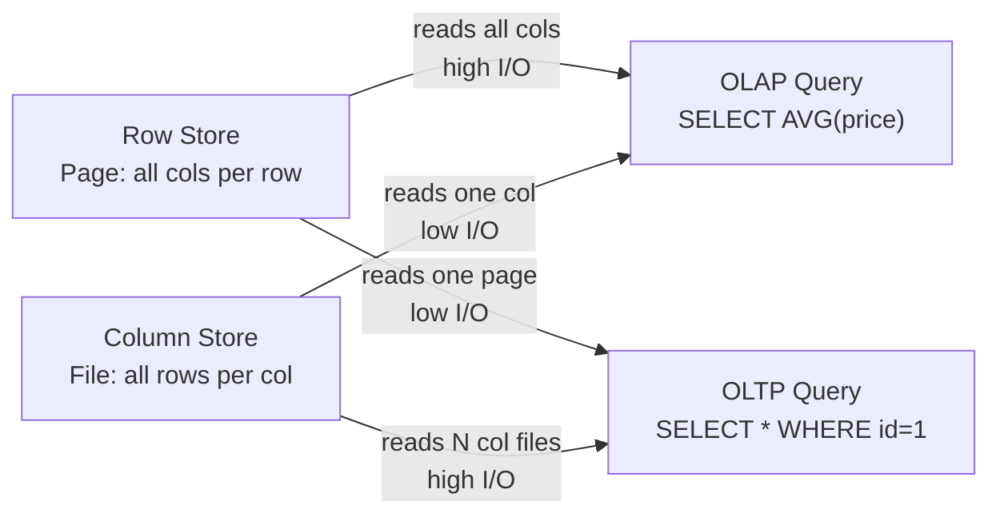

---

### 📶 Gradual Depth

**Level 1 - What it is:**
Row stores store entire rows together; column stores store
each column together. Row stores are fast for OLTP; column
stores are fast for OLAP.

**Level 2 - How to use it:**
Use PostgreSQL (row store) for transactional workloads.
Use BigQuery, Redshift, or Snowflake (column stores) for
analytics on large tables. For hybrid workloads, use
PostgreSQL with columnar extensions or a separate analytics
database.

**Level 3 - How it works:**
In a column store, `SELECT AVG(price) FROM sales WHERE
region = 'EU'` reads only the `price` and `region` column
files. The predicate `region = 'EU'` filters row IDs.
Only matching row IDs have their `price` values fetched.
Late materialization: filter is applied before
reconstructing any full row.

**Level 4 - Production mastery:**
Compression is the hidden advantage. A billion-row `price`
column stored as FLOAT8 is 8 GB raw. With delta encoding
(store deltas between adjacent prices, not absolute
values) and LZ4 compression, the same data shrinks to
600 MB. The query reads 600 MB, not 8 GB. Compression
ratio drives query performance more directly than raw
disk speed.

---

### ⚙️ How It Works

**Phase 1 - Scan + filter:** Read the predicate column(s)
into memory as a vector. Apply the predicate to produce
a qualifying row-ID bitmask.

**Phase 2 - Projection:** Read the aggregate column(s)
for only the qualifying row IDs (late materialization).

**Phase 3 - Aggregation:** Aggregate the column vector
using SIMD-accelerated operations (SUM, COUNT, MIN, MAX
over a contiguous memory array).

**Phase 4 - Row reconstruction (only if needed):**
If the query requires full rows (e.g., SELECT \*), read
all column files for qualifying row IDs and stitch
columns into rows.

```
Query: SELECT AVG(price) WHERE region='EU'

Step 1: Read region column (1 file, compressed)
        region_values = [EU, US, EU, AS, EU, ...]
        qualifying_ids = {0, 2, 4, ...}

Step 2: Read price column for qualifying_ids only
        price_values = [10.5, 9.0, 11.2, ...]

Step 3: AVG(price_values) = 10.23
        No row reconstruction needed
```

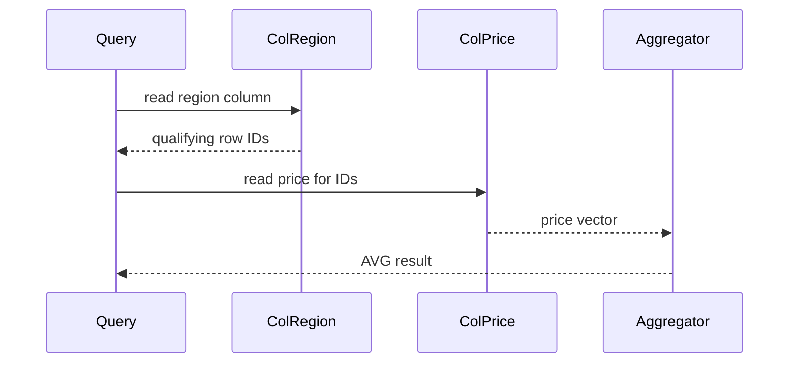

**BAD:**

```sql
-- SELECT * on column store: reads all
-- column files, reconstructs every row
SELECT * FROM sales
WHERE region = 'EU';
```

**GOOD:**

```sql
-- Project only needed cols: reads 2
-- column files instead of all cols
SELECT order_id, price
FROM sales
WHERE region = 'EU';
```

---

### 🚨 Failure Modes

**Failure 1 - High-cardinality point lookups on column
store**

**Diagnostic:** `SELECT * WHERE user_id = 12345` on a
column store is 10-50x slower than on a row store because
it must read all column files and reconstruct one row.

**Fix:** Add a row store (PostgreSQL, MySQL) for OLTP
queries. Use the column store only for analytics. Or
materialize a row cache (Redis, application cache) for
hot-path point lookups.

**Failure 2 - Update-heavy workload on column store**

**Diagnostic:** Frequent UPDATE operations on a column
store (Redshift, BigQuery) create massive write
amplification - each UPDATE must rewrite the affected
column block in every relevant column file.

**Fix:** Redesign the schema to avoid updates. Use
append-only event records and compute current state via
aggregation. Batch updates into infrequent bulk rewrites
during off-peak windows.

---

### 🔬 Production Reality

A retail analytics team ran daily `GROUP BY region, product`
sales reports on PostgreSQL with 400M rows and 80 columns.
Query runtime: 45-60 minutes despite indexes and
partitioning. Migrating the analytics workload to Redshift
(column store) with the same schema reduced the same query
to 90 seconds. The I/O difference: PostgreSQL read 3.2 TB
per query (all 80 columns); Redshift read 40 GB (5 columns
needed). Compression in Redshift further reduced that to
8 GB. The database did not change - the storage layout
changed.

---

### ⚖️ Trade-offs & Alternatives

| Aspect                 | Row Store (PostgreSQL) | Column Store (Redshift) |
| ---------------------- | ---------------------- | ----------------------- |
| OLAP scan (wide table) | Slow (high I/O)        | Fast (low I/O)          |
| OLTP point lookup      | Fast (one page)        | Slow (N col files)      |
| Compression ratio      | Low (1.5-2x)           | High (5-10x)            |
| UPDATE performance     | Fast (in-place)        | Slow (rewrite blocks)   |
| Write throughput       | High                   | Medium                  |

---

### ⚡ Decision Snap

**USE ROW STORE WHEN:**

- Transactional workloads with frequent point reads,
  single-row inserts, and updates (OLTP)
- Query patterns access most columns of few rows

**USE COLUMN STORE WHEN:**

- Analytical workloads (OLAP) scanning many rows but
  few columns
- Wide tables (50+ columns) where most queries use 3-10
  columns
- Storage cost is a constraint (compression ratios 5-10x)

**PREFER HYBRID (HTAP) WHEN:**

- Workload is mixed OLTP + OLAP and latency requirements
  prevent a separate analytics store (use TiDB, SingleStore,
  or PostgreSQL with columnar extensions)

---

### ⚠️ Top Traps

| #   | Misconception                                                       | Reality                                                                                                                     |
| --- | ------------------------------------------------------------------- | --------------------------------------------------------------------------------------------------------------------------- |
| 1   | Column stores are always faster for analytics                       | Column stores are faster for queries accessing few columns; SELECT \* on a column store is slower than on a row store       |
| 2   | Column stores and row stores use the same SQL                       | They do, but UPDATE and DELETE semantics differ significantly; column stores favor append-only patterns                     |
| 3   | Compression is a bonus, not a performance feature                   | Compression reduces I/O by 5-10x; for column stores, compression ratio directly determines query speed                      |
| 4   | PostgreSQL can be tuned to match column store analytics performance | For multi-hundred-million-row aggregation queries, purpose-built column stores outperform PostgreSQL by orders of magnitude |
| 5   | OLAP and OLTP require separate databases                            | HTAP systems (TiDB, SingleStore) handle both workloads, but with latency trade-offs vs. specialized systems                 |

---

### 🪜 Learning Ladder

**Prerequisites:**

- SQL-060 Execution Plans Deep Dive - EXPLAIN ANALYZE -
  understanding scan nodes before understanding storage
  layout
- SQL-132 LSM-Trees vs B-Trees - Storage Engine Design -
  write path optimization before storage layout

**THIS:** SQL-133 Column-Store vs Row-Store Engine Design

**Next steps:**

- SQL-136 Vectorized vs Pipelined Query Execution - how
  column stores exploit column vectors for SIMD
  acceleration
- SQL-137 What OS Page Caches Teach Database Buffer Pools -
  how storage layout interacts with the memory hierarchy

---

**The Surprising Truth:**

Column stores achieve high compression not primarily
because each column has a single type, but because
adjacent values in a column are temporally correlated -
the `price` column of sales records inserted in order
has similar values next to each other. Sort your fact
table by a high-cardinality dimension before loading and
your compression ratio doubles.

**Further Reading:**

1. D. Abadi et al., "Column-Stores vs. Row-Stores: How
   Different Are They Really?", _ACM SIGMOD_, 2008 -
   the empirical comparison that quantified the
   performance difference.
2. M. Stonebraker et al., "C-Store: A Column-Oriented
   DBMS," _VLDB_, 2005 - the research paper behind
   Vertica.
3. Apache Parquet documentation,
   https://parquet.apache.org - the de facto open
   columnar format used by every major analytics engine.

**Revision Card:**

1. Column stores minimize I/O for analytics by reading
   only the columns needed; row stores minimize I/O for
   OLTP by reading one page per row.
2. Compression is a first-class performance feature in
   column stores - it reduces I/O by 5-10x, which is
   more impactful than CPU optimization.
3. Column stores favor append-only patterns; UPDATE on a
   column store rewrites entire column blocks.

---

---

# SQL-134 Writing a SQL Parser from Scratch

**TL;DR** - A SQL parser converts query text into an abstract syntax tree through lexing, parsing, and binding; understanding this explains plan caching, query rewriting, and prepared statement behavior.

---

### 🔥 Problem Statement

Prepared statements are claimed to prevent SQL injection,
but some engineers believe they only work if the ORM uses
them correctly. Why do type coercions sometimes cause full
table scans when the column is indexed? Why does a
parameterized query use a different execution plan than
the same query with literal values? These questions are
unanswerable without understanding that SQL is text
transformed into a data structure. The parser is the
transformation engine. It defines what the database
"sees" before the optimizer, what can be cached, what
counts as "the same query," and why certain query
rewrites are semantically equivalent while others are
not. Engineers who treat SQL as an opaque text API miss
the entire class of problems that only become visible
at the parser level.

---

### 📜 Historical Context

The original SQL parsers at IBM System R used hand-written
recursive descent parsers. YACC (Yet Another Compiler
Compiler) became the standard tool for SQL grammar
specification in the 1980s. PostgreSQL's parser is a
modified YACC (Bison) grammar with ~1,000 production
rules. The abstract syntax tree (AST) PostgreSQL produces
is documented in the `src/include/nodes/parsenodes.h`
header. Plan caching (prepared statements) was added to
PostgreSQL in version 7.3 (2002). The binding step
(query resolution) involves walking the AST and resolving
table names, column names, and function names against the
catalog - a separate phase from parsing.

---

### 🔩 First Principles

**CORE INVARIANTS:**

1. SQL text is transformed into a tree structure (AST)
   before any query planning occurs; the optimizer works
   on the AST, not on text.
2. Prepared statements cache the plan for the AST that
   results from parameterized SQL; the plan is re-used
   for future executions with different parameter values
   if statistics have not changed significantly.
3. Type coercions in predicates (e.g., comparing a
   VARCHAR column to an INTEGER literal) are resolved
   during binding; if the coercion prevents index use,
   it is invisible to the engineer who wrote the query.

**DERIVED DESIGN:**

Because the optimizer works on the AST, two queries that
produce the same AST are equivalent from the optimizer's
perspective. This enables algebraic rewriting (e.g.,
pushing predicates into subqueries) as AST transformations.
It also explains why adding a CAST changes a query: the
AST changes, and a different plan may result.

**THE TRADE-OFF:**

**Gain:** Understanding the parser explains why certain
SQL patterns are equivalent, why some are not, and how
prepared statements prevent SQL injection structurally
(not syntactically).

**Cost:** Parser internals are database-specific; skills
in reading PostgreSQL's AST do not directly transfer to
MySQL's or Oracle's.

---

### 🧠 Mental Model

> A SQL parser is like a translator converting a sentence
> (SQL text) into a sentence diagram (AST). The grammar
> teacher (parser) identifies subject, verb, and object.
> The proofreader (binder) looks up whether the words
> exist in the dictionary (catalog). Only then can the
> teacher of strategy (optimizer) reason about meaning.

- "Sentence" -> SQL query text
- "Grammar teacher" -> lexer + parser producing an AST
- "Proofreader" -> binder resolving names against catalog
- "Teacher of strategy" -> optimizer producing a plan

**Where this analogy breaks down:** Human language parsing
allows ambiguity; SQL grammar is unambiguous by design.
Every valid SQL query has exactly one parse tree.

---

### 🧩 Components

- **Lexer (tokenizer):** Converts SQL text into a token
  stream: keywords (SELECT, FROM, WHERE), identifiers,
  literals, operators. Handles comments, quoted
  identifiers, escape sequences.
- **Parser (grammar rules):** Applies grammar rules
  (Bison/YACC) to the token stream, producing a raw
  parse tree.
- **Analyzer/Binder:** Resolves table names, column
  names, and function names against the catalog.
  Assigns OIDs to objects. Produces the analyzed tree.
- **Rewriter:** Applies view definitions and rule
  rewrites to the analyzed tree before the optimizer
  sees it.
- **Optimizer input (parsed query):** The rewritten,
  resolved AST that the planner operates on.

```
SQL text
  |
[Lexer] -> token stream
  |
[Parser/YACC] -> raw parse tree
  |
[Binder] -> catalog lookups -> analyzed tree
  |
[Rewriter] -> view expansion -> rewritten tree
  |
[Optimizer] -> plan
```

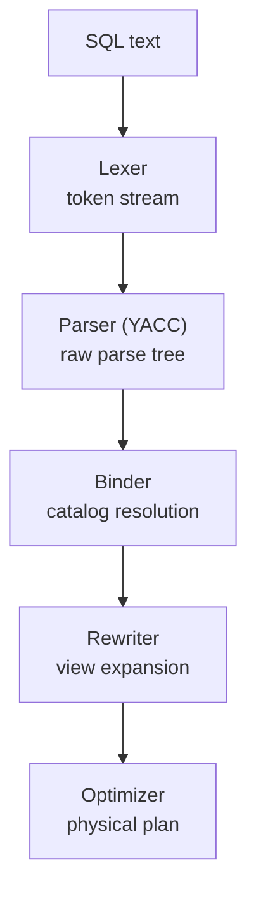

---

### 📶 Gradual Depth

**Level 1 - What it is:**
SQL text goes through lexer, parser, binder, and rewriter
before the optimizer. Each step transforms the query
representation.

**Level 2 - How to use it:**
Use `EXPLAIN (format json)` to see the post-parsing query
tree in PostgreSQL. `pg_stat_statements` groups queries
by their normalized text (parameters replaced by $1, $2)

- this is the prepared statement grouping key.

**Level 3 - How it works:**
PostgreSQL's lexer (scan.l) tokenizes SQL text. The Bison
grammar (gram.y) has ~1,000 production rules. The
analyzer (analyze.c) walks the parse tree, resolves each
column reference against the catalog, and assigns type
information. The rewriter (rewrite/) expands VIEW
references by substituting the view's definition query.

**Level 4 - Production mastery:**
Implicit type coercions are the silent plan killer. A
column `user_id BIGINT` compared to an integer literal
is fine. A column `status VARCHAR(10)` compared to an
integer in a WHERE clause causes the engine to cast the
VARCHAR to integer for every row - preventing index use.
The coercion is inserted by the binder invisibly. Always
match predicate value types to column types; check via
`EXPLAIN` whether expected indexes appear.

---

### ⚙️ How It Works

**Phase 1 - Lexing:** Input `SELECT id FROM users WHERE
age > 25` is tokenized: SELECT, id, FROM, users, WHERE,
age, >, 25 (integer literal).

**Phase 2 - Parsing:** Grammar rules match: SelectStmt{
targetList=[ResTarget{val=ColumnRef{age}}],
fromClause=[RangeVar{users}], whereClause=A_Expr{>,...}}

**Phase 3 - Binding:** `users` is resolved to OID 12345.
`age` is resolved to column attnum=3, type=int4.
`25` is an IntegerConst resolved to type=int4. No cast
needed - types match.

**Phase 4 - Rewriting:** If `users` is a VIEW, the
rewriter substitutes the view's definition into the
query tree before handing it to the optimizer.

```
Token stream:
  SELECT | id | FROM | users | WHERE | age | > | 25

Parse tree (simplified):
  SelectStmt
    targetList: [ColumnRef(id)]
    fromClause: [RangeVar(users)]
    whereClause: OpExpr(>, ColumnRef(age), Int(25))

After binding:
  whereClause: OpExpr(>, Var(age, type=int4), Const(25))
  -- types match: index scan enabled
```

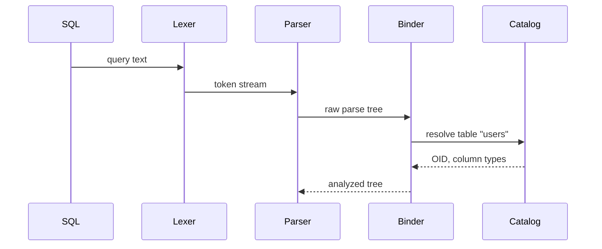

**BAD:**

```sql
-- Function on column: binder inserts
-- cast per row, blocks index use
SELECT * FROM orders
WHERE EXTRACT(YEAR FROM created_at)=2023;
```

**GOOD:**

```sql
-- Range predicate: index scan enabled
SELECT * FROM orders
WHERE created_at >= '2023-01-01'
  AND created_at < '2024-01-01';
```

---

### 🚨 Failure Modes

**Failure 1 - Implicit type coercion blocks index use**

**Diagnostic:** `EXPLAIN SELECT * FROM orders WHERE
status = 1` shows SeqScan. Column `status` is VARCHAR;
comparing to integer literal causes cast of every row.

**Fix:** Match the literal type to the column type:
`WHERE status = '1'` or cast the literal explicitly.
Always verify index use after adding predicates on
VARCHAR or mixed-type columns.

**Failure 2 - Prepared statement plan caching mismatch**

**Diagnostic:** Prepared statement executes correctly
but uses a sequential scan when called with high-
selectivity parameters after being cached with low-
selectivity parameters.

**Fix:** PostgreSQL re-plans prepared statements after
5 executions using generic plans. Use `EXECUTE` with
custom plans or set `plan_cache_mode = force_custom_plan`
for queries with high parameter selectivity variance.

---

### 🔬 Production Reality

A fintech API had a search endpoint using a parameterized
query on a `status VARCHAR(10)` column. The query
`WHERE status = $1` worked correctly. A developer added
a numeric status code shortcut: `WHERE status = $1::int`.
The implicit cast from integer to varchar prevented index
use on the status column. Query time went from 2ms to
800ms. `EXPLAIN ANALYZE` showed a SeqScan with a Filter
applying a cast to every row. The fix was changing the
parameter type to text: `WHERE status = $1::text`.
The parse tree changed, the cast moved to the literal
side, and the index was used again.

---

### ⚖️ Trade-offs & Alternatives

| Aspect                | Prepared Stmt         | Ad-hoc Query           | Stored Proc           |
| --------------------- | --------------------- | ---------------------- | --------------------- |
| SQL injection safety  | Structural protection | Needs escaping         | Structural protection |
| Plan caching          | Yes (shared plan)     | No (re-plan each time) | Yes (compiled)        |
| Parameter selectivity | Generic plan risk     | Fresh plan each time   | Fixed plan            |
| Portability           | Standard              | Standard               | Vendor-specific       |

---

### ⚡ Decision Snap

**USE WHEN:**

- Understanding why a query uses a wrong plan despite
  having the right index (type coercion)
- Debugging prepared statement plan caching issues
- Writing query generators or ORMs and needing to
  understand what SQL patterns produce equivalent plans

**AVOID WHEN:**

- Parser internals are not needed to diagnose the problem
  (most SQL performance issues are statistics or index
  issues, not parser issues)

**PREFER STORED PROCEDURES WHEN:**

- The query plan must be stable regardless of parameter
  values (stored procedures compile to a fixed plan)

---

### ⚠️ Top Traps

| #   | Misconception                                                          | Reality                                                                                                                  |
| --- | ---------------------------------------------------------------------- | ------------------------------------------------------------------------------------------------------------------------ |
| 1   | Parameterized queries prevent SQL injection because they escape quotes | They prevent injection by making the parameter a typed value, not SQL text - the structural separation is what protects  |
| 2   | The same SQL text always produces the same plan                        | Plans depend on statistics; a prepared statement can produce different plans after ANALYZE                               |
| 3   | Type casting is free - it does not affect query plans                  | Implicit casts in WHERE predicates prevent index use when the cast is applied to the column side                         |
| 4   | EXPLAIN shows the plan the query used                                  | EXPLAIN shows the plan the optimizer would choose NOW with current statistics; EXPLAIN ANALYZE shows what actually ran   |
| 5   | Rewriting a query as a VIEW is purely cosmetic                         | The rewriter expands views into the query tree; complex views can produce larger query trees that are harder to optimize |

---

### 🪜 Learning Ladder

**Prerequisites:**

- SQL-042 EXPLAIN - Reading Your First Query Plan -
  observe parser output effects before understanding
  the parser itself
- SQL-077 SQL Injection - Anatomy and Prevention - why
  the parser's structural separation protects against
  injection

**THIS:** SQL-134 Writing a SQL Parser from Scratch

**Next steps:**

- SQL-130 Query Optimization Theory - Selinger Optimizer -
  the optimizer that receives the parser's output
- SQL-135 The Volcano (Iterator) Execution Model - how
  the plan the optimizer produces is executed

---

**The Surprising Truth:**

PostgreSQL's YACC grammar file (gram.y) is approximately
16,000 lines. Every SQL keyword interaction, every
operator precedence, and every edge case in valid SQL
syntax is encoded in those 16,000 lines. An engineer
reading one hour of that file learns more about SQL
semantics than most engineers accumulate in years of
use.

**Further Reading:**

1. PostgreSQL source, `src/backend/parser/gram.y` -
   the actual YACC grammar for PostgreSQL SQL; reading
   100 lines explains more than any tutorial.
2. A. Aho, M. Lam, R. Sethi, J. Ullman, _Compilers:
   Principles, Techniques, and Tools_ (2nd ed.) -
   lexing and parsing theory underlying SQL parsers.
3. C.J. Date, _SQL and Relational Theory_ (3rd ed.) -
   formal semantics of SQL constructs from first
   principles.

**Revision Card:**

1. SQL text becomes an AST via lexer -> parser -> binder
   -> rewriter before any optimization; each step can
   change which plans are possible.
2. Implicit type coercions in WHERE predicates move the
   cast to the column side, blocking index use - match
   literal types to column types.
3. Prepared statements are safe from SQL injection because
   parameters are typed values, not SQL text fragments.

---

---

# SQL-135 The Volcano (Iterator) Execution Model

**TL;DR** - The Volcano model executes queries as a tree of iterators each implementing next() to pull one tuple at a time; elegant but CPU-inefficient compared to vectorized execution.

---

### 🔥 Problem Statement

How does a database engine actually execute a query plan
tree? The plan shows a tree of operators (HashJoin,
SeqScan, Filter, Sort), but the plan is static data -
it needs a runtime engine to produce tuples. The Volcano
model (also called the iterator model) solves this by
making each operator a stateful iterator implementing
one operation: `next()`. The calling operator pulls one
tuple at a time from its children. This is elegant: any
operator can be composed with any other without knowing
its implementation. The cost is significant: one function
call per tuple per operator, millions of virtual dispatch
calls for large tables, and terrible CPU cache behavior
as tuples pass through operators one at a time. At 100
million rows, the overhead of the iterator model itself
becomes a substantial fraction of total query time.

---

### 📜 Historical Context

Goetz Graefe introduced the Volcano execution model in
his 1994 paper "Volcano - An Extensible and Parallel
Query Evaluation System" (IEEE TKDE). The model unified
query execution behind a single interface: every operator
implements `open()`, `next()`, and `close()`. This design
was adopted by virtually all commercial databases through
the 1990s and 2000s - PostgreSQL, Oracle, DB2, SQL Server
all use Volcano-style execution. The limitation became
apparent as datasets grew into billions of rows. Vectorized
execution (processing batches of column values at once)
was proposed by Boncz et al. in their 2005 MonetDB/X100
paper and became mainstream in analytics databases
(DuckDB, CockroachDB, Snowflake, Redshift) and recently
in PostgreSQL through JIT compilation.

---

### 🔩 First Principles

**CORE INVARIANTS:**

1. Every operator implements the same interface (`next()`
   returns one tuple); composition is free - any operator
   can be a child of any other that accepts tuples.
2. Execution is pull-based: the root operator calls
   `next()` on its children, which recursively call
   `next()` on their children; no tuple is computed until
   demanded.
3. Tuples travel through the operator tree one at a time;
   each operator processes the tuple and immediately
   passes it up - no intermediate materialization unless
   the operator specifically requires it (Sort, HashJoin).

**DERIVED DESIGN:**

Pull-based execution enables lazy evaluation and early
termination (LIMIT clause stops calling next() when
satisfied). The one-tuple-at-a-time property makes CPU
branch prediction difficult and prevents SIMD instruction
use. These properties made the model a performance
bottleneck in modern analytics workloads.

**THE TRADE-OFF:**

**Gain:** Composable, extensible, memory-efficient (one
tuple in flight at a time for streaming operators).

**Cost:** One function call per tuple per operator. For
a 5-operator plan on 100M rows, that is 500M function
calls. Branch misprediction and cache thrashing dominate
execution time for large analytical queries.

---

### 🧠 Mental Model

> The Volcano model is an assembly line where each worker
> (operator) takes one part (tuple) from the previous
> worker when asked, does their job, and hands it forward.
> The last worker (root) requests parts one at a time.
> Each request requires walking all the way down the
> assembly line.

- "Assembly line worker" -> query operator
- "One part at a time" -> one tuple per next() call
- "Walking down the line" -> recursive next() call chain
- "Last worker requests" -> root operator driving
  execution via pull

**Where this analogy breaks down:** Modern vectorized
engines process full boxes of parts (column vectors) at
each step - Volcano processes single parts. The analogy
holds for the iterator pattern, not for batch efficiency.

---

### 🧩 Components

- **Scan operator:** Reads tuples from a relation.
  Implements `next()` by advancing to the next row and
  returning it.
- **Filter operator:** Calls `next()` on its child; if
  the predicate matches, returns the tuple; otherwise
  calls `next()` again.
- **Join operator (hash):** Build phase: drains one
  child into a hash table. Probe phase: calls `next()`
  on the other child and probes the hash table.
- **Sort operator:** Must drain its entire child
  (`next()` until exhausted) before returning any
  tuples - materializes the full relation.
- **Aggregate operator:** Similar to Sort - must
  consume all input before producing output.
- **Limit operator:** Calls `next()` on its child
  N times, then stops - early termination works
  naturally in pull-based execution.

```
Root (Limit N)
  |
  v calls next()
Sort
  |
  v calls next()
HashJoin (build right, probe left)
  |           |
  v           v
Scan(orders) Scan(customers)
```

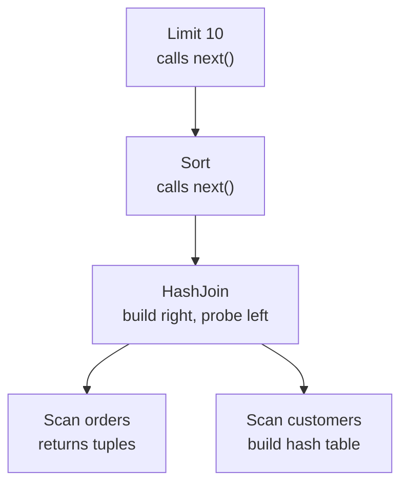

---

### 📶 Gradual Depth

**Level 1 - What it is:**
Each operator in a query plan is an iterator. The root
calls `next()` on its child, which calls `next()` on
its children, until a leaf produces a tuple that flows
up.

**Level 2 - How to use it:**
EXPLAIN shows the operator tree. EXPLAIN ANALYZE shows
how many `next()` calls each node made (`rows=N`). High
"loops" count means a nested-loop join is calling next()
on the inner side once per outer row.

**Level 3 - How it works:**
Each operator has state. A Filter has no state (stateless).
A HashJoin has a hash table (stateful build phase). A Sort
has an in-memory sort buffer. The `next()` call returns
one tuple from the current state; the next call advances
to the next tuple.

**Level 4 - Production mastery:**
The Volcano model's hidden cost is in loops. A nested-loop
join calling `next()` on a 10-million-row inner relation
for each of 1,000 outer rows makes 10 billion function
calls. The optimizer must choose hash or merge join to
avoid this. When EXPLAIN ANALYZE shows `loops=1000` on
an inner node, you are seeing Volcano's one-tuple model
multiplying by the outer cardinality.

---

### ⚙️ How It Works

**Phase 1 - Open:** Root calls `open()` on its children
recursively. Operators initialize state (allocate hash
tables, open scans).

**Phase 2 - Pull (main loop):** Root calls `next()`.
Each operator calls `next()` on its child(ren), processes
the returned tuple, and returns a result tuple up.

**Phase 3 - Blocking operators:** Sort and HashAggregate
drain their child completely during `next()` calls,
materializing all tuples before returning any. These
create pipeline barriers.

**Phase 4 - Close:** Root calls `close()` recursively.
Operators release state (drop hash tables, close scans).

```
next() call chain for SELECT * FROM t LIMIT 1:

  Limit.next()
    -> Sort.next()  (must drain all t first)
       -> for each row in t:
            Scan.next() -> return row
       Sort is materialized
    Sort.next() returns row 1
  Limit returns row 1, stops
```

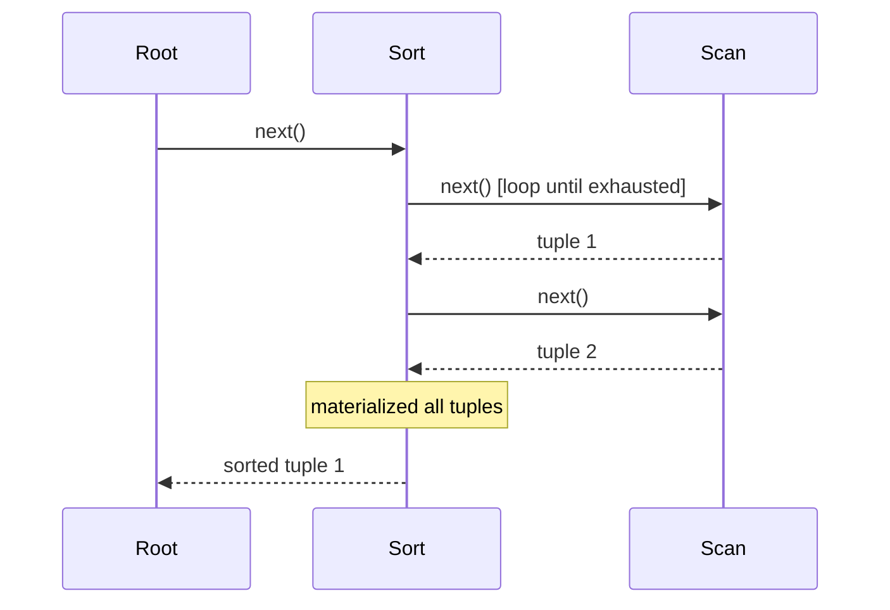

**BAD:**

```sql
-- Implicit nested loop: Volcano calls
-- next() on inner 1M times per outer row
SELECT o.id, c.name
FROM orders o, customers c
WHERE o.customer_id = c.id;
-- no index on customer_id -> 1M*1M calls
```

**GOOD:**

```sql
-- Explicit join: optimizer uses hash join
SELECT o.id, c.name
FROM orders o
JOIN customers c
  ON o.customer_id = c.id;
-- optimizer chooses hash join: 1 pass
```

---

### 🚨 Failure Modes

**Failure 1 - Nested loop join calling next() on large
inner relation**

**Diagnostic:** EXPLAIN ANALYZE shows `Nested Loop`
with inner node having `loops=N` where N is the outer
row count. Actual rows = outer_count _ inner_avg_rows.
Query time scales O(outer _ inner).

**Fix:** For large relations, the optimizer should choose
a Hash Join or Merge Join. If it is choosing Nested Loop,
check statistics: the planner thought the inner relation
was small. Run ANALYZE or add `enable_nestloop = off`
temporarily to confirm.

**Failure 2 - Sort materializing too much data to memory**

**Diagnostic:** `Sort Method: external merge Disk: 48MB`
in EXPLAIN ANALYZE. Sort overflowed to disk because
`work_mem` was insufficient.

**Fix:** Increase `work_mem` for the session
(`SET work_mem = '256MB'`) or globally in postgresql.conf.
Or add an index on the sort key to convert Sort to an
IndexScan that returns rows in order.

---

### 🔬 Production Reality

A reporting query joining three large tables with a sort
at the root ran in 12 seconds. EXPLAIN ANALYZE showed the
Sort operator materializing 1.2 GB to disk (external
merge). The Sort existed because a subsequent `ORDER BY
created_at` required sorted output. Adding an index on
`created_at` eliminated the Sort operator entirely - the
IndexScan returned rows already in order. Query time:
800ms. The Volcano model's pipeline barrier (Sort must
complete before Limit can start) had prevented early
termination. With the index, the IndexScan fed rows
directly to Limit, which stopped after 100 rows.

---

### ⚖️ Trade-offs & Alternatives

| Aspect               | Volcano (iterator)    | Vectorized | Push-based |
| -------------------- | --------------------- | ---------- | ---------- |
| Composability        | High                  | High       | Medium     |
| OLTP performance     | Good                  | Overkill   | Good       |
| OLAP performance     | Poor (10-100x slower) | Excellent  | Good       |
| CPU cache efficiency | Poor                  | Excellent  | Good       |
| SIMD support         | No                    | Yes        | Partial    |

---

### ⚡ Decision Snap

**USE WHEN:**

- Debugging query execution: EXPLAIN ANALYZE maps
  directly to Volcano operators (nodes, loops, rows)
- Understanding why certain plan choices are expensive
  (nested-loop loops count, sort materializations)

**AVOID WHEN:**

- Performance-critical analytics on large tables in
  PostgreSQL: JIT compilation (pg_jit) and avoid
  hash joins falling back to Volcano nested loops

**PREFER VECTORIZED WHEN:**

- Analytics workload on hundreds of millions of rows
  where Volcano's per-tuple overhead dominates; use
  DuckDB (embedded) or a column store for these queries

---

### ⚠️ Top Traps

| #   | Misconception                                               | Reality                                                                                                                     |
| --- | ----------------------------------------------------------- | --------------------------------------------------------------------------------------------------------------------------- |
| 1   | Every operator in a plan produces one row at a time         | Blocking operators (Sort, HashAggregate) materialize their entire input before producing any output                         |
| 2   | EXPLAIN ANALYZE rows shows how many times next() was called | rows shows tuples produced; loops shows how many times the node was driven from its parent                                  |
| 3   | Increasing work_mem always speeds up queries                | work_mem is per sort or hash operation, per query; setting it too high exhausts RAM under concurrent load                   |
| 4   | Nested loop joins are always slower than hash joins         | Nested loop wins for tiny inner relations (1-10 rows) accessed via index; hash join wins for large relations                |
| 5   | The Volcano model is obsolete                               | PostgreSQL still uses Volcano-style execution; only analytics-specific databases have switched to full vectorized execution |

---

### 🪜 Learning Ladder

**Prerequisites:**

- SQL-042 EXPLAIN - Reading Your First Query Plan -
  read the plan tree before understanding how it
  executes
- SQL-130 Query Optimization Theory - Selinger Optimizer -
  the optimizer that produces the plan the Volcano
  engine executes

**THIS:** SQL-135 The Volcano (Iterator) Execution Model

**Next steps:**

- SQL-136 Vectorized vs Pipelined Query Execution -
  the modern alternative that processes column batches
- SQL-133 Column-Store vs Row-Store Engine Design -
  how storage layout interacts with the execution model

---

**The Surprising Truth:**

The Volcano model's one-tuple-at-a-time design was not a
performance choice - it was a research contribution about
composability and extensibility. Graefe's 1994 paper
focused on making query operators interchangeable like
software components. The performance limitations only
became critical when datasets exceeded what fit in memory

- something Graefe's 1994 hardware made impractical to
  test at scale.

**Further Reading:**

1. G. Graefe, "Volcano - An Extensible and Parallel Query
   Evaluation System," _IEEE Transactions on Knowledge
   and Data Engineering_, vol. 6, no. 1, 1994 - the
   original Volcano paper.
2. P. Boncz, M. Zukowski, N. Nes, "MonetDB/X100:
   Hyper-Pipelining Query Execution," _CIDR_, 2005 -
   the paper proposing vectorized execution as an
   alternative.
3. PostgreSQL documentation, "EXPLAIN" reference -
   practical guide to reading Volcano operator trees
   in EXPLAIN ANALYZE output.

**Revision Card:**

1. Volcano: each operator calls next() on its children
   one tuple at a time; elegant and composable but
   500M function calls for a 5-operator / 100M-row query.
2. Blocking operators (Sort, HashAggregate) are pipeline
   barriers - they must consume all input before
   producing output; early termination is impossible.
3. EXPLAIN ANALYZE loops=N means the operator was driven
   N times by its parent - high loops count on inner
   nodes indicates nested-loop join overhead.

---

---

# SQL-136 Vectorized vs Pipelined Query Execution

**TL;DR** - Vectorized execution processes column batches rather than one row at a time, exploiting CPU cache locality and SIMD instructions for order-of-magnitude speedups on analytical queries.

---

### 🔥 Problem Statement

At 100 million rows, even simple aggregation queries take
seconds in traditional databases. The bottleneck is not
disk I/O - the data fits in RAM. The bottleneck is the
CPU executing 500 million `next()` function calls in the
Volcano model, spending more cycles dispatching calls than
doing arithmetic. SIMD (Single Instruction Multiple Data)
CPU instructions can add 8 integers in one clock cycle -
but only if those 8 integers are adjacent in memory and
the operation is not interrupted by function calls.
Vectorized execution reorganizes the execution model to
present 1,024 values of the same column to the CPU at
once, enabling SIMD, branch elimination, and L1 cache
residency. DuckDB, Snowflake, Redshift, and CockroachDB
all use vectorized execution as their primary model.
PostgreSQL added JIT compilation (LLVM) as a partial
approximation. The performance difference for analytics:
2-20x on CPU-bound queries.

---

### 📜 Historical Context

Vectorized execution was proposed in the MonetDB/X100
paper by Boncz, Zukowski, and Nes in 2005. MonetDB had
previously used a "bulk algebra" approach (full-column
operations), which saturated memory bandwidth. X100
balanced this by processing column vectors of 1,000-
10,000 values at a time - fitting in L2 cache. Vectorwise
(now Actian Vector) commercialized X100. DuckDB (2019)
became the open-source standard for embedded analytical
databases using vectorized execution. Snowflake, Redshift,
and BigQuery all use vectorized execution. PostgreSQL's
LLVM JIT (2018) compiles hot query loops to reduce
function-call overhead in the Volcano model without
restructuring the execution model.

---

### 🔩 First Principles

**CORE INVARIANTS:**

1. Vectorized execution operates on batches of column
   values (typically 1,024 values), fitting the batch
   in CPU L2 cache (256 KB); all operations in a batch
   run without evicting the batch from cache.
2. SIMD instructions (AVX2, AVX-512) process 8-16
   integers in a single clock cycle; vectorized engines
   align column batches for SIMD, multiplying arithmetic
   throughput.
3. Predicate evaluation produces a selection vector
   (array of row IDs matching the predicate) rather than
   materializing rows; subsequent operators consume the
   selection vector, avoiding data movement.

**DERIVED DESIGN:**

Vectorized execution is optimized for analytical operators
(scan, filter, aggregate, join on large relations).
Transactional point lookups do not benefit because the
batch never fills: one row is one tuple, not one batch
of 1,024.

**THE TRADE-OFF:**

**Gain:** 2-20x speedup for analytical queries via SIMD,
cache locality, and branch elimination.

**Cost:** Higher implementation complexity. Memory
overhead proportional to batch size (1,024 \* column_size
per operator). Less natural for OLTP point lookups.

---

### 🧠 Mental Model

> Volcano is a factory producing widgets one at a time,
> passing each widget to the next station before making
> the next. Vectorized execution is the same factory
> running in batch mode: fill a pallet (1,024 widgets),
> push the pallet to the next station, process all 1,024
> in one operation, fill the next pallet.

- "Single widget" -> one tuple in Volcano's next()
- "Pallet of 1,024" -> column batch in vectorized
- "Process all 1,024 in one operation" -> SIMD instruction
- "Push the pallet forward" -> pass column batch to
  next operator

**Where this analogy breaks down:** Pallets are a perfect
FIFO. Column batches can be filtered mid-way - a
selection vector tells the next operator "process only
these 612 out of 1,024 entries." The metaphor needs a
selection tag per item on the pallet.

---

### 🧩 Components

- **Column vector:** A fixed-size array of same-type
  values (e.g., int64[1024]) representing one column's
  values for one batch of rows.
- **Selection vector:** An int16[1024] array holding
  row IDs within the batch that pass predicates; enables
  predicate evaluation without copying data.
- **Vectorized operator:** An operator that processes a
  full column vector per invocation, implementing the
  computation as a tight loop with SIMD intrinsics.
- **Pipeline:** A sequence of operators with no blocking
  (no Sort, no HashBuild between them); the pipeline
  runs end-to-end for one batch before moving to the
  next.
- **Pipeline breaker:** An operator (HashJoin build,
  Sort) that must consume all batches before emitting
  any; breaks the pipeline and materializes state.
- **JIT compilation (PostgreSQL):** LLVM-based
  compilation of hot expression evaluation loops,
  reducing interpreter overhead without restructuring
  to true vectorized execution.

```
Volcano: tuple by tuple
  [Scan] -t-> [Filter] -t-> [Agg]
   one tuple at a time, N*op function calls

Vectorized: batch by batch
  [Scan] -1024-> [Filter] -sel_vec-> [Agg]
   one batch at a time, one SIMD op per 8 values
```

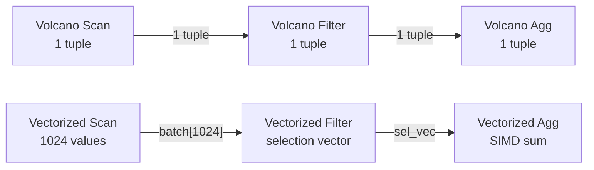

---

### 📶 Gradual Depth

**Level 1 - What it is:**
Vectorized execution processes 1,024 values at a time
instead of one, fitting them in CPU cache and enabling
SIMD instructions. It is 2-20x faster for analytics.

**Level 2 - How to use it:**
For analytical queries on large tables, use DuckDB
(embedded), Redshift, BigQuery, or Snowflake. In
PostgreSQL, enable JIT: `SET jit = on; SET
jit_above_cost = 100000;` and verify with `EXPLAIN ANALYZE`
showing `JIT: Functions: N, Options: Inlining, Optimization`.

**Level 3 - How it works:**
Vectorized scan reads 1,024 int64 values into a register-
aligned array. Filter evaluates `age > 25` on all 1,024
values using AVX2 (8 comparisons per cycle = 128 cycles
instead of 1,024). Selection vector marks 612 passing
rows. Aggregation SUM operates on 612 values using SIMD
addition.

**Level 4 - Production mastery:**
Pipeline breakers are the enemy in vectorized systems.
If a query has HashJoin (build large hash table) followed
by aggregation, the full hash table must be built before
any aggregation starts. Memory spills happen when the
hash table exceeds memory limits. DuckDB's adaptive
aggregation switches between hash-based and sort-based
aggregation based on cardinality estimates to minimize
spills.

---

### ⚙️ How It Works

**Phase 1 - Scan:** Read column files in 1,024-value
batches. Each batch fits in L2 cache (e.g., 8 KB for
int64). Prefetch the next batch while processing
the current.

**Phase 2 - Filter (predicate evaluation):** Apply
`WHERE region = 'EU'` using SIMD comparison on the
entire batch. Write passing row IDs to a selection vector.

**Phase 3 - Projection:** For columns needed in output,
gather values at selection vector indices into a new
dense array (avoid scatter/gather overhead when
selection is high-density).

**Phase 4 - Aggregation:** Apply SUM/COUNT/AVG using
SIMD reduction on the dense column array. Accumulate
partial aggregates across batches.

```
Batch processing for AVG(price) WHERE region='EU':

  Batch 1 (1024 rows):
    region_vec = ['EU','US','EU',...] (1024 values)
    sel_vec = SIMD_compare(region_vec, 'EU')
              -> [0, 2, 4, ...] (612 matches)

    price_vec_filtered = gather(price_vec, sel_vec)
                      -> [10.5, 11.2, ...] (612 vals)

    partial_sum += SIMD_sum(price_vec_filtered)
    partial_count += 612

  Final: AVG = partial_sum / partial_count
```

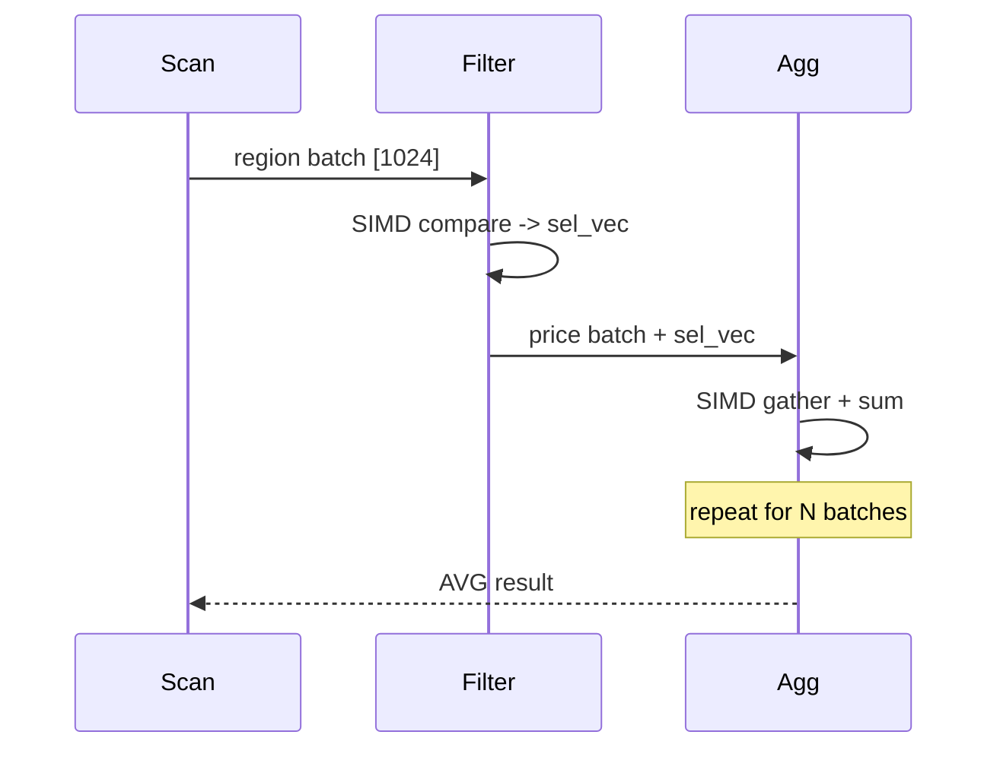

**BAD:**

```python
# Pandas loop: no SIMD, no vectorization
import pandas as pd
df = pd.read_sql('SELECT * FROM sales', con)
result = df[df['region']=='EU']['price'].mean()
```

**GOOD:**

```python
# DuckDB: vectorized, column batch, SIMD
import duckdb
result = duckdb.sql(
  "SELECT AVG(price) FROM 'sales.parquet'"
  " WHERE region='EU'"
).fetchone()[0]
```

---

### 🚨 Failure Modes

**Failure 1 - Memory spill on large hash join in
vectorized engine**

**Diagnostic:** DuckDB or Redshift query finishes but
takes 10x expected time; profiling shows hash join
spilling to disk. Occurs when one join side exceeds
available memory per node.

**Fix:** Reduce the hash table build side with a
predicate push-down filter before the join. Increase
memory limit for the query (DuckDB: `SET
memory_limit='4GB'`). Or partition the query into
smaller batches using a WHERE clause range split.

**Failure 2 - JIT compilation overhead on short queries
in PostgreSQL**

**Diagnostic:** A simple query on a small table runs
20ms without JIT and 120ms with JIT because LLVM
compilation takes 60-100ms. JIT cost exceeds benefit
for short queries.

**Fix:** Set `jit_above_cost` to a value above the
estimated cost of queries you do NOT want JIT'd. The
default is 100000; for short transactional queries,
disable JIT at the session level: `SET jit = off`.

---

### 🔬 Production Reality

A data engineering team ran hourly ETL aggregations on
DuckDB over 500M-row Parquet files. Initial implementation
used pandas (Python), reading Parquet into DataFrames
and groupby-aggregating. Runtime: 4 minutes per hour.
DuckDB reads the same Parquet files natively with
vectorized execution, pushes predicates into the Parquet
scan (skipping row groups via min/max statistics), and
aggregates with SIMD. Runtime: 18 seconds. The data did
not move; the execution model changed. DuckDB's vectorized
scan + predicate pushdown eliminated 90% of the data
read; the remaining 10% was processed with SIMD in 18s.

---

### ⚖️ Trade-offs & Alternatives

| Aspect                    | Volcano (PostgreSQL) | Vectorized (DuckDB) | JIT (PG+LLVM) |
| ------------------------- | -------------------- | ------------------- | ------------- |
| OLAP performance          | Baseline             | 2-20x faster        | 1.3-3x faster |
| OLTP performance          | Excellent            | Similar             | Similar       |
| Compile overhead          | None                 | Minimal             | 60-100ms      |
| SIMD exploitation         | None                 | Full                | Partial       |
| Implementation complexity | Low                  | High                | Medium        |

---

### ⚡ Decision Snap

**USE VECTORIZED WHEN:**

- Analytical queries scanning >10M rows with few columns
- Aggregations, group-bys, and joins on large relations
- Embedded analytics in Python/R with DuckDB

**USE VOLCANO WHEN:**

- OLTP workloads with point lookups and small result sets
- PostgreSQL with JIT for cost-effective OLAP approximation

**PREFER JIT WHEN:**

- You are on PostgreSQL and cannot switch engines; JIT
  gives partial vectorized benefit for expression-heavy
  queries

---

### ⚠️ Top Traps

| #   | Misconception                                        | Reality                                                                                                        |
| --- | ---------------------------------------------------- | -------------------------------------------------------------------------------------------------------------- |
| 1   | Vectorized execution requires columnar storage       | Vectorized execution can work on row-stored data by transposing rows into column vectors at scan time          |
| 2   | JIT in PostgreSQL makes it vectorized                | JIT in PostgreSQL compiles expression evaluation; the operator model is still Volcano (one tuple at a time)    |
| 3   | Larger batch sizes are always faster                 | Batch sizes larger than L2 cache cause cache misses that negate the benefit; 1,024-8,192 is typical            |
| 4   | Vectorized execution always beats Volcano            | For OLTP point lookups (1-row result sets), batching adds overhead; Volcano wins for tiny result cardinalities |
| 5   | SIMD is automatic once you use a vectorized database | SIMD benefit depends on data type alignment, predicate structure, and compile-time knowledge of the loop body  |

---

### 🪜 Learning Ladder

**Prerequisites:**

- SQL-135 The Volcano (Iterator) Execution Model -
  understand the model that vectorized execution
  replaces
- SQL-133 Column-Store vs Row-Store Engine Design -
  understand how column storage enables vectorized scans

**THIS:** SQL-136 Vectorized vs Pipelined Query Execution

**Next steps:**

- SQL-130 Query Optimization Theory - Selinger Optimizer -
  the optimizer that structures the plan that the
  vectorized engine executes
- SQL-137 What OS Page Caches Teach Database Buffer Pools -
  how memory architecture interacts with batch execution

---

**The Surprising Truth:**

The critical insight from the MonetDB/X100 paper is that
MonetDB's full-column operations (process the entire
column at once) were already fast - but they saturated
memory bandwidth because columns of 100M rows do not
fit in L2 cache. The breakthrough was choosing the right
batch size (1,024) to fit in L2 cache, not the idea of
operating on multiple values at once. Cache-fitting, not
SIMD, is the primary win.

**Further Reading:**

1. P. Boncz, M. Zukowski, N. Nes, "MonetDB/X100:
   Hyper-Pipelining Query Execution," _CIDR_, 2005 -
   the paper that introduced vectorized execution.
2. T. Neumann, "Efficiently Compiling Efficient Query
   Plans for Modern Hardware," _PVLDB_, vol. 4, no. 9,
   2011 - push-based and code-generation approach in
   HyPer (Umbra).
3. DuckDB documentation, "Execution Engine" section -
   engineering choices in a modern vectorized engine.

**Revision Card:**

1. Vectorized execution processes 1,024 values of the
   same column at once; this fits in L2 cache and enables
   SIMD (8-16 ops per clock cycle) vs. Volcano's 1
   function call per tuple per operator.
2. Selection vectors avoid materializing filtered tuples;
   subsequent operators work on the selection vector,
   not on copied data.
3. JIT in PostgreSQL reduces Volcano's interpreter
   overhead but is not vectorized; DuckDB and Snowflake
   use true vectorized execution.

---

---

# SQL-137 What OS Page Caches Teach Database Buffer Pools

**TL;DR** - Database buffer pools and OS page caches both cache disk pages in RAM; databases manage their own to control eviction policy, dirty-page tracking, and write-ahead log ordering.

---

### 🔥 Problem Statement

PostgreSQL uses `O_DIRECT` on some platforms and its own
8 KB shared buffer pool. Linux has its own page cache.
By default, PostgreSQL reads data through the OS page
cache - meaning data can be cached twice: once in
PostgreSQL's `shared_buffers` and once in the OS page
cache. Memory is wasted. Write ordering is uncertain:
when PostgreSQL flushes a dirty page to disk, the OS
may reorder writes, potentially writing a data page
before the WAL page that records the change, violating
write-ahead logging. The buffer pool is not an
optimization - it is a correctness requirement. Any
database that relies on the OS page cache alone cannot
guarantee write ordering, eviction policy (LRU may evict
hot pages the database knows are hot), or accurate
dirty-page tracking. Understanding the buffer pool means
understanding the line between OS memory management
and database memory management.

---

### 📜 Historical Context

Early database systems in the 1970s ran on systems where
the OS page cache was not the standard. IBM's IMS and
DB2 implemented their own buffer pools from the start
because OS virtual memory management was primitive. UNIX
page caches emerged in the 1980s. The classic paper
defining buffer pool management principles is "The 5
Minute Rule for Trading Memory for Disk Accesses" by
Jim Gray and Gianfranco Putzolu (1987). PostgreSQL's
`shared_buffers` is its buffer pool. Oracle uses its
own buffer cache with `O_DIRECT` to bypass the OS.
MySQL InnoDB has its own buffer pool. The O_DIRECT flag
(Linux, Solaris) bypasses the OS page cache entirely
for database files, ensuring only the database's buffer
pool manages caching.

---

### 🔩 First Principles

**CORE INVARIANTS:**

1. A database buffer pool manages disk pages in RAM
   under the database's control; the database knows
   which pages are hot, dirty, and referenced by active
   transactions - the OS does not.
2. Write-ahead logging requires that the WAL record
   for a page change reach durable storage before the
   modified data page is written; database buffer pool
   management enforces this ordering explicitly.
3. The OS page cache evicts pages using a generic LRU
   policy; the database knows application-specific
   access patterns (sequential scans should not evict
   the entire buffer pool, but OS LRU does not know
   this).

**DERIVED DESIGN:**

Database buffer pools implement application-aware
eviction policies: clock-sweep (PostgreSQL), LRU-K
(InnoDB), or second-chance. Sequential scan pages are
not promoted in the cache because the database knows
they will not be reused. Random-access pages are
promoted because the database knows they are hot.

**THE TRADE-OFF:**

**Gain:** The database controls eviction, dirty tracking,
and write ordering - correctness and performance under
the database's workload pattern.

**Cost:** Memory used by the database buffer pool is
unavailable to the OS page cache. Double-buffering
(data in both `shared_buffers` and OS cache) wastes
RAM. Setting `shared_buffers` too large leaves too
little RAM for the OS cache and hurts fsync performance.

---

### 🧠 Mental Model

> A database is a librarian managing a reading room
> (buffer pool). The OS is the building manager
> controlling the entire floor (page cache). The
> librarian knows which books are being actively read,
> which need to be returned carefully (WAL first), and
> which were just scanned and can be put back. The
> building manager knows only when a shelf was last
> touched.

- "Reading room" -> database buffer pool (`shared_buffers`)
- "Building floor" -> OS page cache
- "Books being read" -> hot pages (pinned)
- "Return carefully" -> WAL-before-data flush ordering

**Where this analogy breaks down:** The OS page cache
and the database buffer pool can coexist and both hold
the same page simultaneously (double buffering). The
analogy implies mutual exclusivity; the reality is
overlapping scope.

---

### 🧩 Components

- **Buffer pool (shared_buffers in PG):** A fixed-size
  shared memory region containing database pages. Each
  slot has a page, a dirty bit, a pin count, and usage
  count (for eviction).
- **Eviction policy:** Clock-sweep (PostgreSQL), LRU-K
  (InnoDB). Chooses which buffer slot to evict when the
  pool is full and a new page is needed.
- **Dirty page tracker:** Pages modified by a
  transaction are marked dirty. Dirty pages must be
  flushed to disk (via WAL ordering) before the buffer
  slot can be reused.
- **Bgwriter (PostgreSQL background writer):** Writes
  dirty pages to disk proactively, reducing the latency
  spike when a backend must evict a dirty page.
- **OS page cache:** The kernel's cache of disk blocks
  in RAM. Managed by the OS; the database has limited
  control via `fadvise` and `O_DIRECT`.
- **O_DIRECT:** A Linux file flag that bypasses the OS
  page cache for database files. Reads go directly from
  disk to the database's buffer pool. Oracle, MySQL InnoDB,
  and modern PostgreSQL recommend using `O_DIRECT`.

```
Without O_DIRECT:
  Disk -> OS page cache -> shared_buffers
  (data held twice in RAM)

With O_DIRECT:
  Disk -> shared_buffers only
  (OS page cache bypassed for data files)
```

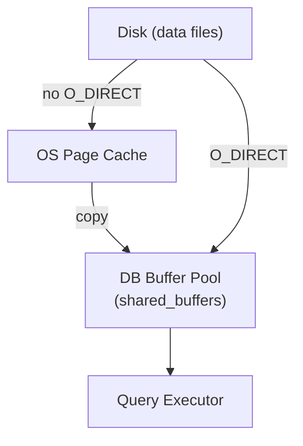

---

### 📶 Gradual Depth

**Level 1 - What it is:**
The database keeps its own cache of disk pages in RAM
because the OS cache does not know which pages are hot,
dirty, or need WAL-ordering.

**Level 2 - How to use it:**
Set `shared_buffers` to 25% of RAM for PostgreSQL
(standard recommendation). Check buffer hit rate:
`SELECT blks_hit * 100.0 / (blks_hit + blks_read)
AS hit_rate FROM pg_stat_database;` Target > 99%.

**Level 3 - How it works:**
On a page read, PostgreSQL checks `shared_buffers`
first (buffer hit). If not found (buffer miss), reads
from disk into a free buffer slot. If no free slot
exists, evicts a slot using clock-sweep (prefer
unpin'd, low usage count).

**Level 4 - Production mastery:**
`effective_cache_size` in PostgreSQL is not a real
cache - it is a hint to the planner about how much
memory the OS page cache provides. Setting it to
75% of RAM (OS cache) guides the optimizer to prefer
index scans (which benefit from caching) over sequential
scans. Misrepresenting `effective_cache_size` changes
plan choices, not actual cache behavior.

---

### ⚙️ How It Works

**Phase 1 - Buffer lookup:** Query requests page N.
Database checks the buffer pool hash table for page N.
If found: pin the buffer (increment pin count), return.

**Phase 2 - Buffer miss:** Page N not in pool. Choose
a victim buffer using clock-sweep. If victim is dirty,
flush it to disk (via bgwriter or inline). Read page N
from disk into the victim's slot.

**Phase 3 - Write (dirty page):** Transaction modifies
page N in buffer pool, sets dirty bit. WAL record for
this change is written to WAL buffer. At commit,
WAL buffer is flushed to disk first.

**Phase 4 - Checkpoint:** Periodically, PostgreSQL
flushes all dirty pages to disk (checkpoint). WAL is
truncated up to the checkpoint position. Recovery can
start from the last checkpoint.

```
Buffer hit:
  Query -> hash_lookup(page=N) -> found
  -> pin buffer[N], return

Buffer miss:
  Query -> hash_lookup(page=N) -> not found
  -> clock_sweep() -> victim slot V
  -> if dirty[V]: WAL flush, then page flush
  -> read page N from disk into slot V
  -> pin buffer[V], return
```

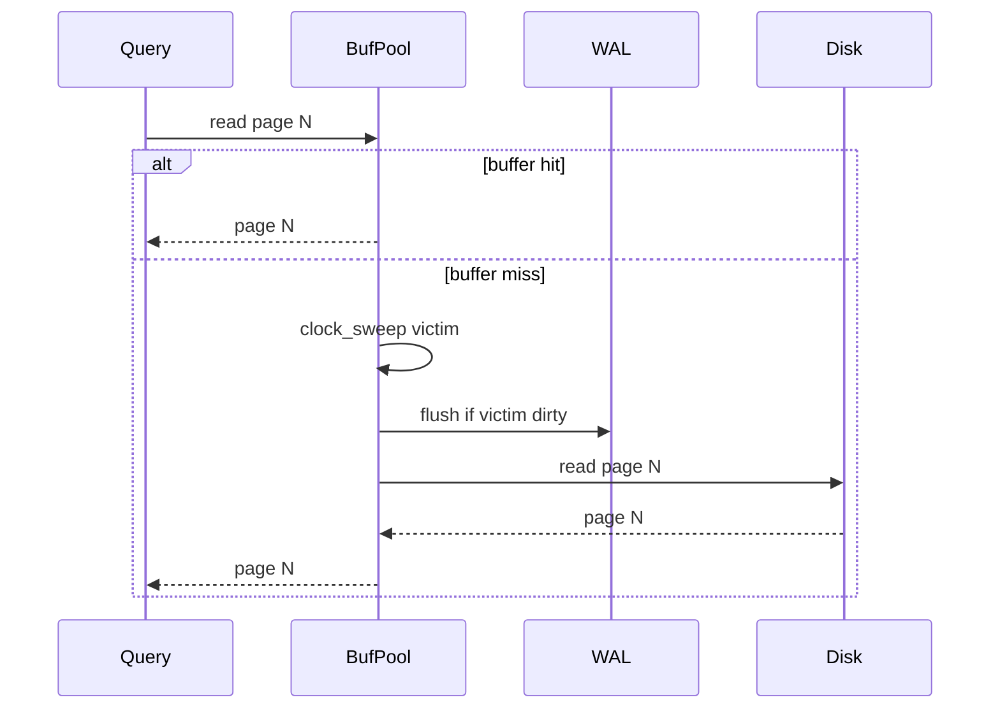

**BAD:**

```sql
-- shared_buffers too high: starves OS
-- page cache, hurts WAL + seq scans
-- postgresql.conf:
-- shared_buffers = 28GB  -- on 32GB host
```

**GOOD:**

```sql
-- 25% RAM for shared_buffers; 75% left
-- for OS page cache (WAL, seq scans)
-- postgresql.conf:
-- shared_buffers = 8GB   -- on 32GB host
-- effective_cache_size = 24GB
```

---

### 🚨 Failure Modes

**Failure 1 - Sequential scan evicts buffer pool**

**Diagnostic:** After a large sequential scan (OLAP
query on a huge table), buffer hit rate drops from 99%
to 40% for 10 minutes. Hot OLTP pages were evicted by
the sequential scan pages.

**Fix:** In PostgreSQL, `enable_seqscan` workarounds
are brittle. Better: use `pg_prewarm` to reload hot
tables after large scans, or ensure large analytics
queries run on a separate read replica. PostgreSQL 13+
uses `effective_io_concurrency` and buffer access
strategies that reduce scan impact on shared buffers.

**Failure 2 - Double buffering inflates memory
requirements**

**Diagnostic:** A PostgreSQL server with 32 GB RAM,
`shared_buffers=8GB` uses 22 GB of RAM under load.
The extra 14 GB is the OS page cache holding the same
database files that shared_buffers already holds.

**Fix:** On Linux, use `O_DIRECT` for PostgreSQL data
files (available via `pg_direct_io` in PG 17+) or
accept double buffering and tune `shared_buffers` lower
(15-20% RAM instead of 25%) to leave more for the OS
cache. Monitor with `pg_buffercache` extension.

---

### 🔬 Production Reality

A PostgreSQL server (64 GB RAM) had `shared_buffers=16GB`.
Hit rate was 97%. After a scheduled nightly report that
did full table scans on a 200 GB fact table, hit rate
dropped to 68% and OLTP query latency tripled for 30
minutes. The sequential scan had populated `shared_buffers`
with 16 GB of pages never accessed again. Solution:
the nightly report was moved to a read replica with its
own buffer pool. The primary's buffer pool was no longer
polluted. Alternatively: routing large scans through
`SET work_mem = '1GB'; SET enable_hashagg = off` forces
sort-merge aggregation which uses its own sort buffer
rather than competing with shared_buffers.

---

### ⚖️ Trade-offs & Alternatives

| Aspect                     | DB Buffer Pool    | OS Page Cache    |
| -------------------------- | ----------------- | ---------------- |
| Eviction policy            | Application-aware | Generic LRU      |
| Write ordering             | WAL-enforced      | OS-reorderable   |
| Dirty tracking             | Per-page accurate | Page-granularity |
| Sequential scan protection | Possible (bypass) | No               |
| Double buffering risk      | Yes (both caches) | N/A              |

---

### ⚡ Decision Snap

**USE LARGER shared_buffers WHEN:**

- OLTP workload with a hot working set smaller than
  25% of RAM (typical recommendation)
- Index scans dominate; index pages benefit from
  buffer pool residency

**USE SMALLER shared_buffers WHEN:**

- Workload is mostly sequential scans (OLAP); the OS
  page cache handles read-ahead better than shared_buffers
  for sequential access patterns

**MONITOR WHEN:**

- `blks_hit / (blks_hit + blks_read)` falls below 95%;
  investigate which tables are causing buffer pressure
  with `pg_buffercache`

---

### ⚠️ Top Traps

| #   | Misconception                                                 | Reality                                                                                                              |
| --- | ------------------------------------------------------------- | -------------------------------------------------------------------------------------------------------------------- |
| 1   | Setting shared_buffers to 50% of RAM makes PostgreSQL faster  | Setting it too high reduces OS page cache, hurting WAL and sequential scan performance; 25% is the tested sweet spot |
| 2   | effective_cache_size is a memory setting that PostgreSQL uses | effective_cache_size is a planner hint only; changing it does not allocate or reserve memory                         |
| 3   | Buffer hit rate of 95% means the system is healthy            | 95% means 5% of page reads are from disk; on a high-QPS system, 5% disk reads can still saturate I/O                 |
| 4   | Increasing RAM always fixes slow queries                      | If the slow query is CPU-bound (expression evaluation, sort), more RAM and higher shared_buffers provide no benefit  |
| 5   | O_DIRECT is always better than going through the OS cache     | O_DIRECT bypasses read-ahead; for sequential scans, OS read-ahead is beneficial; use O_DIRECT judiciously            |

---

### 🪜 Learning Ladder

**Prerequisites:**

- SQL-055 VACUUM and AUTOVACUUM - how dirty pages and
  dead tuples interact with the buffer pool
- SQL-132 LSM-Trees vs B-Trees - Storage Engine Design -
  how write paths interact with the buffer pool

**THIS:** SQL-137 What OS Page Caches Teach Database
Buffer Pools

**Next steps:**

- SQL-136 Vectorized vs Pipelined Query Execution -
  how batch execution models interact with memory
  management
- SQL-113 MVCC - the buffer pool as the arena where
  tuple versions live during transactions

---

**The Surprising Truth:**

The "5 Minute Rule" from Jim Gray's 1987 paper stated
that a page should be cached in RAM if it is accessed
more than once every 5 minutes given the cost ratio of
RAM to disk. In 1987, the crossover was at 5 minutes.
With modern NVMe SSDs, the crossover is at 5 seconds -
meaning aggressive buffer pool sizing matters far less
today than it did in the spinning-disk era.

**Further Reading:**

1. J. Gray, G. Putzolu, "The 5 Minute Rule for Trading
   Memory for Disk Accesses and the 10 Byte Rule for
   Trading Memory for CPU Time," _ACM SIGMOD_, 1987 -
   the original quantitative analysis of buffer pool
   sizing.
2. PostgreSQL documentation, "pg_buffercache" - runtime
   inspection of the buffer pool contents.
3. PostgreSQL documentation, "Resource Consumption -
   shared_buffers, effective_cache_size, bgwriter" -
   official tuning guidance.

**Revision Card:**

1. The database buffer pool exists for correctness
   (WAL ordering, dirty tracking) and performance
   (application-aware eviction); the OS page cache
   provides neither guarantee.
2. Double buffering wastes RAM; `shared_buffers=25%`
   leaves RAM for the OS cache, which handles WAL and
   sequential reads well.
3. Sequential scans pollute the buffer pool with pages
   that will never be reused; separate analytics
   workloads to a replica with its own buffer pool.

---

---

# SQL-138 What Compiler Optimization Teaches Query Planning

**TL;DR** - Query optimization borrows constant folding, predicate pushdown, and code generation from compiler theory; understanding both reveals why certain SQL rewrites improve performance and others do not.

---

### 🔥 Problem Statement

A developer writes `WHERE price * 1.1 > 100` instead
of `WHERE price > 90.9`. Both are logically equivalent.
The first applies a function to every row before the
comparison; the second allows an index scan with
`price > 90.9`. The optimizer knows to rewrite one into
the other - or it does not. This is exactly compiler
constant folding. A developer adds `WHERE YEAR(created_at)
= 2023` instead of `WHERE created_at >= '2023-01-01'
AND created_at < '2024-01-01'`. The function prevents
index use; a range predicate enables it. This is
predicate pushdown. Modern SQL query planners are
compilers operating on relational algebra; the database
engineer who understands compiler optimizations
understands why some SQL patterns are optimizer-friendly
and why others defeat the optimizer systematically.

---

### 📜 Historical Context

The parallel between query optimization and compilation
was recognized in the original System R optimizer papers
(Selinger et al., 1979). Volcanic-style execution
inspired Neumann's code generation approach in the HyPer
database (2011), which generates LLVM bytecode for
entire query pipelines - effectively compiling SQL to
machine code. DuckDB's predecessor research (Neumann,
Kemper) and Apache Flink both use code generation.
PostgreSQL added LLVM JIT compilation in version 11
(2018). The seminal paper "Efficiently Compiling
Efficient Query Plans for Modern Hardware" (Neumann,
VLDB 2011) formalized the compiler-compilation parallel.
Constant folding in SQL is documented in the PostgreSQL
optimizer source (`src/backend/optimizer/prep/`).

---

### 🔩 First Principles

**CORE INVARIANTS:**

1. Query optimization is program optimization over a
   relational algebra program: the optimizer applies
   algebraic rewrites (predicate pushdown, join
   reordering, subquery flattening) analogous to
   compiler transformations (constant folding, dead
   code elimination, loop invariant code motion).
2. Any function applied to a column in a WHERE predicate
   creates a non-SARGable expression - the optimizer
   cannot use an index for that column because the
   index is ordered by the column's values, not by
   the function's output values.
3. Code generation (compiling a query plan to native
   code) eliminates the Volcano model's interpretation
   overhead by replacing `next()` virtual dispatch
   with compiled tight loops - the same benefit a
   compiler achieves by inlining virtual method calls.

**DERIVED DESIGN:**

Understanding compiler optimizations predicts optimizer
behavior: if a transformation preserves value semantics
and can be applied before row access, it will be (or
should be). If a transformation requires knowing the
exact function output range, it may not be applied
automatically - the developer must help by rewriting
the predicate.

**THE TRADE-OFF:**

**Gain:** SQL written with optimizer-friendly patterns
exploits existing index structures and avoids full
table scans - orders of magnitude faster.

**Cost:** Writing optimizer-friendly SQL requires
knowing which patterns defeat the optimizer. Abstraction
layers (ORMs) often generate function-wrapped predicates
that the optimizer cannot rewrite.

---

### 🧠 Mental Model

> SQL optimization is compilation. The query is source
> code. The optimizer is the compiler's middle end.
> The execution engine is the back end. Like a compiler,
> the optimizer rewrites the program before running it
>
> - and like a compiler, it fails silently when the
>   programmer writes code that defeats its analysis.

- "Source code" -> SQL query text
- "Compiler middle end" -> optimizer (rewrites,
  reorderings, cost estimation)
- "Back end" -> Volcano or vectorized execution engine
- "Defeating analysis" -> function on column in WHERE
  (non-SARGable)

**Where this analogy breaks down:** Compilers have full
semantic knowledge of programs. The SQL optimizer works
with statistics (row counts, column distributions); it
can make wrong choices when statistics are stale or when
parameter values have extreme selectivity distributions.

---

### 🧩 Components

- **Constant folding:** Evaluating constant expressions
  at planning time. `WHERE 1=1 AND price > 100` ->
  `WHERE price > 100`. PostgreSQL optimizer: `eval_const_
exprs()`.
- **Predicate pushdown:** Moving WHERE conditions as
  close to the leaf (scan) operators as possible.
  Reduces rows early, before expensive joins.
- **SARGability:** A predicate is SARGable (Search
  ARGument Able) if it can use an index. `WHERE
price > 100` is SARGable. `WHERE ROUND(price) > 100`
  is not.
- **Subquery flattening:** Converting correlated
  subqueries into joins. `WHERE id IN (SELECT id FROM
t2)` -> `JOIN t2 USING (id)`.
- **Code generation (JIT):** Compiling the hot loop
  of an expression evaluation or operator into native
  machine code using LLVM, eliminating interpreter
  overhead.
- **Dead code elimination:** Removing predicates that
  are always true or always false based on constraint
  analysis.

```
Input SQL:
  SELECT * FROM orders
  WHERE YEAR(created_at) = 2023
  AND price * 1.1 > 110

Compiler analogy:
  YEAR(col) = 2023  -- non-SARGable, no index
  -> cannot use index
  price * 1.1 > 110        -- algebraic: price > 100
  -> can use index
```

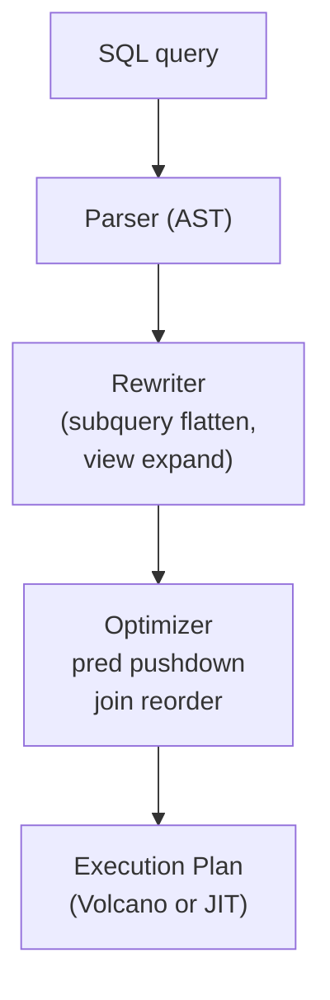

---

### 📶 Gradual Depth

**Level 1 - What it is:**
SQL query optimization uses the same transformations
as compiler optimization: fold constants, push predicates
down, eliminate dead code. Non-SARGable predicates
(functions on columns) defeat index use.

**Level 2 - How to use it:**
Check SARGability: run `EXPLAIN` and look for SeqScan
where you expect IndexScan. Function-wrapped predicates
are the most common culprit. Replace `WHERE YEAR(d) =
2023` with `WHERE d >= '2023-01-01' AND d < '2024-01-01'`.

**Level 3 - How it works:**
PostgreSQL's optimizer (`src/backend/optimizer/plan/`)
calls `eval_const_exprs()` for constant folding and
`predicate_implied_by()` for constraint exclusion.
Subquery flattening (`pull_up_subqueries()`) converts
correlated subqueries to semi-joins where safe.

**Level 4 - Production mastery:**
Modern query compilers (HyPer, DuckDB) compile the
operator tree to LLVM IR, then to machine code. The
tight loop for `SUM(price)` on 10M rows becomes a
handful of assembly instructions with AVX2 SIMD. The
Volcano model's 10M function calls become a single
vectorized loop. This is exactly what a C++ compiler
does when inlining and vectorizing a loop - the SQL
engine just does it at runtime.

---

### ⚙️ How It Works

**Phase 1 - Constant folding:** `1 + 2` becomes `3`.
`created_at > NOW() - INTERVAL '7 days'` evaluates
`NOW() - INTERVAL '7 days'` once at planning time,
not once per row.

**Phase 2 - Predicate simplification:** `NOT (NOT
(price > 100))` becomes `price > 100`. `price > 100
AND price > 50` becomes `price > 100`.

**Phase 3 - Predicate pushdown:** A filter applied
after a join is moved below the join, reducing the
number of rows the join must process.

**Phase 4 - Join reordering:** The optimizer tries
multiple join orderings using dynamic programming
(Selinger algorithm) or heuristics for many-table
queries. The chosen order minimizes estimated cost.

```
Before predicate pushdown:
  HashJoin(orders, customers)
    -> Filter(region='EU')

After predicate pushdown:
  HashJoin(
    Filter(orders, region='EU'),
    customers
  )
  -- orders filtered before join: fewer rows to join
```

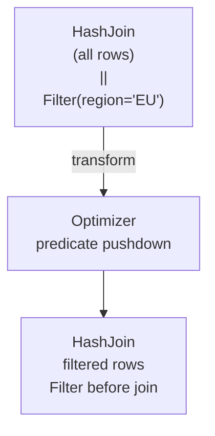

**BAD:**

```sql
-- Function on column: non-SARGable
-- no index possible on LOWER(email)
SELECT * FROM users
WHERE LOWER(email) = 'alice@example.com';
```

**GOOD:**

```sql
-- Predicate on column directly: SARGable
-- index on email used
SELECT * FROM users
WHERE email = 'alice@example.com';
-- store email lowercase at insert time
```

---

### 🚨 Failure Modes

**Failure 1 - ORM generates non-SARGable predicates**

**Diagnostic:** An ORM generates `WHERE
LOWER(email) = 'user@example.com'`. There is an index
on `email` but not on `LOWER(email)`. SeqScan occurs.

**Fix:** Create a function-based index:
`CREATE INDEX ON users (LOWER(email))`. This allows
the optimizer to use the index for the `LOWER()`
predicate. Or change the ORM mapping to store email
in lowercase at insert time and query without the
function.

**Failure 2 - Implicit type conversion defeats index**

**Diagnostic:** `WHERE user_id = '12345'` where
`user_id` is INTEGER. The string literal `'12345'`
requires an implicit cast. On some databases, this
cast applies to the column side, preventing index use.

**Fix:** Match the literal type to the column type:
`WHERE user_id = 12345` (no quotes). Always check
that ORM-generated SQL uses typed parameters matching
column types.

---

### 🔬 Production Reality

A Java Spring Boot application used JPA to query:
`WHERE FUNCTION('YEAR', createdDate) = :year`. Hibernate
generated `WHERE YEAR(created_date) = 2023`. The
`created_date` column had a B-tree index. EXPLAIN showed
SeqScan on 50M rows. The fix: replace the predicate
with a range condition. In JPA:
`WHERE createdDate >= :start AND createdDate < :end`
with `start = 2023-01-01` and `end = 2024-01-01`. EXPLAIN
showed IndexScan. Query time: 18 seconds -> 80ms.
Hibernate did not know the optimizer rule; the developer
had to know it.

---

### ⚖️ Trade-offs & Alternatives

| Pattern                    | SARGable         | Index Use     | Notes                            |
| -------------------------- | ---------------- | ------------- | -------------------------------- |
| `WHERE price > 100`        | Yes              | Yes           | Direct comparison                |
| `WHERE price * 1.1 > 110`  | Maybe            | No (most DBs) | Algebraic but not auto-rewritten |
| `WHERE YEAR(d) = 2023`     | No               | No            | Function on column               |
| `WHERE d >= '2023-01-01'`  | Yes              | Yes           | Range predicate                  |
| `WHERE LOWER(email) = 'x'` | Only if fn index | Only fn index | Function index workaround        |

---

### ⚡ Decision Snap

**USE WHEN:**

- Debugging query performance: check for function-
  wrapped predicates in WHERE clauses before adding
  indexes
- Reviewing ORM-generated SQL: verify type coercions
  and function use

**AVOID WHEN:**

- SQL readability requires `YEAR(d) = 2023` and the
  table is small (< 10,000 rows); the cost of a SeqScan
  is negligible

**PREFER CODE GENERATION WHEN:**

- CPU-bound analytical queries on a modern analytics
  database; enable JIT in PostgreSQL or switch to DuckDB
  for embedded analytics

---

### ⚠️ Top Traps

| #   | Misconception                                                   | Reality                                                                                                                    |
| --- | --------------------------------------------------------------- | -------------------------------------------------------------------------------------------------------------------------- |
| 1   | The database will automatically rewrite function predicates     | Most databases do not auto-rewrite arbitrary functions on columns; only algebraically provable simplifications are applied |
| 2   | Adding more indexes will compensate for non-SARGable predicates | A non-SARGable predicate cannot use any index; adding more indexes on the column does not help                             |
| 3   | PostgreSQL JIT compilation makes query planning obsolete        | JIT speeds up execution of hot loops; it does not fix non-SARGable predicates or wrong join orders                         |
| 4   | Subquery flattening always happens                              | Correlated subqueries with aggregates or non-deterministic functions are not always flattened; check EXPLAIN               |
| 5   | Predicate order in WHERE clause affects performance             | SQL is declarative; the optimizer reorders predicates based on cost, not on the order written                              |

---

### 🪜 Learning Ladder

**Prerequisites:**

- SQL-130 Query Optimization Theory - Selinger Optimizer -
  the optimizer that applies these compiler-like
  transformations
- SQL-042 EXPLAIN - Reading Your First Query Plan -
  observe the output of these transformations

**THIS:** SQL-138 What Compiler Optimization Teaches
Query Planning

**Next steps:**

- SQL-139 Set-Based Thinking vs Procedural Thinking -
  the declarative contract that enables the optimizer
  to apply these transformations
- SQL-135 The Volcano (Iterator) Execution Model - how
  the optimized plan is executed

---

**The Surprising Truth:**

The most impactful SQL performance optimization is
writing SARGable predicates - not adding indexes, not
tuning memory, not upgrading hardware. A single
`WHERE YEAR(created_at) = 2023` in a hot query can
cost more CPU time than all other optimizations
combined. Compiler literature called this problem
"loop-invariant code motion" in 1960. SQL developers
rediscover it every year.

**Further Reading:**

1. T. Neumann, "Efficiently Compiling Efficient Query
   Plans for Modern Hardware," _Proceedings of the VLDB
   Endowment_, vol. 4, no. 9, 2011 - the paper
   formalizing SQL query compilation.
2. P.G. Selinger et al., "Access Path Selection in a
   Relational Database Management System," _ACM SIGMOD_,
   1979 - the original optimizer paper showing
   predicate pushdown and join reordering.
3. PostgreSQL documentation, "How the Planner Uses
   Statistics" - official documentation of the
   optimizer's statistical model.

**Revision Card:**

1. SARGable predicates compare a column directly to
   a constant; function-wrapped predicates (YEAR(col)
   = val) are not SARGable and cannot use B-tree indexes
   on that column.
2. Predicate pushdown (moving filters close to scans)
   is the most impactful single transformation; fewer
   rows entering a join means lower total cost.
3. JIT compilation (PostgreSQL LLVM) compiles hot
   expression loops to machine code; it is query
   compilation, not query planning.

---

---

# SQL-139 Set-Based Thinking vs Procedural Thinking

**TL;DR** - SQL operates on entire sets at once; the mental shift from writing loops to writing set operations is the single biggest productivity leap in SQL mastery.

---

### 🔥 Problem Statement

A Java developer writes a stored procedure that loops
through all customers with a cursor, checks each
customer's balance, and updates their status one row at
a time. For 1 million customers, this is 1 million
round-trips through the storage engine. The equivalent
SQL UPDATE finishes in seconds. The difference is not
syntax - it is a mental model. Procedural thinking
says: "For each customer, do this." Set-based thinking
says: "Update all customers where this condition holds."
The SQL engine optimizes set operations; it cannot
optimize per-row loops. Engineers who never make this
mental shift write procedural SQL: cursors, row-by-row
updates, correlated subqueries that compute a value
once per row, and CTEs chained as if they were
imperative assignment statements. The result is correct
but 100-1000x slower than set-based equivalents.

---

### 📜 Historical Context

Set-based thinking is the foundation of the relational
model introduced by E.F. Codd in his 1970 paper "A
Relational Model of Data for Large Shared Data Banks."
Codd explicitly chose set theory (not graph theory or
record theory) as the foundation because set operations
have well-defined closure properties and optimization
theory. Cobol and Fortran developers in the 1970s
struggled with SQL for exactly this reason: they had
decades of per-record thinking. The cursor mechanism
was added to SQL specifically to provide a procedural
escape hatch for developers who could not express their
logic in set terms. The cursor is a concession, not a
feature. Databases have always tried to remove cursor
use: PostgreSQL's set-returning functions, Oracle's
BULK COLLECT, SQL Server's UPDATE FROM syntax.

---

### 🔩 First Principles

**CORE INVARIANTS:**

1. SQL expressions describe what the output set should
   contain, not the steps to produce it; the optimizer
   chooses the steps. This declarative contract is what
   enables query optimization.
2. A correlated subquery that references a column from
   the outer query is implicitly a loop - it executes
   once per outer row unless the optimizer can unnest
   it into a join. Unnesting is not always possible.
3. Set operations (JOIN, UNION, INTERSECT, EXCEPT) are
   recognized and optimized by the planner; cursor loops
   are opaque to the optimizer and cannot be parallelized
   or reordered.

**DERIVED DESIGN:**

Set-based SQL enables the optimizer to choose join
algorithms, parallelism, and scan strategies. Cursor-
based SQL forces the database into the developer's
chosen algorithm. The declarative contract is not just
a style choice - it is the mechanism by which the
database can perform orders-of-magnitude better than
the developer's explicit algorithm.

**THE TRADE-OFF:**

**Gain:** Set-based queries allow the optimizer to
choose the best physical plan; 100-1000x speedup over
cursor loops for batch operations.

**Cost:** Set-based thinking is harder to learn. Some
logic genuinely requires iteration (recursive graph
traversal), but SQL provides recursive CTEs for this.
Pure set operations cannot express truly iterative
computations.

---

### 🧠 Mental Model

> Procedural thinking is baking cookies one at a time:
> pick up dough, flatten, bake, move to rack, repeat.
> Set-based thinking is operating an industrial oven:
> put 1,000 cookies on trays, bake all at once. The
> industrial oven knows the best arrangement; you only
> specify the desired output (baked cookies, not raw).

- "Baking one cookie" -> cursor loop, one row at a time
- "Industrial oven" -> SQL engine with set-based plan
- "Oven chooses arrangement" -> optimizer choosing
  join order, parallelism
- "You specify desired output" -> declarative SQL

**Where this analogy breaks down:** The industrial
oven analogy implies the developer is passive. In
reality, set-based SQL still requires careful predicate
writing, join condition design, and awareness of which
operations force the optimizer's hand (non-SARGable
predicates, for example).

---

### 🧩 Components

- **Set operation:** A SQL expression operating on
  all matching rows simultaneously: JOIN, WHERE,
  GROUP BY, HAVING, aggregate functions.
- **Cursor:** An explicit row-by-row iterator over
  a result set; a procedural escape hatch. Should be
  a last resort when set-based alternatives exist.
- **Correlated subquery:** A subquery that references
  the outer query's columns; implicitly loops unless
  unnested to a join.
- **UPDATE FROM / UPDATE JOIN:** Set-based bulk update
  using a join condition to modify multiple rows in
  one statement.
- **Recursive CTE:** A set-based way to express
  iterative computations (graph traversal, hierarchies)
  without explicit loops.
- **Window function:** Computes a value over a set of
  rows related to the current row without collapsing
  the set (unlike GROUP BY) - the canonical set-based
  alternative to "compute running total via cursor."

```
Procedural (cursor):
  FOR each order in orders:
    total = SELECT SUM(amount)
            FROM order_items
            WHERE order_id = order.id
    UPDATE orders SET total = total
    WHERE id = order.id

Set-based (one statement):
  UPDATE orders o
  SET total = s.total
  FROM (
    SELECT order_id, SUM(amount) AS total
    FROM order_items
    GROUP BY order_id
  ) s
  WHERE o.id = s.order_id
```

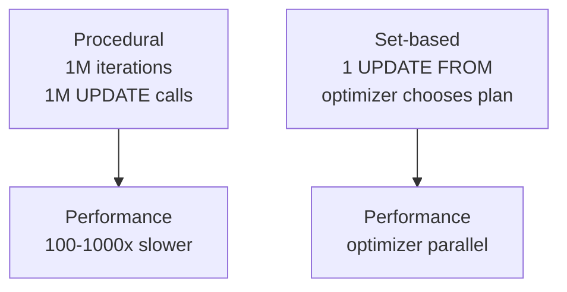

---

### 📶 Gradual Depth

**Level 1 - What it is:**
SQL works on sets of rows, not individual rows. Write
SQL that describes the entire set to change, not a
loop that changes rows one at a time.

**Level 2 - How to use it:**
Replace correlated subqueries with JOINs. Replace
cursors with UPDATE FROM. Replace "running total via
loop" with window functions (`SUM(...) OVER (ORDER BY
...)`). Replace conditional logic per row with CASE
expressions or filtered aggregates.

**Level 3 - How it works:**
A correlated subquery `SELECT (SELECT MAX(price) FROM
products WHERE category = o.category) FROM orders o`
executes the subquery once per order row. The optimizer
may unnest this to a lateral join, but this is not
guaranteed. An explicit join `JOIN products p ON p.
category = o.category` always allows hash or merge join.

**Level 4 - Production mastery:**
Window functions are the purest expression of set-based
thinking extended to ordered sets. `SUM(amount) OVER
(PARTITION BY customer ORDER BY date ROWS UNBOUNDED
PRECEDING)` computes a running total for all customers
in one pass over the sorted data. The cursor equivalent
visits each row individually with a cumulative sum
variable. The window function is one sort + one scan;
the cursor is N sorts + N lookups.

---

### ⚙️ How It Works

**Phase 1 - Set definition:** The FROM clause defines
the base set. JOINs extend it. WHERE filters it. The
optimizer chooses how to physically produce this set.

**Phase 2 - Set transformation:** GROUP BY collapses
rows into groups. Window functions compute over groups
without collapsing. HAVING filters groups.

**Phase 3 - Projection:** SELECT defines which columns
of the final set to return.

**Phase 4 - Set modification:** INSERT, UPDATE, DELETE
apply to a set defined by the WHERE clause. UPDATE FROM
joins a set definition into the update target.

```
Bad (procedural thinking in SQL):
  -- Correlated subquery = implicit loop
  SELECT id,
    (SELECT COUNT(*) FROM orders
     WHERE customer_id = c.id) AS order_count
  FROM customers c;

Good (set-based):
  SELECT c.id,
    COALESCE(o.order_count, 0) AS order_count
  FROM customers c
  LEFT JOIN (
    SELECT customer_id,
           COUNT(*) AS order_count
    FROM orders
    GROUP BY customer_id
  ) o ON o.customer_id = c.id;
```

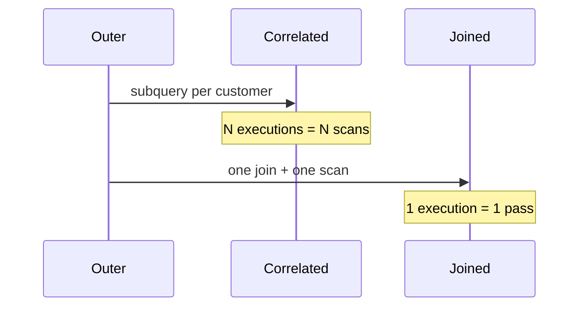

**BAD:**

```sql
-- Correlated subquery: implicit loop
-- executes once per customer row
SELECT id,
  (SELECT COUNT(*) FROM orders o
   WHERE o.customer_id = c.id) AS cnt
FROM customers c;
```

**GOOD:**

```sql
-- Set-based: one aggregation pass
SELECT c.id, COALESCE(o.cnt, 0) AS cnt
FROM customers c
LEFT JOIN (
  SELECT customer_id, COUNT(*) AS cnt
  FROM orders GROUP BY customer_id
) o ON o.customer_id = c.id;
```

---

### 🚨 Failure Modes

**Failure 1 - Correlated subquery in SELECT silently
scanning millions of rows**

**Diagnostic:** A query with a correlated subquery in
the SELECT list runs for minutes. EXPLAIN ANALYZE shows
the subquery plan with `loops=N` where N is the outer
row count.

**Fix:** Convert the correlated subquery to a LEFT JOIN
with a grouped subquery. EXPLAIN ANALYZE should show
`loops=1` for the inner node after the rewrite.

**Failure 2 - Cursor-based batch update causing table
bloat**

**Diagnostic:** A nightly batch job using a PL/pgSQL
cursor to update 5M rows runs for 4 hours. Table
bloat grows because 5M individual UPDATE statements
create 5M dead tuples before autovacuum can reclaim
them.

**Fix:** Rewrite as `UPDATE orders SET status = 'done'
WHERE processed_at < NOW() - INTERVAL '1 day'`. Run
as a set-based update with a transaction. Table bloat
from a single UPDATE is the same as from a cursor but
the CPU and lock time are a fraction of the cursor's.

---

### 🔬 Production Reality

A data engineering team had a nightly Python script
that fetched 2M rows from PostgreSQL, computed a
running total in Python using a for loop, then issued
2M UPDATE statements to write the totals back. Runtime:
6 hours. The replacement was a single SQL statement
using a CTE with window functions to compute the
running totals and an `UPDATE ... FROM` to apply them.
Runtime: 4 minutes. No Python loop, no individual
UPDATE calls. The optimizer processed the 2M-row
window function in one pass, used a hash join for the
UPDATE FROM, and finished in 240 seconds instead of
21,600. The Python script was not slow Python; it was
procedural thinking applied to a set-based engine.

---

### ⚖️ Trade-offs & Alternatives

| Pattern             | Style      | Performance | Optimizer Help     |
| ------------------- | ---------- | ----------- | ------------------ |
| Cursor + row loop   | Procedural | Slow        | None               |
| Correlated subquery | Mixed      | Often slow  | Sometimes unnested |
| JOIN + aggregate    | Set-based  | Fast        | Full               |
| Window function     | Set-based  | Fast        | Full               |
| Recursive CTE       | Iterative  | Varies      | Partial            |

---

### ⚡ Decision Snap

**USE SET-BASED WHEN:**

- Any bulk operation: UPDATE, DELETE, INSERT SELECT
- Any aggregation: GROUP BY, COUNT, SUM, running total
- Any row comparison: "for each A, get the latest B" -
  use window functions or lateral joins

**USE CURSORS WHEN:**

- Logic genuinely requires per-row state that cannot
  be expressed as set operations (rare)
- Integration with non-SQL systems that require
  row-at-a-time streaming

**USE RECURSIVE CTE WHEN:**

- Graph traversal (org hierarchy, friend network) that
  requires iteration; set-based and terminates at
  a known depth

---

### ⚠️ Top Traps

| #   | Misconception                                            | Reality                                                                                                                                 |
| --- | -------------------------------------------------------- | --------------------------------------------------------------------------------------------------------------------------------------- |
| 1   | Correlated subqueries always execute once per outer row  | The optimizer may unnest a correlated subquery into a hash join; check EXPLAIN to see if it did                                         |
| 2   | Window functions are slow because they sort data         | Window functions that can exploit an existing index may not sort at all; check for IndexScan in EXPLAIN                                 |
| 3   | Cursors are faster because they hold less data in memory | Cursors generate per-row round-trips and prevent optimizer parallelism; set-based bulk operations are almost always faster              |
| 4   | GROUP BY and DISTINCT are equivalent for performance     | GROUP BY typically uses hashing or sorting; DISTINCT can use indexes the optimizer identifies; they are not equivalent in plan cost     |
| 5   | CTEs always cache their result                           | In PostgreSQL, CTEs are optimization fences only if they are recursive or MATERIALIZED; non-recursive non-materialized CTEs are inlined |

---

### 🪜 Learning Ladder

**Prerequisites:**

- SQL-041 Subqueries and Correlated Subqueries - the
  procedural anti-pattern that set-based thinking
  replaces
- SQL-053 Window Functions - the purest set-based
  pattern for ordered computations

**THIS:** SQL-139 Set-Based Thinking vs Procedural
Thinking

**Next steps:**

- SQL-141 Declarative vs Imperative - The SQL Paradigm
  Lesson - the formal contract underlying set-based
  thinking
- SQL-138 What Compiler Optimization Teaches Query
  Planning - how the declarative contract enables
  optimizer transformations

---

**The Surprising Truth:**

The cursor was added to SQL in 1979 as a reluctant
compromise to help COBOL developers who could not
think in sets. E.F. Codd argued against including
it. The database community has spent 45 years trying
to eliminate cursor use with better constructs: bulk
DML, window functions, recursive CTEs, lateral joins.
Every cursor in production SQL is a monument to that
45-year argument.

**Further Reading:**

1. E.F. Codd, "A Relational Model of Data for Large
   Shared Data Banks," _Communications of the ACM_,
   vol. 13, no. 6, 1970 - the founding paper of
   set-based data thinking.
2. J. Celko, _SQL for Smarties: Advanced SQL
   Programming_ (5th ed.) - the canonical guide to
   set-based SQL patterns replacing procedural thinking.
3. PostgreSQL documentation, "WITH Queries (Common
   Table Expressions)" - materialization behavior,
   recursive CTEs, and optimization fences.

**Revision Card:**

1. Set-based SQL lets the optimizer choose the
   physical plan; cursors and per-row loops are
   opaque to the optimizer and force the developer's
   algorithm.
2. Correlated subqueries are implicit loops; replace
   them with joins and grouped subqueries for
   optimizer control.
3. Window functions compute over an ordered set
   without collapsing it; they are the canonical
   replacement for "running total via cursor."

---

---

# SQL-140 Data Gravity as System Design Constraint

**TL;DR** - Data gravity describes the tendency of compute and services to accumulate near large data stores; architecture should locate processing near data rather than moving data to processing.

---

### 🔥 Problem Statement

A microservices architecture has 5 services each
reading from a central PostgreSQL database. One service
adds a reporting feature that reads 500 MB of data,
processes it in Python, and writes results back. Network
bandwidth saturates. The database host CPU spikes not
from queries but from network I/O. The Python service
runs on a pod that can scale horizontally - but the
data cannot. The data is gravitational: other services
accumulate around it; moving the data is expensive;
the data store becomes the fixed point of the
architecture. Data gravity is the constraint that most
microservices architectures discover after scaling.
The question is not "can we move data?" but "should
we design around the fact that we cannot easily move
it?" The database is not just a persistence layer; it
is a gravitational body that shapes architecture.

---

### 📜 Historical Context

The term "data gravity" was coined by Dave McCrory in
a 2010 blog post to describe how large datasets attract
compute, services, and APIs to their location - similar
to how massive objects attract nearby bodies. McCrory
applied the concept to cloud computing: once your data
is in AWS S3, AWS compute services cluster around it
because data egress costs and latency make it expensive
to move data out. Cloud providers monetize data gravity
deliberately: data ingress is cheap or free; egress
is expensive. The constraint shapes data warehouse
design (co-locate ETL compute with the warehouse),
CDN design (cache close to consumers), and multi-region
database design (replicate data to regions where compute
runs).

---

### 🔩 First Principles

**CORE INVARIANTS:**

1. Moving data is expensive in proportion to volume;
   moving compute is cheap in proportion to its size.
   Architectures should move compute to data, not data
   to compute.
2. Large data stores attract services and compute to
   their location; this attraction is data gravity.
   Resisting it (separating compute and data far apart)
   pays a permanent latency and bandwidth tax.
3. Data gravity accumulates over time: the larger the
   dataset, the harder it is to move, and the more
   services depend on its location. Early architectural
   decisions about data placement compound.

**DERIVED DESIGN:**

Co-locate analytics compute (ETL, aggregation) with
the data store (run in the same VPC/AZ). Use push-
based data pipelines (publish changes at the source)
rather than pull-based (poll from a remote consumer).
Choose regional data placement based on where data is
generated and consumed, not based on organizational
preference.

**THE TRADE-OFF:**

**Gain:** Co-locating compute and data reduces latency,
bandwidth cost, and system complexity.

**Cost:** Co-location creates operational coupling.
Compute and data share failure domains; scaling compute
may require scaling data storage in the same zone.

---

### 🧠 Mental Model

> Data is a planet. Services are satellites. Satellites
> orbiting close are fast and cheap to communicate with.
> Satellites far away have high round-trip latency and
> communication costs. Moving the planet (migrating
> data) requires enormous energy. It is easier to move
> the satellite (deploy compute) closer to the planet.

- "Planet" -> large data store (database, data lake)
- "Satellite" -> compute service processing the data
- "Close orbit" -> same AZ/VPC, low latency, low cost
- "Moving the planet" -> data migration, expensive

**Where this analogy breaks down:** Planets are
singular; data can be replicated to multiple regions.
But replication has consistency trade-offs (see:
eventual consistency). The analogy works best for
primary data stores, not replicas.

---

### 🧩 Components

- **Data gravity:** The tendency of compute, services,
  and APIs to co-locate with large data stores due to
  latency and bandwidth costs of remote access.
- **Data egress cost:** Cloud provider charges for
  data leaving a region. Substantial at scale; a primary
  driver of data gravity in cloud architectures.
- **Co-location:** Running compute (query engines,
  ETL) in the same AZ or VPC as the data store.
- **Data locality in distributed SQL:** Distributed
  databases (Spanner, CockroachDB) shard data by key
  range and route queries to the shard holding the
  data - co-location at the query routing level.
- **Push vs pull:** Push-based pipelines (CDC,
  event streaming) deliver data to consumers without
  consumers polling; reduces cross-region bandwidth.

```
Data gravity violation:
  [US-East DB] <---500MB/req--- [EU compute]
  High latency + egress cost

Data gravity respected:
  [US-East DB] + [US-East compute]
  Low latency, no egress cost
  Results (small) sent to EU consumer
```

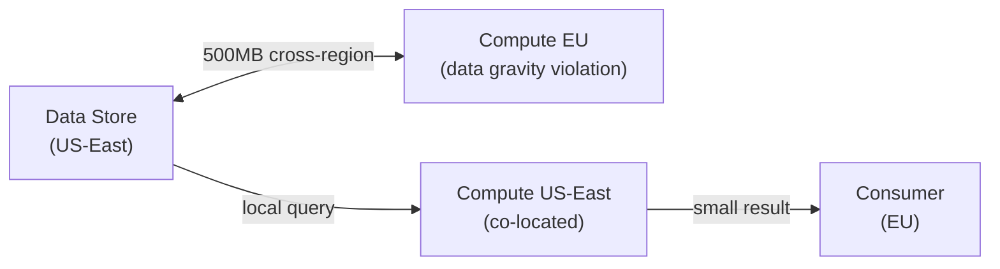

---

### 📶 Gradual Depth

**Level 1 - What it is:**
Large data attracts compute. Moving compute to data
is cheap; moving data to compute is expensive. Design
systems to process data where it lives.

**Level 2 - How to use it:**
Run ETL and analytics compute in the same AZ and VPC
as the database. Avoid cross-region queries on large
tables. Use CDC (change data capture) to replicate
only changes, not full datasets.

**Level 3 - How it works:**
In AWS, data in us-east-1 RDS can be queried by EC2
in us-east-1 at <1ms latency. Cross-region: 50-200ms
per round-trip and egress fees of $0.09/GB. At 1TB/day
of analytical queries, cross-region costs $90/day
vs <$1/day for co-located queries.

**Level 4 - Production mastery:**
Data gravity explains cloud vendor lock-in. Once a
terabyte-scale dataset is in S3 (AWS), Athena,
Redshift, and EMR cluster around it - they are in
AWS and co-located with S3. Moving the dataset to
GCS or Azure requires paying egress fees once (1TB
= $90 for S3 standard egress) and accepting weeks
of migration work. The data's gravity held the
architecture in AWS.

---

### ⚙️ How It Works

**Phase 1 - Data accumulation:** A central database
grows. Services that need data are deployed near it.
ETL pipelines run in the same region.

**Phase 2 - Gravity attraction:** New services are
built near the existing data; the data's location
becomes an architectural constraint. Moving services
away from the data incurs latency.

**Phase 3 - Migration friction:** As the dataset
grows, migration cost grows linearly with volume.
Schema dependencies, referential integrity, and
service dependencies compound the migration effort.

**Phase 4 - Distributed mitigation:** Regional
replicas, read replicas, and CDN caching reduce the
impact of data gravity without full migration. CDC
pipelines replicate changes to region-local databases.

```
Year 1: 10 GB database, 2 services, easy to move
Year 3: 500 GB database, 12 services, 200 FKs
Year 5: 5 TB database, 40 services, 3 data centers
  --> migration cost: months; data gravity is total
```

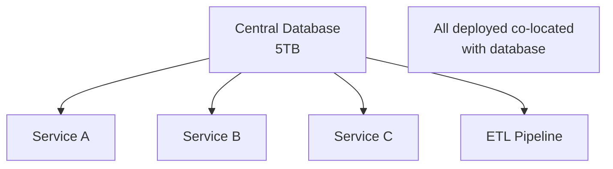

**BAD:**

```sql
-- Query from EU compute to US-East RDS:
-- full table transferred cross-region
SELECT region, SUM(revenue)
FROM sales  -- 500GB table in US-East
GROUP BY region;
-- 500GB egress, $45/day, 800ms latency
```

**GOOD:**

```sql
-- Run in co-located analytics cluster:
-- same AZ as the data, no egress
SELECT region, SUM(revenue)
FROM sales
GROUP BY region;
-- <1ms latency, $0 egress
```

---

### 🚨 Failure Modes

**Failure 1 - Cross-region analytical queries
saturating inter-AZ bandwidth**

**Diagnostic:** Analytics service in eu-west reads
from us-east RDS. Query latency is 800ms; expected
50ms. Network bandwidth between regions is saturated
during peak hours.

**Fix:** Deploy a read replica in eu-west. Route
analytics queries to the replica. Alternatively, use
a CDN-backed analytics cache (Redshift, BigQuery)
populated via CDC from the primary database.

**Failure 2 - Cloud egress costs growing
proportionally to data volume**

**Diagnostic:** Monthly cloud bill shows egress costs
growing linearly with query volume. ETL pipeline reads
full table scans from S3 and processes in a separate
region.

**Fix:** Move ETL compute into the same region as S3.
Use S3 Select or Athena (co-located with S3) to push
predicate evaluation to the data source before egress.

---

### 🔬 Production Reality

A SaaS company ran a PostgreSQL primary in us-east-1
and deployed analytics compute in eu-west-1 for
organizational reasons (analytics team was in Europe).
Data volume was 2 TB. Monthly egress cost: $5,000.
Query latency: 400ms average. The fix: deploy a
Redshift cluster in eu-west-1, populate it via DMS
(AWS Database Migration Service) replication from
us-east-1 RDS. ETL now runs against eu-west-1 Redshift
with <10ms latency. Cross-region data movement: one
initial load + incremental CDC deltas (100 MB/day).
Monthly egress cost: $300. Query latency: 40ms.
Moving the compute (Redshift) to a regional replica
near the analytics team respected data gravity while
reducing the cost of serving it.

---

### ⚖️ Trade-offs & Alternatives

| Strategy                   | Latency         | Cost        | Consistency |
| -------------------------- | --------------- | ----------- | ----------- |
| Co-located compute         | Low (<1ms)      | Low         | Synchronous |
| Read replica (same region) | Low (<5ms)      | Medium      | Async lag   |
| Cross-region read replica  | Medium (50ms)   | Medium      | Async lag   |
| Cross-region query         | High (200ms+)   | High egress | Synchronous |
| CDN / materialized cache   | Low (cache hit) | Low         | Eventual    |

---

### ⚡ Decision Snap

**CO-LOCATE COMPUTE WHEN:**

- Processing large volumes of data (>1 GB per query)
- Latency requirements are <50ms
- Cloud provider charges for data egress

**REPLICATE DATA WHEN:**

- Compute team is in a different region
- Read-heavy workload tolerates replication lag
- Migration of the primary is not feasible

**USE EVENT STREAMING (CDC) WHEN:**

- Multiple downstream consumers need the data
- Real-time or near-real-time consistency is required
- Cross-region data gravity must be managed incrementally

---

### ⚠️ Top Traps

| #   | Misconception                                               | Reality                                                                                                                               |
| --- | ----------------------------------------------------------- | ------------------------------------------------------------------------------------------------------------------------------------- |
| 1   | Microservices eliminate data gravity by decentralizing data | Each microservice database is its own gravitational body; distributed data gravity is harder to manage, not eliminated                |
| 2   | Data in the cloud is easy to move between providers         | Cloud egress fees and migration complexity make cross-provider data movement expensive and slow at scale                              |
| 3   | Network bandwidth is cheap so data gravity does not matter  | Network bandwidth costs compound with volume; at terabyte scale, egress fees and latency are primary architectural constraints        |
| 4   | Read replicas solve data gravity                            | Read replicas reduce read latency but do not help for write-heavy or ETL workloads that need to write near the data                   |
| 5   | Data gravity only applies to databases                      | Object storage (S3, GCS), message queues, and ML training data all exhibit data gravity; compute accumulates around any large dataset |

---

### 🪜 Learning Ladder

**Prerequisites:**

- SQL-068 Database Replication - Mechanics and Lag -
  read replicas as a data gravity mitigation strategy
- SQL-113 MVCC - understanding the concurrency model
  that makes replication possible

**THIS:** SQL-140 Data Gravity as System Design
Constraint

**Next steps:**

- SQL-141 Declarative vs Imperative - The SQL Paradigm
  Lesson - how SQL's declarative nature interacts with
  distributed data placement
- SQL-142 Teaching SQL to Procedural Programmers -
  data gravity as an argument for keeping logic in
  the database

---

**The Surprising Truth:**

The original data gravity paper (McCrory, 2010) was
one paragraph. It described a phenomenon that cloud
architects had observed but not named. The concept
became foundational in cloud architecture design not
because it introduced new engineering - but because
naming the constraint made it discussable, measurable,
and designable around. The best system design
constraints are the ones engineers name and track.

**Further Reading:**

1. D. McCrory, "Data Gravity - in the Clouds,"
   Dave McCrory's Blog, November 2010 - the original
   1-paragraph post that named the concept.
2. AWS documentation, "Data Transfer Pricing" -
   the quantitative basis for data gravity decisions
   in AWS architecture.
3. M. Kleppmann, _Designing Data-Intensive Applications_
   (O'Reilly, 2017), Ch. 5 (Replication) and Ch. 9
   (Consistency) - the system design context for
   data placement decisions.

**Revision Card:**

1. Data gravity: large data stores attract compute
   to their location because moving data is expensive
   and slow; move compute to data, not data to compute.
2. Cloud egress fees quantify data gravity; co-locating
   compute with data in the same AZ/region eliminates
   them.
3. Replication and CDC allow compute to be near a
   regional copy of data without migrating the primary;
   the trade-off is replication lag and consistency.

---

---

# SQL-141 Declarative vs Imperative - The SQL Paradigm Lesson

**TL;DR** - SQL's declarative nature describes what to retrieve, not how; this contract enables the query optimizer to choose execution strategies the programmer never anticipated.

---

### 🔥 Problem Statement

A developer writes `SELECT SUM(price) FROM orders WHERE
status = 'paid'`. They did not specify a sequential
scan, a sort, a hash aggregate, or an index. They
stated a goal. The database chose the how. Six months
later, 50M rows are added. The database autonomously
switches from a sequential scan to an index scan.
No code change. The SQL was correct then and correct
now. In Java, the developer who wrote a for loop over
ArrayList must now refactor to use a different data
structure. The SQL developer changes nothing. This
is not magic - it is the direct consequence of the
declarative contract. When you write SQL that describes
the desired output, you surrender control of the
execution mechanism to the optimizer - and the
optimizer uses that freedom to adapt to data volume,
statistics, and hardware. Understanding why
declarative languages can make this guarantee, and
when the guarantee breaks, is the deepest insight
in SQL mastery.

---

### 📜 Historical Context

The imperative/declarative distinction predates SQL.
LISP (1958) pioneered declarative list operations.
SQL's declarative design was a deliberate choice by
E.F. Codd: a relational query language should specify
WHAT (the relation to produce) not HOW (the algorithm
to use). This was controversial - COBOL and Fortran
developers of the 1970s were procedural and found SQL
unnatural. Relational algebra (Codd's foundation) is
the formal system underlying SQL's declarative
semantics: each SQL query maps to a relational algebra
expression, and algebraic equivalences are the basis
for optimizer rewrites. The INGRES and System R
projects (1974-1979) proved that declarative SQL could
be executed efficiently by automated optimizers,
making the declarative choice practical.

---

### 🔩 First Principles

**CORE INVARIANTS:**

1. Declarative SQL specifies the output relation's
   definition (what rows, what columns); the optimizer
   has full freedom to choose any physically equivalent
   execution plan.
2. The optimizer can exploit this freedom to adapt to
   statistics, indexes, memory, parallelism, and
   hardware - capabilities impossible in a hard-coded
   imperative algorithm.
3. The declarative contract is maintained only for
   set-based SQL; procedural SQL (cursors, imperative
   PL/pgSQL loops) breaks the contract and makes the
   developer's algorithm the physical plan.

**DERIVED DESIGN:**

The declarative contract is the reason that adding an
index to a table can change query performance without
changing the query. The optimizer sees new physical
options (IndexScan) that were not available before.
An imperative program with a hard-coded sequential
scan cannot benefit from the index.

**THE TRADE-OFF:**

**Gain:** Declarative SQL is adaptive: the optimizer
improves plans when statistics change, indexes are
added, or hardware is upgraded - with no code change.

**Cost:** Declarative SQL gives the developer no
control over the physical plan. If the optimizer makes
a wrong choice (stale statistics, cardinality estimation
error), the developer must influence the plan indirectly
(hints, pg_hint_plan, forcing index use, rewriting
the query).

---

### 🧠 Mental Model

> Imperative programming is driving your own car:
> you control every gear change, braking, and route.
> Declarative SQL is ordering a cab: you specify the
> destination (desired output); the driver (optimizer)
> chooses the route.
>
> If road conditions change (more data, new index),
> the cab driver adapts automatically. The self-driver
> must manually reroute.

- "Driving yourself" -> imperative algorithm (for loop)
- "Ordering a cab" -> writing declarative SQL
- "Destination" -> the output relation defined in SQL
- "Driver adapts to road conditions" -> optimizer
  replanning when statistics change

**Where this analogy breaks down:** A cab driver can
make wrong route choices (optimizer errors). Unlike
a cab, you cannot override the optimizer mid-trip;
you must restructure your destination description
(rewrite the query) to guide the driver.

---

### 🧩 Components

- **Relational algebra:** The formal foundation of
  SQL; defines operators (select, project, join,
  union) and their algebraic equivalences. The
  optimizer rewrites SQL using these equivalences.
- **Optimizer freedom:** The optimizer can choose any
  algebraically equivalent execution order - the
  declarative contract guarantees semantic equivalence.
- **Plan hints:** Directives that override the
  optimizer's choice (PostgreSQL: pg_hint_plan, MySQL:
  FORCE INDEX). Break the declarative contract but
  restore control when the optimizer is wrong.
- **Predicate evaluation order:** The optimizer decides
  when to evaluate predicates; the developer cannot
  control evaluation order in declarative SQL (though
  CASE expressions can sometimes guide it).
- **Cursor/procedural escape:** Explicit loops and
  cursors provide imperative control at the cost of
  losing optimizer freedom.

```
Declarative (optimizer free to adapt):
  SELECT SUM(price)
  FROM orders
  WHERE status = 'paid'
  -- Optimizer may: SeqScan, IndexScan, ParallelScan
  -- Adapts when rows grow from 1M to 50M

Imperative (algorithm fixed):
  for row in cursor(SELECT * FROM orders):
      if row.status == 'paid':
          total += row.price
  -- Always loops; index irrelevant; never parallelizes
```

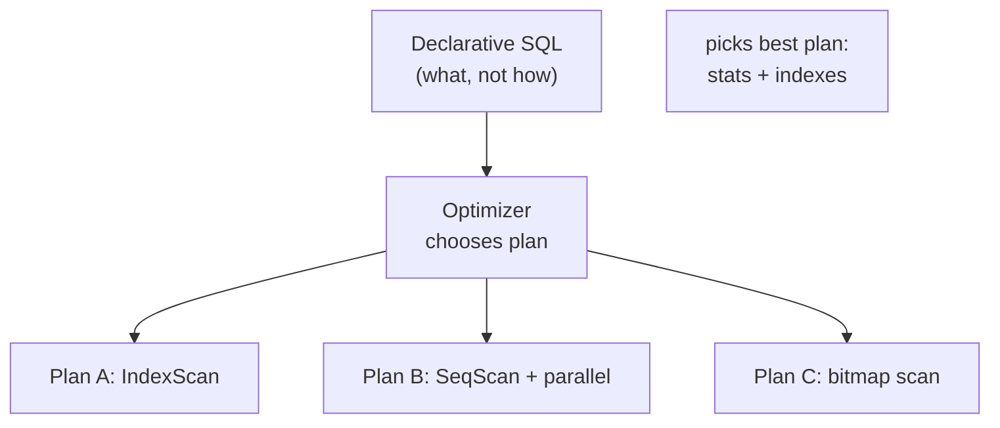

---

### 📶 Gradual Depth

**Level 1 - What it is:**
SQL says what you want; the database decides how to
get it. This is declarative. Java says how: for loop,
if condition. That is imperative.

**Level 2 - How to use it:**
Let the optimizer work. Avoid query hints unless you
have measured evidence that the optimizer is wrong.
Write SQL that describes the desired result, not an
algorithm. Let EXPLAIN show you the plan, not
prescribe it.

**Level 3 - How it works:**
The optimizer parses SQL into a relational algebra
expression, applies algebraic transformations
(predicate pushdown, join reordering), estimates the
cost of each physical plan using statistics, and
chooses the minimum-cost plan. This process runs in
milliseconds.

**Level 4 - Production mastery:**
The declarative contract breaks when statistics are
wrong. PostgreSQL's `ANALYZE` updates column statistics
(histograms, MCV lists, n_distinct). If statistics
are stale, the optimizer estimates wrong cardinalities
and chooses wrong plans. The fix is not a query hint;
it is updating statistics. Hints are a last resort
for cases where the optimizer has structural
limitations (inability to estimate correlated columns).

---

### ⚙️ How It Works

**Phase 1 - Parsing to relational algebra:** SQL is
parsed into a relational algebra expression: a tree
of relational operators (selection, projection, join).

**Phase 2 - Algebraic rewriting:** The optimizer
applies algebraic equivalences: push selection
operators down (predicate pushdown), reorder joins,
flatten subqueries.

**Phase 3 - Physical planning:** For each logical
operator, the optimizer considers physical
implementations: HashJoin vs MergeJoin vs NestedLoop,
SeqScan vs IndexScan vs BitmapScan. Costs are
estimated using statistics.

**Phase 4 - Plan selection:** The optimizer chooses
the minimum-estimated-cost physical plan. This plan
is what EXPLAIN shows.

```
SQL -> Relational Algebra:
  SELECT SUM(price) FROM orders WHERE status='paid'
  ->
  Aggregate(SUM(price)
    Select(status='paid'
      Scan(orders)))

Rewrite (predicate pushdown, already at leaf):
  Aggregate(SUM(price)
    IndexScan(orders, status='paid'))

Physical plan chosen: IndexScan (if index exists)
```

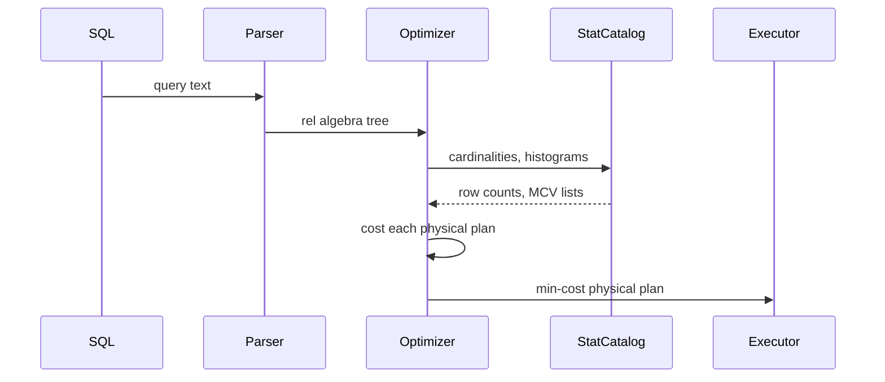

**BAD:**

```sql
-- Add hints before diagnosing the cause:
-- locks in plan, breaks on index rename
/*+ HashJoin(orders customers) */
SELECT * FROM orders o
JOIN customers c ON c.id = o.customer_id;
```

**GOOD:**

```sql
-- Update statistics first; let optimizer
-- choose the plan with accurate data
ANALYZE orders;
ANALYZE customers;
SELECT * FROM orders o
JOIN customers c ON c.id = o.customer_id;
-- re-run EXPLAIN; use hints only if still
-- wrong after ANALYZE
```

---

### 🚨 Failure Modes

**Failure 1 - Optimizer choosing wrong plan due to
stale statistics**

**Diagnostic:** A query ran in 50ms for months, then
degraded to 30 seconds after a bulk load. EXPLAIN shows
the plan using a different join strategy than before.
pg_stat_user_tables shows `n_dead_tup` and
`last_analyze` is weeks ago.

**Fix:** `ANALYZE table_name;` to update statistics.
In PostgreSQL, `autovacuum_analyze_scale_factor` and
`autovacuum_analyze_threshold` control when autovacuum
runs ANALYZE; reduce scale factor for large tables
(e.g., `ALTER TABLE orders SET
(autovacuum_analyze_scale_factor = 0.01)`).

**Failure 2 - Declarative SQL misused as imperative
via excessive query hints**

**Diagnostic:** Application code has `/*+ HashJoin */`
and `/*+ IndexScan(orders idx_orders_status) */` hints
throughout. After an index is renamed or dropped,
the hints cause invalid plans silently.

**Fix:** Remove hints. Profile with `pg_stat_statements`;
identify slow queries. Fix by updating statistics or
rewriting queries to be more SARGable - not by adding
hints that the optimizer cannot validate.

---

### 🔬 Production Reality

A team inherited a PostgreSQL application with 47 query
hints scattered across DAO classes. The hints had been
added one by one over 3 years as the optimizer made
"wrong" choices. After a PostgreSQL major version
upgrade (from 12 to 15), 12 hints referred to plans
that were suboptimal in the new optimizer. The team
ran EXPLAIN on each hinted query without the hint;
the new optimizer chose better plans in 9 of 12 cases.
Removing the 9 incorrect hints reduced P99 query
latency by 40%. The hints had locked in plans that
were optimal in 2020 on 2020 data volumes. The
declarative contract, restored by removing hints,
let the 2024 optimizer choose 2024-optimal plans.

---

### ⚖️ Trade-offs & Alternatives

| Approach                | Control | Adaptability | Maintenance |
| ----------------------- | ------- | ------------ | ----------- |
| Declarative SQL         | Low     | High         | Low         |
| SQL with hints          | High    | Low          | High        |
| Procedural SQL (cursor) | Total   | None         | High        |
| Stored procedure        | High    | Partial      | Medium      |
| ORM-generated SQL       | None    | High         | Low         |

---

### ⚡ Decision Snap

**USE DECLARATIVE SQL WHEN:**

- Standard OLTP and OLAP queries; let the optimizer
  adapt to data growth
- When statistics are up to date and the optimizer
  has proven reliable

**USE PLAN HINTS WHEN:**

- Statistics cannot accurately represent the workload
  (correlated multi-column predicates, skewed
  distributions)
- The optimizer's choice has been measured as wrong
  and ANALYZE does not fix it

**USE PROCEDURAL SQL WHEN:**

- Logic genuinely cannot be expressed as set operations
  (multi-step iterative computation with feedback)
- Understood performance is acceptable and
  predictability is more valuable than adaptability

---

### ⚠️ Top Traps

| #   | Misconception                                               | Reality                                                                                                                                         |
| --- | ----------------------------------------------------------- | ----------------------------------------------------------------------------------------------------------------------------------------------- |
| 1   | Adding query hints is always the right fix for slow queries | Hints freeze the plan; stale statistics are usually the cause; ANALYZE is the correct first fix                                                 |
| 2   | The optimizer always chooses the best plan                  | The optimizer minimizes estimated cost; cost estimation requires accurate statistics; stale stats cause wrong plans                             |
| 3   | Declarative SQL means you cannot control performance        | You can influence the plan by restructuring the query, updating statistics, adding indexes, and adjusting work_mem                              |
| 4   | ORMs prevent writing declarative SQL                        | ORMs generate declarative SQL; the problem is ORMs sometimes generate non-SARGable predicates, not that they are imperative                     |
| 5   | SQL ORDER BY guarantees deterministic row order             | ORDER BY guarantees the specified column order; when multiple rows have equal values in the ORDER BY columns, their relative order is undefined |

---

### 🪜 Learning Ladder

**Prerequisites:**

- SQL-139 Set-Based Thinking vs Procedural Thinking -
  the practical consequence of declarative thinking
- SQL-130 Query Optimization Theory - Selinger Optimizer -
  the mechanism implementing the declarative contract

**THIS:** SQL-141 Declarative vs Imperative - The SQL
Paradigm Lesson

**Next steps:**

- SQL-142 Teaching SQL to Procedural Programmers -
  how to transfer the declarative mental model to
  engineers from imperative backgrounds
- SQL-138 What Compiler Optimization Teaches Query
  Planning - how optimizer transformations implement
  the declarative contract

---

**The Surprising Truth:**

E.F. Codd designed SQL to be declarative specifically
so that users would not need to know about physical
storage details (B-trees, heap files, sort algorithms).
The optimization problem was considered an
implementation detail of the database system - users
should never need to think about it. 55 years later,
senior engineers spend significant time thinking about
query plans, index structures, and statistics. The
declarative contract held for simple queries but
broke under the complexity of real workloads. Codd's
vision was right about the direction and wrong about
the complexity.

**Further Reading:**

1. E.F. Codd, "A Relational Model of Data for Large
   Shared Data Banks," _Communications of the ACM_,
   vol. 13, no. 6, 1970 - the paper defining the
   declarative relational model.
2. P.G. Selinger et al., "Access Path Selection in a
   Relational Database Management System," _ACM SIGMOD_,
   1979 - the optimizer that makes the declarative
   contract practical.
3. PostgreSQL documentation, "Statistics Used by the
   Planner" - the statistical model behind the
   declarative optimizer's decisions.

**Revision Card:**

1. Declarative SQL specifies the output set's
   definition; the optimizer has complete freedom to
   choose the physical execution plan - this is the
   source of SQL's adaptability.
2. The optimizer's plan depends on statistics; stale
   statistics cause wrong plans; ANALYZE is the
   correct fix before considering hints.
3. Query hints break the declarative contract by
   locking in physical plans; they are a last resort
   for cases where statistics cannot correctly guide
   the optimizer.

---

---

# SQL-142 Teaching SQL to Procedural Programmers

**TL;DR** - Procedural programmers learning SQL must unlearn row-by-row thinking and loops; set operations, declarative intent, and optimizer trust replace the control-flow habits they learned first.

---

### 🔥 Problem Statement

A Go developer joins a data team. They know maps,
slices, and goroutines. They write their first SQL:
a PL/pgSQL function that loops through a cursor over
customers, computes each customer's total orders
inside the loop, and updates a summary table row by
row. It works. It takes 4 hours for 2M rows. A senior
data engineer rewrites it as a single UPDATE FROM with
a grouped subquery. It takes 3 minutes. The Go
developer does not understand why. They see the SQL
and think: "This is doing the same thing." It is not.
The SQL describes a goal; the database finds the path.
The Go code described the path; the result followed.
This mental model mismatch is the single biggest
source of slow SQL written by competent programmers.
It is not a SQL syntax problem. It is a paradigm
transfer problem. Teaching SQL to procedural
programmers requires actively dismantling the loop
mental model and rebuilding it with set operations.

---

### 📜 Historical Context

SQL was designed in the 1970s for business analysts
who did not have programming backgrounds. The
assumption was that declarative thinking was natural
and loops were a specialist concern. The opposite
proved true: programming dominated CS education
(C, Pascal, later Java), and SQL became a second
language learned by engineers with strong procedural
intuitions. The cognitive science research on
programming language learning suggests that first-
language paradigms create strong mental models that
transfer to new languages (both helpfully and
harmfully). This is called "negative transfer" when
the first-language pattern actively impedes
second-language performance. SQL's relationship to
procedural languages is a documented case of negative
transfer: for loops, variable assignment, and step-
by-step reasoning actively mislead SQL learners.

---

### 🔩 First Principles

**CORE INVARIANTS:**

1. Set-based SQL is not a simplified version of
   procedural code; it is a different computational
   paradigm with different performance characteristics
   and different expressiveness constraints.
2. The most common SQL performance problems written
   by procedural programmers - cursors, correlated
   subqueries, row-by-row updates - stem from
   applying loop-based procedural thinking to a
   set-based language.
3. Teaching SQL effectively requires explicitly
   naming and demonstrating the paradigm difference,
   not just showing syntax. Engineers who learn SQL
   syntax without paradigm transfer continue writing
   procedural SQL indefinitely.

**DERIVED DESIGN:**

The correct pedagogical sequence: first unlearn the
loop (show why loops are 100x slower), then teach
the set-based alternative, then teach the declarative
contract (optimizer freedom), then teach the cases
where procedural SQL is necessary (recursive CTEs,
truly iterative computations).

**THE TRADE-OFF:**

**Gain:** Engineers with strong set-based thinking
write SQL that is 10-100x faster by default, without
any additional performance tuning.

**Cost:** The paradigm shift requires explicit
cognitive effort. Programmers who are not shown the
performance difference will not self-correct; they
will interpret slow SQL as a database limitation, not
a mental model limitation.

---

### 🧠 Mental Model

> Learning SQL after Java is like learning to drive
> after years of cycling. Most skills do not transfer.
> Braking is backwards (push brakes, not drag feet).
> Turning requires counterintuitive steering. You must
> actively unlearn before you can learn.
>
> The procedural programmer's equivalent: unlearn "for
> each row, do this" before learning "all rows where
> this condition, do this at once."

- "Cycling habits" -> for loop, row-by-row processing
- "Counterintuitive braking" -> declarative SQL
  (describe what, not how)
- "Unlearning before learning" -> explicit curriculum
  that shows why loops are wrong before showing SQL

**Where this analogy breaks down:** Cycling and driving
use different physical interfaces; SQL and Java use
the same text interface (strings, numbers, logic).
This makes the paradigm difference harder to perceive,
not easier.

---

### 🧩 Components

- **Loop unlearning:** Demonstrating that cursor-based
  row processing is 100-1000x slower than set-based
  SQL; using EXPLAIN ANALYZE to show the cost
  difference concretely.
- **Set intuition building:** Teaching aggregations,
  GROUP BY, and window functions as set operations
  before teaching how they are implemented.
- **Declarative trust:** Teaching engineers to write
  SQL that describes output, then examine the plan,
  then optimize predicates - not to pre-specify the
  algorithm.
- **Common patterns:** Canonical set-based patterns
  for procedural problems: running totals (window
  function), "get latest per group" (window function
  - filter), bulk update (UPDATE FROM), hierarchy
    traversal (recursive CTE).
- **Mental model checkpoint:** A diagnostic question
  set that identifies whether an engineer is still
  thinking procedurally: "Does your SQL have a
  cursor?", "Does your WHERE clause have functions
  on columns?", "Does your subquery reference the
  outer query?"

```
Procedural pattern (wrong):
  FOR each customer c IN cursor:
    total = SELECT SUM(amount)
            FROM orders WHERE customer=c.id
    UPDATE customers SET total=total
    WHERE id=c.id

Set-based pattern (right):
  UPDATE customers c SET total = s.total
  FROM (
    SELECT customer_id, SUM(amount) AS total
    FROM orders GROUP BY customer_id
  ) s
  WHERE c.id = s.customer_id
```

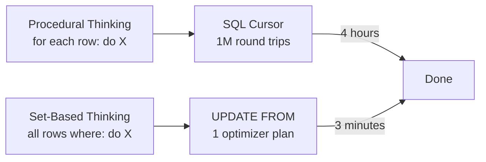

---

### 📶 Gradual Depth

**Level 1 - What it is:**
SQL works on whole sets of rows at once. Java and Python
work on one row at a time in loops. Writing SQL that
mimics loops is correct but slow. Learning SQL means
learning to think in sets.

**Level 2 - How to use it:**
Every time you find yourself writing a loop to process
database rows in application code: stop. Ask: "Can
this be a single SQL statement?" For running totals:
window functions. For conditional row updates: UPDATE
WHERE. For "get the latest per group": ROW_NUMBER()
OVER (PARTITION BY ... ORDER BY ...) filtered to 1.

**Level 3 - How it works:**
The database engine optimizes set-based SQL at the
physical level. A single `UPDATE ... WHERE status='pending'`
allows the engine to use an index scan on status,
lock only matching rows, and minimize WAL writes.
1M individual UPDATE statements generate 1M lock
acquisitions, 1M WAL records, and prevent any
optimizer use.

**Level 4 - Production mastery:**
The most persistent procedural habit in SQL is the
correlated subquery in a SELECT list: `SELECT name,
(SELECT COUNT(*) FROM orders WHERE customer_id = c.id)`.
This executes the subquery once per customer row.
For 100K customers, it is 100K subquery executions.
Replacing it with a LEFT JOIN to a grouped subquery
runs the aggregation once. After teaching the loop
unlearning and the set-based pattern, this becomes
the key diagnostic: "Do you have a subquery in your
SELECT list?" If yes: replace with a join.

---

### ⚙️ How It Works

**Phase 1 - Paradigm demonstration (slow path):**
Show EXPLAIN ANALYZE on a cursor-based PL/pgSQL
function. Highlight: `loops=1000000`, actual time,
total function calls.

**Phase 2 - Set-based rewrite:** Show the equivalent
single SQL statement. Run EXPLAIN ANALYZE. Highlight:
`loops=1`, parallel workers, index use.

**Phase 3 - Canonical pattern library:** Teach 5-7
canonical set-based patterns that replace the most
common procedural SQL patterns.

**Phase 4 - Mental model checkpoint:** Give exercises
where engineers identify procedural SQL and rewrite
it to set-based. The goal is internalizing the
diagnostic question: "Am I describing a loop or a
set?"

```
EXPLAIN ANALYZE cursor loop:
  PL/pgSQL Function  (cost=0..1234)
    -> SubQuery Scan  (loops=1000000)
       -> Index Scan customer_id
  Actual time: 240000.000..240500.000
  Rows: 1000000

EXPLAIN ANALYZE set-based:
  Update on customers
    -> Hash Join  (loops=1)
       Hash Cond: c.id = s.customer_id
  Actual time: 12.000..18000.000
  Rows: 1000000
```

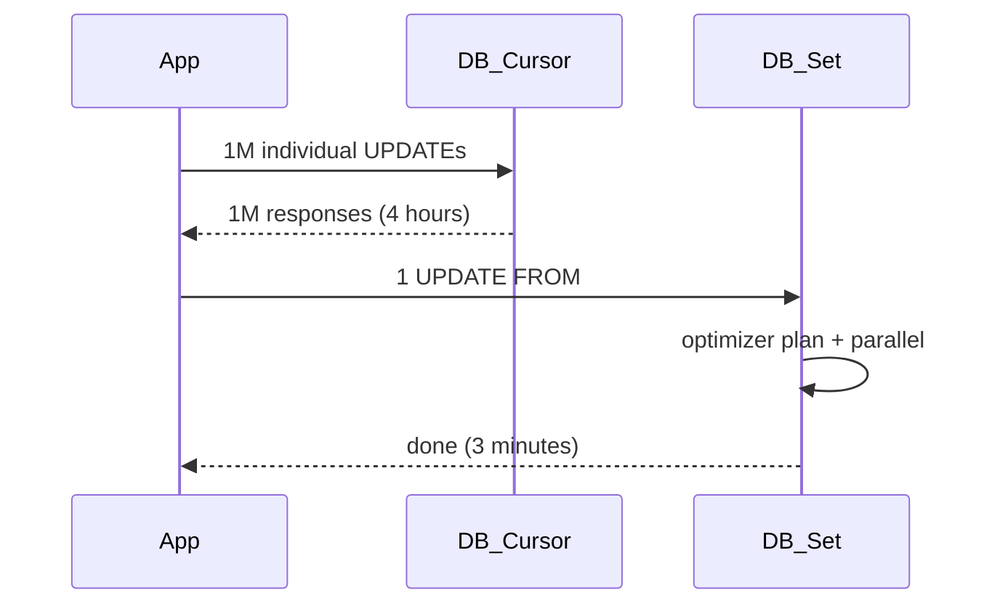

**BAD:**

```sql
-- Cursor loop: 1M individual UPDATEs
-- procedural thinking in SQL
FOR rec IN SELECT id FROM orders LOOP
  UPDATE orders
  SET status = 'done'
  WHERE id = rec.id;
END LOOP;
```

**GOOD:**

```sql
-- Set-based: one optimizer plan
-- updates all qualifying rows at once
UPDATE orders
SET status = 'done'
WHERE processed_at < NOW()
  AND status = 'pending';
```

---

### 🚨 Failure Modes

**Failure 1 - Correlated subquery in SELECT list
identified too late**

**Diagnostic:** Query ran fine in development (1K
rows) but is slow in production (500K rows). EXPLAIN
ANALYZE shows a node with `loops=500000`.

**Fix:** Identify all subqueries in the SELECT list
that reference the outer query. Rewrite each as a
LEFT JOIN to a grouped or lateral subquery. Measure
with EXPLAIN ANALYZE before and after.

**Failure 2 - Incremental paradigm transfer - still
using cursors for "complex" logic**

**Diagnostic:** An engineer rewrites simple batch
updates to set-based but continues using cursors for
"anything with conditions." The pattern:
`IF condition THEN update A ELSE update B END IF`
inside a cursor loop.

**Fix:** Teach CASE expressions inside UPDATE:
`UPDATE t SET col = CASE WHEN cond THEN A ELSE B END
WHERE ...`. All conditional row logic can be expressed
as CASE expressions in a set-based UPDATE. Show the
EXPLAIN ANALYZE comparison.

---

### 🔬 Production Reality

A team of five backend engineers (Python/Django
background) built a data processing pipeline. All
five wrote SQL using subquery-per-row patterns learned
from Python's "query the DB inside a loop" habit.
Pipeline runtime: 6-8 hours daily. A single code
review session with a senior DBA converted 3 correlated
subqueries to LEFT JOINs and 2 cursor loops to
UPDATE FROM. Runtime: 22 minutes. No schema changes,
no index changes, no infrastructure changes. The
engineers then self-identified 8 additional procedural
patterns in the codebase and rewrote them within a
week. The paradigm transfer required one demonstration
with EXPLAIN ANALYZE showing the loop count, not
a textbook or a course.

---

### ⚖️ Trade-offs & Alternatives

| Learning Approach          | Effectiveness | Time   | Retention |
| -------------------------- | ------------- | ------ | --------- |
| Syntax-only SQL tutorial   | Low           | Short  | Low       |
| Demonstrate loop vs set    | High          | Short  | High      |
| EXPLAIN ANALYZE comparison | High          | Medium | High      |
| Canonical pattern library  | Medium        | Medium | Medium    |
| Performance-only framing   | Medium        | Short  | Medium    |

---

### ⚡ Decision Snap

**TEACH SET-BASED FIRST WHEN:**

- Engineers have procedural backgrounds (Java, Python,
  Go, C++)
- The goal is production SQL performance

**DEMONSTRATE COST DIFFERENCE FIRST WHEN:**

- Engineers have already written procedural SQL;
  motivation to change requires seeing the impact

**TEACH RECURSIVE CTE WHEN:**

- Engineers need to express graph or hierarchy
  traversal; this is where procedural thinking
  is appropriate in SQL

---

### ⚠️ Top Traps

| #   | Misconception                                                                         | Reality                                                                                                                                                          |
| --- | ------------------------------------------------------------------------------------- | ---------------------------------------------------------------------------------------------------------------------------------------------------------------- |
| 1   | Procedural SQL is a beginner mistake that experienced engineers outgrow automatically | Without explicit paradigm teaching, procedural habits persist indefinitely; experienced engineers write sophisticated procedural SQL that is still slow          |
| 2   | SQL tutorials that teach syntax first will produce set-based thinkers                 | Syntax-first learning reinforces procedural thinking by showing SQL constructs without explaining the set-based paradigm                                         |
| 3   | Cursor-based SQL is necessary for complex logic                                       | CASE expressions, window functions, and recursive CTEs handle virtually all logic that procedural programmers reach for cursors for                              |
| 4   | Set-based SQL is harder to read and maintain                                          | Set-based SQL is harder to write initially but is shorter, more maintainable, and self-documents intent (what) rather than algorithm (how)                       |
| 5   | Performance optimization is a separate learning topic from set-based thinking         | Set-based thinking IS the primary SQL performance optimization; teaching them separately creates engineers who know performance techniques but still write loops |

---

### 🪜 Learning Ladder

**Prerequisites:**

- SQL-139 Set-Based Thinking vs Procedural Thinking -
  the core paradigm distinction before teaching it
- SQL-053 Window Functions - the most powerful set-
  based replacement for procedural running totals

**THIS:** SQL-142 Teaching SQL to Procedural Programmers

**Next steps:**

- SQL-141 Declarative vs Imperative - The SQL Paradigm
  Lesson - the formal contract underlying set-based
  SQL
- SQL-130 Query Optimization Theory - Selinger Optimizer -
  the optimizer that exploits the declarative contract

---

**The Surprising Truth:**

The most effective single teaching tool for SQL
paradigm transfer is not a textbook, a course, or a
code review. It is `EXPLAIN ANALYZE` with the word
count "loops=1000000" visible next to "loops=1". The
performance difference is abstract until you see the
loop count. Once an engineer sees their code
generating a million loop iterations in a database
log, they never write that pattern again. Debugging
is a more effective teaching mechanism than instruction.

**Further Reading:**

1. J. Celko, _SQL for Smarties: Advanced SQL
   Programming_ (5th ed.) - the canonical reference
   for set-based SQL patterns replacing procedural
   thinking.
2. T. Winand, _Use the Index, Luke!_,
   https://use-the-index-luke.com - free web book
   on SQL performance including set-based thinking
   and index use.
3. PostgreSQL documentation, "EXPLAIN" reference -
   the diagnostic tool that demonstrates procedural
   vs set-based cost differences.

**Revision Card:**

1. Procedural programmers' worst SQL habits: cursors
   (loops), correlated subqueries in SELECT (implicit
   loops), and row-by-row updates - all stem from
   applying loop-based thinking to a set-based
   language.
2. The most effective paradigm teaching tool is
   EXPLAIN ANALYZE showing `loops=1M` vs `loops=1`;
   the cost difference motivates the paradigm shift.
3. Set-based SQL is not simpler syntax - it is a
   different computational paradigm; engineers must
   explicitly unlearn procedural habits to write
   performant SQL by default.
