## Keywords

1. [SQL-113 Sharding Strategies - Application vs Proxy](#sql-113-sharding-strategies---application-vs-proxy)
2. [SQL-114 Multi-Database Topology Design](#sql-114-multi-database-topology-design)
3. [SQL-115 Cross-Database Query Federation (FDW, Trino)](#sql-115-cross-database-query-federation-fdw-trino)
4. [SQL-116 CQRS and Read/Write Separation Architecture](#sql-116-cqrs-and-readwrite-separation-architecture)
5. [SQL-117 Database Version Migration Strategy at Scale](#sql-117-database-version-migration-strategy-at-scale)
6. [SQL-118 PostgreSQL to Cloud-Managed Migration](#sql-118-postgresql-to-cloud-managed-migration)
7. [SQL-119 Connection Routing and Proxy Architecture](#sql-119-connection-routing-and-proxy-architecture)
8. [SQL-120 GDPR and Right-to-Erasure in SQL Systems](#sql-120-gdpr-and-right-to-erasure-in-sql-systems)
9. [SQL-121 Observability for Database Fleets](#sql-121-observability-for-database-fleets)
10. [SQL-122 Database Capacity Planning and Growth Modeling](#sql-122-database-capacity-planning-and-growth-modeling)
11. [SQL-123 ORM Impedance Mismatch Anti-Pattern](#sql-123-orm-impedance-mismatch-anti-pattern)
12. [SQL-124 Online Store DB - Phase 5 (Multi-Region Strategy)](#sql-124-online-store-db---phase-5-multi-region-strategy)
13. [SQL-125 SQL Staff-Level Interview Scenarios](#sql-125-sql-staff-level-interview-scenarios)
14. [SQL-126 Teaching Transaction Isolation - Common Confusions](#sql-126-teaching-transaction-isolation---common-confusions)
15. [SQL-127 Relational Algebra - The Theory Behind SQL](#sql-127-relational-algebra---the-theory-behind-sql)
16. [SQL-128 Codd's 12 Rules and Relational Completeness](#sql-128-codds-12-rules-and-relational-completeness)
17. [SQL-129 SQL Standard Evolution - SQL-92 to SQL:2023](#sql-129-sql-standard-evolution---sql-92-to-sql2023)
18. [SQL-130 Query Optimization Theory - Selinger Optimizer](#sql-130-query-optimization-theory---selinger-optimizer)
19. [SQL-131 Isolation Formalism - Adya, Liskov, O'Neil (1999)](#sql-131-isolation-formalism---adya-liskov-oneil-1999)
20. [SQL-132 LSM-Trees vs B-Trees - Storage Engine Design](#sql-132-lsm-trees-vs-b-trees---storage-engine-design)
21. [SQL-133 Column-Store vs Row-Store Engine Design](#sql-133-column-store-vs-row-store-engine-design)
22. [SQL-134 Writing a SQL Parser from Scratch](#sql-134-writing-a-sql-parser-from-scratch)
23. [SQL-135 The Volcano (Iterator) Execution Model](#sql-135-the-volcano-iterator-execution-model)
24. [SQL-136 Vectorized vs Pipelined Query Execution](#sql-136-vectorized-vs-pipelined-query-execution)
25. [SQL-137 What OS Page Caches Teach Database Buffer Pools](#sql-137-what-os-page-caches-teach-database-buffer-pools)
26. [SQL-138 What Compiler Optimization Teaches Query Planning](#sql-138-what-compiler-optimization-teaches-query-planning)
27. [SQL-139 Set-Based Thinking vs Procedural Thinking](#sql-139-set-based-thinking-vs-procedural-thinking)
28. [SQL-140 Data Gravity as System Design Constraint](#sql-140-data-gravity-as-system-design-constraint)
29. [SQL-141 Declarative vs Imperative - The SQL Paradigm Lesson](#sql-141-declarative-vs-imperative---the-sql-paradigm-lesson)
30. [SQL-142 Teaching SQL to Procedural Programmers](#sql-142-teaching-sql-to-procedural-programmers)

---

# SQL-113 Sharding Strategies - Application vs Proxy

**TL;DR** - Sharding splits data across multiple instances by partition key; the key architectural choice is whether routing lives in application code or in a proxy layer.

---

### 🔥 Problem Statement

A single PostgreSQL instance handles roughly 10,000-50,000 transactions per second on modern hardware, depending on workload. When write volume, data size, or connection count exceeds what vertical scaling can deliver, you need horizontal partitioning - sharding. But splitting data is the easy part. The hard part is routing: which shard holds the row a query needs? Two fundamentally different architectures exist. Application-level sharding embeds routing logic in your service code. Proxy-level sharding places a middleware layer (Vitess, ProxySQL, Citus, PgBouncer with routing rules) between the application and the databases. Choosing wrong means years of accidental complexity, cross-shard query nightmares, and resharding projects that consume entire quarters.

---

### 📜 Historical Context

Early internet companies sharded manually in application code - LiveJournal (2004) and Flickr (2006) famously described their hand-rolled sharding. As the pattern matured, proxy-based solutions emerged: YouTube built Vitess (open-sourced 2012) to shard MySQL because application-level routing became unmaintainable across hundreds of microservices. PostgreSQL's Citus extension (2016) brought transparent sharding into the database layer itself. The trend has moved from application-level toward proxy/extension-level, but both patterns remain widely deployed.

---

### 🔩 First Principles

**CORE INVARIANTS:**

1. Every row must map to exactly one shard via a deterministic function of the partition key
2. Cross-shard queries require coordination (scatter-gather or distributed joins) and are always slower than single-shard queries
3. Resharding (changing shard count or key) requires data movement and is operationally expensive

**DERIVED DESIGN:**
These invariants force two consequences: the partition key must align with your dominant access pattern (or cross-shard queries dominate), and the routing layer must be consistent across all clients (or rows get lost). Application sharding gives each service full control but risks inconsistent routing. Proxy sharding centralizes routing but adds a network hop and a single point of failure.

**THE TRADE-OFF:**
**Gain:** Horizontal write scalability beyond single-node limits; data isolation for compliance or tenancy.
**Cost:** Operational complexity of managing multiple database instances; loss of cross-shard transactional guarantees; resharding pain.

---

### 🧠 Mental Model

> Think of a post office sorting facility. Application sharding is like every mail carrier memorizing which truck goes to which zip code. Proxy sharding is like putting a sorting machine at the facility entrance that reads the zip code and routes the letter automatically.

- "Mail carrier memorizing routes" -> application code with shard map
- "Sorting machine" -> proxy layer (Vitess, Citus, ProxySQL)
- "Zip code" -> partition key (tenant_id, user_id, region)

**Where this analogy breaks down:** Unlike physical mail, database queries sometimes need data from multiple shards simultaneously, and no sorting machine can avoid the scatter-gather cost of that.

---

### 🧩 Components

- **Partition key** - the column whose value determines shard assignment (tenant_id, user_id, hash of primary key)
- **Shard map** - lookup structure mapping key ranges or hash buckets to physical database instances
- **Router** - the component (application code or proxy) that directs each query to the correct shard
- **Coordinator** - handles cross-shard queries by fanning out to multiple shards and merging results
- **Rebalancer** - moves data between shards when adding nodes or correcting hot spots

```
  Application-Level         Proxy-Level
  +-------+                 +-------+
  | App   | -- shard map -> | App   |
  | (has  |    embedded     | (no   |
  | logic)|                 | logic)|
  +---+---+                 +---+---+
      |                         |
  +---+---+---+           +----+----+
  |DB1|DB2|DB3|           | Proxy   |
  +---+---+---+           | (Vitess)|
                          +--+--+---+
                          |DB1|DB2|DB3|
                          +---+---+---+
```

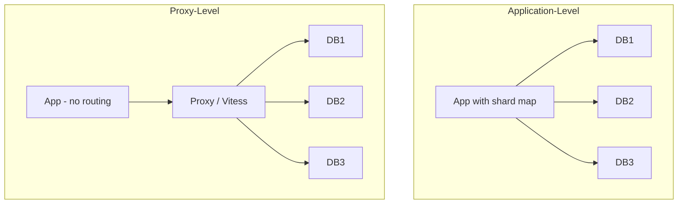
```mermaid
flowchart TD
    subgraph AppLevel["Application-Level"]
        A1[App with shard map] --> D1[DB1]
        A1 --> D2[DB2]
        A1 --> D3[DB3]
    end
    subgraph ProxyLevel["Proxy-Level"]
        A2[App - no routing] --> P[Proxy / Vitess]
        P --> D4[DB1]
        P --> D5[DB2]
        P --> D6[DB3]
    end
```

---

### 📶 Gradual Depth

**Level 1 - What it is:**
Sharding splits a database into multiple smaller databases, each holding a subset of the data. The partition key determines which shard holds a given row. The routing decision is either made by the application or by a proxy sitting between the application and the databases.

**Level 2 - How to use it:**
Choose a partition key that matches your primary query pattern - typically tenant_id for SaaS or user_id for social platforms. With application sharding, maintain a shard map in your service and route connections accordingly. With proxy sharding, configure the proxy (Vitess, Citus, ProxySQL) with the sharding scheme and let it handle routing transparently.

**Level 3 - How it works:**
Hash-based sharding applies a hash function to the partition key and uses modulo arithmetic to assign shards. Range-based sharding assigns contiguous key ranges to each shard. The router intercepts every query, extracts the partition key value, and directs it to the correct backend. Cross-shard queries trigger scatter-gather: the coordinator sends the query to all relevant shards, collects results, and merges them - losing push-down optimizations.

**Level 4 - Production mastery:**
Hot shards emerge when the partition key has skewed distribution. Monitor per-shard query rates and connection counts. Resharding requires a double-write or logical replication migration period. Proxy-level sharding simplifies client upgrades but introduces a latency hop (typically 0.5-2ms) and a failure domain. Application-level sharding avoids that hop but requires every service to stay synchronized on shard map changes - a coordination problem that scales poorly beyond 10-15 services.

---

### ⚙️ How It Works

**Phase 1 - Key extraction:** The router (app code or proxy) parses the query to extract the partition key value from WHERE clauses or INSERT values.

**Phase 2 - Shard resolution:** The key is hashed (or range-matched) against the shard map to identify the target shard.

**Phase 3 - Query routing:** The query is forwarded to the target shard's connection pool. If no partition key is present, the query fans out to all shards (scatter).

**Phase 4 - Result aggregation:** For scatter queries, the coordinator collects partial results, applies ORDER BY/LIMIT/aggregation, and returns the merged result set.

```
  Query: WHERE tenant_id = 42
    |
    v
  Extract key: 42
    |
    v
  hash(42) % 4 = 2 -> Shard 2
    |
    v
  Route to DB-shard-2
    |
    v
  Return result (single shard, fast)
```

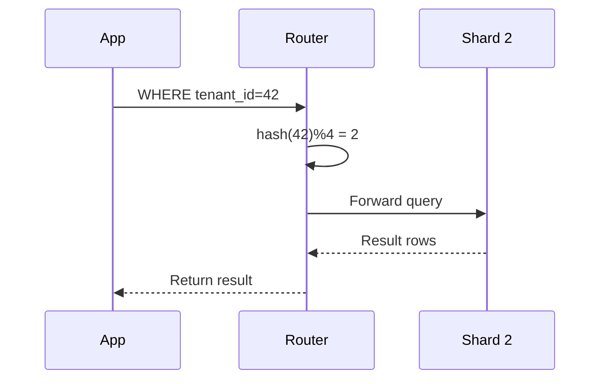
```mermaid
sequenceDiagram
    participant App
    participant Router
    participant S2 as Shard 2
    App->>Router: WHERE tenant_id=42
    Router->>Router: hash(42)%4 = 2
    Router->>S2: Forward query
    S2-->>Router: Result rows
    Router-->>App: Return result
```

**BAD:**

```sql
-- No partition key in query = full scatter
SELECT * FROM orders
WHERE created_at > '2025-01-01'
ORDER BY total DESC LIMIT 10;
-- Hits ALL shards, merges in coordinator
```

**GOOD:**

```sql
-- Partition key in WHERE = single shard
SELECT * FROM orders
WHERE tenant_id = 42
  AND created_at > '2025-01-01'
ORDER BY total DESC LIMIT 10;
```

---

### 🚨 Failure Modes

**Failure 1 - Hot shard from skewed partition key:**
**Symptom:** One shard shows 10x the CPU and I/O of others; connection pool exhaustion on that shard; p99 latency spikes.
**Root cause:** Partition key distribution is uneven (one large tenant, viral user, or popular region dominates a single shard).
**Diagnostic:**

```sql
SELECT shard_id, count(*) AS row_count
FROM shard_metadata
GROUP BY shard_id ORDER BY row_count DESC;
-- Or per-shard: pg_stat_activity connection count
```

**Fix:** Introduce composite partition keys (tenant_id + secondary hash), or move the hot tenant to a dedicated shard. Vitess supports shard splitting for this scenario.

**Failure 2 - Stale shard map during resharding:**
**Symptom:** Queries return empty results or "row not found" errors during a resharding migration.
**Root cause:** Application instances have cached an old shard map while data is being moved to new shards.
**Diagnostic:**

```
-- Check shard map version across app instances
grep "shard_map_version" /app/config/status
-- Compare with coordinator's current version
```

**Fix:** Use a versioned shard map with atomic switchover. Proxy-based systems handle this centrally. For application sharding, use a distributed config store (etcd, Consul) with watch notifications.

---

### 🔬 Production Reality

A common pattern in multi-tenant SaaS: a company starts with a single PostgreSQL instance. At 500 GB, they add read replicas. At 2 TB and 50,000 write TPS, they shard by tenant_id into 16 shards. The initial application-level sharding works for 3 services. By the time 20 services exist, shard map synchronization failures cause routing errors weekly. The team migrates to Citus (proxy-level, PostgreSQL-native) to centralize routing. The migration itself takes months because cross-shard foreign keys must be eliminated first. The lesson: if you expect more than a handful of services to query sharded data, start with proxy-level sharding.

---

### ⚖️ Trade-offs & Alternatives

| Aspect               | App-Level Sharding   | Proxy (Vitess)   | Extension (Citus)  |
| -------------------- | -------------------- | ---------------- | ------------------ |
| Latency overhead     | None (direct)        | +0.5-2ms per hop | Minimal (in-proc)  |
| Routing consistency  | Manual coordination  | Centralized      | Centralized        |
| Cross-shard queries  | Custom code          | Built-in scatter | Built-in scatter   |
| Resharding           | Manual migration     | Online splitting | Online rebalance   |
| Operational overhead | Low infra, high code | Proxy cluster    | Extension per node |
| Client transparency  | None                 | Full             | Full               |

---

### ⚡ Decision Snap

**USE WHEN:**

- Write volume or data size exceeds single-node capacity
- Multi-tenant isolation requires physical separation
- Geographic data residency mandates regional shards

**AVOID WHEN:**

- Read replicas and connection pooling still have headroom
- Workload is read-heavy and cacheable

**PREFER proxy/extension sharding WHEN:**

- More than 5 services query the sharded database
- You need online resharding without application downtime

---

### ⚠️ Top Traps

| #   | Misconception                                 | Reality                                                                                                                          |
| --- | --------------------------------------------- | -------------------------------------------------------------------------------------------------------------------------------- |
| 1   | Sharding solves all scaling problems          | Sharding only scales writes and data volume; read scaling is cheaper with replicas                                               |
| 2   | You can shard later with minimal effort       | Retrofitting sharding into an existing schema requires eliminating cross-shard foreign keys, rewriting joins, and migrating data |
| 3   | Hash sharding guarantees even distribution    | Hash distribution is only as uniform as the key cardinality; low-cardinality keys still create hot shards                        |
| 4   | Cross-shard transactions work like local ones | Distributed transactions require two-phase commit, adding latency and failure modes absent in single-node                        |
| 5   | The partition key choice is reversible        | Changing the partition key means moving every row - effectively a full data migration                                            |

---

### 🪜 Learning Ladder

**Prerequisites:**

- SQL-098 Table Partitioning - Range, List, Hash - single-node partitioning that sharding extends across machines
- SQL-102 Connection Pooling - PgBouncer and HikariCP - connection management that sharding multiplies
- SQL-101 Read Replicas - Scaling Reads - the simpler scaling step before sharding

**THIS:** SQL-113 Sharding Strategies - Application vs Proxy

**Next steps:**

- SQL-114 Multi-Database Topology Design - broader architecture patterns for multi-instance deployments
- SQL-119 Connection Routing and Proxy Architecture - the proxy layer that sharding relies on
- SQL-115 Cross-Database Query Federation (FDW, Trino) - querying across shards and heterogeneous databases

**The Surprising Truth:**
Most teams shard too early. The majority of PostgreSQL workloads that appear to need sharding actually need better indexing, connection pooling, and read replicas - interventions that are 10x cheaper and fully reversible.

**Further Reading:**

- Corbett, J. et al. "Spanner: Google's Globally-Distributed Database", OSDI 2012
- Vitess Documentation: "Sharding" (vitess.io/docs/concepts/shard/)
- PostgreSQL Wiki: "Horizontal Scaling" (wiki.postgresql.org/wiki/Horizontal_Scaling)

**Revision Card:**

1. Sharding splits data by partition key; the key choice is the most consequential and least reversible decision
2. Application-level routing is simpler to start but fails at coordination scale; proxy-level centralizes routing at a latency cost
3. Cross-shard queries are always expensive - design the partition key so 95%+ of queries hit a single shard

---

---

# SQL-114 Multi-Database Topology Design

**TL;DR** - Multi-database topology defines how primary, replica, analytical, and archive database instances are organized, connected, and routed to serve different workload classes simultaneously.

---

### 🔥 Problem Statement

A single database instance cannot optimally serve OLTP writes, analytical reads, full-text search, and long-term archival simultaneously. OLTP needs low-latency random access. Analytics needs sequential scans over large datasets. Search needs inverted indexes. Running all on one instance creates resource contention: a reporting query consumes buffer pool pages that OLTP needs, autovacuum competes with write throughput, and connection limits force trade-offs between workloads. At production scale, you need a topology - a deliberate arrangement of specialized instances with clear routing rules that send each query class to the instance optimized for it.

---

### 📜 Historical Context

Early database deployments used a single primary for everything. Read replicas emerged in the 2000s as a scaling pattern (MySQL replication, PostgreSQL streaming replication). The separation of OLTP and OLAP into dedicated systems became formalized as the "polyglot persistence" pattern around 2011 (coined by Martin Fowler). Cloud managed databases (Aurora, Cloud SQL, AlloyDB) have simplified topology management by offering built-in read replicas and analytical endpoints, but the architectural decisions remain the same.

---

### 🔩 First Principles

**CORE INVARIANTS:**

1. Different workload classes (OLTP, OLAP, search, archive) have conflicting resource requirements that a single instance cannot satisfy simultaneously
2. Data flows between topology nodes via replication, and replication lag introduces consistency trade-offs at every boundary
3. Routing correctness requires that write-after-read semantics respect the lag between primary and replicas

**DERIVED DESIGN:**
These invariants force a topology where one primary handles writes, dedicated replicas serve reads (accepting lag), and specialized instances (columnar for analytics, Elasticsearch for search) receive data via change data capture or logical replication. Each node type is tuned independently: the primary optimizes for WAL throughput, replicas for buffer pool hit ratio, analytics for scan bandwidth.

**THE TRADE-OFF:**
**Gain:** Each workload class gets optimal resource allocation; failures in one tier do not cascade to others.
**Cost:** Operational complexity; replication lag management; data consistency windows between tiers.

---

### 🧠 Mental Model

> Think of a hospital with specialized departments. The ER (primary) handles urgent cases. The lab (analytics replica) runs slow but thorough tests. The pharmacy (search) has its own optimized index. The archive room stores old records. Patients (data) flow between departments, but each is staffed and equipped for its purpose.

- "ER" -> primary database (writes + critical reads)
- "Lab" -> analytical replica or data warehouse
- "Pharmacy index" -> search engine (Elasticsearch)
- "Patient transfer" -> replication / CDC

**Where this analogy breaks down:** Unlike hospital departments that operate independently, database topology nodes must handle the case where a "patient" just transferred (written to primary) but has not yet "arrived" (replicated) at the lab - the replication lag problem.

---

### 🧩 Components

- **Primary instance** - single source of truth for writes; streams WAL to replicas
- **Synchronous replica** - zero-lag follower for high-availability failover
- **Asynchronous read replicas** - lag-tolerant copies serving read queries
- **Analytical replica/warehouse** - columnar or tuned instance for OLAP workloads
- **Search tier** - Elasticsearch or similar, fed by CDC or logical replication
- **Archive tier** - cold storage (S3 + Parquet, or partitioned tables) for historical data
- **Connection router** - proxy or application logic directing queries to the appropriate tier

```
              Writes
  App -------> [Primary]
    |             |
    |        WAL Stream
    |          /     \
    |   [Sync       [Async
    |   Replica]    Replicas]
    |                  |
    |           Logical Repl / CDC
    |              /         \
    |    [Analytics]    [Search Tier]
    |
    +-----> [Archive / Cold Storage]
```

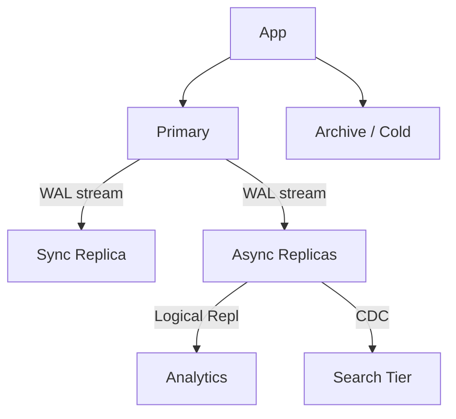
```mermaid
flowchart TD
    App --> Primary
    Primary -->|WAL stream| Sync[Sync Replica]
    Primary -->|WAL stream| Async[Async Replicas]
    Async -->|Logical Repl| Analytics
    Async -->|CDC| Search[Search Tier]
    App --> Archive[Archive / Cold]
```

---

### 📶 Gradual Depth

**Level 1 - What it is:**
Multi-database topology is the architectural blueprint that places different database instances in specialized roles - primary for writes, replicas for reads, and dedicated systems for analytics, search, and archival.

**Level 2 - How to use it:**
Start with a primary and one synchronous replica for HA failover. Add asynchronous replicas when read traffic exceeds what the primary can serve. Route reads to replicas at the application or proxy level. Introduce CDC (Debezium, pg_logical) to feed analytics or search tiers when those workloads emerge.

**Level 3 - How it works:**
The primary writes WAL records. Synchronous replicas acknowledge WAL receipt before the primary confirms the commit (zero data loss, higher commit latency). Asynchronous replicas apply WAL in the background (data loss window equals lag). Logical replication decodes WAL into row-level changes that feed heterogeneous subscribers. The router must know which queries tolerate lag and which must go to the primary.

**Level 4 - Production mastery:**
Monitor replication lag on every replica (`pg_stat_replication.replay_lag`). Set application-level lag tolerance: after a write, read from the primary for N seconds, then fall back to replicas. Use connection-level routing hints (e.g., `target_session_attrs=read-write` in libpq) to avoid accidental writes to replicas. Capacity plan each tier independently - the analytics tier may need 4x the storage but 0.1x the IOPS of the primary.

---

### ⚙️ How It Works

**Phase 1 - Write path:** Application connects to the primary (via router or direct). The primary executes the write, writes WAL, and returns confirmation.

**Phase 2 - Replication fan-out:** WAL streams to synchronous replica (blocking until ACK) and asynchronous replicas (non-blocking). Logical replication slots decode WAL for downstream consumers.

**Phase 3 - Read routing:** The connection router classifies incoming queries. Writes and read-after-write go to the primary. Stale-tolerant reads go to replicas. Analytical queries go to the analytics tier.

**Phase 4 - Tiered data lifecycle:** Partitioned tables on the primary drop or detach old partitions. Archived data moves to cold storage (S3 + Parquet) via scheduled jobs. The analytics tier may retain historical data longer than the primary.

```
  WRITE: App -> Router -> Primary
  READ:  App -> Router -> check lag
            |-> lag < threshold -> Replica
            |-> lag > threshold -> Primary
  OLAP:  App -> Router -> Analytics Tier
```

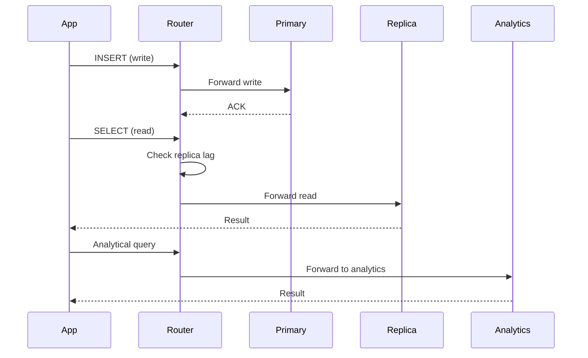
```mermaid
sequenceDiagram
    participant App
    participant Router
    participant Primary
    participant Replica
    participant OLAP as Analytics
    App->>Router: INSERT (write)
    Router->>Primary: Forward write
    Primary-->>Router: ACK
    App->>Router: SELECT (read)
    Router->>Router: Check replica lag
    Router->>Replica: Forward read
    Replica-->>App: Result
    App->>Router: Analytical query
    Router->>OLAP: Forward to analytics
    OLAP-->>App: Result
```

**BAD:**

```yaml
# All traffic to one instance
connection:
  host: primary.db.internal
  # Analytics queries compete with OLTP
  # Reporting locks block writes
```

**GOOD:**

```yaml
# Routed by workload class
connections:
  write: primary.db.internal
  read: replica.db.internal
  analytics: analytics.db.internal
  search: elasticsearch.internal
```

---

### 🚨 Failure Modes

**Failure 1 - Replica lag causes stale reads after writes:**
**Symptom:** User creates an order, immediately views their orders, and the new order is missing.
**Root cause:** The read was routed to a replica that has not yet applied the WAL record for the INSERT.
**Diagnostic:**

```sql
SELECT client_addr,
       replay_lag
FROM pg_stat_replication;
```

**Fix:** Implement read-your-writes consistency: after a write, pin subsequent reads to the primary for a configurable window (e.g., 5 seconds), then fall back to replicas.

**Failure 2 - Replication slot bloat halts primary:**
**Symptom:** Primary disk fills up; `pg_wal` directory grows unbounded; WAL segments are not recycled.
**Root cause:** A logical replication slot's consumer (CDC pipeline, analytics subscriber) is down, and the primary retains all WAL since the slot's last confirmed LSN.
**Diagnostic:**

```sql
SELECT slot_name, active,
       pg_wal_lsn_diff(
         pg_current_wal_lsn(),
         confirmed_flush_lsn
       ) AS lag_bytes
FROM pg_replication_slots;
```

**Fix:** Set `max_slot_wal_keep_size` to cap retained WAL. Monitor slot lag and alert when it exceeds a threshold. Drop orphaned slots.

---

### 🔬 Production Reality

A common incident pattern: a team adds a Debezium CDC connector to feed Elasticsearch from the primary via a logical replication slot. The Kafka consumer falls behind due to a schema change, and the slot retains WAL. Over 48 hours, `pg_wal` grows from 2 GB to 200 GB. The primary's disk fills, transactions begin failing, and the OLTP workload halts. The fix is dropping the slot - but that means the Elasticsearch index must be rebuilt from scratch. The lesson: every replication slot is a ticking bomb without lag monitoring and automatic slot eviction policies.

---

### ⚖️ Trade-offs & Alternatives

| Aspect                | Separate Instances  | Aurora Multi-AZ     | AlloyDB (Google)    |
| --------------------- | ------------------- | ------------------- | ------------------- |
| Replication lag       | Configurable        | Near-zero (storage) | Near-zero (storage) |
| Operational overhead  | High (self-managed) | Low (managed)       | Low (managed)       |
| Cost control          | Fine-grained        | Cloud pricing       | Cloud pricing       |
| Cross-tier routing    | Manual / proxy      | Endpoint-based      | Endpoint-based      |
| Analytics integration | CDC + warehouse     | Aurora ML / export  | AlloyDB AI          |
| Vendor lock-in        | None                | High (AWS)          | High (GCP)          |

---

### ⚡ Decision Snap

**USE WHEN:**

- OLTP and analytics workloads compete for resources on a single instance
- Read traffic exceeds primary capacity
- Compliance requires data tiering (hot/warm/cold)

**AVOID WHEN:**

- A single instance handles all workloads within resource limits
- The operational team cannot manage multi-instance replication

**PREFER managed multi-AZ (Aurora, AlloyDB) WHEN:**

- Storage-level replication is acceptable
- Minimizing operational overhead outweighs vendor lock-in risk

---

### ⚠️ Top Traps

| #   | Misconception                                 | Reality                                                                                                            |
| --- | --------------------------------------------- | ------------------------------------------------------------------------------------------------------------------ |
| 1   | Replicas are free scaling                     | Each replica consumes WAL bandwidth and adds monitoring overhead; diminishing returns beyond 5-7 replicas          |
| 2   | Replication lag is always small               | Network partitions, long-running queries on replicas, and VACUUM on replicas can spike lag to minutes              |
| 3   | Logical replication = physical replication    | Logical replication decodes WAL into row changes and skips DDL; it has different failure modes and higher overhead |
| 4   | Adding a search tier eliminates database load | CDC pipelines add replication slots to the primary, which retain WAL and consume I/O                               |
| 5   | All reads can go to replicas                  | Reads that follow writes must go to the primary unless the application implements lag-aware routing                |

---

### 🪜 Learning Ladder

**Prerequisites:**

- SQL-100 Logical Replication and Physical Replication - how data flows between topology nodes
- SQL-101 Read Replicas - Scaling Reads - the simplest topology expansion
- SQL-102 Connection Pooling - PgBouncer and HikariCP - connection management at each tier

**THIS:** SQL-114 Multi-Database Topology Design

**Next steps:**

- SQL-116 CQRS and Read/Write Separation Architecture - formalizing the read/write split as an architectural pattern
- SQL-119 Connection Routing and Proxy Architecture - the routing layer that directs traffic across the topology
- SQL-121 Observability for Database Fleets - monitoring the health of a multi-instance deployment

**The Surprising Truth:**
The hardest part of multi-database topology is not setting up replication - it is the routing logic that decides which instance handles each query, because getting that wrong silently serves stale data or accidentally sends writes to read-only replicas.

**Further Reading:**

- Kleppmann, M. "Designing Data-Intensive Applications", Chapter 5: Replication. O'Reilly, 2017
- PostgreSQL Documentation: "High Availability, Load Balancing, and Replication" (postgresql.org/docs/current/high-availability.html)
- Verbitski, A. et al. "Amazon Aurora: Design Considerations for High Throughput Cloud-Native Relational Databases", SIGMOD 2017

**Revision Card:**

1. Separate OLTP, analytics, search, and archive into dedicated tiers - each tuned for its workload class
2. Every replication boundary introduces a consistency window; route queries according to their staleness tolerance
3. Replication slots without lag monitoring are the most common cause of primary disk exhaustion

---

---

# SQL-115 Cross-Database Query Federation (FDW, Trino)

**TL;DR** - Query federation lets a single SQL query access data across multiple heterogeneous databases using foreign data wrappers (FDW) or federated query engines like Trino, without moving data first.

---

### 🔥 Problem Statement

Production systems accumulate data across multiple databases: transactional data in PostgreSQL, user events in ClickHouse, logs in Elasticsearch, files in S3. Business queries frequently need to join data across these boundaries - "show me all orders from customers whose support tickets are in Zendesk and whose clickstream is in BigQuery." Without federation, teams build ETL pipelines to copy data into a single warehouse, adding hours of latency, storage costs, and pipeline maintenance. Federation queries data in place. But federation introduces network round-trips, data type mismatches, and optimizer blind spots that make naive federated queries catastrophically slow.

---

### 📜 Historical Context

SQL/MED (Management of External Data) was added to the SQL:2003 standard, defining the concept of foreign data wrappers. PostgreSQL implemented FDW support in version 9.1 (2011), starting with `file_fdw` and rapidly expanding to `postgres_fdw`, `mysql_fdw`, and dozens of community wrappers. Facebook's Presto (2013, later forked as Trino in 2020) took a different approach: a distributed SQL engine that connects to multiple data sources as catalogs, pushing computation down where possible. Both approaches solve the same problem from different sides - database-native (FDW) vs. engine-native (Trino).

---

### 🔩 First Principles

**CORE INVARIANTS:**

1. Federated queries always pay a network transfer cost proportional to the data pulled from remote sources
2. The local optimizer cannot accurately estimate selectivity or cost for remote tables unless statistics are explicitly imported
3. Push-down capability (filtering, aggregation at the remote source) determines whether federation is practical or catastrophically slow

**DERIVED DESIGN:**
These invariants force the design toward maximum push-down: send filters and aggregations to the remote source, transfer only the minimal result. FDW achieves this through `use_remote_estimate` and push-down of WHERE, JOIN, and aggregate clauses. Trino achieves it through connector-level push-down predicates. Without push-down, federation devolves into "pull everything, filter locally" - the N+1 query problem at the database topology level.

**THE TRADE-OFF:**
**Gain:** Query data in place without ETL; single SQL interface across heterogeneous sources; real-time access to remote data.
**Cost:** Network latency per query; limited optimizer intelligence on remote tables; operational dependency on remote source availability.

---

### 🧠 Mental Model

> Think of a library consortium where your local library can request books from partner libraries. You search one catalog, and books arrive from whichever library holds them. Fast when you need one specific book (push-down - the remote library finds it). Catastrophically slow when you request "all books published before 1950" from every library (full scan, ship everything).

- "Local library catalog" -> local PostgreSQL with foreign tables
- "Partner library" -> remote database (MySQL, ClickHouse, S3)
- "Specific book request" -> pushed-down WHERE clause
- "Ship all books" -> no push-down, full remote scan

**Where this analogy breaks down:** Libraries ship physical books serially; federated queries can parallelize data transfer across multiple remote sources simultaneously (especially Trino).

---

### 🧩 Components

- **Foreign data wrapper (FDW)** - PostgreSQL extension that maps remote tables into the local catalog as "foreign tables"
- **Foreign server** - connection definition pointing to a remote data source
- **Foreign table** - local schema definition that proxies a remote table
- **User mapping** - credentials used to authenticate against the remote source
- **Federated query engine (Trino)** - standalone engine that connects to multiple catalogs and executes distributed SQL
- **Connector** - Trino plugin for each data source type (PostgreSQL, Hive, S3, Elasticsearch)

```
  PostgreSQL FDW Approach:
  +-------------------+
  | Local PostgreSQL  |
  |  local_table  <---+--- native
  |  foreign_table <--+--- postgres_fdw -> Remote PG
  |  s3_table     <---+--- parquet_s3_fdw -> S3
  +-------------------+

  Trino Approach:
  +--------+
  | Trino  |--- pg connector --> PostgreSQL
  | Engine |--- hive connector -> S3/Parquet
  |        |--- elastic conn --> Elasticsearch
  +--------+
```

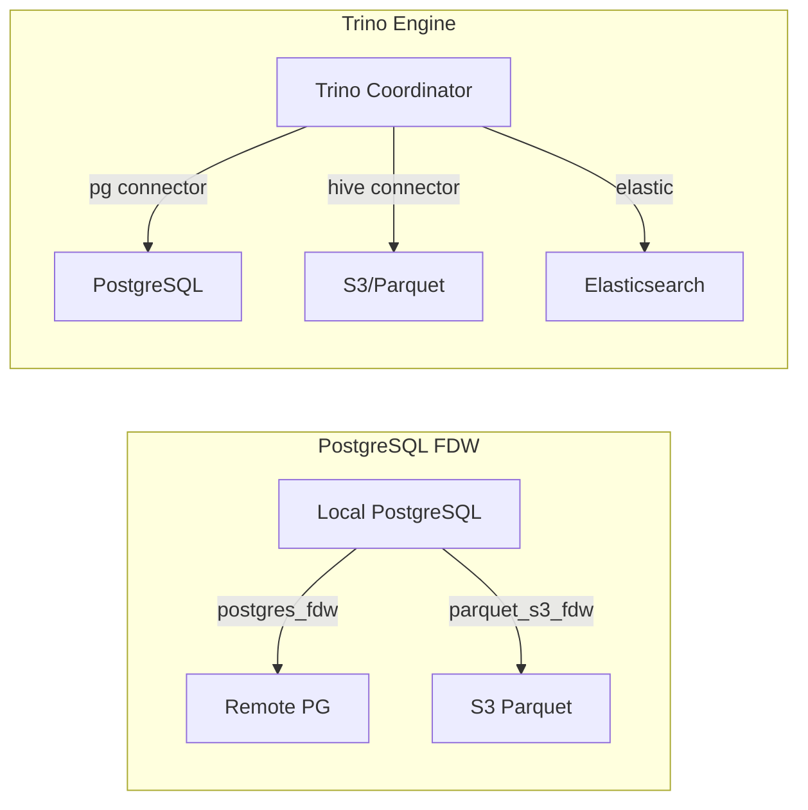
```mermaid
flowchart LR
    subgraph FDW["PostgreSQL FDW"]
        PG[Local PostgreSQL]
        PG -->|postgres_fdw| RPG[Remote PG]
        PG -->|parquet_s3_fdw| S3[S3 Parquet]
    end
    subgraph Trino["Trino Engine"]
        T[Trino Coordinator]
        T -->|pg connector| PG2[PostgreSQL]
        T -->|hive connector| S32[S3/Parquet]
        T -->|elastic| ES[Elasticsearch]
    end
```

---

### 📶 Gradual Depth

**Level 1 - What it is:**
Query federation lets you write a single SQL query that accesses tables in different databases - even different database engines - without copying data into one place first.

**Level 2 - How to use it:**
In PostgreSQL, create a foreign server and foreign table using `postgres_fdw`, then query the foreign table like a local table. In Trino, configure catalogs in `etc/catalog/` and write queries referencing `catalog.schema.table`. Start with simple SELECT queries before attempting cross-source JOINs.

**Level 3 - How it works:**
When PostgreSQL plans a query involving a foreign table, it calls the FDW's planning callbacks to determine what can be pushed down remotely. `postgres_fdw` can push down WHERE clauses, JOINs between tables on the same remote server, sorts, and aggregates. The remote server executes the pushed-down portion and returns only the needed rows. Trino's optimizer does similar push-down analysis per connector, then coordinates distributed execution across workers.

**Level 4 - Production mastery:**
Always set `use_remote_estimate = true` on foreign servers so the local planner uses remote ANALYZE statistics. Monitor federation query plans with `EXPLAIN (VERBOSE)` to verify push-down. Never join a large remote table with a large local table without a pushed-down filter - the planner will fetch the entire remote table. For large-scale analytics across 3+ sources, Trino typically outperforms FDW because it parallelizes execution and handles heterogeneous JOINs natively.

---

### ⚙️ How It Works

**Phase 1 - Schema mapping:** Define foreign servers and foreign tables that mirror remote schema structures in the local catalog.

**Phase 2 - Query planning:** The planner identifies foreign tables in the query. For each, it invokes the FDW to determine push-down eligibility (WHERE, JOIN, ORDER BY, LIMIT, aggregates).

**Phase 3 - Remote execution:** The FDW opens a connection to the remote server, sends the pushed-down SQL fragment, and reads the result set.

**Phase 4 - Local assembly:** Results from remote fragments are combined with local table data. JOINs, sorting, and aggregation that could not be pushed down execute locally.

```
  SELECT o.id, c.name
  FROM orders o          -- local table
  JOIN remote_customers c -- foreign table
    ON o.cust_id = c.id
  WHERE c.region = 'EU'

  Plan:
  1. Push WHERE region='EU' to remote
  2. Remote returns EU customers only
  3. Local hash join with orders
```

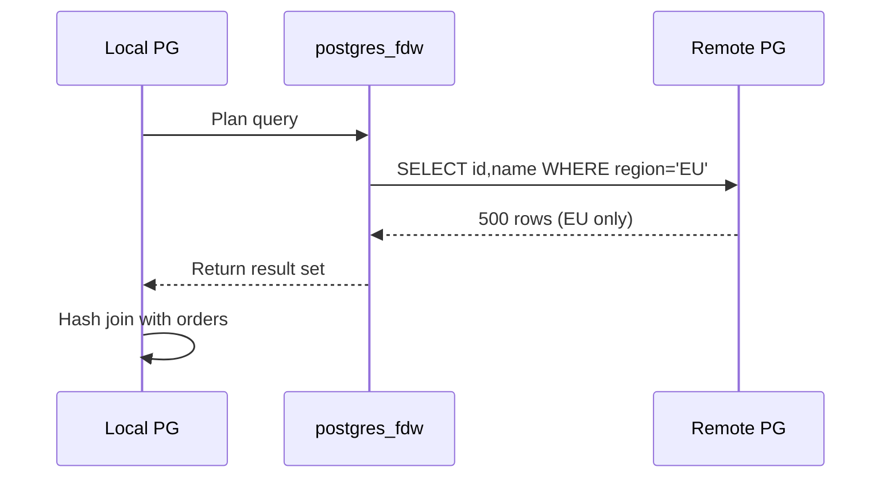
```mermaid
sequenceDiagram
    participant Local as Local PG
    participant FDW as postgres_fdw
    participant Remote as Remote PG
    Local->>FDW: Plan query
    FDW->>Remote: SELECT id,name WHERE region='EU'
    Remote-->>FDW: 500 rows (EU only)
    FDW-->>Local: Return result set
    Local->>Local: Hash join with orders
```

**BAD:**

```sql
-- No pushable filter on remote table
SELECT * FROM local_orders o
JOIN remote_customers c ON o.cust_id = c.id;
-- Fetches ALL remote customers (millions)
```

**GOOD:**

```sql
-- Filter pushed to remote source
SELECT o.id, c.name
FROM local_orders o
JOIN remote_customers c ON o.cust_id = c.id
WHERE c.region = 'EU' AND o.created > now()
  - interval '30 days';
```

---

### 🚨 Failure Modes

**Failure 1 - Full remote table scan due to missing push-down:**
**Symptom:** Federation query takes minutes instead of seconds; network bandwidth saturated; remote server under heavy load.
**Root cause:** The WHERE clause uses a function or type cast that the FDW cannot push down, so it fetches all rows and filters locally.
**Diagnostic:**

```sql
EXPLAIN (VERBOSE, COSTS)
SELECT * FROM foreign_table
WHERE lower(email) = 'user@example.com';
-- Check "Remote SQL" - if no WHERE, no push-down
```

**Fix:** Rewrite the query to use pushable expressions. Create a functional index on the remote side. Or use `fetch_size` to limit memory impact while accepting the slow scan.

**Failure 2 - Remote server unavailability halts local queries:**
**Symptom:** Queries referencing foreign tables hang or error with "could not connect to server"; local-only queries unaffected.
**Root cause:** The remote database is down or unreachable, and the FDW connection attempt blocks.
**Diagnostic:**

```sql
-- Check for stuck backends
SELECT pid, state, query, wait_event
FROM pg_stat_activity
WHERE query LIKE '%foreign_table%';
```

**Fix:** Set `connect_timeout` and `statement_timeout` on the foreign server definition. Design queries so foreign table access is optional (LEFT JOIN with COALESCE fallback) where possible.

---

### 🔬 Production Reality

A typical federation failure pattern: an analytics team creates a foreign table pointing to a 500-million-row production table on another PostgreSQL instance. They run a JOIN with a local dimension table. The FDW pushes down the WHERE clause but cannot push down the JOIN itself (different servers). It fetches 500 million rows over the network. The remote server's connection pool is saturated. The local instance's memory spikes. Both production and analytics workloads degrade. The fix: materialize the remote table's filtered subset locally (a nightly `INSERT INTO local_copy SELECT ... FROM foreign_table WHERE ...`), or move the analytical query to Trino where cross-source JOINs execute distributedly.

---

### ⚖️ Trade-offs & Alternatives

| Aspect               | PostgreSQL FDW      | Trino / Presto      | ETL to Warehouse    |
| -------------------- | ------------------- | ------------------- | ------------------- |
| Query latency        | Network-bound       | Parallel, faster    | Local (pre-copied)  |
| Data freshness       | Real-time           | Real-time           | Batch lag (hours)   |
| Setup complexity     | Low (extension)     | Medium (cluster)    | High (pipeline)     |
| Cross-source JOINs   | Limited (same srv)  | Native              | Native (local)      |
| Push-down quality    | Good (postgres_fdw) | Varies by connector | N/A (data is local) |
| Operational overhead | Low                 | Trino cluster       | ETL pipeline ops    |

---

### ⚡ Decision Snap

**USE WHEN:**

- Queries need fresh data from 2-3 heterogeneous sources
- Data volumes are small enough that network transfer is acceptable
- ETL pipeline latency is unacceptable for the use case

**AVOID WHEN:**

- Queries routinely scan millions of rows from remote sources
- Remote source availability is unreliable

**PREFER ETL to warehouse WHEN:**

- Analytics queries are repeatable and can tolerate batch latency
- Join patterns span 4+ heterogeneous sources

---

### ⚠️ Top Traps

| #   | Misconception                                     | Reality                                                                                                                 |
| --- | ------------------------------------------------- | ----------------------------------------------------------------------------------------------------------------------- |
| 1   | FDW makes remote tables "feel local"              | Performance is fundamentally different; every query pays network latency and may miss push-down                         |
| 2   | The local optimizer handles foreign tables well   | Without `use_remote_estimate`, the planner assumes default selectivity and produces terrible plans                      |
| 3   | Trino eliminates the need for a data warehouse    | Trino queries data in place, which is slower than querying pre-optimized warehouse tables for repetitive analytics      |
| 4   | Foreign table JOINs push down automatically       | JOINs only push down when both foreign tables are on the same remote server; cross-server JOINs execute locally         |
| 5   | Federation handles schema evolution automatically | When the remote schema changes, foreign table definitions become stale and queries break silently or return wrong types |

---

### 🪜 Learning Ladder

**Prerequisites:**

- SQL-094 Query Planner and Cost-Based Optimization - how the planner estimates costs, which federation disrupts
- SQL-100 Logical Replication and Physical Replication - the alternative: replicate data locally instead of federating
- SQL-113 Sharding Strategies - Application vs Proxy - routing queries to the right database

**THIS:** SQL-115 Cross-Database Query Federation (FDW, Trino)

**Next steps:**

- SQL-114 Multi-Database Topology Design - the broader architecture that federation operates within
- SQL-116 CQRS and Read/Write Separation Architecture - separating read paths that may include federated queries
- SQL-133 Column-Store vs Row-Store Engine Design - understanding why analytical sources use different storage

**The Surprising Truth:**
The most common federation performance disaster is not slow networks - it is the local optimizer making terrible decisions because it has no statistics for foreign tables, producing plans that are orders of magnitude worse than the same query executed directly on the remote source.

**Further Reading:**

- ISO/IEC 9075-9: SQL/MED (Management of External Data), SQL:2003 Standard
- PostgreSQL Documentation: "postgres_fdw" (postgresql.org/docs/current/postgres-fdw.html)
- Sethi, R. et al. "Presto: SQL on Everything", ICDE 2019

**Revision Card:**

1. Federation queries data in place without ETL, but pays network transfer cost proportional to un-pushed data
2. Push-down is the critical performance lever - verify with EXPLAIN VERBOSE that filters reach the remote source
3. Without remote statistics (`use_remote_estimate`), the local planner is effectively blind on foreign tables

---

---

# SQL-116 CQRS and Read/Write Separation Architecture

**TL;DR** - CQRS separates the write model (commands) from the read model (queries) into distinct data paths, enabling each to be optimized, scaled, and evolved independently.

---

### 🔥 Problem Statement

Traditional CRUD architectures use a single data model for both reads and writes. This works until reads and writes have fundamentally different shapes. Writes are normalized, transactional, and consistency-critical. Reads are often denormalized, join-heavy, and latency-sensitive. A product page needs data from orders, inventory, reviews, and recommendations - a 5-table JOIN that cripples write throughput when indexed to support it. At scale, the read-to-write ratio is often 100:1 or higher, yet a single schema forces both paths through the same tables, indexes, and connection pools. CQRS lets you build a write model optimized for data integrity and a read model optimized for query speed.

---

### 📜 Historical Context

The term CQRS (Command Query Responsibility Segregation) was coined by Greg Young around 2010, building on Bertrand Meyer's Command-Query Separation (CQS) principle from the 1980s. CQS is a method-level concern: a method either changes state or returns data, never both. CQRS elevates this to an architectural concern: the system that processes commands is separate from the system that answers queries. The pattern gained traction alongside event sourcing and domain-driven design communities. Martin Fowler documented its trade-offs in a widely-cited 2011 article cautioning against applying CQRS universally.

---

### 🔩 First Principles

**CORE INVARIANTS:**

1. Commands (writes) and queries (reads) have different consistency, latency, and throughput requirements that a single model cannot simultaneously optimize
2. Separating the write model from the read model introduces eventual consistency between them - the read model lags behind the write model
3. The synchronization mechanism between write and read models (events, CDC, replication) becomes a critical reliability concern

**DERIVED DESIGN:**
Commands flow through a write-optimized model (normalized, transactionally consistent). Changes are published as events or captured via CDC. The read model consumes these events and maintains denormalized, pre-joined projections optimized for each query pattern. Multiple read models can coexist - one for API responses, another for search, another for analytics - each shaped to its consumer.

**THE TRADE-OFF:**
**Gain:** Independent scaling and optimization of reads and writes; read models tailored to specific query patterns; write model free from read-driven index bloat.
**Cost:** Eventual consistency complexity; event synchronization pipeline to build and maintain; increased system surface area.

---

### 🧠 Mental Model

> Think of a restaurant kitchen (write side) and menu board (read side). The kitchen takes orders (commands) and updates ingredient inventory. The menu board (read model) is a pre-composed view of what is available, updated whenever the kitchen finishes a dish or runs out of an ingredient. Customers never walk into the kitchen to check stock - they read the board.

- "Kitchen" -> write model (normalized, transactional)
- "Menu board" -> read model (denormalized projection)
- "Updating the board" -> event/CDC pipeline
- "Board is slightly behind" -> eventual consistency

**Where this analogy breaks down:** Unlike a menu board that updates instantly when the kitchen calls out, real CQRS read models can lag by seconds to minutes, and consumers must handle the possibility that their read is stale.

---

### 🧩 Components

- **Command handler** - validates and executes write operations against the write model
- **Write store** - normalized database optimized for transactional integrity (PostgreSQL, typically)
- **Event publisher** - emits domain events or change notifications after each write (outbox pattern, CDC, or direct publish)
- **Event bus** - transport layer (Kafka, RabbitMQ, or logical replication) delivering events to consumers
- **Projection builder** - consumes events and maintains the read model (materialized views, denormalized tables, search indexes)
- **Read store** - denormalized database or cache optimized for query speed (PostgreSQL read replica, Redis, Elasticsearch)
- **Query handler** - serves read requests from the read store

```
  Command Flow:
  App -> Command Handler -> Write DB
              |
         Event Published
              |
              v
         Event Bus (Kafka / CDC)
              |
              v
  Projection Builder -> Read DB

  Query Flow:
  App -> Query Handler -> Read DB
```

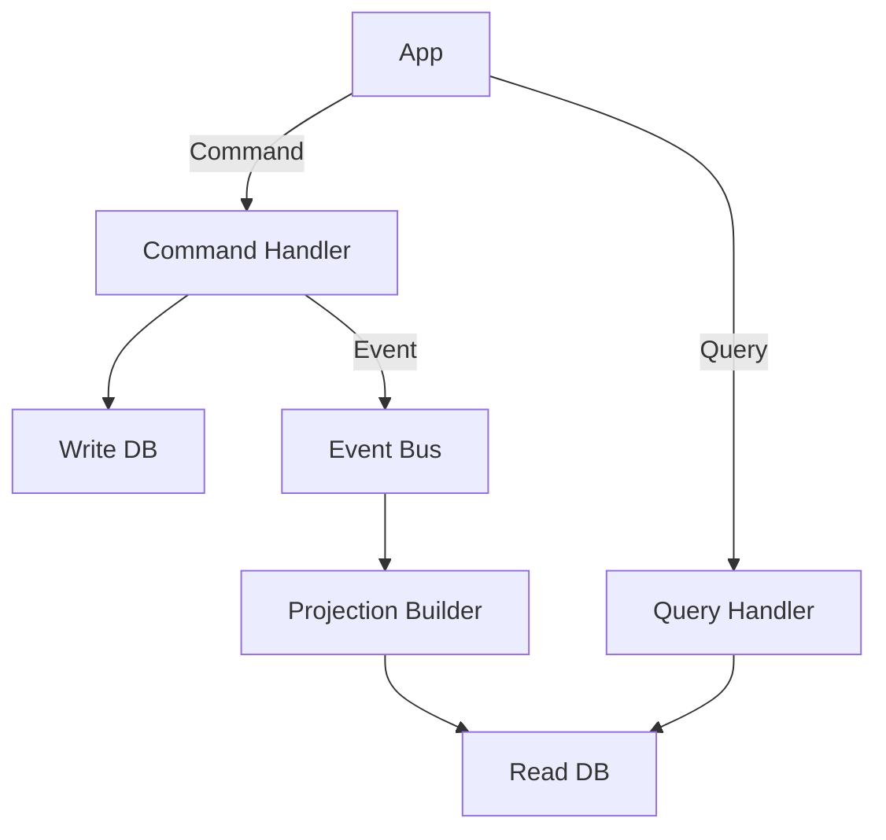
```mermaid
flowchart TD
    App -->|Command| CH[Command Handler]
    CH --> WDB[Write DB]
    CH -->|Event| EB[Event Bus]
    EB --> PB[Projection Builder]
    PB --> RDB[Read DB]
    App -->|Query| QH[Query Handler]
    QH --> RDB
```

---

### 📶 Gradual Depth

**Level 1 - What it is:**
CQRS is an architecture where writes go through one path (command side) and reads go through a separate path (query side), each with its own data model optimized for its purpose.

**Level 2 - How to use it:**
On the write side, use a normalized PostgreSQL schema with strict constraints. After each write, publish an event (via transactional outbox or CDC). On the read side, consume events to build denormalized projections - pre-joined tables, materialized views, or Elasticsearch indexes. Serve all read API endpoints from the read store.

**Level 3 - How it works:**
The write side processes commands transactionally and emits events. The event bus (Kafka, Debezium CDC) delivers events to projection builders. Each projection builder maintains a specific read model - for example, an "order summary" view that pre-joins orders, customers, and products into a single table. The read store answers queries with simple lookups instead of complex JOINs. Consistency between write and read stores is eventual, bounded by event pipeline throughput and consumer lag.

**Level 4 - Production mastery:**
The critical production concern is projection rebuild. When the read model schema changes, you must replay all historical events to rebuild the projection from scratch. This requires events to be retained (Kafka retention or event store). Monitor consumer lag as the primary health metric. Use idempotent event handlers to tolerate at-least-once delivery. The transactional outbox pattern (write event to a DB table in the same transaction as the command, then relay asynchronously) prevents the dual-write problem where a command succeeds but event publishing fails.

---

### ⚙️ How It Works

**Phase 1 - Command processing:** The application sends a command (e.g., "place order"). The command handler validates business rules, writes to the normalized write store, and atomically inserts an event record into the outbox table.

**Phase 2 - Event relay:** A CDC connector (Debezium) or polling process reads the outbox table and publishes events to Kafka.

**Phase 3 - Projection update:** A consumer reads events from Kafka and updates the read store (e.g., inserts a denormalized `order_summary` row with customer name, product details, and totals pre-computed).

**Phase 4 - Query serving:** Read API endpoints query the read store with simple `SELECT` statements - no JOINs, no aggregations at query time.

```
  1. INSERT INTO orders (...) VALUES (...)
  2. INSERT INTO outbox (event_type, payload)
       VALUES ('OrderPlaced', '{...}')
     -- same transaction
  3. CDC reads outbox -> publishes to Kafka
  4. Consumer reads Kafka -> writes to
     order_summary (denormalized)
  5. GET /orders/123 -> SELECT * FROM
     order_summary WHERE id = 123
```

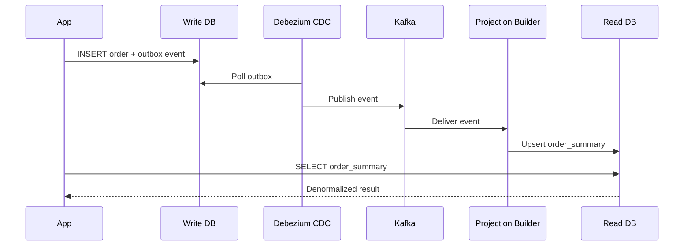
```mermaid
sequenceDiagram
    participant App
    participant WritePG as Write DB
    participant CDC as Debezium CDC
    participant Kafka
    participant Proj as Projection Builder
    participant ReadDB as Read DB
    App->>WritePG: INSERT order + outbox event
    CDC->>WritePG: Poll outbox
    CDC->>Kafka: Publish event
    Kafka->>Proj: Deliver event
    Proj->>ReadDB: Upsert order_summary
    App->>ReadDB: SELECT order_summary
    ReadDB-->>App: Denormalized result
```

**BAD:**

```sql
-- Single model: read query with 5 JOINs
SELECT o.id, c.name, p.title, r.avg_rating
FROM orders o
JOIN customers c ON o.cust_id = c.id
JOIN order_items i ON o.id = i.order_id
JOIN products p ON i.product_id = p.id
JOIN reviews r ON p.id = r.product_id
WHERE o.id = 123;
```

**GOOD:**

```sql
-- CQRS read model: pre-joined projection
SELECT id, customer_name, product_title,
       avg_rating, total_amount
FROM order_summary
WHERE id = 123;
-- Single table, no JOINs, sub-ms response
```

---

### 🚨 Failure Modes

**Failure 1 - Event consumer falls behind (lag):**
**Symptom:** Read model shows data minutes or hours behind write model; users report missing recent entries.
**Root cause:** Consumer throughput is lower than event production rate - typically due to slow projection writes or unpartitioned Kafka topics.
**Diagnostic:**

```bash
# Kafka consumer group lag
kafka-consumer-groups.sh \
  --bootstrap-server kafka:9092 \
  --describe --group order-projector
```

**Fix:** Increase consumer parallelism (partition count). Batch projection writes. Use upsert (ON CONFLICT DO UPDATE) instead of read-then-write.

**Failure 2 - Dual-write inconsistency (lost events):**
**Symptom:** Some writes appear in the write store but never reach the read model; read model is permanently missing records.
**Root cause:** The application wrote to the database and then published to Kafka in two separate operations; the Kafka publish failed but the DB write committed.
**Diagnostic:**

```sql
-- Find orders missing from read model
SELECT o.id FROM orders o
LEFT JOIN order_summary s ON o.id = s.id
WHERE s.id IS NULL
  AND o.created_at < now() - interval '1 hour';
```

**Fix:** Use the transactional outbox pattern: write the event to an outbox table in the same database transaction as the command. A CDC connector or poller relays events to Kafka.

---

### 🔬 Production Reality

A common CQRS incident: a team evolves the order schema, adding a `discount_amount` column. The event schema must also change, and the projection builder must be updated. But historical events in Kafka do not have `discount_amount`. Rebuilding the projection from the beginning produces rows with NULL discounts for old orders, breaking downstream reports. The fix requires a backfill job that reads old orders from the write store and synthesizes enriched events. The lesson: event schema evolution is the hidden tax of CQRS - plan for schema versioning (Avro with schema registry, or explicit version fields in events) from day one.

---

### ⚖️ Trade-offs & Alternatives

| Aspect             | Single Model (CRUD) | CQRS                      | CQRS + Event Sourcing |
| ------------------ | ------------------- | ------------------------- | --------------------- |
| Complexity         | Low                 | Medium                    | High                  |
| Read performance   | JOIN-dependent      | Pre-computed, fast        | Pre-computed, fast    |
| Consistency        | Strong              | Eventual                  | Eventual              |
| Schema evolution   | Simple ALTER TABLE  | Event schema + projection | Event versioning      |
| Audit trail        | Manual logging      | Events optional           | Events ARE the record |
| Rebuild capability | N/A                 | Replay events             | Replay from event log |

---

### ⚡ Decision Snap

**USE WHEN:**

- Read and write patterns are fundamentally different in shape and scale
- Read-to-write ratio exceeds 10:1 and read latency is critical
- Multiple read representations are needed (API, search, analytics)

**AVOID WHEN:**

- Read and write patterns use the same data shape (simple CRUD)
- Eventual consistency is unacceptable for the domain

**PREFER simple read replicas WHEN:**

- Reads are the same JOINs as writes, just need more throughput
- The team does not have event infrastructure (Kafka, CDC)

---

### ⚠️ Top Traps

| #   | Misconception                             | Reality                                                                                                                                |
| --- | ----------------------------------------- | -------------------------------------------------------------------------------------------------------------------------------------- |
| 1   | CQRS requires event sourcing              | CQRS is independent of event sourcing; you can use CDC from a normal relational write store                                            |
| 2   | Eventual consistency is always acceptable | Users expect to see their own writes immediately; read-your-writes consistency requires routing recent reads to the write store        |
| 3   | The projection is always in sync          | Consumer lag, failures, and retries mean the read model can be minutes behind; monitor lag as a primary SLI                            |
| 4   | One read model is enough                  | Different consumers need different projections; forcing one denormalized model to serve all queries recreates the single-model problem |
| 5   | Schema changes are simpler with CQRS      | Schema changes propagate through event schema, projection builder, and read store - three places instead of one                        |

---

### 🪜 Learning Ladder

**Prerequisites:**

- SQL-100 Logical Replication and Physical Replication - replication feeds the read side
- SQL-101 Read Replicas - Scaling Reads - the simpler alternative to CQRS for read scaling
- SQL-104 Zero-Downtime Schema Migrations - schema changes become harder with CQRS

**THIS:** SQL-116 CQRS and Read/Write Separation Architecture

**Next steps:**

- SQL-114 Multi-Database Topology Design - the broader topology CQRS operates within
- SQL-119 Connection Routing and Proxy Architecture - routing reads and writes to different stores
- SQL-121 Observability for Database Fleets - monitoring the health of separated read/write paths

**The Surprising Truth:**
Most systems that adopt CQRS do not need it. A well-indexed PostgreSQL instance with read replicas handles the vast majority of read/write separation needs. CQRS earns its complexity only when the read and write data models are genuinely different shapes - not just different scales.

**Further Reading:**

- Young, G. "CQRS Documents", 2010 (cqrs.files.wordpress.com/2010/11/cqrs_documents.pdf)
- Fowler, M. "CQRS", martinfowler.com/bliki/CQRS.html, 2011
- Kleppmann, M. "Designing Data-Intensive Applications", Chapter 11: Stream Processing. O'Reilly, 2017

**Revision Card:**

1. CQRS separates write model (normalized, transactional) from read model (denormalized, fast) - each optimized independently
2. The synchronization pipeline (events/CDC) is the critical reliability concern; use transactional outbox to avoid dual-write failures
3. Eventual consistency is the fundamental cost - design for read-your-writes where users expect to see their own changes immediately

---

---

# SQL-117 Database Version Migration Strategy at Scale

**TL;DR** - Database migration at scale requires versioned, idempotent schema changes applied through automated pipelines with rollback strategies, because manual DDL on large tables causes outages.

---

### 🔥 Problem Statement

A startup runs `ALTER TABLE ADD COLUMN` in a psql session. It takes milliseconds. The same command on a 500-million-row production table acquires an ACCESS EXCLUSIVE lock, blocking all reads and writes for minutes to hours. Every team that scales past a few million rows discovers this the hard way. Database migrations at scale require careful orchestration: versioned migration files, lock-safe DDL patterns, expand-and-contract deployment, and automated rollback. Without a strategy, schema changes become the most dangerous deployment step - the one that causes outages when everything else succeeds.

---

### 📜 Historical Context

Early web applications applied schema changes manually via SQL scripts. Rails ActiveRecord introduced timestamped migration files in 2005, establishing the pattern of ordered, versioned schema changes. Flyway (2010) and Liquibase (2006) brought the pattern to the JVM ecosystem. The "expand and contract" pattern emerged from continuous delivery practices at companies like Facebook and GitHub, where zero-downtime deployments require schema changes to be backward-compatible at every step. PostgreSQL-specific tools like `pg_repack` and `pgroll` address the lock problem directly.

---

### 🔩 First Principles

**CORE INVARIANTS:**

1. Schema changes must be versioned, ordered, and idempotent - re-running a migration on an already-migrated database must be safe
2. Any DDL that acquires an ACCESS EXCLUSIVE lock on a large table will block all concurrent queries for the duration of the operation
3. Backward-compatible schema changes (expand-and-contract) are the only safe pattern for zero-downtime deployments

**DERIVED DESIGN:**
These invariants force a pipeline where each migration file has a unique version number, is applied in order, and recorded in a tracking table. Lock-dangerous operations (adding columns with defaults before PG 11, rewriting tables) must use safe alternatives: `CREATE INDEX CONCURRENTLY`, `ALTER TABLE ... ADD COLUMN` without volatile defaults, background table rewrites via `pg_repack`. The expand-and-contract pattern splits every breaking change into three deployments: add new (expand), migrate code, remove old (contract).

**THE TRADE-OFF:**
**Gain:** Zero-downtime schema evolution; safe rollback; auditable change history.
**Cost:** Slower change velocity (3-step deployment); migration pipeline maintenance; operational complexity for large-table DDL.

---

### 🧠 Mental Model

> Think of renovating a busy highway while traffic flows. You cannot close all lanes at once (ACCESS EXCLUSIVE lock). Instead, you build a new lane alongside the old one (expand), gradually redirect traffic (code migration), then close the old lane (contract). Each construction phase has a sign-off checkpoint (migration version).

- "Closing all lanes" -> locking the table for ALTER TABLE
- "Building alongside" -> adding new column, backfilling in batches
- "Redirecting traffic" -> deploying code that uses new column
- "Closing old lane" -> dropping the old column

**Where this analogy breaks down:** Highway lanes are physical; database columns can coexist invisibly for much longer, and the "redirect traffic" step is a code deployment, not a physical switch.

---

### 🧩 Components

- **Migration file** - versioned SQL or code file containing a single schema change (V001\_\_add_email_column.sql)
- **Migration runner** - tool (Flyway, Liquibase, Alembic, Rails migrations) that applies pending files in order
- **Schema history table** - tracks which versions have been applied (flyway_schema_history)
- **Lock-safe DDL** - patterns that avoid ACCESS EXCLUSIVE locks (CONCURRENTLY, batched backfills)
- **Expand-and-contract** - 3-phase deployment: add new structure, dual-write/read, remove old structure
- **Rollback strategy** - reverse migration file or compensating operation

```
  Migration Pipeline:
  +--------+    +---------+    +----------+
  | V001   | -> | V002    | -> | V003     |
  | add col|    | backfill|    | drop old |
  +--------+    +---------+    +----------+
       |             |              |
       v             v              v
  [schema_history: V001, V002, V003]
```

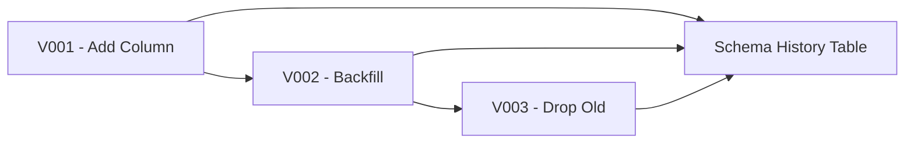
```mermaid
flowchart LR
    V1[V001 - Add Column] --> V2[V002 - Backfill]
    V2 --> V3[V003 - Drop Old]
    V1 --> SH[Schema History Table]
    V2 --> SH
    V3 --> SH
```

---

### 📶 Gradual Depth

**Level 1 - What it is:**
Database migration is a versioned, ordered process for changing the database schema (tables, columns, indexes) in a controlled and repeatable way, tracked in a history table.

**Level 2 - How to use it:**
Write each schema change as a numbered SQL file. Use Flyway or Liquibase to apply pending migrations automatically at deployment time. Never run DDL manually in production. Always test migrations against a copy of production data size.

**Level 3 - How it works:**
The migration runner reads the schema history table to find the last applied version. It scans the migration directory for files with higher version numbers. Each file is applied in a transaction (for DDL-transactional databases like PostgreSQL). The version and checksum are recorded in the history table. If a migration fails, the transaction rolls back and no version is recorded.

**Level 4 - Production mastery:**
On tables with hundreds of millions of rows, `CREATE INDEX CONCURRENTLY` avoids locking but takes longer and cannot run inside a transaction. Adding a column with a default (PostgreSQL 11+) is metadata-only and instant, but adding a NOT NULL constraint with a CHECK requires a full table scan. Backfills should run in batches (1,000-10,000 rows per transaction) with `pg_sleep` between batches to avoid overwhelming replication. Monitor lock wait times during migrations with `pg_stat_activity` and `pg_locks`. Always have a rollback migration ready.

---

### ⚙️ How It Works

**Phase 1 - Expand:** Add new column (nullable, no default) or new table. Deploy application code that writes to both old and new structures.

**Phase 2 - Backfill:** Batch-update existing rows to populate the new column from old data. Run during low-traffic periods.

**Phase 3 - Cutover:** Deploy code that reads from the new structure. Stop writing to the old structure.

**Phase 4 - Contract:** Drop the old column or table. Remove dual-write code.

```
  Expand:  ALTER TABLE orders
             ADD COLUMN email TEXT;
  Backfill: UPDATE orders SET email = c.email
             FROM customers c
             WHERE orders.cust_id = c.id
             AND orders.id BETWEEN $1 AND $2;
             -- batched, 10k rows per TX
  Cutover: Deploy code using orders.email
  Contract: ALTER TABLE orders
              DROP COLUMN old_email_ref;
```

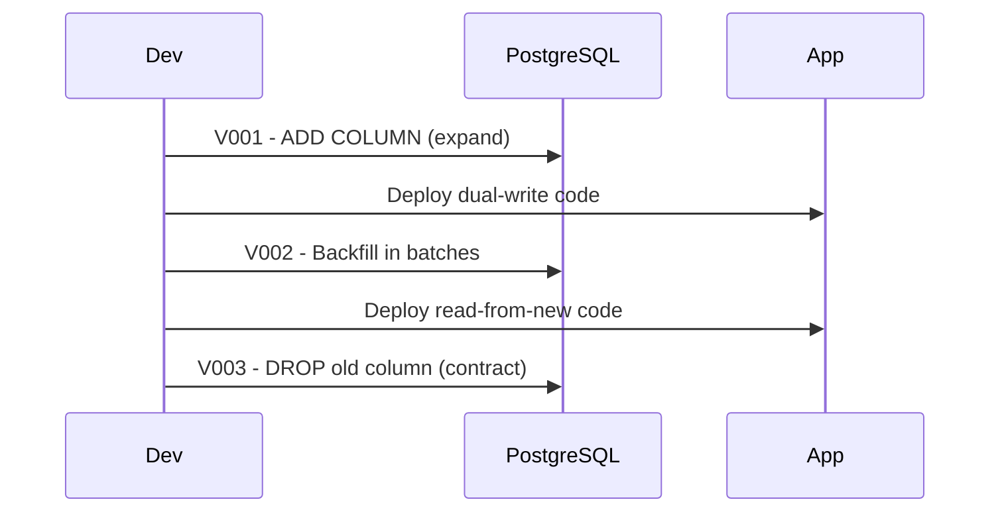
```mermaid
sequenceDiagram
    participant Dev
    participant DB as PostgreSQL
    participant App
    Dev->>DB: V001 - ADD COLUMN (expand)
    Dev->>App: Deploy dual-write code
    Dev->>DB: V002 - Backfill in batches
    Dev->>App: Deploy read-from-new code
    Dev->>DB: V003 - DROP old column (contract)
```

**BAD:**

```sql
-- Lock-dangerous: rewrites entire table
ALTER TABLE orders
  ADD COLUMN email TEXT DEFAULT 'none'
  NOT NULL;
-- Pre-PG11: full table rewrite + lock
```

**GOOD:**

```sql
-- Safe: metadata-only in PG 11+
ALTER TABLE orders ADD COLUMN email TEXT;
-- Backfill in batches
UPDATE orders SET email = (
  SELECT c.email FROM customers c
  WHERE c.id = orders.cust_id)
WHERE id BETWEEN 1 AND 10000;
-- Then add constraint
ALTER TABLE orders
  ALTER COLUMN email SET NOT NULL;
```

---

### 🚨 Failure Modes

**Failure 1 - Migration locks table during peak traffic:**
**Symptom:** All queries to the table queue behind a lock; application connection pool exhausts; cascading timeouts across services.
**Root cause:** `ALTER TABLE` acquired ACCESS EXCLUSIVE lock; concurrent queries wait indefinitely.
**Diagnostic:**

```sql
SELECT blocked.pid, blocked.query,
       blocking.pid AS blocker_pid,
       blocking.query AS blocker_query
FROM pg_stat_activity blocked
JOIN pg_locks bl ON bl.pid = blocked.pid
JOIN pg_locks lk
  ON lk.locktype = bl.locktype
  AND lk.relation = bl.relation
  AND lk.pid != bl.pid
JOIN pg_stat_activity blocking
  ON blocking.pid = lk.pid
WHERE NOT bl.granted;
```

**Fix:** Set `lock_timeout` before DDL (`SET lock_timeout = '3s'`). If the lock is not acquired within the timeout, abort and retry during low traffic. Use `CREATE INDEX CONCURRENTLY` for index creation.

**Failure 2 - Partial backfill leaves inconsistent data:**
**Symptom:** Some rows have the new column populated; others are NULL. Application reads produce mixed results.
**Root cause:** Backfill batch job failed midway; no tracking of progress; re-running starts from the beginning.
**Diagnostic:**

```sql
SELECT count(*) FILTER (WHERE email IS NULL)
       AS unfilled,
       count(*) FILTER (WHERE email IS NOT NULL)
       AS filled
FROM orders;
```

**Fix:** Track backfill progress by recording the last processed ID. Use batched updates with explicit ID ranges. Ensure idempotency so re-running is safe.

---

### 🔬 Production Reality

A typical incident: a team runs `CREATE INDEX` (not CONCURRENTLY) on a 200-million-row table during business hours. The command acquires a SHARE lock, blocking all INSERTs and UPDATEs for 45 minutes. The application's connection pool fills, healthchecks fail, and the load balancer removes all application instances. The index creation eventually completes, but by then the queue of blocked writes has grown so large that replaying them takes another 20 minutes. The total outage is over an hour. The fix was a one-word change: `CREATE INDEX CONCURRENTLY`. The lesson: every DDL statement's locking behavior must be verified against the PostgreSQL lock documentation before running on any table larger than a few million rows.

---

### ⚖️ Trade-offs & Alternatives

| Aspect            | Flyway (versioned SQL) | Liquibase (XML/YAML) | Rails Migrations   |
| ----------------- | ---------------------- | -------------------- | ------------------ |
| Language          | Raw SQL                | Abstracted DSL       | Ruby DSL           |
| Rollback support  | Manual reverse file    | Auto-rollback tags   | Reversible blocks  |
| Lock-safe DDL     | Manual patterns        | Manual patterns      | strong_migrations  |
| Multi-DB support  | Good                   | Excellent            | Rails-only         |
| CI/CD integration | Native                 | Native               | Rails deploy hooks |
| Learning curve    | Low (just SQL)         | Medium               | Medium             |

---

### ⚡ Decision Snap

**USE WHEN:**

- Schema changes must be applied repeatably across dev, staging, and production
- Tables exceed a few million rows and DDL locking is a concern
- Zero-downtime deployments are required

**AVOID WHEN:**

- Prototyping or early-stage where schema is changing rapidly and data is disposable
- Embedded databases without concurrent access

**PREFER expand-and-contract WHEN:**

- Multiple application versions run simultaneously (rolling deploys)
- Breaking schema changes cannot be applied atomically

---

### ⚠️ Top Traps

| #   | Misconception                                        | Reality                                                                                                                                  |
| --- | ---------------------------------------------------- | ---------------------------------------------------------------------------------------------------------------------------------------- |
| 1   | ALTER TABLE is always fast in PostgreSQL             | Adding columns with volatile defaults, adding constraints, or changing types can rewrite the entire table and lock it                    |
| 2   | Migrations run in transactions so they are safe      | DDL that cannot run inside transactions (CREATE INDEX CONCURRENTLY) requires special handling outside the migration runner's transaction |
| 3   | Rollback means reverting to the previous schema      | Rollback must also handle data; if a backfill populated new columns, the reverse migration must decide what happens to that data         |
| 4   | Testing on an empty database validates the migration | Lock behavior and execution time depend on table size; always test against production-sized data                                         |
| 5   | One migration per deployment is fine                 | Large migrations should be split into small, independently deployable steps to reduce blast radius                                       |

---

### 🪜 Learning Ladder

**Prerequisites:**

- SQL-104 Zero-Downtime Schema Migrations - the specific DDL patterns that avoid locks
- SQL-090 Row-Level vs Table-Level Locking - understanding what locks DDL acquires
- SQL-103 Backup and Point-in-Time Recovery (PITR) - safety net before running migrations

**THIS:** SQL-117 Database Version Migration Strategy at Scale

**Next steps:**

- SQL-118 PostgreSQL to Cloud-Managed Migration - migrating the entire database, not just schema
- SQL-113 Sharding Strategies - Application vs Proxy - migrations become harder across shards
- SQL-122 Database Capacity Planning and Growth Modeling - predicting when migrations will become slow

**The Surprising Truth:**
The most dangerous database migrations are not the complex ones - they are the simple `ALTER TABLE ADD COLUMN` or `CREATE INDEX` statements that take milliseconds on development databases but acquire table-wide locks that cascade into full outages on production tables with hundreds of millions of rows.

**Further Reading:**

- PostgreSQL Documentation: "ALTER TABLE" lock levels (postgresql.org/docs/current/sql-altertable.html)
- Percona Blog: "pt-online-schema-change" and online DDL patterns
- Skeema.io: "Tengo" (skeema.io) schema diff and migration tool

**Revision Card:**

1. Every schema change must be versioned, ordered, idempotent, and tracked in a history table
2. ACCESS EXCLUSIVE locks are the primary risk; use CONCURRENTLY indexes, batch backfills, and lock_timeout
3. Expand-and-contract is the only safe pattern for breaking changes under zero-downtime constraints

---

---

# SQL-118 PostgreSQL to Cloud-Managed Migration

**TL;DR** - Migrating from self-managed PostgreSQL to a cloud-managed service (RDS, Cloud SQL, AlloyDB) requires logical replication for cutover, extension audit, connection string rotation, and operational trade-off acceptance.

---

### 🔥 Problem Statement

Self-managed PostgreSQL gives you full control: you choose the version, configure kernel parameters, install any extension, and access the filesystem directly. But that control comes with operational cost - patching, HA failover, backup verification, monitoring, and capacity planning are all your responsibility. Cloud-managed services (AWS RDS, Google Cloud SQL, Azure Flexible Server, AlloyDB) handle these concerns but impose constraints: restricted superuser access, limited extension support, no filesystem access, opaque parameter tuning. The migration itself is the hardest part - moving a multi-terabyte production database with minimal downtime requires careful planning around replication, schema compatibility, extension audit, and connection cutover.

---

### 📜 Historical Context

Cloud-managed PostgreSQL began with AWS RDS PostgreSQL support in 2013. Google Cloud SQL for PostgreSQL followed in 2017. Azure Database for PostgreSQL in 2018. Amazon Aurora PostgreSQL (2017) introduced a storage-compute separated architecture. Google AlloyDB (2022) brought a similar separation with claimed analytical performance improvements. Each generation has expanded extension support and reduced the gap with self-managed PostgreSQL, but restrictions remain. The Database Migration Service (DMS) pattern - using logical replication for online migration with minimal downtime - has become the standard approach across all cloud providers.

---

### 🔩 First Principles

**CORE INVARIANTS:**

1. Cloud-managed services restrict superuser access, filesystem access, and extension installation - you must audit compatibility before migrating
2. Minimal-downtime migration requires logical replication (or equivalent) to keep source and target synchronized until cutover
3. Connection string rotation and DNS-based cutover determine the actual downtime window

**DERIVED DESIGN:**
These invariants force a phased approach: audit extensions and configuration, set up logical replication from source to target, run the target in shadow mode to validate performance, then perform a cutover during a maintenance window by switching DNS or connection strings. The downtime is bounded by replication catch-up time (the lag when source writes stop and target finishes applying pending changes).

**THE TRADE-OFF:**
**Gain:** Managed patching, automated backups, built-in HA, reduced operational toil.
**Cost:** Restricted superuser and extension access; vendor lock-in; potential performance differences from opaque tuning; cloud pricing model.

---

### 🧠 Mental Model

> Think of moving from a house you own to a managed apartment. You get maintenance, security, and repairs included, but you cannot knock down walls, install custom wiring, or access the boiler room. The move itself requires running two households in parallel until moving day.

- "Custom wiring" -> custom extensions, kernel tuning
- "Maintenance included" -> managed patching, backups, HA
- "Two households in parallel" -> logical replication during migration
- "Moving day" -> DNS cutover

**Where this analogy breaks down:** Unlike a physical move, database migration can run in parallel for weeks, and you can "move back" (reverse replication) if the new environment has problems - a luxury physical moves do not offer.

---

### 🧩 Components

- **Source audit** - inventory of extensions, custom configurations, superuser-dependent features, and data types used
- **Logical replication setup** - `pglogical` or native logical replication streaming changes from source to target
- **Cloud DMS** - provider-specific migration service (AWS DMS, Google DMS) that automates replication setup
- **Extension compatibility matrix** - mapping of source extensions to cloud-supported equivalents
- **Shadow validation** - running production-like queries against the target to verify plans and performance
- **DNS-based cutover** - switching the connection endpoint from source to target with minimal TTL
- **Reverse replication** - optional logical replication from target back to source as a rollback mechanism

```
  Migration Timeline:
  1. Audit     2. Setup Repl  3. Shadow
  [Source PG] --> [Cloud PG]  [Validate]
       |              ^
       +-logical repl-+
  4. Cutover: DNS switch
  5. (Optional) Reverse repl for rollback
```

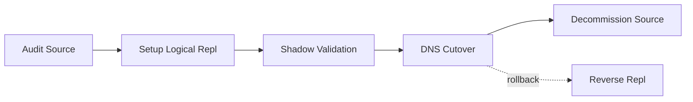
```mermaid
flowchart LR
    A[Audit Source] --> B[Setup Logical Repl]
    B --> C[Shadow Validation]
    C --> D[DNS Cutover]
    D --> E[Decommission Source]
    D -.->|rollback| F[Reverse Repl]
```

---

### 📶 Gradual Depth

**Level 1 - What it is:**
Migrating from self-managed PostgreSQL to a cloud-managed service like AWS RDS or Google Cloud SQL, where the cloud provider handles patching, backups, and high availability, but you give up some control.

**Level 2 - How to use it:**
Start with an extension and configuration audit: list all extensions (`SELECT * FROM pg_extension`) and compare against the cloud provider's supported list. Set up logical replication from source to target. Validate query performance on the target. Cut over by switching DNS or connection pool configuration.

**Level 3 - How it works:**
Logical replication streams row-level changes from source to target in near-real-time. The target stays synchronized while you validate. During cutover, stop writes to the source, wait for replication to catch up (seconds), switch the connection endpoint, and resume writes on the target. Sequences must be synchronized manually (`SELECT setval()`). Large objects and certain data types may require special handling.

**Level 4 - Production mastery:**
The hidden risks are in edge cases: `pg_cron` does not exist on most managed services (use cloud-native schedulers). `pg_stat_statements` may have different behavior. `COPY ... FROM '/path'` fails because you have no filesystem access - use `\copy` or S3 import. Connection limits differ (RDS has instance-class-based limits). Parameter groups replace `postgresql.conf` but not all parameters are exposed. Always run a shadow traffic test: replay production query logs against the target and compare execution plans.

---

### ⚙️ How It Works

**Phase 1 - Audit:** Inventory extensions, custom types, cron jobs, filesystem dependencies, and superuser-dependent operations. Map each to a cloud equivalent or identify blockers.

**Phase 2 - Provision and replicate:** Create the cloud instance matching the source's version and configuration. Set up logical replication. Perform initial data sync (full table copy), then stream ongoing changes.

**Phase 3 - Validate:** Run production query workloads against the target. Compare execution plans and latency. Verify that application connection pooling works with the managed endpoint.

**Phase 4 - Cutover:** During a maintenance window, stop application writes to the source. Wait for replication lag to reach zero. Switch DNS or connection strings to the cloud endpoint. Resume application traffic. Monitor for errors.

```
  Audit:
    pg_extension, postgresql.conf,
    crontab, filesystem deps
        |
  Replicate:
    Source -> pglogical -> Cloud PG
    (initial copy + streaming)
        |
  Validate:
    Replay query logs on Cloud PG
    Compare EXPLAIN plans
        |
  Cutover:
    Stop writes -> drain lag -> DNS switch
```

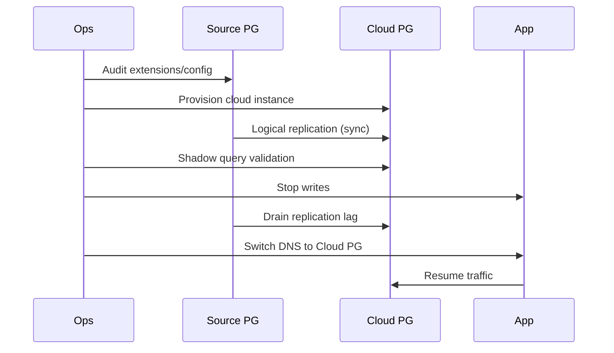
```mermaid
sequenceDiagram
    participant Ops
    participant Src as Source PG
    participant Tgt as Cloud PG
    participant App
    Ops->>Src: Audit extensions/config
    Ops->>Tgt: Provision cloud instance
    Src->>Tgt: Logical replication (sync)
    Ops->>Tgt: Shadow query validation
    Ops->>App: Stop writes
    Src->>Tgt: Drain replication lag
    Ops->>App: Switch DNS to Cloud PG
    App->>Tgt: Resume traffic
```

**BAD:**

```bash
# Dump and restore: hours of downtime
pg_dump -h source | psql -h cloud-target
# Application offline during entire transfer
```

**GOOD:**

```bash
# Logical replication: minutes of downtime
# 1. Setup replication (runs for days/weeks)
# 2. Cutover: stop writes, drain lag, switch
psql -h cloud-target -c "
  SELECT pg_replication_origin_advance(
    'migration', pg_current_wal_lsn()
  );"
# Switch connection string
# Downtime: seconds to minutes
```

---

### 🚨 Failure Modes

**Failure 1 - Unsupported extension blocks migration:**
**Symptom:** Application fails on the cloud instance with "extension not available" errors.
**Root cause:** Extensions like `pgaudit`, `timescaledb`, or custom C extensions are not supported on the target cloud platform.
**Diagnostic:**

```sql
-- Source: list all extensions
SELECT extname, extversion
FROM pg_extension
ORDER BY extname;
-- Compare with cloud provider's supported list
```

**Fix:** Replace unsupported extensions with cloud-native equivalents (e.g., cloud provider audit logging instead of `pgaudit`). If no equivalent exists, this may be a migration blocker.

**Failure 2 - Sequence values not synchronized at cutover:**
**Symptom:** After cutover, INSERT operations fail with duplicate key errors or new IDs overlap with existing data.
**Root cause:** Logical replication replicates row data but does not replicate sequence state. Sequences on the target start from their initial value.
**Diagnostic:**

```sql
-- Check sequence current values on target
SELECT sequencename, last_value
FROM pg_sequences
WHERE schemaname = 'public';
```

**Fix:** Before cutover, synchronize all sequences: `SELECT setval('seq_name', (SELECT max(id) FROM table_name))` for every sequence.

---

### 🔬 Production Reality

A common migration failure: a team completes logical replication setup and validates queries. At cutover, they switch DNS with a 300-second TTL. But some connection pools cache DNS results for longer (JVM default DNS caching is indefinite in some configurations). Old application instances continue writing to the source for 15 minutes after cutover. The source and target diverge. Reconciliation requires comparing every table row-by-row. The fix: set DNS TTL to 60 seconds or lower days before cutover, and configure connection pools to respect TTL (`networkaddress.cache.ttl` in JVM). Better yet, use connection proxy (PgBouncer) configuration changes instead of DNS for instant cutover.

---

### ⚖️ Trade-offs & Alternatives

| Aspect              | Self-Managed PG     | AWS RDS PostgreSQL      | Google AlloyDB      |
| ------------------- | ------------------- | ----------------------- | ------------------- |
| Extension freedom   | Full                | ~60 supported           | ~50 supported       |
| Superuser access    | Yes                 | rds_superuser (limited) | cloudsqlsuperuser   |
| Filesystem access   | Yes                 | No                      | No                  |
| HA failover         | Manual/Patroni      | Multi-AZ automatic      | Regional automatic  |
| Patching            | Manual              | Maintenance windows     | Maintenance windows |
| Cost predictability | Hardware + ops team | Pay-per-instance        | Pay-per-instance    |
| Vendor lock-in      | None                | Moderate                | High (AlloyDB APIs) |

---

### ⚡ Decision Snap

**USE WHEN:**

- Operational overhead of self-managed PostgreSQL exceeds team capacity
- HA, backups, and patching must be automated without dedicated DBA staff
- The application does not depend on unsupported extensions

**AVOID WHEN:**

- Custom extensions or kernel tuning are critical to the workload
- Regulatory requirements mandate on-premises data residency
- Cost modeling shows cloud-managed pricing exceeds self-managed at current scale

**PREFER AlloyDB/Aurora WHEN:**

- Mixed OLTP+OLAP workloads benefit from storage-compute separation
- Near-zero replication lag is required for read replicas

---

### ⚠️ Top Traps

| #   | Misconception                                  | Reality                                                                                                                         |
| --- | ---------------------------------------------- | ------------------------------------------------------------------------------------------------------------------------------- |
| 1   | Cloud-managed PG is identical to self-managed  | Restricted superuser, limited extensions, no filesystem, and opaque parameter tuning create real behavioral differences         |
| 2   | pg_dump/pg_restore is sufficient for migration | Dump/restore means hours of downtime for multi-terabyte databases; logical replication reduces downtime to minutes              |
| 3   | DNS cutover is instant                         | DNS TTL and client-side caching mean some clients may not switch for minutes; use connection proxy changes for instant cutover  |
| 4   | Logical replication handles everything         | Sequences, large objects, DDL changes during migration, and some data types require manual synchronization                      |
| 5   | Cloud costs are always lower than self-managed | At large scale (multi-TB, high IOPS), cloud-managed can be significantly more expensive than dedicated hardware with a DBA team |

---

### 🪜 Learning Ladder

**Prerequisites:**

- SQL-100 Logical Replication and Physical Replication - the mechanism powering online migration
- SQL-102 Connection Pooling - PgBouncer and HikariCP - connection management during cutover
- SQL-103 Backup and Point-in-Time Recovery (PITR) - backup strategy changes on managed services

**THIS:** SQL-118 PostgreSQL to Cloud-Managed Migration

**Next steps:**

- SQL-119 Connection Routing and Proxy Architecture - routing changes during and after migration
- SQL-121 Observability for Database Fleets - monitoring changes when moving to cloud-managed
- SQL-122 Database Capacity Planning and Growth Modeling - cloud capacity planning differs from on-premises

**The Surprising Truth:**
The hardest part of migrating to cloud-managed PostgreSQL is rarely the data transfer - it is discovering that your application depends on dozens of small superuser-only features, filesystem operations, and obscure extensions that you never realized you were using until they are gone.

**Further Reading:**

- AWS Documentation: "Best practices for migrating PostgreSQL to Amazon RDS" (docs.aws.amazon.com/dms/latest/userguide/CHAP_Source.PostgreSQL.html)
- PostgreSQL Documentation: "Logical Replication" (postgresql.org/docs/current/logical-replication.html)
- Google Cloud: "Migrating to AlloyDB" (cloud.google.com/alloydb/docs/migrate)

**Revision Card:**

1. Audit extensions and superuser dependencies before committing to migration - unsupported extensions are the top blocker
2. Use logical replication for online migration; cutover downtime is bounded by replication drain time
3. Synchronize sequences manually and verify DNS/connection pool caching to avoid split-brain during cutover

---

---

# SQL-119 Connection Routing and Proxy Architecture

**TL;DR** - Connection proxies (PgBouncer, HAProxy, ProxySQL) sit between applications and databases, multiplexing connections, routing reads to replicas, and enabling transparent failover without application changes.

---

### 🔥 Problem Statement

PostgreSQL forks a backend process for every connection. Each backend consumes roughly 5-10 MB of memory. At 500 connections, that is 2.5-5 GB consumed before a single query runs. Applications with hundreds of microservices and connection pools per service can demand thousands of connections - far beyond what a single PostgreSQL instance can handle efficiently. Beyond connection multiplexing, production topologies need routing: writes to the primary, reads to replicas, failover from a dead primary to a standby. Without a proxy layer, every application must implement connection pooling, read/write splitting, and failover logic independently - duplicating critical infrastructure across dozens of services.

---

### 📜 Historical Context

PgBouncer was created in 2007 by Skype to solve connection exhaustion on their PostgreSQL clusters. It remains the dominant PostgreSQL connection pooler. HAProxy, originally a TCP/HTTP load balancer, was adapted for database routing in the 2010s. ProxySQL (2015) brought query-aware routing to MySQL. Odyssey (Yandex, 2019) added multi-threaded connection pooling for PostgreSQL. Cloud providers built proxy-like functionality into their offerings: AWS RDS Proxy (2020), Google Cloud SQL Auth Proxy. The trend is toward application-transparent proxies that handle pooling, routing, and failover as infrastructure concerns.

---

### 🔩 First Principles

**CORE INVARIANTS:**

1. PostgreSQL's process-per-connection model makes connection count the first bottleneck at scale
2. Read/write routing requires the proxy to either parse SQL or rely on explicit routing hints from the application
3. Failover transparency requires the proxy to detect primary failure and redirect connections to the new primary before application timeouts expire

**DERIVED DESIGN:**
These invariants force a proxy that multiplexes many client connections onto fewer server connections (pooling), inspects or labels queries to route reads vs. writes (routing), and monitors backend health to switch traffic on failure (failover). The pooling mode determines the trade-off: transaction-level pooling maximizes multiplexing but breaks session-level state (prepared statements, SET commands). Session-level pooling preserves state but limits multiplexing.

**THE TRADE-OFF:**
**Gain:** Dramatic reduction in backend connections; transparent failover; centralized read/write routing.
**Cost:** Added network hop latency; proxy becomes a single point of failure (must be HA itself); transaction-level pooling breaks session state.

---

### 🧠 Mental Model

> Think of a hotel switchboard operator (proxy) who connects guest calls (application connections) to hotel rooms (database backends). Guests do not dial rooms directly. The operator multiplexes many calls onto a few phone lines (connection pooling), knows which room handles which requests (routing), and reroutes calls when a room is unavailable (failover).

- "Switchboard operator" -> PgBouncer / HAProxy
- "Phone lines to rooms" -> server-side connections
- "Guest calls" -> client connections from applications
- "Rerouting on room unavailable" -> failover to standby

**Where this analogy breaks down:** A switchboard operator handles one call at a time per line; PgBouncer handles transaction-level multiplexing where one server connection serves many clients in rapid succession.

---

### 🧩 Components

- **PgBouncer** - lightweight single-threaded connection pooler for PostgreSQL with session, transaction, and statement pooling modes
- **Odyssey** - multi-threaded connection pooler (Yandex) with better CPU utilization on high-connection workloads
- **HAProxy** - TCP/HTTP load balancer used for read/write routing and health-check-based failover
- **Patroni** - HA cluster manager that updates proxy configuration on failover
- **Connection pool mode** - session (1:1 client:server), transaction (shared between transactions), statement (shared between statements)
- **Health check** - periodic probe determining if a backend is primary, replica, or down

```
  Apps (1000 connections)
       |
  [PgBouncer - transaction mode]
  (50 server connections)
       |
  +----+----+
  |         |
  Primary  Replicas (via HAProxy)
```

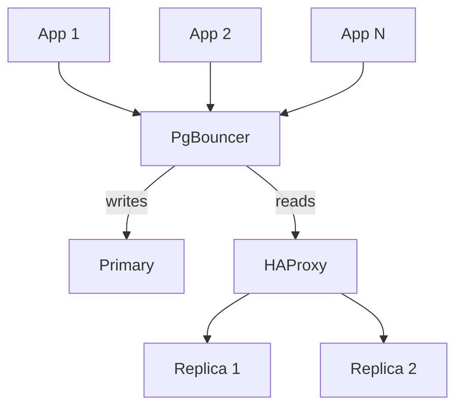
```mermaid
flowchart TD
    A1[App 1] --> PB[PgBouncer]
    A2[App 2] --> PB
    A3[App N] --> PB
    PB -->|writes| Primary
    PB -->|reads| HAP[HAProxy]
    HAP --> R1[Replica 1]
    HAP --> R2[Replica 2]
```

---

### 📶 Gradual Depth

**Level 1 - What it is:**
A connection proxy sits between your application and PostgreSQL, managing connection pooling (sharing fewer database connections among many clients), routing (sending reads to replicas and writes to the primary), and failover (switching to a new primary when the old one fails).

**Level 2 - How to use it:**
Deploy PgBouncer in front of PostgreSQL. Configure `pool_mode = transaction` for maximum multiplexing. Point your application's connection string at PgBouncer instead of PostgreSQL directly. For read/write splitting, use HAProxy with health checks that detect primary vs. replica status.

**Level 3 - How it works:**
In transaction pooling mode, PgBouncer assigns a server connection to a client only for the duration of a transaction. Between transactions, the server connection returns to the pool and can serve another client. This means 1,000 client connections can share 50 server connections if most clients are idle between transactions. Read/write routing uses HAProxy backends with `pg_isready` or custom SQL health checks (`SELECT pg_is_in_recovery()`) to distinguish primaries from replicas.

**Level 4 - Production mastery:**
Transaction pooling breaks prepared statements (they are session-scoped in PostgreSQL). Use `DEALLOCATE ALL` or `DISCARD ALL` between transactions, or use `prepared_statement_name_lookup` in PgBouncer 1.21+. Monitor PgBouncer with `SHOW POOLS` and `SHOW STATS` - watch `sv_active`, `sv_idle`, `cl_waiting` to detect pool saturation. Deploy PgBouncer as a sidecar (per-pod) or centralized (shared fleet). Centralized is simpler to manage; sidecar eliminates the proxy as a shared SPOF. Patroni writes the current primary to etcd/Consul; HAProxy reads it for failover routing.

---

### ⚙️ How It Works

**Phase 1 - Client connects:** Application opens a connection to PgBouncer's port. PgBouncer authenticates the client (using its own auth file or passthrough to PostgreSQL).

**Phase 2 - Transaction assignment:** When the client issues `BEGIN` (or any query in autocommit), PgBouncer assigns an idle server connection from the pool.

**Phase 3 - Query execution:** All queries within the transaction flow through the assigned server connection. PostgreSQL processes them normally.

**Phase 4 - Connection return:** On `COMMIT` or `ROLLBACK`, PgBouncer returns the server connection to the pool. The client retains its PgBouncer connection but releases the server-side resource.

```
  Client 1: BEGIN -> assigned conn S1
  Client 2: BEGIN -> assigned conn S2
  Client 1: COMMIT -> S1 returned to pool
  Client 3: BEGIN -> gets S1 (recycled)
  Client 2: COMMIT -> S2 returned to pool
```

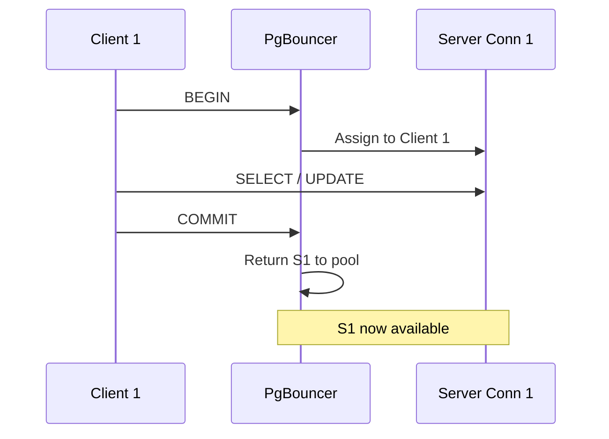
```mermaid
sequenceDiagram
    participant C1 as Client 1
    participant PB as PgBouncer
    participant S1 as Server Conn 1
    C1->>PB: BEGIN
    PB->>S1: Assign to Client 1
    C1->>S1: SELECT / UPDATE
    C1->>PB: COMMIT
    PB->>PB: Return S1 to pool
    Note over PB,S1: S1 now available
```

**BAD:**

```python
# Direct connection: 1 backend per client
conn = psycopg2.connect(
    host="primary.db.internal",
    # 500 services x 20 pool = 10,000 backends
)
```

**GOOD:**

```python
# Via PgBouncer: multiplexed
conn = psycopg2.connect(
    host="pgbouncer.internal",
    port=6432,
    # 10,000 clients share 200 backends
)
```

---

### 🚨 Failure Modes

**Failure 1 - Prepared statement errors in transaction pooling:**
**Symptom:** Application errors: "prepared statement does not exist" or "unnamed prepared statement already exists."
**Root cause:** Transaction pooling assigns a different server connection per transaction; prepared statements created in a previous transaction no longer exist.
**Diagnostic:**

```sql
-- PgBouncer admin console
SHOW POOLS;
-- Check pool_mode
SHOW CONFIG;
-- Look for pool_mode = transaction
```

**Fix:** Disable server-side prepared statements in the application driver (`prepareThreshold=0` in JDBC, `statement_cache_size=0` in pgx). Or use PgBouncer 1.21+ with prepared statement tracking.

**Failure 2 - PgBouncer pool saturation:**
**Symptom:** Application connections hang on query execution; `cl_waiting` in PgBouncer `SHOW POOLS` is non-zero and growing.
**Root cause:** All server connections are assigned to active transactions; new client transactions wait for a server connection to become available.
**Diagnostic:**

```
-- PgBouncer admin console
SHOW POOLS;
-- cl_waiting > 0 means clients are queued
-- sv_active = max_pool_size means saturated
```

**Fix:** Increase `default_pool_size` in PgBouncer (if PostgreSQL can handle more connections). Reduce application `idle_in_transaction_session_timeout`. Find and fix long-running transactions holding server connections.

---

### 🔬 Production Reality

A frequent incident: a team deploys PgBouncer in transaction pooling mode. The application uses Django ORM, which sets session variables (`SET timezone`, `SET search_path`) at connection establishment. In transaction pooling, these settings are lost between transactions because the next transaction may get a different server connection. Queries silently run with the wrong timezone or search path, producing incorrect results. The fix: move session configuration into each transaction (`SET LOCAL timezone = 'UTC'`) or switch to session pooling (sacrificing multiplexing). The lesson: transaction pooling requires the application to be stateless at the session level - no SET commands, no prepared statements, no advisory locks outside transactions.

---

### ⚖️ Trade-offs & Alternatives

| Aspect             | PgBouncer          | Odyssey        | HAProxy             |
| ------------------ | ------------------ | -------------- | ------------------- |
| Pooling modes      | Session/TX/Stmt    | Session/TX     | None (TCP only)     |
| Threading          | Single-threaded    | Multi-threaded | Multi-threaded      |
| Read/write routing | No (pool only)     | No (pool only) | Yes (health checks) |
| SQL awareness      | Minimal            | Minimal        | None (TCP level)    |
| Failover handling  | Via Patroni/consul | Built-in       | Health check based  |
| Resource overhead  | Very low (~5 MB)   | Low (~50 MB)   | Low (~20 MB)        |

---

### ⚡ Decision Snap

**USE WHEN:**

- Application connection count exceeds PostgreSQL's comfortable backend limit (typically 200-500)
- Multiple services share a PostgreSQL cluster and need centralized pooling
- Transparent failover is required without application-level retry logic

**AVOID WHEN:**

- A single application with a well-tuned internal connection pool (HikariCP) is the only client
- The application heavily uses session-level features (prepared statements, advisory locks, SET commands)

**PREFER Odyssey over PgBouncer WHEN:**

- High connection counts saturate PgBouncer's single-threaded event loop
- Multi-threaded pooling is needed for CPU-bound TLS termination

---

### ⚠️ Top Traps

| #   | Misconception                                               | Reality                                                                                                            |
| --- | ----------------------------------------------------------- | ------------------------------------------------------------------------------------------------------------------ |
| 1   | Transaction pooling is always safe                          | It breaks prepared statements, session variables, LISTEN/NOTIFY, and advisory locks held across transactions       |
| 2   | PgBouncer eliminates the need for application-level pooling | Applications should still pool locally (HikariCP) to avoid opening/closing PgBouncer connections per query         |
| 3   | More server connections = better performance                | Beyond PostgreSQL's optimal backend count (CPU-dependent), more connections cause contention and reduce throughput |
| 4   | The proxy handles failover automatically                    | PgBouncer does not detect failover; it requires an external tool (Patroni) to update its configuration             |
| 5   | Proxy latency is negligible                                 | TLS termination at the proxy adds measurable latency; for latency-sensitive workloads, consider sidecar deployment |

---

### 🪜 Learning Ladder

**Prerequisites:**

- SQL-102 Connection Pooling - PgBouncer and HikariCP - foundational pooling concepts
- SQL-101 Read Replicas - Scaling Reads - the replicas that routing directs read traffic to
- SQL-100 Logical Replication and Physical Replication - replication powers the topology proxies route across

**THIS:** SQL-119 Connection Routing and Proxy Architecture

**Next steps:**

- SQL-113 Sharding Strategies - Application vs Proxy - proxies can also route to shards
- SQL-114 Multi-Database Topology Design - the full topology that proxies connect
- SQL-121 Observability for Database Fleets - monitoring proxy health and pool metrics

**The Surprising Truth:**
The most common PgBouncer misconfiguration is not pool size - it is using transaction pooling with an ORM that silently depends on session state, producing queries that succeed but return wrong results because they ran with the wrong search_path, timezone, or role from a recycled connection.

**Further Reading:**

- PgBouncer Documentation (pgbouncer.github.io/pgbouncer/)
- Patroni Documentation: "HAProxy and Patroni" (patroni.readthedocs.io)
- Percona Blog: "Scaling PostgreSQL with PgBouncer" (percona.com/blog)

**Revision Card:**

1. Connection proxies multiplex many client connections onto fewer server connections, making PostgreSQL scale beyond its process-per-connection limit
2. Transaction pooling maximizes multiplexing but breaks session-level state - applications must be session-stateless
3. Failover routing requires an external HA manager (Patroni) to update the proxy's backend configuration

---

---

# SQL-120 GDPR and Right-to-Erasure in SQL Systems

**TL;DR** - GDPR Article 17 requires deleting all personal data for an individual across every table, backup, and replica - a structural problem SQL was not designed to solve.

---

### 🔥 Problem Statement

Article 17 of the GDPR grants individuals the right to request deletion of their personal data. For a SQL database, this means finding and removing every row, column, and reference containing that person's data - across normalized tables with foreign keys, denormalized caches, replicas, backups, WAL archives, and downstream CDC consumers. A simple `DELETE FROM users WHERE id = 42` leaves orphaned references in orders, logs, audit trails, and analytics tables. Foreign keys may CASCADE (deleting business data you need to retain) or RESTRICT (blocking the delete entirely). Backups contain the deleted data for years. The problem is not technical difficulty - it is architectural: SQL schemas are designed for data integrity, not data erasure.

---

### 📜 Historical Context

The EU General Data Protection Regulation (GDPR) took effect on May 25, 2018. Article 17 codifies the "right to be forgotten," building on the 2014 European Court of Justice ruling (Google Spain v. AEPD). Similar regulations followed: CCPA (California, 2020), LGPD (Brazil, 2020), POPIA (South Africa, 2021). The database industry responded with patterns: soft deletes with scheduled purges, pseudonymization, crypto-shredding (encrypting personal data with per-user keys and destroying the key). No standard SQL feature directly supports compliance; it remains an application architecture concern.

---

### 🔩 First Principles

**CORE INVARIANTS:**

1. Personal data may be scattered across many tables, and foreign key relationships create cascading dependencies that either block deletion or destroy business data
2. Erasure must propagate to every copy: replicas, backups, CDC downstream systems, caches, and search indexes
3. Some data must be retained for legal obligations (invoices, tax records) even after an erasure request - requiring selective anonymization rather than full deletion

**DERIVED DESIGN:**
These invariants force a data architecture where personal data is isolated from business data - either in dedicated columns that can be NULLed, in a separate table joined by foreign key, or encrypted with per-user keys (crypto-shredding). A data map (inventory of every table/column containing personal data) is a prerequisite. Deletion becomes a multi-step process: anonymize personal columns, cascade through related tables, propagate to downstream systems, and handle backups through retention-based expiry.

**THE TRADE-OFF:**
**Gain:** Legal compliance; user trust; regulatory penalty avoidance (fines up to 4% of global revenue).
**Cost:** Schema complexity (separating personal from business data); operational complexity (multi-system deletion propagation); inability to use personal data in backups for point-in-time forensics after erasure.

---

### 🧠 Mental Model

> Think of a library that must remove all records of a specific patron - not just their library card, but every checkout log, fine record, inter-library loan reference, and microfilm copy of old receipts. Some records (book inventory) must stay; only the patron's name on them needs to be blanked out.

- "Library card" -> users table row
- "Checkout logs with patron name" -> orders, logs, audit tables
- "Microfilm copies" -> database backups
- "Blanking out the name" -> pseudonymization / anonymization

**Where this analogy breaks down:** Libraries are a single system; production databases feed replicas, caches, search indexes, analytics warehouses, and third-party integrations - each requiring independent erasure.

---

### 🧩 Components

- **Data map** - inventory of every table and column containing personal data, classified by sensitivity
- **Erasure API** - service endpoint that receives deletion requests and orchestrates multi-table cleanup
- **Pseudonymization** - replacing identifying data with irreversible tokens while preserving referential integrity
- **Crypto-shredding** - encrypting personal data with per-user keys; erasure = destroying the key
- **Cascade strategy** - per-table decision: DELETE, SET NULL, anonymize, or retain with legal basis
- **Downstream propagation** - CDC events, API calls, or scheduled jobs that propagate erasure to replicas, search indexes, and warehouses
- **Audit log** - proof that erasure was performed, without retaining the erased data itself

```
  Erasure Request Flow:
  User -> Erasure API
            |
    +-------+--------+
    |       |        |
  users  orders   logs
  DELETE  SET NULL  anonymize
    |       |        |
    v       v        v
  Replicas, CDC, Search, Backups
  (propagate / expire)
```

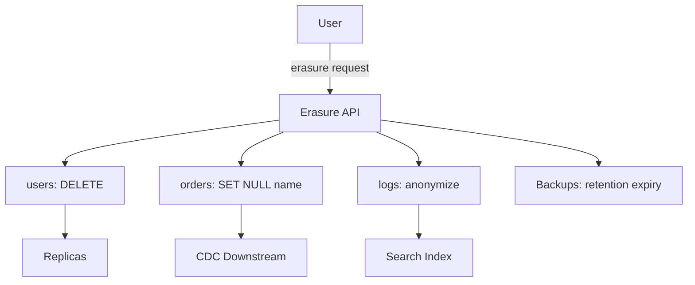
```mermaid
flowchart TD
    User -->|erasure request| API[Erasure API]
    API --> U[users: DELETE]
    API --> O[orders: SET NULL name]
    API --> L[logs: anonymize]
    U --> R[Replicas]
    O --> CDC[CDC Downstream]
    L --> S[Search Index]
    API --> B[Backups: retention expiry]
```

---

### 📶 Gradual Depth

**Level 1 - What it is:**
GDPR's right-to-erasure means a user can ask you to delete all their personal data from your systems. In SQL databases, this means removing or anonymizing their data across every table that references them.

**Level 2 - How to use it:**
Build a data map listing every table and column with personal data. For each table, decide the erasure strategy: DELETE the row, SET the personal column to NULL, replace with a pseudonym, or retain with legal basis documentation. Implement an erasure API that executes these strategies in the correct order (respect foreign key dependencies).

**Level 3 - How it works:**
The erasure API receives a user ID. It queries the data map to determine affected tables. It executes deletions and anonymizations in dependency order (child tables before parent, or using SET NULL on foreign keys). It then publishes erasure events to CDC/Kafka so downstream systems (Elasticsearch, analytics warehouse, caches) perform their own cleanup. Backups are handled through retention policies - once the backup containing the user's data expires, the data is gone.

**Level 4 - Production mastery:**
Crypto-shredding is the most scalable approach for large systems: encrypt each user's personal data columns with a per-user key stored in a key management service. Erasure becomes `DELETE FROM user_keys WHERE user_id = 42` - all encrypted personal data across all tables becomes unreadable. This avoids touching millions of rows across dozens of tables. However, it requires encrypting at write time, which adds latency and prevents querying encrypted columns. Monitor erasure request SLAs (GDPR allows 30 days). Log the erasure action itself (timestamp, user ID, tables affected) without logging the deleted data.

---

### ⚙️ How It Works

**Phase 1 - Request intake:** User submits erasure request. The system verifies identity and checks for legal retention obligations (active orders, tax records, fraud investigations).

**Phase 2 - Data map lookup:** The erasure service consults the data map to identify all tables and columns containing the user's personal data.

**Phase 3 - Ordered execution:** Erasure executes in dependency order. Tables with no dependencies are cleaned first. Foreign key references are SET NULL or CASCADEd. Personal columns in retained rows are anonymized.

**Phase 4 - Downstream propagation:** Erasure events propagate to replicas (via replication), search indexes (via API call or CDC), analytics warehouse (via scheduled purge job), and caches (via TTL expiry or explicit invalidation).

```
  1. Verify identity + legal holds
  2. Lookup data map for user_id = 42
  3. orders: SET customer_name = NULL
  4. logs: UPDATE SET email = 'ERASED'
  5. users: DELETE WHERE id = 42
  6. Publish erasure event to Kafka
  7. Search: delete user document
  8. Analytics: purge user rows
  9. Log: "user 42 erased at <timestamp>"
```

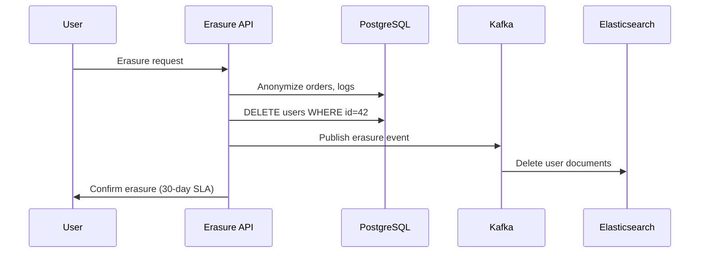
```mermaid
sequenceDiagram
    participant U as User
    participant API as Erasure API
    participant DB as PostgreSQL
    participant K as Kafka
    participant ES as Elasticsearch
    U->>API: Erasure request
    API->>DB: Anonymize orders, logs
    API->>DB: DELETE users WHERE id=42
    API->>K: Publish erasure event
    K->>ES: Delete user documents
    API->>U: Confirm erasure (30-day SLA)
```

**BAD:**

```sql
-- Naive delete: breaks foreign keys
DELETE FROM users WHERE id = 42;
-- ERROR: violates FK on orders.customer_id
-- Or: CASCADE deletes orders (losing data)
```

**GOOD:**

```sql
-- Step 1: anonymize referencing tables
UPDATE orders SET customer_name = NULL,
  customer_email = NULL
WHERE customer_id = 42;
-- Step 2: anonymize logs
UPDATE audit_log
SET email = 'REDACTED'
WHERE user_id = 42;
-- Step 3: delete the user record
DELETE FROM users WHERE id = 42;
```

---

### 🚨 Failure Modes

**Failure 1 - Incomplete data map misses personal data:**
**Symptom:** After erasure, personal data is discovered in a table not covered by the data map (error logs, analytics snapshots, third-party integrations).
**Root cause:** The data map was created manually and not updated when new tables were added.
**Diagnostic:**

```sql
-- Search for user data across all tables
SELECT table_name, column_name
FROM information_schema.columns
WHERE column_name LIKE '%email%'
   OR column_name LIKE '%name%'
   OR column_name LIKE '%phone%';
```

**Fix:** Automate data map generation from schema metadata. Tag columns with `COMMENT` annotations indicating personal data classification. Run periodic audits.

**Failure 2 - Backup retention defeats erasure:**
**Symptom:** Erased user's data is recoverable from backups, creating a compliance gap.
**Root cause:** Backups retain data indefinitely; point-in-time recovery can restore erased records.
**Diagnostic:**

```bash
# Check backup retention policy
pg_basebackup --list
# Review WAL archive retention
ls -lt /archive/wal/
```

**Fix:** Set backup retention to the minimum legally required period. Document that backups may contain erased data until expiry. Use crypto-shredding so backup data becomes unreadable after key deletion.

---

### 🔬 Production Reality

A common compliance gap: a team implements erasure for the primary database but forgets that Debezium CDC replicates every row change to Kafka. Kafka retains events for 30 days. The erased user's original data persists in Kafka topics as historical INSERT events. The analytics warehouse, which consumes those topics, has a copy too. The erasure is incomplete across 3 out of 5 systems. The fix requires: (1) publishing explicit "tombstone" erasure events to Kafka, (2) building CDC consumers that process tombstones by deleting downstream records, and (3) configuring Kafka compaction so tombstones eventually remove the original events. The lesson: erasure is a distributed systems problem, not a SQL problem.

---

### ⚖️ Trade-offs & Alternatives

| Aspect              | Row Deletion        | Pseudonymization  | Crypto-Shredding             |
| ------------------- | ------------------- | ----------------- | ---------------------------- |
| Implementation cost | Low (DELETE/UPDATE) | Medium            | High (key mgmt)              |
| Performance impact  | Per-request I/O     | Per-request I/O   | Minimal (key only)           |
| Backup handling     | Data persists       | Data persists     | Data unreadable              |
| Analytics impact    | Rows lost           | Rows preserved    | Rows preserved               |
| Scale (many tables) | Linear in tables    | Linear in tables  | Constant (one key)           |
| Query-ability       | Full                | Full (anonymized) | No queries on encrypted cols |

---

### ⚡ Decision Snap

**USE WHEN:**

- Your system stores personal data of EU residents (or residents of other GDPR-like jurisdictions)
- Users can create accounts or provide personal information through any interface
- Downstream systems (analytics, search, caches) consume personal data via replication or CDC

**AVOID WHEN:**

- The system processes no personal data (purely machine-generated telemetry)
- All data is already anonymized at ingestion

**PREFER crypto-shredding WHEN:**

- Personal data is spread across dozens of tables
- Per-row deletion at scale is operationally expensive
- Backup-level erasure is a compliance requirement

---

### ⚠️ Top Traps

| #   | Misconception                                   | Reality                                                                                                                        |
| --- | ----------------------------------------------- | ------------------------------------------------------------------------------------------------------------------------------ |
| 1   | DELETE FROM users is sufficient for GDPR        | Personal data exists in orders, logs, audit trails, replicas, backups, CDC streams, and search indexes                         |
| 2   | Soft delete (is_deleted flag) satisfies erasure | GDPR requires actual deletion or anonymization; a soft delete still retains personal data in the database                      |
| 3   | Backups are exempt from erasure requirements    | Regulators expect a documented retention policy and evidence that erased data becomes inaccessible within the retention window |
| 4   | Anonymization is always irreversible            | Poor anonymization (e.g., hashing email without salt) can be reversed; use irreversible techniques with sufficient entropy     |
| 5   | The 30-day SLA starts at receipt of request     | The GDPR clock starts when the request is received AND identity is verified - but verification delays are scrutinized          |

---

### 🪜 Learning Ladder

**Prerequisites:**

- SQL-039 ACID Properties - What They Actually Mean - understanding transactional guarantees around deletion
- SQL-112 PCI-DSS and Data-at-Rest Encryption - related compliance pattern for sensitive data
- SQL-100 Logical Replication and Physical Replication - erasure must propagate through replication

**THIS:** SQL-120 GDPR and Right-to-Erasure in SQL Systems

**Next steps:**

- SQL-121 Observability for Database Fleets - monitoring erasure completeness across systems
- SQL-116 CQRS and Read/Write Separation Architecture - erasure must reach read models
- SQL-103 Backup and Point-in-Time Recovery (PITR) - backup retention intersects with erasure

**The Surprising Truth:**
The hardest part of GDPR erasure is not deleting data from the primary database - it is discovering all the places personal data has been copied to: CDC streams, search indexes, analytics warehouses, error logs, APM tools, and third-party integrations that were never designed with erasure in mind.

**Further Reading:**

- Regulation (EU) 2016/679 (GDPR), Article 17: Right to Erasure (eur-lex.europa.eu)
- ICO (UK Information Commissioner's Office): "Right to Erasure" guidance (ico.org.uk)
- Byun, J. et al. "Purpose Based Access Control for Privacy Protection in Relational Database Systems", VLDB Journal, 2005

**Revision Card:**

1. GDPR erasure requires removing personal data from every table, replica, backup, cache, and downstream system - not just the users table
2. Crypto-shredding (per-user encryption key destruction) is the most scalable erasure pattern for complex schemas
3. Erasure is a distributed systems problem: every CDC consumer, search index, and analytics warehouse must process deletion events

---

---

# SQL-121 Observability for Database Fleets

**TL;DR** - Database fleet observability means collecting, correlating, and alerting on metrics, logs, and query performance across all database instances to detect problems before users notice them.

---

### 🔥 Problem Statement

A single PostgreSQL instance is observable with `pg_stat_*` views and server logs. But production systems run fleets: a primary, two synchronous replicas, four async replicas, a PgBouncer pool, and a CDC pipeline. When a query slows down, is it the primary's CPU? Replication lag on a replica? PgBouncer pool saturation? A missing index after a migration? A vacuum that has not run? Without fleet-wide observability, debugging becomes a manual tour of dashboards. At scale, with dozens of instances across regions, the team that cannot answer "which instance is unhealthy and why" within 60 seconds will lose hours per incident.

---

### 📜 Historical Context

Early database monitoring meant checking `vmstat` and slow query logs manually. Nagios and Zabbix provided threshold-based alerting in the 2000s. The Prometheus + Grafana stack (2015+) brought pull-based metrics collection with flexible dashboarding. `postgres_exporter` (community project) exports `pg_stat_*` views as Prometheus metrics. `pg_stat_statements` (bundled extension since PostgreSQL 8.4) provides per-query performance statistics. Cloud-managed services add their own monitoring (CloudWatch for RDS, Cloud Monitoring for Cloud SQL), but fleet-wide correlation still requires custom dashboarding or tools like Datadog, pganalyze, or Percona Monitoring and Management (PMM).

---

### 🔩 First Principles

**CORE INVARIANTS:**

1. Every database problem manifests in at least one of three signals: metrics (quantitative), logs (qualitative), or query performance changes (behavioral)
2. Fleet-level problems require correlation across instances - a metric anomaly on one instance is noise; the same anomaly across all replicas is a systemic issue
3. Alert fatigue kills observability - alerts must be actionable, with clear severity and runbooks, or they will be ignored

**DERIVED DESIGN:**
These invariants force a three-layer stack: metrics collection (Prometheus + postgres_exporter), log aggregation (Loki, Elasticsearch), and query performance tracking (pg_stat_statements, pganalyze). Dashboards must show fleet-wide views with drill-down to individual instances. Alerts fire on rate-of-change (anomaly) rather than static thresholds where possible, because absolute thresholds do not account for workload variation.

**THE TRADE-OFF:**
**Gain:** Rapid incident detection and diagnosis; capacity planning from historical trends; proactive identification of slow queries and bloat.
**Cost:** Monitoring infrastructure overhead (Prometheus, Grafana, storage); pg_stat_statements memory consumption; operational effort to maintain dashboards and alert rules.

---

### 🧠 Mental Model

> Think of a hospital's centralized patient monitoring room. Each patient (database instance) has vital signs displayed on a screen. A nurse (on-call engineer) watches the wall of screens. Normal vitals are green. A single yellow alert is investigated. Multiple patients showing the same anomaly simultaneously triggers a code blue (systemic incident).

- "Vital signs" -> metrics (CPU, connections, replication lag, cache hit ratio)
- "Patient monitor" -> Grafana dashboard per instance
- "Wall of screens" -> fleet-wide dashboard
- "Code blue" -> correlated alert across instances

**Where this analogy breaks down:** Hospital monitors are passive displays; database observability systems can also perform automated remediation (e.g., killing long-running queries, triggering VACUUM).

---

### 🧩 Components

- **postgres_exporter** - Prometheus exporter that scrapes `pg_stat_*` views and exposes them as metrics
- **pg_stat_statements** - extension tracking execution statistics (calls, total_time, rows) per normalized query
- **pg_stat_activity** - live view of all current connections, their state, and running queries
- **pg_stat_replication** - replication lag and WAL send/receive/apply positions per replica
- **Prometheus** - time-series metrics storage with PromQL query language
- **Grafana** - dashboarding and alerting frontend
- **pganalyze** - SaaS tool for query performance analysis, index recommendations, and VACUUM monitoring
- **Log aggregation** - centralized logging (Loki, Elasticsearch) for PostgreSQL server logs and slow query logs

```
  Fleet Observability Stack:
  [PG Primary] -> postgres_exporter -> Prometheus
  [PG Replica1]-> postgres_exporter -> Prometheus
  [PG Replica2]-> postgres_exporter -> Prometheus
  [PgBouncer]  -> metrics endpoint  -> Prometheus
       |
       v
    Grafana (dashboards + alerts)
       |
       v
    PagerDuty / Slack (notifications)
```

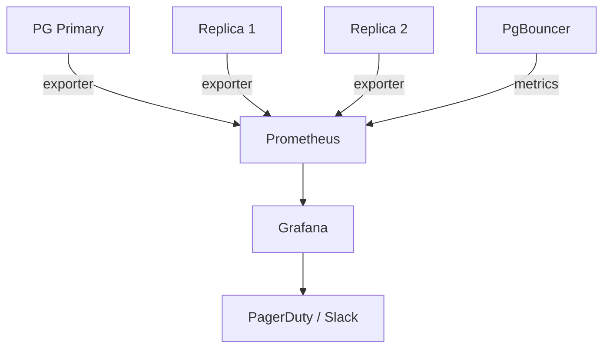
```mermaid
flowchart TD
    P[PG Primary] -->|exporter| Prom[Prometheus]
    R1[Replica 1] -->|exporter| Prom
    R2[Replica 2] -->|exporter| Prom
    PB[PgBouncer] -->|metrics| Prom
    Prom --> G[Grafana]
    G --> PD[PagerDuty / Slack]
```

---

### 📶 Gradual Depth

**Level 1 - What it is:**
Database observability is the practice of collecting metrics, logs, and query performance data from all your database instances so you can detect and diagnose problems quickly.

**Level 2 - How to use it:**
Install `postgres_exporter` on each instance. Enable `pg_stat_statements` (`shared_preload_libraries`). Configure Prometheus to scrape exporters. Build Grafana dashboards showing connections, cache hit ratio, replication lag, transaction rate, and top queries by time. Set alerts for replication lag > 30s, connection count > 80% of max, and cache hit ratio < 99%.

**Level 3 - How it works:**
`postgres_exporter` connects to PostgreSQL and runs SQL queries against `pg_stat_*` views on a configurable interval. It exposes the results as Prometheus metrics at an HTTP endpoint. Prometheus scrapes these endpoints and stores time-series data. Grafana queries Prometheus via PromQL and renders dashboards. Alert rules in Prometheus or Grafana evaluate conditions and fire notifications.

**Level 4 - Production mastery:**
The most valuable metric is `pg_stat_statements` mean execution time per query, trended over time. A query whose mean time doubles after a deployment indicates a plan regression. Use `pg_stat_user_tables` to track `n_dead_tup` and `last_autovacuum` to detect bloat before it affects performance. Monitor `pg_stat_bgwriter` for `buffers_backend` (direct I/O bypassing shared buffers - a sign of buffer pool pressure). For fleet-wide views, use Prometheus labels (`instance`, `role=primary|replica`) and Grafana variables to build drill-down dashboards.

---

### ⚙️ How It Works

**Phase 1 - Collection:** postgres*exporter scrapes `pg_stat*\*` views every 15-60 seconds. PostgreSQL logs slow queries (log_min_duration_statement). PgBouncer exposes pool stats via its admin console.

**Phase 2 - Storage:** Prometheus stores metrics as time series. Logs flow to Loki or Elasticsearch. pg_stat_statements data is optionally exported to pganalyze for deeper analysis.

**Phase 3 - Visualization:** Grafana dashboards render fleet-wide panels (all instances) and per-instance drill-downs. Key panels: TPS, active connections, replication lag, cache hit ratio, top 10 queries by total time.

**Phase 4 - Alerting:** Alert rules fire on sustained anomalies: replication lag > 30s for 5 minutes, connection waiters > 0 for 2 minutes, autovacuum not run in 24 hours on a high-churn table.

```
  Metric flow:
  pg_stat_* -> postgres_exporter -> Prometheus
       |
  pg_stat_statements -> pganalyze (optional)
       |
  postgresql.log -> Loki / Elasticsearch
       |
  All -> Grafana (dashboards + alerts)
```

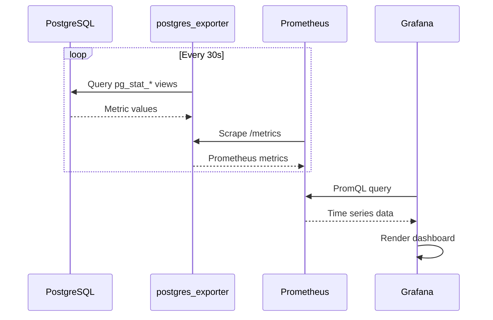
```mermaid
sequenceDiagram
    participant PG as PostgreSQL
    participant Exp as postgres_exporter
    participant Prom as Prometheus
    participant Graf as Grafana
    loop Every 30s
        Exp->>PG: Query pg_stat_* views
        PG-->>Exp: Metric values
        Prom->>Exp: Scrape /metrics
        Exp-->>Prom: Prometheus metrics
    end
    Graf->>Prom: PromQL query
    Prom-->>Graf: Time series data
    Graf->>Graf: Render dashboard
```

**BAD:**

```sql
-- Manual monitoring: check one instance
SELECT * FROM pg_stat_activity;
-- Repeat for every instance manually
-- No trending, no alerting, no correlation
```

**GOOD:**

```yaml
# postgres_exporter custom query
pg_stat_statements:
  query: |
    SELECT queryid, calls, total_exec_time,
           mean_exec_time, rows
    FROM pg_stat_statements
    ORDER BY total_exec_time DESC
    LIMIT 20
  metrics:
    - queryid: { usage: "LABEL" }
    - calls: { usage: "COUNTER" }
    - total_exec_time: { usage: "COUNTER" }
    - mean_exec_time: { usage: "GAUGE" }
```

---

### 🚨 Failure Modes

**Failure 1 - Alert fatigue from noisy thresholds:**
**Symptom:** On-call engineers ignore alerts because most are false positives; real incidents are missed.
**Root cause:** Static threshold alerts (e.g., "CPU > 80%") fire during normal traffic spikes, not just genuine problems.
**Diagnostic:**

```
# Review alert firing frequency
# In Grafana: Alerting -> Alert Rules
# Look for rules firing > 5 times/day
```

**Fix:** Replace static thresholds with rate-of-change alerts or anomaly detection. Alert on symptoms (query latency increase) rather than causes (CPU usage). Add severity levels: warning (Slack) vs. critical (PagerDuty page).

**Failure 2 - pg_stat_statements bloat hides slow queries:**
**Symptom:** `pg_stat_statements` view shows only common queries; rare but extremely slow queries are evicted.
**Root cause:** `pg_stat_statements.max` is set too low (default 5000); high-cardinality queries (with literal values instead of parameters) fill the entries.
**Diagnostic:**

```sql
SELECT count(*) FROM pg_stat_statements;
-- If close to pg_stat_statements.max,
-- entries are being evicted
SHOW pg_stat_statements.max;
```

**Fix:** Increase `pg_stat_statements.max` to 10000+. Ensure the application uses parameterized queries so statements are normalized. Periodically `SELECT pg_stat_statements_reset()` to clear stale entries.

---

### 🔬 Production Reality

A common incident pattern: a deployment introduces a new query with a missing index. The query runs in 200ms on staging (small data) but 15 seconds on production (large tables). pg_stat_statements shows the query's mean_exec_time climbing, but no alert fires because the team only monitors total TPS and connection count - not per-query latency trends. Users experience timeouts for 2 hours before someone manually checks the slow query log. The fix: alert on `pg_stat_statements` mean_exec_time for the top 20 queries when it exceeds 2x its rolling 7-day average.

---

### ⚖️ Trade-offs & Alternatives

| Aspect                | Prometheus + Grafana   | Datadog             | pganalyze            |
| --------------------- | ---------------------- | ------------------- | -------------------- |
| Cost                  | Free (self-hosted)     | Per-host pricing    | Per-instance pricing |
| Setup effort          | Medium                 | Low (agent install) | Low (agent install)  |
| Query analysis        | Basic (custom queries) | Good                | Excellent (EXPLAIN)  |
| Fleet correlation     | PromQL labels          | Native tagging      | Limited              |
| Index recommendations | None                   | Limited             | Built-in             |
| Customization         | Full (PromQL)          | Good                | Limited              |

---

### ⚡ Decision Snap

**USE WHEN:**

- Running more than 2 PostgreSQL instances (primary + replicas)
- Multiple teams depend on database health
- Incident response time must be under 15 minutes

**AVOID WHEN:**

- Single development instance with no uptime requirements
- Cloud provider's built-in monitoring is sufficient for the workload

**PREFER SaaS (Datadog, pganalyze) WHEN:**

- The team lacks capacity to maintain Prometheus infrastructure
- Query-level analysis and index recommendations are a priority

---

### ⚠️ Top Traps

| #   | Misconception                           | Reality                                                                                                           |
| --- | --------------------------------------- | ----------------------------------------------------------------------------------------------------------------- |
| 1   | Cloud provider monitoring is sufficient | CloudWatch and Cloud Monitoring lack pg_stat_statements integration and fleet-wide correlation                    |
| 2   | Monitoring connection count is enough   | Connections can be within limits while query latency degrades due to lock contention or plan regression           |
| 3   | pg_stat_statements has no overhead      | It consumes shared memory proportional to max entries and adds minor overhead per query execution                 |
| 4   | Dashboards replace alerts               | Dashboards require someone watching; alerts must fire proactively when no one is looking                          |
| 5   | One dashboard fits all roles            | Developers need query-level dashboards; DBAs need instance-level; SREs need fleet-level - build for each audience |

---

### 🪜 Learning Ladder

**Prerequisites:**

- SQL-097 Plan Regression and pg_stat_statements - the primary data source for query observability
- SQL-102 Connection Pooling - PgBouncer and HikariCP - pool metrics are critical observability signals
- SQL-089 VACUUM and Bloat Management (PostgreSQL) - bloat metrics drive proactive maintenance

**THIS:** SQL-121 Observability for Database Fleets

**Next steps:**

- SQL-122 Database Capacity Planning and Growth Modeling - observability data feeds capacity models
- SQL-119 Connection Routing and Proxy Architecture - proxy metrics complete the observability picture
- SQL-114 Multi-Database Topology Design - fleet topology determines what to monitor

**The Surprising Truth:**
The most valuable database observability metric is not CPU, memory, or disk - it is the per-query mean execution time from pg_stat_statements trended over time, because it detects plan regressions, missing indexes, and bloat weeks before aggregate metrics show any anomaly.

**Further Reading:**

- PostgreSQL Documentation: "The Statistics Collector" (postgresql.org/docs/current/monitoring-stats.html)
- Prometheus postgres_exporter GitHub (github.com/prometheus-community/postgres_exporter)
- Cary Millsap, "Optimizing Oracle Performance", Method R: response-time-based monitoring methodology applicable to any RDBMS

**Revision Card:**

1. Fleet observability requires three signals: metrics (Prometheus), logs (Loki), and query performance (pg_stat_statements) - correlated across all instances
2. Alert on symptoms (query latency increase) not causes (CPU spike) to avoid alert fatigue
3. pg_stat_statements mean_exec_time trended over time is the single most valuable metric for detecting query regressions

---

---

# SQL-122 Database Capacity Planning and Growth Modeling

**TL;DR** - Capacity planning predicts when a database will exhaust CPU, memory, storage, or connections by modeling growth trends from historical metrics and workload projections.

---

### 🔥 Problem Statement

Databases do not fail gradually - they cliff. A PostgreSQL instance running comfortably at 70% CPU can hit 100% overnight when a new feature doubles write volume. Storage fills after months of steady growth, then a marketing campaign accelerates data creation by 5x in a week. Connection pools that handled 200 connections hit 500 when three new microservices deploy simultaneously. Without capacity planning, every scaling event is an emergency. The team scrambles to provision larger instances, add replicas, or archive data under production pressure. Capacity planning replaces reactive firefighting with predictive budgeting: modeling when each resource will be exhausted and provisioning ahead of that date.

---

### 📜 Historical Context

Capacity planning in computing traces back to mainframe era sizing models in the 1970s. Relational database capacity planning became critical in the 1990s as enterprise systems scaled. The move to cloud infrastructure in the 2010s shifted capacity planning from "buy hardware 6 months ahead" to "right-size instances continuously." Tools like pganalyze, Datadog, and Prometheus-based trend analysis replaced spreadsheet models. Despite cloud elasticity, capacity planning remains essential because database scaling is not instantaneous - adding replicas takes minutes, resharding takes months, and running out of storage causes immediate outages.

---

### 🔩 First Principles

**CORE INVARIANTS:**

1. Database resource consumption grows with data volume, query complexity, and connection count - all three must be modeled independently
2. Growth is rarely linear; feature launches, marketing campaigns, and seasonal patterns create step functions and spikes
3. The time to remediate a capacity problem (add replica, resize instance, archive data) is always longer than the time to detect it

**DERIVED DESIGN:**
These invariants force a model that tracks four resources (CPU, memory, storage, connections) over time, projects exhaustion dates using regression on historical data, and adds buffer for step-function events. The planning cycle must run regularly (monthly) and trigger action when projected exhaustion is within the remediation window (e.g., 90 days for hardware, 30 days for cloud resize).

**THE TRADE-OFF:**
**Gain:** Predictable scaling; budget forecasting; avoidance of capacity-related outages.
**Cost:** Engineering time for modeling; over-provisioning cost when models are conservative; model inaccuracy when growth patterns change.

---

### 🧠 Mental Model

> Think of monitoring fuel in a fleet of delivery trucks. You track miles driven per day, fuel consumption rate, and tank size. You do not wait for the fuel light - you predict which trucks will need refueling tomorrow based on today's route and consumption trend. Step-function events (a new delivery route) require model updates.

- "Fuel level" -> storage remaining
- "Miles per day" -> data growth rate
- "New delivery route" -> feature launch changing growth pattern
- "Refueling time" -> provisioning lead time

**Where this analogy breaks down:** Trucks can refuel in minutes at any gas station; databases cannot scale storage instantly, and some remediation (resharding) takes weeks to months.

---

### 🧩 Components

- **Resource metrics** - CPU utilization, memory usage, storage consumed, connection count (from pg*stat*\* and OS metrics)
- **Growth rate** - data volume growth (bytes/day), query rate growth (TPS trend), connection growth per service
- **Projection model** - linear regression or exponential fit on historical resource metrics to predict exhaustion date
- **Headroom threshold** - minimum buffer before exhaustion that triggers provisioning (e.g., 30% remaining)
- **Step-function calendar** - scheduled events (feature launches, marketing campaigns, seasonal peaks) overlaid on linear projections
- **Capacity review** - monthly meeting reviewing projections and triggering provisioning decisions

```
  Capacity Model:
  Metric history -> Trend projection
       |
  +----+----+
  |    |    |
  CPU  Disk  Conn
  80%  70%  60%
  @90d @120d @60d <- days to exhaustion
       |
  Threshold: act if < 90 days
```

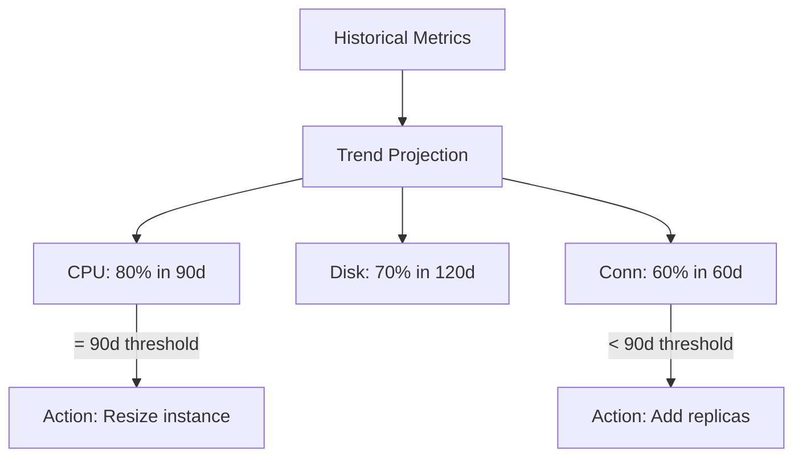
```mermaid
flowchart TD
    M[Historical Metrics] --> T[Trend Projection]
    T --> CPU["CPU: 80% in 90d"]
    T --> Disk["Disk: 70% in 120d"]
    T --> Conn["Conn: 60% in 60d"]
    Conn -->|"< 90d threshold"| A[Action: Add replicas]
    CPU -->|"= 90d threshold"| B[Action: Resize instance]
```

---

### 📶 Gradual Depth

**Level 1 - What it is:**
Capacity planning is predicting when your database will run out of CPU, memory, storage, or connections, so you can scale before it becomes an emergency.

**Level 2 - How to use it:**
Collect weekly snapshots of storage used, peak CPU, peak connections, and TPS from Prometheus or CloudWatch. Plot trends in a spreadsheet or Grafana. Extrapolate linearly to estimate when each resource hits 80% utilization. Schedule provisioning actions before that date.

**Level 3 - How it works:**
Fit a regression line to 90 days of historical resource utilization data. The slope gives the growth rate; the intercept with the capacity limit gives the exhaustion date. For storage, also model data retention: if you archive data older than 1 year, the effective growth rate is the difference between ingestion and archival. For connections, model per-service connection count and multiply by planned service deployments.

**Level 4 - Production mastery:**
Linear models break on step functions. Maintain a "capacity events calendar" listing upcoming feature launches with estimated impact (e.g., "new payment service: +50 connections, +2,000 TPS"). Apply the step function to the linear projection. Use percentile-based metrics (p95 CPU, p99 connection count) rather than averages, because averages hide peaks that cause outages. For PostgreSQL-specific planning: model bloat growth separately from data growth (`pg_total_relation_size` includes dead tuples), and model WAL volume for replication bandwidth planning.

---

### ⚙️ How It Works

**Phase 1 - Baseline:** Collect 90 days of daily metrics: peak CPU, peak memory, storage used, max connections, TPS, and pg_stat_statements top query times.

**Phase 2 - Trend analysis:** Fit linear regression to each metric. Calculate the slope (growth rate per day) and project the date when each metric crosses the threshold (e.g., 80% of limit).

**Phase 3 - Event overlay:** Review the capacity events calendar. Add step-function adjustments for known upcoming changes (feature launches, service deployments, marketing campaigns).

**Phase 4 - Action planning:** For each resource projected to hit threshold within the remediation window, plan the scaling action (resize instance, add replicas, archive data, optimize queries) and schedule it.

```
  Storage example:
  Current: 500 GB used / 1 TB disk
  Growth: 2 GB/day (linear fit)
  Time to 80%: (800-500) / 2 = 150 days
  Event: new feature in 60 days (+5 GB/day)
  Adjusted: 150 days -> ~55 days
  Action: expand disk before day 50
```

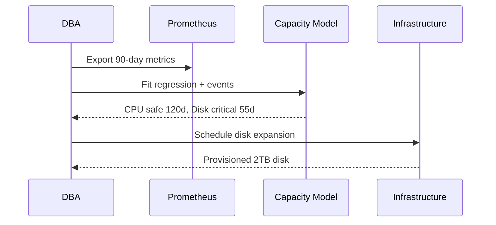
```mermaid
sequenceDiagram
    participant DBA
    participant Prom as Prometheus
    participant Model as Capacity Model
    participant Infra as Infrastructure
    DBA->>Prom: Export 90-day metrics
    DBA->>Model: Fit regression + events
    Model-->>DBA: CPU safe 120d, Disk critical 55d
    DBA->>Infra: Schedule disk expansion
    Infra-->>DBA: Provisioned 2TB disk
```

**BAD:**

```sql
-- Reactive: wait for disk full alert
-- "PANIC: could not write to file"
-- Emergency resize under production pressure
```

**GOOD:**

```sql
-- Proactive: monthly capacity check
SELECT pg_database_size('mydb')
       / (1024*1024*1024.0) AS gb_used,
       current_setting(
         'data_directory'
       ) AS data_dir;
-- Feed into regression model
-- Project exhaustion date
```

---

### 🚨 Failure Modes

**Failure 1 - Storage exhaustion crashes the database:**
**Symptom:** PostgreSQL stops accepting writes; error logs show "No space left on device"; WAL archiving fails.
**Root cause:** Data growth exceeded projections; no capacity model or model not updated after a growth event.
**Diagnostic:**

```bash
df -h /var/lib/postgresql/data
du -sh /var/lib/postgresql/data/pg_wal/
```

**Fix:** Immediately free space (drop temp tables, archive old partitions, clear pg_wal if replication slots are orphaned). Then implement proactive capacity monitoring with alerts at 70% and 85% thresholds.

**Failure 2 - Connection exhaustion during peak:**
**Symptom:** Application errors "too many connections"; new connection attempts rejected; PgBouncer `cl_waiting` spikes.
**Root cause:** New services deployed without accounting for their connection requirements; total demand exceeds `max_connections`.
**Diagnostic:**

```sql
SELECT count(*), state
FROM pg_stat_activity
GROUP BY state;
SHOW max_connections;
```

**Fix:** Increase `max_connections` (requires restart). Deploy PgBouncer if not present. Require every service to register its connection budget in the capacity model.

---

### 🔬 Production Reality

A common capacity planning failure: a team models storage growth linearly at 1 GB/day based on 6 months of history. A marketing campaign launches, driving 10x user signups for two weeks. Data growth jumps to 10 GB/day. The 1 TB disk, projected to last 500 more days, fills in 50. The team discovers the problem when WAL archiving fails (disk full), which blocks replication, which causes replica lag alerts. By then, the primary is minutes from halting writes. The fix: maintain a capacity events calendar linked to the product roadmap, and model step-function growth for every major launch.

---

### ⚖️ Trade-offs & Alternatives

| Aspect           | Spreadsheet Model   | Prometheus Trending | pganalyze / SaaS |
| ---------------- | ------------------- | ------------------- | ---------------- |
| Setup effort     | Low                 | Medium              | Low              |
| Accuracy         | Manual, error-prone | Automated, good     | Automated, good  |
| Event overlay    | Manual              | Manual              | Some built-in    |
| Automation       | None                | PromQL alerts       | Built-in alerts  |
| Cost             | Free                | Infra cost          | SaaS pricing     |
| Historical depth | Limited             | Retention-dependent | Provider-managed |

---

### ⚡ Decision Snap

**USE WHEN:**

- Database fleet has more than 2 instances
- Data growth rate is non-trivial (>1 GB/day)
- Capacity-related outages have occurred in the past

**AVOID WHEN:**

- Prototype or development environment with no uptime requirements
- Cloud auto-scaling handles all resources (rare for databases)

**PREFER SaaS tools (pganalyze, Datadog) WHEN:**

- The team lacks time to build custom regression models
- Automated recommendations (index, VACUUM, sizing) are valuable

---

### ⚠️ Top Traps

| #   | Misconception                                | Reality                                                                                                     |
| --- | -------------------------------------------- | ----------------------------------------------------------------------------------------------------------- |
| 1   | Linear growth models are always sufficient   | Feature launches and marketing campaigns create step functions that invalidate linear projections overnight |
| 2   | Cloud auto-scaling handles database capacity | Database scaling (resize, add replicas) is not instantaneous; it requires planning and maintenance windows  |
| 3   | Storage is the only resource that matters    | Connection count, CPU (from query complexity), and memory (from working set size) also hit limits           |
| 4   | Averages are good enough for planning        | Use p95/p99 metrics; averages hide peaks that cause outages during daily traffic spikes                     |
| 5   | Capacity planning is a one-time exercise     | Models drift as workloads change; review monthly and after every significant product change                 |

---

### 🪜 Learning Ladder

**Prerequisites:**

- SQL-121 Observability for Database Fleets - metrics collection that feeds capacity models
- SQL-089 VACUUM and Bloat Management (PostgreSQL) - bloat contributes to storage growth beyond raw data
- SQL-102 Connection Pooling - PgBouncer and HikariCP - connection management is a capacity concern

**THIS:** SQL-122 Database Capacity Planning and Growth Modeling

**Next steps:**

- SQL-113 Sharding Strategies - Application vs Proxy - the scaling action when single-node capacity is exhausted
- SQL-114 Multi-Database Topology Design - fleet architecture decisions driven by capacity needs
- SQL-098 Table Partitioning - Range, List, Hash - partitioning as a capacity management tool

**The Surprising Truth:**
The most common capacity planning failure is not bad math - it is the complete absence of a capacity events calendar linked to the product roadmap. The database team learns about a 10x traffic event from the outage, not from the product launch announcement.

**Further Reading:**

- Gunther, N. "Guerrilla Capacity Planning", Springer, 2007
- PostgreSQL Documentation: "Monitoring Database Activity" (postgresql.org/docs/current/monitoring.html)
- Google SRE Book: "Software Engineering at Google", Chapter on Capacity Planning

**Revision Card:**

1. Model four resources independently: CPU, memory, storage, connections - each has different growth patterns and remediation timelines
2. Overlay step-function events (feature launches, campaigns) on linear projections - they are the primary source of model failure
3. Act when projected exhaustion is within the remediation window (90 days for hardware, 30 days for cloud resize)

---

---

# SQL-123 ORM Impedance Mismatch Anti-Pattern

**TL;DR** - ORM impedance mismatch is the fundamental conflict between object-oriented models (graphs of mutable objects) and relational models (normalized sets of immutable tuples), causing N+1 queries, entity bloat, and hidden SQL.

---

### 🔥 Problem Statement

Object-Relational Mappers (Hibernate, SQLAlchemy, ActiveRecord, Entity Framework) promise to eliminate the gap between objects and tables. In practice, they mask it. A developer loads an `Order` object that lazy-loads `Customer`, which lazy-loads `Address`, which triggers three separate SQL queries per order - the N+1 problem. A `User` entity with 40 columns gets fetched entirely when only `name` and `email` are needed. A complex business query that a DBA would write as a single SQL statement with window functions becomes a chain of ORM method calls that generates 15 queries. The impedance mismatch is not a bug in the ORM - it is a fundamental conflict between two incompatible data models that the ORM can only hide, not solve.

---

### 📜 Historical Context

The term "object-relational impedance mismatch" was coined in the 1990s as OOP languages gained dominance. Ted Neward famously called it the "Vietnam of Computer Science" in a 2006 essay, arguing that the problem was fundamentally unsolvable. Hibernate (2001) and ActiveRecord (2004, Ruby on Rails) became dominant ORMs by trading SQL visibility for developer productivity. The JPA specification (2006) standardized the Java ORM interface. Despite decades of evolution, the core mismatch persists: objects have identity, inheritance, and encapsulation; relations have sets, normalization, and declarative queries. Every ORM chooses which side to favor, and the other side suffers.

---

### 🔩 First Principles

**CORE INVARIANTS:**

1. Objects are graphs with identity, state, and behavior; relations are sets of tuples without identity, state, or behavior - these are fundamentally different data models
2. ORMs must translate between graph traversal (object navigation) and set operations (SQL joins) - this translation always loses information or performance
3. The ORM's unit-of-work and identity map create an in-memory cache that diverges from the database state, producing stale reads and subtle concurrency bugs

**DERIVED DESIGN:**
These invariants force every ORM interaction to make a trade-off: eager loading (join everything upfront, potentially fetching unused data) vs. lazy loading (fetch on access, risking N+1 queries). The optimal strategy depends on the access pattern, which the ORM cannot predict at mapping time. This is why the anti-pattern manifests: developers write object-navigation code assuming in-memory cost, while the ORM silently issues SQL with network-round-trip cost.

**THE TRADE-OFF:**
**Gain:** Reduced boilerplate; domain model expressed in objects; database portability (in theory).
**Cost:** Hidden query patterns; N+1 performance traps; entity bloat; difficulty expressing set-based operations; SQL debugging is obfuscated.

---

### 🧠 Mental Model

> Think of a simultaneous translator between two speakers of different languages. The translator (ORM) can handle simple phrases well, but complex ideas lose nuance in translation. When one speaker uses an idiom (SQL window function), the translator either paraphrases awkwardly (multiple queries) or gives up (requires native SQL). The conversation works for small talk but breaks down for technical discussion.

- "Simple phrases" -> basic CRUD operations
- "Complex idioms" -> JOINs, window functions, CTEs
- "Awkward paraphrase" -> N+1 queries, entity over-fetching
- "Giving up" -> `@Query` with native SQL

**Where this analogy breaks down:** Unlike human translators who improve with practice, ORMs have a fixed translation capability determined by their design - they cannot learn new SQL patterns at runtime.

---

### 🧩 Components

- **Entity mapping** - annotations or configuration that map object classes to database tables and columns
- **Identity map** - per-session cache that ensures each database row maps to exactly one object instance
- **Unit of work** - tracks dirty objects and flushes changes to the database at transaction commit
- **Lazy loading proxy** - dynamically generated subclass that fetches related objects on first access
- **N+1 query problem** - pattern where loading N parent objects triggers N additional queries for child collections
- **Eager fetch strategy** - JOIN-based loading that fetches related objects in a single query
- **DTO projection** - pattern of selecting specific columns into a flat data structure instead of full entity

```
  ORM Abstraction Layers:
  +-------------------+
  | Application Code  |
  | order.getCustomer |
  +-------------------+
         |
  +-------------------+
  | ORM (Hibernate)   |
  | entity -> SQL     |
  +-------------------+
         |
  +-------------------+
  | JDBC / Driver     |
  +-------------------+
         |
  +-------------------+
  | PostgreSQL        |
  +-------------------+
```

```mermaid
flowchart TD
    App["Application Code\norder.getCustomer()"]
    ORM["ORM Layer\nEntity -> SQL translation"]
    JDBC["JDBC Driver"]
    PG["PostgreSQL"]
    App --> ORM
    ORM --> JDBC
    JDBC --> PG
```

---

### 📶 Gradual Depth

**Level 1 - What it is:**
ORM impedance mismatch is the fundamental conflict between how objects work (graphs with behavior) and how relational databases work (sets of tuples with constraints). ORMs translate between them, but the translation is always imperfect.

**Level 2 - How to use it:**
Recognize the anti-pattern by monitoring SQL output. Enable SQL logging in your ORM (`hibernate.show_sql`, Django `DEBUG` logging). Watch for N+1 patterns: one query to load a list, then one query per item to load a related object. Use eager fetching (`JOIN FETCH` in JPA) for known access patterns and DTO projections for read-heavy endpoints.

**Level 3 - How it works:**
When you call `order.getCustomer()`, Hibernate checks the identity map. If the customer is not cached, it issues `SELECT * FROM customers WHERE id = ?`. If you iterate over 100 orders, that is 100 individual SELECTs. With `JOIN FETCH`, Hibernate rewrites the query to `SELECT o.*, c.* FROM orders o JOIN customers c ON o.customer_id = c.id`, loading everything in one round trip. But eager fetching applied globally causes cartesian products when entities have multiple collections.

**Level 4 - Production mastery:**
The most effective mitigation is not fixing the ORM - it is bypassing it for read paths. Use DTO projections (JPA `@Query` returning interfaces or records, SQLAlchemy `query.with_entities()`) for API responses and reports. Reserve full entity loading for write operations where the unit-of-work pattern adds value. For complex queries (window functions, recursive CTEs, lateral joins), use native SQL or a query builder (JOOQ, Exposed). Monitor query count per request in production (Spring Boot Actuator, Hibernate statistics) and set a budget (e.g., max 10 queries per API call).

---

### ⚙️ How It Works

**Phase 1 - Entity loading:** The application requests an object. The ORM checks the identity map (first-level cache). If absent, it generates a SELECT and maps the result to an entity.

**Phase 2 - Graph navigation:** The application accesses a related object. The ORM detects the proxy and issues another SELECT (lazy load) or has already fetched it (eager load).

**Phase 3 - Modification tracking:** The unit of work tracks field changes on managed entities. At flush time, it generates UPDATE statements for dirty fields.

**Phase 4 - Flush and commit:** The ORM issues all pending INSERTs, UPDATEs, and DELETEs in dependency order, then commits the transaction.

```
  N+1 Pattern:
  SELECT * FROM orders;           -- 1 query
  -- For each of 100 orders:
  SELECT * FROM customers          -- 100 queries
  WHERE id = ?;                    -- TOTAL: 101

  Fixed with JOIN FETCH:
  SELECT o.*, c.* FROM orders o   -- 1 query
  JOIN customers c
  ON o.customer_id = c.id;        -- TOTAL: 1
```

```mermaid
sequenceDiagram
    participant App
    participant ORM as Hibernate
    participant DB as PostgreSQL
    App->>ORM: findAllOrders()
    ORM->>DB: SELECT * FROM orders
    DB-->>ORM: 100 rows
    loop For each order
        App->>ORM: order.getCustomer()
        ORM->>DB: SELECT * FROM customers WHERE id=?
        DB-->>ORM: 1 row
    end
    Note over App,DB: 101 queries total (N+1)
```

**BAD:**

```java
// N+1: 101 queries for 100 orders
List<Order> orders = repo.findAll();
for (Order o : orders) {
    // Triggers lazy load per order
    log.info(o.getCustomer().getName());
}
```

**GOOD:**

```java
// 1 query with JOIN FETCH
@Query("SELECT o FROM Order o "
     + "JOIN FETCH o.customer")
List<Order> findAllWithCustomer();

// Or: DTO projection (no entity overhead)
@Query("SELECT o.id, c.name "
     + "FROM Order o JOIN o.customer c")
List<OrderSummary> findSummaries();
```

---

### 🚨 Failure Modes

**Failure 1 - N+1 queries in a loop:**
**Symptom:** API endpoint takes 5 seconds to respond; SQL logging shows hundreds of nearly identical SELECT statements per request.
**Root cause:** Lazy-loaded collection accessed inside a loop; ORM issues one query per iteration.
**Diagnostic:**

```java
// Enable Hibernate statistics
Statistics stats = sessionFactory
    .getStatistics();
stats.setStatisticsEnabled(true);
// After request:
log.info("Queries: {}",
    stats.getQueryExecutionCount());
```

**Fix:** Use `JOIN FETCH` in JPQL, or `@EntityGraph` annotations, or DTO projections. Set a query count budget per request and alert when exceeded.

**Failure 2 - Entity bloat over-fetching:**
**Symptom:** Memory usage spikes; GC pauses increase; response payload is 10x larger than needed.
**Root cause:** Full entity with 40 columns loaded when only 3 are needed; ORM hydrates all fields including LOBs and eagerly fetched collections.
**Diagnostic:**

```sql
-- Check what ORM actually selects
-- Enable SQL logging:
-- hibernate.show_sql=true
-- hibernate.format_sql=true
-- Look for SELECT with many columns
```

**Fix:** Use DTO projections (`SELECT new OrderDTO(...)`) or interface-based projections. Map only the columns the consumer needs.

---

### 🔬 Production Reality

A typical ORM incident: a team builds an admin dashboard showing a list of 500 orders with customer names and product counts. The ORM loads 500 `Order` entities, each with a lazy `Customer` (500 more queries) and a lazy `OrderItems` collection (500 more queries, each returning multiple rows). Total: 1,501 queries, 8 seconds response time. A single SQL query with JOINs and COUNT would take 50ms. The fix is not "tune the ORM" - it is recognizing that read paths should bypass the entity model entirely and use projections or native SQL.

---

### ⚖️ Trade-offs & Alternatives

| Aspect                | Full ORM (Hibernate) | Query Builder (JOOQ)      | Raw SQL / JDBC |
| --------------------- | -------------------- | ------------------------- | -------------- |
| Boilerplate           | Low                  | Medium                    | High           |
| SQL visibility        | Low (generated)      | High (type-safe)          | Full           |
| N+1 risk              | High                 | None                      | None           |
| Complex query support | Limited              | Full SQL in type-safe DSL | Full           |
| Write convenience     | High (unit of work)  | Medium                    | Low            |
| Learning curve        | Medium               | Medium                    | Low            |

---

### ⚡ Decision Snap

**USE WHEN (full ORM):**

- Write-heavy CRUD operations where unit-of-work tracking reduces boilerplate
- Domain model maps cleanly to tables (1:1 entity-table)
- Team prioritizes development speed over query performance

**AVOID WHEN (full ORM):**

- Read-heavy workloads with complex joins, window functions, or CTEs
- Performance-critical paths where query count and shape must be controlled

**PREFER query builders (JOOQ) or projections WHEN:**

- SQL visibility and type-safety matter
- Queries involve aggregations, subqueries, or analytical functions

---

### ⚠️ Top Traps

| #   | Misconception                               | Reality                                                                                                          |
| --- | ------------------------------------------- | ---------------------------------------------------------------------------------------------------------------- |
| 1   | ORMs eliminate the need to understand SQL   | ORMs generate SQL; understanding the generated SQL is essential for diagnosing performance problems              |
| 2   | Eager fetching fixes N+1                    | Global eager fetching causes cartesian products and over-fetching; it must be applied per-query, not per-mapping |
| 3   | The ORM handles optimization automatically  | ORMs generate correct SQL, not optimal SQL; the planner sees the generated query, not your intent                |
| 4   | Entity models are good for reads and writes | Entities are optimized for writes (change tracking); reads are better served by projections                      |
| 5   | Switching ORMs fixes the impedance mismatch | The mismatch is between objects and relations, not between your code and a specific ORM library                  |

---

### 🪜 Learning Ladder

**Prerequisites:**

- SQL-060 Execution Plans Deep Dive - EXPLAIN ANALYZE - understanding the SQL that ORMs generate
- SQL-094 Query Planner and Cost-Based Optimization - why ORM-generated queries may get bad plans
- SQL-064 Query Performance Tuning Patterns - optimizing the queries you find in ORM output

**THIS:** SQL-123 ORM Impedance Mismatch Anti-Pattern

**Next steps:**

- SQL-107 Unindexed Foreign Key Anti-Pattern - common in ORM-generated schemas
- SQL-108 OFFSET Pagination at Scale Anti-Pattern - ORMs default to OFFSET pagination
- SQL-139 Set-Based Thinking vs Procedural Thinking - the root cause of ORM misuse

**The Surprising Truth:**
The best ORM strategy is not choosing between ORM and raw SQL - it is using the ORM for writes (where change tracking adds value) and bypassing it for reads (where projections and native SQL outperform entity loading by orders of magnitude).

**Further Reading:**

- Neward, T. "The Vietnam of Computer Science" (2006) essay on ORM impedance mismatch
- King, G. et al. "Java Persistence with Hibernate", Manning, 2nd Edition
- JOOQ Blog: "10 Common Mistakes Java Developers Make when Writing SQL" (jooq.org/blog)

**Revision Card:**

1. ORM impedance mismatch is fundamental: objects are graphs, relations are sets - no ORM can fully bridge this gap
2. The N+1 query pattern is the most common symptom; fix with JOIN FETCH, entity graphs, or DTO projections
3. Use the ORM for writes (unit-of-work value) and bypass it for reads (projection/native SQL for performance)

---

---

# SQL-124 Online Store DB - Phase 5 (Multi-Region Strategy)

**TL;DR** - Phase 5 evolves the online store database to multi-region by introducing geographic sharding, regional read replicas, conflict resolution for multi-primary writes, and data residency compliance.

---

### 🔥 Problem Statement

The online store has grown from a single-region deployment to global reach. Users in Europe experience 200ms+ latency querying a US-based primary. GDPR requires EU user data to reside in EU data centers. A US-region outage means the entire store is unavailable globally. Multi-region architecture addresses all three: place data close to users (latency), keep data in the correct jurisdiction (compliance), and survive regional failures (availability). But multi-region databases introduce the hardest distributed systems problems: cross-region replication lag, conflict resolution for concurrent writes, and the CAP theorem forcing trade-offs between consistency and availability during network partitions.

---

### 📜 Historical Context

Early global services used a single primary database with CDN caching for reads. Google Spanner (2012) demonstrated globally consistent multi-region transactions using TrueTime. CockroachDB (2015) and YugabyteDB (2016) brought Spanner-inspired multi-region SQL to open-source. PostgreSQL supports multi-region through replication and Citus, though without built-in global consistency. The online store's Phase 5 models a typical progression: from single-region with replicas to geographically sharded data with regional autonomy.

---

### 🔩 First Principles

**CORE INVARIANTS:**

1. Cross-region network latency (50-200ms round trip) makes synchronous replication expensive and asynchronous replication eventually consistent
2. Data residency laws (GDPR, data sovereignty) require certain data to be stored in specific geographic regions
3. Multi-primary writes to the same row from different regions require conflict resolution - last-write-wins, application-level merge, or CRDT-based resolution

**DERIVED DESIGN:**
These invariants force geographic sharding by region: EU users' data lives in an EU PostgreSQL cluster, US users' data in a US cluster. Global reference data (product catalog) replicates to all regions as read replicas. Writes for region-local data go to the regional primary. Cross-region queries (global analytics, global search) use federated queries or a replicated analytics warehouse. Conflict resolution is avoided by ensuring each row has a single authoritative region.

**THE TRADE-OFF:**
**Gain:** Low-latency reads and writes per region; data residency compliance; regional failure isolation.
**Cost:** Complexity of cross-region coordination; eventual consistency for global views; operational overhead of managing multiple clusters.

---

### 🧠 Mental Model

> Think of a franchise restaurant chain. Each regional kitchen (database cluster) handles local orders independently. The corporate menu (product catalog) is distributed to all locations. A customer in Paris orders from the Paris kitchen, not from New York. Global sales reports aggregate across all kitchens nightly.

- "Regional kitchen" -> regional PostgreSQL primary + replicas
- "Corporate menu" -> globally replicated reference data
- "Local order" -> regional write to local primary
- "Global sales report" -> cross-region analytics aggregation

**Where this analogy breaks down:** Restaurant orders do not need conflict resolution; database rows accessed from two regions simultaneously (e.g., a user who travels) require explicit routing rules.

---

### 🧩 Components

- **Regional primary clusters** - PostgreSQL primary + replicas per geographic region (US, EU, APAC)
- **Geographic shard key** - `region` column on user-owned tables determining which cluster owns the data
- **Global reference data** - product catalog, configuration tables replicated to all regions (read-only locally)
- **Regional connection router** - proxy or application logic directing queries to the correct regional cluster based on user's region
- **Cross-region replication** - logical replication from each regional primary to a central analytics warehouse
- **Conflict resolution policy** - rules for handling writes to the same logical entity from multiple regions (typically: single-owner region per entity)
- **Data residency metadata** - tagging system ensuring regulated data stays within its required jurisdiction

```
  Multi-Region Online Store:
  +----------+     +----------+     +----------+
  | US       |     | EU       |     | APAC     |
  | Primary  |     | Primary  |     | Primary  |
  | +Replicas|     | +Replicas|     | +Replicas|
  +----+-----+     +----+-----+     +----+-----+
       |                |                |
       +------+----+----+------+---------+
              |              |
        [Product Catalog   [Analytics
         Replicated to     Warehouse
         all regions]      (aggregated)]
```

```mermaid
flowchart TD
    subgraph US["US Region"]
        USP[US Primary] --> USR[US Replicas]
    end
    subgraph EU["EU Region"]
        EUP[EU Primary] --> EUR[EU Replicas]
    end
    subgraph APAC["APAC Region"]
        APP[APAC Primary] --> APR[APAC Replicas]
    end
    USP -->|catalog repl| EUP
    USP -->|catalog repl| APP
    USP -->|CDC| DW[Analytics Warehouse]
    EUP -->|CDC| DW
    APP -->|CDC| DW
```

---

### 📶 Gradual Depth

**Level 1 - What it is:**
Multi-region database strategy places separate database clusters in each geographic region so users get low-latency access, data residency laws are satisfied, and regional failures do not take down the global service.

**Level 2 - How to use it:**
Add a `region` column to user and order tables. Route each user's writes to their region's primary. Replicate the product catalog from a central source to all regions. Use a regional connection router (application-level or proxy) that reads the user's region from their profile and directs the connection accordingly.

**Level 3 - How it works:**
Each region runs an independent PostgreSQL cluster (primary + replicas). User data is sharded by region: a Paris user's orders exist only in the EU cluster. Global data (products, categories) is replicated from a central primary to all regional clusters using logical replication. Cross-region queries (global revenue report) are answered by an analytics warehouse that consumes CDC streams from all regions. Failover within a region is handled by Patroni; cross-region failover requires DNS-based rerouting.

**Level 4 - Production mastery:**
The hardest problem is users who change regions (relocation, travel). Options: (1) keep data in the original region and proxy reads from the new region (higher latency), (2) migrate data to the new region (complex, requires coordination), or (3) dual-write during transition (conflict-prone). For the online store, option 1 is simplest - a user in the EU temporarily visiting the US gets slightly higher latency but data stays compliant. Monitor cross-region replication lag for the product catalog; stale catalog data means a US product price change is not visible in EU for seconds to minutes.

---

### ⚙️ How It Works

**Phase 1 - Regional schema setup:** Deploy PostgreSQL clusters in US, EU, and APAC regions. Add `region` column to users, orders, and related tables. Populate existing data with region assignments.

**Phase 2 - Catalog replication:** Set up logical replication from the catalog-primary (e.g., US) to EU and APAC clusters. Products, categories, and pricing tables replicate as read-only subscriptions.

**Phase 3 - Connection routing:** Deploy a regional router (application middleware or proxy). When a user authenticates, the router reads their `region` attribute and directs all their queries to the corresponding cluster.

**Phase 4 - Analytics aggregation:** Deploy CDC connectors (Debezium) on each regional primary. Stream order events to a central analytics warehouse (Redshift, BigQuery, or a dedicated PostgreSQL instance) for global reporting.

```
  User (EU) places order:
  1. App reads user.region = 'EU'
  2. Router -> EU Primary
  3. INSERT INTO orders (region='EU', ...)
  4. CDC -> Analytics Warehouse

  Admin views global revenue:
  1. Query analytics warehouse
  2. Aggregates across US + EU + APAC data
```

```mermaid
sequenceDiagram
    participant User as EU User
    participant Router
    participant EU as EU Primary
    participant DW as Analytics Warehouse
    User->>Router: Place order
    Router->>Router: user.region = EU
    Router->>EU: INSERT INTO orders
    EU-->>User: Order confirmed
    EU->>DW: CDC event (async)
    Note over DW: Aggregates all regions
```

**BAD:**

```sql
-- Single global primary: high latency for EU
-- EU user -> US primary -> 200ms RTT per query
INSERT INTO orders (user_id, product_id, total)
VALUES (42, 101, 79.99);
-- EU user waits 200ms+ for write confirmation
```

**GOOD:**

```sql
-- Regional primary: low latency for EU
-- EU user -> EU primary -> 5ms RTT
INSERT INTO orders (
  user_id, product_id, total, region
) VALUES (42, 101, 79.99, 'EU');
-- Write confirmed in <10ms
```

---

### 🚨 Failure Modes

**Failure 1 - Stale product catalog after cross-region replication lag:**
**Symptom:** EU users see outdated product prices or unavailable products after a US-side catalog update.
**Root cause:** Logical replication from US catalog-primary to EU subscriber lags due to network latency or subscriber apply delay.
**Diagnostic:**

```sql
-- On EU subscriber
SELECT * FROM pg_stat_subscription;
-- Check latest_end_lsn vs remote LSN
```

**Fix:** Monitor catalog replication lag and alert if > 30 seconds. For price changes, use effective_date columns so price updates are not dependent on replication timing.

**Failure 2 - User region migration causes data inconsistency:**
**Symptom:** A user who relocated from US to EU sees some orders in one region and some in another; analytics double-counts.
**Root cause:** User's region was updated without migrating historical data; orders exist in both US and EU clusters.
**Diagnostic:**

```sql
-- Check for split data
SELECT region, count(*)
FROM orders
WHERE user_id = 42
GROUP BY region;
-- If multiple regions: data is split
```

**Fix:** Implement a region migration process: copy historical data to the new region, update the user's region attribute, then delete from the old region - all within a coordinated transaction or with idempotent reconciliation.

---

### 🔬 Production Reality

A common multi-region incident: the product team updates prices in the US catalog. Logical replication to EU takes 45 seconds during peak load. During that window, EU users see the old price, add items to their cart, and check out at the old price. The order total is calculated using the EU-local catalog (old price), not the US-updated price. The business loses revenue on discounted prices or overcharges on increased prices. The fix: decouple pricing from the catalog replication path. Use a pricing service with its own synchronous API call at checkout time, or embed prices at cart-creation time and validate at checkout against the canonical source.

---

### ⚖️ Trade-offs & Alternatives

| Aspect                   | Regional Sharding (PG)           | CockroachDB Multi-Region     | Spanner                  |
| ------------------------ | -------------------------------- | ---------------------------- | ------------------------ |
| Consistency model        | Regional strong, global eventual | Global strong (configurable) | Global strong (TrueTime) |
| Cross-region latency     | Async repl (low local)           | Sync for quorum (higher)     | Sync for quorum (higher) |
| Data residency           | Explicit by shard                | TABLE LOCALITY config        | Placement policies       |
| Operational complexity   | High (manual)                    | Medium (built-in)            | Low (managed)            |
| Cost                     | PostgreSQL license (free)        | Enterprise license           | GCP pricing              |
| PostgreSQL compatibility | Native                           | Wire-compatible              | Spanner SQL dialect      |

---

### ⚡ Decision Snap

**USE WHEN:**

- Users span multiple continents and latency matters
- Data residency regulations (GDPR) mandate geographic storage
- Regional failure isolation is a business requirement

**AVOID WHEN:**

- All users are in one geographic region
- Data volume and latency are manageable from a single region with CDN caching

**PREFER CockroachDB/Spanner WHEN:**

- Global strong consistency is required across regions
- The team cannot manage multi-cluster PostgreSQL replication operationally

---

### ⚠️ Top Traps

| #   | Misconception                                         | Reality                                                                                                                   |
| --- | ----------------------------------------------------- | ------------------------------------------------------------------------------------------------------------------------- |
| 1   | CDN caching solves multi-region for databases         | CDNs cache static content; database writes and personalized reads still need regional proximity                           |
| 2   | Cross-region replication is fast enough for real-time | Cross-region latency (50-200ms) makes synchronous replication expensive; async replication introduces consistency windows |
| 3   | Region assignment is static forever                   | Users relocate, travel, and access from unexpected regions; the architecture must handle region mobility                  |
| 4   | Global analytics just queries all regions             | Federated queries across regions are slow; use a replicated analytics warehouse for global reports                        |
| 5   | Multi-region means multi-primary writes               | Safest approach is single-owner-per-row; multi-primary writes to the same row require complex conflict resolution         |

---

### 🪜 Learning Ladder

**Prerequisites:**

- SQL-109 Online Store DB - Phase 4 (Internals and Tuning) - the single-region optimized store this phase extends
- SQL-113 Sharding Strategies - Application vs Proxy - geographic sharding builds on sharding fundamentals
- SQL-100 Logical Replication and Physical Replication - catalog replication between regions

**THIS:** SQL-124 Online Store DB - Phase 5 (Multi-Region Strategy)

**Next steps:**

- SQL-120 GDPR and Right-to-Erasure in SQL Systems - data residency and erasure in multi-region
- SQL-114 Multi-Database Topology Design - the broader topology pattern
- SQL-122 Database Capacity Planning and Growth Modeling - capacity planning per region

**The Surprising Truth:**
The hardest multi-region problem is not replication technology - it is the business logic for handling entities that cross region boundaries (users who travel, orders with multi-region fulfillment, global inventory counts) where no clean geographic partition exists.

**Further Reading:**

- Corbett, J. et al. "Spanner: Google's Globally-Distributed Database", OSDI 2012
- CockroachDB Documentation: "Multi-Region Capabilities" (cockroachlabs.com/docs/stable/multiregion-overview.html)
- PostgreSQL Documentation: "Logical Replication" (postgresql.org/docs/current/logical-replication.html)

**Revision Card:**

1. Multi-region shards by geography: each region's data lives in its local cluster for low latency and compliance
2. Global reference data (catalog) replicates to all regions; user data stays in its home region
3. Cross-region consistency is eventual; decouple latency-sensitive operations (pricing, inventory) from replication timing

---

---

# SQL-125 SQL Staff-Level Interview Scenarios

**TL;DR** - Staff-level SQL interviews test architectural reasoning, trade-off analysis, and production debugging - not syntax recall - through open-ended system design and incident response scenarios.

---

### 🔥 Problem Statement

Senior and staff engineer interviews test a fundamentally different skill than coding interviews. A candidate who can write a perfect window function query may fail when asked: "Your database is experiencing 10x latency increase after a deployment - walk me through diagnosis." Staff-level interviews evaluate architectural judgment (when to shard vs. replicate), trade-off reasoning (consistency vs. availability), incident response (systematic debugging under pressure), and system design (schema decisions that survive 100x growth). Candidates fail not because they lack SQL knowledge, but because they cannot apply that knowledge to ambiguous, multi-constraint production scenarios.

---

### 📜 Historical Context

Database interview questions have evolved through three eras. The 1990s-2000s focused on syntax: "Write a self-join." The 2010s shifted to query optimization: "Why is this query slow?" The current staff-level bar tests system reasoning: "Design the data layer for a multi-region e-commerce platform handling GDPR compliance." This evolution mirrors the industry shift from individual database servers to distributed database architectures where a single schema decision affects latency, compliance, and failure modes across dozens of services.

---

### 🔩 First Principles

**CORE INVARIANTS:**

1. Staff-level interviews evaluate decision-making under ambiguity, not knowledge recall - the candidate must identify constraints before proposing solutions
2. Every architectural decision has trade-offs; articulating what you sacrifice is as important as what you gain
3. Production debugging requires systematic narrowing (metrics -> queries -> plans -> root cause), not pattern-matching to memorized scenarios

**DERIVED DESIGN:**
These invariants force interview scenarios that are deliberately ambiguous. The interviewer provides a vague problem ("the database is slow") and evaluates the candidate's ability to ask clarifying questions, narrow the search space, propose multiple solutions with trade-offs, and justify a recommendation. The best answers demonstrate: "Here is what I would check first, here is why, here are two approaches with their trade-offs, and here is which I would choose given these constraints."

**THE TRADE-OFF:**
**Gain:** Identifies engineers who can make sound database architecture decisions in production.
**Cost:** Preparation requires broad and deep understanding of database internals, not just interview-specific practice.

---

### 🧠 Mental Model

> Think of a staff-level interview as a architecture review meeting, not an exam. The interviewer is a colleague asking: "How should we solve this?" The answer is evaluated on reasoning quality, trade-off awareness, and communication clarity - not on arriving at a specific "correct" answer.

- "Architecture review" -> open-ended scenario discussion
- "Colleague asking" -> collaborative problem-solving, not adversarial testing
- "Reasoning quality" -> systematic approach, first-principles thinking
- "No single correct answer" -> multiple valid approaches with different trade-offs

**Where this analogy breaks down:** Unlike real architecture reviews, interview scenarios have time pressure and the interviewer may push back on your approach to test your conviction and adaptability.

---

### 🧩 Components

- **System design scenario** - open-ended problem requiring schema design, scaling strategy, and trade-off discussion
- **Incident response scenario** - simulated production problem requiring systematic debugging from symptoms to root cause
- **Trade-off analysis** - comparing two or more approaches with explicit gains and costs
- **Schema evolution scenario** - adding features or compliance requirements to an existing schema without breaking production
- **Capacity reasoning** - estimating data volume, query rates, and resource requirements from requirements

```
  Staff Interview Structure:
  +-------------------------+
  | 1. Problem statement    | (5 min)
  |    (deliberately vague) |
  +-------------------------+
  | 2. Clarifying questions | (10 min)
  |    (candidate drives)   |
  +-------------------------+
  | 3. Solution design      | (20 min)
  |    (with trade-offs)    |
  +-------------------------+
  | 4. Deep dive / pushback | (10 min)
  |    (failure modes, edge)|
  +-------------------------+
  | 5. Reflection           | (5 min)
  |    (what would change)  |
  +-------------------------+
```

```mermaid
flowchart TD
    P[Problem Statement] --> C[Clarifying Questions]
    C --> S[Solution Design]
    S --> D[Deep Dive / Pushback]
    D --> R[Reflection / Trade-offs]
```

---

### 📶 Gradual Depth

**Level 1 - What it is:**
Staff-level SQL interviews use open-ended scenarios to evaluate your ability to design database architectures, debug production problems, and reason about trade-offs - skills that syntax-focused interviews miss.

**Level 2 - How to use it:**
Practice by working through scenario prompts: "Design the data layer for X." For each, practice the sequence: clarify requirements -> estimate scale -> propose schema -> discuss trade-offs -> address failure modes. Time yourself to 45 minutes per scenario.

**Level 3 - How it works:**
Interviewers evaluate five dimensions: (1) Do you ask the right clarifying questions? (2) Does your design handle the stated scale? (3) Can you articulate trade-offs between alternatives? (4) Do you anticipate failure modes? (5) Can you evolve the design when requirements change? Strong candidates naturally touch all five; weak candidates jump to a solution without clarifying constraints.

**Level 4 - Production mastery:**
The differentiator at staff level is production intuition: knowing which theoretical solutions fail in practice. When someone proposes SERIALIZABLE isolation, you ask about throughput impact. When someone proposes sharding, you ask about cross-shard join patterns. When someone proposes CQRS, you ask about event schema evolution. This intuition comes from operating databases at scale, which is why staff interviews favor candidates with production experience over those with only theoretical knowledge.

---

### ⚙️ How It Works

**Phase 1 - Requirements gathering:** The interviewer describes a vague problem. The candidate must ask: What is the read/write ratio? What is the data volume? What are the consistency requirements? What are the latency SLAs? What compliance constraints exist?

**Phase 2 - Schema and architecture:** Based on clarified requirements, the candidate proposes: table design (normalized? denormalized?), indexing strategy, scaling approach (replicas? shards? CQRS?), and connection architecture.

**Phase 3 - Trade-off discussion:** The interviewer challenges the design: "What if traffic is 10x? What about GDPR? What if the primary fails?" The candidate must adapt the design or articulate why the current approach is sufficient.

**Phase 4 - Incident scenario:** "Users report that order creation is taking 30 seconds. Walk me through diagnosis." The candidate demonstrates systematic debugging: check pg_stat_activity for locks, check pg_stat_statements for plan regressions, check replication lag, check recent deployments.

```
  Scenario: "Design the database layer for
  a global e-commerce platform."

  Strong candidate flow:
  1. "How many regions? Users? Orders/day?"
  2. "Read/write ratio? Consistency needs?"
  3. "GDPR or data residency requirements?"
  4. Proposes: regional sharding by user,
     replicated product catalog, CDC to
     analytics warehouse
  5. Discusses: cross-region consistency
     trade-off, user migration between
     regions, pricing consistency
```

```mermaid
sequenceDiagram
    participant I as Interviewer
    participant C as Candidate
    I->>C: Design DB for global e-commerce
    C->>I: How many regions? Users? TPS?
    I->>C: 3 regions, 10M users, 50K TPS
    C->>I: GDPR requirements?
    I->>C: EU data must stay in EU
    C->>C: Proposes regional sharding
    C->>I: Trade-offs: consistency vs latency
    I->>C: What if a user relocates?
    C->>I: Options: proxy reads vs data migration
```

**BAD:**

```
Candidate: "I would use PostgreSQL with
read replicas."
(No clarifying questions, no trade-offs,
no failure mode discussion, no scale
reasoning)
```

**GOOD:**

```
Candidate: "Before designing, I need to
understand: what is the read/write ratio?
What are the consistency requirements per
operation? Are there data residency
constraints? What is the expected growth
rate? Let me sketch two approaches and
compare their trade-offs..."
```

---

### 🚨 Failure Modes

**Failure 1 - Jumping to solution without clarifying requirements:**
**Symptom:** Candidate immediately proposes a technology ("use Cassandra") without understanding the access patterns or constraints.
**Root cause:** Pattern-matching to memorized architectures instead of reasoning from requirements.
**Diagnostic:**

```
Interviewer signal: "What assumptions
are you making?"
If candidate cannot list assumptions:
RED FLAG
```

**Fix:** Practice the discipline of spending the first 10 minutes exclusively on clarifying questions. Write down requirements before sketching any architecture.

**Failure 2 - Presenting only one solution without trade-offs:**
**Symptom:** Candidate describes a single architecture as "the best" without acknowledging alternatives or costs.
**Root cause:** Lack of exposure to multiple approaches; inability to reason about when an approach is inappropriate.
**Diagnostic:**

```
Interviewer signal: "What would you
do differently if [constraint changed]?"
If candidate cannot adapt: RED FLAG
```

**Fix:** For every architecture decision, practice naming at least one alternative and articulating: "I chose X over Y because of [constraint]. If that constraint changed, Y would be better because [reason]."

---

### 🔬 Production Reality

A common staff-level interview failure: the candidate designs a clean CQRS architecture with event sourcing, sharding, and multi-region replication. When the interviewer asks "How would your team of 5 engineers operate this?", the candidate has no answer. The design is technically sound but operationally impractical. Staff-level evaluation includes operational judgment: the best architecture is the one the team can actually build, deploy, monitor, and debug. Over-engineering for theoretical scale at the cost of operational simplicity is a staff-level anti-pattern.

---

### ⚖️ Trade-offs & Alternatives

| Aspect              | Syntax-Focused Interview | System Design Interview | Incident Response Interview |
| ------------------- | ------------------------ | ----------------------- | --------------------------- |
| Tests for           | SQL knowledge            | Architectural reasoning | Debugging methodology       |
| Format              | Write a query            | Design a system         | Diagnose a problem          |
| Seniority signal    | Junior-Mid               | Mid-Staff               | Senior-Staff                |
| Preparation         | Practice problems        | Study architectures     | Study real incidents        |
| Evaluation criteria | Correctness              | Trade-off quality       | Systematic approach         |

---

### ⚡ Decision Snap

**USE WHEN (interviewing):**

- Evaluating staff/principal-level candidates
- The role requires database architecture ownership
- Production debugging is a critical job function

**AVOID WHEN (interviewing):**

- Evaluating junior candidates who need syntax assessment
- The role is application-focused with minimal database work

**PREFER incident scenarios WHEN:**

- The role is SRE or DBA-focused
- On-call debugging is a primary responsibility

---

### ⚠️ Top Traps

| #   | Misconception                                      | Reality                                                                                                                         |
| --- | -------------------------------------------------- | ------------------------------------------------------------------------------------------------------------------------------- |
| 1   | Memorizing architectures is sufficient preparation | Interviewers test reasoning, not recall; memorized answers fail under pushback and changing constraints                         |
| 2   | There is one correct answer to design questions    | Multiple valid approaches exist; the evaluation is on trade-off reasoning, not on matching the interviewer's preferred solution |
| 3   | More complex designs score higher                  | Over-engineering for imagined scale is a negative signal; the simplest design that meets requirements wins                      |
| 4   | Syntax perfection matters at staff level           | Minor syntax errors are irrelevant; architectural judgment and trade-off analysis are the evaluation criteria                   |
| 5   | You should never say "I don't know"                | Admitting uncertainty with a systematic plan to resolve it ("I would check X to verify") is stronger than fabricating an answer |

---

### 🪜 Learning Ladder

**Prerequisites:**

- SQL-111 SQL Deep-Dive Interview Questions - expert-level query and performance questions
- SQL-110 SQL Expert-Level Mastery Verification - self-assessment of deep SQL knowledge
- SQL-113 Sharding Strategies - Application vs Proxy - common staff-level design discussion topic

**THIS:** SQL-125 SQL Staff-Level Interview Scenarios

**Next steps:**

- SQL-116 CQRS and Read/Write Separation Architecture - frequent staff-level design topic
- SQL-114 Multi-Database Topology Design - system design scenario standard topic
- SQL-124 Online Store DB - Phase 5 (Multi-Region Strategy) - end-to-end design exercise

**The Surprising Truth:**
The most effective staff-level interview preparation is not studying more architectures - it is practicing the skill of reasoning aloud under ambiguity, because interviewers evaluate your thought process more than your conclusion.

**Further Reading:**

- Kleppmann, M. "Designing Data-Intensive Applications", O'Reilly, 2017 (the most cited reference for system design interviews)
- Xu, A. "System Design Interview: An Insider's Guide", Volume 1 and 2
- Google SRE Book: "Site Reliability Engineering", Chapters on Debugging and Capacity Planning

**Revision Card:**

1. Staff interviews test architectural reasoning and trade-off analysis, not syntax recall - ask clarifying questions before proposing solutions
2. Always present at least two approaches with explicit trade-offs; the simplest design that meets requirements is usually the best answer
3. Production intuition (knowing what fails in practice) is the differentiator; over-engineering for imagined scale is a negative signal

---

---

# SQL-126 Teaching Transaction Isolation - Common Confusions

**TL;DR** - Transaction isolation is the most misunderstood SQL concept because the standard defines anomalies imprecisely, implementations diverge from the spec, and developers confuse isolation levels with locking behavior.

---

### 🔥 Problem Statement

Ask ten developers what REPEATABLE READ prevents, and you will get ten different answers. The SQL standard defines isolation levels by which anomalies they prevent (dirty reads, non-repeatable reads, phantoms), but the definitions are ambiguous enough that PostgreSQL, MySQL, and Oracle implement "REPEATABLE READ" with fundamentally different behaviors. PostgreSQL's REPEATABLE READ uses snapshots and allows write skew; MySQL's uses next-key locking and prevents phantoms. A developer who learned isolation on MySQL will write subtly broken code on PostgreSQL, and vice versa. The confusion is not laziness - it is that the standard itself is insufficient, and every database fills the gaps differently.

---

### 📜 Historical Context

The SQL-92 standard defined four isolation levels (READ UNCOMMITTED, READ COMMITTED, REPEATABLE READ, SERIALIZABLE) in terms of three phenomena (dirty read, non-repeatable read, phantom). Berenson et al.'s landmark 1995 paper "A Critique of ANSI SQL Isolation Levels" demonstrated that this definition is both ambiguous and incomplete - it misses anomalies like write skew and read-only anomalies that occur in MVCC-based implementations. Adya, Liskov, and O'Neil (1999) proposed a formal taxonomy using dependency graphs. Despite these critiques, the SQL standard has not been updated, and implementations continue to diverge.

---

### 🔩 First Principles

**CORE INVARIANTS:**

1. The SQL standard defines isolation levels by phenomena prevented, but does not specify the implementation mechanism (locks vs. MVCC vs. optimistic) - leaving room for divergent behavior
2. MVCC-based isolation (PostgreSQL) and lock-based isolation (MySQL/InnoDB) prevent different anomaly sets at the same named level
3. SERIALIZABLE is the only level with a formal guarantee (equivalent to serial execution), but its implementation varies: PostgreSQL uses Serializable Snapshot Isolation (SSI), MySQL uses lock-based two-phase locking

**DERIVED DESIGN:**
These invariants mean that teaching isolation requires teaching three things simultaneously: the standard's definitions (what the spec says), the implementation's behavior (what the database actually does), and the gap between them (where bugs hide). Effective teaching uses concrete examples showing the same transaction sequence producing different results on PostgreSQL vs. MySQL, making the divergence tangible.

**THE TRADE-OFF:**
**Gain:** Deep understanding of isolation prevents subtle concurrency bugs that are nearly impossible to reproduce in testing.
**Cost:** Teaching effort is high because the topic requires understanding both theory and implementation, and the standard is a misleading starting point.

---

### 🧠 Mental Model

> Think of isolation levels as noise-canceling headphones with different settings. "READ COMMITTED" cancels most background noise (dirty reads) but lets some through. "REPEATABLE READ" cancels more (non-repeatable reads) but the remaining noise depends on the headphone brand (database engine). "SERIALIZABLE" cancels all noise, but you pay for it with battery life (performance).

- "Headphone brand" -> database engine (PostgreSQL vs. MySQL)
- "Same setting, different noise cancellation" -> same level name, different anomaly prevention
- "Battery life" -> performance cost of stronger isolation

**Where this analogy breaks down:** Noise cancellation is a spectrum; isolation anomalies are discrete categories that either occur or do not - and different engines prevent entirely different anomaly types at the same named level.

---

### 🧩 Components

- **Dirty read** - reading uncommitted data from another transaction (prevented by READ COMMITTED and above)
- **Non-repeatable read** - reading the same row twice yields different values because another transaction committed between reads
- **Phantom** - re-executing a range query yields different rows because another transaction inserted/deleted rows matching the predicate
- **Write skew** - two transactions read overlapping data, make disjoint writes based on what they read, and the combined result is inconsistent (NOT prevented by PostgreSQL REPEATABLE READ)
- **Snapshot Isolation (SI)** - each transaction sees a consistent snapshot; PostgreSQL's REPEATABLE READ is actually SI
- **Serializable Snapshot Isolation (SSI)** - PostgreSQL's SERIALIZABLE; detects serialization conflicts and aborts one transaction

```
  Anomaly Prevention Matrix:
                        Dirty  Non-Rep  Phantom  Write
                        Read   Read     Read     Skew
  READ COMMITTED (PG)   NO     YES      YES      YES
  REPEATABLE READ (PG)  NO     NO       NO       YES
  REPEATABLE READ (My)  NO     NO       NO       YES
  SERIALIZABLE (PG/SSI) NO     NO       NO       NO
  SERIALIZABLE (My/2PL) NO     NO       NO       NO
  (YES = anomaly possible, NO = prevented)
```

```mermaid
flowchart LR
    RC["READ COMMITTED\n(prevents: dirty read)"]
    RR_PG["REP READ (PG)\n+non-repeat,+phantom\nwrite skew ok"]
    RR_My["REP READ (MySQL)\n+non-repeat,+phantom\nwrite skew ok"]
    SER["SERIALIZABLE\n(prevents: all anomalies)"]
    RC --> RR_PG
    RC --> RR_My
    RR_PG --> SER
    RR_My --> SER
```

---

### 📶 Gradual Depth

**Level 1 - What it is:**
Transaction isolation levels control how much of other transactions' work your transaction can see. Higher levels prevent more anomalies but cost more performance. The confusion is that different databases implement the same level name differently.

**Level 2 - How to use it:**
Default to READ COMMITTED for most workloads (PostgreSQL's default). Use REPEATABLE READ when you need a consistent snapshot for a multi-statement read. Use SERIALIZABLE only when write skew would produce incorrect results (e.g., double-booking, constraint enforcement across rows). Always test isolation behavior on your specific database engine, not from the SQL standard.

**Level 3 - How it works:**
PostgreSQL implements READ COMMITTED by taking a new snapshot at each statement. REPEATABLE READ takes one snapshot at transaction start and uses it for all statements. SERIALIZABLE adds predicate tracking (SSI) that detects read-write conflicts and aborts one transaction. MySQL implements REPEATABLE READ with next-key locking (gap locks) that physically prevent other transactions from inserting into locked ranges, preventing phantoms through locks rather than snapshots.

**Level 4 - Production mastery:**
Write skew is the critical gap. Two transactions each read that a constraint is satisfied, then each writes a change that individually is fine but together violates the constraint. Example: two on-call doctors each check "at least one doctor is on call," then each removes themselves - leaving zero on call. PostgreSQL REPEATABLE READ allows this because each transaction's snapshot does not see the other's uncommitted write. Only SERIALIZABLE (SSI) detects and aborts one. In MySQL, gap locking at REPEATABLE READ may prevent some write skew patterns but not all. The only portable guarantee is SERIALIZABLE.

---

### ⚙️ How It Works

**Phase 1 - Transaction start:** The isolation level is set at BEGIN (`BEGIN ISOLATION LEVEL REPEATABLE READ`). PostgreSQL acquires a snapshot; MySQL establishes lock scoping rules.

**Phase 2 - Read execution:** PostgreSQL evaluates visibility using snapshot (xmin/xmax checks). MySQL acquires shared read locks (or uses snapshots depending on query type and isolation).

**Phase 3 - Write execution:** PostgreSQL checks for write-write conflicts (two transactions modifying the same row at REPEATABLE READ fail with serialization error). MySQL acquires exclusive row and gap locks.

**Phase 4 - Commit or abort:** PostgreSQL SSI (SERIALIZABLE) checks the dependency graph for cycles and aborts one transaction if detected. MySQL releases locks at commit.

```
  Write Skew Example:
  Table: doctors (name, on_call)
  Invariant: count(on_call=true) >= 1

  TX1 (REPEATABLE READ):
    SELECT count(*) FROM doctors
    WHERE on_call = true;      -- sees 2
    UPDATE doctors SET on_call = false
    WHERE name = 'Alice';

  TX2 (REPEATABLE READ):
    SELECT count(*) FROM doctors
    WHERE on_call = true;      -- sees 2
    UPDATE doctors SET on_call = false
    WHERE name = 'Bob';

  Both commit. on_call doctors = 0.
  Invariant VIOLATED.
```

```mermaid
sequenceDiagram
    participant TX1
    participant DB as PostgreSQL (RR)
    participant TX2
    TX1->>DB: SELECT count on_call (sees 2)
    TX2->>DB: SELECT count on_call (sees 2)
    TX1->>DB: UPDATE Alice on_call=false
    TX2->>DB: UPDATE Bob on_call=false
    TX1->>DB: COMMIT (succeeds)
    TX2->>DB: COMMIT (succeeds)
    Note over DB: 0 on-call! Invariant broken
```

**BAD:**

```sql
-- Assumes RR prevents write skew
BEGIN ISOLATION LEVEL REPEATABLE READ;
SELECT count(*) FROM doctors
WHERE on_call = true;
-- Sees 2, proceeds to remove one
UPDATE doctors SET on_call = false
WHERE name = 'Alice';
COMMIT;
-- Both TXs succeed: 0 on-call
```

**GOOD:**

```sql
-- Use SERIALIZABLE to prevent write skew
BEGIN ISOLATION LEVEL SERIALIZABLE;
SELECT count(*) FROM doctors
WHERE on_call = true;
UPDATE doctors SET on_call = false
WHERE name = 'Alice';
COMMIT;
-- SSI detects conflict, aborts one TX
-- Application retries the aborted TX
```

---

### 🚨 Failure Modes

**Failure 1 - Write skew in REPEATABLE READ producing inconsistent data:**
**Symptom:** Business invariant violated (double-booking, overselling, constraint violation across rows) despite using REPEATABLE READ.
**Root cause:** REPEATABLE READ (snapshot isolation) does not detect read-write dependency cycles; write skew goes undetected.
**Diagnostic:**

```sql
-- Check if the application uses RR
SHOW default_transaction_isolation;
-- Look for patterns where two TXs read
-- overlapping data and write disjoint rows
```

**Fix:** Use SERIALIZABLE isolation for transactions that enforce cross-row invariants. Implement application-level retry for serialization failures (`SQLSTATE 40001`).

**Failure 2 - MySQL-to-PostgreSQL migration exposes new anomalies:**
**Symptom:** Application that worked correctly on MySQL exhibits subtle data inconsistencies on PostgreSQL.
**Root cause:** MySQL's REPEATABLE READ uses gap locking that prevented certain anomalies; PostgreSQL's snapshot-based RR does not.
**Diagnostic:**

```sql
-- Compare behavior:
-- MySQL RR: gap locks prevent phantom inserts
-- PostgreSQL RR: snapshots hide new rows but
--   allow concurrent inserts that commit after
--   the snapshot
```

**Fix:** Audit all transaction isolation assumptions in the application. Test concurrent scenarios on PostgreSQL specifically. Consider upgrading critical transactions to SERIALIZABLE.

---

### 🔬 Production Reality

A common isolation confusion incident: a team implements an inventory reservation system using REPEATABLE READ. Two concurrent requests each check `WHERE quantity >= requested_amount`, see sufficient stock, and each decrements quantity. Both commit. Inventory goes negative. The team assumes REPEATABLE READ prevents this because "it sees a consistent snapshot." But consistent snapshots do not prevent write skew - both transactions see the same pre-decrement value and both succeed. The fix: use SERIALIZABLE, or use explicit locking (`SELECT ... FOR UPDATE`), or use atomic operations (`UPDATE ... SET quantity = quantity - $1 WHERE quantity >= $1`).

---

### ⚖️ Trade-offs & Alternatives

| Aspect                   | READ COMMITTED      | REPEATABLE READ (PG)        | SERIALIZABLE (PG)            |
| ------------------------ | ------------------- | --------------------------- | ---------------------------- |
| Anomalies prevented      | Dirty read          | + non-repeatable, phantom   | All (incl. write skew)       |
| Performance overhead     | Lowest              | Snapshot maintenance        | SSI tracking overhead        |
| Abort risk               | None (no conflicts) | Write-write conflicts       | Read-write conflicts         |
| Application retry needed | No                  | Sometimes (write conflicts) | Yes (serialization failures) |
| PostgreSQL default       | Yes                 | No                          | No                           |

---

### ⚡ Decision Snap

**USE READ COMMITTED WHEN:**

- Workload is mostly independent transactions without multi-statement reads
- Application logic handles stale reads via optimistic locking

**USE REPEATABLE READ WHEN:**

- Multi-statement transactions need a consistent snapshot (reports within a transaction)
- Write skew is not a concern for this workload

**USE SERIALIZABLE WHEN:**

- Business invariants span multiple rows (booking, inventory, balances)
- Correctness is more important than throughput
- The application can retry aborted transactions

---

### ⚠️ Top Traps

| #   | Misconception                                              | Reality                                                                                                                                        |
| --- | ---------------------------------------------------------- | ---------------------------------------------------------------------------------------------------------------------------------------------- |
| 1   | REPEATABLE READ prevents all anomalies except phantoms     | PostgreSQL's RR allows write skew; the SQL standard's phantom definition is ambiguous                                                          |
| 2   | Isolation level names mean the same thing across databases | PostgreSQL, MySQL, and Oracle implement the same named levels with different anomaly prevention                                                |
| 3   | SERIALIZABLE is too slow for production                    | PostgreSQL's SSI is optimistic (no blocking); overhead is moderate, and for many workloads it is negligible                                    |
| 4   | SELECT FOR UPDATE and SERIALIZABLE are interchangeable     | FOR UPDATE prevents concurrent modifications to selected rows; SERIALIZABLE detects all serialization anomalies including read-write conflicts |
| 5   | Testing catches isolation bugs                             | Isolation bugs require specific interleaving of concurrent transactions; they are nearly impossible to reproduce reliably in testing           |

---

### 🪜 Learning Ladder

**Prerequisites:**

- SQL-067 Transaction Isolation Levels - foundational understanding of the four levels
- SQL-085 MVCC Internals - How Concurrent Reads Work - how PostgreSQL implements snapshot isolation
- SQL-069 Optimistic vs Pessimistic Locking - locking as an alternative to higher isolation levels

**THIS:** SQL-126 Teaching Transaction Isolation - Common Confusions

**Next steps:**

- SQL-131 Isolation Formalism - Adya, Liskov, O'Neil (1999) - formal theory beyond the SQL standard
- SQL-092 Deadlock Detection and Resolution - what happens when lock-based isolation creates cycles
- SQL-127 Relational Algebra - The Theory Behind SQL - foundational theory connecting to formal isolation models

**The Surprising Truth:**
PostgreSQL's REPEATABLE READ is actually Snapshot Isolation - a level not defined in the SQL standard at all. The standard has no name for it. PostgreSQL calls it REPEATABLE READ because it is strictly stronger than the standard's definition, but weaker than SERIALIZABLE - a subtlety that trips up even experienced engineers.

**Further Reading:**

- Berenson, H. et al. "A Critique of ANSI SQL Isolation Levels", ACM SIGMOD 1995
- Ports, D. and Grittner, K. "Serializable Snapshot Isolation in PostgreSQL", VLDB 2012
- PostgreSQL Documentation: "Transaction Isolation" (postgresql.org/docs/current/transaction-iso.html)

**Revision Card:**

1. Isolation level names are not portable - PostgreSQL, MySQL, and Oracle implement the same names with different anomaly prevention
2. Write skew is the critical gap: REPEATABLE READ allows it on PostgreSQL; only SERIALIZABLE (SSI) prevents it
3. The SQL standard defines isolation incompletely; always test concurrent behavior on your specific database engine

---

---

# SQL-127 Relational Algebra - The Theory Behind SQL

**TL;DR** - Relational algebra is SQL's mathematical foundation: the set of operations the query planner uses to transform your declaration into an optimal execution plan.

---

### 🔥 Problem Statement

SQL is a declarative language - you say what you want, not how to get it. But the database must translate your declaration into a sequence of physical operations (scan a table, build a hash, probe an index). Relational algebra is the intermediate representation: a formal set of operations on relations (sets of tuples) that is equivalent in expressive power to SQL. Every SQL query is first translated into a relational algebra expression tree, and then the optimizer transforms that tree using algebraic equivalences (commutativity, associativity, push-down) to find the cheapest execution plan. Without understanding relational algebra, you cannot understand why the planner chooses one plan over another, why certain query rewrites improve performance, or why some queries are fundamentally impossible to optimize.

---

### 📜 Historical Context

Edgar F. Codd introduced the relational model and relational algebra in his 1970 paper "A Relational Model of Data for Large Shared Data Banks" at IBM. Codd defined six primitive operations (selection, projection, Cartesian product, union, set difference, rename) and proved that they are sufficient to express any query on relations. The SQL language (originally SEQUEL, IBM 1974) was designed as a user-friendly syntax for relational algebra. The Selinger optimizer (System R, 1979) was the first cost-based optimizer to use algebraic equivalences for plan optimization, establishing the approach that every modern RDBMS follows.

---

### 🔩 First Principles

**CORE INVARIANTS:**

1. Relations are sets of tuples (no duplicates, no order); every relational algebra operation takes one or more relations as input and produces a relation as output (closure property)
2. Selection (sigma) filters rows, projection (pi) filters columns, and join combines relations - these three operations correspond directly to WHERE, SELECT column list, and JOIN in SQL
3. Algebraic equivalences (e.g., pushing selection before join, reordering joins) are the foundation of query optimization - they guarantee the same result with potentially different performance

**DERIVED DESIGN:**
The closure property means operations can be composed: the output of one operation is the input to another, forming expression trees. The optimizer transforms these trees using equivalences: pushing sigma (filter) below join (reducing the number of rows joined) is always safe and usually faster. Join reordering uses commutativity and associativity to find the cheapest join order. Understanding these equivalences explains why adding a WHERE clause can make a query faster even when it returns the same rows (because it changes the algebra tree).

**THE TRADE-OFF:**
**Gain:** Formal foundation for query optimization; understanding why query plans change; ability to write optimizer-friendly SQL.
**Cost:** Abstract mathematics that requires effort to connect to practical SQL; the algebra operates on sets, but SQL operates on bags (multisets with duplicates) - a divergence that causes confusion.

---

### 🧠 Mental Model

> Think of relational algebra as a recipe system where each instruction (chop, mix, filter) takes ingredients (relations) and produces new ingredients (new relations). The chef (optimizer) can reorder instructions - filtering before mixing is faster than mixing everything and filtering afterward, but the dish (result) tastes the same.

- "Filtering before mixing" -> pushing selection below join
- "Recipe reordering" -> algebraic equivalences
- "Same dish" -> same query result
- "Chef choosing order" -> cost-based optimizer

**Where this analogy breaks down:** Cooking operations are not always reorderable (you cannot unbake a cake); relational algebra operations have formal equivalences that guarantee identical results regardless of order.

---

### 🧩 Components

- **Selection (sigma)** - filters rows matching a predicate: `sigma_{age > 30}(Employees)` = `WHERE age > 30`
- **Projection (pi)** - selects specific columns: `pi_{name, salary}(Employees)` = `SELECT name, salary`
- **Cartesian product (x)** - all combinations of rows from two relations (rarely used directly; join = product + selection)
- **Join (bowtie)** - combines rows from two relations where a condition holds: `R bowtie_{R.id = S.fk} S` = `R JOIN S ON R.id = S.fk`
- **Union** - combines rows from two relations with the same schema (SQL UNION)
- **Set difference** - rows in R but not in S (SQL EXCEPT)
- **Rename (rho)** - renames attributes or relations (SQL AS)

```
  SQL -> Relational Algebra -> Plan:

  SELECT e.name, d.dept_name
  FROM employees e
  JOIN departments d ON e.dept_id = d.id
  WHERE e.salary > 100000

  Algebra tree:
      pi(name, dept_name)
           |
      sigma(salary > 100000)
           |
       bowtie(dept_id = id)
        /         \
  employees    departments

  Optimized (push sigma down):
      pi(name, dept_name)
           |
       bowtie(dept_id = id)
        /         \
  sigma(salary>100k)  departments
       |
  employees
```

```mermaid
flowchart BT
    E[employees] --> S["sigma(salary > 100k)"]
    S --> J["bowtie(dept_id = id)"]
    D[departments] --> J
    J --> P["pi(name, dept_name)"]
```

---

### 📶 Gradual Depth

**Level 1 - What it is:**
Relational algebra is the mathematical language behind SQL. Every SQL query translates to a combination of relational algebra operations (filter rows, pick columns, combine tables) that the database engine executes.

**Level 2 - How to use it:**
Understanding relational algebra helps you write better SQL. When you see that `WHERE` corresponds to selection (which can be pushed early) and `JOIN` corresponds to a join operation (which is expensive), you understand why adding filters reduces join cost. Think of every query as an operation tree that the optimizer rearranges.

**Level 3 - How it works:**
The parser converts SQL to an abstract syntax tree (AST). The planner converts the AST to an initial relational algebra expression tree. The optimizer applies algebraic equivalences: push selections down (reduce rows early), push projections down (reduce columns early), reorder joins (cheapest join order via dynamic programming). The result is a physical plan with specific algorithms (hash join, merge join, index scan) chosen for each algebraic operation.

**Level 4 - Production mastery:**
The key optimizer transformations to understand: (1) selection push-down - filters move below joins, reducing intermediate result sizes; (2) join reordering - the optimizer tests multiple join orderings and picks the cheapest by estimated cost; (3) projection push-down - unused columns are dropped early to reduce I/O and memory; (4) subquery decorrelation - correlated subqueries are rewritten as joins using algebraic equivalences. When EXPLAIN shows a suboptimal plan, understanding these transformations tells you what the optimizer failed to do and how to rewrite the query to help it.

---

### ⚙️ How It Works

**Phase 1 - Parsing:** SQL text is parsed into an AST. Table references, column names, and predicates are identified.

**Phase 2 - Algebraic translation:** The AST is converted to a canonical relational algebra tree. Each SQL clause maps to an operation: FROM -> leaf relations, WHERE -> selection, SELECT -> projection, JOIN -> join operator.

**Phase 3 - Algebraic optimization:** The optimizer applies equivalence rules: push selection below join, reorder joins, eliminate redundant projections, merge adjacent selections. This phase operates purely on the algebra, not on physical costs.

**Phase 4 - Physical planning:** Each algebraic operation is mapped to a physical algorithm (sequential scan, index scan, hash join, merge join) based on cost estimates from table statistics.

```
  Equivalence rules:
  1. sigma(A AND B)(R) =
     sigma(A)(sigma(B)(R))
     [split conjunctive predicates]

  2. sigma(A)(R bowtie S) =
     sigma(A)(R) bowtie S
     [push selection below join
      if A references only R]

  3. R bowtie S = S bowtie R
     [join commutativity]

  4. (R bowtie S) bowtie T =
     R bowtie (S bowtie T)
     [join associativity]
```

```mermaid
sequenceDiagram
    participant SQL as SQL Query
    participant Parser
    participant Algebra as Algebra Tree
    participant Opt as Optimizer
    participant Plan as Physical Plan
    SQL->>Parser: Parse SQL text
    Parser->>Algebra: Build initial tree
    Algebra->>Opt: Apply equivalences
    Opt->>Opt: Push selections down
    Opt->>Opt: Reorder joins
    Opt->>Plan: Map to physical ops
    Plan->>Plan: Choose algorithms
```

**BAD:**

```sql
-- Cartesian product then filter (manual)
SELECT e.name, d.dept_name
FROM employees e, departments d
WHERE e.dept_id = d.id
  AND e.salary > 100000;
-- Older syntax; optimizer treats identically,
-- but harder for humans to read
```

**GOOD:**

```sql
-- Explicit JOIN: maps directly to algebra
SELECT e.name, d.dept_name
FROM employees e
JOIN departments d ON e.dept_id = d.id
WHERE e.salary > 100000;
-- Optimizer pushes salary filter below join
-- Same plan, clearer intent
```

---

### 🚨 Failure Modes

**Failure 1 - Optimizer cannot push selection below a view or CTE:**
**Symptom:** Query against a view is slow; EXPLAIN shows a full scan of the view's underlying query before applying the outer WHERE clause.
**Root cause:** The view or CTE materializes all rows before the outer predicate is applied; the optimizer cannot "see through" the barrier to push the selection down.
**Diagnostic:**

```sql
EXPLAIN ANALYZE
SELECT * FROM my_view
WHERE customer_id = 42;
-- Look for: full scan of view subquery
-- without customer_id filter pushed down
```

**Fix:** Rewrite the view as an inline subquery or use a lateral join. In PostgreSQL 12+, CTEs are inlined by default (no materialization barrier) unless `MATERIALIZED` is specified.

**Failure 2 - Join reordering chooses wrong order due to cardinality misestimate:**
**Symptom:** A multi-table JOIN query is slow; EXPLAIN shows an early join producing millions of rows that a later filter would have reduced.
**Root cause:** The optimizer estimated low selectivity for a predicate (e.g., because column statistics are stale or correlated columns are treated as independent) and chose a join order that processes too many rows.
**Diagnostic:**

```sql
EXPLAIN ANALYZE SELECT ...
-- Compare "rows" (estimated) vs "actual rows"
-- Large discrepancy = cardinality misestimate
```

**Fix:** Run `ANALYZE` on affected tables to refresh statistics. Use `CREATE STATISTICS` for correlated columns (PostgreSQL 10+). As a last resort, use `join_collapse_limit` or explicit join order hints.

---

### 🔬 Production Reality

A typical algebra-related performance issue: a developer writes a query with a subquery in the SELECT list: `SELECT (SELECT name FROM departments WHERE id = e.dept_id) FROM employees e`. The optimizer cannot decorrelate this into a join because of a function call inside the subquery. The result: one subquery execution per row, turning a 100ms join into a 10-second correlated subquery scan on 100,000 rows. Understanding the algebra makes the fix obvious: rewrite as an explicit JOIN so the optimizer can apply join algorithms instead of per-row subquery evaluation.

---

### ⚖️ Trade-offs & Alternatives

| Aspect         | Relational Algebra | Datalog                | Map-Reduce                 |
| -------------- | ------------------ | ---------------------- | -------------------------- |
| Foundation     | Set theory (Codd)  | Logic programming      | Functional (Dean/Ghemawat) |
| Optimization   | Equivalence rules  | Rule rewriting         | Partition + shuffle        |
| Expressiveness | First-order        | Recursive (fixpoint)   | Arbitrary code             |
| Use in RDBMS   | Universal          | Rare (Datalog engines) | Not applicable             |
| Learning curve | Moderate           | High                   | Low (for developers)       |

---

### ⚡ Decision Snap

**USE relational algebra knowledge WHEN:**

- Debugging why a query plan is suboptimal
- Rewriting queries for performance (subquery to join, filter push-down)
- Understanding EXPLAIN output and optimizer behavior

**NOT NEEDED WHEN:**

- Writing simple CRUD queries
- Schema design (ERD and normalization theory are more relevant)

**PREFER formal study WHEN:**

- Building a query optimizer or custom SQL engine
- Working on database internals or extensions

---

### ⚠️ Top Traps

| #   | Misconception                                | Reality                                                                                                                                                    |
| --- | -------------------------------------------- | ---------------------------------------------------------------------------------------------------------------------------------------------------------- |
| 1   | SQL and relational algebra are the same      | SQL operates on bags (multisets with duplicates); relational algebra operates on sets; this causes differences with DISTINCT, UNION ALL, and NULL handling |
| 2   | The optimizer always finds the best plan     | The optimizer uses heuristics and cost estimates; stale statistics, correlated columns, and complex subqueries can prevent optimal transformations         |
| 3   | Relational algebra is only academic          | Every EXPLAIN plan is a physical realization of an algebraic expression; understanding algebra explains plan choices                                       |
| 4   | JOIN order in SQL determines execution order | The optimizer is free to reorder joins using commutativity and associativity; SQL join order is a suggestion, not a command                                |
| 5   | CTEs always materialize                      | PostgreSQL 12+ inlines CTEs by default; only `MATERIALIZED` CTEs create optimization barriers                                                              |

---

### 🪜 Learning Ladder

**Prerequisites:**

- SQL-094 Query Planner and Cost-Based Optimization - how the optimizer uses algebraic transformations
- SQL-060 Execution Plans Deep Dive - EXPLAIN ANALYZE - reading the physical plans that algebra produces
- SQL-033 Subqueries - Scalar, Row, Table - SQL constructs that map to algebraic operations

**THIS:** SQL-127 Relational Algebra - The Theory Behind SQL

**Next steps:**

- SQL-130 Query Optimization Theory - Selinger Optimizer - the original cost-based optimizer using relational algebra
- SQL-128 Codd's 12 Rules and Relational Completeness - the completeness criteria for relational systems
- SQL-135 The Volcano (Iterator) Execution Model - how algebraic operators become physical iterators

**The Surprising Truth:**
The comma-separated FROM clause syntax (`FROM a, b WHERE a.id = b.fk`) and the explicit JOIN syntax (`FROM a JOIN b ON a.id = b.fk`) produce identical relational algebra trees and identical execution plans - the optimizer does not care about your syntax preference, only about the algebraic structure.

**Further Reading:**

- Codd, E.F. "A Relational Model of Data for Large Shared Data Banks", Communications of the ACM, 1970
- Selinger, P.G. et al. "Access Path Selection in a Relational Database Management System", ACM SIGMOD 1979
- Garcia-Molina, H. et al. "Database Systems: The Complete Book", Chapter 5: Algebraic and Logical Query Languages

**Revision Card:**

1. Relational algebra is the intermediate language between SQL and execution plans - every query is an algebra tree that the optimizer transforms
2. Selection push-down (filter early) and join reordering (cheapest order) are the two most impactful optimizer transformations
3. SQL operates on bags (duplicates allowed), not sets - this divergence from pure relational algebra explains DISTINCT, UNION ALL, and NULL behavior

---

---

# SQL-128 Codd's 12 Rules and Relational Completeness

**TL;DR** - Codd's 12 rules define what a truly relational database must provide; no commercial system fully satisfies them, revealing the gap between relational ideal and implementation reality.

---

### 🔥 Problem Statement

How do you know whether a database that calls itself
"relational" actually is? In 1985, Edgar Codd published 12
rules precisely because vendors were marketing products as
"relational" while omitting fundamental properties the model
requires. Without a formal definition, "relational" became a
marketing term. Engineers could not reliably reason about
portability, correctness guarantees, or optimization
potential. The 12 rules define a minimum bar. A system that
violates Rule 3 (systematic NULL treatment) produces silent
data integrity bugs. A system that violates Rule 6 (view
updatability) forces engineers to maintain parallel write
paths. Understanding the rules is understanding exactly why
certain SQL behaviors surprise you.

---

### 📜 Historical Context

Edgar Codd introduced the relational model in his 1970 paper
"A Relational Model of Data for Large Shared Data Banks"
(Communications of the ACM, vol. 13, no. 6). By the early
1980s, IBM, Oracle, and others shipped products labeled
"relational" that omitted critical properties - no systematic
NULL handling, incomplete transaction semantics, non-updatable
views. In 1985, Codd published a two-part Computerworld
article enumerating 12 rules to distinguish genuine relational
systems from impostors. The publication was partly political:
IBM's own products were being marketed as "relational" while
omitting features Codd's own team had designed. No commercial
database fully satisfies all 12 rules to this day.

---

### 🔩 First Principles

**CORE INVARIANTS:**

1. Data is represented exclusively as values in named
   relations - no pointers, no ordered row access, no
   implicit hidden row IDs visible to queries.
2. Every piece of data, including schema metadata, must be
   accessible through the same relational operators; the
   system catalog is itself a set of queryable relations.
3. The system must handle UNKNOWN (NULL) as a first-class
   value distinct from zero or empty string, implementing
   three-valued logic consistently across all operators.

**DERIVED DESIGN:**

These invariants force specific conclusions. No pointers means
all access must go through declarative queries over named
columns. Catalog-as-relation means `information_schema`
queries must work. First-class NULL means every operator must
define three-valued behavior. Every real database makes
pragmatic compromises on at least one of these.

**THE TRADE-OFF:**

**Gain:** A fully rule-compliant system is predictable,
portable, and fully algebraically optimizable without
application-level hints.

**Cost:** Full compliance is expensive to implement.
View updatability requires reversing application intent.
NULL semantics add planning complexity. Every real database
chooses pragmatic compromises.

---

### 🧠 Mental Model

> Codd's rules are a building code for databases. A house
> built to code does not collapse in a storm - every
> requirement has a structural reason. A house that fails
> rule 6 (view updatability) works 95% of the time but
> fails when the engineer relies on it.

- "Building code" -> the 12 rules as minimum structural
  requirements for a genuine relational system
- "House inspection" -> testing a database engine against
  each rule
- "Failing rule 6" -> views are read-only when the model
  says they should be updatable
- "95% works" -> pragmatic compliance vs. relational ideal

**Where this analogy breaks down:** Building code pass/fail
is binary and enforced. SQL standard compliance is
self-reported and partial; vendors describe their own
conformance level.

---

### 🧩 Components

- **Rule 0 (Foundation):** Any system claiming to be
  relational must manage its data exclusively through
  relational capabilities.
- **Rules 1-2 (Representation):** Tabular structure; every
  datum accessible via table name, primary key, and column
  name.
- **Rule 3 (NULL):** Systematic NULL treatment distinct from
  zero, empty string, or any sentinel value.
- **Rule 4 (Catalog):** Schema accessible through the same
  relational language as data (information_schema).
- **Rule 5 (Language):** The data language must support DDL,
  DML, constraints, views, and transactions.
- **Rule 6 (View Updatability):** All theoretically
  updatable views must be updatable in practice.
- **Rules 7-8 (High-Level Ops):** INSERT/UPDATE/DELETE on
  sets; physical and logical data independence.
- **Rules 9-12 (Independence):** Logical, physical, and
  integrity independence; no low-level bypass of
  constraints.

```
Rule 0: Relational Foundation
  |
  +-> Rules 1-2: Tabular representation + PK access
  +-> Rule 3:    NULL as first-class UNKNOWN
  +-> Rule 4:    Catalog as queryable relation
  +-> Rules 5-8: Language + set-level operations
  +-> Rules 9-11: Physical + logical independence
  +-> Rule 12:   No low-level constraint bypass
```

```mermaid
flowchart TD
    R0["Rule 0\nRelational Foundation"]
    R12["Rules 1-2\nTabular + PK Access"]
    R3["Rule 3\nNULL Semantics"]
    R4["Rule 4\nCatalog as Data"]
    R58["Rules 5-8\nDML + Independence"]
    R9_11["Rules 9-11\nPhysical/Logical Indep."]
    R12b["Rule 12\nNon-subversion"]
    R0 --> R12
    R0 --> R3
    R0 --> R4
    R0 --> R58
    R58 --> R9_11
    R9_11 --> R12b
```

---

### 📶 Gradual Depth

**Level 1 - What it is:**
Codd's 12 rules define "relational." Most databases satisfy
some but not all, making them partially relational.

**Level 2 - How to use it:**
Use the rules as a checklist when a SQL behavior surprises
you. Rule 3 (NULL) explains NOT IN trap with NULL subqueries.
Rule 6 (view updatability) explains why some views reject
inserts. Rule 4 (catalog) explains why
`information_schema.tables` works.

**Level 3 - How it works:**
PostgreSQL satisfies Rules 1-5 well. Rule 3 is mostly
correct with documented exceptions (NOT IN + NULL). Rule 6
is partial - simple views are auto-updatable since
PostgreSQL 9.3; complex views need INSTEAD OF triggers.
The `information_schema` and `pg_catalog` satisfy Rule 4.
Rule 8 (physical independence) is strong - query plans
change without rewriting application code.

**Level 4 - Production mastery:**
Rule 6 violations surface late, during the data-write step
nobody tested because views "looked like tables." A team
builds a reporting layer on views, then discovers analysts
need to INSERT through them. Simple views work. Aggregate
views cannot accept INSERT because the engine cannot reverse
the aggregation. Engineers must redesign the data load
pipeline to insert directly into source tables - a
discovery that turns a two-week project into two months.

---

### ⚙️ How It Works

**Phase 1 - Rule 0 check:** Does every data operation go
through relational operators? PostgreSQL: yes for SQL access.

**Phase 2 - Rule 3 check:** Does the system treat NULL as
UNKNOWN consistently? PostgreSQL: yes, with one practical
trap: `WHERE id NOT IN (SELECT id FROM t)` returns empty
set when t contains NULL - technically correct under
three-valued logic but practically surprising.

**Phase 3 - Rule 4 check:** Is the catalog queryable?
`SELECT table_name FROM information_schema.tables WHERE
table_schema = 'public'` works in PostgreSQL.

**Phase 4 - Rule 6 check:** Are updatable views updatable?
Simple single-table views with no aggregation: auto-updatable.
Complex views: require INSTEAD OF triggers.

```
SQL query
    |
[Parser] -> relational algebra tree
    |
[Optimizer] -> physical plan (Rule 5 enables this)
    |
[Executor] -> result set (Rules 1+2 guarantee access)
    |
[Catalog] -> metadata (Rule 4: same language)
```

```mermaid
sequenceDiagram
    participant App
    participant Parser
    participant Optimizer
    participant Executor
    participant Catalog
    App->>Parser: SQL text
    Parser->>Catalog: resolve names (Rule 4)
    Parser->>Optimizer: algebra tree
    Optimizer->>Optimizer: rewrite + plan
    Optimizer->>Executor: physical plan
    Executor-->>App: result set (Rule 2)
```

**BAD:**
```sql
-- Violates Rule 2: accessing data
-- by physical row number, not relation
SELECT ctid, * FROM customers
ORDER BY ctid LIMIT 10;
```

**GOOD:**
```sql
-- Rule 2: every value via table+column+key
SELECT id, name
FROM customers
ORDER BY id LIMIT 10;
```

---

### 🚨 Failure Modes

**Failure 1 - NOT IN with NULL subquery (Rule 3)**

**Diagnostic:** `SELECT id FROM a WHERE id NOT IN
(SELECT id FROM b)` returns 0 rows when b contains any NULL.

**Fix:** Rewrite as `NOT EXISTS (SELECT 1 FROM b WHERE
b.id = a.id)`. NOT EXISTS handles NULL rows correctly
because it tests row existence, not value equality.

**Failure 2 - Non-updatable view (Rule 6 partial)**

**Diagnostic:** `INSERT INTO my_view VALUES (...)` fails
with "cannot insert into view" when view contains JOIN,
aggregate, or DISTINCT.

**Fix:** Create an INSTEAD OF trigger performing the correct
underlying INSERT. Or reconsider whether the view
abstraction is appropriate for the write path.

---

### 🔬 Production Reality

A fintech team built a reporting layer entirely on database
views. Analysts wrote INSERTs through "staging views" to
load corrections. Four of seven views were complex joins
and silently rejected writes. Three got INSTEAD OF triggers.
The fourth was an aggregated summary view - no trigger can
make an aggregate view accept an INSERT because the engine
cannot reverse-engineer which source rows to modify. The
data load pipeline had to be redesigned to insert directly
into source tables. Root cause: the team treated Rule 6
as guaranteed when it is actually partial in every real
database.

---

### ⚖️ Trade-offs & Alternatives

| Rule | PostgreSQL | MongoDB | Cassandra |
|---|---|---|---|
| Rule 3 (NULL) | Yes (with traps) | No NULL concept | Absent field != NULL |
| Rule 4 (Catalog) | Yes (information_schema) | Partial | Partial |
| Rule 6 (Views) | Partial (INSTEAD OF) | No views | No views |
| Rule 12 (Non-subversion) | Mostly | Weak | Weak |

No database fully satisfies all 12 rules. The question is
which rules your use case depends on.

---

### ⚡ Decision Snap

**USE WHEN:**

- Auditing whether a "relational" database provides the
  features your application depends on
- Diagnosing unexpected NULL behavior, view update failures,
  or cross-database portability issues
- Teaching SQL engineers why specific behaviors exist, not
  just that they exist

**AVOID WHEN:**

- Selecting a database purely on rule compliance score;
  compliance does not equal performance or operational fit
- Treating the rules as a binary pass/fail checklist;
  partial compliance is universal among real databases

**PREFER NOSQL WHEN:**

- Horizontal write scale exceeds what a rule-compliant
  relational system can provide
- Schema flexibility matters more than constraint enforcement

---

### ⚠️ Top Traps

| # | Misconception | Reality |
|---|---|---|
| 1 | PostgreSQL is fully relational | No database fully satisfies all 12 rules; Rule 6 and Rule 12 are universally partial |
| 2 | NULL = empty string | NULL is UNKNOWN; empty string is a known zero-length value - they are never equal |
| 3 | Rule 12 means SQL only | Rule 12 prohibits bypassing constraints; extensions and file-level access can weaken this |
| 4 | View updatability is a minor feature | Rule 6 failures force schema coupling that makes refactoring expensive months after initial design |
| 5 | The rules are historical curiosity | They predict exactly which SQL surprises engineers encounter: NULL NOT IN traps, view updates, catalog queries |

---

### 🪜 Learning Ladder

**Prerequisites:**

- SQL-002 The Relational Model - How Tables Think - the
  mathematical model the rules formalize
- SQL-018 NULL - The Three-Valued Logic Trap - Rule 3
  requires deep NULL understanding

**THIS:** SQL-128 Codd's 12 Rules and Relational Completeness

**Next steps:**

- SQL-129 SQL Standard Evolution - SQL-92 to SQL:2023 -
  how ANSI codified and extended Codd's rules
- SQL-130 Query Optimization Theory - Selinger Optimizer -
  Rule 5 completeness enables algebraic rewriting

---

**The Surprising Truth:**

Codd published the 12 rules not as theory but as a political
act. IBM was marketing its own products as "relational" while
omitting features Codd's team had designed. The rules were a
public specification written to embarrass IBM's sales
department and force the industry toward the full model.

**Further Reading:**

1. E.F. Codd, "A Relational Model of Data for Large Shared
   Data Banks," *Communications of the ACM*, vol. 13, no. 6,
   June 1970.
2. E.F. Codd, "Is Your DBMS Really Relational?",
   *Computerworld*, October 14, 1985.
3. C.J. Date, *An Introduction to Database Systems*
   (8th ed.), Addison-Wesley - comprehensive treatment of
   all 12 rules with worked examples.

**Revision Card:**

1. Rule 0 subsumes all others: any system claiming to be
   relational must manage data exclusively through relational
   operations.
2. No commercial database fully satisfies all 12 rules;
   Rule 6 (view updatability) and Rule 12 (non-subversion)
   are the most commonly violated.
3. Rules 3, 6, and 4 predict exactly the SQL surprises
   engineers encounter: NOT IN NULL trap, non-updatable
   views, and catalog queries via information_schema.

---

---

# SQL-129 SQL Standard Evolution - SQL-92 to SQL:2023

**TL;DR** - Each SQL standard revision added features the community needed; SQL:2003 added window functions and XML; SQL:2016 added JSON; SQL:2023 added property graphs.

---

### 🔥 Problem Statement

SQL was invented at IBM in the early 1970s. ANSI SQL-86
formalized the basics. But a 1986 standard cannot anticipate
window functions for time-series analysis, recursive CTEs for
hierarchical data, or JSON document storage. Without standard
evolution, the database community fragments into incompatible
vendor dialects: MySQL invents GROUP_CONCAT, PostgreSQL adds
LATERAL, Oracle adds CONNECT BY. Application code becomes
vendor-locked and non-portable. Engineers who migrate from
Oracle to PostgreSQL discover 47 queries using DECODE(), 23
using CONNECT BY, and 12 using ROWNUM - none portable. The
SQL standard exists to codify proven features so code can
run on multiple databases with minimal changes.

---

### 📜 Historical Context

SEQUEL (Structured English Query Language) was designed by
Chamberlin and Boyce at IBM in 1974. System R proved the
concept. ANSI SQL-86 formalized SELECT/DML basics. SQL-89
added referential integrity. SQL-92 (SQL-2) was the major
working baseline: outer joins, subqueries, CASE, transaction
isolation levels. SQL:1999 (SQL-3) added recursive queries
(WITH RECURSIVE), user-defined types, and triggers.
SQL:2003 introduced window functions (ROW_NUMBER, LAG, LEAD)
and the XML type. SQL:2008 added TRUNCATE and standard FETCH
FIRST (replacing vendor LIMIT/ROWNUM). SQL:2016 added JSON.
SQL:2023 added SQL/PGQ property graph queries. Each revision
reflects what real workloads needed - standards document
practice, not pure theory.

---

### 🔩 First Principles

**CORE INVARIANTS:**

1. The standard defines syntax and semantics, not
   implementation; vendors conform at their own pace and
   depth (Core, Level 1, or full conformance).
2. New features enter the standard only after proving
   viability in real workloads; standardization documents
   existing practice, not academic proposals.
3. Vendor-specific extensions become standard features once
   multiple vendors independently implement them and agree
   on semantics.

**DERIVED DESIGN:**

Because vendors implement conformance independently, a
feature may be in the standard for a decade before all
databases support it identically. PostgreSQL 8.4 (2009)
shipped full window functions; MySQL's partial
implementation came much later. This gap forces engineers
to know both the standard version and the specific database
version they are targeting - they are not the same.

**THE TRADE-OFF:**

**Gain:** Portable SQL that runs across PostgreSQL, MySQL,
Oracle, and SQL Server with minimal changes.

**Cost:** The standard lags real innovation by years;
cutting-edge features live in vendor extensions until
standardized, creating a portability-vs-capability tension.

---

### 🧠 Mental Model

> The SQL standard is like road regulations across countries.
> Each country drives on its own roads (vendor databases)
> but the rules for traffic signals and lane markings (core
> SQL) are standardized so a licensed driver (SQL engineer)
> can drive anywhere.

- "Road regulations" -> the SQL standard
- "Driving on local roads" -> vendor-specific SQL extensions
- "International driving license" -> ANSI SQL knowledge
- "Traffic rules vary by state" -> behavior differences
  between MySQL, PostgreSQL, Oracle at the same standard
  level

**Where this analogy breaks down:** Road regulations are
enforced uniformly. SQL conformance is voluntary and
self-reported; a vendor can claim compliance while
implementing only a subset.

---

### 🧩 Components

- **SQL-86/89** - Core SELECT/DML + foreign keys: the
  minimum all databases share.
- **SQL-92 (SQL-2)** - Outer joins, subqueries, CASE,
  isolation levels: the practical portability baseline.
- **SQL:1999 (SQL-3)** - Recursive CTEs (WITH RECURSIVE),
  user-defined types, triggers.
- **SQL:2003** - Window functions (ROW_NUMBER, RANK, LAG),
  MERGE, XML data type.
- **SQL:2008** - TRUNCATE TABLE, FETCH FIRST (standard
  LIMIT).
- **SQL:2016** - JSON_VALUE, JSON_TABLE, JSON_OBJECT.
- **SQL:2023** - SQL/PGQ property graph queries, new JSON
  path functions.

```
SQL-86   SQL-92   SQL:1999  SQL:2003  SQL:2016  SQL:2023
  |         |         |         |         |         |
Core    OUTER    RECURSIVE  WINDOW    JSON     GRAPH
SELECT  JOINs    CTEs       FUNCS     SUPPORT  QUERIES
```

```mermaid
flowchart LR
    S86["SQL-86\nCore SELECT"]
    S92["SQL-92\nOuter Joins\nCASE, Isolation"]
    S99["SQL:1999\nRecursive CTE\nUser Types"]
    S03["SQL:2003\nWindow Funcs\nMERGE, XML"]
    S16["SQL:2016\nJSON"]
    S23["SQL:2023\nGraph PGQ"]
    S86 --> S92 --> S99 --> S03 --> S16 --> S23
```

---

### 📶 Gradual Depth

**Level 1 - What it is:**
SQL is standardized by ANSI and ISO. Each revision adds
features. The version you need depends on which features
your query uses and which database version you are on.

**Level 2 - How to use it:**
Before using WITH RECURSIVE, verify SQL:1999 support.
Before using ROW_NUMBER() OVER(), verify SQL:2003. Before
using JSON_VALUE(), verify SQL:2016. PostgreSQL 14+ and
MySQL 8.0+ support most SQL:2016 features. Always test on
the actual target version.

**Level 3 - How it works:**
Vendor conformance is tested against community test suites.
PostgreSQL publishes a conformance table in its docs. MySQL
tracks SQL mode settings toggling standard vs. MySQL-specific
behavior. Oracle maintains its own extensions (CONNECT BY,
ROWNUM) alongside standard equivalents (WITH RECURSIVE,
FETCH FIRST).

**Level 4 - Production mastery:**
The SQL:2003 window functions are the highest-leverage
addition for analytics. Before them, computing running
totals or row-over-row differences required self-joins or
correlated subqueries - O(n^2) patterns that destroyed
performance on million-row tables. Window functions compute
these in a single pass. An engineer who uses a correlated
subquery for what should be LAG() is paying a 100x
performance penalty for missing one SQL:2003 feature.

---

### ⚙️ How It Works

**Phase 1 - Feature request:** A vendor or community
identifies a pattern that SQL handles poorly (e.g., running
totals, recursive traversal, JSON storage).

**Phase 2 - Vendor prototype:** One or more vendors
implement an experimental version with their own syntax.

**Phase 3 - Standardization:** The ISO JTC1/SC32/WG3
working group reviews the feature, harmonizes syntax across
competing implementations, and publishes it in the next
revision (typically 4-7 years after first implementation).

**Phase 4 - Vendor adoption:** Each vendor implements the
standard syntax, often maintaining proprietary syntax for
backward compatibility.

```
Vendor A        Vendor B        ISO WG3
  |                 |               |
CONNECT BY     WITH RECURSIVE   Harmonize
(Oracle-1979)  (Sybase-1990s)   -> SQL:1999
               |                   |
               Vendor C adopts     |
               WITH RECURSIVE   Standard
```

```mermaid
sequenceDiagram
    participant Vendor
    participant Community
    participant ISOWG3
    Vendor->>Community: ships extension
    Community->>ISOWG3: proposes standardization
    ISOWG3->>ISOWG3: harmonize syntax
    ISOWG3->>Vendor: publish new revision
    Vendor->>Vendor: implement standard syntax
```

**BAD:**
```sql
-- MySQL non-standard: non-aggregated col
-- without GROUP BY (MySQL 5.x extension)
SELECT dept, name, MAX(salary)
FROM employees;
```

**GOOD:**
```sql
-- SQL standard: all non-agg cols in GROUP BY
SELECT dept, MAX(salary)
FROM employees
GROUP BY dept;
```

---

### 🚨 Failure Modes

**Failure 1 - Standard-version mismatch**

**Diagnostic:** `ROW_NUMBER() OVER (PARTITION BY ...)` fails
on MySQL 5.7 with "syntax error near OVER". Run
`SELECT VERSION()` - MySQL 5.7 predates window function
support (added in MySQL 8.0).

**Fix:** Upgrade to MySQL 8.0+ or rewrite using correlated
subqueries (expensive but compatible). Establish a minimum
database version policy that tracks required standard
features.

**Failure 2 - Non-portable vendor syntax in production**

**Diagnostic:** Oracle-to-PostgreSQL migration fails because
`CONNECT BY PRIOR parent_id = id` has no direct PostgreSQL
equivalent.

**Fix:** Rewrite Oracle CONNECT BY as PostgreSQL WITH
RECURSIVE. Mapping: `START WITH` = initial row filter,
`CONNECT BY PRIOR` = recursive join condition.

---

### 🔬 Production Reality

A team migrating a legacy Oracle OLAP system to PostgreSQL
discovered 47 queries using DECODE() instead of standard
CASE, 12 using ROWNUM instead of FETCH FIRST, and 23 using
CONNECT BY for org-chart traversal. None ran on PostgreSQL
unchanged. The migration grew from two weeks to four months.
Root cause: developers treated Oracle SQL as "just SQL"
rather than distinguishing standard features from
extensions. A pre-migration ANSI compliance audit would have
surfaced the full scope in week one.

---

### ⚖️ Trade-offs & Alternatives

| Feature | Standard Version | PostgreSQL | MySQL | Oracle |
|---|---|---|---|---|
| OUTER JOIN | SQL-92 | Yes | Yes | Yes |
| WITH RECURSIVE | SQL:1999 | Yes (8.4+) | Yes (8.0+) | Yes |
| Window functions | SQL:2003 | Yes (8.4+) | Yes (8.0+) | Yes |
| FETCH FIRST | SQL:2008 | Yes (8.4+) | Yes (8.0+) | Yes (12c+) |
| JSON_VALUE | SQL:2016 | Yes (12+) | Yes (8.0+) | Yes (21c+) |

---

### ⚡ Decision Snap

**USE WHEN:**

- Auditing a query for portability before a database
  migration
- Choosing which SQL features to use in a product targeting
  multiple database engines
- Diagnosing "this works in PostgreSQL but fails in MySQL"

**AVOID WHEN:**

- Using the standard as the sole performance guide; vendor
  hints can outperform standard-compliant equivalents
- Assuming "in the standard" means "supported by your
  specific database version"

**PREFER VENDOR EXTENSIONS WHEN:**

- Standard syntax performs measurably worse on the target
  database for a specific query pattern
- The standard feature was added after your minimum
  required database version

---

### ⚠️ Top Traps

| # | Misconception | Reality |
|---|---|---|
| 1 | "SQL is SQL" - same query runs everywhere | Core SQL is portable; window functions, CTEs, JSON depend on database version |
| 2 | The current SQL standard is SQL:2011 | The latest published standard is SQL:2023; standards update roughly every 4-7 years |
| 3 | Vendor-specific SQL is always wrong | Extensions often solve real problems faster than waiting for standardization; the risk is portability, not correctness |
| 4 | Standard conformance means identical behavior | Conformance is partial and self-reported; edge cases differ across implementations |
| 5 | Migrating databases requires only syntax changes | Semantic differences (NULL handling, isolation defaults) require behavioral testing, not just syntax translation |

---

### 🪜 Learning Ladder

**Prerequisites:**

- SQL-006 ANSI SQL vs Vendor Dialects - the practical
  difference between standard and extension SQL
- SQL-128 Codd's 12 Rules and Relational Completeness -
  the theoretical foundation the standard codifies

**THIS:** SQL-129 SQL Standard Evolution - SQL-92 to SQL:2023

**Next steps:**

- SQL-055 Window Functions - ROW_NUMBER, RANK, DENSE_RANK -
  the SQL:2003 feature with highest engineering leverage
- SQL-053 Common Table Expressions (CTEs) - the SQL:1999
  feature for recursive and compositional queries

---

**The Surprising Truth:**

SQL:1999 added object-relational features (user-defined
types, table inheritance, nested tables) to compete with
object-oriented databases. Almost no production system uses
them. The features that became universally adopted were
WITH RECURSIVE and triggers - the pragmatic ones, not the
theoretical ones. Standards predict what will be needed;
the market selects what will be used.

**Further Reading:**

1. C.J. Date and Hugh Darwen, *A Guide to the SQL Standard*
   (4th ed.), Addison-Wesley, 1997 - covers SQL-92 through
   SQL:1999 comprehensively.
2. ISO/IEC 9075:2023, *Information Technology - Database
   Languages - SQL*, ISO, 2023 - the authoritative standard.
3. PostgreSQL documentation, "SQL Conformance" appendix -
   specific features and PostgreSQL's conformance status.

**Revision Card:**

1. SQL-92 is the portability baseline; window functions
   (SQL:2003) and recursive CTEs (SQL:1999) are the
   highest-leverage additions.
2. Standards lag real innovation by years; cutting-edge
   features live in vendor extensions until standardized.
3. Vendor extensions are not inherently wrong - the risk
   is portability debt, not technical incorrectness.

---

---

# SQL-130 Query Optimization Theory - Selinger Optimizer

**TL;DR** - The Selinger optimizer (1979) defined cost-based query optimization: it estimates join orders and access paths to find the cheapest execution plan without exhaustive search.

---

### 🔥 Problem Statement

A five-table join has 5! = 120 possible orderings; a
ten-table join has 3,628,800. Evaluating every ordering's
cost is computationally impossible. Before 1979, databases
used hard-coded heuristics: always apply filters first,
always use the most selective index. These produced
catastrophic plans when heuristics failed. Patricia Selinger
and colleagues at IBM's System R introduced cost-based
optimization using dynamic programming: estimate the cost
of each access path using table statistics, build optimal
sub-plans bottom-up, and combine them. Every modern query
planner - PostgreSQL's, Oracle's, SQL Server's - descends
from this approach. EXPLAIN makes no sense without it.

---

### 📜 Historical Context

System R was IBM's experimental relational system (1974-
1979). Before Selinger's paper, query execution relied on
hard-coded heuristics that worked on small datasets but
produced catastrophic plans at medium sizes. Selinger et
al.'s 1979 paper "Access Path Selection in a Relational
Database Management System" introduced dynamic programming
over join orderings, cost estimation via table statistics
(cardinality, page count, index selectivity), and
"interesting orderings" - plans producing sorted output
useful for downstream merge joins. This paper is the direct
ancestor of PostgreSQL's planner. Modern planners extend it
with genetic algorithms (GEQO) for large join counts and
histogram-based cardinality estimation.

---

### 🔩 First Principles

**CORE INVARIANTS:**

1. Query execution cost is dominated by I/O (disk reads)
   and intermediate result size; the optimizer minimizes
   estimated cost, not guaranteed cost.
2. Cost estimation requires statistics: table row counts,
   column cardinality, value distribution histograms.
   Stale statistics produce wrong estimates and bad plans.
3. Join ordering is the dominant optimization problem;
   for n tables there are n! orderings but dynamic
   programming reduces this to O(2^n) subproblems by
   reusing optimal sub-plan costs.

**DERIVED DESIGN:**

The optimizer is only as good as its statistics. ANALYZE
(PostgreSQL) must run after data loads. Beyond ~8 tables,
n! grows unmanageably, so planners switch to genetic
algorithms (PostgreSQL: GEQO at join_collapse_limit)
trading optimality for tractability.

**THE TRADE-OFF:**

**Gain:** Execution plans within an order of magnitude of
optimal without evaluating all possibilities.

**Cost:** Bad statistics produce confident wrong estimates;
the optimizer gives no feedback that it was wrong until
you measure execution time.

---

### 🧠 Mental Model

> The Selinger optimizer is a GPS route planner. It does
> not try every possible route - it uses a cost model
> (distance, traffic) and dynamic programming to find the
> best path from a tractable subset. Wrong traffic data
> (stale statistics) sends you into a traffic jam with
> total confidence.

- "Route planner" -> the query optimizer
- "Traffic data" -> table statistics (cardinality,
  histograms)
- "Dynamic programming" -> build optimal sub-paths to
  assemble the optimal full path
- "GPS confident despite wrong data" -> stale statistics
  produce plausible-looking but wrong plans

**Where this analogy breaks down:** A GPS re-routes in
real time. A query plan is fixed at parse time; stale
statistics require explicit ANALYZE, not automatic
mid-execution re-planning.

---

### 🧩 Components

- **Parser** - Converts SQL text to a parse tree.
- **Binder** - Resolves names against the catalog;
  produces a logical plan.
- **Statistics (pg_statistic)** - Per-column histograms,
  most common values, cardinality estimates.
- **Cost estimator** - Computes estimated rows, page
  fetches, and CPU cost for each plan node.
- **Dynamic programming layer** - Builds optimal join
  order bottom-up using Selinger's algorithm.
- **Plan space** - All access paths (SeqScan, IndexScan,
  BitmapScan) and join algorithms (Hash, Merge, Nested
  Loop).
- **Physical plan** - The operator tree sent to the
  executor.

```
SQL text
  |
[Parser] -> parse tree
  |
[Binder] -> logical plan
  |
[Statistics] -> estimates
  |
[DP Optimizer] -> cheapest plan
  |
[Executor] -> result set
```

```mermaid
flowchart TD
    SQL["SQL text"]
    P["Parser\nparse tree"]
    B["Binder\nlogical plan"]
    S["Statistics\ncardinality est."]
    O["DP Optimizer\njoin ordering"]
    E["Executor\nresult set"]
    SQL --> P --> B
    S --> O
    B --> O --> E
```

---

### 📶 Gradual Depth

**Level 1 - What it is:**
The optimizer reads your SQL, uses table statistics to
estimate costs, and picks the cheapest execution plan.
EXPLAIN shows the plan it chose.

**Level 2 - How to use it:**
Run EXPLAIN ANALYZE to see the plan and actual costs. If
estimated rows differ wildly from actual rows, run ANALYZE
on the table. Use `SET enable_seqscan = off` in a test
session to force index use and compare costs.

**Level 3 - How it works:**
For a 3-table join, the optimizer evaluates 6 orderings,
each with multiple access path choices. It builds the
3-table plan by combining the cheapest 2-table sub-plans.
"Interesting orderings" carry plans producing pre-sorted
output useful for later merge joins or GROUP BY even if
they are not the cheapest standalone step.

**Level 4 - Production mastery:**
The single most common optimizer failure is stale statistics
after a large data load. A table growing from 1,000 to
10,000,000 rows without ANALYZE still looks like 1,000
rows to the planner. Index scans are chosen on large tables
because the planner thinks they are small. Fix: set
`autovacuum_analyze_scale_factor = 0.01` for large tables,
and run ANALYZE manually after bulk loads.

---

### ⚙️ How It Works

**Phase 1 - Access path enumeration:** For each table,
enumerate all access methods: sequential scan, available
index scans, bitmap scans. Estimate cost using pg_statistic.

**Phase 2 - Two-table join cost estimation:** Compute
nested loop, hash join, and merge join costs for each pair.
Select cheapest per pair.

**Phase 3 - n-table DP:** Build join order bottom-up.
Best(T1,T2) becomes a building block for Best(T1,T2,T3).
Prune dominated plans at each step.

**Phase 4 - Physical plan:** Apply aggregate, sort, and
limit nodes on top of the join tree. Emit the complete
plan to the executor.

```
Tables: A, B, C - 6 orderings evaluated:
  (A x B) x C    A x (B x C)
  (A x C) x B    B x (A x C)
  (B x C) x A    C x (A x B)
Best(A,B) cost: 100
Best(B,C) cost: 200
(A,B)+C cost:   250  <- chosen
(B,C)+A cost:   350
```

```mermaid
flowchart TD
    AB["Best(A,B)\ncost: 100"]
    BC["Best(B,C)\ncost: 200"]
    ABC1["(A,B)+C\ncost: 250"]
    ABC2["(B,C)+A\ncost: 350"]
    Best["Best(A,B,C)\ncost: 250"]
    AB --> ABC1
    BC --> ABC2
    ABC1 --> Best
    ABC2 --> Best
```

**BAD:**
```sql
-- Correlated subquery: optimizer cannot
-- choose join algorithm
SELECT id,
  (SELECT MAX(price) FROM p
   WHERE p.cat = o.cat)
FROM orders o;
```

**GOOD:**
```sql
-- Explicit join: optimizer picks plan
SELECT o.id, p.max_price
FROM orders o
JOIN (SELECT cat, MAX(price) AS max_price
      FROM products
      GROUP BY cat) p
  ON p.cat = o.cat;
```

---

### 🚨 Failure Modes

**Failure 1 - Stale statistics force wrong join order**

**Diagnostic:** `EXPLAIN ANALYZE` shows `rows=100
(estimated) vs rows=2000000 (actual)` with a Nested Loop
chosen over a Hash Join on a large table.

**Fix:** Run `ANALYZE tablename` immediately after bulk
data loads. Set `autovacuum_analyze_scale_factor = 0.01`
for large tables. For skewed distributions, use
`ALTER TABLE ... ALTER COLUMN ... SET STATISTICS 500` to
build finer histograms.

**Failure 2 - GEQO misses optimal plan on large join count**

**Diagnostic:** Query joins 12+ tables and EXPLAIN shows
a suboptimal plan with a Nested Loop on the largest table.
PostgreSQL switches from DP to GEQO (genetic algorithm)
at `join_collapse_limit = 8` by default.

**Fix:** Increase `join_collapse_limit` to allow DP for
larger join counts, at the cost of longer planning time.
Or restructure the query with CTEs to reduce the join
count seen by the planner.

---

### 🔬 Production Reality

A reporting service joined 9 tables and ran in 800ms on a
test database (100K rows) but degraded to 45 seconds in
production (50M rows). EXPLAIN ANALYZE showed GEQO had
chosen a Nested Loop on the largest table. Setting
`SET join_collapse_limit = 12` in the session caused the
DP planner to engage and find a Hash Join plan running in
400ms. Root cause: GEQO's probabilistic search had found
a local minimum. Rule of thumb: profile queries with > 6
tables in production before release - GEQO is probabilistic
and can miss the optimal plan.

---

### ⚖️ Trade-offs & Alternatives

| Aspect | Selinger DP | GEQO | Rule-based |
|---|---|---|---|
| Join count | Optimal up to ~8 | Tractable to 30+ | No join optimization |
| Plan quality | Near-optimal | Probabilistic | Heuristic, often wrong |
| Planning time | O(2^n) | O(iterations) | Fast |
| Statistics dep. | High | High | None |

---

### ⚡ Decision Snap

**USE WHEN:**

- Diagnosing slow queries: EXPLAIN ANALYZE reveals where
  the optimizer's statistics estimates were wrong
- Tuning autovacuum settings for tables that change
  rapidly
- Query has fewer than 8 joins and DP finds the optimal
  plan

**AVOID WHEN:**

- Overriding the optimizer without statistical evidence;
  use hints only when EXPLAIN ANALYZE proves it wrong
- Relying on default statistics for rapidly growing
  production tables

**PREFER MANUAL PLAN HINTS WHEN:**

- Optimizer consistently chooses wrong plan despite fresh
  statistics (use pg_hint_plan or CTEs to force order)

---

### ⚠️ Top Traps

| # | Misconception | Reality |
|---|---|---|
| 1 | EXPLAIN shows what the query does | EXPLAIN shows the plan; EXPLAIN ANALYZE shows both plan and actual execution - they can differ dramatically |
| 2 | The optimizer is always right | The optimizer minimizes estimated cost; stale statistics make estimates wrong and plans suboptimal |
| 3 | Adding an index always helps | The optimizer may ignore an index if statistics suggest a sequential scan is cheaper; verify with EXPLAIN |
| 4 | Large join counts use the best algorithm | PostgreSQL switches to GEQO at 8+ tables; GEQO is probabilistic and may miss the optimal plan |
| 5 | Planning time is always negligible | On complex multi-join queries, planning can take >100ms; use prepared statements to cache plans |

---

### 🪜 Learning Ladder

**Prerequisites:**

- SQL-042 EXPLAIN - Reading Your First Query Plan -
  understand plan output before the theory behind it
- SQL-040 Indexes - What They Are and Why They Matter -
  access paths the optimizer chooses from
- SQL-060 Execution Plans Deep Dive - EXPLAIN ANALYZE -
  the diagnostic tool for optimizer failures

**THIS:** SQL-130 Query Optimization Theory - Selinger
Optimizer

**Next steps:**

- SQL-135 The Volcano (Iterator) Execution Model - how
  the chosen plan is actually executed
- SQL-136 Vectorized vs Pipelined Query Execution -
  modern alternatives to tuple-at-a-time execution

---

**The Surprising Truth:**

The Selinger optimizer does not guarantee the optimal plan.
It guarantees the cheapest plan given its statistics and
cost model. A plan built on wrong statistics can cost
1,000x more than the optimal plan and the optimizer
presents it with total confidence. The optimizer is only
as wise as its statistics.

**Further Reading:**

1. P. Selinger et al., "Access Path Selection in a
   Relational Database Management System," *ACM SIGMOD*,
   1979 - the original paper; mandatory for anyone who
   reads EXPLAIN output professionally.
2. PostgreSQL documentation, "Planner/Optimizer" chapter -
   how PostgreSQL extends Selinger's algorithm.
3. G. Moerkotte, *Building Query Compilers*, draft
   textbook (available online) - comprehensive treatment
   of DP and GEQO variants in modern query optimization.

**Revision Card:**

1. The optimizer uses DP to find the cheapest join order;
   stale statistics are the primary cause of bad plans in
   production.
2. PostgreSQL switches to GEQO at join_collapse_limit = 8
   tables - probabilistic, may produce suboptimal plans.
3. EXPLAIN shows estimates; EXPLAIN ANALYZE shows reality -
   the gap between them reveals where statistics are
   wrong.

---

---

# SQL-131 Isolation Formalism - Adya, Liskov, O'Neil (1999)

**TL;DR** - Adya's 1999 formalism defines isolation levels by the anomalies they permit rather than by implementation mechanism, enabling precise cross-database reasoning about isolation.

---

### 🔥 Problem Statement

The ANSI SQL-92 isolation level definitions are stated in
terms of specific anomalies (dirty reads, non-repeatable
reads, phantom reads). But these definitions are coupled to
locking implementations and miss anomalies that
snapshot-based systems produce. Write skew - two concurrent
transactions each reading a consistent state and each writing
a change that is individually valid but together violate a
constraint - appears under ANSI REPEATABLE READ but is not
named in SQL-92. Engineers reading "REPEATABLE READ prevents
phantoms" migrate from MySQL to PostgreSQL and discover
different behavior because PostgreSQL's REPEATABLE READ uses
snapshots while MySQL's uses gap locks - same level name,
different anomaly profile. The Adya formalism solves this by
defining isolation in terms of dependency graphs, not
implementation mechanisms.

---

### 📜 Historical Context

Jim Gray and Andreas Reuter's 1992 book "Transaction
Processing: Concepts and Techniques" established the
foundation. The ANSI SQL-92 standard defined isolation levels
via prohibited phenomena but used imprecise English prose
open to multiple interpretations. In 1995, Berenson et al.
published "A Critique of ANSI SQL Isolation Levels" showing
the ANSI definitions were ambiguous and missed anomalies
present in snapshot isolation. Atul Adya, Barbara Liskov, and
Patrick O'Neil's 1999 paper "Generalized Isolation Level
Definitions" formalized isolation using dependency histories
(direct serialization graphs, version graphs) that are
implementation-independent. This formalism became the
foundation for reasoning about isolation in snapshot-based
systems like PostgreSQL and CockroachDB.

---

### 🔩 First Principles

**CORE INVARIANTS:**

1. An isolation level is defined by the set of anomalies it
   permits, not by the mechanism (locking vs. snapshots)
   used to prevent them.
2. Every transaction produces a read-write dependency graph;
   an execution is serializable if and only if that graph
   has no cycles.
3. Write skew is an anomaly that is invisible to the ANSI
   SQL-92 definition but visible in the Adya formalism -
   it requires predicate tracking (SSI) to prevent.

**DERIVED DESIGN:**

Because isolation is defined by anomalies, the same
isolation level can be implemented by either locking or
snapshot mechanisms, and the correctness claim is the
same. This is what allows PostgreSQL's SSI implementation
(snapshot-based) to be claimed equivalent to two-phase
locking serializable.

**THE TRADE-OFF:**

**Gain:** Precise, implementation-independent reasoning
about what anomalies each isolation level permits on any
database engine.

**Cost:** The formalism requires understanding dependency
graphs and predicate reads - more mathematical than the
intuitive "which phenomena are prevented" model.

---

### 🧠 Mental Model

> Isolation levels are contracts. The contract specifies
> what bad things cannot happen to your transaction, not
> how the database prevents them. Two employees (locking
> and snapshot) enforce the same non-disclosure contract
> through different mechanisms - both are valid.

- "Contract" -> isolation level definition as anomaly set
- "Two employees" -> locking vs. snapshot implementation
- "Non-disclosure" -> preventing specific read/write
  anomalies
- "Both valid" -> either mechanism satisfies the same
  level's contract

**Where this analogy breaks down:** The "same contract"
claim holds for named anomalies, but write skew sits in
a gap that the ANSI contract never named. Different
databases prevent different undocumented anomalies under
the same level name.

---

### 🧩 Components

- **Read phenomena (ANSI):** Dirty read, non-repeatable
  read, phantom read - the three anomalies SQL-92
  standardized.
- **Write skew:** Two transactions each read-then-write
  based on a consistent snapshot; together they violate
  a constraint neither violated alone.
- **Anti-dependency (rw-dependency):** Transaction T2
  reads a version that T1 later overwrites - the source
  of most serialization failures.
- **Serialization graph (DSG):** Directed graph of
  transaction dependencies; a cycle means the execution
  is not serializable.
- **SSI (Serializable Snapshot Isolation):** PostgreSQL's
  implementation (since 9.1) that detects dangerous
  rw-dependency cycles and aborts one conflicting
  transaction.

```
ANOMALY CONTAINMENT:

READ UNCOMMITTED  <-- allows: dirty, non-rep, phantom,
                         write skew
READ COMMITTED    <-- allows: non-rep, phantom, write skew
REPEATABLE READ   <-- allows: write skew
SERIALIZABLE      <-- allows: none
```

```mermaid
flowchart TD
    RU["READ UNCOMMITTED\ndirty+non-rep+phantom\n+write skew"]
    RC["READ COMMITTED\nnon-rep+phantom\n+write skew"]
    RR["REPEATABLE READ\nwrite skew only"]
    SER["SERIALIZABLE\nno anomalies"]
    RU --> RC --> RR --> SER
```

---

### 📶 Gradual Depth

**Level 1 - What it is:**
Isolation levels control which transaction anomalies are
possible. Higher levels prevent more anomalies but cost
more performance. The Adya formalism defines them by
anomaly set, not by implementation.

**Level 2 - How to use it:**
Use READ COMMITTED (PostgreSQL default) for most workloads.
Use REPEATABLE READ when you need a consistent snapshot
across multiple statements. Use SERIALIZABLE only when
write skew would produce incorrect business results (e.g.,
double-booking, cross-row constraint enforcement).

**Level 3 - How it works:**
PostgreSQL READ COMMITTED takes a fresh snapshot per
statement. REPEATABLE READ takes one snapshot at
transaction start and uses it for all statements.
SERIALIZABLE adds predicate tracking (SSI) detecting
rw-dependency cycles and aborting one transaction when
a cycle is detected.

**Level 4 - Production mastery:**
Write skew is the critical gap that trips production
systems. Two on-call doctors each check "at least one
doctor is on call," then each removes themselves - leaving
zero on call. Both transactions read a consistent state;
each write is individually valid; together they violate
the constraint. PostgreSQL REPEATABLE READ allows this.
Only SERIALIZABLE (SSI) detects and aborts one. Code that
assumes REPEATABLE READ prevents all problems will have
this class of bug in production.

---

### ⚙️ How It Works

**Phase 1 - Transaction start:** Isolation level is set at
BEGIN. PostgreSQL acquires a snapshot; MySQL establishes
lock scoping rules.

**Phase 2 - Read execution:** PostgreSQL checks visibility
using snapshot (xmin/xmax). MySQL acquires shared read
locks or uses snapshots depending on isolation level.

**Phase 3 - Write execution:** PostgreSQL checks for
write-write conflicts (serialization error if two
transactions modify the same row at REPEATABLE READ).
MySQL acquires exclusive row and gap locks.

**Phase 4 - Commit / abort:** PostgreSQL SSI checks the
rw-dependency graph for cycles at commit. If a dangerous
cycle is found, one transaction receives a serialization
failure and must retry.

```
T1 reads row R (v1)    T2 reads row R (v1)
T1 writes row R (v2)   T2 writes row S (v2)
T2 commits             T1 commits
Result: write skew if T2 depended on R staying v1
SSI: detects rw-cycle, aborts T1 or T2
```

```mermaid
sequenceDiagram
    participant T1
    participant T2
    participant Engine
    T1->>Engine: BEGIN SERIALIZABLE
    T2->>Engine: BEGIN SERIALIZABLE
    T1->>Engine: READ row R
    T2->>Engine: READ row R
    T1->>Engine: WRITE row R
    T2->>Engine: WRITE row S
    T2->>Engine: COMMIT
    Engine->>T1: SERIALIZATION FAILURE
    T1->>T1: retry transaction
```

**BAD:**
```sql
-- REPEATABLE READ allows write skew
-- for seat booking (double booking)
BEGIN ISOLATION LEVEL REPEATABLE READ;
  SELECT count(*) FROM bookings
  WHERE seat = 'A1';
  -- both T1 and T2 see 0 -> both INSERT
COMMIT;
```

**GOOD:**
```sql
-- SERIALIZABLE prevents write skew
BEGIN ISOLATION LEVEL SERIALIZABLE;
  SELECT count(*) FROM bookings
  WHERE seat = 'A1';
  INSERT INTO bookings VALUES ('A1', ...);
COMMIT;
-- one transaction retries on conflict
```

---

### 🚨 Failure Modes

**Failure 1 - Write skew at REPEATABLE READ**

**Diagnostic:** Two concurrent transactions both pass a
"constraint check" read, then both write, violating the
constraint together. No error; data is silently corrupted.
Classic examples: double-booking seats, two users both
seeing "slot available" and taking it.

**Fix:** Use SERIALIZABLE isolation for these transactions.
Or implement the constraint as a database-level CHECK or
trigger that fires per-row, not per-transaction.

**Failure 2 - Serialization failure storms under SSI**

**Diagnostic:** Application receives `ERROR: could not
serialize access due to concurrent update` (SQLSTATE
40001) under high concurrency at SERIALIZABLE level.
Retry logic is absent or breaks application correctness.

**Fix:** All code using SERIALIZABLE must implement retry
logic: catch serialization failure, retry the full
transaction. PostgreSQL guarantees that at least one of
two conflicting transactions succeeds; the aborted one
must simply retry.

---

### 🔬 Production Reality

A SaaS scheduling system used REPEATABLE READ for
appointment booking. Two concurrent booking transactions
both read "slot 14:00 is free" in their snapshots, both
wrote "slot 14:00 = booked by user A" and "slot 14:00 =
booked by user B." Both committed. The slot was
double-booked. The team switched to SERIALIZABLE and added
transaction retry logic. One of every ~200 booking
transactions under contention received a serialization
failure and retried successfully. User-visible latency
increased by <5ms. The write skew was eliminated
completely.

---

### ⚖️ Trade-offs & Alternatives

| Aspect | READ COMMITTED | REPEATABLE READ | SERIALIZABLE (SSI) |
|---|---|---|---|
| Dirty reads | No | No | No |
| Non-repeatable reads | Yes | No | No |
| Phantom reads | Yes | No (PG) | No |
| Write skew | Yes | Yes | No |
| Performance cost | Low | Medium | Medium+ retry overhead |
| Retry requirement | Rare | Rare | Common under contention |

---

### ⚡ Decision Snap

**USE WHEN:**

- SERIALIZABLE: any multi-statement transaction that reads
  and writes based on aggregate state (booking, inventory
  reservation, constraint enforcement across rows)
- REPEATABLE READ: consistent snapshot across a long
  multi-statement read with no cross-row write logic
- READ COMMITTED: single-statement transactions or
  workloads where each statement is independently correct

**AVOID WHEN:**

- SERIALIZABLE with high write contention and no retry
  logic - serialization failures will crash the app
- READ UNCOMMITTED in any production system - there is no
  performance benefit in PostgreSQL (it maps to READ
  COMMITTED) and correctness is undefined on other
  databases

**PREFER READ COMMITTED + APPLICATION LOCKS WHEN:**

- Contention is high and retry overhead under SERIALIZABLE
  is measurably impacting throughput

---

### ⚠️ Top Traps

| # | Misconception | Reality |
|---|---|---|
| 1 | REPEATABLE READ prevents all phantoms | PostgreSQL REPEATABLE READ prevents phantoms via MVCC; MySQL uses gap locks; both prevent phantoms but allow write skew |
| 2 | Write skew requires a bug in the database | Write skew is correct behavior under REPEATABLE READ per the ANSI standard; only SERIALIZABLE prevents it |
| 3 | SERIALIZABLE is always too slow for production | PostgreSQL SSI uses snapshot isolation with cycle detection; typical overhead is 5-15% vs. REPEATABLE READ |
| 4 | Isolation level is a global setting | Isolation level can be set per transaction (`BEGIN ISOLATION LEVEL SERIALIZABLE`) |
| 5 | Serialization failures mean the transaction failed | Serialization failures (SQLSTATE 40001) must be retried; the transaction did not corrupt data - it was safely aborted |

---

### 🪜 Learning Ladder

**Prerequisites:**

- SQL-038 Transactions - BEGIN, COMMIT, ROLLBACK -
  transaction mechanics before isolation semantics
- SQL-067 Transaction Isolation Levels - the practical
  use of isolation levels before the formalism
- SQL-068 Read Phenomena - Dirty, Non-Repeatable, Phantom -
  the ANSI phenomena the formalism extends

**THIS:** SQL-131 Isolation Formalism - Adya, Liskov,
O'Neil (1999)

**Next steps:**

- SQL-069 Optimistic vs Pessimistic Locking - the
  implementation strategies that implement isolation
- SQL-128 Codd's 12 Rules and Relational Completeness -
  how isolation fits into the relational model's
  correctness guarantees

---

**The Surprising Truth:**

The ANSI SQL-92 isolation level definitions were critiqued
in 1995 as ambiguous and incomplete. Adya's 1999 formalism
was published before snapshot isolation was widely
understood. Yet PostgreSQL's SSI implementation (2012)
is one of the first production implementations provably
correct against the Adya formalism. It took 13 years from
the formalism to a production-ready implementation.

**Further Reading:**

1. A. Adya, B. Liskov, P. O'Neil, "Generalized Isolation
   Level Definitions," *ICDE 2000* (submitted 1999) - the
   paper defining isolation via dependency graphs.
2. M. Berenson et al., "A Critique of ANSI SQL Isolation
   Levels," *ACM SIGMOD*, 1995 - exposes the ambiguity in
   ANSI definitions and motivates Adya's work.
3. D. Ports, K. Grittner, "Serializable Snapshot Isolation
   in PostgreSQL," *VLDB*, 2012 - the production
   implementation of SSI in PostgreSQL 9.1.

**Revision Card:**

1. Write skew is permitted under REPEATABLE READ and is
   the most common isolation bug in production; only
   SERIALIZABLE prevents it.
2. Adya defines isolation by anomaly set, not by locking
   vs. snapshots - the same level name has different
   anomaly profiles on different databases.
3. SERIALIZABLE requires retry logic: catch SQLSTATE 40001
   and retry the full transaction.

---

---

# SQL-132 LSM-Trees vs B-Trees - Storage Engine Design

**TL;DR** - B-trees optimize read performance at the cost of write amplification; LSM-trees invert this, batching writes in memory and merging to disk sequentially for higher write throughput.

---

### 🔥 Problem Statement

A B-tree index handles a random write by reading the target
page from disk, modifying it in memory, and writing it back.
For a workload generating 100,000 writes per second to
random keys, every write incurs a random disk read - the
most expensive I/O operation on spinning disks. SSDs improve
random read latency but not write amplification: a single
logical write can trigger dozens of physical pages to be
rewritten due to B-tree page splits and balance operations.
At high write throughput, B-trees saturate I/O capacity.
LSM-trees (Log-Structured Merge-Trees) solve this by
converting random writes into sequential writes - the fastest
I/O operation on any storage medium. The trade-off is read
performance: reads must check multiple sorted layers
(SSTables) and merge their results, which is slower than a
single B-tree traversal.

---

### 📜 Historical Context

The B-tree was introduced by Bayer and McCreight in 1972
and remains the dominant index structure in relational
databases (PostgreSQL, MySQL InnoDB). The LSM-tree was
proposed by O'Neil et al. in their 1996 paper "The
Log-Structured Merge-Tree" as a solution for write-heavy
workloads. Google's Bigtable (2006) popularized SSTable-
based LSM implementations. LevelDB (2011) and RocksDB
(2013) made LSM-trees mainstream as embedded storage
engines. Cassandra, ScyllaDB, and CockroachDB (for certain
workloads) use LSM-based storage. PostgreSQL uses a B-tree
with a heap-based table storage; InnoDB uses a B-tree
clustered index.

---

### 🔩 First Principles

**CORE INVARIANTS:**

1. Write performance is maximized by sequential I/O; random
   I/O is the fundamental bottleneck for high write
   throughput on any storage medium.
2. In B-trees, every write is in-place, requiring a read-
   modify-write cycle on the target page; write
   amplification scales with tree depth.
3. In LSM-trees, writes go to an in-memory buffer
   (MemTable), are flushed to immutable on-disk files
   (SSTables), and are periodically compacted; all disk
   writes are sequential.

**DERIVED DESIGN:**

Because LSM-trees never modify existing files, they
inherently support lock-free writes to the MemTable and
parallel reads from multiple SSTable levels. The price is
compaction: background threads must periodically merge
SSTable levels to bound read amplification, consuming I/O
and CPU.

**THE TRADE-OFF:**

**Gain:** LSM-trees achieve 10-100x higher sustained write
throughput on SSDs vs. B-trees for random key workloads.

**Cost:** Read amplification - a point read must check the
MemTable plus every SSTable level. Bloom filters amortize
this but do not eliminate it. Space amplification: data
exists in multiple SSTable levels until compaction.

---

### 🧠 Mental Model

> B-tree is a filing cabinet: every document lives in one
> precise folder. To file or retrieve, you navigate to the
> exact folder. Fast retrieval, but filing in the middle
> requires reshuffling.
>
> LSM-tree is a receipts pile: you throw every new receipt
> on top of a pile. Periodically you sort all receipts.
> Filing is instant; finding one requires scanning multiple
> piles.

- "Precise folder" -> B-tree page at a specific disk location
- "Navigate to exact folder" -> O(log n) page reads
- "Receipts pile" -> MemTable + sorted SSTables
- "Sorting receipts" -> compaction process

**Where this analogy breaks down:** Modern B-trees use
buffer pools to batch writes, partially mimicking LSM
behavior. Modern LSM-trees use Bloom filters to make reads
near O(1) for non-existent keys.

---

### 🧩 Components

- **MemTable (LSM):** In-memory sorted tree; absorbs all
  recent writes. Typically 64-128 MB.
- **SSTables (LSM):** Immutable sorted files on disk;
  created by flushing the MemTable.
- **Bloom filter (LSM):** Per-SSTable probabilistic set
  filter; answers "is key K in this SSTable?" in O(1)
  with false-positive rate ~1%.
- **Compaction (LSM):** Background process merging
  SSTable levels to bound space and read amplification.
- **B-tree leaf page:** Fixed-size disk page holding
  sorted key-value pairs; modified in place.
- **Write-Ahead Log (both):** Sequential log ensuring
  crash recovery for both B-tree and LSM engines.

```
LSM write path:
  Write -> MemTable (RAM)
    |
    v (flush at threshold)
  Level 0 SSTables (disk, sequential)
    |
    v (compact to bound read amp)
  Level 1+ SSTables (disk, sorted, larger)

B-tree write path:
  Write -> WAL (sequential)
    |
    v
  Buffer pool -> target page (random read if not cached)
    |
    v
  Modified page written back (random write)
```

```mermaid
flowchart LR
    W["Write"]
    MT["MemTable\nRAM sorted"]
    L0["L0 SSTables\nsequential flush"]
    L1["L1+ SSTables\ncompacted"]
    BW["B-tree Write"]
    BP["Buffer Pool\npage cache"]
    BL["B-tree Leaf\nrandom I/O"]
    W -->|LSM path| MT --> L0 --> L1
    BW -->|B-tree path| BP --> BL
```

---

### 📶 Gradual Depth

**Level 1 - What it is:**
B-trees modify data in place; reads are fast (O(log n)).
LSM-trees write sequentially to memory then disk; writes
are fast but reads check multiple layers.

**Level 2 - How to use it:**
Choose LSM for write-heavy workloads (IoT, event logs,
time-series). Choose B-trees for read-heavy, mixed OLTP
workloads with balanced read/write. PostgreSQL and MySQL
InnoDB use B-trees; Cassandra, RocksDB use LSM.

**Level 3 - How it works:**
An LSM write goes to the MemTable (skip list or red-black
tree in RAM). When the MemTable reaches its size threshold,
it is flushed as an immutable Level-0 SSTable. Compaction
merges L0 files into L1, L1 into L2, etc. Read requires
checking MemTable + each level; Bloom filters skip most
SSTable checks for non-existent keys.

**Level 4 - Production mastery:**
Compaction stalls are the production failure mode for LSM
engines. When writes outpace compaction, L0 SSTable count
grows, read amplification explodes, and the engine stalls
writes to allow compaction to catch up. Tune RocksDB
`level0_slowdown_writes_trigger` and
`level0_stop_writes_trigger`. Monitor L0 file count as a
leading indicator of compaction lag.

---

### ⚙️ How It Works

**Phase 1 - Write (LSM):** Key-value pair enters MemTable
(sorted). Also appended to WAL for crash recovery.

**Phase 2 - Flush:** MemTable reaches threshold; flushed
to Level-0 SSTable (immutable, sorted, on disk).

**Phase 3 - Compaction:** Background thread picks
overlapping SSTables across levels, merges them into a
new larger SSTable, removes duplicate/deleted keys.

**Phase 4 - Read (LSM):** Check MemTable first. Then check
each level using Bloom filter to skip SSTables that
cannot contain the key. Merge results from all levels.

```
LSM Read Amplification:
  MemTable check: O(log n) in RAM
  Per level: Bloom filter O(1) + SSTable scan if hit
  Worst case: check all levels (L0 is worst)
  Practical: Bloom filters reduce to ~1.1 disk reads

B-tree Read:
  Buffer pool check O(1)
  If miss: O(log n) page reads from disk
  Typical: 3-4 I/Os for a 4-level tree
```

```mermaid
flowchart TD
    Read["Point Read(key)"]
    MT["Check MemTable"]
    BF0["Bloom Filter L0"]
    BF1["Bloom Filter L1+"]
    SST["Read SSTable\n(cache miss)"]
    Hit["Return value"]
    Read --> MT
    MT -->|miss| BF0
    BF0 -->|probable hit| SST --> Hit
    BF0 -->|miss| BF1
    BF1 -->|probable hit| SST
    MT -->|hit| Hit
```

**BAD:**
```sql
-- Wide row read: forces many SSTable
-- lookups in LSM store (high read amp)
SELECT * FROM events
WHERE user_id = 12345;
```

**GOOD:**
```sql
-- Targeted narrow read: fewer SSTable
-- lookups, less read amplification
SELECT event_type, ts
FROM events
WHERE user_id = 12345
  AND ts > NOW() - INTERVAL '1 day';
```

---

### 🚨 Failure Modes

**Failure 1 - Compaction stall under sustained write load**

**Diagnostic:** RocksDB/Cassandra write latency spikes;
L0 file count exceeds `level0_slowdown_writes_trigger`
(default 20). Monitor: `rocksdb.num-files-at-level0`.

**Fix:** Increase compaction thread count. Tune
`max_bytes_for_level_base` to allow larger L1. Reduce
write burst rate. For Cassandra: increase
`concurrent_compactors`.

**Failure 2 - Space amplification on large value updates**

**Diagnostic:** Database size grows far beyond logical
data size after many updates to the same keys. Old
versions exist in multiple SSTable levels before
compaction removes them.

**Fix:** Force manual compaction during low-traffic
windows. Tune compaction style (LevelDB uses Leveled;
RocksDB supports Universal for space efficiency).

---

### 🔬 Production Reality

A time-series metrics system used PostgreSQL with a B-tree
index on (host, timestamp). At 500,000 inserts per second,
WAL write throughput saturated at 80% disk I/O capacity.
A migration to a RocksDB-backed store (same SQL interface
via CockroachDB) reduced write I/O by 65% at the same
insert rate. The B-tree's random write pattern had been
creating I/O contention between the index updates and WAL
writes. LSM's sequential write pattern decoupled them.
Reads on the RocksDB store were 20% slower on point
lookups - an acceptable trade-off for a write-dominant
workload.

---

### ⚖️ Trade-offs & Alternatives

| Aspect | B-tree (PostgreSQL) | LSM (RocksDB/Cassandra) |
|---|---|---|
| Write throughput | Medium | High |
| Random read latency | Low (O(log n)) | Medium (Bloom + levels) |
| Space amplification | Low | Medium (until compaction) |
| Write amplification | High (in-place) | Medium (compaction) |
| Operational complexity | Low | Medium (compaction tuning) |

---

### ⚡ Decision Snap

**USE B-TREE WHEN:**

- Mixed read/write OLTP workloads where read latency is
  critical and writes are moderate
- Your database engine is PostgreSQL or MySQL (B-tree is
  the built-in; no migration needed)

**USE LSM WHEN:**

- Write-dominant workloads: time-series, event logging,
  metrics ingestion, IoT telemetry
- Sequential scan over recent time ranges where compacted
  SSTables provide good scan performance

**PREFER LSM + BLOOM FILTERS WHEN:**

- High cardinality key space with many non-existent key
  lookups (Bloom filters make LSM reads competitive)

---

### ⚠️ Top Traps

| # | Misconception | Reality |
|---|---|---|
| 1 | LSM is always faster than B-tree | LSM is faster for writes; B-tree is faster for random reads; the right choice depends on read/write ratio |
| 2 | Compaction is a maintenance task, not a failure mode | Compaction falling behind write rate causes stalls and latency spikes in production |
| 3 | Bloom filters eliminate read amplification | Bloom filters reduce false negatives but have a false-positive rate; they help most for non-existent key lookups |
| 4 | PostgreSQL's heap + B-tree is always the right choice | For extreme write-heavy workloads (>100K inserts/sec), purpose-built LSM engines outperform PostgreSQL significantly |
| 5 | Space on disk = logical data size for LSM | LSM stores multiple versions until compaction; space amplification of 1.5-3x is typical under sustained writes |

---

### 🪜 Learning Ladder

**Prerequisites:**

- SQL-041 B-Tree Index Basics - the B-tree structure
  before understanding its write cost
- SQL-061 Index Types - B-Tree, Hash, GIN, GiST, BRIN -
  PostgreSQL's index type landscape

**THIS:** SQL-132 LSM-Trees vs B-Trees - Storage Engine
Design

**Next steps:**

- SQL-133 Column-Store vs Row-Store Engine Design - the
  next storage layout dimension
- SQL-137 What OS Page Caches Teach Database Buffer Pools -
  how the storage layer interacts with memory hierarchy

---

**The Surprising Truth:**

PostgreSQL does not use a standard B-tree for table
storage. It uses a heap (unordered pages), with a
separate B-tree index pointing into the heap. This means
PostgreSQL updates always require both a heap write and
a B-tree index write - doubling write amplification
compared to a clustered B-tree (like MySQL InnoDB).
HOT (Heap-Only Tuple) updates partially mitigate this
when the indexed columns do not change.

**Further Reading:**

1. P. O'Neil et al., "The Log-Structured Merge-Tree
   (LSM-Tree)," *Acta Informatica*, vol. 33, 1996 - the
   original LSM-tree paper.
2. R. Bayer and E. McCreight, "Organization and
   Maintenance of Large Ordered Indices," *Acta
   Informatica*, vol. 1, 1972 - the original B-tree paper.
3. Facebook Engineering, "RocksDB Tuning Guide" (GitHub,
   rocksdb/wiki) - practical LSM compaction tuning for
   production workloads.

**Revision Card:**

1. B-trees: fast reads (O(log n)), expensive random writes
   (read-modify-write per page). LSM: fast sequential
   writes, reads check multiple layers.
2. LSM compaction stalls are the production failure mode;
   monitor L0 file count as a leading indicator.
3. PostgreSQL uses heap + B-tree (two writes per insert);
   HOT updates reduce index write overhead when indexed
   columns do not change.

---

---

# SQL-133 Column-Store vs Row-Store Engine Design

**TL;DR** - Row stores keep all columns of a row together for fast point lookups; column stores keep each column's values together for fast analytical aggregations over wide tables.

---

### 🔥 Problem Statement

An analytics query computing `SELECT AVG(price), COUNT(*)
FROM sales WHERE region = 'EU'` on a 500-column, 1-billion-
row table needs only 2 columns. A row-oriented store reads
every one of those 500 columns for each of the 1 billion
rows to find the 2 needed - delivering 100 GB of data to
the query engine to compute an answer from 400 MB of
relevant data. On the same hardware, this takes 45 minutes.
A column-oriented store stores each column's values
contiguously; the same query reads only the `price` and
`region` columns - 800 MB instead of 100 GB - and finishes
in 2 minutes. Conversely, a transactional INSERT that adds
one row must write to 500 separate column files in a
column store vs. one heap page in a row store. Storage
layout is the primary determinant of performance at scale,
not the query language.

---

### 📜 Historical Context

Row-oriented storage descends from the original System R
heap model (1975). Column stores were proposed academically
throughout the 1990s. The seminal production deployment was
MonetDB (1990s, Centrum Wiskunde & Informatica) and C-Store
(2005, Stonebraker et al.). Vertica (2005), Apache Parquet
(2013), and Apache ORC (2013) brought column storage
mainstream. PostgreSQL added columnar options via extensions
(Citus columnar, pg_mooncake) rather than natively. Modern
cloud data warehouses (BigQuery, Redshift, Snowflake) are
exclusively column-oriented. The Abadi et al. 2008 paper
"Column-Stores vs. Row-Stores: How Different Are They
Really?" quantified the performance difference empirically.

---

### 🔩 First Principles

**CORE INVARIANTS:**

1. Analytical queries (OLAP) access few columns across many
   rows; storing columns contiguously minimizes I/O by
   reading only the columns the query needs.
2. Transactional queries (OLTP) access all columns of few
   rows; storing rows contiguously minimizes I/O by reading
   one page to get the full record.
3. Column storage achieves far higher compression ratios
   because values in a column have the same type and often
   correlated values, enabling run-length encoding and
   delta encoding.

**DERIVED DESIGN:**

Because column stores are append-friendly but update-
expensive, they naturally suit immutable event streams,
data warehouses, and analytics workloads. Row stores are
naturally suited for transactional workloads with frequent
single-row reads and writes.

**THE TRADE-OFF:**

**Gain:** Column stores achieve 10-100x I/O reduction for
analytical queries on wide tables, and 5-10x compression
ratios, dramatically reducing storage cost.

**Cost:** Point lookup and row reconstruction require
reading one page from each column file, then stitching
columns back into a row. Highly concurrent transactional
inserts must append to multiple column files.

---

### 🧠 Mental Model

> A row store is a spreadsheet printed row by row: each
> sheet is one row with all columns. To find one column's
> values across all rows, you flip every page.
>
> A column store is a spreadsheet printed column by column:
> each sheet is one column for all rows. To compute the
> average of a column, you read one sheet.

- "Spreadsheet row by row" -> heap page containing full
  row (all columns)
- "Flip every page for one column" -> I/O amplification
  in row store for analytics
- "Spreadsheet column by column" -> column file containing
  one column's values
- "Read one sheet for average" -> minimal I/O in column
  store for aggregations

**Where this analogy breaks down:** Real column stores use
vectorized execution on column batches, not individual
page reads. And real row stores use buffer pools to cache
hot pages, reducing the per-flip cost significantly.

---

### 🧩 Components

- **Column file (column store):** One file per column;
  values are stored contiguously, sorted by row order.
- **Compression block:** Each column file is divided into
  blocks; each block is compressed independently
  (run-length encoding, delta encoding, dictionary
  encoding).
- **Late materialization:** Column store defers assembling
  full rows until after all filters are applied - avoids
  reconstructing rows for rows the query will discard.
- **Heap page (row store):** Fixed-size page containing
  complete rows; each row's all columns are stored
  contiguously.
- **Zone map / min-max index:** Per-column-block
  statistics (min, max value) enabling block skipping
  when filter predicates cannot match.

```
ROW STORE layout (3 rows, 4 columns):
  Page 1: [r1.a][r1.b][r1.c][r1.d]
          [r2.a][r2.b][r2.c][r2.d]
          [r3.a][r3.b][r3.c][r3.d]

COLUMN STORE layout (same data):
  Col_a: [r1.a][r2.a][r3.a]
  Col_b: [r1.b][r2.b][r3.b]
  Col_c: [r1.c][r2.c][r3.c]
  Col_d: [r1.d][r2.d][r3.d]
```

```mermaid
flowchart LR
    RS["Row Store\nPage: all cols per row"]
    CS["Column Store\nFile: all rows per col"]
    Q_OLAP["OLAP Query\nSELECT AVG(price)"]
    Q_OLTP["OLTP Query\nSELECT * WHERE id=1"]
    RS -->|"reads all cols\nhigh I/O"| Q_OLAP
    CS -->|"reads one col\nlow I/O"| Q_OLAP
    RS -->|"reads one page\nlow I/O"| Q_OLTP
    CS -->|"reads N col files\nhigh I/O"| Q_OLTP
```

---

### 📶 Gradual Depth

**Level 1 - What it is:**
Row stores store entire rows together; column stores store
each column together. Row stores are fast for OLTP; column
stores are fast for OLAP.

**Level 2 - How to use it:**
Use PostgreSQL (row store) for transactional workloads.
Use BigQuery, Redshift, or Snowflake (column stores) for
analytics on large tables. For hybrid workloads, use
PostgreSQL with columnar extensions or a separate analytics
database.

**Level 3 - How it works:**
In a column store, `SELECT AVG(price) FROM sales WHERE
region = 'EU'` reads only the `price` and `region` column
files. The predicate `region = 'EU'` filters row IDs.
Only matching row IDs have their `price` values fetched.
Late materialization: filter is applied before
reconstructing any full row.

**Level 4 - Production mastery:**
Compression is the hidden advantage. A billion-row `price`
column stored as FLOAT8 is 8 GB raw. With delta encoding
(store deltas between adjacent prices, not absolute
values) and LZ4 compression, the same data shrinks to
600 MB. The query reads 600 MB, not 8 GB. Compression
ratio drives query performance more directly than raw
disk speed.

---

### ⚙️ How It Works

**Phase 1 - Scan + filter:** Read the predicate column(s)
into memory as a vector. Apply the predicate to produce
a qualifying row-ID bitmask.

**Phase 2 - Projection:** Read the aggregate column(s)
for only the qualifying row IDs (late materialization).

**Phase 3 - Aggregation:** Aggregate the column vector
using SIMD-accelerated operations (SUM, COUNT, MIN, MAX
over a contiguous memory array).

**Phase 4 - Row reconstruction (only if needed):**
If the query requires full rows (e.g., SELECT *), read
all column files for qualifying row IDs and stitch
columns into rows.

```
Query: SELECT AVG(price) WHERE region='EU'

Step 1: Read region column (1 file, compressed)
        region_values = [EU, US, EU, AS, EU, ...]
        qualifying_ids = {0, 2, 4, ...}

Step 2: Read price column for qualifying_ids only
        price_values = [10.5, 9.0, 11.2, ...]

Step 3: AVG(price_values) = 10.23
        No row reconstruction needed
```

```mermaid
sequenceDiagram
    participant Query
    participant ColRegion
    participant ColPrice
    participant Aggregator
    Query->>ColRegion: read region column
    ColRegion-->>Query: qualifying row IDs
    Query->>ColPrice: read price for IDs
    ColPrice-->>Aggregator: price vector
    Aggregator-->>Query: AVG result
```

**BAD:**
```sql
-- SELECT * on column store: reads all
-- column files, reconstructs every row
SELECT * FROM sales
WHERE region = 'EU';
```

**GOOD:**
```sql
-- Project only needed cols: reads 2
-- column files instead of all cols
SELECT order_id, price
FROM sales
WHERE region = 'EU';
```

---

### 🚨 Failure Modes

**Failure 1 - High-cardinality point lookups on column
store**

**Diagnostic:** `SELECT * WHERE user_id = 12345` on a
column store is 10-50x slower than on a row store because
it must read all column files and reconstruct one row.

**Fix:** Add a row store (PostgreSQL, MySQL) for OLTP
queries. Use the column store only for analytics. Or
materialize a row cache (Redis, application cache) for
hot-path point lookups.

**Failure 2 - Update-heavy workload on column store**

**Diagnostic:** Frequent UPDATE operations on a column
store (Redshift, BigQuery) create massive write
amplification - each UPDATE must rewrite the affected
column block in every relevant column file.

**Fix:** Redesign the schema to avoid updates. Use
append-only event records and compute current state via
aggregation. Batch updates into infrequent bulk rewrites
during off-peak windows.

---

### 🔬 Production Reality

A retail analytics team ran daily `GROUP BY region, product`
sales reports on PostgreSQL with 400M rows and 80 columns.
Query runtime: 45-60 minutes despite indexes and
partitioning. Migrating the analytics workload to Redshift
(column store) with the same schema reduced the same query
to 90 seconds. The I/O difference: PostgreSQL read 3.2 TB
per query (all 80 columns); Redshift read 40 GB (5 columns
needed). Compression in Redshift further reduced that to
8 GB. The database did not change - the storage layout
changed.

---

### ⚖️ Trade-offs & Alternatives

| Aspect | Row Store (PostgreSQL) | Column Store (Redshift) |
|---|---|---|
| OLAP scan (wide table) | Slow (high I/O) | Fast (low I/O) |
| OLTP point lookup | Fast (one page) | Slow (N col files) |
| Compression ratio | Low (1.5-2x) | High (5-10x) |
| UPDATE performance | Fast (in-place) | Slow (rewrite blocks) |
| Write throughput | High | Medium |

---

### ⚡ Decision Snap

**USE ROW STORE WHEN:**

- Transactional workloads with frequent point reads,
  single-row inserts, and updates (OLTP)
- Query patterns access most columns of few rows

**USE COLUMN STORE WHEN:**

- Analytical workloads (OLAP) scanning many rows but
  few columns
- Wide tables (50+ columns) where most queries use 3-10
  columns
- Storage cost is a constraint (compression ratios 5-10x)

**PREFER HYBRID (HTAP) WHEN:**

- Workload is mixed OLTP + OLAP and latency requirements
  prevent a separate analytics store (use TiDB, SingleStore,
  or PostgreSQL with columnar extensions)

---

### ⚠️ Top Traps

| # | Misconception | Reality |
|---|---|---|
| 1 | Column stores are always faster for analytics | Column stores are faster for queries accessing few columns; SELECT * on a column store is slower than on a row store |
| 2 | Column stores and row stores use the same SQL | They do, but UPDATE and DELETE semantics differ significantly; column stores favor append-only patterns |
| 3 | Compression is a bonus, not a performance feature | Compression reduces I/O by 5-10x; for column stores, compression ratio directly determines query speed |
| 4 | PostgreSQL can be tuned to match column store analytics performance | For multi-hundred-million-row aggregation queries, purpose-built column stores outperform PostgreSQL by orders of magnitude |
| 5 | OLAP and OLTP require separate databases | HTAP systems (TiDB, SingleStore) handle both workloads, but with latency trade-offs vs. specialized systems |

---

### 🪜 Learning Ladder

**Prerequisites:**

- SQL-060 Execution Plans Deep Dive - EXPLAIN ANALYZE -
  understanding scan nodes before understanding storage
  layout
- SQL-132 LSM-Trees vs B-Trees - Storage Engine Design -
  write path optimization before storage layout

**THIS:** SQL-133 Column-Store vs Row-Store Engine Design

**Next steps:**

- SQL-136 Vectorized vs Pipelined Query Execution - how
  column stores exploit column vectors for SIMD
  acceleration
- SQL-137 What OS Page Caches Teach Database Buffer Pools -
  how storage layout interacts with the memory hierarchy

---

**The Surprising Truth:**

Column stores achieve high compression not primarily
because each column has a single type, but because
adjacent values in a column are temporally correlated -
the `price` column of sales records inserted in order
has similar values next to each other. Sort your fact
table by a high-cardinality dimension before loading and
your compression ratio doubles.

**Further Reading:**

1. D. Abadi et al., "Column-Stores vs. Row-Stores: How
   Different Are They Really?", *ACM SIGMOD*, 2008 -
   the empirical comparison that quantified the
   performance difference.
2. M. Stonebraker et al., "C-Store: A Column-Oriented
   DBMS," *VLDB*, 2005 - the research paper behind
   Vertica.
3. Apache Parquet documentation,
   https://parquet.apache.org - the de facto open
   columnar format used by every major analytics engine.

**Revision Card:**

1. Column stores minimize I/O for analytics by reading
   only the columns needed; row stores minimize I/O for
   OLTP by reading one page per row.
2. Compression is a first-class performance feature in
   column stores - it reduces I/O by 5-10x, which is
   more impactful than CPU optimization.
3. Column stores favor append-only patterns; UPDATE on a
   column store rewrites entire column blocks.

---

---

# SQL-134 Writing a SQL Parser from Scratch

**TL;DR** - A SQL parser converts query text into an abstract syntax tree through lexing, parsing, and binding; understanding this explains plan caching, query rewriting, and prepared statement behavior.

---

### 🔥 Problem Statement

Prepared statements are claimed to prevent SQL injection,
but some engineers believe they only work if the ORM uses
them correctly. Why do type coercions sometimes cause full
table scans when the column is indexed? Why does a
parameterized query use a different execution plan than
the same query with literal values? These questions are
unanswerable without understanding that SQL is text
transformed into a data structure. The parser is the
transformation engine. It defines what the database
"sees" before the optimizer, what can be cached, what
counts as "the same query," and why certain query
rewrites are semantically equivalent while others are
not. Engineers who treat SQL as an opaque text API miss
the entire class of problems that only become visible
at the parser level.

---

### 📜 Historical Context

The original SQL parsers at IBM System R used hand-written
recursive descent parsers. YACC (Yet Another Compiler
Compiler) became the standard tool for SQL grammar
specification in the 1980s. PostgreSQL's parser is a
modified YACC (Bison) grammar with ~1,000 production
rules. The abstract syntax tree (AST) PostgreSQL produces
is documented in the `src/include/nodes/parsenodes.h`
header. Plan caching (prepared statements) was added to
PostgreSQL in version 7.3 (2002). The binding step
(query resolution) involves walking the AST and resolving
table names, column names, and function names against the
catalog - a separate phase from parsing.

---

### 🔩 First Principles

**CORE INVARIANTS:**

1. SQL text is transformed into a tree structure (AST)
   before any query planning occurs; the optimizer works
   on the AST, not on text.
2. Prepared statements cache the plan for the AST that
   results from parameterized SQL; the plan is re-used
   for future executions with different parameter values
   if statistics have not changed significantly.
3. Type coercions in predicates (e.g., comparing a
   VARCHAR column to an INTEGER literal) are resolved
   during binding; if the coercion prevents index use,
   it is invisible to the engineer who wrote the query.

**DERIVED DESIGN:**

Because the optimizer works on the AST, two queries that
produce the same AST are equivalent from the optimizer's
perspective. This enables algebraic rewriting (e.g.,
pushing predicates into subqueries) as AST transformations.
It also explains why adding a CAST changes a query: the
AST changes, and a different plan may result.

**THE TRADE-OFF:**

**Gain:** Understanding the parser explains why certain
SQL patterns are equivalent, why some are not, and how
prepared statements prevent SQL injection structurally
(not syntactically).

**Cost:** Parser internals are database-specific; skills
in reading PostgreSQL's AST do not directly transfer to
MySQL's or Oracle's.

---

### 🧠 Mental Model

> A SQL parser is like a translator converting a sentence
> (SQL text) into a sentence diagram (AST). The grammar
> teacher (parser) identifies subject, verb, and object.
> The proofreader (binder) looks up whether the words
> exist in the dictionary (catalog). Only then can the
> teacher of strategy (optimizer) reason about meaning.

- "Sentence" -> SQL query text
- "Grammar teacher" -> lexer + parser producing an AST
- "Proofreader" -> binder resolving names against catalog
- "Teacher of strategy" -> optimizer producing a plan

**Where this analogy breaks down:** Human language parsing
allows ambiguity; SQL grammar is unambiguous by design.
Every valid SQL query has exactly one parse tree.

---

### 🧩 Components

- **Lexer (tokenizer):** Converts SQL text into a token
  stream: keywords (SELECT, FROM, WHERE), identifiers,
  literals, operators. Handles comments, quoted
  identifiers, escape sequences.
- **Parser (grammar rules):** Applies grammar rules
  (Bison/YACC) to the token stream, producing a raw
  parse tree.
- **Analyzer/Binder:** Resolves table names, column
  names, and function names against the catalog.
  Assigns OIDs to objects. Produces the analyzed tree.
- **Rewriter:** Applies view definitions and rule
  rewrites to the analyzed tree before the optimizer
  sees it.
- **Optimizer input (parsed query):** The rewritten,
  resolved AST that the planner operates on.

```
SQL text
  |
[Lexer] -> token stream
  |
[Parser/YACC] -> raw parse tree
  |
[Binder] -> catalog lookups -> analyzed tree
  |
[Rewriter] -> view expansion -> rewritten tree
  |
[Optimizer] -> plan
```

```mermaid
flowchart TD
    SQL["SQL text"]
    Lex["Lexer\ntoken stream"]
    Parse["Parser (YACC)\nraw parse tree"]
    Bind["Binder\ncatalog resolution"]
    Rewrite["Rewriter\nview expansion"]
    Opt["Optimizer\nphysical plan"]
    SQL --> Lex --> Parse --> Bind --> Rewrite --> Opt
```

---

### 📶 Gradual Depth

**Level 1 - What it is:**
SQL text goes through lexer, parser, binder, and rewriter
before the optimizer. Each step transforms the query
representation.

**Level 2 - How to use it:**
Use `EXPLAIN (format json)` to see the post-parsing query
tree in PostgreSQL. `pg_stat_statements` groups queries
by their normalized text (parameters replaced by $1, $2)
- this is the prepared statement grouping key.

**Level 3 - How it works:**
PostgreSQL's lexer (scan.l) tokenizes SQL text. The Bison
grammar (gram.y) has ~1,000 production rules. The
analyzer (analyze.c) walks the parse tree, resolves each
column reference against the catalog, and assigns type
information. The rewriter (rewrite/) expands VIEW
references by substituting the view's definition query.

**Level 4 - Production mastery:**
Implicit type coercions are the silent plan killer. A
column `user_id BIGINT` compared to an integer literal
is fine. A column `status VARCHAR(10)` compared to an
integer in a WHERE clause causes the engine to cast the
VARCHAR to integer for every row - preventing index use.
The coercion is inserted by the binder invisibly. Always
match predicate value types to column types; check via
`EXPLAIN` whether expected indexes appear.

---

### ⚙️ How It Works

**Phase 1 - Lexing:** Input `SELECT id FROM users WHERE
age > 25` is tokenized: SELECT, id, FROM, users, WHERE,
age, >, 25 (integer literal).

**Phase 2 - Parsing:** Grammar rules match: SelectStmt{
targetList=[ResTarget{val=ColumnRef{age}}],
fromClause=[RangeVar{users}], whereClause=A_Expr{>,...}}

**Phase 3 - Binding:** `users` is resolved to OID 12345.
`age` is resolved to column attnum=3, type=int4.
`25` is an IntegerConst resolved to type=int4. No cast
needed - types match.

**Phase 4 - Rewriting:** If `users` is a VIEW, the
rewriter substitutes the view's definition into the
query tree before handing it to the optimizer.

```
Token stream:
  SELECT | id | FROM | users | WHERE | age | > | 25

Parse tree (simplified):
  SelectStmt
    targetList: [ColumnRef(id)]
    fromClause: [RangeVar(users)]
    whereClause: OpExpr(>, ColumnRef(age), Int(25))

After binding:
  whereClause: OpExpr(>, Var(age, type=int4), Const(25))
  -- types match: index scan enabled
```

```mermaid
sequenceDiagram
    participant SQL
    participant Lexer
    participant Parser
    participant Binder
    participant Catalog
    SQL->>Lexer: query text
    Lexer->>Parser: token stream
    Parser->>Binder: raw parse tree
    Binder->>Catalog: resolve table "users"
    Catalog-->>Binder: OID, column types
    Binder-->>Parser: analyzed tree
```

**BAD:**
```sql
-- Function on column: binder inserts
-- cast per row, blocks index use
SELECT * FROM orders
WHERE EXTRACT(YEAR FROM created_at)=2023;
```

**GOOD:**
```sql
-- Range predicate: index scan enabled
SELECT * FROM orders
WHERE created_at >= '2023-01-01'
  AND created_at < '2024-01-01';
```

---

### 🚨 Failure Modes

**Failure 1 - Implicit type coercion blocks index use**

**Diagnostic:** `EXPLAIN SELECT * FROM orders WHERE
status = 1` shows SeqScan. Column `status` is VARCHAR;
comparing to integer literal causes cast of every row.

**Fix:** Match the literal type to the column type:
`WHERE status = '1'` or cast the literal explicitly.
Always verify index use after adding predicates on
VARCHAR or mixed-type columns.

**Failure 2 - Prepared statement plan caching mismatch**

**Diagnostic:** Prepared statement executes correctly
but uses a sequential scan when called with high-
selectivity parameters after being cached with low-
selectivity parameters.

**Fix:** PostgreSQL re-plans prepared statements after
5 executions using generic plans. Use `EXECUTE` with
custom plans or set `plan_cache_mode = force_custom_plan`
for queries with high parameter selectivity variance.

---

### 🔬 Production Reality

A fintech API had a search endpoint using a parameterized
query on a `status VARCHAR(10)` column. The query
`WHERE status = $1` worked correctly. A developer added
a numeric status code shortcut: `WHERE status = $1::int`.
The implicit cast from integer to varchar prevented index
use on the status column. Query time went from 2ms to
800ms. `EXPLAIN ANALYZE` showed a SeqScan with a Filter
applying a cast to every row. The fix was changing the
parameter type to text: `WHERE status = $1::text`.
The parse tree changed, the cast moved to the literal
side, and the index was used again.

---

### ⚖️ Trade-offs & Alternatives

| Aspect | Prepared Stmt | Ad-hoc Query | Stored Proc |
|---|---|---|---|
| SQL injection safety | Structural protection | Needs escaping | Structural protection |
| Plan caching | Yes (shared plan) | No (re-plan each time) | Yes (compiled) |
| Parameter selectivity | Generic plan risk | Fresh plan each time | Fixed plan |
| Portability | Standard | Standard | Vendor-specific |

---

### ⚡ Decision Snap

**USE WHEN:**

- Understanding why a query uses a wrong plan despite
  having the right index (type coercion)
- Debugging prepared statement plan caching issues
- Writing query generators or ORMs and needing to
  understand what SQL patterns produce equivalent plans

**AVOID WHEN:**

- Parser internals are not needed to diagnose the problem
  (most SQL performance issues are statistics or index
  issues, not parser issues)

**PREFER STORED PROCEDURES WHEN:**

- The query plan must be stable regardless of parameter
  values (stored procedures compile to a fixed plan)

---

### ⚠️ Top Traps

| # | Misconception | Reality |
|---|---|---|
| 1 | Parameterized queries prevent SQL injection because they escape quotes | They prevent injection by making the parameter a typed value, not SQL text - the structural separation is what protects |
| 2 | The same SQL text always produces the same plan | Plans depend on statistics; a prepared statement can produce different plans after ANALYZE |
| 3 | Type casting is free - it does not affect query plans | Implicit casts in WHERE predicates prevent index use when the cast is applied to the column side |
| 4 | EXPLAIN shows the plan the query used | EXPLAIN shows the plan the optimizer would choose NOW with current statistics; EXPLAIN ANALYZE shows what actually ran |
| 5 | Rewriting a query as a VIEW is purely cosmetic | The rewriter expands views into the query tree; complex views can produce larger query trees that are harder to optimize |

---

### 🪜 Learning Ladder

**Prerequisites:**

- SQL-042 EXPLAIN - Reading Your First Query Plan -
  observe parser output effects before understanding
  the parser itself
- SQL-077 SQL Injection - Anatomy and Prevention - why
  the parser's structural separation protects against
  injection

**THIS:** SQL-134 Writing a SQL Parser from Scratch

**Next steps:**

- SQL-130 Query Optimization Theory - Selinger Optimizer -
  the optimizer that receives the parser's output
- SQL-135 The Volcano (Iterator) Execution Model - how
  the plan the optimizer produces is executed

---

**The Surprising Truth:**

PostgreSQL's YACC grammar file (gram.y) is approximately
16,000 lines. Every SQL keyword interaction, every
operator precedence, and every edge case in valid SQL
syntax is encoded in those 16,000 lines. An engineer
reading one hour of that file learns more about SQL
semantics than most engineers accumulate in years of
use.

**Further Reading:**

1. PostgreSQL source, `src/backend/parser/gram.y` -
   the actual YACC grammar for PostgreSQL SQL; reading
   100 lines explains more than any tutorial.
2. A. Aho, M. Lam, R. Sethi, J. Ullman, *Compilers:
   Principles, Techniques, and Tools* (2nd ed.) -
   lexing and parsing theory underlying SQL parsers.
3. C.J. Date, *SQL and Relational Theory* (3rd ed.) -
   formal semantics of SQL constructs from first
   principles.

**Revision Card:**

1. SQL text becomes an AST via lexer -> parser -> binder
   -> rewriter before any optimization; each step can
   change which plans are possible.
2. Implicit type coercions in WHERE predicates move the
   cast to the column side, blocking index use - match
   literal types to column types.
3. Prepared statements are safe from SQL injection because
   parameters are typed values, not SQL text fragments.

---

---

# SQL-135 The Volcano (Iterator) Execution Model

**TL;DR** - The Volcano model executes queries as a tree of iterators each implementing next() to pull one tuple at a time; elegant but CPU-inefficient compared to vectorized execution.

---

### 🔥 Problem Statement

How does a database engine actually execute a query plan
tree? The plan shows a tree of operators (HashJoin,
SeqScan, Filter, Sort), but the plan is static data -
it needs a runtime engine to produce tuples. The Volcano
model (also called the iterator model) solves this by
making each operator a stateful iterator implementing
one operation: `next()`. The calling operator pulls one
tuple at a time from its children. This is elegant: any
operator can be composed with any other without knowing
its implementation. The cost is significant: one function
call per tuple per operator, millions of virtual dispatch
calls for large tables, and terrible CPU cache behavior
as tuples pass through operators one at a time. At 100
million rows, the overhead of the iterator model itself
becomes a substantial fraction of total query time.

---

### 📜 Historical Context

Goetz Graefe introduced the Volcano execution model in
his 1994 paper "Volcano - An Extensible and Parallel
Query Evaluation System" (IEEE TKDE). The model unified
query execution behind a single interface: every operator
implements `open()`, `next()`, and `close()`. This design
was adopted by virtually all commercial databases through
the 1990s and 2000s - PostgreSQL, Oracle, DB2, SQL Server
all use Volcano-style execution. The limitation became
apparent as datasets grew into billions of rows. Vectorized
execution (processing batches of column values at once)
was proposed by Boncz et al. in their 2005 MonetDB/X100
paper and became mainstream in analytics databases
(DuckDB, CockroachDB, Snowflake, Redshift) and recently
in PostgreSQL through JIT compilation.

---

### 🔩 First Principles

**CORE INVARIANTS:**

1. Every operator implements the same interface (`next()`
   returns one tuple); composition is free - any operator
   can be a child of any other that accepts tuples.
2. Execution is pull-based: the root operator calls
   `next()` on its children, which recursively call
   `next()` on their children; no tuple is computed until
   demanded.
3. Tuples travel through the operator tree one at a time;
   each operator processes the tuple and immediately
   passes it up - no intermediate materialization unless
   the operator specifically requires it (Sort, HashJoin).

**DERIVED DESIGN:**

Pull-based execution enables lazy evaluation and early
termination (LIMIT clause stops calling next() when
satisfied). The one-tuple-at-a-time property makes CPU
branch prediction difficult and prevents SIMD instruction
use. These properties made the model a performance
bottleneck in modern analytics workloads.

**THE TRADE-OFF:**

**Gain:** Composable, extensible, memory-efficient (one
tuple in flight at a time for streaming operators).

**Cost:** One function call per tuple per operator. For
a 5-operator plan on 100M rows, that is 500M function
calls. Branch misprediction and cache thrashing dominate
execution time for large analytical queries.

---

### 🧠 Mental Model

> The Volcano model is an assembly line where each worker
> (operator) takes one part (tuple) from the previous
> worker when asked, does their job, and hands it forward.
> The last worker (root) requests parts one at a time.
> Each request requires walking all the way down the
> assembly line.

- "Assembly line worker" -> query operator
- "One part at a time" -> one tuple per next() call
- "Walking down the line" -> recursive next() call chain
- "Last worker requests" -> root operator driving
  execution via pull

**Where this analogy breaks down:** Modern vectorized
engines process full boxes of parts (column vectors) at
each step - Volcano processes single parts. The analogy
holds for the iterator pattern, not for batch efficiency.

---

### 🧩 Components

- **Scan operator:** Reads tuples from a relation.
  Implements `next()` by advancing to the next row and
  returning it.
- **Filter operator:** Calls `next()` on its child; if
  the predicate matches, returns the tuple; otherwise
  calls `next()` again.
- **Join operator (hash):** Build phase: drains one
  child into a hash table. Probe phase: calls `next()`
  on the other child and probes the hash table.
- **Sort operator:** Must drain its entire child
  (`next()` until exhausted) before returning any
  tuples - materializes the full relation.
- **Aggregate operator:** Similar to Sort - must
  consume all input before producing output.
- **Limit operator:** Calls `next()` on its child
  N times, then stops - early termination works
  naturally in pull-based execution.

```
Root (Limit N)
  |
  v calls next()
Sort
  |
  v calls next()
HashJoin (build right, probe left)
  |           |
  v           v
Scan(orders) Scan(customers)
```

```mermaid
flowchart TD
    Lim["Limit 10\ncalls next()"]
    Sort["Sort\ncalls next()"]
    HJ["HashJoin\nbuild right, probe left"]
    SC1["Scan orders\nreturns tuples"]
    SC2["Scan customers\nbuild hash table"]
    Lim --> Sort --> HJ
    HJ --> SC1
    HJ --> SC2
```

---

### 📶 Gradual Depth

**Level 1 - What it is:**
Each operator in a query plan is an iterator. The root
calls `next()` on its child, which calls `next()` on
its children, until a leaf produces a tuple that flows
up.

**Level 2 - How to use it:**
EXPLAIN shows the operator tree. EXPLAIN ANALYZE shows
how many `next()` calls each node made (`rows=N`). High
"loops" count means a nested-loop join is calling next()
on the inner side once per outer row.

**Level 3 - How it works:**
Each operator has state. A Filter has no state (stateless).
A HashJoin has a hash table (stateful build phase). A Sort
has an in-memory sort buffer. The `next()` call returns
one tuple from the current state; the next call advances
to the next tuple.

**Level 4 - Production mastery:**
The Volcano model's hidden cost is in loops. A nested-loop
join calling `next()` on a 10-million-row inner relation
for each of 1,000 outer rows makes 10 billion function
calls. The optimizer must choose hash or merge join to
avoid this. When EXPLAIN ANALYZE shows `loops=1000` on
an inner node, you are seeing Volcano's one-tuple model
multiplying by the outer cardinality.

---

### ⚙️ How It Works

**Phase 1 - Open:** Root calls `open()` on its children
recursively. Operators initialize state (allocate hash
tables, open scans).

**Phase 2 - Pull (main loop):** Root calls `next()`.
Each operator calls `next()` on its child(ren), processes
the returned tuple, and returns a result tuple up.

**Phase 3 - Blocking operators:** Sort and HashAggregate
drain their child completely during `next()` calls,
materializing all tuples before returning any. These
create pipeline barriers.

**Phase 4 - Close:** Root calls `close()` recursively.
Operators release state (drop hash tables, close scans).

```
next() call chain for SELECT * FROM t LIMIT 1:

  Limit.next()
    -> Sort.next()  (must drain all t first)
       -> for each row in t:
            Scan.next() -> return row
       Sort is materialized
    Sort.next() returns row 1
  Limit returns row 1, stops
```

```mermaid
sequenceDiagram
    participant Root
    participant Sort
    participant Scan
    Root->>Sort: next()
    Sort->>Scan: next() [loop until exhausted]
    Scan-->>Sort: tuple 1
    Sort->>Scan: next()
    Scan-->>Sort: tuple 2
    Note over Sort: materialized all tuples
    Sort-->>Root: sorted tuple 1
```

**BAD:**
```sql
-- Implicit nested loop: Volcano calls
-- next() on inner 1M times per outer row
SELECT o.id, c.name
FROM orders o, customers c
WHERE o.customer_id = c.id;
-- no index on customer_id -> 1M*1M calls
```

**GOOD:**
```sql
-- Explicit join: optimizer uses hash join
SELECT o.id, c.name
FROM orders o
JOIN customers c
  ON o.customer_id = c.id;
-- optimizer chooses hash join: 1 pass
```

---

### 🚨 Failure Modes

**Failure 1 - Nested loop join calling next() on large
inner relation**

**Diagnostic:** EXPLAIN ANALYZE shows `Nested Loop`
with inner node having `loops=N` where N is the outer
row count. Actual rows = outer_count * inner_avg_rows.
Query time scales O(outer * inner).

**Fix:** For large relations, the optimizer should choose
a Hash Join or Merge Join. If it is choosing Nested Loop,
check statistics: the planner thought the inner relation
was small. Run ANALYZE or add `enable_nestloop = off`
temporarily to confirm.

**Failure 2 - Sort materializing too much data to memory**

**Diagnostic:** `Sort Method: external merge Disk: 48MB`
in EXPLAIN ANALYZE. Sort overflowed to disk because
`work_mem` was insufficient.

**Fix:** Increase `work_mem` for the session
(`SET work_mem = '256MB'`) or globally in postgresql.conf.
Or add an index on the sort key to convert Sort to an
IndexScan that returns rows in order.

---

### 🔬 Production Reality

A reporting query joining three large tables with a sort
at the root ran in 12 seconds. EXPLAIN ANALYZE showed the
Sort operator materializing 1.2 GB to disk (external
merge). The Sort existed because a subsequent `ORDER BY
created_at` required sorted output. Adding an index on
`created_at` eliminated the Sort operator entirely - the
IndexScan returned rows already in order. Query time:
800ms. The Volcano model's pipeline barrier (Sort must
complete before Limit can start) had prevented early
termination. With the index, the IndexScan fed rows
directly to Limit, which stopped after 100 rows.

---

### ⚖️ Trade-offs & Alternatives

| Aspect | Volcano (iterator) | Vectorized | Push-based |
|---|---|---|---|
| Composability | High | High | Medium |
| OLTP performance | Good | Overkill | Good |
| OLAP performance | Poor (10-100x slower) | Excellent | Good |
| CPU cache efficiency | Poor | Excellent | Good |
| SIMD support | No | Yes | Partial |

---

### ⚡ Decision Snap

**USE WHEN:**

- Debugging query execution: EXPLAIN ANALYZE maps
  directly to Volcano operators (nodes, loops, rows)
- Understanding why certain plan choices are expensive
  (nested-loop loops count, sort materializations)

**AVOID WHEN:**

- Performance-critical analytics on large tables in
  PostgreSQL: JIT compilation (pg_jit) and avoid
  hash joins falling back to Volcano nested loops

**PREFER VECTORIZED WHEN:**

- Analytics workload on hundreds of millions of rows
  where Volcano's per-tuple overhead dominates; use
  DuckDB (embedded) or a column store for these queries

---

### ⚠️ Top Traps

| # | Misconception | Reality |
|---|---|---|
| 1 | Every operator in a plan produces one row at a time | Blocking operators (Sort, HashAggregate) materialize their entire input before producing any output |
| 2 | EXPLAIN ANALYZE rows shows how many times next() was called | rows shows tuples produced; loops shows how many times the node was driven from its parent |
| 3 | Increasing work_mem always speeds up queries | work_mem is per sort or hash operation, per query; setting it too high exhausts RAM under concurrent load |
| 4 | Nested loop joins are always slower than hash joins | Nested loop wins for tiny inner relations (1-10 rows) accessed via index; hash join wins for large relations |
| 5 | The Volcano model is obsolete | PostgreSQL still uses Volcano-style execution; only analytics-specific databases have switched to full vectorized execution |

---

### 🪜 Learning Ladder

**Prerequisites:**

- SQL-042 EXPLAIN - Reading Your First Query Plan -
  read the plan tree before understanding how it
  executes
- SQL-130 Query Optimization Theory - Selinger Optimizer -
  the optimizer that produces the plan the Volcano
  engine executes

**THIS:** SQL-135 The Volcano (Iterator) Execution Model

**Next steps:**

- SQL-136 Vectorized vs Pipelined Query Execution -
  the modern alternative that processes column batches
- SQL-133 Column-Store vs Row-Store Engine Design -
  how storage layout interacts with the execution model

---

**The Surprising Truth:**

The Volcano model's one-tuple-at-a-time design was not a
performance choice - it was a research contribution about
composability and extensibility. Graefe's 1994 paper
focused on making query operators interchangeable like
software components. The performance limitations only
became critical when datasets exceeded what fit in memory
- something Graefe's 1994 hardware made impractical to
test at scale.

**Further Reading:**

1. G. Graefe, "Volcano - An Extensible and Parallel Query
   Evaluation System," *IEEE Transactions on Knowledge
   and Data Engineering*, vol. 6, no. 1, 1994 - the
   original Volcano paper.
2. P. Boncz, M. Zukowski, N. Nes, "MonetDB/X100:
   Hyper-Pipelining Query Execution," *CIDR*, 2005 -
   the paper proposing vectorized execution as an
   alternative.
3. PostgreSQL documentation, "EXPLAIN" reference -
   practical guide to reading Volcano operator trees
   in EXPLAIN ANALYZE output.

**Revision Card:**

1. Volcano: each operator calls next() on its children
   one tuple at a time; elegant and composable but
   500M function calls for a 5-operator / 100M-row query.
2. Blocking operators (Sort, HashAggregate) are pipeline
   barriers - they must consume all input before
   producing output; early termination is impossible.
3. EXPLAIN ANALYZE loops=N means the operator was driven
   N times by its parent - high loops count on inner
   nodes indicates nested-loop join overhead.

---

---

# SQL-136 Vectorized vs Pipelined Query Execution

**TL;DR** - Vectorized execution processes column batches rather than one row at a time, exploiting CPU cache locality and SIMD instructions for order-of-magnitude speedups on analytical queries.

---

### 🔥 Problem Statement

At 100 million rows, even simple aggregation queries take
seconds in traditional databases. The bottleneck is not
disk I/O - the data fits in RAM. The bottleneck is the
CPU executing 500 million `next()` function calls in the
Volcano model, spending more cycles dispatching calls than
doing arithmetic. SIMD (Single Instruction Multiple Data)
CPU instructions can add 8 integers in one clock cycle -
but only if those 8 integers are adjacent in memory and
the operation is not interrupted by function calls.
Vectorized execution reorganizes the execution model to
present 1,024 values of the same column to the CPU at
once, enabling SIMD, branch elimination, and L1 cache
residency. DuckDB, Snowflake, Redshift, and CockroachDB
all use vectorized execution as their primary model.
PostgreSQL added JIT compilation (LLVM) as a partial
approximation. The performance difference for analytics:
2-20x on CPU-bound queries.

---

### 📜 Historical Context

Vectorized execution was proposed in the MonetDB/X100
paper by Boncz, Zukowski, and Nes in 2005. MonetDB had
previously used a "bulk algebra" approach (full-column
operations), which saturated memory bandwidth. X100
balanced this by processing column vectors of 1,000-
10,000 values at a time - fitting in L2 cache. Vectorwise
(now Actian Vector) commercialized X100. DuckDB (2019)
became the open-source standard for embedded analytical
databases using vectorized execution. Snowflake, Redshift,
and BigQuery all use vectorized execution. PostgreSQL's
LLVM JIT (2018) compiles hot query loops to reduce
function-call overhead in the Volcano model without
restructuring the execution model.

---

### 🔩 First Principles

**CORE INVARIANTS:**

1. Vectorized execution operates on batches of column
   values (typically 1,024 values), fitting the batch
   in CPU L2 cache (256 KB); all operations in a batch
   run without evicting the batch from cache.
2. SIMD instructions (AVX2, AVX-512) process 8-16
   integers in a single clock cycle; vectorized engines
   align column batches for SIMD, multiplying arithmetic
   throughput.
3. Predicate evaluation produces a selection vector
   (array of row IDs matching the predicate) rather than
   materializing rows; subsequent operators consume the
   selection vector, avoiding data movement.

**DERIVED DESIGN:**

Vectorized execution is optimized for analytical operators
(scan, filter, aggregate, join on large relations).
Transactional point lookups do not benefit because the
batch never fills: one row is one tuple, not one batch
of 1,024.

**THE TRADE-OFF:**

**Gain:** 2-20x speedup for analytical queries via SIMD,
cache locality, and branch elimination.

**Cost:** Higher implementation complexity. Memory
overhead proportional to batch size (1,024 * column_size
per operator). Less natural for OLTP point lookups.

---

### 🧠 Mental Model

> Volcano is a factory producing widgets one at a time,
> passing each widget to the next station before making
> the next. Vectorized execution is the same factory
> running in batch mode: fill a pallet (1,024 widgets),
> push the pallet to the next station, process all 1,024
> in one operation, fill the next pallet.

- "Single widget" -> one tuple in Volcano's next()
- "Pallet of 1,024" -> column batch in vectorized
- "Process all 1,024 in one operation" -> SIMD instruction
- "Push the pallet forward" -> pass column batch to
  next operator

**Where this analogy breaks down:** Pallets are a perfect
FIFO. Column batches can be filtered mid-way - a
selection vector tells the next operator "process only
these 612 out of 1,024 entries." The metaphor needs a
selection tag per item on the pallet.

---

### 🧩 Components

- **Column vector:** A fixed-size array of same-type
  values (e.g., int64[1024]) representing one column's
  values for one batch of rows.
- **Selection vector:** An int16[1024] array holding
  row IDs within the batch that pass predicates; enables
  predicate evaluation without copying data.
- **Vectorized operator:** An operator that processes a
  full column vector per invocation, implementing the
  computation as a tight loop with SIMD intrinsics.
- **Pipeline:** A sequence of operators with no blocking
  (no Sort, no HashBuild between them); the pipeline
  runs end-to-end for one batch before moving to the
  next.
- **Pipeline breaker:** An operator (HashJoin build,
  Sort) that must consume all batches before emitting
  any; breaks the pipeline and materializes state.
- **JIT compilation (PostgreSQL):** LLVM-based
  compilation of hot expression evaluation loops,
  reducing interpreter overhead without restructuring
  to true vectorized execution.

```
Volcano: tuple by tuple
  [Scan] -t-> [Filter] -t-> [Agg]
   one tuple at a time, N*op function calls

Vectorized: batch by batch
  [Scan] -1024-> [Filter] -sel_vec-> [Agg]
   one batch at a time, one SIMD op per 8 values
```

```mermaid
flowchart LR
    V_Scan["Volcano Scan\n1 tuple"]
    V_Filter["Volcano Filter\n1 tuple"]
    V_Agg["Volcano Agg\n1 tuple"]
    VEC_Scan["Vectorized Scan\n1024 values"]
    VEC_Filter["Vectorized Filter\nselection vector"]
    VEC_Agg["Vectorized Agg\nSIMD sum"]
    V_Scan -->|"1 tuple"| V_Filter -->|"1 tuple"| V_Agg
    VEC_Scan -->|"batch[1024]"| VEC_Filter -->|"sel_vec"| VEC_Agg
```

---

### 📶 Gradual Depth

**Level 1 - What it is:**
Vectorized execution processes 1,024 values at a time
instead of one, fitting them in CPU cache and enabling
SIMD instructions. It is 2-20x faster for analytics.

**Level 2 - How to use it:**
For analytical queries on large tables, use DuckDB
(embedded), Redshift, BigQuery, or Snowflake. In
PostgreSQL, enable JIT: `SET jit = on; SET
jit_above_cost = 100000;` and verify with `EXPLAIN ANALYZE`
showing `JIT: Functions: N, Options: Inlining, Optimization`.

**Level 3 - How it works:**
Vectorized scan reads 1,024 int64 values into a register-
aligned array. Filter evaluates `age > 25` on all 1,024
values using AVX2 (8 comparisons per cycle = 128 cycles
instead of 1,024). Selection vector marks 612 passing
rows. Aggregation SUM operates on 612 values using SIMD
addition.

**Level 4 - Production mastery:**
Pipeline breakers are the enemy in vectorized systems.
If a query has HashJoin (build large hash table) followed
by aggregation, the full hash table must be built before
any aggregation starts. Memory spills happen when the
hash table exceeds memory limits. DuckDB's adaptive
aggregation switches between hash-based and sort-based
aggregation based on cardinality estimates to minimize
spills.

---

### ⚙️ How It Works

**Phase 1 - Scan:** Read column files in 1,024-value
batches. Each batch fits in L2 cache (e.g., 8 KB for
int64). Prefetch the next batch while processing
the current.

**Phase 2 - Filter (predicate evaluation):** Apply
`WHERE region = 'EU'` using SIMD comparison on the
entire batch. Write passing row IDs to a selection vector.

**Phase 3 - Projection:** For columns needed in output,
gather values at selection vector indices into a new
dense array (avoid scatter/gather overhead when
selection is high-density).

**Phase 4 - Aggregation:** Apply SUM/COUNT/AVG using
SIMD reduction on the dense column array. Accumulate
partial aggregates across batches.

```
Batch processing for AVG(price) WHERE region='EU':

  Batch 1 (1024 rows):
    region_vec = ['EU','US','EU',...] (1024 values)
    sel_vec = SIMD_compare(region_vec, 'EU')
              -> [0, 2, 4, ...] (612 matches)

    price_vec_filtered = gather(price_vec, sel_vec)
                      -> [10.5, 11.2, ...] (612 vals)

    partial_sum += SIMD_sum(price_vec_filtered)
    partial_count += 612

  Final: AVG = partial_sum / partial_count
```

```mermaid
sequenceDiagram
    participant Scan
    participant Filter
    participant Agg
    Scan->>Filter: region batch [1024]
    Filter->>Filter: SIMD compare -> sel_vec
    Filter->>Agg: price batch + sel_vec
    Agg->>Agg: SIMD gather + sum
    Note over Agg: repeat for N batches
    Agg-->>Scan: AVG result
```

**BAD:**
```python
# Pandas loop: no SIMD, no vectorization
import pandas as pd
df = pd.read_sql('SELECT * FROM sales', con)
result = df[df['region']=='EU']['price'].mean()
```

**GOOD:**
```python
# DuckDB: vectorized, column batch, SIMD
import duckdb
result = duckdb.sql(
  "SELECT AVG(price) FROM 'sales.parquet'"
  " WHERE region='EU'"
).fetchone()[0]
```

---

### 🚨 Failure Modes

**Failure 1 - Memory spill on large hash join in
vectorized engine**

**Diagnostic:** DuckDB or Redshift query finishes but
takes 10x expected time; profiling shows hash join
spilling to disk. Occurs when one join side exceeds
available memory per node.

**Fix:** Reduce the hash table build side with a
predicate push-down filter before the join. Increase
memory limit for the query (DuckDB: `SET
memory_limit='4GB'`). Or partition the query into
smaller batches using a WHERE clause range split.

**Failure 2 - JIT compilation overhead on short queries
in PostgreSQL**

**Diagnostic:** A simple query on a small table runs
20ms without JIT and 120ms with JIT because LLVM
compilation takes 60-100ms. JIT cost exceeds benefit
for short queries.

**Fix:** Set `jit_above_cost` to a value above the
estimated cost of queries you do NOT want JIT'd. The
default is 100000; for short transactional queries,
disable JIT at the session level: `SET jit = off`.

---

### 🔬 Production Reality

A data engineering team ran hourly ETL aggregations on
DuckDB over 500M-row Parquet files. Initial implementation
used pandas (Python), reading Parquet into DataFrames
and groupby-aggregating. Runtime: 4 minutes per hour.
DuckDB reads the same Parquet files natively with
vectorized execution, pushes predicates into the Parquet
scan (skipping row groups via min/max statistics), and
aggregates with SIMD. Runtime: 18 seconds. The data did
not move; the execution model changed. DuckDB's vectorized
scan + predicate pushdown eliminated 90% of the data
read; the remaining 10% was processed with SIMD in 18s.

---

### ⚖️ Trade-offs & Alternatives

| Aspect | Volcano (PostgreSQL) | Vectorized (DuckDB) | JIT (PG+LLVM) |
|---|---|---|---|
| OLAP performance | Baseline | 2-20x faster | 1.3-3x faster |
| OLTP performance | Excellent | Similar | Similar |
| Compile overhead | None | Minimal | 60-100ms |
| SIMD exploitation | None | Full | Partial |
| Implementation complexity | Low | High | Medium |

---

### ⚡ Decision Snap

**USE VECTORIZED WHEN:**

- Analytical queries scanning >10M rows with few columns
- Aggregations, group-bys, and joins on large relations
- Embedded analytics in Python/R with DuckDB

**USE VOLCANO WHEN:**

- OLTP workloads with point lookups and small result sets
- PostgreSQL with JIT for cost-effective OLAP approximation

**PREFER JIT WHEN:**

- You are on PostgreSQL and cannot switch engines; JIT
  gives partial vectorized benefit for expression-heavy
  queries

---

### ⚠️ Top Traps

| # | Misconception | Reality |
|---|---|---|
| 1 | Vectorized execution requires columnar storage | Vectorized execution can work on row-stored data by transposing rows into column vectors at scan time |
| 2 | JIT in PostgreSQL makes it vectorized | JIT in PostgreSQL compiles expression evaluation; the operator model is still Volcano (one tuple at a time) |
| 3 | Larger batch sizes are always faster | Batch sizes larger than L2 cache cause cache misses that negate the benefit; 1,024-8,192 is typical |
| 4 | Vectorized execution always beats Volcano | For OLTP point lookups (1-row result sets), batching adds overhead; Volcano wins for tiny result cardinalities |
| 5 | SIMD is automatic once you use a vectorized database | SIMD benefit depends on data type alignment, predicate structure, and compile-time knowledge of the loop body |

---

### 🪜 Learning Ladder

**Prerequisites:**

- SQL-135 The Volcano (Iterator) Execution Model -
  understand the model that vectorized execution
  replaces
- SQL-133 Column-Store vs Row-Store Engine Design -
  understand how column storage enables vectorized scans

**THIS:** SQL-136 Vectorized vs Pipelined Query Execution

**Next steps:**

- SQL-130 Query Optimization Theory - Selinger Optimizer -
  the optimizer that structures the plan that the
  vectorized engine executes
- SQL-137 What OS Page Caches Teach Database Buffer Pools -
  how memory architecture interacts with batch execution

---

**The Surprising Truth:**

The critical insight from the MonetDB/X100 paper is that
MonetDB's full-column operations (process the entire
column at once) were already fast - but they saturated
memory bandwidth because columns of 100M rows do not
fit in L2 cache. The breakthrough was choosing the right
batch size (1,024) to fit in L2 cache, not the idea of
operating on multiple values at once. Cache-fitting, not
SIMD, is the primary win.

**Further Reading:**

1. P. Boncz, M. Zukowski, N. Nes, "MonetDB/X100:
   Hyper-Pipelining Query Execution," *CIDR*, 2005 -
   the paper that introduced vectorized execution.
2. T. Neumann, "Efficiently Compiling Efficient Query
   Plans for Modern Hardware," *PVLDB*, vol. 4, no. 9,
   2011 - push-based and code-generation approach in
   HyPer (Umbra).
3. DuckDB documentation, "Execution Engine" section -
   engineering choices in a modern vectorized engine.

**Revision Card:**

1. Vectorized execution processes 1,024 values of the
   same column at once; this fits in L2 cache and enables
   SIMD (8-16 ops per clock cycle) vs. Volcano's 1
   function call per tuple per operator.
2. Selection vectors avoid materializing filtered tuples;
   subsequent operators work on the selection vector,
   not on copied data.
3. JIT in PostgreSQL reduces Volcano's interpreter
   overhead but is not vectorized; DuckDB and Snowflake
   use true vectorized execution.

---

---

# SQL-137 What OS Page Caches Teach Database Buffer Pools

**TL;DR** - Database buffer pools and OS page caches both cache disk pages in RAM; databases manage their own to control eviction policy, dirty-page tracking, and write-ahead log ordering.

---

### 🔥 Problem Statement

PostgreSQL uses `O_DIRECT` on some platforms and its own
8 KB shared buffer pool. Linux has its own page cache.
By default, PostgreSQL reads data through the OS page
cache - meaning data can be cached twice: once in
PostgreSQL's `shared_buffers` and once in the OS page
cache. Memory is wasted. Write ordering is uncertain:
when PostgreSQL flushes a dirty page to disk, the OS
may reorder writes, potentially writing a data page
before the WAL page that records the change, violating
write-ahead logging. The buffer pool is not an
optimization - it is a correctness requirement. Any
database that relies on the OS page cache alone cannot
guarantee write ordering, eviction policy (LRU may evict
hot pages the database knows are hot), or accurate
dirty-page tracking. Understanding the buffer pool means
understanding the line between OS memory management
and database memory management.

---

### 📜 Historical Context

Early database systems in the 1970s ran on systems where
the OS page cache was not the standard. IBM's IMS and
DB2 implemented their own buffer pools from the start
because OS virtual memory management was primitive. UNIX
page caches emerged in the 1980s. The classic paper
defining buffer pool management principles is "The 5
Minute Rule for Trading Memory for Disk Accesses" by
Jim Gray and Gianfranco Putzolu (1987). PostgreSQL's
`shared_buffers` is its buffer pool. Oracle uses its
own buffer cache with `O_DIRECT` to bypass the OS.
MySQL InnoDB has its own buffer pool. The O_DIRECT flag
(Linux, Solaris) bypasses the OS page cache entirely
for database files, ensuring only the database's buffer
pool manages caching.

---

### 🔩 First Principles

**CORE INVARIANTS:**

1. A database buffer pool manages disk pages in RAM
   under the database's control; the database knows
   which pages are hot, dirty, and referenced by active
   transactions - the OS does not.
2. Write-ahead logging requires that the WAL record
   for a page change reach durable storage before the
   modified data page is written; database buffer pool
   management enforces this ordering explicitly.
3. The OS page cache evicts pages using a generic LRU
   policy; the database knows application-specific
   access patterns (sequential scans should not evict
   the entire buffer pool, but OS LRU does not know
   this).

**DERIVED DESIGN:**

Database buffer pools implement application-aware
eviction policies: clock-sweep (PostgreSQL), LRU-K
(InnoDB), or second-chance. Sequential scan pages are
not promoted in the cache because the database knows
they will not be reused. Random-access pages are
promoted because the database knows they are hot.

**THE TRADE-OFF:**

**Gain:** The database controls eviction, dirty tracking,
and write ordering - correctness and performance under
the database's workload pattern.

**Cost:** Memory used by the database buffer pool is
unavailable to the OS page cache. Double-buffering
(data in both `shared_buffers` and OS cache) wastes
RAM. Setting `shared_buffers` too large leaves too
little RAM for the OS cache and hurts fsync performance.

---

### 🧠 Mental Model

> A database is a librarian managing a reading room
> (buffer pool). The OS is the building manager
> controlling the entire floor (page cache). The
> librarian knows which books are being actively read,
> which need to be returned carefully (WAL first), and
> which were just scanned and can be put back. The
> building manager knows only when a shelf was last
> touched.

- "Reading room" -> database buffer pool (`shared_buffers`)
- "Building floor" -> OS page cache
- "Books being read" -> hot pages (pinned)
- "Return carefully" -> WAL-before-data flush ordering

**Where this analogy breaks down:** The OS page cache
and the database buffer pool can coexist and both hold
the same page simultaneously (double buffering). The
analogy implies mutual exclusivity; the reality is
overlapping scope.

---

### 🧩 Components

- **Buffer pool (shared_buffers in PG):** A fixed-size
  shared memory region containing database pages. Each
  slot has a page, a dirty bit, a pin count, and usage
  count (for eviction).
- **Eviction policy:** Clock-sweep (PostgreSQL), LRU-K
  (InnoDB). Chooses which buffer slot to evict when the
  pool is full and a new page is needed.
- **Dirty page tracker:** Pages modified by a
  transaction are marked dirty. Dirty pages must be
  flushed to disk (via WAL ordering) before the buffer
  slot can be reused.
- **Bgwriter (PostgreSQL background writer):** Writes
  dirty pages to disk proactively, reducing the latency
  spike when a backend must evict a dirty page.
- **OS page cache:** The kernel's cache of disk blocks
  in RAM. Managed by the OS; the database has limited
  control via `fadvise` and `O_DIRECT`.
- **O_DIRECT:** A Linux file flag that bypasses the OS
  page cache for database files. Reads go directly from
  disk to the database's buffer pool. Oracle, MySQL InnoDB,
  and modern PostgreSQL recommend using `O_DIRECT`.

```
Without O_DIRECT:
  Disk -> OS page cache -> shared_buffers
  (data held twice in RAM)

With O_DIRECT:
  Disk -> shared_buffers only
  (OS page cache bypassed for data files)
```

```mermaid
flowchart TD
    Disk["Disk (data files)"]
    OS["OS Page Cache"]
    DB["DB Buffer Pool\n(shared_buffers)"]
    Query["Query Executor"]
    Disk -->|"no O_DIRECT"| OS -->|"copy"| DB --> Query
    Disk -->|"O_DIRECT"| DB
```

---

### 📶 Gradual Depth

**Level 1 - What it is:**
The database keeps its own cache of disk pages in RAM
because the OS cache does not know which pages are hot,
dirty, or need WAL-ordering.

**Level 2 - How to use it:**
Set `shared_buffers` to 25% of RAM for PostgreSQL
(standard recommendation). Check buffer hit rate:
`SELECT blks_hit * 100.0 / (blks_hit + blks_read)
AS hit_rate FROM pg_stat_database;` Target > 99%.

**Level 3 - How it works:**
On a page read, PostgreSQL checks `shared_buffers`
first (buffer hit). If not found (buffer miss), reads
from disk into a free buffer slot. If no free slot
exists, evicts a slot using clock-sweep (prefer
unpin'd, low usage count).

**Level 4 - Production mastery:**
`effective_cache_size` in PostgreSQL is not a real
cache - it is a hint to the planner about how much
memory the OS page cache provides. Setting it to
75% of RAM (OS cache) guides the optimizer to prefer
index scans (which benefit from caching) over sequential
scans. Misrepresenting `effective_cache_size` changes
plan choices, not actual cache behavior.

---

### ⚙️ How It Works

**Phase 1 - Buffer lookup:** Query requests page N.
Database checks the buffer pool hash table for page N.
If found: pin the buffer (increment pin count), return.

**Phase 2 - Buffer miss:** Page N not in pool. Choose
a victim buffer using clock-sweep. If victim is dirty,
flush it to disk (via bgwriter or inline). Read page N
from disk into the victim's slot.

**Phase 3 - Write (dirty page):** Transaction modifies
page N in buffer pool, sets dirty bit. WAL record for
this change is written to WAL buffer. At commit,
WAL buffer is flushed to disk first.

**Phase 4 - Checkpoint:** Periodically, PostgreSQL
flushes all dirty pages to disk (checkpoint). WAL is
truncated up to the checkpoint position. Recovery can
start from the last checkpoint.

```
Buffer hit:
  Query -> hash_lookup(page=N) -> found
  -> pin buffer[N], return

Buffer miss:
  Query -> hash_lookup(page=N) -> not found
  -> clock_sweep() -> victim slot V
  -> if dirty[V]: WAL flush, then page flush
  -> read page N from disk into slot V
  -> pin buffer[V], return
```

```mermaid
sequenceDiagram
    participant Query
    participant BufPool
    participant WAL
    participant Disk
    Query->>BufPool: read page N
    alt buffer hit
        BufPool-->>Query: page N
    else buffer miss
        BufPool->>BufPool: clock_sweep victim
        BufPool->>WAL: flush if victim dirty
        BufPool->>Disk: read page N
        Disk-->>BufPool: page N
        BufPool-->>Query: page N
    end
```

**BAD:**
```sql
-- shared_buffers too high: starves OS
-- page cache, hurts WAL + seq scans
-- postgresql.conf:
-- shared_buffers = 28GB  -- on 32GB host
```

**GOOD:**
```sql
-- 25% RAM for shared_buffers; 75% left
-- for OS page cache (WAL, seq scans)
-- postgresql.conf:
-- shared_buffers = 8GB   -- on 32GB host
-- effective_cache_size = 24GB
```

---

### 🚨 Failure Modes

**Failure 1 - Sequential scan evicts buffer pool**

**Diagnostic:** After a large sequential scan (OLAP
query on a huge table), buffer hit rate drops from 99%
to 40% for 10 minutes. Hot OLTP pages were evicted by
the sequential scan pages.

**Fix:** In PostgreSQL, `enable_seqscan` workarounds
are brittle. Better: use `pg_prewarm` to reload hot
tables after large scans, or ensure large analytics
queries run on a separate read replica. PostgreSQL 13+
uses `effective_io_concurrency` and buffer access
strategies that reduce scan impact on shared buffers.

**Failure 2 - Double buffering inflates memory
requirements**

**Diagnostic:** A PostgreSQL server with 32 GB RAM,
`shared_buffers=8GB` uses 22 GB of RAM under load.
The extra 14 GB is the OS page cache holding the same
database files that shared_buffers already holds.

**Fix:** On Linux, use `O_DIRECT` for PostgreSQL data
files (available via `pg_direct_io` in PG 17+) or
accept double buffering and tune `shared_buffers` lower
(15-20% RAM instead of 25%) to leave more for the OS
cache. Monitor with `pg_buffercache` extension.

---

### 🔬 Production Reality

A PostgreSQL server (64 GB RAM) had `shared_buffers=16GB`.
Hit rate was 97%. After a scheduled nightly report that
did full table scans on a 200 GB fact table, hit rate
dropped to 68% and OLTP query latency tripled for 30
minutes. The sequential scan had populated `shared_buffers`
with 16 GB of pages never accessed again. Solution:
the nightly report was moved to a read replica with its
own buffer pool. The primary's buffer pool was no longer
polluted. Alternatively: routing large scans through
`SET work_mem = '1GB'; SET enable_hashagg = off` forces
sort-merge aggregation which uses its own sort buffer
rather than competing with shared_buffers.

---

### ⚖️ Trade-offs & Alternatives

| Aspect | DB Buffer Pool | OS Page Cache |
|---|---|---|
| Eviction policy | Application-aware | Generic LRU |
| Write ordering | WAL-enforced | OS-reorderable |
| Dirty tracking | Per-page accurate | Page-granularity |
| Sequential scan protection | Possible (bypass) | No |
| Double buffering risk | Yes (both caches) | N/A |

---

### ⚡ Decision Snap

**USE LARGER shared_buffers WHEN:**

- OLTP workload with a hot working set smaller than
  25% of RAM (typical recommendation)
- Index scans dominate; index pages benefit from
  buffer pool residency

**USE SMALLER shared_buffers WHEN:**

- Workload is mostly sequential scans (OLAP); the OS
  page cache handles read-ahead better than shared_buffers
  for sequential access patterns

**MONITOR WHEN:**

- `blks_hit / (blks_hit + blks_read)` falls below 95%;
  investigate which tables are causing buffer pressure
  with `pg_buffercache`

---

### ⚠️ Top Traps

| # | Misconception | Reality |
|---|---|---|
| 1 | Setting shared_buffers to 50% of RAM makes PostgreSQL faster | Setting it too high reduces OS page cache, hurting WAL and sequential scan performance; 25% is the tested sweet spot |
| 2 | effective_cache_size is a memory setting that PostgreSQL uses | effective_cache_size is a planner hint only; changing it does not allocate or reserve memory |
| 3 | Buffer hit rate of 95% means the system is healthy | 95% means 5% of page reads are from disk; on a high-QPS system, 5% disk reads can still saturate I/O |
| 4 | Increasing RAM always fixes slow queries | If the slow query is CPU-bound (expression evaluation, sort), more RAM and higher shared_buffers provide no benefit |
| 5 | O_DIRECT is always better than going through the OS cache | O_DIRECT bypasses read-ahead; for sequential scans, OS read-ahead is beneficial; use O_DIRECT judiciously |

---

### 🪜 Learning Ladder

**Prerequisites:**

- SQL-055 VACUUM and AUTOVACUUM - how dirty pages and
  dead tuples interact with the buffer pool
- SQL-132 LSM-Trees vs B-Trees - Storage Engine Design -
  how write paths interact with the buffer pool

**THIS:** SQL-137 What OS Page Caches Teach Database
Buffer Pools

**Next steps:**

- SQL-136 Vectorized vs Pipelined Query Execution -
  how batch execution models interact with memory
  management
- SQL-113 MVCC - the buffer pool as the arena where
  tuple versions live during transactions

---

**The Surprising Truth:**

The "5 Minute Rule" from Jim Gray's 1987 paper stated
that a page should be cached in RAM if it is accessed
more than once every 5 minutes given the cost ratio of
RAM to disk. In 1987, the crossover was at 5 minutes.
With modern NVMe SSDs, the crossover is at 5 seconds -
meaning aggressive buffer pool sizing matters far less
today than it did in the spinning-disk era.

**Further Reading:**

1. J. Gray, G. Putzolu, "The 5 Minute Rule for Trading
   Memory for Disk Accesses and the 10 Byte Rule for
   Trading Memory for CPU Time," *ACM SIGMOD*, 1987 -
   the original quantitative analysis of buffer pool
   sizing.
2. PostgreSQL documentation, "pg_buffercache" - runtime
   inspection of the buffer pool contents.
3. PostgreSQL documentation, "Resource Consumption -
   shared_buffers, effective_cache_size, bgwriter" -
   official tuning guidance.

**Revision Card:**

1. The database buffer pool exists for correctness
   (WAL ordering, dirty tracking) and performance
   (application-aware eviction); the OS page cache
   provides neither guarantee.
2. Double buffering wastes RAM; `shared_buffers=25%`
   leaves RAM for the OS cache, which handles WAL and
   sequential reads well.
3. Sequential scans pollute the buffer pool with pages
   that will never be reused; separate analytics
   workloads to a replica with its own buffer pool.

---

---

# SQL-138 What Compiler Optimization Teaches Query Planning

**TL;DR** - Query optimization borrows constant folding, predicate pushdown, and code generation from compiler theory; understanding both reveals why certain SQL rewrites improve performance and others do not.

---

### 🔥 Problem Statement

A developer writes `WHERE price * 1.1 > 100` instead
of `WHERE price > 90.9`. Both are logically equivalent.
The first applies a function to every row before the
comparison; the second allows an index scan with
`price > 90.9`. The optimizer knows to rewrite one into
the other - or it does not. This is exactly compiler
constant folding. A developer adds `WHERE YEAR(created_at)
= 2023` instead of `WHERE created_at >= '2023-01-01'
AND created_at < '2024-01-01'`. The function prevents
index use; a range predicate enables it. This is
predicate pushdown. Modern SQL query planners are
compilers operating on relational algebra; the database
engineer who understands compiler optimizations
understands why some SQL patterns are optimizer-friendly
and why others defeat the optimizer systematically.

---

### 📜 Historical Context

The parallel between query optimization and compilation
was recognized in the original System R optimizer papers
(Selinger et al., 1979). Volcanic-style execution
inspired Neumann's code generation approach in the HyPer
database (2011), which generates LLVM bytecode for
entire query pipelines - effectively compiling SQL to
machine code. DuckDB's predecessor research (Neumann,
Kemper) and Apache Flink both use code generation.
PostgreSQL added LLVM JIT compilation in version 11
(2018). The seminal paper "Efficiently Compiling
Efficient Query Plans for Modern Hardware" (Neumann,
VLDB 2011) formalized the compiler-compilation parallel.
Constant folding in SQL is documented in the PostgreSQL
optimizer source (`src/backend/optimizer/prep/`).

---

### 🔩 First Principles

**CORE INVARIANTS:**

1. Query optimization is program optimization over a
   relational algebra program: the optimizer applies
   algebraic rewrites (predicate pushdown, join
   reordering, subquery flattening) analogous to
   compiler transformations (constant folding, dead
   code elimination, loop invariant code motion).
2. Any function applied to a column in a WHERE predicate
   creates a non-SARGable expression - the optimizer
   cannot use an index for that column because the
   index is ordered by the column's values, not by
   the function's output values.
3. Code generation (compiling a query plan to native
   code) eliminates the Volcano model's interpretation
   overhead by replacing `next()` virtual dispatch
   with compiled tight loops - the same benefit a
   compiler achieves by inlining virtual method calls.

**DERIVED DESIGN:**

Understanding compiler optimizations predicts optimizer
behavior: if a transformation preserves value semantics
and can be applied before row access, it will be (or
should be). If a transformation requires knowing the
exact function output range, it may not be applied
automatically - the developer must help by rewriting
the predicate.

**THE TRADE-OFF:**

**Gain:** SQL written with optimizer-friendly patterns
exploits existing index structures and avoids full
table scans - orders of magnitude faster.

**Cost:** Writing optimizer-friendly SQL requires
knowing which patterns defeat the optimizer. Abstraction
layers (ORMs) often generate function-wrapped predicates
that the optimizer cannot rewrite.

---

### 🧠 Mental Model

> SQL optimization is compilation. The query is source
> code. The optimizer is the compiler's middle end.
> The execution engine is the back end. Like a compiler,
> the optimizer rewrites the program before running it
> - and like a compiler, it fails silently when the
> programmer writes code that defeats its analysis.

- "Source code" -> SQL query text
- "Compiler middle end" -> optimizer (rewrites,
  reorderings, cost estimation)
- "Back end" -> Volcano or vectorized execution engine
- "Defeating analysis" -> function on column in WHERE
  (non-SARGable)

**Where this analogy breaks down:** Compilers have full
semantic knowledge of programs. The SQL optimizer works
with statistics (row counts, column distributions); it
can make wrong choices when statistics are stale or when
parameter values have extreme selectivity distributions.

---

### 🧩 Components

- **Constant folding:** Evaluating constant expressions
  at planning time. `WHERE 1=1 AND price > 100` ->
  `WHERE price > 100`. PostgreSQL optimizer: `eval_const_
  exprs()`.
- **Predicate pushdown:** Moving WHERE conditions as
  close to the leaf (scan) operators as possible.
  Reduces rows early, before expensive joins.
- **SARGability:** A predicate is SARGable (Search
  ARGument Able) if it can use an index. `WHERE
  price > 100` is SARGable. `WHERE ROUND(price) > 100`
  is not.
- **Subquery flattening:** Converting correlated
  subqueries into joins. `WHERE id IN (SELECT id FROM
  t2)` -> `JOIN t2 USING (id)`.
- **Code generation (JIT):** Compiling the hot loop
  of an expression evaluation or operator into native
  machine code using LLVM, eliminating interpreter
  overhead.
- **Dead code elimination:** Removing predicates that
  are always true or always false based on constraint
  analysis.

```
Input SQL:
  SELECT * FROM orders
  WHERE YEAR(created_at) = 2023
  AND price * 1.1 > 110

Compiler analogy:
  YEAR(col) = 2023  -- non-SARGable, no index
  -> cannot use index
  price * 1.1 > 110        -- algebraic: price > 100
  -> can use index
```

```mermaid
flowchart TD
    SQL["SQL query"]
    Parser["Parser (AST)"]
    Rewriter["Rewriter\n(subquery flatten,\nview expand)"]
    Opt["Optimizer\npred pushdown\njoin reorder"]
    Exec["Execution Plan\n(Volcano or JIT)"]
    SQL --> Parser --> Rewriter --> Opt --> Exec
```

---

### 📶 Gradual Depth

**Level 1 - What it is:**
SQL query optimization uses the same transformations
as compiler optimization: fold constants, push predicates
down, eliminate dead code. Non-SARGable predicates
(functions on columns) defeat index use.

**Level 2 - How to use it:**
Check SARGability: run `EXPLAIN` and look for SeqScan
where you expect IndexScan. Function-wrapped predicates
are the most common culprit. Replace `WHERE YEAR(d) =
2023` with `WHERE d >= '2023-01-01' AND d < '2024-01-01'`.

**Level 3 - How it works:**
PostgreSQL's optimizer (`src/backend/optimizer/plan/`)
calls `eval_const_exprs()` for constant folding and
`predicate_implied_by()` for constraint exclusion.
Subquery flattening (`pull_up_subqueries()`) converts
correlated subqueries to semi-joins where safe.

**Level 4 - Production mastery:**
Modern query compilers (HyPer, DuckDB) compile the
operator tree to LLVM IR, then to machine code. The
tight loop for `SUM(price)` on 10M rows becomes a
handful of assembly instructions with AVX2 SIMD. The
Volcano model's 10M function calls become a single
vectorized loop. This is exactly what a C++ compiler
does when inlining and vectorizing a loop - the SQL
engine just does it at runtime.

---

### ⚙️ How It Works

**Phase 1 - Constant folding:** `1 + 2` becomes `3`.
`created_at > NOW() - INTERVAL '7 days'` evaluates
`NOW() - INTERVAL '7 days'` once at planning time,
not once per row.

**Phase 2 - Predicate simplification:** `NOT (NOT
(price > 100))` becomes `price > 100`. `price > 100
AND price > 50` becomes `price > 100`.

**Phase 3 - Predicate pushdown:** A filter applied
after a join is moved below the join, reducing the
number of rows the join must process.

**Phase 4 - Join reordering:** The optimizer tries
multiple join orderings using dynamic programming
(Selinger algorithm) or heuristics for many-table
queries. The chosen order minimizes estimated cost.

```
Before predicate pushdown:
  HashJoin(orders, customers)
    -> Filter(region='EU')

After predicate pushdown:
  HashJoin(
    Filter(orders, region='EU'),
    customers
  )
  -- orders filtered before join: fewer rows to join
```

```mermaid
flowchart TD
    Before["HashJoin\n(all rows)\n||\nFilter(region='EU')"]
    After["HashJoin\nfiltered rows\nFilter before join"]
    Opt["Optimizer\npredicate pushdown"]
    Before -->|"transform"| Opt --> After
```

**BAD:**
```sql
-- Function on column: non-SARGable
-- no index possible on LOWER(email)
SELECT * FROM users
WHERE LOWER(email) = 'alice@example.com';
```

**GOOD:**
```sql
-- Predicate on column directly: SARGable
-- index on email used
SELECT * FROM users
WHERE email = 'alice@example.com';
-- store email lowercase at insert time
```

---

### 🚨 Failure Modes

**Failure 1 - ORM generates non-SARGable predicates**

**Diagnostic:** An ORM generates `WHERE
LOWER(email) = 'user@example.com'`. There is an index
on `email` but not on `LOWER(email)`. SeqScan occurs.

**Fix:** Create a function-based index:
`CREATE INDEX ON users (LOWER(email))`. This allows
the optimizer to use the index for the `LOWER()`
predicate. Or change the ORM mapping to store email
in lowercase at insert time and query without the
function.

**Failure 2 - Implicit type conversion defeats index**

**Diagnostic:** `WHERE user_id = '12345'` where
`user_id` is INTEGER. The string literal `'12345'`
requires an implicit cast. On some databases, this
cast applies to the column side, preventing index use.

**Fix:** Match the literal type to the column type:
`WHERE user_id = 12345` (no quotes). Always check
that ORM-generated SQL uses typed parameters matching
column types.

---

### 🔬 Production Reality

A Java Spring Boot application used JPA to query:
`WHERE FUNCTION('YEAR', createdDate) = :year`. Hibernate
generated `WHERE YEAR(created_date) = 2023`. The
`created_date` column had a B-tree index. EXPLAIN showed
SeqScan on 50M rows. The fix: replace the predicate
with a range condition. In JPA:
`WHERE createdDate >= :start AND createdDate < :end`
with `start = 2023-01-01` and `end = 2024-01-01`. EXPLAIN
showed IndexScan. Query time: 18 seconds -> 80ms.
Hibernate did not know the optimizer rule; the developer
had to know it.

---

### ⚖️ Trade-offs & Alternatives

| Pattern | SARGable | Index Use | Notes |
|---|---|---|---|
| `WHERE price > 100` | Yes | Yes | Direct comparison |
| `WHERE price * 1.1 > 110` | Maybe | No (most DBs) | Algebraic but not auto-rewritten |
| `WHERE YEAR(d) = 2023` | No | No | Function on column |
| `WHERE d >= '2023-01-01'` | Yes | Yes | Range predicate |
| `WHERE LOWER(email) = 'x'` | Only if fn index | Only fn index | Function index workaround |

---

### ⚡ Decision Snap

**USE WHEN:**

- Debugging query performance: check for function-
  wrapped predicates in WHERE clauses before adding
  indexes
- Reviewing ORM-generated SQL: verify type coercions
  and function use

**AVOID WHEN:**

- SQL readability requires `YEAR(d) = 2023` and the
  table is small (< 10,000 rows); the cost of a SeqScan
  is negligible

**PREFER CODE GENERATION WHEN:**

- CPU-bound analytical queries on a modern analytics
  database; enable JIT in PostgreSQL or switch to DuckDB
  for embedded analytics

---

### ⚠️ Top Traps

| # | Misconception | Reality |
|---|---|---|
| 1 | The database will automatically rewrite function predicates | Most databases do not auto-rewrite arbitrary functions on columns; only algebraically provable simplifications are applied |
| 2 | Adding more indexes will compensate for non-SARGable predicates | A non-SARGable predicate cannot use any index; adding more indexes on the column does not help |
| 3 | PostgreSQL JIT compilation makes query planning obsolete | JIT speeds up execution of hot loops; it does not fix non-SARGable predicates or wrong join orders |
| 4 | Subquery flattening always happens | Correlated subqueries with aggregates or non-deterministic functions are not always flattened; check EXPLAIN |
| 5 | Predicate order in WHERE clause affects performance | SQL is declarative; the optimizer reorders predicates based on cost, not on the order written |

---

### 🪜 Learning Ladder

**Prerequisites:**

- SQL-130 Query Optimization Theory - Selinger Optimizer -
  the optimizer that applies these compiler-like
  transformations
- SQL-042 EXPLAIN - Reading Your First Query Plan -
  observe the output of these transformations

**THIS:** SQL-138 What Compiler Optimization Teaches
Query Planning

**Next steps:**

- SQL-139 Set-Based Thinking vs Procedural Thinking -
  the declarative contract that enables the optimizer
  to apply these transformations
- SQL-135 The Volcano (Iterator) Execution Model - how
  the optimized plan is executed

---

**The Surprising Truth:**

The most impactful SQL performance optimization is
writing SARGable predicates - not adding indexes, not
tuning memory, not upgrading hardware. A single
`WHERE YEAR(created_at) = 2023` in a hot query can
cost more CPU time than all other optimizations
combined. Compiler literature called this problem
"loop-invariant code motion" in 1960. SQL developers
rediscover it every year.

**Further Reading:**

1. T. Neumann, "Efficiently Compiling Efficient Query
   Plans for Modern Hardware," *Proceedings of the VLDB
   Endowment*, vol. 4, no. 9, 2011 - the paper
   formalizing SQL query compilation.
2. P.G. Selinger et al., "Access Path Selection in a
   Relational Database Management System," *ACM SIGMOD*,
   1979 - the original optimizer paper showing
   predicate pushdown and join reordering.
3. PostgreSQL documentation, "How the Planner Uses
   Statistics" - official documentation of the
   optimizer's statistical model.

**Revision Card:**

1. SARGable predicates compare a column directly to
   a constant; function-wrapped predicates (YEAR(col)
   = val) are not SARGable and cannot use B-tree indexes
   on that column.
2. Predicate pushdown (moving filters close to scans)
   is the most impactful single transformation; fewer
   rows entering a join means lower total cost.
3. JIT compilation (PostgreSQL LLVM) compiles hot
   expression loops to machine code; it is query
   compilation, not query planning.

---

---

# SQL-139 Set-Based Thinking vs Procedural Thinking

**TL;DR** - SQL operates on entire sets at once; the mental shift from writing loops to writing set operations is the single biggest productivity leap in SQL mastery.

---

### 🔥 Problem Statement

A Java developer writes a stored procedure that loops
through all customers with a cursor, checks each
customer's balance, and updates their status one row at
a time. For 1 million customers, this is 1 million
round-trips through the storage engine. The equivalent
SQL UPDATE finishes in seconds. The difference is not
syntax - it is a mental model. Procedural thinking
says: "For each customer, do this." Set-based thinking
says: "Update all customers where this condition holds."
The SQL engine optimizes set operations; it cannot
optimize per-row loops. Engineers who never make this
mental shift write procedural SQL: cursors, row-by-row
updates, correlated subqueries that compute a value
once per row, and CTEs chained as if they were
imperative assignment statements. The result is correct
but 100-1000x slower than set-based equivalents.

---

### 📜 Historical Context

Set-based thinking is the foundation of the relational
model introduced by E.F. Codd in his 1970 paper "A
Relational Model of Data for Large Shared Data Banks."
Codd explicitly chose set theory (not graph theory or
record theory) as the foundation because set operations
have well-defined closure properties and optimization
theory. Cobol and Fortran developers in the 1970s
struggled with SQL for exactly this reason: they had
decades of per-record thinking. The cursor mechanism
was added to SQL specifically to provide a procedural
escape hatch for developers who could not express their
logic in set terms. The cursor is a concession, not a
feature. Databases have always tried to remove cursor
use: PostgreSQL's set-returning functions, Oracle's
BULK COLLECT, SQL Server's UPDATE FROM syntax.

---

### 🔩 First Principles

**CORE INVARIANTS:**

1. SQL expressions describe what the output set should
   contain, not the steps to produce it; the optimizer
   chooses the steps. This declarative contract is what
   enables query optimization.
2. A correlated subquery that references a column from
   the outer query is implicitly a loop - it executes
   once per outer row unless the optimizer can unnest
   it into a join. Unnesting is not always possible.
3. Set operations (JOIN, UNION, INTERSECT, EXCEPT) are
   recognized and optimized by the planner; cursor loops
   are opaque to the optimizer and cannot be parallelized
   or reordered.

**DERIVED DESIGN:**

Set-based SQL enables the optimizer to choose join
algorithms, parallelism, and scan strategies. Cursor-
based SQL forces the database into the developer's
chosen algorithm. The declarative contract is not just
a style choice - it is the mechanism by which the
database can perform orders-of-magnitude better than
the developer's explicit algorithm.

**THE TRADE-OFF:**

**Gain:** Set-based queries allow the optimizer to
choose the best physical plan; 100-1000x speedup over
cursor loops for batch operations.

**Cost:** Set-based thinking is harder to learn. Some
logic genuinely requires iteration (recursive graph
traversal), but SQL provides recursive CTEs for this.
Pure set operations cannot express truly iterative
computations.

---

### 🧠 Mental Model

> Procedural thinking is baking cookies one at a time:
> pick up dough, flatten, bake, move to rack, repeat.
> Set-based thinking is operating an industrial oven:
> put 1,000 cookies on trays, bake all at once. The
> industrial oven knows the best arrangement; you only
> specify the desired output (baked cookies, not raw).

- "Baking one cookie" -> cursor loop, one row at a time
- "Industrial oven" -> SQL engine with set-based plan
- "Oven chooses arrangement" -> optimizer choosing
  join order, parallelism
- "You specify desired output" -> declarative SQL

**Where this analogy breaks down:** The industrial
oven analogy implies the developer is passive. In
reality, set-based SQL still requires careful predicate
writing, join condition design, and awareness of which
operations force the optimizer's hand (non-SARGable
predicates, for example).

---

### 🧩 Components

- **Set operation:** A SQL expression operating on
  all matching rows simultaneously: JOIN, WHERE,
  GROUP BY, HAVING, aggregate functions.
- **Cursor:** An explicit row-by-row iterator over
  a result set; a procedural escape hatch. Should be
  a last resort when set-based alternatives exist.
- **Correlated subquery:** A subquery that references
  the outer query's columns; implicitly loops unless
  unnested to a join.
- **UPDATE FROM / UPDATE JOIN:** Set-based bulk update
  using a join condition to modify multiple rows in
  one statement.
- **Recursive CTE:** A set-based way to express
  iterative computations (graph traversal, hierarchies)
  without explicit loops.
- **Window function:** Computes a value over a set of
  rows related to the current row without collapsing
  the set (unlike GROUP BY) - the canonical set-based
  alternative to "compute running total via cursor."

```
Procedural (cursor):
  FOR each order in orders:
    total = SELECT SUM(amount)
            FROM order_items
            WHERE order_id = order.id
    UPDATE orders SET total = total
    WHERE id = order.id

Set-based (one statement):
  UPDATE orders o
  SET total = s.total
  FROM (
    SELECT order_id, SUM(amount) AS total
    FROM order_items
    GROUP BY order_id
  ) s
  WHERE o.id = s.order_id
```

```mermaid
flowchart TD
    Proc["Procedural\n1M iterations\n1M UPDATE calls"]
    Set["Set-based\n1 UPDATE FROM\noptimizer chooses plan"]
    Perf["Performance\n100-1000x slower"]
    PerfF["Performance\noptimizer parallel"]
    Proc --> Perf
    Set --> PerfF
```

---

### 📶 Gradual Depth

**Level 1 - What it is:**
SQL works on sets of rows, not individual rows. Write
SQL that describes the entire set to change, not a
loop that changes rows one at a time.

**Level 2 - How to use it:**
Replace correlated subqueries with JOINs. Replace
cursors with UPDATE FROM. Replace "running total via
loop" with window functions (`SUM(...) OVER (ORDER BY
...)`). Replace conditional logic per row with CASE
expressions or filtered aggregates.

**Level 3 - How it works:**
A correlated subquery `SELECT (SELECT MAX(price) FROM
products WHERE category = o.category) FROM orders o`
executes the subquery once per order row. The optimizer
may unnest this to a lateral join, but this is not
guaranteed. An explicit join `JOIN products p ON p.
category = o.category` always allows hash or merge join.

**Level 4 - Production mastery:**
Window functions are the purest expression of set-based
thinking extended to ordered sets. `SUM(amount) OVER
(PARTITION BY customer ORDER BY date ROWS UNBOUNDED
PRECEDING)` computes a running total for all customers
in one pass over the sorted data. The cursor equivalent
visits each row individually with a cumulative sum
variable. The window function is one sort + one scan;
the cursor is N sorts + N lookups.

---

### ⚙️ How It Works

**Phase 1 - Set definition:** The FROM clause defines
the base set. JOINs extend it. WHERE filters it. The
optimizer chooses how to physically produce this set.

**Phase 2 - Set transformation:** GROUP BY collapses
rows into groups. Window functions compute over groups
without collapsing. HAVING filters groups.

**Phase 3 - Projection:** SELECT defines which columns
of the final set to return.

**Phase 4 - Set modification:** INSERT, UPDATE, DELETE
apply to a set defined by the WHERE clause. UPDATE FROM
joins a set definition into the update target.

```
Bad (procedural thinking in SQL):
  -- Correlated subquery = implicit loop
  SELECT id,
    (SELECT COUNT(*) FROM orders
     WHERE customer_id = c.id) AS order_count
  FROM customers c;

Good (set-based):
  SELECT c.id,
    COALESCE(o.order_count, 0) AS order_count
  FROM customers c
  LEFT JOIN (
    SELECT customer_id,
           COUNT(*) AS order_count
    FROM orders
    GROUP BY customer_id
  ) o ON o.customer_id = c.id;
```

```mermaid
sequenceDiagram
    participant Outer
    participant Correlated
    participant Joined
    Outer->>Correlated: subquery per customer
    Note over Correlated: N executions = N scans
    Outer->>Joined: one join + one scan
    Note over Joined: 1 execution = 1 pass
```

**BAD:**
```sql
-- Correlated subquery: implicit loop
-- executes once per customer row
SELECT id,
  (SELECT COUNT(*) FROM orders o
   WHERE o.customer_id = c.id) AS cnt
FROM customers c;
```

**GOOD:**
```sql
-- Set-based: one aggregation pass
SELECT c.id, COALESCE(o.cnt, 0) AS cnt
FROM customers c
LEFT JOIN (
  SELECT customer_id, COUNT(*) AS cnt
  FROM orders GROUP BY customer_id
) o ON o.customer_id = c.id;
```

---

### 🚨 Failure Modes

**Failure 1 - Correlated subquery in SELECT silently
scanning millions of rows**

**Diagnostic:** A query with a correlated subquery in
the SELECT list runs for minutes. EXPLAIN ANALYZE shows
the subquery plan with `loops=N` where N is the outer
row count.

**Fix:** Convert the correlated subquery to a LEFT JOIN
with a grouped subquery. EXPLAIN ANALYZE should show
`loops=1` for the inner node after the rewrite.

**Failure 2 - Cursor-based batch update causing table
bloat**

**Diagnostic:** A nightly batch job using a PL/pgSQL
cursor to update 5M rows runs for 4 hours. Table
bloat grows because 5M individual UPDATE statements
create 5M dead tuples before autovacuum can reclaim
them.

**Fix:** Rewrite as `UPDATE orders SET status = 'done'
WHERE processed_at < NOW() - INTERVAL '1 day'`. Run
as a set-based update with a transaction. Table bloat
from a single UPDATE is the same as from a cursor but
the CPU and lock time are a fraction of the cursor's.

---

### 🔬 Production Reality

A data engineering team had a nightly Python script
that fetched 2M rows from PostgreSQL, computed a
running total in Python using a for loop, then issued
2M UPDATE statements to write the totals back. Runtime:
6 hours. The replacement was a single SQL statement
using a CTE with window functions to compute the
running totals and an `UPDATE ... FROM` to apply them.
Runtime: 4 minutes. No Python loop, no individual
UPDATE calls. The optimizer processed the 2M-row
window function in one pass, used a hash join for the
UPDATE FROM, and finished in 240 seconds instead of
21,600. The Python script was not slow Python; it was
procedural thinking applied to a set-based engine.

---

### ⚖️ Trade-offs & Alternatives

| Pattern | Style | Performance | Optimizer Help |
|---|---|---|---|
| Cursor + row loop | Procedural | Slow | None |
| Correlated subquery | Mixed | Often slow | Sometimes unnested |
| JOIN + aggregate | Set-based | Fast | Full |
| Window function | Set-based | Fast | Full |
| Recursive CTE | Iterative | Varies | Partial |

---

### ⚡ Decision Snap

**USE SET-BASED WHEN:**

- Any bulk operation: UPDATE, DELETE, INSERT SELECT
- Any aggregation: GROUP BY, COUNT, SUM, running total
- Any row comparison: "for each A, get the latest B" -
  use window functions or lateral joins

**USE CURSORS WHEN:**

- Logic genuinely requires per-row state that cannot
  be expressed as set operations (rare)
- Integration with non-SQL systems that require
  row-at-a-time streaming

**USE RECURSIVE CTE WHEN:**

- Graph traversal (org hierarchy, friend network) that
  requires iteration; set-based and terminates at
  a known depth

---

### ⚠️ Top Traps

| # | Misconception | Reality |
|---|---|---|
| 1 | Correlated subqueries always execute once per outer row | The optimizer may unnest a correlated subquery into a hash join; check EXPLAIN to see if it did |
| 2 | Window functions are slow because they sort data | Window functions that can exploit an existing index may not sort at all; check for IndexScan in EXPLAIN |
| 3 | Cursors are faster because they hold less data in memory | Cursors generate per-row round-trips and prevent optimizer parallelism; set-based bulk operations are almost always faster |
| 4 | GROUP BY and DISTINCT are equivalent for performance | GROUP BY typically uses hashing or sorting; DISTINCT can use indexes the optimizer identifies; they are not equivalent in plan cost |
| 5 | CTEs always cache their result | In PostgreSQL, CTEs are optimization fences only if they are recursive or MATERIALIZED; non-recursive non-materialized CTEs are inlined |

---

### 🪜 Learning Ladder

**Prerequisites:**

- SQL-041 Subqueries and Correlated Subqueries - the
  procedural anti-pattern that set-based thinking
  replaces
- SQL-053 Window Functions - the purest set-based
  pattern for ordered computations

**THIS:** SQL-139 Set-Based Thinking vs Procedural
Thinking

**Next steps:**

- SQL-141 Declarative vs Imperative - The SQL Paradigm
  Lesson - the formal contract underlying set-based
  thinking
- SQL-138 What Compiler Optimization Teaches Query
  Planning - how the declarative contract enables
  optimizer transformations

---

**The Surprising Truth:**

The cursor was added to SQL in 1979 as a reluctant
compromise to help COBOL developers who could not
think in sets. E.F. Codd argued against including
it. The database community has spent 45 years trying
to eliminate cursor use with better constructs: bulk
DML, window functions, recursive CTEs, lateral joins.
Every cursor in production SQL is a monument to that
45-year argument.

**Further Reading:**

1. E.F. Codd, "A Relational Model of Data for Large
   Shared Data Banks," *Communications of the ACM*,
   vol. 13, no. 6, 1970 - the founding paper of
   set-based data thinking.
2. J. Celko, *SQL for Smarties: Advanced SQL
   Programming* (5th ed.) - the canonical guide to
   set-based SQL patterns replacing procedural thinking.
3. PostgreSQL documentation, "WITH Queries (Common
   Table Expressions)" - materialization behavior,
   recursive CTEs, and optimization fences.

**Revision Card:**

1. Set-based SQL lets the optimizer choose the
   physical plan; cursors and per-row loops are
   opaque to the optimizer and force the developer's
   algorithm.
2. Correlated subqueries are implicit loops; replace
   them with joins and grouped subqueries for
   optimizer control.
3. Window functions compute over an ordered set
   without collapsing it; they are the canonical
   replacement for "running total via cursor."

---

---

# SQL-140 Data Gravity as System Design Constraint

**TL;DR** - Data gravity describes the tendency of compute and services to accumulate near large data stores; architecture should locate processing near data rather than moving data to processing.

---

### 🔥 Problem Statement

A microservices architecture has 5 services each
reading from a central PostgreSQL database. One service
adds a reporting feature that reads 500 MB of data,
processes it in Python, and writes results back. Network
bandwidth saturates. The database host CPU spikes not
from queries but from network I/O. The Python service
runs on a pod that can scale horizontally - but the
data cannot. The data is gravitational: other services
accumulate around it; moving the data is expensive;
the data store becomes the fixed point of the
architecture. Data gravity is the constraint that most
microservices architectures discover after scaling.
The question is not "can we move data?" but "should
we design around the fact that we cannot easily move
it?" The database is not just a persistence layer; it
is a gravitational body that shapes architecture.

---

### 📜 Historical Context

The term "data gravity" was coined by Dave McCrory in
a 2010 blog post to describe how large datasets attract
compute, services, and APIs to their location - similar
to how massive objects attract nearby bodies. McCrory
applied the concept to cloud computing: once your data
is in AWS S3, AWS compute services cluster around it
because data egress costs and latency make it expensive
to move data out. Cloud providers monetize data gravity
deliberately: data ingress is cheap or free; egress
is expensive. The constraint shapes data warehouse
design (co-locate ETL compute with the warehouse),
CDN design (cache close to consumers), and multi-region
database design (replicate data to regions where compute
runs).

---

### 🔩 First Principles

**CORE INVARIANTS:**

1. Moving data is expensive in proportion to volume;
   moving compute is cheap in proportion to its size.
   Architectures should move compute to data, not data
   to compute.
2. Large data stores attract services and compute to
   their location; this attraction is data gravity.
   Resisting it (separating compute and data far apart)
   pays a permanent latency and bandwidth tax.
3. Data gravity accumulates over time: the larger the
   dataset, the harder it is to move, and the more
   services depend on its location. Early architectural
   decisions about data placement compound.

**DERIVED DESIGN:**

Co-locate analytics compute (ETL, aggregation) with
the data store (run in the same VPC/AZ). Use push-
based data pipelines (publish changes at the source)
rather than pull-based (poll from a remote consumer).
Choose regional data placement based on where data is
generated and consumed, not based on organizational
preference.

**THE TRADE-OFF:**

**Gain:** Co-locating compute and data reduces latency,
bandwidth cost, and system complexity.

**Cost:** Co-location creates operational coupling.
Compute and data share failure domains; scaling compute
may require scaling data storage in the same zone.

---

### 🧠 Mental Model

> Data is a planet. Services are satellites. Satellites
> orbiting close are fast and cheap to communicate with.
> Satellites far away have high round-trip latency and
> communication costs. Moving the planet (migrating
> data) requires enormous energy. It is easier to move
> the satellite (deploy compute) closer to the planet.

- "Planet" -> large data store (database, data lake)
- "Satellite" -> compute service processing the data
- "Close orbit" -> same AZ/VPC, low latency, low cost
- "Moving the planet" -> data migration, expensive

**Where this analogy breaks down:** Planets are
singular; data can be replicated to multiple regions.
But replication has consistency trade-offs (see:
eventual consistency). The analogy works best for
primary data stores, not replicas.

---

### 🧩 Components

- **Data gravity:** The tendency of compute, services,
  and APIs to co-locate with large data stores due to
  latency and bandwidth costs of remote access.
- **Data egress cost:** Cloud provider charges for
  data leaving a region. Substantial at scale; a primary
  driver of data gravity in cloud architectures.
- **Co-location:** Running compute (query engines,
  ETL) in the same AZ or VPC as the data store.
- **Data locality in distributed SQL:** Distributed
  databases (Spanner, CockroachDB) shard data by key
  range and route queries to the shard holding the
  data - co-location at the query routing level.
- **Push vs pull:** Push-based pipelines (CDC,
  event streaming) deliver data to consumers without
  consumers polling; reduces cross-region bandwidth.

```
Data gravity violation:
  [US-East DB] <---500MB/req--- [EU compute]
  High latency + egress cost

Data gravity respected:
  [US-East DB] + [US-East compute]
  Low latency, no egress cost
  Results (small) sent to EU consumer
```

```mermaid
flowchart LR
    DB["Data Store\n(US-East)"]
    CE["Compute EU\n(data gravity violation)"]
    CU["Compute US-East\n(co-located)"]
    Consumer["Consumer\n(EU)"]
    DB <-->|"500MB cross-region"| CE
    DB -->|"local query"| CU
    CU -->|"small result"| Consumer
```

---

### 📶 Gradual Depth

**Level 1 - What it is:**
Large data attracts compute. Moving compute to data
is cheap; moving data to compute is expensive. Design
systems to process data where it lives.

**Level 2 - How to use it:**
Run ETL and analytics compute in the same AZ and VPC
as the database. Avoid cross-region queries on large
tables. Use CDC (change data capture) to replicate
only changes, not full datasets.

**Level 3 - How it works:**
In AWS, data in us-east-1 RDS can be queried by EC2
in us-east-1 at <1ms latency. Cross-region: 50-200ms
per round-trip and egress fees of $0.09/GB. At 1TB/day
of analytical queries, cross-region costs $90/day
vs <$1/day for co-located queries.

**Level 4 - Production mastery:**
Data gravity explains cloud vendor lock-in. Once a
terabyte-scale dataset is in S3 (AWS), Athena,
Redshift, and EMR cluster around it - they are in
AWS and co-located with S3. Moving the dataset to
GCS or Azure requires paying egress fees once (1TB
= $90 for S3 standard egress) and accepting weeks
of migration work. The data's gravity held the
architecture in AWS.

---

### ⚙️ How It Works

**Phase 1 - Data accumulation:** A central database
grows. Services that need data are deployed near it.
ETL pipelines run in the same region.

**Phase 2 - Gravity attraction:** New services are
built near the existing data; the data's location
becomes an architectural constraint. Moving services
away from the data incurs latency.

**Phase 3 - Migration friction:** As the dataset
grows, migration cost grows linearly with volume.
Schema dependencies, referential integrity, and
service dependencies compound the migration effort.

**Phase 4 - Distributed mitigation:** Regional
replicas, read replicas, and CDN caching reduce the
impact of data gravity without full migration. CDC
pipelines replicate changes to region-local databases.

```
Year 1: 10 GB database, 2 services, easy to move
Year 3: 500 GB database, 12 services, 200 FKs
Year 5: 5 TB database, 40 services, 3 data centers
  --> migration cost: months; data gravity is total
```

```mermaid
flowchart TD
    DB["Central Database\n5TB"]
    S1["Service A"]
    S2["Service B"]
    S3["Service C"]
    ETL["ETL Pipeline"]
    DB --> S1
    DB --> S2
    DB --> S3
    DB --> ETL
    Note["All deployed co-located\nwith database"]
```

**BAD:**
```sql
-- Query from EU compute to US-East RDS:
-- full table transferred cross-region
SELECT region, SUM(revenue)
FROM sales  -- 500GB table in US-East
GROUP BY region;
-- 500GB egress, $45/day, 800ms latency
```

**GOOD:**
```sql
-- Run in co-located analytics cluster:
-- same AZ as the data, no egress
SELECT region, SUM(revenue)
FROM sales
GROUP BY region;
-- <1ms latency, $0 egress
```

---

### 🚨 Failure Modes

**Failure 1 - Cross-region analytical queries
saturating inter-AZ bandwidth**

**Diagnostic:** Analytics service in eu-west reads
from us-east RDS. Query latency is 800ms; expected
50ms. Network bandwidth between regions is saturated
during peak hours.

**Fix:** Deploy a read replica in eu-west. Route
analytics queries to the replica. Alternatively, use
a CDN-backed analytics cache (Redshift, BigQuery)
populated via CDC from the primary database.

**Failure 2 - Cloud egress costs growing
proportionally to data volume**

**Diagnostic:** Monthly cloud bill shows egress costs
growing linearly with query volume. ETL pipeline reads
full table scans from S3 and processes in a separate
region.

**Fix:** Move ETL compute into the same region as S3.
Use S3 Select or Athena (co-located with S3) to push
predicate evaluation to the data source before egress.

---

### 🔬 Production Reality

A SaaS company ran a PostgreSQL primary in us-east-1
and deployed analytics compute in eu-west-1 for
organizational reasons (analytics team was in Europe).
Data volume was 2 TB. Monthly egress cost: $5,000.
Query latency: 400ms average. The fix: deploy a
Redshift cluster in eu-west-1, populate it via DMS
(AWS Database Migration Service) replication from
us-east-1 RDS. ETL now runs against eu-west-1 Redshift
with <10ms latency. Cross-region data movement: one
initial load + incremental CDC deltas (100 MB/day).
Monthly egress cost: $300. Query latency: 40ms.
Moving the compute (Redshift) to a regional replica
near the analytics team respected data gravity while
reducing the cost of serving it.

---

### ⚖️ Trade-offs & Alternatives

| Strategy | Latency | Cost | Consistency |
|---|---|---|---|
| Co-located compute | Low (<1ms) | Low | Synchronous |
| Read replica (same region) | Low (<5ms) | Medium | Async lag |
| Cross-region read replica | Medium (50ms) | Medium | Async lag |
| Cross-region query | High (200ms+) | High egress | Synchronous |
| CDN / materialized cache | Low (cache hit) | Low | Eventual |

---

### ⚡ Decision Snap

**CO-LOCATE COMPUTE WHEN:**

- Processing large volumes of data (>1 GB per query)
- Latency requirements are <50ms
- Cloud provider charges for data egress

**REPLICATE DATA WHEN:**

- Compute team is in a different region
- Read-heavy workload tolerates replication lag
- Migration of the primary is not feasible

**USE EVENT STREAMING (CDC) WHEN:**

- Multiple downstream consumers need the data
- Real-time or near-real-time consistency is required
- Cross-region data gravity must be managed incrementally

---

### ⚠️ Top Traps

| # | Misconception | Reality |
|---|---|---|
| 1 | Microservices eliminate data gravity by decentralizing data | Each microservice database is its own gravitational body; distributed data gravity is harder to manage, not eliminated |
| 2 | Data in the cloud is easy to move between providers | Cloud egress fees and migration complexity make cross-provider data movement expensive and slow at scale |
| 3 | Network bandwidth is cheap so data gravity does not matter | Network bandwidth costs compound with volume; at terabyte scale, egress fees and latency are primary architectural constraints |
| 4 | Read replicas solve data gravity | Read replicas reduce read latency but do not help for write-heavy or ETL workloads that need to write near the data |
| 5 | Data gravity only applies to databases | Object storage (S3, GCS), message queues, and ML training data all exhibit data gravity; compute accumulates around any large dataset |

---

### 🪜 Learning Ladder

**Prerequisites:**

- SQL-068 Database Replication - Mechanics and Lag -
  read replicas as a data gravity mitigation strategy
- SQL-113 MVCC - understanding the concurrency model
  that makes replication possible

**THIS:** SQL-140 Data Gravity as System Design
Constraint

**Next steps:**

- SQL-141 Declarative vs Imperative - The SQL Paradigm
  Lesson - how SQL's declarative nature interacts with
  distributed data placement
- SQL-142 Teaching SQL to Procedural Programmers -
  data gravity as an argument for keeping logic in
  the database

---

**The Surprising Truth:**

The original data gravity paper (McCrory, 2010) was
one paragraph. It described a phenomenon that cloud
architects had observed but not named. The concept
became foundational in cloud architecture design not
because it introduced new engineering - but because
naming the constraint made it discussable, measurable,
and designable around. The best system design
constraints are the ones engineers name and track.

**Further Reading:**

1. D. McCrory, "Data Gravity - in the Clouds,"
   Dave McCrory's Blog, November 2010 - the original
   1-paragraph post that named the concept.
2. AWS documentation, "Data Transfer Pricing" -
   the quantitative basis for data gravity decisions
   in AWS architecture.
3. M. Kleppmann, *Designing Data-Intensive Applications*
   (O'Reilly, 2017), Ch. 5 (Replication) and Ch. 9
   (Consistency) - the system design context for
   data placement decisions.

**Revision Card:**

1. Data gravity: large data stores attract compute
   to their location because moving data is expensive
   and slow; move compute to data, not data to compute.
2. Cloud egress fees quantify data gravity; co-locating
   compute with data in the same AZ/region eliminates
   them.
3. Replication and CDC allow compute to be near a
   regional copy of data without migrating the primary;
   the trade-off is replication lag and consistency.

---

---

# SQL-141 Declarative vs Imperative - The SQL Paradigm Lesson

**TL;DR** - SQL's declarative nature describes what to retrieve, not how; this contract enables the query optimizer to choose execution strategies the programmer never anticipated.

---

### 🔥 Problem Statement

A developer writes `SELECT SUM(price) FROM orders WHERE
status = 'paid'`. They did not specify a sequential
scan, a sort, a hash aggregate, or an index. They
stated a goal. The database chose the how. Six months
later, 50M rows are added. The database autonomously
switches from a sequential scan to an index scan.
No code change. The SQL was correct then and correct
now. In Java, the developer who wrote a for loop over
ArrayList must now refactor to use a different data
structure. The SQL developer changes nothing. This
is not magic - it is the direct consequence of the
declarative contract. When you write SQL that describes
the desired output, you surrender control of the
execution mechanism to the optimizer - and the
optimizer uses that freedom to adapt to data volume,
statistics, and hardware. Understanding why
declarative languages can make this guarantee, and
when the guarantee breaks, is the deepest insight
in SQL mastery.

---

### 📜 Historical Context

The imperative/declarative distinction predates SQL.
LISP (1958) pioneered declarative list operations.
SQL's declarative design was a deliberate choice by
E.F. Codd: a relational query language should specify
WHAT (the relation to produce) not HOW (the algorithm
to use). This was controversial - COBOL and Fortran
developers of the 1970s were procedural and found SQL
unnatural. Relational algebra (Codd's foundation) is
the formal system underlying SQL's declarative
semantics: each SQL query maps to a relational algebra
expression, and algebraic equivalences are the basis
for optimizer rewrites. The INGRES and System R
projects (1974-1979) proved that declarative SQL could
be executed efficiently by automated optimizers,
making the declarative choice practical.

---

### 🔩 First Principles

**CORE INVARIANTS:**

1. Declarative SQL specifies the output relation's
   definition (what rows, what columns); the optimizer
   has full freedom to choose any physically equivalent
   execution plan.
2. The optimizer can exploit this freedom to adapt to
   statistics, indexes, memory, parallelism, and
   hardware - capabilities impossible in a hard-coded
   imperative algorithm.
3. The declarative contract is maintained only for
   set-based SQL; procedural SQL (cursors, imperative
   PL/pgSQL loops) breaks the contract and makes the
   developer's algorithm the physical plan.

**DERIVED DESIGN:**

The declarative contract is the reason that adding an
index to a table can change query performance without
changing the query. The optimizer sees new physical
options (IndexScan) that were not available before.
An imperative program with a hard-coded sequential
scan cannot benefit from the index.

**THE TRADE-OFF:**

**Gain:** Declarative SQL is adaptive: the optimizer
improves plans when statistics change, indexes are
added, or hardware is upgraded - with no code change.

**Cost:** Declarative SQL gives the developer no
control over the physical plan. If the optimizer makes
a wrong choice (stale statistics, cardinality estimation
error), the developer must influence the plan indirectly
(hints, pg_hint_plan, forcing index use, rewriting
the query).

---

### 🧠 Mental Model

> Imperative programming is driving your own car:
> you control every gear change, braking, and route.
> Declarative SQL is ordering a cab: you specify the
> destination (desired output); the driver (optimizer)
> chooses the route.
>
> If road conditions change (more data, new index),
> the cab driver adapts automatically. The self-driver
> must manually reroute.

- "Driving yourself" -> imperative algorithm (for loop)
- "Ordering a cab" -> writing declarative SQL
- "Destination" -> the output relation defined in SQL
- "Driver adapts to road conditions" -> optimizer
  replanning when statistics change

**Where this analogy breaks down:** A cab driver can
make wrong route choices (optimizer errors). Unlike
a cab, you cannot override the optimizer mid-trip;
you must restructure your destination description
(rewrite the query) to guide the driver.

---

### 🧩 Components

- **Relational algebra:** The formal foundation of
  SQL; defines operators (select, project, join,
  union) and their algebraic equivalences. The
  optimizer rewrites SQL using these equivalences.
- **Optimizer freedom:** The optimizer can choose any
  algebraically equivalent execution order - the
  declarative contract guarantees semantic equivalence.
- **Plan hints:** Directives that override the
  optimizer's choice (PostgreSQL: pg_hint_plan, MySQL:
  FORCE INDEX). Break the declarative contract but
  restore control when the optimizer is wrong.
- **Predicate evaluation order:** The optimizer decides
  when to evaluate predicates; the developer cannot
  control evaluation order in declarative SQL (though
  CASE expressions can sometimes guide it).
- **Cursor/procedural escape:** Explicit loops and
  cursors provide imperative control at the cost of
  losing optimizer freedom.

```
Declarative (optimizer free to adapt):
  SELECT SUM(price)
  FROM orders
  WHERE status = 'paid'
  -- Optimizer may: SeqScan, IndexScan, ParallelScan
  -- Adapts when rows grow from 1M to 50M

Imperative (algorithm fixed):
  for row in cursor(SELECT * FROM orders):
      if row.status == 'paid':
          total += row.price
  -- Always loops; index irrelevant; never parallelizes
```

```mermaid
flowchart TD
    SQL["Declarative SQL\n(what, not how)"]
    Opt["Optimizer\nchooses plan"]
    Plan1["Plan A: IndexScan"]
    Plan2["Plan B: SeqScan + parallel"]
    Plan3["Plan C: bitmap scan"]
    SQL --> Opt
    Opt --> Plan1
    Opt --> Plan2
    Opt --> Plan3
    Note["picks best plan:\nstats + indexes"]
```

---

### 📶 Gradual Depth

**Level 1 - What it is:**
SQL says what you want; the database decides how to
get it. This is declarative. Java says how: for loop,
if condition. That is imperative.

**Level 2 - How to use it:**
Let the optimizer work. Avoid query hints unless you
have measured evidence that the optimizer is wrong.
Write SQL that describes the desired result, not an
algorithm. Let EXPLAIN show you the plan, not
prescribe it.

**Level 3 - How it works:**
The optimizer parses SQL into a relational algebra
expression, applies algebraic transformations
(predicate pushdown, join reordering), estimates the
cost of each physical plan using statistics, and
chooses the minimum-cost plan. This process runs in
milliseconds.

**Level 4 - Production mastery:**
The declarative contract breaks when statistics are
wrong. PostgreSQL's `ANALYZE` updates column statistics
(histograms, MCV lists, n_distinct). If statistics
are stale, the optimizer estimates wrong cardinalities
and chooses wrong plans. The fix is not a query hint;
it is updating statistics. Hints are a last resort
for cases where the optimizer has structural
limitations (inability to estimate correlated columns).

---

### ⚙️ How It Works

**Phase 1 - Parsing to relational algebra:** SQL is
parsed into a relational algebra expression: a tree
of relational operators (selection, projection, join).

**Phase 2 - Algebraic rewriting:** The optimizer
applies algebraic equivalences: push selection
operators down (predicate pushdown), reorder joins,
flatten subqueries.

**Phase 3 - Physical planning:** For each logical
operator, the optimizer considers physical
implementations: HashJoin vs MergeJoin vs NestedLoop,
SeqScan vs IndexScan vs BitmapScan. Costs are
estimated using statistics.

**Phase 4 - Plan selection:** The optimizer chooses
the minimum-estimated-cost physical plan. This plan
is what EXPLAIN shows.

```
SQL -> Relational Algebra:
  SELECT SUM(price) FROM orders WHERE status='paid'
  ->
  Aggregate(SUM(price)
    Select(status='paid'
      Scan(orders)))

Rewrite (predicate pushdown, already at leaf):
  Aggregate(SUM(price)
    IndexScan(orders, status='paid'))

Physical plan chosen: IndexScan (if index exists)
```

```mermaid
sequenceDiagram
    participant SQL
    participant Parser
    participant Optimizer
    participant StatCatalog
    participant Executor
    SQL->>Parser: query text
    Parser->>Optimizer: rel algebra tree
    Optimizer->>StatCatalog: cardinalities, histograms
    StatCatalog-->>Optimizer: row counts, MCV lists
    Optimizer->>Optimizer: cost each physical plan
    Optimizer->>Executor: min-cost physical plan
```

**BAD:**
```sql
-- Add hints before diagnosing the cause:
-- locks in plan, breaks on index rename
/*+ HashJoin(orders customers) */
SELECT * FROM orders o
JOIN customers c ON c.id = o.customer_id;
```

**GOOD:**
```sql
-- Update statistics first; let optimizer
-- choose the plan with accurate data
ANALYZE orders;
ANALYZE customers;
SELECT * FROM orders o
JOIN customers c ON c.id = o.customer_id;
-- re-run EXPLAIN; use hints only if still
-- wrong after ANALYZE
```

---

### 🚨 Failure Modes

**Failure 1 - Optimizer choosing wrong plan due to
stale statistics**

**Diagnostic:** A query ran in 50ms for months, then
degraded to 30 seconds after a bulk load. EXPLAIN shows
the plan using a different join strategy than before.
pg_stat_user_tables shows `n_dead_tup` and
`last_analyze` is weeks ago.

**Fix:** `ANALYZE table_name;` to update statistics.
In PostgreSQL, `autovacuum_analyze_scale_factor` and
`autovacuum_analyze_threshold` control when autovacuum
runs ANALYZE; reduce scale factor for large tables
(e.g., `ALTER TABLE orders SET
(autovacuum_analyze_scale_factor = 0.01)`).

**Failure 2 - Declarative SQL misused as imperative
via excessive query hints**

**Diagnostic:** Application code has `/*+ HashJoin */`
and `/*+ IndexScan(orders idx_orders_status) */` hints
throughout. After an index is renamed or dropped,
the hints cause invalid plans silently.

**Fix:** Remove hints. Profile with `pg_stat_statements`;
identify slow queries. Fix by updating statistics or
rewriting queries to be more SARGable - not by adding
hints that the optimizer cannot validate.

---

### 🔬 Production Reality

A team inherited a PostgreSQL application with 47 query
hints scattered across DAO classes. The hints had been
added one by one over 3 years as the optimizer made
"wrong" choices. After a PostgreSQL major version
upgrade (from 12 to 15), 12 hints referred to plans
that were suboptimal in the new optimizer. The team
ran EXPLAIN on each hinted query without the hint;
the new optimizer chose better plans in 9 of 12 cases.
Removing the 9 incorrect hints reduced P99 query
latency by 40%. The hints had locked in plans that
were optimal in 2020 on 2020 data volumes. The
declarative contract, restored by removing hints,
let the 2024 optimizer choose 2024-optimal plans.

---

### ⚖️ Trade-offs & Alternatives

| Approach | Control | Adaptability | Maintenance |
|---|---|---|---|
| Declarative SQL | Low | High | Low |
| SQL with hints | High | Low | High |
| Procedural SQL (cursor) | Total | None | High |
| Stored procedure | High | Partial | Medium |
| ORM-generated SQL | None | High | Low |

---

### ⚡ Decision Snap

**USE DECLARATIVE SQL WHEN:**

- Standard OLTP and OLAP queries; let the optimizer
  adapt to data growth
- When statistics are up to date and the optimizer
  has proven reliable

**USE PLAN HINTS WHEN:**

- Statistics cannot accurately represent the workload
  (correlated multi-column predicates, skewed
  distributions)
- The optimizer's choice has been measured as wrong
  and ANALYZE does not fix it

**USE PROCEDURAL SQL WHEN:**

- Logic genuinely cannot be expressed as set operations
  (multi-step iterative computation with feedback)
- Understood performance is acceptable and
  predictability is more valuable than adaptability

---

### ⚠️ Top Traps

| # | Misconception | Reality |
|---|---|---|
| 1 | Adding query hints is always the right fix for slow queries | Hints freeze the plan; stale statistics are usually the cause; ANALYZE is the correct first fix |
| 2 | The optimizer always chooses the best plan | The optimizer minimizes estimated cost; cost estimation requires accurate statistics; stale stats cause wrong plans |
| 3 | Declarative SQL means you cannot control performance | You can influence the plan by restructuring the query, updating statistics, adding indexes, and adjusting work_mem |
| 4 | ORMs prevent writing declarative SQL | ORMs generate declarative SQL; the problem is ORMs sometimes generate non-SARGable predicates, not that they are imperative |
| 5 | SQL ORDER BY guarantees deterministic row order | ORDER BY guarantees the specified column order; when multiple rows have equal values in the ORDER BY columns, their relative order is undefined |

---

### 🪜 Learning Ladder

**Prerequisites:**

- SQL-139 Set-Based Thinking vs Procedural Thinking -
  the practical consequence of declarative thinking
- SQL-130 Query Optimization Theory - Selinger Optimizer -
  the mechanism implementing the declarative contract

**THIS:** SQL-141 Declarative vs Imperative - The SQL
Paradigm Lesson

**Next steps:**

- SQL-142 Teaching SQL to Procedural Programmers -
  how to transfer the declarative mental model to
  engineers from imperative backgrounds
- SQL-138 What Compiler Optimization Teaches Query
  Planning - how optimizer transformations implement
  the declarative contract

---

**The Surprising Truth:**

E.F. Codd designed SQL to be declarative specifically
so that users would not need to know about physical
storage details (B-trees, heap files, sort algorithms).
The optimization problem was considered an
implementation detail of the database system - users
should never need to think about it. 55 years later,
senior engineers spend significant time thinking about
query plans, index structures, and statistics. The
declarative contract held for simple queries but
broke under the complexity of real workloads. Codd's
vision was right about the direction and wrong about
the complexity.

**Further Reading:**

1. E.F. Codd, "A Relational Model of Data for Large
   Shared Data Banks," *Communications of the ACM*,
   vol. 13, no. 6, 1970 - the paper defining the
   declarative relational model.
2. P.G. Selinger et al., "Access Path Selection in a
   Relational Database Management System," *ACM SIGMOD*,
   1979 - the optimizer that makes the declarative
   contract practical.
3. PostgreSQL documentation, "Statistics Used by the
   Planner" - the statistical model behind the
   declarative optimizer's decisions.

**Revision Card:**

1. Declarative SQL specifies the output set's
   definition; the optimizer has complete freedom to
   choose the physical execution plan - this is the
   source of SQL's adaptability.
2. The optimizer's plan depends on statistics; stale
   statistics cause wrong plans; ANALYZE is the
   correct fix before considering hints.
3. Query hints break the declarative contract by
   locking in physical plans; they are a last resort
   for cases where statistics cannot correctly guide
   the optimizer.

---

---

# SQL-142 Teaching SQL to Procedural Programmers

**TL;DR** - Procedural programmers learning SQL must unlearn row-by-row thinking and loops; set operations, declarative intent, and optimizer trust replace the control-flow habits they learned first.

---

### 🔥 Problem Statement

A Go developer joins a data team. They know maps,
slices, and goroutines. They write their first SQL:
a PL/pgSQL function that loops through a cursor over
customers, computes each customer's total orders
inside the loop, and updates a summary table row by
row. It works. It takes 4 hours for 2M rows. A senior
data engineer rewrites it as a single UPDATE FROM with
a grouped subquery. It takes 3 minutes. The Go
developer does not understand why. They see the SQL
and think: "This is doing the same thing." It is not.
The SQL describes a goal; the database finds the path.
The Go code described the path; the result followed.
This mental model mismatch is the single biggest
source of slow SQL written by competent programmers.
It is not a SQL syntax problem. It is a paradigm
transfer problem. Teaching SQL to procedural
programmers requires actively dismantling the loop
mental model and rebuilding it with set operations.

---

### 📜 Historical Context

SQL was designed in the 1970s for business analysts
who did not have programming backgrounds. The
assumption was that declarative thinking was natural
and loops were a specialist concern. The opposite
proved true: programming dominated CS education
(C, Pascal, later Java), and SQL became a second
language learned by engineers with strong procedural
intuitions. The cognitive science research on
programming language learning suggests that first-
language paradigms create strong mental models that
transfer to new languages (both helpfully and
harmfully). This is called "negative transfer" when
the first-language pattern actively impedes
second-language performance. SQL's relationship to
procedural languages is a documented case of negative
transfer: for loops, variable assignment, and step-
by-step reasoning actively mislead SQL learners.

---

### 🔩 First Principles

**CORE INVARIANTS:**

1. Set-based SQL is not a simplified version of
   procedural code; it is a different computational
   paradigm with different performance characteristics
   and different expressiveness constraints.
2. The most common SQL performance problems written
   by procedural programmers - cursors, correlated
   subqueries, row-by-row updates - stem from
   applying loop-based procedural thinking to a
   set-based language.
3. Teaching SQL effectively requires explicitly
   naming and demonstrating the paradigm difference,
   not just showing syntax. Engineers who learn SQL
   syntax without paradigm transfer continue writing
   procedural SQL indefinitely.

**DERIVED DESIGN:**

The correct pedagogical sequence: first unlearn the
loop (show why loops are 100x slower), then teach
the set-based alternative, then teach the declarative
contract (optimizer freedom), then teach the cases
where procedural SQL is necessary (recursive CTEs,
truly iterative computations).

**THE TRADE-OFF:**

**Gain:** Engineers with strong set-based thinking
write SQL that is 10-100x faster by default, without
any additional performance tuning.

**Cost:** The paradigm shift requires explicit
cognitive effort. Programmers who are not shown the
performance difference will not self-correct; they
will interpret slow SQL as a database limitation, not
a mental model limitation.

---

### 🧠 Mental Model

> Learning SQL after Java is like learning to drive
> after years of cycling. Most skills do not transfer.
> Braking is backwards (push brakes, not drag feet).
> Turning requires counterintuitive steering. You must
> actively unlearn before you can learn.
>
> The procedural programmer's equivalent: unlearn "for
> each row, do this" before learning "all rows where
> this condition, do this at once."

- "Cycling habits" -> for loop, row-by-row processing
- "Counterintuitive braking" -> declarative SQL
  (describe what, not how)
- "Unlearning before learning" -> explicit curriculum
  that shows why loops are wrong before showing SQL

**Where this analogy breaks down:** Cycling and driving
use different physical interfaces; SQL and Java use
the same text interface (strings, numbers, logic).
This makes the paradigm difference harder to perceive,
not easier.

---

### 🧩 Components

- **Loop unlearning:** Demonstrating that cursor-based
  row processing is 100-1000x slower than set-based
  SQL; using EXPLAIN ANALYZE to show the cost
  difference concretely.
- **Set intuition building:** Teaching aggregations,
  GROUP BY, and window functions as set operations
  before teaching how they are implemented.
- **Declarative trust:** Teaching engineers to write
  SQL that describes output, then examine the plan,
  then optimize predicates - not to pre-specify the
  algorithm.
- **Common patterns:** Canonical set-based patterns
  for procedural problems: running totals (window
  function), "get latest per group" (window function
  + filter), bulk update (UPDATE FROM), hierarchy
  traversal (recursive CTE).
- **Mental model checkpoint:** A diagnostic question
  set that identifies whether an engineer is still
  thinking procedurally: "Does your SQL have a
  cursor?", "Does your WHERE clause have functions
  on columns?", "Does your subquery reference the
  outer query?"

```
Procedural pattern (wrong):
  FOR each customer c IN cursor:
    total = SELECT SUM(amount)
            FROM orders WHERE customer=c.id
    UPDATE customers SET total=total
    WHERE id=c.id

Set-based pattern (right):
  UPDATE customers c SET total = s.total
  FROM (
    SELECT customer_id, SUM(amount) AS total
    FROM orders GROUP BY customer_id
  ) s
  WHERE c.id = s.customer_id
```

```mermaid
flowchart LR
    ProcThink["Procedural Thinking\nfor each row: do X"]
    SetThink["Set-Based Thinking\nall rows where: do X"]
    Cursor["SQL Cursor\n1M round trips"]
    SetSQL["UPDATE FROM\n1 optimizer plan"]
    ProcThink --> Cursor
    SetThink --> SetSQL
    Cursor -->|"4 hours"| Done["Done"]
    SetSQL -->|"3 minutes"| Done
```

---

### 📶 Gradual Depth

**Level 1 - What it is:**
SQL works on whole sets of rows at once. Java and Python
work on one row at a time in loops. Writing SQL that
mimics loops is correct but slow. Learning SQL means
learning to think in sets.

**Level 2 - How to use it:**
Every time you find yourself writing a loop to process
database rows in application code: stop. Ask: "Can
this be a single SQL statement?" For running totals:
window functions. For conditional row updates: UPDATE
WHERE. For "get the latest per group": ROW_NUMBER()
OVER (PARTITION BY ... ORDER BY ...) filtered to 1.

**Level 3 - How it works:**
The database engine optimizes set-based SQL at the
physical level. A single `UPDATE ... WHERE status='pending'`
allows the engine to use an index scan on status,
lock only matching rows, and minimize WAL writes.
1M individual UPDATE statements generate 1M lock
acquisitions, 1M WAL records, and prevent any
optimizer use.

**Level 4 - Production mastery:**
The most persistent procedural habit in SQL is the
correlated subquery in a SELECT list: `SELECT name,
(SELECT COUNT(*) FROM orders WHERE customer_id = c.id)`.
This executes the subquery once per customer row.
For 100K customers, it is 100K subquery executions.
Replacing it with a LEFT JOIN to a grouped subquery
runs the aggregation once. After teaching the loop
unlearning and the set-based pattern, this becomes
the key diagnostic: "Do you have a subquery in your
SELECT list?" If yes: replace with a join.

---

### ⚙️ How It Works

**Phase 1 - Paradigm demonstration (slow path):**
Show EXPLAIN ANALYZE on a cursor-based PL/pgSQL
function. Highlight: `loops=1000000`, actual time,
total function calls.

**Phase 2 - Set-based rewrite:** Show the equivalent
single SQL statement. Run EXPLAIN ANALYZE. Highlight:
`loops=1`, parallel workers, index use.

**Phase 3 - Canonical pattern library:** Teach 5-7
canonical set-based patterns that replace the most
common procedural SQL patterns.

**Phase 4 - Mental model checkpoint:** Give exercises
where engineers identify procedural SQL and rewrite
it to set-based. The goal is internalizing the
diagnostic question: "Am I describing a loop or a
set?"

```
EXPLAIN ANALYZE cursor loop:
  PL/pgSQL Function  (cost=0..1234)
    -> SubQuery Scan  (loops=1000000)
       -> Index Scan customer_id
  Actual time: 240000.000..240500.000
  Rows: 1000000

EXPLAIN ANALYZE set-based:
  Update on customers
    -> Hash Join  (loops=1)
       Hash Cond: c.id = s.customer_id
  Actual time: 12.000..18000.000
  Rows: 1000000
```

```mermaid
sequenceDiagram
    participant App
    participant DB_Cursor
    participant DB_Set
    App->>DB_Cursor: 1M individual UPDATEs
    DB_Cursor-->>App: 1M responses (4 hours)
    App->>DB_Set: 1 UPDATE FROM
    DB_Set->>DB_Set: optimizer plan + parallel
    DB_Set-->>App: done (3 minutes)
```

**BAD:**
```sql
-- Cursor loop: 1M individual UPDATEs
-- procedural thinking in SQL
FOR rec IN SELECT id FROM orders LOOP
  UPDATE orders
  SET status = 'done'
  WHERE id = rec.id;
END LOOP;
```

**GOOD:**
```sql
-- Set-based: one optimizer plan
-- updates all qualifying rows at once
UPDATE orders
SET status = 'done'
WHERE processed_at < NOW()
  AND status = 'pending';
```

---

### 🚨 Failure Modes

**Failure 1 - Correlated subquery in SELECT list
identified too late**

**Diagnostic:** Query ran fine in development (1K
rows) but is slow in production (500K rows). EXPLAIN
ANALYZE shows a node with `loops=500000`.

**Fix:** Identify all subqueries in the SELECT list
that reference the outer query. Rewrite each as a
LEFT JOIN to a grouped or lateral subquery. Measure
with EXPLAIN ANALYZE before and after.

**Failure 2 - Incremental paradigm transfer - still
using cursors for "complex" logic**

**Diagnostic:** An engineer rewrites simple batch
updates to set-based but continues using cursors for
"anything with conditions." The pattern:
`IF condition THEN update A ELSE update B END IF`
inside a cursor loop.

**Fix:** Teach CASE expressions inside UPDATE:
`UPDATE t SET col = CASE WHEN cond THEN A ELSE B END
WHERE ...`. All conditional row logic can be expressed
as CASE expressions in a set-based UPDATE. Show the
EXPLAIN ANALYZE comparison.

---

### 🔬 Production Reality

A team of five backend engineers (Python/Django
background) built a data processing pipeline. All
five wrote SQL using subquery-per-row patterns learned
from Python's "query the DB inside a loop" habit.
Pipeline runtime: 6-8 hours daily. A single code
review session with a senior DBA converted 3 correlated
subqueries to LEFT JOINs and 2 cursor loops to
UPDATE FROM. Runtime: 22 minutes. No schema changes,
no index changes, no infrastructure changes. The
engineers then self-identified 8 additional procedural
patterns in the codebase and rewrote them within a
week. The paradigm transfer required one demonstration
with EXPLAIN ANALYZE showing the loop count, not
a textbook or a course.

---

### ⚖️ Trade-offs & Alternatives

| Learning Approach | Effectiveness | Time | Retention |
|---|---|---|---|
| Syntax-only SQL tutorial | Low | Short | Low |
| Demonstrate loop vs set | High | Short | High |
| EXPLAIN ANALYZE comparison | High | Medium | High |
| Canonical pattern library | Medium | Medium | Medium |
| Performance-only framing | Medium | Short | Medium |

---

### ⚡ Decision Snap

**TEACH SET-BASED FIRST WHEN:**

- Engineers have procedural backgrounds (Java, Python,
  Go, C++)
- The goal is production SQL performance

**DEMONSTRATE COST DIFFERENCE FIRST WHEN:**

- Engineers have already written procedural SQL;
  motivation to change requires seeing the impact

**TEACH RECURSIVE CTE WHEN:**

- Engineers need to express graph or hierarchy
  traversal; this is where procedural thinking
  is appropriate in SQL

---

### ⚠️ Top Traps

| # | Misconception | Reality |
|---|---|---|
| 1 | Procedural SQL is a beginner mistake that experienced engineers outgrow automatically | Without explicit paradigm teaching, procedural habits persist indefinitely; experienced engineers write sophisticated procedural SQL that is still slow |
| 2 | SQL tutorials that teach syntax first will produce set-based thinkers | Syntax-first learning reinforces procedural thinking by showing SQL constructs without explaining the set-based paradigm |
| 3 | Cursor-based SQL is necessary for complex logic | CASE expressions, window functions, and recursive CTEs handle virtually all logic that procedural programmers reach for cursors for |
| 4 | Set-based SQL is harder to read and maintain | Set-based SQL is harder to write initially but is shorter, more maintainable, and self-documents intent (what) rather than algorithm (how) |
| 5 | Performance optimization is a separate learning topic from set-based thinking | Set-based thinking IS the primary SQL performance optimization; teaching them separately creates engineers who know performance techniques but still write loops |

---

### 🪜 Learning Ladder

**Prerequisites:**

- SQL-139 Set-Based Thinking vs Procedural Thinking -
  the core paradigm distinction before teaching it
- SQL-053 Window Functions - the most powerful set-
  based replacement for procedural running totals

**THIS:** SQL-142 Teaching SQL to Procedural Programmers

**Next steps:**

- SQL-141 Declarative vs Imperative - The SQL Paradigm
  Lesson - the formal contract underlying set-based
  SQL
- SQL-130 Query Optimization Theory - Selinger Optimizer -
  the optimizer that exploits the declarative contract

---

**The Surprising Truth:**

The most effective single teaching tool for SQL
paradigm transfer is not a textbook, a course, or a
code review. It is `EXPLAIN ANALYZE` with the word
count "loops=1000000" visible next to "loops=1". The
performance difference is abstract until you see the
loop count. Once an engineer sees their code
generating a million loop iterations in a database
log, they never write that pattern again. Debugging
is a more effective teaching mechanism than instruction.

**Further Reading:**

1. J. Celko, *SQL for Smarties: Advanced SQL
   Programming* (5th ed.) - the canonical reference
   for set-based SQL patterns replacing procedural
   thinking.
2. T. Winand, *Use the Index, Luke!*,
   https://use-the-index-luke.com - free web book
   on SQL performance including set-based thinking
   and index use.
3. PostgreSQL documentation, "EXPLAIN" reference -
   the diagnostic tool that demonstrates procedural
   vs set-based cost differences.

**Revision Card:**

1. Procedural programmers' worst SQL habits: cursors
   (loops), correlated subqueries in SELECT (implicit
   loops), and row-by-row updates - all stem from
   applying loop-based thinking to a set-based
   language.
2. The most effective paradigm teaching tool is
   EXPLAIN ANALYZE showing `loops=1M` vs `loops=1`;
   the cost difference motivates the paradigm shift.
3. Set-based SQL is not simpler syntax - it is a
   different computational paradigm; engineers must
   explicitly unlearn procedural habits to write
   performant SQL by default.
