## Keywords

1. [SQL-053 Common Table Expressions (CTEs)](#sql-053-common-table-expressions-ctes)
2. [SQL-054 Recursive CTEs - Hierarchical Data](#sql-054-recursive-ctes---hierarchical-data)
3. [SQL-055 Window Functions - ROW_NUMBER, RANK, DENSE_RANK](#sql-055-window-functions---rownumber-rank-denserank)
4. [SQL-056 Window Functions - LAG, LEAD, NTILE](#sql-056-window-functions---lag-lead-ntile)
5. [SQL-057 Window Frames - ROWS vs RANGE vs GROUPS](#sql-057-window-frames---rows-vs-range-vs-groups)
6. [SQL-058 Correlated Subqueries and Lateral Joins](#sql-058-correlated-subqueries-and-lateral-joins)
7. [SQL-059 GROUPING SETS, CUBE, ROLLUP](#sql-059-grouping-sets-cube-rollup)
8. [SQL-060 Execution Plans Deep Dive - EXPLAIN ANALYZE](#sql-060-execution-plans-deep-dive---explain-analyze)
9. [SQL-061 Index Types - B-Tree, Hash, GIN, GiST, BRIN](#sql-061-index-types---b-tree-hash-gin-gist-brin)
10. [SQL-062 Composite Indexes and Column Order](#sql-062-composite-indexes-and-column-order)
11. [SQL-063 Covering Indexes (Index-Only Scans)](#sql-063-covering-indexes-index-only-scans)
12. [SQL-064 Query Performance Tuning Patterns](#sql-064-query-performance-tuning-patterns)
13. [SQL-065 Implicit Conversions Kill Your Indexes](#sql-065-implicit-conversions-kill-your-indexes)
14. [SQL-066 Slow Query Log Analysis](#sql-066-slow-query-log-analysis)
15. [SQL-067 Transaction Isolation Levels](#sql-067-transaction-isolation-levels)
16. [SQL-068 Read Phenomena - Dirty, Non-Repeatable, Phantom](#sql-068-read-phenomena---dirty-non-repeatable-phantom)
17. [SQL-069 Optimistic vs Pessimistic Locking](#sql-069-optimistic-vs-pessimistic-locking)
18. [SQL-070 Long Transaction Anti-Pattern](#sql-070-long-transaction-anti-pattern)
19. [SQL-071 Views - Logical Abstraction over Tables](#sql-071-views---logical-abstraction-over-tables)
20. [SQL-072 Materialized Views](#sql-072-materialized-views)
21. [SQL-073 Stored Procedures and Functions](#sql-073-stored-procedures-and-functions)
22. [SQL-074 Triggers - Use Cases and Dangers](#sql-074-triggers---use-cases-and-dangers)
23. [SQL-075 Schema Migration Fundamentals](#sql-075-schema-migration-fundamentals)
24. [SQL-076 Flyway and Liquibase - Migration Tooling](#sql-076-flyway-and-liquibase---migration-tooling)
25. [SQL-077 SQL Injection - Anatomy and Prevention](#sql-077-sql-injection---anatomy-and-prevention)
26. [SQL-078 GRANT, REVOKE, and Role-Based Access](#sql-078-grant-revoke-and-role-based-access)
27. [SQL-079 Testing SQL - Unit, Integration, Fixtures](#sql-079-testing-sql---unit-integration-fixtures)
28. [SQL-080 Explain a Query Plan to Any Audience](#sql-080-explain-a-query-plan-to-any-audience)
29. [SQL-081 Online Store DB - Phase 3 (Optimization)](#sql-081-online-store-db---phase-3-optimization)
30. [SQL-082 Window Functions Practice Kata](#sql-082-window-functions-practice-kata)
31. [SQL-083 SQL Design-Level Knowledge Self-Assessment](#sql-083-sql-design-level-knowledge-self-assessment)
32. [SQL-084 SQL System Design Interview Patterns](#sql-084-sql-system-design-interview-patterns)

---

# SQL-053 Common Table Expressions (CTEs)

**TL;DR** - CTEs create named temporary result sets within a single query, making complex SQL readable, composable, and debuggable.

---

### 🔥 The Problem in One Paragraph

You have a reporting query that joins six tables, nests three subqueries, and applies filters at every level. Each subquery is indented deeper than the last. A colleague opens the file, scrolls through sixty lines, and cannot determine what the query actually computes without drawing a diagram on paper. When a bug appears, nobody can tell which subquery produces the wrong result because there are no names - just nested parentheses. You need a way to name intermediate result sets, define them at the top, and compose them like building blocks so a complex query reads like a series of well-labeled steps. This is exactly why Common Table Expressions were created.

---

### 📘 Textbook Definition

A **Common Table Expression (CTE)** is a named, temporary result set defined within a WITH clause that exists only for the duration of the enclosing SQL statement. CTEs can reference each other sequentially, allowing complex logic to be decomposed into readable named steps. They are part of the SQL:1999 standard and supported by all major relational databases.

---

### 🧠 Mental Model

> Think of CTEs as recipe prep stations. Before cooking, you chop vegetables at station one, mix sauce at station two, and prepare the protein at station three. When you assemble the dish, you reference each station by name instead of repeating the full preparation instructions inline.

- "Prep station" -> named CTE (WITH clause)
- "Ingredients at a station" -> intermediate result set
- "Final dish assembly" -> the main SELECT referencing CTEs

**Where this analogy breaks down:** Prep stations hold physical ingredients that persist. CTEs are definitions re-evaluated each time they are referenced unless the optimizer materializes them.

---

### ⚙️ How It Works

1. The WITH clause defines one or more named CTEs at the
   top of the query.
2. Each CTE contains a self-contained SELECT statement
   that produces a result set.
3. Later CTEs may reference earlier ones but not the
   reverse - the order is sequential, top to bottom.
4. The main query at the bottom references CTEs by name,
   just like tables or views.
5. The planner decides whether to inline the CTE or
   materialize it. PostgreSQL 12+ inlines non-recursive
   CTEs by default.

```
WITH active AS (...),
     recent AS (... FROM active ...),
     summary AS (... FROM recent ...)
SELECT ... FROM summary ...

+---------+    +---------+    +---------+
| active  | -> | recent  | -> | summary |
+---------+    +---------+    +---------+
                                   |
                              Main SELECT
```

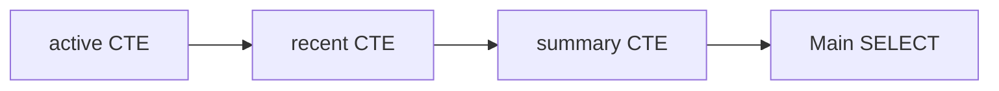

---

### 🛠️ Worked Example

**BAD:**

```sql
-- Deeply nested subqueries
SELECT d.name, sub2.avg_sal
FROM departments d
JOIN (
  SELECT department_id,
         AVG(salary) avg_sal
  FROM (
    SELECT * FROM employees
    WHERE hire_date > '2020-01-01'
  ) sub1
  GROUP BY department_id
) sub2
  ON sub2.department_id = d.id
WHERE sub2.avg_sal > 60000;
```

Why it's wrong: three nesting levels, the innermost query has no name, and adding another filter means wrapping yet another subquery.

**GOOD:**

```sql
WITH recent_hires AS (
    SELECT id, department_id, salary
    FROM employees
    WHERE hire_date > '2020-01-01'
),
dept_avg AS (
    SELECT department_id,
           AVG(salary) AS avg_sal
    FROM recent_hires
    GROUP BY department_id
)
SELECT d.name, da.avg_sal
FROM departments d
JOIN dept_avg da
    ON da.department_id = d.id
WHERE da.avg_sal > 60000;
```

Why it's right: each step has a name, logic flows top-to-bottom, and adding a new step means adding another CTE rather than deeper nesting.

**Production pattern - reusable CTE reference:**

```sql
WITH monthly_revenue AS (
    SELECT date_trunc('month', placed)
               AS m,
           SUM(total) AS rev
    FROM orders
    WHERE placed >= '2024-01-01'
    GROUP BY 1
)
SELECT m, rev,
       rev - LAG(rev) OVER (ORDER BY m)
           AS mom_change
FROM monthly_revenue
ORDER BY m;
```

---

### ⚖️ Trade-offs

**Gain:** Readability, composability, self-documenting named steps, easier debugging by testing each CTE in isolation.

**Cost:** Non-recursive CTEs may be inlined by the optimizer, so naming does not guarantee materialization. Older PostgreSQL versions (before 12) always materialized CTEs, which could hurt performance if the CTE returned many rows but only a few were needed downstream.

| Aspect         | CTE            | Subquery       | Temp Table    |
| -------------- | -------------- | -------------- | ------------- |
| Readability    | High - named   | Low - nested   | Medium        |
| Scope          | Single query   | Single query   | Session       |
| Optimization   | Inlined PG 12+ | Always inlined | Separate plan |
| Reuse in query | Multiple refs  | Must duplicate | Multiple refs |

---

### ⚡ Decision Snap

**USE WHEN:**

- A query has multiple logical steps that benefit from naming
- The same intermediate result is referenced more than once in the query
- You want to make a complex query reviewable and debuggable in code review

**AVOID WHEN:**

- A simple JOIN achieves the same result without extra abstraction
- You need the result set to persist beyond a single statement (use temp tables)

**PREFER subqueries WHEN:**

- The intermediate result is trivial and naming adds noise
- You specifically need the optimizer to inline the expression in older databases

---

### ⚠️ Top Traps

| #   | Misconception                                  | Reality                                                                                   |
| --- | ---------------------------------------------- | ----------------------------------------------------------------------------------------- |
| 1   | CTEs always materialize the result into memory | PostgreSQL 12+ inlines non-recursive CTEs by default; use MATERIALIZED hint to force it   |
| 2   | CTEs improve query performance over subqueries | CTEs improve readability, not speed - the planner often generates identical plans         |
| 3   | You can UPDATE through a CTE like a view       | CTEs are read-only references; writable CTEs use DML inside the CTE itself with RETURNING |

---

### 🪜 Learning Ladder

**Prerequisites:**

- SQL-033 Subqueries - Scalar, Row, Table - CTEs replace nested subqueries
- SQL-026 INNER JOIN - Matching Rows Across Tables - CTEs compose with joins naturally

**THIS:** SQL-053 Common Table Expressions (CTEs)

**Next steps:**

- SQL-054 Recursive CTEs - Hierarchical Data - CTEs that reference themselves for tree traversal
- SQL-055 Window Functions - ROW_NUMBER, RANK, DENSE_RANK - CTEs often wrap window function results for further filtering

---

### 💡 The Surprising Truth

CTEs can contain INSERT, UPDATE, or DELETE statements with RETURNING clauses. You can use a CTE to delete rows and simultaneously insert the deleted data into an archive table - all in a single atomic statement, without triggers or application-level coordination.

---

### 📇 Revision Card

1. CTEs name intermediate result sets - readability first, not performance.
2. PostgreSQL 12+ inlines non-recursive CTEs; force materialization with the MATERIALIZED hint if needed.
3. Writable CTEs (DML + RETURNING) let you move, archive, or transform data in a single statement.

---

---

# SQL-054 Recursive CTEs - Hierarchical Data

**TL;DR** - Recursive CTEs traverse arbitrary-depth hierarchies like org charts and category trees by self-referencing until termination.

---

### 🔥 The Problem in One Paragraph

Your employee table has a manager_id column pointing back to the same table. A VP asks "show me every person who reports to me, directly or indirectly, down to the lowest level." With standard JOINs, you would need to know the exact depth of the hierarchy in advance - five levels means five self-joins. But org charts change depth constantly. A product category tree might be three levels deep in electronics and seven in clothing. You need a query that walks an arbitrary-depth tree without knowing in advance how deep it goes. This is exactly why Recursive CTEs were created.

---

### 📘 Textbook Definition

A **Recursive CTE** is a common table expression that references itself in its definition, consisting of an anchor member (the starting rows) and a recursive member (the step that joins back to the CTE). The database engine repeats the recursive member until it produces no new rows, then combines all iterations into the final result set.

---

### 🧠 Mental Model

> Imagine searching a building floor by floor. You start at the lobby (anchor). From the lobby, you find stairs to floors you have not visited (recursive step). You climb to each new floor, discover more stairs, and keep going. When you reach a floor with no more stairs, you stop. Your result is every floor you visited.

- "Lobby" -> anchor member (initial rows)
- "Climbing stairs" -> recursive member (self-join step)
- "No more stairs" -> termination (recursive member returns empty)

**Where this analogy breaks down:** The recursive CTE processes each generation of rows as a batch, not one-at-a-time depth-first like climbing stairs.

---

### ⚙️ How It Works

1. The anchor query executes once, producing the initial
   row set (generation 0).
2. The recursive query joins against the previous
   generation's rows to find the next generation.
3. The engine repeats step 2 until the recursive query
   returns zero new rows.
4. All generations are UNION ALL'd into the final result.
5. A safety limit (default 100 in PostgreSQL) prevents
   infinite recursion from cycles in the data.

```
employees:
+----+-------+------------+
| id | name  | manager_id |
+----+-------+------------+
|  1 | CEO   |       NULL |
|  2 | VP    |          1 |
|  3 | Dir   |          2 |
|  4 | Mgr   |          3 |
+----+-------+------------+

Gen 0 (anchor):  CEO
Gen 1 (recurse): VP  (manager_id = 1)
Gen 2 (recurse): Dir (manager_id = 2)
Gen 3 (recurse): Mgr (manager_id = 3)
Gen 4 (recurse): empty -> STOP
```

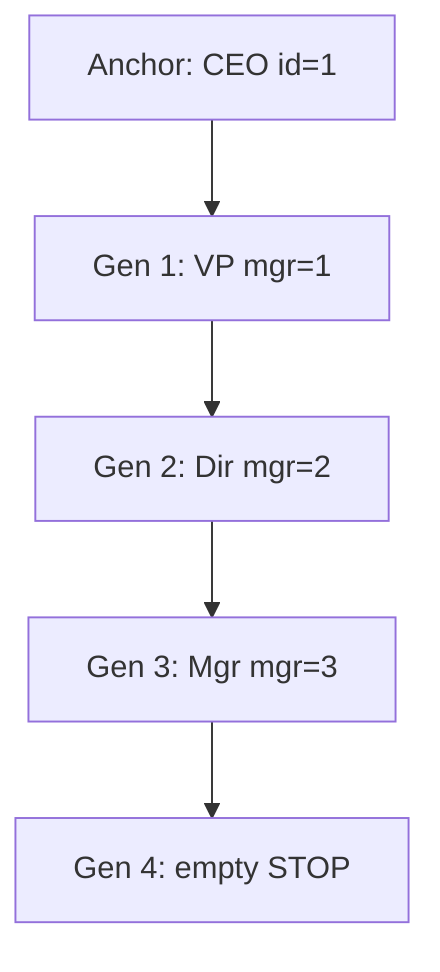

---

### 🛠️ Worked Example

**BAD:**

```sql
-- Fixed-depth self-joins: breaks if tree grows
SELECT e1.name AS l1,
       e2.name AS l2,
       e3.name AS l3
FROM employees e1
LEFT JOIN employees e2
    ON e2.manager_id = e1.id
LEFT JOIN employees e3
    ON e3.manager_id = e2.id
WHERE e1.id = 1;
-- Only 3 levels visible. Level 4+ invisible.
```

Why it's wrong: the query hardcodes tree depth; adding levels means adding more JOINs.

**GOOD:**

```sql
WITH RECURSIVE org AS (
    -- Anchor: start from the root
    SELECT id, name, manager_id,
           0 AS depth
    FROM employees
    WHERE manager_id IS NULL

    UNION ALL

    -- Recursive: find direct reports
    SELECT e.id, e.name, e.manager_id,
           o.depth + 1
    FROM employees e
    JOIN org o ON o.id = e.manager_id
)
SELECT depth,
       REPEAT('  ', depth) || name AS tree
FROM org
ORDER BY depth, name;
```

Why it's right: handles any tree depth; the depth column enables indentation and level-based filtering.

**Production pattern - materialized path:**

```sql
WITH RECURSIVE cat_path AS (
    SELECT id, name,
           name::text AS path
    FROM categories
    WHERE parent_id IS NULL
    UNION ALL
    SELECT c.id, c.name,
           cp.path || ' > ' || c.name
    FROM categories c
    JOIN cat_path cp
        ON cp.id = c.parent_id
)
SELECT * FROM cat_path ORDER BY path;
```

---

### ⚖️ Trade-offs

**Gain:** Traverses arbitrary-depth hierarchies in a single query without application-side loops. Results include depth and path metadata.

**Cost:** Performance degrades on large trees without an index on the parent column. Cycles in data cause infinite recursion unless detected explicitly.

| Aspect            | Recursive CTE  | Closure table         |
| ----------------- | -------------- | --------------------- |
| Read complexity   | Recursive scan | Simple JOIN           |
| Write complexity  | Just insert FK | Maintain closure rows |
| Depth flexibility | Unlimited      | Unlimited             |
| Setup overhead    | None           | High                  |

---

### ⚡ Decision Snap

**USE WHEN:**

- Hierarchy depth is unknown or varies (org charts, threaded comments, category trees)
- You need per-row metadata like depth or full path during traversal
- Data changes frequently and maintaining a closure table is too costly

**AVOID WHEN:**

- The hierarchy is fixed at a known shallow depth (e.g., always exactly 3 levels)
- You query the tree thousands of times per second and read performance is critical

**PREFER a closure table WHEN:**

- Read-heavy workloads need constant-time ancestor or descendant checks
- You can afford the extra storage and write overhead of maintaining closure rows

---

### ⚠️ Top Traps

| #   | Misconception                                 | Reality                                                                                                                          |
| --- | --------------------------------------------- | -------------------------------------------------------------------------------------------------------------------------------- |
| 1   | Recursive CTEs detect cycles automatically    | They do not; a cycle causes infinite recursion until the safety limit. Use CYCLE clause (SQL:2023) or track visited IDs manually |
| 2   | UNION can replace UNION ALL in recursive CTEs | UNION deduplicates and may prevent the recursive step from seeing needed rows; always use UNION ALL unless you need dedup        |
| 3   | Recursive CTEs are slow for all hierarchies   | With an index on the parent column, they perform well for typical depths under 20 levels                                         |

---

### 🪜 Learning Ladder

**Prerequisites:**

- SQL-053 Common Table Expressions (CTEs) - recursive CTEs extend the WITH clause
- SQL-029 Self-Joins - When a Table References Itself - recursive CTEs formalize the self-join pattern

**THIS:** SQL-054 Recursive CTEs - Hierarchical Data

**Next steps:**

- SQL-060 Execution Plans Deep Dive - EXPLAIN ANALYZE - understand how the planner handles recursive plans
- SQL-058 Correlated Subqueries and Lateral Joins - another pattern for per-row dependent queries

---

### 💡 The Surprising Truth

PostgreSQL 14 added the CYCLE clause from SQL:2023, which automatically detects and skips cycles in recursive CTEs without manual visited-set tracking. Most developers still write manual cycle detection because they do not know this clause exists.

---

### 📇 Revision Card

1. Recursive CTE = anchor (starting rows) + recursive member (self-join step) + implicit termination (no new rows).
2. Always index the parent column and protect against cycles.
3. For read-heavy hierarchies at scale, consider a closure table - recursive CTEs optimize for write simplicity, not read throughput.

---

---

# SQL-055 Window Functions - ROW_NUMBER, RANK, DENSE_RANK

**TL;DR** - Window ranking functions assign position numbers to rows within partitions without collapsing groups like GROUP BY does.

---

### 🔥 The Problem in One Paragraph

A product manager asks "show me the top 3 orders per customer." With GROUP BY, you can find each customer's total or maximum, but you cannot return the actual top-3 rows per customer in a single query. Subqueries with correlated LIMIT are messy and often database-specific. You could pull all orders into application code and group and sort there, but that moves data processing off the database where it belongs. You need a way to number or rank rows within each customer's partition, then filter by that rank. This is exactly why window ranking functions were created.

---

### 📘 Textbook Definition

**Window ranking functions** (ROW_NUMBER, RANK, DENSE_RANK) assign an ordinal position to each row within a partition defined by PARTITION BY, ordered by ORDER BY, without reducing the result set. ROW_NUMBER assigns unique consecutive integers. RANK assigns the same number to ties but skips subsequent numbers. DENSE_RANK assigns the same number to ties without gaps.

---

### 🧠 Mental Model

> Imagine runners finishing a race. ROW_NUMBER gives each runner a unique bib number in finish order, no matter what. RANK awards placement, but if two runners tie for 1st the next runner is 3rd (slot 2 is skipped). DENSE_RANK does the same except the next runner after a tie is 2nd (no gap).

- "Runners" -> rows in a partition
- "Finish order" -> ORDER BY expression
- "Bib number vs placement" -> ROW_NUMBER vs RANK/DENSE_RANK

**Where this analogy breaks down:** Window functions process the entire result set and add a column - they do not eliminate any rows. Filtering by rank requires wrapping in a CTE or subquery.

---

### ⚙️ How It Works

1. The engine computes the FROM/WHERE/GROUP BY result set
   first - window functions run after aggregation.
2. PARTITION BY splits rows into independent groups
   (like GROUP BY, but rows are not collapsed).
3. ORDER BY within the window determines row ordering
   in each partition.
4. The ranking function assigns a number to each row
   based on its position in the ordered partition.
5. The result appears as a new column; all original
   rows remain in the output.

```
orders (PARTITION BY c_id ORDER BY total DESC):

c_id=1:       ROW_NUMBER  RANK  DENSE_RANK
 100 (Jan)         1        1       1
 100 (Feb)         2        1       1
  80 (Mar)         3        3       2

c_id=2:
 200 (Jan)         1        1       1
 150 (Feb)         2        2       2
```

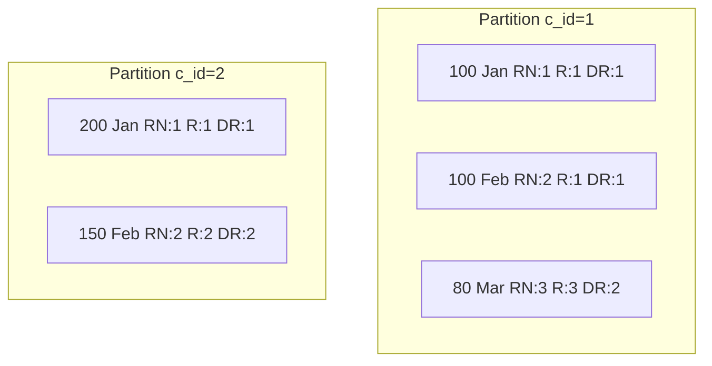

---

### 🛠️ Worked Example

**BAD:**

```sql
-- Correlated subquery: slow and fragile
SELECT o.*
FROM orders o
WHERE (
  SELECT COUNT(*)
  FROM orders o2
  WHERE o2.customer_id = o.customer_id
    AND o2.total >= o.total
) <= 3;
-- Ties mishandled, performance is O(n^2)
```

Why it's wrong: correlated subquery scans the table per row, produces incorrect results with ties, and is not portable.

**GOOD:**

```sql
WITH ranked AS (
    SELECT *,
           ROW_NUMBER() OVER (
               PARTITION BY customer_id
               ORDER BY total DESC
           ) AS rn
    FROM orders
)
SELECT * FROM ranked WHERE rn <= 3;
```

Why it's right: single pass with a window function, then a simple filter on rank. Each partition gets exactly 3 rows.

**Production pattern - deduplication:**

```sql
-- Keep latest row per (user_id, event_type)
WITH deduped AS (
    SELECT *,
           ROW_NUMBER() OVER (
               PARTITION BY user_id,
                            event_type
               ORDER BY created_at DESC
           ) AS rn
    FROM events
)
DELETE FROM events
WHERE id IN (
    SELECT id FROM deduped WHERE rn > 1
);
```

---

### ⚖️ Trade-offs

**Gain:** Per-group ranking without GROUP BY collapse, top-N per partition, deterministic deduplication.

**Cost:** Window functions require sorting or indexing per partition. Large partitions with no supporting index force in-memory or on-disk sorts.

| Aspect       | ROW_NUMBER         | RANK             | DENSE_RANK     |
| ------------ | ------------------ | ---------------- | -------------- |
| Ties         | Unique (arbitrary) | Same, gaps after | Same, no gaps  |
| Top-N filter | Exact N rows       | May return > N   | May return > N |
| Dedup        | Ideal (pick 1)     | Not suitable     | Not suitable   |

---

### ⚡ Decision Snap

**USE WHEN:**

- You need top-N per group (top 3 orders per customer)
- You need to deduplicate rows keeping the latest or highest-priority entry
- You need sequential numbering within categories

**AVOID WHEN:**

- You only need aggregate values per group (use GROUP BY)
- The dataset is small enough that application-side sorting is simpler

**PREFER DENSE_RANK WHEN:**

- Ties must share a rank and you need consecutive numbers for display
- Business logic defines "top 3 price tiers" not "top 3 individual rows"

---

### ⚠️ Top Traps

| #   | Misconception                                                  | Reality                                                                                   |
| --- | -------------------------------------------------------------- | ----------------------------------------------------------------------------------------- |
| 1   | WHERE rn <= 3 can go in the same SELECT as the window function | Window functions run after WHERE; you must wrap in a CTE or subquery first                |
| 2   | ROW_NUMBER is deterministic with ties                          | When ORDER BY values are equal, row assignment is arbitrary; add a tiebreaker column      |
| 3   | Window functions replace GROUP BY                              | Window functions add columns but keep all rows; GROUP BY collapses rows - different tools |

---

### 🪜 Learning Ladder

**Prerequisites:**

- SQL-031 Aggregate Functions - COUNT, SUM, AVG, MIN, MAX - window functions extend aggregation to per-row output
- SQL-015 ORDER BY and LIMIT - ranking relies on ordering; window ORDER BY is the per-partition equivalent

**THIS:** SQL-055 Window Functions - ROW_NUMBER, RANK, DENSE_RANK

**Next steps:**

- SQL-056 Window Functions - LAG, LEAD, NTILE - value-access window functions that compare rows to neighbors
- SQL-057 Window Frames - ROWS vs RANGE vs GROUPS - controlling which rows participate in window calculations

---

### 💡 The Surprising Truth

ROW_NUMBER is the most common way to implement keyset-style pagination. Instead of OFFSET (which rescans rows), you assign ROW_NUMBER and filter by it. But the real performance trick is to create a covering index matching the PARTITION BY + ORDER BY columns, eliminating the sort entirely.

---

### 📇 Revision Card

1. ROW_NUMBER = unique, RANK = ties with gaps, DENSE_RANK = ties without gaps.
2. Window functions add columns but keep all rows - wrap in a CTE to filter by rank.
3. Always add a tiebreaker to ORDER BY when using ROW_NUMBER for deduplication.

---

---

# SQL-056 Window Functions - LAG, LEAD, NTILE

**TL;DR** - LAG and LEAD access previous and next row values without self-joins; NTILE divides rows into equal-sized buckets.

---

### 🔥 The Problem in One Paragraph

A finance team needs a report showing each month's revenue alongside the previous month's revenue to calculate month-over-month growth. Without window functions, you would self-join the table on month = month minus an interval, handle edge cases for January, and hope the date arithmetic is correct. For quartile analysis, you would need to count total rows, divide by four, and manually assign bucket numbers. Both operations require relating a row to its neighbors in a defined order rather than to rows in other tables. This is exactly why LAG, LEAD, and NTILE were created.

---

### 📘 Textbook Definition

**LAG(expr, offset, default)** returns the value of expr from the row that is offset rows before the current row within the partition. **LEAD(expr, offset, default)** returns the value from offset rows after. **NTILE(n)** distributes rows as evenly as possible into n numbered buckets within the partition. All three are window functions that operate over the ordered partition without collapsing rows.

---

### 🧠 Mental Model

> Imagine standing in a single-file line. LAG lets you look over your shoulder at the person behind you. LEAD lets you peek at the person ahead. NTILE is a teacher dividing the line into equal-sized teams: "first five people, team 1; next five, team 2."

- "Looking behind" -> LAG reads the previous row's value
- "Peeking ahead" -> LEAD reads the next row's value
- "Dividing into teams" -> NTILE assigns bucket numbers

**Where this analogy breaks down:** NTILE distributes remainders unevenly - if 10 people split into 3 teams, you get teams of 4, 3, 3, not exactly equal.

---

### ⚙️ How It Works

1. The engine sorts rows by the window ORDER BY.
2. For LAG, it looks back N rows (default 1) and
   returns that row's expression value. If no such
   row exists, it returns the default (NULL if
   unspecified).
3. For LEAD, the same logic applies but looking
   forward in the partition.
4. NTILE counts total rows in the partition, divides
   by N, and assigns bucket numbers 1..N, distributing
   remainders to earlier buckets.

```
monthly_revenue:
+-------+------+
| month | rev  |
+-------+------+
| Jan   | 1000 |
| Feb   | 1200 |
| Mar   |  900 |
| Apr   | 1500 |
+-------+------+

LAG(rev):   NULL, 1000, 1200, 900
LEAD(rev):  1200,  900, 1500, NULL
NTILE(2):      1,    1,    2,    2
```

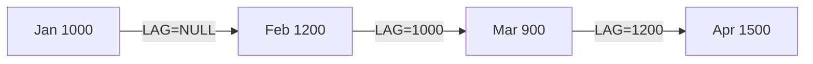

---

### 🛠️ Worked Example

**BAD:**

```sql
-- Self-join for previous month's revenue
SELECT a.month, a.rev,
       b.rev AS prev_rev,
       a.rev - b.rev AS change
FROM revenue a
LEFT JOIN revenue b
    ON b.month = a.month
        - INTERVAL '1 month';
-- Fragile date math, fails across years
```

Why it's wrong: self-join duplicates the table scan, date arithmetic is error-prone, and adding "two months ago" means another JOIN.

**GOOD:**

```sql
SELECT month, rev,
       LAG(rev) OVER (ORDER BY month)
           AS prev_rev,
       rev - LAG(rev)
           OVER (ORDER BY month)
           AS mom_change
FROM revenue
ORDER BY month;
```

Why it's right: single scan, clean syntax, easily extensible to LAG(rev, 2) for two-months-ago.

**Production pattern - percentile bucketing:**

```sql
SELECT customer_id,
       lifetime_value,
       NTILE(4) OVER (
           ORDER BY lifetime_value DESC
       ) AS quartile
FROM customers;
-- quartile 1 = top 25% by value
```

---

### ⚖️ Trade-offs

**Gain:** Compare rows to their neighbors without self-joins, compute deltas and growth rates inline, bucket rows for percentile analysis.

**Cost:** Requires a meaningful ORDER BY to define "previous" and "next." Without an index matching the partition and order, the engine must sort the entire result set.

| Aspect      | LAG/LEAD                  | Self-join             |
| ----------- | ------------------------- | --------------------- |
| Readability | One line per comparison   | Extra JOIN per offset |
| Performance | Single sort pass          | Multiple table scans  |
| Flexibility | Any offset, default param | Manual per offset     |
| Edge cases  | Built-in default          | Manual NULL handling  |

---

### ⚡ Decision Snap

**USE WHEN:**

- You need to compare a row to its immediate predecessor or successor (deltas, growth rates, gap detection)
- You need to divide a result set into equal-sized buckets (quartiles, deciles)
- The comparison is based on a clear ordering (date, sequence number)

**AVOID WHEN:**

- You need to aggregate over a range of rows (use SUM/AVG with a window frame instead)
- There is no natural ordering to define "previous" and "next"

**PREFER a self-join WHEN:**

- You need to compare rows by a key relationship rather than positional offset
- Your database version does not support window functions (rare today)

---

### ⚠️ Top Traps

| #   | Misconception                                                  | Reality                                                                            |
| --- | -------------------------------------------------------------- | ---------------------------------------------------------------------------------- |
| 1   | LAG and LEAD require consecutive values in the ORDER BY column | They work on row position, not value - gaps in dates or IDs are irrelevant         |
| 2   | NTILE produces exactly equal bucket sizes                      | When rows do not divide evenly, earlier buckets get one extra row each             |
| 3   | LAG defaults to 0 when no previous row exists                  | The default is NULL unless you explicitly provide a third argument: LAG(rev, 1, 0) |

---

### 🪜 Learning Ladder

**Prerequisites:**

- SQL-055 Window Functions - ROW_NUMBER, RANK, DENSE_RANK - foundational window function syntax and partitioning
- SQL-015 ORDER BY and LIMIT - ordering defines what "previous" and "next" mean

**THIS:** SQL-056 Window Functions - LAG, LEAD, NTILE

**Next steps:**

- SQL-057 Window Frames - ROWS vs RANGE vs GROUPS - control which rows participate in aggregate windows
- SQL-082 Window Functions Practice Kata - hands-on exercises combining all window functions

---

### 💡 The Surprising Truth

LEAD is rarely used in production compared to LAG. Most analyses compare "now vs before" (month-over-month, day-over-day), which is LAG's domain. LEAD's main practical use is detecting gaps - finding the next event timestamp to calculate idle time between events.

---

### 📇 Revision Card

1. LAG = look back, LEAD = look forward, NTILE = divide into N equal buckets.
2. Always provide a default argument (third parameter) to avoid unexpected NULLs at partition boundaries.
3. NTILE distributes remainder rows to the first buckets - bucket 1 may have one more row than bucket N.

---

---

# SQL-057 Window Frames - ROWS vs RANGE vs GROUPS

**TL;DR** - Window frames control which rows a window function aggregates over: ROWS counts positions, RANGE matches values, GROUPS counts peers.

---

### 🔥 The Problem in One Paragraph

You write a running total using SUM() OVER (ORDER BY date) and it works, but when two rows share the same date, the running total jumps unexpectedly because both rows include each other's values. A colleague writes a moving 7-day average, but the window includes too many or too few rows depending on whether they used ROWS or RANGE. The default frame behavior differs across functions, and nobody on the team can explain why. You need to understand exactly which rows the window function sees for each current row. This is exactly why Window Frames were created.

---

### 📘 Textbook Definition

A **window frame** defines the subset of rows within the partition that a window function aggregates over, relative to the current row. The frame clause specifies a frame type (ROWS, RANGE, or GROUPS) and bounds (UNBOUNDED PRECEDING, N PRECEDING, CURRENT ROW, N FOLLOWING, UNBOUNDED FOLLOWING). ROWS counts physical row positions. RANGE matches rows whose ORDER BY value falls within a value range. GROUPS counts groups of peer rows with equal ORDER BY values.

---

### 🧠 Mental Model

> Imagine walking through a hallway of numbered doors. ROWS says "look at the 3 doors behind me and 3 ahead, regardless of numbers." RANGE says "look at all doors whose number is within 3 of mine." GROUPS says "look at the 3 clusters of identically-numbered doors behind me."

- "Physical doors" -> ROWS counts positions
- "Door numbers within range" -> RANGE compares values
- "Clusters of identical numbers" -> GROUPS counts peer groups

**Where this analogy breaks down:** RANGE with dates requires casting to calculate offsets, which is not as simple as integer arithmetic.

---

### ⚙️ How It Works

1. The engine partitions and orders rows per PARTITION
   BY and ORDER BY.
2. For each current row, the frame clause identifies
   which rows to include in the calculation.
3. ROWS N PRECEDING means "go back exactly N physical
   rows from the current row."
4. RANGE N PRECEDING means "include all rows whose
   ORDER BY value is within N of the current row."
5. GROUPS N PRECEDING means "go back N distinct groups
   of tied ORDER BY values."

```
date     | val | SUM ROWS 1P | SUM RANGE 1P
---------+-----+-------------+-------------
2024-01  |  10 |          10 |          10
2024-02  |  20 |          30 |          30
2024-02  |  30 |          50 |          60
2024-03  |  40 |          70 |          90

ROWS: prev physical row only
RANGE: all rows with same/adjacent value
```

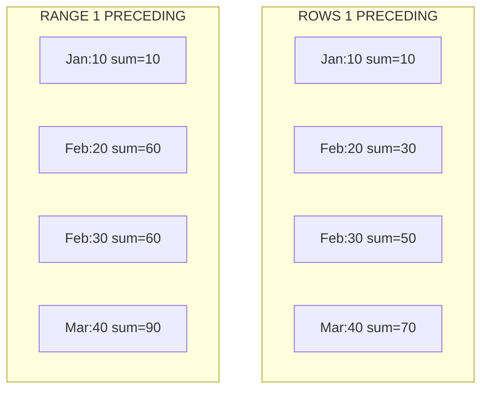

---

### 🛠️ Worked Example

**BAD:**

```sql
-- Running total with default frame: surprise
SELECT date, amount,
       SUM(amount) OVER (ORDER BY date)
           AS running_total
FROM payments;
-- Default = RANGE BETWEEN UNBOUNDED PRECEDING
-- AND CURRENT ROW. Tied dates get same total.
```

Why it's wrong: when two rows share a date, both show the same running_total because RANGE includes all peers.

**GOOD:**

```sql
-- Explicit ROWS for true running total
SELECT date, amount,
       SUM(amount) OVER (
           ORDER BY date
           ROWS BETWEEN UNBOUNDED PRECEDING
               AND CURRENT ROW
       ) AS running_total
FROM payments;
```

Why it's right: ROWS counts physical rows, so each row gets a unique cumulative sum regardless of ties.

**Production pattern - 7-day moving average:**

```sql
SELECT date, revenue,
       AVG(revenue) OVER (
           ORDER BY date
           ROWS BETWEEN 6 PRECEDING
               AND CURRENT ROW
       ) AS moving_avg_7d
FROM daily_revenue;
```

---

### ⚖️ Trade-offs

**Gain:** Precise control over which rows participate in window aggregations, correct handling of ties and value-based ranges.

**Cost:** Frame semantics are subtle and can differ across databases in edge cases. GROUPS is not supported in all databases (PostgreSQL 11+, recent MySQL, varies elsewhere).

| Aspect       | ROWS               | RANGE               | GROUPS          |
| ------------ | ------------------ | ------------------- | --------------- |
| Unit         | Physical positions | ORDER BY values     | Peer groups     |
| Tie handling | Each row separate  | All peers together  | Groups as units |
| Support      | All databases      | All databases       | PG 11+, varies  |
| Common use   | Rolling sums/avgs  | Value-range windows | Rank-based      |

---

### ⚡ Decision Snap

**USE WHEN:**

- You need a moving aggregate (average, sum) over a fixed count of rows
- You need a value-range window (all sales within 30 days of current row)
- Default frame behavior produces wrong results with tied ORDER BY values

**AVOID WHEN:**

- You are using ranking functions (ROW_NUMBER, RANK) which ignore frame clauses
- The window is simply all preceding rows with no ties in the data

**PREFER ROWS WHEN:**

- You want deterministic per-row results regardless of ties
- You are computing rolling averages over a fixed count of observations

---

### ⚠️ Top Traps

| #   | Misconception                                  | Reality                                                                                                      |
| --- | ---------------------------------------------- | ------------------------------------------------------------------------------------------------------------ |
| 1   | The default frame is ROWS UNBOUNDED PRECEDING  | The default (with ORDER BY) is RANGE BETWEEN UNBOUNDED PRECEDING AND CURRENT ROW - peers share the aggregate |
| 2   | Frame clauses apply to ROW_NUMBER and RANK     | Ranking functions ignore frames; frames only affect aggregate window functions like SUM, AVG, COUNT          |
| 3   | ROWS and RANGE always produce the same results | Only when ORDER BY values are unique; with ties they diverge - always specify explicitly                     |

---

### 🪜 Learning Ladder

**Prerequisites:**

- SQL-055 Window Functions - ROW_NUMBER, RANK, DENSE_RANK - window syntax and PARTITION BY / ORDER BY
- SQL-056 Window Functions - LAG, LEAD, NTILE - row-access functions that use adjacency

**THIS:** SQL-057 Window Frames - ROWS vs RANGE vs GROUPS

**Next steps:**

- SQL-064 Query Performance Tuning Patterns - window performance depends on index support for ORDER BY
- SQL-082 Window Functions Practice Kata - combine frames with aggregate and ranking functions

---

### 💡 The Surprising Truth

Most developers never specify a frame clause and rely on the default, which is RANGE, not ROWS. This means `SUM(x) OVER (ORDER BY date)` includes all rows with the same date as peers, producing identical running totals for tied dates. Switching to explicit ROWS changes the results. This default is the most common source of bugs in window function queries.

---

### 📇 Revision Card

1. ROWS = physical positions, RANGE = value comparisons, GROUPS = peer-group counts.
2. The default frame with ORDER BY is RANGE, not ROWS - always specify explicitly for aggregates.
3. Ranking functions ignore frame clauses; frames only matter for aggregate window functions.

---

---

# SQL-058 Correlated Subqueries and Lateral Joins

**TL;DR** - Correlated subqueries reference the outer query per row; LATERAL joins generalize this into a set-returning per-row operation.

---

### 🔥 The Problem in One Paragraph

You need each department's most recent hire. A plain subquery can find the global most recent hire, but "most recent per department" requires the subquery to know which department it is computing for - it must reference the outer row. Now extend the requirement: return the top 3 hires per department. A correlated subquery returns one value, not three rows. You need a way to execute a subquery once per outer row and return multiple rows from it. This is exactly why correlated subqueries and LATERAL joins were created.

---

### 📘 Textbook Definition

A **correlated subquery** is a subquery that references columns from the outer query, causing it to be evaluated once per outer row. A **LATERAL join** (APPLY in SQL Server) is a join where the right-hand subquery can reference columns from the left-hand side, enabling per-row subqueries that return multiple rows or columns. LATERAL is the set-returning generalization of correlated subqueries.

---

### 🧠 Mental Model

> Imagine a manager walking down a row of desks (outer query). At each desk, the manager asks a question specific to that employee (correlated subquery). The subquery returns one answer per desk. LATERAL is like the manager opening a folder at each desk and pulling out multiple documents - it returns a set of rows per outer row.

- "Walking down desks" -> iterating outer query rows
- "Asking per-desk question" -> correlated subquery (scalar)
- "Opening folder, multiple documents" -> LATERAL (set)

**Where this analogy breaks down:** The query planner may optimize correlated subqueries into joins internally, so it does not always execute them iteratively.

---

### ⚙️ How It Works

1. For a correlated subquery, the engine evaluates the
   inner query once per outer row, substituting the
   outer row's values into the inner WHERE.
2. The result is a single scalar value used in the
   outer SELECT or WHERE clause.
3. LATERAL allows the right side of a JOIN to reference
   columns from the left side, returning zero or more
   rows per left row.
4. The planner may rewrite correlated subqueries as
   joins, or execute LATERAL as a nested loop with
   an indexed inner scan.

```
departments:         employees:
+----+-------+      +----+------+-------+
| id | name  |      | id | dept | hired |
+----+-------+      +----+------+-------+
|  1 | Eng   |      | 10 |    1 | Jan   |
|  2 | Sales |      | 11 |    1 | Mar   |
+----+-------+      | 12 |    2 | Feb   |
                     +----+------+-------+

LATERAL (top 1 per dept):
  Eng   -> WHERE dept=1 LIMIT 1 -> 11
  Sales -> WHERE dept=2 LIMIT 1 -> 12
```

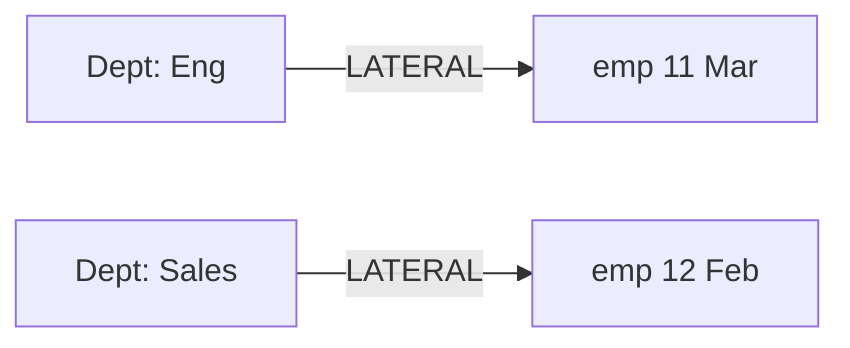

---

### 🛠️ Worked Example

**BAD:**

```sql
-- Correlated subquery: returns one value only
SELECT d.name,
       (SELECT MAX(e.salary)
        FROM employees e
        WHERE e.dept_id = d.id) AS max_sal
FROM departments d;
-- Cannot return top-3 salaries per dept
```

Why it's wrong: correlated subquery in SELECT must return exactly one value; multiple rows per department are impossible.

**GOOD:**

```sql
-- LATERAL: top-3 per department
SELECT d.name, t.employee, t.salary
FROM departments d
CROSS JOIN LATERAL (
    SELECT e.name AS employee,
           e.salary
    FROM employees e
    WHERE e.dept_id = d.id
    ORDER BY e.salary DESC
    LIMIT 3
) t;
```

Why it's right: LATERAL executes the subquery per department, returns up to 3 rows each, and the planner uses the index on dept_id.

**Production pattern - latest N events per user:**

```sql
SELECT u.id, u.name, e.event, e.ts
FROM users u
CROSS JOIN LATERAL (
    SELECT event, ts
    FROM events
    WHERE events.user_id = u.id
    ORDER BY ts DESC
    LIMIT 5
) e;
```

---

### ⚖️ Trade-offs

**Gain:** Per-row parameterized queries, top-N per group without window functions, clean syntax for dependent subqueries.

**Cost:** Without an index on the inner join column, LATERAL degrades to nested-loop with full scans per outer row. Can be slower than window functions when N is large relative to partition size.

| Aspect           | LATERAL            | Window + CTE       |
| ---------------- | ------------------ | ------------------ |
| Multi-row return | Yes, native        | Yes, filter after  |
| Index usage      | Inner scan per row | Full sort          |
| Limit per group  | Native LIMIT       | ROW_NUMBER filter  |
| Best for         | Small N, indexed   | Large N, full scan |

---

### ⚡ Decision Snap

**USE WHEN:**

- You need top-N rows per group with a hard LIMIT per group
- The inner query is complex and applies per outer row
- You want to avoid materializing the full window result when only a few rows per group are needed

**AVOID WHEN:**

- A simple window function with ROW_NUMBER achieves the same result
- The outer table is very large and the inner query has no supporting index

**PREFER window functions WHEN:**

- You need the complete result set partitioned and ranked
- The planner can sort once rather than executing N inner queries

---

### ⚠️ Top Traps

| #   | Misconception                                         | Reality                                                                                                     |
| --- | ----------------------------------------------------- | ----------------------------------------------------------------------------------------------------------- |
| 1   | LATERAL always performs worse than window functions   | With a supporting index, LATERAL + LIMIT often outperforms ROW_NUMBER by avoiding full-partition processing |
| 2   | Correlated subqueries always execute once per row     | The optimizer may rewrite them as hash or merge joins - check EXPLAIN                                       |
| 3   | CROSS JOIN LATERAL and LEFT JOIN LATERAL are the same | CROSS JOIN drops outer rows with no inner matches; LEFT JOIN preserves them with NULLs                      |

---

### 🪜 Learning Ladder

**Prerequisites:**

- SQL-033 Subqueries - Scalar, Row, Table - correlated subqueries extend basic subquery patterns
- SQL-026 INNER JOIN - Matching Rows Across Tables - LATERAL is a parameterized join variant

**THIS:** SQL-058 Correlated Subqueries and Lateral Joins

**Next steps:**

- SQL-060 Execution Plans Deep Dive - EXPLAIN ANALYZE - verify whether the planner rewrites your correlated subquery
- SQL-064 Query Performance Tuning Patterns - LATERAL is a key pattern for top-N-per-group

---

### 💡 The Surprising Truth

In PostgreSQL, a LATERAL subquery with LIMIT is often faster than the equivalent ROW_NUMBER approach for top-N-per-group queries when N is small and an index supports the inner ORDER BY. The window function approach must process every row in every partition before filtering, while LATERAL stops at N rows per partition and moves on.

---

### 📇 Revision Card

1. Correlated subqueries return one value per outer row; LATERAL returns a set.
2. LATERAL + LIMIT is the most efficient top-N-per-group pattern when an index supports the inner ORDER BY.
3. Always check EXPLAIN: the planner may rewrite correlated subqueries into joins automatically.

---

---

# SQL-059 GROUPING SETS, CUBE, ROLLUP

**TL;DR** - GROUPING SETS, CUBE, and ROLLUP produce multiple aggregation levels in a single query instead of multiple UNION ALLs.

---

### 🔥 The Problem in One Paragraph

A report needs revenue broken down by region, by product, by region-and-product combined, and a grand total. With standard GROUP BY, you write four separate queries and UNION ALL them together. If you add a third dimension (year), the number of unions explodes combinatorially. Each union scans the same table again. The result is verbose SQL, triple the I/O, and a maintenance nightmare when a new dimension is added. You need a single GROUP BY that produces subtotals and totals at multiple granularity levels in one scan. This is exactly why GROUPING SETS, CUBE, and ROLLUP were created.

---

### 📘 Textbook Definition

**GROUPING SETS** explicitly lists which combinations of columns to group by, producing one result set per combination. **ROLLUP** generates a hierarchy of groupings from left to right plus a grand total. **CUBE** generates all possible combinations of the listed columns. All three are GROUP BY extensions defined in SQL:1999 that produce multiple aggregation levels in a single query.

---

### 🧠 Mental Model

> Think of a pivot table in a spreadsheet. GROUPING SETS lets you pick exactly which row-group and column-group combinations to display. ROLLUP gives you the "subtotal at each level" drill-down. CUBE gives you the "show every possible subtotal" button.

- "Pivot table" -> multi-level aggregation result
- "Subtotal at each level" -> ROLLUP
- "Every possible subtotal" -> CUBE

**Where this analogy breaks down:** Unlike a pivot table, GROUPING SETS do not cross-tab into columns - all results come back as rows, with NULLs indicating the aggregated dimension.

---

### ⚙️ How It Works

1. The engine scans the source data once.
2. For each grouping set, it produces aggregate rows
   using that set of GROUP BY columns.
3. Non-grouped columns appear as NULL to indicate
   "all values" for that dimension.
4. GROUPING() function returns 1 for aggregated
   columns vs 0 for real groups.
5. ROLLUP(a, b) = GROUPING SETS((a,b), (a), ())
   CUBE(a, b) = GROUPING SETS((a,b), (a), (b), ())

```
ROLLUP(region, product):
+--------+---------+------+
| region | product |  rev |
+--------+---------+------+
| East   | Widget  |  100 | (region,product)
| East   | Gadget  |   80 | (region,product)
| East   | NULL    |  180 | (region) subtot
| West   | Widget  |  200 | (region,product)
| West   | NULL    |  200 | (region) subtot
| NULL   | NULL    |  380 | () grand total
+--------+---------+------+
```

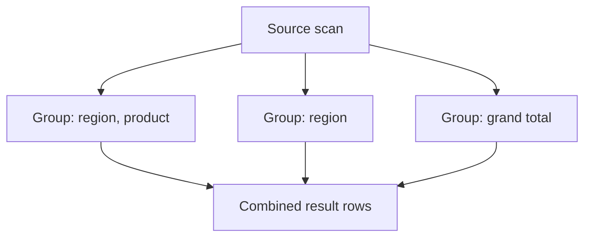

---

### 🛠️ Worked Example

**BAD:**

```sql
-- Three separate queries unioned
SELECT region, product, SUM(rev)
FROM sales GROUP BY region, product
UNION ALL
SELECT region, NULL, SUM(rev)
FROM sales GROUP BY region
UNION ALL
SELECT NULL, NULL, SUM(rev)
FROM sales;
-- 3 table scans, verbose, fragile
```

Why it's wrong: triple scan, triple maintenance, and adding a dimension means exponentially more unions.

**GOOD:**

```sql
SELECT
    COALESCE(region, 'ALL') AS region,
    COALESCE(product, 'ALL') AS product,
    SUM(revenue) AS total_rev
FROM sales
GROUP BY ROLLUP(region, product)
ORDER BY
    GROUPING(region),
    region,
    GROUPING(product),
    product;
```

Why it's right: single scan, automatic subtotals, and GROUPING() distinguishes "total" NULLs from data NULLs.

**Production pattern - multi-dimensional report:**

```sql
SELECT region, product_category,
       fiscal_year,
       SUM(revenue) AS total
FROM sales_fact
GROUP BY CUBE(
    region, product_category, fiscal_year
)
HAVING SUM(revenue) > 10000
ORDER BY GROUPING(region),
         GROUPING(product_category),
         GROUPING(fiscal_year);
```

---

### ⚖️ Trade-offs

**Gain:** Single table scan produces all aggregation levels. Easier to maintain than UNION ALL chains. GROUPING() resolves NULL ambiguity.

**Cost:** Result sets grow large - CUBE of n columns produces 2^n grouping sets. The output mixes rows of different granularity, requiring the consumer to distinguish them.

| Aspect         | GROUPING SETS       | UNION ALL           |
| -------------- | ------------------- | ------------------- |
| Table scans    | 1                   | N per level         |
| Flexibility    | Exact combos        | Exact combos        |
| NULL ambiguity | GROUPING() resolves | Not present         |
| Result size    | All levels combined | All levels combined |

---

### ⚡ Decision Snap

**USE WHEN:**

- You need subtotals, grand totals, or multi-dimensional roll-ups in a single query
- A report requires aggregation at multiple granularity levels simultaneously
- The same base query would otherwise be duplicated in UNION ALL chains

**AVOID WHEN:**

- You only need aggregation at one level (plain GROUP BY suffices)
- The number of dimensions is large (CUBE of 6 columns = 64 grouping sets)

**PREFER ROLLUP WHEN:**

- Dimensions have a natural hierarchy (year > quarter > month)
- You need subtotals at each hierarchical level but not every cross-combination

---

### ⚠️ Top Traps

| #   | Misconception                                            | Reality                                                                                            |
| --- | -------------------------------------------------------- | -------------------------------------------------------------------------------------------------- |
| 1   | NULL in a GROUPING SETS result always means "all values" | If the source data contains real NULLs, they are indistinguishable without the GROUPING() function |
| 2   | CUBE and ROLLUP produce the same result                  | ROLLUP produces a hierarchical subset; CUBE produces all 2^n combinations                          |
| 3   | GROUPING SETS are universally supported                  | Standard SQL:1999, but MySQL added partial support only in 8.0; SQLite does not support it         |

---

### 🪜 Learning Ladder

**Prerequisites:**

- SQL-032 GROUP BY and HAVING - GROUPING SETS extend GROUP BY with multiple levels
- SQL-031 Aggregate Functions - COUNT, SUM, AVG, MIN, MAX - aggregates power each grouping level

**THIS:** SQL-059 GROUPING SETS, CUBE, ROLLUP

**Next steps:**

- SQL-072 Materialized Views - cache expensive multi-level aggregation results
- SQL-064 Query Performance Tuning Patterns - optimize heavy CUBE queries with partial indexes

---

### 💡 The Surprising Truth

GROUPING SETS often outperform equivalent UNION ALL queries by a factor proportional to the number of grouping sets. The optimizer scans the table once and produces all aggregation levels in a single pass, while UNION ALL forces a separate full scan per level. On tables with billions of rows, this difference can turn a multi-minute report into seconds.

---

### 📇 Revision Card

1. GROUPING SETS = explicit combos, ROLLUP = hierarchical subtotals, CUBE = all 2^n combos.
2. Always use GROUPING() to distinguish "total" NULLs from data NULLs.
3. CUBE of N columns produces 2^N grouping sets - count before you commit.

---

---

# SQL-060 Execution Plans Deep Dive - EXPLAIN ANALYZE

**TL;DR** - EXPLAIN ANALYZE runs the query and shows actual row counts, timing, and plan choices so you can find the real bottleneck.

---

### 🔥 The Problem in One Paragraph

Your query takes twelve seconds. You add an index, but nothing changes. You rewrite the WHERE clause, and it gets slower. Without knowing which step the database spends its time on, tuning is guesswork. EXPLAIN without ANALYZE shows estimated costs and row counts, but estimates can be wildly wrong when statistics are stale. Only EXPLAIN ANALYZE runs the query and reveals actual execution time per node, actual row counts, and whether the planner's estimates were accurate. This is the difference between reading a map and walking the route with a stopwatch. This is exactly why EXPLAIN ANALYZE was created.

---

### 📘 Textbook Definition

**EXPLAIN ANALYZE** is a diagnostic command that executes the query and annotates each node of the execution plan with actual runtime statistics: rows produced, time in milliseconds, number of loops, and buffer usage. It reveals the gap between the planner's estimates and reality, enabling targeted performance tuning.

---

### 🧠 Mental Model

> Think of EXPLAIN as a GPS showing the planned route with estimated travel times. EXPLAIN ANALYZE is actually driving the route with a dashcam and stopwatch - showing where you hit traffic, where the shortcut failed, and how long each segment really took.

- "GPS estimated route" -> EXPLAIN's estimated costs
- "Dashcam plus timer" -> ANALYZE's actual metrics
- "Traffic jam on segment" -> plan node consuming most time

**Where this analogy breaks down:** EXPLAIN ANALYZE actually executes the query, including writes. Wrapping in a transaction with ROLLBACK is necessary for INSERT/UPDATE/DELETE.

---

### ⚙️ How It Works

1. EXPLAIN ANALYZE sends the query to the planner,
   which produces an execution plan.
2. The engine executes the plan, measuring wall-clock
   time and row counts at every plan node.
3. Each node shows: estimated rows vs actual rows,
   estimated cost vs actual time, and loop count.
4. Nodes are nested: inner nodes feed data to outer
   nodes. The outermost node produces the final rows.
5. Key flags: Seq Scan, Index Scan, Bitmap Scan,
   Hash Join, Nested Loop, Sort, Aggregate.

```
EXPLAIN ANALYZE output (simplified):
HashAggregate
  (est. rows=10)  (actual rows=10 time=8.2)
  -> Hash Join
     (est. rows=5000) (actual rows=5200)
     -> Seq Scan orders
        (actual rows=10000 time=2.1)
     -> Hash
        -> Index Scan customers
           (actual rows=500 time=0.5)
```

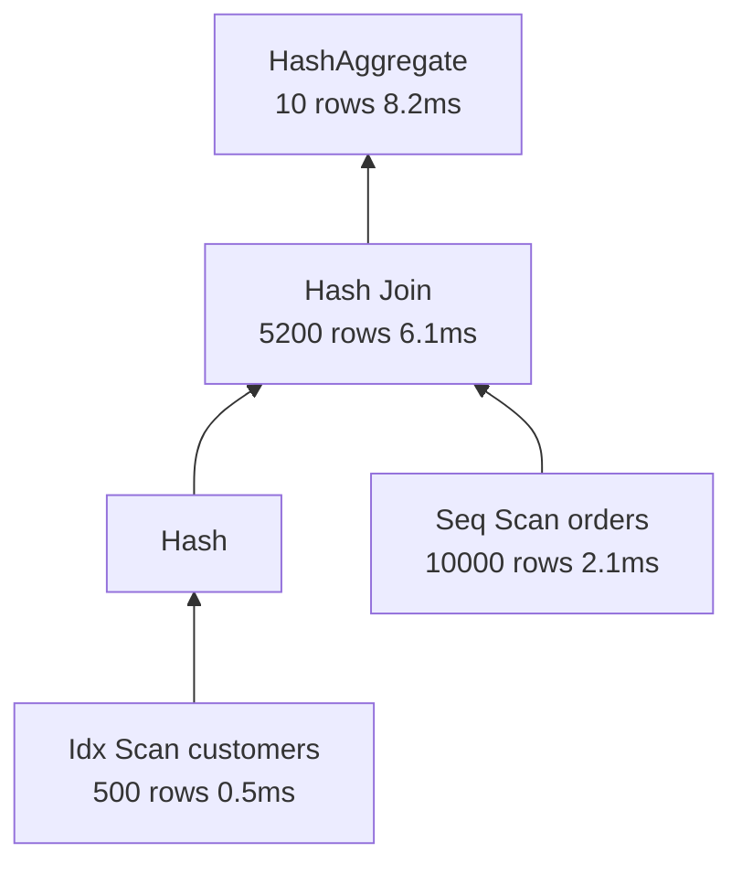

---

### 🛠️ Worked Example

**BAD:**

```sql
-- EXPLAIN without ANALYZE: estimates only
EXPLAIN
SELECT c.name, COUNT(*)
FROM customers c
JOIN orders o ON o.customer_id = c.id
GROUP BY c.name;
-- Shows estimated rows, not actual.
-- Estimate: 100 rows; reality: 50,000.
```

Why it's wrong: estimated row counts can be orders of magnitude off when statistics are stale, leading to wrong tuning decisions.

**GOOD:**

```sql
EXPLAIN (ANALYZE, BUFFERS, FORMAT TEXT)
SELECT c.name, COUNT(*)
FROM customers c
JOIN orders o ON o.customer_id = c.id
GROUP BY c.name;
-- Shows actual rows, actual time, buffer
-- hits vs reads. Find the slow node.
```

Why it's right: actual metrics reveal the real bottleneck. BUFFERS shows whether data came from cache (shared hit) or disk (read).

**Production pattern - safe EXPLAIN on mutations:**

```sql
BEGIN;
EXPLAIN (ANALYZE, BUFFERS)
DELETE FROM audit_log
WHERE created_at < '2023-01-01';
ROLLBACK;
-- DELETE runs but rolls back: safe profiling
```

---

### ⚖️ Trade-offs

**Gain:** Actual execution metrics, estimate-vs-reality comparison, buffer usage visibility, pinpoints the exact slow node.

**Cost:** EXPLAIN ANALYZE runs the query - on a slow query, it takes just as long. On write queries, it performs the writes (wrap in ROLLBACK). BUFFERS adds minor overhead.

| Aspect          | EXPLAIN        | EXPLAIN ANALYZE  |
| --------------- | -------------- | ---------------- |
| Runs query      | No             | Yes              |
| Row counts      | Estimated      | Actual           |
| Timing          | Estimated cost | Actual ms        |
| Buffer info     | No             | With BUFFERS     |
| Safe for writes | Yes            | Only in ROLLBACK |

---

### ⚡ Decision Snap

**USE WHEN:**

- A query is slow and you need to find which plan node is the bottleneck
- You suspect the planner is choosing a wrong plan (Seq Scan despite an index)
- You want to verify that a newly created index is actually being used

**AVOID WHEN:**

- The query modifies data and you cannot wrap it in a transaction
- You only need a quick sanity check on plan shape (plain EXPLAIN suffices)

**PREFER EXPLAIN (without ANALYZE) WHEN:**

- The query takes minutes and you want the plan instantly without execution
- You are iterating on query structure and need rapid feedback

---

### ⚠️ Top Traps

| #   | Misconception                              | Reality                                                                                                                        |
| --- | ------------------------------------------ | ------------------------------------------------------------------------------------------------------------------------------ |
| 1   | EXPLAIN ANALYZE is read-only and safe      | It executes the full query including INSERT, UPDATE, DELETE - always wrap mutations in BEGIN/ROLLBACK                          |
| 2   | Low estimated cost means the query is fast | Cost units are arbitrary and not comparable across databases; actual time is what matters                                      |
| 3   | Seq Scan always means a missing index      | Seq Scan is optimal for small tables or queries returning most rows; the planner chooses correctly when statistics are current |

---

### 🪜 Learning Ladder

**Prerequisites:**

- SQL-042 EXPLAIN - Reading Your First Query Plan - basic plan reading before deep analysis
- SQL-040 Indexes - What They Are and Why They Matter - understand index usage in a plan

**THIS:** SQL-060 Execution Plans Deep Dive - EXPLAIN ANALYZE

**Next steps:**

- SQL-061 Index Types - B-Tree, Hash, GIN, GiST, BRIN - choose the right index based on plan analysis
- SQL-094 Query Planner and Cost-Based Optimization - understand why the planner makes its choices

---

### 💡 The Surprising Truth

The most common cause of bad execution plans is not missing indexes - it is stale statistics. When the planner estimates 100 rows but the actual count is 500,000, it may choose a Nested Loop (efficient for small results) instead of a Hash Join (efficient for large results). Running ANALYZE on the table to refresh statistics often fixes plan problems without creating any indexes.

---

### 📇 Revision Card

1. EXPLAIN shows estimated plan; EXPLAIN ANALYZE runs the query and shows actual times and row counts.
2. Always wrap write queries in BEGIN/ROLLBACK when using EXPLAIN ANALYZE.
3. When estimated rows diverge from actual rows, run ANALYZE to refresh statistics before adding indexes.

---

---

# SQL-061 Index Types - B-Tree, Hash, GIN, GiST, BRIN

**TL;DR** - Different index types optimize different access patterns: B-Tree for ranges, Hash for equality, GIN for arrays, GiST for geometry, BRIN for sorted data.

---

### 🔥 The Problem in One Paragraph

You create a B-Tree index on a JSONB column that stores arrays of tags, then query WHERE tags @> '["urgent"]'. The planner ignores the index and does a sequential scan. You add another B-Tree on a point column for geospatial queries - same result. B-Tree is the default and the most versatile index type, but it cannot handle containment operators, full-text search, or geometric proximity. Each access pattern has an index type designed for it. Choosing the wrong type means the index exists on disk, consumes write overhead, but the planner never uses it. This is exactly why multiple index types were created.

---

### 📘 Textbook Definition

PostgreSQL supports multiple **index types**, each optimized for specific operators and data patterns. **B-Tree** handles equality and range comparisons on sortable data. **Hash** handles equality-only lookups. **GIN** (Generalized Inverted Index) handles containment and full-text search on composite values. **GiST** (Generalized Search Tree) handles geometric, range, and nearest-neighbor queries. **BRIN** (Block Range Index) summarizes value ranges per physical block, ideal for naturally ordered large tables.

---

### 🧠 Mental Model

> Think of a library's catalog system. B-Tree is the card catalog sorted alphabetically - great for finding a specific author or all authors in a range. Hash is a locker number lookup - instant if you know the exact number, useless for ranges. GIN is the back-of-book index - maps each keyword to every page it appears on. GiST is a map grid - finds things near a point. BRIN is a shelf label saying "this shelf has books from 1900-1950."

- "Card catalog" -> B-Tree (sorted, range-capable)
- "Locker lookup" -> Hash (equality only)
- "Back-of-book index" -> GIN (inverted, multi-value)

**Where this analogy breaks down:** GiST is more general than just spatial - it supports any data type with a meaningful concept of "distance" or "containment."

---

### ⚙️ How It Works

1. B-Tree stores keys in a balanced tree. Supports
   =, <, >, <=, >=, BETWEEN, IS NULL, and ORDER BY.
   Default index type. O(log n) lookups.
2. Hash stores a hash of each key value. Supports
   only = (equality). Smaller than B-Tree for large
   keys. WAL-logged since PostgreSQL 10.
3. GIN builds an inverted index: maps each element
   (array value, lexeme, key) to the set of rows
   containing it. Supports @>, @@, ?, ?| operators.
4. GiST builds a balanced tree of bounding structures.
   Supports geometric operators, range overlap (&&),
   nearest-neighbor (<->).
5. BRIN stores summary info (min/max) per range of
   physical blocks. Tiny index, effective only when
   physical row order correlates with the indexed
   column value.

```
Index type -> Best operators:
+--------+----------------------------+
| B-Tree | =  <  >  <=  >=  BETWEEN  |
| Hash   | =  (equality only)        |
| GIN    | @>  @@  ?  ?|  ?&         |
| GiST   | <<  >>  &&  <->  @>      |
| BRIN   | =  <  >  (sorted data)   |
+--------+----------------------------+
```

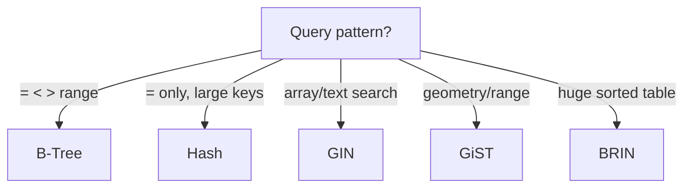

---

### 🛠️ Worked Example

**BAD:**

```sql
-- B-Tree on a JSONB array column
CREATE INDEX idx_tags ON articles
    USING btree (tags);
-- Query: WHERE tags @> '["sql"]'
-- Planner ignores it: btree cannot do @>
```

Why it's wrong: B-Tree does not support containment operators. The index is dead weight.

**GOOD:**

```sql
-- GIN for JSONB containment queries
CREATE INDEX idx_tags ON articles
    USING gin (tags);
-- Now: WHERE tags @> '["sql"]'
-- uses the GIN index efficiently.

-- BRIN for timestamp on append-only table
CREATE INDEX idx_created ON logs
    USING brin (created_at);
-- Tiny index for billions of time-ordered rows
```

Why it's right: each index type matches the query operator and data pattern.

**Production pattern - full-text search:**

```sql
-- GIN on tsvector for full-text search
ALTER TABLE articles
    ADD COLUMN search_vec tsvector
    GENERATED ALWAYS AS (
        to_tsvector('english', title || body)
    ) STORED;

CREATE INDEX idx_fts ON articles
    USING gin (search_vec);
```

---

### ⚖️ Trade-offs

**Gain:** Each index type is purpose-built for its operator class, providing efficient lookups that B-Tree alone cannot support.

**Cost:** GIN indexes are expensive to maintain on write-heavy tables. BRIN indexes are useless if physical row order does not correlate with column values. Choosing wrong means wasted disk and write amplification.

| Aspect        | B-Tree  | GIN        | BRIN         |
| ------------- | ------- | ---------- | ------------ |
| Size          | Medium  | Large      | Tiny         |
| Write cost    | Medium  | High       | Low          |
| Range queries | Yes     | No         | Yes (sorted) |
| Multi-value   | No      | Yes        | No           |
| Best for      | General | Arrays/FTS | Time-series  |

---

### ⚡ Decision Snap

**USE WHEN:**

- B-Tree: equality, range, ORDER BY on scalar columns (the default choice)
- GIN: JSONB containment, array element search, full-text search
- BRIN: very large tables where the indexed column correlates with physical row order

**AVOID WHEN:**

- Hash: you need range queries (hash supports equality only)
- BRIN: rows are inserted in random order relative to the indexed column

**PREFER GiST WHEN:**

- You need nearest-neighbor queries on geometric or IP-range data
- You need range-type overlap queries (tsrange, int4range)

---

### ⚠️ Top Traps

| #   | Misconception                                            | Reality                                                                                                                   |
| --- | -------------------------------------------------------- | ------------------------------------------------------------------------------------------------------------------------- |
| 1   | B-Tree works for all query types                         | B-Tree cannot handle containment (@>), full-text (@@), or geometric (<->) operators                                       |
| 2   | BRIN is a drop-in replacement for B-Tree on large tables | BRIN only works when physical row order correlates with column values; random inserts make it useless                     |
| 3   | Hash indexes are obsolete                                | Since PostgreSQL 10, hash indexes are WAL-logged and crash-safe; they are smaller than B-Tree for equality-only workloads |

---

### 🪜 Learning Ladder

**Prerequisites:**

- SQL-041 B-Tree Index Basics - understand B-Tree before comparing with alternatives
- SQL-040 Indexes - What They Are and Why They Matter - foundational index concepts

**THIS:** SQL-061 Index Types - B-Tree, Hash, GIN, GiST, BRIN

**Next steps:**

- SQL-062 Composite Indexes and Column Order - B-Tree column ordering for multi-column queries
- SQL-063 Covering Indexes (Index-Only Scans) - eliminate table lookups with included columns

---

### 💡 The Surprising Truth

BRIN indexes can be thousands of times smaller than B-Tree indexes on the same column. On a billion-row time-series table where rows are appended in timestamp order, a BRIN index on created_at might be a few megabytes versus gigabytes for a B-Tree. The trade-off is that BRIN scans are less precise - they identify block ranges, not individual rows.

---

### 📇 Revision Card

1. B-Tree = ranges, Hash = equality only, GIN = multi-value/FTS, GiST = geometry/ranges, BRIN = sorted large tables.
2. Match the index type to the query operator - a mismatched index is ignored by the planner.
3. BRIN is tiny but requires physical row order to correlate with column values.

---

---

# SQL-062 Composite Indexes and Column Order

**TL;DR** - In composite indexes, column order determines which queries benefit; the leftmost columns must match your WHERE and ORDER BY clauses.

---

### 🔥 The Problem in One Paragraph

You create an index on (status, created_at) for a query that filters by created_at and orders by status. The planner ignores the index and does a sequential scan. You swap the column order to (created_at, status) and suddenly the query flies. The same two columns, the same index type, but column order made the difference between an index scan and a full table scan. Composite indexes follow the leftmost prefix rule: the index is only usable when the query's conditions match columns starting from the left. This is exactly why understanding composite index column order was created.

---

### 📘 Textbook Definition

A **composite index** (also called a multi-column index) is a B-Tree index built on two or more columns. The index entries are sorted first by the first column, then by the second within each first-column value, and so on. The **leftmost prefix rule** states that the index is usable only when the query filters or sorts on a leading prefix of the indexed columns - skipping the first column renders the remaining columns unsearchable in the index.

---

### 🧠 Mental Model

> Think of a phone book sorted by last name, then first name. You can look up all "Smiths" (first column), or "Smith, Alice" (both columns). But you cannot look up all "Alices" without scanning the entire book - first name is usable only after last name is matched.

- "Last name" -> first column in composite index
- "First name" -> second column, searchable only after first matches
- "Looking up all Alices" -> skipping the first column, index unusable

**Where this analogy breaks down:** Some databases can do index skip scans for low-cardinality leading columns, partially bypassing the leftmost prefix rule.

---

### ⚙️ How It Works

1. A composite index on (a, b, c) sorts entries by a,
   then by b within each a, then by c within each
   (a, b) pair.
2. A query filtering on (a) uses the index.
   A query on (a, b) uses it. On (a, b, c) uses it.
3. A query filtering only on (b) or (c) cannot use the
   index because the sort order starts at (a).
4. For ORDER BY, the index eliminates a sort if the
   ORDER BY columns match a prefix: ORDER BY a, b
   works; ORDER BY b, a does not.
5. Range conditions on a column stop index usage for
   subsequent columns: WHERE a = 1 AND b > 5 AND
   c = 10 - the index uses a and b but not c.

```
Index on (status, created_at):

status  | created_at
--------+------------
active  | 2024-01-01
active  | 2024-01-15
active  | 2024-02-01
closed  | 2024-01-05
closed  | 2024-01-20

WHERE status = 'active'
  AND created_at > '2024-01-10'
  -> Index scan: jump to 'active', then
     scan forward from 2024-01-10. Fast.

WHERE created_at > '2024-01-10'
  -> Cannot jump: data not sorted by
     created_at first. Seq scan.
```

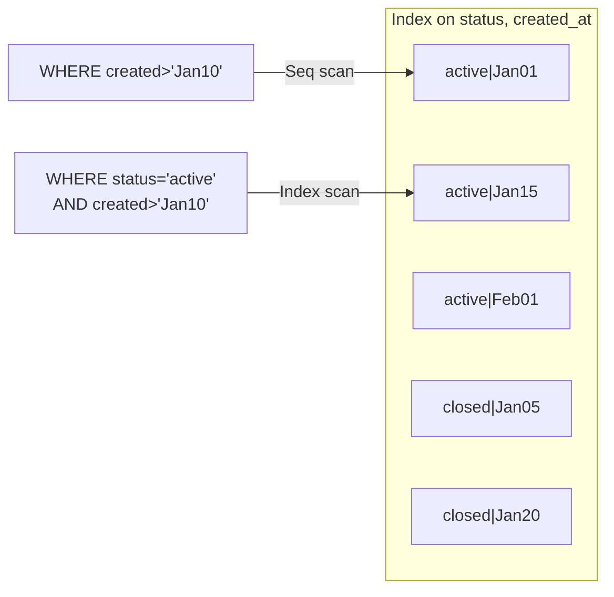

---

### 🛠️ Worked Example

**BAD:**

```sql
-- Index column order does not match query
CREATE INDEX idx_orders ON orders
    (status, customer_id);

-- Query filters only on customer_id
SELECT * FROM orders
WHERE customer_id = 42;
-- Index ignored: customer_id is not the
-- leftmost column.
```

Why it's wrong: the index sorts by status first; filtering by customer_id alone requires scanning all status groups.

**GOOD:**

```sql
-- Match index to query pattern
CREATE INDEX idx_orders ON orders
    (customer_id, status);

-- Now both queries use the index:
SELECT * FROM orders
WHERE customer_id = 42;

SELECT * FROM orders
WHERE customer_id = 42
  AND status = 'active';
```

Why it's right: customer_id is leftmost, so both queries match a prefix of the index.

**Production pattern - equality before range:**

```sql
-- Put equality columns first, range last
CREATE INDEX idx_search ON events
    (tenant_id, event_type, created_at);

-- Query:
SELECT * FROM events
WHERE tenant_id = 'acme'
  AND event_type = 'login'
  AND created_at > '2024-01-01'
ORDER BY created_at;
-- All three columns used; ORDER BY is free.
```

---

### ⚖️ Trade-offs

**Gain:** One composite index serves multiple query patterns that share a column prefix. Eliminates sorts for matching ORDER BY clauses.

**Cost:** Write overhead increases with each indexed column. The index only helps queries matching the leftmost prefix, not arbitrary column combinations.

| Aspect           | Composite index      | Multiple single indexes |
| ---------------- | -------------------- | ----------------------- |
| Query coverage   | Prefix-matching only | Any single column       |
| Storage          | One index, larger    | Multiple smaller        |
| Write cost       | One update           | Multiple updates        |
| Sort elimination | If ORDER BY matches  | Rarely                  |

---

### ⚡ Decision Snap

**USE WHEN:**

- Queries consistently filter on the same combination of columns
- You want to eliminate both lookup and sort costs with one index
- Equality columns precede range columns in your WHERE patterns

**AVOID WHEN:**

- Queries use the columns in unpredictable combinations
- The leading column has very low selectivity (e.g., boolean with 50/50 split)

**PREFER separate single-column indexes WHEN:**

- Queries filter on different individual columns, not combinations
- You need bitmap index scan combinations for complex OR conditions

---

### ⚠️ Top Traps

| #   | Misconception                                                   | Reality                                                                                     |
| --- | --------------------------------------------------------------- | ------------------------------------------------------------------------------------------- |
| 1   | A composite index on (a, b) helps queries filtering only on b   | No - the leftmost prefix rule requires a match on a first                                   |
| 2   | Column order in the index does not matter                       | Order is critical: (a, b) and (b, a) serve completely different query patterns              |
| 3   | Range conditions on one column do not affect subsequent columns | A range condition on column N prevents the index from being used for columns N+1, N+2, etc. |

---

### 🪜 Learning Ladder

**Prerequisites:**

- SQL-061 Index Types - B-Tree, Hash, GIN, GiST, BRIN - understand B-Tree internals before optimizing column order
- SQL-041 B-Tree Index Basics - B-Tree sorted structure is why column order matters

**THIS:** SQL-062 Composite Indexes and Column Order

**Next steps:**

- SQL-063 Covering Indexes (Index-Only Scans) - add INCLUDE columns to eliminate table lookups
- SQL-065 Implicit Conversions Kill Your Indexes - type mismatches bypass even well-designed composite indexes

---

### 💡 The Surprising Truth

Adding more columns to a composite index can sometimes make queries faster even if those columns are not in the WHERE clause. If the SELECT list only references indexed columns, the database performs an index-only scan and never touches the table heap at all. This is the covering index pattern, and it turns your composite index into a lightweight materialized view.

---

### 📇 Revision Card

1. Composite indexes follow the leftmost prefix rule - the query must match columns starting from the left.
2. Put equality columns first, range columns last, ORDER BY columns at the end.
3. A range condition on column N stops index usage for all subsequent columns.

---

---

# SQL-063 Covering Indexes (Index-Only Scans)

**TL;DR** - Covering indexes include all columns a query needs, enabling index-only scans that skip the table heap entirely.

---

### 🔥 The Problem in One Paragraph

Your index on (customer_id) lets the planner find matching rows quickly, but then it must jump to the table heap to fetch the customer's name and email for the SELECT list. Each heap fetch is a random I/O operation. On a query returning thousands of rows, these heap fetches dominate execution time even though the index narrowed the search perfectly. If the index itself contained the name and email columns, the database could answer the query entirely from the index without touching the table. This is exactly why covering indexes were created.

---

### 📘 Textbook Definition

A **covering index** is an index that contains all columns referenced by a query - in the WHERE, SELECT, JOIN, and ORDER BY clauses. When the planner detects that a query can be satisfied entirely from the index, it performs an **index-only scan**, skipping the heap table lookup. In PostgreSQL, the INCLUDE clause adds non-searchable payload columns to the index for this purpose.

---

### 🧠 Mental Model

> Imagine a book's index at the back. A normal index says "Topic X: see page 42." You must flip to page 42. A covering index says "Topic X: the answer is 'yes', page 42." You got the answer without flipping. The page number is still there if you need deeper detail, but for simple lookups, the index entry is self-sufficient.

- "Page number" -> pointer to heap row (normal index)
- "Answer in the index entry" -> included columns (covering)
- "No page flip needed" -> index-only scan

**Where this analogy breaks down:** PostgreSQL's visibility map must confirm the row is visible to the current transaction; if the page has recently-modified rows, the engine falls back to a regular index scan with heap fetches.

---

### ⚙️ How It Works

1. You create an index with INCLUDE columns: the key
   columns (used for searching and sorting) plus
   payload columns (used only for returning data).
2. When a query references only columns present in
   the index, the planner chooses an index-only scan.
3. The engine reads index pages only - no heap access.
4. PostgreSQL checks the visibility map to confirm
   each page's rows are all-visible. If not, it
   fetches the heap tuple to check visibility.
5. VACUUM marks pages as all-visible, improving
   index-only scan effectiveness over time.

```
Regular index scan:
  Index -> find row pointer -> Heap fetch
  [fast]                     [random I/O]

Index-only scan (covering):
  Index -> return data directly
  [fast]  [no heap access]

CREATE INDEX idx_cover ON orders
    (customer_id)
    INCLUDE (total, placed);
```

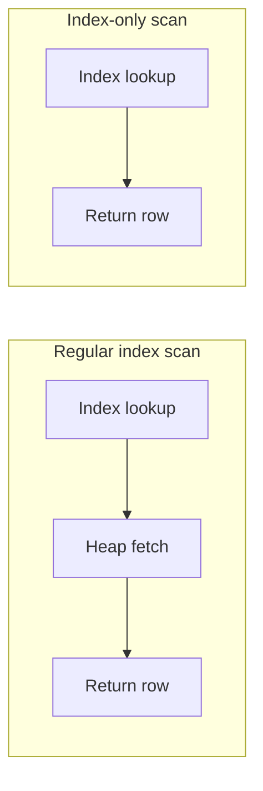

---

### 🛠️ Worked Example

**BAD:**

```sql
-- Index on filter column only
CREATE INDEX idx_cust ON orders
    (customer_id);

SELECT customer_id, total, placed
FROM orders
WHERE customer_id = 42;
-- Index finds rows, but total and placed
-- require heap fetches per row.
```

Why it's wrong: the index narrows the search, but the database still touches the heap for every matching row to read total and placed.

**GOOD:**

```sql
-- Covering index with INCLUDE
CREATE INDEX idx_cust_cover ON orders
    (customer_id)
    INCLUDE (total, placed);

SELECT customer_id, total, placed
FROM orders
WHERE customer_id = 42;
-- Index-only scan: no heap access needed.
```

Why it's right: all three columns live in the index; the query never touches the table heap.

**Production pattern - covering for dashboard query:**

```sql
CREATE INDEX idx_dash ON orders
    (status, created_at DESC)
    INCLUDE (customer_id, total);

-- Dashboard query answered from index only
SELECT customer_id, total
FROM orders
WHERE status = 'pending'
ORDER BY created_at DESC
LIMIT 50;
```

---

### ⚖️ Trade-offs

**Gain:** Eliminates heap fetches, dramatically reducing I/O for queries returning many rows. Most effective on read-heavy workloads.

**Cost:** Larger index size (INCLUDE columns add bytes per entry). Every INSERT/UPDATE must maintain the extra payload. Not useful if queries reference columns outside the index.

| Aspect            | Covering index        | Regular index    |
| ----------------- | --------------------- | ---------------- |
| Heap access       | None (if all-visible) | Per matching row |
| Index size        | Larger                | Smaller          |
| Write overhead    | Higher                | Lower            |
| Query flexibility | Specific queries only | Any query shape  |

---

### ⚡ Decision Snap

**USE WHEN:**

- A high-frequency query selects a small, fixed set of columns from a large table
- EXPLAIN shows heap fetches dominating execution time after index lookup
- The table is read-heavy and VACUUM runs regularly

**AVOID WHEN:**

- Queries frequently change which columns they select
- The table is write-heavy and the extra index maintenance cost is prohibitive

**PREFER a regular index WHEN:**

- The query always needs columns that would make the covering index excessively wide
- The table is small enough that heap fetches are fast regardless

---

### ⚠️ Top Traps

| #   | Misconception                                             | Reality                                                                                                                  |
| --- | --------------------------------------------------------- | ------------------------------------------------------------------------------------------------------------------------ |
| 1   | Index-only scans always avoid the heap                    | PostgreSQL must check the visibility map; recently modified pages force heap fetches until VACUUM marks them all-visible |
| 2   | INCLUDE columns can be used in WHERE clauses              | INCLUDE columns are payload only - they are not part of the index key and cannot be searched                             |
| 3   | Adding every column to every index makes all queries fast | Bloated indexes slow writes, consume disk, and may not fit in memory - cover only your critical queries                  |

---

### 🪜 Learning Ladder

**Prerequisites:**

- SQL-062 Composite Indexes and Column Order - covering indexes extend composite index concepts
- SQL-060 Execution Plans Deep Dive - EXPLAIN ANALYZE - EXPLAIN reveals whether index-only scans are occurring

**THIS:** SQL-063 Covering Indexes (Index-Only Scans)

**Next steps:**

- SQL-064 Query Performance Tuning Patterns - covering indexes are a key tuning pattern
- SQL-089 VACUUM and Bloat Management (PostgreSQL) - VACUUM enables index-only scans by maintaining the visibility map

---

### 💡 The Surprising Truth

In PostgreSQL, index-only scans can paradoxically become slower on tables with heavy concurrent writes. The visibility map flags pages as not-all-visible after any modification, forcing heap fetches until VACUUM catches up. On a write-heavy table, you might see "Index Only Scan" in EXPLAIN but "Heap Fetches: 45000" in the actual output - negating the entire benefit.

---

### 📇 Revision Card

1. A covering index includes all columns a query needs, enabling index-only scans with zero heap access.
2. INCLUDE columns are payload only - they cannot be used in WHERE or ORDER BY.
3. Index-only scans depend on VACUUM maintaining the visibility map; write-heavy tables may still hit the heap.

---

---

# SQL-064 Query Performance Tuning Patterns

**TL;DR** - Systematic query tuning follows a pattern: measure with EXPLAIN ANALYZE, identify the bottleneck node, then apply the targeted fix.

---

### 🔥 The Problem in One Paragraph

A developer stares at a slow query and starts guessing: add an index, rewrite the JOIN, switch to a subquery, maybe add a LIMIT. Each change takes time, and some make things worse. Without a systematic approach, tuning is trial and error. The key insight is that query tuning is not about tricks - it is about measurement, diagnosis, and targeted fixes applied in order. You need a repeatable pattern that works regardless of the specific query. This is exactly why query performance tuning patterns were created.

---

### 📘 Textbook Definition

**Query performance tuning** is the systematic process of analyzing a SQL query's execution plan, identifying the plan node responsible for the most time or I/O, and applying a targeted optimization - such as adding an index, rewriting a predicate, or restructuring a join - to reduce that bottleneck. The process is iterative: measure, diagnose, fix, re-measure.

---

### 🧠 Mental Model

> Think of debugging a slow assembly line. You do not redesign the whole factory. You walk the line, find the station where products pile up (the bottleneck), fix that one station, then walk the line again to see if the bottleneck moved. Repeat until throughput is acceptable.

- "Walking the line" -> reading EXPLAIN ANALYZE output
- "Piled-up station" -> plan node with highest actual time
- "Fix one station" -> targeted optimization for that node

**Where this analogy breaks down:** Some SQL optimizations change the entire plan structure (e.g., adding an index may switch a Nested Loop to a Hash Join), not just speed up one node.

---

### ⚙️ How It Works

1. Run EXPLAIN (ANALYZE, BUFFERS) on the slow query.
2. Find the node with the highest actual time or the
   largest gap between estimated and actual rows.
3. Identify the root cause:
   - Seq Scan on large table -> missing index
   - Nested Loop with high loop count -> wrong join type
   - Sort node -> missing index for ORDER BY
   - Estimated rows far from actual -> stale statistics
4. Apply the targeted fix (index, rewrite, ANALYZE).
5. Re-run EXPLAIN ANALYZE. Verify the fix.
6. Check if the bottleneck moved to another node.
   Repeat until acceptable.

```
Tuning loop:

  EXPLAIN ANALYZE
       |
       v
  Find slowest node
       |
       v
  Diagnose root cause
       |
       v
  Apply targeted fix
       |
       v
  Re-measure
       |
       v
  Bottleneck moved? -> repeat
```

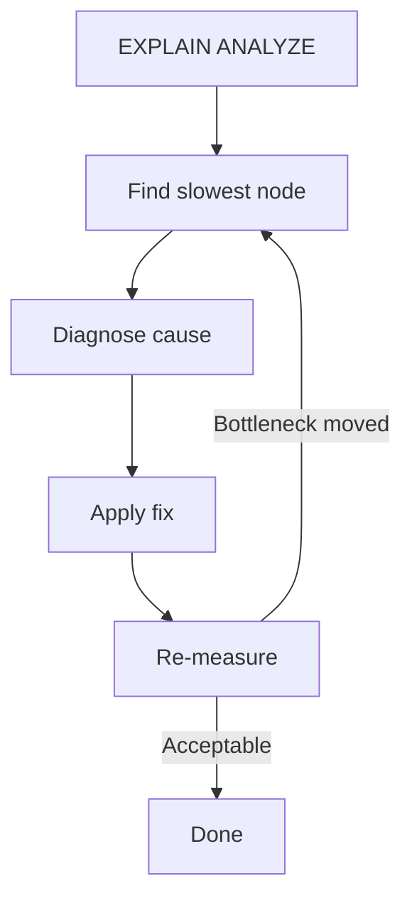

---

### 🛠️ Worked Example

**BAD:**

```sql
-- Guess-and-check: add random indexes
CREATE INDEX idx1 ON orders (total);
CREATE INDEX idx2 ON orders (placed);
CREATE INDEX idx3 ON orders (status);
-- Three indexes, none match the actual
-- query pattern. Slower writes, no benefit.
```

Why it's wrong: creating indexes without reading the execution plan is guessing. Each unused index wastes disk and slows writes.

**GOOD:**

```sql
-- Step 1: Measure
EXPLAIN (ANALYZE, BUFFERS)
SELECT c.name, SUM(o.total)
FROM customers c
JOIN orders o ON o.customer_id = c.id
WHERE o.placed > '2024-01-01'
GROUP BY c.name;
-- Output shows: Seq Scan on orders
-- actual rows=500000, time=450ms

-- Step 2: Fix the bottleneck
CREATE INDEX idx_orders_placed
    ON orders (placed)
    INCLUDE (customer_id, total);

-- Step 3: Re-measure
-- Now shows: Index Only Scan, time=12ms
```

Why it's right: measure first, identify the exact bottleneck (Seq Scan on orders), create a targeted covering index, verify the improvement.

**Production pattern - statistics refresh:**

```sql
-- When estimated vs actual rows diverge
ANALYZE orders;
-- Refreshes planner statistics. Often fixes
-- wrong join strategy without any index.
```

---

### ⚖️ Trade-offs

**Gain:** Systematic, repeatable approach that minimizes wasted effort. Each fix is validated before moving on.

**Cost:** Requires understanding execution plan output. The optimal fix may be non-obvious (e.g., a statistics refresh rather than an index).

| Aspect           | Systematic tuning | Guess-and-check |
| ---------------- | ----------------- | --------------- |
| Time to fix      | Predictable       | Unpredictable   |
| Wasted indexes   | Zero              | Common          |
| Root cause found | Always            | Sometimes       |
| Skill required   | Medium            | Low             |

---

### ⚡ Decision Snap

**USE WHEN:**

- Any query takes longer than your performance SLA
- A query that was fast suddenly becomes slow (plan regression)
- You need to justify an optimization to your team with data

**AVOID WHEN:**

- The query runs once a year and speed does not matter
- The table has fewer than a few thousand rows (everything is fast)

**PREFER application-level caching WHEN:**

- The same expensive query runs repeatedly with identical parameters
- The data changes infrequently and staleness is acceptable

---

### ⚠️ Top Traps

| #   | Misconception                                  | Reality                                                                                                             |
| --- | ---------------------------------------------- | ------------------------------------------------------------------------------------------------------------------- |
| 1   | "Add an index" is always the answer            | Stale statistics, bad query structure, or missing VACUUM are equally common causes                                  |
| 2   | Tuning is a one-time activity                  | Data grows, patterns change, and plans regress - tuning is continuous                                               |
| 3   | A fast query in dev will be fast in production | Production has different data distribution, concurrency, and cache behavior; always test with production-scale data |

---

### 🪜 Learning Ladder

**Prerequisites:**

- SQL-060 Execution Plans Deep Dive - EXPLAIN ANALYZE - you must read plans before tuning
- SQL-061 Index Types - B-Tree, Hash, GIN, GiST, BRIN - know which index type to apply

**THIS:** SQL-064 Query Performance Tuning Patterns

**Next steps:**

- SQL-066 Slow Query Log Analysis - find which queries to tune first
- SQL-097 Plan Regression and pg_stat_statements - track plan changes over time

---

### 💡 The Surprising Truth

The single most effective performance fix is often not adding an index but running ANALYZE to update table statistics. A planner working with accurate cardinality estimates makes better join and scan decisions than a planner with dozens of indexes but stale statistics. Many teams skip ANALYZE and wonder why their indexes are ignored.

---

### 📇 Revision Card

1. Tuning pattern: EXPLAIN ANALYZE -> find slowest node -> diagnose cause -> apply fix -> re-measure.
2. Stale statistics cause more bad plans than missing indexes - run ANALYZE first.
3. Never create an index without first reading the execution plan to confirm it will be used.

---

---

# SQL-065 Implicit Conversions Kill Your Indexes

**TL;DR** - When column types and filter value types mismatch, the database silently converts data, bypassing indexes and causing full scans.

---

### 🔥 The Problem in One Paragraph

You have an index on a VARCHAR column phone_number. You query WHERE phone_number = 5551234 (without quotes). The planner does a sequential scan on a million-row table. The index exists, the value matches, but the query is slow. The problem is invisible: the database silently casts every phone_number value to integer for comparison, and a function applied to an indexed column prevents index usage. You did not write a function call, but the implicit type conversion acts like one. This is exactly why implicit conversions kill your indexes.

---

### 📘 Textbook Definition

An **implicit conversion** (also called implicit cast or type coercion) occurs when the database automatically converts a value from one data type to another to satisfy a comparison or operation. When the conversion is applied to the indexed column rather than the literal value, the index cannot be used because the planner sees the column wrapped in a function. This is called a **non-SARGable** predicate.

---

### 🧠 Mental Model

> Imagine a phone book sorted alphabetically by name. Someone asks you to find the entry whose name, when converted to a number via some formula, equals 42. You cannot use the alphabetical sort - you must check every entry, apply the formula, and compare. The phone book's order is useless because the lookup requires transforming every entry.

- "Alphabetical sort" -> B-Tree index order
- "Formula applied to each entry" -> implicit cast on column
- "Scanning every entry" -> sequential scan

**Where this analogy breaks down:** Some databases are smart enough to cast the literal instead of the column when types are compatible, preserving index usage. PostgreSQL generally handles this well for common numeric types.

---

### ⚙️ How It Works

1. You write WHERE varchar_col = 123 (integer literal
   compared to VARCHAR column).
2. The database must convert one side to match the
   other. If it converts the column, every row's value
   must be cast before comparison.
3. A function applied to the indexed column (even an
   implicit one) makes the predicate non-SARGable.
4. The planner cannot use the B-Tree index because the
   sorted values are the original type, not the cast
   type.
5. The fix: ensure the literal matches the column type,
   or create an expression index on the cast.

```
Index on phone_number (varchar):

  WHERE phone_number = 5551234
  -> DB casts each phone_number to int
  -> Index useless -> Seq Scan

  WHERE phone_number = '5551234'
  -> Direct comparison, same type
  -> Index Scan
```

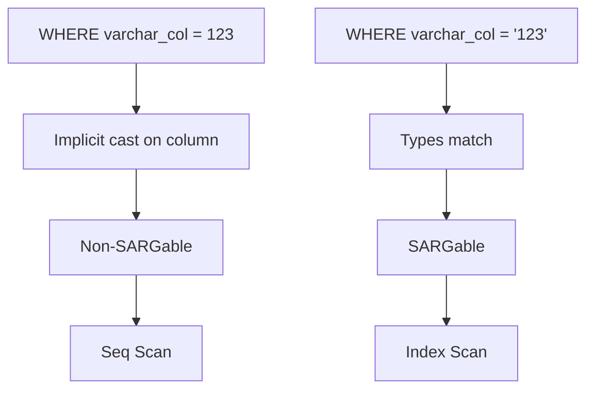

---

### 🛠️ Worked Example

**BAD:**

```sql
-- Integer literal vs VARCHAR column
SELECT * FROM users
WHERE phone = 5551234;
-- Implicit cast: phone::int = 5551234
-- per row. Seq Scan on 10M rows.
```

Why it's wrong: the database casts each row's phone value to integer, preventing index usage.

**GOOD:**

```sql
-- Matching types: string literal
SELECT * FROM users
WHERE phone = '5551234';
-- Direct comparison, Index Scan.
```

Why it's right: no conversion needed; the index is used directly.

**Production pattern - date comparison:**

```sql
-- BAD: function on column prevents index
SELECT * FROM orders
WHERE DATE(created_at) = '2024-03-15';

-- GOOD: range on original column
SELECT * FROM orders
WHERE created_at >= '2024-03-15'
  AND created_at < '2024-03-16';
-- Index on created_at used directly.
```

---

### ⚖️ Trade-offs

**Gain:** Fixing type mismatches restores index usage, often improving query performance by orders of magnitude.

**Cost:** Requires vigilance at every query boundary - ORM-generated queries, dynamic SQL, and API parameters are common sources of mismatches.

| Aspect           | Matching types         | Implicit conversion   |
| ---------------- | ---------------------- | --------------------- |
| Index usage      | Yes                    | No (column cast)      |
| Scan type        | Index Scan             | Seq Scan              |
| Developer effort | Must know column types | Zero (but slow)       |
| ORM risk         | Low if configured      | High with auto-params |

---

### ⚡ Decision Snap

**USE WHEN:**

- EXPLAIN shows Seq Scan on an indexed column with a simple equality filter
- An ORM generates queries with parameter types that do not match column types
- A query was fast and became slow after a schema change altered column types

**AVOID WHEN:**

- The table is small enough that Seq Scan is faster than index overhead
- The conversion is intentional and you have an expression index

**PREFER expression indexes WHEN:**

- You cannot change the application's query (third-party code)
- The conversion is a deliberate part of the data model (e.g., LOWER(email))

---

### ⚠️ Top Traps

| #   | Misconception                                                   | Reality                                                                                                      |
| --- | --------------------------------------------------------------- | ------------------------------------------------------------------------------------------------------------ |
| 1   | PostgreSQL always casts the literal, not the column             | It depends on type precedence; integer-to-varchar comparisons may cast the column in some cases              |
| 2   | ORMs always send the correct parameter types                    | Many ORMs send all parameters as strings or use language-default numeric types, causing mismatches           |
| 3   | Adding more indexes fixes slow queries caused by implicit casts | No index of any type helps if the predicate applies a function to the column - fix the type mismatch instead |

---

### 🪜 Learning Ladder

**Prerequisites:**

- SQL-009 Data Types - Integers, Text, Dates, Booleans - type knowledge is the foundation
- SQL-040 Indexes - What They Are and Why They Matter - understand why functions on columns prevent index use

**THIS:** SQL-065 Implicit Conversions Kill Your Indexes

**Next steps:**

- SQL-064 Query Performance Tuning Patterns - implicit conversions are a common tuning target
- SQL-066 Slow Query Log Analysis - slow query logs reveal queries suffering from implicit casts

---

### 💡 The Surprising Truth

In many databases, comparing a string column to an integer forces the database to cast every row's string to an integer - and if any row contains a non-numeric string, the query fails with a runtime error. The implicit conversion does not just kill performance; it can kill the entire query with an exception on data that has nothing to do with the rows you wanted.

---

### 📇 Revision Card

1. Implicit type conversion on a column prevents index usage - the predicate becomes non-SARGable.
2. Always match literal types to column types: WHERE varchar_col = '123', not = 123.
3. Functions on indexed columns (including implicit casts) force sequential scans - use expression indexes if you cannot fix the query.

---

---

# SQL-066 Slow Query Log Analysis

**TL;DR** - Slow query logs capture queries exceeding a time threshold, giving you a ranked list of optimization targets.

---

### 🔥 The Problem in One Paragraph

Your application has thousands of different SQL queries. Users report occasional slowness, but you do not know which queries are responsible. Adding EXPLAIN ANALYZE to every query is impractical. You need the database itself to record which queries exceed a time threshold, how often they run, and how much total time they consume. Without this data, you are tuning the wrong queries - optimizing a rare 5-second query instead of a common 200ms query that runs 10,000 times per hour. This is exactly why slow query log analysis was created.

---

### 📘 Textbook Definition

A **slow query log** is a database feature that records queries whose execution time exceeds a configurable threshold. In PostgreSQL, the log_min_duration_statement parameter controls this threshold. The **pg_stat_statements** extension goes further, aggregating statistics (call count, total time, mean time, rows) across all normalized queries without logging individual executions.

---

### 🧠 Mental Model

> Think of a speed camera on a highway. It does not photograph every car - only those exceeding the limit. The slow query log is that camera. pg_stat_statements is the traffic analytics dashboard: it counts every car, calculates average speeds, and ranks roads by total time spent in traffic.

- "Speed camera" -> log_min_duration_statement
- "Traffic dashboard" -> pg_stat_statements
- "Cars exceeding limit" -> queries slower than threshold

**Where this analogy breaks down:** pg_stat_statements normalizes queries (replacing literal values with $1, $2), so you see patterns, not individual executions.

---

### ⚙️ How It Works

1. Set log_min_duration_statement = 200 (ms) in
   postgresql.conf to log queries taking > 200ms.
2. The database writes each slow query's text, duration,
   and timestamp to the server log.
3. For aggregate analysis, enable pg_stat_statements
   in shared_preload_libraries.
4. Query pg_stat_statements to find top consumers:
   sort by total_exec_time for highest cumulative
   cost, or by mean_exec_time for worst individual.
5. Focus tuning effort on the queries with the highest
   total time - these have the most impact.

```
Priority matrix:

                High frequency
                     |
  Low impact    [Tune these]    High impact
     per call   <-- total_time --> per call
                     |
                Low frequency

Top target = high frequency + moderate per-call
             (high total_exec_time)
```

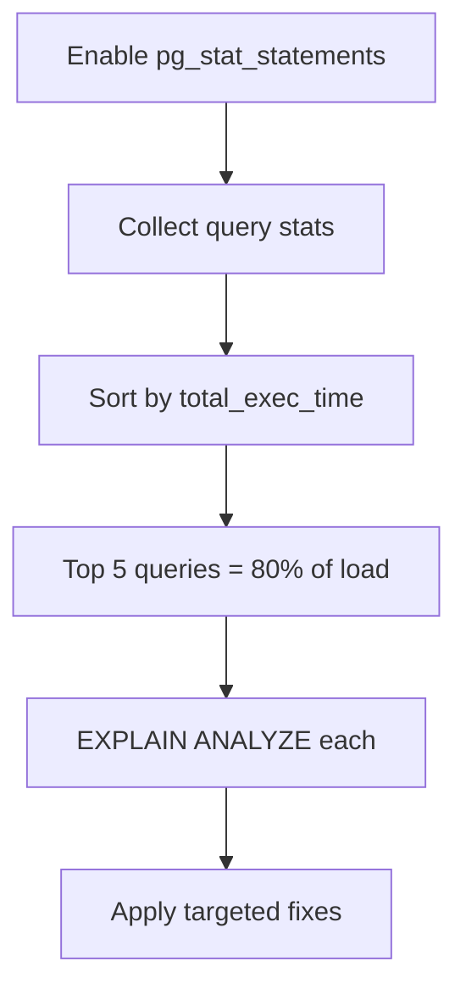

---

### 🛠️ Worked Example

**BAD:**

```sql
-- Logging everything: noise overwhelms signal
-- postgresql.conf:
-- log_statement = 'all'
-- Generates gigabytes of logs with no
-- ranking or aggregation.
```

Why it's wrong: logging every query produces noise without insight. You cannot find the worst offenders without manual parsing.

**GOOD:**

```sql
-- Enable pg_stat_statements
-- postgresql.conf:
-- shared_preload_libraries =
--     'pg_stat_statements'
-- log_min_duration_statement = 200

-- Find top 5 time consumers
SELECT query,
       calls,
       round(total_exec_time::numeric, 1)
           AS total_ms,
       round(mean_exec_time::numeric, 1)
           AS avg_ms
FROM pg_stat_statements
ORDER BY total_exec_time DESC
LIMIT 5;
```

Why it's right: pg_stat_statements ranks queries by cumulative impact, pointing you to the highest-value optimization targets.

**Production pattern - reset after tuning:**

```sql
-- After optimizing, reset stats to measure
-- improvement from a clean baseline
SELECT pg_stat_statements_reset();
-- Wait for traffic, then re-query to verify.
```

---

### ⚖️ Trade-offs

**Gain:** Data-driven tuning priorities, cumulative impact visibility, normalized query patterns.

**Cost:** pg_stat_statements consumes shared memory (configurable). Slow query logging adds I/O to the server log. Both require initial configuration.

| Aspect              | pg_stat_statements      | Slow query log        |
| ------------------- | ----------------------- | --------------------- |
| Aggregation         | Automatic               | Manual parsing        |
| Overhead            | Shared memory           | Log I/O               |
| Query normalization | Yes ($1, $2)            | Exact text            |
| Historical data     | Accumulates until reset | Persists in log files |

---

### ⚡ Decision Snap

**USE WHEN:**

- You need to identify which queries consume the most database time
- Performance degradation is gradual and you need to find the top offenders
- You are establishing a performance baseline before a major release

**AVOID WHEN:**

- The database is a test instance with no meaningful traffic patterns
- You already know the exact slow query from application-level monitoring

**PREFER APM tools (Datadog, New Relic) WHEN:**

- You need end-to-end latency including application and network time
- You need correlation between slow queries and application endpoints

---

### ⚠️ Top Traps

| #   | Misconception                                                | Reality                                                                                                                            |
| --- | ------------------------------------------------------------ | ---------------------------------------------------------------------------------------------------------------------------------- |
| 1   | Optimize the single slowest query first                      | A query taking 5s but running once per day matters less than a 200ms query running 100,000 times per day - sort by total_exec_time |
| 2   | pg_stat_statements shows individual query executions         | It normalizes queries and aggregates statistics; you see patterns, not individual calls                                            |
| 3   | Setting log_min_duration_statement = 0 captures slow queries | It logs every query, including sub-millisecond ones - use a meaningful threshold like 100-500ms                                    |

---

### 🪜 Learning Ladder

**Prerequisites:**

- SQL-060 Execution Plans Deep Dive - EXPLAIN ANALYZE - you need plan reading skills to act on slow query findings
- SQL-064 Query Performance Tuning Patterns - the tuning loop consumes slow query log output

**THIS:** SQL-066 Slow Query Log Analysis

**Next steps:**

- SQL-097 Plan Regression and pg_stat_statements - track plan changes and performance regression over time
- SQL-102 Connection Pooling - PgBouncer and HikariCP - slow queries under load may indicate connection exhaustion

---

### 💡 The Surprising Truth

In most production databases, the top 5 queries by total_exec_time account for over 80% of database CPU time. Tuning just these five queries often improves overall database performance more than any infrastructure upgrade. The slow query log tells you which five to focus on.

---

### 📇 Revision Card

1. Sort by total_exec_time (calls x avg time), not just mean_exec_time, to find the highest-impact optimization targets.
2. pg_stat_statements normalizes queries and aggregates stats - it shows patterns, not individual calls.
3. The top 5 queries by total time typically account for the majority of database load.

---

---

# SQL-067 Transaction Isolation Levels

**TL;DR** - Isolation levels control how much of other transactions' uncommitted or concurrent changes a transaction can see, trading correctness for throughput.

---

### 🔥 The Problem in One Paragraph

Two users simultaneously read an inventory count of 10 items. Each decides to decrement by 1. Without isolation, both read 10, both write 9, and the business loses an item. With too much isolation, the database serializes every transaction, and throughput drops to single-threaded speed. You need a configurable dial between "everyone sees everything instantly" and "every transaction runs as if it were alone." The database provides four standard settings on this dial. This is exactly why transaction isolation levels were created.

---

### 📘 Textbook Definition

**Transaction isolation levels** define the degree to which a transaction's operations are isolated from concurrent transactions. The SQL standard defines four levels: READ UNCOMMITTED (see uncommitted changes), READ COMMITTED (see only committed changes), REPEATABLE READ (snapshot at first read), and SERIALIZABLE (full isolation, as if transactions ran sequentially). Each level permits or prevents specific read phenomena.

---

### 🧠 Mental Model

> Imagine a shared document with revision tracking. READ UNCOMMITTED lets you see everyone's unsaved drafts. READ COMMITTED shows only saved versions. REPEATABLE READ gives you a frozen copy at the moment you opened it. SERIALIZABLE means the system ensures your edits never conflict with anyone else's, as if you had exclusive access.

- "Unsaved drafts" -> READ UNCOMMITTED (dirty reads)
- "Saved versions" -> READ COMMITTED (default in PostgreSQL)
- "Frozen copy" -> REPEATABLE READ (snapshot)

**Where this analogy breaks down:** SERIALIZABLE does not actually lock out other users - it uses predicate locking and conflict detection to abort transactions that would violate serial ordering.

---

### ⚙️ How It Works

1. READ UNCOMMITTED: transactions can read
   uncommitted changes from other transactions
   (dirty reads). PostgreSQL treats this the same as
   READ COMMITTED.
2. READ COMMITTED (PG default): each statement sees
   only data committed before that statement started.
   Re-reading the same row may return different values
   if another transaction committed between reads.
3. REPEATABLE READ: the transaction sees a snapshot
   taken at the first query. Re-reads always return
   the same data. Phantom rows are prevented in PG.
4. SERIALIZABLE: the database ensures the result is
   equivalent to running transactions sequentially.
   Conflicting transactions are aborted with a
   serialization failure, and the application must
   retry.

```
Isolation levels and read phenomena:

Level             | Dirty | Non-Repeat | Phantom
------------------+-------+------------+--------
READ UNCOMMITTED  |  Yes  |    Yes     |   Yes
READ COMMITTED    |  No   |    Yes     |   Yes
REPEATABLE READ   |  No   |    No      |   No*
SERIALIZABLE      |  No   |    No      |   No

* PostgreSQL prevents phantoms at REPEATABLE
  READ, unlike the SQL standard minimum.
```

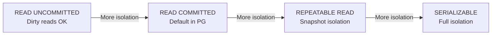

---

### 🛠️ Worked Example

**BAD:**

```sql
-- Transaction sees changing data mid-flight
SET TRANSACTION ISOLATION LEVEL
    READ COMMITTED;
BEGIN;
SELECT balance FROM accounts
    WHERE id = 1; -- returns 1000
-- Another tx commits: balance = 500
SELECT balance FROM accounts
    WHERE id = 1; -- returns 500
-- Same row, different value within
-- the same transaction!
COMMIT;
```

Why it's wrong: READ COMMITTED allows non-repeatable reads. If your logic depends on stable data within a transaction, this silently produces wrong results.

**GOOD:**

```sql
SET TRANSACTION ISOLATION LEVEL
    REPEATABLE READ;
BEGIN;
SELECT balance FROM accounts
    WHERE id = 1; -- returns 1000
-- Another tx commits: balance = 500
SELECT balance FROM accounts
    WHERE id = 1; -- still returns 1000
-- Snapshot is stable for entire tx.
COMMIT;
```

Why it's right: REPEATABLE READ gives a consistent snapshot for the entire transaction.

**Production pattern - serializable with retry:**

```sql
-- Application code must handle retries
LOOP:
  BEGIN ISOLATION LEVEL SERIALIZABLE;
  -- business logic
  COMMIT;
  -- If error 40001 (serialization failure):
  --   ROLLBACK and LOOP again
```

---

### ⚖️ Trade-offs

**Gain:** Higher isolation prevents anomalies. SERIALIZABLE guarantees correctness for any interleaving.

**Cost:** Higher isolation reduces concurrency. SERIALIZABLE may abort transactions that conflict, requiring application-level retry logic.

| Aspect        | READ COMMITTED          | REPEATABLE READ | SERIALIZABLE |
| ------------- | ----------------------- | --------------- | ------------ |
| Concurrency   | High                    | Medium          | Lower        |
| Anomalies     | Non-repeatable, phantom | None (in PG)    | None         |
| Retry logic   | Not needed              | Rarely needed   | Required     |
| Default in PG | Yes                     | No              | No           |

---

### ⚡ Decision Snap

**USE WHEN:**

- READ COMMITTED: general OLTP where each statement needs current data
- REPEATABLE READ: reports or multi-statement reads that need a consistent snapshot
- SERIALIZABLE: financial transactions where any anomaly is unacceptable

**AVOID WHEN:**

- SERIALIZABLE: high-contention workloads where retry storms would degrade throughput
- READ UNCOMMITTED: PostgreSQL maps this to READ COMMITTED anyway

**PREFER READ COMMITTED WHEN:**

- Individual statements are self-contained and do not depend on cross-statement consistency
- Throughput matters more than multi-statement consistency

---

### ⚠️ Top Traps

| #   | Misconception                                                             | Reality                                                                                                                  |
| --- | ------------------------------------------------------------------------- | ------------------------------------------------------------------------------------------------------------------------ |
| 1   | READ COMMITTED means you see a consistent view for the entire transaction | Each statement sees a new snapshot; re-reading the same row can return different values                                  |
| 2   | SERIALIZABLE means transactions run one at a time                         | It uses predicate locking and SSI (Serializable Snapshot Isolation) in PG - concurrent execution with conflict detection |
| 3   | Higher isolation always means slower performance                          | REPEATABLE READ is often no slower than READ COMMITTED because it uses the same MVCC snapshot mechanism                  |

---

### 🪜 Learning Ladder

**Prerequisites:**

- SQL-038 Transactions - BEGIN, COMMIT, ROLLBACK - transaction boundaries are the foundation
- SQL-039 ACID Properties - What They Actually Mean - isolation is the "I" in ACID

**THIS:** SQL-067 Transaction Isolation Levels

**Next steps:**

- SQL-068 Read Phenomena - Dirty, Non-Repeatable, Phantom - understand the anomalies each level prevents
- SQL-069 Optimistic vs Pessimistic Locking - isolation level choice affects locking strategy

---

### 💡 The Surprising Truth

PostgreSQL's REPEATABLE READ is actually stronger than the SQL standard requires. The standard says REPEATABLE READ may allow phantom reads, but PostgreSQL's implementation using Serializable Snapshot Isolation prevents them. This means PG's REPEATABLE READ behaves more like other databases' SERIALIZABLE for read anomalies.

---

### 📇 Revision Card

1. READ COMMITTED = per-statement snapshot. REPEATABLE READ = per-transaction snapshot. SERIALIZABLE = full serial equivalence.
2. Higher isolation prevents anomalies but may require retry logic (SERIALIZABLE) or reduce concurrency.
3. PostgreSQL's REPEATABLE READ prevents phantom reads even though the SQL standard does not require it.

---

---

# SQL-068 Read Phenomena - Dirty, Non-Repeatable, Phantom

**TL;DR** - Dirty reads see uncommitted data, non-repeatable reads see changed data, phantom reads see new rows - each prevented by higher isolation.

---

### 🔥 The Problem in One Paragraph

A bank transaction reads a customer's balance twice within the same transaction. Between the two reads, another transaction transfers money out and commits. The first read showed $1,000 and the second shows $500. The application logic trusted that balance would not change mid-transaction and approved a $700 withdrawal. Now the account is negative. This is a non-repeatable read, and it caused a real business error. Understanding which read anomalies can occur at each isolation level is essential for writing correct concurrent applications. This is exactly why understanding read phenomena was created.

---

### 📘 Textbook Definition

**Dirty read:** A transaction reads data written by a concurrent uncommitted transaction. If that transaction rolls back, the reader used data that never existed. **Non-repeatable read:** A transaction reads the same row twice and gets different values because a concurrent transaction modified and committed between the reads. **Phantom read:** A transaction executes the same query twice and gets different row sets because a concurrent transaction inserted or deleted rows matching the query's filter.

---

### 🧠 Mental Model

> Imagine reading a letter. A dirty read is reading someone's draft before they decide to send it - they might tear it up. A non-repeatable read is reading the letter, looking away, and finding the words changed when you look back. A phantom read is rereading the mailbox and finding new letters that were not there a moment ago.

- "Draft before sending" -> dirty read (uncommitted data)
- "Words changed" -> non-repeatable read (row modified)
- "New letters appeared" -> phantom read (new rows)

**Where this analogy breaks down:** In databases, these phenomena only occur under concurrent transactions. A single-user system never experiences them.

---

### ⚙️ How It Works

1. Dirty read: TX1 writes a row. TX2 reads it before
   TX1 commits. TX1 rolls back. TX2 used ghost data.
2. Non-repeatable read: TX1 reads row X (value=100).
   TX2 updates row X to 200 and commits. TX1 re-reads
   row X and sees 200. Same row, different value.
3. Phantom read: TX1 queries WHERE status='active'
   (10 rows). TX2 inserts a new active row and commits.
   TX1 re-runs the query and gets 11 rows.
4. Each isolation level prevents progressively more
   phenomena. READ COMMITTED prevents dirty reads.
   REPEATABLE READ also prevents non-repeatable.
   SERIALIZABLE prevents all three.

```
Timeline:

TX1: READ balance     = 1000
        |
TX2:    | UPDATE balance = 500; COMMIT
        |
TX1: READ balance     = 500  (non-repeatable)
        |
TX1: SELECT COUNT(*)  = 10
        |
TX2:    | INSERT active row; COMMIT
        |
TX1: SELECT COUNT(*)  = 11   (phantom)
```

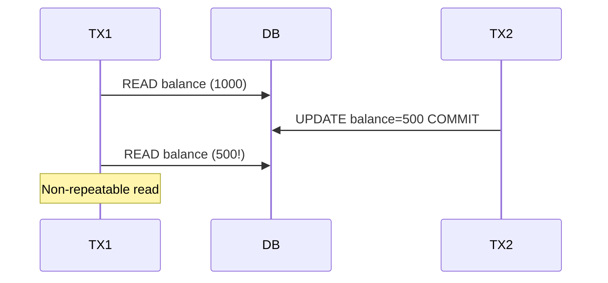

---

### 🛠️ Worked Example

**BAD:**

```sql
-- READ COMMITTED: non-repeatable read
BEGIN; -- TX1
SELECT stock FROM products
    WHERE id = 1;           -- returns 10
-- TX2 commits: stock = 0
SELECT stock FROM products
    WHERE id = 1;           -- returns 0
-- TX1 logic approved order based on 10
COMMIT;
```

Why it's wrong: the application assumed stock would remain stable within the transaction. READ COMMITTED makes no such guarantee.

**GOOD:**

```sql
-- REPEATABLE READ prevents non-repeatable
BEGIN ISOLATION LEVEL REPEATABLE READ;
SELECT stock FROM products
    WHERE id = 1;           -- returns 10
-- TX2 commits: stock = 0
SELECT stock FROM products
    WHERE id = 1;           -- still 10
-- TX1 sees its snapshot. Decision is
-- consistent. If TX1 tries to UPDATE,
-- PG detects the conflict and aborts TX1.
COMMIT;
```

Why it's right: the snapshot guarantees stable reads. Conflicts are detected at write time, not silently ignored.

**Production pattern - phantom prevention:**

```sql
-- SERIALIZABLE prevents phantom rows
BEGIN ISOLATION LEVEL SERIALIZABLE;
SELECT COUNT(*)
    FROM reservations
    WHERE room = 101
      AND date = '2024-06-01';  -- 0
-- TX2 also sees 0, inserts reservation
-- TX1 inserts reservation too
COMMIT; -- One TX aborted: serialization
        -- failure. Retry catches the double.
```

---

### ⚖️ Trade-offs

**Gain:** Understanding phenomena lets you choose the minimum isolation level that prevents the anomalies your application cannot tolerate.

**Cost:** Preventing more phenomena requires higher isolation, which increases abort rates (SERIALIZABLE) or reduces concurrency.

| Phenomenon     | READ COMMITTED | REPEATABLE READ | SERIALIZABLE |
| -------------- | -------------- | --------------- | ------------ |
| Dirty read     | Prevented      | Prevented       | Prevented    |
| Non-repeatable | Possible       | Prevented       | Prevented    |
| Phantom        | Possible       | Prevented (PG)  | Prevented    |

---

### ⚡ Decision Snap

**USE WHEN:**

- You are designing a transaction and need to know which anomalies can occur
- A bug report describes data that "changed mid-transaction" and you need to classify the phenomenon
- You are choosing an isolation level for a critical business operation

**AVOID WHEN:**

- Your transactions are single-statement (anomalies require multiple reads within a transaction)
- The application is read-only against immutable data

**PREFER REPEATABLE READ WHEN:**

- Your transaction reads the same data multiple times and needs consistency
- You want phantom prevention without the retry overhead of SERIALIZABLE (in PostgreSQL)

---

### ⚠️ Top Traps

| #   | Misconception                                           | Reality                                                                                       |
| --- | ------------------------------------------------------- | --------------------------------------------------------------------------------------------- |
| 1   | READ COMMITTED prevents all read anomalies              | It only prevents dirty reads; non-repeatable and phantom reads are still possible             |
| 2   | Phantoms only matter for SELECT COUNT queries           | Any query with a range predicate can be affected - INSERT into a range you just checked empty |
| 3   | Non-repeatable reads require the same row to be updated | They can also be caused by the row being deleted between reads                                |

---

### 🪜 Learning Ladder

**Prerequisites:**

- SQL-067 Transaction Isolation Levels - phenomena map directly to isolation levels
- SQL-038 Transactions - BEGIN, COMMIT, ROLLBACK - anomalies occur within transaction boundaries

**THIS:** SQL-068 Read Phenomena - Dirty, Non-Repeatable, Phantom

**Next steps:**

- SQL-069 Optimistic vs Pessimistic Locking - locking strategies are an alternative to isolation level changes
- SQL-085 MVCC Internals - How Concurrent Reads Work - the mechanism that implements snapshot isolation in PostgreSQL

---

### 💡 The Surprising Truth

Most application bugs caused by read phenomena go undetected in testing because they require specific timing between concurrent transactions. They only manifest in production under load. This is why choosing the correct isolation level based on theoretical analysis matters more than relying on integration tests to catch concurrency bugs.

---

### 📇 Revision Card

1. Dirty = uncommitted data, non-repeatable = row changed between reads, phantom = new rows appeared between queries.
2. READ COMMITTED prevents dirty reads only. REPEATABLE READ (in PG) prevents all three. SERIALIZABLE guarantees serial equivalence.
3. Most concurrency bugs caused by read phenomena only appear under production load, not in tests.

---

---

# SQL-069 Optimistic vs Pessimistic Locking

**TL;DR** - Pessimistic locking blocks concurrent access upfront; optimistic locking allows concurrency and detects conflicts at commit time.

---

### 🔥 The Problem in One Paragraph

Two support agents open the same customer ticket simultaneously. Agent A changes the priority and saves. Agent B changes the assignee and saves, unknowingly overwriting Agent A's priority change. This is the "lost update" problem. One solution is to lock the ticket row when Agent A opens it, preventing Agent B from editing until Agent A finishes (pessimistic). Another is to let both edit freely but detect the conflict when the second agent saves (optimistic). Each strategy trades throughput for safety differently. This is exactly why optimistic and pessimistic locking were created.

---

### 📘 Textbook Definition

**Pessimistic locking** acquires a lock on data before reading or modifying it, blocking concurrent transactions from accessing the same data until the lock is released. **Optimistic locking** does not acquire locks during reads; instead, it records a version marker (version number, timestamp, or row hash) and checks at write time whether the data was modified since it was read. If it was, the transaction is rejected and must retry.

---

### 🧠 Mental Model

> Pessimistic locking is locking the bathroom door when you enter - nobody else can use it until you leave. Optimistic locking is an open bathroom with a "vacant/occupied" sign that you check when you try to enter. If someone got there first, you wait and retry.

- "Locking the door" -> SELECT FOR UPDATE (pessimistic)
- "Checking the sign" -> WHERE version = N (optimistic)
- "Waiting and retrying" -> application-level retry on conflict

**Where this analogy breaks down:** With optimistic locking, both people can be "inside" simultaneously - the conflict is only detected when one tries to save, not when they start working.

---

### ⚙️ How It Works

1. Pessimistic: SELECT ... FOR UPDATE acquires a
   row-level lock. Other transactions trying to
   read-for-update or modify the row block until
   the lock is released by COMMIT or ROLLBACK.
2. Optimistic: the row has a version column. The
   application reads the row and its version (e.g., 5).
   At update time: UPDATE ... SET ..., version = 6
   WHERE id = X AND version = 5. If the update
   affects 0 rows, someone else changed it - retry.
3. Pessimistic prevents conflicts by exclusion.
   Optimistic detects conflicts after the fact.
4. Pessimistic can cause deadlocks if two transactions
   lock rows in different order.
5. Optimistic can cause starvation if a row is
   highly contended (repeated retries fail).

```
Pessimistic:
TX1: SELECT FOR UPDATE row 1 -> locked
TX2: SELECT FOR UPDATE row 1 -> BLOCKED
TX1: UPDATE row 1; COMMIT -> lock released
TX2: resumes, reads updated data

Optimistic:
TX1: SELECT row 1 (version=5)
TX2: SELECT row 1 (version=5)
TX1: UPDATE WHERE version=5 -> OK (v=6)
TX2: UPDATE WHERE version=5 -> 0 rows!
TX2: detect conflict, retry
```

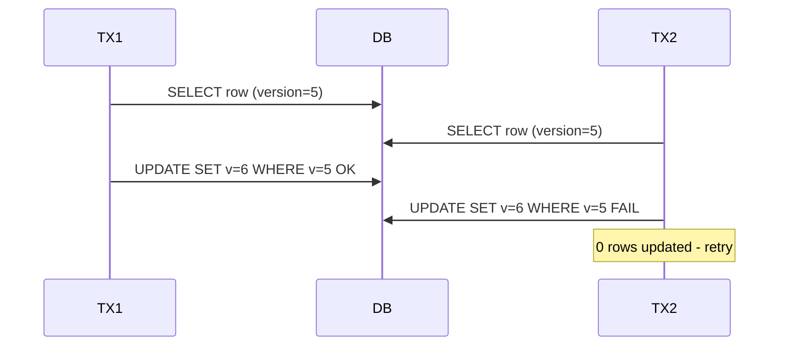

---

### 🛠️ Worked Example

**BAD:**

```sql
-- No locking: lost update
-- TX1
SELECT price FROM products WHERE id = 1;
-- price = 100
-- TX2
SELECT price FROM products WHERE id = 1;
-- price = 100
UPDATE products SET price = 110
    WHERE id = 1; -- TX1 writes
UPDATE products SET price = 90
    WHERE id = 1; -- TX2 overwrites TX1!
```

Why it's wrong: TX2 overwrites TX1's change without knowing it happened. The lost update is silent.

**GOOD:**

```sql
-- Optimistic: version column
ALTER TABLE products
    ADD COLUMN version INTEGER DEFAULT 1;

-- Application reads version with data
SELECT price, version FROM products
    WHERE id = 1; -- price=100, version=5

-- Application updates with version check
UPDATE products
SET price = 110, version = version + 1
WHERE id = 1 AND version = 5;
-- If 0 rows updated: conflict detected.
-- Application retries with fresh read.
```

Why it's right: the version check catches conflicts. No rows are locked during the read phase, so throughput stays high.

**Production pattern - pessimistic for critical:**

```sql
BEGIN;
SELECT * FROM inventory
    WHERE product_id = 1
    FOR UPDATE;
-- Row locked. Other transactions wait.
UPDATE inventory
    SET quantity = quantity - 1
    WHERE product_id = 1;
COMMIT;
```

---

### ⚖️ Trade-offs

**Gain:** Pessimistic guarantees no conflicts (but blocks). Optimistic maximizes concurrency (but requires retry logic).

**Cost:** Pessimistic can deadlock and reduces throughput. Optimistic can retry-loop under high contention.

| Aspect            | Pessimistic     | Optimistic      |
| ----------------- | --------------- | --------------- |
| Concurrency       | Low (blocked)   | High (no locks) |
| Conflict handling | Prevention      | Detection       |
| Deadlock risk     | Yes             | No              |
| Retry logic       | Not needed      | Required        |
| Best for          | High contention | Low contention  |

---

### ⚡ Decision Snap

**USE WHEN:**

- Pessimistic: contention is high and the cost of retrying is significant (inventory, seat reservation)
- Optimistic: contention is low and most updates succeed on first attempt (CMS, config editing)
- Optimistic: transactions span long user think-time (web forms)

**AVOID WHEN:**

- Pessimistic: transactions hold locks for seconds or minutes (web requests with user interaction)
- Optimistic: a single hot row is updated by dozens of concurrent writers

**PREFER optimistic WHEN:**

- The read-to-write ratio is high and conflicts are rare
- You cannot afford the throughput reduction of row-level locks

---

### ⚠️ Top Traps

| #   | Misconception                                               | Reality                                                                                                   |
| --- | ----------------------------------------------------------- | --------------------------------------------------------------------------------------------------------- |
| 1   | Optimistic locking prevents lost updates automatically      | It only detects them; the application must handle the conflict (retry or report to user)                  |
| 2   | SELECT FOR UPDATE locks the row for reads too               | It blocks other FOR UPDATE selects and writes, but plain SELECTs still read the row via MVCC              |
| 3   | Optimistic locking is always better because it avoids locks | Under high contention, optimistic causes retry storms that waste more resources than pessimistic blocking |

---

### 🪜 Learning Ladder

**Prerequisites:**

- SQL-067 Transaction Isolation Levels - locking strategies interact with isolation levels
- SQL-068 Read Phenomena - Dirty, Non-Repeatable, Phantom - lost updates are a phenomenon locking prevents

**THIS:** SQL-069 Optimistic vs Pessimistic Locking

**Next steps:**

- SQL-070 Long Transaction Anti-Pattern - pessimistic locks held too long cause cascading problems
- SQL-090 Row-Level vs Table-Level Locking - granularity of pessimistic locks

---

### 💡 The Surprising Truth

Most ORMs (Hibernate, JPA, ActiveRecord) implement optimistic locking by default via a version column. Developers often use it without realizing it. The common failure mode is not handling the OptimisticLockException - the ORM throws it, the application catches a generic exception, and the user sees "something went wrong" instead of a meaningful retry prompt.

---

### 📇 Revision Card

1. Pessimistic = lock upfront, block others. Optimistic = allow concurrency, detect conflicts at write time.
2. Optimistic requires application-level retry logic - detection without handling is a bug.
3. Choose pessimistic for high contention (inventory), optimistic for low contention (CMS editing).

---

---

# SQL-070 Long Transaction Anti-Pattern

**TL;DR** - Transactions held open for seconds or minutes bloat MVCC storage, block autovacuum, and degrade the entire database.

---

### 🔥 The Problem in One Paragraph

A developer opens a transaction, runs a SELECT, calls an external API that takes 30 seconds, then runs an UPDATE and commits. During those 30 seconds, PostgreSQL cannot vacuum any rows modified since that transaction started because the long-running snapshot might still need them. Dead tuples pile up. Table bloat increases. Autovacuum falls behind. Other queries slow down because they scan bloated tables. One long transaction degrades performance for every other user of the database. This is exactly why long transactions are an anti-pattern.

---

### 📘 Textbook Definition

The **long transaction anti-pattern** occurs when a database transaction remains open for an extended period (typically seconds to minutes), preventing MVCC garbage collection, holding locks, and increasing table bloat. In PostgreSQL's MVCC model, dead row versions cannot be vacuumed while any transaction with a snapshot older than the row's deletion still exists.

---

### 🧠 Mental Model

> Think of a warehouse where old boxes can only be thrown out when every worker confirms they are done looking at them. A long transaction is a worker who left for lunch without checking in. The warehouse fills with boxes nobody needs, but the cleanup crew cannot touch them because one worker might still need them.

- "Worker on lunch" -> long-running open transaction
- "Old boxes piling up" -> dead tuples not vacuumed
- "Cleanup crew blocked" -> autovacuum cannot reclaim space

**Where this analogy breaks down:** In PostgreSQL, the long transaction only blocks cleanup of rows modified after its snapshot started, not all old rows globally.

---

### ⚙️ How It Works

1. A transaction opens and takes a snapshot (its view
   of which rows are visible).
2. Other transactions modify and commit rows. The old
   versions become dead tuples.
3. Autovacuum tries to reclaim dead tuples, but it
   cannot remove any tuple that might be visible to
   the long transaction's snapshot.
4. Dead tuples accumulate. Table size grows. Index
   entries point to dead rows. Scans slow down.
5. When the long transaction finally commits or rolls
   back, autovacuum can catch up, but the damage
   (bloated tables, degraded performance) persists
   until vacuuming completes.

```
Timeline of bloat:

T=0s: TX1 begins (snapshot taken)
T=1s: TX2 updates 1000 rows, commits
      -> 1000 dead tuples created
T=5s: TX3 updates 5000 rows, commits
      -> 5000 more dead tuples
T=30s: Autovacuum runs but CANNOT
       clean any of the 6000 tuples
       because TX1's snapshot is older
T=35s: TX1 commits
T=36s: Autovacuum can finally clean
```

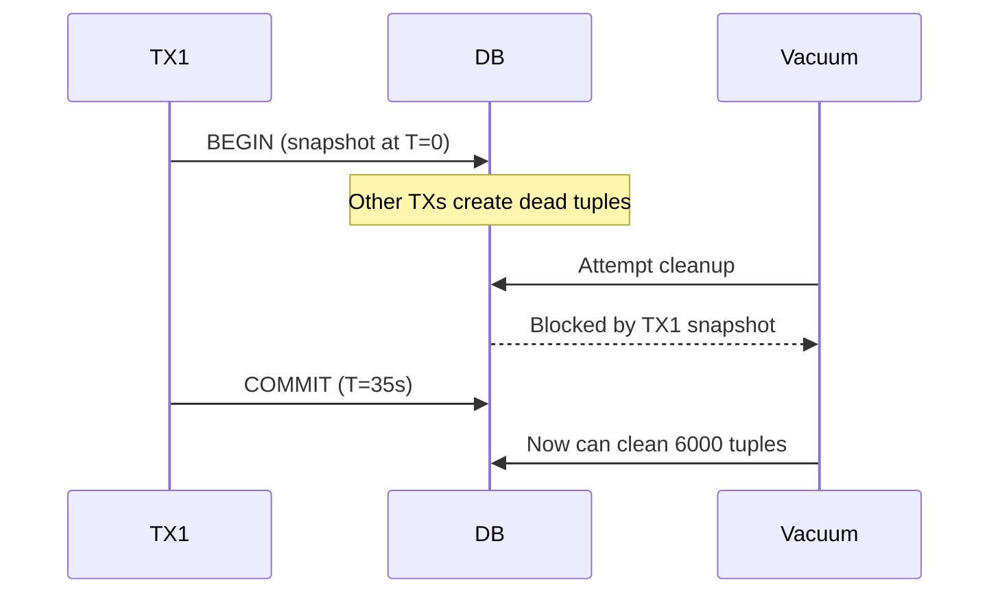

---

### 🛠️ Worked Example

**BAD:**

```sql
BEGIN;
SELECT * FROM orders WHERE id = 1;
-- App calls external payment API (30s)
-- ... 30 seconds pass ...
UPDATE orders SET status = 'paid'
    WHERE id = 1;
COMMIT;
-- TX open for 30s. All dead tuples
-- created by other TXs in those 30s
-- cannot be vacuumed.
```

Why it's wrong: the transaction stays open during I/O that has nothing to do with the database. Dead tuples accumulate system-wide.

**GOOD:**

```sql
-- Read outside transaction
SELECT * FROM orders WHERE id = 1;
-- App calls external payment API (30s)
-- No open transaction during the wait

-- Short transaction for the actual write
BEGIN;
UPDATE orders SET status = 'paid'
    WHERE id = 1 AND status = 'pending';
COMMIT;
-- TX open for milliseconds, not seconds.
```

Why it's right: the transaction covers only the critical write. No snapshot blocks autovacuum during the API call.

**Production pattern - idle-in-transaction timeout:**

```sql
-- postgresql.conf:
-- idle_in_transaction_session_timeout = 30s
-- Kills transactions idle for > 30 seconds.
-- PgBouncer: server_idle_timeout = 60
```

---

### ⚖️ Trade-offs

**Gain:** Short transactions minimize bloat, keep autovacuum effective, reduce lock contention, and limit blast radius.

**Cost:** Requires restructuring application code to separate reads, external calls, and writes. May need optimistic locking to handle conflicts outside the transaction.

| Aspect                 | Short TX             | Long TX         |
| ---------------------- | -------------------- | --------------- |
| Dead tuple cleanup     | Immediate            | Blocked         |
| Table bloat            | Minimal              | Growing         |
| Lock duration          | Milliseconds         | Seconds/minutes |
| Application complexity | Higher (split logic) | Lower (simple)  |

---

### ⚡ Decision Snap

**USE WHEN:**

- You spot idle_in_transaction_session_timeout violations in logs
- Table bloat is growing and autovacuum lag is increasing
- Transactions span external I/O (API calls, file reads, user interaction)

**AVOID WHEN:**

- The transaction genuinely needs to hold a consistent snapshot for a complex multi-statement operation
- The operation is purely database-internal (bulk ETL with no external calls)

**PREFER read-outside-transaction pattern WHEN:**

- The application reads data, processes it externally, then writes back
- The read does not need transactional consistency with the write (use optimistic locking instead)

---

### ⚠️ Top Traps

| #   | Misconception                                        | Reality                                                                                                                  |
| --- | ---------------------------------------------------- | ------------------------------------------------------------------------------------------------------------------------ |
| 1   | Only write transactions cause bloat problems         | A long-running read-only transaction also prevents autovacuum from cleaning dead tuples created by other transactions    |
| 2   | idle_in_transaction is harmless if no locks are held | The open snapshot prevents VACUUM, causing table bloat that affects all queries on the database                          |
| 3   | Setting statement_timeout prevents long transactions | statement_timeout kills individual statements, not idle time between statements; use idle_in_transaction_session_timeout |

---

### 🪜 Learning Ladder

**Prerequisites:**

- SQL-038 Transactions - BEGIN, COMMIT, ROLLBACK - understand transaction boundaries
- SQL-069 Optimistic vs Pessimistic Locking - restructuring long transactions often requires optimistic locking

**THIS:** SQL-070 Long Transaction Anti-Pattern

**Next steps:**

- SQL-089 VACUUM and Bloat Management (PostgreSQL) - the mechanics of dead tuple cleanup
- SQL-092 Deadlock Detection and Resolution - long transactions increase deadlock probability

---

### 💡 The Surprising Truth

A single idle-in-transaction connection can prevent autovacuum from cleaning an entire database's dead tuples. In a busy system, this one connection can cause hundreds of gigabytes of bloat within hours. Many production incidents traced to "disk full" or "slow queries" have a single long-forgotten idle transaction as the root cause.

---

### 📇 Revision Card

1. Long transactions block autovacuum from cleaning dead tuples, causing table bloat that degrades all queries.
2. Move external I/O (API calls, user interaction) outside the transaction. Use optimistic locking for consistency.
3. Set idle_in_transaction_session_timeout to kill forgotten transactions automatically.

---

---

# SQL-071 Views - Logical Abstraction over Tables

**TL;DR** - Views are saved queries that act like virtual tables, providing a named abstraction without storing data separately.

---

### 🔥 The Problem in One Paragraph

Your application has twelve queries that join the same five tables with the same filtering logic. Every time the schema changes, you update twelve queries. A junior developer writes a thirteenth query that gets the join conditions slightly wrong. A security audit asks you to restrict direct table access, but your application needs complex derived data. You need a named, reusable query definition that centralizes logic and can be permissioned independently from the underlying tables. This is exactly why views were created.

---

### 📘 Textbook Definition

A **view** is a named SELECT statement stored in the database catalog. When queried, the view's defining query is executed (or merged into the calling query by the planner), producing a result set that behaves like a table. Views do not store data (unlike materialized views). They provide logical abstraction, access control boundaries, and query reuse.

---

### 🧠 Mental Model

> A view is a saved search in your email client. It does not copy emails into a separate folder - it runs the search criteria every time you open it and shows you the live results. Rename a label or add a new email, and the saved search reflects it instantly.

- "Saved search" -> view definition (stored SELECT)
- "Live results" -> query executed on access
- "No separate folder" -> no data duplication

**Where this analogy breaks down:** Views can be used in JOINs, subqueries, and can have permissions - they are more powerful than a simple saved search.

---

### ⚙️ How It Works

1. CREATE VIEW defines a named query and stores it
   in the system catalog (not the data).
2. When you SELECT FROM the view, the planner either
   inlines the view definition into the outer query
   or executes it as a subquery.
3. The view always reflects current table data because
   it re-executes on every access.
4. You can GRANT SELECT on a view without granting
   access to the underlying tables, creating a
   security boundary.
5. Simple views (no GROUP BY, DISTINCT, or UNION)
   are automatically updatable in PostgreSQL.

```
CREATE VIEW active_customers AS
    SELECT id, name, email
    FROM customers
    WHERE status = 'active';

SELECT * FROM active_customers;
-- Equivalent to running the SELECT above
-- every time. No stored data.

Table change -> view result changes
View is a window, not a snapshot
```

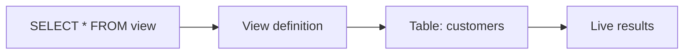

---

### 🛠️ Worked Example

**BAD:**

```sql
-- Duplicated join logic across queries
-- Query 1:
SELECT c.name, o.total
FROM customers c
JOIN orders o ON o.customer_id = c.id
WHERE c.status = 'active';
-- Query 2 (same join, different columns):
SELECT c.email, COUNT(*)
FROM customers c
JOIN orders o ON o.customer_id = c.id
WHERE c.status = 'active'
GROUP BY c.email;
-- Bug risk: one query might forget the
-- status filter or get the join wrong.
```

Why it's wrong: duplicated logic across queries. Schema changes require updating every copy.

**GOOD:**

```sql
CREATE VIEW active_customer_orders AS
    SELECT c.id, c.name, c.email,
           o.id AS order_id, o.total
    FROM customers c
    JOIN orders o
        ON o.customer_id = c.id
    WHERE c.status = 'active';

-- Both queries use the view:
SELECT name, total
    FROM active_customer_orders;
SELECT email, COUNT(*)
    FROM active_customer_orders
    GROUP BY email;
```

Why it's right: join logic is defined once. Schema changes update one place. Consistency is guaranteed.

**Production pattern - security boundary:**

```sql
-- Analysts see aggregates, not raw data
CREATE VIEW sales_summary AS
    SELECT region,
           date_trunc('month', placed) AS m,
           SUM(total) AS revenue
    FROM orders
    GROUP BY region, 1;
GRANT SELECT ON sales_summary TO analyst;
-- No direct table access needed.
```

---

### ⚖️ Trade-offs

**Gain:** Query reuse, consistent logic, security boundaries, schema evolution safety.

**Cost:** Views are executed on every access (no caching). Complex views can hide expensive operations. Stacking views on views creates performance traps.

| Aspect         | View             | Direct query   | Materialized view   |
| -------------- | ---------------- | -------------- | ------------------- |
| Data freshness | Always current   | Always current | Stale until refresh |
| Storage        | None             | None           | Yes                 |
| Performance    | Re-executed      | Same           | Pre-computed        |
| Reusability    | Named, grantable | Copy-paste     | Named, grantable    |

---

### ⚡ Decision Snap

**USE WHEN:**

- Multiple queries share the same join and filter logic
- You need a security boundary between users and raw tables
- You want to simplify complex queries into composable named pieces

**AVOID WHEN:**

- The view's underlying query is expensive and called frequently (use materialized view)
- You are stacking views 3+ levels deep, hiding performance problems

**PREFER materialized views WHEN:**

- The underlying data changes infrequently and query performance matters
- The computation is expensive and the same result is read many times

---

### ⚠️ Top Traps

| #   | Misconception                                  | Reality                                                                                                   |
| --- | ---------------------------------------------- | --------------------------------------------------------------------------------------------------------- |
| 1   | Views store data and improve query performance | Views store only the query definition; they re-execute on every access                                    |
| 2   | All views are read-only                        | Simple views (no aggregation, DISTINCT, or UNION) are automatically updatable in PostgreSQL               |
| 3   | Views prevent all direct table access          | Views are an additional access path; you must explicitly REVOKE table permissions to enforce the boundary |

---

### 🪜 Learning Ladder

**Prerequisites:**

- SQL-012 SELECT and FROM - Reading Data - views wrap SELECT statements
- SQL-026 INNER JOIN - Matching Rows Across Tables - views commonly encapsulate join logic

**THIS:** SQL-071 Views - Logical Abstraction over Tables

**Next steps:**

- SQL-072 Materialized Views - views that cache their results for performance
- SQL-078 GRANT, REVOKE, and Role-Based Access - views are most powerful when combined with access control

---

### 💡 The Surprising Truth

PostgreSQL's planner often "flattens" a view into the calling query, producing the same execution plan as if you had written the full query inline. This means views have zero runtime overhead in most cases. The performance concern is not the view abstraction itself but the complexity of the underlying query.

---

### 📇 Revision Card

1. Views are saved queries, not stored data - they re-execute on every access.
2. Use views to centralize join logic, enforce security boundaries, and simplify complex queries.
3. Simple views are auto-updatable in PostgreSQL; complex views are read-only.

---

---

# SQL-072 Materialized Views

**TL;DR** - Materialized views cache query results on disk, trading data freshness for fast read performance on expensive computations.

---

### 🔥 The Problem in One Paragraph

Your dashboard queries aggregate millions of rows across five tables. The query takes 8 seconds, and the dashboard refreshes every page load. Using a regular view does not help because it re-executes the full query each time. You could cache results in application code, but then you manage invalidation, serialization, and stale data yourself. You need the database to pre-compute and store the query result like a table, refreshable on demand. This is exactly why materialized views were created.

---

### 📘 Textbook Definition

A **materialized view** is a database object that stores the result of a query on disk, like a table. Unlike a regular view, it does not re-execute the underlying query on each access. The data is static until explicitly refreshed with REFRESH MATERIALIZED VIEW. Materialized views can be indexed, making read access as fast as querying a regular table.

---

### 🧠 Mental Model

> A regular view is looking through a window at a live scene. A materialized view is taking a photograph of the scene. The photograph is instant to look at, but it shows the scene as it was when the photo was taken, not as it is now. You retake the photo (REFRESH) when you need an update.

- "Photograph" -> stored query result
- "Instant to look at" -> fast reads from cached data
- "Retake the photo" -> REFRESH MATERIALIZED VIEW

**Where this analogy breaks down:** You can create indexes on the materialized view, making lookups faster than even a simple table scan of the source data.

---

### ⚙️ How It Works

1. CREATE MATERIALIZED VIEW executes the query and
   stores the result set on disk as a table-like
   structure.
2. SELECT from the materialized view reads the stored
   data - no re-execution of the underlying query.
3. You can create indexes on the materialized view
   for fast lookups.
4. REFRESH MATERIALIZED VIEW re-executes the query
   and replaces the stored data. This acquires an
   exclusive lock (readers blocked).
5. REFRESH MATERIALIZED VIEW CONCURRENTLY updates
   without blocking readers, but requires a unique
   index on the materialized view.

```
CREATE MATERIALIZED VIEW -> execute + store
SELECT FROM matview     -> read stored data
REFRESH                 -> re-execute + replace

+-------------+     +------------------+
| Base tables | --> | REFRESH executes |
| (live data) |     | query, stores    |
+-------------+     | result on disk   |
                    +------------------+
                           |
                    +------------------+
                    | SELECT reads     |
                    | stored result    |
                    +------------------+
```

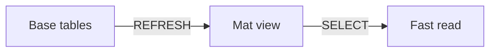

---

### 🛠️ Worked Example

**BAD:**

```sql
-- Regular view: 8 seconds every page load
CREATE VIEW dashboard AS
    SELECT region,
           date_trunc('month', placed) AS m,
           SUM(total) AS revenue,
           COUNT(*) AS order_count
    FROM orders
    JOIN customers c
        ON c.id = orders.customer_id
    GROUP BY region, 1;
-- Every SELECT re-runs the full query.
```

Why it's wrong: the complex aggregation runs on every access. Dashboard users wait 8 seconds per page load.

**GOOD:**

```sql
CREATE MATERIALIZED VIEW dashboard AS
    SELECT region,
           date_trunc('month', placed) AS m,
           SUM(total) AS revenue,
           COUNT(*) AS order_count
    FROM orders
    JOIN customers c
        ON c.id = orders.customer_id
    GROUP BY region, 1;

CREATE UNIQUE INDEX idx_dash
    ON dashboard (region, m);

-- Reads are instant (indexed table scan).
-- Refresh every 15 minutes via cron:
REFRESH MATERIALIZED VIEW
    CONCURRENTLY dashboard;
```

Why it's right: reads are fast, the unique index enables CONCURRENTLY refresh without blocking readers, and staleness is bounded.

**Production pattern - scheduled refresh:**

```sql
-- pg_cron job for automated refresh
SELECT cron.schedule(
    'refresh-dashboard',
    '*/15 * * * *',
    'REFRESH MATERIALIZED VIEW
        CONCURRENTLY dashboard'
);
```

---

### ⚖️ Trade-offs

**Gain:** Pre-computed results, indexable, fast reads, no application-level caching needed.

**Cost:** Data is stale between refreshes. REFRESH is expensive (full re-query). Storage cost for the materialized result.

| Aspect       | Materialized view   | Regular view    | App cache    |
| ------------ | ------------------- | --------------- | ------------ |
| Read speed   | Fast (table scan)   | Slow (re-query) | Fast         |
| Freshness    | Stale until refresh | Always current  | Stale        |
| Indexable    | Yes                 | Via base tables | No           |
| Invalidation | Manual REFRESH      | Automatic       | Custom logic |

---

### ⚡ Decision Snap

**USE WHEN:**

- An expensive aggregation query is read frequently but the underlying data changes slowly
- Dashboard or reporting queries need sub-second response times
- You want to avoid building and maintaining application-level caching

**AVOID WHEN:**

- Data must be real-time and staleness is unacceptable
- The underlying query is already fast (regular view or direct query suffices)

**PREFER regular views WHEN:**

- Data freshness is more important than read speed
- The underlying query is fast enough for the access pattern

---

### ⚠️ Top Traps

| #   | Misconception                                          | Reality                                                                                         |
| --- | ------------------------------------------------------ | ----------------------------------------------------------------------------------------------- |
| 1   | REFRESH MATERIALIZED VIEW is instant                   | It re-executes the full underlying query; on large datasets this can take minutes               |
| 2   | CONCURRENTLY refresh requires no special setup         | It requires a unique index on the materialized view; without it, PostgreSQL rejects the command |
| 3   | Materialized views auto-refresh when base data changes | They do not; you must explicitly REFRESH or schedule it via pg_cron or application logic        |

---

### 🪜 Learning Ladder

**Prerequisites:**

- SQL-071 Views - Logical Abstraction over Tables - materialized views extend the view concept
- SQL-040 Indexes - What They Are and Why They Matter - indexing materialized views is essential for read performance

**THIS:** SQL-072 Materialized Views

**Next steps:**

- SQL-116 CQRS and Read/Write Separation Architecture - materialized views are a building block for read-optimized architectures
- SQL-064 Query Performance Tuning Patterns - materialized views are a tuning pattern for expensive aggregations

---

### 💡 The Surprising Truth

Materialized views in PostgreSQL cannot be incrementally refreshed - every REFRESH re-executes the entire query from scratch. This means a materialized view over a billion-row table does a full billion-row scan on every refresh, even if only one row changed. Incremental materialized view refresh is a long-requested feature that PostgreSQL does not yet support natively.

---

### 📇 Revision Card

1. Materialized views store query results on disk - fast reads but stale until explicitly refreshed.
2. CONCURRENTLY refresh avoids blocking readers but requires a unique index on the materialized view.
3. Refresh is a full re-query, not incremental - schedule refreshes based on acceptable staleness.

---

---

# SQL-073 Stored Procedures and Functions

**TL;DR** - Stored procedures and functions encapsulate SQL logic in the database, enabling reuse, transaction control, and reduced network round-trips.

---

### 🔥 The Problem in One Paragraph

Your application performs a multi-step operation: check inventory, create an order, deduct stock, and log the event. Each step is a separate SQL statement sent from the application, each requiring a network round-trip. If the application crashes between steps, partial state remains. You could wrap everything in a transaction from the application, but the logic is duplicated across services that share the database. You need to encapsulate multi-step database logic in a single callable unit that lives in the database itself. This is exactly why stored procedures and functions were created.

---

### 📘 Textbook Definition

A **stored function** is a named routine stored in the database that accepts parameters, executes SQL or procedural logic, and returns a value or result set. A **stored procedure** (introduced in PostgreSQL 11) is similar but can manage transactions internally (COMMIT/ROLLBACK within the procedure body). Functions are called in SQL expressions; procedures are called with CALL.

---

### 🧠 Mental Model

> A function is a vending machine: you put in coins (parameters), press a button, and get a product (return value). A stored procedure is a self-service kiosk that handles an entire multi-step workflow: scan your card, choose options, process payment, print receipt - and it can restart a step if something fails.

- "Vending machine" -> function (input->output)
- "Self-service kiosk" -> procedure (multi-step, transaction control)
- "Restart a step" -> COMMIT/ROLLBACK inside procedure

**Where this analogy breaks down:** Functions can also perform complex operations; the key distinction in PostgreSQL is that only procedures can issue COMMIT/ROLLBACK mid-execution.

---

### ⚙️ How It Works

1. CREATE FUNCTION defines a function with parameters,
   return type, language (SQL, PL/pgSQL, Python, etc.),
   and a body containing the logic.
2. Functions are called in SELECT, WHERE, or JOIN
   clauses like any expression.
3. CREATE PROCEDURE defines a procedure that is
   invoked with CALL and can commit or rollback
   transactions within its body.
4. Both are stored in the database catalog and
   executed server-side, eliminating network
   round-trips for multi-statement logic.
5. PL/pgSQL is the most common procedural language
   in PostgreSQL, providing variables, loops,
   conditionals, and exception handling.

```
Function:
  CREATE FUNCTION calc_tax(amount NUMERIC)
  RETURNS NUMERIC AS $$
      SELECT amount * 0.08;
  $$ LANGUAGE sql;

  SELECT calc_tax(100); -- returns 8.00

Procedure:
  CREATE PROCEDURE process_order(oid INT)
  LANGUAGE plpgsql AS $$
  BEGIN
      UPDATE orders SET status = 'processed'
          WHERE id = oid;
      INSERT INTO audit_log(...)
          VALUES (...);
      COMMIT;
  END; $$;

  CALL process_order(42);
```

```mermaid
flowchart TD
  A["CALL procedure"] --> B["Step 1: UPDATE"]
  B --> C["Step 2: INSERT log"]
  C --> D["COMMIT"]
  D --> E["Return to caller"]
```

---

### 🛠️ Worked Example

**BAD:**

```sql
-- Multi-step logic in application code
-- Round-trip 1:
SELECT stock FROM products WHERE id = 1;
-- Round-trip 2:
UPDATE products SET stock = stock - 1
    WHERE id = 1;
-- Round-trip 3:
INSERT INTO order_items (...) VALUES (...);
-- If app crashes between RT2 and RT3:
-- stock decremented but no order created.
```

Why it's wrong: three round-trips, no atomicity between steps, and the logic is duplicated across services.

**GOOD:**

```sql
CREATE FUNCTION place_order(
    p_product_id INT,
    p_qty INT
) RETURNS INT AS $$
DECLARE
    v_order_id INT;
BEGIN
    UPDATE products
    SET stock = stock - p_qty
    WHERE id = p_product_id
      AND stock >= p_qty;
    IF NOT FOUND THEN
        RAISE EXCEPTION 'Insufficient stock';
    END IF;
    INSERT INTO orders (product_id, qty)
    VALUES (p_product_id, p_qty)
    RETURNING id INTO v_order_id;
    RETURN v_order_id;
END;
$$ LANGUAGE plpgsql;

SELECT place_order(1, 2); -- one round-trip
```

Why it's right: single round-trip, atomic within a transaction, and reusable across services.

**Production pattern - error handling:**

```sql
CREATE FUNCTION safe_transfer(
    from_id INT, to_id INT,
    amount NUMERIC
) RETURNS VOID AS $$
BEGIN
    UPDATE accounts
    SET balance = balance - amount
    WHERE id = from_id
      AND balance >= amount;
    IF NOT FOUND THEN
        RAISE EXCEPTION 'Insufficient funds';
    END IF;
    UPDATE accounts
    SET balance = balance + amount
    WHERE id = to_id;
END;
$$ LANGUAGE plpgsql;
```

---

### ⚖️ Trade-offs

**Gain:** Reduced round-trips, server-side atomicity, reusable logic, encapsulation.

**Cost:** Business logic in the database is harder to version-control, test, and debug. Deployment requires schema migrations. Procedural SQL is less expressive than application languages.

| Aspect         | Stored function    | Application code |
| -------------- | ------------------ | ---------------- |
| Network trips  | 1                  | N per step       |
| Atomicity      | Natural (one TX)   | Must manage TX   |
| Testability    | Harder             | Easier           |
| Deployment     | Schema migration   | App deploy       |
| Language power | Limited (PL/pgSQL) | Full language    |

---

### ⚡ Decision Snap

**USE WHEN:**

- Multi-step operations need atomicity and you want to reduce round-trips
- Multiple applications share the same database and need consistent logic
- Performance-critical paths benefit from eliminating network latency

**AVOID WHEN:**

- Business logic is complex and benefits from full-language testing and debugging
- Your team does not have DBA expertise to maintain procedural SQL

**PREFER application-layer logic WHEN:**

- Logic changes frequently and deploying schema migrations is costly
- You need rich testing frameworks, debuggers, and IDE support

---

### ⚠️ Top Traps

| #   | Misconception                               | Reality                                                                                                               |
| --- | ------------------------------------------- | --------------------------------------------------------------------------------------------------------------------- |
| 1   | Functions and procedures are the same thing | In PostgreSQL, only procedures (CREATE PROCEDURE, CALL) can issue COMMIT/ROLLBACK; functions cannot                   |
| 2   | Stored functions always improve performance | They reduce round-trips but add CPU load to the database server; compute-heavy logic may be better in the application |
| 3   | PL/pgSQL functions are compiled             | They are interpreted at runtime; performance-critical functions should use SQL language or C extensions               |

---

### 🪜 Learning Ladder

**Prerequisites:**

- SQL-044 CASE Expressions and Conditional Logic - procedural logic builds on conditional SQL
- SQL-038 Transactions - BEGIN, COMMIT, ROLLBACK - procedures manage transactions internally

**THIS:** SQL-073 Stored Procedures and Functions

**Next steps:**

- SQL-074 Triggers - Use Cases and Dangers - triggers call functions automatically on data changes
- SQL-079 Testing SQL - Unit, Integration, Fixtures - strategies for testing stored logic

---

### 💡 The Surprising Truth

PostgreSQL functions declared as LANGUAGE sql (not PL/pgSQL) can be inlined by the planner into the calling query, just like views. This means a simple SQL function has zero call overhead. PL/pgSQL functions, by contrast, are always called as a black box that the planner cannot optimize through.

---

### 📇 Revision Card

1. Functions return values and run in expressions; procedures manage transactions and are invoked with CALL.
2. Stored logic reduces round-trips and ensures atomicity but is harder to test and version-control.
3. SQL-language functions can be inlined by the planner; PL/pgSQL functions cannot.

---

---

# SQL-074 Triggers - Use Cases and Dangers

**TL;DR** - Triggers automatically execute functions when rows are inserted, updated, or deleted - powerful for auditing, dangerous for hidden complexity.

---

### 🔥 The Problem in One Paragraph

Every time an order status changes, the system must log the change to an audit table. You could add the INSERT INTO audit_log statement to every application endpoint that modifies orders. But there are twelve endpoints across three services, and a developer will forget one. The audit must happen regardless of which application, migration script, or manual SQL command changes the data. You need a mechanism that fires automatically at the database level whenever a row changes. This is exactly why triggers were created.

---

### 📘 Textbook Definition

A **trigger** is a database object that automatically invokes a specified function when a particular event (INSERT, UPDATE, DELETE, or TRUNCATE) occurs on a table. Triggers can fire BEFORE or AFTER the event, and FOR EACH ROW or FOR EACH STATEMENT. The trigger function has access to the OLD and NEW row values, enabling auditing, validation, derived column maintenance, and cascading changes.

---

### 🧠 Mental Model

> A trigger is a security camera with an automatic alarm. You do not need to watch the feed manually. When motion is detected (data change), the alarm fires automatically (trigger function executes). The camera does not care who caused the motion - any process, any user, any application.

- "Motion detection" -> INSERT/UPDATE/DELETE event
- "Automatic alarm" -> trigger function execution
- "Any source of motion" -> any client, migration, or manual query

**Where this analogy breaks down:** Unlike a passive camera, triggers can modify the data that triggered them (BEFORE triggers can change NEW row values), creating feedback loops.

---

### ⚙️ How It Works

1. CREATE TRIGGER associates an event (INSERT, UPDATE,
   DELETE) on a table with a trigger function.
2. BEFORE triggers fire before the row change is
   applied. They can modify the NEW row or cancel
   the operation by returning NULL.
3. AFTER triggers fire after the change is applied.
   They are used for logging, notifications, and
   cascading updates.
4. FOR EACH ROW triggers fire once per affected row.
   FOR EACH STATEMENT fires once per SQL statement.
5. The trigger function receives OLD (previous values)
   and NEW (incoming values) as special variables.

```
CREATE TRIGGER audit_orders
AFTER UPDATE ON orders
FOR EACH ROW
EXECUTE FUNCTION log_order_change();

INSERT/UPDATE/DELETE on orders
       |
       v
  Trigger fires automatically
       |
       v
  log_order_change() executes
  (inserts row into audit_log)
```

```mermaid
flowchart TD
  E["UPDATE on orders"] --> T["Trigger fires"]
  T --> F["log_order_change()"]
  F --> A["INSERT into audit_log"]
```

---

### 🛠️ Worked Example

**BAD:**

```sql
-- Audit logic duplicated in application
-- Endpoint 1:
UPDATE orders SET status = 'shipped'
    WHERE id = 1;
INSERT INTO audit_log (table_name, row_id,
    action) VALUES ('orders', 1, 'update');
-- Endpoint 2: forgot the audit INSERT.
-- Endpoint 3: wrong table_name in audit.
```

Why it's wrong: audit logic is scattered, inconsistent, and easy to forget.

**GOOD:**

```sql
CREATE FUNCTION log_order_change()
RETURNS TRIGGER AS $$
BEGIN
    INSERT INTO audit_log (
        table_name, row_id, action,
        old_data, new_data, changed_at
    ) VALUES (
        'orders', NEW.id,
        TG_OP,
        to_jsonb(OLD),
        to_jsonb(NEW),
        now()
    );
    RETURN NEW;
END;
$$ LANGUAGE plpgsql;

CREATE TRIGGER audit_orders
AFTER INSERT OR UPDATE OR DELETE
ON orders
FOR EACH ROW
EXECUTE FUNCTION log_order_change();
```

Why it's right: every change to orders is audited automatically, regardless of which application, script, or user made the change.

**Production pattern - updated_at auto-maintenance:**

```sql
CREATE FUNCTION set_updated_at()
RETURNS TRIGGER AS $$
BEGIN
    NEW.updated_at = now();
    RETURN NEW;
END;
$$ LANGUAGE plpgsql;

CREATE TRIGGER trg_updated
BEFORE UPDATE ON orders
FOR EACH ROW
EXECUTE FUNCTION set_updated_at();
```

---

### ⚖️ Trade-offs

**Gain:** Guaranteed enforcement regardless of the data source. Perfect for auditing, derived columns, and data validation.

**Cost:** Hidden control flow makes debugging harder. Trigger chains can cascade unpredictably. Performance overhead on every affected row.

| Aspect      | Trigger               | Application logic |
| ----------- | --------------------- | ----------------- |
| Enforcement | Guaranteed (DB level) | Best-effort       |
| Visibility  | Hidden from app code  | Explicit          |
| Debugging   | Harder (implicit)     | Easier (explicit) |
| Performance | Per-row overhead      | Batch-friendly    |

---

### ⚡ Decision Snap

**USE WHEN:**

- Audit logging must be tamper-proof and universal (no bypass path)
- Derived columns (updated_at, computed fields) must always be consistent
- Multiple applications share the database and must all follow the same rules

**AVOID WHEN:**

- Business logic is complex and multi-step (use application code)
- Trigger chains would create cascading effects that are hard to reason about

**PREFER application logic WHEN:**

- The behavior is specific to one application, not a universal data rule
- You need rich error handling, conditional logic, and testability

---

### ⚠️ Top Traps

| #   | Misconception                                   | Reality                                                                                               |
| --- | ----------------------------------------------- | ----------------------------------------------------------------------------------------------------- |
| 1   | Triggers fire only on application-level changes | They fire on any data change: migrations, manual SQL, replication - this can cause surprises          |
| 2   | BEFORE triggers cannot modify the incoming data | BEFORE triggers can change NEW column values; this is how auto-computed columns work                  |
| 3   | Trigger execution order is predictable          | When multiple triggers exist on the same event, they fire in alphabetical order by name in PostgreSQL |

---

### 🪜 Learning Ladder

**Prerequisites:**

- SQL-073 Stored Procedures and Functions - triggers call stored functions
- SQL-038 Transactions - BEGIN, COMMIT, ROLLBACK - triggers execute within the calling transaction

**THIS:** SQL-074 Triggers - Use Cases and Dangers

**Next steps:**

- SQL-085 MVCC Internals - How Concurrent Reads Work - triggers interact with MVCC visibility
- SQL-075 Schema Migration Fundamentals - triggers must be managed during migrations

---

### 💡 The Surprising Truth

Trigger-based audit logging can be bypassed by a superuser altering the trigger or disabling it temporarily. For truly tamper-proof audit logging, PostgreSQL's pgaudit extension logs at a lower level than triggers. Triggers are enforcement, not security - they depend on the trigger remaining enabled.

---

### 📇 Revision Card

1. Triggers fire automatically on INSERT/UPDATE/DELETE - guaranteed enforcement regardless of the data source.
2. Use triggers for universal rules (audit, updated_at); avoid for complex business logic.
3. Multiple triggers on the same event fire in alphabetical order by trigger name.

---

---

# SQL-075 Schema Migration Fundamentals

**TL;DR** - Schema migrations apply versioned, incremental DDL changes to evolve database schemas safely alongside application deployments.

---

### 🔥 The Problem in One Paragraph

Your application needs a new column: shipping_address on the orders table. In development, you just ALTER TABLE. In production, you have five application servers, a staging environment, three developers with local databases, and a CI pipeline. If one developer manually alters production and forgets to update staging, the environments diverge. If the ALTER TABLE is not tested first, it might lock the table for minutes during peak traffic. You need a versioned, repeatable, testable process for changing database schemas that keeps every environment in sync. This is exactly why schema migration fundamentals were created.

---

### 📘 Textbook Definition

A **schema migration** is a versioned script that applies an incremental DDL change (CREATE, ALTER, DROP) to a database schema. Migrations are applied in order, tracked in a metadata table (recording which versions have been applied), and are typically irreversible or paired with a rollback script. They ensure that every environment (dev, staging, production) applies the same changes in the same order.

---

### 🧠 Mental Model

> Migrations are numbered patches for your database schema, like software version updates. Patch 001 creates the users table. Patch 002 adds an email column. Patch 003 creates an index. Each environment tracks which patches it has applied. When you deploy, the system runs only the patches it has not seen yet.

- "Numbered patches" -> migration files (V001, V002)
- "Tracking applied patches" -> migration metadata table
- "Run only unseen patches" -> migration tool's apply logic

**Where this analogy breaks down:** Unlike software patches that can be rolled back by reinstalling, database migrations may destroy data (DROP COLUMN), making true rollback impossible without backups.

---

### ⚙️ How It Works

1. Each migration is a numbered file containing DDL
   statements (e.g., V001\_\_create_users.sql).
2. A migration tool (Flyway, Liquibase, or framework
   built-in) tracks applied versions in a metadata
   table (schema_version or flyway_schema_history).
3. On deployment, the tool checks which migrations
   have been applied and runs the remaining ones in
   order.
4. Each migration runs in a transaction (when
   possible) so partial failures leave the schema
   unchanged.
5. Rollback migrations (down scripts) undo changes
   but are not always possible (data-destructive
   changes like DROP COLUMN have no rollback).

```
Migration files:
  V001__create_users.sql
  V002__add_email_column.sql
  V003__create_orders_table.sql

Metadata table:
+------+---------------------------+
| ver  | applied_at                |
+------+---------------------------+
| V001 | 2024-01-01 10:00:00       |
| V002 | 2024-01-15 14:30:00       |
+------+---------------------------+

Deploy: V003 not yet applied -> run it
```

```mermaid
flowchart LR
  D["Deploy"] --> C["Check metadata"]
  C --> M["V003 not applied"]
  M --> R["Run V003"]
  R --> U["Update metadata"]
```

---

### 🛠️ Worked Example

**BAD:**

```sql
-- Manual ALTER TABLE in production
ALTER TABLE users ADD COLUMN phone TEXT;
-- No record of this change.
-- Staging still lacks the column.
-- Next deploy: migration fails because
-- the column already exists in prod.
```

Why it's wrong: manual changes are untracked, unrepeatable, and cause environment drift.

**GOOD:**

```sql
-- V004__add_phone_to_users.sql
ALTER TABLE users
    ADD COLUMN phone TEXT;

-- Applied by migration tool:
-- flyway migrate
-- Records V004 in schema_version table.
-- All environments get the same change.
```

Why it's right: the change is versioned, tracked, repeatable, and applied consistently across environments.

**Production pattern - safe column addition:**

```sql
-- V005__add_shipping_address.sql
-- Step 1: add nullable column (no lock)
ALTER TABLE orders
    ADD COLUMN shipping_address TEXT;

-- V006__backfill_shipping.sql
-- Step 2: backfill in batches (separate TX)
UPDATE orders
SET shipping_address = billing_address
WHERE shipping_address IS NULL
  AND id BETWEEN 1 AND 100000;
-- Repeat for remaining batches.
```

---

### ⚖️ Trade-offs

**Gain:** Environment consistency, version-tracked changes, repeatable deployments, team coordination.

**Cost:** Requires discipline (never manual DDL). Rollback of destructive changes is impossible without data loss. Migration ordering conflicts in team workflows.

| Aspect           | Migrations        | Manual DDL |
| ---------------- | ----------------- | ---------- |
| Repeatability    | Yes               | No         |
| Environment sync | Automatic         | Manual     |
| Rollback         | Partial (up/down) | None       |
| Audit trail      | Metadata table    | Memory     |

---

### ⚡ Decision Snap

**USE WHEN:**

- Multiple environments (dev, staging, prod) must stay in sync
- Multiple developers change the schema concurrently
- You need an audit trail of every schema change

**AVOID WHEN:**

- You are prototyping with a throwaway database that will be recreated from scratch
- The schema is managed by an ORM's auto-migration feature that you trust completely

**PREFER explicit migration files WHEN:**

- You need fine-grained control over DDL execution order and locking behavior
- ORM auto-migrations produce unsafe or non-performant DDL

---

### ⚠️ Top Traps

| #   | Misconception                                     | Reality                                                                                                                |
| --- | ------------------------------------------------- | ---------------------------------------------------------------------------------------------------------------------- |
| 1   | Every migration should have a rollback script     | DROP COLUMN destroys data; some changes are inherently irreversible without a backup                                   |
| 2   | Migrations run instantly on any table size        | ALTER TABLE can lock a table for the duration; large tables require online migration techniques                        |
| 3   | Editing an already-applied migration file is safe | Migration tools checksum applied files; editing a deployed migration causes a checksum mismatch and deployment failure |

---

### 🪜 Learning Ladder

**Prerequisites:**

- SQL-010 CREATE TABLE and DROP TABLE - DDL statements are the content of migrations
- SQL-034 Normalization - 1NF, 2NF, 3NF - schema evolution requires understanding relational design

**THIS:** SQL-075 Schema Migration Fundamentals

**Next steps:**

- SQL-076 Flyway and Liquibase - Migration Tooling - specific tools for managing migrations
- SQL-104 Zero-Downtime Schema Migrations - advanced techniques for migrating without service interruption

---

### 💡 The Surprising Truth

Most migration tools execute DDL inside a transaction, so a failure partway through rolls back all changes cleanly. But PostgreSQL DDL is transactional while MySQL DDL is not. In MySQL, a failed migration can leave the schema in a partially applied state with no way to roll back automatically. The same migration tool behaves differently depending on the database engine.

---

### 📇 Revision Card

1. Migrations are versioned DDL scripts tracked in a metadata table - never apply manual DDL to production.
2. Some changes (DROP COLUMN) are irreversible; "rollback" may require restoring from backup.
3. Never edit an already-applied migration file - the checksum mismatch will block future deployments.

---

---

# SQL-076 Flyway and Liquibase - Migration Tooling

**TL;DR** - Flyway uses versioned SQL files; Liquibase uses declarative changelogs - both track and apply schema changes systematically.

---

### 🔥 The Problem in One Paragraph

Your team has agreed that schema changes must be versioned migration scripts. Now you need a tool to execute them in order, track which have been applied, prevent re-application, and integrate with your CI/CD pipeline. You could build this yourself with a shell script and a tracking table, but then you handle edge cases: concurrent migrations, checksum validation, baseline support, multi-database compatibility. Two mature tools dominate the ecosystem, each with a different philosophy. This is exactly why Flyway and Liquibase were created.

---

### 📘 Textbook Definition

**Flyway** is a database migration tool that applies versioned SQL or Java migration files in sequence, tracking applied versions in a flyway_schema_history table. **Liquibase** is a migration tool that uses declarative changelogs (XML, YAML, JSON, or SQL) to describe changes, tracking them in a databasechangelog table. Flyway is convention-driven and SQL-first. Liquibase is more flexible and supports database-agnostic changelog formats.

---

### 🧠 Mental Model

> Flyway is a numbered checklist: do item 1, check it off, do item 2, check it off. Each item is a SQL file. Liquibase is a recipe book where each recipe can be written in different formats (XML, SQL, YAML) and the system figures out the database-specific ingredients automatically.

- "Numbered checklist" -> Flyway's V1, V2, V3 SQL files
- "Recipe book in multiple formats" -> Liquibase changelogs
- "Database-specific ingredients" -> Liquibase generates DDL per database type

**Where this analogy breaks down:** Flyway also supports repeatable migrations and callbacks, making it more flexible than a simple checklist.

---

### ⚙️ How It Works

1. Flyway: place SQL files named V1**description.sql,
   V2**description.sql in a migrations folder. Run
   flyway migrate. Flyway applies unapplied versions
   in order and records them in
   flyway_schema_history.
2. Liquibase: write a changelog file listing changesets
   (each with an id, author, and changes). Run
   liquibase update. Liquibase applies unapplied
   changesets and records them in databasechangelog.
3. Both tools checksum each migration to detect
   tampering with previously applied scripts.
4. Both support baseline (marking an existing database
   as already at a specific version) and repair
   (fixing checksum mismatches after intentional edits).
5. Both integrate with Maven, Gradle, Spring Boot,
   and CI/CD pipelines.

```
Flyway:
  sql/
    V1__create_users.sql
    V2__add_email.sql
    V3__create_orders.sql
  $ flyway migrate -> applies V1, V2, V3

Liquibase:
  changelog.xml
    <changeSet id="1" author="dev">
      <createTable tableName="users">
        ...
      </createTable>
    </changeSet>
  $ liquibase update -> applies changeset 1
```

```mermaid
flowchart TD
  F["flyway migrate"]
  F --> C1["Check flyway_schema_history"]
  C1 --> A1["Apply V3 (unapplied)"]
  A1 --> R1["Record V3 applied"]
  L["liquibase update"]
  L --> C2["Check databasechangelog"]
  C2 --> A2["Apply changeset 3"]
  A2 --> R2["Record changeset 3"]
```

---

### 🛠️ Worked Example

**BAD:**

```bash
# Manual migration tracking
psql -f V001.sql
echo "V001 done" >> migrations.log
psql -f V002.sql
# Forgot to log V002. Next deploy
# re-runs V002 and fails on duplicate table.
```

Why it's wrong: no transactional tracking, no checksum validation, no concurrent deployment safety.

**GOOD:**

```sql
-- Flyway: V003__add_phone_to_users.sql
ALTER TABLE users ADD COLUMN phone TEXT;

-- Run: flyway migrate
-- Output:
-- Migrating schema to version 3
-- Successfully applied 1 migration
```

Why it's right: Flyway tracks the version, validates checksums, and prevents re-application automatically.

**Production pattern - Liquibase preconditions:**

```xml
<changeSet id="4" author="dev">
  <preConditions onFail="MARK_RAN">
    <not>
      <columnExists tableName="users"
                    columnName="phone"/>
    </not>
  </preConditions>
  <addColumn tableName="users">
    <column name="phone" type="TEXT"/>
  </addColumn>
</changeSet>
```

---

### ⚖️ Trade-offs

**Gain:** Both tools provide reliable, automated, trackable schema migrations with CI/CD integration.

**Cost:** Flyway's SQL-first approach is simple but database-specific. Liquibase's abstraction adds complexity but enables cross-database portability.

| Aspect         | Flyway                | Liquibase                |
| -------------- | --------------------- | ------------------------ |
| Format         | SQL files (versioned) | XML/YAML/JSON/SQL        |
| Learning curve | Low                   | Medium                   |
| DB portability | Write per-DB SQL      | Abstract changesets      |
| Rollback       | Manual (undo scripts) | Auto-generated (partial) |
| Spring Boot    | First-class           | First-class              |

---

### ⚡ Decision Snap

**USE WHEN:**

- Flyway: your team writes SQL confidently and targets a single database engine
- Liquibase: you need cross-database portability or prefer declarative change descriptions
- Either: you need CI/CD integration for automated schema deployment

**AVOID WHEN:**

- The application uses an ORM with built-in migration support that your team trusts (e.g., Django, Rails)
- Schema changes are rare and manual DDL with documentation suffices

**PREFER Flyway WHEN:**

- You want minimal abstraction and direct control over SQL
- Your team is comfortable with SQL-first workflows

---

### ⚠️ Top Traps

| #   | Misconception                                                       | Reality                                                                                            |
| --- | ------------------------------------------------------------------- | -------------------------------------------------------------------------------------------------- |
| 1   | You can edit a migration file after it has been applied             | Both tools checksum applied files; editing breaks the checksum and blocks future migrations        |
| 2   | Liquibase auto-generates perfect rollback for any change            | Auto-rollback works for addColumn and createTable but not for data migrations or complex DDL       |
| 3   | Flyway and Liquibase handle concurrent migrations safely by default | Concurrent migration attempts can conflict; use advisory locks or deploy from a single CI pipeline |

---

### 🪜 Learning Ladder

**Prerequisites:**

- SQL-075 Schema Migration Fundamentals - understand migration concepts before choosing a tool
- SQL-010 CREATE TABLE and DROP TABLE - DDL is the content of migration files

**THIS:** SQL-076 Flyway and Liquibase - Migration Tooling

**Next steps:**

- SQL-104 Zero-Downtime Schema Migrations - advanced patterns for migrating without downtime
- SQL-117 Database Version Migration Strategy at Scale - scaling migration workflows across teams

---

### 💡 The Surprising Truth

Flyway's free tier does not support undo (rollback) migrations - that feature requires Flyway Teams (paid). Most teams using Flyway Community simply write a new "forward" migration to reverse a change rather than using undo. In practice, forward-only migrations are safer because they avoid the illusion that complex schema changes can be trivially reversed.

---

### 📇 Revision Card

1. Flyway = versioned SQL files. Liquibase = declarative changelogs (XML/YAML/SQL).
2. Never edit an applied migration - the checksum will break and block deployments.
3. Forward-only migrations are safer than rollback scripts for production deployments.

---

---

# SQL-077 SQL Injection - Anatomy and Prevention

**TL;DR** - SQL injection lets attackers execute arbitrary SQL by inserting code through unsanitized user input; parameterized queries prevent it entirely.

---

### 🔥 The Problem in One Paragraph

A login form takes a username and password, and the application builds a query: SELECT _ FROM users WHERE name = '{username}' AND pass = '{password}'. An attacker enters the username: admin' --. The resulting query becomes SELECT _ FROM users WHERE name = 'admin' --' AND pass = ''. The double dash comments out the password check, and the attacker logs in as admin without knowing the password. The application trusted user input as data, but the attacker turned it into executable SQL code. This is exactly why SQL injection prevention was created.

---

### 📘 Textbook Definition

**SQL injection** is a code injection technique where an attacker manipulates a SQL query by inserting malicious SQL fragments through user-supplied input that is concatenated directly into the query string. Prevention requires treating user input as data (parameterized queries or prepared statements), never as executable code. SQL injection has been the most common web application vulnerability for over two decades.

---

### 🧠 Mental Model

> Imagine filling out a form letter. The blank says "Dear **_." You expect a name, but someone writes "Dear _** and please also give me your bank details." String concatenation treats the entire input as part of the letter. Parameterized queries treat the blank as a sealed envelope - the content cannot escape and become instructions.

- "Form letter blank" -> query placeholder
- "Sealed envelope" -> parameterized query ($1, $2)
- "Escaping the blank" -> injection via string concatenation

**Where this analogy breaks down:** SQL injection does not just add text - it can modify query structure, add UNION SELECT to exfiltrate data, or execute DROP TABLE.

---

### ⚙️ How It Works

1. The application builds a SQL query by concatenating
   user input directly into the query string.
2. The attacker provides input containing SQL syntax
   (quotes, semicolons, UNION, comment markers).
3. The database parser cannot distinguish between the
   application's SQL and the attacker's injected SQL.
4. The injected SQL executes with the application's
   database permissions.
5. Parameterized queries separate the query structure
   (sent as a template) from the data (sent as
   parameters). The database never parses parameters
   as SQL code.

```
Vulnerable:
query = "SELECT * FROM users
         WHERE name = '" + input + "'"
input = "admin' OR '1'='1"
-> SELECT * FROM users
   WHERE name = 'admin' OR '1'='1'
-> Returns ALL users (auth bypass)

Safe (parameterized):
query = "SELECT * FROM users
         WHERE name = $1"
params = ["admin' OR '1'='1"]
-> $1 treated as literal string value
-> Returns 0 rows (no such user)
```

```mermaid
flowchart TD
  I["User input: admin' OR 1=1"]
  I -->|concat| V["Vulnerable query\nname='admin' OR 1=1"]
  V --> A["All rows returned!"]
  I -->|parameterized| S["Safe query\nname=$1"]
  S --> N["0 rows: treated as literal"]
```

---

### 🛠️ Worked Example

**BAD:**

```python
# String concatenation: vulnerable
username = request.form['username']
query = (
    "SELECT * FROM users "
    f"WHERE name = '{username}'"
)
cursor.execute(query)
# Input: admin' --
# Query: WHERE name = 'admin' --'
# Password check is commented out.
```

Why it's wrong: user input becomes part of the SQL structure. Any SQL syntax in the input modifies the query.

**GOOD:**

```python
# Parameterized query: safe
username = request.form['username']
cursor.execute(
    "SELECT * FROM users WHERE name = %s",
    (username,)
)
# Input: admin' --
# Database sees name = "admin' --"
# Treated as a literal string. No match.
```

Why it's right: the query structure is fixed. The parameter is always treated as data, never parsed as SQL.

**Production pattern - ORM with parameterization:**

```python
# SQLAlchemy: parameterized by default
user = session.query(User).filter(
    User.name == username
).first()
# ORM generates parameterized query
# automatically. No concatenation.
```

---

### ⚖️ Trade-offs

**Gain:** Parameterized queries eliminate SQL injection entirely with minimal code change. They also enable query plan caching (prepared statement reuse).

**Cost:** Dynamic query construction (variable column names, dynamic ORDER BY) requires allowlist validation since parameters cannot be used for identifiers.

| Aspect          | Parameterized       | String concat       |
| --------------- | ------------------- | ------------------- |
| Injection risk  | None                | High                |
| Plan caching    | Yes (prepared stmt) | No                  |
| Dynamic columns | Needs allowlist     | Easy but dangerous  |
| Code complexity | Slightly more       | Simple (but lethal) |

---

### ⚡ Decision Snap

**USE WHEN:**

- Always. Every query with user-supplied values must use parameterized queries. No exceptions.
- ORM-generated queries are parameterized by default - prefer them.
- Dynamic SQL for table/column names must use allowlist validation.

**AVOID WHEN:**

- Never avoid parameterization. There is no valid reason to concatenate user input into SQL.

**PREFER ORM methods WHEN:**

- The query is standard CRUD that the ORM handles natively
- You want defense-in-depth: ORM parameterization plus application-level validation

---

### ⚠️ Top Traps

| #   | Misconception                            | Reality                                                                                                                |
| --- | ---------------------------------------- | ---------------------------------------------------------------------------------------------------------------------- |
| 1   | Escaping quotes is sufficient protection | Escaping is error-prone and database-specific; parameterized queries are the only reliable defense                     |
| 2   | ORMs are immune to SQL injection         | ORMs that allow raw SQL fragments (e.g., raw() or literal()) can still be injected if user input is passed unsanitized |
| 3   | SQL injection only affects login forms   | Any user input reaching a SQL query is an attack surface: search fields, API parameters, HTTP headers, cookie values   |

---

### 🪜 Learning Ladder

**Prerequisites:**

- SQL-013 WHERE - Filtering Rows - understanding WHERE clause structure reveals how injection manipulates it
- SQL-073 Stored Procedures and Functions - stored procedures can also be vulnerable if they concatenate inputs

**THIS:** SQL-077 SQL Injection - Anatomy and Prevention

**Next steps:**

- SQL-078 GRANT, REVOKE, and Role-Based Access - least-privilege access limits injection damage
- SQL-112 PCI-DSS and Data-at-Rest Encryption - injection prevention is a PCI-DSS requirement

---

### 💡 The Surprising Truth

SQL injection was first documented in 1998 and has remained in the OWASP Top 10 for over 25 years. Despite being trivially preventable with parameterized queries, it continues to cause major breaches. The reason is not ignorance of the fix but legacy code, dynamic SQL builders, and developers using string concatenation as a shortcut under deadline pressure.

---

### 📇 Revision Card

1. Never concatenate user input into SQL. Use parameterized queries ($1, %s, ?) - always.
2. ORMs parameterize by default but raw SQL methods can still be injected - audit every raw() call.
3. Parameters work for values only; for dynamic identifiers (table/column names), use an allowlist.

---

---

# SQL-078 GRANT, REVOKE, and Role-Based Access

**TL;DR** - GRANT and REVOKE control who can read, write, or manage database objects; roles group permissions for scalable access control.

---

### 🔥 The Problem in One Paragraph

Your application uses a single database superuser for everything: web servers, batch jobs, analytics dashboards, and developer access. A junior developer accidentally runs DELETE FROM orders without a WHERE clause. The analytics dashboard can modify production data it should only read. An intern's compromised laptop gives an attacker superuser access to the entire database. You need granular permissions: the web application can read and write its tables, analysts can only read, and batch jobs can only access their specific schemas. This is exactly why GRANT, REVOKE, and role-based access were created.

---

### 📘 Textbook Definition

**GRANT** assigns privileges (SELECT, INSERT, UPDATE, DELETE, EXECUTE, etc.) on database objects to roles. **REVOKE** removes them. A **role** is a named entity that can own objects and hold privileges. Roles can be granted to other roles, creating a hierarchy. In PostgreSQL, users and groups are both roles - a "user" is a role with LOGIN privilege. The principle of least privilege dictates granting only the minimum permissions needed.

---

### 🧠 Mental Model

> Think of a building with keycards. Each card (role) opens specific doors (tables). The janitor's card opens utility rooms. The manager's card opens offices. Nobody gets the master key unless absolutely necessary. GRANT adds a door to a card. REVOKE removes it.

- "Keycard" -> role
- "Door" -> table or schema privilege
- "Master key" -> superuser (avoid)

**Where this analogy breaks down:** SQL roles can be inherited, so granting a role to another role is like giving someone a copy of another person's keycard. The inheritance model is more flexible than physical keycards.

---

### ⚙️ How It Works

1. Create roles for each access pattern: app_readwrite,
   app_readonly, batch_processor, analyst.
2. GRANT specific privileges on specific objects to
   each role.
3. Create login roles (users) and assign them to the
   appropriate group role.
4. The database checks privileges on every query,
   rejecting unauthorized operations.
5. Default privileges (ALTER DEFAULT PRIVILEGES) ensure
   new objects automatically inherit the right grants.

```
Roles:
  app_rw     -> SELECT, INSERT, UPDATE, DELETE
  app_ro     -> SELECT only
  batch_job  -> SELECT, INSERT on batch schema

Users:
  web_server -> GRANT app_rw TO web_server
  analyst    -> GRANT app_ro TO analyst
  cron       -> GRANT batch_job TO cron

+----------+    +---------+    +--------+
| web_user | -> | app_rw  | -> | tables |
+----------+    +---------+    +--------+
| analyst  | -> | app_ro  | -> | tables |
+----------+    +---------+    +--------+
```

```mermaid
flowchart TD
  U1["web_server"] -->|member of| R1["app_rw"]
  U2["analyst"] -->|member of| R2["app_ro"]
  R1 -->|"SELECT,INSERT,UPDATE,DELETE"| T["orders table"]
  R2 -->|"SELECT only"| T
```

---

### 🛠️ Worked Example

**BAD:**

```sql
-- Everyone uses superuser: no boundaries
CREATE USER app_user SUPERUSER
    PASSWORD 'secret';
-- App, analysts, batch jobs all connect
-- as app_user. Any mistake affects all.
-- DELETE FROM orders; -> oops, all gone.
```

Why it's wrong: superuser bypasses all permission checks. Any compromised connection has unlimited access.

**GOOD:**

```sql
-- Principle of least privilege
CREATE ROLE app_rw NOLOGIN;
GRANT SELECT, INSERT, UPDATE, DELETE
    ON ALL TABLES IN SCHEMA public
    TO app_rw;

CREATE ROLE app_ro NOLOGIN;
GRANT SELECT
    ON ALL TABLES IN SCHEMA public
    TO app_ro;

CREATE USER web_app LOGIN
    PASSWORD 'strong_pwd';
GRANT app_rw TO web_app;

CREATE USER analyst LOGIN
    PASSWORD 'another_pwd';
GRANT app_ro TO analyst;
```

Why it's right: web_app can CRUD. analyst can only read. Neither can DROP tables or access other schemas.

**Production pattern - default privileges:**

```sql
-- Auto-grant on future tables
ALTER DEFAULT PRIVILEGES
    IN SCHEMA public
    GRANT SELECT ON TABLES TO app_ro;
-- Every new table automatically readable
-- by app_ro. No manual GRANT needed.
```

---

### ⚖️ Trade-offs

**Gain:** Least-privilege security, blast radius reduction, audit trail via role separation, defense-in-depth against injection.

**Cost:** More roles to manage. Must remember to set default privileges for new objects. Role inheritance can be confusing.

| Aspect        | Role-based access | Single superuser |
| ------------- | ----------------- | ---------------- |
| Security      | Granular          | None             |
| Blast radius  | Limited           | Unlimited        |
| Management    | More roles        | Simple           |
| Defense depth | Limits injection  | No limit         |

---

### ⚡ Decision Snap

**USE WHEN:**

- Multiple applications or users access the same database
- You need to limit the damage from application bugs or compromised credentials
- Compliance requirements mandate role separation (PCI-DSS, SOC2, HIPAA)

**AVOID WHEN:**

- A single-user local development database where convenience outweighs security
- Prototype or throwaway databases with no sensitive data

**PREFER schema-level isolation WHEN:**

- Different applications share a database but should not see each other's tables
- You want to separate tenants, environments, or domains within one database

---

### ⚠️ Top Traps

| #   | Misconception                                           | Reality                                                                                                                |
| --- | ------------------------------------------------------- | ---------------------------------------------------------------------------------------------------------------------- |
| 1   | GRANT on existing tables covers future tables too       | GRANT applies only to current objects; use ALTER DEFAULT PRIVILEGES for future tables                                  |
| 2   | Revoking a role removes all its granted privileges      | REVOKE removes the role membership but does not cascade to objects the role created (ownership persists)               |
| 3   | Application-level auth makes database roles unnecessary | Database roles are a second layer; if the application is compromised, database permissions limit the attacker's access |

---

### 🪜 Learning Ladder

**Prerequisites:**

- SQL-077 SQL Injection - Anatomy and Prevention - injection damage is limited by least-privilege roles
- SQL-010 CREATE TABLE and DROP TABLE - understanding object ownership

**THIS:** SQL-078 GRANT, REVOKE, and Role-Based Access

**Next steps:**

- SQL-120 GDPR and Right-to-Erasure in SQL Systems - access control is a compliance building block
- SQL-079 Testing SQL - Unit, Integration, Fixtures - test with realistic role configurations

---

### 💡 The Surprising Truth

In PostgreSQL, the database owner can always bypass REVOKE on objects in that database. If your app_ro role is the database owner, it can grant itself any privilege. Least-privilege requires that the application role is NOT the database owner. Many teams miss this and grant ownership to the application role for convenience, defeating the entire access control model.

---

### 📇 Revision Card

1. GRANT assigns privileges to roles; REVOKE removes them. Use roles for access patterns, not individual users.
2. ALTER DEFAULT PRIVILEGES ensures future objects inherit the correct grants automatically.
3. The application role must not be the database owner - owners bypass REVOKE.

---

---

# SQL-079 Testing SQL - Unit, Integration, Fixtures

**TL;DR** - SQL testing uses isolated transactions, fixture data, and assertion queries to verify schema, logic, and performance without side effects.

---

### 🔥 The Problem in One Paragraph

You deploy a migration that adds a NOT NULL column without a default. The migration passes in dev because the table is empty, but fails in production because existing rows violate the constraint. A stored function works perfectly on 10 rows but returns wrong results on 10 million due to a floating-point aggregation edge case. A query that takes 5ms in dev takes 30 seconds in production because dev has no realistic data distribution. You need a testing strategy that covers schema changes, logic correctness, and performance characteristics before code reaches production. This is exactly why testing SQL was created.

---

### 📘 Textbook Definition

**SQL testing** encompasses unit tests (testing individual queries, functions, or constraints in isolation), integration tests (testing queries against a realistic schema with fixture data), and performance tests (verifying query plans and execution times against production-scale data). Tests typically run inside a transaction that is rolled back after each test, ensuring isolation and repeatability.

---

### 🧠 Mental Model

> Testing SQL is like rehearsing a play. Unit tests check that each actor knows their lines (individual queries). Integration tests run the full scene with props and costumes (realistic data). Performance tests simulate opening night with a full audience (production-scale load). After each rehearsal, you reset the stage to its original state (ROLLBACK).

- "Actor knows lines" -> unit test (single query/function)
- "Full scene with props" -> integration test (fixture data)
- "Opening night simulation" -> performance test (production scale)

**Where this analogy breaks down:** Unlike a play, database tests often discover issues that only appear with specific data distributions, making fixture design critical.

---

### ⚙️ How It Works

1. Unit tests: test individual functions, constraints,
   and triggers by inserting specific data and
   asserting expected results.
2. Integration tests: load fixture data representing
   realistic scenarios, run queries, and assert
   outputs including edge cases.
3. Tests run inside a transaction with ROLLBACK at the
   end, so no test data persists.
4. Migration tests: apply each migration to a test
   database and verify schema state.
5. Performance tests: load production-scale data,
   run EXPLAIN ANALYZE, and assert that plans use
   indexes and meet time thresholds.

```
Test workflow:
  BEGIN;  -- Start isolated transaction
  INSERT fixture data
  RUN query or function
  ASSERT results
  ROLLBACK;  -- Clean slate for next test

Tools: pgTAP, pytest + psycopg, Jest + pg
```

```mermaid
flowchart TD
  B["BEGIN transaction"]
  B --> F["Load fixture data"]
  F --> R["Run query under test"]
  R --> A["Assert expected results"]
  A --> RB["ROLLBACK"]
  RB --> N["Next test"]
```

---

### 🛠️ Worked Example

**BAD:**

```sql
-- No tests: migration tested only manually
ALTER TABLE users
    ADD COLUMN email TEXT NOT NULL;
-- Works on empty dev database.
-- Fails in production with existing rows
-- that have no email value.
```

Why it's wrong: no test caught the NOT NULL constraint violation on existing data.

**GOOD:**

```sql
-- pgTAP test for migration safety
BEGIN;
-- Simulate existing data
INSERT INTO users (id, name)
    VALUES (1, 'Alice');
-- Apply migration (should fail gracefully)
SELECT throws_ok(
    'ALTER TABLE users
        ADD COLUMN email TEXT NOT NULL',
    '23502',  -- not_null_violation
    'Existing rows violate NOT NULL'
);
ROLLBACK;
```

Why it's right: the test proves the migration fails on existing data, forcing the developer to add a DEFAULT or make the column nullable.

**Production pattern - function output test:**

```sql
BEGIN;
-- Fixture: known input
INSERT INTO orders (id, customer_id, total)
VALUES (1, 10, 100.00),
       (2, 10, 200.00),
       (3, 20, 150.00);

-- Test: function returns correct total
SELECT is(
    customer_total(10),
    300.00,
    'customer_total sums correctly'
);
ROLLBACK;
```

---

### ⚖️ Trade-offs

**Gain:** Catches constraint violations, logic errors, and performance regressions before production. Repeatable and isolated via ROLLBACK.

**Cost:** Requires maintaining fixture data, test infrastructure, and realistic data generators. Performance tests need production-scale databases.

| Aspect      | Transaction rollback | Separate test DB     |
| ----------- | -------------------- | -------------------- |
| Isolation   | Per-test             | Per-suite            |
| Speed       | Fast (in-memory)     | Slower (create/drop) |
| Cleanup     | Automatic            | Manual or scripted   |
| Parallelism | Limited (single TX)  | Full                 |

---

### ⚡ Decision Snap

**USE WHEN:**

- Schema migrations must be validated before production deployment
- Stored functions or complex queries have edge cases that manual testing misses
- A CI pipeline needs automated database validation

**AVOID WHEN:**

- The database has no stored logic and queries are trivially simple
- A throwaway prototype database where testing overhead exceeds value

**PREFER integration tests with fixtures WHEN:**

- Query correctness depends on data distribution (NULLs, duplicates, edge values)
- Multiple queries compose into a workflow that must be tested end-to-end

---

### ⚠️ Top Traps

| #   | Misconception                                      | Reality                                                                                                             |
| --- | -------------------------------------------------- | ------------------------------------------------------------------------------------------------------------------- |
| 1   | Application-level unit tests cover SQL correctness | Mocking the database in application tests hides real constraint violations and plan choices                         |
| 2   | Testing against an empty database is sufficient    | Empty tables produce different execution plans than populated tables; always use realistic fixture data             |
| 3   | ROLLBACK-based tests are always isolated           | DDL in PostgreSQL is transactional, but some statements (CREATE INDEX CONCURRENTLY) cannot run inside a transaction |

---

### 🪜 Learning Ladder

**Prerequisites:**

- SQL-038 Transactions - BEGIN, COMMIT, ROLLBACK - rollback-based test isolation uses transactions
- SQL-075 Schema Migration Fundamentals - migration testing is a critical category

**THIS:** SQL-079 Testing SQL - Unit, Integration, Fixtures

**Next steps:**

- SQL-081 Online Store DB - Phase 3 (Optimization) - apply testing to a realistic project
- SQL-104 Zero-Downtime Schema Migrations - advanced migration testing patterns

---

### 💡 The Surprising Truth

pgTAP, the most popular PostgreSQL testing framework, provides over 200 assertion functions that test everything from table existence to index usage to trigger firing. Yet most teams never use it because SQL testing is culturally treated as "the DBA's job." Teams that adopt pgTAP in CI catch migration failures that would otherwise only surface in production.

---

### 📇 Revision Card

1. Test SQL inside transactions with ROLLBACK for isolation - no test data persists.
2. Test migrations against databases with existing data, not empty schemas.
3. Application-level mocks hide real SQL bugs - test against a real database.

---

---

# SQL-080 Explain a Query Plan to Any Audience

**TL;DR** - Explaining query plans requires translating node types and cost numbers into stories about what the database physically does to answer a question.

---

### 🔥 The Problem in One Paragraph

A product manager asks "why is the dashboard slow?" You run EXPLAIN ANALYZE and see "Hash Join, cost=4523.45, actual time=234ms, Seq Scan on orders." You understand it, but the PM needs to know whether to invest engineering time in fixing it. A junior developer sees the same output and does not know that Seq Scan on a million-row table is the problem. A DBA on another team needs the technical details to help. You must translate the same execution plan into three different explanations depending on the audience. This is exactly why learning to explain query plans to any audience was created.

---

### 📘 Textbook Definition

**Explaining a query plan** is the skill of reading an EXPLAIN ANALYZE output and translating it into an appropriate narrative for the audience: business stakeholders need impact and cost, junior developers need the "what and why" of each node, and senior engineers need the specific node, estimated-vs-actual row divergence, and recommended fix. The skill is fundamentally about communication, not just technical knowledge.

---

### 🧠 Mental Model

> An execution plan is a recipe that the database follows to cook your query result. Explaining it to a chef (senior engineer): "the sauce reduction took too long because the pot was too small" (Nested Loop with high loop count, needs Hash Join). Explaining to a restaurant manager (PM): "dinner service is delayed because one dish takes 10 minutes instead of 2" (query takes 10x longer than SLA). Explaining to a cooking student (junior dev): "you need to chop the vegetables before you start the sauce, not after" (index missing, causing Seq Scan).

- "Chef" -> senior engineer (node-level analysis)
- "Manager" -> business stakeholder (impact and cost)
- "Student" -> junior developer (what to learn)

**Where this analogy breaks down:** Query plans have precise metrics (ms, rows, buffers) that recipes do not - the quantitative aspect is unique to SQL.

---

### ⚙️ How It Works

1. Run EXPLAIN (ANALYZE, BUFFERS) on the query.
2. Identify the slowest node (highest actual time).
3. Check estimated vs actual row counts for divergence.
4. Translate for the audience:
   - Business: "This query scans the entire orders
     table instead of using an index. Fixing it would
     reduce page load from 8s to 200ms."
   - Junior dev: "Seq Scan means the database reads
     every row. Adding an index is like adding a
     table of contents to a book."
   - Senior engineer: "HashAggregate spills to disk
     because work_mem is 4MB and the hash table needs
     60MB. Increase work_mem or add a pre-filter."

```
Three explanations, same plan:

Business:
  "The search page is slow because the
   database reads all 5M rows instead of
   jumping to the answer. Fix: add an index.
   Effort: 1 hour. Impact: 40x faster."

Junior:
  "See 'Seq Scan'? That means scanning
   every row. 'Index Scan' = jumping to
   the right row. We need to CREATE INDEX."

Senior:
  "Seq Scan on orders (5M rows, 2.3s).
   est_rows=500, actual=5M. Statistics
   stale. Run ANALYZE, re-check plan."
```

```mermaid
flowchart TD
  P["EXPLAIN ANALYZE output"]
  P --> B["Business: impact + cost"]
  P --> J["Junior: what each node means"]
  P --> S["Senior: node + fix + evidence"]
```

---

### 🛠️ Worked Example

**BAD:**

```text
"The query does a HashAggregate with
cost 4523.45 after a Nested Loop with
inner Seq Scan on orders, filtered by
customer_id, with 3 loops and actual
time 1234ms."

-- Audience: product manager.
-- Response: blank stare.
```

Why it's wrong: technical jargon without business context or actionable information.

**GOOD:**

```text
Business version:
"The customer report takes 12 seconds
because the database reads every order
row (5 million) instead of using an
index. Adding one index would drop this
to under 1 second. It takes about an
hour of engineering time."

Junior version:
"Seq Scan = reading every row in the
table. Like searching a phone book
page by page instead of using the
alphabetical tabs. Fix: CREATE INDEX
on the customer_id column."
```

Why it's right: each explanation matches the audience's mental model and answers their real question.

**Production pattern - documenting a fix:**

```text
-- Ticket: PERF-1234
-- Problem: dashboard query 12s
-- Root cause: Seq Scan on orders (5M rows)
-- Evidence: EXPLAIN ANALYZE attached
-- Fix: CREATE INDEX idx_orders_cust
--   ON orders (customer_id)
--   INCLUDE (total, placed);
-- Result: 12s -> 0.2s (verified)
```

---

### ⚖️ Trade-offs

**Gain:** Clear communication enables faster decision-making, better prioritization, and team-wide understanding of performance issues.

**Cost:** Translating plans for non-technical audiences takes practice. Oversimplification can lead to wrong priorities (e.g., "just add indexes everywhere").

| Audience   | Focus           | Detail level | Actionable output       |
| ---------- | --------------- | ------------ | ----------------------- |
| Business   | Impact + effort | Low          | Prioritization decision |
| Junior dev | What + why      | Medium       | Learning + first fix    |
| Senior eng | Node + evidence | High         | Targeted optimization   |

---

### ⚡ Decision Snap

**USE WHEN:**

- You need to justify performance work to non-technical stakeholders
- A junior developer needs to understand why a query is slow
- You are documenting a performance fix for future reference

**AVOID WHEN:**

- The audience is a senior DBA who reads raw EXPLAIN output faster than prose
- The fix is obvious and no communication is needed

**PREFER written plan documentation WHEN:**

- The fix will be reviewed in a pull request by engineers who were not in the debugging session
- The optimization is significant and future developers need context on why the index exists

---

### ⚠️ Top Traps

| #   | Misconception                                                   | Reality                                                                                                         |
| --- | --------------------------------------------------------------- | --------------------------------------------------------------------------------------------------------------- |
| 1   | Sharing raw EXPLAIN output is sufficient communication          | Most people cannot read execution plans; the plan must be translated for the audience                           |
| 2   | The slowest node is always the one to fix                       | Sometimes fixing the node that feeds wrong estimates (stale stats) fixes the downstream slow node automatically |
| 3   | Business stakeholders only care about the result, not the cause | Stakeholders make better prioritization decisions when they understand the cause and the cost of the fix        |

---

### 🪜 Learning Ladder

**Prerequisites:**

- SQL-060 Execution Plans Deep Dive - EXPLAIN ANALYZE - you must read plans before explaining them
- SQL-042 EXPLAIN - Reading Your First Query Plan - basic plan vocabulary

**THIS:** SQL-080 Explain a Query Plan to Any Audience

**Next steps:**

- SQL-084 SQL System Design Interview Patterns - explaining plans is a core interview skill
- SQL-097 Plan Regression and pg_stat_statements - communicating plan changes over time

---

### 💡 The Surprising Truth

The ability to explain a query plan clearly is more valued in senior engineering interviews than the ability to write complex SQL. Interviewers care less about whether you can write a window function and more about whether you can look at an execution plan, identify the bottleneck, and explain the fix in terms the interviewer understands. It is a communication skill disguised as a technical one.

---

### 📇 Revision Card

1. Same plan, three explanations: business (impact + effort), junior (what + why), senior (node + evidence + fix).
2. Always lead with the business impact before the technical details.
3. Document performance fixes with evidence (before/after EXPLAIN) for future developers.

---

---

# SQL-081 Online Store DB - Phase 3 (Optimization)

**TL;DR** - Phase 3 adds indexes, query tuning, and materialized views to the online store schema, turning it from correct to performant.

---

### 🔥 The Problem in One Paragraph

In Phase 1 you built the schema. In Phase 2 you wrote joins and reports. Now the store has grown: 100,000 products, 2 million orders, and 500,000 customers. The product search takes 3 seconds. The sales dashboard query takes 12 seconds. The top-customers report times out. The schema is correct, the queries return the right data, but performance is unacceptable. You need to systematically measure, diagnose, and fix performance without changing the logical correctness. This is exactly why Phase 3 (Optimization) was created.

---

### 📘 Textbook Definition

**Phase 3 (Optimization)** is the practice project phase where a working database schema and query set are analyzed for performance bottlenecks using EXPLAIN ANALYZE, then optimized through indexing, query rewriting, materialized views, and statistics maintenance. The phase teaches the systematic tuning loop: measure, diagnose, fix, re-measure.

---

### 🧠 Mental Model

> Phase 1 was building the house. Phase 2 was moving in and living in it. Phase 3 is renovating for efficiency: insulating walls (indexes), installing a hot water recirculator (materialized views), and fixing the leaky faucet (query rewrites). The house is already livable - now it needs to be comfortable at scale.

- "Insulation" -> indexes (reduce I/O waste)
- "Recirculator" -> materialized views (pre-compute)
- "Fix the leak" -> rewrite inefficient queries

**Where this analogy breaks down:** Database optimization is iterative and measurable; house renovation is not as easily benchmarked.

---

### ⚙️ How It Works

1. Load realistic data volumes (100K+ products,
   2M+ orders) using a data generator or seed script.
2. Run EXPLAIN ANALYZE on every frequently-used query
   (product search, sales report, top customers).
3. Identify the slowest queries by total execution time.
4. Apply targeted fixes:
   - Seq Scan -> create appropriate index
   - Sort node -> add ORDER BY-matching index
   - Repeated aggregation -> materialized view
5. Re-measure each fix with EXPLAIN ANALYZE.
   Verify improvement and check for regressions.

```
Phase 3 checklist:
  [ ] Load 100K+ products, 2M+ orders
  [ ] EXPLAIN ANALYZE: product search
  [ ] EXPLAIN ANALYZE: sales dashboard
  [ ] EXPLAIN ANALYZE: top customers
  [ ] Create indexes for Seq Scan nodes
  [ ] Materialized view for dashboard
  [ ] Re-measure all queries
  [ ] Document before/after times
```

```mermaid
flowchart TD
  A["Load realistic data"] --> B["Profile queries"]
  B --> C["Identify bottlenecks"]
  C --> D["Apply fixes"]
  D --> E["Re-measure"]
  E -->|"Regression?"| C
  E -->|"All pass"| F["Document results"]
```

---

### 🛠️ Worked Example

**BAD:**

```sql
-- Querying without indexes on scaled data
SELECT p.name, SUM(oi.quantity)
FROM products p
JOIN order_items oi
    ON oi.product_id = p.id
JOIN orders o ON o.id = oi.order_id
WHERE o.placed > '2024-01-01'
GROUP BY p.name
ORDER BY SUM(oi.quantity) DESC
LIMIT 10;
-- Seq Scan on order_items (2M rows): 8s
```

Why it's wrong: no indexes on join columns or filter columns. Every join is a full table scan.

**GOOD:**

```sql
-- Targeted indexes based on EXPLAIN
CREATE INDEX idx_oi_product
    ON order_items (product_id);
CREATE INDEX idx_orders_placed
    ON orders (placed);

-- Re-run: Index Scan on both tables
-- Time: 8s -> 120ms
```

Why it's right: indexes target the exact bottleneck nodes identified by EXPLAIN ANALYZE.

**Production pattern - dashboard materialized view:**

```sql
CREATE MATERIALIZED VIEW top_products AS
    SELECT p.name,
           SUM(oi.quantity) AS total_sold
    FROM products p
    JOIN order_items oi
        ON oi.product_id = p.id
    JOIN orders o ON o.id = oi.order_id
    WHERE o.placed > '2024-01-01'
    GROUP BY p.name;

CREATE UNIQUE INDEX idx_tp_name
    ON top_products (name);

-- Dashboard reads from materialized view
-- Refresh every 15 minutes
REFRESH MATERIALIZED VIEW
    CONCURRENTLY top_products;
```

---

### ⚖️ Trade-offs

**Gain:** Queries go from seconds to milliseconds with targeted indexes and materialized views. Systematic approach avoids wasted effort.

**Cost:** Indexes add write overhead and disk usage. Materialized views introduce data staleness. Each optimization must be measured to confirm benefit.

| Aspect          | Before Phase 3 | After Phase 3          |
| --------------- | -------------- | ---------------------- |
| Product search  | 3s (Seq Scan)  | 50ms (Index)           |
| Sales dashboard | 12s (full agg) | 200ms (mat view)       |
| Write overhead  | Minimal        | Index maintenance      |
| Complexity      | Simple         | More objects to manage |

---

### ⚡ Decision Snap

**USE WHEN:**

- Your project has grown past trivial data volumes and queries are noticeably slow
- You want hands-on practice with the measure-diagnose-fix tuning loop
- You need to demonstrate optimization skills for interviews or team reviews

**AVOID WHEN:**

- Data volumes are tiny and all queries are fast
- The schema is still in active design and indexes would need constant rebuilding

**PREFER this exercise WHEN:**

- You have completed Phase 1 (schema) and Phase 2 (queries) and need the next challenge
- You want to build a portfolio piece showing before/after performance data

---

### ⚠️ Top Traps

| #   | Misconception                           | Reality                                                                                                                   |
| --- | --------------------------------------- | ------------------------------------------------------------------------------------------------------------------------- |
| 1   | Add indexes on every column to be safe  | Each index slows writes and consumes disk; only index columns that appear in WHERE, JOIN, or ORDER BY of frequent queries |
| 2   | Optimization is done once and forgotten | Data grows, query patterns change, and indexes that helped today may be unused tomorrow                                   |
| 3   | Fast in dev means fast in production    | Execution plans change with data volume; always test with production-scale data                                           |

---

### 🪜 Learning Ladder

**Prerequisites:**

- SQL-048 Online Store DB - Phase 2 (Joins and Reports) - Phase 3 builds on the working schema and queries
- SQL-060 Execution Plans Deep Dive - EXPLAIN ANALYZE - the primary diagnostic tool for optimization

**THIS:** SQL-081 Online Store DB - Phase 3 (Optimization)

**Next steps:**

- SQL-109 Online Store DB - Phase 4 (Internals and Tuning) - deep internals and production-grade tuning
- SQL-064 Query Performance Tuning Patterns - generalize the patterns learned in this exercise

---

### 💡 The Surprising Truth

Adding three well-chosen indexes to the online store schema typically reduces total query time by over 95%. The challenge is not knowing that indexes help, but knowing which three columns to index. EXPLAIN ANALYZE tells you exactly which three - and it often contradicts your intuition about which queries are the bottleneck.

---

### 📇 Revision Card

1. Phase 3 applies the measure-diagnose-fix loop to a working schema with realistic data volumes.
2. Three well-chosen indexes often reduce total query time by 95%+ - choose based on EXPLAIN ANALYZE, not intuition.
3. Document before/after performance data for every optimization - this is your proof of impact.

---

---

# SQL-082 Window Functions Practice Kata

**TL;DR** - Practice exercises for window functions: ranking, running totals, row comparisons, and frame specifications across realistic datasets.

---

### 🔥 The Problem in One Paragraph

You have read about ROW_NUMBER, LAG, LEAD, NTILE, and window frames. You can explain them on a whiteboard. But when a real problem arrives - "show me the month-over-month revenue growth per region with a 3-month moving average" - your fingers freeze on the keyboard. Window function syntax is counterintuitive until you have written a few dozen queries. You need structured exercises that progressively build muscle memory, from simple ranking to complex multi-window queries. This is exactly why window functions practice katas were created.

---

### 📘 Textbook Definition

A **practice kata** is a structured set of progressively challenging exercises designed to build fluency through repetition. Window function katas start with basic ROW_NUMBER/RANK queries and progress through LAG/LEAD comparisons, multi-partition problems, frame-specification puzzles, and combined window-and-aggregation queries.

---

### 🧠 Mental Model

> Katas are scales for a musician. You do not learn scales once and move on. You practice them until your fingers move automatically. Window function katas work the same way: repeat ranking, framing, and comparison patterns until the syntax becomes second nature.

- "Scales" -> basic window function patterns
- "Finger memory" -> syntactic fluency from repetition
- "Playing a concert" -> solving real business queries

**Where this analogy breaks down:** Unlike musical scales, each kata has a verifiable correct answer you can check with a result set.

---

### ⚙️ How It Works

1. Create a practice dataset (employees, sales,
   events) with enough rows and variety for
   meaningful results.
2. Work through exercises in order:
   - Kata 1: ROW_NUMBER to rank rows
   - Kata 2: RANK/DENSE_RANK with ties
   - Kata 3: Top-N per group with CTE
   - Kata 4: LAG for period-over-period
   - Kata 5: Running total with ROWS frame
   - Kata 6: Moving average with frame
   - Kata 7: NTILE for percentile buckets
   - Kata 8: Combined: rank + lag + frame
3. Compare your results against the expected output.
4. Refactor: can you write it shorter or faster?

```
Practice dataset:
CREATE TABLE sales (
    id SERIAL, region TEXT,
    month DATE, revenue NUMERIC
);
-- 50+ rows across 4 regions, 12 months

Kata progression:
  1. Rank regions by revenue per month
  2. Top-2 months per region
  3. Month-over-month growth per region
  4. 3-month moving average per region
  5. Revenue quartile per month
  6. Cumulative % of annual revenue
```

```mermaid
flowchart LR
  K1["Kata 1: ROW_NUMBER"] --> K2["Kata 2: RANK ties"]
  K2 --> K3["Kata 3: Top-N per group"]
  K3 --> K4["Kata 4: LAG delta"]
  K4 --> K5["Kata 5: Running total"]
  K5 --> K6["Kata 6: Moving avg"]
  K6 --> K7["Kata 7: NTILE"]
  K7 --> K8["Kata 8: Combined"]
```

---

### 🛠️ Worked Example

**BAD:**

```sql
-- Trying to do everything in one pass
-- without understanding each piece
SELECT *, ROW_NUMBER() OVER (),
    LAG(revenue) OVER (),
    SUM(revenue) OVER ()
FROM sales;
-- No PARTITION BY, no ORDER BY.
-- Results are meaningless.
```

Why it's wrong: window functions without explicit PARTITION BY and ORDER BY produce undefined or useless results.

**GOOD:**

```sql
-- Kata 4: month-over-month growth
SELECT region, month, revenue,
    LAG(revenue) OVER (
        PARTITION BY region
        ORDER BY month
    ) AS prev_month,
    ROUND(
        (revenue - LAG(revenue) OVER (
            PARTITION BY region
            ORDER BY month
        )) * 100.0
        / NULLIF(LAG(revenue) OVER (
            PARTITION BY region
            ORDER BY month
        ), 0),
        1
    ) AS growth_pct
FROM sales
ORDER BY region, month;
```

Why it's right: explicit PARTITION BY region ensures each region is independent. ORDER BY month defines "previous." NULLIF prevents division by zero.

**Production pattern - combined kata:**

```sql
-- Kata 8: rank + running total + lag
WITH ranked AS (
    SELECT region, month, revenue,
        ROW_NUMBER() OVER (
            PARTITION BY region
            ORDER BY revenue DESC
        ) AS rank,
        SUM(revenue) OVER (
            PARTITION BY region
            ORDER BY month
            ROWS UNBOUNDED PRECEDING
        ) AS cumulative,
        LAG(revenue) OVER (
            PARTITION BY region
            ORDER BY month
        ) AS prev
    FROM sales
)
SELECT * FROM ranked WHERE rank <= 3;
```

---

### ⚖️ Trade-offs

**Gain:** Structured practice builds fluency faster than ad-hoc learning. Progressive difficulty ensures foundations before complexity.

**Cost:** Requires discipline to complete all exercises. Kata datasets are simplified compared to production data.

| Aspect          | Kata practice     | Ad-hoc learning |
| --------------- | ----------------- | --------------- |
| Coverage        | Systematic        | Gaps likely     |
| Retention       | High (repetition) | Low (one-time)  |
| Time investment | 2-4 hours         | Varies          |
| Confidence      | Measurable        | Uncertain       |

---

### ⚡ Decision Snap

**USE WHEN:**

- You understand window function concepts but lack fluency in writing them
- You are preparing for a SQL-heavy technical interview
- You want to build muscle memory for common window patterns

**AVOID WHEN:**

- You are already fluent and write window functions daily
- You have not yet learned basic SELECT, JOIN, and GROUP BY

**PREFER kata-style practice WHEN:**

- You learn better by doing than by reading
- You want to track progress through a checklist of solved problems

---

### ⚠️ Top Traps

| #   | Misconception                                         | Reality                                                                                      |
| --- | ----------------------------------------------------- | -------------------------------------------------------------------------------------------- |
| 1   | Memorizing syntax is enough                           | Fluency requires understanding which function and frame to apply for each problem type       |
| 2   | You can skip PARTITION BY and ORDER BY to save typing | Omitting them produces non-deterministic or global results instead of per-group calculations |
| 3   | One practice session builds permanent fluency         | Window function syntax fades without periodic practice; revisit katas monthly                |

---

### 🪜 Learning Ladder

**Prerequisites:**

- SQL-055 Window Functions - ROW_NUMBER, RANK, DENSE_RANK - ranking functions are Kata 1-3
- SQL-056 Window Functions - LAG, LEAD, NTILE - comparison functions are Kata 4-7

**THIS:** SQL-082 Window Functions Practice Kata

**Next steps:**

- SQL-057 Window Frames - ROWS vs RANGE vs GROUPS - deepen frame understanding through practice
- SQL-083 SQL Design-Level Knowledge Self-Assessment - verify overall design-level mastery

---

### 💡 The Surprising Truth

Most developers who "know" window functions can write ROW_NUMBER but freeze when asked to combine LAG with a running total and a frame specification in the same query. The gap between knowing one function and composing three in a single query is larger than expected. Katas bridge that gap through repetition.

---

### 📇 Revision Card

1. Practice window functions in progressive order: rank, top-N, LAG/LEAD, running total, moving average, combined.
2. Always specify PARTITION BY and ORDER BY explicitly - never rely on defaults.
3. Revisit katas periodically - window function syntax fades without practice.

---

---

# SQL-083 SQL Design-Level Knowledge Self-Assessment

**TL;DR** - A structured self-assessment checklist verifying mastery of SQL design concepts: CTEs, windows, indexes, transactions, and optimization.

---

### 🔥 The Problem in One Paragraph

You have studied dozens of SQL topics. You can write CTEs, window functions, and create indexes. But can you explain when LATERAL beats ROW_NUMBER? Can you diagnose a slow query from an EXPLAIN ANALYZE output? Can you design a schema migration strategy that avoids downtime? Without a structured self-assessment, you do not know what you know and what you only think you know. You need a checklist that tests depth, not just recognition. This is exactly why a design-level knowledge self-assessment was created.

---

### 📘 Textbook Definition

A **knowledge self-assessment** is a structured checklist of concepts and skills, organized by domain, that evaluates understanding at multiple depths: recognition (can you name it?), comprehension (can you explain it?), application (can you use it?), and analysis (can you diagnose problems with it?). It identifies gaps that targeted study can fill.

---

### 🧠 Mental Model

> A self-assessment is a pilot's pre-flight checklist. You do not just check "wings: present." You check "fuel level, oil pressure, control surfaces, instrument calibration." Each item has a pass/fail threshold. If any critical item fails, you do not take off until it is fixed.

- "Pre-flight checklist" -> self-assessment categories
- "Pass/fail per item" -> can explain vs cannot explain
- "Do not take off" -> do not claim mastery until gaps are filled

**Where this analogy breaks down:** Knowledge gaps are not binary like instrument failures. You may partially understand a concept, and the self-assessment helps you identify the depth of partial understanding.

---

### ⚙️ How It Works

1. Work through each category below. For each item,
   rate yourself: explain confidently (green),
   explain partially (yellow), cannot explain (red).
2. For every yellow or red item, identify which
   keyword covers it and review that content.
3. Re-assess after study. Repeat until all critical
   items are green.

```
Self-assessment categories:

CTEs & Subqueries:
  [ ] When to use CTE vs subquery vs temp table
  [ ] Recursive CTE termination and cycle risk
  [ ] LATERAL vs ROW_NUMBER for top-N per group

Window Functions:
  [ ] ROW_NUMBER vs RANK vs DENSE_RANK
  [ ] LAG/LEAD with default values
  [ ] Frame clause: ROWS vs RANGE vs GROUPS
  [ ] Default frame behavior with ORDER BY

Indexing:
  [ ] B-Tree vs GIN vs BRIN selection
  [ ] Composite index column order rule
  [ ] Covering index and index-only scans
  [ ] Implicit conversions and SARGability

Performance:
  [ ] EXPLAIN ANALYZE interpretation
  [ ] Slow query log and pg_stat_statements
  [ ] Systematic tuning loop

Transactions:
  [ ] Isolation levels and read phenomena
  [ ] Optimistic vs pessimistic locking
  [ ] Long transaction anti-pattern

Schema Design:
  [ ] Views vs materialized views
  [ ] Schema migration fundamentals
  [ ] SQL injection prevention
```

```mermaid
flowchart TD
  A["Rate each item"] --> B["Identify gaps"]
  B --> C["Study gap keywords"]
  C --> D["Re-assess"]
  D -->|"Gaps remain"| B
  D -->|"All green"| E["Design mastery confirmed"]
```

---

### 🛠️ Worked Example

**BAD:**

```text
Self-assessment: "I know SQL pretty well."
-- No specific items checked.
-- No gaps identified.
-- Overconfidence on familiar topics,
-- blind spots on unfamiliar ones.
```

Why it's wrong: vague self-assessment does not reveal specific gaps. Dunning-Kruger applies.

**GOOD:**

```text
Self-assessment results:
  CTEs: GREEN (all items confident)
  Window frames: YELLOW (GROUPS unclear)
  Covering indexes: RED (never used)
  Isolation levels: YELLOW (can't explain
    PG REPEATABLE READ vs standard)
  SQL injection: GREEN

Action plan:
  1. Review SQL-057 Window Frames
  2. Review SQL-063 Covering Indexes
  3. Review SQL-067 Transaction Isolation
```

Why it's right: specific gaps identified with specific remediation keywords.

**Production pattern - interview prep checklist:**

```text
Interview readiness check:
  [ ] Can I explain a query plan on a
      whiteboard in under 3 minutes?
  [ ] Can I design a schema for a given
      requirement with normalization?
  [ ] Can I identify N+1, Seq Scan, and
      missing index problems in EXPLAIN?
  [ ] Can I explain transaction isolation
      to a non-technical interviewer?
```

---

### ⚖️ Trade-offs

**Gain:** Identifies specific knowledge gaps. Provides a structured study plan. Builds calibrated confidence.

**Cost:** Honest self-assessment requires admitting gaps. The assessment is only as useful as the honesty applied to it.

| Aspect           | Structured assessment | "I know it"   |
| ---------------- | --------------------- | ------------- |
| Gap detection    | Specific items        | Blind spots   |
| Study efficiency | Targeted              | Unfocused     |
| Confidence       | Calibrated            | Overconfident |

---

### ⚡ Decision Snap

**USE WHEN:**

- You have completed the design-level SQL content and want to verify mastery
- You are preparing for a technical interview and need to identify weak areas
- You are transitioning from "learning SQL" to "using SQL professionally"

**AVOID WHEN:**

- You are still in the foundations phase and have not covered these topics yet
- You prefer hands-on practice over self-reflection (do the katas first)

**PREFER this assessment WHEN:**

- You want to create a targeted study plan rather than re-reading everything
- You need to communicate your SQL skill level to a team lead or interviewer

---

### ⚠️ Top Traps

| #   | Misconception                                          | Reality                                                                                                             |
| --- | ------------------------------------------------------ | ------------------------------------------------------------------------------------------------------------------- |
| 1   | Recognizing a term means understanding it              | Recognition ("I've heard of BRIN indexes") is different from comprehension ("I can explain when BRIN beats B-Tree") |
| 2   | Getting green on all items means you are done learning | Design-level mastery is the midpoint; production-level and architecture-level skills remain                         |
| 3   | Self-assessment replaces practice                      | Assessment identifies gaps; practice and application fill them                                                      |

---

### 🪜 Learning Ladder

**Prerequisites:**

- SQL-050 SQL Working-Level Quick Recall Card - working-level mastery before design-level assessment
- SQL-060 Execution Plans Deep Dive - EXPLAIN ANALYZE - plan reading is core to design-level skills

**THIS:** SQL-083 SQL Design-Level Knowledge Self-Assessment

**Next steps:**

- SQL-084 SQL System Design Interview Patterns - apply design knowledge in interview contexts
- SQL-110 SQL Expert-Level Mastery Verification - the next assessment tier

---

### 💡 The Surprising Truth

Most developers overestimate their SQL knowledge by one level. Someone who rates themselves "intermediate" typically has gaps in window frames, covering indexes, and isolation levels. A structured self-assessment almost always reveals at least two critical blind spots. The value is not in confirming what you know - it is in discovering what you do not.

---

### 📇 Revision Card

1. Rate each concept: green (confident), yellow (partial), red (gap). Study the reds and yellows.
2. Recognition is not comprehension - "I've heard of it" does not count as understanding.
3. Re-assess after study to verify gaps are closed. Mastery is iterative.

---

---

# SQL-084 SQL System Design Interview Patterns

**TL;DR** - System design interviews test SQL schema design, indexing strategy, scaling decisions, and the ability to articulate trade-offs under constraints.

---

### 🔥 The Problem in One Paragraph

An interviewer says "design the database for a ride-sharing application." You start listing tables, but the interviewer interrupts: "How would you handle 10 million rides per day? What indexes? What happens when a single city gets 100x more traffic during a concert? How do you handle the ride-matching query at sub-100ms?" The interview is not about listing CREATE TABLE statements. It is about demonstrating that you can reason about schema design, indexing, transactions, scaling, and trade-offs under real-world constraints. This is exactly why SQL system design interview patterns were created.

---

### 📘 Textbook Definition

**SQL system design interview patterns** are recurring problem types in technical interviews that test a candidate's ability to design schemas, choose indexing strategies, reason about transaction isolation, plan for scale, and articulate trade-offs. Common patterns include: schema design from requirements, query optimization under load, read/write separation, and migration strategy.

---

### 🧠 Mental Model

> A system design interview is an open-book exam where the grading rubric is: (1) did you ask clarifying questions? (2) did you identify the core entities and relationships? (3) did you reason about access patterns before designing? (4) did you address scale, failure, and trade-offs? The answer is a journey, not a destination.

- "Clarifying questions" -> understand requirements before designing
- "Access patterns" -> design indexes for how data is read, not just stored
- "Scale and failure" -> what breaks at 10x, 100x, 1000x

**Where this analogy breaks down:** Unlike a school exam, interviewers value the reasoning process more than a "correct" final answer. There is no single right design.

---

### ⚙️ How It Works

1. Clarify requirements: read-heavy or write-heavy?
   What are the critical queries? What scale?
2. Identify entities and relationships. Draw an ER
   diagram with primary and foreign keys.
3. Choose normalization level based on access patterns
   (normalize for writes, denormalize for reads).
4. Design indexes for the top 3 query patterns.
   Justify each index with the query it serves.
5. Address scaling: partitioning, read replicas,
   caching, connection pooling.
6. Discuss trade-offs explicitly: consistency vs
   availability, normalization vs read speed,
   index count vs write throughput.

```
Interview framework:

1. CLARIFY: What queries? What scale? What SLA?
2. ENTITIES: Tables, columns, keys, types
3. INDEXES: Match top queries to indexes
4. TRANSACTIONS: Isolation for critical ops
5. SCALE: Partitioning, replicas, caching
6. TRADE-OFFS: Explicit gain/cost per choice
```

```mermaid
flowchart TD
  C["Clarify requirements"]
  C --> E["Design entities"]
  E --> I["Plan indexes"]
  I --> T["Choose isolation levels"]
  T --> S["Address scale"]
  S --> TR["Discuss trade-offs"]
```

---

### 🛠️ Worked Example

**BAD:**

```text
Interviewer: "Design a database for an
e-commerce platform."

Candidate: "I'd create tables: users,
products, orders, order_items. Users has
id, name, email. Products has id, name,
price. Orders has id, user_id, total.
Order_items has order_id, product_id, qty."

-- No indexes discussed.
-- No access patterns considered.
-- No scaling addressed.
-- No trade-offs mentioned.
```

Why it's wrong: listing tables without reasoning about access patterns, indexes, or scale shows only basic knowledge.

**GOOD:**

```text
Candidate: "Before designing, let me ask:
what are the top 3 queries by frequency?
I'll assume: (1) product search by
category, (2) order history per user,
(3) dashboard: total revenue per month.

Schema: [draws ER diagram]
- users (id PK, name, email UNIQUE)
- products (id PK, category_id FK, name,
  price, active)
- orders (id PK, user_id FK, placed,
  status, total)
- order_items (order_id FK, product_id FK,
  qty, unit_price)

Indexes for top queries:
1. products(category_id, active, name)
2. orders(user_id, placed DESC)
3. Materialized view for revenue dashboard

At 10M orders: partition orders by month.
At 100M: read replicas for dashboard.
Isolation: READ COMMITTED for general
OLTP, SERIALIZABLE for inventory deduct.

Trade-off: denormalize total into orders
to avoid joining order_items for every
order display. Cost: must maintain total
on item changes (trigger or app logic)."
```

Why it's right: requirements-first, access-pattern-driven indexes, explicit scaling strategy, and named trade-offs.

**Production pattern - migration question:**

```text
Interviewer: "You need to add a non-null
column to a 500M row table in production.
How?"

Candidate:
"1. Add nullable column (instant, no lock)
 2. Backfill in batches of 10K rows
 3. Add NOT NULL constraint with
    NOT VALID (no full scan)
 4. VALIDATE CONSTRAINT in background
    (ShareUpdateExclusive lock, not
    AccessExclusive)
 This avoids long locks on the table."
```

---

### ⚖️ Trade-offs

**Gain:** Systematic interview frameworks produce consistent, comprehensive answers. Interviewers see structured thinking, not ad-hoc guessing.

**Cost:** Frameworks can feel mechanical. The best interviews balance structure with genuine reasoning about the specific problem.

| Aspect       | Framework approach    | Ad-hoc approach       |
| ------------ | --------------------- | --------------------- |
| Coverage     | Systematic            | Gaps likely           |
| Impression   | Structured thinker    | Disorganized          |
| Adaptability | Must flex to question | Natural               |
| Preparation  | Learnable             | Depends on experience |

---

### ⚡ Decision Snap

**USE WHEN:**

- You are preparing for a technical interview with database design components
- You want a repeatable framework for approaching schema design problems
- You need to practice articulating trade-offs verbally

**AVOID WHEN:**

- The interview is purely coding (LeetCode-style) with no design component
- You have extensive production database design experience and can reason naturally

**PREFER this framework WHEN:**

- You have design knowledge but struggle to organize it under interview pressure
- You want to ensure you cover all dimensions (entities, indexes, scale, trade-offs)

---

### ⚠️ Top Traps

| #   | Misconception                                   | Reality                                                                                                    |
| --- | ----------------------------------------------- | ---------------------------------------------------------------------------------------------------------- |
| 1   | Listing tables is the main deliverable          | Interviewers care more about index strategy, access patterns, and scaling reasoning than table definitions |
| 2   | There is one correct answer                     | Design interviews are about reasoning and trade-offs; multiple valid designs exist                         |
| 3   | You should design for maximum scale immediately | Start simple, then explain how you would evolve the design as scale grows                                  |

---

### 🪜 Learning Ladder

**Prerequisites:**

- SQL-051 SQL Interview Essentials - Working Level - working-level interview skills as foundation
- SQL-067 Transaction Isolation Levels - isolation reasoning is tested in design interviews

**THIS:** SQL-084 SQL System Design Interview Patterns

**Next steps:**

- SQL-111 SQL Deep-Dive Interview Questions - expert-level interview preparation
- SQL-113 Sharding Strategies - Application vs Proxy - scaling strategies for interview discussions

---

### 💡 The Surprising Truth

In system design interviews, candidates who spend the first two minutes asking clarifying questions consistently score higher than those who immediately start drawing tables. The questions signal that you design for requirements, not assumptions. "How many reads vs writes per second?" and "What's the latency SLA?" are more impressive than a perfectly normalized schema.

---

### 📇 Revision Card

1. Framework: clarify requirements -> design entities -> plan indexes for top queries -> address scale -> discuss trade-offs.
2. Interviewers value reasoning about access patterns and trade-offs more than table definitions.
3. Start simple, then explain how the design evolves at 10x, 100x, 1000x scale.
