## Keywords

1. [SQL-085 MVCC Internals - How Concurrent Reads Work](#sql-085-mvcc-internals---how-concurrent-reads-work)
2. [SQL-086 Write-Ahead Log (WAL) - Crash Recovery Mechanism](#sql-086-write-ahead-log-wal---crash-recovery-mechanism)
3. [SQL-087 Buffer Pool and Shared Memory Architecture](#sql-087-buffer-pool-and-shared-memory-architecture)
4. [SQL-088 Page Structure and Tuple Layout](#sql-088-page-structure-and-tuple-layout)
5. [SQL-089 VACUUM and Bloat Management (PostgreSQL)](#sql-089-vacuum-and-bloat-management-postgresql)
6. [SQL-090 Row-Level vs Table-Level Locking](#sql-090-row-level-vs-table-level-locking)
7. [SQL-091 Lock Escalation and Contention](#sql-091-lock-escalation-and-contention)
8. [SQL-092 Deadlock Detection and Resolution](#sql-092-deadlock-detection-and-resolution)
9. [SQL-093 Advisory Locks - Application-Level Coordination](#sql-093-advisory-locks---application-level-coordination)
10. [SQL-094 Query Planner and Cost-Based Optimization](#sql-094-query-planner-and-cost-based-optimization)

---

---

# SQL-085 MVCC Internals - How Concurrent Reads Work

**TL;DR** - MVCC lets readers see a consistent snapshot without blocking writers by keeping old tuple versions visible until no transaction needs them.

### 🔥 Problem Statement

Without concurrency control, two transactions reading and writing the same row produce corrupted or inconsistent results. Lock-based systems solve this by making readers wait for writers and vice versa, but throughput collapses under mixed read-write workloads. At scale - thousands of concurrent connections running analytical reads alongside OLTP writes - reader-writer contention becomes the dominant bottleneck. Response times spike, connection queues grow, and the database effectively serializes work that should run in parallel. Production systems need a mechanism that lets reads proceed without waiting for writes, while still guaranteeing each transaction sees a consistent view of the data.

### 📜 Historical Context

The concept of multi-version concurrency control traces back to Reed's 1978 MIT dissertation on naming and synchronization in decentralized systems. Bernstein and Goodman formalized MVCC theory in 1983. PostgreSQL adopted MVCC from its Postgres ancestor at UC Berkeley in the mid-1980s, storing old row versions directly in heap pages. Oracle implemented undo-segment-based MVCC starting with version 7 in 1992. The PostgreSQL approach - keeping dead tuples in-place until VACUUM removes them - trades storage bloat for architectural simplicity and avoids the undo-log bottleneck.

### 🔩 First Principles

**CORE INVARIANTS:**

1. Every write creates a new physical tuple version rather than overwriting the old one
2. Every transaction sees only tuples committed before its snapshot was taken
3. Old tuple versions remain accessible until no active transaction can reference them

**DERIVED DESIGN:**
These invariants force the engine to embed visibility metadata into every tuple. PostgreSQL stores `xmin` (creating transaction ID) and `xmax` (deleting transaction ID) in each tuple header. A reader checks these fields against its snapshot to decide visibility - no lock acquisition required. The price is that dead tuples accumulate and must be reclaimed by a background process (VACUUM).

**THE TRADE-OFF:**
**Gain:** Readers never block writers; writers never block readers. Read throughput scales linearly with connections.
**Cost:** Dead tuple accumulation requires background cleanup. Storage grows temporarily. Snapshot-too-old errors can occur with very long transactions.

### 🧠 Mental Model

> Think of a library where every book edit creates a new edition placed on the shelf next to the old one. Each reader gets a catalog card stamped with the date they entered the library, and they can only see editions published before that date. Writers add new editions freely without pulling old ones off the shelf.

- "Catalog card with entry date" -> transaction snapshot (xmin boundary)
- "Old edition staying on shelf" -> dead tuple awaiting VACUUM
- "New edition placed alongside" -> new tuple version with fresh xmin

**Where this analogy breaks down:** Real MVCC does not physically duplicate entire rows for unchanged columns; HOT (Heap-Only Tuple) updates avoid index overhead when indexed columns remain unchanged.

### 🧩 Components

- **Tuple header (xmin/xmax)** - visibility metadata stamped on every row version
- **Transaction snapshot** - the set of in-progress transaction IDs at snapshot time
- **Commit log (CLOG/pg_xact)** - bitmap recording committed vs aborted status per transaction
- **Visibility map** - per-page bitmap tracking pages where all tuples are visible to all transactions
- **VACUUM** - background reclaimer of dead tuples no longer visible to any snapshot

```
  Transaction          Heap Page
  Snapshot          +------------------+
  [xmin=100]        | Tuple v1 xmin=90 | <- visible
  [active={105}] -> | Tuple v2 xmin=105| <- invisible
                    | Tuple v3 xmin=98 | <- visible
                    +------------------+
                           |
                     CLOG lookup
                    (committed? yes/no)
```

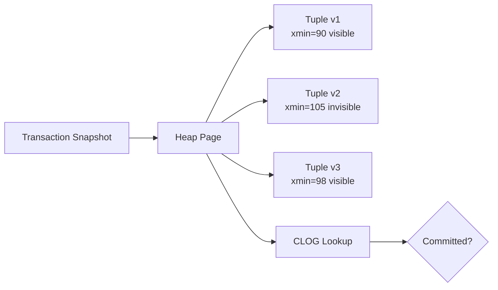
```mermaid
flowchart LR
    TX[Transaction Snapshot] --> HP[Heap Page]
    HP --> T1["Tuple v1\nxmin=90 visible"]
    HP --> T2["Tuple v2\nxmin=105 invisible"]
    HP --> T3["Tuple v3\nxmin=98 visible"]
    HP --> CLOG[CLOG Lookup]
    CLOG --> D{Committed?}
```

### 📶 Gradual Depth

**Level 1 - What it is:**
MVCC is a concurrency control method where the database keeps multiple physical versions of each row so that readers and writers do not block each other.

**Level 2 - How to use it:**
You do not enable MVCC - it is always on in PostgreSQL. Choose an isolation level (READ COMMITTED or REPEATABLE READ) to control when your snapshot refreshes. Use `SELECT ... FOR UPDATE` only when you need to prevent concurrent modifications, not for ordinary reads.

**Level 3 - How it works:**
Each INSERT stamps `xmin` with the current transaction ID. Each DELETE or UPDATE stamps `xmax` on the old version (and INSERT creates the new version with a fresh `xmin`). At read time, the executor checks each tuple: if `xmin` is committed and precedes the snapshot, and `xmax` is either unset, aborted, or from a transaction not yet visible, the tuple is visible. The CLOG provides commit/abort status in two bits per transaction.

**Level 4 - Production mastery:**
Long-running transactions pin old snapshots, preventing VACUUM from reclaiming dead tuples. This causes table bloat, index bloat, and eventually degraded sequential scan performance. Monitor `pg_stat_activity` for `xact_start` age, and set `old_snapshot_threshold` to limit snapshot lifetime. Watch `n_dead_tup` in `pg_stat_user_tables` to detect bloat before it impacts query plans. Autovacuum tuning (scale factor, threshold, cost delay) is the primary production lever.

### ⚙️ How It Works

**Phase 1 - Snapshot acquisition:** When a transaction begins (or, in READ COMMITTED, before each statement), PostgreSQL records the current transaction ID and the set of all in-progress transactions.

**Phase 2 - Tuple visibility check:** For each tuple on a heap page, the executor evaluates: Is `xmin` committed and before my snapshot? Is `xmax` absent, aborted, or invisible to me? Both true = visible.

**Phase 3 - CLOG consultation:** If the commit status of `xmin` or `xmax` is not yet cached in the tuple header hint bits, the executor reads `pg_xact` (CLOG) to determine committed vs aborted.

**Phase 4 - Hint bit setting:** Once resolved, the executor sets hint bits on the tuple to avoid repeated CLOG lookups on future reads.

```
  BEGIN (snapshot xid=200, active={203,207})
    |
    v
  Read page -> Tuple xmin=195, xmax=0
    |  195 < 200 and not in active set
    |  xmax=0 -> not deleted
    v
  VISIBLE -> return row
    |
  Read page -> Tuple xmin=203, xmax=0
    |  203 in active set
    v
  INVISIBLE -> skip row
```

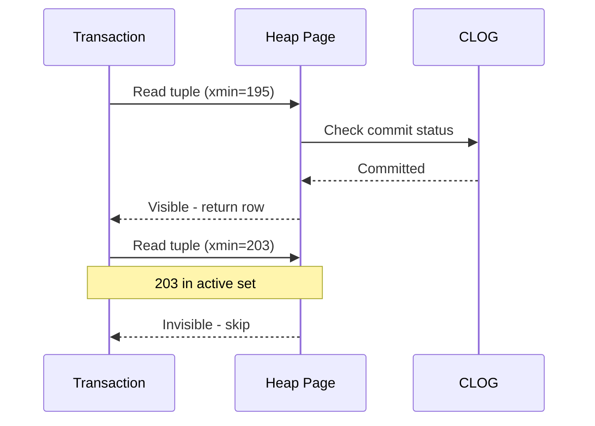
```mermaid
sequenceDiagram
    participant TX as Transaction
    participant HP as Heap Page
    participant CL as CLOG
    TX->>HP: Read tuple (xmin=195)
    HP->>CL: Check commit status
    CL-->>HP: Committed
    HP-->>TX: Visible - return row
    TX->>HP: Read tuple (xmin=203)
    Note over TX,HP: 203 in active set
    HP-->>TX: Invisible - skip
```

**BAD:**

```sql
-- Assuming UPDATE is atomic
UPDATE accounts SET balance = balance - 100
WHERE id = 1;
-- Another session reads stale balance
```

**GOOD:**

```sql
BEGIN ISOLATION LEVEL REPEATABLE READ;
SELECT balance FROM accounts
WHERE id = 1;
UPDATE accounts
SET balance = balance - 100
WHERE id = 1;
COMMIT;
```

### 🚨 Failure Modes

**Failure 1 - Table bloat from long-running transactions:**
**Symptom:** Table size grows continuously; sequential scans slow down; `pg_stat_user_tables.n_dead_tup` climbs.
**Root cause:** An idle-in-transaction session holds an old snapshot, preventing VACUUM from removing dead tuples.
**Diagnostic:**

```sql
SELECT pid, xact_start, state,
       age(backend_xid) AS xid_age
FROM pg_stat_activity
WHERE state = 'idle in transaction'
ORDER BY xact_start;
```

**Fix:** Set `idle_in_transaction_session_timeout` to terminate stale sessions. Set `old_snapshot_threshold` to bound snapshot age.

**Failure 2 - Transaction ID wraparound:**
**Symptom:** PostgreSQL logs warnings about approaching wraparound; eventually the database shuts down refusing writes to prevent data loss.
**Root cause:** Transaction IDs are 32-bit. After ~2 billion transactions without VACUUM freezing old tuples, the counter wraps and old tuples would appear to be in the future.
**Diagnostic:**

```sql
SELECT datname,
       age(datfrozenxid) AS xid_age
FROM pg_database
ORDER BY xid_age DESC;
```

**Fix:** Ensure autovacuum runs regularly. Monitor `age(datfrozenxid)` and alert when it exceeds 500 million. Emergency: run `VACUUM FREEZE` on affected tables.

### 🔬 Production Reality

A common production pattern: a reporting query runs for 30 minutes while OLTP writes churn thousands of rows per second. The reporting transaction holds a snapshot that prevents autovacuum from cleaning any tuples created or deleted after that snapshot. Over time, a 10 GB table balloons to 40 GB. Sequential scan time quadruples. Index scans degrade because the visibility map is stale and index-only scans fall back to heap fetches. The fix is architectural: run long analytical queries on a read replica where they hold a separate snapshot, or use `old_snapshot_threshold` (PostgreSQL 9.6+) to cancel snapshots older than a configured duration. The key insight is that MVCC's "readers don't block" guarantee has a hidden cost - readers can block cleanup.

### ⚖️ Trade-offs & Alternatives

| Aspect                 | PostgreSQL MVCC (heap) | Oracle MVCC (undo)   | MySQL/InnoDB (undo)   |
| ---------------------- | ---------------------- | -------------------- | --------------------- |
| Dead tuple storage     | In-place (heap)        | Undo tablespace      | Undo log              |
| Cleanup mechanism      | VACUUM                 | Automatic undo reuse | Purge thread          |
| Bloat risk             | High without VACUUM    | Low                  | Low                   |
| Read consistency       | Snapshot from CLOG     | Undo reconstruction  | Undo reconstruction   |
| Oldest snapshot impact | Blocks VACUUM          | Fills undo space     | "History list" growth |

### ⚡ Decision Snap

**USE WHEN:**

- Mixed read-write OLTP workloads requiring high concurrency
- Analytical reads must not block or be blocked by writes
- Application tolerates reading slightly stale (but consistent) data

**AVOID WHEN:**

- Single-writer systems where lock overhead is negligible
- Workloads dominated by long-running batch updates that create massive dead tuple volumes

**PREFER undo-based MVCC (Oracle/InnoDB) WHEN:**

- Operational burden of VACUUM tuning is unacceptable
- Dead tuple bloat is difficult to monitor in your environment

### ⚠️ Top Traps

| #   | Misconception                          | Reality                                                                                                                                         |
| --- | -------------------------------------- | ----------------------------------------------------------------------------------------------------------------------------------------------- |
| 1   | MVCC means no locks at all             | Writers still acquire row-level locks against concurrent writers; only reader-writer conflicts are eliminated                                   |
| 2   | REPEATABLE READ prevents all anomalies | PostgreSQL REPEATABLE READ allows serialization anomalies; only SERIALIZABLE uses predicate locking to prevent them                             |
| 3   | VACUUM is optional maintenance         | Without VACUUM, the database will eventually halt on transaction ID wraparound - it is a correctness requirement, not a performance tuning knob |
| 4   | More connections = more throughput     | Each connection holding a snapshot extends the cleanup horizon; beyond a threshold, more connections cause bloat that degrades all queries      |
| 5   | Dead tuples only waste disk space      | Dead tuples waste buffer pool memory, increase I/O for sequential scans, and cause index bloat that degrades random access patterns             |

### 🪜 Learning Ladder

**Prerequisites:**

- SQL-039 ACID Properties - What They Actually Mean - understand isolation guarantees MVCC provides
- SQL-067 Transaction Isolation Levels - know what READ COMMITTED vs REPEATABLE READ means
- SQL-069 Optimistic vs Pessimistic Locking - contrast with lock-based concurrency

**THIS:** SQL-085 MVCC Internals - How Concurrent Reads Work

**Next steps:**

- SQL-088 Page Structure and Tuple Layout - see how xmin/xmax live inside physical tuples
- SQL-089 VACUUM and Bloat Management (PostgreSQL) - understand cleanup of dead tuples MVCC creates
- SQL-092 Deadlock Detection and Resolution - what happens when writer-writer conflicts escalate

**The Surprising Truth:**
PostgreSQL's MVCC design means a simple `SELECT` query that runs for hours can cause more production damage than a burst of heavy writes - because the snapshot it holds prevents dead tuple cleanup across the entire database, not just the tables it reads.

**Further Reading:**

- PostgreSQL Documentation: Chapter 13, Concurrency Control (postgresql.org/docs/current/mvcc.html)
- Reed, D.P. "Naming and Synchronization in a Decentralized Computer System", MIT PhD Dissertation, 1978
- Berenson et al. "A Critique of ANSI SQL Isolation Levels", ACM SIGMOD 1995

**Revision Card:**

1. MVCC keeps old row versions so readers never wait for writers - but dead versions must be cleaned up
2. The trade-off is storage bloat: in-heap dead tuples vs undo-log reconstruction
3. Long-running transactions silently block VACUUM, causing the most common PostgreSQL production incident

---

---

# SQL-086 Write-Ahead Log (WAL) - Crash Recovery Mechanism

**TL;DR** - WAL records every data change to a sequential log before modifying actual pages, enabling crash recovery by replaying committed changes after restart.

### 🔥 Problem Statement

Databases buffer modified pages in memory for performance. If the server crashes before dirty pages are flushed to disk, committed transactions are lost. Flushing every page synchronously after each commit would reduce throughput to disk seek speed - roughly 100-200 transactions per second on spinning disks. At production scale with thousands of commits per second, you need a mechanism that guarantees durability without synchronous page flushes. The write-ahead log solves this by sequentially writing a compact change record before acknowledging the commit, making crash recovery possible by replaying the log.

### 📜 Historical Context

Write-ahead logging originates from the ARIES (Algorithm for Recovery and Isolation Exploiting Semantics) paper by Mohan et al. at IBM Research in 1992. ARIES formalized three principles: write-ahead logging, repeating history during redo, and logging changes during undo. PostgreSQL implemented WAL in version 7.1 (2001), replacing the earlier approach that required clean shutdowns. Every major RDBMS uses some variant of WAL: Oracle's redo logs, SQL Server's transaction log, MySQL/InnoDB's redo log.

### 🔩 First Principles

**CORE INVARIANTS:**

1. No dirty page is flushed to disk until its corresponding WAL record has been flushed (the WAL protocol)
2. WAL writes are sequential and append-only, making them orders of magnitude faster than random page writes
3. The WAL contains sufficient information to reconstruct any committed change from the last checkpoint

**DERIVED DESIGN:**
Because WAL records are sequential, a single disk can sustain high commit throughput even with fsync. The checkpoint process periodically flushes all dirty pages, advancing the recovery start point and allowing old WAL segments to be recycled. This decouples commit latency (WAL flush) from background I/O (page flush).

**THE TRADE-OFF:**
**Gain:** Durability with high commit throughput; crash recovery in seconds to minutes instead of data loss.
**Cost:** Extra I/O for WAL writes; disk space for WAL segments; recovery time proportional to WAL since last checkpoint.

### 🧠 Mental Model

> Think of a cashier who writes every sale in a logbook before putting money in the register drawer. If the drawer jams and spills, the cashier rebuilds the drawer contents by reading the logbook from the last verified count.

- "Logbook entry" -> WAL record
- "Putting money in drawer" -> flushing dirty page to data file
- "Last verified count" -> checkpoint

**Where this analogy breaks down:** WAL records are not human-readable summaries - they contain byte-level diffs of page modifications, and recovery replays them mechanically rather than interpretively.

### 🧩 Components

- **WAL record** - binary entry describing a page modification (LSN, transaction ID, block reference, data diff)
- **WAL buffer** - shared memory region where WAL records accumulate before flush
- **WAL segment files** - 16 MB files (by default) in `pg_wal/` directory, sequentially numbered
- **LSN (Log Sequence Number)** - monotonically increasing byte offset identifying each WAL record's position
- **Checkpoint** - process that flushes all dirty buffers and records a recovery start point
- **WAL writer** - background process that flushes WAL buffers periodically
- **WAL archiver** - copies completed segments to archive storage for PITR

```
  Transaction Commit Flow
  +-----------+    +------------+    +-----------+
  | SQL Write | -> | WAL Buffer | -> | WAL Disk  |
  +-----------+    +------------+    +-----------+
       |                                   |
       v                                   |
  +------------+                     (fsync at
  | Dirty Page |                      commit)
  | in Buffer  |
  |   Pool     | --- checkpoint ---> Data Files
  +------------+
```

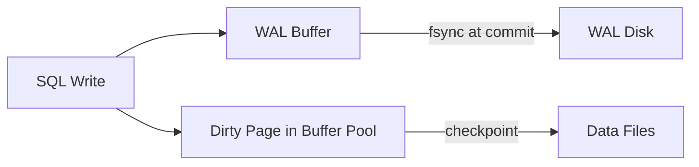
```mermaid
flowchart LR
    SQL[SQL Write] --> WB[WAL Buffer]
    WB -->|fsync at commit| WD[WAL Disk]
    SQL --> DP[Dirty Page in Buffer Pool]
    DP -->|checkpoint| DF[Data Files]
```

### 📶 Gradual Depth

**Level 1 - What it is:**
WAL is a durability mechanism. Every change is written to a log file before the actual data file is updated. If the database crashes, it replays the log to recover committed changes.

**Level 2 - How to use it:**
Configure `wal_level` (minimal, replica, logical) based on replication needs. Set `checkpoint_timeout` and `max_wal_size` to balance recovery time against checkpoint I/O spikes. Use `archive_mode` and `archive_command` to ship WAL for backups.

**Level 3 - How it works:**
When a backend modifies a page, it first constructs a WAL record containing the page diff, appends it to the WAL buffer, and marks the buffer page dirty. At commit, `XLogFlush` forces all WAL up to the commit record's LSN to disk via fsync. The dirty page stays in the buffer pool - it will be written to the data file during a later checkpoint or when evicted by the buffer replacement algorithm.

**Level 4 - Production mastery:**
Checkpoint spikes are the primary WAL-related production issue. A checkpoint flushes potentially gigabytes of dirty pages, causing I/O saturation. Spread checkpoints with `checkpoint_completion_target` (typically 0.9). Monitor `pg_stat_bgwriter` for `checkpoints_req` (forced checkpoints from WAL size) vs `checkpoints_timed`. Place WAL on a separate physical volume to isolate sequential WAL writes from random data file I/O. In replication setups, `wal_keep_size` or replication slots prevent WAL recycling before replicas consume it.

### ⚙️ How It Works

**Phase 1 - WAL record creation:** Backend constructs a binary record with the page block number, offset, and before/after bytes. Full-page images (FPI) are included for the first modification after each checkpoint to protect against torn pages.

**Phase 2 - WAL buffer insertion:** The record is appended to the shared WAL buffer at the current insert position. Multiple backends can insert concurrently using WAL insert locks.

**Phase 3 - Commit flush:** At COMMIT, the backend calls `XLogFlush(commitLSN)`, which ensures all WAL up to that LSN is fsynced to disk. Group commit batches multiple concurrent commits into a single fsync.

**Phase 4 - Checkpoint cycle:** Periodically, the checkpointer flushes all dirty buffers whose oldest modification LSN is older than the checkpoint LSN, writes a checkpoint record, and updates `pg_control`. WAL segments before the checkpoint are eligible for recycling.

**Phase 5 - Crash recovery:** On restart, PostgreSQL reads the last checkpoint from `pg_control`, then replays all WAL records from that checkpoint's redo LSN forward, applying changes to data pages. Uncommitted transactions are rolled back.

```
  Crash Recovery Timeline
  CHECKPOINT          CRASH        RESTART
      |                 |              |
      v                 v              v
  [---WAL segment 1---][---seg 2---]
      ^                              ^
      |-- redo starts here           |
                          replay --->|
                          done -> open for business
```

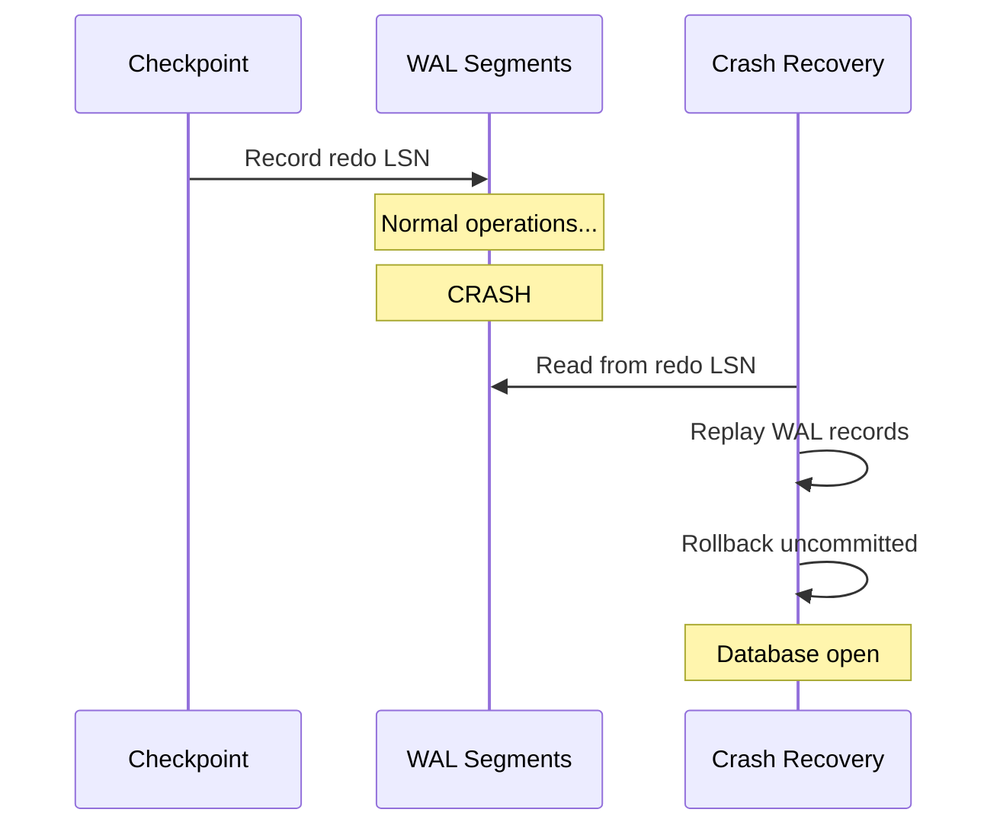
```mermaid
sequenceDiagram
    participant CP as Checkpoint
    participant WAL as WAL Segments
    participant CR as Crash Recovery
    CP->>WAL: Record redo LSN
    Note over WAL: Normal operations...
    Note over WAL: CRASH
    CR->>WAL: Read from redo LSN
    CR->>CR: Replay WAL records
    CR->>CR: Rollback uncommitted
    Note over CR: Database open
```

**BAD:**

```sql
-- Disabling fsync for speed
ALTER SYSTEM SET fsync = off;
-- Crash = unrecoverable data loss
```

**GOOD:**

```sql
ALTER SYSTEM
SET checkpoint_timeout = '10min';
ALTER SYSTEM
SET checkpoint_completion_target = 0.9;
-- Spreads I/O; keeps durability
```

### 🚨 Failure Modes

**Failure 1 - WAL disk full:**
**Symptom:** All transactions block; PostgreSQL logs "No space left on device" for WAL writes. Database effectively halts.
**Root cause:** WAL archiving fell behind, or `max_wal_size` was reached and old segments cannot be recycled because a replication slot holds them.
**Diagnostic:**

```bash
df -h /path/to/pg_wal/
SELECT slot_name, active,
       pg_wal_lsn_diff(
         pg_current_wal_lsn(),
         restart_lsn
       ) AS retained_bytes
FROM pg_replication_slots;
```

**Fix:** Drop inactive replication slots. Increase WAL volume size. Fix the archive command so completed segments are removed after archiving.

**Failure 2 - Checkpoint I/O storm:**
**Symptom:** Periodic latency spikes every `checkpoint_timeout` seconds. `pg_stat_bgwriter.checkpoints_req` grows (forced checkpoints).
**Root cause:** `max_wal_size` is too small, forcing frequent checkpoints, or `checkpoint_completion_target` is too low, causing bursty flushes.
**Diagnostic:**

```sql
SELECT checkpoints_timed,
       checkpoints_req,
       buffers_checkpoint,
       checkpoint_write_time,
       checkpoint_sync_time
FROM pg_stat_bgwriter;
```

**Fix:** Increase `max_wal_size` to reduce checkpoint frequency. Set `checkpoint_completion_target = 0.9` to spread I/O. Move WAL to a dedicated disk.

### 🔬 Production Reality

A typical production incident: a monitoring system shows periodic 2-3 second latency spikes exactly every 5 minutes. Investigation reveals `checkpoint_timeout = 5min` with `checkpoint_completion_target = 0.5`, meaning the checkpointer tries to flush all dirty pages in 2.5 minutes - creating an I/O storm that competes with query I/O. The fix: increase `max_wal_size` from 1 GB to 4-8 GB, set `checkpoint_completion_target = 0.9`, and verify with `pg_stat_bgwriter` that `checkpoints_req` drops to zero (all checkpoints are timed, not forced). The deeper lesson: WAL configuration is not about write throughput - it is about controlling when and how aggressively dirty pages get flushed.

### ⚖️ Trade-offs & Alternatives

| Aspect            | PostgreSQL WAL                  | Oracle Redo Log            | MySQL InnoDB Redo          |
| ----------------- | ------------------------------- | -------------------------- | -------------------------- |
| Segment model     | Rolling files in pg_wal         | Fixed-size redo log groups | Fixed-size redo log files  |
| Full page writes  | After each checkpoint           | Not needed (redo + undo)   | Doublewrite buffer instead |
| Archive mechanism | archive_command / pg_receivewal | RMAN archive               | binlog + redo              |
| Replication basis | Physical or logical WAL         | Redo shipping or LogMiner  | Binlog (logical)           |
| Compression       | wal_compression (LZ4/zstd)      | Not built-in               | Not built-in               |

### ⚡ Decision Snap

**USE WHEN:**

- You need crash-safe durability (always - WAL is not optional in PostgreSQL)
- Setting up replication or point-in-time recovery
- Auditing change history via WAL decoding tools

**AVOID WHEN:**

- Ephemeral/disposable data where durability is unnecessary (use UNLOGGED tables instead)
- Bulk loading where WAL overhead dominates (use COPY with reduced WAL level)

**PREFER UNLOGGED tables WHEN:**

- Data is easily reconstructable (caches, staging tables, ETL intermediates)
- WAL overhead of high-churn tables is unacceptable and crash loss is tolerable

### ⚠️ Top Traps

| #   | Misconception                             | Reality                                                                                                                        |
| --- | ----------------------------------------- | ------------------------------------------------------------------------------------------------------------------------------ |
| 1   | WAL is only for crash recovery            | WAL is also the foundation for streaming replication, PITR, logical decoding, and change data capture                          |
| 2   | Larger max_wal_size means more disk usage | It controls checkpoint frequency; actual WAL disk usage depends on write rate and archiving speed                              |
| 3   | synchronous_commit = off means data loss  | It means up to ~600ms of recent commits may be lost on crash; the database remains consistent, just missing the latest commits |
| 4   | Full page images are wasteful overhead    | FPIs protect against torn pages - without them, a crash mid-page-write corrupts data permanently                               |
| 5   | WAL replay is instant                     | Recovery time is proportional to WAL volume since last checkpoint; a 30 GB WAL backlog can take minutes to replay              |

### 🪜 Learning Ladder

**Prerequisites:**

- SQL-039 ACID Properties - What They Actually Mean - understand the D in ACID that WAL provides
- SQL-041 B-Tree Index Basics - know what data structures WAL protects on disk

**THIS:** SQL-086 Write-Ahead Log (WAL) - Crash Recovery Mechanism

**Next steps:**

- SQL-087 Buffer Pool and Shared Memory Architecture - understand where dirty pages live before WAL flushes
- SQL-103 Backup and Point-in-Time Recovery (PITR) - WAL archiving as the basis for backup
- SQL-100 Logical Replication and Physical Replication - WAL as the replication transport

**The Surprising Truth:**
The biggest WAL-related production problem is not crashes - it is checkpoint storms. Most teams tune WAL for durability but forget that checkpoint behavior controls the I/O pattern of their entire database. A poorly tuned checkpoint creates periodic latency spikes that look like application bugs.

**Further Reading:**

- Mohan et al. "ARIES: A Transaction Recovery Method Supporting Fine-Granularity Locking and Partial Rollbacks" - ACM TODS, 1992
- PostgreSQL Documentation: Chapter 30, Reliability and the Write-Ahead Log (postgresql.org/docs/current/wal.html)
- PostgreSQL Documentation: WAL Configuration (postgresql.org/docs/current/wal-configuration.html)

**Revision Card:**

1. WAL writes change records sequentially before modifying data pages - this is how durability works without synchronous page flushes
2. The trade-off is checkpoint tuning: too frequent = I/O storms, too infrequent = long recovery
3. WAL disk full halts the entire database - monitor pg_wal size and replication slot retention

---

---

# SQL-087 Buffer Pool and Shared Memory Architecture

**TL;DR** - The buffer pool caches data pages in shared memory so queries read from RAM instead of disk, using clock-sweep eviction to balance hot and cold pages.

### 🔥 Problem Statement

Disk I/O is the fundamental bottleneck of database performance. A random 8 KB page read from SSD takes roughly 100 microseconds; from spinning disk, 5-10 milliseconds. A complex query touching thousands of pages cannot afford to read each from disk. At production scale - millions of queries per hour - the database needs a large in-memory cache of frequently accessed pages, with an eviction policy that keeps hot pages resident and replaces cold ones. Without a well-tuned buffer pool, every query degrades to disk speed, connection pools saturate, and the system becomes I/O-bound.

### 📜 Historical Context

Buffer pool management has been central to database design since System R at IBM in the 1970s. Early systems used simple LRU (Least Recently Used) eviction, but LRU performs poorly with sequential scan workloads that flush the entire cache. PostgreSQL uses a clock-sweep algorithm (an approximation of LRU) with a dedicated ring buffer for sequential scans to prevent cache pollution. The `shared_buffers` parameter, typically set to 25% of system RAM, has been the single most important PostgreSQL tuning knob since version 7.x.

### 🔩 First Principles

**CORE INVARIANTS:**

1. Every page access goes through the buffer pool - there is no direct disk I/O path for queries
2. A page in the buffer pool may be clean (matches disk) or dirty (modified, pending flush)
3. Eviction can only remove a page that is not pinned by any active backend and not dirty without WAL-flush protection

**DERIVED DESIGN:**
The buffer pool is a hash table mapping (tablespace, relation, fork, block number) to a buffer slot. Each slot has a pin count (active references), a usage count (clock-sweep weight), and a dirty flag. The clock-sweep algorithm circles through slots, decrementing usage counts until it finds a slot with usage=0 and pin=0 to evict.

**THE TRADE-OFF:**
**Gain:** Orders-of-magnitude reduction in disk I/O; queries operate at memory speed for cached pages.
**Cost:** Shared memory consumption; double-buffering with the OS page cache wastes RAM; checkpoint I/O to flush dirty pages.

### 🧠 Mental Model

> Think of the buffer pool as a hotel with a fixed number of rooms. Each room holds one guest (page). When a new guest arrives and the hotel is full, the concierge (clock-sweep) walks the hallway checking: "Has anyone visited this room recently?" Rooms with no recent visits get reassigned to the new guest.

- "Hotel room" -> buffer pool slot (8 KB page frame)
- "Concierge walk" -> clock-sweep eviction pass
- "Recent visit flag" -> usage count on the buffer descriptor

**Where this analogy breaks down:** The buffer pool also has a "ring buffer" shortcut for large sequential scans - like a separate small hallway that prevents a single large group from evicting all the regular guests.

### 🧩 Components

- **shared_buffers** - total buffer pool size (configured in postgresql.conf)
- **Buffer descriptor** - metadata per slot: tag, pin count, usage count, dirty flag, I/O-in-progress lock
- **Buffer hash table** - maps (relation, block) to buffer slot index
- **Clock-sweep** - eviction algorithm scanning descriptors in circular order
- **Ring buffer** - small private buffer (256 KB) for large sequential scans, bulk writes, and VACUUM
- **Background writer** - proactively flushes dirty pages to maintain a pool of clean evictable pages
- **Checkpointer** - periodically flushes all dirty pages and advances the WAL recovery point

```
  Shared Memory Layout (simplified)
  +-------------------------------------+
  | shared_buffers (e.g. 4 GB)          |
  | +------+------+------+------+       |
  | | Slot | Slot | Slot | Slot | ...   |
  | | 8KB  | 8KB  | 8KB  | 8KB  |      |
  | +------+------+------+------+       |
  | Buffer Hash Table                   |
  | WAL Buffers                         |
  | CLOG / Commit Log Buffers           |
  | Lock Tables                         |
  +-------------------------------------+
        |            |
        v            v
    OS Page       Data Files
     Cache         on Disk
```

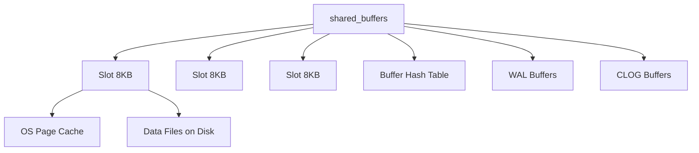
```mermaid
flowchart TD
    SB[shared_buffers] --> S1[Slot 8KB]
    SB --> S2[Slot 8KB]
    SB --> S3[Slot 8KB]
    SB --> BHT[Buffer Hash Table]
    SB --> WB[WAL Buffers]
    SB --> CL[CLOG Buffers]
    S1 --> OS[OS Page Cache]
    S1 --> DF[Data Files on Disk]
```

### 📶 Gradual Depth

**Level 1 - What it is:**
The buffer pool is a chunk of shared memory that caches database pages. When a query needs a page, it checks the buffer pool first. If the page is there (a "hit"), it avoids a disk read entirely.

**Level 2 - How to use it:**
Set `shared_buffers` to approximately 25% of system RAM (the canonical starting point). Monitor the buffer cache hit ratio via `pg_stat_database.blks_hit / (blks_hit + blks_read)`. A ratio below 99% on OLTP workloads typically indicates insufficient buffer pool or a working set larger than memory.

**Level 3 - How it works:**
When a backend needs block N of table T, it hashes (T, N) to find the buffer slot. If present and valid, it pins the slot (incrementing pin count) and increments the usage count. If absent, the clock-sweep finds a victim slot, reads the page from disk (or OS page cache), and inserts it. If the victim was dirty, it must be flushed to disk first. The ring buffer mechanism allocates a small private buffer ring for sequential scans larger than 25% of `shared_buffers`, preventing cache thrashing.

**Level 4 - Production mastery:**
The double-buffering problem: PostgreSQL caches pages in `shared_buffers`, and the OS also caches the same pages in its page cache. Setting `shared_buffers` too high (e.g., 75% of RAM) starves the OS page cache, causing performance degradation. On Linux, use huge pages (`huge_pages = try`) to reduce TLB pressure for large buffer pools. Monitor `pg_buffercache` extension to inspect which relations occupy buffer pool slots. Watch `bgwriter` stats: high `buffers_alloc` with low `buffers_clean` means the background writer is not keeping up, and backends are doing their own eviction writes (bad for latency).

### ⚙️ How It Works

**Phase 1 - Page request:** Backend calls `ReadBuffer(relation, blockNum)`. The buffer manager hashes the block identifier and searches the buffer hash table.

**Phase 2 - Cache hit:** If found, pin the buffer (atomic increment of pin count), increment usage count (capped at 5), and return the buffer pointer. The backend reads or modifies the page in-place.

**Phase 3 - Cache miss:** If not found, the clock-sweep scans buffer descriptors. For each descriptor: if pin count = 0 and usage count = 0, select as victim. Otherwise, decrement usage count and move to the next. If the victim is dirty, flush it to disk first.

**Phase 4 - Page load:** Read the 8 KB page from disk into the victim slot. Insert the new mapping into the buffer hash table. Pin the buffer and return.

```
  Clock-Sweep Eviction
  Slots: [U=3] [U=1] [U=0,P=0] [U=2]
           |      |       ^        |
           v      v       |        v
         U=2    U=0    EVICT!    U=1
          (decrement)  (victim)
```

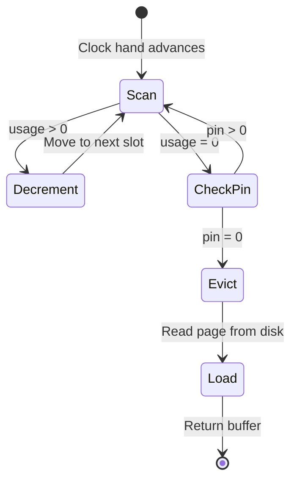
```mermaid
stateDiagram-v2
    [*] --> Scan: Clock hand advances
    Scan --> Decrement: usage > 0
    Decrement --> Scan: Move to next slot
    Scan --> CheckPin: usage = 0
    CheckPin --> Evict: pin = 0
    CheckPin --> Scan: pin > 0
    Evict --> Load: Read page from disk
    Load --> [*]: Return buffer
```

**BAD:**

```sql
-- 80% of RAM to shared_buffers
ALTER SYSTEM
SET shared_buffers = '48GB';
-- Starves OS page cache
```

**GOOD:**

```sql
-- 25% of RAM; OS caches the rest
ALTER SYSTEM
SET shared_buffers = '16GB';
ALTER SYSTEM
SET effective_cache_size = '48GB';
```

### 🚨 Failure Modes

**Failure 1 - Buffer pool thrashing from sequential scans:**
**Symptom:** Buffer cache hit ratio drops sharply during reporting queries. OLTP queries suddenly slow down.
**Root cause:** A large sequential scan without the ring buffer optimization (e.g., on pre-9.3 PostgreSQL or with very small tables that do not trigger the ring buffer) evicts hot OLTP pages.
**Diagnostic:**

```sql
SELECT relname,
       heap_blks_read, heap_blks_hit,
       round(100.0 * heap_blks_hit /
         nullif(heap_blks_hit +
                heap_blks_read, 0), 1)
         AS hit_pct
FROM pg_statio_user_tables
ORDER BY heap_blks_read DESC LIMIT 10;
```

**Fix:** Ensure large scans use partitioned tables or materialized views. Move analytical queries to read replicas. The ring buffer mechanism handles most cases automatically, but verify it is engaging for your scan sizes.

**Failure 2 - Backend writes causing latency spikes:**
**Symptom:** Sporadic high-latency queries. `pg_stat_bgwriter.buffers_backend` is high relative to `buffers_clean`.
**Root cause:** The background writer is not keeping enough clean pages available. Backends performing eviction must write dirty pages synchronously before they can load the needed page.
**Diagnostic:**

```sql
SELECT buffers_checkpoint,
       buffers_clean,
       buffers_backend,
       maxwritten_clean
FROM pg_stat_bgwriter;
```

**Fix:** Increase `bgwriter_lru_maxpages` and reduce `bgwriter_delay` to make the background writer more aggressive. Ensure `shared_buffers` is not oversized relative to workload hot set.

### 🔬 Production Reality

A typical pattern in production: a team sets `shared_buffers = 32 GB` on a 64 GB server, leaving only 32 GB for the OS. With a 200 GB database, most reads go through the OS page cache after missing the buffer pool. The OS page cache is efficient for this, but with 32 GB of `shared_buffers`, the database process uses huge amounts of virtual memory, causing TLB misses on every buffer pool access. Enabling `huge_pages = try` with the OS configured for HugePages cuts TLB miss overhead significantly. The lesson: `shared_buffers` sizing is not "bigger is better" - it is about balancing PostgreSQL's managed cache against the OS's page cache, and using huge pages when the buffer pool exceeds a few gigabytes.

### ⚖️ Trade-offs & Alternatives

| Aspect                     | PostgreSQL shared_buffers | MySQL InnoDB Buffer Pool             | Oracle SGA/Buffer Cache |
| -------------------------- | ------------------------- | ------------------------------------ | ----------------------- |
| Eviction algorithm         | Clock-sweep               | Modified LRU with young/old sublists | Touch-count LRU         |
| Sequential scan protection | Ring buffer               | Midpoint insertion                   | Direct path reads       |
| OS page cache reliance     | High (double buffering)   | Moderate (O_DIRECT option)           | Low (O_DIRECT typical)  |
| Typical sizing             | 25% of RAM                | 70-80% of RAM                        | 60-80% of SGA           |
| Dynamic resize             | Requires restart          | Online resize                        | Online resize           |

### ⚡ Decision Snap

**USE WHEN:**

- Every PostgreSQL deployment uses the buffer pool - it is not optional
- Tuning `shared_buffers` is the first performance optimization for any workload
- Understanding buffer pool behavior is essential for diagnosing I/O-related latency

**AVOID WHEN:**

- Do not set `shared_buffers` above 40% of RAM on Linux without careful benchmarking
- Do not rely solely on buffer pool hit ratio - it hides sequential scan pollution

**PREFER direct I/O (O_DIRECT, not available in PostgreSQL) WHEN:**

- Double-buffering overhead is measurable (Oracle and MySQL support this)
- The database manages its own cache entirely and the OS page cache adds no value

### ⚠️ Top Traps

| #   | Misconception                                        | Reality                                                                                                     |
| --- | ---------------------------------------------------- | ----------------------------------------------------------------------------------------------------------- |
| 1   | Set shared_buffers as large as possible              | Beyond 25-40% of RAM, you starve the OS page cache and performance degrades due to double buffering         |
| 2   | 99% hit ratio means the buffer pool is well-sized    | A 99% hit ratio can mask sequential scan pollution - check per-table hit ratios, not just the global number |
| 3   | The background writer handles all dirty page flushes | If bgwriter falls behind, backends write dirty pages themselves, causing unpredictable latency spikes       |
| 4   | PostgreSQL uses O_DIRECT like Oracle/MySQL           | PostgreSQL relies on the OS page cache for reads that miss shared_buffers; there is no O_DIRECT support     |
| 5   | Buffer pool only caches table data                   | It also caches index pages, TOAST pages, free space map pages, and visibility map pages                     |

### 🪜 Learning Ladder

**Prerequisites:**

- SQL-041 B-Tree Index Basics - understand what page structures are being cached
- SQL-086 Write-Ahead Log (WAL) - Crash Recovery Mechanism - know how dirty pages relate to WAL and checkpoints

**THIS:** SQL-087 Buffer Pool and Shared Memory Architecture

**Next steps:**

- SQL-088 Page Structure and Tuple Layout - see what lives inside each 8 KB cached page
- SQL-094 Query Planner and Cost-Based Optimization - understand how the planner estimates I/O cost based on cache behavior
- SQL-102 Connection Pooling - PgBouncer and HikariCP - manage connection count to control buffer pool pressure

**The Surprising Truth:**
PostgreSQL intentionally under-sizes its buffer pool relative to Oracle or MySQL because it depends on the operating system's page cache as a second-level cache. This "double buffering" design means the OS does useful read-ahead and caching for free, but it also means tuning PostgreSQL memory requires understanding OS memory management - a skill most application engineers never develop.

**Further Reading:**

- PostgreSQL Documentation: Resource Consumption, shared_buffers (postgresql.org/docs/current/runtime-config-resource.html)
- PostgreSQL Documentation: pg_buffercache extension (postgresql.org/docs/current/pgbuffercache.html)
- Comer, D. "The Ubiquitous B-Tree" - ACM Computing Surveys, 1979 (foundational for understanding page-based storage)

**Revision Card:**

1. The buffer pool caches 8 KB pages in shared memory; clock-sweep eviction keeps hot pages resident
2. Set shared_buffers to ~25% of RAM on Linux - bigger is not better due to OS page cache double buffering
3. When buffers_backend is high in pg_stat_bgwriter, backends are doing synchronous eviction writes - tune bgwriter

---

---

# SQL-088 Page Structure and Tuple Layout

**TL;DR** - PostgreSQL stores rows as tuples inside fixed-size 8 KB pages with a header, line pointer array, and heap tuples packed from the page end backward.

### 🔥 Problem Statement

Applications think in rows and columns, but disks think in blocks. The database must map logical rows into fixed-size physical pages that can be read and written atomically. Poor understanding of page layout leads to table bloat, wasted space from alignment padding, oversized rows causing TOAST overhead, and inability to interpret tools like `pageinspect` or `pg_freespacemap`. At production scale, page-level fragmentation from updates creates dead space that inflates table size and degrades scan performance. Understanding page internals is essential for diagnosing storage bloat and tuple-level performance issues.

### 📜 Historical Context

PostgreSQL inherited its page format from the Berkeley Postgres project in the 1980s. The 8 KB default page size was chosen to match common filesystem block sizes and OS page sizes. The tuple header format evolved to support MVCC (xmin/xmax), null bitmaps, and HOT (Heap-Only Tuple) updates added in PostgreSQL 8.3 (2008). The line pointer indirection layer - an array of offsets at the top of each page - enables in-page tuple movement without invalidating index entries, which is the key enabler for HOT updates.

### 🔩 First Principles

**CORE INVARIANTS:**

1. Every heap page is exactly 8192 bytes (configurable at compile time, but virtually always 8 KB)
2. Tuples are addressed by (page number, line pointer offset) - the line pointer provides indirection between index entries and physical tuple position within the page
3. Free space within a page grows from both ends: line pointers grow downward from the top, tuple data grows upward from the bottom

**DERIVED DESIGN:**
The page header (24 bytes) records the page LSN, free space boundaries, and flags. Line pointers (4 bytes each) form an array after the header, each pointing to a tuple's offset and recording its length and status. Tuples are packed from the bottom of the page upward. The gap between the last line pointer and the first tuple is the free space available for new tuples.

**THE TRADE-OFF:**
**Gain:** Line pointer indirection enables HOT updates, VACUUM compaction, and index stability without rewriting index entries.
**Cost:** 4 bytes overhead per tuple for the line pointer; 23+ bytes per tuple for the tuple header; alignment padding wastes space for small columns.

### 🧠 Mental Model

> Think of a page as a numbered parking garage floor. The entrance wall has a directory board (line pointers) listing which parking spot each car (tuple) occupies. Cars park from the far end of the floor toward the entrance. When a car leaves, its directory entry is marked "available" but the spot is not immediately reused until the attendant (VACUUM) compacts the floor.

- "Directory board entry" -> line pointer (4 bytes: offset + length + flags)
- "Parking spot" -> physical tuple data area
- "Empty space between directory and first car" -> page free space

**Where this analogy breaks down:** Unlike a parking garage, tuples have variable sizes, and VACUUM can physically move tuples within a page while updating only the line pointer - something that would require towing cars and rewriting the directory simultaneously.

### 🧩 Components

- **Page header** (24 bytes) - LSN, checksum, flags, free space pointers (pd_lower, pd_upper, pd_special)
- **Line pointer array** - grows downward from byte 24; each entry is 4 bytes (offset:15, flags:2, length:15)
- **Free space** - gap between pd_lower (end of line pointers) and pd_upper (start of tuple data)
- **Tuple data area** - tuples packed from the end of the page backward
- **Tuple header** (23 bytes minimum) - xmin, xmax, cid, ctid, infomask, infomask2, hoff, null bitmap
- **Special space** - at very end of page; used by index pages (B-tree, GiST, etc.), empty for heap pages

```
  8 KB Page Layout
  +----------------------------------+
  | Page Header (24 bytes)           |
  |   LSN, checksum, pd_lower,      |
  |   pd_upper, pd_special          |
  +----------------------------------+
  | Line Pointer 1 -> offset, len   |
  | Line Pointer 2 -> offset, len   |
  | Line Pointer 3 -> (dead)        |
  | ... (pd_lower boundary)         |
  +----------------------------------+
  |                                  |
  |         FREE SPACE               |
  |                                  |
  +----------------------------------+
  |  ... (pd_upper boundary)         |
  | Tuple 2 data [xmin|xmax|data]   |
  | Tuple 1 data [xmin|xmax|data]   |
  +----------------------------------+
  | Special Space (0 for heap)       |
  +----------------------------------+
```

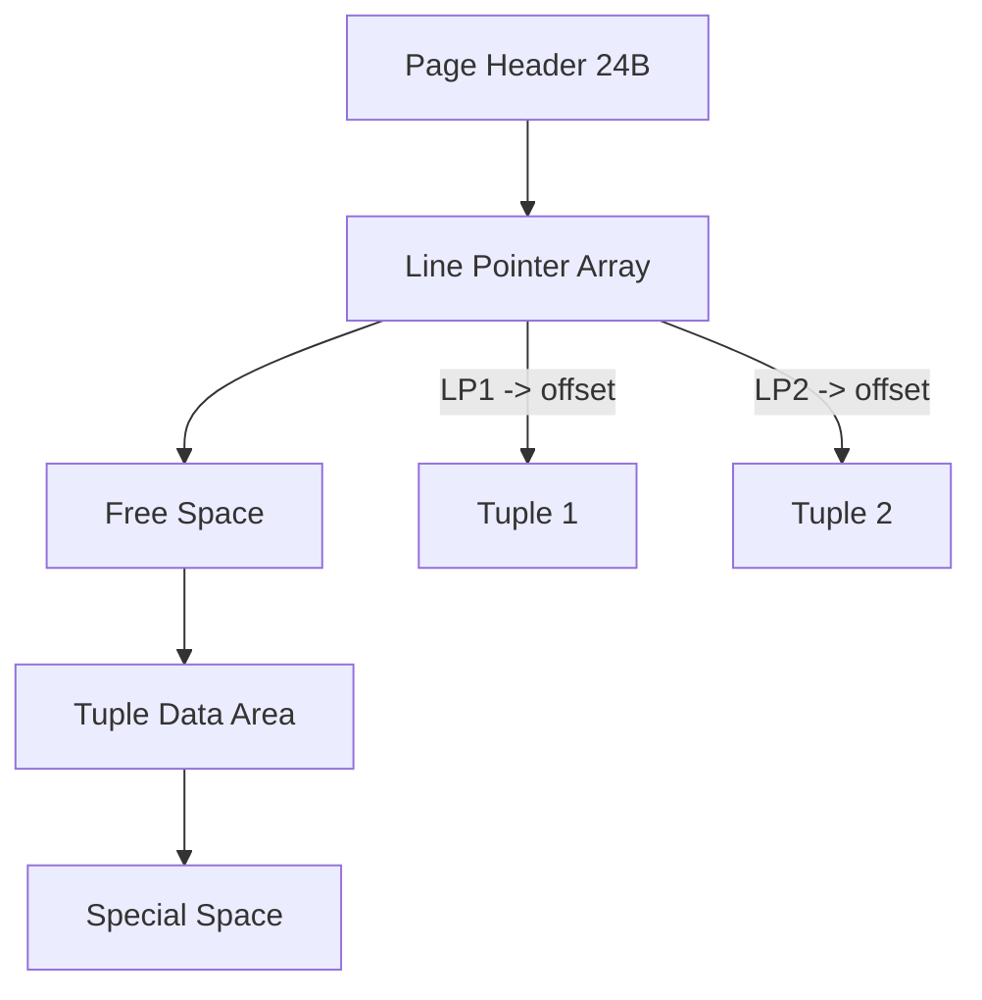
```mermaid
flowchart TD
    PH[Page Header 24B] --> LP[Line Pointer Array]
    LP --> FS[Free Space]
    FS --> TD[Tuple Data Area]
    TD --> SS[Special Space]
    LP -->|"LP1 -> offset"| T1[Tuple 1]
    LP -->|"LP2 -> offset"| T2[Tuple 2]
```

### 📶 Gradual Depth

**Level 1 - What it is:**
A PostgreSQL page is an 8 KB block that holds multiple row versions (tuples). Every table and index is stored as a sequence of these pages on disk.

**Level 2 - How to use it:**
Use `pageinspect` extension to examine page contents. Use `pg_freespacemap` to see free space per page. Column ordering in CREATE TABLE affects alignment padding and can impact row size. Place fixed-width columns before variable-width columns to minimize padding.

**Level 3 - How it works:**
Each tuple has a 23-byte header containing MVCC fields (xmin, xmax), a command ID, a pointer to the next version (ctid for HOT chains), infomask bits encoding null/toast/visibility flags, and the heap tuple offset. After the header comes an optional null bitmap (1 bit per column), followed by the actual column data aligned to type-specific boundaries (int4 to 4 bytes, int8 to 8 bytes, etc.).

**Level 4 - Production mastery:**
Row width directly impacts how many tuples fit per page and therefore how many pages a sequential scan must read. A table with 100-byte rows fits approximately 70 tuples per page. A table with 2000-byte rows fits only 3-4. For UPDATE-heavy workloads, the fill factor (default 100%) controls how much space is reserved per page for HOT updates - setting `fillfactor = 90` reserves 10% for in-page updates that avoid index maintenance. Monitor page-level bloat with `pgstattuple` extension's `free_percent` metric.

### ⚙️ How It Works

**Phase 1 - INSERT:** The executor finds a page with sufficient free space (consulting the free space map). It allocates a new line pointer at pd_lower, writes tuple data at pd_upper (which decreases), and updates both pointers.

**Phase 2 - UPDATE (non-HOT):** A new tuple version is inserted (potentially on a different page). The old tuple's xmax is set to the current transaction ID. The old tuple's ctid is updated to point to the new version. Index entries are added for the new tuple.

**Phase 3 - UPDATE (HOT):** If no indexed column changed and the same page has free space, the new tuple is placed on the same page. The old tuple's ctid points to the new line pointer on the same page. No index entry is needed - index lookups follow the HOT chain from the original line pointer.

**Phase 4 - VACUUM:** Dead tuples (xmax committed, invisible to all snapshots) are removed. Their line pointers are marked "dead" then "unused". Remaining tuples may be compacted (moved toward the end of the page) to consolidate free space. pd_lower and pd_upper are updated.

```
  HOT Update Chain (same page)
  LP1 -> Tuple v1 (xmax=200, ctid=LP2)
  LP2 -> Tuple v2 (xmax=0, current)
  Index -> LP1 -> follows chain -> LP2
```

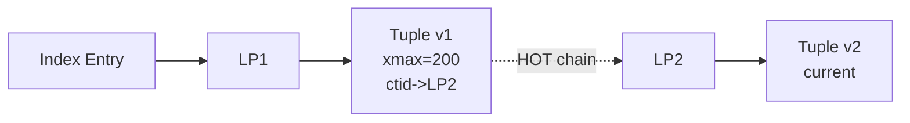
```mermaid
flowchart LR
    IDX[Index Entry] --> LP1[LP1]
    LP1 --> T1["Tuple v1\nxmax=200\nctid->LP2"]
    T1 -.->|HOT chain| LP2[LP2]
    LP2 --> T2["Tuple v2\ncurrent"]
```

**BAD:**

```sql
CREATE TABLE logs (
  id SERIAL,
  msg TEXT,  -- avg 4KB per row
  meta TEXT  -- avg 3KB per row
);  -- ~1 tuple per 8KB page
```

**GOOD:**

```sql
CREATE TABLE logs (
  id SERIAL,
  msg TEXT,  -- auto-TOASTed > ~2KB
  meta JSONB -- compressed in TOAST
);  -- main tuple stays small
```

### 🚨 Failure Modes

**Failure 1 - Table bloat from non-HOT updates:**
**Symptom:** Table size grows far beyond expected row count \* row width. `pgstattuple` shows high `dead_tuple_percent` or `free_percent`.
**Root cause:** Updates modify indexed columns, forcing non-HOT updates that create new tuples on potentially different pages. Old tuples become dead space.
**Diagnostic:**

```sql
CREATE EXTENSION IF NOT EXISTS pgstattuple;
SELECT * FROM pgstattuple('my_table');
-- Check tuple_percent vs free_percent
```

**Fix:** Avoid updating indexed columns when possible. Set `fillfactor = 70-90` on update-heavy tables to enable HOT updates. Run `VACUUM FULL` as a last resort (requires exclusive lock and rewrites the entire table).

**Failure 2 - Row too wide for a page:**
**Symptom:** `ERROR: row is too big: size XXXX, maximum size 8160`. Alternatively, excessive TOAST overhead for wide rows.
**Root cause:** A single row exceeds the maximum tuple size (~8160 bytes after page header and line pointer overhead). Large columns are automatically TOASTed (compressed and stored out-of-line), but many medium-width columns can collectively exceed the limit.
**Diagnostic:**

```sql
SELECT pg_column_size(t.*) AS row_bytes
FROM my_table t
ORDER BY pg_column_size(t.*) DESC
LIMIT 5;
```

**Fix:** Redesign the schema to move large or rarely-accessed columns to a separate table. Use JSONB or TEXT columns that TOAST automatically. Avoid wide rows with many fixed-width columns.

### 🔬 Production Reality

A typical scenario: a team discovers their 50 GB orders table should be 20 GB based on row count and average row width. Investigation with `pgstattuple` reveals 60% free space - pages are only 40% utilized. The cause: a batch job updates the `status` column (indexed) on millions of rows daily, causing non-HOT updates. Each update creates a dead tuple and a new tuple on a different page. VACUUM reclaims the dead tuple but leaves the page fragmented. The fix: drop the index on `status` (it was rarely used by queries), enabling HOT updates. After `VACUUM FULL`, the table dropped to 18 GB, and daily bloat growth decreased by 80%.

### ⚖️ Trade-offs & Alternatives

| Aspect              | PostgreSQL heap (line pointers)  | MySQL/InnoDB (clustered index) | Oracle (ROWID direct)       |
| ------------------- | -------------------------------- | ------------------------------ | --------------------------- |
| Row addressing      | Line pointer indirection         | Primary key B-tree leaf        | Physical ROWID              |
| In-place update     | HOT (same page, no index change) | In-place if fits               | In-place with row migration |
| Page size           | 8 KB (compile-time)              | 16 KB (configurable)           | 8 KB (configurable)         |
| Row version storage | In-heap (dead tuples)            | Undo log (undo tablespace)     | Undo segments               |
| Index stability     | Line pointers absorb moves       | Clustered key is stable        | ROWID changes on migration  |

### ⚡ Decision Snap

**USE WHEN:**

- Diagnosing table bloat or storage growth beyond expected levels
- Tuning fillfactor for update-heavy tables
- Deciding column ordering in CREATE TABLE for alignment efficiency

**AVOID WHEN:**

- Row widths are well within page limits and bloat is not a concern
- Premature micro-optimization of column ordering on low-volume tables

**PREFER InnoDB clustered index model WHEN:**

- Primary key range scans are the dominant access pattern (clustered storage provides locality)
- Update patterns are predominantly in-place (undo log avoids heap dead tuples)

### ⚠️ Top Traps

| #   | Misconception                                 | Reality                                                                                                                             |
| --- | --------------------------------------------- | ----------------------------------------------------------------------------------------------------------------------------------- |
| 1   | Dropping a column reclaims disk space         | DROP COLUMN only marks the column invisible; existing tuples still contain the data until rewritten by VACUUM FULL or table rewrite |
| 2   | All UPDATEs create index maintenance overhead | HOT updates (no indexed column changed, space on same page) skip all index insertions                                               |
| 3   | Smaller rows always perform better            | Excessively narrow rows (e.g., 10 bytes) have poor header-to-data ratio because the 23-byte tuple header dominates                  |
| 4   | Page size is tunable per table                | PostgreSQL page size is set at compile time and applies to all tables and indexes in the cluster                                    |
| 5   | VACUUM FULL is the standard bloat fix         | VACUUM FULL requires an exclusive lock and rewrites the entire table; pg_repack is preferred for online bloat remediation           |

### 🪜 Learning Ladder

**Prerequisites:**

- SQL-008 Tables, Rows, and Columns - understand the logical row/column model that pages implement physically
- SQL-085 MVCC Internals - How Concurrent Reads Work - understand why tuples carry xmin/xmax in their headers

**THIS:** SQL-088 Page Structure and Tuple Layout

**Next steps:**

- SQL-089 VACUUM and Bloat Management (PostgreSQL) - how dead tuples get cleaned from pages
- SQL-087 Buffer Pool and Shared Memory Architecture - how pages are cached in memory
- SQL-061 Index Types - B-Tree, Hash, GIN, GiST, BRIN - index pages have different internal structures

**The Surprising Truth:**
The tuple header (23 bytes minimum) is often larger than the actual user data in narrow tables. A table with a single integer column wastes 85% of each tuple on overhead - the 23-byte header plus 4-byte line pointer dwarfs the 4-byte integer. This is why very narrow, high-volume tables benefit from column packing or composite types.

**Further Reading:**

- PostgreSQL Documentation: Database Page Layout (postgresql.org/docs/current/storage-page-layout.html)
- PostgreSQL Documentation: pageinspect extension (postgresql.org/docs/current/pageinspect.html)
- PostgreSQL Documentation: TOAST, The Oversized-Attribute Storage Technique (postgresql.org/docs/current/storage-toast.html)

**Revision Card:**

1. Each 8 KB page has a header, line pointer array (top-down), free space, and tuple data (bottom-up)
2. HOT updates avoid index maintenance by chaining tuple versions through line pointers on the same page
3. The 23-byte tuple header dominates storage for narrow rows - column ordering and fillfactor are the primary tuning levers

---

---

# SQL-089 VACUUM and Bloat Management (PostgreSQL)

**TL;DR** - VACUUM reclaims space from dead tuples created by MVCC, prevents transaction ID wraparound, and updates visibility maps and statistics for optimal query performance.

### 🔥 Problem Statement

PostgreSQL's MVCC design leaves dead tuples in-place after every UPDATE and DELETE. Without cleanup, tables grow unboundedly: a 10 GB table receiving 100,000 updates per day can balloon to 50 GB within weeks. Dead tuples waste buffer pool memory, increase sequential scan times, inflate backup sizes, and degrade index performance. Worse, without VACUUM freezing old transaction IDs, PostgreSQL will eventually halt with a wraparound shutdown - refusing all writes to prevent data corruption. VACUUM is not optional maintenance; it is a correctness requirement.

### 📜 Historical Context

Early PostgreSQL had no automatic VACUUM - administrators ran it manually during maintenance windows. PostgreSQL 8.1 (2005) introduced autovacuum, a background daemon that triggers VACUUM based on dead tuple thresholds. PostgreSQL 9.6 (2016) added aggressive freeze behavior when approaching wraparound. Each major version has refined autovacuum: parallel index vacuuming (v13), improved dead tuple tracking (v14), and memory-efficient TID storage (v17). Despite 20 years of improvements, autovacuum tuning remains the single most common source of PostgreSQL production issues.

### 🔩 First Principles

**CORE INVARIANTS:**

1. Dead tuples cannot be removed until no active transaction's snapshot can see them
2. Every tuple must eventually be "frozen" (marked as visible to all future transactions) to prevent transaction ID wraparound
3. VACUUM must update the free space map and visibility map to enable efficient space reuse and index-only scans

**DERIVED DESIGN:**
Autovacuum monitors `n_dead_tup` per table and triggers when dead tuples exceed `autovacuum_vacuum_threshold + autovacuum_vacuum_scale_factor * n_live_tup`. VACUUM scans heap pages, removes dead tuples, updates line pointers, and compacts free space. It also freezes tuples older than `vacuum_freeze_min_age` transactions and advances the table's `relfrozenxid`.

**THE TRADE-OFF:**
**Gain:** Reclaimed disk space, prevented wraparound, updated statistics, enabled index-only scans via visibility map.
**Cost:** I/O and CPU consumption during VACUUM; locks on pages being processed; potential autovacuum contention with production queries.

### 🧠 Mental Model

> Think of VACUUM as a janitor in an office building. Workers (transactions) leave trash (dead tuples) at their desks. The janitor cannot empty a trash can if anyone might still need something in it (active snapshots). The janitor also checks smoke detectors (freezing tuples) - if detectors are never checked, the fire marshal (wraparound protection) shuts down the building.

- "Trash collection" -> dead tuple removal
- "Smoke detector check" -> tuple freezing to prevent wraparound
- "Fire marshal shutdown" -> automatic wraparound protection halt

**Where this analogy breaks down:** The janitor also updates a directory (visibility map and free space map) that other workers rely on for efficiency - a janitor in the real world does not optimize the office layout while cleaning.

### 🧩 Components

- **Autovacuum launcher** - daemon that schedules worker processes for tables exceeding dead tuple thresholds
- **Autovacuum worker** - performs VACUUM on a single table, throttled by `autovacuum_vacuum_cost_delay`
- **Dead tuple tracking** - `pg_stat_user_tables.n_dead_tup` counts dead tuples per table
- **Free space map (FSM)** - per-table file tracking available space per page for INSERT reuse
- **Visibility map (VM)** - per-table bitmap marking pages where all tuples are visible to all transactions (enables index-only scans)
- **FREEZE** - marks old tuples as "frozen" (permanently visible), advancing `relfrozenxid`

```
  Autovacuum Decision Flow
  +-------------------+
  | pg_stat_user_tables|
  | n_dead_tup = 50000 |
  +--------+----------+
           |
     threshold check:
     50 + 0.2 * 100000 = 20050
     50000 > 20050 -> trigger
           |
           v
  +-------------------+
  | Autovacuum Worker  |
  | Scan heap pages    |
  | Remove dead tuples |
  | Update FSM + VM    |
  | Freeze old tuples  |
  +-------------------+
```

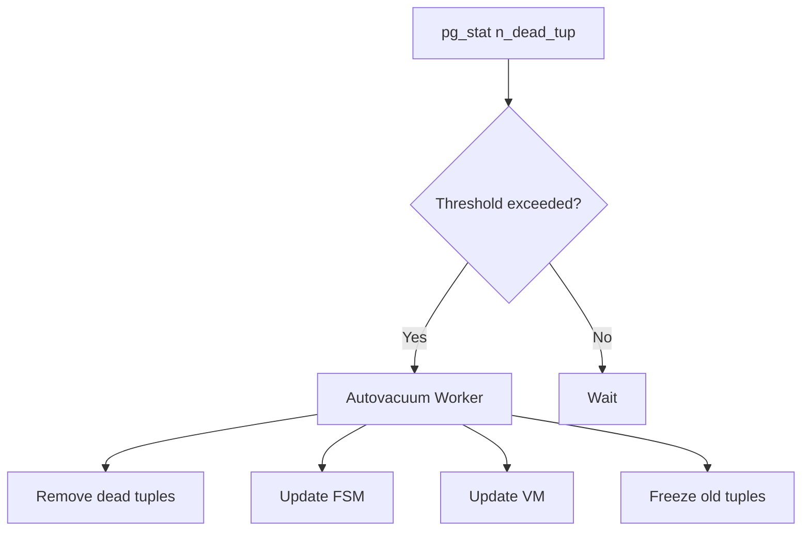
```mermaid
flowchart TD
    ST[pg_stat n_dead_tup] --> TC{Threshold exceeded?}
    TC -->|Yes| AW[Autovacuum Worker]
    TC -->|No| W[Wait]
    AW --> RD[Remove dead tuples]
    AW --> UF[Update FSM]
    AW --> UV[Update VM]
    AW --> FZ[Freeze old tuples]
```

### 📶 Gradual Depth

**Level 1 - What it is:**
VACUUM is a maintenance operation that cleans up dead rows left behind by updates and deletes. PostgreSQL runs it automatically in the background via autovacuum.

**Level 2 - How to use it:**
Monitor `pg_stat_user_tables` for `n_dead_tup` and `last_autovacuum`. If autovacuum is not keeping up, tune per-table settings: `ALTER TABLE SET (autovacuum_vacuum_scale_factor = 0.01)` for high-churn tables. Run manual `VACUUM VERBOSE tablename` to see detailed output.

**Level 3 - How it works:**
VACUUM scans each heap page, checking each tuple's visibility. Dead tuples (xmax committed, invisible to all snapshots) have their line pointers marked "dead." A second pass marks them "unused," compacts live tuples within each page, and updates the FSM with reclaimed space. The VM is updated for pages where all remaining tuples are visible to all transactions. Tuples older than `vacuum_freeze_min_age` are frozen by setting their xmin to `FrozenTransactionId`.

**Level 4 - Production mastery:**
The default autovacuum settings are designed for small databases. For tables with millions of rows, `autovacuum_vacuum_scale_factor = 0.2` means autovacuum waits until 20% of the table is dead - potentially millions of dead tuples. Set scale factor to 0.01 or use a fixed threshold for large tables. Monitor `age(relfrozenxid)` to detect tables approaching wraparound. Watch `autovacuum_max_workers` (default 3) - if all workers are busy on large tables, smaller tables may never get vacuumed. Use `pg_stat_progress_vacuum` to monitor active VACUUM operations.

### ⚙️ How It Works

**Phase 1 - Dead tuple collection:** VACUUM scans heap pages sequentially. For each tuple, it checks visibility against the oldest active snapshot (`OldestXmin`). Tuples with `xmax` committed and visible to no snapshot are marked dead. Dead tuple TIDs are collected in memory (limited by `maintenance_work_mem`).

**Phase 2 - Index cleanup:** For each index on the table, VACUUM scans the entire index, removing entries pointing to dead tuples. This is the most expensive phase for tables with many indexes.

**Phase 3 - Heap cleanup:** VACUUM revisits heap pages containing dead tuples, marks their line pointers as unused, and compacts remaining tuples to consolidate free space.

**Phase 4 - FSM and VM update:** The free space map is updated with reclaimed space per page. Pages where all tuples are now visible to all transactions are marked in the visibility map.

**Phase 5 - Statistics update:** `pg_stat_user_tables` is updated with new `n_dead_tup`, `n_live_tup`, and `last_autovacuum` values.

```
  VACUUM Processing a Page
  Before:
  [LP1->live] [LP2->dead] [LP3->live]
  [Tuple3] [Tuple2(dead)] [Tuple1]

  After:
  [LP1->live] [LP2->unused] [LP3->live]
  [Tuple3]  [free space]   [Tuple1]
  FSM updated: page has N bytes free
```

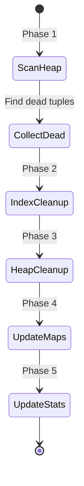
```mermaid
stateDiagram-v2
    [*] --> ScanHeap: Phase 1
    ScanHeap --> CollectDead: Find dead tuples
    CollectDead --> IndexCleanup: Phase 2
    IndexCleanup --> HeapCleanup: Phase 3
    HeapCleanup --> UpdateMaps: Phase 4
    UpdateMaps --> UpdateStats: Phase 5
    UpdateStats --> [*]
```

**BAD:**

```sql
VACUUM FULL large_table;
-- AccessExclusiveLock for hours
-- blocks ALL queries
```

**GOOD:**

```sql
ALTER TABLE large_table SET (
  autovacuum_vacuum_scale_factor
    = 0.01,
  autovacuum_vacuum_cost_delay = 2
);
```

### 🚨 Failure Modes

**Failure 1 - Autovacuum cannot keep up:**
**Symptom:** `n_dead_tup` grows continuously. Table bloat increases daily. Autovacuum runs complete but dead tuples reaccumulate faster than they are cleaned.
**Root cause:** High-churn table with default scale factor (0.2) means autovacuum triggers only after 20% of the table is dead. By the time it finishes, another 20% has accumulated.
**Diagnostic:**

```sql
SELECT schemaname, relname,
       n_dead_tup, n_live_tup,
       last_autovacuum,
       autovacuum_count
FROM pg_stat_user_tables
WHERE n_dead_tup > 10000
ORDER BY n_dead_tup DESC;
```

**Fix:** Per-table tuning: `ALTER TABLE hot_table SET (autovacuum_vacuum_scale_factor = 0.01, autovacuum_vacuum_cost_delay = 2);`. Increase `autovacuum_max_workers` if multiple large tables contend.

**Failure 2 - Transaction ID wraparound emergency:**
**Symptom:** PostgreSQL logs: "WARNING: database X must be vacuumed within N transactions to prevent wraparound." Eventually: "ERROR: database is not accepting commands to avoid wraparound."
**Root cause:** A table's `relfrozenxid` was never advanced because autovacuum could not complete (blocked by long-running transactions, or `autovacuum_freeze_max_age` never reached).
**Diagnostic:**

```sql
SELECT c.oid::regclass AS table_name,
       age(c.relfrozenxid) AS xid_age,
       pg_size_pretty(
         pg_total_relation_size(c.oid)
       ) AS total_size
FROM pg_class c
WHERE c.relkind = 'r'
ORDER BY age(c.relfrozenxid) DESC
LIMIT 10;
```

**Fix:** Kill long-running transactions blocking VACUUM. Run `VACUUM FREEZE` on the affected table. Set `vacuum_freeze_min_age` appropriately. Alert when `age(relfrozenxid)` exceeds 500 million.

### 🔬 Production Reality

A common production pattern: a 500 GB table with 12 indexes receives 50,000 updates per second. Autovacuum triggers and begins scanning. Phase 2 (index cleanup) must scan all 12 indexes, each potentially tens of gigabytes. This single VACUUM operation runs for hours. During that time, dead tuples continue accumulating. The VACUUM finishes, but the table is already overdue for the next run. The table bloats steadily. The fix requires multiple interventions: reduce the number of indexes (drop unused ones), set aggressive per-table vacuum settings, increase `maintenance_work_mem` to hold more dead tuple TIDs per pass (reducing the number of index scan passes), and consider partitioning the table so each partition is vacuumed independently.

### ⚖️ Trade-offs & Alternatives

| Aspect            | VACUUM (standard)                   | VACUUM FULL                         | pg_repack                    | InnoDB purge thread  |
| ----------------- | ----------------------------------- | ----------------------------------- | ---------------------------- | -------------------- |
| Lock level        | ShareUpdateExclusive (non-blocking) | AccessExclusive (blocks all)        | Non-blocking (trigger-based) | No user-facing lock  |
| Space reclamation | Marks space reusable within table   | Rewrites table, returns space to OS | Rewrites table online        | Automatic undo reuse |
| Index handling    | Scans all indexes per pass          | Rebuilds all indexes                | Rebuilds indexes online      | Not applicable       |
| Bloat reduction   | Prevents growth, does not shrink    | Full compaction                     | Full compaction              | Continuous           |
| Production safety | Safe for continuous use             | Requires maintenance window         | Requires monitoring          | Automatic            |

### ⚡ Decision Snap

**USE WHEN:**

- Always - autovacuum should run continuously on every PostgreSQL deployment
- Per-table tuning is needed for tables with > 1M rows or > 10,000 updates/second
- Monitoring `n_dead_tup` and `relfrozenxid` age is part of operational baseline

**AVOID WHEN:**

- Do not run VACUUM FULL during production hours (it holds AccessExclusive lock)
- Do not disable autovacuum globally (it will eventually cause wraparound shutdown)

**PREFER pg_repack WHEN:**

- Table bloat exceeds 50% and space must be reclaimed without downtime
- VACUUM FULL is not feasible due to table size or availability requirements

### ⚠️ Top Traps

| #   | Misconception                                    | Reality                                                                                                                                            |
| --- | ------------------------------------------------ | -------------------------------------------------------------------------------------------------------------------------------------------------- |
| 1   | VACUUM reclaims disk space back to the OS        | Standard VACUUM marks space reusable within the table file; only VACUUM FULL or pg_repack actually shrinks the file                                |
| 2   | Autovacuum handles everything automatically      | Default settings are designed for small tables; large tables need per-table scale_factor and cost_delay tuning                                     |
| 3   | Running VACUUM more often is always better       | Overly aggressive VACUUM wastes I/O; the key is matching frequency to dead tuple accumulation rate                                                 |
| 4   | VACUUM only matters for disk space               | VACUUM also updates the visibility map (enabling index-only scans), freezes tuples (preventing wraparound), and updates FSM (enabling space reuse) |
| 5   | Long-running SELECT queries do not affect VACUUM | Any transaction holding a snapshot prevents VACUUM from cleaning tuples created after that snapshot, regardless of the query type                  |

### 🪜 Learning Ladder

**Prerequisites:**

- SQL-085 MVCC Internals - How Concurrent Reads Work - understand why dead tuples accumulate
- SQL-088 Page Structure and Tuple Layout - know the physical structures VACUUM modifies

**THIS:** SQL-089 VACUUM and Bloat Management (PostgreSQL)

**Next steps:**

- SQL-097 Plan Regression and pg_stat_statements - stale statistics from inadequate VACUUM cause plan changes
- SQL-095 Statistics and Cardinality Estimation - VACUUM updates statistics that the planner depends on
- SQL-104 Zero-Downtime Schema Migrations - schema changes interact with VACUUM and bloat

**The Surprising Truth:**
The most dangerous PostgreSQL configuration is not a missing index or wrong query - it is `autovacuum = off`. A surprising number of production databases have autovacuum disabled "for performance," only to hit transaction ID wraparound weeks or months later, resulting in a complete database shutdown that can only be resolved by emergency VACUUM operations that may take hours on large tables.

**Further Reading:**

- PostgreSQL Documentation: Routine Vacuuming (postgresql.org/docs/current/routine-vacuuming.html)
- PostgreSQL Wiki: Autovacuum Tuning Basics (wiki.postgresql.org/wiki/Tuning_Your_PostgreSQL_Server)
- PostgreSQL Documentation: VACUUM command reference (postgresql.org/docs/current/sql-vacuum.html)

**Revision Card:**

1. VACUUM removes dead tuples, updates FSM/VM, and freezes old tuples to prevent transaction ID wraparound
2. Default autovacuum settings are insufficient for large tables - tune scale_factor per table
3. Standard VACUUM does not shrink files on disk; only VACUUM FULL or pg_repack reclaims OS-level space

---

---

# SQL-090 Row-Level vs Table-Level Locking

**TL;DR** - PostgreSQL uses row-level locks for DML concurrency and table-level locks for DDL protection, with eight lock modes forming a compatibility matrix that determines which operations can run simultaneously.

### 🔥 Problem Statement

Concurrent transactions modifying the same data need coordination to prevent lost updates and corruption. Coarse-grained table locks are simple but destroy concurrency: a single UPDATE locks out all other writers and potentially all readers. Fine-grained row locks maximize concurrency but add overhead per locked row. At production scale, the wrong locking granularity causes either deadlocks and contention (too fine) or throughput collapse (too coarse). Understanding PostgreSQL's multi-level lock system - and its compatibility matrix - is essential for diagnosing lock-related performance problems.

### 📜 Historical Context

Early databases used page-level or table-level locking exclusively. IBM DB2 pioneered row-level locking in the 1980s. PostgreSQL inherited its lock system from the Berkeley Postgres project and refined it through multiple versions. PostgreSQL uses MVCC to avoid read locks entirely - readers never block writers. Write locks operate at the row level (stored in shared memory as a tuple-level lock on the xmax field) and at the table level through eight explicit lock modes ranging from AccessShareLock (SELECT) to AccessExclusiveLock (DDL). This layered approach provides fine-grained concurrency for DML while protecting structural changes.

### 🔩 First Principles

**CORE INVARIANTS:**

1. Two transactions cannot hold conflicting locks simultaneously - the second waits or aborts
2. MVCC eliminates read-write conflicts: only write-write conflicts require locks at the row level
3. Table-level locks protect table structure (schema); row-level locks protect row content

**DERIVED DESIGN:**
PostgreSQL acquires table-level locks implicitly for every DML/DDL statement. SELECT acquires AccessShareLock (compatible with everything except AccessExclusiveLock). UPDATE acquires RowExclusiveLock at the table level and an exclusive lock on the specific rows being modified. DDL operations like ALTER TABLE acquire AccessExclusiveLock, blocking all concurrent access. The lock manager tracks all locks in shared memory (`pg_locks`).

**THE TRADE-OFF:**
**Gain:** Row-level locks maximize write concurrency; multiple transactions update different rows simultaneously without contention.
**Cost:** Lock manager memory overhead scales with the number of locked rows; long-running transactions holding row locks block other writers on those specific rows.

### 🧠 Mental Model

> Think of a shared document in a team workspace. Table-level locks are like permissions on the document itself (who can open, rename, or delete it). Row-level locks are like per-paragraph edit locks - multiple writers can edit different paragraphs simultaneously, but two writers on the same paragraph must take turns.

- "Document permission" -> table-level lock mode
- "Paragraph edit lock" -> row-level lock (xmax-based)
- "Renaming the document" -> AccessExclusiveLock (blocks everything)

**Where this analogy breaks down:** PostgreSQL readers never need any paragraph-level lock because MVCC provides snapshot isolation. In the document analogy, readers would see a frozen copy from the moment they opened the document.

### 🧩 Components

- **Table-level lock modes** - eight modes: AccessShare, RowShare, RowExclusive, ShareUpdateExclusive, Share, ShareRowExclusive, Exclusive, AccessExclusive
- **Row-level locks** - four modes: FOR KEY SHARE, FOR SHARE, FOR NO KEY UPDATE, FOR UPDATE
- **Lock manager** - shared memory structure tracking all active locks and wait queues
- **pg_locks** - system view exposing current lock state for diagnostics
- **Deadlock detector** - background process checking for circular wait dependencies (runs after `deadlock_timeout`)

```
  Table Lock Compatibility (simplified)
  Operation        Lock Mode         Conflicts
  -----------------------------------------------
  SELECT           AccessShare       DDL only
  UPDATE           RowExclusive      DDL, SHARE
  CREATE INDEX     Share             DML writes
  ALTER TABLE      AccessExclusive   Everything
  VACUUM           ShareUpdateExcl.  DDL
```

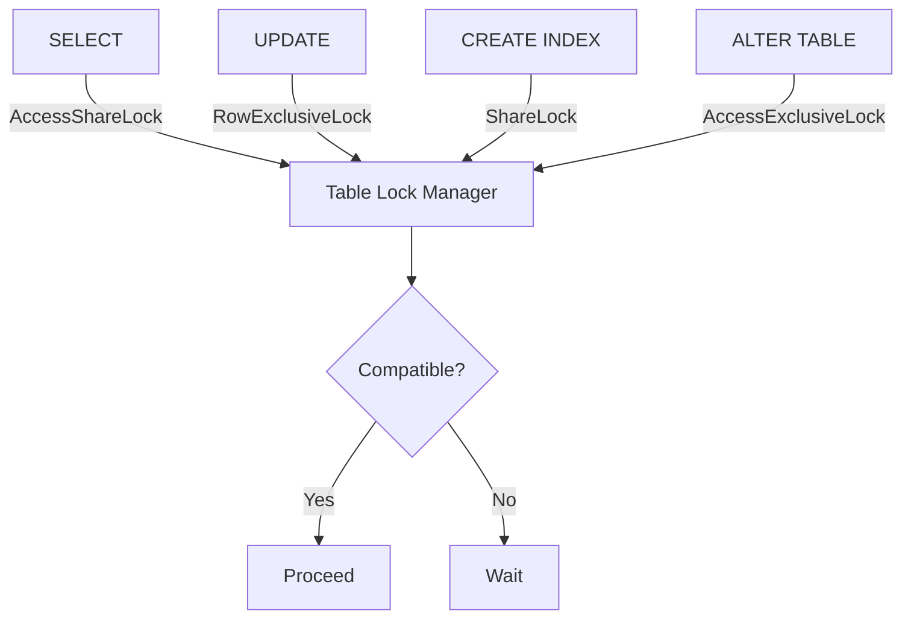
```mermaid
flowchart TD
    S[SELECT] -->|AccessShareLock| TL[Table Lock Manager]
    U[UPDATE] -->|RowExclusiveLock| TL
    CI[CREATE INDEX] -->|ShareLock| TL
    AT[ALTER TABLE] -->|AccessExclusiveLock| TL
    TL --> CM{Compatible?}
    CM -->|Yes| Proceed
    CM -->|No| Wait
```

### 📶 Gradual Depth

**Level 1 - What it is:**
Locks prevent conflicting operations from running at the same time. PostgreSQL locks at two levels: the whole table (to protect its structure) and individual rows (to protect their data).

**Level 2 - How to use it:**
Use `SELECT ... FOR UPDATE` to explicitly lock rows you intend to modify. Use `SELECT ... FOR NO KEY UPDATE` when you do not modify the primary key (allows concurrent foreign key checks). Check active locks with `SELECT * FROM pg_locks WHERE NOT granted;` to find blocked sessions.

**Level 3 - How it works:**
Table-level locks are acquired implicitly by every SQL statement and stored in the lock manager's shared memory hash table. Row-level locks are implemented by writing the locking transaction's XID into the tuple's xmax field with special infomask bits - no separate lock table entry per row is needed, making row locks extremely lightweight. The `MultiXact` mechanism handles cases where multiple transactions hold compatible row locks (e.g., multiple FOR SHARE locks on the same row).

**Level 4 - Production mastery:**
The most common production lock problem is DDL blocked by long-running queries. An `ALTER TABLE` needs AccessExclusiveLock, which conflicts with the AccessShareLock held by every SELECT. If a SELECT runs for 30 minutes, the ALTER waits - and every subsequent SELECT also waits behind the ALTER (lock queue is FIFO). Mitigate with `lock_timeout` on DDL sessions and short maintenance windows. Monitor `pg_stat_activity` joined with `pg_locks` to identify the blocking chain.

### ⚙️ How It Works

**Phase 1 - Lock acquisition:** The executor requests a table-level lock from the lock manager. If compatible with all existing locks on that table, it is granted immediately. If not, the process enters the wait queue.

**Phase 2 - Row-level lock (DML):** For UPDATE/DELETE/SELECT FOR UPDATE, after acquiring the table-level RowExclusiveLock, the executor locks individual rows by writing its transaction ID into the xmax field. If another transaction already holds a conflicting row lock, the executor waits for that transaction to commit or abort.

**Phase 3 - Lock holding:** Locks are held until the transaction ends (COMMIT or ROLLBACK). There is no manual unlock for regular locks (unlike advisory locks).

**Phase 4 - Lock release:** At COMMIT/ROLLBACK, all table-level and row-level locks are released. Waiting transactions are woken up in FIFO order.

```
  Lock Queue Example
  Time -> ALTER TABLE (needs AccessExclusive)
          |
          v
  Queue: [SELECT (AccessShare, running)]
         [ALTER TABLE (waiting)]
         [SELECT #2 (waiting behind ALTER)]
         [SELECT #3 (waiting behind ALTER)]
```

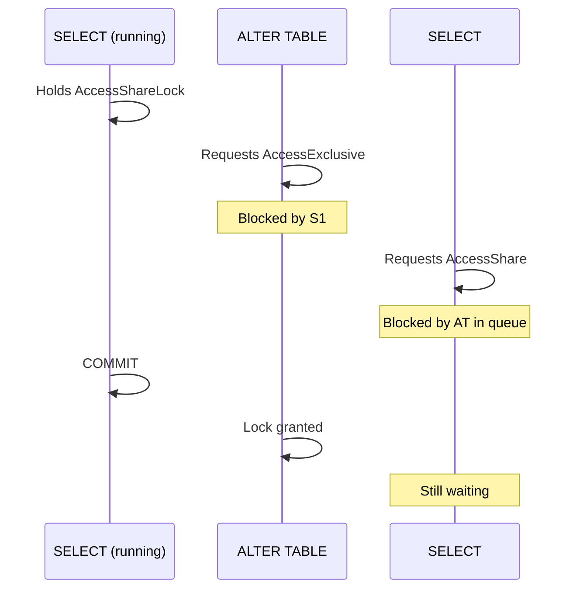
```mermaid
sequenceDiagram
    participant S1 as SELECT (running)
    participant AT as ALTER TABLE
    participant S2 as SELECT #2
    S1->>S1: Holds AccessShareLock
    AT->>AT: Requests AccessExclusive
    Note over AT: Blocked by S1
    S2->>S2: Requests AccessShare
    Note over S2: Blocked by AT in queue
    S1->>S1: COMMIT
    AT->>AT: Lock granted
    Note over S2: Still waiting
```

**BAD:**

```sql
BEGIN;
SELECT * FROM orders
WHERE id = 1 FOR UPDATE;
-- app does HTTP call here
-- Lock held 30 seconds
COMMIT;
```

**GOOD:**

```sql
BEGIN;
UPDATE orders SET status = 'shipped'
WHERE id = 1;
COMMIT;  -- lock held briefly
-- HTTP call OUTSIDE transaction
```

### 🚨 Failure Modes

**Failure 1 - DDL lock queue starvation:**
**Symptom:** A simple ALTER TABLE hangs for minutes. All new queries on the same table also hang. Application timeout errors spike.
**Root cause:** ALTER TABLE requests AccessExclusiveLock but a long-running SELECT holds AccessShareLock. New queries queue behind the ALTER, creating a cascading blockage.
**Diagnostic:**

```sql
SELECT blocked.pid AS blocked_pid,
       blocked.query AS blocked_query,
       blocking.pid AS blocking_pid,
       blocking.query AS blocking_query
FROM pg_stat_activity blocked
JOIN pg_locks bl ON bl.pid = blocked.pid
JOIN pg_locks bk ON bk.relation = bl.relation
  AND bk.granted AND NOT bl.granted
JOIN pg_stat_activity blocking
  ON blocking.pid = bk.pid
WHERE NOT bl.granted;
```

**Fix:** Set `lock_timeout = '3s'` on the DDL session so it fails fast instead of blocking the queue. Retry the DDL when no long queries are running. Alternatively, terminate the blocking query if acceptable.

**Failure 2 - Row lock contention on hot rows:**
**Symptom:** Multiple transactions updating the same row experience high wait times. `pg_stat_activity` shows many sessions in "Lock" wait event.
**Root cause:** A "hot row" pattern where many concurrent transactions update the same counter or status field. Each transaction waits for the previous one to commit.
**Diagnostic:**

```sql
SELECT pid, wait_event_type,
       wait_event, query
FROM pg_stat_activity
WHERE wait_event_type = 'Lock';
```

**Fix:** Redesign the schema to distribute contention: use partitioned counters, batch updates, or advisory locks with application-level coordination instead of row-level contention.

### 🔬 Production Reality

A typical production incident: an engineer runs `ALTER TABLE orders ADD COLUMN tracking_id TEXT;` during business hours. A reporting query has been running for 15 minutes with AccessShareLock. The ALTER blocks, and within seconds, hundreds of new queries queue behind the ALTER. The application's connection pool exhausts, and the service goes down. The fix is cultural and technical: all DDL must use `SET lock_timeout = '3s';` and be wrapped in retry logic. The deeper fix is to run DDL only during low-traffic windows or use tools like `pg_repack` or Postgres 11+ `ALTER TABLE ... ADD COLUMN` with non-volatile defaults (which does not require a table rewrite and acquires the lock briefly).

### ⚖️ Trade-offs & Alternatives

| Aspect                    | PostgreSQL (MVCC + row locks)   | MySQL/InnoDB (row locks + gap locks) | Oracle (row locks + undo)   |
| ------------------------- | ------------------------------- | ------------------------------------ | --------------------------- |
| Reader-writer blocking    | Never (MVCC snapshots)          | Never (MVCC)                         | Never (undo reconstruction) |
| Writer-writer granularity | Row-level                       | Row-level + gap locks                | Row-level                   |
| DDL locking               | AccessExclusiveLock             | Metadata lock (MDL)                  | Online DDL options          |
| Lock visibility           | pg_locks view                   | information_schema.innodb_locks      | v$lock view                 |
| Gap locks                 | No (snapshot isolation instead) | Yes (to prevent phantoms)            | No                          |

### ⚡ Decision Snap

**USE WHEN:**

- Row-level locking is the default and correct choice for OLTP workloads
- Understanding lock modes is essential when diagnosing blocked queries
- Explicit `SELECT ... FOR UPDATE` is needed when read-modify-write cycles must be atomic

**AVOID WHEN:**

- Do not use `LOCK TABLE ... IN ACCESS EXCLUSIVE MODE` unless absolutely necessary
- Do not hold transactions open during user think time (extends lock duration)

**PREFER advisory locks WHEN:**

- Coordination is at the application level (e.g., "only one worker processes this job")
- Row-level locks would require creating artificial "lock rows" in the schema

### ⚠️ Top Traps

| #   | Misconception                                 | Reality                                                                                                                 |
| --- | --------------------------------------------- | ----------------------------------------------------------------------------------------------------------------------- |
| 1   | SELECT queries never cause lock problems      | SELECT holds AccessShareLock, which blocks DDL and creates queue pile-ups behind waiting DDL                            |
| 2   | Row locks are stored in a lock table          | Row locks are stored in the tuple's xmax field, making them nearly free in terms of lock manager memory                 |
| 3   | PostgreSQL escalates row locks to table locks | PostgreSQL never escalates - row locks remain row locks regardless of count. This differs from SQL Server               |
| 4   | FOR UPDATE and FOR NO KEY UPDATE are the same | FOR NO KEY UPDATE allows concurrent foreign key checks, significantly reducing contention in parent-child relationships |
| 5   | Locks are released when a statement finishes  | Locks are held until the transaction ends (COMMIT/ROLLBACK), not until the statement completes                          |

### 🪜 Learning Ladder

**Prerequisites:**

- SQL-067 Transaction Isolation Levels - understand how isolation interacts with locking
- SQL-069 Optimistic vs Pessimistic Locking - contrast application-level vs database-level locking strategies
- SQL-085 MVCC Internals - How Concurrent Reads Work - know why readers do not need locks

**THIS:** SQL-090 Row-Level vs Table-Level Locking

**Next steps:**

- SQL-091 Lock Escalation and Contention - deeper patterns of lock contention and resolution
- SQL-092 Deadlock Detection and Resolution - what happens when lock waits form cycles
- SQL-093 Advisory Locks - Application-Level Coordination - application-level locking beyond row/table

**The Surprising Truth:**
The most devastating lock problem in PostgreSQL is not row contention between writers - it is a queued DDL statement blocking all readers. A single `ALTER TABLE` waiting for one long query can bring down an entire application, because every new query queues behind the ALTER rather than proceeding alongside the existing SELECT.

**Further Reading:**

- PostgreSQL Documentation: Explicit Locking (postgresql.org/docs/current/explicit-locking.html)
- PostgreSQL Documentation: Lock Monitoring (postgresql.org/docs/current/monitoring-locks.html)
- PostgreSQL Documentation: pg_locks view (postgresql.org/docs/current/view-pg-locks.html)

**Revision Card:**

1. PostgreSQL has 8 table-level lock modes and 4 row-level lock modes; MVCC means readers never block writers
2. Row locks are stored in the tuple xmax field, not in a separate lock table - making them extremely lightweight
3. The #1 production lock problem is DDL queue pile-ups: use lock_timeout on all DDL sessions

---

---

# SQL-091 Lock Escalation and Contention

**TL;DR** - PostgreSQL never escalates row locks to table locks, but lock contention still degrades throughput through hot-row serialization, queue pile-ups, and connection pool exhaustion.

### 🔥 Problem Statement

In databases that perform lock escalation (SQL Server, DB2), the engine converts thousands of row-level locks to a single table lock to reduce memory overhead. This simplifies lock management but destroys concurrency for the entire table. PostgreSQL avoids this problem entirely - it never escalates. However, lock contention still manifests differently: hot rows where many transactions compete for the same tuple, long-held locks that create wait chains, and DDL operations that queue behind and block subsequent requests. At production scale, contention patterns cause latency spikes, connection pool saturation, and cascading failures that look like application bugs but originate in the database.

### 📜 Historical Context

Lock escalation was a practical necessity in early database systems where lock manager memory was limited. SQL Server continues to use escalation (row to page to table) when a query acquires more than approximately 5,000 row locks on a single table. DB2 and Informix have similar mechanisms. PostgreSQL's design stores row locks in the tuple header (xmax field) rather than a central lock table, so there is no memory pressure driving escalation. This was a deliberate architectural choice inherited from the Postgres project at Berkeley and has remained unchanged through all PostgreSQL versions.

### 🔩 First Principles

**CORE INVARIANTS:**

1. PostgreSQL never converts row locks to table locks - row lock count has no upper bound
2. Contention occurs when multiple transactions need conflicting locks on overlapping resources
3. Lock wait time compounds: each queued transaction adds its processing time to the total wait of all subsequent waiters

**DERIVED DESIGN:**
Since row locks live in the tuple xmax field, the lock manager does not track individual row locks in shared memory. Only table-level locks and explicit advisory locks consume lock table entries. This means millions of rows can be locked simultaneously without memory pressure. However, logical contention (multiple transactions wanting the same row) still serializes those transactions regardless of the lock implementation.

**THE TRADE-OFF:**
**Gain:** No escalation means predictable concurrency - locking 1 row or 1 million rows has the same table-level impact (RowExclusiveLock).
**Cost:** Without escalation, truly pathological patterns (millions of row locks) never get a "safety valve" to reduce overhead - though in PostgreSQL this is rarely a problem due to the xmax-based design.

### 🧠 Mental Model

> Think of a supermarket with self-checkout lanes. Each item scanned (row lock) does not require asking a manager (lock escalation). In SQL Server, scanning 5,000 items causes the manager to close the lane for "bulk processing" (table lock). PostgreSQL never does this - you can scan unlimited items, but if two shoppers reach for the same item on the shelf (hot row), one must wait for the other to put it in their cart.

- "Self-checkout scanning" -> row-level lock acquisition (xmax-based)
- "Manager closing the lane" -> lock escalation (PostgreSQL: never happens)
- "Two shoppers, same item" -> hot-row contention

**Where this analogy breaks down:** In PostgreSQL, the "shelf item" (tuple) does not disappear when one shopper takes it - MVCC creates a new version, so readers always see a consistent copy. Only writers compete.

### 🧩 Components

- **xmax-based row locks** - stored in the tuple header; no central registry per row
- **MultiXact** - mechanism for multiple transactions holding compatible row locks (e.g., FOR SHARE) on the same tuple
- **Lock wait queue** - FIFO queue per lockable resource; waiters are woken in order
- **pg_stat_activity.wait_event** - shows "Lock" when a session is waiting for a conflicting lock
- **deadlock_timeout** - how long to wait before running the deadlock detector (default 1 second)

```
  Contention vs Escalation
  SQL Server:    PG:
  Row 1  [lock]  Row 1  [xmax lock]
  Row 2  [lock]  Row 2  [xmax lock]
  ...            ...
  Row 5000       Row 5000 [xmax lock]
  -> ESCALATE    -> still row locks
  -> TABLE LOCK  -> no escalation
  -> all blocked -> only same-row
                    writers blocked
```

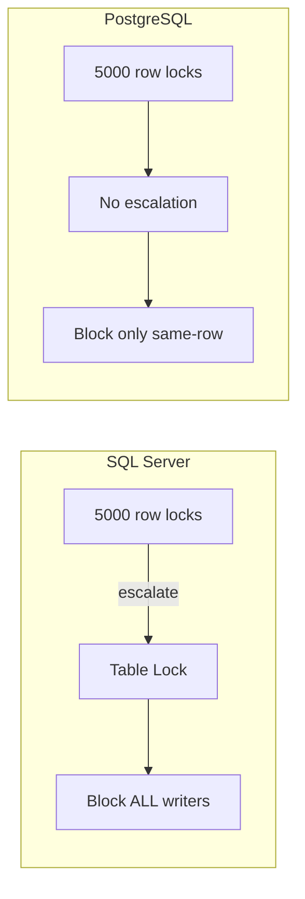
```mermaid
flowchart LR
    subgraph SQLServer[SQL Server]
        R1[5000 row locks] -->|escalate| TL[Table Lock]
        TL --> BA[Block ALL writers]
    end
    subgraph PostgreSQL
        R2[5000 row locks] --> NE[No escalation]
        NE --> BO[Block only same-row]
    end
```

### 📶 Gradual Depth

**Level 1 - What it is:**
Lock escalation is when a database automatically converts many fine-grained locks into one coarse lock. PostgreSQL does not do this - row locks stay as row locks no matter how many you acquire.

**Level 2 - How to use it:**
In PostgreSQL, you do not need to worry about escalation. Focus instead on minimizing lock duration: keep transactions short, avoid user interaction inside transactions, and use `NOWAIT` or `SKIP LOCKED` for queue-processing patterns.

**Level 3 - How it works:**
When a transaction executes `UPDATE t SET x = 1 WHERE id = 42`, it acquires RowExclusiveLock on the table (compatible with other RowExclusiveLock holders) and writes its XID into tuple 42's xmax. If another transaction tries to update tuple 42 concurrently, it reads the xmax, sees it belongs to an active transaction, and enters a wait state on that transaction's virtual XID lock. When the first transaction commits, the waiter wakes up, re-evaluates the tuple, and proceeds.

**Level 4 - Production mastery:**
Contention patterns in production often involve "hot rows" - inventory counters, sequence generators, or status fields updated by many transactions. Even though PostgreSQL does not escalate, serializing 1,000 transactions per second through a single row means each waits for all preceding transactions. Batch counter updates, use advisory locks for application-level coordination, or redesign with partitioned counters to distribute contention across multiple rows.

### ⚙️ How It Works

**Phase 1 - Lock request:** Transaction B attempts to update a row currently locked by Transaction A. The executor reads the tuple's xmax and finds A's XID.

**Phase 2 - Wait entry:** B enters a wait state on A's virtual XID lock. The wait is tracked in `pg_stat_activity` as `wait_event_type = 'Lock'`.

**Phase 3 - Wake-up:** When A commits or aborts, B is woken. B re-reads the tuple. If A committed, B sees the new version and applies its update to it. If A aborted, B applies its update to the original version.

**Phase 4 - Chain effect:** If transaction C also wants the same row, it waits behind B. Lock waits are serialized: B processes, then C processes. Total latency for C = A's remaining time + B's processing time + C's processing time.

```
  Hot Row Serialization
  Time -->
  A: [----UPDATE row 42----][COMMIT]
  B:      [wait.............][UPDATE][COMMIT]
  C:      [wait.......................][wait][UPD]
```

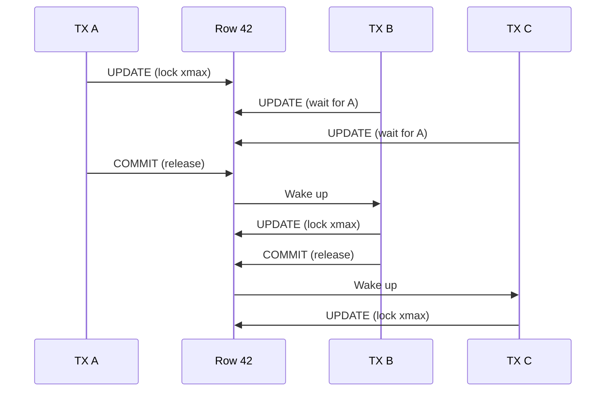
```mermaid
sequenceDiagram
    participant A as TX A
    participant Row as Row 42
    participant B as TX B
    participant C as TX C
    A->>Row: UPDATE (lock xmax)
    B->>Row: UPDATE (wait for A)
    C->>Row: UPDATE (wait for A)
    A->>Row: COMMIT (release)
    Row->>B: Wake up
    B->>Row: UPDATE (lock xmax)
    B->>Row: COMMIT (release)
    Row->>C: Wake up
    C->>Row: UPDATE (lock xmax)
```

**BAD:**

```sql
UPDATE events SET archived = true
WHERE created_at < '2023-01-01';
-- Locks millions of rows at once
```

**GOOD:**

```sql
UPDATE events SET archived = true
WHERE id IN (
  SELECT id FROM events
  WHERE created_at < '2023-01-01'
    AND archived = false
  LIMIT 5000
);  -- repeat; commit each batch
```

### 🚨 Failure Modes

**Failure 1 - Hot row throughput collapse:**
**Symptom:** Transaction latency on a specific table spikes despite low overall database load. `pg_stat_activity` shows many sessions waiting on Lock events with similar queries.
**Root cause:** Many transactions update the same row (e.g., a global counter or a status field), serializing all updates through that single row.
**Diagnostic:**

```sql
SELECT wait_event_type, wait_event,
       count(*) AS waiters,
       left(query, 60) AS query_prefix
FROM pg_stat_activity
WHERE wait_event_type = 'Lock'
GROUP BY 1, 2, 3
ORDER BY waiters DESC;
```

**Fix:** Replace single-row counters with partitioned counters (N rows, each updated by hash(session_id) % N, summed at read time). Use `SELECT ... FOR UPDATE SKIP LOCKED` for queue patterns.

**Failure 2 - Connection pool exhaustion from lock waits:**
**Symptom:** Application reports "no available connections." Database shows many sessions in Lock wait state, all holding a connection pool slot.
**Root cause:** Lock waits extend transaction duration, which extends connection hold time. With a fixed-size connection pool, waiting sessions consume all available slots.
**Diagnostic:**

```sql
SELECT count(*) AS total_conns,
       count(*) FILTER (
         WHERE wait_event_type = 'Lock'
       ) AS lock_waiting
FROM pg_stat_activity
WHERE backend_type = 'client backend';
```

**Fix:** Set `statement_timeout` and `lock_timeout` to prevent indefinite waits. Use `NOWAIT` in application code where fast failure is acceptable. Increase pool size only as a temporary measure - the root cause is the contention pattern.

### 🔬 Production Reality

A payment processing system updates an `account_balance` row for each transaction. During peak load, 500 payments per second target the same account. Each UPDATE acquires a row lock, waits for the previous transaction to commit, then proceeds. With 1 ms per transaction, the theoretical serialized throughput is 1,000 TPS for a single row - but with commit latency, WAL fsync, and network round-trips, actual throughput drops to 200-300 TPS. The queue grows, connection pool exhausts, and the payment service cascades failures. The redesign: batch debits into a `pending_transactions` table (high concurrency, no contention) and apply them to the balance in a single periodic aggregation query. This eliminates hot-row contention entirely.

### ⚖️ Trade-offs & Alternatives

| Aspect                   | PostgreSQL (no escalation) | SQL Server (escalation) | Application-level batching  |
| ------------------------ | -------------------------- | ----------------------- | --------------------------- |
| Max concurrent row locks | Unlimited (xmax-based)     | ~5000 before escalation | N/A                         |
| Hot row contention       | Serialized waits           | Serialized waits (same) | Eliminated by design        |
| Memory per row lock      | 0 (stored in tuple)        | Lock manager entry      | 0 (no DB locks)             |
| Table-wide blocking risk | None from row locks        | Yes (after escalation)  | None                        |
| Design complexity        | Low                        | Low (automatic)         | High (application redesign) |

### ⚡ Decision Snap

**USE WHEN:**

- Understanding contention patterns is needed to diagnose latency spikes
- Redesigning hot-row patterns to distribute contention across multiple rows
- Comparing PostgreSQL lock behavior with SQL Server or Oracle during migration

**AVOID WHEN:**

- Do not add artificial escalation mechanisms in application code - PostgreSQL handles it correctly
- Do not assume low lock manager memory usage means no contention

**PREFER SKIP LOCKED WHEN:**

- Implementing job queues where workers should not wait but instead skip locked rows
- Processing patterns where any available row is acceptable (not a specific row)

### ⚠️ Top Traps

| #   | Misconception                                 | Reality                                                                                                        |
| --- | --------------------------------------------- | -------------------------------------------------------------------------------------------------------------- |
| 1   | PostgreSQL escalates locks like SQL Server    | PostgreSQL never escalates - row locks stay as row locks regardless of count                                   |
| 2   | No escalation means no contention problems    | Contention occurs at the row level regardless of escalation policy; hot rows still serialize transactions      |
| 3   | Bulk UPDATE of 1M rows locks the whole table  | It acquires 1M row locks (stored in xmax) plus one RowExclusiveLock on the table; other rows remain accessible |
| 4   | Lock contention only affects write throughput | Lock waits hold connections, consume connection pool slots, and can cascade to connection exhaustion           |
| 5   | SKIP LOCKED is a hack                         | SKIP LOCKED is a supported SQL standard feature specifically designed for queue-processing patterns            |

### 🪜 Learning Ladder

**Prerequisites:**

- SQL-090 Row-Level vs Table-Level Locking - understand the lock modes and how row locks work
- SQL-069 Optimistic vs Pessimistic Locking - contrast lock-based vs version-based concurrency

**THIS:** SQL-091 Lock Escalation and Contention

**Next steps:**

- SQL-092 Deadlock Detection and Resolution - what happens when contention forms circular dependencies
- SQL-093 Advisory Locks - Application-Level Coordination - lightweight alternative to row locks for coordination
- SQL-102 Connection Pooling - PgBouncer and HikariCP - connection pool sizing must account for lock wait times

**The Surprising Truth:**
PostgreSQL's "no escalation" design means a single `UPDATE ... WHERE status = 'pending'` that touches 10 million rows acquires 10 million row locks without ever locking the table. While this is great for concurrency, it also means the operation holds those rows locked until COMMIT - and if the transaction takes minutes, all concurrent updates to those specific rows are serialized for the entire duration.

**Further Reading:**

- PostgreSQL Documentation: Explicit Locking (postgresql.org/docs/current/explicit-locking.html)
- PostgreSQL Documentation: Row-Level Lock Modes (postgresql.org/docs/current/explicit-locking.html#LOCKING-ROWS)
- Microsoft SQL Server Documentation: Lock Escalation (for comparison with escalation-based systems)

**Revision Card:**

1. PostgreSQL never escalates row locks to table locks - row locks live in the tuple xmax field with zero lock manager overhead
2. Contention is about hot rows, not lock count - serializing 1000 TPS through one row creates latency regardless of lock type
3. Use SKIP LOCKED for queue patterns and partitioned counters for hot-row aggregation

---

---

# SQL-092 Deadlock Detection and Resolution

**TL;DR** - Deadlocks occur when transactions hold locks and each waits for a lock the other holds; PostgreSQL detects cycles after `deadlock_timeout` and aborts one to break the cycle.

### 🔥 Problem Statement

When transaction A locks row 1 and waits for row 2, while transaction B locks row 2 and waits for row 1, neither can proceed - a deadlock. Without detection, both transactions wait forever, holding their connections and locks indefinitely. At production scale, deadlocks cascade: blocked transactions hold connections, connection pools exhaust, and the application appears to hang. Deadlocks are not bugs in PostgreSQL - they are symptoms of application access patterns that conflict. Understanding detection, resolution, and prevention is essential for reliable production systems.

### 📜 Historical Context

Deadlock detection has been studied since Dijkstra's work on the "Dining Philosophers" problem in 1965. Database systems use either timeout-based detection (wait N seconds, then assume deadlock) or graph-based detection (build a wait-for graph, detect cycles). PostgreSQL uses a hybrid: it waits `deadlock_timeout` (default 1 second) before running the cycle detection algorithm. This avoids the overhead of continuous graph maintenance while still detecting deadlocks quickly. The approach has remained fundamentally unchanged since PostgreSQL 7.x, with refinements to the graph-walking algorithm for efficiency.

### 🔩 First Principles

**CORE INVARIANTS:**

1. A deadlock requires a cycle in the wait-for graph - at least two transactions, each waiting for a lock held by the other
2. The only way to break a deadlock is to abort one of the participating transactions
3. Deadlock frequency is proportional to the rate of conflicting lock acquisition orders across transactions

**DERIVED DESIGN:**
PostgreSQL does not run the deadlock detector continuously. When a transaction has waited longer than `deadlock_timeout` for a lock, the backend triggers the deadlock detector, which walks the wait-for graph. If a cycle is detected, PostgreSQL aborts the current transaction (the one that triggered the check) and logs a DETAIL message with the full deadlock chain. The design assumes deadlocks are rare - the detector runs only when a wait exceeds the timeout.

**THE TRADE-OFF:**
**Gain:** Automatic deadlock resolution; no manual intervention needed; the surviving transaction proceeds.
**Cost:** One transaction is aborted (its work is lost and must be retried); detection delay equals `deadlock_timeout`; false deadlock-free periods when timeout has not elapsed.

### 🧠 Mental Model

> Two people approach a narrow hallway from opposite ends. Person A holds the key to room 1 and needs room 2's key. Person B holds room 2's key and needs room 1's key. Neither can pass. After one second of standing still (deadlock_timeout), a guard (deadlock detector) asks one person to step back (abort) so the other can proceed.

- "Person holding a key" -> transaction holding a lock
- "Needing the other key" -> waiting for a conflicting lock
- "Guard asking one to step back" -> PostgreSQL aborting one transaction

**Where this analogy breaks down:** In PostgreSQL, the "guard" (deadlock detector) only checks after a delay, and always makes the requesting transaction step back - it does not evaluate which transaction has done more work.

### 🧩 Components

- **Wait-for graph** - directed graph where nodes are transactions and edges represent "waits for lock held by"
- **Deadlock detector** - triggered per-backend after `deadlock_timeout`; walks the graph looking for cycles
- **deadlock_timeout** - configuration parameter (default 1s) controlling how long to wait before running detection
- **Transaction abort** - the deadlock victim receives ERROR and must ROLLBACK
- **Deadlock log** - PostgreSQL logs DETAIL with the full chain of locks and transactions

```
  Deadlock Cycle
  TX A: holds lock on Row 1
        waits for lock on Row 2
               |
               v
  TX B: holds lock on Row 2
        waits for lock on Row 1
               |
               +-> Cycle detected!
               -> Abort TX that triggered check
```

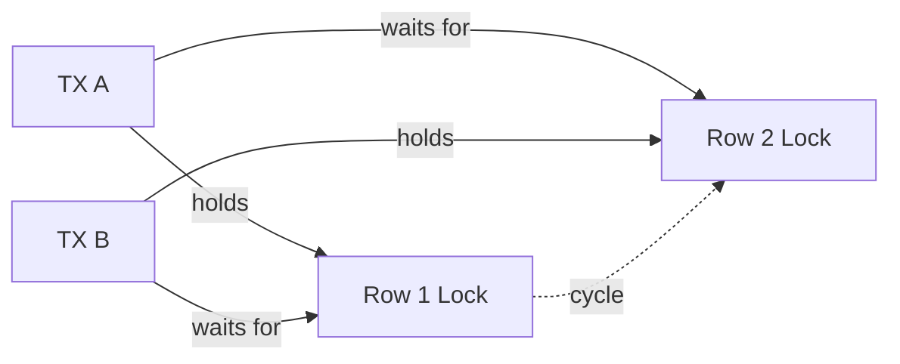
```mermaid
flowchart LR
    A[TX A] -->|holds| R1[Row 1 Lock]
    A -->|waits for| R2[Row 2 Lock]
    B[TX B] -->|holds| R2
    B -->|waits for| R1
    R1 -.->|cycle| R2
```

### 📶 Gradual Depth

**Level 1 - What it is:**
A deadlock is when two transactions are stuck waiting for each other. PostgreSQL detects this automatically and cancels one transaction so the other can continue.

**Level 2 - How to use it:**
Wrap transactions in retry logic. When you receive a deadlock error (SQLSTATE 40P01), roll back and retry the entire transaction. Access rows in a consistent order (e.g., always by ascending primary key) to prevent cycles.

**Level 3 - How it works:**
After waiting `deadlock_timeout` milliseconds, the blocked backend builds a wait-for graph by examining `pg_locks` for lock conflicts. If it finds a cycle, it aborts itself with `ERROR: deadlock detected`. The DETAIL log message shows the full chain: which transactions held and waited for which locks, on which tuples. The surviving transaction is unblocked and proceeds.

**Level 4 - Production mastery:**
High deadlock rates indicate an access pattern problem, not a database problem. Common root causes: inconsistent row ordering in batch updates, concurrent updates to parent and child rows in different orders, and retry storms where retried deadlock victims immediately re-deadlock. Monitor `pg_stat_database.deadlocks` for the per-database deadlock counter. Use log analysis to identify the recurring deadlock pattern and fix the application access order.

### ⚙️ How It Works

**Phase 1 - Lock wait:** Transaction A requests a row lock held by Transaction B. A enters the wait queue and starts a timer for `deadlock_timeout`.

**Phase 2 - Timeout trigger:** After `deadlock_timeout` (default 1s) with no progress, A's backend invokes the deadlock detector.

**Phase 3 - Graph walk:** The detector traverses the wait-for graph: A waits for B; does B wait for anyone? If B waits for A (directly or transitively through other transactions), a cycle exists.

**Phase 4 - Victim selection:** PostgreSQL aborts the transaction that triggered the check (the one that has been waiting). This is simpler than cost-based victim selection but effective.

**Phase 5 - Recovery:** The victim receives `ERROR: deadlock detected` and must ROLLBACK. The surviving transaction's lock is granted, and it proceeds.

```
  Detection Timeline
  t=0s: TX A starts waiting for TX B
  t=1s: deadlock_timeout fires
        -> build wait-for graph
        -> cycle found: A->B->A
        -> abort TX A
        -> TX B unblocked, proceeds
```

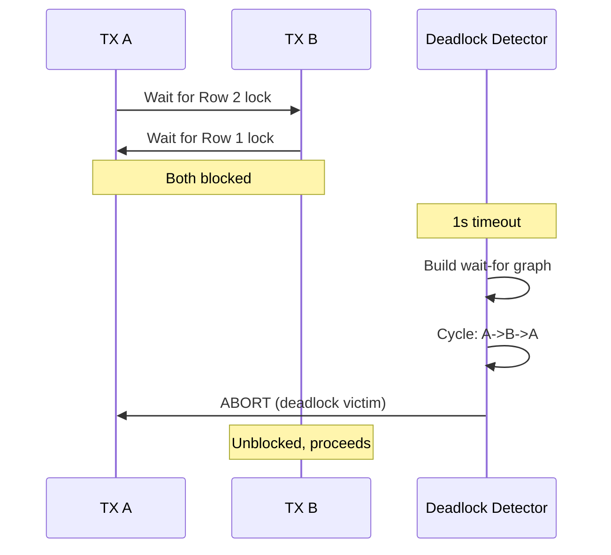
```mermaid
sequenceDiagram
    participant A as TX A
    participant B as TX B
    participant DD as Deadlock Detector
    A->>B: Wait for Row 2 lock
    B->>A: Wait for Row 1 lock
    Note over A,B: Both blocked
    Note over DD: 1s timeout
    DD->>DD: Build wait-for graph
    DD->>DD: Cycle: A->B->A
    DD->>A: ABORT (deadlock victim)
    Note over B: Unblocked, proceeds
```

**BAD:**

```sql
-- Opposite lock order = deadlock
-- TX1: UPDATE accounts WHERE id=1;
--       UPDATE accounts WHERE id=2;
-- TX2: UPDATE accounts WHERE id=2;
--       UPDATE accounts WHERE id=1;
```

**GOOD:**

```sql
-- Consistent lock order
-- TX1: UPDATE accounts WHERE id=1;
--       UPDATE accounts WHERE id=2;
-- TX2: UPDATE accounts WHERE id=1;
--       UPDATE accounts WHERE id=2;
```

### 🚨 Failure Modes

**Failure 1 - Deadlock storm from batch operations:**
**Symptom:** `pg_stat_database.deadlocks` counter climbs rapidly. Application logs show repeated deadlock errors. Throughput collapses.
**Root cause:** Multiple batch jobs update overlapping sets of rows in different orders. Each job acquires row locks in the order rows are found (e.g., based on different WHERE clauses), creating crossing lock patterns.
**Diagnostic:**

```sql
SELECT datname, deadlocks
FROM pg_stat_database
WHERE deadlocks > 0;
-- Check PostgreSQL log for DETAIL messages
```

**Fix:** Sort rows by primary key before updating within each batch. Use `SELECT ... FOR UPDATE ORDER BY id` to lock rows in consistent order. Alternatively, serialize batch jobs through advisory locks.

**Failure 2 - Deadlock retry amplification:**
**Symptom:** Deadlock rate increases exponentially under load. Retried transactions immediately re-deadlock with other retrying transactions.
**Root cause:** Retry logic fires immediately after deadlock error, causing retried transactions to collide with other retried transactions in the same conflict pattern.
**Diagnostic:**

```
Application logs showing rapid deadlock-retry-deadlock
cycles with increasing frequency.
```

**Fix:** Add randomized exponential backoff to retry logic: wait a random duration (e.g., 50-200ms) before retrying. This desynchronizes conflicting transactions.

### 🔬 Production Reality

A typical pattern in order processing: Transaction A updates `orders` row, then updates the customer's `accounts` row. Transaction B updates the same customer's `accounts` row, then updates the `orders` row. Under concurrent load, A holds the order lock and waits for the account lock while B holds the account lock and waits for the order lock. The fix: establish a canonical lock ordering across the application - always acquire locks in the order (accounts, then orders) regardless of the business operation. This is documented as a team convention and enforced through code review. The deadlock counter drops to zero.

### ⚖️ Trade-offs & Alternatives

| Aspect                 | PostgreSQL deadlock detection | Application-level ordering      | Optimistic concurrency (retry on conflict) |
| ---------------------- | ----------------------------- | ------------------------------- | ------------------------------------------ |
| Detection method       | Wait-for graph after timeout  | Prevention (no cycles possible) | Version check at commit                    |
| Performance cost       | 1s detection delay            | Zero (no deadlocks occur)       | Retry cost on conflict                     |
| Application complexity | Low (automatic)               | Moderate (enforced ordering)    | High (retry logic everywhere)              |
| Throughput impact      | Low (rare events)             | None                            | Varies with conflict rate                  |
| Data integrity         | Guaranteed                    | Guaranteed                      | Guaranteed (if retry is correct)           |

### ⚡ Decision Snap

**USE WHEN:**

- Deadlocks are rare (< 1 per minute) and retry logic handles them gracefully
- Application access patterns are inherently unpredictable (user-driven concurrent edits)
- Cost of preventing all deadlocks exceeds cost of detecting and retrying

**AVOID WHEN:**

- Deadlock rate exceeds 10 per minute - fix the access pattern instead of relying on detection
- Real-time systems where 1s detection delay is unacceptable

**PREFER application-level lock ordering WHEN:**

- The set of resources locked per transaction is predictable
- Performance requirements demand zero deadlock overhead
- Team can enforce consistent ordering through code conventions

### ⚠️ Top Traps

| #   | Misconception                                     | Reality                                                                                                                       |
| --- | ------------------------------------------------- | ----------------------------------------------------------------------------------------------------------------------------- |
| 1   | Deadlocks indicate a PostgreSQL bug               | Deadlocks are a normal consequence of conflicting application access patterns; PostgreSQL handles them correctly              |
| 2   | Reducing deadlock_timeout reduces deadlock impact | Lower timeout only detects faster; it does not prevent deadlocks. Prevention requires consistent lock ordering                |
| 3   | Only two transactions can deadlock                | N transactions can form a cycle (A waits for B, B waits for C, C waits for A); PostgreSQL detects cycles of any length        |
| 4   | The transaction that did less work is aborted     | PostgreSQL aborts the transaction that triggered the timeout check, not the one with less work                                |
| 5   | Foreign key checks cannot cause deadlocks         | INSERT into a child table acquires a key-share lock on the parent row; concurrent operations on parent and child can deadlock |

### 🪜 Learning Ladder

**Prerequisites:**

- SQL-090 Row-Level vs Table-Level Locking - understand the lock types that participate in deadlocks
- SQL-091 Lock Escalation and Contention - understand lock wait mechanics

**THIS:** SQL-092 Deadlock Detection and Resolution

**Next steps:**

- SQL-093 Advisory Locks - Application-Level Coordination - lightweight locks that can prevent deadlock-prone patterns
- SQL-070 Long Transaction Anti-Pattern - long transactions increase deadlock windows
- SQL-104 Zero-Downtime Schema Migrations - migration deadlocks with concurrent DDL and DML

**The Surprising Truth:**
The most common deadlock in PostgreSQL production systems is not between two UPDATE statements - it is between an INSERT into a child table (which acquires a FOR KEY SHARE lock on the parent row) and an UPDATE of the parent row (which acquires FOR NO KEY UPDATE). This cross-table, cross-lock-type deadlock is invisible unless you understand PostgreSQL's implicit foreign key locking.

**Further Reading:**

- PostgreSQL Documentation: Deadlocks (postgresql.org/docs/current/explicit-locking.html#LOCKING-DEADLOCKS)
- Dijkstra, E.W. "Hierarchical Ordering of Sequential Processes", Acta Informatica, 1971
- PostgreSQL Documentation: deadlock_timeout parameter (postgresql.org/docs/current/runtime-config-locks.html)

**Revision Card:**

1. Deadlocks are cycles in the wait-for graph; PostgreSQL detects them after deadlock_timeout (default 1s) and aborts one transaction
2. Prevention beats detection: access rows in consistent primary key order across all transactions
3. Foreign key constraints create implicit locks that cause non-obvious cross-table deadlocks

---

---

# SQL-093 Advisory Locks - Application-Level Coordination

**TL;DR** - Advisory locks are PostgreSQL-managed locks on arbitrary integer keys, enabling application-level coordination like job deduplication and distributed mutexes without touching table rows.

### 🔥 Problem Statement

Applications frequently need coordination beyond row-level locking: ensuring only one worker processes a batch job, preventing duplicate cron executions, or serializing access to external resources. Without advisory locks, teams create "lock tables" with `SELECT ... FOR UPDATE` on synthetic rows, adding schema complexity, VACUUM overhead, and contention on real table pages. Advisory locks provide a lightweight, in-memory mechanism for application-level coordination that does not touch heap pages, does not create dead tuples, and does not require VACUUM.

### 📜 Historical Context

Advisory locks were introduced in PostgreSQL 8.2 (2006) as a response to common patterns where applications created lock tables or used external coordination mechanisms like Redis or ZooKeeper. The implementation reuses PostgreSQL's existing lock manager infrastructure, adding a namespace for "advisory" locks keyed by one or two 32-bit integers (or a single 64-bit integer). Session-level and transaction-level variants were added to support different lifecycle requirements. The feature has remained stable with minimal changes since its introduction.

### 🔩 First Principles

**CORE INVARIANTS:**

1. Advisory locks are managed by the PostgreSQL lock manager but have no relation to any table or row - they lock abstract integer keys
2. Session-level advisory locks persist until explicitly released or the session ends; transaction-level locks release at COMMIT/ROLLBACK
3. Advisory locks participate in deadlock detection like any other PostgreSQL lock

**DERIVED DESIGN:**
The lock manager stores advisory locks in the same hash table as regular locks, using the advisory lock key as the lock identifier. This means advisory locks benefit from the same deadlock detection, wait queue management, and `pg_locks` visibility as regular locks. Two modes are available: exclusive (one holder) and shared (multiple holders).

**THE TRADE-OFF:**
**Gain:** Zero heap I/O, no dead tuples, no VACUUM overhead; purely in-memory coordination with full deadlock detection.
**Cost:** Lock manager memory consumption (each advisory lock uses a lock table slot); no automatic release for session-level locks (forgetting to release causes resource leaks); keys are opaque integers, making debugging harder.

### 🧠 Mental Model

> Think of a hotel front desk with numbered key slots. Any guest can request a specific slot number (key). If the slot is empty, they get the key. If occupied, they wait. The keys do not open any actual room - they are just tokens of agreement between guests about who gets to do something.

- "Key slot number" -> advisory lock key (integer)
- "Getting the key" -> `pg_advisory_lock(key)` succeeds
- "Key does not open a room" -> no connection to any table or row

**Where this analogy breaks down:** Advisory locks can be shared (multiple guests hold the same key) or exclusive. The `try` variants return immediately if the key is unavailable rather than waiting.

### 🧩 Components

- **pg_advisory_lock(key)** - acquire exclusive session-level lock (blocks if held)
- **pg_try_advisory_lock(key)** - non-blocking version; returns true/false
- **pg_advisory_xact_lock(key)** - transaction-level; auto-releases at COMMIT/ROLLBACK
- **pg_advisory_unlock(key)** - release a session-level lock
- **pg_locks** - advisory locks visible with `locktype = 'advisory'`
- **Two-key variant** - `pg_advisory_lock(key1, key2)` using two int4 values

```
  Advisory Lock Usage Pattern
  Worker A:
    pg_try_advisory_lock(12345)
    -> true (acquired)
    -> process job
    -> pg_advisory_unlock(12345)

  Worker B (concurrent):
    pg_try_advisory_lock(12345)
    -> false (already held)
    -> skip job (another worker has it)
```

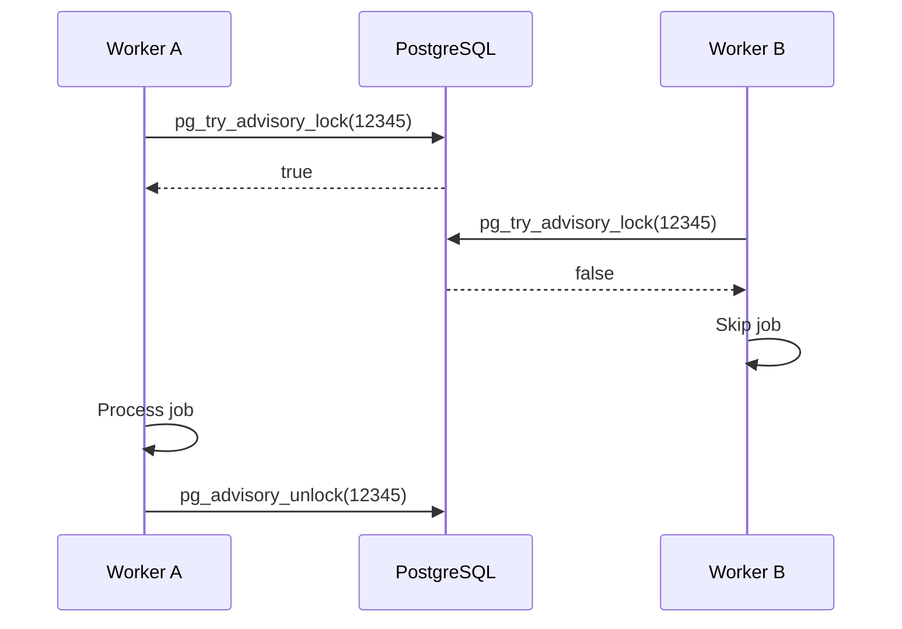
```mermaid
sequenceDiagram
    participant WA as Worker A
    participant PG as PostgreSQL
    participant WB as Worker B
    WA->>PG: pg_try_advisory_lock(12345)
    PG-->>WA: true
    WB->>PG: pg_try_advisory_lock(12345)
    PG-->>WB: false
    WB->>WB: Skip job
    WA->>WA: Process job
    WA->>PG: pg_advisory_unlock(12345)
```

### 📶 Gradual Depth

**Level 1 - What it is:**
Advisory locks let your application claim a "named lock" in PostgreSQL using an integer key. Other sessions can check if the lock is held before proceeding. The database does not enforce what the lock protects - your application decides.

**Level 2 - How to use it:**
For job deduplication: `SELECT pg_try_advisory_lock(hashtext('daily_report'))` returns true if no other session holds it. Process the job, then call `pg_advisory_unlock`. For transaction-scoped work: use `pg_advisory_xact_lock` which releases automatically at transaction end.

**Level 3 - How it works:**
The lock manager stores advisory locks in the same shared memory hash table as table and row locks. The key is stored as the lock's "object" identifier. Exclusive advisory locks conflict with each other; shared advisory locks (`pg_advisory_lock_shared`) allow multiple holders. Deadlock detection works across advisory and regular locks - if a session holds an advisory lock and waits for a regular lock that is held by another session waiting for the same advisory lock, PostgreSQL detects the cycle.

**Level 4 - Production mastery:**
Key design is critical. Use `hashtext('meaningful_name')` to generate deterministic integer keys from human-readable names. For entity-scoped locks, use the two-key variant: `pg_advisory_lock(table_oid, entity_id)` to namespace by table. Monitor advisory lock usage via `pg_locks WHERE locktype = 'advisory'`. Beware: session-level advisory locks accumulate if not released, consuming lock table slots. In PgBouncer transaction-mode pooling, session-level advisory locks are unsafe because sessions are recycled - use transaction-level locks only.

### ⚙️ How It Works

**Phase 1 - Key generation:** Application generates an integer key from a meaningful identifier. Common patterns: `hashtext('job_name')` for named locks, `(table_oid, row_id)` for entity locks.

**Phase 2 - Lock acquisition:** `pg_advisory_lock(key)` requests an exclusive advisory lock from the lock manager. If available, granted immediately. If held by another session, the caller blocks (or returns false for `try` variant).

**Phase 3 - Protected work:** The application performs the coordinated work (process job, run migration, update external system).

**Phase 4 - Release:** For session-level: explicit `pg_advisory_unlock(key)`. For transaction-level: automatic at COMMIT/ROLLBACK. Session-level locks can be acquired multiple times and must be released the same number of times.

```
  Advisory Lock with PgBouncer
  Session mode:   SAFE (session = connection)
  Transaction mode: DANGER for session locks
                    SAFE for xact locks only

  Recommendation:
  PgBouncer transaction mode
    -> use pg_advisory_xact_lock() only
    -> never use pg_advisory_lock()
```

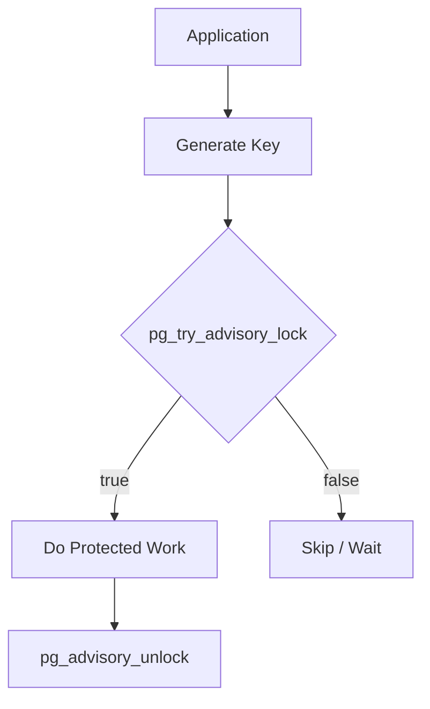
```mermaid
flowchart TD
    APP[Application] --> KEY[Generate Key]
    KEY --> TRY{pg_try_advisory_lock}
    TRY -->|true| WORK[Do Protected Work]
    TRY -->|false| SKIP[Skip / Wait]
    WORK --> REL[pg_advisory_unlock]
```

**BAD:**

```sql
-- Session lock + PgBouncer tx mode
SELECT pg_advisory_lock(42);
-- Lost on connection reassignment
```

**GOOD:**

```sql
BEGIN;
SELECT pg_advisory_xact_lock(42);
-- Do work
COMMIT;  -- lock auto-released
```

### 🚨 Failure Modes

**Failure 1 - Session lock leak:**
**Symptom:** Lock table fills up over time. `pg_locks` shows growing advisory lock entries from long-lived sessions. Eventually: "ERROR: out of shared memory."
**Root cause:** Application acquires session-level advisory locks but fails to release them in error paths (missing `finally` block or `ENSURE` clause).
**Diagnostic:**

```sql
SELECT pid, classid, objid, granted,
       mode
FROM pg_locks
WHERE locktype = 'advisory'
ORDER BY pid;
```

**Fix:** Use transaction-level advisory locks (`pg_advisory_xact_lock`) wherever possible. For session-level locks, implement release in `finally`/`ensure` blocks. Monitor advisory lock count per session.

**Failure 2 - Advisory lock with PgBouncer transaction pooling:**
**Symptom:** Session-level advisory locks appear released prematurely or are held by the wrong application session. Coordination breaks silently.
**Root cause:** PgBouncer transaction pooling reassigns database sessions between application connections at transaction boundaries. A session-level advisory lock acquired by connection A may be visible to connection B after reassignment.
**Diagnostic:**

```
Check PgBouncer pool mode (should be
session mode for session-level advisory
locks, or use xact-level locks only).
```

**Fix:** Switch to `pg_advisory_xact_lock` when using PgBouncer in transaction mode. Or switch PgBouncer to session mode for connections that use advisory locks.

### 🔬 Production Reality

A job scheduling system uses advisory locks to prevent duplicate execution: each job type gets a unique lock key derived from `hashtext(job_name)`. Under PgBouncer transaction-mode pooling, a subtle bug appears: Worker A acquires a session-level advisory lock, processes a job, and releases it. But between acquisition and release, PgBouncer reassigns the database session. Worker B now gets a connection that appears to have the lock available (different database session), acquires it, and both workers process the same job simultaneously. The fix: switch all advisory locks to `pg_advisory_xact_lock` (transaction-scoped), ensuring locks are released when PgBouncer reclaims the connection at transaction end.

### ⚖️ Trade-offs & Alternatives

| Aspect                | Advisory locks        | Lock table pattern    | Redis distributed lock | External coordinator (ZooKeeper) |
| --------------------- | --------------------- | --------------------- | ---------------------- | -------------------------------- |
| Infrastructure        | Built into PostgreSQL | Built into PostgreSQL | Separate Redis server  | Separate ZK cluster              |
| I/O overhead          | None (in-memory)      | Heap I/O + VACUUM     | Network I/O            | Network I/O                      |
| Cross-database        | No                    | No                    | Yes                    | Yes                              |
| Deadlock detection    | Yes (PostgreSQL)      | Yes (PostgreSQL)      | No (timeout only)      | Yes (session expiry)             |
| Failure mode on crash | Auto-release          | Auto-release          | TTL expiry             | Ephemeral node removal           |

### ⚡ Decision Snap

**USE WHEN:**

- Coordinating work between PostgreSQL-connected workers (job deduplication, cron guard, migration serialization)
- Need lightweight locking without table I/O or VACUUM overhead
- All participants connect to the same PostgreSQL instance

**AVOID WHEN:**

- Coordination spans multiple databases or non-PostgreSQL systems
- Using PgBouncer in transaction mode with session-level advisory locks

**PREFER Redis/external locks WHEN:**

- Coordination involves services that do not connect to PostgreSQL
- Lock granularity requires TTL-based auto-expiry (advisory locks have no built-in TTL)

### ⚠️ Top Traps

| #   | Misconception                                               | Reality                                                                                                                               |
| --- | ----------------------------------------------------------- | ------------------------------------------------------------------------------------------------------------------------------------- |
| 1   | Advisory locks protect tables or rows                       | Advisory locks protect nothing automatically; they are abstract coordination tokens that your application must check                  |
| 2   | Session-level locks are safer than transaction-level        | Session-level locks persist beyond transaction boundaries and are prone to leaks; transaction-level locks auto-release                |
| 3   | Advisory lock keys are globally unique                      | Keys are namespaced per database only; different databases can have conflicting keys without interaction                              |
| 4   | pg_try_advisory_lock is always better than blocking variant | Non-blocking acquisition requires application logic to handle the "not acquired" case; blocking is simpler when waiting is acceptable |
| 5   | Advisory locks work correctly with all connection poolers   | PgBouncer transaction mode breaks session-level advisory locks; only transaction-level locks are safe                                 |

### 🪜 Learning Ladder

**Prerequisites:**

- SQL-090 Row-Level vs Table-Level Locking - understand the lock infrastructure advisory locks reuse
- SQL-092 Deadlock Detection and Resolution - advisory locks participate in deadlock detection

**THIS:** SQL-093 Advisory Locks - Application-Level Coordination

**Next steps:**

- SQL-102 Connection Pooling - PgBouncer and HikariCP - understand pooling modes that affect advisory lock safety
- SQL-104 Zero-Downtime Schema Migrations - advisory locks guard migration execution
- SQL-113 Sharding Strategies - Application vs Proxy - distributed coordination beyond single-instance advisory locks

**The Surprising Truth:**
Advisory locks are the most underused feature in PostgreSQL. Teams routinely add Redis to their stack for job deduplication or distributed locking when a simple `pg_try_advisory_lock(hashtext('job_name'))` would eliminate the external dependency, the network hop, and the TTL-expiry race condition - with full deadlock detection included for free.

**Further Reading:**

- PostgreSQL Documentation: Advisory Locks (postgresql.org/docs/current/explicit-locking.html#ADVISORY-LOCKS)
- PostgreSQL Documentation: Advisory Lock Functions (postgresql.org/docs/current/functions-admin.html#FUNCTIONS-ADVISORY-LOCKS)
- PgBouncer Documentation: Pool Modes (pgbouncer.github.io/config.html)

**Revision Card:**

1. Advisory locks are in-memory locks on integer keys - no heap I/O, no dead tuples, no VACUUM overhead
2. Use transaction-level locks (pg_advisory_xact_lock) with PgBouncer; session-level locks break under transaction pooling
3. Derive keys from meaningful names with hashtext() to avoid magic numbers and collisions

---

---

# SQL-094 Query Planner and Cost-Based Optimization

**TL;DR** - PostgreSQL's query planner evaluates multiple execution strategies, estimates each one's cost using table statistics, and selects the plan with the lowest estimated total cost.

### 🔥 Problem Statement

A SQL query declares WHAT data to retrieve but not HOW. The database must decide: which indexes to use, which join algorithm, which scan direction, what join order. For a query joining five tables, there are 5! = 120 possible join orderings, each with multiple join algorithms and scan methods. At production scale, picking the wrong plan turns a 10 ms query into a 10 minute query. The query planner must explore the plan space efficiently and pick the cheapest plan using statistical estimates of data distribution, table sizes, and I/O costs.

### 📜 Historical Context

Cost-based query optimization originates from IBM's System R and the Selinger optimizer (1979), which introduced dynamic programming for join ordering and cost estimation based on table statistics. PostgreSQL's planner is a descendant of this tradition, using a bottom-up dynamic programming approach for small numbers of tables and a Genetic Query Optimizer (GEQO) for queries joining more than 12 tables (configurable via `geqo_threshold`). The cost model has evolved over decades, adding support for index-only scans, parallel query plans, and parameterized paths.

### 🔩 First Principles

**CORE INVARIANTS:**

1. The planner evaluates multiple candidate plans and selects the one with the lowest estimated total cost
2. Cost estimation depends on statistics (pg_statistic) collected by ANALYZE - stale statistics cause wrong plans
3. The planner optimizes for estimated I/O + CPU cost, not actual execution time

**DERIVED DESIGN:**
For each table, the planner considers access paths: sequential scan, index scan (for each relevant index), bitmap index scan, and index-only scan. For each join, it considers nested loop, hash join, and merge join. For join ordering, it uses dynamic programming (up to `geqo_threshold` tables) to find the cheapest ordering. The cost model uses configurable parameters (`seq_page_cost`, `random_page_cost`, `cpu_tuple_cost`) to translate physical operations into cost units.

**THE TRADE-OFF:**
**Gain:** Declarative SQL - the planner finds efficient execution strategies without manual hint-based optimization.
**Cost:** Planning overhead for complex queries; wrong estimates lead to catastrophically bad plans; limited ability to override planner decisions without hints (PostgreSQL has no optimizer hints).

### 🧠 Mental Model

> Think of the planner as a GPS navigation system. You specify the destination (query result), and the GPS evaluates multiple routes (plans), estimates each one's travel time (cost) based on traffic data (statistics), and picks the fastest route. If the traffic data is stale, the GPS may route you through a traffic jam (bad plan).

- "Traffic data" -> pg_statistic (table and column statistics)
- "Route options" -> candidate execution plans
- "Estimated travel time" -> plan cost in arbitrary units

**Where this analogy breaks down:** A GPS can reroute mid-trip; the query planner commits to a plan before execution starts and cannot change it mid-query (except with adaptive execution in some other databases).

### 🧩 Components

- **Parser** - converts SQL text into a parse tree
- **Rewriter** - applies view definitions and rules
- **Planner/Optimizer** - generates candidate plans, estimates costs, selects cheapest
- **Executor** - runs the selected plan node by node
- **pg_statistic** - stores per-column statistics (most common values, histogram, correlation, distinct count)
- **Cost model** - functions estimating I/O and CPU cost for each plan node
- **GEQO** - genetic algorithm for join ordering when table count exceeds `geqo_threshold`

```
  Query Processing Pipeline
  SQL Text -> Parser -> Rewriter -> Planner
              |                      |
              v                      v
           Parse Tree        Plan 1 (cost=100)
                             Plan 2 (cost=50)  <-win
                             Plan 3 (cost=200)
                                     |
                                     v
                                  Executor
                                     |
                                     v
                                  Results
```

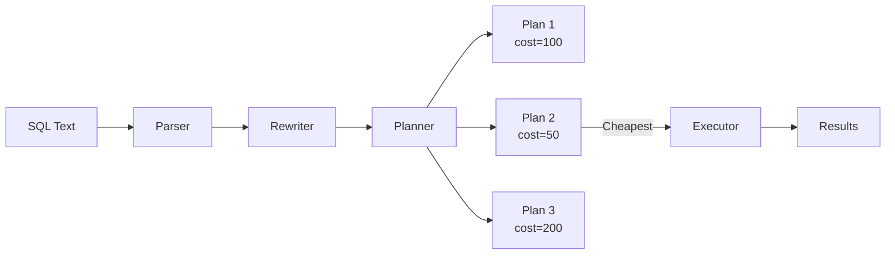
```mermaid
flowchart LR
    SQL[SQL Text] --> P[Parser]
    P --> RW[Rewriter]
    RW --> PL[Planner]
    PL --> P1["Plan 1\ncost=100"]
    PL --> P2["Plan 2\ncost=50"]
    PL --> P3["Plan 3\ncost=200"]
    P2 -->|Cheapest| EX[Executor]
    EX --> RES[Results]
```

### 📶 Gradual Depth

**Level 1 - What it is:**
The query planner is the component that decides HOW to execute your SQL query. It picks which indexes to use, how to join tables, and in what order - all automatically.

**Level 2 - How to use it:**
Run `EXPLAIN` before your query to see the plan. Run `EXPLAIN ANALYZE` to see the plan with actual execution times. Compare estimated rows to actual rows - large discrepancies indicate stale statistics. Run `ANALYZE tablename` to refresh statistics.

**Level 3 - How it works:**
For each table, the planner generates access paths with estimated costs. A sequential scan costs `seq_page_cost * pages + cpu_tuple_cost * rows`. An index scan costs `random_page_cost * index_pages + cpu_index_tuple_cost * index_tuples`. The planner builds join trees bottom-up, combining the cheapest access paths with join algorithms, and prunes dominated plans (higher cost, same result) at each level.

**Level 4 - Production mastery:**
The most common planner failure is cardinality misestimation: the planner estimates a filter will return 100 rows, but it returns 100,000. This causes it to pick nested loop join (good for small results) instead of hash join (good for large results). Fix by running `ANALYZE`, creating extended statistics (`CREATE STATISTICS` for correlated columns), or adjusting `default_statistics_target`. When the planner consistently picks wrong plans for a specific query, use `pg_hint_plan` extension (third party) or rewrite the query to guide the planner.

### ⚙️ How It Works

**Phase 1 - Access path generation:** For each table in the query, generate all possible scan methods (sequential, each applicable index, bitmap). Estimate selectivity of WHERE clauses using pg_statistic.

**Phase 2 - Join ordering (dynamic programming):** For N tables, build optimal join trees bottom-up. Start with 2-table joins, then 3-table, etc. At each level, keep only the cheapest plan for each set of tables joined.

**Phase 3 - Join algorithm selection:** For each join pair, evaluate nested loop, hash join, and merge join. Cost depends on estimated row counts and available memory (`work_mem`).

**Phase 4 - Plan finalization:** Add sort nodes (if ORDER BY requires it), aggregate nodes (for GROUP BY), limit nodes, and other top-level operations. Select the complete plan with the lowest total cost.

```
  Join Order Optimization (3 tables)
  Tables: A(100), B(10000), C(50)

  2-way:   A-B  cost=500
           A-C  cost=150  <- cheapest start
           B-C  cost=2000

  3-way:  (A-C)-B  cost=150+300=450  <-win
          (A-B)-C  cost=500+200=700
          (B-C)-A  cost=2000+100=2100
```

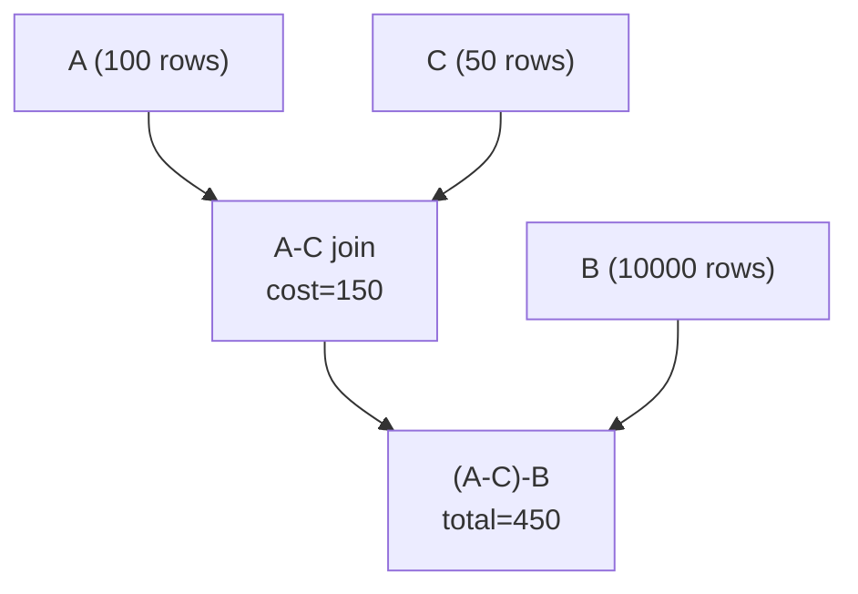
```mermaid
flowchart TD
    A["A (100 rows)"]
    B["B (10000 rows)"]
    C["C (50 rows)"]
    AC["A-C join\ncost=150"]
    ACB["(A-C)-B\ntotal=450"]
    A --> AC
    C --> AC
    AC --> ACB
    B --> ACB
```

**BAD:**

```sql
SET enable_seqscan = off;
SELECT * FROM large_table
WHERE status = 'active';
-- Disables seq scan for session
```

**GOOD:**

```sql
ANALYZE large_table;
EXPLAIN ANALYZE
SELECT * FROM large_table
WHERE status = 'active';
-- Let planner decide with good stats
```

### 🚨 Failure Modes

**Failure 1 - Cardinality misestimation:**
**Symptom:** `EXPLAIN ANALYZE` shows estimated rows differing from actual rows by 10x or more. Query uses nested loop where hash join would be faster.
**Root cause:** Stale statistics, correlated columns not captured by single-column statistics, or non-uniform data distribution.
**Diagnostic:**

```sql
EXPLAIN ANALYZE
SELECT * FROM orders o
JOIN customers c ON o.customer_id = c.id
WHERE o.status = 'pending'
  AND o.region = 'EU';
-- Compare "rows=" (estimated) vs "actual"
```

**Fix:** Run `ANALYZE orders;`. Create extended statistics: `CREATE STATISTICS orders_status_region (dependencies) ON status, region FROM orders;`. Increase `default_statistics_target` for columns with skewed distributions.

**Failure 2 - Wrong index selection:**
**Symptom:** Planner uses a sequential scan on a large table when an index exists. Or uses an index scan when sequential would be faster.
**Root cause:** Cost parameters (`random_page_cost`, `seq_page_cost`) do not reflect actual storage performance. On SSDs, `random_page_cost` should be close to `seq_page_cost` (e.g., 1.1 vs 1.0), not the default 4.0.
**Diagnostic:**

```sql
SHOW random_page_cost;
SHOW seq_page_cost;
-- If on SSD and random_page_cost = 4:
SET random_page_cost = 1.1;
EXPLAIN ANALYZE <query>;
-- Compare plans and times.
```

**Fix:** Set `random_page_cost = 1.1` (or similar) for SSD storage. Set `effective_cache_size` to ~75% of total RAM to help the planner estimate cache hit likelihood.

### 🔬 Production Reality

A common production pattern: a query runs fine for months, then suddenly slows from 5 ms to 30 seconds after a data migration. Investigation reveals the migration loaded 500,000 rows with `status = 'archived'`, skewing the statistics for the `status` column. The planner now estimates `WHERE status = 'active'` returns 80% of rows (the new average) instead of 2% (the pre-migration reality). It switches from index scan to sequential scan. An immediate `ANALYZE` fixes the statistics, and the plan reverts. The lesson: any bulk data change should be followed by `ANALYZE` on affected tables.

### ⚖️ Trade-offs & Alternatives

| Aspect               | PostgreSQL CBO                         | Oracle CBO              | MySQL optimizer          | Hint-based (manual) |
| -------------------- | -------------------------------------- | ----------------------- | ------------------------ | ------------------- |
| Plan selection       | Statistics-based                       | Statistics-based        | Statistics + heuristics  | Developer chooses   |
| Adaptability         | Re-plans per execution (parameterized) | Adaptive cursor sharing | Limited                  | None                |
| Hint support         | None (third-party pg_hint_plan)        | Extensive hint syntax   | Limited hints            | Full control        |
| GEQO for large joins | Yes (>12 tables)                       | Star transformation     | Limited                  | N/A                 |
| Plan caching         | Prepared statement plans               | Cursor cache            | Query cache (deprecated) | N/A                 |

### ⚡ Decision Snap

**USE WHEN:**

- Diagnosing slow queries: always start with EXPLAIN ANALYZE
- After bulk data loads: run ANALYZE to update statistics
- Tuning cost parameters for your storage hardware (SSD vs HDD)

**AVOID WHEN:**

- Do not disable planner components (enable_hashjoin = off) in production - fix the root cause instead
- Do not over-engineer statistics targets for all columns; focus on columns in WHERE and JOIN clauses

**PREFER manual query rewriting WHEN:**

- The planner consistently misestimates a specific pattern and statistics fixes do not help
- CTEs or subquery restructuring can provide the planner with better intermediate cardinality estimates

### ⚠️ Top Traps

| #   | Misconception                                            | Reality                                                                                                                           |
| --- | -------------------------------------------------------- | --------------------------------------------------------------------------------------------------------------------------------- |
| 1   | A higher cost number always means a slower query         | Cost is in arbitrary units relative to `seq_page_cost`; it estimates I/O+CPU, not wall-clock time                                 |
| 2   | EXPLAIN shows the actual performance                     | EXPLAIN shows estimated costs; only EXPLAIN ANALYZE shows actual execution times                                                  |
| 3   | PostgreSQL always uses indexes when they exist           | The planner may choose a sequential scan if it estimates the query will read most of the table - this is often correct            |
| 4   | More indexes always improve query performance            | Each index adds planning overhead, and the planner may choose a suboptimal index; targeted indexes outperform broad coverage      |
| 5   | The planner sees parameter values in prepared statements | After several executions, PostgreSQL may use a generic plan that does not see parameter values, potentially choosing a worse plan |

### 🪜 Learning Ladder

**Prerequisites:**

- SQL-060 Execution Plans Deep Dive - EXPLAIN ANALYZE - know how to read execution plans
- SQL-061 Index Types - B-Tree, Hash, GIN, GiST, BRIN - understand the access paths the planner considers

**THIS:** SQL-094 Query Planner and Cost-Based Optimization

**Next steps:**

- SQL-095 Statistics and Cardinality Estimation - deeper dive into the statistics the planner depends on
- SQL-096 Join Algorithms - Nested Loop, Hash, Merge - understand the join strategies the planner chooses between
- SQL-097 Plan Regression and pg_stat_statements - detecting when the planner starts choosing worse plans

**The Surprising Truth:**
PostgreSQL has no optimizer hints by design. The project philosophy is that if the planner chooses a bad plan, the fix should be better statistics, better cost parameters, or planner improvements - not per-query overrides that become unmaintainable. This forces teams to fix root causes instead of applying band-aids, but it also means there is no escape hatch when the planner is wrong.

**Further Reading:**

- Selinger et al. "Access Path Selection in a Relational Database Management System", ACM SIGMOD, 1979
- PostgreSQL Documentation: Planner Cost Constants (postgresql.org/docs/current/runtime-config-query.html)
- PostgreSQL Documentation: EXPLAIN (postgresql.org/docs/current/sql-explain.html)

**Revision Card:**

1. The planner uses statistics-based cost estimation to select the cheapest execution plan from many candidates
2. Stale statistics are the #1 cause of bad plans - run ANALYZE after bulk data changes
3. Set random_page_cost close to seq_page_cost on SSDs to prevent the planner from over-penalizing index scans
